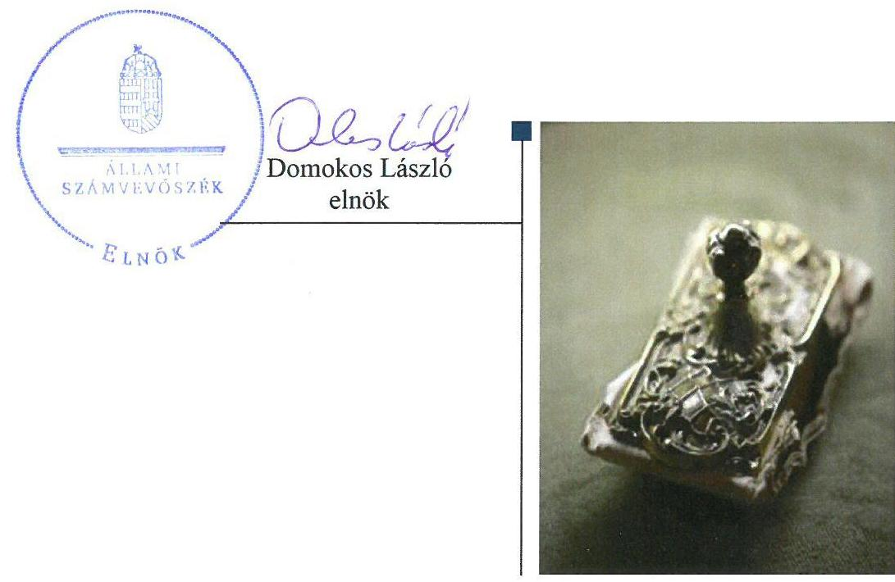

# Jelentés 

## Önkormányzatok belső kontrollrendszere

Az önkormányzatok belső
kontrollrendszere kialakításának és múködtetésének ellenőrzése Rudabánya
2018.

---

# Jelentés 

## Önkormányzatok belsó kontrollrendszere

Az önkormányzatok belső
kontrollrendszere kialakításának és múködtetésének ellenőrzése Rudabánya
2018. O\& hó 入千 nap

---

# AZ ELLENŐRZÉST FELÜGYELTE:

- RENKŐ ZSUZSANNA felügyeleti vezető
- AZ ELLENŐRZÉST VEZETTE ÉS A VÉGREHAJTÁSÁÉRT FELELŐS:
  - DR. TIMÁR BALÁZS ellenőrzésvezető
  - A PROGRAM ÖSSZEÁLLÍTÁSÁÉRT FELELŐS:
    - TÓTPÁL SZABOLCS osztályvezető

**IKTATÓSZÁM:** EL-0113-042/2018

**TÉMASZÁM:** 30

**ELLENŐRZÉS-AZONOSÍTÓ SZÁM:** V078409, V078915

Jelentéseink az Országgyűlés számítógépes hálózatán és az Interneta a www.asz.hu címen is olvashatóak.

---

# TARTALOMJEGYZÉK 

■ ÖSSZEGZÉS ..... 5
■ AZ ELLENŐRZÉS CÉLJA ..... 6
■ AZ ELLENŐRZÉS TERÜLETE ..... 7
■ AZ ELLENŐRZÉS HÁTTERE, INDOKOLTSÁGA ..... 8
■ A JELENTÉS LÉNYEGES KÉRDÉSKÖREI ..... 10
■ AZ ELLENŐRZÉS HATÓKÖRE ÉS MÓDSZEREI ..... 11
■ MEGÁLLAPÍTÁSOK ..... 14
■ JAVASLATOK ..... 18
■ MELLÉKLETEK ..... 21
I. sz. melléklet: Értelmező szótár ..... 21
II. sz. melléklet: Az integritás szemlélet érvényesítésével és az integritás kontrollrendszer kiépítettségével kapcsolatos megállapítások ..... 24
■ FÜGGELÉK: ÉSZREVÉTELEK ..... 25
■ RÖVIDÍTÉSEK JEGYZÉKE ..... 27

---

.

---

# ÖSSZEGZÉS 

Rudabánya Város Önkormányzatánál a belső kontrollrendszer a 2016. évben szabályszerű volt, az biztosította a közpénzfelhasználás szabályosságát és a nemzeti vagyonnal való felelős gazdálkodást. A befektetési döntéseket szabályszerűen hozták meg. A befektetett vagyon valós értékéről a számviteli szabálytalanságok miatt nem álltak rendelkezésre megbízható adatok.

## Az ellenőrzés társadalmi indokoltsága

Magyarország Alaptörvénye az önkormányzatoktól is elvárja a kiegyensúlyozott, átlátható és fenntartható költségvetési gazdálkodás elvének érvényesítését. Az önkormányzatok által betöltött társadalmi szerep, az általuk kezelt közpénz nagysága, a nemzeti vagyon átruházására vagy hasznosítására vonatkozó döntéseik sokrétűsége egyaránt indokolttá tették a számvevőszéki ellenőrzések folytatását. A korábbi évek ellenőrzési tapasztalatai igazolták azt, hogy a belső kontrollrendszer kialakítása és múködtetése nélkül nem valósítható meg a közpénzek, a közvagyon szabályos, gazdaságos, hatékony és eredményes felhasználása. A kockázatok alapján fennállt a lehetősége annak, hogy az önkormányzatok befektetési döntései, továbbá a döntések végrehajtása és számviteli elszámolása nem voltak teljes mértékben szabályszerűek, és a kapcsolódó belső kontrollrendszerek sem múködtek minden esetben megfelelően.

Rudabánya Város Önkormányzata 2016. december 31-én 7,9 millió Ft üzleti célú részesedéssel és 3500 ezer Ft értékű, üzleti célból vásárolt ingatlannal rendelkezett.

## Főbb megállapítások, következtetések

A belső kontrollrendszer kialakítása és múködtetése a 2016. évben szabályszerű volt, a közpénzekkel és a nemzeti vagyonnal való átlátható és felelős gazdálkodás érvényesült.

A befektetésekkel kapcsolatos döntéseket minden esetben a jogszabályokkal összhangban a Képviselő-testület hozta meg.

Az üzleti célú részesedések helytelen besorolása, a 2015-2016. években történt tőkeleszállítások elmaradt elszámolása miatt az Önkormányzat beszámolója a befektetett közvagyon nagyságát és annak változását nem a valóságnak megfelelően mutatta be. A részesedések leltározását a jogszabályi előírás ellenére nem végezték el.

A szervezeti integritás érdekében kiépített kontrollok nem voltak egyensúlyban a kockázatokkal, ezért az integritás fejlesztése, további kontrollok kiépítése szükséges.

---

# AZ ELLENŐRZÉS CÉLJA 

Az ellenőrzés célja annak megállapítása volt, hogy szabályszerűen történt-e a Rudabánya Város Önkormányzata belső kontrollrendszerének kialakítása és működtetése, az biztosította-e Rudabánya Város Önkormányzatánál a közpénzfelhasználás szabályosságát, a közpénzekkel és a nemzeti vagyonnal történő szabályszerű és felelős gazdálkodást, a beszámolási és adatszolgáltatási kötelezettségek szabályszerű teljesítését. Az ellenőrzés keretében értékeltük az önkormányzat korrupciós kockázatainak kezelését szolgáló integritás kontrollok kiépítettségét és az integritás szemlélet érvényesülését.

Az Önkormányzat egyes befektetési tevékenységeinek ellenőrzése során az ellenőrzés célja annak értékelése volt, hogy a jogszabályi előírásoknak megfelelően alakították-e ki a belső kontrollrendszert, a kontrollkörnyezet biztosí-totta-e a befektetési tevékenységek szabályszerű végzését.

---

# **Rudabánya Város Önkormányzata**

A Borsod-Abaúj-Zemplén megye északi részén fekvő Rudabánya lélekszáma 2016. január 1-én 2661 fő volt. Rudabánya Város Önkormányzata az ellenőrzött időszakban 7 tagú Képviselő testülettel^{1} rendelkezett, melynek munkáját egy állandó bizottság – a Pénzügyi és Szociális Bizottság – támogatta. A Rudabányai Közös Önkormányzati Hivatalon kívül további két intézménnyel látta el feladatait, gazdasági társaságban többségi tulajdonnal nem rendelkezett. A településen egy nemzetiségi önkormányzat (Rudabánya Város Német Nemzetiségi Önkormányzat) működött.

Rudabánya Város polgármestere 2002 óta tölti be tisztségét, az ellenőrzött időszakban hivatalban lévő jegyző 2007-től látta el feladatát. A Rudabányai Közös Önkormányzati Hivatal 2016. évben három település – Rudabánya, Izsófalva, Alsótelekes – közös hivatalaként, Rudabánya székhellyel végezte tevékenységét, gazdasági szervezettel nem rendelkezett, az ott foglalkoztatott köztisztviselők száma 2016. december 31-én 18 fő volt.

Rudabánya Város Önkormányzata a 2016. évi éves költségvetési beszámolója szerint 745 141 ezer Ft költségvetési bevételt ért el, valamint 727 383 ezer Ft költségvetési kiadást teljesített. Az eszközvagyon értéke 2016. december 31-én 1 609 240 ezer Ft volt. A költségvetési évben esedékes kötelezettség állomány 23 934 ezer Ft-ot, a költségvetési évet követően esedékes kötelezettség állomány 12 444 ezer Ft-ot tett ki. A befektetett pénzügyi eszközök 2016. december 31-én kimutatott állománya 8 790 ezer Ft volt.

A 2016. december 31-én Rudabánya Város Önkormányzata az alábbi tartós részesedést megtestesítő értékpapírokkal, illetve üzletrésszel rendelkezett:

1. táblázat

|  Részesedés megnevezése (megszerzés éve) | Részesedés könyv szerinti értéke (ezer Ft)  |
| --- | --- |
|  BORSODVÍZ Önkormányzati Közüzemű Szolgáltató Zrt. | 930  |
|  Nyugat-borsodi Területfejlesztő Nkft. (2016) | 100  |
|  Első Hazai Energiaportfolió Zrt. (1997) | 7 760  |
|  ÖSSZESEN | 8 790  |

*Forrás: Az Önkormányzat adatszolgáltatása*

Az ellenőrzés nem terjedt ki a BORSODVÍZ Önkormányzati Közüzemű szolgáltató Zrt-ben fennálló részesedésre, mivel annak tevékenysége köz-feladat-ellátáshoz kapcsolódik.

---

# AZ ELLENŐRZÉS HÁTTERE, INDOKOLTSÁGA 

A demokratikus társadalmakban alapvető igény, hogy a közpénzeket, a közvagyont használók tevékenységükről elszámoljanak, ahhoz egyértelmű és érvényesíthető felelősségi szabályok társuljanak. Ennek a jogos igénynek az érvényesítéséhez meg kell teremteni azokat a folyamatokat, rendszereket, amelyek nélkülözhetetlenek az elszámoltatáshoz. Az elszámoltatás eredményes múködtetéséhez szükség van a megfelelő információs, kontroll-, értékelési- és beszámolási rendszerek kialakítására. A belső kontrollok kiépítettsége hozzájárul az integritási szemlélet kialakításához és érvényesüléséhez. A belső kontrollrendszer kialakítása és múködtetése nélkül nem valósítható meg a közpénzek, a közvagyon szabályos, gazdaságos, hatékony és eredményes felhasználása.

A belső kontrollrendszer azt a célt szolgálja, hogy az államháztartás szervei múködésük és gazdálkodásuk során a tevékenységeket szabályszerűen, gazdaságosan, hatékonyan, eredményesen hajtsák végre, teljesítsék elszámolási kötelezettségeiket és megvédjék az erőforrásokat a veszteségektől, a károktól, a nem rendeltetésszerű használattól. A belső kontrollrendszer magában foglalja mindazon szabályokat, eljárásokat, gyakorlati módszereket és szervezeti struktúrákat, kockázatkezelési technikákat, kontrolltevékenységeket, amelyek segítséget nyújtanak a szervezetnek céljai eléréséhez. A belső kontrollrendszer szabályozása háromszintű, a törvényi előírásokat az Áht. ${ }^{2}$ és az Mötv. ${ }^{3}$, a rendeleti szintű szabályozást az Ávr. ${ }^{4}$ és a Bkr. ${ }^{5}$ tartalmazza, amelyeket útmutatói szinten az NGM ${ }^{6}$ által kiadott standardok és kézikönyvek támogatnak.

A MEGFELELŐ BELSŐ KONTROLLRENDSZER jelentősen csökkenti a hibák és szabálytalanságok kockázatát. Az ÁSZ ${ }^{7}$ célja, hogy javuljon az ellenőrzött önkormányzatok belső kontrollrendszerének szabályozottsága, múködésének megfelelősége, szabályszerűsége, hozzájárulva ezzel az egyensúlyi helyzet fenntarthatóságának biztosításához, biztosítva az önkormányzatnál a közpénzfelhasználás szabályosságát, a közpénzekkel és a nemzeti vagyonnal történő szabályszerű, gazdaságos, hatékony és eredményes gazdálkodást. Az ÁSZ ellenőrzés tapasztalatai nem csupán a közvetlenül ellenőrzött önkormányzatokat támogathatják, hanem a „jó gyakorlat" elterjesztésével azok az önkormányzatok is átvehetik a pozitív példákat, ahol nem végez ellenőrzést az ÁSZ.

AZ ÖNKORMÁNYZATI VAGYONGAZDÁLKODÁS keretében az önkormányzatok átmenetileg szabad pénzeszközeinek befektetését jogszabály nem tiltja, a befektetések jellege nem korlátozott, a pénzpiaci szolgáltatók közül az önkormányzatok a kínált szolgáltatás és annak költségei alapján, szabadon választhatnak, azonban a veszteséges gazdálkodás kockázatai és következményei az önkormányzatokat terhelik. A szabad pénzeszközök felhasználása során kiemelten fontos a felelős gazdálkodás érvényesülése, amely összhangban kell, hogy legyen az önkormányzati gazdálkodás alapelveivel. Az ellenőrzéssel feltárásra kerülhetnek azok a kockázatok, amelyek az önkormányzatok gazdálkodásával, ezen belül be-

---

fektetési tevékenységeivel, kontrollkörnyezetével kapcsolatosak és a befektetési tevékenységek szabályszerű végrehajtását befolyásolják. Az ellenőrzéssel az önkormányzatok befektetési/vagyongazdálkodási döntéseinek összessége értékelhetővé válik, és megalapozott megállapítás tehető arra vonatkozóan, hogy milyen hatást gyakoroltak az önkormányzat vagyonára a képviselő-testület döntései.

# AZ ELLENŐRZÉS VÁRHATÓ HASZNOSULÁSA 

NÉGY SZINTEN valósul meg. A törvényalkotás számára összegzett tapasztalatok állnak rendelkezésre a belső kontrollrendszer önkormányzati területen való kialakításáról, működtetéséről és hatásairól. Az ellenőrzés az ellenőrzött számára visszajelzést ad a belső kontrollrendszer kialakításában és múködésében lévő hiányosságokról, javaslataival hozzájárul azok kiküszöböléséhez. Az ellenőrzés megállapításait és javaslatait más szervezetek is hasznosíthatják a rendezett gazdálkodási keretek kialakításához. A társadalom számára jelzi, hogy közpénz nem maradhat ellenőrizetlenül, az ÁSZ értékteremtő rend kialakításához és megőrzéséhez hozzájáruló tevékenysége pozitív hatással lesz a szervezetről kialakított összkép formálásában.

---

# A JELENTÉS LÉNYEGES KÉRDÉSKÖREI 

1.     - A belső kontrollrendszer egyes pillérei biztositották-e a befektetési tevékenységek szabályszerü végzését a 2012 - 2016. években?
2.     - Az egyes befektetésekkel kapcsolatos döntéshozatal és a döntések végrehajtása szabályszerü volt-e?
3.     - Az egyes befektetések számviteli elszámolása, nyilvántartása szabályszerü volt-e?
4.     - A belső kontrollrendszer kialakítása és müködtetése a 2016. évben szabályszerű volt-e, az biztositotta-e a közpénzfelhasználás szabályosságát, a nemzeti vagyonnal történő felelős gazdálkodást?
5. Érvényesült-e az integritás szemlélet és ennek megfelelően kiépítették-e az integritás kontrollrendszert az önkormányzatnál?

---

# AZ ELLENŐRZÉS HATÓKÖRE ÉS MÓDSZEREI 

## Az ellenőrzés típusa

A belső kontrollrendszer ellenőrzése esetében megfelelőségi ellenőrzés, a befektetési tevékenységnél szabályszerűségi ellenőrzés.

## Az ellenőrzött időszak

A belső kontrollrendszer kialakításának és működtetésének ellenőrzése a 2016. január 1. és december 31. közötti időszakra terjedt ki. Az önkormányzatok egyes befektetési tevékenységeinek ellenőrzése tekintetében az ellenőrzött időszak a 2012. január 1. - 2016. december 31. közötti időszak. Ezen felül az önkormányzat befektetésekkel kapcsolatos döntés-előkészítésének és döntéshozatalának szabályszerűségét a 2012. január 1. előtti időszakra visszanyúlóan is ellenőriztük, mivel a 2016. december 31én meglévő befektetések egy részére 2012. január 1-je előtt került sor. Az integritás szemlélet érvényesülését a 2016. évre vonatkozó adatszolgáltatás alapján értékeltük.

## Az ellenőrzés tárgya

Rudabánya Város Önkormányzatának, mint éves költségvetési beszámoló készítésére kötelezett szervezetnek és a Rudabányai Közös Önkormányzati Hivatalnak belső kontrollrendszere. Az integritás szemlélet érvényesülése.

Az Önkormányzat 2016. december 31-én meglévő, a Számv. tv. ${ }^{8}$ 3. § (6) bekezdés 2. és 3. pontja szerint az értékpapírokban megtestesülő befektetései, lekötött betétei. Továbbá a 2016. december 31-én meglévő, Rudabánya Város Önkormányzata szabad pénzeszközei terhére, adásvételi szerződés keretében megszerzett, a kötelező feladatok ellátását nem szolgáló, Rudabánya Város Önkormányzata üzleti vagyonába tartozó, az ellenőrzött időszakban (2012-2016.) megszerzett ingatlanok, továbbá az - időkorlátozás nélkül megszerzett - kulturális javak (műtárgyak, műalkotások, stb.), illetve egyéb értéktárgyak (pl. ékszerek, befektetési nemesfém).

Az ellenőrzés kiterjedt minden olyan körülményre és adatra, amely az ÁSZ jogszabályban meghatározott feladatainak teljesítéséhez, valamint a program végrehajtása folyamán felmerült újabb összefüggések feltárásához szükséges volt.

## Az ellenőrzött szervezet

Rudabánya Város Önkormányzata

---

# Az ellenőrzés jogalapja 

Az ÁSZ tv. 1. § (3) bekezdésében foglaltak alapján az ÁSZ általános hatáskörrel végzi a közpénzekkel és az állami és önkormányzati vagyonnal való felelős gazdálkodás ellenőrzését. Az ÁSZ tv. 5. § (2) bekezdése alapján az államháztartás gazdálkodásának ellenőrzése keretében az ÁSZ ellenőrzi a helyi önkormányzatok gazdálkodását, valamint az ÁSZ tv. 5. § (6) bekezdése alapján ellenőrzése során értékeli az államháztartás számviteli rendjének betartását és a belső kontrollrendszer múködését.

## Az ellenőrzés módszerei

Az ellenőrzést a nemzetközi standardokat irányadónak tekintve az ellenőrzési program szempontjai, kérdései, az ellenőrzött időszakban hatályos jogszabályok, az ellenőrzés szakmai szabályok és módszertanok figyelembe vételével végeztük.

Az ellenőrzés lefolytatásához az önkormányzat a tanúsítványok elektronikus kitöltésével, valamint az ÁSZ által kért dokumentumok elektronikus megküldésével szolgáltatott adatokat. A rendelkezésre bocsátott adatok, információk kontrollja az ellenőrzés keretében történt. A jelentésben használt fogalmak magyarázatát az I. sz. melléklet tartalmazza.

A belső kontrollrendszer jogszabályi előírások szerinti kialakításának és múködtetésének szabályszerűségét, az erre irányuló ellenőrzési kérdésekre adott válaszok összesítése alapján a 2016. január 1. és december 31. közötti időszakra, pillérenként (kontrollkörnyezet, kockázatkezelési rendszer, kontrolltevékenységek, információs és kommunikációs rendszer, monitoring rendszer) és összesítetten is értékeltük.

A belső kontrollrendszer egyes pilléreinek kialakítása és múködtetése „szabályszerü" volt, amennyiben az értékelt területen az elért igen válaszok százalékban kifejezett, egész számra kerekített aránya meghaladta a 85\%-ot, „részben szabályszerü" volt, ha a 85\%-ot nem haladta meg, de 60\%-nál nagyobb volt, „nem szabályszerü" volt, ha nem haladta meg a 60\%-ot. Az Önkormányzat ${ }^{9}$ belső kontrollrendszerének összesített értékelése megegyezett a pillérenként (kontrollterületenként) alkalmazott százalékos értékelésekkel, a következő eltérésekkel. A kontrollrendszer egésze esetében a „szabályszerü" értékelésnek a százalékos értéken felül további feltétele volt, hogy egyik kontrollterület sem kaphat „nem szabályszerű" értékelést, a „részben szabályszerű" értékelés további feltétele volt, hogy legfeljebb egy ellenőrzött kontrollterület lehetett „nem szabályszerű" értékelésú. Az összesített értékelés a százalékos értéktől függetlenül „nem szabályszerű" volt, ha az ellenőrzött kontrollterületek közül több mint egynek „nem szabályszerű" volt az értékelése.

A kontrolltevékenységek múködésének megfelelőségét a foglalkoztatottak személyi juttatásaival, a külső személyi juttatásokkal, a múködési kiadásokkal és a felhalmozási célú kiadásokkal kapcsolatos kifizetések esetében mintavétellel ellenőriztük. „Megfelelőnek" értékeltünk egy ellenőrzött területet, amennyiben 95\%-os bizonyossággal a teljes sokaságban a hibaarány legfeljebb 10\%, „nem megfelelőnek", amennyiben 10\%-nál magasabb arányt képviselt. Abban az esetben, ha a teljes sokaság tekintetében

---

a 10\%-os hibaarányhoz való viszony megítélésének megbízhatósága nem érte el a 95\%-ot, annak elérése érdekében értékelésünket további szempontokkal egészítettük ki, és figyelembe vettük a feltárt hibák értékét.

Az integritás szemlélet érvényesülésének értékelése az önkormányzat által kitöltött kérdőív alapján, az abban foglalt válaszok megalapozottságának kontrollja mellett történt.

---

# 1. A belső kontrollrendszer egyes pillérei biztosították-e a befektetési tevékenységek szabályszerű végzését a 2012 - 2016. években? 

Összegző megállapítás

A belső kontrollrendszer egyes pillérei a 2012-2016. években nem biztosították a befektetési tevékenység szabályszerű végzését, ezáltal a befektetett vagyonnal való átlátható és felelős gazdálkodás nem érvényesült.

A KONTROLLKÖRNYEZET kialakítása nem volt szabályszerű, mert az Önkormányzat 2012. január 1. és 2014. január 30. közötti időszakra a Számv. tv. 14. § (3) bekezdésének előírása ellenére nem alakította ki számviteli politikáját. Ezáltal a Számv. tv 14. § (4) bekezdésének előírása ellenére nem rögzítette írásban - a befektetések elszámolásával, nyilvántartásával kapcsolatban sem - azokat a szabályokat, előírásokat és módszereket, amelyekkel meghatározza, hogy mit tekint a számviteli elszámolás, az értékelés szempontjából lényegesnek, jelentősnek, nem lényegesnek, nem jelentősnek. Továbbá nem határozta meg azt, hogy a törvényben biztosított választási, minősítési lehetőségek közül melyeket, milyen feltételek fennállása esetén alkalmaz, az alkalmazott gyakorlatot milyen okok miatt kell megváltoztatni. Az Önkormányzat a 2012-2013. évekre a Számv. tv. 161. § (1) bekezdésének előírása ellenére nem készített számlarendet, ezáltal nem kerültek kijelölésre azok a főkönyvi számlák, amelyek az egyes befektetésekkel kapcsolatos gazdasági eseményeket érintik.

KOCKÁZATKEZELÉSI RENDSZERT a 2012-2014. években a Bkr. 3. § b) pontjának előírása ellenére nem alakítottak ki és a Bkr. 7. § (1) bekezdésének előírása ellenére nem múködtettek. A 2015. január 5-én hatályba léptetett Kockázatkezelési Szabályzattal ${ }^{10}$ kialakították a Bkr.-nek megfelelő kockázatkezelési rendszert, azonban a Bkr. 7. § (2) bekezdésében foglaltak ellenére nem mértek fel és nem állapítottak meg - a befektetésekre vonatkozóan sem - tevékenységben rejlő és szervezeti célokkal összefüggő kockázatokat.

AZ INFORMÁCIÓS ÉS KOMMUNIKÁCIÓS RENDSZER nem biztosította az Önkormányzat gazdálkodásának átláthatóságát, mivel az Info tv. ${ }^{11}$ 37. § (1) bekezdésének és 1. melléklete III/1. pontjának előírása ellenére nem tette közzé 2012-2013. évi költségvetéseit, továbbá 2012. évi költségvetési beszámolót, ennek következtében a nyilvánosság az önkormányzat befektetett vagyonáról a fenti időszakban nem kapott tájékoztatást.

A MONITORING RENDSZER keretében kialakított és múködtetett belső ellenőrzés a befektetések vonatkozásában nem folytatott le

---

ellenőrzést. A külső ellenőrzések az Önkormányzatot a 2012-2016. években nem érintették.

# 2. Az egyes befektetésekkel kapcsolatos döntéshozatal és a döntések végrehajtása szabályszerű volt-e? 

## Összegző megállapítás

## A befektetési döntések szabályszerűen történtek.

Az Önkormányzat 2016. december 31-én 7760 ezer Ft névértékű tartós részesedést megtestesítő értékpapírt, 100 ezer forint értékű üzletrészt és 3500 ezer Ft értékű üzleti célú ingatlant tartott nyilván. Tartós hitelviszonyt megtestesítő értékpapírral, lekötött betéttel nem rendelkezett, kulturális javakat, egyéb értéktárgyakat nem vásárolt.

Az értékpapírok 1997. évben történt megszerzéséről, az üzleti célú ingatlan adásvételi szerződésének 2013. évben történt megkötésére vonatkozóan, továbbá az üzletrész 2016-ban történt megszerzéséről szabályszerűen a Képviselő-testület döntött.

Az EHEP- részvények nyilvántartására, befektetési ügyleteihez kapcsolódó fizetési és értékpapír forgalmának lebonyolítására az Önkormányzat a Buda-Cash Zrt.-nek adott megbízást. Az Önkormányzat és a befektetési vállalkozás között 1998. április 21-én létrejött szerződés az EHEP részvények nyilvántartására vonatkozó értékpapír- és ügyfélszámla-szerződés volt. A szerződés megfelelt a jogszabályban előírt tartalmi követelményeknek.

## 3. Az egyes befektetések számviteli elszámolása, nyilvántartása szabályszerű volt-e?

Összegző megállapítás

A tartós részesedések téves besorolása, leltározásának hiánya, továbbá a 2015-2016. években a részesedésekből származó ráfordítás elszámolásának elmaradása miatt a befektetett vagyon értékére, annak változására vonatkozó valós számviteli információk nem álltak rendelkezésre.

A részesedések számviteli besorolása nem volt szabályszerű, mert a dematerializált EHEP ${ }^{12}$-részvényeket a 2012-2016. években egyéb tartós részesedések helyett a tartós hitelviszonyt megtestesítő értékpapírok között mutatták ki, megsértve ezzel a Számv. tv. 27. § (4) bekezdésének és az Áhsz. ${ }^{13} 19 . \S$ (3) bekezdésének előírását.

A részesedések részletező nyilvántartása 2014. január 1-t követően nem felelt meg az Áhsz. 14. melléklete VIII. fejezete 2. és 3. pontjában előírtaknak, mert nem tartalmazta a 2. b)- i) és 3. pontokban felsorolt tartalmi elemeket.

Az EHEP-részvények névértéke az EHEP jegyzett tőkéjének leszállítása következtében a 2015. évben 1000 Ft-ról 383,68 Ft-ra, a 2016. évre 224,28 Ft-ra csökkent. Az Önkormányzat az EHEP-részvényekre - a Számv. tv. 85. § (1) bekezdése f) pontjának és az Áhsz. 2 27. § (5a) bekezdése b) pontjának előírása ellenére - 2015. évben 4783 ezer Ft-ot, a 2016. évben

---

tovább 1237 ezer Ft -ot ráfordításként nem számolt el. A mulasztásból eredő hiba összértéke a hatályos számviteli szabályozás szerint nem minősült jelentősnek.

A 2012-2016. évek során az Önkormányzat a Számv. tv. 69. § (1) bekezdésének, az Áhsz. 1 37. § (1)-(3) bekezdéseinek és az Áhsz. 2 22. § (1)-(2) bekezdéseinek előírása ellenére a befektetések mérlegben szereplő értékének alátámasztásához nem állítottak össze olyan leltárt, amely tételesen, ellenőrizhető módon tartalmazza a befektetett eszközöket.

# 4. A belső kontrollrendszer kialakítása és múködtetése a 2016. évben szabályszerű volt-e, az biztosította-e a közpénzfelhasználás szabályosságát, a nemzeti vagyonnal történő felelős gazdálkodást? 

Összegző megállapítás

A gazdálkodás egészét tekintve a belső kontrollrendszer 2016. évi kialakítása és múködtetése szabályszerű volt, az biztosította a közpénzfelhasználás szabályosságát és a nemzeti vagyonnal való felelős gazdálkodást.

A KONTROLLKÖRNYEZET kialakítása a 2016. évben szabályszerű volt, mert a jogszabályban előírt szabályzatokat megalkották.

AZ INTEGRÁLT KOCKÁZATKEZELÉSI RENDSZER kialakításra került, mivel a Hivatal a 2016. évben rendelkezett a kockázatok kezelésének szabályozásával, azt azonban a Bkr. 7. § (1) bekezdésének előírása ellenére nem működtették, a 7. § (2) bekezdésében előírtakkal szemben a tevékenységben rejlő, a szervezeti célokkal összefüggő konkrét kockázatokat nem mérték fel és nem állapították meg.

A KONTROLLTEVÉKENYSÉGEK kialakítása keretében rendelkeztek az Áht. és az Ávr. előírásainak megfelelő, a gazdálkodás részletes rendjét meghatározó gazdálkodási szabályzattal.

A kontrolltevékenység működtetése a gazdálkodás egészét tekintve szabályszerű volt.

AZ INFORMÁCIÓS ÉS KOMMUNIKÁCIÓS RENDSZER kialakítása és működtetése szabályszerű volt, mivel a Bkr.-ben és az Info tv.-ben előírt szabályozási kötelezettségeknek eleget tettek, a belső és külső információ átadására vonatkozó jogszabályi előírásokat a működés során betartották.

Az államháztartás információs rendszerébe történő adatszolgáltatási kötelezettségeknek az Áhsz. ${ }^{14}$ előírásainak megfelelően, határidőben eleget tettek.

A MONITORING RENDSZER kialakítása és működtetése a Bkr.-ben foglalt előírásoknak megfelelt mind az operatív folyamatok nyomon követése, mind az attól független belső ellenőrzés tekintetében.

---

A JEGYZŐ a Bkr.-ben előírt nyilatkozatot a belső kontrollrendszer múködésével kapcsolatban megtette. A nyilatkozat is igazolta, hogy a kockázatkezelés területén a jegyző kizárólag a belső ellenőrzés ajánlásaira, javaslataira támaszkodott, a kockázatkezelési rendszert nem múködtette.

A NEMZETISÉGI ÖNKORMÁNYZAT gazdálkodásával kapcsolatos feladatok ellátásáról a Hivatal a jogszabályi előírásoknak megfelelően gondoskodott.

# 5. Érvényesült-e az integritás szemlélet és ennek megfelelően ki-építették-e az integritás kontrollrendszert az önkormányzatnál? 

Összegző megállapítás

Az Önkormányzatnál kialakított kontrollok nem voltak egyensúlyban a kockázatokkal, az integritás érvényesüléséhez a további kontrollok kiépítése szükséges.

A FÖBB INTEGRITÁS KONTROLLOKAT az Önkormányzat kialakította, azonban az integritást erősítő kontrollok működtetése alacsony szinten valósult meg. Kockázatelemzést csak a belső ellenőrzés keretében végeztek, azok nem terjedtek ki a korrupciós és integritási kockázatokra. Korrupcióellenes képzést a Hivatal munkatársai körében az elmúlt három év során nem tartottak, továbbá nem tették kötelezővé munkatársaiknak, hogy gazdasági, vagy az Önkormányzat tevékenysége szempontjából releváns érdekeltségeikről nyilatkozzanak. Az integritás kontrollok közül hiányzott a külső szakértők alkalmazásának, valamint az ajándékok, meghívások és utaztatások elfogadásának szabályozása. A beszállítókkal, szolgáltatókkal kötött szerződések feltételeit csak három-ötévente vizsgálták felül. Az integritás rendszer értékelésével kapcsolatos további információ a II. sz. mellékletben található.

---

# JAVASLATOK 

Az ÁSZ tv. 33. § (1) bekezdésében foglaltak értelmében az ellenőrzött szervezet vezetője köteles a jelentésben foglalt megállapításokhoz kapcsolódó intézkedési tervet összeállítani és azt a jelentés kézhezvételétől számított 30 napon belül az ÁSZ részére megküldeni. Amennyiben az ellenőrzött szervezet vezetője nem küldi meg határidőben az intézkedési tervet, vagy továbbra sem elfogadható intézkedési tervet küld, az Állami Számvevőszék elnöke az ÁSZ tv. 33. § (3) bekezdése a) és b) pontjaiban foglaltakat érvényesítheti.

## a jegyzőnek:

1. Intézkedjen a belső kontrollrendszer egyes elemei jogszabályi előírásnak megfelelő kialakításáról és müködtetéséről, valamint a gazdálkodási jogkörök gyakorlása során a jogszabályi előírások betartásáról.
(1. számú megállapítás 2. bekezdés 2. mondat 2. tagmondata, 4. számú megállapítás 2. bekezdés 3-4. mondatrésze alapján)
2. Intézkedjen a részesedések jogszabályi előírásoknak megfelelő kimutatásáról a fökönyvi nyilvántartásokban.
(3. számú megállapítás 1. bekezdése alapján)
3. Intézkedjen a részesedésekhez kapcsolódó részletező nyilvántartások jogszabályi előírásoknak megfelelő vezetéséről.
(3. számú megállapítás 2. bekezdése alapján)
4. Intézkedjen a részesedésekkel kapcsolatos gazdasági események jogszabályi előírásoknak megfelelő rögzítéséről a számviteli nyilvántartásokban.
(3. számú megállapítás 3. bekezdés 2. mondata alapján)
5. Intézkedjen az éves költségvetési beszámoló mérlegében kimutatott befektetések jogszabályi előírásoknak megfelelő leltárral történő alátámasztásáról.
(3. számú megállapítás 4. bekezdése alapján)

---

6. Intézkedjen az Állami Számvevőszék ellenőrzése során feltárt hiányosságok és/vagy szabálytalanságok tekintetében a munkajogi felelősség tisztázására irányuló eljárás megindításáról, és ennek eredménye ismeretében tegye meg a szükséges intézkedéseket.
(3. számú megállapítás 1-2. bekezdései,
7. bekezdés 2. mondata és 4. bekezdése alapján)

---

.

---

# MELLÉKLETEK 

- I. SZ. MELLÉKLET: ÉRTELMEZŐ SZÓTÁR
befektetési szolgáltató
belső ellenőrzés
belső kontrollrendszer
belső kontrollrendszer pillérei, kontrollterületei
betét
helyi önkormányzat
a Bszt. szerinti, tevékenység végzésére jogosító engedély alapján, harmadik személy részére, ellenérték fejében, rendszeres gazdasági tevékenysége keretében befektetési szolgáltatást nyújt, vagy befektetési tevékenységet végez, ide nem értve a 3. §ban meghatározottakat (Bszt. 4. § (2) bekezdés 10. pont)
Független, tárgyilagos bizonyosságot adó és tanácsadó tevékenység, amelynek célja, hogy az ellenőrzött szervezet működését fejlessze és eredményességét növelje, az ellenőrzött szervezet céljai elérése érdekében rendszerszemléletű megközelítéssel és módszeresen értékeli, illetve fejleszti az ellenőrzött szervezet irányítási és belső kontrollrendszerének hatékonyságát. (Forrás: Bkr. 2. § b) pontja)
A belső kontrollrendszer a kockázatok kezelése és tárgyilagos bizonyosság megszerzése érdekében kialakított folyamatrendszer, amely azt a célt szolgálja, hogy a müködés és gazdálkodás során a tevékenységeket szabályszerűen, gazdaságosan, hatékonyan, eredményesen hajtsák végre, az elszámolási kötelezettségeket teljesítsék, megvédjék az erőforrásokat a veszteségektől, károktól és nem rendeltetésszerű használattól. (Forrás: Áht. 69. § (1) bekezdése)
A kontrollkörnyezet, a kockázatkezelési rendszer, a kontrolltevékenységek, az információs és kommunikációs rendszer, valamint a nyomon követési (monitoring) rendszer. (Forrás: Bkr. 3. §-a)
a Ptk. szerinti betétszerződés vagy a takarékbetétről szóló 1989. évi 2. törvényerejű rendelet szerinti takarékbetét-szerződés alapján fennálló tartozás, ideértve a hitelintézetnél a fizetésiszámla-szerződés alapján fennálló pozitív számlaegyenleget is (Hpt. 6. § (1) bekezdés 8. pont).
A helyi önkormányzat jogi személy. Az önkormányzati feladatok ellátását a képviselő-testület és szervei biztosítják. A képviselőtestület szervei: a polgármester, a főpolgármester, a megyei közgyűlés elnöke, a képviselő-testület bizottságai, a részönkormányzat testülete, a polgármesteri hivatal, a megyei önkormányzati hivatal, a közös önkormányzati hivatal, a jegyző, továbbá a társulás. A képviselő-testület a feladatkörébe tartozó közszolgáltatások ellátására - jogszabályban meghatározottak szerint - költségvetési szervet, a Polgári perrendtartásról szóló 1952. évi III. törvény szerinti gazdálkodó szervezetet (a továbbiakban: gazdálkodó szervezet), nonprofit szervezetet és egyéb szervezetet (a továbbiakban együtt: intézmény) alapíthat, továbbá szerződést köthet természetes és jogi személlyel vagy jogi személyiséggel nem rendelkező szervezettel. A helyi önkormányzat éves költségvetési beszámolója magába foglalja a helyi önkormányzat - nem költségvetési szerveihez tartozó - feladataihoz kapcsolódó bevételeket és kiadásokat. A helyi önkormányzat összevont (konszolidált) költségvetési beszámolóját a helyi önkormányzatra és költségvetési szerveire vonatkozóan külön-külön beérkezett éves költségvetési beszámolók alapján a Kincstár készíti el és küldi meg az önkormányzatnak. (Forrás: Mötv. 41. § (1), (2), (6) bekezdései; Áhsz. 2. § (1) bekezdése, 6. § (1) bekezdés a) és f) pontja, 30. §-a, 37. § (1) és (6) bekezdése)
minden olyan értékpapír, illetve törvény által értékpapírnak minősített, jogot megtestesítő okirat, amelyben a kibocsátó (adós) meghatározott pénzösszeg rendelkezésére bocsátását elismerve arra kötelezi magát, hogy a pénz (kölcsön) összegét, valamint annak meghatározott módon számított kamatát vagy egyéb hozamát, és az általa esetleg vállalt egyéb szolgáltatásokat az értékpapír birtokosának (a hitele-

---

információs és kommunikációs rendszer
integritás
kockázatkezelési rendszer
kontrollkörnyezet
kontrolltevékenységek
kulturális javak
tartós hitelviszonyt megtestesítő értékpapír
tartós részesedést megtestesítő értékpapír
üzleti vagyon
vagyongazdálkodás
zőnek) a megjelölt időben és módon megfizeti, illetve teljesíti. Ide tartozik különösen: a kötvény, a kincstárjegy, a letéti jegy, a pénztárjegy, a célrészjegy, a takaréklevél, a jelzáloglevél, a hajóraklevél, a közraktárjegy, az árujegy, a zálogjegy, a kárpótlási jegy, a határozott idejű befektetési alap által kibocsátott befektetési jegy (Számv. tv. (6) bekezdés 2. pont)
A költségvetési szerv vezetője által kialakított és működtetett olyan rendszer, mely biztosítja, hogy a megfelelő információk a megfelelő időben eljutnak az illetékes szervezethez, szervezeti egységhez, illetve személyhez. (Forrás: Bkr. 9. § (1) bekezdés)
Az integritás elvek, értékek, cselekvések, módszerek, intézkedések konzisztenciáját jelenti: olyan magatartásmódot, amely meghatározott értékeknek felel meg. Az integritás a közszféra esetében a társadalom által elvárt nyilvánossági, átláthatósági, illetve jogi/etikai normáknak történő megfelelést jelenti. (Forrás: a http://integritas.asz.hu honlapon közzétett „A 2012. évi integritás felmérés eredményeinek összefoglalója" című dokumentum 3. oldal 1. bekezdése)
Olyan irányítási eszközök és módszerek összessége, melynek elemei a szervezeti célok elérését veszélyeztető tényezők (kockázatok) azonosítása, elemzése, csoportosítása, nyomon követése, valamint szükség esetén a kockázati kitettség mérséklése. (Forrás: Bkr. 2. § m) pontja)
A költségvetési szerv vezetője által kialakított olyan elvek, eljárások, belső szabályzatok összessége, amelyben világos a szervezeti struktúra, egyértelműek a felelősségi, hatásköri viszonyok és feladatok, meghatározottak az etikai elvárások a szervezet minden szintjén, átlátható a humánerőforrás-kezelés. (Forrás: Bkr. 6. § (1) bekezdés)
A költségvetési szerv vezetője által a szervezeten belül kialakított (kontroll) tevékenységek, melyek biztosítják a kockázatok kezelését, hozzájárulnak a szervezet céljainak eléréséhez. (Forrás: Bkr. 8. § (1) bekezdés)
az élettelen és élő természet keletkezésének, fejlődésének, az emberiség, a magyar nemzet, Magyarország történelmének kiemelkedő és jellemző tárgyi, képi, hangrögzített, írásos emlékei és egyéb bizonyítékai - az ingatlanok kivételével -, valamint a művészeti alkotások (a kulturális örökség védelméről szóló 2001. évi LXIV. törvény)
tartós hitelviszonyt megtestesítő értékpapírként azokat a befektetési céllal beszerzett értékpapírokat kell kimutatni, amelyek lejárata, beváltása a tárgyévet követő üzleti évben még nem esedékes, és a vállalkozó azokat a tárgyévet követő üzleti évben nem szándékozik értékesíteni (Számv. tv. 27. § (7) bekezdés)
minden olyan nyomdai úton előállított (előállíttatható) vagy dematerializált értékpapír, illetve törvény által értékpapírnak minősített, jogot megtestesítő okirat, amelyben a kibocsátó meghatározott pénzösszeg, illetve pénzértékben meghatározott nem pénzbeli vagyoni érték tulajdonba - vagy használatbavételét elismerve arra kötelezi magát, hogy ezen értékpapír, okirat birtokosának meghatározott vagyoni és egyéb jogokat biztosít. Ide tartozik különösen: a részvény, az üzletrész, a szövetkezeti részesedés, a vagyonjegy, az egyéb társasági részesedés, a határozatlan futamidejű befektetési alap által kibocsátott befektetési jegy, a kockázati tőkejegy, a kockázati tőkerészvény (Számv. tv. (6) bekezdés 3. pont)
a nemzeti vagyon azon része, amely nem tartozik az önkormányzati vagyon esetén a törzsvagyonba (Nvtv. 3. § (1) bekezdés 18. pontja)
a nemzeti vagyongazdálkodás feladata a nemzeti vagyon rendeltetésének megfelelő, az állam, az önkormányzat mindenkori teherbíró képességéhez igazodó, elsődlegesen a közfeladatok ellátásához és a mindenkori társadalmi szükségletek kielégí-

---

téséhez szükséges, egységes elveken alapuló, átlátható, hatékony és költségtakarékos működtetése, értékének megőrzése, állagának védelme, értéknövelő használata, hasznosítása, gyarapítása, továbbá az állam vagy a helyi önkormányzat feladatának ellátása szempontjából feleslegessé váló vagyontárgyak elidegenítése (Nvtv. 7. § (2) bekezdése)

---

# II. SZ. MELLÉKLET: AZ INTEGRITÁS SZEMLÉLET ÉRVÉNYESÍTÉSÉVEL ÉS AZ INTEGRITÁS KONTROLLRENDSZER KIÉPÍTETTSÉGÉVEL KAPCSOLATOS MEGÁLLAPÍTÁSOK 

A Rudabányai Közös Önkormányzati Hivatal által a 2016. évre kitöltött integritás tanúsítvány alapján - négy kockázati területen - a kialakított kontrollokat értékeltük:

| AZ INTEGRITÁS RENDSZERÉNEK ÉRTÉKELÉSE |  |  |  |  |
| :--: | :--: | :--: | :--: | :--: |
| Sorszám | Megnevezés | Maximum elérhető pontszámok | Elért pontszámok | Értékelés |
| 1. | A szervezetnél vannak-e olyan szabályozási hiányosságok, amelyek az integritást veszélyeztetik? | 38 | 33 | A szervezetnél a jogszabályok által előírt kontrollok kiépítettsége támogatja a szervezet integritását. |
| 2. | A szervezet meghatározta-e az általa követendő értékeket, ezek között szerepel-e az integritás erősítése (a korrupció visszaszorítása)? | 9 | 5 | A szervezet világos célokat állított, amelyet külső és belső érdekeltek tudomására is hozott, e célok között azonban a korrupció visszaszorítása nevesített módon nem szerepelt. |
| 3. | A szervezet végez-e rendszeresen kockázatelemzést, ezen belül korrupciós (integritási) kockázatelemzést? | 11 | 4 | A szervezet kockázatelemzése nem teljes körű, nem támogatja megfelelően az integritás kontrollokat. |
| 4. | A szervezet a feltárt kockázat eredményes kezelése érdekében kialakította-e és múködtette-e a jogszabályban kötelezően nem előírt kontrollokat? | 18 | 10 | A szervezet a leglényegesebb integritás kontrollokat múködtette, de az egyéb nem kötelezően előírt kontrollokat nem múködtette.   A kockázatkezelési hiányosságok miatt a szervezetnél kialakított kontrollok nem voltak arányban a kockázatokkal. Forrás: ASZ által készített értékelés |

A kontrollok kiépítettségének főbb hiányosságai az alábbiak voltak:

1. A speciális korrupcióellenes rendszerek tekintetében az Önkormányzatnál:

- kockázatelemzést kizárólag a belső ellenőrzés keretében végeztek, azok nem terjedtek ki a korrupciós és integritási kockázatokra;
- korrupcióellenes képzést az elmúlt három évben nem tartottak.

2. a „lágy" kontrollok (a szervezet által önként bevezetett, kialakított szabályok, követelmények) kialakítását érintően az Önkormányzatnál:

- nem szabályozták az ajándékok, meghívások, utaztatás elfogadásának feltételeit;
- nem szabályozták a külső szakértők alkalmazásának feltételeit;
- az alkalmazottak számára nem tették kötelezővé, hogy a gazdasági vagy egyéb érdekeltségeikről, a szervezet tevékenysége szempontjából releváns összeférhetetlenségről nyilatkozzanak;
- a beszállítókkal, szolgáltatókkal kötött szerződések feltételeit csak három-ötévente vizsgálták felül.

---

# FÜGGELÉK: ÉSZREVÉTELEK 

A jelentéstervezetet a Számvevőszék 15 napos észrevételezésre megküldte az ellenőrzött szervezet vezetőjének az ÁSZ tv. 29. §* (1) bekezdése előírásának megfelelően.

Az ellenőrzött szervezet vezetője az ÁSZ. tv. 29. § (2) bekezdésében foglalt észrevételezési jogával nem élt, a jelentéstervezetre észrevételt nem tett.

[^0]
[^0]:    * 29. § (1) Az Állami Számvevőszék az ellenőrzési megállapításait megküldi az ellenőrzött szervezet vezetőjének vagy az általa megbízott személynek, és annak, akinek személyes felelősségét állapította meg.
    (2) Az ellenőrzött szervezet vezetője és a felelősként megjelölt személy az ellenőrzés megállapításaira tizenöt napon belül írásban észrevételt tehet.
    (3) Az Állami Számvevőszék az észrevételre a beérkezésétől számított harminc napon belül írásban válaszol. A figyelembe nem vett észrevételeket köteles a jelentésben feltüntetni, és megindokolni, hogy azokat miért nem fogadta el.

---

.

---

# RÖVIDÍTÉSEK JEGYZÉKE 

${ }^{1}$ Képviselő-testület
${ }^{2}$ Áht.
${ }^{3}$ Mötv.
${ }^{4}$ Ávr.
${ }^{5}$ Bkr.
${ }^{6}$ NGM
${ }^{7}$ ÁSZ
${ }^{8}$ Számv. tv.
${ }^{9}$ Önkormányzat
${ }^{10}$ Kockázatkezelési Szabályzat
${ }^{11}$ Info. tv.
${ }^{12}$ EHEP
${ }^{13}$ Áhsz. 1
${ }^{14}$ Áhsz. 2

Rudabánya Város Önkormányzatának Képviselő-testülete
az államháztartásról szóló 2011. évi CXCV. törvény
Magyarország helyi önkormányzatairól szóló 2011. évi CLXXXIX. törvény
az államháztartásról szóló törvény végrehajtásáról szóló 368/2011 (XII.31.) Korm. rendelet
a költségvetési szervek belső kontrollrendszeréről és belső ellenőrzéséről szóló 370/2011. (XII. 31.) Korm. rendelet
Nemzetgazdasági Minisztérium
Állami Számvevőszék
a számvitelről szóló 2000. évi C. törvény
Rudabánya Város Önkormányzata
Rudabányai Közös Önkormányzati Hivatal Kockázatkezelési Szabáyzat (hatályos 2015.01.01-től)
az információs önrendelkezési jogról és az információszabadságról szóló 2011. évi CXII. tv.

Első Hazai Energiaportfolió Részvénytársaság
az államháztartás szervezetei beszámolási és könyvvezetési kötelezettségének sajátosságairól szóló 249/2000 (XII.24.) Korm. rendelet
az államháztartás számviteléről szóló 4/2013 (I.11.) Korm. rendelet

---

# ÁLLAMI SZÁMVEVŐSZÉK 

1052 Budapest, Apáczai Csere János utca 10.
Levélcím: 1364 Budapest 4. Pf. 54
Telefon: +36 14849100 Telefax: +36 14849200
www.asz.hu