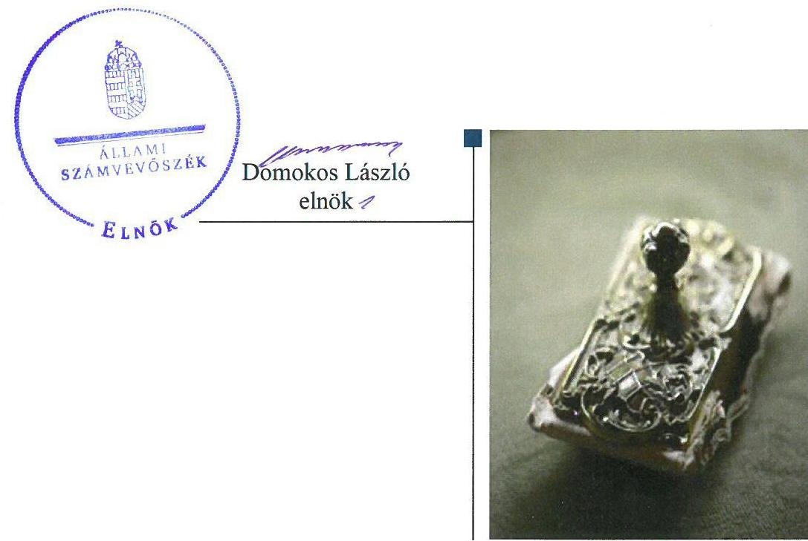
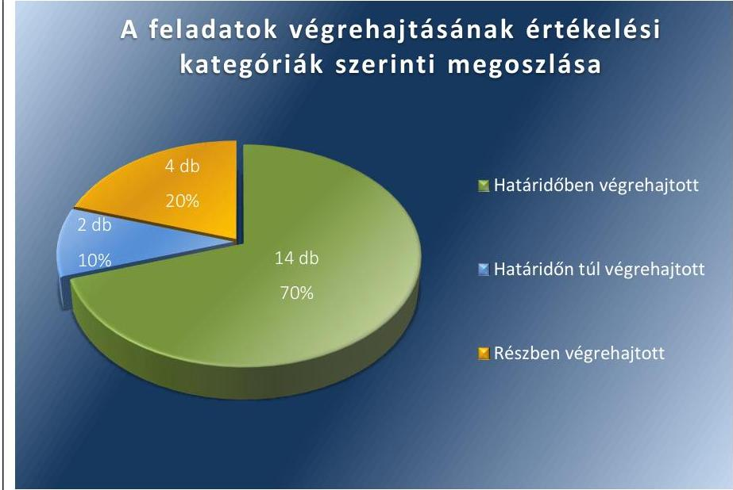

# Jelentés 

## Utóellenőrzések

Az önkormányzatok belső
kontrollrendszere kialakításának és működtetésének utóellenőrzése -
Répcelak Város Önkormányzata
2018. OA hó 34 nap

---

|  AZ ELLENŐRZÉST FELÜGYELTE: |  |  |  |  |   |
| --- | --- | --- | --- | --- | --- |
|   | RENKŐ ZSUZSANNA felügyeleti vezető |  |  |  |   |
|   | AZ ELLENŐRZÉST VEZETTE ÉS A VÉGREHAJTÁSÁÉRT FELELŐS: |  |  |  |   |
|   | EŐRY-BRUDER VIKTÓRIA ellenőrzésvezető |  |  |  |   |
|   | A PROGRAM ÖSSZEÁLLÍTÁSÁÉRT FELELŐS: |  |  |  |   |
|   | JANIK JÓZSEF LÁSZLÓ osztályvezető |  |  |  |   |
|   | A TÉMÁHOZ KAPCSOLÓDÓ KORÁBBI SZÁMVEVŐSZÉKI JELENTÉSEK: |  |  |  |   |
|   | - címe: | Jelentés az önkormányzatok belső kontrollrendszere kialakításának, egyes kontrolltevékenységek és a belső ellenőrzés működésének ellenőrzéséről -Répcelak |  |  |   |
|  Jelentéseink az Országgyűlés számítógépes hálózatán és az Interneten a www.asz.hu címen is olvashatóak. | - sorszáma: | 13179 |  |   |
|   | IKTATÓSZÁM: EL-0077-045/2018. |  |  |  |   |
|   | TÉMASZÁM: 10 |  |  |  |   |
|   | ELLENŐRZÉS-AZONOSÍTÓ SZÁM: V0755122 |  |  |  |   |

---

# TARTALOMJEGYZÉK 

■ ÖSSZEGZÉS ..... 5
■ AZ ELLENŐRZÉS CÉLJA ..... 6
■ AZ ELLENŐRZÉS TERÜLETE ..... 7
■ AZ ELLENŐRZÉS HÁTTERE, INDOKOLTSÁGA ..... 8
■ A JELENTÉS LÉNYEGES KÉRDÉSKÖRE ..... 9
■ AZ ELLENŐRZÉS HATÓKÖRE ÉS MÓDSZEREI ..... 10
■ MEGÁLLAPÍTÁSOK ..... 12
■ MELLÉKLETEK ..... 15
I. sz. melléklet: Az ÁSZ 13179 számú jelentéséhez kapcsolódó intézkedési terv végrehajtása ..... 15
■ FÜGGELÉK: ÉSZREVÉTELEK ..... 23
■ RÖVIDÍTÉSEK JEGYZÉKE ..... 25

---

.

---

# ÖSSZEGZÉS 

Az Állami Számvevőszék Répcelak Város Önkormányzata belső kontrollrendszere kialakításának és működtetésének utóellenőrzése során megállapította, hogy Répcelak Város Önkormányzata az intézkedési tervben meghatározott feladatok jelentős részét végrehajtotta. Ennek eredményeként javult a működés és gazdálkodás során a tevékenységek szabályszerű és szabályozott végrehajtása. Répcelak Város Önkormányzata a tevékenységben rejlő kockázatokkal szembeni intézkedések meghozatalának, a nyomon követési rendszer működtetésének, valamint a közérdekű adatok közzétételére vonatkozó szabályzat felülvizsgálatának elmulasztása miatt továbbra sem biztosítja a szabályszerű és átlátható közpénzfelhasználást.

## Az ellenőrzés társadalmi indokoltsága

Az Állami Számvevőszék stratégiájában célul tűzte ki a számvevőszéki munka hasznosulásának javítását. Ezzel összhangban ellenőrzi, hogy az ellenőrzött szervezetek megvalósították-e a korábbi ellenőrzései által feltárt hibák, hiányosságok és szabálytalanságok megszüntetése céljából kialakított intézkedési terveikben foglaltakat. A rendszeres utóellenőrzések hozzájárulnak a szükséges intézkedések tényleges végrehajtásához, ezáltal a közpénzügyek rendezettségének javulásához, igazolják, hogy lezárult a következmények nélküli ellenőrzések időszaka.

## Főbb megállapítások, következtetések

Répcelak Város Önkormányzata az intézkedést igénylő megállapításokhoz és javaslatokhoz kapcsolódóan összeállított intézkedési tervben meghatározott 20 feladatból 14 feladatot határidőben, kettőt határidőn túl, négyet részben hajtott végre.

A polgármester részére meghatározott egy feladat részben teljesült, mert a korábbi ellenőrzés során feltárt hibák és hiányosságok, szabálytalanságok tekintetében kivizsgálta a körülményeket, azonban a gazdálkodás szabályszerűségét nem kísérte figyelemmel.

A jegyző által határidőben, valamint határidőn túl végrehajtott feladatok - a szervezeti és működési szabályzat módosítása, az etikai szabályzat és az ellenőrzési nyomvonal elkészítése, pénzügyi kulcskontrollokról történő intézkedések, valamint a belső ellenőrzés kialakításával és működtetésével kapcsolatos intézkedések meghozatala - által javult Répcelak Város Önkormányzata belső kontrollrendszerének kialakítása és működtetése. A jegyző által nem végrehajtott feladatok - Répcelak Város Önkormányzata tevékenységében rejlő kockázatokkal kapcsolatos intézkedések meghatározásának, a célok megvalósításának nyomon követését biztosító rendszer működtetésének, valamint a kötelezően közzéteendő adatok nyilvánosságra hozatalának rendjét rögzítő szabályzat felülvizsgálatának hiánya azt mutatják, hogy további intézkedések megtétele szükséges Répcelak Város Önkormányzata belső kontrollrendszerének hatékony és átlátható működése érdekében.

A jegyző vezette az intézkedési tervben meghatározott feladatok végrehajtásáról a jogszabály által előírt nyilvántartást.

---

# AZ ELLENŐRZÉS CÉLJA 

Az ellenőrzés célja annak értékelése volt, hogy a számvevőszéki jelentésben foglalt intézkedést igénylő megállapításokkal összhangban készített intézkedési tervben meghatározott feladatokat az ellenőrzött szervezet végrehajtotta-e.

---

# AZ ELLENŐRZÉS TERÜLETE 

## Répcelak Város Önkormányzata

Répcelak város Vas megyében, a Sárvári járásban fekszik, állandó lakosainak száma a Központi Statisztikai Hivatal Magyarország közigazgatási helynévkönyve alapján 2016. január 1-jén 2632 fő volt.

Répcelak város, Csánig és Nick községek önkormányzatainak képviselő-testületei 2013. március 1-i hatállyal megalapították a Répcelaki Közös Önkormányzati Hivatalt.

A polgármester ${ }^{1}$ a 2014. évi önkormányzati választások óta tölti be tisztségét. A jegyző ${ }^{2}$ 2006. november 1-jétől látja el feladatait.

Az Állami Számvevőszék a 2013. évben ellenőrizte Répcelak Város Önkormányzata belső kontrollrendszere kialakításának, egyes kontrolltevékenységek és a belső ellenőrzés működését a 2012. január 1. és december 31. közötti időszak vonatkozásában. Az erről szóló 13179 számú jelentést 2014. január 13-án hozta nyilvánosságra. Az ellenőrzés célja annak megállapítása volt, hogy a belső kontrollrendszer elemeinek kialakítása, a pénzügyi folyamatokban kulcsszerepet betöltő teljesítésigazolás és érvényesítés, valamint a belső ellenőrzés szabályos működése biztosította-e Répcelak Város Önkormányzatánál a közpénzfelhasználás szabályosságát, hozzájárult-e az értéket teremtő rend követelményének érvényesüléséhez.

Az ÁSZ jelentésben ${ }^{3}$ foglalt javaslatok tekintetében Répcelak Város Önkormányzata egy 20 feladatból álló intézkedési tervet állított össze, amelyben a polgármester részére egy feladatot, míg a jegyző részére 19 feladatot határoztak meg. A képviselő-testület ${ }^{4}$ az intézkedési tervet a 72/2014. (IV. 02.) számú határozatával fogadta el.

Az utóellenőrzés - a 2014. január 13-tól 2017. július 27-ig végrehajtott feladatokat figyelembe véve - az ÁSZ jelentésben a polgármester és a jegyző részére megfogalmazott intézkedést igénylő megállapításokra készített, az ÁSZ ${ }^{5}$ részére megküldött intézkedési tervben foglalt feladatok megvalósításának ellenőrzésére, illetve értékelésére fókuszált.

---

# AZ ELLENŐRZÉS HÁTTERE, INDOKOLTSÁGA 

Az ÁSZ tv. ${ }^{6}$ 33. § (1) bekezdése értelmében a számvevőszéki jelentések intézkedést igénylő megállapításaihoz kapcsolódóan az ellenőrzött szervezet vezetője intézkedési tervet köteles összeállítani, és az Állami Számvevőszék részére megküldeni. Az intézkedési tervben foglaltak megvalósítását - az ÁSZ tv. 33. § (7) bekezdésében foglaltak alapján - az Állami Számvevőszék utóellenőrzés keretében ellenőrizheti. Az intézkedések megvalósulásának értékelése során az Állami Számvevőszék figyelembe veszi az ellenőrzött szervezetek működési feltételeiben, valamint a jogszabályi előírásokban bekövetkezett változásokat.

Az intézkedési tervekben foglalt feladatok hiányos, illetve késedelmes végrehajtása, valamint megvalósításának elmaradása azt mutatja, hogy az ellenőrzések során feltárt hibák, hiányosságok és szabálytalanságok megszüntetése nem kapott kellő hangsúlyt. Ez a szabályszerű működés és a felelős vezetői magatartás vonatkozásában kockázatot hordoz. E kockázatok feltárásával az Állami Számvevőszék utóellenőrzési rendszere fokozza a fegyelmet, és igazolja, hogy a közpénzzel való szabályos gazdálkodás felelőssége elől nem lehet kitérni.

Az utóellenőrzés négy szinten hasznosulhat:
A társadalom szintjén az utóellenőrzés jelzi, hogy a számvevőszéki ellenőrzés megállapításainak van következménye: a hiányosságok megszüntetésére az ellenőrzött szervezet által meghatározott intézkedések végrehajtását is számon kéri az ÁSZ.
$\longrightarrow$ Az ellenőrzött terület szintjén az utóellenőrzés tájékoztatást nyújt a terület döntéshozóinak a hiányosságok kiküszöbölésének jó gyakorlatairól, ezzel lehetőséget biztosítva arra, hogy az ÁSZ ellenőrzési megállapításai, javaslatai a terület nem ellenőrzött szervezeteinek a működése során is hasznosuljanak.
$\longrightarrow$ Az ellenőrzött szervezet szintjén az utóellenőrzés feltárja, hogy a szervezet az intézkedések végrehajtásával hasznosította-e a korábbi ellenőrzési jelentésben a hiányosságok megszüntetése, illetve a kockázatok kezelése érdekében megfogalmazott javaslatokat.
$\longrightarrow$ Az ÁSZ szintjén az utóellenőrzés visszacsatolást ad az ellenőrzési jelentések hasznosulásáról, az intézkedések elmaradása vagy részleges megvalósulása a további ellenőrzésekhez kockázati jelzésként szolgál.

---

# A JELENTÉS LÉNYEGES KÉRDÉSKÖRE 

Az ellenőrzött szervezet az intézkedési tervben foglaltakat az előírt határidőben végrehajtotta-e?

---

# AZ ELLENŐRZÉS HATÓKÖRE ÉS MÓDSZEREI 

## Az ellenőrzés típusa

Megfelelőségi ellenőrzés.

## Az ellenőrzött időszak

Az utóellenőrzés alapját képező ÁSZ jelentés közzétételének napjától (2014. január 13.) az ellenőrzésről szóló kiértesítő levél keltének napjáig (2017. július 27.) tartó időszak.

## Az ellenőrzés tárgya

Az ÁSZ tv. 2011. július 1-jei hatálybalépését követően a számvevőszéki jelentésben foglalt intézkedést igénylő megállapításokkal összhangban - az ellenőrzött szervezet által - készített intézkedési tervben foglaltak végrehajtásának ellenőrzése volt.

Az ellenőrzés kiterjedt minden olyan körülményre és adatra, amely az ÁSZ jogszabályban meghatározott feladatainak teljesítéséhez, valamint a program végrehajtása folyamán felmerült újabb összefüggések feltárásához szükséges volt.

## Az ellenőrzött szervezet

Répcelak Város Önkormányzata

## Az ellenőrzés jogalapja

Az ÁSZ tv. 33. § (7) bekezdése.

## Az ellenőrzés módszerei

Az ÁSZ az ellenőrzést a nemzetközi standardokat irányadónak tekintve az ellenőrzési program ellenőrzési kérdései alapján, az ellenőrzött időszakban hatályos jogszabályok, az ellenőrzés szakmai szabályok és módszertanok figyelembevételével, önálló ellenőrzés keretében végezte.

Az ÁSZ az ellenőrzés ideje alatt az ellenőrzött szervezettel történő kapcsolattartást az ÁSZ SZMSZ7-ének vonatkozó előírásai alapján biztosította.

---

Az utóellenőrzés megállapításait elsősorban az ÁSZ rendelkezésére álló, valamint az ellenőrzött szervezettől elektronikusan bekért dokumentumok alapozták meg.

Az ellenőrzési bizonyítékként felhasználható adatforrások közé tartoztak egyrészt a szakmai programban felsorolt adatforrások, másrészt minden - az ellenőrzés folyamán feltárt, az ellenőrzés szempontjából információt tartalmazó - dokumentum.

Az intézkedési tervben előírt feladatokat azok végrehajthatósága, illetve végrehajtása szempontjából az ÁSZ az alábbiak szerint értékelte:
"határidőben végrehajtott" a feladat, ha a teljesítés dokumentáltan, az intézkedési tervben előírt határidőben és tartalommal megtörtént;
"határidőn túl végrehajtott" a feladat, ha annak teljesítése az intézkedési tervben meghatározott módon, de az előírt határidőn túl történt meg;
"részben végrehajtott" a feladat, ha végrehajtása teljes körűen az intézkedési tervben előírt módon nem történt meg;
"nem végrehajtott" a feladat, ha a végrehajtás nem történt meg, vagy amennyiben a teljesítést nem dokumentálták;
"okafogyottá vált" a feladat, ha végrehajtására - meghatározott esemény bekövetkezése, továbbá külső körülmény, a működést érintő feltétel változása miatt - már nincs szükség, illetve lehetőség, és egyértelműen megállapítható, hogy az intézkedést szükségessé tevő körülmény a jövőben nem fordulhat elő;
"nem időszerű" az a feladat, amelynek ellenőrzési időszakon belüli végrehajtására azért nem került (kerülhetett) sor, mert az intézkedés alapjául szolgáló esemény nem következett be, de annak jövőbeni előfordulása lehetséges, a végrehajtása nem volt esedékes, vagy a végrehajtás határideje még nem járt le.
Az ellenőrzés lefolytatásához az ellenőrzött szervezet a tanúsítványok elektronikus kitöltésével, valamint az ÁSZ által kért dokumentumok elektronikus megküldésével szolgáltatott adatokat, amelyek valódiságát és teljes körűségét az ellenőrzött szervezet vezetője által tett teljességi és hitelességi nyilatkozat igazolta. Az így rendelkezésre bocsátott adatok, információk kontrollja az ellenőrzés keretében történt.

---

# MEGÁLLAPÍTÁSOK 

## Az ellenőrzött szervezet az intézkedési tervben foglaltakat az előírt határidőben végrehajtotta-e?

Összegző megállapítás

Az Önkormányzat ${ }^{8}$ az intézkedési tervben meghatározott 20 feladatból 14 feladatot határidőben, kettőt határidőn túl,
 négyet részben hajtott végre. A jegyző vezette az intézkedési tervben meghatározott feladatok végrehajtásáról a jogszabályban előírt nyilvántartást.

Az ÁSZ az ÁSZ jelentésben a polgármester részére egy, a jegyző részére hét intézkedést igénylő megállapítást fogalmazott meg. A képviselő-testület által jóváhagyott és az ÁSZ részére a polgármester által megküldött intézkedési tervben a hiányosságok, szabálytalanságok megszüntetésére a polgármester részére egy, a jegyző részére 19 feladat került meghatározásra.

Az intézkedési tervben meghatározott feladatokat, határidőket, felelősöket és a feladatok végrehajtását az I. számú melléklet mutatja be.

A jegyző az intézkedési tervben meghatározott feladatok végrehajtásáról vezette a Bkr. ${ }^{9}$ 14. § (1) bekezdésében előírt nyilvántartást.

Az Önkormányzat intézkedési tervében meghatározott feladatok végrehajtásának értékelési kategóriák szerinti megoszlását az 1. ábra szemlélteti.

1. ábra

Forrás: ÁSZ

---

# HATÁRIDŐBEN VÉGREHAJTOTT feladatok: 

1. A jegyző elkészítette a Hivatali SZMSZ ${ }^{10}$ módosítását, amely magában foglalta a jogszabályi rendelkezésekben meghatározott tartalmi elemeket, és kezdeményezte annak képviselő-testület elé történő terjesztését.
2. A jegyző a jogszabályi előírásokkal összhangban a Közös Hivatal ${ }^{11}$ Hivatali SZMSZ-ét módosította a Hivatal gazdasági szervezete tekintetében a jogszabályi előírásoknak megfelelő tartalommal.
3. A jegyző a jogszabályi előírásokkal összhangban előkészítette az Etikai Kódexet ${ }^{12}$, és kezdeményezte annak képviselő-testület elé történő terjesztését.
4. A jegyző az Ellenőrzési nyomvonalban ${ }^{13}$ előírta a kifizetésekkel és a támogatásokkal való elszámolások folyamatba épített előzetes, utólagos és vezetői ellenőrzését. Az Ellenőrzési nyomvonal felülvizsgálata megtörtént.
5. A jegyző belső szabályzatban rendezte a jogszabályi rendelkezéseknek megfelelően az előzetes írásbeli kötelezettségvállalást nem igénylő kifizetésekre vonatkozó előírásokat, annak évenkénti felülvizsgálata nem volt indokolt.
6. A jegyző intézkedett a teljesítésigazolás jogszabályi rendelkezéseknek megfelelő elvégzéséről.
7. A jegyző intézkedett arról, hogy az érvényesítő jelezze az utalványozónak a jogszabályok vagy belső szabályzatok előírásaiban foglaltak elmulasztását.
8. A jegyző kezdeményezte, hogy a belső ellenőrzési tevékenység megszervezésére vonatkozó megállapodás rendelkezzen a jogszabályi előírásokban foglalt tevékenységek és kötelezettségek ellátásának módjáról.
9. A jegyző kezdeményezte a jogszabályi előírásoknak megfelelő stratégiai ellenőrzési terv elkészítését.
10. A jegyző intézkedett arról, hogy az éves ellenőrzési terv tartalmazza a jogszabályi előírásoknak megfelelő tartalmi elemeket.
11. A jegyző kezdeményezte a belső ellenőrzési vezetőnél az éves ellenőrzési terv jogszabályi előírásoknak megfelelő, a jegyző írásos véleményének figyelembe vételével történő elkészítését.
12. A jegyző kezdeményezte a belső ellenőrzési vezetőnél, hogy az ellenőrzési programok tartalmazzák a jogszabályi előírások szerinti tartalmi elemeket. A Belső ellenőrzési kézikönyv ${ }^{14}$ vonatkozó iratmintája a jogszabályi előírásoknak megfelel.
13. A jegyző kezdeményezte, hogy az elvégzett ellenőrzésekről készített jelentések tartalmazzák a jogszabályi rendelkezéseknek megfelelő tartalmi elemeket. A Belső ellenőrzési kézikönyv vonatkozó iratmintája a jogszabályi előírásoknak megfelel.

---

14. A jegyző kezdeményezte, hogy az éves ellenőrzési jelentés tartalmazza a jogszabályi rendelkezéseknek megfelelő tartalmi elemeket. A Belső ellenőrzési kézikönyv előírja az éves ellenőrzési jelentés jogszabályi előírásoknak megfelelő tartalmi elemeit.

# HATÁRIDŐN TÚL VÉGREHAJTOTT feladatok: 

15. A jegyző határidőn túl - 2014. március 31. helyett 2015. március 31-i dátummal - aktualizálta teljes körűen, a jogszabályi előírásoknak megfelelően az Ellenőrzési nyomvonalat.
16. A jegyző intézkedett a Belső ellenőrzési kézikönyv tartalmának jogszabályi előírásoknak megfelelő kiegészítéséről, azonban az 2014. február 28. helyett 2014. július 1-i hatállyal készült el. A jegyző gondoskodott a Belső ellenőrzési kézikönyv évenkénti felülvizsgálatáról.

## RÉSZBEN VÉGREHAJTOTT feladatok:

17. A polgármester nem kísérte figyelemmel az Önkormányzat gazdálkodásának szabályszerűségét. A polgármester az Mötv. ${ }^{15}$ előírásainak megfelelően gondoskodott a belső kontrollrendszer működésére vonatkozó jogszabályi rendelkezések be nem tartásának tekintetében a munkajogi felelősséggel kapcsolatos körülményeinek a kivizsgálásáról. A vizsgálat alapján munkajogi felelősségre vonás nem volt indokolt.
18. A jegyző felmérte és megállapította az Önkormányzat tevékenységében, gazdálkodásában rejlő kockázatokat, azokat évente felülvizsgálta, azonban a Bkr. előírásának ellenére nem határozta meg az egyes kockázatokkal kapcsolatban szükséges intézkedéseket.
19. A jegyző kialakította a jogszabályi előírásoknak megfelelő információs és kommunikációs rendszert a Kommunikációs szabályzat ${ }^{16}$ hatályba léptetésével. A jegyző elkészítette a jogszabályi rendelkezésekkel összhangban az Adatvédelmi és adatkezelési szabályzatot ${ }^{17}$, valamint felülvizsgálta a közérdekű és a közérdekből nyilvános adatok megismerésére irányuló igények teljesítésének szabályzatát, de nem vizsgálta felül a kötelezően közzéteendő adatok nyilvánosságra hozatalának rendjét rögzítő szabályzatot.
20. A jegyző kialakította a jogszabályi előírásoknak megfelelően a Közös Hivatal tevékenységének, a célok megvalósításának nyomon követését biztosító rendszert, de felülvizsgálatáról, valamint a Bkr. előírásai ellenére annak működtetéséről nem gondoskodott.

---

# MELLÉKLETEK

- I. SZ. MELLÉKLET: AZ ÁSZ 13179 SZÁMÚ JELENTÉSÉHEZ KAPCSOLÓDÓ INTÉZKEDÉSI TERV VÉGREHAJTÁSA

|  Az intézkedési tervben meghatározott feladat | Az intézkedési tervben meghatározott határidő | Az intézkedési tervben meghatározott feladat végrehajtásának felelőse | Az intézkedési tervben meghatározott feladat végrehajtása  |
| --- | --- | --- | --- |
|  1. | 2. | 3. | 4.  |
|  Határidőben végrehajtott feladatok |  |  |   |
|  1. El kell készíteni a Hivatal szervezeti és működési szabályzatának módosítását annak érdekében, hogy az tartalmazza az Ávr. ${ }^{18} 13 . \S$ (1) bekezdése szerinti tartalmi elemeket, és kezdeményezni kell a Képviselő-testület elé terjesztését. | 2014. március 31., továbbá az önkormányzati választásokat követő 45 napon belül | jegyző | A jegyző elkészítette a Hivatali SZMSZ módosítását, amely tartalmazta az Ávr. 13. § (1) bekezdésében előírt tartalmi elemeket. A Hivatali SZMSZ-t a képviselő-testület a 62/2014. (III. 27.) számú határozatával fogadta el, 2014. április 1-én lépett hatályba. Az Ávr. 13. § (1) bekezdésében előírt tartalmi elemeket magában foglaló Hivatali SZMSZ folyamatosan hatályban volt, ezért annak az önkormányzati választásokat követő 45 napon belüli módosítása nem volt indokolt.  |
|  2. El kell készíteni a Hivatal gazdasági szervezete ügyrendjének módosítását tekintettel az Ávr. 13. § (5) bekezdésében foglalt tartalmi elemekre. | 2014. március 31., továbbá az önkormányzati választásokat követő 45 napon belül | jegyző | A jegyző az Áht. 10. § (5) bekezdésével összhangban az intézkedési feladatban meghatározott feladat végrehajtását a Hivatali SZMSZ módosításával teljesítette, amely tartalmazta a Közös Hivatal gazdasági szervezete által ellátott feladatok tekintetében a munkafolyamatainak leírását, feladat- és hatáskörét, helyettesítés rendjét, továbbá a kapcsolattartás módját és szabályait. A módosított Hivatali SZMSZ-t a kép-viselő-testület elfogadta a 62/2014. (III. 27.) számú határozatával, 2014. április 1-én lépett hatályba.
Az Ávr. 13. § (5) bekezdésében előírt tartalmi elemeket magában foglaló Hivatali SZMSZ folyamatosan hatályban volt, ezért annak az önkormányzati választásokat követő 45 napon belüli módosítása nem volt indokolt.  |
|  3. Elő kell készíteni a köztisztviselőkkel szembeni - a Kttv. ${ }^{19} 83 . \S$-a szerinti - hivatásetikai alapelvek részletes tartalmának, valamint az etikai eljárás szabályainak dokumentumait, és kezdeményezni azok Képviselőtestület elé terjesztését. | 2014. március 31., továbbá az önkormányzati választásokat követő 45 napon belül | jegyző | A jegyző előkészítette a köztisztviselőkkel szembeni - a Kttv. 83. §-a szerinti - hivatásetikai alapelvek részletes tartalmát, valamint az etikai eljárás szabályait magában foglaló Etikai Kódexet, és kezdeményezte annak képviselő-testület elé terjesztését, amelyet a képviselő-testület a 42/2014. (II. 26.) számú határozatával elfogadott. Az Etikai Kódex a jogszabályi előírásoknak megfelelő tartalommal hatályban volt az önkormányzati választásokat követően is, ezért annak módosítása és képviselő-testület elé terjesztése nem volt indokolt.  |

---

|  Az intézkedési tervben meghatározott feladat | Az intézkedési tervben meghatározott határidő | Az intézkedési tervben meghatározott feladat végrehajtásának felelőse | Az intézkedési tervben meghatározott feladat végrehajtása  |
| --- | --- | --- | --- |
|  1. | 2. | 3. | 4.  |
|  4. A kifizetésekkel és a támogatásokkal való elszámolások célszerűségi, gazdaságossági, hatékonysági és eredményességi szempontú megalapozottsága vonatkozásában az Ellenőrzési nyomvonalban elő kell írni a folyamatba épített előzetes, utólagos és vezetői ellenőrzést. | Az ellenőrzési nyomvonal elkészítésére vonatkozóan 2014. április 15., azt követően folyamatos. | jegyző | A jegyző 2014. április 1-jei hatállyal, a 4-3/2014. számú jegyzői utasítással kiadta a Közös Hivatal Ellenőrzési nyomvonalát, amelyben előírta a folyamatba épített előzetes, utólagos és vezetői ellenőrzést a kifizetésekkel és a támogatásokkal való elszámolások célszerűségi, gazdaságossági, hatékonysági és eredményességi szempontú megalapozottsága vonatkozásában. Ezt követően az Ellenőrzési nyomvonal felülvizsgálata és aktualizálása megtörtént.  |
|  5. Belső szabályzatban kell rendezni az Ávr. 13. § (2) bekezdés a) pontjának és az 53. § (2) bekezdésének megfelelően az előzetes írásbeli kötelezettségvállalást nem igénylő kifizetésekre vonatkozó teljesítésigazolás gyakorlásának módját, eljárási és dokumentációs részlet-szabályaival kapcsolatos belső előírásokat, feltételeket. | Azonnal és folyamatosan ellátott feladat. A szabályozás vonatkozásában: 2014. április 15., ezt követően minden év december 31-e a felülvizsgálat időpontja | jegyző | A jegyző 2014. január 1-i hatállyal kiadta a Közös Hivatal Gazdálkodási szabályzatát^{30}, amely rendezte az Ávr. 13. § (2) bekezdés a) pontjának és az 53. § (2) bekezdésének megfelelően az előzetes írásbeli kötelezettségvállalást nem igénylő kifizetésekre vonatkozó teljesítésigazolás gyakorlásának módját, eljárási és dokumentációs részlet-szabályaival kapcsolatos belső előírásokat, feltételeket. A Gazdálkodási szabályzat kiadását követően az Önkormányzat folyamatosan rendelkezett a jogszabályi előírásoknak megfelelő szabályzattal.  |
|  6. Intézkedni kell arról, hogy a teljesítésigazolás során az Áht.^{31} 38. § (1) bekezdésében és az Ávr. 57. § (1) és (3) bekezdésében előírtaknak megfelelően, ellenőrizhető okmányok alapján ellenőrizni és igazolni lehessen a kiadások teljesítésének jogosságát, összegszerűségét, az ellenszolgáltatást is magában foglaló kötelezettségvállalás esetén annak teljesítését. | Azonnal és folyamatosan ellátott feladat. | jegyző | A jegyző 2014. január 1-i hatállyal kiadta a Közös Hivatal Gazdálkodási szabályzatát, amelyben intézkedett arról, hogy a teljesítésigazolás során az Áht. 38. § (1) bekezdésében és az Ávr. 57. § (1) és (3) bekezdésében előírtaknak megfelelően, ellenőrizhető okmányok alapján ellenőrizni és igazolni kell a kiadások teljesítésének jogosságát, összegszerűségét, az ellenszolgáltatást is magában foglaló kötelezettségvállalás esetén annak teljesítését.  |
|  7. Intézkedni kell arról, hogy az érvényesítő – az Ávr. 58. § (2) bekezdésében foglalt előírásoknak megfelelően – jelezze az utalványozónak, ha az Áht., az Ávr. és a belső szabályzatokban foglaltak elmulasztását tapasztalja. | Azonnal és folyamatosan ellátott feladat. | jegyző | A jegyző 2014. január 1-i hatállyal kiadta a Közös Hivatal Gazdálkodási szabályzatát, amelyben intézkedett arról, hogy az érvényesítő – az Ávr. 58. § (2) bekezdésében foglalt előírásoknak megfelelően – jelezze az utalványozónak, ha az Áht., az Ávr. és a belső szabályzatokban foglaltak elmulasztását tapasztalja.  |
|  8. Kezdeményezni kell, hogy a Bkr. 16. § (4) bekezdésének megfelelően a belső ellenőrzési tevékenység megszervezésére vonatkozó megállapodás rendelkezzen a Bkr. 22. § (1)-(2) bekezdésében foglalt tevékenységek és kötelezettségek ellátásának módjáról. | 2014.02.28. | jegyző | Az Önkormányzatnál a belső

 ellenőrzési feladatokat 2014. február 28-ig kistérségi társulás látta el, ezt követően 2014. március 1-től az Önkormányzat egy vállalkozóval kötött szerződést a feladat ellátására. A jegyző a 2014. január 20-án kelt levelében írásban kezdeményezte, hogy a Bkr. 16. § (4) bekezdésében előírtaknak megfelelően a belső ellenőrzési tevékenység  |

---

|  8
8
8 | Az intézkedési tervben meghatározott feladat | Az intézkedési tervben meghatározott határidő | Az intézkedési tervben meghatározott feladat végrehajtásának felelőse | Az intézkedési tervben meghatározott feladat végrehajtása  |
| --- | --- | --- | --- | --- |
|   | 1. | 2. | 3. | 4.  |
|   |  |  |  | megszervezéséről és ellátásáról szóló írásbeli megállapodás rendelkezzen a Bkr. 22. § (1)-(2) bekezdésének előírásainak megfelelően.
A belső ellenőrzési feladatok ellátására a Közös Hivatal 2014. február 19-én megállapodást kötött egy külső szakértővel, amely szerződés rendelkezett a Bkr. 22. § (1)-(2) bekezdésében foglalt tevékenységek és kötelezettségek ellátásának módjáról.  |
|  9. | Kezdeményezni kell, hogy a Bkr. 56. § (3) bekezdésében foglaltaknak megfelelően készüljön el a stratégiai ellenőrzési terv. | 2014.02.28. | Jegyző | Az Önkormányzatnál a belső ellenőrzési feladatokat 2014. február 28-ig kistérségi társulás látta el, ezt követően 2014. március 1-től az Önkormányzat egy vállalkozóval kötött szerződést a feladat ellátására.
A jegyző a 2014. január 20-án kelt levelében írásban kezdeményezte a stratégiai ellenőrzési terv elkészítését.
A belső ellenőrzési vezető által készített, 2014. február 28-án aláírt, a 2014-2017. évekre vonatkozó Belső ellenőrzési stratégiai tervet22 a Bkr. 56. § (3) bekezdésének megfelelően a képviselő-testület a 60/2014. (III. 27.) számú határozatával hagyta jóvá.  |
|  10. | Intézkedni kell arról, hogy az éves ellenőrzési terv tartalmazza a Bkr. 31. § (4) bekezdésében előírt tartalmi elemeket. | 2014. február 28. | jegyző | Az Önkormányzatnál a belső ellenőrzési feladatokat 2014. február 28-ig kistérségi társulás látta el, ezt követően 2014. március 1-től az Önkormányzat egy vállalkozóval kötött szerződést a feladat ellátására.
A jegyző a 2014. január 20-án kelt levelében írásban kezdeményezte a belső ellenőrzési feladatokat ellátó kistérségi társulás elnökénél, hogy az éves belső ellenőrzési terv tartalmazza a Bkr. 31. § (4) bekezdésében előírtakat.
A belső ellenőrzési vezető 2014. február 28-án kelt válasza alapján a 2014. évi belső ellenőrzési tervet felülvizsgálta és kiegészítette a Bkr. 31. § (4) bekezdése alapján.  |
|  11. | Kezdeményezni kell, hogy az éves ellenőrzési tervet a belső ellenőrzési vezető a Bkr. 56. § (2) bekezdés előírásainak megfelelően a jegyző írásos véleményének figyelembe vételével készítse el. | 2014. február 28. | jegyző | Az Önkormányzatnál a belső ellenőrzési feladatokat 2014. február 28-ig kistérségi társulás látta el, ezt követően 2014. március 1-től az Önkormányzat egy vállalkozóval kötött szerződést a feladat ellátására.
A jegyző a 2014. január 20-án kelt levelében írásban kezdeményezte a belső ellenőrzési tevékenységet ellátó kistérségi társulás elnökénél, hogy a Bkr. 56. § (2) bekezdésében foglaltaknak megfelelően a jegyző írásos véleményének figyelembevételével készüljön el az éves belső ellenőrzési terv.  |

---

|  1. | Az intézkedési tervben meghatározott feladat | Az intézkedési tervben meghatározott határidő | Az intézkedési tervben meghatározott feladat végrehajtásának felelőse | Az intézkedési tervben meghatározott feladat végrehajtása  |
| --- | --- | --- | --- | --- |
|  1. |  | 2. | 3. | 4.  |
|  12. | Kezdeményezni kell, hogy az ellenőrzési programok tartalmazzák a Bkr. 33. § (2) bekezdésében előírt tartalmi elemeket. | A 2014. évtől az ellenőrzések tekintetében az ellenőrzési programok tartalmazzák a Bkr. 33. § (2) bekezdésében előírt tartalmi elemeket. | Jegyző | Az Önkormányzatnál a belső ellenőrzési feladatokat 2014. február 28-ig kistérségi társulás látta el, ezt követően 2014. március 1-től az Önkormányzat egy vállalkozóval kötött szerződést a feladat ellátására.  |
|   |  |  |  | A jegyző a 2014. január 20-án kelt levelében írásban kezdeményezte a belső ellenőrzési feladatokat ellátó kistérségi társulás elnökénél az ellenőrzési program Bkr. 33. § (2) bekezdés d) és g) pontjaiban meghatározott tartalmi elemekkel történő kiegészítését.  |
|   |  |  |  | A belső ellenőrzési vezető 2014. február 28-i keltezésű válaszában jelezte, hogy a 2014. január 1-től alkalmazott ellenőrzési program minta tartalmazza a 33. § (2) bekezdésében előírt tartalmi elemeket.  |
|   |  |  |  | Az elkészített Belső ellenőrzési kézikönyv iratmintái között szereplő ellenőrzési program minta megfelel a jogszabályi előírásoknak, ezáltal folyamatosan biztosított az ellenőrzési programok jogszabályi előírásoknak megfelelő tartalma.  |
|  13. | Kezdeményezni kell, hogy az elvégzett ellenőrzésekről készített jelentések tartalmazzák a Bkr. 39. § (3) bekezdésében előírt tartalmi elemeket. | A 2014. évtől az ellenőrzések tekintetében az egyes jelentések tartalmazzák a Bkr. 39. § (3) bekezdésében előírt tartalmi elemeket. | Jegyző | Az Önkormányzatnál a belső ellenőrzési feladatokat 2014. február 28-ig kistérségi társulás látta el, ezt követően 2014. március 1-től az Önkormányzat egy vállalkozóval kötött szerződést a feladat ellátására.  |
|   |  |  |  | A jegyző a 2014. január 20-án kelt levelében a belső ellenőrzési feladatokat ellátó kistérségi társulás elnökénél írásban kezdeményezte, hogy a belső ellenőrzési jelentés tartalmazza a Bkr. 39. § (3) bekezdésben meghatározott összes tartalmi elemét. A hatályban lévő Belső ellenőrzési kézikönyv tartalmazta az elvégzett ellenőrzésekről készített jelentések iratmintáját, amely megfelel a jogszabályi előírásoknak, ezáltal folyamatosan biztosított az ellenőrzésekről készített jelentések jogszabályi előírásoknak megfelelő tartalma.  |
|  14. | Kezdeményezni kell, hogy az éves ellenőrzési jelentés tartalmazza a Bkr. 48. §-ában előírt tartalmi elemeket. | A 2014. évtől az ellenőrzések tekintetében az éves jelentés tartalmazza a Bkr. 48. §-ában előírt tartalmi elemeket. | Jegyző | Az Önkormányzatnál a belső ellenőrzési feladatokat 2014. február 28-ig kistérségi társulás látta el, ezt követően 2014. március 1-től az Önkormányzat egy vállalkozóval kötött szerződést a feladat ellátására.  |

---

|  Az intézkedési tervben meghatározott feladat | Az intézkedési tervben meghatározott határidő | Az intézkedési tervben meghatározott feladat végrehajtásának felelőse | Az intézkedési tervben meghatározott feladat végrehajtása  |
| --- | --- | --- | --- |
|  1. | 2. | 3. | 4.  |
|   |  |  | A jegyző a 2014. január 20-án kelt levelében írásban kezdeményezte, hogy az éves ellenőrzési jelentés a tartalmi elemeket a Bkr. 48. § b) pontjában foglaltaknak megfelelően tartalmazza. A hatályban lévő Belső ellenőrzési kézikönyv tartalmazta az éves ellenőrzési jelentés jogszabályi előírásokkal összhangban meghatározott tartalmi elemeit.  |
|  Határidőn túl végrehajtott feladat |  |  |   |
|  15. Rendszeresen aktualizálni kell a Bkr. 6.§ (3) bekezdésében előírtaknak megfelelően az ellenőrzési nyomvonalat. | 2014. március 31. és ezt követően minden év december 31. a felülvizsgálat időpontja | jegyző | A jegyző 2014. március 31-i dátummal adta ki a jegyzői utasítást a Közös Hivatal ellenőrzési nyomvonaláról, amely 2014. április 1-től volt hatályos. Az Ellenőrzési nyomvonal nem felelt meg a Bkr. 6. § (3) bekezdés előírásainak, ugyanis az csak a költségvetési-gazdálkodási folyamatokra terjedt ki, azonban az adóigazgatási, az igazgatási és titkársági, valamint a településüzemeltetési és beruházási folyamatokra nem. A jegyző 2015. március 31-i dátummal felülvizsgálta és aktualizálta az Ellenőrzési nyomvonalat, amely már megfelelő a Bkr. 6. § (3) bekezdés rendelkezéseinek és minden, az Önkormányzat által végzett tevékenységre vonatkozóan meghatározta a feladatokat. Az Ellenőrzési nyomvonal 2015. március 31-i aktualizálását követően az Önkormányzat folyamatosan rendelkezett a jogszabályi előírásoknak megfelelő szabályzattal.  |
|  16. A belső ellenőrzés működésével kapcsolatban intézkedni kell arról, hogy a belső ellenőrzési kézikönyv tartalmazza a Bkr. 17. § (2) bekezdésében előírt tartalmi elemeket. | 2014.02.28. | jegyző | Az Önkormányzatnál a belső ellenőrzési feladatokat 2014. február 28-ig kistérségi társulás látta el, ezt követően 2014. március 1-től az Önkormányzat egy vállalkozóval kötött szerződést a feladat ellátására. A jegyző a 2014. január 20-án kelt levelében írásban kezdeményezte, hogy a Belső ellenőrzési kézikönyv tartalma kiegészítésre kerüljön a Bkr. 17.§ (2) bekezdésében foglaltaknak megfelelő tartalmi elemekkel. A belső ellenőrzési vezető által kidolgozott, a jogszabályi előírásoknak megfelelő tartalmi elemeket magában foglaló Belső ellenőrzési kézikönyvet a költségvetési szerv vezetője hagyta jóvá 2014. július 1-én. A Belső ellenőrzési kézikönyv ezzel a nappal lépett hatályba, azaz az intézkedési tervben meghatározott határidőn túl.  |

---

|  Az intézkedési tervben meghatározott feladat | Az intézkedési tervben meghatározott határidő | Az intézkedési tervben meghatározott feladat végrehajtásának felelőse | Az intézkedési tervben meghatározott feladat végrehajtása  |
| --- | --- | --- | --- |
|  1. | 2. | 3. | 4.  |
|   |  |  | A jegyző és a belső ellenőrzési vezető 2015. április 1-i, valamint 2016. április 15-i dátumokkal készítettek feljegyzéseket a Belső ellenőrzési kézikönyv felülvizsgálatáról és annak módosításáról.
Az Önkormányzat a Belső ellenőrzési kézikönyv kiadását követően folyamatosan rendelkezett a jogszabályi előírásoknak megfelelő szabályzattal.  |
|   |  | Részben végrehajtott feladatok |   |
|  17. Figyelemmel kell kísérni az önkormányzat gazdálkodásának szabályszerűségét. A Mötv. 67. § (1) pontja alapján gondoskodni kell a belső kontrollrendszer működésére vonatkozó jogszabályi rendelkezések be nem tartásának, illetve a feltárt egyéb hibák és hiányosságoknak szabálytalanságok tekintetében az esetleges munkajogi felelősséggel kapcsolatos körülményeinek a kivizsgálásáról, és a vizsgálat eredményének függvényében a szükséges munkajogi intézkedések megtételéről. | folyamatos | Polgármester | Határidőben végrehajtott feladat:
A polgármester a 2014. január 30-án kelt jegyzőkönyvben foglaltak alapján gondoskodott a belső kontrollrendszer működésére vonatkozó jogszabályi rendelkezések be nem tartásának, illetve a feltárt egyéb hibák és hiányosságok, szabálytalanságok tekintetében az esetleges munkajogi felelősséggel kapcsolatos körülményeinek a kivizsgálásáról. A vizsgálatot követően a polgármester megállapította, hogy az elkövetett szabálytalanságoknál és hiányosságoknál a szándékosság teljes egészében kizárható volt, és semminemű munkajogi felelősségre vonás nem volt indokolt.  |
|  18. Fel kell mérni és meg kell állapítani - a Bkr. 7. § (2) bekezdésében foglaltak alapján - a Hivatal tevékenységében, gazdálkodásában rejlő kockázatokat. Meg kell határozni az egyes kockázatokkal kapcsolatban szükséges intézkedéseket, valamint azok teljesítése folyamatos nyomon követésének módját. | 2014.
 február 28., és ezt követően minden év december 31-e a felmérés és értékelés időpontja. | NEM végrehajtott feladat:
A polgármester az Mötv. 115. § (1) bekezdés rendelkezéseinek ellenére nem kísérte figyelemmel az Önkormányzat gazdálkodásának szabályszerűségét.  |
|   |  |  | Határidőben végrehajtott feladat:
A jegyző 2014. február 28-án adta ki a Közös Hivatal Kockázatkezelési szabályzatát, ezt követően az Önkormányzat folyamatosan rendelkezett a jogszabályi előírásoknak megfelelő szabályzattal. A Kockázatkezelési szabályzat 2015. február 24-i és 2016. február 26-i dátumokkal került felülvizsgáltra. A jegyző a Kockázatkezelési szabályzatban felmérte az Önkormányzat tevékenységében, gazdálkodásában rejlő kockázatokat a 2014-2016. évekre vonatkozóan.  |
|   |  |  | Nem végrehajtott feladat:
A jegyző nem határozta meg az egyes kockázatokkal kapcsolatban szükséges intézkedéseket a Bkr. 7. § (2) bekezdése ellenére.  |

---

|  Az intézkedési tervben meghatározott feladat | Az intézkedési tervben meghatározott határidő | Az intézkedési tervben meghatározott feladat végrehajtásának felelőse | Az intézkedési tervben meghatározott feladat végrehajtása  |
| --- | --- | --- | --- |
|  1. | 2. | 3. | 4.  |
|  19. Ki kell alakítani a Bkr. 3. § d) pontjában és a 9. § (1) bekezdésében foglaltaknak megfelelően olyan rendszert, amely biztosítja, hogy a megfelelő információk a megfelelő időben eljutnak az illetékes szervezethez, szervezeti egységhez, illetve személyhez. Az Info tv. ${ }^{23}$ 24. § (3) bekezdésének megfelelő adatvédelmi és adatbiztonsági szabályzatot kell készíteni. Felül kell vizsgálni - az Info tv. 30. § (6) bekezdése és az Ávr. 13. § (2) bekezdés h) pontja alapján - a közérdekú adatok megismerésére irányuló igények teljesítésének és a kötelezően közzéteendő adatok nyilvánosságra hozatalának rendjét rögzítő - Répcelaki Közös Önkormányzati Hivatal Jegyzője által kiadott, a közérdekú adatok közzétételi kötelezettségének teljesítéséről szóló 2013. augusztus 1. napjától hatályos - szabályzatot. | Azonnal és folyamatosan ellátott feladat. A szabályozás vonatkozásában: 2014. április 30., ezt követően minden év december 31-e a felülvizsgálat időpontja. | jegyző  |
|  20. Ki kell alakítani és működtetni a Bkr. 3. § e) pontjában és 10. §-ban előírtak alapján a Hivatal tevékenységének, a célok megvalósításának nyomon követését biztosító rendszert. | Azonnal és folyamatosan ellátott feladat. A szabályozás vonatkozásában: 2014. április 30., ezt követően minden év december 31-e a felülvizsgálat időpontja. | jegyző  |

## Határidőben végrehajtott feladatok:

A jegyző az Info tv. 30. § (6) bekezdése és az Ávr. 13. § (2) bekezdés h) pontja előírásainak megfelelően felülvizsgálta a közérdekú és a közérdekből nyilvános adatok megismerésére irányuló igények teljesítésének rendjéről szóló szabályzatot 2014. március 1-i hatállyal, amelyet az Info. tv. 5-6. § és a 17. § módosításainak megfelelően 2015. október 1-i hatállyal módosított. Az Önkormányzat folyamatosan rendelkezett a jogszabályi előírásoknak megfelelő szabályzattal.

## Határidőn túl végrehajtott feladatok:

A jegyző a 4-10/2014. (XII. 01.) jegyzői utasításával kiadta a Kommunikációs szabályzatot, amellyel határidőn túl, 2014. december 1-i hatállyal kialakította a Bkr. 3. § d) pontjában és a 9. § (1) bekezdésében foglaltaknak megfelelő információs és kommunikációs rendszert, amely biztosítja, hogy az információk a megfelelő időben eljutnak az illetékes szervezethez, szervezeti egységhez, illetve személyhez. Ezt követően az Önkormányzat folyamatosan rendelkezett a jogszabályi előírásoknak megfelelő szabályzattal. A jegyző az Adatvédelmi és adatkezelési szabályzatot határidőn túl - 2014. április 30. helyett 2014. szeptember 1-i hatállyal - az Info tv. 24. § (3) bekezdésében foglaltaknak megfelelően adta ki. Ezt követően az Önkormányzat folyamatosan rendelkezett a jogszabályi előírásoknak megfelelő szabályzattal.

## Nem végrehajtott feladat:

A jegyző nem vizsgálta felül a kötelezően közzéteendő adatok nyilvánosságra hozatalának rendjét rögzítő szabályzatot.

## Határidőben végrehajtott feladat:

A jegyző a 2014. április 28-án kelt, a Közös Hivatalban működő monitoring rendszerrel kapcsolatban készült feljegyzés, valamint a határidőn túl kiadott, a belső kontrollrendszerről szóló 11-5/2015. (IV.21.) jegyzői utasítással kialakította a Bkr. 3. § e) pontjában és 10. § előírásai alapján a Hivatal tevékenységének, a célok megvalósításának nyomon követését biztosító rendszert.

---

|  Az intézkedési tervben meghatározott feladat | Az intézkedési tervben meghatározott határidő | Az intézkedési tervben meghatározott feladat végrehajtásának felelőse | Az intézkedési tervben meghatározott feladat végrehajtása  |
| --- | --- | --- | --- |
|  1. | 2. | 3. | 4.  |
|   |  |  | Nem végrehajtott feladat:  |
|   |  |  | A jegyző a 8kr. 3. § e) pont és 10. § előírásai ellenére nem biztosította a Hivatal tevékenységének, a célok megvalósításának nyomon követését biztosító rendszer kialakítását követően annak jogszabályi előírásoknak megfelelő működtetését, valamint nem gondoskodott annak évenkénti felülvizsgálatáról.  |

---

# FÜGGELÉK: ÉSZREVÉTELEK 

A jelentéstervezetet a Számvevőszék 15 napos észrevételezésre megküldte az ellenőrzött szervezet vezetőjének az ÁSZ tv. 29. § (1) bekezdése előírásának megfelelően.
Az ellenőrzött szervezet vezetője az ÁSZ tv. 29. § (2) bekezdésében foglalt észrevételezési jogával nem élt, a jelentéstervezetre észrevételt nem tett.

[^0]
[^0]:    * 29. § (1) Az Állami Számvevőszék az ellenőrzési megállapításait megküldi az ellenőrzött szervezet vezetőjének vagy az általa megbízott személynek, és annak, akinek személyes felelősségét állapította meg.
    (2) Az ellenőrzött szervezet vezetője és a felelősként megjelölt személy az ellenőrzés megállapításaira tizenöt napon belül írásban észrevételt tehet.
    (3) Az Állami Számvevőszék az észrevételre a beérkezésétől számított harminc napon belül írásban válaszol. A figyelembe nem vett észrevételeket köteles a jelentésben feltüntetni, és megindokolni, hogy azokat miért nem fogadta el.

---

.

---

# RÖVIDÍTÉSEK JEGYZÉKE 

${ }^{1}$ polgármester
${ }^{2}$ jegyző
${ }^{3}$ ÁSZ jelentés
${ }^{4}$ képviselő-testület
${ }^{5}$ ÁSZ
${ }^{6}$ ÁSZ tv.
${ }^{7}$ ÁSZ SZMSZ
${ }^{8}$ Önkormányzat
${ }^{9}$ Bkr.
${ }^{10}$ Hivatali SZMSZ
${ }^{11}$ Közös Hivatal
${ }^{12}$ Etikai Kódex
${ }^{13}$ Ellenőrzési nyomvonal
${ }^{14}$ Belső ellenőrzési kézikönyv
${ }^{15}$ Mötv.
${ }^{16}$ Kommunikációs szabályzat
${ }^{17}$ Adatvédelmi és adatkezelési szabályzat
${ }^{18}$ Ávr.
${ }^{19}$ Kttv.
${ }^{20}$ Gazdálkodási szabályzat
${ }^{21}$ Áht.
${ }^{22}$ Belső ellenőrzési stratégiai terv

Répcelak város polgármestere
Répcelaki Közös Önkormányzati Hivatal jegyzője
az ÁSZ által 2014. január 13-án nyilvánosságra hozott 13179 számú Jelentés az önkormányzatok belső kontrollrendszere kialakításának, egyes kontrolltevékenységek és a belső ellenőrzés működésének ellenőrzéséről Répcelak címú jelentés
Répcelak Város Önkormányzata képviselő-testülete
Állami Számvevőszék
2011. évi LXVI. törvény az Állami Számvevőszékről (hatályos: 2011. július 1-től)

Az Állami Számvevőszék elnökének 3/2016. (XII. 29.) ÁSZ utasítása az Állami Számvevőszék Szervezeti és Működési Szabályzatáról
Répcelak Város Önkormányzata
370/2011. (XII. 31.) Korm. rendelet a költségvetési szervek belső kontrollrendszeréről és belső ellenőrzéséről (hatályos: 2012. január 1-től)
Répcelaki Közös Önkormányzati Hivatal Szervezeti és Működési Szabályzata többször módosított, egységes szerkezetben
Répcelaki Közös Önkormányzati Hivatal - alapítva Répcelak Város, Csánig és Nick községek által 2013. március 1-i hatállyal
A Répcelaki Közös Önkormányzati Hivatal Etikai Kódexe (hatályos: 2014. március 1-től)
Répcelaki Közös Önkormányzati Hivatal Ellenőrzési nyomvonala (hatályos: 2014. április 1-től)

Répcelaki Közös Önkormányzati Hivatal, Belső ellenőrzési kézikönyv, 2014
2011. évi CLXXXIX. törvény Magyarország helyi önkormányzatairól (hatályos: 2012. január 1-től)

Répcelaki Közös Önkormányzati Hivatal Kommunikációs szabályzata (hatályos: 2014. december 1-től)

Répcelaki Közös Önkormányzati Hivatal, Adatvédelmi és adatkezelési szabályzat

- „A" - Személyes adatok kezelésének szabályzata (hatályos: 2014. szeptember 1-től)
- „B" - Szabályzat a közérdekú és közérdekből nyilvános adatok megismerésére irányuló igények teljesítésének rendjéről (hatályos: 2014. március 1-től)
- „C" - Közszolgálati Adatvédelmi Szabályzat (hatályos: 2014. szeptember 1-től)
- „D" - Adatvédelmi tájékoztató a www.repcelak.hu weboldal adatkezeléséhez (hatályos: 2014. szeptember 1-től)
368/2011. (XII. 31.) Korm. rendelet az államháztartásról szóló törvény végrehajtásáról (hatályos: 2012. január 1-től)
2011. évi CXCIX. törvény a közszolgálati tisztségviselőkről (hatályos: 2012. március 1-től)
Répcelaki Közös Önkormányzati Hivatal Operatív gazdálkodási jogkörök gyakorlásáról szóló szabályzata (hatályos: 2014. január 1-től)
az államháztartásról szóló 2011. évi CXCV. törvény (hatályos: 2012. január 1-től)
Répcelak Város Önkormányzatának Belső ellenőrzési stratégiai terve 2014-2017. évekre

---

${ }^{23}$ Info tv.
2011. évi CXII. törvény az információs önrendelkezési jogról és az információszabadságról (hatályos: 2011. július 27-től)

---

# ÁLLAMI SZÁMVEVŐSZÉK 

1052 Budapest, Apáczai Csere János utca 10.
Levélcím: 1364 Budapest 4. Pf. 54
Telefon: +36 14849100 Telefax: +36 14849200
www.asz.hu
