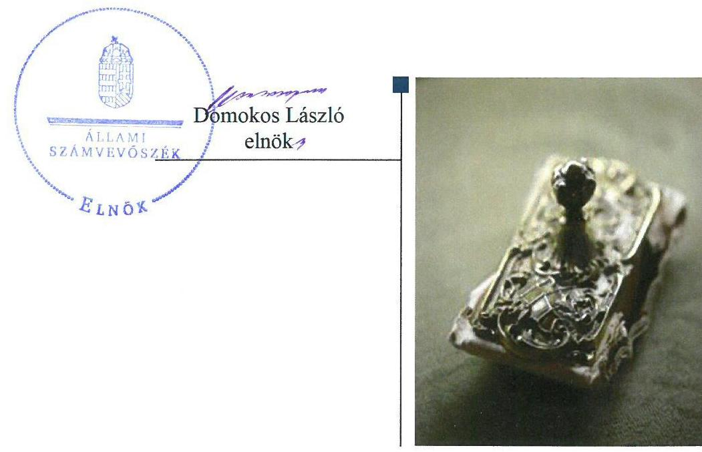
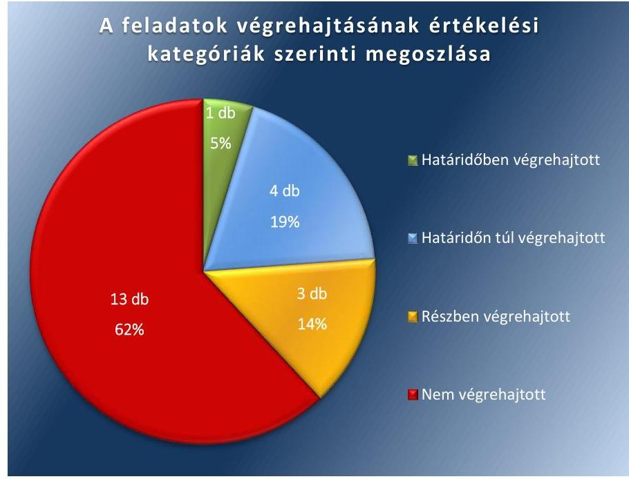

# Jelentés 

## Utóellenőrzések

Az önkormányzatok belső
kontrollrendszere kialakításának és működtetésének utóellenőrzése Taktabáj Község Önkormányzata 2018.

---

# Jelentés 

## Utóellenőrzések

Az önkormányzatok belső
kontrollrendszere kialakításának és működtetésének utóellenőrzése Taktabáj Község Önkormányzata 2018. o. hó 3. nap

---

|  J | AZ ELLENŐRZÉST FELÜGYELTE:  |
| --- | --- |
|   | DR. NÉMETH ERZSÉBET felügyeleti vezető  |
|   | AZ ELLENŐRZÉST VEZETTE ÉS A VÉGREHAJTÁSÁÉRT FELELŐS:  |
|   | EÖRY-BRUDER VIKTÓRIA ellenőrzésvezető  |
|   | A PROGRAM ÖSSZEÁLLÍTÁSÁÉRT FELELŐS:  |
|   | TÓTPÁL SZABOLCS osztályvezető  |
|   | A TÉMÁHOZ KAPCSOLÓDÓ KORÁBBI SZÁMVEVŐSZÉKI JELENTÉSEK:  |
|   | - címe: Jelentés az önkormányzatok belső kontrollrendszere kialakításának, egyes kontrolltevékenységek és a belső ellenőrzés működésének ellenőrzéséről - Taktabáj  |
|  J | - sorszáma: 14127  |
|   | IKTATÓSZÁM: EL-0078-057/2018.  |
|   | TÉMASZÁM: 21  |
|   | ELLENŐRZÉS-AZONOSÍTÓ SZÁM: V075593  |

---

# TARTALOMJEGYZÉK 

■ ÖSSZEGZÉS ..... 5
■ AZ ELLENŐRZÉS CÉLJA ..... 6
■ AZ ELLENŐRZÉS TERÜLETE ..... 7
■ AZ ELLENŐRZÉS HÁTTERE, INDOKOLTSÁGA ..... 8
■ A JELENTÉS LÉNYEGES KÉRDÉSKÖRE ..... 9
■ ELLENŐRZÉS HATÓKÖRE ÉS MÓDSZEREI ..... 10
■ MEGÁLLAPÍTÁSOK ..... 12
■ MELLÉKLETEK ..... 15
I. Sz. melléklet: Az ÁSZ 14127 számú jelentéséhez kapcsolódó intézkedési terv végrehajtása ..... 15
■ FÜGGELÉK: ÉSZREVÉTELEK ..... 21
■ RÖVIDÍTÉSEK JEGYZÉKE ..... 23

---

.

---

# ÖSSZEGZÉS 

Az Állami Számvevőszék megállapította, hogy az intézkedési tervben Taktabáj Község Önkormányzata vonatkozásában meghatározott feladatok jelentős részét nem hajtották végre. A belső kontrollrendszer nem biztosítja Taktabáj Község Önkormányzata szabályszerű működését, a közpénzek és közvagyon átlátható és felelős felhasználását.

## Az ellenőrzés társadalmi indokoltsága

Az Állami Számvevőszék stratégiájában célul tűzte ki a számvevőszéki munka hasznosulásának javítását. Ezzel összhangban ellenőrzi, hogy az ellenőrzött szervezetek megvalósították-e a korábbi ellenőrzései által feltárt hibák, hiányosságok és szabálytalanságok megszüntetése céljából kialakított intézkedési terveikben foglaltakat. A rendszeres utóellenőrzések hozzájárulnak a szükséges intézkedések tényleges végrehajtásához, ezáltal a közpénzügyek rendezettségének javulásához.

## Főbb megállapítások, következtetések

Az Állami Számvevőszék 14127 számú jelentésében rögzített intézkedést igénylő megállapításokhoz és javaslatokhoz kapcsolódóan összeállított intézkedési tervben, Taktabáj Község Önkormányzata vonatkozásában meghatározott 21 feladatból egyet határidőre, négyet határidőn túl, hármat részben, valamint 13 feladatot nem hajtott végre.

A Taktabáj község polgármestere részére meghatározott két feladatot - a gazdálkodás szabályszerű működésének biztosítását és a munkajogi felelősséggel kapcsolatos körülmények kivizsgálását - a polgármester nem hajtotta végre.

A jegyző által elkészített szabályzatok - a közérdekű adatok megismerésére irányuló igények teljesítési rendjéről, a gazdálkodási, az egyedi iratkezelési valamint a belső kontrollrendszer - kiadmányozása, az önkormányzati SZMSZ kiegészítése, az ellenőrzési program jóváhagyása, valamint a belső ellenőrzési tervek önkormányzati képviselő-testületi elfogadása által javult Taktabáj Község Önkormányzatának szabályozottsága. A jegyző azonban nem gondoskodott a belső ellenőrzés szabályszerű működésének biztosításáról. Nem valósult meg a pénzügyi folyamatokban szerepet játszó kontrollok jogszabályi előírásoknak megfelelő kialakítása. A jegyző nem gondoskodott a gazdálkodási szabályzat folyamatos aktualizálásáról, valamint a stratégiai ellenőrzési tervek elkészíttetéséről. A jegyző nem gondoskodott a közérdekű pénzügyi adatok közzétételéről. Nem történt meg a belső ellenőrzési kézikönyv jogszabályban előírtaknak megfelelő elkészítése.

A részben végrehajtott, valamint a nem végrehajtott feladatok nagy száma azt mutatja, hogy Taktabáj Község Önkormányzata nem hozta meg a szükséges intézkedéseket annak érdekében, hogy az ÁSZ korábbi ellenőrzése során feltárt hiányosságokat és szabálytalanságokat megszüntetéssék, ezáltal az Állami Számvevőszék megállapításai nem hasznosultak. Mindez azt mutatja, hogy Taktabáj Község Önkormányzata működésének szabályosságában, átláthatóságában, elszámoltathatóságában és a felelős vezetői magatartásban meglévő hiányosságok miatt továbbra is fennáll a jogszabálysértő állapot.

A jegyző az intézkedési tervben meghatározott feladatok végrehajtásáról nem vezette a jogszabályi előírásoknak megfelelő nyilvántartást.

A nem végrehajtott feladatok indokolják a feltárt hiányosságok, szabálytalanságok tekintetében a munkajogi felelősség tisztázására irányuló eljárás megindítását, és eredményének ismeretében a szükséges intézkedések megtételét.

---

# AZ ELLENŐRZÉS CÉLJA 

Az ellenőrzés célja annak értékelése, hogy a 14127 számú számvevőszéki jelentésben foglalt intézkedést igénylő megállapításokkal összhangban készített intézkedési tervben meghatározott feladatokat az ellenőrzött szervezet végrehajtotta-e.

---

# AZ ELLENŐRZÉS TERÜLETE 

## Taktabáj Község Önkormányzata

Taktabáj község Borsod-Abaúj-Zemplén megyében, a Tokaji járásban fekszik, lakossága a Központi Statisztikai Hivatal Magyarország közigazgatási helynévkönyvének 2016. január 1-i adatai alapján 632 fő volt.

Taktabáj Község Önkormányzata Bodrogkeresztúr és Szegi települések önkormányzataival közösen 2013. március 1-i hatállyal létrehozták a Bodrogkeresztúri Közös Önkormányzati Hivatalt.

A polgármester ${ }^{1}$ a 2002. évi önkormányzati választások óta tölti be tisztségét. A Közös Hivatal ${ }^{2}$ létrejöttét követően a jegyzői feladatokat a Közös Hivatal székhelyét adó Bodrogkeresztúr jegyzője látta el.

Az ÁSZ ${ }^{3}$ a 2014. évben ellenőrizte Taktabáj Község Önkormányzata belső kontrollrendszere kialakításának, egyes kontrolltevékenységek és a belső ellenőrzés működését a 2012. január 1. és december 31. közötti időszak vonatkozásában. Az erről szóló 14127 számú jelentését 2014. július 10-én tette közzé. Az ellenőrzés célja annak megállapítása volt, hogy a belső kontrollrendszer elemeinek kialakítása, a pénzügyi folyamatokban kulcsszerepet betöltő teljesítésigazolás és érvényesítés, valamint a belső ellenőrzés szabályos működése biztosította-e Taktabáj Község Önkormányzatánál a közpénzfelhasználás szabályosságát, hozzájárult-e az értéket teremtő rend követelményének érvényesüléséhez.

Az ÁSZ jelentésben ${ }^{4}$ foglalt javaslatok tekintetében Taktabáj Község Önkormányzata egy 29 feladatból álló intézkedési tervet állított össze, amelyben a polgármester részére kettő, a jegyző részére 27 feladatot határoztak meg.

Az utóellenőrzés - a 2014. július 10. és 2017. június 16. között végrehajtott feladatokat figyelembe véve - az ÁSZ jelentésben a polgármester és a jegyző részére megfogalmazott intézkedést igénylő megállapításokra készített, az ÁSZ részére megküldött intézkedési tervben foglalt, Taktabáj Község Önkormányzata vonatkozásában meghatározott feladatok megvalósításának ellenőrzésére, illetve értékelésére fókuszált.

---

# AZ ELLENŐRZÉS HÁTTERE, INDOKOLTSÁGA 

Az ÁSZ tv. ${ }^{5}$ 33. § (1) bekezdése értelmében a számvevőszéki jelentések intézkedést igénylő megállapításaihoz kapcsolódóan az ellenőrzött szervezet vezetője intézkedési tervet köteles összeállítani, és az Állami Számvevőszék részére megküldeni. Az intézkedési tervben foglaltak megvalósítását - az ÁSZ tv. 33. § (7) bekezdésében foglaltak alapján - az Állami Számvevőszék utóellenőrzés keretében ellenőrizheti. Az intézkedések megvalósulásának értékelése során az Állami Számvevőszék figyelembe veszi az ellenőrzött szervezetek működési feltételeiben, valamint a jogszabályi előírásokban bekövetkezett változásokat.

Az intézkedési tervekben foglalt feladatok hiányos, illetve késedelmes végrehajtása, valamint megvalósításának elmaradása azt mutatja, hogy az ellenőrzések során feltárt hibák, hiányosságok és szabálytalanságok megszüntetése nem kapott kellő hangsúlyt. Ez a szabályszerű működés és a felelős vezetői magatartás vonatkozásában kockázatot hordoz. E kockázatok feltárásával az Állami Számvevőszék utóellenőrzési rendszere fokozza a fegyelmet, és igazolja, hogy a közpénzzel való szabályos gazdálkodás felelőssége elől nem lehet kitérni.

Az utóellenőrzés négy szinten hasznosulhat:
A társadalom szintjén az utóellenőrzés jelzi, hogy a számvevőszéki ellenőrzés megállapításainak van következménye: a hiányosságok megszüntetésére az ellenőrzött szervezet által meghatározott intézkedések végrehajtását is számon kéri az ÁSZ.
$\longrightarrow$ Az ellenőrzött terület szintjén az utóellenőrzés tájékoztatást nyújt a terület döntéshozóinak a hiányosságok kiküszöbölésének jó gyakorlatairól, ezzel lehetőséget biztosítva arra, hogy az ÁSZ ellenőrzési megállapításai, javaslatai a terület nem ellenőrzött szervezeteinek a működése során is hasznosuljanak.
$\longrightarrow$ Az ellenőrzött szervezet szintjén az utóellenőrzés feltárja, hogy a szervezet az intézkedések végrehajtásával hasznosította-e a korábbi ellenőrzési jelentésben a hiányosságok megszüntetése, illetve a kockázatok kezelése érdekében megfogalmazott javaslatokat.
$\longrightarrow$ Az ÁSZ szintjén az utóellenőrzés visszacsatolást ad az ellenőrzési jelentések hasznosulásáról, az intézkedések elmaradása vagy részleges megvalósulása a további ellenőrzésekhez kockázati jelzésként szolgál.

---

# A JELENTÉS LÉNYEGES KÉRDÉSKÖRE 

Az ellenőrzött szervezetek az intézkedési tervben foglaltakat az előírt határidőben végrehajtották-e?

---

# ELLENŐRZÉS HATÓKÖRE ÉS MÓDSZEREI 

## Az ellenőrzés típusa

Megfelelőségi ellenőrzés.

## Az ellenőrzött időszak

Az utóellenőrzés alapját képező ÁSZ jelentés közzétételének napjától (2014. július 10-től) az ellenőrzésről szóló kiértesítő levél keltének napjáig (2017. június 16-ig) tartó időszak.

## Az ellenőrzés tárgya

Az ÁSZ tv. 2011. július 1-jei hatálybalépését követően a számvevőszéki jelentésben foglalt intézkedést igénylő megállapításokkal összhangban - az ellenőrzött szervezet által - készített intézkedési tervben foglaltak végrehajtásának ellenőrzése volt.

Az ellenőrzés kiterjedt minden olyan körülményre és adatra, amely az ÁSZ jogszabályban meghatározott feladatainak teljesítéséhez, valamint a program végrehajtása folyamán felmerült újabb összefüggések feltárásához szükséges volt.

## Az ellenőrzött szervezet

Taktabáj Község Önkormányzata

## Az ellenőrzés jogalapja

Az ÁSZ tv. 33. § (7) bekezdése.

## Az ellenőrzés módszerei

Az ÁSZ a nemzetközi standardokat irányadónak tekintve az ellenőrzést az ellenőrzési program ellenőrzési kérdései alapján, az ellenőrzött időszakban hatályos jogszabályok, az ellenőrzés szakmai szabályok és módszertanok figyelembevételével, önállóan végezte.

Az utóellenőrzés megállapításait elsősorban az ÁSZ rendelkezésére álló, valamint az ellenőrzött szervezetektől elektronikusan bekért dokumentumok alapozták meg.

---

Az ellenőrzési bizonyítékként felhasználható adatforrások közé tartoztak egyrészt a szakmai programban felsorolt adatforrások, másrészt minden - az ellenőrzés folyamán feltárt, az ellenőrzés szempontjából információt tartalmazó - dokumentum.

Az intézkedési tervben előírt feladatokat azok végrehajthatósága, illetve végrehajtása szempontjából az alábbiak szerint értékelte az ÁSZ:
$\longrightarrow$ „határidőben végrehajtott" a feladat, ha a teljesítés dokumentáltan, az intézkedési tervben előírt határidőben és tartalommal megtörtént;
$\longrightarrow$ „határidőn túl végrehajtott" a feladat, ha annak teljesítése az intézkedési tervben meghatározott módon, de az előírt határidőn túl történt meg;
$\longrightarrow$ „részben végrehajtott" a feladat, ha végrehajtása teljes körűen az intézkedési tervben előírt módon nem történt meg;
$\longrightarrow$ „nem végrehajtott" a feladat, ha a végrehajtás nem történt meg, vagy amennyiben a teljesítést nem dokumentálták;
$\longrightarrow$ „okafogyottá vált" a feladat, ha végrehajtására - meghatározott esemény bekövetkezése, továbbá külső körülmény, a működést érintő feltétel változása miatt - már nincs szükség, illetve lehetőség, és egyértelműen megállapítható, hogy az intézkedést szükségessé tevő körülmény a jövőben nem fordulhat elő;
$\longrightarrow$ „nem időszerű" az a feladat, amelynek ellenőrzési időszakon belüli végrehajtására azért nem került (kerülhetett) sor, mert az intézkedés alapjául szolgáló esemény nem következett be, de annak jövőbeni előfordulása lehetséges, a végrehajtása nem volt esedékes, vagy a végrehajtás határideje még nem járt le.
Az ellenőrzés lefolytatásához az ellenőrzött szervezet a tanúsítványok elektronikus kitöltésével, valamint az ÁSZ által kért dokumentumok elektronikus megküldésével szolgáltatott adatokat, amelyek valódiságát és teljes körűségét az ellenőrzött szervezet vezetője által tett teljességi és hitelességi nyilatkozat igazolta. Az így rendelkezésre bocsátott adatok, információk kontrollja az ellenőrzés keretében megtörtént.

---

# MEGÁLLAPÍTÁSOK 

## Az ellenőrzött szervezetek az intézkedési tervben foglaltakat az előírt határidőben végrehajtották-e?

Összegző megállapítás

Az Önkormányzat ${ }^{6}$ az intézkedési tervben meghatározott, hatáskörébe tartozó 21 feladatból egyet határidőben, négyet határidőn túl, hármat részben, 13 feladatot nem hajtott végre. A jegyző az intézkedési tervben meghatározott feladatok végrehajtásáról a jogszabályban előírt nyilvántartást nem vezette.

Az ÁSZ az ÁSZ jelentésben a polgármester részére egy, a jegyző részére hét javaslatot fogalmazott meg. Az összeállított intézkedési tervben a hiányosságok, szabálytalanságok megszüntetése érdekében megfogalmazott 29 feladat közül az utóellenőrzés során az ÁSZ csak azt a 21-et értékelte, amelynek végrehajtása az Önkormányzat, mint ellenőrzött szervezet kötelezettsége.
 volt.

Az intézkedési tervben meghatározott feladatokat, határidőket, felelősöket és a feladatok végrehajtását az I. számú melléklet mutatja be.

A jegyző az intézkedési tervben meghatározott feladatok végrehajtásáról nem vezette a Bkr. ${ }^{7} 14 . \S$ (1) bekezdésben előírt nyilvántartást.

Az Önkormányzat intézkedési tervében meghatározott feladatok végrehajtásának értékelési kategóriák szerinti megoszlását az 1. ábra szemlélteti.

1. ábra

---

# HATÁRIDŐBEN VÉGREHAJTOTT feladat: 

1. A jegyző elkészítette a Közérdekű adatok megismerésére irányuló igények teljesítési rendjéről szóló szabályzatot ${ }^{8}$, amely tartalmazza a jogszabályi előírásoknak megfelelően a közérdekű adatok megismerésére irányuló kérelmek intézésének, továbbá a kötelezően közzéteendő adatok nyilvánosságra hozatalának rendjét.

## HATÁRIDŐN TÚL VÉGREHAJTOTT feladatok:

2. A jegyző határidőn túl - 2014. október 31. helyett 2014. november 28 -án - gondoskodott az önkormányzati SZMSZ ${ }^{9}$ rendelkezéseinek egyes vagyonnyilatkozat-tételi kötelezettségekről szóló törvény ${ }^{10}$ előírásaival összhangban a vagyonnyilatkozat-tételre kötelezettek körével történő kiegészítéséről, és annak képviselő-testület ${ }^{11}$ által történő jóváhagyásáról.
3. A jegyző határidőn túl - 2014. augusztus 31. helyett 2015. január 1-i hatállyal - rögzítette a Gazdálkodási szabályzatban ${ }^{12}$ az előzetes írásbeli kötelezettségvállalást nem igénylő kifizetések rendjét.
4. A jegyző felülvizsgálta az Egyedi Iratkezelési Szabályzatot ${ }^{13}$, azonban azt határidőn túl - 2014. október 31. helyett 2016. januárjában - adta ki az illetékes Levéltár ${ }^{14}$ igazgatója és az illetékes Kormánymegbízott ${ }^{15}$ egyetértésével.
5. Az ellenőrzési programot a belső ellenőrzési vezető a 2014. december 15-i határidőt követően, 2016. március 28-án hagyta jóvá.

## RÉSZBEN VÉGREHAJTOTT feladatok:

6. A jegyző felülvizsgálta az Ávr. ${ }^{16}$ rendelkezései alapján a Gazdálkodási szabályzatot, azonban nem gondoskodott annak Ávr-ben és Áht ${ }^{17}$-ban bekövetkezett változásoknak megfelelő aktualizálásáról és folyamatos karbantartásáról.
7. A jegyző a Belső kontrollrendszer szabályzat ${ }^{18}$ kiadásával gondoskodott az intézkedési tervben meghatározott információs és kommunikációs rendszer kialakításáról, azonban a jogszabályi rendelkezések előírásaival ellentétben nem gondoskodott annak működtetéséről.
8. Az Önkormányzat 2015-2017. évi belső ellenőrzési terveinek képviselő-testületi elfogadása jogszabályban előírt határidőben megtörtént, azonban a jegyző nem gondoskodott a stratégiai ellenőrzési tervek jogszabályi előírásoknak megfelelő elkészíttetéséről.

## NEM VÉGREHAJTOTT feladatok:

9. A polgármester nem alakította ki és nem szervezte meg az Mötv. ${ }^{19}$ rendelkezései szerint a gazdálkodás szabályszerű működését biztosító kontrollrendszert.
10. A polgármester az Mötv. előírásai ellenére nem gondoskodott a belső kontrollrendszer működésére vonatkozó jogszabályi rendelkezések be nem tartása, valamint a teljesítésigazolás, illetve az érvényesítés kontrollokkal összefüggésben feltárt hiányosságok, szabálytalanságok tekintetében az esetleges munkajogi felelősséggel kapcsolatos körülmények kivizsgálásáról.

---

11. A jegyző a Gazdálkodási szabályzatban nem jelölte ki és nem bízta meg írásban az Ávr. rendelkezései ellenére a teljesítés igazolására jogosult személyeket.
12. A jegyző nem bízott meg az érvényesítési feladatok ellátására olyan személyt, aki az Ávr. szerinti végzettséggel és képzettséggel rendelkezik.
13. A jegyző az Info tv. rendelkezései ellenére nem gondoskodott az intézkedési tervben meghatározott dokumentumok - az önkormányzat éves költségvetési rendeletének, az önkormányzat költségvetési beszámolójának, valamint az egyéb közérdekű adatok közzétételéről.
14. A jegyző nem gondoskodott a pénzügyi folyamatokban kulcsszerepet betöltő kontrollok közül a teljesítésigazolás kapcsán a jogszabályi rendelkezésekben meghatározott feladatok végrehajtásáról, valamint nem hívta fel az érvényesítő figyelmét az Ávr. előírásaiban foglaltakra.
15. A jegyző nem gondoskodott az Ávr. előírásainak megfelelő utalványrendelet alkalmazásáról.
16. A jegyző nem gondoskodott a belső ellenőrzési kézikönyv Bkr. előírásaiban foglalt tartalmi elemeket magában foglaló, hiteles formában történő elkészítéséről.
17. A jegyző nem gondoskodott a külső szakértővel 2014. évre kötött szerződés felülvizsgálatáról és annak módosításáról annak érdekében, hogy az a belső ellenőrzési vezetői feladatok vonatkozásában összhangban legyen a Bkr. rendelkezéseivel.
18. A jegyző nem gondoskodott a Bkr. rendelkezései ellenére a stratégiai ellenőrzési terv elkészíttetéséről.
19. A jegyző nem gondoskodott arról, hogy az éves ellenőrzési terv a Bkr. rendelkezéseivel összhangban a jegyző írásos véleményének figyelembevételével készüljön el.
20. A jegyző nem gondoskodott a Bkr. előírásainak megfelelően, a belső ellenőrzési jelentés alapján megtett intézkedések nyomon követéséről.
21. A belső ellenőrzési vezető, illetve a jegyző nem gondoskodott a Bkr. előírásaival összhangban, az elvégzett belső ellenőrzésekről vezetett nyilvántartás vezetéséről.

---

# MELLÉKLETEK

I. SZ. MELLÉKLET: AZ ÁSZ 14127 SZÁMÚ JELENTÉSÉHEZ KAPCSOLÓDÓ INTÉZKEDÉSI TERV VÉGREHAJTÁSA

|  Az intézkedési tervben meghatározott feladat | Az intézkedési tervben meghatározott határidő | Az intézkedési tervben meghatározott feladat végrehajtásának felelőse | Az intézkedési tervben meghatározott feladat végrehajtása  |
| --- | --- | --- | --- |
|  1. | 2. | 3. | 4.  |
|  Határidőben végrehajtott feladat |  |  |   |
|  1. IT J./4. b) pont: Az információs és kommunikációs rendszer működésének biztosítása érdekében el kell készíteni az Info tv. ${ }^{20} 30 .$ § (6) bekezdésében, az Info tv. 35. § (3) bekezdésében, valamint az Ávr. 13. § (2) bekezdés h) pontjában foglalt előírásoknak megfelelően a közérdekű adatok megismerésére irányuló kérelmek intézésének, továbbá a kötelezően közzéteendő adatok nyilvánosságra hozatalának rendjét meghatározó szabályzatot. | 2014. szeptember 30. | Jegyző | A jegyző elkészítette és 2013. december 12-én kiadmányozta a Közérdekű adatok megismerésére irányuló igények teljesítési rendjéről szóló szabályzatot, amelyet a képviselő-testület a 73/2013. (XII. 12.) képviselő-testületi határozattal fogadott el.  |
|  Határidőn túl végrehajtott feladatok |  |  |   |
|  2. IT J./2. pont: A kockázatkezelési rendszerrel kapcsolatban teendő intézkedések: Gondoskodni kell az önkormányzati SZMSZ módosításáról, hogy azok tartalmazzák a vagyonnyilatkozat-tételéről szóló 2007. évi CLII. törvény 4. § a) és d) pontja alapján a vagyonnyilatkozat-tételre kötelezettek körét. Az Áht. 9. § (1) bekezdés a) pontja, illetve az Mötv. 81. § (3) bekezdés c) pontja alapján gondoskodni kell az SZMSZ-ek képviselő-testület elé történő előterjesztéséről, illetve jóváhagyásáról. | 2014. október 31. | Jegyző | A jegyző előkészítette az önkormányzati SZMSZ rendelkezéseit, ugyanis az kiegészítésre került az egyes vagyonnyilatkozat-tételi kötelezettségről szóló törvény 4. § d) pontjának megfelelően a vagyonnyilatkozat-tételre kötelezettek körével, továbbá tartalmazza a vagyonnyilatkozat-tételi kötelezettséget az Mötv. 39. § (1) pontjában meghatározott személyekre vonatkozóan is, azonban azt a képviselőtestület határidőn túl - 2014. október 31-e helyett 2014. november 28-án -, a 10/2014. (XI. 28.) számú önkormányzati rendelettel hagyta jóvá.  |
|  3. IT J./3. b) pont: A kontrolltevékenység működésének biztosítása érdekében a gazdálkodási szabályzatban rögzíteni kell az Ávr. 53. § (2) bekezdésében foglalt előírásokkal összhangban az előzetes írásbeli kötelezettségvállalást nem igénylő események rendjét. | 2014. augusztus 31. | Jegyző | A jegyző a Gazdálkodási szabályzatban 2014. augusztus 31. helyett 2015. január 1-i hatállyal rögzítette az előzetes írásbeli kötelezettségvállalást nem igénylő kifizetések rendjét.  |

---

|  Az intézkedési tervben meghatározott feladat | Az intézkedési tervben meghatározott határidő | Az intézkedési tervben meghatározott feladat végrehajtásának felelőse | Az intézkedési tervben meghatározott feladat végrehajtása  |
| --- | --- | --- | --- |
|  1. | 2. | 3. | 4.  |
|  4. IT J./4. d) pont: Az információs és kommunikációs rendszer működésének biztosítása érdekében: d) Az iratkezelési szabályzatot felül kell vizsgálni és gondoskodni kell arról, hogy az a Levéltár és az illetékes Kormányhivatal egyetértésével, az Ltv. ${ }^{11} 10 . \S$ (1) bekezdés c) pontjában foglalt előírásoknak megfelelően kerüljön kiadásra. | 2014. október 31. | Jegyző | A jegyző határidőn túl, 2015. november 24-i dátummal vizsgálta felül az Egyedi Iratkezelési Szabályzatot, és azt 2016. januárjában adta ki az illetékes Levéltár igazgatója és az illetékes Kormánymegbízott egyetértésével az Ltv. 10. § (1) bekezdés c) pontjában foglaltak alapján.  |
|  5. IT J./7. f) pont: A belső ellenőrzés szabályszerű működésének biztosítása érdekében az ellenőrzési programot - a Bkr. 33. § (2) bekezdésében foglaltaknak megfelelően a belső ellenőrzési vezető hagyja jóvá. | 2014. december 15. | Belső ellenőrzési vezető / Jegyző | Az EP 7/2016 úgyszámú, a Taktabáj Községi Önkormányzat 2014 Önkormányzat pénzügyi és vagyongazdálkodásának szabályszerűségi vizsgálatáról című ellenőrzési programot a Bkr. 33. § (2) bekezdésének megfelelően a belső ellenőrzési vezető az intézkedési tervben meghatározott 2014. december 15-i határidő helyett 2016. március 28-án hagyta jóvá.  |
|  Részben végrehajtott feladatok |  |  |   |
|  6. IT J./3. a) pont: A kontrolltevékenység működésének biztosítása érdekében a kötelezettségvállalás, pénzügyi ellenjegyzés, érvényesítés, teljesítésigazolás, utalványozás rendjét meghatározó szabályzatot (továbbiakban: gazdálkodási szabályzat) az Ávr. 13. § (2) bekezdés a) pontjában foglaltak alapján felül kell vizsgálni és gondoskodni kell annak aktualizálásáról, a kötelezettségvállalás, pénzügyi ellenjegyzés, érvényesítés, teljesítésigazolás, utalványozás rendjének szabályozásáról és folyamatos karbantartásáról. | 2014. augusztus 31., illetve folyamatos | Jegyző | A jegyző gondoskodott a Gazdálkodási szabályzat felülvizsgálatáról annak érdekében, hogy a szabályzat megfeleljen az Ávr. 13. § (2) bekezdés a) pontjának, azonban nem gondoskodott annak Ávr. és Áht. változásaival összhangban történő aktualizálásáról és folyamatos karbantartásáról a kötelezettségvállalás, pénzügyi ellenjegyzés, érvényesítés, teljesítésigazolás és utalványozás rendje tekintetében. Például nem került aktualizálásra a Gazdálkodási szabályzat az Ávr. 57. § (4) bekezdésének változásával összhangban, amely azt határozza meg, hogy kik lehetnek a teljesítés igazolására kijelölő személyek.  |
|  7. IT J./4. a) pont: Az információs és kommunikációs rendszer működésének biztosítása érdekében a Bkr. 3. § d) pontjában, továbbá a Bkr. 9. § (1) bekezdésében foglalt előírásokat figyelembe véve, olyan információs rendszert kell kialakítani és működtetni, hogy az információk ne rekedjenek meg az egyes szervezeti egységek szintjén. Biztosítani kell, | Azonnal és folyamatos | Jegyző | A jegyző az információs és kommunikációs rendszer kialakítására 2014. október 30-i dátummal elkészítette a Belső kontrollrendszer szabályzatot, azonban nem gondoskodott annak Bkr. 9. § (1) bekezdésében foglaltak szerinti működtetéséről.  |

---

|  Az intézkedési tervben meghatározott feladat | Az intézkedési tervben meghatározott határidő | Az intézkedési tervben meghatározott feladat végrehajtásának felelőse | Az intézkedési tervben meghatározott feladat végrehajtása  |
| --- | --- | --- | --- |
|  1. | 2. | 3. | 4.  |
|  hogy a megfelelő információk a megfelelő időben eljussanak az illetékes szervezethez, szervezeti egységhez, illetve személyhez. |  |  |   |
|  8. IT J./7. d) pont: A belső ellenőrzés szabályszerű működésének biztosítása érdekében minden évben a stratégiai ellenőrzési tervben és a kockázatelemzés alapján felállított prioritásokon alapuló belső ellenőrzési tervet kell készíteni és az Mótv. 119. § (5) bekezdése, illetve a Bkr. 32. § (4) bekezdése által előírt határidőig - a tárgyévet megelőző év december 31.-ig - a képviselő-testülettel el kell fogadtatni. | Minden év utolsó képviselő-testületi ülés | Belső

 ellenőrzési vezető / Jegyző | A belső ellenőrzési vezető elkészítette a 2015., 2016. és 2017. évi belső ellenőrzési terveket, azokat a képviselő-testület a Mótv. 119. § (5) bekezdése, illetve a Bkr. 32. § (4) bekezdése által előírt határidőig jóváhagyta.
Az intézkedési tervben meghatározott feladat alapján a belső ellenőrzési terv a stratégiai ellenőrzési tervben és a kockázatelemzés alapján felállított prioritásokon alapul. A jegyző nem gondoskodott a stratégiai ellenőrzési tervek Bkr. 29. § (1) bekezdésében és Bkr. 31. § (2) bekezdésében foglaltaknak megfelelő elkészíttetéséről, ennek megfelelően a belső ellenőrzési tervek nem a stratégiai ellenőrzési tervek alapján készültek.  |
|  Nem végrehajtott feladatok |  |  |   |
|  9. IT PM 1. pont: Az Mótv. 115. § (1) bekezdésében foglaltak alapján a kontrollrendszert úgy kell kialakítani és megszervezni, hogy az biztosítsa az önkormányzat gazdálkodásának szabályszerű működését. | Azonnal és folyamatos | Polgármester | A polgármester nem alakította ki és nem szervezte meg a Mótv. 115. § (1) bekezdésében foglaltak alapján az Önkormányzat gazdálkodásának szabályszerű működését biztosító kontrollrendszert.  |
|  10. IT PM 2. pont: Az Mótv. 67. § f) pontja alapján gondoskodni kell a belső kontrollrendszer működésére vonatkozó jogszabályi rendelkezések be nem tartása, valamint a teljesítésigazolás, illetve az érvényesítés kontrollokkal összefüggésben feltárt hiányosságok, szabálytalanságok tekintetében az esetleges munkajogi felelősséggel kapcsolatos körülmények kivizsgálásáról, majd a vizsgálat eredményének függvényében a szükséges intézkedések megtételéről. | 2014. szeptember 7. | Polgármester | A polgármester nem gondoskodott a Mótv. 67. § f) pontja alapján a belső kontrollrendszer működésére vonatkozó jogszabályi rendelkezések be nem tartása, valamint a teljesítésigazolás, illetve az érvényesítés kontrollokkal összefüggésben feltárt hiányosságok, szabálytalanságok tekintetében az esetleges munkajogi felelősséggel kapcsolatos körülmények kivizsgálásáról.  |
|  11. IT J./3. c) pont: A kontrolltevékenység működésének biztosítása érdekében a gazdálkodási szabályzatban az Ávr. 57. § (4) bekezdésében foglaltaknak megfelelően ki kell jelölni és írásban meg kell bízni a teljesítés igazolására jogosult személyeket. | Azonnal | Jegyző | A jegyző a Gazdálkodási szabályzatban nem jelölte ki és nem bízta meg írásban a teljesítés igazolására jogosult személyeket az Ávr. 57. § (4) bekezdésében foglaltak ellenére.  |

---

|  Az intézkedési tervben meghatározott feladat | Az intézkedési tervben meghatározott határidő | Az intézkedési tervben meghatározott feladat végrehajtásának felelőse | Az intézkedési tervben meghatározott feladat végrehajtása  |
| --- | --- | --- | --- |
|  1. | 2. | 3. | 4.  |
|  12. IT J./3. d) pont: A kontrolltevékenység működésének biztosítása érdekében az érvényesítési feladatok ellátására olyan személyt kell megbízni, aki az Ávr. 55. § (3) bekezdésében előírt végzettséggel és képzettséggel rendelkezik. | 2014. augusztus 31. | Jegyző | A kontrolltevékenység működésének biztosítása érdekében a jegyző nem gondoskodott az érvényesítési feladatok ellátására, az Ávr. 55. § (3) bekezdésében előírt végzettséggel és képzettséggel rendelkező személy megbízásáról.  |
|  13. IT J./4. c) pont: Az információs és kommunikációs rendszer működésének biztosítása érdekében az Info tv. 33. § (1) és (3) bekezdésében, az Info tv. 37. § (1) bekezdésében és az 1. mellékletben foglalt előírások maradéktalan érvényesülése érdekében gondoskodni kell az önkormányzat éves költségvetési rendeletének, az önkormányzat költségvetési beszámolójának, valamint az egyéb közérdekű adatok közzétételéről. | A költségvetés és zárszámadás jóváhagyását követő 15. napon belül, egyéb közérdekű adatok esetében folyamatos | Jegyző | A jegyző az Info. tv. 33. § (1) és (3) bekezdésében, az Info. tv. 37. § (1) bekezdésében és az 1. mellékletben foglalt előírások ellenére nem gondoskodott az intézkedési tervben meghatározott dokumentumok – az önkormányzat éves költségvetési rendeletének, az önkormányzat költségvetési beszámolójának, valamint az egyéb közérdekű adatok – közzétételéről.  |
|  14. IT J./6. a) pont: A pénzügyi folyamatokban kulcsszerepet betöltő kontrollok szabályszerű működtetésével összefüggésben a gazdálkodás során a hibák megelőzése, feltárása és időben történő javítása érdekében gondoskodni kell az Ávr. 58. § (1) bekezdésén alapuló teljesítésigazolás során az Ávr. 57. § (1) bekezdésében előírtaknak megfelelően, ellenőrizhető okmányok alapján minden esetben ellenőrizzék és igazolják a kiadások teljesítésének jogosságát, összegszerűségét, az ellenszolgáltatásokat is magában foglaló kötelezettségvállalás esetén annak teljesítését, valamint az Ávr. 57. § (3) bekezdése szerint a teljesítést az igazolás dátumának és a teljesítés tényére történő utalásnak a megjelölésével, az arra jogosult személy aláírásával igazolja. Gondoskodni kell, hogy teljesítésigazolást - figyelemmel az Ávr. 57. § (4) bekezdésében foglaltakra - minden esetben csak az arra jogosult személy végezzen. Fel kell hívni az érvényesítő figyelmét arra, hogy a jogszabályok, vagy szabályzatok megsértését tapasztalja, az Ávr. 58. § (2) | Azonnal és folyamatos | Jegyző | A hibák megelőzése, feltárása és időben történő javítása érdekében a jegyző nem gondoskodott az Ávr. 57. § (1) bekezdés rendelkezéseinek megfelelően a kiadások teljesítésének jogosságát, összegszerűségét, az ellenszolgáltatásokat is magában foglaló kötelezettségvállalás esetén annak teljesítés igazolásáról. Nem gondoskodott arról sem, hogy a teljesítést az igazolás dátumának és a teljesítés tényére történő utalásnak a megjelölésével, valamint az arra jogosult személy aláírásával történő igazolással végezzék el. Továbbá a jegyző nem gondoskodott arról, hogy megtörténjen az Ávr. 58. § (2) bekezdése alapján az utalványozó felé történő jelzés jogszabályok vagy szabályzatok megsértése esetén.  |

---

|  Az intézkedési tervben meghatározott feladat | Az intézkedési tervben meghatározott határidő | Az intézkedési tervben meghatározott feladat végrehajtásának felelőse | Az intézkedési tervben meghatározott feladat végrehajtása  |
| --- | --- | --- | --- |
|  1. | 2. | 3. | 4.  |
|  bekezdésében foglalt előírások alapján köteles azt jelezni az utalványozónak. |  |  |   |
|  15. IT J./6. b) pont: A pénzügyi folyamatokban kulcsszerepet betöltő kontrollok szabályszerű működtetésével összefüggésben a gazdálkodás során a hibák megelőzése, feltárása és időben történő javítása érdekében gondoskodni kell, az önkormányzatnál csak olyan utalványrendeletet lehet alkalmazni, mely megfelel az Ávr. 59. § (3) bekezdésében foglalt előírásoknak. | Azonnal és folyamatos | Jegyző | A jegyző nem gondoskodott az Ávr. 59. § (3) bekezdésében foglalt előírásoknak megfelelő utalványrendelet alkalmazásáról a pénzügyi folyamatokban kulcsszerepet betöltő kontrollok szabályszerű működtetésével összefüggésben a hibák megelőzése, feltárása és időben történő javítása érdekében.  |
|  16. IT J./7. a) pont: A belső ellenőrzés szabályszerű működésének biztosítása érdekében a Bkr. 17. § (1) bekezdésében előírt tartalommal el kell készíteni az önkormányzat belső ellenőrzési kézikönyvét. A belső ellenőrzési kézikönyvet a megbízott belső ellenőrzési vezető köteles elkészíteni a Bkr. 22. § (1) bekezdése alapján és azt évente köteles felülvizsgálni. | 2014. október 31. | Jegyző | A jegyző nem gondoskodott a belső ellenőrzés szabályszerű működésének biztosítása érdekében a Bkr. 17. § (1) bekezdés rendelkezéseinek megfelelő belső ellenőrzési kézikönyv elkészítéséről.  |
|  17. IT J./7. b) pont: A belső ellenőrzés szabályszerű működésének biztosítása érdekében a külső szakértő (Társulás) bevonásával történő belső ellenőrzési feladatok ellátása során a szerződésben meg kell jelölni, hogy a belső ellenőrzési vezetői feladatok ellátásának módja - Bkr. 16. § (4) bekezdésében foglalt előírásokra tekintettel - hogyan valósul meg. Ennek megfelelően a 2014. évre kötött szerződést felül kell vizsgálni és módosítani annak érdekében, hogy az megfeleljen a jogszabályi követelményeknek. | 2014. október 31. | Jegyző | A jegyző nem gondoskodott a belső ellenőrzés szabályszerű működésének biztosítása érdekében a külső szakértővel kötött 2014. évi szerződés Bkr. 16. § (4) bekezdés rendelkezéseinek megfelelő felülvizsgálatáról és annak módosításáról.  |
|  18. IT J./7. c) pont: A belső ellenőrzés szabályszerű működésének biztosítása érdekében tekintettel a Bkr. 56. § (3) bekezdésében, továbbá a Bkr. 30. § (1) bekezdésében foglalt előírásokra, el kell készíteni a stratégiai ellenőrzési tervet a jogszabályban előírt kötelező tartami elemekkel. Ezen túl | 2014. október 31. illetve minden évben február 15. | Belső ellenőrzési vezető / Jegyző | A jegyző nem gondoskodott a Bkr. 56. § (3) bekezdésében foglaltak alapján, a Bkr. 30. § (1) bekezdésében meghatározott tartalmi elemeket magában foglaló stratégiai ellenőrzési terv elkészíttetéséről.  |

---

|  Az intézkedési tervben meghatározott feladat: | Az intézkedési tervben meghatározott határidő | Az intézkedési tervben meghatározott feladat végrehajtásának felelőse | Az intézkedési tervben meghatározott feladat végrehajtása  |
| --- | --- | --- | --- |
|  1. | 2. | 3. | 4.  |
|  gondoskodni kell a stratégiai ellenőrzési terv évenkénti felülvizsgálatáról. |  |  |   |
|  19. IT J./7. e) pont: A belső ellenőrzés szabályszerű működésének biztosítása érdekében az éves ellenőrzési terv a Bkr. 56. § (2) bekezdésében foglalt előírásainak megfelelően a jegyző írásos véleményének figyelembevételével készüljön el. | 2014. december 15. | Jegyző | A jegyző nem gondoskodott arról, hogy a belső ellenőrzési terv a jegyző írásos véleményének figyelembevételével készüljön el az intézkedési tervben meghatározott határidőre és a Bkr. 56. § (2) bekezdés rendelkezéseinek megfelelően. Az ellenőrzés rendelkezésére megküldött 2015. évi belső ellenőrzési terv nem tartalmaz írásos véleményt a jegyzőtől. A 2016. évi belső ellenőrzési terv 2015. november 24-i dátummal készült el, azonban az nem az intézkedési tervben meghatározott feladat végrehajtását igazolja, hanem előzetes vezetői jóváhagyást. A 2017. évi belső ellenőrzési terv szintén nem tartalmaz írásos véleményt a jegyzőtől.  |
|  20. IT J./7. g) pont: A belső ellenőrzés szabályszerű működésének biztosítása érdekében a belső ellenőrzési jelentés alapján megtett intézkedések nyomon követését a Bkr. 21. § (2) bekezdés d) pontjában előírtaknak megfelelően a belső ellenőrzési vezető végzi. | folyamatos | Jegyző | A jegyző nem gondoskodott a belső ellenőrzési jelentés alapján megtett intézkedések Bkr. 21. § (2) bekezdés d) pontjának megfelelő nyomon követéséről.  |
|  21. IT J./7. h) pont: A belső ellenőrzés szabályszerű működésének biztosítása érdekében a Bkr. 22. § (2) bekezdés e) pontjában és az 50. §-ában foglalt előírásnak megfelelően az elvégzett ellenőrzésekről a belső ellenőrzési vezető vezessen nyilvántartást. | Folyamatos | Belső ellenőrzési vezető / Jegyző | A belső ellenőrzési vezető, ill. a jegyző nem gondoskodott a Bkr. 22. § e) pontjában és a Bkr. 50. §-ában előírtaknak megfelelő, az elvégzett ellenőrzésekről vezetett nyilvántartás vezetéséről.  |

---

# FÜGGELÉK: ÉSZREVÉTELEK 

A jelentéstervezetet a Számvevőszék 15 napos észrevételezésre megküldte az ellenőrzött szervezet vezetőjének az ÁSZ tv. 29. § (1) bekezdése előírásának

 megfelelően.
Az ellenőrzött szervezet vezetője az ÁSZ tv. 29. § (2) bekezdésében foglalt észrevételezési jogával nem élt, a jelentéstervezetre észrevételt nem tett.

[^0]
[^0]:    * 29. § (1) Az Állami Számvevőszék az ellenőrzési megállapításait megküldi az ellenőrzött szervezet vezetőjének vagy az általa megbízott személynek, és annak, akinek személyes felelősségét állapította meg.
    (2) Az ellenőrzött szervezet vezetője és a felelősként megjelölt személy az ellenőrzés megállapításaira tizenöt napon belül írásban észrevételt tehet.
    (3) Az Állami Számvevőszék az észrevételre a beérkezésétől számított harminc napon belül írásban válaszol. A figyelembe nem vett észrevételeket köteles a jelentésben feltüntetni, és megindokolni, hogy azokat miért nem fogadta el.

---

.

---

# RÖVIDÍTÉSEK JEGYZÉKE 

${ }^{1}$ polgármester
${ }^{2}$ Közös Hivatal
${ }^{3}$ ÁSZ
${ }^{4}$ ÁSZ jelentés
${ }^{5}$ ÁSZ tv.
${ }^{6}$ Önkormányzat
${ }^{7}$ Bkr.
${ }^{8}$ Közérdekű adatok megismerésére irányuló igények teljesítési rendjéről szóló szabályzat
${ }^{9}$ önkormányzati SZMSZ
${ }^{10}$ egyes vagyonnyilatkozat-tételi kötelezettségekről szóló törvény
${ }^{11}$ képviselő-testület
${ }^{12}$ Gazdálkodási szabályzat
${ }^{13}$ Egyedi Iratkezelési Szabályzat
${ }^{14}$ illetékes Levéltár
${ }^{15}$ illetékes Kormánymegbízott
${ }^{16}$ Ávr.
${ }^{17}$ Áht.
${ }^{18}$ Belső kontrollrendszer szabályzat
${ }^{19}$ Mötv.
${ }^{20}$ Info tv.
${ }^{21}$ Ltv.

Taktabáj község polgármestere
Bodrogkeresztúri Közös Önkormányzati Hivatal
Állami Számvevőszék
az ÁSZ által 14127 számon, 2014. július 10-én kiadmányozott Jelentés az önkormányzatok belső kontrollrendszere kialakításának, egyes kontrolltevékenységek és a belső ellenőrzés működésének ellenőrzéséről Taktabáj című jelentés
2011. évi LXVI. törvény az Állami Számvevőszékről (hatályos: 2011. július 1-től)

Taktabáj Község Önkormányzata
370/2011. (XII. 31.) Korm. rendelet a költségvetési szervek belső kontrollrendszeréről és belső ellenőrzéséről (hatályos: 2012. január 1-től)
Taktabáj Községi Önkormányzat és Közös Önkormányzati Hivatalának - Szabályzat a közérdekű adatok megismerésére irányuló igények teljesítési rendjéről (hatályos: 2013. december 12.)
Taktabáj Község Önkormányzata Szervezeti és Működési Szabályzata (10/2014. (XI.28) önkormányzati rendelet)
2007. évi CLII. törvény az egyes vagyonnyilatkozat-tételi kötelezettségekről (hatályos: 2007. december 7-től)
Taktabáj Község Önkormányzata képviselő-testülete
Bodrogkeresztúri Közös Önkormányzati Hivatal Gazdálkodási szabályzata, hatályos Taktabáj Községi Önkormányzatra (hatályos: 2015. január 1-től)
Bodrogkeresztúri Közös Önkormányzati Hivatal Egyedi Iratkezelési Szabályzata, hatályos Taktabáj Községi Önkormányzatra (hatályos: 2016. január 18-tól)
Magyar Nemzeti Levéltár Borsod-Abaúj-Zemplén Megyei Levéltára
Borsod-Abaúj-Zemplén Megyei Kormányhivatal vezetője
368/2011. (XII. 31.) Korm. rendelet az államháztartásról szóló törvény végrehajtásáról (hatályos: 2012. január 1-től)
2011. évi CXCV. törvény az államháztartásról (hatályos: 2012. január 1-től)

Bodrogkeresztúri Közös Önkormányzati Hivatal Belső kontrollrendszer szabályzata, hatályos Taktabáj Községi Önkormányzatra (hatályos: 2013. április 30-tól)
2011. évi CLXXXIX. törvény Magyarország helyi önkormányzatairól (hatályos: 2012. január 1-től)
2011. évi CXII. törvény az információs önrendelkezési jogról és az információszabadságról (hatályos: 2011. július 27-től)
1995. évi LXVI. törvény a köziratokról, a közlevéltárakról és a magánlevéltári anyag védelméről (hatályos: 1996. január 1-től)

---

# ÁLLAMI SZÁMVEVŐSZÉK 

1052 Budapest, Apáczai Csere János utca 10.
Levélcím: 1364 Budapest 4. Pf. 54
Telefon: +36 14849100 Telefax: +36 14849200
www.asz.hu
