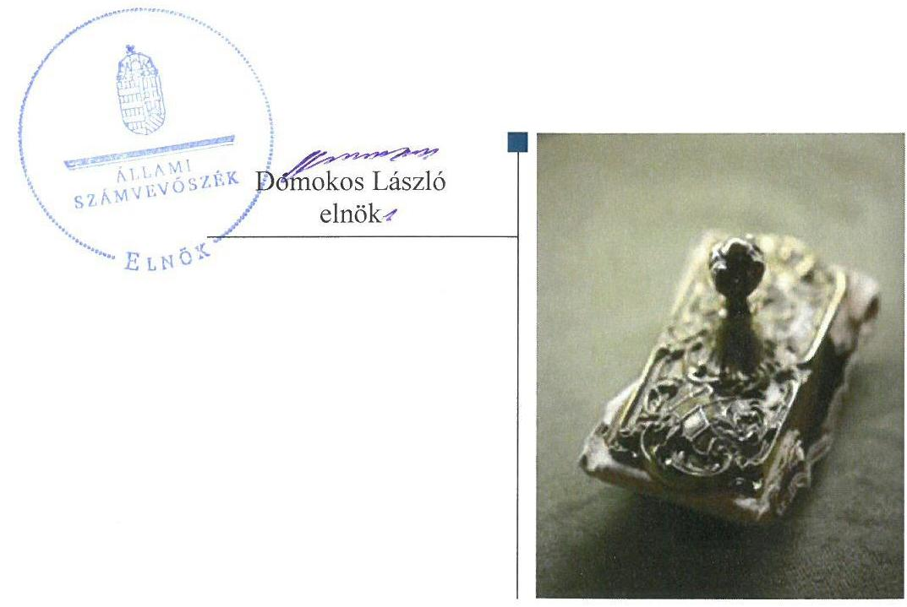
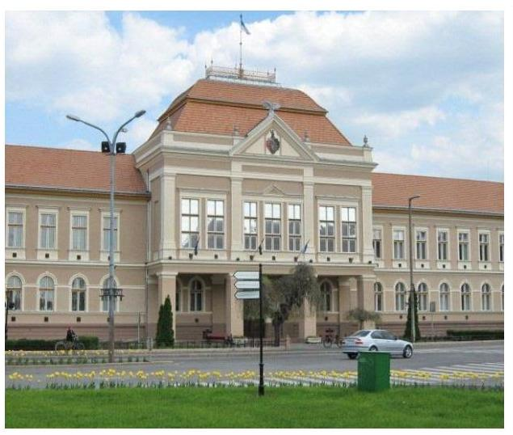
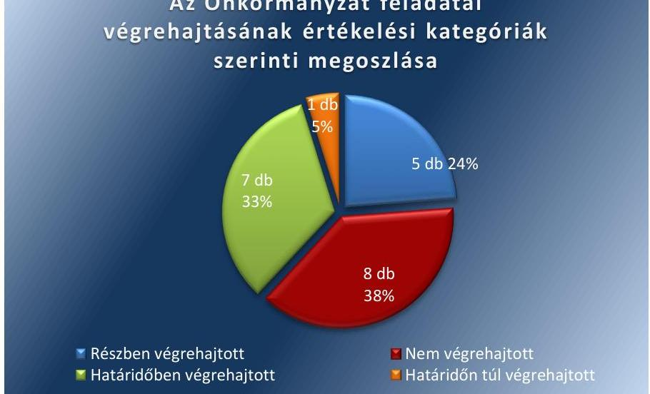

# Jelentés 

## Utóellenőrzések

Az önkormányzatok pénzügyi és vagyongazdálkodása
szabályszerúségének utóellenőrzése Hajdúböszörmény Város Önkormányzata 2018.

---

# Jelentés 

## Utóellenőrzések

Az önkormányzatok pénzügyi és vagyongazdálkodása
szabályszerúségének utóellenőrzése Hajdúböszörmény Város Önkormányzata 2018. 01. hó 30. nap

---

# AZ ELLENŐRZÉST FELÜGYELTE: 

PETŐ KRISZTINA felügyeleti vezető

## AZ ELLENŐRZÉST VEZETTE ÉS A VÉGREHAJTÁSÁÉRT FELELŐS:

NEMESVÁRI-HORTHY ESZTER ellenőrzésvezető

## A PROGRAM ÖSSZEÁLLÍTÁSÁÉRT FELELŐS:

JANIK JÓZSEF LÁSZLÓ osztályvezető

## A TÉMÁHOZ KAPCSOLÓDÓ KORÁBBI SZÁMVEVŐSZÉKI JELENTÉS:

- címe: Jelentés az önkormányzatok pénzügyi és vagyongazdálkodása szabályszerűségének ellenőrzéséről - Hajdúböszörmény
- sorszáma: 15201

IKTATÓSZÁM: EL-0188-039/2018.
TÉMASZÁM: 2096
ELLENŐRZÉS-AZONOSÍTÓ SZÁM: V0755110

---

# TARTALOMJEGYZÉK 

■ ÖSSZEGZÉS ..... 5
■ AZ ELLENŐRZÉS CÉLJA ..... 6
■ AZ ELLENŐRZÉS TERÜLETE ..... 7
■ AZ ELLENŐRZÉS HÁTTERE, INDOKOLTSÁGA ..... 8
■ A JELENTÉS LÉNYEGES KÉRDÉSKÖRE ..... 9
■ AZ ELLENŐRZÉS HATÓKÖRE ÉS MÓDSZEREI ..... 10
■ MEGÁLLAPÍTÁSOK ..... 12
■ MELLÉKLETEK ..... 15
I. sz. melléklet: AZ ÁSZ 15201 számú jelentéséhez kapcsolódó intézkedési terv végrehajtásának értékelése ..... 15
■ FÜGGELÉK: ÉSZREVÉTELEK ..... 19
■ RÖVIDÍTÉSEK JEGYZÉKE ..... 21

---

.

---

# ÖSSZEGZÉS 

Az Állami Számvevőszék Hajdúböszörmény Város Önkormányzata utóellenőrzése során megállapította, hogy a pénzügyi és vagyongazdálkodás jogszabályi előírásoknak megfelelő szabályozási kereteinek és szabályozott müködésének biztositása érdekében meghatározott feladatok jelentős részét nem hajtották végre. Ezáltal nem volt biztositott a szabályozott és átlátható gazdálkodás.

## Az ellenőrzés társadalmi indokoltsága

Az Állami Számvevőszék stratégiájában célul tűzte ki a számvevőszéki munka hasznosulásának javítását. Ezzel összhangban ellenőrzi, hogy az ellenőrzött szervezetek megvalósították-e a korábbi ellenőrzései által feltárt hibák, hiányosságok és szabálytalanságok megszüntetése céljából kialakított intézkedési terveikben foglaltakat. A rendszeres utóellenőrzések hozzájárulnak a szükséges intézkedések tényleges végrehajtásához, ezáltal a közpénzügyek rendezettségének javulásához.

## Főbb megállapítások, következtetések

Hajdúböszörmény Város Önkormányzata az intézkedési tervben meghatározott 21 feladatból hetet határidőben, egyet határidőn túl, ötöt részben hajtott végre, továbbá nyolc feladatot nem hajtott végre.

Hajdúböszörmény Város Önkormányzata a pénzügyi és vagyongazdálkodás szabályozási keretei kialakítása érdekében szükséges intézkedések jelentős részét nem hajtotta végre. A vagyonrendeletében a törvényi előírások ellenére nem határozta meg a vagyonkezelés ellenőrzésének szabályait, a kötelezettségvállalási szabályzatot késve adták ki. A számviteli politika leltározással kapcsolatos előírásait nem igazították a vagyonrendelet előírásaihoz. Ez kockázatot hordozott a gazdálkodás szabályozott múködésében.

A szabályozott múködés érdekében szükséges intézkedések jelentős részét nem hajtották végre, a leltározás nem felelt meg a törvényi előírásoknak, továbbá az ingatlan-vagyon kataszter nyilvántartás és a földhivatali ingatlan-nyilvántartás adatai egyezőségének megteremtéséről, az ingatlanok jogszabályban meghatározott körülményeiben bekövetkezett változásokról az ingatlanügyi hatóság felé történő bejelentésről sem gondoskodtak. A tagi kölcsönök kapcsán nem tartották be a törvényi előírásokat, mert nem történt meg írásban a kötelezettségvállalás és a számvitelei elszámolás törvényi előírásait sem vették figyelembe.

A pénzügyi egyensúlyi helyzet figyelemmel kísérése érdekében a jogszabályi előírások ellenére a likviditási tervet a 2016. évben nem vizsgálták felül havonta, a jegyző pedig nem gondoskodott a kiemelten a pénzügyi egyensúlyi helyzetet befolyásoló kockázatokra vonatkozóan a kockázatkezelési rendszer múködtetéséről.

A jegyző az intézkedési tervben meghatározott feladatokra vonatkozó nyilvántartást a jogszabályi előírás ellenére nem vezette.

---

# AZ ELLENŐRZÉS CÉLJA

Az ellenőrzés célja annak értékelése volt, hogy az ÁSZ1 jelentésben2 foglalt intézkedést igénylő megállapításokkal és javaslatokkal összhangban készített intézkedési tervben3 meghatározott feladatokat az ellenőrzött szervezet végrehajtotta-e.

---

# **AZ ELLENŐRZÉS TERÜLETE**

## **Hajdúböszörmény Város Önkormányzata**

**HAJDÚBŐSZÖRMÉNY** a Hajdúság legnagyobb városa, amely a Nyírség és a Hajdúság találkozásánál fekszik.

Hajdúböszörmény állandó lakosainak száma 2016. január 1-jén a Központi Statisztikai Hivatal Magyarország közigazgatási helynévkönyv alapján 12 404 fő volt.

A polgármester4 a 2006. évi általános önkormányzati választások óta tölti be tisztségét. A jegyző5 2013. február 1-jétől kezdődően látta el feladatait.

Az Önkormányzat6 2016. évi költségvetési beszámolója szerint 7433,5 Millió Ft bevételt ért el, valamint 7288,3 Millió Ft kiadást teljesített. 2016. december 31-én a könyvviteli mérleg szerinti követelések állományának értéke 315,1 Millió Ft, a kötelezettségek állományának értéke 453,2 Millió Ft, mérlegfőösszege 28 273,2 Millió Ft volt.

Az ÁSZ 2015. évben ellenőrizte az Önkormányzatnál a pénzügyi és vagyongazdálkodása szabályszerűségét a 2011. január 1-jétől 2013. december 31-ig terjedő időszak vonatkozásában. Az erről szóló 15201. számú jelentést az ÁSZ 2015. december 10-én tette közzé. Az ÁSZ megállapította, hogy a pénzügyi gazdálkodás és a belső szabályzatok területén szabálytalanságok voltak, a pénzügyi egyensúly nem volt biztosított. Az ÁSZ a vagyonváltozást eredményező döntések végrehajtása során szabálytalanságokat állapított meg, az integritás érvényesítése érdekében a kontrollok szintjét fejlesztendőnek minősítette.

Az utóellenőrzés – a 2015. december 10. és 2017. szeptember 4-e között, az ellenőrzött időszakban végrehajtott feladatokat figyelembe véve – az ÁSZ jelentésben a polgármester és a jegyző részére megfogalmazott javaslatokat megalapozó megállapításaira készített, az ÁSZ részére megküldött intézkedési tervben foglalt feladatok megvalósításának ellenőrzésére, illetve értékelésére fókuszált.

---

# AZ ELLENŐRZÉS HÁTTERE, INDOKOLTSÁGA 

Az ÁSZ tv. ${ }^{7}$ 33. § (1) bekezdése értelmében az ÁSZ jelentések javaslatot megalapozó megállapításaihoz kapcsolódóan az ellenőrzött szervezet vezetője intézkedési tervet köteles összeállítani, és az ÁSZ részére megküldeni. Az intézkedési tervben foglaltak megvalósítását - az ÁSZ tv. 33. § (7) bekezdésében foglaltak alapján - az ÁSZ utóellenőrzés keretében ellenőrizheti. Az intézkedések megvalósulásának értékelése során az ÁSZ figyelembe veszi az ellenőrzött szervezetek múködési feltételeiben, valamint a jogszabályi előírásokban bekövetkezett változásokat.

Az intézkedési tervekben foglalt feladatok hiányos, illetve késedelmes végrehajtása, valamint megvalósításának elmaradása azt mutatja, hogy az ellenőrzések során feltárt hibák, hiányosságok és szabálytalanságok megszüntetése nem kapott kellő hangsúlyt. Ez a szabályszerű működés és a felelős vezetői magatartás vonatkozásában kockázatot hordoz. E kockázatok feltárásával az ÁSZ utóellenőrzési rendszere fokozza a fegyelmet, és igazolja, hogy a közpénzzel való szabályos gazdálkodás felelőssége elől nem lehet kitérni.

Az utóellenőrzés négy szinten hasznosulhat:
A társadalom szintjén az utóellenőrzés jelzi, hogy a számvevőszéki ellenőrzés megállapításainak van következménye: a hiányosságok megszüntetésére az ellenőrzött szervezet által meghatározott intézkedések végrehajtását is számon kéri az ÁSZ.

- Az ellenőrzött terület szintjén az utóellenőrzés tájékoztatást nyújt a terület döntéshozóinak a hiányosságok kiküszöbölésének jó gyakorlatairól, ezzel lehetőséget biztosítva arra, hogy az ÁSZ ellenőrzési megállapításai, javaslatai a terület nem ellenőrzött szervezeteinek a működése során is hasznosuljanak.
- Az ellenőrzött szervezet szintjén az utóellenőrzés feltárja, hogy a szervezet az intézkedések végrehajtásával hasznosította-e a korábbi ellenőrzési jelentésben a hiányosságok megszüntetése, illetve a kockázatok kezelése érdekében megfogalmazott javaslatokat.
Az ÁSZ szintjén az utóellenőrzés visszacsatolást ad az ellenőrzési jelentések hasznosulásáról, az intézkedések elmaradása vagy részleges megvalósulása a további ellenőrzésekhez kockázati jelzésként szolgál.

---

# A JELENTÉS LÉNYEGES KÉRDÉSKÖRE 

Az Önkormányzat az intézkedési tervben foglaltakat az elöirt határidőben végrehajtotta-e?

---

# AZ ELLENŐRZÉS HATÓKÖRE ÉS MÓDSZEREI 

## Az ellenőrzés típusa

Megfelelőségi ellenőrzés.

## Az ellenőrzött időszak

Az utóellenőrzés alapját képező ÁSZ jelentés közzétételének (2015. december 10.) napjától az ellenőrzésről szóló kiértesítő levél keltének (2017. szeptember 4.) napjáig tartó időszak.

## Az ellenőrzés tárgya

Az ÁSZ jelentésben foglalt javaslatokat megalapozó megállapításokkal összhangban - Hajdúböszörmény Város Önkormányzata által - készített intézkedési tervben foglaltak végrehajtásának ellenőrzése.

Az ellenőrzés kiterjedt minden olyan körülményre és adatra, amely az ÁSZ jogszabályban meghatározott feladatainak teljesítéséhez, valamint a program végrehajtása folyamán felmerült újabb összefüggések feltárásához szükséges volt.

## Az ellenőrzött szervezet

Hajdúböszörmény Város Önkormányzata

## Az ellenőrzés jogalapja

Az ÁSZ tv. 33. § (7) bekezdése alapján az intézkedési tervben foglaltak megvalósítását az ÁSZ utóellenőrzés keretében ellenőrizheti.

## Az ellenőrzés módszerei

Az ÁSZ az ellenőrzést a nemzetközi standardokat irányadónak tekintve az ellenőrzési program ellenőrzési kérdései, az ellenőrzött időszakban hatályos jogszabályok, az ellenőrzés szakmai szabályok és módszertanok figyelembevételével önálló ellenőrzés keretében végezte.

Az ÁSZ az ellenőrzés ideje alatt az Önkormányzattal történő kapcsolattartást az ÁSZ SZMSZ ${ }^{\circledR}$-ének vonatkozó előírásai alapján biztosította.

---

Az utóellenőrzés megállapításait elsősorban az ÁSZ rendelkezésére álló, valamint az ellenőrzött szervezetektől elektronikusan bekért dokumentumok alapozták meg.

Az ellenőrzési bizonyítékként felhasználható adatforrások közé tartoztak egyrészt a szakmai programban felsorolt adatforrások, másrészt minden - az ellenőrzés folyamán feltárt, az ellenőrzés szempontjából információt tartalmazó - dokumentum.

Az intézkedési tervben előírt feladatokat azok végrehajthatósága, illetve végrehajtása szempontjából az alábbiak szerint értékelte az ÁSZ:
$\longrightarrow$ „határidőben végrehajtott" a feladat, ha a teljesítés dokumentáltan, az intézkedési tervben előírt határidőben és tartalommal megtörtént;
$\longrightarrow$ „határidőn túl végrehajtott" a feladat, ha annak teljesítése az intézkedési tervben meghatározott módon, de az előírt határidőn túl történt meg;
$\longrightarrow$ „részben végrehajtott" a feladat, ha végrehajtása teljes körűen az intézkedési tervben előírt módon nem történt meg;
$\longrightarrow$ „nem végrehajtott" a feladat, ha a végrehajtás nem történt meg, vagy amennyiben a teljesítést nem dokumentálták;
$\longrightarrow$ „okafogyottá vált" a feladat, ha végrehajtására - meghatározott esemény bekövetkezése, továbbá külső körülmény, a működést érintő feltétel változása miatt - már nincs szükség, illetve lehetőség, és egyértelműen megállapítható, hogy az intézkedést szükségessé tevő körülmény a jövőben nem fordulhat elő;
$\longrightarrow$ „nem időszerü" az a feladat, amelynek ellenőrzési időszakon belüli végrehajtására azért nem került (kerülhetett) sor, mert az intézkedés alapjául szolgáló esemény nem következett be, de annak jövőbeni előfordulása lehetséges, a végrehajtása nem volt esedékes, vagy a végrehajtás határideje még nem járt le.
Az ellenőrzés lefolytatásához az ellenőrzött szervezet a tanúsítványok elektronikus kitöltésével, valamint az ÁSZ által kért dokumentumok elektronikus megküldésével szolgáltatott adatokat, amelyek valódiságát és teljes körűségét az ellenőrzött szervezet vezetője által tett teljességi és hitelességi nyilatkozat igazolta. Az így rendelkezésre bocsátott adatok, információk kontrollja az ellenőrzés keretében történt.

---

# 1. Az Önkormányzat az intézkedési tervben foglaltakat az előírt határidőben végrehajtotta-e? 

Összegző megállapítás

Az Önkormányzat az intézkedési tervben meghatározott feladatai jelentős részét nem hajtotta végre. A pénzügyi és vagyongazdálkodás szabályozási kereteinek kialakítása, a szabályozott és átlátható gazdálkodás érdekében tervezett feladatok többsége nem valósult meg.

Az intézkedési tervben meghatározott feladatokat, határidőket, felelősöket és a feladatok végrehajtását az I. számú melléklet mutatja be.

Az Önkormányzat az intézkedési tervében meghatározott feladatok végrehajtásáról a Bkr. ${ }^{9} 14 . \S$ (1) bekezdésében foglaltak ellenére nem vezette a nyilvántartást.

Az Önkormányzat intézkedési tervében meghatározott feladatok végrehajtásának értékelési kategóriák szerinti megoszlását az 1. ábra szemlélteti.

1. ábra

## Az Önkormányzat feladatai végrehajtásának értékelési kategóriák szerinti megoszlása

A PÉNZÜGYI ÉS VAGYONGAZDÁLKODÁS SZABÁLYOZÁSI KERETEINEK KIALAKÍTÁSA ÉRDEKÉBEN MEGHATÁROZOTT FELADATOK ÉRTÉKELÉSE

| Értékelési kategória | Feladat intézkedési tervben szereplő sor-száma |
| :--: | :--: |
| „Végrehajtott" | 4/1., 4/2., 7/4., $7 / 5$. |
| „Határidőn túl végrehajtott" | $4 / 3$. |
| „Részben végrehajtott" | 1., 7/2., 7/6. |
| „Nem végrehajtott" | 7/1., 7/3. |

A PÉNZÜGYI ÉS VAGYONGAZDÁLKODÁS SZABÁLYOZÁSI KERETEINEK kialakítása érdekében meghatározott feladatokat jelentős részben nem hajtották végre. Az intézkedési tervben a pénzügyi és vagyongazdálkodás szabályozási kereteinek kialakítása érdekében meghatározott feladatok értékelési kategóriák szerinti besorolását az 1. táblázat mutatja be. A Vagyonrendelet módosításban - az Mótv. ${ }^{10}$ előírásai ellenére - nem határozták meg a vagyonkezelés ellenőrzésének

---

2. táblázat

| A PÉNZÜGYI ÉS VAGYONGAZDÁLKODÁS |  |
| :-- | :-- |
| SZABÁLYOZOTT MÜKÖDÉSE ÉRDEKÉBEN |  |
| MEGHATÁROZOTT FELADATOK |  |
| Értékelési kategória | Értékelési tervben |
|  | szereplő sor- |
|  | száma |
| „Részben végrehaj- | 8., 10. |
| tott" |  |
| „Nem végrehajtott" | 2., 6. |

3. táblázat

| AZ ÁTLÁTHATÓ GAZDÁLKODÁS |  |
| :-- | :-- |
| ÉRDEKÉBEN MEGHATÁROZOTT |  |
| FELADATOK ÉRTÉKELÉSE |  |
| Értékelési kategória | Feladat intézk- |
|  | dési tervben |
|  | szereplő sor- |
|  | száma |
| „Végrehajtott" | $3 ., 9 ., 13$. |
| „Nem végrehajtott" | $5 ., 11 ., 12 ., 14$. |
|  | Forrás: ÁSZ összeállitás |

szabályait. A számviteli politikának a leltározásra vonatkozó szabályait nem hozták összhangba a Számv. tv. ${ }^{11}$, az Áhsz. ${ }^{12}$ és a Vagyonrendelet ${ }^{13}$ előírásaival. A Leltározási szabályzatban rögzítették az immateriális javak leltározásának előírásait. A Leltározási szabályzatban a leltározás végrehajtására vonatkozó előírásokat a Számv. tv. és az Áhsz. előírásaival összhangban állapították meg, azonban a Vagyonrendelet leltározást érintő előírásai és a Leltározási szabályzat között nem teremtették meg az összhangot. A számlarendben nem rögzítették az Áhsz. előírásai ellenére a részletező nyilvántartásoknak a kapcsolódó könyvviteli és nyilvántartási számlákkal való egyeztetését, dokumentálását. A kötelezettségvállalási szabályzatot az intézkedési tervben meghatározott határidőn túl léptették hatályba. Az Értékelési Szabályzatban rögzítették a követelésekkel kapcsolatos minősítési kategóriákat, azokhoz tételesen hozzárendelt százalékos mutatók felülvizsgálatának rendjét, felelőseit és elkészítették a belföldi kiküldetések elrendelésével, az anyag- és eszközgazdálkodással kapcsolatos szabályzatokat.

## A PÉNZÜGYI- ÉS VAGYONGAZDÁLKODÁS SZABÁ-

LYOZOTT MÜKÖDÉSE érdekében szükséges intézkedések többségét nem hajtották végre. A pénzügyi és vagyongazdálkodás szabályozott múködése érdekében meghatározott feladatok értékelési kategóriák szerinti besorolását a 2. táblázat mutatja be. A leltározást a 2015. és 2016. években - a Számv. tv. és az Áhsz. előírásai ellenére - nem minden eszközre és forrásra kiterjedően végezték el. Az ingatlanvagyon-kataszter nyilvántartás és a földhivatali ingatlan-nyilvántartás adatainak jogszabályban előírt egyezősége megteremtéséről, az ingatlanvagyon-kataszter folyamatos vezetéséről, az ingatlanok jogszabályban meghatározott körülményeiben bekövetkezett változások ingatlanügyi hatóságnak jogszabályban foglalt határidő betartása melletti bejelentéséről nem gondoskodtak. Az újonnan kötött tagi kölcsönök esetében nem írásban történt meg a kötelezettségvállalás. A tagi kölcsönökkel kapcsolatban nem érvényesültek a Számv. tv. bizonylati renddel kapcsolatos előírásai.

AZ ÁTLÁTHATÓ GAZDÁLKODÁS érdekében szükséges intézkedések többségét nem hajtották végre. A pénzügyi és vagyongazdálkodás szabályozott múködése érdekében meghatározott feladatok értékelési kategóriák szerinti besorolását a 3. táblázat mutatja be. A vagyonkimutatást az Mötv. és az Áhsz. szerinti tagolásban elkészítették, azonban a jegyző nem gondoskodott az Önkormányzat üzemeltetési szerződései Info tv. ${ }^{14}$ szerinti adatainak honlapon történő közzétételéről. Az Ávr. előírásai ellenére a likviditási tervet a 2016. évben nem vizsgálták felül havonta. A jegyző - kiemelten a pénzügyi egyensúlyi helyzetet befolyásoló kockázatokra - nem gondoskodott a Bkr. előírásai ellenére a kockázatkezelési rendszer múködtetéséről. A polgármester a Képviselő-testület felé beszámolt az intézkedési tervben meghatározott feladatok végrehajtásáról, azonban a Képviselő-testület részére nem készítettek a belső ellenőrzési feladatokról szóló beszámolóban a táblázati kimutatás mellett egy öszszegző beszámolót az elvégzett feladatokról. A polgármester felkérésére a jegyző az ÁSZ jelentésben feltárt hiányosságok és szabálytalanságok tekintetében intézkedett a felelősség feltárására irányuló eljárás megindításáról.

---

.

---

# MELLÉKLETEK

- I. SZ. MELLÉKLET: AZ ÁSZ 15201 SZÁMÚ JELENTÉSÉHEZ KAPCSOLÓDÓ INTÉZKEDÉSI TERV VÉGREHAJTÁSÁNAK ÉRTÉKELÉSE

|  Sorszám | Az intézkedési tervben meghatározott feladat | Az intézkedési tervben meghatározott határidő 2. | Az intézkedési tervben meghatározott feladatok felelőse 3. | A feladat végrehajtása  |
| --- | --- | --- | --- | --- |
|   |  | Határidőben végrehajtott feladatok |  |   |
|  1. | „3. Felkéri a Polgármestert és a Jegyzőt a feltárt hiányosságok és/vagy szabálytalanságok tekintetében a felelősség tisztázására irányuló eljárás megindítására, és ennek eredménye ismeretében tegye meg a szükséges intézkedéseket." | 2016. március 31. | polgármester, jegyző | A polgármester 2016. február 26-án kelt levelében felkérte a jegyzőt, hogy az ÁSZ által feltárt szabálytalanságok és hiányosságok tekintetében a felelősség tisztázására irányuló eljárást indítsa meg. A lefolytatott vizsgálat alapján a jegyző 2016. májusban három fő köztisztviselőt írásbeli figyelmeztetésben részesített.  |
|  2. | „4/1. Belső szabályzatban rendezni kell a belföldi kiküldetések elrendelésével, lebonyolításával, és elszámolásával kapcsolatos területet." | 2016. május 30. | jegyző | Kiküldetési Szabályzatban ${ }^{15}$ rendezték a belföldi kiküldetés elrendelésével, lebonyolításával és elszámolásával kapcsolatos előírásokat.  |
|  3. | „4/2. Belső szabályzatban rendezni kell az anyag- és eszközgazdálkodás számviteli politikában nem szabályozott területét." | 2016. május 30 | jegyző | Anyag és Eszközgazdálkodási Szabályzatban ${ }^{16}$ rendezték az anyag- és eszközgazdálkodással kapcsolatos folyamatokat, szabályozást.  |
|  4. | „7/4. Az értékelési szabályzatban az egyszerűsített értékelési eljárás pontosítása szükséges, meg kell határozni az egyszerűsített értékelési eljárás alá vont követelések dokumentálásának szabályai keretében az egyes minősítési kategóriák, illetve az azokhoz tételesen hozzárendelt százalékos mutatók felülvizsgálatának rendjét, felelőseit." | 2016. szeptember 30. | jegyző, osztályvezető | Az Értékelési szabályzat ${ }^{17}$ kiegészítésre került az egyszerűsített értékelési eljárás alá vont követelések dokumentálásának szabályai keretében az egyes minősítési kategóriák, illetve az azokhoz tételesen hozzárendelt százalékos mutatók felülvizsgálatának rendjével, felelőseivel.  |
|  5. | „7/5. A leltározási szabályzat módosítása szükséges az immateriális javak leltározásának módja tekintetében." | 2016. szeptember 30. | jegyző, osztályvezető | A Leltározási Szabályzatban ${ }^{18}$ rögzítették az immateriális javak leltározási szabályait.  |
|  6. | „9. A Magyarország helyi Önkormányzatairól szóló 2011. évi CLXXXIX. tv. 110. §. alapján az éves zárszámadáshoz a vagyonállapotról vagyonkimutatást kell készíteni. A vagyonkimutatás meg kell, hogy feleljen az államháztartás számviteléről szóló 4/2013. (I. 11.) Korm. rendeletben rögzített követelményeknek." | évente május 31. | jegyző, osztályvezető | A 2015. és 2016. évi zárszámadási rendelet ${ }^{19}$ az Mótv. előírásainak megfelelően tartalmazta az éves vagyonkimutatást. A vagyonkimutatás tartalma, tagolása megfelelő az Mótv. és az Áhsz. előírásainak.  |
|  7. | „13. A Képviselő-testület kéri, hogy az intézkedési tervben szereplő feladatok végrehajtásáról készüljön tájékoztatás a Testület elé." | 2016. április 28 | jegyző, osztályvezető | A Képviselő-testülete részére a polgármester tájékoztatást adott az intézkedési tervben szereplő feladatok végrehajtásáról. A tájékoztatást a Kép-viselő-testület a 103/2016. (IV. 27.) Önk. számú határozattal elfogadta.  |

---

|  Az intézkedési tervben meghatározott feladat | Az intézkedési tervben meghatározott határidő 2. | Az intézkedési tervben meghatározott feladatok felelőse 3. | A feladat végrehajtása 4.  |
| --- | --- | --- | --- |
|  8. | "4/3. A kötelezettségvállalási szabályzatot az államháztartási törvény végrehajtásáról szóló 368/2011. (XII.31.) Korm. rendelet 13. § (2) bekezdése alapján a költségvetési szerv vezetőjének kell kiadni." | 2016. május 30. | Jegyző  |
|   |  |  | A Kötelezettségvállalási Szabályzat^{20} a polgármester és a jegyző együttes szabályzataként 2016. augusztus 1-jétől lépett hatályba.  |
|   |  | Részben végrehajtott feladatok |   |
|  9. | "1. Felkéri a Polgármestert, hogy terjessze a Képviselő-testület elé az Önkormányzat vagyonáról és annak hasznosításáról szóló 1/2015. (I.28.) rendelet módosításának tervezetét, amelyben a jogszabályi előírásoknak megfelelően meghatározzák a vagyonkezelői jog ellenértékét, valamint a vagyonkezelői jog megszerzésének, gyakorlásának és a vagyonkezelés ellenőrzésének, továbbá az ingyenes átengedés szabályait." | 2016. március 31. | polgármester  |
|  10. | "7/2. Felkéri a Jegyzőt, hogy a leltározási szabályzatban a leltározás végrehajtását mind a jogszabályi előírással, mind az önkormányzati rendeletben előírtakkal összhangban állapítsák meg." | 2016. szeptember 30. | jegyző, osztályvezető  |
|  11. | "7/6. A leltározást érintő szabályzatok és a vagyonrendelet összhangba hozása szükséges." |  |   |
|  12. | "8. Felkéri a Jegyzőt, hogy a leltározás végrehajtása során intézkedjen a könyvviteli mérlegben kimutatott eszközök és források valódiságának de cember 31-i fordulónappal készült, teljes körű, a jogszabályi előírásoknak és a belső szabályzatnak megfelelő leltárral történő alátámasztásáról." | Az intézkedési terv jóváhagyását követően évenkénti rendszerességgel, a vonatkozó jogszabályi előírásokban és belső szabályzatban és belső szabályzatban érvényesül. | Jegyző, osztályvezető  |
|  13. | "11. Felkéri a Jegyzőt, hogy a leltározás végrehajtása során intézkedjen a könyvviteli mérlegben kimutatott eszközök és források valódiságának de cember 31-i fordulónappal készült, teljes körű, a jogszabályi előírásoknak és a belső szabályzatnak megfelelő leltárral történő alátámasztásáról." | Az intézkedési terv jóváhagyását követően évenkénti rendszerességgel, a vonatkozó jogszabályi előírásokban és belső szabályzatban és belső szabályzatban érvényesül. | Jegyző, osztályvezető  |
|  14. | "14. Felkéri a Jegyzőt, hogy a leltározás végrehajtása során intézkedjen a könyvviteli mérlegben kimutatott eszközök és források valódiságának de cember 31-i fordulónappal készült, teljes körű, a jogszabályi előírásoknak és a belső szabályzatnak megfelelő leltárral történő alátámasztásáról." |  |   |

---

|  13. | „10. Felkéri a Jegyzőt, hogy intézkedjen az ingatlanvagyon-kataszter nyilvántartás és a földhivatali ingatlan-nyilvántartás adatainak jogszabályban előírt egyezősége megteremtése, valamint az ingatlanvagyonkataszter folyamatos vezetése érdekében. Biztosítsa, hogy az ingatlanok jogszabályban meghatározott körülményeiben bekövetkezett változtatásokat az ingatlanügyi hatóságnak a jogszabályban foglalt határidő betartása mellett jelentsék be." |  |  |   |
| --- | --- | --- | --- | --- |
|  |   |   |   |   |
|  14- | „2. A jövőbeni tagi kölcsönök nyújtására az államháztartásról szóló 2011. évi CXCV törvény 37. § (1) bekezdés alapján és csak írásbeli kötelezettségvállalás alapján kerülhet sor. Az írásbeli szerződésnek meg kell felelnie a számvitelről szóló 2000. évi C törvény ide vonatkozó rendelkezéseinek." |  |  |   |
|   |  |  |  | „6. A tagi kölcsönök nyújtásával kapcsolatos számviteli bizonylatoknak meg kell felelni a számvitelről szóló 2000. évi C törvény 165. § (2), és a 166. § (2) bekezdésében foglaltaknak." |   |

|  Az intézkedési
tervben me-
határozott
határidő
2. | Az intézkedési
tervben me-
határozott felada-
tok felelőse
3. | A feladat végrehajtása  |
| --- | --- | --- |
|  2. |  | 4.  |
|  tokban lévő ha-
táridők figye-
lembe vételével.
Intézkedési terv
jóváhagyását kö-
vetően folyama-
tos | jegyző, osztályve-
zető | és értékben. A 2015. és 2016. évi leltár záró jegyzőkönyvek szerint az im-
materiális javak, a tárgyi eszközök, a készletek, a passzívák, valamint a sa-
ját tőke leltározására nem került sor.
Végrehajtott feladatrész: A jegyző a 2016. április 1-jén kelt 190-5/2016.
iktatószámú levelekben utasította a Gazdálkodási osztály osztályvezető-
jét, hogy az „Ingatlanvagyon-kataszter vezetése", továbbá az „Ingatlanva-
gyon-kataszter nyilvántartás és a földhivatali ingatlan-nyilvántartás adata-
inak jogszabályban előírt egyezőségének megteremtése, változások ha-
táridő betartása mellett történő bejelentése" tekintetében az ÁSZ által
feltárt szabálytalanságok tekintetében a szükséges intézkedések megté-
telére.
Nem végrehajtott feladatrész: Az ingatlanvagyon-kataszter nyilvántartás
és a földhivatali ingatlan-nyilvántartás adatainak jogszabályban előírt
egyezősége megteremtéséről, az ingatlanvagyon-kataszter folyamatos
vezetéséről, az ingatlanok jogszabályban meghatározott körülményeiben
bekövetkezett változások ingatlanügyi hatóságnak jogszabályban foglalt
határidő betartása melletti bejelentéséről nem gondoskodtak a
147/1992. (XI.6.) Korm. rendelet22 1. § (1)-(2) bekezdése és az Inytv.23 27.
§ (3) bekezdésében foglaltak ellenére.  |
|  Nem végrehajtott feladatok |  |   |
|  Folyamatos/In-
tézkedési terv jó-
váhagyását köve-
tően folyamatos | polgármester,
jegyző / jegyző, osz-
tályvezető | Az Önkormányzatnál a tagi kölcsönök nyújtására - az Áht.24 37. § (1) be-
kezdése ellenére - nem írásbeli kötelezettségvállalás alapján került sor.
A tagi kölcsönök nyújtásával kapcsolatban - a Számv. tv. 165. § (2) bekez-
désében foglaltak ellenére - nem biztosították, hogy a számviteli (könyv-
viteli) nyilvántartásokba csak szabályszerűen kiállított bizonylat alapján je-
gyezzenek be adatokat. Nem biztosították továbbá - a Számv. tv. 166. §
(2) bekezdésben foglalt előírások ellenére - hogy a tagi kölcsön nyújtásával kapcsolatos számviteli bizonylataik adatai alakilag és tartalmilag hite-
lesek, megbízhatóak és helytállóak legyenek.  |

---

|  Az intézkedési tervben meghatározott feladat | Az intézkedési tervben meghatározott határidő 2. | Az intézkedési tervben meghatározott feladatok felelőse 3. | A feladat végrehajtása 4.  |
| --- | --- | --- | --- |
|  16. „5. Felkéri a Jegyzőt, hogy a 2016. évi költségvetés végrehajtása során a bevételek beérkezésének és a kiadások teljesítésének ütemezéséről készített likviditási tervet a jogszabályi előírásnak megfelelően havonta vizsgálják felül." | Intézkedési terv elfogadását követően 2016. évben havonta | jegyző, osztályvezető | A likviditási terv havi felülvizsgálatára 2016. évben márciustól, hat hónapig került sor, amely nem felelt meg az Ávr. ${ }^{25}$ 122. § (3) bekezdésében foglalt előírásoknak, amely szerint a likviditási tervet havonta felül kell vizsgálni.  |
|  17. „7/1. Felkéri a Jegyzőt, hogy belső szabályozást felülvizsgálva a számviteli politikában a leltározás végrehajtását mind a jogszabályi előírással, mind az önkormányzati rendeletben előírtakkal összhangban állapítsák meg." | 2016. szeptember 30. | jegyző, osztályvezető | A Számviteli Politika leltározás végrehajtására vonatkozó szabályainak felülvizsgálatára nem került sor.  |
|  18. „7/3. A számlarendnek tartalmaznia kell az analitikus nyilvántartások kapcsolódó főkönyvi nyilvántartásokkal való egyeztetését és annak dokumentálását." | 2016. szeptember 30. | jegyző, osztályvezető | A számlarend - az Áhsz. 51. § (3) bekezdésében foglaltak ellenére - a nem tartalmazta a részletező nyilvántartásoknak a kapcsolódó könyvviteli és nyilvántartási számlákkal való egyeztetését, annak dokumentálását.  |
|  19. „11. Felkéri a Jegyzőt, hogy működtessen a jogszabályi előírásoknak megfelelő, a pénzügyi egyensúlyt befolyásoló kockázatok kezelésére alkalmas kockázatkezelési rendszert." | Intézkedési terv elfogadását követően folyamatos | jegyző, aljegyző | A jegyző - a Bkr. 7. § (1) bekezdésében foglaltak ellenére - nem működtette a pénzügyi egyensúlyt befolyásoló kockázatok kezelésére alkalmas integrált kockázatkezelési rendszert.  |
|  20. „12. Felkéri a Jegyzőt, hogy biztosítsa azt, hogy az üzemeltetési szerződések tekintetében a jogszabályi előírásokban meghatározott közzétételi kötelezettségének az Önkormányzat maradéktalanul tegyen eleget." | Intézkedési terv elfogadását követően folyamatos | jegyző, aljegyző | Az Önkormányzat honlapján az üzemeltetési szerződésekkel kapcsolatos közzétételi kötelezettséget - az Info tv. 37. § (1) bekezdésével és az 1. melléklet III. Gazdálkodási adatok 4. pontjában meghatározottakkal ellentétben - nem teljesítették.  |
|  21. „14. A Képviselő-testület kéri, hogy a belső ellenőrzési feladatokról szóló beszámolóban a táblázati kimutatás mellett egy összegző beszámoló is készüljön az elvégzett feladatokról." | 2016. április 28. | jegyző, belső ellenőrzésért felelős szervezet vezetője | A Képviselő-testület kérése ellenére a jegyző és a belső ellenőrzésért felelős szervezet vezetője nem készített a belső ellenőrzési feladatokról szóló beszámolóban a táblázati kimutatás mellett egy összegző beszámolót az elvégzett feladatokról.  |

Forrás: ÁSZ által készített táblázat

---

# FÜGGELÉK: ÉSZREVÉTELEK 

A jelentéstervezetet a Számvevőszék 15 napos észrevételezésre megküldte az ellenőrzött szervezet vezetőjének az ÁSZ tv. 29. §* (1) bekezdése előírásának megfelelően.

Hajdúböszörmény Város Önkormányzatának polgármestere a jelentéstervezet megállapításaira észrevételt nem tett.

[^0]
[^0]:    * 29. § (1) Az Állami Számvevőszék az ellenőrzési megállapításait megküldi az ellenőrzött szervezet vezetőjének vagy az általa megbízott személynek, és annak, akinek személyes felelősségét állapította meg.
    (2) Az ellenőrzött szervezet vezetője és a felelősként megjelölt személy az ellenőrzés megállapításaira tizenöt napon belül írásban észrevételt tehet.
    (3) Az Állami Számvevőszék az észrevételre a beérkezésétől számított harminc napon belül írásban válaszol. A figyelembe nem vett észrevételeket köteles a jelentésben feltüntetni, és megindokolni, hogy azokat miért nem fogadta el.

---

.

---

# RÖVIDÍTÉSEK JEGYZÉKE 

${ }^{1}$ ÁSZ
${ }^{2}$ ÁSZ jelentés
${ }^{3}$ intézkedési terv
${ }^{4}$ polgármester
${ }^{5}$ jegyző
${ }^{6}$ Önkormányzat
${ }^{7}$ ÁSZ tv.
${ }^{8}$ SZMSZ
${ }^{9}$ Bkr.
${ }^{10}$ Mötv.
${ }^{11}$ Számv. tv
${ }^{12}$ Áhsz.
${ }^{13}$ Vagyonrendelet
${ }^{14}$ Info tv.
${ }^{15}$ Kiküldetési szabályzat
${ }^{16}$ Anyag- és Eszközgazdálkodási Szabályzat
${ }^{17}$ Értékelési Szabályzat
${ }^{18}$ Leltározási Szabályzat
${ }^{19}$ 2015. évi zárszámadási rendelet
2016. évi zárszámadási rendelet
${ }^{20}$ Kötelezettségvállalási Szabályzat
${ }^{21}$ Vagyonrendelet módosítás
${ }^{22}$ 147/1992. (XI. 6.) Korm. rendelet
${ }^{23}$ Inytv.

Állami Számvevőszék
Az ÁSZ 15201. számú jelentése - Jelentés az önkormányzatok pénzügyi és vagyongazdálkodása szabályszerűségének ellenőrzéséről - Hajdúböszörmény (elérhető a www.asz.hu honlapon)
Hajdúböszörmény Város Önkormányzata Képviselő-testületének 197/2016. (VII. 15.) Önk. számú határozatával elfogadott intézkedési terve

Hajdúböszörmény Város Önkormányzat polgármestere (2006. október 1-jétől)
Hajdúböszörmény Város Polgármesteri Hivatal jegyzője (2013. február 1-jétől)
Hajdúböszörmény Város Önkormányzata
2011. évi LXVI. törvény az Állami Számvevőszékről (hatályos: 2011. július 1-jétől)

Az Állami Számvevőszék elnökének 3/2016. (XII. 29.) ÁSZ utasítása az Állami Számvevőszék Szervezeti és Müködési Szabályzatáról (hatályos 2017. január 1jétől)
a költségvetési szervek belső kontrollrendszeréről és belső ellenőrzéséről szóló 370/2011. (XII. 31.) Korm. rendelet
Magyarország helyi önkormányzatairól szóló 2011. évi CLXXXIX. törvény
a számvitelről szóló 2000. évi C. törvény
az államháztartás számviteléről szóló 4/2013. (I. 11.) Korm. rendelet
Hajdúböszörmény Város Önkormányzat Képviselő-testületének 1/2005. (I. 28.) önkormányzati rendelete az Önkormányzat vagyonáról és hasznosításáról
az információs önrendelkezési jogról és az információszabadságról szóló 2011. évi CXII. törvény

Hajdúböszörményi Polgármesteri Hivatal Jegyzőjének 5/2015. (II. 12.) számú Kiküldetési szabályzata (hatályos: 2015. február 12-étől)
Hajdúböszörményi Polgármesteri Hivatal Jegyzőjének 2/2015. (I. 05.) számú Anyag- és Eszközgazdálkodási Szabályzata (hatályos: 2015. január 5-étől)
Hajdúböszörményi Polgármesteri Hivatal Jegyzőjének 9/2014 (IX.1) Eszközök és Források Értékelési Szabályzata (hatályos: 2014. szeptember 1-jétől)
Hajdúböszörményi Polgármesteri Hivatal Jegyzőjének 2/2014. (XII.01.) számú Leltározási és Leltárkészítési Szabályzata (hatályos: 2014. december 1-jétől)
Hajdúböszörmény Város Önkormányzata Képviselő-testületének 19/2016. (V.27.) önkormányzati rendelete Hajdúböszörmény város 2015. évi költségvetési zárszámadásáról
Hajdúböszörmény Város Önkormányzata Képviselő-testületének 16/2017. (V.26.) önkormányzati rendelete Hajdúböszörmény város 2016. évi költségvetési zárszámadásáról
Hajdúböszörmény Város Polgármesterének és Jegyzőjének 1/2016. (VIII. 01.) számú együttes szabályzata a kötelezettségvállalás és utalványozás rendjéről (hatályos: 2016. augusztus 1-jétől)
Hajdúböszörmény Város Önkormányzat Képviselő-testületének 13/2016. (IV. 01.) önkormányzati rendelete az Önkormányzat vagyonáról és hasznosításáról szóló 1/2005. (I. 28.) önkormányzati rendelet módosításáról
az önkormányzatok tulajdonában lévő ingatlanvagyon nyilvántartási és adatszolgáltatási rendjéről szóló 147/1992. (XI. 6.) Korm. rendelet
az ingatlan-nyilvántartásról szóló 1997. évi CXLI. törvény

---

${ }^{24}$ Áht.
${ }^{25}$ Ávr.
az államháztartásról szóló 2011. évi CXCV. törvény
az államháztartásról szóló törvény végrehajtásáról szóló 368/2011. (XII. 31.) Korm. rendelet

---

# ÁLLAMI SZÁMVEVŐSZÉK 

1052 Budapest, Apáczai Csere János utca 10.
Levélcím: 1364 Budapest 4. Pf. 54
Telefon: +36 14849100 Telefax: +36 14849200
www.asz.hu