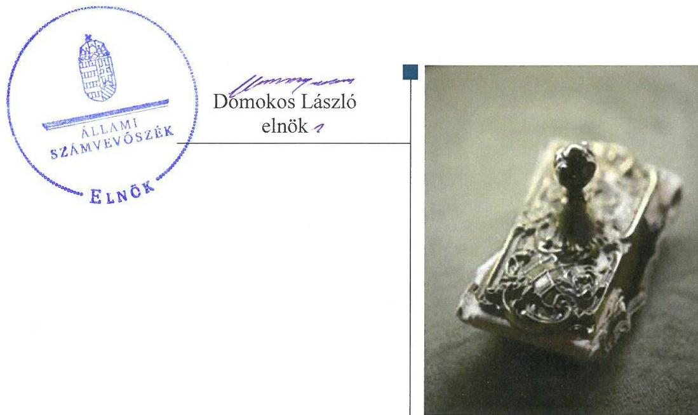
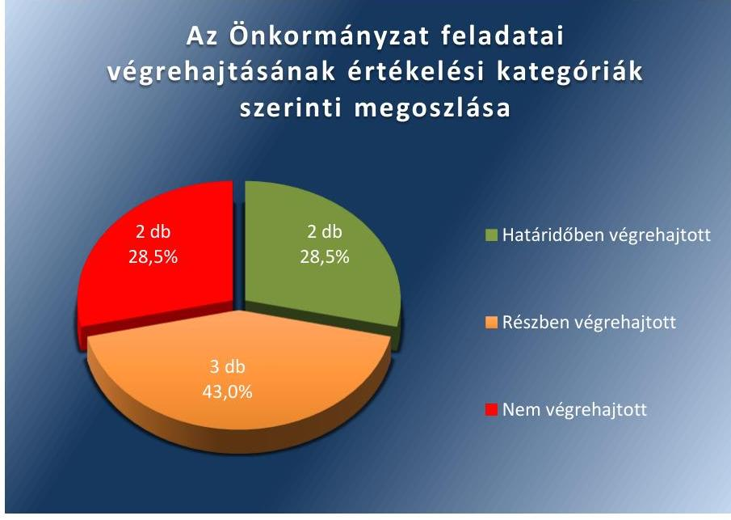
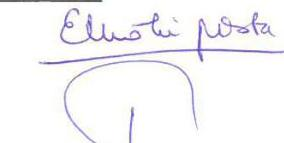
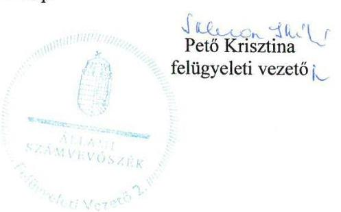

# Jelentés 

## Utóellenőrzések

Az önkormányzatok pénzügyi gazdálkodási helyzete értékelésének, és gazdálkodása szabályosságának utóellenőrzése Encs Város Önkormányzata 2018.

---

# Jelentés 

## Utóellenőrzések

Az önkormányzatok pénzügyi gazdálkodási helyzete értékelésének, és gazdálkodása szabályosságának utóellenőrzése Encs Város Önkormányzata
2018. O. hó 30. nap

---

# AZ ELLENŐRZÉST FELÜGYELTE: 

PETŐ KRISZTINA felügyeleti vezető

## AZ ELLENŐRZÉST VEZETTE ÉS A VÉGREHAJTÁSÁÉRT FELELŐS:

VARGA EDIT ellenőrzésvezető

## A PROGRAM ÖSSZEÁLLÍTÁSÁÉRT FELELŐS:

JANIK JÓZSEF LÁSZLÓ osztályvezető

## A TÉMÁHOZ KAPCSOLÓDÓ KORÁBBI SZÁMVEVŐSZÉKI JELENTÉS:

- címe: Jelentés az önkormányzatok pénzügyi gazdálkodási helyzete értékelésének, és gazdálkodása szabályosságának ellenőrzéséről - Encs
- sorszáma: 14070

IKTATÓSZÁM: EL-0177-041/2018.
TÉMASZÁM: 2096
ELLENŐRZÉS-AZONOSÍTÓ SZÁM: V075598

---

# TARTALOMJEGYZÉK 

■ ÖSSZEGZÉS ..... 5
■ AZ ELLENŐRZÉS CÉLJA ..... 6
■ AZ ELLENŐRZÉS TERÜLETE ..... 7
■ AZ ELLENŐRZÉS HÁTTERE, INDOKOLTSÁGA ..... 8
■ A JELENTÉS LÉNYEGES KÉRDÉSKÖRE ..... 9
■ AZ ELLENŐRZÉS HATÓKÖRE ÉS MÓDSZEREI ..... 10
■ MEGÁLLAPÍTÁSOK ..... 12
■ MELLÉKLETEK ..... 15
I. sz. melléklet: Az ÁSZ 14070. számú jelentéséhez kapcsolódóan az önkormányzat intézkedési tervének végrehajtása ..... 15
■ FÜGGELÉK: ÉSZREVÉTELEK ..... 19
■ RÖVIDÍTÉSEK JEGYZÉKE ..... 27

---

.

---

# ÖSSZEGZÉS 

Az Állami Számvevőszék utóellenőrzése megállapította, hogy Encs Város Önkormányzata az intézkedési tervben foglalt feladatok jelentős részét nem hajtotta végre. Az intézkedések végrehajtásának elmaradása az Önkormányzat pénzügyi egyensúlyának hosszú távú fenntarthatóságát veszélyezteti. A gazdálkodás szabályosságát érintő hiányosságok továbbra is fennálltak, amely nem támogatta a szabályos közpénzfelhasználást.

## Az ellenőrzés társadalmi indokoltsága

Az Állami Számvevőszék stratégiájában célul tűzte ki a számvevőszéki munka hasznosulásának javítását. Ezzel összhangban ellenőrzi, hogy az ellenőrzött szervezetek megvalósították-e a korábbi ellenőrzései által feltárt hibák, hiányosságok és szabálytalanságok megszüntetése céljából kialakított intézkedési terveikben foglaltakat. A rendszeres utóellenőrzések hozzájárulnak a szükséges intézkedések tényleges végrehajtásához, ezáltal a közpénzügyek rendezettségének javulásához.

## Főbb megállapítások, következtetések

Az Önkormányzat intézkedési tervében meghatározott hét feladat közül kettőt határidőben-, hármat részben hajtott végre, két feladatot azonban nem végzett el. Mivel az Önkormányzat a vállalt feladatainak jelentős részét nem hajtotta végre, így a továbbra is fennálló - a pénzügyi egyensúly megteremtése, hosszú távú fenntarthatóságára vonatkozó - hiányosságok veszélyeztették a pénzügyi egyensúly hosszú távú fenntarthatóságát. A gazdálkodás szabályossága terén megállapított hiányosságok miatt a szabályos közpénzfelhasználás nem volt támogatott.

A két - önkormányzati gazdálkodás biztonságát célzó és a stabilizációs program kidolgozására vonatkozó - határidőben végrehajtott feladat mellett az Önkormányzat három feladatot részben hajtott végre: az ellenőrzött időszakon belül csak egy évre vonatkozóan mérte fel a bevételnövelő és kiadáscsökkentő lehetőségeket; nem minden esetben intézkedett a kiegyenlítést szolgáló forrás megjelöléséről, a lejárt szállítói tartozás átütemezéséről; a tervezéskor a bevételeket nem minden esetben a jogszabályi előírásoknak megfelelően, közgazdaságilag megalapozottan határozta meg. Ezek mellett az Önkormányzat két feladatot nem hajtott végre, az önként vállalt feladatok finanszírozhatóságának felméréseit nem készítette el, továbbá a közbeszerzésekről szóló törvény előírása ellenére nem módosította az Encs Városgazda Nonprofit Kft-vel fennálló közszolgáltatási szerződését.

Az intézkedési tervben rögzített feladatok végrehajtásáról a jogszabályi előírásoknak megfelelő nyilvántartást vezették.

---

# AZ ELLENŐRZÉS CÉLJA 

Az ellenőrzés célja annak értékelése volt, hogy a számvevőszéki jelentésben ${ }^{1}$ foglalt javaslatokat megalapozó megállapításokkal összhangban készített intézkedési tervben meghatározott feladatokat az ellenőrzött szervezet végrehajtotta-e.

---

# AZ ELLENŐRZÉS TERÜLETE 

## Encs Város Önkormányzata

Encs Borsod-Abaúj-Zemplén megyében, a Hernád folyó völgyében, Miskolctól északkeletre mintegy 40 km-re fekszik, 1984-ben kapott városi címet. Állandó lakosainak száma a KSH² által közzétett népességi adatok szerint 2016. január 1-jén 6297 fő volt. A jelenleg hivatalban lévő polgármester ${ }^{3}$ a 2014. évi választások óta tölti be tisztségét. A jegyző ${ }^{4}$ - korábbi aljegyző - 2014 szeptemberétől látja el közszolgálati feladatait. Az utóellenőrzés időszakában az Önkormányzat ${ }^{5}$ kilencfős Kép-viselő-testülettel ${ }^{6}$ működött, amelynek munkáját három bizottság segítette.

Az Önkormányzat a 2016. évi költségvetési beszámoló szerint 1718 M Ft költségvetési és finanszírozási bevételt ért el, és 1553 M Ft költségvetési és finanszírozási kiadást teljesített. 2016. december 31-én a mérleg föösszege 4 425,2 M Ft, a követelések állománya 38,7 M Ft, a kötelezettségek állománya 43,9 M Ft volt.

Az ÁSZ ${ }^{7}$ a 2013. évben induló ellenőrzésében az Önkormányzat pénzügyi gazdálkodási helyzetét és gazdálkodása szabályosságát ellenőrizte, amelyről a 14070. számú jelentését 2014. április 30-án tette közzé. A számvevőszéki jelentés a polgármesternek hat, a jegyzőnek egy javaslatot tartalmazott, amelynek hasznosítására a Képviselő-testület hét feladatot határozott meg.

Az utóellenőrzés - a 2014. április 30-tól 2017. július 26-ig végrehajtott intézkedéseket figyelembe véve - a számvevőszéki jelentésben megfogalmazott megállapításokra összeállított és megküldött intézkedési tervben foglalt feladatok végrehajtására irányult.

---

# AZ ELLENŐRZÉS HÁTTERE, INDOKOLTSÁGA 

Az ÁSZ tv. ${ }^{8}$ 33. § (1) bekezdése értelmében a számvevőszéki jelentések javaslatot megalapozó megállapításaihoz kapcsolódóan az ellenőrzött szervezet vezetője intézkedési tervet köteles összeállítani, és az ÁSZ részére megküldeni. Az intézkedési tervben foglaltak megvalósítását - az ÁSZ tv. 33. § (7) bekezdésében foglaltak alapján - az ÁSZ utóellenőrzés keretében ellenőrizheti. Az intézkedések megvalósulásának értékelése során az ÁSZ figyelembe vette az ellenőrzött szervezet működési feltételeiben, valamint a jogszabályi előírásokban bekövetkezett változásokat.

Az intézkedési tervekben foglalt feladatok hiányos, illetve késedelmes végrehajtása, valamint megvalósításának elmaradása azt mutatja, hogy az ellenőrzések során feltárt hibák, hiányosságok és szabálytalanságok megszüntetése nem kapott kellő hangsúlyt. Ez a szabályszerű működés és a felelős vezetői magatartás vonatkozásában kockázatot hordoz. E kockázatok feltárásával az ÁSZ utóellenőrzési rendszere fokozza a fegyelmet, és igazolja, hogy a közpénzzel való szabályos gazdálkodás felelőssége elől nem lehet kitérni.

Az utóellenőrzés négy szinten hasznosulhat:
$\longrightarrow$ A társadalom szintjén az utóellenőrzés jelzi, hogy a számvevőszéki ellenőrzés megállapításainak van következménye: a hiányosságok megszüntetésére az ellenőrzött szervezet által meghatározott intézkedések végrehajtását is számon kéri az ÁSZ.
$\longrightarrow$ Az ellenőrzött terület szintjén az utóellenőrzés tájékoztatást nyújt a terület döntéshozóinak a hiányosságok kiküszöbölésének jó gyakorlatairól, ezzel lehetőséget biztosítva arra, hogy az ÁSZ ellenőrzési megállapításai, javaslatai a terület nem ellenőrzött szervezeteinek a működése során is hasznosuljanak.
$\longrightarrow$ Az ellenőrzött szervezet szintjén az utóellenőrzés feltárja, hogy a szervezet az intézkedések végrehajtásával hasznosította-e a korábbi ellenőrzési jelentésben a hiányosságok megszüntetése, illetve a kockázatok kezelése érdekében megfogalmazott javaslatokat.
$\longrightarrow$ Az ÁSZ szintjén az utóellenőrzés visszacsatolást ad az ellenőrzési jelentések hasznosulásáról, az intézkedések elmaradása vagy részleges megvalósulása a további ellenőrzésekhez kockázati jelzésként szolgál.

---

# A JELENTÉS LÉNYEGES KÉRDÉSKÖRE 

Az Önkormányzat az intézkedési tervben foglaltakat az elöirt határidőben végrehajtotta-e?

---

# AZ ELLENŐRZÉS HATÓKÖRE ÉS MÓDSZEREI 

## Az ellenőrzés típusa

Megfelelőségi ellenőrzés.

## Az ellenőrzött időszak

Az utóellenőrzés alapját képező számvevőszéki jelentés közzétételének napjától (2014. április 30.) az ellenőrzésről szóló kiértesítő levél keltének napjáig (2017. július 26.) tartó időszak.

## Az ellenőrzés tárgya

A számvevőszéki jelentésben foglalt javaslatokat megalapozó megállapításokkal összhangban - az Önkormányzat által - készített intézkedési tervben foglaltak végrehajtásának ellenőrzése volt.

Az ellenőrzés kiterjedt minden olyan körülményre és adatra, amely az ÁSZ jogszabályban meghatározott feladatainak teljesítéséhez, valamint a program végrehajtása folyamán felmerült újabb összefüggések feltárásához szükséges volt.

## Az ellenőrzött szervezet

Encs Város Önkormányzata

## Az ellenőrzés jogalapja

Az ÁSZ tv. 33. § (7) bekezdése alapján az intézkedési tervben foglaltak megvalósítását az ÁSZ utóellenőrzés keretében ellenőrizheti.

## Az ellenőrzés módszerei

Az ÁSZ az ellenőrzést a nemzetközi standardokat irányadónak tekintve az ellenőrzési program ellenőrzési kérdései, az ellenőrzött időszakban hatályos jogszabályok, az ellenőrzés szakmai szabályok és módszertanok figyelembevételével, önálló ellenőrzés keretében végezte.

Az ÁSZ az ellenőrzés ideje alatt az ellenőrzött szervezettel történő kapcsolattartást az ÁSZ SZMSZ ${ }^{\circledR}$-ének vonatkozó előírásai alapján biztosította.

---

Az utóellenőrzés megállapításait elsősorban az ÁSZ rendelkezésére álló, valamint az ellenőrzött szervezetektől elektronikusan bekért dokumentumok alapozták meg.

Az ellenőrzési bizonyítékként felhasználható adatforrások közé tartoztak egyrészt a szakmai programban felsorolt adatforrások, másrészt minden - az ellenőrzés folyamán feltárt, az ellenőrzés szempontjából információt tartalmazó - dokumentum.

Az intézkedési tervben előírt feladatokat azok végrehajtása szempontjából az alábbiak szerint értékelte az ÁSZ:
— „határidőben végrehajtott" a feladat, ha a teljesítés dokumentáltan, az intézkedési tervben előírt határidőben és tartalommal megtörtént;
— „határidőn túl végrehajtott" a feladat, ha annak teljesítése az intézkedési tervben meghatározott módon, de az előírt határidőn túl történt meg;
— „részben végrehajtott" a feladat, ha végrehajtása teljes körűen az intézkedési tervben előírt módon nem történt meg;
— „nem végrehajtott" a feladat, ha a végrehajtás nem történt meg, vagy amennyiben a teljesítést nem dokumentálták;
— „okafogyottá vált" a feladat, ha végrehajtására - meghatározott esemény bekövetkezése, továbbá külső körülmény, a működést érintő feltétel változása miatt - már nincs szükség, illetve lehetőség, és egyértelműen megállapítható, hogy az intézkedést szükségessé tevő körülmény a jövőben nem fordulhat elő;
— „nem időszerű" az a feladat, amelynek ellenőrzési időszakon belüli végrehajtására azért nem került (kerülhetett) sor, mert az intézkedés alapjául szolgáló esemény nem következett be, de annak jövőbeni előfordulása lehetséges, a végrehajtása nem volt esedékes, vagy a végrehajtás határideje még nem járt le.
Az ellenőrzés lefolytatásához az ellenőrzött szervezet a tanúsítványok elektronikus kitöltésével, valamint az ÁSZ által kért dokumentumok elektronikus megküldésével szolgáltatott adatokat, amelyek valódiságát és teljes körűségét az ellenőrzött szervezet vezetője által tett teljességi és hitelességi nyilatkozat igazolta. Az így rendelkezésre bocsátott adatok, információk kontrollja az ellenőrzés keretében megtörtént.

---

# MEGÁLLAPÍTÁSOK 

## Az Önkormányzat az intézkedési tervben foglaltakat az előírt határidőben végrehajtotta-e?

Összegző megállapítás

Az Önkormányzat az intézkedési tervben meghatározott feladatainak jelentős részét nem hajtotta végre, hét feladatból kettőt hajtott végre határidőben, hármat részben hajtott végre, két feladatot nem végzett el.

Az Önkormányzat az intézkedési tervben a hiányosságok, szabálytalanságok megszüntetésére hét feladatot határozott meg. Az intézkedési tervében meghatározott feladatokat, határidőket, a feladatok végrehajtásáért felelős személyeket és a feladatok végrehajtását az I. számú melléklet mutatja be.

Az intézkedési tervben meghatározott feladatok végrehajtásának értékelési kategóriák szerinti megoszlását az 1. ábra szemlélteti.

1. ábra

Fonráz: ASZ

## HATÁRIDŐBEN VÉGREHAJTOTT feladatok:

1. A Képviselő-testület 2014. évben, a meghatározott határidőre önkormányzati határozatban döntött az önkormányzati gazdálkodás biztonságát nyújtó tartalékkeret létrehozásáról, képzésének szabályairól.

---

2. A jegyző határidőre elkészítette az Önkormányzat pénzügyi egyensúlyi helyzetének hosszú távú fenntartására, valamint az adósságállomány újratermelődésének megakadályozására irányuló intézkedéseket tartalmazó stabilizációs programot.

# RÉSZBEN VÉGREHAJTOTT feladatok: 

3. A jegyző 2015. évre intézkedett a költségvetési rendelettervezet elkészítését megelőzően a bevételszerző és kiadáscsökkentő lehetőségek felméréséről, amelynek elfogadásáról a Képviselő-testület döntött. A 2016-2017. évek költségvetés tervezéséhez, valamint a 2015-2017. években a költségvetési rendeletek évközi módosításait megelőzően a jegyző nem mérte fel a bevételnövelő és kiadáscsökkentő lehetőségeket és nem készített a bevezetéshez szükséges határozati javaslatot. A polgármester nem terjesztette be a Képviselő-testület elé a kiadáscsökkentő és bevételnövelő lehetőségeket számba vevő döntési javaslatot.
4. A jegyző legalább negyedévente beszámolt a Képviselő-testületnek a lejárt szállítói tartozások alakulásáról, azonban az ellenőrzött 11 negyedév alatt nyolc negyedév esetében a beszámolót követően nem intézkedett határozati javaslatban a kiegyenlítést szolgáló forrás megjelöléséről, a lejárt szállítói tartozás átütemezéséről.
5. A jegyző csak részben intézkedett arról, hogy a bevételeket az Áht. ${ }^{10}$ előírásainak megfelelően, közgazdaságilag megalapozottan határozzák meg. A Képviselő-testület a 2015-2016. évek költségvetés végrehajtását jóváhagyó zárszámadás rendeletei alapján a bevételeket közgazdaságilag megalapozottan határozták meg, mert az eredeti előirányzatok között múködési célú központosított előirányzat nem került megtervezésre. A jegyző azonban a 2017. évi költségvetés tervezés során az Áht. 4. § (2) bekezdése szerinti közgazdaságilag megalapozott tervezési kötelezettség felől nem intézkedett.

## VÉGRE NEM HAJTOTT feladatok:

6. A polgármester nem intézkedett az önként vállalt feladatok finanszírozhatóságának felmérése érdekében, nem tett javaslatot a Képviselő-testületnek a feladatellátás racionalizálására.
7. A polgármester a Kbt. ${ }^{11}$ 9. § (3) bekezdésében foglaltaknak nem tett eleget, mivel nem módosította az Encs Városgazda Nonprofit Kft-vel fennálló közszolgáltatási szerződését a Képviselő-testület döntése ellenére. 2015. november 1-jétől a Kbt. ${ }^{12}$ hatályba lépésével a feladat végrehajtása okafogyottá vált.

Az ÁSZ javaslatai alapján készített intézkedési tervben rögzített feladatok végrehajtásáról az Önkormányzat a Bkr. ${ }^{13}$ 14. § (1) bekezdésében előírt nyilvántartást vezette.

---

.

---

# MELLÉKLETEK

- I. SZ. MELLÉKLET: AZ ÁSZ 14070. SZÁMÚ JELENTÉSÉHEZ KAPCSOLÓDÓAN AZ ÖNKORMÁNYZAT INTÉZKEDÉSI TERVÉNEK VÉGREHAJTÁSA

|  1. | Az intézkedési tervben meghatározott feladat | Az intézkedési tervben meghatározott határidő | Az intézkedési tervben meghatározott feladat végrehajtásának felelőse  |
| --- | --- | --- | --- |
|  2. | 1. | 2. | 3.  |
|  Határidőben végrehajtott feladatok |  |  |   |
|  1. | „Az adósságkonszolldációs folyamat lezárulását követően a gazdálkodás biztonsága, a fizetőképesség megőrzése érdekében olyan tartalmú határozati javaslat (döntési javaslat) elkészítése, amely a müködési és felhalmozási egyensúly hosszú távú fenntartása érdekében megjelöli egy elkülönített tartalék nagyságát, a képzésének és felhasználásának szabályait." | 2015. február 15. | jegyző, polgármester  |
|  2. | „Az Önkormányzat gazdasági helyzetének elemzésén alapuló, a pénzügyi egyensúlyi helyzet hoszszú távú fenntartására, az adósságállomány újratermelésének megakadályozására irányuló stabilizációs program kidolgozása." | 2015. augusztus 31. | jegyző, polgármester  |
|  Részben végrehajtott feladatok |  |  |   |
|  3. | „A 2015. évi költségvetési rende-let-tervezet, valamint annak évközi módosításai előterjesztésének elkészítését megelőzően még 2014. évben a tervezés időszakában, illetve az ezt követő években a költségvetési rendelet és módosítása szerinti rendszerességgel fel kell mérni a bevételnövelő és | Mindenkori költségvetési tervezés és végrehajtás (évközbeni módosítás) során folyamatosan | jegyző, polgármester  |

- Határidőben végrehajtott feladat: 2014. évben a Képviselő-testület meghozta a 86/2014. (IX.15.) számú határozatát a 2015. évi költségvetési rendelet-tervezethez, amely tartalmazta a bevételnövelő és kiadáscsökkentő lehetőségek számbavételét az önkormányzati gazdálkodás biztonsága, a fizetőképesség, a müködési és felhalmozási egyensúly hosszú távú fenntartása érdekében.

---

|  4. | Az intézkedési tervben meghatározott feladat | Az intézkedési tervben meghatározott határidő | Az intézkedési tervben meghatározott feladat végrehajtásának felelőse | Az intézkedési tervben meghatározott feladat végrehajtása  |
| --- | --- | --- | --- | --- |
|   | 1. | 2. | 3. | 4.  |
|   | kiadáscsökkentő lehetőségeket. Az intézkedések bevezetéséhez szükséges határozati javaslatot (döntési javaslatot) a Képviselőtestület elé kell terjeszteni. A Képviselő-testület által határozattá emelt javaslatban foglaltakat a mindenkori költségvetési tervezésben, a költségvetést megállapító rendeletben érvényesíteni kell." |  |  | - Nem végrehajtott feladat:
A 2016-2017. évek költségvetés tervezéséhez, valamint a 2015-2017. években a költségvetési rendeletek évközi módosításait megelőzően a jegyző nem mérte fel a bevételnövelő és kiadáscsökkentő lehetőségeket és nem készített az intézkedések bevezetéshez szükséges határozati javaslatot. A polgármester e témában nem terjesztett be döntési javaslatot a Képviselő-testület elé.  |
|  4. | „A jegyző legalább negyedévenként, illetve a negyedévet követő munkaterv szerinti ülésen számoljon be a képviselő-testületnek a lejárt szállítói tartozás alakulásáról. A határozati javaslatban intézkedni kell a kiegyenlítést szolgáló forrás megjelöléséről, ha szükséges, a lejárt szállítói tartozás átütemezéséről." | folyamatos, illetve a negyedévet követő munkaterv szerinti ülés. | jegyző, polgármester, önállóan gazdálkodó intézmények vezetői, pénzügyi irodavezető | - Határidőben végrehajtott feladat:
A jegyző legalább negyedévente beszámolt a Képviselő-testületnek a lejárt szállítói tartozások alakulásáról, a 112/2014. (XI. 17.) és a 110/2015. (IX. 21.) számú Képviselő-testületi határozat, valamint a polgármester előterjesztése alapján az ellenőrzött időszakban 11 negyedévből három negyedévben intézkedés történt a szállítói tartozások kiegyenlítésére, vagy a lejárt tartozások átütemezésére.
- Nem végrehajtott feladat:
Az utóellenőrzött, Képviselő-testület által határozatban elfogadott intézkedési tervben felelősként megjelölt jegyző az ellenőrzött 11 negyedévben, nyolc negyedév esetében a negyedévi beszámolót követően nem intézkedett határozati javaslatban a kiegyenlítést szolgáló forrás megjelöléséről, a lejárt szállítói tartozás átütemezéséről.  |
|  5. | „A mindenkori költségvetési rendelet-tervezetben a Mötv-ben előírt egyensúly biztosítása érdekében - az Áht. 12. § (1) bekezdésének megfelelően a bevételeket közgazdaságilag megalapozottan kell meghatározni." | 2015. február 15., illetve folyamatos | jegyző, polgármester | - Határidőben végrehajtott feladat:
A jegyző a 2015-2016. évekre vonatkozóan intézkedett arról, hogy a bevételeket az Áht. előírásainak megfelelően, közgazdaságilag megalapozottan határozzák meg, mivel a Képviselő-testület költségvetés végrehajtását jóváhagyó zárszámadás rendeletei alapján az eredeti előirányzatok között működési célú központosított előirányzat nem került megtervezésre.
- Nem végrehajtott feladat:
A jegyző a 2017. évi költségvetés tervezés során az Áht. 4. § (2) bekezdése szerinti közgazdaságilag megalapozott tervezési kötelezettség teljesítése felől nem intézkedett.  |

---

|  Az intézkedési tervben meghatározott feladat | Az intézkedési tervben meghatározott határidő | Az intézkedési tervben meghatározott feladat végrehajtásának felelőse | Az intézkedési tervben meghatározott feladat végrehajtása  |
| --- | --- | --- | --- |
|  1. | 2. | 3. | 4.  |
|  Végre nem hajtott feladatok |  |  |   |
|  6. „A kötelező feladatellátásnak elsőbbséget kell élveznie az önként vállalt feladatokkal szemben. Amennyiben ez csorbát szenvedne, úgy a polgármester tegyen javaslatot a Képviselő-testület felé a feladatellátás racionalizálására." | Költségvetési koncepció, illetve a költségvetési rendelet tervezet elkészítésével egyidejűleg, az arány folyamatosan figyelendő, szükség esetén felülvizsgálandó. | pénzügyi irodavezető, jegyző, polgármester | A pénzügyi irodavezető az ellenőrzött időszakban az önként vállalt feladatok finanszírozhatóságának felméréseit nem készítette el, és ennek hiányában a polgármester sem tett javaslatot a feladatellátás racionalizálására.  |
|  7. „A közbeszerzési eljárásról szóló 2011. évi CVIII. tv.-ben (Kbt.) 2012.01.01.-től) foglaltak maradéktalan betartása érdekében a Városgazda Nonprofit Közhasznú Kft.-vel megkötött közszolgáltatási szerződést módosítani kell. A jövőbeni közszolgáltatási szerződések megkötése esetén a jogszabályi előírások maradéktalan betartására különösen nagy figyelmet kell fordítani." | 2014. június 30., illetve folyamatos | polgármester | A Képviselő-testület az Encs Városgazda Nonprofit Kft-vel 2013. június 27. napjával kötött közszolgáltatási szerződést megtárgyalta, az 58/2014.(VI.24.) határozatában döntött a szerződés határozatlan időről öt éves időtartamra szóló hatályra való módosításáról, továbbá felhatalmazta a polgármestert a szerződésmódosítás aláírására. A polgármester a Képviselő-testület döntése ellenére a Kbt. 9. § (3) bekezdésében foglaltaknak nem tett eleget, mivel nem módosította az Encs Városgazda Nonprofit Kft-vel fennálló közszolgáltatási szerződését. A 2015. november 1-jéig hatályban levő Kbt. 9. § (3) bekezdésében foglaltak maradéktalan betartása érdekében a vizsgált időszakban esetlegesen megkötésre került új közszolgáltatási szerződés jogszabályi előírásoknak való megfeleltetését sem igazolta dokumentumokkal a polgármester.
2015. november 1-jétől a Kbt. hatályba lépésével a feladat végrehajtása okafogyottá vált.  |

Forrás: ÁSZ által készített táblázat

---

.

---

# FÜGGELÉK: ÉSZREVÉTELEK 

A jelentéstervezetet a Számvevőszék 15 napos észrevételezésre megküldte az ellenőrzött szervezet vezetőjének az ÁSZ tv. 29. §* (1) bekezdése előírásának megfelelően.
Encs Város Önkormányzatának polgármestere a jelentéstervezet megállapításaira észrevételt tett.
A függelék - melléklet nélkül - tartalmazza a polgármester észrevételeit, illetve az el nem fogadott észrevételek elutasításának indoklását.

[^0]
[^0]:    * 29. § (1) Az Állami Számvevőszék az ellenőrzési megállapításait megküldi az ellenőrzött szervezet vezetőjének vagy az általa megbízott személynek, és annak, akinek személyes felelősségét állapította meg.
    (2) Az ellenőrzött szervezet vezetője és a felelősként megjelölt személy az ellenőrzés megállapításaira tizenöt napon belül írásban észrevételt tehet.
    (3) Az Állami Számvevőszék az észrevételre a beérkezésétől számított harminc napon belül írásban válaszol. A figyelembe nem vett észrevételeket köteles a jelentésben feltüntetni, és megindokolni, hogy azokat miért nem fogadta el.

---

# ENCS VÁROS ÖNKORMÁNYZATA

3860 ENCS, Petőfi út 75.
Telefon: (46) 385-611,
Fax: (46) 385-943;
E-mail: onkormanyzat@encs.hu

2236

Szám: 4872/2017
Ügyintéző: dr. Szántó

Állami Számvevőszék

Budapest
Apáczai Csere János u.10.
1052

Tárgy: Észrevétel számvevői jelentés
tervezetre
Hív.szám: EL-0177-034/2017

## Tisztelt Számvevőszék!

Hivatkozva az EL-0177-034/2017 számú számvevői jelentéstervezet megállapításaira az alábbi észrevételeket tesszük:

- A jegyző minden előírt alkalommal felmérte, illetve az év során folyamatosan figyelemmel kísérte a bevételnövelő, illetve kiadáscsökkentő lehetőségeket, melyet a mindenkori költségvetési rendeletek 4. § (3) bekezdése elől is írt számára.

A szükséges döntéseket esedékességük időpontjában a jegyző előkészítette, melyet eseti döntések formájában a polgármester a képviselő-testület elé terjesztett. A meghozott döntéseket a megküldött jegyzői nyilvántartás részletesen tartalmazza.

Az intézkedési terv nem tartalmaz olyan előírást, hogy a jegyző ezen irányú felülvizsgálati kötelezettsége teljesítésének külön erre irányuló határozatban köteles eleget tenni, felelőssége a rendelet tervezetek elkészítésére, illetve a bevételnövelő és kiadáscsökkentő döntési javaslatok előkészítésére terjedt ki, melynek folyamatosan, a lehetőségek függvényében tett eleget.

- A jegyző minden negyedévet követően eleget tett tájékoztatási kötelezettségének a lejárt szállítói tartozásokról a képviselő-testület felé. Négy alkalommal vált szükségessé a döntés a kiegyenlítést szolgáló forrásokról, illetve a tartozások átütemezéséről, tekintettel arra, hogy mire a negyedéves pénzügyi adatok lezárásra és a testület elé kerültek az érintett szállítói tartozások már rendezésre kerültek, a testületi ülések időpontjában már nem álltak fenn.

- A 2017. évi költségvetés tervezése során sem került sor az eredeti előirányzatok között működési célú központosított előirányzat tervezésére, így a tervezett bevételek közgazdaságilag megalapozottan kerültek beállításra. A működési célú költségvetési támogatások és kiegészítő támogatások soron bevétel tervezésére nem került sor.

Az egyéb működési célú támogatások bevétele sor a Kormányhivatal Foglalkoztatási Főosztálya által átadott a közfoglalkoztatáshoz kapcsolódó bér és dologi kiadások támogatási összegét, valamint az egészségügyi feladatokra kapott OEP finanszírozás összegét tartalmazza.

---

végre. Az 1. számú szerződés módosítás és az egységes szerkezetbe foglalt szerződés 2014. június 25. napján aláírásra került. A határozat végrehajtásáról a lejárt határidejű határozatok végrehajtásáról szóló napirend keretében a polgármester, illetve a jegyző a képviselő-testület felé a 2014. szeptember 15-i ülésen beszámolt.
Amennyiben a feladat végrehajtását a képviselő-testület döntése, mint csatolt dokumentum nem alapozta meg, felhívás esetén a szerződésmódosítás csatolásának eleget tettünk volna.

- A költségvetés előkészítése során, a lefolytatott egyeztetések alapján a költségvetés tervezetében a kötelező feladatellátás biztosítása érdekében önként vállalt feladatok ellátásának tervezésére csak a rendelkezésre álló bevételek keretén belül és olyan mértékben került sor, hogy az a kötelező feladatellátást ne veszélyeztesse.
Tekintettel arra, hogy az intézkedési terv szerint a polgármester racionalizálási javaslatot abban az esetben köteles készíteni, ha a kötelező feladatellátás elsőbbsége csorbát szenvedne és ilyenre nem került sor, téves az a megállapítás, hogy nem hajtotta végre a terhére rótt feladatot. Az önkormányzat a 2015-2016. évi költségvetését is pénzmaradvánnyal zárta. A kötelező feladatellátás elsőbbsége a költségvetési év során biztosított volt.

Encs, 2017. december 12.

Tisztelettel:

---

ELKÖK

Ikt.szám: EL-0177-039/2018.

# Szeles András úr 

polgármester
Encs Város Önkormányzata

## Encs

## Tisztelt Polgármester Úr!

Az „Utóellenörzések - Az önkormányzatok pénzügyi gazdálkodási helyzete értékelésének, és gazdálkodása szabályosságának utóellenörzése - Encs Város Önkormányzata" címmel készített számvevőszéki jelentéstervezetre tett észrevételeit köszönettel megkaptam.
Az Állami Számvevőszék észrevételekre vonatkozó álláspontjáról a felügyeleti vezető által készített részletes tájékoztatást csatoltan megküldöm.
Tájékoztatom Polgármester urat, hogy a számvevőszéki jelentésben - az Állami Számvevőszékről szóló 2011. évi LXVI. törvény 29. § (3) bekezdése alapján - a figyelembe nem vett észrevételeket szerepeltetjük az elutasítás indokának feltüntetésével.

Budapest, 2018. január hó 03. nap

Melléklet: Tájékoztatás az el nem fogadott észrevételekről

---

# Tájékoztatás az el nem fogadott észrevételekről 

Az „Utóellenörzések - Az önkormányzatok pénzügyi gazdálkodási helyzete értékelésének, és gazdálkodása szabályosságának utóellenörzése - Encs Város Önkormányzata" címủ jelentéstervezetre a 4872/2017. iktatószámú levelében tett észrevételeit áttekintettem. Az észrevételek kezeléséről az alábbi tájékoztatást adom.

## 1. A jelentéstervezet 13. oldal 3. pontjára tett észrevétele kapcsán

Az észrevétel szerint a jegyző minden alkalommal felmérte, illetve az év során folyamatosan figyelemmel kísérte a bevételnövelő és kiadáscsökkentő lehetőségeket, amelyet a költségvetési rendeletek is előírtak számára. A jegyző a szükséges döntéseket esedékességük időpontjában előkészítette, amelyeket a polgármester a képviselő-testület elé terjesztett. A meghozott döntéseket a megküldött jegyzői nyilvántartás részletesen tartalmazza. Az észrevétel szerint az intézkedési terv nem tartalmaz olyan előírást, hogy a jegyző ezen irányú felülvizsgálati kötelezettsége teljesítésének külön erre irányuló határozatban köteles eleget tenni, felelőssége a rendelettervezetek elkészítésére, illetve a bevételnövelő és kiadáscsökkentő döntési javaslatok előkészítésére terjedt ki, amelynek a lehetőségek függvényében folyamatosan eleget tett.

Az intézkedési tervben vállalt feladat szerint a bevételnövelő és kiadáscsökkentő lehetőségeket a 2015. évi költségvetési rendelettervezet, valamint annak évközi módosításai esetében az előterjesztések elkészítését megelőzően még 2014-ben, a tervezés időszakában fel kellett mérni. Az ezt követő évek tekintetében a költségvetési rendelet és módosítása szerinti rendszerességgel kellett felmérni a lehetőségeket, és az intézkedések bevezetéséhez határozati javaslatot (döntési javaslatot) kellett a képviselő-testület elé terjeszteni. A vállalt intézkedés szerint a mindenkori költségvetési tervezésben, a költségvetést megállapító rendeletben már a képviselő-testület által határozattá emelt javaslatban foglaltakat kellett érvényesíteni. Ezt támasztja alá az is, hogy a vállalt intézkedés végrehajtásának intézkedési tervben meghatározott felelősei közül a jegyző felelőssége - a költségvetési rendelettervezet, a módosító rendelettervezetek elkészítésén túl - a bevételnövelő és kiadáscsökkentő lehetőségek felmérésére, és - „a pénzügyi iroda szakembergárdájának közremüködésével" - az intézkedések bevezetéséhez szükséges döntési javaslat elkészítésére is kiterjedt. A 2016-2017. évekre vonatkozóan a vállalt intézkedés végrehajtását hitelt érdemlően alátámasztó bizonyíték az adatszolgáltatás során nem került csatolásra, a 2017. június 30 -án kelt teljességi és hitelességi nyilatkozat (továbbiakban: teljességi és hitelességi nyilatkozat) szerint pedig az Állami Számvevőszék (továbbiakban: ÁSZ) rendelkezésére bocsátott dokumentumok, adatok megbízhatóak, és a bekért adatokra, dokumentumokra vonatkozóan teljes körű információt adnak, továbbá Polgármester úr a nyilatkozatban teljes felelősséget vállalt a rendelkezésre bocsátott dokumentumok, adatok hiánytalanságáért. A fentiekre tekintettel az észrevételt nem fogadjuk el, a jelentéstervezet módosítása nem indokolt.

---

# 2. A jelentéstervezet 13. oldal 4. pontjára tett észrevétele kapcsán 

Az észrevétel szerint a jegyző minden negyedévet követően eleget tett tájékoztatási kötelezettségének a képviselő-testület felé a lejárt szállítói tartozásokról. Négy alkalommal vált szükségessé a döntés a kiegyenlítést szolgáló forrásokról, illetve a tartozások átütemezéséről, tekintettel arra, hogy mire a negyedéves pénzügyi adatok lezárásra és a testület elé kerültek, a lejárt szállítói tartozások rendezésre kerültek, és a testületi ülés időpontjában már nem álltak fenn.

Az adatszolgáltatás során rendelkezésre bocsátott jegyzői beszámolók alapján a teljes ellenőrzött időszakban volt az önkormányzatnak lejárt szállítói tartozása, azonban két esetben nem volt szükség határozati javaslattal történő intézkedésre. A 2014. III. negyedév végén fennálló lejárt szállítói tartozásállomány rendezésre került a képviselő-testületi ülés időpontjáig, a 110/2015. (IX.21.) határozat alapján pedig a 2015. II. félév végén fennálló lejárt szállítói tartozás átütemezését kezdeményezték. Nyolc negyedévre vonatkozóan (2014. IV. negyedév, 2015. I. negyedév, 2015. III. negyedév, 2015. IV. negyedév, 2016. I. negyedév, 2016. II. negyedév, 2016. IV. negyedév és 2017. I. negyedév) a jegyző egyáltalán nem intézkedett határozati javaslatban a kiegyenlítést szolgáló forrás megjelöléséről, illetve szükség esetén a lejárt szállítói tartozás átütemezéséről. Továbbá a 2016. III. negyedév végén fennálló lejárt szállítói tartozásállomány egy része rendezésre került a polgármesteri előterjesztés időpontjáig, a fennmaradó tartozás kiegyenlítésére, átütemezésére azonban szintén nem intézkedtek. A fentiekre tekintettel az észrevételt nem fogadjuk el, a jelentéstervezet módosítása nem indokolt.

## 3. A jelentéstervezet 13. oldal 5. pontjára tett észrevétele kapcsán

Az észrevétel szerint a 2017. évi költségvetés tervezése során sem került sor működési célú központosított előirányzat tervezésére, így a tervezett bevételek közgazdaságilag megalapozottan kerültek beállításra. A müködési célú költségvetési támogatások és kiegészítő támogatások soron bevétel tervezésére nem került sor. Ezt követően az észrevétel azt taglalta, hogy az egyéb müködési célú támogatások bevételek sor minek az összegét tartalmazta.

A 2015-2016. évekre vonatkozó megállapítást az adatszolgáltatás során rendelkezésre bocsátott zárszámadási rendeletekre alapozva fogalmaztuk meg. Mivel az ellenőrzött időszak 2017. július 26 -áig tartott, a 2017. évre vonatkozóan a feladat végrehajtását nem a 2017. évi zárszámadási, hanem a 2017. évi költségvetési rendelet, illetve egyéb bizonyítékok alapján ellenőriztük. Az adatszolgáltatás során rendelkezésre bocsátott 2017. évi költségvetési rendelet 3. §-a tartalmazza a költségvetés részletezését a vonatkozó mellékletekre való hivatkozással. A 2017. évi költségvetési rendeletet tartalmazó jegyzőkönyvis kivonat szerint: „/A rendelet mellékletei a jegyzőkönyvhöz csatolva./", azonban az adatszolgáltatás során a mellékletek nem kerültek megküldésre az ÁSZ részére. A teljességi és hitelességi nyilatkozat szerint az ÁSZ rendelkezésére bocsátott dokumentumok, adatok megbízhatóak, és a bekért adatokra, dokumentumokra vonatkozóan teljes körű információt adnak, továbbá Polgármester úr a nyilatkozatban teljes felelősséget vállalt a rendelkezésre bocsátott dokumentumok, adatok hiánytalanságáért. Figyelemmel arra, hogy az adatszolgáltatás során nem került csatolásra olyan dokumentum, amely az intézkedési tervben

---

vállalt feladat 2017. évi végrehajtását hitelt érdemlően bizonyítaná, az észrevételt nem fogadjuk el, a jelentéstervezet módosítása nem indokolt.

# 4. A jelentéstervezet 13. oldal 7. pontjára tett észrevétele kapcsán 

Az észrevétel szerint az I. számú szerződésmódosítás és az egységes szerkezetbe foglalt szerződés 2014. június 25. napján aláírásra került. A határozat végrehajtásáról a lejárt határidejű határozatok végrehajtásáról szóló napirend keretében a polgármester, illetve a jegyző a képviselőtestület felé a 2014. szeptember 15-ei ülésen beszámolt. Az észrevétel további részében Polgármester úr azt jelezte, hogy amennyiben a feladat végrehajtását a csatolt képviselő-testületi döntés nem alapozta meg, felhívás esetén a szerződésmódosítás csatolásának eleget tettek volna.

Az intézkedési tervben foglaltak végrehajtásának utóellenőrzéséhez az ÁSZ a 2017. június 22én kelt EL-0177-001/2017. ikt. számú adatbekérő levél 2. mellékletében Az utóellenőrzött szervezettől bekért dokumentumok 2. pontjában a következő dokumentumokat kérte Polgármester úrtól: „az intézkedési tervben meghatározott feladatok végrehajtását igazoló dokumentumok". Az intézkedési terv 2. pontjában vállalt feladat a Városgazda Nonprofit Közhasznú Kft.-vel megkötött közszolgáltatási szerződés módosítása volt, amelynek bizonyítéka a szerződő felek által aláirt szerződés. A hivatkozott képviselő-testületi határozat önmagában csak az önkormányzat szerződésmódosításra irányuló szerződéses akaratát fejezi ki. A teljességi és hitelességi nyilatkozat szerint az ÁSZ rendelkezésére bocsátott dokumentumok, adatok megbízhatóak, és a bekért adatokra, dokumentumokra vonatkozóan teljes körű információt adnak, továbbá Polgármester úr a nyilatkozatban teljes felelősséget vállalt a rendelkezésre bocsátott dokumentumok, adatok hiánytalanságáért. Az utólag megküldött dokumentumok hitelességéről nem áll módunkban meggyőződni. A fentiekre tekintettel az észrevételt nem fogadjuk el, a jelentéstervezet módosítása nem indokolt.

## 5. A jelentéstervezet 13. oldal 6. pontjára tett észrevétele kapcsán

Az észrevétel szerint a költségvetés előkészítése során, a lefolytatott egyeztetések alapján a költségvetés tervezetében a kötelező feladatellátás biztosítása érdekében önként vállalt feladatok ellátásának tervezésére csak a rendelkezésre álló bevételek keretén belül és olyan mértékben került sor, hogy az a kötelező feladatellátást ne veszélyeztesse. Az észrevétel szerint a polgármesternek akkor kellett volna racionalizálási javaslatot készítenie, ha a kötelező feladatellátás elsőbbsége csorbát szenvedett volna, erre viszont nem került sor. Az önkormányzat a 2015. és a 2016. évi költségvetését is pénzmaradvánnyal zárta, és a kötelező feladatellátás elsőbbsége a költségvetési év során biztosított volt.

Az intézkedési tervben vállalt feladat első fordulata az volt, hogy a kötelező feladatellátásnak elsőbbséget kell élveznie az önként vállalt feladatokkal szemben. Ennek biztosításához meg is kezdték az önkormányzati intézmények körében a szükséges adatok összegyüjtését. A 2015. és a 2017. évi költségvetési koncepciók megtárgyalásáról szóló képviselő-testületi határozatok tartalmaznak utalást arra vonatkozóan, hogy az intézményvezetőknek tételes kimutatást kellett készíteniük az intézmények által saját hatáskörben önként felvállalt, vagy testületi határozat alapján

---

ellátott nem kötelező feladatok (feladat megnevezése, ellátottak száma, költségek, bevételek) kimutatására. Az intézkedési tervben vállalt feladat második fordulata az volt, hogy amennyiben a kötelező feladatok ellátásának elsőbbsége csorbát szenvedne, úgy a polgármester tegyen javaslatot a képviselő-testület felé a feladatellátás racionalizálására. E feladat végrehajtásának előfeltétele annak megvizsgálása, hogy kell-e a polgármesternek a feladatellátás racionalizálására javaslatot tenni. A vállalt intézkedés végrehajtásának intézkedési tervben meghatározott felelősei közül a pénzügyi irodavezető felelőssége éppen az önként vállalt feladatok finanszírozhatóságának felmérésére terjedt ki. Erre vonatkozóan azonban az adatszolgáltatás során dokumentum nem került csatolásra. A teljességi és hitelességi nyilatkozat szerint az ÁSZ rendelkezésére bocsátott dokumentumok, adatok megbízhatóak, és a bekért adatokra, dokumentumokra vonatkozóan teljes körű információt adnak, továbbá Polgármester úr a nyilatkozatban teljes felelősséget vállalt a rendelkezésre bocsátott dokumentumok, adatok hiánytalanságáért. A fentiekre tekintettel az észrevételt nem fogadjuk el, a jelentéstervezet módosítása nem indokolt.

Budapest, 2018. ganuár hó 09. nap

---

# RÖVIDÍTÉSEK JEGYZÉKE 

${ }^{1}$ számvevőszéki jelentés
${ }^{2} \mathrm{KSH}$
${ }^{3}$ polgármester
${ }^{4}$ jegyző
${ }^{5}$ Önkormányzat
${ }^{6}$ Képviselő-testület
${ }^{7}$ Ász
${ }^{8}$ ÁSZ tv.
${ }^{9}$ ÁSZ SZMSZ
${ }^{10}$ Áht.
${ }^{11} \mathrm{Kbt}_{1}$
${ }^{12} \mathrm{Kbt}_{.2}$
${ }^{13} \mathrm{Bkr}$.
14070. számú Jelentés az önkormányzatok pénzügyi gazdálkodási helyzete értékelésének, és gazdálkodása szabályosságának ellenőrzéséről - Encs
Központi Statisztikai Hivatal
Encs Város Önkormányzatának polgármestere
Encs Város Önkormányzatának jegyzője
Encs Város Önkormányzata
Encs Város Önkormányzatának Képviselő-testülete
Állami Számvevőszék
2011. évi LXVI. törvény az Állami Számvevőszékről (hatályos 2011. július 1-jétől)

Az Állami Számvevőszék elnökének 3/2016. (XII. 29.) ÁSZ utasítása az Állami Számvevőszék Szervezeti és Működési Szabályzatáról (hatályos 2017. január 1-jétől)
2011. évi CXCV. törvény az államháztartásról (hatályos 2012. január 1-jétől)
2011. évi CVIII. törvény a közbeszerzésekről (hatályos: 2011. augusztus 21. - 2015. november 1.)
2015. évi CXLIII. törvény a közbeszerzésekről (hatályos: 2015. november 01-jétől)

370/2011. (XII. 31.) Kormányrendelet a költségvetési szervek belső kontrollrendszeréről és belső ellenőrzéséről (hatályos: 2012. január 1-jétől)

---

# ÁLLAMI SZÁMVEVŐSZÉK 

1052 Budapest, Apáczai Csere János utca 10.
Levélcím: 1364 Budapest 4. Pf. 54
Telefon: +36 14849100 Telefax: +36 14849200
www.asz.hu