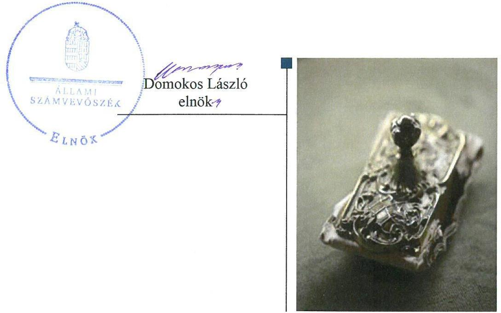
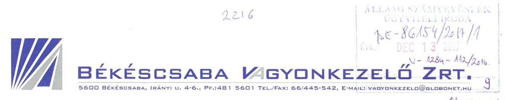
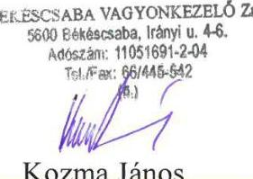
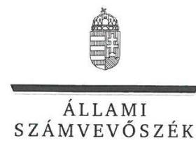
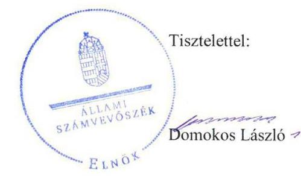
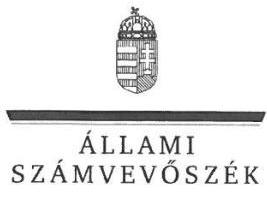

# Jelentés 

## Az önkormányzatok gazdasági társaságai

Az önkormányzatok többségi tulajdonában lévő gazdasági társaságok gazdálkodásának ellenőrzése Békéscsaba Vagyonkezelő Zrt.
2018.

---

# Jelentés 

## Az önkormányzatok gazdasági társaságai

Az önkormányzatok többségi tulajdonában lévő gazdasági társaságok gazdálkodásának ellenőrzése Békéscsaba Vagyonkezelő Zrt.
2018. 04. hó 24. nap

---

# AZ ELLENŐRZÉST FELÜGYELTE:

DR. NAGY IMRE felügyeleti vezető

# AZ ELLENŐRZÉST VEZETTE ÉS A VÉGREHAJTÁSÁÉRT FELELŐS:

SALAMIN VIKTOR ellenőrzésvezető

# A PROGRAM ÖSSZEÁLLÍTÁSÁÉRT FELELŐS:

JANIK JÓZSEF osztályvezető

---

**IKTATÓSZÁM:** V-1284-120/2016.

**TÉMASZÁM:** 2167

**ELLENŐRZÉS-AZONOSÍTÓ SZÁM:** V075809

---

Jelentéseink az Országgyűlés számítógépes hálózatán és az Interneta a www.asz.hu címen is olvashatóak.

---

# TARTALOMJEGYZÉK 

■ ÖSSZEGZÉS ..... 5
■ AZ ELLENŐRZÉS CÉLJA ..... 6
■ AZ ELLENŐRZÉS TERÜLETE ..... 7
■ AZ ELLENŐRZÉS HÁTTERE, INDOKOLTSÁGA ..... 9
■ A JELENTÉS LÉNYEGES KÉRDÉSKÖREI ..... 10
■ ELLENŐRZÉS HATÓKÖRE ÉS MÓDSZEREI ..... 11
■ MEGÁLLAPÍTÁSOK ..... 13
■ JAVASLATOK ..... 16
■ MELLÉKLETEK ..... 17
I. sz. melléklet: Értelmező szótár ..... 17
II. sz. melléklet: A Társaság főbb mérleg adatai ..... 19
■ FÜGGELÉK: ÉSZREVÉTELEK ..... 21
■ RÖVIDÍTÉSEK JEGYZÉKE ..... 29

---

.

---

# ÖSSZEGZÉS 

Békéscsaba Megyei Jogú Város Önkormányzata 2012-2015. között a tulajdonosi jogok gyakorlását az előirásoknak megfelelően szervezte meg és jogait szabályszerűen gyakorolta. A Békéscsaba Vagyonkezelő Zrt. vagyongazdálkodása 2012-2014. években szabályszerű volt. 2015. évben a vagyongazdálkodás nem volt szabályszerű, a beszámoló megalapozottsága nem volt biztosított, ami veszélyeztette a vagyon megőrzését és az elszámoltathatóságot. A Társaság az előirt tervezési, beszámolási és adatszolgáltatási kötelezettségének eleget tett. A közérdekú adatokat elektronikusan nem tette közzé, ezzel nem tett eleget az átláthatóság követelményének.

## Az ellenőrzés társadalmi indokoltsága

Magyarországon az intézmény-centrikus közfeladat-ellátás jellemző, de egyre jelentősebb a költségvetésen kívüli feladatellátás térnyerése. Helyi szinten ennek legfontosabb szereplői az önkormányzati tulajdonú gazdasági társaságok, amelyeknek ellenőrzése kiemelten fontos a közfeladat ellátása és a közvagyon megőrzése, megóvása érdekében. Ezért alapvető követelmény, hogy gazdálkodásuk, múködésük szabályszerű és átlátható legyen.

Békéscsabán a 2012-2015. években a Békéscsaba Vagyonkezelő Zrt. végezte az önkormányzati lakások, illetve a nem lakás célú ingatlanok kezelését, hasznosítását, a fizetőparkolási rendszer múködtetését, a sportcsarnok, valamint egyéb sportlétesítmények, a vásárcsarnok, piac és fürdő üzemeltetését. A Társaság feladatellátása a lakosság széles rétegét érintette. Az Állami Számvevőszék az ellenőrzése során arra kereste a választ, hogy 2012-2015. között szabályszerű volt-e a Társaság gazdálkodása és az Önkormányzat ehhez kapcsolódó tulajdonosi joggyakorlása. Az ellenőrzés rendet, a rend értéket teremt. A jelentésben foglalt megállapítások és az ezek alapján megfogalmazott számvevőszéki javaslatok hasznosítása elősegítheti a feltárt hiányosságok orvoslását.

## Főbb megállapítások, következtetések, javaslatok

Az Önkormányzat a Társaság feletti tulajdonosi joggyakorlásának kereteit a jogszabályoknak megfelelően alakította ki, a feladatellátás feltételeit biztosította, a tulajdonosi jogait szabályszerűen gyakorolta. Rendeletalkotási kötelezettségét teljesítette, a Társaság beszámolóit jóváhagyta.

A Társaság az előírt szabályzatokat elkészítette. A Társaság vagyonával 2012-2014. években szabályszerűen gazdálkodott, az éves beszámolók adatait leltárral alátámasztotta. 2015. évben a vagyongazdálkodás nem volt szabályszerű. A Társaság 2015. évben a mérleget leltárral nem támasztotta alá, a beszámoló megalapozottsága nem volt biztosított, ami veszélyeztette a vagyon megőrzését és az elszámoltathatóságot. A Társaság kötelezettségállományának alakulása a Társaság múködését nem veszélyeztette.

Az éves beszámolókat a Társaság a jogszabályban és a belső szabályozásban előírt határidőben elkészítette, letétbe helyezte és közzétette. A Társaság a jogszabályban rögzített közérdekú adatok közzétételére vonatkozó elektronikus közzétételi kötelezettségét nem teljesítette.

A Társaság bevételeinek, ráfordításainak, beruházásainak, valamint az értékcsökkenés elszámolása szabályos volt. Az önköltségszámítás és az árképzés szabályszerű volt.

Az ÁSZ jelentésében a Békéscsaba Vagyonkezelő Zrt. igazgatóság elnökének három javaslatot fogalmazott meg, amelyre az érintettnek 30 napon belül intézkedési tervet kell készítenie.

---

# AZ ELLENŐRZÉS CÉLJA 

AZ ELLENŐRZÉS CÉLJA annak értékelése volt, hogy az önkormányzat vagyongazdálkodási tevékenysége során szabályszerűen gyakorolta-e a tulajdonosi jogait; a gazdasági társaság szabályozottsága, gazdálkodása és vagyongazdálkodási tevékenysége, bevételeinek és ráfordításainak elszámolása megfelelt-e a jogszabályi és tulajdonosi előírásoknak; a gazdasági társaság fizetőképessége biztosított volt-e a gazdálkodás során, valamint a gazdálkodás átláthatósága és elszámoltathatósága érdekében biztosítva volt-e a szolgáltatás dijának megalapozottsága szabályszerű önköltségszámítással.

---

# AZ ELLENŐRZÉS TERÜLETE 

## Békéscsaba Megyei Jogú Város Önkormányzata és a kizárólagos tulajdonában lévő Békéscsaba Vagyonkezelő Zrt.

BÉKÉSCSABA MEGYEI JOGÚ VÁROS ÖNKORMÁNYZATA a Békéscsaba Vagyonkezelő Zártkörűen Működő Részvénytársaságot 1995. szeptember 15-én alapította. A 2012-2015. években a Társaság kizárólagos tulajdonosa az Önkormányzat volt. Az Önkormányzat a Társasággal az ellenőrzött időszakot megelőzően Megbízási szerződést¹, Üzemeltetési szerződést², valamint Megállapodást ${ }^{3}$ kötött, amelyekben meghatározta a feladat-ellátást szolgáló vagyon körét. Az Önkormányzat a gazdasági program ${ }_{1}{ }^{4} \_^{5}$-ban meghatározta fejlesztési elképzeléseit, kiemelt stratégiai célként tűzte ki a tulajdonában álló gazdasági társaságok egységes irányításának megvalósítása érdekében egy „törzsház" típusú vállaltcsoport létrehozását, valamint a Csaba Park fejlesztését.

A TÁRSASÁG FŐ TEVÉKENYSÉGE ingatlanok üzemeltetése és bérbeadása volt. A Társaság részére az Önkormányzat a tulajdonában álló ingatlanokat hasznosításra, üzemeltetésre adta át, vagyonkezelésbe adás nem történt. A Társaság közfeladatként végezte az önkormányzati lakások üzemeltetését, a nem lakás célú ingatlanok kezelését, a fizetőparkolási rendszer működtetését, a Városi Sportcsarnok és egyéb sportlétesítmények, a vásárcsarnok és piac üzemeltetését. A Társaság Üzemeltetési szerződés alapján végezte az Árpád-fürdő üzemeltetését. 2014 szeptemberétől a Társaság feladatköre kibővült a saját beruházásban megvalósított Csaba Park szabadidő létesítmény (húsüzem, étterem, múzeum, rendezvénycsarnok, játszótér) üzemeltetésével. A Társaság - 2015. szeptember 30-ig - Megállapodás alapján kiadta a „Csabai Mérleg" című időszaki kiadványt, e mellett ellátott egyéb (gépjárműkölcsönzés, könyvelési szolgáltatás) feladatokat is.

A TÁRSASÁG JEGYZETT TÖKÉJE a 2012. év végén 372,7 M Ft volt, amely 212,0 M Ft pénzbetétből és 160,7 M Ft apportból állt. 2013 májusában a jegyzett tőke 10,0 M Ft pénzbetét befizetésével 382,7 M Ft-ra emelkedett, ezt követően 2015. december 31-éig nem változott. A Társaság mérleg szerinti vagyona a 2012. év végi 1270,3 M Ft-ról 2015. év végére 2377,8 M Ft-ra (87,2\%-kal) emelkedett a Csaba Park szabadidőközponttal kapcsolatos, a 2014. évben 1 Mrd Ft-ot meghaladó értékben üzembe helyezett ingatlanoknak és egyéb eszközöknek köszönhetően. Az értékesítés nettó árbevétele a 2012. év végi 895,1 M Ft-ról a 2015. év végére 45,2 M Ft-tal (5,0\%-kal) nőtt. A Társaság a 2012-2015. években gazdálkodását pozitív eredménnyel zárta, átlagos állományi létszáma a 2012. évi 65,0 fơről 2015-re 85,5 fơre emelkedett.

A Társaság Igazgatóságának létszáma 2014. november 26-ig három, azt követően öt természetes személy tagból állt. Az Igazgatóság elnökének pozícióját a vezérigazgató töltötte be.

---

1. táblázat

| A TÁRSASÁG LEÁNYVÁLLALATAINAK FŐBB ADATAI (M FT) |  |  |  |
| :--: | :--: | :--: | :--: |
| Megnevezés | Jegyeit   tőke | Tulajdon/   hanyas   (\%) | Tulajdon/   szerzés   nálama |
| Árpád Fürdő   Vízgyógyászati   Kft. | 3,0 | 100,0 | 2011.12.31. |
| Békéscsaba   Városfejlesztési Kft. | 3,0 | 100,0 | 2011.12.31. |
| Békés Megyei   Temetkezési   Kft. | 6,2 | 65,0 | 2011.12.31. |
| „Békéscsaba   1912 Eldre"   Sportszolgáltató Kft. | 3,0 | 99,3 | 2011.12.31. |
| Békéscsaba   Hulladékgaz-   dálkodási Non-   profit Kft. | 3,0 | 100,0 | 2013.06.17. |
| Békéscsaba   Médiacentrum   Kft. | 3,0 | 100,0 | 2015.04.22. |

A Társaság vagyoni helyzetét bemutató főbb mérlegadatokat a II. számú melléklet részletezi.

Az Önkormányzat a tulajdonában álló gazdasági társaságok egységes irányítási rendszerének kialakítása céljából 2012. január 1-jétől létrehozta a Törzsház konszernt, melynek irányító vállalata a Társaság volt. A Társaságba 2011. december 31. napjával beolvadt a Békéscsabai Vállalkozói Centrum Kft., illetve az Önkormányzat négy gazdasági társaságban lévő részesedését apportálta. A Társaságnak 2012. január 1-jén négy leányvállalata volt, melyek száma 2013-ban ötre, 2015-ben hatra bővült. A Társaság 2015. október 1-jétől átadta a „Csabai Mérleg" című lap kiadói feladatait az új tagvállalatának. A Társaság leányvállalatainak főbb adatait az 1. táblázat mutatja be.

A polgármester és a jegyző személyében a 2012-2015. években egy-egy alkalommal történt változás. A jelenlegi polgármester a 2014. október 12ei önkormányzati választások óta tölti be tisztségét, a hivatalban lévő jegyző 2015. március 16-tól látja el feladatait. A Társaság vezérigazgatójának, illetve gazdasági vezetőjének személye nem változott.

---

# AZ ELLENŐRZÉS HÁTTERE, INDOKOLTSÁGA 

AZ ÖNKORMÁNYZATOK TÖBBSÉGI TULAJDONÁBAN ÁLLÓ GAZDASÁGI TÁRSASÁGOK ellenőrzése kiemelten fontos a vagyon megőrzése, megóvása érdekében, amelyekkel szemben alapvető követelmény, hogy gazdálkodásuk, múködésük szabályszerű, az általuk szolgáltatott adatok minél megbízhatóbbak legyenek. A feladatellátás költségeinek, ráfordításainak alakulása a lakosság széles rétegét érinti. Ellenőrzéseink feltárhatják, hogy az önkormányzat a feladatellátásához rendelt vagyon múködtetését a tulajdonostól elvárható gondossággal végezte-e, a feladatot ellátó gazdasági társaság a létesítő okiratban, szolgáltatási szerződésben foglaltak betartásával biztosította-e a feladat ellátását. Az ellenőrzés rávilágíthat arra, hogy a gazdasági társaság a vagyon használatával biztosította-e a szolgáltatás folytatásának feltételeit, az önkormányzat tulajdonosi felügyelete hozzájárult-e a szabályszerű gazdálkodáshoz és feladatellátáshoz. A megállapítások alapján megfogalmazott számvevőszéki javaslatok hasznosítása elősegítheti a meglévő hibák megszüntetését. A jó gyakorlatok bemutatásával az ÁSZ hozzájárulhat a követendő megoldások megismertetéséhez, terjesztéséhez.

---

# A JELENTÉS LÉNYEGES KÉRDÉSKÖREI 

1.- Az önkormányzat tulajdonosi joggyakorlása szabályszerű volt-e?
2.- A gazdasági társaság vagyongazdálkodása szabályszerű volt-e, fizetőképessége biztositott volt-e a gazdálkodás során?
3.- A gazdasági társaság bevételeinek és ráfordításainak elszámolása, valamint az önköltségszámitás és árképzés szabályszerű volt-e?

---

# ELLENŐRZÉS HATÓKÖRE ÉS MÓDSZEREI 

## Az ellenőrzés típusa

Megfelelőségi ellenőrzés.

## Az ellenőrzött időszak

Az ellenőrzött időszak 2012. január 1-jétől 2015. december 31-éig tartott.

## Az ellenőrzés tárgya

Az önkormányzatok - többségi tulajdonában lévő gazdasági társaságok feletti - tulajdonosi joggyakorlása, valamint a gazdasági társaságok gazdálkodásának szabályozottsága és szabályszerűsége.

Az ellenőrzés kiterjedt minden olyan körülményre és adatra, amely az ÁSZ jogszabályban meghatározott feladatainak teljesítéséhez, valamint a program végrehajtása folyamán felmerült újabb összefüggések feltárásához szükséges volt.

## Az ellenőrzött szervezet

Békéscsaba Megyei Jogú Város Önkormányzata és a kizárólagos tulajdonában lévő Békéscsaba Vagyonkezelő Zrt.

## Az ellenőrzés jogalapja

Az ellenőrzés jogszabályi alapját az ÁSZ tv. 1. § (3) bekezdése és 5. § (3)-(4)-(5) bekezdései képezték.

## Az ellenőrzés módszerei

Az ellenőrzést a nemzetközi standardokat irányadónak tekintve az ellenőrzési program ellenőrzési kérdései, az ellenőrzött időszakban hatályos jogszabályok, az ellenőrzés szakmai szabályok és módszertanok figyelembe vételével végeztük.

Az ellenőrzés ideje alatt az ellenőrzött szervezettel történő kapcsolattartást az ÁSZ Szervezeti és Müködési Szabályzatának vonatkozó előírásai alapján biztosítottuk.

Az ellenőrzési kérdések megválaszolásához szükséges bizonyítékok megszerzése a következő ellenőrzési eljárások alkalmazásával történt:

---

megfigyelés, kérdésfeltevés (információkérés), összehasonlítás, valamint elemző eljárás. Az ellenőrzési bizonyítékként felhasználható adatforrások közé tartoztak egyrészt az ellenőrzési programban felsorolt adatforrások, másrészt adatforrás lehetett még minden - az ellenőrzés folyamán - feltárt, az ellenőrzés szempontjából információkat tartalmazó dokumentum. Az ellenőrzést a kérdésekre adott válaszok kiértékelésével, valamint a megjelölt adatforrások, a csatolt tanúsítványok felhasználásával, továbbá az adott időszakban hatályos jogszabályok figyelembe vételével kellett lefolytatni.

A bevételek és ráfordítások elszámolását, és a vagyonnyilvántartás terén a szabályszerű működést véletlen mintavétellel ellenőriztük. A mintavétellel ellenőrzött területek esetében minden egyes tétel vonatkozásában szabályszerűségre vonatkozó kérdéseket tettünk fel, amelyek a számviteli törvény, illetve a tulajdonosi követelményeknek és az ellenőrzött szervezet belső szabályozásai előírásainak betartására vonatkoztak. A jogszabályoknak és a belső előírásoknak megfelelőnek tekintettük az adott területet, amennyiben a minta ellenőrzésének eredménye alapján 95\%-os bizonyossággal a teljes sokaságban a hibaarány kisebb volt, mint 10\%, nem megfelelőnek értékeltük, ha a hibaarány a 10\%-ot meghaladta. A ráordítások elszámolására és a vagyonnyilvántartásra vonatkozó véletlen mintavételt kockázati alapú kiválasztással egészítettük ki, amelynek során évente a három legnagyobb összegű tételt választottuk ki.

---

# 1. Az önkormányzat tulajdonosi joggyakorlása szabályszerű volt-e? 

Összegző megállapítás

### 1.1. számú megállapítás

A tulajdonosi joggyakorlás kereteinek kialakítása megfelelő, a tulajdonosi jogok gyakorlása szabályszerű volt.

Az Önkormányzat a Társaság feletti tulajdonosi jogai gyakorlásának kereteit megfelelően alakította ki.

A TULAJDONOSI JOGGYAKORLÁS kereteit az Önkormányzat ${ }^{6}$ az SZMSZ ${ }_{1}{ }^{7}{ }_{3}{ }^{8}{ }_{3}{ }^{9}$-ben, a Vagyonrendelet ${ }_{1}{ }^{10}{ }_{2}{ }^{11}$-ben és az Alapító okiratban ${ }^{12}$ a jogszabályoknak megfelelően kialakította.

Az Önkormányzatnak rendeletalkotási kötelezettsége volt a Társaság ${ }^{13}$ működésére, tevékenységére vonatkozóan az ellátott közfeladatokkal kapcsolatban a Lakás tv. ${ }^{14}$ és a Kktv. ${ }^{15}$ előírásai alapján, melynek eleget tett.

A Közgyűlés ${ }^{16}$ a Társaság javadalmazási szabályzat ${ }_{1}{ }^{17}{ }_{2}{ }^{18}{ }_{3}{ }^{19}$-át a jogszabály előírásának megfelelően megalkotta.

### 1.2. számú megállapítás

Az Önkormányzat a tulajdonosi jogait szabályszerűen gyakorolta.
A TULAJDONOSI JOGOKAT a Társaságnál a Vagyonrendelet ${ }_{1,2}$ előírásának megfelelően a Közgyűlés gyakorolta. A Közgyűlés a jogszabályokban és az Alapító okiratban foglaltak szerint döntéseiről írásban határozott. A vagyongazdálkodást érintő, a Közgyűlés kizárólagos hatáskörébe tartozó ügyekben a Közgyűlés a jogszabályoknak és a belső előírásoknak megfelelően döntött.

Az $\mathrm{FB}^{20}$ tagjainak kijelölése és annak müködése, továbbá a könyvvizsgáló megválasztása szabályos volt.

A Közgyűlés az SZMSZ ${ }_{1,2,3}$-ben, Alapító okiratban előírt követelmények betartását számon kérte, elfogadta a Társaság üzleti terveit ${ }^{21}$ és éves beszámolóit ${ }^{22}$, döntései során megismerte a PGVB ${ }^{23}$, az FB és a könyvvizsgáló írásos véleményét. A Társaság gazdálkodása az ellenőrzött években nyereséges volt, a Közgyűlés a mérleg szerinti nyereség eredménytartalékba helyezéséről döntött.

Kezességvállalásra a Társaság által 2012. évben felvett 152,0 M Ft öszszegű hitelhez kapcsolódóan került sor a Közgyűlés határozata alapján, amely megfelelt jogszabályok előírásainak. Az Önkormányzatnak a vállalt kezességgel kapcsolatban nem kellett kifizetést teljesítenie.

---

# 2. A gazdasági társaság vagyongazdálkodása szabályszerű volt-e, fizetőképessége biztosított volt-e a gazdálkodás során? 

Összegző megállapítás

A Társaság vagyongazdálkodása 2012-2014. években szabályszerű volt. 2015. évben a vagyongazdálkodás nem volt szabályszerű, a mérleg megalapozottsága nem volt biztosított. A Társaság elektronikus közzétételi kötelezettségének nem tett eleget.
2.1. számú megállapítás

A Társaság a jogszabályi követelmények szerinti gazdálkodás alapvető szabályozási feltételeit kialakította. A Társaság vagyongazdálkodása 2012-2014. években szabályszerű volt. 2015. évben a mérleg megalapozottsága nem volt biztosított, ezért a vagyongazdálkodás nem volt szabályszerű.

A számviteli politikát ${ }^{24}$ és az annak keretében jogszabály által előírt szabályzatokat a Társaság elkészítette. A selejtezés szabályairól a leltározási szabályzatban ${ }^{25}$ rendelkezett. Az értékelési szabályzatot ${ }^{26}$, önköltség-számítási szabályzatot ${ }^{27}$ és a számlarendet ${ }^{28}$ szabályszerűen elkészítette.

A PÉNZKEZELÉSI SZABÁLYZATBAN ${ }^{29}$ a Számv. tv. ${ }^{30}$ 14. § (8) bekezdésében foglalt előírások ellenére a Társaság nem rendelkezett a készpénzállomány ellenőrzésének gyakoriságáról és a napi készpénz záró állomány maximális mértékéről.

AZ ÉVES BESZÁMOLÓK mérlegadatait 2012-2014. években a Társaság a jogszabályi előírás szerint leltárral alátámasztotta. A tárgyi eszközöket és készleteket mennyiségi felvétellel a 2012. évben leltározta.

A Társaság 2015. évben a mérleget leltárral nem támasztotta alá, a beszámoló megalapozottsága nem volt biztosított, ezzel megsértette a Számv. tv. 69.§ (1) bekezdését. Mennyiségi felvétellel történő leltározást a Társaság a tárgyi eszközök esetében a Számv. tv. 69. § (3) bekezdésében és a leltározási szabályzat 1. számú mellékletében - foglaltak ellenére nem végzett. A leltározás hiányossága ellenére a könyvvizsgáló a beszámolót korlátozás nélküli hitelesítő záradékkal látta el.

A KÖTELEZETTSÉGEK ÁLLOMÁNYA az ellenőrzött időszakban nőtt, ugyanakkor a Társaság hosszú lejáratú kötelezettségeit határidőben teljesítette, továbbá az ellenőrzött időszak utolsó három évét lejárt határidejű szállítói tartozás nélkül zárta. Emiatt a kötelezettségállomány alakulása a feladatok ellátását, a Társaság múködését nem veszélyeztette.
2.2. számú megállapítás

A Társaság az előírt tervezési, beszámolási és adatszolgáltatási kötelezettségét teljesítette, elektronikus közzétételi kötelezettségének azonban nem tett eleget.

Az Igazgatóság ${ }^{31}$ a Megbízási szerződésben előírt üzleti tervkészítési kötelezettségének eleget tett, továbbá az Alapító okiratban foglalt előírásoknak megfelelően jelentéskészítési, beszámolási kötelezettségét teljesítette.

---

AZ ÉVES BESZÁMOLÓKAT a Társaság elkészítette, azok elfogadásakor az FB írásos jelentése és a könyvvizsgálói jelentések rendelkezésre álltak. Az éves beszámolókat és könyvvizsgálói jelentéseket a Társaság határidőben letétbe helyezte és közzétette.

A Társaság rendelkezett adatvédelmi ${ }^{32}$ és adatbiztonsági ${ }^{33}$ szabályzattal, az adatvédelmi szabályzat 5 . pontjában kijelölték a belső adatvédelmi felelőst a jogszabály előírásának megfelelően.

A Társaság az Infotv. ${ }^{34}$ 37. § szerinti elektronikus közzétételi kötelezettségének nem tett eleget, mivel nem tette közzé az 1. melléklet II. 1. pontja szerint az adatvédelmi és adatbiztonsági szabályzatot, továbbá az 1. melléklet II. 6., 13-15., valamint III. 1-2. pontja szerinti adatokat. A Társaság a Taktv. ${ }^{35}$ 2. § (1) bekezdésében foglaltakat megsértve nem tette közzé a vezető tisztségviselőinek, az FB tagjainak és a vezető állású munkavállalóinak a Taktv. 2. § (1) bekezdés a)-dc) pontban megjelölt adatait.

# 3. A gazdasági társaság bevételeinek és ráfordításainak elszámolása, valamint az önköltségszámítás és árképzés szabályszerű volt-e? 

Összegző megállapítás

A Társaságnál a bevételek és a ráfordítások elszámolása megfelelt az előírásoknak. Az önköltségszámítás és az árképzés szabályszerű volt.

A bevételek és ráfordítások, a beruházások és felújítások, valamint az értékcsökkenés elszámolása megfelelő volt.

A követelésállomány csökkentése érdekében a Társaság intézkedett, a késedelembe esett vevőknek fizetési felszólítást küldött, eredménytelenség esetén élt a bérleti jogviszony felmondásának lehetőségével, továbbá fizetési meghagyási, illetve végrehajtási eljárást indított. A Társaságnál a követeléskezelés hatására a határidőn túli vevőkövetelések év végi állománya közel 25\%-kal csökkent.

A Társaság a vezetői információk biztosítására az önköltség-számítási szabályzat szerinti előkalkulációt az éves üzleti tervekben teljesítette üzletágankénti, havi megbontású eredmény kimutatási tervek készítésével. A jogszabályban előírt utókalkuláció készítési kötelezettségnek az időközi és éves beszámolók keretében eleget tett.

A díjmegállapítás során a Társaság az önkormányzati rendeletekben foglaltakat betartotta.

---

# JAVASLATOK 

Az ÁSZ tv. 33. § (1) bekezdésében foglaltak értelmében az ellenőrzött szervezet vezetője köteles a jelentésben foglalt megállapításokhoz kapcsolódó intézkedési tervet összeállítani és azt a jelentés kézhezvételétől számított 30 napon belül az ÁSZ részére megküldeni. Amennyiben az ellenőrzött szervezet vezetője nem küldi meg határidőben az intézkedési tervet, vagy továbbra sem elfogadható intézkedési tervet küld, az Állami Számvevőszék elnöke az ÁSZ tv. 33. § (3) bekezdése a) és b) pontjaiban foglaltakat érvényesítheti.

## A Békéscsaba Vagyonkezelő Zrt. igazgatóság elnökének

1. Intézkedjen a Pénzkezelési szabályzat kiegészítéséről a jogszabályban foglaltaknak megfelelően.
(2.1 sz. megállapítás 2. bekezdése alapján)
2. Intézkedjen a jogszabályi előírásoknak megfelelően a beszámoló elkészítéséhez a mérleg tételeinek leltárral való alátámasztásáról, a menynyiségi felvétellel történő leltározás elvégzéséről a jogszabályban és a belső szabályzatban előírtaknak megfelelően.
(2.1 sz. megállapítás 4. bekezdés 1-2. mondatai alapján)
3. Intézkedjen annak érdekében, hogy a Társaság a jogszabályokban rögzített közzétételi kötelezettségének eleget tegyen.
(2.2 sz. megállapítás 4. bekezdése alapján)

---

# MELLÉKLETEK 

- I. SZ. MELLÉKLET: ÉRTELMEZŐ SZÓTÁR
garancia
gazdasági társaság
kezesség
közérdekú adatok
közfeladat
közszolgáltatás
törzsház konszern

A garancia olyan önálló, az önkormányzat nevében vállalt kötelezettség, amely alapján az önkormányzat az önkormányzati költségvetés terhére szerződésben meghatározott feltételek szerint, a kötelezett nem teljesítése esetén a jogosultnak fizetést teljesít az előzetesen rögzített összeghatárig.
Ptk. ${ }^{36}$ 3.88. § (1) bekezdése szerint „a gazdasági társaságok üzletszerú közös gazdasági tevékenység folytatására, a tagok vagyoni hozzájárulásával létrehozott, jogi személyiséggel rendelkező vállalkozások, amelyekben a tagok a nyereségből közösen részesednek, és a veszteséget közösen viselik".
A kezességre vonatkozó előírásokat a Ptk. 6:416-430. §-ai tartalmazzák. Kezességi szerződéssel a kezes kötelezettséget vállal a jogosulttal szemben, hogyha a kötelezett nem teljesít, maga fog helyette a jogosultnak teljesíteni. Kezesség egy vagy több, fennálló vagy jövőbeli, feltétlen vagy feltételes, meghatározott vagy meghatározható összegű pénzkövetelés vagy pénzben kifejezhető értékkel rendelkező egyéb kötelezettség biztosítására vállalható.
A Ptk. szerint kezességet csak írásban lehet vállalni. A kezes kötelezettsége ahhoz a kötelezettséghez igazodik, amelyért kezességet vállalt. A kezes kötelezettsége nem válhat terhesebbé, mint amilyen elvállalásakor volt, kiterjed azonban a kötelezett szerződésszegésének jogkövetkezményeire és a kezesség elvállalása után esedékessé váló mellékkövetelésekre is.
közérdekú adat: az állami vagy helyi önkormányzati feladatot, valamint jogszabályban meghatározott egyéb közfeladatot ellátó szerv vagy személy kezelésében lévő és tevékenységére vonatkozó vagy közfeladatának ellátásával összefüggésben keletkezett, a személyes adat fogalma alá nem eső, bármilyen módon vagy formában rögzített információ vagy ismeret, függetlenül kezelésének módjától, önálló vagy gyűjteményes jellegétől, így különösen a hatáskörre, illetékességre, szervezeti felépítésre, szakmai tevékenységre, annak eredményességére is kiterjedő értékelésére, a birtokolt adatfajtákra és a múködést szabályozó jogszabályokra, valamint a gazdálkodásra, a megkötött szerződésekre vonatkozó adat (Info tv. 3. § 5. pont).
Jogszabályban meghatározott állami vagy önkormányzati feladat, amit az arra kötelezett közérdekből, jogszabályban meghatározott követelményeknek és feltételeknek megfelelve végez, ideértve a lakosság közszolgáltatásokkal való ellátását, továbbá az állam nemzetközi szerződésekben vállalt kötelezettségeiből adódó közérdekú feladatokat, valamint e feladatok ellátásához szükséges infrastruktúra biztosítását is (Nvtv. ${ }^{37}$ 3. § (1) bekezdés 7. pont, hatályos 2012. január 1-jétől 2014. december 31-ig).

A közszolgáltatás: „közcélú, illetőleg közérdekú szolgáltatást jelent, amely egy nagyobb közösség (állam, település) minden tagjára nézve megközelítőleg azonos feltételek mellett vehető igénybe, ezért valamilyen mértékig közösségi megszervezést, illetve szabályozást, ellenőrzést igényel." Az Ebktv. ${ }^{38}$ 3. § d) pontja a következőképpen határozza meg a közszolgáltatást: „szerződéskötési kötelezettség alapján a lakosság alapvető szükségleteinek ellátására irányuló szolgáltatás, így különösen a villamos energia-, gáz-, hő-, víz-, szenny-víz- és hulladékkezelési, köztisztasági, postai és távközlési szolgáltatás, továbbá a menetrend alapján közlekedő járművekkel végzett közforgalmú személyszállítás".
A törzsház-konszern elsősorban a hazaival vállalatirányítási szempontból sok hasonlóságot mutató német nyelvterületen gyakori megoldás. Ebben az esetben nem egy kis létszámú, csak irányítással foglalkozó vállalat vezeti a vállalatcsoportot, hanem a vállalatok egyik meghatározó tagja, amely a csoport irányítása mellett megőrzi alaptevékenységét

---

tulajdonosi joggyakorló
is. Az irányító társaság kettős funkcióval bír: egyrészt a társaság keretein belüli alaptevékenységet (pl. vízszolgáltatást, távhőszolgáltatást), másrészt jogilag önálló vállalatok irányítását végzi.
Aki a nemzeti vagyon felett az államot vagy a helyi önkormányzatot megillető tulajdonosi jogok és kötelezettségek összességének gyakorlására jogosult. (Nvtv. 3. § (1) bekezdés 17. pont).

---

II. SZ. MELLÉKLET: A TÁRSASÁG FŐBB MÉRLEG ADATAI

| A BÉKÉSCSABA VAGYONKEZELŐ ZRT. FŐBB MÉRLEG ADATAI (M FT) |  |  |  |  |
| :--: | :--: | :--: | :--: | :--: |
| Megnevezés | 2012.12.31. | 2013.12.31. | 2014.12.31. | 2015.12.31. |
| Befektetett eszközök | 1117,8 | 1922,1 | 2201,1 | 2152,0 |
| - ebből: Tárgyi eszközök | 1091,6 | 1893,1 | 2172,4 | 2120,2 |
| Forgóeszközök | 128,8 | 142,6 | 128,5 | 187,8 |
| - ebből: Követelések | 98,9 | 83,0 | 76,7 | 127,8 |
| Aktív időbeli elhatárolások | 23,7 | 28,0 | 17,1 | 38,0 |
| ESZKÖZÖK ÖSSZESEN | 1270,3 | 2092,7 | 2346,7 | 2377,8 |
| Saját tőke | 543,2 | 562,4 | 570,5 | 574,8 |
| - ebből Jegyzett tőke | 372,7 | 382,7 | 382,7 | 382,7 |
| - ebből: Mérleg szerinti eredmény | 11,2 | 9,2 | 8,1 | 4,3 |
| Céltartalékok | 0 | 0 | 0 | 0 |
| Kötelezettségek | 213,2 | 723,6 | 304,5 | 347,7 |
| Passzív időbeli elhatárolások | 513,9 | 806,7 | 1471,7 | 1455,3 |
| FORRÁSOK ÖSSZESEN | 1270,3 | 2092,7 | 2346,7 | 2377,8 |

---

.

---

# FÜGGELÉK: ÉSZREVÉTELEK 

A jelentéstervezetet a Számvevőszék 15 napos észrevételezésre megküldte az ellenőrzött szervezetek vezetőinek az ÁSZ tv. 29. §* (1) bekezdése előírásának megfelelően.

Az ÁSZ a jelentéstervezetet észrevételezésre megküldte Békéscsaba Megyei Jogú Város Önkormányzata polgármesterének és a Békéscsaba Vagyonkezelő Zrt. igazgatóság elnökének.
Békéscsaba Megyei Jogú Város Önkormányzata polgármestere a jelentéstervezetre észrevételt nem tett. A függelék - mellékletek nélkül - tartalmazza a Békéscsaba Vagyonkezelő Zrt. igazgatóság elnökének észrevételét, illetve az el nem fogadott észrevételek elutasításának indoklását.

[^0]
[^0]:    * 29. § (1) Az Állami Számvevőszék az ellenőrzési megállapításait megküldi az ellenőrzött szervezet vezetőjének vagy az általa megbízott személynek, és annak, akinek személyes felelősségét állapította meg.
    (2) Az ellenőrzött szervezet vezetője és a felelősként megjelölt személy az ellenőrzés megállapításaira tizenöt napon belül írásban észrevételt tehet.
    (3) Az Állami Számvevőszék az észrevételre a beérkezésétől számított harminc napon belül írásban válaszol. A figyelembe nem vett észrevételeket köteles a jelentésben feltüntetni, és megindokolni, hogy azokat miért nem fogadta el.

---

Állami Számvevőszék

Budapest 4.
Pf.: 54.

Békéscsaba. 2017. december 11. Ikt.sz.: KL-2017/9447.
Ügyintéző: Vágásiné
Tárgy: észrevétel számvevőszéki jelentéstervezettel kapcsolatban

# 1364 

## Tisztelt Állami Számvevőszék!

Az Önök által megküldött „Az önkormányzatok gazdasági társaságai - Az önkormányzatok többségi tulajdonában lévő gazdasági társaságok gazdálkodásának ellenőrzése - Békéscsaba Vagyonkezelő Zrt." címmel készült számvevőszéki jelentéstervezetben leírtakkal kapcsolatban az alábbi észrevételeket kívánjuk tenni.
I. A 2.1. számú megállapítás 2. bekezdése azt tartalmazza, hogy társaságunk a Pénzkezelési Szabályzatban nem rendelkezett a készpénzállomány ellenőrzésének gyakoriságáról és a napi készpénz záró állomány maximális mértékéről.

Az ellenőrzés rendelkezésére bocsájtott Pénzkezelési Szabályzatunk III/8.1. pontja alapján napi pénztárzárást alkalmazunk. Ezen szabályzat III/8.3. pontja rendelkezik arról, hogy a pénztárellenőr a pénztári nyilvántartásokat és a készpénzállomány meglétét a 2.4. pontban foglalt rendelkezések figyelembevételével ellenőrzi.
A napi készpénz záró állományának maximális mértékét ezen Szabályzat III/1.5. pontja tartalmazza.

A fentiekben leírtak alapján a jelentéstervezetben rögzített ezen megállapításokkal nem értünk egyet.
II. A 2.1. számú megállapítás 4. bekezdése azt tartalmazza, hogy társaságunk 2015. évben a mérleget leltárral nem támasztotta alá, a beszámoló megalapozottsága nem volt biztosított, ezzel megsértettük a Számv. tv. 69. §.

---

(1) bekezdését, mivel a tárgyi eszközök esetében tételes mennyiségi leltárfelvételt nem végeztünk.

Ezen megállapítással kapcsolatban megjegyezni kívánjuk azt, hogy a 2015. évi mérleg minden sorát tételes leltárral alátámasztottuk, kivéve a tárgyi eszközöket. Elismerjük, hogy ezen eszközcsoport esetében a Leltározási Szabályzatunk szerint esedékes mennyiségi leltározást kellett volna végeznünk, ehelyett ezen eszközöket az analitikus és fökönyvi adatok egyeztetésével ellenőriztük.
A tárgyi eszközök tételes leltározása elmaradásának oka a következő volt: Társaságunk elhatározta, hogy 2016. január 1-től a számviteli nyilvántartás teljes rendszerét megújítja, ezért 2015. április hónapban megvásároltuk a Servantes szoftverrendszert. Ennek igazolására az alábbi dokumentumokat csatoljuk:

- Szoftver Adásvételi és Licenc szerződés (1. sz. melléklet)
- Servantes Kft. SZ-00000001758. számla (2. sz. melléklet)
- Adás-vételi szerződés 1. számú módosítása (3. sz. melléklet)
- Servantes Kft. SZ-00000001964. számla (4. sz. melléklet).

Az új szoftver bevezetésének előkészítése 2015. II. felében történt, döntő részben a 2015. év utolsó két hónapjában. Ennek során a korábban használt könyvelési szoftverekből törzsadatok átadására-átvételére került sor, amely folyamatos kontroll feladatokat rótt társaságunk munkatársaira.
Ennek igazolására - a nagy tömegű levelezésből kettőt kiemelve - az alábbi dokumentumokat csatoljuk:

- Servantes Kft. által 2015. 11. 24-én küldött e-mail (5. sz. melléklet)
- Servantes Kft. által 2015. 12. 10-én küldött e-mail (6. sz. melléklet).

Az új szoftver használatával kapcsolatos oktatást társaságunk székhelyén a Servantes Kft. több alkalommal végezte, közülük kettőt kiragadva az alábbi dokumentumokat csatoljuk:

- 2015. 12. 14-i teljesítési igazolás az elvégzett oktatásról (7. sz. melléklet)
- 2015. 12. 16-i napi oktatási adatlap (8. sz. melléklet).

A fentiekben részletezett és mellékelten csatolt dokumentumokból látható, hogy a 2016. január 1-től bevezetésre kerülő új szoftverre való áttérés - a normál munkafolyamatok és feladatok mellett - jelentős többletmunkát igényelt. Ezt a meglévő munkaerő létszámmal kellett megoldanunk, többlet létszám nem állt rendelkezésünkre.

---

Társaságunk tárgyi eszközeinek összetétele 2015. december 31-én a következő volt:

| megnevezés | nettó érték (e Ft) | megoszlás (\%) |
| :-- | :--: | :--: |
| Ingatlanok és kapcsolódó vagyoni |  |  |
| értékủ jogok | 1.975 .595 | 93,18 |
| Müszaki berendezések, gépek, járművek | 72.947 | 3,44 |
| Egyéb berendezések, felszerelések, |  |  |
| járművek | 11.652 | 0,55 |
| Beruházások, felújítások | 54.040 | 2,55 |
| Beruházásokra adott előlegek | 6.000 | 0,28 |
| Összesen: | 2.120 .234 | 100,00 |

A táblázatból látható, hogy a vizsgált időszakban a tárgyi eszközök jelentős része ingatlanokhoz kapcsolódik.
A 2015. évi éves beszámoló kiegészítő mellékletének 6-7. oldalán részletesen bemutattuk az ingatlanok tartalmát, valamint ismertettük a többi tárgyi eszközcsoport összetevőit is ( 9 . sz. melléklet).

A fentiekben leírtak alapján - nem vitatva a jelentéstervezetben foglalt megállapítást - álláspontunk szerint a tételes leltározás elmaradása nem veszélyeztette a vagyon megőrzését és elszámoltathatóságát.
III. A 2.2. számú megállapítás 4. bekezdésében rögzített, az Infotv. 37. §. szerinti elektronikus közzétételi kötelezettség elmaradására vonatkozó megállapítások egy részével nem értünk egyet, ez pedig az Infotv. 1. sz. mellékletének III. 1-2. pontja szerinti adatokra vonatkozik.

Társaságunk éves üzleti tervét, és a számviteli törvény szerinti beszámolóját minden évben az alapító elé terjesztjük jóváhagyás céljából. Ezen közgyűlési előterjesztések Békéscsaba Város honlapján (www.bekescsaba.hu) bárki számára elérhetőek, nyilvánosak. A III/2. pontban előírt - a létszámra, személyi juttatásokra, vezetők illetményére, stb. - vonatkozó éves adatokat az éves beszámoló kiegészítő mellékletében szerepeltetjük, amely közgyűlési előterjesztésként szintén elérhető Békéscsaba Város honlapján. Az Infotv. 37. §. szerinti egyéb adatok elektronikus közzétételének elmaradására vonatkozó megállapításokat elfogadjuk, annak pótlásáról társaságunk gondoskodni fog.
IV. A 2.2. számú megállapítás 4. bekezdésében rögzített, a Taktv. 2. §. (1) bekezdésében előírt közzétételre vonatkozó megállapítással - az alábbiakban leírtak miatt - nem értünk egyet.

---

Békéscsaba Megyei Jogú Város Önkormányzata a tulajdonában álló gazdasági társaságok vezető tisztségviselőinek, felügyelőbizottsági tagjainak, a vezető állású munkavállalóknak, valamint az önállóan cégjegyzésre vagy a bankszámla feletti rendelkezésre jogosult munkavállalóinak a Taktv. 2. §. (1) bekezdés a)-dc) pontjaiban megjelölt adatait a városi honlapon teszi közzé. Ezen közzététel tartalmazza a társaságunkra vonatkozó adatokat is.
Elérési útvonal:
www.bekescsaba.hu
Közérdekủ adatok - Gazdálkodási adatok - Müködés - Egyéb kifizetések Gazdasági társaságok vezető tisztségviselőinek és felügyelő

Kérjük a Tisztelt Állami Számvevőszéket, hogy a jelentéstervezettel kapcsolatos észrevételeinket elfogadni szíveskedjen.

Tisztelettel:

---

ELNÖK

Ikt. szám: V-1284-113/2016.

# Kozma János úr 

Igazgatóság elnöke
Békéscsaba Vagyonkezelő Zrt.

## Békéscsaba

## Tisztelt Elnök Úr!

„Az önkormányzatok gazdasági társaságai - Az önkormányzatok többségi tulajdonában lévő gazdasági társaságok gazdálkodásának ellenőrzése - Békéscsaba Vagyonkezelö Zrt." címmel készített számvevőszéki jelentéstervezetre tett észrevételeit köszönettel megkaptam.
Az Állami Számvevőszék észrevételekre vonatkozó álláspontjáról a felügyeleti vezető által készített részletes tájékoztatást csatoltan megküldöm.
Tájékoztatom Elnök urat, hogy a számvevőszéki jelentésben - az Állami Számvevőszékről szóló 2011. évi LXVI. törvény 29. § (3) bekezdése alapján - a figyelembe nem vett észrevételeket szerepeltetjük annak megindoklásával, hogy azokat miért nem fogadtuk el.

Budapest, 1648 év 01 hó 4 nap

Melléklet: Tájékoztatás az észrevételek kezeléséről

---

FELÜSVELETI VEZETŐ

Melléklet
Ikt.szám: V-1284-113/2016.

# Tájékoztatás   az észrevételek kezeléséről 

„Az önkormányzatok gazdasági társaságai - Az önkormányzatok többségi tulajdonában lévő gazdasági társaságok gazdálkodásának ellenörzése - Békéscsaba Vagyonkezelö Zrt." című jelentéstervezetre 2017. december 11-én tett (az Állami Számvevőszékhez 2017. december 13-án érkezett) észrevételét áttekintettük, annak kezelésével kapcsolatban a következő tájékoztatást adom.

## 1. A jelentéstervezet 2.1. számú megállapítás 2. bekezdésére vonatkozó észrevétel:

Az észrevételben leírtak szerint az ellenőrzés rendelkezésére bocsájtott Pénzkezelési szabályzat alapján napi pénztárzárást alkalmaznak, valamint rendelkeznek a pénztári nyilvántartások és készpénzállomány ellenőrzéséről, továbbá a szabályzat tartalmazza a napi készpénz záró állományának maximális mértékét, ezért a megállapítással nem értenek egyet.

Az észrevétel nem megalapozott. A Társaság által az ellenőrzés során átadott Pénzkezelési szabályzatban a napi készpénz záró állomány maximális mértékét a szervezeti egységeknél nem határozták meg. A hivatkozott szabályzat a készpénzállomány ellenőrzésének gyakoriságát az egyes pénztárak esetében konkrétan, egyértelműen nem rögzíti. A szabályzat nem felel meg a Számv. tv. 14. § (8) bekezdésében foglalt előírásoknak.

Erre tekintettel az észrevétel alapján a jelentéstervezet módosítása nem indokolt.

## 2. A jelentéstervezet 2.1. számú megállapítás 4. bekezdésére vonatkozó észrevétel:

Az észrevételben leírtak szerint a tárgyi eszközök mennyiségi leltározását nem végezték el, a megállapítást nem vitatták. Az észrevételében hivatkozott arra és ehhez kapcsolódóan az észrevételhez mellékleteket csatolt arról, hogy új számviteli szoftverrendszer került bevezetésre, ami az észrevétel szerint jelentős többletmunkát igényelt, így létszámgondok akadályozták a tételes leltározás elvégzését.

A jelentéstervezetben tett megállapítást nem befolyásolja a mulasztás oka. Erre tekintettel az észrevétel alapján a jelentéstervezet módosítása nem indokolt.

## 3. A jelentéstervezet 2.2. számú megállapítás 4. bekezdés 1. mondatára vonatkozó észrevétel:

Az észrevételben leírtak szerint nem értenek egyet a jelentéstervezet az Info tv. 1. melléklet III. 1-2. pontjában előírt közzétételi kötelezettségre vonatkozó megállapításával, mivel azokat az éves beszámolójuk kiegészítő melléklete tartalmazza, a közgyűlési előterjesztés részeként. Az előterjesztés Békéscsaba Város honlapján megtalálható.

---

Az Info tv. 37. §-ában foglaltaknak az észrevételében jelzett közzététel nem tesz eleget, a megállapítást továbbra is fenntartjuk. Erre tekintettel az észrevétel alapján a jelentéstervezet módosítása nem indokolt.

# 4. A jelentéstervezet 2.2. számú megállapítás 4. bekezdés 2. mondatára vonatkozó észrevétel: 

Az észrevételben leírtak szerint nem értenek egyet a jelentéstervezet a Taktv. 2. § (1) bekezdésében előírt közzétételi kötelezettségre vonatkozó megállapításával, mivel Békéscsaba Megyei Jogú Város Önkormányzata a honlapján közzéteszi a tulajdonában álló gazdasági társaságok vezető tisztségviselőinek, felügyelőbizottsági tagjainak, vezető állású munkavállalóknak, valamint az önálló cégjegyzésre vagy a bankszámla feletti rendelkezésre jogosult munkavállalóknak a jogszabályban megjelölt adatait, így a Társaságra vonatkozó adatokat is.

Az észrevételében jelzett közzététel nem tesz maradéktalanul eleget a hivatkozott jogszabályban foglaltaknak, a megállapítást továbbra is fenntartjuk. Erre tekintettel az észrevétel alapján a jelentéstervezet módosítása nem indokolt.

Budapest, 2018 év 01 hó 10 nap

Dr. Nagy Imre felügyeleti vezető

---

# RÖVIDÍTÉSEK JEGYZÉKE 

${ }^{1}$ Megbízási szerződés
${ }^{2}$ Üzemeltetési szerződés
${ }^{3}$ Megállapodás
${ }^{4}$ gazdasági program:
${ }^{5}$ gazdasági program:
${ }^{6}$ Önkormányzat
${ }^{7}$ SZMSZ ${ }_{1}$
${ }^{8}$ SZMSZ ${ }_{2}$
${ }^{9}$ SZMSZ ${ }_{3}$
${ }^{10}$ Vagyonrendelet ${ }_{1}$
${ }^{11}$ Vagyonrendelet ${ }_{2}$
${ }^{12}$ Alapító okirat
${ }^{13}$ Társaság
${ }^{14}$ Lakás tv.
${ }^{15}$ Kktv.
${ }^{16}$ Közgyűlés
${ }^{17}$ javadalmazási szabályzat ${ }_{1}$

Békéscsaba Megyei Jogú Város Önkormányzata és a Békéscsaba Vagyonkezelő Zrt. között, 2002. szeptember 26-án létrejött, határozatlan időre szóló megbízási szerződés, és módosításai
Békéscsaba Megyei Jogú Város Önkormányzata és a Békéscsaba Vagyonkezelő Zrt. között 2009. április 29-én kötött Üzemeltetési szerződés és annak 2009. június 26i kiegészítése
a Csabai mérleg című városi lap kiadásáról szóló a Békéscsaba Megyei Jogú Város és a Békéscsaba Vagyonkezelő Zrt. között 2011. október 31-én kötött megállapodás, amelyet a Közgyűlés a 453/2011. (X. 21.) számú határozatával hagyott jóvá, és amely 2015. szeptember 30-ától megszüntetésre került
Békéscsaba Megyei Jogú Város Önkormányzatának 2011-2014. évekre szóló Gazdasági Programja, melyet a Közgyűlés a 169/2011. (III. 25.) számú határozatával fogadott el
Békéscsaba Megyei Jogú Város Önkormányzatának 2014-2020. évekre szóló Gazdasági Programja, melyet a Közgyűlés az 545/2015. (X. 29.) számú határozatával fogadott el
Békéscsaba Megyei Jogú Város Önkormányzata
Békéscsaba Megyei Jogú Város Közgyűlésének 7/2011. (III. 28.) számú rendelete a Közgyűlés Szervezeti és Működési Szabályzatáról (hatályos 2011. április 1-jétől 2013. február 28-ig)

Békéscsaba Megyei Jogú Város Közgyűlésének 6/2013. (II. 25.) számú rendelete a Közgyűlés Szervezeti és Működési Szabályzatáról (hatályos 2013. március 1-jétől 2014. november 28-ig)

Békéscsaba Megyei Jogú Város Közgyűlésének 31/2014. (XI. 28.) számú rendelete a Közgyűlés Szervezeti és Működési Szabályzatáról (hatályos 2014. november 29étől)

Békéscsaba Megyei Jogú Város Önkormányzat Közgyűlésének 16/2009. (IV. 6. ) számú rendelete az önkormányzat vagyonáról és a vagyon feletti rendelkezési jog gyakorlásának szabályairól (hatályos: 2012. május 2-ig)
Békéscsaba Megyei Jogú Város Önkormányzat Közgyűlésének 19/2012. (V. 2.) számú rendelete az önkormányzat vagyonáról és a vagyon feletti rendelkezési jog gyakorlásának szabályairól (hatályos: 2012. május 3-ától)
Békéscsaba Vagyonkezelő Zrt. 2011. december 31. napjával hatályos változásokkal egységes szerkezetbe foglalt alapító okirata, amelyet a Közgyűlés az ellenőrzött években a 130/2013. (V. 31.), valamint 231/2014. (XI. 27.) számú határozataival módosított, valamint a Békéscsaba Vagyonkezelő Zrt. 2015. január 1. napjával hatályos változásokkal egységes szerkezetbe foglalt Alapszabálya
Békéscsaba Vagyonkezelő Zrt.
a lakások és helyiségek bérletére, valamint az elidegenítésükre vonatkozó egyes szabályokról szóló 1993. évi LXXVIII. törvény
a közúti közlekedésről szóló 1988. évi I. törvény
Békéscsaba Megyei Jogú Város Önkormányzatának Közgyűlése
Szabályzat az igazgatóság, a felügyelőbizottság és a vezető állású munkavállaló javadalmazásáról, melyet Békéscsaba Megyei Jogú Város Önkormányzat Közgyűlése a 270/2010. (V. 27.) számú határozatával fogadott el, hatályos 2010. május 27-étől 2012. január 31-ig

---

${ }^{18}$ javadalmazási szabályzat ${ }_{2}$

Szabályzat az igazgatóság, a felügyelőbizottság és a vezető állású munkavállaló javadalmazásáról, melyet Békéscsaba Megyei Jogú Város Önkormányzat Közgyűlése a 24/2012. (I. 27.) számú határozatával fogadott el, hatályos 2012. február 1-jétől 2014. december 31-ig
${ }^{19}$ javadalmazási szabályzat ${ }_{3}$
${ }^{20} \mathrm{FB}$
${ }^{21}$ üzleti terv
${ }^{22}$ éves beszámolók
${ }^{23}$ PGVB
${ }^{24}$ számviteli politika
${ }^{25}$ leltározási szabályzat
${ }^{26}$ értékelési szabályzat
${ }^{27}$ önköltségszámítási szabályzat
${ }^{28}$ számlarend
${ }^{29}$ pénzkezelési szabályzat
${ }^{30}$ Számv. tv.
${ }^{31}$ Igazgatóság
${ }^{32}$ adatvédelmi szabályzat
${ }^{33}$ adatbiztonsági szabályzat
${ }^{34}$ Infotv.
${ }^{35}$ Taktv.

Szabályzat az igazgatóság, a felügyelőbizottság és a vezető állású munkavállaló javadalmazásáról, melyet Békéscsaba Megyei Jogú Város Önkormányzat Közgyűlése a 24/2012. (I. 27.) számú határozatával fogadott el, hatályos 2012. február 1-jétől 2014. december 31-ig
Szabályzat az igazgatóság, a felügyelőbizottság és a vezető állású munkavállaló javadalmazásáról, melyet Békéscsaba Megyei Jogú Város Önkormányzat Közgyűlése a 230/2014. (XI. 27.) számú határozatával fogadott el, hatályos 2015. január 1-jétől
a Békéscsaba Vagyonkezelő Zrt. Felügyelő Bizottsága
a Békéscsaba Vagyonkezelő Zrt. 2012. évre szóló üzleti terve, amelyet a Közgyűlés az 54/2012. (II. 24.) számú határozatával fogadott el;
a Békéscsaba Vagyonkezelő Zrt. 2013. évre szóló törzsház szintű üzleti terve, amelyet a Közgyűlés a 48/2013. (II. 22.) számú határozatával fogadott el;
a Békéscsaba Vagyonkezelő Zrt. 2014. évre szóló törzsház szintű üzleti terve, amelyet a Közgyűlés a 39/2014. (II. 28.) számú határozatával fogadott el;
a Békéscsaba Vagyonkezelő Zrt. 2015. évre szóló törzsház szintű üzleti terve, amelyet a Közgyűlés a 76/2015. (II. 26.) számú határozatával fogadott el.
a Békéscsaba Vagyonkezelő Zrt. éves beszámolója a 2012. évi üzleti évről, amelyet a Közgyűlés a 104/2013. (IV. 26.) számú határozatával fogadott el;
a Békéscsaba Vagyonkezelő Zrt. éves beszámolója a 2013. évi üzleti évről, amelyet a Közgyűlés a 82/2014. (IV. 25.) számú határozatával fogadott el;
a Békéscsaba Vagyonkezelő Zrt. éves beszámolója a 2014. évi üzleti évről, amelyet a Közgyűlés a 222/2015. (IV. 23.) számú határozatával fogadott el;
a Békéscsaba Vagyonkezelő Zrt. éves beszámolója a 2015. évi üzleti évről, amelyet a Közgyűlés a 328/2016. (V. 26.) számú határozatával fogadott el
Békéscsaba Megyei Jogú Város Önkormányzat Közgyűlésének Pénzügyi, Gazdasági és Városfejlesztési Bizottsága
a Békéscsaba Vagyonkezelő Zrt. Számviteli politikája, hatályos 2012. január 1jétől
a Békéscsaba Vagyonkezelő Zrt. Eszközök és források leltárkészítési, leltározási és selejtezési szabályzata, hatályos 2012. január 1-jétől
a Békéscsaba Vagyonkezelő Zrt. Eszközök és források értékelési szabályzata, hatályos 2012. január 1-jétől
a Békéscsaba Vagyonkezelő Zrt. Önköltség-számítási szabályzata, hatályos 2012. január 1-jétől és annak 2013. január 1-jétől hatályos 1. számú módosítása
a Békéscsaba Vagyonkezelő Zrt. számlarend, hatályos 2012. január 1-jétől és annak 2013. január 1-jétől hatályos módosítása
a Békéscsaba Vagyonkezelő Zrt. Pénzkezelési szabályzata, hatályos 2012. január 1jétől és annak 2012. december 1-jétől hatályos 1. számú módosítása
a számvitelről szóló 2000. évi C. törvény
a Békéscsaba Vagyonkezelő Zrt. Igazgatósága
Békéscsaba Vagyonkezelő Zrt. 2004. szeptember 20.-i keltezésű Adatvédelmi szabályzata
Békéscsaba Vagyonkezelő Zrt. 2004. szeptember 20.-i keltezésű Adat- és informatika-biztonsági szabályzata
az információs önrendelkezési jogról és az információszabadságról szóló 2011. évi CXII. törvény (hatályos 2011. július 27.-étől)
a köztulajdonban álló gazdasági társaságok takarékosabb müködéséről szóló 2009. évi CXXII. törvény

---

${ }^{36}$ Ptk.
${ }^{37}$ Nvtv.
${ }^{38}$ Ebktv.
a Polgári Törvénykönyvről szóló 2013. évi V. törvény (hatályos 2014. március 15étől)
a nemzeti vagyonról szóló 2011. évi CXCVI. törvény
az egyenlő bánásmódról és az esélyegyenlőség előmozdításáról szóló 2003. évi CXXV. törvény

---

ÁLLAMI SZÁMVEVŐSZÉK
1052 Budapest, Apáczai Csere János utca 10.
Levélcím: 1364 Budapest 4. Pf. 54
Telefon: +36 14849100 Telefax: +36 14849200
www.asz.hu