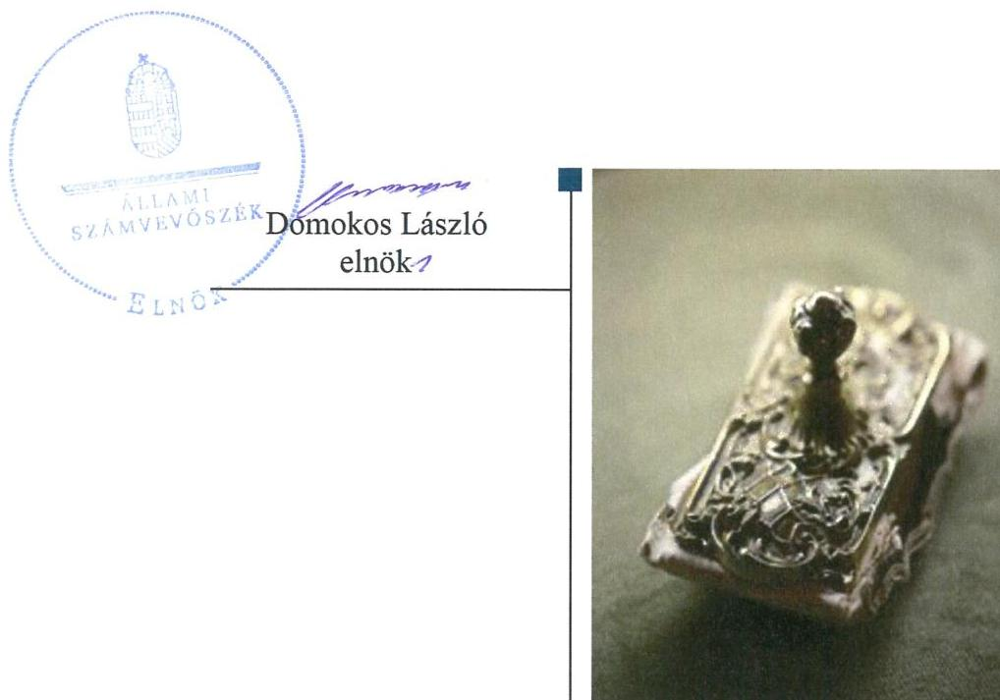
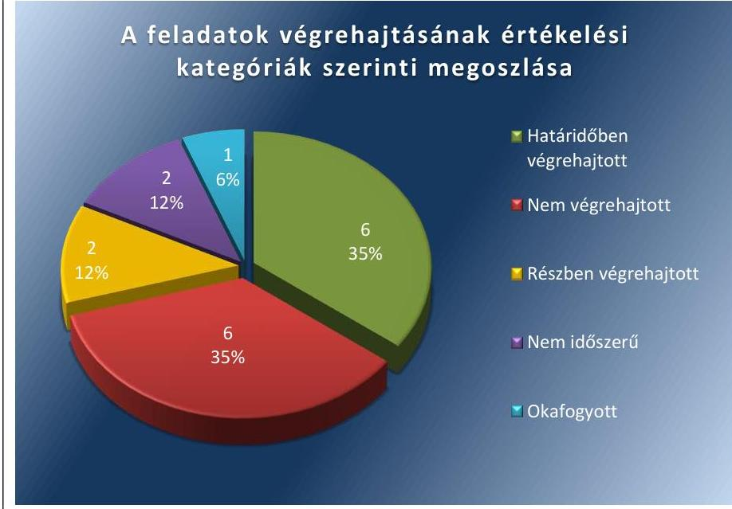
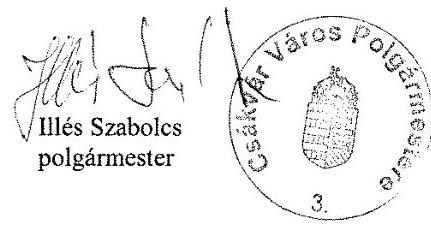
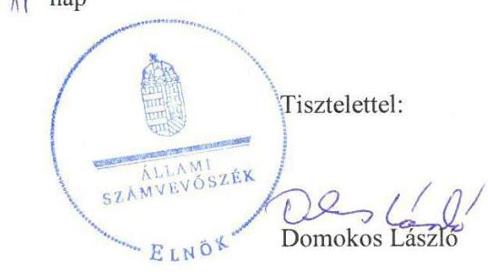

# Jelentés 

## Utóellenőrzések

Csákvár Város Önkormányzata pénzügyi gazdálkodási helyzete értékelésének és gazdálkodása szabályosságának utóellenőrzése
2018.

---

# Jelentés 

## Utóellenőrzések

Csákvár Város Önkormányzata pénzügyi gazdálkodási helyzete értékelésének és gazdálkodása szabályosságának utóellenőrzése
2018. 02. hó ol. nap

---

# AZ ELLENŐRZÉST FELÜGYELTE: 

SALAMON ILDIKÓ felügyeleti vezető

## AZ ELLENŐRZÉST VEZETTE ÉS A VÉGREHAJTÁSÁÉRT FELELŐS:

BÍRÓ ZSOLT ellenőrzésvezető

## A PROGRAM ÖSSZEÁLLÍTÁSÁÉRT FELELŐS:

JANIK JÓZSEF LÁSZLÓ osztályvezető

## A TÉMÁHOZ KAPCSOLÓDÓ KORÁBBI SZÁMVEVŐSZÉKI JELENTÉSEK:

- címe: Jelentés az önkormányzatok pénzügyi gazdálkodási helyzete értékelésének, és gazdálkodása szabályosságának ellenőrzéséről - Csákvár
- sorszáma: 14071

IKTATÓSZÁM: EL-0175-043/2018.
TÉMASZÁM: 2096
ELLENŐRZÉS-AZONOSÍTÓ SZÁM: V075596

---

# TARTALOMJEGYZÉK 

■ ÖSSZEGZÉS ..... 5
■ AZ ELLENŐRZÉS CÉLJA ..... 6
■ AZ ELLENŐRZÉS TERÜLETE ..... 7
■ AZ ELLENŐRZÉS HÁTTERE, INDOKOLTSÁGA ..... 8
■ A JELENTÉS LÉNYEGES KÉRDÉSKÖRE ..... 9
■ AZ ELLENŐRZÉS HATÓKÖRE ÉS MÓDSZEREI ..... 10
■ MEGÁLLAPÍTÁSOK ..... 12
■ KÖVETKEZTETÉSEK ..... 16
■ MELLÉKLETEK ..... 17
I. sz. melléklet: Csákvár Város Önkormányzata intézkedési tervének végrehajtása ..... 17
■ FÜGGELÉK: ÉSZREVÉTELEK ..... 23
■ RÖVIDÍTÉSEK JEGYZÉKE ..... 35

---

.

---

# ÖSSZEGZÉS 

Az Állami Számvevőszék Csákvár Város Önkormányzata pénzügyi gazdálkodási helyzete értékelésének és gazdálkodása szabályosságának utóellenőrzése során megállapította, hogy az Önkormányzat az intézkedési tervében a szabályszerű gazdálkodás érdekében vállalt feladatok jelentős részét nem hajtotta végre. Ezáltal nem biztosította a mérleg szabályszerű összeállításának feltételeit.

## Az ellenőrzés társadalmi indokoltsága

Az Állami Számvevőszék stratégiájában célul tűzte ki a számvevőszéki munka hasznosulásának javítását. Ezzel összhangban ellenőrzi, hogy az ellenőrzött szervezetek megvalósították-e a korábbi ellenőrzései által feltárt hibák, hiányosságok és szabálytalanságok megszüntetése céljából kialakított intézkedési terveikben foglaltakat. A rendszeres utóellenőrzések hozzájárulnak a szükséges intézkedések tényleges végrehajtásához, ezáltal a közpénzügyek rendezettségének javulásához, igazolják, hogy lezárult a következmények nélküli ellenőrzések időszaka.

## Főbb megállapítások, következtetések

Csákvár Város Önkormányzata az intézkedési tervében vállalt tizenhét feladatból hatot határidőben teljesített, kettőt részben hajtott végre, egy okafogyottá vált, kettő nem volt időszerű. Az intézkedési tervben vállalt feladatok közül hatot nem hajtottak végre.

A polgármester a hét feladatából hármat határidőben végrehajtott. Ennek keretében elkészült az Önkormányzat rövidtávú pénzügyi egyensúlyi helyzetét javító reorganizációs program, továbbá a Képviselő-testület elé terjesztette a jegyző által elkészített döntési javaslatot a realizált többletbevételek és a jövőben képződő tartalékok felhasználásáról és lefolytatta a követelések behajthatatlanná minősítése körülményeinek vizsgálatát. A polgármester két feladatot részben - nem a teljes ellenőrzött időszakra - hajtott végre. A bevételek növelését és a kiadások csökkentését célzó intézkedésekről a 2017. évi, míg az önként vállalt feladatok finanszírozhatóságáról szóló előterjesztést a 2016. és 2017. évi költségvetési rendeletekhez nem készítették el. A polgármester a részben végrehatott feladatokkal a pénzügyi egyensúly hosszú távú fenntarthatóságának biztosítását nem segítette elő.

Az intézkedési tervben a jegyző a részére előírt tíz feladatból hármat határidőben végrehajtott. A költségvetési rendelettervezet összeállítása során a költségvetési bevételeket és a költségvetési kiadásokat a jogszabályi előírásoknak megfelelően meghatározta, és azokat kötelező feladatok, önként vállalt feladatok és állami (államigazgatási) feladatok szerinti bontásban mutatta be, és teljes körűen kimutatta a kötelező feladatellátáshoz kapcsolódó kiadásokat is. A 2015. a 2016. és a 2017. évi költségvetési rendelettervezetek összeállítása során gondoskodott róla, hogy a költségvetési egyensúly biztosított legyen.

A jegyző az Önkormányzat gazdálkodásának szabályszerűsége érdekében meghatározott hat feladatot nem hajtott végre. Nem készített figyelemfelhívást a behajthatatlanná minősített követelések kimutatásának feltételeiről, a behajthatatlanná minősített követelés elszámolási szabályairól, valamint az adós minősítése alapján elszámolandó értékvesztésről. Nem gondoskodott annak felülvizsgálatáról, hogy a mérlegben a kötelezettségek kimutatása szabályszerűen történt-e. Nem biztosította a végleges kötelezettségvállalásként és más fizetési kötelezettségként elismert tartozások kimutatását, valamint azok részletező nyilvántartásának vezetését. A jegyző a végre nem hajtott feladatokkal nem biztosította a mérleg szabályszerű összeállításának feltételeit.

A jegyző az intézkedési tervben meghatározott feladatok végrehajtásáról a jogszabály szerinti nyilvántartást nem vezette.

---

# AZ ELLENŐRZÉS CÉLJA 

Az ellenőrzés célja annak értékelése volt, hogy a számvevőszéki jelentésben foglalt intézkedést igénylő megállapításokkal és javaslatokkal összhangban készített intézkedési tervben meghatározott feladatokat az ellenőrzött szervezet végrehajtotta-e.

---

# AZ ELLENŐRZÉS TERÜLETE

## Csákvár Város Önkormányzata

Csákvár városa Fejér megyében, a Bicskei járásban fekszik. A lakónépességének száma a Központi Statisztikai Hivatal Magyarország közigazgatási helységnévtára alapján 2016. január 1-jén 5253 fő volt.

A polgármester¹ a 2014. évi önkormányzati választások óta tölti be hivatalát, a jegyző² 2011. február 15-től látja el feladatát.

Az Önkormányzat³ 2016. évi költségvetésének végrehajtásáról szóló rendelete szerint 701,7 millió Ft költségvetési bevételt ért el, valamint 709,7 millió Ft költségvetési kiadást teljesített. A könyvviteli mérleg főösszege 2016. december 31-én 1 582,4 millió Ft, ezen belül a követelések állománya 20,2 millió Ft, a kötelezettségek állománya 36,9 millió Ft volt.

Az ÁSZ a 2010. január 1. – 2013. június 30. közötti időszakra végezte el az Önkormányzat pénzügyi gazdálkodási helyzete értékelésének és gazdálkodása szabályosságának ellenőrzését. Az ellenőrzés célja az Önkormányzat pénzügyi helyzetének, szabályosságának értékelése, a pénzügyi egyensúly alakulására hatással lévő folyamatoknak és a pénzügyi egyensúly alakulására ható kockázatoknak a feltárása volt.

Az utóellenőrzés az Önkormányzat pénzügyi gazdálkodási helyzete értékelésének és gazdálkodása szabályosságának ellenőrzéséről készült 14071 számú ÁSZ⁴ jelentés intézkedést igénylő megállapításai és javaslatai hasznosítására elfogadott intézkedési tervben foglalt feladatok 2014. április 30. és 2017. augusztus 22-e közötti végrehajtására irányult.

Az ÁSZ jelentés a polgármesternek hét, a jegyzőnek tíz javaslatot tartalmazott, amelyek alapján az Önkormányzat az intézkedési tervében összesen 17 feladat végrehajtásáról rendelkezett.

---

# AZ ELLENŐRZÉS HÁTTERE, INDOKOLTSÁGA 

Az ÁSZ tv. ${ }^{5}$ 33. § (1) bekezdése értelmében a számvevőszéki jelentések intézkedést igénylő megállapításaihoz és javaslataihoz kapcsolódóan az ellenőrzött szervezet vezetője intézkedési tervet köteles összeállítani, és az ÁSZ részére megküldeni. Az intézkedési tervben foglaltak megvalósítását az ÁSZ tv. 33. § (7) bekezdésében foglaltak alapján - az ÁSZ utóellenőrzés keretében - ellenőrizheti. Az intézkedések megvalósulásának értékelése során az ÁSZ figyelembe veszi az ellenőrzött szervezetek működési feltételeiben, valamint a jogszabályi előírásokban bekövetkezett változásokat.

Az intézkedési tervben foglalt feladatok hiányos, illetve késedelmes végrehajtása, valamint megvalósításának elmaradása azt mutatja, hogy az ellenőrzések során feltárt hibák, hiányosságok és szabálytalanságok megszüntetése nem kapott kellő hangsúlyt. Ez a szabályszerű működés és a felelős vezetői magatartás vonatkozásában kockázatot hordoz. E kockázatok feltárásával az ÁSZ utóellenőrzési rendszere fokozza a fegyelmet, és igazolja, hogy a közpénzzel való szabályos gazdálkodás felelőssége elől nem lehet kitérni.

Az utóellenőrzés négy szinten hasznosulhat:
A társadalom szintjén az utóellenőrzés jelzi, hogy a számvevőszéki ellenőrzés megállapításainak van következménye: a hiányosságok megszüntetésére az ellenőrzött szervezet által meghatározott intézkedések végrehajtását is számon kéri az ÁSZ.

- Az ellenőrzött terület szintjén az utóellenőrzés tájékoztatást nyújt a terület döntéshozóinak a hiányosságok kiküszöbölésének jó gyakorlatairól, ezzel lehetőséget biztosítva arra, hogy az ÁSZ ellenőrzési megállapításai, javaslatai a terület nem ellenőrzött szervezeteinek a működése során is hasznosuljanak.
- Az ellenőrzött szervezet szintjén az utóellenőrzés feltárja, hogy a szervezet az intézkedések végrehajtásával hasznosította-e a korábbi ellenőrzési jelentésben a hiányosságok megszüntetése, illetve a kockázatok kezelése érdekében megfogalmazott javaslatokat.
- Az ÁSZ szintjén az utóellenőrzés visszacsatolást ad az ellenőrzési jelentések hasznosulásáról, az intézkedések elmaradása vagy részleges megvalósulása a további ellenőrzésekhez kockázati jelzésként szolgál.

---

# A JELENTÉS LÉNYEGES KÉRDÉSKÖRE 

Az Önkormányzat az intézkedési tervben foglaltakat az előírt határidőben végrehajtotta-e?

---

# AZ ELLENŐRZÉS HATÓKÖRE ÉS MÓDSZEREI 

## Az ellenőrzés típusa

Megfelelőségi ellenőrzés.

## Az ellenőrzött időszak

Az utóellenőrzés alapját képező ÁSZ jelentés közzétételének napjától (2014. április 30.) az ellenőrzésről szóló kiértesítő levél keltének napjáig (2017. augusztus 22.) tartó időszak.

## Az ellenőrzés tárgya

Az ÁSZ tv. 2011. július 1-jei hatálybalépését követően a számvevőszéki jelentésben foglalt intézkedést igénylő megállapításokkal és javaslatokkal összhangban - Csákvár Város Önkormányzata által - készített intézkedési tervben foglaltak végrehajtásának ellenőrzése.

Az ellenőrzés kiterjedt minden olyan körülményre és adatra, amely az ÁSZ jogszabályban meghatározott feladatainak teljesítéséhez, valamint a program végrehajtása folyamán felmerült újabb összefüggések feltárásához szükséges

## Az ellenőrzött szervezet

Csákvár Város Önkormányzata

## Az ellenőrzés jogalapja

Az ÁSZ tv. 33. § (7) bekezdése alapján az ÁSZ tv. 33. § (1)-(2) bekezdése szerinti intézkedési tervben foglaltak megvalósítását az ÁSZ utóellenőrzés keretében ellenőrizheti

## Az ellenőrzés módszerei

Az ÁSZ az ellenőrzést az ellenőrzési program ellenőrzési kérdései, az ellenőrzött időszakban hatályos jogszabályok, az ellenőrzés szakmai szabályok és módszertanok figyelembevételével, önálló ellenőrzés keretében végezte.

Az ÁSZ az ellenőrzés ideje alatt az Önkormányzattal történő kapcsolattartást az ÁSZ SZMSZ ${ }^{6}$-ének vonatkozó előírásai alapján biztosította.

---

Az utóellenőrzés megállapításait az ÁSZ rendelkezésére álló, valamint az ellenőrzött szervezettől elektronikusan bekért dokumentumok alapozták meg.

Az ellenőrzési bizonyítékként felhasználható adatforrások közé tartoztak egyrészt a szakmai programban felsorolt adatforrások, másrészt minden - az ellenőrzés folyamán feltárt, az ellenőrzés szempontjából információt tartalmazó - dokumentum.

Az intézkedési tervekben előírt feladatokat azok végrehajthatósága, illetve végrehajtása szempontjából az alábbiak szerint értékelte az ÁSZ:
—_ „határidőben végrehajtott" a feladat, ha a teljesítés dokumentáltan, az intézkedési tervben előírt határidőben és tartalommal megtörtént;
—_ „határidőn túl végrehajtott" a feladat, ha annak teljesítése az intézkedési tervben meghatározott módon, de az előírt határidőn túl történt meg;
—_ „részben végrehajtott" a feladat, ha végrehajtása teljes körűen az intézkedési tervben előírt módon nem történt meg;
—_ „nem végrehajtott" ha a végrehajtás nem történt meg, vagy amenynyiben a teljesítést nem dokumentálták;
—_ „okafogyottá vált" a feladat, ha végrehajtására - meghatározott esemény bekövetkezése, továbbá külső körülmény, a működést érintő feltétel változása miatt - már nincs szükség, illetve lehetőség, és egyértelműen megállapítható, hogy az intézkedést szükségessé tevő körülmény a jövőben nem fordulhat elő;
—_ „nem időszerű" az a feladat, amelynek ellenőrzési időszakon belüli végrehajtására azért nem került (kerülhetett) sor, mert az intézkedés alapjául szolgáló esemény nem következett be, de annak jövőbeni előfordulása lehetséges, a végrehajtása nem volt esedékes, vagy a végrehajtás határideje még nem járt le.
Az ellenőrzés lefolytatásához az Önkormányzat a tanúsítványok elektronikus kitöltésével, valamint az ÁSZ által kért dokumentumok elektronikus megküldésével szolgáltatott adatokat, amelyek valódiságát és teljes körűségét a polgármester által tett teljességi és hitelességi nyilatkozat igazolja. Az így rendelkezésre bocsátott adatok, információk kontrollja az ellenőrzés keretében megtörtént.

---

# MEGÁLLAPÍTÁSOK 

## Az Önkormányzat az intézkedési tervben foglaltakat az előírt határidőben végrehajtotta-e?

Összegző megállapítás

Az Önkormányzat az intézkedési tervben meghatározott 17 feladat jelentős részét nem vagy részben hajtotta végre. Az intézkedési tervben meghatározott feladatok végrehajtásáról a jogszabályban előírt nyilvántartást nem vezették.

Az ÁSZ a jelentésében a polgármester részére hét, a jegyző részére tíz javaslatot fogalmazott meg. A polgármester által előterjesztett és a Képvi-selő-testület ${ }^{7}$ által jóváhagyott intézkedési tervben a hiányosságok, szabálytalanságok megszüntetésére összesen 17 feladatot határoztak meg, amelyek végrehajtásának felelőse hét esetben a polgármester, tíz esetben pedig a jegyző volt.

Az intézkedési tervben meghatározott feladatokat, határidőket, felelősöket és a feladatok végrehajtását az I. számú melléklet mutatja be.

A jegyző az intézkedési tervben meghatározott feladatok végrehajtásáról nem vezette a Bkr. ${ }^{8} 14 . \S$ (1) bekezdésben előírt nyilvántartást.

Az Önkormányzat intézkedési tervében meghatározott feladatok végrehajtásának értékelési kategóriák szerinti megoszlását
 az 1. ábra szemlélteti.

1. ábra

Fonrás: ÁSZ

---

# HATÁRIDŐBEN VÉGREHAJTOTT feladatok: 

1. Elkészült a Képviselő-testület részére az Önkormányzat gazdasági helyzetének elemzésén alapuló, a pénzügyi egyensúlyi helyzet gyors helyreállítását, hosszú távú fenntartását, valamint az adósságállomány újratermelődésének elkerülését biztosító intézkedéseket tartalmazó reorganizációs program.
2. A Képviselő-testület kötelezettséget vállalt arra, hogy előre meghatározott összegben és módon a realizált többletbevételeket, a jövőben képződő tartalékokat mindaddig a kötelezettségek rendezésére fordítja, azt nem használja más célra, amíg az Önkormányzat pénzügyi egyensúlya rövidtávon veszélyeztetett.
3. A polgármester lefolytatta a vizsgálatot a felszámolás miatt behajthatatlanná minősített követelés és a veszteségként történő leírás körülményeiről és következményeiről, megállapította, hogy munkajogi felelősséggel kapcsolatos intézkedés megtétele nem szükséges.
4. A jegyző az Önkormányzat 2015. a 2016. és a 2017. évi költségvetéséről szóló rendelettervezetek összeállítása során az Áht. szerint meghatározta a költségvetési bevételeket és kiadásokat, valamint a finanszírozási bevételeket és kiadásokat.
5. A jegyző az Önkormányzat 2015. a 2016. és a 2017. évi költségvetéséről szóló rendeletének összeállítása során az Önkormányzat és az általa irányított költségvetési szervek költségvetési bevételeit és kiadásait kötelező feladatok, önként vállalt feladatok és állami (államigazgatási) feladatok szerinti bontásban mutatta be, és teljes körűen kimutatta a kötelező feladatellátáshoz kapcsolódó kiadásokat.
6. A jegyző gondoskodott arról, hogy a 2015. a 2016. és a 2017. évi költségvetési rendelettervezetek összeállítása során a törvények által előírt költségvetési egyensúly biztosított legyen.

## RÉSZBEN VÉGREHAJTOTT feladatok:

7. A jegyző a 2015. és a 2016. évi költségvetési rendelettervezet, valamint azok kettő-kettő évközi módosítását megelőzően elkészítette az előterjesztést a bevételek növelését és a kiadások csökkentését célzó intézkedésekről. A 2017. évi költségvetési rendelettervezet esetében ilyen előterjesztést nem készített, így a Képviselő-testület ennek hiányában döntött a költségvetés elfogadásáról.
8. A 2015. évi költségvetési rendelet elfogadása előtt elkészült az előterjesztés az önként vállalt feladatok finanszírozhatóságáról. A 2016. és a 2017. évi költségvetési rendelettervezet esetében ilyen előterjesztést nem készítettek, így a 2016-2017. években a Képviselő-testület ennek hiányában döntött az önként vállalt feladatok finanszírozhatóságáról.

---

# NEM VÉGREHAJTOTT feladatok: 

9. A jegyző nem készített figyelemfelhívást arra, hogy a követelések behajthatatlannak minősítése a feltételek teljes körű, maradéktalan fennállása esetén történhet meg.
10. A jegyző nem készített figyelemfelhívást arra, hogy a behajthatatlanná minősített követelést a mérlegben nem lehet kimutatni és a leírt összeget az Áhsz. ${ }^{9}$ előírásainak megfelelően különféle egyéb ráfordítások között kell elszámolni.
11. A jegyző nem készített figyelemfelhívást arra, hogy az adós minősítése alapján a mérleg fordulónapon fennálló és a mérlegkészítés időpontjáig pénzügyileg nem rendezett követelésnél értékvesztést számoljanak el, ha a követelés könyv szerinti értéke és annak várható megtérülése közötti különbözet tartós és jelentős összegű.
12. A jegyző nem gondoskodott 2014. október 7-ig annak felülvizsgálatáról, hogy a mérlegben a kötelezettségek között a végleges kötelezettségvállalások, más fizetési kötelezettségek - az Áhsz.-ben előírtak szerint - kimutatásra kerülnek-e mindaddig, amíg azokat pénzügyileg nem egyenlítették ki, nem engedték el vagy egyéb módon nem rendezték. A jegyző az ellenőrzött időszakban nem intézkedett a fizetési kötelezettségek Áhsz. szerinti kimutatásáról.
13. A jegyző nem intézkedett annak érdekében, hogy az Áhsz.-ben előírtak szerint mutassák ki végleges kötelezettségvállalásként, más fizetési kötelezettségként a pénzértékben kifejezett, jogszabályból, jogerős bírói ítéletből vagy hatósági határozatból, szerződésből - ideértve az átvállalt kötelezettségeket is - jogszerűen eredő elismert tartozást, amely kifizetésének feltételeit a másik fél már teljesítette.
14. A jegyző nem biztosította a kötelezettségvállalások és más fizetési kötelezettségek Áhsz. szerinti részletező nyilvántartásának vezetését.

## OKAFOGYOTTÁ VÁLT feladat:

15. Az adósságkonszolidáció keretében az Önkormányzat 2014. évben a hosszúlejáratú hiteleit visszafizette, így az a jogellenes állapot, hogy a hitelek fedezetéül központi költségvetésből származó bevételeit ajánlotta fel, megszűnt. Az Önkormányzat a 2015-2016. években hosszú lejáratú hitelt nem vett fel, kötvényt nem bocsátott ki.

## NEM IDŐSZERŰ feladatok:

16. Az Önkormányzat az ellenőrzött időszakban nem vett fel hitelt és kötvényt sem bocsátott ki, így a hitelfelvétel és kötvénykibocsátás kapcsán annak betartása, hogy költségvetési támogatások folyósítására szolgáló, elkülönített bankszámla hitel és kötvényen alapuló fizetési kötelezettség teljesítésének alapjául ne szolgáljon nem volt időszerű.
17. Az Önkormányzatnak az ellenőrzött időszakban külföldi pénzértékre szóló kötelezettsége nem volt, emiatt nem került sor ilyen kötelezettség forintértékének a meghatározására, valamint árfolyamveszteség, illetve árfolyamnyereség elszámolására.

---

# KÖVETKEZTETÉSEK 

Az Önkormányzat nem intézkedett a követelések és kötelezettségek jogszabályoknak megfelelő kimutatása érdekében, ezzel nem biztosította a mérleg szabályszerű összeállítása feltételeit, ami kockázatot hordoz a mérleg valódiságának biztosítása szempontjából. A nem végrehajtott feladatok indokolják a feltárt hiányosságok, szabálytalanságok tekintetében a munkajogi felelősség tisztázására irányuló eljárás megindítását és eredményének ismeretében a szükséges intézkedések megtételét.

---

# MELLÉKLETEK

I. SZ. MELLÉKLET: CSÁKVÁR VÁROS ÖNKORMÁNYZATA INTÉZKEDÉSI TERVÉNEK VÉGREHAJTÁSA

|  Sorszám | Intézkedési tervben meghatározott feladat | Az intézkedési tervben meghatározott határidő | Az intézkedési tervben meghatározott feladat felelőse | A feladat végrehajtása  |
| --- | --- | --- | --- | --- |
|  1. | Készüljön a Képviselő-testület részére a Htv. ${ }^{10}$ 140. § (1) bekezdés a) pontja és a Pénzügyi és Jogi Bizottság ${ }^{11}$ javaslatai alapján a jegyző által elkészített, az Önkormányzat gazdasági helyzetének elemzésén alapuló, a pénzügyi egyensúlyi helyzet gyors helyreállítását, hosszú távú fenntartását, valamint az adósságállomány újratermelődésének elkerülését biztosító intézkedéseket tartalmazó reorganizációs program.
A kötelezettségek jövőbeni teljesítése, a fizetőképesség megőrzése érdekében készüljön a Képviselő-testület részére a Htv. 140. § (1) bekezdés a) alapján - a jegyző által elkészített - döntési javaslat, amelyben a Képviselő-testület kötelezettséget vállal arra, hogy előre meghatározott összegben és módon a realizált többletbevételeket, a jövőben képződő tartalékokat mindaddig a kötelezettségek rendezésére fordítja, azt nem használja más célra, amíg az Önkormányzat pénzügyi egyensúlya rövidtávon veszélyeztetett.
Meg kell vizsgálni a felszámolás miatt behajthatatlanná minősített követelés és a veszteségként történő leírás körülményeit, következményeit, és a vizsgálat eredményeként meg kell állapítani az esetleges munkajogi felelősséggel kapcsolatos szükséges intézkedéseket. | 2014. október 7. | Polgármester | Az Önkormányzat a 387/2014.(X. 07.) Képviselő-testületi határozat 2. sz. mellékleteként kiadott reorganizációs programot elkészítette, amely tartalmazta az Önkormányzat pénzügyi helyzetének bemutatását, korábbi hatékonyság növelő intézkedések érvényesülését, a kötelező és önként vállalt feladatok felülvizsgálatát és a reorganizáció végrehajtandó feladatait.
A Képviselő-testület részére a döntési javaslat elkészült, amelyet a 386/2014. (X. 07.) számú határozattal a Képviselő-testület elfogadott. A Képviselő-testület kötelezettséget vállalt arra, hogy előre meghatározott összegben és módon a realizált többletbevételeket, a jövőben képződő tartalékokat mindaddig a kötelezettségek rendezésére fordítja, azt nem használja más célra, amíg az Önkormányzat pénzügyi egyensúlya rövidtávon veszélyeztetett.  |
|  3. | 2014. október 7. | Polgármester | A polgármester az intézkedési tervben megfogalmazott vizsgálatot lefolytatta és megállapította, hogy munkajogi felelősséggel kapcsolatos intézkedés megtétele nem szükséges. |   |

---

|  4. | Intézkedési tervben meghatározott feladat | Az intézkedési tervben meghatározott határidő | Az intézkedési tervben meghatározott feladat felelőse | A feladat végrehajtása  |
| --- | --- | --- | --- | --- |
|  4. | Az intézkedés a 2014. évi költségvetési rendelet és a 2013. évi zárcsámadási rendelet előkészítése során már megtörtént, az önkormányzat hatályos költségvetési rendelete pontosan megfelel a vonatkozó szabályoknak. A költségvetési rendelettervezet összeállítása során a költségvetési bevételeket és a költségvetési kiadásokat a jövőben is az Áht.12 5. § (1)-(2) bekezdésében foglalt előírások szerint kell meghatározni. | intézkedési terv elfogadását követően folyamatos | jegyző | Az Önkormányzat a 2015. a 2016. és a 2017. évi költségvetési rendeleteiben az Áht. 4/A. § (1) bekezdése rendelkezései szerint meghatározta a költségvetési bevételeket és kiadásokat, valamint a finanszírozási bevételeket és kiadásokat.  |
|  5. | Az intézkedés a 2014. évi költségvetési rendelet és a 2013. évi zárcsámadási rendelet előkészítése során már megtörtént, az önkormányzat hatályos költségvetési rendelete - a Mótv.13 13. § (1) bekezdésében előírtak figyelembe vételével - a jövőben is az Önkormányzat és az általa irányított költségvetési szervek költségvetési bevételeit és költségvetési kiadásait kötelező feladatok, önként vállalt feladatok, állami (államigazgatási) feladatok szerinti bontásban tartalmazza, valamint a kötelező feladat ellátáshoz kapcsolódó kiadásokat teljes körűen kell kimutatni. | intézkedési terv elfogadását követően folyamatos | jegyző | Az Önkormányzat a 2015. a 2016. és a 2017. évi költségvetési rendeleteiben az Áht. 23. § (2) bekezdésének a-b) pontjaiban foglalt előírások szerint - a Mótv. 13. § (1) bekezdésében előírtak figyelembevételével - külön-külön meghatározta az Önkormányzat és az általa irányított költségvetési szervek költségvetési bevételeit és költségvetési kiadásait a kötelező feladatok, önként vállalt feladatok, állami (államigazgatási) feladatok szerinti bontásban, valamint a kötelező feladat ellátáshoz kapcsolódó kiadásokat teljes körűen kimutatták.  |
|  6. | A jegyző gondoskodik arról, hogy a költségvetési rendelettervezet összeállítása közgazdaságilag megalapozott, a törvények által előírt költségvetési egyensúly biztosított legyen. | folyamatos | Jegyző | A jegyző gondoskodott arról, hogy a 2015. a 2016. és a 2017. évi költségvetési rendelettervezetek összeállítása során a törvények által előírt költségvetési egyensúly biztosított legyen.  |
|  7. | A jegyző készítsen előterjesztést a Költségvetési rendelettervezet, valamint annak évközi módosítását megelőzően a bevételek növelését és a kiadások csökkentését célzó intézkedésekről. A Képviselőtestület ennek figyelembevételével dönt a költségvetés, illetve a költségvetés módosítás elfogadásáról | folyamatos | Polgármester | Az Áht. 12.§ (1) bekezdése - amely szerint a tervezés célja annak biztosítása, hogy a tervezett bevételek közgazdaságilag megalapozottan, a tervezett kiadások kizárólag a közfeladatok megfelelő ellátásához szükséges mértékben kerüljenek jóváhagyásra - 2015. január 1-vel nem hatályos előírás.  |
|   |  |  | Részben végrehajtott feladatok |   |
|   | A jegyző készítsen előterjesztést a Költségvetési rendelettervezet, valamint annak évközi módosítását megelőzően a bevételek növelését és a kiadások csökkentését célzó intézkedésekről. A Képviselőtestület ennek figyelembevételével dönt a költségvetés, illetve a költségvetés módosítás elfogadásáról | folyamatos | Polgármester | A feladatot részben hajtották végre, mert a 2015-2016. évek költségvetési rendelettervezeteinek, valamint azok évközi módosításait megelőzően a jegyző a bevételek növelését és a kiadások csökkentését célzó intézkedésekről az előterjesztéseket elkészítette, azonban a 2017. évi költségvetési rendelettervezethez ilyen előterjesztést nem készített, így a Képviselő-testület az előterjesztés hiányában döntött a költségvetés elfogadásáról.  |
|   |  |  | Az ellenőrzött időszak végéig 2017. évi költségvetési rendeletét az Önkormányzat nem módosította. |   |

---

|  8. | Minden önként vállalt feladatellátáshoz kapcsolódóan készüljön a Képviselő-testület részére előterjesztés a költségvetési rendelet elfogadása előtt az önként vállalt feladatok finanszírozhatóságáról, figyelembe véve a kötelező feladatellátás elsődlegességét. A Képviselő-testület az előterjesztés alapján dönt az önként vállalt feladat finanszírozhatóságáról. | folyamatos | Polgármester | A
 feladatot részben hajtották végre, mert az önként vállalt feladatok finanszírozhatóságáról az előterjesztést a 2015. évi költségvetési rendelethez elkészítették, a 2016-2017. évi költségvetési rendeletekhez az önként vállalt feladatok finanszírozhatóságáról az előterjesztést nem készítették el. A 2016-2017. években a Képviselő-testület ilyen előterjesztés hiányában döntött az önként vállalt feladatok finanszírozhatóságáról.  |
| --- | --- | --- | --- | --- |
|   |  | Nem végrehajtott feladatok |  |   |
|  9. | Készüljön figyelemfelhívás arra vonatkozóan, hogy a jövőben a követelés behajthatatlannak minősítése a feltételek teljes körű, maradéktalan fennállása esetén történhet meg. | intézkedési terv elfogadását követően folyamatos | jegyző | A jegyző nem készített figyelemfelhívást arra, hogy a követelések behajthatatlannak minősítése az Áhsz. 43. § (2) bekezdésében rögzített feltételek teljes körű, maradéktalan fennállása esetén történhet meg.  |
|  10. | Készüljön figyelemfelhívás arra vonatkozóan, hogy a jövőben a behajthatatlannak minősített követelést a mérlegben - az Áhsz. 13. § (5) bekezdésében előírtaknak megfelelően - nem lehet kimutatni és a behajthatatlanná minősített követelés leírt összegét az Áhsz. előírásainak megfelelően különféle egyéb ráfordítások között számolják el. | intézkedési terv elfogadását követően folyamatos | jegyző | A jegyző nem készített figyelemfelhívást arra, hogy a behajthatatlanná minősített követelést a mérlegben az Áhsz. 13. § (5) bekezdésében előírtak szerint nem lehet kimutatni és a leírt összeget az Áhsz. 26. § (11) bekezdésben foglalt előírásnak megfelelően különféle egyéb ráfordítások között kell elszámolni.  |
|  11. | Készüljön figyelemfelhívás arra vonatkozóan, hogy a jövőben az adós minősítése alapján a mérleg fordulónapon fennálló és a mérlegkészítés időpontjáig pénzügyileg nem rendezett követelésnél értékvesztést számoljanak el, ha a követelés könyv szerinti értéke és annak várható megtérülése közötti különbözet tartós és jelentős. | intézkedési terv elfogadását követően folyamatos | jegyző | A jegyző nem készített figyelemfelhívást arra, hogy az adós minősítése alapján a mérleg fordulónapon fennálló és a mérlegkészítés időpontjáig pénzügyileg nem rendezett követelésnél - az Áhsz. 18. § (1) bekezdésében és a Számv. tv. ${ }^{14}$ 55. § (1) bekezdésében előírtak szerint - értékvesztést számoljanak el, ha a követelés könyv szerinti értéke és annak várható megtérülése közötti különbözet tartós és jelentős összegű.  |
|  12. | El kell végezni az Áhsz. 14. § (8) bekezdésében foglalt előírásnak megfelelően a mérlegben a kötelezettségek között az egységes rovatrend szerinti rovatokhoz kapcsolódóan vezetett nyilvántartási számlákon nyilvántartott végleges kötelezettségvállalások, más fizetési kötelezettségek felülvizsgálatát abban a tekintetben, hogy ki legyenek mutatva mindaddig, amíg azokat pénzügyileg ki nem egyenlítették, el nem engedték vagy egyéb módon nem rendezték. A jövőben is figyelemmel kell lenni arra, hogy a jogszabályoknak megfelelően mutassák ki a fizetési kötelezettségeket. | 2014. október 7.
ezt követően folyamatos | jegyző | A jegyző nem gondoskodott 2014. október 7-ig annak felülvizsgálatáról, hogy a mérlegben a kötelezettségek között - az egységes rovatrend szerinti rovatokhoz kapcsolódóan vezetett nyilvántartási számlákon nyilvántartott végleges kötelezettségvállalások, más fizetési kötelezettségek az Áhsz. 14. § (8) bekezdésében előírtak szerint kimutatásra kerüljenek mindaddig, amíg azokat pénzügyileg nem egyenlítették ki, nem engedték el vagy egyéb módon nem rendezték. A jegyző az ellenőrzött időszakban nem intézkedett a fizetési kötelezettségek Áhsz. 14. § (8) bekezdése szerinti kimutatásáról.  |

---

|  13. | 14. | 15. | 16. | 17. | 18.  |
| --- | --- | --- | --- | --- | --- |
|  |   |   |   |   |   |
|  |   |   |   |   |   |
|  |   |   |   |   |   |
|  |   |   |   |   |   |
|  |   |   |   |   |   |
|  |   |   |   |   |   |
|  |   |   |   |   |   |
|  |   |   |   |   |   |
|  |   |   |   |   |   |
|  |   |   |   |   |   |
|  |   |   |   |   |   |
|  |   |   |   |   |   |
|  |   |   |   |   |   |
|  |   |   |   |   |   |
|  |   |   |   |   |   |
|  |   |   |   |   |   |
|  |   |   |   |   |   |
|  |   |   |   |   |   |
|  |   |   |   |   |   |
|  |   |   |   |   |   |
|  |   |   |   |   |   |
|  |   |   |   |   |   |
|  |   |   |   |   |   |
|  14. | 15. | 16. | 17. | 18. | 19.  |
|  |   |   |   |   |   |
|  |   |   |   |   |   |
|  |   |   |   |   |   |
|  |   |   |   |   |   |
|  |   |   |   |   |   |
|  |   |   |   |   |   |
|  |   |   |   |   |   |
|  |   |   |   |   |   |
|  |   |   |   |   |   |
|  |   |   |   |   |   |
|  |   |   |   |   |   |
|  |   |   |   |   |   |
|  |   |   |   |   |   |
|  |   |   |   |   |   |
|  |   |   |   |   |   |
|  |   |   |   |   |   |
|  |   |   |   |   |   |
|  |   |   |   |   |   |
|  |   |   |   |   |   |
|  |   |   |   |   |   |
|  |   |   |   |   |   |
|  |   |   |   |   |   |
|  |   |   |   |   |   |
|  |   |   |   |   |   |
|  |   |   |   |   |   |
|  |   |   |   |   |   |
|  |   |   |   |   |   |
|  |   |   |   |   |   |
|  |

---

|  17. | Intézkedési
tervben meghatározott
halandó | Az intézkedési
tervben
meghatározott
halandó | Az intézkedési
tervben meghatározott feladat felelőse | A feladat végrehajtása  |
| --- | --- | --- | --- | --- |
|   | Az intézkedés a 2013. évi zárszámadás során megtörtént, az önkormányzat a külföldi pénzértékre szóló kötelezettségeit a hatályos jogszabályoknak megfelelően határozta meg. Figyelemmel kell lenni, hogy a külföldi pénzértékre szóló kötelezettségek mérlegben szereplő értékét a jövőben is a Számv. tv. 60. § (2) bekezdésében, valamint az Áhsz. 21. § (1) bekezdésében foglalt előírás szerint a mérleg fordulónapjára vonatkozó, az Áhsz. 20. § (3) és (4) bekezdése szerinti árfolyamon átszámított forintértéken kell meghatározni. A külföldi pénzértékre szóló kötelezettség jövőbeni mérleg-fordulónapi értékelésekor összevontan elszámolt árfolyamveszteséget az Áhsz. 27. § (8) bekezdés h) pontja és a Szám. tv. 85. § (3) bekezdés g)
 pontja alapján a pénzügyi műveletek egyéb ráfordításai, az összevontan elszámolt árfolyamnyereséget az Áhsz. 27. § (4) bekezdés d) pontjában és a Számv. tv. 84. § (7) bekezdés g) pontjában foglaltaknak megfelelően a pénzügyi műveletek egyéb eredményszemléletű bevételei között kell elszámolni. | intézkedési terv elfogadását követően folyamatos | jegyző | Az Önkormányzatnak devizában felvett hitele 2014. február 28-án - az ellenőrzött időszakot megelőzően - kiegyenlítésre került. Az Önkormányzat 2015. és 2016. évi költségvetésének végrehajtásáról szóló rendeletei alapján devizahitellel nem rendelkezett, így a külföldi pénzértékre szóló kötelezettségek forintértéken történő meghatározása és elszámolása nem volt időszerű.  |

---

.

---

# FÜGGELÉK: ÉSZREVÉTELEK 

A jelentéstervezetet a Számvevőszék 15 napos észrevételezésre megküldte az ellenőrzött szervezet vezetőjének az ÁSZ tv. 29. § (1) bekezdése előírásának megfelelően.
Csákvár Város Önkormányzata nevében a polgármester az ellenőrzés megállapításaira írásban észrevételt tett.

Az észrevétel alapján az Állami Számvevőszék nem módosította a jelentést.
A függelék tartalmazza Csákvár Város Önkormányzata polgármesterének az észrevételét és az arra adott választ a figyelembe nem vett észrevételről, annak indokairól szóló tájékoztatást.

[^0]
[^0]:    * 29. § (1) Az Állami Számvevőszék az ellenőrzési megállapításait megküldi az ellenőrzött szervezet vezetőjének vagy az általa megbízott személynek, és annak, akinek személyes felelősségét állapította meg.
    (2) Az ellenőrzött szervezet vezetője és a felelősként megjelölt személy az ellenőrzés megállapításaira tizenöt napon belül írásban észrevételt tehet.
    (3) Az Állami Számvevőszék az észrevételre a beérkezésétől számított harminc napon belül írásban válaszol. A figyelembe nem vett észrevételeket köteles a jelentésben feltüntetni, és megindokolni, hogy azokat miért nem fogadta el.

---

# CSÁKVÁR VÁROS POLGÁRMESTÉRE 

Szám: Csv./812-4/2017.

Tárgy: Észrevétel utóellenőrzésre

Állami Számvevőszék Elnökének
Domokos László Úrnak
Budapest V.

## Tisztelt Elnök Úr!

Az EL-0175-033/2017. iktatószámú levelének mellékletében szereplő „Utóellenőrzések - Csákvár Város Önkormányzata pénzügyi gazdálkodási helyzete értékelésének és gazdálkodása szabályosságának utóellenőrzése" című számvevőszéki jelentéstervezetre az alábbi észrevételt teszem:

## Részben végrehajtott feladatok 7.

A jegyző a 2015. és a 2016. évi költségvetési rendelettervet, valamint azok kettő-kettő évközi módosítását megelőzően elkészítette az előterjesztést a bevételek növelését és a kiadások csökkentését célzó intézkedésekről, 2017. évben már nem.

A képviselő-testület az Állami Számvevőszék javaslatára elkészített reorganizációs program elfogadását követően döntött arról, hogy 2016. január 1. napjától bevezeti a magánszemélyek kommunális adóját, melynek mértéke 12 eFt/év/ingatlan. Ezen intézkedés 20 mFt éves bevételt jelent az önkormányzatnak.
Az adó bevezetésére a 24/2015. (X. 28.) számú, a helyi adókról szóló rendelet alapján került sor. (1. sz. melléklet)

Ennek is, illetve az Állami Számvevőszék ellenőrzését követő egyéb intézkedéseknek is köszönhetően az önkormányzat 2016. évi költségvetésének maradványa 112 mFt volt, a 2017. évi költségvetésben a költségvetési tartalék összege pedig 61 mFt.

A 2017. évi költségvetésben szereplő 61 mFt általános tartalék alapján biztosított volt a pénzügyi egyensúly, már nem volt indokolt külön előterjesztés készítése a bevételek növelését és a kiadások csökkentését célzó intézkedésekre, mivel az előző évek erre irányuló intézkedései meghozták a várt eredményt.

## Részben végrehajtott feladatok 8.

A 2015. évi költségvetési rendelet elfogadása előtt elkészült az előterjesztés az önként vállalt feladatok finanszírozhatóságáról, a 2016. és a 2017. évi költségvetési rendelettervezethez nem.

A képviselő-testület 2014. évben 276/2014. (VII. 29.) sz. határozatba foglaltan kinyilvánította, hogy az idősek szociális otthoni ellátása és a bölcsődei ellátás önként vállalt feladatait továbbra is ellátja és biztosítja annak fedezetét. (2. sz. melléklet)
A költségvetési rendeletekben ezen feladatok szerepelnek, az elfogadott költségvetés fedezetet biztosított az önként vállalt feladatok finanszírozására is.

---

A gyermekek védelméről és a gyámügyi igazgatásról szóló 1997. évi XXXI. tv. 94. § 2016. január 1-jén megjelent, 2017. január 1-től hatályos (3a) pontja alapján már nem önként vállalt feladat a bölcsődei ellátás, hisz településünket is érinti az a kötelezettség, mely szerint a települési önkormányzat köteles gondoskodni a gyermekek bölcsődei ellátásáról ha a 3 év alatti lakosok száma meghaladja a 40 főt, és legalább öt gyermek tekintetében igény jelentkezik a bölcsődei ellátásra.

A 2016. évi önkormányzati költségvetésben szereplő 12 mFt, és a 2017. évi költségvetésben szereplő 61 mFt általános költségvetési tartalék alapján az önként ellátott feladatok finanszírozhatósága már nem volt kétséges.

Előzőekben leírtak alapján nem értek egyet azon megállapításukkal, hogy a „polgármester a részben végrehajtott feladatokkal a pénzügyi egyensúly hosszú távú fenntarthatóságának biztosítását nem segítette elő", tekintettel a végrehajtott feladatokra, a pénzügyi egyensúly helyreállítására, az elmúlt két év tartalékképzési lehetőségére.

Nem végrehajtott feladatok 9., 10., 11., 12.
A jegyzői figyelemfelhívás elmaradásáról.
A fenti pontokban foglaltakra vonatkozóan 402-12/2014. iktatószám alatt jegyzői utasítás formájában határidőben elkészült a figyelemfelhívás, mely jegyzői utasítást az intézkedési terv végrehajtásáról szóló jelentéshez kapcsolódóan a képviselő-testület megismert és a 387/2014. (X. 07.) sz. határozatában elfogadott.
Ezen határozatot a jegyzői utasítás mellékletével az Elektronikus Adatszolgáltatási Rendszerükbe a 387_5_melléklet jelöléssel feltöltésre került, levelemhez is csatolom. (3. sz. melléklet)

# Nem végrehajtott feladatok 13. 

Jegyző nem intézkedett az elismert tartozás végleges kötelezettségvállalásként történő kimutatásáról.

Jegyző szóbeli felhívására a gazdálkodási irodavezető határidőben írásos utasításba foglalta az elismert tartozás végleges kötelezettségvállalásként történő, az Áhsz. 1. § (1) bekezdés 9. pontjában előírtak szerinti kimutatását. Ezen utasítást az Elektronikus Adatszolgáltatási Rendszerükbe feltöltésre került, levelemhez is csatolom. (4. sz. melléklet)

## Nem végrehajtott feladatok 14.

Jegyző nem biztosította a kötelezettségvállalások és más fizetési kötelezettségek részletező nyilvántartásának vezetését.

Jegyző előterjesztésére a képviselő-testület még 2015-ben a 277/2015. (VIII. 19.) sz. határozatába (5. sz. melléklet) foglaltan döntött arról, hogy az elsők között csatlakozik az ASP rendszerhez. 2016. január 1-jétől teljes körűen az ASP rendszerben történik a könyvelés, amely rendszer az Áhsz. 14. sz. melléklete II. pontja szerinti részletező nyilvántartást folyamatosan biztosítja a Gazdálkodási Szakrendszer 112. számú menüpontja alatt.
Csatolom az Önkormányzat és a Kincstár közötti, erre vonatkozó szerződést, (5/a sz. melléklet) illetve a részletező nyilvántartást. (6. sz. melléklet)

## Főbb megállapítások, következtetések 5. bekezdés

Jegyző az intézkedési tervben meghatározott feladatok végrehajtásáról a jogszabály szerinti nyilvántartást nem vezette.

Jegyző 2015. évről a Bkr. hatálya alá tartozó szervezet által az intézkedési tervben rögzített feladatok végrehajtásáról készült Bkr. 14. § (1) bekezdés szerinti nyilvántartást elkészítette, az az Elektronikus Adatszolgáltatási Rendszerbe feltöltésre került. Az ÁSZ jelentésre vonatkozó intézkedési terv feladatok, felelősök, határidők részletezéssel a képviselő-testület elé kimutatásra került, a külön nyilvántartást jelen levelemhez csatolom. (7. sz. melléklet)

---

# Tisztelt Elnök Úr! 

Kérem észrevételeim elfogadását és megállapításaik, összegző véleményük módosítását tekintettel a feladatok határidőben történő végrehajtására illetve okafogyottá válására. Észrevételeim alapján kérem a munkajogi felelősségre vonatkozó javaslatuk felülvizsgálatát is. Kijelenthetem, hogy Csákvár Város Önkormányzatának gazdálkodásában a pénzügyi egyensúly - az Önök ellenőrzését követően meghozott intézkedéseknek is köszönhetően - biztosított.

Csákvár, 2017. december 19.

Mellékletek:

1. sz. melléklet : Csákvár város Önkormányzata Képviselő-testületének a helyi adókról szóló 24/2015. (X. 28.) önkormányzati rendelete
2. sz. melléklet: Csákvár Város Önkormányzata Képviselő-testületének Csákvár Város Önkormányzatának és intézményeinek önként vállalt feladatainak finanszírozásával kapcsolatos feladatok
3. sz. melléklet: 402-12/2014. iktatószámú jegyzői utasítás
4. sz. melléklet: 1/2014. számú gazdálkodási irodavezetői utasítás
5. sz. melléklet: Az Önkormányzati ASP Központhoz történő csatlakozásról szóló 277/2015. (VIII. 19.) képviselő-testületi határozat
5/a. sz. melléklet: Csákvár Város Önkormányzata és a Magyar Államkincstár közötti önkormányzati ASP Központ szolgáltatási szerződés
6. sz. melléklet: Követelések/kötelezettségek/más fizetési kötelezettségek nyilvántartása
7. sz. melléklet: Intézkedési tervben rögzített feladatok végrehajtásának nyilvántartása

---

ELNÖK

Ikt.szám: FV-0098-001/2018.

# Illés Szabolcs úr 

polgármester
Csákvár Város Önkormányzata

## Csákvár

## Tisztelt Polgármester Úr!

Köszönettel megkaptam a 2017. december 28. napján az Állami Számvevőszékhez érkezett „Utóellenőrzések - Csákvár Város Önkormányzata pénzügyi gazdálkodási helyzete értékelésének és gazdálkodása szabályosságának utóellenőrzése" című számvevőszéki jelentéstervezetben foglalt megállapításokra írásban tett, Csv./812-4/2017. iktatószámú észrevételeit.

Tájékoztatom Polgármester urat, hogy a jelentésben - az Állami Számvevőszékről szóló 2011. évi LXVI. törvény 29. § (3) bekezdése alapján - a figyelembe nem vett észrevételeket szerepeltetjük az el nem fogadás indokának feltüntetésével együtt.

Az Állami Számvevőszék észrevételekre vonatkozó álláspontjáról a felügyeleti vezető által készített részletes tájékoztatást mellékelten megküldöm.

Budapest, 2018. (O)
hó 11 nap

Melléklet: Tájékoztatás a figyelembe nem vett észrevételekről

---

# Tájékoztatás a figyelembe nem vett észrevételekről 

|  |  | A részben végrehajtott feladatok 7. pontjához kapcsolódó észrevételében tájékoztatást adott a kommunális adó 2016. január 1. napjától történt bevezetéséről, valamint Csákvár Város Önkormányzata (továbbiakban Önkormányzat) 2016. évi költségvetésének maradványáról és a 2017. évi költségvetésben tervezett tartalékról. Az észrevétel szerint „A 2017. évi költségvetésben szereplő 61 mFt általános tartalék alapján biztosított volt a pénzügyi egyensúly, már nem volt indokolt külön előterjesztés készítése a bevételek növelését és a kiadások csökkentését célzó intézkedésekre, mivel az előző évek erre irányuló intézkedései meghozták a várt eredményt." |
| :--: | :--: | :--: |
|  | Válasz | Az Állami Számvevőszék az észrevételt nem fogadja el. |
| 1. | Indoklás | Köszönettel vettük tájékoztatását az Önkormányzat pénzügyi egyensúlyi helyzetének javulásáról.   Észrevételében nem cáfolta az ellenőrzés Részben végrehajtott feladatok 7. pontja azon megállapítását, hogy a jegyző a 2017. évi költségvetési rendelethez kapcsolódóan nem készített előterjesztést a bevételek növelését és a kiadások csökkentését célzó intézkedésekről.   Csákvár Város Önkormányzatának Képviselő-testülete (továbbiakban Képviselő-testület) által jóváhagyott intézkedési tervben a bevételek növelését és a kiadások csökkentését célzó intézkedésekről szóló előterjesztés készítésére „folyamatos" határidőt írtak elő. Az intézkedési tervben foglaltak szerint „a Képviselő-testület ennek figyelembevételével dönt a költségvetés, illetve a költségvetés módosításának elfogadásáról". Az éves költségvetés, illetve a költségvetés módosítás elfogadását megelőzően, a képviselő-testületi döntés megalapozása, valamint a pénzügyi egyensúly hosszú távú fenntarthatóságának biztosítása érdekében továbbra is szükségesnek tartjuk a Képviselő-testület által elfogadott intézkedési tervben folyamatos határidővel előírt előterjesztés elkészítését a bevételek növelését és a kiadások csökkentését célzó intézkedésekről.   Az észrevételhez csatolt dokumentumot az észrevétel kezelése során nem vettük figyelembe, mivel az ellenőrzés megállapításai az Állami Számvevőszékről szóló 2011. évi LXVI. törvény (továbbiakban ÁSZ tv.) 28. § (2) bekezdése alapján az ellenőrzött szervezet által az ellenőrzéséhez kapcsolódóan, az ellenőrzés lefolytatásához a törvényi határidőben rendelkezésre bocsátott dokumentumokon alapulnak, továbbá Polgármester úr az |

---

|  |  | adatszolgáltatás során a 2017. június 29-én kelt teljességi és hitelességi nyilatkozatban (továbbiakban teljességi és hitelességi nyilatkozat) teljes felelősséget vállalt az adatszolgáltatás teljes körűségéért és hiánytalanságáért.   Fentiekre tekintettel, az észrevétel nem megalapozott, a megállapítás módosítása nem indokolt. |
| :--: | :--: | :--: |
|  | Észrevétel | A részben végrehajtott feladatok 8. pontjához kapcsolódó észrevételében tájékoztatást adott arról, hogy a Képviselő-testület határozatban kinyilvánította, az idősek szociális otthoni ellátása és a bölcsődei ellátás önként vállalt feladatait továbbra is ellátja és biztosítja annak fedezetét, amely feladatok a költségvetési rendeletekben szerepelnek. Tájékoztatást adott továbbá arról, hogy a bölcsődei ellátás feladata 2016. január 1-jétől -

 a gyermekek védelméről és a gyámügyi igazgatásról szóló 1997. évi XXXI. törvény változása következtében – már nem önként vállalt feladat. Az észrevétele szerint „A 2016. évi önkormányzati költségvetésben szereplő 12 mFt, és a 2017. évi költségvetésben szereplő 61 mFt általános költségvetési tartalék alapján az önként ellátott feladatok finanszirozhatósága már nem volt kétséges.” |
|  | Válasz | Az Állami Számvevőszék az észrevételt nem fogadja el. |
| 2. | Indoklás | Észrevételében nem cáfolta az ellenőrzés Részben végrehajtott feladatok 8. pontja megállapítását, amely szerint a 2016-2017. években a Képviselő-testület az önként vállalt feladatok finanszirozhatóságáról az arra vonatkozó előterjesztés hiányában döntött.   A Képviselő-testület által jóváhagyott intézkedési tervben előírtak szerint „Minden önként vállalt feladatellátáshoz kapcsolódóan készüljön a Képviselő-testület részére előterjesztés a költségvetési rendelet elfogadása előtt az önként vállalt feladatok finanszirozhatóságáról, figyelembe véve a kötelező feladatellátás elsődlegességét.” A feladat végrehajtására „folyamatos” határidőt írtak elő.   Az ellenőrzés megállapításai az ÁSZ tv. 28. § (2) bekezdése alapján az ellenőrzött szervezet által az ellenőrzés lefolytatásához a törvényi határidőben rendelkezésre bocsátott dokumentumokon alapulnak. Az ellenőrzés lefolytatásához a törvényi határidőben rendelkezésre bocsátott, a végrehajtást igazoló dokumentumként 387_4_melleklet.pdf fájlnéven az Állami Számvevőszék (továbbiakban ÁSZ) Elektronikus Adatszolgáltatási Rendszerébe feltöltött, 276/2014. (VII. 29.) számú képviselő-testületi határozat nem biztosítja valamennyi önként vállalt önkormányzati feladat finanszirozhatóságát. Nem ad továbbá felmentést a Képviselőtestület 2/2015. (I. 13.) számú határozatával elfogadott intézkedési tervpont végrehajtása alól, amely minden önként vállalt feladatellátáshoz kapcsolódóan előírta az előterjesztés elkészítését. |

---

|  |  | A 2016. és a 2017. évi költségvetési rendeletek elfogadásához az önként vállalt feladatok finanszírozhatóságáról szóló előterjesztés elkészítésének a hiányát nem magyarázza az önként vállalt feladatok közül egy feladat – a bölcsődei ellátás – kötelező önkormányzati feladattá válása, mivel az előterjesztést a további önként vállalt feladatok vonatkozásában sem készítették el.   Az éves költségvetés elfogadását megelőzően, a Képviselőtestületi döntés megalapozása, valamint a pénzügyi egyensúly hosszú távú fenntarthatóságának biztosítása érdekében továbbra is szükségesnek tartjuk minden önként vállalt feladatellátáshoz kapcsolódóan a Képviselő-testület által elfogadott intézkedési terv szerinti – folyamatos határidővel előírt – előterjesztés elkészítését az önként vállalt feladatok finanszírozhatóságáról.   Fentiekre tekintettel, az észrevétel nem megalapozott, a megállapítás módosítása nem indokolt. |
| :--: | :--: | :--: |
|  | Észrevétel | A Főbb megállapítások, következtetések fejezet 2. bekezdés 5. mondatához kapcsolódó észrevétel szerint „Előzőekben leírtak alapján nem értek egyet azon megállapításukkal, hogy a „polgármester a részben végrehajtott feladatokkal a pénzügyi egyensúly hosszú távú fenntarthatóságának biztosítását nem segítette elő”, tekintettel a végrehajtott feladatokra, a pénzügyi egyensúly helyreállítására, az elmúlt két év tartalékképzési lehetőségére”. |
|  | Válasz | Az Állami Számvevőszék az észrevételt nem fogadja el. |
| 3. | Indoklás | Köszönettel vettük tájékoztatását az Önkormányzat pénzügyi egyensúlyi helyzetének rövid távú – 2016. és 2017. évben történt – javulásáról.   A pénzügyi egyensúly hosszú távú fenntarthatóságának biztosítása érdekében azonban továbbra is szükséges a Képviselő-testület által elfogadott intézkedési tervben folyamatos határidővel előírt feladatok elvégzése, így az 1. és a 2. pontban rögzítettek szerint a bevételek növelését és a kiadások csökkentését célzó intézkedésekről, valamint az önként vállalt feladatok finanszírozhatóságáról szóló előterjesztések elkészítése. Fentiekre tekintettel az észrevételt nem fogadjuk el, és – figyelemmel az intézkedési terv végrehajtásában bekövetkezett negatív tendenciára is – a jelentéstervezet módosítása nem indokolt. |
| 4. | Észrevétel | A nem végrehajtott feladatok 9., 10., 11. és 12. pontjaihoz kapcsolódó észrevétele szerint az intézkedési tervben előírt feladatok végrehajtása megtörtént, jegyzői utasítás formájában határidőben elkészült a figyelemfelhívás. |
|  | Válasz | Az Állami Számvevőszék az észrevételt nem fogadja el. |
|  | Indoklás | Az ellenőrzés megállapításai az ÁSZ tv. 28. § (2) bekezdése alapján az ellenőrzött szervezet által az ellenőrzés lefolytatásához a törvényi határidőben rendelkezésre bocsátott dokumentumokon |

---

|  |  | alapulnak. A nem végrehajtott feladatok 9-12. pontjai végrehajtását igazoló dokumentumként 387_5_melleklet.pdf fájlnéven az ÁSZ Elektronikus Adatszolgáltatási Rendszerébe feltöltött 402-12/2014. iktatószámú jegyző utasítás – a kiadmányozásra jogosult jegyző aláírásának, valamint a szerv hivatalos bélyegzőlenyomatának hiányában – a közfeladatot ellátó szervek iratkezelésének általános követelményeiről szóló 335/2005. (XII. 29.) Korm. rendelet 53. § (1) bekezdésében foglaltakra tekintettel nem minősül hiteles iratnak, így ellenőrzési bizonyítékként nem volt elfogadható.   Az észrevételhez csatolt 402-12/2014. iktatószámú, aláírt és pecséttel ellátott jegyző utasítást az észrevétel kezelése során nem vettük figyelembe. Polgármester úr az adatszolgáltatás során a teljességi és hitelességi nyilatkozatban teljes felelősséget vállalt az átadott dokumentumok, adatok hitelességéért, valódiságáért, hiánytalanságáért és hatályosságáért, továbbá, hogy a dokumentumok, az adatok az eredetivel mindenben megegyeznek.   Fentiekre tekintettel, az észrevételt nem fogadjuk el, a megállapítás módosítása nem indokolt. |
| :--: | :--: | :--: |
|  | Észrevétel | A nem végrehajtott feladatok 13. pontjához kapcsolódó észrevétele szerint az intézkedési tervben előírt feladat végrehajtása megtörtént, a jegyző szóbeli felhívására a gazdálkodási irodavezető határidőben írásos utasításba foglalta az elismert tartozás végleges kötelezettségvállalásként történő kimutatását. |
|  | Válasz | Az Állami Számvevőszék az észrevételt nem fogadja el. |
| 5. | Indoklás | Az ÁSZ az ellenőrzést az ellenőrzési program ellenőrzési kérdései, az ellenőrzött időszakban hatályos jogszabályok, az ellenőrzés szakmai szabályok és módszertanok figyelembevételével végezte.   Az ellenőrzés megállapításai az ÁSZ tv. 28. § (2) bekezdése alapján az ellenőrzött szervezet által az ellenőrzés lefolytatásához a törvényi határidőben rendelkezésre bocsátott dokumentumokon alapulnak.   A nem végrehajtott feladatok 13. pontjában foglaltak jegyző általi végrehajtását igazoló dokumentum az ellenőrzés részére nem került átadásra, annak ellenére, hogy a Képviselő-testület az intézkedési tervben a jegyző részére határozta meg a feladatot. A Gazd_vez_1_ut.pdf fájlnéven az ÁSZ Elektronikus Adatszolgáltatási Rendszerébe feltöltött, 1/2014. gazdálkodási irodavezetői utasítás nem került elfogadásra megbízható dokumentumként, mivel az utasítás kiadmányozása időben megelőzte a benne rögzített képviselő-testületi határozat keltét.   Polgármester úr az adatszolgáltatás során a teljességi és hitelességi nyilatkozatban teljes felelősséget vállalt az átadott dokumentumok, adatok hitelességéért, valódiságáért, hiánytalanságáért és hatályosságáért, továbbá, hogy a dokumentumok, az adatok az eredetivel mindenben megegyeznek. |

---

|  |  | Fentiekre tekintettel, az észrevételt nem fogadjuk el, a megállapítás   módosítása nem indokolt. |
| :--: | :--: | :--: |
| 6. | Észrevétel | A nem végrehajtott feladatok 14. pontjához kapcsolódó észrevétele   szerint az intézkedési tervben előírt feladat végrehajtása   megtörtént, a Képviselő-testület 2015-ben határozatban döntött   arról, hogy csatlakozik az ASP rendszerhez, amely folyamatosan   biztosítja a részletező nyilvántartást. |
|  | Válasz | Az Állami Számvevőszék az észrevételt nem fogadja el. |
|  | Indoklás | Az ellenőrzés megállapításai az ÁSZ tv. 28. § (2) bekezdése   alapján az ellenőrzött szervezet által az ellenőrzés lefolytatásához a   törvényi határidőben rendelkezésre bocsátott dokumentumokon   alapulnak.   A nem végrehajtott feladatok 14. pontja jegyző általi végrehajtását   igazoló dokumentum az ellenőrzés lefolytatásához a törvényi   határidőben nem került átadásra. A teljességi és hitelességi   nyilatkozat szerint az Állami Számvevőszék részére átadott   dokumentumok, adatok a bekért adatokra, dokumentumokra   vonatkozóan teljes körű információt tartalmaznak, továbbá   Polgármester úr a nyilatkozatban teljes felelősséget vállalt az   átadott dokumentumok, adatok hiánytalanságáért.   Fentiekre tekintettel, az észrevételhez csatolt, az ASP rendszerhez   történő csatlakozásról szóló képviselő-testületi határozatot, az   Önkormányzat és a Kincstár közötti szerződést, valamint   részletező nyilvántartást az észrevétel kezelése során nem vettük   figyelembe. Az észrevételt nem fogadjuk el, a megállapítás   módosítása nem indokolt. |
| 7. | Észrevétel | Főbb megállapítások, következtetések 5. bekezdésében foglalt   megállapításhoz kapcsolódó észrevétele szerint a „Jegyző 2015.   évről a Bkr. hatálya alá tartozó szervezet által az intézkedési   tervben rögzített feladatok végrehajtásáról készült Bkr. 14. § (1)   bekezdés szerinti nyilvántartást elkészítette, az az Elektronikus   Adatszolgáltatási Rendszerbe feltöltésre került.” Továbbá az   észrevétel szerint az ÁSZ jelentésre vonatkozó intézkedési terv a   Képviselő-testület elé kimutatásra került, azt az észrevételhez   csatolta. |
|  | Válasz | Az Állami Számvevőszék az észrevételt nem fogadja el. |
|  | Indoklás | Az ellenőrzés megállapításai az ÁSZ tv. 28. § (2) bekezdése   alapján az ellenőrzött szervezet által az ellenőrzés lefolytatásához a   törvényi határidőben rendelkezésre bocsátott dokumentumokon   alapulnak.   A Képviselő-testület által elfogadott intézkedési tervben   meghatározott feladatok végrehajtására vonatkozó nyilvántartás az   ellenőrzés részére a törvényi határidőben nem került átadásra. A   Nyilv_kulso_ellen.xlsx fájlnéven az ÁSZ Elektronikus   Adatszolgáltatási Rendszerébe feltöltött nyilvántartás nem   tartalmazza az Állami Számvevőszék 14701 számú ellenőrzési |

---

|  |  | jelentéséhez kapcsolódó intézkedési tervben meghatározott feladatok végrehajtására vonatkozó adatokat. A teljességi és hitelességi nyilatkozat szerint az Állami Számvevőszék részére átadott dokumentumok, adatok a bekért adatokra, dokumentumokra vonatkozóan teljes körű információt tartalmaznak, továbbá Polgármester úr a nyilatkozatban teljes felelősséget vállalt az átadott dokumentumok, adatok hiánytalanságáért.   Fentiekre tekintettel, az észrevételhez csatolt dokumentumot az észrevétel kezelése során nem vettük figyelembe. Az észrevételt nem fogadjuk el, a megállapítás módosítása nem indokolt. |
| :--: | :--: | :--: |
|  | Észrevétel | Az észrevétele szerint „Kérem észrevételeim elfogadását és megállapításaik, összegző véleményük módosítását tekintettel a feladatok határidőben történő végrehajtására illetve okafogyottá válására. Észrevételeim alapján kérem a munkajogi felelősségre vonatkozó javaslatuk felülvizsgálatát is. Kijelenthetem, hogy Csákvár Város Önkormányzatának gazdálkodásában a pénzügyi egyensúly – az Önök ellenőrzését követően meghozott intézkedéseknek is köszönhetően – biztosított.” |
|  | Válasz | Az Állami Számvevőszék az észrevételt nem fogadja el. |
| 8. | Indoklás | A fentiekben részletezett indoklások alapján, az észrevételekben foglaltak – figyelemmel az ellenőrzés lefolytatásához a törvényi határidőben rendelkezésre bocsátott dokumentumokra – az ellenőrzés megállapításait nem módosítják, a feladatok határidőben történt végrehajtását, illetve okafogyottá válását nem igazolják. A nem végrehajtott feladatok továbbra is indokolják a feltárt szabálytalanságok, hiányosságok tekintetében a munkajogi felelősség tisztázására irányuló eljárás megindítását és eredményének ismeretében a szükséges intézkedések megtételét.   Fentiekre tekintettel, az észrevétel nem megalapozott, a megállapítás, illetve a következtetés módosítása nem indokolt.   Köszönettel vettük arra vonatkozó kijelentését, hogy – az ÁSZ ellenőrzést követően meghozott intézkedéseknek is köszönhetően – az Önkormányzat gazdálkodásában a pénzügyi egyensúly biztosított. Az intézkedések eredményeinek fenntartásához, a hosszú távú pénzügyi egyensúly biztosításához szükséges a Képviselő-testület által jóváhagyott intézkedési tervben „folyamatos” határidővel előírt feladatok további végrehajtása. |

Budapest, 2018. 01. hó 11. nap

Salamon Ildikó
felügyeleti
 vezető

---

.

---

# RÖVIDÍTÉSEK JEGYZÉKE 

${ }^{1}$ polgármester
${ }^{2}$ jegyző
${ }^{3}$ Önkormányzat
${ }^{4}$ ÁSZ
${ }^{5}$ ÁSZ tv.
${ }^{6}$ ÁSZ SZMSZ
${ }^{7}$ Képviselő-testület
${ }^{8}$ Bkr.
${ }^{9}$ Áhsz.
${ }^{10} \mathrm{Htv}$.
${ }^{11}$ Pénzügyi és Jogi Bizottság
${ }^{12}$ Áht.
${ }^{13}$ Mötv.
${ }^{14}$ Számv. tv.

Csákvár Város Önkormányzatának polgármestere
Csákvári Közös Önkormányzati Hivatal jegyzője
Csákvár Város Önkormányzata
Állami Számvevőszék
2011. évi LXVI. törvény az Állami Számvevőszékről (hatályos: 2011. július 1-jétől)

Az Állami Számvevőszék elnökének 3/2016. (XII. 29.) ÁSZ utasítása az Állami Számvevőszék Szervezeti és Működési Szabályzatáról (hatályos 2017. január 1-jétől)
Csákvár Város Önkormányzatának képviselő-testülete
370/2011. (XII. 31.) Korm. rendelet a költségvetési szervek belső
kontrollrendszeréről és belső ellenőrzéséről (hatályos: 2012. január 1-jétől)
4/2013. (I. 11.) Korm. rendelet az államháztartás számviteléről (hatályos 2014. január 1-jétől)
1991. évi XX. törvény a helyi önkormányzatok és szerveik, a köztársasági megbízottak, valamint egyes centrális alárendeltségű szervek feladat- és hatásköreiről
Csákvár Város Önkormányzatának Pénzügyi és Jogi Bizottsága
2011. évi CXCV. törvény az államháztartásról (hatályos: 2012. január 1-jétől)
2011. évi CLXXXIX. törvény Magyarország helyi önkormányzatairól (hatályos
2012. január 1-jétől)
2000. évi C. törvény a számvitelről (hatályos: 2001. január 1-jétől)

---

# ÁLLAMI SZÁMVEVŐSZÉK 

1052 Budapest, Apáczai Csere János utca 10.
Levélcím: 1364 Budapest 4. Pf. 54
Telefon: +36 14849100 Telefax: +36 14849200
www.asz.hu
