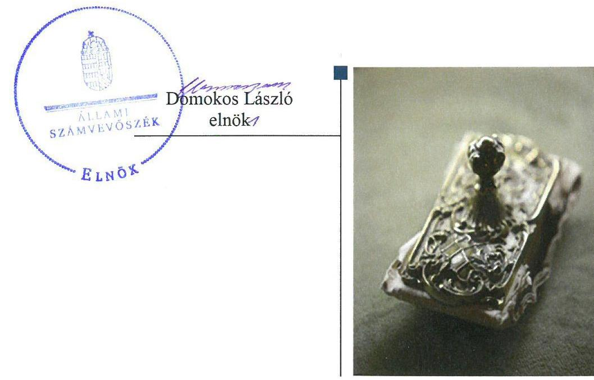
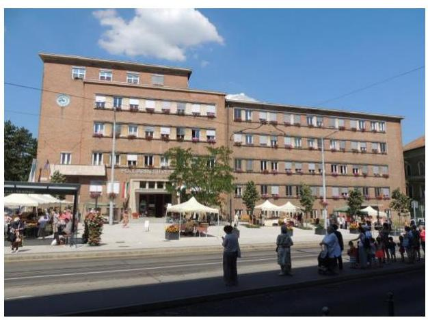
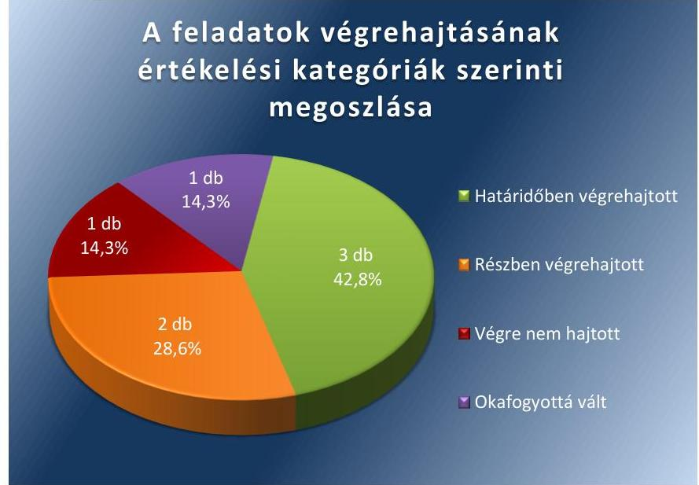
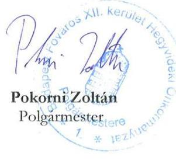
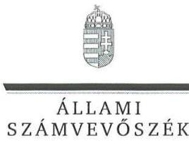
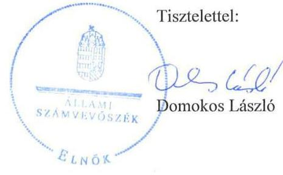
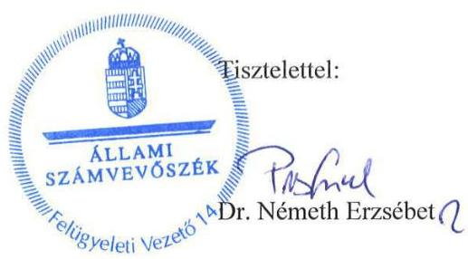

# Jelentés 

## Utóellenőrzések

Az önkormányzatok vagyongazdálkodása szabályszerűségének utóellenőrzése Budapest Főváros XII. kerület Hegyvidéki Önkormányzat
2018. 01. hó 31. nap

---

# AZ ELLENŐRZÉST FELÜGYELTE: 

RENKŐ ZSUZSANNA felügyeleti vezető

## AZ ELLENŐRZÉST VEZETTE ÉS A VÉGREHAJTÁSÁÉRT FELELŐS:

DR. NAGY JUDIT ellenőrzésvezető

## A PROGRAM ÖSSZEÁLLÍTÁSÁÉRT FELELŐS:

JANIK JÓZSEF LÁSZLÓ osztályvezető

## A TÉMÁHOZ KAPCSOLÓDÓ KORÁBBI SZÁMVEVŐSZÉKI JELENTÉSEK:

- címe: Jelentés az önkormányzati vagyongazdálkodás szabályszerűségi ellenőrzéséről - Budapest XII. kerület Hegyvidék
- sorszáma: 13085

IKTATÓSZÁM: V-1307-038/2016.
TÉMASZÁM: 2096
ELLENŐRZÉS-AZONOSÍTÓ SZÁM: V075566

---

# TARTALOMJEGYZÉK 

■ ÖSSZEGZÉS ..... 5
■ AZ ELLENŐRZÉS CÉLJA ..... 6
■ AZ ELLENŐRZÉS TERÜLETE ..... 7
■ AZ ELLENŐRZÉS HÁTTERE, INDOKOLTSÁGA ..... 8
■ A JELENTÉS LÉNYEGES KÉRDÉSKÖRE ..... 9
■ ELLENŐRZÉS HATÓKÖRE ÉS MÓDSZEREI ..... 10
■ MEGÁLLAPÍTÁSOK ..... 12
■ MELLÉKLETEK ..... 15
I. sz. melléklet: Budapest Főváros XII. kerület Hegyvidéki Önkormányzat intézkedési tervének végrehajtása. ..... 15
■ FÜGGELÉK: ÉSZREVÉTELEK ..... 19
■ RÖVIDÍTÉSEK JEGYZÉKE ..... 25

---

.

---

# ÖSSZEGZÉS 

Budapest XII. kerület Hegyvidéki Önkormányzat vagyongazdálkodása szabályszerűségének utóellenőrzése megállapította, hogy az Önkormányzat az intézkedési tervben meghatározott feladatok jelentős részét végrehajtotta és a végrehajtott feladatok hatására a vagyongazdálkodás szabályozottsága javult.

## Az ellenőrzés társadalmi indokoltsága

Az Állami Számvevőszék stratégiájában célul tűzte ki a számvevőszéki munka hasznosulásának javítását. Ezzel összhangban ellenőrzi, hogy az ellenőrzött szervezet megvalósította-e a korábbi ellenőrzései által feltárt hibák, hiányosságok és szabálytalanságok megszüntetése céljából elkészített intézkedési tervében foglaltakat. A rendszeres utóellenőrzések hozzájárulnak a szükséges intézkedések tényleges végrehajtásához, ezáltal a közpénzügyek rendezettségének javulásához.

## Főbb megállapítások, következtetések

Az Állami Számvevőszék jelentésében foglalt, intézkedést igénylő megállapítások alapján Budapest XII. kerület Hegyvidéki Önkormányzat Képviselő-testülete a vagyonkezelői jog részletszabályait rendeletbe foglalta és intézkedési tervet készített, amelyet megküldött az Állami Számvevőszék részére.

Az intézkedési tervbe foglalt feladatok közül a vállalt határidőben végrehajtásra kerültek a vagyongazdálkodás, leltározás szabályozottságára és a 2007-2011. évi elemi költségvetése, beszámolója, továbbá a 2008. és 2011. évi nem normatív, céljellegű működési és fejlesztési célú támogatások közzétételére vonatkozó feladatok.

Okafogyottá vált a Budapest XII. kerület Hegyvidéki Önkormányzat által kibocsátott kötvény feltételeinek változtatására vonatkozó feladat az állami adósságkonszolidáció következtében.

Az intézkedési tervben rögzített feladatok végrehajtásáról vezették a jogszabály előírása szerinti nyilvántartást.

---

# AZ ELLENŐRZÉS CÉLJA 

Az ellenőrzés célja annak értékelése volt, hogy a számvevőszéki jelentésben foglalt intézkedést igénylő megállapításokkal összhangban készített intézkedési tervben meghatározott feladatokat az ellenőrzött szervezet végrehajtotta-e.

---

# AZ ELLENŐRZÉS TERÜLETE

## Budapest Főváros XII. kerület Hegyvidéki Önkormányzat

Budapest XII. kerület Hegyvidék területét tekintve közepes méretű fővárosi kerület.

A KSH által közzétett adatok1 alapján a Kerület2 állandó lakosságszáma 2016. január 1-jén 58 171 fő volt. A 2006. évi önkormányzati választások óta a jelenleg is hivatalban lévő Polgármester3 vezeti a 18 tagú Képviselő-testületet4. A Polgármester és a Jegyző5 személye az ellenőrzött időszakban nem változott.

A 2015. évi éves költségvetési beszámoló6 szerint a 2015. évben az Önkormányzat7 12 989 M Ft költségvetési kiadást teljesített és 12 205 M Ft költségvetési bevétellel gazdálkodott, 2015. december 31-én 43 175 M Ft értékű eszközvagyonnal rendelkezett.

Az ÁSZ8 2007. január 1. és a 2011. december 31. közötti időszakra vonatkozóan végezte el az Önkormányzat vagyongazdálkodása szabályszerűségének ellenőrzését és erről 2013. szeptember 12-én hozta nyilvánosságra a 13085 számú ÁSZ jelentést.

Az ÁSZ jelentés9 az Önkormányzat jegyzője részére 5 intézkedést igénylő megállapítást tartalmazott. Ennek alapján a Polgármester az ÁSZ Elnökének megküldte az Önkormányzat intézkedési tervét 6 feladat megfogalmazásával és tájékoztatást adott a vagyonkezelői jog részletszabályainak rendeletbe foglalásáról az ÁSZ intézkedést igénylő megállapításai alapján.

Az ÁSZ jelentésben foglalt intézkedést igénylő megállapítások alapján készített intézkedési tervet az Állami Számvevőszék Elnöke 2014. február 13-án elfogadta.

---

# AZ ELLENŐRZÉS HÁTTERE, INDOKOLTSÁGA 

Az ÁSZ tv. ${ }^{10}$ 33. § (1) bekezdése értelmében a számvevőszéki jelentések intézkedést igénylő megállapításaihoz kapcsolódóan az ellenőrzött szervezet vezetője intézkedési tervet köteles összeállítani, és az Állami Számvevőszék részére megküldeni. Az intézkedési tervben foglaltak megvalósítását - az ÁSZ tv. 33. § (7) bekezdésében foglaltak alapján - az Állami Számvevőszék utóellenőrzés keretében ellenőrizheti. Az intézkedések megvalósulásának értékelése során az Állami Számvevőszék figyelembe veszi az ellenőrzött szervezet működési feltételeiben, valamint a jogszabályi előírásokban bekövetkezett változásokat.

Az intézkedési tervekben foglalt feladatok hiányos, illetve késedelmes végrehajtása, valamint megvalósításának elmaradása azt mutatja, hogy az ellenőrzés során feltárt hibák, hiányosságok és szabálytalanságok megszüntetése nem kapott kellő hangsúlyt. Ez a szabályszerű működés és a felelős vezetői magatartás vonatkozásában kockázatot hordoz. E kockázatok feltárásával az Állami Számvevőszék utóellenőrzési rendszere fokozza a fegyelmet, és igazolja, hogy a közpénzzel való szabályos gazdálkodás felelőssége elől nem lehet kitérni.

Az utóellenőrzés négy szinten hasznosulhat:

- A társadalom szintjén az utóellenőrzés jelzi, hogy a számvevőszéki ellenőrzés megállapításainak van következménye: a hiányosságok megszüntetésére az ellenőrzött szervezet által meghatározott intézkedések végrehajtását is számon kéri az ÁSZ.
- Az ellenőrzött terület szintjén az utóellenőrzés tájékoztatást nyújt a terület döntéshozóinak a hiányosságok kiküszöbölésének jó gyakorlatairól, ezzel lehetőséget biztosítva arra, hogy az ÁSZ ellenőrzési megállapításai a terület nem ellenőrzött szervezeteinek a működése során is hasznosuljanak.
- Az ellenőrzött szervezet szintjén az utóellenőrzés feltárja, hogy a szervezet az intézkedések végrehajtásával hasznosította-e a korábbi ellenőrzési jelentésben a hiányosságok megszüntetése, illetve a kockázatok kezelése érdekében megfogalmazott javaslatokat.
- Az ÁSZ szintjén az utóellenőrzés visszacsatolást ad az ellenőrzési jelentések hasznosulásáról, az intézkedések elmaradása vagy részleges megvalósulása a további ellenőrzésekhez kockázati jelzésként szolgál.

---

# A JELENTÉS LÉNYEGES KÉRDÉSKÖRE 

Az Önkormányzat az intézkedési tervben foglaltakat az előírt határidőben végrehajtotta-e?

---

# ELLENŐRZÉS HATÓKÖRE ÉS MÓDSZEREI 

## Az ellenőrzés típusa

Megfelelőségi ellenőrzés.

## Az ellenőrzött időszak

Az utóellenőrzés alapját képező ÁSZ jelentés közzétételének napjától (2013. szeptember 12.) az ellenőrzésről szóló kiértesítő levél keltének napjáig (2017. június 19.) tartó időszak.

## Az ellenőrzés tárgya

Az ÁSZ tv. 2011. július 1-jei hatálybalépését követően a számvevőszéki jelentésben foglalt intézkedést igénylő megállapításokkal összhangban - az Önkormányzat által - készített Intézkedési Tervben foglaltak végrehajtásának ellenőrzése.

Az ellenőrzés kiterjedt minden olyan körülményre és adatra, amely az ÁSZ jogszabályban meghatározott feladatainak teljesítéséhez, valamint a program végrehajtása során felmerült újabb összefüggések feltárásához szükséges.

## Az ellenőrzött szervezet

Budapest Főváros XII. kerület Hegyvidéki Önkormányzat

## Az ellenőrzés jogalapja

Az ÁSZ tv. 33. § (7) bekezdése alapján az ÁSZ tv. 33. § (1)-(2) bekezdése szerinti intézkedési tervben foglaltak megvalósítását az ÁSZ utóellenőrzés keretében ellenőrizheti.

## Az ellenőrzés módszerei

Az utóellenőrzést - a nemzetközi standardokat irányadónak tekintve - az ellenőrzési program ellenőrzési kérdései, az ellenőrzött időszakban hatályos jogszabályok, az ellenőrzés szakmai szabályok és módszertanok alapján végeztük.

Az ÁSZ az ellenőrzés ideje alatt az Önkormányzattal történő kapcsolattartást az ÁSZ SZMSZ ${ }^{11}$-ének vonatkozó előírásai alapján biztosította.

---

Az utóellenőrzés megállapításait az ÁSZ rendelkezésére álló, valamint az ellenőrzött szervezettől elektronikusan bekért dokumentumok alapozták meg.

Az ellenőrzési bizonyítékként felhasználható adatforrások közé tartoztak egyrészt a szakmai programban felsorolt adatforrások, másrészt minden - az ellenőrzés folyamán feltárt, az ellenőrzés szempontjából információt tartalmazó - dokumentum.

Az intézkedési tervekben előírt feladatokat azok végrehajthatósága, illetve végrehajtása szempontjából az alábbiak szerint értékeltük:
„határidőben végrehajtott" a feladat, ha a teljesítés dokumentáltan, az intézkedési tervben előírt határidőben és tartalommal megtörtént;
"határidőn túl végrehajtott" a feladat, ha annak teljesítése az intézkedési tervben meghatározott módon, de az előírt határidőn túl történt meg;
„részben végrehajtott" a feladat, ha végrehajtása teljes körűen az intézkedési tervben előírt módon nem történt meg;
„nem végrehajtott" a feladat, ha a végrehajtás nem történt meg, vagy amennyiben a teljesítést nem dokumentálták;
„okafogyottá vált" a feladat, ha végrehajtására - meghatározott esemény bekövetkezése, továbbá külső körülmény, a működést érintő feltétel változása miatt - már nincs szükség, illetve lehetőség, és egyértelműen megállapítható, hogy az intézkedést szükségessé tevő körülmény a jövőben nem fordulhat elő;
„nem időszerű" az a feladat, amelynek ellenőrzési időszakon belüli végrehajtására azért nem került (kerülhetett) sor, mert az intézkedés alapjául szolgáló esemény nem következett be, de annak jövőbeni előfordulása lehetséges, a végrehajtása nem volt esedékes, vagy a végrehajtás határideje még nem járt le.
Az ellenőrzés lefolytatásához az ellenőrzött szervezet a tanúsítványok elektronikus kitöltésével, valamint az ÁSZ által kért dokumentumok elektronikus megküldésével szolgáltatott adatokat, amelyek valódiságát és teljes körűségét az ellenőrzött szervezet vezetője által tett teljességi és hitelességi nyilatkozat igazolja. Az így rendelkezésre bocsátott adatok, információk kontrollja az ellenőrzés keretében megtörtént.

---

# MEGÁLLAPÍTÁSOK 

## Az Önkormányzat az intézkedési tervben foglaltakat az előírt határidőben végrehajtotta-e?

Összegző megállapítás

Az Önkormányzat a hét feladatból hármat határidőben, kettőt részben, egyet nem hajtott végre, egy feladat okafogyottá vált. Az intézkedési tervben meghatározott feladatok végrehajtásáról a jogszabályban előírt nyilvántartást vezették.

Az ÁSZ jelentésben az ÁSZ a Jegyző részére öt javaslatot fogalmazott meg. A Polgármester tájékoztatást adott az 1. sz. javaslat alapján egy intézkedés megtételéről, továbbá az intézkedési tervben hat feladatot határozott meg. Az összesen hét feladat közül hármat határidőben, kettőt részben, egyet nem hajtottak végre. Egy feladat okafogyottá vált jogszabályi változás miatt.

A feladatokat, határidőket, megjelölt felelősöket és a feladatok végrehajtását az I. sz. melléklet mutatja be.

A Jegyző gondoskodott az intézkedési tervben meghatározott feladatok végrehajtásáról szóló, a Bkr. ${ }^{12}$-ben meghatározott nyilvántartás vezetéséről.

Az Önkormányzat intézkedési tervében vállalt feladatok végrehajtását az 1. ábra szemlélteti.

1. ábra

Fonrás: ÁSZ

---

# HATÁRIDŐBEN VÉGREHAJTOTT FELADATOK: 

$\qquad$ 1. A Képviselő-testület a vagyongazdálkodási rendelet módosításával a vagyonkezelői jog szabályait rendeletbe foglalta.
$\qquad$ 2. A Polgármester és a Jegyző közös utasítása ${ }^{13}$ 2013. november 30-án hatályba helyezte az Önkormányzat leltározási szabályzatának ${ }^{14}$ módosítását, amely előírta, hogy az üzemeltetésre, kezelésre átadott, koncesszióba, vagyonkezelésbe adott eszközöket az üzemeltetést, kezelést végző szerv által készített leltárral kell alátámasztani.
$\qquad$ 3. Az Önkormányzat 2007-2011. évi elemi költségvetése és a Számv. tv. ${ }^{15}$ szerinti beszámolója, továbbá a 2008. és 2011. évi nem normatív, céljellegű működési és fejlesztési célú támogatások adatai az Önkormányzat honlapján közzétételre kerültek.

## RÉSZBEN VÉGREHAJTOTT FELADATOK:

$\qquad$ 4. Intézkedések történtek a korábban értékesített 16 ingatlan esetében a földhivatali nyilvántartás rendezésére, 4 ingatlan vonatkozásában megtörtént, 12 ingatlan esetében nem történt meg ingatlanvagyon-kataszter és a földhivatali nyilvántartás közötti egyezőség rendezése.
$\qquad$ 5. Az Önkormányzat honlapját külső szolgáltató üzemeltette, a változtatásokat folyamatosan naplózva, ezáltal téve lehetővé a közzétételi kötelezettség végrehajtásának önkormányzati nyomon követését. Az Önkormányzat hiányosan tett eleget az Info. tv. ${ }^{16}$-ben előírtak szerinti közzétételi kötelezettségnek, így a szervezeti, személyzeti adatok közzététele mellett a tevékenységre, működésre, gazdálkodásra vonatkozó adatokat nem teljeskörűen tették közzé.

## NEM VÉGREHAJTOTT FELADAT:

$\qquad$ 6. 2013-2016. években az Önkormányzat könyvviteli mérlege, az Áhsz. ${ }^{17}$-ben foglalt előírások ellenére, nem volt alátámasztva az üzemeltetést, vagyonkezelést végző szervek által megküldött hitelesített leltárral.

## OKAFOGYOTTÁ VÁLT FELADAT:

$\qquad$ 7. Okafogyottá vált az Önkormányzat által kibocsátott kötvényt jegyző bankkal történő megállapodás egyéb ügyleti biztosíték nyújtásáról. A kötvényekből adódó tartozást a Magyar Állam adósságkonszolidáció keretében átvállalta, így az Önkormányzat és a bank
 közötti megállapodás hatálytalanná vált.

---

.

---

# MELLÉKLETEK

- I. SZ. MELLÉKLET: BUDAPEST FÖVÁROS XII. KERÜLET HEGYVIDÉKI ÖNKORMÁNYZAT INTÉZKEDÉSI TERVÉNEK VÉGREHAJTÁSA

|  1. | Intézkedési terv alapján elvégzendő feladat | Az intézkedési tervben meghatározott határidő | Az intézkedési tervben meghatározott felelős | Az intézkedési tervben meghatározott feladat végrehajtása  |
| --- | --- | --- | --- | --- |
|   | 1. | 2. | 3. | 4.  |
|  Határidőben végrehajtott feladatok |  |  |  |   |
|  1. | Budapest Főváros XII. kerületi Önkormányzat vagyon feletti tulajdonosi jogok gyakorlásáról szóló rendeletének módosítása, amelynek értelmében a vagyonkezelői jog részletszabályainak rendeletbe foglalása megtörtént. | 2013. október 11. | Jegyző | A Képviselő-testület 2013. június 24-én fogadta el a vagyongazdálkodási rendelet ${ }^{18}$ módosítását ${ }^{19}$. Ennek értelmében, az Mtv. ${ }^{20} 109. §$ (4) bekezdésében előírtak szerint, a vagyonkezelői jog és a vagyonkezelői jog részletszabályainak rendeletbe foglalása, Képviselő-testület elé terjesztése illetve elfogadása megtörtént.  |
|  2. | A leltározási szabályzatot a 249/2000. (XII. 24.) Korm. rendelet 37. § (4) bekezdésében előírtak alapján módosítani kell annak érdekében, hogy a szabályzat tartalmazza, hogy „az üzemeltetésre, kezelésre átadott, koncesszióba, vagyonkezelésbe adott eszközöket az üzemeltetést, kezelést végző szerv által a december 31-i fordulónapra vonatkozó évenkénti leltározása alapján elkészített, hitelesített és a megállapodásban meghatározott időpontig megküldött leltárral kell alátámasztani." | 2013. november 30. | Jegyző | Budapest Főváros XII. kerület Hegyvidéki Önkormányzat Polgármesterének és Jegyzőjének, az Önkormányzat Számviteli Politikájának módosításáról szóló 6/2013. együttes utasítása 2013. november 30-án hatályba helyezte az Önkormányzat leltározási szabályzatának módosítását. A 6/2013. sz. utasítás az Önkormányzat az Önkormányzat Számviteli Politikájáról szóló 4/2008. sz. együttes utasítás VIII. Leltározási-, leltárkészítési- és selejtezési Szabályzat I. fejezet IV. pontja helyébe új rendelkezést léptetett életbe. E szerint „Az üzemeltetésre, kezelésre átadott, koncesszióba, vagyonkezelésbe adott eszközöket az üzemeltetést, kezelést végző szerv által a december 31-i fordulónapra vonatkozó évenkénti leltározása alapján elkészített, hitelesített és a megállapodásban meghatározott időpontig megküldött leltárral kell alátámasztani."  |
|  3. | A 2007-2011. évek elemi költségvetését és a számviteli törvény szerinti beszámolóját, továbbá a 2008. és 2011. évi nem normatív, céljellegű működési és fejlesztési célú támogatások adatait az Önkormányzat honlapján közzétette. | 2013. október 31. | Jegyző | Az intézkedési tervben vállalt feladatának megfelelően, a 2007-2011. évek elemi költségvetését és a számviteli törvény szerinti beszámolóját, továbbá a 2008. és 2011. évi nem normatív, céljellegű működési és fejlesztési célú támogatások adatait, az Önkormányzat honlapján közzétette.  |

---

|  4. | Az ingatlanvagyon-kataszter és a földhivatali nyilvántartás közötti egyezőséget teljes körűen biztosítani kell. Ennek érdekében intézkedni kell a már évekkel ezelőtt értékesített, de a földhivatali nyilvántartásban még be nem jegyzett 16 ingatlan esetében a bejegyzéshez szükséges dokumentumok felkutatása és a földhivatalhoz történő benyújtása érdekében. | 2014. május 31. | Jegyző | A 147/1992. (XI.6.) Korm. rendelet^{21} 1. § (2) bekezdésében előírt ingatlanvagyon-kataszter és a földhivatali nyilvántartás közötti egyezőség megteremtése érdekében intézkedések (felvették a kapcsolatot az ingatlanok tulajdonosaival, ügyvédet bíztak meg, írásban egyeztettek az érintettekkel) történtek a már évekkel ezelőtt értékesített, de a földhivatali nyilvántartásban még be nem jegyzett 16 ingatlan esetében a bejegyzéshez szükséges dokumentumok felkutatására. Ennek eredményeként a bejegyzéshez szükséges dokumentumok benyújtása a földhivatalhoz 4 ingatlan esetében (6808/0/A/28, 8398/6/A/1, 9210/0/A/10, 8768/11. hrsz.) megtörtént. 12 ingatlan esetében, az ingatlanvagyon-kataszter és a földhivatali egyezőség továbbra sem állt fenn.  |
| --- | --- | --- | --- | --- |
|  5. | 2011. évi CXII. törvény 1. számú mellékletében meghatározott adatok közzétételéről folyamatosan gondoskodni kell. Ennek érdekében: A belső kontrollok működtetésével nyomon kell követni a közzétételi kötelezettség 2011. utáni évekre vonatkozó teljesítését is, az esetleges hiányosságokat pótolni kell. | 2013. október 20-tól folyamatosan | Jegyző | Az Önkormányzat honlapját külső szolgáltató üzemeltette. A módosításokat, feltöltéseket naplózással követték nyomon. Az Info. tv. 1. sz. mellékletében előírtak szerint az Önkormányzat honlapján közzétette: a szervezeti, személyzeti adatokat (Info. tv. 1. sz. melléklet I. pont), a tevékenységre, működésre vonatkozó adatokat (Info. tv. 1. sz. melléklet II/2-4, II/6-12, II/14-15, II/18. pontjai szerint), a gazdálkodásra vonatkozó adatokat (Info. tv. 1. sz. melléklet a III/1-2, III/4. pontjai szerint). Nem tette közzé: a számviteli törvény szerinti 2016. évi beszámolóját, a tevékenységre, működésre vonatkozó adatokat (Info. tv. 1. sz. melléklet II/1, II/5, II/13, II/16-17, II/19-25 pontjai szerint), a gazdálkodásra vonatkozó adatokat (Info. tv. 1. sz. melléklet a III/3, III/5-8 pontjai szerint).  |

---

|  5. | Intézkedési terv alapján elvégzendő feladat | Az intézkedési tervben meghatározott határidő | Az intézkedési tervben meghatározott felelős | Az intézkedési tervben meghatározott feladat végrehajtása  |
| --- | --- | --- | --- | --- |
|  6. | A 2013. évtől kezdődően a könyvviteli mérleget az üzemeltetést, vagyonkezelést végző szerv által készített, hitelesített leltárral kell alátámasztani. | 2013. évi beszámoló elkészítése, azt követően folyamatos | Jegyző | Az üzemeltetésre, kezelésre átadott, koncesszióba, vagyonkezelésbe adott eszközök nyilvántartását december 31-i fordulónapra vonatkozó, évenkénti leltározás alapján elkészített, hitelesített leltár nem támasztotta alá, mert nem tartalmazott valamennyi nyilvántartásban szereplő, üzemeltetésre, kezelésbe, koncesszióba, vagyonkezelésbe adott eszközt  |
|  7. | Felül kell vizsgálni az Önkormányzat által kibocsátott kötvényeket abból a szempontból, hogy melyik kötvény tartalmaz a helyi önkormányzatokról szóló 1990. évi LXV. törvény 88. § (1) bekezdésében foglaltakkal ellentétes feltételeket. Az ilyen kötvényt jegyző bankkal meg kell állapodni egyéb ügyleti biztosíték nyújtásáról, amely nem ellentétes az Áht. 84. § (4) bekezdésében foglaltakkal. | 2013. december 31. | Jegyző | Intézkedési határidőn belül - a kötvények felülvizsgálatát követően -, a Pénzügyi és Költségvetési Iroda^{22} vezetője feljegyzést készített a Jegyző felé a tervezett intézkedésekről. A Magyar Állam az adósságkonszolidáció I. szakaszában a Költségvetési törvény;^{23} 72. § (1) bekezdése és 74. § (5) bekezdése alapján, részátvállalást hajtott végre. Az adósságkonszolidáció II. szakasza keretében a Költségvetési törvény;^{24} 67. § (1) bekezdése értelmében pedig átvállalta az Önkormányzat 2 376 000 EUR névértékű kötvény tartozását. Így az Önkormányzat tartozása megszűnt, okafogyottá vált az intézkedésben megjelölt banki megállapodás megkötése az egyéb biztosíték nyújtásáról.  |

---

.

---

# FÜGGELÉK: ÉSZREVÉTELEK 

A jelentéstervezetet a Számvevőszék 15 napos észrevételezésre megküldte az ellenőrzött szervezet vezetőjének az ÁSZ tv. 29. § (1) bekezdése előírásának megfelelően.
A függelék tartalmazza az ellenőrzött észrevételeit, illetve az el nem fogadott észrevételek elutasításának indoklását.

[^0]
[^0]:    * 29. § (1) Az Állami Számvevőszék az ellenőrzési megállapításait megküldi az ellenőrzött szervezet vezetőjének vagy az általa megbízott személynek, és annak, akinek személyes felelősségét állapította meg.
    (2) Az ellenőrzött szervezet vezetője és a felelősként megjelölt személy az ellenőrzés megállapításaira tizenöt napon belül írásban észrevételt tehet.
    (3) Az Állami Számvevőszék az észrevételre a beérkezésétől számított harminc napon belül írásban válaszol. A figyelembe nem vett észrevételeket köteles a jelentésben feltüntetni, és megindokolni, hogy azokat miért nem fogadta el.

---

# 2248 

Budapest Főváros XII. kerület Hegyvidéki Önkormányzat
Polgármester

Iktatási szám: 1/43800/6/2017
1126 Budapest, Böszörményi út 23-25.
Telefonszám: 224-5900
Ügyintéző: Szütsné Kiss Zsuzsanna
www.szutsne.zsuzsa@hegyvidek.hu

## Állami Számvevőszék

Domokos László
elnök részére

Budapest 4.
Pf. 54.
3364

## ÁLLAMI SZÁMVEVŐSZÉK BE 87664/2017

Érkezés: 2017. DEC 20.
Iktatószám: 4-4301-034/2017
Melléklet:

Tárgy: Az önkormányzati vagyongazdálkodás szabályszerűségének utóellenőrzése

## Tisztelt Elnök Úr!

Köszönettel megkaptam az „Utóellenőrzések - Az önkormányzatok vagyongazdálkodása szabályszerűségének utóellenőrzése - Budapest Főváros XII. kerület Hegyvidéki Önkormányzat" témájában készített „Számvevőszéki jelentéstervezetet", és örömmel olvastam az összegző sorokat arról, hogy az Önkormányzat a 2013. évben lefolytatott vizsgálat nyomán készített Intézkedési tervben meghatározott feladatok jelentős részét határidőben végrehajtotta, és a végrehajtott feladatok hatására a vagyongazdálkodás szabályozottsága javult.

Az Állami Számvevőszékről szóló 2011. évi LXVI. törvény 29. § (2) bekezdése szerinti „Észrevételeim" a Jelentés-tervezet 13. oldalán szereplő, „részben végrehajtott" és „nem végrehajtott" feladatokkal kapcsolatosan az alábbiak.

## RÉSZBEN VÉGREHAJTOTT FELADATOK

4. Számvevői Megállapítás: „Intézkedések történtek a korábban értékesített 16 ingatlan esetében a földhivatali nyilvántartás rendezésére, 4 ingatlan vonatkozásában megtörtént, 12 ingatlan vonatkozásában nem történt meg az ingatlanvagyon-kataszter és a földhivatali nyilvántartás közötti egyezőség rendezése."

## Észrevétel:

Javaslom, hogy a „nem történt meg" helyett a „nem fejeződött be" minősítés történjen, ugyanis ez jobban lefedi mindazt az erőfeszítést, amit az üggyel foglalkozó munkatársak a rendezés érdekében az elmúlt években végeztek. Tapasztalataink szerint ezen ügyek lezárása nem a hivatali ügyintézés elhúzódása miatt késik, hanem jelentős mértékben a másik fél hozzáállásán, elérhetőségén is múlik.
Tájékoztatásul közöljük, hogy a vizsgálati időszak lezárását követően további négy esetben sikerült az ügyet lezárni, az egyezőséget létrehozni. A még folyamatban lévő nyolc esetre tekintettel az Intézkedési tervben módosítani fogjuk a teljesítés végső határidejét.

---

# 5. Számvevői Megállapítás „Az Önkormányzat hiányosan tett eleget az Info. tv.-ben előírtak szerinti közzétételi kötelezettségének, így a szervezeti, személyzeti adatok közzététele mellett a tevékenysége, működésre, gazdálkodásra vonatkozó adatokat nem teljes körűen tették közzé." 

Szíves tájékoztatásul közöljük, hogy 2017. szeptember hónapban az Önkormányzat megújította hivatalos honlapján a „közérdekű adatok" tartalmat, így az Info tv. 1. sz. mellékletében előírt valamennyi adat, és információ hozzáférhető a nyilvánosság számára.

## NEM VÉGREHAJTOTT FELADATOK

6. Számvevői Megállapítás: 2013-2016. években az Önkormányzat könyvviteli mérlege, az Átszsz-ben foglalt előírások ellenére, nem volt alátámasztva az üzemeltetést, vagyonkezelést végző szervek által megküldött hitelesített leltárral.

## Észrevétel:

2013. évre vonatkozóan a vizsgálati dokumentációba INTERV_2_3 filenév alatt valamennyi, a tárgyi eszköz kartonon szereplő, a használók által leltározható eszközre vonatkozó, a használó partner által készített leltározási dokumentumot csatoltunk, tehát erre az évre a főkönyvi nyilvántartást teljes körűen leltárral támasztottuk alá. A 2014-2016. években nem minden partnerünk küldött az általa használt eszközökről minden évben leltárt, de részlegesen minden évben rendelkeztünk a mérlegsor valódiságát alátámasztó dokumentumokkal.
A leírtakra tekintettel javaslom, hogy a „nem végrehajtott feladat" minősítést „részben végrehajtott feladat" minősítésre szíveskedjenek módosítani.

Végezetül szeretném megköszönni a vizsgálatban részt vevő számvevők segítő közreműködését, szakmai útmutatásait, amellyel az önkormányzati vagyongazdálkodás színvonalának emeléséhez járultak hozzá.

Budapest Hegyvidék, 2017. december 15.

Tisztelettel:

---

ELNÖK

Ikt.szám: V-1307-037/2016.

# Pokorni Zoltán úr 

polgármester
Budapest Főváros XII. kerület Hegyvidéki Önkormányzat

## Budapest

## Tisztelt Polgármester Úr!

Az „Utóellenőrzések - Az önkormányzatok vagyongazdálkodása szabályszerűségének utóellenőrzése - Budapest Főváros XII. kerület Hegyvidéki Önkormányzat" címú jelentéstervezetre tett észrevételét köszönettel megkaptam.

Az ellenőrzési megállapításokra vonatkozó észrevételét az Állami Számvevőszékről szóló 2011. évi LXVI. törvény (a továbbiakban: ÁSZ tv.) 29. § (2) bekezdésében meghatározott tizenöt napos határidőn belül küldte meg. Az Állami Számvevőszék észrevétellel kapcsolatos álláspontját a mellékletként csatolt, a félügyeleti vezető által készített indokolás tartalmazza.

Tájékoztatom, hogy
 az Állami Számvevőszék a figyelembe nem vett észrevételeket az ÁSZ tv. 29. § (3) bekezdésében előírtak szerint köteles a jelentésében feltüntetni és megindokolni, hogy azokat miért nem fogadta el.

Budapest, 2018. január hó  nap

Melléklet: Észrevételre adott válasz

---

Az „Utóellenőrzések - Az önkormányzatok vagyongazdálkodása szabályszerűségének utóellenőrzése - Budapest Főváros XII. kerület Hegyvidéki Önkormányzat" című jelentéstervezethez tett észrevételre adott válasz

# 1. A jelentéstervezet 13. oldalának 4. sz. megállapítására tett észrevétel 

Polgármester úr észrevétele a megállapítást nem vitatja, azonban javasolja, hogy a „12 ingatlan vonatkozásában nem történt meg az ingatlanvagyon kataszter és a földhivatali nyilvántartás közötti egyezőség rendezése" mondatrészben a nem történt meg minősítés helyett a nem fejeződött be minősítés szerepeljen, tekintettel arra, hogy „az ügyek lezárása nem a hivatali ügyintézés elhúzódása, hanem az ügyfél hozzáállásán, elérhetőségén is múlik".
Az Állami Számvevőszék ellenőrzési módszertana alapján az intézkedési tervben előírt feladatokat azok végrehajtása szempontjából értékeljük, tehát a végrehajtás tényét, az intézkedés megvalósulásának mértékét ellenőrizzük. A végrehajtás minősítése során az „Ellenőrzés hatóköre és módszerei" című fejezetben meghatározott és ismertetett kategóriákat, fogalmakat alkalmazzuk. Ezzel összhangban a feladat végrehajtását részben teljesítettnek minősítettük, a folyamatban lévő feladatokat pedig nem végrehajtott kategóriába soroljuk. A megállapítás megfogalmazásának megváltoztatására, így a jelentéstervezet módosítására ezért nincs lehetőség.

## 2. A jelentéstervezet 13. oldalának 5. sz. megállapítására tett észrevétel

Polgármester úr vonatkozó észrevételében a feltárt hiányosság az ellenőrzési időszakot követő megszüntetésével kapcsolatban ad tájékoztatást - „2017. szeptember hónapban az Önkormányzat megújította hivatalos honlapján a közérdekű adatok tartalmát, így az Info tv. 1. sz. mellékletében előírt valamennyi adat és információ hozzáférhető a nyilvánosság számára" - az ellenőrzési időszakra vonatkozó megállapítást azonban nem vitatja. A megállapítás módosítása ennek megfelelően nem szükséges.

## 3. A jelentéstervezet 13. oldalának 6. sz. megállapítására tett észrevétel

Polgármester úr észrevétele szerint „a 2013. évre vonatkozóan a vizsgálati dokumentációba INTERV_2_3 fájlnév alatt valamennyi, a tárgyi eszköz kartonon szereplő, a használók által felleltározható eszközre vonatkozó, a használó partner által készített leltározási dokumentumot csatoltunk, tehát erre az évre a főkönyvi nyilvántartást teljes körűen leltárral támasztottuk alá". A megállapítás 2014-2016. évekre vonatkozó helytállóságát azonban nem vitatja.
Polgármester úr észrevételével kapcsolatban áttekintettük a jelentés tervezetét, valamint a megállapítást megalapozó dokumentumokat, amelynek eredményeként a következő tájékoztatást adjuk.
A 2013. évi beszámoló tekintetében az „Üzemeltetésre átadott eszközök leltárkörzetenkénti nyilvántartása" a rendelkezésre álló leltárfelvételi jegyzőkönyvek, leltározási nyilatkozat, tárolási alapú nyilatkozatok együttesen nem támasztják alá a nyilvántartás 2013. december 31-i állapotát. Az eltérés abból adódik, hogy az önkormányzat a tulajdonában álló ingatlanok és

---

épületrész esetében nem bocsátotta az ellenőrzés rendelkezésére a kapcsolódó dokumentumokat (tulajdoni lapokat/a tulajdoni lapok és a nyilvántartás egyezőségét alátámasztó nyilatkozatot), így nem volt megállapítható a főkönyvi nyilvántartással való egyezőség és annak alátámasztottsága. A megállapítás módosítása ezért nem indokolt.

Tájékoztatom, hogy az Állami Számvevőszék a figyelembe nem vett észrevételeket az ÁSZ tv. 29. § (3) bekezdésében előírtak szerint köteles a jelentésében feltüntetni és megindokolni, hogy azokat miért nem fogadta el.

Budapest, 2018. január  nap.

---

# RÖVIDÍTÉSEK JEGYZÉKE 

${ }^{1}$ KSH által közzétett adatok
${ }^{2}$ Kerület
${ }^{3}$ Polgármester
${ }^{4}$ Képviselő-testület
${ }^{5}$ Jegyző
${ }^{6}$ 2015. évi beszámoló
${ }^{7}$ Önkormányzat
${ }^{8}$ ÁSZ
${ }^{9}$ ÁSZ jelentés
${ }^{10}$ ÁSZ törvény
${ }^{11}$ SZMSZ
${ }^{12}$ Bkr.
${ }^{13}$ Együttes utasítás
${ }^{14}$ Leltározási szabályzat
${ }^{15}$ Számv. tv.
${ }^{16}$ Info tv.
${ }^{17}$ Áhsz
${ }^{18}$ Vagyongazdálkodási rendelet
${ }^{19}$ Vagyongazdálkodási rendelet módosítása
${ }^{20}$ Mötv.
${ }^{21}$ Korm. rendelet
${ }^{22}$ Pénzügyi és Költségvetési Iroda
${ }^{23}$ Költségvetési törvény ${ }_{1}$
${ }^{24}$ Költségvetési törvény ${ }_{2}$

Magyarország Közigazgatási Helynévkönyve (2016. január 1.)
Budapest Főváros XII. kerület Hegyvidék
Budapest Főváros XII. kerület Hegyvidéki Önkormányzat Polgármestere
Budapest Főváros XII. kerület Hegyvidéki Önkormányzat Képviselő-testülete
Budapest Főváros XII. kerület Hegyvidéki Önkormányzat Polgármesteri Hivatal jegyzője
Budapest Főváros XII. kerület Hegyvidéki Önkormányzat 2015. évi beszámolója
Budapest Főváros XII. kerület Hegyvidéki Önkormányzat
Állami Számvevőszék
2013. szeptember 12-én nyilvánosságra hozott - 13085 számú ÁSZ jelentés
2011. évi LXVI. törvény az Állami Számvevőszékről
Az Állami Számvevőszék Elnökének 3/2016. (XII.29.) ÁSZ utasítása az Állami Számvevőszék Szervezeti és Működési Szabályzat (hatályos 2017. január 1-jétől)
370/2011. (XII. 31.) Korm. rendelet a költségvetési szervek belső kontrollrendszeréről és belső ellenőrzéséről (hatályos 2012. január 1-jétől)
Budapest Főváros XII. kerület Hegyvidéki Önkormányzat polgármesterének és jegyzőjének 6/2013. együttes utasítását az Önkormányzat Számviteli Politikájának módosításáról. (Hatályos: 2013. november 30-tól)
VIII. Leltározási-, leltárkészítési- és selejtezési Szabályzat (hatályba helyezte Budapest Főváros XII. kerület Hegyvidéki Önkormányzat polgármesterének és jegyzőjének 4/2008. együttes utasítás az Önkormányzat Számviteli Politikájáról)
2000. évi C. törvény a számvitelről
2011. évi CXII. törvény az információs önrendelkezési jogról és az információszabadságról (hatályos: 2011. július 26-tól)
4/2013. (I.11.) Korm. rendelet az államháztartás számviteléről (hatályos: 2013. január 11-től)
Budapest Főváros XII. kerületi Önkormányzat Képviselő-testületének 4/1994. (III.2.) Budapest Főváros XII. kerületi Önkormányzat rendelete a Budapest Főváros XII. kerületi Önkormányzat vagyona feletti tulajdonosi jogok gyakorlásáról

Budapest Főváros XII. kerületi Önkormányzat Képviselő-testületének 21/2013. (VI.24.) Budapest Főváros XII. kerületi Önkormányzat rendelete a Budapest Főváros XII. kerületi Önkormányzat Képviselő-testületének 4/1994. (III.2.) Budapest Főváros XII. kerületi Önkormányzat rendelete a Budapest Főváros XII. kerületi Önkormányzat vagyona feletti tulajdonosi jogok gyakorlásáról rendelet módosításáról
2011. évi CLXXXIX. törvény Magyarország helyi önkormányzatairól (hatályos 2011. december 19-től)
147/1992. (XI.6.) Korm. rendelet az önkormányzatok tulajdonában lévő ingatlan vagyon nyilvántartási és adatszolgáltatási rendjéről
Budapest Főváros XII. kerület Hegyvidéki Polgármesteri Hivatal Pénzügyi és Költségvetési Iroda
2012. évi CCIV. törvény Magyarország 2013. évi központi költségvetéséről
2013. évi CCXXX. törvény Magyarország 2014. évi költségvetéséről

---

ÁLLAMI SZÁMVEVŐSZÉK
1052 Budapest, Apáczai Csere János utca 10.
Levélcím: 1364 Budapest 4. Pf. 54
Telefon: +36 14849100 Telefax: +36 14849200
www.asz.hu
