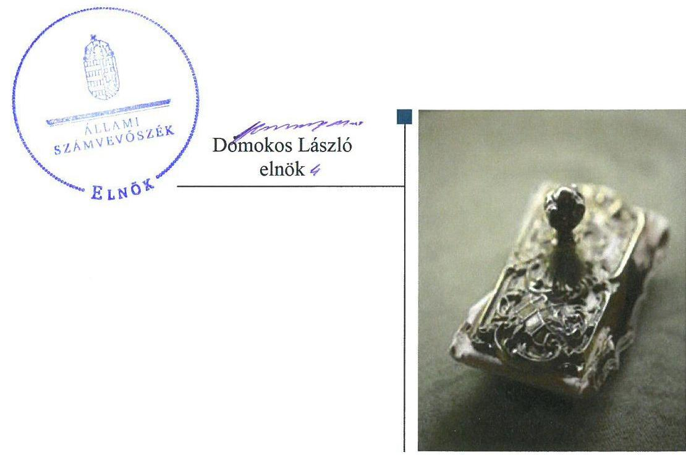
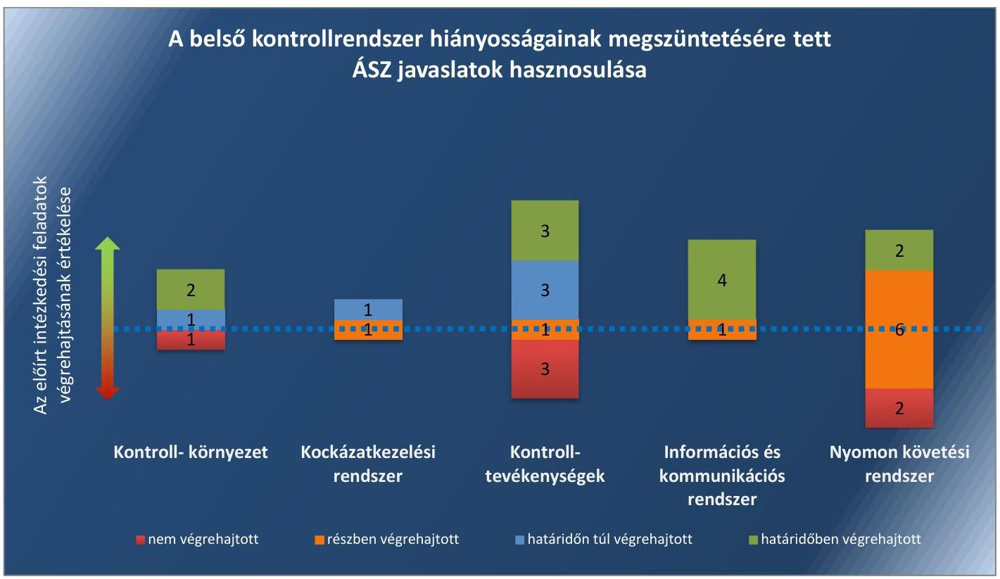
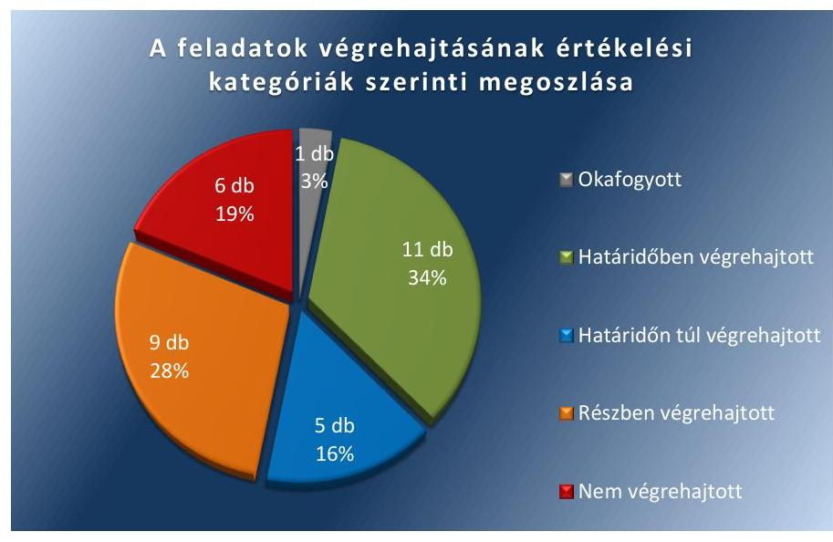
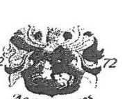
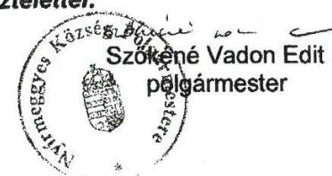
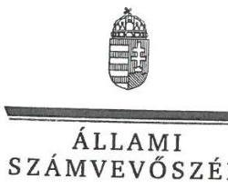
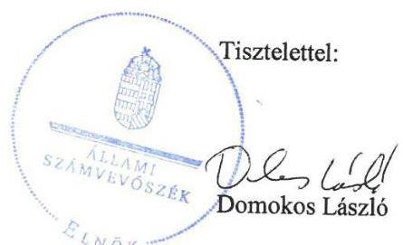
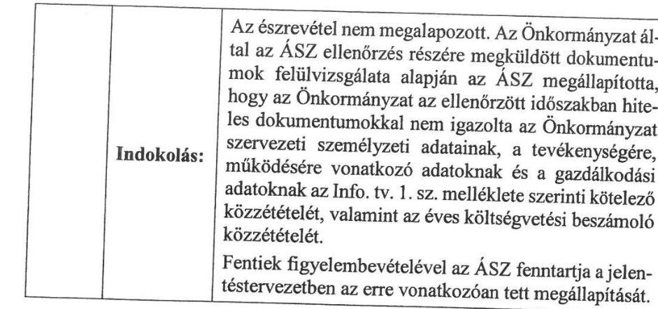
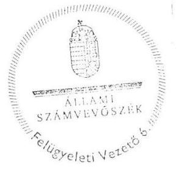
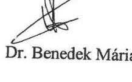

# Jelentés 

## Utóellenőrzések

Az önkormányzatok belső
kontrollrendszere kialakításának és működtetésének utóellenőrzése Nyírmeggyes Község Önkormányzat 2018. 02. hó 01. nap

---

|  J | AZ ELLENŐRZÉST FELÜGYELTE:  |
| --- | --- |
|   | DR. BENEDEK MÁRIA felügyeleti vezető  |
|   | AZ ELLENŐRZÉST VEZETTE ÉS A VÉGREHAJTÁSÁÉRT FELELŐS:  |
|   | IVANYOS JÁNOS ellenőrzésvezető  |
|   | A PROGRAM ÖSSZEÁLLÍTÁSÁÉRT FELELŐS:  |
|   | JANIK JÓZSEF LÁSZLÓ osztályvezető  |
|   | A TÉMÁHOZ KAPCSOLÓDÓ KORÁBBI SZÁMVEVŐSZÉKI JELENTÉSEK:  |
|   | - címe: Jelentés az önkormányzatok belső kontrollrendszere kialakításának, egyes kontrolltevékenységek és a belső ellenőrzés működésének ellenőrzéséről Nyírmeggyes  |
|  J | - sorszáma: 14125  |
|   | IKTATÓSZÁM: EL-0064-058/2018  |
|   | TÉMASZÁM: 21  |
|   | ELLENŐRZÉS-AZONOSÍTÓ SZÁM: V0755117  |

---

# TARTALOMJEGYZÉK 

■ ÖSSZEGZÉS ..... 5
■ AZ ELLENŐRZÉS CÉLJA ..... 7
■ AZ ELLENŐRZÉS TERÜLETE ..... 8
■ AZ ELLENŐRZÉS HÁTTERE, INDOKOLTSÁGA ..... 9
■ A JELENTÉS LÉNYEGES KÉRDÉSKÖRE ..... 10
■ AZ ELLENŐRZÉS HATÓKÖRE ÉS MÓDSZEREI ..... 11
■ MEGÁLLAPÍTÁSOK ..... 13
■ KÖVETKEZTETÉSEK ..... 18
■ MELLÉKLETEK ..... 19
I. sz. melléklet: Az ÁSZ 14125 számú jelentéséhez kapcsolódó intézkedési terv végrehajtása ..... 19
■ FÜGGELÉK: ÉSZREVÉTELEK ..... 27
■ RÖVIDÍTÉSEK JEGYZÉKE ..... 41

---

.

---

# ÖSSZEGZÉS 

Az Állami Számvevőszék Nyírmeggyes Község Önkormányzat belső kontrollrendszere kialakításának és működtetésének utóellenőrzése során megállapította, hogy az intézkedési tervben meghatározott feladatok jelentős része nem került végrehajtásra. A belső szabályzatok elkészítésével, illetve aktualizálásával javult a belső kontrollrendszer szabályozottsága. A gazdálkodási jogkörgyakorlás területén kialakított kontrollok nem működtek szabályszerűen. A közérdekű adatok kötelező közzététele nem valósult meg a jogszabályi előírásoknak megfelelően. A felelős vezetői magatartás és a közpénzekkel való elszámoltatható és átlátható gazdálkodás nem biztosított.

## Az ellenőrzés társadalmi indokoltsága

Az Állami Számvevőszék stratégiájában célul tűzte ki a számvevőszéki munka hasznosulásának javítását. Ezzel összhangban ellenőrzi, hogy az ellenőrzött szervezetek megvalósították-e a korábbi ellenőrzései által feltárt hibák, hiányosságok és szabálytalanságok megszüntetése céljából kialakított intézkedési terveikben foglaltakat. A rendszeres utóellenőrzések hozzájárulnak a szükséges intézkedések tényleges végrehajtásához, ezáltal a közpénzügyek rendezettségének javulásához, igazolják, hogy lezárult a következmények nélküli ellenőrzések időszaka.

## Főbb megállapítások, következtetések

Nyírmeggyes Község Önkormányzat az intézkedési tervében meghatározott 32 feladat közül tizenegyet határidőben, ötöt határidőn túl, kilencet részben, hatot nem hajtott végre, valamint egy intézkedés okafogyottá vált.

A belső szabályzatok intézkedési tervben előírt elkészítésével, illetve módosításával, valamint a gazdálkodási jogkörgyakorlás rendjének kialakításával javult a belső kontrollrendszer szabályozottsága.

A gazdálkodási jogkörgyakorlás szabályszerű végrehajtása, valamint a vezetői ellenőrzés és a nyomon követési rendszer kialakítása területén fennálló jelentős hiányosságok nem biztosították, hogy Nyírmeggyes Község Önkormányzat belső kontrollrendszerének működtetése megfeleljen a jogszabályban előírt követelményeknek. A kötelező elektronikus közzétételi szabályok megsértése miatt Nyírmeggyes Község Önkormányzat gazdálkodásának átláthatósága nem biztosított.

Az intézkedési tervben meghatározott feladatok végrehajtásáról Nyírmeggyes Község Önkormányzat a jogszabályban előírt tartalmú nyilvántartást 2015. év vonatkozásában vezette, azonban a 2016. és 2017. évekre nem vezette.

Az 1. ábra az ÁSZ javaslatok hasznosulásának mértékét mutatja be a belső kontrollrendszer pillérei mentén.

---

*Összegzés*

*Ferrás: ÁSZ*

---

# AZ ELLENŐRZÉS CÉLJA 

Az ellenőrzés célja annak értékelése volt, hogy a számvevőszéki jelentésben foglalt intézkedést igénylő megállapításokkal és javaslatokkal összhangban készített intézkedési tervben meghatározott feladatokat az ellenőrzött szervezet végrehajtotta-e.

---

# **AZ ELLENŐRZÉS TERÜLETE**

## **Nyírmeggyes Község Önkormányzat**

Nyírmeggyes Község Szabolcs-Szatmár-Bereg megyében, Mátészalka mellett, 28,8 km²-en elhelyezkedő település. Állandó lakosainak száma a Központi Statisztikai Hivatal Magyarország közigazgatási helynévkönyvében közzétett népességi adatok szerint 2016. január 1-jén 2656 fő volt. A polgármester¹ a 2014. évi önkormányzati választások óta tölti be tisztségét, a jegyző² 2014. november 24-től látja el feladatát.

Nyírmeggyes Község Önkormányzat a 2016. évi költségvetés végrehajtásáról szóló zárszámadási rendelet szerint 451,2 millió Ft költségvetési bevételt ért el és 451,1 millió Ft költségvetési kiadást teljesített. Mérlegfőösszege 1356,9 millió Ft, ezen belül befektetett eszközvagyona 1305,0 millió Ft, követelés állománya 15,3 millió Ft, míg kötelezettség állománya 22,2 millió Ft volt.

Az Állami Számvevőszék 2014. évben ellenőrizte Nyírmeggyes Község Önkormányzatnál a belső kontrollrendszer kialakításának, egyes kontrolltevékenységek és a belső ellenőrzés működését a 2012. január 1. és 2012. december 31. közötti időszak vonatkozásában. Az erről szóló 14125 számú jelentését³ az ÁSZ⁴ 2014. július 3-án tette közzé. Az ellenőrzés célja annak megállapítása volt, hogy a belső kontrollrendszer elemeinek kialakítása, a pénzügyi folyamatokban kulcsszerepet betöltő teljesítésigazolás és érvényesítés, és a belső ellenőrzés szabályos működése biztosította-e Nyírmeggyes Község Önkormányzatnál a közpénzfelhasználás szabályosságát, hozzájárult-e az értéket teremtő rend követelményének érvényesüléséhez. Az ÁSZ jelentésben foglalt javaslatok végrehajtása érdekében a Képviselő-testület⁵ az 58/2014. (XII.15.) számú határozattal intézkedési tervet fogadott el.

Az utóellenőrzés – a 2014. július 3. és 2017. július 3. között végrehajtott feladatokat figyelembe véve – az ÁSZ jelentésben a polgármester és a jegyző részére megfogalmazott intézkedést igénylő megállapításokra és javaslatokra készített, az ÁSZ részére megküldött intézkedési tervben foglalt feladatok megvalósításának ellenőrzésére, illetve értékelésére fókuszált.

---

# AZ ELLENŐRZÉS HÁTTERE, INDOKOLTSÁGA 

Az ÁSZ tv. ${ }^{6}$ 33. § (1) bekezdése értelmében a számvevőszéki jelentések intézkedést igénylő megállapításaihoz és javaslataihoz kapcsolódóan az ellenőrzött szervezet vezetője intézkedési tervet köteles összeállítani, és az ÁSZ részére megküldeni. Az intézkedési tervben foglaltak megvalósítását az ÁSZ tv. 33. § (7) bekezdésében foglaltak alapján - az ÁSZ utóellenőrzés keretében ellenőrizheti. Az intézkedések megvalósulásának értékelése során az ÁSZ figyelembe veszi az ellenőrzött szervezetek működési feltételeiben, valamint a jogszabályi előírásokban bekövetkezett változásokat.

Az intézkedési tervekben foglalt feladatok hiányos, illetve késedelmes végrehajtása, valamint megvalósításának elmaradása azt mutatja, hogy az ellenőrzések során feltárt hibák, hiányosságok és szabálytalanságok megszüntetése nem kapott kellő hangsúlyt. Ez a szabályszerű működés és a felelős vezetői magatartás vonatkozásában kockázatot hordoz. E kockázatok feltárásával az ÁSZ utóellenőrzési rendszere fokozza a fegyelmet, és igazolja, hogy a közpénzzel való szabályos gazdálkodás felelőssége elől nem lehet kitérni.

Az utóellenőrzés négy szinten hasznosulhat:

- A társadalom szintjén az utóellenőrzés jelzi, hogy a számvevőszéki ellenőrzés megállapításainak van következménye: a hiányosságok megszüntetésére az ellenőrzött szervezet által meghatározott intézkedések végrehajtását is számon kéri az ÁSZ.
- Az ellenőrzött terület szintjén az utóellenőrzés tájékoztatást nyújt a terület döntéshozóinak a hiányosságok kiküszöbölésének jó gyakorlatairól, ezzel lehetőséget biztosítva arra, hogy az ÁSZ ellenőrzési megállapításai, javaslatai a terület nem ellenőrzött szervezeteinek a működése során is hasznosuljanak.
- Az ellenőrzött szervezet szintjén az utóellenőrzés feltárja, hogy a szervezet az intézkedések végrehajtásával hasznosította-e a korábbi ellenőrzési jelentésben a hiányosságok megszüntetése, illetve a kockázatok kezelése érdekében megfogalmazott javaslatokat.
- Az ÁSZ szintjén az utóellenőrzés visszacsatolást ad az ellenőrzési jelentések hasznosulásáról, az intézkedések elmaradása vagy részleges megvalósulása a további ellenőrzésekhez kockázati jelzésként szolgál.

---

# A JELENTÉS LÉNYEGES KÉRDÉSKÖRE 

Az ellenőrzött szervezet az intézkedési tervben foglaltakat az előírt határidőben végrehajtotta-e?

---

# AZ ELLENŐRZÉS HATÓKÖRE ÉS MÓDSZEREI 

## Az ellenőrzés típusa

Megfelelőségi ellenőrzés.

## Az ellenőrzött időszak

Az utóellenőrzés alapját képező ÁSZ jelentés közzétételének napjától (2014. július 3.) az ellenőrzésről szóló kiértesítő levél keltének napjáig (2017. július 3.) tartó időszak.

## Az ellenőrzés tárgya

Az ÁSZ tv. 2011. július 1-jei hatálybalépését követően a számvevőszéki jelentésben foglalt intézkedést igénylő megállapításokkal és javaslatokkal összhangban - Nyírmeggyes Község Önkormányzat által - készített intézkedési tervben foglaltak végrehajtásának ellenőrzése volt.

Az ellenőrzés kiterjedt minden olyan körülményre és adatra, amely az ÁSZ jogszabályban meghatározott feladatainak teljesítéséhez, valamint a program végrehajtása folyamán felmerült újabb összefüggések feltárásához szükséges volt.

## Az ellenőrzött szervezet

Nyírmeggyes Község Önkormányzat

## Az ellenőrzés jogalapja

Az ÁSZ tv. 33. § (7) bekezdése alapján az intézkedési tervben foglaltak megvalósítását az ÁSZ utóellenőrzés keretében ellenőrizheti.

## Az ellenőrzés módszerei

Az ÁSZ az ellenőrzést az ellenőrzési program ellenőrzési kérdései, az ellenőrzött időszakban hatályos jogszabályok, az ellenőrzés szakmai szabályok és módszertanok figyelembevételével, önálló ellenőrzés keretében végezte.

Az ÁSZ az ellenőrzés ideje alatt az ellenőrzött szervezettel történő kapcsolattartást az ÁSZ SZMSZ²-ének vonatkozó előírásai alapján biztosította.

---

Az utóellenőrzés megállapításait elsősorban az ÁSZ rendelkezésére álló, valamint az ellenőrzött szervezetektől elektronikusan bekért dokumentumok alapozták meg.

Az ellenőrzési bizonyítékként felhasználható adatforrások közé tartoztak egyrészt a szakmai programban felsorolt adatforrások, másrészt minden - az ellenőrzés folyamán feltárt, az ellenőrzés szempontjából információt tartalmazó - dokumentum.

Az intézkedési tervekben előírt feladatokat, azok végrehajthatósága, illetve végrehajtása szempontjából az alábbiak szerint értékelte az ÁSZ:
$\longrightarrow$ „határidőben végrehajtott" a feladat, ha a teljesítés dokumentáltan, az intézkedési tervben előírt határidőben és tartalommal megtörtént;
$\longrightarrow$ „határidőn túl végrehajtott" a feladat, ha annak teljesítése az intézkedési tervben meghatározott módon, de az előírt határidőn túl történt meg;
$\longrightarrow$ „részben végrehajtott" a feladat, ha végrehajtása teljes körűen az intézkedési tervben előírt módon nem történt meg;
$\longrightarrow$ „nem végrehajtott" a feladat, ha a végrehajtás nem történt meg, vagy amennyiben a teljesítést nem dokumentálták;
$\longrightarrow$ „okafogyottá vált" a feladat, ha végrehajtására - meghatározott esemény bekövetkezése, továbbá külső körülmény, a működést érintő feltétel változása miatt - már nincs szükség, illetve lehetőség, és egyértelműen megállapítható, hogy az intézkedést szükségessé tevő körülmény a jövőben nem fordulhat elő;
$\longrightarrow$ „nem időszerű" az a feladat, amelynek ellenőrzési időszakon belüli végrehajtására azért nem került (kerülhetett) sor, mert az intézkedés alapjául szolgáló esemény nem következett be, de annak jövőbeni előfordulása lehetséges, a végrehajtása nem volt esedékes, vagy a végrehajtás határideje még nem járt le.
Az ellenőrzés lefolytatásához az ellenőrzött szervezet a tanúsítványok kitöltésével, valamint az ÁSZ által kért dokumentumok megküldésével szolgáltatott adatokat, amelyek valódiságát és teljes körűségét az ellenőrzött szervezet vezetője által tett teljességi és hitelességi nyilatkozat igazolta. Az így rendelkezésre bocsátott adatok, információk kontrollja az ellenőrzés keretében történt.

---

# MEGÁLLAPÍTÁSOK 

## Az ellenőrzött szervezet az intézkedési tervben foglaltakat az előírt határidőben végrehajtotta-e?

Összegző megállapítás

Az Önkormányzat ${ }^{8}$ az intézkedési tervben meghatározott 32 feladatból tizenegyet határidőben, ötöt határidőn túl, kilencet részben, hatot nem hajtott végre, valamint egy intézkedés okafogyottá vált. Az intézkedési tervben meghatározott feladatok végrehajtásáról a jogszabályban előírt nyilvántartást 2015. év vonatkozásában vezette, azonban 2016. és 2017. évekre nem vezette.

Az ÁSZ a jelentésében a polgármester részére kettő, a jegyzőnek címezve hét javaslatot fogalmazott meg. A polgármester által előterjesztett és a Képviselő-testület által jóváhagyott kiegészített intézkedési tervben a hiányosságok, szabálytalanságok megszüntetésére a polgármesternek kettő, a jegyzőnek 30 feladatot határoztak meg.

Az intézkedési tervben meghatározott feladatokat, határidőket, felelősöket és a feladatok végrehajtását az I. számú melléklet mutatja be.

A jegyző az intézkedési tervben meghatározott feladatok végrehajtásáról 2015. év vonatkozásában vezette a Bkr. ${ }^{9}$ 14. § (1) bekezdésében előírtaknak megfelelő nyilvántartást, azonban a 2016. és 2017. évekre az intézkedési tervben szereplő folyamatos határidők ellenére a nyilvántartást nem vezette.

Az Önkormányzat intézkedési
 tervében meghatározott feladatok végrehajtásának értékelési kategóriák szerinti megoszlását a 2. ábra szemlélteti.
2. ábra

---

# HATÁRIDŐBEN VÉGREHAJTOTT feladatok: 

1. A jegyző a Polgármesteri Hivatal ${ }^{10}$ Alapító Okiratának ${ }^{11}$ 2014. február 27-i módosításával intézkedett arról, hogy az a megfelelő elnevezéssel tartalmazza az alaptevékenységek felsorolását.
2. A jegyző a 2015. február 15-én jóváhagyott, 2015. március 1. napjától hatályos Munkavédelmi Szabályzatban ${ }^{12}$ a jogszabályi előírásoknak megfelelően meghatározta az egészséget nem veszélyeztető és biztonságos munkavégzés követelményeit megvalósításának módját a Polgármesteri Hivatalban.
3. A jegyző 2015. február 26-án, a jogszabályban foglaltak szerint, az Egyedi Iratkezelési Szabályzat ${ }^{13}$ 2015. március 1-től hatályos módosításával meghatározta az iratkezelési rendszer üzemeltetési és adatbiztonság-védelmi feladatait.
4. A jegyző 2015. február 26-án, a Hivatali SZMSZ ${ }^{14}$ 2015. március 1-től hatályos módosításával a jogszabályban foglaltaknak megfelelően szabályozta a köztisztviselői jogviszony megszüntetése (megszűnése) esetére a munkakör átadása és a munkáltatóval való elszámolás rendjét a Polgármesteri Hivatalban.
5. A jegyző 2015. február 26-án, a Hivatali SZMSZ 2015. március 1-től hatályos módosításával a jogszabályban foglaltaknak megfelelően gondoskodott olyan rendszer kialakításáról, amely biztosítja, hogy a megfelelő információk a megfelelő időben jussanak el az illetékes szervezethez, személyhez.
6. A jegyző 2015. február 20-án, a jogszabályokban foglaltak szerint szabályozta a kötelezően közzéteendő adatok nyilvánosságra hozatali rendjét, valamint a közérdekű adatok megismerésére irányuló igények teljesítésének rendjét.
7. A jegyző 2015. február 26-án, az Egyedi Iratkezelési Szabályzat 2015. március 1-től hatályos módosításával a jogszabályban foglaltak szerint gondoskodott az iratforgalom dokumentálásáról, az iratok szervezeten belüli útjának követhetőségéről.
8. A jegyző intézkedett arról, hogy az utalványokon a jogszabályban foglalt előírások szerint a költségvetési év, a kedvezményezett címe, a kötelezettségvállalás nyilvántartási száma, a fizetés módja és összege feltüntetésre kerüljön.
9. A jegyző gondoskodott arról, hogy a jogszabályban foglaltak szerint a szolgáltatás vásárlójaként csak a kötelezettségvállaló szerepeljen.
10. A jegyző a 2015. január 1. napjától hatályos Belső ellenőrzési kézikönyv ${ }^{15}$ jóváhagyásával a jogszabályban foglaltak szerint gondoskodott a bizonyosságot adó eljárás szabályozásáról.
11. A jegyző elkészítette és a Képviselő-testület 2014. december 29-i határozatával jóváhagyta a 2015. január 1-től hatályos Belső ellenőrzési stratégiai tervet ${ }^{16}$.

---

# HATÁRIDŐN TÚL VÉGREHAJTOTT feladatok: 

12. A polgármester a 2014. augusztus 31. helyett 2014. november 10-én gondoskodott a jogszabályban foglaltak szerint az Önkormányzat kiadási előirányzatai vonatkozásában a teljesítés igazolására jogosult személyek írásban történő kijelöléséről.
13. A jegyző a 2015. február 28. helyett a 2015. május 4-én hatályba lépett, a Képviselő-testület 30/2015. (IV. 28.) számú határozatával 2015. április 28. napján elfogadott Hivatásetikai Szabályzat ${ }^{17}$ előkészítésével gondoskodott arról, hogy a Képviselő-testület meghatározza a jogszabályi előírásnak megfelelő, a köztisztviselőkkel szembeni hivatásetikai alapelvek részletes tartalmát, valamint az etikai eljárás szabályait.
14. A jegyző 2015. február 26-án a jogszabályban foglaltaknak megfelelően, a Hivatali SZMSZ 2015. március 1-től hatályos módosításával gondoskodott arról, hogy a pénzügyi előadói munkakört betöltő köztisztviselő vagyonnyilatkozat-tételi kötelezettségét rögzítsék. A jegyző a 2015. február 28. helyett 2015. április 29-én, a 2015. május 11-étől hatályba léptetett Önkormányzati SZMSZ ${ }^{18}$ elkészítésével intézkedett a képviselőkre vonatkozó vagyonnyilatkozat-tételi kötelezettség szabályozásáról.
15. A jegyző a 2014. szeptember 30. helyett 2015. január 5-én intézkedett a jogszabályban foglaltak szerint a teljesítés igazolására jogosult személyek írásban történő kijelöléséről.
16. A jegyző a 2014. szeptember 30. helyett 2015. január 5. napjától jelölt ki köztisztviselőket az érvényesítési feladatok végzésére a Polgármesteri Hivatal állományából.

## RÉSZBEN VÉGREHAJTOTT feladatok:

17. A polgármester a 2014. és 2015. évekre vonatkozó belső ellenőrzési jelentések tartalmának megismerésével és a szükséges intézkedések megtételére vonatkozó javaslatok Képviselő-testület általi elfogadtatásával gondoskodott az Önkormányzat gazdálkodása szabályszerűségének jogszabály alapján történő figyelemmel kíséréséről, azonban a Mötv. ${ }^{19}$ 67. § (1) bekezdés f) pontja szerinti munkáltatói joggyakorlás keretében nem intézkedett a belső kontrollrendszer működésére vonatkozó jogszabályi rendelkezések be nem tartása, valamint a szakmai teljesítésigazolás, illetve az érvényesítés kontrollokkal összefüggésben feltárt hiányosságok, szabálytalanságok tekintetében az esetleges munkajogi felelősséggel kapcsolatos körülmények kivizsgálásáról.
18. A jegyző a jogszabályban foglaltak szerint felmérte a Polgármesteri Hivatal tevékenységében, gazdálkodásában rejlő kockázatokat, azonban a Bkr. 7. § (2) bekezdésében foglaltak ellenére az egyes kockázatokkal kapcsolatban szükséges intézkedéseket, valamint azok teljesítésének nyomon követési módját nem határozta meg.
19. A jegyző gondoskodott arról, hogy 2014. december 1-től hatályba léptetett Gazdálkodási Szabályzat ${ }^{20}$ előírja a pénzügyi ellenjegyző feladatait, és rendelkezzen a pénzügyi ellenjegyzők írásbeli kijelöléséről, azonban az Ávr. ${ }^{21}$ 53. § (2) bekezdésében foglaltak ellenére nem határozta meg az előzetes írásbeli kötelezettségvállalást nem igénylő kifizetések esetében a teljesítésigazolás gyakorlásának és az érvényesítés gyakorlásának módját, eljárási és dokumentációs részletszabályait.
20. A jegyző a 2015. május 11-étől hatályos Önkormányzati SZMSZ-ben meghatározta a hatályos önkormányzati rendeletek önkormányzati honlapon történő megjelenítésének rendjét, azonban nem szabályozta az éves költségvetési beszámoló elektronikus közzétételét. A jegyző az Info tv. ${ }^{22}$ 37. § (1) bekezdésében foglaltak ellenére nem gondoskodott az Önkormányzat szervezeti és személyzeti adatai, a tevékenységre, működésre vonatkozó adatok, és a gazdálkodási adatok az Info. tv. 1. sz. melléklete szerinti kötelező közzétételéről.
21. A jegyző gondoskodott arról, hogy a 2015. évre vonatkozó éves ellenőrzési terv a jogszabályban foglaltak szerint, a stratégiai ellenőrzési terv kockázatelemzés alapján felállított prioritásainak figyelembe vételével készüljön el, azonban a Bkr. 31. § (4) bekezdésében foglaltak ellenére nem intézkedett, hogy a 2015. évi belső ellenőrzési terv tartalmazza az ellenőrzési tervet megalapozó elemzések és a kockázatelemzés eredményének összefoglaló bemutatását, a rendelkezésre álló és a szükséges ellenőrzési kapacitás meghatározását, a tanácsadó tevékenységre, a soron kívüli ellenőrzésekre és képzésekre tervezett kapacitást, valamint az egyéb tevékenységeket. A jegyző nem intézkedett a 2016. és a 2017. évi belső ellenőrzési tervek Bkr. 31. § alapján történő összeállításáról.
22. A jegyző gondoskodott arról, hogy a 2015. évre vonatkozó - az ellenőrzések típusát is meghatározó - éves ellenőrzési tervet a Képviselő-testület a jogszabályban meghatározott határidő előtt, a 2014. december 29. napján megtartott ülésén megtárgyalja és a 61/2014. (XII.29.) számú határozattal jóváhagyja. A jegyző nem intézkedett a 2016. és a 2017. évi belső ellenőrzési tervek Képviselő-testület elé, a Mótv. 119. § (5) bekezdésében foglalt határidőn belüli jóváhagyás érdekében történő beterjesztésének kezdeményezéséről.
23. A jegyző gondoskodott arról, hogy a belső ellenőrzési vezető a jogszabályban foglalt előírásnak megfelelő nyilvántartást vezessen az elvégzett belső ellenőrzésekről. Az 1/2016 számú jelentés a jogszabályban előírtak szerint tartalmazta az ellenőrzés típusának meghatározását. A jegyző nem intézkedett az 1/2015, 2/2015 és a 2/2016 számú ellenőrzési jelentések kapcsán az ellenőrzés típusának a Bkr. 39. § (3) bekezdés d) pontja szerint történő meghatározásáról.
24. A jegyző gondoskodott arról, hogy a 2015. január 20. napján megkötött 356/2015. iktatószámú megbízási szerződés - a 2015. évi belső ellenőrzési tevékenység megszervezésével kapcsolatban - tartalmazza a Bkr. 22. § (1) és (2) bekezdésében meghatározott feladatok ellátását. A jegyző nem intézkedett a 2016. és a 2017. évi belső ellenőrzési feladatok ellátásával kapcsolatos megbízási szerződések kapcsán arról, hogy a Bkr. 16. § (4) bekezdésére tekintettel a külső szolgáltatóval kötött megállapodás tartalmazza a Bkr. 22.§ (1) és (2) bekezdésében foglalt tevékenységek és kötelezettségek ellátásának módját.
25. A jegyző intézkedett, hogy a belső ellenőrzési vezető vezesse a belső ellenőrzési jelentésben tett megállapításokról, javaslatokról éves bontásban a nyilvántartást, azonban annak tartalma nem felelt meg a Bkr. 21. § (2) bekezdés d) pontjában és a 47. § (1) bekezdésében foglaltaknak, mivel az nem tartalmazta a vonatkozó intézkedési terveket és azok végrehajtásának nyomon követését.

# NEM VÉGREHAJTOTT feladatok: 

26. A jegyző a Kttv. ${ }^{23}$ 130. § (1) bekezdésében foglaltak ellenére nem készítette el a Polgármesteri Hivatalban dolgozó köztisztviselők teljesítményértékelését.
27. A jegyző a Bkr. 8. § (2) bekezdés a) pontjában foglaltak ellenére nem gondoskodott a támogatásokkal való elszámolás dokumentumainak elkészítésével kapcsolatban a folyamatba épített, előzetes, utólagos és vezetői ellenőrzés működéséről.
28. A jegyző a Bkr. 10. §-ában foglaltak ellenére nem alakította ki a Polgármesteri Hivatal tevékenységeinek, a célok megvalósításának nyomon követését biztosító rendszerét.
29. A jegyző a Bkr. 46. § (1) bekezdésében foglaltak ellenére nem gondoskodott a belső ellenőrzési jelentésekben tett javaslatokhoz kapcsolódó intézkedési tervben meghatározott feladatok végrehajtásáról szóló beszámoló belső ellenőrzés részére történő megküldéséről.
30. A jegyző nem gondoskodott az Ávr. ${ }^{24}$ 57. § (3) bekezdésében foglaltak ellenére, hogy teljesítésigazolást csak kijelöléssel rendelkező személy végezzen.
31. A jegyző nem gondoskodott az Ávr. 58. § (4) bekezdésben foglaltak ellenére, hogy érvényesítést csak kijelöléssel rendelkező személy végezzen.

## OKAFOGYOTTÁ VÁLT feladat:

32. A belső ellenőrzési feladatok nem társulás útján kerültek végrehajtásra. A feladat ellátását 2014. évtől megbízási szerződés alapján külső szolgáltató végezte, ezért okafogyottá vált, hogy az éves ellenőrzési jelentést a társulás a Bkr. 56.§ (8) bekezdésében előírt határidőre a jegyző részére megküldje.

---

# KÖVETKEZTETÉSEK 

Az Önkormányzat nem intézkedett a közérdekű adatok közzétételéről, amivel sérül a közérdekű és közérdekből nyilvános adatok megismeréséhez és terjesztéséhez fűződő jog érvényesülése. A nem végrehajtott feladat indokolja a feltárt hiányosság, szabálytalanság tekintetében a munkajogi felelősség tisztázására irányuló eljárás megindítását, és eredményének ismeretében a szükséges intézkedések megtételét.

---

# MELLÉKLETEK

■ I. SZ. MELLÉKLET: AZ ÁSZ 14125 SZÁMÚ JELENTÉSÉHEZ KAPCSOLÓDÓ INTÉZKEDÉSI TERV VÉGREHAJTÁSA

|  1. | Az intézkedési tervben meghatározott feladat | Az intézkedési tervben meghatározott határidő | Az intézkedési tervben meghatározott feladat végrehajtásának felelőse | A feladat végrehajtása  |
| --- | --- | --- | --- | --- |
|   | 1. | 2. | 3. | 4.  |
|  Határidőben végrehajtott feladatok |  |  |  |   |
|  1. Intézkedjen az Ávr. 5. § (1) bekezdésének c) pontjában foglaltak szerint a Polgármesteri Hivatal alapító okirata a megfelelő elnevezéssel tartalmazza az alaptevékenységek felsorolását. |  | 2014. szeptember 30. | jegyző | A jegyző az intézkedési tervben meghatározott határidő előtt intézkedett az Alapító Okirat 2014. február 27-i keltezésű kiegészítéséről, mely az Ávr. 180. § (1)-(2) bekezdéseinek előírásai alapján a kormányzati funkciók szerinti besorolással tartalmazta az alaptevékenységek felsorolását.  |
|  2. Határozza meg a Polgármesteri Hivatalban az egészséget nem veszélyeztető és biztonságos munkavégzés követelményei megvalósításának módját az Mvtv. 2. § (3) bekezdésében foglaltaknak megfelelően. |  | 2015. február 28. | jegyző | A jegyző a Polgármesteri Hivatalban meghatározta az egészséget nem veszélyeztető és biztonságos munkavégzés követelményei megvalósításának módját az Mvtv. 2. § (3) bekezdés előírásának megfelelően. A jegyző és a polgármester által 2015. február 15-én aláírt, 2015. március 1. napjától hatályos Munkavédelmi Szabályzatot a dolgozókkal 2015. február 20-án megismertették.  |
|  3. Az Ikr. 8.
 § (2) bekezdésében foglaltak szerint az iratkezelési rendszer üzemeltetési és adatbiztonság-védelmi feladatait meg kell határozni. |  | 2015. február 28. | jegyző | A jegyző a Polgármesteri Hivatal Egyedi Iratkezelési Szabályzatát 2015. február 26. napjával módosította, amelynek II. fejezet 19-22) és 33) pontja, valamint IV. fejezet 95) pontja tartalmazta az iratkezelési rendszer üzemeltetési és adatbiztonság-védelmi feladatainak meghatározását.  |
|  4. A Kttv. 74. § (1) bekezdésében foglaltaknak megfelelően szabályozza a Polgármesteri Hivatalban a köztisztviselői jogviszony megszüntetése (megszűnés) esetére a munkakör átadása és a munkáltatóval való elszámolás rendjét. |  | 2015. február 28. | jegyző | A jegyző a Hivatali SZMSZ-t 2015. február 26. napjával módosította. A Hivatali SZMSZ IV. fejezet 1.8. pontja a Kttv. 74. § (1) bekezdés előírásának megfelelően tartalmazta a köztisztviselői jogviszony megszüntetése (megszűnés) esetére a munkakör átadása és a munkáltatóval való elszámolás rendjét.  |
|  5. Gondoskodjon arról, hogy a Bkr. 3. § d) pontjában és a 9. § (1) bekezdésében foglaltak szerint olyan rendszer kialakításáról, amely biztosítja, hogy a megfelelő információk a megfelelő időben jussanak el az illetékes szervezethez, személyhez. |  | 2015. február 28. | jegyző | A jegyző a Hivatali SZMSZ-t 2015. február 26. napjával módosította. A szabályzat III. fejezet 3.1. és 3.2. pontjainak módosításával a jegyző előírta a Polgármesteri Hivatalban dolgozók számára az e-mail útján történő napi kapcsolat kialakítását, fenntartását, továbbá a külső szervezetekkel való kapcsolattartás módját.  |

---

|  Az intézkedési tervben meghatározott feladat | Az intézkedési tervben meghatározott határidő | Az intézkedési tervben meghatározott feladat végrehajtásának felelőse | A feladat végrehajtása  |
| --- | --- | --- | --- |
|  1. | 2. | 3. | 4.  |
|  Az Info tv. 30. § (6) bekezdésében és a 35. § (2) bekezdésében, valamint az Ávr. 13. § (2) bekezdés h) pontjában foglalt előírásokban foglaltak szerint szabályozni kell a kötelezően közzéteendő adatok nyilvánosságra hozatali rendjét, a közérdekű adatok megismerésére irányuló teljesítések rendjét. | 2015. február 28. | jegyző | A jegyző 2015. február 20. napjával aláírta a Polgármesteri Hivatal szabályzatát a közérdekű adatok megismerésére irányuló igények teljesítésének rendjéről. A Szabályzat a közérdekű adatokról25 tartalmazta a kötelezően közzéteendő adatok nyilvánosságra hozatali rendjét is.  |
|  Gondoskodni kell az lkr. 14. § (4) bekezdésében foglaltak szerint az iratforgalom dokumentálásáról, az iratok szervezeten belüli útjának követhetőségéről szabályzat módosítással. | 2015. február 28. | jegyző | A jegyző a Polgármesteri Hivatal Egyedi Iratkezelési Szabályzatának 2015. február 26-i módosításával az lkr.26 14. § (4) bekezdés előírásának megfelelően gondoskodott arról, hogy az ügyintézés folyamata, és az iratok szervezeten belüli útja pontosan követhető és ellenőrizhető, az iratok holléte pedig naprakészen megállapítható legyen.  |
|  Az utalványokon az Ávr. 59. § (3) bekezdés b), c), d) és f) pontokban foglalt előírás szerint a költségvetési évet, a kedvezményezett címét, a kötelezettségvállalás nyilvántartási számát, a fizetés módját és összegét fel kell tüntetni. | 2014. szeptember 30. és folyamatosan | jegyző | A jegyző intézkedett, hogy az utalványokon az Ávr. 59. § (3) bekezdés b), c), d) és f) pontokban foglalt előírás szerint feltüntetésre kerüljön a költségvetési év, a kedvezményezett címe, a kötelezettségvállalás nyilvántartási száma, a fizetés módja és összege.  |
|  Gondoskodni kell arról, hogy az Áfa tv. 169. § e) pontjában foglaltak szerint a szolgáltatás vásárlójaként csak a kötelezettségvállaló szerepeljen. | 2014. szeptember 30. és folyamatosan | jegyző | A jegyző gondoskodott, hogy az Áfa tv. 169. § e) pontjában foglaltaknak megfelelően a kötelezettségvállaló neve és címe szerepeljen a szolgáltatás vásárlójaként.  |
|  A belső ellenőrzési könyv módosításával gondoskodni kell arról, hogy a bizonyosságot adó eljárás szabályozása megtörténjen. | 2015. február 28. | jegyző | A jegyző 2015. január 28. napján hagyta jóvá az Önkormányzat 2015. január 1. napjától hatályos Belső ellenőrzési kézikönyvét. A Belső ellenőrzési kézikönyv V. fejezete a Bkr. 17. § (2) bekezdés a) pontjában foglalt rendelkezésnek megfelelően tartalmazta a bizonyosságot adó tevékenység végrehajtására vonatkozó eljárási szabályokat.  |
|  El kell készíteni, a Képviselő-testület elé kell terjeszteni elfogadásra az Önkormányzat stratégiai ellenőrzési tervét | 2014. december 31. és folyamatos | jegyző | A jegyző intézkedett arról, hogy a Képviselő-testület 2014. december 29. napján megtartott ülésén megtárgyalja és a benyújtott tervezet szerint a 61/2014. (XII.29.) számú határozatával jóváhagyja az Önkormányzat Belső ellenőrzési stratégiai tervét a 2015-2019. évekre vonatkozóan.  |

---

|  Az intézkedési tervben meghatározott feladat | Az intézkedési tervben meghatározott határidő | Az intézkedési tervben meghatározott feladat végrehajtásának felelőse | A feladat végrehajtása  |
| --- | --- | --- | --- |
|  1. | 2. | 3. | 4.  |
|  Határidőn túl végrehajtott feladatok |  |  |   |
|  12. Gondoskodjon az Ávr. 57. § (4) bekezdésében foglaltak szerint az Önkormányzat kiadási előirányzatai vonatkozásában a teljesítés igazolására jogosult személyek írásban történő kijelöléséről. | 2014. augusztus 31. | polgármester | A polgármester 2014. augusztus 31. helyett 2014. november 10-én, az Ávr. 57. § (4) bekezdés előírásának megfelelően írásban kijelölte az alpolgármestert a teljesítés igazolási feladatok teljes körű ellátására.  |
|  13. Gondoskodjon arról, hogy a Képviselő-testület határozza meg a Kttv. 231. § (1) bekezdésében foglaltak szerint a Kttv. 83. §-ában előírt, a köztisztviselőkkel szembeni hivatásetikai alapelvek részletes tartalmát, valamint az etikai eljárás szabályait. A Mótv. 81. § (3) bekezdés c) pontjában foglaltak szerint készítse elő ennek dokumentumát. | 2015. február 28. | jegyző | A jegyző 2015. február 28. helyett 2015. április 28. napján, a Kttv. 83. § (1) bekezdésében előírtak szerint meghatározta a hivatásetikai alapelvek részletes tartalmát, valamint az etikai eljárás szabályait a Mótv. 81. § (3) bekezdés c) pontja alapján előkészített Hivatásetikai Szabályzatban, melyet a Képviselő-testület a 30/2015. (IV. 28) számú határozatával elfogadott.  |
|  14. A vagyonnyilatkozat-tételről szóló törvény 4. § a) pontjában meghatározottak szerint a Polgármesteri Hivatal SZMSZ módosításával a pénzügyi előadói munkakört betöltő köztisztviselő, továbbá a vagyonnyilatkozat-tételről szóló törvény 4. § d) pontjában foglaltak szerint az önkormányzati SZMSZ-ben a képviselők vagyonnyilatkozat-tételi kötelezettségét rögzítsék. | 2015. február 28. | jegyző | A jegyző 2015. február 28. helyett a 2015. május 11-étől hatályos Önkormányzati SZMSZ-ben szabályozta a képviselőkre vonatkozó vagyonnyilatkozat-tételi kötelezettséget, továbbá a Hivatali SZMSZ - 2015. február 26-i módosításával írta elő a pénzügyi előadói munkakört betöltő köztisztviselő vagyonnyilatkozat-tételi kötelezettségét.  |
|  15. Ki kell jelölni írásban az Ávr. 57. § (4) bekezdésében foglaltak szerint a teljesítés igazolására jogosult személyeket. | 2014. szeptember 30. | jegyző | A jegyző a Gazdálkodási Szabályzat mellékletében 2014. szeptember 30. helyett 2015. január 5. napjával jelölte ki a teljesítés igazolására jogosult személyeket.  |
|  16. Gondoskodjon az Ávr. 58. § (4) bekezdésében foglaltak betartásáról, írásban jelöljön ki a Polgármesteri Hivatal állományából köztisztviselőt az érvényesítési feladatok végzésére. | 2014. szeptember 30. | jegyző | A jegyző a Gazdálkodási Szabályzat mellékletében 2014. szeptember 30. helyett 2015. január 5. napjától jelölt ki az érvényesítési jogkör gyakorlására köztisztviselőket a Polgármesteri Hivatal állományából.  |
|  Részben végrehajtott feladatok |  |  |   |
|  17. A Mótv. 115. § (1) bekezdésében foglaltak alapján kísérje figyelemmel az Önkormányzat gazdálkodásának szabályszerűségét. A Mótv. 67. § f) pontja alapján gondoskodjon a belső kontrollrendszer működésére vonatkozó jogszabályi rendelkezések be nem tartása, valamint a teljesítés- | 2014. augusztus 31., majd azt követően folyamatos | polgármester | A polgármester a 2014. és 2015. évekre vonatkozó, (1/2015. és 2/2016. számú) belső ellenőrzési jelentések tartalmának megismerésével és a szükséges intézkedések megtételére vonatkozó javaslatok Képviselő-testület általi elfogadtatásával gondoskodott az Önkormányzat gazdálkodása szabályszerűségének jogszabály alapján történő figyelemmel kíséréséről.  |

---

|  1. | Az intézkedési tervben meghatározott feladat | Az intézkedési tervben meghatározott határidő | Az intézkedési tervben meghatározott feladat végrehajtásának felelőse | A feladat végrehajtása  |
| --- | --- | --- | --- | --- |
|   | 1. | 2. | 3. | 4.  |
|   | igazolás, illetve az érvényesítés kontrollokkal összefüggésben feltárt hiányosságok, szabálytalanságok tekintetében az esetleges munkajogi felelősséggel kapcsolatos körülmények kivizsgálásáról, majd a vizsgálat eredményének függvényében tegye meg a szükséges intézkedéseket. |  |  | A polgármester a Mótv. 67. § (1) bekezdés f) pontja szerinti munkáltatói jogkörgyakorlása keretében nem intézkedett a belső kontrollrendszer működésére vonatkozó jogszabályi rendelkezések be nem tartása, valamint a szakmai teljesítésigazolás, illetve az érvényesítés kontrollokkal összefüggésben feltárt hiányosságok, szabálytalanságok tekintetében az esetleges munkajogi felelősséggel kapcsolatos körülmények kivizsgálásáról, és a vizsgálat hiányában nem tette meg a szükséges munkajogi intézkedéseket.  |
|  18. | Mérje fel, határozza meg a Bkr. 7. § (2) bekezdésében foglaltak szerint a Polgármesteri Hivatal tevékenységében, gazdálkodásában rejlő egyes kockázatokkal kapcsolatban szükséges intézkedéseket, valamint azok teljesítésének nyomon követési módját. | 2015. február 28. és folyamatos | jegyző | A jegyző gondoskodott arról, hogy a 61/2014. (XII. 29.) sz. önkormányzati határozattal elfogadott stratégiai ellenőrzési terv készítésekor a jogszabályban előírtaknak megfelelően felmérésre kerüljenek az Önkormányzat tevékenységében rejlő és szervezeti célokkal összefüggő kockázatok, a belső, és külső kockázatok lehetséges megnyilvánulásai, hatásai, és a főbb kockázati tényezők. A jegyző a Hivatali SZMSZ – 2015. február 26. napjával aláírt – módosításával az Önkormányzat kapcsán felmért kockázatokat határozta meg a Polgármesteri Hivatal tevékenységében és gazdálkodásában rejlő fő kockázati tényezőkként. A jegyző a Bkr. 7. § (2) bekezdésében foglaltak ellenére az egyes kockázatokkal kapcsolatban szükséges intézkedéseket, valamint azok teljesítésének nyomon követési módját nem határozta meg a Polgármesteri Hivatal tevékenységében, gazdálkodásában rejlő egyes kockázatokkal kapcsolatban.  |
|  19. | A gazdálkodási szabályzat módosításával gondoskodni kell a kötelezettségvállalás pénzügyi ellenjegyzése, az előzetes írásbeli kötelezettségvállalást nem igénylő kifizetések esetében a teljesítésigazolás gyakorlásának és az érvényesítés gyakorlásának módjával, eljárási és dokumentációs részletszabályaival, az ezeket végző személyek kijelölésének rendjével kapcsolatos belső előírások, feltételek meghatározásáról. | 2014. szeptember 30. | jegyző | A jegyző gondoskodott arról, hogy a 2014. december 1-től hatályba lépett előírja a pénzügyi ellenjegyző feladatait, és rendelkezzen a pénzügyi ellenjegyzők írásbeli kijelöléséről. A jegyző a Gazdálkodási Szabályzatban
 az Ávr. 53. § (1) bekezdésének megfelelően meghatározta, hogy mely esetekben nem szükséges előzetes írásbeli kötelezettségvállalás, azonban az Ávr. 53. § (2) bekezdésben foglaltak ellenére az előzetes írásbeli kötelezettségvállalást nem igénylő kifizetések esetében a teljesítésigazolás és az érvényesítés gyakorlásának módját, eljárási és dokumentációs részletszabályait nem határozta meg.  |
|  20. | Az Info tv. 33. § (1) és (3) bekezdésében, a 37. § (1) bekezdésében és az 1. sz. mellékletében foglaltak szerint a | 2015. február 28. | jegyző | A jegyző gondoskodott arról, hogy a 2015. május 11-től hatályos Önkormányzati SZMSZ 31. § (5)-(6) bekezdése meghatározza a hatályos önkormányzati rendeletek  |

---

|  Az intézkedési tervben meghatározott feladat | Az intézkedési tervben meghatározott határidő | Az intézkedési tervben meghatározott feladat végrehajtásának felelőse | A feladat végrehajtása  |
| --- | --- | --- | --- |
|  1. | 2. | 3. | 4.  |
|  Képviselő-testület hatályba lévő rendeleteit, az éves költségvetési beszámoló elektronikus közzétételének szabályait rögzíteni kell, a közzétételről gondoskodni kell. |  |  | önkormányzati honlapon történő megjelenítésének rendjét, azonban nem szabályozta az éves költségvetési beszámoló elektronikus közzétételének szabályait. A jegyző a 2015. február 20-tól hatályos, a közérdekű adatok megismerésére irányuló igények teljesítésének rendjéről szóló szabályzat 3. pontjában előírta a jogszabályban meghatározott közzétételi lista önkormányzati honlapon (www.nyirmeggyes.hu) történő közzétételét, azonban az Info tv. 37. § (1) bekezdésében foglaltak ellenére nem gondoskodott az Önkormányzat szervezeti személyzeti adatai, a tevékenységre, működésre vonatkozó adatok, és a gazdálkodási adatok az Info. tv. 1. sz. melléklete szerinti kötelező közzétételéről, az éves költségvetési beszámoló közzétételéről.  |
|  21. Az éves ellenőrzési terveket a Bkr. 31. § alapján kell összeállítani, s a terveknek a (2) bekezdés szerint a stratégiai ellenőrzési tervben és a kockázatelemzés alapján felállított prioritásokon, valamint a belső ellenőrzés rendelkezésére álló erőforrásokon kell alapulniuk. | 2014. december 31. és folyamatos | jegyző | A jegyző gondoskodott arról, hogy az Önkormányzat a 2015. évre vonatkozó éves ellenőrzési tervét a Bkr. 31. § (2) bekezdésében foglaltak szerint, a stratégiai ellenőrzési tervben kockázatelemzés alapján felállított prioritások figyelembe vételével készítse el, azonban a Bkr. 31. § (4) bekezdésében előírtak ellenére a 2015. évi belső ellenőrzési terv nem tartalmazta az ellenőrzési tervet megalapozó elemzések és a kockázatelemzés eredményének összefoglaló bemutatását, a rendelkezésre álló és a szükséges ellenőrzési kapacitás meghatározását, a tanácsadó tevékenységre, a soron kívüli ellenőrzésekre és képzésekre tervezett kapacitást, valamint az egyéb tevékenységeket. A jegyző nem intézkedett a 2016. és a 2017. évi belső ellenőrzési tervek Bkr. 31. § alapján történő összeállításáról.  |
|  22. Az éves ellenőrzési tervet a Mótv. 119. § (5) bekezdésében foglalt határidőre történő jóváhagyása érdekében időben be kell terjeszteni a Képviselő-testület elé, meghatározva az ellenőrzések típusát. | 2014. december 31. és folyamatos | jegyző | A jegyző gondoskodott arról, hogy a 2015. évre vonatkozó – az ellenőrzések típusát is meghatározó – éves ellenőrzési tervet a Képviselő-testület a jogszabályban meghatározott határidő előtt, a 2014. december 29. napján megtartott ülésén megtárgyalja és a 61/2014. (XII.29.) számú határozattal jóváhagyja. A 2015. évi belső ellenőrzési terv tartalmazta az ellenőrzések típusának meghatározását. A jegyző nem intézkedett a 2016. és a 2017. évi belső ellenőrzési tervek Képviselő-testület elé, a Mótv. 119. § (5) bekezdésében foglalt határidőn belüli jóváhagyás érdekében történő beterjesztésének kezdeményezéséről.  |
|  23. Az elvégzett belső ellenőrzésről készített jelentésnek – a Bkr. 39. § (3) bekezdés d) pontjára figyelemmel – minden | 2015. január 31. és folyamatos | jegyző | A jegyző gondoskodott arról, hogy a belső ellenőrzési vezető a Bkr. 50. § (1)-(2) bekezdéseiben foglalt előírásnak megfelelő nyilvántartást vezessen az elvégzett belső  |

---

|  Az intézkedési tervben meghatározott feladat | Az intézkedési tervben meghatározott határidő | Az intézkedési tervben meghatározott feladat végrehajtásának felelőse | A feladat végrehajtása  |
| --- | --- | --- | --- |
|  1. | 2. | 3. | 4.  |
|  esetben tartalmaznia kell az ellenőrzés típusát, valamint az elvégzett belső ellenőrzésről a Bkr. 50. § szerint nyilvántartást kell vezetni. |  |  | ellenőrzésekről. Az 1/2016 számú jelentés a Bkr. 39. § (3) bekezdés d) pontjában foglaltak szerint tartalmazta az ellenőrzés típusának meghatározását. A jegyző nem intézkedett az 1/2015, 2/2015 és a 2/2016 számú ellenőrzési jelentések kapcsán az ellenőrzés típusának a Bkr. 39. § (3) bekezdés d) pontja szerint történő meghatározásáról.  |
|  24. Amennyiben a belső ellenőrzésre külső szolgáltató bevonásával kerül sor, úgy az ellenőrzési tevékenység megszervezésére vonatkozó megállapodásnak – a Bkr. 16. § (4) bekezdésére tekintettel – tartalmaznia kell a Bkr. 22. § (1) és (2) bekezdésében foglalt tevékenységek és kötelezettségek ellátásának módját. | 2015. január 31. és folyamatos | jegyző | A jegyző gondoskodott arról, hogy a 2015. január 20. napján megkötött 356/2015. iktatószámú megbízási szerződés – a 2015. évi belső ellenőrzési tevékenység megszervezésével kapcsolatban – tartalmazza a Bkr. 22. § (1) és (2) bekezdésében meghatározott feladatok ellátását. A jegyző nem intézkedett a 2016. és a 2017. évi belső ellenőrzési feladatok ellátásával kapcsolatos megbízási szerződések kapcsán arról, hogy a Bkr. 16. § (4) bekezdésére tekintettel a külső szolgáltatóval kötött megállapodás tartalmazza a Bkr. 22. § (1) és (2) bekezdésében foglalt tevékenységek és kötelezettségek ellátásának módját.  |
|  25. Nyomon kell követni a belső ellenőrzési jelentés alapján megtett intézkedéseket. Ennek érdekében el kell készíteni és folyamatosan vezetni kell - a Bkr. 21. § (2) bekezdés d) pontjában és a 47. § (1) bekezdésében foglaltak szerint - a belső ellenőrzési jelentésben tett javaslatokról, az elfogadott intézkedési tervről és az annak alapján végrehajtott, valamint végre nem hajtott intézkedésekről a nyilvántartást. | 2015. január 31. és folyamatos | jegyző | A jegyző intézkedett, hogy a belső ellenőrzési vezető vezesse a belső ellenőrzési jelentésben tett megállapításokról, javaslatokról éves bontásban a nyilvántartást, azonban annak tartalma nem felelt meg a Bkr. 21. § (2) bekezdés d) pontjában és a 47. § (1) bekezdésében foglaltaknak, mivel az nem tartalmazta a vonatkozó intézkedési terveket és azok végrehajtásának nyomon követését.  |
|  |   |   |   |
|  26. Pótolja, készítse el a Kttv. 130. § (1) bekezdésében foglaltak szerint a Polgármesteri Hivatalban dolgozó köztisztviselők teljesítményértékelését. | 2015. január 31. | jegyző | A jegyző a Kttv. 130. § (1) bekezdés előírása ellenére nem készítette el a Polgármesteri Hivatalban dolgozó köztisztviselők teljesítményértékelését.  |
|  27. A Bkr. 8. § (2) bekezdés a) pontjában foglaltak szerint gondoskodjon a támogatásokkal való elszámolás dokumentumainak elkészítésével kapcsolatban a folyamatba épített, előzetes, utólagos és vezetői ellenőrzés működéséről. | 2015. február 28. | jegyző | A jegyző nem gondoskodott a Bkr. 8. § (2) bekezdés a) pontjában előírtak szerint a támogatásokkal való elszámolás dokumentumainak elkészítésével kapcsolatban a folyamatba épített, előzetes, utólagos és vezetői ellenőrzés működéséről.  |

---

|  Az intézkedési tervben meghatározott feladat | Az intézkedési tervben meghatározott határidő | Az intézkedési tervben meghatározott feladat végrehajtásának felelőse | A feladat végrehajtása  |
| --- | --- | --- | --- |
|  1. | 2. | 3. | 4.  |
|  28. Ki kell alakítani a Polgármesteri Hivatal tevékenységének, a célok megvalósításának nyomon követését biztosító rendszerét. | 2015. február 28. | jegyző | A jegyző nem alakított ki a szervezeti célok teljesítésének mérésére alkalmas rendszert, így a Bkr. 10. §-ában foglaltak ellenére a nyomon követési rendszer kialakítása sem történt meg. A jegyző 2015. február 26. napján módosította a Hivatali SZMSZ-t. A Hivatali SZMSZ IV. fejezete kiegészítésre került az ellenőrzési nyomvonal szerepének általános bemutatását tartalmazó 7.4 alponttal, továbbá a Polgármesteri Hivatal tervezési és pénzügyi lebonyolítási folyamatainak ellenőrzési nyomvonalát tartalmazó 6. számú melléklettel. Az ellenőrzési nyomvonal ugyanakkor nem tartalmazott olyan folyamatot vagy feladatokat, amelyek biztosították a szervezeti célok megvalósításának operatív tevékenység keretében megvalósuló folyamatos és eseti nyomon követését.  |
|  29. A Bkr. 46. § (1) bekezdésében foglaltaknak megfelelően gondoskodni kell a belső ellenőrzési jelentésekben tett javaslatokhoz kapcsolódó intézkedési tervben meghatározott egyes feladatok végrehajtásáról szóló beszámoló megküldéséről a belső ellenőrzés részére. | 2015. február 28. és folyamatos | jegyző | A jegyző a Bkr. 46. § (1) bekezdésében foglaltak ellenére nem gondoskodott a belső ellenőrzési jelentésekben tett javaslatokhoz kapcsolódó intézkedési tervben meghatározott feladatok végrehajtásáról szóló beszámoló belső ellenőrzés részére történő megküldéséről.  |
|  30. Gondoskodni kell arról, hogy az Ávr. 57. § (1) és (3) bekezdésében foglaltak szerint teljesítésigazolást csak kijelöléssel rendelkező személy végezzen. | azonnal, folyamatos | jegyző | A jegyző a teljesítésigazolásra jogosult személyek aláírás-mintáit - a Gazdálkodási Szabályzat és az Ávr. 60. § (3) bekezdés előírása ellenére - nem vezette naprakészen, ezért nyilvántartással nem alátámasztott, hogy a kiadások esetében a teljesítést az Ávr. 57. § (3) bekezdés szerint az arra jogosult személy igazolta.  |
|  31. Gondoskodni kell arról, hogy az Ávr. 58. § (4) bekezdésében foglaltak szerint érvényesítést csak kijelöléssel rendelkező személy végezzen. | 2014. szeptember 30. | jegyző | A jegyző az érvényesítésre jogosult személyek aláírás-mintáit - a Gazdálkodási Szabályzat és az Ávr. 60. § (3) bekezdés előírása ellenére - nem vezette naprakészen, ezért nyilvántartással nem alátámasztott, hogy a kiadások esetében az érvényesítési feladatokat az Ávr. 58. § (4) bekezdés szerint az arra jogosult személy igazolta.  |
|  Okafogyott feladat |  |  |   |
|  32. Ha a Bkr. szerint a belső ellenőrzés végzésére társult feladatellátás történik, úgy biztosítani kell, hogy az éves ellenőrzési jelentést a társulás a Bkr. 56.§ (8) bekezdésében előírt határidőre a jegyző részére megküldje. | évente a zárszámadás határideje, de legkésőbb március 20 | jegyző | Az Önkormányzat az ellenőrzött időszakban a belső ellenőrzési feladatokat nem társulás útján látta el, a feladat ellátását megbízási szerződés alapján 2014. évtől külső szolgáltató végezte, ezért okafogyottá vált, hogy az éves ellenőrzési jelentést a társulás a Bkr. 56.§ (8) bekezdésében előírt határidőre a jegyző részére megküldje.  |

---

.

---

# FÜGGELÉK: ÉSZREVÉTELEK 

A jelentéstervezetet a Számvevőszék 15 napos észrevételezésre megküldte az ellenőrzött szervezet vezetőjének az ÁSZ
 tv. 29. § (1) bekezdése előírásának megfelelően.
Az elfogadott észrevételek alapján a Számvevőszék módosította a jelentést.

A függelék tartalmazza az ellenőrzött észrevételeit, illetve az el nem fogadott észrevételek elutasításának indoklását.

[^0]
[^0]:    * 29. § (1) Az Állami Számvevőszék az ellenőrzési megállapításait megküldi az ellenőrzött szervezet vezetőjének vagy az általa megbízott személynek, és annak, akinek személyes felelősségét állapította meg.
    (2) Az ellenőrzött szervezet vezetője és a felelősként megjelölt személy az ellenőrzés megállapításaira tizenöt napon belül írásban észrevételt tehet.
    (3) Az Állami Számvevőszék az észrevételre a beérkezésétől számított harminc napon belül írásban válaszol. A figyelembe nem vett észrevételeket köteles a jelentésben feltüntetni, és megindokolni, hogy azokat miért nem fogadta el.

---

# Nyírmeggyes Község Önkormányzat   Polgármesterétől   4722 Nyírmeggyes, Petőfi S. u. 6.   Tel.: 44/409-850 Fax: 44/509-025   e-mail: ph.meggyes@gmail.com 

Ikt.szám: 4C6:2/2017.

Hiv. szám: EL-0064-053/2017

## Állami Számvevőszék Elnöke Domokos László Úr részére 1364 Budapest Pf: 54.

Tisztelt Domokos Úr!

Fenti számra hivatkozva az Önkormányzatnál tartott utóvizsgálatról megküldött számvevőszéki jelentéstervezetre észrevételeinket az alábbiakban teszem meg:

## Az előzményekről:

2014. év novemberében tájékoztattam arról, hogy az Önkormányzatnál a 2014. év októberében megtartott helyhatósági választás során kerültem polgármesterként megválasztásra, s eskütételemre is csak a november 7-én megtartott alakuló ülésen kerülhetett sor.
Ugyancsak tudomásukra hoztam, hogy változott a jegyző személye is, aki 2014. november 24. napjától látja el az Önkormányzatnál feladatait, vezeti a Polgármesteri Hivatalt.
Sajnos ezen vezetői munkakörök átadása során sem jártak el a távozó vezetők körültekintően, mert a volt polgármester nem adott megfelelő tájékoztatást a már lezárult ÁSZ vizsgálatról, annak eredményéről, jelentéséről és egyéb anyagairól, az általuk készített és a Képviselő-testület által már 2014. augusztusában elfogadott Intézkedési Tervről (a továbbiakban: IT.).
(Megjegyzem, hogy a volt jegyző részéről egyáltalán nem is volt átadási eljárás a mostani jegyző részére, hanem csak az irodájában hagyta iratait, de azok között az ÁSZ vizsgálattal kapcsolatosan nem is szerepelt semmi.)
Megállapítható, hogy a vezetőváltásig egyáltalán nem is kezdtek hozzá a ténykedésük alatt feltárt hibák kijavításához, a hiányosságok pótlásához.
Így az ÁSZ vizsgálatról, valamint a már 2014. október hónapban az IT.-vel kapcsolatosan megküldött kifogásaikról is csak az Önök figyelemfelhívása alapján értesültem, melyet követően ismerkedhettünk meg az ÁSZ anyagokkal és annak alapján elsőként módosítanunk kellett az IT.-ben foglaltakat, köztük a végrehajtási határidőket is. (Ennek elfogadását Önök 2015. március 26-án kelt levelükkel igazolták felém vissza.)
A hivatalba lépésünk és az IT. módosítása (2014. december 15.) között eltelt rövid időben azonban nem lehetett alaposan áttekinteni a ténylegesen „ránk szakadt” feladatokat, azok nagyságát, s megalapozottan megtervezni a végrehajtás reálisan tartható határidőit. Így - sajnálatos módon - a módosított IT-ben is igen szűkös, s egyes esetekben nem is tartható határidőket fogalmaztunk meg és fogadott el a Képviselő-testület.

---

Már 2015. év elején elindítottam az - ÁSZ vizsgálattal nem érintett Önkormányzattal kapcsolatos különböző pénzügyi-gazdasági szabálytalanságok, visszaélések miatt egy-egy büntető és polgári peres ügyet. Ezek jelenleg is folyamatban vannak, s azokban igyekszünk tisztázni a korábbi vezetők és mások felelősségét is.
Ugyanakkor - jelenleg is tartóan - az önkormányzati munka más területein (testületi és igazgatási munka, különböző pályázatok terén stb.) is számtalan hibát, hiányosságot kellett párhuzamosan felszámolnunk, valamint a 2014. év zárásával, valamint a 2015. év indításával kapcsolatos számtalan feladatot is időben teljesítettük, továbbá a napi munkának is folyamatosan történnie kellett és kell.

Az előzményekben foglaltakat azért tartottam fontosnak ismertetni, hogy láthassák milyen „örökséggel” és módon kellett, kell a munkánkat végezni és döntően a fenti körülmények vezethettek oda, hogy az IT. egyes feladatai nem, vagy nem határidőben, nem megfelelően kerülhettek végrehajtásra.

# Konkrét észrevételek: 

## a határidőn túl végrehajtott feladatokhoz:

12. pontra - Mint említettem 2014. november 7-én iktattak be hivatalomba, így augusztus 31-éig nem hajthattam végre a kijelölést.

- 13-14. pontokra - a határidő túllépésére az előzményekben meghatározott indokok miatt került sor.
- 15-16. pontokra - Említettem, hogy a jelenlegi jegyző 2014. november 24-én lépett hivatalába, így szeptember 30-áig nem hajthatta végre a kijelölést.

## a részben végrehajtott feladatokhoz:

17. pontra - Nem észleltem a jegyző tevékenysége során olyan helyzetet, amely alapján intézkednem kellett volna, vagy kellene a munkajogi felelősség kivizsgálásáról.

- a 18-24. pontokra - Az említett pontokban is megállapításra került, hogy a jegyző igyekezett a jelzett hiányosságokat pótolni, de azok végrehajtása nem sikerült teljes mértékben, kisebb hiányosságok még előfordulnak. Ezért azoknál indokolt még további munkálatok elvégzése, melyekre a vizsgálat lezárását követően sort fog keríteni, illetve intézkedik a belső ellenőr felé, hogy a belső ellenőrzést érintőeket az korrigálja.

## a nem végrehajtott feladatokhoz:

- a 25. pontra - Az utóvizsgálattal egyidejűleg a jegyző felé már intézkedtem a hiányosság pótlása érdekében, aki már elkészítette a 2017. év II. félévi teljesítménykövetelményeket és azok teljesítését rövidesen értékelni fogja, valamint meghatározza a 2018. évi követelményeket.
- a 26. pontra - A jegyző előkészítésében a Képviselő-testület 2/2015. (II. 17.) önkormányzati rendeletével szabályozta az államháztartáson kívüli forrás átvételét és átadását, melyben részletesen előírásra kerültek a támogatás nyújtásának követelményei, dokumentumai, azok tartalmi elemei. Ezen túl az Önkormányzat új SZMSZ-ének mellékletében szabályozásra kerültek a Képviselő-testület döntésének előkészítésére vonatkozó szabályok is, mely szerint az előterjesztés csak a jegyzői láttamozás után kerülhet benyújtásra, valamint a támogatás felhasználását ellenőrizni kell, s jogkövetkezmények is szabályozásra kerültek stb. Újabb támogatás biztosítására addig nem kerülhet sor, amíg a támogatott megfelelően el nem számolt az előző támogatással. A támogatásra vonatkozó rendelkezésekkel a Hivatal SZMSZ-e is kiegészítésre került (Lásd: IV. Fejezet 7.6 pontjában!).

---

Az utóvizsgálathoz megküldtük az államháztartáson kívüli forrás átvételéről és átadásáról szóló önkormányzati rendeletet, valamint a Hivatal SZMSZ-ének kiegészítését. Nem ismert előttem a konkrét megállapítás, hiányosság.

- a 27. pontra - A Hivatal SZMSZ-e kiegészítésre került a nyomon követés szabályozásával (Lásd: IV. Fejezet 7.4-7.5 pontját, valamint a 6. számú mellékleteként megküldött ellenőrzési nyomvonalat!). Az utóvizsgálathoz megküldtük az említett dokumentumokat.
- a 28. pontra - A megbízás alapján foglalkoztatott belső ellenőr (Felföldi Sándor) minden esetben meghívást kap a belső ellenőrzési anyagot tárgyaló képviselő-testületi és pénzügyi bizottsági ülésre, és az ott elfogadott minden dokumentum (határozat, intézkedési terv) megküldésre került és kerül részére.
- 29-30. pontra - A jegyző kijelölte, majd aktualizálta az egyes gazdálkodási cselekmények végzésével kapcsolatos személyeket, melyeket a kijelölt személyekkel megismertetett. Nem ismert előttünk a konkrét megállapítás, hiányosság.
- 31. pontra - A jegyző intézkedett, hogy a belső ellenőr (Felföldi Sándor) a nyilvántartást éves bontásban vezesse, de az valóban megállapítható, hogy a nyilvántartás nem mindenben felel meg a jogszabályi előírásnak. A jegyző intézkedni fog, hogy a belső ellenőr a nyilvántartást korrigálja.
az okafogyott feladathoz: nem kívánunk észrevételt tenni.
A „Következtetések” cím alatt
- lévő azon megállapítással, hogy „Az Önkormányzat nem intézkedett a közérdekű adatok közzétételéről” nem értünk egyet, mert a honlapunkon számos önkormányzati közérdekű adatot közzétettünk az utóvizsgálatig is (önkormányzati döntések, jegyzőkönyvek, létszámadatok, önkormányzati szervek, településrendezési eszközök, pénzügyi terv és végrehajtása, hirdetmények stb.). Azokat a vizsgálattal egyidejűleg és azt követően is a honlapért felelős megbízott rendszerezte és úgy jelenteti meg, valamint igyekszünk teljes körűvé tenni a közérdekű adatokat folyamatosan azóta is.
- a munkajogi felelősségre vonással két szempontból sem értünk egyet:
- 1. eddig is igyekeztünk és jelenleg is igyekszünk (ide értve valamennyi dolgozót) - tőlünk telhetően - mindent megtenni a hiányosságok felszámolása, a hibák kiküszöbölése érdekében.
- 2. az ÁSZ vizsgálat számtalan negatív megállapításáért, a 32 pontban összegzett hibákért, hiányosságokért a volt vezetők, volt köztisztviselők felelősségre vonását a 2014. évi jelentésükben egyáltalán nem vetették fel, nem kezdeményezték és nem is került sor annak vizsgálatára. Most viszont azok elmarasztalását, illetve az erre irányuló eljárás megindítását vetik fel, akik a mások által okozottak kijavításán dolgoztak és dolgoznak jelenleg is. Ezt az eljárást legalábbis méltánytalannak gondoljuk. Ezért kérem, hogy ennek felvetését fontolják meg a jelentésük végleges szövegezésénél.

# Tisztelt Elnök Úr! 

Az IT. végrehajtását külön is ellenőriztettük a belső ellenőrzéssel és annak megállapításait a Képviselő-testület is megtárgyalta. Mi eddig úgy ítéltük meg, hogy az IT. végrehajtása - túlnyomó részt - megtörtént.

Az utóvizsgálat végleges jelentése alapján a jövőben is igyekszünk megfelelő figyelmet fordítani a hibák kijavítására.

---

Végezetül engedje meg, hogy Önkormányzatunk és a magam nevében is Kellemes Karácsonyi Ünnepeket és Boldog Új Évet kívánjak Önnek és Kollégáinak.

Nyírmeggyes, 2017. december 20.
Tisztelettel:

---

ELNÖK

Ikt.szám: EL-0064-057/2018.

# Szökéné Vadon Edit Etelka úrhölgy polgármester   Nyírmeggyes Község Önkormányzat 

## Nyírmeggyes

## Tisztelt Polgármester Úrhölgy!

Köszönettel megkaptam az Állami Számvevőszékhez 2017. december 29. napján érkezett "Utóellenőrzések - Az önkormányzatok belső kontrollrendszere kialakításának és működtetésének utóellenőrzése - Nyírmeggyes Község Önkormányzat" című számvevőszéki jelentéstervezetben foglalt megállapításokra tett észrevételét.

Tájékoztatom Polgármester úrhölgyet, hogy az el nem fogadott észrevételeket - az Állami Számvevőszékről szóló 2011. évi LXVI. törvény 29. § (3) bekezdése alapján - a jelentésben szerepeltetjük az elutasítás indokainak feltüntetésével együtt.

Az Állami Számvevőszék észrevételekre vonatkozó álláspontjáról a felügyeleti vezető által készített részletes tájékoztatást csatoltan megküldöm.

Budapest, 2018. 01. 14. nap

Melléklet: Tájékoztatás a részben elfogadott és az el nem fogadott észrevételekről, azok indokairól

---

# Tájékoztatás 

Nyírmeggyes Község Önkormányzat (Önkormányzat) tájékoztató levelében foglaltakra a részben elfogadott és az el nem fogadott észrevételekre, azok indokaira

|  |  | Az észrevétel 1. oldal és 2. oldal 12., 13-14., 15-16. pontokra tett megállapításai, az ÁSZ jelentéstervezet 15. oldal Határidőn túl végrehajtott feladatok 12-16. számú megállapításaira tett észrevétel:   ,,Az előzményekről:   2014. év novemberében tájékoztattam arról, hogy az Önkormányzatnál a 2014. év októberében megtartott helyhatósági választás során kerültem polgármesterként megválasztásra, s eskütételemre is csak a november 7 -én megtartott alakuló ülésen kerülhetett sor. Ugyancsak tudomásukra hoztam, hogy változott a jegyző személye is, aki 2014. november 24. napjától látja el az Önkormányzatnál feladatait, vezeti a Polgármesteri Hivatalt. |
| :--: | :--: | :--: |
| 1. | Észrevétel: | Sajnos ezen vezetői munkakörök átadása során sem jártak el a távozó vezetők körültekintően, mert a volt polgármester nem adott megfelelő tájékoztatást a már lezárult ÁSZ vizsgálatról, annak eredményéről, jelentéséről és egyéb anyagairól, az általuk készített és a Képviselő-testület által már 2014. augusztusában elfogadott Intézkedési Tervről (a továbbiakban: IT.).   (Megjegyzem, hogy a volt jegyző részéről egyáltalán nem is volt átadási eljárás a mostani jegyző részére, hanem csak az irodájában hagyta iratait, de azok között az ÁSZ vizsgálattal kapcsolatosan nem is szerepelt semmi.)   Megállapítható, hogy a vezetőváltásig egyáltalán nem is kezdtek hozzá a ténykedésük alatt feltárt hibák kijavításához, a hiányosságok pótlásához. Így az ÁSZ

 vizsgálatról, valamint a már 2014. október hónapban az |

---

|  |  | - 15-16. pontokra - Említettem, hogy a jelenlegi jegyző 2014. november 24-én lépett hivatalába, így szeptember 30-áig nem hajthatta végre a kijelölést." |
| :--: | :--: | :--: |
|  | Válasz: | Az ÁSZ az Önkormányzat tájékoztató leveléből a fentiekben foglaltakat nem tekinti észrevételnek. |
|  | Indokolás: | Az ÁSZ nem tekinti észrevételnek az Önkormányzat által megküldött tájékoztató levélnek a fent megjelölt részében leírtakat, amely az ÁSZ megállapítására fogalmaz meg az Önkormányzat által az ellenőrzött időszakra vonatkozó tájékoztatást az előzményekről, történtekről. Az ÁSZ a tárgyi ellenőrzését a V-1062003/2016. iktatószámú 2016. február 4-én kelt Ellenőrzési program alapján folytatta le, mint az a jelentéstervezetben az ellenőrzés módszereinél ismertetésre került. Az ÁSZ az Önkormányzat által az ellenőrzés rendelkezésére bocsátott dokumentumok adataira alapozva tette meg a jelentéstervezetben erre vonatkozó megállapításait. |
| 2. | Észrevétel: | Az észrevétel 2. oldal 17. pontra tett megállapítása, az ÁSZ jelentéstervezet 15. oldal Részben végrehajtott feladatok 17. számú megállapítására tett észrevétel:   „a részben végrehajtott feladatokhoz:   - 17. pontra - Nem észleltem a jegyző tevékenysége során olyan helyzetet, amely alapján intézkednem kellett volna, vagy kellene a munkajogi felelősség kivizsgálásáról." |
|  | Válasz: | Az ÁSZ az észrevételt nem fogadja el. |
|  | Indokolás: | Az észrevétel nem megalapozott. Az Önkormányzat által az ÁSZ ellenőrzés részére megküldött dokumentumok felülvizsgálata alapján az ÁSZ megállapította, hogy az Önkormányzat dokumentumokkal nem igazolta az intézkedési tervben meghatározott feladat ellenőrzött időszakban történt végrehajtását.   Fentiek figyelembevételével az ÁSZ fenntartja a jelentéstervezetben az erre vonatkozóan tett megállapítását. |
| 3. | Észrevétel: | Az észrevétel 2. oldal 18-24. pontokra tett megállapításai, az ÁSZ jelentéstervezet 15-16. oldal Részben végrehajtott feladatok 18-24. számú megállapításaira tett észrevétel: |

---

|  |  | „a részben végrehajtott feladatokhoz:   - a 18-24. pontokra - Az említett pontokban is megállapításra került, hogy a jegyző igyekezett a jelzett hiányosságokat pótolni, de azok végrehajtása nem sikerült teljes mértékben, kisebb hiányosságok még előfordulnak. Ezért azoknál indokolt még további munkálatok elvégzése, melyekre a vizsgálat lezárását követően sort fog keríteni, illetve intézkedik a belső ellenőr felé, hogy a belső ellenőrzést érintőeket az korrigálja." |
| :--: | :--: | :--: |
|  | Válasz: | Az ÁSZ az Önkormányzat tájékoztató leveléből a fentiekben foglaltakat nem tekinti észrevételnek. |
|  | Indokolás: | Az ÁSZ nem tekinti észrevételnek az Önkormányzat által megküldött tájékoztató levélnek a fent megjelölt részében leírtakat, amely az ÁSZ megállapítására fogalmaz meg az Önkormányzat által az ellenőrzött időszakra vonatkozó tájékoztatást. Az ÁSZ a tárgyi ellenőrzését a V-1062-003/2016. iktatószámú 2016. február 4-én kelt Ellenőrzési program alapján folytatta le, mint az a jelentéstervezetben az ellenőrzés módszereinél ismertetésre került. Az ÁSZ az Önkormányzat által az ellenőrzés rendelkezésére bocsátott dokumentumok adataira alapozva tette meg a jelentéstervezetben erre vonatkozó megállapításait. |
| 4. | Észrevétel: | Az észrevétel 2. oldal 25. pontra tett megállapítása, az ÁSZ jelentéstervezet 17. oldal Nem végrehajtott feladatok 25. számú megállapítására tett észrevétel: „a nem végrehajtott feladatokhoz:   - a 25. pontra - Az utóvizsgálattal egyidejűleg a jegyző felé már intézkedtem a hiányosság pótlása érdekében, aki már elkészítette a 2017. év II. félévi teljesítménykövetelményeket és azok teljesítését rövidesen értékelni fogja, valamint meghatározza a 2018. évi követelményeket." |
|  | Válasz: | Az ÁSZ az Önkormányzat tájékoztató leveléből a fentiekben foglaltakat nem tekinti észrevételnek. |
|  | Indokolás: | Az ÁSZ nem tekinti észrevételnek az Önkormányzat által megküldött tájékoztató levélnek a fent megjelölt részében leírtakat, amely az ÁSZ megállapítására fogalmaz meg az Önkormányzat által tervezett intézkedéseket. Az ÁSZ a tárgyi ellenőrzését a V-1062-003/2016. iktatószámú 2016. február 4-én kelt Ellenőrzési program alapján folytatta le, mint az a jelentéstervezetben |

---

|  |  | az ellenőrzés módszereinél ismertetésre került. Az ÁSZ az Önkormányzat által az ellenőrzés rendelkezésére bocsátott dokumentumok adataira alapozva tette meg a jelentéstervezetben erre vonatkozó megállapításait. |
| :--: | :--: | :--: |
| 5. | Észrevétel: | Az észrevétel 2. oldal 26. pontra tett megállapítása, az ÁSZ jelentéstervezet 17. oldal Nem végrehajtott feladatok 26. számú megállapítására tett észrevétel: „a nem végrehajtott feladatokhoz:   - a 26. pontra - A jegyző előkészítésében a Képviselőtestület 2/2015. (II. 17.) önkormányzati rendeletével szabályozta az államháztartáson kívüli forrás átvételét és átadását, melyben részletesen előírásra kerültek a támogatás nyújtásának követelményei, dokumentumai, azok tartalmi elemei. Ezen túl az Önkormányzat új SZMSZ-ének mellékletében szabályozásra kerültek a Képviselő-testület döntésének előkészítésére vonatkozó szabályok is, mely szerint az előterjesztés csak a jegyzői láttamozás után kerülhet benyújtásra, valamint a támogatás felhasználását ellenőrizni kell, s jogkövetkezmények is szabályozásra kerültek stb. Újabb támogatás biztosítására addig nem kerülhet sor, amíg a támogatott megfelelően el nem számolt az előző támogatással. A támogatásra vonatkozó rendelkezésekkel a Hivatal SZMSZ-e is kiegészítésre került (Lásd: IV. Fejezet 7.6 pontjában!).   Az utóvizsgálathoz megküldtük az államháztartáson kívüli forrás átvételéről és átadásáról szóló önkormányzati rendeletet, valamint a Hivatal SZMSZ-ének kiegészítését. Nem ismert előttem a konkrét megállapítás, hiányosság." |
|  | Válasz: | Az ÁSZ az észrevételt nem fogadja el. |
|  | Indokolás: | Az észrevétel nem megalapozott. Az Önkormányzat által az ÁSZ ellenőrzés részére megküldött dokumentumok felülvizsgálata alapján az ÁSZ megállapította, hogy az Önkormányzat dokumentumokkal nem igazolta a támogatásokkal való elszámolás dokumentumainak elkészítésével kapcsolatban a folyamatba épített, előzetes, utólagos és vezetői ellenőrzés működtetését.   Fentiek figyelembevételével az ÁSZ fenntartja a jelentéstervezetben az erre vonatkozóan tett megállapítását. |

---

| 6. | Észrevétel: | Az észrevétel 3. oldal 27. pontra tett megállapítása, az ÁSZ jelentéstervezet 17. oldal Nem végrehajtott feladatok 27. számú megállapítására tett észrevétel: „a nem végrehajtott feladatokhoz:   - a 27. pontra - A Hivatal SZMSZ-e kiegészítésre került a nyomon követés szabályozásával (Lásd: IV. Fejezet 7.4-7.5 pontját, valamint a 6. számú mellékleteként megküldött ellenőrzési nyomvonalat!). Az utóvizsgálathoz megküldtük az említett dokumentumokat." |
| :--: | :--: | :--: |
|  | Válasz: | Az ÁSZ az észrevételt nem fogadja el. |
|  | Indokolás: | Az észrevétel nem megalapozott. Az Önkormányzat által az ÁSZ ellenőrzés részére megküldött dokumentumok felülvizsgálata alapján az ÁSZ megállapította, hogy az Önkormányzat által hivatkozott dokumentum nem tartalmazott olyan folyamatot vagy feladatokat, amelyek biztosították a szervezeti célok megvalósításának operatív tevékenység keretében megvalósuló folyamatos és eseti nyomon követését.   Fentiek figyelembevételével az ÁSZ fenntartja a jelentéstervezetben az erre vonatkozóan tett megállapítását. |
| 7. | Észrevétel: | Az észrevétel 3. oldal 28. pontra tett megállapítása, az ÁSZ jelentéstervezet 17. oldal Nem végrehajtott feladatok 28. számú megállapítására tett észrevétel: „a nem végrehajtott feladatokhoz:   - 28. pontra - A megbízás alapján foglalkoztatott belső ellenőr (Felföldi Sándor) minden esetben meghívást kap a belső ellenőrzési anyagot tárgyaló képviselő-testületi és pénzügyi bizottsági ülésre, és az ott elfogadott minden dokumentum (határozat, intézkedési terv) megküldésre került és kerül részére." |
|  | Válasz: | Az ÁSZ az észrevételt nem fogadja el. |
|  | Indokolás: | Az észrevétel nem megalapozott. Az Önkormányzat által az ÁSZ ellenőrzés részére megküldött dokumentumok felülvizsgálata alapján az ÁSZ megállapította, hogy az Önkormányzat dokumentumokkal nem igazolta a belső ellenőrzési jelentésekben tett javaslatokhoz kapcsolódó intézkedési tervben meghatározott feladatok végrehajtásáról szóló beszámoló belső ellenőrzés részére történő megküldését. |

---

|  |  | Fentiek figyelembevételével az ÁSZ fenntartja a jelentéstervezetben az erre vonatkozóan tett megállapítását. |
| :--: | :--: | :--: |
| 8. | Észrevétel: | Az észrevétel 3. oldal 29-30. pontokra tett megállapításai, az ÁSZ jelentéstervezet 17. oldal Nem végrehajtott feladatok 29-30. számú megállapításaira tett észrevétel:   „a nem végrehajtott feladatokhoz:   - 29-30. pontra - A jegyző kijelölte, majd aktualizálta az egyes gazdálkodási cselekmények végzésével kapcsolatos személyeket, melyeket a kijelölt személyekkel megismertetett. Nem ismert előttünk a konkrét megállapítás, hiányosság." |
|  | Válasz: | Az ÁSZ az észrevételt nem fogadja el. |
|  | Indokolás: | Az észrevétel nem megalapozott. Az Önkormányzat által az ÁSZ ellenőrzés részére megküldött dokumentumok felülvizsgálata alapján az ÁSZ megállapította, hogy az Önkormányzat által megküldött mintatételek dokumentumaiban a kiadások esetében a teljesítést és az érvényesítési feladatokat az Ávr. 57. § (3) bekezdés és az Ávr. 58. § (4) bekezdés előírásai ellenére nem az arra jogosult személy igazolta.   Fentiek figyelembevételével az ÁSZ fenntartja a jelentéstervezetben az erre vonatkozóan tett megállapítását. |
| 9. | Észrevétel: | Az észrevétel 3. oldal 31. pontra tett megállapítása, az ÁSZ jelentéstervezet 17. oldal Nem végrehajtott feladatok 31. számú megállapítására tett észrevétel: „a nem végrehajtott feladatokhoz:   - 31. pontra - A jegyző intézkedett, hogy a belső ellenőr (Felföldi Sándor) a nyilvántartást éves bontásban vezesse, de az valóban megállapítható, hogy a nyilvántartás nem mindenben felel meg a jogszabályi előírásnak. A jegyző intézkedni fog, hogy a belső ellenőr a nyilvántartást korrigálja." |
|  | Válasz: | Az ÁSZ az észrevételt részben fogadja el. |
|  | Indokolás: | Az észrevétel részben megalapozott. Az Önkormányzat által az ÁSZ ellenőrzés részére megküldött dokumentumok felülvizsgálata alapján az ÁSZ megállapította, hogy az Önkormányzat vezette a belső ellenőrzési jelentésben tett megállapításokról, javaslatokról |

---

|  |  | éves bontásban a nyilvántartást, azonban annak tartalma nem felelt meg a Bkr. 21. § (1) bekezdésben és 47. § (1) bekezdésben foglalt rendelkezéseknek, mert nem tartalmazta a vonatkozó intézkedési terveket és azok végrehajtásának nyomon követését.   Fentiek figyelembevételével az ÁSZ módosítja a jelentéstervezetben az erre vonatkozóan tett megállapítását. |
| :--: | :--: | :--: |
| 10. | Észrevétel: | Az észrevétel 3. oldal „Következtetések" fejezetre tett megállapítása, az ÁSZ jelentéstervezet 18. oldal „Következtetések" fejezet megállapítására tett észrevétel:   „A „Következtetések" cím alatt   - lévő azon megállapítással, hogy „Az Önkormányzat nem intézkedett a közérdekű adatok közzétételéről" nem értünk egyet, mert a honlapunkon számos önkormányzati közérdekű adatot közzétettünk az utóvizsgálatig is (önkormányzati döntések, jegyzőkönyvek, létszámadatok, önkormányzati szervek, településrendezési eszközök, pénzügyi terv és végrehajtása, hirdetmények stb.). Azokat a vizsgálattal egyidejűleg és azt követően is a honlapért felelős megbízott rendszerezte és úgy jelenteti meg, valamint igyekszünk teljes körűvé tenni a közérdekű adatokat folyamatosan azóta is. - a munkajogi felelősségre vonással két szempontból sem értünk egyet:   - 1. eddig is igyekeztünk
 és jelenleg is igyekszünk (ide értve valamennyi dolgozót) - tőlünk telhetően - mindent megtenni a hiányosságok felszámolása, a hibák kiküszöbölése érdekében.   - 2. az ÁSZ vizsgálat számtalan negatív megállapításáért, a 32 pontban összegzett hibákért, hiányosságokért a volt vezetők, volt köztisztviselők felelősségre vonását a 2014. évi jelentésükben egyáltalán nem vetették fel, nem kezdeményezték és nem is került sor annak vizsgálatára. Most viszont azok elmarasztalását, illetve az erre irányuló eljárás megindítását vetik fel, akik a mások által okozottak kijavításán dolgoztak és dolgoznak jelenleg is. Ezt az eljárást legalábbis méltánytalannak gondoljuk. Ezért kérem, hogy ennek felvetését fontolják meg a jelentésük végleges szövegezésénél." |
|  | Válasz: | Az ÁSZ az észrevételt nem fogadja el. |

---

Budapest, 2018.
D? hó 45 nap

Tisztelettel:

---

# RÖVIDÍTÉSEK JEGYZÉKE 

${ }^{1}$ polgármester
${ }^{2}$ jegyző
${ }^{3}$ jelentés
${ }^{4}$ ÁSZ
${ }^{5}$ Képviselő-testület
${ }^{6}$ ÁSZ tv.
${ }^{7}$ ÁSZ SZMSZ
${ }^{8}$ Önkormányzat
${ }^{9}$ Bkr.
${ }^{10}$ Polgármesteri Hivatal
${ }^{11}$ Alapító Okirat
${ }^{12}$ Munkavédelmi Szabályzat
${ }^{13}$ Egyedi Iratkezelési Szabályzat
${ }^{14}$ Hivatali SZMSZ
${ }^{15}$ Belső ellenőrzési kézikönyv
${ }^{16}$ Belső ellenőrzési stratégiai terv
${ }^{17}$ Hivatásetikai Szabályzat
${ }^{18}$ Önkormányzati SZMSZ
${ }^{19}$ Mötv.
${ }^{20}$ Gazdálkodási Szabályzat
${ }^{21}$ Ávr.
${ }^{22}$ Info tv.
${ }^{23} \mathrm{Kttv}$.
${ }^{24}$ Ávr.

Nyírmeggyes Község Önkormányzat polgármestere
Nyírmeggyes Község Önkormányzat Polgármesteri Hivatalának jegyzője 14125 sorszámú jelentés az önkormányzatok belső kontrollrendszere kialakításának, egyes kontrolltevékenységek és a belső ellenőrzés működésének ellenőrzéséről - Nyírmeggyes
Állami Számvevőszék
Nyírmeggyes Község Önkormányzat Képviselő-testülete
2011. évi LXVI. törvény az Állami Számvevőszékről (hatályos: 2011. július 1-jétől) az Állami Számvevőszék elnökének 3/2016. (XII.29.) ÁSZ utasítása az Állami Számvevőszék Szervezeti és Működési Szabályzatáról (hatályos: 2017. január 1-től)
Nyírmeggyes Község Önkormányzat
a költségvetési szervek belső kontrollrendszeréről és belső ellenőrzéséről szóló 370/2011. (XII. 31.) Korm. rendelet (hatályos: 2012. január 1-től)
Nyírmeggyes Község Önkormányzatának Polgármesteri Hivatala
Nyírmeggyes Község Önkormányzatának Polgármesteri Hivatala Alapító Okirata (hatályos: 2014. január 1-től)
Nyírmeggyesi Polgármesteri Hivatal Munkavédelmi Szabályzata, kiadta a polgármester és a jegyző (hatályos: 2015. március 1-jétől)
Nyírmeggyes Község Önkormányzat Polgármesteri Hivatala Egyedi Iratkezelési Szabályzat (hatályos: 2015. március 1-től)
Nyírmeggyes Község Önkormányzat Polgármesteri Hivatala Szervezeti és Működési Szabályzata (hatályos: 2014. március 1-től)
Nyírmeggyes Község Önkormányzat belső ellenőrzési kézikönyv (hatályos: 2015. január 1. napjától)
Nyírmeggyes Község Önkormányzat belső ellenőrzési stratégiai terve, megállapítva a 61/2014 (XII. 29.) önkormányzat határozattal (hatályos: 2015. január 1-től)
Nyírmeggyes Község Önkormányzat Képviselő-testületének 30/2015. (IV. 28.) számú önkormányzati határozata a Nyírmeggyes Polgármesteri Hivatal köztisztviselői hivatásetikai alapelveinek, és az etikai eljárás szabályainak megállapításáról (hatályos: 2015. május 4-től)
Önkormányzat Szervezeti és Működési Szabályzata, Nyírmeggyes Község Önkormányzat Képviselő-testületének 8/2015. (IV. 29.) számú önkormányzati határozata (hatályos: 2015. május 11-től)
Magyarország helyi önkormányzatairól szóló 2011. évi CLXXIX. törvény (hatályos: 2012. január 1-jétől)

Nyírmeggyes Község Gazdálkodási Szabályzat (hatályos: 2014. december 1-től) az államháztartásról szóló törvény végrehajtásáról szóló 368/2011. (XII. 31.) Korm. rendelet (hatályos: 2012. január 1-től)
az információs önrendelkezési jogról és az információszabadságról szóló 2011. évi CXII. törvény (hatályos: 2011. július 27-től)
a 2011. évi CXCIX. törvény a közszolgálati tisztségviselőkről (hatályos: 2012. március 1-től)
az államháztartásról szóló törvény végrehajtásáról szóló 368/2011. (XII. 31.) Korm. rendelet (hatályos: 2012. január 1-től)

---

${ }^{25}$ Szabályzat a közérdekű adatokról
${ }^{26}$ Ikr.

Szabályzat a közérdekű adatok megismerésére irányuló igények teljesítésének rendjéről, Nyírmeggyes Község Önkormányzat Polgármesteri Hivatala (hatályos: 2015. február 20-tól)

335/2005. (XII. 29.) Korm. rendelet a közfeladatot ellátó szervek iratkezelésének általános követelményeiről (hatályos: 2006. január 1-től)

---

# ÁLLAMI SZÁMVEVŐSZÉK 

1052 Budapest, Apáczai Csere János utca 10.
Levélcím: 1364 Budapest 4. Pf. 54
Telefon: +36 14849100 Telefax: +36 14849200
www.asz.hu
