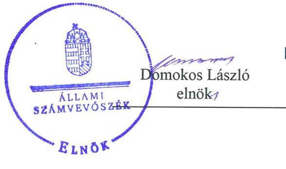
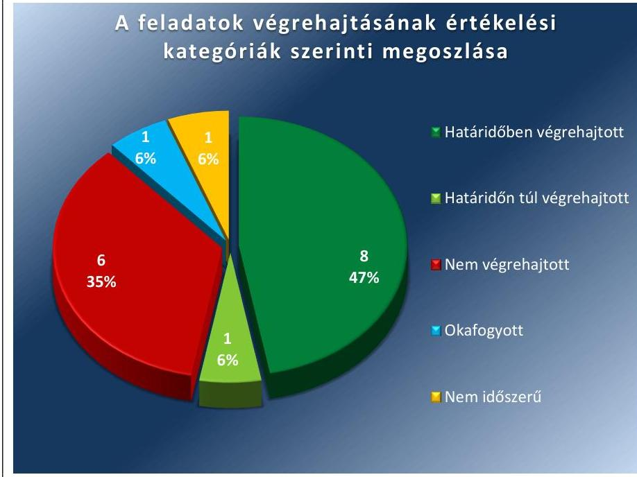
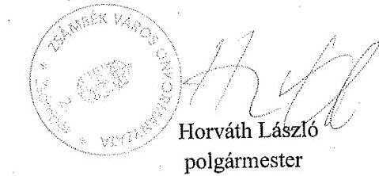
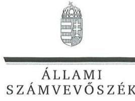
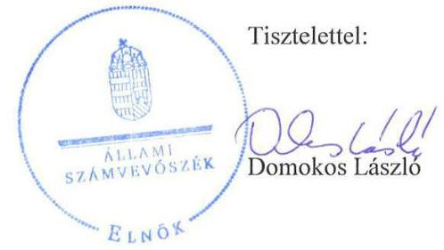
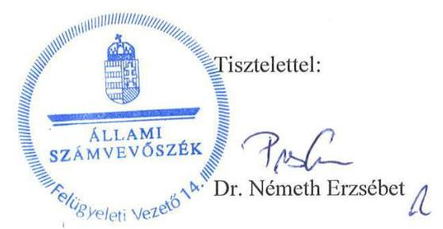

# Jelentés 

## Utóellenőrzések

Az önkormányzatok pénzügyi gazdálkodási helyzete értékelésének és gazdálkodása szabályosságának utóellenőrzése Zsámbék Város Önkormányzata 2018.

---

# Jelentés 

## Utóellenőrzések

Az önkormányzatok pénzügyi gazdálkodási helyzete értékelésének és gazdálkodása szabályosságának utóellenőrzése Zsámbék Város Önkormányzata
2018. 02. hó 01. nap

---

# AZ ELLENŐRZÉST FELÜGYELTE: 

DR. NÉMETH ERZSÉBET felügyeleti vezető

## AZ ELLENŐRZÉST VEZETTE ÉS A VÉGREHAJTÁSÁÉRT FELELŐS:

BAJNAI ZSUZSANNA ellenőrzésvezető

## A PROGRAM ÖSSZEÁLLÍTÁSÁÉRT FELELŐS:

TÓTPÁL SZABOLCS osztályvezető

## A TÉMÁHOZ KAPCSOLÓDÓ KORÁBBI SZÁMVEVŐSZÉKI JELENTÉSEK:

- címe: Jelentés az önkormányzatok pénzügyi helyzete értékelésének és gazdálkodása szabályosságának ellenőrzéséről - Zsámbék
- sorszáma: 14076

Jelentéseink az Országgyúlés számítógépes hálózatán és az Interneten a www.asz.hu címen is olvashatóak.

IKTATÓSZÁM: EL-0174-026/2018.
TÉMASZÁM: 2096
ELLENŐRZÉS-AZONOSÍTÓ SZÁM: V075595

---

# TARTALOMJEGYZÉK 

■ ÖSSZEGZÉS ..... 5
■ AZ ELLENŐRZÉS CÉLJA ..... 6
■ AZ ELLENŐRZÉS TERÜLETE ..... 7
■ AZ ELLENŐRZÉS HÁTTERE, INDOKOLTSÁGA ..... 8
■ A JELENTÉS LÉNYEGES KÉRDÉSKÖRE ..... 9
■ ELLENŐRZÉS HATÓKÖRE ÉS MÓDSZEREI ..... 10
■ MEGÁLLAPÍTÁSOK ..... 12
■ MELLÉKLETEK ..... 15
I. sz. melléklet: Az ÁSZ 14076 számú jelentéséhez kapcsolódó intézkedési terv végrehajtása ..... 15
■ FÜGGELÉK: ÉSZREVÉTELEK ..... 19
■ RÖVIDÍTÉSEK JEGYZÉKE ..... 25

---

.

---

# ÖSSZEGZÉS 

Az Állami Számvevőszék az utóellenőrzés során megállapította, hogy Zsámbék Város Önkormányzata az intézkedési tervében meghatározott feladatainak többségét végrehajtotta. Lépéseket tett a középtávú pénzügyi egyensúly biztositása érdekében, azonban a korábban feltárt számviteli elszámolásokat érintő szabálytalanságok megszüntetésére nem került sor. A megbizható pénzügyi kimutatások hiánya továbbra is veszélyezteti a közpénzekkel való felelős gazdálkodást.

## Az ellenőrzés társadalmi indokoltsága

Az Állami Számvevőszék stratégiájában célul tűzte ki a számvevőszéki munka hasznosulásának javítását. Ezzel összhangban ellenőrizte, hogy Zsámbék Város Önkormányzata megvalósította-e a korábbi ellenőrzés által feltárt hibák, hiányosságok és szabálytalanságok megszüntetése céljából kialakított intézkedési tervben foglaltakat. A rendszeres utóellenőrzés hozzájárul a szükséges intézkedések tényleges végrehajtásához, ezáltal a közpénzügyek rendezettségének javulásához, igazolják, hogy lezárult a következmények nélküli ellenőrzések időszaka.

## Főbb megállapítások, következtetések

Zsámbék Város Önkormányzata intézkedési tervében hat feladatot határozott meg gazdasági stabilitásának helyreállítása, 11 feladatot gazdálkodása szabályszerűségének biztosítása érdekében.

A középtávú pénzügyi egyensúly biztosítása érdekében megfogalmazott javaslatok hasznosultak; hat feladatból ötöt határidőben végrehajtottak, egyet pedig határidőn túl. Az önkormányzat bevételszerző, kiadáscsökkentő lehetőségeit felmérte, stabilizációs programot alkotott, az elkülönített tartalékképzés és felhasználás szabályozására döntési javaslatot készített. A követelésről való lemondásra a képviselő-testület által elfogadott rendelet alapján került sor.

Az intézkedési tervben meghatározott 11 szabályszerűségi feladatból hármat hajtottak végre határidőben, hatot nem végeztek el, egy feladat teljesítése okafogyottá vált, és egy nem volt időszerű. A számviteli elszámolásokat érintő hiányosságok megszüntetése érdekében a számviteli törvényben megfogalmazott bruttó elszámolás, összemérés, teljesség, valódiság alapelveinek betartására az önkormányzat nem intézkedett. A követelésekre és a szállítókra vonatkozó, részletező nyilvántartás nem felelt meg a jogszabályban előírt tartalmi követelményeknek. A hiányosságok miatt nem biztosított a gazdálkodás szabályszerűsége.

A jegyző az intézkedési tervben meghatározott feladatok végrehajtásáról a jogszabály szerinti nyilvántartást vezette, de annak tartalma nem felelt meg az előírásoknak.

---

# AZ ELLENŐRZÉS CÉLJA 

Az ellenőrzés célja annak értékelése volt, hogy a számvevőszéki jelentésben foglalt intézkedést igénylő megállapításokkal és javaslatokkal összhangban készített intézkedési tervben meghatározott feladatokat az önkormányzat végrehajtotta-e.

---

# **AZ ELLENŐRZÉS TERÜLETE**

## **Zsámbék Város Önkormányzata**

Zsámbék állandó lakosainak száma 2016. január 1-jén a Központi Statisztikai Hivatal Magyarország közigazgatási helynévkönyve alapján 5368 fő volt.

A polgármester¹ a 2014. évi önkormányzati választások óta tölti be hivatalát, a jegyző² személye az ellenőrzött időszakban egy alkalommal változott, a jelenlegi jegyző 2015. május 1-jétől látja el feladatát.

Zsámbék Város Önkormányzata a 2016. évi konszolidált költségvetési beszámolója³ szerint 1091,3 millió Ft költségvetési bevételt ért el, 1147,4 millió Ft költségvetési kiadást teljesített. A követelések állományának értéke 43,5 millió Ft, a kötelezettségek állományának értéke 140,7 millió Ft, mérlegfőösszege 9144,7 millió Ft volt.

Az Állami Számvevőszék 2014. évben értékelte Zsámbék Város Önkormányzata pénzügyi gazdálkodási helyzetét, és ellenőrizte gazdálkodásának szabályszerűségét a 2010. január 1. és 2013. június 30. közötti időszak vonatkozásában. Az erről szóló 14076. számú jelentését⁴ az ÁSZ⁵ 2014. június 17-én tette közzé. Az ellenőrzés további célja az önkormányzat⁶ pénzügyi egyensúlyának alakulására hatással lévő folyamatoknak és kockázatoknak a feltárása volt. Az ÁSZ jelentésben foglalt javaslatok végrehajtása érdekében az önkormányzat intézkedési tervet készített, melyet a képviselő-testület 166/2014. (IX.28.) számú határozatával jóváhagyott.

Az utóellenőrzés – a 2014. június 17. és 2017. augusztus 21. között végrehajtott feladatokat figyelembe véve – az ÁSZ jelentésben a polgármester és a jegyző részére megfogalmazott intézkedést igénylő megállapításokra és javaslatokra készített, az ÁSZ részére megküldött intézkedési tervben foglalt feladatok megvalósításának ellenőrzésére, illetve értékelésére fókuszált.

---

# AZ ELLENŐRZÉS HÁTTERE, INDOKOLTSÁGA 

Az ÁSZ tv. ${ }^{7}$ 33. § (1) bekezdése értelmében a számvevőszéki jelentések intézkedést igénylő megállapításaihoz kapcsolódóan az ellenőrzött szervezet vezetője intézkedési tervet köteles összeállítani, és az ÁSZ részére megküldeni. Az intézkedési tervben foglaltak megvalósítását - az ÁSZ tv. 33. § (7) bekezdésében foglaltak alapján - az ÁSZ utóellenőrzés keretében ellenőrizheti. Az intézkedések megvalósulásának értékelése során az ÁSZ figyelembe veszi az ellenőrzött szervezetek működési feltételeiben, valamint a jogszabályi előírásokban bekövetkezett változásokat.

Az intézkedési tervben foglalt feladatok hiányos, illetve késedelmes végrehajtása, valamint megvalósításának elmaradása azt mutatja, hogy az ellenőrzések során feltárt hibák, hiányosságok és szabálytalanságok megszüntetése nem kapott kellő hangsúlyt. Ez a szabályszerű működés és a felelős vezetői magatartás vonatkozásában kockázatot hordoz. E kockázatok feltárásával az ÁSZ utóellenőrzési rendszere fokozza a fegyelmet, és igazolja, hogy a közpénzzel való szabályos gazdálkodás felelőssége elől nem lehet kitérni.

Az utóellenőrzés négy szinten hasznosulhat:
A társadalom szintjén az utóellenőrzés jelzi, hogy a számvevőszéki ellenőrzés megállapításainak van következménye: a hiányosságok megszüntetésére az ellenőrzött szervezet által meghatározott intézkedések végrehajtását is számon kéri az ÁSZ.

- Az ellenőrzött terület szintjén az utóellenőrzés tájékoztatást nyújt a terület döntéshozóinak a hiányosságok kiküszöbölésének jó gyakorlatairól, ezzel lehetőséget biztosítva arra, hogy az ÁSZ ellenőrzési megállapításai, javaslatai a terület nem ellenőrzött szervezeteinek a működése során is hasznosuljanak.
- Az ellenőrzött szervezet szintjén az utóellenőrzés feltárja, hogy a szervezet az intézkedések végrehajtásával hasznosította-e a korábbi ellenőrzési jelentésben a hiányosságok megszüntetése, illetve a kockázatok kezelése érdekében megfogalmazott javaslatokat.
- Az ÁSZ szintjén az utóellenőrzés visszacsatolást ad az ellenőrzési jelentések hasznosulásáról, az intézkedések elmaradása vagy részleges megvalósulása a további ellenőrzésekhez kockázati jelzésként szolgál.

---

# A JELENTÉS LÉNYEGES KÉRDÉSKÖRE 

Az önkormányzat az intézkedési tervben foglaltakat az előirt határidőben végrehajtotta-e?

---

# ELLENŐRZÉS HATÓKÖRE ÉS MÓDSZEREI 

## Az ellenőrzés típusa

Megfelelőségi ellenőrzés.

## Az ellenőrzött időszak

Az utóellenőrzés alapját képező ÁSZ jelentés közzétételének napjától (2014. június 17.) az ellenőrzésről szóló kiértesítő levél keltének napjáig (2017. augusztus 21.) tartó időszak.

## Az ellenőrzés tárgya

Az ÁSZ tv. 2011. július 1-jei hatálybalépését követően a számvevőszéki jelentésben foglalt intézkedést igénylő megállapításokkal és javaslatokkal összhangban - Zsámbék Város Önkormányzata által - készített intézkedési tervben foglaltak végrehajtásának ellenőrzése volt.

Az ellenőrzés kiterjedt minden olyan körülményre és adatra, amely az ÁSZ jogszabályban meghatározott feladatainak teljesítéséhez, valamint a program végrehajtása folyamán felmerült újabb összefüggések feltárásához szükséges volt.

## Az ellenőrzött szervezet

Zsámbék Város Önkormányzata

## Az ellenőrzés jogalapja

Az ÁSZ tv. 33. § (7) bekezdése alapján a 33. § (1)-(2) bekezdése szerinti intézkedési tervben foglaltak megvalósítását az ÁSZ utóellenőrzés keretében ellenőrizheti.

## Az ellenőrzés módszerei

Az ÁSZ az ellenőrzést a nemzetközi standardokat irányadónak tekintve, az ellenőrzési program ellenőrzési kérdései, az ellenőrzött időszakban hatályos jogszabályok, az ellenőrzés szakmai szabályok és módszertanok figyelembevételével, önálló ellenőrzés keretében végezte.

Az ÁSZ az ellenőrzés ideje alatt az önkormányzattal történő kapcsolattartást az ÁSZ SZMSZ ${ }^{\circledR}$-ének vonatkozó előírásai alapján biztosította.

---

Az utóellenőrzés megállapításait elsősorban az ÁSZ rendelkezésére álló, valamint az ellenőrzött szervezettől elektronikusan bekért dokumentumok alapozták meg.

Az ellenőrzési bizonyítékként felhasználható adatforrások közé tartoztak egyrészt a szakmai programban felsorolt adatforrások, másrészt minden - az ellenőrzés folyamán feltárt, az ellenőrzés szempontjából információt tartalmazó - dokumentum.

Az intézkedési tervben előírt feladatokat, azok végrehajthatósága, illetve végrehajtása szempontjából az alábbiak szerint értékelte az ÁSZ:
—_ „határidőben végrehajtott" a feladat, ha a teljesítés dokumentáltan, az intézkedési tervben előírt határidőben és tartalommal megtörtént;
—_ „határidőn túl végrehajtott" a feladat, ha annak teljesítése az intézkedési tervben meghatározott módon, de az előírt határidőn túl történt meg;
—_ „részben végrehajtott" a feladat, ha végrehajtása teljeskörűen az intézkedési tervben előírt módon nem történt meg;
—_ „nem végrehajtott" a feladat, ha a végrehajtás nem történt meg, vagy amennyiben a teljesítést nem dokumentálták;
—_ „okafogyottá vált" a feladat, ha végrehajtására - meghatározott esemény bekövetkezése, továbbá külső körülmény, a működést érintő feltétel változása miatt - már nincs szükség, illetve lehetőség, és egyértelműen megállapítható, hogy az intézkedést szükségessé tevő körülmény a jövőben nem fordulhat elő;
—_ „nem időszerű" az a feladat, amelynek ellenőrzési időszakon belüli végrehajtására azért nem került (kerülhetett) sor, mert az intézkedés alapjául szolgáló esemény nem következett be, de annak jövőbeni előfordulása lehetséges, a végrehajtása nem volt esedékes, vagy a végrehajtás határideje még nem járt le.
Az ellenőrzés lefolytatásához az ellenőrzött szervezet a tanúsítványok elektronikus kitöltésével, valamint az ÁSZ által kért dokumentumok elektronikus megküldésével szolgáltatott adatokat, amelyek valódiságát és teljeskörűségét az ellenőrzött szervezet vezetője által tett teljességi és hitelességi nyilatkozat igazolta. Az így rendelkezésre bocsátott adatok, információk kontrollja az ellenőrzés keretében történt.

---

# MEGÁLLAPÍTÁSOK 

## Az önkormányzat az intézkedési tervben foglaltakat az előírt határidőben végrehajtotta-e?

Összegző megállapítás

Az önkormányzat az intézkedési tervben meghatározott 17 feladatból nyolcat határidőben, egyet határidőn túl, hatot pedig nem hajtott végre. Egy feladat teljesítése okafogyottá vált, egy nem volt időszerű. Az intézkedési tervben meghatározott feladatok végrehajtásáról a nyilvántartást nem a jogszabályi előírások szerint vezették.

Az ÁSZ a jelentésében a polgármester részére összesen 10, a jegyző részére hét javaslatot fogalmazott meg. A képviselő-testület az intézkedési tervben a hiányosságok, szabálytalanságok megszüntetésére 17 feladatot határozott meg. Az intézkedési tervben meghatározott feladatokat, határidőket, felelősöket és a feladatok végrehajtását az I. számú melléklet mutatja be.

Az ÁSZ javaslatai alapján készített intézkedési tervben meghatározott feladatok végrehajtásáról a jegyző nem éves bontásban vezetett nyilvántartást a $\mathrm{Bkr}^{9}$. 14. § (1) bekezdésének előírása ellenére, továbbá az nem felelt meg teljeskörűen a Bkr. 47. § (2) bekezdésében foglaltaknak, mert nem tartalmazta valamennyi végrehajtott intézkedés rövid leírását.

Az intézkedési tervben meghatározott feladatok végrehajtásának értékelési kategóriák szerinti megoszlását az 1. ábra szemlélteti.

1. ábra

Forrás: ÁSZ

---

# HATÁRIDŐBEN VÉGREHAJTOTT feladatok: 

1. A bevételszerző, kiadáscsökkentő lehetőségeket a jegyző felmérte, az erről szóló döntési javaslatot elkészítette.
2. A pénzügyi egyensúly hosszú távú megőrzése céljából a jegyző elkészítette a „Stabilizációs program"-ot.
3. Az elkülönített tartalékképzés és felhasználás szabályozására vonatkozó döntési javaslatot a jegyző elkészítette.
4. A Zsámbékvíz Kft. ${ }^{10}$ pénzügyi helyzetének stabilizálására vonatkozó intézkedési tervet a képviselő-testület ${ }^{11}$ elfogadta.
5. A polgármester biztosította, hogy az önkormányzatot megillető követelésről történő lemondásra a helyi rendelet alapján kerüljön sor.
6. A polgármester intézkedett, hogy a településközpont rehabilitációjához felvett hitel fedezetének meghatározáskor az önkormányzat általános, múködési és ágazati feladatainak támogatása ne kerüljön felhasználásra.
7. A jegyző intézkedett, hogy a költségvetési rendelettervezetek öszszeállításakor a költségvetési bevételek és kiadások meghatározása megfeleljen a jogszabályi előírásnak.
8. A jegyző intézkedett, hogy a költségvetési rendelettervezetekben bemutassák az önkormányzat és költségvetési szerveinek költségvetési bevételeit és kiadásait kötelező, önként vállalt és államigazgatási feladatok szerinti bontásban.

## HATÁRIDŐN TÚL VÉGREHAJTOTT feladat:

9. 2014. augusztus 30. helyett a képviselő-testület 2014. szeptember 18 -ai ülésére készítette el a jegyző a követelésekről való lemondás eseteinek és módjának szabályozására vonatkozó rendelettervezetet.

## NEM VÉGREHAJTOTT feladatok:

10. A feltárt szabálytalanságok tekintetében az esetleges munkajogi felelősség kivizsgálása érdekében a polgármester nem intézkedett.
11. A jegyző a Sztv. ${ }^{12}$-ben előírtakkal ellentétben nem intézkedett számviteli elszámolások során a bruttó elszámolás elvének betartása érdekében, miszerint a bevételek és költségek, illetve a követelések és kötelezettségek egymással szemben nem számolhatók el.
12. A jegyző nem intézkedett a Sztv.-ben előírtaknak megfelelően a számviteli elszámolások során az összemérés elvének betartása érdekében, amely előírja, hogy a bevételeknek és a költségeknek ahhoz az időszakhoz kell kapcsolódniuk, amikor azok gazdaságilag felmerültek.
13. A jegyző a Sztv.-ben foglaltak ellenére nem intézkedett a gazdasági események könyvelése során a teljesség elvének betartása érdekében, mely szerint könyvelni kell minden gazdasági eseményt, amely az eszközökre és a forrásokra hatást gyakorol.

---

14. A jegyző nem intézkedett a Sztv.-ben előírtaknak megfelelően, arról hogy az önkormányzat mérlegében a mérleg fordulónapján fennálló követelések a valódiság elve alapján kerüljenek kimutatásra, amely szerint a beszámolóban szereplő tételeknek a valóságban is megtalálhatóknak, bizonyíthatóknak, kívülállók által is megállapíthatóknak kell lenniük.
15. A jegyző nem igazolta az önkormányzat követelésekről és szállítókról vezetett analitikus nyilvántartásának a jogszabály által előírt minimum tartalmi követelményeknek megfelelő vezetését.

# OKAFOGYOTTÁ VÁLT feladat: 

16. A beruházási hitel fedezeténél fennálló jogellenes állapot megszűnt az adósságkonszolidációt követően.

## NEM IDŐSZERŰ feladat:

17. Az önkormányzatnál nem került sor közbeszerzési törvény ${ }_{1,2}{ }^{13}$ szerinti eljárás lefolytatását indokoló szolgáltatás igénybevételére.

---

# MELLÉKLETEK

I. SZ. MELLÉKLET: AZ ÁSZ 14076 SZÁMÚ JELENTÉSÉHEZ KAPCSOLÓDÓ INTÉZKEDÉSI TERV VÉGREHAJTÁSA

|  1. | Az intézkedési tervben meghatározott feladat | Az intézkedési tervben meghatározott határidő | Az intézkedési tervben meghatározott feladat felelőse | A feladat végrehajtása  |
| --- | --- | --- | --- | --- |
|   | 1. | 2.
Határidőben végrehajtott feladat | 3. | 4.  |
|  1. | „Bevételszerző, kiadáscsökkentő lehetőségek felmérése, döntési javaslat készítése." | 2014. szeptember 30., azt követően évente a költségvetési rendelettervezetek előterjesztésekor | polgármester, jegyző | A jegyző a bevételszerző és a kiadáscsökkentő lehetőségeket felmérte, az erről szóló döntési javaslatot a képviselő-testület 185/2014. (IX.25.) számú határozatában jóváhagyta. Ezt követően évente a költségvetési rendelettervezetek tartalmazták a javaslatot, amelyet a polgármester határidőben, 2015. január 28-án, 2016. február 8-án, 2017. február 9-én terjesztett elő.  |
|  2. | „Stabilizációs program készítése a pénzügyi egyensúly hosszú távú megőrzése céljából." | 2014. szeptember 30. | polgármester, jegyző | A jegyző elkészítette a pénzügyi egyensúlyi helyzet hosszú távú megőrzését biztosító „Stabilizációs programot", amelyet a képviselő-testület 2014. szeptember 25-ei ülésén 186/2014. (IX.25.) számú határozatával elfogadott.  |
|  3. | „Elkülönített tartalékképzés és felhasználás szabályozására döntési javaslat készítése." | 2014. szeptember 30. | polgármester, jegyző | A jegyző elkészítette a képviselő-testület 2014. szeptember 25-ei ülésére az önkormányzat tartalékképzésének, tartalék felhasználásának szabályairól szóló döntési javaslatot, amelyet a képviselő-testület 187/2014. (IX.25.) számú határozatával jóváhagyott.  |
|  4. | „A Zsámbékvíz Kft. pénzügyi helyzetének stabilizálásáról intézkedési terv készítése." | 2014. augusztus 30. | polgármester, jegyző | A képviselő-testület 2014. július 28-ai ülésén a 142/2014. (VII. 28.) számú határozatban rögzítette az önkormányzat kizárólagos tulajdonában lévő Zsámbékvíz Kft. pénzügyi helyzetének stabilizálása érdekében elvégzendő feladatot, felelős és határidő megjelölésével.  |
|  5. | „Biztosítani, hogy az önkormányzatot megillető követelésről lemondásra* csak törvényben vagy az önkormányzat által megalkotásra kerülő rendelet alapján kerüljön sor." | folyamatos | polgármester | A polgármester biztosította, hogy az önkormányzatot megillető követelésről történő lemondásra a jóváhagyott helyi rendelet alapján kerüljön sor. A képviselő testület 103/2016. (VI.30.) számú határozatában döntött a 15/2014. (IX.22) számú önkormányzati rendelet 3. § h) pontjának megfelelően a követelés elengedéséről.  |

[^0] [^0]: * Az intézkedési terv a lemondásra szóval kiegészítésre került.

---

|  5. | Az intézkedési tervben meghatározott feladat | Az intézkedési tervben meghatározott határidő | Az intézkedési tervben meghatározott feladat felelőse | A feladat végrehajtása  |
| --- | --- | --- | --- | --- |
|  1. |  | 2. | 3. | 4.  |
|  6. | „Hitelfelvétel és kötvénykibocsátás esetén fedezetként az Áht. 84. § (4) bekezdésében foglaltak szerint az önkormányzat általános-, működési és ágazati feladatainak támogatása nem kerülhet felhasználásra." | folyamatos | polgármester, jegyző | A településközpont rehabilitációjára felvett hitel fedezetének meghatározásakor a képviselő-testület 167/2013. (XI.20.) KT határozatában figyelembe vette az Áht. 84. § (4) bekezdésének előírását, a hitel és járulékai visszafizetésének biztosítékául saját bevételeit ajánlotta fel.  |
|  7. | „A 2014. évi, és az azt követő évek rendelettervezeteinek összeállításakor a költségvetési bevételeket és kiadásokat az Áht. 5. § (1)-(2) bekezdéseiben foglalt előírások szerint kell meghatározni." | 2014. január 31. végrehajtva*,
az intézkedési terv elfogadását követően folyamatos | gazdasági vezető | A 2015-2017. évi költségvetési rendelettervezetek összeállításakor a gazdasági vezető a jogszabályban foglalt előírások szerint határozta meg a költségvetési bevételeket és kiadásokat, azok közgazdasági jellege, azon belül kiemelt előirányzatok szerinti osztásban.  |
|  8. | „A 2014. évi, és a további évek költségvetési rendelettervezeteinek összeállításakor az önkormányzat és költségvetési szerveinek költségvetési kiadásait és bevételeit kötelező, önként vállalt és állami feladatok szerinti bontásban is ki kell mutatni." | 2014. január 31. végrehajtva*,
az intézkedési terv elfogadását követően folyamatos | gazdasági vezető | A 2015-2017. évi költségvetési rendelettervezetek összeállításakor a gazdasági vezető az önkormányzat és az általa irányított költségvetési szervek költségvetési bevételi előirányzatait és költségvetési kiadási előirányzatait kötelező, önként vállalt és állami feladatok szerinti bontásban kimutatta.  |
|  9. | "Az Áht. ${ }^{14}$ 97. § (2) bekezdésében foglaltak érvényesítésére rendelettervezet készítése, melyben a követelésekről való lemondás esetei és módja szabályozásra kerül." | 2014. augusztus 30. | polgármester, jegyző | A jegyző az Áht. 97. § (2) bekezdésében foglaltak érvényesítésére a követelésekről való lemondás eseteinek és módjának szabályozására vonatkozó rendelettervezetet a képviselő-testület 2014. szeptember 18-ai ülésére készítette el. A képviselő-testület 15/2014. (IX.22.) számú önkormányzati rendeletével szabályozta a követelések elengedésének eseteit és módját.  |
|  10. | "A vizsgált időszakban felmerült esetleges munkajogi felelősség kivizsgálását a belső ellenőrre ruházza át. A vizsgálat eredményének függvényében a szükséges intézkedéseket meg kell tenni." | 2014. szeptember 30. | polgármester, jegyző
belső ellenőr | A polgármester nem intézkedett az esetleges munkajogi felelősség kivizsgálása érdekében, annak alapját képező belső ellenőrzési jelentés nem készült.  |
|  11. | „A számviteli elszámolások során az Sztv. 15. § (9) bekezdése szerinti bruttó elszámolás elvének megfelelően a bevételek és a költségek, illetve a követelések | folyamatos | gazdasági vezető | A jegyző nem intézkedett a Sztv. 15. § (9) bekezdése szerinti bruttó elszámolás elvének betartása, a bevételek és a költségek, illetve a követelések  |

[^0] [^0]: * 2014. évi költségvetési rendelet-tervezet összeállítása az ellenőrzött időszakon kívül esik.

---

|  1. | Az intézkedési tervben meghatározott feladat | Az intézkedési tervben meghatározott határidő | Az intézkedési tervben meghatározott feladat felelőse | A feladat végrehajtása  |
| --- | --- | --- | --- | --- |
|   | 1. | 2. | 3. | 4.  |
|   | és kötelezettségek egymással szemben nem kerülhetnek elszámolásra." |  |  | és kötelezettségek egymással szembeni elszámolásának elkerülése érdekében.  |
|  12. | „A számviteli elszámolások során az Sztv. 15. § (7) bekezdése szerinti összemérés elvének megfelelően a bevételeket és a költségek ahhoz az időszakhoz kell, hogy kapcsolódjanak, amely időszakban gazdaságilag felmerültek." | folyamatos | gazdasági vezető | A jegyző nem intézkedett a Sztv. 15. § (7) bekezdése szerinti összemérés elvének betartása, a bevételek és a költségek felmerülésük időszakában történő elszámolása érdekében.  |
|  13. | „A számviteli elszámolások során az Sztv. 15. § (2) bekezdése szerinti teljesség elvét a gazdasági események könyvelése során be kell tartani." | folyamatos | gazdasági vezető | A jegyző nem intézkedett a Sztv. 15. § (2) bekezdése szerinti teljesség elvének betartása érdekében a gazdasági események könyvelése során.  |
|  14. | „A számviteli elszámolások során az Sztv. 15. § (3) bekezdése szerinti valódiság elve alapján kell kimutatni a mérleg fordulónapján fennálló követeléseket az önkormányzat mérlegében." | folyamatos | gazdasági vezető | A jegyző nem intézkedett a mérleg fordulónapján fennálló követelések Sztv. 15. § (3) bekezdése szerinti valódiság elvének megfelelő kimutatása érdekében az önkormányzat 2014-2015., 2017. évi mérlegében. A követelések 2016. december 31-ei 6,7 millió Ft-os leltár értéke nem támasztotta alá a mérleg követelések sorának 43,5 millió Ft-os összegét.  |
|  15. | „Az önkormányzat által az Áhsz. ${ }^{15}$ 39. § (3) bek. és 45. § (3) bekezdés szerint vezetendő részletező nyilvántartásoknak tartalmaznia kell a követelések esetében az Áhsz. 14. sz. melléklet III. pontjában a szállítókkal szembeni kötelezettségek esetében ugyanezen melléklet II. pontjában foglalt minimum tartalmat. Az analitikákat e tartalmak alapján kell vezetni." | 2014. július 31.
Az EcoStat pénzügyi integrált program 2014. január 1-i bevezetésével biztosított, az intézkedési terv elfogadását követően folyamatos. | gazdasági vezető | A jegyző nem igazolta, hogy az EcoStat pénzügyi integrált program alkalmas a követelések esetében az Áhsz. 14. sz. melléklet III. pontjában a szállítókkal szembeni kötelezettségek esetében ugyanezen melléklet II. pontjában foglalt minimum tartalomnak megfelelő részletező nyilvántartás vezetésére.  |
|   |  | Okafogyottá vált feladat |  |   |
|  16. | „Az önkormányzat hitelénél „fennálló jogellenes állapot megszüntetése érdekében javaslatot kell készíteni annak kiváltási lehetőségéről." | 2014. augusztus 30. | polgármester, jegyző | Az önkormányzat 2011. évben felvett beruházási hitelénél fennálló jogellenes állapot megszűnt, az állam a 2013. évi CCXXX. törvény ${ }^{16}$ 67. § (1) bekezdése alapján a hitel és járulékai összegét az adósságkonszolidáció keretében 2014. február 28-ig átvállalta.  |
|   |  | Nem időszerű feladat |  |   |
|  17. | „Szolgáltatások igénybevétele esetén a Kbt. 119. §ban foglaltak szerint kell eljárni, kivétel a Kbt. 120. § a$\mathrm{m})$ pontjainak fennállása esetét." | folyamatos | polgármester, jegyző | A közbeszerzési törvény ${ }_{1,2}$ szerinti eljárás lefolytatását indokoló szolgáltatás igénybevételére nem került sor az önkormányzatnál.  |

---

.

---

# FÜGGELÉK: ÉSZREVÉTELEK 

A jelentéstervezetet a Számvevőszék 15 napos észrevételezésre megküldte az ellenőrzött szervezet vezetőjének az ÁSZ tv. 29. § ${ }^{+}$(1) bekezdése előírásának megfelelően.
A függelék tartalmazza az ellenőrzött észrevételeit, illetve az el nem fogadott észrevételek elutasításának indoklását.

[^0]
[^0]:    ${ }^{+} 29. \S$ (1) Az Állami Számvevőszék az ellenőrzési megállapításait megküldi az ellenőrzött szervezet vezetőjének vagy az általa megbízott személynek, és annak, akinek személyes felelősségét állapította meg.
    (2) Az ellenőrzött szervezet vezetője és a felelősként megjelölt személy az ellenőrzés megállapításaira tizenöt napon belül írásban észrevételt tehet.
    (3) Az Állami Számvevőszék az észrevételre a beérkezésétől számított harminc napon belül írásban válaszol. A figyelembe nem vett észrevételeket köteles a jelentésben feltüntetni, és megindokolni, hogy azokat miért nem fogadta el.

---

# Zsámbék Város Polgármestere 

2072 Zsámbék Rácváros u. 2-4.
Tel.: (36)-23-565-610, (36)-23-565-612 Fax: (36)-565-629
E-mail: polgarmester@zsambek.hu Web: www.zsambek.hu

Ikt. szám: 828-6/2017
Tárgy: Jelentéstervezetre észrevétel
Hiv.szám: EL-0174-022/2017.

## Állami Számvevőszék   Domokos László elnök részére   1052 Budapest   Apáczai Csere János u. 10.

## Tisztelt Elnök Úr!

"Utóellenőrzések - Az önkormányzatok pénzügyi gazdálkodási helyzete értékelésének és gazdálkodása szabályosságának utóellenőrzése - Zsámbék" című jelentéstervezetre az alábbi észrevételt teszem:

Az önkormányzat gazdasági stabilitása a megállapítás szerint is biztosított, jelenleg 400 millió forintunk van állampapírban, s nincsenek müködésbeli gondjaink.

A szabályszerűség biztosítása érdekében meghatározott feladatok közül megállapításaik szerint hatot nem végeztünk el. E feladatok közül kettőnek a határideje még a 2014-es önkormányzati választások előtt lejárt. A 2014. évi októberi választáson új polgármestert választott a település, s a polgármesteri tisztség átadás-átvételével kapcsolatos jegyzőkönyvben nem esett szó az ÁSZ vizsgálattal kapcsolatos elmaradt feladatokról.

2015-ben jegyzőváltás is volt a Zsámbéki Polgármesteri Hivatalban, a jelenlegi jegyző szintén nem értesült ÁSZ vizsgálattal kapcsolatos teendőkről.

A gazdasági vezető 2017. májusában került a Hivatalba, épp az utóellenőrzés megkezdése előtt. Észrevétele szerint a bruttó elszámolás, az összemérés és a teljesség elve nem sérült a 2016. évi elszámolások során. A bevételek és költségek felmerülésük időszakában kerültek elszámolásra, illetve a követelések és kötelezettségek nem kerültek egymással szemben elszámolásra.

---

# Zsámbék Város Polgármestere 

2072 Zsámbék Rácváros u. 2-4.
Tel.: (36)-23-565-610, (36)-23-565-612 Fax: (36)-565-629
E-mail: polgarmester@zsambek.hu Web: www.zsambek.hu

A mérlegtételek valóban nem kerültek leltárral megfelelően alátámasztásra, a 2017. évben ez a hiba javításra került. A jelentéstervezetben 2017. évi mérleg szerepel, ez valószínűleg elírás és 2016. évi mérleget takar.
Az EcoStat pénzügyi integrált program alkalmas a szállítókkal és vevőkkel szembeni kötelezettségek, illetve követelések részletező nyilvántartásának vezetésére, ezt a 20017. évi mérlegünk bizonyítani fogja.

Az önkormányzatnál és intézményeinél a belső ellenőrzés folyamatos, az esetlegesen felmerülő hibák javításra kerülnek.

Kérem észrevételeimet a jelentés végleges összeállításánál figyelembe venni szíveskedjen!

Zsámbék, 2017. december 18.

---

ELNÖK

Ikt.szám: EL-0174-025/2018.

# Horváth László úr 

polgármester
Zsámbék Város Önkormányzata

## Zsámbék

## Tisztelt Polgármester Úr!

Az „Utóellenőrzések - Az önkormányzatok pénzügyi gazdálkodási helyzete értékelésének és gazdálkodása szabályosságának utóellenőrzése - Zsámbék Város Önkormányzata" címủ jelentéstervezetre tett észrevételét köszönettel megkaptam.

Az ellenőrzési megállapításokra vonatkozó észrevételét az Állami Számvevőszékről szóló 2011. évi LXVI. törvény (a továbbiakban: ÁSZ tv.) 29. § (2) bekezdésében meghatározott tizenöt napos határidőn belül küldte meg. Az Állami Számvevőszék észrevétellel kapcsolatos álláspontját a mellékletként csatolt, a felügyeleti vezető által készített indokolás tartalmazza.

Tájékoztatom, hogy az Állami Számvevőszék a figyelembe nem vett észrevételeket az ÁSZ tv. 29. § (3) bekezdésében előírtak szerint köteles a jelentésében feltüntetni és megindokolni, hogy azokat miért nem fogadta el.

Budapest, 2018. január 11. nap

Melléklet: Észrevételre adott válasz

---

Az „Utóellenörzések - Az önkormányzatok pénzügyi gazdálkodási helyzete értékelésének és gazdálkodása szabályosságának utóellenörzése - Zsámbék Város Önkormányzata" című jelentéstervezethez tett észrevételre adott válasz.

# 1. A jelentéstervezet 13. oldalának 11. sz. francia bekezdésére, valamint az 1. sz. melléklet kapcsolódó pontjára tett észrevétel 

A jelentéstervezet érintett bekezdése megállapítja, hogy ,, a jegyző a Sztv.-ben elöirtakkal ellentétben nem intézkedett számviteli elszámolások során a bruttó elszámolás elvének betartása érdekében, miszerint a bevételek és költségek, illetve a követelések és kötelezettségek egymással szemben nem számolhatók el".
Polgármester úr észrevétele szerint „a bevételek és költségek felmerülésük időszakában kerültek elszámolásra, illetve a követelések és kötelezettségek nem kerültek egymással szemben elszámolásra."
Polgármester úr észrevételében a megállapítást vitatja, nem vitatja azonban azt a tényközlést, mely szerint az ellenőrzés rendelkezésére bocsátott dokumentumok alapján nem igazolták, hogy az Önkormányzat Intézkedési Tervében megjelölt felelős intézkedett a Sztv. $15 \S(9)$ bekezdésében foglaltak betartása érdekében. A jelentéstervezet módosítását ennek megfelelően nem tartjuk indokoltnak.

## 2. A jelentéstervezet 13. oldalának 12. sz. francia bekezdésére, valamint az 1. sz. melléklet kapcsolódó pontjára tett észrevétel

A jelentéstervezet érintett bekezdése megállapítja, hogy ,, a jegyző nem intézkedett a Sztv.-ben elöirtaknak megfelelően a számviteli elszámolások során az összemérés elvének betartása érdekében, amely elöirja, hogy a bevételeknek és a költségeknek ahhoz az időszakhoz kell kapcsolódniuk, amikor azok gazdaságilag felmerültek".
Polgármester úr észrevétele szerint „a bruttó elszámolás, az összemérés és a teljesség elve nem sérült a 2016. évi elszámolások során".
Polgármester úr észrevételében a megállapítást vitatja, azonban azt a tényközlést, mely szerint az 1. sz. tanúsítványban nem jelölték meg a végrehajtást igazoló dokumentumot, mely alapján igazolható lett volna, hogy az Önkormányzat Intézkedési Tervében megjelölt felelős intézkedett a Sztv. 15. § (7) bekezdésében foglaltak betartása érdekében. A jelentéstervezet módosítását ennek megfelelően nem tartjuk indokoltnak.

## 3. A jelentéstervezet 14. oldalának 14. sz. francia bekezdésére, valamint az 1. sz. melléklet kapcsolódó pontjára tett észrevételek

A jelentéstervezet érintett bekezdése megállapítja, hogy ,, a jegyző nem intézkedett a Sztv.-ben elöirtaknak megfelelően, arról hogy az önkormányzat mérlegében a mérleg fordulónapján fennálló követelések a valódiság elve alapján kerüljenek kimutatásra, amely szerint a beszámolóban szereplő tételeknek a valóságban is megtalálhatóknak, bizonyíthatóknak, kivülállók által is megállapíthatóknak kell lenniük".
Polgármester úr észrevételében a hiányosság javításával kapcsolatban ad tájékoztatást, de a megállapítást nem vitatja - „a mérlegtételek valóban nem kerültek leltárral megfelelően

---

alátámasztásra, a 2017. évben ez a hiba javitásra keriult" - ezért a jelentéstervezet módosítását nem tartjuk szükségesnek.
Pontosító javaslatával kapcsolatban - mely szerint „a jelentéstervezetben 2017. évi mérleg szerepel, ez valószinüleg elírás és 2016. évi mérleget takar" - áttekintettük a jelentés tervezetét, az érintett megállapítást pontosítjuk
4. A jelentéstervezet 14. oldalának 15. sz. francia bekezdésére, valamint az I. sz. melléklet kapcsolódó pontjára tett észrevétel
A jelentéstervezet érintett bekezdése megállapítja, hogy ,, a jegyző nem igazolta az önkormányzat követelésekről és szállítókröl vezetett analitikus nyilvántartásának a jogszabály által elölrt minimum tartalmi követelményeknek megfelelő vezetését".
Polgármester úr észrevételében az EcoStat pénzügyi integrált program alkalmasságával kapcsolatos álláspontjáról ad tájékoztatást, amely alapján ,,az EcoStat pénzügyi integrált program alkalmas a szállítókkal és vevőkkel szembeni kötelezettségek, illetve követelések részletező nyilvántartásának vezetésére, ezt a 2017. évi mérlegünk bizonyitani fogja".
Tekintettel arra, hogy Polgármester úr a kapcsolódó megállapítást nem vitatja, a jelentéstervezet módosítását nem tartjuk indokoltnak.

Tájékoztatom, hogy az Állami Számvevőszék a figyelembe nem vett észrevételeket az ÁSZ tv. 29. § (3) bekezdésében előírtak szerint köteles a jelentésében feltüntetni és megindokolni, hogy azokat miért nem fogadta el.

Budapest, 2018. január " 11 ".

---

# RÖVIDÍTÉSEK JEGYZÉKE 

${ }^{1}$ polgármester
${ }^{2}$ jegyző
${ }^{3}$ 2016. évi konszolidált költségvetési beszámoló
${ }^{4}$ számvevőszéki jelentés
${ }^{5}$ ÁSZ
${ }^{6}$ önkormányzat
${ }^{7}$ ÁSZ tv.
${ }^{8}$ SZMSZ
${ }^{9}$ Bkr.
${ }^{10}$ Zsámbékvíz Kft.
${ }^{11}$ képviselő-testület
${ }^{12}$ Sztv.
${ }^{13}$ közbeszerzési törvény1 közbeszerzési törvény2
${ }^{14}$ Áht.
${ }^{15}$ Áhsz.
${ }^{16}$ 2013. évi CCXXX. tv.

Zsámbék Város Önkormányzatának polgármestere
Zsámbék Város Önkormányzatának jegyzője
Zsámbék Város Képviselő-testületének 6/2017. (V.29.) önkormányzati rendelete a 2016. évi költségvetés végrehajtásáról
az ÁSZ 14076 számú jelentése - Jelentés az önkormányzatok pénzügyi gazdálkodási helyzete értékelésének és gazdálkodása szabályosságának ellenőrzéséről - Zsámbék

Állami Számvevőszék
Zsámbék Város Önkormányzata
2011. évi LXVI. törvény az Állami Számvevőszékről (hatályos: 2011. július 1-jétől)
az Állami Számvevőszék elnökének 3/2016. (XII. 29.) ÁSZ utasítása az Állami Számvevőszék Szervezeti és Működési Szabályzatáról (hatályos: 2017. január 1-jétől)
370/2011. (XII. 31.) Korm. rendelet a költségvetési szervek belső kontrollrendszeréről és belső ellenőrzéséről (hatályos: 2012. január 1-jétől) Zsámbékvíz Nonprofit Korlátolt Felelősségű Társaság
Zsámbék Város Önkormányzatának Képviselő-testülete
2000. évi C. törvény a számvitelről (hatályos 2001. január 1-jétől)
2011. évi CVIII. törvény a közbeszerzésekről (hatálytalan 2015. november 1-jétől)
2015. évi CXLIII. törvény a közbeszerzésekről (hatályos 2015. november 1-jétől)
2011. évi CXCV. törvény az államháztartásról (hatályos 2012. január 1-jétől)
4/2013. (I.11.) Korm. rendelet az államháztartás számviteléről (hatályos 2014. január 1-jétől)
2013. évi CCXXX. törvény Magyarország 2014. évi központi költségvetéséről (hatályos 2013. december 22. - 2017. december 31.)

---

# ÁLLAMI SZÁMVEVŐSZÉK 

1052 Budapest, Apáczai Csere János utca 10.
Levélcím: 1364 Budapest 4. Pf. 54
Telefon: +36 14849100 Telefax: +36 14849200
www.asz.hu