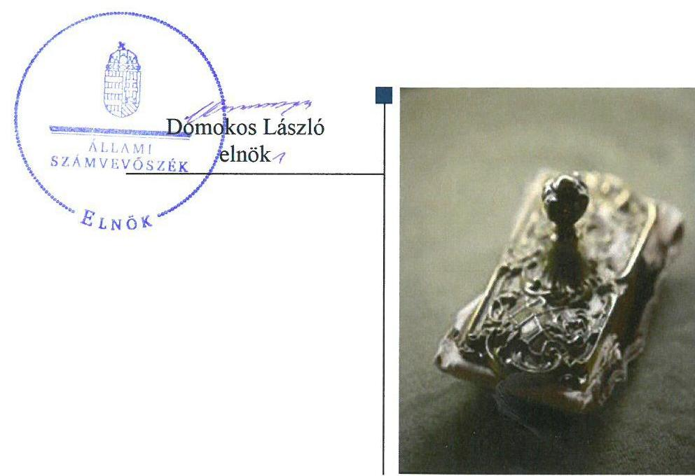
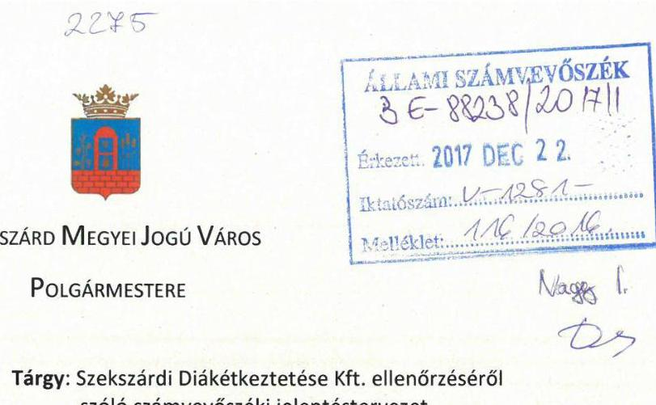
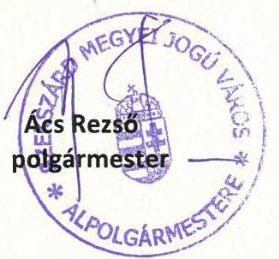
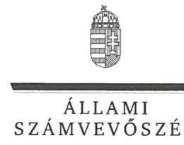
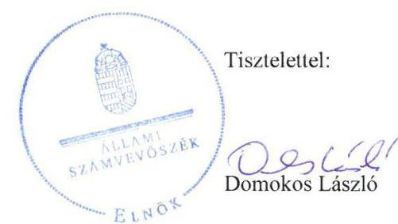
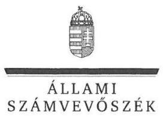

# Jelentés 

## Az önkormányzatok gazdasági társaságai

Az önkormányzatok többségi tulajdonában lévő gazdasági társaságok gazdálkodásának ellenőrzése - Szekszárdi Diákétkeztetési Kft. 2018.

---

# Jelenetés 

## Az önkormányzatok gazdasági társaságai

Az önkormányzatok többségi tulajdonában lévő gazdasági társaságok gazdálkodásának ellenőrzése - Szekszárdi Diákétkeztetési Kft.
2018. 0 H. hó 11 nap

---

# AZ ELLENŐRZÉST FELÜGYELTE:

DR. NAGY IMRE felügyeleti vezető

# AZ ELLENŐRZÉST VEZETTE ÉS A VÉGREHAJTÁSÁÉRT FELELŐS:

SALAMIN VIKTOR ellenőrzésvezető

# A PROGRAM ÖSSZEÁLLÍTÁSÁÉRT FELELŐS:

JANIK JÓZSEF osztályvezető

---

IKTATÓSZÁM: V-1281-123/2016.

TÉMASZÁM: 2167

---

Jelentéseink az Országgyűlés számítógépes hálózatán és az Interneta a www.asz.hu címen is olvashatóak.

---

ELLENŐRZÉS-AZONOSÍTÓ SZÁM: V075806

---

# TARTALOMJEGYZÉK 

■ ÖSSZEGZÉS ..... 5
■ AZ ELLENŐRZÉS CÉLJA ..... 6
■ AZ ELLENŐRZÉS TERÜLETE ..... 7
■ AZ ELLENŐRZÉS HÁTTERE, INDOKOLTSÁGA ..... 8
■ A JELENTÉS LÉNYEGES KÉRDÉSKÖREI ..... 9
■ ELLENŐRZÉS HATÓKÖRE ÉS MÓDSZEREI ..... 10
■ MEGÁLLAPÍTÁSOK ..... 12
■ JAVASLATOK ..... 17
■ MELLÉKLETEK ..... 19
I. sz. melléklet: Értelmező szótár ..... 19
II. sz. melléklet: A Társaság 2012-2015. évi főbb mérleg adatai (M Ft) ..... 20
■ FÜGGELÉK: ÉSZREVÉTELEK ..... 21
■ RÖVIDÍTÉSEK JEGYZÉKE ..... 27

---

.

---

# ÖSSZEGZÉS 

Szekszárd Megyei Jogú Város Önkormányzata a tulajdonosi joggyakorlás kereteit megfelelően kialakította, tulajdonosi jogait azonban nem gyakorolta szabályszerűen. A 2014. évben a Kormány engedélye nélkül vállalt készfizető kezességet. A Társaság vagyongazdálkodása a leltározás hiányosságai miatt nem volt szabályszerű. A bevételek és a ráfordítások elszámolása megfelelő volt, az értékcsökkenés elszámolása azonban nem volt megfelelő. A Társaság beszámolási kötelezettségének eleget tett, közérdekü adatait azonban nem tette közzé, ezzel nem tett eleget az átláthatóság követelményének.

## Az ellenőrzés társadalmi indokoltsága

Magyarországon az intézmény-centrikus közfeladat-ellátás jellemző, de egyre jelentősebb a költségvetésen kívüli feladatellátás térnyerése. Helyi szinten ennek legfontosabb szereplői az önkormányzati tulajdonú gazdasági társaságok, amelyeknek ellenőrzése kiemelten fontos a közfeladat ellátása és a közvagyon megőrzése, megóvása érdekében. Ezért alapvető követelmény, hogy gazdálkodásuk, múködésük szabályszerű és átlátható legyen.

Szekszárdon a 2012-2015. években a Szekszárdi Diákétkeztetési Kft. végezte az önkormányzati fenntartású intézmények által ellátottak, valamint ezen intézmények dolgozói közétkeztetését, illetve rendezvényi étkeztetést, diákés turistacsoportok étkeztetését, valamint gyermektáboroztatási tevékenységet végzett. A Társaság feladatellátása a lakosság széles rétegét érintette. Az Állami Számvevőszék az ellenőrzése során arra kereste a választ, hogy 20122015. között szabályszerű volt-e a Társaság gazdálkodása és az Önkormányzat ehhez kapcsolódó tulajdonosi joggyakorlása. Meggyőződésünk, hogy az ellenőrzés rendet, a rend értéket teremt. Ezért bízunk abban, hogy a jelentésben foglalt megállapítások és az ezek alapján megfogalmazott számvevőszéki javaslatok hasznosítása elősegíti a feltárt hiányosságok orvoslását.

## Főbb megállapítások, következtetések

Az Önkormányzat a Társaság feletti tulajdonosi joggyakorlásának kereteit a jogszabályoknak megfelelően kialakította, rendeletalkotási kötelezettségét teljesítette. A tulajdonosi jogok gyakorlása nem volt szabályszerű. A Társaság kötelezően előírt jegyzett tőkéjének megfelelő összegű saját tőke biztosításáról az Önkormányzat nem gondoskodott határidőben, kezességvállalásához a Kormány előzetes hozzájárulását az előírások ellenére nem kérte meg. A felügyelőbizottság a felügyeleti tevékenység kereteit biztosító, jogszabályban foglalt ügyrenddel nem rendelkezett.

A Társaság az előírt szabályzatokkal rendelkezett, azonban azok aktualizálása, karbantartása a jogszabályi előírások ellenére nem történt meg. A Társaság vagyongazdálkodása nem volt szabályszerű, mert a Társaság a jogszabályi és a belső előírásnak megfelelő, mennyiségi felvétellel történő leltározást a tárgyi eszközök esetében nem végzett, ezért egyes mérlegtételek tartalmának valódisága nem volt biztosított. A Társaság folyamatos fizetőképessége nem volt biztosított, rövidlejáratú kötelezettségei között jelentős volt a lejárt határidejű szállítói tartozás.

Az éves beszámolókat a Társaság elkészítette, majd azokat határidőben letétbe helyezte és közzétette. A Társaság - az éves beszámolókon kívül - a jogszabályban előírt közérdekű adatok és közérdekből nyilvános adatok megismerését nem biztosította, ezzel nem tett eleget az átláthatóság követelményének.

A Társaság bevételeinek és ráfordításainak, beruházásainak elszámolása megfelelő volt, az értékcsökkenés elszámolása azonban nem volt megfelelő. Az önköltségszámítás és az árképzés szabályszerű volt.

---

# AZ ELLENŐRZÉS CÉLJA 

AZ ELLENŐRZÉS CÉLJA annak értékelése volt, hogy az önkormányzat vagyongazdálkodási tevékenysége során szabályszerűen gyakorolta-e a tulajdonosi jogait; a gazdasági társaság szabályozottsága, gazdálkodása és vagyongazdálkodási tevékenysége, bevételeinek és ráfordításainak elszámolása megfelelt-e a jogszabályi és tulajdonosi előírásoknak; a gazdasági társaság fizetőképessége biztosított volt-e a gazdálkodás során, valamint a gazdálkodás átláthatósága és elszámoltathatósága érdekében biztosítva volt-e a szolgáltatás dijának megalapozottsága szabályszerű önköltségszámítással.

---

# AZ ELLENŐRZÉS TERÜLETE 

## Szekszárd Megyei Jogú Város Önkormányzata és a kizárólagos tulajdonában lévő Szekszárdi Diákétkeztetési Kft.

SZEKSZÁRD MEGYEI JOGÚ VÁROS ÖNKORMÁNYZATA a Szekszárdi Diákétkeztetési Kft.-t 2007. június 29-én alapította. A 2012-2015. években a Társaság kizárólagos tulajdonosa az Önkormányzat ${ }^{1}$ volt. Az Önkormányzat 2015. december 31-én a Társaságon kívül kilenc gazdasági társaságban rendelkezett többségi tulajdonnal.

## A SZEKSZÁRDI DIÁKÉTKEZTETÉSI KFT.

az önkormányzati fenntartású intézmények által ellátottak, valamint ezen intézmények dolgozói közétkeztetését ellátó alaptevékenysége mellett rendezvényi étkeztetést, diák- és turistacsoportok étkeztetését, gyermektáborozási tevékenységet látott el. Az iskolai hónapokban naponta több mint 4000 fő étkeztetéséről gondoskodott, továbbá a külső vendéglátási tevékenység keretében évi 500000 adag ételt készített.

A TÁRSASÁG JEGYZETT TÖKÉJE az alapításkor 3,0 M Ft, 2012. és 2015. december 31-én 58,7 M Ft volt. A mérlegfőösszeg a 2012. év végi 606,0 M Ft-ról a 2015. év végére 509,5 M Ft-ra csökkent, a mérleg szerinti eredmény 43,2 M Ft veszteségről 47,9 M Ft nyereségre, az értékesítés nettó árbevétele 506,7 M Ft-ról 559,5 M Ft-ra nőtt. A Társaság vagyon helyzetét bemutató főbb mérlegadatokat a II. számú melléklet szemlélteti.

A polgármester személye 2014. november 20-án változott. A jegyző személye kétszer változott, 2014. november 1-jén, illetve 2015. május 1jén. A Társaság alapításától kezdődően az ügyvezető és a könyvvizsgáló személye nem változott.

---

# AZ ELLENŐRZÉS HÁTTERE, INDOKOLTSÁGA 

AZ ÖNKORMÁNYZATOK TÖBBSÉGI TULAJDONÁBAN ÁLLÓ GAZDASÁGI TÁRSASÁGOK ellenőrzése kiemelten fontos a vagyon megőrzése, megóvása érdekében, amelyekkel szemben alapvető követelmény, hogy gazdálkodásuk, múködésük szabályszerű, az általuk szolgáltatott adatok minél megbízhatóbbak legyenek. A feladatellátás költségeinek, ráfordításainak alakulása a lakosság széles rétegét érinti. Ellenőrzéseink feltárhatják, hogy az önkormányzat a feladatellátásához rendelt vagyon múködtetését a tulajdonostól elvárható gondossággal végezte-e, a feladatot ellátó gazdasági társaság a létesítő okiratban, szolgáltatási szerződésben foglaltak betartásával biztosította-e a feladat ellátását. Az ellenőrzés rávilágíthat arra, hogy a gazdasági társaság a vagyon használatával biztosította-e a szolgáltatás folytatásának feltételeit, az önkormányzat tulajdonosi felügyelete hozzájárult-e a szabályszerű gazdálkodáshoz és feladatellátáshoz. A megállapítások alapján megfogalmazott számvevőszéki javaslatok hasznosítása elősegítheti a meglévő hibák megszüntetését. A jó gyakorlatok bemutatásával az ÁSZ hozzájárulhat a követendő megoldások megismertetéséhez, terjesztéséhez.

---

# A JELENTÉS LÉNYEGES KÉRDÉSKÖREI 

1. Az Önkormányzat tulajdonosi joggyakorlása szabályszerű volt-e?
2. A Társaság vagyongazdálkodása szabályszerű volt-e, fizetőképessége biztositott volt-e a gazdálkodás során?
3. A Társaság bevételeinek és ráfordításainak elszámolása, valamint az önköltségszámitás és árképzés szabályszerű volt-e?

---

# ELLENŐRZÉS HATÓKÖRE ÉS MÓDSZEREI 

## Az ellenőrzés típusa

Megfelelőségi ellenőrzés.

## Az ellenőrzött időszak

Az ellenőrzött időszak 2012. január 1-jétől 2015. december 31-éig tartott.

## Az ellenőrzés tárgya

Szekszárd Megyei Jogú Város Önkormányzata - többségi tulajdonában lévő Szekszárdi Diákétkeztetési Kft. feletti - tulajdonosi joggyakorlása, valamint a Szekszárdi Diákétkeztetési Kft. gazdálkodásának szabályozottsága és szabályszerűsége.

Az ellenőrzés kiterjedt minden olyan körülményre és adatra, amely az ÁSZ jogszabályban meghatározott feladatainak teljesítéséhez, valamint a program végrehajtása folyamán felmerült újabb összefüggések feltárásához szükséges volt.

## Az ellenőrzött szervezet

Szekszárd Megyei Jogú Város Önkormányzata és a kizárólagos tulajdonában lévő Szekszárdi Diákétkeztetési Kft.

## Az ellenőrzés jogalapja

Az ellenőrzés jogszabályi alapját az ÁSZ tv. 1. § (3) bekezdése és 5. § (3)(4)-(5) bekezdései képezték.

## Az ellenőrzés módszerei

Az ellenőrzést a nemzetközi standardokat irányadónak tekintve az ellenőrzési program ellenőrzési kérdései, az ellenőrzött időszakban hatályos jogszabályok, az ellenőrzés szakmai szabályok és módszertanok figyelembe vételével végeztük.

Az ellenőrzés ideje alatt az ellenőrzött szervezettel történő kapcsolattartást az ÁSZ Szervezeti és Múködési Szabályzatának vonatkozó előírásai alapján biztosítottuk.

---

Az ellenőrzési kérdések megválaszolásához szükséges bizonyítékok megszerzése a következő ellenőrzési eljárások alkalmazásával történt: megfigyelés, kérdésfeltevés (információkérés), összehasonlítás, valamint elemző eljárás. Az ellenőrzési bizonyítékként felhasználható adatforrások közé tartoztak egyrészt az ellenőrzési programban felsorolt adatforrások, másrészt adatforrás lehetett még minden - az ellenőrzés folyamán - feltárt, az ellenőrzés szempontjából információkat tartalmazó dokumentum. Az ellenőrzést a kérdésekre adott válaszok kiértékelésével, valamint a megjelölt adatforrások, a csatolt tanúsítványok felhasználásával, továbbá az adott időszakban hatályos jogszabályok figyelembe vételével folytattuk le.

A bevételek és ráfordítások elszámolását, és a vagyonnyilvántartás terén a szabályszerű működést véletlen mintavétellel ellenőriztük. A mintavétellel ellenőrzött területek esetében minden egyes tétel vonatkozásában szabályszerűségre vonatkozó kérdéseket tettünk fel, amelyek a számviteli törvény, illetve a tulajdonosi követelményeknek és az ellenőrzött szervezet belső szabályozásai előírásainak betartására vonatkoztak. A jogszabályoknak és a belső előírásoknak megfelelőnek tekintettük az adott területet, amennyiben a minta ellenőrzésének eredménye alapján 95\%-os bizonyossággal a teljes sokaságban a hibaarány kisebb volt, mint 10\%, nem megfelelőnek értékeltük, ha a hibaarány a 10\%-ot meghaladta. A ráfordítások elszámolására és a vagyonnyilvántartásra vonatkozó véletlen mintavételt kockázati alapú kiválasztással egészítettük ki, amelynek során évente a három legnagyobb összegű tételt választottuk ki.

---

# 1. Az Önkormányzat tulajdonosi joggyakorlása szabályszerű volt-e? 

Összegző megállapítás

Az Önkormányzat a tulajdonosi jogok gyakorlásának kereteit megfelelően kialakította, a tulajdonosi jogok gyakorlása azonban nem volt szabályszerű.
1.1. számú megállapítás

Az Önkormányzat a tulajdonosi jogai gyakorlásának kereteit szabályszerűen alakította ki.

## A TULAJDONOSI JOGOK GYAKORLÁSÁNAK

RENDJÉT az Önkormányzat - a Gt. ${ }^{2}$ és a Ptk. ${ }^{3}$ előírásaival összhangban - az SZMSZ ${ }_{1,2}{ }^{4}$-ben, a Vagyonrendeletben ${ }^{5}$, valamint a Társaság ${ }^{6}$ Alapító okiratában ${ }^{7}$ alakította ki. Az SZMSZ ${ }_{1}$ 27. § (2) bekezdés e) pontjában, illetve az SZMSZ ${ }_{2}$ 28. §-ában rögzítette, hogy a tulajdonosi jogokat kizárólag a Közgyűlés gyakorolhatja. A Vagyonrendeletben az SZMSZ ${ }_{1,2}$-szel összhangban határozta meg a joggyakorlás rendjét.

A Társaság elsősorban az Önkormányzattal kötött Feladat ellátási Szerződés ${ }^{8}$ alapján végezte tevékenységét. A feladat ellátáshoz kapcsolódóan az Önkormányzat megalkotta a térítési díjról ${ }^{9}$, továbbá a munkahelyi étkeztetésről ${ }^{10}$ szóló rendeleteket a Gyvt. ${ }^{11}$ 29. § (1) bekezdésében foglaltaknak megfelelően.

A Taktv. ${ }^{12}$ 5. § (3) bekezdésben előírtaknak megfelelően a Közgyűlés megalkotta a javadalmazási szabályzatot ${ }^{13}$.
1.2. számú megállapítás

A tulajdonosi jogok gyakorlása nem volt szabályszerű.
A TULAJDONOSI JOGOKAT a Társaságnál az SZMSZ ${ }_{1,2}$ és a Vagyonrendelet előírásának megfelelően a Közgyűlés gyakorolta. Ennek keretében határozattal döntött - többek között - az Alapító okirat módosításáról, az éves mérlegbeszámolók elfogadásáról, az üzleti tervek jóváhagyásáról, a könyvvizsgáló és az $\mathrm{FB}^{14}$ tagok megválasztásáról, a pótbefizetésről, a kezességvállalásról.

AZ FB-t a Gt., a Ptk. és a Taktv. előírásainak megfelelően létrehozták. Az FB a számviteli beszámolókról, üzleti tervek elfogadásáról és a 2013-2015. évi eredmény felhasználásáról határozatban döntött.

Az FB a Gt. 34. § (4) bekezdésében, a Ptk. 3:122 § (3) bekezdésében, illetve az Alapító okirat X. 1.) pontjában foglaltak ellenére ügyrendet nem készített.

Az FB a javadalmazási szabályzat 4. § (6) bekezdésében foglaltak ellenére a szabályzat rendelkezéseinek érvényesülését a 2012-2015. években nem értékelte, az éves beszámolóval egyidejűleg arról nem számolt be a Közgyűlésnek.

---

1. táblázat

## A SAJÁT TŐKE, JEGYZETT TŐKE ÉS A MÉRLEG SZERINTI EREDMÉNY ALAKULÁSA (M FT)

| És | Saját tőke | Jegyzett
tőke | Mérése
szerinti
eredésére  |
| --- | --- | --- | --- |
|  2012. | -115,4 | 58,7 | -43,2  |
|  2013. | 298,8 | 58,7 | 3,8  |
|  2014. | 75,9 | 58,7 | 15,5  |
|  2015. | 123,8 | 58,7 | 47,9  |

Fonrás: A Társaság 2012-2015. évi éves beszámolói

A KÖNYVVIZSGÁLÓ a Társaság 2012-2015. évi éves beszámolóit hitelesítő záradékkal látta el, a 2012. évi éves beszámolóra vonatkozó jelentésében figyelemfelhívással élt a negatív saját tőke megszüntetésére. Továbbá 2013. november 6-án vezetői levélben hívta fel a Közgyűlés figyelmét intézkedésre, mivel a Társaság saját tőkéje a Gt. 143. § (2) bekezdés a) pontjában foglaltak szerint veszteség folytán a törzstőke felére csökkent. A Társaság saját tőkéje, jegyzett tőkéje és mérleg szerinti eredménye alakulását az 1. táblázat szemlélteti.

A 2012. évi éves beszámoló elfogadását (2013. május 30.) követő három hónapon belül a Közgyűlés a Gt. 51. § (1) bekezdésében és az FB határozatában foglaltak, valamint a könyvvizsgáló figyelemfelhívása ellenére nem intézkedett a Társaság kötelezően előírt jegyzett tőkéjének megfelelő összegű saját tőke biztosításáról.

A Közgyűlés 2013. december 9-én döntött arról, hogy átvállalja a Társaság 418,5 M Ft összegű - ellenőrzött időszak előtt keletkezett - hosszú lejáratú hitelének visszafizetését. A Társaságnak így az Önkormányzat felé az átvállalt hitellel egyező összegű kötelezettsége keletkezett. Az Önkormányzat a pénzintézet felé 2013. december 30-án utalta át a 418,5 M Ft-ot. Az eredeti hitelfelvétel mögött önkormányzati kezességvállalás állt.

A Közgyűlés a Társaság - előző évekkel összefüggő - negatív saját tőkéjének rendezéséről a 2013. évi éves beszámolót elfogadó (2014. május 15.) határozatában rendelkezett. A Közgyűlés a Társaság Önkormányzat felé fennálló 418,5 M Ft összegű kötelezettségéből 180,0 M Ft-ot a lekötött tartalékba (a veszteség rendezésére), míg a fennmaradó 238,5 M Ft-ot a hátrasorolt kötelezettségek közé rendelt sorolni.

A 238,5 M Ft hátrasorolt kötelezettségre a Számv. tv. ${ }^{15}$ 42. § (4) bekezdésében előírt tartalmú szerződést az Önkormányzat nem kötötte meg a Társasággal. 2014. december 23-án a Közgyűlés a hátrasorolt kötelezettség 224,5 M Ft-tal történő csökkentésére hozott határozatot, amelynek során figyelmen kívül hagyta a Számv. tv. 42. § (4) pontjának előírását, mely szerint a hátrasorolt kötelezettség futamideje legalább öt évet meghaladó kell, hogy legyen és lejárat előtt kiegyenlítése nem lehetséges.

KEZESSÉGVÁLLALÓ OKIRAT aláírására hatalmazta fel a Közgyűlés a polgármestert 2014. december 23-án a Társaság 224,5 M Ft öszszegű hitelfelvételéhez való hozzájárulással egyidejűleg.

Az Önkormányzat által 2014. december 30-án aláírt, a Társaság 224,5 M Ft összegű kölcsönszerződésének biztosítékát képező készfizető kezességi megállapodás nem felelt meg a Stabilitási tv. 10. § (1) bekezdésben foglalt előírásnak, mert ahhoz a Kormány hozzájárulását nem kérték. A hitelből a Társaság 180,2 M Ft-ot vett igénybe, amelyet közgyűlési határozat alapján, mint készfizető kezes 2015. április 14-én az Önkormányzat fizetett vissza a pénzintézet felé. A Ptk. 6:383. §-ában előírt kölcsönszerződés megkötésére az ügylet kapcsán nem került sor.

BELSŐ ELLENŐRZÉST az Önkormányzat nem végzett a Társaságnál, nem élt az Ötv. ${ }^{16}$ 92. § (11) bekezdés b) pontjában, valamint az Áht. ${ }^{17}$ 70. § (1) bekezdés d) pontjában foglalt lehetőséggel. A Közgyűlés az FB javaslatának birtokában a 2014. december 18-ai határozatában elrendelte a Társaság teljes körű átvilágítását, külső szakértő bevonásával. A külső szakértő által megfogalmazott javaslatot a Közgyűlés megtárgyalta és

---

hasznosította, ennek eredményeképpen 2015. október 10-én kiírta a szolgáltatás kiszervezésére vonatkozó közbeszerzést.

# 2. A Társaság vagyongazdálkodása szabályszerű volt-e, fizetőképessége biztosított volt-e a gazdálkodás során? 

Összegző megállapítás

A Társaság vagyongazdálkodása a leltározás hiányosságai miatt nem volt szabályszerű. A Társaság fizetőképessége a 20122015. években nem volt biztosított. Beszámolási kötelezettségét teljesítette, a közérdekú adatok közzétételi kötelezettségének azonban nem tett eleget.
2.1. számú megállapítás

A Társaság az előírt szabályzatokkal rendelkezett, azonban azok aktualizálásáról, karbantartásáról a jogszabályi előírások ellenére nem gondoskodott.

A Társaság a Számv. tv. 14. § (3) bekezdésének megfelelően kialakította számviteli politikáját ${ }^{18}$, valamint a 14. § (5) bekezdés a-d) pontjaiban foglaltaknak megfelelően elkészítette az eszközök és források leltárkésztési és leltározási ${ }^{19}$, az értékelési ${ }^{20}$, az önköltség-számítási ${ }^{21}$ és a pénzkezelési ${ }^{22}$ szabályzatokat. A Számv. tv. 161. § (1) bekezdése előírásának megfelelő számlarend és bizonylati rend a számviteli politika részét képezte.

A SZÁMVITELI POLITIKÁT - a Számv. tv. 14. § (11) bekezdésében foglaltak ellenére - a Társaság nem aktualizálta. Nem vezette át a 2013. január 1-jétől hatályos változásokat, melyek a jelentős összegű hiba és a megbízható, valós képet lényegesen befolyásoló hiba fogalmi meghatározását (Számv. tv. 3. § (3) bekezdés 3. és 5. pontok), az ismételt közzétételi kötelezettséget (Számv. tv. 154. § (5) bekezdés), a kivételes nagyságú vagy előfordulású bevétel, költség, ráfordítás meghatározását (Számv. tv. 14. § (4) bekezdés), valamint a rendkívüli bevételeket és ráfordításokat (Számv. tv. 86. §) érintették.

A SZÁMLAREND folyamatos karbantartásáról a Számv. tv. 161. § (4) bekezdésének előírása ellenére a Társaság nem gondoskodott. Nem vezette át a 2013. január 1-jétől hatályos változásokat, melyek a passzív időbeli elhatárolások között a mérleg fordulónapja és elkészítésének időpontja között a vállalkozóval szemben érvényesített, benyújtott, ismertté vált, a mérleggel lezárt üzleti évhez kapcsolódó késedelmi kamat meghatározását (Számv. tv. 44. § (1) bekezdés c) pontja), valamint a rendkívüli bevételeket és ráfordításokat (Számv. tv. 86. §) érintették.

A Társaság vagyongazdálkodása nem volt szabályszerű, mert az éves beszámolók mérlegét szabályszerű leltárral nem támasztotta alá.

A VAGYON nyilvántartása a jogszabályi és a belső szabályozás előírásainak megfelelt, a változásokat az analitikus és a főkönyvi nyilvántartási rendszerben rögzítették.

---

A Társaság leltárkészítési és leltározási szabályzatának 5.1. pontja a tárgyi eszközök évenkénti, mennyiségi felvétellel történő leltározását írta elő, melynek a Társaság a 2012, 2013. és 2015. években nem, a 2014. évben hiányosan tett eleget, ezzel megsértette a Számv. tv. 69. § (3) bekezdésében foglalt előírásokat. 2014. évben a Társaság mennyiségi felvétellel történő leltározási kötelezettségének a tárgyi eszközök között csak a konyhai berendezések esetében tett eleget. 2012-2015. években a leltározás hiányosságai miatt a Társaság beszámolóinak megalapozottsága nem volt biztosított. A könyvvizsgáló a hiányosságok ellenére a 2012-2015. évi beszámolókat korlátozás nélküli hitelesítő záradékkal látta el.

A mérlegfőösszeg 2012. december 31. és 2015. december 31. között 15,9\%-kal (96,5 M Ft-tal) csökkent. Az eszközökön belül a tárgyi eszközök állományának csökkenése volt a meghatározó. Oka, hogy az értékcsökkenésnek megfelelő eszközpótlás nem történt meg - az elszámolt értékcsökkenés 142,0 M Ft, míg a beruházások értéke 21,4 M Ft volt -, továbbá a szolgáltatást igénybevevők fizetési fegyelme javult. A forrásokon belül a saját tőke 58,6\%-kal (175,0 M Ft-tal) csökkent, de a tulajdonosi intézkedések hatására a 2014-2015. években meghaladta a jegyzett tőke összegét.
2.3. számú megállapítás

A Társaság folyamatos fizetőképessége a 2012-2015. évek között nem volt biztosított.

# A TÁRSASÁG KÖTELEZETTSÉGEINEK ÁLLOMÁ- 

NYA a 2015. évre a 2012. évhez képest 46,3\%-kal (329,0 M Ft-tal) csökkent. A hosszúlejáratú kötelezettségek - beruházási hitel és gépjármú lízing - a 2012. év végi 423,3 M Ft állományhoz képest 2015-re 0,1 M Ft-ra, a rövidlejáratú kötelezettségek 287,5 M Ft-ról 201,5 M Ft-ra csökkentek. A hátrasorolt - Önkormányzat felé fennálló - kötelezettségek azonban a 2012. évi nulla állományról 2015. év végére 180,2 M Ft-ra nőttek.

A Társaság folyamatos fizetőképessége nem volt biztosított. Lejárt határidejú hosszú lejáratú kötelezettsége a Társaságnak 2012-2015. évek mérleg-fordulónapjain nem volt, rövid lejáratú kötelezettségein belül azonban jelentős volt a határidőn túli szállítói kötelezettségek aránya (2012. december 31-én 73\%, 2015. december 31-én 68\%). A rövidlejáratú kötelezettségek nem, illetve késedelmes teljesítése miatt több szállító indított végrehajtási, felszámolási eljárást a Társaság ellen, amelyek a tartozások megfizetésével, egyezséggel, végrehajtói letiltással rendeződtek. A Társaság a központi költségvetéssel szembeni adó- és járulékkötelezettségeket évről évre a NAV ${ }^{23}$ fizetési halasztási vagy részletfizetési engedélyével tudta teljesíteni.

## 2.4. számú megállapítás

A Társaság beszámolási kötelezettségét teljesítette, közzétételi kötelezettségének azonban nem tett eleget.

AZ ÉVES BESZÁMOLÓKAT a Társaság a Számv. tv. és belső szabályzataiban foglaltaknak megfelelően elkészítette, majd azokat határidőben letétbe helyezte és közzétette a Számv. tv. 153. § (1) bekezdésével, illetve a Számv. tv. 154. § (1) bekezdésével összhangban.

A Társaság az Infotv. ${ }^{24}$ 26. § (1) bekezdésében előírt közérdekú adatok és a közérdekből nyilvános adatok megismerését 2015. december 31-éig nem biztosította, mivel az Infotv. 37. § (1) bekezdésének előírása ellenére

---

honlapján nem tette közzé az Infotv. 1. mellékletében meghatározott adatokat.

# 3. A Társaság bevételeinek és ráfordításainak elszámolása, valamint az önköltségszámítás és árképzés szabályszerű volt-e? 

Összegző megállapítás

A bevételek és ráfordítások elszámolása, a vagyon nyilvántartása megfelelő volt, az értékcsökkenés elszámolása azonban nem volt megfelelő. Az önköltségszámítást és árképzést a Társaság szabályszerűen végezte.

Az értékesítés nettó árbevételének, a pénzügyi műveletek bevételének, az anyagjellegű ráfordítások, a személyi jellegű ráfordítások, továbbá a beruházások, felújítások elszámolása megfelelő volt.

AZ ÉRTÉKCSÖKKENÉS ELSZÁMOLÁSA nem volt megfelelő. A Társaság a számviteli politika 7.2. pontjában foglaltak ellenére nem negyedéves, hanem éves gyakorisággal számolta el az amortizációt, továbbá előfordult, hogy a kis értékű tárgyi eszköz beszerzési értékét a használatbavételkor értékcsökkenési leírásként egy összegben nem számolta el, illetve nem a meghatározott leírási kulcsot alkalmazta.

A KÖVETELÉSÁLLOMÁNYBAN bekövetkezett változásokat a Társaság az éves beszámolók kiegészítő mellékletében a Számv. tv. előírásának megfelelően bemutatta. A követelésekre értékvesztést számolt el, a számviteli politika 7.2 pontjában foglaltak, valamint a Számv. tv. 55. § (1)(2) bekezdései szerint. A követelésállomány 2012-ről 2015-re 33,2 M Ft-ról 42,5 M Ft-ra, a határidőn túli vevőkövetelések értéke 6,1 M Ft-ról 7,4 M Ftra nőtt. A Társaság a követelések csökkentése érdekében intézkedett, a határidőn túli követelésekre fizetési felszólításokat küldött.

A térítési díjat megalapozó önköltség-számítás gyakorlata megfelelt a belső szabályzatban és a térítési díjról szóló rendelet 1. mellékletében foglaltaknak. Az egyéb tevékenység során a Társaság üzleti szintű árképzéssel élt (térítési díra vetített árrés alkalmazásával). A díjmegállapítás szabályszerű volt.

---

# JAVASLATOK 

Az ÁSZ tv. 33. § (1) bekezdésében foglaltak értelmében az ellenőrzött szervezet vezetője köteles a jelentésben foglalt megállapításokhoz kapcsolódó intézkedési tervet összeállítani és azt a jelentés kézhezvételétől számított 30 napon belül az ÁSZ részére megküldeni. Amennyiben az ellenőrzött szervezet vezetője nem küldi meg határidőben az intézkedési tervet, vagy továbbra sem elfogadható intézkedési tervet küld, az Állami Számvevőszék elnöke az ÁSZ tv. 33. § (3) bekezdése a) és b) pontjaiban foglaltakat érvényesítheti.

## Szekszárdi Diákétkeztetési Kft. ügyvezetőjének

1. Intézkedjen a számviteli politika hatályos jogszabályi rendelkezések szerinti aktualizálásáról.
(2.1. sz. megállapítás 2. bekezdése alapján)
2. Intézkedjen a számlarend jogszabályi rendelkezés szerinti folyamatos karbantartásáról.
(2.1. sz. megállapítás 3. bekezdése alapján)
3. Intézkedjen a belső szabályozásnak és a jogszabályban foglaltaknak megfelelő leltározás elvégzéséről.
(2.2. sz. megállapítás 2. bekezdése alapján)
4. Gondoskodjon a közzétételi kötelezettségek jogszabályi előírásnak megfelelő teljesítéséről.
(2.4. sz. megállapítás 2. bekezdése alapján)
5. Intézkedjen az értékcsökkenés elszámolása tekintetében a belső szabályzatban elöírtak betartásáról.
(3. sz. megállapítás 2. bekezdése alapján)

---

# Szekszárd Megyei Jogú Város Önkormányzata polgármesterének 

1. Kezdeményezze a Felügyelőbizottságnál az ügyrend elkészitését.
(1.2. sz. megállapítás 3. bekezdése alapján)
2. Kezdeményezze a Felügyelőbizottságnál, hogy a javadalmazási szabályzatban elöirt értékelési és beszámolási kötelezettségének a Felügyelőbizottság eleget tegyen.
(1.2. sz. megállapítás 4. bekezdése alapján)

---

# MELLÉKLETEK 

- I. SZ. MELLÉKLET: ÉRTELMEZŐ SZÓTÁR
garancia
gazdasági társaság
kezesség
közérdekú adatok
közfeladat
közszolgáltatás
tulajdonosi joggyakorló

A garancia olyan önálló, az önkormányzat nevében vállalt kötelezettség, amely alapján az önkormányzat az önkormányzati költségvetés terhére szerződésben meghatározott feltételek szerint, a kötelezett nem teljesítése esetén a jogosultnak fizetést teljesít az előzetesen rögzített összeghatárig.
Ptk. 3.88. § (1) bekezdése szerint „a gazdasági társaságok üzletszerú közös gazdasági tevékenység folytatására, a tagok vagyoni hozzájárulásával létrehozott, jogi személyiséggel rendelkező vállalkozások, amelyekben a tagok a nyereségből közösen részesednek, és a veszteséget közösen viselik".
A kezességre vonatkozó előírásokat a Ptk. 6:416-430. §-ai tartalmazzák. Kezességi szerződéssel a kezes kötelezettséget vállal a jogosulttal szemben, hogyha a kötelezett nem teljesít, maga fog helyette a jogosultnak teljesíteni. Kezesség egy vagy több, fennálló vagy jövőbeli, feltétlen vagy feltételes, meghatározott vagy meghatározható összegű pénzkövetelés vagy pénzben kifejezhető értékkel rendelkező egyéb kötelezettség biztosítására vállalható.
A Ptk. szerint kezességet csak írásban lehet vállalni. A kezes kötelezettsége ahhoz a kötelezettséghez igazodik, amelyért kezességet vállalt. A kezes kötelezettsége nem válhat terhesebbé, mint amilyen elvállalásakor volt, kiterjed azonban a kötelezett szerződésszegésének jogkövetkezményeire és a kezesség elvállalása után esedékessé váló mellékkövetelésekre is.
közérdekú adat: az állami vagy helyi önkormányzati feladatot, valamint jogszabályban meghatározott egyéb közfeladatot ellátó szerv vagy személy kezelésében lévő és tevékenységére vonatkozó vagy közfeladatának ellátásával összefüggésben keletkezett, a személyes adat fogalma alá nem eső, bármilyen módon vagy formában rögzített információ vagy ismeret, függetlenül kezelésének módjától, önálló vagy gyűjteményes jellegétől, így különösen a hatáskörre, illetékességre, szervezeti felépítésre, szakmai tevékenységre, annak eredményességére is kiterjedő értékelésére, a birtokolt adatfajtákra és a múködést szabályozó jogszabályokra, valamint a gazdálkodásra, a megkötött szerződésekre vonatkozó adat (Info tv. 3. § 5. pont).
Jogszabályban meghatározott állami vagy önkormányzati feladat, amit az arra kötelezett közérdekből, jogszabályban meghatározott követelményeknek és feltételeknek megfelelve végez, ideértve a lakosság közszolgáltatásokkal való ellátását, továbbá az állam nemzetközi szerződésekben vállalt kötelezettségeiből adódó közérdekú feladatokat, valamint e feladatok ellátásához szükséges infrastruktúra biztosítását is (Nvtv. 3. § (1) bekezdés 7. pont, hatályos 2012. január 1-jétől 2014. december 31-ig).
A közszolgáltatás: „közcélú, illetőleg közérdekú szolgáltatást jelent, amely egy nagyobb közösség (állam, település) minden tagjára nézve megközelítőleg azonos feltételek mellett vehető igénybe, ezért valamilyen mértékig közösségi megszervezést, illetve szabályozást, ellenőrzést igényel." Az Ebktv. ${ }^{25}$ 3. § d) pontja a következőképpen határozza meg a közszolgáltatást: „szerződéskötési kötelezettség alapján a lakosság alapvető szükségleteinek ellátására irányuló szolgáltatás, így különösen a villamos energia-, gáz-, hő-, víz-, szennyvíz- és hulladékkezelési, köztisztasági, postai és távközlési szolgáltatás, továbbá a menetrend alapján közlekedő járművekkel végzett közforgalmú személyszállítás".
Aki a nemzeti vagyon felett az államot vagy a helyi önkormányzatot megillető tulajdonosi jogok és kötelezettségek összességének gyakorlására jogosult. (Nvtv. 3. § (1) bekezdés 17. pont)

---

II. SZ. MELLÉKLET: A TÁRSASÁG 2012-2015. ÉVI FŐBB MÉRLEG ADATAI (M FT)

|  Tétel megnevezése | 2012.12.31. | 2013.12.31. | 2014.12.31. | 2015.12.31.  |
| --- | --- | --- | --- | --- |
|  Befektetett eszközök | 559,2 | 531,9 | 507,1 | 461,8  |
|  - ebből: Tárgyi eszközök | 558,8 | 531,8 | 506,9 | 461,7  |
|  Forgóeszközök | 37,5 | 44,2 | 72,5 | 47,4  |
|  - ebből: Követelések | 3,2 | 2,8 | 3,7 | 4,7  |
|  Aktív időbeli elhatárolások | 9,3 | 0,2 | 0,3 | 0,3  |
|  ESZKÖZÖK ÖSSZESEN | 606,0 | 576,3 | 579,9 | 509,5  |
|  Saját tőke | $-115,4$ | 298,8 | 75,9 | 123,8  |
|  - ebből: Jegyzett tőke | 58,7 | 58,7 | 58,7 | 58,7  |
|  - ebből: Tőketartalék | 100,7 | 100,7 | 100,7 | 100,7  |
|  - ebből: Eredménytartalék | $-231,6$ | $-282,9$ | $-279,0$ | $-263,5$  |
|  - ebből: Lekötött tartalék | 0 | 418,5 | 180,0 | 180,0  |
|  - ebből: Mérleg szerinti eredmény | $-43,2$ | 3,8 | 15,5 | 47,9  |
|  Céltartalékok | 0 | 15,0 | 15,0 | 0  |
|  Kötelezettségek | 710,8 | 262,4 | 488,7 | 381,8  |
|  Passzív időbeli elhatárolások | 10,6 | 0,1 | 0,3 | 3,9  |
|  FORRÁSOK ÖSSZESEN | 606,0 | 576,3 | 579,9 | 509,5  |

Forrás: A Társaság 2012-2015. évi beszámolói

---

# FÜGGELÉK: ÉSZREVÉTELEK 

A jelentéstervezetet a Számvevőszék 15 napos észrevételezésre megküldte az ellenőrzött szervezetek vezetőinek az ÁSZ tv. 29. §* (1) bekezdése előírásának megfelelően.

Az ÁSZ a jelentéstervezetet észrevételezésre megküldte Szekszárd Megyei Jogú Város Önkormányzata polgármesterének és a Szekszárdi Diákétkeztetési Kft. ügyvezetőjének.
Szekszárd Megyei Jogú Város Önkormányzata polgármestere a jelentéstervezetre észrevételt tett. A függelék - mellékletek nélkül - tartalmazza a polgármester észrevételét, illetve az el nem fogadott észrevételek elutasításának indoklását.

[^0]
[^0]:    * 29. § (1) Az Állami Számvevőszék az ellenőrzési megállapításait megküldi az ellenőrzött szervezet vezetőjének vagy az általa megbízott személynek, és annak, akinek személyes felelősségét állapította meg.
    (2) Az ellenőrzött szervezet vezetője és a felelősként megjelölt személy az ellenőrzés megállapításaira tizenöt napon belül írásban észrevételt tehet.
    (3) Az Állami Számvevőszék az észrevételre a beérkezésétől számított harminc napon belül írásban válaszol. A figyelembe nem vett észrevételeket köteles a jelentésben feltüntetni, és megindokolni, hogy azokat miért nem fogadta el.

---

# Domokos László elnök részére 

Állami Számvevőszék
Budapest 4.
Pf. 54.
1364

Tisztelt Elnök Úr!

Hivatkozva a V-1281-111/2016. ikt. sz. levelére tájékoztatom, hogy „Az önkormányzatok gazdasági társaságai - Az önkormányzatok többségi tulajdonában lévő gazdasági társaságok gazdálkodásának ellenőrzése - Szekszárdi Diákétkeztetési Kft." címmel készült számvevőszéki jelentéstervezetben szereplő megállapításokkal egyet értünk, azokat elfogadjuk.

Egyúttal a jelentéstervezetben foglalt megállapításokkal kapcsolatban Szekszárd Megyei Jogú Város Önkormányzatának közgyűlése eddig megtett intézkedéseiről az alábbiakban tájékoztatom:

1. észrevétel az 1.2. sz. megállapítás 3 bekezdéséhez:
„Kezdeményezze a Felügyelőbizottságnál az ügyrend elkészítését."
Szekszárd Megyei Jogú Város Önkormányzatának közgyűlése a 2017. szeptember 29. napján tartott ülésén a 223/2017. (IX.29.) határozatában jóváhagyta a Szekszárdi Diákétkeztetési Kft. felügyelőbizottságának ügyrendjét.

Az elfogadott ügyrendet, a felügyelőbizottság tárgyban hozott határozatát, valamit az erre vonatkozó közgyűlési előterjesztést és határozatot jelen levelemhez mellékelve megküldöm.

---

„2. észrevétel az 1.2. sz. megállapítás 4. bekezdéséhez:
„Kezdeményezze a Felügyelőbizottságnál, hogy a javadalmazási szabályzatban előirt értékelési és beszámolási kötelezettségnek a Felügyelőbizottság tegyen eleget."

Szekszárd Megyei Jogú Város Önkormányzatának közgyűlése a 2017. szeptember 27. napján tartott ülésén a 197/2017. (IX.29.) határozatával jóváhagyta a Javadalmazási Szabályzatát, továbbá 253/2017. (X.26.) számon kelt határozatával módosította a szabályzat 5.§ (4) bekezdésének második mondatát.

A javadalmazási szabályzat értelmében a vezető tisztségviselő a társaság éves beszámolójához a vele szemben meghatározott teljesítménykövetelmény teljesítésére vonatkozó önértékelést köteles csatolni. A vezető tisztségviselőre vonatkozó teljesítménykövetelmény teljesítésének értékelése a felügyelőbizottság előzetes véleményének figyelembevételével a polgármester előterjesztése alapján Szekszárd Megyei Jogú Város Önkormányzata közgyűlésének hatásköre. Az értékelést a közgyűlés a Társaság éves beszámolójáról szóló döntéssel egyidejűleg végzi.

Fentiekről a Szekszárdi Diákétkeztetési Kft. ügyvezető igazgatóját a IV/A/104-8/2017. ikt. számú levelemben tájékoztattam.

Az elfogadott Javadalmazási Szabályzatot, valamint a Társaság ügyvezetőjének címzett levelemet mellékletként megküldöm.

Egyúttal köszönetemet szeretném kifejezni elnök úrnak és munkatársainak az ellenőrzés során tapasztalt konstruktív együttműködéséért.

Szekszárd, 2017. december 18.

Tisztelettel:

---

ELRÖK

Ikt. szám: V-1281-119/2016.

# Ács Rezső úr 

polgármester
Szekszárd Megyei Jogú Város Önkormányzata

## Szekszárd

## Tisztelt Polgármester Úr!

„Az önkormányzatok gazdasági társaságai - Az önkormányzatok többségi tulajdonában lévő gazdasági társaságok gazdálkodásának ellenőrzése - Szekszárdi Diákétkeztetési Kft. " címmel készített számvevőszéki jelentéstervezetre tett észrevételeit köszönettel megkaptam.
Az Állami Számvevőszék észrevételekre vonatkozó álláspontjáról a felügyeleti vezető által készített részletes tájékoztatást csatoltan megküldöm.
Tájékoztatom Polgármester urat, hogy a számvevőszéki jelentésben - az Állami Számvevőszékről szóló 2011. évi LXVI. törvény 29. § (3) bekezdése alapján - a figyelembe nem vett észrevételeket szerepeltetjük annak megindoklásával, hogy azokat miért nem fogadtuk el.

Budapest, 2018. év 01. hó 18. nap

Melléklet: Tájékoztatás az észrevételek kezeléséről

---

FELÜGYELETI VEZETŐ

# Tájékoztatás   az észrevételek kezeléséről 

„Az önkormányzatok gazdasági társaságai - Az önkormányzatok többségi tulajdonában lévő gazdasági társaságok gazdálkodásának ellenörzése - Szekszárdi Diákétkeztetési Kft. " című jelentéstervezetre 2017. december 18-án tett (az Állami Számvevőszékhez 2017. december 22-én érkezett) észrevételét áttekintettük, annak kezelésével kapcsolatban a következő tájékoztatást adom.

1. A jelentéstervezetben Szekszárd Megyei Jogú Város Önkormányzata polgármesterének címzett 1. számú javaslatra vonatkozó észrevétel:
Az észrevételben leírtak szerint Szekszárd Megyei Jogú Város Önkormányzatának közgyűlése a 2017. szeptember 29. napján tartott ülésén a 223/2017. (IX.29.) határozatában jóváhagyta a Szekszárdi Diákétkeztetési Kft. felügyelőbizottságának ügyrendjét. Az elfogadott ügyrendet, a felügyelőbizottság tárgyban hozott határozatát, valamit az erre vonatkozó közgyűlési előterjesztést és határozatot az észrevételhez mellékelve megküldték.

Az észrevétel nem megalapozott. A jelentéstervezet rögzíti, hogy az ellenőrzött időszak 2012. január 1-jétől 2015. december 31-éig tartott. Az ellenőrzött időszakot követően jóváhagyott felügyelő bizottsági ügyrend a jelentéstervezetben tett megállapítást nem befolyásolja.

Erre tekintettel az észrevétel alapján a jelentéstervezet módosítása nem indokolt.

1. A jelentéstervezetben Szekszárd Megyei Jogú Város Önkormányzata polgármesterének címzett 2. számú javaslatra vonatkozó észrevétel:

Az észrevételben leírtak szerint Szekszárd Megyei Jogú Város Önkormányzatának közgyűlése a 2017. szeptember 27. napján tartott ülésén a 197/2017. (IX.29.) határozatával jóváhagyta a Javadalmazási Szabályzatot, továbbá 253/2017. (X.26.) számon kelt határozatával módosította a szabályzat 5.§ (4) bekezdésének második mondatát. Az észrevétel szerint a javadalmazási szabályzat értelmében a vezető tisztségviselő a társaság éves beszámolójához a vele szemben meghatározott teljesítménykövetelmény teljesítésére vonatkozó önértékelést köteles csatolni. A vezető tisztségviselőre vonatkozó teljesítménykövetelmény teljesítésének értékelése a felügyelőbizottság előzetes véleményének figyelembevételével a polgármester előterjesztése alapján Szekszárd Megyei Jogú Város Önkormányzata közgyűlésének hatásköre. Az értékelést a közgyűlés a Társaság éves beszámolójáról szóló döntéssel egyidejűleg végzi. Az észrevétel szerint fentiekről Polgármester úr a Szekszárdi Diákétkeztetési Kft. ügyvezető igazgatóját a IV/A/104-8/2017. ikt. számú levelében tájékoztatta. Az elfogadott Javadalmazási Szabályzatot, valamint a Társaság ügyvezetőjének címzett levelet az észrevétel mellékletként megküldték.

---

Az észrevétel nem megalapozott. A jelentéstervezet rögzíti, hogy az ellenőrzött időszak 2012. január 1-jétől 2015. december 31-éig tartott. Az ellenőrzött időszakot követően jóváhagyott javadalmazási szabályzat, illetve az abban előírtak teljesítése a jelentéstervezetben tett megállapítást nem befolyásolja.

Erre tekintettel az észrevétel alapján a jelentéstervezet módosítása nem indokolt.
Budapest, 2014. év 01 . hó 15 . nap
Dr. Nagy Imre
felügyeleti vezető

---

# RÖVIDÍTÉSEK JEGYZÉKE 

${ }^{1}$ Önkormányzat
${ }^{2}$ Gt.
${ }^{3}$ Ptk.
${ }^{4}$ SZMSZ $_{1,2}$
${ }^{5}$ Vagyonrendelet
${ }^{6}$ Társaság
${ }^{7}$ Alapító okirat
${ }^{8}$ Feladat-ellátási Szerződés
${ }^{9}$ térítési dijról szóló rendelet
${ }^{10}$ munkahelyi étkeztetésről szóló rendelet
${ }^{11}$ Gyvt.
${ }^{12}$ Taktv.
${ }^{13}$ javadalmazási szabályzat
${ }^{14}$ F8
${ }^{15}$ Számv. tv.
${ }^{16}$ Ötv.
${ }^{17}$ Áht.
${ }^{18}$ számviteli politika
${ }^{19}$ leltárkésztési és leltározási szabályzat
${ }^{20}$ értékelési szabályzat
${ }^{21}$ önköltség-számítási szabályzat

Szekszárd Megyei Jogú Város Önkormányzata
a gazdasági társaságokról szóló 2006. évi IV. törvény (hatálytalan: 2014. március 15-étől)
a Polgári Törvénykönyvről szóló 2013. évi V. törvény (hatályos: 2014. március 15étől)

1. Szekszárd Megyei Jogú Város Közgyűlésének 10/2000. (IV. 17.) rendelete a Szervezeti és Működési Szabályzatról (hatálytalan: 2015. január 1-étől, többször módosított);
2. Szekszárd Megyei Jogú Város Közgyűlésének 27/2014. (XII. 23.) rendelete a Szervezeti és Működési Szabályzatról (hatályos: 2015. január 1-étől, többször módosított)
Szekszárdi Önkormányzat 31/2004. (XII. 1.) rendelete az önkormányzat vagyonáról és a vagyongazdálkodás szabályairól (hatályos: 2004. december 1-étől, többször módosított)
Szekszárdi Diákétkeztetési Korlátolt Felelősségű Társaság
Szekszárdi Diákétkeztetési Korlátolt Felelősségű Társaság Alapító okirata (hatályos: 2007. június 29-étől, többször módosított)
Feladat-ellátási Megbízási Szerződés (hatálya: 2010. április 15-től 2025. május 1éig)
Szekszárdi Önkormányzat 36/2001. (XII. 21.) rendelete a személyes gondoskodást nyújtó ellátások térítési dijáról
Szekszárdi Önkormányzat 35/2007. (X. 1.) rendelete az önkormányzat fenntartásában álló intézményeknél és az önkormányzat tulajdonában lévő gazdasági társaságoknál folyó munkahelyi étkeztetés megszervezéséről
a gyermekek védelméről és a gyámügyi igazgatásról szóló 1997. évi XXXI. törvény a köztulajdonban álló gazdasági társaságok takarékosabb működéséről szóló 2009. évi CXXII. törvény

4/2010. (IV. 29) polgármester szabályzata a köztulajdonban álló gazdasági társaság vezető tisztviselői, felügyelőbizottsági tagjai, valamint a Munka törvénykönyvéről szóló 1992. évi XXII. törvény 188. § (1) bekezdése vagy a 118/A. (1) bekezdése hatálya alá eső munkavállalói javadalmazása, valamint a jogviszony megszűnése esetére biztosított juttatások módjának, mértékének elveiről, annak rendszeréről (hatályos: 2010. április 29-étől)
Szekszárdi Diákétkeztetési Korlátolt Felelősségű Társaság felügyelőbizottsága
a számvitelről szóló 2000. évi C. törvény
a helyi önkormányzatokról szóló 1990. évi LXV. törvény (hatályos 2012. december 31-éig)
az államháztartásról szóló 2011. évi CXCV. törvény
Szekszárdi Diákétkeztetési Kft. Számviteli Politikája (hatályos: 2010. május 1jétől)
Szekszárdi Diákétkeztetési Kft. Leltárkésztési és leltározási szabályzata (hatályos: 2007. augusztus 1-jétől)

Szekszárdi Diákétkeztetési Kft. Értékelési szabályzata (hatályos: 2007. augusztus 1-jétől)
Szekszárdi Diákétkeztetési Kft. Önköltség-számítási szabályzata (hatályos: 2012. szeptember 1-jétől)

---

${ }^{22}$ pénzkezelési szabályzat ${ }_{1,2}$

23 NAV
${ }^{24}$ Infotv.
${ }^{25}$ Ebktv.

1. Szekszárdi Diákétkeztetési Kft. Pénzkezelési szabályzata (hatályos: 2014. március 31-éig)
2. Szekszárdi Diákétkeztetési Kft. Pénzkezelési szabályzata (hatályos: 2014. május 1-jétől)
Nemzeti Adó- és Vámhivatal
az információs önrendelkezési jogról és az információszabadságról szóló 2011. CXII. törvény
az egyenlő bánásmódról és az esélyegyenlőség előmozdításáról szóló 2003. évi CXXV. törvény

---

# ÁLLAMI SZÁMVEVŐSZÉK 

1052 Budapest, Apáczai Csere János utca 10.
Levélcím: 1364 Budapest 4. Pf. 54
Telefon: +36 14849100 Telefax: +36 14849200
www.asz.hu