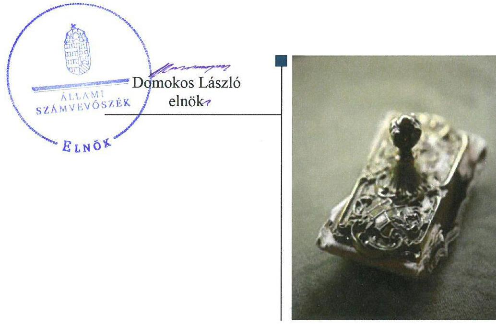
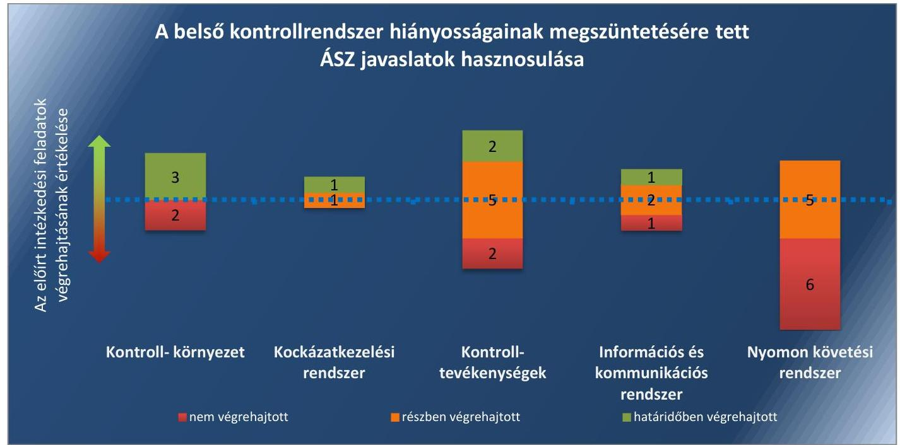
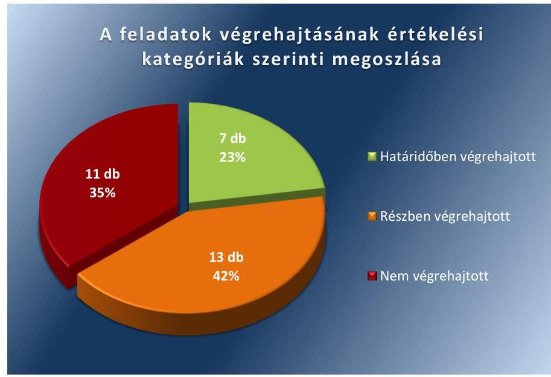
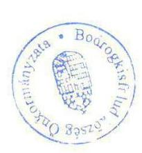
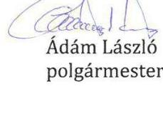
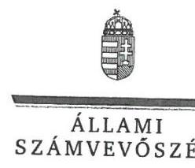
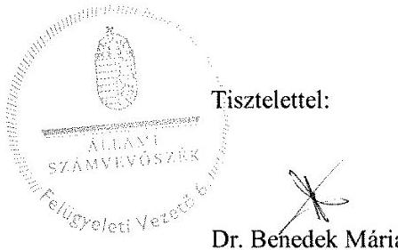

# Jelentés 

## Utóellenőrzések

Az önkormányzatok belső
kontrollrendszere kialakításának és múködtetésének utóellenőrzése Bodrogkisfalud Község Önkormányzata 2018.

---

# Jelentés 

## Utóellenőrzések

Az önkormányzatok belső
kontrollrendszere kialakításának és múködtetésének utóellenőrzése -
Bodrogkisfalud Község Önkormányzata
2018. 02 hó ol nap

---

# AZ ELLENŐRZÉST FELÜGYELTE: 

DR. BENEDEK MÁRIA felügyeleti vezető

## AZ ELLENŐRZÉST VEZETTE ÉS A VÉGREHAJTÁSÁÉRT FELELŐS:

KAKAS SÁNDOR ellenőrzésvezető

## A PROGRAM ÖSSZEÁLLÍTÁSÁÉRT FELELŐS:

JANIK JÓZSEF LÁSZLÓ osztályvezető

## A TÉMÁHOZ KAPCSOLÓDÓ KORÁBBI SZÁMVEVŐSZÉKI JELENTÉSEK:

- címe: Jelentés az önkormányzatok belső kontrollrendszere kialakításának, egyes kontrolltevékenységek és a belső ellenőrzés müködésének ellenőrzéséről - Bodrogkisfalud
- sorszáma: 14084

IKTATÓSZÁM: EL-0061-045/2018
TÉMASZÁM: 10
ELLENŐRZÉS-AZONOSÍTÓ SZÁM: V0755124

---

# TARTALOMJEGYZÉK 

■ ÖSSZEGZÉS ..... 5
■ AZ ELLENŐRZÉS CÉLJA ..... 7
■ AZ ELLENŐRZÉS TERÜLETE ..... 8
■ AZ ELLENŐRZÉS HÁTTERE, INDOKOLTSÁGA ..... 9
■ A JELENTÉS LÉNYEGES KÉRDÉSKÖRE ..... 10
■ AZ ELLENŐRZÉS HATÓKÖRE ÉS MÓDSZEREI ..... 11
■ MEGÁLLAPÍTÁSOK ..... 13
■ MELLÉKLETEK ..... 19
I. sz. melléklet: Az ÁSZ 14084 számú jelentéséhez kapcsolódó intézkedési terv végrehajtása ..... 19
■ FÜGGELÉK: ÉSZREVÉTELEK ..... 29
■ RÖVIDÍTÉSEK JEGYZÉKE ..... 45

---

.

---

# ÖSSZEGZÉS 

Az Állami Számvevőszék Bodrogkisfalud Község Önkormányzata belső kontrollrendszere kialakításának és müködtetésének utóellenőrzése során megállapította, hogy az intézkedési tervben meghatározott feladatok jelentős részét nem hajtotta végre. A gazdálkodási jogkörök gyakorlása nem volt szabályszerű, valamint a monitoring rendszer kialakítása nem történt meg, ezáltal nem volt biztositott a müködés és gazdálkodás szabályszerűsége, a felelős vezetői magatartás, továbbá az elszámoltatható, átlátható közpénzfelhasználás.

## Az ellenőrzés társadalmi indokoltsága

Az Állami Számvevőszék stratégiájában célul tűzte ki a számvevőszéki munka hasznosulásának javítását. Ezzel összhangban ellenőrzi, hogy az ellenőrzött szervezetek megvalósították-e a korábbi ellenőrzései által feltárt hibák, hiányosságok és szabálytalanságok megszüntetése céljából kialakított intézkedési terveikben foglaltakat. A rendszeres utóellenőrzések hozzájárulnak a szükséges intézkedések tényleges végrehajtásához, ezáltal a közpénzügyek rendezettségének javulásához, igazolják, hogy lezárult a következmények nélküli ellenőrzések időszaka.

## Főbb megállapítások, következtetések

Bodrogkisfalud Község Önkormányzata az intézkedést igénylő megállapításokhoz és javaslatokhoz kapcsolódóan öszszeállított intézkedési tervben meghatározott 31 feladatból hetet határidőben, 13-at részben, tizenegyet pedig nem hajtott végre.

Az jegyző gondoskodott a Vagyongazdálkodási rendelet és a Pénzkezelési szabályzat módosításáról, megalkotta a Köztisztviselői Hivatásetikai Alapelvek és az etikai eljárás szabályait tartalmazó szabályzatot, a Kockázatkezelési szabályzatot, valamint az Iratkezelési szabályzatot, aktualizálta a Gazdálkodási szabályzatot, elkészítette a közérdekú adatok megismerésére irányuló igények teljesítésének rendjét szabályozó szabályzatot.

A polgármester nem jelölte ki írásban az általa történő kötelezettségvállalások esetében a teljesítésigazolásra jogosult személyeket, valamint nem kérte számon a szabályszerűség biztosítása érdekében a folyamatba épített vezetői ellenőrzések megtörténtét.

A jegyző nem gondoskodott arról, hogy a kötelezettségvállalásokra kizárólag a pénzügyi ellenjegyzés után, a pénzügyi teljesítés esedékességét megelőzően írásban kerülhessen sor, valamint arról, hogy a pénzügyi ellenjegyzés nélküli kötelezettségvállalás esetén ne kerülhessen sor az érvényesítésre és a teljesítésre, aminek következtében a gazdálkodási jogkörök gyakorlása továbbra sem volt szabályszerű. A vezetői ellenőrzések alkalmával nem ellenőrizte külön az érvényesítés szabályszerűségét, valamint a 2016. év kivételével nem gondoskodott arról, hogy a kötelezettségvállalások nyilvántartása a hatályos jogszabályoknak megfelelően kerüljön vezetésre.

A jegyző nem alakította ki a szervezet tevékenységének, a célok megvalósításának nyomon követését biztosító rendszert és nem gondoskodott a folyamatos és eseti nyomon követéséről, valamint a belső ellenőrzés megfelelő kialakításáról és müködéséről, ami nem támogatja az átlátható és elszámoltatható közpénzfelhasználást. A jegyző nem gondoskodott a vagyonnyilatkozat-tételi kötelezettség végrehajtásáról, valamint nem határozta meg a teljesítményértékelés céljait és nem végezte el a teljesítményértékeléseket.

Bodrogkisfalud Község Önkormányzata az intézkedési tervben meghatározott feladatokról a jogszabályban előírt nyilvántartást nem vezette.

A belső kontrollrendszer javítására tett ÁSZ javaslatok hasznosulásának összefoglalását az 1. ábra mutatja be.

---

*Összegzés*

1. ábra

*Forrás: ÁSZ*

---

# AZ ELLENŐRZÉS CÉLJA 

Az ellenőrzés célja annak értékelése volt, hogy a számvevőszéki jelentésben ${ }^{1}$ foglalt intézkedést igénylő megállapításokkal és javaslatokkal összhangban készített intézkedési tervben meghatározott feladatokat az ellenőrzött szervezet végrehajtotta-e.

---

# **AZ ELLENŐRZÉS TERÜLETE**

## **Bodrogkisfalud Község Önkormányzata**

Bodrogkisfalud község Borsod-Abaúj-Zemplén megyében, a Tokaji járásban fekszik, állandó lakosainak száma a Központi Statisztikai Hivatal Magyarország közigazgatási helynévkönyve alapján 2016. január 1-jén 845 fő volt.

Az utóellenőrzés idején hivatalban lévő polgármester² a 2012. évi időközi önkormányzati választás óta tölti be tisztségét, a jegyző³ 2013. január 1-jétől látja el közszolgálati feladatait. Bodrogkisfaludon 2013. március 1-jétől Közös Hivatal⁴ működik - Erdőbénye és Szegilong kirendeltségekkel – amely 11 fővel látja el feladatait. A Közös Hivatal SZMSZ⁵-ében foglalt rendelkezések szerint Bodrogkisfaludon a jegyző hatáskörébe utalt feladatokat az aljegyző⁶ látja el.

Bodrogkisfalud Község Önkormányzata a 2015. évi éves költségvetési beszámoló szerint 241,3 millió Ft költségvetési bevételt ért el, valamint 209,3 millió Ft költségvetési kiadást teljesített. Az eszközvagyon értéke 2015. december 31-én 1 379,8 millió Ft volt.

Az Állami Számvevőszék a 2014. évben ellenőrizte Bodrogkisfalud Község Önkormányzat belső kontrollrendszere kialakításának, egyes kontrolltevékenységek és a belső ellenőrzés működésének szabályszerűségét 2012. január 1. és december 31. közötti időszak vonatkozásában. Az erről szóló 14084 számú jelentését 2014. június 5-én tette közzé. Az ellenőrzés célja annak megállapítása volt, hogy a belső kontrollrendszer elemeinek kialakítása, a pénzügyi folyamatokban kulcsszerepet betöltő teljesítésigazolás és érvényesítés, és a belső ellenőrzés szabályos működése biztosította-e Bodrogkisfalud Község Önkormányzatánál a közpénzfelhasználás szabályosságát, hozzájárult-e az értéket teremtő rend követelményének érvényesüléséhez. Az ÁSZ jelentésben foglalt javaslatok végrehajtása érdekében Bodrogkisfalud Község Önkormányzata intézkedési tervet készített.

Az utóellenőrzés – a 2014. június 5-étől 2017. július 14-éig végrehajtott feladatokat figyelembe véve – az Állami Számvevőszék jelentésében a polgármester és a jegyző részére megfogalmazott intézkedést igénylő megállapításokra és javaslatokra készített, az Állami Számvevőszék részére megküldött intézkedési tervben foglalt feladatok megvalósításának ellenőrzésére, illetve értékelésére fókuszált.

---

# AZ ELLENŐRZÉS HÁTTERE, INDOKOLTSÁGA 

Az ÁSZ tv. ${ }^{7}$ 33. § (1) bekezdése értelmében a számvevőszéki jelentések intézkedést igénylő megállapításaihoz és javaslataihoz kapcsolódóan az ellenőrzött szervezet vezetője intézkedési tervet köteles összeállítani, és az Állami Számvevőszék részére megküldeni. Az intézkedési tervben foglaltak megvalósítását - az ÁSZ tv. 33. § (7) bekezdésében foglaltak alapján - az Állami Számvevőszék utóellenőrzés keretében ellenőrizheti. Az intézkedések megvalósulásának értékelése során az Állami Számvevőszék figyelembe veszi az ellenőrzött szervezetek működési feltételeiben, valamint a jogszabályi előírásokban bekövetkezett változásokat.

Az intézkedési tervekben foglalt feladatok hiányos, illetve késedelmes végrehajtása, valamint megvalósításának elmaradása azt mutatja, hogy az ellenőrzések során feltárt hibák, hiányosságok és szabálytalanságok megszüntetése nem kapott kellő hangsúlyt. Ez a szabályszerű működés és a felelős vezetői magatartás vonatkozásában kockázatot hordoz. E kockázatok feltárásával az Állami Számvevőszék utóellenőrzési rendszere fokozza a fegyelmet, és igazolja, hogy a közpénzzel való szabályos gazdálkodás felelőssége elől nem lehet kitérni.

Az utóellenőrzés négy szinten hasznosulhat:

- A társadalom szintjén az utóellenőrzés jelzi, hogy a számvevőszéki ellenőrzés megállapításainak van következménye: a hiányosságok megszüntetésére az ellenőrzött szervezet által meghatározott intézkedések végrehajtását is számon kéri az ÁSZ ${ }^{8}$.
- Az ellenőrzött terület szintjén az utóellenőrzés tájékoztatást nyújt a terület döntéshozóinak a hiányosságok kiküszöbölésének jó gyakorlatairól, ezzel lehetőséget biztosítva arra, hogy az ÁSZ ellenőrzési megállapításai, javaslatai a terület nem ellenőrzött szervezeteinek a működése során is hasznosuljanak.
- Az ellenőrzött szervezet szintjén az utóellenőrzés feltárja, hogy a szervezet az intézkedések végrehajtásával hasznosította-e a korábbi ellenőrzési jelentésben a hiányosságok megszüntetése, illetve a kockázatok kezelése érdekében megfogalmazott javaslatokat.
- Az ÁSZ szintjén az utóellenőrzés visszacsatolást ad az ellenőrzési jelentések hasznosulásáról, az intézkedések elmaradása vagy részleges megvalósulása a további ellenőrzésekhez kockázati jelzésként szolgál.

---

# A JELENTÉS LÉNYEGES KÉRDÉSKÖRE 

Az ellenőrzött szervezet az intézkedési tervben foglaltakat az előirt határidőben végrehajtotta-e?

---

# AZ ELLENŐRZÉS HATÓKÖRE ÉS MÓDSZEREI 

## Az ellenőrzés típusa

Megfelelőségi ellenőrzés.

## Az ellenőrzött időszak

Az utóellenőrzés alapját képező ÁSZ jelentés közzétételének napjától (2014. június 5.) az ellenőrzésről szóló kiértesítő levél keltének napjáig (2017. július 14.) tartó időszak.

## Az ellenőrzés tárgya

Az ÁSZ tv. 2011. július 1-jei hatálybalépését követően a számvevőszéki jelentésben foglalt intézkedést igénylő megállapításokkal és javaslatokkal összhangban - a Bodrogkisfalud Község Önkormányzata által - készített intézkedési tervben foglaltak végrehajtásának ellenőrzése volt.

Az ellenőrzés kiterjedt minden olyan körülményre és adatra, amely az ÁSZ jogszabályban meghatározott feladatainak teljesítéséhez, valamint a program végrehajtása folyamán felmerült újabb összefüggések feltárásához szükséges volt.

## Az ellenőrzött szervezet

Bodrogkisfalud Község Önkormányzata

## Az ellenőrzés jogalapja

Az ÁSZ tv. 33. § (7) bekezdése alapján az intézkedési tervben foglaltak megvalósítását az ÁSZ utóellenőrzés keretében ellenőrizheti.

## Az ellenőrzés módszerei

Az ÁSZ az ellenőrzést az ellenőrzési program ellenőrzési kérdései, az ellenőrzött időszakban hatályos jogszabályok, az ellenőrzés szakmai szabályok és módszertanok figyelembevételével, önálló ellenőrzés keretében végezte.

Az ellenőrzés ideje alatt az ellenőrzött szervezettel történő kapcsolattartást az ÁSZ SZMSZ ${ }^{\circledR}$-ének vonatkozó előírásai alapján biztosította.

---

Az utóellenőrzés megállapításait elsősorban az ÁSZ rendelkezésére álló, valamint az ellenőrzött szervezettől elektronikusan bekért dokumentumok alapozták meg.

Az ellenőrzési bizonyítékként felhasználható adatforrások közé tartoztak egyrészt a szakmai programban felsorolt adatforrások, másrészt minden - az ellenőrzés folyamán feltárt, az ellenőrzés szempontjából információt tartalmazó - dokumentum.

Az intézkedési tervben előírt feladatokat azok végrehajthatósága, illetve végrehajtása szempontjából az ÁSZ az alábbiak szerint értékelte:
$\longrightarrow$ „határidőben végrehajtott" a feladat, ha a teljesítés dokumentáltan, az intézkedési tervben előírt határidőben és tartalommal megtörtént;
$\longrightarrow$ „határidőn túl végrehajtott" a feladat, ha annak teljesítése az intézkedési tervben meghatározott módon, de az előírt határidőn túl történt meg;
$\longrightarrow$ „részben végrehajtott" a feladat, ha végrehajtása teljes körűen az intézkedési tervben előírt módon nem történt meg;
$\longrightarrow$ „nem végrehajtott" a feladat, ha a végrehajtás nem történt meg, vagy amennyiben a teljesítést nem dokumentálták;
$\longrightarrow$ „okafogyottá vált" a feladat, ha végrehajtására - meghatározott esemény bekövetkezése, továbbá külső körülmény, a működést érintő feltétel változása miatt - már nincs szükség, illetve lehetőség, és egyértelműen megállapítható, hogy az intézkedést szükségessé tevő körülmény a jövőben nem fordulhat elő;
$\longrightarrow$ „nem időszerű" az a feladat, amelynek ellenőrzési időszakon belüli végrehajtására azért nem került (kerülhetett) sor, mert az intézkedés alapjául szolgáló esemény nem következett be, de annak jövőbeni előfordulása lehetséges, a végrehajtása nem volt esedékes, vagy a végrehajtás határideje még nem járt le.
Az ellenőrzés lefolytatásához Bodrogkisfalud Község Önkormányzata a tanúsítványok elektronikus kitöltésével, valamint az ÁSZ által kért dokumentumok elektronikus megküldésével szolgáltatott adatokat, amelyek valódiságát és teljes körűségét a polgármester által tett teljességi és hitelességi nyilatkozat igazolta. Az így rendelkezésre bocsátott adatok, információk kontrollja az ellenőrzés keretében történt.

---

# MEGÁLLAPÍTÁSOK 

## Az ellenőrzött szervezet az intézkedési tervben foglaltakat az előírt határidőben végrehajtotta-e?

Összegző megállapítás

Az Önkormányzat ${ }^{10}$ az intézkedési tervben meghatározott 31 feladatból hetet határidőben, 13-at részben, tizenegyet nem hajtott végre. Az intézkedési tervben meghatározott feladatok végrehajtásáról a jogszabályban előírt nyilvántartást nem vezette.

Az ÁSZ a számvevőszéki jelentésben a polgármester részére három, illetve a jegyző részére hét intézkedést igénylő megállapítást és javaslatot fogalmazott meg, melynek hasznosítására az ÁSZ részére megküldött intézkedési tervben a hiányosságok, szabálytalanságok megszüntetésére az Önkormányzat harmincegy feladatot határozott meg a polgármester és az aljegyző részére.

Az SZMSZ-ben foglalt rendelkezések alapján az aljegyző jegyzői hatáskörben járt el, így az ÁSZ a megállapításait a jegyzőre vonatkozóan tette meg.

Az intézkedési tervben meghatározott feladatokat, határidőket, felelősöket és a feladatok végrehajtását az I. számú melléklet mutatja be.

A jegyző az intézkedési tervben meghatározott feladatok végrehajtásáról a Bkr. ${ }^{11} 14 . \S$ (1) bekezdésében előírt nyilvántartást nem vezette.

Az Önkormányzat intézkedési tervében meghatározott feladatok végrehajtásának értékelési kategóriák szerinti megoszlását a 2. ábra szemlélteti.
2. ábra

---

# HATÁRIDŐBEN VÉGREHAJTOTT feladatok: 

1. A jegyző gondoskodott a Vagyongazdálkodási rendelet ${ }^{12}$ módosításáról a hatályos jogszabályoknak megfelelően.
2. A jegyző módosította a Pénzkezelési szabályzat ${ }^{13}$-ot, amely kiterjedt a házipénztáron kívüli pénzkezelésre és annak elszámolási szabályaira.
3. A jegyző gondoskodott a Közös Hivatal Köztisztviselői Hivatásetikai Alapelvek és az etikai eljárás szabályait tartalmazó szabályzatának elkészítéséről, a Képviselő-testület ${ }^{14}$ általi elfogadásáról és folyamatos aktualizálásáról.
4. A jegyző megalkotta az új Kockázatkezelési szabályzat ${ }^{15}$-ot, amelyben meghatározta az egyes kockázatokkal kapcsolatos szükséges intézkedéseket, azok teljesítésének nyomon követését, és ezek felelőseit.
5. A jegyző a Gazdálkodási szabályzat ${ }^{16}$ aktualizálása során szabályozta az írásbeli kötelezettségvállalást nem igénylő kifizetések rendjét.
6. A jegyző az Iratkezelési szabályzat ${ }^{17}$-ban szabályozta az iratforgalom dokumentálásának módját, az iratok szervezeten belüli útjának követhetőségét és ellenőrizhetőségét.
7. A jegyző a Gazdálkodási szabályzat felülvizsgálata során a hatályos jogszabályoknak megfelelően szabályozta a teljesítésigazolás rendjét, mikéntjét és felelőseit, a jogszabályok és az összeférhetetlenségi szabályok betartásával. A jegyző és a polgármester a szabályzat hatályba léptetésével egyidejűleg gondoskodott a mellékletek megfelelő aktualizálásáról, különös tekintettel az aláírás mintákra, illetőleg a kulcskontroll tevékenységek végzésére történő megbízásokra.

## RÉSZBEN VÉGREHAJTOTT feladatok:

8. A jegyző határidőben elvégezte a Gazdálkodási szabályzat felülvizsgálatát és a hatályos jogszabályoknak megfelelő aktualizálását, azonban a polgármester nem jelölte ki írásban az általa történő kötelezettségvállalások esetében a teljesítésigazolásra jogosult személyeket, meghatározva, hogy mely személy milyen kötelezettségvállalás esetében jogosult a teljesítésigazolásra.
9. A jegyző a Gazdálkodási szabályzat aktualizálása során megfogalmazta a kötelezettségvállalás és a kulcskontrollok működésének jogszabályszerű biztosítását és felelősséget, azonban ezeket a jegyző a kontroll feladattal megbízott személyek munkaköri leírásában nem rögzítette. Továbbá nem gondoskodott arról, hogy a kötelezettségvállalásokra kizárólag a pénzügyi ellenjegyzés után, a pénzügyi teljesítés esedékességét megelőzően írásban kerülhessen sor az Ávr. ${ }^{18}$-ben meghatározott kivétellel, valamint arról, hogy a pénzügyi ellenjegyzés nélküli kötelezettségvállalás esetén ne kerülhessen sor az érvényesítésre és a teljesítésre.
10. A polgármester a jogszabályban foglaltak alapján figyelemmel kísérte az Önkormányzat gazdálkodásának szabályszerűségét, mert a gazdálkodás szabályszerűségének betartása miatt ellenőrizte a

---

szabályzatok hatályos rendelkezéseknek megfelelő aktualizálásának megtörténtét, azonban nem kérte számon, hogy a szabályszerűség biztosítása érdekében a folyamatba épített vezetői ellenőrzések megtörténtek-e.
11. A jegyző az SZMSZ 13.4 pontjában, illetve a 2. számú mellékletében szabályozta a vagyonnyilatkozat-tételre kötelezett köztisztviselők körét, valamint gondoskodott az SZMSZ Képviselő-testület általi elfogadásáról, azonban nem gondoskodott az SZMSZ vagyonnyilat-kozat-tételre vonatkozó rendelkezéseinek végrehajtásáról.
12. A jegyző határidőn túl elkészítette a közérdekű adatok megismerésére irányuló igények teljesítésének rendjét szabályozó szabályzatot, azonban a kötelezően közzéteendő adatok nyilvánosságra hozatalának rendjét nem készítette el.
13. A jegyző határidőben megalkotta a hatályos rendelkezéseknek megfelelő Iratkezelési szabályzatot, azonban az illetékes levéltár és kormányhivatal egyetértésének megszerzéséről nem gondoskodott.
14. A jegyző a hatályos szabályozás alapján az aktuálisan ellátandó feladatoknak megfelelően gondoskodott a belső kontrollrendszer fejlesztése során a kontrollkörnyezet, a kockázatkezelési rendszer és az információs és kommunikációs rendszer fejlesztéséről, azonban a kontrolltevékenységek és a nyomon követési rendszer fejlesztéséről nem.
15. A jegyző a Gazdálkodási szabályzat felülvizsgálata során a hatályos jogszabályoknak megfelelően szabályozta az érvényesítés rendjét, mikéntjét és felelőseit, a jogszabályok és az összeférhetetlenségi szabályok betartásával. A szabályzat hatályba léptetésével egyidejűleg gondoskodott a mellékletek megfelelő aktualizálásáról, különös tekintettel az aláírás mintákra, illetőleg a kulcskontroll tevékenységek végzésére történő megbízásokra. A jegyző azonban az érvényesítést végző munkaköri leírásában nem rögzítette külön a nem a jogszabályoknak és hatályos szabályozásnak megfelelően végzett érvényesítés munkajogi következményeit, valamint a vezetői ellenőrzések alkalmával nem ellenőrizte külön az érvényesítés szabályszerűségét.
16. A jegyző a 2016. évben gondoskodott arról, hogy a kötelezettségvállalások nyilvántartása a hatályos jogszabályoknak megfelelően kerüljön vezetésre, azonban a 2014., 2015. és 2017. években nem. Továbbá nem gondoskodott arról sem, hogy a vezetői ellenőrzés terjedjen ki az utalványrendeletek szabályszerűségére.
17. A jegyző a Belső ellenőrzési kézikönyvet ${ }^{19}$ 2013. március 29-én elkészíttette. A jegyző azonban a belső ellenőrzési tevékenységre külső szolgáltatóval nem kötött szerződést.
18. A jegyző a 2016. évi belső ellenőrzési terv készítése és a terv jóváhagyása során betartotta a jogszabályok rendelkezéseit, azonban a 2015. és 2017. évi belső ellenőrzési tervek elkészítéséről nem gondoskodott.

---

19. A jegyző a 2015. évben gondoskodott arról, hogy az ellenőrzési jelentés tartalmazza az ellenőrzés tárgyát, az ellenőrzési időszakot, az alkalmazott ellenőrzési eljárásokat és módszereket, azonban a 2014., 2016. és 2017. években nem.
20. A jegyző gondoskodott arról, hogy a 2015. évről készített éves öszszefoglaló ellenőrzési jelentés tartalmazza a belső kontrollrendszer szabályszerűségének, gazdaságosságának, hatékonyságának és eredményességének növelése, javítása érdekében tett fontosabb javaslatokat és a belső kontrollrendszer öt elemének értékelését. A jegyző azonban nem gondoskodott arról, hogy a 2014. és 2016. évekről éves összefoglaló ellenőrzési jelentés készüljön.

# NEM VÉGREHAJTOTT feladatok: 

21. A polgármester nem tartott vizsgálatot a belső kontrollrendszer és belső ellenőrzés működésére vonatkozó jogszabályi előírások be nem tartása miatt, különös tekintettel a hiányosságokat, szabálytalanságokat előidéző okokra, a szándékosságra.
22. A jegyző nem határozta meg a hatályos szabályozásnak megfelelően a teljesítményértékelés céljait, és nem végezte el a teljesítményértékeléseket.
23. A jegyző nem végezte el a teljesítményértékeléseket.
24. A jegyző nem biztosította a pénzügyi döntések - köztük a költségvetés tervezése és a támogatásokkal való elszámolás - dokumentumai elkészítésével kapcsolatos folyamatba épített, előzetes, utólagos és vezetői ellenőrzést, valamint nem határozta meg az egyes ellenőrzési mozzanatok felelősét.
25. A jegyző nem intézkedett arról, hogy az Info tv. ${ }^{20}$-ben foglaltaknak megfelelően az Önkormányzat honlapjára feltöltésre kerüljenek az Önkormányzat gazdálkodásával összefüggő adatok, a költségvetési zárszámadási rendeletek, illetőleg a hatályos önkormányzati rendeletek.
26. A jegyző nem alakította ki a szervezet tevékenységének, a célok megvalósításának nyomon követését biztosító rendszert és nem gondoskodott a folyamatos és eseti nyomon követéséről, valamint a belső ellenőrzés megfelelő működéséről.
27. A jegyző nem készítette el a stratégiai ellenőrzési tervet.
28. A jegyző nem gondoskodott arról, hogy az ellenőrzési program tartalmazza a belső ellenőr és a vizsgálatvezető megbízólevelének számát és a feladatmegosztást, valamint a belső ellenőrzési vezető aláírását.
29. A jegyző nem gondoskodott arról, hogy az ellenőrzési programot a Bkr.-ben meghatározottak szerint a belső ellenőrzési vezető hagyja jóvá.
30. A jegyző nem gondoskodott arról, hogy az elvégzett belső ellenőrzésekről olyan nyilvántartást vezessenek, amely tartalmazza az ellenőrzés tárgyát, az ellenőrzés kezdetének és lezárásának időpontját, az ellenőrzésben résztvevő vizsgálatvezető és belső ellenőr nevét, valamint a vizsgált időszakot.

---

31. A jegyző nem alakította ki a belső ellenőrzési rendszerét, a belső ellenőrzési tevékenységre külső szolgáltatóval nem kötött szerződést. Továbbá a jegyző a tervezett és az elvégzett belső ellenőrzésekről készített dokumentumokat anélkül terjesztette a Képviselőtestület elé, hogy a Képviselő-testületet tájékoztatta volna a szerződés hiányáról.

---

.

---

# MELLÉKLETEK

■ I. SZ. MELLÉKLET: AZ ÁSZ 14084 SZÁMÚ JELENTÉSÉHEZ KAPCSOLÓDÓ INTÉZKEDÉSI TERV VÉGREHAJTÁSA

|  5. | Az intézkedési tervben meghatározott feladat | Az intézkedési tervben meghatározott határidő | Az intézkedési tervben meghatározott feladat felelőse 3. | A feladat végrehajtása  |
| --- | --- | --- | --- | --- |
|   | 1. | 2. | 3. | 4.  |
|  Határidőben végrehajtott feladatok |  |  |  |   |
|  1. | Gondoskodni kell a vagyongazdálkodási rendelet módosításáról a hatályos jogszabályoknak megfelelően. | 2014. augusztus 31. | Alexa llona aljegyző | A jegyző gondoskodott a hatályos jogszabályoknak megfelelően a Vagyongazdálkodási rendelet módosításáról. A Képviselő-testület a Vagyongazdálkodási rendeletet a 6/2014. (VIII.26.) önkormányzati rendeletével módosította.  |
|  2. | A pénzkezelési szabályzat módosítása során a módosításnak ki kell terjednie a házipénztáron kívüli pénzkezelésre és annak elszámolási szabályaira. | 2014. július 31. | Alexa llona aljegyző | Az jegyző 2014. július 25-én módosította a Pénzkezelési szabályzatot, a módosítás kiterjedt a házipénztáron kívüli pénzkezelésre és annak elszámolási szabályaira.  |
|  3. | A képviselőtestület a 2014. február 5-én megtartott képviselőtestületi ülésén elfogadta a Bodrogkisfaludi Közös Önkormányzati Hivatal Köztisztviselői Hivatás etikai Alapelvek és az etikai eljárás szabályait, tartalmazó szabályzatát. A továbbiakban a szabályzat aktualizálásáról gondoskodni szükséges. | folyamatos | Alexa llona aljegyző | A jegyző gondoskodott a Közös Hivatal Köztisztviselői Hivatás etikai Alapelvek és az etikai eljárás szabályait tartalmazó szabályzat elkészítéséről, a Képviselő-testületi elfogadásáról. A Képviselő-testület 2/2014. (II. 05.) határozatával elfogadta a Bodrogkisfaludi Közös Önkormányzati Hivatal Köztisztviselői Hivatás etikai Alapelvek és az etikai eljárás szabályait tartalmazó szabályzatát. Az Önkormányzat a Közös Hivatal Köztisztviselői Hivatás etikai Alapelvek és az etikai eljárás szabályainak aktualizálását a Képviselő-testület elfogadása után nem látta indokoltnak.  |
|  4. | Újra kell alkotni a Kockázatkezelési Szabályzatot, melyben meg kell határozni az egyes kockázatokkal kapcsolatos szükséges intézkedéseket és azok teljesítésének nyomon követését és ezek felelőseit. | 2014. július 31. és folyamatos | Alexa llona aljegyző | A jegyző új Kockázatkezelési szabályzatot alkotott, amelyben meghatározta az egyes kockázatokkal kapcsolatos szükséges intézkedéseket, azok teljesítésének nyomon követését, és ezek felelőseit. A Kockázatkezelési szabályzatot 2014. július 25-én kiadmányozta a polgármester és a jegyző.  |
|  5. | A Gazdálkodási Szabályzat aktualizálása során a fenti hiányosság szabályozása szükséges.
(Az intézkedési tervben meghatározott hivatkozott hiányosság: Nem került leszabályozásra az írásbeli kötelezettségvállalást nem igénylő kifizetéseknek a | 2014. július 31. | Alexa llona aljegyző | A jegyző a Gazdálkodási szabályzat aktualizálása során szabályozta az írásbeli kötelezettségvállalást nem igénylő kifizetések rendjét. A 7/2014. számon nyilvántartott Gazdálkodási szabályzatot a jegyző 2014. július 25-én kiadmányozta. A Gazdálkodási szabályzat 1.2.1 Kötelezettségvállalás pontja rögzítette az írásbeli kötelezettségvállalást nem igénylő kifizetések rendjét.  |

---

|  Az intézkedési tervben meghatározott feladat | Az intézkedési tervben meghatározott határidő | Az intézkedési tervben meghatározott feladat felelőse | A feladat végrehajtása  |
| --- | --- | --- | --- |
|  1. | 2. | 3. | 4.  |
|  rendje annak ellenére, hogy a 100 ezer Ft alatti kifizetések előzetes írásbeli kötelezettségvállalás nélkül is teljesíthetőek voltak) |  |  |   |
|  6. Az iratkezelési szabályzatban szabályozni kell az iratforgalom dokumentálásának a módját az iratok szervezeten belüli útjának követhetőségét és ellenőrizhetőségét. | 2014. július 31. | Alexa Ilona aljegyző | A jegyző az Iratkezelési szabályzatban szabályozta az iratforgalom dokumentálásának módját, az iratok szervezeten belüli útjának követhetőségét és ellenőrizhetőségét. Az Iratkezelési szabályzat 2014. július 25-én került kiadmányozásra.  |
|  7. A gazdálkodási szabályzat felülvizsgálata során a hatályos jogszabályoknak megfelelően kell szabályozni a teljesítésigazolás rendjét, mikéntjét és felelőseit. A jogszabályok és összeférhetetlenségi szabályok betartásával. A szabályzat hatályba léptetésével egyidejűleg gondoskodni kell a mellékletek megfelelő aktualizálásáról is különös tekintettel az aláírás mintákra illetőleg a kulcskontroll tevékenységek végzésére történő megbízásokra. | 2014. július 31. | Alexa Ilona aljegyző,
Ádám László polgármester | A jegyző a Gazdálkodási szabályzat felülvizsgálata során a hatályos jogszabályoknak megfelelően szabályozta a teljesítésigazolás rendjét, mikéntjét és felelőseit, a jogszabályok és az összeférhetetlenségi szabályok betartásával. A jegyző és a polgármester a szabályzat hatályba léptetésével egyidejűleg gondoskodott a mellékletek megfelelő aktualizálásáról, különös tekintettel az aláírás mintákra, illetőleg a kulcskontroll tevékenységek végzésére történő megbízásokra. A 7/2014. számon nyilvántartott Gazdálkodási szabályzatot a jegyző 2014. július 25-én kiadmányozta.  |
|  Részben végrehajtott feladatok |  |  |   |
|  8. El kell végezni a gazdálkodási szabályzat felülvizsgálatát és a hatályos jogszabályoknak megfelelő aktualizálását, melynek keretében a polgármester az általa történő kötelezettségvállalások esetében jelölje ki írásban a teljesítésigazolásra jogosult személyeket, meghatározva mely személy milyen kötelezettségvállalás esetében jogosult a teljesítésigazolásra. | 2014. július 31. | Gazdálkodási Szabályzat aktualizálása: Alexa Ilona aljegyző
Teljesítésigazolásra jogosult személy kinevezése:
Ádám László polgármester | Határidőben végrehajtott feladat:
A jegyző elvégezte a Gazdálkodási szabályzat felülvizsgálatát és a hatályos jogszabályoknak megfelelő aktualizálását. A 7/2014. számon nyilvántartott Gazdálkodási szabályzatot a jegyző 2014. július 25-én kiadmányozta.
Nem végrehajtott feladat:
A polgármester nem jelölte ki írásban az általa történő kötelezettségvállalások esetében a teljesítésigazolásra jogosult személyeket, meghatározva, hogy mely személy milyen kötelezettségvállalás esetében jogosult a teljesítésigazolásra.  |
|  9. A gazdálkodási szabályzat aktualizálása során meg kell fogalmazni a kötelezettségvállalás és a kulcskontrollok működésének jogszabályszerű biztosítását és a felelősséget, melyet a kontroll feladattal megbízott személy munkaköri leírásában is rögzíteni kell. A kötelezettségvállalásokra kizárólag a pénzügyi ellenjegyzés | 2014. július 31. (szabályzat aktualizálása) és folyamatos | Alexa Ilona aljegyző, a szabályzatban az érvényesítési feladatokkal megbízott személy | Határidőben végrehajtott feladat:
A jegyző a Gazdálkodási szabályzat aktualizálása során megfogalmazta a kötelezettségvállalás és a kulcskontrollok működésének jogszabályszerű biztosítását és felelősséget. A 7/2014. számon nyilvántartott Gazdálkodási szabályzatot az jegyző 2014. július 25-én kiadmányozta.  |

---

|  Az intézkedési tervben meghatározott feladat | Az intézkedési tervben meghatározott határidő | Az intézkedési tervben meghatározott feladat felülése | A feladat végrehajtása  |
| --- | --- | --- | --- |
|  1. | 2. | 3. | 4.  |
|  után, a pénzügyi teljesítés esedékességét megelőzően írásban kerülhet sor az Ávr. 53§-ban meghatározott kivétellel. Pénzügyi ellenjegyzés nélküli kötelezettségvállalás esetén nem kerülhet sor az érvényesítésre és a teljesítésre. |  |  | Nem végrehajtott feladat:
A jegyző a kontroll feladattal megbízott személyek munkaköri leírásában nem rögzítette a kötelezettségvállalás és a kulcskontrollok működésének jogszabályszerű biztosítását és felelősséget, valamint nem gondoskodott arról, hogy a kötelezettségvállalásokra kizárólag a pénzügyi ellenjegyzés után, a pénzügyi teljesítés esedékességét megelőzően írásban kerülhessen sor az Ávr. 53. §-ban meghatározott kivétellel. Továbbá nem gondoskodott arról, hogy a pénzügyi ellenjegyzés nélküli kötelezettségvállalás esetén ne kerülhessen sor az érvényesítésre és a teljesítésre.  |
|  10. Figyelemmel kell kísérnie az Mótv. ${ }^{21} \S$ (1) bekezdésében foglaltak alapján az Önkormányzat gazdálkodásának szabályszerűségét, ezért a gazdálkodás szabályszerűségének betartása miatt ellenőrizze, a szabályzatok hatályos rendelkezéseknek megfelelő aktualizálása megtörtént-e illetőleg kérje számon, hogy a szabályszerűség biztosítása érdekében a folyamatba épített vezetői ellenőrzések megtörténtek-e. | 2014. szeptember 15, ezt követően minden félévet követő 15. nap | Ádám László polgármester | Határidőben végrehajtott feladat:
A polgármester az Mótv. 115. § (1) bekezdésében foglaltak alapján figyelemmel kísérte az Önkormányzat gazdálkodásának szabályszerűségét, mivel a gazdálkodás szabályszerűségének betartása miatt ellenőrizte a szabályzatok hatályos rendelkezéseknek megfelelő aktualizálásának megtörténtét. A polgármester a Gazdálkodási szabályzat, a Pénzkezelési szabályzat, valamint a Vagyongazdálkodási rendelet aktualizálásának megtörténtét ellenőrizte.
Nem végrehajtott feladat:
A polgármester nem kérte számon, hogy a szabályszerűség biztosítása érdekében a folyamatba épített vezetői ellenőrzések megtörténtek-e.  |
|  11. A képviselőtestület a 2014. február 5-én megtartott képviselőtestületi ülés hagyta jóvá a Közös Önkormányzati Hivatal 2013. március 1. napjától hatályos Szervezeti és Működési Szabályzatát. Az SZMSZ 13.4 pontjában illetőleg 2. sz. mellékletében szabályozásra került a vagyonnyilatkozat-tételre kötelezett köztisztviselők köre. A továbbiakban be kell tartani az SZMSZ vagyonnyilatkozat-tételre vonatkozó rendelkezéseit. | 2015. január 31. és folyamatos | Alexa Ilona aljegyző | Határidőben végrehajtott feladat:
A jegyző az SZMSZ 13.4 pontjában, illetve a 2. számú mellékletében szabályozta a vagyonnyilatkozat-tételre kötelezett köztisztviselők körét, valamint gondoskodott az SZMSZ Képviselő-testület általi elfogadásáról. Az SZMSZ-t a jegyző 2013. február 20-án kiadmányozta.
Nem végrehajtott feladat:
A jegyző nem gondoskodott az SZMSZ vagyonnyilatkozat-tételre vonatkozó rendelkezéseinek végrehajtásáról.  |
|  12. El kell készíteni a kötelezően közzéteendő adatok nyilvánosságra hozatalának rendjét és a közérdekú adatok megismerésére irányuló igények teljesítésének a rendjét szabályozó szabályzatot. | 2014. július 31. | Alexa Ilona aljegyző | Határidőn túl végrehajtott feladat:
A jegyző 2015. január 7-én készítette el a közérdekú adatok megismerésére irányuló igények teljesítésének rendjét szabályozó szabályzatot.
Nem végrehajtott feladat:
A jegyző nem készítette el a kötelezően közzéteendő adatok nyilvánosságra hozatalának rendjét.  |

---

|  Az intézkedési tervben meghatározott feladat | Az intézkedési tervben meghatározott határidő | Az intézkedési tervben meghatározott feladat felelőse | A feladat végrehajtása  |
| --- | --- | --- | --- |
|  1. | 2. | 3. | 4.  |
|  13. Újra kell alkotni a hatályos rendelkezéseknek megfelelő iratkezelési szabályzatot és gondoskodni kell az illetékes levéltár és kormányhivatal egyetértésének megszerzéséről. | 2014. július 31. A szabályzat levéltárhoz és kormányhivatalhoz történő felterjesztése | Alexa Ilona aljegyző | Határidőben végrehajtott feladat:
A jegyző 2014. július 25-én megalkotta a hatályos rendelkezéseknek megfelelő Iratkezelési szabályzatot.
Nem végrehajtott feladat:
A jegyző nem gondoskodott az illetékes levéltár és kormányhivatal egyetértésének megszerzéséről.  |
|  14. Gondoskodni kell a belső kontrollrendszer folyamatos fejlesztéséről a hatályos szabályozás alapján az aktuálisan ellátandó feladatoknak megfelelően. | folyamatos | Alexa Ilona aljegyző | Határidőben végrehajtott feladat:
A jegyző a hatályos szabályozás alapján az aktuálisan ellátandó feladatoknak megfelelően gondoskodott a belső kontrollrendszer öt pillérének fejlesztése során a kontrollkörnyezet, a kockázatkezelési rendszer és az információs és kommunikációs rendszer fejlesztéséről.
A jegyző a kontrollkörnyezet fejlesztése során megalkotta az SZMSZ-t, gondoskodott a Vagyongazdálkodási rendelet és a Pénzkezelési szabályzat módosításáról és az etikai elvárások meghatározásáról. A kockázatkezelési rendszer fejlesztése során új Kockázatkezelési szabályzatot adott ki, az információs és kommunikációs rendszer fejlesztése érdekében Iratkezelési szabályzatot adott ki.
Nem végrehajtott feladat:
A jegyző nem gondoskodott a belső kontrollrendszer öt pillérének részeként a kontrolltevékenységek és a nyomon követési rendszer fejlesztéséről.  |
|  15. A gazdálkodási szabályzat felülvizsgálata során a hatályos jogszabályoknak megfelelően kell szabályozni az érvényesítés rendjét, mikéntjét és felelőseit. A jogszabályok és összeférhetetlenségi szabályok betartásával. A szabályzat hatályba léptetésével egyidejűleg gondoskodni kell a mellékletek megfelelő aktualizálásáról is különös tekintettel az aláírás mintákra illetőleg a kulcskontroll tevékenységek végzésére történő megbízásokra. Az érvényesítést végző munkaköri leírásában külön rögzíteni szükséges a nem a jogszabályoknak és hatályos szabályozásnak megfelelően vég- | 2014. július 31. | Alexa Ilona aljegyző | Határidőben végrehajtott feladat:
A jegyző a Gazdálkodási szabályzat felülvizsgálata során a hatályos jogszabályoknak megfelelően szabályozta az érvényesítés rendjét, mikéntjét és felelőseit, a jogszabályok és az összeférhetetlenségi szabályok betartásával. A szabályzat hatályba léptetésével egyidejűleg gondoskodott a mellékletek megfelelő aktualizálásáról, különös tekintettel az aláírás mintákra, illetőleg a kulcskontroll tevékenységek végzésére történő megbízásokra.
Nem végrehajtott feladat:
A jegyző az érvényesítést végző munkaköri leírásában nem rögzítette külön a nem a jogszabályoknak és hatályos szabályozásnak megfelelően végzett érvényesítés munkajogi következményeit, valamint a vezetői ellenőrzések alkalmával nem ellenőrizte külön az érvényesítés szabályszerűségét.  |

---

|  Az intézkedési tervben meghatározott feladat | Az intézkedési tervben meghatározott határidő | Az intézkedési tervben meghatározott feladat felelőse | A feladat végrehajtása  |
| --- | --- | --- | --- |
|  1. | 2. | 3. | 4.  |
|  zett érvényesítés munkajogi következményeit. A vezetői ellenőrzések alkalmával külön szükséges ellenőrizni az érvényesítés szabályszerűségét. |  |  |   |
|  16. A 2014. január 1. napjától a megváltozott jogszabályi környezetből adódóan kötelezettségvállalások nyilvántartásának vezetése a DOKK könyvelőprogrammal történik, mely biztosítja, hogy a kötelezettségvállalás nyilvántartása a hatályosnak jogszabályoknak megfelelően kerüljön vezetésre. Az utalványrendeletek szabályszerűségére ki kell terjedjen a vezetői ellenőrzés. | folyamatos | Alexa Ilona aljegyző | Határidőben végrehajtott feladat:
A jegyző a 2016. évben gondoskodott arról, hogy a kötelezettségvállalások nyilvántartása a hatályos jogszabályoknak megfelelően kerüljön vezetésre.
Nem végrehajtott feladat:
A jegyző a 2014., 2015. és a 2017. évben nem gondoskodott arról, hogy a kötelezettségvállalások nyilvántartása a hatályos jogszabályoknak megfelelően kerüljön vezetésre, továbbá nem gondoskodott arról, hogy a vezetői ellenőrzés terjedjen ki az utalványrendeletek szabályszerűségére.  |
|  17. Az önkormányzat belső ellenőrzési feladatait 2013. évtől kezdődően önállóan látja el, továbbra is külső szolgáltató közreműködésével. A belső Ellenőrzési kézikönyv elkészült, készítésének dátuma: 2013. március 29.
A belső ellenőrzési tevékenységre a külső szolgáltatóval kötendő szerződés megkötése során be kell tartani a 8kr. rendelkezéseit. A belső ellenőrzésre megkötendő szerződés csak abban az esetben írható alá amennyiben maradéktalanul tartalmazza a hatályos jogszabályi rendelkezéseket a már megkötött szerződést felül kell vizsgálni. | 2014. augusztus 31. folyamatos | Alexa Ilona aljegyző | Határidőben végrehajtott feladat:
A jegyző a Belső ellenőrzési kézikönyvet 2013. március 29-én elkészíttette.
Nem végrehajtott feladat:
A jegyző a belső ellenőrzési tevékenységre külső szolgáltatóval szerződést nem kötött.  |
|  18. A belső ellenőrzési tervek készítése és a tervek jóváhagyása során be kell tartani a jogszabályok rendelkezéseit. | folyamatos | Alexa Ilona aljegyző | Határidőben végrehajtott feladat:
A jegyző a 2016. évi belső ellenőrzési terv készítése és a terv jóváhagyása során betartotta a jogszabályok rendelkezéseit. Az éves ellenőrzési tervet a Képviselő-testület a 8kr. 32. § (4) bekezdésében előírt határidőben az 51/2015. (XI. 30.) számú határozatával jóváhagyta.
Nem végrehajtott feladat:
A jegyző a 2015. és 2017. évi belső ellenőrzési tervek elkészítéséről nem gondoskodott.  |

---

|  Az intézkedési tervben meghatározott feladat | Az intézkedési tervben meghatározott határidő | Az intézkedési tervben meghatározott feladat felelőse | A feladat végrehajtása  |
| --- | --- | --- | --- |
|  1. | 2. | 3. | 4.  |
|  19. Az aljegyző gondoskodjék arról, hogy az ellenőrzési jelentés tartalmazza az ellenőrzés tárgyát, az ellenőrzési időszakot, az alkalmazott ellenőrzési eljárásokat és módszereket. | 2014. december 31. és folyamatos | Alexa Ilona aljegyző | Határidőben végrehajtott feladat:
A jegyző a 2015. évben gondoskodott arról, hogy az ellenőrzési jelentés tartalmazza az ellenőrzés tárgyát, az ellenőrzési időszakot, az alkalmazott ellenőrzési eljárásokat és módszereket.
Nem végrehajtott feladat:
A jegyző a 2014., 2016. és 2017. évben nem gondoskodott arról, hogy az ellenőrzési je-
lentés tartalmazza az ellenőrzés tárgyát, az ellenőrzési időszakot, az alkalmazott ellenőrzési eljárásokat és módszereket.
Határidőben végrehajtott feladat:
A jegyző gondoskodott arról, hogy a 2015. évről készített éves összefoglaló ellenőrzési jelentés tartalmazza a belső kontrollrendszer szabályszerűségének, gazdaságosságának, hatékonyságának és eredményességének növelése, javítása érdekében tett fontosabb javaslatokat és a belső kontrollrendszer öt elemének értékelését.  |
|  20. Az aljegyző gondoskodjék arról, hogy az éves összefoglaló ellenőrzési jelentés tartalmazza a belső kontrollrendszer szabályszerűségének, gazdaságosságának, hatékonyságának és eredményességének növelése, javítása érdekében tett fontosabb javaslatokat és a belső kontrollrendszer öt elemének értékelését. | 2015. január 31. és folyamatos | Alexa Ilona aljegyző | Nem végrehajtott feladatok  |
|  21. Vizsgálat tartása a belső kontrollrendszer és belső ellenőrzés működésére vonatkozó jogszabályi előírások be nem tartása miatt, különös tekintettel a hiányosságokat, szabálytalanságokat előidéző okokra, a szándékosságra.
A vizsgálat megállapításainak függvényében a szükséges intézkedések megtétele. | 2014. augusztus 31. | Ádám László polgármester | A polgármester nem tartott vizsgálatot a belső kontrollrendszer és belső ellenőrzés működésére vonatkozó jogszabályi előírások be nem tartása miatt, különös tekintettel a hiányosságokat, szabálytalanságokat előidéző okokra, a szándékosságra.  |
|  22. A Kttv. és a teljesítményértékelésről szóló kormányrendelet hatályba lépésével megváltoztak a teljesítményértékelés szabályai. A hatályos szabályozásnak megfelelően 2013. évtől kezdődően az erre kötelezett meghatározta a teljesítményértékelés céljait. A teljesítményértékelések a jogszabályban meghatározott határidőben megtörténtek a TÉR- Informatikai rendszer használatával. | minden tárgyév július 15.-e és a tárgyévet követő év január 31. | Alexa Ilona aljegyző | A jegyző nem határozta meg a hatályos szabályozásnak megfelelően a teljesítményértékelés céljait és nem végezte el a teljesítményértékeléseket a jogszabályban meghatározott határidőben.  |

---

|  Az intézkedési tervben meghatározott feladat | Az intézkedési tervben meghatározott határidő | Az intézkedési tervben meghatározott feladat felelőse | A feladat végrehajtása  |
| --- | --- | --- | --- |
|  1. | 2. | 3. | 4.  |
|  23. Az első bekezdésben foglalt intézkedés szerint (Az első bekezdésben foglalt intézkedés szövege: A Kttv. és a teljesítményértékelésről szóló kormányrendelet hatályba lépésével megváltoztak a teljesítményértékelés szabályai. A hatályos szabályozásnak megfelelően 2013. évtől kezdődően az erre kötelezett meghatározta a teljesítményértékelés céljait. A teljesítményértékelések a jog-szabályban meghatározott határidőben megtörténtek a TÉR- Informatikai rendszer használatával.) | minden tárgyév július 15-e és tárgyévet követő év január 31. | Alexa Ilona aljegyző | A jegyző nem végezte el a teljesítményértékeléseket a jogszabályban meghatározott határidőben.  |
|  24. Biztosítani kell a pénzügyi döntések - köztük a költségvetés tervezése és a támogatásokkal való elszámolás - dokumentumai, elkészítésével kapcsolatos folyamatba épített, előzetes, utólagos és vezetői ellenőrzést, meghatározva az egyes ellenőrzési mozzanatok felelősét. | 2014. július 31. és folyamatos | Alexa Ilona aljegyző | A jegyző nem biztosította a pénzügyi döntések – köztük a költségvetés tervezése és a támogatásokkal való elszámolás – dokumentumai elkészítésével kapcsolatos folyamatba épített, előzetes, utólagos és vezetői ellenőrzést, valamint nem határozta meg az egyes ellenőrzési mozzanatok felelősét.  |
|  25. Az önkormányzat honlapjára az Info törvényben foglaltaknak megfelelően fel kell tölteni az önkormányzat gazdálkodásával összefüggő adatokat, költségvetési zárszámadási rendeleteket illetőleg a hatályos önkormányzati rendeleteket. | Az intézkedési terv készítésekor hatályos rendeletek illetőleg az ezidáig elfogadott költségvetési s zárszámadási rendeletek pótlólagos feltörése 2014. július 31. Az intézkedési terv elkészítését követően megalkotandó rendeletek, költségvetések, zárszámadások elfogadását követően folyamatos | Alexa Ilona aljegyző | A jegyző nem intézkedett arról, hogy az Info tvelem foglaltaknak megfelelően az Önkormányzat honlapjára feltöltésre kerüljenek az Önkormányzat gazdálkodásával összefüggő adatok, a költségvetési zárszámadási rendeletek, illetőleg a hatályos önkormányzati rendeletek.  |

---

|  Az intézkedési tervben meghatározott feladat | Az intézkedési tervben meghatározott határidő | Az intézkedési tervben meghatározott feladat felelőse | A feladat végrehajtása  |
| --- | --- | --- | --- |
|  1. | 2. | 3. | 4.  |
|  26. Ki kell alakítani a szervezet tevékenységének, a célok megvalósításának nyomon követését biztosító rendszert és gondoskodni kell az folyamatos és eseti nyomon követéséről valamint a belső ellenőrzés megfelelő működéséről. | 2014. augusztus 31. és folyamatos | Alexa Ilona aljegyző | A jegyző nem alakította ki a szervezet tevékenységének, a célok megvalósításának nyomon követését biztosító rendszert és nem gondoskodott a folyamatos és eseti nyomon követéséről, valamint a belső ellenőrzés megfelelő működéséről.  |
|  27. El kell készíteni és a képviselőtestületnek el kell fogadnia a stratégiai ellenőrzési tervet. | Az új képviselőtestület alakuló ülése, de legkésőbb a 2015. évi belső ellenőrzési terv elfogadása | Alexa Ilona aljegyző | A jegyző nem készítette el a stratégiai ellenőrzési tervet.  |
|  28. Az aljegyző gondoskodjék arról, hogy az ellenőrzési program tartalmazza a belső ellenőr és vizsgálatvezető megbízólevelének számát és a feladatmegosztást valamint a belső ellenőrzési vezető aláírását. | 2014. augusztus 31. és folyamatos | Alexa Ilona aljegyző | A jegyző nem gondoskodott arról, hogy az ellenőrzési program tartalmazza a belső ellenőr és a vizsgálatvezető megbízólevelének számát és a feladatmegosztást, valamint a belső ellenőrzési vezető aláírását.  |
|  29. Gondoskodjon az aljegyző arról, hogy a belső ellenőrzési programot a Bkr-ben meghatározottak szerint a belső ellenőrzési vezető hagyja jóvá | 2014. augusztus 31. és folyamatos | Alexa Ilona aljegyző | A jegyző nem gondoskodott arról, hogy az ellenőrzési programot a Bkr-ben meghatározottak szerint a belső ellenőrzési vezető hagyja jóvá.  |
|  30. Az aljegyző gondoskodjék arról, hogy az elvégzett ellenőrzésekről készült nyilvántartás tartalmazza az ellenőrzés tárgyát, az ellenőrzés kezdetének és lezárásának időpontját, az ellenőrzésbe résztvevő vizsgálatvezető és belső ellenőr nevét valamint a vizsgált időszakot. | 2014. december 31. és folyamatos | Alexa Ilona aljegyző | A jegyző nem gondoskodott arról, hogy az elvégzett belső ellenőrzésekről olyan nyilvántartást vezessenek, amely tartalmazza az ellenőrzés tárgyát, az ellenőrzés kezdetének és lezárásának időpontját, az ellenőrzésben résztvevő vizsgálatvezető és belső ellenőr nevét, valamint a vizsgált időszakot.  |
|  31. Ki kell alakítani a továbbiakban pedig biztosítani, kell a mindenkor hatályos szabályozásnak - különös tekintettel a Bkr. rendelkezéseire - megfelelő belső ellenőrzés rendszerét, mely tekintettel arra, hogy nem áll rendelkezésre a megfelelő létszámú humánerőforrás - és emiatt a belső ellenőrzést folyamatában a legjobban biztosítani tudó belső ellenőrzési csoport nem alakítható meg - külső szolgáltató igénybevételével | 2014. augusztus 15. és folyamatos | Alexa Ilona aljegyző, Ádám László polgármester | A jegyző nem alakította ki a belső ellenőrzési rendszerét, a belső ellenőrzési tevékenységre külső szolgáltatóval nem kötött szerződést. Továbbá a jegyző a tervezett és az elvégzett belső ellenőrzésekről készített dokumentumokat anélkül terjesztette a Képviselő-testület elé, hogy a Képviselő-testületet tájékoztatta volna a szerződés hiányáról.  |

---

|  Az intézkedési tervben meghatározott feladat | Az intézkedési tervben meghatározott határidő | Az intézkedési tervben meghatározott feladat felelőse | A feladat végrehajtása  |
| --- | --- | --- | --- |
|  1. | 2. | 3. | 4.  |
|  kell biztosítani. A belső ellenőrzése külső szolgáltatóval kötendő szerződésben ki kell térni a szolgáltató felelősségére a jogszabályok maradéktalan betartására a belső ellenőrzés teljes folyamatában az ellenőrzési programtól kezdődően az ellenőrzésen át a jelentések és nyilvántartások szabályszerűségéig. Amennyiben a belső ellenőrzés dokumentációja vagy azok egy része nem felel meg a belső ellenőrzésre vonatkozó hatályos szabályoknak a belső ellenőrzés nem kezdhető meg, a szabálytalan jelentés nem terjeszthető a képviselőtestület elé, erről tényről azonban a képviselőtestületet tájékoztatni kell valamint mindaddig amíg a belső ellenőrzés folyamata és dokumentációja nem megfelelő a szolgáltató számára nem fizethető ki a szerződésben foglalt szolgáltatási díj. |  |  |   |

---

.

---

# FÜGGELÉK: ÉSZREVÉTELEK 

A jelentéstervezetet a Számvevőszék 15 napos észrevételezésre megküldte az ellenőrzött szervezet vezetőjének az ÁSZ tv. 29. §* (1) bekezdése előírásának megfelelően.

A függelék tartalmazza az ellenőrzött észrevételeit, illetve az el nem fogadott észrevételek elutasításának indoklását.

[^0]
[^0]:    * 29. § (1) Az Állami Számvevőszék az ellenőrzési megállapításait megküldi az ellenőrzött szervezet vezetőjének vagy az általa megbízott személynek, és annak, akinek személyes felelősségét állapította meg.
    (2) Az ellenőrzött szervezet vezetője és a felelősként megjelölt személy az ellenőrzés megállapításaira tizenöt napon belül írásban észrevételt tehet.
    (3) Az Állami Számvevőszék az észrevételre a beérkezésétől számított harminc napon belül írásban válaszol. A figyelembe nem vett észrevételeket köteles a jelentésben feltüntetni, és megindokolni, hogy azokat miért nem fogadta el.

---

Bodrogkisfalud község Polgármesterétól 3917 Bodrogkisfalud, Kossuth út 65. Tel, fax: 06/47/396-056
e.mail: bodrogkisfalud@bokihiva.t-online.hu

Szám: 381-5/2017.

Tárgy: Állami Számvevőszék által tartott utóellenőrzés kapcsán elkészült jelentéstervezettel kapcsolatos észrevétel
Hiv. szám: EL-0061-041/2017

Állami Számvevőszék

Budapest Apáczai Csere János utca 10.

Tisztelt Domokos László Elnök Úr!

A Bodrogkisfalud község Önkormányzatánál 2017. évben az „Utóellenőrzések - Az önkormányzatok belső kontrollrendszere kialakításának és müködtetésének utóellenőrzése - Bodrogkisfalud község Onkormányzata ,,címủ ellenőrzése kapcsán készül, jelentéstervezettel kapcsolatban észrevételt kívánok tenni az alábbiak szerint:

Előzetesen szeretném megköszönni munkájukat, mellyel elősegítik, hogy önkormányzatunk és az önkormányzati rendszer mindjobban meg tudjon felelni a hatályos szabályozásnak és ezzel biztosítani tudja gazdálkodásának szabályszerűségét. Az utóellenőrzés kapcsán elkészült jelentéstervezet is már segítette a feltárt hiányosságokra teendő intézkedéseket, mert rávilágított arra, hogyan is kell helyesen értelmezni a nem megfelelően kijavított az eredeti intézkedési tervben szereplő feladatokat.

Észrevételemet az előzetes jelentésben foglaltakra azzal teszem meg, hogy erre azért került sor, mert nem sikerült pontosan megértenünk, hogy az utóellenőrzés kapcsán minden a rendelkezésünkre álló adatot bizonylatot fel kellett volna tölteni és nemcsak egyes elemeit.

A részben végrehajtott feladatokkal kapcsolatos észrevételek:
11. pont a köztisztviselők vagyonnyilatkozat-tételi kötelezettségüknek eleget tettek. Ezzel kapcsolatban a B.A.Z. Megyei Kormányhivatal ellenőrzést végzett, a vagyonnyilatkozatok megtételét igazoló dokumentumok számukra beterjesztésre kerültek.
16. pont a kötelezettségvállalások nyilvántartása 2014. év óta a DOKK rendszerben megtörténik, azonban feltöltésre csak a 2016-os év vonatkozásában történt adat.

---

17. pont A belső ellenőrzési feladatokra a külső szolgáltatóval a szerződés évenként kerül megkötésre. A fenti okok miatt a szerződések nem kerültek becsatolásra.
18. pont 2015. és 2017-es évekre is készült belső ellenőrzési terv, melyek a fenti okok miatt nem kerültek felcsatolásra.
19. pont 2014, 2016 és 2017. években is készül belső ellenőrzési jelentés, melyek a fenti okokból nem kerültek felcsatolásra.
20. pont 2014 és 2016. években is készült éves összefoglaló jelentés, melyek a fenti okokból nem kerültek felcsatolásra.

Nem végrehajtott feladatok:
22. pont. A teljesítményértékelés céljainak meghatározása egyénenként a Tér Informatikai rendszerben megtörtént. Erről a fenti okok miatt nem került dokumentum felcsatolásra.
23. pont. A Köztisztviselők teljesítményértékelése és minősítése a Tér Informatikai rendszerben minden évben megtörtént. Erről a fenti okok miatt nem került dokumentum felcsatolásra.
25. pont . Önkormányzatunk honlapja nem volt alkalmas nagyobb terjedelmű adatok feltöltésére. 2017. júliusától a megújult honlapra folyamatosan töltjük fel a testületi ülések jegyzőkönyveit, melyek a testület döntéseit, így a rendeleteket is tartalmazzák. Ezentúl külön menüpontban töltjük fel rendeleteinket .
26. pont A belső ellenőrzésre évenként kötünk szerződést a külső szolgáltatóval.

Kérem Elnök Urat - lehetőségei szerint - a végleges jelentés elkészítésekor észrevételeinket vegye figyelembe.

Megköszönöm Elnök Úr és munkatársai segítő közreműködését.
Békés ünnepeket kívánva

Bodrogkisfalud, 2017. december 21.

Tisztelettel:

---

# Ádám László úr 

polgármester
Bodrogkisfalud Község Önkormányzata

## Bodrogkisfalud

## Tisztelt Polgármester Úr!

Köszönettel megkaptam az Állami Számvevőszékhez 2017. december 28. napján érkezett "Utóellenörzések - Az önkormányzatok belsö kontrollrendszere kialakításának és müködtetésének utóellenörzése - Bodrogkisfalud Község Önkormányzata" címủ számvevőszéki jelentéstervezetben foglalt megállapításokra tett észrevételét.

Tájékoztatom Polgármester urat, hogy az el nem fogadott észrevételeket - az Állami Számvevőszékről szóló 2011. évi LXVI. törvény 29. § (3) bekezdése alapján - a jelentésben szerepeltetjük az elutasítás indokainak feltüntetésével együtt.

Az Állami Számvevőszék észrevételekre vonatkozó álláspontjáról a felügyeleti vezető által készített részletes tájékoztatást csatoltan megküldöm.

Budapest, 2018. 07 hó 78 nap

Melléklet: Tájékoztatás az el nem fogadott észrevételekről, azok indokairól

---

# Tájékoztatás 

az el nem fogadott észrevételekröl, azok indokairól

| 1. | Észrevétel: | Az észrevétel 1. oldal 11. pontra vonatkozó bekezdésében, az ÁSZ jelentéstervezet 15. oldal a Megállapítások fejezet részben végrehajtott feladatok 11. pontjában foglalt megállapításra tett észrevétel: „_11. A jegyzö az SZMSZ 13.4 pontjában, illetve a 2. számú mellékletében szabályozta a vagyonnyilatkozattételre kötelezett köztisztviselők körét, valamint gondoskodott az SZMSZ Képviselö-testület általi elfogadásáról, azonban nem gondoskodott az SZMSZ vagyonnyilatkozat-tételre vonatkozó rendelkezéseinek végrehajtásáról."   Észrevétel: „a köztisztviselők vagyonnyilatkozat-tételi kötelezettségüknek eleget tettek. Ezzel kapcsolatban a B.A.Z. Megyei Kormányhivatal ellenörzést végzett, a vagyonnyilatkozatok megtételét igazoló dokumentumok számukra beterjesztésre kerültek." |
| :--: | :--: | :--: |
|  | Válasz: | Az ÁSZ az észrevételt nem fogadja el. |
|  | Indokolás: | Az észrevétel nem megalapozott. A 2017. július 18. napján keltezett, az Önkormányzat részére megküldött ellenőrzés megkezdéséről szóló kiértesítő levélben foglaltak alapján az Önkormányzat tájékoztatást kapott arról, hogy az ellenőrzés a mellékelt ellenőrzési program szerint kerül lefolytatásra. A levél mellékletét képező V-1062-003/2016. számú ellenőrzési program szerint az ellenőrzés tárgya a számvevőszéki jelentésben foglalt intézkedést igénylő megállapításokkal és ja- |

---

|  |  | vaslatokkal összhangban - az ellenőrzött szervezet ál-tal-készített intézkedési tervben foglaltak végrehajtásának ellenőrzése. Az Önkormányzat által megküldött intézkedési tervben meghatározott, az észrevétel tárgyát képező intézkedés összetett volt, mivel a vagyon-nyilatkozat-tételre kötelezett köztisztviselők körének SZMSZ-ben történt szabályozása mellett feladatként rögzítette azt is, hogy a továbbiakban be kell tartani az SZMSZ vagyonnyilatkozat-tételre vonatkozó rendelkezéseit, mely feladat határideje folyamatos. Az Önkormányzat által az utóellenőrzés rendelkezésére bocsátott 1. számú tanúsítvány 8 . pontjában az Önkormányzat az intézkedési terv alapján elvégzendő feladatnál kizárólag a köztisztviselők vagyonnyilatkozattételi kötelezettségének szabályozását jelölte meg, mint végrehajtott feladat. A feladat végrehajtás időpontjaként 2013. március 1-jét, a feladat végrehajtását igazoló dokumentumként a Közös Önkormányzati Hivatal Szervezeti és Müködési Szabályzatát jelölte meg. Az SZMSZ vagyonnyilatkozat-tételre vonatkozó rendelkezéseinek folyamatos betartása tekintetében a tanúsítvány nem tartalmaz információt, az nem szerepel benne elvégzendő és végrehajtott feladatként sem, továbbá az Önkormányzat nem adott át az ÁSZ ellenőrzés részére a feladat végrehajtását igazoló dokumentumot. Ádám László polgármester az ellenőrzés során a teljességi nyilatkozatban kijelentette, hogy az ellenőrzés kapcsán az ÁSZ részére átadott, a nyilatkozatban részletezett dokumentumok, adatok megbízhatóak és a bekért adatokra, dokumentumokra vonatkozóan teljes körű információt tartalmaznak.   Fentiek figyelembevételével az ÁSZ fenntartja a jelentéstervezetben az intézkedési tervben meghatározott feladatok végrehajtásáról az SZMSZ vagyonnyilat-kozat-tételre vonatkozó rendelkezéseinek végrehajtására vonatkozóan tett megállapítását. |
| :--: | :--: | :--: |
| 2. | Észrevétel: | Az észrevétel 1. oldal 16. pontra vonatkozó bekezdésében, az ÁSZ jelentéstervezet 15. oldal a Megállapítások fejezet részben végrehajtott feladatok 16. pontjában foglalt megállapításra tett észrevétel: , 16. A jegyzö a 2016. évben gondoskodott arról, hogy a kötelezettségvállalások nyilvántartása a hatályos jogszabályoknak megfelelően kerüljön vezetésre, azonban a 2014., 2015. és 2017. években nem. Továbbá |

---

|  | nem gondoskodott arról sem, hogy a vezetöi ellenörzés terjedjen ki az utalványrendeletek szabályszerüségére."   Észrevétel: „a kötelezettségvállalások nyilvántartása 2014. év óta a DOKK rendszerben megtörténik, azonban feltöltésre csak a 2016-os év vonatkozásában történt adat." |  |
| :--: | :--: | :--: |
|  | Válasz: | Az ÁSZ az észrevételt nem fogadja el. |
|  | Indokolás: | Az észrevétel nem megalapozott. A V-1062-003/2016. számú ellenőrzési program alapján lefolytatott ellenőrzés során az ÁSZ megállapítását az Önkormányzat által az adatszolgáltatás folyamán az ellenőrzés rendelkezésére bocsátott dokumentumokban szereplő adatok, információ alapján tette meg. Az észrevétel alapján az ellenőrzött által beküldött dokumentumok felülvizsgálata során az ÁSZ megállapította, hogy az Önkormányzat által az utóellenőrzés rendelkezésére bocsátott 1. számú tanúsítvány 16. pontjában az Önkormányzat az intézkedési terv alapján elvégzendő feladat végrehajtását igazoló dokumentumként a gazdálkodási szabályzatot és a dokk programban vezetett kötelezettségvállalási analitika-mintákat jelölte meg, amely a teljességi és hitelességi nyilatkozat szerint két analitika-mintát jelent. Ezek a dokumentumok - mint ahogy az észrevételben is szerepel - a 2016. év vonatkozásában támasztják alá a kötelezettségvállalások nyilvántartásának vezetését, a többi év vonatkozásában a feladat végrehajtását igazoló dokumentum nem került átadásra az Önkormányzat által. Ádám László polgármester az ellenőrzés során a teljességi nyilatkozatban kijelentette, hogy az ellenőrzés kapcsán az ÁSZ részére átadott, a nyilatkozatban részletezett dokumentumok, adatok megbízhatóak és a bekért adatokra, dokumentumokra vonatkozóan teljes körü információt tartalmaznak.   Fentiek figyelembevételével az ÁSZ fenntartja a jelentéstervezetben az intézkedési tervben meghatározott feladatok végrehajtásáról a kötelezettségvállalások nyilvántartásának vezetésére vonatkozóan tett megállapítását. |
| 3. | Észrevétel: | Az észrevétel 2. oldal 17. pontra vonatkozó bekezdésében, az ÁSZ jelentéstervezet 15. oldal a Megállapítások fejezet részben végrehajtott feladatok 17. |

---

|  | pontjában foglalt megállapításra tett észrevétel: „ 17. A jegyző a Belső ellenőrzési kézikönyvet 2013. március 29 -én elkészittette. A jegyző azonban a belső ellenőrzési tevékenységre külső szolgáltatóval nem kötött szerződést."   Észrevétel: „A belső ellenőrzési feladatokra a külső szolgáltatóval a szerzödés évenként kerül megkötésre. A fenti okok miatt a szerzödések nem kerültek becsatolásra." |
| :--: | :--: |
| Válasz: | Az ÁSZ az észrevételt nem fogadja el. |
| Indokolás: | Az észrevétel nem megalapozott. A V-1062-003/2016. számú ellenőrzési program alapján lefolytatott ellenőrzés során az ÁSZ megállapítását az Önkormányzat által az adatszolgáltatás folyamán az ellenőrzés rendelkezésére bocsátott dokumentumokban szereplő adatok, információ alapján tette meg. Az Önkormányzat által megküldött intézkedési tervben meghatározott, az észrevétel tárgyát képező intézkedés összetett volt, mivel a belső ellenőrzési kézikönyv elkészítése mellett feladatként rögzítette azt is, hogy a belső ellenőrzési tevékenységre a külső szolgáltatóval kötendő szerződés megkötése során be kell tartani a Bkr. rendelkezéseit, valamint a belső ellenőrzésre megkötendő szerződés csak abban az esetben írható alá, amennyiben maradéktalanul tartalmazza a hatályos jogszabályi rendelkezéseket és a már megkötött szerződést felül kell vizsgálni, mely feladat határideje folyamatos volt. Az észrevétel alapján az ellenőrzött által beküldött dokumentumok felülvizsgálata során az ÁSZ megállapította, hogy az Önkormányzat által az utóellenőrzés rendelkezésére bocsátott 1. számú tanúsítvány 17. pontjában az Önkormányzat az intézkedési terv alapján elvégzendő feladatként kizárólag a belső ellenőrzési kézikönyv elkészítését jelölte meg, mint végrehajtott feladat. A feladat végrehajtás időpontjaként 2013. március 29 -ét, a feladat végrehajtását igazoló dokumentumként a belső ellenőrzési kézikönyvet jelölte meg. A belső ellenőrzési tevékenységnél a külső szolgáltatóval kötendő szerződés megkötése során a Bkr. rendelkezéseinek folyamatos betartása tekintetében a tanúsítvány nem tartalmaz információt, az nem szerepel benne elvégzendő és végrehajtott feladatként sem, továbbá az Önkormányzat nem adott át az ÁSZ ellenőrzés részére |

---

|  |  | a feladat végrehajtását igazoló dokumentumot. Ádám László polgármester az ellenőrzés során a teljességi nyilatkozatban kijelentette, hogy az ellenőrzés kapcsán az ÁSZ részére átadott, a nyilatkozatban részletezett dokumentumok, adatok megbízhatóak és a bekért adatokra, dokumentumokra vonatkozóan teljes körủ információt tartalmaznak.   Fentiek figyelembevételével az ÁSZ fenntartja a jelentéstervezetben az intézkedési tervben meghatározott feladatok végrehajtásáról a belső ellenőrzési tevékenység tekintetében a szerződéskötésre vonatkozóan tett megállapítását. |
| :--: | :--: | :--: |
|  | Észrevétel: | Az észrevétel 2. oldal 18. pontra vonatkozó bekezdésében, az ÁSZ jelentéstervezet 15. oldal a Megállapítások fejezet részben végrehajtott feladatok 18. pontjában foglalt megállapításra tett észrevétel: „, 18. A jegyző a 2016. évi belső ellenőrzési terv készitése és a terv jóváhagyása során betartotta a jogszabályok rendelkezéseit, azonban a 2015. és 2017. évi belső ellenőrzési tervek elkészitéséről nem gondoskodott. "   Észrevétel: „2015. és 2017-es évekre is készült belső ellenőrzési terv, melyek a fenti okok miatt nem kerültek felcsatolásra." |
|  | Válasz: | Az ÁSZ az észrevételt nem fogadja el. |
| 4. | Indokolás: | Az észrevétel nem megalapozott. A V-1062-003/2016. számú ellenőrzési program alapján lefolytatott ellenőrzés során az ÁSZ megállapítását az Önkormányzat által az adatszolgáltatás folyamán az ellenőrzés rendelkezésére bocsátott dokumentumokban szereplő adatok, információ alapján tette meg. Az Önkormányzat által megküldött intézkedési tervben meghatározott, az észrevétel tárgyát képező intézkedés határideje folyamatos volt. Az észrevétel alapján az ellenőrzött által beküldött dokumentumok felülvizsgálata során az ÁSZ megállapította, hogy az Önkormányzat által az utóellenőrzés rendelkezésére bocsátott 1. számú tanúsítványban az Önkormányzat az intézkedési terv alapján elvégzendő feladatként nem jelölte meg a feladatot. Más intézkedésekkel összevontan, belső ellenőrzés szabályszerű működtetése feladatként kezelte azt, és |

---

|  |  | mintaként a 2016. évi belső ellenőrzési tervet és jóváhagyásáról a rendelkező határozatot bocsátotta az ÁSZ ellenőrzés részére az intézkedés végrehajtását igazoló dokumentumként. Az intézkedés határideje azonban folyamatos volt, viszont az Önkormányzat további évek vonatkozásában nem adott át az ÁSZ ellenőrzés részére a feladat végrehajtását igazoló dokumentumot. Ádám László polgármester az ellenőrzés során a teljességi nyilatkozatban kijelentette, hogy az ellenőrzés kapcsán az ÁSZ részére átadott, a nyilatkozatban részletezett dokumentumok, adatok megbízhatóak és a bekért adatokra, dokumentumokra vonatkozóan teljes körü információt tartalmaznak.   Fentiek figyelembevételével az ÁSZ fenntartja a jelentéstervezetben az intézkedési tervben meghatározott feladatok végrehajtásáról a belső ellenőrzési tervek elkészítésére és jóváhagyására vonatkozóan tett megállapítását. |
| :--: | :--: | :--: |
| 5. | Észrevétel: | Az észrevétel 2. oldal 19. pontra vonatkozó bekezdésében, az ÁSZ jelentéstervezet 16. oldal a Megállapítások fejezet részben végrehajtott feladatok 19. pontjában foglalt megállapításra tett észrevétel: „ 19. A jegyző a 2015. évben gondoskodott arról, hogy az ellenőrzési jelentés tartalmazza az ellenőrzés tárgyát, az ellenőrzési időszakot, az alkalmazott ellenőrzési eljárásokat és módszereket, azonban a 2014., 2016. és 2017. években nem. "   Észrevétel: „2014, 2016 és 2017. években is készül belső ellenőrzési jelentés, melyek a fenti okokból nem kerültek felcsatolásra. " |
|  | Válasz: | Az ÁSZ az észrevételt nem fogadja el. |
|  | Indokolás: | Az észrevétel nem megalapozott. A V-1062-003/2016. számú ellenőrzési program alapján lefolytatott ellenőrzés során az ÁSZ megállapítását az Önkormányzat által az adatszolgáltatás folyamán az ellenőrzés rendelkezésére bocsátott dokumentumokban szereplő adatok, információ alapján tette meg. Az Önkormányzat által megküldött intézkedési tervben meghatározott, az észrevétel tárgyát képező intézkedés határideje 2014. december 31. és folyamatos volt. Az észrevétel alapján az ellenőrzött által beküldött dokumentumok felülvizs- |

---

|  |  | gálata során az ÁSZ megállapította, hogy az Önkormányzat által az utóellenőrzés rendelkezésére bocsátott 1. számú tanúsítványban az Önkormányzat az intézkedési terv alapján elvégzendő feladatként nem jelölte meg a feladatot. Más intézkedésekkel összevontan, belső ellenőrzés szabályszerű müködtetése feladatként kezelte azt, és mintaként a 2015. évi belső ellenőrzési jelentést és elfogadó határozatot adta át az ÁSZ ellenőrzés részére az intézkedés végrehajtását igazoló dokumentumként. Az ÁSZ részére beküldött 2016. évi ellenőrzési tervből megállapítható, hogy a 2016. évben kettő ellenőrzést terveztek elvégezni. Az Önkormányzat a tervezett kettő belső ellenőrzésről, valamint a 2014. és a 2017. éveket érintően, jogszabályban elöírt ellenőrzési jelentést nem küldött be az ÁSZ részére a feladat végrehajtását igazoló dokumentumként annak ellenére, hogy az intézkedés határideje folyamatos volt. Ádám László polgármester az ellenőrzés során a teljességi nyilatkozatban kijelentette, hogy az ellenőrzés kapcsán az ÁSZ részére átadott, a nyilatkozatban részletezett dokumentumok, adatok megbízhatóak és a bekért adatokra, dokumentumokra vonatkozóan teljes körü információt tartalmaznak.   Fentiek figyelembevételével az ÁSZ fenntartja a jelentéstervezetben az intézkedési tervben meghatározott feladatok végrehajtásáról az ellenőrzési jelentésre vonatkozóan tett megállapítását. |
| :--: | :--: | :--: |
| 6. | Észrevétel: | Az észrevétel 2. oldal 20. pontra vonatkozó bekezdésében, az ÁSZ jelentéstervezet 16. oldal a Megállapítások fejezet részben végrehajtott feladatok 20. pontjában foglalt megállapításra tett észrevétel: „ 20. A jegyzö gondoskodott arról, hogy a 2015. évről készített éves összefoglaló ellenőrzési jelentés tartalmazza a belső kontrollrendszer szabályszerűségének, gazdaságosságának, hatékonyságának és eredményességének növelése, javitása érdekében tett fontosabb javaslatokat és a belső kontrollrendszer öt elemének értékelését. A jegyzö azonban nem gondoskodott arról, hogy a 2014. és 2016. évekről éves összefoglaló ellenőrzési jelentés készüljön. "   Észrevétel: „2014 és 2016. években is készült éves öszszefoglalójelentés, melyek a fenti okokból nem kerültek felcsatolásra." |

---

|  | Válasz: | Az ÁSZ az észrevételt nem fogadja el. |
| :--: | :--: | :--: |
|  | Indokolás: | Az észrevétel nem megalapozott. A V-1062-003/2016. számú ellenőrzési program alapján lefolytatott ellenőrzés során az ÁSZ megállapítását az Önkormányzat által az adatszolgáltatás folyamán az ellenőrzés rendelkezésére bocsátott dokumentumokban szereplő adatok, információ alapján tette meg. Az Önkormányzat által megküldött intézkedési tervben meghatározott, az észrevétel tárgyát képező intézkedés határideje 2015. január 31. és folyamatos volt. Az észrevétel alapján az ellenőrzött által beküldött dokumentumok felülvizsgálata során az ÁSZ megállapította, hogy az Önkormányzat által az utóellenőrzés rendelkezésére bocsátott 1. számú tanúsítványban az Önkormányzat az intézkedési terv alapján elvégzendő feladatként nem jelölte meg a feladatot. Más intézkedésekkel összevontan, belső ellenőrzés szabályszerű müködtetése feladatként kezelte azt, és mintaként a 2015. évi belső ellenőrzési jelentést és elfogadó határozatot bocsátott az ÁSZ ellenőrzés részére az intézkedés végrehajtását igazoló dokumentumként. Az intézkedés határideje azonban folyamatos volt, viszont az Önkormányzat további évek vonatkozásában nem adott át az ÁSZ ellenőrzés részére a feladat végrehajtását igazoló dokumentumot. Adám László polgármester az ellenőrzés során a teljességi nyilatkozatban kijelentette, hogy az ellenőrzés kapcsán az ÁSZ részére átadott, a nyilatkozatban részletezett dokumentumok, adatok megbízhatóak és a bekért adatokra, dokumentumokra vonatkozóan teljes körü információt tartalmaznak.   Fentiek figyelembevételével az ÁSZ fenntartja a jelentéstervezetben az intézkedési tervben meghatározott feladatok végrehajtásáról az éves összefoglaló ellenőrzési jelentésre vonatkozóan tett megállapítását. |
| 7. | Észrevétel: | Az észrevétel 2. oldal 22. pontra vonatkozó bekezdésében, az ÁSZ jelentéstervezet 16. oldal a Megállapítások fejezet nem végrehajtott feladatok 22. pontjában foglalt megállapításra tett észrevétel: „_22. A jegyző nem határozta meg a hatályos szabályozásnak megfelelően a teljesítményértékelés céljait, és nem végezte el a teljesitményértékeléseket." |

---

|  | Észrevétel: „A teljesitményértékelés céljainak meghatározása egyénenként a Tér Informatikai rendszerben megtörtént. Erröl a fenti okok miatt nem került dokumentum felcsatolásra." |  |
| :--: | :--: | :--: |
|  | Válasz: | Az ÁSZ az észrevételt nem fogadja el. |
|  | Indokolás: | Az észrevétel nem megalapozott. A V-1062-003/2016. számú ellenőrzési program alapján lefolytatott ellenőrzés során az ÁSZ megállapítását az Önkormányzat által az adatszolgáltatás folyamán az ellenőrzés rendelkezésére bocsátott dokumentumokban szereplő adatok, információ alapján tette meg. Az észrevétel alapján az ellenőrzött által beküldött dokumentumok felülvizsgálata során az ÁSZ megállapította, hogy az Önkormányzat által az utóellenőrzés rendelkezésére bocsátott 1. számú tanúsítványban az Önkormányzat az intézkedési terv alapján elvégzendő feladatként nem jelölte meg a feladatot, továbbá nem adott át az ÁSZ ellenőrzés részére az intézkedés végrehajtását igazoló dokumentumot. Ádám László polgármester az ellenőrzés során a teljességi nyilatkozatban kijelentette, hogy az ellenőrzés kapcsán az ÁSZ részére átadott, a nyilatkozatban részletezett dokumentumok, adatok megbízhatóak és a bekért adatokra, dokumentumokra vonatkozóan teljes körű információt tartalmaznak.   Fentiek figyelembevételével az ÁSZ fenntartja a jelentéstervezetben az intézkedési tervben meghatározott feladatok végrehajtásáról a teljesítményértékelésre vonatkozóan tett megállapítását. |
| 8. | Észrevétel: | Az észrevétel 2. oldal 23. pontra vonatkozó bekezdésében, az ÁSZ jelentéstervezet 16. oldal a Megállapítások fejezet nem végrehajtott feladatok 23. pontjában foglalt megállapításra tett észrevétel: „_23. A jegyzö nem végezte el a teljesitményértékeléseket. "   Észrevétel: „A Köztisztviselők teljesitményértékelése és minösitése a Tér Informatikai rendszerben minden évben megtörtént. Erröl a fenti okok miatt nem került dokumentum felcsatolásra." |
|  | Válasz: | Az ÁSZ az észrevételt nem fogadja el. |

---

|  | Indokolás: | Az észrevétel nem megalapozott. A V-1062-003/2016. számú ellenőrzési program alapján lefolytatott ellenőrzés során az ÁSZ megállapítását az Önkormányzat által az adatszolgáltatás folyamán az ellenőrzés rendelkezésére bocsátott dokumentumokban szereplő adatok, információ alapján tette meg. Az észrevétel alapján az ellenőrzött által beküldött dokumentumok felülvizsgálata során az ÁSZ megállapította, hogy az Önkormányzat által az utóellenőrzés rendelkezésére bocsátott 1 . számú tanúsítványban az Önkormányzat az intézkedési terv alapján elvégzendő feladatként nem jelölte meg a feladatot, továbbá nem adott át az ÁSZ ellenőrzés részére az intézkedés végrehajtását igazoló dokumentumot. Ádám László polgármester az ellenőrzés során a teljességi nyilatkozatban kijelentette, hogy az ellenőrzés kapcsán az ÁSZ részére átadott, a nyilatkozatban részletezett dokumentumok, adatok megbízhatóak és a bekért adatokra, dokumentumokra vonatkozóan teljes körü információt tartalmaznak.   Fentiek figyelembevételével az ÁSZ fenntartja a jelentéstervezetben az intézkedési tervben meghatározott feladatok végrehajtásáról a teljesítményértékelés elvégzésére vonatkozóan tett megállapítását. |
| :--: | :--: | :--: |
| 9. | Észrevétel: | Az észrevétel 2. oldal 25. pontra vonatkozó bekezdésében, az ÁSZ jelentéstervezet 16. oldal a Megállapítások fejezet nem végrehajtott feladatok 25. pontjában foglalt megállapításra tett észrevétel: „ 25. A jegyzö nem intézkedett arról, hogy az Info tv.ben foglaltaknak megfelelően az Önkormányzat honlapjára feltöltésre kerüljenek az Önkormányzat gazdálkodásával összefüggő adatok, a költségvetési zárszámadási rendeletek, illetőleg a hatályos önkormányzati rendeletek."   Észrevétel: „Önkormányzatunk honlapja nem volt alkalmas nagyobb terjedelmü adatok feltöltésére. 2017. júliusától a megújult honlapra folyamatosan töltjük fel a testületi ülések jegyzökönyveit, melyek a testület döntéseit, igy a rendeleteket is tartalmazzák. Ezentúl külön menüpontban töltjük fel rendeleteinket." |
|  | Válasz: | Az ÁSZ az észrevételt nem fogadja el. |

---

|  | Indokolás: | Az észrevétel nem megalapozott. A V-1062-003/2016. számú ellenőrzési program alapján lefolytatott ellenőrzés során az ÁSZ megállapítását az Önkormányzat által az adatszolgáltatás folyamán az ellenőrzés rendelkezésére bocsátott dokumentumokban szereplő adatok, információ alapján tette meg. Az Önkormányzat által megküldött intézkedési tervben meghatározott, az észrevétel tárgyát képező intézkedés határideje 2014. július 31. és folyamatos volt. Az észrevétel alapján az ellenőrzött által beküldött dokumentumok felülvizsgálata során az ÁSZ megállapította, hogy az Önkormányzat által az utóellenőrzés rendelkezésére bocsátott 1. számú tanúsítvány 12. pontjában az Önkormányzat az intézkedési terv alapján elvégzendő feladat végrehajtását igazoló dokumentumként honlapot jelölt meg (www.bodrogkisfalud.hu), és azt, hogy az fejlesztés és aktualizálás alatt áll. Az Önkormányzat az intézkedésben rögzített határidőben történő feltöltést igazoló dokumentumot nem adott át az ÁSZ ellenőrzés részére. Az ellenőrzés folyamán megtekintésre került a hivatkozott honlap adattartalma, megállapítást nyert, hogy az azon fellelhető költségvetési, zárszámadási rendeletek, hatályos rendeletek, illetve gazdálkodási adatok nem a jogszabályban meghatározottak szerint voltak feltöltve, továbbá az Info tv. 1. melléklet III. Gazdálkodási adatok 2. pontja alapján közzéteendő adatok a honlapon nem voltak elérhetőek. Ezen felül a honlapon megtalálható dokumentumok feltöltési idejét nem lehetett megállapítani. Ádám László polgármester az ellenőrzés során a teljességi nyilatkozatban kijelentette, hogy az ellenőrzés kapcsán az ÁSZ részére átadott, a nyilatkozatban részletezett dokumentumok, adatok megbízhatóak és a bekért adatokra, dokumentumokra vonatkozóan teljes körü információt tartalmaznak.   Fentiek figyelembevételével az ÁSZ fenntartja a jelentéstervezetben az intézkedési tervben meghatározott feladatok végrehajtásáról a jogszabályban meghatározott adatok honlapra történő feltöltésére vonatkozóan tett megállapítását. |
| :--: | :--: | :--: |
| 10. | Észrevétel: | Az észrevétel 2. oldal 26. pontra vonatkozó bekezdésében, az ÁSZ jelentéstervezet 16. oldal a Megállapítások fejezet nem végrehajtott feladatok 26. pontjában foglalt megállapításra tett észrevétel: |

---

|  | .._26. A jegyzö nem alakította ki a szervezet tevékenységének, a célok megvalósitásának nyomon követését biztositó rendszert és nem gondoskodott a folyamatos és eseti nyomon követéséröl, valamint a belsö ellenörzés megfelelö müködéséröl."   Észrevétel: „A belső ellenörzésre évenként kötünk szerzödést a külsö szolgáltatóval." |
| :--: | :--: |
| Válasz: | Az ÁSZ az észrevételt nem fogadja el. |
| Indokolás: | Az észrevétel nem megalapozott. A V-1062-003/2016. számú ellenőrzési program alapján lefolytatott ellenőrzés során az ÁSZ megállapítását az Önkormányzat által az adatszolgáltatás folyamán az ellenőrzés rendelkezésére bocsátott dokumentumokban szereplő adatok, információ alapján tette meg. Az észrevétel alapján az ellenőrzött által beküldött dokumentumok felülvizsgálata során az ÁSZ megállapította, hogy az Önkormányzat által az utóellenőrzés rendelkezésére bocsátott 1. számú tanúsítvány 14. pontjában az Önkormányzat az intézkedési terv alapján elvégzendő feladat végrehajtását igazoló dokumentumként nem jelölt meg dokumentumot, továbbá az Önkormányzat nem adott át az ÁSZ ellenőrzés részére a feladat végrehajtását igazoló dokumentumot. Ádám László polgármester az ellenőrzés során a teljességi nyilatkozatban kijelentette, hogy az ellenőrzés kapcsán az ÁSZ részére átadott, a nyilatkozatban részletezett dokumentumok, adatok megbízhatóak és a bekért adatokra, dokumentumokra vonatkozóan teljes körü információt tartalmaznak.   Fentiek figyelembevételével az ÁSZ fenntartja a jelentéstervezetben az intézkedési tervben meghatározott feladatok végrehajtásáról a nyomon követést biztosító rendszer kialakítására és a belső ellenőrzés müködtetésére vonatkozóan tett megállapítását. |

Budapest, 2018. január " 18 ".

---

# RÖVIDÍTÉSEK JEGYZÉKE 

${ }^{1}$ számvevőszéki jelentés
${ }^{2}$ polgármester
${ }^{3}$ jegyző
${ }^{4}$ Közös Hivatal
${ }^{5}$ SZMSZ
${ }^{6}$ aljegyző
${ }^{7}$ ÁSZ tv.
${ }^{8}$ ÁSZ
${ }^{9}$ ÁSZ SZMSZ
${ }^{10}$ Önkormányzat
${ }^{11}$ Bkr.
${ }^{12}$ Vagyongazdálkodási rendelet
${ }^{13}$ Pénzkezelési szabályzat
${ }^{14}$ Képviselő-testület
${ }^{15}$ Kockázatkezelési szabályzat
${ }^{16}$ Gazdálkodási szabályzat
${ }^{17}$ Iratkezelési szabályzat
${ }^{18}$ Ávr.
${ }^{19}$ Belső ellenőrzési kézikönyv
${ }^{20}$ Info tv.
${ }^{21}$ Mötv.
az ÁSZ 14084. számú jelentése (Elérhető a www.asz.hu honlapon.)
Bodrogkisfalud Község Önkormányzatának polgármestere
Bodrogkisfalud Község Önkormányzatának jegyzője
Bodrogkisfaludi Közös Önkormányzati Hivatal
Bodrogkisfaludi Közös Önkormányzati Hivatal Szervezeti és Müködési Szabályzat (hatályos 2013. március 1-jétől)
Bodrogkisfalud Község Önkormányzatának aljegyzője
2011. évi LXVI. törvény az Állami Számvevőszékről (hatályos 2011. július 1-jétől)

Állami Számvevőszék
Az Állami Számvevőszék elnökének 3/2016. (XII.29.) ÁSZ utasítása az Állami Számvevőszék Szervezeti és Müködési Szabályzatáról (hatályos 2017. január 1-jétől)
Bodrogkisfalud Község Önkormányzata
370/2011. (XII. 31.) Korm. rendelet a költségvetési szervek belső
kontrollrendszeréről és belső ellenőrzéséről (hatályos 2012. január 1-jétől)
Bodrogkisfalud Község Önkormányzat Képviselőtestületének 12/2012 (XII.27.) önkormányzati rendelete az önkormányzati vagyonáról és a vagyongazdálkodásról (egységes szerkezetben) (hatályos 2012. december 1-jétől)
Bodrogkisfaludi Közös Önkormányzati Hivatal és Bodrogkisfalud Község Önkormányzatának Pénzkezelési szabályzata (hatályos 2014. augusztus 1-jétől)
Bodrogkisfalud Község Önkormányzat Képviselő-testülete
Bodrogkisfaludi Közös Önkormányzati Hivatal és Bodrogkisfalud község Önkormányzata Kockázatkezelési Szabályzata (hatályos 2014. augusztus 1-jétől)
Bodrogkisfaludi Közös Önkormányzati Hivatal Gazdálkodási Szabályzata (hatályos 2014. augusztus 1-jétől)

Bodrogkisfaludi Közös Önkormányzati Hivatal Iratkezelési szabályzata (hatályos 2014. augusztus 1-jétől)

368/2011. (XII. 31.) Korm. rendelet az államháztartásról szóló törvény végrehajtásáról (hatályos 2012. január 1-jétől)
Bodrogkisfaludi Közös Önkormányzati Hivatal Belső Ellenőrzési Kézikönyve 2013. (hatályos 2013. március 29-től)
2011. évi CXII. törvény az információs önrendelkezési jogról és az információszabadságról (hatályos 2011. július 27-től)
2011. évi CLXXXIX. törvény Magyarország helyi önkormányzatairól (hatályos 2012. január 1-jétől)

---

ÁLLAMI SZÁMVEVŐSZÉK
1052 Budapest, Apáczai Csere János utca 10.
Levélcím: 1364 Budapest 4. Pf. 54
Telefon: +36 14849100 Telefax: +36 14849200
www.asz.hu