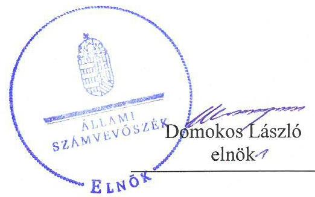
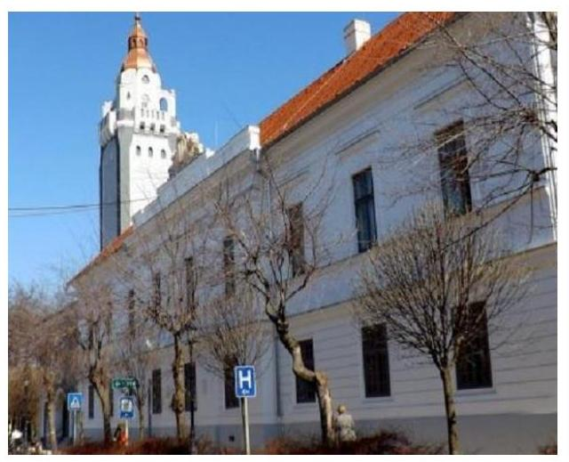
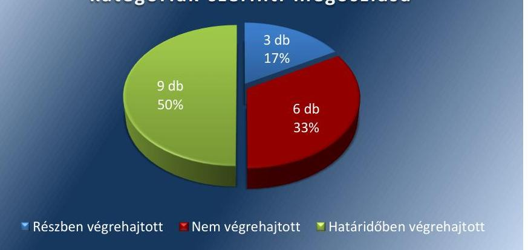
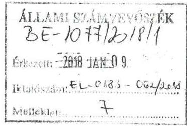
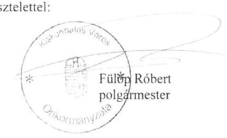
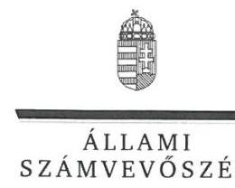
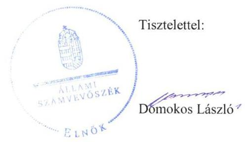
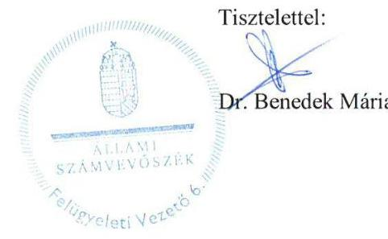

# Jelentés 

## Utóellenőrzések

Kiskunhalas Város Önkormányzata pénzügyi és vagyongazdálkodása szabályszerűségének utóellenőrzése 2018. 02. hó 01. nap

---

# AZ ELLENŐRZÉST FELÜGYELTE: 

DR. BENEDEK MÁRIA felügyeleti vezető

## AZ ELLENŐRZÉST VEZETTE ÉS A VÉGREHAJTÁSÁÉRT FELELŐS:

NEMESVÁRI-HORTHY ESZTER ellenőrzésvezető

## A PROGRAM ÖSSZEÁLLÍTÁSÁÉRT FELELŐS:

JANIK JÓZSEF LÁSZLÓ osztályvezető

## A TÉMÁHOZ KAPCSOLÓDÓ KORÁBBI SZÁMVEVŐSZÉKI JELENTÉSEK:

- címe: Jelentés az önkormányzatok és vagyongazdálkodása szabályszerűségének ellenőrzéséről - Kiskunhalas
- sorszáma: 16001

IKTATÓSZÁM: EL-0183-064/2018.
TÉMASZÁM: 2096
ELLENŐRZÉS-AZONOSÍTÓ SZÁM: V0755105

---

# TARTALOMJEGYZÉK 

■ ÖSSZEGZÉS ..... 5
■ AZ ELLENŐRZÉS CÉLJA ..... 6
■ AZ ELLENŐRZÉS TERÜLETE ..... 7
■ AZ ELLENŐRZÉS HÁTTERE, INDOKOLTSÁGA ..... 8
■ A JELENTÉS LÉNYEGES KÉRDÉSKÖRE ..... 9
■ AZ ELLENŐRZÉS HATÓKÖRE ÉS MÓDSZEREI ..... 10
■ MEGÁLLAPÍTÁSOK ..... 12
■ MELLÉKLETEK ..... 15
I. sz. melléklet: AZ ÁSZ 16001 számú jelentéséhez kapcsolódó intézkedési terv végrehajtása ..... 15
■ FÜGGELÉK: ÉSZREVÉTELEK ..... 21
■ RÖVIDÍTÉSEK JEGYZÉKE ..... 43

---

.

---

# ÖSSZEGZÉS 

Az Állami Számvevőszék Kiskunhalas Város Önkormányzata pénzügyi és vagyongazdálkodása szabályszerűségének utóellenőrzése során megállapította, hogy a Kiskunhalas Város Önkormányzata az intézkedési tervben meghatározott feladatok felét nem hajtotta végre. Nem gondoskodott a közérdekű adatok közzétételéről, a költségvetési beszámolóban nem mutatta be a gazdálkodó szervezetek működéséből származó kötelezettségeket és részesedéseket, valamint a 2015. évi költségvetési beszámoló mérlegét nem támasztotta alá leltárral, ezáltal nem biztosította a pénzügyi és vagyongazdálkodása során az átláthatóságot és az elszámoltathatóságot.

## Az ellenőrzés társadalmi indokoltsága

Az Állami Számvevőszék stratégiájában célul tűzte ki a számvevőszéki munka hasznosulásának javítását. Ezzel összhangban ellenőrzi, hogy az ellenőrzött szervezetek megvalósították-e a korábbi ellenőrzései által feltárt hibák, hiányosságok és szabálytalanságok megszüntetése céljából kialakított intézkedési terveikben foglaltakat. A rendszeres utóellenőrzések hozzájárulnak a szükséges intézkedések tényleges végrehajtásához, ezáltal a közpénzügyek rendezettségének javulásához, igazolják, hogy lezárult a következmények nélküli ellenőrzések időszaka.

## Főbb megállapítások, következtetések

Kiskunhalas Város Önkormányzata az intézkedési tervben meghatározott 18 feladat közül kilencet határidőben, hármat részben, hatot nem hajtott végre.

A szabályozott vagyongazdálkodás érdekében vagyonrendeletben rögzítette a vagyonkezelői jog ellenértékének meghatározása és az ingyenes átengedés részletes előírásait. Elkészítette a vagyonkimutatását, valamint a likviditási tervét, amelyet rendszeresen felülvizsgált. A költségvetési kiadásokat a törvényi előírással összhangban az előirányzatok mértékéig teljesítette. Minden gazdasági műveletről, amelyek az eszközök és a források állományát vagy összetételét megváltoztatta, a törvényi előírások szerinti alaki és tartalmi előírásoknak megfelelő bizonylatokat állított ki. Ezeknek az intézkedéseknek a végrehajtásával csökkentette a pénzügyi és vagyongazdálkodás szabályozásának és működésének kockázatait.

A törvényi előírások költségvetési beszámolójában nem mutatta be a tulajdonában lévő gazdálkodó szervezetek működéséből származó kötelezettségeket és a részesedéseket. Nem gondoskodott az ingatlanvagyon-kataszter és a földhivatali ingatlannyilvántartás adatainak egyezőségéről, az ingatlanvagyonban bekövetkezett változások ingatlanvagyon kataszteren történő átvezetéséről. A jegyző kockázatkezelési rendszert, kiemelten a pénzügyi egyensúlyi helyzetben rejlő kockázatok feltárása érdekében nem működtette, nem gondoskodott a közérdekű adatok közzétételéről. Ezeknek az intézkedéseknek az elmaradása nem támogatta az átlátható és elszámoltatható pénzügyi és vagyongazdálkodás működését.

A jegyző az intézkedési tervben meghatározott feladatok végrehajtásáról a jogszabály szerinti nyilvántartást vezette, azonban annak tartalma nem felelt meg a jogszabályban előírtaknak.

---

# AZ ELLENŐRZÉS CÉLJA 

Az ellenőrzés célja annak értékelése volt, hogy a számvevőszéki jelentésben foglalt intézkedést igénylő megállapításokkal és javaslatokkal összhangban készített intézkedési tervben meghatározott feladatokat az ellenőrzött szervezet végrehajtotta-e.

---

# AZ ELLENŐRZÉS TERÜLETE 

## Kiskunhalas Város Önkormányzata

Kiskunhalas Város Bács-Kiskun megyében fekszik, a Kiskunhalasi járás központja. Állandó lakosainak száma a Központi Statisztikai Hivatal Magyarország közigazgatási helynévkönyve alapján 2016. január 1-én 27470 fő volt.

A polgármester ${ }^{1}$ a 2014. évi általános önkormányzati választás óta tölti be tisztségét. Az utóellenőrzés idején hivatalban lévő jegyző ${ }^{2}$ 2016. január 1-jétől látja el feladatait.

Kiskunhalas Város Önkormányzata 2016. évi költségvetési beszámolója szerint 4436,9 millió Ft költségvetési bevételt ért el, és 4035,6 millió Ft költségvetési kiadást teljesített. Mérlegfőösszege 28 342,7 millió Ft, ezen belül a befektetett eszközeinek állományi értéke 26 012,8 millió Ft, követelés állománya 899,9 millió Ft, kötelezettségeinek állománya 494,4 millió Ft volt.

Az Állami Számvevőszék 2015. évben ellenőrizte Kiskunhalas Város Önkormányzatánál az önkormányzat pénzügyi és vagyongazdálkodása szabályszerűségét a 2011. január 1. és 2013. december 31. közötti időszak vonatkozásában. Az erről szóló 16001. számú jelentését ${ }^{3}$ az ÁSZ ${ }^{4}$ 2016. január 28-án tette közzé. Az ellenőrzés célja annak megállapítása volt, hogy kialakította-e az önkormányzat az erőforrásokkal való szabályszerű és hatékony gazdálkodáshoz szükséges követelményeket, megvalósította-e azok számon kérését, ellenőrzését, az önkormányzat pénzügyi és vagyoni helyzetének, a gazdálkodás szabályosságának megítélése a költségvetési tervezés, a pénzügyi egyensúly megteremtése, az éves költségvetési beszámolás, a vagyongazdálkodás, a vagyon számbavétele, és a gazdasági események elszámolása és a pénzgazdálkodás szabályszerűsége alapján. Az ÁSZ jelentésben foglalt javaslatok végrehajtása érdekében a Képviselő-testület ${ }^{5}$ a 161/2016. (VI. 23.) Kth. számú határozattal intézkedési tervet ${ }^{6}$ fogadott el.

Az utóellenőrzés - a 2016. január 28. és 2017. július 26. között végrehajtott feladatokat figyelembe véve - az ÁSZ jelentésében a polgármester és a jegyző részére megfogalmazott intézkedést igénylő megállapításokra és javaslatokra készített, az ÁSZ részére megküldött intézkedési tervben foglalt feladatok megvalósításának ellenőrzésére, illetve értékelésére fókuszált.

---

# AZ ELLENŐRZÉS HÁTTERE, INDOKOLTSÁGA 

Az ÁSZ tv. ${ }^{7}$ 33. § (1) bekezdése értelmében a számvevőszéki jelentések intézkedést igénylő megállapításaihoz és javaslataihoz kapcsolódóan az ellenőrzött szervezet vezetője intézkedési tervet köteles összeállítani, és az ÁSZ részére megküldeni. Az intézkedési tervben foglaltak megvalósítását az ÁSZ tv. 33. § (7) bekezdésében foglaltak alapján - az ÁSZ utóellenőrzés keretében - ellenőrizheti. Az intézkedések megvalósulásának értékelése során az ÁSZ figyelembe veszi az ellenőrzött szervezetek működési feltételeiben, valamint a jogszabályi előírásokban bekövetkezett változásokat.

Az intézkedési tervben foglalt feladatok hiányos, illetve késedelmes végrehajtása, valamint megvalósításának elmaradása azt mutatja, hogy az ellenőrzések során feltárt hibák, hiányosságok és szabálytalanságok megszüntetése nem kapott kellő hangsúlyt. Ez a szabályszerű működés és a felelős vezetői magatartás vonatkozásában kockázatot hordoz. E kockázatok feltárásával az ÁSZ utóellenőrzési rendszere fokozza a fegyelmet, és igazolja, hogy a közpénzzel való szabályos gazdálkodás felelőssége elől nem lehet kitérni.

Az utóellenőrzés négy szinten hasznosulhat:

- A társadalom szintjén az utóellenőrzés jelzi, hogy a számvevőszéki ellenőrzés megállapításainak van következménye: a hiányosságok megszüntetésére az ellenőrzött szervezet által meghatározott intézkedések végrehajtását is számon kéri az ÁSZ.
- Az ellenőrzött terület szintjén az utóellenőrzés tájékoztatást nyújt a terület döntéshozóinak a hiányosságok kiküszöbölésének jó gyakorlatairól, ezzel lehetőséget biztosítva arra, hogy az ÁSZ ellenőrzési megállapításai, javaslatai a terület nem ellenőrzött szervezeteinek a működése során is hasznosuljanak.
- Az ellenőrzött szervezet szintjén az utóellenőrzés feltárja, hogy a szervezet az intézkedések végrehajtásával hasznosította-e a korábbi ellenőrzési jelentésben a hiányosságok megszüntetése, illetve a kockázatok kezelése érdekében megfogalmazott javaslatokat.
- Az ÁSZ szintjén az utóellenőrzés visszacsatolást ad az ellenőrzési jelentések hasznosulásáról, az intézkedések elmaradása vagy részleges megvalósulása a további ellenőrzésekhez kockázati jelzésként szolgál.

---

# A JELENTÉS LÉNYEGES KÉRDÉSKÖRE 

Az ellenőrzött szervezet az intézkedési tervben foglaltakat az előírt határidőben végrehajtotta-e?

---

# AZ ELLENŐRZÉS HATÓKÖRE ÉS MÓDSZEREI 

## Az ellenőrzés típusa

Megfelelőségi ellenőrzés.

## Az ellenőrzött időszak

Az utóellenőrzés alapját képező ÁSZ jelentés közzétételének napjától (2016. január 28.) az ellenőrzésről szóló kiértesítő levél keltének napjáig (2017. július 26.) tartó időszak.

## Az ellenőrzés tárgya

Az ÁSZ tv. 2011. július 1-jei hatálybalépését követően a számvevőszéki jelentésben foglalt intézkedést igénylő megállapításokkal és javaslatokkal összhangban - Kiskunhalas Város Önkormányzata által - készített intézkedési tervben foglaltak végrehajtásának ellenőrzése volt.

Az ellenőrzés kiterjedt minden olyan körülményre és adatra, amely az ÁSZ jogszabályban meghatározott feladatainak teljesítéséhez, valamint a program végrehajtása folyamán felmerült újabb összefüggések feltárásához szükséges volt.

## Az ellenőrzött szervezet

Kiskunhalas Város Önkormányzata

## Az ellenőrzés jogalapja

Az ÁSZ tv. 33. § (7) bekezdése alapján az intézkedési tervben foglaltak megvalósítását az ÁSZ utóellenőrzés keretében ellenőrizheti.

## Az ellenőrzés módszerei

Az ÁSZ az ellenőrzést az ellenőrzési program ellenőrzési kérdései, az ellenőrzött időszakban hatályos jogszabályok, az ellenőrzés szakmai szabályok és módszertanok figyelembevételével, önálló ellenőrzés keretében végezte.

Az ÁSZ az ellenőrzés ideje alatt az ellenőrzött szervezettel történő kapcsolattartást az ÁSZ SZMSZ ${ }^{\circledR}$-ének vonatkozó előírásai alapján biztosította.

---

Az utóellenőrzés megállapításait elsősorban az ÁSZ rendelkezésére álló, valamint az ellenőrzött szervezettől elektronikusan bekért dokumentumok alapozták meg.

Az ellenőrzési bizonyítékként felhasználható adatforrások közé tartoztak egyrészt a szakmai programban felsorolt adatforrások, másrészt minden - az ellenőrzés folyamán feltárt, az ellenőrzés szempontjából információt tartalmazó - dokumentum.

Az intézkedési tervben előírt feladatokat azok végrehajthatósága, illetve végrehajtása szempontjából az alábbiak szerint értékelte az ÁSZ:
—_ „határidőben végrehajtott" a feladat, ha a teljesítés dokumentáltan, az intézkedési tervben előírt határidőben és tartalommal megtörtént;
—_ „határidőn túl végrehajtott" a feladat, ha annak teljesítése az intézkedési tervben meghatározott módon, de az előírt határidőn túl történt meg;
—_ „részben végrehajtott" a feladat, ha végrehajtása teljes körűen az intézkedési tervben előírt módon nem történt meg;
—_ „nem végrehajtott" a feladat, ha a végrehajtás nem történt meg, vagy amennyiben a teljesítést nem dokumentálták;
—_ „okafogyottá vált" a feladat, ha végrehajtására - meghatározott esemény bekövetkezése, továbbá külső körülmény, a működést érintő feltétel változása miatt - már nincs szükség, illetve lehetőség, és egyértelműen megállapítható, hogy az intézkedést szükségessé tevő körülmény a jövőben nem fordulhat elő;
—_ „nem időszerű" az a feladat, amelynek ellenőrzési időszakon belüli végrehajtására azért nem került (kerülhetett) sor, mert az intézkedés alapjául szolgáló esemény nem következett be, de annak jövőbeni előfordulása lehetséges, a végrehajtása nem volt esedékes, vagy a végrehajtás határideje még nem járt le.
Az ellenőrzés lefolytatásához az ellenőrzött szervezet a tanúsítványok elektronikus kitöltésével, valamint az ÁSZ által kért dokumentumok elektronikus megküldésével szolgáltatott adatokat, amelyek valódiságát és teljes körűségét az ellenőrzött szervezet vezetője által tett teljességi és hitelességi nyilatkozat igazolta. Az így rendelkezésre bocsátott adatok, információk kontrollja az ellenőrzés keretében történt.

---

# MEGÁLLAPÍTÁSOK 

## 1. Az ellenőrzött szervezet az intézkedési tervben foglaltakat az előírt határidőben végrehajtotta-e?

Összegző megállapítás

Az Önkormányzat ${ }^{9}$ az intézkedési tervben meghatározott 18 feladat közül kilencet határidőben, hármat részben, hatot nem hajtott végre. Az intézkedési tervben meghatározott feladatok végrehajtásáról a jegyző a jogszabály szerinti nyilvántartást vezette, de annak tartalma nem felelt meg a jogszabályban előírtaknak.

Az ÁSZ a jelentésében a polgármester részére négy, a jegyző részére 14 javaslatot fogalmazott meg. A polgármester által előterjesztett és a Képviselő-testület által jóváhagyott intézkedési tervben a hiányosságok, szabálytalanságok megszüntetésére 18 feladatot határozott meg. A feladatok közül a polgármester kettő, a jegyző egy, a Pénzügyi és Gazdálkodási Osztály osztályvezetője 11, a jegyző és a Pénzügyi és Gazdálkodási Osztály osztályvezetője együttesen három, a belső ellenőr egy feladat végrehajtásának felelőseként volt megjelölve.

Az intézkedési tervben meghatározott feladatokat, határidőket, felelősöket és a feladatok végrehajtását az I. számú melléklet mutatja be.

Az ÁSZ javaslatai alapján készített intézkedési tervben meghatározott feladatok végrehajtásáról a
 jegyző vezette a Bkr. ${ }^{10}$ szerinti nyilvántartást, de annak tartalma nem felelt meg a Bkr. 47. § (2) bekezdésében előírtaknak, mivel nem tartalmazta az ÁSZ ellenőrzési jelentésében meghatározott javaslatokat.

Az Önkormányzat intézkedési tervében meghatározott feladatok végrehajtásának értékelési kategóriák szerinti megoszlását az 1. ábra szemlélteti.

1. ábra

A feladatok végrehajtásának értékelési kategóriák szerinti megoszlása

---

# HATÁRIDŐBEN VÉGREHAJTOTT feladatok: 

1. A polgármester intézkedett a vagyongazdálkodással kapcsolatos szabályok - vagyonkezelői jog ellenértékének meghatározása, ingyenes átengedés részletes szabályai - meghatározása érdekében a jogszabályi előírásoknak megfelelő rendelettervezet képviselőtestület elé terjesztéséről.
2. A Képviselő-testület rendezte a Halas-T Kft. pénzügyi-vagyoni helyzetét, döntött a jegyzett tőke megemeléséről.
3. A polgármester intézkedett az ÁSZ által feltárt hiányosságok és szabálytalanságok alapján a munkajogi felelősség tisztázása érdekében.
4. A jegyző intézkedett a vagyongazdálkodással kapcsolatos szabályok - vagyonkezelői jog ellenértékének meghatározása, ingyenes átengedés részletes szabályai - meghatározása érdekében a jogszabályi előírásoknak megfelelő rendelettervezet előkészítéséről.
5. A jegyző intézkedett a törvényi előírásnak megfelelően havi bontású likviditási terv elkészítéséről és annak aktualizálásáról.
6. A polgármester intézkedett arról, hogy a költségvetési kiadások a 2016. évben a jogszabályi előírással összhangban a költségvetésben megállapított kiadások mértékéig teljesüljenek, azokat nem lépték túl.
7. A jegyző intézkedett arról, hogy minden gazdasági műveletről, amely az eszközök, illetve az eszközök forrásának állományát vagy összetételét megváltoztatja a törvényi előírásoknak megfelelő bizonylatokat állítsanak ki és hogy folyamatosan biztosítsák a bizonylatok alaki és tartalmi kellékeit.
8. A jegyző intézkedett az jogszabályi előírásoknak megfelelő tartalmú vagyonkimutatás elkészítéséről.
9. A jegyző intézkedett a jogszabályi előírásoknak megfelelő költségvetési rendelettervezet előkészítéséről, mivel a 2016. évi költségvetési rendeletben ${ }^{11}$ az Mőtv. ${ }^{12}$ 111. § (4) valamint az Áht. 23. § (4) bekezdésében foglaltaknak megfelelően külső finanszírozású működési célú költségvetési hiányt nem tervezett.

## RÉSZBEN VÉGREHAJTOTT feladatok:

10. A jegyző a Képviselő-testület részére előkészítette a vagyonkezelési és hasznosítási szerződést. A Képviselő-testület határozatában felhatalmazta a polgármestert a határozatok mellékletében szereplő, az Önkormányzat Vagyonrendeletének megfelelő hasznosítási, üzemeltetési szerződés megkötésére, azonban az Nvtv. ${ }^{13} 11$. § (10)-(11) bekezdései és a Képviselő-testület határozataiban kapott felhatalmazás ellenére a szerződések megkötésére nem került sor.
11. A jegyző intézkedett a 2016. december 31-i fordulónappal a Számv. tv. ${ }^{14}$ és az Áhsz. ${ }^{15}$ előírásaival összhangban az éves költségvetési beszámoló ${ }^{16}$ mérlegének a jogszabályi előírásoknak megfelelő alátámasztásáról, azonban nem intézkedett a 2015. december 31-i fordulónappal a Számv. tv. 69. § (1) és az Áhsz. 22. § (1) bekezdése előírásai ellenére az éves költségvetési beszámoló elkészítéséhez, a mérleg tételeinek alátámasztásához olyan leltár összeállításáról, amely tételesen, ellenőrizhető módon tartalmazza a mérlegben szereplő eszközöket és forrásokat.
12. A jegyző intézkedett, hogy a 2016. évi költségvetési beszámoló mérlegében a Számv. tv. és az Áhsz. előírásaival összhangban csak vevő által elfogadott, elismert követeléseket mutassanak ki, azonban a 2015. évi költségvetési beszámoló mérlegében a Számv. tv. 65. § (1) bekezdése és az Áhsz. 1. § (1) bekezdés 6. pontja előírásai ellenére a vevő által el nem fogadott, el nem ismert követeléseket is kimutatott.

# NEM VÉGREHAJTOTT feladatok: 

13. A jegyző a Számv. tv. 54. § (1) bekezdése és az Áhsz. 18. § (1) bekezdése ellenére nem intézkedett a 2015. évben a gazdasági társaságokban lévő tulajdoni részesedést jelentő befektetések esetében az értékelés elvégzéséről.
14. A jegyző nem intézkedett a 2015. évi költségvetési beszámoló jogszabályi előírásoknak megfelelő előkészítéséről, mert a 2015. évi költségvetési beszámolóban - az Áht. ${ }^{17}$ 91. § (2) bekezdés d) pontjában foglaltakkal ellentétben - nem mutatta be az Önkormányzat gazdasági társaságaiban meglévő tulajdonosi részesedéseket.
15. A jegyző a Bkr. 7. § (1) és (2) bekezdése ellenére a kockázatkezelési rendszert - különös tekintettel a pénzügyi egyensúlyt befolyásoló kockázatokra - nem működtette.
16. A jegyző nem intézkedett a jogszabályi előírásoknak megfelelő költségvetési beszámolóra vonatkozó rendelettervezet előkészítéséről, mivel a 2015. és a 2016. évi költségvetési beszámolóban az Áht. 91. § (2) bekezdés d) pontja ellenére nem mutatta be az önkormányzat tulajdonában álló gazdálkodó szervezetek működéséből származó kötelezettségeket.
17. A jegyző a 2015. és a 2016. évben nem intézkedett az ingatlanvagyon-kataszter és a földhivatal ingatlannyilvántartás adatainak egyezőségéről, továbbá az ingatlanvagyonban bekövetkezett változásának a jogszabályban előírt határidőig az ingatlanvagyon kataszteren történő átvezetéséről a 147/1992. (XI. 6.) Korm. rendelet ${ }^{18} 1 . \S$ (2) és 4. § (1) bekezdése ellenére.
18. A jegyző nem intézkedett az Info tv. 37. § (1) bekezdésében foglalt, az 1. melléklet III/4. pontja szerinti közérdekű adatok közzétételére vonatkozó kötelezettségről.

---

# MELLÉKLETEK

■ I. SZ. MELLÉKLET: AZ ÁSZ 16001 SZÁMÚ JELENTÉSÉHEZ KAPCSOLÓDÓ INTÉZKEDÉSI TERV VÉGREHAJTÁSA

|  Az intézkedési tervben meghatározott feladat | Az intézkedési tervben meghatározott határidő | Az intézkedési tervben meghatározott feladatok felelőse | A feladat végrehajtása  |
| --- | --- | --- | --- |
|  1. | 2. | 3. | 4.  |
|  Határidőben végrehajtott feladatok |  |  |   |
|  1. Intézkedjen a vagyongazdálkodással kapcsolatos szabályok – vagyonkezelői jog ellenértékének meghatározása, ingyenes átengedés részletes szabályai – meghatározása érdekében a jogszabályi előírásoknak megfelelő rendelettervezet Képviselő-testület elé terjesztéséről. | azonnal, Az önkormányzat tulajdonában álló vagyonnal való rendelkezés egyes szabályairól szóló 16/2015. (VI 26.) önkormányzati rendelet már tartalmazza | polgármester | A polgármester intézkedett a vagyongazdálkodással kapcsolatos szabályok – vagyonkezelői jog ellenértékének meghatározása, ingyenes átengedés részletes szabályai – meghatározása érdekében a jogszabályi előírásoknak megfelelő rendelettervezet Képviselő-testület elé terjesztéséről. A Képviselő-testület által jóváhagyott Vagyonrendelet^{19} az Mőtv. előírásainak megfelelően tartalmazta a vagyonkezelői jog ellenértékének meghatározása és az ingyenes átengedés részletes szabályait.  |
|  2. Rendezze a jogszabályi előírásoknak megfelelően a Halas-T Kft. pénzügyi-vagyoni helyzetét, ennek hiányában a helyzet rendezése érdekében intézkedjen a társaságnak más társasággá történő átalakításáról, vagy jogutód nélküli megszüntetéséről. | azonnal, A Halas-T Kft. tőke szerkezetének rendezése megtörtént. | Pénzügyi és Gazdálkodási Osztály osztályvezető | A Képviselő-testület rendezte a Halas-T Kft. pénzügyi-vagyoni helyzetét, 281/2016. Kth. számú határozatában döntött a Halas-T Kft. felé fennálló 44 millió Ft tagi kölcsön apportként történő rendelkezésre bocsátásáról, oly módon, hogy abból 1 millió Ft-tal a jegyzett tőkét emelték meg, 43 millió Ft tőketartalékba került.  |
|  3. Intézkedjen az ÁSZ által a számviteli nyilvántartások vezetése, a költségvetési tervezés, a kockázatkezelési rendszer és a belső ellenőrzés működése, a vagyongazdálkodás szabályszerűsége, az ingatlanvagyon-kataszter vezetése tekintetében feltárt hiányosságok, illetve a Halas-T Kft. és a Halas-Távhő Kft. között létrejött üzemeltetési szerződés díj átadásra vonatkozó pontjainak be nem tartása, az Önkormányzat írásbeli szerződés nélkül gazdasági társasága részére üzemeltetésre átadott eszközök tekintetében az ÁSZ által feltárt szabálytalanságok alapján a munkajogi felelősség tisztázására irányuló eljárás megindítása iránt. A Pénzügyi és Gazdálkodási Osztály vezetője a polgármester részére a munkajogi felelősség tisztázására irányuló eljárás megindításához 2016. szeptember 27-én kelt jelentésében beazonosította az ÁSZ jelentés megállapításai |   |   |

---

|  3. Sorszám | Az intézkedési tervben meghatározott feladat | Az intézkedési tervben meghatározott határidő | Az intézkedési tervben meghatározott feladatok felelőse | A feladat végrehajtása  |
| --- | --- | --- | --- | --- |
|   | 1. | 2. | 3. | 4.  |
|   | eljárás megindítása iránt, és ennek eredménye ismeretében tegye meg a szükséges intézkedéseket." |  |  | alapján a munkajogi felelősséggel érintett személyeket és egyben megállapította, hogy fegyelmi felelősségre vonás nem indítható, mivel az érintett személyek közszolgálati, illetve munkaviszonya megszűnt, vagy a fegyelmi vétség elkövetése óta három év eltelt. Az Önkormányzat többségi tulajdonában álló Halas-T Kft. 2015. augusztus 19-én a Halas-Távhő Kft.-vel kötött üzemeltetési szerződés díj átadására vonatkozó pontjainak be nem tartása miatt keresetet nyújtott be vagyoni hátrány okozása miatt a Munkaügyi és Közigazgatási Bírósághoz.  |
|  4. | Intézkedjen a vagyongazdálkodással kapcsolatos szabályok vagyonkezelői jog ellenértékének meghatározása, ingyenes átengedés részletes szabályai - meghatározása érdekében a jogszabályi előírásoknak megfelelő rendelettervezet előkészítéséről. (Mőtv. 109.§ (4) bekezdés). | azonnal, Az önkormányzat tulajdonában álló vagyonnal való rendelkezés egyes szabályairól szóló 16/2015. (VI 26.) önkormányzati rendelet már tartalmazza. | jegyző, Pénzügyi és Gazdálkodási Osztály osztályvezető | A jegyző intézkedett a vagyongazdálkodással kapcsolatos szabályok - vagyonkezelői jog ellenértékének meghatározása, ingyenes átengedés részletes szabályai - meghatározása érdekében a jogszabályi előírásoknak megfelelő rendelettervezet előkészítéséről. A Képviselő-testület által jóváhagyott Vagyonrendelet az Mőtv. előírásainak megfelelően tartalmazta a vagyonkezelői jog ellenértékének meghatározása és az ingyenes átengedés részletes szabályait.  |
|  5. | Intézkedjen a hatályos jogszabályoknak (Ámr. ${ }^{20}$, Áht.) megfelelően likviditási terv készítéséről és annak aktualizálásáról. (Áht.: 78.§) | folyamatos | Pénzügyi és Gazdálkodási Osztály osztályvezető | A jegyző intézkedett az Áht. 78.§ (2) bekezdésének megfelelően havi bontású likviditási terv készítéséről és annak aktualizálásáról. A likviditási tervet a 2016. évi költségvetési rendelet 11. sz. melléklete tartalmazta. A 2016. évi költségvetési rendelet módosításaiban a likviditási tervek felülvizsgálatra, aktualizálásra kerültek.  |
|  6. | Intézkedjen, hogy a költségvetési kiadásokat a költségvetésben megállapított kiemelt kiadási előirányzatok mértékéig teljesítsék. (Áht.: 36.§ (1) bekezdés) | azonnal | Pénzügyi és Gazdálkodási Osztály osztályvezető | A polgármester intézkedett arról, hogy a költségvetési kiadások a 2016. évben a jogszabályi előírással összhangban a költségvetésben megállapított kiadások mértékéig teljesüljenek. A 2016. évi költségvetési beszámoló szerint a 2016. évben a költségvetési kiadások az Áht. 36. § (1) bekezdésének megfelelően, a költségvetésben megállapított kiemelt kiadási előirányzatok mértékéig teljesültek, azokat nem lépték túl.  |
|  7. | Intézkedjen, hogy minden gazdasági műveletről, amely az eszközök, illetve az eszközök forrásának állományát vagy összetételét megváltoztatja a jogszabályi előírásoknak megfelelő bizonylat készüljön, továbbá a számvitelről szóló 2000. évi C. törvény 167. § (1) bekezdésében előírtak a könyvviteli | folyamatos | Pénzügyi és Gazdálkodási Osztály osztályvezető | A jegyző intézkedett arról, hogy minden gazdasági műveletről, amely az eszközök, illetve az eszközök forrásának állományát vagy összetételét megváltoztatja a Számv. tv. előírásainak megfelelő bizonylat készüljön. A könyvviteli elszámolást közvetlenül alátámasztó bizonylatok esetében folyamatosan biztosította, hogy a |

---

|  3. | Az intézkedési tervben meghatározott feladat | Az intézkedési tervben meghatározott határidő | Az intézkedési tervben meghatározott feladatok felelőse | A feladat végrehajtása  |
| --- | --- | --- | --- | --- |
|  4. |  | 2. | 3. | 4.  |
|   | elszámolást közvetlenül alátámasztó bizonylat alaki és tartalmi kellékeire vonatkozóan folyamatosan biztosítva legyenek.

 (Számv. tv. 167.§ (1) bekezdés a), c), i) pontja) |  |  | Számv. tv. 167. § (1) bekezdés a), c), i) pontjaiban foglaltaknak megfelelő alaki és tartalmi kellékek legyenek.  |
|  8. | Intézkedjen a jogszabályi előírásoknak - különösképpen figyelemmel az Áhsz. 30. § (1)-(3) bekezdéseiben foglaltakra - megfelelő vagyonkimutatás elkészítéséről, figyelemmel a nullára leírt, de használatban lévő, illetve használaton kívüli eszközök állományára, a mérlegben értékkel nem szereplő kötelezettségekre (kezességvállalással kapcsolatos függő kötelezettségekre is), a korlátozottan forgalomképes törzsvagyonként az Önkormányzat többségi tulajdonában lévő gazdasági társaságaiban fennálló társasági részesedésekre. | 2016. december 31. | Pénzügyi és Gazdálkodási Osztály osztályvezető | A jegyző intézkedett az Áhsz. 30. § (1)-(3) bekezdéseiben foglalt tartalommal a vagyonkimutatás elkészítéséről. A hivatkozott Áhsz. 2 előírásnak megfelelően a vagyonkimutatás tartalmazta a nemzeti vagyonba tartozó befektetett eszközöket, forgóeszközöket és a pénzeszközöket forgalomképtelen törzsvagyon, nemzetgazdasági szempontból kiemelt jelentőségű törzsvagyon, korlátozottan forgalomképes vagyon és üzleti vagyon bontásban. A vagyonkimutatás a mérlegben szereplő eszközökön kívül tartalmazta a „0"-ra leírt eszközök, a használatban lévő kis értékű immateriális javak, tárgyi eszközök, készletek, a 01-02. számlacsoportban nyilvántartott eszközök, és az Nvtv. 1. § (2) bekezdés g) és h) pontja szerinti kulturális javak és régészeti leletek állományát is.  |
|  9. | Intézkedjen a jogszabály előírásoknak megfelelő költségvetési rendelettervezetek előkészítéséről, figyelemmel arra, hogy a költségvetésben működési hiány nem tervezhető. | 2016. február 15. | Pénzügyi és Gazdálkodási Osztály osztályvezető | A jegyző intézkedett a jogszabályi előírásoknak megfelelő költségvetési rendelettervezet előkészítéséről. Az Önkormányzat a 2016. évi költségvetési rendeletében az Mótv. 111. § (4) bekezdésében, valamint az Áht. 23. § (4) bekezdésében foglaltaknak megfelelően külső finanszírozású működési célú költségvetési hiányt nem tervezett.  |
|  10. | Részben végrehajtott feladatok |  |  |   |
|   | Intézkedjen a kizárólagos Önkormányzati tulajdonban lévő Halasi Városgazda Zrt. részére üzemeltetésre, hasznosításra átadott önkormányzati tulajdonú (nemzeti vagyon körébe tartozó) eszközökről jogszabályi előírásoknak megfelelő szerződések megkötéséről. | folyamatosan, de legkésőbb 2017. június 30. | jegyző, Pénzügyi és Gazdálkodási Osztály, osztályvezető | Végrehajtott feladatrész: A jegyző a Képviselő-testület részére előkészítette a vagyonkezelési és hasznosítási szerződést. A Képviselő-testület határozatban döntött és felhatalmazta a polgármestert a határozat mellékletében szereplő, az Önkormányzat Vagyonrendeletének megfelelően a vagyonkezelési és hasznosítási szerződések megkötésére, módosítására, megszüntetésére, valamint közszolgáltatási támogatási szerződés módosítására (63/2016., 173/2016. KTH sz. határozat, 159/2017., 160/2017., 161/2017., 162/2017., 163/2017., 164/2017., 165/2017. KTH sz. határozat).
Nem végrehajtott feladatrész: Az Nvtv. 11. § (10)-(11) bekezdése és a Képviselőtestület fentebb hivatkozott határozataiban kapott felhatalmazás ellenére a szerződések megkötésére nem került sor.  |

---

|  1. | Az intézkedési tervben meghatározott feladat | Az intézkedési tervben meghatározott határidő | Az intézkedési tervben meghatározott feladatok felelőse | A feladat végrehajtása  |
| --- | --- | --- | --- | --- |
|  2. | 1. | 2. | 3. | 4.  |
|  11. | Intézkedjen az éves költségvetési beszámoló mérlegének a jogszabályi előírásoknak megfelelő alátámasztásáról. (jogszabályoknak megfelelő leltározásról). | 2016. május 31., ezt követően folyamatos, A mérlegtételek leltározása a 2015. évi költségvetési beszámoló esetében egyeztetéssel megtörtént, mennyiségi leltározás jogszabályi előírás szerinti időpontban történik. | Pénzügyi és Gazdálkodási Osztály, osztályvezető | Végrehajtott feladatrész: A jegyző intézkedett a 2016. december 31-i fordulónappal a Számv. tv. és az Áhsz.; előírásaival összhangban az éves költségvetési beszámoló mérlegének a jogszabályi előírásoknak megfelelő alátámasztásáról. Ennek keretében az elvégzendő leltározáshoz a Leltározási szabályzatban ${ }^{21}$ foglaltakkal összhangban elkészítette a leltározási utasítását, amelyet a jegyző jóváhagyott. A leltározási utasításban kijelölte a mennyiségi felvétellel leltározandó eszközöket és forrásokat. A leltározás elvégzéséről összefoglaló jegyzőkönyv készült, amelyben rögzítette a bizottság a leltározás eredményét, a feltárt leltárkülönbözeteket, amelyeknek a kivizsgálására a jegyző írásbeli megbízást adott a Pénzügyi és Gazdálkodási Osztály osztályvezetője részére.
Nem végrehajtott feladatrész: A jegyző nem intézkedett a 2015. december 31-i fordulónappal a Számv. tv. 69. § (1) és az Áhsz.; 22. § (1) bekezdése ellenére az éves költségvetési beszámoló elkészítéséhez, a mérleg tételeinek alátámasztásához olyan leltár összeállításáról, amely tételesen, ellenőrizhető módon tartalmazza a mérlegben szereplő eszközöket és forrásokat.  |
|  12. | Intézkedjen, hogy az éves beszámoló mérlegében kizárólag elismert követelést mutassanak ki. (Számv, tv. 29. § (1) bek, Áhsz. ${ }^{22} 22 . \S$ (1) a) pont) | 2015-től megtörtént | Pénzügyi és Gazdálkodási Osztály osztályvezető | Végrehajtott feladatrész: A jegyző intézkedett és a 2016. évi költségvetési beszámoló mérlegében a Számv. tv. 65. § (1) bekezdése és az Áhsz.; 1. § (1) bekezdés 6. pontjában foglaltaknak megfelelően, a vevő által elfogadott, elismert követeléseket mutatta ki.
Nem végrehajtott feladatrész: A jegyző a Számv. tv. 65. § (1) bekezdése és az Áhsz.; 1. § (1) bekezdés 6. pontjában foglaltak ellenére a 2015. évi költségvetési beszámoló mérlegében a vevő által el nem fogadott, el nem ismert követeléseket is kimutatta.  |
|  13. | Nem végrehajtott feladatok |  |  |   |
|  13. | Intézkedjen a gazdasági társaságokban lévő tulajdoni részesedést jelentő befektetéseknél az eszközök értékelésének jogszabályoknak megfelelő elvégzéséről. | 2016. május 30., A 2015. évi zárszámadás már így készült | Pénzügyi és Gazdálkodási Osztály, osztályvezető | A jegyző nem intézkedett a Számv. tv. 54. § (1) és az Áhsz.; 18. § (1) bekezdése ellenére a 2015. évben a gazdasági társaságokban lévő tulajdoni részesedést jelentő befektetések értékelésének elvégzéséről.  |

---

|  1. | Az intézkedési tervben meghatározott feladat | Az intézkedési tervben meghatározott határidő | Az intézkedési tervben meghatározott feladatok felelőse | A feladat végrehajtása  |
| --- | --- | --- | --- | --- |
|  2. | 1. | 2. | 3. | 4.  |
|  14. | Intézkedjen az éves költségvetési beszámoló jogszabályi előírásoknak megfelelő előkészítéséről, a költségvetési beszámoló mellékletében a részesedések mennyiségének bemutatásáról, az Önkormányzat gazdasági társaságaiban meglévő tulajdoni részesedésének bemutatásáról. | 2016. május 30., A 2015. évi záiszámadás már így készült. | Pénzügyi és Gazdálkodási Osztály osztályvezető | A jegyző nem intézkedett a 2015. évi költségvetési beszámoló jogszabályi előírásoknak megfelelő előkészítéséről, mert a 2015. évi költségvetési beszámolóban – az Áht. 91. § (2) bekezdés d) pontjában foglaltakkal ellentétben – nem mutatta be az Önkormányzat gazdasági társaságokban meglévő tulajdonosi részesedéseket.  |
|  15. | Intézkedjen a pénzügyi egyensúlyt befolyásoló kockázatok felméréséről és az ezen kockázatok jogszabályi előírásoknak megfelelő kockázatkezelési rendszerben történő kezeléséről, figyelemmel a pénzügyi egyensúlyt befolyásoló kockázatok beazonosítására, felmérésére, a kockázatok mérséklése érdekében történő intézkedések meghozatalára. | 2016. december 31. | belső ellenőr | A jegyző a Bkr. 7. § (1) és (2) bekezdése ellenére a kockázatkezelési rendszert – különös tekintettel a pénzügyi egyensúlyt befolyásoló kockázatokra – nem működtette. Ennek keretében nem mérte fel, nem állapította meg a pénzügyi egyensúlyt befolyásoló kockázatokat, nem határozta meg a szükséges intézkedéseket, valamint azok teljesítésének folyamatos nyomon követésének módját.  |
|  16. | Intézkedjen a jogszabály előírásoknak megfelelő záiszámadási rendelettervezet előkészítéséről figyelemmel az Áht. 91. § (2) bekezdésére - a Képviselő-testület tájékoztatásáról az önkormányzat tulajdonában álló gazdálkodó szervezetek működéséből származó kötelezettségek bemutatásával. | 2016. május 31. és folyamatos | jegyző, Pénzügyi és Gazdálkodási Osztály, osztályvezető | A jegyző nem intézkedett a jogszabályi előírásoknak megfelelő költségvetési beszámolóra vonatkozó rendelettervezet előkészítéséről. A 2015. és a 2016. évi költségvetési beszámolóra vonatkozó rendeletben az Áht. 91. § (2) bekezdés d) pontjában foglaltak ellenére nem mutatta be az önkormányzat tulajdonában álló gazdálkodó szervezetek működéséből származó kötelezettségeket.  |
|  17. | Intézkedjen az ingatlanvagyon-kataszter és a földhivatal ingatlan-nyilvántartás adatainak egyezőségéről, továbbá az ingatlanvagyonban bekövetkezett változásának a jogszabályban előírt határidőig az ingatlanvagyon kataszteren történő átvezetéséről. A 2015. évi záiszámadás már így készült." | 2016. május 30. (A 2015. évi zár-számadás már így készült.) | Pénzügyi és Gazdálkodási Osztály osztályvezető | A jegyző nem intézkedett a 2015. és a 2016. évben az ingatlanvagyon-kataszter és a földhivatal ingatlan-nyilvántartás adatainak egyezőségéről, továbbá az ingatlanvagyonban bekövetkezett változásának a jogszabályban előírt határidőig az ingatlanvagyon kataszteren történő átvezetéséről a 147/1992. (XI. 6.) Korm. rendelet 1. § (2) és 4. § (1) bekezdése ellenére.  |
|  18. | "II/14. Intézkedjen a közérdekű adatok jogszabályi előírásoknak megfelelő közzétételéről." (Eisztv.23 6.§ (1) bekezdés, Eisztv mellékletének II 1/4. pontja, Info tv.24 37. § (1) bek. és 1.melléklet III/4. pontja) | azonnal | jegyző | A jegyző nem intézkedett az Info tv. 37. § (1) bekezdése és 1. melléklet III/4. pontja ellenére a közérdekű adatok közzétételéről, nem tette közzé a nettó 5,0 millió Ft-ot elérő, vagy azt meghaladó értékű árubeszerzések, építési beruházások, szolgáltatások, valamint a közbeszerzési eljárások adatait.  |

*Forrás: ÁSZ által készített táblázat*

---

.

---

# FÜGGELÉK: ÉSZREVÉTELEK 

A jelentéstervezetet a Számvevőszék 15 napos észrevételezésre megküldte az ellenőrzött szervezet vezetőjének az ÁSZ tv. 29. § (1) bekezdése előírásának megfelelően.
Az elfogadott észrevételek alapján a Számvevőszék módosította a jelentést.

A függelék tartalmazza az ellenőrzött észrevételeit, illetve az el nem fogadott észrevételek elutasításának indoklását.

[^0]
[^0]:    * 29. § (1) Az Állami Számvevőszék az ellenőrzési megállapításait megküldi az ellenőrzött szervezet vezetőjének vagy az általa megbízott személynek, és annak, akinek személyes felelősségét állapította meg.
    (2) Az ellenőrzött szervezet vezetője és a felelősként megjelölt személy az ellenőrzés megállapításaira tizenöt napon belül írásban észrevételt tehet.
    (3) Az Állami Számvevőszék az észrevételre a beérkezésétől számított harminc napon belül írásban válaszol. A figyelembe nem vett észrevételeket köteles a jelentésben feltüntetni, és megindokolni, hogy azokat miért nem fogadta el.

---

Ikt.szám: P/64-9/2017
Ügyintéző: Dr. Rékasi Cecília

Tárgy: Észrevételek az ÁSZ
jelentéssel kapcsolatban
Melléklet: 7 db garnitúra

Állami Számvevőszék
Domokos László elnök
Budapest
Apáczai Cs. J. u. 10.
1052
1364 Budapest 4. Pf.: 54.
Tisztelt Elnök Úr!

Hivatkozva az EL-0183-060/2017. iktatószámú, „Számvevőszéki jelentéstervezet" tárgyú, 2017. december 18. napján kelt levelére, amely 2017. december 21. napján érkezett Kiskunhalas Város Önkormányzatához, valamint az Állami Számvevőszékről szóló 2011. évi LXVI. törvény 29. § (2) bekezdésében foglaltakra, az alábbi észrevételeket teszem.

Mielőtt a jelentés I. számú Mellékletében felsorolt megállapításokat pontok szerinti bontásban észrevételezném, kiemelem, hogy a 2017. június 12. napján kelt EL-0183-001/2017. számú levél 2. számú mellékletét képező dokumentumjegyzékben kifejezetten rögzítésre került, hogy mely dokumentumokat kell megküldenünk T. Cím részére, e szerint: „Az utóellenőrzés keretében az ÁSZ
 jelentés közzétételének napjától az utóellenőrzés megkezdéséig tartó időszakra vonatkozó, hatályos dokumentumokat kérem megküldeni". A jelentéstervezet 10. oldalán „Az ellenőrzött időszak" címszó alatt szerepel, hogy az utóellenőrzés alapját képező ÁSZ jelentés közzétételének napja 2016. január 28., az ellenőrzésről szóló kiértesítő levél keltének napja 2017. július 26. Álláspontom szerint az itt megjelölt időszaktól eltérő időszakra vonatkozóan is tartalmaz megállapításokat a jelentéstervezet, amely eltérő időszakra vonatkozó dokumentumokat éppen az itt említettek okán nem küldtünk meg T. Cím részére, ám amelyet jelen észrevételünk mellékleteként csatolunk.
Ugyanerről szól az Állami Számvevőszék EL-0183-001/2017 iktatószámú, 2017. június 12. napján kelt tájékoztató levelének 2. számú melléklete is, amely szerint az utóellenőrzés esetében az ÁSZ jelentés közzétételének napjától az utóellenőrzés megkezdéséig tartó időszakra (2016.01.28-2017.06.26.) vonatkozó, hatályos dokumentumokat kérik megküldeni.
Ez az általános ellentmondás végig kíséri a részben végrehajtott, és a nem végrehajtott feladatok megállapításait, amelyet a következőkben részletezek.

# 1. Észrevétel a Számvevőszéki jelentés tervezet I. számú Mellékletének 9. pontjára: 

Az Állami számvevőszék utóellenőrzésének lefolytatása céljából a Bács-Kiskun Megyei Kormányhivatal a BK/TH/6562-2/2017. iktatószámú, ,,információkérés az ÁSZ 16001. számú jelentése alapján kidolgozott intézkedési terv végrehajtásával kapcsolatban" tárgyú, 2017. november 30. napján kelt levelére válaszul megküldtük Kiskunhalas Város Önkormányzata és a Halasi Városgazda Zrt. között létrejött szerződéseket.
Kiskunhalas Város Önkormányzata és a Halasi Városgazda Zrt. közötti szerződéses jogviszony 2017. június hónapjában rendezésre került, az ÁSZ 16001. számú jelentésében foglaltak alapján.
A megkötött új szerződések 2017. június 15. napján kerültek aláírásra a két fél részéről, a szerződéseken feltüntetett pénzügyi ellenjegyzés - az államháztartásról szóló 2011. évi CXCV. törvény (Áht.) 37. § (1) bekezdése értelmében - megelőzi a kötelezettségvállalás dátumát, a jogi ellenjegyzés helyi szokás alapján a szerződések jogi tartalmának helyességét tanúsítja. Mindezek alapján a szerződéseken felek aláírását megelőzi mind a pénzügyi-, mind a jogi ellenjegyzés.
Kiskunhalasi Közös Önkormányzati Hivatal szervezési ügyintéző munkakörben dolgozó köztisztviselője munkaköri feladatába tartozik az Önkormányzat - és a Hivatal - által kötött szerződések nyilvántartásának vezetése. A szerződésnyilvántartást számítógépen, excel táblázatban kezeli a köztisztviselő, minden évben újra kezdődő sorszámokkal ellátva új táblázatot nyit, az előző évit év végén lezárja.
Mellékelten továbbítom (1. sz. melléklet) Kiskunhalas Város Önkormányzata és a Halasi Városgazda Zrt. között létrejött szerződéseket, amelyek a Kormányhivatal számára is megküldésre kerültek.
A fentiekre figyelemmel a 9. pont „Nem végrehajtott feladatrész" megállapítása álláspontom szerint nem helytálló tekintettel arra, hogy a Képviselő-testület hivatkozott határozataiban foglalt felhatalmazás alapján a szerződések megkötésére 2017. június 15. napján azok aláírásával sor került, amelynek alátámasztására csatolom a melléklet szerinti dokumentumokat.
Mindezek alapján kérem a jelentéstervezet 9. pontját módosítani, és kérem a feladatot végrehajtottnak tekinteni.

# 2. Észrevétel a Számvevőszéki jelentés tervezet I. számú Mellékletének 10. pontjára: 

A feladat végrehajtásra került, amelynek alátámasztására mellékelten továbbítom a 2015. évi zárszámadást, könyvvizsgálói jelentést és a leltárra vonatkozó tanúsítványokat. (2. sz. melléklet)
Hivatkozva az Állami Számvevőszék EL-0183-001/2017 iktatószámú, 2017. június 12. napján kelt tájékoztató levelének 2. számú mellékletére, amely szerint az utóellenőrzés esetében az ÁSZ jelentés közzétételének napjától az utóellenőrzés megkezdéséig tartó időszakra (2016.01.28-2017.06.26.) vonatkozó, hatályos dokumentumokat kérik megküldeni, így az ebben az időszakban már nem hatályos, és az ezen időszakon kívül eső dokumentumokat nem küldtük meg az ÁSZ részére, tekintettel arra, hogy nem kérték.
Azonban minden dokumentum rendelkezésre áll, így a 10. pont „Nem végrehajtott feladatrész" megállapítása álláspontom szerint nem helytálló, amelyet mellékletekkel támasztunk alá.
Mindezek alapján kérem a jelentéstervezet 10. pontját módosítani, és kérem a feladatot végrehajtottnak tekinteni.

# 3. Észrevétel a Számvevőszéki jelentés tervezet I. számú Mellékletének 11. pontjára: 

A feladat az arra nyitva álló határidőben végrehajtásra került, amelynek alátámasztására mellékelten továbbítom a 2015. évi számlakövetelések tanúsítványait, valamint a közhatalmi követelések nyilatkozatát. (3. sz. melléklet)
Hivatkozva az Állami Számvevőszék EL-0183-001/2017 iktatószámú, 2017. június 12. napján kelt tájékoztató levelének 2. számú mellékletére, amely szerint az utóellenőrzés esetében az ÁSZ jelentés közzétételének napjától az utóellenőrzés megkezdéséig tartó időszakra (2016.01.28-2017.06.26.) vonatkozó, hatályos dokumentumokat kérik megküldeni, így az ebben az időszakban már nem hatályos, és az ezen időszakon kívül eső dokumentumokat nem küldtük meg az ÁSZ részére, tekintettel arra, hogy nem kérték.
Azonban minden dokumentum rendelkezésre áll, így a 11. pont „Nem végrehajtott feladatrész" megállapítása álláspontom szerint nem helytálló, amelyet mellékletekkel tudunk alátámasztani.
Mindezek alapján kérem a jelentéstervezet 11. pontját módosítani, és kérem a feladatot végrehajtottnak tekinteni.

## 4. Észrevétel a Számvevőszéki jelentés tervezet I. számú Mellékletének 12. pontjára:

A 2015. évi zárszámadásra vonatkozó előterjesztésben a 2015. évben a gazdasági társaságokban lévő tulajdoni részesedést jelentő befektetések értékelése megtalálható, amelyet mellékelten csatolok. (2. sz. melléklet)
Hivatkozva az Állami Számvevőszék EL-0183-001/2017 iktatószámú, 2017. június 12. napján kelt tájékoztató levelének 2. számú mellékletére, amely szerint az utóellenőrzés esetében az ÁSZ jelentés közzétételének napjától az utóellenőrzés megkezdéséig tartó időszakra (2016.01.28-2017.06.26.) vonatkozó, hatályos dokumentumokat kérik megküldeni, így az ebben az időszakban már nem hatályos, és az ezen időszakon kívül eső dokumentumokat nem küldtük meg az ÁSZ részére, tekintettel arra, hogy nem kérték.
Azonban minden dokumentum rendelkezésre áll, így megállapítása álláspontom szerint nem helytálló, amelyet mellékletekkel tudunk alátámasztani.
Mindezek alapján kérem a jelentéstervezet 12. pontját módosítani, és kérem a feladatot végrehajtottnak tekinteni.

## 5. Észrevétel a Számvevőszéki jelentés tervezet I. számú Mellékletének 13. pontjára:

A 2015. évi zárszámadási rendelettervezet előterjesztésekor a képviselő-testület részére tájékoztatásul az Önkormányzat tulajdonában álló gazdálkodó társaságokban meglévő tulajdonosi részesedés az Áht. 91. § (2) bekezdés d.) pontjának megfelelően bemutatásra került, amelyet mellékletben csatolok. (2. sz. melléklet)
Hivatkozva az Állami Számvevőszék EL-0183-001/2017 iktatószámú, 2017. június 12. napján kelt tájékoztató levelének 2. számú mellékletére, amely szerint az utóellenőrzés esetében az ÁSZ jelentés közzétételének napjától az utóellenőrzés megkezdéséig tartó időszakra (2016.01.28-2017.06.26.) vonatkozó, hatályos dokumentumokat kérik megküldeni, így az ebben az időszakban már nem hatályos, és az ezen időszakon kívül eső dokumentumokat nem küldtük meg az ÁSZ részére, tekintettel arra, hogy nem kérték.
Azonban minden dokumentum rendelkezésre áll, így megállapítása - álláspontom szerint - nem helytálló, amelyet mellékletekkel tudunk alátámasztani.
Mindezek alapján kérem a jelentéstervezet 13. pontját módosítani, és kérem a feladatot végrehajtottnak tekinteni.

# 6. Észrevétel a Számvevőszéki jelentés tervezet I. számú Mellékletének 14. pontjára: 

A jelentés 14. pontban meghatározott feladat az arra nyitva álló határidőn belül teljesült, amelyet a mellékletek szerinti nyilatkozatokkal támasztunk alá. (4. sz. melléklet)
Minden dokumentum rendelkezésre áll, így megállapítása - álláspontom szerint nem helytálló, amelyet mellékletekkel tudunk alátámasztani.
Mindezek alapján kérem a jelentéstervezet 14. pontját módosítani, és kérem a feladatot végrehajtottnak tekinteni.

## 7. Észrevétel a Számvevőszéki jelentés tervezet I. számú Mellékletének 15. pontjára:

A jelentés 15. pontjában megfogalmazottak alapján, miszerint az Önkormányzat 2016. évi költségvetési rendeletében az Mötv. 111. § (4) bekezdése ellenére működési hiányt tervezett, álláspontom szerint az Államháztartásról szóló 2011. évi CXCV. törvény 23. § (4) bekezdése értelmében szabályos. E rendelkezés szerint ugyanis az Mötv. 111. § (4) bekezdésének alkalmazásában működési hiányon a (2) bekezdés e) pontja szerinti külső finanszírozású működési célú költségvetési hiányt kell érteni."

Az Önkormányzat nem tervezett külső finanszírozású működési célú költségvetési hiányt, így megállapítása - álláspontom szerint - nem helytálló.

Mindezek alapján kérem a jelentéstervezet 15. pontját módosítani, és kérem a feladatot végrehajtottnak tekinteni.

## 8. Észrevétel a Számvevőszéki jelentés tervezet I. számú Mellékletének 16. pontjára:

A jelentés 16. pontja szerint a 2015. és a 2016. évi költségvetési beszámolóra vonatkozó rendeletben az Áht. 91. § (2) bekezdés d) pontjában foglaltak ellenére az önkormányzat tulajdonában álló gazdálkodó szervezetek működéséből származó kötelezettségek nem kerültek bemutatásra. Azonban az Áht. 91. § (2) bekezdés d) alpontja a következőkről rendelkezik:
,(2) A zárszámadási rendelettervezet előterjesztésekor a képviselő-testület részére tájékoztatásul a következő mérlegeket és kimutatásokat kell bemutatni:
d) a helyi önkormányzat tulajdonában álló gazdálkodó szervezetek működéséből származó kötelezettségeket, a részesedések alakulását."
A fentiek értelmében a zárszámadási rendelettervezet előterjesztésekor kell a képviselőtestület részére tájékoztatás céljából bemutatni a felsorolt dokumentumokat. A jogszabály egyértelműen rendezi, hogy az előterjesztéskor tájékoztatásul kell bemutatni a Képviselő-testületnek, amelynek megtörténtét a mellékelt dokumentumok alátámasztják. Az előterjesztés tehát tartalmazza - a jogszabály rendelkezésének megfelelően - a helyi önkormányzat tulajdonában álló gazdálkodó szervezetek működéséből származó kötelezettségeket, a részesedések alakulását is.

Mellékelem ennek alátámasztásául szolgáló dokumentumokat. (2. sz., 5. sz. melléklet)
Mindezek alapján kérem a jelentéstervezet 16. pontját módosítani, és kérem a feladatot végrehajtottnak tekinteni.
9. Észrevétel a Számvevőszéki jelentés tervezet I. számú Mellékletének 17. pontjára:

A jelentés 17. pontja szerint a 2015. és a 2016. évben az ingatlanvagyon-kataszter és a földhivatal ingatlan-nyilvántartás adatainak egyezőségéről, továbbá az ingatlanvagyonban bekövetkezett változásának az ingatlanvagyon kataszteren történő átvezetése nem történt meg.

Jelen levelem mellékleteként továbbítom azon dokumentumokat, amelyek igazolják, hogy a fenti megállapítás nem helytálló. A 2015. és 2016. évre vonatkozóan a Képviselőtestület elé terjesztett zárszámadási rendelet tervezethez mellékelt könyvvizsgálói jelentések tartalmazzák, hogy a fent említettek megtörténtek, amelyet szintén mellékelek jelen levélhez. (2. sz., 5. sz., 6. sz. melléklet)

Mindezek alapján kérem a jelentéstervezet 17. pontját módosítani, és kérem a feladatot végrehajtottnak tekinteni.

# 10. Észrevétel a Számvevőszéki jelentés tervezet I. számú Mellékletének 18. pontjára: 

A jelentés 18. pontja szerint a jegyző nem intézkedett az Info. tv. 37. § (1) bekezdés és 1. sz. melléklet III/4. pontja ellenére a közérdekű adatok közzétételéről, nem tette közzé a nettó 5,0 millió Ft-ot elérő, vagy azt meghaladó értékű árubeszerzések, építési beruházások, szolgáltatások, valamint közbeszerzési eljárások adatait.
A fenti megállapítással ellentétben Kiskunhalas Város honlapján a nettó 5 millió Ft-ot elérő, és meghaladó összegű szerződések korábban is és most is megtalálhatóak. Kiskunhalas Városnak 2017. június 01. napjától új honlapja van, azonban a régi honlap is elérhető még a www.varoshaza.kiskunhalasvaros.hu címen, a szerződések fel voltak töltve, ma is elérhető állapotban megtalálhatóak az alábbi linken:
http://varoshaza.kiskunhalas.hu/szerzodesek
Elérési útvonal: „Hivatal", „Közérdekű adatok", „Szerződések".
A város jelenlegi honlapja a www.kiskunhalas.hu címen érhető el, ahol szintén fel vannak töltve a fent említett szerződések, amelyek az alábbi linken érhetőek el:
http://kiskunhalas.hu/kozerdeku_adatok/3_gazdalkodasi_adatok/3_3_koltsegvetesek_beszamolok
Elérési útvonal: „Közérdekű adatok", „3. Gazdálkodási adatok", „3.3. Költségvetések, beszámolók", „3.3.3. Szerződések".
Az oldalakról készült Prt Scr képeket jelen levelemhez csatolom. (7. sz. melléklet)
Mindezek alapján kérem a jelentéstervezet 18. pontját módosítani, és kérem a feladatot végrehajtottnak tekinteni.

A fentebb írt észrevételek alapján kérem Tisztelt Elnök Urat, hogy az észrevételeket elfogadni, a csatolt dokumentumok alapján a feladatokat végrehajtottnak tekinteni, és a Számvevőszéki jelentés tervezetet módosítani szíveskedjen.

Kiskunhalas, 2018. január 04.

1. sz. melléklet Kiskunhalas Város Önkormányzata és a Halasi Városgazda Zrt. között létrejött szerződések
2. sz. melléklet 2015. évi zárszámadásról szóló rendelet előterjesztés
3. sz. melléklet 2015. évi számlakövetelések tanúsítványai, a közhatalmi követelések nyilatkozata
4. sz. melléklet Nyilatkozatok
5. sz. melléklet 2016. évi zárszámadásról szóló
 rendelet előterjesztése
6. sz. melléklet: ingatlanvagyon kataszter átvezetése
7. sz. melléklet: Kiskunhalas Város Önkormányzat régi és új honlapjának Prt Scr képei

Kapják:

1. Állami Számvevőszék
2. Bács-Kiskun Megyei Kormányhivatal Dr. Penczné dr. Zoltán Zsuzsanna osztályvezető (6000 Kecskemét, Deák Ferenc tér 3.)
3. Kiskunhalasi Közös Önkormányzati Hivatal jegyző
4. Kiskunhalasi Közös Önkormányzati Hivatal pénzügyi- és Gazdálkodási Osztályvezető
5. Kiskunhalasi Közös Önkormányzati Hivatal belső ellenőr
6. Kiskunhalasi Közös Önkormányzati Hivatal jogi referens
7. Kiskunhalasi Közös Önkormányzati Hivatal irattár

---

ELNÖK

Ikt.szám: EL-0183-063/2018.

# Fülöp Róbert úr 

polgármester
Kiskunhalas Város Önkormányzata

## Kiskunhalas

## Tisztelt Polgármester Úr!

Köszönettel megkaptam az Állami Számvevőszékhez 2018. január 9. napján érkezett, az „Utóellenőrzések - Kiskunhalas Város Önkormányzata pénzügyi és vagyongazdálkodása szabályszerűségének utóellenőrzése” című számvevőszéki jelentéstervezetben foglalt megállapításokra tett észrevételét.

Tájékoztatom Polgármester urat, hogy az el nem fogadott észrevételeket - az Állami Számvevőszékről szóló 2011. évi LXVI. törvény 29. § (3) bekezdése alapján - a jelentésben szerepeltetjük azok indokainak feltüntetésével együtt.

Az Állami Számvevőszék észrevételekre vonatkozó álláspontjáról a felügyeleti vezető által készített részletes tájékoztatást csatoltan megküldöm.

Budapest, 2018. 07. hó 23. nap

Melléklet: Tájékoztatás az elfogadott és el nem fogadott észrevételekről, azok indokairól

---

# Tájékoztatás 

az elfogadott és az el nem fogadott észrevételekről, azok indokairól

| 1. | Észrevétel: | Az észrevétel 1. oldalán a 2. és 3. bekezdésben foglalt általános észrevétel a jelentéstervezet megállapításait megalapozó dokumentumokra vonatkozóan:   „Mielőtt a jelentés I. számú Mellékletében felsorolt megállapításokat pontok szerinti bontásban észrevételezném, kiemelem, hogy a 2017. június 12. napján kelt EL-0183001/2017. számú levél 2. számú mellékletét képező dokumentumjegyzékben kifejezetten rögzítésre került, hogy mely dokumentumokat kell megküldenünk T. Cím részére, e szerint: „Az utóellenőrzés keretében az ÁSZ jelentés közzétételének napjától az utóellenőrzés megkezdéséig tartó időszakra vonatkozó, hatályos dokumentumokat kérem megküldeni”. A jelentéstervezet 10. oldalán „Az ellenőrzött időszak” címszó alatt szerepel, hogy az utóellenőrzés alapját képező ÁSZ jelentés közzétételének napja 2016. január 28., az ellenőrzésről szóló kiértesítő levél keltének napja 2017. július 26. Álláspontom szerint az itt megjelölt időszaktól eltérő időszakra vonatkozóan is tartalmaz megállapításokat a jelentéstervezet, amely eltérő időszakra vonatkozó dokumentumokat éppen az itt említettek okán nem küldtünk meg T. Cím részére, ám amelyet jelen észrevételünk mellékleteként csatolunk.   Ugyanerről szól az Állami Számvevőszék EL-0183001/2017 iktatószámú, 2017. június 12. napján kelt tájékoztató levelének 2. számú melléklete is, amely szerint az utóellenőrzés esetében az ÁSZ jelentés közzétételének napjától az utóellenőrzés megkezdéséig tartó időszakra (2016.01.28-2017.06.26.) vonatkozó, hatályos dokumentumokat kérik megküldeni” |
| :--: | :--: | :--: |
|  | Válasz: | Az ÁSZ az észrevételt nem fogadja el. |
|  | Indoklás: | Az észrevétel nem megalapozott. Az ÁSZ a vonatkozó ellenőrzését a V-1062-003/2016 számú ellenőrzési program |

---

|  |  | alapján folytatta le, mint az a jelentéstervezetben az ellenőrzési módszereknél ismertetésre került. A Program szerint az ellenőrzés célja annak értékelése, hogy a számvevőszéki jelentésben foglalt intézkedést igénylő megállapításokkal és javaslatokkal összhangban készített intézkedési tervben meghatározott feladatokat az ellenőrzött szervezet végrehajtotta-e. Az ellenőrzési program 4. oldal „Az ellenőrzés módszerei” fejezet 4. bekezdése alapján az ellenőrzési bizonyítékként felhasználható adatforrások közé tartoznak egyrészt a szakmai programban felsorolt adatforrások, másrészt minden - az ellenőrzés folyamán feltárt, az ellenőrzés szempontjából információt tartalmazó - dokumentum. Az Önkormányzat részére megküldött 2017. június 12-én kelt EL-0183-001/2017. iktatószámú Adatbekérő levél 2. számú melléklete rögzíti az utóellenőrzöttől bekért dokumentumok körét, amelynek 2. pontja alapján a bekért dokumentumok „az intézkedési tervben meghatározott feladatok végrehajtását igazoló dokumentumok…”.  A fentiek figyelembe vételével az ÁSZ fenntartja a jelentéstervezetben tett megállapításait. |
| :--: | :--: | :--: |
|  | 2. | Észrevétel: | Az észrevétel 1. számú pontjában, az ÁSZ jelentéstervezet I. számú melléklet 9. sor 4. oszlopában tett megállapításra: „Az Nvtv. 11. § (10)-(11) bekezdése és a Képviselőtestület fentebb hivatkozott határozataiban kapott felhatalmazás ellenére a szerződések megkötésére nem került sor” tett észrevétel:   „Az Állami számvevőszék utóellenőrzésének lefolytatása céljából a Bács-Kiskun Megyei Kormányhivatal a BK/TH/6562-2/2017. iktatószámú, „információkérés az ÁSZ 16001. számú jelentése alapján kidolgozott intézkedési terv végrehajtásával kapcsolatban” tárgyú, 2017. november 30. napján kelt levelére válaszul megküldtük Kiskunhalas Város Önkormányzata és a Halasi Városgazda Zrt. között létrejött szerződéseket.   Kiskunhalas Város Önkormányzata és a Halasi Városgazda Zrt. közötti szerződéses jogviszony 2017. június hónapjában rendezésre került, az ÁSZ 16001. számú jelentésében foglaltak alapján.   A megkötött új szerződések 2017. június 15. napján kerültek aláírásra a két fél részéről, a szerződéseken feltüntetett pénzügyi ellenjegyzés - az államháztartásról szóló 2011. évi CXCV. törvény (Áht.) 37. § (1) bekezdése értelmében - megelőzi a kötelezettségvállalás dátumát, a jogi ellenjegyzés helyi szokás alapján a szerződések jogi tartalmának helyességét tanúsítja. Mindezek alapján a szerződéseken felek aláírását megelőzi mind a pénzügyi-, mind a jogi ellenjegyzés. |

---

|  | Kiskunhalasi Közös Önkormányzati Hivatal szervezési ügyintéző munkakörben dolgozó köztisztviselője munkaköri feladatába tartozik az Önkormányzat - és a Hivatal - által kötött szerződések nyilvántartásának vezetése. A szerződésnyilvántartást számítógépen, excel táblázatban kezeli a köztisztviselő, minden évben újra kezdődő sorszámokkal ellátva új táblázatot nyit, az előző évit év végén lezárja.   Mellékelten továbbítom (1. sz. melléklet) Kiskunhalas Város Önkormányzata és a Halasi Városgazda Zrt. között létrejött szerződéseket, amelyek a Kormányhivatal számára is megküldésre kerültek.   A fentiekre figyelemmel a 9. pont „Nem végrehajtott feladatrész” megállapítása álláspontom szerint nem helytálló tekintettel arra, hogy a Képviselőtestület hivatkozott határozataiban foglalt felhatalmazás alapján a szerződések megkötésére 2017. június 15. napján azok aláírásával sor került, amelynek alátámasztására csatolom a melléklet szerinti dokumentumokat.   Mindezek alapján kérem a jelentéstervezet 9. pontját módosítani, és kérem a feladatot végrehajtottnak tekinteni.” |
| :--: | :--: |
| Válasz: | Az ÁSZ az észrevételt nem fogadja el. |
| Indokolás: | Az észrevétel nem megalapozott. Az ÁSZ a vonatkozó ellenőrzését a V-1062-003/2016 számú ellenőrzési program alapján folytatta le, mint az a jelentéstervezetben az ellenőrzési módszereknél ismertetésre került. Az Önkormányzat részére megküldött 2017. június 12-én kelt EL-0183001/2017. iktatószámú Adatbekérő levél 2. számú melléklete rögzíti az utóellenőrzöttől bekért dokumentumok körét, amelynek 2. pontja alapján a bekért dokumentumok ,,az intézkedési tervben meghatározott feladatok végrehajtását igazoló dokumentumok…”. Az észrevétel alapján az Önkormányzat által az adatszolgáltatásra biztosított határidőben megküldött dokumentumok felülvizsgálata során az ÁSZ megállapította, hogy az Önkormányzat megküldte a vagyonelemekkel kapcsolatos az Nvtv. 11. § (10)-(11) bekezdése szerinti szerződéseket tartalmazó képviselőtestületi határozatokat, azonban nem küldte meg az ÁSZ részére a megkötött szerződések aláírt példányait, így nem igazolta az intézkedési tervben meghatározott feladat végrehajtását. Az önkormányzat polgármestere az ellenőrzés során teljességi és hitelességi nyilatkozatban írásban nyilatkozott arról, hogy az ellenőrzés folyamán az ÁSZ részére átadott - a nyilatkozatban részletezett - dokumentumok, adatok megbízhatóak és a bekért adatokra, dokumentumokra vonatkozóan teljes körű információt tartalmaznak. |

---

|  |  | A fentiek figyelembe vételével az ÁSZ fenntartja a jelentéstervezetben a szerződések megkötése vonatkozásában tett megállapítását. |
| :--: | :--: | :--: |
| 3. | Észrevétel: | Az észrevétel 2. számú pontjában, az ÁSZ jelentéstervezet 1. számú melléklet 10. sor 4. oszlopában tett megállapításra „A jegyző nem intézkedett a 2015. december 31-i fordulónappal a Számv. tv. 69. § (1) és az Átsz. 22. § (1) bekezdése ellenére az éves költségvetési beszámoló elkészítéséhez, a mérleg tételeinek alátámasztásához olyan leltár összeállításáról, amely tételesen, ellenőrizhető módon tartalmazza a mérlegben szereplő eszközöket és forrásokat” tett észrevétel:   „A feladat végrehajtásra került, amelynek alátámasztására mellékelten továbbítom a 2015. évi zárszámadást, könyvvizsgálói jelentést és a leltárra vonatkozó tanúsítványokat. (2. sz.mellékelt)   Hivatkozva az Állami Számvevőszék EL-0183-001/2017 iktatószámú, 2017. június 12. napján kelt tájékoztató levelének 2. számú mellékletére, amely szerint az utóellenőrzés esetében az ÁSZ jelentés közzétételének napjától az utóellenőrzés megkezdéséig tartó időszakra (2016.01.28-2017.06.26.) vonatkozó, hatályos dokumentumokat kérik megküldeni, így az ebben az időszakban már nem hatályos, és az ezen időszakon kívül eső dokumentumokat nem küldtük meg az ÁSZ részére, tekintettel arra, hogy nem kérték.”   Azonban minden dokumentum rendelkezésre áll, így a 10. pont „Nem végrehajtott feladatrész” megállapítása álláspontom szerint nem helytálló, amelyet mellékletekkel támasztunk alá.   Mindezek alapján kérem a jelentéstervezet 10. pontját módosítani, és kérem a feladatot végrehajtottnak tekinteni.” |
|  | Válasz: | Az ÁSZ az észrevételt nem fogadja el. |
|  | Indokolás: | Az észrevétel nem megalapozott. Az ÁSZ a vonatkozó ellenőrzését a V-1062-003/2016 számú ellenőrzési program alapján folytatta le, mint az a jelentéstervezetben az ellenőrzési módszereknél ismertetésre került. Az Önkormányzat részére megküldött 2017. június 12-én kelt EL-0183001/2017. iktatószámú Adatbekérő levél 2. számú melléklete rögzíti az utóellenőrzöttől bekért dokumentumok körét, 2. pontja alapján a bekért dokumentumok „az intézkedési tervben meghatározott feladatok végrehajtását igazoló dokumentumok…”. Az észrevétel alapján az Önkormányzat által az adatszolgáltatásra biztosított határidőben megküldött dokumentumok felülvizsgálata során az ÁSZ megállapí- |

---

|  |  | totta, hogy a 2015. évi költségvetési beszámolóhoz kapcsolódó leltározás dokumentumai hiányoznak. Az Önkormányzat dokumentumokkal nem igazolta a 2015. évi költségvetési beszámoló elkészítéséhez, a mérleg tételeinek alátámasztásához olyan leltár összeállítását, amely tételesen, ellenőrizhető módon tartalmazza a mérlegben szereplő eszközöket és forrásokat. Az önkormányzat polgármestere az ellenőrzés során teljességi és hitelességi nyilatkozatban írásban nyilatkozott arról, hogy az ellenőrzés folyamán az ÁSZ részére átadott - a nyilatkozatban részletezett - dokumentumok, adatok megbízhatóak és a bekért adatokra, dokumentumokra vonatkozóan teljes körű információt tartalmaznak. A fentiek figyelembe vételével az ÁSZ fenntartja a jelentéstervezetben a mérlegtételek leltárral történő alátámasztása vonatkozásában tett megállapítását. |
| :--: | :--: | :--: |
| 4. | Észrevétel: | Az észrevétel 3. számú pontjában, az ÁSZ jelentéstervezet I. számú melléklet 11. sor 4. oszlopában tett megállapításra: „A jegyző a Számv. tv. 65. § (1) bekezdése és az Alsz; 1. § (1) bekezdés 6. pontjában foglaltak ellenére a 2015. évi költségvetési beszámoló mérlegében a vevő által el nem fogadott, el nem ismert követeléseket is kimutatta” tett észrevétel:   „A feladat az arra nyitva álló határidőben végrehajtásra került, amelynek alátámasztására mellékelten továbbítom a 2015. évi számlakövetelések tanúsítványait, valamint a közhatalmi követelések nyilatkozatát. (3. sz. melléklet)   Hivatkozva az Állami Számvevőszék EL-0183-001/2017 iktatószámú, 2017. június 12. napján kelt tájékoztató levelének 2. számú mellékletére, amely szerint az utóellenőrzés esetében az ÁSZ jelentés közzétételének napjától az utóellenőrzés megkezdéséig tartó időszakra (2016.01.28-2017.06.26.) vonatkozó, hatályos dokumentumokat kérik megküldeni, így az ebben az időszakban már nem hatályos, és az ezen időszakon kívül eső dokumentumokat nem küldtük meg az ÁSZ részére, tekintettel

 arra, hogy nem kérték.   Azonban minden dokumentum rendelkezésre áll, így a 10. pont „Nem végrehajtott feladatrész” megállapítása álláspontom szerint nem helytálló, amelyet mellékletekkel tudunk alátámasztani.   Mindezek alapján kérem a jelentéstervezet 11. pontját módosítani, és kérem a feladatot végrehajtottnak tekinteni." |
|  | Válasz: | Az ÁSZ az észrevételt nem fogadja el. |
|  | Indokolás: | Az észrevétel nem megalapozott. Az ÁSZ a vonatkozó ellenőrzését a V-1062-003/2016 számú ellenőrzési program |

---

|  |  | alapján folytatta le, mint az a jelentéstervezetben az ellenőrzési módszereknél ismertetésre került. Az Önkormányzat részére megküldött 2017. június 12-én kelt EL-0183001/2017. iktatószámú Adatbekérő levél 2. számú melléklete rögzíti az utóellenőrzöttől bekért dokumentumok körét, amelynek 2. pontja alapján a bekért dokumentumok „az intézkedési tervben meghatározott feladatok végrehajtását igazoló dokumentumok...". Az észrevétel alapján az Önkormányzat által az adatszolgáltatásra biztosított határidőben megküldött dokumentumok felülvizsgálata során az ÁSZ megállapította, hogy az Önkormányzat 2015. évi mérlegében, a Számv. tv. 65. § (1) bekezdésében előírtak ellenére a vevő által el nem fogadott, el nem ismert követelést is kimutatott. Az Önkormányzat polgármestere az ellenőrzés során teljességi és hitelességi nyilatkozatban írásban nyilatkozott arról, hogy az ellenőrzés folyamán az ÁSZ részére átadott, a nyilatkozatban részletezett dokumentumok, adatok megbízhatóak és a bekért adatokra, dokumentumokra vonatkozóan teljes körű információt tartalmaznak.   A fentiek figyelembe vételével az ÁSZ fenntartja a jelentéstervezetben az Önkormányzat 2015. évi mérlegében kimutatott el nem ismert követelések vonatkozásában tett megállapítását. |
| :--: | :--: | :--: |
| 5. | Észrevétel: | Az észrevétel 4. számú pontjában, az ÁSZ jelentéstervezet I. számú melléklet 12. sor 4. oszlopában tett megállapításra: „A jegyző nem intézkedett a Számv. tv. 54. § (1) és az Ahsz. 18. § (1) bekezdése ellenére a 2015. évben a gazdasági társaságokban lévő tulajdoni részesedést jelentő befektetések értékelésének elvégzéséről” tett észrevétel:   „A 2015. évi zárszámadásra vonatkozó előterjesztésben a 2015. évben a gazdasági társaságokban lévő tulajdoni részesedést jelentő befektetések értékelése megtalálható, amelyet mellékelten csatolok. (2. sz. melléklet)   Hivatkozva az Állami Számvevőszék EL-0183-001/2017 iktatószámú, 2017. június 12. napján kelt tájékoztató levelének 2. számú mellékletére, amely szerint az utóellenőrzés esetében az ÁSZ jelentés közzétételének napjától az utóellenőrzés megkezdéséig tartó időszakra (2016.01.28-2017.06.26.) vonatkozó, hatályos dokumentumokat kérik megküldeni, így az ebben az időszakban már nem hatályos, és az ezen időszakon kívül eső dokumentumokat nem küldtük meg az ÁSZ részére, tekintettel arra, hogy nem kérték.   Azonban minden dokumentum rendelkezésre áll, így megállapítása álláspontom szerint nem helytálló, amelyet mellékletekkel tudunk alátámasztani. |

---

|  | Mindezek alapján kérem a jelentéstervezet 12. pontját módosítani, és kérem a feladatot végrehajtottnak tekinteni." |  |
| :--: | :--: | :--: |
| Válasz: | Az ÁSZ az észrevételt nem fogadja el. |  |
| Indokolás: |  | Az észrevétel nem megalapozott. Az ÁSZ a vonatkozó ellenőrzését a V-1062-003/2016 számú ellenőrzési program alapján folytatta le, mint az a jelentéstervezetben az ellenőrzési módszereknél ismertetésre került. Az Önkormányzat részére megküldött 2017. június 12-én kelt EL-0183001/2017. iktatószámú Adatbekérő levél 2. számú melléklete rögzíti az utóellenőrzöttől bekért dokumentumok körét, amelynek 2. pontja alapján a bekért dokumentumok „az intézkedési tervben meghatározott feladatok végrehajtását igazoló dokumentumok...". Az észrevétel alapján az Önkormányzat által az adatszolgáltatásra biztosított határidőben megküldött dokumentumok felülvizsgálata során az ÁSZ megállapította, hogy az Önkormányzat dokumentumokkal nem igazolta a 2015. évben a gazdasági társaságokban lévő tulajdoni részesedést jelentő befektetések értékelésének elvégzését. Az önkormányzat polgármestere az ellenőrzés során teljességi és hitelességi nyilatkozatban írásban nyilatkozott arról, hogy az ellenőrzés folyamán az ÁSZ részére átadott - a nyilatkozatban részletezett - dokumentumok, adatok megbízhatóak és a bekért adatokra, dokumentumokra vonatkozóan teljes körű információt tartalmaznak.   A fentiek figyelembe vételével az ÁSZ fenntartja a jelentéstervezetben a gazdasági társaságokban tulajdoni részesedést jelentő befektetések értékelése vonatkozásában tett megállapítását. |
| 6. | Észrevétel: | Az észrevétel 5. számú pontjában, az ÁSZ jelentéstervezet 1. számú melléklet 13. sor 4. oszlopában tett megállapításra: „A jegyző nem intézkedett a 2015. évi költségvetési beszámoló jogszabályi előírásoknak megfelelő előkészítéséről, mert a 2015. évi költségvetési beszámolóban - az Áht. 91. § (2) bekezdés d) pontjában foglaltakkal ellentétben - nem mutatta be az Önkormányzat gazdasági társaságokban meglévő tulajdonosi részesedéseket” tett észrevétel:   „A 2015. évi zárszámadási rendelettervezet előterjesztésékor a képviselő-testület részére tájékoztatásul az Önkormányzat tulajdonában álló gazdálkodó társaságokban meglévő tulajdonosi részesedés az Áht. 91. § (2) bekezdés d.) pontjának megfelelően bemutatásra került, amelyet mellékletben csatolok. (2. sz. melléklet)   Hivatkozva az Állami Számvevőszék EL-0183-001/2017 iktatószámú, 2017. június 12. napján kelt tájékoztató levelének 2. számú mellékletére, amely szerint az utóellenőrzés |

---

|  | esetében az ÁSZ jelentés közzétételének napjától az utóellenőrzés megkezdéséig tartó időszakra (2016.01.28-2017.06.26.) vonatkozó, hatályos dokumentumokat kérik megküldeni, így az ebben az időszakban már nem hatályos, és az ezen időszakon kívül eső dokumentumokat nem küldtük meg az ÁSZ részére, tekintettel arra, hogy nem kérték.   Azonban minden dokumentum rendelkezésre áll, így megállapítása - álláspontom szerint - nem helytálló, amelyet mellékletekkel tudunk alátámasztani.   Mindezek alapján kérem a jelentéstervezet 13. pontját módosítani, és kérem a feladatot végrehajtottnak tekinteni." |  |
| :--: | :--: | :--: |
|  | Válasz: | Az ÁSZ az észrevételt nem fogadja el. |
|  | Indokolás: | Az észrevétel nem megalapozott. Az ÁSZ a vonatkozó ellenőrzését a V-1062-003/2016 számú ellenőrzési program alapján folytatta le, mint az a jelentéstervezetben az ellenőrzési módszereknél ismertetésre került. Az Önkormányzat részére megküldött 2017. június 12-én kelt EL-0183001/2017. iktatószámú Adatbekérő levél 2. számú melléklete rögzíti az utóellenőrzöttől bekért dokumentumok körét, amelynek 2. pontja alapján a bekért dokumentumok „az intézkedési tervben meghatározott feladatok végrehajtását igazoló dokumentumok...". Az észrevétel alapján az Önkormányzat által az adatszolgáltatásra biztosított határidőben megküldött dokumentumok felülvizsgálata során az ÁSZ megállapította, hogy az Önkormányzat dokumentumokkal nem igazolta, hogy az Áht. 91. § (2) bekezdés d) pontjában foglaltaknak megfelelően bemutatták a 2015. évi beszámolóban a gazdasági társaságokban meglévő tulajdonosi részesedések alakulását. Az önkormányzat polgármestere az ellenőrzés során teljességi és hitelességi nyilatkozatban írásban nyilatkozott arról, hogy az ellenőrzés folyamán az ÁSZ részére átadott - a nyilatkozatban részletezett - dokumentumok, adatok megbízhatóak és a bekért adatokra, dokumentumokra vonatkozóan teljes körű információt tartalmaznak. A fentiek figyelembe vételével az ÁSZ fenntartja a jelentéstervezetben Önkormányzat 2015. évi beszámolójában a gazdasági társaságaiban meglévő tulajdoni részesedések bemutatása vonatkozásában tett megállapítását. |
| 7. | Észrevétel: | Az észrevétel 6. számú pontjában, az ÁSZ jelentéstervezet I. számú melléklet 14. sor 4. oszlopában tett megállapításra: „A jegyző a Bkr. 7. § (1) és (2) bekezdése ellenére a kockázatkezelési rendszert - különös tekintettel a pénzügyi egyensúlyt befolyásoló kockázatokra - nem működtette. Ennek keretében nem mérte fel, nem állapította meg a pénzügyi egyensúlyt befolyásoló kockázatokat, nem határozta meg a |

---

|  |  | szükséges intézkedéseket, valamint azok teljesítésének folyamatos nyomon követésének módját” tett észrevétel:   „A jelentés 14. pontban meghatározott feladat az arra nyitva álló határidőn belül teljesült, amelyet a mellékletek szerinti nyilatkozatokkal támasztunk alá. (4. sz. melléklet)   Minden dokumentum rendelkezésre áll, így megállapítása - álláspontom szerint - nem helytálló, amelyet mellékletekkel tudunk alátámasztani.   Mindezek alapján kérem a jelentéstervezet 14. pontját módosítani, és kérem a feladatot végrehajtottnak tekinteni" |
| :--: | :--: | :--: |
|  | Válasz: | Az ÁSZ az észrevételt nem fogadja el. |
|  | Indokolás: | Az észrevétel nem megalapozott. Az ÁSZ a vonatkozó ellenőrzését a V-1062-003/2016 számú ellenőrzési program alapján folytatta le, mint az a jelentéstervezetben az ellenőrzési módszereknél ismertetésre került. Az Önkormányzat részére megküldött 2017. június 12-én kelt EL-0183001/2017. iktatószámú Adatbekérő levél 2. számú melléklete rögzíti az utóellenőrzöttől bekért dokumentumok körét, amelynek 2. pontja alapján a bekért dokumentumok „az intézkedési tervben meghatározott feladatok végrehajtását igazoló dokumentumok...". Az észrevétel alapján az Önkormányzat által az adatszolgáltatásra biztosított határidőben megküldött dokumentumok felülvizsgálata során az ÁSZ megállapította, hogy az Önkormányzat dokumentumokkal nem igazolta a kockázatkezelési rendszer - különös tekintettel a pénzügyi egyensúlyt befolyásoló kockázatokra - működtetését. Az önkormányzat polgármestere az ellenőrzés során teljességi és hitelességi nyilatkozatban írásban nyilatkozott arról, hogy az ellenőrzés folyamán az ÁSZ részére átadott - a nyilatkozatban részletezett - dokumentumok, adatok megbízhatóak és a bekért adatokra, dokumentumokra vonatkozóan teljes körű információt tartalmaznak. A fentiek figyelembe vételével az ÁSZ fenntartja a jelentéstervezetben kockázatkezelési rendszer - különös tekintettel a pénzügyi egyensúlyt befolyásoló kockázatokra - működtetése vonatkozásában tett megállapítását. |
|  | Észrevétel: | Az észrevétel 7. számú pontjában, az ÁSZ jelentéstervezet I. számú melléklet 15. sor 4. oszlopában tett megállapításra: „A jegyző nem intézkedett a jogszabályi előírásoknak megfelelő költségvetési rendelettervezet előkészítéséről. Az Önkormányzat 2016. évi költségvetési rendeletében az Mötv. 111. § (4) bekezdése ellenére - az Áht. 23. § (2) bekezdés d) pontja szerinti belső finanszírozású - működési hiányt tervezett” tett észrevétel:   „A jelentés 15. pontjában megfogalmazottak alapján, miszerint az Önkormányzat 2016. évi költségvetési rendeletében |

---

|  | az Mötv. 111. § (4) bekezdése ellenére működési hiányt ter-   vezett, álláspontom szerint az Államháztartásról szóló 2011.   évi CXCV. törvény 23. § (4) bekezdése értelmében szabályos. E rendelkezés szerint ugyanis az Mötv. 111. § (4)   bekezdésének alkalmazásában működési hiányon a (2) bekezdés e) pontja szerinti külső finanszírozású működési célú   költségvetési hiányt kell érteni.”   Az Önkormányzat nem tervezett külső finanszírozású működési célú   költségvetési hiányt, így megállapítása - álláspontom szerint - nem helytálló.   Mindezek alapján kérem a jelentéstervezet 15. pontját módosítani, és kérem a feladatot végrehajtottnak tekinteni." |  |
| :--: | :--: | :--: |
|  | Válasz: | Az ÁSZ az észrevételt elfogadja |
|  | Indokolás: | Az észrevétel megalapozott. Az ÁSZ a vonatkozó ellenőrzését a V-1062-003/2016 számú ellenőrzési program alapján folytatta le, mint az a jelentéstervezetben az ellenőrzési módszereknél ismertetésre került. Az észrevétel alapján az Önkormányzat által - az adatszolgáltatásra biztosított határidőben megküldött dokumentumok felülvizsgálata során az ÁSZ megállapította, hogy az Önkormányzat 2016. évi költségvetési rendeletében az Mötv. 111. § (4) bekezdésében, valamint az Áht. 23. § (4) bekezdésében előírtaknak megfelelően külső finanszírozású működési célú

 költségvetési hiányt nem tervezett. A fentiek figyelembe vételével az ÁSZ módosítja a jelentéstervezetben az erre vonatkozó megállapítását. |
| 9. | Észrevétel: | Az észrevétel 8. számú pontjában, az ÁSZ jelentéstervezet I. számú melléklet 16. sor 4. oszlopában tett megállapításra: „A jegyző nem intézkedett a jogszabályi előírásoknak megfelelő költségvetési beszámolóra vonatkozó rendelettervezet előterjesztéséről. A 2015. és a 2016. évi költségvetési beszámolóra vonatkozó rendeletben az Áht. 91. § (2) bekezdés d) pontjában foglaltak ellenére nem mutatta be az önkormányzat tulajdonában álló gazdálkodó szervezetek működéséből származó kötelezettségeket" tett észrevétel: A jelentés 16. pontja szerint a 2015. és a 2016. évi költségvetési beszámolóra vonatkozó rendeletben az Áht. 91. § (2) bekezdés d) pontjában foglaltak ellenére az önkormányzat tulajdonában álló gazdálkodó szervezetek működéséből származó kötelezettségek nem kerültek bemutatásra. Azonban az Áht. 91. § (2) bekezdés d) alpontja a következőkről rendelkezik: „(2) A zárszámadási rendelettervezet előterjesztésekor a képviselő-testület részére |

---

|  | tájékoztatásul a következő mérlegeket és kimutatásokat kell bemutatni: d) a helyi önkormányzat tulajdonában álló gazdálkodó szervezetek működéséből származó kötelezettségeket, a részesedések alakulását." A fentiek értelmében a zárszámadási rendelettervezet előterjesztésekor kell a képviselő-testület részére tájékoztatás céljából bemutatni a felsorolt dokumentumokat. A jogszabály egyértelműen rendezi, hogy az előterjesztéskor tájékoztatásul kell bemutatni a Képviselő-testületnek, amelynek megtörténtét a mellékelt dokumentumok alátámasztják. Az előterjesztés tehát tartalmazza - a jogszabály rendelkezésének megfelelően - a helyi önkormányzat tulajdonában álló gazdálkodó szervezetek működéséből származó kötelezettségeket, a részesedések alakulását is. Mellékelem ennek alátámasztásául szolgáló dokumentumokat. (2. sz., 5. sz. melléklet) Mindezek alapján kérem a jelentéstervezet 16. pontját módosítani, és kérem a feladatot végrehajtottnak tekinteni. |
| :--: | :--: |
| Válasz: | Az ÁSZ az észrevételt nem fogadja el. |
| Indokolás: | Az észrevétel nem megalapozott. Az ÁSZ a vonatkozó ellenőrzését a V-1062-003/2016 számú ellenőrzési program alapján folytatta le, mint az a jelentéstervezetben az ellenőrzési módszereknél ismertetésre került. Az Önkormányzat részére megküldött 2017. június 12-én kelt EL-0183001/2017. iktatószámú Adatbekérő levél 2. számú melléklete rögzíti az utóellenőrzöttől bekért dokumentumok körét, 2. pontja alapján a bekért dokumentumok „az intézkedési tervben meghatározott feladatok végrehajtását igazoló dokumentumok...". Az észrevétel alapján az Önkormányzat által az adatszolgáltatásra biztosított határidőben megküldött dokumentumok felülvizsgálata során az ÁSZ megállapította, hogy az Önkormányzat dokumentumokkal nem igazolta az Áht. 91. § (2) bekezdés d) pontjában foglaltaknak megfelelően az Önkormányzat tulajdonában álló gazdálkodó szervezetek működéséből származó kötelezettségek bemutatását. Az önkormányzat polgármestere az ellenőrzés során teljességi és hitelességi nyilatkozatban írásban nyilatkozott arról, hogy az ellenőrzés folyamán az ÁSZ részére átadott a nyilatkozatban részletezett dokumentumok, adatok megbízhatóak és a bekért adatokra, dokumentumokra vonatkozóan teljes körű információt tartalmaznak. A fentiek figyelembe vételével az ÁSZ fenntartja a jelentéstervezetben az Önkormányzat tulajdonában álló gazdálkodó |

---

|  |  | szervezetek működéséből származó kötelezettségek bemutatása vonatkozásában tett megállapítását. |
| :--: | :--: | :--: |
| 10. | Észrevétel: | Az észrevétel 9. számú pontjában, az ÁSZ jelentéstervezet I. számú melléklet 17. sor 4. oszlopában tett megállapításra: „A jegyző nem intézkedett a 2015. és a 2016. évben az ingatlanvagyon-kataszter és a földhivatal ingatlan-nyilvántartás adatainak egyezőségéről, továbbá az ingatlanvagyonban bekövetkezett változásának a jogszabályban előírt határidőig az ingatlanvagyon kataszteren történő átvezetéséről a 147/1992. (XI. 6.) Korm. rendelet 1. § (2) és 4. § (1) bekezdése ellenére" tett észrevétel: A jelentés 17. pontja szerint a 2015. és a 2016. évben az ingatlanvagyon-kataszter és a földhivatal ingatlan-nyilvántartás adatainak egyezőségéről, továbbá az ingatlanvagyonban bekövetkezett változásának az ingatlanvagyon kataszteren történő átvezetése nem történt meg. Jelen levelem mellékleteként továbbítom azon dokumentumokat, amelyek igazolják, hogy a fenti megállapítás nem helytálló. A 2015. és 2016. évre vonatkozóan a Képviselőtestület elé terjesztett zárszámadási rendelet tervezetéhez mellékelt könyvvizsgálói jelentések tartalmazzák, hogy a fent említettek megtörténtek, amelyet szintén mellékelek jelen levélhez. (2. sz., 5. sz., 6. sz. melléklet) Mindezek alapján kérem a jelentéstervezet 17. pontját módosítani, és kérem a feladatot végrehajtottnak tekinteni. |
|  | Válasz: | Az ÁSZ az észrevételt nem fogadja el. |
|  | Indokolás: | Az észrevétel nem megalapozott. Az ÁSZ a vonatkozó ellenőrzését a V-1062-003/2016 számú ellenőrzési program alapján folytatta le, mint az a jelentéstervezetben az ellenőrzési módszereknél ismertetésre került. Az Önkormányzat részére megküldött 2017. június 12-én kelt EL-0183001/2017. iktatószámú Adatbekérő levél 2. számú melléklete rögzíti az utóellenőrzöttől bekért dokumentumok körét, 2. pontja alapján a bekért dokumentumok „az intézkedési tervben meghatározott feladatok végrehajtását igazoló dokumentumok...". Az észrevétel alapján az Önkormányzat által az adatszolgáltatásra biztosított határidőben megküldött dokumentumok felülvizsgálata során az ÁSZ megállapította, hogy az Önkormányzat dokumentumokkal nem igazolta a 2015. és 2016. évek vonatkozásában az ingatlanvagyon-kataszter és a földhivatali ingatlan-nyilvántartás adatainak egyezőségét, továbbá a 147/1992. (XI.6.) Korm. rendelet 1. §. (2) és 4. §. (1) bekezdésében előírtaknak megfelelő ingatlanvagyonban bekövetkezett változások ingatlankataszteren történő átvezetését. Az önkormányzat polgár- |

---

|  |  | mestere az ellenőrzés során teljességi és hitelességi nyilatkozatban írásban nyilatkozott arról, hogy az ellenőrzés folyamán az ÁSZ részére átadott a nyilatkozatban részletezett dokumentumok, adatok megbízhatóak és a bekért adatokra, dokumentumokra vonatkozóan teljes körű információt tartalmaznak. A fentiek figyelembe vételével az ÁSZ fenntartja a jelentéstervezetben az ingatlanvagyon-kataszter és a földhivatali ingatlan-nyilvántartás adatainak egyezősége, továbbá a változások ingatlankataszteren történő átvezetése vonatkozásában tett megállapítását. |
| :--: | :--: | :--: |
| 11. | Észrevétel: | Az észrevétel 10. számú pontjában, az ÁSZ jelentéstervezet I. számú melléklet 18. sor 4. oszlopában tett megállapításra: „A jegyző nem intézkedett az Info tv. 37. § (1) bekezdése és 1. melléklet III/4. pontja ellenére a közérdekű adatok közzétételéről, nem tette közzé a nettó 5,0 millió Ft-ot elérő, vagy azt meghaladó értékű árubeszerzések, építési beruházások, szolgáltatások, valamint a közbeszerzési eljárások adatait" tett észrevétel: A jelentés 18. pontja szerint a jegyző nem intézkedett az Info. tv. 37. § (1) bekezdés és 1. sz. melléklet III/4. pontja ellenére a közérdekű adatok közzétételéről, nem tette közzé a nettó 5,0 millió Ft-ot elérő, vagy azt meghaladó értékű árubeszerzések, építési beruházások, szolgáltatások, valamint közbeszerzési eljárások adatait. A fenti megállapítással ellentétben Kiskunhalas Város honlapján a nettó 5 millió Ft-ot elérő, és meghaladó összegű szerződések korábban is és most is megtalálhatóak. Kiskunhalas Városnak 2017. június 01. napjától új honlapja van, azonban a régi honlap is elérhető még a www.varoshaza.kiskunhalasvaros.hu címen, a szerződések fel voltak töltve, ma is elérhető állapotban megtalálhatóak az alábbi linken: http://varoshaza.kiskunhalas.hu/szerzodesek Elérési útvonal: „Hivatal", „Közérdekű adatok", „Szerződések". A város jelenlegi honlapja a www.kiskunhalas.hu címen érhető el, ahol szintén fel vannak töltve a fent említett szerződések, amelyek az alábbi linken érhetőek el: http://kiskunhalas.hu/kozerdeku adatok/3 gazdalkodasi adatok/3 3 koltsegvetesek beszamolok Elérési útvonal: „Közérdekű adatok", „3. Gazdálkodási adatok", „3.3. Költségvetések, beszámolók", „3.3.3. Szerződések". |

---

|  | Az oldalakról készült Prt Scr képeket jelen levelemhez csatolom. (7. sz. melléklet) Mindezek alapján kérem a jelentéstervezet 18. pontját módosítani, és kérem a feladatot végrehajtottnak tekinteni. |
| :--: | :--: |
| Válasz: | Az ÁSZ az észrevételt nem fogadja el. |
| Indokolás: | Az észrevétel nem megalapozott. Az ÁSZ a vonatkozó ellenőrzését a V-1062-003/2016 számú ellenőrzési program alapján folytatta le, mint az a jelentéstervezetben az ellenőrzési módszereknél ismertetésre került. Az Önkormányzat részére megküldött 2017. június 12-én kelt EL-0183001/2017. iktatószámú Adatbekérő levél 2. számú melléklete rögzíti az utóellenőrzöttől bekért dokumentumok körét, 2. pontja alapján a bekért dokumentumok „az intézkedési tervben meghatározott feladatok végrehajtását igazoló dokumentumok...". Az észrevétel alapján az Önkormányzat által az adatszolgáltatásra biztosított határidőben megküldött dokumentumok felülvizsgálata során az ÁSZ megállapította, hogy az Önkormányzat az intézkedés végrehajtásának alátámasztásaként, egy a jegyzőtől származó nyilatkozatot csatolt fel, amely szerint a közérdekű adatok jogszabályi előírásoknak megfelelő közzététele folyamatosan történik a város „www.kiskunhalas.hu" című honlapján. A nyilatkozat tényszerű adatokkal megalapozottan nem igazolja, hogy az Info tv. 37. § (1) bekezdése és 1. melléklet III/4. pontja szerinti közzététel az ellenőrzött időszakban megtörtént. Az önkormányzat polgármestere az ellenőrzés során teljességi és hitelességi nyilatkozatban írásban nyilatkozott arról, hogy az ellenőrzés folyamán az ÁSZ részére átadott a nyilatkozatban részletezett dokumentumok, adatok megbízhatóak és a bekért adatokra, dokumentumokra vonatkozóan teljes körű információt tartalmaznak. A fentiek figyelembe vételével az ÁSZ fenntartja a jelentéstervezetben a közérdekű adatok közzététele tárgykörben tett megállapítását. |

Budapest, 2018. D. 2. hó 2.3. nap

---

# RÖVIDÍTÉSEK JEGYZÉKE 

${ }^{1}$ polgármester
${ }^{2}$ jegyző
${ }^{3}$ számvevőszéki jelentés
${ }^{4}$ ÁSZ
${ }^{5}$ Képviselő-testület
${ }^{6}$ intézkedési terv
${ }^{7}$ ÁSZ tv.
${ }^{8}$ SZMSZ
${ }^{9}$ Önkormányzat
${ }^{10}$ Bkr.
${ }^{11}$ 2016. évi költségvetési rendelet
${ }^{12}$ Mötv.
${ }^{13}$ Nvtv.
${ }^{14}$ Számv. tv.
${ }^{15}$ Áhsz. 2
${ }^{16}$ 2016. évi költségvetési beszámoló
${ }^{17}$ Áht.
${ }^{18}$ 147/1992. (XI. 6.) Korm. rendelet
${ }^{19}$ Vagyonrendelet
${ }^{20}$ Ámr.
${ }^{21}$ Leltározási szabályzat
${ }^{22}$ Áhsz. 1
${ }^{23}$ Eisztv.
${ }^{24}$ Info tv.

Kiskunhalas Város Polgármestere
Kiskunhalas Város Önkormányzat Jegyzője
Az ÁSZ 16001. számú jelentése - Jelentés az önkormányzatok pénzügyi és vagyongazdálkodása szabályszerűségének ellenőrzéséről - Kiskunhalas (elérhető a www.asz.hu honlapon)
Állami Számvevőszék
Kiskunhalas Város Önkormányzatának Képviselő-testülete
Kiskunhalas Város Önkormányzata intézkedési terve
2011. évi LXVI. törvény az Állami Számvevőszékről (hatályos: 2011. július 1-jétől)

Az Állami Számvevőszék elnökének 3/2016. (XII. 29.) ÁSZ utasítása az Állami Számvevőszék Szervezeti és Működési Szabályzatáról (hatályos 2017. január 1-jétől)
Kiskunhalas Város Önkormányzata
A költségvetési szervek belső kontrollrendszeréről és belső ellenőrzéséről szóló 370/2011. (XII. 31.) Korm. rendelet (hatályos 2012. január 1-jétől)
Kiskunhalas Város Önkormányzat Képviselő-testületének 3/2016. (II. 26.) önkormányzati rendelete Kiskunhalas Város Önkormányzatának 2016. évi költségvetéséről (hatályos 2016. február 26-tól)
Magyarország helyi önkormányzatairól szóló 2011. évi CLXXXIX. törvény (hatályos 2012. január 1-től)
a nemzeti vagyonról szóló 2011. évi CXCVI. törvény (hatályos 2011. december 31-től)
a számvitelről szóló 2000. évi C. törvény (hatályos 2001. január 1-től)
4/2013. (I. 11.) Korm. rendelet az államháztartás számviteléről (hatályos 2014. január 1-től)
Kiskunhalas Város Önkormányzat Képviselő-testületének 20/2017. (V.26.) önkormányzati rendelete a 2016. évi költségvetésének végrehajtásáról és a 2016. évi költségvetési maradvány megállapításáról (hatályos 2017. május 26-tól) az államháztartásról szóló 2012. évi CXCV. törvény (hatályos 2012. január 1-től) az önkormányzatok tulajdonában lévő ingatlanvagyon nyilvántartási és adatszolgáltatási rendjéről szóló 147/1992. (XI. 6.) Korm. rendelet (hatályos 1993. január 1-től)
Kiskunhalas Város Önkormányzata Képviselő-testületének 16/2015. (VI. 25.) önkormányzati rendelete az

 önkormányzat tulajdonában álló vagyonnal való rendelkezés egyes szabályairól (hatályos 2015. június 26-tól)
az államháztartás működési rendjéről szóló 292/2009. (XII. 19.) Korm. rendelet (hatálytalan 2012. január 1-től)
Kiskunhalas Közös Önkormányzati Hivatal Eszközök és források leltározási és leltárkészítési szabályzata (hatályos 2016. november 22-étől)
249/2000. (XII. 24.) Korm. rendelet az államháztartás szervezetei beszámolási és könyvvezetési kötelezettségének sajátosságairól (hatálytalan 2014. január 1-től) az elektronikus információszabadságról szóló 2005. évi XC. törvény (hatálytalan 2012. január 1-től)
az információs önrendelkezési jogról és az információszabadságról szóló 2011. évi CXII. törvény (hatályos 2012. július 27-től)

---

ÁLLAMI SZÁMVEVŐSZÉK
1052 Budapest, Apáczai Csere János utca 10.
Levélcím: 1364 Budapest Pf. 54
Telefon: +36 14849100 Telefax: +36 14849200
www.asz.hu
