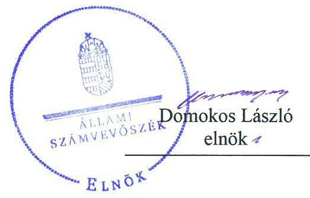
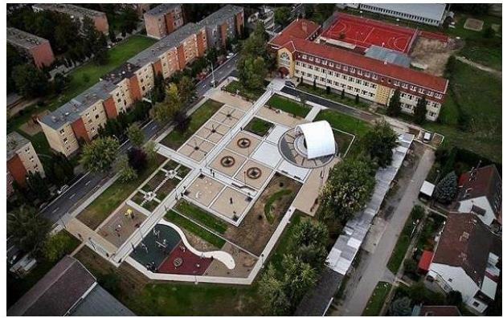
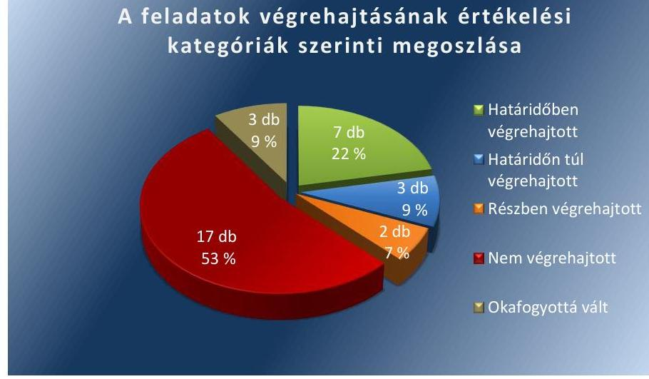
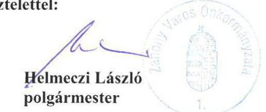
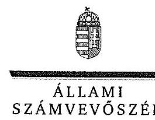
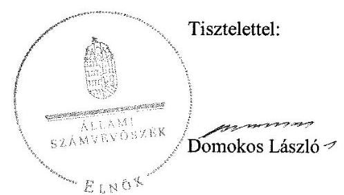
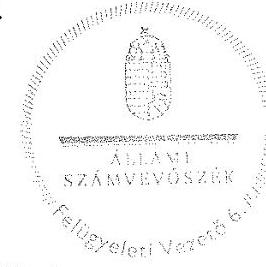
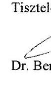

# Jelentés 

## Utóellenőrzések

Az önkormányzatok belső
kontrollrendszere kialakításának és múködtetésének utóellenőrzése Záhony Város Önkormányzata 2018.

---

# Jellentés 

## Utóellenőrzések

Az önkormányzatok belső
kontrollrendszere kialakításának és múködtetésének utóellenőrzése Záhony Város Önkormányzata
2018. 02. hó 01. nap

---

|  | AZ ELLENŐRZÉST FELÜGYELTE: |
| :--: | :--: |
|  | DR. BENEDEK MÁRIA felügyeleti vezető |
|  | AZ ELLENŐRZÉST VEZETTE ÉS A VÉGREHAJTÁSÁÉRT FELELŐS: |
|  | NAGY ANNA ellenőrzésvezető |
|  | A PROGRAM ÖSSZEÁLLÍTÁSÁÉRT FELELŐS: |
|  | JANIK JÓZSEF LÁSZLÓ osztályvezető |
|  | A TÉMÁHOZ KAPCSOLÓDÓ KORÁBBI SZÁMVEVŐSZÉKI JELENTÉSEK: |
|  | - címe: Jelentés az önkormányzatok belső kontrollrendszere kialakításának, egyes kontrolltevékenységek és a belső ellenőrzés müködésének - 2013. évben induló - ellenőrzéséről Záhony |
| Jelentéseink az Országgyúlés számítógépes hálózatán és az Interneten a www.asz.hu címen is olvashatóak. | - sorszáma: 13123 |
|  | IKTATÓSZÁM: EL-0067-064/2018 |
|  | TÉMASZÁM: 21 |
|  | ELLENŐRZÉS-AZONOSÍTÓ SZÁM: V0755113 |

---

# TARTALOMJEGYZÉK 

■ ÖSSZEGZÉS ..... 5
■ AZ ELLENŐRZÉS CÉLJA ..... 6
■ AZ ELLENŐRZÉS TERÜLETE ..... 7
■ AZ ELLENŐRZÉS HÁTTERE, INDOKOLTSÁGA ..... 8
■ A JELENTÉS LÉNYEGES KÉRDÉSKÖRE ..... 9
■ ELLENŐRZÉS HATÓKÖRE ÉS MÓDSZEREI ..... 10
■ MEGÁLLAPÍTÁSOK ..... 12
■ KÖVETKEZTETÉSEK ..... 16
■ MELLÉKLETEK ..... 17
I. sz. melléklet: Az ÁSZ 13123 számú jelentéséhez kapcsolódó intézkedési terv végrehajtása ..... 17
■ FÜGGELÉK: ÉSZREVÉTELEK ..... 25
■ RÖVIDÍTÉSEK JEGYZÉKE ..... 47

---

.

---

# ÖSSZEGZÉS 

Az Állami Számvevőszék Záhony Város Önkormányzata belső kontrollrendszere kialakításának és müködtetésének utóellenőrzése során megállapította, hogy az intézkedési tervben meghatározott feladatok többségét nem hajtotta végre. A monitoring rendszer müködésének hiányosságai, a pénzügyi jogkörök nem szabályszerű gyakorlása miatt nem biztositott a müködés és gazdálkodás szabályszerűsége, a közpénzekkel történő felelős elszámolás. A végrehajtott feladatokkal javult a belső kontrollrendszer szabályozottsága.

## Az ellenőrzés társadalmi indokoltsága

Az Állami Számvevőszék stratégiájában célul tűzte ki a számvevőszéki munka hasznosulásának javítását. Ezzel összhangban ellenőrzi, hogy az ellenőrzött szervezetek megvalósították-e a korábbi ellenőrzései által feltárt hibák, hiányosságok és szabálytalanságok megszüntetése céljából kialakított intézkedési terveikben foglaltakat. A rendszeres utóellenőrzések hozzájárulnak a szükséges intézkedések tényleges végrehajtásához, ezáltal a közpénzügyek rendezettségének javulásához, igazolják, hogy lezárult a következmények nélküli ellenőrzések időszaka.

## Főbb megállapítások, következtetések

Záhony Város Önkormányzata az intézkedést igénylő megállapításokhoz és javaslatokhoz kapcsolódóan összeállított intézkedési tervben meghatározott 32 feladatból hetet határidőben, hármat határidőn túl, kettőt részben, 17 feladatot nem hajtott végre, három feladat végrehajtása okafogyottá vált.

A kontrolltevékenységek területén a pénzügyi jogkörök gyakorlása továbbra sem volt szabályszerű, a jegyző az operatív gazdálkodás során a müködésbeli hibák megelőzése, feltárása és kijavítása érdekében nem intézkedett, továbbá nem gondoskodott a monitoring rendszer müködésbeli hiányosságainak megszüntetéséről. A részben, illetve a nem végrehajtott feladatok miatt Záhony Város Önkormányzata tevékenységének szabályozása, müködtetésének szabályossága további intézkedéseket igényel a közpénzekkel történő felelős és szabályszerű gazdálkodás biztosítása érdekében. A végrehajtott feladatok hozzájárultak a szabályozottság javításához: megtörtént a kockázatkezelési szabályzat kiadása, javult az információs és kommunikációs rendszer, valamint a belső ellenőrzés szabályozottsága.

Záhony Város Önkormányzata az intézkedési tervben meghatározott feladatok végrehajtásáról a jogszabályban előírt nyilvántartást nem vezette.

---

# AZ ELLENŐRZÉS CÉLJA 

Az ellenőrzés célja annak értékelése volt, hogy a számvevőszéki jelentésben foglalt intézkedést igénylő megállapításokkal és javaslatokkal összhangban készített intézkedési tervben meghatározott feladatokat az ellenőrzött szervezet végrehajtotta-e.

---

# **AZ ELLENŐRZÉS TERÜLETE**

## **Záhony Város Önkormányzata**

Záhony Szabolcs-Szatmár-Bereg megyében fekszik, a város a Záhonyi járás székhelye. Lakónépességének száma a Központi Statisztikai Hivatal Magyarország közigazgatási helynévkönyve alapján 2016. január 1-jén 4237 fő volt.

Záhony, valamint Győröcske és Zsurk 2013. március 2-ával létrehozta a Záhonyi Közös Önkormányzati Hivatalt. A polgármester1 és a jegyző2 személyében az ellenőrzött időszakban változás történt. A polgármester 2014. október 12-től tölti be a tisztségét, a jegyző 2015. augusztus 18-tól látja el közszolgálati feladatait.

Záhony Város Önkormányzata a 2015. évi költségvetésének végrehajtásáról szóló zárszámadás3 szerint 1068,8 millió Ft költségvetési bevételt ért el, valamint 1035,5 millió Ft költségvetési kiadást teljesített, befektetett eszközeinek a könyv szerinti értéke 2287,4 millió Ft, összes eszközértéke 2601,5 millió Ft volt.

Az Állami Számvevőszék 2013-ban ellenőrizte Záhony Város Önkormányzata belső kontrollrendszerének kialakítását, valamint egyes kontrolltevékenységek és a belső ellenőrzés működését a 2012. január 1-jétől 2012. december 31-ig terjedő időszakra vonatkozóan. Az erről szóló 13123 számú jelentését 2013. december 2-án tette közzé. Az ellenőrzés célja annak megállapítása volt, hogy a belső kontrollrendszer elemeinek kialakítása, a pénzügyi folyamatokban kulcsszerepet betöltő teljesítésigazolás és érvényesítés, és a belső ellenőrzés szabályos működése biztosította-e Záhony Város Önkormányzatánál a közpénzfelhasználás szabályosságát, hozzájárult-e az értéket teremtő rend követelményének érvényesüléséhez.

Az utóellenőrzés – a 2013. december 2-től 2017. július 3-ig végrehajtott feladatokat figyelembe véve – az Állami Számvevőszék jelentésében a polgármester és a jegyző részére megfogalmazott, intézkedést igénylő megállapításokra és javaslatokra készített, az Állami Számvevőszék részére megküldött intézkedési tervben meghatározott feladatok végrehajtásának ellenőrzésére, értékelésére fókuszált.

---

# AZ ELLENŐRZÉS HÁTTERE, INDOKOLTSÁGA 

Az ÁSZ tv. ${ }^{4}$ 33. § (1) bekezdése értelmében a számvevőszéki jelentések intézkedést igénylő megállapításaihoz és javaslataihoz kapcsolódóan az ellenőrzött szervezet vezetője intézkedési tervet köteles összeállítani, és az Állami Számvevőszék részére megküldeni. Az intézkedési tervben foglaltak megvalósítását - az ÁSZ tv. 33. § (7) bekezdésében foglaltak alapján - az Állami Számvevőszék utóellenőrzés keretében ellenőrizheti. Az intézkedések megvalósulásának értékelése során az Állami Számvevőszék figyelembe veszi az ellenőrzött szervezetek működési feltételeiben, valamint a jogszabályi előírásokban bekövetkezett változásokat.

Az intézkedési tervekben foglalt feladatok hiányos, illetve késedelmes végrehajtása, valamint megvalósításának elmaradása azt mutatja, hogy az ellenőrzések során feltárt hibák, hiányosságok és szabálytalanságok megszüntetése nem kapott kellő hangsúlyt. Ez a szabályszerű működés és a felelős vezetői magatartás vonatkozásában kockázatot hordoz. E kockázatok feltárásával az Állami Számvevőszék utóellenőrzési rendszere fokozza a fegyelmet, és igazolja, hogy a közpénzzel való szabályos gazdálkodás felelőssége elől nem lehet kitérni.

Az utóellenőrzés négy szinten hasznosulhat:
$\longrightarrow$ A társadalom szintjén az utóellenőrzés jelzi, hogy a számvevőszéki ellenőrzés megállapításainak van következménye: a hiányosságok megszüntetésére az ellenőrzött szervezet által meghatározott intézkedések végrehajtását is számon kéri az ÁSZ5.
$\longrightarrow$ Az ellenőrzött terület szintjén az utóellenőrzés tájékoztatást nyújt a terület döntéshozóinak a hiányosságok kiküszöbölésének jó gyakorlatairól, ezzel lehetőséget biztosítva arra, hogy az ÁSZ ellenőrzési megállapításai, javaslatai a terület nem ellenőrzött szervezeteinek a működése során is hasznosuljanak.
$\longrightarrow$ Az ellenőrzött szervezet szintjén az utóellenőrzés feltárja, hogy a szervezet az intézkedések végrehajtásával hasznosította-e a korábbi ellenőrzési jelentésben a hiányosságok megszüntetése, illetve a kockázatok kezelése érdekében megfogalmazott javaslatokat.
$\longrightarrow$ Az ÁSZ szintjén az utóellenőrzés visszacsatolást ad az ellenőrzési jelentések hasznosulásáról, az intézkedések elmaradása vagy részleges megvalósulása a további ellenőrzésekhez kockázati jelzésként szolgál.

---

# A JELENTÉS LÉNYEGES KÉRDÉSKÖRE 

Az ellenőrzött szervezet az intézkedési tervben foglaltakat az elöirt határidőben végrehajtotta-e?

---

# ELLENŐRZÉS HATÓKÖRE ÉS MÓDSZEREI 

## Az ellenőrzés típusa

Megfelelőségi ellenőrzés.

## Az ellenőrzött időszak

Az utóellenőrzés alapját képező ÁSZ jelentés közzétételének napjától (2013. december 02.) az ellenőrzésről szóló kiértesítő levél keltének napjáig (2017. július 03.) tartó időszak.

## Az ellenőrzés tárgya

Az ÁSZ tv. 2011. július 1-jei hatálybalépését követően a számvevőszéki jelentésben foglalt intézkedést igénylő megállapításokkal és javaslatokkal összhangban - az ellenőrzött szervezet által - készített intézkedési tervben foglaltak végrehajtásának ellenőrzése volt.

Az ellenőrzés kiterjedt minden olyan körülményre és adatra, amely az ÁSZ jogszabályban meghatározott feladatainak teljesítéséhez, valamint a program végrehajtása folyamán felmerült újabb összefüggések feltárásához szükséges volt.

## Az ellenőrzött szervezet

Záhony Város Önkormányzata

## Az ellenőrzés jogalapja

Az ÁSZ tv. 33. § (7) bekezdése alapján az intézkedési tervben foglaltak megvalósítását az ÁSZ utóellenőrzés keretében ellenőrizheti.

## Az ellenőrzés módszerei

Az ÁSZ az ellenőrzést a nemzetközi standardokat irányadónak tekintve az ellenőrzési program ellenőrzési kérdései, az ellenőrzött időszakban hatályos jogszabályok, az ellenőrzés szakmai szabályok és módszertanok figyelembevételével, önállóan végezte.

Az ÁSZ az ellenőrzés ideje alatt az ellenőrzött szervezettel történő kapcsolattartást az ÁSZ SZMSZ ${ }^{\circledR}$-ének vonatkozó előírásai alapján biztosította.

---

Az utóellenőrzés megállapításait elsősorban az ÁSZ rendelkezésére álló, valamint az ellenőrzött szervezetektől elektronikusan bekért dokumentumok alapozták meg.

Az ellenőrzési bizonyítékként felhasználható adatforrások közé tartoztak egyrészt a szakmai programban felsorolt adatforrások, másrészt minden - az ellenőrzés folyamán feltárt, az ellenőrzés szempontjából információt tartalmazó - dokumentum.

Az intézkedési tervben előírt feladatokat azok végrehajthatósága, illetve végrehajtása szempontjából az ÁSZ az alábbiak szerint értékelte:
"határidőben végrehajtott" a feladat, ha a teljesítés dokumentáltan, az intézkedési tervben előírt határidőben és tartalommal megtörtént;
"határidőn túl végrehajtott" a feladat, ha annak teljesítése az intézkedési tervben meghatározott módon, de az előírt határidőn túl történt meg;
"részben végrehajtott" a feladat, ha végrehajtása nem teljeskörűen az intézkedési tervben előírt módon történt meg;
"nem végrehajtott" a feladat, ha a végrehajtás nem történt meg, vagy amennyiben a teljesítést nem dokumentálták;
"okafogyottá vált" a feladat, ha végrehajtására - meghatározott esemény bekövetkezése, továbbá külső körülmény, a működést érintő feltétel változása miatt - már nincs szükség, illetve lehetőség, és egyértelműen megállapítható, hogy az intézkedést szükségessé tevő körülmény a jövőben nem fordulhat elő;
"nem időszerű" az a feladat, amelynek ellenőrzési időszakon belüli végrehajtására azért nem került (kerülhetett) sor, mert az intézkedés alapjául szolgáló esemény nem következett be, de annak jövőbeni előfordulása lehetséges, a végrehajtása nem volt esedékes, vagy a végrehajtás határideje még nem járt le.
Az ellenőrzés lefolytatásához az ellenőrzött szervezet a tanúsítványok elektronikus kitöltésével, valamint az ÁSZ által kért dokumentumok elektronikus megküldésével szolgáltatott adatokat, amelyek valódiságát és teljes körűségét az ellenőrzött szervezet vezetője által tett teljességi és hitelességi nyilatkozat igazolta. Az így rendelkezésre bocsátott adatok, információk kontrollja az ellenőrzés keretében történt.

---

# MEGÁLLAPÍTÁSOK 

## Az ellenőrzött szervezet az intézkedési tervben foglaltakat az előírt határidőben végrehajtotta-e?

Összegző megállapítás

Az Önkormányzat ${ }^{7}$ az intézkedési tervben meghatározott 32 feladatból hetet határidőben, hármat határidőn túl, kettőt részben, 17 feladatot nem hajtott végre, illetve három feladat végrehajtása okafogyottá vált. Az intézkedési tervben meghatározott feladatok végrehajtásáról a jogszabályban előírt nyilvántartást nem vezette.

Az ÁSZ a jelentésében a polgármester részére egy, illetve a jegyző részére 31 intézkedést igénylő megállapítást és javaslatot fogalmazott meg, amelynek hasznosítására a Képviselő-testület ${ }^{8}$ az intézkedési tervben ${ }^{9} 32$ feladatot határozott meg, melyek végrehajtására a polgármester és a jegyző együttesen egy, a jegyző 30, illetve a belső ellenőrzési vezető egy esetben került megjelölésre.

Az intézkedési tervben meghatározott feladatokat, határidőket, felelősöket, és a feladatok végrehajtását az I. számú melléklet mutatja be.

A jegyző az intézkedési tervben meghatározott feladatok végrehajtásáról nem vezette a Bkr. ${ }^{10} 14$. § (1) bekezdésében előírt nyilvántartást.

Az Önkormányzat intézkedési tervében meghatározott feladatok végrehajtásának értékelési kategóriák szerinti megoszlását az 1. ábra szemlélteti.

1. ábra

## A feladatok végrehajtásának értékelési kategóriák szerinti megoszlása

Fonás: ÁSZ

---

# HATÁRIDŐBEN VÉGREHAJTOTT feladatok: 

1. A jegyző felmérte és megállapította a jogszabályban foglaltak alapján a Polgármesteri Hivatal ${ }^{11}$ tevékenységében és gazdálkodásában rejlő kockázatokat, meghatározta az egyes kockázatokkal öszszefüggő szükséges intézkedéseket, valamint azok teljesítésének, folyamatos nyomon követésének módját a 2014. március 20. napjától hatályos Kockázatkezelési szabályzatban ${ }^{12}$.
2. A jegyző Iratkezelési szabályzatban ${ }^{13}$ szabályozta a jogszabályban foglaltaknak megfelelően a dokumentumokhoz és információkhoz való hozzáférés tekintetében a felelősségi köröket.
3. A jegyző a Hivatali SZMSZ-ben ${ }^{14}$ rögzítette a jogszabályi előírásoknak megfelelően a gazdasági vezető és a gazdasági feladatot ellátó alkalmazottak helyettesítésének rendjét.
4. A jegyző intézkedett arról, hogy a gazdasági eseményeket a jogszabályokban foglaltaknak megfelelően, a tényleges tartalmuk szerint könyveljék.
5. A jegyző a jogszabályban foglaltaknak megfelelően Hivatali SZMSZben és Iratkezelési szabályzatban kialakította a szervezeten belüli információáramlás rendszerét.
6. A jegyző intézkedett a jogszabályi előírásoknak megfelelő Iratkezelési szabályzat hatályba léptetéséről.
7. A jegyző intézkedett a jogszabály előírásainak megfelelően a Stratégiai ellenőrzési terv ${ }^{15}$ elkészítéséről.

## HATÁRIDŐN TÚL VÉGREHAJTOTT feladatok:

8. A jegyző 2014. január 31.-e helyett 2014. június 25-én gondoskodott a jogszabályoknak foglaltaknak megfelelően a köztisztviselőkkel szembeni hivatásetikai alapelvek részletes szabályozásáról, valamint a polgármesternél az etikai eljárás szabályait rögzítő dokumentum Képviselő-testület elé terjesztésének kezdeményezéséről.
9. A jegyző 2014. január 31.-e helyett 2014. április 7-én kezdeményezte, hogy az éves ellenőrzési terv tartalmazza a jogszabályban meghatározott tartalmi elemeket.
10. A jegyző 2014. január 31.-e helyett 2014. április 7-én kezdeményezte az éves ellenőrzési tervnek a jogszabályban foglaltak szerinti, kockázatelemzéssel való megalapozását.

## RÉSZBEN VÉGREHAJTOTT feladatok:

11. A jegyző elkészítette és a Képviselő-testület 2014. október 29-én jóváhagyta a Hivatali SZMSZ módosítását, amely a jogszabály szerint tartalmazta azokat az ügyköröket, amelyek során a szervezeti egységek vezetői a költségvetési szerv képviselőjeként járhatnak el, továbbá meghatározta a szabályzatban nevesített munkakörök kapcsán a helyettesítés rendjét. Azonban a módosított Hivatali SZMSZ az Ávr. ${ }^{16}$ 13. § (1) bekezdés h) pontjában meghatározottak ellenére - a munkáltatói jogok gyakorlásának rendjére nem terjedt ki.

---

12. A jegyző kialakította a Monitoring szabályzatban ${ }^{17}$ a szervezet tevékenységének, a célok megvalósításának folyamatos nyomon követését biztosító rendszerét, azonban a Bkr. 3. § e) pontjában és a 10. §-ában előírtak ellenére nem működtette azt.

# NEM VÉGREHAJTOTT feladatok: 

13. A polgármester és a jegyző az Áht. ${ }^{18}$ 37. § (1) bekezdésének előírása ellenére nem intézkedett arról, hogy az Önkormányzat nevében történő kötelezettségvállalásra - az Ávr. 53. §-ában meghatározott kivételeket figyelembe véve - kizárólag a pénzügyi ellenjegyzés után, a pénzügyi teljesítés esedékességét megelőzően, írásban kerüljön sor.
14. A jegyző nem rögzítette belső szabályzatban az Ávr. 53. § (2) bekezdésében foglaltak ellenére az előzetes írásbeli kötelezettségvállalást nem igénylő kifizetések rendjét.
15. A jegyző nem rendezte belső szabályzatban az Ávr. 13. § (2) bekezdés a) pontjában foglaltak ellenére a teljesítésigazolás dokumentációs részletszabályait.
16. A jegyző nem gondoskodott az Ávr. 57 § (4) bekezdésében foglaltak ellenére a Polgármesteri Hivatal kiadási előirányzatai vonatkozásában a teljesítésigazolásra jogosult személyek kijelöléséről.
17. A jegyző az lkr. ${ }^{19}$ 8. § (1) bekezdésében foglaltak ellenére nem gondoskodott az iratkezelési szoftver által kezelt adatok biztonságáról, az üzembiztonság és az adatvédelmi szabályok érvényre juttatásához szükséges eljárásrend kialakításáról.
18. A jegyző az Info tv. ${ }^{20}$ 7. § (2)-(3) bekezdéseiben foglaltaktól eltérően nem biztosította megfelelően az adatbiztonság érvényesülését.
19. A jegyző nem intézkedett arról, hogy a teljesítésigazolásra az Ávr. 57. § (4) bekezdésében foglalt előírásoknak megfelelően kijelölt személyek az Ávr. 57. § (1) bekezdésében foglaltaknak megfelelően ellenőrizhető okmányok alapján ellenőrizzék a kiadások teljesítésének jogosságát, összegszerűségét, ellenszolgáltatást is magában foglaló kötelezettségvállalás esetében az ellenszolgáltatás teljesítését.
20. A jegyző nem intézkedett arról az Ávr. 58. § (1) bekezdés előírása ellenére, hogy az operatív gazdálkodás során a múködésbeli hibák megelőzése, feltárása és kijavítása érdekében a kifizetéseket megelőzően a teljesítésigazolás alapján ellenőrizzék az összegszerűséget, a fedezet meglétét és a megelőző ügymenetben az Áht., az Áhsz. ${ }^{21}$, az Áhsz. ${ }^{22}$, az Ávr. előírásai és a belső szabályzatokban foglaltak betartását.
21. A jegyző nem intézkedett - az Áht. 37. § (1) bekezdés és az Ávr. 55. § (1) bekezdés előírásaiban foglaltak ellenére - arról, hogy kötelezettségvállalásra - az Ávr. 53. §-ában meghatározott kivételekkel a pénzügyi ellenjegyzés után kerüljön sor.

---

22. A jegyző nem intézkedett arról, hogy a kötelezettségvállalások nyilvántartását az Ávr. 56. § (1) bekezdése rendelkezéseinek megfelelően vezessék.
23. A jegyző nem intézkedett arról, hogy az érvényesítő az Ávr. 58. § (2) bekezdés előírásainak megfelelően jelezze az utalványozónak, ha az Áht., az Áhsz.1,2, vagy az Ávr. és a belső szabályzatokban foglaltak megsértését tapasztalja.
24. A jegyző nem értékelte a Bkr. 11. § (1) bekezdésében foglalt kötelezettsége ellenére a belső kontrollrendszer minőségét a 2013. évre vonatkozóan a Bkr. 1. melléklete szerinti nyilatkozatban.
25. A jegyző nem kezdeményezte, hogy a belső ellenőrzési vezető a Bkr. 33. § (2) bekezdésének előírása alapján jóváhagyja a belső ellenőrzési programokat.
26. A jegyző nem kezdeményezte, hogy a belső ellenőrzési jelentések a Bkr. 39. § (3) bekezdés d) pontjában foglaltaknak megfelelően tartalmazzák az ellenőrzések típusát.
27. A jegyző nem intézkedett arról, hogy a belső ellenőrzéssel érintett ellenőrzöttek a Bkr. 45. § (1)-(3) bekezdéseiben foglalt előírások betartása érdekében intézkedési tervet készítsenek.
28. A jegyző nem kezdeményezte, hogy a belső ellenőrzési vezető a Bkr. 50. § (1)-(2) bekezdéseiben, valamint a Bkr. 47. § (1) bekezdésében foglalt előírások szerint az elvégzett belső ellenőrzésekről és a jelentésekben szereplő javaslatok nyomon követéséről nyilvántartást vezessen.
29. A belső ellenőrzési vezető nem kezdeményezte, hogy a Bkr. 49. (1) és (3) bekezdéseiben foglalt előírások alapján készítsék el az éves ellenőrzési jelentést, és azt küldjék meg a polgármesternek és a jegyzőnek.

# OKAFOGYOTTÁ VÁLT feladatok: 

30. Az Önkormányzathoz 2012. január 1-jén tartozó, egy önállóan működő intézményt 2013 szeptemberétől intézményi társulás keretében működtetik az érintett települések, ezért a Htv. ${ }^{23}$ 140. § (1) bekezdés c) pont rendelkezése szerinti számviteli rend kialakítása okafogyottá vált.
31. Az önkormányzati belső ellenőrzési feladatok ellátása 2014. január 1-jétől nem Társulás ${ }^{24}$ formájában történt, ezért a belső ellenőrzési vezető feladatai és kötelességei ellátása módjának a belső ellenőrzési tevékenység megszervezésére vonatkozó Társulási megállapodásban ${ }^{25}$ való rögzítése okafogyottá vált.
32. Az önkormányzati belső ellenőrzési feladatok ellátása 2014. január 1-jétől nem Társulás formájában történt - a belső ellenőrzési vezető feladatát és a belső ellenőrzési tevékenységet külső szakértő látta el - így az Önkormányzatra nem vonatkozott a Bkr. 56. §(2) bekezdése, ezért az éves ellenőrzési terv a jegyző írásos véleményének figyelembevételével történő összeállítása okafogyottá vált.

---

# KÖVETKEZTETÉSEK 

Az Önkormányzat nem gondoskodott a gazdálkodási jogkörök (érvényesítés, pénzügyi ellenjegyzés, teljesítés igazolás) szabályszerű gyakorlásáról, amivel sérül a közpénzekkel való átlátható, felelős gazdálkodás, és ami jelentős kockázatot jelent a gazdálkodás szabályszerűsége és elszámoltathatósága szempontjából. A nem végrehajtott feladatok indokolják a feltárt hiányosságok, szabálytalanságok tekintetében a munkajogi felelősség tisztázására irányuló eljárás megindítását, és eredményének ismeretében a szükséges intézkedések megtételét.

---

# MELLÉKLETEK

- I. SZ. MELLÉKLET: AZ ÁSZ 13123 SZÁMÚ JELENTÉSÉHEZ KAPCSOLÓDÓ INTÉZKEDÉSI TERV VÉGREHAJTÁSA

|  1. | Intézkedési tervben meghatározott feladat | Az intézkedési tervben meghatározott határidő | Az intézkedési tervben meghatározott feladat felelőse | A feladat végrehajtása  |
| --- | --- | --- | --- | --- |
|   | 1. | 2. | 3. | 4.  |
|  Határidőben végrehajtott feladat |  |  |  |   |
|  1. | Fel kell mérni és megállapítani a Bkr. 7. § (2) bekezdésében foglaltak alapján a Polgármesteri Hivatal tevékenységében és gazdálkodásában rejlő kockázatokat, meg kell határozni az egyes kockázatokkal szükséges intézkedéseket, valamint azok teljesítésének, folyamatos nyomon követésének módját. | 2014. március 31. | jegyző | A jegyző felmérte és megállapította a Bkr. 7. § (2) bekezdésében foglaltak alapján a Polgármesteri Hivatal tevékenységében és gazdálkodásában rejlő kockázatokat, meghatározta az egyes kockázatokkal összefüggő szükséges intézkedéseket, valamint azok teljesítésének, folyamatos nyomon követésének módját a 2014. március 20. napjától hatályos Kockázatkezelési szabályzatban  |
|  2. | Szabályozni kell a Bkr. 8 § (4) bekezdés b) pontjában foglaltak alapján a dokumentumokhoz és információkhoz való hozzáférés tekintetében a felelősségi köröket. | 2014. január 31. | jegyző | A jegyző szabályozta a Bkr. 8. § (4) bekezdés b) pontjában foglaltak alapján a dokumentumokhoz és információkhoz való hozzáférés tekintetében a felelősségi köröket az általa 2013. október 18-án kiadmányozott, 2014. január 1-jén hatályba lépett Iratkezelési szabályzatban.  |
|  3. | Rögzíteni kell a belső szabályzatban az Ávr. 13 § (5) bekezdése alapján a gazdasági vezető és a gazdasági feladatot ellátó alkalmazottak helyettesítésének rendjét. | 2014. március 31. | jegyző | A jegyző rögzítette az Ávr. 13. § (5) bekezdése alapján a gazdasági vezető és a gazdasági feladatot ellátó alkalmazottak helyettesítésének rendjét Hivatali SZMSZ-ben, melyet a Képviselő-testület Határozat ${ }^{26}$-tal 2013. november 25-én fogadott el.  |
|  4. | Intézkedni kell - a teljesítésigazolás és az érvényesítés vonatkozásában feltárt hiányosságok megszüntetése, illetve az operatív gazdálkodás során a müködésbeli hibák megelőzése, feltárása és kijavítása érdekében - arról, hogy a gazdasági eseményeket a Számv. tv. 16. § (3) bekezdésében, az Áhsz. 3. § (11) bekezdésében és az Áhsz. 9. számú mellékletében foglaltaknak megfelelően a tényleges tartalmuk szerint könyveljék. | 2014. március 31. | jegyző | A jegyző intézkedett a teljesítésigazolás és az érvényesítés vonatkozásában feltárt hiányosságok megszüntetése, továbbá az operatív gazdálkodás során a müködésbeli hibák megelőzése, feltárása és kijavítása érdekében arról, hogy a gazdasági eseményeket a Számv. tv. ${ }^{27}$ 16. § (3) bekezdése, az Áhsz. 9. § (11) bekezdése és az Áhsz. 9. számú melléklete, illetve az Áhsz. 24. § (1) bekezdése és az Áhsz. 216. melléklete rendelkezései szerint a tényleges tartalmuk szerint könyveljék.  |

---

|  5. | Intézkedési tervben meghatározott feladat | Az intézkedési tervben meghatározott határidő | Az intézkedési tervben meghatározott feladat felelőse | A feladat végrehajtása  |
| --- | --- | --- | --- | --- |
|   | 1. | 2. | 3. | 4.  |
|  5. | Ki kell alakítani a Bkr. 9. § (1) bekezdésében foglaltak alapján a szervezeten belüli információáramlás rendszerét. | 2014. január 31. | jegyző | A jegyző kialakította a Bkr. 9. § (1) bekezdésében foglaltaknak megfelelően a szervezeten belüli információáramlás rendszerét, melynek szabályait a Képviselő-testület a Határo-zat1-tal jóváhagyott Hivatali SZMSZ és a jegyző által 2013. október 18-án kiadmányozott Iratkezelési szabályzat tartalmazta  |
|  6. | Intézkedni kell az Ltv ${ }^{28}$. 10 § (1) bekezdés c) pontjában foglaltaknak megfelelő iratkezelési szabályzat hatályba léptetéséről | 2013. december 31. | jegyző | A jegyző intézkedett az Ltv. 10. § (1) bekezdése c) pontjában foglaltaknak megfelelő - a Magyar Nemzeti Levéltár és a Szabolcs-Szatmár-Bereg Megyei Kormányhivatal egyetértésével való - Iratkezelési szabályzat hatályba léptetéséről. A jegyző által 2013. október 18-án kiadmányozott Iratkezelési szabályzatot a Magyar Nemzeti Levéltár 2013. október 29-én, a Szabolcs-Szatmár-Bereg Megyei Kormányhivatal 2013. november 22-én hagyta jóvá.  |
|  7. | Kezdeményezni kell, hogy készítsenek a Bkr. 30. § (1) bekezdésében foglalt előírásoknak megfelelően stratégiai ellenőrzési tervet. | 2014. január 31. | jegyző | A jegyző 2014. január 21-én jóváhagyta a Bkr. 30. § (1) bekezdése előírásainak megfelelő Stratégiai ellenőrzési tervet, amely négy év vonatkozásában tartalmazta a hosszú távú célkitűzéseket, stratégiai célokat, a belső kontrollrendszer általános értékelését, a kockázati tényezőket és értékelésüket, a belső ellenőrzésre vonatkozó fejlesztési és képzési tervet, a szükséges erőforrások felmérését a létszám, képzettség és a tárgyi feltételek tekintetében, továbbá az ellenőrzési prioritásokat és az ellenőrzési gyakoriságot.  |
|   | Határidőn túl végrehajtott feladat |  |  |   |
|  8. | Elő kell készíteni a Mótv ${ }^{29}$. 81. § (3) bekezdés c) pontjában foglalt feladatkörében a Kttv ${ }^{30}$. 83 § (1)-(4) bekezdésében foglaltaknak megfelelően a köztisztviselőkkel szembeni hivatásetikai alapelvek részletes tartalmának, valamint az etikai eljárás szabályainak dokumentumait és kezdeményezni a polgármesternél a Kttv. 231 § (1) bekezdésében foglaltak alapján annak Képviselő-testület elé terjesztését. | 2014. január 31. | jegyző | A jegyző Mótv. 81. § (3) bekezdés c) pontjában foglalt feladatkörében előkészítette, a Kttv. 231 § (1) bekezdésében foglaltak alapján kezdeményezte az előterjesztését és a Képviselő-testület a Határozat ${ }_{2}{ }^{31}$ szerint 2014. június 25-én jóváhagyta a Záhonyi Közös Önkormányzati Hivatal köztisztviselőivel szemben támasztott hivatásetikai alapelvekről és az etikai eljárásról szóló szabályzatot. A szabályzat tartalmazza az intézkedési tervben előírt feladat értelmében a Kttv. 83. § (1)-(4) bekezdésében foglaltaknak megfelelően a köztisztviselőkkel szembeni hivatásetikai alapelvek részletes előírásait, valamint az etikai eljárással kapcsolatos szabályozást.  |

---

|  8. | Intézkedési tervben meghatározott
feladat | Az intézkedési
tervben meghatá-
rozott határidő | Az intézkedési
tervben meghi-
tározott feladat
felelőse | A feladat végrehajtása  |
| --- | --- | --- | --- | --- |
|  9. | 1. | 2. | 3. | 4.  |
|  9. | Kezdeményezni kell, hogy az éves ellenőrzési tervek
tartalmazzák a Bkr. 31. § (4) bekezdés a), c), e) és g)
pontjaiban előírt tartalmi elemeket | 2014. január 31. | jegyző | A jegyző kezdeményezte, hogy az éves ellenőrzési terv tartalmazza a Bkr. 31. § (4) be
kezdés a), c), e) és g) pontjaiban előírt tartalmi elemeket, a belső ellenőrzési vezető 2014.
április 7-én elkészítette ezen jogszabályban foglaltak alapján – az ellenőrzési tervet me
alapozó elemzések és a kockázatelemzés eredményének összefoglaló bemutatását, az
ellenőrzések célját, a rendelkezésre álló és a szükséges ellenőrzési kapacitás meghatáro
zását, továbbá az ellenőrzések tervezett ütemezését is tartalmazó – a 2014. évi ellenő
rzési terv kiegészítését, melyet a Képviselő-testület Határozat_{3}^{32}-tal 2014. május 7.-én
hagyott jóvá.  |
|  10. | Kezdeményezni kell, hogy az éves ellenőrzési tervet - a
Bkr. 31. § (2) bekezdésében foglalt előírás teljesítése
érdekében - kockázatelemzéssel alapozzák meg. | 2014. január 31. | jegyző | A jegyző kezdeményezte, hogy az éves ellenőrzési tervet a Bkr. 31. § (2) bekezdésében
foglalt előírás szerint kockázatelemzéssel alapozzák meg. A belső ellenőrzési vezető a
2014. április 7-én elkészített kockázatelemzésével alapozta meg a 2014. évi ellenőrzési
tervet, amely alapján a Képviselő-testület 2014. május 7.-én a Határozat_{3}-tal jóváhagyta
a 2014. évi ellenőrzési terv kiegészítését.  |
|  11. | Elő kell készíteni a hivatali SZMSZ módosítását és kezd
deményezni az Áht. 9. § (1) bekezdés a) pontjában fog
laltak alapján a polgármesternél a Képviselő-testüle
t elé terjesztését annak érdekében, hogy az tartalmazza
az Ávr. 13. § (1) bekezdés f), g), h) és i) pontjaiban fog
laltaknak megfelelően azokat az ügyköröket, amelyek
során a szervezeti egységek vezetői a költségvetési
szerv képviselőjeként járhatnak el, továbbá a hivatali
SZMSZ-ben nevesített munkakörökre a helyettesítés
rendjét, a munkáltatói jogok gyakorlásának rendjét,
valamint az irányító szerv által – az Ávr. 10. § (1)-(3)
bekezdése szerint – a költségvetési szervhez rendelt
más költségvetési szervek felsorolását. | 2014. január 31. | jegyző | A jegyző elkészítette a hivatali SZMSZ módosítását és kezdeményezte az Áht. 9. § (1)
bekezdés a) pontjában foglaltak alapján a polgármesternél a Képviselő-testület elé ter
jesztését.
Végrehajtott feladatrész:
A Képviselő-testület a Határozat_{3}^{33} értelmében 2014. október 29-én jóváhagyta a hiva
tali SZMSZ módosítását, mely – az Ávr. 13. § (1) bekezdés f) és g) pontjai szerint – tartal
mazza azon ügyköröket, amelyek során a szervezeti egységek vezetői a költségvetési
szerv képviselőjeként járhatnak el, valamint meghatározza a szabályzatban nevesített
munkakörök kapcsán a helyettesítés rendjét.
Nem végrehajtott feladatrész:
A Képviselő-testület által 2014. október 29-én jóváhagyott Határozat_{4} értelmében a hi
vatali SZMSZ módosítása – az Ávr. 13. § (1) bekezdés h) pontjában meghatározottak el
lenére – a munkáltatói jogok gyakorlásának rendjére nem terjedt ki. A 2012. január 1-
jén az Önkormányzathoz tartozó, egy önállóan működő intézményt 2013 szeptemberé
től intézményi társulás keretében működtetik az érintett települések, így a hivatali
SZMSZ módosítása során nem vált szükségessé – az Ávr. 13. § (1) bekezdés i) pontjában
előírt – az irányító szerv által az Ávr. 10. § (1)-(3) bekezdése szerint a költségvetési szerv
hez rendelt más költségvetési szervek felsorolása.  |

---

|  1. | Intézkedési tervben meghatározott feladat | Az intézkedési tervben meghatározott határidő | Az intézkedési tervben meghatározott feladat felelőse | A feladat végrehajtása  |
| --- | --- | --- | --- | --- |
|  1. |  | 2. | 3. | 4.  |
|  12. | Ki kell alakítani és múködtetni a Bkr. 3. § e) bekezdésében és a 10. §-ában előírtak alapján a szervezet tevékenységének, a célok megvalósításának folyamatos nyomon követését biztosító rendszert. | folyamatos | jegyző | Végrehajtott feladatrész:
A jegyző a 2013. december 28-án kiadmányozott Monitoring szabályzatban kialakította a Polgármesteri Hivatal tevékenységének, a célok megvalósításának folyamatos nyomon követését támogató rendszerét, amelynek a dokumentum szerint része az operatív tevékenységek keretében megvalósuló folyamatos és eseti nyomon követés is.
Nem végrehajtott feladatrész:
A monitoring rendszer működtetéséről a Bkr. 3. § e) pontjában és a 10. §-ában előírtak ellenére a jegyző nem gondoskodott.  |
|   |  |  | Nem végrehajtott feladatok |   |
|  13. | Intézkedni kell arról, hogy az Önkormányzat nevében történő kötelezettségvállalásra az Áht. 37. § (1) bekezdésében foglaltaknak megfelelően - Ávr. 53. §-ában meghatározott kivételeket figyelembe véve - kizárólag a pénzügyi ellenjegyzés után, a pénzügyi teljesítés esedékességét megelőzően, írásban kerüljön sor. | 2013. december 31. | polgármester, jegyző | A polgármester és a jegyző az Áht. 37. § (1) bekezdésének előírása ellenére nem intézkedett arról, hogy az Önkormányzat nevében történő kötelezettségvállalásra - az Ávr. 53. §-ában meghatározott kivételeket figyelembe véve - kizárólag a pénzügyi ellenjegyzés után, a pénzügyi teljesítés esedékességét megelőzően, írásban kerüljön sor.  |
|  14. | Rögzíteni kell a belső szabályzatban az Ávr. 53. § (2) bekezdése alapján az előzetes kötelezettségvállalást nem igénylő kifizetések rendjét. | 2014. március 31. | jegyző | A jegyző nem rögzítette belső szabályzatban az Ávr. 53. § (2) bekezdésében foglaltak ellenére az előzetes írásbeli kötelezettségvállalást nem igénylő kifizetések rendjét.  |
|  15. | Rendezni kell a belső szabályzatban az Ávr. 13 § (2) bekezdése a) pontjának előírása alapján a teljesítésigazolás dokumentációs részletszabályait. | 2014. március 31. | jegyző | A jegyző nem rendezte belső szabályzatban az Ávr. 13. § (2) bekezdés a) pontjában foglaltak ellenére a teljesítésigazolás dokumentációs részletszabályait.  |
|  16. | Gondoskodni kell az Ávr. 57 § (4) bekezdésében foglaltak alapján a Polgármesteri Hivatal kiadási előirányzatai vonatkozásában a teljesítésigazolásra jogosult személyek kijelöléséről. | 2014. március 31. | jegyző | A jegyző nem gondoskodott az Ávr. 57 § (4) bekezdésében foglaltak ellenére a Polgármesteri Hivatal kiadási előirányzatai vonatkozásában a teljesítésigazolásra jogosult személyek kijelöléséről.  |
|  17. | Gondoskodni kell az Ikr. 8 § (1) bekezdésében foglaltak szerint az iratkezelési szoftver által kezelt adatok biztonságáról, ki kell alakítani az üzembiztonsági, adatvédelmi szabályok érvényre juttatásához szükséges eljárási szabályokat. | 2014. január 31. | jegyző | A jegyző a lkr. 8. § (1) bekezdésében foglaltak ellenére nem gondoskodott az iratkezelési szoftver által kezelt adatok biztonságáról, az üzembiztonság és az adatvédelmi szabályok érvényre juttatásához szükséges eljárásrend kialakításáról.  |

---

|  18. | Biztosítani kell az Info tv 7 § (2)-(3) bekezdéseiben foglaltaknak megfelelően az adatbiztonság érvényesülését. | 2014. |  |   |
| --- | --- | --- | --- | --- |
|  19. | Intézkedni kell - a teljesítésigazolás és az érvényesítés vonatkozásában feltárt hiányosságok megszüntetése, illetve az operatív gazdálkodás során a működésbeli hibák megelőzése, feltárása és kijavítása érdekében - arról, hogy a teljesítésigazolásra az Ávr. 57. § (4) bekezdésében foglalt előírásoknak megfelelően kijelölt személyek az Ávr. 57. § (1) bekezdésében foglaltaknak megfelelően ellenőrizhető okmányok alapján ellenőrizzék a kiadások teljesítésének jogosságát, összegszerűségét, ellenszolgáltatást is magában foglaló kötelezettségvállalás esetében az ellenszolgáltatás teljesítését. | 2014. |  |   |
|  20. | Intézkedni kell - a teljesítésigazolás és az érvényesítés vonatkozásában feltárt hiányosságok megszüntetése, illetve az operatív gazdálkodás során a működésbeli hibák megelőzése, feltárása és kijavítása érdekében - arról, hogy a kifizetéseket megelőzően - az Ávr. 58. § (1) bekezdése szerint - a teljesítésigazolás alapján ellenőrizzék az összegszerűséget, a fedezet meglétét és a megelőző ügymenetben az Áht., az Áhsz., az Ávr. előírásai és a belső szabályzatokban foglaltak betartását. | 2014. |  |   |
|  21. | Intézkedni kell - a teljesítésigazolás és az érvényesítés vonatkozásában feltárt hiányosságok megszüntetése, illetve az operatív gazdálkodás során a működésbeli hibák megelőzése, feltárása és kijavítása érdekében - arról, hogy az Áht. 37. § (1) és az Ávr. 55. § (1) bekezdésében foglaltaknak megfelelően kötelezettségvállalásra - az Ávr. 53. §-ában meghatározott kivételekkel a pénzügyi ellenjegyzés után kerüljön sor. | 2014. |  |   |

|  Az intézkedési tervben meghatározott határidő | Az intézkedési tervben meghatározott feladat felelőse | A feladat végrehajtása  |
| --- | --- | --- |
|  2. | 3. | 4.  |
|  2014. január 31. | jegyző | A jegyző az Info tv. 7. § (2)-(3) bekezdéseiben foglaltaktól eltérően nem biztosította megfelelően az adatbiztonság érvényesülését.  |
|  2014. március 31. | jegyző | A jegyző nem intézkedett arról, hogy az operatív gazdálkodás során a működésbeli hibák megelőzése, feltárása és kijavítása, valamint a teljesítésigazolás és az érvényesítés vonatkozásában feltárt hiányosságok megszüntetése érdekében a teljesítésigazolásra az Ávr. 57. § (1) bekezdésében foglaltaknak megfelelően kerüljön sor, és azt az Ávr. 57. § (4) bekezdésben foglaltak szerint kijelölt személyek végezzék. A folyamatos gazdálkodás során a teljesítésigazolást több esetben nem az Ávr. 57. § (4) bekezdésében foglaltak szerint kijelölt személyek végezték, továbbá az Ávr. 57. § (1) bekezdésének előírása ellenére teljesítést igazoló dokumentum nélkül végezték el a kiadások teljesítésének ellenőrzését: a kiadások teljesítésének jogosságát, összegszerűségét, ellenszolgáltatást is magában foglaló kötelezettségvállalás esetében az ellenszolgáltatás teljesítését. |   |
|  2014. március 31. | jegyző | A jegyző az operatív gazdálkodás során a működésbeli hibák megelőzése, feltárása és kijavítása érdekében nem intézkedett arról, hogy a kifizetéseket megelőzően - az Ávr. 58. § (1) bekezdés előírása szerint - a teljesítésigazolás alapján ellenőrizzék az összegszerűséget, a fedezet meglétét és a megelőző ügymenetben az Áht., az Áhsz.,, és az Ávr. előírásai és a belső szabályzatokban foglaltak betartását.  |
|  2014. március 31. | jegyző | A jegyző az operatív gazdálkodás során a működésbeli hibák megelőzése, feltárása és kijavítása érdekében nem intézkedett arról, hogy az Áht. 37. § (1) bekezdés és az Ávr. 55. § (1) bekezdés előírásaiban foglaltaknak megfelelően a kötelezettségvállalásra - az Ávr. 53. §-ában meghatározott kivételekkel - a pénzügyi ellenjegyzés után kerüljön sor.  |

---

|  22. | Intézkedési tervben meghatározott feladat | Az intézkedési tervben meghatározott határidő | Az intézkedési tervben meghatározott feladat felelőse | A feladat végrehajtása  |
| --- | --- | --- | --- | --- |
|   | 1. | 2. | 3. | 4.  |
|  22. | Intézkedni kell - a teljesítésigazolás és az érvényesítés vonatkozásában feltárt hiányosságok megszüntetése, illetve az operatív gazdálkodás során a müködésbeli hibák megelőzése, feltárása és kijavítása érdekében - arról, hogy a kötelezettségvállalások nyilvántartását az Ávr. 56. § (1) bekezdésében foglalt előírásoknak megfelelően vezessék. | 2014. március 31. | jegyző | A jegyző nem intézkedett a teljesítésigazolás és az érvényesítés vonatkozásában feltárt hiányosságok megszüntetése, illetve az operatív gazdálkodás során a müködésbeli hibák megelőzése, feltárása és kijavítása érdekében arról, hogy a kötelezettségvállalások nyilvántartását az Ávr. 56. § (1) bekezdés rendelkezéseinek megfelelően vezessék.  |
|  23. | Intézkedni kell - a teljesítésigazolás és az érvényesítés vonatkozásában feltárt hiányosságok megszüntetése, illetve az operatív gazdálkodás során a müködésbeli hibák megelőzése, feltárása és kijavítása érdekében - arról, hogy az érvényesítő az Ávr. 58. § (2) bekezdésében foglalt előírásnak megfelelően jelezze az utalványozónak, ha az Áht. vagy az államháztartási számviteli kormányrendelet, az Ávr. és a belső szabályzatokban foglaltak megsértését tapasztalja. | 2014. március 31. | jegyző | A jegyző nem intézkedett - a teljesítésigazolás és az érvényesítés vonatkozásában feltárt hiányosságok megszüntetése, illetve az operatív gazdálkodás során a müködésbeli hibák megelőzése, feltárása és kijavítása érdekében. Az operatív gazdálkodás során az érvényesítő az Ávr. 58. § (2) bekezdésben meghatározottak ellenére nem jelezte az állományba nem tartozók megbízási díjainak kifizetése során, hogy több esetben a kötelezettségvállalásra pénzügyi ellenjegyzés nélkül került sor. Az érvényesítő elmulasztotta azt is jelezni az utalványozó felé, hogy - az Ávr. 57. § (1) bekezdésben foglaltaktól eltérően - teljesítésigazolás nélkül került sor az adott kiadás teljesítésére.  |
|  24. | Értékelni kell a Bkr. 11. § (1) bekezdésében foglaltak alapján - a Bkr. 1. melléklet szerinti nyilatkozatban - a belső kontrollrendszer minőségét | 2014. április 30. | jegyző | A jegyző a Bkr. 11. § (1) bekezdésében foglalt kötelezettsége ellenére a belső kontrollrendszer minőségét a 2013. évre vonatkozóan - a Bkr. 1. melléklete szerinti nyilatkozatban - nem értékelte.  |
|  25. | Kezdeményezni kell, hogy az ellenőrzési programokat a Bkr. 33. § (2) bekezdésében foglaltak szerint belső ellenőrzési vezető hagyja jóvá. | folyamatos | jegyző | A jegyző nem kezdeményezte, hogy a belső ellenőrzési vezető a Bkr. 33. § (2) bekezdésének előírása alapján jóváhagyja a belső ellenőrzési programokat.  |
|  26. | Kezdeményezni kell, hogy az elvégzett ellenőrzésekről készített jelentések a Bkr. 39. § (3) bekezdés d) pontjában foglaltak alapján tartalmazzák az ellenőrzések típusát. | folyamatos | jegyző | A jegyző nem kezdeményezte, hogy a belső ellenőrzési jelentések a Bkr. 39. (3) bekezdés d) pontjában foglaltaknak megfelelően tartalmazzák az ellenőrzések típusát.  |
|  27. | Intézkedni kell arról, hogy a belső ellenőrzéssel érintett ellenőrzöttek a Bkr. 45. § (1)-(3) bekezdéseiben foglalt előírások betartása érdekében intézkedési tervet készítsenek. | folyamatos | jegyző | A jegyző nem intézkedett arról, hogy a belső ellenőrzéssel érintett ellenőrzöttek a Bkr. 45. § (1)-(3) bekezdéseiben foglalt előírások betartása érdekében intézkedési tervet készítsenek.  |

---

|  ㅇ
Fő
szor
szor | Intézkedési
tervben meghatározott
feladat | Az intézkedési
tervben meghatározott határidő | Az intézkedési
tervben meghatározott feladat felelőse | A feladat végrehajtása  |
| --- | --- | --- | --- | --- |
|   | 1. | 2. | 3. | 4.  |
|  28. | Kezdeményezni kell, hogy - a Bkr. 50. § (1)-(2), valamint a Bkr. 47. § (1) bekezdéseiben foglalt előírások szerint - az elvégzett ellenőrzésekről és a jelentésekben szereplő javaslatok nyomon követéséről nyilvántartást vezessenek. | folyamatos | jegyző | A jegyző nem kezdeményezte, hogy a belső ellenőrzési vezető az elvégzett belső ellenőrzésekről és a belső ellenőrzési jelentésekben tett megállapításokról, javaslatokról, továbbá a vonatkozó intézkedési tervekről és azok végrehajtásának nyomon követéséről a Bkr. 47. § (1) bekezdésének, valamint a Bkr. 50. § (1)-(2) bekezdéseinek rendelkezései szerint nyilvántartást vezessen.  |
|  29. | Kezdeményezni kell, hogy a Bkr. 49. § (1) és (3) bekezdéseiben foglalt előírások alapján készítsék el az éves ellenőrzési jelentést és azt küldjék meg a polgármesternek és jegyzőnek. | 2014. február 15. | belső ellenőrzési vezető | A belső ellenőrzési vezető a Bkr. 49. (1) és (3) bekezdéseinek előírásai ellenére nem kezdeményezte a 2013. évi éves ellenőrzési jelentés elkészítését, és ezáltal annak a jegyző, valamint a polgármester részére 2014. február 15-ig való megküldését.  |
|   |  |  |  | Okafogyottá vált feladat  |
|  30. | Ki kell alakítani a Htv. 140. § (1) bekezdés c) pontjában foglaltak szerint az önkormányzat intézményeinek számviteli rendjét. | 2014. március 31. | jegyző | Az Önkormányzathoz 2012. január 1-jén tartozó, egy önállóan működő intézményt 2013 szeptemberétől intézményi társulás keretében működtetik az érintett települések, ezért a Htv. 140. § (1) bekezdés c) pontja rendelkezése szerinti számviteli rend kialakítása okafogyottá vált.  |
|  31. | Intézkedni kell arról, hogy a Bkr. 16. § (4) bekezdés előírásának megfelelően a belső ellenőrzési tevékenység megszervezésére a Társulással kötött megállapodásban rendelkezzenek a Bkr. 22. § (1)-(2) bekezdéseiben foglalt tevékenységek és kötelességek ellátásának módjáról. | 2014. január 31. | jegyző | Az önkormányzati belső ellenőrzési feladatok ellátása 2014. január 1-jétől nem Társulás formájában történt. A belső ellenőrzési vezető feladatát, továbbá a belső ellenőrzési tevékenységet külső szakértő látta el. Ezért a belső ellenőrzési tevékenység megszervezésére vonatkozó rendelkezés Társulási megállapodásban történő rögzítése –a Bkr. 16. § (4) bekezdése előírásának alkalmazása- okafogyottá vált.  |
|  32. | Intézkedni kell arról, hogy az éves ellenőrzési terv öszszeállítása - a Bkr. 56. § (2) bekezdésében foglalt előírás teljesítése érdekében - a jegyző írásos véleményének figyelembevételével történjen | 2014. január 31. | jegyző | Az önkormányzati belső ellenőrzési feladatok ellátása 2014. január 1-jétől nem Társulás formájában történt. A belső ellenőrzési vezető feladatát, továbbá a belső ellenőrzési tevékenységet külső szakértő látta el. Ezért az Önkormányzatra nem vonatkozott a Bkr. 56. §(2) bekezdésében részletezett, a belső ellenőrzési feladatok társulás formájában történő ellátására vonatkozó különös szabály, ezért a feladat végrehajtása okafogyottá vált.  |

*Forrás: ÁSZ által készített táblázat*

---

.

---

# FÜGGELÉK: ÉSZREVÉTELEK 

A jelentéstervezetet a Számvevőszék 15 napos észrevételezésre megküldte az ellenőrzött szervezet vezetőjének az ÁSZ tv. 29. §* (1) bekezdése előírásának megfelelően.

A függelék tartalmazza az ellenőrzött észrevételeit, illetve az el nem fogadott észrevételek elutasításának indoklását.

[^0]
[^0]:    * 29. § (1) Az Állami Számvevőszék az ellenőrzési megállapításait megküldi az ellenőrzött szervezet vezetőjének vagy az általa megbízott személynek, és annak, akinek személyes felelősségét állapította meg.
    (2) Az ellenőrzött szervezet vezetője és a felelősként megjelölt személy az ellenőrzés megállapításaira tizenöt napon belül írásban észrevételt tehet.
    (3) Az Állami Számvevőszék az észrevételre a beérkezésétől számított harminc napon belül írásban válaszol. A figyelembe nem vett észrevételeket köteles a jelentésben feltüntetni, és megindokolni, hogy azokat miért nem fogadta el.

---

# Záhony Város Polgármestere 

4625 Záhony, Ady Endre út 35.
Telefon: 45/525-508/512. mellék Fax: 45/525-505
E-mail: zahony@zahony.hu; polgarmester@zahony.hu

Szám: 4/ 161-10/2017.
Úgyintéző: Gergely Sándorné

## Domokos László úr

Állami Számvevőszék
Elnöke

Budapest
Apáczai Csere János utca 10.
Pf. 54.
1364

Záhony Város Önkormányzata az „önkormányzatok belső kontrollrendszere kialakításának és müködtetésének utóellenőrzése" tárgyában készült Számvevőszéki jelentéstervezetet megkaptuk, melyhez észrevételt kívánunk tenni az alábbiak szerint:

Az Állami Számvevőszék 2013. évben ellenőrizte Záhony Város Önkormányzata belső kontrollrendszerének kialakítását, valamint egyes kontrolltevékenységek és a belső ellenőrzés müködését. Az ellenőrzésről készült Jelentés áttanulmányozása után megtettük a szükséges intézkedéseket, elkészült az Intézkedési terv. Az abban foglaltakat igyekeztünk maradéktalanul betartani, ennek ellenére az utóellenőrzés hibákat állapított meg.

Az Utóellenőrzés alkalmával a kért dokumentumokat becsatoltuk, így számlákat és a hozzá tartozó egyéb dokumentumokat, Szabályzatokat, Támogatási szerződéseket ... stb. A szabályzatok rögzítik a gazdálkodás munkafolyamatait, ennek alapján végezzük munkánkat.

A Jelentés tervezetben a Nem végrehajtott feladatok között véleményünk szerint vannak olyan megállapítások, melyek teljesültek. Ezekre szeretnék észrevételt tenni.
13) Az ellenőrzésre bekért bizonylatok közül 4 Utalványról valóban hiányzik a pénzügyi ellenjegyző aláírása. A jegyző váltást követően 2014. novemberétől gazdasági események bizonylatain a kötelezettségvállalásra - az Ávr. 53. §-ában meghatározott kivételekkel - pénzügyi ellenjegyzés után került sor.
14) A 2/402/2014. számú jegyzői intézkedéssel jóváhagyott és 2014. január 10-tól hatályba helyezett Gazdálkodási Szabályzat II. fejezete 1.2.1. pontja tartalmazza az

---

előzetes kötelezettségvállalást nem igénylő kifizetések rendjét (Gazdálkodási szabályzat az ellenőrzéskor becsatolásra került).

15) A 2/402/2014. számú jegyzői intézkedéssel jóváhagyott és 2014. január 10-től hatályba helyezett Gazdálkodási Szabályzat IV. fejezet 1.1.4. és az 1.2.3. pontja tartalmazza a teljesítésigazolás dokumentációs részletszabályait, a teljesítésigazolásra jogosult személyeket (Gazdálkodási szabályzat az ellenőrzéskor becsatolásra került).

16) A gazdálkodási szabályzat 4. melléklete tartalmazza a Záhonyi Közös Önkormányzati Hivatalnál teljesítésigazolásra kijelölt személyeket (Gazd.szab. 53-tól 58. oldal)
2013. március 02-től mint Polgármesteri Hivatal elnevezés nincs, helyette Záhonyi Közös Önkormányzati Hivatal néven múködik az intézmény. (Gazdálkodási szabályzat az ellenőrzéskor becsatolásra került).

17) -18) Az Adatvédelmi és számítástechnika védelmi szabályzat rendelkezik az adatok biztonságos védelmének folyamatáról a személyek, számítástechnikai adatok és programok, eszközök és dokumentációk vonatkozásában. Nyilvántartást vezetünk a dolgozók által kezelt programokról és azok hozzáféréséről (a szabályzat az ellenőrzéskor becstolásra került).

19) A 2013. december 19-i határidőt követő gazdasági események bizonylatain a teljesítésigazolásra kijelölt személyek okmányok alapján ellenőrizték a kiadások teljesítésének jogosságát, összegszerűségét, ellenszolgáltatást is magába foglaló kötelezettségvállalás esetében az ellenszolgáltatás teljesítését (Gazdálkodási szabályzat)

20) A 2013. december 19-i határidőt követő gazdasági események bizonylatain a kifizetéseket megelőzően a teljesítésigazolás alapján ellenőrizték az összegszerűséget, a fedezet meglétét és a belső szabályzatokban foglaltak ( ezek a kötelező lépések minden esetben a jogszabályban meghatározott sorrendben történik, még akkor is, ha az Utalványon minden aláírásnál egységes dátum szerepel).

21) Az ellenőrzés utáni időszakokban a gazdasági események bizonylatain a kötelezettségvállalásra - az Ávr. 53. §-ában meghatározott kivételekkel - (néhány számla kivételével) a pénzügyi ellenjegyzés után került sor.

22) Önkormányzatunknál és intézményeinél a kötelezettségvállalásokat 2013. évig a KOVA elnevezésű programban, 2014. évtől az EPER könyvelési programban tartjuk nyilván.

25) A belsőellenőrzést külső vállalkozó bevonásával végeztette az önkormányzat. A belső ellenőr által elkészített tervjavaslatot a képviselő testület minden évben megtárgyalta és Határozatban döntött róla, tehát a belső ellenőrzési program jóváhagyásra került.

---

26) A belső ellenőrzési tervek és jelentések is tartalmazzák az ellenőrzések típusát ( pl. 2012. évben szabályszerűségi, 2013. évben szabályszerűségi és pénzügyi, 2014. évben pénzügyi, szabályszerűségi, 2015. évben szabályszerűségi, 2016. évben szabályszerűségi, pénzügyi és rendszerellenőrzés)
27) Az adott években végzett ellenőrzések megállapításaira szükség szerint intézkedési tervet készítettünk, és a végrehajtás is dokumentálásra került.
28) A belső ellenőrzésekről és a jelentésekben szereplő javaslatok nyomonkövetéséről a nyilvántartás folyamatosan vezetve van. Az Ász által ellenőrzött időszakra vonatkozóan bekért nyilvántartás megküldésre került.
29) A belső ellenőrzési vezető az éves ellenőrzési jelentést minden esetben megküldi a polgármesternek, jegyzőnek, majd a jelentést a képviselő testület elé terjeszti elfogadásra. A 2013. évet kivéve ez minden évben megtörtént. 2013. évben a belső ellenőrzési jelentés elkészült, az érintett személyek megkapták, a képviselő-testület elő történő beterjesztése elmaradt.

A belső ellenőrzésre tett észrevételeinkhez kapcsolódóan a képviselő-testület által hozott határozatok az alábbiak:

Belső ellenőrzési terv:
162/2011. (XI.24.) 2012. évi Belső ellenőrzési terv elfogadása
148/2012. (XI.30.) 2013. évi Belső ellenőrzési terv elfogadása
136/2013. (XII.19.) 2014. évi Belső ellenőrzési terv elfogadása
154/2014. (XII.17.) 2014. évi Belső ellenőrzési terv módosítása
155/2014. (XII.17.) 2015. évi Belső ellenőrzési terv elfogadása
152/2015. (XII.17.) 2016. évi Belső ellenőrzési terv elfogadása
2096/2016. (XII.12.) 2017. évi Belső ellenőrzési terv elfogadása
Belső ellenőrzési jelentés:
50/2011.(IV.15.) 2010. évi belső ellenőrzési jelentés elfogadása
40/2012.(IV.12.) 2011. évi belső ellenőrzési jelentés elfogadása
35/2013. (IV.11.) 2012. évi belső ellenőrzési jelentés elfogadása
2014. évben a 2013. évi belső ellenőrzési jelentést a képviselő testület nem tárgyalta

51/2015. (IV.27.) 2014. évi belső ellenőrzési jelentés elfogadása

---

65/2016. (V.18.) 2015. évi belső ellenőrzési jelentés elfogadása
216/2017. (V.22.) 2016. évi belső ellenőrzési jelentés elfogadása
Tisztelettel kérem Elnök Urat, hogy a megtett észrevételeinket a Jelentés véglegesítésénél vegyék figyelembe.

Estelegesen elmerülő kérdésekben munkatársaim készséggel állnak rendelkezésükre.
Az ünnep közeledtével Kívánunk Önnek és munkatársainak Áldott Karácsonyi Ünnepet és Békés Boldog Új Esztendőt.

Záhony, 2017. december 19.

Tisztelettel:

---

ELNÖK

Ikt.szám: EL-0067-062/2018

# Helmeczi László úr 

polgármester
Záhony Város Önkormányzata

## Záhony

## Tisztelt Polgármester Úr!

Köszönettel megkaptam az Állami Számvevőszékhez 2017. december 22. napján érkezett "Utóellenörzések - Az önkormányzatok belsö kontrollrendszere kialakításának és müködtetésének utóellenörzése - Záhony Város Önkormányzata" címủ számvevőszéki jelentéstervezetben foglalt megállapításokra tett észrevételét.

Tájékoztatom Polgármester urat, hogy az el nem fogadott észrevételeket - az Állami Számvevőszékről szóló 2011. évi LXVI. törvény 29. § (3) bekezdése alapján - a jelentésben szerepeltetjük az elutasítás indokainak feltüntetésével együtt.

Az Állami Számvevőszék észrevételre vonatkozó álláspontjáról a felügyeleti vezető által készített részletes tájékoztatást csatoltan megküldöm.

Budapest, 2018. 01 hó 48 nap

Melléklet: Tájékoztatás az el nem fogadott észrevételekröl, azok indokairól

---

# FELÜGYELETI VEZETŐ 

1. számú melléklet
az EL-0067-062/2018 ikt. számú levélhez

## Tájékoztatás

az el nem fogadott észrevételekről, azok indokairól

| 1. | Észrevétel: | Az észrevétel 1. oldal 13. pontra vonatkozó bekezdésében, az ÁSZ jelentéstervezet 14. oldal a Megállapítások fejezet nem végrehajtott feladatok 13. pontjában foglalt megállapításra tett észrevétel: „_13. A polgármester és a jegyző az Áht. 37. § (1) bekezdésének elöírása ellenére nem intézkedett arról, hogy az Önkormányzat nevében történő kötelezettségvállalásra - az Avr. 53. §-ában meghatározott kivételeket figyelembe véve - kizárólag a pénzügyi ellenjegyzés után, a pénzügyi teljesités esedékességét megelözöen, írásban kerüljön sor."   Észrevétel: „Az ellenőrzésre bekért bizonylatok közül 4 Utalványról valóban hiányzik a pénzügyi ellenjegyzö aláírása. A jegyző váltást követően 2014. novemberétől gazdasági események bizonylatain a kötelezettségvállalásra - az Avr. 53. §-ában meghatározott kivételekkel - pénzügyi ellenjegyzés után került sor." |
| :--: | :--: | :--: |
|  | Válasz: | Az ÁSZ az észrevételt nem fogadja el. |
|  | Indokolás: | Az észrevétel nem megalapozott. A 2017. július 3. napján keltezett, az Önkormányzat részére megküldött ellenőrzés megkezdéséről szóló kiértesítő levélben foglaltak alapján az Önkormányzat tájékoztatást kapott arról, hogy az ellenőrzés a mellékelt ellenőrzési program szerint kerül lefolytatásra. A levél mellékletét képező V-1062-003/2016. számú ellenőrzési program szerint az ellenőrzés tárgya a számvevőszéki jelentésben fog- |

---

|  |  | lalt intézkedést igénylő megállapításokkal és javaslatokkal összhangban - az ellenőrzött szervezet által készített intézkedési tervben foglaltak végrehajtásának ellenőrzése. Az Önkormányzat által megküldött intézkedési tervben meghatározott, az észrevétel tárgyát képező feladat az volt, hogy az Önkormányzat nevében történő kötelezettségvállalásra a jogszabályokban foglaltaknak megfelelően kizárólag a pénzügyi ellenjegyzés után, a pénzügyi teljesités esedékességét megelőzően, írásban kerüljön sor. Az ÁSZ a vonatkozó megállapítását az Önkormányzat által rendelkezésre bocsátott dokumentumok alapján tette meg. Az ellenőrzés során az ÁSZ megállapította, hogy számos esetben nem volt pénzügyi ellenjegyzés, tehát nem kizárólag pénzügyi ellenjegyzés után került sor kötelezettségvállalásra az Önkormányzatnál, ennek értelmében a feladat nem került végrehajtásra.   Fentiek figyelembevételével az ÁSZ fenntartja a jelentéstervezetben az intézkedési tervben meghatározott feladatok végrehajtásáról a kötelezettségvállalás vonatkozásában tett megállapítását. |
| :--: | :--: | :--: |
| 2. | Észrevétel: | Az észrevétel 1. oldal 14. pontra vonatkozó bekezdésében, az ÁSZ jelentéstervezet 14. oldal a Megállapítások fejezet nem végrehajtott feladatok 14. pontjában foglalt megállapításra tett észrevétel: „, 14. A jegyzö nem rögzítette belsö szabályzatban az Avr. 53. § (2) bekezdésében foglaltak ellenére az elözetes kötelezettségvállalást nem igénylö kifizetések rendjét."   Észrevétel: „A. 2/402/2014. számú jegyzöi intézkedéssel jóváhagyott és 2014. január 10-től hatályba helyezett Gazdálkodási Szabályzat II. fejezete 1.2.1. pontja tartalmazza az elözetes kötelezettségvállalást nem igénylö kifizetések rendjét (Gazdálkodási szabályzat az ellenörzéskor becsatolásra került)." |
|  | Válasz: | Az ÁSZ az észrevételt nem fogadja el. |
|  | Indokolás: | Az észrevétel nem megalapozott. A V-1062-003/2016. számú ellenőrzési program alapján lefolytatott ellenőrzés során az ÁSZ megállapítását az Önkormányzat által az adatszolgáltatás folyamán az ellenőrzés rendelkezésére bocsátott dokumentumokban szereplő adatok, információ alapján tette meg. Az Önkormányzat által |

---

|  |  | az utóellenőrzés rendelkezésére bocsátott 1. számú tanúsítvány 6. pontjában az Önkormányzat az intézkedési terv alapján elvégzendő feladat végrehajtását igazoló dokumentumként a 2/402/2014. számú jegyzői intézkedéssel jóváhagyott 2014. január 10-tól hatályos Gazdálkodási szabályzatot jelölte meg. A dokumentum nem volt hiteles, és az Önkormányzat nem bocsátotta az ÁSZ rendelkezésére a Gazdálkodási szabályzatot jóváhagyó 2/402/2014. számú jegyzői intézkedést sem. Az észrevétel alapján az ellenőrzött által beküldött dokumentumok felülvizsgálata során az ÁSZ megállapította, hogy az észrevételben hivatkozott Gazdálkodási Szabályzat azon felül, hogy nem hiteles dokumentum, a II. fejezet 1.2.1. pontjában az Ávr. 53. § (1) bekezdésében foglaltakat szerepelteti, nevezetesen annak felsorolását, hogy milyen kifizetések teljesítéséhez nem szükséges előzetes írásbeli kötelezettségvállalás. Ellenben az előzetes írásbeli kötelezettségvállalást nem igénylő kifizetések rendjét nem tartalmazza, melyet az Ávr. 53. § (2) bekezdése előír.   Fentiek figyelembevételével az ÁSZ fenntartja a jelentéstervezetben az intézkedési tervben meghatározott feladatok végrehajtásáról az előzetes írásbeli kötelezettségvállalást nem igénylő kifizetések rendjére vonatkozóan tett megállapítását. |
| :--: | :--: | :--: |
| 3. | Észrevétel: | Az észrevétel 2. oldal 15. pontra vonatkozó bekezdésében, az ÁSZ jelentéstervezet 14. oldal a Megállapítások fejezet nem végrehajtott feladatok 15. pontjában foglalt megállapításra tett észrevétel: „ 15. A jegyző nem rendezte belső szabályzatban az Avr. 13. § (2) bekezdés a) pontjában foglaltak ellenére a teljesitésigazolás dokumentációs részletszabályait."   Észrevétel: „A 2/402/2014. számú jegyzői intézkedéssel jóváhagyott és 2014. január 10-től hatályba helyezett Gazdálkodási Szabályzat IV. fejezet 1.1.4. és az 1. 2.3. pontja tartalmazza a teljesitésigazolás dokumentációs részletszabályait, a teljesitésigazolásra jogosult személyeket (Gazdálkodási szabályzat az ellenőrzéskor becsatolásra került)." |
|  | Válasz: | Az ÁSZ az észrevételt nem fogadja el. |

---

|  | Indokolás: | Az észrevétel nem megalapozott. A V-1062-003/2016. számú ellenőrzési program alapján lefolytatott ellenőrzés során az ÁSZ megállapítását az Önkormányzat által az adatszolgáltatás folyamán az ellenőrzés rendelkezésére bocsátott dokumentumokban szereplő adatok, információ alapján tette meg. Az Önkormányzat által az utóellenőrzés rendelkezésére bocsátott 1. számú tanúsítvány 7. pontjában az Önkormányzat az intézkedési terv alapján elvégzendő feladat végrehajtását igazoló dokumentumként a 2/402/2014. számú jegyzői intézkedéssel jóváhagyott 2014. január 10-tól hatályos Gazdálkodási szabályzatot jelölte meg. A dokumentum nem volt hiteles, és az Önkormányzat nem bocsátotta az ÁSZ rendelkezésére a Gazdálkodási szabályzatot jóváhagyó 2/402/2014. számú jegyzői intézkedést sem. Az észrevétel alapján az ellenőrzött által beküldött dokumentumok felülvizsgálata során az ÁSZ megállapította, hogy az észrevételben hivatkozott Gazdálkodási Szabályzat azon felül, hogy nem hiteles dokumentum, a II. fejezete 1.1.4. pontjában a teljesítés igazolásra jogosult személyeket tartalmazza, az 1.2.3. pontja a teljesítésigazolásának módját, és eljárási szabályait tartalmazza. Ellenben nem tartalmazza a teljesítés igazolás gyakorlásának dokumentációs részletszabályait, mint például a szállítási szolgáltatások tekintetében teljesítést igazoló bizonylatként elfogadható a szállítólevél, a fuvarlevél, a menetlevél, vagy a megbízási díjak tekintetében teljesítést igazoló bizonylatként elfogadható a jelenléti ív, a munkaidő-nyilvántartó lap, és így tovább. Fentiek figyelembevételével az ÁSZ fenntartja a jelentéstervezetben az intézkedési tervben meghatározott feladatok végrehajtásáról a teljesítés igazolás gyakorlásának dokumentációs részletszabályaira vonatkozóan tett megállapítását. |
| :--: | :--: | :--: |
| 4. | Észrevétel: | Az észrevétel 2. oldal 16. pontra vonatkozó bekezdésében, az ÁSZ jelentéstervezet 14. oldal a Megállapítások fejezet nem végrehajtott feladatok 16. pontjában foglalt megállapításra tett észrevétel: „_16. A jegyző nem gondoskodott az Ávr. 57 § (4) bekezdésében foglaltak ellenére a Polgármesteri Hivatal kiadási elöirányzatai vonatkozásában a teljesitésigazolásra jogosult személyek kijelöléséröl." |

---

|  |  | Észrevétel: „A gazdálkodási szabályzat 4. melléklete tartalmazza a Záhonyi Közös Önkormányzati Hivatalnál teljesitésigazolásra kijelölt személyeket (Gazd. szab. 53-tól 58. oldal) 2013. március 02-től mint Polgármesteri Hivatal elnevezés nincs, helyette Záhonyi Közös Önkormányzati Hivatal néven müködik az intézmény. (Gazdálkodási szabályzat az ellenörzéskor becsatolásra került)." |
| :--: | :--: | :--: |
|  | Válasz: | Az ÁSZ az észrevételt nem fogadja el. |
|  | Indokolás: | Az észrevétel nem megalapozott. A Záhonyi Közös Önkormányzati Hivatal megnevezésére vonatkozó felülvizsgálat során az ÁSZ megállapította, hogy az a jelentéstervezetben megfelelően szerepel, mivel a jelentéstervezet 29. oldalán a rövidítések jegyzéke 11. sorszám alatt szerepel a Polgármesteri Hivatal rövidítés, és annak teljes megnevezése, amely a következő: „Záhony Város Polgármesteri Hivatal (2013. március 2töl: Záhonyi Közös Önkormányzati Hivatal)". Továbbá az Önkormányzat által az utóellenőrzés rendelkezésére bocsátott 1. számú tanúsítvány 8 . pontjában az Önkormányzat az intézkedési terv alapján elvégzendő feladat végrehajtását igazoló dokumentumként a 2/402/2014. számú jegyzői intézkedéssel jóváhagyott 2014. január 10-től hatályos Gazdálkodási szabályzatot jelölte meg. Az 1. számú tanúsítvány adatainak dokumentumokkal történő alátámasztottságának ellenőrzése során megállapítást nyert, hogy az Önkormányzat nem bocsátotta az ÁSZ rendelkezésére a Gazdálkodási szabályzatot jóváhagyó 2/402/2014. számú jegyzői intézkedést, valamint az ellenőrzési eljárás alatt az is feltárásra került, hogy a 2014. január 10-én elkészített Gazdálkodási szabályzat nem hiteles, az nem tartalmazta a jegyző aláirását, hatályba helyezését igazoló dokumentum nem került átadásra az ellenőrzés részére.   Fentiek figyelembevételével az ÁSZ fenntartja a jelentéstervezetben az intézkedési tervben meghatározott feladatok végrehajtásáról a teljesítésigazolásra jogosult személyek kijelölésére vonatkozóan tett megállapítását. |
| 5. | Észrevétel: | Az észrevétel 2. oldal 17-18. pontra vonatkozó bekezdésében, az ÁSZ jelentéstervezet 14. oldal a Megállapítások fejezet nem végrehajtott feladatok |

---

|  | 17-18. pontjában foglalt megállapításra tett észrevé-   tel: „ 17. A jegyző az lkr. 8. § (1) bekezdésében   foglaltak ellenére nem gondoskodott az iratkezelési   szoftver által kezelt adatok biztonságáról, az üzembiz-   tonság és az adatvédelmi szabályok érvényre juttatásá-   hoz szükséges eljárásrend kialakításáról. 18. A   jegyző az Info tv. 7. § (2)-(3) bekezdéseiben foglaltak-   tól eltérően nem biztositotta megfelelően az adatbiztons-   ság érvényesülését."   Észrevétel: „Az Adatvédelmi és számítástechnika vé-   delmi szabályzat rendelkezik az adatok biztonságos vé-   delmének folyamatáról a személyek, számítástechnikai   adatok és programok, eszközök és dokumentációk vo-   natkozásában. Nyilvántartást vezetünk a dolgozók által   kezelt programokról és azok hozzáféréséről (a szabály-   zat az ellenőrzéskor becstolásra került)." |
| :-- | :-- |

# Válasz: Az ÁSZ az észrevételt nem fogadja el. 

Indokolás:

Az észrevétel nem megalapozott. A V-1062-003/2016. számú ellenőrzési program alapján lefolytatott ellenőrzés során az ÁSZ megállapítását az Önkormányzat által az adatszolgáltatás folyamán az ellenőrzés rendelkezésére bocsátott dokumentumokban szereplő adatok, információ alapján tette meg. Az észrevétel alapján az ellenőrzött által beküldött dokumentumok felülvizsgálata során az ÁSZ megállapította, hogy az észrevételben hivatkozott Adatvédelmi és számítástechnika védelmi szabályzatot az Önkormányzat nem adott át az ÁSZ ellenőrzés részére. Az Önkormányzat által az utóellenőrzés rendelkezésére bocsátott 1. számú tanúsítvány 9. és 10. pontjában az Önkormányzat az intézkedési terv alapján elvégzendő feladat végrehajtását igazoló dokumentumként kizárólag az iratkezelési szabályzatot jelölte meg, amely szabályzatban foglaltak azonban nem támasztják alá a feladat végrehajtását. Helmeczi László polgármester az ellenőrzés során a teljességi nyilatkozatban kijelentette, hogy az ellenőrzés kapcsán az ÁSZ részére átadott, a nyilatkozatban részletezett dokumentumok, adatok megbízhatóak és a bekért adatokra, dokumentumokra vonatkozóan teljes körű információt tartalmaznak.
Fentiek figyelembevételével az ÁSZ fenntartja a jelentéstervezetben az intézkedési tervben meghatározott

---

|  |  | feladatok végrehajtásáról az adatbiztonság érvényesülésére, illetve az üzembiztonság és az adatvédelmi szabályok érvényre juttatásához szükséges eljárásrendre vonatkozóan tett megállapításait. |
| :--: | :--: | :--: |
| 6. | Észrevétel: | Az észrevétel 2. oldal 19. pontra vonatkozó bekezdésében, az ÁSZ jelentéstervezet 14. oldal a Megállapítások fejezet nem végrehajtott feladatok 19. pontjában foglalt megállapításra tett észrevétel: „ 19. A jegyzö nem intézkedett arról, hogy a teljesitésigazolásra az Ávr. 57. § (4) bekezdésében foglalt elöírásoknak megfelelöen kijelölt személyek az Ávr. 57. § (1) bekezdésében foglaltaknak megfelelöen ellenörizhető okmányok alapján ellenörizzék a kiadások teljesitésének jogosságát, összegszerüségét, ellenszolgáltatást is magában foglaló kötelezettségvállalás esetében az ellenszolgáltatás teljesitését."   Észrevétel: „A 2013. december 19-i határidőt követő gazdasági események bizonylatain a teljesitésigazolásra kijelölt személyek okmányok alapján ellenörizték a kiadások teljesitésének jogosságát, összegszerüségét, ellenszolgáltatást is magába foglaló kötelezettségvállalás esetében az ellenszolgáltatás teljesitését (Gazdálkodási szabályzat)." |
|  | Válasz: | Az ÁSZ az észrevételt nem fogadja el. |
|  | Indokolás: | Az észrevétel nem megalapozott. A V-1062-003/2016. számú ellenőrzési program szerint az ellenőrzés tárgya a számvevőszéki jelentésben foglalt intézkedést igénylő megállapításokkal és javaslatokkal összhangban - az ellenőrzött szervezet által - készített intézkedési tervben foglaltak végrehajtásának ellenőrzése. Az Önkormányzat által megküldött intézkedési tervben meghatározott, az észrevétel tárgyát képező feladat az volt, hogy az Önkormányzatnak intézkedni kell arról, hogy a teljesités igazolásra az Ávr. 57. § (4) bekezdésében foglalt elöírásoknak megfelelően kijelölt személyek az Ávr. 57. § (1) bekezdésében foglaltaknak megfelelően ellenörizhető okmányok alapján ellenörizzék a kiadások teljesítésének jogosságát, összegszerűségét, ellenszolgáltatást is magában foglaló kötelezettségvállalás esetében az ellenszolgáltatás teljesitését. Az ÁSZ a vonatkozó megállapítását az Önkormányzat által rendelkezésre bocsátott dokumentumok alapján tette meg. Az ellenőrzés során az ÁSZ megállapította, |

---

|  |  | hogy a folyamatos gazdálkodás során a teljesités igazolást számos esetben nem a jogszabályban foglaltak szerint kijelölt személyek végezték, továbbá a jogszabályi előírás ellenére több esetben teljesítést igazoló dokumentum nélkül végezték el a kiadások teljesitésének igazolását az Önkormányzatnál, ennek értelmében a feladat nem került végrehajtásra.   Fentiek figyelembevételével az ÁSZ fenntartja a jelentéstervezetben az intézkedési tervben meghatározott feladatok végrehajtásáról a teljesités igazolás gazdálkodási jogkör gyakorlása vonatkozásában tett megállapítását. |
| :--: | :--: | :--: |
| 7. | Észrevétel: | Az észrevétel 2. oldal 20. pontra vonatkozó bekezdésében, az ÁSZ jelentéstervezet 14. oldal a Megállapítások fejezet nem végrehajtott feladatok 20. pontjában foglalt megállapításra tett észrevétel: „ 20. A jegyzö nem intézkedett arról az Av̉r. 58. § (1) bekezdés elöirása ellenére, hogy az operativ gazdálkodás során a müködésbeli hibák megelözése, feltárása és kijavitása érdekében a kifizetéseket megelözöen a teljesitésigazolás alapján ellenörizzék az összegszerüséget, a fedezet meglétét és a megelözö ügymenetben az Aht., az Ahsz.1, az Ahsz.2, az Av̉r. elöírásai és a belsö szabályzatokban foglaltak betartását."   Észrevétel: „A 2013. december 19-i határidőt követő gazdasági események bizonylatain a kifizetéseket megelözöen a teljesitésigazolás alapján ellenörizték az összegszerüséget, a fedezet meglétét és a belsö szabályzatokban foglaltak (ezek a kötelező lépések minden esetben a jogszabályban meghatározott sorrendben történik, még akkor is, ha az Utalványon minden alárásnál egységes dátum szerepel)." |
|  | Válasz: | Az ÁSZ az észrevételt nem fogadja el. |
|  | Indokolás: | Az észrevétel nem megalapozott. Az Önkormányzat által megküldött intézkedési tervben meghatározott, az észrevétel tárgyát képező feladat az volt, hogy az Önkormányzatnak intézkedni kell arról, hogy a kifizetéseket megelözően - az Ávr. 58. § (1) bekezdés előírása szerint - a teljesítésigazolás alapján ellenörizzék az összegszerüséget, a fedezet meglétét és a megelözö ügymenetben az Áht., az Ahsz., az Ávr. előírásai és a belső szabályzatokban foglaltak betartását. Az |

---

|  |  | ÁSZ a vonatkozó megállapítását az Önkormányzat által rendelkezésre bocsátott dokumentumok alapján tette meg. Az ellenőrzés során az ÁSZ megállapította, hogy a folyamatos gazdálkodás során az érvényesitő számos esetben nem ellenőrizte azt, hogy a megelőző ügymenetben az Áht., az Áhsz. és az Avr. előirásait, továbbá a belső szabályzatokban foglaltakat megtartot-ták-e, így az érvényesitő sok esetben pénzügyi ellenjegyzés nélküli kötelezettségvállalás vonatkozásában, vagy teljesitést igazoló dokumentum hiányában végezte el a kifizetések összegszerüségének, fedezet meglétének ellenőrzését, ennek értelmében a feladat nem került végrehajtásra.   Fentiek figyelembevételével az ÁSZ fenntartja a jelentéstervezetben az intézkedési tervben meghatározott feladatok végrehajtásáról az érvényesités gazdálkodási jogkör gyakorlása vonatkozásában tett megállapítását. |
| :--: | :--: | :--: |
| 8. | Észrevétel: | Az észrevétel 2. oldal 21. pontra vonatkozó bekezdésében, az ÁSZ jelentéstervezet 14. oldal a Megállapítások fejezet nem végrehajtott feladatok 21. pontjában foglalt megállapításra tett észrevétel: „_21. A jegyzö nem intézkedett - az Áht. 37. § (1) bekezdés és az Avr. 55. § (1) bekezdés elöirásaiban foglaltaknak ellenére - arról, hogy kötelezettségvállalásra - az Avr. 53. §-ában meghatározott kivételekkel - a pénzügyi ellenjegyzés után kerüljön sor. "   Észrevétel: „Az ellenörzés utáni időszakokban a gazdasági események bizonylatain a kötelezettségvállalásra - az Avr. 53. §-ában meghatározott kivételekkel (néhány számla kivételével) a pénzügyi ellenjegyzés után került sor. " |
|  | Válasz: | Az ÁSZ az észrevételt nem fogadja el. |
|  | Indokolás: | Az észrevétel nem megalapozott. A V-1062-003/2016. számú ellenőrzési program szerint az ellenőrzés tárgya a számvevőszéki jelentésben foglalt intézkedést igénylő megállapításokkal és javaslatokkal összhangban - az ellenőrzött szervezet által - készített intézkedési tervben foglaltak végrehajtásának ellenőrzése. Az Önkormányzat által megküldött intézkedési tervben meghatározott, az észrevétel tárgyát képező feladat az |

---

|  |  | volt, hogy az Áht. 37. § (1) és az Ávr. 55. § (1) bekezdésében foglaltaknak megfelelően kötelezettségvállalásra a pénzügyi ellenjegyzés után kerüljön sor. Az ÁSZ a vonatkozó megállapítását az Önkormányzat által rendelkezésre bocsátott dokumentumok alapján tette meg. Az ellenőrzés során az ÁSZ megállapította, hogy számos esetben egyáltalán nem volt pénzügyi ellenjegyzés, sok esetben a pénzügyi ellenjegyzés nem a kötelezettségvállalás dokumentumán történt, illetve kötelezettségvállalásra nem a pénzügyi ellenjegyzés után került sor, ennek értelmében a feladat nem került végrehajtásra.   Fentiek figyelembevételével az ÁSZ fenntartja a jelentéstervezetben az intézkedési tervben meghatározott feladatok végrehajtásáról a pénzügyi ellenjegyzés gazdálkodási jogkör gyakorlása vonatkozásában tett megállapítását. |
| :--: | :--: | :--: |
|  | Észrevétel: | Az észrevétel 2. oldal 22. pontra vonatkozó bekezdésében, az ÁSZ jelentéstervezet 15. oldal a Megállapítások fejezet nem végrehajtott feladatok 22. pontjában foglalt megállapításra tett észrevétel: „ 22. A jegyzö nem intézkedett arról, hogy a kötelezettségvállalások nyilvántartását az Av̉r. 56. § (1) bekezdése rendelkezéseinek megfelelöen vezessék. "   Észrevétel: „Önkormányzatunknál és intézményeinél a kötelezettségvállalásokat 2013. évig a KOVA elnevezésü programban, 2014. évtöl az EPER könyvelési programban tartjuk nyilván. " |
| 9. | Válasz: | Az ÁSZ az észrevételt nem fogadja el. |
|  | Indokolás: | Az észrevétel nem megalapozott. A V-1062-003/2016. számú ellenőrzési program alapján lefolytatott ellenőrzés során az ÁSZ megállapítását az Önkormányzat által az adatszolgáltatás folyamán az ellenőrzés rendelkezésére bocsátott dokumentumokban szereplő adatok, információ alapján tette meg. Az észrevétel alapján az ellenőrzött által beküldött mintatételek dokumentumai felülvizsgálata során az ÁSZ megállapította, hogy a jegyző az állományba nem tartozók megbízási díjainak kifizetése kapcsán nem intézkedett arról, hogy a kötelezettségvállalások nyilvántartását az Ávr. 56. § (1) bekezdés rendelkezéseinek megfelelően vezessék. |

---

|  |  | Fentiek figyelembevételével az ÁSZ fenntartja a jelentéstervezetben az intézkedési tervben meghatározott feladatok végrehajtásáról a kötelezettségvállalások nyilvántartásának vezetésére vonatkozóan tett megállapítását. |
| :--: | :--: | :--: |
|  | Észrevétel: | Az észrevétel 2. oldal 25. pontra vonatkozó bekezdésében, az ÁSZ jelentéstervezet 15. oldal a Megállapítások fejezet nem végrehajtott feladatok 25. pontjában foglalt megállapításra tett észrevétel: „_25. A jegyzö nem kezdeményezte, hogy a belső ellenörzési vezető a Bkr. 33. § (2) bekezdésének elöirása alapján jóváhagyja a belső ellenörzési programokat."   Észrevétel: „A belsőellenörzést külső vállalkozó bevonásával végeztette az önkormányzat. A belső ellenör által elkészitett tervjavaslatot a képviselő testület minden évben megtárgyalta és Határozatban döntött róla, tehát a belső ellenörzési program jóváhagyásra került." |
|  | Válasz: | Az ÁSZ az észrevételt nem fogadja el. |
| 10. | Indokolás: | Az észrevétel nem megalapozott. A V-1062-003/2016. számú ellenőrzési program alapján lefolytatott ellenőrzés során az ÁSZ megállapítását az Önkormányzat által az adatszolgáltatás folyamán az ellenőrzés rendelkezésére bocsátott dokumentumokban szereplő adatok, információ alapján tette meg. Az észrevétel alapján az ellenőrzött által beküldött dokumentumok felülvizsgálata során az ÁSZ megállapította, hogy az Önkormányzat által az utóellenőrzés rendelkezésére bocsátott 1. számú tanúsítvány 28. pontjában az Önkormányzat az intézkedési terv alapján elvégzendő feladat végrehajtását igazoló dokumentumként nem jelölt meg dokumentumot, továbbá nem adott át az ÁSZ ellenőrzés részére az intézkedés végrehajtását igazoló dokumentumot. Helmeczi László polgármester az ellenőrzés során a teljességi nyilatkozatban kijelentette, hogy az ellenőrzés kapcsán az ÁSZ részére átadott, a nyilatkozatban részletezett dokumentumok, adatok megbízhatóak és a bekért adatokra, dokumentumokra vonatkozóan teljes körü információt tartalmaznak.   Fentiek figyelembevételével az ÁSZ fenntartja a jelentéstervezetben az intézkedési tervben meghatározott feladatok végrehajtásáról a belső ellenőrzési program jóváhagyására vonatkozóan tett megállapítását. |

---

|  | Észrevétel: | Az észrevétel 3. oldal 26. pontra vonatkozó bekezdésében, az ÁSZ jelentéstervezet 15. oldal a Megállapítások fejezet nem végrehajtott feladatok 26. pontjában foglalt megállapításra tett észrevétel: „_26. A jegyző nem kezdeményezte, hogy a belső ellenőrzési jelentések a Bkr. 39. § (3) bekezdés d) pontjában foglaltaknak megfelelően tartalmazzák az ellenörzések típusát."   Észrevétel: „A belső ellenőrzési tervek és jelentések is tartalmazzák az ellenőrzések típusát (pl. 2012. évben szabályszerűségi, 2013. évben szabályszerűségi és pénzügyi, 2014. évben pénzügyi, szabályszerűségi. 2015. évben szabályszerűségi, 2016. évben szabályszerűségi, pénzügyi és rendszerellenőrzés)." |
| :--: | :--: | :--: |
|  | Válasz: | Az ÁSZ az észrevételt nem fogadja el. |
| 11. | Indokolás: | Az észrevétel nem megalapozott. A V-1062-003/2016. számú ellenőrzési program alapján lefolytatott ellenőrzés során az ÁSZ megállapítását az Önkormányzat által az adatszolgáltatás folyamán az ellenőrzés rendelkezésére bocsátott dokumentumokban szereplő adatok, információ alapján tette meg. Az észrevétel alapján az ellenőrzött által beküldött dokumentumok felülvizsgálata során az ÁSZ megállapította, hogy az Önkormányzat által az utóellenőrzés rendelkezésére bocsátott 1. számú tanúsítványban az Önkormányzat az intézkedési terv alapján elvégzendő feladatként nem jelölte meg a feladatot, továbbá nem adott át az ÁSZ ellenőrzés részére az intézkedés végrehajtását igazoló dokumentumot. Helmeczi László polgármester az ellenőrzés során a teljességi nyilatkozatban kijelentette, hogy az ellenőrzés kapcsán az ÁSZ részére átadott, a nyilatkozatban részletezett dokumentumok, adatok megbízhatóak és a bekért adatokra, dokumentumokra vonatkozóan teljes körű információt tartalmaznak.   Fentiek figyelembevételével az ÁSZ fenntartja a jelentéstervezetben az intézkedési tervben meghatározott feladatok végrehajtásáról a belső ellenőrzési jelentések tartalmára vonatkozóan tett megállapítását. |
| 12. | Észrevétel: | Az észrevétel 3. oldal 27. pontra vonatkozó bekezdésében, az ÁSZ jelentéstervezet 15. oldal a Megállapítások fejezet nem végrehajtott feladatok 27. pontjában foglalt megállapításra tett észrevétel: |

---

|  | „_27. A jegyzö nem intézkedett arról, hogy a belső ellenörzéssel érintett ellenörzöttek a Bkr. 45. § (1)-(3) bekezdéseiben foglalt elöírások betartása érdekében intézkedési tervet készitsenek."   Észrevétel: „Az adott években végzett ellenörzések megállapításaira szükség szerint intézkedési tervet készítettünk, és a végrehajtás is dokumentálásra került." |  |
| :--: | :--: | :--: |
|  | Válasz: | Az ÁSZ az észrevételt nem fogadja el. |
|  | Indokolás: | Az észrevétel nem megalapozott. A V-1062-003/2016. számú ellenőrzési program alapján lefolytatott ellenőrzés során az ÁSZ megállapítását az Önkormányzat által az adatszolgáltatás folyamán az ellenőrzés rendelkezésére bocsátott dokumentumokban szereplő adatok, információ alapján tette meg. Az észrevétel alapján az ellenőrzött által beküldött dokumentumok felülvizsgálata során az ÁSZ megállapította, hogy az Önkormányzat által az utóellenőrzés rendelkezésére bocsátott 1. számú tanúsítvány 29. pontjában az Önkormányzat az intézkedési terv alapján elvégzendő feladat végrehajtását igazoló dokumentumként az 50/2014. (V. 7.) számú határozatot jelölte meg. A hivatkozott határozat az Önkormányzat 2014. évi ellenőrzési tervéről szóló határozat kiegészítésére vonatkozik, intézkedési tervek készítése tekintetében hozott intézkedés végrehajtását nem igazolja, továbbá az Önkormányzat nem adott át az ÁSZ ellenőrzés részére egyéb, a feladat végrehajtását igazoló dokumentumot. Helmeczi László polgármester az ellenőrzés során a teljességi nyilatkozatban kijelentette, hogy az ellenőrzés kapcsán az ÁSZ részére átadott, a nyilatkozatban részletezett dokumentumok, adatok megbízhatóak és a bekért adatokra, dokumentumokra vonatkozóan teljes körű információt tartalmaznak.   Fentiek figyelembevételével az ÁSZ fenntartja a jelentéstervezetben az intézkedési tervben meghatározott feladatok végrehajtásáról az intézkedési tervek készítésére vonatkozóan tett megállapítását. |
| 13. | Észrevétel: | Az észrevétel 3. oldal 28. pontra vonatkozó bekezdésében, az ÁSZ jelentéstervezet 15. oldal a Megállapítások fejezet nem végrehajtott feladatok 28. pontjában foglalt megállapításra tett észrevétel: |

---

|  | „_28. A jegyző nem kezdeményezte, hogy a belső ellenőrzési vezető a Bkr. 50. § (1)-(2) bekezdéseiben, valamint a Bkr. 47. § (1) bekezdésében foglalt elöírások szerint az elvégzett belső ellenőrzésekről és a jelentésekben szereplő javaslatok nyomon követéséről nyilvántartást vezessen."   Észrevétel: „A belső ellenőrzésekről és a jelentésekben szereplő javaslatok nyomon követéséről a nyilvántartás folyamatosan vezetve van. Az Ász által ellenőrzött időszakra vonatkozóan bekért nyilvántartás megküldésre került." |  |
| :--: | :--: | :--: |
|  | Válasz: | Az ÁSZ az észrevételt nem fogadja el. |
|  | Indokolás: | Az észrevétel nem megalapozott. A V-1062-003/2016. számú ellenőrzési program alapján lefolytatott ellenőrzés során az ÁSZ megállapítását az Önkormányzat által az adatszolgáltatás folyamán az ellenőrzés rendelkezésére bocsátott dokumentumokban szereplő adatok, információ alapján tette meg. Az észrevétel alapján az ellenőrzött által beküldött dokumentumok felülvizsgálata során az ÁSZ megállapította, hogy az Önkormányzat által az utóellenőrzés rendelkezésére bocsátott 1. számú tanúsítvány 30. pontjában az Önkormányzat az intézkedési terv alapján elvégzendő feladat végrehajtását igazoló dokumentumként nyilvántartást jelölt meg, amely azonban kizárólag a Záhonyi Közös Önkormányzati Hivatal 2013. évi külső ellenőrzéseihez kapcsolódó intézkedések nyilvántartása. Helmeczi László polgármester az ellenőrzés során a teljességi nyilatkozatban kijelentette, hogy az ellenőrzés kapcsán az ÁSZ részére átadott, a nyilatkozatban részletezett dokumentumok, adatok megbízhatóak és a bekért adatokra, dokumentumokra vonatkozóan teljes körű információt tartalmaznak.   Fentiek figyelembevételével az ÁSZ fenntartja a jelentéstervezetben az intézkedési tervben meghatározott feladatok végrehajtásáról a belső ellenőrzésekhez kapcsolódó intézkedések nyilvántartására vonatkozóan tett megállapítását. |
| 14. | Észrevétel: | Az észrevétel 3. oldal 29. pontra vonatkozó bekezdésében, az ÁSZ jelentéstervezet 15. oldal a Megállapítások fejezet nem végrehajtott feladatok 29. pontjában foglalt megállapításra tett észrevétel: |

---

|  | ,, 29. A belsö ellenörzési vezetö nem kezdeményezte, hogy a Bkr. 49. (1) és (3) bekezdéseiben foglalt elöirások alapján készitsék el az éves ellenörzési jelentést, és azt küldjék meg a polgármesternek és a jegyzőnek. "   Észrevétel: ,,A belső ellenörzési vezetö az éves ellenörzési jelentést minden esetben megküldi a polgármesternek, jegyzőnek, majd a jelentést a képviselö testület elé terjeszti elfogadásra. A 2013. évet kivéve ez minden évben megtörtént. 2013. évben a belső ellenörzési jelentés elkészült, az érintett személyek megkapták, a képviselő-testület elö történő beterjesztése elmaradt. " |
| :--: | :--: |
| Válasz: | Az ÁSZ az észrevételt nem fogadja el. |
| Indokolás: | Az észrevétel nem megalapozott. A V-1062-003/2016. számú ellenőrzési program alapján lefolytatott ellenőrzés során az ÁSZ megállapítását az Önkormányzat által az adatszolgáltatás folyamán az ellenőrzés rendelkezésére bocsátott dokumentumokban szereplő adatok, információ alapján tette meg. Az észrevétel alapján az ellenőrzött által beküldött dokumentumok felülvizsgálata során az ÁSZ megállapította, hogy az Önkormányzat által az utóellenőrzés rendelkezésére bocsátott 1. számú tanúsítvány 31. pontjában az Önkormányzat az intézkedési terv alapján elvégzendő feladat végrehajtását igazoló dokumentumként nem jelölt meg dokumentumot, továbbá nem adott át az ÁSZ ellenőrzés részére az intézkedés végrehajtását igazoló dokumentumot. Helmeczi László polgármester az ellenőrzés során a teljességi nyilatkozatban kijelentette, hogy az ellenőrzés kapcsán az ÁSZ részére átadott, a nyilatkozatban részletezett dokumentumok, adatok megbízhatóak és a bekért adatokra, dokumentumokra vonatkozóan teljes körü információt tartalmaznak.   Fentiek figyelembevételével az ÁSZ fenntartja a jelentéstervezetben az intézkedési tervben meghatározott feladatok végrehajtásáról az éves ellenőrzési jelentésre vonatkozóan tett megállapítását. |

Budapest, 2018. január " 19 ".

Tisztelettel:

Dr. Benedek Mária

---

.

---

# RÖVIDÍTÉSEK JEGYZÉKE 

${ }^{1}$ polgármester
${ }^{2}$ jegyző
${ }^{3}$ zárszámadás
${ }^{4}$ ÁSZ tv.
${ }^{5}$ ÁSZ
${ }^{6}$ SZMSZ
${ }^{7}$ Önkormányzat
${ }^{8}$ Képviselő-testület
${ }^{9}$ intézkedési terv
${ }^{10}$ Bkr.
${ }^{11}$ Polgármesteri Hivatal
${ }^{12}$ Kockázatkezelési szabályzat
${ }^{13}$ Iratkezelési szabályzat
${ }^{14}$ Hivatali SZMSZ
${ }^{15}$ Stratégiai ellenőrzési terv
${ }^{16}$ Ávr.
${ }^{17}$ Monitoring szabályzat
${ }^{18}$ Áht.
${ }^{19}$ Ikr.
${ }^{20}$ Info tv.
${ }^{21}$ Áhsz. 1
${ }^{22}$ Áhsz. 2
${ }^{23} \mathrm{Htv}$.
${ }^{24}$ Társulás

Záhony Város Önkormányzatának polgármestere
Záhonyi Közös Önkormányzati Hivatal jegyzője
Záhony Város Önkormányzati Képviselő testületének 11/2016.(V.18.) számú önkormányzati rendelete a 2015. évi pénzügyi terv végrehajtásáról
2011. évi LXVI. törvény az Állami Számvevőszékről

Állami Számvevőszék
Az Állami Számvevőszék elnökének 3/2016. (XII.29.) ÁSZ utasítása az Állami Számvevőszék Szervezeti és Müködési Szabályzatáról (hatályos 2017. január 1-jétől)
Záhony Város Önkormányzata
Záhony Város Önkormányzati Képviselő-testülete
Záhony Város Önkormányzati Képviselő-testületének 135/2013. (XII. 19.) számú határozatával elfogadott Intézkedési terv
370/2011. (XII. 31.) Korm. rendelet a költségvetési szervek belső
kontrollrendszeréről és belső ellenőrzéséről (hatályos 2012. január 1-jétől)
Záhony Város Polgármesteri Hivatal (2013. március 2-től: Záhonyi Közös Önkormányzati Hivatal)
Záhony Város Önkormányzata, Zsurk Község Önkormányzata, Záhony Közös Önkormányzati Hivatal, Győröcske Község Önkormányzata Kockázatkezelési szabályzat (hatályos 2014. március 20-tól)
Záhonyi Közös Önkormányzati Hivatal Egyedi iratkezelési szabályzata (Ikt. szám: 2/1051/2013.) (hatályos: 2014. január 1-jétől)
Záhony Város Önkormányzati Képviselő-testületének 120/2013. (XI. 25.) számú határozatával elfogadott, a Záhonyi Közös Önkormányzati Hivatal Szervezeti és Müködési Szabályzata

Záhony Város Önkormányzatának Stratégiai ellenőrzési teve a 2012-2015. évekre (jóváhagyva: 2014. január 21-én)
368/2011. (XII. 31.) Korm. rendelet az államháztartásról szóló törvény végrehajtásáról (hatályos 2012. január 1-jétől)
Záhonyi Közös Önkormányzati Hivatal Nyomon Követési Rendszere (Monitoring)(kiadmányozva 2013. december 28-án)
2011. évi CXCV. törvény az államháztartásról (hatályos 2012. január 1-jétől) 335/2005. (XII. 29.) Korm. rendelet a közfeladatot ellátó szervek iratkezelésének általános követelményeiről (hatályos 2006. január 1-jétől)
2011. évi CXII. törvény az információs önrendelkezési jogról és az információszabadságról (hatályos 2012. január 1-jétől)
249/2000. (XII. 24.) Korm. rendelet az államháztartás szervezetei beszámolási és könyvvezetési kötelezettségének sajátosságairól (hatálytalan 2014. január 1-jétől)
4/2013. (I. 11.) Korm. rendelet az államháztartás számviteléről (hatályos 2014. január 1-jétől)
1991. évi XX. törvény a helyi önkormányzatok és szerveik, a köztársasági megbízottak, valamint egyes centrális alárendeltségű szervek feladat- és hatásköreiről (hatályos 1991. július 23-tól)
Záhony és Térsége Többcélú Kistérségi Társulás (alapítva 2008. január 1-jén)

---

${ }^{25}$ Társulási megállapodás
${ }^{26}$ Határozat ${ }_{1}$
${ }^{27}$ Számv. tv.
${ }^{28} \mathrm{Ltv}$.
${ }^{29}$ Mötv.
${ }^{30} \mathrm{Kttv}$.
${ }^{31}$ Határozat ${ }_{2}$
${ }^{32}$ Határozat ${ }_{3}$
${ }^{33}$ Határozat ${ }_{4}$

Megállapodás a Záhony és Térsége Többcélú Kistérségi Társulás létrehozásáról (módosításokkal egységes szerkezetben) (elfogadta Záhony Város Önkormányzati Képviselő-testülete 21/2014. (II.26.) határozatával)
Záhony Város Önkormányzati Képviselő-testületének 120/2013. (XI. 25.) számú határozata
2000. évi C. törvény a számvitelről (hatályos 2001. január 1-jétől)
1995. évi LXVI. törvény a köziratokról, a közlevéltárakról és a magánlevéltári anyag védelméről ((hatályos 1996. január 1-jétől)
2011. évi CLXXXIX. törvény Magyarország helyi önkormányzatairól (hatályos 2012. január 1-jétől, kivéve a 144. § (2)-(5) bekezdéseiben meghatározott paragrafusok egyes bekezdéseit, pontjait, amelyek 2013. január 1-jén, illetve a 2014. évi általános önkormányzati választások napján léptek hatályba)
2011. évi CXCIX. törvény a közszolgálati tisztviselőkről (hatályos 2012. március 1-jétől)

Záhony Város Önkormányzati Képviselő-testületének 68/2014. (VI. 25.) számú határozata

Záhony Város Önkormányzati Képviselő-testületének 50/2014. (V. 07.) számú határozata az Önkormányzat 2014. évi ellenőrzési tervéről szóló 136/2013. (XII. 19.) határozat kiegészítéséről
Záhony Város Önkormányzati Képviselő-testületének 130/2014. (X. 29.) számú határozata

---

# ÁLLAMI SZÁMVEVŐSZÉK 

1052 Budapest, Apáczai Csere János utca 10.
Levélcím: 1364 Budapest 4. Pf. 54
Telefon: +36 14849100 Telefax: +36 14849200
www.asz.hu