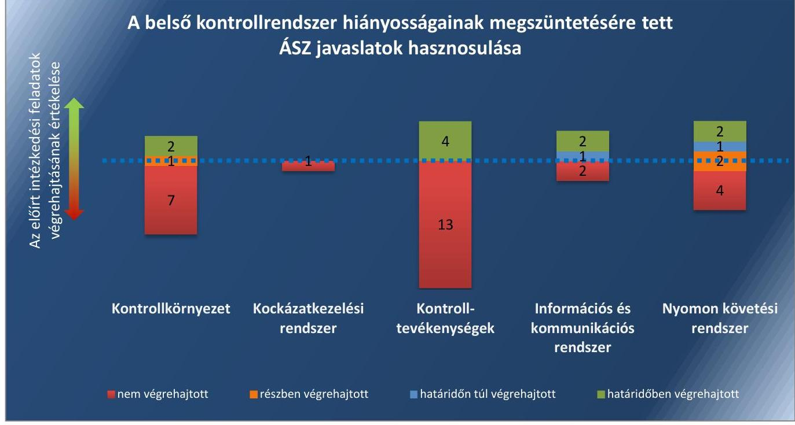
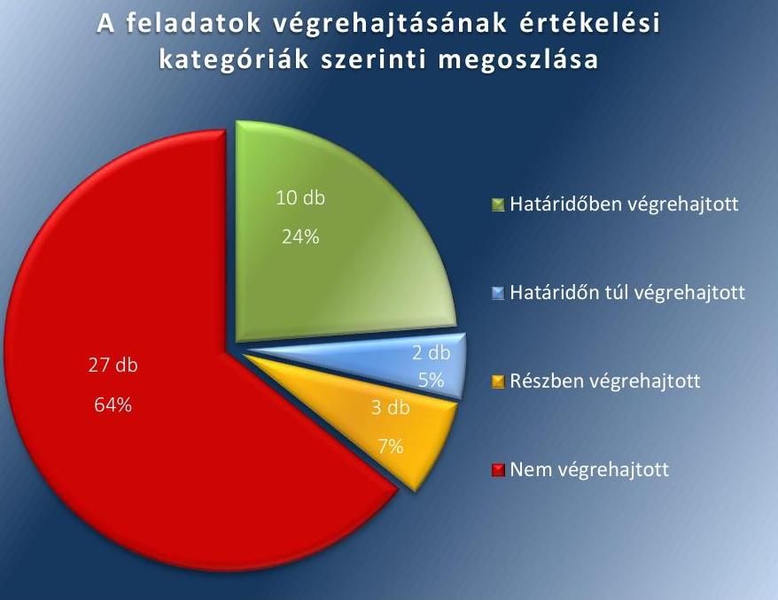
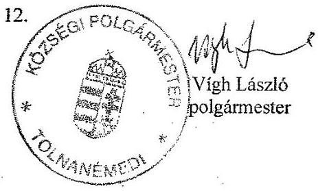
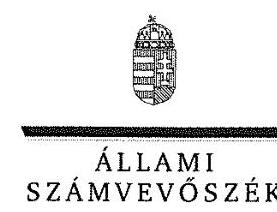
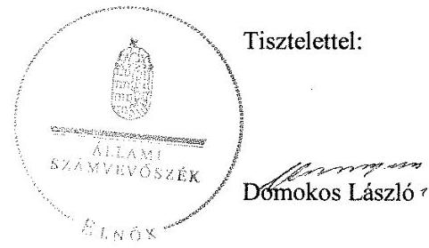
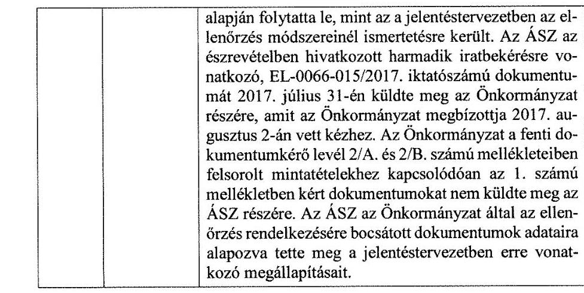
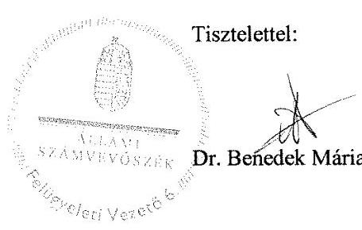

# Jelentés 

## Utóellenőrzések

Az önkormányzatok belső
kontrollrendszere kialakításának és működtetésének utóellenőrzése -
Tolnanémedi Község Önkormányzata
2018. 02. hó 03. nap

---

|  AZ ELLENŐRZÉST FELÜGYELTE: |  |  |  |  |   |
| --- | --- | --- | --- | --- | --- |
|   |  |  |  |  | DR. BENEDEK MÁRIA felügyeleti vezető  |
|   |  |  |  |  | AZ ELLENŐRZÉST VEZETTE ÉS A VÉGREHAJTÁSÁÉRT FELELŐS:  |
|   |  |  |  |  | JÁNOSI ISTVÁN ellenőrzésvezető  |
|   |  |  |  |  | A PROGRAM ÖSSZEÁLLÍTÁSÁÉRT FELELŐS:  |
|   |  |  |  |  | JANIK JÓZSEF LÁSZLÓ osztályvezető  |
|   |  |  |  |  | A TÉMÁHOZ KAPCSOLÓDÓ KORÁBBI SZÁMVEVŐSZÉKI JELENTÉSEK:  |
|   |  |  |  |  | - címe: Jelentés az önkormányzatok belső kontrollrendszere kialakításának, egyes kontrolltevékenységek és a belső ellenőrzés működésének ellenőrzéséről – Tolnanémedi  |
|   | Jelentéseink az Országgyűlés számítógépes hálózatán és az Interneten a www.asz.hu címen is olvashatóak. |  |  |  | - sorszáma: 14122  |
|   |  |  |  |  | IKTATÓSZÁM: EL-0066-056/2018.  |
|   |  |  |  |  | TÉMASZÁM: 6  |
|   |  |  |  |  | ELLENŐRZÉS-AZONOSÍTÓ SZÁM: V0755112  |

---

# TARTALOMJEGYZÉK 

■ ÖSSZEGZÉS ..... 5
■ AZ ELLENŐRZÉS CÉLJA ..... 7
■ AZ ELLENŐRZÉS TERÜLETE ..... 8
■ AZ ELLENŐRZÉS HÁTTERE, INDOKOLTSÁGA ..... 9
■ A JELENTÉS LÉNYEGES KÉRDÉSKÖRE ..... 10
■ ELLENŐRZÉS HATÓKÖRE ÉS MÓDSZEREI ..... 11
■ MEGÁLLAPÍTÁSOK ..... 13
■ MELLÉKLETEK ..... 19
I. sz. melléklet: Az ÁSZ 14122. számú jelentéséhez kapcsolódó intézkedési terv végrehajtása ..... 19
■ FÜGGELÉK: ÉSZREVÉTELEK ..... 27
■ RÖVIDÍTÉSEK JEGYZÉKE ..... 33

---

.

---

# ÖSSZEGZÉS 

Az Állami Számvevőszék Tolnanémedi Község Önkormányzata belső kontrollrendszere kialakításának és működtetésének utóellenőrzése során megállapította, hogy az intézkedési tervben meghatározott feladatok túlnyomó része nem került végrehajtásra. A kontrollkörnyezet, a kockázatkezelési rendszer, a nyomon követési rendszer kialakításában, valamint a kontrolltevékenységek szabályszerű működtetésében fennálló hiányosságok miatt továbbra sem volt biztosított a közpénzekkel és a vagyonnal való felelős gazdálkodás.

## Az ellenőrzés társadalmi indokoltsága

Az Állami Számvevőszék stratégiájában célul tűzte ki a számvevőszéki munka hasznosulásának javítását. Ezzel összhangban ellenőrzi, hogy az ellenőrzött szervezetek megvalósították-e a korábbi ellenőrzései által feltárt hibák, hiányosságok és szabálytalanságok megszüntetése céljából elkészített intézkedési terveikben foglaltakat. A rendszeres utóellenőrzések hozzájárulnak a szükséges intézkedések tényleges végrehajtásához, ezáltal a közpénzügyek rendezettségének javulásához, igazolják, hogy lezárult a következmények nélküli ellenőrzések időszaka.

## Főbb megállapítások, következtetések

Tolnanémedi Község Önkormányzata az intézkedést igénylő megállapításokhoz és javaslatokhoz kapcsolódóan összeállított intézkedési tervben meghatározott 42 feladatból tízet határidőre, kettőt határidőn túl, hármat részben, 27 feladatot nem hajtott végre. Ezáltal továbbra sem volt biztosított a közpénzekkel és a vagyonnal való felelős gazdálkodás, a vagyon megőrzése, védelme.

A polgármester nem kísérte figyelemmel az Tolnanémedi Község Önkormányzata gazdálkodásának szabályszerűségét. A jegyző nem gondoskodott a pénzügyi folyamatokban kulcsszerepet betöltő kontrollok szabályszerű kialakításáról és működtetéséről. Ezáltal nem volt biztosított a gazdálkodás átláthatósága és elszámoltathatósága.

A jegyző nem mérte fel és nem állapította meg Tolnanémedi Közös Önkormányzati Hivatal tevékenységében és gazdálkodásában rejlő kockázatokat, nem határozta meg az egyes kockázatokkal kapcsolatban a szükséges intézkedéseket, és azok teljesítése folyamatos nyomon követésének módját, ami veszélyeztette a hivatal biztonságos működését.

A jegyző nem gondoskodott a belső ellenőrzés szabályszerű működtetéséről, ezáltal nem volt biztosított a szervezet tevékenységének operatív tevékenységektől független, hatékony nyomon követése.

A jegyző nem szabályozta a hivatali dolgozók helyettesítési rendjét, ami akadályozta a hivatali feladatok végrehajtásának átláthatóságát.

A jegyző nem intézkedett a folyamatba épített előzetes, utólagos és vezetői kontrollok kialakításáról, ami veszélyeztette a gazdálkodási folyamatok szabályszerűségét.

A jegyző az intézkedési tervben meghatározott feladatok végrehajtásáról a jogszabályban előírt nyilvántartást nem vezette.

Az intézkedési tervben meghatározott feladatok értékelési kategóriák és belső kontrollrendszer elemek szerinti megoszlását az 1. ábra szemlélteti.

---

# A belső kontrollrendszer hiányosságainak megszüntetésére tett ÁSZ javaslatok hasznosulása

*Forrás: ÁSZ*

---

# AZ ELLENŐRZÉS CÉLJA 

Az ellenőrzés célja annak értékelése volt, hogy a számvevőszéki jelentésben foglalt intézkedést igénylő megállapításokkal és javaslatokkal összhangban készített intézkedési tervben meghatározott feladatokat az ellenőrzött szervezet végrehajtotta-e.

---

# AZ ELLENŐRZÉS TERÜLETE 

## Tolnanémedi Község Önkormányzata

Tolnanémedi Község Tolna megyében, Tamási járásban található település. Lakosainak száma 2016. január 1-jén a Központi Statisztikai Hivatal Magyarország Közigazgatási Helynévkönyvében közzétett adatok alapján 1048 fő volt.

A polgármester 2017. április 23. óta tölti be tisztségét, a jegyző 2013. január 1. óta látja el feladatait.

Az önkormányzat működésével, valamint a polgármester és a jegyző feladat- és hatáskörébe tartozó ügyek döntésre való előkészítésével és végrehajtásával kapcsolatos feladatokat Tolnanémedi Közös Önkormányzati Hivatal látja el. A hivatalt Tolnanémedi, Belecska, Kisszékely és Nagyszékely települések önkormányzatai közösen alapították 2013. január 1-jén. A hivatal székhelye Tolnanémedi, engedélyezett létszáma tíz fő. A hivatal gazdasági szervezettel nem rendelkezik.

Tolnanémedi Község Önkormányzata a 2016. évi zárszámadási adatok szerint 190,2 millió Ft költségvetési bevételt ért el és 161,2 millió Ft költségvetési kiadást teljesített. Az önkormányzat mérlegfőösszege 2016. december 31-én 501,6 millió Ft, a befektetett eszközök értéke 476,7 millió Ft, a követelések állománya 24,4 millió Ft, a kötelezettségek állománya 3,7 millió Ft volt.

Az Állami Számvevőszék 2013. évben ellenőrizte Tolnanémedi Község Önkormányzata belső kontrollrendszere kialakítását, egyes kontrolltevékenységek és a belső ellenőrzés működtetését a 2012. január 1.- 2012. december 31. közötti időszak vonatkozásában. Az ellenőrzésről szóló 14122 számú jelentését az Állami Számvevőszék 2014. június 19-én hozta nyilvánosságra. Az ellenőrzés célja annak megállapítása volt, hogy a belső kontrollrendszer elemeinek kialakítása, a pénzügyi folyamatokban kulcsszerepet betöltő teljesítésigazolás és érvényesítés, és a belső ellenőrzés szabályos működése biztosította-e az önkormányzatnál a közpénzfelhasználás szabályosságát, hozzájárult-e az értéket teremtő rend követelményének érvényesüléséhez. Az Állami Számvevőszék jelentésében szereplő javaslatok végrehajtása érdekében Tolnanémedi Község Önkormányzatának Képviselő-testülete 23/2014.(VII.21) számú határozattal intézkedési tervet fogadott el.

Az utóellenőrzés - a 2014. június 19-től 2017. július 3-ig végrehajtott feladatokat figyelembe véve - az Állami Számvevőszék jelentésében a polgármester és a jegyző részére megfogalmazott, intézkedést igénylő megállapításokra és javaslatokra készített, az Állami Számvevőszék részére megküldött intézkedési tervben foglalt feladatok megvalósításának ellenőrzésére, illetve értékelésére fókuszált.

---

# AZ ELLENŐRZÉS HÁTTERE, INDOKOLTSÁGA 

Az ÁSZ tv. ${ }^{1}$ 33. § (1) bekezdése értelmében a számvevőszéki jelentések intézkedést igénylő megállapításaihoz és javaslataihoz kapcsolódóan az ellenőrzött szervezet vezetője intézkedési tervet köteles összeállítani, és az Állami Számvevőszék részére megküldeni. Az intézkedési tervben foglaltak megvalósítását - az ÁSZ tv. 33. § (7) bekezdésében foglaltak alapján - az Állami Számvevőszék utóellenőrzés keretében ellenőrizheti. Az intézkedések megvalósulásának értékelése során az Állami Számvevőszék figyelembe veszi az ellenőrzött szervezetek működési feltételeiben, valamint a jogszabályi előírásokban bekövetkezett változásokat.

Az intézkedési tervekben foglalt feladatok hiányos, illetve késedelmes végrehajtása, valamint megvalósításának elmaradása azt mutatja, hogy az ellenőrzések során feltárt hibák, hiányosságok és szabálytalanságok megszüntetése nem kapott kellő hangsúlyt. Ez a szabályszerű működés és a felelős vezetői magatartás vonatkozásában kockázatot hordoz. E kockázatok feltárásával az Állami Számvevőszék utóellenőrzési rendszere fokozza a fegyelmet, és igazolja, hogy a közpénzzel való szabályos gazdálkodás felelőssége elől nem lehet kitérni.

Az utóellenőrzés négy szinten hasznosulhat:

- A társadalom szintjén az utóellenőrzés jelzi, hogy a számvevőszéki ellenőrzés megállapításainak van következménye: a hiányosságok megszüntetésére az ellenőrzött szervezet által meghatározott intézkedések végrehajtását is számon kéri az Állami Számvevőszék.
- Az ellenőrzött terület szintjén az utóellenőrzés tájékoztatást nyújt a terület döntéshozóinak a hiányosságok kiküszöbölésének jó gyakorlatairól, ezzel lehetőséget biztosítva arra, hogy az Állami Számvevőszék ellenőrzési megállapításai, javaslatai a terület nem ellenőrzött szervezeteinek a működése során is hasznosuljanak.
- Az ellenőrzött szervezet szintjén az utóellenőrzés feltárja, hogy a szervezet az intézkedések végrehajtásával hasznosította-e a korábbi ellenőrzési jelentésben a hiányosságok megszüntetése, illetve a kockázatok kezelése érdekében megfogalmazott javaslatokat.
- Az Állami Számvevőszék szintjén az utóellenőrzés visszacsatolást ad az ellenőrzési jelentések hasznosulásáról, az intézkedések elmaradása vagy részleges megvalósulása a további ellenőrzésekhez kockázati jelzésként szolgál.

---

# A JELENTÉS LÉNYEGES KÉRDÉSKÖRE 

Az ellenőrzött szervezet az intézkedési tervben foglaltakat az előírt határidőben végrehajtotta-e?

---

# ELLENŐRZÉS HATÓKÖRE ÉS MÓDSZEREI 

## Az ellenőrzés típusa

Megfelelőségi ellenőrzés.

## Az ellenőrzött időszak

Az utóellenőrzés alapját képező ÁSZ² jelentés közzétételének napjától (2014. június 19-től) az ellenőrzésről szóló kiértesítő levél keltének napjáig (2017. július 3-ig) tartó időszak.

## Az ellenőrzés tárgya

Az ÁSZ tv. 2011. július 1-jei hatálybalépését követően a számvevőszéki jelentésben foglalt intézkedést igénylő megállapításokkal és javaslatokkal összhangban - az ellenőrzött szervezet által - készített intézkedési tervben foglaltak végrehajtásának ellenőrzése volt.

Az ellenőrzés kiterjedt minden olyan körülményre és adatra, amely az ÁSZ jogszabályban meghatározott feladatainak teljesítéséhez, valamint a program végrehajtása folyamán felmerült újabb összefüggések feltárásához szükséges volt.

## Az ellenőrzött szervezet

Tolnanémedi Község Önkormányzata

## Az ellenőrzés jogalapja

Az ÁSZ tv. 33. § (7) bekezdése alapján az intézkedési tervben foglaltak megvalósítását az ÁSZ utóellenőrzés keretében ellenőrizheti.

## Az ellenőrzés módszerei

Az ÁSZ az ellenőrzést az ellenőrzési program ellenőrzési kérdései, az ellenőrzött időszakban hatályos jogszabályok, az ellenőrzés szakmai szabályok és módszertanok figyelembevételével, önálló ellenőrzés keretében végezte.

Az ellenőrzés ideje alatt az ellenőrzött szervezettel történő kapcsolattartásra az ÁSZ SZMSZ³-ének vonatkozó előírásai alapján került sor.

---

Az utóellenőrzés megállapításait elsősorban az ÁSZ rendelkezésére álló, valamint az ellenőrzött szervezettől elektronikusan bekért dokumentumok alapozták meg.

Az ellenőrzési bizonyítékként felhasználható adatforrások közé tartoztak egyrészt a szakmai programban felsorolt adatforrások, másrészt minden - az ellenőrzés folyamán feltárt, az ellenőrzés szempontjából információt tartalmazó - dokumentum.

Az intézkedési tervben előírt feladatokat azok végrehajthatósága, illetve végrehajtása szempontjából az alábbiak szerint értékelte az ÁSZ:
$\longrightarrow$ „határidőben végrehajtott" a feladat, ha a teljesítés dokumentáltan, az intézkedési tervben előírt határidőben és tartalommal megtörtént;
$\longrightarrow$ „határidőn túl végrehajtott" a feladat, ha annak teljesítése az intézkedési tervben meghatározott módon, de az előírt határidőn túl történt meg;
$\longrightarrow$ „részben végrehajtott" a feladat, ha végrehajtása teljes körűen az intézkedési tervben előírt módon nem történt meg;
$\longrightarrow$ „nem végrehajtott" a feladat, ha a végrehajtás nem történt meg, vagy amennyiben a teljesítést nem dokumentálták;
$\longrightarrow$ „okafogyottá vált" a feladat, ha végrehajtására - meghatározott esemény bekövetkezése, továbbá külső körülmény, a működést érintő feltétel változása miatt - már nincs szükség, illetve lehetőség, és egyértelműen megállapítható, hogy az intézkedést szükségessé tevő körülmény a jövőben nem fordulhat elő;
$\longrightarrow$ „nem időszerű" az a feladat, amelynek ellenőrzési időszakon belüli

 végrehajtására azért nem került (kerülhetett) sor, mert az intézkedés alapjául szolgáló esemény nem következett be, de annak jövőbeni előfordulása lehetséges, a végrehajtása nem volt esedékes, vagy a végrehajtás határideje még nem járt le.
Az ellenőrzés lefolytatásához az ellenőrzött szervezet a tanúsítványok elektronikus kitöltésével, valamint az ÁSZ által kért dokumentumok elektronikus megküldésével szolgáltatott adatokat, amelyek valódiságát és teljes körűségét az ellenőrzött szervezet vezetője által tett teljességi és hitelességi nyilatkozat igazolta. Az így rendelkezésre bocsátott adatok, információk kontrollja az ellenőrzés keretében történt.

---

# MEGÁLLAPÍTÁSOK 

## Az ellenőrzött szervezet az intézkedési tervben foglaltakat az előírt határidőben végrehajtotta-e?

Összegző megállapítás

Tolnanémedi Község Önkormányzata az intézkedési tervben meghatározott 42 feladatból tízet határidőben, kettőt határidőn túl, hármat részben, 27 feladatot nem hajtott végre. Az intézkedési tervben meghatározott feladatok végrehajtásáról a jogszabályban előírt nyilvántartást nem vezette.

Az ÁSZ a jelentésében a polgármester ${ }^{4}$ részére három, a jegyző ${ }^{5}$ részére hét javaslatot fogalmazott meg. A polgármester által előterjesztett és a Képviselő-testület által jóváhagyott intézkedési tervben a hiányosságok, szabálytalanságok megszüntetésére a polgármester részére négy, a jegyző részére 38 feladat került meghatározásra.

Az intézkedési tervben meghatározott feladatokat, határidőket, felelősöket és a feladatok végrehajtását az I. számú melléklet mutatja be.

A jegyző az intézkedési tervben meghatározott feladatok végrehajtásáról a Bkr. ${ }^{6} 14 . \S$ (1) bekezdésében előírtaknak megfelelő nyilvántartást nem vezette.

Az Önkormányzat ${ }^{7}$ intézkedési tervében meghatározott feladatok végrehajtásának értékelési kategóriák szerinti megoszlását a 2. ábra szemlélteti.
2. ábra

A feladatok végrehajtásának értékelési kategóriák szerinti megoszlása

Forrás: ÁSZ

---

# HATÁRIDŐBEN VÉGREHAJTOTT feladatok: 

1. A jegyző a jogszabályokban előírásoknak megfelelően elkészítette az Önkormányzati Hivatal ${ }^{8}$ 2014. január 1-jétől hatályos Számla-rend ${ }^{9}$-jét.
2. A jegyző a 2014. augusztus 1-jétől hatályos Belső kontrollrendszer szabályzat ${ }^{10}$-ban gondoskodott a szabálytalanságok kezelésének eljárásrendje és az ellenőrzési nyomvonal jogszabályi előírásoknak megfelelő elkészítéséről.
3. A jegyző az Önkormányzati Hivatal 2014. május 14-étől hatályos Szervezeti és Működési Szabályzat ${ }^{11}$-ában a jogszabályi előírásoknak megfelelően feltüntette a vagyonnyilatkozat-tételre kötelezett köztisztviselők vagyonnyilatkozat-tételi kötelezettségét.
4. A jegyző a jogszabályi előírásoknak megfelelően 2014. augusztus 10-ei keltezésű levelében tájékoztatta az 1 fő köztisztviselőt - aki vagyonnyilatkozat-tételi kötelezettségének nem tett eleget - a vagyonnyilatkozat-tételi kötelezettsége fennállásáról, valamint arról, hogy kötelezettségét a felszólítás kézhezvételétől számított nyolc napon belül teljesítse.
5. A jegyző a 2014. augusztus 1-jétől hatályos Informatikai biztonsági szabályzat ${ }^{12}$-ban megtette azokat a technikai és szervezési intézkedéseket és kialakította azokat a szabályokat, amelyek a jogszabályi előírásoknak megfelelően biztosították az adatok biztonságát és védelmét.
6. A jegyző az Önkormányzati Hivatal 2014. augusztus 1-től hatályos Közszolgálati szabályzat ${ }^{13}$-ában a jogszabályi előírásoknak megfelelően szabályozta a köztisztviselő jogviszonya megszüntetése (megszűnése) esetére a munkakör átadás és a munkáltatóval való elszámolás rendjét.
7. A jegyző elkészítette és 2014. augusztus 1-jétől hatályba léptette az Önkormányzati Hivatal jogszabályi előírásoknak megfelelő Adatvédelmi szabályzat ${ }^{14}$-át.
8. A jegyző az Önkormányzati Hivatal 2014. augusztus 1-jétől hatályos belső szabályzatában a jogszabályi előírásoknak megfelelően kialakította a kötelezően közzéteendő adatok nyilvánosságra hozatalának és elektronikus közzétételének rendjét, valamint szabályozta a közérdekű adatok megismerésére irányuló igények teljesítésének rendjét.
9. A jegyző a 2014. augusztus 1-jétől hatályos Belső kontrollrendszer szabályzat keretében a jogszabályi előírásoknak megfelelően kialakította az Önkormányzati Hivatal tevékenységének, a célok megvalósításának nyomon követését biztosító rendszert.
10. A jegyző a jogszabályi előírásoknak megfelelően gondoskodott az elvégzett belső ellenőrzéseket tartalmazó nyilvántartás vezetéséről, valamint az ellenőrzési jelentésekben szereplő javaslatok, intézkedési tervek és azok végrehajtásának nyomon követését tartalmazó nyilvántartás vezetéséről.

---

# HATÁRIDŐN TÚL VÉGREHAJTOTT feladatok: 

11. A jegyző a 2014. szeptember 30-án túl, 2016. július 1-jén adta ki az Önkormányzati Hivatal jogszabályi előírásoknak megfelelő, a Magyar Nemzeti Levéltár és a Kormányhivatal jóváhagyását is tartalmazó Iratkezelési szabályzatát ${ }^{15}$.
12. A jegyző a 2014. július 31-i határidőn túl, 2015. január 8-ai keltezésű dokumentumban gondoskodott az Önkormányzat jogszabályi előírásoknak megfelelő Stratégiai ellenőrzési terv ${ }^{16}$-ének elkészítéséről.

## RÉSZBEN VÉGREHAJTOTT feladatok:

13. A jegyző elkészítette az Önkormányzati hivatal Szervezeti és Működési Szabályzatát, amelyet a Képviselő-testület 2014. május 14-én fogadott el. A szabályzat az Áht. ${ }^{17}$ előírásainak megfelelően tartalmazta a hivatal feladatai ellátásának részletes belső rendjét és módját, azonban a jegyző helyettesítésére vonatkozó szabályokon kívül az intézkedési tervben meghatározott feladat ellenére nem tartalmazott előírást a többi dolgozó helyettesítésének rendjére, továbbá a belső és külső kapcsolattartás módjára, szabályaira vonatkozóan.
14. A jegyző a 2014. évi éves ellenőrzési jelentés vonatkozásában intézkedett a Társulás munkaszervezetének vezetőjénél, hogy az éves ellenőrzési jelentést a Bkr. 56. §. (8) bekezdésében előírt határidőre a jegyző részére küldje meg. A jegyző nem intézkedett annak érdekében, hogy részére a 2015. és 2016. évi jelentések is megküldésre kerüljenek.
15. A jegyző intézkedett arról, hogy a belső ellenőrzés vizsgálja meg az ÁSZ ellenőrzéssel érintett ellenőrzött időszakot követően elkészített dokumentumok, nyilvántartások, egyéb intézkedések jogszabályoknak való megfelelőségét, azonban a belső ellenőr 2015. július 14-ei keltezésű jelentése csak az ÁSZ által elfogadott intézkedési tervben foglalt feladatok végrehajtásának vizsgálatára terjedt ki.

## NEM VÉGREHAJTOTT feladatok:

16. A polgármester az Ávr. ${ }^{18}$ 57. §. (4) bekezdésében foglaltak ellenére nem jelölt ki teljesítésigazolásra jogosult személyeket.
17. A polgármester az Áht. 37. §. (1) bekezdésében és az Ávr. 55. §. (1) bekezdésében foglaltak ellenére nem intézkedett annak érdekében, hogy az Önkormányzat nevében történő kötelezettségvállalásra - az Ávr. 53. §-ában meghatározott kivételekkel - kizárólag a pénzügyi ellenjegyzés után, a pénzügyi teljesítés esedékességét megelőzően, írásban kerüljön sor.
18. A polgármester az Mötv. ${ }^{19}$ 115. §. (1) bekezdésében foglaltak ellenére nem kísérte figyelemmel az Önkormányzat gazdálkodásának szabályszerűségét.
19. A polgármester az Mötv. 67. §. f) pontjában foglalt előírások ellenére nem gondoskodott a belső kontrollrendszer működésére vonatkozó jogszabályi rendelkezések be nem tartása, valamint a teljesítésigazolás, illetve az érvényesítés kontrollokkal összefüggésben feltárt hiányosságok, szabálytalanságok tekintetében az esetleges munkajogi felelősséggel kapcsolatos körülmények kivizsgálásáról, illetve a vizsgálat eredményének függvényében szükséges intézkedések megtételéről.
20. A jegyző az Mvtv. ${ }^{20}$ 2.§ (3) bekezdésében foglaltak ellenére nem határozta meg az Önkormányzati Hivatalban az egészséget nem veszélyeztető és biztonságos munkavégzés követelményei megvalósításának módját.
21. A jegyző az Ávr. 13. § (5) bekezdésében foglaltak ellenére nem értékelte írásban az Önkormányzati Hivatalban dolgozó köztisztviselők munkateljesítményét.
22. A jegyző a Kttv. ${ }^{21}$ 231. § (1) bekezdésében foglaltak ellenére nem állapította meg a köztisztviselőkkel szembeni hivatásetikai alapelvek Kttv. 83. §-a szerinti részletes tartalmát, valamint az etikai eljárás szabályait, továbbá az Mötv. 81.§. (3) bekezdés c) pontjában előírtak ellenére nem készítette el az etikai eljárás szabályainak dokumentumait.
23. A jegyző a Bkr. 7. § (2) bekezdésében foglalt előírás ellenére nem mérte fel és nem állapította meg az Önkormányzati Hivatal tevékenységében és gazdálkodásában rejlő kockázatokat, nem határozta meg az egyes kockázatokkal kapcsolatban a szükséges intézkedéseket, nem határozta meg a kockázatok kezelése érdekében szükséges intézkedések teljesítése folyamatos nyomon követési módját.
24. A jegyző a Bkr. 8. §. (2) bekezdésében foglalt előírás ellenére nem biztosította a beszerzési folyamat és a vagyonhasznosítási tevékenység, valamint a pénzügyi döntések - köztük a költségvetés tervezése és a támogatásokkal való elszámolás - dokumentumainak elkészítésével kapcsolatban a folyamatba épített, előzetes, utólagos és vezetői ellenőrzést.
25. A jegyző a Bkr. 8. §. (4) bekezdés b) pontjában foglaltak ellenére nem határozta meg belső szabályzatban a dokumentumokhoz és információkhoz való hozzáférésre vonatkozóan a felelősségi köröket.
26. A jegyző az Ávr. 13. §. (5) bekezdésében foglaltak ellenére nem határozta meg a gazdasági feladatot ellátó alkalmazottak helyettesítésének rendjét.
27. A jegyző az Ávr. 55. §. (2) bekezdésében foglaltak ellenére nem jelölt ki az Önkormányzati Hivatal állományába tartozó köztisztviselőt pénzügyi ellenjegyzési feladatok ellátására.
28. A jegyző a Bkr. 3. § d) pontjában és a 9. § (1) bekezdésében foglaltak ellenére nem alakított ki olyan rendszert, amely biztosítja, hogy a megfelelő információk a megfelelő időben eljussanak az illetékes személyhez.
29. A jegyző az Info. ${ }^{22}$ tv. 33. § (1) és (3) bekezdésében, 37. § (1) bekezdésében és 1. mellékletben foglaltak ellenére nem tett eleget az elektronikus közzétételi kötelezettségnek, nem tette közzé a hatályos önkormányzati rendeleteket.
30. A jegyző az Áht. 69. § (2) bekezdésében és a Bkr. 3 §-ában foglaltak ellenére nem tett intézkedéseket az információs és kommunikációs rendszer fejlesztése érdekében.
31. A jegyző a Bkr. 46. § (1) bekezdésében foglaltak ellenére nem készítette el a belső ellenőrzési jelentésekben tett javaslatokhoz kapcsolódó intézkedési tervben meghatározott egyes feladatok végrehajtásáról szóló beszámolót.
32. A jegyző az Áht. 38. § (1) bekezdésében és az Ávr. 57. § (1) és (3) bekezdésében előírtak ellenére nem gondoskodott arról, hogy a teljesítésigazolást a kifizetést megelőzően az arra kijelölt személy végezze.
33. A jegyző az Ávr. 58. § (4) bekezdésében előírtak ellenére nem gondoskodott arról, hogy az érvényesítést az arra kijelölt személy végezze.
34. A jegyző az Áhsz. ${ }^{23}$ 39. §. (1) bekezdése és 14. számú melléklete II. pontjában foglaltak előírások ellenére nem gondoskodott a kötelezettségvállalások nyilvántartásba vételéről annak érdekében, hogy az Ávr. 58. §. (1) bekezdésében foglalt előírásnak megfelelően az érvényesítő a kifizetéseket megelőzően ellenőrizni tudja a fedezet meglétét.
35. A jegyző nem gondoskodott az Ávr. 60. § (1) bekezdésében előírt összeférhetetlenségi szabályok betartásáról a teljesítésigazolás és az érvényesítés gazdálkodási jogkör gyakorlás során.
36. A jegyző az Ávr. 58. § (2) bekezdésében előírtak ellenére nem gondoskodott arról, hogy a kifizetések utalványozása előtt az érvényesítő jelezze az utalványozónak, ha a megelőző ügymenetben a teljesítésigazolást nem, vagy nem szabályszerűen végezték el.
37. A jegyző az Áht. 36. § (1) bekezdése és az Ávr. 52. § (6) bekezdése ellenére nem gondoskodott arról, hogy az önkormányzat kiadási előirányzata terhére történő kötelezettségvállalások írásba legyenek foglalva.
38. A jegyző az Áht. 37. § (1) bekezdésében foglaltak ellenére nem biztosította, hogy kötelezettségvállalásra az Ávr. 55. § (1) bekezdése szerint jogosult személyek pénzügyi ellenjegyzését követően kerüljön sor.
39. A jegyző az Ávr. 59. § (3) bekezdés f) pontjában foglaltak ellenére nem gondoskodott arról, hogy az utalványrendeleteken feltüntetésre kerüljön a kötelezettségvállalás nyilvántartási száma.
40. A jegyző a Számv. tv. ${ }^{24}$ 16. § (3) bekezdésében foglalt előírások ellenére nem biztosította, hogy a fejlesztési kiadások az Áhsz. 40. $\S$-ában, illetve 15. számú mellékletében foglaltak szerint kerüljenek elszámolásra.
41. A jegyző a Bkr. 22. § (1) bekezdés b) pontjában, 29. § (1) bekezdésében és 31. § (1) bekezdésében foglaltak ellenére nem gondoskodott az éves ellenőrzési tervek elkészítéséről.

---

42. A jegyző a Htv. ${ }^{25}$ 140. §. (1) bekezdés e) pontjában foglaltak ellenére nem biztosította az Önkormányzat által alapított és fenntartott költségvetési szervek pénzügyi - gazdasági
 ellenőrzésének ellátását az Áht. 70. §. (1) bekezdésének előírása szerint.

---

# MELLÉKLETEK

■ I. SZ. MELLÉKLET: AZ ÁSZ 14122. SZÁMÚ JELENTÉSÉHEZ KAPCSOLÓDÓ INTÉZKEDÉSI TERV VÉGREHAJTÁSA

|  1. | Az intézkedési tervben meghatározott feladat | Az intézkedési tervben meghatározott határidő | Az intézkedési tervben meghatározott feladat végrehajtásának felelőse |  |
| --- | --- | --- | --- | --- |
|   | 1. | 2. | 3. | 3.  |
|  Határidőben végrehajtott feladatok |   |   |   |   |
|  1. | El kell készíteni a Számv. tv. 161. §. (1) bekezdésében és az Áhsz. 51. §. (2) bekezdésében foglaltaknak megfelelően a Kisszékhely - Nagyszékhely - Tolnanémedi Közös Önkormányzati Hivatal számlarendjét. | 2014. július 31. | jegyző  |  |
|  2. | El kell készíteni a Bkr. 6. §. (3) és (4) bekezdésében foglaltaknak megfelelően a szabálytalanságok kezelésének eljárásrendjét és az ellenőrzési nyomvonalat. | 2014. augusztus 31. | jegyző  |  |
|  3. | Fel kell tüntetni a vagyonnyilatkozat-tételről szóló tv. 4. §. a) pontjában foglaltaknak megfelelően a Kisszékhely Nagyszékhely - Tolnanémedi Községek Körjegyzősége jogutódja, a Tolnanémedi Közös Önkormányzati Hivatal Szervezeti és Működési Szabályzatában a vagyonnyilatkozat-tételre kötelezett köztisztviselők vagyonnyilatkozat-tételi kötelezettségét. | 2014. július 31. | jegyző  |  |
|  4. | Tájékoztatni kell a vagyonnyilatkozat-tételről szóló tv. 5. §-ában foglaltaknak megfelelően az 1 fő köztisztviselőt - aki vagyonnyilatkozat-tételi kötelezettségének nem tett eleget - a vagyonnyilatkozat-tételről szóló tv. 8. §. (4) bekezdésében foglaltaknak megfelelően vagyonnyilatkozat-tételi kötelezettsége fennállásáról és esedékességének időpontjáról továbbá a 10. §. (1) bekezdésében foglaltaknak | 2014. augusztus 15. | jegyző  |  |

A jegyző a Számv. tv. 161. § (1) bekezdésében és az Áhsz. 51. §. (2) bekezdésében foglaltaknak megfelelően elkészítette az Önkormányzati Hivatal 2014. január 1-jétől hatályos Számlarendjét.

A jegyző a 2014. augusztus 1-jétől hatályos Belső kontrollrendszer szabályzatban Bkr. 6. §. (3) és (4) bekezdésében foglaltaknak megfelelően elkészítette a szabálytalanságok kezelésének eljárásrendjét (I/2 pont) és az ellenőrzési nyomvonalat (I/1.6 pont és 1. sz. melléklet).

A jegyző az Önkormányzati Hivatal 2014. május 14-étől hatályos Szervezeti és Működési Szabályzatának 4. sz. mellékletében a vagyonnyilatkozat-tételről szóló tv. ${ }^{26}$ 4. §. a) pontjában foglaltaknak megfelelően feltüntette a vagyonnyilatkozat-tételre kötelezett köztisztviselők vagyonnyilatkozat-tételi kötelezettségét.

A jegyző 2014. augusztus 10-ei keltezésű levelében tájékoztatta a vagyonnyilatkozat-tételről szóló tv.-ben foglaltaknak megfelelően az 1 fő köztisztviselőt - aki vagyonnyilatkozat-tételi kötelezettségének nem tett eleget - a vagyonnyilatkozattételről szóló tv. 8. §. (4) bekezdésében foglaltaknak megfelelően vagyonnyilatkozat-tételi kötelezettsége fennállásáról és esedékességének időpontjáról, továbbá a 10. §. (1) bekezdésében foglaltaknak megfelelően felszólította arra, hogy

---

|  1. Az intézkedési tervben meghatározott feladat | Az intézkedési tervben meghatározott határidő | Az intézkedési tervben meghatározott feladat végrehajtásának felelőse | Az intézkedési tervben meghatározott feladat végrehajtása  |
| --- | --- | --- | --- |
|  1. | 2. | 3. | 4.  |
|  megfelelően fel kell szólítani arra, hogy kötelezettségét a felszólítás kézhezvételétől számított nyolc napon belül teljesítse. |  |  | kötelezettségét a felszólítás kézhezvételétől számított nyolc napon belül teljesítse.  |
|  5. Az informatikai rendszer szabályozása során az Info. tv. 7. §. (2) - (3) bekezdésében foglaltaknak megfelelően meg kell tenni azokat a technikai és szervezési intézkedéseket és alakítsa azokat a szabályokat, amelyek biztosítják az adatok biztonságát és védelmét. | 2014. augusztus 31. | jegyző | A jegyző a 2014. augusztus 1-jétől hatályos Informatikai biztonsági szabályzatban az Info. tv. 7. § (2)-(3) bekezdésében foglaltaknak megfelelően megtette azokat a technikai és szervezési intézkedéseket és kialakította azokat a szabályokat, amelyek biztosították az adatok biztonságát és védelmét.  |
|  6. A Kttv. 74. §. (1) bekezdésében foglaltaknak megfelelően szabályozni kell a Kisszékhely - Nagyszékhely - Tolnanémedi Községek Körjegyzősége jogutódja, a Tolnanémedi Közös Önkormányzati Hivatalban a köztisztviselő jogviszonya megszüntetése (megszűnése) esetére a munkakör átadása és a munkáltatóval való elszámolás rendjét. | 2014. augusztus 31. | jegyző | A jegyző az Önkormányzati Hivatal 2014. augusztus 1-től hatályos Közszolgálati szabályzata VIII. fejezetében a Kttv. 74. §. (1) bekezdésében foglaltaknak megfelelően szabályozta a köztisztviselő jogviszonya megszüntetése (megszűnése) esetére a munkakör átadás és a munkáltatóval való elszámolás rendjét.  |
|  7. Az Info. tv. 24. §. (3) bekezdésében foglaltaknak megfelelően el kell készíteni a Kisszékhely - Nagyszékhely - Tolnanémedi Községek Körjegyzősége jogutódja, a Tolnanémedi Közös Önkormányzati Hivatal adatvédelmi és adatbiztonsági szabályzatát. | 2014. augusztus 31. | jegyző | A jegyző az Adatvédelmi Szabályzat keretében elkészítette és 2014. augusztus 1-jén hatályba léptette az Önkormányzati Hivatal Info. tv. 24. §. (3) bekezdésében foglaltaknak megfelelő előírt adatvédelmi és adatbiztonsági szabályzatát.  |
|  8. Ki kell alakítani az Info. tv. 35. §. (3) bekezdésében és a 30. §. (6) bekezdésében, valamint az Ávr. 13. §. (2) bekezdés h) pontjában foglalt előírásnak megfelelően a kötelezően közzéteendő adatok nyilvánosságra hozatalának és elektronikus közzétételének rendjét, szabályozza a közérdekű adatok megismerésére irányuló igények teljesítésének rendjét. | 2014. augusztus 31. | jegyző | A jegyző az Önkormányzati Hivatal 2014. augusztus 1-jétől hatályos Adat közzétételi szabályzat ${ }^{27}$-ában az Info. tv. 35. §. (3) bekezdésében és a 30. §. (6) bekezdésében, valamint az Ávr. 13. §. (2) bekezdés h) pontjában foglalt előírásoknak megfelelően kialakította a kötelezően közzéteendő adatok nyilvánosságra hozatalának és elektronikus közzétételének rendjét, valamint szabályozta a közérdekű adatok megismerésére irányuló igények teljesítésének rendjét.  |
|  9. Ki kell alakítani a Bkr. 3. §. e) pontjában és a 10. §-ában foglaltaknak megfelelően a Kisszékhely - Nagyszékhely Tolnanémedi Községek Körjegyzősége jogutódja, a Tolnanémedi Közös Önkormányzati Hivatal tevékenységének, a | 2014. augusztus 31. | jegyző | A jegyző a 2014. augusztus 1-jétől hatályos Belső kontrollrendszer szabályzat keretében (V. fejezet) a Bkr. 3. § e) pontjában és 10. §-ában foglaltaknak megfelelően kialakította az Önkormányzati Hivatal tevékenységének, a célok megvalósításának nyomon követését biztosító rendszert.  |

---

|  1. | Az intézkedési tervben meghatározott feladat | Az intézkedési tervben meghatározott határidő | Az intézkedési tervben meghatározott feladat végrehajtásának felelőse | Az intézkedési tervben meghatározott feladat végrehajtása  |
| --- | --- | --- | --- | --- |
|  2. |  | 1. | 2. | 3.  |
|   | célok megvalósításának nyomon követését biztosító rendszert. |  |  |   |
|  10. | Gondoskodni kell a Bkr. 22. §. (2) bekezdés b) és e) pontjában, valamint az 50. §-ban foglalt előírásoknak megfelelően az elvégzett belső ellenőrzésekről nyilvántartás vezetéséről továbbá a Bkr. 21. §. (2) bekezdés d) pontjában és a 47. §. (1) bekezdésben foglaltaknak megfelelően olyan nyilvántartás vezetéséről, amellyel az ellenőrzési jelentésekben szereplő javaslatokat, valamint az intézkedési terveket és azok végrehajtását nyomon lehet követni. | 2014. július 31. és folyamatos | jegyző | A jegyző a Bkr. 22. §. (2) bekezdés b) és e) pontjában, valamint 50. §-ában foglalt előírásoknak megfelelően gondoskodott az elvégzett belső ellenőrzéseket tartalmazó, valamint a Bkr. 21. §. (2) bekezdés d) pontjában és a 47. §. (1) bekezdésben foglaltaknak megfelelően az ellenőrzési jelentésekben szereplő javaslatok, intézkedési tervek és azok végrehajtásának nyomon követését tartalmazó nyilvántartás vezetéséről.  |
|  11. | A Ltv. 10. §. (1) bekezdés c) pontjának előírását figyelembe véve a Kisszékhely - Nagyszékhely - Tolnanémedi Községek Körjegyzősége jogutódja, a Tolnanémedi Közös Önkormányzati Hivatal iratkezelési szabályzatát a Magyar Nemzeti Levéltár és a Kormányhivatal egyetértésével ki kell adni. | 2014. szeptember 30. | jegyző | A jegyző az Ltv. ${ }^{28}$ 10. §. (1) bekezdés c) pontjának előírását figyelembe véve, a Magyar Nemzeti Levéltár és a Tolna megyei Kormányhivatal jóváhagyásával - az előírt 2014. szeptember 30. helyett 2016. július 1-jei hatállyal - kiadta az Önkormányzati Hivatal Iratkezelési szabályzatát.  |
|  12. | Gondoskodni kell a Bkr. 56. §. (3) bekezdés a) pontjában foglaltaknak megfelelően az önkormányzat stratégiai ellenőrzési tervének elkészítéséről. | 2014. július 31. | jegyző | A jegyző a 2014. július 31-i határidőn túl, 2015. január 8-ai keltezésű dokumentumban gondoskodott az Önkormányzat Bkr. 56. §. (3) bekezdés a) pontjában foglaltaknak megfelelő Stratégiai ellenőrzési tervének elkészítéséről.  |
|  13. | El kell készíteni az Áht. 10. §. (5) bekezdésében foglaltaknak megfelelően a Kisszékhely - Nagyszékhely - Tolnanémedi Községek Körjegyzősége jogutódja, a Tolnanémedi Közös Önkormányzati Hivatal Szervezeti és Működési Szabályzatát, amely tartalmazza a közös hivatal feladatai ellátásának részletes belső rendjét és módját, a dolgozók helyettesítésének rendjét, továbbá a belső és külső kapcsolattartás módját, szabályait. | 2014. július 31. | jegyző | A jegyző elkészítette az Önkormányzati hivatal Szervezeti és Működési Szabályzatát, amelyet a Képviselő-testület 17/2014. (V.14) számú határozatával fogadott el. A szabályzat az Áht. 10. §. (5) bekezdése előírásainak megfelelően tartalmazza a hivatal feladatai ellátásának részletes belső rendjét és módját, azonban a jegyző helyettesítésére vonatkozó szabályokon kívül az intézkedési tervben meghatározott feladat ellenére nem tartalmazott előírást a többi dolgozó helyettesítésének rendjére, továbbá a belső és külső kapcsolattartás módjára, szabályaira vonatkozóan.  |

---

|  1. | Az intézkedési tervben meghatározott feladat | Az intézkedési tervben meghatározott határidő | Az intézkedési tervben meghatározott feladat végrehajtásának felelőse | Az intézkedési tervben meghatározott feladat végrehajtása  |
| --- | --- | --- | --- | --- |
|  2. |  | 1. | 2. | 3.  |
|  14. | Intézkedni kell a Társulás munkaszervezetének vezetőjénél, hogy az éves ellenőrzési jelentést a Bkr. 56. §. (8) bekezdésében előírt határidőre a jegyző részére küldje meg. | 2014. július 31. és folyamatos | jegyző | A jegyző a 2014. évi éves ellenőrzési jelentés vonatkozásában intézkedett a Társulás munkaszervezetének vezetőjénél, hogy az éves ellenőrzési jelentést a Bkr. 56. §. (8) bekezdésében előírt határidőre a jegyző részére küldje meg. A 2014. évi belső ellenőri éves összefoglaló jelentést a jegyző 2015. február 12-én hagyta jóvá. A jegyző nem intézkedett annak érdekében, hogy részére a 2015. és 2016. évi jelentések is megküldésre kerüljenek.  |
|  15. | Intézkedni kell, hogy a belső ellenőrzés vizsgálja meg az ÁSZ ellenőrzéssel érintett ellenőrzött időszakot követően elkészített dokumentumok, nyilvántartások, egyéb intézkedések jogszabályoknak való megfelelőségét. | 2015. június 30. | jegyző | A jegyző intézkedett arról, hogy a belső ellenőrzés vizsgálja meg az ÁSZ ellenőrzéssel érintett ellenőrzött időszakot követően
 elkészített dokumentumok, nyilvántartások, egyéb intézkedések jogszabályoknak való megfelelőségét, azonban a belső ellenőr 2015. július 14-ei keltezésű jelentése csak az ÁSZ által elfogadott intézkedési tervben foglalt feladatok végrehajtásának vizsgálatára terjedt ki.  |
|  16. |  | Nem végrehajtott feladatok |  |   |
|  16. | Ki kell jelölni az Ávr. 57. §. (4) bekezdésében foglaltaknak megfelelően a teljesítésigazolásra jogosult személyeket. | 2014. július 31. | polgármester | A polgármester az Ávr. 57. §. (4) bekezdésében foglaltak ellenére nem jelölt ki teljesítésigazolásra jogosult személyeket.  |
|  17. | Intézkedni kell arról, hogy az Önkormányzat nevében történő kötelezettségvállalásra az Áht. 37. §. (1) bekezdésében és az Ávr. 55. §. (1) bekezdésében foglaltaknak megfelelően - az Ávr. 53. §-ában meghatározott kivételekkel - kizárólag a pénzügyi ellenjegyzés után, a pénzügyi teljesítés esedékességét megelőzően, írásba kerüljön sor. | 2014. július 31. és folyamatos | polgármester | A polgármester az Áht. 37. §. (1) bekezdésében és az Ávr. 55. §. (1) bekezdésében foglaltak ellenére nem intézkedett annak érdekében, hogy az Önkormányzat nevében történő kötelezettségvállalásra - az Ávr. 53. §-ában meghatározott kivételekkel - kizárólag a pénzügyi ellenjegyzés után, a pénzügyi teljesítés esedékességét megelőzően, írásban kerüljön sor.  |
|  18. | Figyelemmel kell kísérni a Mótv. 115. §. (1) bekezdésében foglaltak alapján az Önkormányzat gazdálkodásának szabályszerűségét. | azonnal, majd azt követően folyamatos | polgármester | A polgármester a Mótv. 115. §. (1) bekezdésében foglaltak ellenére nem kísérte figyelemmel az Önkormányzat gazdálkodásának szabályszerűségét.  |
|  19. | A Mótv. 67. §. f) pontja alapján gondoskodni kell a belső kontrollrendszer működésére vonatkozó jogszabályi rendelkezések be nem tartása, valamint a teljesítésigazolás, illetve az érvényesítés kontrollokkal összefüggésben feltárt hiányosságok, szabálytalanságok tekintetében az esetle- | 2014. augusztus 31. | polgármester | A polgármester a Mótv. 67. §. f) pontjában foglalt előírások ellenére nem gondoskodott a belső kontrollrendszer működésére vonatkozó jogszabályi rendelkezések be nem tartása, valamint a teljesítésigazolás, illetve az érvényesítés kontrollokkal összefüggésben feltárt hiányosságok, szabálytalanságok tekintetében az esetleges munkajogi felelősséggel kapcsolatos körülmények kivizsgálásáról, illetve a vizsgálat eredményének függvényében szükséges intézkedések megtételéről.  |

---

|  1. Az intézkedési tervben meghatározott feladat | Az intézkedési tervben meghatározott határidő | Az intézkedési tervben meghatározott feladat végrehajtásának felelőse | Az intézkedési tervben meghatározott feladat végrehajtása  |
| --- | --- | --- | --- |
|  1. | 2. | 3. | 4.  |
|  ges munkajogi felelősséggel kapcsolatos körülmények kivizsgálásáról, majd a vizsgálat eredményének függvényében meg kell tenni a szükséges intézkedéseket. |  |  |   |
|  20. Meg kell határozni az Mvtv. 2.§. (3) bekezdésében foglaltaknak megfelelően Kisszékhely - Nagyszékhely - Tolnanémedi Községek Körjegyzősége jogutódja, a Tolnanémedi Közös Önkormányzati Hivatalban az egészséget nem veszélyeztető és biztonságos munkavégzés követelményei megvalósításának módját. | 2014. augusztus 31. | jegyző | A jegyző az Mvtv. 2.§ (3) bekezdésében foglaltak ellenére nem határozta meg az Önkormányzati Hivatalban az egészséget nem veszélyeztető és biztonságos munkavégzés követelményei megvalósításának módját.  |
|  21. Írásban értékelni kell az Ávr. 13. § (5) bekezdésében Kisszékhely - Nagyszékhely - Tolnanémedi Községek Körjegyzősége jogutódja, a Tolnanémedi Közös Önkormányzati Hivatalban dolgozó köztisztviselők munkateljesítményét. | a teljesítményértékelés 2014. február 7. napján a jogszabálynak megfelelően megtörtént, ezért 2015. január 31. | jegyző | A jegyző az Ávr. 13. § (5) bekezdésében foglaltak ellenére nem értékelte írásban az Önkormányzati Hivatalban dolgozó köztisztviselők munkateljesítményét.  |
|  22. Meg kell állapítani a Kttv. 231. § (1) bekezdésében foglaltaknak megfelelően a köztisztviselőkkel szembeni a Kttv. 83. §-ban előírt hivatásetikai alapelvek részletes tartalmát, valamint az etikai eljárás szabályait továbbá az Mótv. 81.§. (3) bekezdés c) pontjában előírt feladatának megfelelően készítse el az etikai eljárás szabályainak dokumentumait. | 2014. szeptember 15. | jegyző | A jegyző a Kttv. 231. § (1) bekezdésében foglaltak ellenére nem állapította meg a köztisztviselőkkel szembeni hivatásetikai alapelvek Kttv. 83. §-a szerinti részletes tartalmát, valamint az etikai eljárás szabályait, továbbá az Mótv. 81.§. (3) bekezdés c) pontjában előírtak ellenére nem készítette el az etikai eljárás szabályainak dokumentumait.  |
|  23. Fel kell mérni és meg kell állapítani a Bkr. 7. § (2) bekezdésében foglalt előírásnak megfelelően a Kisszékhely - Nagyszékhely - Tolnanémedi Községek Körjegyzősége jogutódja, a Tolnanémedi Közös Önkormányzati Hivatal tevékenységében rejlő kockázatokat, meg kell határozni az egyes kockázatokkal kapcsolatban a szükséges intézkedéseket, meg kell határozni a kockázatok kezelése érdekében szükséges intézkedések teljesítése folyamatos nyomon követési módját. | 2014. augusztus 31. | jegyző | A jegyző a Bkr. 7. § (2) bekezdésében foglalt előírás ellenére nem mérte fel és nem állapította meg az Önkormányzati Hivatal tevékenységében és gazdálkodásában rejlő kockázatokat, nem határozta meg az egyes kockázatokkal kapcsolatban a szükséges intézkedéseket, nem határozta meg a kockázatok kezelése érdekében szükséges intézkedések teljesítése folyamatos nyomon követési módját.  |

---

|  22
23 | Az intézkedési tervben meghatározott feladat | Az intézkedési tervben meghatározott határidő | Az intézkedési tervben meghatározott feladat végrehajtásának felelőse | Az intézkedési tervben meghatározott feladat végrehajtása  |
| --- | --- | --- | --- | --- |
|   | 1. | 2. | 3. | 4.  |
|  24. | Biztosítani kell a Bkr. 8. §. (2) bekezdésében foglaltaknak megfelelően a beszerzési folyamat és a vagyonhasznosítási tevékenység, valamint a pénzügyi döntések - köztük a költségvetés tervezése és a támogatásokkal való elszámolás dokumentumainak elkészítésével kapcsolatban a folyamatba épített, előzetes, utólagos és vezetői ellenőrzést. | azonnali, és azt követően folyamatos | jegyző | A jegyző a Bkr. 8. §. (2) bekezdésében foglalt előírás ellenére nem biztosította a beszerzési folyamat és a vagyonhasznosítási tevékenység, valamint a pénzügyi döntések - köztük a költségvetés tervezése és a támogatásokkal való elszámolás dokumentumainak elkészítésével kapcsolatban a folyamatba épített, előzetes, utólagos és vezetői ellenőrzést.  |
|  25. | A Bkr. 8. §. (4) bekezdés b) pontjában foglaltaknak megfelelően belső szabályzatban meg kell határozni a dokumentumokhoz és információkhoz való hozzáférésre vonatkozóan a felelősségi köröket. | 2014. augusztus 31. | jegyző | A jegyző a Bkr. 8. §. (4) bekezdés b) pontjában foglaltak ellenére nem határozta meg belső szabályzatban a dokumentumokhoz és információkhoz való hozzáférésre vonatkozóan a felelősségi köröket.  |
|  26. | Az Ávr. 13. §. (5) bekezdésében foglaltaknak megfelelően meg kell határozni a gazdasági feladatot ellátó alkalmazottak helyettesítésének rendjét. | 2014. július 31. | jegyző | A jegyző az Ávr. 13. §. (5) bekezdésében foglaltak ellenére nem határozta meg a gazdasági feladatot ellátó alkalmazottak helyettesítésének rendjét.  |
|  27. | Az Ávr. 55. §. (2) bekezdésében előírtaknak megfelelően ki kell jelölni a Kisszékhely - Nagyszékhely - Tolnanémedi Községek Körjegyzősége jogutódja, a Tolnanémedi Közös Önkormányzati Hivatal állományába tartozó köztisztviselőt pénzügyi ellenjegyzési feladatok ellátására. | 2014. július 31. | jegyző | A jegyző az Ávr. 55. §. (2) bekezdésében foglaltak ellenére nem jelölt ki az Önkormányzati Hivatal állományába tartozó köztisztviselőt pénzügyi ellenjegyzési feladatok ellátására.  |
|  28. | A Bkr. 3. §. d) pontjában és a 9.§. (1) bekezdésében foglaltaknak megfelelően ki kell alakítani olyan rendszert, amely biztosítja, hogy a megfelelő információk a megfelelő időben eljussanak az illetékes személyhez. | 2014. augusztus 31. | jegyző | A jegyző a Bkr. 3. § d) pontjában és a 9. § (1) bekezdésében foglaltak ellenére nem alakított ki olyan rendszert, amely biztosítja, hogy a megfelelő információk a megfelelő időben eljussanak az illetékes személyhez.  |
|  29. | Az Info. tv. 33. §. (1) és (3) bekezdésében, a 37. §. (1) bekezdésében és az 1. mellékletben foglaltaknak megfelelően eleget kell tenni az elektronikus közzétételi kötelezettségnek és közzé kell tenni a hatályos önkormányzati rendeleteket. | 2014. augusztus 31. és folyamatos | jegyző | A jegyző az Info. tv. 33. § (1) és (3) bekezdésében, 37. § (1) bekezdésében és 1. mellékletben foglaltak ellenére nem tett eleget az elektronikus közzétételi kötelezettségnek, nem tette közzé a hatályos önkormányzati rendeleteket.  |
|  30. | Az Áht. 69. §. (2) bekezdésében és a Bkr. 3. §-ában foglaltakat figyelembe véve intézkedéseket kell tenni az információs és kommunikációs rendszer fejlesztése érdekében. | 2014. augusztus 31. és folyamatos | jegyző | A jegyző az Áht. 69. § (2) bekezdésében és a Bkr. 3 §-ában foglaltak ellenére nem tett intézkedéseket az információs és kommunikációs rendszer fejlesztése érdekében.  |

---

|  1. Az intézkedési tervben meghatározott feladat |  | Az intézkedési tervben meghatározott határidő | Az intézkedési tervben meghatározott feladat végrehajtásának felelőse | Az intézkedési tervben meghatározott feladat végrehajtása  |
| --- | --- | --- | --- | --- |
|   | 1. | 2. | 3. | 4.  |
|  31. | A Bkr. 46. §. (1) bekezdésében foglaltaknak megfelelően el kell készíteni a belső ellenőrzési jelentésekben tett javaslatokhoz kapcsolódó intézkedési tervben meghatározott egyes feladatok végrehajtásáról szóló beszámolót. | 2014. augusztus 31. és folyamatos | jegyző | A jegyző a Bkr. 46. § (1) bekezdésében foglaltak ellenére nem készítette el a belső ellenőrzési jelentésekben tett javaslatokhoz kapcsolódó intézkedési tervben meghatározott egyes feladatok végrehajtásáról szóló beszámolót.  |
|  32. | Gondoskodni kell arról, hogy az Áht. 38. §. (1) bekezdésében és az Ávr. 57. § (1) és (3) bekezdésében előírtaknak megfelelően teljesítésigazolást a kifizetést megelőzően az arra kijelölt személy végezze. | azonnal, majd azt követően folyamatos | jegyző | A jegyző az Áht. 38. § (1) bekezdésében és az Ávr. 57. § (1) és (3) bekezdésében előírtak ellenére nem gondoskodott arról, hogy a teljesítésigazolást a kifizetést megelőzően az arra kijelölt személy végezze.  |
|  33. | Gondoskodni kell arról, hogy az Ávr. 58. §. (4) bekezdésében előírtaknak megfelelően érvényesítést az arra kijelölt személy végezze. | azonnal, majd azt követően folyamatos | jegyző | A jegyző az Ávr. 58. § (4) bekezdésében előírtak ellenére nem gondoskodott arról, hogy az érvényesítést az arra kijelölt személy végezze.  |
|  34. | Gondoskodni kell az Áhsz. 39. §. (1) bekezdés és a 14. számú melléklet II. pontjában foglaltaknak megfelelően a kötelezettségvállalások nyilvántartásba
 vételéről annak érdekében, hogy az Ávr. 58. §. (1) bekezdésében foglalt előírásnak megfelelően az érvényesítő a kifizetéseket megelőzően ellenőrizni tudja a fedezet meglétét. | azonnal, majd azt követően folyamatos | jegyző | A jegyző az Áhsz. 39. §. (1) bekezdése és 14. számú melléklete II. pontjában foglaltak előírásai ellenére nem gondoskodott a kötelezettségvállalások nyilvántartásba vételéről annak érdekében, hogy az Ávr. 58. §. (1) bekezdésében foglalt előírásnak megfelelően az érvényesítő a kifizetéseket megelőzően ellenőrizni tudja a fedezet meglétét.  |
|  35. | Be kell tartani az Ávr. 60. §. (1) bekezdésében foglaltaknak megfelelően, hogy az érvényesítő személye és a teljesítésigazolást végző személye ne legyen azonos. | azonnal, majd azt követően folyamatos | jegyző | A jegyző nem gondoskodott az Ávr. 60. § (1) bekezdésében előírt összeférhetetlenségi szabályok betartásáról a teljesítésigazolás és az érvényesítés gazdálkodási jogkör gyakorlása során.  |
|  36. | Gondoskodni kell arról, hogy az Ávr. 58. §. (2) bekezdésében előírtaknak megfelelően az érvényesítő jelezze az utalványozónak, ha a megelőző ügymenetben a teljesítésigazolást nem vagy nem szabályszerűen végezték el. | azonnal, majd azt követően folyamatos | jegyző | A jegyző az Ávr. 58. § (2) bekezdésében előírtak ellenére nem gondoskodott arról, hogy a kifizetések utalványozása előtt az érvényesítő jelezze az utalványozónak, ha a megelőző ügymenetben a teljesítésigazolást nem, vagy nem szabályszerűen végezték el.  |
|  37. | Gondoskodni kell arról, hogy az Áht, 36. §. (1) bekezdése és az Ávr. 52. § (6) bekezdése előírásainak megfelelően az önkormányzat kiadási előirányzata terhére történő kötelezettségvállalások írásba legyenek foglalva. | azonnal, majd azt követően folyamatos | jegyző | A jegyző az Áht. 36. § (1) bekezdése és az Ávr. 52. § (6) bekezdése ellenére nem gondoskodott arról, hogy az önkormányzat kiadási előirányzata terhére történő kötelezettségvállalások írásba legyenek foglalva.  |

---

|  4. | Az intézkedési tervben meghatározott feladat | Az intézkedési tervben meghatározott határidő | Az intézkedési tervben meghatározott feladat végrehajtásának felelőse | Az intézkedési tervben meghatározott feladat végrehajtása  |
| --- | --- | --- | --- | --- |
|  1. |  | 2. | 3. | 4.  |
|  38. | Biztosítani kell, hogy kötelezettségvállalásra az új Áht. 37. §. (1) bekezdésben foglaltaknak megfelelően, csak az Ávr. 55. §. (1) bekezdése szerint jogosult személyek pénzügyi ellenjegyzését követően kerüljön sor. | azonnal, majd azt követően folyamatos | jegyző | A jegyző az Áht. 37. § (1) bekezdésében foglaltak ellenére nem biztosította, hogy kötelezettségvállalásra az Ávr. 55. § (1) bekezdése szerint jogosult személyek pénzügyi ellenjegyzését követően kerüljön sor.  |
|  39. | Gondoskodni kell arról, hogy az utalványrendeleteken az Ávr. 59. § (3) bekezdés f) pontjában foglaltaknak megfelelően feltüntetésre kell, hogy kerüljön a kötelezettségvállalás nyilvántartási száma. | azonnal, majd azt követően folyamatos | jegyző | A jegyző az Ávr. 59. § (3) bekezdés f) pontjában foglaltak ellenére nem gondoskodott arról, hogy az utalványrendeleteken feltüntetésre kerüljön a kötelezettségvállalás nyilvántartási száma.  |
|  40. | Biztosítani kell, hogy a fejlesztési kiadások a Számv. tv. 16. § (3) bekezdésében foglaltaknak megfelelően, az Áhsz. 40. §-a illetve a 15. számú mellékletben foglaltak szerint kerüljenek elszámolásra. | azonnal, majd azt követően folyamatos | jegyző | A jegyző nem biztosította a fejlesztési kiadások elszámolása során a Számv. tv. 16. § (3) bekezdésében előírt „a tartalom elsődlegessége a formával szemben" alapelv érvényesülését, mert a fejlesztési kiadások nem az Áhsz. 40. §-ában, illetve 15. számú mellékletében előírt egységes rovatrend szerint kerültek elszámolásra.  |
|  41. | Gondoskodni kell a Bkr. 22. §. (1) bekezdés b) pontjában, a 29. §. (1) bekezdésében és a 31. §. (1) bekezdésében foglaltaknak megfelelően az éves ellenőrzési terv elkészítéséről. | 2014. július 31. és folyamatos | jegyző | A jegyző a Bkr. 22. § (1) bekezdés b) pontjában, 29. § (1) bekezdésében és 31. § (1) bekezdésében foglaltak ellenére nem gondoskodott az éves ellenőrzési terv elkészítéséről.  |
|  42. | Biztosítani kell - a Htv. 140. §. (1) bekezdés e) pontjában foglalt feladat- és hatáskörben eljárva - az Önkormányzat által alapított és fenntartott költségvetési szervek pénzügyi - gazdasági ellenőrzésének ellátását, illetve az új Áht. 70. §. (1) bekezdésének előírása szerint. | azonnal, és azt követően a végrehajtás folyamatos | jegyző | A jegyző a Htv. 140. §. (1) bekezdés e) pontjában foglaltak ellenére nem biztosította az Önkormányzat által alapított és fenntartott költségvetési szervek pénzügyi - gazdasági ellenőrzésének ellátását az Áht. 70. §. (1) bekezdésének előírása szerint.  |

---

# FÜGGELÉK: ÉSZREVÉTELEK 

A jelentéstervezetet a Számvevőszék 15 napos észrevételezésre megküldte az ellenőrzött szervezet vezetőjének az ÁSZ tv. 29. § (1) bekezdése előírásának megfelelően.
A függelék tartalmazza az ellenőrzött észrevételét, illetve az el nem fogadott észrevétel elutasításának indoklását.

[^0]
[^0]:    * 29. § (1) Az Állami Számvevőszék az ellenőrzési megállapításait megküldi az ellenőrzött szervezet vezetőjének vagy az általa megbízott személynek, és annak, akinek személyes felelősségét állapította meg.
    (2) Az ellenőrzött szervezet vezetője és a felelősként megjelölt személy az ellenőrzés megállapításaira tizenöt napon belül írásban észrevételt tehet.
    (3) Az Állami Számvevőszék az észrevételre a beérkezésétől számított harminc napon belül írásban válaszol. A figyelembe nem vett észrevételeket köteles a jelentésben feltüntetni, és megindokolni, hogy azokat miért nem fogadta el.

---

# Tolnánémedi Község Polgármestere 

7083 Tolnanémedi, Fő u. 29.
Telefon: 74/403-961
$\mathrm{Tn} / 4-1 / 2018$.

Hiv.sz.: EL-0066-052/2017

Állami Számvevőszék
Budapest
Apáczai Csere János u. 10.
1052

Az EL-0066-051/2017. számú számvevőszéki jelentés tervezetben foglaltakra az alábbi észrevételt teszem:

Elismerem, hogy a harmadik iratbekérés teljesítése nélkül Önök a jelentés tervezetben foglalt megállapításokat tudták tenni.
Én, a jegyző és a gazdálkodási előadó a harmadik iratbekérés idején munkaköri kötelezettségünket teljesítve hivatalos úton tartózkodtunk. Kis önkormányzat vagyunk, teljes értékű munkavégzésre képes dolgozóval való helyettesítésünk nem megoldható. Kértük, de nem kaptunk lehetőséget az iratbeküldés pótlására. Úgy ítélem meg, hogy amennyiben lehetőségünk lett volna a harmadik alkalommal bekért iratok beküldésére, úgy hiányosságot nem vagy csak minimális mértékben lett volna lehetőségük megállapítani és a jelentés tervezet nem ezzel a tartalommal készült volna el.

Tolnánémedi, 2018. január 12.

---

ELNÖK

Ikt.szám: EL-0066-055/2018.

# Vígh László úr 

polgármester
Tolnanémedi Község Önkormányzata

## Tolnanémedi

## Tisztelt Polgármester Úr!

Köszönettel megkaptam az Állami Számvevőszékhez 2018. január 17. napján érkezett "Utóellenőrzések - Az önkormányzatok belső kontrollrendszere kialakításának és működtetésének utóellenőrzése - Tolnanémedi Község Önkormányzata" címú számvevőszéki jelentéstervezetben foglalt megállapításokra tett észrevételét.

Tájékoztatom Polgármester urat, hogy az el nem fogadott észrevételt - az Állami Számvevőszékről szóló 2011. évi LXVI. törvény 29. § (3) bekezdése alapján - a jelentésben szerepeltetjük az elutasítás indokának feltüntetésével együtt.

Az Állami Számvevőszék észrevételre vonatkozó álláspontjáról a felügyeleti vezető által készített részletes tájékoztatást csatoltan megküldöm.

Budapest, 2018. 21. hó 23. nap

Melléklet: Tájékoztatás az el nem fogadott észrevételről, annak indokáról

---

# Tájékoztatás 

az el nem fogadott észrevételről, annak indokáról

| 1. | Észrevétel: | Az észrevételt tartalmazó levél 1. oldalán tett észrevétel:   „Elismerem, hogy a harmadik iratbekérés teljesítése nélkül Önök a jelentés tervezetben foglalt megállapításokat tudták tenni.   Én, a jegyző és a gazdálkodási előadó a harmadik iratbekérés idején munkaköri kötelezettségünket teljesítve hivatalos úton tartózkodtunk. Kis önkormányzat vagyunk, teljes értékű munkavégzésre képes dolgozóval való helyettesítésünk nem megoldható. Kértük, de nem kaptunk lehetőséget az iratbeküldés pótlására. Úgy ítélem meg, hogy amennyiben lehetőségünk lett volna a harmadik alkalommal bekért iratok beküldésére, úgy hiányosságot nem vagy csak minimális mértékben lett volna lehetőségük megállapítani és a jelentés tervezet nem ezzel a tartalommal készült volna el." |
| :--: | :--: | :--: |
|  | Válasz: | Az ÁSZ az Önkormányzat észrevételét nem fogadja el. |
|  | Indokolás: | Az észrevétel nem megalapozott, mivel az Állami Számvevőszékről szóló 2011. évi LXVI. törvény 29. § (2) bekezdése alapján az nem az ellenőrzés megállapításaira vonatkozik, hanem a jelentéstervezetben az ÁSZ által megfogalmazott hiányosságokat tartalmazó megállapításokhoz kapcsolódóan magyarázza meg, miért nem került sor a megállapításokat alátámasztó dokumentumok ÁSZ részére történő megküldésére. Az ÁSZ a tárgyi ellenőrzését a V-1062-003/2016. iktatószámú 2016. február 4-én kelt Ellenőrzési program |

---

Budapest, 2018.

---

.

---

# RÖVIDÍTÉSEK JEGYZÉKE 

${ }^{1}$ ÁSZ tv.
${ }^{2}$ ÁSZ
${ }^{3}$ ÁSZ SZMSZ
${ }^{4}$ polgármester
${ }^{5}$ jegyző
${ }^{6}$ Bkr.
${ }^{7}$ Önkormányzat
${ }^{8}$ Önkormányzati Hivatal
${ }^{9}$ Számlarend
${ }^{10}$ Belső kontrollrendszer szabályzat
${ }^{11}$ Szervezeti és Működési Szabályzat
${ }^{12}$ Informatikai biztonsági szabályzat
${ }^{13}$ Közszolgálati szabályzat
${ }^{14}$ Adatvédelmi szabályzat
${ }^{15}$ Iratkezelési szabályzat
${ }^{16}$ Stratégiai ellenőrzési terv
${ }^{17}$ Áht.
${ }^{18}$ Ávr.
${ }^{19}$ Mötv.
${ }^{20}$ Mvtv.
${ }^{21}$ Kttv.
${ }^{22}$ Info tv.
${ }^{23}$ Áhsz.
${ }^{24}$ Számv. tv.
${ }^{25} \mathrm{Htv}$.
2011. évi LXVI. törvény az Állami Számvevőszékről (hatályos: 2011. július 1-től) Állami Számvevőszék
Állami Számvevőszék Szervezeti és Működési Szabályzata (hatályos: 2017. január 1-től)

Tolnanémedi Község polgármestere; A jelenlegi polgármester 2017. április 23. óta tölti be tisztségét. A korábbi polgármester 2010. október 3-ától 2017. január 31-éig volt hivatalban. A 2017. február 1. és 2017. április 22. közötti időszakban az alpolgármester látta el a polgármesteri feladatokat.
Tolnanémedi Község jegyzője
370/2011. (XII. 31.) Korm. rendelet a költségvetési szervek belső
kontrollrendszeréről és belső ellenőrzéséről (hatályos: 2012. január 1-től)
Tolnanémedi Község Önkormányzata
Tolnanémedi Közös Önkormányzati Hivatal
Tolnanémedi Közös Önkormányzati Hivatal Számlarendje (hatályos: 2014. január 1-től)

Tolnanémedi Közös Önkormányzati Hivatal Belső kontrollrendszer szabályzata (hatályos: 2014. augusztus 1-től)
Tolnanémedi Közös Önkormányzati Hivatal Szervezeti és Működési Szabályzata (hatályos: 2014. május 15-től)
Tolnanémedi Közös Önkormányzati Hivatal Informatikai biztonsági szabályzata (hatályos: 2014. augusztus 1-től)
Tolnanémedi Közös Önkormányzati Hivatal Közszolgálati szabályzata (hatályos: 2014. augusztus 1-től)

Tolnanémedi Közös Önkormányzati Hivatal Közszolgálati adatvédelmi szabályzata (hatályos: 2014. augusztus 1-től)
Tolnanémedi Közös Önkormányzati Hivatal Iratkezelési szabályzata (hatályos: 2016. július 1-től)

Tolnanémedi Község Önkormányzata Stratégiai ellenőrzési terve 2015-2019. év 2011. évi CXCV. törvény az államháztartásról (hatályos: 2011. december 31-től) az államháztartásról szóló törvény végrehajtásáról szóló 368/2011. (XII. 31.) Korm. rendelet (hatályos: 2012. január 1-től)
Magyarország helyi önkormányzatairól szóló 2011. évi CLXXIX. törvény (hatályos: 2012. január 1-jétől)
1993. évi XCIII. törvény a munkavédelemről (hatályos: 1994. január 1-től) a 2011. évi CXCIX. törvény a közszolgálati tisztségviselőkről (hatályos: 2012. március 1-től)
2011. évi CXII. törvény az információs önrendelkezési jogról és az információszabadságról (hatályos: 2011. július 27-től)
4/2013. (I. 11.) Korm. rendelet az államháztartás számviteléről (hatályos: 2014. január 1-től)
2000. évi C. törvény a számvitelről (hatályos: 2001. január 1-től)
1991. évi XX. törvény a helyi önkormányzatok és szerveik, a köztársasági megbízottak, valamint egyes centrális alárendeltségű szervek feladat- és hatásköreiről (hatályos: 1991. július
 23-tól)

---

${ }^{26}$ vagyonnyilatkozat-tételről szóló tv.
${ }^{27}$ Adatközzétételi szabályzat
${ }^{28}$ Ltv.
2007. évi CLII. törvény az egyes vagyonnyilatkozat-tételi kötelezettségekről. Tolnanémedi Közös Önkormányzati Hivatal szabályzata a közérdekű adatok megismerésére irányuló kérelmek intézésének, továbbá a kötelezően közzéteendő adatok nyilvánosságra hozatalának rendjéről (hatályos: 2014. augusztus 1-től)
1995. évi LXVI. törvény a közokiratokról, a közlevéltárakról és a magánlevéltári anyag védelméről

---

# ÁLLAMI SZÁMVEVŐSZÉK 

1052 Budapest, Apáczai Csere János utca 10.
Levélcím: 1364 Budapest Pf. 54
Telefon: +36 1 4849100 Telefax: +36 1 4849200
www.asz.hu
