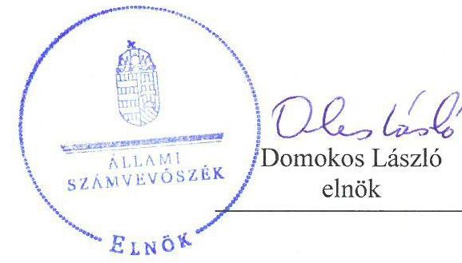
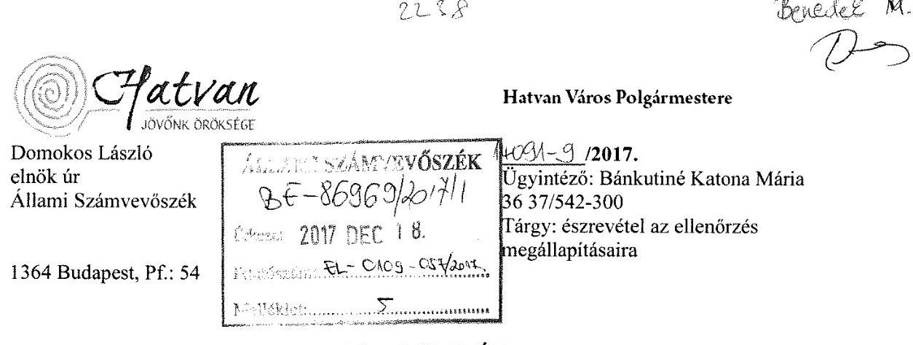
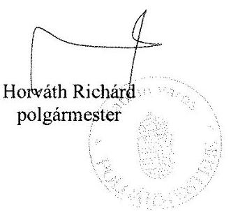
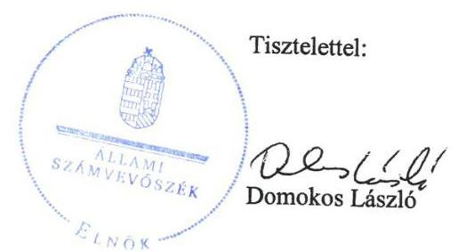

# Jelenetés 

## Önkormányzatok integritás és belső kontrollrendszere

Az önkormányzatok belső kontrollrendszere kialakításának és működtetésének ellenőrzése - Hatvan
2018. február hó 8. nap

---

# AZ ELLENŐRZÉST FELÜGYELTE:

- RENKŐ ZSUZSANNA felügyeleti vezető
- AZ ELLENŐRZÉST VEZETTE ÉS A VÉGREHAJTÁSÁÉRT FELELŐS:
  - DR. DANKÓ ISTVÁN ellenőrzésvezető
  - A PROGRAM ÖSSZEÁLLÍTÁSÁÉRT FELELŐS:
    - JANIK JÓZSEF osztályvezető

- IKTATÓSZÁM: EL-0109-059/2018.
- TÉMASZÁM: 30
- ELLENŐRZÉS-AZONOSÍTÓ SZÁM: V0789, V0784

Jelentéseink az Országgyűlés számítógépes hálózatán és az Interneten a www.asz.hu címen is olvashatóak.

---

# TARTALOMJEGYZÉK 

■ ÖSSZEGZÉS ..... 5
■ AZ ELLENŐRZÉS CÉLJA ..... 6
■ AZ ELLENŐRZÉS TERÜLETE ..... 7
■ AZ ELLENŐRZÉS HÁTTERE, INDOKOLTSÁGA ..... 8
■ A JELENTÉS LÉNYEGES KÉRDÉSKÖREI ..... 10
■ AZ ELLENŐRZÉS HATÓKÖRE ÉS MÓDSZEREI ..... 11
■ MEGÁLLAPÍTÁSOK ..... 13
■ JAVASLATOK ..... 18
■ MELLÉKLETEK ..... 21
I. sz. melléklet: Értelmező szótár ..... 21
II. sz. melléklet: Az integritás szemlélet érvényesítésével és az integritás kontrollrendszer kiépítettségével kapcsolatos megállapítások ..... 23
■ FÜGGELÉK: ÉSZREVÉTELEK ..... 25
■ RÖVIDÍTÉSEK JEGYZÉKE ..... 39

---

.

---

# ÖSSZEGZÉS 

Hatvan Város Önkormányzatánál a belső kontrollrendszer kialakításának és működtetésének hiányosságai miatt a közpénzfelhasználás szabályossága nem volt biztosított. Az Önkormányzatnál az integritás szemlélet nem érvényesült, nem építették ki a megfelelő védelmet a korrupciós veszélyekkel szemben. A kontrollok működésével kapcsolatos szabálytalanságok, valamint a befektetésekkel kapcsolatos kötelezettségvállalások hiánya és a befektetések nyilvántartásának hiányosságai, a vonatkozó kockázatok felmérésének és kezelésének elmaradása miatt nem valósult meg a felelős és átlátható gazdálkodás.

## Az ellenőrzés társadalmi indokoltsága

A korábbi évek ellenőrzési tapasztalatai, az önkormányzatok által betöltött társadalmi szerep, az általuk kezelt közpénz nagysága, a nemzeti vagyon átruházására vagy hasznosítására vonatkozó döntéseik sokrétűsége egyaránt indokolttá tették a számvevőszéki ellenőrzések folytatását. A szabad pénzeszközök felhasználása során kiemelten fontos a felelős gazdálkodás érvényesülése, amely összhangban kell, hogy legyen az önkormányzati gazdálkodás alapelveivel. Az ellenőrzéssel feltárásra kerülhetnek azok a kockázatok, amelyek az önkormányzatok gazdálkodásával, ezen belül befektetési tevékenységeivel, kontrollkörnyezetével kapcsolatosak és a befektetési tevékenységek szabályszerű végrehajtását befolyásolják. Az ellenőrzéssel az önkormányzatok befektetési döntéseinek összessége értékelhetővé válik, és megalapozott megállapítás tehető arra vonatkozóan, hogy milyen hatást gyakoroltak az önkormányzat vagyonára a képviselő-testület döntései.

## Főbb megállapítások, következtetések, javaslatok

Hatvan Város Önkormányzata nem megfelelően alkotta meg a működésére és szervezetére vonatkozó belső szabályokat, nem működtette a kockázatkezelési rendszert, a belső ellenőrzéssel kapcsolatos hatásköröket szabálytalanul alakította ki.

Hatvan Város Önkormányzatánál az integritással összefüggő szabályos kontrollrendszer kiépítése, működtetése, valamint az integritás szemlélet érvényesítése érdekében további intézkedések szükségesek.

A pénzügyi kontrollok végrehajtása szabálytalan volt, nem értékelték, hogy a kiadott szabályzatok, a kialakított és működtetett folyamatok biztosítják-e a rendelkezésre álló forrásokkal való szabályszerű, gazdaságos, hatékony és eredményes gazdálkodást, ezáltal a közpénzfelhasználás szabályossága és átláthatósága nem volt biztosított.

Rögzítették a befektetésekkel kapcsolatban felmerülő döntések hatásköri szabályait, azonban a döntéshozatal és a döntések végrehajtása vonatkozásában az átláthatóságról, megalapozottságról és a nyomon követhetőségről nem gondoskodtak. A befektetések leltározását nem hajtották végre, a főkönyvi könyvelés, az analitikus nyilvántartások és a bizonylatok adatai között az egyeztetést nem végezték el. A befektetések vonatkozásában a pénzügyi kontrollok gyakorlása nem járult hozzá a hibák megelőzéséhez, feltárásához, azok tekintetében a kockázatkezelési rendszert nem működtették, így nem volt biztosított a szabad pénzeszközökkel való felelős gazdálkodás.

---

# AZ ELLENŐRZÉS CÉLJA 

Az ellenőrzés célja annak megállapítása volt, hogy szabályszerűen történt-e az Önkormányzat belső kontrollrendszerének kialakítása és működtetése, az biztosította-e az Önkormányzatnál a közpénzfelhasználás szabályosságát, a közpénzekkel és a nemzeti vagyonnal történő szabályszerű és felelős gazdálkodást, a beszámolási és adatszolgáltatási kötelezettségek szabályszerű teljesítését. Az ellenőrzés keretében értékeltük az Önkormányzat korrupciós kockázatainak kezelését szolgáló integritás kontrollok kiépítettségét és az integritás szemlélet érvényesülését.

Az Önkormányzat egyes befektetési tevékenységeinek ellenőrzése során az ellenőrzés célja annak értékelése volt, hogy a kialakított kontrollkörnyezet biztosította-e a befektetési tevékenységek szabályszerű végzését, az egyes befektetési tevékenységekkel kapcsolatos döntéshozatal és a döntések végrehajtása, valamint az egyes befektetések számviteli elszámolása, nyilvántartása szabályszerű volt-e, és a belső és külső ellenőrzés támogatta-e az egyes befektetési tevékenységek szabályszerű végzését.

---

# **AZ ELLENŐRZÉS TERÜLETE**

## **Hatvan Város Önkormányzata**

A Heves megyei Hatvan város állandó lakosainak száma a KSH adatai alapján 2016. január 1-jén 20 941 fő volt.

Az Önkormányzat1 Képviselő-testület2-e a 12 főből állt (11 fő képviselő és a Polgármester). Munkájukat négy állandó bizottság (Jogi és ellenőrzési Bizottság, Oktatási, Művelődési, Sport és Ifjúsági Bizottság, Pénzügyi, Gazdasági és Városfejlesztési Bizottság, Szociális és Lakásügyi Bizottság) segítette.

A településen Roma Nemzetiségi Önkormányzat3 működött.

A Polgármester a 2014. évi önkormányzati választások óta tölti be tisztségét. A 2013. február 28-ig a Polgármesteri Hivatal4, 2013. március 1-től a Kerekharaszt Község Önkormányzata és Hatvan Város Önkormányzata által létrehozott Közös Önkormányzati Hivatal5 látta el az önkormányzat működésével, valamint a polgármester és a jegyző feladat- és hatáskörébe tartozó ügyek döntésre való előkészítésével és végrehajtásával kapcsolatos feladatokat. Hatvan város jegyzője 2011. január óta látja el a jegyzői feladatokat. A Közös Önkormányzati Hivatalban foglalkoztatott köztisztviselők száma 2016. évben 126 fő volt.

Az Önkormányzat 2016. évben a költségvetési beszámolója szerint 6 088 135 ezer Ft költségvetési bevételt ért el, és 5 118.976 ezer Ft költségvetési kiadást teljesített. A befektetett eszközvagyon értéke 22 659 495 ezer Ft, míg a kötelezettségek állománya 1 198 759 ezer Ft volt.

Az Önkormányzatnak 2016. december 31-án tizenhárom (hét óvoda, két könyvtár, egy művelődési ház, egy városgondnokság, egy szolgáltató intézmény, és egy szociális szolgáltató) önkormányzati költségvetési szerve volt. Az Önkormányzat négy gazdasági társaságban, hét nonprofit társaságban rendelkezett tulajdonosi részesedéssel, valamint egy alapítvány és egy szociális szövetkezet részére biztosított hozzájárulást, amelyek nyilvántartási értéke 2016. december 31-én 180 760 ezer Ft volt. A 2016. év végén az Önkormányzat négy gazdasági társaság részvényeivel rendelkezett, amelyek névértéke 23 051 ezer Ft volt. Az ellenőrzött időszakban üzleti célú ingatlan vásárlására nem került sor.

---

# AZ ELLENŐRZÉS HÁTTERE, INDOKOLTSÁGA 

A demokratikus társadalmakban alapvető igény, hogy a közpénzeket, a közvagyont használók tevékenységükről elszámoljanak, ahhoz egyértelmű és érvényesíthető felelősségi szabályok társuljanak. Ennek a jogos igénynek az érvényesítéséhez meg kell teremteni azokat a folyamatokat, rendszereket, amelyek nélkülözhetetlenek az elszámoltatáshoz. Az elszámoltatás eredményes működtetéséhez szükség van a megfelelő információs, kontroll-, értékelési és beszámolási rendszerek kialakítására. A belső kontrollok kiépítettsége hozzájárul az integritási szemlélet kialakításához és érvényesüléséhez. A belső kontrollrendszer kialakítása és működtetése nélkül nem valósítható meg a közpénzek, a közvagyon szabályos, gazdaságos, hatékony és eredményes felhasználása.

A BELSŐ KONTROLLRENDSZER azt a célt szolgálja, hogy az államháztartás szervei működésük és gazdálkodásuk során a tevékenységeket szabályszerűen, gazdaságosan, hatékonyan, eredményesen hajtsák végre, teljesítsék elszámolási kötelezettségeiket és megvédjék az erőforrásokat a veszteségektől, a károktól, a nem rendeltetésszerű használattól. A belső kontrollrendszer magában foglalja mindazon szabályokat, eljárásokat, gyakorlati módszereket és szervezeti struktúrákat, kockázatkezelési technikákat, kontrolltevékenységeket, amelyek segítséget nyújtanak a szervezetnek céljai eléréséhez. A belső kontrollrendszer szabályozása háromszintű, a törvényi előírásokat az Áht ${ }^{6}$. és a Mötv ${ }^{7}$. a rendeleti szintű szabályozást az Ávr. ${ }^{8}$ és a Bkr. ${ }^{9}$ tartalmazza, amelyeket útmutatói szinten az $\mathrm{NGM}^{10}$ által kiadott standardok és kézikönyvek támogatnak.

A megfelelő belső kontrollrendszer jelentősen csökkenti a hibák és szabálytalanságok kockázatát. Az ÁSZ ${ }^{11}$ célja, hogy javuljon az ellenőrzött önkormányzatok belső kontrollrendszerének szabályozottsága, működésének megfelelősége, szabályszerűsége, hozzájárulva ezzel az egyensúlyi helyzet fenntarthatóságához, biztosítva az önkormányzatnál a közpénzfelhasználás szabályosságát, a közpénzekkel és a nemzeti vagyonnal történő szabályszerű, gazdaságos, hatékony és eredményes gazdálkodást. Az ÁSZ ellenőrzés tapasztalatai nem csupán a közvetlenül ellenőrzött önkormányzatokat támogathatják, hanem a „jó gyakorlat” elterjesztésével azok az önkormányzatok is átvehetik a pozitív példákat, ahol eddig még nem végzett ellenőrzést az ÁSZ.

A közszféra integritás alapú kultúrájának kialakítása, megerősítése és működése szorosan összefügg a belső kontrollrendszer működésével, ezért az ellenőrzés kiterjed annak értékelésére is, hogy a belső kontrollrendszer kialakítása és működtetése hogyan hatott az integritás szemlélet érvényesülésére.

## AZ ÖNKORMÁNYZATOK ÁTMENETILEG SZABAD

PÉNZESZKÖZEINEK BEFEKTETÉSÉT jogszabály nem tiltja, a befektetések jellege nem korlátozott, a pénzpiaci szolgáltatók közül az önkormányzatok a kínált szolgáltatás és annak költségei alapján, szabadon választhatnak, azonban a veszteséges gazdálkodás kockázatai és kö-

---

vetkezményei az önkormányzatokat terhelik. A szabad pénzeszközök felhasználása során kiemelten fontos a felelős gazdálkodás érvényesülése, amely összhangban kell, hogy legyen az önkormányzati gazdálkodás alapelveivel.

Az ellenőrzéssel feltárásra kerülhetnek azok a kockázatok, amelyek az önkormányzatok gazdálkodásával, ezen belül befektetési tevékenységeivel, kontrollkörnyezetével kapcsolatosak és a befektetési tevékenységek szabályszerű végrehajtását befolyásolják. Az ellenőrzéssel az önkormányzatok befektetési/vagyongazdálkodási döntéseinek összessége értékelhetővé válik, és megalapozott megállapítás tehető arra vonatkozóan, hogy azok milyen hatást gyakoroltak az önkormányzat vagyonára.

# AZ ELLENŐRZÉS VÁRHATÓ HASZNOSULÁSA 

NÉGY SZINTEN valósul meg. A törvényalkotás számára összegzett tapasztalatok állnak rendelkezésre a belső kontrollrendszer önkormányzati területen való kialakításáról, működtetéséről és hatásairól. Az ellenőrzés az ellenőrzött számára visszajelzést ad a belső kontrollrendszer kialakításában és működésében lévő hiányosságokról, javaslataival hozzájárul azok kiküszöböléséhez. Az ellenőrzés megállapításait és javaslatait más szervezetek is hasznosíthatják a rendezett gazdálkodási keretek kialakításához. A társadalom számára jelzi, hogy közpénz nem maradhat ellenőrizetlenül, az ÁSZ értékteremtő rend kialakításához és megőrzéséhez hozzájáruló tevékenysége pozitív hatással lesz a szervezetről kialakított összkép formálásában.

---

# A JELENTÉS LÉNYEGES KÉRDÉSKÖREI 

1.     - Az önkormányzat belső kontrollrendszerének kialakítása és működtetése szabályszerű volt-e, az biztosította-e az önkormányzatnál a közpénzfelhasználás szabályosságát, a nemzeti vagyonnal történő felelős gazdálkodást 2016. évben?
2.     - Érvényesült-e az integritás szemlélet és ennek megfelelően kiépítették-e az integritás kontrollrendszert az Önkormányzatnál?
3.     - A jogszabályi előírásoknak megfelelően alakították-e ki a belső kontrollrendszert, a befektetési tevékenységek szabályszerű végzését a kiépített kontrollkörnyezet biztosította-e a 2012-2016. években?
4.     - Az önkormányzat egyes befektetéseivel kapcsolatos döntéshozatala és a döntések végrehajtása szabályszerű volt-e?
5.     - Az egyes befektetések számviteli elszámolása, nyilvántartása szabályszerű volt-e?

---

# AZ ELLENŐRZÉS HATÓKÖRE ÉS MÓDSZEREI 

## Az ellenőrzés típusa

A belső kontrollrendszer ellenőrzése esetében megfelelőségi ellenőrzés, a befektetési tevékenységnél szabályszerűségi ellenőrzés.

## Az ellenőrzött időszak

A belső kontrollrendszer kialakításának és működtetésének ellenőrzése a 2016. január 1. és 2016. december 31. közötti időszakra terjedt ki.

A befektetési tevékenység ellenőrzési időszaka a 2012. január 1. - 2016. december 31. közötti időszak. Ezen felül az önkormányzat befektetésekkel kapcsolatos döntés-előkészítésének és a döntéshozatalának szabályszerűségét ellenőriztük a 2012. január 1. előtti időszakra tekintettel is, mivel a 2016. december 31-én meglévő befektetésekkel kapcsolatos döntéshozatalra a 2012. január 1. előtti időszakban került sor. Az integritás szemlélet érvényesülését a 2016. évre vonatkozó adatszolgáltatás alapján értékeltük.

## Az ellenőrzés tárgya

A helyi önkormányzatnak, mint éves költségvetési beszámoló készítésére kötelezett szervezetnek és polgármesteri
 hivatalának belső kontrollrendszere. Az integritás szemlélet érvényesülése.

Az önkormányzat 2016. december 31-én meglévő, értékpapírokban megtestesülő befektetései, lekötött betétei, valamint a szabad pénzeszközei terhére, adásvételi szerződés keretében megszerzett, a kötelező feladatok ellátását nem szolgáló, az önkormányzat üzleti vagyonába tartozó, az ellenőrzött időszakban (2012-2016.) megszerzett ingatlanok, továbbá időkorlátozás nélkül megszerzett - kulturális javak (műtárgyak, műalkotások, stb.), illetve a feladatellátást nem szolgáló egyéb értéktárgyak (pl. ékszerek, befektetési nemesfém). Az ellenőrzés kiterjedt minden olyan körülményre és adatra, amely az ÁSZ jogszabályban meghatározott feladatainak teljesítéséhez, valamint a program végrehajtása folyamán felmerült újabb összefüggések feltárásához szükséges volt.

## Az ellenőrzött szervezet

Hatvan Város Önkormányzata.

---

# Az ellenőrzés jogalapja 

Az ÁSZ tv. ${ }^{12} 1$. § (3) bekezdésében foglaltak alapján az ÁSZ általános hatáskörrel végzi a közpénzekkel és az állami és önkormányzati vagyonnal való felelős gazdálkodás ellenőrzését. Az ÁSZ tv. 5. § (2) bekezdése alapján az államháztartás gazdálkodásának ellenőrzése keretében az ÁSZ ellenőrzi a helyi önkormányzatok gazdálkodását, valamint az ÁSZ tv. 5. § (6) bekezdése alapján ellenőrzése során értékeli az államháztartás számviteli rendjének betartását és a belső kontrollrendszer működését.

## Az ellenőrzés módszerei

Az ÁSZ az ellenőrzést az ellenőrzési program szempontjai, az ellenőrzött időszakban hatályos jogszabályok, az ellenőrzés szakmai szabályai, az egyes ellenőrzési típusokhoz kapcsolódó ÁSZ módszertanok figyelembe vételével végezte. A gazdálkodás hibáinak kijavítására, a közpénzekkel való felelős gazdálkodás elősegítésére irányuló javaslatok kidolgozásakor a hatályos jogszabályok az irányadóak.

Az ellenőrzés ideje alatt az ÁSZ Hatvan Város Önkormányzatával történő kapcsolattartást az ÁSZ SZMSZ ${ }^{13}$-ének vonatkozó előírásai alapján biztosította.

Az ellenőrzési kérdések megválaszolásához szükséges bizonyítékok megszerzése Hatvan Város Önkormányzata által rendelkezésre bocsátott dokumentumokra, adatokra alapozva megfigyelés, szemle (szemrevételezés), valamint elemző eljárás keretében történt.

Az ellenőrzési bizonyítékként felhasználható adatforrások közé tartoztak egyrészt az ellenőrzési program részletes szempontjainál felsorolt adatforrások, másrészt minden - az ellenőrzés folyamán feltárt, az ellenőrzés szempontjából releváns információt tartalmazó - dokumentum.

Az ellenőrzés lefolytatásához Hatvan Város Önkormányzata az ÁSZ által kért dokumentumok elektronikus megküldésével szolgáltatott adatokat. A rendelkezésre bocsátott adatok, információk kontrollja az ellenőrzés keretében történt.

---

# MEGÁLLAPÍTÁSOK 

## 1. Az önkormányzat belső kontrollrendszerének kialakítása és működtetése szabályszerű volt-e, az biztosította-e az önkormányzatnál a közpénzfelhasználás szabályosságát, a nemzeti vagyonnal történő felelős gazdálkodást 2016. évben?

Összegző megállapítás

A belső kontrollrendszer kialakítása és működtetése nem volt szabályszerű. A szabályozás hiányosságai következtében a közpénzfelhasználás szabályossága, a nemzeti vagyonnal való felelős gazdálkodás nem volt biztosított.

A KONTROLLKÖRNYEZET kialakítása nem volt szabályszerű. A szervezeti keretekre, a feladat és hatáskörökre vonatkozó rendelkezéseket az Önkormányzatra az Önkormányzati SZMSZ ${ }^{14}$, a Közös Önkormányzati Hivatalra a BMSZ ${ }^{15}$ tartalmazta. Az értékelési szabályzat ${ }_{1,2}{ }^{16}$-ben nem határozták meg az Áhsz. ${ }_{2}{ }^{17} 50. § (2) bekezdés b)-c) pontjában előírt követeléstípusonként a kis összegű követelések dokumentálás szabályait, továbbá az egyszerűsített értékelési eljárás alá vont követelések dokumentálásának szabályait. A Közös Önkormányzati Hivatal 2016. január 1. és február 28. közötti időszakban az Ávr. 13. § (2) bekezdés b)-c) pontjában előírtak ellenére nem rendezte belső szabályzatban a beszerzések lebonyolításával, illetve a belföldi és külföldi kiküldetések elrendelésével és lebonyolításával, elszámolásával kapcsolatos, valamint 2016. év vonatkozásában az Ávr. 13. § (2) bekezdés e) pontjában előírtak ellenére a reprezentációs kiadások felosztását, azok teljesítésének és elszámolásának szabályait. A Kttv. ${ }^{18}$ 231. § (1) bekezdésében előírtak ellenére a köztisztviselőkre vonatkozó hivatásetikai alapelvek részletes tartalmát, valamint az etikai eljárás szabályait a Képviselő Testület nem állapította meg. Nem gondoskodtak a Bkr. 6. § (4) bekezdésében előírt integritást sértő események kezelésének eljárásrendjének szabályozásáról.

A KOCKÁZATKEZELÉSI RENDSZER kialakítása és működtetése nem volt szabályszerű. A Hivatal kockázatkezelési szabályzatában ${ }^{19}$ nem szabályozták a Bkr. 3. § b) pontjában foglalt integrált kockázatkezelési rendszert, a Bkr. 7. § (2) bekezdés ellenére nem mérték fel és nem állapították meg az Önkormányzat tevékenységében, gazdálkodásában rejlő kockázatokat, nem határozták meg az egyes kockázatokkal kapcsolatban szükséges intézkedéseket, valamint azok teljesítésének folyamatos nyomon követésének módját.

A KONTROLLTEVÉKENYSÉGEK kialakítása és működtetése nem volt szabályszerű. A 2016. évben kiadott Gazdálkodási Szabályzat visszaható hatályú alkalmazást írt elő, amely az év első két hónapjában nem támogatta a pénzügyi kontrollok szabályszerű gyakorlását, emiatt a

---

Bkr. 6. § (2) bekezdés b) pontjában foglaltak ellenére nem voltak egyértelműek a felelősségi, hatásköri viszonyok és feladatok. Az Ávr. 60. § (3) bekezdésben előírtak ellenére nem gondoskodtak a jogosult személyek aláírás mintájának naprakész nyilvántartásáról. Nem történt meg az Ávr. 55. § (1) bekezdésében foglaltak ellenére a pénzügyi ellenjegyzés, végrehajtott pénzügyi ellenjegyzés esetén a dátum és a pénzügyi ellenjegyzésre utaló megjelölés rögzítése. Az Ávr. 58. § (1) bekezdésében foglaltak ellenére az érvényesítő a gazdasági esemény elszámolása során nem ellenőrizte, hogy a megelőző ügymenetben az Áht. és az Ávr. szabályait és a belső szabályzatok rendelkezéseit betartották-e. Az Ávr. 57. § (1) bekezdésének ellenére nem került sor teljesítésigazolásra, illetve az Ávr. 57. § (3) bekezdésének ellenére teljesítés igazolást írásbeli kijelöléssel nem rendelkező személy végezte. Az Áht. 38. § (1) bekezdése és az Ávr. 59. § (1) bekezdésében előírtak ellenére nem történt meg az utalványozás, illetve az utalványozást nem az arra írásban felhatalmazott végezte el.

# AZ INFORMÁCIÓS ÉS KOMMUNIKÁCIÓS RENDSZER kialakítása és működtetése szabályszerű volt. Rendelkeztek adatvédelmi és adatbiztonsági szabályzattal, valamint iratkezelési szabályzattal. Az államháztartás információs rendszerébe történő adatszolgáltatási kötelezettségeknek az Áhsz. ${ }^{21}$ és az Áhsz. előírásainak megfelelően eleget tettek. 

A MONITORING RENDSZER keretében a belső ellenőrzési rendszer kialakítása és működtetése nem volt szabályszerű. A Belső Ellenőrzési Kézikönyvet az Áht. és a Bkr. módosítását követően a Bkr. 17. § (4) bekezdése ellenére nem aktualizálták. A Bkr. 2 § c) pontjában, valamint a BMSZ II. számú mellékletében és a Belső Ellenőrzési Kézikönyvben foglaltak ellenére a belső ellenőrzési vezetőt nem jelölték ki, emiatt a Bkr. 22. § (1) bekezdésében és a 33. § (1) és (3) bekezdésében foglalt feladatokat nem a belső ellenőrzési vezető végezte el. A jegyző a BMSZ és a Belső Ellenőrzési Kézikönyv előírásai alapján közvetlen irányítást gyakorolt a belső ellenőrzést végzők felett, amely veszélyeztette a Bkr. 19. §-ában foglalt funkcionális függetlenséget. A Bkr. 33. § (1) bekezdésének és a Belső Ellenőrzési Kézikönyvben foglaltak ellenére az egyes belső ellenőrzésekhez nem jelöltek ki vizsgálatvezetőket. A Bkr. 21. § (2) bekezdés d) pontja és a 47. § (1) bekezdése ellenére a belső ellenőrzési jelentések alapján megtett intézkedések nyilvántartásáról és nyomon követéséről nem gondoskodtak. A külső ellenőrzésekhez kapcsolódóan a Bkr. 13. § (2) ellenére nem készítettek intézkedési terveket. A 2016. évi éves ellenőrzési jelentés a Bkr. 48. § b) pont ellenére nem tartalmazta a belső kontrollrendszer működésének értékelését. A Bkr. 11. § (1) bekezdésében előírt belső kontrollrendszer működéséről szóló vezető nyilatkozat nem felelt meg a Bkr. 1. számú mellélete szerinti formai és tartalmi követelményeknek és a Bkr. 7. §-ában foglaltak ellenére nem az integrált kockázatkezelési rendszerre vonatkozó minősítő értékelést tartalmaz.

A NEMZETISÉGI ÖNKORMÁNYZATTAL kapcsolatos feladatok keretében az együttműködésre vonatkozó megállapodást megkötötték, szabályszerű működésének feltételeit a szabályzatok hatályának kiterjesztésével a Nektv. ${ }^{22}$ és az Áht. előírásainak megfelelően biztosították. A Bkr. 6. § (3) és (4) bekezdésében előírt ellenőrzési nyomvonalat, valamint

---

a szabálytalanságok kezelésének eljárásrendjét a nemzetiségi önkormányzat tekintetében nem szabályozták.

# 2. Érvényesült-e az integritás szemlélet és ennek megfelelően ki- 

építették-e az integritás kontrollrendszert az Önkormányzatnál?

Összegző megállapítás

Az Önkormányzatnál az integritással összefüggő kontrollok és a korrupciós kockázatok szintje nem volt egymással összhangban, a kontrollrendszer nem támogatta az integritás szemlélet érvényesülését.

A belső ellenőrzést nem megfelelő módon építették ki és működtették, integritási kockázatelemzést, kockázatkezelési tevékenységet nem folytattak, nem rendelkeztek az etikai elvárásokkal, az ajándékok, meghívások, utaztatás elfogadásának feltételeivel kapcsolatos szabályozással. Nem végeztek korrupciós kockázatelemzéseket és képzést. Az integritás kontrollrendszer kiépítettségével kapcsolatos megállapításokat a II. számú mellélet tartalmazza.

## 3. A jogszabályi előírásoknak megfelelően alakították-e ki a belső kontrollrendszert, a befektetési tevékenységek szabályszerű végzését a kiépített kontrollkörnyezet biztosította-e a 2012-2016. években?

## Összegző megállapítás

A kialakított belső kontrollrendszer nem biztosította a befektetési tevékenység szabályszerű végzését a 2012-2016. években.

A KONTROLLKÖRNYEZET befektetésekre vonatkozó elemeinek tekintetében az Önkormányzat az általános gazdálkodási szabályait alkalmazta. A befektetések kontrollkörnyezetének kialakítása nem volt szabályszerű. A Közös Önkormányzati Hivatal 2013. március 1. és 2014. szeptember 12. közötti időszakban az Áht. 10. § (5) bekezdésében foglaltak ellenére a szervezetére, feladatai ellátásának részletes belső rendjére és módjára vonatkozó szabályzattal nem rendelkezett. A Számv. tv. ${ }^{23}$ 161. § (1) bekezdés, az Áhsz. ${ }_{1}$ 49. § ellenére 2012. január 1-től 2013. február 28-ig érvényes számlarenddel, a Számv. tv. 161. § (2) bekezdés d) pontja ellenére 2012. január 1. és 2014. február 28. közötti időszakban érvényes bizonylati rendet nem alakítottak ki. A Számv. tv. 14. § (5) bekezdés a)-b) pontja és az Áhsz. ${ }_{1}$ 8. § (4) bekezdés a)-b) pontja ellenére 2012. január 1-től 2013. február 28-ig érvényes eszközök és források értékelési szabályzattal, illetve leltározási és leltárkészítési szabályzattal nem rendelkezett. A Közös Önkormányzati Hivatal nem rendelkezett a Bkr. 6. § (3) bekezdés ellenére 2013. március 1. és 2015. december 31. közötti időszakban ellenőrzési nyomvonallal, valamint a Bkr. 6. § (4) bekezdése ellenére nem

---

1. táblázat

|  |   |   |
| --- | --- | --- |
|  GAZDÁLKODÁSI SZABÁLYZAT |  |   |
|  Év | Hatályba lépés | Kötelező alkalmazás  |
|  2012. | 2012. 02. 15. | 2012. 01. 01.  |
|  2013. | 2013. 02. 15. | 2013. 01. 01.  |
|  2014. | 2014. 02. 14. | 2014. 01. 01.  |
|  2015. | 2015. 02. 19. | 2015. 01. 01.  |
|  2016. | 2016. 02. 12. | 2016. 01. 01.  |
|  Forrás: 2012-2016 évi Gazdálkodási Szabályzat |  |   |

szabályozta a szabálytalanságok kezelésének eljárásrendjét. Az évenként kiadott Gazdálkodási Szabályzat minden esetben visszaható hatályú alkalmazást írt elő, így a pénzügyi kontrollok szabályszerű gyakorlásának feltételei az adott év első két hónapjában nem voltak biztosítottak (1. táblázat).

A KOCKÁZATKEZELÉSI RENDSZERT 2013. március 1. és 2015. december 31. között a Bkr. 7. § (1)-(2) bekezdéseiben foglaltak ellenére nem alakítottak ki és nem működtettek. A Bkr. 7. § (2) bekezdésében foglaltak ellenére 2012-2016. évben a befektetési tevékenységgel kapcsolatban nem mérték fel a kockázatokat, nem határozták meg az egyes kockázatokkal kapcsolatban szükséges intézkedéseket.

A KONTROLLTEVÉKENYSÉG részeként társasági részesedés megszerzése vonatkozásában az Ávr. 55. §
 (1) bekezdésében foglaltak ellenére az ellenjegyzés és az Ávr. 57. § (1) bekezdésének ellenére a teljesítésigazolás nem történt meg. Az érvényesítő nem hajtotta végre az Ávr. 58. § (1) bekezdése szerinti összegszerűségre és fedezet meglétére vonatkozó ellenőrzést. Az utalványozásra az Áht. 38. § (1) bekezdésének előírása ellenére teljesítésigazolás hiányában került sor.

AZ INFORMÁCIÓS ÉS KOMMUNIKÁCIÓS RENDSZER kialakítása szabályszerű volt. A közérdekű adatok megismerhetőségét biztosították, a közzétételi kötelezettségeknek eleget tettek.

A MONITORING RENDSZER nem támogatta a befektetési tevékenységek szabályszerű végzését, mert azok vonatkozásában belső ellenőrzés nem volt. A külső ellenőrzések a befektetési tevékenységre nem terjedtek ki.

# 4. Az önkormányzat egyes befektetéseivel kapcsolatos döntéshozatala és a döntések végrehajtása szabályszerű volt-e?

Összegző megállapítás

Az Önkormányzat részvényekkel és társasági részesedésekkel kapcsolatos döntéshozatala és a döntések végrehajtása nem volt szabályszerű, nem volt biztosított az átláthatóság és az elszámoltathatóság.

A BEFEKTETÉSEKKEL KAPCSOLATOS DÖNTÉSHOZATAL eljárásrendjét kialakították, azonban 2012-2016. év vonatkozásában a döntések meghozatalával kapcsolatos kötelezettségvállalásokat nem tették meg.

A BEFEKTETÉSI CÉLÚ DÖNTÉSHOZATAL VÉGREHAJTÁSA keretében 2012-2015. évben a gazdasági ügyekben illetékes bizottság a befektetésekkel kapcsolatban véleményező, elemző, értékelő tevékenységet az Ötv. ${ }^{24}$ 92. § (13) bekezdés b) pontja és a Mötv. 120. § (1) bekezdés b) pontjának rendelkezése ellenére nem végzett.

---

# 5. Az egyes befektetések számviteli elszámolása, nyilvántartása szabályszerű volt-e? 

Összegző megállapítás

Az egyes befektetések pénzügyi elszámolása és nyilvántartása nem volt szabályszerű, az éves beszámolók alátámasztottsága nem volt megfelelő, a befektetések mérlegben szereplő adatainak megbízhatósága nem volt biztosított.

A BEFEKTETÉSEK SZÁMVITELI ELSZÁMOLÁSA
nem felelt meg a jogszabályi előírásoknak. 2012. évben az analitikus nyilvántartásokban és az év végi mérlegben a részesedéseket és a részvényeket a befektetett pénzügyi eszközök között kimutatták, azonban a Számv. tv. 15. § (2) bekezdésében és az Áhsz. 1. 5. § (1) bekezdésében foglaltak ellenére azok a mérleget alátámasztó főkönyvi kivonatban nem szerepeltek. A 2013. évi mérlegben a részvényeket az Áhsz 1 19. § (1) bekezdése ellenére nem a tartós részesedések között, hanem az államkötvények között mutatták ki. A 2012-2016. években a befektetések mérlegsorait a Számv. tv. 69. § (1) bekezdés és az Áhsz. 1 37.§ (1)-(2) bekezdés és az Áhsz 2 5. § (1) bekezdésének és 22.§ (1) bekezdésének rendelkezései ellenére leltárral nem támasztották alá. Nem tettek eleget a Számv. tv. 69. § (2) bekezdésében előírt, a főkönyvi könyvelés és az analitikus nyilvántartások adatai közötti egyeztetési kötelezettségnek, valamint a Számv. tv. 46. § (3) bekezdés és az Áhsz 2 20. § (1) bekezdése alapján az eszközök és források év végi értékelési kötelezettségének.

## A BEFEKTETÉSEK ANALITIKUS NYILVÁNTARTÁSA nem volt szabályszerű. 2012-2013. évben az Áhsz 1 9. melléklet 1/h. pontjában foglaltak ellenére az analitikus nyilvántartásból nem voltak megállapíthatók értékpapír-típusonként az egyedi értékeléshez szükséges adatok, 2014-2016. évben azok nem tartalmazták az Áhsz 1 14. sz. melléklet VIII. fejezetben előírtak ellenére az értékpapír beszerzésének módját, célját, számviteli besorolását, a bekerülési érték megállapításának módját, dematerizált értékpapír esetén az értékpapírszámla számát, megnevezését, a számlavezető nevét, az értékpapír értékeléséhez szükséges adatokat. A társasági részesedések nyilvántartása nem tartalmazta a megszerzésének célját, számviteli besorolását és a részesedés Nvtv. szerinti besorolását.

---

# JAVASLATOK 

Az ÁSZ tv. 33. § (1) bekezdésében foglaltak értelmében az ellenőrzött szervezet vezetője köteles a jelentésben foglalt megállapításokhoz kapcsolódó intézkedési tervet összeállítani és azt a jelentés kézhezvételétől számított 30 napon belül az ÁSZ részére megküldeni. Amennyiben az ellenőrzött szervezet vezetője nem küldi meg határidőben az intézkedési tervet, vagy továbbra sem elfogadható intézkedési tervet küld, az Állami Számvevőszék elnöke az ÁSZ tv. 33. § (3) bekezdés a) és b) pontjaiban foglaltakat érvényesítheti.

## a polgármesternek:

1. Intézkedjen a köztisztviselőkre vonatkozó hivatásetikai alapelvek részletes tartalmáról, valamint az etikai eljárás szabályairól szóló előterjesztés Képviselő-testület elé terjesztéséről.
(1. számú megállapítás 1. bekezdés 5. mondata alapján)

## a jegyzőnek:

1. Intézkedjen a belső kontrollrendszer egyes elemei jogszabályi előírásoknak megfelelő kialakítására és működtetésére, valamint a befektetésekkel kapcsolatos döntések előkészítése és végrehajtása, illetve a gazdálkodási jogkörök gyakorlása során a jogszabályi előírások betartására.
(1. számú megállapítás 1. bekezdés 3. mondata, 4. mondat utolsó mondatrésze és 6. mondata, 2. bekezdés 2. mondata, 3. bekezdés 3-7. mondatai, 5. bekezdés 2-7. mondatai, 3. számú megállapítás 2. bekezdés 2. mondata és 3. bekezdése alapján)
2. Intézkedjen a köztisztviselőkre vonatkozó hivatásetikai alapelvek részletes tartalmát, valamint az etikai eljárás szabályait tartalmazó előterjesztés előkészítéséről.
(1. számú megállapítás 1. bekezdés 5. mondata alapján)
3. Intézkedjen az éves költségvetési beszámoló mérlegében kimutatott befektetések jogszabályi előírásoknak megfelelő leltárral történő alátámasztásáról, továbbá a leltározás keretében a főkönyvi könyvelés és az analitikus nyilvántartások adatai közötti egyeztetés elvégzéséről.
(5. számú megállapítás 1. bekezdés 4. mondata és 5. mondat 1. tagmondata alapján)

---

4. Intézkedjen az éves költségvetési beszámoló mérlegében kimutatott befektetések jogszabályi előírásoknak megfelelő értékeléséről.
(5. számú megállapítás 1. bekezdés 5. mondat
5. tagmondata alapján)
5. Intézkedjen a befektetésekhez kapcsolódó részletező nyilvántartások jogszabályi előírásoknak megfelelő vezetéséről.
(5. számú megállapítás 2. bekezdés 2. mondata alapján)
6. Intézkedjen az Állami Számvevőszék ellenőrzése során feltárt hiányosságok és/vagy szabálytalanságok tekintetében a munkajogi felelősség tisztázására irányuló eljárás megindításáról, és ennek eredménye ismeretében tegye meg a szükséges intézkedéseket.
(1. számú megállapítás 3. bekezdés 3-7. mondatai, 3. számú megállapítás 3. bekezdése, 5. számú megállapítás 1. bekezdés 4-5. mondatai és 2. bekezdés 2. mondata alapján)

---

.

---

# MELLÉKLETEK 

- I. SZ. MELLÉKLET: ÉRTELMEZŐ SZÓTÁR
belső ellenőrzés
belső kontrollrendszer
belső kontrollrendszer pillérei, kontrollterületei
betét
dematerializált értékpapír
értékpapírszámla
forgatási célú értékpapír
helyi önkormányzat

Független, tárgyilagos bizonyosságot adó és tanácsadó tevékenység, amelynek célja, hogy az ellenőrzött szervezet működését fejlessze és eredményességét növelje, az ellenőrzött szervezet céljai elérése érdekében rendszerszemléletű megközelítéssel és módszeresen értékeli, illetve fejleszti az ellenőrzött szervezet irányítási és belső kontrollrendszerének hatékonyságát. (Forrás: Bkr. 2. § b) pontja)
A belső kontrollrendszer a kockázatok kezelése és tárgyilagos bizonyosság megszerzése érdekében kialakított folyamatrendszer, amely azt a célt szolgálja, hogy a működés és gazdálkodás során a tevékenységeket szabályszerűen, gazdaságosan, hatékonyan, eredményesen hajtsák végre, az elszámolási kötelezettségeket teljesítsék, megvédjék az erőforrásokat a veszteségektől, károktól és nem rendeltetésszerű használattól. (Forrás: Áht. 69. § (1) bekezdése)
A kontrollkörnyezet, a kockázatkezelési rendszer, a kontrolltevékenységek, az információs és kommunikációs rendszer, valamint a nyomon követési (monitoring) rendszer. (Forrás: Bkr. 3. §-a)
a Ptk. szerinti betétszerződés vagy a takarékbetétről szóló 1989. évi 2. törvényerejű rendelet szerinti takarékbetét-szerződés alapján fennálló tartozás, ideértve a hitelintézetnél a fizetésiszámla-szerződés alapján fennálló pozitív számlaegyenleget is (Hpt. 6. § (1) bekezdés 8. pont).
a Tpt.-ben és külön jogszabályban meghatározott módon, elektronikus úton létrehozott, rögzített, továbbított és nyilvántartott, az értékpapír tartalmi kellékeit azonosítható módon tartalmazó adatösszesség (Tpt. 5. § (1) bekezdés 29. pont)
a dematerializált értékpapírról és a hozzá kapcsolódó jogokról az értékpapír-tulajdonos javára vezetett nyilvántartás (Tpt. 5. § (1) bekezdés 46. pont)
azok az értékpapírok, amelyeket forgatási célból, kamatbevétel, illetve árfolyamnyereség elérése érdekében szereztek be, továbbá azokat, amelyek a tárgyévet követő üzleti évben lejárnak (Számv. tv. 30. § (5) bekezdés)
A helyi önkormányzat jogi személy. Az önkormányzati feladatok ellátását a képviselő-testület és szervei biztosítják. A képviselőtestület szervei: a polgármester, a főpolgármester, a megyei közgyűlés elnöke, a képviselő-testület bizottságai, a részönkormányzat testülete, a polgármesteri hivatal, a megyei önkormányzati hivatal, a közös önkormányzati hivatal, a jegyző, továbbá a társulás. A képviselő-testület a feladatkörébe tartozó közszolgáltatások ellátására - jogszabályban meghatározottak szerint - költségvetési szervet, a Polgári perrendtartásról szóló 1952. évi III. törvény szerinti gazdálkodó szervezetet (a továbbiakban: gazdálkodó szervezet), nonprofit szervezetet és egyéb szervezetet (a továbbiakban együtt: intézmény) alapíthat, továbbá szerződést köthet természetes és jogi személlyel vagy jogi személyiséggel nem rendelkező szervezettel. A helyi önkormányzat éves költségvetési beszámolója magába foglalja a helyi önkormányzat - nem költségvetési szerveihez tartozó - feladataihoz kapcsolódó bevételeket és kiadásokat. A helyi önkormányzat összevont (konszolidált) költségvetési beszámolóját a helyi önkormányzatra és költségvetési szerveire vonatkozóan külön-külön beérkezett éves költségvetési beszámolók alapján a Kincstár készíti el és küldi meg az önkormányzatnak. (Forrás: Mötv. 41. § (1), (2), (6) bekezdései; Áhsz. 2. § (1) bekezdése, 6. § (1) bekezdés a) és f) pontja, 30. §-a, 37. § (1) és (6) bekezdése)

---

hitelviszonyt megtestesítő értékpapír
információs és kommunikációs rendszer
integritás
irányító szerv és annak vezetője
kockázatkezelési rendszer
kontrollkörnyezet
kulturális javak
üzleti vagyon
minden olyan értékpapír, illetve törvény által értékpapírnak minősített, jogot megtestesítő okirat, amelyben a kibocsátó (adós) meghatározott pénzösszeg rendelkezésére bocsátását elismerve arra kötelezi magát, hogy a pénz (kölcsön) összegét, valamint annak meghatározott módon számított kamatát vagy egyéb hozamát, és az általa esetleg vállalt egyéb szolgáltatásokat az értékpapír birtokosának (a hitelezőnek) a megjelölt időben és módon megfizeti, illetve teljesíti. Ide tartozik különösen: a kötvény, a kincstárjegy, a letéti jegy, a pénztárjegy, a célrészjegy, a takaréklevél, a jelzáloglevél, a hajóraklevél, a közraktárjegy, az árujegy, a zálogjegy, a kárpótlási jegy, a határozott idejű befektetési alap által kibocsátott befektetési jegy (Számv. tv. (6) bekezdés 2. pont)
A költségvetési szerv vezetője által kialakított és működtetett olyan rendszer, mely biztosítja, hogy a megfelelő információk a megfelelő időben eljutnak az illetékes szervezethez, szervezeti egységhez, illetve személyhez. (Forrás: Bkr. 9. § (1) bekezdés)
Az integritás elvek, értékek, cselekvések, módszerek, intézkedések konzisztenciáját jelenti: olyan magatartásmódot, amely meghatározott értékeknek felel meg. Az integritás a közszféra esetében a társadalom által elvárt nyilvánossági, átláthatósági, illetve jogi/etikai normáknak történő megfelelést jelenti.
(Forrás: a http://integritas.asz.hu honlapon közzétett „A 2012. évi integritás felmérés eredményeinek összefoglalója" című dokumentum 3. oldal 1. bekezdése)
A közös önkormányzati hivatal kivételével a helyi önkormányzat által irányított költségvetési szerv esetén a képviselő-testület, közgyűlés és a polgármester, főpolgármester, megyei közgyűlés elnöke. A közös önkormányzati hivatal esetén a közös önkormányzati hivatal székhelye szerinti helyi önkormányzat képviselő-testülete és annak polgármestere. (Forrás: Áht. 2. § (1) bekezdés i), ia) és ib) pontja)
Olyan irányítási eszközök és módszerek összessége, melynek elemei a szervezeti célok elérését veszélyeztető tényezők (kockázatok) azonosítása, elemzése, csoportosítása, nyomon követése, valamint szükség esetén a kockázati kitettség mérséklése. (Forrás: Bkr. 2. § m) pontja)
A költségvetési szerv vezetője által kialakított olyan elvek, eljárások, belső szabályzatok összessége, amelyben világos a szervezeti struktúra, egyértelműek a felelősségi, hatásköri viszonyok és feladatok, meghatározottak az etikai elvárások a szervezet minden szintjén, átlátható a humánerőforrás-kezelés. (Forrás: Bkr. 6. § (1) bekezdés)
A költségvetési szerv vezetője által a szervezeten belül kialakított (kontroll) tevékenységek, melyek biztosítják a kockázatok kezelését, hozzájárulnak a szervezet céljainak eléréséhez. (Forrás: Bkr. 8. § (1) bekezdés)
az élettelen és élő természet keletkezésének, fejlődésének, az emberiség, a magyar nemzet, Magyarország történelmének kiemelkedő és jellemző tárgyi, képi, hangrögzített, írásos emlékei és egyéb bizonyítékai - az ingatlanok kivételével -, valamint a művészeti alkotások (a kulturális örökség védelméről szóló
 2001. évi LXIV. törvény)
a nemzeti vagyon azon része, amely nem tartozik az önkormányzati vagyon esetén a törzsvagyonba (Nvtv. 3. § (1) bekezdés 18. pontja)

---

# II. SZ. MELLÉKLET: AZ INTEGRITÁS SZEMLÉLET ÉRVÉNYESÍTÉSÉVEL ÉS AZ INTEGRITÁS KONTROLLRENDSZER KIÉPÍTETTSÉGÉVEL KAPCSOLATOS MEGÁLLAPÍTÁSOK 

Hatvan Város Közös Önkormányzati Hivatal által a 2016. évre kitöltött integritás tanúsítvány alapján - négy kockázati területen - a kialakított kontrollokat értékeltük.

## AZ INTEGRITÁS RENDSZERÉNEK ÉRTÉKELÉSE

| Sorszám | Megnevezés | Maximum elérhető pontszámok | Elért pontszámok | Értékelés |
| :--: | :--: | :--: | :--: | :--: |
| 1. | A szervezetnél vannak-e olyan szabályozási hiányosságok, amelyek az integritást veszélyeztetik? | 38 | 33 | A szervezetnél a jogszabályok által előírt kontrollok kiépítettsége támogatja a szervezet integritását. |
| 2. | A szervezet meghatározta-e az általa követendő értékeket, ezek között szerepel-e az integritás erősítése (a korrupció visszaszorítása)? | 9 | 9 | A szervezet meghatározta az általa követendő értékeket, ezek között szerepelt az integritás erősítése (korrupció visszaszorítása). |
| 3. | A szervezet végez-e rendszeresen kockázatelemzést, ezen belül korrupciós (integritási) kockázatelemzést? | 11 | 2 | A szervezet nem végez kockázatelemzést. |
| 4. | A szervezet a feltárt kockázat eredményes kezelése érdekében kialakította-e és működtette-e a jogszabályban kötelezően nem előírt kontrollokat? | 18 | 9 | A szervezet csekély mértékben működtette az integritást erősítő, nem kötelezően előírt kontrollokat. |
| Összesített értékelés |  |  | A kockázatelemzési hiányosság miatt a szervezetnél az integritás-tudatos vezetés fejlesztésére széleskörű lehetőség van |  |

A kontrollok kiépítettségének főbb hiányosságai az alábbiak voltak:

1. a speciális korrupcióellenes rendszerek és eljárások tekintetében az Önkormányzatnál:

- nem rendelkeztek a jogszabályi etikai szabályzattal;
- nem biztosították a belső ellenőrzés független működését;
- 2016. január 1. és március 29. között nem rendelkeztek a Közös Önkormányzati Hivatal vonatkozásában érvényes vagyonnyilatkozatok kezelésére vonatkozó szabályozással;
- nem végeztek rendszeres korrupciós kockázatelemzéseket;
- nem volt korrupcióellenes képzés az elmúlt 3 évben.

2. a „lágy" kontrollok (a szervezet által önként bevezetett, kialakított szabályok, követelmények) kialakítását érintően az Önkormányzatnál:

- nem szabályozták az ajándékok, meghívások, utaztatás elfogadásának feltételeit;
- az alkalmazottak számára a gazdasági vagy egyéb érdekeltségeikről, a szervezet tevékenysége szempontjából releváns összeférhetetlenségről szóló nyilatkozattételi kötelezettséget nem írták elő;
- nem volt hatása a teljesítményértékeléseknek a munkatársak jövedelmére.
- nem alkalmazták általános jelleggel a „négy szem elvét".

---

.

---

# FÜGGELÉK: ÉSZREVÉTELEK 

A jelentéstervezetet a Számvevőszék 15 napos észrevételezésre megküldte az ellenőrzött szervezet vezetőjének az ÁSZ tv. 29. § (1) bekezdése előírásának megfelelően.
A függelék tartalmazza az ellenőrzött észrevételeit, illetve az el nem fogadott észrevételek elutasításának indoklását.

[^0]
[^0]:    * 29. § (1) Az Állami Számvevőszék az ellenőrzési megállapításait megküldi az ellenőrzött szervezet vezetőjének vagy az általa megbízott személynek, és annak, akinek személyes felelősségét állapította meg.
    (2) Az ellenőrzött szervezet vezetője és a felelősként megjelölt személy az ellenőrzés megállapításaira tizenöt napon belül írásban észrevételt tehet.
    (3) Az Állami Számvevőszék az észrevételre a beérkezésétől számított harminc napon belül írásban válaszol. A figyelembe nem vett észrevételeket köteles a jelentésben feltüntetni, és megindokolni, hogy azokat miért nem fogadta el.

---

Tisztelt Elnök Úr!

Hatvan Város Önkormányzata az „Az önkormányzatok belső kontrollrendszere kialakításának és működtetésének ellenőrzése - Hatvan" című ellenőrzésről készített - 2017. november 30. napján kézhez vett - számvevőszéki jelentéstervezetre az ott írt határidőben az alábbi észrevételeket teszem a jelentéstervezet számozásának megfelelően:

1.)

1. számú megállapítások 1. bekezdés 4. mondat: A Közös önkormányzati Hivatal 2016. január 1. és február 28. között az Ávr. 13. § (2) bekezdés b)-c) pontjában előírtak ellenére nem rendezte belső szabályzatban a beszerzések lebonyolításával, illetve a belföldi és külföldi kiküldetések elrendelésével és lebonyolításával, elszámolásával kapcsolatos, valamint 2016. év vonatkozásában az Ávr. 13. § (2) bekezdés e) pontjában előírtak ellenére a reprezentációs kiadások felosztását, azok teljesítésének és elszámolásának szabályait.
Beszerzések lebonyolításával kapcsolatban az önkormányzat képviselő-testülete az alábbiak szerint rendelkezett: a Képviselő-testület, valamint szervei szervezeti és működési szabályzatáról szóló 35/2010. (XI. 26.) önkormányzati rendelet 55. §, valamint a Közbeszerzési szabályzat rendelkezik, illetve a 2016. január 1-től 2016. február 28. közötti időszakra a 2015. évi Beszerzési szabályzat volt érvényben.
Belföldi és külföldi kiküldetések elrendelése a Belföldi és külföldi kiküldetések szabályzatával a Hatvani Közös Önkormányzati Hivatal a hiányolt időszakra vonatkozóan az előző évi szabályzat volt érvényben.
A reprezentációs kiadások felosztását a Képviselő-testület, valamint szervei szervezeti és működési szabályzatáról szóló 35/2010. (XI. 26.) önkormányzati rendelet XI. fejezet 59. §-a és a Kötelezettségvállalás, utalványozás, ellenjegyzés, érvényesítés rendjének szabályzata tartalmazza.
2.)
2. számú megállapítások 3. bekezdés 4. mondat: Nem történt meg az Ávr. 55. § (1) bekezdésében foglaltak ellenére a pénzügyi ellenjegyzés, végrehajtott pénzügyi ellenjegyzés esetén a dátum és a pénzügyi ellenjegyzésre utaló megjelölés rögzítése.
A pénzügyi ellenjegyzés a szerződések megkötésekor, ezen felül a kiadási utalvány rendeletben az aláírásra kijelölt helyen ismét megtörtént a pénzügyi ellenjegyzésre jogosult aláírásával.
3.)
3. számú megállapítások 3. bekezdés 5. mondat: Az Ávr. 58. § (1) bekezdésében foglaltak ellenére az érvényesítő a gazdasági esemény elszámolása során nem ellenőrizte, hogy a megelőző ügymenetben az Aht. és az Ávr. szabályait és a belső szabályzatok rendelkezéseit betartották-e.

Hatvan Város Önkormányzata $\cdot$ 3000 Hatvan, Kossuth tér 2.
Telefon: +36 37/342-300 $\cdot$ Fax: +36 37/341-501 $\cdot$ E-mail: polgarmester@hatvan.hu

---

Az érvényesítés az utalvány rendeletben dátummal együtt minden esetben megtörtént, az érvényesítő aláírásával igazolta és ellenőrizte az előző ügymenet törvényi rendelkezéseinek betartását.
4.)

1. számú megállapítások 3. bekezdés 6. mondat: Az Ávr. 57. § (1) bekezdésének ellenére nem került sor teljesítésigazolásra, illetve az Ávr. 57. (3) bekezdésének ellenére teljesítés igazolást írásbeli kijelöléssel nem rendelkező személy végezte.
Beruházások, felújítások esetében külön teljesítésigazolási feljegyzés került kiállításra az önkormányzat és a vállalkozó részéről a munkák elvégzésének igazolására. Egyéb esetekben a teljesítésigazolás a számlákon történt meg. Minden esetben a teljesítés igazolására jogosult személy aláírása szerepelt, viszont erre utaló bélyegzőlenyomat esetenként hiányzott.
2. 

3. számú megállapítások 1. bekezdés 4. mondat: A Számv. tv. 161 § (1) az Áhsz. 49. § ellenére 2012. január 1-től 2013. február 28-ig érvényes számlarenddel, a Számv. tv. 161. § (2) bekezdés d) pontja ellenére 2012. január 1. és 2014. február 28. közötti időszakban érvényes bizonylati rendet nem alakítottak ki.
A Polgármesteri Hivatal, későbbi Közös Önkormányzati Hivatal rendelkezik számlarenddel 2012., 2013., 2014., 2015. és 2016. évekre, melyek előzetesen feltöltésre kerültek. Bizonylati renddel szintén rendelkezik hivatalunk a vizsgálat alá vont időszakra, feltöltésre, illetve későbbi bemutatásra azonban csak a 2016. évi került. Pótlása jelen levelünkkel mellékelve történik.
6.)
3. számú megállapítások 1. bekezdés 5. mondat: A Számv. tv. 14. § (5) bekezdés a)-b) pontja és az Áhsz. 8. § (4) bekezdés a)-b) pontja ellenére 2012. január 1-től 2013. február 28-ig érvényes eszközök és források értékelési szabályzattal, illetve leltározási és leltárkészítési szabályzattal nem rendelkezett.
A Hatvani Polgármesteri Hivatal, majd Közös Önkormányzati Hivatal 2012. január 1-től a vizsgálat alá vont időszakra vonatkozóan mindkét szabályzattal rendelkezik, melyek feltöltésre kerültek. A szabályzatok hatálybalépésének időpontjáig az előző időszaki szabályzatok voltak érvényben.
7.)
3. számú megállapítások 9. bekezdés: A kontrolltevékenység részeként társasági részesedés megszerzése vonatkozásában az Ávr. 55. § (1) bekezdésében foglaltak ellenére az ellenjegyzés és Ávr. 57. § (1) bekezdésének ellenére a teljesítésigazolás nem történt meg. Az érvényesítő nem hajtotta végre az Ávr. 58. § (1) bekezdése szerinti összegszerűségre a fedezet meglétére vonatkozó ellenőrzést. Az utalványozásra az Áht. 58. § (1) bekezdésének előírása ellenére teljesítésigazolás hiányában került sor.
Az utalvány rendeletben az ellenjegyzés és az érvényesítés az arra kijelölt személyek aláírásával dátummal együtt minden esetben megtörtént, az érvényesítő aláírásával igazolta és ellenőrizte az előző ügymenet törvényi rendelkezéseinek betartását. A bélyegzőlenyomat hiányában került sor a teljesítést igazoló aláírására.

---

8.) 

4. számú megállapítások 1. bekezdés: A befektetésekkel kapcsolatos döntéshozatal eljárásrendjét kialakították, azonban 2012-2016. év vonatkozásában a döntések meghozatalával kapcsolatos kötelezettségvállalásokat nem tették meg:
A befektetésekhez kapcsolódó ügyletek minden esetben képviselő-testületi döntés alapján történtek meg, melyek a kötelezettségvállalást is megalapozták. A képviselő-testületi döntést megelőzte a Pénzügyi,Gazdasági és Városfejlesztési Bizottság véleményezése, melyről határozatot hozott.
9.)
5. számú megállapítások 1. bekezdés 2. mondat: 2012. évben az analitikus nyilvántartásokban és az év végi mérlegben a részesedéseket és a részvényeket a befektetett pénzügyi eszközök között kimutatták, azonban a Számv. tv. 15. § (2) bekezdésében és az Ahsz. 5. § (1) bekezdésében foglaltak ellenére azok a mérleget alátámasztó főkönyvi kivonatokban nem szerepeltek.

Tévesen nem a megfelelő - önkormányzat helyett önkormányzati hivatal - adatbázisból történt meg az adatlekérés és feltöltés, így ez az oka annak, hogy a mérleget alátámasztó analitika és főkönyvi kivonat nem egyezik. A helyes főkönyvi kivonatot mellékeljük.

Kérem, hogy a jelentésük tervezetében szereplő megállapításaikra tett észrevételeinket a jelentés véglegesítése során méltányolni szíveskedjenek.

Hatvan, 2017. december 14.

Tisztelettel:

---

ELNÖK

Ikt.szám: EL-0109-058/2018.

# Horváth Richárd úr 

polgármester
Hatvan Város Önkormányzata

## Hatvan

## Tisztelt Polgármester Úr!

Köszönettel megkaptam az Állami Számvevőszékhez 2017. december 18. napján érkezett, az „Önkormányzatok belső kontrollrendszere - Az önkormányzatok belső kontrollrendszere kialakításának és működtetésének ellenőrzése - Hatvan" című számvevőszéki jelentéstervezetben foglalt megállapításokra tett észrevételét.

Tájékoztatom Polgármester urat, hogy az el nem fogadott észrevételeket - az Állami Számvevőszékről szóló 2011. évi LXVI. törvény 29. § (3) bekezdése alapján - a jelentésben szerepeltetjük az elutasítás indokainak feltüntetésével együtt.

Az Állami Számvevőszék észrevételekre vonatkozó álláspontjáról a felügyeleti vezető által készített részletes tájékoztatást csatoltan megküldöm.

Budapest, 2018. 8. 10. nap

Melléklet: Tájékoztatás az el nem fogadott észrevételekről, azok indokairól

---

# Tájékoztatás 

az el nem fogadott észrevételekről, azok indokairól

| 1. | Észrevétel: | Az észrevétel 1. oldal 1. pontjában az ÁSZ jelentéstervezet 13. oldal 1. Összegzö megállapítást alátámasztó első bekezdés 4. mondatában tett megállapításra: „A Közös Önkormányzati Hivatal 2016. január 1. és február 28. közötti időszakban az Ávr. 13. § (2) bekezdés b)-c) pontjában előírtak ellenére nem rendezte belső szabályzatban a beszerzések lebonyolításával, illetve a belföldi és külföldi kiküldetések elrendelésével és lebonyolításával, elszámolásával kapcsolatos, valamint 2016. év vonatkozásában az Ávr. 13. § (2) bekezdés e) pontjában előírtak ellenére a reprezentációs kiadások felosztását, azok teljesítésének és elszámolásának szabályait." tett észrevétel:   „Beszerzések lebonyolításával kapcsolatban az önkormányzat képviselő-testülete az alábbiak szerint rendelkezett: a Képviselő-testület, valamint szervei szervezeti és működési szabályzatáról szóló 35/2010. (XI. 26.) önkormányzati rendelet 55. §, valamint a Közbeszerzési szabályzat rendelkezik, illetve a 2016. január 1-től 2016. február 28. közötti időszakra a 2015. évi Beszerzési szabályzat volt érvényben.   Belföldi és külföldi kiküldetések elrendelése a Belföldi és külföldi kiküldetések szabályzatával a Hatvani Közös Önkormányzati Hivatal a hiányolt időszakra vonatkozóan az előző évi szabályzat volt érvényben.  

 A reprezentációs kiadások felosztását a Képviselő-testület, valamint szervei szervezeti és működési szabályzatáról szóló 35/2010. (XI. 26.) önkormányzati rendelet XI. fejezet 59. §-a és a Kötelezettségvállalás, utalványozás, ellenjegyzés, érvényesítés rendjének szabályzata tartalmazza." |
| :--: | :--: | :--: |

[^0]
[^0]:    1052 BUDAPEST, APÁCZAI CSERE JÁNOS UTCA 10. 1364 Budapest 4. Pf. 54 telefon: 4849194 fax: 4849204

---

|  | Válasz: | Az ÁSZ az észrevételt nem fogadja el. |
| :--: | :--: | :--: |
|  | Indokolás: | Az észrevétel nem megalapozott. Az EL-0050-002/2017. iktatószámú, valamint a V-1353-002/2016. iktatószámú ellenőrzési programok alapján lefolytatott ellenőrzés folyamán az ÁSZ az ellenőrzött szervezet által rendelkezésre bocsátott dokumentumok alapján tette meg a megállapításait. Az ÁSZ a rendelkezésére bocsátott dokumentumok felülvizsgálata alapján megállapította, hogy az ellenőrzött szervezet az észrevételben hivatkozott 2015. évi beszerzési szabályzatot nem küldte meg az ÁSZ részére. Az ellenőrzött szervezet által hivatkozott Hatvan Város Önkormányzatának Közbeszerzési szabályzata a Kbt. rendelkezéseinek való megfelelést szolgálja és nem a jelentéstervezet vonatkozó megállapítási körébe - a közbeszerzési értékhatárt el nem érő beszerzések - tartozik. Az SZMSZ-ről szóló 35/2010. (XI.26.) önkormányzati rendelet 55. §-a csak egy részletszabályt tartalmaz az értékhatár alatti beszerzések ajánlattevőinek kiválasztása vonatkozásában, amely önmagában nem eljárásrend, így nem felel meg az Ávr. 13. § (2) bekezdés b) pontjában rögzített kötelezettségnek, mely szerint a költségvetési szerv vezetője belső szabályzatban rendezi a működéséhez kapcsolódó, pénzügyi kihatással bíró, jogszabályban nem szabályozott kérdéseket, így különösen a beszerzések lebonyolításával kapcsolatos eljárásrendet.   Az ellenőrzött szervezet kizárólag a 2016. március 1-jétől hatályos bel- és külföldi kiküldetések és devizaellátások szabályzatát bocsátotta az ÁSZ rendelkezésére, az általa hivatkozott azonos tárgyú előző évi szabályzatot azonban nem.   Az észrevételben hivatkozott SZMSZ-ről szóló 35/2010. (XI.26.) önkormányzati rendelet 59. §-a rögzíti, hogy mi minősül reprezentációs kiadásnak, azonban az ilyen kiadások felosztását, azok teljesítésének és elszámolásának szabályait nem tartalmazza, ezért az nem felel meg az Ávr. 13. § (2) bekezdés e) pontjában rögzített kötelezettségnek - mely szerint a költségvetési szerv vezetője belső szabályzatban rendezi a működéséhez kapcsolódó, pénzügyi kihatással bíró, jogszabályban nem szabályozott kérdéseket, így különösen a reprezentációs kiadások felosztását, azok teljesítésének és elszámolásának szabályait.   Fentiek figyelembevételével az ÁSZ fenntartja a jelentéstervezetben a Közös Önkormányzati Hivatalra a 2016. január 1. és február 28. közötti időszak vonatkozásában a beszerzések lebonyolításával, illetve a belföldi és külföldi kiküldetések elrendelésével és lebonyolításával, elszámolásával kapcsolatban, valamint 2016. év vonatkozásában a reprezentációs kiadások felosztása, azok teljesítésének és elszámolásának szabályozása vonatkozásában tett megállapításait. |

---

|  |  | zentációs kiadások felosztása, azok teljesítésének és elszámolásának szabályozása. vonatkozásában tett megállapításait. |
| :--: | :--: | :--: |
| 2. | Észrevétel: | Az észrevétel 1. oldal 2. pontjában a jelentéstervezet 14. oldal első bekezdés 3. mondatában „Nem történt meg az Ávr. 55. § (1) bekezdésében foglaltak ellenére a pénzügyi ellenjegyzés, végrehajtott pénzügyi ellenjegyzés esetén a dátum és a pénzügyi ellenjegyzésre utaló megjelölés rögzítése." foglalt megállapításra tett észrevétel:   „A pénzügyi ellenjegyzés a szerződések megkötésekor, ezen felül a kiadási utalvány rendeletén az aláírásra kijelölt helyen ismét megtörtént a pénzügyi ellenjegyzésre jogosult aláírásával." |
|  | Válasz: | Az ÁSZ az észrevételt nem fogadja el. |
|  | Indokolás: | Az észrevétel nem megalapozott. Az EL-0050-002/2017. iktatószámú, valamint a V-1353-002/2016. iktatószámú ellenőrzési programok alapján lefolytatott ellenőrzés során az ÁSZ a vonatkozó megállapítását az ellenőrzött szervezet által rendelkezésre bocsátott dokumentumok alapján tette meg. Az ÁSZ az ellenőrzött szervezet által rendelkezésre bocsátott dokumentumok felülvizsgálata alapján megállapította, hogy az Önkormányzat dokumentumokkal nem igazolta a pénzügyi ellenjegyzés szabályszerű végrehajtását.   Fentiek figyelembevételével az ÁSZ fenntartja a jelentéstervezetben a pénzügyi ellenjegyzés gazdálkodói jogkör gyakorlása vonatkozásában tett megállapításait. |
| 3 | Észrevétel: | Az észrevétel 1. oldal 3. pontjában, a jelentéstervezet 14. oldal első bekezdés 4. mondatában foglalt megállapításra: „Az Ávr. 58. § (1) bekezdésében foglaltak ellenére az érvényesítő a gazdasági esemény elszámolása során nem ellenőrizte, hogy a megelőző ügymenetben az Áht. és az Ávr. szabályait és a belső szabályzatok rendelkezéseit betartották-e." tett észrevétel:   „Az érvényesítés az utalvány rendeleteken dátummal együtt minden esetben megtörtént, az érvényesítő aláírásával igazolta és ellenőrizte az előző ügymenet törvényi rendelkezéseinek betartását." |
|  | Válasz: | Az ÁSZ az észrevételt nem fogadja el. |

---

|  | Indokolás: | Az észrevétel nem megalapozott. Az EL-0050-002/2017. iktatószámú, valamint a V-1353-002/2016. iktatószámú ellenőrzési programok alapján lefolytatott ellenőrzés során az ellenőrzött szervezet által rendelkezésre bocsátott dokumentumok alapján állapította meg az ÁSZ a vonatkozó megállapítását. Az ÁSZ az ellenőrzött szervezet által rendelkezésre bocsátott dokumentumok felülvizsgálata alapján megállapította, hogy az Önkormányzat dokumentumokkal nem igazolta az érvényesítés szabályszerű elvégzését.
Fentiek figyelembevételével az ÁSZ fenntartja a jelentéstervezetben az érvényesítés vonatkozásában tett megállapításait. |
| :--: | :--: | :--: |
| 4. | Észrevétel: | Az észrevétel 2. oldal 4. pontjában A jelentéstervezet 14. oldalán az első bekezdés 5. mondatában foglalt megállapításra: „Az Ávr. 57. § (1) bekezdésének ellenére nem került sor teljesítésigazolásra, illetve az Ávr. 57. § (3) bekezdésének ellenére teljesítésigazolást írásbeli kijelöléssel nem rendelkező személy végezte." tett észrevétel:   „Beruházások, felújítások esetében külön teljesítésigazolási feljegyzés került kiállításra az Önkormányzat és a vállalkozó részéről a munkák elvégzésének igazolására. Egyéb esetekben a teljesítésigazolás a számlákon történt meg. Minden esetben a teljesítés igazolására jogosult személy aláírása szerepelt, viszont erre utaló bélyegzőlenyomat esetenként hiányzott." |
|  | Válasz: | Az ÁSZ az észrevételt nem fogadja el. |
|  | Indokolás: | Az észrevétel nem megalapozott. Az ÁSZ a megállapításait az EL-0050-002/2017. iktatószámú, valamint a V-1353-002/2016. iktatószámú ellenőrzési programok alapján lefolytatott ellenőrzés során az ellenőrzött szervezet által rendelkezésre bocsátott dokumentumok alapján tette meg. Az ÁSZ az ellenőrzés részére megküldött dokumentumok felülvizsgálata alapján megállapította, hogy az Önkormányzat dokumentumokkal nem igazolta a teljesítésigazolás szabályszerű végrehajtását.   Fentiek figyelembevételével az ÁSZ fenntartja a jelentéstervezetben a teljesítésigazolás vonatkozásában tett megállapításait. |
| 5. | Észrevétel: | Az észrevétel 2. oldal 5. pontjában, az ÁSZ jelentéstervezet 15. oldalán a 3. pont Összegzö megállapítást alátámasztó első bekezdés 4. mondatában foglalt megállapításra „A Számv. tv. 161. § (1) bekezdés, az Áhsz. 49. § ellenére 2012. január 1-től 2013. február 28-ig érvényes számlarenddel, a Számv. tv. 161. § (2) bekezdés d) pontja |

---

|  |  | ellenére 2012. január 1. és 2014. február 28. közötti időszakban érvényes bizonylati rendet nem alakítottak ki." tett észrevétel:   „A Polgármesteri Hivatal, később Közös Önkormányzati Hivatal rendelkezik számlarenddel 2012., 2013., 2014., 2015. és 2016. évekre, melyek előzetesen feltöltésre kerültek. Bizonylati renddel szintén rendelkezik hivatalunk a vizsgálat alá vont időszakra, feltöltésre, illetve későbbi bemutatásra azonban csak a 2016. évi került. |
| :--: | :--: | :--: |
|  | Válasz: | Az ÁSZ az észrevételt nem fogadja el. |
|  | Indokolás: | Az észrevétel nem megalapozott. Az ÁSZ a megállapításait az EL-0050-002/2017. iktatószámú, valamint a V-1353-002/2016. iktatószámú ellenőrzési programok alapján lefolytatott ellenőrzés során az ellenőrzött szervezet által rendelkezésre bocsátott dokumentumok alapján tette meg. Az ellenőrzött szervezet által az ÁSZ rendelkezésére bocsátott, 2012. január 1-től 2013. február 28-ig hatályos számlarendet tartalmazó dokumentum nem tekinthető hiteles dokumentumnak, mivel az a 2013. március 1-jétől létrehozott és működő Közös Önkormányzati Hivatal pecsétlenyomatával került jóváhagyásra, azonban a Közös Önkormányzati Hivatalt 2012. január 1-jén még nem hozták létre, nem létezett. Továbbá 2012. január 1. és 2014. február 28. közötti időszakban érvényes bizonylati rendet tartalmazó dokumentumot az ellenőrzött szervezet nem bocsátott az ÁSZ rendelkezésére.   Fentiek figyelembevételével az ÁSZ fenntartja a jelentéstervezetben a számlarend és a bizonylati rend vonatkozásában tett megállapításait. |
| 6. | Észrevétel: | Az észrevétel 2. oldal 6. pontjában az ÁSZ jelentéstervezet 15. oldalán a 3. pont Összegzö megállapítást alátámasztó első bekezdés 5. mondatában tett megállapításra „A Számv. tv. 14. § (5) bekezdés a)-b) pontja és az Áhsz. 8. § (4) bekezdés a)-b) pontja ellenére 2012. január 1-től 2013. február 28-ig érvényes eszközök és források értékelési szabályzattal, illetve leltározási és leltárkészítési szabályzattal nem rendelkezett." tett észrevétel:   „A Hatvani Polgármesteri Hivatal, majd Közös Önkormányzati Hivatal 2012. január 1-től a vizsgálat alá vont időszakra vonatkozóan mindkét szabályzattal rendelkezik, melyek feltöltésre kerültek. A szabályzatok hatálybalépésének időpontjáig az előző időszaki szabályzatok voltak érvényben." |

---

|  | Válasz: | Az ÁSZ az észrevételt nem fogadja el. |
| :--: | :--: | :--: |
|  | Indokolás: | Az észrevétel nem megalapozott. Az ÁSZ a megállapításait az EL-0050-002/2017. iktatószámú, valamint a V-1353-002/2016. iktatószámú ellenőrzési programok alapján lefolytatott ellenőrzés során az ellenőrzött szervezet által rendelkezésre bocsátott dokumentumok alapján tette meg. Az ellenőrzött szervezet által az ÁSZ rendelkezésére bocsátott 2012. március 1-jétől hatályba helyezett eszközök és források értékelési szabályzata nem tekinthető hiteles dokumentumnak, mert fedlapjának a fejlécében a Közös Önkormányzati Hivatal szerepelt, a záró rendelkezések szerint a hatálybalépés időpontja pedig 2013. március 1. és az aláírás mellett található pecsét szintén a 2013. március 1-jével létrehozott Közös Önkormányzati Hivatalé volt, amely azonban 2012. március 1-jén még nem létezett.   Az ellenőrzött szervezet által az ÁSZ részére megküldött 2011. december 20-án aláírt és 2012. január 1-ei hatálybalépést tartalmazó Polgármesteri Hivatalra vonatkozó leltározási és leltárkészítési szabályzat nem hiteles dokumentum, mert a jegyző aláírása mellett szintén a 2013. március 1-jével létrehozott Közös Önkormányzati Hivatal bélyegzője szerepelt.   Fentiek figyelembevételével az ÁSZ fenntartja a jelentéstervezetben az eszközök és források értékelési szabályzata, illetve a leltározási és leltárkészítési szabályzat vonatkozásában tett megállapításait. |
| 7. | Észrevétel: | Az észrevétel 2. oldal 7. pontjában, az ÁSZ jelentéstervezet 16. oldalán található harmadik bekezdés megállapítására ,,A kontrolltevékenység részeként társasági részesedés megszerzése vonatkozásában az Ávr. 55. § (1) bekezdésében foglaltak ellenére az ellenjegyzés és Ávr. 57. § (1) bekezdésének ellenére a teljesítésigazolás nem történt meg. Az érvényesítő nem hajtotta végre az Ávr. 58. § (1) bekezdése szerinti összegszerűségre és fedezet meglétére vonatkozó ellenőrzést. Az utalványozásra az Áht. 38. § (1) bekezdésének előírása ellenére teljesítésigazolás hiányában került sor." tett észrevétel:   „Az utalvány rendeleteken az ellenjegyzés és az érvényesítés az arra kijelölt személyek aláírásával dátummal együtt minden esetben megtörtént, az érvényesítő aláírásával igazolta és ellenőrizte az előző ügymenet törvényi rendelkezéseinek betartását. A bélyegzőlenyomat hiányában került sor a teljesítési igazoló aláírására."

 |
|  | Válasz: | Az ÁSZ az észrevételt nem fogadja el. |

---

|  | Indokolás | Az észrevétel nem megalapozott. Az ÁSZ az ellenőrzést az EL-0050-002/2017. iktatószámú, valamint a V-1353002/2016. iktatószámú ellenőrzési programok alapján folytatta le. Az észrevétel alapján az ellenőrzött szervezet által megküldött dokumentumok felülvizsgálata során az ÁSZ megállapította, hogy a társasági részesedés megszerzése vonatkozásában a gazdálkodási jogkörök, köztük a teljesítés igazolása, pénzügyi ellenjegyzés, érvényesítés és utalványozás szabályszerű elvégzését alátámasztó dokumentumot az ellenőrzött szervezet nem bocsátotta az ellenőrzés folyamán az ÁSZ rendelkezésére.   Fentiek figyelembevételével az ÁSZ fenntartja a jelentéstervezetben a társasági részesedés kifizetése során a gazdálkodói jogkörgyakorlások vonatkozásában tett megállapítását. |
| :--: | :--: | :--: |
| 8. | Észrevétel: | Az észrevétel 3. oldal 8. pontjában, az ÁSZ jelentéstervezet 16. oldalán a 4. összegző megállapítást alátámasztó első bekezdésben tett megállapításra: „A befektetésekkel kapcsolatos döntéshozatal eljárásrendjét kialakították, azonban 2012-2016. év vonatkozásában a döntések meghozatalával kapcsolatos kötelezettségvállalásokat nem tették meg." tett észrevétel:   „A befektetésekhez kapcsolódó ügyletek minden esetben képviselő-testületi döntés alapján történtek meg, melyek a kötelezettségvállalást is megalapozták. A képviselő-testületi döntést megelőzte a Pénzügyi, Gazdasági és Városfejlesztési Bizottság véleményezése, melyről határozatot hozott." |
|  | Válasz: | Az ÁSZ az észrevételt nem fogadja el. |
|  | Indokolás | Az észrevétel a jelentéstervezet pozitív megállapításához, és a hiányosságot feltáró megállapításhoz is kapcsolódott. Az ÁSZ az ellenőrzött szervezet által megküldött dokumentumok felülvizsgálata során megállapította, hogy az ellenőrzött szervezet dokumentumokkal nem igazolta, hogy a képviselő-testületi döntések nyomán a felhatalmazottak megtették-e a szükséges kötelezettségvállalásokat és gondoskodtak-e a határozatok szabályszerű végrehajtásáról.   Fentiek figyelembevételével az ÁSZ fenntartja a jelentéstervezetben a befektetések kötelezettségvállalásai vonatkozásában tett megállapítását. |
| 9. | Észrevétel: | Az észrevétel 3. oldal 9. pontjában, az ÁSZ jelentéstervezet 17. oldalán az 5. összegző megállapítást alátámasztó első bekezdés második mondatában tett megállapításra: „2012. évben az analitikus nyilvántartásokban és az év végi mérlegben a részesedéseket és a részvényeket a |

---

|  | befektetett pénzügyi eszközök között kimutatták, azonban a Számv. tv. 15. § (2) bekezdésében és az Áhsz. 5. § (1) bekezdésében foglaltak ellenére azok a mérleget alátámasztó főkönyvi kivonatban nem szerepeltek." tett észrevétel:   „Tévesen nem a megfelelő - önkormányzat helyett önkormányzati hivatal - adatbázisból történt meg az adat lekérés és feltöltés, így ez az oka annak, hogy a mérleget alátámasztó analitika és főkönyvi kivonat nem egyezik." |
| :--: | :--: |
| Válasz: | Az ÁSZ a fentiekben foglaltakat nem tekinti észrevételnek. |
| Indokolás | Az ÁSZ nem tekinti észrevételnek az ellenőrzött szervezet által küldött észrevételnek a fent megjelölt pontjában leírt részét, mert az az ÁSZ megállapításaihoz kapcsolódóan nem tartalmaz érdemi megállapítást. Az ÁSZ az ellenőrzést az EL-0050-002/2017. iktatószámú, valamint a V-1353002/2016. iktatószámú ellenőrzési programok alapján folytatta le, mint az a jelentéstervezetben az ellenőrzés módszereinél ismertetésre került. Az ÁSZ az ellenőrzött szervezet által az ellenőrzés rendelkezésére bocsátott dokumentumok adataira alapozva tette meg a jelentéstervezetben erre vonatkozó megállapítását.   Fentiek figyelembevételével az ÁSZ fenntartja a jelentéstervezetben a befektetések számviteli elszámolása vonatkozásában tett megállapítását. |

Budapest, 2018.

---

.

---

# RÖVIDÍTÉSEK JEGYZÉKE 

${ }^{1}$ Önkormányzat
${ }^{2}$ Képviselő-testület
${ }^{3}$ Nemzetiségi önkormányzat
${ }^{4}$ Polgármesteri Hivatal
${ }^{5}$ Közös Önkormányzati Hivatal
${ }^{6}$ Áht.
${ }^{7}$ Mótv.
${ }^{8}$ Ávr.
${ }^{9}$ Bkr.
${ }^{10}$ NGM
${ }^{11}$ ÁSZ
${ }^{12}$ ÁSZ tv
${ }^{13}$ ÁSZ SZMSZ
${ }^{14}$ Önkormányzati SZMSZ
${ }^{15}$ BMSZ
${ }^{16}$ Eszközök és források értékelési szabályzat ${ }_{1,2}$
${ }^{17}$ Áhsz. 2
${ }^{18} \mathrm{Kttv}$.
${ }^{19}$ Kockázatkezelési szabályzat
${ }^{20}$ Gazdálkodási Szabályzat
${ }^{21}$ Áhsz. 1
${ }^{22}$ Nektv.
${ }^{23}$ Számv. tv.
${ }^{24}$ Ötv.

Hatvan Város Önkormányzata
Hatvan Város Önkormányzatának képviselő-testülete
Roma Nemzetiségi Önkormányzat
Hatvan Város Polgármesteri Hivatala (2013. február 28-ig)
Hatvan Város Közös Önkormányzati Hivatala (2013. március 1-től)
2011. évi CXCV. törvény az államháztartásról (hatályos: 2012. január 1-jétől)
2011. évi CLXXXIX. törvény Magyarország helyi önkormányzatairól (hatályos: 2013-tól)
368/2011. (XII. 31.) Korm. rendelet az államháztartásról szóló törvény végrehajtásáról (hatályos: 2012. január 1-jétől)
370/2011. (XII. 31.) Korm. rendelet a költségvetési szervek belső kontrollrendszeréről és belső ellenőrzéséről (hatályos: 2012. január 1-jétől)
Nemzetgazdasági Minisztérium
Állami Számvevőszék
2011. évi LXV. törvény az Állami Számvevőszékről (hatályos: 2011. július 1-jétől)

Az Állami Számvevőszék elnökének 3/2016. (XII.29.) ÁSZ utasítása az Állami Számvevőszék Szervezeti és Működési Szabályzatáról (Hatályos 2017. január 1-től) 35/2010. (XI.26) önkormányzati rendelet a képviselő-testület, valamint a szervei szervezeti és működési szabályzatáról (hatályos 2015. 12.21-től)
Hatvani Közös Önkormányzati Hivatal Belső működési Szabályzata (Hatályos 2015. szeptember 15-től)

Hatvani Közös Önkormányzati Hivatal Eszközök és források értékelési szabályzata ${ }_{1}$ (hatályos 2015. március 1-től), Hatvani Közös Önkormányzati Hivatal Eszközök és források értékelési szabályzata ${ }_{2}$ (hatályos 2016. március 1-től)
Az államháztartás számviteléről szóló 4/2013. (I. 11.) Korm. rendelet (hatályos 2014. január 1-jétől)
a közszolgálati tisztviselőkről szóló 2011. évi CXCIX. törvény (hatályos 2012. március 1-től)
Hatvani Közös Önkormányzati Hivatal Kockázatkezelési szabályzat (hatályos 2016. január 1-től)

Hatvan Város Önkormányzata Kötelezettségvállalás, utalványozás, ellenjegyzés, érvényesítés rendjének szabályzata (hatályos 2016. január 1-től)
Az államháztartás szervezetei beszámolási és könyvvezetési kötelezettségének sajátosságairól szóló 249/2000. (XII. 24.) Korm. rendelet (hatálytalan 2014. I.1-től), 2011. évi CLXXIX. törvény - a nemzetiségek jogairól (hatályos 2012. I. 1-től) 2000. évi C. törvény - a számvitelről
1990. évi LXV. törvény - a helyi önkormányzatokról (Részlegesen hatályon kívül helyezve 2013.01.01-től, teljesen hatályon kívül helyezve 2014. X.12-től)

---

# ÁLLAMI SZÁMVEVŐSZÉK 

1052 Budapest, Apáczai Csere János utca 10.
Levélcím: 1364 Budapest 4. Pf. 54
Telefon: +36 14849100 Telefax: +36 14849200
www.asz.hu

