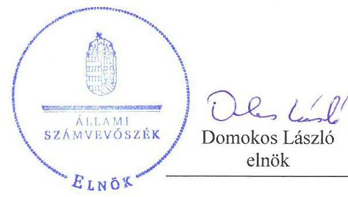
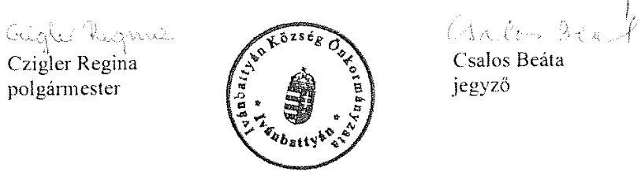
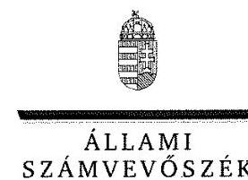
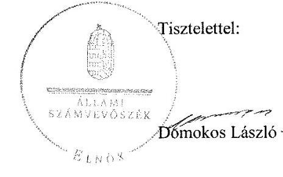

ÁLLAMI
SZÁMVEVŐSZÉK

# Jelentés 

## Önkormányzatok integritás és belső kontrollrendszere

Az önkormányzatok belső kontrollrendszere kialakításának és működtetésének ellenőrzése Ivánbattyán
2018.

---

# Jelentés 

## Önkormányzatok integritás és belső kontrollrendszere

Az önkormányzatok belső kontrollrendszere kialakításának és működtetésének ellenőrzése Ivánbattyán
2018.  fobrmín
hó

---

# AZ ELLENŐRZÉST FELÜGYELTE:

- **RENKŐ ZSUZSANNA** felügyeleti vezető
- **AZ ELLENŐRZÉST VEZETTE ÉS A VÉGREHAJTÁSÁÉRT FELELŐS:**
  - **SZALAYNÉ OSTORHÁZI MÁRIA** ellenőrzésvezető
  - **A PROGRAM ÖSSZEÁLLÍTÁSÁÉRT FELELŐS:**
    - **TÓTPÁL SZABOLCS** osztályvezető

**IKTATÓSZÁM:** EL-0110-080/2018

**TÉMASZÁM:** 2444

**ELLENŐRZÉS-AZONOSÍTÓ SZÁM:** V078406, V078912

Jelentéseink az Országgyűlés számítógépes hálózatán és az Interneten a www.asz.hu címen is olvashatóak.

---

# TARTALOMJEGYZÉK 

■ ÖSSZEGZÉS ..... 5
■ AZ ELLENŐRZÉS CÉLJA ..... 6
■ AZ ELLENŐRZÉS TERÜLETE ..... 7
■ AZ ELLENŐRZÉS HÁTTERE, INDOKOLTSÁGA ..... 8
■ A JELENTÉS LÉNYEGES KÉRDÉSKÖREI ..... 9
■ ELLENŐRZÉS HATÓKÖRE ÉS MÓDSZEREI ..... 10
■ MEGÁLLAPÍTÁSOK ..... 12
■ JAVASLATOK ..... 17
■ MELLÉKLETEK ..... 19
I. sz. melléklet: Értelmező szótár ..... 19
II. sz. melléklet: Az integritás kontrollrendszer kiépítettségének értékelése ..... 20
■ FÜGGELÉK: ÉSZREVÉTELEK ..... 21
■ RÖVIDÍTÉSEK JEGYZÉKE ..... 33

---

.

---

# ÖSSZEGZÉS 

Ivánbattyán Község Önkormányzatánál a belső kontrollrendszer kialakításának és működtetésének hiányosságai miatt nem volt biztosított a befektetési tevékenység szabályszerű végzése. A pénzügyi ellenjegyző és érvényesítő kijelölése nem volt szabályszerű, a kontrolltevékenységek gyakorlása nem volt megfelelő, így az nem biztosította a közpénzfelhasználás szabályosságát. Az integritási kontrollok kiépítettsége nem volt egyensúlyban a kockázatok szintjével.

## Az ellenőrzés társadalmi indokoltsága

A demokratikus társadalmakban alapvető igény, hogy a közpénzeket, a közvagyont használók tevékenységükről elszámoljanak, ahhoz egyértelmű és érvényesíthető felelősségi szabályok társuljanak. Ennek a jogos igénynek az érvényesítéséhez meg kell teremteni azokat a folyamatokat, rendszereket, amelyek nélkülözhetetlenek az elszámoltatáshoz. Az elszámoltatás eredményes működtetéséhez szükség van a megfelelő információs, kontroll-, értékelési és beszámolási rendszerek kialakítására. A belső kontrollok kiépítettsége hozzájárul az integritási szemlélet kialakításához és érvényesüléséhez. A belső kontrollrendszer kialakítása és működtetése nélkül nem valósítható meg a közpénzek, a közvagyon szabályos, gazdaságos, hatékony és eredményes felhasználása.

Az önkormányzati vagyongazdálkodás keretében az önkormányzatok átmenetileg szabad pénzeszközeinek befektetését jogszabály nem tiltja, a befektetések jellege nem korlátozott, a pénzpiaci szolgáltatók közül az önkormányzatok a kínált szolgáltatás és annak költségei alapján, szabadon választhatnak, azonban a veszteséges gazdálkodás kockázatai és következményei az önkormányzatokat terhelik. A szabad pénzeszközök felhasználása során kiemelten fontos a felelős gazdálkodás érvényesülése, amely összhangban kell, hogy legyen az önkormányzati gazdálkodás alapelveivel.

Ivánbattyán Község Önkormányzata 2016. december 31-én 6 millió Ft értékű értékpapír állománnyal rendelkezett.

## Főbb megállapítások, következtetések

A belső kontrollrendszer kialakítása és működtetése nem volt szabályszerű, így az nem segítette elő a szabálykövető működést és gazdálkodást. Nem készítette el Ivánbattyán Község Önkormányzata a leltározási és leltárkészítési szabályzatát, számlarendjét, a működés és gazdálkodás ellenőrzési nyomvonalát. Nem mérték fel és nem határozták meg a szervezet tevékenységében, gazdálkodásában rejlő kockázatokat, nem működtették a belső ellenőrzést, nem alakították ki az információkezelés és beszámolás rendjét, nem tették közzé a jogszabály által előírt közérdekű adatokat. A gazdálkodási jogkörök gyakorlása tekintetében nem biztosították az egyértelmű, felelősségi, hatásköri viszonyokat.

Ivánbattyán Község Önkormányzatánál a kincstárjegy vásárlásaival kapcsolatos döntéshozatal szabályszerű, a döntések végrehajtása nem volt szabályszerű. A forgóeszközök között kimutatott értékpapírjait nem értékelte, nem leltározta, ezáltal nem biztosította a mérlegében kimutatott befektetések adatainak megbízhatóságát.

Ivánbattyán Község Önkormányzatánál az integritással összefüggő kontrollok és a korrupciós kockázatok szintje nem volt összhangban, a kontrollrendszer nem támogatta az integritás szemlélet érvényesülését.

---

# AZ ELLENŐRZÉS CÉLJA 

Az ellenőrzés célja annak megállapítása volt, hogy szabályszerűen történt-e Ivánbattyán Község Önkormányzata belső kontrollrendszerének kialakítása és működtetése, az biztosította-e Ivánbattyán Község Önkormányzatánál a közpénzfelhasználás szabályosságát, a közpénzekkel és a nemzeti vagyonnal történő szabályszerű és felelős gazdálkodást, a beszámolási és adatszolgáltatási kötelezettségek szabályszerű teljesítését. Az ellenőrzés keretében értékeltük Ivánbattyán Község Önkormányzata korrupciós kockázatainak kezelését szolgáló integritás kontrollok kiépítettségét és az integritás szemlélet érvényesülését.

Az ellenőrzés célja továbbá annak értékelése volt, hogy a jogszabályi előírásoknak megfelelően alakították-e ki a belső kontrollrendszert, a kontrollkörnyezet biztosította-e a befektetési tevékenységek szabályszerű végzését. Értékeltük, hogy az egyes befektetési tevékenységekkel kapcsolatos döntéshozatal és a döntések végrehajtása, valamint az egyes befektetések számviteli elszámolása, nyilvántartása szabályszerű volt-e, és a belső és külső ellenőrzések támogatták-e az egyes befektetési tevékenységek szabályszerű végzését.

---

# AZ ELLENŐRZÉS TERÜLETE 

## Ivánbattyán Község Önkormányzata

Baranya megyében fekvő Ivánbattyán község állandó lakosainak száma 2016. január 1-jén 119 fő volt.

Ivánbattyán Község Önkormányzata öt tagú Képviselő-testületének munkáját egy állandó bizottság segítette. A településen német helyi nemzetiségi önkormányzat működött.

A Polgármester a 2010. évi önkormányzati választások óta tölti be tisztségét. A Jegyző 2013. január 1-jétől látja el közszolgálati feladatait.

Ivánbattyán Község Önkormányzata gazdálkodási feladatait 2012. január 1. és 2012. december 31. között Körjegyzőség látta el. Az Újpetrei Közös Önkormányzati Hivatal 2013. január 1-jével alakult, szervezeti egységre nem tagolódott, elkülönített gazdasági szervezettel nem rendelkezett. Az Újpetrei Közös Önkormányzati Hivatalban foglalkoztatott köztisztviselők száma 2016. év végén 12 fő volt.

Ivánbattyán Község Önkormányzata az Újpetrei Közös Önkormányzati Hivatalon kívül intézménnyel, gazdasági társasággal nem rendelkezett.

Ivánbattyán Község Önkormányzata a 2016. évi éves költségvetési beszámoló szerint 33,4 M Ft költségvetési bevételt ért el, valamint 27,3 M Ft költségvetési kiadást teljesített. A mérleg szerinti eszközvagyon értéke 2016. december 31-én 200,9 M Ft volt, amelyből a tartós befektetések közfeladatot ellátó gazdasági társaságban lévő részesedések 1,2 M Ft-ot, a forgatási célú értékpapírok 6,0 M Ft-ot tettek ki. A forrásokon belül a költségvetési évben esedékes kötelezettség állomány 0,23 M Ft-ot, a költségvetési évet követően esedékes kötelezettség állomány 0,6 M Ft-ot tett ki, pénzintézettel szembeni kötelezettségük nem volt.

---

# AZ ELLENŐRZÉS HÁTTERE, INDOKOLTSÁGA 

A BELSŐ KONTROLLRENDSZER azt a célt szolgálja, hogy az államháztartás szervei működésük és gazdálkodásuk során a tevékenységeket szabályszerűen, gazdaságosan, hatékonyan, eredményesen hajtsák végre, teljesítsék elszámolási kötelezettségeiket és megvédjék az erőforrásokat a veszteségektől, a károktól, a nem rendeltetésszerű használattól. A belső kontrollrendszer magában foglalja mindazon szabályokat, eljárásokat, gyakorlati módszereket és szervezeti struktúrákat, kockázatkezelési technikákat, kontrolltevékenységeket, amelyek segítséget nyújtanak a szervezetnek céljai eléréséhez. A belső kontrollrendszer szabályozása háromszintű, a törvényi előírásokat az Áht. és a Mötv., a rendeleti szintű szabályozást az Ávr. és a Bkr. tartalmazza, amelyeket útmutatói szinten az NGM által kiadott standardok és kézikönyvek támogatnak.

A MEGFELELŐ BELSŐ KONTROLLRENDSZER jelentősen csökkenti a hibák és szabálytalanságok kockázatát. Az Állami Számvevőszék célja, hogy javuljon az ellenőrzött önkormányzatok belső kontrollrendszerének szabályozottsága, működésének megfelelősége, szabályszerűsége, hozzájárulva ezzel az egyensúlyi helyzet fenntarthatóságának biztosításához, biztosítva az önkormányzatnál a közpénzfelhasználás szabályosságát, a közpénzekkel és a nemzeti vagyonnal történő szabályszerű, gazdaságos, hatékony és eredményes gazdálkodást. Az Állami Számvevőszék ellenőrzés tapasztalatai nem csupán a közvetlenül ellenőrzött önkormányzatokat támogathatják, hanem a „jó gyakorlat" elterjesztésével azok az önkormányzatok is átvehetik a pozitív példákat, ahol nem végez ellenőrzést az Állami Számvevőszék.

## AZ ELLENŐRZÉS VÁRHATÓ HASZNOSULÁSA NÉGY SZINTEN VALÓSUL MEG. A törvényalkotás számára

összegzett tapasztalatok állnak rendelkezésre a belső kontrollrendszer önkormányzati területen való kialakításáról, működtetéséről és hatásairól. Az ellenőrzés az ellenőrzött számára visszajelzést ad a belső kontrollrendszer kialakításában és működésében lévő hiányosságokról, javaslataival hozzájárul azok kiküszöböléséhez. Az ellenőrzés megállapításait és javaslatait más szervezetek is hasznosíthatják a rendezett gazdálkodási keretek kialakításához. A társadalom számára jelzi, hogy közpénz nem maradhat ellenőrizetlenül, az Állami Számvevőszék értékteremtő rend kialakításához és megőrzéséhez hozzájáruló tevékenysége pozitív hatással lesz a szervezetről kialakított összkép formálásában.

---

# A JELENTÉS LÉNYEGES KÉRDÉSKÖREI 

1. Az önkormányzat belső kontrollrendszerének kialakítása és működtetése 2016. évben szabályszerű volt-e, az biztosította-e az önkormányzatnál a közpénzfelhasználás szabályosságát, a nemzeti vagyonnal történő felelős gazdálkodást?
2. A jogszabályi előírásoknak megfelelően alakították-e ki a belső kontrollrendszert, a befektetési tevékenységek szabályszerű végzését a kiépített kontrollkörnyezet biztosította-e a 2012-2016. években?
3. Az önkormányzat egyes befektetéseivel kapcsolatos döntéshozatala és a döntések végrehajtása szabályszerű volt-e?
4. Az egyes befektetések számviteli elszámolása, nyilvántartása szabályszerű volt-e?
5. Érvényesült-e az integritás szemlélet és ennek megfelelően kiépítették-e az integritás kontrollrendszert az önkormányzatnál?

---

# ELLENŐRZÉS HATÓKÖRE ÉS MÓDSZEREI 

## Az ellenőrzés típusa

A belső kontrollrendszer ellenőrzése esetében megfelelőségi ellenőrzés, a befektetési tevékenységnél szabályszerűségi ellenőrzés.

## Az ellenőrzött időszak

A belső kontrollrendszer kialakításának és működtetésének ellenőrzése a 2016. január 1. és 2016. december 31. közötti időszakra terjedt ki.

A befektetési tevékenység ellenőrzési időszaka a 2012. január 1. - 2016. december 31. közötti időszak.

## Az ellenőrzés tárgya

A helyi önkormányzatnak, mint éves költségvetési beszámoló készítésére kötelezett szervezetnek és polgármesteri hivatalának belső kontrollrendszere. Az integritás szemlélet érvényesülése.

Az önkormányzat 2016. december 31-én meglévő, a Számv. tv. 3. § (6) bekezdés 2. és 3. pontja szerint az értékpapírokban megtestesülő befektetései, lekötött betétei. Továbbá a 2016. december 31-én meglévő, az önkormányzat szabad pénzeszközei terhére, adásvételi szerződés keretében megszerzett, a kötelező feladatok ellátását nem szolgáló, az önkormányzat üzleti vagyonába tartozó, az ellenőrzött időszakban (2012-2016.) megszerzett ingatlanok, továbbá az - időkorlátozás nélkül megszerzett kulturális javak (műtárgyak, műalkotások, stb.), illetve egyéb értéktárgyak (pl. ékszerek, befektetési nemesfém).

Az ellenőrzés kiterjedt minden olyan körülményre és adatra, amely az ÁSZ jogszabályban meghatározott feladatainak teljesítéséhez, valamint a program végrehajtása folyamán felmerült újabb összefüggések feltárásához szükséges.

## Az ellenőrzött szervezet

Ivánbattyán Község Önkormányzata
Újpetrei Közös Önkormányzati Hivatal

## Az ellenőrzés jogalapja

Az ÁSZ tv. 1. § (3) bekezdésében foglaltak alapján az ÁSZ általános hatáskörrel végzi a közpénzekkel és az állami és önkormányzati vagyonnal

---

való felelős gazdálkodás ellenőrzését. Az ÁSZ tv. 5. § (2) bekezdése alapján az államháztartás gazdálkodásának ellenőrzése keretében az ÁSZ ellenőrzi a helyi önkormányzatok gazdálkodását, valamint az ÁSZ tv. 5. § (6) bekezdése alapján ellenőrzése során értékeli az államháztartás számviteli rendjének betartását és a belső kontrollrendszer működését.

# Az ellenőrzés módszerei 

Az ÁSZ az ellenőrzést az ellenőrzési program szempontjai, az ellenőrzött időszakban hatályos jogszabályok, az ellenőrzés szakmai szabályai, az egyes ellenőrzési típusokhoz kapcsolódó ÁSZ módszertanok figyelembe vételével végezte. A gazdálkodás hibáinak kijavítására, a közpénzekkel való felelős gazdálkodás elősegítésére irányuló javaslatok kidolgozásakor a hatályos jogszabályok voltak az irányadóak.

Az ellenőrzés ideje alatt az ÁSZ Ivánbattyán Község Önkormányzatával történő kapcsolattartást az ÁSZ SZMSZ-ének vonatkozó előírásai alapján biztosította.

Az ellenőrzési kérdések megválaszolásához szükséges bizonyítékok megszerzése Ivánbattyán Község Önkormányzata által rendelkezésre bocsátott dokumentumokra, adatokra alapozva megfigyelés, szemle (szemrevételezés), valamint elemző eljárás keretében történt.

Az ellenőrzési bizonyítékként felhasználható adatforrások közé tartoztak egyrészt az ellenőrzési program részletes szempontjainál felsorolt adatforrások, másrészt minden - az ellenőrzés folyamán feltárt, az ellenőrzés szempontjából releváns információt tartalmazó - dokumentum.

Az ellenőrzés lefolytatásához Ivánbattyán Község Önkormányzata az ÁSZ által kért dokumentumok elektronikus megküldésével szolgáltatott adatokat. A rendelkezésre bocsátott adatok, információk kontrollja az ellenőrzés keretében történt.

Az ÁSZ Ivánbattyán Község Önkormányzatának befektetési tevékenységét a 2012. január 1. és 2016.
 december 31. közötti időszak vonatkozásában értékelte, a 2016. december 31-én meglévő értékpapírjai tekintetében.

---

# 1. Az önkormányzat belső kontrollrendszerének kialakítása és működtetése 2016. évben szabályszerű volt-e, az biztosította-e az önkormányzatnál a közpénzfelhasználás szabályosságát, a nemzeti vagyonnal történő felelős gazdálkodást? 

Összegző megállapítás

Az Önkormányzat belső kontrollrendszerének kialakítása és működtetése a 2016. évben - az egyes pilléreknél feltárt hiányosságok miatt - nem volt szabályszerű. A belső kontrollrendszer nem biztosította a közpénzfelhasználás szabályosságát és a nemzeti vagyonnal történő felelős gazdálkodást.

A KONTROLLKÖRNYEZET kialakítása nem volt szabályszerű, mivel
$\longrightarrow$ a Hivatal SZMSZ ${ }^{17}$-e az Ávr. 13. § (1) bekezdésének g) pontjában előírtak ellenére nem tartalmazta a hatáskörök gyakorlásának módját és a hatáskör gyakorlásához kapcsolódó felelősségi szabályokat,
$\longrightarrow$ a hivatali Ügyrend ${ }^{18}$ IV. 6. pontja és a gazdálkodási szabályzat ${ }^{19} 1$. számú melléklete az önkormányzat költségvetése terhére vállalt kötelezettségek pénzügyi ellenjegyzésre jogosult tekintetében eltérően rendelkezett, ezzel megsértette a Bkr. 6. § (1) bekezdés b) pontjában előírtakat, mivel nem biztosította az egyértelmű felelősségi, hatásköri viszonyokat és feladatokat,
$\longrightarrow$ a gazdálkodási szabályzat 1.1.5. b) pontjában az utalványozásra jogosult személyek kijelölésére vonatkozó szabályozás nem felelt meg az Ávr. 52. § (1) bekezdés c) pontjában és az Ávr. 59. § (1) bekezdésében előírtaknak,
$\longrightarrow$ nem készítették el a számviteli politika keretében a Számv. tv. 14. § (5) bekezdés a) pontjában és az Áhsz ${ }^{20}$. 50. § (1) bekezdésében előírtak ellenére az Önkormányzat leltárkészítési és leltározási szabályzatát,
$\longrightarrow$ az Önkormányzat a bankszámlán történő pénzforgalom lebonyolításának rendjét nem határozta meg a Számv. tv. 14. § (8) bekezdésben előírtak ellenére,
$\longrightarrow$ az Áhsz. 51. § (2) és a Számv. tv. 161. § (1) bekezdésében előírtak ellenére nem készítették el az Önkormányzat számlarendjét,
$\longrightarrow$ az Ávr. 13. § (2) bekezdés b), c), e) és f) pontjában előírtak ellenére belső szabályzatban nem rendezték a beszerzések lebonyolításával kapcsolatos eljárásrendet, a belföldi és külföldi kiküldetések elrendelésével és lebonyolításával, elszámolásával kapcsolatos kérdéseket, a reprezentációs kiadások felosztását, azok teljesítésének és elszámolásának szabályait, valamint a gépjárművek igénybevételének és használatának rendjét.

---

# AZ INTEGRÁLT KOCKÁZATKEZELÉSI RENDSZERT a Bkr. 7. § (1) és (2) bekezdésének előírásai ellenére nem működtették. Nem mérték fel és nem állapították meg a szervezet tevékenységében, gazdálkodásában rejlő kockázatokat, nem határozták meg az egyes kockázatokkal kapcsolatban szükséges intézkedéseket, valamint azok teljesítésének folyamatos nyomon követési módját. 

A Bkr. 6. § (4) bekezdésében előírtak ellenére 2016. szeptember 30-ig nem szabályozták a szabálytalanságok kezelésének eljárásrendjét, október 1-jétől nem szabályozták a szervezeti integritását sértő események kezelésének eljárásrendjét, valamint az integrált kockázatkezelési eljárásrendjét. A hiányosságok miatt a kockázatkezelési rendszer nem volt szabályszerű.

A KONTROLLTEVÉKENYSÉG részeként a gazdálkodási jogkörgyakorlás nem volt megfelelő, mert

- Bkr. 6. § (3) bekezdésében előírtak ellenére - nem készítette el a költségvetési szerv működési folyamatait tartalmazó ellenőrzési nyomvonalat,
- az Önkormányzat költségvetésére vonatkozóan a pénzügyi ellenjegyzésre történő kijelölés nem felelt meg az Ávr. 55. § (2) bekezdés f) pontjában, valamint a gazdálkodási szabályzat 1.1.2. a) pontjában foglalt előírásoknak, mivel a kijelölést nem az arra jogosult jegyző végezte,
- az érvényesítésre történő kijelölés nem felelt meg az Ávr. 58. § (4) bekezdésében, valamint a gazdálkodási szabályzat 1.1.3. a) pontjában foglalt előírásoknak, mivel a kijelölést nem az arra jogosult jegyző végezte,
- a teljesítésigazolás nem felelt meg az Ávr. 57. § (3) bekezdésében és a gazdálkodási szabályzat 1.2.3. pontjában foglalt előírásoknak, mivel a teljesítésigazolást nem az arra jogosult személy végezte,
- az érvényesítés nem felelt meg az Ávr. 58. § (2) bekezdésében és a gazdálkodási szabályzat 1.2.4. pontjában foglaltaknak.

## AZ INFORMÁCIÓS ÉS KOMMUNIKÁCIÓS RENDSZER nem volt szabályszerű, mert

a Bkr. 9. § (1)-(2) bekezdésében előírtak ellenére nem alakítottak ki és nem működtettek olyan rendszereket, amelyek biztosítják, hogy a megfelelő információk a megfelelő időben eljutnak az illetékes szervezethez, szervezeti egységhez, illetve személyhez, továbbá az információs rendszerek keretében a beszámolási rendszereket nem úgy működtették, hogy azok hatékonyak, megbízhatóak és pontosak legyenek, a beszámolási szintek határidők és módok világosan meg legyenek határozva,

- nem szabályozták a közérdekű adatok megismerésére irányuló kérelmek intézésének, továbbá a kötelezően közzéteendő adatok nyilvánosságra hozatalának rendjét, amivel megsértették az Info tv. ${ }^{21}$ 30. § (6) és az Info tv. 35. § (3) bekezdésében, valamint az Ávr. 13. § (2) bekezdés h) pontjában előírtakat,
- nem készítették el az adatvédelmi és adatbiztonsági szabályzatot az Info tv. 24. § (3) bekezdésében előírtak ellenére,

---

— nem tették közzé az Info tv. 37. § (1) bekezdésében a tevékenységükhöz kapcsolódóan az 1. melléklet szerinti általános közzétételi listában meghatározott szervezeti és személyzeti adatokat, a tevékenységre, működésre vonatkozó adatokat, valamint a gazdálkodási adatokat.

A MONITORING RENDSZER nem volt szabályszerű, mivel nem alakították ki az operatív tevékenységek során megvalósuló folyamatos és eseti nyomon követést biztosító rendszert a Bkr. 10. §-ában előírtak ellenére.

A belső ellenőrzés megfelelő működtetéséről - belső ellenőrzést végző személy hiányában - az Áht. 70. § (1) bekezdésében előírtak ellenére nem gondoskodtak. A Bkr. 14. § (1) bekezdésében előírtak ellenére a külső ellenőrzések javaslatai alapján készült intézkedési tervek végrehajtásáról éves bontásban nem vezettek nyilvántartást.

A Bkr. 11. § (1) bekezdésében előírtak ellenére a Bkr. 1. melléklet szerinti nyilatkozatban nem értékelték a belső kontrollrendszer minőségét.

# AZ ÖNKORMÁNYZAT A HELYI NEMZETISÉGI ÖN-

KORMÁNYZAT gazdálkodással kapcsolatos feladatainak ellátása nem felelt meg a jogszabályi előírásoknak, mert
— a Jegyző helyett a nemzetiségi önkormányzat elnöke által adott kijelölések - a pénzügyi ellenjegyzésre és érvényesítésre - nem feleltek meg az Ávr. 55. § (2) bekezdés g) pontjában, az Ávr. 58. § (4) bekezdésében és a gazdálkodási szabályzat 1.1 pontjában előírtaknak,
— a nemzetiségi önkormányzat a Számv. tv. 14. § (3) és az Áhsz. 50. § (1) bekezdésében foglaltak ellenére nem rendelkezett számviteli politikával,
— a számviteli politika keretében nem készítették el az eszközök és források leltárkészítési és leltározási szabályzatát a Számv. tv. 14. § (5) bekezdés a) és az Áhsz. 50. § (1) bekezdésében előírtak ellenére,
— a Számv. tv. 161. § (1) és az Áhsz. 51. § (2) bekezdésében előírtak ellenére nem készítették el a nemzetiségi önkormányzat számlarendjét.
— az Áht. 6/C § (2) bekezdés b) pontjában és az együttműködési megállapodás VI. fejezetében foglaltak ellenére nem gondoskodtak a nemzetiségi önkormányzat belső ellenőrzéséről.

---

# 2. A jogszabályi előírásoknak megfelelően alakították-e ki a belső kontrollrendszert, a befektetési tevékenységek szabályszerű végzését a kiépített kontrollkörnyezet biztosította-e a 2012-2016. években? 

Összegző megállapítás

A 2016. évben nem a jogszabályi előírásoknak megfelelően alakították ki a belső kontrollrendszert, a kiépített kontrollkörnyezet nem biztosította a befektetési tevékenység szabályszerű végzését.

A KONTROLLKÖRNYEZET kialakítása során a Képviselő-testület a befektetésekkel kapcsolatos hatáskört fenntartotta, annak átruházásáról nem döntött.

Az Önkormányzat a 2016. december 31-én meglévő befektetését 2016. január 4-én vásárolta, így az ellenőrzés a belső kontrollrendszert 2016. évre ellenőrizte, amelynek megállapításait az 1. pont tartalmazza. A feltárt hiányosságok miatt nem volt biztosított a befektetési tevékenység szabályszerűsége.

## 3. Az önkormányzat egyes befektetéseivel kapcsolatos döntéshozatala és a döntések végrehajtása szabályszerű volt-e?

Összegző megállapítás

Az Önkormányzat értékpapír befektetéssel kapcsolatos döntések szabályszerűek, a döntések végrehajtása nem volt szabályszerű.

Az Önkormányzat 2016. december 31-én a vagyonmérlege szerint 6 millió Ft nyilvántartási értéken szereplő, forgatási célú kamatozó kincstárjeggyel rendelkezett, amelynek vásárlása 2016. január 4-én történt.

A képviselő-testület felhatalmazta a polgármestert, hogy 6 millió Ft értékben OTP Optima befektetési jegyet vásároljon. A Polgármester 6 millió Ft értékben kamatozó kincstárjegyet vásárolt, amely nem felelt meg a Képviselő-testület határozatában és a vagyonrendelet ${ }^{22} 4$. § (3) bekezdésében előírtaknak.

A kamatozó kincstárjegy jegyzésére vonatkozó szerződésen a pénzügyi ellenjegyzés nem volt szabályszerű, mivel a pénzügyi ellenjegyzést végző pénzügyi ellenjegyzőt az Ávr. 55. § (2) bekezdés f) pontjában előírtak ellenére nem a Jegyző jelölte ki, továbbá a kincstárjegy vásárlás teljesítésének igazolása az Ávr. 57. § (1) bekezdésében foglaltakkal ellentétben nem történt meg.

---

# 4. Az egyes befektetések számviteli elszámolása, nyilvántartása szabályszerű volt-e? 

## Összegző megállapítás

Az értékpapír befektetések számviteli elszámolása, nyilvántartása nem volt szabályszerű, mert az értékpapírt nem értékelték és nem leltározták.

Az Önkormányzat a kamatozó kincstárjegyet a Számv. tv., az Áhsz., az eszközök és források értékelési szabályzata ${ }^{23}$ alapján kamatot nem tartalmazó bekerülési értéken tartotta nyilván. A kincstárjegyet a jogszabályi előírásoknak megfelelően a forgóeszközök között mutatták ki.

A kamatozó kincstárjegyek egyedi értékelése nem történt meg a Számv. tv. 46. § (3) bekezdésében előírtak ellenére. Nem végezték el a leltározást és a mérlegforduló napjára nem készült el az értékpapírok mérlegtételének alátámasztására a főkönyvi könyvelés és az analitikus nyilvántartás közötti egyeztetés a Számv. tv. 69. § (1) és (2) bekezdésében rögzítettek ellenére.

A kamatozó kincstárjegy adatairól nem vezették az Áhsz. 39. § (3) bekezdésében előírt részletező nyilvántartást.

## 5. Érvényesült-e az integritás szemlélet és ennek megfelelően kiépítették-e az integritás kontrollrendszert az önkormányzatnál?

## Összegző megállapítás

Az Önkormányzatnál nem érvényesült az integritás szemlélet és nem építették ki az integritás kontrollrendszert.

Az Önkormányzat nem vett részt az ÁSZ Integritás Projektjében, ezért az integritási kontrollok értékelése az ellenőrzés során szolgáltatott adatok alapján történt.

Az Önkormányzat a jogszabályok által is előírt szabályossági kontrollokat nem építette ki. Az Önkormányzat meghatározta az általa követendő értékeket, ezek között szerepelt az integritás erősítése, de nem mérte fel a korrupciós és integritás kockázatokat. Nem működtette az integritást erősítő, nem kötelezően előírt kontrollokat.

Az integritás kontrollrendszer kiépítettségének értékelését a II. számú melléklet tartalmazza.

---

# JAVASLATOK 

Az ÁSZ tv. 33. § (1) bekezdésében foglaltak értelmében az ellenőrzött szervezet vezetője köteles a jelentésben foglalt megállapításokhoz kapcsolódó intézkedési tervet összeállítani és azt a jelentés kézhezvételétől számított 30 napon belül az ÁSZ részére megküldeni. Amennyiben az ellenőrzött szervezet vezetője nem küldi meg határidőben az intézkedési tervet, vagy továbbra sem elfogadható intézkedési tervet küld, az Állami Számvevőszék elnöke az ÁSZ tv. 33. § (3) bekezdése a) és b) pontjaiban foglaltakat érvényesítheti.

## a polgármesternek:

1. Kezdeményezze az Újpetrei Közös Önkormányzati Hivatal irányító szervénél a jogszabályi előírásoknak megfelelő tartalmú hivatali szervezeti és működési szabályzat-tervezet Képviselő-testület általi jóváhagyását.
(1. számú megállapítás 1. bekezdés 1. francia bekezdése alapján)
2. Kezdeményezze az Állami Számvevőszék ellenőrzése során feltárt hiányosságok és/vagy szabálytalanságok tekintetében a munkajogi felelősség kivizsgálására irányuló eljárás megindítását, és ennek eredménye ismeretében kezdeményezze a szükséges intézkedések meghozatalát.
(1. számú megállapítás 1-3. bekezdései, 4. bekezdés 1. francia bekezdése, 5. bekezdés 1-3 francia bekezdései, és 6-9. bekezdései alapján)

## Újpetrei Közös Önkormányzati Hivatal jegyzőjének:

1. Intézkedjen a belső kontrollrendszer egyes elemei jogszabályi előírásnak megfelelő kialakításáról és működtetéséről, valamint a gazdálkodási jogkörök gyakorlása során a jogszabályi előírások betartásáról.
(1.
 számú megállapítás 1. bekezdés 2-7. francia bekezdései, 2-9. bekezdései, 3. számú megállapítás 3. bekezdése alapján)
2. Intézkedjen a jogszabályi előírásoknak megfelelő tartalmú hivatali szervezeti és működési szabályzat-tervezet elkészítéséről.
(1. számú megállapítás 1. bekezdés 1. francia bekezdése alapján)

---

3. Intézkedjen a kamatozó kincstárjegyek jogszabályi előírásnak megfelelő év végi értékeléséről.
(4. számú megállapítás 2. bekezdése 1. mondata alapján)
4. Intézkedjen az éves költségvetési beszámoló mérlegében kimutatott kamatozó kincstárjegyek jogszabályi előírásoknak megfelelő leltárral történő alátámasztásáról.
(4. számú megállapítás 2. bekezdés 2. mondata alapján)
5. Intézkedjen a kamatozó kincstárjegyhez kapcsolódó részletező nyilvántartás jogszabályi előírásnak megfelelő vezetéséről.
(4. számú megállapítás 3. bekezdése alapján)
6. Intézkedjen az Állami Számvevőszék ellenőrzése során feltárt hiányosságok és/vagy szabálytalanságok tekintetében a munkajogi felelősség tisztázására irányuló eljárás megindításáról, és ennek eredménye ismeretében tegye meg a szükséges intézkedéseket.
(1. számú megállapítás 4. bekezdés 2-5. francia bekezdései, 5. bekezdés 4. francia bekezdése, 4. számú megállapítás 2-3. bekezdései alapján)

---

# MELLÉKLETEK 

## I. SZ. MELLÉKLET: ÉRTELMEZŐ SZÓTÁR

betét
értékpapírszámla
forgatási célú értékpapír
hitelviszonyt megtestesítő értékpapír
jegyzés
kamat
kulturális javak
rövid lejáratú kötelezettség
ügyfélszámla
üzleti vagyon
a Ptk. szerinti betétszerződés vagy a takarékbetétről szóló 1989. évi II. törvényerejű rendelet szerinti takarékbetét-szerződés alapján fennálló tartozás, ideértve a hitelintézetnél a fizetésiszámla-szerződés alapján fennálló pozitív számlaegyenleget is (Hpt. 6. § (1) bekezdés 8. pont).
a dematerializált értékpapírról és a hozzá kapcsolódó jogokról az értékpapír-tulajdonos javára vezetett nyilvántartás (Tpt. 5. § (1) bekezdés 46. pont)
azok az értékpapírok, amelyeket forgatási célból, kamatbevétel, illetve árfolyamnyereség elérése érdekében szereztek be, továbbá azokat, amelyek a tárgyévet követő üzleti évben lejárnak (Számv. tv. 30. § (5) bekezdés)
minden olyan értékpapír, illetve törvény által értékpapírnak minősített, jogot megtestesítő okirat, amelyben a kibocsátó (adós) meghatározott pénzösszeg rendelkezésére bocsátását elismerve arra kötelezi magát, hogy a pénz (kölcsön) összegét, valamint annak meghatározott módon számított kamatát vagy egyéb hozamát, és az általa esetleg vállalt egyéb szolgáltatásokat az értékpapír birtokosának (a hitelezőnek) a megjelölt időben és módon megfizeti, illetve teljesíti. Ide tartozik különösen: a kötvény, a kincstárjegy, a letéti jegy, a pénztárjegy, a célrészjegy, a takaréklevél, a jelzáloglevél, a hajóraklevél, a közraktárjegy, az árujegy, a zálogjegy, a kárpótlási jegy, a határozott idejű befektetési alap által kibocsátott befektetési jegy (Számv. tv. (6) bekezdés 2. pont)
az értékpapír forgalomba hozatala során az értékpapírt megszerezni szándékozó befektetőnek az értékpapír megszerzésére irányuló, feltétetlen és visszavonhatatlan nyilatkozata, amellyel az ajánlatot elfogadja és kötelezettséget vállal az ellenszolgáltatás teljesítésére (Tpt. 5. § (1) bekezdés 63. pont)
az adós által a kölcsönnyújtónak (betételhelyezőnek) az elfogadott betét vagy az igénybe vett kölcsön használatáért, kockázatáért fizetendő, a betét- vagy kölcsönösszeg százalékában meghatározott, időarányosan térítendő (elszámolandó) pénzösszeg vagy egyéb hozadék (Hpt. 6. § (1) bekezdés 52. pont)
az élettelen és élő természet keletkezésének, fejlődésének, az emberiség, a magyar nemzet, Magyarország történelmének kiemelkedő és jellemző tárgyi, képi, hangrögzített, írásos emlékei és egyéb bizonyítékai - az ingatlanok kivételével -, valamint a művészeti alkotások (a kulturális örökség védelméről szóló 2001. évi LXIV. törvény)
az egy üzleti évet meg nem haladó lejáratra kapott kölcsön, hitel, ideértve a hosszú lejáratú kötelezettségekből a mérleg fordulónapját követő egy üzleti éven belül esedékes törlesztéseket is (ez utóbbiak összegét a kiegészítő mellékletben részletezni kell). A rövid lejáratú kötelezettségek közé tartozik általában a vevőtől kapott előleg, az áruszállításból és szolgáltatás teljesítésből származó kötelezettség, a váltótartozás, a fizetendő osztalék, részesedés, kamatozó részvény utáni kamat, valamint az egyéb rövid lejáratú kötelezettség (Számv. tv. 42. § (3) bekezdés)
az ügyfél pénzeszközeinek nyilvántartására szolgáló, befektetési vállalkozás, hitelintézet, árutőzsdei szolgáltató, befektetési alapkezelő által vezetett számla (Tpt. 5. § (1) bekezdés 130. pont)
a nemzeti vagyon azon része, amely nem tartozik az önkormányzati vagyon esetén a törzsvagyonba (Nvtv. 3. § (1) bekezdés 18. pontja)

---

# II. SZ. MELLÉKLET: AZ INTEGRITÁS KONTROLLRENDSZER KIÉPÍTETTSÉGÉNEK ÉRTÉKELÉSE 

Az Önkormányzat által a 2016. évre kitöltött integritás tanúsítvány alapján - négy kockázati területen - a kialakított kontrollokat értékeltük.

| Értékelési csoportok | Szöveges értékelés |
| :--: | :--: |
| I. A szervezetnél vannak-e olyan szabályozási hiányosságok, amelyek az integritást veszélyeztetik? | A szervezet nem üzemeltette a kötelezően előírt integritást támogató kontrolljait. |
| II. A szervezet meghatározta-e az általa követendő értékeket, ezek között szerepel-e az integritás erősítése (a korrupció visszaszorítása)? | A szervezet meghatározta az általa követendő értékeket, ezek között szerepel az integritás erősítése (a korrupció visszaszorítása) |
| III. A szervezet végez-e rendszeresen kockázatelemzést, ezen belül korrupciós (integritási) kockázatelemzést? | A szervezet nem végez kockázatelemzéseket. |
| IV. A szervezet a feltárt kockázat eredményes kezelése érdekében ki-alakította-e és működtette-e jogszabályban kötelezően előírt kontrollokat? | A szervezet a leglényegesebb integritás kontrollokat működtette, de az egyéb integritást erősítő kontrollokat alacsony szinten működtette. |
| A szervezetnél az integritás kontrollokat nem a kockázatokkal arányosan dolgozták ki. |  |

Forrás: Ász2

A kontrollok kiépítettségének főbb hiányosságai az alábbiak voltak:

1. a speciális korrupcióellenes rendszerek és eljárások tekintetében az Önkormányzatnál:

- nem alkalmaztak belső ellenőrt és nem adtak megbízást belső ellenőrzési feladatok ellátására,
- nem határozták meg a vagyonnyilatkozat-tételi kötelezett személyeket a bizottság nem képviselőtestületi tagjainál,
- nem végeztek rendszeres korrupciós kockázatelemzéseket,
- nem volt korrupcióellenes képzés az elmúlt 3 évben.

2. a „lágy" kontrollok (a szervezet által önként bevezetett, kialakított szabályok, követelmények) kialakítását érintően az Önkormányzatnál:

- nem alkalmazták a négy szem elvű felülvizsgálatot,
- nem érvényesítették a munkahelyi rotáció elvét,
- nem szabályozták az ajándékok, meghívások, utaztatás elfogadásának feltételeit,
- nem alkalmaztak az új dolgozó felvételéhez vizsgát, tudásfelmérő vagy pszichológiai tesztet,
- nem szabályozták a külső szakértő alkalmazásának feltételeit.

---

# FÜGGELÉK: ÉSZREVÉTELEK 

A jelentéstervezetet a Számvevőszék 15 napos észrevételezésre megküldte az ellenőrzött szervezet vezetőjének az ÁSZ tv. 29. § (1) bekezdése előírásának megfelelően.

A függelék tartalmazza az ellenőrzött észrevételeit, illetve az el nem fogadott észrevételek elutasításának indoklását.

[^0]
[^0]:    * 29. § (1) Az Állami Számvevőszék az ellenőrzési megállapításait megküldi az ellenőrzött szervezet vezetőjének vagy az általa megbízott személynek, és annak, akinek személyes felelősségét állapította meg.
    (2) Az ellenőrzött szervezet vezetője és a felelősként megjelölt személy az ellenőrzés megállapításaira tizenöt napon belül írásban észrevételt tehet.
    (3) Az Állami Számvevőszék az észrevételre a beérkezésétől számított harminc napon belül írásban válaszol. A figyelembe nem vett észrevételeket köteles a jelentésben feltüntetni, és megindokolni, hogy azokat miért nem fogadta el.

---

Ivánbattyán Község Önkormányzata 7772. Ivánbattyán, Batthány u. 11.

Szám: 744-20/2017.

Tárgy: ÁSZ ellenőrzés
Hiv.szám: EL-0110-072/2017/10000000000000000000000000000000000000000000000000000000000000000000000000000000000000000000000000000000000000000000000000000000000000000000000000000000000000000000000000000000000000000000000000000000

---

4. A „lágy" kontrollokat érintően a „négy szem elve" felülvizsgálat az önkormányzatnál nem végrehajtható. Az önkormányzat döntéseit az adott szakterülethez értő hivatali ügyintéző hajtja végre, egy-egy szakterületnek csak egy felelőse van. A műszaki feladatokat ellátó köztisztviselő nem tudja az adós feladatokat ellátó köztisztviselő munkáját ellenőrizni a szakértelem hiánya miatt. A pénzügyi tranzakciók engedélyezését megelőzően pedig nincs lehetőség - az egyébként is kevés pénzügyi létszámmal küzdő hivatalban - arra hogy az adott személy munkáját egy másik személy teljes körűen felülvizsgálja. Önkormányzatunk az idei évtől az ASP rendszerben végzi a könyvelési munkákat, amely eddig is több munkát adott az ügyintézőknek.
5. A munkahelyi rotáció elvének alkalmazására sem a dokumentumok bekérésekor sem pedig a helyszíni ellenőrzés során nem kérdeztek rá. Meglátásunk szerint ez az elv az önkormányzatoknál nem alkalmazható. Mint a 4. pontban leírtuk a hivatali ügyintézők nagy része csak a saját szakterületéhez ért. 2015. évben és 2017. évben a pénzügyi területen az ügyintézők munkakört cseréltek, egyrészt munkaszervezési okok miatt, másrészt a hiányzó pénzügyi ügyintézői létszám okozta hiányosságot kellett kiküszöbölni. Az önkormányzatnál pedig a polgármesteren, falugondnokon valamint a közmunka pályázat keretében alkalmazott közfoglalkoztatottakon kívül más alkalmazott nincs, aki vonatkozásában a rotáció elve alkalmazható lenne. Az ő esetükben pedig meglátásunk szerint nem alkalmazható.
6. A „lágy kontroll"-nál hiányosságként jelezték azt, hogy nem alkalmaztunk új dolgozó felvételéhez vizsgát, tudásfelmérő vagy pszichológiai tesztet. Mint azt az 5. számú tanúsítványban leírtuk a szervezethez az elmúlt években új dolgozó nem érkezett, kivéve a közfoglalkoztatottakat. Az ő foglalkoztatásukat a 2011. évi CVI. törvény szabályozza, amely nem írja elő vizsga, tudásfelmérő vagy pszichológiai teszt alkalmazását. A polgármester választott tisztségviselő, a falugondnok közalkalmazotti jogviszonyát az 1/2000. (I.7.) SzCsM rendelet 39.§ szabályozza, mely szintén nem írja elő alkalmazás előtt a fenti vizsgát és teszteket. A hivatalnál sem került sor az ellenőrzési időszakban új dolgozó felvételére. A köztisztviselők felvételére a közszolgálati tisztségviselőkről szóló törvény sem írja elő vizsga, tudásfelmérő és pszichológiai teszt elvégzését.
7. Az önkormányzat nem szabályozta külső szakértő alkalmazásának feltételeit. Külső szakértőt az önkormányzat nem alkalmaz a tevékenysége ellátása során, azt a feladatai nem indokolják, illetve anyagi lehetőségei sem engedik.
8. Túlzónak tartjuk a javaslatok között a polgármesternek illetve a jegyzőnek tett javaslatot, mely a feltárt hiányosságok és/vagy szabálytalanságok tekintetében a munkajogi felelősség kivizsgálására irányuló eljárást javasolja. Az önkormányzat hivatala 8 települési önkormányzat és 8 nemzetiségi önkormányzat, két társulás és két óvoda munkáját látja el, mindezt 12 fővel. A dolgozók leterheltek, az állandóan jelentkező adatszolgáltatások illetve jogszabályváltozások okozta feladatváltozások nagyon sok időt vesznek el a napi munkából, a szabályzatok elkészítésére illetve aktualizálására nem marad kellő idő. A szabályzatoknak a külső szakértővel történő elkészíttetésére pedig az önkormányzatnak nincs anyagi forrása. Önkormányzatunk

---

123 lakosságszámú település önkormányzata, az általa ellátott feladatok nem is indokolják az ellenőrzési jelentésben hiányzóként feltüntetett szabályzatok egy részének alkalmazását.

Ivánbattyán, 2017. december 21.

Tisztelettel:

---

# Czigler Regina úrhölgy 

polgármester
Ivánbattyán Község Önkormányzata

## Ivánbattyán

## Tisztelt Polgármester Úrhölgy!

Köszönettel megkaptam az Állami Számvevőszékhez 2017. december 28. napján érkezett "Az önkormányzatok integritás és belső kontrollrendszere - Az önkormányzatok belső kontrollrendszere kialakításának és működtetésének ellenőrzése - Ivánbattyán Község Önkormányzata" című számvevőszéki jelentéstervezetben foglalt megállapításokra tett észrevételét.

Tájékoztatom Polgármester Úrhölgyet, hogy az el nem fogadott észrevételeket - az Állami Számvevőszékről szóló 2011. évi LXVI. törvény 29. § (3) bekezdése alapján - a jelentésben szerepeltetjük az elutasítás indokainak feltüntetésével együtt.

Az Állami Számvevőszék észrevételekre vonatkozó álláspontjáról a felügyeleti vezető által készített részletes tájékoztatást csatoltan megküldöm.

Budapest, 2018. 07. 22.

Melléklet: Tájékoztatás az el nem fogadott észrevételekről, azok indokairól

---

# Tájékoztatás 

az el nem fogadott észrevételekről, azok indokairól

|  | Észrevétel: | ,Az EL-0110-001/2017. számon megküldött levél értelmében az Állami Számvevőszék ,,Az önkormányzatok belső kontrollrendszere kialakításának és működtetésének ellenőrzése" és ,,Az önkormányzatok egyes befektetési tevékenységének ellenőrzése" keretében Ivánbattyán Község Önkormányzata ellenőrzését végzi. Ezzel szemben a 4. számú tanúsítvány és a helyszíni ellenőrzés is a nemzetiségi önkormányzatra vonatkozóan kért adatokat. Az Ivánbattyáni Német Nemzetiségi Önkormányzat önálló törzskönyvi személy, külön adószámmal, külön bankszámlaszámmal, nem része a települési önkormányzatnak" |
| :--: | :--: | :--: |
|  | Válasz: |

 Az ÁSZ az Önkormányzat tájékoztató leveléből a fentiekben foglaltakat nem tekinti észrevételnek. |
| 1. | Indokolás: | Az Állami Számvevőszék a vonatkozó ellenőrzését az EL-1353-002/2016. és EL-0050-002/2017 iktatószámú ellenőrzési programok alapján folytatta le, mint az a jelentéstervezetben az ellenőrzés módszereinél ismertetésre került. Az ÁSZ az ellenőrzési program szerint a jelentéstervezet 14. oldalán, az 5. bekezdésben foglalt megállapításban azt értékelte, hogy a helyi nemzetiségi önkormányzat gazdálkodási feladatainak végrehajtása/ellátása során a helyi önkormányzat betartotta-e a vonatkozó jogszabályi előírásokat, illetve az együttműködési megállapodásban foglaltakat. Megállapításait a rendelkezésére bocsátott dokumentumok, valamint az Önkormányzat által kitöltött tanúsítványok adataira alapozva tette meg a jelentéstervezetben. Az észrevételben az Önkormányzat nem vitatta a tárgybani megállapítások tartalmát. |
| 2 | Észrevétel: | Az észrevétel 2. pontjában az ÁSZ jelentéstervezet 21. oldal II. sz. melléklet 1. pont 2. francia bekezdésre: „nem |

---

|  |  | határozták meg a vagyonnyilatkozat-tételi kötelezett személyeket a bizottság nem képviselő-testületi tagjainál" tett észrevétel szerint   „A számvevőszéki jelentéstervezet II. számú melléklete a kontrollok kiépítettségének főbb hiányosságai között sorolja fel azt, hogy nem határoztuk meg a vagyonnyilatkozat-tételi kötelezett személyeket a bizottság nem képviselő-testületi tagjainál. Az Önkormányzat beküldött Szervezeti és Működési Szabályzata értelmében az önkormányzatnak csak egy bizottsága van, melynek nincs olyan tagja, aki nem a képviselő-testület tagja. Erről Önök felé a tájékoztatást a Baranya Megyei Kormányhivatal Törvényességi Ellenőrzési Osztály is megtette" |
| :--: | :--: | :--: |
|  | Válasz: | Az ÁSZ az észrevételt nem fogadja el. |
|  | Indokolás: | Az észrevétel nem megalapozott. Az EL-0050-002/2017. iktatószámú, valamint a V-1353-002/2016. iktatószámú ellenőrzési programok alapján lefolytatott ellenőrzés során az ellenőrzött szervezet által rendelkezésre bocsátott dokumentumok alapján állapította meg az ÁSZ a vonatkozó megállapítását. A hivatal (de nem a Közös Hivatal) köztisztviselőire vonatkozó 2008. június 1-jétől hatályos vagyonnyilatkozatok kezelésének szabályzata, azonban azt a Közös Hivatal létrejötte után nem aktualizálták, ezáltal az Önkormányzatra nem terjedt ki, így az Önkormányzat vonatkozásában a belső szabályzatok nem határozták meg tételesen a vagyonnyilatkozat-tételre kötelezettek körét és a vagyonnyilatkozat-tételi kötelezettség eljárási szabályait. A 2017.09.25-i teljességi és hitelességi nyilatkozat 2.a. melléklet 95. pontja szerint a 2008. június 1-jétől hatályos szabályzat bemutatásra került, a polgármester nyilatkozata szerint módosítása nem volt.   Fentiek figyelembevételével az ÁSZ fenntartja a jelentéstervezetben a II. sz. melléklet vonatkozó megállapítását. |
| 3. | Észrevétel: | Az észrevétel 3. pontjában az ÁSZ jelentéstervezet 21. oldal II. sz. melléklet 1. pont 4. francia bekezdésre: „nem volt korrupcióellenes képzés az elmúlt 3 évben." tett észrevétel szerint:   „Szintén a kontrollok kiépítettségének főbb hiányosságai között szerepel az a hiányosság, hogy nem volt korrupcióellenes képzés az elmúlt 3 évben. Ez a valóságot nem fedi, mivel Csalor Beátajegyzö részt vett 2016. évben és 2017. évben is az „Integritás, közigazgatási hivatásetika, antikorrupció" képzésen. A 2016. évi képzésről szóló tanúsítványt a 2017. szeptember 25-i helyszíni ellenőrzés során az ellenőrök részére bocsátottuk." |

---

|  | Válasz: | Az ÁSZ az észrevételt nem fogadja el. |
| :--: | :--: | :--: |
|  | Indokolás: | Az ÁSZ megállapítása arra vonatkozik, hogy az Önkormányzatnál nem volt korrupcióellenes képzés az elmúlt három évben, ezért az észrevétel nem megalapozott.   Fentiek figyelembevételével az ÁSZ fenntartja a jelentéstervezetben az egyéb integritást erősítő kontrollok működtetésére vonatkozó megállapításait. |
| 4. | Észrevétel: | Az észrevétel 4. pontjában az ÁSZ jelentéstervezet 21. oldal II. sz. melléklet 2. pont 1. francia bekezdésre: „nem alkalmazták a négy szem elvű felülvizsgálatot" tett észrevétel szerint:   A „lágy" kontrollokat tekintve a „négy szem elve" felülvizsgálat az önkormányzatnál nem végrehajtható. Az önkormányzat döntéseit az adott szakterülethez értő hivatali ügyintéző hajtja végre, egy-egy szakterületnek csak egy felelőse van. A műszaki feladatokat ellátó köztisztviselő nem tudja az adós feladatokat ellátó köztisztviselő munkáját ellenőrizni a szakértelem hiánya miatt. A pénzügyi tranzakciók engedélyezését megelőzően pedig nincs lehetőség - az egyébként is kevés pénzügyi létszámmal küzdő hivatalban - arra, hogy az adott személy munkáját egy másik személy teljesen felülvizsgálja. Önkormányzatunk az idei évtől az ASP rendszerben végzi a könyvelési munkákat, amely eddig is több munkát adott az ügyintézőnek. |
|  | Válasz: | Az ÁSZ az észrevételt nem fogadja el. |
|  | Indokolás: | Az észrevétel nem megalapozott. Az Önkormányzat a vonatkozó megállapítást nem vitatta, az ellenőrzés során rendelkezésre bocsátott dokumentumok az ÁSZ megállapítás helyességét megerősítik, mivel az Önkormányzat által kitöltött és az ÁSZ részére megküldött, 2017. május 30.-i keltezésű 5. számú tanúsítvány 158.b) sorában adott „nem" válaszuk szerint Szervezetüknél nem működik munkahelyi rotáció.   Fentiek figyelembevételével az ÁSZ fenntartja a jelentéstervezetben az egyéb integritást erősítő kontrollok működtetésére vonatkozó megállapításait. |
| 5. | Észrevétel: | Az észrevétel 4. pontjában az ÁSZ jelentéstervezet 21. oldal II. sz. melléklet 2. pont 2. francia bekezdésre: „nem alkalmazták a négy szem elvű felülvizsgálatot" tett észrevétel szerint:   A munkahelyi rotáció elvének alkalmazása sem a dokumentumok bekérésénél, sem pedig a helyszíni ellenőrzés során |

---

|  |  | nem kérdezték rá. Meglátásunk szerint ez az elv az önkormányzatoknál nem alkalmazható. Mint a 4. pontban leírtuk a hivatali ügyintézők nagy része csak a saját szakterületéhez ért. 2015. évben és 2017. évben a pénzügyi területen az ügyintézők munkakört cseréltek, egyrészt munkaszervezési okok miatt, másrészt a hiányzó pénzügyi ügyintézői létszám okozta hiányosságot kellett kiküszöbölni. Az önkormányzatnál pedig a polgármesteren, falugondnokon valamint a közmunka pályázat keretében alkalmazott közfoglalkoztattakon kívül más alkalmazott nincs, aki a vonatkozásában a rotáció elve alkalmazható lenne. Az ő esetükben pedig meglátásunk szerint nem alkalmazható." |
| :--: | :--: | :--: |
|  | Válasz: | Az ÁSZ az észrevételt nem fogadja el. |
|  | Indokolás: | Az észrevétel nem megalapozott. Az Önkormányzat a vonatkozó megállapítást nem vitatta, az ellenőrzés során rendelkezésre bocsátott dokumentumok az ÁSZ megállapítás helyességét megerősítik, mivel az Önkormányzat által kitöltött és az ÁSZ részére megküldött, 2017. május 30.-i keltezésű 5. számú tanúsítvány 159.b) sorában adott „nem" válaszuk szerint Szervezetüknél nem működik munkahelyi rotáció.   Fentiek figyelembevételével az ÁSZ fenntartja a jelentéstervezetben az egyéb integritást erősítő kontrollok működtetésére vonatkozó megállapításait. |
| 6. | Észrevétel: | Az észrevétel 4. pontjában az ÁSZ jelentéstervezet 21. oldal II. sz. melléklet 2. pont 4. francia bekezdésre: „nem alkalmazták az új dolgozó felvételéhez vizsgát, tudásfelmérőt vagy pszichológiai tesztet" tett észrevétel szerint   „A „lágy kontroll"-nál hiányosságként jelezték azt, hogy nem alkalmaztunk új dolgozó felvételéhez vizsgát, tudásfelmérőt vagy pszichológiai tesztet. Mint az 5. számú tanúsítványban leírtuk a szervezethez az elmúlt években új dolgozó nem érkezett, kivéve a közfoglalkoztatottakat. Az ő foglalkoztatásukat a 2011. évi CVI. törvény szabályozza, amely nem írja elő vizsga, tudásfelmérő vagy pszichológiai teszt alkalmazását. A polgármester választott tisztségviselő, a falugondnok közalkalmazotti jogviszonyát az 1/2000. (I.7) SZCSM rendelet §39. § szabályozza, mely szintén nem írja elő alkalmazás előtt a fenti vizsgát és teszteket. A hivatalnál sem került sor az ellenőrzési időszakban új dolgozó felvételére. A köztisztviselők felvételére a közszolgálati tisztségviselőkről szóló törvény sem írja elő vizsga, tudásfelmérő és pszichológiai teszt elvégzését." |
|  | Válasz: | Az ÁSZ az észrevételt nem fogadja el. |

---

|  | Indokolás | Az EL-0050-002/2017. iktatószámú, valamint a V-1353002/2016. iktatószámú ellenőrzési programok alapján lefolytatott ellenőrzés során az ellenőrzött szervezet által rendelkezésre bocsátott dokumentumok alapján állapította meg az ÁSZ a vonatkozó megállapítását. A 2017.09.25-i teljességi és hitelességi nyilatkozat 2.b. melléklet 49. pontja szerint a tárgybani kérdést alátámasztó dokumentumokkal az Önkormányzat nem rendelkezik, az új munkatársak kiválasztására és felvételére vonatkozóan az általános törvényi előírásokat alkalmazzák.
Fentiek figyelembevételével az ÁSZ fenntartja a jelentéstervezetben a vonatkozó megállapítását. |
| :--: | :--: | :--: |
| 7. | Észrevétel: | Az észrevétel 4. pontjában az ÁSZ jelentéstervezet 21. oldal II. sz. melléklet 2. pont 5. francia bekezdésre: „nem szabályozták a külső szakértő alkalmazásának feltételeit" tett észrevétel szerint   Az önkormányzat nem szabályozta külső szakértő alkalmazásának feltételeit. Külső szakértőt az önkormányzat nem alkalmaz a tevékenysége ellátása során, azt a feladatai nem indokolják, illetve anyagi lehetőségei sem engedik." |
|  | Válasz: | Az ÁSZ az észrevételt nem fogadja el. |
|  | Indokolás | Az észrevétel nem megalapozott. Az Önkormányzat a vonatkozó megállapítást nem vitatta, az ellenőrzés során rendelkezésre bocsátott dokumentumok az ÁSZ megállapítás helyességét megerősítik, mivel az Önkormányzat által kitöltött és az ÁSZ részére megküldött, 2017. május 30.-i keltezésű 5. számú tanúsítvány 103.b) sorában adott „nem" válaszuk szerint Szervezetükben nincs külön szabályozás a külső szakértők alkalmazásának feltételeiről.   Fentiek figyelembevételével az ÁSZ fenntartja a jelentéstervezetben az egyéb integritást erősítő kontrollok működtetésére vonatkozó megállapításait |
| 8. | Észrevétel: | Az észrevétel 8. pontjában az ÁSZ jelentéstervezet 17. oldalán a polgármesternek tett 2. javaslatra „Kezdeményezze az Állami Számvevőszék ellenőrzése során feltárt hiányosságok és/vagy szabálytalanságok tekintetében a munka-jogi felelősség kivizsgálására irányuló eljárás megindítását, és ennek eredménye ismeretében kezdeményezze a szükséges intézkedések meghozatalát." tett észrevétel szerint:   „Túlzónak tartjuk a javaslatok között a polgármesternek, illetve a jegyzőnek tett javaslatot, mely a feltárt hiányosságok |

---

|  | és/vagy szabálytalanságok tekintetében a munkajogi felelősség kivizsgálására irányuló eljárást javasolja. ...A dolgozók leterheltek, az állandóan jelentkező adatszolgáltatások, illetve jogszabályváltozások okozta feladatváltozások nagyon sok időt vesznek el a napi munkából, a szabályzatok elkészítésére illetve aktualizálására nem marad kellő idő. A szabályzatoknak a külső szakértővel történő elkészíttetésére pedig az önkormányzatnak nincs anyagi forrása. Önkormányzatunk 123 lakosságszámú település önkormányzata, az általa ellátott feladatok nem is indokolják az ellenőrzési jelentésben hiányzóként feltüntetett szabályzatok egy részének alkalmazását." |  |
| :--: | :--: | :--: |
|  | Válasz: | Az ÁSZ az Önkormányzat tájékoztató leveléből a fentiekben foglaltakat nem tekinti észrevételnek. |
|  | Indokolás | Az ÁSZ a 2011. évi LXVI. tv. 29. § (2) bekezdése alapján, a tájékoztató levél 8. pontjában foglaltakat, mivel az nem az ellenőrzés megállapításaira vonatkozik, nem tekinti észrevételnek, az az ellenőrzött időszakra vonatkozó tájékoztatást fogalmaz meg a dolgozók leterheltségéről, a történtekről, a körülményekről.   Az Önkormányzat tájékoztató levelében foglaltakkal kapcsolatos, a jelentéstervezetben a polgármesternek címzett 2. számú, valamint a jegyzőnek címzett 6. számú javaslatokat megalapozó, 1. számú megállapítás 1-3. bekezdései, 4. bekezdés 1. francia bekezdése, 5. bekezdés 1-3.
 francia bekezdései, és 6-9. bekezdései, valamint az 1. számú megállapítás 4. bekezdés 2-5. francia bekezdései, 5. bekezdés 4. francia bekezdése, 4. számú megállapítás 2-3. bekezdései - az Önkormányzat belső kontrollrendszerének kialakítására és működtetésére vonatkozó, továbbá az ellenőrzési jelentéstervezetben hiányzóként feltüntetett szabályzatokra vonatkozó megállapításait az ÁSZ az EL-0050-002/2017. iktatószámú, valamint a V-1353-002/2016. iktatószámú ellenőrzési programok alapján, továbbá az önkormányzat által az ellenőrzés rendelkezésére bocsátott dokumentumok adataira alapozva tette meg.   Fentiek figyelembevételével az ÁSZ fenntartja a jelentéstervezetben fenti tárgyra vonatkozóan tett megállapításait. |

Budapest, 2018.

---

.

---

# RÖVIDÍTÉSEK JEGYZÉKE 

${ }^{1}$ Önkormányzat
${ }^{2}$ Képviselő-testület
${ }^{3}$ nemzetiségi önkormányzat
${ }^{4}$ Polgármester
${ }^{5}$ Jegyző
${ }^{6}$ Körjegyzőség
${ }^{7}$ Hivatal
${ }^{8}$ Áht.
${ }^{9}$ Mötv.
${ }^{10}$ Ávr.
${ }^{11}$ Bkr.
${ }^{12}$ NGM
${ }^{13}$ ÁSZ
${ }^{14}$ Számv. tv.
${ }^{15}$ Ász tv
${ }^{16}$ ÁSZ SZMSZ
${ }^{17}$ Hivatal SZMSZ
${ }^{18}$ Ügyrend
${ }^{19}$ gazdálkodási szabályzat
${ }^{20}$ Áhsz.
${ }^{21}$ Info tv.
${ }^{22}$ vagyonrendelet
${ }^{23}$ értékelési szabályzat

Ivánbattyán Község Önkormányzata
Ivánbattyán Község Önkormányzatának Képviselő-testülete
Ivánbattyáni Német Nemzetiségi Önkormányzat
Ivánbattyán Község Önkormányzatának polgármestere
Újpetrei Közös Önkormányzati Hivatal jegyzője
2012. január 1-je és 2012. december 31. között az Önkormányzat feladatait Márok, Ivánbattyán, Kisjakabfalva, Palkonya, Villánykövesd községek Önkormányzatai által működtetett Körjegyzőség látta el.
Újpetrei Közös Önkormányzati Hivatal
2011. évi CXCV. törvény az államháztartásról (hatályos 2011. XII. 31-től)
2011. évi CLXXXIX. törvény Magyarország helyi önkormányzatairól (hatályos 2012.01.01-jétől)

368/2011. (XII. 31.) Korm. rendelet az államháztartásról szóló törvény végrehajtásáról (hatályos 2012. január 1-jétől)
370/2011. (XII. 31.) Korm. rendelet a költségvetési szervek belső kontrollrendszeréről és belső ellenőrzéséről (hatályos 2012.01.01-jétől)
Nemzetgazdasági Minisztérium
Állami Számvevőszék
2000. évi C. törvény a számvitelről (hatályos 2001. január 1-jétől)
2011. évi LXV. törvény az Állami Számvevőszékről (hatályos: 2011. július 1-jétől)

Állami Számvevőszék Szervezeti és Működési Szabályzata
Újpetrei Közös Önkormányzati Hivatal SZMSZ (hatályos: 2013.01.01-től, jóváhagyta Ivánbattyán Község Önkormányzat Képviselő-testülete 6/2013. (II.4.) határozatával, a módosítást: 28/2014. (IV.13.) határozatával)
Újpetrei Közös Önkormányzati Hivatal ügyrendje, amelyet a jegyző 2016. november 28-án adományozott ki, és amely a 2013. február 4-én elfogadott ügyrend módosítása, melyet Ivánbattyán Község Önkormányzatának Képviselőtestülete 60/2016. (XI. 28.) számú határozatával módosított és új egységes szerkezetben jóváhagyott (hatályos 2016. november 28-ától)
Hivatal Gazdálkodási szabályzata, melyet Ivánbattyán Község Önkormányzata a 37/2015. (VIII. 25.) számú szabályzatával fogadott el (hatályos 2015.09.01-től) Áhsz.: 4/2013. (I. 11.) Korm. rendelet az államháztartás számviteléről (hatályos 2014. január 1-jétől)
2011. évi CXII. törvény az információs önrendelkezési jogról és az információszabadságról (hatályos: 2011. július 27-től)
A Képviselő-testület 5/2012. (IV.24.) önkormányzati rendelete az Önkormányzat nemzetgazdasági szempontból kiemelt jelentőségű nemzeti vagyonáról és vagyonhasznosítási szabályairól (hatályos: 2012.04.01. Módosítva: 9/2012. (X.25.) rendelet; 9/2015. (IV.15.) rendelet; 11/2015. (IX.8.) rendelet)

Újpetrei Közös Önkormányzati Hivatal eszközök és források értékelési szabályzata (hatályos 2015. szeptember 1-jétől)

---

ÁLLAMI SZÁMVEVŐSZÉK
1052 Budapest, Apáczai Csere János utca 10.
Levélcím: 1364 Budapest 4. Pf. 54
Telefon: +36 14849100 Telefax: +36 14849200
www.asz.hu
