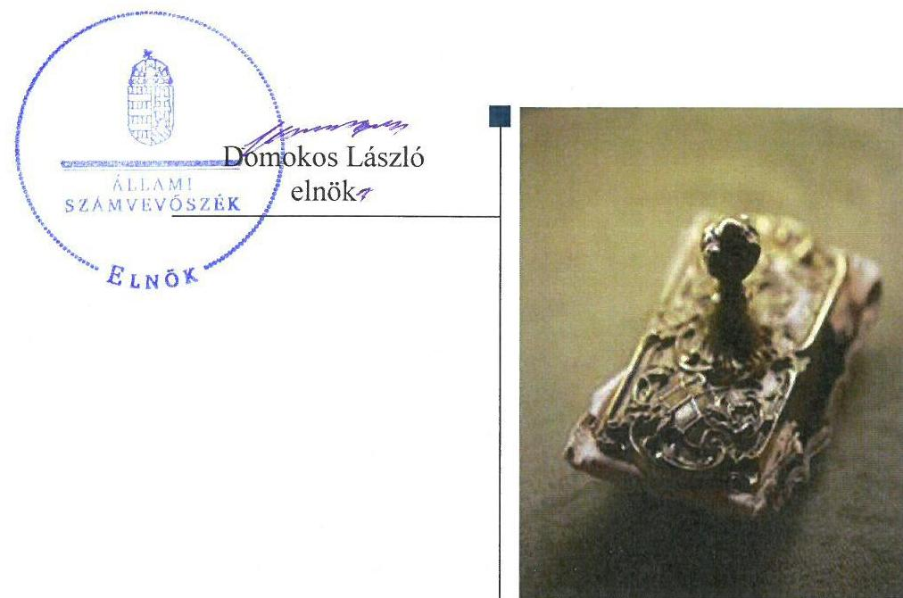
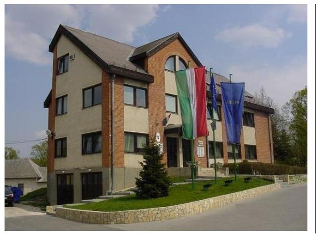
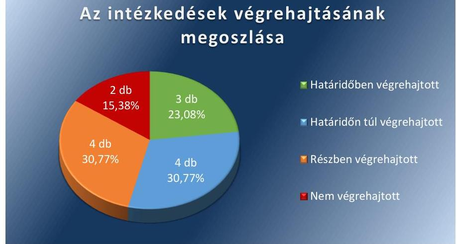

# Jelentés 

## Utóellenőrzések

Az önkormányzatok pénzügyi és vagyongazdálkodása
szabályszerűségének utóellenőrzése Pécel Város Önkormányzata
2018. 01. hó 09. nap

---

# AZ ELLENŐRZÉST FELÜGYELTE: 

DR. HORVÁTH MARGIT felügyeleti vezető

## AZ ELLENŐRZÉST VEZETTE ÉS A VÉGREHAJTÁSÁÉRT FELELŐS:

SIPOSNÉ DÓCZI KLÁRA ellenőrzésvezető

## A PROGRAM ÖSSZEÁLLÍTÁSÁÉRT FELELŐS:

TÓTPÁL SZABOLCS osztályvezető

## A TÉMÁHOZ KAPCSOLÓDÓ KORÁBBI SZÁMVEVŐSZÉKI JELENTÉS:

- címe: Jelentés az önkormányzatok pénzügyi és vagyongazdálkodása szabályszerűségének ellenőrzéséről - Pécel
- sorszáma: 15213

IKTATÓSZÁM: EL-0185-040/2017.
TÉMASZÁM: 2096
ELLENŐRZÉS-AZONOSÍTÓ SZÁM: V0755107

---

# TARTALOMJEGYZÉK 

■ ÖSSZEGZÉS ..... 5
■ AZ ELLENŐRZÉS CÉLJA ..... 6
■ AZ ELLENŐRZÉS TERÜLETE ..... 7
■ AZ ELLENŐRZÉS HÁTTERE, INDOKOLTSÁGA ..... 8
■ A JELENTÉS LÉNYEGES KÉRDÉSKÖRE ..... 9
■ ELLENŐRZÉS HATÓKÖRE ÉS MÓDSZEREI ..... 10
■ MEGÁLLAPÍTÁSOK ..... 12
■ MELLÉKLETEK ..... 17
I. Sz. melléklet: Az ÁSZ 15213. számú jelentéséhez kapcsolódó intézkedési terv végrehajtása ..... 17
■ FÜGGELÉK: ÉSZREVÉTELEK ..... 23
■ RÖVIDÍTÉSEK JEGYZÉKE ..... 25

---

.

---

# ÖSSZEGZÉS 

Az Állami Számvevőszék Pécel Város Önkormányzata pénzügyi és vagyongazdálkodása szabályszerűségének utóellenőrzése során megállapította, hogy az intézkedési tervben meghatározott feladatok többségét végrehajtották, melynek eredményeként a pénzügyi- és vagyongazdálkodás működésének kockázatai csökkentek, különös tekintettel az integrált kockázatkezelési rendszer kialakítására és működtetésére. Ugyanakkor az évente rendszeresen visszatérő feladatok ismételt teljesítési kötelezettségének az Önkormányzat 2017-ben nem tett eleget, ezáltal nem biztosította a vagyongazdálkodás folyamatos átláthatóságát.

## Az ellenőrzés társadalmi indokoltsága

Az Állami Számvevőszék stratégiájában célul tűzte ki a számvevőszéki munka hasznosulásának javítását. Ezzel összhangban ellenőrzi, hogy az ellenőrzött szervezetek megvalósították-e a korábbi ellenőrzések által feltárt hibák, hiányosságok és szabálytalanságok megszüntetése céljából elkészített intézkedési terveikben foglaltakat. A rendszeres utóellenőrzések hozzájárulnak a szükséges intézkedések tényleges végrehajtásához, ezáltal a közpénzügyek rendezettségének javulásához, igazolják, hogy lezárult a következmények nélküli ellenőrzések időszaka.

## Főbb megállapítások, következtetések

Pécel Város Önkormányzata az intézkedést igénylő megállapításokhoz és javaslatokhoz kapcsolódóan összeállított intézkedési tervben meghatározott tizenhárom feladatból hármat határidőben, négyet határidőn túl, négyet pedig részben hajtott végre. Végre nem hajtott feladat kettő volt.

Határidőben intézkedett az integrált kockázatkezelési rendszer kialakításáról, valamint annak működtetéséről, a zárszámadási rendelethez kapcsolódóan a szabályozásban előírt tartalmú vagyonkimutatás csatolásáról, továbbá intézkedett a közzétételi kötelezettség szabályozásáról, a reprezentációs kiadások felosztásának, elszámolásának szabályairól valamint a beszerzés és közbeszerzés szabályozásáról, ezáltal a vagyongazdálkodása működési szabályozottságában és szabályszerűségében korábban ezeken a területeken tapasztalt hiányosságok és szabálytalanságok megszüntetésre kerültek.

Pécel Város Önkormányzata nem gondoskodott az intézkedési tervben vállalt minden határidőre vonatkozóan a beszámoló valamennyi adatának leltárral történő alátámasztásáról, a vagyonkataszteri nyilvántartás és a földhivatali nyilvántartás rendszeres egyeztetéséről, ezért a korábban feltárt kockázatok egy része továbbra is fennáll.

Az intézkedési tervben meghatározott feladatok végrehajtásához Pécel Város Önkormányzata a jogszabályban meghatározott nyilvántartást nem vezette, így nem volt biztosított személyi változások esetén az intézkedési tervben vállalt kötelezettségekhez kapcsolódó feladatok átadása.

---

# AZ ELLENŐRZÉS CÉLJA 

Az ellenőrzés célja annak értékelése, hogy a számvevőszéki jelentésben foglalt intézkedést igénylő megállapításokkal és javaslatokkal összhangban készített intézkedési tervben meghatározott feladatokat az ellenőrzött szervezet végrehajtotta-e.

---

# AZ ELLENŐRZÉS TERÜLETE 

## Pécel Város Önkormányzata

Pécel város a Gödöllői járásban, Pest megyében fekszik, a lakónépességének száma a Központi Statisztikai Hivatal Magyarország közigazgatási helynévkönyve alapján 2016. január 1-jén 15494 fő volt.

A Polgármester ${ }^{1}$ a 2010. évi önkormányzati választások óta tölti be tisztségét. Az ellenőrzött időszakban a jegyző személye két alkalommal változott, a jelenlegi Jegyző ${ }^{2}$ 2016. júniusától látja el feladatát.

Az Önkormányzat ${ }^{3}$ 2016. évi költségvetési bevétele 1,63 milliárd Ft-ra, a kiadása 1,69 milliárd Ft-ra teljesült. A 2016. évi zárszámadási rendelet (Pécel Város Önkormányzatának 2016. évi zárszámadása, a Képviselő-testület által elfogadott beszámoló) alapján eszközeinek nettó értéke 8,956 milliárd Ft volt. Az Önkormányzat 2016. évi vagyona 8,942 milliárd Ft összegben tartalmazott a nemzeti vagyonba tartozó befektetett eszközt.

Az ÁSZ ${ }^{4}$ Pécel Város Önkormányzata pénzügyi és vagyongazdálkodásának szabályszerűségi ellenőrzéséről szóló 15213 számú jelentését 2015. december 10-én hozta nyilvánosságra. Az ellenőrzés célja annak értékelése volt, hogy az Önkormányzat pénzügyi gazdálkodása megfelelt-e a jogszabályokban és a belső szabályzataiban meghatározottaknak, biztosított volt-e a pénzügyi egyensúly és a vagyongazdálkodás szabályszerűsége. A vagyonváltozást eredményező döntéseket szabályszerűen hajtották-e végre, valamint az Önkormányzat a gazdálkodás során biztosította-e az átláthatóság és az integritás érvényesülését.

Az ÁSZ jelentés ${ }^{5}$ az Önkormányzat polgármestere számára öt, jegyzője számára nyolc javaslatot tartalmazott, melyre az intézkedési tervet az Önkormányzat határidőben megküldte.

Az utóellenőrzés - a 2015. december 10-től 2017. szeptember 6-ig végrehajtott feladatokat figyelembe véve - az ÁSZ jelentésben a Polgármester és a Jegyző részére megfogalmazott intézkedést igénylő megállapításokra és javaslatokra készített, az ÁSZ részére megküldött intézkedési tervben foglalt feladatok megvalósításának ellenőrzésére, illetve értékelésére fókuszált.

---

# AZ ELLENŐRZÉS HÁTTERE, INDOKOLTSÁGA 

Az ÁSZ tv. ${ }^{6}$ 33. § (1) bekezdése értelmében a számvevőszéki jelentések intézkedést igénylő megállapításaihoz és javaslataihoz kapcsolódóan az ellenőrzött szervezet vezetője intézkedési tervet köteles összeállítani, és az ÁSZ részére megküldeni. Az intézkedési tervben foglaltak megvalósítását az ÁSZ tv. 33. § (7) bekezdésében foglaltak alapján - az ÁSZ utóellenőrzés keretében - ellenőrizheti. Az intézkedések megvalósulásának értékelése során az ÁSZ figyelembe veszi az ellenőrzött szervezetek működési feltételeiben, valamint a jogszabályi előírásokban bekövetkezett változásokat.

Az intézkedési tervekben foglalt feladatok hiányos, illetve késedelmes végrehajtása, valamint megvalósításának elmaradása azt mutatja, hogy az ellenőrzések során feltárt hibák, hiányosságok és szabálytalanságok megszüntetése nem kapott kellő hangsúlyt. Ez a szabályszerű működés és a felelős vezetői magatartás vonatkozásában kockázatot hordoz. E kockázatok feltárásával az ÁSZ utóellenőrzési rendszere fokozza a fegyelmet, és igazolja, hogy a közpénzzel való szabályos gazdálkodás felelőssége elől nem lehet kitérni.

Az utóellenőrzés négy szinten hasznosulhat:
$\longrightarrow$ A társadalom szintjén az utóellenőrzés jelzi, hogy a számvevőszéki ellenőrzés megállapításainak van következménye: a hiányosságok megszüntetésére az ellenőrzött szervezet által meghatározott intézkedések végrehajtását is számon kéri az ÁSZ.
$\longrightarrow$ Az ellenőrzött terület szintjén az utóellenőrzés tájékoztatást nyújt a terület döntéshozóinak a hiányosságok kiküszöbölésének jó gyakorlatairól, ezzel lehetőséget biztosítva arra, hogy az ÁSZ ellenőrzési megállapításai, javaslatai a terület nem ellenőrzött szervezeteinek a működése során is hasznosuljanak.
$\longrightarrow$ Az ellenőrzött szervezet szintjén az utóellenőrzés feltárja, hogy a szervezet az intézkedések végrehajtásával hasznosította-e a korábbi ellenőrzési jelentésben a hiányosságok megszüntetése, illetve a kockázatok kezelése érdekében megfogalmazott javaslatokat.
$\longrightarrow$ Az ÁSZ szintjén az utóellenőrzés visszacsatolást ad az ellenőrzési jelentések hasznosulásáról, az intézkedések elmaradása vagy részleges megvalósulása a további ellenőrzésekhez kockázati jelzésként szolgál.

---

# A JELENTÉS LÉNYEGES KÉRDÉSKÖRE 

Az Önkormányzat az intézkedési tervben foglaltakat az előírt határidőben végrehajtotta-e?

---

# ELLENŐRZÉS HATÓKÖRE ÉS MÓDSZEREI 

## Az ellenőrzés típusa

Megfelelőségi ellenőrzés.

## Az ellenőrzött időszak

Az utóellenőrzés alapját képező ÁSZ jelentés közzétételének napjától (2015. december 10.) az ellenőrzésről szóló kiértesítő levél keltének (2017. szeptember 6.) napjáig tartó időszak.

## Az ellenőrzés tárgya

Az ÁSZ tv. 2011. július 1-jei hatálybalépését követően a számvevőszéki jelentésben foglalt intézkedést igénylő megállapításokkal és javaslatokkal összhangban - az ellenőrzött szervezet által - készített intézkedési tervben foglaltak végrehajtásának ellenőrzése volt.

Az ellenőrzés kiterjedt minden olyan körülményre és adatra, amely az ÁSZ jogszabályban meghatározott feladatainak teljesítéséhez, valamint a program végrehajtása folyamán felmerült újabb összefüggések feltárásához szükséges volt.

## Az ellenőrzött szervezet

Pécel Város Önkormányzata

## Az ellenőrzés jogalapja

Az Alaptörvény ${ }^{7}$ 43. cikk (1) bekezdése alapján az ÁSZ az Országgyűlés pénzügyi és gazdasági ellenőrző szerve. Az ÁSZ az ÁSZ törvényben meghatározott feladatkörében ellenőrzi a központi költségvetés végrehajtását, az államháztartás gazdálkodását, az államháztartásból származó források felhasználását és a nemzeti vagyon kezelését.

Az ÁSZ tv. 1. § (3) bekezdése szerint az ÁSZ általános hatáskörrel végzi a közpénzekkel és az állami és önkormányzati vagyonnal való felelős gazdálkodás ellenőrzését. Az ÁSZ tv. 33. § (7) bekezdése alapján az ÁSZ tv. 33. § (1)-(2) bekezdése szerinti intézkedési tervben foglaltak megvalósítását az ÁSZ utóellenőrzés keretében ellenőrizheti.

---

# Az ellenőrzés módszerei 

Az ellenőrzést a nemzetközi standardokat irányadónak tekintve az ellenőrzési program ellenőrzési kérdései, az ellenőrzött időszakban hatályos jogszabályok, az ellenőrzés szakmai szabályok és módszertanok figyelembevételével, önállóan vagy ellenőrzéshez kapcsolódóan végezzük.

Az ellenőrzés ideje alatt az ellenőrzött szervezettel történő kapcsolattartást az ÁSZ SZMSZ ${ }^{\circledR}$-ének vonatkozó előírásai alapján biztosítjuk.

Az utóellenőrzés megállapításait elsősorban az ÁSZ rendelkezésére álló, valamint az Önkormányzattól elektronikusan bekért dokumentumok alapozzák meg, amely szükség esetén helyszíni ellenőrzéssel egészülhet ki. Az ÁSZ az ellenőrzés keretében egyes esetekben teljesítményellenőrzés tervezéséhez is kérhet adatokat.

Az ellenőrzési bizonyítékként felhasználható adatforrások közé tartoznak egyrészt a szakmai programban felsorolt adatforrások, másrészt minden - az ellenőrzés folyamán feltárt, az ellenőrzés szempontjából információt tartalmazó - dokumentum.

Az intézkedési tervekben előírt feladatokat azok végrehajthatósága, illetve végrehajtása szempontjából az alábbiak szerint kell értékelni:
"határidőben végrehajtott" a feladat, ha a teljesítés dokumentáltan, az intézkedési tervben előírt határidőben és tartalommal megtörtént;
"határidőn túl végrehajtott" a feladat, ha annak teljesítése az intézkedési tervben meghatározott módon, de az előírt határidőn túl történt meg;
"részben végrehajtott" a feladat, ha végrehajtása teljes körűen az intézkedési tervben előírt módon nem történt meg;
"nem végrehajtott" ha a végrehajtás nem történt meg, vagy amenynyiben a teljesítést nem dokumentálták;
"okafogyottá vált" a feladat, ha végrehajtására - meghatározott esemény bekövetkezése, továbbá külső körülmény, a működést érintő feltétel változása miatt - már nincs szükség, illetve lehetőség, és egyértelműen megállapítható, hogy az intézkedést szükségessé tevő körülmény a jövőben nem fordulhat elő;
"nem időszerű" az a feladat, amelynek ellenőrzési időszakon belüli végrehajtására azért nem került (kerülhetett) sor, mert az intézkedés alapjául szolgáló esemény nem következett be, de annak jövőbeni előfordulása lehetséges, a végrehajtása nem volt esedékes, vagy a végrehajtás határideje még nem járt le.
Az ellenőrzés lefolytatásához az Önkormányzat a tanúsítványok elektronikus kitöltésével, valamint az ÁSZ által kért dokumentumok elektronikus megküldésével szolgáltatott adatokat, amelyek valódiságát és teljes körűségét a Polgármester által tett teljességi és hitelességi nyilatkozat igazolta. Az így rendelkezésre bocsátott adatok, információk kontrollja az ellenőrzés keretében történt.

---

# MEGÁLLAPÍTÁSOK 

## Az Önkormányzat az intézkedési tervben foglaltakat az előírt határidőben végrehajtotta-e?

Összegző megállapítás

Az Önkormányzat az intézkedési tervben meghatározott tizenhárom feladatból hármat határidőben, négyet határidőn túl, négy feladatot pedig részben hajtott végre. Végre nem hajtott feladat kettő volt. Az intézkedési tervben foglalt feladatok végrehajtásáról az Önkormányzat a jogszabály által előírt nyilvántartást nem vezette.

Az ÁSZ jelentésben a Polgármester részére öt, a Jegyző részére nyolc javaslat került meghatározásra, amelynek hasznosítására az Önkormányzat a 44/2016. (II. 25.) Kt. határozatával ${ }^{9}$ jóváhagyott tizenhárom feladatot határozott meg. Ebből egy feladat végrehajtásának felelőseként a Polgármestert, nyolc feladat végrehajtásának felelőseként a Jegyzőt jelölte meg. Négy feladat végrehajtásért mind a Polgármester mind a Jegyző is felelős volt. Az ÁSZ javaslatai alapján készült intézkedési tervben meghatározott tizenhárom feladatból hármat határidőben, négyet határidőn túl, négy feladatot részben hajtott végre az Önkormányzat. Kettő feladat pedig nem került végrehajtásra.

Az intézkedési tervben meghatározott feladatokat, határidőket,
 felelősöket és a feladatok végrehajtását az I. számú melléklet mutatja be.

A Jegyző a Bkr. ${ }^{10}$ 14. § (1) bekezdésének megfelelő nyilvántartást nem vezetett az ÁSZ jelentés javaslatai alapján készült intézkedési terv végrehajtásáról.

Az Önkormányzat intézkedési tervében meghatározott feladatok végrehajtásának értékelési kategóriák szerinti megoszlását az 1. ábra szemlélteti.

1. ábra

## Az intézkedések végrehajtásának megoszlása

---

# HATÁRIDŐBEN VÉGREHAJTOTT feladatok: 

1. A Jegyző 2016. február 15-ét követően az ellenőrzött időszakon belül havonta tájékoztatta írásban a Polgármestert az aktuális szállítói állomány alakulásáról, valamint az Ávr. ${ }^{11}$ alapján - annak 2017. január elsejei hatályon kívül helyezését ${ }^{12}$ követően is - a likviditási terv felülvizsgálatának eredményéről. A Jegyző a teljesülések figyelembevételével - a likviditási tervek havi felülvizsgálati eredményei alapján - a módosított likviditási terveket a Polgármester részére átadta.
2. A Jegyző 2016. március 31-ig kialakította és azt követően működtette a Bkr. előírásainak megfelelő, a pénzügyi egyensúlyt befolyásoló, kockázatok kezelésére alkalmas kockázatkezelési rendszert.
3. A Jegyző csatolta mind a 2015. évi mind a 2016. évi zárszámadási rendelettervezetekhez a jogszabályi előírásoknak megfelelő részletes, tagolt vagyonkimutatást.

## HATÁRIDŐN TÚL VÉGREHAJTOTT feladatok:

4. A Polgármester az intézkedési tervben vállalt határidőn belül terjesztette be a költségvetési rendelettervezeteket ${ }^{13}$. Azonban az intézkedési tervben vállalt határidőn túl, ugyanakkor az Áht. ${ }^{14}$-ben foglalt határidőnek eleget téve hajtotta végre a zárszámadási rendelettervezetek ${ }^{15}$ Képviselő-testület elé való beterjesztését. A jogszabályokba foglalt Pénzügyi bizottsági ${ }^{16}$ véleményeket legkésőbb az előterjesztéseket tárgyaló képviselő-testületi ülésen csatolták.
5. A Jegyző az intézkedési tervben vállalt határidőn belül készítette elő a költségvetési rendelettervezeteket. Azonban az intézkedési tervben vállalt határidőn túl, ugyanakkor az Áht.-ben foglalt határidőnek eleget téve hajtotta végre a zárszámadási rendelettervezetek határidőre történő előkészítését annak érdekében, hogy a Polgármester a jogszabályokban foglalt határidőben a Képviselő-testület elé beterjeszthesse, továbbá a polgármester a bizottsági véleményeket legkésőbb az előterjesztéseket tárgyaló képviselő-testületi ülésen csatolhassa.
6. A Jegyző határidőn túl gondoskodott arról, hogy az Önkormányzat az Infotv ${ }^{17}$-ben és a 18/2005. (XII.27.) IHM rendeletben ${ }^{18}$ előírt közzétételi kötelezettségének eleget tegyen. A Jegyző a 13/2016. számú Jegyzői utasításban ${ }^{19}$ alakította ki a jogszabályban előírt közzétételi kötelezettség szabályozását, melynek végrehajtása keretében ellenőrizte, hogy minden szükséges adat határidőben közzétételre került-e, illetve a határidőben közzé nem tett adatok pótlólagos közzétételéről gondoskodott.
7. A Jegyző határidőben szabályozta a reprezentációs kiadások felosztásának, azok teljesítésének és elszámolásának szabályait ${ }^{20}$, az Ávr-ben előírtaknak megfelelően. Az intézkedési tervben vállalt 2017. március 31-i határidőn túl hajtotta végre a reprezentációs kiadások felosztásának, azok teljesítésének és elszámolása szabályzatának rendszeres felülvizsgálatát, aktualizálását ${ }^{21}$. A Jegyző a vállalt határidőt követően alkotta meg és a Képviselő-testület azt

---

követően fogadta el határozatban ${ }^{22}$ az anyag- és eszközgazdálkodás számviteli politikában nem szabályozott kérdéseinek ${ }^{23}$ szabályozási körébe tartozó Beszerzési és közbeszerzési szabályzatot ${ }^{24}$.

# RÉSZBEN VÉGREHAJTOTT feladatok: 

8. A Polgármester az éves önkormányzati költségvetési rendelet elfogadását követően, az aktuális gazdálkodásról készült 2016. és 2017. első félévi és 2016. harmadik negyedévi tájékoztatóinak előterjesztésével javaslatot tett a működési egyensúly megteremtésére a költségvetés módosítási javaslat keretein belül, azonban tájékoztatóinak előterjesztésében külön nem kerültek kiemelésre, beterjesztésre az önkormányzat kizárólagos tulajdonában lévő gazdasági társaság lejárt szállítói állományának a kimutatásai.
9. A Jegyző az aktuális szállítói állomány alakulásáról 2016. márciusától az ellenőrzött időszakon belül minden hónapban tájékoztatta a Polgármestert. A Polgármester az aktuális szállítói állományra vonatkozó lejárt időszaki bontásban készült kimutatást az intézkedési tervben vállalt 2016. évi szeptemberi és novemberi határidőkre elkészítette és az aktuális gazdálkodásról készült tájékoztató keretein belül a Képviselő-testület elé terjesztette. Ugyanakkor a 2016. évi költségvetési beszámoló elkészítésének határidejére a Polgármester nem terjesztett a Képviselő-testület elé az aktuális szállítói állományra vonatkozó lejárt időszaki bontásban készült kimutatást. Adósságrendezési eljárás megindítására okot adó körülmény nem következett be.
10. A Jegyző intézkedett az ingatlanvagyon-kataszternek az önkormányzatok tulajdonában lévő ingatlanvagyon nyilvántartási és adatszolgáltatási rendjéről szóló 147/1992. (XI. 6.) Korm. rendeletnek ${ }^{25}$ megfelelő vezetéséről. A 2015. évre vonatkozóan gondoskodott az évzárási feladatok elvégzése során az ingatlanvagyon-kataszter, valamint a földhivatali ingatlan-nyilvántartás adatai egyezőségének megvalósításáról, a gazdálkodásra vonatkozó szabályzatoknak megfelelően. A 2016. évre vonatkozó évzárási feladatok elvégzése során a Jegyző nem gondoskodott 2017. január 31-ig az ingatlanvagyon-kataszter valamint a földhivatali nyilvántartás adatai egyezőségének a 147/1992. (XI.6.) Korm. rendelet (2) bekezdésének megfelelő megvalósításáról.
11. A Jegyző gondoskodott a 2015. évre vonatkozóan 2016. január 31-ig az évzárási feladatok elvégzése során a költségvetési beszámoló pénzforgalmi és mérleg adatainak megbízható és valós kép kialakítása érdekében a könyvviteli mérleg leltárral történő alátámasztásáról, azonban az december 31-i fordulónappal hiányosan történt meg, mert a leltár nem tartalmazta a DPMV Zrt ${ }^{26}$ által vagyonkezelt eszközöket. A Jegyző nem gondoskodott 2017. január 31-ig az évzárási feladatok elvégzése során a 2016. évi költségvetési beszámoló pénzforgalmi és mérleg adatainak megbízható és valós kép kialakítása érdekében a könyvviteli mérlegnek a Számv.tv. ${ }^{27}$ 69. § (1) bekezdésében és a 4/2013. (I. 11.) Korm. rendelet ${ }^{28}$ 22. § (1)(2) bekezdéseiben foglaltaknak megfelelő leltárral történő alátámasztásáról.

---

# NEM VÉGREHAJTOTT feladatok: 

12. A Polgármester sem 2015. sem 2016. vonatkozásában nem tett a Jegyző felé intézkedését arra vonatkozóan, hogy az évzárási feladatok elvégzése során az ingatlanvagyon-kataszter, valamint a földhivatali ingatlan-nyilvántartás adatainak egyezősége megvalósuljon.
13. A Polgármester sem 2015. sem 2016. vonatkozásában nem tett a Jegyző felé intézkedését arra vonatkozóan, hogy a költségvetési beszámoló pénzforgalmi és mérleg adatainak megbízható és valós összképének kialakítását biztosítsa, a könyvviteli mérleg minden eleme leltárral alátámasztott legyen.

---

.

---

# MELLÉKLETEK

■ I. SZ. MELLÉKLET: AZ ÁSZ 15213. SZÁMÚ JELENTÉSÉHEZ KAPCSOLÓDÓ INTÉZKEDÉSI TERV VÉGREHAJTÁSA

|  Az intézkedési tervben meghatározott feladat | Az intézkedési tervben meghatározott határide | Az intézkedési tervben meghatározott feladat felelése | A feladat végrehajtása  |
| --- | --- | --- | --- |
|  1. | 2. | 3. | 4.  |
|  Határidőben végrehajtott feladat |  |  |   |
|  1. A jegyző köteles havonta, a havi adatszolgáltatást követően a polgármestert írásban tájékoztatni az aktuális szállítói állomány alakulásáról az Ávr. 122. § (3) bekezdésének előírásait betartva. Ezt követően a jegyző elkészíti és átadja a polgármester számára a költségvetés elfogadását követően, az első negyedév kivételével, negyedévente az aktuális gazdálkodásról készült tájékoztató előterjesztésével egyidejűleg a teljesülések figyelembevételével a módosított likviditási tervet, amit a Képviselő-testület a költségvetés módosítási javaslat keretein belül megismer és tárgyal. | 2016. február 15., azt követően minden likviditási terv elkészítésénél. A likviditási terv felülvizsgálatára 2016. március 21., azt követően minden hónap 21. napja. A likviditási terv módosításának költségvetési rendeleten való átvezetésére: első alkalommal 2016. szeptember 30., 2016. november 30., a költségvetési beszámoló elkészítésének határideje. | jegyző | A Jegyző 2016. február 15-ét követően az ellenőrzött időszakon belül havonta tájékoztatta írásban a Polgármestert az aktuális szállítói állomány alakulásáról, valamint az Ávr. alapján - annak 2017. január elsejei hatályon kívül helyezését követően is - a likviditási terv felülvizsgálatának eredményéről. A Jegyző a teljesülések figyelembevételével - a likviditási tervek havi felülvizsgálati eredményei alapján - a módosított likviditási terveket a Polgármester részére átadta.  |
|  2. A jogszabályban előírt, a pénzügyi egyensúlyt befolyásoló kockázatok kezelésére alkalmas kockázatkezelési rendszer kialakítása, működtetése. | 2016. március 31., azt követően folyamatos | jegyző | A Jegyző 2016. március 31-ig kialakította és azt követően működtette a Bkr. előírásainak megfelelő, a pénzügyi egyensúlyt befolyásoló, a kockázatok kezelésére alkalmas kockázatkezelési rendszert.  |
|  3. A zárszámadási rendelet tervezetének mellékleteként csatolni kell a jogszabályi előírásnak megfelelő, részletes, tagolt vagyonkimutatást. | 2016. április 20., azt követően minden év április 20. | jegyző | A Jegyző csatolta mind a 2015. évi mind a 2016. évi zárszámadási rendelettervezethez a jogszabályi előírásoknak megfelelő részletes, tagolt vagyonkimutatást.  |

---

|   | Az intézkedési tervben meghatározott feladat | Az intézkedési tervben meghatározott határidő | Az intézkedési tervben meghatározott feladat felelőse | A feladat végrehajtása  |
| --- | --- | --- | --- | --- |
|  1. |  | 2. | 3. | 4.  |
|   | Határidőn túl végrehajtott feladat |  |  |   |
|  4. | A polgármester költségvetési és a zárszámadási rendelettervezeteket határidőben a Képviselő-testület elé beterjeszti, a jogszabályokban foglalt bizottsági véleményt legkésőbb az előterjesztéseket tárgyaló képviselő- testületi ülésen csatolja. | 2016. február 15. (költségvetési rendelet), azt követően 2016. április 20. (zárszámadási rendelet), azt követően minden év február 15., illetve minden év április 20. | Szöllősi Ferenc polgármester, illetve a mindenkori jegyző | A Polgármester az intézkedési tervben vállalt határidőn belül terjesztette be a költségvetési rendelettervezeteket. Azonban az intézkedési tervben vállalt határidőn túl, ugyanakkor az Áht.-ben foglalt határidőnek eleget téve hajtotta végre a zárszámadási rendelettervezetek Képviselő-testület elé való beterjesztését. A jogszabályokba foglalt Pénzügyi bizottsági véleményeket legkésőbb az előterjesztéseket tárgyaló képviselő-testületi ülésen csatolhassa.  |
|  5. | A költségvetési és a zárszámadási rendelettervezetek határidőre történő előkészítése, annak érdekében, hogy a polgármester a jogszabályokban foglalt határidőben a Képviselő-testület elé beterjeszthesse, továbbá a polgármester bizottsági véleményt legkésőbb az előterjesztéseket tárgyaló képviselő-testületi ülésen csatolhassa. | 2016. február 15. (költségvetési rendelet), 2016. április 20. (zárszámadás), azt követően minden év február 15., illetve április 20. | jegyző | A Jegyző az intézkedési tervben vállalt határidőn belül készítette elő a költségvetési rendelettervezeteket. Azonban az intézkedési tervben vállalt határidőn túl, ugyanakkor az Áht.-ben foglalt határidőnek eleget téve hajtotta végre a zárszámadási rendelettervezetek határidőre történő előkészítését annak érdekében, hogy a Polgármester a jogszabályokban foglalt határidőben a Képviselő-testület elé beterjeszthesse, továbbá a polgármester a bizottsági véleményeket legkésőbb az előterjesztéseket tárgyaló képviselőtestületi ülésen csatolhassa.  |
|  6. | Az Önkormányzat jogszabályban előírt közzétételi kötelezettségének maradéktalanul tegyen eleget legkésőbb a döntés meghozatalát követő hatvanadik napig. | 2016. január 15., azt követően folyamatos | jegyző | A Jegyző határidőn túl gondoskodott arról, hogy Önkormányzat az Info tv-ben és a 18/2005. (XII. 27.) IHM rendeletben előírt közzétételi kötelezettségének eleget tegyen. A Jegyző a 13/2016. számú jegyzői utasításban kialakította a jogszabályban előírt közzétételi kötelezettség szabályozását, melynek végrehajtása keretében ellenőrizte, hogy minden szükséges adat határidőben közzétételre került-e, illetve a határidőben közzé nem tett adatok pótlólagos közzétételéről gondoskodott.  |
|  7. | Az Ávr. 13. § (2) bekezdésének d) és e) pontjai alapján, a jegyző belső szabályzatban

 rendezi az anyag- és eszközgazdálkodás számviteli politikában nem szabályozott kérdéseinek, valamint a reprezentációs kiadások felosztásának, azok teljesítésének és elszámolásának szabályozását. | 2016. március 31., azt követően minden év március 31. napjáig, a szabályzatok éves, rendszeres felülvizsgálata, aktualizálása keretében. | jegyző | A Jegyző határidőben szabályozta a reprezentációs kiadások felosztásának, azok teljesítésének és elszámolásának szabályait, az Ávr-ben előírtaknak megfelelően. Az intézkedési tervben vállalt 2017. március 31-i határidőn túl hajtotta végre a reprezentációs kiadások felosztásának, azok teljesítésének és elszámolása szabályzatának rendszeres felülvizsgálatát, aktualizálását. A Jegyző a vállalt határidőt követően alkotta meg és a Képviselő-testület azt követően fogadta el határozatban az anyag- és eszközgazdálkodás számviteli politikában nem szabályozott kérdéseinek szabályozási körébe tartozó Beszerzési és közbeszerzési szabályzatot.  |

---

|   | Az intézkedési tervben meghatározott feladat | Az intézkedési tervben meghatározott határidő | Az intézkedési tervben meghatározott feladat felelőse | A feladat végrehajtása  |
| --- | --- | --- | --- | --- |
|  1. |  | 2. | 3. | 4.  |
|   |  | Részben végrehajtott feladat |  |   |
|  8. | A polgármester az éves önkormányzati költségvetési rendelet elfogadását követően, az első negyedév kivételével, negyedévente az aktuális gazdálkodásról készült tájékoztató előterjesztésével egyidejűleg javaslatot tesz a működési egyensúly megteremtésére a költségvetés módosítási javaslat keretein belül. Az Önkormányzat kizárólagos tulajdonában lévő gazdasági társaság lejárt szállítói állományának aktuális állapotáról a polgármester negyedévente (az első negyedév kivételével) az aktuális gazdálkodásról készült tájékoztató előterjesztésben írásban tájékoztatja a Képviselő-testületet, a gazdasági társaság ügyvezetőjének előzetes írásos tájékoztatója alapján. | 2016. szeptember 30., azt követően 2016. november 30., majd minden év szeptember 30., november 30. és a költségvetési beszámoló elkészítésének határideje. | Szöllősi Ferenc polgármester, Pereg László ügyvezető | A Polgármester az éves önkormányzati költségvetési rendelet elfogadását követően, az aktuális gazdálkodásról készült 2016. és 2017. első félévi és 2016. harmadik negyedévi tájékoztatóinak előterjesztésével javaslatot tett a működési egyensúly megteremtésére a költségvetés módosítási javaslat keretein belül, azonban tájékoztatóinak előterjesztésében külön nem kerültek kiemelésre, beterjesztésre az önkormányzat kizárólagos tulajdonában lévő gazdasági társaság lejárt szállítói állományának a kimutatásai.  |
|  9. | A jegyző köteles havonta, a havi adatszolgáltatást követő 5 napon belül a polgármestert írásban tájékoztatni az aktuális szállítói állomány alakulásáról. | a polgármester havi jegyző általi tájékoztatására: minden hónap 25. napjáig (első alkalommal 2016. március 25.), a Képviselő-testület negyedévenkénti tájékoztatására: 2016. szeptember 30., azt követően 2016. november 30., majd minden év szeptember 30., november 30. és a költségvetési beszámoló elkészítésének határideje. A törvény 4. § (2) bekezdés a)-d) pontjai szerinti helyzet fennállása | Szöllősi Ferenc polgármester, jegyző | A Jegyző az aktuális szállítói állomány alakulásáról 2016 márciusától az ellenőrzött időszakon belül minden hónapban tájékoztatta a Polgármestert. A Polgármester az aktuális szállítói állományra vonatkozó lejárt időszaki bontásban készült kimutatást az intézkedési tervben vállalt 2016. évi szeptemberi és novemberi határidőkre elkészítette és az aktuális gazdálkodásról készült tájékoztató keretein belül a Képviselő-testület elé terjesztette. Ugyanakkor a 2016. évi költségvetési beszámoló elkészítésének határidejére a Polgármester nem terjesztett a Képviselő-testület elé az aktuális szállítói állományra vonatkozó lejárt időszaki bontásban készült kimutatást. Adósságrendezési eljárás megindítására okot adó körülmény nem következett be.  |

---

|  Az intézkedési tervben meghatározott feladat | Az intézkedési tervben meghatározott határidő | Az intézkedési tervben meghatározott feladat felelőse | A feladat végrehajtása  |
| --- | --- | --- | --- | --- |
|  1. | 2. | 3. | 4.  |
|   | esetén a törvény 5. § (1) és (2) bekezdése szerinti határidők. |  |   |
|  10. Az évzárási feladatok elvégzése során az ingatlanvagyon-kataszter, valamint a földhivatali ingatlan-nyilvántartás adatai egyezőségének megvalósítása, a gazdálkodásra vonatkozó szabályzatoknak megfelelően. Intézkedjen az ingatlanvagyon-kataszternek az önkormányzatok tulajdonában lévő ingatlanvagyon nyilvántartási és adatszolgáltatási rendjéről szóló 147/1992. (XI.6.) Korm. rendelet 1. § (1) bekezdésének megfelelő vezetéséről. | 2016. január 31., azt követően minden év január 31. | jegyző | A Jegyző intézkedett az ingatlanvagyon-kataszternek az önkormányzatok tulajdonában lévő ingatlanvagyon nyilvántartási és adatszolgáltatási rendjéről szóló 147/1992. (XI. 6.) Korm. rendeletnek megfelelő vezetéséről. A 2015. évre vonatkozóan gondoskodott az évzárási feladatok elvégzése során az ingatlanvagyon-kataszter, valamint a földhivatali ingatlan-nyilvántartás adatai egyezőségének megvalósításáról, a gazdálkodásra vonatkozó szabályzatoknak megfelelően. A 2016. évre vonatkozó évzárási feladatok elvégzése során a Jegyző nem gondoskodott 2017. január 31-ig az ingatlan-vagyon-kataszter valamint a földhivatali nyilvántartás adatai egyezőségének a 147/1992. (XI.6) Korm. rendelet (2) bekezdésének megfelelő megvalósításáról.  |
|  11. Az évzárási feladatok elvégzés során a költségvetési beszámoló pénzforgalmi és mérleg adatainak megbízható és valós kép kialakítása érdekében, a könyvviteli mérleg minden elemét leltárral kell alátámasztani a nyilvántartás adatainak egyezősége megvalósításával december 31-i fordulónappal, a gazdálkodásra vonatkozó szabályzatoknak megfelelően. | 2016. január 31., azt követően minden év január 31. | jegyző | A Jegyző gondoskodott a 2015. évre vonatkozóan 2016. január 31-ig az évzárási feladatok elvégzése során a költségvetési beszámoló pénzforgalmi és mérleg adatainak megbízható és valós kép kialakítása érdekében a könyvviteli mérleg leltárral történő alátámasztásáról, azonban az december 31-i fordulónappal hiányosan történt meg, mert a leltár nem tartalmazta a DPMV Zrt által vagyonkezelt eszközöket. A Jegyző nem gondoskodott 2017. január 31-ig az évzárási feladatok elvégzése során a 2016. évi költségvetési beszámoló pénzforgalmi és mérleg adatainak megbízható és valós kép kialakítása érdekében a könyvviteli mérlegnek a Számv.tv. 69. § (1) bekezdésében és a 4/2013. (I. 11.) Korm. rendelet 22. § (1)-(2) bekezdéseiben foglaltaknak megfelelő leltárral történő alátámasztásáról.  |

---

|  Az intézkedési tervben meghatározott feladat | Az intézkedési tervben meghatározott határidő | Az intézkedési tervben meghatározott feladat felelőse | A feladat végrehajtása  |
| --- | --- | --- | --- | --- |
|  1. | 2. | 3. | 4.  |
|  Nem végrehajtott feladat |  |  |   |
|  12. A munkajogi felelősség kivizsgálására irányuló eljárás megindítására nem kerül sor, mivel a jegyző közszolgálati jogviszonya 2016. február 29-én megszűnik. A polgármester a jegyző útján intézkedik, hogy az évzárási feladatok elvégzése során az ingatlanvagyon-kataszter, valamint a földhivatali ingatlan-nyilvántartás adatai egyezősége megvalósuljon, a gazdálkodásra vonatkozó szabályzatoknak megfelelően. | 2016. január 31., azt követően minden év január 31 | polgármester | A Polgármester sem 2015. sem 2016. vonatkozásában nem tett a Jegyző felé intézkedését arra vonatkozóan, hogy az évzárási feladatok elvégzése során az ingatlanvagyon-kataszter, valamint a földhivatali ingatlan-nyilvántartás adatai egyezősége megvalósuljon.  |
|  13. A munkajogi felelősség kivizsgálására irányuló eljárás megindítására nem kerül sor, mivel a jegyző közszolgálati jogviszonya 2016. február 29-én megszűnik. A polgármester a jegyző útján intézkedik, hogy az évzárási feladatok elvégzése során a költségvetési beszámoló pénzforgalmi és mérleg adatainak megbízható és valós összképének kialakítása érdekében, a könyvviteli mérleg minden eleme leltárral alátámasztott legyen a nyilvántartás adatainak egyezősége megvalósításával, a gazdálkodásra vonatkozó szabályzatoknak megfelelően. | 2016. január 31., azt követően folyamatos. | polgármester, illetve a mindenkori jegyző | A Polgármester sem 2015. sem 2016. vonatkozásában nem tett a Jegyző felé intézkedését arra vonatkozóan, hogy a költségvetési beszámoló pénzforgalmi és mérleg adatainak megbízható és valós összképének kialakítását biztosítsa, a könyvviteli mérleg minden eleme leltárral alátámasztott legyen.  |

---

.

---

# FÜGGELÉK: ÉSZREVÉTELEK 

A jelentéstervezetet a Számvevőszék 15 napos észrevételezésre megküldte az ellenőrzött szervezet vezetőjének az ÁSZ tv. 29. § (1) bekezdése előírásának megfelelően.

Pécel Város Önkormányzata polgármesterétől a jelentéssel kapcsolatos észrevétel nem érkezett.

[^0]
[^0]:    * 29. § (1) Az Állami Számvevőszék az ellenőrzési megállapításait megküldi az ellenőrzött szervezet vezetőjének vagy az általa megbízott személynek, és annak, akinek személyes felelősségét állapította meg.
    (2) Az ellenőrzött szervezet vezetője és a felelősként megjelölt személy az ellenőrzés megállapításaira tizenöt napon belül írásban észrevételt tehet.
    (3) Az Állami Számvevőszék az észrevételre a beérkezésétől számított harminc napon belül írásban válaszol. A figyelembe nem vett észrevételeket köteles a jelentésben feltüntetni, és megindokolni, hogy azokat miért nem fogadta el.

---

.

---

# RÖVIDÍTÉSEK JEGYZÉKE 

${ }^{1}$ Polgármester
${ }^{2}$ Jegyző
${ }^{3}$ Önkormányzat
${ }^{4}$ ÁSZ
${ }^{5}$ ÁSZ jelentés
${ }^{6}$ ÁSZ tv
${ }^{7}$ Alaptörvény
${ }^{8}$ SZMSZ
${ }^{9}$ Kt. határozat
${ }^{10}$ Bkr.
${ }^{11}$ Ávr.
${ }^{12}$ Ávr 122. § (3)-t hatálytalanította
${ }^{13}$ Költségvetési rendelettervezetek
${ }^{14}$ Áht
${ }^{15}$ zárszámadási rendelettervezetek
${ }^{16}$ Pénzügyi Bizottság
${ }^{17}$ Infotv.
${ }^{18} 18 / 2005$. (XII.27.) IHM rendelet
${ }^{19} 13 / 2016$. számú jegyzői utasítás
${ }^{20}$ reprezentációs kiadások felosztásának, azok teljesítésének és elszámolásának szabályai
${ }^{21}$ aktualizált szabályzat a reprezentációs kiadások felosztásáról,azok teljesítéséről és elszámolásáról
${ }^{22}$ Képviselő-testületi határozat
${ }^{23}$ az anyag és eszközgazdálkodás számviteli politikában nem szabályozott kérdései

Pécel Város Önkormányzata Polgármestere
Pécel Város Önkormányzata Jegyzője
Pécel Város Önkormányzata
Állami Számvevőszék
Az Állami Számvevőszék 15213. számú 2015. december 10-én nyilvánosságra hozott jelentése
2011. évi LXVI. törvény az Állami Számvevőszékről, (kihirdetve: 2011. VI. 24.)

Magyarország Alaptörvénye (kihirdetve: 2011. IV. 25.)
Állami Számvevőszék Szervezeti és Működési Szabályzata
Pécel Város Önkormányzatának Képviselő-testülete által hozott határozat 370/2011. (XII.31.) Korm. rendelet a költségvetési szervek belső kontrollrendszeréről és belső ellenőrzéséről
368/2011. (XII. 31.) Korm. rendelet az államháztartásról szóló törvény végrehajtásáról
499/2016.(XII.28) Korm. rendelet 23.§ (1)3.; hatálytalan 2017.01.01-től Pécel Város Önkormányzatának a 2016. évi és a 2017. évi költségvetéséről szóló rendelettervezetek
2011. évi CXCV. törvény az államháztartásról (kihirdetve: 2011.XII.30.) Pécel Város Önkormányzatának a 2015. évi és a 2016. évi költségvetés végrehajtásáról szóló rendelettervezetek
Pécel Város Önkormányzat Képviselő-testületének Pénzügyi Bizottsága 2011. évi CXII. törvény az információs önrendelkezési jogról és az információszabadságról (kihirdetve: 2011.VII.26.)
a közzétételi listákon szereplő adatok közzétételéhez szükséges közzétételi mintákról
Pécel Város Önkormányzata hivatalos honlapján, a közérdekű adatok elnevezésű link létrehozásáról és adattartalmának folyamatos karbantartásáról (hatályos 2016.07.11.)

Pécel Város Önkormányzatának Reprezentációs szabályzata (hatályos 2015.06.25-tól, valamint módosítása 2016.02.01-től)

5/2017. Jegyzői utasítás a reprezentációs kiadások felosztásának, azok teljesítésének és elszámolásának szabályairól (hatályos: 2017.07.03-tól) Pécel Város Önkormányzat Képviselő testületének 199/2017. (VI.29.) Kt határozata

- a vagyon és az egyes vagyonelemek kezelése, nyilvántartása, értékelése: Pécel Város Önkormányzat Képviselő-testületének 9/2013.(IV. 30.) önkormányzati rendelete Pécel Város Önkormányzat vagyonáról, az egyes vagyontárgyak feletti tulajdonosi jogok gyakorlásának szabályairól

---

${ }^{24}$ Beszerzési és közbeszerzési szabályzat
${ }^{25}$ 147/1992. (XI.6.) Korm. rendelet
${ }^{26}$ DPMV Zrt
${ }^{27}$ Számv.tv.
${ }^{28}$ 4/2013. (I. 11.) Korm.rendelet
${ }^{29}$ 1996. XXV. tv.

- a vagyongazdálkodáshoz kapcsolódó közbeszerzési eljárások szabályai: A 199/2017. (VI.29.) Kt. határozat melléklete PÉCEL VÁROS ÖNKORMÁNYZATÁNAK BESZERZÉSI ÉS KÖZBESZERZÉSI SZABÁLYZATA
- a helyiségek és berendezések

 használatára vonatkozó előírások: Pécel Város Önkormányzatának 11/2007.(VI. 8.) számú rendelete az önkormányzati tulajdonú lakások és helyiségek bérletére, valamint az elidegenítésükre vonatkozó szabályokról
Pécel Város Önkormányzatának Beszerzési és Közbeszerzési szabályzata (a 199/2017. (VI.29.) Kt. határozat melléklete)
az önkormányzatok tulajdonában lévő ingatlanvagyon nyilvántartási és adatszolgáltatási rendjéről
Dél-Pest Megyei Víziközmű Szolgáltató Zrt.
2000. évi C. törvény a számvitelről (kihirdetve: 2000. IX. 21.)
az államháztartás számviteléről
a helyi önkormányzatok adósságrendezési eljárásáról (kihirdetve: 1996. IV. 12.)

---

ÁLLAMI SZÁMVEVŐSZÉK
1052 Budapest, Apáczai Csere János utca 10.
Levélcím: 1364 Budapest, Pf. 54
Telefon: +36 1 484 9100 Telefax: +36 1 484 9200
www.asz.hu
