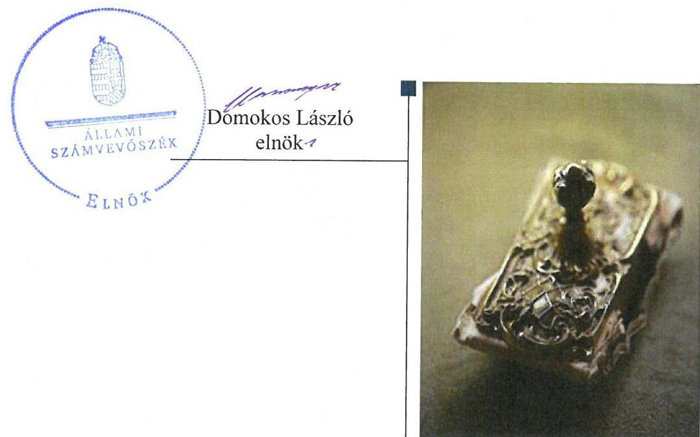
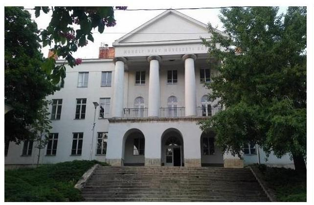
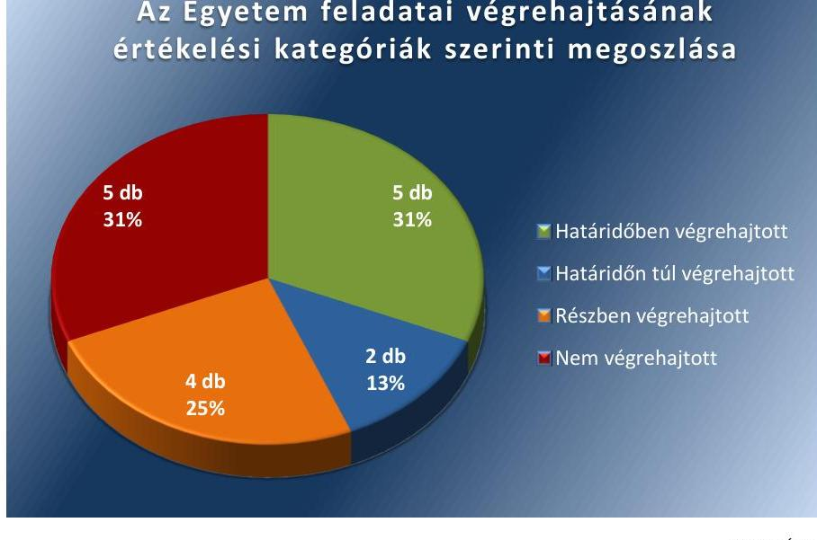
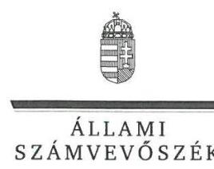
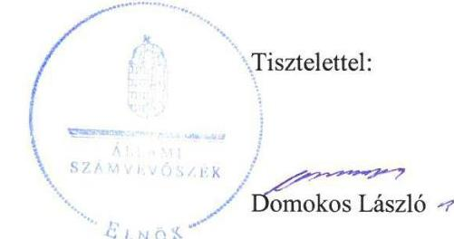
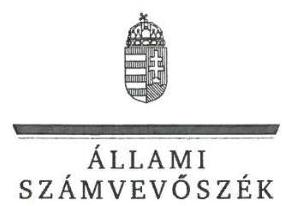
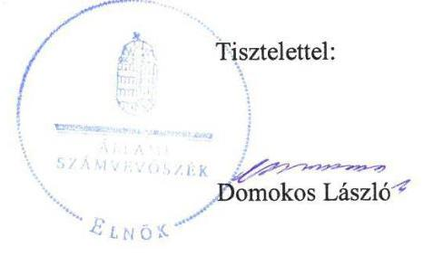

# Jelentés 

## Utóellenőrzések

Az állami felsőoktatási intézmények gazdálkodásának, működésének ellenőrzéséről készült jelentések utóellenőrzése - Moholy-Nagy Művészeti Egyetem
2018.

---

# Jelen 

## Jelentés

## Utóellenőrzések

Az állami felsőoktatási intézmények gazdálkodásának, működésének ellenőrzéséről készült jelentések utóellenőrzése - Moholy-Nagy Művészeti Egyetem
2018. 02. hó 13. nap

---

# AZ ELLENŐRZÉST FELÜGYELTE: 

PETŐ KRISZTINA felügyeleti vezető

## AZ ELLENŐRZÉST VEZETTE ÉS A VÉGREHAJTÁSÁÉRT FELELŐS:

CSAPÓ TIBORNÉ ellenőrzésvezető

## A PROGRAM ÖSSZEÁLLÍTÁSÁÉRT FELELŐS:

JANIK JÓZSEF LÁSZLÓ osztályvezető

## A TÉMÁHOZ KAPCSOLÓDÓ KORÁBBI SZÁMVEVŐSZÉKI JELENTÉS:

- címe: Jelentés a Moholy-Nagy Művészeti Egyetem ellenőrzéséről - Az állami felsőoktatási intézmények gazdálkodásának, működésének ellenőrzése
- sorszáma: 15045

IKTATÓSZÁM: V-1344-075/2016.
TÉMASZÁM: 2378
ELLENŐRZÉS-AZONOSÍTÓ SZÁM: V075538

---

# TARTALOMJEGYZÉK 

■ ÖSSZEGZÉS ..... 5
■ AZ ELLENŐRZÉS CÉLJA ..... 6
■ AZ ELLENŐRZÉS TERÜLETE ..... 7
■ AZ ELLENŐRZÉS HÁTTERE, INDOKOLTSÁGA ..... 8
■ A JELENTÉS LÉNYEGES KÉRDÉSKÖREI ..... 9
■ ELLENŐRZÉS HATÓKÖRE ÉS MÓDSZEREI ..... 10
■ MEGÁLLAPÍTÁSOK ..... 13
■ MELLÉKLETEK ..... 17
I. Sz. melléklet: Az ÁSZ 15045. számú jelentéséhez kapcsolódó intézkedési terv végrehajtása a Moholy-Nagy Művészeti Egyetemnél ..... 17
II. Sz. melléklet: Az ÁSZ 15045. számú jelentéséhez kapcsolódó intézkedési terv végrehajtása az Emberi Erőforrások Minisztériumánál. ..... 24
■ RÖVIDÍTÉSEK JEGYZÉKE ..... 55

---

.

---

# ÖSSZEGZÉS 

A Moholy-Nagy Művészeti Egyetem kancellárja az intézkedési tervben vállalt feladatok többségét részben hajtotta végre vagy nem hajtotta végre, így az ÁSZ által korábban azonosított hiányosságok, szabálytalanságok meghatározó része továbbra is fennáll. Az Egyetem irányítási rendszere továbbra sem támogatta a közpénzek szabályszerű és ellenőrizhető felhasználását, így a kancellár nem biztosította az Egyetem elszámoltathatóságát. Az Emberi Erőforrások Minisztériuma - mint a fenntartói jogkör gyakorlója - az intézkedési tervében vállalt feladatokat végrehajtotta.

## Az ellenőrzés társadalmi indokoltsága

Az Állami Számvevőszék stratégiájában célul tűzte ki a számvevőszéki munka hasznosulásának javítását. Ezzel összhangban ellenőrzi, hogy az ellenőrzött szervezetek megvalósították-e a korábbi ellenőrzései által feltárt hibák, hiányosságok és szabálytalanságok megszüntetése céljából kialakított intézkedési terveikben foglaltakat. A rendszeres utóellenőrzések hozzájárulnak a szükséges intézkedések tényleges végrehajtásához, ezáltal a közpénzügyek rendezettségének javulásához.

## Főbb megállapítások, következtetések

A Moholy-Nagy Művészeti Egyetem kancellárja az intézkedési tervben vállalt tizenhat feladatból öt feladatot határidőben, kettő feladatot határidőn túl, négy feladatot részben hajtott végre, míg öt feladatot nem hajtott végre. Az Egyetem irányítási rendszere továbbra sem támogatta a közpénzek szabályszerű és ellenőrizhető felhasználását.

A kancellár továbbra sem gondoskodott a mérlegtételek leltárral történő alátámasztásáról, ezzel összefüggésben az értékelési és besorolási szabálytalanságok megszüntetéséről. A kancellár nem jutatta érvényre az önköltség-számítási szabályzatban foglaltakat, mert az ingatlan bérbeadás bérleti díjait önköltségszámítás nem alapozta meg. A kancellár nem intézkedett a gazdálkodási jogkörök gyakorlóiról és aláírás mintájukról napra kész nyilvántartás vezetésére, ezzel nem teremtette meg az Egyetem szabályos kifizetéseit biztosító alapvető feltételeket.

A kancellár továbbra sem működtette az Egyetem kockázatkezelési rendszerét, mert nem mérte fel és nem állapította meg az Egyetem tevékenységében, gazdálkodásában rejlő kockázatokat, valamint nem intézkedett az egyes kockázatokkal kapcsolatban szükséges intézkedések megtételéről, valamint azok teljesítésének folyamatos nyomon követéséről.

A kancellár nem biztosította a közpénzek első védelmi vonalát jelentő belső ellenőrzés szabályszerű működését, mert nem intézkedett működési hiányosságainak megszüntetéséről. Nem gondoskodott a belső ellenőrzési jelentésekhez kapcsolódó intézkedési tervek elkészítéséről. Továbbá nem gondoskodott a belső ellenőrzések intézkedéseit tartalmazó, a jogszabályban előírt nyilvántartás vezetéséről sem.

A kancellár nem vizsgálta ki a munkajogi felelősséggel kapcsolatos körülményeket.
Az Emberi Erőforrások Minisztériuma az intézkedési tervében vállalt feladatból egyet határidőre, egyet határidőn túl teljesített.

---

# AZ ELLENŐRZÉS CÉLJA 

Az ellenőrzés célja annak értékelése volt, hogy a számvevőszéki jelentésben ${ }^{1}$ foglalt javaslatot megalapozó megállapításokkal összhangban készített intézkedési tervekben vállalt feladatokat az ellenőrzött szervezetek végrehajtották-e.

---

# AZ ELLENŐRZÉS TERÜLETE 

## Moholy-Nagy Művészeti Egyetem

Az Egyetem ${ }^{2}$ alapítására 1880-ban került sor Országos Magyar Királyi Iparművészeti Tanoda néven, majd az 1946. évben az intézmény elnevezése Iparművészeti Akadémia lett. 1948-ban főiskolai, majd 1971-ben egyetemi rangot kapott. Névváltozást követően 2006. március 30-tól Moholy-Nagy Művészeti Egyetem lett. Az Egyetemen jelenleg 5 oktatási egység működik, a Design Intézet, az Építészeti Intézet, a Média Intézet, az Elméleti Intézet és a Doktori Iskola. Az Egyetem rektora ${ }^{3}$ tisztségét 2014. augusztus 1-jétől, a kancellár ${ }^{4}$ feladatait 2014. november 15-től látja el.

Az Egyetem 2015. évi költségvetési beszámolója szerint 3399,3 millió Ft költségvetési bevételt, 1849,8 millió Ft finanszírozási bevételt ért el, valamint 2475,1 millió Ft költségvetési kiadást teljesített. Az Egyetem 2015. december 31-i könyvviteli mérlege szerint a nemzeti vagyonba tartozó befektetett eszközeinek értéke 5392,7 millió Ftot tett ki.

Az ÁSZ ${ }^{5}$ 2009. január 1. - 2013. december 31. közötti időszakra vonatkozóan ellenőrizte az Egyetem gazdálkodásának, működésének szabályszerűségét, az erről szóló 15045. számú számvevőszéki jelentést 2015. március 19. napján tette közzé. Az ellenőrzés célja annak megállapítása volt, hogy szabályos volt-e az Egyetem pénzügyi és vagyongazdálkodása, biztosított volt-e a vagyonnal való felelős gazdálkodás követelményének érvényesülése, jogszabályi előírásoknak megfelelően működött-e a belső kontrollrendszer, az irányító szerv tevékenysége a jogszabályi előírásoknak megfelelt-e.

Az Emberi Erőforrások Minisztériuma az állami felsőoktatási intézmények, így a Moholy-Nagy Művészeti Egyetem fenntartói jogkörének gyakorlója.

Az utóellenőrzés - a 2015. március 19-től 2017. április 3-ig végrehajtott feladatokat figyelembe véve - a számvevőszéki jelentésben a rektor és a miniszter részére megfogalmazott javaslatot megalapozó megállapításokra készített, az Állami Számvevőszék részére megküldött intézkedési tervekben foglalt feladatok megvalósításának ellenőrzésére, illetve értékelésére fókuszált.

---

# AZ ELLENŐRZÉS HÁTTERE, INDOKOLTSÁGA 

Az ÁSZ tv. ${ }^{6}$ 33. § (1) bekezdése értelmében a számvevőszéki jelentések javaslatot megalapozó megállapításaihoz kapcsolódóan az ellenőrzött szervezet vezetője intézkedési tervet köteles összeállítani, és az ÁSZ részére megküldeni. Az intézkedési tervben foglaltak megvalósítását - az ÁSZ tv. 33. § (7) bekezdésében foglaltak alapján - az ÁSZ utóellenőrzés keretében ellenőrizheti. Az intézkedések megvalósulásának értékelése során az ÁSZ figyelembe veszi az ellenőrzött szervezetek működési feltételeiben, valamint a jogszabályi előírásokban bekövetkezett változásokat.

Az intézkedési tervekben foglalt feladatok hiányos, illetve késedelmes végrehajtása, valamint megvalósításának elmaradása azt mutatja, hogy az ellenőrzések során feltárt hibák, hiányosságok és szabálytalanságok megszüntetése nem kapott kellő hangsúlyt. Ez a szabályszerű működés és a felelős vezetői magatartás vonatkozásában kockázatot hordoz. E kockázatok feltárásával az ÁSZ utóellenőrzési rendszere fokozza a fegyelmet, és igazolja, hogy a közpénzzel való szabályos gazdálkodás felelőssége elől nem lehet kitérni.

## AZ UTÓELLENŐRZÉS VÁRHATÓ HASZNOSULÁSA

Az utóellenőrzés négy szinten hasznosulhat:
$\longrightarrow$ A társadalom szintjén az utóellenőrzés jelzi, hogy a számvevőszéki ellenőrzés megállapításainak van következménye: a hiányosságok megszüntetésére az ellenőrzött szervezet által meghatározott intézkedések végrehajtását is számon kéri az ÁSZ.
$\longrightarrow$ Az ellenőrzött terület szintjén az utóellenőrzés tájékoztatást nyújt a terület döntéshozóinak a hiányosságok kiküszöbölésének jó gyakorlatairól, ezzel lehetőséget biztosítva arra, hogy az ÁSZ ellenőrzési megállapításai, javaslatai a terület nem ellenőrzött szervezeteinek a működése során is hasznosuljanak.
$\longrightarrow$ Az ellenőrzött szervezet szintjén az utóellenőrzés feltárja, hogy a szervezet az intézkedések végrehajtásával hasznosította-e a korábbi ellenőrzési jelentésben a hiányosságok megszüntetése, illetve a kockázatok kezelése érdekében megfogalmazott javaslatokat.
$\longrightarrow$ Az ÁSZ szintjén az utóellenőrzés visszacsatolást ad az ellenőrzési jelentések hasznosulásáról, az intézkedések elmaradása vagy részleges megvalósulása a további ellenőrzésekhez kockázati jelzésként szolgál.

---

# A JELENTÉS LÉNYEGES KÉRDÉSKÖREI 

1. Az ellenőrzött szervezetek az intézkedési terveikben foglaltakat az előírt határidőben végrehajtották-e?

---

# ELLENŐRZÉS HATÓKÖRE ÉS MÓDSZEREI 

## Az ellenőrzés típusa

Megfelelőségi ellenőrzés.

## Az ellenőrzött időszak

Az utóellenőrzés alapját képező számvevőszéki jelentés közzétételének napjától (2015. március 19.) az ellenőrzésről szóló kiértesítő levél keltének napjáig (2017. április 3.) tartó időszak.

## Az ellenőrzés tárgya

Az ÁSZ tv. 2011. július 1-jei hatálybalépését követően a számvevőszéki jelentésben foglalt javaslatot megalapozó megállapításokkal összhangban -Moholy-Nagy Művészeti Egyetem és Emberi Erőforrások Minisztériuma által - készített intézkedési tervben vállaltak végrehajtásának ellenőrzése.

Az ellenőrzés kiterjed minden olyan körülményre és adatra, amely az ÁSZ jogszabályban meghatározott feladatainak teljesítéséhez, valamint a program végrehajtása folyamán felmerült újabb összefüggések feltárásához szükséges.

## Az ellenőrzött szervezet

Moholy-Nagy Művészeti Egyetem és az Emberi Erőforrások Minisztériuma

## Az ellenőrzés jogalapja

Az ÁSZ tv. 1. § (3) bekezdése szerint az ÁSZ általános hatáskörrel végzi a közpénzekkel és az állami és önkormányzati vagyonnal való felelős gazdálkodás ellenőrzését.

Az ÁSZ tv. 33. § (7) bekezdése alapján az ÁSZ tv. 33. § (1)-(2) bekezdés szerinti intézkedési tervben foglaltak megvalósítását az ÁSZ utóellenőrzés keretében ellenőrizheti.

---

# Az ellenőrzés módszerei 

Az ellenőrzést a nemzetközi standardokat irányadónak tekintve az ellenőrzési program ellenőrzési kérdései, az ellenőrzött időszakban hatályos jogszabályok, az ellenőrzés szakmai szabályok és módszertanok figyelembevételével, önállóan végezte.

Az ellenőrzés ideje alatt az ellenőrzött szervezetekkel történő kapcsolattartást az ÁSZ SZMSZ7-nek vonatkozó előírásai alapján biztosította.

Az utóellenőrzés megállapításait elsősorban az ÁSZ rendelkezésére álló, valamint az ellenőrzött szervezetektől elektronikusan bekért dokumentumok alapozták meg.

Az ellenőrzési bizonyítékként felhasználható adatforrások közé tartoztak egyrészt a szakmai programban felsorolt adatforrások, másrészt minden - az ellenőrzés folyamán feltárt, az ellenőrzés szempontjából információt tartalmazó - dokumentum.

A pénzügyi- és vagyongazdálkodás szabályszerűségére vonatkozóan az intézkedési tervben foglalt feladatok végrehajtását a dologi kiadások, működési bevételek, személyi jellegű kiadások, szállító, vevő állományából 10-10 db véletlen mintavétellel kiválasztott tétel alapján értékelte az ÁSZ. A kiválasztott tételek esetében azt ellenőrizte, hogy az Egyetem az intézkedési tervben meghatározott feladatok végrehajtása során biztosította-e a jogszabályok és a belső szabályzatok előírásainak megfelelő működtetést.

Az intézkedési tervekben előírt feladatokat, azok végrehajthatósága, illetve végrehajtása szempontjából az alábbiak szerint kell értékelni:
"határidőben végrehajtott" a feladat, ha a teljesítés dokumentáltan, az intézkedési tervben előírt határidőben és tartalommal megtörtént;
"határidőn túl végrehajtott" a feladat, ha annak teljesítése az intézkedési tervben meghatározott módon, de az előírt határidőn túl történt meg;
"részben végrehajtott" a feladat, ha végrehajtása teljes körűen az intézkedési tervben előírt módon nem történt meg;
"nem végrehajtott" a feladat, ha a végrehajtás nem történt meg, vagy amennyiben a teljesítést nem dokumentálták;
"okafogyottá vált" a feladat, ha végrehajtására - meghatározott esemény bekövetkezése, továbbá külső körülmény, a működést érintő feltétel változása miatt - már nincs szükség, illetve lehetőség, és egyértelműen megállapítható, hogy az intézkedést szükségessé tevő körülmény a jövőben nem fordulhat elő;
"nem időszerű" az a feladat, amelynek ellenőrzési időszakon belüli végrehajtására azért nem került (kerülhetett) sor, mert az intézkedés alapjául szolgáló esemény nem következett be, de annak jövőbeni előfordulása lehetséges, a végrehajtása nem volt esedékes, vagy a végrehajtás határideje még nem járt le.
Az ellenőrzés lefolytatásához az ellenőrzött szervezetek a tanúsítványok elektronikus kitöltésével, valamint az ÁSZ által kért dokumentumok elektronikus megküldésével szolgáltattak adatokat, amelyek valódiságát és

---

teljes körűségét az ellenőrzött szervezet vezetője által tett teljességi és hitelességi nyilatkozat igazolja. Az így rendelkezésre bocsátott adatok, információk kontrollja az ellenőrzés keretében történt.

---

# MEGÁLLAPÍTÁSOK 

## 1. Az ellenőrzött szervezetek az intézkedési terveikben foglaltakat az előírt határidőben végrehajtották-e?

Összegző megállapítás

A kancellár nem intézkedett a belső kontrollrendszer, a pénzügyi- és vagyongazdálkodás területén feltárt hiányosságok, szabálytalanságok megszüntetéséről, mivel az Egyetem intézkedési tervében vállalt tizenhat feladatból négy
 feladatot részben, míg öt feladatot nem hajtott végre. Az EMMI ${ }^{8}$ az intézkedési tervében vállalt két feladatot végrehajtotta, melyből egy feladatot határidőn túl hajtott végre.

Az ÁSZ számvevőszéki jelentésében a rektor részére négy pontban tizenegy javaslatot fogalmazott meg.

A rektor és kancellár által elkészített és az ÁSZ részére megküldött intézkedési tervben a hiányosságok, szabálytalanságok megszüntetésére tizenhat feladat került vállalásra, amelyek a további részfeladatokra tagolásból adódóan összesen harminchárom intézkedést fogalmaztak meg.

A rektor és a kancellár által készített, és az ÁSZ részére megküldött intézkedési tervben vállalt tizenhat feladatból ötöt határidőben, kettőt határidőn túl, négyet részben hajtott végre, öt végrehajtására nem került sor.

Az Egyetem intézkedési tervében vállalt feladatok végrehajtásának értékelési kategóriák szerinti megoszlását az 1. ábra szemlélteti.
1. ábra

Az Egyetem feladatai végrehajtásának értékelési kategóriák szerinti megoszlása

Forrás: ÁSZ

---

Az Egyetem intézkedési tervében vállalt feladatokat, meghatározott határidőket, a feladatok végrehajtásáért felelős személyt és a feladatok végrehajtását az I. számú melléklet mutatja be.

1. táblázat

# AZ EGYETEM INTÉZKEDÉSI TERVÉBEN VÁLLALT BELSŐ KONTROLLRENDSZER SZABÁLYSZERŰ KIALAKÍTÁSÁRA, MŰKÖDTETÉSÉRE VONATKOZÓ FELADATOK 

| Végrehajtás | Sorszám |
| :-- | :-- |
| Határidőben végrehajtott | 1.3, 1.4, 11 |
| Határidőn túl végrehajtott | 1.1 |
| Részben végrehajtott | 2, 4 |
| Nem végrehajtott | 1.2, 1.5 |

A KONTROLLKÖRNYEZET szabályszerű kialakítását támogatta az Etikai Kódex ${ }^{9}$, Bizonylati Szabályzat ${ }^{10}$, az Informatikai Rendszerek és Adatok Biztonságos Kezelésének, Üzemeltetésének és Használatának Rendjéről szóló Szabályzat ${ }^{11}$ elkészítése, valamint az SZMSZ ${ }^{12}$ és a gazdálkodást érintő szabályzatok felülvizsgálata és aktualizálása. A kancellár gondoskodott az SZMSZ módosítás Szenátus ${ }^{13}$ elé történő felterjesztésről, ugyanakkor nem intézkedett az Nftv. ${ }^{14} 74. § (3) bekezdés előírástól eltérően a Fenntartó ${ }^{15}$ felé történő felterjesztésről.

A KOCKÁZATKEZELÉSI RENDSZER kialakításáról a kancellár gondoskodott a Kockázatkezelési Szabályzat ${ }^{16}$ elkészítésével, ugyanakkor nem működtette a jogszabályi előírásnak megfelelően. A Bkr. ${ }^{17} 7. § (2) bekezdéstől eltérően nem mérték fel a tevékenységben rejlő és a szervezeti célokkal összefüggő kockázatokat, és nem határozták meg az egyes kockázatokkal kapcsolatban szükséges intézkedéseket, valamint azok teljesítésének folyamatos nyomon követésének módját.

A KONTROLLTEVÉKENYSÉG keretében a jogszabályi megfelelősség érdekében a rektor és a kancellár gondoskodott a folyamatba épített előzetes és utólagos vezetői ellenőrzési rendszer Ellenőrzési Nyomvonalának ${ }^{18}$, és a Kötelezettségvállalási Szabályzat ${ }^{19}$ elkészítéséről. Nem biztosították az egyéb jogviszonyban foglalkoztatott oktatók megbízási díjainak kifizetéseinél - az Ávr. ${ }^{20} 57. § (1) bekezdése és a Kötelezettségvállalás, érvényesítés, utalványozás ellenjegyzéséről kiadott Szabályzat 28. § (1) bekezdése előírásai ellenére - a szabályszerű teljesítésigazolás, továbbá - az Ávr. 58. § (1) bekezdése és a Kötelezettségvállalás, érvényesítés, utalványozás ellenjegyzéséről kiadott Szabályzat 29. § (1) bekezdése ellenére - a szabályszerű érvényesítés elvégzését.

## AZ INFORMÁCIÓS ÉS KOMMUNIKÁCIÓS RENDSZER szabályszerű kialakítása érdekében a rektor és a kancellár kialakította az Informatikai rendszerek és adatok biztonságos kezelésének, üzemeltetésének és használatának rendjét, aktualizálta az Adatvédelmi Szabályzatot ${ }^{21}$, a kötelező közzétételi kötelezettség felmérését elvégezte, és az Info. tv. ${ }^{22}$ alapján a közzétételi kötelezettségének eleget tett.

A MONITORING RENDSZER keretén belül működő belső ellenőrzés szabályozottsága érdekében a kancellár intézkedett a Belső Ellen-

---

őrzési Kézikönyv ${ }^{23}$ felülvizsgálatáról és a szükséges módosítások átvezetéséről. A kancellár továbbra sem gondoskodott a Bkr. 45. § (2) bekezdésében előírtaknak megfelelően intézkedési terv készítéséről a belső ellenőrzési jelentésben megfogalmazott hiányosságok megszüntetésére, és a Bkr. 47. § (1) bekezdésében meghatározott nyilvántartás vezetésére a belső ellenőrzésekhez kapcsolódó intézkedésekről.
2. táblázat

# EGYETEM INTÉZKEDÉSI TERVÉBEN VÁLLALT PÉNZÜGYI GAZDÁLKODÁS SZABÁLYSZERŰ KIALAKÍTÁSÁRA, MŰKÖDTETÉSÉRE VONATKOZÓ FELADATOK 

Végrehajtása
Sorszáma
Határidőben végrehajtott
Részben végrehajtott
7
4, 5, 6
Forrás: ÁSZ

PÉNZÜGYI GAZDÁLKODÁS szabályszerű működése érdekében gondoskodtak a gazdálkodási jogköröket tartalmazó szabályzat felülvizsgálatáról és módosításáról, az ellenőrzött bizonylatok megőrzéséről és az alkalmazottak munkaidő-nyilvántartás vezetéséről. A kancellár nem intézkedett az Önköltség-számítási Szabályzat ${ }^{24} 37. §-ában foglaltak érvényesítéséről, az ellenőrzött bérleti díjak önköltség-számítással történő megalapozásáról. A kancellár nem gondoskodott az Ávr. 60. § (3) bekezdésében előírt naprakész nyilvántartás vezetéséről a gazdálkodási jogkör gyakorlására jogosult személyekről és aláírás mintájukról.
3. táblázat

EGYETEM INTÉZKEDÉSI TERVÉBEN VÁLLALT VAGYONGAZDÁLKODÁS SZABÁLYSZERŰ KIALAKÍTÁSÁRA, MŰKÖDTETÉSÉRE VONATKOZÓ FELADATOK

| Végrehajtása | Sorszáma |
| :-- | :-- |
| Határidőn túl végrehajtott | 8 |
| Nem végrehajtott | 9 |

VAGYONGAZDÁLKODÁS szabályszerű kialakítása érdekében a rektor és a kancellár gondoskodott a vagyongazdálkodási terv elkészítéséről, valamint a Szenátus és Fenntartó részére történő felterjesztéséről. A kancellár nem intézkedett a Számv. tv. ${ }^{25} 69. § (1) bekezdés és az Áhsz. ${ }^{26} 22. § (2) bekezdés előírásai ellenére a mérlegtételek leltárral történő alátámasztásáról, a Számv. tv. 16. § (1) bekezdés előírásától eltérően a besorolási, és értékelési szabálytalanságok megszüntetéséről.
4. táblázat

EGYETEM INTÉZKEDÉSI TERVÉBEN VÁLLALT MUNKAJOGI FELELŐSSÉGGEL KAPCSOLATOS KÖRÜLMÉNYEK KIVIZSGÁLÁSÁRA VONATKOZÓ FELADATOK

| Végrehajtása | Sorszáma |
| :-- | :-- |
| Határidőben végrehajtott | 12 |
| Nem végrehajtott | 3, 10 |

MUNKAJOGI FELELŐSSÉGGEL KAPCSOLATOS KÖRÜLMÉNYEK KIVIZSGÁLÁSÁRA VONATKOZÓ feladatok közül a rektor és a kancellár határidőn belül kivizsgálta az SZMSZ Fenntartó részére történő megküldésének elmaradásával, valamint a költségvetés és beszámoló szenátusi elfogadás előtti fenntartó részére történő

---

megküldésének elmaradásával összefüggően feltárt szabálytalanságokat, a vizsgálat munkajogi felelősséget nem állapított meg. A rektor és a kancellár nem intézkedett a leltározási és selejtezési szabályzat előírásai be nem tartása és a belső ellenőrzésekhez kapcsolódó intézkedési terv készítési kötelezettség elmulasztásával kapcsolatos munkajogi felelősséggel kapcsolatos körülmények kivizsgálására.
5. táblázat

EMMI INTÉZKEDÉSI TERVÉBEN RÖGZÍTETT FELADATOK

| Végrehajtása | Sorszáma |
| :-- | :-- |
| Határidőben végrehajtott | 1 |
| Határidőn túl végrehajtott | 2 |

Forrás: ÁSZ
Az ÁSZ számvevőszéki jelentésében megfogalmazott javaslatok hasznosítására az EMMI intézkedési tervében két feladatot vállalt, a végrehajtás felelőseként a Belső Ellenőrzési Főosztályt ${ }^{27}$ jelölte meg. Az EMMI az intézkedési tervében meghatározott feladatokat végrehajtotta, amelyből egyet határidőn túl hajtott végre.

Az EMMI határidőben elvégezte a számvevőszéki jelentésben feltárt szabálytalanságokhoz kapcsolódó munkajogi felelősség kivizsgálását, eredménye alapján felelősség megállapítására nem került sor.

Az EMMI Belső Ellenőrzési Főosztálya ellenőrzést folytatott le az Egyetem működése és a 20/25/15 MOME Campus Kreatív Innovációs és Tudáspark kialakítása fejezeti kezelésű előirányzat felhasználása tárgyában, amely határidőn túl zárult.

Az EMMI intézkedési tervében vállalt feladatot, a meghatározott határidőt, a feladat végrehajtásáért felelős szervezetet és a feladat végrehajtását a II. számú melléklet mutatja be.

---

# MELLÉKLETEK

I. SZ. MELLÉKLET: AZ ÁSZ 15045. SZÁMÚ JELENTÉSÉHEZ KAPCSOLÓDÓ INTÉZKEDÉSI TERV VÉGREHAJTÁSA A MOHOLY-NAGY MŰVÉSZETI EGYETEMNÉL

|  5. | Az intézkedési tervben vállalt feladat | Az intézkedési tervben meghatározott határidő | Az intézkedési tervben meghatározott felelős | A feladat végrehajtása  |
| --- | --- | --- | --- | --- |
|   | 1. | 2.
Határidőben végrehajtott feladatok |  | 4.  |
|  1. | (1.3) Kontrolltevékenységek kialakítása és működtetése: Ellenőrzési nyomvonalak kimunkálása | Gazdálkodásra vonatkozó szabályzatok összeállításával egyidejűleg | Gazdasági vezető | A kancellár határidőben, 2015. december 21-én intézkedett az Ellenőrzési Nyomvonal elkészítéséről, amelyet a 9/2015. (XII. 21.) számú utasítással adott ki.  |
|  2. | (1.4 Információ és kommunikációs rendszer üzemeltetése
(1.4. a) Informatikai és adatvédelmi szabályzat aktualizálása | 2015. december 31. | Kancellár | A kancellár és a rektor az intézkedési tervben meghatározott határidőn belül, 2015. október 26-ra intézkedett az Informatikai Rendszerek és Adatok Biztonságos Kezelésének, Üzemeltetésének és Használatának Rendjéről szóló Szabályzat elkészítéséről, amelyet a Szenátus a 30/2015. számú határozatával fogadott el. Az Egyetem 2016. évben a szabályzatot aktualizálta és egységes szerkezetbe foglalta, amelyet a Szenátus a 39/2016. számú határozatával fogadott el. A rektor és a kancellár gondoskodott 2015. november 30-ra az Adatvédelmi Szabályzat aktualizálásáról, amelyet a Szenátus a 42/2015. számú határozatával fogadott el. Az Adatvédelmi Szabályzatot 2016. évben ismételten aktualizálták, amelyet a Szenátus a 16/2016. számú határozatával fogadott el.  |
|   | (1.4. b) Jogszabályban foglalt honlapon való közzétételi kötelezettségek felmérése | 2015. szeptember 30. | Kancellár | A kancellár gondoskodott az intézkedési tervben vállalt feladat végrehajtásáról. A gazdasági igazgató felmérést készített az Info. tv. alapján a közzéteendő adatok listájáról, amelyet a kancellár részére 2015. július 29-én megküldött. A felmérésben tételesen szerepelt az Info. tv. 1. melléklete szerinti közzétételi lista, a frissítésre és a megőrzésre vonatkozó adatok köre.  |
|   | (1.4. c) Jogszabályban foglalt honlapon való közzétételi kötelezettségek teljesítése | a felmérést követően folyamatos | Kancellár | Az Egyetem honlapján közzétételre kerültek az Info. tv. 1. mellékletében szereplő szervezeti és személyzeti adatok, a tevékenységre és működésre vonatkozó adatok, valamint a gazdálkodási adatok.  |
|  3. | (7) Számviteli bizonylatok jogszabályban rögzített határidőig történő megőrzése | Folyamatos | Gazdasági vezető | A kancellár gondoskodott a Számv. tv. 169. §-ban előírtakkal összhangban az ellenőrzött számviteli bizonylatok megőrzéséről.  |

---

|  Az intézkedési tervben vállalt feladat | Az intézkedési tervben meghatározott határidő | Az intézkedési tervben meghatározott felelős | A feladat végrehajtása  |
| --- | --- | --- | --- |
|  1. | 2. | 3. | 4.  |
|  4. (11) A Belső Ellenőrzési Kézikönyv rendszeres, kétévenkénti felülvizsgálata, szükség szerint aktualizálása | A jelen intézkedési tervet követő első felülvizsgálat, aktualizálás: 2015.06.30., ezt követően 2017.06.30, ill. kétévente rendszeres felülvizsgálata, szükség szerint aktualizálás | Belső ellenőr | A kancellár határidőn belül, 2015. június 15-re aktualizálta, hatályba léptette az Egyetem Belső Ellenőrzési Kézikönyvét.  |
|  5. (12) Munkajogi felelősséggel kapcsolatos körülmények kivizsgálása és a vizsgálat eredményének a szükséges intézkedések megtétele (SZMSZ módosítások fenntartó részére történő megküldésével, és az intézményi költségvetés és beszámoló szenátus elfogadás előtti fenntartónak történő elküldésével összefüggően feltárt szabálytalanságok miatt) | 2015. december 31. | Rektor, Kancellár | A rektor és a kancellár 2015. december 22-én a munkajogi felelősséggel kapcsolatos körülményeket kivizsgálta az SZMSZ fenntartó részére történő megküldésének elmaradásával, valamint a költségvetés és beszámoló szenátusi elfogadás előtti fenntartó részére történő megküldésének elmaradásával összefüggően feltárt szabálytalanságok esetében. A szabálytalanságok munkajogi felelősségre vonásához kapcsolódó kivizsgálás eredményeit a K-986/2015. számú feljegyzésben rögzítették. A vizsgálat megállapította, hogy nem volt olyan munkakört betöltő, akinek felelősségi körébe tartozott volna az SZMSZ megküldése, illetve a vizsgált időszakban nem volt egyértelmű rendelkezés a költségvetés és beszámoló megküldéséről, ezért munkajogi felelősségre vonás nem kezdeményezhető.  |
|  Határidőn túl végrehajtott feladatok |  |  |   |
|  6. (1.1) Kontrollkörnyezet kialakítása: (1.1. a) etikai elvárások meghatározása (Etikai kódex megalkotása) | 2015. október 31. | Kancellár | Határidőben végrehajtott feladatrész:  |
|   |  |  | A rektor és
 a kancellár határidőn belül, 2015. október 26-ra meghatározta az etikai elvárásokat, megalkotta az Etikai Kódexet, amelyet a Szenátus a 29/2015. számú határozatával fogadott el.  |
|  (1.1. b) ellenőrzési nyomvonalak kimunkálása |  | A tevékenységi körét érintő szabályzatok összeállításával, módosításával egyidejűleg | Rektor és Kancellár  |
|   |  |  | A kancellár a Bkr.-rel összhangban gondoskodott az Ellenőrzési Nyomvonal elkészítéséről, amelyet a 9/2015. (XII. 21.) számú utasítással adott ki. Az Ellenőrzési Nyomvonal tartalmazta a költségvetés tervezési és beszámolási, személyi juttatások kiadásai, vagyongazdálkodási, pénzgazdálkodási folyamatokat.  |

---

|  Az intézkedési tervben vállalt feladat | Az intézkedési tervben meghatározott határidő | Az intézkedési tervben meghatározott felelős | A feladat végrehajtása  |
| --- | --- | --- | --- |
|  1. | 2. | 3. | 4.  |
|  (1.1. c) bizonylati rend kialakítása (Bizonylati Album) | 2015. december 31. | Gazdasági vezető | Határidőben végrehajtott feladatrész: A kancellár határidőben, 2015. december 21-re kialakította a bizonylati rendet, a 7/2015. (XII. 21.) számú utasítással kiadott Analitikus Bizonylati Szabályzattal.  |
|  (1.1. d) informatikai biztonsági szabályzat készítése | 2015. szeptember 30. | Campus igazgató | Határidőn túl végrehajtott feladatrész: A rektor és a kancellár az intézkedési tervben vállalt határidőt követően, 2015. október 27-én készítette el az Informatikai Rendszerek és Adatok Biztonságos Kezelésének, Üzemeltetésének és Használatának Rendjéről szóló Szabályzatot.  |
|  (1.1 e) gazdálkodást érintő szabályzatok felülvizsgálata, aktualizálása | 2015. december 31. | Gazdasági vezető | Határidőben végrehajtott feladatrész: A kancellár a gazdálkodást érintő szabályzatok felülvizsgálatát követően, a vállalt határidőn belül 2015. december 31-ig felülvizsgálta, és 2015. december 21-re aktualizálta az Eszközök és Források Értékelési Szabályzatot$^{28}$, amelyet az 5/2015. (XII. 21.) számú utasítással adott ki, az Önköltség-számítási Szabályzatot, amelyet a 6/2015. (XII. 21.) számú utasítással adott ki, a Számviteli Politikát$^{29}$, amelyet a 3/2015. (XII. 21.) számú utasítással adott ki. Aktualizálta továbbá a Belföldi és Külföldi Kiküldetések Rendjéről szóló Szabályzatot$^{30}$, amelyet a 8/2015. (XII. 21.) számú utasítással adott ki, a Leltározási Szabályzatot$^{31}$, amelyet a 4/2015. (XII. 21.) számú utasítással adott ki, a Vagyontárgyak Selejtezésének és Hasznosításának Rendjéről szóló Szabályzatot$^{32}$, amelyet a 9/2015. (XII. 21.) utasítással adott ki. A kancellár határidőben felülvizsgálta és aktualizálta a Gépjárművek Kezelésének és Használatának Rendjéről szóló Szabályzatot, melyet a Szenátus a 41/2015. (11. 30.) számú határozatával, a Reprezentációs Célú Kiadások Felhasználásának és Elszámolásának rendjéről szóló Szabályzatot, amelyet a Szenátus a 40/2015. (11. 30.) számú határozatával, valamint a Közbeszerzési Szabályzatot$^{33}$, amelyet a Szenátus 11/2015. (03. 31.) számú határozatával fogadott el. Módosította továbbá a Pénzkezelés és Értékkezelés Rendjét, amelyet a Szenátus a 39/2015. számú határozatával fogadott el. A felülvizsgálatot és aktualizálást indokolta az államháztartási számvitel változásai, a kancellári rendszer bevezetésével összefüggő szervezeti változások, valamint a vonatkozó jogszabályi előírások betartása.  |

---

|  Az intézkedési tervben vállalt feladat | Az intézkedési tervben meghatározott határidő | Az intézkedési tervben meghatározott felelős | A feladat végrehajtása  |
| --- | --- | --- | --- |
|  1. | 2. | 3. | 4.  |
|  7. (8. a) Vagyongazdálkodási terv elkészítése | 2015. december 31. | Kancellár | Határidőn túl végrehajtott feladatrész: A rektor és a kancellár a 2015-2018. évekre vonatkozó Vagyongazdálkodási Tervét az intézkedési tervben vállalt határidőn túl, 2016. március 7-re készítette el.  |
|  (8. b) Vagyongazdálkodási terv Szenátus elé terjesztése | A terv elkészültét követően haladéktalanul | Kancellár | Határidőben végrehajtott feladatrész: A rektor és a kancellár gondoskodott a Vagyongazdálkodási Terv Szenátus elé terjesztéséről, amelyet a Szenátus 2016. március 7-én fogadott el a 8/2016. számú határozatával.  |
|  (8. c) A Vagyongazdálkodási terv fenntartóhoz való felterjesztése egyetértési jog gyakorlása érdekében | Szenátusi elfogadást követő 5 munkanapon belül | Kancellár | Határidőn túl végrehajtott feladatrész: A kancellár a Vagyongazdálkodási Tervet a Szenátusi elfogadást követően 5 munkanapon túl, az intézkedési tervben meghatározott határidőt követően 2016. április 14-én küldte meg az EMMI részére.  |
|  Részben végrehajtott feladatok |  |  |   |
|  8. (2. a) Jogszabálynak megfelelő SZMSZ megalkotása | 2015. január 26. | Kancellár | Végrehajtott feladatrész: A rektor és a kancellár az intézkedési tervben meghatározott 2015. január 26-át követően, 2015. február 2-ra készítette el az SZMSZ módosítást. Az Nftv. 11.§ (1) bekezdés b) pontjával összhangban az SZMSZ tartalmazta a szervezeti és működési rendet, foglalkoztatási követelményrendszert, hallgatói követelményrendszert.  |
|  (2. b) SZMSZ Szenátus elé terjesztése | 2015. január 26. | Kancellár | Végrehajtott feladatrész: A kancellár az intézkedési tervben vállalt határidőt követően, 2015. február 2-án terjesztette elő az SZMSZ-t a Szenátus elé. A Szenátus 2015. február 2-án az 1/2015. számú határozatával elfogadta az SZMSZ módosítást.  |
|  (2. c) SZMSZ fenntartónak való megküldése | Szenátusi döntést követő 15 munkanapon belül | Kancellár | Nem végrehajtott feladatrész: A kancellár nem intézkedett az SZMSZ Fenntartónak való megküldéséről, az Nftv. 74. § (3) bekezdésében előírtak ellenére.  |
|  9. (4. a) Gazdálkodási jogköröket rögzítő szabályzat (kötelezettségvállalási szabályzat) felülvizsgálata, kiegészítése | 2015. szeptember 15. | Gazdasági vezető | Végrehajtott feladatrész: A kancellár felülvizsgálta a gazdálkodási jogköröket rögzítő szabályzatot, 2015. szeptember 14-én kiadta a Kötelezettségvállalás, Érvényesítés, Utalványozás és Ellenjegyzés Rendjéről szóló Szabályzatot, amelyet a Szenátus a 24/2015. számú határozatával jóváhagyott.  |

---

|  Az intézkedési tervben vállalt feladat | Az intézkedési tervben meghatározott határidő | Az intézkedési tervben meghatározott felelős | A feladat végrehajtása  |
| --- | --- | --- | --- |
|  1. | 2. | 3. | 4.  |
|  (4. b) Gazdálkodási jogkörökhöz kapcsolódó nyilvántartások naprakész vezetése | Folyamatos | Gazdasági vezető | Nem végrehajtott feladatrész: A kancellár nem gondoskodott az Ávr. 60. § (3) bekezdésben foglaltak ellenére a gazdálkodási jogkörök gyakorlására jogosult személyekről és aláírás mintájukról naprakész nyilvántartás vezetéséről. A kancellár meghatározta a kötelezettségvállalás, érvényesítés, utalványozás ellenjegyzéséről szóló szabályzatban a kötelezettségvállalásra vonatkozó felhatalmazás, a pénzügyi ellenjegyző, utalványozó, teljesítésigazoló, érvényesítő személyek részére kijelölés, és aláírás mintájukra vonatkozó szabályokat, alkalmazandó nyomtatványokat.  |
|  (4. c) A gazdálkodási jogkörök gyakorlásának FEUVE keretében történő ellenőrzése | Folyamatos | Gazdasági vezető | Nem végrehajtott feladatrész: Nem biztosították a kontrolltevékenység keretében az egyéb jogviszonyban foglalkoztatott oktatók megbízási díjainak kifizetéseinél az Ávr. 57. § (1) bekezdésben és a Kötelezettségvállalás, érvényesítés, utalványozás ellenjegyzéséről kiadott Szabályzat 28. § (1) bekezdésben foglalt előírásoknak megfelelő teljesítésigazolás elvégzését, mivel a teljesítésigazolást megalapozó, az órák megtartásának igazolását tartalmazó dokumentumok nélkül került végrehajtásra. Az érvényesítő az Ávr. 58. § (1) bekezdésében és a Kötelezettségvállalás, érvényesítés, utalványozás ellenjegyzéséről kiadott Szabályzat 29. § (1) bekezdésében foglaltak ellenére nem ellenőrizte le a teljesítésigazolást megalapozó dokumentumok rendelkezésre állását.  |
|  10. (5) Teljes körű munkaidő-nyilvántartás vezetése valamennyi alkalmazott vonatkozásában, az egyéb jogviszonyban foglalkoztatott oktatók esetében az órák megtartásának dokumentálása | Folyamatos | Kancellár | Végrehajtott feladatrész: A kancellár gondoskodott az alkalmazottak vonatkozásában a munkaidő-nyilvántartás vezetéséről, megfelelve ezzel az Munka. tv. $^{34}$ 134. § előírásának. Nem végrehajtott feladatrész: Az intézkedési tervben vállaltaktól eltérően a kancellár nem gondoskodott az egyéb jogviszonyban foglalkoztatott oktatók esetében az órák megtartásának dokumentálásáról.  |

---

|  Az intézkedési tervben vállalt feladat | Az intézkedési tervben meghatározott határidő | Az intézkedési tervben meghatározott felelős | A feladat végrehajtása  |
| --- | --- | --- | --- |
|  1. | 2. | 3. | 4.  |
|  11. (6. a) Önköltség számítási szabályzat aktualizálása | 2015. december 31. | Gazdasági vezető | Végrehajtott feladatrész: A kancellár határidőben, 2015. december 21-én aktualizálta az Önköltség-számítási Szabályzatot, amelyet a 6/2015. (XII. 21.) számú utasítással adott ki és hatályba helyezte 2016. január 1-jén.  |
|  (6.b) A szabályzatban foglaltak érvényre juttatása | A szabályzat megalkotását követően folyamatos | Az adott térítési díj megállapításával érintett szakterület vezetője és a Gazdasági vezető közös előterjesztése alapján a Szenátus döntése szerint | Nem végrehajtott feladatrész: A kancellár nem gondoskodott az Önköltség-számítási Szabályzat 37. §-ban foglaltakat érvényre juttatásáról, mivel két ingatlan bérbeadás esetében a bérleti díjat önköltségszámítással nem alapozták meg.  |
|  Nem végrehajtott feladatok |  |  |   |
|  12. (1.2) Kockázatkezelési rendszer: (1.2. a) Az Egyetem tevékenységével és gazdálkodásával kapcsolatos kockázatok felmérése | 2015. december 31. | Rektor és Kancellár | A rektor és a kancellár nem gondoskodott a Bkr. 7. § (2) bekezdésében előírtaktól eltérően az Egyetem tevékenységével és gazdálkodásával kapcsolatos kockázatok felméréséről.  |
|  (1.2. b) Az egyes kockázatokkal kapcsolatban szükséges intézkedések megtétele | A kockázatok felmérésével kapcsolatos jelentésben rögzítettek szerint | A kockázatok felmérésével kapcsolatos jelentésben meghatározott szakterületi vezető | A rektor és a kancellár a Bkr. 7. § (2) bekezdésében előírtaktól eltérően nem intézkedett az egyes kockázatokkal kapcsolatban szükséges intézkedések megtételéről.  |
|  (1.2 c) A teljesítések folyamatos nyomon követése | Folyamatos, az éves ellenőrzési tervben rögzítettek szerint | Rektor és Kancellár | A rektor és a kancellár a Bkr. 7. § (2) bekezdésében előírtaktól eltérően nem gondoskodott a teljesítések folyamatos nyomon követéséről.  |
|  13. (1.5) Monitoring rendszer (1.5. a) Belső ellenőrzési jelentésben megfogalmazott hiányosságok vonatkozásában az intézkedési terv készítési kötelezettség teljesítése | A belső ellenőrzési jelentésben rögzített határidőre | A hiányossággal érintett szakterület vezetője | A rektor és a kancellár nem gondoskodott a belső ellenőrzési jelentésben megfogalmazott hiányosságok vonatkozásában intézkedési terv készítési kötelezettség teljesítésére, a Bkr. 45. § (2) bekezdésben előírtaktól eltérően.  |

---

|  1. | Az intézkedési tervben vállalt feladat | Az intézkedési tervben meghatározott határidő | Az intézkedési tervben meghatározott felelős | A feladat végrehajtása  |
| --- | --- | --- | --- | --- |
|  1. | (1.5. b) Belső ellenőrzésekhez kapcsolódó intézkedésekről nyilvántartás vezetése | 2. | 3. | 4.  |
|   |  | Folyamatos (Nyilvántartásba történő bevezetés az intézkedési tervek elfogadását követő 5 munkanap) | Kancellár |  |

 javaslatok és az intézkedési tervek vonatkozásában, az intézkedési tervek határidejétől számított 15 nap a megvalósítás adatainak vonatkozásában.) | Belső ellenőr | A kancellár a Bkr. 47. § (1) bekezdésében előírtaktól eltérően nem gondoskodott nyilvántartás vezetésről, a belső ellenőrzésekhez kapcsolódó intézkedésekről.  |
|  14. | (3) Munkajogi felelősséggel kapcsolatos körülmények kivizsgálása, és a vizsgálat eredménye alapján a szükséges intézkedés megtétele (intézkedési terv készítési kötelezettség elmulasztásával összefüggésben feltárt szabálytalanságok tekintetében) | 2015. április 23. | Rektor, Kancellár | A rektor és a kancellár a feladat végrehajtásáról nem gondoskodott, az intézkedési terv készítési kötelezettség elmulasztásával összefüggésben feltárt szabálytalanságok miatt a munkajogi felelősséggel kapcsolatos körülmények kivizsgálására irányuló eljárást nem indított.  |
|  15. | (9. a) Mérlegtételek leltárral történő alátámasztása | Beszámoló készítése során | Gazdasági vezető | A kancellár nem gondoskodott az intézkedési tervben meghatározott feladat végrehajtásáról, a Számv. tv. 69. § (1) és az Áhsz. 22. § (2) bekezdésekben foglaltak ellenére a mérlegtételek leltárral történő alátámasztásáról.  |
|   | (9. b) Feltárt hiányosságok, besorolási és értékelési szabálytalanságok megszüntetése | folyamatos | Gazdasági vezető | A kancellár nem intézkedett a besorolási és értékelési szabálytalanságok megszüntetéséről, a Számv. tv. 16. § (1) bekezdésben foglaltak ellenére.  |
|  16. | (10) Munkajogi felelősséggel kapcsolatos körülmények kivizsgálása, és a vizsgálat eredménye alapján a szükséges intézkedések megtétele (leltározási és selejtezési szabályzat előírásai be nem tartása miatt feltárt szabálytalanságok tekintetében) | 2015. április 23. | Rektor, Kancellár | A rektor és a kancellár a feladat végrehajtásáról nem gondoskodott, a leltározási és selejtezési szabályzat előírásai be nem tartása miatt feltárt szabálytalanságok tekintetében a munkajogi felelősséggel kapcsolatos körülmények kivizsgálására irányuló eljárást nem indított.  |

---

#### *Mellékletek*

#### ▪ II. SZ. MELLÉKLET: AZ ÁSZ 15045. SZÁMÚ JELENTÉSÉHEZ KAPCSOLÓDÓ INTÉZKEDÉSI TERV VÉGREHAJTÁSA AZ EMBERI ERŐFORRÁSOK MINISZTÉRIUMÁNÁL

|  SZ
M
V
A | Az intézkedési
tervben vállalt
feladat | Az intézkedési
tervben
meghatározott
határidő | Az intézkedési
tervben meghatározott
felelős | A feladat végrehajtása  |
| --- | --- | --- | --- | --- |
|   | 1. | 2. | 3. | 4.  |
|   |  | Határidőben végrehajtott feladat |  |   |
|  1. | (1.) A belső kontrollrendszer kialakításával és működtetésével, a pénzügyi és vagyongazdálkodással, vagyonkimutatással összefüggésben feltárt szabálytalanságokhoz kapcsolódóan a munkajogi felelősség kivizsgálása, a szükséges intézkedések kezdeményezése | 2015. december 31. | Belső ellenőrzési főosztály | Az EMMI Belső Ellenőrzési Főosztálya ellenőrzést folytatott le a munkajogi felelősség kivizsgálására. A vizsgálat eredményéről a 37395/2015/ELL iktatószámú feljegyzésben 2015. július 10-én tájékoztatták a Közigazgatási Államtitkárt. A vizsgálat megállapította, hogy az Egyetem tekintetében a Rektor személyében bekövetkezett változás miatt a munkajogi felelősségre vonás kezdeményezésének lehetősége nem áll fenn.  |
|   |  | Határidőn túl végrehajtott feladat |  |   |
|  2. | (2) A Moholy - Nagy Művészeti Egyetem gazdálkodásának, működésének törvényességi és hatékonysági ellenőrzése | 2015. december 31. | Belső ellenőrzési főosztály | Az EMMI Belső Ellenőrzési Főosztálya 2015. évben ellenőrzést végzett az Egyetem működése és a 20/25/15 MOME Campus Kreatív Innovációs és Tudáspark kialakítása fejezeti kezelésű előirányzat felhasználása tárgyában. A 16971697/13/2016/ELL számú ellenőrzés 2016. januárban zárult. A vizsgálat kiterjedt többek között az Egyetem belső kontrollrendszereinek értékelésére, a kötelezettségvállalás szabályszerűségére, az előirányzat nyilvántartás, a kötelezettségvállalás nyilvántartás és a szerződés nyilvántartás vezetésének szabályszerűségére, a pénzügyi elszámolások szabályszerűségére, a szakmai és pénzügyi beszámolók felülvizsgálatának, elfogadásának végrehajtására, továbbá az Egyetem erőforrás gazdálkodásának szabályszerűségére és a foglalkoztatás indokoltságára és szabályszerűségére.  |

*Forrás: ÁSZ által készített táblázat*

---

# FÜGGELÉK: ÉSZREVÉTELEK 

A jelentéstervezetet a Számvevőszék 15 napos észrevételezésre megküldte az ellenőrzött szervezetek vezetőinek az ÁSZ tv. 29. § (1) bekezdése előírásának megfelelően.
A Moholy-Nagy Művészeti Egyetem rektora és kancellárja a jelentéstervezet megállapításaira írásban észrevételt tett. Az Emberi Erőforrások Minisztériuma részéről nem érkezett észrevétel.
Az elfogadott észrevétel alapján a Számvevőszék módosította a jelentést. A függelék tartalmazza a kancellár és a rektor észrevételeit, illetve az el nem fogadott észrevételek elutasításának indoklását.

[^0]
[^0]:    * 29. § (1) Az Állami Számvevőszék az ellenőrzési megállapításait megküldi az ellenőrzött szervezet vezetőjének vagy az általa megbízott személynek, és annak, akinek személyes felelősségét állapította meg.
    (2) Az ellenőrzött szervezet vezetője és a felelősként megjelölt személy az ellenőrzés megállapításaira tizenöt napon belül írásban észrevételt tehet.
    (3) Az Állami Számvevőszék az észrevételre a beérkezésétől számított harminc napon belül írásban válaszol. A figyelembe nem vett észrevételeket köteles a jelentésben feltüntetni, és megindokolni, hogy azokat miért nem fogadta el.

---

A Moholy-Nagy Művészeti Egyetem rektora és kancellárja által közösen tett észrevételek:
A 3417-2/2017. iktatószámú levél második bekezdésében foglaltak
A hivatkozott bekezdésben kérik az észrevételek alapján a jelentéstervezetben foglaltak átértékelését, az észrevételeikkel érintett intézkedések elmaradására vonatkozó megállapítások törlését.

A 3417-2/2017. iktatószámú levél harmadik bekezdésében foglaltak
A hivatkozott bekezdésben jelezték, hogy az ellenőrzés során személyes egyeztetésre nem került sor, továbbá élni kívánnak a jelentéstervezetnek az ÁSZ tv. 32. § (5) bekezdése szerinti záró megbeszélés keretében történő egyeztetésének jogával, lehetőségével, mivel a jelentéstervezetben foglalt megállapítások jelentős részét vitatják, és igazolni tudják az intézkedési tervben foglaltak határidőben történő végrehajtását.
I. A Moholy-Nagy Művészeti Egyetem általános észrevételei

Az általános észrevételek a részletes észrevételek között kerülnek kirészletezésre.
II. A Moholy-Nagy Művészeti Egyetem részletes észrevételei

1. Az informatikai biztonsági szabályzat készítésével összefüggő észrevétel

Az észrevétel szerint a szabályzaton feltüntetett 2015. október 27-ei dátum a szabályzat szenátusi elfogadását követő aláírás napját rögzíti. A tervezet határidőre elkészült, de a szeptember 30-át követően az első szenátusi ülésre 2015. október 26. napján került sor, a szabályzat aláírása és kiadása csak ezt követően történhetett meg.
2. A vagyongazdálkodási terv elkészítésével összefüggő észrevétel

Az észrevétel szerint a vagyongazdálkodási terven feltüntetett 2016. március 8-ai dátum a vagyongazdálkodási terv szenátusi elfogadását követő aláírás napját rögzíti. A tervezet határidőre elkészült, azonban 2015 decemberében és 2016 januárjában nem volt szenátusi ülés, 2016 februárjában is csak elektronikusan születtek határozatok a sürgős döntést igénylő ügyekben. A 2016. évben az első szenátusi ülésre március 7-én került sor. Ekkor került sor a vagyongazdálkodási terv elfogadására.
3. A szervezeti és működési szabályzat fenntartó részére történő megküldésével összefüggő észrevétel

Az észrevétel szerint a szenátus 2015. február 2-ai ülésén elfogadott szervezeti és működési szabályzat a fenntartó felsőoktatási kapcsolattartója részére, elektronikusan, Word formátumban 2015. február 17-én, határidőn belül megküldésre került, és az észrevételhez csatolták az elektronikus megküldést igazoló dokumentumot.
4. A gazdálkodási jogkörökhöz kapcsolódó nyilvántartások naprakész vezetésével összefüggő észrevétel

Az észrevétel szerint a kancellár a megbízatásának betöltését követően megkezdte a gazdasági terület újjáépítését, amelynek egyik lépése a gazdálkodási jogkörök gyakorlására jogosító felhatalmazásokról nyilvántartás felfektetése és folyamatos vezetése volt. Az ezt követően, 2015. szeptember 14-én kiadott új szabályzat alapján 2016 januárjától új minták kerültek alkalmazásra, amelyen szerepelnek a felhatalmazók és a felhatalmazottak aláírásmintái. A nyilvántartás vezetése folyamatos, naprakész. A tárgybani ellenőrzés során csak a mintákhoz bocsátották rendelkezésre a felhatalmazásokat.

---

5. A gazdálkodási jogkörök gyakorlásának FEUVE keretében történő ellenőrzésére tett észrevétel
a. A teljesítésigazolással összefüggő észrevétel
Az észrevétel meghivatkozza az államháztartásról szóló törvény végrehajtásáról szóló 368/2011. (XII. 29.) Korm. rendelet 57. § (1) (továbbiakban: Ávr.) bekezdését, amellyel összefüggésben az észrevételben rögzítik, hogy a hivatkozott jogszabályhely a teljesítés igazolójára vonatkozóan állapít meg kötelezettséget, miszerint a dokumentált teljesítés esetén jogosult arra, hogy aláírásával igazolja a szolgáltatás elvégzését. Az észrevétel szerint a teljesítés igazolójaként mindig olyan személy került kijelölésre, aki megfelelő kompetenciával, teljes rálátással bírt az adott szak/tárgy vonatkozásában, továbbá ismeri a kötelezettségvállalás dokumentumát és az órarendet, mint ellenőrizhető dokumentumokat. Az észrevétel szerint a kifizetések ellenőrzötten csak abban az esetben történhettek meg, ha a teljesítés igazolása dokumentáltan megtörtént, azaz a szolgáltatás elvégzése igazolást nyert. Továbbá csak akkor kerülhetett sor kifizetésre, ha a teljesítést az a személy igazolta, akit arra a kötelezettségvállaló felhatalmazott. A teljesítésigazoló feladatait szabályzatban rögzítették, és a FEUVE keretében a gazdasági vezető folyamatosan ellenőrzi a teljesítésigazolás meglétét, és az ellenőrzés elvégzését a teljesítésigazoláson, illetve a kötelezettségvállalás dokumentumán elhelyezett szignójával igazolta.
b. Az érvényesítéssel összefüggő észrevétel

Az észrevétel meghivatkozza az Ávr. 58. § (1) bekezdését, amellyel összefüggésben az észrevételben rögzítik, hogy a hivatkozott jogszabályhely az érvényesítőre vonatkozóan állapít meg kötelezettséget, akinek dokumentált teljesítésigazolás alapján kell eleget tennie ellenőrzési kötelezettségének. Álláspontjuk szerint az érvényesítőkre nem értelmezhető a FEUVE, mert az érvényesítők nem rendelkeznek vezetői megbízással. Az észrevétel szerint az érvényesítő az utalványrendeleten elhelyezett szignójával igazolja, hogy a jogszabályban foglalt ellenőrzési kötelezettségének maradéktalanul eleget tett. A külső óraadók által teljesített órák igazolása több dokumentum (pl. meghirdetett kurzusok tanterve, elektronikus tanulmányi rendszer adatai, oktatóval megkötött megbízási szerződés) alapján ellenőrizhető és ellenőrzésre is kerül. A kurzus felelőse, az adott szervezeti egység (intézet) vezetője, vagy az illetékes tanszékvezető - dokumentáltan kijelölt teljesítésigazolóként - ellenőrzi és igazolja az órák, előadások megtartását. Ezt követően az észrevételben tájékoztatást adtak arról, hogy a hatályos belső szabályozásuk mit ír elő a megbízási szerződésekkel és a megbízási díjak kifizethetőségének megállapításával kapcsolatban. Az Egyetem álláspontja szerint a teljesített órák száma nyomon követhetők, igazolhatók, a szerződésben rögzített feladatok és a valós teljesítések a szerződés adatai és az ETR-ben elektronikusan tárolt adatok összevetésével ellenőrizhetőek. Az órák megtartását igazoló dokumentumok rendelkezésre állásának vizsgálata a teljesítésigazoló feladata és felelőssége, aki aláírásával igazolja az alapul szolgáló dokumentumok meglétét. Megjegyzésként rögzítésre került továbbá, hogy a jelentéstervezetben a tervezett intézkedés felelőseként tévesen a kancellár, és nem a gazdasági vezető került megjelölésre.
6. Az órák megtartása dokumentálásának elmaradására tett észrevétel

Az észrevétel szerint a külső óraadók által teljesített órák igazolása, több dokumentumban, adatbázisban nyomon követhető, ellenőrizhető és ellenőrzésre is kerül. Az elektronikus tanulmányi rendszerbe feltöltésre kerül az oktatók neve és egyes adatai, a foglalkoztatásukra irányuló jogviszony jellege. Az észrevétel ezt követően felsorolja, hogy az oktató neve és egyes adatai, mint ellenőrizhető alapadatok mellett mi kerül még feltüntetésre.
7. Az önköltségszámítással összefüggő észrevétel

Az észrevétel szerint az egyedi szerződések megkötésekor nem készült önköltségszámítás, azonban a szerződések úgy kerültek aláírásra, hogy az aláírást megelőzően a tervezett bérleti díj összegét összevetették az ingatlanok üzemeltetéséhez kapcsolódóan évente kalkulált egy négyzetméterre jutó átlagköltség összegével. A vizsgált tételek esetében a bérleti díj meghaladja az Egyetemen kalkulált önköltség mértékét, a bérleti díj az adott partnerrel kialkudott - piaci viszonyoknak megfelelő - összeg.

---

8. Az Egyetem tevékenységével és gazdálkodásával kapcsolatos kockázatok felmérésével összefüggő észrevétel

Az észrevétel szerint az Egyetem
 a kockázatkezelés, folyamatszabályozás és belső kontrollok fejlesztéséhez külső vállalkozót vett igénybe, és bemutatásra került a „közös munka alapja”. Az észrevétel azt is tartalmazta, hogy a közös munka eredményéről a vizsgálat számára csak kivonatot csatoltak, és az észrevételhez a teljes terjedelmű tanulmány mellett további dokumentumokat csatoltak. A kockázatkezelési feladatok végrehajtása érdekében az Egyetem kockázatkezelési szabályzatot készített, és kockázatkezelési bizottságot hozott létre. Továbbá a belső ellenőrzés az éves ellenőrzési tervet kockázatelemzéssel alapozta meg, amelyhez csatolásra kerültek a 2015. és 2016. évi ellenőrzési tervek. 2015-től havi rendszerességgel kancellári jelentés kerül megküldésre a fenntartó részére, amelyben bemutatásra kerülnek a működést és a gazdálkodást érintő kockázatok.
9. Az egyes kockázatokkal kapcsolatban szükséges intézkedések megtételével összefüggő észrevétel

Az észrevétel szerint az Egyetem folyamatosan felméri a kockázatokat, és intézkedik azok megelőzéséről, kezeléséről is, amelynek formái a vezetői értekezletek, havi kancellári jelentések. Az észrevétel továbbá azt tartalmazza, hogy az Egyetem vezetése elfogadja az ÁSZ azon megállapítását, hogy a kockázatkezelési rendszer kialakítása és működtetése nem feleltethető meg a Bkr. 7. §-ában előírtaknak, amelyet erőforráshiány indokolt. Továbbá nem rendelkeznek olyan nyilvántartással, amely tartalmazná az Egyetem valamennyi folyamatát, azok felmért kockázatait, értékelését, az egyes kockázatokkal kapcsolatban szükséges intézkedéseket, valamint azok teljesítésének folyamatos nyomon követését. Az észrevétel szerint azonban ez nem jelenti azt, hogy a szervezeti egységek vezetői ne figyelnének a területüket veszélyeztető kockázatokra, és ne gondoskodnának azok megelőzéséről, vagy mértékük csökkentéséről, és ne tennének intézkedéseket azok kezelésére.
10. A teljesítések folyamatos nyomon követésével összefüggő észrevétel

Az észrevétel szerint az Egyetem vezetése elfogadja az ÁSZ azon megállapítását, hogy a teljesítések nyomon követése nem felel meg a Bkr. 7. § (2) bekezdésében foglalt előírásnak, amelyet erőforrás hiánya indokol. Ebből adódóan nem rendelkeznek olyan nyilvántartással, amely egyidejűleg tartalmazná az Egyetem valamennyi folyamatát, azok felmért kockázatait és értékelését, az egyes kockázatokkal kapcsolatban szükséges intézkedéseket, azok teljesítésének folyamatos nyomon követését. A havi kancellári jelentésekben folyamatosan rögzítésre kerülnek a feltárt kockázatokkal kapcsolatos intézkedések és a kockázatokban bekövetkező változások. A belső ellenőr szintén nyomon követi a belső ellenőrzési vizsgálatok során feltárt kockázatok kezelésére tett javaslatok alapján az intézkedési tervekbe foglalt feladatok végrehajtását. Az észrevétel szerint elismerik, hogy ezen a területen további feladatokat kell még végrehajtani, amelyeket folyamatosan szem előtt tartanak.
11. A belső ellenőrzési jelentéshez kapcsolódó intézkedési terv készítése kötelezettségének teljesítésével összefüggő észrevétel

Az észrevétel szerint 2015. évben nem készültek intézkedési tervek, amely személyi változásokra vezethető vissza. 2016-ban még nem minden, 2017-ben azonban már minden belső ellenőri jelentéshez készült intézkedési terv. Csatolásra került továbbá a 2016. évi és a 2017. évi intézkedési tervek nyilvántartása.
12. A belső ellenőrzésekhez kapcsolódó intézkedések nyilvántartásának vezetésével összefüggő észrevétele

Az észrevétel szerint a 2015. év végén belépett belső ellenőr a korábbi időszak hiányos dokumentumai miatt az elmaradt nyilvántartást utólagosan felfektetni nem tudta, azonban a külső ellenőrzésekhez kapcsolódóan megfogalmazott javaslatok alapján készült intézkedési terv nyilvántartását visszamenőlegesen összeállította, amelyet az észrevételhez mellékelten meg is küldtek.

---

13. Az intézkedési tervek készítésének elmulasztása miatti munkajogi felelősséggel kapcsolatos körülmények kivizsgálásával összefüggő észrevétel

Az észrevétel szerint a vállalt intézkedéshez fűzött megjegyzés tartalmazta, hogy a feladat határidőben teljesítve, az érintett gazdasági vezető az Egyetemmel már nem áll jogviszonyban, munkajogi következmények alkalmazására nincs lehetőség. Az észrevételben megjegyezték, hogy az Emberi Erőforrások Minisztérium (továbbiakban: EMMI) esetében határidőben végrehajtott feladatként került rögzítésre, hogy „A vizsgálat megállapította, hogy az Egyetem tekintetében a rektor személyében bekövetkezett változás miatt a munkajogi felelősségre vonás kezdeményezésének lehetősége nem áll fenn”. Mindkét eset azonos jogi helyzetet tükröz, mert a jogviszony megszűnésére tekintettel már nincs lehetőség a felelősség megállapítására.
14. A mérlegtételek leltárral történő alátámasztásával összefüggő észrevétel

Az észrevétel szerint az ÁSZ számára átadásra került az Egyetem gazdasági vezetőjének nyilatkozata, amely szerint a mérlegtételek leltárral történő alátámasztásáról gondoskodik. Továbbá tájékoztatást adtak arról, hogy a gazdálkodás rendjének, fegyelmének helyreállítása érdekében több évtizedes államháztartási tapasztalattal rendelkező könyvvizsgálót alkalmaz(ott), és beidézi a 2015. és a 2016. évi beszámolóhoz kapcsolódó könyvvizsgálói véleményeket. Csatolásra kerülnek továbbá beszámolók, könyvvizsgálói jelentések, mérlegtételek leltárral történő alátámasztását igazoló dokumentumok. Az észrevétel szerint a 2015. évet illetően fizikai leltárfelvétel történt, amelyen a könyvvizsgáló személyesen is részt vett. A háromévenkénti mennyiségi felvétellel kapcsolatban pedig azt a tájékoztatást tartalmazza az észrevétel, hogy az Egyetem leltározási szabályzatában háromévenkénti mennyiségi felvétel szerepel, amely megfelel a jogszabályi előírásoknak. Továbbá ismertetésre kerül a Nemzetgazdasági Minisztérium szakmai véleménye.
15. A feltárt hiányosságok, besorolási és értékelési szabálytalanságok megszüntetésével összefüggő észrevétel

Az észrevétel megismétli az előző pontban foglaltakat, amely szerint az Egyetem könyvvizsgálót alkalmaz(ott), aki év közben is nyomon követi a gazdálkodási eseményeket. Továbbá a kancellár gondoskodott arról, hogy a jogszabályi előírásoknak megfelelő belső számviteli szabályok 2015-ben elkészüljenek. Ezt követően beidézésre kerülnek a 2015. és a 2016. évi beszámolóhoz kapcsolódó könyvvizsgálói vélemények.
16. A leltározási és selejtezési előírásainak megsértése miatti munkajogi felelősséggel kapcsolatos körülmények kivizsgálásával összefüggő észrevétel

Az észrevétel szerint a vállalt intézkedéshez fűzött megjegyzés tartalmazta, hogy a feladat határidőben teljesítve, az érintett gazdasági vezető az Egyetemmel már nem áll jogviszonyban, munkajogi következmények alkalmazására nincs lehetőség. Az észrevételben megjegyezték, hogy az EMMI esetében határidőben végrehajtott feladatként került rögzítésre, hogy „A vizsgálat megállapította, hogy az Egyetem tekintetében a rektor személyében bekövetkezett változás miatt a munkajogi felelősségre vonás kezdeményezésének lehetősége nem áll fenn”. Mindkét eset azonos jogi helyzetet tükröz, mert a jogviszony megszűnésére tekintettel már nincs lehetőség a felelősség megállapítására.

---

ELNÖK

# Fülöp József úr 

rektor
Moholy-Nagy Művészeti Egyetem

## Budapest

## Tisztelt Rektor Úr!

Az Utóellenőrzések - Az állami felsőoktatási intézmények gazdálkodásának, működésének ellenőrzéséről készült jelentések utóellenőrzése - Moholy-Nagy Művészeti Egyetem címmel készített számvevőszéki jelentéstervezetre tett észrevételeit megkaptam.
Az Állami Számvevőszék észrevételekre vonatkozó álláspontjáról a felügyeleti vezető által készített részletes tájékoztatást csatoltan megküldöm.
Tájékoztatom Rektor urat, hogy a számvevőszéki jelentésben - az Állami Számvevőszékről szóló 2011. évi LXVI. törvény 29. § (3) bekezdése alapján - a figyelembe nem vett észrevételeket szerepeltetjük az elutasítás indokának feltüntetésével.
Tájékoztatom továbbá, hogy jelen levelem mellékletében foglaltakról dr. Nagy Zsombor kancellár urat is tájékoztattam.

Budapest, 2018. 01 hó 25 nap

Melléklet: Tájékoztatás az elfogadott és el nem fogadott észrevételről

---

# Tájékoztatás az elfogadott és el nem fogadott észrevételről 

Az Utóellenőrzések - Az állami felsőoktatási intézmények gazdálkodásának, működésének ellenőrzéséről készült jelentések utóellenőrzése - Moholy-Nagy Művészeti Egyetem című jelentéstervezetre a 3417-2/2017. iktatószámú levéllel megküldött észrevételeit áttekintettem. Az észrevétel kezeléséről az alábbi tájékoztatást adom.

## A 3417-2/2017. iktatószámú levél második bekezdésében foglaltak kapcsán

A hivatkozott bekezdésben Rektor úr kéri az észrevételek alapján a jelentéstervezetben foglaltak átértékelését, az észrevételeikkel érintett intézkedések elmaradására vonatkozó megállapítások törlését.

Tájékoztatom Rektor urat, hogy az Állami Számvevőszékről szóló 2011. évi LXVI. törvény (továbbiakban: ÁSZ tv.) 29. § (2) bekezdése csak észrevételek megtételének jogát foglalja magában, de a jelentéstervezet átértékelése, a megállapítások törlése kérésének jogát nem.

## A 3417-2/2017. iktatószámú levél harmadik bekezdésében foglaltak kapcsán

A hivatkozott bekezdésben Rektor úr jelezte, hogy az ellenőrzés során személyes egyeztetésre nem került sor, továbbá élni kívánnak a jelentéstervezetnek az ÁSZ tv. 32. § (5) bekezdése szerinti záró megbeszélés keretében történő egyeztetésének jogával, lehetőségével, mivel a jelentéstervezetben foglalt megállapítások jelentős részét vitatják, és igazolni tudják az intézkedési tervben foglaltak határidőben történő végrehajtását.

Tájékoztatom, hogy a jelentéstervezetnek az ÁSZ tv. 32. § (5) bekezdése szerinti egyeztetésének joga az Állami Számvevőszéket illeti.

## I. A Moholy-Nagy Művészeti Egyetem általános észrevételei kapcsán

- A mérlegtételek leltárral történő alátámasztásával, az értékelési és besorolási szabálytalanságok megszüntetésével összefüggő észrevétel kapcsán jelen levél 14-15. pontjaiban foglaltak az irányadók.
- Az önköltségszámítással összefüggő észrevétel kapcsán jelen levél 7. pontjában foglaltak az irányadók.
- A gazdálkodási jogkörök gyakorlói és aláírásmintájuk nyilvántartásával összefüggő észrevétel kapcsán jelen levél 4. pontjában foglaltak az irányadók.
- A kockázatkezelési rendszer működtetésével összefüggő észrevétel kapcsán jelen levél 8-10. pontjaiban foglaltak az irányadók.

---

- A belső ellenőrzés működésével összefüggő észrevétel kapcsán jelen levél 11-12. pontjaiban foglaltak az irányadók.
- A munkajogi felelősséggel kapcsolatos körülmények kivizsgálásával összefüggő észrevétel kapcsán jelen levél 13. és 16. pontjában foglaltak az irányadók.

# II. A Moholy-Nagy Művészeti Egyetem részletes észrevételei kapcsán 

1. Az informatikai biztonsági szabályzat készítésével összefüggő észrevétele kapcsán

Az észrevétel szerint a szabályzaton feltüntetett 2015. október 27-ei dátum a szabályzat szenátusi elfogadását követő aláírás napját rögzíti. A tervezet határidőre elkészült, de a szeptember 30-át követően az első szenátusi ülésre 2015. október 26. napján került sor, a szabályzat aláírása és kiadása csak ezt követően történhetett meg.

A Moholy-Nagy Művészeti Egyetem (továbbiakban: Egyetem) által vállalt intézkedés az informatikai biztonsági szabályzat és nem annak tervezetének elkészítése volt, amelyre tekintettel az észrevételt nem fogadjuk el, a jelentéstervezet módosítása nem indokolt.
2. A vagyongazdálkodási terv elkészítésével összefüggő észrevétele kapcsán

Az észrevétel szerint a vagyongazdálkodási terven feltüntetett 2016. március 8-ai dátum a vagyongazdálkodási terv szenátusi elfogadását követő aláírás napját rögzíti. A tervezet határidőre elkészült, azonban 2015 decemberében és 2016 januárjában nem volt szenátusi ülés, 2016 februárjában is csak elektronikusan születtek határozatok a sürgős döntést igénylő ügyekben. A 2016. évben az első szenátusi ülésre március 7-én került sor. Ekkor került sor a vagyongazdálkodási terv elfogadására.

Az Egyetem által vállalt intézkedés a vagyongazdálkodási terv és nem annak tervezetének elkészítése volt, amelyre tekintettel az észrevételt nem fogadjuk el, a jelentéstervezet módosítása nem indokolt.
3. A szervezeti és működési szabályzat fenntartó részére történő megküldésével összefüggő észrevétele kapcsán

Az észrevétel szerint a szenátus 2015. február 2-ai ülésén elfogadott szervezeti és működési szabályzat a fenntartó felsőoktatási kapcsolattartója részére, elektronikusan, Word formátumban 2015. február 17-én, határidőn belül megküldésre került, és az észrevételhez csatolták az elektronikus megküldést igazoló dokumentumot.

Tájékoztatom Rektor urat, hogy az észrevételéhez csatolt dokumentumokat a számvevőszéki jelentés készítésekor nem tudjuk figyelembe venni a következőkre tekintettel. Dr. Nagy Zsombor kancellár úr 2017. június 6-án kelt teljességi és hitelességi nyilatkozata (továbbiakban: teljességi

---

és hitelességi nyilatkozat) szerint az Állami Számvevőszék (továbbiakban: ÁSZ) rendelkezésére bocsátott dokumentumok, adatok megbízhatóak, és a bekért adatokra, dokumentumokra vonatkozóan teljes körű információt adnak, továbbá a kancellár úr a nyilatkozatban teljes felelősséget vállalt a rendelkezésre bocsátott dokumentumok, adatok hiánytalanságáért. Az ÁSZ az ellenőrzési megállapításait az adatbekérés során teljesített közreműködési kötelezettség keretében rendelkezésre bocsátott dokumentumokra, bizonyítékokra alapozva fogalmazza meg, így a teljességi és hitelességi nyilatkozatban foglaltakra tekintettel az utólag rendelkezésre bocsátott dokumentumok hitelességéről nem áll módunkban meggyőződni. Az észrevételében hivatkozott K-986-2015. számú kancellári-rektori közös feljegyzés nem tartalmaz utalást arra vonatkozóan, hogy a szervezeti és működési szabályzat megküldésre került volna a fenntartónak. A feljegyzés csak a szervezeti és működési szabályzat fenntartónak történő megküldése elmulasztása körülményeinek kivizsgálását tartalmazza, és abban a
 vizsgálat eredményeként az került rögzítésre, hogy a vonatkozó előírások szerint a kancellár kötelessége megküldeni a fenntartónak a szervezeti és működési szabályzatot, és a belső folyamatokban nem volt nyomon követés, amely az elkészült szabályzat fenntartó részére való megküldését biztosította volna. Ezek az információk nem szolgálnak bizonyítékul a szervezeti és működési szabályzat fenntartó részére való megküldésének tényleges megtörténtéhez. A fentiekre tekintettel az észrevételét nem fogadjuk el, ezért a jelentéstervezet módosítása nem indokolt.
4. A gazdálkodási jogkörökhöz kapcsolódó nyilvántartások naprakész vezetésével összefüggő észrevétele kapcsán

Az észrevétel szerint a kancellár úr a megbízatásának betöltését követően megkezdte a gazdasági terület újjáépítését, amelynek egyik lépése a gazdálkodási jogkörök gyakorlására jogosító felhatalmazásokról nyilvántartás felfektetése és folyamatos vezetése volt. Az ezt követően, 2015. szeptember 14-én kiadott új szabályzat alapján 2016 januárjától új minták kerültek alkalmazásra, amelyeken szerepelnek a felhatalmazók és a felhatalmazottak aláírásmintái. A nyilvántartás vezetése folyamatos, naprakész. A tárgybani ellenőrzés során csak a mintákhoz bocsátották rendelkezésre a felhatalmazásokat.

Tájékoztatom Rektor urat, hogy az észrevételéhez csatolt dokumentumokat a számvevőszéki jelentés készítésekor nem tudjuk figyelembe venni a következőkre tekintettel. A teljességi és hitelességi nyilatkozat szerint az ÁSZ rendelkezésére bocsátott dokumentumok, adatok megbízhatóak, és a bekért adatokra, dokumentumokra vonatkozóan teljes körű információt adnak, továbbá a kancellár úr a nyilatkozatban teljes felelősséget vállalt a rendelkezésre bocsátott dokumentumok, adatok hiánytalanságáért. Az ÁSZ az ellenőrzési megállapításait az adatbekérés során teljesített közreműködési kötelezettség keretében rendelkezésre bocsátott dokumentumokra, bizonyítékokra alapozva fogalmazza meg, így a teljességi és hitelességi nyilatkozatban foglaltakra tekintettel az utólag rendelkezésre bocsátott dokumentumok hitelességéről nem áll módunkban meggyőződni. A mintákhoz csatolt felhatalmazások önmagukban nem minősülnek nyilvántartásnak, és az észrevétel sem vitatta, hogy az ellenőrzés során nem kerültek megküldésre a nyilvántartás naprakész vezetéséhez bizonyítékul szolgáló dokumentumok, amelyre tekintettel az észrevételét nem fogadjuk el, ezért a jelentéstervezet módosítása nem indokolt.

---

5. A gazdálkodási jogkörök gyakorlásának FEUVE keretében történő ellenőrzésére tett észrevétele kapcsán
a. A teljesítésigazolással összefüggő észrevétele kapcsán

Az észrevétel meghivatkozza az államháztartásról szóló törvény végrehajtásáról szóló 368/2011. (XII. 29.) Korm. rendelet 57. § (1) (továbbiakban: Ávr.) bekezdését, amellyel összefüggésben az észrevételben Rektor úr rögzíti, hogy a hivatkozott jogszabályhely a teljesítés igazolójára vonatkozóan állapít meg kötelezettséget, miszerint a dokumentált teljesítés esetén jogosult arra, hogy aláírásával igazolja a szolgáltatás elvégzését. Az észrevétel szerint a teljesítés igazolójaként mindig olyan személy került kijelölésre, aki megfelelő kompetenciával, teljes rálátással bírt az adott szak/tárgy vonatkozásában, továbbá ismeri a kötelezettségvállalás dokumentumát és az órarendet, mint ellenőrizhető dokumentumokat. Az észrevétel szerint a kifizetések ellenőrzötten csak abban az esetben történhettek meg, ha a teljesítés igazolása dokumentáltan megtörtént, azaz a szolgáltatás elvégzése igazolást nyert. Továbbá csak akkor kerülhetett sor kifizetésre, ha a teljesítést az a személy igazolta, akit arra a kötelezettségvállaló felhatalmazott. A teljesítésigazoló feladatait szabályzatban rögzítették, és a FEUVE keretében a gazdasági vezető folyamatosan ellenőrzi a teljesítésigazolás meglétét, és az ellenőrzés elvégzését a teljesítésigazoláson, illetve a kötelezettségvállalás dokumentumán elhelyezett szignójával igazolta.

Az Egyetem által vállalt intézkedés nem a jogszabályi előírásoknak megfelelő teljesítésigazolás elvégzése volt, hanem a teljesítésigazolás mint gazdálkodási jogkör gyakorlásának a FEUVE keretében történő ellenőrzése, ezért az észrevételnek a teljesítésigazolás szabályosságával kapcsolatos részei irrelevánsak a FEUVE keretében történő ellenőrzés végrehajtása szempontjából. Az adatszolgáltatás során csatolt FEUVE-szabályzat a vezetői ellenőrzés gyakorlatban való megvalósulását bizonyítékként nem támasztja alá, ahogyan az erről szóló gazdasági igazgatói nyilatkozat sem. Továbbá az ÁSZ részére az adatszolgáltatás során nem került csatolásra olyan dokumentum, amely a gazdasági igazgató által dokumentáltan végzett ellenőrzés elvégzését hitelt érdemlően alátámasztaná. A fentiekre tekintettel az észrevételt nem fogadjuk el, a jelentéstervezet módosítása nem indokolt.
b. Az érvényesítéssel összefüggő észrevétele kapcsán

Az észrevétel meghivatkozza az Ávr. 58. § (1) bekezdését, amellyel összefüggésben az észrevételben Rektor úr rögzíti, hogy a hivatkozott jogszabályhely az érvényesítőre vonatkozóan állapít meg kötelezettséget, akinek dokumentált teljesítésigazolás alapján kell eleget tennie ellenőrzési kötelezettségének. Rektor úr álláspontja szerint az érvényesítőkre nem értelmezhető a FEUVE, mert az érvényesítők nem rendelkeznek vezetői megbízással. Az észrevétel szerint az érvényesítő az utalványrendeleten elhelyezett szignójával igazolja, hogy a jogszabályban foglalt ellenőrzési kötelezettségének maradéktalanul eleget tett. A külső óraadók által teljesített órák igazolása több dokumentum (pl. meghirdetett kurzusok tanterve, elektronikus tanulmányi rendszer adatai, oktatóval megkötött megbízási szerződés) alapján ellenőrizhető és ellenőrzésre is kerül. A kurzus felelőse, az adott szervezeti egység (intézet) vezetője, vagy az illetékes tanszékvezető

---

- dokumentáltan kijelölt teljesítésigazolóként - ellenőrzi és igazolja az órák, előadások megtartását. Ezt követően Rektor úr az észrevételben tájékoztatást ad arról, hogy a hatályos belső szabályozásuk mit ír elő a megbízási szerződésekkel és a megbízási díjak kifizethetőségének megállapításával kapcsolatban. Az Egyetem álláspontja szerint a teljesített órák száma nyomon követhetők, igazolhatók, a szerződésben rögzített feladatok és a valós teljesítések a szerződés adatai és az ETR-ben elektronikusan tárolt adatok összevetésével ellenőrizhetőek. Az órák megtartását igazoló dokumentumok rendelkezésre állásának vizsgálata a teljesítésigazoló feladata és felelőssége, aki aláírásával igazolja az alapul szolgáló dokumentumok meglétét. Megjegyzésként rögzítésre került továbbá, hogy a jelentéstervezetben a tervezett intézkedés felelőseként tévesen a kancellár, és nem a gazdasági vezető került megjelölésre.

Az Egyetem által vállalt intézkedés nem a jogszabályi előírásoknak megfelelő érvényesítés elvégzése volt, hanem az érvényesítés mint gazdálkodási jogkör gyakorlásának a FEUVE keretében történő ellenőrzése, ezért az észrevételnek az érvényesítés szabályosságával kapcsolatos részei irrelevánsak a FEUVE keretében történő ellenőrzés végrehajtása szempontjából. Az adatszolgáltatás során csatolt FEUVE-szabályzat a vezetői ellenőrzés gyakorlatban való megvalósulását bizonyítékként nem támasztja alá, ahogyan az erről szóló gazdasági igazgatói nyilatkozat sem, egyéb dokumentum pedig, amely a gazdasági igazgató által dokumentáltan végzett ellenőrzés elvégzését hitelt érdemlően alátámasztaná, az adatszolgáltatás során nem került csatolásra. A fentiekre tekintettel az észrevételt csak részben fogadjuk el, a jelentéstervezet módosítása - a tervezett intézkedés felelősének pontosításán túl - nem indokolt.
6. Az órák megtartása dokumentálásának elmaradására tett észrevétele kapcsán

Az észrevétel szerint a külső óraadók által teljesített órák igazolása, több dokumentumban, adatbázisban nyomon követhető, ellenőrizhető és ellenőrzésre is kerül. Az elektronikus tanulmányi rendszerbe feltöltésre kerül az oktatók neve és egyes adatai, a foglalkoztatásukra irányuló jogviszony jellege. Az észrevétel ezt követően felsorolja, hogy az oktató neve és egyes adatai, mint ellenőrizhető alapadatok mellett mi kerül még feltüntetésre.

Az órák tényleges megtartását az oktatók neve, - az észrevételben meg nem jelölt - adatai, jogviszonyuk típusa, a kurzusok ciklusa, a tanszék megnevezése, az órarendi kód, cím, a kurzus típusa, az oktatási kapcsolat, az órarendi idő és az óraszám önmagukban nem bizonyítják. Az óraadó által leadott órák tekintetében dokumentum nem került csatolásra az adatszolgáltatás során. Erre tekintettel az észrevételt nem fogadjuk el, a jelentéstervezet módosítása nem indokolt.
7. Az önköltségszámítással összefüggő észrevétele kapcsán

Rektor úr észrevétele szerint az egyedi szerződések megkötésekor nem készült önköltségszámítás, azonban a szerződések úgy kerültek aláírásra, hogy az aláírást megelőzően a tervezett bérleti díj összegét összevetették az ingatlanok üzemeltetéséhez kapcsolódóan évente kalkulált egy négyzetméterre jutó átlagköltség összegével. A vizsgált tételek esetében a bérleti díj meghaladja az Egyetemen kalkulált önköltség mértékét, a bérleti díj az adott partnerrel kialkudott - piaci viszonyoknak megfelelő - összeg.

---

Az Egyetem által vállalt intézkedés az önköltség-számítási szabályzatban foglaltak betartása volt, ugyanakkor észrevétele sem vitatja, hogy a bérleti szerződések megkötését megelőzően a bérleti díjakat önköltségszámítással nem alapozták meg. A teljességi és hitelességi nyilatkozatban foglaltakra tekintettel az adatszolgáltatás lezárását követően megküldött dokumentumok hitelességéről nem áll módunkban meggyőződni. A fentiekre tekintettel az észrevételt nem fogadjuk el, a jelentéstervezet módosítása nem indokolt.
8. Az Egyetem tevékenységével és gazdálkodásával kapcsolatos kockázatok felmérésével összefüggő észrevétele kapcsán

Az észrevétel szerint az Egyetem a kockázatkezelés, folyamatszabályozás és belső kontrollok fejlesztéséhez külső vállalkozót vett igénybe, és bemutatásra került a „közös munka alapja". Az észrevétel azt is tartalmazta, hogy a közös munka eredményéről a vizsgálat számára csak kivonatot csatoltak, és az észrevételhez a teljes terjedelmű tanulmány mellett további dokumentumokat csatoltak. A kockázatkezelési feladatok végrehajtása érdekében az Egyetem kockázatkezelési szabályzatot készített, és kockázatkezelési bizottságot hozott létre. Továbbá a belső ellenőrzés az éves ellenőrzési tervet kockázatelemzéssel alapozta meg, amelyhez csatolásra kerültek a 2015. és 2016. évi ellenőrzési tervek. 2015-től havi rendszerességgel kancellári jelentés kerül megküldésre a fenntartó részére, amelyben bemutatásra kerülnek a működést és a gazdálkodást érintő kockázatok.

Tájékoztatom Rektor urat, hogy a hivatkozott és az adatszolgáltatás keretében rendelkezésre bocsátott dokumentum külső vállalkozó által az Egyetem vezetősége részére készített aláírás nélküli dokumentum (tanulmány) volt, azonban arra vonatkozóan, hogy az Egyetem a vállalkozó által nyújtott szolgáltatás eredményét miként integrálta az Egyetem szabályozási és működési környezetébe, hiteles dokumentum nem került megküldésre az ÁSZ részére. A kockázatkezelési szabályzat elkészítése és a kockázatkezelési bizottság létrehozása a kockázatkezelési rendszer kialakítása körében értékelhető intézkedések, azonban az intézkedési tervben a kockázatkezelési rendszerrel kapcsolatban vállalt intézkedések a kockázatkezelési rendszer működtetésében rejlő hiányosságok kiküszöbölését hivatottak szolgálni, és az utóellenőrzés csak az intézkedési tervben foglaltak végrehajtására terjed ki. A belső ellenőrzés kockázatelemzésével kapcsolatban szükséges figyelembe venni a költségvetési szervek belső kontrollrendszeréről és belső ellenőrzéséről szóló 370/2011. (XII. 31.) Korm. rendelet (továbbiakban: Bkr.) 2. § l) és m) pontjaiban foglalt értelmező rendelkezéseket, amelyek szerint a belső ellenőrzés kockázatelemzési tevékenységének célja az ellenőrizendő területek kiválasztása, az integrált kockázatkezelési rendszer pedig a szervezet minden tevékenységére kiterjedő, a szervezet kockázatainak teljes körű azonosítását, értékelését, kezelését, nyomon követését foglalja magában. A Bkr. 3. § b) pontja és a 7. § (1)-(2) bekezdései szerint az integrált kockázatkezelési rendszer kialakításáért és működtetéséért a költségvetési szerv vezetője, a stratégiai ellenőrzési terv és az éves ellenőrzési terv elkészítését megelőző kockázatelemzésért pedig a Bkr. 22. § (1) bekezdés b) pontja szerint a belső ellenőrzési vezető a felelős, amely tevékenység során a Bkr. 19. § (1) bekezdés a) pontja, illetve (4) bekezdése szerint funkcionális függetlenséget szükséges biztosítani. Továbbá az Egyetem

---

tevékenységével és gazdálkodásával kapcsolatos kockázatok felmérése a Bkr. 3. § b) pontja szerint integrált kockázatkezelési rendszer működtetése keretében felmerülő kötelezettség, a belső ellenőrzés pedig ettől elkülönülő, a Bkr. 3. § e) pontja szerinti nyomon követési rendszer része. A teljességi és hitelességi nyilatkozatban foglaltakra tekintettel az adatszolgáltatás lezárását követően utólag adott tájékoztatás, illetve utólag megküldött dokumentumok hitelességéről nem áll módunkban meggyőződni. A fentiekre tekintettel az észrevételt nem fogadjuk el, a jelentéstervezet módosítása nem indokolt.
9. Az egyes kockázatokkal kapcsolatban szükséges intézkedések megtételével összefüggő észrevétele kapcsán

Az észrevétel szerint az Egyetem folyamatosan felméri a kockázatokat, és intézkedik azok megelőzéséről, kezeléséről is, amelynek formái a vezetői értekezletek, havi kancellári
 jelentések. Az észrevétel továbbá azt tartalmazza, hogy az Egyetem vezetése elfogadja az ÁSZ azon megállapítását, hogy a kockázatkezelési rendszer kialakítása és működtetése nem feleltethető meg a Bkr. 7. §-ában előírtaknak, amelyet erőforráshiány indokolt. Továbbá nem rendelkeznek olyan nyilvántartással, amely tartalmazná az Egyetem valamennyi folyamatát, azok felmért kockázatait, értékelését, az egyes kockázatokkal kapcsolatban szükséges intézkedéseket, valamint azok teljesítésének folyamatos nyomon követését. Az észrevétel szerint azonban ez nem jelenti azt, hogy a szervezeti egységek vezetői ne figyelnének a területüket veszélyeztető kockázatokra, és ne gondoskodnának azok megelőzéséről, vagy mértékük csökkentéséről, és ne tennének intézkedéseket azok kezelésére.

Az észrevétel szerint az Egyetem elfogadja az ÁSZ azon megállapítását, hogy a kockázatkezelési rendszer kialakítása és működtetése nem feleltethető meg a Bkr. 7. §-ában előírtaknak. A fentiekre tekintettel az észrevételt nem fogadjuk el, a jelentéstervezet módosítása nem indokolt.
10. A teljesítések folyamatos nyomon követésével összefüggő észrevétele kapcsán

Az észrevétel szerint az Egyetem vezetése elfogadja az ÁSZ azon megállapítását, hogy a teljesítések nyomon követése nem felel meg a Bkr. 7. § (2) bekezdésében foglalt előírásnak, amelyet erőforrás hiánya indokol. Ebből adódóan nem rendelkeznek olyan nyilvántartással, amely egyidejűleg tartalmazná az Egyetem valamennyi folyamatát, azok felmért kockázatait és értékelését, az egyes kockázatokkal kapcsolatban szükséges intézkedéseket, azok teljesítésének folyamatos nyomon követését. A havi kancellári jelentésekben folyamatosan rögzítésre kerülnek a feltárt kockázatokkal kapcsolatos intézkedések és a kockázatokban bekövetkező változások. A belső ellenőr szintén nyomon követi a belső ellenőrzési vizsgálatok során feltárt kockázatok kezelésére tett javaslatok alapján az intézkedési tervekbe foglalt feladatok végrehajtását. Az észrevétel szerint elismerik, hogy ezen a területen további feladatokat kell még végrehajtani, amelyeket folyamatosan szem előtt tartanak.

Rektor úr az észrevételben nem vitatta, hogy ezen a területen további feladatokat kell még végrehajtani, továbbá elfogadják az ÁSZ vonatkozó megállapítását. A teljesítések folyamatos nyomon követése a Bkr. 3. § b) pontja szerint integrált kockázatkezelési rendszer működtetése keretében vállalt intézkedés volt, a belső ellenőrzés azonban ettől elkülönülő, a Bkr. 3. § e) pontja szerinti nyomon követési rendszer része. A fentiekre tekintettel az észrevételt nem fogadjuk el, a jelentéstervezet módosítása nem indokolt.
11. A belső ellenőrzési jelentéshez kapcsolódó intézkedési terv készítése kötelezettségének teljesítésével összefüggő észrevétele kapcsán

Az észrevétel szerint 2015. évben nem készültek intézkedési tervek, amely személyi változásokra vezethető vissza. 2016-ban még nem minden, 2017-ben azonban már minden belső ellenőri jelentéshez készült intézkedési terv. Csatolásra került továbbá a 2016. évi és a 2017. évi intézkedési tervek nyilvántartása.

Az észrevétel nem vitatja, hogy az ellenőrzött időszak jelentős részében nem készültek el az intézkedési tervek, vagyis az intézkedési terv készítésének kötelezettsége nem teljesült. Az ÁSZ részére az Egyetem részéről az adatszolgáltatás során belső ellenőrzési jelentéshez kapcsolódó intézkedési tervek nem kerültek megküldésre. A teljességi és hitelességi nyilatkozatban foglaltakra tekintettel az adatszolgáltatás lezárását követően utólag megküldött dokumentumok hitelességéről nem áll módunkban meggyőződni. A fentiekre tekintettel az észrevételt nem fogadjuk el, a jelentéstervezet módosítása nem indokolt.
12. A belső ellenőrzésekhez kapcsolódó intézkedések nyilvántartásának vezetésével összefüggő észrevétele kapcsán

Az észrevétel szerint a 2015. év végén belépett belső ellenőr a korábbi időszak hiányos dokumentumai miatt az elmaradt nyilvántartást utólagosan felfektetni nem tudta, azonban a külső ellenőrzésekhez kapcsolódóan megfogalmazott javaslatok alapján készült intézkedési terv nyilvántartását visszamenőlegesen összeállította, amelyet az észrevételhez mellékelten meg is küldtek.

Az Egyetem által vállalt intézkedés a belső, és nem a külső ellenőrzésekhez kapcsolódó nyilvántartás vezetése volt, amellyel összefüggésben az észrevétel is azt rögzítette, hogy nem készült el. A teljességi és hitelességi nyilatkozatban foglaltakra tekintettel az adatszolgáltatás lezárását követően utólag megküldött dokumentumok hitelességéről nem áll módunkban meggyőződni. A fentiekre tekintettel az észrevételt nem fogadjuk el, a jelentéstervezet módosítása nem indokolt.
13. Az intézkedési tervek készítésének elmulasztása miatti munkajogi felelősséggel kapcsolatos körülmények kivizsgálásával összefüggő észrevétele kapcsán

Az észrevétel szerint a vállalt intézkedéshez füzött megjegyzés tartalmazta, hogy a feladat határidőben teljesítve, az érintett gazdasági vezető az Egyetemmel már nem áll jogviszonyban, munkajogi következmények alkalmazására nincs lehetőség. Az észrevételben Rektor úr megjegyezte, hogy az Emberi Erőforrások Minisztérium (továbbiakban: EMMI) esetében határidőben végre-

hajtott feladatként került rögzítésre, hogy „A vizsgálat megállapította, hogy az Egyetem tekintetében a rektor személyében bekövetkezett változás miatt a munkajogi felelősségre vonás kezdeményezésének lehetősége nem áll fenn”. Mindkét eset azonos jogi helyzetet tükröz, mert a jogviszony megszünésére tekintettel már nincs lehetőség a felelősség megállapítására.

Az intézkedési tervben az Egyetem által vállalt feladat nem a felelősség megállapítása, hanem elsősorban a körülmények kivizsgálása, és annak eredménye függvényében a szükséges intézkedések megtétele volt. Az EMMI úgy állapította meg, hogy nincs helye felelősségre vonásnak, hogy vizsgálatot folytatott le, megállapította a szabálytalanságot, az annak elkövetéséért felelős személy kilétét, és azt, hogy már megszűnt a jogviszonya, ezért nem lehetséges a felelősségre vonás. Az Egyetem részéről ilyen vizsgálat lefolytatását igazoló dokumentum nem került csatolásra, így a munkajogi körülmények kivizsgálása dokumentáltan nem történt meg, amelynek hiányában az sem állapítható meg, hogy valóban terhelte-e felelősség a gazdasági vezetőt vagy más munkavállalót. E nélkül a gazdasági vezető jogviszonyának megszűnése nem teszi határidőben végrehajtottá a vállalt intézkedést. A fentiekre tekintettel az észrevételt nem fogadjuk el, a jelentéstervezet módosítása nem indokolt.
14. A mérlegtételek leltárral történő alátámasztásával összefüggő észrevétele kapcsán

Az észrevétel szerint az ÁSZ számára átadásra került az Egyetem gazdasági vezetőjének nyilatkozata, amely szerint a mérlegtételek leltárral történő alátámasztásáról gondoskodik. Továbbá Rektor úr tájékoztatást adott arról, hogy az Egyetem a gazdálkodás rendjének, fegyelmének helyreállítása érdekében több évtizedes államháztartási tapasztalattal rendelkező könyvvizsgálót alkalmazott, és beidézi a 2015. és a 2016. évi beszámolóhoz kapcsolódó könyvvizsgálói véleményeket. Csatolásra kerülnek továbbá beszámolók, könyvvizsgálói jelentések, mérlegtételek leltárral történő alátámasztását igazoló dokumentumok. Az észrevétel szerint a 2015. évet illetően fizikai leltárfelvétel történt, amelyen a könyvvizsgáló személyesen is részt vett. A háromévenkénti mennyiségi felvétellel kapcsolatban pedig azt a tájékoztatást tartalmazza az észrevétel, hogy az Egyetem leltározási szabályzatában háromévenkénti mennyiségi felvétel szerepel, amely megfelel a jogszabályi előírásoknak. Továbbá ismertetésre kerül a Nemzetgazdasági Minisztérium szakmai véleménye.

Az észrevételben hivatkozott gazdasági vezetői nyilatkozat nem elégséges bizonyíték annak megállapításához, hogy az abban foglaltak végrehajtásra is kerültek. Az ÁSZ az ellenőrzéseit az ellenőrzött szervezettől bekért dokumentumok alapján folytatja le, és a megállapításait az adatszolgáltatás során rendelkezésre bocsátott bizonyítékok mérlegelése alapján fogalmazza meg, amely során csak a jogszabályokhoz és belső előírásokhoz van kötve, könyvvizsgálói vagy más szakmai véleményekhez nem. Az Egyetem által vállalt intézkedésben nem került megkülönböztetésre a mennyiségi felvétellel, illetve az egyeztetéssel történő leltározás, és az intézkedési tervben a mérlegtételek leltárral történő alátámasztására az Egyetem által vállalt határidő a következő volt: „a beszámoló készítése során”, vagyis évente. A teljességi és hitelességi nyilatkozatban foglaltakra tekintettel az adatszolgáltatás lezárását követően utólag megküldött dokumentumok hitelességéről nem áll módunkban meggyőződni. A fentiekre tekintettel az észrevételt nem fogadjuk el, a jelentéstervezet módosítása nem indokolt.
15. A feltárt hiányosságok, besorolási és értékelési szabálytalanságok megszüntetésével összefüggő észrevétele kapcsán

Az észrevétel megismétli az előző pontban foglaltakat, amely szerint az Egyetem könyvvizsgálót alkalmazott, aki év közben is nyomon követi a gazdálkodási eseményeket. Az Egyetem továbbá gondoskodott arról, hogy a jogszabályi előírásoknak megfelelő belső számviteli szabályok 2015-ben elkészüljenek. Ezt követően beidézésre kerülnek a 2015. és a 2016. évi beszámolóhoz kapcsolódó könyvvizsgálói vélemények.

Az észrevétel nem cáfolja a jelentéstervezet érintett megállapítását. Ezen túlmenően az észrevétel elutasítását a 14. pont tartalmazza. Továbbá tájékoztatom Rektor urat, hogy a vállalt intézkedés nem a szabályozásban, hanem a gyakorlatban feltárt hiányosságok megszüntetésére irányult, ezért ez a vállalt intézkedés csak a jogszabályi és belső előírásoknak megfelelő gyakorlattal hajtható végre, amelynek dokumentált megtörténtéről az adatszolgáltatás során dokumentum nem került csatolásra. A könyvvizsgálói vélemények az Egyetem által vállalt intézkedést nem teszik végrehajtottá. A fentiekre tekintettel az észrevételt nem fogadjuk el, a jelentéstervezet módosítása nem indokolt.
16. A leltározási és selejtezési előírásainak megsértése miatti munkajogi felelősséggel kapcsolatos körülmények kivizsgálásával összefüggő észrevétele kapcsán

Az észrevétel szerint a vállalt intézkedéshez füzött megjegyzés tartalmazta, hogy a feladat határidőben teljesítve, az érintett gazdasági vezető az Egyetemmel már nem áll jogviszonyban, munkajogi következmények alkalmazására nincs lehetőség. Az észrevételben Rektor úr megjegyezte, hogy az EMMI esetében határidőben végrehajtott feladatként került rögzítésre, hogy „A vizsgálat megállapította, hogy az Egyetem tekintetében a rektor személyében bekövetkezett változás miatt a munkajogi felelősségre vonás kezdeményezésének lehetősége nem áll fenn”. Mindkét eset azonos jogi helyzetet tükröz, mert a jogviszony megszünésére tekintettel már nincs lehetőség a felelősség megállapítására.

Az Egyetem intézkedési tervében vállalt feladata nem a felelősség megállapítása, hanem elsősorban a körülmények kivizsgálása, és annak eredménye függvényében a szükséges intézkedések megtétele volt. Az EMMI úgy állapította meg, hogy nincs helye felelősségre vonásnak, hogy vizsgálatot folytatott le, megállapította a szabálytalanságot, az annak elkövetéséért felelős személy kilétét, és azt, hogy már megszűnt a jogviszonya, ezért nem lehetséges a felelősségre vonás. Az Egyetem részéről ilyen vizsgálat lefolytatását igazoló dokumentum nem került csatolásra, így a munkajogi körülmények kivizsgálása dokumentáltan nem történt meg, amelynek hiányában az sem állapítható meg, hogy valóban terhelte-e felelősség a gazdasági vezetőt vagy más munkavállalót. E nélkül a gazdasági vezető jogviszonyának megszűnése nem teszi határidőben végrehajtottá a vállalt intézkedést. A fentiekre tekintettel az észrevételt nem fogadjuk el, a jelentéstervezet módosítása nem indokolt.

Budapest, 2018. 04. hó 25. nap

Pető Krisztina
felügyeleti vezető

---

ELNÖK

# Dr. Nagy Zsombor úr 

kancellár
Moholy-Nagy Művészeti Egyetem

## Budapest

## Tisztelt Kancellár Úr!

Az Utóellenőrzések - Az állami felsőoktatási intézmények gazdálkodásának, működésének ellenőrzéséről készült jelentések utóellenőrzése - Moholy-Nagy Művészeti Egyetem címmel készített számvevőszéki jelentéstervezetre tett észrevételeit megkaptam.
Az Állami Számvevőszék észrevételekre vonatkozó álláspontjáról a felügyeleti vezető által készített részletes tájékoztatást csatoltan megküldöm.
Tájékoztatom Kancellár urat, hogy a számvevőszéki jelentésben - az Állami Számvevőszékről szóló 2011. évi LXVI. törvény 29. § (3) bekezdése alapján - a figyelembe nem vett észrevételeket szerepeltetjük az elutasítás indokának feltüntetésével.
Tájékoztatom továbbá, hogy jelen levelem mellékletében foglaltakról Fülöp József rektor urat is tájékoztattam.

Budapest, 2018. 06. hó 06. nap

Melléklet: Tájékoztatás az elfogadott és el nem fogadott észrevételről

---

# Tájékoztatás az elfogadott és el nem fogadott észrevételről 

Az Utóellenőrzések - Az állami felsőoktatási intézmények gazdálkodásának, működésének ellenőrzéséről készült jelentések utóellenőrzése - Moholy-Nagy Művészeti Egyetem című jelentéstervezetre a 3417-2/2017. iktatószámú levéllel megküldött észrevételeit áttekintettem. Az észrevétel kezeléséről az alábbi tájékoztatást adom.

## A 3417-2/2017. iktatószámú levél második bekezdésében foglaltak kapcsán

A hivatkozott bekezdésben Kancellár úr kéri az észrevételek alapján a jelentéstervezetben foglaltak átértékelését, az észrevételeikkel érintett intézkedések elmaradására vonatkozó megállapítások törlését.

Tájékoztatom Kancellár urat, hogy az Állami Számvevőszékről szóló 2011. évi LXVI. törvény (továbbiakban: ÁSZ tv.) 29. § (2)
 bekezdése csak észrevételek megtételének jogát foglalja magában, de a jelentéstervezet átértékelése, a megállapítások törlése kérésének jogát nem.

## A 3417-2/2017. iktatószámú levél harmadik bekezdésében foglaltak kapcsán

A hivatkozott bekezdésben Kancellár úr jelezte, hogy az ellenőrzés során személyes egyeztetésre nem került sor, továbbá élni kívánnak a jelentéstervezetnek az ÁSZ tv. 32. § (5) bekezdése szerinti záró megbeszélés keretében történő egyeztetésének jogával, lehetőségével, mivel a jelentéstervezetben foglalt megállapítások jelentős részét vitatják, és igazolni tudják az intézkedési tervben foglaltak határidőben történő végrehajtását.

Tájékoztatom, hogy a jelentéstervezetnek az ÁSZ tv. 32. § (5) bekezdése szerinti egyeztetésének joga az Állami Számvevőszéket illeti.

## I. A Moholy-Nagy Művészeti Egyetem általános észrevételei kapcsán

- A mérlegtételek leltárral történő alátámasztásával, az értékelési és besorolási szabálytalanságok megszüntetésével összefüggő észrevétel kapcsán jelen levél 14-15. pontjaiban foglaltak az irányadók.
- Az önköltségszámítással összefüggő észrevétel kapcsán jelen levél 7. pontjában foglaltak az irányadók.
- A gazdálkodási jogkörök gyakorlói és aláírásmintájuk nyilvántartásával összefüggő észrevétel kapcsán jelen levél 4. pontjában foglaltak az irányadók.
- A kockázatkezelési rendszer működtetésével összefüggő észrevétel kapcsán jelen levél 8-10. pontjaiban foglaltak az irányadók.

---

- A belső ellenőrzés működésével összefüggő észrevétel kapcsán jelen levél 11-12. pontjaiban foglaltak az irányadók.
- A munkajogi felelősséggel kapcsolatos körülmények kivizsgálásával összefüggő észrevétel kapcsán jelen levél 13. és 16. pontjában foglaltak az irányadók.

# II. A Moholy-Nagy Művészeti Egyetem részletes észrevételei kapcsán 

1. Az informatikai biztonsági szabályzat készítésével összefüggő észrevétele kapcsán

Az észrevétel szerint a szabályzaton feltüntetett 2015. október 27-ei dátum a szabályzat szenátusi elfogadását követő aláírás napját rögzíti. A tervezet határidőre elkészült, de a szeptember 30-át követően az első szenátusi ülésre 2015. október 26. napján került sor, a szabályzat aláírása és kiadása csak ezt követően történhetett meg.

A Moholy-Nagy Művészeti Egyetem (továbbiakban: Egyetem) által vállalt intézkedés az informatikai biztonsági szabályzat és nem annak tervezetének elkészítése volt, amelyre tekintettel az észrevételt nem fogadjuk el, a jelentéstervezet módosítása nem indokolt.
2. A vagyongazdálkodási terv elkészítésével összefüggő észrevétele kapcsán

Az észrevétel szerint a vagyongazdálkodási terven feltüntetett 2016. március 8-ai dátum a vagyongazdálkodási terv szenátusi elfogadását követő aláírás napját rögzíti. A tervezet határidőre elkészült, azonban 2015 decemberében és 2016 januárjában nem volt szenátusi ülés, 2016 februárjában is csak elektronikusan születtek határozatok a sürgős döntést igénylő ügyekben. A 2016. évben az első szenátusi ülésre március 7-én került sor. Ekkor került sor a vagyongazdálkodási terv elfogadására.

Az Egyetem által vállalt intézkedés a vagyongazdálkodási terv és nem annak tervezetének elkészítése volt, amelyre tekintettel az észrevételt nem fogadjuk el, a jelentéstervezet módosítása nem indokolt.
3. A szervezeti és működési szabályzat fenntartó részére történő megküldésével összefüggő észrevétele kapcsán

Az észrevétel szerint a szenátus 2015. február 2-ai ülésén elfogadott szervezeti és működési szabályzat a fenntartó felsőoktatási kapcsolattartója részére, elektronikusan, Word formátumban 2015. február 17-én, határidőn belül megküldésre került, és az észrevételhez csatolták az elektronikus megküldést igazoló dokumentumot.

Tájékoztatom Kancellár urat, hogy az észrevételéhez csatolt dokumentumokat a számvevőszéki jelentés készítésekor nem tudjuk figyelembe venni a következőkre tekintettel. Kancellár úr 2017.

---

június 6-án kelt teljességi és hitelességi nyilatkozata (továbbiakban: teljességi és hitelességi nyilatkozat) szerint az Állami Számvevőszék (továbbiakban: ÁSZ) rendelkezésére bocsátott dokumentumok, adatok megbízhatóak, és a bekért adatokra, dokumentumokra vonatkozóan teljes körű információt adnak, továbbá Kancellár úr a nyilatkozatban teljes felelősséget vállalt a rendelkezésre bocsátott dokumentumok, adatok hiánytalanságáért. Az ÁSZ az ellenőrzési megállapításait az adatbekérés során teljesített közreműködési kötelezettség keretében rendelkezésre bocsátott dokumentumokra, bizonyítékokra alapozva fogalmazza meg, így a teljességi és hitelességi nyilatkozatban foglaltakra tekintettel az utólag rendelkezésre bocsátott dokumentumok hitelességéről nem áll módunkban meggyőződni. Az észrevételében hivatkozott K-986-2015. számú kancellári-rektori közös feljegyzés nem tartalmaz utalást arra vonatkozóan, hogy a szervezeti és működési szabályzat megküldésre került volna a fenntartónak. A feljegyzés csak a szervezeti és működési szabályzat fenntartónak történő megküldése elmulasztása körülményeinek kivizsgálását tartalmazza, és abban a vizsgálat eredményeként az került rögzítésre, hogy a vonatkozó előírások szerint a kancellár kötelessége megküldeni a fenntartónak a szervezeti és működési szabályzatot, és a belső folyamatokban nem volt nyomon követés, amely az elkészült szabályzat fenntartó részére való megküldését biztosította volna. Ezek az információk nem szolgálnak bizonyítékul a szervezeti és működési szabályzat fenntartó részére való megküldésének tényleges megtörténtéhez. A fentiekre tekintettel az észrevételét nem fogadjuk el, ezért a jelentéstervezet módosítása nem indokolt.
4. A gazdálkodási jogkörökhöz kapcsolódó nyilvántartások naprakész vezetésével összefüggő észrevétele kapcsán

Az észrevétel szerint Kancellár úr a megbízatásának betöltését követően megkezdte a gazdasági terület újjáépítését, amelynek egyik lépése a gazdálkodási jogkörök gyakorlásához jogosító felhatalmazásokról nyilvántartás felfektetése és folyamatos vezetése volt. Az ezt követően, 2015. szeptember 14-én kiadott új szabályzat alapján 2016 januárjától új minták kerültek alkalmazásra, amelyen szerepelnek a felhatalmazók és a felhatalmazottak aláírásmintái. A nyilvántartás vezetése folyamatos, naprakész. A tárgybani ellenőrzés során csak a mintákhoz bocsátották rendelkezésre a felhatalmazásokat.

Tájékoztatom Kancellár urat, hogy az észrevételéhez csatolt dokumentumokat a számvevőszéki jelentés készítésekor nem tudjuk figyelembe venni a következőkre tekintettel. A teljességi és hitelességi nyilatkozat szerint az ÁSZ rendelkezésére bocsátott dokumentumok, adatok megbízhatóak, és a bekért adatokra, dokumentumokra vonatkozóan teljes körű információt adnak, továbbá Kancellár úr a nyilatkozatban teljes felelősséget vállalt a rendelkezésre bocsátott dokumentumok, adatok hiánytalanságáért. Az ÁSZ az ellenőrzési megállapításait az adatbekérés során teljesített közreműködési kötelezettség keretében rendelkezésre bocsátott dokumentumokra, bizonyítékokra alapozva fogalmazza meg, így a teljességi és hitelességi nyilatkozatban foglaltakra tekintettel az utólag rendelkezésre bocsátott dokumentumok hitelességéről nem áll módunkban meggyőződni. A mintákhoz csatolt felhatalmazások önmagukban nem minősülnek

---

nyilvántartásnak, és az észrevétel sem vitatta, hogy az ellenőrzés során nem kerültek megküldésre a nyilvántartás naprakész vezetéséhez bizonyítékul szolgáló dokumentumok, amelyre tekintettel az észrevételét nem fogadjuk el, ezért a jelentéstervezet módosítása nem indokolt.
5. A gazdálkodási jogkörök gyakorlásának FEUVE keretében történő ellenőrzésére tett észrevétele kapcsán
a. A teljesítésigazolással összefüggő észrevétele kapcsán

Az észrevétel meghivatkozza az államháztartásról szóló törvény végrehajtásáról szóló 368/2011. (XII. 29.) Korm. rendelet 57. § (1) (továbbiakban: Ávr.) bekezdését, amellyel összefüggésben az észrevételben Kancellár úr rögzíti, hogy a hivatkozott jogszabályhely a teljesítés igazolójára vonatkozóan állapít meg kötelezettséget, miszerint a dokumentált teljesítés esetén jogosult arra, hogy aláírásával igazolja a szolgáltatás elvégzését. Az észrevétel szerint a teljesítés igazolójaként mindig olyan személy került kijelölésre, aki megfelelő kompetenciával, teljes rálátással bírt az adott szak/tárgy vonatkozásában, továbbá ismeri a kötelezettségvállalás dokumentumát és az órarendet, mint ellenőrizhető dokumentumokat. Az észrevétel szerint a kifizetések ellenőrzötten csak abban az esetben történhettek meg, ha a teljesítés igazolása dokumentáltan megtörtént, azaz a szolgáltatás elvégzése igazolást nyert. Továbbá csak akkor kerülhetett sor kifizetésre, ha a teljesítést az a személy igazolta, akit arra a kötelezettségvállaló felhatalmazott. A teljesítésigazoló feladatait szabályzatban rögzítették, és a FEUVE keretében a gazdasági vezető folyamatosan ellenőrzi a teljesítésigazolás meglétét, és az ellenőrzés elvégzését a teljesítésigazoláson, illetve a kötelezettségvállalás dokumentumán elhelyezett szignójával igazolta.

Az Egyetem által vállalt intézkedés nem a jogszabályi előírásoknak megfelelő teljesítésigazolás elvégzése volt, hanem a teljesítésigazolás mint gazdálkodási jogkör gyakorlásának a FEUVE keretében történő ellenőrzése, ezért az észrevételnek a teljesítésigazolás szabályosságával kapcsolatos részei irrelevánsak a FEUVE keretében történő ellenőrzés végrehajtása szempontjából. Az adatszolgáltatás során csatolt FEUVE-szabályzat a vezetői ellenőrzés gyakorlatban való megvalósulását bizonyítékként nem támasztja alá, ahogyan az erről szóló gazdasági igazgatói nyilatkozat sem. Továbbá az ÁSZ részére az adatszolgáltatás során nem került csatolásra olyan dokumentum, amely a gazdasági igazgató által dokumentáltan végzett ellenőrzés elvégzését hitelt érdemlően alátámasztaná. A fentiekre tekintettel az észrevételt nem fogadjuk el, a jelentéstervezet módosítása nem indokolt.
b. Az érvényesítéssel összefüggő észrevétele kapcsán

Az észrevétel meghivatkozza az Ávr. 58. § (1) bekezdését, amellyel összefüggésben az észrevételben Kancellár úr rögzíti, hogy a hivatkozott jogszabályhely az érvényesítőre vonatkozóan állapít meg kötelezettséget, akinek dokumentált teljesítésigazolás alapján kell eleget tennie ellenőrzési kötelezettségének. Kancellár úr álláspontja szerint az érvényesítőkre nem értelmezhető a FEUVE, mert az érvényesítők nem rendelkeznek vezetői megbízással. Az észrevétel szerint az érvényesítő az utalványrendeleten elhelyezett szignójával igazolja, hogy a jogszabályban foglalt ellenőrzési kötelezettségének maradéktalanul eleget tett. A külső óraadók által teljesített órák

---

igazolása több dokumentum (pl. meghirdetett kurzusok tanterve, elektronikus tanulmányi rendszer adatai, oktatóval megkötött megbízási szerződés) alapján ellenőrizhető és ellenőrzésre is kerül. A kurzus felelőse, az adott szervezeti egység (intézet) vezetője, vagy az illetékes tanszékvezető - dokumentáltan kijelölt teljesítésigazolóként - ellenőrzi és igazolja az órák, előadások megtartását. Ezt követően Kancellár úr az észrevételben tájékoztatást ad arról, hogy a hatályos belső szabályozásuk mit ír elő a megbízási szerződésekkel és a megbízási díjak kifizethetőségének megállapításával kapcsolatban. Az Egyetem álláspontja szerint a teljesített órák száma nyomon követhetők, igazolhatók, a szerződésben rögzített feladatok és a valós teljesítések a szerződés adatai és az ETR-ben elektronikusan tárolt adatok összevetésével ellenőrizhetőek. Az órák megtartását igazoló dokumentumok rendelkezésre állásának vizsgálata a teljesítésigazoló feladata és felelőssége, aki aláírásával igazolja az alapul szolgáló dokumentumok meglétét. Megjegyzésként rögzítésre került továbbá, hogy a jelentéstervezetben a tervezett intézkedés felelőseként tévesen a kancellár, és nem a gazdasági vezető került megjelölésre.

Az Egyetem által vállalt intézkedés nem a jogszabályi előírásoknak megfelelő érvényesítés elvégzése volt, hanem az érvényesítés mint gazdálkodási jogkör gyakorlásának a FEUVE keretében történő ellenőrzése, ezért az észrevételnek az érvényesítés szabályosságával kapcsolatos részei irrelevánsak a FEUVE keretében történő ellenőrzés végrehajtása szempontjából. Az adatszolgáltatás során csatolt FEUVE-szabályzat a vezetői ellenőrzés gyakorlatban való megvalósulását bizonyítékként nem támasztja alá, ahogyan az erről szóló gazdasági igazgatói nyilatkozat sem, egyéb dokumentum pedig, amely a gazdasági igazgató által dokumentáltan végzett ellenőrzés elvégzését hitelt érdemlően alátámasztaná, az adatszolgáltatás során nem került csatolásra. A fentiekre tekintettel az észrevételt csak részben fogadjuk el, a jelentéstervezet módosítása - a tervezett intézkedés felelősének pontosításán túl - nem indokolt.
6. Az órák megtartása dokumentálásának elmaradására tett észrevétele kapcsán

Az észrevétel szerint a külső óraadók által teljesített órák igazolása, több dokumentumban, adatbázisban nyomon követhető, ellenőrizhető és ellenőrzésre is kerül. Az elektronikus tanulmányi rendszerbe feltöltésre kerül az oktatók neve és egyes adatai, a foglalkoztatásukra irányuló jogviszony jellege. Az észrevétel ezt követően felsorolja, hogy az oktató neve és egyes adatai, mint ellenőrizhető alapadatok mellett mi kerül még feltüntetésre.

Az órák tényleges megtartását az oktatók neve, - az észrevételben meg nem jelölt - adatai, jogviszonyuk típusa, a kurzusok ciklusa, a tanszék megnevezése, az órarendi kód, cím, a kurzus típusa, az oktatási kapcsolat, az órarendi idő és az óraszám önmagukban nem bizonyítják. Az óraadó által leadott órák tekintetében dokumentum nem került csatolásra az adatszolgáltatás során. Erre tekintettel az észrevételt nem fogadjuk el, a jelentéstervezet módosítása nem indokolt.
7. Az önköltségszámítással összefüggő észrevétele kapcsán

Kancellár úr észrevétele
 szerint az egyedi szerződések megkötésekor nem készült önköltségszámítás, azonban a szerződések úgy kerültek aláírásra, hogy az aláírást megelőzően a tervezett bérleti díj összegét összevetették az ingatlanok üzemeltetéséhez kapcsolódóan évente kalkulált egy négyzetméterre jutó átlagköltség összegével. A vizsgált tételek esetében a bérleti díj meghaladja az Egyetemen kalkulált önköltség mértékét, a bérleti díj az adott partnerrel kikalkulált piaci viszonyoknak megfelelő összeg.

Az Egyetem által vállalt intézkedés az önköltség-számítási szabályzatban foglaltak betartása volt, ugyanakkor észrevétele sem vitatja, hogy a bérleti szerződések megkötését megelőzően a bérleti díjakat önköltségszámítással nem alapozták meg. A teljességi és hitelességi nyilatkozatban foglaltakra tekintettel az adatszolgáltatás lezárását követően megküldött dokumentumok hitelességéről nem áll módunkban meggyőződni. A fentiekre tekintettel az észrevételt nem fogadjuk el, a jelentéstervezet módosítása nem indokolt.
8. Az Egyetem tevékenységével és gazdálkodásával kapcsolatos kockázatok felmérésével összefüggő észrevétele kapcsán

Az észrevétel szerint az Egyetem a kockázatkezelés, folyamatszabályozás és belső kontrollok fejlesztéséhez külső vállalkozót vett igénybe, és bemutatásra került a „közös munka alapja”. Az észrevétel azt is tartalmazta, hogy a közös munka eredményéről a vizsgálat számára csak kivonatot csatoltak, és az észrevételhez a teljes terjedelmű tanulmány mellett további dokumentumokat csatoltak. A kockázatkezelési feladatok végrehajtása érdekében az Egyetem kockázatkezelési szabályzatot készített, és kockázatkezelési bizottságot hozott létre. Továbbá a belső ellenőrzés az éves ellenőrzési tervet kockázatelemzéssel alapozta meg, amelyhez csatolásra kerültek a 2015. és 2016. évi ellenőrzési tervek. 2015-től havi rendszerességgel kancellári jelentés kerül megküldésre a fenntartó részére, amelyben bemutatásra kerülnek a működést és a gazdálkodást érintő kockázatok.

Tájékoztatom Kancellár urat, hogy a hivatkozott és az adatszolgáltatás keretében rendelkezésre bocsátott dokumentum külső vállalkozó által az Egyetem vezetősége részére készített aláírás nélküli dokumentum (tanulmány) volt, azonban arra vonatkozóan, hogy az Egyetem a vállalkozó által nyújtott szolgáltatás eredményét miként integrálta az Egyetem szabályozási és működési környezetébe, hiteles dokumentum nem került megküldésre az ÁSZ részére. A kockázatkezelési szabályzat elkészítése és a kockázatkezelési bizottság létrehozása a kockázatkezelési rendszer kialakítása körében értékelhető intézkedések, azonban az intézkedési tervben a kockázatkezelési rendszerrel kapcsolatban vállalt intézkedések a kockázatkezelési rendszer működtetésében rejlő hiányosságok kiküszöbölését hivatottak szolgálni, és az utóellenőrzés csak az intézkedési tervben foglaltak végrehajtására terjed ki. A belső ellenőrzés kockázatelemzésével kapcsolatban szükséges figyelembe venni a költségvetési szervek belső kontrollrendszeréről és belső ellenőrzéséről szóló 370/2011. (XII. 31.) Korm. rendelet (továbbiakban: Bkr.) 2. § l) és m) pontjaiban foglalt értelmező rendelkezéseket, amelyek szerint a belső ellenőrzés kockázatelemzési tevékenységének célja az ellenőrizendő területek kiválasztása, az integrált kockázatkezelési rendszer pedig a szervezet minden tevékenységére kiterjedő, a szervezet kockázatainak teljes körű azonosítását, értékelését, kezelését, nyomon követését foglalja magában. A Bkr. 3. § b) pontja és a 7. § (1)-(2) bekezdései szerint az integrált kockázatkezelési rendszer kialakításáért és működte-

téséért a költségvetési szerv vezetője, a stratégiai ellenőrzési terv és az éves ellenőrzési terv elkészítését megelőző kockázatelemzésért pedig a Bkr. 22. § (1) bekezdés b) pontja szerint a belső ellenőrzési vezető a felelős, amely tevékenység során a Bkr. 19. § (1) bekezdés a) pontja, illetve (4) bekezdése szerint funkcionális függetlenséget szükséges biztosítani. Továbbá az Egyetem tevékenységével és gazdálkodásával kapcsolatos kockázatok felmérése a Bkr. 3. § b) pontja szerint integrált kockázatkezelési rendszer működtetése keretében felmerülő kötelezettség, a belső ellenőrzés pedig ettől elkülönülő, a Bkr. 3. § e) pontja szerinti nyomon követési rendszer része. A teljességi és hitelességi nyilatkozatban foglaltakra tekintettel az adatszolgáltatás lezárását követően utólag adott tájékoztatás, illetve utólag megküldött dokumentumok hitelességéről nem áll módunkban meggyőződni. A fentiekre tekintettel az észrevételt nem fogadjuk el, a jelentéstervezet módosítása nem indokolt.
9. Az egyes kockázatokkal kapcsolatban szükséges intézkedések megtételével összefüggő észrevétele kapcsán

Az észrevétel szerint az Egyetem folyamatosan felméri a kockázatokat, és intézkedik azok megelőzéséről, kezeléséről is, amelynek formái a vezetői értekezletek, havi kancellári jelentések. Az észrevétel továbbá azt tartalmazza, hogy az Egyetem vezetése elfogadja az ÁSZ azon megállapítását, hogy a kockázatkezelési rendszer kialakítása és működtetése nem feleltethető meg a Bkr. 7. §-ában előírtaknak, amelyet erőforráshiány indokolt. Továbbá nem rendelkeznek olyan nyilvántartással, amely tartalmazná az Egyetem valamennyi folyamatát, azok felmért kockázatait, értékelését, az egyes kockázatokkal kapcsolatban szükséges intézkedéseket, valamint azok teljesítésének folyamatos nyomon követését. Az észrevétel szerint azonban ez nem jelenti azt, hogy a szervezeti egységek vezetői ne figyelnének a területüket veszélyeztető kockázatokra, és ne gondoskodnának azok megelőzéséről, vagy mértékük csökkentéséről, és ne tennének intézkedéseket azok kezelésére.

Az észrevétel szerint az Egyetem elfogadja az ÁSZ azon megállapítását, hogy a kockázatkezelési rendszer kialakítása és működtetése nem feleltethető meg a Bkr. 7. §-ában előírtaknak. A fentiekre tekintettel az észrevételt nem fogadjuk el, a jelentéstervezet módosítása nem indokolt.
10. A teljesítések folyamatos nyomon követésével összefüggő észrevétele kapcsán

Az észrevétel szerint az Egyetem vezetése elfogadja az ÁSZ azon megállapítását, hogy a teljesítések nyomon követése nem felel meg a Bkr. 7. § (2) bekezdésében foglalt előírásnak, amelyet erőforrás hiánya indokol. Ebből adódóan nem rendelkeznek olyan nyilvántartással, amely egyidejűleg tartalmazná az Egyetem valamennyi folyamatát, azok felmért kockázatait és értékelését, az egyes kockázatokkal kapcsolatban szükséges intézkedéseket, azok teljesítésének folyamatos nyomon követését. A havi kancellári jelentésekben folyamatosan rögzítésre kerülnek a feltárt kockázatokkal kapcsolatos intézkedések és a kockázatokban bekövetkező változások. A belső ellenőr szintén nyomon követi a belső ellenőrzési vizsgálatok során feltárt kockázatok kezelésére

tett javaslatok alapján az intézkedési tervekbe foglalt feladatok végrehajtását. Az észrevétel szerint elismerik, hogy ezen a területen további feladatokat kell még végrehajtani, amelyeket folyamatosan szem előtt tartanak.

Kancellár úr az észrevételben nem vitatta, hogy ezen a területen további feladatokat kell még végrehajtani, továbbá elfogadják az ÁSZ vonatkozó megállapítását. A teljesítések folyamatos nyomon követése a Bkr. 3. § b) pontja szerint integrált kockázatkezelési rendszer működtetése keretében vállalt intézkedés volt, a belső ellenőrzés azonban ettől elkülönülő, a Bkr. 3. § e) pontja szerinti nyomon követési rendszer része. A fentiekre tekintettel az észrevételt nem fogadjuk el, a jelentéstervezet módosítása nem indokolt.
11. A belső ellenőrzési jelentéshez kapcsolódó intézkedés terv készítése kötelezettségének teljesítésével összefüggő észrevétele kapcsán

Az észrevétel szerint 2015. évben nem készültek intézkedési tervek, amely személyi változásokra vezethető vissza. 2016-ban még nem minden, 2017-ben azonban már minden belső ellenőri jelentéshez készült intézkedési terv. Csatolásra került továbbá a 2016. évi és a 2017. évi intézkedési tervek nyilvántartása.

Az észrevétel nem vitatja, hogy az ellenőrzött időszak jelentős részében nem készültek el az intézkedési tervek, vagyis az intézkedési terv készítésének kötelezettsége nem teljesült. Az ÁSZ részére az Egyetem részéről az adatszolgáltatás során belső ellenőrzési jelentéshez kapcsolódó intézkedési tervek nem kerültek megküldésre. A teljességi és hitelességi nyilatkozatban foglaltakra tekintettel az adatszolgáltatás lezárását követően utólag megküldött dokumentumok hitelességéről nem áll módunkban meggyőződni. A fentiekre tekintettel az észrevételt nem fogadjuk el, a jelentéstervezet módosítása nem indokolt.
12. A belső ellenőrzésekhez kapcsolódó intézkedések nyilvántartásának vezetésével összefüggő észrevétele kapcsán

Az észrevétel szerint a 2015. év végén belépett belső ellenőr a korábbi időszak hiányos dokumentumai miatt az elmaradt nyilvántartást utólagosan felfektetni nem tudta, azonban a külső ellenőrzésekhez kapcsolódóan megfogalmazott javaslatok alapján készült intézkedési terv nyilvántartását visszamenőlegesen összeállította, amelyet az észrevételhez mellékelten meg is küldtek.

Az Egyetem által vállalt intézkedés a belső, és nem a külső ellenőrzésekhez kapcsolódó nyilvántartás vezetése volt, amellyel összefüggésben az észrevétel is azt rögzítette, hogy nem készült el. A teljességi és hitelességi nyilatkozatban foglaltakra tekintettel az adatszolgáltatás lezárását követően utólag megküldött dokumentumok hitelességéről nem áll módunkban meggyőződni. A fentiekre tekintettel az észrevételt nem fogadjuk el, a jelentéstervezet módosítása nem indokolt.

13. Az intézkedési tervek készítésének elmulasztása miatti munkajogi felelősséggel kapcsolatos körülmények kivizsgálásával összefüggő észrevétele kapcsán

Az észrevétel szerint a vállalt intézkedéshez füzött megjegyzés tartalmazta, hogy a feladat határidőben teljesítve, az érintett gazdasági vezető az Egyetemmel már nem áll jogviszonyban, munkajogi következmények alkalmazására nincs lehetőség. Az észrevételben Kancellár úr megjegyezte, hogy az Emberi Erőforrások Minisztérium (továbbiakban: EMMI) esetében határidőben végrehajtott feladatként került rögzítésre, hogy „A vizsgálat megállapította, hogy az Egyetem tekintetében a rektor személyében bekövetkezett változás miatt a munkajogi felelősségre vonás kezdeményezésének lehetősége nem áll fenn”. Mindkét eset azonos jogi helyzetet tükröz, mert a jogviszony megszűnésére tekintettel már nincs lehetőség a felelősség megállapítására.

Az intézkedési tervben az Egyetem által vállalt feladat nem a felelős(ség) megállapítása, hanem elsősorban a körülmények kivizsgálása, és annak eredménye függvényében a szükséges intézkedések megtétele volt. Az EMMI úgy állapította meg, hogy nincs helye felelősségre vonásnak, hogy vizsgálatot folytatott le, megállapította a szabálytalanságot, az annak elkövetéséért felelős személy kilétét, és azt, hogy már megszűnt a jogviszonya, ezért nem lehetséges a felelősségre vonás. Az Egyetem részéről ilyen vizsgálat lefolytatását igazoló dokumentum nem került csatolásra, így a munkajogi körülmények kivizsgálása dokumentáltan nem történt meg, amelynek hiányában az sem állapítható meg, hogy valóban terhelte-e felelősség a gazdasági vezetőt vagy más munkavállalót. E nélkül a gazdasági vezető jogviszonyának megszűnése nem teszi határidőben végrehajtottá a vállalt intézkedést. A fentiekre tekintettel az észrevételt nem fogadjuk el, a jelentéstervezet módosítása nem indokolt.
14. A mérlegtételek leltárral történő alátámasztásával összefüggő észrevétele kapcsán

Az észrevétel szerint az ÁSZ számára átadásra került az Egyetem gazdasági vezetőjének nyilatkozata, amely szerint a mérlegtételek leltárral történő alátámasztásáról gondoskodik. Továbbá Kancellár úr tájékoztatást adott arról, hogy a gazdálkodás rendjének, fegyelmének helyreállítása érdekében több évtizedes államháztartási tapasztalattal rendelkező könyvvizsgálót alkalmazott, és beidézi a 2015. és a 2016. évi beszámolóhoz kapcsolódó könyvvizsgálói véleményeket. Csatolásra kerülnek továbbá beszámolók, könyvvizsgálói jelentések, mérlegtételek leltárral történő alátámasztását igazoló dokumentumok. Az észrevétel szerint a 2015. évet illetően fizikai leltárfelvétel történt, amelyen a könyvvizsgáló személyesen is részt vett. A háromévenkénti mennyiségi felvétellel kapcsolatban pedig azt a tájékoztatást tartalmazza az észrevétel, hogy az Egyetem leltározási szabályzatában háromévenkénti mennyiségi felvétel szerepel, amely megfelel a jogszabályi előírásoknak. Továbbá ismertetésre kerül a Nemzetgazdasági Minisztérium szakmai véleménye.

Az észrevételben hivatkozott gazdasági vezetői nyilatkozat nem elégséges bizonyíték annak megállapításához, hogy az abban foglaltak végrehajtásra is kerültek. Az ÁSZ az ellenőrzéseit az ellenőrzött szervezettől bekért dokumentumok alapján folytatja le, és a megállapításait az adatszolgáltatás során rendelkezésre bocsátott bizonyítékok mérlegelése alapján fogalmazza meg,

amely során csak a jogszabályokhoz és belső előírásokhoz van kötve, könyvvizsgálói vagy más szakmai véleményekhez nem. Az Egyetem által vállalt intézkedésben nem került megkülönböztetésre a mennyiségi felvétellel, illetve az egyeztetéssel történő leltározás, és az intézkedési tervben a mérlegtételek leltárral történő alátámasztására az Egyetem által vállalt határidő a következő volt: „a beszámoló készítése során”, vagyis évente. A teljességi és hitelességi nyilatkozatban foglaltakra tekintettel az adatszolgáltatás lezárását követően utólag megküldött dokumentumok hitelességéről nem áll módunkban meggyőződni.
 A fentiekre tekintettel az észrevételt nem fogadjuk el, a jelentéstervezet módosítása nem indokolt.
15. A feltárt hiányosságok, besorolási és értékelési szabálytalanságok megszüntetésével összefüggő észrevétele kapcsán

Az észrevétel megismétli az előző pontban foglaltakat, amely szerint az Egyetem könyvvizsgálót alkalmazott, aki év közben is nyomon követi a gazdálkodási eseményeket. Kancellár úr továbbá gondoskodott arról, hogy a jogszabályi előírásoknak megfelelő belső számviteli szabályok 2015-ben elkészüljenek. Ezt követően beidézésre kerülnek a 2015. és a 2016. évi beszámolóhoz kapcsolódó könyvvizsgálói vélemények.

Az észrevétel nem cáfolja a jelentéstervezet érintett megállapítását. Ezen túlmenően az észrevétel elutasítását a 14. pont tartalmazza. Továbbá tájékoztatom Kancellár urat, hogy a vállalt intézkedés nem a szabályozásban, hanem a gyakorlatban feltárt hiányosságok megszüntetésére irányult, ezért ez a vállalt intézkedés csak a jogszabályi és belső előírásoknak megfelelő gyakorlattal hajtható végre, amelynek dokumentált megtörténtéről az adatszolgáltatás során dokumentum nem került csatolásra. A könyvvizsgálói vélemények az Egyetem által vállalt intézkedést nem teszik végrehajtottá. A fentiekre tekintettel az észrevételt nem fogadjuk el, a jelentéstervezet módosítása nem indokolt.
16. A leltározási és selejtezési előíráainak megsértése miatti munkajogi felelősséggel kapcsolatos körülmények kivizsgálásával összefüggő észrevétele kapcsán

Az észrevétel szerint a vállalt intézkedéshez füzött megjegyzés tartalmazta, hogy a feladat határidőben teljesítve, az érintett gazdasági vezető az Egyetemmel már nem áll jogviszonyban, munkajogi következmények alkalmazására nincs lehetőség. Az észrevételben Kancellár úr megjegyezte, hogy az EMMI esetében határidőben végrehajtott feladatként került rögzítésre, hogy ,,A vizsgálat megállapította, hogy az Egyetem tekintetében a rektor személyében bekövetkezett változás miatt a munkajogi felelősségre vonás kezdeményezésének lehetősége nem áll fenn". Mindkét eset azonos jogi helyzetet tükröz, mert a jogviszony megszűnésére tekintettel már nincs lehetőség a felelősség megállapítására.

Az Egyetem intézkedési tervében vállalt feladata nem a felelős(ség) megállapítása, hanem elsősorban a körülmények kivizsgálása, és annak eredménye függvényében a szükséges intézkedések megtétele volt. Az EMMI úgy állapította meg, hogy nincs helye felelősségre vonásnak, hogy vizsgálatot folytatott le, megállapította a szabálytalanságot, az annak elkövetéséért felelős személy kilétét, és azt, hogy már megszűnt a jogviszonya, ezért nem lehetséges a felelősségre vonás.

---

Az Egyetem részéről ilyen vizsgálat lefolytatását igazoló dokumentum nem került csatolásra, így a munkajogi körülmények kivizsgálása dokumentáltan nem történt meg, amelynek hiányában az sem állapítható meg, hogy valóban terhelte-e felelősség a gazdasági vezetőt vagy más munkavállalót. E nélkül a gazdasági vezető jogviszonyának megszűnése nem teszi határidőben végrehajtottá a vállalt intézkedést. A fentiekre tekintettel az észrevételt nem fogadjuk el, a jelentéstervezet módosítása nem indokolt.

Budapest, 2018. 01. hó 25. nap

Pető Krisztina
felügyeleti vezető

---

.

---

# RÖVIDÍTÉSEK JEGYZÉKE 

${ }^{1}$ számvevőszéki jelentés
${ }^{2}$ Egyetem
${ }^{3}$ rektor
${ }^{4}$ kancellár
${ }^{5}$ ÁSZ
${ }^{6}$ ÁSZ tv.
${ }^{7}$ ÁSZ SZMSZ
${ }^{8}$ EMMI
${ }^{9}$ Etikai Kódex
${ }^{10}$ Bizonylati Szabályzat
${ }^{11}$ Informatikai Szabályzat
${ }^{12}$ SZMSZ
${ }^{13}$ Szenátus
${ }^{14} \mathrm{Nftv}$.
${ }^{15}$ Fenntartó
${ }^{16}$ Kockázatkezelési Szabályzat
${ }^{17}$ Bkr.
${ }^{18}$ Ellenőrzési Nyomvonal
${ }^{19}$ Kötelezettségvállalási Szabályzat
${ }^{20}$ Ávr.
${ }^{21}$ Adatvédelmi szabályzat
${ }^{22}$ Info. tv.
${ }^{23}$ belső ellenőrzési kézikönyv
${ }^{24}$ Önköltség-számítási Szabályzat
${ }^{25}$ Számv. tv.
${ }^{26}$ Áhsz.
${ }^{27}$ Belső Ellenőrzési Főosztály
${ }^{28}$ Eszközök és Források Értékelési Szabályzat
${ }^{29}$ Számviteli Politika

15045. számú jelentés a Moholy-Nagy Művészeti Egyetem ellenőrzéséről

Moholy-Nagy Művészeti Egyetem
Moholy-Nagy Művészeti Egyetem rektora
Moholy-Nagy Művészeti Egyetem kancellára
Állami Számvevőszék
2011. évi LXVI. törvény az Állami Számvevőszékről (hatályos: 2011. július 1-től)
az Állami Számvevőszék Szervezeti és Működési Szabályzata
Emberi Erőforrások Minisztériuma
Moholy-Nagy Művészeti Egyetem Etikai Kódex (hatályos: 2015. október 26-tól)
Moholy-Nagy Művészeti Egyetem Bizonylati Szabályzat (hatályos: 2016. január 1-től)
Moholy-Nagy Művészeti Egyetem Informatikai Szabályzata (hatályos: 2015. október 27-től)
Moholy-Nagy Művészeti Egyetem SZMSZ-e (hatályos: 2015. február 2-től)
Moholy-Nagy Művészeti Egyetem Szenátusa
2011. évi CCIV. törvény a nemzeti felsőoktatásról
Emberi Erőforrások Minisztériuma
Moholy-Nagy Művészeti Egyetem Kockázatkezelési Szabályzata (hatályos: 2016. február 1.)
370/2011(XII.31.) Korm. rendelet a költségvetési szervek belső
kontrollrendszeréről és belső ellenőrzéséről
Moholy-Nagy Művészeti Egyetem Ellenőrzési Nyomvonala (hatályos: 2015. december 21-től)
Moholy-Nagy Művészeti Egyetem Kötelezettségvállalási szabályzata (hatályos: 2015. szeptember 14-től)

368/2011.(XII.31.) Kormányrendelet az államháztartásról szóló törvény végrehajtásáról
Moholy-Nagy Művészeti Egyetem Adatvédelmi Szabályzata (hatályos: 2015. december 1 - 2016. április 25)
2011. évi CXII. törvény az információs önrendelkezési jogról és információszabadságról
Moholy-Nagy Művészeti Egyetem Belső Ellenőrzési Kézikönyve (hatályos: 2015. június 15-től)
Moholy-Nagy Művészeti Egyetem Önköltség-számítási Szabályzata (hatályos: 2016. január 1-től)

2000. évi C. törvény a számvitelről
4/2013.(I.11.) Korm.rendelet az államháztartás számviteléről
Emberi Erőforrások Minisztériuma Belső Ellenőrzési Főosztály
Moholy-Nagy Művészeti Egyetem Eszközök és Források Értékelési Szabályzata (hatályos: 2016. január 1-től)
Moholy-Nagy Művészeti Egyetem Számviteli Politika (hatályos: 2016. január 1-től)

---

${ }^{30}$ Belföldi és Külföldi Kiküldetések Rendjéről
szóló Szabályzat
${ }^{31}$ Leltározási Szabályzat
${ }^{32}$ Vagyontárgyak Selejtezésének és Hasznosításának Rendjéről szóló Szabályzatot
${ }^{33}$ Közbeszerzési Szabályzat
${ }^{34}$ Munka.tv.

Moholy-Nagy Művészeti Egyetem Belföldi és Külföldi Kiküldetések Rendjéről szóló Szabályzat (hatályos: 2016. január 1-től)
Moholy-Nagy Művészeti Egyetem Leltározási Szabályzat (hatályos: 2016. január 1-től)
Moholy-Nagy Művészeti Egyetem Vagyontárgyak Selejtezésének és Hasznosításának Rendjéről szóló Szabályzat (hatályos: 2016. január 1-től)

Moholy-Nagy Művészeti Egyetem Közbeszerzési Szabályzata
2012. évi I. törvény a munka törvénykönyvéről

---

# ÁLLAMI SZÁMVEVŐSZÉK 

1052 Budapest, Apáczai Csere János utca 10.
Levélcím: 1364 Budapest 4. Pf. 54
Telefon: +36 14849100 Telefax: +36 14849200
www.asz.hu
