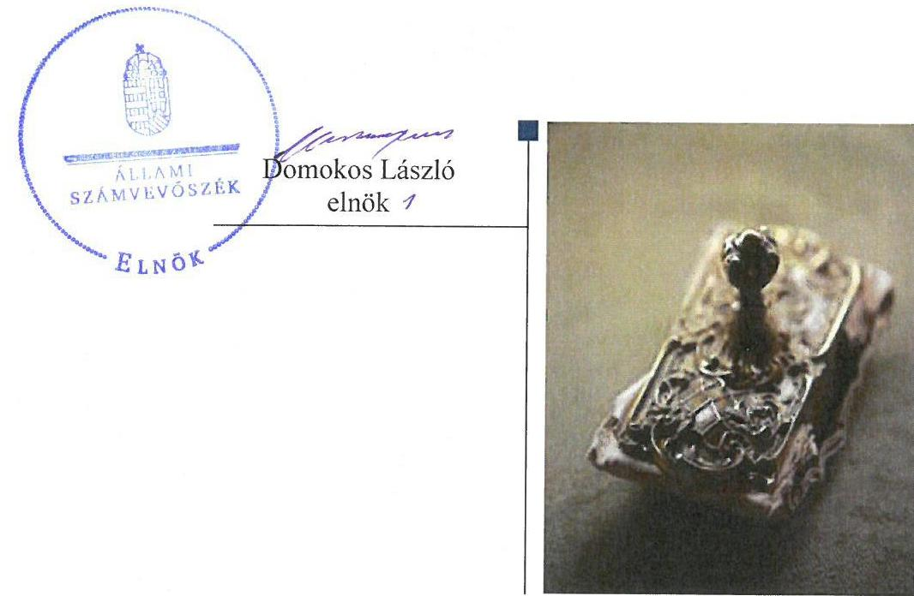
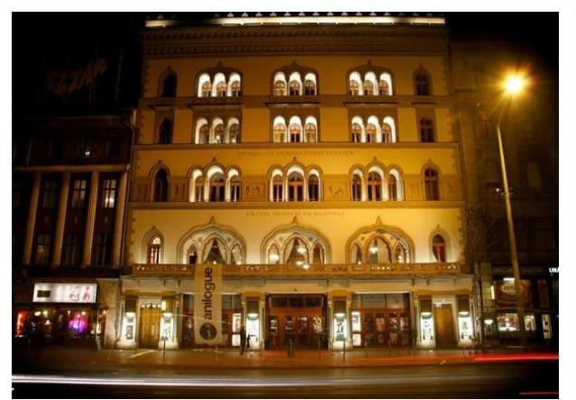
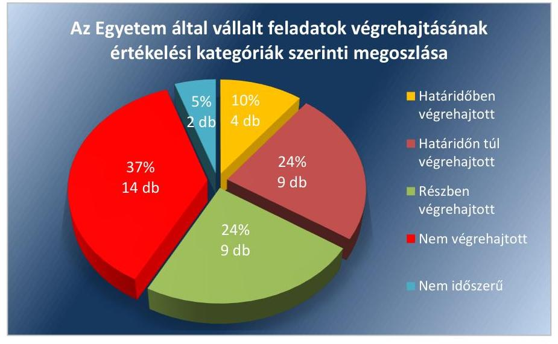
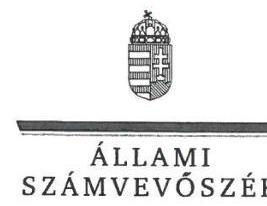
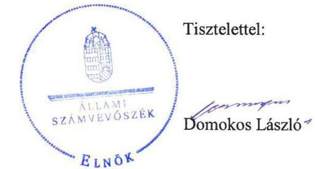
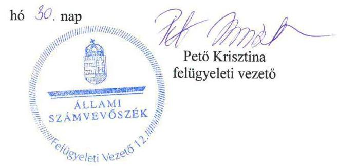

# Jelentés 

## Utóellenőrzések

Az állami felsőoktatási intézmények gazdálkodásának, működésének ellenőrzéséről készült jelentések utóellenőrzése - Színház- és Filmművészeti Egyetem
2018.

---

# Jelenetés 

## Utóellenőrzések

Az állami felsőoktatási intézmények gazdálkodásának, működésének ellenőrzéséről készült jelentések utóellenőrzése - Színház- és Filmművészeti Egyetem
2018. 02. hó 13. nap

---

# AZ ELLENŐRZÉST FELÜGYELTE: 

PETŐ KRISZTINA felügyeleti vezető

## AZ ELLENŐRZÉST VEZETTE ÉS A VÉGREHAJTÁSÁÉRT FELELŐS:

FÜLÖP IBOLYA ellenőrzésvezető

## A PROGRAM ÖSSZEÁLLÍTÁSÁÉRT FELELŐS:

JANIK JÓZSEF LÁSZLÓ osztályvezető

## A TÉMÁHOZ KAPCSOLÓDÓ KORÁBBI SZÁMVEVŐSZÉKI JELENTÉS:

- címe: Jelentés a Színház- és Filmművészeti Egyetem ellenőrzéséről - Az állami felsőoktatási intézmények gazdálkodásának, működésének ellenőrzése
- sorszáma: 15043

IKTATÓSZÁM: V-1342-102/2016.
TÉMASZÁM: 2096
ELLENŐRZÉS-AZONOSÍTÓ SZÁM: V075536

---

# TARTALOMJEGYZÉK 

■ ÖSSZEGZÉS ..... 5
■ AZ ELLENŐRZÉS CÉLJA ..... 6
■ AZ ELLENŐRZÉS TERÜLETE ..... 7
■ AZ ELLENŐRZÉS HÁTTERE, INDOKOLTSÁGA ..... 8
■ A JELENTÉS LÉNYEGES KÉRDÉSKÖREI ..... 9
■ ELLENŐRZÉS HATÓKÖRE ÉS MÓDSZEREI ..... 10
■ MEGÁLLAPÍTÁSOK ..... 12
■ MELLÉKLETEK ..... 19
I. sz. melléklet: Az ÁSZ 15043. számú jelentéséhez kapcsolódó Egyetem intézkedési terv végrehajtása ..... 19
II. sz. melléklet: Az ÁSZ 15043. számú jelentéséhez kapcsolódó EMMI intézkedési terv végrehajtása ..... 27
■ FÜGGELÉK: ÉSZREVÉTELEK ..... 29
■ RÖVIDÍTÉSEK JEGYZÉKE ..... 45

---

.

---

# ÖSSZEGZÉS 

A Színház- és Filmművészeti Egyetem kancellárja az intézkedési tervben vállalt feladatok jelentős részét részben hajtotta végre vagy nem hajtotta végre. A kancellár által kialakított irányítási rendszer továbbra sem támogatta a szabályos, átlátható és elszámoltatható közpénzfelhasználást. Az Emberi Erőforrások Minisztériuma - mint fenntartói jogkör gyakorlója - az intézkedési tervében foglalt két feladatából egyet nem hajtott végre.

## Az ellenőrzés társadalmi indokoltsága

Az Állami Számvevőszék stratégiájában célul tűzte ki a számvevőszéki munka hasznosulásának javítását. Ezzel összhangban ellenőrzi, hogy az ellenőrzött szervezetek megvalósították-e a korábbi ellenőrzései által feltárt hibák, hiányosságok és szabálytalanságok megszüntetése céljából elkészített intézkedési terveikben foglaltakat. A rendszeres utóellenőrzések hozzájárulnak a szükséges intézkedések tényleges végrehajtásához, ezáltal a közpénzügyek rendezettségének javulásához.

## Főbb megállapítások, következtetések

A Színház- és Filmművészeti Egyetem kancellárja az intézkedési tervben meghatározott harmincnyolc feladatból négy feladatot határidőben, kilencet határidőn túl, kilencet részben hajtott végre. A kancellár tizennégy feladat végrehajtásáról nem gondoskodott. További kettő feladat végrehajtása pedig nem volt időszerű. A kancellár által kialakított irányítási rendszer továbbra sem támogatta a szabályos, átlátható és elszámoltatható közpénzfelhasználást.

A kancellár nem gondoskodott a jogszabályi előírással összhangban valamennyi szabályzat elkészítéséről, valamint a meglévő szabályzatok aktualizálásáról, ezzel nem teremtette meg az Egyetem múködésének alapvető feltételeit. A kancellár belső szabályzatban nem rendezte az Egyetem múködéséhez kapcsolódó, pénzügyi kihatással bíró, jogszabályban nem szabályozott kérdéseit.

A kancellár nem mérte fel és nem állapította meg az Egyetem tevékenységével és gazdálkodásával kapcsolatos kockázatokat, valamint nem határozta meg az egyes kockázatokkal kapcsolatos intézkedéseket és azok teljesítése folyamatos nyomon követése módját.

A kancellár nem gondoskodott a gazdálkodási jogkörök szabályszerű gyakorlásáról, így nem intézkedett a szabályos kifizetéseket biztosító kontrollok múködéséről. A kancellár nem gondoskodott a 2015. évi beszámoló alátámasztására leltár összeállításáról.

A kancellár az Egyetem honlapján nem tette közzé a jogszabályban előírt kötelezően közzéteendő adatokat.
A kancellár munkáltatói jogkörében munkajogi felelősséggel kapcsolatos körülmények kivizsgálására irányuló eljárást nem indított a gazdálkodási jogkörök gyakorlása szabályozottságában feltárt hiányosságok, valamint az elő-irányzat-módosításokkal kapcsolatosan feltárt szabálytalanságok miatt.

Az EMMI az intézkedési tervében meghatározott két feladatából egyet határidőben teljesített, egyet pedig nem hajtott végre. Az EMMI Belső Ellenőrzési Főosztálya nem végezte el az Egyetem gazdálkodásának, múködésének törvényességi és hatékonysági ellenőrzését.

---

# AZ ELLENŐRZÉS CÉLJA 

Az ellenőrzés célja annak értékelése, hogy a számvevőszéki jelentésben ${ }^{1}$ foglalt javaslatot megalapozó megállapításokkal összhangban készített intézkedési tervben meghatározott feladatokat az ellenőrzött szervezet vég-rehajtotta-e.

---

# AZ ELLENŐRZÉS TERÜLETE 

## Színház- és Filmművészeti Egyetem

Az Egyetem² az 1865-ben királyi kézirattal létesített Színészeti Tanoda, majd az ebből 1893-ban alakult Országos Magyar Királyi Színművészeti Akadémia utóda. Az 1948. január 1-jétől Színház- és Filmművészeti Főiskolává alakult intézmény 2000. január 1-jétől kapott egyetemi címet. A felsőoktatási intézményben oktatási, tudományos kutatási szervezeti egységként Színházművészeti Intézet, Film és Média Intézet, Doktori Iskola, Elméleti és Művészetközvetítő Intézet működik, melyekben egy vagy több szakmailag összetartozó képzési területeken, képzési szinteken képeznek alkotóművészeket a színház, a film és a televízió számára.

A rektor ${ }^{3}$ 2014. március 4-e óta tölti be tisztségét, a kancellár ${ }^{4}$ 2015. január 1-je óta látja el feladatát.

Az Egyetem 2015. évi költségvetési beszámolója szerint 665,7 millió Ft költségvetési bevételt, 1066 millió Ft finanszírozási bevételt és 1323,5 millió Ft költségvetési kiadást teljesített. A 2015. december 31-ei könyvviteli mérleg szerint az Egyetem eszközei 1080,0 millió Ft-ot tettek ki.

Az Egyetem gazdálkodásának és múködésének ellenőrzését az ÁSZ ${ }^{5}$ 2009-2013 időszakra végezte el, az erről szóló 15043 számú számvevőszéki jelentést 2015. március 19-én tette közzé. Az ellenőrzés célja annak megállapítása volt, hogy szabályos volt-e az Egyetem pénzügyi és vagyongazdálkodása, biztosított volt-e a vagyonnal való felelős gazdálkodás követelményeinek érvényesülése, jogszabályi előírásoknak megfelelően működött-e a belső kontrollrendszer, az irányító szerv tevékenysége a jogszabályi előírásoknak megfelelt-e.

Az ellenőrzött időszakban és jelenleg is az Egyetem fenntartói jogkörének gyakorlója az Emberi Erőforrások Minisztériuma.

Az utóellenőrzés - a 2015. február 24-től 2017. március 21-ig végrehajtott feladatokat figyelembe véve - a számvevőszéki jelentésben a rektor és a miniszter részére megfogalmazott javaslatokat megalapozó megállapításokra készített, az ÁSZ részére megküldött intézkedési tervben foglalt feladatok megvalósításának ellenőrzésére, illetve értékelésére fókuszált.

---

# AZ ELLENŐRZÉS HÁTTERE, INDOKOLTSÁGA 

Az ÁSZ tv. ${ }^{6}$ 33. § (1) bekezdése értelmében a számvevőszéki jelentések javaslatot megalapozó megállapításaihoz kapcsolódóan az ellenőrzött szervezet vezetője intézkedési tervet köteles összeállítani, és az ÁSZ részére megküldeni. Az intézkedési tervben foglaltak megvalósítását - az ÁSZ tv. 33. § (7) bekezdésében foglaltak alapján - az ÁSZ utóellenőrzés keretében ellenőrizheti. Az intézkedések megvalósulásának értékelése során az ÁSZ figyelembe veszi az ellenőrzött szervezetek működési feltételeiben, valamint a jogszabályi előírásokban bekövetkezett változásokat.

Az intézkedési tervekben foglalt feladatok hiányos, illetve késedelmes végrehajtása, valamint megvalósításának elmaradása azt mutatja, hogy az ellenőrzések során feltárt hibák, hiányosságok és szabálytalanságok megszüntetése nem kapott kellő hangsúlyt. Ez a szabályszerű működés és a felelős vezetői magatartás vonatkozásában kockázatot hordoz. E kockázatok feltárásával az ÁSZ utóellenőrzési rendszere fokozza a fegyelmet, és igazolja, hogy a közpénzzel való szabályos gazdálkodás felelőssége elől nem lehet kitérni.

## AZ UTÓELLENŐRZÉS VÁRHATÓ HASZNOSULÁSA

Az utóellenőrzés négy szinten hasznosulhat:
$\longrightarrow$ A társadalom szintjén az utóellenőrzés jelzi, hogy a számvevőszéki ellenőrzés megállapításainak van következménye: a hiányosságok megszüntetésére az ellenőrzött szervezet által meghatározott intézkedések végrehajtását is számon kéri az ÁSZ.
$\longrightarrow$ Az ellenőrzött terület szintjén az utóellenőrzés tájékoztatást nyújt a terület döntéshozóinak a hiányosságok kiküszöbölésének jó gyakorlatairól, ezzel lehetőséget biztosítva arra, hogy az ÁSZ ellenőrzési megállapításai, javaslatai a terület nem ellenőrzött szervezeteinek a működése során is hasznosuljanak.
$\longrightarrow$ Az ellenőrzött szervezet szintjén az utóellenőrzés feltárja, hogy a szervezet az intézkedések végrehajtásával hasznosította-e a korábbi ellenőrzési jelentésben a hiányosságok megszüntetése, illetve a kockázatok kezelése érdekében megfogalmazott javaslatokat.
$\longrightarrow$ Az ÁSZ szintjén az utóellenőrzés visszacsatolást ad az ellenőrzési jelentések hasznosulásáról, az intézkedések elmaradása vagy részleges megvalósulása a további ellenőrzésekhez kockázati jelzésként szolgál.

---

# A JELENTÉS LÉNYEGES KÉRDÉSKÖREI 

1. Az ellenőrzött szervezetek az intézkedési terveikben foglaltakat az elöirt határidőben végrehajtották-e?

---

# ELLENŐRZÉS HATÓKÖRE ÉS MÓDSZEREI 

## Az ellenőrzés típusa

Megfelelőségi ellenőrzés.

## Az ellenőrzött időszak

Az utóellenőrzés alapját képező számvevőszéki jelentés közzétételének napjától (2015. március 19.) az ellenőrzésről szóló kiértesítő levél keltének napjáig (2017. március 21.) tartó időszak.

## Az ellenőrzés tárgya

A számvevőszéki jelentésben foglalt javaslatot megalapozó megállapításokkal összhangban - az Egyetem és az EMMI ${ }^{7}$ által - készített intézkedési tervekben foglaltak végrehajtásának ellenőrzése.

Az ellenőrzés kiterjed minden olyan körülményre és adatra, amely az ÁSZ jogszabályban meghatározott feladatainak teljesítéséhez, valamint a program végrehajtása folyamán felmerült újabb összefüggések feltárásához szükséges.

## Az ellenőrzött szervezet

Színház- és Filmművészeti Egyetem, Emberi Erőforrások Minisztériuma

## Az ellenőrzés jogalapja

Az ÁSZ tv. 1. § (3) bekezdése szerint az ÁSZ általános hatáskörrel végzi a közpénzekkel és az állami és önkormányzati vagyonnal való felelős gazdálkodás ellenőrzését.

Az ÁSZ tv. 33. § (7) bekezdése alapján az ÁSZ tv. 33. § (1)-(2) bekezdése szerinti intézkedési tervben foglaltak megvalósítását az ÁSZ utóellenőrzés keretében ellenőrizheti.

## Az ellenőrzés módszerei

Az ÁSZ az utóellenőrzést a nemzetközi standardokat irányadónak tekintve az ellenőrzési program ellenőrzési kérdései, az ellenőrzött időszakban hatályos jogszabályok, az ellenőrzés szakmai szabályok és módszertanok figyelembevételével, önállóan végezte.

---

Az ÁSZ az ellenőrzés ideje alatt az Egyetemmel és az EMMI-vel történő kapcsolattartást az ÁSZ SZMSZ ${ }^{8}$-ének vonatkozó előírásai alapján biztosította.

Az utóellenőrzés megállapításait elsősorban az ÁSZ rendelkezésére álló, valamint az ellenőrzött szervezetektől elektronikusan bekért dokumentumok alapozták meg.

Az ellenőrzési bizonyítékként felhasználható adatforrások közé tartoznak egyrészt a szakmai programban felsorolt adatforrások, másrészt minden - az ellenőrzés folyamán feltárt, az ellenőrzés szempontjából információt tartalmazó - dokumentum.

A pénzügyi- és vagyongazdálkodás szabályszerűségére vonatkozóan az intézkedési tervben foglalt feladatok végrehajtását a bérbeadások, a bérköltségek, a bevételek, a dologi kiadások, az ellátottak pénzbeli juttatásai, a külső személyi juttatások, a saját dolgozóval kötött megbízási szerződések, a valutapénztár és a saját hatáskörben végrehajtott előirányzat-módosítások állományaiból, egyszerű véletlenszerű mintavétellel kiválasztott 10-10 db tétel alapján értékelte az ÁSZ. A kiválasztott tételek esetében azt ellenőrizte az ÁSZ, hogy az Egyetem az intézkedési tervben meghatározott feladatok végrehajtása során biztosította-e a jogszabályok és a belső szabályzatok előírásainak megfelelő működtetést.

Az intézkedési tervekben előírt feladatokat, azok végrehajthatósága, illetve végrehajtása szempontjából az alábbiak szerint értékelte az ÁSZ:
$\longrightarrow$ „határidőben végrehajtott" a feladat, ha a teljesítés dokumentáltan, az intézkedési tervben előírt határidőben és tartalommal megtörtént;
$\longrightarrow$ „határidőn túl végrehajtott" a feladat, ha annak teljesítése az intézkedési tervben meghatározott módon, de az előírt határidőn túl történt meg;
$\longrightarrow$ „részben végrehajtott" a feladat, ha végrehajtása teljes körűen az intézkedési tervben előírt módon nem történt meg;
$\longrightarrow$ „nem végrehajtott" a feladat, ha a végrehajtás nem történt meg, vagy amennyiben a teljesítést nem dokumentálták;
$\longrightarrow$ „okafogyottá vált" a feladat, ha végrehajtására - meghatározott esemény bekövetkezése, továbbá külső körülmény, a működést érintő feltétel változása miatt - már nincs szükség, illetve lehetőség, és egyértelműen megállapítható, hogy az intézkedést szükségessé tevő körülmény a jövőben nem fordulhat elő;
$\longrightarrow$ „nem időszerű" az a feladat, amelynek ellenőrzési időszakon belüli végrehajtására azért nem került (kerülhetett) sor, mert az intézkedés alapjául szolgáló esemény nem következett be, de annak jövőbeni előfordulása lehetséges, a végrehajtása nem volt esedékes, vagy a végrehajtás határideje még nem járt le.
Az utóellenőrzés lefolytatásához az ellenőrzött szervezetek a tanúsítványok kitöltésével és elektronikus feltöltésével, valamint az ÁSZ által kért dokumentumok elektronikus megküldésével szolgáltattak adatokat, amelyek valódiságát és teljes körűségét az ellenőrzött szervezet vezetője által tett teljességi és hitelességi nyilatkozat igazolta. Az így rendelkezésre bocsátott adatok, információk kontrollja az ellenőrzés keretében történt.

---

# MEGÁLLAPÍTÁSOK 

## 1. Az ellenőrzött szervezetek az intézkedési terveikben foglaltakat az előírt határidőben végrehajtották-e?

Összegző megállapítás

A kancellár nem gondoskodott a belső kontrollrendszer, a pénzügyi- és vagyongazdálkodás területén feltárt hiányosságok, szabálytalanságok megszüntetéséről, tekintettel arra, hogy az intézkedési tervben vállalt harmincnyolc feladatból tizennégy feladatot nem hajtott végre, további kilenc feladatot csak részben hajtott végre. Az EMMI az intézkedési tervében meghatározott két feladatából egyet határidőben teljesített, egyet pedig nem hajtott végre.

Az ÁSZ a számvevőszéki jelentésében a rektor részére 25 db , a miniszter részére 2 db javaslatot fogalmazott meg. A hiányosságok, szabálytalanságok megszüntetésére az Egyetem által elkészített és az ÁSZ által tudomásul vett intézkedési terv 25 db , az alpontokkal együtt összesen 38 db feladatot, az EMMI intézkedési terve 2 db feladatot határozott meg.

Az intézkedési tervekben meghatározott feladatokat, határidőket, felelősöket és a feladatok végrehajtását az I. és a II. sz. melléklet mutatja be.

Az Egyetem intézkedési tervében szereplő feladatok végrehajtásának értékelési kategóriák szerinti megoszlását az 1. ábra szemlélteti.

1. ábra

Fonás: ÁSZ

---

# HATÁRIDŐBEN VÉGREHAJTOTT feladatok: 

- (25/3.) A rektor és a kancellár együtt szabályozta a gazdálkodási jogköröket a pénzügyi és vagyongazdálkodás területén meglévő hiányosságok megszüntetése érdekében, kiadták a kötelezettségvállalásról és az utalványozási jog gyakorlásáról szóló utasítást ${ }^{9}$.
- (25/11.a) A kancellár határidőben gondoskodott az Egyetem 2016. és 2017. évi költségvetéseinek a Szenátus ${ }^{10}$ elé terjesztéséről.
- (25/11.b) A kancellár az Egyetem 2014. évi és a 2015. évi költségvetési beszámolóját elfogadásra a Szenátus részére beterjesztette.
- (25/11.d) Az Igazgatási és Szervezési Hivatalának vezetője ${ }^{11}$ a 2016. májusi szenátusi ülésre beterjesztette a rektor 2015. évi vezetői tevékenységének értékelését.

## HATÁRIDŐN TÚL VÉGREHAJTOTT FELADATOK:

(25/8.) A gazdasági vezetơ ${ }^{12}$ a számlák kiállításáért felelős munkakört a vállalt azonnali hatállyal nem jelölte ki. 2016. március 30-án a kiadott Gazdasági Szolgáltatások Osztálya Úgyrendjében került rögzítésre, hogy a vevőszámlák kiállításának felelőse a pénztáros. A vizsgált időszakban a pénztáros a számlaadási kötelezettségnek eleget tett.
(25/9.) A gazdasági vezető a díjak és költségtérítések megállapításához önköltségszámítást az intézkedési tervben meghatározott határidőn túl, 2015. októberben készített.
(25/10.) A rektor a kollégiumi térítési díjak összegéről a megállapodást a HÖK ${ }^{13}$ képviselőjével az intézkedési tervben rögzített határidőn túl kötötte meg.
(25/11.c) A rektor vezetői tevékenységének értékelésére vonatkozó eljárásrend az intézkedési tervben vállalt határidőn túl, az SZMSZ ${ }^{14}$ ben került meghatározásra.
(25/11.e) Az Igazgatási és Szervezési Hivatal ${ }^{15}$ vezetője az SZMSZ módosításokat a Szenátus általi elfogadást követően nem 15 napon belül küldte meg az EMMI-nek, mellyel megsértette az Nftv. 74. § (3) bekezdésében foglaltakat.
(25/17.) A 2016. évi vagyongazdálkodási tervet ${ }^{16}$ határidőn túl készítette el és terjesztette a Szenátus elé a kancellár.
(25/19.) A gazdasági vezető az Eszközök és források értékelési szabályzatának" és a Selejtezési szabályzatnak" a jogszabályi előírásoknak megfelelő módosításáról az intézkedési tervben vállalt határidőt követően intézkedett.
(25/23.a) A gazdasági vezető határidőn túl, a 2016. január 1-től hatályos Számviteli politikában ${ }^{19}$ rögzítette a számviteli bizonylatok megőrzésére vonatkozó szabályokat.
(25/24.) A kancellár a kedvezményezettet a támogatásból fennmaradó hátralék egyösszegű visszafizetésére határidőn túl szólította fel. Jogi lépésekre nem került sor.

---

# RÉSZBEN VÉGREHAJTOTT feladatok: 

- (25/1.a) A gazdasági vezető határidőben gondoskodott a Közbeszerzési szabályzat ${ }^{20}$, Gépjárművek használati szabályzata ${ }^{21}$, a Kötelezettségvállalási és utalványozási jog gyakorlásáról szóló szabályzat elkészítéséről, illetve aktualizálásáról.
Határidőn túl került sor a Beszerzési szabályzat ${ }^{22}$, a Kiküldetési szabályzat ${ }^{23}$, a Fegyelmi és Kártérítési Szabályzat ${ }^{24}$, a Gazdálkodási szolgáltatások ügyrendje ${ }^{25}$, a Számlarend ${ }^{26}$ és a Számviteli politika aktualizálására, az Eszközök és források értékelési szabályzat, a Selejtezési szabályzat módosítására.
Az Önköltségszámítási szabályzat, a Pénzkezelési szabályzat a jogszabályi változásokat követően, valamint a kancellár 2015. január 1-i kinevezésével összefüggésben nem kerültek aktualizálásra. Az Egyetemen végrehajtott szervezeti változások nem kerültek átvezetésre.
A Gazdálkodási szabályzaton a szervezeti változások és a belső szabályok változásai nem kerültek átvezetésre. A kötelezettségvállalási és utalványozási jog gyakorlásáról szóló 4/2015. (VII. 2.) számú utasítás, valamint a 2012. január 1-jétől hatályos Gazdálkodási szabályzat vonatkozó rendelkezései közötti összhangot nem teremtették meg.
Az eszközök és források leltárkészítési és leltározási szabályzatának módosítása határidőn túl történt meg és a módosítás nem terjedt ki minden korábbi hiányosság megszüntetésére.
Az Ávr. ${ }^{27}$ 13. § (2) bekezdés (d)-(h) pontjaiban foglaltaknak nem tett eleget az Egyetem, mert belső szabályzatban nem rendezte a működéséhez kapcsolódó, pénzügyi kihatással bíró, jogszabályban nem szabályozott kérdéseket.
- (25/1. c) A rektor és a kancellár a kontrolltevékenységek kialakításáról a vállalt határidő után gondoskodott a Kötelezettségvállalási és utalványozási jog gyakorlásáról utasítás kiadásával.
A gazdálkodási jogkörök esetében a kontrolltevékenységeket nem működtették.
- (25/1.d) A kancellár a vállalt határidőben intézkedett az Egyetem információs és kommunikációs rendszerének kialakításáról.
Az Info. tv. ${ }^{28}$ 37. § (1) bekezdésében foglaltakat az Egyetem azonban nem tartotta be, mert a honlapján nem tette közzé az Info. tv. 1. melléklet szerinti általános közzétételi listában meghatározott gazdálkodási adatokat.
- (25/1.e) A kancellár az operatív tevékenységektől független belső ellenőrzést határidőben kialakította és működtette. A kancellár nem intézkedett a szervezet tevékenységének, a célok megvalósításának nyomon követését biztosító monitoring rendszer kialakításáról. A szervezet céljait veszélyeztető kockázatok, a kulcskontrollok fókuszainak meghatározása és a belső kontrollrendszer értékeléséhez szükséges információk kiválasztása nem történt meg, mellyel a Bkr. 10. §-ában foglalt előírásokat nem tartotta be.
- (25/4.b) A kancellár a saját dolgozókkal kötött megbízási szerződések felülvizsgálatát határidőben elvégezte, a jogszabálysértő megbízási szerződéseket megszüntetette.

---

A saját dolgozókkal kötendő megbízási szerződések feltételeit belső szabályzatban nem rögzítette, mellyel a Bkr. 4. § a) pontjában foglaltak alapján nem biztosította, hogy az Egyetem valamennyi tevékenysége összhangban legyen a szabályszerűséggel, szabályozottsággal.
(25/7.) A valutában történő pénztári kifizetések könyvelési szabályainak rögzítése a Számviteli Politikában és a Számlarendben határidőn túl, 2016. márciusában történt meg.
A valutapénztár könyvviteli elszámolásait alátámasztó számviteli bizonylatokat nem őrizték meg, mellyel megsértették a Számv. tv. ${ }^{29}$ 169. § (2) bekezdésének előírását.
(20/15.) Az éves és évközi kincstári adatszolgáltatási kötelezettségre vonatkozó határidők betartásáért felelős gazdasági osztályvezető munkaköri kijelölése határidőn túl, 2016. március 30-án történt meg a Gazdasági Szolgáltatások Osztály Ügyrendjében. A gazdasági osztályvezető, a Gazdasági Szolgáltatások Osztály Ügyrendjében meghatározott kincstári adatszolgáltatási feladatát nem látta el.
(25/20.) A gazdasági vezető a 2015. évre vonatkozó ingatlan bérbeadási előkalkulációt a vállalt határidőig elkészítette, azonban az alkalmazandó bérleti díjakat belső szabályzatban nem rögzítette.
(25/25.) A gazdasági vezető határidőn túl, 2015. júliusában intézkedett a Kötelezettségvállalási szabályzatnak az átlátható szervezetre vonatkozó nyilatkozat-bekérés eljárásrendjével való kiegészítéséről. A vagyon bérbeadással történő hasznosítása során a mintatételek 30 \%-ában nem kérte be a szerződő féltől az Nvtv. ${ }^{30}$ 3. § (2) bekezdésében előírt átlátható szervezetre vonatkozó nyilatkozatot.

# NEM VÉGREHAJTOTT feladatok: 

(25/1.b) A kancellár nem alakította ki és múködtette az integrált kockázatkezelési rendszert a Bkr. 7. § (1) bekezdésében foglaltak ellenére. Nem mérte fel a költségvetési szerv tevékenységében rejlő és szervezeti célokkal összefüggő kockázatokat, nem határozta meg az egyes kockázatokkal kapcsolatban szükséges intézkedéseket, valamint azok teljesítésének folyamatos nyomon követésének módját, mellyel a Bkr. 7. § (2) bekezdésében előírtakat nem tartották be.
(25/2.) A kancellár az Nftv. 13/A. § (2) bekezdés e) pontja szerinti munkáltatói jogkörében a gazdálkodási jogkörök gyakorlása szabályozottságában feltárt hiányosságok miatt munkajogi felelősséggel kapcsolatos körülmények kivizsgálására irányuló eljárást nem indított.
(25/4.a) A saját dolgozóval kötött megbízási szerződéseknél az Ávr. 51. § (2) bekezdésében rögzített jogszabályt nem tartotta be a gazdasági vezető. Saját dolgozókkal kötött megbízási szerződésekben nem került kikötésre, hogy a díj kizárólag abban az esetben illeti meg az Egyetem állományába tartozó személyt, ha a szerződésben rögzített feladat mellett a munkakörébe tartozó feladatainak is maradéktalanul eleget tett.
(25/5.a) A gazdasági vezető a foglalkoztatott oktatóktól a besorolást alátámasztó iskolai végzettségeket, szakképzettségeket tanúsító hiányzó dokumentumokat nem kérte be annak ellenére, hogy az Nftv. 24. § (5) bekezdés előírása szerint a felsőoktatásban az alkalmazás

---

feltétele, hogy az alkalmazott rendelkezzen az előírt végzettséggel és szakképzettséggel.
25/5.b) A rektor és a kancellár nem alakította ki az Egyetem foglalkoztatottjainak munkaidő nyilvántartási szabályait. A mintatételek értékelésekor megállapításra került, hogy az oktatók a teljesítés igazolás alapdokumentumának minősülő jelenléti ívet nem vezettek. E miatt nem volt biztosított, hogy a Munka tv. 134. § (2) bekezdésének előírása alapján a munkáltató által vezetendő nyilvántartásból megállapítható legyen a ténylegesen teljesített rendes és rendkívüli munkaidő.
(25/6.) A külső személyi juttatások számfejtéshez szükséges dokumentumokat, adóelőleg nyilatkozatokat nem kérték be. A kifizetést megelőzően a magánszemélyeket az adóelőleg-nyilatkozat lehetőségéről és az adott vagy nem adott nyilatkozat következményeiről nem tájékoztatták, mellyel az Szja tv. 48. § (5) bekezdésében foglalt előírásokat nem tartották be.
(25/11.f) Az Igazgatási és Szervezési Hivatal vezetője a feladat végrehajtásáról nem gondoskodott akkor, amikor a költségtérítéses képzésben részt vevő hallgatók térítési díjának, a költségtérítés megállapításának és módosításának rendjét az SZMSZ-ben nem rögzítette. Az SZMSZ II. kötet Hallgatói Követelményrendszer szerinti hallgatói térítési és juttatási szabályozás az Nftv. 83. § (2) bekezdésében előírt térítési díj megállapításának rendjére nem terjedt ki.
(25/12.) A gazdasági vezető a Gazdasági Szolgáltatások Úgyrendjében nem rögzítette a saját hatáskörben végrehajtott előirányzat módosítás indokainak dokumentumokkal történő alátámasztását, a Kincstárhoz ${ }^{31}$, a fenntartóhoz való megküldés szabályait A saját hatáskörben történt előirányzat módosításokról, átcsoportosításokról az Ávr. 167. § (4) bekezdésében foglaltak ellenére az EMMI-t nem tájékoztatta.
(25/13.) A kötelezettségvállalási és utalványozási jog gyakorlásáról szóló utasítás szerint pénzügyi ellenjegyzői feladatokra a gazdasági vezető jogosult, aki a kötelezettségvállalás ellenjegyzésekor a rendelkezésre álló szabad előirányzat összegét nem vette figyelembe, amellyel az Áht. 37. § (1) bekezdésében foglaltaknak nem tett eleget.
(25/14.) A kancellár az előirányzat-módosításokkal kapcsolatosan feltárt szabálytalanságok miatt a Nftv. ${ }^{32}$ 13/A. § (2) bekezdés e) pontja szerinti munkáltatói jogkörében eljárva munkajogi felelősséggel kapcsolatos körülmények kivizsgálására irányuló eljárást nem indított.
(25/16.) A kancellár az éves költségvetés, valamint a módosítási dokumentumok fenntartónak történő megküldéséért felelős személyt nem jelölte ki. Az Nftv. 74. § (3) bekezdés rendelkezése ellenére a Szenátus döntését követő 15 napon belül nem került megküldésre az Egyetem 2016. és 2017. évi költségvetése az EMMI részére.
(25/18.) A gazdasági vezető az Áhsz. 22. § (1) bekezdése ellenére nem gondoskodott a 2015. évi beszámoló alátámasztására leltár összeállításáról.

---

- (25/23.b) A külső személyi juttatások és a valutapénztári kifizetések mintatételek ellenőrzése során megállapításra került, hogy a számviteli bizonylatokat nem őrizték meg az Számv.tv. 169. § (2) bekezdésében foglaltak ellenére.
- (25/23.c) Az intézkedési tervben rögzített feladat, a számviteli bizonylatok megőrzésének belső ellenőr által történő ellenőrzése nem történt meg.

# NEM IDŐSZERŰ feladatok: 

- (25/21.) Mivel a gazdasági vezető nem gondoskodott a vizsgált időszakban az éves beszámolók mérleggel történő alátámasztásáról, ezért leltárhiány és a felelős megállapítására sem kerülhetett sor.
- (25/22.) Az Egyetem az 1. sz. tanúsítványában rögzítette, hogy az ellenőrzött időszakban nem volt selejtezés.

A számvevőszéki ellenőrzés javaslatai alapján készült intézkedési terv végrehajtásáról az Egyetem a Bkr. 14. § (1) bekezdése szerinti nyilvántartást nem vezette.

## EMMI HATÁRIDŐBEN VÉGREHAJTOTT feladata:

- Az EMMI Belső Ellenőrzési Főosztálya az intézkedési tervben előírt határidőben a Színház- és Filmművészeti Egyetem belső kontrollrendszere kialakításával, a pénzügyi- és vagyongazdálkodással összefüggésben feltárt szabálytalanságok, illetve a leltározás elmulasztása miatt a munkajogi felelősség kivizsgálása érdekében intézkedett. Megállapította, hogy az ellenőrzött időszakot követően került kinevezésre az Egyetem jelenlegi rektora, ezért a munkajogi felelősség vizsgálata okafogyottá vált. Erről a 37395/2015/EII. iktatószámú ügyiratában tájékoztatta az EMMI közigazgatási államtitkárát.

## NEM VÉGREHAJTOTT feladat:

- Az EMMI Belső Ellenőrzési Főosztálya az Egyetem gazdálkodását és múködését törvényességi és hatékonysági szempontból nem ellenőrizte, ezzel nem tett eleget az Nftv. 73. § (3) bekezdés da) pontjában foglaltaknak.
Az EMMI az ÁSZ javaslatai alapján készült intézkedési terv végrehajtásáról a nyilvántartást nem a Bkr. szerint előírt részletezettséggel vezette, mivel a Bkr. 47. § (2) bekezdése ellenére a végre nem hajtott intézkedés okát nem rögzítette.

---

.

---

# MELLÉKLETEK

I. SZ. MELLÉKLET: AZ ÁSZ 15043. SZÁMÚ JELENTÉSÉHEZ KAPCSOLÓDÓ EGYETEM INTÉZKEDÉSI TERV VÉGREHAJTÁSA

|  SZSZÁM | Intézkedési tervben rögzített feladat | Az intézkedési tervben meghatározott határidő | A feladatok elvégzésének felelőse | A feladat végrehajtása  |
| --- | --- | --- | --- | --- |
|   | 1. | 2. | 3. | 4.  |
|  Határidőben végrehajtott feladatok |  |  |  |   |
|  25/3. | A rektor, ill. a rektor és a kancellár együttesen szabályozta a gazdálkodási jogköröket (6/2014. számú rektori utasítás, 2014.09.04. SZFE/3123/2014/61; 9/2014. számú rektori utasítás, 2014.10.06. SZFE 3538/2014/61; 11/2014. számú rektori utasítás, 2014.10.30. SZFE/4006/2014/61; 15/2014. számú rektori utasítás, 2014.11.17. SZFE/4341/2014/61; 19/2014. számú rektori utasítás, 2014.12.18. SZFE/4836; 2/2015. számú rektori és kancellári utasítás, 2015.02.24. SZFE/838/2015/61) | folyamatos | rektor, kancellár gazdasági vezető | A rektor és a kancellár együtt szabályozta a gazdálkodási jogköröket, a pénzügyi és vagyongazdálkodás területén. Kiadták a 4/2015. (VII. 2.) számú rektori és kancellári utasítást a kötelezettségvállalásról és az utalványozási jog gyakorlásáról, majd a 6/2015. (IX. 23.) számú rektori és kancellári utasítást a kötelezettségvállalási és utalványozási jog gyakorlásáról szóló 4/2015. (VII.2). számú rektori és kancellári utasítás módosításáról.  |
|  25/11.a) | Az éves költségvetés előterjesztések elkészítése és Szenátus elé terjesztése a hatályos jogszabályi előírásoknak megfelelően. | Az Áht. és végrehajtási rendelete szerint meghatározott határidő | kancellár | A kancellár határidőben gondoskodott az Nftv. 12. § (3) bekezdés ed) pontjában foglaltak betartása érdekében az Egyetem 2016. és 2017. évi költségvetéseinek Szenátus elé terjesztéséről. Az Áht. és az Ávr. rendelkezéseinek megfelelően határidőben elkészített 2016. és 2017. évi költségvetéseket a Szenátus a 10/2016. (III. 08.), és a 2/2017. (II. 7.) számú határozatokkal elfogadta.  |
|  25/11.b) | Az éves beszámolók előterjesztések elkészítése és Szenátus elé terjesztése a hatályos jogszabályi előírásoknak megfelelően. | Az Áht. és végrehajtási rendelete szerint meghatározott határidő | kancellár | A kancellár az Egyetem ellenőrzéséről készített számvevőszéki jelentés közzétételét követően intézkedett a 2014. évi költségvetési beszámolónak a Szenátus 2015. június 1-jei ülésére történő beterjesztéséről. A kancellár a 2015. évi költségvetési beszámolót a 2016. március 8-i szenátusi ülésre beterjesztette.  |
|  25/11.d) | A rektori vezetői tevékenységének értékeléséről szóló előterjesztés elkészítése és Szenátus elé terjesztése a Szenátus ügyrendjében meghatározott előírásoknak megfelelően. | Évente egyszer, a Szenátus Ügyrendjében meghatározott dátumig | Igazgatási és Szervezési Hivatal vezetője | Az Igazgatási és Szervezési Hivatal vezetője 2016. május 9-i szenátusi ülésre beterjesztette a rektor 2015. évi vezetői tevékenységének értékelését.  |

## Határidőn túl végrehajtott feladatok

---

|  25/8. | A számlák kialakításáért felelős munkaköri kijelölése, a számlaadási kötelezettség teljesítése. | Azonnal | gazdasági vezető | A számlák kiállításáért felelős munkakört a gazdasági vezető a vállalt azonnali hatállyal nem jelölte ki. 2016. március 30-án a kancellár és a gazdasági vezető által SZFE/1324/2016/60 szám alatt kiadott Gazdasági Szolgáltatások Osztálya Ügyrendjében került rögzítésre, hogy a vevőszámlák kiállításának felelőse a pénztáros. A bérbeadás mintatételeinek ellenőrzése során megállapítható volt, hogy a vizsgált időszakban a pénztáros a számlaadási kötelezettségnek eleget tett.  |
| --- | --- | --- | --- | --- |
|  25/9. | Önköltségszámitás készítése a díjak és költségtérítések megállapításához. | 2015. augusztus 31. | gazdasági vezető | A gazdasági vezető a vállalt 2015. augusztus 31-i határidőig nem készített önköltségszámitást a díjak és költségtérítések megállapításához, mert a Szenátus a 2015. október 19-i ülésén tárgyalta az Egyetem 2016/2017. tanévben indított képzéseinek önköltség meghatározásáról szóló, gazdasági vezető által készített előterjesztést.  |
|  25/10. | Megállapodás kötése a Rektor és a HÖK között a kollégiumi férőhelyek komfortfokozatba történő besorolásáról. | 2015. szeptember 30. | rektor, kancellár | A rektor az intézkedési tervben rögzített 2015. szeptember 30-i határidőt követően 2015. december 14-én kötötte meg a HÖK képviselőjével a kollégiumi térítési díjak összegéről a megállapodást.  |
|  25/11.c) | A Szenátus Ügyrendjében a rektor vezetői tevékenységének értékelésére vonatkozó eljárásrend meghatározása. | 2015. szeptember 30 | Igazgatási és Szervezési Hivatal vezetője | A rektor vezetői tevékenységének értékelésére vonatkozó eljárásrend az intézkedési tervben vállalt határidőn túl, a 2016. október 17. napjától hatályos SZMSZ-ben került meghatározásra.  |
|  25/11.e) | Az SZMSZ módosításainak megküldése a fenntartónak. | SZMSZ módosítás Szenátus által elfogadását követő 15 napon belül | Igazgatási és Szervezési Hivatal vezetője | Az Igazgatási és Szervezési Hivatal vezetője az SZMSZ módosításokat a Szenátus általi elfogadást követően nem 15 napon belül küldte meg az EMMI-nek. A 2016. október 18-án elfogadott módosítást 2016. november 11-én, a 2016. december 13-án elfogadott módosítást 2017. január 6-án küldte el a fenntartónak.  |
|  25/17. | A vagyongazdálkodási terv elkészítése és a Szenátus elé terjesztése. | 2015. június 30. | kancellár | A vagyongazdálkodási tervet határidőn túl, 2016. augusztus 11-én készítette el a kancellár, és a Szenátus 2017. február 17-i ülésére terjesztette be.  |
|  25/19. | A belső szabályzatok kiegészítése a vonatkozó jogszabályi előírásoknak megfelelően; Az eszközök és források értékelési szabályzatának kiegészítése a jogszabályon alapuló jogerős követelések (adósok) értékelésének elveivel, az áruszállításból és szolgáltatásnyújtásból származó követelések vevő általi elismerése igazolásának, a követelés értéke meghatározásának módjával, a kis összegű követelések év végi meghatározásának elveivel, dokumentáltságának szabályaival, a hatályos jogszabályi előírásoknak megfelelően. A selejtezési szabályzatban a vagyon térítésmentes átadásának meghatározása. | 2015. július 31. | gazdasági vezető | A gazdasági vezető a 2015. július 31-i határidőn túl, 2016. március 30-án intézkedett az Eszközök és források értékelési szabályzatának és a Selejtezési szabályzatnak jogszabályi előírásoknak megfelelő módosításáról. Az Eszközök és források értékelési szabályzatot kiegészítették a jogszabályon alapuló jogerős követelések (adósok) értékelésének elveivel, az áruszállításból és szolgáltatásnyújtásból származó követelések vevő általi elismerése igazolásának, a követelés értéke meghatározásának módjával, a kisösszegű követelések év végi meghatározásának elveivel, dokumentáltságának szabályaival. A Selejtezési szabályzatot módosították a nemzeti vagyon térítésmentes átadásaira vonatkozó rendelkezésekkel.  |

---

|  25/23.a) | A számviteli bizonylatok megőrzésére vonatkozó szabályok rögzítése a Számviteli politikában, belső eljárásrendekben. | 2015. június 30. | gazdasági vezető | A gazdasági vezető a 2015. június 30-i határidőt követően 2016. január 1-től hatályos Számviteli politikában rögzítette a számviteli bizonylatok megőrzésére vonatkozó szabályokat.  |
| --- | --- | --- | --- | --- |
|  25/24. | A kedvezményezett felszólítása a támogatásból fennmaradó hátralék egyösszegű visszafizetésére, szükség esetén jogi lépések kezdeményezése. | 2015. május 31. | kancellár | A kancellár az intézkedési tervben vállalt 2015. május 31-i határidőn túl, 2015. november 30-án kelt levelében szólította fel a kedvezményezettet a támogatásból fennmaradó hátralék egyösszegű visszafizetésére. Jogi lépésekre nem került sor.  |
|  Részben végrehajtott feladatok |  |  |  |   |
|  25/1.a) | A kontrollkörnyezet kialakítása a hatályos jogszabályokban foglalt előírásoknak megfelelően, a belső szabályzatok teljes körű elkészítésével és folyamatos aktualizálásával. | 2015. szeptember 30. | gazdasági vezető | Határidőben végrehajtott részfeladat:
A gazdasági vezető az Egyetem kontrollkörnyezetének hatályos jogszabályok szerinti kialakítását, belső szabályzatok aktualizálását részben hajtotta végre. Határidőben gondoskodott a Közbeszerzési szabályzat, Gépjárművek használati szabályzata, a Kötelezettségvállalási és utalványozási jog gyakorlásáról szóló szabályzat elkészítéséről, illetve aktualizálásáról.
Határidőn túl végrehajtott részfeladat:
Határidőn túl került sor a Beszerzési szabályzat, a Kiküldetési szabályzat, a Fegyelmi és Kártérítési Szabályzat, a Gazdálkodási szolgáltatások ügyrendje, a Számlarend és a Számviteli politika, az Eszközök és források értékelési szabályzata, valamint a Selejtezési szabályzat módosítására.
Nem végrehajtott részfeladat:
Az Önköltségszámítási szabályzat, a Pénzkezelési szabályzat a jogszabályi változásokat követően, valamint a kancellár 2015. január 1-i kinevezésével nem kerültek aktualizálásra. Az Egyetemen végrehajtott szervezeti változások nem kerültek átvezetésre. Az Önköltségszámítási szabályzat már nem létező gazdasági főigazgatói, oktatási főigazgatói munkakörökre, valamint Tanulmányi Osztályra, Gazdasági Osztályra ró ki feladatokat. A Pénzkezelési szabályzat a gazdasági főigazgatói munkakörre vonatkozóan tartalmaz feladatot. A Pénzkezelési szabályzat és az Önköltségszámítási szabályzat a 249/2000 (XII.24.) számú Kormányrendeletre, az Önköltségszámítási szabályzat a felsőoktatásról szóló 2005. évi CXXXIX. törvényre tartalmaz hivatkozást.
A Gazdálkodási szabályzaton a szervezeti változások és a belső szabályok változásai nem kerültek átvezetésre. A kötelezettségvállalási és utalványozási jog gyakorlásáról szóló 4/2015. (VII. 2.) számú utasítás, valamint a 2012. január 1-jétől hatályos Gazdálkodási szabályzat vonatkozó rendelkezései közötti összhangot nem teremtették meg. Az eszközök és források leltárkészítési és leltározási szabályzatának módosítása határidőn túl, 2016. március 30-án történt meg és a módosítás nem terjedt ki minden korábbi hiányosság megszüntetésére.  |

---

|   |  |  |  | Az Ávr. 13. § (2) bekezdés (d)-(h) pontjaiban foglaltaknak nem tett eleget az Egyetem, amikor az anyag- és eszközgazdálkodás számviteli politikában nem szabályozott kérdéseit, a reprezentációs kiadások felosztását, azok teljesítésének és elszámolásának szabályait, gépjárművek igénybevételének és használatának rendjét, a vezetékes- és mobiltelefonok használatát, a közérdekű adatok megismerésére irányuló kérelmek intézésének, továbbá a kötelezően közzéteendő adatok nyilvánosságra hozatalának rendjét nem szabályozta.  |
| --- | --- | --- | --- | --- |
|  25/1.c) | A kontrolltevékenységek kialakítása és müködtetése, a gazdálkodási jogkörök gyakorlása a hatályos jogszabályoknak megfelelően. | 2015. június 30. | rektor, kancellár | Határidőn túl végrehajtott részfeladat:
A rektor és a kancellár a kontrolltevékenységek kialakításáról a vállalt határidő után 2 nappal gondoskodott, amikor kiadta a Kötelezettségvállalási és utalványozási jog gyakorlásáról szóló 4/2015 (VII. 2.) számú együttes utasítást.
Nem végrehajtott részfeladat:
A gazdálkodási jogkörök esetében a kontrolltevékenységeket nem működtették. A mintatételek a bevételek, a dologi kiadások, az ellátottak pénzbeli juttatásai, valutapénztár adatállományokból kerültek kiválasztásra és 10-10 db elemű minta alapján kerültek értékelésre. A mintatételek értékelése során megállapításra került, hogy a teljesítésigazolás a mintatételek 70\%-ában nem történt meg, amely az Ávr. 57. § (3) bekezdésében foglaltakba ütközik. A mintatételek 70\%-ánál érvényesítésre nem került sor, amely az Ávr. 58. § (3) bekezdésében előírtaknak nem felel meg. A kiadások utalványozása a vizsgált mintatételek 70\%-ában nem történt meg, mellyel megsértették az Ávr. 59. § (3) bekezdés g) pontjában foglaltakat.
A bevételi előirányzatok javára a mintatételek 50 \%-ánál utalványozás nélkül számoltak el bevételt ellenőrzött mintatételek esetében, amely az Áht. 38. § (1) bekezdés előírásainak nem felel meg. .  |
|  25/1.d) | Az információs és kommunikációs rendszer kialakítása és működtetése, olyan rendszerek kialakítása és működtetése, amelyek biztosítják, hogy a megfelelő információk a megfelelő időben eljussanak az illetékes szervezethez, szervezeti egységhez, illetve személyhez, a beszámolási szintek, határidők és módok meghatározása, a kötelezően közzéteendő adatok nyilvánosságra hozatala rendjének meghatározása, a jogszabályban előírt adatok teljes körű közzététele. | 2015. szeptember 30. | kancellár | Határidőben végrehajtott részfeladat:
A rektor a vállalt határidőben intézkedett az Egyetem információs és kommunikációs rendszerének kialakításáról. Az 6/2015. (V. 27.) számú szenátusi határozattal elfogadott SZMSZ tartalmazza az információs és kommunikációs rendszer működtetésére vonatkozó eljárásrendet.
Nem végrehajtott részfeladat:
Az Info. tv. 37. § (1) bekezdésében foglaltakat az Egyetem nem tartotta be, mert a honlapján nem tette közzé a 2015., 2016., 2017. évi költségvetéseit, a 2015., 2016. évi költségvetési beszámolóit, az Egyetem foglalkoztatottjainak létszámára és személyi juttatásaira, a vezetők és vezető tisztségviselők illetményeinek, munkabéreinek és rendszeres juttatásainak, valamint költségtérítéseinek az összesített adatait.
Az Egyetem nem készített adatvédelmi és adatbiztonsági szabályzatot az Info. tv. 24. § (3) bekezdésében foglaltak ellenére.  |

---

|  25/1.e) | A monitoring rendszer kialakítása és múköd tése, az Egyetem tevékenységének, a célok megvalósításának nyomon követését biztosító rendszer kialakítása. | 2015. szeptember 30. | kancellár | Határidőben végrehajtott részfeladat:
A kancellár az operatív tevékenységektől független belső ellenőrzést kialakította és múköd tette.
Nem végrehajtott részfeladat:
A kancellár nem intézkedett a szervezet tevékenységének, a célok megvalósításának nyomon követését biztosító monitoring rendszer kialakításáról. A szervezet céljait veszélyeztető kockázatok, a kulcskontrollok fókuszainak meghatározása és a belső kontrollrendszer értékeléséhez szükséges információk kiválasztása nem történt meg, mellyel a 8kr. 10. §-ában foglalt előírásokat nem tartotta be.  |
| --- | --- | --- | --- | --- |
|  25/4.b) | A saját dolgozókkal kötendő szerződések feltételeinek rögzítése belső szabályzatban, a saját dolgozókkal kötött megbízási szerződések felülvizsgálata, a jogszabálysértő megbízási szerződések megszüntetése." | 2015. július 31. | kancellár | Határidőben végrehajtott részfeladat:
A kancellár a saját dolgozókkal kötött megbízási szerződések felülvizsgálatát határidőben elvégezte, a jogszabálysértő megbízási szerződéseket megszüntette.
Nem végrehajtott részfeladat:
A saját dolgozókkal kötendő megbízási szerződések feltételeit a kancellár belső szabályzatban nem rögzítette, mellyel a 8kr. 4. § a) pontjában foglaltak alapján nem biztosította, hogy az Egyetem valamennyi tevékenysége összhangban legyen a szabályszerűséggel, szabályozottsággal.  |
|  25/7. | A valutában történő pénztári kifizetések könyvelési szabályainak rögzítése az Egyetem Számviteli Politikájában, Számlarendjében, a szabályok betartása | 2015. május 30. | gazdasági vezető | Határidőn túl végrehajtott részfeladat
A valutában történő pénztári kifizetések könyvelési szabályainak rögzítése a 2015. május 30-i határidőn túl, a 2016. március 30-án kiadott Számviteli Politikában és a Számlarendben történt meg.
Nem végrehajtott részfeladat:
A valutapénztár könyvviteli elszámolásait alátámasztó számviteli bizonylatokat nem őrizték meg, mellyel megsértették a Számv. tv. 169. § (2) bekezdésének előírását. A valutában történt kifizetések mintatételeinek ellenőrzése során megállapításra került, hogy a főkönyvi könyvelést és az alkalmazott árfolyamot igazoló dokumentumokat egy esetet kivéve- nem őrizték meg.  |
|  25/15. | Az éves és évközi kincstári adatszolgáltatási kötelezettségre vonatkozó határidők betartásáért felelős személy munkaköri kijelölése, a határidők betartása. | 2015. május 31. folyamatos | gazdasági vezető | Határidőn túl végrehajtott részfeladat:
Az éves és évközi kincstári adatszolgáltatási kötelezettségre vonatkozó határidők betartásáért felelős személy munkaköri kijelölése a 2015. május 31-i határidőt követően 2016. március 30-án történt meg a kancellár és a gazdasági vezető által az SZFE/1324/2016/60 szám alatt kiadott Gazdasági Szolgáltatások Osztály Ügyrendjében.
Nem végrehajtott részfeladat:
A gazdasági osztályvezető az éves és évközi kincstári adatszolgáltatási kötelezettségre vonatkozó határidők betartásáról nem gondoskodott, az SZFE/1324/2016/60 szám  |

---

|  25/20. | Kalkuláció készítése a helyiségek bérbeadásakor felmerülő közvetlen és közvetett költségekre a hatályos jogszabályi előírásoknak és az önköltség számítási szabályzatban foglaltaknak megfelelően, az alkalmazandó bérleti díjak rögzítése belső szabályzatban." | 2015. június 30. | gazdasági vezető | alatt kiadott Gazdasági Szolgáltatások Osztály Ügyrendjében meghatározott feladatát nem látta el.  |
| --- | --- | --- | --- | --- |
|  25/25. | A kötelezettségvállalási szabályzat kiegészítése a jogszabályban előírt nyilatkozat bekérésére vonatkozó eljárásrenddel, a nyilatkozatok szükség szerinti bekérése a szerződéskötéshez. | 2015. május 31. | gazdasági vezető | Határidőben végrehajtott részfeladat:
A gazdasági vezető a 2015. évre vonatkozó ingatlan bérbeadási előkalkulációt az Ávr. előírásai és az Egyetem 2012. január 1-jétől hatályos Önköltségszámítási szabályzata alapján a vállalt - 2015. június 30-i - határidőig elkészítette.
Nem végrehajtott részfeladat:
A gazdasági vezető az alkalmazandó bérleti díjakat belső szabályzatban nem rögzítette az intézkedési tervben vállaltak ellenére.  |
|  25/1.b. | A kockázatkezelési rendszer kialakítása és müködtetése a jogszabályoknak megfelelően, az Egyetem tevékenységével és gazdálkodásával kapcsolatos kockázatok felmérése és megállapítása, valamint az egyes kockázatokkal kapcsolatos intézkedések és azok teljesítése folyamatos nyomonkövetése módjának meghatározása. | 2015. augusztus 30. | kancellár | A kancellár nem működtette az integrált kockázatkezelési rendszert a Bkr. 7. § (1) bekezdésében foglaltak ellenére. Nem mérte fel a költségvetési szerv tevékenységében rejlő és szervezeti célokkal összefüggő kockázatokat, nem határozta meg az egyes kockázatokkal kapcsolatban szükséges intézkedéseket, valamint azok teljesítésének folyamatos nyomon követésének módját a Bkr. 7. § (2) bekezdésében előírtak ellenére.  |
|  25/2. | Eljárás indítása a munkajogi felelősséggel kapcsolatos körülmények kivizsgálásra a gazdálkodási jogkörök gyakorlása szabályozottságában feltárt hiányosságok miatt, a szükséges intézkedések megtétele. | 2015. június 30. | kancellár | A kancellár az Nftv. 13/A. § (2) bekezdés e) pontja szerinti munkáltatói jogkörében a gazdálkodási jogkörök gyakorlása szabályozottságában feltárt hiányosságok miatt munkajogi felelősséggel kapcsolatos körülmények kivizsgálására irányuló eljárást nem indított.  |
|  25/4.a) | A saját dolgozókkal kötött megbízási szerződéseknél a jogszabályban foglaltak betartása. | 2015. május 15. | gazdasági vezető | A saját dolgozóval kötött megbízási szerződések esetében a 368/2011. (XII. 31.) Korm. rendelet 51. § (2) bekezdésében rögzített szabályt nem tartotta be a gazdasági vezető, mert a saját dolgozókkal kötött megbízási szerződésben nem kötötte ki, hogy a díj kizárólag abban az esetben illeti meg az Egyetem állományába tartozó személyt, ha a  |

---

|   |  |  |  | szerződésben rögzített feladat mellett a munkakörébe tartozó feladatainak is maradéktalanul eleget tett.  |
| --- | --- | --- | --- | --- |
|  25/5.a) | A foglalkoztatott oktatóktól a hiányzó dokumentumok bekérése. | 2015. május 31. | gazdasági vezető | A gazdasági vezető a foglalkoztatott oktatóktól a besorolást alátámasztó iskolai végzettségeket, szakképzettségeket tanúsító hiányzó dokumentumokat nem kérte be annak ellenére, hogy az Nftv. 24. § (5) bekezdés előírása szerint a felsőoktatásban az alkalmazás feltétele, hogy az alkalmazott rendelkezzen az előírt végzettséggel és szakképzettséggel.  |
|  25/5.b) | A munkaidő nyilvántartások szabályozása, kialakítása, folyamatos vezetése. | 2015. augusztus 31. | rektor, kancellár | A rektor és a kancellár nem alakította ki az Egyetem foglalkoztatottjainak munkaidő nyilvántartási szabályait. A mintatételek értékelésekor megállapításra került, hogy az oktatók a teljesítés igazolás alapdokumentumának minősülő jelenléti ívet nem vezettek. E miatt nem volt biztosított, hogy a munkáltató Munka tv. 134. § (2) bekezdésének előírása alapján a munkáltató által vezetendő nyilvántartásból megállapítható legyen a ténylegesen teljesített rendes és rendkívüli munkaidő.  |
|  25/6. | A külső személyi juttatások esetében a számfejtéshez szükséges dokumentumok, adóelőleg nyilatkozatok bekérése. | 2015. május 15. | gazdasági vezető | A külső személyi juttatások számfejtéshez szükséges dokumentumokat, adóelőleg nyilatkozatokat nem kérték be. A kifizetést megelőzően a magánszemélyeket az adóelő-leg-nyilatkozat lehetőségéről és az adott vagy nem adott nyilatkozat következményeiről nem tájékoztatták, mellyel az Szja tv. 48. § (5) bekezdésében foglalt előírásokat nem tartották be.  |
|  25/11.f) | Az SZMSZ-ben a költségtérítéses képzésben részt vevő hallgatók tekintetében a térítési díj és a költségtérítés megállapításainak és módosítása rendjének rögzítése. | 2015. szeptember 30. | Igazgatási és Szervezési Hivatal vezetője | Az Igazgatási és Szervezési Hivatal vezetője az intézkedési tervben vállalt feladat végrehajtásáról nem gondoskodott akkor, amikor a költségtérítéses képzésben részt vevő hallgatók térítési díjának, a költségtérítés megállapításának és módosításának rendjét vállalásának megfelelően az SZMSZ-ben nem rögzítette. Az SZMSZ II. kötet Hallgatói Követelményrendszer szerinti hallgatói térítési és juttatási szabályozás az Nftv. 83. § (2) bekezdésében előírt térítési díj megállapításának rendjére nem terjedt ki. .  |
|  25/12. | A saját hatáskörben történt előirányzat-módosítás szabályainak (az indok dokumentumokkal való alátámasztása, Kincstárhoz, fenntartóhoz való megküldés) rögzítése a gazdasági szervezet ügyrendjében, a szabályok betartása | 2015. május 31. | gazdasági vezető | A gazdasági vezető a Gazdasági Szolgáltatások Ügyrendjében nem rögzítette a saját hatáskörben végrehajtott előirányzat módosítás indokainak dokumentumokkal történő alátámasztását, a Kincstárhoz, a fenntartóhoz való megküldés szabályait. A saját hatáskörben végrehajtott előirányzat módosításokat dokumentumokkal nem támasztotta alá. Az EMMI-nek nem küldte meg az előirányzat módosítás dokumentumait, amellyel az Ávr. 167. § (4) bekezdésében foglalt szabályokat nem tartotta be.  |
|  25/13. | A kötelezettségvállalások ellenjegyzésekor a rendelkezésre álló szabad előirányzat összegének figyelembe vétele. | folyamatos |  | A 4/2015. (VII.2.) számú a kötelezettségvállalási és utalványozási jog gyakorlásáról szóló rektori és kancellári utasítás szerint pénzügyi ellenjegyzői feladatokra a gazdasági vezető jogosult, aki a kötelezettségvállalás ellenjegyzésekor a rendelkezésre álló szabad előirányzat összegét nem vette figyelembe, amellyel az Áht. 37. § (1) bekezdésében foglaltaknak nem tett eleget.  |

---

|  25/14. | Eljárás megindítása a munkajogi felelősséggel kapcsolatos körülmények kivizsgálására az előirányzat-módosításokkal kapcsolatosan feltárt szabálytalanságok miatt, a szükséges intézkedések megtétele. | 2015. június 30. | kancellár | A kancellár az előirányzat-módosításokkal kapcsolatosan feltárt szabálytalanságok miatt az Nftv. 13/A. § (2) bekezdés e) pontja szerinti munkáltatói jogkörében eljárva munkajogi felelősséggel kapcsolatos körülmények kivizsgálására irányuló eljárást nem indított.  |
| --- | --- | --- | --- | --- |
|  25/16. | Nftv-ben meghatározottak szerint az éves költségvetés, valamint a módosítási dokumentumok fenntartónak történő megküldéséért felelős személy munkaköri kijelölése, a dokumentumok megküldése. | 2015. május 31. | kancellár | A kancellár az éves költségvetés, valamint a módosítási dokumentumok fenntartónak történő megküldéséért felelős személy nem jelölte ki. Az Nftv. 74. § (3) bekezdés rendelkezéseinek ellenére a Szenátus döntését követő 15 napon belül nem küldte meg az Egyetem a 2016. és 2017. évi költségvetését az EMMI részére.  |
|  25/18. | A 2015. évi beszámoló alátámasztására 2015.12.31. évi fordulónappal olyan leltár öszszeállítása, amely tételesen, ellenőrizhető módon tartalmazza a mérlegben szereplő eszközöket és forrásokat." | 2016. január 31. | gazdasági vezető | A gazdasági vezető az Áhsz. 22. § (1) bekezdése ellenére nem gondoskodott a 2015. évi beszámoló alátámasztására, 2015. december 31-i fordulónappal, olyan leltár öszszeállításáról, amely tételesen, ellenőrizhető módon tartalmazza volna a mérlegben szereplő eszközöket és forrásokat.  |
|  25/23.b) | A számviteli bizonylatok megőrzése a mindenkor hatályos jogszabályok szerint | folyamatos | adott folyamatot végző munkatárs | A mintatételek ellenőrzése során megállapításra került, hogy a számviteli bizonylatokat nem őrizték meg az Számv. tv. 169. § (2) bekezdésében foglaltak ellenére. Az intézkedési terv 6. pontban szereplő feladat ellenőrzéséhez bekért külső személyi juttatások mintatételei számfejtési dokumentumokat nem tartalmaztak. A valutában történt kifizetések esetében a főkönyvi könyvelést és az alkalmazott árfolyamot igazoló dokumentumokat - egy esetet kivéve- nem őrizték meg.  |
|  25/23.c) | A számviteli bizonylatok megőrzésének ellenőrzése." | folyamatos | Belső ellenőr | Az intézkedési tervben rögzített feladatot, a számviteli bizonylatok megőrzésének belső ellenőr általi ellenőrzése nem történt meg.  |
|  25/21. | A leltárhiány okainak kivizsgálása, a felelős megnevezése és az előírt jogkövetkezmény alkalmazása. | leltárhiány esetén azonnal | gazdasági vezető | Mivel a gazdasági vezető nem gondoskodott a vizsgált időszakban az éves beszámolók mérleggel történő alátámasztásáról, ezért leltárhiány és a felelős megállapítására sem kerülhetett sor.  |
|  25/22. | A selejtezések előkészítése, végrehajtása és dokumentálása során az intézményi szabályozás betartása. | selejtezés esetén azonnal | gazdasági vezető | Az Egyetem az 1. sz. tanúsítványában rögzítette, hogy az ellenőrzött időszakban nem volt selejtezés.  |

---

# II. SZ. MELLÉKLET: AZ ÁSZ 15043. SZÁMÚ JELENTÉSÉHEZ KAPCSOLÓDÓ EMMI INTÉZKEDÉSI TERV VÉGREHAJTÁSA

|  Sorszám | Intézkedési tervben rögzített feladat | Az intézkedési tervben meghatározott határidő | A feladatok elvégzésének felelőse | A feladat végrehajtása  |
| --- | --- | --- | --- | --- |
|   | 1. | 2. | 3. | 4.  |
|  Határidőben végrehajtott feladat |  |  |  |   |
|  1. | A belső kontrollrendszer kialakításával és müködtetésével, a pénzügyi és vagyongazdálkodással összefüggésben feltárt szabálytalanságokhoz kapcsolódóan, illetve a leltározás elmulasztása tekintetében a munkajogi felelősség kivizsgálása, a szükséges intézkedések kezdeményezése. | 2015. december 31. | Belső Ellenőrzési Főosztály | Az EMMI Belső Ellenőrzési Főosztálya az intézkedési tervben előírt határidőben a Színház- és Filmművészeti Egyetem belső kontrollrendszere kialakításával, a pénzügyi- és vagyongazdálkodással összefüggésben feltárt szabálytalanságok, illetve a leltározás elmulasztása miatt a munkajogi felelősség kivizsgálása érdekében intézkedett. Megállapította, hogy az ellenőrzött időszakot követően került kinevezésre az Egyetem jelenlegi rektora, ezért a munkajogi felelősség vizsgálata okafogyottá vált. Erről a 37395/2015/EII. iktatószámú ügyiratában tájékoztatta az EMMI közigazgatási államtitkárát.  |
|  Nem végrehajtott feladat |  |  |  |   |
|  2. | A Színház és Filmművészeti Egyetem gazdálkodásának, müködésének törvényességi és hatékonysági ellenőrzése. | 2015. december 31. | Belső Ellenőrzési Főosztály | Az EMMI Belső Ellenőrzési Főosztálya az Egyetem gazdálkodását és müködését törvényességi és hatékonysági szempontból nem ellenőrizte, ezzel nem tett eleget az Nftv. 73. § (3) bekezdés da) pontjában foglaltaknak.  |

---

.

---

# FÜGGELÉK: ÉSZREVÉTELEK 

A jelentéstervezetet a Számvevőszék 15 napos észrevételezésre megküldte az ellenőrzött szervezetek vezetőinek az ÁSZ tv. 29. §* (1) bekezdése előírásának megfelelően.
A Színház- és Filmművészeti Egyetem kancellárja a jelentéstervezet megállapításaira írásban észrevételt tett. A rektor és az Emberi Erőforrások Minisztériuma részéről észrevétel nem érkezett.
A függelék tartalmazza a kancellár észrevételeit, illetve az el nem fogadott észrevételek elutasításának indoklását.

[^0]
[^0]:    * 29. § (1) Az Állami Számvevőszék az ellenőrzési megállapításait megküldi az ellenőrzött szervezet vezetőjének vagy az általa megbízott személynek, és annak, akinek személyes felelősségét állapította meg.
    (2) Az ellenőrzött szervezet vezetője és a felelősként megjelölt személy az ellenőrzés megállapításaira tizenöt napon belül írásban észrevételt tehet.
    (3) Az Állami Számvevőszék az észrevételre a beérkezésétől számított harminc napon belül írásban válaszol. A figyelembe nem vett észrevételeket köteles a jelentésben feltüntetni, és megindokolni, hogy azokat miért nem fogadta el.

---

A Színház- és Filmművészeti Egyetem kancellárja által tett észrevételek:
A SZFE/991/6/2017/16. iktatószámú levél 3-4. bekezdéseiben foglaltak
A hivatkozott bekezdések szerint a kancellár az elektronikus közigazgatás és ügyintézés felé haladva sajnálatosnak tartja, hogy nem kapta meg a jelentéstervezetet elektronikus/szerkeszthető formában is. Ennek megfelelően a szkennelt jelentéstervezet képeit illesztették be, és ehhez fűzték észrevételeiket, javaslataikat.

A SZFE/991/6/2017/16. iktatószámú levél 5. bekezdésében foglaltak
A hivatkozott bekezdésben a kancellár jelezte, hogy minimális volt a kommunikáció a két szervezet között, nem vált világossá a beküldendő dokumentumok köre, és a 2017 tavaszán befejeződött adatbekérés utáni fél évben lett volna alkalom pontosító kérdéseket feltenni az Egyetem számára.

1. A jelentéstervezet 14. oldalán az első részben végrehajtott (25/1.a) feladathoz fűzött észrevétel

Az észrevétel meghivatkozza a nemzeti felsőoktatásról szóló törvény 2015 januárjában hatályos állapotát annak 117/A. § (1)-(2) bekezdései tekintetében, amelyből az következik, hogy a szabályzatokban a gazdasági főigazgatóra vonatkozó feladat- és hatáskörök a kancellárhoz kerültek, így a szabályzatokban a főigazgató megnevezés önmagában nem okoz kétértelműséget, bizonytalanságot vagy szabályozatlanságot.
2. A jelentéstervezet 15. oldalán az első nem végrehajtott (25/1.b) feladathoz fűzött észrevétel

Az észrevétel szerint a 2015-ben elkészített és az ÁSZ-nak is átadott stratégiai dokumentum, az intézményfejlesztési terv kötelező része volt az intézmény céljaival kapcsolatos kockázatok felmérése. A minisztérium kérésének megfelelően évente a teljes anyag revíziója és újra beküldése történt/történik. Ennek megfelelően - a kancellár álláspontja szerint - általánosságban nem jelenthető ki, hogy az Egyetem nem határozta meg a szervezeti célokkal összefüggő kockázatokat. Az észrevétel továbbá azt is tartalmazta, hogy az ÁSZ nem kérte be az Egyetem stratégiai dokumentumait.
3. A jelentéstervezet 14. oldalán a második részben végrehajtott (25/1.c) feladathoz fűzött észrevétel

Az észrevétel szerint a dologi kiadások mintatételei esetében a teljesítésigazolás, az érvényesítés és utalványozás minden esetben megtörtént. Az ellátottak pénzbeli juttatásai mintatételeiben 9 esetben Bursa, köztársasági, doktori, egyéb teljesítmény és szociális alapú ösztöndíjak szerepelnek, további 4 esetben európai uniós szervezet által finanszírozott, és szerződés alapján a hallgatókat megillető ösztöndíjak, amely juttatások kifizetéséhez - az Egyetem álláspontja szerint - nem szükséges teljesítésigazolás az államháztartásról szóló törvény végrehajtásáról szóló 368/2011. (XII. 31.) Korm. rendelet (továbbiakban: Ávr.) 57. § (3) bekezdése alapján, mert ezek az Áht. 36. § (2) bekezdése szerinti más fizetési kötelezettségnek minősülnek. Két mintatétel esetében a teljesítésigazolás rendelkezésre állt. Az érvényesítés és utalványozás 4 esetben külön utalványrendeleten történt, az érvényesítő és utalványozó minden esetben aláírta a kifizetés dokumentumait.
4. A jelentéstervezet 14. oldalán a harmadik részben végrehajtott (25/1.d) feladathoz fűzött észrevétel

Az észrevételben a kancellár jelezte, hogy az internet archive tanúbizonysága szerint 2015. szeptember 15-én az Egyetem honlapján a költségvetés például hozzáférhető volt. A honlap szolgáltatójában váltás történt, és az ellenőrzés a migrációs folyamat közepén zajlott, így az adott pillanatban lehetséges, hogy nem volt minden dokumentum elérhető. A kancellár álláspontja szerint mindebből általánosságban nem vonható le olyan következtetés, hogy az Egyetem ne tette volna közzé a kérdéses dokumentumokat.

---

5. A jelentéstervezet 14. oldalán a negyedik részben végrehajtott (25/1.e) feladathoz fűzött észrevétel

Az észrevétel szerint a kancellár kialakította a szervezet méretéhez igazodó monitoring rendszert azzal, hogy heti rendszerességgel a hozzá tartozó szervezeti egységek vezetőivel értekezletet tart, amelyen a feladatok nyomon követése megtörténik. A kancellár álláspontja szerint a mintegy 20 fős, a jelen ellenőrzésben érintett személyi állomány nagysága, valamint az elektronikus levelekkel többszörösen dokumentált feladatkövetés nem indokolja az elkülönült többszintű formalizált írásbeli beszámoltatást.
6. A jelentéstervezet 15. oldalán a második nem végrehajtott (25/2.) feladathoz fűzött észrevétel

Az észrevétel szerint az Egyetem többször jelezte, hogy az ellenőrzött időszakban vezetői pozícióban foglalkoztatott személyek munkaviszonya megszűnt, így munkajogi felelősségük vizsgálatára eljárás nem indítható. A kancellár jelezte, hogy az ellenőrzés ugyan nem kérdezett rá, de a vizsgált időszakban a gazdasági területen dolgozó munkatársak munkaviszonya is megszűnt, így amennyiben érintettek lehettek volna bármilyen hiányossággal kapcsolatban, felelősségük vizsgálatára sem lett volna lehetőség.
7. A jelentéstervezet 15. oldalán a negyedik nem végrehajtott (25/5.a) feladathoz fűzött észrevétel

Az észrevétel szerint az Egyetem bekérte az oktatóktól az iskolai végzettségüket, szakképzettségüket tanúsító dokumentumokat. Ezt követően a kancellár az észrevételben tájékoztatást ad arról, hogy az ellenőrzött mintatételek esetében mely végzettséget igazoló dokumentumok kerültek benyújtásra az Egyetemhez, és melyek nem.
8. A jelentéstervezet 16. oldalán, az ötödik nem végrehajtott (25/5.b) feladathoz fűzött észrevétel

Az észrevétel szerint az Egyetem munkavállalóinak többsége nem oktató, és a nem oktatók számára a jelenléti ív vezetése az ellenőrzés pillanatában is kötelező volt, ezért a kancellár nem ért egyet azon megállapítással, hogy a munkaidő-nyilvántartás szabályai ne lettek volna kialakítva.
9. A jelentéstervezet 16. oldalán, a hatodik nem végrehajtott (25/6.) feladathoz fűzött észrevétel

Az észrevétel szerint az Egyetem minden esetben bekérte a külső személyi juttatások számfejtéséhez az adóelőlegnyilatkozatokat, a kiválasztott mintatételekhez minden esetben beküldésre került a bérfelhasználási összesítő dokumentum, amelyekhez adóelőleg-nyilatkozat közvetlenül nem kapcsolódik, ezzel kapcsolatban utólagos iratbekérés nem történt.
10. A jelentéstervezet 15. oldalán, a hatodik részben végrehajtott (25/7.) feladathoz fűzött észrevétel

Az észrevétel szerint az Egyetem a valutapénztár könyvviteli elszámolásait alátámasztó dokumentumokat minden esetben megőrizte; a könyvelés integrált rendszerben történik, a pénztár modulból az adatok átkerülnek a főkönyvi könyvelésbe; a főkönyvi könyvelést a pénztári utalványrendelet nevű dokumentum igazolja, amely minden tétel esetében beküldésre került. Az észrevétel tartalmazza, hogyan történik a valutapénztári kifizetések könyvelése, és a valutapénztárba történő befizetés, továbbá azt, hogy a bankszámlakivonatokat minden esetben megőrizték, de a mintatételekhez nem kerültek beküldésre.
11. A jelentéstervezet 16. oldalán, a nyolcadik nem végrehajtott (25/12.) feladathoz fűzött észrevétel

Az észrevétel szerint a saját hatáskörben végrehajtott előirányzat módosítások kincstárhoz, fenntartóhoz való megküldésének szabályait az Egyetem a GSZO ügyrendjében, a főkönyvelő feladatai között rögzítette, az előirányzat-módosítást megalapozó döntések dokumentumai beküldésre kerültek.

---

12. A jelentéstervezet 16. oldalán, a kilencedik nem végrehajtott (25/13.) feladathoz fűzött észrevétel

Az észrevétel szerint a gazdasági vezető a kötelezettségvállalás ellenjegyzésekor a rendelkezésre álló szabad előirányzat összegét figyelembe vette, és nincs indokolva a jelentésben az ezzel kapcsolatos megállapítás.
13. A jelentéstervezet 16. oldalán, a tizedik nem végrehajtott (25/14.) feladathoz fűzött észrevétel

Az észrevétel szerint az Egyetem többször jelezte, hogy az ellenőrzött időszakban vezetői pozícióban foglalkoztatott személyek munkaviszonya megszűnt, így munkajogi felelősségük vizsgálatára eljárás nem indítható. A kancellár jelezte, hogy az ellenőrzés ugyan nem kérdezett rá, de a vizsgált időszakban a gazdasági területen dolgozó munkatársak munkaviszonya is megszűnt, így amennyiben érintettek lehettek volna bármilyen hiányossággal kapcsolatban, felelősségük vizsgálatára sem lett volna lehetőség.
14. A jelentéstervezet 15. oldalán, a hetedik részben végrehajtott (20/15.) feladathoz fűzött észrevétel

Az észrevétel tartalmazza, hogy mit foglal magában az éves és évközi kincstári adatszolgáltatás, és hogy az éves költségvetési beszámolók, elemi költségvetések és időközi mérlegjelentések minden alkalommal határidőben megküldésre kerültek. Az ügyrend hatályba lépését és a feladatkijelölést követően az adatszolgáltatások teljesítésében nem történt késedelem.
15. A jelentéstervezet 16. oldalán, a 11. nem végrehajtott (25/16.) feladathoz fűzött észrevétel

Az észrevétel szerint az Egyetem valamennyi költségvetését megküldték az EMMI-nek. A költségvetés megküldésének felelőse a felsőoktatási törvény szerint a kancellár, így azért nem került sor ennek dokumentálására, mert magának nem delegálhat feladatot.
16. A jelentéstervezet 16. oldalán, a 12. nem végrehajtott (25/18.) feladathoz fűzött észrevétel

Az észrevétel szerint 2015. december 31-ei fordulónappal elkészült és benyújtásra került a 2015. évi beszámoló alátámasztására a mérlegben szereplő eszközöket és forrásokat tételesen, ellenőrizhető módon tartalmazó leltár.
17. A jelentéstervezet 17. oldalán, a 13. nem végrehajtott (25/23.b) feladathoz fűzött észrevétel

Az észrevétel szerint a számviteli bizonylatokat a jogszabályi előírásnak megfelelően megőrizték, a külső személyi juttatásokhoz szintén rendelkezésre állnak a számfejtési dokumentumok, de azokat az ellenőrzés - a kancellár álláspontja szerint - nem kérte be. A valutában történt kifizetések esetében a főkönyvi könyvelést és az alkalmazott árfolyamot igazoló dokumentumokat is megőrizték, de azok nem kerültek beküldésre.
18. A jelentéstervezet 17. oldalán, a 14. (utolsó) nem végrehajtott (25/23.c) feladathoz fűzött észrevétel

Az észrevétel szerint a belső ellenőr az ellenőrzései során a feladat jellegéből adódóan szúrópróbaszerűen ellenőrizte a számviteli bizonylatok megőrzését.

---

ELNÖK

# Dr. Vonderviszt Lajos úr 

kancellár
Színház- és Filmművészeti Egyetem

## Budapest

## Tisztelt Kancellár Úr!

Az Utóellenörzések - Az állami felsőoktatási intézmények gazdálkodásának, müködésének ellenörzéséről készült jelentések utóellenörzése - Színház- és Filmművészeti Egyetem címmel készített számvevőszéki jelentéstervezetre tett észrevételeit megkaptam.
Az Állami Számvevőszék észrevételekre vonatkozó álláspontjáról a felügyeleti vezető által készített részletes tájékoztatást csatoltan megküldőm.
Tájékoztatom Kancellár urat, hogy a számvevőszéki jelentésben - az Állami Számvevőszékről szóló 2011. évi LXVI. törvény 29. § (3) bekezdése alapján - a figyelembe nem vett észrevételeket szerepeltetjük az elutasítás indokának feltüntetésével.

Budapest, 2018. 01 hó 70 nap

Melléklet: Tájékoztatás az el nem fogadott észrevételekről

---

# Tájékoztatás az el nem fogadott észrevételekről 

Az Utóellenörzések - Az állami felsőoktatási intézmények gazdálkodásának, müködésének ellenörzéséről készült jelentések utóellenörzése - Színház- és Filmmüvészeti Egyetem címü jelentéstervezetre a SZFE/991/6/2017/16. iktatószámú levéllel megküldött észrevételeit áttekintettem. Az észrevételek kezeléséről az alábbi tájékoztatást adom.

## A SZFE/991/6/2017/16. iktatószámú levél 3-4. bekezdéseiben foglaltak kapcsán

A hivatkozott bekezdések szerint Kancellár úr az elektronikus közigazgatás és ügyintézés felé haladva sajnálatosnak tartja, hogy nem kapta meg a jelentéstervezetet elektronikus/szerkeszthető formában is. Ennek megfelelően a szkennelt jelentéstervezet képeit illesztették be, és ehhez füzték észrevételeiket, javaslataikat.

Ezúton köszönöm észrevételét. Tekintettel arra, hogy tájékoztatása a jelentéstervezet megállapításait nem érintik, ezért azokat nem módosítja.

## A SZFE/991/6/2017/16. iktatószámú levél 5. bekezdésében foglaltak kapcsán

A hivatkozott bekezdésben Kancellár úr jelezte, hogy minimális volt a kommunikáció a két szervezet között, nem vált világossá a beküldendő dokumentumok köre, és a 2017 tavaszán befejeződött adatbekérés utáni fél évben lett volna alkalom pontosító kérdéseket feltenni a Színház- és Filmmüvészeti Egyetem (továbbiakban: Egyetem) számára.

A V-1062-003/2016. ikt. számú ellenőrzési program meghatározza az ellenőrzés módszereit: az utóellenőrzés megállapításait elsősorban az Állami Számvevőszék (továbbiakban: ÁSZ) rendelkezésére álló, valamint az ellenőrzött szervezetektől elektronikusan bekért dokumentumok alapozták meg, amely helyszíni ellenőrzéssel is csak szükség esetén egészülhetett ki. A V-1342001/2016. ikt. számú adatbekérő levélben bekértünk minden olyan dokumentumot, amely az intézkedési tervben vállalt feladatok végrehajtását igazolják, amelyre tekintettel az ellenőrzött szervezetek széles autonómiával rendelkeztek az általuk vállalt feladatok általuk történt végrehajtásának bizonyítékául szolgáló dokumentumok meghatározása és megküldése során. A fentiekre tekintettel az ÁSZ nem ért egyet Kancellár úr azon álláspontjával, hogy nem kérte be a szükséges dokumentumokat. Továbbá 2017 tavaszán nemcsak az adatbekérés, hanem az ellenőrzött időszak is lezárult (2017. március 21.), amelyre tekintettel az ezt követő időszakban végrehajtott feladatokat az ÁSZ nem értékeli, hanem úgy tekinti, hogy az ellenőrzött időszakban nem hajtotta végre. Az ÁSZ a megállapításait dokumentált bizonyítékokra alapozva fogalmazza meg, és pontosító kérdésfeltevések helyett törvényi keretek között, az Állami Számvevőszékről szóló 2011. évi LXVI. törvény (továbbiakban: ÁSZ tv.) 29. § (1) bekezdése alapján megküldi a jelentéstervezetet az ellenőrzött szervezet vezetőjének, aki az ÁSZ tv. 29. § (2) bekezdése alapján

---

a megállapításokra észrevételt tehet. Továbbá az átláthatóság biztosítása érdekében - az ÁSZ tv. 29. § (3) bekezdésének megfelelően - a jelentéstervezetben a figyelembe nem vett észrevételeket szerepeltetjük az elutasítás indokának feltüntetésével. Tekintettel arra, hogy észrevétele a jelentéstervezet megállapításait nem érintik, ezért azokat nem módosítja.

Az észrevételek kezeléséről az alábbi tájékoztatást adom:

1. A jelentéstervezet 14. oldalán az első részben végrehajtott (25/1.a) feladathoz füzött észrevétele kapcsán

Az észrevétel meghivatkozza a nemzeti felsőoktatásról szóló törvény 2015 januárjában hatályos állapotát annak 117/A. § (1)-(2) bekezdései tekintetében, amelyből az következik, hogy a szabályzatokban a gazdasági föigazgatóra vonatkozó feladat- és hatáskörök a kancellárhoz kerültek, így a szabályzatokban a főigazgató megnevezés önmagában nem okoz kétértelműséget, bizonytalanságot vagy szabályozatlanságot.

A 2015. július 27 -én kelt intézkedési tervében az érintett feladatot az Egyetem a nemzeti felsőoktatásról szóló törvény 2015 januárjától hatályos rendelkezései ismeretében vállalta, amelyre tekintettel az észrevételt nem fogadjuk el, a jelentéstervezet módosítása nem indokolt.
2. A jelentéstervezet 15 . oldalán az első nem végrehajtott (25/1.b) feladathoz füzött észrevétele kapcsán

Az észrevétel szerint a 2015-ben elkészített és az ÁSZ-nak is átadott stratégiai dokumentum, az intézményfejlesztési terv kötelező része volt az intézmény céljaival kapcsolatos kockázatok felmérése. A minisztérium kérésének megfelelően évente a teljes anyag revíziója és újra beküldése történt/történik. Ennek megfelelően - Kancellár úr álláspontja szerint - általánosságban nem jelenthető ki, hogy az Egyetem nem határozta meg a szervezeti célokkal összefüggő kockázatokat. Az észrevétel továbbá azt is tartalmazta, hogy az ÁSZ nem kérte be az Egyetem stratégiai dokumentumait.

Tájékoztatom Kancellár urat, hogy a hivatkozott és az adatszolgáltatás keretében rendelkezésre bocsátott dokumentum egy projekt II-III. munkafázisának eredményét tartalmazó, aláírás nélküli dokumentum (tanulmány) volt, azonban arra vonatkozóan, hogy az Egyetem azt miként integrálta a szabályozási és müködési környezetébe, hiteles dokumentum nem került megküldésre az ÁSZ részére. Az utóellenőrzés célja az intézkedési tervben vállalt feladatok végrehajtásának ellenőrzése, és nem az Egyetem stratégiai dokumentumai elkészítésének ellenőrzése volt, amelynek megfelelően az adatbekérés is az intézkedési tervben foglaltak végrehajtását bizonyító dokumentumok bekérésére vonatkozott, és nem a stratégiai dokumentumokra. Amennyiben az Egyetem stratégiai dokumentumai egyben az intézkedési tervben foglalt feladatok végrehajtását igazoló dokumentumok is, annyiban a számvevőszéki adatbekérés is kiterjedt rájuk. A fentiekre tekintettel az észrevételt nem fogadjuk el, a jelentéstervezet módosítása nem indokolt.

---

3. A jelentéstervezet 14. oldalán a második részben végrehajtott (25/1.c) feladathoz füzött észrevétele kapcsán

Az észrevétel szerint a dologi kiadások mintatételei esetében a teljesítésigazolás, az érvényesítés és utalványozás minden esetben megtörtént. Az ellátottak pénzbeli juttatásai mintatételeiben 9 esetben Bursa, köztársasági, doktori, egyéb teljesítmény és szociális alapú ösztöndíjak szerepelnek, további 4 esetben európai uniós szervezet által finanszírozott, és szerződés alapján a hallgatókat megillető ösztöndíjak, amely juttatások kifizetéséhez - az Egyetem álláspontja szerint - nem szükséges teljesítésigazolás az államháztartásról szóló törvény végrehajtásáról szóló 368/2011. (XII. 31.) Korm. rendelet (továbbiakban: Ávr.) 57. § (3) bekezdése alapján, mert ezek az Áht. 36. § (2) bekezdése szerinti más fizetési kötelezettségnek minősülnek. Két mintatétel esetében a teljesítésigazolás rendelkezésre állt. Az érvényesítés és utalványozás 4 esetben külön utalványrendeleten történt, az érvényesítő és utalványozó minden esetben aláírta a kifizetés dokumentumait.

Tájékoztatom Kancellár urat, hogy az Ávr. 57. § (3) bekezdése alapján a teljesítésigazolás mellőzése annyiban helytálló, amennyiben az Ávr. 53. § (2) bekezdésének megfelelően az előzetes írásbeli kötelezettségvállalást nem igénylő kifizetések rendjét az Egyetem a belső szabályzatában rögzítette, és amely szabályzatában az ilyen kifizetésekre - az Ávr. 57. § (3) bekezdésének figyelembevételével - a teljesítésigazolás elvégzésének kötelezettségét nem írta elő. Az észrevétel sem vitatja, hogy voltak olyan tételek, amelyek esetében az egyes gazdálkodási jogköröket nem gyakorolták, annak ellenére, hogy az intézkedési tervben vállalt feladat a gazdálkodási jogkörök hatályos jogszabályoknak megfelelő gyakorlása volt. A fentiekre tekintettel az észrevételt nem fogadjuk el, a jelentéstervezet módosítása nem indokolt.
4. A jelentéstervezet 14. oldalán a harmadik részben végrehajtott (25/1.d) feladathoz füzött észrevétele kapcsán

Az észrevételben Kancellár úr jelezte, hogy az internet archive tanúbizonysága szerint 2015. szeptember 15-én az Egyetem honlapján a költségvetés például hozzáférhető volt. A honlap szolgáltatójában váltás történt, és az ellenőrzés a migrációs folyamat közepén zajlott, így az adott pillanatban lehetséges, hogy nem volt minden dokumentum elérhető. Kancellár úr álláspontja szerint mindebből általánosságban nem vonható le olyan következtetés, hogy az Egyetem ne tette volna közzé a kérdéses dokumentumokat.

Az információs önrendelkezési jogról és az információszabadságról szóló 2011. évi CXII. törvény (továbbiakban: Info tv.) egyik célja a közérdekủ és a közérdekből nyilvános adatok megismeréséhez való jog érvényesülésének előmozdítása, amely alól nem képez kivételt a honlap szolgáltatójában történő váltás. Ebből adódóan az Info tv. szerinti közzétételt a szolgáltatóváltás időtartamára is szükséges megszervezni. Továbbá Kancellár úr az észrevételében ,, a költségvetésen" túl nem jelölte meg, hogy mely dokumentumok közzétételéről gondoskodott, illetve melyekről nem. A fentiekre tekintettel az észrevételt nem fogadjuk el, a jelentéstervezet módosítása nem indokolt.

---

5. A jelentéstervezet 14. oldalán a negyedik részben végrehajtott (25/1.e) feladathoz füzött észrevétele kapcsán

Az észrevétel szerint a kancellár kialakította a szervezet méretéhez igazodó monitoring rendszert azzal, hogy heti rendszerességgel a hozzá tartozó szervezeti egységek vezetőivel értekezletet tart, amelyen a feladatok nyomon követése megtörténik. Kancellár úr álláspontja szerint a mintegy 20 fős, a jelen ellenőrzésben érintett személyi állomány nagysága, valamint az elektronikus levelekkel többszörösen dokumentált feladatkövetés nem indokolja az elkülönült többszintű formalizált írásbeli beszámoltatást.

A vezetői szintű heti értekezlet képezheti ugyan a monitoring rendszer részét, azonban önmagában nem alkot rendszert. A monitoring rendszernek továbbá nemcsak a feladatok nyomon követése (beszámoltatás) a célja, és nemcsak 20 före kell kiterjednie, hanem - ahogyan azt a költségvetési szervek belső kontrollrendszeréről és belső ellenőrzéséről szóló 370/2011. (XII. 31.) Korm. rendelet (továbbiakban: Bkr.) 10. §-a is rögzíti - a szervezet, vagyis az Egyetem egésze tevékenységének és céljainak a nyomon követését hivatott szolgálni. Ezzel összhangban áll, a nemzeti felsőoktatásról szóló 2011. évi CCIV. törvény (továbbiakban: Nftv.) 13/A. § (1) bekezdése, amely szerint a kancellár az egész felsőoktatási intézmény működtetését végzi, és nemcsak az irányítása alá tartozó néhány fő munkáját szervezi. Tájékoztatom továbbá Kancellár urat, hogy az ellenőrzés nem személyi állományra, hanem az ellenőrzött Egyetemre terjedt ki. A fentiekre tekintettel az észrevételt nem fogadjuk el, a jelentéstervezet módosítása nem indokolt.
6. A jelentéstervezet 15 . oldalán a második nem végrehajtott (25/2.) feladathoz füzött észrevétele kapcsán

Az észrevétel szerint az Egyetem többször jelezte, hogy az ellenőrzött időszakban vezetői pozícióban foglalkoztatott személyek munkaviszonya megszűnt, így munkajogi felelősségük vizsgálatára eljárás nem indítható. Kancellár úr jelezte, hogy az ellenőrzés ugyan nem kérdezett rá, de a vizsgált időszakban a gazdasági területen dolgozó munkatársak munkaviszonya is megszűnt, így amennyiben érintettek lehettek volna bármilyen hiányossággal kapcsolatban, felelősségük vizsgálatára sem lett volna lehetőség.

Az intézkedési tervben az Egyetem által vállalt feladat elsősorban a munkajogi körülmények kivizsgálása, és annak eredménye függvényében a szükséges intézkedések megtétele volt. Az Egyetem részéről nem került csatolásra olyan dokumentum, amely hitelt érdemlően alátámasztotta volna, hogy azért nincs helye felelősségre vonásnak, mert az Egyetem vizsgálatot folytatott le, megállapította a szabálytalanságot, az annak elkövetéséért felelős személy kilétét, és azt, hogy már megszűnt a jogviszonya, ezért nem lehetséges a felelősségre vonás. E nélkül a munkajogi körülmények kivizsgálása dokumentáltan nem történt meg, amelynek hiányában az sem állapítható meg, hogy valóban terhelte-e felelősség a gazdasági vezetőt vagy a gazdasági területen dolgozó munkatársakat. E nélkül a gazdasági vezető és a gazdasági területen dolgozó munkatársak jogviszonyának megszűnése nem teszi határidőben végrehajtottá a vállalt intézkedést. Tájékoz-

---

tatom továbbá Kancellár urat, hogy az utóellenőrzés célja az intézkedési tervben foglaltak végrehajtásának ellenőrzése volt, amelyhez - az észrevételben foglaltakkal ellentétben - a V-1342001/2016. ikt. számú adatbekérő levélben bekértünk minden olyan dokumentumot, amely az intézkedési tervben vállalt feladatok végrehajtását igazolják. A fentiekre tekintettel az észrevételt nem fogadjuk el, a jelentéstervezet módosítása nem indokolt.
7. A jelentéstervezet 15 . oldalán a negyedik nem végrehajtott (25/5.a) feladathoz füzött észrevétele kapcsán

Az észrevétel szerint az Egyetem bekérte az oktatóktól az iskolai végzettségüket, szakképzettségüket tanúsító dokumentumokat. Ezt követően Kancellár úr az észrevételben tájékoztatást ad arról, hogy az ellenőrzött mintatételek esetében mely végzettséget igazoló dokumentumok kerültek benyújtásra az Egyetemhez, és melyek nem.

A Kancellár úr által kiállított teljességi és hitelességi nyilatkozat szerint az ÁSZ részére átadott dokumentumok megbízhatóak és a bekért adatokra, dokumentumokra vonatkozóan teljes körű információt tartalmaznak, továbbá Kancellár úr a nyilatkozatban teljes felelősséget vállalt az átadott dokumentumok, adatok hiánytalanságáért. Az észrevételben hivatkozott dokumentumok az adatszolgáltatás keretében nem kerültek megküldésre az ÁSZ részére. Az ÁSZ az ellenőrzési megállapításait az adatbekérés során teljesített közremüködési kötelezettség keretében rendelkezésre bocsátott dokumentumokra, bizonyítékokra alapozva fogalmazza meg, így a teljességi és hitelességi nyilatkozatában foglaltakra tekintettel az utólag adott tájékoztatás hitelességéről nem áll módunkban meggyőződni. A fentiekre tekintettel az észrevételt nem fogadjuk el, a jelentéstervezet módosítása nem indokolt.
8. A jelentéstervezet 16. oldalán, az ötödik nem végrehajtott (25/5.b) feladathoz füzött észrevétele kapcsán

Az észrevétel szerint az Egyetem munkavállalóinak többsége nem oktató, és a nem oktatók számára a jelenléti í vezetése az ellenőrzés pillanatában is kötelező volt, ezért Kancellár úr nem ért egyet azon megállapítással, hogy a munkaidő-nyilvántartás szabályai ne lettek volna kialakítva.

A vállalt intézkedés a munkaidő-nyilvántartások szabályozása, kialakítása, folyamatos vezetése volt, amelyhez képest az utóellenőrzés feltárta, hogy a munkaidő-nyilvántartás szabályait nem alakították ki, továbbá az oktatók nem vezettek jelenléti ívet. Az észrevétel is megerősíti, hogy jelenléti ívet vezetni csak a nem oktatók számára volt kötelező, de ezen túlmenően nem tartalmaz utalást arra vonatkozóan, hogy a nem oktatók jelenlétiív-vezetési kötelezettsége és a további munkaidő-nyilvántartási feladatok miként kerültek szabályozásra az Egyetemnél. Továbbá Kancellár úr teljességi és hitelességi nyilatkozata szerint az ÁSZ részére átadott dokumentumok megbízhatóak és a bekért adatokra, dokumentumokra vonatkozóan teljes körű információt tartalmaznak, és Kancellár úr a nyilatkozatban teljes felelősséget vállalt az átadott dokumentumok, adatok hiánytalanságáért. A fentiekre tekintettel az észrevételt nem fogadjuk el, a jelentéstervezet módosítása nem indokolt.

---

9. A jelentéstervezet 16. oldalán, a hatodik nem végrehajtott (25/6.) feladathoz füzött észrevétele kapcsán

Az észrevétel szerint az Egyetem minden esetben bekérte a külső személyi juttatások számfejtéséhez az adóelőleg-nyilatkozatokat, a kiválasztott mintatételekhez minden esetben beküldésre került a bérfelhasználási összesítő dokumentum, amelyekhez adóelőleg-nyilatkozat közvetlenül nem kapcsolódik, ezzel kapcsolatban utólagos iratbekérés nem történt.

Kancellár úr teljességi és hitelességi nyilatkozata szerint az ÁSZ részére átadott dokumentumok megbízhatóak és a bekért adatokra, dokumentumokra vonatkozóan teljes körű információt tartalmaznak, továbbá Kancellár úr a nyilatkozatban teljes felelősséget vállalt az átadott dokumentumok, adatok hiánytalanságáért. Az észrevételben foglaltak alátámasztását szolgáló dokumentumok az adatszolgáltatás keretében nem kerültek megküldésre az ÁSZ részére. Az ÁSZ az ellenőrzési megállapításait az adatbekérés során teljesített közreműködési kötelezettség keretében rendelkezésre bocsátott dokumentumokra, bizonyítékokra alapozva fogalmazza meg, így a teljességi és hitelességi nyilatkozatban foglaltakra tekintettel az utólag adott tájékoztatás hitelességéről nem áll módunkban meggyőződni. A fentiekre tekintettel az észrevételt nem fogadjuk el, a jelentéstervezet módosítása nem indokolt.
10. A jelentéstervezet 15 . oldalán, a hatodik részben végrehajtott (25/7.) feladathoz füzött észrevétele kapcsán

Az észrevétel szerint az Egyetem a valutapénztár könyvviteli elszámolásait alátámasztó dokumentumokat minden esetben megőrizte; a könyvelés integrált rendszerben történik, a pénztár modulból az adatok átkerülnek a fökönyvi könyvelésbe; a főkönyvi könyvelést a pénztári utalványrendelet nevű dokumentum igazolja, amely minden tétel esetében beküldésre került. Az észrevétel tartalmazza, hogyan történik a valutapénztári kifizetések könyvelése, és a valutapénztárba történő befizetés, továbbá azt, hogy a bankszámlakivonatokat minden esetben megőrizték, de a mintatételekhez nem kerültek beküldésre.

Kancellár úr teljességi és hitelességi nyilatkozata szerint az ÁSZ részére átadott dokumentumok megbízhatóak és a bekért adatokra, dokumentumokra vonatkozóan teljes körű információt tartalmaznak, továbbá Kancellár úr a nyilatkozatban teljes felelősséget vállalt az átadott dokumentumok, adatok hiánytalanságáért. Az észrevételben foglaltak (szabályok betartásának) alátámasztását szolgáló dokumentumok az adatszolgáltatás keretében nem kerültek megküldésre az ÁSZ részére. Az ÁSZ az ellenőrzési megállapításait az adatbekérés során teljesített közreműködési kötelezettség keretében rendelkezésre bocsátott dokumentumokra, bizonyítékokra alapozva fogalmazza meg, így a teljességi és hitelességi nyilatkozatban foglaltakra tekintettel az utólag adott tájékoztatás hitelességéről nem áll módunkban meggyőződni. A fentiekre tekintettel az észrevételt nem fogadjuk el, a jelentéstervezet módosítása nem indokolt.

---

11. A jelentéstervezet 16. oldalán, a nyolcadik nem végrehajtott (25/12.) feladathoz füzött észrevétele kapcsán

Az észrevétel szerint a saját hatáskörben végrehajtott előirányzat módosítások kincstárhoz, fenntartóhoz való megküldésének szabályait az Egyetem a GSZO ügyrendjében, a fökönyvelő feladatai között rögzítette, az előirányzat-módosítást megalapozó döntések dokumentumai beküldésre kerültek.

Tájékoztatom Kancellár urat, hogy az előirányzat-módosítással kapcsolatos feladatok fökönyvelő feladatai között való rögzítésével megtörtént ugyan a feladat felelősének kijelölése, azonban a vállalt intézkedés - előirányzat-módosítás szabályainak (az előirányzat-módosítás indokának dokumentumokkal való alátámasztása, Kincstárhoz, fenntartóhoz való megküldése) rögzítése ellenére az ügyrend nem tartalmazza azon részletszabályokat, hogy az előirányzat-módosítás indokoltságát miként kell dokumentumokkal alátámasztani, és milyen eljárásrend keretében kell azt megküldeni a kincstárhoz, fenntartóhoz. Tájékoztatom továbbá, hogy az Emberi Erőforrások Minisztériuma (továbbiakban: EMMI) - előirányzat-módosításokról való - tájékoztatását nem az előirányzat-módosítást megalapozó döntések dokumentumai támasztják alá, hanem az elő-irányzat-módosításokról szóló tájékoztatások EMMI-nek való megküldését tartalmazó dokumentumok. A fentiekre tekintettel az észrevételt nem fogadjuk el, a jelentéstervezet módosítása nem indokolt.
12. A jelentéstervezet 16. oldalán, a kilencedik nem végrehajtott (25/13.) feladathoz füzött észrevétele kapcsán

Az észrevétel szerint a gazdasági vezető a kötelezettségvállalás ellenjegyzésekor a rendelkezésre álló szabad előirányzat összegét figyelembe vette, és nincs indokolva a jelentésben az ezzel kapcsolatos megállapítás.

Kancellár úr teljességi és hitelességi nyilatkozata szerint az ÁSZ részére átadott dokumentumok megbízhatóak és a bekért adatokra, dokumentumokra vonatkozóan teljes körű információt tartalmaznak, továbbá Kancellár úr a nyilatkozatban teljes felelősséget vállalt az átadott dokumentumok, adatok hiánytalanságáért. Az észrevételben foglaltak (a kötelezettségvállalást megelőző pénzügyi ellenjegyzés során a szabad előirányzatok összege figyelembevételének) alátámasztását szolgáló dokumentumok az adatszolgáltatás keretében nem kerültek megküldésre az ÁSZ részére. Az ÁSZ az ellenőrzési megállapításait az adatbekérés során teljesített közreműködési kötelezettség keretében rendelkezésre bocsátott dokumentumokra, bizonyítékokra alapozva fogalmazza meg, így a teljességi és hitelességi nyilatkozatban foglaltakra tekintettel az utólag adott tájékoztatás hitelességéről nem áll módunkban meggyőződni. A fentiekre tekintettel az észrevételt nem fogadjuk el, a jelentéstervezet módosítása nem indokolt.

---

13. A jelentéstervezet 16. oldalán, a tizedik nem végrehajtott (25/14.) feladathoz füzött észrevétele kapcsán

Az észrevétel szerint az Egyetem többször jelezte, hogy az ellenőrzött időszakban vezetői pozícióban foglalkoztatott személyek munkaviszonya megszűnt, így munkajogi felelősségük vizsgálatára eljárás nem indítható. Kancellár úr jelezte, hogy az ellenőrzés ugyan nem kérdezett rá, de a vizsgált időszakban a gazdasági területen dolgozó munkatársak munkaviszonya is megszűnt, így amennyiben érintettek lehettek volna bármilyen hiányossággal kapcsolatban, felelősségük vizsgálatára sem lett volna lehetőség.

Az intézkedési tervben az Egyetem által vállalt feladat a munkajogi körülmények kivizsgálása, és annak eredménye függvényében a szükséges intézkedések megtétele volt. Az Egyetem részéről nem került csatolásra olyan dokumentum, amely hitelt érdemlően alátámasztotta volna, hogy azért nincs helye felelősségre vonásnak, mert az Egyetem vizsgálatot folytatott le, megállapította a szabálytalanságot, az annak elkövetéséért felelős személy kilétét, és azt, hogy már megszűnt a jogviszonya, ezért nem lehetséges a felelősségre vonás. E nélkül a munkajogi körülmények kivizsgálása dokumentáltan nem történt meg, amelynek hiányában az sem állapítható meg, hogy valóban terhelte-e felelősség a gazdasági vezetőt vagy a gazdasági területen dolgozó munkatársakat. E nélkül a gazdasági vezető és a gazdasági területen dolgozó munkatársak jogviszonyának megszűnése nem teszi határidőben végrehajtottá a vállalt intézkedést. Tájékoztatom továbbá Kancellár urat, hogy az utóellenőrzés célja az intézkedési tervben foglaltak végrehajtásának ellenőrzése volt, amelyhez - az észrevételben foglaltakkal ellentétben - a V-1342-001/2016. ikt. számú adatbekérő levélben bekértünk minden olyan dokumentumot, amely az intézkedési tervben vállalt feladatok végrehajtását igazolják. A fentiekre tekintettel az észrevételt nem fogadjuk el, a jelentéstervezet módosítása nem indokolt.
14. A jelentéstervezet 15 . oldalán, a hetedik részben végrehajtott (20/15.) feladathoz füzött észrevétele kapcsán

Az észrevétel tartalmazza, hogy mit foglal magában az éves és évközi kincstári adatszolgáltatás, és hogy az éves költségvetési beszámolók, elemi költségvetések és időközi mérlegjelentések minden alkalommal határidőben megküldésre kerültek. Az ügyrend hatályba lépését és a feladatkijelölést követően az adatszolgáltatások teljesítésében nem történt késedelem.

Kancellár úr teljességi és hitelességi nyilatkozata szerint az ÁSZ részére átadott dokumentumok megbízhatóak és a bekért adatokra, dokumentumokra vonatkozóan teljes körű információt tartalmaznak, továbbá Kancellár úr a nyilatkozatban teljes felelősséget vállalt az átadott dokumentumok, adatok hiánytalanságáért. Az észrevételben foglaltak (adatszolgáltatási kötelezettség késedelem nélküli teljesítésének) alátámasztását szolgáló dokumentumok az adatszolgáltatás keretében nem kerültek megküldésre az ÁSZ részére. Az ÁSZ az ellenőrzési megállapításait az adatbekérés során teljesített közreműködési kötelezettség keretében rendelkezésre bocsátott dokumentumokra, bizonyítékokra alapozva fogalmazza meg, így a teljességi és hitelességi nyilatko-

---

zatban foglaltakra tekintettel az utólag adott tájékoztatás hitelességéről nem áll módunkban meggyőződni. A fentiekre tekintettel az észrevételt nem fogadjuk el, a jelentéstervezet módosítása nem indokolt.
15. A jelentéstervezet 16. oldalán, a 11. nem végrehajtott (25/16.) feladathoz füzött észrevétele kapcsán

Az észrevétel szerint az Egyetem valamennyi költségvetését megküldték az EMMI-nek. A költségvetés megküldésének felelőse a felsőoktatási törvény szerint a kancellár, így azért nem került sor ennek dokumentálására, mert magának nem delegálhat feladatot.

Kancellár úr teljességi és hitelességi nyilatkozata szerint az ÁSZ részére átadott dokumentumok megbízhatóak és a bekért adatokra, dokumentumokra vonatkozóan teljes körű információt tartalmaznak, továbbá Kancellár úr a nyilatkozatban teljes felelősséget vállalt az átadott dokumentumok, adatok hiánytalanságáért. Az észrevételben foglaltak (az Nftv.-ben meghatározott dokumentumok fenntartónak határidőben való megküldésének) alátámasztását szolgáló dokumentumok az adatszolgáltatás keretében nem kerültek megküldésre az ÁSZ részére. Az ÁSZ az ellenőrzési megállapításait az adatbekérés során teljesített közremüködési kötelezettség keretében rendelkezésre bocsátott dokumentumokra, bizonyítékokra alapozva fogalmazza meg, így a teljességi és hitelességi nyilatkozatban foglaltakra tekintettel az utólag adott tájékoztatás hitelességéről nem áll módunkban meggyőződni. Továbbá az észrevételben hivatkozott Nftv. 74. § (3) bekezdése a következőről rendelkezik: „a felsőoktatási intézmény a [...] költségvetését, és annak módositását a szenátus döntésétől számított 15 napon belül megküldi a fenntartónak". E rendelkezésre tekintettel szükséges meghatározni, hogy ki az a személy, aki a fenntartónak történő tényleges megküldésért felelős. Amennyiben Kancellár úr kerül meghatározásra a költségvetés tényleges megküldéséért felelős személyként, az a feladat saját feladat- és hatáskörben való fenntartását jelenti, és nem a feladat saját maga számára való delegálását. A fentiekre tekintettel az észrevételt nem fogadjuk el, a jelentéstervezet módosítása nem indokolt.
16. A jelentéstervezet 16. oldalán, a 12. nem végrehajtott (25/18.) feladathoz füzött észrevétele kapcsán

Az észrevétel szerint 2015. december 31-ei fordulónappal elkészült és benyújtásra került a 2015. évi beszámoló alátámasztására a mérlegben szereplő eszközöket és forrásokat tételesen, ellenőrizhető módon tartalmazó leltár.

A 2015. évi beszámoló alátámasztására összeállított leltárként az adatszolgáltatás keretében rendelkezésre bocsátott fájl tartalmaz ugyan leltározási dokumentumokat, de összeállított leltárt nem. A hivatkozott fájlban található dokumentumok az egyeztetés elvégzésére vonatkozó utalást dátum nélkül tartalmazzák. A hivatkozott fájlban található tárgyi eszköz kivonatokon nincs feltüntetve a mennyiség, az eszközöket nem tételesen, nem ellenőrizhető módon tartalmazza, továbbá a fájl a források leltárának dokumentumait nem tartalmazza. Figyelemmel arra, hogy a vállalt intézkedés olyan leltár összeállítása volt, amely tételesen, ellenőrizhető formában tartal-

---

mazza a mérlegben szereplő eszközöket, forrásokat, és az intézkedés végrehajtásának igazolásául rendelkezésre bocsátott dokumentumok a jelen pontban foglaltak miatt az intézkedés végrehajtását nem támasztják alá, az észrevételt nem fogadjuk el, a jelentéstervezet módosítása nem indokolt.
17. A jelentéstervezet 17. oldalán, a 13. nem végrehajtott (25/23.b) feladathoz füzött észrevétele kapcsán

Az észrevétel szerint a számviteli bizonylatokat a jogszabályi előírásnak megfelelően megőrizték, a külső személyi juttatásokhoz szintén rendelkezésre állnak a számfejtési dokumentumok, de azokat az ellenőrzés - Kancellár úr álláspontja szerint - nem kérte be. A valutában történt kifizetések esetében a fökönyvi könyvelést és az alkalmazott árfolyamot igazoló dokumentumokat is megőrizték, de azok nem kerültek beküldésre.

Tájékoztatom Kancellár urat, hogy - az észrevételben foglaltakkal ellentétben - a V-1342001/2016. ikt. számú adatbekérő levélben bekértünk minden olyan dokumentumot, amely az intézkedési tervben vállalt feladatok végrehajtását igazolják. Kancellár úr teljességi és hitelességi nyilatkozata szerint az ÁSZ részére átadott dokumentumok megbízhatóak és a bekért adatokra, dokumentumokra vonatkozóan teljes körű információt tartalmaznak, továbbá Kancellár úr a nyilatkozatban teljes felelősséget vállalt az átadott dokumentumok, adatok hiánytalanságáért. Az észrevételben foglaltak (számviteli bizonylatok megőrzésének) alátámasztását szolgáló dokumentumok az adatszolgáltatás keretében nem kerültek megküldésre az ÁSZ részére. Az ÁSZ az ellenőrzési megállapításait az adatbekérés során teljesített közremüködési kötelezettség keretében rendelkezésre bocsátott dokumentumokra, bizonyítékokra alapozva fogalmazza meg, így a teljességi és hitelességi nyilatkozatban foglaltakra tekintettel az utólag adott tájékoztatás hitelességéről nem áll módunkban meggyőződni. A fentiekre tekintettel az észrevételt nem fogadjuk el, a jelentéstervezet módosítása nem indokolt.
18. A jelentéstervezet 17. oldalán, a 14. (utolsó) nem végrehajtott (25/23.c) feladathoz füzött észrevétele kapcsán

Az észrevétel szerint a belső ellenőr az ellenőrzései során a feladat jellegéből adódóan szúrópróbaszerűen ellenőrizte a számviteli bizonylatok megőrzését.

Kancellár úr teljességi és hitelességi nyilatkozata szerint az ÁSZ részére átadott dokumentumok megbízhatóak és a bekért adatokra, dokumentumokra vonatkozóan teljes körű információt tartalmaznak, továbbá Kancellár úr a nyilatkozatban teljes felelősséget vállalt az átadott dokumentumok, adatok hiánytalanságáért. Az észrevételben foglaltak (a számviteli bizonylatok megőrzésének belső ellenőr által történő ellenőrzése megtörténtének) alátámasztását szolgáló dokumentumok az adatszolgáltatás keretében nem kerültek megküldésre az ÁSZ részére. Az ÁSZ az ellenőrzési megállapításait az adatbekérés során teljesített közremüködési kötelezettség keretében rendelkezésre bocsátott dokumentumokra, bizonyítékokra alapozva fogalmazza meg, így a tel-

---

jességi és hitelességi nyilatkozatban foglaltakra tekintettel az utólag adott tájékoztatás hitelességéről nem áll módunkban meggyőződni. A fentiekre tekintettel az észrevételt nem fogadjuk el, a jelentéstervezet módosítása nem indokolt.

Budapest, 2018.

---

# RÖVIDÍTÉSEK JEGYZÉKE 

${ }^{1}$ számvevőszéki jelentés
${ }^{2}$ Egyetem
${ }^{3}$ rektor
${ }^{4}$ kancellár
${ }^{5}$ ÁSZ
${ }^{6}$ ÁSZ tv.
${ }^{7}$ EMMI
${ }^{8}$ ÁSZ SZMSZ
${ }^{9}$ a kötelezettségvállalásról és az utalványozási jog gyakorlásáról szóló utasítás
${ }^{10}$ Szenátus
${ }^{11}$ Igazgatási és Szervezési Hivatalának vezetője
${ }^{12}$ gazdasági vezető
${ }^{13}$ HÖK
${ }^{14}$ SZMSZ
${ }^{15}$ Igazgatási és Szervezési Hivatal
${ }^{16}$ vagyongazdálkodási terv
${ }^{17}$ Eszközök és források értékelési szabályzata
${ }^{18}$ Selejtezési szabályzat
${ }^{19}$ Számviteli politika
${ }^{20}$ Közbeszerzési szabályzat
${ }^{21}$ Gépjárművek használati szabályzata
${ }^{22}$ Beszerzési szabályzat
${ }^{23}$ Kiküldetési szabályzat
${ }^{24}$ Fegyelmi és Kártérítési Szabályzat ${ }^{24}$
${ }^{25}$ Gazdálkodási szolgáltatások ügyrendje
${ }^{26}$ Számlarend

15043 Jelentés A Színház- és Filmművészeti Egyetem ellenőrzéséről - Az állami felsőoktatási intézmények gazdálkodásának, működésének ellenőrzése
Színház- és Filmművészeti Egyetem
Színház- és Filmművészeti Egyetem rektora
Színház- és Filmművészeti Egyetem kancellárja
Állami Számvevőszék
2011. évi LXVI. törvény az Állami Számvevőszékről (hatályos: 2011. július 1-jétől)
Emberi Erőforrások Minisztériuma
Az Állami Számvevőszék elnökének 3/2016. (XII. 29.) ÁSZ utasítása az Állami Számvevőszék Szervezeti és Működési Szabályzatáról (hatályos: 2017. január 1-jétől)
4/2015. (VII. 2.) számú rektori és kancellári utasítás a kötelezettségvállalási és utalványozási jog gyakorlásáról (hatályos: 2016. március 30-ától)
Színház- és Filmművészeti Egyetem Szenátusa
Színház- és Filmművészeti Egyetem Igazgatási és Szervezési Hivatalának vezetője
Színház- és Filmművészeti Egyetem Gazdasági Szolgáltatások Osztályának vezetője
Színház- és Filmművészeti Egyetem Hallgatói önkormányzata
Színház- és Filmművészeti Egyetem Szervezeti és Müködési Szabályzata (Szenátus által elfogadva: 2016. október 16-án)
Színház- és Filmművészeti Egyetem Igazgatási és Szervezési Hivatala
Színház- és Filmművészeti Egyetem Vagyongazdálkodási terve, 2016. augusztus 11.
Színház- és Filmművészeti Egyetem Eszközök és források értékelési szabályzata 1. sz. módosítás (hatályos: 2016. március 30-ától)
Színház- és Filmművészeti Egyetem Selejtezési szabályzat 1. sz. módosítás (hatályos: 2016. március 30-ától)
Színház- és Filmművészeti Egyetem Számviteli Politika (hatályos: 2016. január 1-jétől)
Színház- és Filmművészeti Egyetem Közbeszerzési szabályzata 2/2015. (VIII. 13.) számú kancellári utasítás (hatályos: 2016. március 1-jétől)

Színház- és Filmművészeti Egyetem gépjárművek igénybevételének és használati rendjéről 1/2015 (VIII.1.) számú kancellári utasítás (hatályos: 2015. augusztus 1-jétől)
Színház- és Filmművészeti Egyetem Beszerzési szabályzatának módosítása 2/2017. (III.22.) (hatályos: 2017. március 22-étől)
Színház- és Filmművészeti Egyetem 3.1. (03.30.) rektori/kancellári utasítás (hatályos: 2016. március 31-jétől)
Színház- és Filmművészeti Egyetem Fegyelmi és Kártérítési Szabályzata (hatályos: 2016. október 18-ától)
Színház- és Filmművészeti Egyetem Gazdálkodási szolgáltatások ügyrendje
Színház- és Filmművészeti Egyetem Számlarend (hatályos: 2016. március 30-ától)

---

${ }^{27}$ Ávr.
${ }^{28}$ Info. tv.
${ }^{29}$ Számv. tv.
${ }^{30}$ Nvtv.
${ }^{31}$ Kincstár
${ }^{32}$ Nftv.

368/2011. ((XII.231.) Korm. rendelet az államháztartásról szóló törvény végrehajtásáról (hatályos: 2012. január 1-jétől)
2011. évi CXII. törvény az információs önrendelkezési jogról és az információszabadságról (hatályos: 2011. VI. 27-jétől)
2000. évi C. törvény a számvitelről (hatályos: 2001. január 1-jétől)
2011. évi CCIV. törvény a nemzeti vagyonról hatályos: 2012. január 1-étől)

Magyar Államkincstár
2011. évi CCIV. törvény a nemzeti felsőoktatásról (hatályos: 2012. január 1-jétől)

---

# ÁLLAMI SZÁMVEVŐSZÉK 

1052 Budapest, Apáczai Csere János utca 10.
Levélcím: 1364 Budapest 4. Pf. 54
Telefon: +36 14849100 Telefax: +36 14849200
www.asz.hu