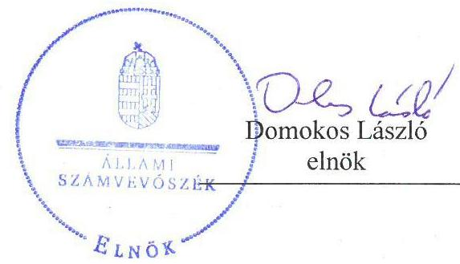
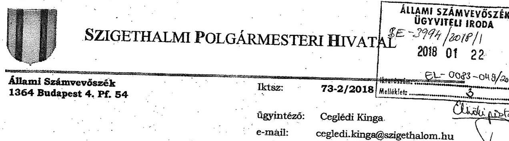
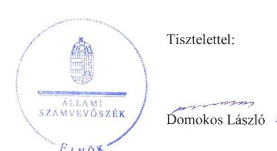
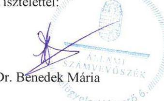

# Jelenetés 

## Önkormányzatok integritás- és belsó kontrollrendszere

Az önkormányzatok belső kontrollrendszere kialakításának és múködtetésének ellenőrzése Szigethalom Város Önkormányzat 2018.

---

# J elentés 

## Önkormányzatok integritás- és belsó kontrollrendszere

Az önkormányzatok belső kontrollrendszere kialakításának és múködtetésének ellenőrzése Szigethalom Város Önkormányzat
2018. foburár hó 15. nap

---

# AZ ELLENŐRZÉST FELÜGYELTE:

DR. BENEDEK MÁRIA felügyeleti vezető

## AZ ELLENŐRZÉST VEZETTE ÉS A VÉGREHAJTÁSÁÉRT FELELŐS:

CSAPÓ TIBORNÉ, MAROZSÁN LÁSZLÓNÉ ellenőrzésvezető

## A PROGRAM ÖSSZEÁLLÍTÁSÁÉRT FELELŐS:

TÓTPÁL SZABOLCS osztályvezető

IKTATÓSZÁM: EL-0083-051/2018.

TÉMASZÁM: 2444

ELLENŐRZÉS-AZONOSÍTÓ SZÁM: V078903

Jelentéseink az Országgyűlés számítógépes hálózatán és az Interneta a www.asz.hu címen is olvashatóak.

---

# TARTALOMJEGYZÉK 

■ ÖSSZEGZÉS ..... 5
■ AZ ELLENŐRZÉS CÉLJA ..... 6
■ AZ ELLENŐRZÉS TERÜLETE ..... 7
■ AZ ELLENŐRZÉS HÁTTERE, INDOKOLTSÁGA ..... 8
■ A JELENTÉS LÉNYEGES KÉRDÉSKÖREI ..... 10
■ ELLENŐRZÉS HATÓKÖRE ÉS MÓDSZEREI ..... 11
■ MEGÁLLAPÍTÁSOK ..... 13
■ JAVASLATOK ..... 19
■ MELLÉKLETEK ..... 23
I. sz. melléklet: Értelmező szótár ..... 23
■ FÜGGELÉK: ÉSZREVÉTELEK ..... 25
■ RÖVIDÍTÉSEK JEGYZÉKE ..... 35

---

.

---

# ÖSSZEGZÉS 

Az Állami Számvevőszék Szigethalom Város Önkormányzat ellenőrzése során megállapította, hogy az önkormányzat müködésének szervezeti kereteit kialakította, azonban nem mérte fel a tevékenységében rejlő kockázatokat és nem határozta meg a felmerült kockázatok esetén szükséges intézkedéseket. A gazdálkodási folyamatok kontrolltevékenységei nem biztositották a közpénzek szabályos, átlátható felhasználását, a nemzeti vagyonnal történő felelős gazdálkodást. Az önkormányzatnál az integritás szemlélet nem érvényesült a szervezet minden területén, a kiépített kontrollok és a korrupciós kockázatok szintje nem volt egyensúlyban.

## Az ellenőrzés társadalmi indokoltsága

Magyarország Alaptörvénye az önkormányzatoktól is elvárja a kiegyensúlyozott, átlátható és fenntartható költségvetési gazdálkodás elvének érvényesítését, továbbá a nemzeti vagyonnal való rendeltetésszerű és felelős módon való gazdálkodást. A belső kontrollrendszer kialakítása és múködtetése nélkül nem valósítható meg a közpénzek, a közvagyon szabályos, gazdaságos, hatékony és eredményes felhasználása. Az Állami Számvevőszék stratégiájában megfogalmazódott, hogy támogatja az integritás alapú, átlátható és elszámoltatható közpénzfelhasználás megteremtését. Ezzel összhangban ellenőrizte az Állami Számvevőszék a belső kontrollrendszer kialakításának és múködtetésének szabályszerűségét a feladatai ellátására több intézményt múködtető, jelentős vagyonállománnyal rendelkező és közpénzt kezelő Szigethalom Város Önkormányzatnál.

## Főbb megállapítások, következtetések, javaslatok

Szigethalom Város Önkormányzat a jogszabályi előírásoknak megfelelően kialakította szervezetének és múködtetésének kontrollkörnyezetét. A költségvetési szerv vezetője nem múködtetett kockázatkezelési, majd integrált kockázatkezelési rendszert, a szervezeti integritást sértő események kezelésének eljárásrendjét a jogszabályban előírt határidőn túl készítette el. A kontrolltevékenységek, a gazdálkodási jogkörök gyakorlása nem volt szabályszerű.

A jegyző nem gondoskodott a kötelezően közzé teendő adatok nyilvánosságra hozatalának rendje, a közérdekú adatok megismerésére irányuló kérelmek teljesítésének rendje és az adatvédelmi szabályzat elkészítéséről, továbbá a jogszabályban előírt közzétételi kötelezettségének hiányosan tett eleget. A költségvetési szerv vezetője nem biztosította a belső ellenőrzés szabályszerű múködését, nem gondoskodott a belső ellenőrzési jelentések javaslataihoz kapcsolódóan az intézkedési tervek hiánytalan elkészítéséről.

Az integritás szemlélet erősítése érdekében Szigethalom Város Önkormányzatnak még további intézkedéseket kell tennie, mivel a hiányzó kontrollok növelték az önkormányzat múködéséből adódó korrupciós kockázatok veszélyét, nem támogatták a közpénzek átlátható felhasználását, az integritás kultúra kialakítását.

---

# AZ ELLENŐRZÉS CÉLJA 

Az ellenőrzés célja annak megállapítása volt, hogy szabályszerűen történt-e Szigethalom Város Önkormányzat belső kontrollrendszerének kialakítása és működtetése, az biztosította-e a közpénzfelhasználás szabályosságát, a közpénzekkel és a nemzeti vagyonnal történő szabályszerű és felelős gazdálkodást, a beszámolási és adatszolgáltatási kötelezettségek szabályszerű teljesítését. Az ellenőrzés keretében az Állami Számvevőszék értékelte Szigethalom Város Önkormányzat korrupciós kockázatainak kezelését szolgáló integritás kontrollok kiépítettségét és az integritás szemlélet érvényesülését.

---

# AZ ELLENŐRZÉS TERÜLETE 

## Szigethalom Város Önkormányzat

Szigethalom Város Önkormányzat Pest megyében, a Szigetszentmiklósi járásban található. A budapesti agglomerációhoz tartozó település, fontos tömegközlekedési csomópont. A Központi Statisztikai Hivatal Magyarország közigazgatási helynévkönyve adata alapján Szigethalom Város Önkormányzat állandó lakosainak száma 2016. január 1-én 17156 fő volt.

A 12 fővel működő Képviselő-testület ${ }^{1}$ munkáját kettő állandó bizottság ${ }^{2}$ támogatta. Szigethalom Város Önkormányzat feladatait Polgármesteri Hivatalával és hat költségvetési szervvel látta el, többségi befolyással rendelkező gazdasági társasága a Szigethalom Városfejlesztő és Üzemeltető Nonprofit Kft. A településen az ellenőrzött időszakban nemzetiségi önkormányzat nem múködött.

A Szigethalom Város Önkormányzat által fenntartott hat költségvetési szervnél foglalkoztatottak létszáma 2016. december 31-én 238 fő volt, a Polgármesteri Hivatal további 37 fő köztisztviselőt foglalkoztatott. A fenntartott intézmények gazdasági szervezettel nem rendelkeztek, gazdálkodási feladataikat a Polgármesteri Hivatal gazdasági szervezete látta el.

A polgármester és a jegyző személyében 2016. évben nem következett be változás.

Szigethalom Város Önkormányzatának 2016. évi konszolidált költségvetési beszámolója alapján 1995, 5 millió Ft teljesített költségvetési bevétele és 1917,4 millió Ft teljesített kiadása volt, mérlegfőösszege 2016. december 31-én 6008,1 millió Ft, 2016. költségvetési évben esedékes kötelezettségeinek összege 11,9 millió Ft, míg követelésállománya 83,5 millió Ft volt.

---

# AZ ELLENŐRZÉS HÁTTERE, INDOKOLTSÁGA 

A demokratikus társadalmakban alapvető igény, hogy a közpénzeket, a közvagyont használók tevékenységükről elszámoljanak, ahhoz egyértelmű és érvényesíthető felelősségi szabályok társuljanak. Ennek a jogos igénynek az érvényesítéséhez meg kell teremteni azokat a folyamatokat, rendszereket, amelyek nélkülözhetetlenek az elszámoltatáshoz. Az elszámoltatás eredményes működtetéséhez szükség van a megfelelő információs, kontroll-, értékelési- és beszámolási rendszerek kialakítására. A belső kontrollok kiépítettsége hozzájárul az integritási szemlélet kialakításához és érvényesüléséhez. A belső kontrollrendszer kialakítása és működtetése nélkül nem valósítható meg a közpénzek, a közvagyon szabályos, gazdaságos, hatékony és eredményes felhasználása.

A BELSŐ KONTROLLRENDSZER azt a célt szolgálja, hogy az államháztartás szervei működésük és gazdálkodásuk során a tevékenységeket szabályszerűen, gazdaságosan, hatékonyan, eredményesen hajtsák végre, teljesítsék elszámolási kötelezettségeiket és megvédjék az erőforrásokat a veszteségektől, a károktól, a nem rendeltetésszerű használattól. A belső kontrollrendszer magában foglalja mindazon szabályokat, eljárásokat, gyakorlati módszereket és szervezeti struktúrákat, kockázatkezelési technikákat, kontrolltevékenységeket, amelyek segítséget nyújtanak a szervezetnek céljai eléréséhez. A belső kontrollrendszer szabályozása háromszintű, a törvényi előírásokat az Áht. ${ }^{3}$ és a Mötv. ${ }^{4}$ a rendeleti szintű szabályozást az Ávr. ${ }^{5}$ és a Bkr. ${ }^{6}$ tartalmazza, amelyeket útmutatói szinten az NGM ${ }^{7}$ által kiadott standardok és kézikönyvek támogatnak.

A megfelelő belső kontrollrendszer jelentősen csökkenti a hibák és szabálytalanságok kockázatát. Az ÁSZ ${ }^{8}$ célja, hogy javuljon az ellenőrzött önkormányzatok belső kontrollrendszerének szabályozottsága, működésének megfelelősége, szabályszerűsége, hozzájárulva ezzel az egyensúlyi helyzet fenntarthatóságához, biztosítva az önkormányzatnál a közpénzfelhasználás szabályosságát, a közpénzekkel és a nemzeti vagyonnal történő szabályszerű, gazdaságos, hatékony és eredményes gazdálkodást. Az ÁSZ ellenőrzés tapasztalatai nem csupán a közvetlenül ellenőrzött önkormányzatokat támogathatják, hanem a ,jó gyakorlat" elterjesztésével azok az önkormányzatok is átvehetik a pozitív példákat, ahol nem végez ellenőrzést az ÁSZ.

## AZ ELLENŐRZÉS VÁRHATÓ HASZNOSULÁSA

NÉGY SZINTEN valósul meg. A törvényalkotás számára összegzett tapasztalatok állnak rendelkezésre a belső kontrollrendszer önkormányzati területen való kialakításáról, működtetéséről és hatásairól. Az ellenőrzés az ellenőrzött számára visszajelzést ad a belső kontrollrendszer kialakításában és múködésében lévő hiányosságokról, javaslataival hozzájárul azok kiküszöböléséhez. Az ellenőrzés megállapításait és javaslatait más szervezetek is hasznosíthatják a rendezett gazdálkodási keretek kialakításához. A társadalom számára jelzi, hogy közpénz nem maradhat ellenőrizetlenül, az

---

ÁSZ értékteremtő rend kialakításához és megőrzéséhez hozzájáruló tevékenysége pozitív hatással lesz a szervezetről kialakított összkép formálásában.

---

# A JELENTÉS LÉNYEGES KÉRDÉSKÖREI 

1.- Az önkormányzat belső kontrollrendszerének kialakítása és müködtetése szabályszerű volt-e, az biztositotta-e az önkormányzatnál a közpénzfelhasználás szabályosságát, a nemzeti vagyonnal történő felelős gazdálkodást?
2.- Érvényesült-e az integritás szemlélet és ennek megfelelően ki-építették-e az integritás kontrollrendszert az önkormányzatnál?

---

# ELLENŐRZÉS HATÓKÖRE ÉS MÓDSZEREI 

## Az ellenőrzés típusa

Megfelelőségi ellenőrzés.

## Az ellenőrzött időszak

2016. január 1. és december 31. közötti időszak.

## Az ellenőrzés tárgya

A helyi önkormányzatnak, mint éves költségvetési beszámoló készítésére kötelezett szervezetnek és polgármesteri hivatalának belső kontrollrendszere. Az integritás szemlélet érvényesülése.

Az ellenőrzés kiterjedt minden olyan körülményre és adatra, amely az ÁSZ jogszabályban meghatározott feladatainak teljesítéséhez, valamint a program végrehajtása folyamán felmerült újabb összefüggések feltárásához szükséges volt.

## Az ellenőrzött szervezet

Szigethalom Város Önkormányzat

## Az ellenőrzés jogalapja

Az ÁSZ tv. 5. § (2) bekezdése alapján az államháztartás gazdálkodásának ellenőrzése keretében az ÁSZ ellenőrzi a helyi önkormányzatok gazdálkodását, valamint az ÁSZ tv. 5. § (6) bekezdése alapján ellenőrzése során értékeli az államháztartás számviteli rendjének betartását és a belső kontrollrendszer múködését.

## Az ellenőrzés módszerei

Az ÁSZ az ellenőrzést az elfogadott ellenőrzési program szempontjai, kérdései, az ellenőrzött időszakban hatályos jogszabályok, az ellenőrzés szakmai szabályok és módszertanok figyelembe vételével végezte.

Az ellenőrzés ideje alatt az ÁSZ az ellenőrzött szervezettel történő kapcsolattartást az ÁSZ SZMSZ-ének ${ }^{9}$ vonatkozó előírásai alapján biztosította.

---

Az ellenőrzési kérdések megválaszolásához szükséges bizonyítékok megszerzése az ellenőrzött által rendelkezésre bocsátott dokumentumokra, adatokra alapozva megfigyelés, szemle (szemrevételezés), kérdésfeltevés (információkérés), valamint elemző eljárással történt. A minták kiválasztása rétegzett, véletlen mintavételi eljárással történt. Az ellenőrzési bizonyítékként felhasználható adatforrások közé tartoztak egyrészt az ellenőrzési program részletes szempontjainál felsorolt adatforrások, másrészt minden - az ellenőrzés folyamán feltárt, az ellenőrzés szempontjából információt tartalmazó - dokumentum.

Az ellenőrzés lefolytatásához az önkormányzat a tanúsítványok elektronikus kitöltésével, valamint az ÁSZ által kért dokumentumok elektronikus megküldésével szolgáltatott adatokat. A rendelkezésre bocsátott adatok, információk kontrollja az ellenőrzés keretében történt. Az egységes értelmezést támogatta a program mellékletét képező fogalomtár és rövidítések jegyzék.

Az önkormányzat belső kontrollrendszere jogszabályi előírások szerinti kialakításának és működtetésének szabályszerűségét az ÁSZ az erre irányuló ellenőrzési kérdésekre adott válaszok összesítése alapján a 2016. január 1. és december 31. közötti időszakra, pillérenként (kontrollkörnyezet, kockázatkezelési rendszer, kontrolltevékenységek, információs és kommunikációs rendszer, monitoring rendszer) és összesítetten is értékelte. Az önkormányzat belső kontrollrendszere egyes pilléreinek kialakítása és múködtetése „szabályszerü", amennyiben az értékelt területen az elért igen válaszok százalékban kifejezett, egész számra kerekített aránya, meghaladta a 85\%-ot, „nem szabályszerű", ha nem haladta meg a 60\%-ot. Ha a 85\%-ot nem haladta meg, de 60\%-nál nagyobb volt az igen válaszok aránya, akkor a minősítés „részben szabályszerű". Az önkormányzat belső kontrollrendszerének összesített értékelése megegyezik a pillérenként (kontrollterületenként) alkalmazott százalékos értékelésekkel, a következő eltérésekkel. A kontrollrendszer egésze esetében a „szabályszerű" értékelésnek a százalékos értéken felül további feltétele, hogy egyik kontrollterület sem kaphat „nem szabályszerű" értékelést, a „részben szabályszerű" értékelés további feltétele, hogy legfeljebb egy ellenőrzött kontrollterület lehet „nem szabályszerű" értékelésű. Az összesített értékelés a százalékos értéktől függetlenül „nem szabályszerű", ha az ellenőrzött kontrollterületek közül több mint egynek „nem szabályszerű" az értékelése.

A közszféra integritás alapú kultúrájának kialakítása, megerősítése és működése szorosan összefügg a belső kontrollrendszer működésével, ezért az ellenőrzés kiterjedt annak értékelésére is, hogy a belső kontrollrendszer kialakítása és működtetése hogyan hatott az integritás szemlélet érvényesülésére. Az integritás szemlélet érvényesülésének értékelése az önkormányzat által kitöltött tanúsítvány alapján történt 2016. évre vonatkozóan.

---

# 1. Az önkormányzat belső kontrollrendszerének kialakítása és múködtetése szabályszerű volt-e, az biztosította-e az önkormányzatnál a közpénzfelhasználás szabályosságát, a nemzeti vagyonnal történő felelős gazdálkodást? 

Összegző megállapítás

Az Önkormányzat ${ }^{10}$ belső kontrollrendszerének kialakítása és múködtetése nem volt szabályszerű, nem biztosította a közpénzfelhasználás szabályosságát, a nemzeti vagyonnal történő felelős gazdálkodást.
1.1. számú megállapítás

A kontrollkörnyezet kialakítása megfelelt a jogszabályi előírásoknak.

AZ ÖNKORMÁNYZAT MŰKÖDÉSÉNEK SZERVEZETI KERETEIT az Önkormányzati SZMSZ ${ }^{11}$ és a Hivatali SZMSZ ${ }_{1-2}{ }^{12}$ tartalmazta.

Az Önkormányzat a Mötv., az Nvtv. ${ }^{13}$ és a Htv. ${ }^{14}$ előírásainak megfelelően elkészítette 2014-2019. évekre vonatkozó fejlesztési célkitűzéseit tartalmazó gazdasági programját, fejlesztési tervét, valamint vagyonrendeletét ${ }^{15}$. A Hivatal ${ }^{16}$ rendelkezett az Áht.-nak megfelelő Alapító Okirattal.

A jegyző ${ }^{17}$ a humánerőforrás-kezelés szabályait a Bkr.-nek megfelelően kialakította, a munkavégzés általános szabályait, a munkáltatói intézkedéseket a Közszolgálati Szabályzatban ${ }_{1-2}{ }^{18}$ rögzítette . A jegyző és a pénzügyiszámviteli területen dolgozó köztisztviselők rendelkeztek munkaköri leírással.

A jegyző gondoskodott a Hivatal gazdasági szervezete Ügyrendjének ${ }^{19}$ elkészítéséről. A gazdasági szervezet vezetője, a beszámoló elkészítésével megbízott személy, továbbá a gazdálkodási jogkörök gyakorlására kijelölt köztisztviselők rendelkeztek a feladat ellátásához szükséges végzettséggel, előírt szakképesítéssel és a könyvviteli szolgáltatás körébe tartozó tevékenység ellátására jogosító engedéllyel.

A jegyző kialakította a Számv. tv. ${ }^{20}$-ben foglaltaknak megfelelően a Számviteli Politika ${ }_{1-2}{ }^{21}$ t, elkészítette a Számlarendet ${ }^{22}$. A Számviteli Politika keretében elkészítette a Leltározási szabályzatot ${ }^{23}$, az Eszközök és források értékelési szabályzatát ${ }^{24}$ és a Pénzkezelési szabályzat ${ }^{25}{ }_{1-2}$-t. A szabályzatok hatálya kiterjedt azokra az intézményekre, amelyeknek a Hivatal látta el a gazdálkodási feladatait. Az Önkormányzat és a Hivatal Kbt. ${ }^{26}$ hatálya alá tartozó beszerzéseinek alapelveit, eljárásrendjét a Közbeszerzési szabályzat ${ }^{27}$ tartalmazta.

---

A jegyző az Ávr.-ben előírtaknak megfelelően a működéshez kapcsolódó, pénzügyi kihatással bíró, jogszabályban nem szabályozott kérdésekről a közérdekú adatokkal kapcsolatos szabályozás kivételével, belső szabályzatokban rendelkezett.

Az Önkormányzat kontrollkörnyezetének kialakítása az 1. táblázatban részletezett hiányosságok mellett szabályszerű volt.

# A KONTROLLKÖRNYEZET KIALAKÍTÁSÁNAK HIÁNYOSSÁGAI 

| Sorszám | Részmegállapítások | Megjegyzések |
| :--: | :--: | :--: |
| 1. | A jegyző a Hivatali SZMSZ -ben az Ávr. 13. § (1) bekezdés b) pontjában előírtak ellenére nem rögzítette az alapító okirat számát, az. Ávr. 13. § (1) bekezdés c) pontjában előírtak ellenére az ellátandó és kormányzati funkciók szerint besorolt alaptevékenységek megjelölését, az Ávr. 13. § (1) bekezdés e) pontjában előírtak ellenére a szervezeti ábrát és a szervezeti egységek feladatait, továbbá az Ávr. 13. § (1) bekezdés g) pontjában előírtak ellenére a nevesített munkakörökhöz kapcsolódó - polgármester kivételével - felelősségi szabályokat, a nevesített munkakörökhöz tartozó feladat- és hatásköröket, a hatáskörök gyakorlásának módját. |  |
| 2. | A jegyző a Kttv ${ }^{28}$. 75.§ (1) bekezdés d) pontjában foglalt előírás ellenére nem rögzítette a Hivatal pénzügyi-számviteli területén dolgozó köztisztviselők munkaköri leírásában a munkakör betöltésével kapcsolatos követelményeket (végzettségek, képességek). |  |
| 3. | A jegyző által összeállított Számlarend a Számv. tv. 161. § (2) bekezdés d) pontban foglalt előírás ellenére nem tartalmazta a benne foglaltakat alátámasztó bizonylati rendet. |  |
| 4. | A Képviselő-testület a Kttv. 231. § (1) bekezdésének előírása ellenére nem állapította meg a köztisztviselökre vonatkozó hivatásetikai alapelvek részletes tartalmát, valamint az etikai eljárás szabályait, mivel a jegyző a Mötv. 81.§. (3) bekezdés c) pontjában előírt feladata ellenére nem kezdeményezte az elkészített dokumentum előterjesztését. |  |

Forrás: ÁSZ

## 1.2. számú megállapítás

A kockázatkezelési rendszer kialakítása és múködtetése nem felelt meg a jogszabályi előírásoknak.

KOCKÁZATKEZELÉSI RENDSZER MÚKÖDTETÉSÉHEZ az Önkormányzat rendelkezett Kockázatkezelési Szabályzattal ${ }^{29}$. A Bkr. 2016. október 1-jei változását követően, a polgármester és a jegyző 2016. december 1-én léptette hatályba „A Hivatal szervezeti integritását sértő események kezelésének rendjéről és a közérdekú bejelentések fogadásának rendjéről"30 című szabályzatot.

A kockázatkezelési rendszer, majd 2016. október 1-jétől az integrált kockázatkezelési rendszer kialakításával és múködtetésével kapcsolatos hiányosságokat a 2. táblázat tartalmazza.
2. táblázat

## A KOCKÁZATKEZELÉSI RENDSZER ÉS AZ INTEGRÁLT KOCKÁZATKEZELÉSI KIALAKÍTÁSÁVAL ÉS MŰKÖDTETÉSÉVEL KAPCSOLATOS HIÁNYOSSÁGOK

| Sorszám | Részmegállapítások | Megjegyzések |
| :--: | :--: | :--: |
| 1. | A jegyző a Bkr. 6. § (4) bekezdésének előírása ellenére 2016. október 1. és 2016. december 1. között nem szabályozta a szervezeti integritást sértő események kezelésének eljárásrendjét, valamint az integrált kockázatkezelés eljárásrendjét. | A Bkr. 2016. október 1-jétől történt módosítását követően a polgármester és a jegyző 2016. december 1-jétől adta ki az új szabályzatot. |

---

| Sorszám | Részmegállapítások | Megjegyzések |
| :--: | :--: | :--: |
| 2. | A jegyző a Bkr. 6. § (4a) bekezdés e) és h) pontjaiban előírtak ellenére az Integritáskezelési szabályzatban nem szabályozta a szervezeti integritást sértő események elhárításához szükséges intézkedéseket, a szervezeti integritást sértő események bekövetkezésének megelőzésére kialakított eljárási szabályokat. |  |
| 3. | A jegyző a Bkr. 7. § (1) bekezdésében foglalt követelmény ellenére 2016. szeptember 30-ig kockázatkezelési rendszert, 2016. október 1-jétől integrált kockázatkezelési rendszert nem múködtetett. | A jegyző nem mérte fel és nem állapította meg az Önkormányzat tevékenységében, gazdálkodásában rejlő, a szervezeti célokkal összefüggő kockázatokat, az egyes kockázatokkal kapcsolatban szükséges intézkedéseket, valamint a gazdálkodási folyamatok kivételével azok teljesítésének folyamatos nyomon követésének módját. |

1.3. számú megállapítás

A kontrolltevékenység kereteinek kialakítása, múködtetése a jogszabályokban és a belső szabályozásban foglaltaknak nem felelt meg.

A GAZDÁLKODÁS RÉSZLETES RENDJÉT az Ávr. előírásainak megfelelően a polgármester és a jegyző az Önkormányzat Gazdálkodási Szabályzatában ${ }_{1-3}$ és a gazdasági szervezet Úgyrendjében meghatározta, gondoskodtak a gazdálkodási jogkörök gyakorlására és dokumentálására vonatkozó szabályok kialakításáról.

# KONTROLLTEVÉKENYSÉG GYAKORLÁSA, MÚ- 

KÖDTETÉSE területén a gazdálkodási jogkörökkel kapcsolatos kijelölésekről, felhatalmazásokról az Ávr.-ben foglaltaknak és a Gazdálkodási Szabályzatban ${ }_{1-3}$ meghatározottaknak megfelelően gondoskodtak.

A kontrolltevékenység kialakításának és múködtetésének hiányosságait a 3. táblázat tartalmazza.
3. táblázat

KONTROLLTEVÉKENYSÉG KIALAKÍTÁSÁNAK, MÚKÖDTETÉSÉNEK HIÁNYOSSÁGAI

| Sorszám | Részmegállapítás | Megjegyzés |
| :--: | :--: | :--: |
| 1. | A jegyző az Ávr. 53. § (2) bekezdésben előírtak ellenére az előzetes írásbeli kötelezettségvállalást nem igénylő kifizetések rendjét a belső szabályzatban nem rögzítette. |  |
| 2. | A kötelezettségvállalásokat követően az Ávr. 56. § (1) bekezdésében foglaltak ellenére nem gondoskodott minden esetben az arra jogosult személy annak az államháztartási számviteli kormányrendelet szerinti nyilvántartásba vételéről. A kötelezettségvállalási nyilvántartás az Áhsz. 14. melléklet II. 4. a) és d) pontjaiban előírtak ellenére nem tartalmazta a pénzügyi ellenjegyzésre vonatkozó adatokat, továbbá valamennyi kötelezettség tárgyát, összegét. |  |
|  | KÖTELEZETTSÉGVÁLLALÁS |  |
| 3. | A kötelezettségvállalás nem az Ávr. 52. § (1) bekezdés c) pontjában előírtaknak megfelelően történt. | A kötelezettségvállalás dokumentumán a kötelezettségvállaló személye nem volt azonosítható. |
| 4. | A kötelezettségvállalás az Áht. 37.§ (1) bekezdésében előírtak ellenére pénzügyi ellenjegyzést megelőzően történt. |  |
|  | PÉNZÜGYI ELLENIEGYZÉS |  |
| 5. | A pénzügyi ellenjegyzés az Ávr. 55. § (1) bekezdésében előírtak szerint nem történt meg. | A kötelezettségvállalás dokumentuma nem tartalmazta a pénzügyi ellenjegyzés |

---

| Sorszám | Részmegállapítás | Megjegyzés |
| :--: | :--: | :--: |
|  |  | tényére történő utalást, a pénzügyi ellenjegyzés dátumát. |
| 6. | TELJESÍTÉSIGAZOLÁS |  |
|  | A teljesítésigazolás az Ávr. 57. § (1) bekezdésében foglaltak ellenére nem történt meg. |  |
| 7. | ÉRVÉNYESÍTÉS | A teljesítésigazolás nem történt, a gazdasági események elszámolása során nem a megfelelő főkönyvi számla került kijelölésre. |
|  | Az érvényesítési jogkört ellátó köztisztviselő az Ávr. 58. § (2) bekezdésében előirtak ellenére nem jelezte az utalványozónak, hogy a megelőző ügymenetben az Áht., az Áhsz ${ }^{31}$, és a belső szabályzatokban foglaltakat nem tartották be. | Forrás: ÁSZ |

1.4. számú megállapítás

Az információs és kommunikációs folyamatok kialakítása és múködtetése nem felelt meg a jogszabályi előírásoknak.

AZ ÖNKORMÁNYZAT beszámolási és adatszolgáltatási kötelezettségét a jogszabályokban foglaltaknak megfelelően teljesítette, honlapján éves költségvetését, beszámolóját közzétette.

Az információs és kommunikációs folyamatok kialakításának és múködtetésének hiányosságait a 4. táblázat mutatja be.
4. táblázat

INFORMÁCIÓS ÉS KOMMUNIKÁCIÓS FOLYAMATOK KIALAKÍTÁSÁNAK ÉS MŰKÖDTETÉSÉNEK HIÁNYOSSÁGAI

| Sorszám | Részmegállapítások | Megjegyzés |
| :-- | :-- | :-- |

1. A jegyző az Ávr. 13. § (2) bekezdés h) pontjában előírtak ellenére a közérdekű adatok megismerésére irányuló kérelmek intézésének, továbbá a kötelezően közzéteendő adatok nyilvánosságra hozatalának rendjét belső szabályzatban nem rendezte.
2. A jegyző az Info tv. 37. § (1) bekezdésében előírtak ellenére nem gondoskodott az 1. melléklet általános közzétételi lista I. rész 7-11 pontjaiban, továbbá a II. rész 1-3. az 5-9. és a 11-25.. pontjaiban szereplő adatok közzétételéről.
3. Az Iratkezelési szabályzat ${ }^{32}$ kiadása a Ltv. ${ }^{33}$ 10. § (1) c) pontjában foglaltak ellenére nem a Magyar Nemzeti Levéltár egyetértésével történt.
4. A Hivatal, mint adatkezelő részére a jegyző az Info tv. 24. § (3) bekezdésében előírtak ellenére nem készített adatvédelmi és adatbiztonsági szabályzatot.

Forrás: ÁSZ
1.5. számú megállapítás

Az Önkormányzatnál a monitoring rendszer, ezen belül a belső ellenőrzési rendszer kialakítása és múködtetése nem felelt meg a jogszabályi előírásoknak.

BELSŐ ELLENŐRZÉS MŰKÖDTETÉSÉRŐL a jegyző külső szolgáltató bevonásával gondoskodott. A Belső Ellenőrzési Kézikönyvben ${ }^{34}$ és a belső ellenőrzési feladat ellátására kötött szerződésben meghatározták a belső ellenőr feladatait, biztosították funkcionális függetlenségét. A belső ellenőr 2016. évben végrehajtott hat ellenőrzésről a jelentéseket elkészítette.

KÜLSŐ ELLENŐRZÉSEK nyilvántartásának vezetéséről a jegyző gondoskodott.

A monitoring rendszer kialakításának és múködtetésének hiányosságait az 5. táblázat mutatja be.

---

5. táblázat

MONITORING RENDSZER KIALAKÍTÁSÁNAK ÉS MŰKÖDTETÉSÉNEK HIÁNYOSSÁGAI

| Sorszám | Részmegállapítások | Megjegyzések |
| :-- | :-- | :-- |

1. A jegyző a Bkr. 15. § (2) bekezdésében előírtak ellenére a belső ellenőrzést végző személy feladatait a Hivatal SZMSZ ${ }_{2}$-ben nem írta elő.
2. A Képviselő-testület a Bkr. 32. § (4) bekezdésben foglaltak ellenére a nem hagyta jóvá az önkormányzati költségvetési szervek 2017. évi belső ellenőrzési tervét.
3. A jegyző a Bkr. 45. § (4) bekezdésében előírtak ellenére az intézkedési tervek jóváhagyásáról a belső ellenőr véleményének kikérése mellett nem döntött.
4. A 2016. évben lezárt ellenőrzési jelentésekhez a Bkr. 45. § (1)-(3) bekezdéseiben előírtak ellenére nem készített az érintett szervezeti egység vezetője minden esetben intézkedési tervet.

Forrás: ÁSZ

# 1.6. számú megállapítás 

A belső kontrollrendszer kialakításával és múködésével kapcsolatban a jegyző által nyilatkozatban ${ }^{35}$ tett értékelést az ellenőrzés megállapításai nem támasztották alá.

A JEGYZŐ A JOGSZABÁLY ÁLTAL ELŐÍRT NYILATKOZATÁBAN megfelelőnek értékelte az Önkormányzat belső kontrollrendszerének kialakítását és múködését. A nyilatkozatában foglaltakat jelen ellenőrzés a kialakított kontrollkörnyezet minősítése kivételével nem támasztotta alá. A jegyző nyilatkozata - a szervezeti kultúra kialakítását kivéve - tartalmazta a jogszabályban előírt tartalmi elemeket.

A 2016. évi éves összefoglaló belső ellenőrzési jelentést a Képviselőtestület elfogadta.

Az Önkormányzat belső kontrollrendszerének értékelésével és az éves összefoglaló belső ellenőrzési jelentéssel kapcsolatos hiányosságokat a 6. táblázat foglalja össze.
6. táblázat

## A BELSŐ KONTROLLRENDSZER JEGYZŐI ÉRTÉKELÉSÉVEL ÉS AZ ÉVES ÖSSZEFOGLALÓ BELSŐ ELLENŐRZÉSI JELENTÉSSEL KAPCSOLATOS HIÁNYOSSÁGOK

| Sorszám | Részmegállapítások | Megjegyzések |
| :-- | :-- | :-- | :-- |

1. A jegyző a Bkr. 1. melléklet A pontjában előírtak ellenére a belső kontrollrendszer minőségének értékelése keretében nem nyilatkozott a szervezeti kultúra kialakításáról.
2. A belső ellenőrzési vezető a Bkr. 48. § ac) pontjában foglaltak ellenére a 2016. évi összefoglaló éves belső ellenőrzési jelentésben a tanácsadó tevékenységet nem mutatta be.
3. A belső ellenőrzési vezető a Bkr. 48. § ba) pontjában foglaltak ellenére a 2016. évi belső ellenőrzési összefoglaló jelentésben az ellenőrzési tapasztalatok alapján, a belső kontrollrendszer szabályszerűségének, gazdaságosságának, hatékonyságának és eredményességének növelése, javítása érdekében nem fogalmazott meg javaslatokat, továbbá a Bkr. 48. § bb) pontjában előírtak ellenére az összefoglaló jelentés nem tartalmazta a belső kontrollrendszer öt elemének értékelését.

---

# 2. Érvényesült-e az integritás szemlélet és ennek megfelelően ki-építették-e az integritás kontrollrendszert az önkormányzatnál? 

Összegző megállapítás

A kontrollrendszer nem támogatta az integritás szemlélet érvényesítését. Az Önkormányzatnál a felmerülő korrupciós kockázatok és a hozzá kiépített kontrollok nem voltak egyensúlyban.

Az Önkormányzatnál a jogszabályok által előírt kontrollokat kialakították. A szervezeti és működési szabályait az Önkormányzati SZMSZ tartalmazta, a pénzügyi-számviteli területen dolgozók munkaköri leírással rendelkeztek. Egyéb gazdálkodási és működési folyamatokról belső szabályzatokban rendelkeztek.

Az Önkormányzat hosszú távú célokat állított, azonban a szervezeti integritást támogató kontrollok erősítése abban nem került rögzítésre. A jogszabályi előírások ellenére a korrupciós kockázatok mérséklését, megelőzését támogató, integrált kockázatkezelési eljárásrendet az előírt határidőn túl adták ki, az nem tartalmazta a szervezeti integritást sértő események megelőzésének szabályait. Nem szabályozták továbbá az etikai eljárásokat. Kockázatelemzést a belső ellenőrzésen kívül nem készítettek. A belső ellenőrzési javaslatokhoz nem készítettek minden esetben intézkedési tervet. Nem múködtettek továbbá a közérdekú bejelentéseket kezelő, valamint a szervezeten kívülről érkező panaszokat és közérdekú bejelentéseket kezelő rendszert.

Az egyéb integritást erősítő kontrollok múködtetése az Önkormányzatnál alacsony szinten valósult meg. A jogszabályok által nem előírt kontrollok közül nem alakították ki az Önkormányzatnál az ajándékok, meghívások, utaztatások elfogadási feltételeit, a „négy szem elv" alkalmazásának szabályait és nem szabályozta a külső szakértők alkalmazásának feltételeit. Hiányzott a gazdasági vagy egyéb érdekeltségekről összeférhetetlenségről szóló nyilatkozattételi kötelezettség előírása köztisztviselők számára, nem szerveztek korrupcióellenes képzést az elmúlt három évben.

A hiányzó kontrollok növelték az Önkormányzat múködéséből adódó korrupciós kockázatok veszélyét, nem támogatták a szervezeti integritás érvényesülését.

---

# JAVASLATOK 

Az ÁSZ tv. 33. § (1) bekezdésében foglaltak értelmében az ellenőrzött szervezet vezetője köteles a jelentésben foglalt megállapításokhoz kapcsolódó intézkedési tervet összeállítani és azt a jelentés kézhezvételétől számított 30 napon belül az ÁSZ részére megküldeni. Amennyiben az ellenőrzött szervezet vezetője nem küldi meg határidőben az intézkedési tervet, vagy továbbra sem elfogadható intézkedési tervet küld, az Állami Számvevőszék elnöke az ÁSZ tv. 33. § (3) bekezdése a) és b) pontjaiban foglaltakat érvényesítheti.

## a polgármesternek:

1. Intézkedjen, hogy a Kttv. előírásának megfelelően a köztisztviselökre vonatkozó hivatásetikai alapelvek részletes tartalmát, valamint az etikai eljárás szabályait a Képviselő-testület állapítsa meg.
(1. táblázat 4. sz. megállapítás alapján)
2. Intézkedjen, hogy a Bkr. előírásának megfelelően az éves belső ellenőrzési tervet a Képviselő-testület hagyja jóvá.
(5. táblázat 2. sz. megállapítás alapján)
3. Intézkedjen az Állami Számvevőszék ellenőrzése során feltárt hiányosságok és/vagy szabálytalanságok tekintetében a munkajogi felelősség tisztázására irányuló eljárás megindításáról, és ennek eredménye ismeretében tegye meg a szükséges intézkedéseket.
(1. táblázat 1-3., 2. táblázat 2-3., 3. táblázat 1-6., 4. táblázat 1-4., 5. táblázat 1., 3., és 6. táblázat 1. sz. megállapítás alapján)

## a jegyzőnek:

1. Intézkedjen, hogy a Hivatali SZMSZ-e módosításra kerüljön az Ávr. és a Bkr. előírásának megfelelő tartalommal.
(1. táblázat 1., 5. táblázat 1. sz. megállapítás alapján)
2. Intézkedjen a Kttv. előírásának megfelelően a Hivatal pénzügyi-számviteli területén dolgozó köztisztviselők munkaköri leírásában a munkakör betöltésével kapcsolatos követelmények (végzettség, képesség) rögzítéséről.
(1. táblázat 2. sz. megállapítás alapján)

---

3. Intézkedjen a Számv. tv. előírásának megfelelően a számlarendben foglaltak bizonylati renddel történő alátámasztásáról.
(1. táblázat 3. sz. megállapítás alapján)
4. Intézkedjen a Kttv. előírásának megfelelően a köztisztviselőkre vonatkozó hivatásetikai alapelvek részletes tartalmát, valamint az etikai eljárás szabályait tartalmazó előterjesztés elkészitéséről és kezdeményezze annak Képviselő-testület elé terjesztését.
(1. táblázat 4. sz. megállapítás alapján)
5. Intézkedjen, hogy az Integritáskezelési szabályzat tartalmazza a Bkr. előírásának megfelelően a szervezeti integritást sértő események elhárításához szükséges intézkedéseket, a szervezeti integritást sértő események bekövetkezésének megelőzésére kialakított eljárási szabályokat.
(2. táblázat 2. sz. megállapítás alapján)
6. Intézkedjen a Bkr. előírásának megfelelően integrált kockázatkezelési rendszer müködtetéséről.
(2. táblázat 3. sz. megállapítás alapján)
7. Intézkedjen az Ávr. előírásának megfelelően az előzetes írásbeli kötelezettségvállalást nem igénylő kifizetések rendjének belső szabályzatban történő rögzítéséről.
(3. táblázat 1. sz. megállapítás alapján)
8. Gondoskodjon az Ávr. és az Áhsz. előírásainak megfelelően a kötelezettségvállalást követően annak nyilvántartásba vételéről, valamint a nyilvántartás tartalmazza a pénzügyi ellenjegyzésre vonatkozó adatokat, a kötelezettség tárgyát, összegét.
(3. táblázat 2. sz. megállapítás alapján)
9. Intézkedjen a gazdálkodási jogkörök (kötelezettségvállalás, pénzügyi ellenjegyzés, teljesítésigazolás, érvényesités) gyakorlása során az Áht.ban és Ávr.-ben foglalt rendelkezések betartásáról.
(3. táblázat 3-7. sz. megállapítás alapján)

---

10. Intézkedjen az Ávr. előírásának megfelelően a közérdekü adatok megismerésére irányuló kérelmek intézésének, továbbá a kötelezően közzé teendő adatok nyilvánosságra hozatala rendjének belső szabályzatban történő rendezéséről.
(4. táblázat 1. sz. megállapítás alapján)
11. Intézkedjen az Info. tv. előírásainak megfelelően az adatok közzétételéről.
(4. táblázat 2. sz. megállapítás alapján)
12. Intézkedjen az Ltv. előírásának megfelelően az iratkezelési szabályzat Magyar Nemzeti Levéltár egyetértésével történő kiadásáról.
(4. táblázat 3. sz. megállapítás alapján)
13. Intézkedjen az Info. tv. előírásainak megfelelő Adatvédelmi és adatbiztonsági szabályzat készitéséről.
(4 táblázat 4. sz. megállapítás alapján)
14. Intézkedjen az éves belső ellenőrzési terv Képviselő-testület elé terjesztéséről, annak a Bkr. előírásának megfelelő jóváhagyása érdekében.
(5. táblázat 2. sz. megállapítás alapján)
15. Döntsön a Bkr. előírásának megfelelően a lezárt ellenőrzési jelentésekhez elkészített intézkedési tervek - a belső ellenőrzési vezető véleményének kikérésével történő - jóváhagyásáról.
(5. táblázat 3. sz. megállapítás alapján)
16. Intézkedjen a Bkr. előírásának megfelelően a lezárt belső ellenőrzési jelentések vonatkozásában intézkedési tervek készitéséről.
(5. táblázat 4. sz. megállapítás alapján)
17. Intézkedjen, hogy a belső kontrollrendszer minőségét értékelő nyilatkozatban a Bkr. előírásának megfelelően nyilatkozzon a szervezeti kultúra kialakításáról.
(6. táblázat 1. sz. megállapítás alapján)

---

18. Intézkedjen a Bkr. előírásának megfelelően a tanácsadói tevékenység bemutatásáról az összefoglaló éves ellenőrzési jelentésben.
(6. táblázat 2. sz. megállapítás alapján)
19. Intézkedjen a Bkr. előírásának megfelelően a belső kontrollrendszer szabályszerűségének, gazdaságosságának, hatékonyságának és eredményességének növelése, javítása érdekében megfogalmazott javaslatok rögzítéséről, továbbá a belső kontrollrendszer öt elemének értékeléséről az összefoglaló éves ellenőrzési jelentésben.
(6. táblázat 3. sz. megállapítás alapján)

---

# MELLÉKLETEK 

- I. SZ. MELLÉKLET: ÉRTELMEZŐ SZÓTÁR

ÁSZ Integritás Projekt
belső ellenőrzés
belső kontrollrendszer
belső kontrollrendszer pillérei, kontrollterületei
helyi önkormányzat

Az Állami Számvevőszék 2009-ben indította el a „Korrupciós kockázatok feltérképezése - Integritás alapú közigazgatási kultúra terjesztése" című, európai uniós forrásból megvalósított kiemelt projektjét (Integritás Projekt). Az Integritás Projekt célja, hogy felmérje a közszféra intézményei korrupciós kockázatoknak való kitettségét, illetőleg az azok mérséklésére hivatott kontrollok szintjét. Az Állami Számvevőszék a projekt révén az integritás szemlélet minél szélesebb körrel történő megismerését, gyakorlatba ültetését kívánja elérni. Az integritás követelményeinek megfelelő szervezeti működést előnyben részesítő közigazgatási kultúra elterjesztését és a korrupció elleni fellépést az ÁSZ önmagára nézve is stratégiai jelentőségű célként fogalmazta meg. A projekt a felmérésben résztvevő intézmények számára helyzetükről egyfajta „tükörképet" mutat be, ami alapot teremt a jövőbeni pozitív irányú elmozduláshoz. (Forrás: a http//integritás. asz.hu honlapon közzétett, a 2013. évi Integritás felmérés eredményeiről készült összefoglaló tanulmány)

Független, tárgyilagos bizonyosságot adó és tanácsadó tevékenység, amelynek célja, hogy az ellenőrzött szervezet működését fejlessze és eredményességét növelje, az ellenőrzött szervezet céljai elérése érdekében rendszerszemléletű megközelítéssel és módszeresen értékeli, illetve fejleszti az ellenőrzött szervezet irányítási és belső kontrollrendszerének hatékonyságát. (Forrás: Bkr. 2. § b) pontja)
A belső kontrollrendszer a kockázatok kezelése és tárgyilagos bizonyosság megszerzése érdekében kialakított folyamatrendszer, amely azt a célt szolgálja, hogy a múködés és gazdálkodás során a tevékenységeket szabályszerűen, gazdaságosan, hatékonyan, eredményesen hajtsák végre, az elszámolási kötelezettségeket teljesítsék, megvédjék az erőforrásokat a veszteségektől, károktól és nem rendeltetésszerű használattól. (Forrás: Áht. 69. § (1) bekezdése)
A kontrollkörnyezet, a kockázatkezelési rendszer, a kontrolltevékenységek, az információs és kommunikációs rendszer, valamint a nyomon követési (monitoring) rendszer. (Forrás: Bkr. 3. §-a)
A helyi önkormányzat jogi személy. Az önkormányzati feladatok ellátását a képvi-selő-testület és szervei biztosítják. A képviselőtestület szervei: a polgármester, a főpolgármester, a megyei közgyűlés elnöke, a képviselő-testület bizottságai, a részönkormányzat testülete, a polgármesteri hivatal, a megyei önkormányzati hivatal, a közös önkormányzati hivatal, a jegyző, továbbá a társulás. A képviselő-testület a feladatkörébe tartozó közszolgáltatások ellátására - jogszabályban meghatározottak szerint - költségvetési szervet, a Polgári perrendtartásról szóló 1952. évi III. törvény szerinti gazdálkodó szervezetet (a továbbiakban: gazdálkodó szervezet), nonprofit szervezetet és egyéb szervezetet (a továbbiakban együtt: intézmény) alapíthat, továbbá szerződést köthet természetes és jogi személlyel vagy jogi személyiséggel nem rendelkező szervezettel. A helyi önkormányzat éves költségvetési beszámolója magába foglalja a helyi önkormányzat - nem költségvetési szerveihez tartozó - feladataihoz kapcsolódó bevételeket és kiadásokat. A helyi önkormányzat összevont (konszolidált) költségvetési beszámolóját a helyi önkormányzatra és költségvetési szerveire vonatkozóan külön-külön beérkezett éves költségvetési beszámolók alapján a Kincstár készíti el és küldi meg az önkormányzatnak. (Forrás: Mötv. 41. § (1), (2), (6) bekezdései; Áhsz. 2. § (1) bekezdése, 6. § (1) bekezdés a) és f) pontja, 30. §-a, 37. § (1) és (6) bekezdése)

---

információs és kommunikációs rendszer
integritás
kockázatkezelési rendszer
kontrollkörnyezet
kontrolltevékenységek
költségvetési szerv vezetője (Bkr. alkalmazásában)
önkormányzati hivatal

A költségvetési szerv vezetője által kialakított és múködtetett olyan rendszer, mely biztosítja, hogy a megfelelő információk a megfelelő időben eljutnak az illetékes szervezethez, szervezeti egységhez, illetve személyhez. (Forrás: Bkr. 9. § (1) bekezdés)
Az integritás elvek, értékek, cselekvések, módszerek, intézkedések konzisztenciáját jelenti: olyan magatartásmódot, amely meghatározott értékeknek felel meg. Az integritás a közszféra esetében a társadalom által elvárt nyilvánossági, átláthatósági, illetve jogi/etikai normáknak történő megfelelést jelenti.
(Forrás: a http://integritas.asz.hu honlapon közzétett „A 2012. évi integritás felmérés eredményeinek összefoglalója" címú dokumentum 3. oldal 1. bekezdése)
Olyan irányítási eszközök és módszerek összessége, melynek elemei a szervezeti célok elérését veszélyeztető tényezők (kockázatok) azonosítása, elemzése, csoportosítása, nyomon követése, valamint szükség esetén a kockázati kitettség mérséklése. (Forrás: Bkr. 2. § m) pontja)
A költségvetési szerv vezetője által kialakított olyan elvek, eljárások, belső szabályzatok összessége, amelyben világos a szervezeti struktúra, egyértelmúek a felelősségi, hatásköri viszonyok és feladatok, meghatározottak az etikai elvárások a szervezet minden szintjén, átlátható a humánerőforrás-kezelés. (Forrás: Bkr. 6. § (1) bekezdés)
A költségvetési szerv vezetője által a szervezeten belül kialakított (kontroll) tevékenységek, melyek biztosítják a kockázatok kezelését, hozzájárulnak a szervezet céljainak eléréséhez. (Forrás: Bkr. 8. § (1) bekezdés)
Helyi önkormányzat esetében a jegyző, főjegyző, társulás esetén a társulási megállapodásban meghatározott önkormányzat jegyzője. (Forrás: Bkr. 2. § n) pont nb) alpont
A helyi önkormányzatok képviselő-testületei megállapodhatnak abban, hogy egy vagy több önkormányzati feladat- és hatáskör, valamint a polgármester és a jegyző államigazgatási feladat- és hatáskörének hatékonyabb, célszerűbb ellátására jogi személyiséggel rendelkező társulást hoznak létre. A társulási tanács munkaszervezeti feladatait (döntések előkészítése, végrehajtás szervezése) eltérő megállapodás hiányában a társulás székhelyének polgármesteri hivatala látja el. (Forrás: Mötv. 87. §, 94. § (4) bekezdés)

---

# FÜGGELÉK: ÉSZREVÉTELEK 

A jelentéstervezetet a Számvevőszék 15 napos észrevételezésre megküldte az ellenőrzött szervezet vezetőjének az ÁSZ tv. 29. §* (1) bekezdése előírásának megfelelően.
A függelék tartalmazza az ellenőrzött észrevételeit, illetve a figyelembe nem vett észrevételek indoklását.

[^0]
[^0]:    * 29. § (1) Az Állami Számvevőszék az ellenőrzési megállapításait megküldi az ellenőrzött szervezet vezetőjének vagy az általa megbízott személynek, és annak, akinek személyes felelősségét állapította meg.
    (2) Az ellenőrzött szervezet vezetője és a felelősként megjelölt személy az ellenőrzés megállapításaira tizenöt napon belül írásban észrevételt tehet.
    (3) Az Állami Számvevőszék az észrevételre a beérkezésétől számított harminc napon belül írásban válaszol. A figyelembe nem vett észrevételeket köteles a jelentésben feltüntetni, és megindokolni, hogy azokat miért nem fogadta el.

---

Tárgy: EL-0083-048/2017. iktatószámú levélben megküldött jelentéstervezetre észrevételek

Tisztelt Állami Számvevőszék!
Az EL-0083-048/2017. iktatószámú levelükben megküldött Szigethalom Város Önkormányzatnál lefolytatott ellenőrzésről készített számvevőszéki jelentéstervezettel kapcsolatban az alábbi észrevételeket tennénk:

1. táblázat 1. pont:
„a Hivatali SZMSZ-ben nem rögzítette ... a szervezeti ábrát és a szervezeti egységek feladatait, ... a nevesített munkekőrökhöz kapcsolódó felelősségi szabályokat, ... feladat- és hatásköröket..."

Észrevétel:
A hivatkozott SZMSZ függeléke a szervezeti ábra, melléklete az ügyrend, ami tartalmazza az egyes munkakörökhöz kapcsolódó feladat- és hatásköröket.

A Polgármesternek tett javaslatokkal kapcsolatban:

5. táblázat 2. pont:

„2. Intézkedjen, hogy a Bkr. előírásának megfelelően az éves belső ellenőrzési tervet a Képviselő-testület hagyja jóvá."

Észrevétel:
A belső ellenőrzési tervet a képviselő-testület minden évben jóváhagyja:
a 2016.évit a 224/2015. (XII.15.) számú határozatával
a 2017.évit a 216/2016.(XII.20.) számú határozatával
a 2018.évi a 257/2017.(XII.19.) számú határozatával, melyet mellékelten
megküldünk.

A Jegyzőnek tett javaslatokkal kapcsolatban:

2. táblázat 2. pont - kötelezettségvállalások nyilvántartásba vételére vonatkozó
megállapítás

„8. Gondoskodjon az Ávr. és az Ahsz. előírásainak megfelelően a kötelezettségvállalást követően annak nyilvántartásba vételéről, valamint a nyilvántartás tartalmazza a pénzügyi ellenjegyzésre vonatkozó adatokat, a kötelezettség tárgyát, összegét."

Észrevétel:
A kötelezettségvállalások nyilvántartása minden esetben az E-Szoftverfejlesztő Kft - EPER - Szakértől Integrált Pénzügyi Számviteli programjában történik, amely tartalmazza a pénzügyi ellenjegyzésre vonatkozó adatokat, a kötelezettség tárgyát, összegét.

Levélcím: 2315 Szigethalom, Kenneth Lajos u. 10.
06-24-403-656, 06-24-403-657, 06-24-403-658, 06-24-403-659, 06-24-403-660, 06-24-403-661 Fax: 06-24-538-410
E-mail: filkarsag@szigethalom.hu Internet cím: www.szigethalom.hu

26

---

# SZIGETHALMI POLGÁRMESTERI HIVATAL 

3. táblázat 3-7. pont - kötelezettségvállalás, pénzügyi ellenjegyzés, érvényesités
„9. Intézkedjen a gazdálkodási jogkörök (kötelezettségvállalás, pénzügyi ellenjegyzés, teljesitésigazolás, érvényesités) gyakorlása során az Áht.-ban és Ávr-ben foglalt rendelkezések betartásáról.

- Kérjük legyenek szívesek megadni azokat az eseteket, amelyekben nem megfelelően történtek a kötelezettségvállalás, pénzügyi ellenjegyzés, teljesitésigazolás, érvényesités esetei.
- A Gazdálkodási szabályzat tartalmazza a kötelezettségvállalás felhatalmazással történő ellátására feljogosított személyeket.
- A pénzügyi ellenjegyzés a kötelezettségvállalást megelózően vagy azonos napon történt.
- Az írásbeli kötelezettségvállalás formanyomtatványa tartalmazza a pénzügyi ellenjegyzö aláírását. Az írásbeli kötelezettségvállalás összeghatárát el nem érő kifizetéseknél pedig pecsét formájában tartalmazza a pénzügyi ellenjegyzés tényére utalást.
- A teljesités igazolás minden esetben számlákon a szakmai teljesités igazolása pecséttel történik, amelyen a teljesités igazolásra jogosult személy aláirása és dátum szerepel. Emellett még bizonyos esetekben külön teljesités igazolás is csatolásra került.
- Az érvényesités szakmai teljesitést követöen történik.

## 5. táblázat 2. pont:

„14.Intézkedjen az éves belső ellenőrzési terv Képviselő-testület elé terjesztéséről, annak a Bkr. előírásának megfelelő jóváhagyása érdekében."

## Észrevétel:

A belső ellenőrzési tervet a képviselö-testület minden évben jóváhagyja:
a 2016.évit a 224/2015. (XII.15.) számú határozatával
a 2017.évit a 216/2016.(XII.20.) számú határozatával
a 2018.évi a 257/2017.(XII.19.) számú határozatával, melyet mellékelten megküldünk.
„16. Intézkedjen a Bkr. előírásának megfelelően a lezárt belső ellenőrzési jelentések vonatkozásában intézkedési tervek készítéséről."

A lezárt 2016.évi belső ellenőrzési jelentésben foglalt megállapításokra minden esetben készült intézkedési terv. A belső ellenőri jelentések nyilvántartásban szerepel a vonatkozó intézkedési terv iktatószáma és a vonatkozó intézkedési terv jóváhagyásának idópontja.

A jelentéstervezetben foglalt megállapításokat részben helytállónak tudjuk elfogadni. Az általánosságban megfogalmazott hiányosságokból nem derül ki számunkra a hibaszázalék, nem tartalmaz konkrétumokat a leadott nagy mennyiségủ dokumentunra vonatkozóan. Észrevételünk szerint a jelentéstervezetben megfogalmazott, kötelezettségvállalásra, ellenjegyzésre, érvényesítésre vonatkozó megállapítások nem általánosíthatók.
Kérjük legyenek szívesek az észrevételeinket figyelembe venni a számvevőszéki ellenőrzési jelentés elkészítése során.
Szigethalom, 2018.01.17.
Tiszteletfel:
Fáki László
polgármester
Dr. Stiebel Viktória
jegyzö
Levékim: 2315 Szigethalom, Kormán Kajos u. 10.
06-24-403-656, 06-24-403-657, 06-24-403-658, 06-24-403-660, 06-24-403-661
Fax: 06-24-258/410
E-mail: titkarsag@szigethalom.hu Internet cim: www.szigethalom.hu

---

ELNÖK

Ikt. szám: EL-0083/050/2018

# Fáki László úr 

polgármester

Szigethalom Város Önkormányzat

## Szigethalom

## Tisztelt Polgármester Úr!

Köszönettel megkaptam az „Önkormányzatok integritás- és belső kontrollrendszere - Az önkormányzatok belső kontrollrendszere kialakításának és müködtetésének ellenörzése - Szigethalom Város Önkormányzat" címủ jelentéstervezet megállapításaira tett észrevételét.
Tájékoztatom Polgármester urat, hogy a figyelembe nem vett észrevételeket - az Állami Számvevőszékről szóló 2011. évi LXVI. törvény 29. § (3) bekezdése alapján - a jelentésben szerepeltetjük azok indokainak feltüntetésével együtt.

Az Állami Számvevőszék észrevételekre vonatkozó álláspontjáról a felügyeleti vezető által készített részletes tájékoztatást csatoltan megküldöm

Budapest, 2018.

Melléklet: Tájékoztatás a figyelembe nem vett észrevételekről, azok indokairól

---

# FELÜGYELETI VEZETŐ 

1. számú melléklet
az EL-0083-050/2018. ikt. számú levélhez

## Tájékoztatás

a figyelembe nem vett észrevételekröl, azok indokairól

| 1. | Észrevétel: | Az észrevétel 1. oldal 3. bekezdésében az ÁSZ jelentéstervezet 14. oldal 1. táblázat 1. pontjában tett megállapításra: „A jegyző a Hivatali SZMSZ; -ben az Ávr. 13. § (1) bekezdés b) pontjában elöirtak ellenére nem rögzítette az alapító okirat számát, az. Ávr. 13. § (1) bekezdés c) pontjában elöirtak ellenére az ellátandó és kormányzati funkciók szerint besorolt alaptevékenységek megjelölését, az Ávr. 13. § (1) bekezdés e) pontjában elöirtak ellenére a szervezeti ábrát és a szervezeti egységek feladatait, továbbá az Avr. 13. § (1) bekezdés g) pontjában elöirtak ellenére a nevesitett munkakörökhöz kapcsolódó - polgármester kivételével - felelősségi szabályokat, a nevesitett munkakörökhöz tartozó feladat- és hatásköröket, a hatáskörök gyakorlásának módját. " tett észrevétel:   „A hivatkozott SZMSZ függeléke a szervezeti ábra, melléklete az ügyrend, ami tartalmazza az egyes munkakörökhöz kapcsolódó feladat- és hatásköröket." |
| :--: | :--: | :--: |
|  | Válasz: | Az ÁSZ az észrevételt nem fogadja el. |
|  | Indokolás: | Az észrevétel nem megalapozott. Az EL-0050-002/2017. iktatószámú ellenőrzési program alapján lefolytatott ellenőrzés során az ÁSZ a vonatkozó megállapítását az ellenőrzött szervezet által rendelkezésre bocsátott dokumentumok alapján folytatta le, mint az a jelentéstervezetben az ellenőrzési módszereknél ismertetésre került. Az észrevétel alapján az Önkormányzat által az adatszolgáltatás során megküldött dokumentumok felülvizsgálata alapján az ÁSZ megállapította, hogy az Önkormányzat dokumentumokkal nem igazolta a szervezeti ábra és az egyes munkakörökhöz kapcsolódó feladat- és hatáskörök SZMSZ-ben történő rögzítését, |

---

|  |  | mivel az adatszolgáltatásra biztosított határidőben megküldött 48/2016. (III. 22.) képviselő-testületi határozattal elfogadott 2016.03.29-től hatályos Hivatali SZMSZ Függelékét, mellékleteit az Önkormányzat nem bocsátotta az ÁSZ rendelkezésére.   A fentiek figyelembevételével az ÁSZ fenntartja a jelentéstervezetben az SZMSZ vonatkozásában tett megállapításait. |
| :--: | :--: | :--: |
|  | Észrevétel: | Az észrevétel 1. oldal 5. bekezdésében a jelentéstervezet 19. oldalán a polgármesternek tett 2. számú „Intézkedjen, hogy a Bkr. elöirásának megfelelöen az éves belsö ellenörzési tervet a Képviselö-testület hagyja jóvá."' javaslatra tett észrevétel:   „A belső ellenörzési tervet a képviselő-testület minden évben jóváhagyja: a 2016.évit a 224/2015. (XXI.15.) számú határozatával a 2O17. évit a 216/2016.(XII.20.) számú határozatával a 2O18. évi a 257/2017.(XII.19.) számú határozatával, melyet mellékelten megküldünk." |
|  | Válasz: | Az ÁSZ az észrevételt nem fogadja el. |
| 2. | Indokolás: | Az észrevétel nem megalapozott. Az EL-0050-002/2017. iktatószámú ellenőrzési program alapján lefolytatott ellenőrzés során az ÁSZ a vonatkozó megállapítását az ellenőrzött szervezet által rendelkezésre bocsátott dokumentumok alapján folytatta le, mint az a jelentéstervezetben az ellenőrzési módszereknél ismertetésre került. Az észrevétel alapján az Önkormányzat által az adatszolgáltatásra biztosított határidőben megküldött dokumentumok felülvizsgálata során az ÁSZ megállapította, hogy az Önkormányzat dokumentumokkal nem igazolta az éves belső ellenőrzési tervek Kép-viselő-testület általi jóváhagyását. Az Önkormányzat nem bocsátotta az ÁSZ rendelkezésére a 2017. évi belső ellenőrzési tervet, valamint a belső ellenőrzési tervek jóváhagyását igazoló képviselő-testületi határozatokat.   Fentiek figyelembevételével az ÁSZ fenntartja a jelentéstervezetben az éves belső ellenőrzési tervek képviselő-testületi jóváhagyására vonatkozóan tett megállapítását. |
|  |  | Az észrevétel 1. oldal utolsó előtti bekezdés, a jelentéstervezet 20. oldalán a jegyzőnek tett 8. számú javaslatra „Gondoskodjon az Avr. és az Ahsz. elöirásainak megfelelöen a kötelezettségvállalást követően annak nyilvántartásba vételéről, valamint a nyilvántartás tartalmazza a pénzügyi ellenjegyzésre vonatkozó adatokat, a kötelezettség tárgyát, összegét." tett észrevétel: |

---

|  |  | „A kötelezettségvállalások nyilvántartása minden esetben az E-Szoftverfejlesztő Kft - EPER - Szakértői Integrált Pénzügyi Számviteli programjában történik, amely tartalmazza a pénzügyi ellenjegyzésre vonatkozó adatokat, a kötelezettség tárgyát, összegét." |
| :--: | :--: | :--: |
|  | Válasz: | Az ÁSZ az észrevételt nem fogadja el. |
|  | Indokolás: | Az észrevétel nem megalapozott. Az EL-0050-002/2017. iktatószámú ellenőrzési program alapján lefolytatott ellenőrzés során az ÁSZ a vonatkozó megállapítását az ellenőrzött szervezet által rendelkezésre bocsátott dokumentumok alapján folytatta le, mint az a jelentéstervezetben az ellenőrzési módszereknél ismertetésre került. Az Önkormányzat által rendelkezésre bocsátott dokumentumok felülvizsgálata alapján az ÁSZ megállapította, hogy az Önkormányzat nem igazolta az adatszolgáltatás során megküldött valamennyi mintatétel vonatkozásában az Ávr. és Ahsz. előírásainak megfelelően a kötelezettségvállalás nyilvántartásba vételének szabályszerű elvégzését.   Fentiek figyelembevételével az ÁSZ fenntartja a jelentéstervezetben a kötelezettségvállalások nyilvántartásba vételének szabályszerűsége vonatkozásában tett megállapításait. |
| 4. | Észrevétel: | Az észrevétel 2. oldal első bekezdésében, a jelentéstervezet 20. oldalán a jegyzőnek tett 9. számú javaslatra „Intézkedjen a gazdálkodási jogkörök (kötelezettségvállalás, pénzügyi ellenjegyzés, teljesitésigazolás, érvényesités) gyakorlása során az Aht.-ban és Avr.-ben foglalt rendelkezések betartásáról" tett észrevétel:   ,- Kérjük legyenek szivesek megadni azokat az eseteket, amelyekben nem megfelelően történtek a kötelezettségvállalás, pénzügyi ellenjegyzés, teljesitésigazolás, érvényesités esetei.   - A Gazdálkodási szabályzat tartalmazza a kötelezettségvállalás felhatalmazással történő ellátására feljogositott személyeket.   - A pénzügyi ellenjegyzés a kötelezettségvállalást megelözően vagy azonos napon történt. Az írásbeli kötelezettségvállalás formanyomtatványa tartalmazza a pénzügyi ellenjegyzö aláirását.   - Az írásbeli kötelezettségvállalás összeghatárát el nem érő kifizetéseknél pedig pecsét formájában tartalmazza a pénzügyi ellenjegyzés tényére utalást.   - A teljesités igazolás minden esetben számlákon a szakmai teljesités igazolása pecséttel történik, amelyen a teljesités igazolásra jogosult személy aláirása és dátum szerepel. Emellett még bizonyos esetekben külön teljesités igazolás is csatolásra került.   - Az érvényesités szakmai teljesitési követően történik" |

---

|  |  | Észrevételünk szerint a jelentéstervezetben megfogalmazott, kötelezettségvállalásra, ellenjegyzésre, érvényesitésre vonatkozó megállapítások nem általánosithatók. |
| :--: | :--: | :--: |
|  | Válasz: | Az ÁSZ az észrevételt nem fogadja el. |
|  | Indokolás: | Az észrevétel nem megalapozott. Az EL-0050-002/2017. iktatószámú ellenőrzési program alapján lefolytatott ellenőrzés során az ÁSZ a vonatkozó megállapítását az ellenőrzött szervezet által rendelkezésre bocsátott dokumentumok alapján folytatta le, mint az a jelentéstervezetben az ellenőrzési módszereknél ismertetésre került. Az ÁSZ a jelentéstervezetben tett megállapításait az Önkormányzat által az ÁSZ rendelkezésére bocsátott mintatételekhez kapcsolódó dokumentumok alapján tette meg. Az Önkormányzat által rendelkezésre bocsátott dokumentumok felülvizsgálata alapján az ÁSZ megállapította, hogy az Önkormányzat nem igazolta az adatszolgáltatás során megküldött valamennyi mintatétel vonatkozásában az Áht. és Avr. előírásainak megfelelően a gazdálkodási jogkörök gyakorlását.   Fentiek figyelembevételével az ÁSZ fenntartja a jelentéstervezetben - a 3. táblázat 3-7. sorszámú megállapítások szerinti - gazdálkodási jogkörök gyakorlásának szabályszerűsége vonatkozásában tett megállapításait. |
|  | Észrevétel: | Az észrevétel 2. oldal második bekezdésében, a jelentéstervezet 21. oldalán a jegyzőnek tett 14. számú javaslatra ,,Intézkedjen az éves belső ellenőrzési terv Képviselő-testület elé terjesztéséről, annak a Bkr. előírásának megfelelő jóváhagyása érdekében. " tett észrevétel:   „A belső ellenőrzési tervet a képviselő-testület minden évben jóváhagyja; a 2016.évit a 224/2015. (XII. 15.) számú határozatával a 2017.évit a 216/2016.(XII.20.) számú határozatával a 2018.évi a 257/2017.(XII. 19.) számú határozatával, melyet mellékelten megküldjük." |
| 5. | Válasz: | Az ÁSZ az észrevételt nem fogadja el. |
|  | Indokolás: | Az észrevétel nem megalapozott. Az EL-0050-002/2017. iktatószámú ellenőrzési program alapján lefolytatott ellenőrzés során az ÁSZ a vonatkozó megállapítását az ellenőrzött szervezet által rendelkezésre bocsátott dokumentumok alapján folytatta le, mint az a jelentéstervezetben az ellenőrzési módszereknél ismertetésre került. Az észrevétel alapján az Önkormányzat által az adatszolgáltatásra biztosított határidőben megküldött dokumentumok felülvizsgálata során az ÁSZ megállapította, hogy az Önkormányzat dokumentumokkal nem igazolta az éves belső ellenőrzési tervek Kép-viselő-testület általi jóváhagyását. Az Önkormányzat nem |

---

|  |  | bocsátotta az ÁSZ rendelkezésére a 2017. évi belső ellenőrzési tervet, valamint a belső ellenőrzési tervek jóváhagyását igazoló képviselő-testületi határozatokat.   Fentiek figyelembevételével az ÁSZ fenntartja a jelentéstervezetben az intézkedési tervek készítése vonatkozásában tett megállapításait. |
| :--: | :--: | :--: |
|  | Észrevétel: | Az észrevétel 2. oldal harmadik bekezdésében, a jelentéstervezet 21. oldalán a jegyzőnek tett 16. számú javaslatra „Intézkedjen a Bkr. elöirásának megfelelően a lezárt belsö ellenörzési jelentések vonatkozásában intézkedési tervek készitéséröl." tett észrevétel:   „A lezárt 2016. évi belső ellenőrzési jelentésben foglalt megállapitásokra minden esetben készült intézkedési terv. A belső ellenöri jelentések nyilvántartásban szerepel a vonatkozó intézkedési terv iktatószáma és a vonatkozó intézkedési terv jóváhagyásának idöpontja." |
|  | Válasz: | Az ÁSZ az észrevételt nem fogadja el. |
| 6. | Indokolás: | Az észrevétel nem megalapozott. Az EL-0050-002/2017. iktatószámú ellenőrzési program alapján lefolytatott ellenőrzés során az ÁSZ a vonatkozó megállapítását az ellenőrzött szervezet által rendelkezésre bocsátott dokumentumok alapján folytatta le, mint az a jelentéstervezetben az ellenőrzési mód-szereknél ismertetésre került. Az Önkormányzat által rendelkezésre bocsátott dokumentumok felülvizsgálata alapján az ÁSZ megállapította, hogy az Önkormányzat dokumentumokkal nem igazolta a lezárt belső ellenőrzési jelentések vonatkozásában az intézkedési tervek elkészítését.   Fentiek figyelembevételével az ÁSZ fenntartja a jelentéstervezetben az intézkedési tervek készítésére vonatkozó megállapítását. |

Budapest, 2018. 07 hó 0 nap

Tisztelettel:

---

.

---

# RÖVIDÍTÉSEK JEGYZÉKE 

${ }^{1}$ Képviselő-testület
${ }^{2}$ állandó bizottság
${ }^{3}$ Áht.
${ }^{4}$ Mötv.
${ }^{5}$ Ávr.
${ }^{6}$ Bkr.
${ }^{7}$ NGM
${ }^{8}$ ÁSZ
${ }^{9}$ ÁSZ SZMSZ
${ }^{10}$ Önkormányzat
${ }^{11}$ Önkormányzati SZMSZ
${ }^{12}$ Hivatali SZMSZ ${ }_{1-2}$
${ }^{13}$ Nvtv.
${ }^{14} \mathrm{Htv}$.
${ }^{15}$ vagyonrendelet
${ }^{16}$ Hivatal
${ }^{17}$ jegyző
${ }^{18}$ Közszolgálati Szabályzat ${ }_{1}$

Közszolgálati Szabályzat ${ }_{2}$
${ }^{19}$ gazdasági szervezet Ügyrendje ${ }_{1}$
${ }^{19}$ gazdasági szervezet Ügyrendje ${ }_{2}$
${ }^{19}$ gazdasági szervezet Ügyrendje ${ }_{3}$
${ }^{20}$ Számv. tv.
${ }^{21}$ Számviteli politika ${ }_{1}$

Szigethalom Város Önkormányzat Képviselő-testülete
Szigethalom Város Önkormányzat Képviselő-testülete Pénzügyi és Fejlesztési Bizottsága; Humánpolitikai és Népjóléti Bizottsága
2011. évi CXCV. törvény az államháztartásról (hatályos: 2012. január 1-jétől)
2011. évi CLXXXIX. törvény Magyarország helyi önkormányzatairól (hatályos: 2012. január 1-jétől)

368/2011. (XII. 31.) Korm. rendelet az államháztartásról szóló törvény végrehajtásáról (hatályos: 2012. január 1-jétől)
370/2011. (XII. 31.) Korm. rendelet a költségvetési szervek belső kontrollrendszeréről és belső ellenőrzéséről (hatályos: 2012. január 1-jétől)
Nemzetgazdasági Minisztérium
Állami Számvevőszék
Az Állami Számvevőszék elnökének 3/2016. (XII. 30.) ÁSZ utasítása az Állami Számvevőszék Szervezeti és Működési Szabályzatáról (hatályos: 2017. január 1-jétől)
Szigethalom Város Önkormányzat
Szigethalom Város Önkormányzat Képviselő-testületének 12/2014.(XI.04.) rendelete a Képviselő-testület és szervei szervezeti és működési szabályzatáról (módosításokkal egységes szerkezetben)

1. Szigethalom Polgármesteri Szervezeti és Működési Szabályzata 2016;
2. Szigethalom Polgármesteri Szervezeti és Müködési Szabályzata 2012.
3. 2011. évi CXCVI. törvény a nemzeti vagyonról (hatályos: 2011. december 31-től) 1991 évi XX tv. a helyi önkormányzatok és szerveik, a köztársasági megbízottak, valamint egyes centrális alárendeltségű szervek feladat-és hatásköréről
Szigethalom Város Önkormányzat Képviselő-testületének 17/2012.(V.29.) rendelete az Önkormányzat vagyonáról, a vagyonhasznosítás rendjéről és a vagyontárgyak feletti tulajdonosi jogok gyakorlásának szabályairól (hatályos: 2012. január 1-jétől)

Szigethalom Város Önkormányzat Polgármesteri Hivatala
Szigethalmi Polgármesteri Hivatal jegyzője
Szigethalmi Polgármesteri Hivatal Közszolgálati Szabályzata (hatályos: 2012.04.01-től 2016. 03.31-ig)

Szigethalmi Polgármesteri Hivatal Közszolgálati Szabályzata (hatályos: 2016. 04.01-től)

Szigethalom Város Önkormányzatának Polgármesteri Hivatala Gazdasági szervezet ügyrendje (hatályos: 2016.01.01-től 2016.05.01-ig)
Szigethalom Város Önkormányzatának Polgármesteri Hivatala Gazdasági szervezet ügyrendje (hatályos: 2016.05.02-től 2016.09.11-ig)
Szigethalom Város Önkormányzatának Polgármesteri Hivatala Gazdasági szervezet ügyrendje,(hatályos: 2016.09.12-től)
2000. évi C. törvény a számvitel rendjéről (hatályos: 2001. január 1-jétől)

Szigethalom Város Önkormányzat és Szigethalmi Polgármesteri Hivatal Számviteli politika együttes szabályzat (hatályos: 2016.01.01.-től 2016.11.18-ig)

---

${ }^{21}$ Számviteli politika $_{2}$
${ }^{22}$ Számlarend
${ }^{23}$ Leltározási Szabályzat
${ }^{24}$ Eszközök és források értékelési Szabályzat
${ }^{25}$ Pénzkezelési Szabályzat ${ }_{1-3}$
${ }^{26} \mathrm{Kbt}$.
${ }^{27}$ Közbeszerzési Szabályzat ${ }_{1}$
${ }^{27}$ Közbeszerzési Szabályzat ${ }_{2}$
${ }^{28} \mathrm{Kttv}$.
${ }^{29}$ Kockázatkezelési Szabályzat
${ }^{30}$ Integritás szabályzat
${ }^{31}$ Áhsz.
${ }^{32}$ iratkezelési szabályzat
${ }^{33}$ Ltv.
${ }^{34}$ Belső Ellenőrzési Kézikönyv
${ }^{35}$ nyilatkozat

Szigethalom Város Önkormányzat és Szigethalmi Polgármesteri Hivatal Számviteli politika együttes szabályzat (hatályos: 2016.11.19-től)
Szigethalom Város Önkormányzat Polgármesteri Hivatal Számlarend (hatályos 2016. január 1-től)

Szigethalmi Polgármesteri Hivatal Leltározási és leltárkészítési szabályzat (hatályos 2016. január 1-től)
Szigethalom Város Önkormányzat és Szigethalmi Polgármesteri Hivatal Eszközök és források értékelési szabályzata (hatályos 2015. január 1-től)
1: Szigethalom Város Önkormányzat és Szigethalmi Polgármesteri Hivatal Pénzkezelési szabályzata (hatályos 2016. január 1-től 2016. április 4-ig); 2: Szigethalom Város Önkormányzat és Szigethalmi Polgármesteri Hivatal Pénzkezelési szabályzata (hatályos 2016. április 4-től-október 3-ig; 3. Szigethalom Város Önkormányzat és Szigethalmi Polgármesteri Hivatal Pénzkezelési szabályzata (hatályos 2016. november 1-től);
2015. évi CXLIII. törvény a közbeszerzésekről (hatályos: 2015. november 1-jétől)

Szigethalom Város Önkormányzat Közbeszerzési szabályzata, (hatályos 2012. március 30 -tól 2016. április 19-ig)
Szigethalom Város Önkormányzat Közbeszerzési szabályzata, (hatályos 2016. április 20-tól)
2011. évi CXCIX. törvény a közszolgálati tisztviselőkről (hatályos 2012. március 1-jétől)
Szigethalom Város Önkormányzat Kockázatkezelési Szabályzata (hatályos: 2011. március 11-től)
Szigethalmi Polgármesteri Hivatal Szabályzat a Hivatal szervezeti integritását sértő események kezelésének rendjéről és a közérdekú bejelentések fogadásának rendjéről (hatályos: 2016. december 1-től)
4/2013. (I. 11.) Korm. rendelet az államháztartás számviteléről (hatályos: 2014. január 1-jétől)
Szigethalom Város Önkormányzat Polgármesteri Hivatal Iratkezelési szabályzata (2010. év)
1995. évi LXVI. törvény a köziratokról, a közlevéltárakról és a magánlevéltári anyag védelméről (hatályos: 1996. január 1.)
Szigethalmi Polgármesteri Hivatal Belső Ellenőrzési Kézikönyve
a Bkr. 1. melléklete szerinti nyilatkozat

---

# ÁLLAMI SZÁMVEVŐSZÉK 

1052 Budapest, Apáczai Csere János utca 10.
Levélcím: 1364 Budapest 4. Pf. 54
Telefon: +36 14849100 Telefax: +36 14849200
www.asz.hu