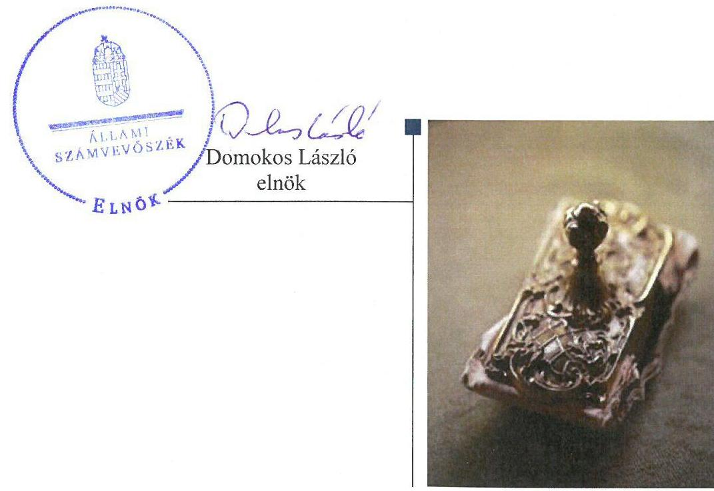
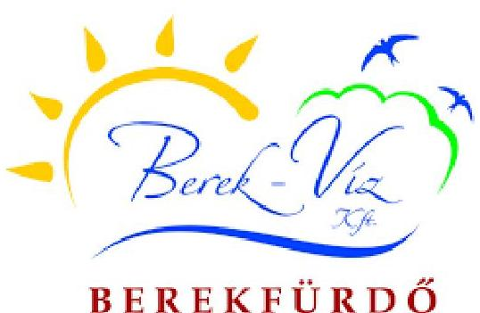
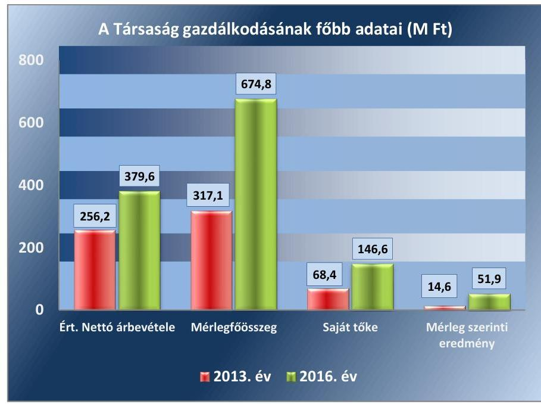
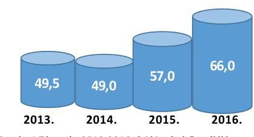
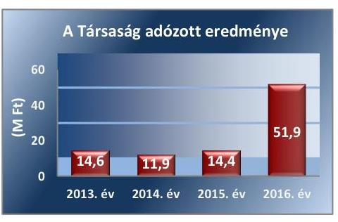

# Jelentés 

## Az önkormányzatok gazdasági társaságai

Az önkormányzatok többségi tulajdonában lévő gazdasági társaságok gazdálkodásának ellenőrzése - Berek-Víz Szolgáltató Üzemeltető és Kereskedelmi Kft.
2018.

---

# Jelentés 

## Az önkormányzatok gazdasági társaságai

Az önkormányzatok többségi tulajdonában lévő gazdasági társaságok gazdálkodásának ellenőrzése - Berek-Víz Szolgáltató Üzemeltető és Kereskedelmi Kft.
2018. 03. hó 01. nap

---

# AZ ELLENŐRZÉST FELÜGYELTE:

DR. HORVÁTH MARGIT felügyeleti vezető

## AZ ELLENŐRZÉST VEZETTE ÉS A VÉGREHAJTÁSÁÉRT FELELŐS:

SALAMIN VIKTOR ellenőrzésvezető

## A PROGRAM ÖSSZEÁLLÍTÁSÁÉRT FELELŐS:

JANIK JÓZSEF osztályvezető

IKTATÓSZÁM: EL-0098-086/2018.

TÉMASZÁM: 2167

ELLENŐRZÉS-AZONOSÍTÓ SZÁM: V079301

Jelentéseink az Országgyűlés számítógépes hálózatán és az Interneta a www.asz.hu címen is olvashatóak.

---

# TARTALOMJEGYZÉK 

■ ÖSSZEGZÉS ..... 5
■ AZ ELLENŐRZÉS CÉLJA ..... 6
■ AZ ELLENŐRZÉS TERÜLETE ..... 7
■ AZ ELLENŐRZÉS HÁTTERE, INDOKOLTSÁGA ..... 9
■ A JELENTÉS LÉNYEGES KÉRDÉSKÖREI ..... 10
■ AZ ELLENŐRZÉS HATÓKÖRE ÉS MÓDSZEREI ..... 11
■ MEGÁLLAPÍTÁSOK ..... 13
■ JAVASLATOK ..... 18
■ MELLÉKLETEK ..... 23
I. sz. melléklet: Értelmező szótár ..... 23
II. sz. melléklet: A társaság főbb mérlegadatai a 2013-2016. években (M Ft) ..... 25
■ FÜGGELÉK: ÉSZREVÉTELEK ..... 27
■ RÖVIDÍTÉSEK JEGYZÉKE ..... 29

---

.

---

# ÖSSZEGZÉS 

Berekfürdő Községi Önkormányzat az ellenőrzött időszakban a tulajdonosi jogokat nem gyakorolta szabályszerűen. A Berek-Víz Szolgáltató Üzemeltető és Kereskedelmi Kft. vagyongazdálkodása 2013-2016. években a leltározás hiányosságai miatt nem volt szabályszerű, a mérleg tartalmának valódisága nem volt biztositott, ami veszélyeztette a vagyon megőrzését és az elszámoltathatóságot. A Társaság fizetőképessége az ellenőrzött időszakban biztositott volt, a bevételek és ráfordítások elszámolása azonban nem volt szabályszerű.

## Az ellenőrzés társadalmi indokoltsága

Magyarországon az önkormányzatok kötelező és önként vállalt feladataik vonatkozásában is egyre szélesebb körben alkalmazzák a költségvetésen kívüli feladatellátást, ezáltal - a nonprofit szervezetek mellett - az önkormányzati tulajdonú gazdasági társaságok is kiemelt fontosságú szerephez jutottak. Az önkormányzatok többségi tulajdonában álló gazdasági társaságok ellenőrzése kiemelten fontos a vagyon megőrzése, megóvása érdekében. A feladatellátás költségeinek, ráfordításainak alakulása a lakosság széles rétegét érinti.

Az Állami Számvevőszék az ellenőrzése során arra kereste a választ, hogy 2013-2016. között szabályszerű volt-e a Berek-Víz Szolgáltató Üzemeltető és Kereskedelmi Kft. gazdálkodása és a Berekfürdő Községi Önkormányzat ehhez kapcsolódó tulajdonosi joggyakorlása. Az Önkormányzat a gyógyfürdő üzemeltetésével hozzájárul a lakosság testilelki egészségének megőrzéséhez. Ezért bízunk abban, hogy a jelentésben foglalt megállapítások és az ezek alapján megfogalmazott számvevőszéki javaslatok hasznosítása elősegíti a feltárt hiányosságok orvoslását.

## Főbb megállapítások, következtetések, javaslatok

Az Önkormányzat a tulajdonosi joggyakorlás kereteit nem megfelelően alakította ki, a tulajdonosi joggyakorlás nem volt szabályszerű. A Társaság feladatellátását rögzítő szabályokat nem aktualizálták, javadalmazási szabályzatot 2015 áprilisáig nem készítettek. A tulajdonosi jogokat a Képviselő-testület nem gyakorolta szabályszerűen, mivel a 2013., a 2014. és 2016. évi beszámolóról felügyelőbizottsági vélemény nélkül döntött, továbbá 2015 áprilisáig ügyrenddel nem rendelkezett.

A Társaság múködésének szabályozottsága nem felelt meg a jogszabályi előírásoknak. A Társaság vagyongazdálkodása nem volt szabályszerű. A 2013-2016. évi beszámolók megalapozottsága és a vagyon védelme nem volt biztosított, a mérlegtételek leltárral való alátámasztása nem felelt meg a jogszabály előírásainak.

A Társaság fizetőképessége 2013-2016. években biztosított volt. A Társaság a beszámolási, adatszolgáltatási kötelezettségének határidőben eleget tett, azonban a közzétételi kötelezettségét teljes körűen nem teljesítette, adatvédelmi és adatbiztonsági, valamint a közérdekú adatok megismerésére irányuló igények teljesítésének rendjét rögzítő hatályos szabályzatokat nem készített.

A bevételek és ráfordítások, az értékcsökkenési leírás, valamint a személyi jellegú ráfordítások elszámolása nem volt szabályszerű.

---

# AZ ELLENŐRZÉS CÉLJA 

AZ ELLENŐRZÉS CÉLJA annak értékelése volt, hogy az önkormányzat vagyongazdálkodási tevékenysége során szabályszerűen gyakorolta-e a tulajdonosi jogait. A gazdasági társaság szabályozottsága, gazdálkodása és vagyongazdálkodási tevékenysége, bevételeinek és ráfordításainak elszámolása megfelel-e a jogszabályi és tulajdonosi előírásoknak. Értékeltük, hogy a gazdasági társaság kötelezettségállománya jelentett-e kockázatot a múködésre, valamint a gazdálkodás átláthatósága és elszámoltathatósága érdekében biztosítva volt-e a szolgáltatás dijának megalapozottsága szabályszerű önköltségszámítással.

---

# AZ ELLENŐRZÉS TERÜLETE 

## Berekfürdő Községi Önkormányzat és a kizárólagos tulajdonában lévő Berek-Víz Szolgáltató Üzemeltető és Kereskedelmi Kft.

BEREKFÜRDŐ

## BEREKFÜRDŐ KÖZSÉGI ÖNKORMÁNY-

ZAT a 100\%-os tulajdonában lévő Berek-Víz Szolgáltató Üzemeltető és Kereskedelmi Korlátolt Felelősségű Társaságot 2007-ben alapította, a cégbírósági bejegyzésre 2007. szeptember 9-én került sor. A jegyzett tőke összege 2010. február 18ától - változatlanul - 68,3 M Ft volt.

A Társaság által végzett tevékenységek közül a Mötv. ${ }^{1}$ 13. §-a alapján a víz- és csatornaszolgáltatás, valamint a közterület és köztemető rendezés minősült közfeladatok körében ellátandó helyi önkormányzati feladatnak. A Társaság közfeladatain túl vállalkozási tevékenységet is folytatott. A Társaság ${ }^{2}$ főtevékenysége fürdő- és strandszolgáltatás volt, emellett egyéb tevékenységként kemping-, egyéb szálláshely szolgáltatást, egyéb humánegészségügyi ellátást és szakorvosi járóbeteg-ellátást is végeztek.

A víz- és csatornaszolgáltatás feladata 2013. június 1-jén átadásra került a Tiszamenti Regionális Vízművek Zrt. részére.

A Társaság egyes gazdálkodási adatait a 2013-2016. évek vonatkozásában az 1. ábra szemlélteti.

1. ábra

Forrás a Társaság 2013. és 2016. évi beszámolói

---

2. ábra

A foglalkoztatottak átlagos állományi létszáma (fő)

Forrás: A Társaság 2013-2016. évi kiegészítő melléklete

1. táblázat

KÖZTERÜLET, KÖZTEMETŐ RENDEZÉSÉHEZ NYÚJTOTT TULAJDONOSI TÁMOGATÁS (M FT)

| Évek | Működési célú támogatás |
| :-- | :--: |
| 2013. | 13,0 |
| 2014. | 15,0 |
| 2015. | 20,0 |
| 2016. | 24,5 |

Forrás: Társaság adatszolgáltatása

A mérlegfőösszeg 2013. december 31-éről 2016. december 31-ére 112,8\%-kal emelkedett, amelynek elsődleges oka, hogy a 2015. évben befejeződött az ÉAOP ${ }^{3}$ keretében lebonyolított Komplex fürdőfejlesztés ${ }^{4}$ projekt. Az 599,1 M Ft bekerülési értékű beruházás a 2015. évben aktiválásra került. A 60\%-os intenzitású támogatáshoz a Társaság a 2014. évben 186,5 M Ft hosszú lejáratú hitelt vett fel, amelynek törlesztését a 2015. évben megkezdték. Az ellenőrzött időszakban osztalékfizetésre nem került sor, a saját tőke növekedése az ellenőrzött időszak nyereségeiből adódott. A 2016. évi eredményből 27,0 M Ft-ot fejlesztési tartalékba helyeztek. A Társaságnál foglalkoztatottak létszáma 2013-2016. években 33\%-kal nőtt, az átlagos állományi létszám alakulását a 2. ábra mutatja be.

Vagyonkezelésbe vett vagyonnal a Társaság az ellenőrzött időszakban nem rendelkezett, az Önkormányzat ${ }^{5}$ a feladat ellátásához szükséges eszközöket - az adott évi költségvetési rendeletben, illetve üzleti tervben meghatározott bérleti dijért - a Társaságnak üzemeltetésre adta át. A bérleti dijfizetési kötelezettségének a Társaság eleget tett.

A Társaság 2013-2016-ban évente növekvő mértékű, rendszeres működési célú támogatást kapott az Önkormányzattól. A közterület, köztemető rendezéséhez nyújtott tulajdonosi támogatás alakulását az 1. táblázat mutatja be.

A Társaság a 2011. évben részesedést szerzett a Berekfürdői Turisztikai Nonprofit Szolgáltató Kft.-ben az alapító tőkéhez történő 0,1 M Ft pénzbeli hozzájárulással. A részesedés összege az ellenőrzött időszakban nem változott.

Az ellenőrzött időszakban a polgármester ${ }^{6}$ személye 2014. október 12étől, a jegyző ${ }^{7}$ személye 2015. január 1-jétől változott. A Társaság ügyvezetői megbízása 2015. december 31-én lejárt, az alapító pályáztatás útján 2016. január 1-jétől öt éves időtartamra új ügyvezetőt ${ }^{8}$ választott.

A Társaság az ellenőrzött időszakban nem minősült kormányzati szektorba sorolt szervezetnek.

---

# AZ ELLENŐRZÉS HÁTTERE, INDOKOLTSÁGA 

## AZ ÖNKORMÁNYZATI TULAJDONÚ GAZDASÁGI

TÁRSASÁGOK teljes körű ellenőrzésének lehetőségét az Állami Számvevőszékről szóló 1989. évi XXXVIII. törvény 2011. január 1-jétől hatályos módosítása teremtette meg és az Állami Számvevőszékről szóló 2011. évi LXVI törvény is tartalmazza. A gazdasági társaságok gazdálkodási tevékenysége szabályszerűségének ellenőrzését 2011. évtől végezzük. Az önkormányzatok többségi tulajdonában álló gazdasági társaságok ellenőrzése kiemelten fontos a vagyon megőrzése, megóvása érdekében. A feladatellátás költségeinek, ráfordításainak alakulása a lakosság széles rétegét érinti.

Ellenőrzéseink feltárhatják, hogy az önkormányzat a feladatellátásához rendelt vagyon működtetését a tulajdonostól elvárható gondossággal vé-gezte-e, a feladatot ellátó gazdasági társaság a létesítő okiratban, szolgáltatási szerződésben foglaltak betartásával biztosította-e a feladat ellátását. Az ellenőrzés rávilágíthat arra, hogy a gazdasági társaság a vagyon használatával biztosította-e a szolgáltatás folytatásának feltételeit, az önkormányzat tulajdonosi felügyelete hozzájárult-e a szabályszerű gazdálkodáshoz és feladatellátáshoz. A megállapítások alapján megfogalmazott számvevőszéki javaslatok hasznosítása elősegítheti a meglévő hibák megszüntetését. A jó gyakorlatok bemutatásával az ÁSZ ${ }^{9}$ hozzájárulhat a követendő megoldások megismertetéséhez, terjesztéséhez.

---

# A JELENTÉS LÉNYEGES KÉRDÉSKÖREI 

1.     - Az Önkormányzat tulajdonosi joggyakorlása szabályszerű volt-e?
2.     - A Társaság szabályozottsága, gazdálkodása és vagyongazdálkodási tevékenysége szabályszerű volt-e, fizetőképessége biztositott volt-e a gazdálkodás során?
3.     - A Társaság bevételeinek és ráfordításainak elszámolása, valamint az önköltségszámítás és árképzés szabályszerű volt-e?

---

# AZ ELLENŐRZÉS HATÓKÖRE ÉS MÓDSZEREI 

## Az ellenőrzés típusa

Megfelelőségi ellenőrzés.

## Az ellenőrzött időszak

Az ellenőrzött időszak 2013. január 1-jétől 2016. december 31-ig tartott.

## Az ellenőrzés tárgya

Berekfürdő Községi Önkormányzat kizárólagos tulajdonában lévő BerekVíz Szolgáltató Üzemeltető és Kereskedelmi Kft. feletti tulajdonosi joggyakorlása, valamint a Berek-Víz Szolgáltató Üzemeltető és Kereskedelmi Kft. gazdálkodásának szabályozottsága és szabályszerűsége.

Az ellenőrzés kiterjed minden olyan körülményre és adatra, amely az ÁSZ jogszabályban meghatározott feladatainak teljesítéséhez, valamint a program végrehajtása folyamán felmerült újabb összefüggések feltárásához szükséges.

## Az ellenőrzött szervezet

- Berekfürdő Községi Önkormányzat
- Berek-Víz Szolgáltató Üzemeltető és Kereskedelmi Korlátolt Felelősségű Társaság

## Az ellenőrzés jogalapja

Az ellenőrzés jogszabályi alapját az ÁSZ tv. ${ }^{10}$ 1. § (3) bekezdése és 5. § (3)-(4)-(5) bekezdései képezték.

## Az ellenőrzés módszerei

Az ellenőrzést a nemzetközi standardokat irányadónak tekintve az ellenőrzési program ellenőrzési kérdései, az ellenőrzött időszakban hatályos jogszabályok, az ellenőrzés szakmai szabályok és módszertanok figyelembe vételével végeztük.

Az ellenőrzés ideje alatt az ellenőrzött szervezettel történő kapcsolattartást az ÁSZ Szervezeti és Müködési Szabályzatának vonatkozó előírásai alapján biztosítottuk.

---

Az ellenőrzési kérdések megválaszolásához szükséges bizonyítékok megszerzése a következő ellenőrzési eljárások alkalmazásával történt: megfigyelés, kérdésfeltevés (információkérés), összehasonlítás, valamint elemző eljárás. Az ellenőrzési bizonyítékként felhasználható adatforrások közé tartoznak egyrészt az ellenőrzési programban felsorolt adatforrások, másrészt adatforrás lehet még minden - az ellenőrzés folyamán - feltárt, az ellenőrzés szempontjából információkat tartalmazó dokumentum.

Az ellenőrzést a kérdésekre adott válaszok kiértékelésével, valamint a megjelölt adatforrások, a csatolt tanúsítványok felhasználásával, továbbá az adott időszakban hatályos jogszabályok figyelembe vételével folytattuk le.

A bevételek és ráfordítások elszámolásait, valamint a vagyonnyilvántartás terén a szabályszerű működést mintavétellel ellenőriztük. A minták kiválasztása rétegzett mintavétel alkalmazásával történt. A mintavétellel ellenőrzött területek esetében minden egyes tétel vonatkozásában a szabályszerűségre vonatkozó kérdéseket tettünk fel, amelyek eredménye öszszesítésre került. Megfelelőnek értékeltünk egy ellenőrzött területet, amennyiben 95\%-os bizonyossággal a teljes sokaságban a hibaarány legfeljebb 10\%, nem megfelelőnek, amennyiben 10\%-nál magasabb arányt képviselt. Abban az esetben, ha a teljes sokaság tekintetében a 10\%-os hibaarányhoz való viszony megítélésnek megbízhatósága nem érte el a 95\%ot, annak elérése érdekében értékelésünket további szempontokkal egészítettük ki, és figyelembe vettük a feltárt hibák típusát és súlyát. A ráfordítások elszámolására és a vagyonnyilvántartásra vonatkozó véletlen mintavételt kockázati alapú kiválasztással egészítettük ki, amelynek során évente a három legnagyobb összegű tételt választottuk ki.

---

# 1. Az Önkormányzat tulajdonosi joggyakorlása szabályszerű volt-e? 

Összegző megállapítás

A tulajdonosi jogok gyakorlása a Társaság feladatellátását rögzítő szerződések, valamint a felügyelőbizottság múködésének hiányosságai miatt nem volt szabályszerű.

A TULAJDONOSI JOGGYAKORLÁS SZABÁLYAIT az Önkormányzat a Vagyongazdálkodási rendelet ${ }_{1-2}{ }^{11}$-ben és a Társaság Alapító okirat ${ }_{1-5}{ }^{12}$-ában rögzítette.

A Gazdasági program ${ }_{1-2}{ }^{13}$-ben az Mötv. 116. § (1)-(4) bekezdéseiben foglaltakkal összhangban meghatározták a Társaság feladatellátásához kapcsolódó fejlesztési elképzeléseket, azonban az Nvtv. ${ }^{14} 9 . \S$ (1) bekezdésében, valamint a Vagyongazdálkodási rendelet ${ }_{2} 36$. §-ában előírtak ellenére közép- és hosszú távú vagyongazdálkodási tervet nem készítettek.

Az Önkormányzat az Üzemeltetési szerződés ${ }_{1-3}{ }^{15}$ útján, bérleti díj ellenében biztosította a víz- és csatornaszolgáltatás, valamint a fürdő-, strandés kempingszolgáltatás feladatainak ellátását szolgáló vagyont. Az Üzemeltetési szerződés ${ }_{1-3}$-ben rögzítették, hogy a Társaság az üzemeltetésre kapott vagyon állagának fenntartását köteles biztosítani.

A víz- és csatornaszolgáltatás feladat 2013. június 1-jei átadása kapcsán az Üzemeltetési szerződés ${ }_{2}$-t - az üzemeltetésre átadott eszközökben és a bérleti díj költséghelyenkénti megoszlásában bekövetkezett változásoknak megfelelően - a Ptk. ${ }^{16} 240 . \S$ (1) és 205. § (3) bekezdésében, valamint a Ptk. ${ }^{17}$ 6:191. § (3) és 6:62. § (1) bekezdésében foglaltak ellenére nem módosították, az továbbra is tartalmazta a víz- és csatornaszolgáltatás feladatának ellátásához kapcsolódó Vizmüvet és Szennyvíztisztítót. Nem módosították továbbá az Alapító okirat ${ }_{1-4}$-et a telephelyek változásaival összhangban a Gt. ${ }^{18} 18 . \S$ (2) bekezdésben, valamint a Ptk. ${ }_{2}$ 3:102. § (2) bekezdésében előírtak szerint. A hiányosságokat a 2016. januári módosítások alkalmával szüntették meg.

Javadalmazási szabályzattal ${ }^{19}$ a Társaság a Taktv. ${ }^{20}$ 5. § (3) bekezdés előírása ellenére 2015. április 28-ig nem rendelkezett. A jogszabályi előírásnak megfelelő szabályzatot a Képviselő-testület ${ }^{21}$ 2015. április 28-án fogadta el.

A TULAJDONOSI JOGOKAT a Vagyongazdálkodási rende-let ${ }_{1,2}$-ben előírtaknak megfelelően az Önkormányzat Képviselő-testülete gyakorolta, és a Társaság ügyvezetésének ellenőrzésére a Gt. 33. § (1) bekezdésének és a Ptk. ${ }_{2}$ 3:26. § (1) bekezdésének megfelelve három tagú $\mathrm{FB}^{22}$-t hozott létre.

Az FB a Gt. 34. § (4) bekezdésében, valamint a Ptk. ${ }_{2}$ 3:122. § (3) bekezdésében foglaltak ellenére 2015. április 28-ig ügyrenddel nem rendelke-

---

*Forrás: A Társaság 2013-2016. évi számviteli beszámolája*

zett. Az FB az Alapító okirat1-5 X. fejezetében meghatározott feladata ellenére a Társaság által alapító elé terjesztett beszámolókhoz – a 2015. évi számviteli beszámoló kivételével – írásos jelentést, véleményt nem készített, így az Önkormányzat beszámolókhoz kapcsolódó döntései az FB írásos véleményének hiányában – a 2015. évi számviteli beszámoló kivételével – nem feleltek meg a Gt. 35. (3) bekezdésében, valamint a Ptk. 3:120. § (2) bekezdésében előírtaknak.

Az éves számviteli beszámolókat a Képviselő-testület a független könyvvizsgálói vélemény birtokában a Gt. 141. § (2) bekezdés a) pontjának, valamint a Ptk. 3:109. § (2) bekezdésének eleget téve jóváhagyta, a 2013-2015. évi mérleg szerinti eredmény eredménytartalékba helyezését, illetve a 2016. évi adózott eredményből 27,0 M Ft fejlesztési tartalékba helyezését elfogadta. A Társaság az ellenőrzött időszak minden évében pozitív mérleg szerinti eredményt ért el, amelynek összegeit a 3. ábra szemlélteti.

Az Önkormányzat belső ellenőrzése az Áht.23 70. § (1) bekezdés d) pontjában foglalt lehetőséggel élve a 2013. és a 2016. évben ellenőrizte a Társaság gazdálkodását. A pénzügyi szabályszerűségi ellenőrzések keretében megfogalmazott – szabályzatok elkészítésére, aktualizálására, nyilvántartások vezetésére vonatkozó – javaslatokra az ügyvezető intézkedési terveket készített. A Képviselő-testület évközi beszámoltatásokkal a Társaság gazdálkodását folyamatosan nyomon követte.

Készfizető kezességet vállalt a Képviselő-testület a Társaság Komplex fürdőfejlesztés finanszírozása miatti 186,5 M Ft hitel felvételéhez. A Gst.24 10. § (1) bekezdés szerinti kezességvállaláshoz az Önkormányzat a Kormány előzetes hozzájárulását megkérte. Kezességvállalás érvényesítésére az ellenőrzött időszakban nem került sor.

## 2. A Társaság szabályozottsága, gazdálkodása és vagyongazdálkodási tevékenysége szabályszerű volt-e, fizetőképessége biztosított volt-e a gazdálkodás során?

### Összegző megállapítás

**2.1. számú megállapítás**

**A Társaság szabályozottsága, vagyongazdálkodása nem volt szabályszerű, fizetőképessége ugyanakkor biztosított volt. Közzétételi kötelezettségének hiányosan tett eleget.**

**A Társaság működésének szabályozottsága számlarend, illetve 2013-2014. években számviteli politika hiányában nem felelt meg a jogszabályi előírásoknak.**

**SZÁMVITELI POLITIKÁT**25 a Társaság 2015. január 1-jéig a Számv. tv.26 14. § (3) bekezdés előírása ellenére nem készített. A 2015. január 1-jén hatályba lépett Számviteli politika – a 2015. július 4-től alkalmazandó kivételes nagyságú és előfordulású tételekre (Számv. tv. 14. § (4) bekezdés), valamint osztalékfizetési korlátra (Számv. tv. 114. § (1)-(2) bekezdések) vonatkozó jogszabályi változások szerinti – aktualizálása a Számv. tv. 14. § (11) bekezdésében foglaltak ellenére nem történt meg.

**SZÁMLARENDDEL** a Számv. tv. 161. § (1) bekezdés előírása ellenére az ellenőrzött időszakban nem rendelkeztek.

---

### 2.2. számú megállapítás

2. táblázat

## A SAJÁT ÉS A JEGYZETT TÖKE ALAKULÁSA (M FT)

|  Tőke | 2013 | 2014 | 2015 | 2016  |
| --- | --- | --- | --- | --- |
|  Saját | 68,4 | 80,3 | 94,7 | 146,6  |
|  Jegyzett | 68,3 | 68,3 | 68,3 | 68,3  |
|  Saját / Jegy- |  |  |  |   |
|  zett (\%) | 100,1 | 117,6 | 138,7 | 214,6  |

Forrás: 2013-2016. évi beszámolók adatai

### 2.3. számú megállapítás

Pénzkezelési szabályzatot ${ }^{27}$ a Társaság 2016. március 1-jéig a Számv. tv. 14. § (5) bekezdés d) pontjában előírtak ellenére nem készített. A 2016. március 1-jén hatályba léptetett szabályzat megfelelt a Számv. tv. 14. § (8) bekezdés előírásainak.

A Leltározási szabályzat ${ }^{28}$ tartalmazta a leltározással kapcsolatos alapkövetelményeket, a leltározás módját. A szabályzat 8. számú mellékletét (A Berek-Víz Kft. leltározási körzeteinek meghatározása) azonban 2013. évben a feladatellátásban bekövetkezett változásokat követően a Számv. tv. 14. § (11) bekezdésében foglaltak ellenére nem aktualizálták.

Az Értékelési szabályzat ${ }^{29}$ a Számv. tv. 46. § előírásainak megfelelően tartalmazta a mérlegtételek értékelésének szabályait.

A Társaság ügyvezetője által jóváhagyott társasági SzMSz II.2. pontja a Társaság által kötendő szerződések érvényességének vonatkozásában az Alapító okirat ${ }_{1-5}$ VII. fejezet a) pontjában foglaltakkal ellentétes rendelkezést tartalmazott, továbbá a víz- és csatornaszolgáltatás 2013. évi átadását követően a társasági SzMSz-t a feladatellátásban bekövetkezett változások ellenére nem aktualizálták.

A Társaság vagyongazdálkodása nem volt szabályszerű, a 20132016. évi beszámolók megalapozottsága és a vagyon védelme nem volt biztosított, mivel a mérlegtételek leltárral való alátámasztása nem felelt meg a jogszabály előírásainak.

## A MÉRLEGTÉTELEKET ALÁTÁMASZTÓ LELTÁ-

RAK 2013-2016. években nem feleltek meg a Számv. tv. 69. § (1) bekezdésében foglalt előírásoknak, azok a mérleg fordulónapján meglévő eszközeit és forrásait - teljes körűen, tételesen és ellenőrizhető módon - nem tartalmazták. A Számv. tv. előírásainak megfelelő leltár hiányában a Társaság 2013-2016. évi mérlegek valódisága, a vagyon védelme nem volt biztosított.

A Társaság a tárgyi eszközök és készletek évenkénti mennyiségi leltározását nem végezte el, ezzel megsértette a leltározási szabályzatban foglalt, valamint a Számv. tv. 69. § (3) bekezdésében foglalt előírást. A tárgyi eszközök és készletek mennyiségi leltározásának hiányában a Társaság beszámolóinak megalapozottsága nem volt biztosított. A könyvvizsgáló a hiányosságok ellenére a 2013-2016. évi beszámolókat korlátozás nélküli hitelesítő záradékkal látta el.

A Társaság saját tőkéje az ellenőrzött időszakban meghaladta a Társaság jegyzett tőkéjét és rendelkezett a társasági formára kötelezően előírt jegyzett tőkével. A Társaság saját és jegyzett tőkéjének alakulását 20132016. években az 2. táblázat mutatja be.

A Társaság fizetőképessége biztosított volt, beszámolási kötelezettségét teljesítette. A Társaság adatvédelmi-, valamint a közérdekú adatok megismerésére irányuló igények teljesítésének rendjére vonatkozó szabályzattal nem rendelkezett, közzétételi kötelezettségének hiányosan tett eleget.

A TÁRSASÁG FIZETŐKÉPESSÉGE az ellenőrzött időszakban biztosított volt, a kötelezettségek a 2013. évről a 2016. év végére 13,7\%-kal 182,0 M Ft-ra csökkentek, amelyből a szállítói állomány

---

5,3 M Ft, a fürdőfejlesztés hitelállománya 159,9 M Ft volt. Lejárt határidejű kötelezettséggel kizárólag a 2013-2014. évek végén rendelkeztek.

A Társaság a Vagyongazdálkodási rendelet ${ }_{1-2}$-ben meghatározott tervezési feladatait éves üzleti tervek készítésével teljesítette.

AZ EGYSZERŰSÍTETT ÉVES BESZÁMOLÓKAT a Társaság elkészítette, azokat független könyvvizsgáló véleményezte. Az éves beszámolók letétbe helyezése és közzététele a Számv. tv. szerint történt meg, azonban az Alapító okirat ${ }_{1-5}$ X. fejezetében előírtak ellenére a 2015. évi beszámoló FB írásos jelentésének cégbírósági letétbehelyezéséről a Társaság nem intézkedett.

A 2013-2015. évi beszámolókban a kötelezettségek kimutatása nem felelt meg a Számv. tv. 42. § (3) bekezdés előírásának, mert a hosszú lejáratú kötelezettségekből a mérleg fordulónapját követő üzleti éven belül esedékes törlesztéseket nem sorolták át a rövid lejáratú kötelezettséghez. 20142016. években a Számv. tv. 90. § (3) bekezdés a) pontjában foglaltakat megsértve az öt évnél hosszabb futamidejű kötelezettségeket a kiegészítő mellékletben nem mutatták be.

Adatvédelmi és adatbiztonsági, valamint a közérdekű adatok megismerésére irányuló igények teljesítésének rendjét rögzítő hatályos szabályzatokkal a Társaság az Infotv. ${ }^{30}$ 24. § (3) bekezdés és a 30. § (6) bekezdés előírása ellenére nem rendelkezett. A Taktv. 2. § (1) bekezdésében foglalt személyzeti, jövedelmi adatokat közzétették. Az Infotv. 37. § (1) bekezdésében előírt 1. számú melléklet szerinti közzétételi lista adatai közül a II. Tevékenységre, müködésre vonatkozó adatok, illetve a III. Gazdálkodási adatok (a beszámoló kivételével) közzétételéről nem gondoskodtak.

# 3. A Társaság bevételeinek és ráfordításainak elszámolása, valamint az önköltségszámítás és árképzés szabályszerű volt-e? 

Összegző megállapítás

A bevételek és ráfordítások, az értékcsökkenési leírás, valamint a személyi jellegú ráfordítások elszámolása nem volt szabályszerű. A Társaság árképzése a piaci viszonyok figyelembe vételével történt.

A BEVÉTELEK ELSZÁMOLÁSA nem volt szabályszerű, mivel a Számv. tv. 165. § (1) bekezdésben foglaltak ellenére a bevételt alátámasztó számviteli bizonylat nem minden esetben állt rendelkezésre.

A RÁFORDÍTÁSOK ELSZÁMOLÁSA nem volt szabályszerű, mert a költségelszámolást megalapozó szerződések nem minden esetben álltak rendelkezésre. Egyes könyvviteli elszámolást alátámasztó bizonylatok adattartalma hiányos volt, azok nem feleltek meg a bizonylatok általános alaki és tartalmi követelményeinek, ezzel megsértették a Számv. tv. 165. § (2) bekezdését.

A SZEMÉLYI JELLEGŰ RÁFORDÍTÁSOK ELSZÁMOLÁSA nem volt szabályszerű. Egyes könyvviteli elszámolást alátá-

---

3. táblázat

## VEVŐ KÖVETELÉSÁLLOMÁNY ALAKULÁSA (M FT)

|  Vevőkövetelés | 2013. | 2014. | 2015. | 2016.  |
| --- | --- | --- | --- | --- |
|  Összes | 0,7 | 4,2 | 5,3 | 2,5  |
|  -határidőn belüli | 0,7 | 2,1 | 0,7 | 1,6  |
|  -határidőn túli | - | 2,1 | 4,6 | 0,9  |

Fonrás: A Társaság adatszolgáltatása masztó bizonylatok adattartalma hiányos volt, azok nem feleltek meg a bizonylatok általános alaki és tartalmi követelményeinek, ezzel megsértették a Számv. tv. 165. § (2) bekezdését.

## A BERUHÁZÁSOK, FELÚJÍTÁSOK ÉS AZ ÉRTÉK-

CSÖKKENÉS ELSZÁMOLÁSA nem volt szabályszerű, mert az üzembe helyezéseket a Számv. tv. 52. § (2) bekezdésében foglaltak ellenére nem dokumentálták. A Társaság az üzembe helyezett beruházás számviteli bizonylatával több esetben nem rendelkezett, ezáltal megsértette a Számv. tv. 165. § (1) bekezdésében foglaltakat.

A KÖVETELÉSÁLLOMÁNY csökkentése érdekében a Társaság az Értékelési szabályzat 3.5.1. pontjában előírtak ellenére nem intézkedett. A vevőkövetelések állománya a 2016. év végére 3,5-szeresére emelkedett a 2013. év végéhez képest. A vevő követelésállomány alakulását a 3. táblázat mutatja be.

ÖNKÖLTSÉGSZÁMÍTÁSI SZABÁLYZAT készítésére a Társaság a Számv. tv. 14. § (6) bekezdés alapján nem volt kötelezett, azt nem készített. Árképzéssel kapcsolatos tulajdonosi elvárás, ágazati előírás a 2013-2016. években a Társaság felé nem volt, a szolgáltatások árának meghatározása a piaci viszonyok figyelembevételével történt. A 20132016. években kialakított árjegyzékeket a Képviselő-testület jóváhagyta.

---

# JAVASLATOK 

Az ÁSZ tv. 33. § (1) bekezdésében foglaltak értelmében az ellenőrzött szervezet vezetője köteles a jelentésben foglalt megállapításokhoz kapcsolódó intézkedési tervet összeállítani és azt a jelentés kézhezvételétől számított 30 napon belül az ÁSZ részére megküldeni. Amennyiben az ellenőrzött szervezet vezetője nem küldi meg határidőben az intézkedési tervet, vagy továbbra sem elfogadható intézkedési tervet küld, az Állami Számvevőszék elnöke az ÁSZ tv. 33. § (3) bekezdése a) és b) pontjaiban foglaltakat érvényesítheti.

Javaslataink célja a Berek-Víz Szolgáltató Üzemeltető és Kereskedelmi Kft. gazdálkodása szabályszerűségének helyreállítása annak érdekében, hogy a szabályozási környezet és az alkalmazott gyakorlat megfelelően tudja támogatni az átlátható müködést.

## A Berek-Víz Szolgáltató Üzemeltető és Kereskedelmi Kft. ügyvezetőjének

1. Intézkedjen annak érdekében, hogy a számviteli politika feleljen meg a hatályos Számv. tv előírásainak a kivételes nagyságú és előfordulású tételekre, osztalékfizetési korlátra vonatkozóan.
(2.1. sz. megállapítás 1. bekezdés 2. mondata alapján)
2. Intézkedjen a számlarend Számv. tv. előírásainak megfelelő elkészítéséről.
(2.1. sz. megállapítás 2. bekezdése alapján)
3. Intézkedjen a társasági SzMSz Alapító okiratnak megfelelő tartalommal, valamint a víz- és csatornaszolgáltatás feladat 2013. évi átadását követő változásoknak megfelelő módosításáról.
(2.1. sz. megállapítás 6. bekezdése alapján)
4. Intézkedjen, hogy az éves beszámoló mérlegét alátámasztó leltár a Számv. tv.-ben előírtaknak megfelelően a mérleg fordulónapján meglévő eszközöket és forrásokat teljes körűen, tételesen és ellenőrizhető módon tartalmazza a mérlegvalódiság és a vagyon megfelelő védelme érdekében.
(2.2. sz. megállapítás 1. bekezdése alapján)

---

5. Intézkedjen az éves beszámoló mérlegének alátámasztása érdekében a tárgyi eszközök és készletetek mennyiségi leltározásának a Leltározási szabályzatban előirtaknak megfelelő gyakorisággal történő végrehajtásáról.
(2.2. sz. megállapítás 2. bekezdés 1. mondata alapján)
6. Intézkedjen az öt évnél hosszabb futamidejű kötelezettségeknek az egyszerüsített éves beszámoló kiegészítő mellékletében történő bemutatásáról a Számv. tv.-ben foglaltaknak megfelelően.
(2.3. sz. megállapítás 4. bekezdés 2. mondata alapján)
7. Intézkedjen az adatvédelmi és adatbiztonsági, valamint a közérdekü adatok megismerésére irányuló igények teljesitésének rendjét rögzítő szabályzatok elkészítéséről az Infotv. előírásainak megfelelően.
(2.3. sz. megállapítás 5. bekezdés 1. mondata alapján
8. Intézkedjen az Info tv. szerinti közzétételi kötelezettség teljes körü teljesitéséről.
(2.3. sz. megállapítás 5. bekezdés 2. mondata alapján)
9. Intézkedjen annak érdekében, hogy a bevételek elszámolása a Számv. tv. előírásainak megfelelő számviteli bizonylatok alapján történjen.
(3. sz. megállapítás 1. bekezdése alapján)
10. Intézkedjen a Számv. tv. 161/A. § (1) bekezdésében foglaltaknak megfelelően a ráfordítások elszámolása során a költségelszámolást megalapozó szerződések rendelkezésre állásáról, illetve a könyvviteli elszámolást alátámasztó bizonylatok adattartalmának, fökönyvi kapcsolatának megfelelősségéről a Számv. tv. 161. § (1) c) pontja és a Számv. tv. 165. § (2) bekezdése szerint.
(3. sz. megállapítás 2. bekezdése alapján)
11. Intézkedjen a személyi jellegű ráfordítások elszámolásának a Számv. tv. 161/A. § (1) bekezdésében foglalt előírásainak megfelelő számviteli bizonylattal történő alátámasztásáról.
(3. sz. megállapítás 3. bekezdése alapján)

---

12. Intézkedjen az eszközök üzembe helyezésének számviteli bizonylattal történő alátámasztásáról és dokumentálásáról a Számv. tv. 161. § (3) bekezdése előírásainak megfelelően.
(3. sz. megállapítás 4. bekezdése alapján)
13. Intézkedjen az Értékelési szabályzatában előírtaknak megfelelően a követelésállomány csökkentése érdekében.
(3. sz. megállapítás 5. bekezdés 1. mondata alapján)

---

# Javaslataink célja az Önkormányzat szabályszerű működésének elősegítése, továbbá az önkormányzati tulajdonosi joggyakorlás kontrolljainak erősítése. 

## Berekfürdő Községi Önkormányzat Polgármesterének

1. Intézkedjen az Önkormányzat közép és hosszú távú vagyongazdálkodási tervének elkészitéséről a Vagyongazdálkodási rendelet elöírásainak megfelelően.
(1. sz. megállapítás 2. bekezdése alapján)
2. Kezdeményezze a Társaság felügyelőbizottságánál, hogy a Társaság éves beszámolójáról készítse el és a beszámoló elfogadását megelőzően terjessze a Képviselő-testület elé írásos jelentését, véleményét a Ptk.ban és az Alapitó okiratban elöirtaknak megfelelően.
(1. sz. megállapítás 7. bekezdés 2. mondata alapján)
3. Intézkedjen
a) a számlarend elkészitésének elmulasztása,
b) a további számviteli szabályozási hiányosságok,
c) a társasági SzMSz hiányosságai,
d) a letár nem megfelelősége,
e) a tárgyi eszközök és készletek évenkénti leltározásának hiánya,
f) az adatvédelmi és adatbiztonsági, valamint a közérdekü adatok megismerésére irányuló igények teljesitésének rendjét rögzitő szabályzatok hiánya,
g) a közzétételi kötelezettség teljesitésének hiányosságai,
h) a bevételek, a ráfordítások, az eszközök üzembe helyezésének számviteli bizonylattal történő alátámasztásának és dokumentálásának hiányosságai,
i) valamint a követelésállomány csökkentésével kapcsolatos intézkedések elmaradása
miatti felelősség tisztázása érdekében, és szükség szerint intézkedjen a felelősség érvényesitéséről.
(2.1. sz. megállapítás 1. bekezdés 2. mondata, 2.1. sz. megállapítás 2. bekezdése, 2.1. sz. megállapítás 4. bekezdése, 2.1. sz. megállapítás 6. bekezdése, 2.2. sz. megállapítás 1. bekezdése, 2.2. sz. megállapítás 2. bekezdése, 2.3. sz. megállapítás 5. bekezdés 1-2. mondatai, 3. sz. megállapítás 1. bekezdése, 3. sz. megállapítás 2. bekezdése, 3. sz. megállapítás 3. bekezdése, 3. sz. megállapítás 4. bekezdése, 3. sz. megállapítás 5. bekezdés 1. mondata alapján)

---

.

---

# MELLÉKLETEK 

- I. SZ. MELLÉKLET: ÉRTELMEZŐ SZÓTÁR
belső ellenőrzés
gazdasági társaság
kezesség
kormányzati szektorba sorolt egyéb szervezet
közép és hosszú távú vagyongazdálkodási terv
közszolgáltatás

Független, tárgyilagos bizonyosságot adó és tanácsadó tevékenység, amelynek célja, hogy az ellenőrzött szervezet múködését fejlessze és eredményességét növelje, az ellenőrzött szervezet céljai elérése érdekében rendszerszemléletű megközelítéssel és módszeresen értékeli, illetve fejleszti az ellenőrzött szervezet irányítási és belső kontrollrendszerének hatékonyságát. (Forrás: Bkr. ${ }^{31}$ 2. § b) pontja)"

Ptk.: 3:88. § (1) bekezdése szerint „a gazdasági társaságok üzletszerű közös gazdasági tevékenység folytatására, a tagok vagyoni hozzájárulásával létrehozott, jogi személyiséggel rendelkező vállalkozások, amelyekben a tagok a nyereségből közösen részesednek, és a veszteséget közösen viselik".
A kezességre vonatkozó előírásokat a Ptk.: 6:416-430. §-ai tartalmazzák. Kezességi szerződéssel a kezes kötelezettséget vállal a jogosulttal szemben, hogyha a kötelezett nem teljesít, maga fog helyette a jogosultnak teljesíteni. Kezesség egy vagy több, fennálló vagy jövőbeli, feltétlen vagy feltételes, meghatározott vagy meghatározható összegű pénzkövetelés vagy pénzben kifejezhető értékkel rendelkező egyéb kötelezettség biztosítására vállalható.
A Ptk.: szerint kezességet csak írásban lehet vállalni. A kezes kötelezettsége ahhoz a kötelezettséghez igazodik, amelyért kezességet vállalt. A kezes kötelezettsége nem válhat terhesebbé, mint amilyen elvállalásakor volt, kiterjed azonban a kötelezett szerződésszegésének jogkövetkezményeire és a kezesség elvállalása után esedékessé váló mellékkövetelésekre is.
Az Áht. 1. § 12. pontja értelmében az a szervezet, amely az Áht. alapján nem része az államháztartásnak, azonban az Európai Közösséget létrehozó szerződéshez csatolt, a túlzott hiány esetén követendő eljárásról szóló jegyzőkönyv alkalmazásáról szóló 2009. május 25-i 479/2009/EK rendelet szerint a kormányzati szektorba tartozik és a szervezet megnevezését az államháztartásért felelős miniszter a Hivatalos Értesítőben és a Kormány honlapján közétette.
Az Nvtv. 7. § (2) bekezdése szerint „a nemzeti vagyongazdálkodás feladata a nemzeti vagyon rendeltetésének megfelelő, az állam, az önkormányzat mindenkori teherbíró képességéhez igazodó, elsődlegesen a közfeladatok ellátásához és a mindenkori társadalmi szükségletek kielégítéséhez szükséges, egységes elveken alapuló, átlátható, hatékony és költségtakarékos múködtetése, értékének megőrzése, állagának védelme, értéknövelő használata, hasznosítása, gyarapítása, továbbá az állam vagy a helyi önkormányzat feladatának ellátása szempontjából feleslegessé váló vagyontárgyak elidegenítése." Az Nvtv. 9.§ (1) bekezdése szerint az önkormányzat ennek biztosítása céljából közép- és hosszú távú vagyongazdálkodási tervet köteles készíteni. (hatályos 2012. január 1jétől)
Az Ebktv. ${ }^{32}$ 3. § d) pontja a következőképpen határozza meg a közszolgáltatást: „szerződéskötési kötelezettség alapján a lakosság alapvető szükségleteinek ellátására irányuló szolgáltatás, így különösen a villamos energia-, gáz-, hő-, víz-, szennyvíz- és hulladékkezelési, köztisztasági, postai és távközlési szolgáltatás, továbbá a menetrend alapján közlekedő járművekkel végzett közforgalmú személyszállítás".

---

tulajdonosi joggyakorló
vagyongazdálkodás

Aki a nemzeti vagyon felett az államot, vagy a helyi önkormányzatot megillető tulajdonosi jogok és kötelezettségek összességének gyakorlására jogosult. (Forrás: Nvtv. 3. § (1) bekezdés 17. pontja)
A nemzeti vagyongazdálkodás feladata a nemzeti vagyon rendeltetésének megfelelő, az állam, az önkormányzat mindenkori teherbíró képességéhez igazodó, elsődlegesen a közfeladatok ellátásához és a mindenkori társadalmi szükségletek kielégítéséhez szükséges, egységes elveken alapuló, átlátható, hatékony és költségtakarékos működtetése, értékének megőrzése, állagának védelme, értéknövelő használata, hasznosítása, gyarapítása, továbbá az állam vagy a helyi önkormányzat feladatának ellátása szempontjából feleslegessé váló vagyontárgyak elidegenítése. (Forrás: Nvtv. 7. § (2) bekezdése)

---

II. SZ. MELLÉKLET: A TÁRSASÁG FŐBB MÉRLEGADATAI A 2013-2016. ÉVEKBEN (M FT)

|  Megnevezés | 2013. 12. 31. | 2014. 12. 31. | 2015. 12. 31. | 2016. 12. 31.  |
| --- | --- | --- | --- | --- |
|  Befektetett eszközök | 68,4 | 239,4 | 616,6 | 621,4  |
|  - ebből: Immateriális javak | - | 0,9 | 0,7 | 0,3  |
|  - ebből: Tárgyi eszközök | 68,3 | 238,4 | 615,7 | 621,0  |
|  Forgó eszközök | 226,6 | 310,1 | 15,9 | 53,1  |
|  - ebből: Követelések | 11,0 | 27,8 | 13,8 | 10,2  |
|  - ebből: Pénzeszközök | 212,6 | 281,6 | 2,2 | 43,0  |
|  Aktív időbeli elhatárolások | 22,1 | 23,3 | 0,2 | 0,3  |
|  ESZKÖZÖK ÖSSZESEN | 317,1 | 572,8 | 632,7 | 674,8  |
|  Saját tőke | 68,4 | 80,3 | 94,7 | 146,6  |
|  - ebből: Jegyzett tőke | 68,3 | 68,3 | 68,3 | 68,3  |
|  - ebből: Adózott eredmény | 14,6 | 11,9 | 14,4 | 51,9  |
|  Kötelezettségek | 210,8 | 367,5 | 194,1 | 182,0  |
|  - ebből Hosszú lejáratú kötelezettségek | 2,0 | 187,9 | 176,6 | 138,6  |
|  - ebből: Rövid lejáratú kötelezettségek | 208,8 | 179,6 | 17,5 | 43,4  |
|  Passzív időbeli elhatárolások | 37,9 | 125,0 | 343,9 | 346,2  |
|  FORRÁSOK ÖSSZESEN | 317,1 | 572,8 | 632,7 | 674,8  |

---

.

---

# FÜGGELÉK: ÉSZREVÉTELEK 

A jelentéstervezetet a Számvevőszék 15 napos észrevételezésre megküldte az ellenőrzött szervezetek vezetőinek az ÁSZ tv. 29. §* (1) bekezdése előírásának megfelelően.

Az ellenőrzött Berekfürdő Községi Önkormányzat és Berek-Víz Szolgáltató Üzemeltető és Kereskedelmi Kft. vezetői nem éltek - az ÁSZ tv. 29. § (2) bekezdésében foglaltak szerinti észrevételezési jogukkal, az ellenőrzés megállapításaira nem tettek észrevételt.

[^0]
[^0]:    * 29. § (1) Az Állami Számvevőszék az ellenőrzési megállapításait megküldi az ellenőrzött szervezet vezetőjének vagy az általa megbízott személynek, és annak, akinek személyes felelősségét állapította meg.
    (2) Az ellenőrzött szervezet vezetője és a felelősként megjelölt személy az ellenőrzés megállapításaira tizenöt napon belül írásban észrevételt tehet.
    (3) Az Állami Számvevőszék az észrevételre a beérkezésétől számított harminc napon belül írásban válaszol. A figyelembe nem vett észrevételeket köteles a jelentésben feltüntetni, és megindokolni, hogy azokat miért nem fogadta el.

---

.

---

# RÖVIDÍTÉSEK JEGYZÉKE 

${ }^{1}$ Mötv. ${ }^{2}$ Társaság ${ }^{3}$ ÉAOP ${ }^{4}$ Komplex fürdőfejlesztés ${ }^{5}$ Önkormányzat ${ }^{6}$ polgármester ${ }^{7}$ jegyző

8 ügyvezető
${ }^{9}$ ÁSZ
${ }^{10}$ ÁSZ tv.
${ }^{11}$ Vagyongazdálkodási rendelet ${ }_{1-2}$

[^0]2011. évi CLXXXIX. törvény Magyarország helyi önkormányzatairól

Berek-Víz Szolgáltató Üzemeltető és Kereskedelmi Kft.
Észak-Alföldi Operatív Program
ÉAOP keretében lebonyolított „Komplex fürdőfejlesztés, új turisztikai attrakciók kialakítása és szezonnyújtó szolgáltatások bővítése Berekfürdőn" című pályázati projekt
Berekfürdő Községi Önkormányzat
Berekfürdő Községi Önkormányzat polgármestere
Berekfürdői Polgármesteri Hivatal jegyzője 2014. december 31-ig, Kunmadarasi Közös Önkormányzati Hivatal jegyzője 2015. január 1-jétől
Berek-Víz Szolgáltató Üzemeltető és Kereskedelmi Kft. ügyvezetője
Állami Számvevőszék
2011. évi LXVI. törvény az Állami Számvevőszékről

Vagyongazdálkodási rendelet1: Berekfürdő Községi Önkormányzat Képviselőtestületének 12/2013. (VII. 10.), 6/2013. (IV. 16.), 11/2012. (III. 27.), 11/2010. (IV. 28.), és 50/2009. (XII. 15.) önkormányzati rendelettel módosított 25/2008. (XII. 17.) önkormányzati rendelete Berekfürdő Községi Önkormányzatának vagyongazdálkodásáról és vagyonkezeléséről (hatálytalan 2015. június 30-ától) Vagyongazdálkodási rendelet2: Berekfürdő Községi Önkormányzat Képviselőtestületének 23/2015. (VI. 30.) önkormányzati rendelete Berekfürdő Községi Önkormányzatának vagyongazdálkodásáról és vagyonkezeléséről (hatályos 2015. június 30-ától)

Alapító okirat1: Berek-Víz Szolgáltató Üzemeltető és Kereskedelmi Kft. Alapító okirata 2011. január 5-étől
Alapító okirat2: Berek-Víz Szolgáltató Üzemeltető és Kereskedelmi Kft. Alapító okirat módosítása 2013. január 15-étől
Alapító okirat3: Berek-Víz Szolgáltató Üzemeltető és Kereskedelmi Kft. Alapító okirata 2015. március 12-étől
Alapító okirat4: Berek-Víz Szolgáltató Üzemeltető és Kereskedelmi Kft. Alapító okirata 2016. január 13-ától
Alapító okirat5: Berek-Víz Szolgáltató Üzemeltető és Kereskedelmi Kft. Alapító okirata 2016. november 14-étől
Gazdasági program1: 33/2011. (III. 28.) önkormányzati határozattal elfogadott Berekfürdő Község 2010-2014. évekre szóló gazdasági programja
Gazdasági program2: 115/2015. (IV. 28.) önkormányzati határozattal elfogadott Berekfürdő Község 2015-2019. évekre szóló gazdasági programja 2011. évi CXCVI. törvény a nemzeti vagyonról

Üzemeltetési szerződés1: 2011. június 23-án módosított Üzemeltetési szerződés Berekfürdő Községi Önkormányzat és Berek-Víz Szolgáltató Üzemeltető és Kereskedelmi Kft. között (hatályos 2013. január 14-ig)
Üzemeltetési szerződés2: 2013. január 15-én módosított Üzemeltetési szerződés Berekfürdő Községi Önkormányzat és Berek-Víz Szolgáltató Üzemeltető és Kereskedelmi Kft. között (hatályos 2013. január 15-étől 2016. januárig)

[^0]:    ${ }^{12}$ Alapító okirat ${ }_{1-5}$
    ${ }^{13}$ Gazdasági proram ${ }_{1-2}$
    ${ }^{14}$ Nvtv.
    ${ }^{15}$ Üzemeltetési szerződés ${ }_{1-3}$

---

${ }^{16}$ Ptk. 1
${ }^{17}$ Ptk. 2
${ }^{18} \mathrm{Gt}$.
${ }^{19}$ Javadalmazási szabályzat
${ }^{20}$ Taktv.
${ }^{21}$ Képviselő-testület
${ }^{22} \mathrm{FB}$
${ }^{23}$ Áht.
${ }^{24}$ Gst.
${ }^{25}$ Számviteli politika
${ }^{26}$ Számv. tv.
${ }^{27}$ Pénzkezelési szabályzat
${ }^{28}$ Leltározási szabályzat
${ }^{29}$ Értékelési szabályzat
${ }^{30}$ Infotv.
${ }^{31}$ Bkr.
${ }^{32}$ Ebktv.

Üzemeltetési szerződés1: Bérleti- Üzemeltetési szerződés Berekfürdő Községi Önkormányzat és Berek-Víz Szolgáltató Üzemeltető és Kereskedelmi Kft. között (hatályos 2016. januártól)
1959. évi IV. törvény a Polgári Törvénykönyvről (hatályos 2014. március 14-ig)
2013. évi V. törvény a Polgári Törvénykönyvről (hatályos 2014. március 15étől)
2006. évi IV. törvény a gazdasági társaságokról (hatálytalan 2014. március 15étől)
Berek-Víz Szolgáltató Üzemeltető és Kereskedelmi Kft. Javadalmazási szabályzata (hatályos 2015. április 28-ától)
2009. CXXII. törvény a köztulajdonban álló gazdasági társaságok takarékosabb múködéséről
Berekfürdő Községi Önkormányzat Képviselő-testülete
Berek-Víz Szolgáltató Üzemeltető és Kereskedelmi Kft. felügyelő-bizottsága
2011. évi CXCV. törvény az államháztartásról
2011. évi CXCIV. törvény Magyarország gazdasági stabilitásáról

Berek-Víz Szolgáltató Üzemeltető és Kereskedelmi Kft. Számviteli politikája (hatályos 2015. január 1-jétől)
2000. évi C törvény a számvitelről

Berek-Víz Szolgáltató Üzemeltető és Kereskedelmi Kft. Pénzkezelési szabályzata (hatályos 2016. március 1-jétől)
Berek-Víz Szolgáltató Üzemeltető és Kereskedelmi Kft. Leltározási szabályzata (hatályos 2011. május 1-jétől)
Berek-Víz Szolgáltató Üzemeltető és Kereskedelmi Kft. Értékelési szabályzata (hatályos 2011. május 1-jétől)
2011. évi CXII. törvény az információs önrendelkezési jogról és az információszabadságról
370/2011. (XII. 31.) Korm. rendelet a költségvetési szervek belső kontrollrendszeréről és belső ellenőrzéséről
2003. évi CXXV. törvény az egyenlő bánásmódról és az esélyegyenlőség előmozdításáról

---

# ÁLLAMI SZÁMVEVŐSZÉK 

1052 Budapest, Apáczai Csere János utca 10.
Levélcím: 1364 Budapest 4. Pf. 54
Telefon: +36 14849100 Telefax: +36 14849200
www.asz.hu