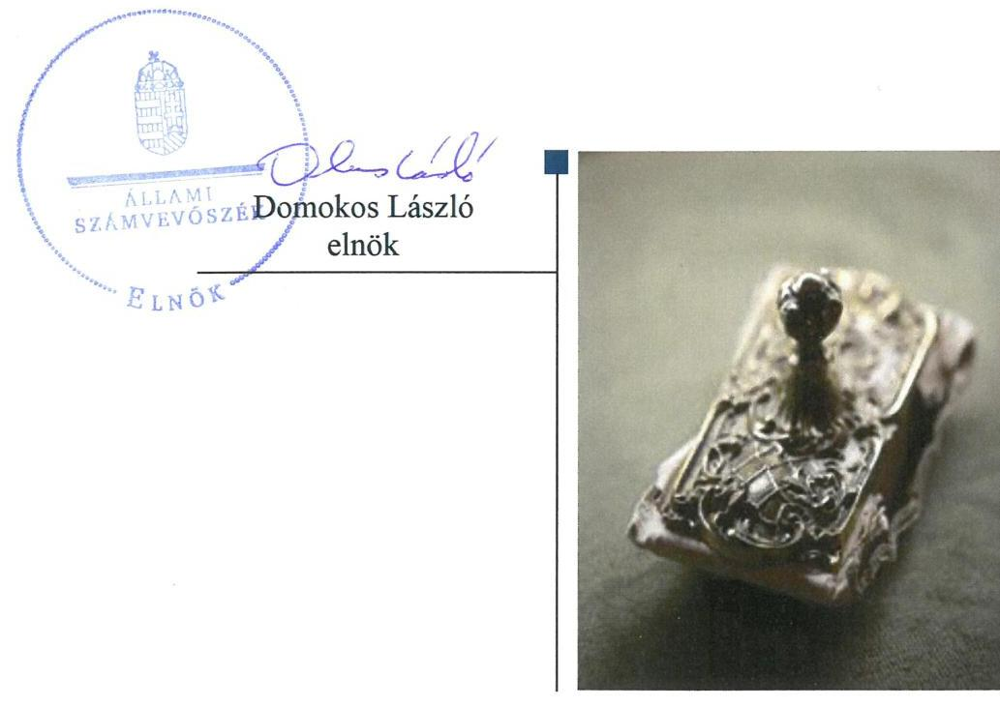
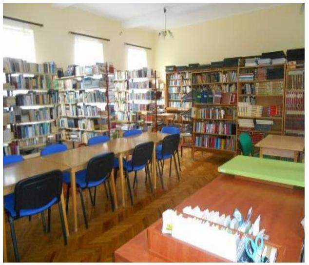
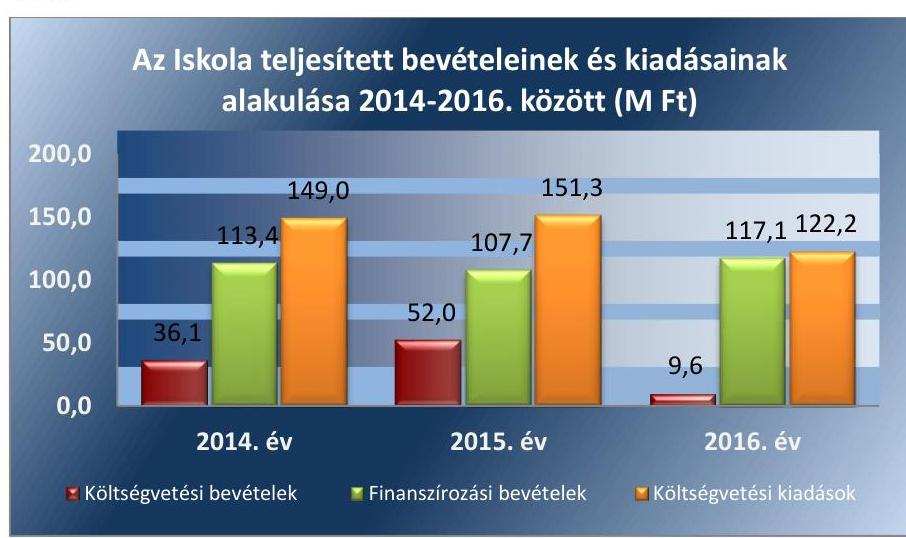
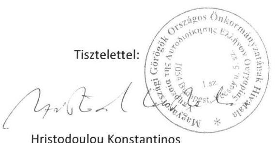
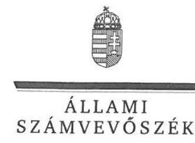
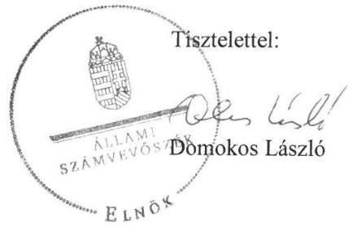
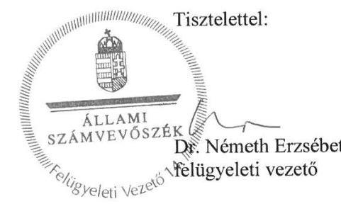

# Jelentés

**Az országos nemzetiségi önkormányzatok fenntartásában levő intézmények gazdálkodásának ellenőrzése**

Nikosz Beloiannisz Általános Iskola és Óvoda

2018.

18048 www.asz.hu

---

# Jelentés 

## Az országos nemzetiségi önkormányzatok fenntartásában levő intézmények gazdálkodásának ellenőrzése

Nikosz Beloiannisz Általános Iskola és Óvoda
2018. 12. hó 10. nap

---

# AZ ELLENŐRZÉST FELÜGYELTE: 

DR. NÉMETH ERZSÉBET felügyeleti vezető 2018. november 29-ig
KAKAS SÁNDOR felügyeleti vezető 2018. november 30-tól
AZ ELLENŐRZÉST VEZETTE ÉS A VÉGREHAJTÁSÁÉRT FELELŐS:
DR. JAKAB KORNÉL ellenőrzésvezető
A PROGRAM ÖSSZEÁLLÍTÁSÁÉRT FELELŐS:
TÓTPÁL SZABOLCS osztályvezető

IKTATÓSZÁM: EL-0371-022/2018.
TÉMASZÁM: 2463
ELLENŐRZÉS-AZONOSÍTÓ SZÁM: V080611

---

# TARTALOMJEGYZÉK 

■ ÖSSZEGZÉS ..... 5
■ AZ ELLENŐRZÉS CÉLJA ..... 6
■ AZ ELLENŐRZÉS TERÜLETE ..... 7
■ AZ ELLENŐRZÉS HÁTTERE, INDOKOLTSÁGA ..... 8
■ A JELENTÉS LÉNYEGES KÉRDÉSKÖREI ..... 9
■ AZ ELLENŐRZÉS HATÓKÖRE ÉS MÓDSZEREI ..... 10
■ MEGÁLLAPÍTÁSOK ..... 12
■ JAVASLATOK ..... 17
■ MELLÉKLETEK ..... 21
I. sz. melléklet: Értelmező szótár ..... 21
■ FÜGGELÉK: ÉSZREVÉTELEK ..... 23
■ RÖVIDÍTÉSEK JEGYZÉKE ..... 31

---

.

---

# ÖSSZEGZÉS 

A Magyarországi Görögök Országos Önkormányzata alapítási, munkáltatói és ellenőrzési joggyakorlása a Nikosz Beloiannisz Általános Iskola és Óvoda felett szabályszerű volt, az irányítási jogkörgyakorlása nem volt szabályszerű. A Nikosz Beloiannisz Általános Iskola és Óvoda működése és gazdálkodása szabályozási környezetének kialakítása, pénzügyi- és vagyongazdálkodása, szervezeti, szerkezeti átalakítása nem volt szabályszerű.

## Az ellenőrzés társadalmi indokoltsága

Magyarország Alaptörvényének XXIX. cikke kimondja, hogy a magyarországi nemzetiségek államalkotó tényezők. Joguk van anyanyelvük használatához, a sajátnyelven való névhasználathoz, saját kultúrájuk ápolásához és az anyanyelvű oktatáshoz. A nemzetiségek létrehozhatnak helyi és országos önkormányzatokat. A nemzetiségek jogaira vonatkozó részletes szabályokat Magyarországon sarkalatos törvény határozza meg. A nemzetiségi közfeladatok ellátásához az állami központi költségvetés támogatást nyújt, melyet a nemzetiségi önkormányzatok kizárólag e feladataik ellátására használhatnak fel.

## Főbb megállapítások, következtetések, javaslatok

A Magyarországi Görögök Országos Önkormányzata a Nikosz Beloiannisz Általános Iskola és Óvodával kapcsolatos alapítási, munkáltatói és ellenőrzési jogosultságokat szabályszerűen gyakorolta. Az Intézmény feletti irányítási jogok gyakorlása nem volt szabályszerű.

Az Intézmény belső kontrollrendszere nem védte meg a veszteségektől és a nem rendeltetésszerű használattól annak erőforrásait. Az Intézmény működése és gazdálkodása szabályozási környezetének kialakítása nem volt szabályszerű.

Az Intézménynél a kockázatkezelési rendszer kialakítása és működtetése nem volt szabályszerű. Az Intézmény vezetője a 2016. január 1-je és 2016. március 16-a közötti időszakban a kockázatkezelési rendszert, valamint a 2016. október 1-jét követő időszakban az integrált kockázatkezelési rendszert nem alakította ki. 2016. október 1-jétől nem szabályozta a szervezeti integritást sértő események kezelésének eljárásrendjét.

Az információs és kommunikációs folyamatok kialakítása és működtetése nem felelt meg a jogszabályi előírásoknak. Nem alakították ki az Intézmény információs és kommunikációs rendszerét, a közérdekű adatok megismerésére irányuló igények teljesítésének rendjét a jogszabályi előírások ellenére nem szabályozták.

Az Intézmény vezetője a szervezet tevékenységének, a célok megvalósításának nyomon követését biztosító rendszert nem alakította ki.

A kontrolltevékenység gyakorlása nem a jogszabályi előírásoknak megfelelően történt. A pénzügyi gazdálkodás, a bevételek beszedése és elszámolása, a kiadási előirányzatok felhasználása, valamint az előirányzat-maradvány megállapítása és elszámolása nem felelt meg a jogszabályi előírásoknak. Az Intézmény költségvetési beszámolóit az Önkormányzat Hivatala nem a jogszabályi előírásoknak megfelelően készítette el.

A vagyongazdálkodás nem volt szabályszerű, az eszközök és források értékelése, leltározása a jogszabályok és a belső szabályzatok előírásai ellenére nem történt meg.

Az Intézményt érintő szervezeti, szerkezeti átalakítások lebonyolítása nem volt szabályszerű, nem készítették el a beszámolót és az azt alátámasztó leltárakat a megszűnés napjával.

---

# AZ ELLENŐRZÉS CÉLJA 

AZ ELLENŐRZÉS CÉLJA annak értékelése volt, hogy az országos nemzetiségi önkormányzatok által alapított és fenntartott intézmények gazdálkodása, a belső kontrollrendszer kialakítása és működése, a fenntartó önkormányzat által nyújtott támogatás, illetve az államháztartásból meghatározott célra ingyenesen juttatott vagyon felhasználása a jogszabályi előírásoknak megfelelően történt-e.

---

# **AZ ELLENŐRZÉS TERÜLETE**

## **Nikosz Beloiannisz Általános Iskola és Óvoda**

Az Intézmény1 2016. június 30-ig az 1983. január 1-jén alapított Nikosz Beloiannisz Általános Művelődési Központ egyik telephelyeként és intézményegységeként működött Nikosz Beloiannisz ÁMK Általános Iskolája (és Nikosz Beloiannisz ÁMK Óvodája) néven. A 2016. évben sor került az Intézmény Áht.2 11. § (3a) pontja szerinti átalakítására, a korábban tagintézményként működő Intézményt önállóan működő költségvetési szervvé alakították.

Az Intézmény által ellátott közfeladat a közoktatás és azon belül az alapfokú oktatás volt. A Nektv.3-ben és az Njt.4-ben foglaltak szerint az Intézmény görög nemzetiségi nevelési-oktatási intézmény volt, amely ellátta a görög nemzetiségi óvoda, nappali rendszerű általános iskola feladatait.

Az ellenőrzött időszakban az Intézmény vezetője5 személyében két alkalommal történt változás.

Az Intézmény fenntartója 2012. július 1-től a Magyarországi Görögök Országos Önkormányzata volt.

Az Alapító Okirat szerint a feladatellátást szolgáló ingatlan és ingó vagyon Beloiannisz Község Önkormányzata kizárólagos tulajdonát képezte, melyet a fenntartói jog átadására kötött megállapodás alapján az Önkormányzat6 térítésmentesen használt.

Az Intézmény az ellenőrzött időszakban gazdasági szervezettel nem rendelkezett, gazdálkodási feladatait az Önkormányzat Hivatala7 látta el. A gazdálkodási és munkaügyi feladatok munkamegosztásának rendjére vonatkozóan az Önkormányzat Hivatala Munkamegosztási Megállapodást8 kötött a hozzá tartozó költségvetési szervekkel.

Az Iskolában dolgozók átlagos statisztikai létszáma a 2014. évi 29 főről 2016. évre 24 főre csökkent.

1. ábra

*Forrás: Az Intézmény 2014-2016. évi éves költségvetési beszámolói*

---

# AZ ELLENŐRZÉS HÁTTERE, INDOKOLTSÁGA 

Az Alaptörvény9 XXIX. cikke kimondja, hogy a magyarországi nemzetiségek államalkotó tényezők. Joguk van anyanyelvük használatához, a saját nyelven való névhasználathoz, saját kultúrájuk ápolásához és az anyanyelvű oktatáshoz. A nemzetiségek létrehozhatnak helyi és országos önkormányzatokat. A nemzetiségek jogaira vonatkozó részletes szabályokat Magyarországon sarkalatos törvény határozza meg. A nemzetiségi közfeladatok ellátásához az állami központi költségvetés támogatást nyújt, melyet a nemzetiségi önkormányzatok kizárólag e feladataik ellátására használhatnak fel.

Az országos nemzetiségi önkormányzatok az általuk képviselt nemzetiség kulturális autonómiájának megteremtése érdekében intézményeket hozhatnak létre és vehetnek át. Az éves költségvetési törvények közvetlenül az intézményfenntartó országos nemzetiségi önkormányzatokhoz rendelik az általuk fenntartott intézmények működési támogatását. A nemzetiségi önkormányzati intézmények költségvetési gazdálkodásának, belső kontrollrendszerének kialakítása és működtetése ellenőrzésével biztosítjuk a közpénzfelhasználás minél szélesebb körének ellenőrzését, ennek során azonos szempontok szerint értékeljük az egyes országos nemzetiségi önkormányzatok fenntartásában levő intézmények gazdálkodási tevékenységét.

Az ellenőrzés eredményeként az ellenőrzött költségvetési szervek gazdálkodása javulhat, átfogó képet kaphatunk az országos nemzetiségi önkormányzatok által fenntartott intézmények gazdálkodásának sajátosságairól, hiányosságairól és az alkalmazott jó gyakorlatokról, erősítve a társadalmi bizalmat. Az ellenőrzés tapasztalatai alapján, hiányosságok feltárásával, azok megszüntetésére vonatkozó javaslatokkal hozzájárulunk a közpénzek átlátható, szabályszerű felhasználásához.

---

# A JELENTÉS LÉNYEGES KÉRDÉSKÖREI 

1. Az Önkormányzat szabályszerűen gyakorolta-e az Iskolával kapcsolatos feladatait?
2. Az Intézmény működése és gazdálkodása során megfelelően alakította-e ki a szabályozási környezetet, belső kontrollrendszere megvédte-e a veszteségektől és nem rendeltetésszerű használattól annak erőforrásait?
3. Az Intézmény pénzügyi gazdálkodása szabályszerű volt-e?
4. Az Intézmény vagyongazdálkodása szabályszerű volt-e?
5. Az Intézményt érintő átalakítás szabályszerű volt-e?

---

# AZ ELLENŐRZÉS HATÓKÖRE ÉS MÓDSZEREI 

## Az ellenőrzés típusa

Megfelelőségi ellenőrzés.

## Az ellenőrzött időszak

2014. január 1. - 2016. december 31.

## Az ellenőrzés tárgya

Az Állami Számvevőszék ellenőrzése tárgya az Országos Görög Önkormányzat által alapított és fenntartott intézmény gazdálkodása, a belső kontrollrendszer kialakítása és működése, a fenntartó önkormányzat által nyújtott támogatás, illetve az államháztartásból meghatározott célra ingyenesen juttatott vagyon felhasználása jogszabályi előírásoknak való megfelelőségének értékelése volt. Az ellenőrzés feltárhatta a gazdálkodást, az átalakulását, átszervezését érintő szabályozások esetleges hiányosságait, a szabályozással nem érintett gazdálkodási területeket, rámutathatott a vagyongazdálkodási tevékenység - ezen belül kiemelten a tulajdonosi joggyakorlás és vagyonkezelés - esetleges szabálytalanságaira, illetve értékelte a nemzeti vagyon nyilvántartására és elszámolására vonatkozó eljárásokat.

## Az ellenőrzött szervezet

Nikosz Beloiannisz Általános Iskola és Óvoda, a Magyarországi Görögök Országos Önkormányzata és a Magyarországi Görögök Országos Önkormányzatának Hivatala.

## Az ellenőrzés jogalapja

Az ellenőrzés jogszabályi alapját az ÁSZ tv.10 1. § (3) bekezdés, 5. § (2)-(6) bekezdései, valamint az Áht. 61. § (2) bekezdésének előírásai képezték.

## Az ellenőrzés módszerei

Az ellenőrzést az ellenőrzési program szempontjai, az ellenőrzött időszakban hatályos jogszabályok, az ellenőrzés szakmai szabályai, a jelen ellenőrzésre irányadó ÁSZ11 módszertanok figyelembevételével végeztük. Az ellenőrzési kérdések megválaszolásához szükséges bizonyítékok megszer-

---

zése az ellenőrzött által rendelkezésre bocsátott dokumentumokra, adatokra alapozva, a kockázat alapú mintavételezés, valamint elemző eljárás útján történt.

Az országos nemzetiségi önkormányzatok által alapított és fenntartott intézmények gazdálkodása, a fenntartó önkormányzat által nyújtott támogatás, illetve az államháztartásból meghatározott célra ingyenesen juttatott vagyon felhasználása jogszabályi előírásoknak való megfelelőségét a 2014-2016. évek vonatkozásában értékeltük. Az intézmény belső kontrollrendszerének kialakítása és működése szabályszerűségét, a gazdálkodási jogkörök gyakorlását a 2016. év vonatkozásában ítéljük meg.

A 2016. évi bevételek és a kiadások esetében az ellenőrzés azokra a legnagyobb értékű tételekre - a lényeges sokaságra - terjedt ki, melyek összértéke eléri a teljes sokaság összértékének 50%-át. A kockázat alapú mintavételezés alapja, a gazdasági események értéknek nagysága volt. Az ellenőrzési bizonyítékként felhasználható adatforrások közé tartoztak egyrészt az ellenőrzési program részletes szempontjainál felsorolt adatforrások, másrészt minden egyéb - az ellenőrzés folyamán feltárt, az ellenőrzés szempontjából információt tartalmazó - dokumentum. Az ellenőrzés lefolytatásához az ellenőrzött szervezet a tanúsítványok kitöltésével, valamint az ÁSZ által kért dokumentumok megküldésével szolgáltatott adatokat.

Az ellenőrzés ideje alatt az ellenőrzött szervezettel történő kapcsolattartást az ÁSZ SZMSZ12-ének vonatkozó előírásai alapján biztosítottuk.

---

# 1. Az Önkormányzat szabályszerűen gyakorolta-e az Iskolával kapcsolatos feladatait? 

Összegző megállapítás

Az Önkormányzat az Iskolával kapcsolatos alapítási, ellenőrzési és munkáltatói jogosultságokat szabályszerűen gyakorolta. Az Intézmény feletti irányítási jogok gyakorlása nem volt szabályszerű.

AZ INTÉZMÉNY Alapító Okirata13 megfelelt az Ávr.14 előírásainak. Az Intézmény Alapító Okiratát az Önkormányzat az ellenőrzött időszakban az Ávr. előírásainak megfelelően módosította.

Az Önkormányzat költségvetése a 2015-2016. években az Áht. 23. § (2) bekezdés b), ba), bb) pontjaiban és a 26. § (1) bekezdésében foglaltak ellenére nem tartalmazta az általa irányított Intézmény költségvetési bevételi előirányzatait és költségvetési kiadási előirányzatait a kiemelt előirányzatok, kötelező feladatok, önként vállalt feladatok és államigazgatási feladatok bontásban.

Az ellenőrzött időszakban a Közgyűlés15 az Áhsz.16-nek és az Ávr.-nek megfelelően jóváhagyta az Intézmény éves költségvetési beszámolóit. Az Intézmény 2014-2016. közötti költségvetési maradványát a Közgyűlés nem állapította meg, mellyel megsértette az Ávr. 155. § (2) bekezdésében foglalt rendelkezéseket.

Az Önkormányzat, mint fenntartó élt az Nektv. 85. § (2) bekezdésében foglalt jogával, és kötelezte az intézményvezetőt arra, hogy az intézmény tevékenységéről átfogó módon beszámoljon. Az Intézmény éves szakmai beszámolóit a Közgyűlés jóváhagyta.

Az Önkormányzat, mint fenntartó élt az Nektv. 83. § (2) bekezdésének e) pontjában foglalt jogával és ellenőrizte a köznevelési intézmény gazdálkodását, működésének törvényességét, hatékonyságát, a szakmai munka eredményességét.

Az Önkormányzat az Intézmény tekintetében a munkáltatói jogokat a jogszabályi előírásoknak megfelelően gyakorolta.

---

# 2. Az Intézmény működése és gazdálkodása során megfelelően alakította-e ki a szabályozási környezetet, belső kontrollrendszere megvédte-e a veszteségektől és nem rendeltetésszerű használattól annak erőforrásait? 

Összegző megállapítás

Az Intézmény működése és gazdálkodása szabályozási környezetének kialakítása
 nem volt szabályszerű. Az Intézmény belső kontrollrendszere nem védte meg a veszteségektől és a nem rendeltetésszerű használattól annak erőforrásait.

A KONTROLLKÖRNYEZET kialakítása nem volt szabályszerű.
Az Intézmény 2016. szeptember 15-ig hatályos SZMSZ ${ }^{17}$-e nem felelt meg a Nektv. 25. § (4) bekezdésben előírt feltételeknek, ugyanis azt a nevelőtestület nem fogadta el. A 2016. szeptember 15-én hatályba lépett SZMSZ megfelelt a Nektv. követelményeinek.

Az Intézmény SZMSZ-ében nem tüntette fel a vagyonnyilatkozat-tételi kötelezettséggel járó munkaköröket, ezzel megsértette a Vnytv. ${ }^{18}$ 4. § a) pontjában foglalt előírást. Az Intézmény nem szabályozta továbbá a vagyonnyilatkozat átadására, nyilvántartására, a vagyonnyilatkozatban foglalt személyes adatok védelmére vonatkozó további szabályokat, így nem tett eleget a Vnytv. 11. § (6) bekezdésben foglalt előírásnak.

Az Intézmény SZMSZ-ében az Ávr. 13. § (1) bekezdés h) pont előírásait megsértve, nem szabályozták a munkáltatói jogokat, beleértve az átruházott munkáltatói jogok gyakorlásának rendjét.

A 2016. évben hatályos Munkamegosztási Megállapodás ${ }_{10}$ alapján az Intézmény vezetője felelős a kontrollkörnyezet kialakításáért, fejlesztéséért, működtetéséért. Az Intézmény vezetője a Bkr. ${ }^{19}$ 6. § (1) bek. c) pont előírása ellenére az etikai elvárásokat nem határozta meg.

Az Önkormányzat Hivatala 2016. április 27-éig a Számv. tv. 14. § (3)-(5), (11) bekezdései, az Áhsz. 50. § (1) bekezdése, valamint a Bkr. 6. § (2) bekezdése előírásait megsértve nem rendelkezett az arra jogosult által jóváhagyott Számviteli politiká${ }^{20}$-val. Az Önkormányzat Hivatala 2016. május 26-áig megsértette a Számv. tv. 14. § (5) bekezdés a) és b) pont előírásait azáltal, hogy nem rendelkezett leltározási szabályzattal, valamint értékelési szabályzattal. Az Önkormányzat Hivatala a 2016. év végén rendelkezett a Számv. tv. ${ }^{21}$ előírásainak megfelelő Számviteli politiká${ }^{22}$-val, és az annak keretében elkészített az Eszközök és a Források Leltárkészítési és Leltározási Szabályzatával ${ }^{23}$, az Eszközök és a Források Értékelési Szabályzatával ${ }^{24}$, Pénzkezelési Szabályzattal ${ }^{25}$.

Az Önkormányzat Hivatala megsértette az Áhsz. 51. § (3) bekezdés előírását, mivel a Számlarend ${ }^{26}$-ben nem rögzítették a részletező nyilvántartások vezetési módját, a pénzügyi könyveléshez készült összesítő bizonylatok elkészítésének rendjét, valamint az összesítő bizonylatok tartalmi és formai követelményeit.

A KOCKÁZATKEZELÉSI RENDSZER kialakítása és működtetése nem volt szabályszerű.

---

Az Intézmény vezetője a 2016. január 1-je és 2016. március 16-a közötti időszakban a kockázatkezelési rendszert, valamint a 2016. október 1-jét követő időszakban az integrált kockázatkezelési rendszert nem alakította ki, mellyel megsértette a Bkr. 3. § b) pontjában foglalt jogszabályi rendelkezést.

Az Intézmény vezetője megsértve a Bkr. 6. § (4) bekezdésében foglaltakat 2016. október 1-jétől nem szabályozta a szervezeti integritást sértő események kezelésének eljárásrendjét. Az Intézmény vezetője 2016. október 1-jétől nem jelölte ki az integrált kockázatkezelési rendszer koordinálásának felelősét, mellyel megsértette a Bkr. 7. § (4) bekezdésének előírását.

A KONTROLLTEVÉKENYSÉG kialakítása és működtetése nem volt szabályszerű. A bevételek beszedése és elszámolása, valamint a kiadási előirányzatok felhasználása nem felelt meg az Ávr. 57. § (3) bekezdésében, az Ávr. 58. § (3) bekezdésében és az Ávr. 59. § (1)-(3) bekezdéseiben foglalt jogszabályi előírásoknak, nem érvényesültek a gazdálkodási jogkörök gyakorlásához rendelt kontrollok.

# AZ INFORMÁCIÓS ÉS KOMMUNIKÁCIÓS FOLYAMATOK kialakítása és működtetése az Intézménynél nem felelt meg a jogszabályi előírásoknak. 

Az Intézmény vezetője a Bkr. 3. §. (d) bekezdés előírása ellenére nem alakította ki az Intézmény információs és kommunikációs rendszerét.

Az Intézmény nem határozta meg belső szabályzataiban a Bkr. 9. §. (2) bekezdésében előírt beszámolási szinteket, módokat, határidőket.

Az Önkormányzat Hivatala a 2015. december 17-én hatályba helyezett, az Iskolára is kiterjesztett hatályú Adatvédelmi szabályzat ${ }^{27}$-ban rögzítette a kötelezően közzéteendő adatok nyilvánosságra hozatalának rendjét, azonban a Hivatalvezető ${ }^{28}$ a közérdekű adatok megismerésére irányuló kérelmek intézésének rendjét az Ávr. 13. § (2) bekezdés h) pont előírása ellenére nem szabályozta.

Az Adatvédelmi szabályzat biztosította az adatok biztonságának, védelmének érvényre juttatásához szükséges eljárási szabályokat, feladatokat, azonban az lkr. ${ }^{29}$ 8. § (2) bekezdés előírása szerinti hatásköröket nem határozta meg.

Az Info. tv. ${ }^{30}$ 37. § (1) bekezdésben előírt közzétételi kötelezettségnek az Önkormányzat honlapján eleget tettek.

Az Önkormányzat Hivatala az Iratkezelési szabályzatát ${ }^{31}$ az Ltv. ${ }^{32}$ 10. § (1) bekezdés a) pontjában foglalt rendelkezés ellenére nem az illetékes közlevéltárral egyetértésben adta ki.

AZ INTÉZMÉNY VEZETŐJE a szervezet tevékenységének, a célok megvalósításának nyomon követését biztosító rendszert nem alakította ki, mellyel megsértették a Bkr. 3. § e) pontjában, valamint a 10. §-ban előírtakat.

A független belső ellenőrzést a jogszabályi előírásoknak megfelelően alakították ki és működtették.

---

Az Intézmény vezetője nem gondoskodott nyilvántartás vezetéséről a külső ellenőrzések javaslatai alapján készült intézkedési tervek végrehajtásával kapcsolatban, mellyel megsértette a Bkr. 14. § (1) bekezdésben foglalt rendelkezést.

Az Intézmény vezetője a Bkr. 11. § (1) bekezdésében előírtak ellenére a 2016. évben a jogszabályban meghatározott nyilatkozat alapján nem értékelte a belső kontrollrendszer minőségét.

AZ INTEGRITÁS kontrollokat az Intézmény nem a kockázatokkal arányosan alakította ki. Nem határozta meg az általa követendő értékeket, ezek között az integritás erősítését. Kockázatelemzése nem volt teljes körű, nem támogatta megfelelően az integritás kontrollokat.

# 3. Az Intézmény pénzügyi gazdálkodása szabályszerű volt-e? 

## Összegző megállapítás Az Intézmény pénzügyi gazdálkodása nem volt szabályszerű.

A BEVÉTELEK beszedése és elszámolása nem felelt meg a jogszabályi előírásoknak. A pénztárbizonylaton nem tüntették fel a bevétel egységes rovatrend és kormányzati funkció szerinti számát, a jóváírással érintett pénzeszköz államháztartási számviteli kormányrendelet szerinti könyvviteli számlájának számát, mellyel megsértették az Ávr. 59. §-ának (3) bekezdés e) és f) pontjában foglalt jogszabályi előírást.

A KIADÁSI ELŐIRÁNYZATOK felhasználása során az ellenőrzés által kiválasztott - a módszertani leírás alapján a lényeges sokaság elemének minősített - 6,8 M Ft értékű mintatételből 6,8 M Ft érték esetében a teljesítésigazolásra az Ávr. 57. § (3) bekezdés, az érvényesítésre az Ávr. 58. § (3) bekezdés, továbbá az utalványozásra az Ávr. 59. § (1)-(2) bekezdés és az Úgyrend$_{1-3}$ előírásait megsértve nem került sor. Az Intézmény három mintatétel esetében az Áht. 37. § (1) bekezdésében foglaltakat megsértve írásos kötelezettségvállalással nem rendelkezett.

AZ ELŐIRÁNYZAT-MARADVÁNY megállapítása és elszámolása nem volt szabályszerű. A kötelezettségvállalással terhelt maradványt az Önkormányzat Hivatala a 2014-2016. években az Áhsz. 39. § (3) bekezdés előírása ellenére nem támasztotta alá részletező nyilvántartással.

AZ ÖNKORMÁNYZAT HIVATALA az Intézmény tárgyévben esedékes kifizetések kezeléséhez 2014-2016. évek között nem készítette el az Áhsz. 14. melléklet II. 4. a)-g) pontokban meghatározott minimum tartalomnak megfelelő kötelezettségvállalások, más fizetési kötelezettségek részletező nyilvántartását, ezáltal megsértve az Ávr. 56. § (1) bekezdésében leírtakat.

Az Intézmény éves költségvetési beszámolóit az Önkormányzat Hivatala nem a jogszabályi előírásoknak megfelelően készítette el. Az Intézmény 2014-2016. közötti időszak éves költségvetési beszámolóit nem támasztotta alá folyamatosan vezetett részletező nyilvántartásokkal, valamint leltárral, mellyel megsértette az Áhsz. 5. § (1) bekezdésében foglalt előírásokat.

---

# 4. Az Intézmény vagyongazdálkodása szabályszerű volt-e? 

## Összegző megállapítás Az Intézmény vagyongazdálkodása nem volt szabályszerű.

AZ INTÉZMÉNYNÉL a mennyiségi felvétellel történő leltározás hiánya, illetve a mérlegtételeket alátámasztó leltárdokumentumok hiánya miatt az Intézmény eszközei és forrásai leltárral való alátámasztása a 2014-2016. években nem volt biztosított, megsértve a Számv. tv. 15. § (3) bekezdése szerinti „valódiság elvét", valamint a Számv. tv. 69. § (1) és (3) bekezdésében és a Leltározási szabályzat vonatkozó előírásaiban foglaltakat.

Az Intézmény 2012. július 1-jétől hatályos Alapító Okirat alapján a feladatellátást szolgáló ingatlan és ingóvagyont az Önkormányzat és Beloiannisz Község Önkormányzata között létrejött, fenntartó jog átadására kötött megállapodás alapján az Önkormányzat ingyenesen használja.

## 5. Az Intézményt érintő átalakítás szabályszerű volt-e?

## Összegző megállapítás Az Intézményt érintő szervezeti, szerkezeti átalakítás lebonyolítása nem volt szabályszerű.

AZ INTÉZMÉNYT ÉRINTŐ SZERVEZETI, SZERKEZETI ÁTALAKÍTÁSOK lebonyolítása nem volt szabályszerű.

Az Intézmény a Nikosz Beloiannisz Általános Művelődési Központból 2016. július 1-jei hatállyal kiválással jött létre, amely megfelel az Áht. 11. §. (3a) pontjában foglalt átalakulásnak. Az Önkormányzat az Intézmény átalakítása során megsértette az Áhsz. 5. § (1) és 7. § (3) bekezdését azáltal, hogy a megszűnés napjával nem készítették el a beszámolót és az azt alátámasztó leltárakat.

---

# JAVASLATOK 

Az ÁSZ tv. 33. § (1) bekezdésében foglaltak értelmében az ellenőrzött szervezet vezetője köteles a jelentésben foglalt megállapításokhoz kapcsolódó intézkedési tervet összeállítani és azt a jelentés kézhezvételétől számított 30 napon belül az ÁSZ részére megküldeni. Amennyiben az ellenőrzött szervezet vezetője nem küldi meg határidőben az intézkedési tervet, vagy továbbra sem elfogadható intézkedési tervet küld, az Állami Számvevőszék elnöke az ÁSZ tv. 33. § (3) bekezdés a) és b) pontjaiban foglaltakat érvényesítheti.

## a Magyarországi Görögök Országos Önkormányzata elnökének

1. Gondoskodjon az Áht. előírásainak megfelelően, hogy az Önkormányzat költségvetése tartalmazza az általa irányított Iskola költségvetési bevételi előirányzatait és költségvetési kiadási előirányzatait kiemelt előirányzatok, kötelező feladatok, önként vállalt feladatok és államigazgatási feladatok szerinti bontásban.
(1. sz. megállapítás 2. bekezdése alapján)
2. Gondoskodjon az Ávr. előírásainak megfelelően, hogy a Közgyülés az Intézmény költségvetési maradványát állapítsa meg.
(1. sz. megállapítás 3. bekezdés 2. mondata alapján)

## Nikosz Beloiannisz Általános Iskola és Óvoda igazgatójának

1. Gondoskodjon a Vnytv. előírásainak megfelelően, hogy az SZMSZ-ben tüntessék fel a vagyonnyilatkozat-tételi kötelezettséggel járó munkaköröket, továbbá szabályozza a vagyonnyilatkozat átadására, nyilvántartására, a vagyonnyilatkozatban foglalt személyes adatok védelmére vonatkozó további szabályokat.
(2. sz. megállapítás 3. bekezdése alapján)
2. Gondoskodjon az Ávr. előírásainak megfelelően, hogy az SZMSZ tartalmazza a munkáltatói jogok gyakorlásának - ideértve az átruházott munkáltatói jogokat is - rendjét.
(2. sz. megállapítás 4. bekezdése alapján)
3. Határozza meg a Bkr. előírásainak megfelelően az etikai elvárásokat a szervezet minden szintjén.
(2. sz. megállapítás 5. bekezdésének 2. mondata alapján)

---

4. A Bkr. előírásainak megfelelően intézkedjen az Intézmény integrált kockázatkezelési rendszerének kialakításáról és működtetéséről, szabályozza a szervezeti integritást sértő események kezelésének eljárásrendjét, valamint jelölje ki az integrált kockázatkezelési rendszer koordinálásának felelősét.
(2. sz. megállapítás 9-10. bekezdése alapján)
5. Intézkedjen a Bkr. előírásainak megfelelően az Intézmény információs és kommunikációs rendszerének kialakításáról.
(2. sz. megállapítás 13. bekezdése alapján)
6. Gondoskodjon az Intézmény tevékenységének, a célok megvalósításának nyomon követését biztosító rendszer kialakításáról.
(2. sz. megállapítás 19. bekezdése alapján)
7. Gondoskodjon a Bkr. előírásainak megfelelően a külső ellenőrzések javaslatai alapján készült intézkedési tervek végrehajtására vonatkozó nyilvántartás vezetéséről.
(2. sz. megállapítás 21. bekezdése alapján)
8. Nyilatkozatban értékelje a Bkr. előírásának megfelelően a költségvetési szerv belső kontrollrendszerének minőségét.
(2. sz. megállapítás 22. bekezdése alapján)
9. Intézkedjen a kötelezettségvállalás, teljesítés igazolás, valamint utalványozás gazdálkodási jogkörök gyakorlása során az Áht.-ban és az Ávr.-ben előírtak betartásáról.
(3. sz. megállapítás 2. bekezdése alapján)
10. Intézkedjen a Számv. tv. és a Leltározási szabályzat szerinti mennyiségi felvétellel történő leltározás elvégzéséről, valamint olyan leltár összeállításáról, amely a Számv. tv. és a Leltározási szabályzat
 előírásainak megfelelően, tételesen, ellenőrizhető módon tartalmazza az Intézmény mérleg fordulónapján meglévő eszközeit és forrásait mennyiségben és értékben.
(4. sz. megállapítás 1. bekezdése alapján)

---

# Magyarországi Görögök Országos Önkormányzatának Hivatala vezetőjének 

1. Gondoskodjon az ÁSZ. előírásainak megfelelően, hogy a Számlarend tartalmazza a részletező nyilvántartások vezetési módját, a pénzügyi könyveléshez készült összesítő bizonylatok elkészítésének rendjét, valamint az összesítő bizonylatok tartalmi és formai követelményeit.
(2. sz. megállapítás 7. bekezdése alapján)
2. Szabályozza az Ávr. előírásainak megfelelően a közérdekű adatok megismerésére irányuló kérelmek intézésének rendjét.
(2. sz. megállapítás 15. bekezdésének 2. mondata alapján)
3. Intézkedjen az Adatvédelmi szabályzat Ikr. előírásainak megfelelő kiegészítéséről.
(2. sz. megállapítás 16. bekezdése alapján)
4. Gondoskodjon arról, hogy az Iratkezelési szabályzatot az illetékes közlevéltár egyetértésével adják ki.
(2. sz. megállapítás 18. bekezdése alapján)
5. Intézkedjen az érvényesítés gazdálkodási jogkör gyakorlása során az Ávr.-ben előírtak betartásáról.
(3. sz. megállapítás 2. bekezdése alapján)
6. Gondoskodjon a kötelezettségvállalások, más fizetési kötelezettségek Ávr. és ÁSZ. szerinti nyilvántartásáról.
(3. sz. megállapítás 4. bekezdése alapján)
7. Gondoskodjon az ÁSZ előírásainak megfelelő folyamatosan vezetett részletező nyilvántartásokkal valamint leltárral alátámasztott költségvetési beszámoló elkészítéséről.
(3. sz. megállapítás 5. bekezdés 2. mondata alapján)

---

.

---

# MELLÉKLETEK 

- I. SZ. MELLÉKLET: ÉRTELMEZŐ SZÓTÁR
irányító szerv
közfeladat
működtetés
nemzetiségi önkormányzat
nemzetiségi köznevelési intézmény
nemzetiségi többcélú intézmény
tulajdonosi joggyakorló
vagyongazdálkodás

A költségvetési szerv tekintetében az e törvényben meghatározott irányítási hatáskört gyakorló szerv. (Forrás: Áht. 1. § 9. pontja)
Jogszabályban meghatározott állami vagy önkormányzati feladat, amit az arra kötelezett közérdekből, a jogszabályban meghatározott követelményeknek és feltételeknek megfelelve végez, ideértve a lakosság közszolgáltatásokkal való ellátását, továbbá az állam nemzetközi szerződésekben vállalt kötelezettségeiből adódó közérdekű feladatokat, valamint e feladatok ellátásakor szükséges infrastruktúra biztosítását is. (Forrás: Nvtv. 3. § (1) bekezdés 7. pontja, hatálytalan: 2015. január 1-jétől)
„Közfeladat a jogszabályban meghatározott állami vagy önkormányzati feladat". A közfeladatok ellátása költségvetési szervek alapításával és működtetésével, vagy azok ellátásához szükséges pénzügyi fedezet törvényben meghatározott eszközökkel, részben, vagy egészben történő biztosításával valósul meg. (Forrás: Áht. 3/A. § (1) bekezdés, hatályos 2015. január 1-jétől)
A nemzeti vagyon birtoklásából, használatából, hasznai szedéséből, a nemzeti vagyon fenntartásából és üzemeltetéséből álló tevékenységek együttese, amely - jogszabály vagy szerződés alapján - a nemzeti vagyon felújítására, fejlesztésére, a birtoklásának, használatának hasznai szedése jogának továbbengedésére is kiterjed. (Forrás: Nvtv. 3. § 10. pontja)

A nemzetiségek jogairól szóló törvényben meghatározott nemzetiségi közszolgáltatási feladatokat ellátó, testületi formában működő, jogi személyiséggel rendelkező, demokratikus választások útján e törvény alapján létrehozott szervezet, amely a nemzetiségi közösséget megillető jogosultságok érvényesítésére, a nemzetiségek érdekeinek védelmére és képviseletére, a feladat- és hatáskörébe tartozó nemzetiségi közügyek települési, területi vagy országos szinten történő önálló intézésére jön létre. (Forrás: a nemzetiségek jogairól szóló 2011. évi CLXXIX. törvény, 2. § 2. pont) Az a köznevelési intézmény, amelynek alapító okirata a nemzeti köznevelésről szóló törvényben foglaltak szerint tartalmazza a nemzetiségi feladatok ellátását, feltéve, hogy e feladatokat a köznevelési intézmény ténylegesen ellátja, továbbá óvoda, iskola és kollégium esetén a tanulók legalább huszonöt százaléka részt vesz a nemzetiségi óvodai nevelésben, illetve a nemzetiségi iskolai nevelésben-oktatásban.
nemzetiségi többcélú intézményen, nemzetiségi tagintézményen és nemzetiségi köznevelési intézmény intézményegységén a köznevelési törvény szerinti többcélú intézmény, tagintézmény és intézményegység értendő (Forrás: Nemzetiségi tv. 2. § 4. pont b,)

Aki a nemzeti vagyon felett az államot vagy a helyi önkormányzatot megillető tulajdonosi jogok és kötelezettségek összességének gyakorlására jogosult. (Forrás: Nvtv. 3. § (1) bekezdés 17. pontja)

A nemzeti vagyongazdálkodás feladata a nemzeti vagyon rendeltetésének megfelelő, az állam, az önkormányzat mindenkori teherbíró képességéhez igazodó, elsődlegesen a közfeladatok ellátásához és a mindenkori társadalmi szükségletek kielégítéséhez szükséges, egységes elveken alapuló, átlátható, hatékony és költségtakarékos működtetése, értékének megőrzése, állagának védelme, értéknövelő használata, hasznosítása, gyarapítása, továbbá az állam vagy a helyi önkormányzat feladatának ellátása szempontjából feleslegessé váló vagyontárgyak elidegenítése. (Forrás: Nvtv. 7. § (2) bekezdése)

---

nemzeti vagyon a) az állam vagy a helyi önkormányzat kizárólagos tulajdonában álló dolgok,
b) az a) pont hatálya alá nem tartozó, az állam vagy a helyi önkormányzat tulajdonában lévő dolog,
c) az állam vagy a helyi önkormányzat tulajdonában lévő pénzügyi eszközök, továbbá az államot vagy a helyi önkormányzatot megillető társasági részesedések,
d) az államot vagy a helyi önkormányzatot megillető bármely vagyoni értékkel rendelkező jogosultság, amelyet jogszabály vagyoni értékű jogként nevesít,
e) Magyarország határa által körbezárt terület feletti légtér,
f) az üvegházhatású gázok kibocsátási egységeinek kereskedelméről szóló törvény szerinti kibocsátási egység és légiközlekedési kibocsátási egység, valamint az ENSZ Éghajlatváltozási Keretegyezménye és annak Kiotói Jegyzőkönyv végrehajtási keretrendszeréről szóló törvény szerinti kiotói egység,
g) állami vagy helyi önkormányzati fenntartású közgyűjtemény (muzeális intézmény, levéltár, közgyűjteményként működő kép- és hangarchívum, valamint könyvtár) saját gyűjteményében nyilvántartott kulturális javak körébe tartozó dolog, kivéve, ha az állami vagy önkormányzati tulajdon jogszerű létrejötte kétséget kizáró módon nem bizonyítható és a dologra nézve más a tulajdonjogát bizonyítja vagy a kulturális javakra vonatkozó jogszabályokban meghatározott eljárás keretében valószínűsíti,
h) a régészeti lelet,
i) a nemzeti adatvagyon körébe tartozó állami nyilvántartások fokozottabb védelméről szóló törvény szerinti nemzeti adatvagyon.
(Forrás: Nvtv. 1.§ (2) bekezdés)

---

# FÜGGELÉK: ÉSZREVÉTELEK 

A jelentéstervezetet a Számvevőszék 15 napos észrevételezésre megküldte az ellenőrzött szervezetek vezetőinek az ÁSZ tv. 29. § (1) bekezdése előírásának megfelelően.

A Magyarországi Görögök Országos Önkormányzatának Hivatala vezetője a jelentéstervezet megállapításaira írásban észrevételt tett. A Nikosz Beloiannisz Általános Iskola és Óvoda igazgatója és a Magyarországi Görögök Országos Önkormányzata elnöke nem élt észrevételezési jogával.
Az ÁSZ tv. 29. § (3) bekezdésével összhangban az ÁSZ a Függelékben feltünteti az ellenőrzés megállapításaival kapcsolatban tett, figyelembe nem vett észrevételeket, és megindokolja, hogy azokat miért nem fogadta el.

[^0]
[^0]:    * 29. § (1) Az Állami Számvevőszék az ellenőrzési megállapításait megküldi az ellenőrzött szervezet vezetőjének vagy az általa megbízott személynek, és annak, akinek személyes felelősségét állapította meg.
    (2) Az ellenőrzött szervezet vezetője és a felelősként megjelölt személy az ellenőrzés megállapításaira tizenöt napon belül írásban észrevételt tehet.
    (3) Az Állami Számvevőszék az észrevételre a beérkezésétől számított harminc napon belül írásban válaszol. A figyelembe nem vett észrevételeket köteles a jelentésben feltüntetni, és megindokolni, hogy azokat miért nem fogadta el.

---

# Függelék: Észrevételek 

AYTOAIOIKHEH E $\wedge \wedge H N D N$ OYITAPIAE
MAGYARORSZAGI GÖRÖGÖK ORSZAGOS ÖNKORMÁNYZATA
1054 Budapest, Vécsey u. 5.

## Domokos László Elnök Úr!

## Állami Számvevőszék

1052 Budapest, Apáczai Csere János u. 10

Tárgy: Hivatalvezetői észrevétel a jelentéstervezetben leírt megállapításokhoz

## Tisztelt Elnök úr!

Az Állami Számvevőszék 2018. október 13-i keltezésű jelentéstervezetének (iktatószám: EL-0720-030/2018) megállapításaihoz, a Magyarországi Görögök Országos Önkormányzatának Hivatala az alábbiakban kíván észrevételt tenni.

A Nikosz Beloiannisz Általános Iskola és Óvoda számvevőszéki ellenőrzése során 2018. október 16-án kézhez kapott dokumentumban „Az országos Nemzetiségi Önkormányzatok fenntartásában lévő intézmények gazdálkodásának ellenőrzése során "az Állami Számvevőszék megállapította, hogy a „Magyarországi Görögök Országos Önkormányzata alapítási, munkáltatói és ellenőrzési joggyakorlása a Nikosz Beloiannisz Általános Iskola és Óvoda felett szabályszerű volt, az irányítási joggyakorlása nem volt szabályszerű. A Nikosz Beloiannisz Általános Iskola és Óvoda működése és gazdálkodása szabályozási környezetének kialakítása, pénzügyi-és vagyongazdálkodása, szervezeti, szerkezeti átalakítása nem volt szabályszerű."

A hivatal vezetőjének tett javaslatok kapcsán néhány észrevételt kívánok tenni.
4. pont: „Gondoskodjon arról, hogy az iratkezelési szabályzatot az illetékes közlevéltár egyetértésével adják ki."
A Magyar Nemzeti Levéltár egyetértésével elkészült a Magyarországi Görögök Országos Önkormányzatának aktualizált iratkezelési szabályzata. (1. sz. melléklet)
6. pont: „Gondoskodjon a kötelezettségvállalások, más fizetési kötelezettségek Ávr. és ÁSZ. szerinti nyilvántartásáról."
A Magyarországi Görögök Országos Önkormányzata Hivatalának gazdasági szervezete a kötelezettségvállalások és más fizetési kötelezettségek nyilvántartását az EPER Integrált

---

# AYTOAIOIKHZH EAAHNON OYTTAPIAZ   MAGYARORSZÁGI GÖRÖGÖK ORSZÁGOS ÖNKORMÁNYZATA 

Pénzügyi és Számviteli rendszer-programmal biztosítja, egyéb „egyedi" nyilvántartást nem készít.
7. pont: „Gondoskodjon az ÁSZ. előírásainak megfelelő folyamatosan vezetett részletező nyilvántartásokkal valamint leltárral alátámasztott költségvetési beszámoló elkészítéséről." A Magyarországi Görögök Országos Önkormányzata az ÁSZ. 5.§ (1) bekezdésben foglaltak szerint támasztotta alá a 2014-2016 közötti időszak költségvetési beszámolóit. (Az említett időszak beszámolóihez készített könyvvizsgálói és belső ellenőrzési jelentések nem kifogásolják a beszámolót alátámasztó részletező nyilvántartás valamint a leltár hiányát.) A vonatkozó dokumentumok a Hivatal gazdasági szervezetének irodájában fellelhetőek.

Kérem a Tisztelt Elnök Urat, hogy a Számvevőszék megállapításaival kapcsolatos hivatalvezetői észrevételeket, álláspontokat a végleges jelentés megfogalmazásánál figyelembe venni szíveskedjenek.

Budapest, 2018. október 30.

Segítő együttműködésüket megköszönve,

Hristodoulou Konstantinos
Hivatalvezető
Magyarországi Görögök Országos Önkormányzatának hivatala

---

Hristodoulou Konstantinos részére
hivatalvezető

Magyarországi Görögök Országos Önkormányzata Budapest,
Vécsey utca 5.
IOS4
Budapest, 2017. május 9.

Magyarországi Görögök Országos Önkormányzata
Iktatószám: 0327/3/2017
Irattári téteiszám:
2017 MAJ 15
/1 45
Tárgy: MGOÖ iratkezelési szabályzata
Iktatószám: 07/364-I/2017.
Hivatkozási szám: -
Ügyintéző: Bádı Barbara
Melléklet: -

Tisztelt Hristodoulou Konstantinos!

A Magyar Nemzeti Levéltár részére a Magyarországi Görögök Országos Önkormányzata által egyetértés céljából megküldött iratkezelési szabályzatot ellenőriztem. Megállapítom, hogy a Magyarországi Görögök Országos Önkormányzata iratkezelési szabályzatát a köziratokról, a közlevéltárakról és a magánlevéltári anyag védelméről szóló 1995. évi LXVI. törvényben, valamint a közfeladatot ellátó szervek iratkezelésének általános követelményeiről szóló 335/2005. (XII. 29.) Korm. rendeletben foglaltakkal összhangban készítette el.

Az iratkezelési szabályzat 2017. január 1-jétől történő bevezetésével egyetértek.

Kérem, hogy az egységes szerkezetbe foglalt iratkezelési szabályzat egy hivatalosan kiadott példányát, a Magyar Nemzeti Levéltár nyilvántartásába való elhelyezés céljából, szíveskedjen megküldeni papír alapon, illetve elektronikus formában a badi.barbara@mnl.gov.hu e-mail címre is.

Tisztelettel,

Keresztes Csaba
főosztályvezető-helyettes
Számviteli Koordinációs Központ
Módszertani, Továbbképzési és Iratkezelés-felügyeleti Koordinációs Osztály

Budapest, 1., Bécsi kapu tér 2-4.
1250 Budapest, Pf. 3.
Telefon: (+36 1) 225-2897
Fax: (+36 1) 225-2899
Web: www.mnl.gov.hu

---

ELNÖK

Ikt.szám: EL-0720-032/2018

# Hristodoulou Konstantinos úr 

hivatalvezető

Magyarországi Görögök Országos Önkormányzatának Hivatala

## Budapest

## Tisztelt Hivatalvezető Úr!

„Az országos nemzetiségi önkormányzatok fenntartásában levő intézmények gazdálkodásának ellenőrzése - Nikosz Beloiannisz Általános Iskola és Óvoda" című jelentéstervezetre tett észrevételét köszönettel megkaptam.
Az ellenőrzési megállapításokra vonatkozó észrevételét az Állami Számvevőszékről szóló 2011. évi LXVI. törvény (a továbbiakban: ÁSZ tv.) 29. § (2) bekezdésében meghatározott tizenöt napos határidőn belül küldte meg. Az Állami Számvevőszék észrevétellel kapcsolatos álláspontját a mellékletként csatolt, a felügyeleti vezető által készített indokolás tartalmazza.
Tájékoztatom, hogy az Állami Számvevőszék a figyelembe nem vett észrevételeket az ÁSZ tv. 29. § (3) bekezdésében előírtak szerint köteles a jelentésében feltüntetni és megindokolni, hogy azokat miért nem fogadta el.

Budapest, 2018. [hónap] 22. nap

Melléklet: Észrevételre adott válasz

---

# „Az országos nemzetiségi önkormányzatok fenntartásában levő intézmények gazdálkodásának ellenőrzése - Nikosz Beloiannisz Általános Iskola és Óvoda " című jelentéstervezethez tett észrevételre adott válasz   Magyarországi Görögök Országos Önkormányzatának Hivatala 

A jelentéstervezetre tett észrevételeket áttekintettem, annak kezelésével kapcsolatban a következő tájékoztatást adom.

1. A jelentéstervezet az Intézmény információs és kommunikációs folyamatainak kialakításával és működtetésével összefüggésben megállapítja, hogy az Önkormányzat Hivatala az Iratkezelési szabályzatát az Ltv. 10. § (1) bekezdés a) pontjában foglalt rendelkezés ellenére nem az illetékes közlevéltárral egyetértésben adta ki.

Hivatalvezető úr észrevételében arról tájékoztatja az Állami Számvevőszéket, hogy a Magyar Nemzeti Levéltár egyetértésével elkészült a Magyarországi Görögök Országos Önkormányzatának iratkezelési szabályzata. Hivatalvezető
 úr észrevétele mellékleteként megküldte a Magyar Nemzeti Levéltár egyetértő nyilatkozatát az iratkezelési szabályzat 2017. január 1-jétől történő bevezetéséről.

Az észrevétel a 2014. január 1. – 2016. december 31. közötti ellenőrzési időszakra vonatkozó megállapítást nem vitatja. Az intézkedést igénylő megállapításokkal összefüggésben tervezett, illetve megtett intézkedésekről az Önkormányzat Hivatala az Állami Számvevőszékről szóló 2011. évi LXVI. törvény (továbbiakban: ÁSZ tv.) 33. § (1) bekezdése alapján összeállított és megküldött intézkedési tervében köteles tájékoztatni az Állami Számvevőszéket, melyre a jelentés nyilvánosságra hozatala után 30 nap áll rendelkezésére. A megállapítás módosítása a fentiekkel összhangban nem indokolt.
2. A jelentéstervezet az Intézmény pénzügyi gazdálkodásával összefüggésben megállapítja, hogy az Önkormányzat Hivatala az Intézmény tárgyévben esedékes kifizetések kezeléséhez 2014–2016. évek között nem készítette el az Áhsz. 14. melléklet II. 4. a)–g) pontokban meghatározott minimum tartalomnak megfelelő kötelezettségvállalások, más fizetési kötelezettségek részletező nyilvántartását, ezáltal megsértve az Ávr. 56. § (1) bekezdésében leírtakat.

Hivatalvezető úr észrevételében arról tájékoztatja az Állami Számvevőszéket, hogy a Magyarországi Görögök Országos Önkormányzata Hivatalának gazdasági szervezete a kötelezettségvállalások és más fizetési kötelezettségeinek nyilvántartását az EPER Integrált Pénzügyi és Számviteli rendszer-programmal biztosítja, egyéb „egyedi” nyilvántartást nem készít.

Az észrevétellel kapcsolatban ismételten áttekintettük az ellenőrzési dokumentumokat. Megállapítottuk, hogy az Állami Számvevőszék az adatbekérés során bekérte, az Önkormányzat Hivatala azonban nem bocsátotta az ellenőrzés rendelkezésére a kapcsolódó analitikus nyilvántartásokat, kivonatokat, nem igazolta dokumentummal a

---

kötelezettségvállalások, más fizetési kötelezettségek a jogszabályban meghatározott minimum tartalomnak megfelelő részletező nyilvántartását. A dokumentumok nem szerepelnek a teljességi és hitelességi nyilatkozatokban. A megállapítás módosítása ezért nem indokolt.
3. A jelentéstervezet az Intézmény pénzügyi gazdálkodásával összefüggésben szintén megállapítja, hogy az Intézmény éves költségvetési beszámolóit az Önkormányzat Hivatala nem a jogszabályi előírásoknak megfelelően készítette el. Az Intézmény 2014–2016. közötti időszak éves költségvetési beszámolóit nem támasztotta alá folyamatosan vezetett részletező nyilvántartásokkal, valamint leltárral, mellyel megsértette az Áhsz. 5. § (1) bekezdésében foglalt előírásokat.

Hivatalvezető úr észrevételében arról tájékoztatja az Állami Számvevőszéket, hogy Magyarországi Görögök Országos Önkormányzata az Áhsz. 5. § (1) bekezdésében foglaltak szerint támasztotta alá a 2014–2016 közötti időszak költségvetési beszámolóit. Az említett időszak beszámolóiról készített könyvvizsgálói és belső ellenőrzési jelentések nem kifogásolják a beszámolót alátámasztó részletező nyilvántartás valamint a leltár hiányát. A vonatkozó dokumentumok a Hivatal gazdasági szervezetének irodájában fellelhetőek.

Az észrevétel során ismételten áttekintettük az ellenőrzési dokumentumokat, amely során megállapítást nyert, hogy az Állami Számvevőszék az adatbekérés során bekérte, az Önkormányzat Hivatala azonban nem bocsátotta az ellenőrzés rendelkezésére a nyilvántartásokat, dokumentummal nem igazolta a beszámolók jogszabályi követelményeknek megfelelő alátámasztottságát. A dokumentumok nem szerepelnek a teljességi és hitelességi nyilatkozatokban. A megállapítás módosítása erre való tekintettel nem indokolt.

Budapest, 2018. november 22.

---

.

---

# RÖVIDÍTÉSEK JEGYZÉKE 

${ }^{1}$ Intézmény
${ }^{2}$ Áht.
${ }^{3}$ Nektv.
${ }^{4}$ Njt.
${ }^{5}$ Intézmény vezetője
${ }^{6}$ Önkormányzat
${ }^{7}$ Önkormányzat Hivatala
${ }^{8}$ Munkamegosztási Megállapodás

Munkamegosztási Megállapodás
${ }^{9}$ Alaptörvény
${ }^{10}$ ÁSZ tv.
${ }^{11}$ ÁSZ
${ }^{12}$ ÁSZ SZMSZ
${ }^{13}$ Alapító Okirat

Alapító Okirat
Alapító Okirat
Alapító Okirat
${ }^{14}$ Ávr.
${ }^{15}$ Közgyűlés
${ }^{16}$ Áhsz.
${ }^{17}$ SZMSZ
${ }^{18}$ Vnytv.
${ }^{19}$ Bkr.
${ }^{20}$ Számviteli politika:
${ }^{21}$ Számv. tv.
${ }^{22}$ Számviteli politika:
${ }^{23}$ Eszközök és a Források Leltárkészítési és Leltározási Szabályzata

Nikosz Beloiannisz Általános Iskola és Óvoda
2011. évi CXCV. törvény az államháztartásról (hatályos 2011. december 31-től)
2011. évi CXC. törvény a nemzeti köznevelésről
(hatályos 2012. szeptember 1-jétől)
2011. évi CLXXIX. törvény a nemzetiségek jogairól
(hatályos 2011. december 20-tól)
Nikosz Beloiannisz Általános Iskola és Óvoda igazgatója
Magyarországi Görögök Országos Önkormányzata
Magyarországi Görögök Országos Önkormányzata Hivatala
2015. október 7-én kelt Munkamegosztási Megállapodás az Önkormányzat és intézményei között
2016. október 10-én kelt Munkamegosztási Megállapodás az Önkormányzat és intézményei között
Magyarország Alaptörvénye (hatályos 2012. január 1-jétől)
2011. évi LXVI. törvény az Állami Számvevőszékről (hatályos 2011. július 1-jétől)

Állami Számvevőszék
Az Állami Számvevőszék elnökének 4/2017. (XII.29.) ÁSZ utasítása az Állami
Számvevőszék Szervezeti és Működési Szabályzatáról
a Nikosz Beloiannisz Általános Művelődési Központ 2012.07.01-től hatályos, módosításokkal egységes szerkezetű alapító okirata, hatálytalan 2016. július 1-jétől
a Nikosz Beloiannisz Általános Művelődési Központ 2015.05.13-án kelt, módosításokkal egységes szerkezetű alapító okirata
a Nikosz Beloiannisz Általános Iskola és Óvoda 2016.06.26-án kelt, 2016.07.01-től hatályos alapító okirata módosításokkal egységes szerkezetben
368/2011. (XII. 31.) Korm. rendelet az államháztartásról szóló törvény végrehajtásáról (hatályos 2012. január 1-jétől)
Magyarországi Görögök Országos Önkormányzatának Közgyűlése
4/2013. (I. 11.) Korm. rendelet az államháztartás számviteléről
(hatályos 2014. január 1-jétől)
Szervezeti és Működési Szabályzat (hatályos 2016. szeptember 15-től)
2007. évi CLII. törvény egyes vagyonnyilatkozat-tételi kötelezettségekről (hatályos
370/2011. (XII. 31.) Korm. rendelet a költségvetési szervek belső
kontrollrendszeréről és belső ellenőrzéséről (hatályos 2012. január 1-jétől)
A Magyarországi Görögök Országos Önkormányzata Számviteli politikája (hatályos 2011. szeptember 30-tól 2016. április 26-ig)
2000. évi C. törvény a számvitelről

A Magyarországi Görögök Országos Önkormányzata Hivatalának Számviteli politikája (hatályos 2016. április 27-től)

A Magyarországi Görögök Országos Önkormányzata Hivatalának Eszközök és források Leltározási és leltárkészítési szabályzata (hatályos 2016. május 27-től)

---

${ }^{24}$ Eszközök és a Források Értékelési Szabályzata
${ }^{25}$ Pénzkezelési Szabályzat
${ }^{26}$ Számlarend
${ }^{27}$ Adatvédelmi szabályzat
${ }^{28}$ Hivatalvezető
${ }^{29}$ Ikr.
${ }^{30}$ Info. tv.
${ }^{31}$ Iratkezelési szabályzat
${ }^{32}$ Ltv.

A Magyarországi Görögök Országos Önkormányzata Hivatalának Eszközök és Források értékelési szabályzata (hatályos 2016. május 27-től)
A Magyarországi Görögök Országos Önkormányzata Hivatala Pénzkezelési Szabályzata (hatályos 2016. április 27-től)
A Magyarországi Görögök Országos Önkormányzata Hivatalának Számlarendje (hatályos 2015. december 17-től)
A Magyarországi Görögök Országos Önkormányzata Hivatalának Adatvédelmi és adatbiztonsági szabályzata (hatályos 2015. december 17-től)
Magyarországi Görögök Országos Önkormányzata Hivatala vezetője
335/2005. (XII. 29.) Korm. rendelet - a közfeladatot ellátó szervek iratkezelésének általános követelményeiről
2011. évi CXII. törvény - az információs önrendelkezési jogról és az információszabadságról
A Magyarországi Görögök Országos Önkormányzata Hivatalának iratkezelési szabályzata (hatályos 2016. január 1-jétől)
1995. évi LXVI. törvény a köziratokról, a közlevéltárakról és a magánlevéltári anyag védelméről

---

ÁLLAMI SZÁMVEVŐSZÉK
1052 Budapest, Apáczai Csere János utca 10.
Levélcím: 1364 Budapest 4. Pf. 54
Telefon: +36 1 4849100 Telefax: +36 1 4849200
www.asz.hu
