# Jellentés 

## Önkormányzatok pénzügyi monitoringja alapján végzett ellenőrzése

Tab Város Önkormányzata gazdálkodásának fenntarthatósága 2018.

18049
www.asz.hu

---

# Jelentés 

## Önkormányzatok pénzügyi monitoringja alapján végzett ellenőrzése

Tab Város Önkormányzata gazdálkodásának fenntarthatósága
2018. 02. hó 27. nap
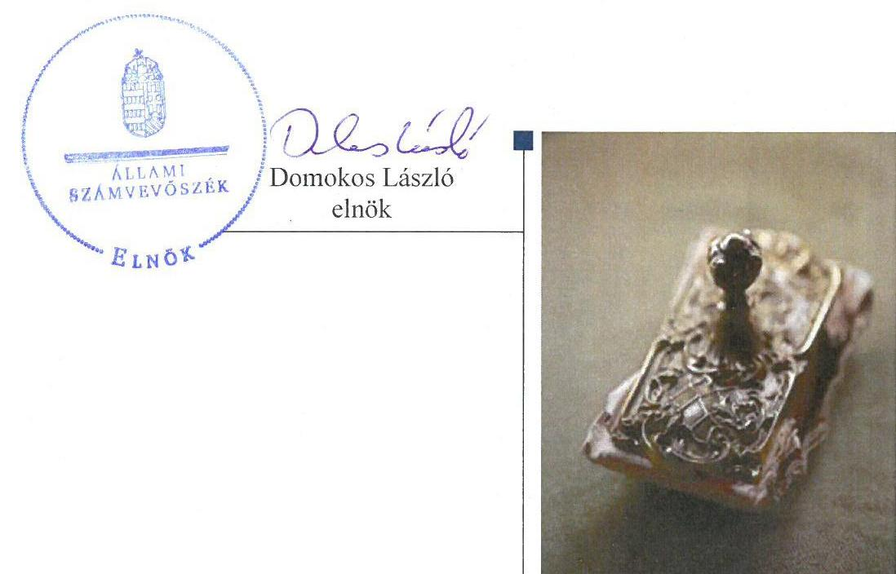

---

# AZ ELLENŐRZÉST FELÜGYELTE:

- HOLMAN MAGDOLNA JULIANNA felügyeleti vezető
- PETŐ KRISZTINA felügyeleti vezető
- AZ ELLENŐRZÉST VEZETTE ÉS A VÉGREHAJTÁSÁÉRT FELELŐS:
  - SZAPPANOS JÚLIA ellenőrzésvezető
  - A PROGRAM ÖSSZEÁLLÍTÁSÁÉRT FELELŐS:
    - SZAPPANOS JÚLIA osztályvezető

**IKTATÓSZÁM:** EL-0170-018/2018

**TÉMASZÁM:** 2443

**ELLENŐRZÉS-AZONOSÍTÓ SZÁM:** V079003

Jelentéseink az Országgyűlés számítógépes hálózatán és az Interneten a www.asz.hu címen is olvashatóak.

---

# TARTALOMJEGYZÉK 

■ ÖSSZEGZÉS ..... 5
■ CÉL, TERÜLET, HÁTTÉR, INDOKOLTSÁG ..... 6
■ LÉNYEGES KÉRDÉSKÖRÖK ..... 8
■ ELLENŐRZÉS HATÓKÖRE ÉS MÓDSZEREI ..... 9
■ MEGÁLLAPÍTÁSOK ..... 11
■ MELLÉKLETEK ..... 17
I. sz. melléklet: Fogalomtár ..... 17
II. sz. melléklet: Az ellenőrzési kritériumok módszertana és értékelése ..... 20
III. sz. melléklet: Az eszközök és források alakulása kiemelt mérlegsoronként a 2014-2015. években ..... 22
IV. sz. melléklet: Pénzügyi egyensúlyi helyzet CLF módszer szerinti értékelése a 2013-2015. években (ezer Ft) ..... 23
■ FÜGGELÉK: ÉSZREVÉTELEK ..... 27
■ RÖVIDÍTÉSEK JEGYZÉKE ..... 29

---

.

---

# ÖSSZEGZÉS 

- Tab Város Önkormányzatánál a pénzügyi gazdálkodás fenntarthatósága biztosított volt a 2015. évben.
- Az eladósodás kockázata nem állt fenn az ellenőrzött időszakban.
- A vagyongazdálkodás során biztosították a vagyon értékének megőrzését.

## Az Önkormányzat gazdálkodásának fenntarthatóságával kapcsolatos főbb megállapítások, következtetések

## Pénzügyi gazdálkodás

Az ellátott feladatok finanszírozási struktúrája nem jelentett kockázatot.

A felhalmozási kiadásokat saját forrásból finanszírozták.

## Eladósodás

A pénzügyi egyensúly biztosított volt.

Lejárt határidejű szállítói tartozás nem volt.

Pénzintézeti tartozás nem volt.

## Vagyongazdálkodás

Az Önkormányzat vagyona nőtt.

Az elszámolt értékcsökkenést meghaladó értékű fejlesztéseket valósítottak meg.

A többségi tulajdonban levő gazdasági társaság kötelezettségállománya csökkent.

## Az Önkormányzat pénzügyi és vagyongazdálkodása biztosította a törvényben meghatározott feladatai ellátását.

A PÉNZÜGYI EGYENSÚLYI HELYZET BIZTOSÍTOTT VOLT, AZONBAN A BEVÉTELI KITETTSÉG KOCKÁZATOT HORDOZ. AZ ÖNKORMÁNYZAT VÁLTOZATLAN FORMÁBAN TÖRTÉNŐ FELADATELLÁTÁSA ÉS GAZDÁLKODÁSA NEM HORDOZ KOCKÁZATOT.

---

# **CÉL, TERÜLET, HÁTTÉR, INDOKOLTSÁG**

## **Ellenőrzés célja**

**AZ ELLENŐRZÉS CÉLJA** annak megállapítása, hogy az Önkormányzat^{1} képes volt-e a törvényben meghatározott feladatait ellátni, gazdálkodása változatlan formában fenntartható-e. Az önkormányzatok éves költségvetési beszámolójában, időközi költségvetési jelentéseiben és mérlegjelentéseiben szerepeltetett adatok értékelése alapján beazonosított kockázatok kezelésére irányuló önkormányzati döntések, intézkedések előmozdítása.

## **Ellenőrzés területe**

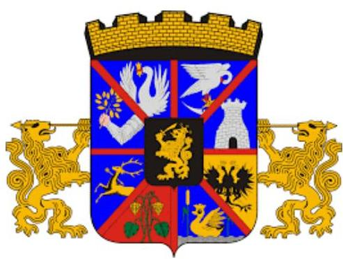

**TAB VÁROS** Somogy megye északkeleti részén helyezkedik el. Állandó lakosainak száma 2015. január 1-jén 4503 fő volt. Az 1 lakosra jutó működési kiadás a 2015. évben 11,1%-kal meghaladta a településtípus átlagát, 179,6 ezer Ft volt. Az 1 főre jutó 2015. évi adóbevétel (102,4 ezer Ft) 35,5 ezer Ft-tal volt több a településtípus átlagánál (66,9 ezer Ft).

A 2015. év végén a hét tagú Képviselő-testület^{2} két állandó bizottsággal látta el a feladatait. A polgármester és a jegyző személye a 2014-2015. években nem változott.

Az Önkormányzat által fenntartott költségvetési szervek száma öt volt, az ellenőrzött időszakban nem változott, a foglalkoztatott köztisztviselők száma a 2014. január 1-jei 29 főről 2015. december 31-ére 28 főre, a közalkalmazottaké 70 főről 74 főre változott. A költségvetési szervek által ellátott feladatok óvodai ellátás, gyermekek napközbeni ellátása, közművelődési, sport, építésügyi hatósági feladatok, vagyonüzemeltetés, közterület fenntartás, gyermekélelmezés voltak.

Az Önkormányzat egy kizárólagos önkormányzati tulajdonú gazdasági társasága^{3} a tanuszodát üzemeltetette az ellenőrzött időszakban.

Az összevont költségvetési beszámolók szerint teljesített éves költségvetési bevétel és kiadás, a könyvviteli mérleg szerinti eszközvagyon, a követelések és kötelezettségek értékét az 1. táblázat mutatja be.

1. táblázat

|  GAZDÁLKODÁSI ADATOK (M FT) |  |  |  |  |   |
| --- | --- | --- | --- | --- | --- |
|  Év | Bevételek | Kiadások | Eszközvagyon | Követelések | Kötelezettségek  |
|  2014. | 1399 | 1380 | 5403 | 31 | 236  |
|  2015. | 1419 | 1291 | 5829 | 32 | 26  |

*Forrás: önkormányzati beszámolók*

---

# Az ellenőrzés háttere, indokoltsága 

AZ ÖNKORMÁNYZATI ALRENDSZERBEN megjelenő gazdálkodási nehézségek, likviditási problémák és az eladósodottság növekedése az ÁSZ ${ }^{6}$ figyelmét a 2011. évtől az önkormányzatok pénzügyi helyzetére irányította.

Az önkormányzati alrendszerben a 2013. évtől bevezetett új feladatfinanszírozási rendszer keretein belül továbbra is megoldandó kérdés a pénzügyi egyensúly megteremtése, hosszú távú fenntartása. Erre tekintettel kiemelt fontosságú az önkormányzatok pénzügyi egyensúlyi helyzetére ható kockázatok feltárása, az ezzel kapcsolatos folyamatok, trendek bemutatása.

---

# LÉNYEGES KÉRDÉSKÖRÖK 

1. Az Önkormányzat pénzügyi gazdálkodásának fenntarthatósága biztosított volt-e?
2. Fennállt-e az Önkormányzat eladósodásának kockázata?
3. Az Önkormányzat vagyongazdálkodása során biztosított volt-e a vagyon értékének megőrzése?

---

# ELLENŐRZÉS HATÓKÖRE ÉS MÓDSZEREI 

## Az ellenőrzés típusa, időszaka

Megfelelőségi (helyénvalósági) ellenőrzés.
A 2014. január 1-je és 2015. december 31-e közötti időszak. A pénzforgalmi adatokat elemző mutatók esetében kitekintéssel a 2013. december 31-ei pénzforgalmi adatokra is.

## Az ellenőrzés jogalapja, módszerei

Az ellenőrzés jogszabályi alapját az ÁSZ tv. ${ }^{5}$ 1. § (3) bekezdésének, az 5. § (2)-(6) bekezdéseinek, valamint az Áht. ${ }^{6}$ 61. § (2) bekezdésének előírásai képezték.

Az ellenőrzést a nemzetközi standardokat irányadónak tekintve az ellenőrzési program ellenőrzési kérdései, az ellenőrzött időszakban hatályos jogszabályok, az ellenőrzés szakmai szabályok és módszertanok figyelembe vételével végeztük.

Az ellenőrzési kérdések megválaszolásához szükséges bizonyítékok megszerzése az ellenőrzött által rendelkezésre bocsátott dokumentumokra, adatokra alapozva megfigyelés, kérdésfeltevés (információkérés), valamint elemző eljárással, továbbá a Magyar Államkincstár által szolgáltatott adatokra alapozva történt.

Az ellenőrzési bizonyítékként felhasználható adatforrások közé tartozott egyrészt az ellenőrzési program részletes szempontjainál felsorolt adatforrások, másrészt minden - az ellenőrzés folyamán feltárt, az ellenőrzés szempontjából releváns információt tartalmazó - dokumentum.

Az ellenőrzés lefolytatásához az önkormányzat a tanúsítványok elektronikus kitöltésével, valamint az ÁSZ által kért dokumentumok elektronikus megküldésével szolgáltatott adatokat, amelyek valódiságát és teljes körűségét az ellenőrzött szervezet vezetője által tett teljességi és hitelességi nyilatkozat igazolta. Az így rendelkezésre bocsátott adatok, információk, a tanúsítványok adatai valódiságának kontrollja az ellenőrzés keretében történt.

Az ÁSZ az ellenőrzés előkészítése során meghatározta az ellenőrzési (helyénvalósági) kritériumokat, amelyek az ellenőrzési bizonyíték értékelésének, valamint a számvevőszéki jelentésben szereplő megállapítások és következtetések alapját képezik. A lényeges és jellegzetes mutatók helyénvalósági kritériumait, és a kockázatok értékelését az ellenőrzési kritériumok módszertana és értékelése tartalmazza.

A pénzforgalmi adatokat tartalmazó dinamikus mutatók számításánál a 2014. évben a 2013. év végi adatokat, a 2015. évben a 2014. évi végi adatokat tekintettük bázis adatnak. A mérlegadatokat tartalmazó mutatók esetében - az eredményszemléletű számvitel 2014. évi bevezetése miatt - a 2014. évben a 2013. évi mérleg záró adatai helyett az új számviteli szabályok alapján készült 2014. évi mérleg nyitó adatait, a 2015. évben a 2014. év végi adatokat tekintettük bázis adatnak.

---

Az ellenőrzési kérdésekre adott válaszok alapján értékeltük, hogy az önkormányzat képes volt-e a törvényben meghatározott feladatait ellátni, gazdálkodása változatlan formában fenntartható-e.

---

# 1. Az Önkormányzat pénzügyi gazdálkodásának fenntarthatósága biztosított volt-e? 

## Az Önkormányzat által ellátott feladatok finanszírozási struktúrája biztosította a pénzügyi gazdálkodás 2015. évi fenntarthatóságát.

2. táblázat

MUTATÓK ALAKULÁSA

| Mutatók (\%) | 2014.   év | 2015.   év |
| :--: | :--: | :--: |
| Működési kiadások fedezettsége | 107,2 | 119,3 |
| Kiegészítő önkormányzati támogatás aránya | 0,0 | 0,0 |
| Adóbevételek működési bevételeken belüli aránya | 36,3 | 47,8 |
| Felhalmozási kiadások fedezettsége | 90,6 | 93,5 |
| Törlesztés fedezettségének aránya | 0,0 | 0,0 |
| Nettó működési jövedelem változása | $-64,0$ | 173,8 |
| Pénzügyi műveletek eredménye | 1198,0 | 329,0 |
| Pénzügyi műveletek eredménye változás | 0 | $-72,5$ |

Forrás: önkormányzati beszámolók

Az ellátott kötelező és önként vállalt feladatok működési kiadásaira a 2014. és a 2015. évben a működési bevételek fedezetet nyújtottak. A pénzügyi egyensúly fenntarthatóságához az Önkormányzatnak az ellenőrzött időszakban nem kellett igénybe vennie a működőképesség megőrzését szolgáló kiegészítő önkormányzati támogatást. A pénzügyi gazdálkodás kockázatának minősítését megalapozó mutatókat a 2. táblázat tartalmazza.

A 2015. évben az előző évhez viszonyítva a működési bevételek - alapvetően a saját működési bevételek növekedésének eredményeként - 1,9%-kal emelkedtek, a működési kiadások - főként a dologi kiadások és az ellátottak pénzbeli juttatásainak visszaesése miatt - 8,4%-kal csökkentek. A működési költségvetés pozitív egyenlege növekvő tendenciát mutatott, a 2014. évben 64742 ezer Ft, a 2015. évben 158607 ezer Ft volt. Az ellenőrzött időszakban az Önkormányzat által ellátott feladatokban, azok ellátási módjában változás nem történt.

Az önként vállalt feladatokra fordított működési kiadások a 2015. évben a 2014. évhez képest 19,3%-kal, 133370 ezer Ft-ra csökkentek a takarékossági intézkedések megtételének eredményeként. Az Önkormányzat intézkedései (adómentességek csökkentése, intézményi térítési díj emelése, bérleti díj növelése) 2015-ben 8236 ezer Ft többletbevételt eredményeztek.

A Képviselő-testület a magánszemélyek kommunális adójának felülvizsgálata keretében 2015. január 1-jétől csökkentette a mentességek körét, az ingatlanok számához mérten korlátozta az adómentességet. Az intézkedés 2015-ben 2000 ezer Ft többletbevételt eredményezett. Az adóbevételek - kiemelten a helyi iparűzési adóbevételek - alakulását az 1. ábra mutatja be.

1. ábra
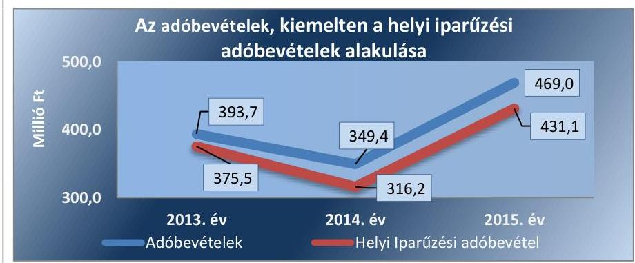

Forrás: Önkormányzat adatszolgáltatása

---

A működési bevételeken belül az adóbevételek - helyi iparűzési adó, magánszemélyek kommunális adója, építményadó és gépjárműadó - aránya a 2014. évhez képest 11,5 százalékponttal nőtt, a legnagyobb adózó által megfizetett iparűzési adó összegének emelkedése és a kommunális adó megfizetése alóli mentességek körének csökkentése miatt. Az Önkormányzat működési egyensúlyi helyzetére kockázatot jelent, hogy a 2014-2015. években a helyi iparűzési adó tekintetében az Önkormányzatnak bevételi kitettsége volt, mert a helyi iparűzési adóbevétel 82%-a, illetve 80% a három adóalanytól származott.

A 2014. évben a költségvetési kiadások 35,0%-át, a 2015. évben 36,4%-át fordították fejlesztésre. A beruházások és felújítások a gazdasági programban foglaltakkal összhangban voltak, azok a kötelező feladatellátást szolgálták. A felhalmozási bevételek a 2014. és 2015. évben 90,6% és 93,5%-ban nyújtottak fedezetet a beruházásokra és felújításokra. A jelentkező felhalmozási forráshiányt működési forrástöbbletből pótolták. Az Önkormányzat az ellenőrzött időszakban olyan új létesítményt nem hozott létre, amelynek a jövőbeni üzemeltetési költségei a működési egyensúlyra kockázatot jelentettek volna. A nagyobb fejlesztések alapvetően energetikai, illetve műszaki fejlesztéseket jelentettek. A felhalmozási kiadások forrásösszetételét a 2. ábra szemlélteti a 2015. évre vonatkozóan.
2. ábra
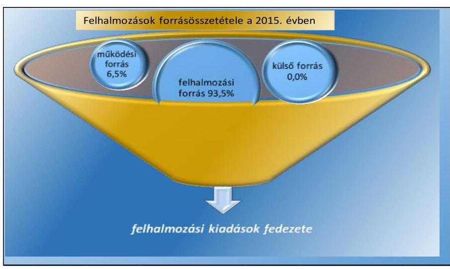

Forrás: Önkormányzat adatszolgáltatása
A pénzügyi műveletek eredménye 2014-ben 1198,0 ezer Ft, 2015-ben 329,0 ezer Ft volt, változását a kamatbevételek csökkenése eredményezte.

Az Önkormányzat pénzügyi egyensúlyi helyzetére jellemző adatokat a IV. számú melléklet tartalmazza.

---

# 2. Fennállt-e az Önkormányzat eladósodásának kockázata? 

## Az Önkormányzat eladósodásának kockázata nem állt fenn az ellenőrzött időszakban.

3. táblázat

| MUTATÓK ALAKULÁSA |  |  |
| :--: | :--: | :--: |
| Mutatók | $\begin{gathered} 2014 . \\ \text { év } \end{gathered}$ | $\begin{gathered} 2015 . \\ \text { év } \end{gathered}$ |
| Eladósodási mutató (\%) | 4,4 | 0,4 |
| Eladósodási mutató változása (százalékpont) | 1,42 | $-3,92$ |
| Hiánymutató

 (\%) | - | - |
| Tárgyévi pénzügyi pozíció változása (\%) | $-36,0$ | 365,2 |
| Szállítói állomány változása (\%) | 49,7 | $-94,9$ |
| Lejárt szállítói állomány aránya (\%) | 91,2 | 0,0 |
| 90 napon túl lejárt kötelezettségek aránya (\%) | - | - |
| Banki kötelezettségállomány mérlegfőösszeghez viszonyított aránya (\%) | - | - |
| Banki kötelezettségállomány változása (\%) | - | - |
| Garancia- és kezességvállalások állománya | - | - |

Forrás: önkormányzati beszámolók

Az Önkormányzat teljesített költségvetési bevételei a 2014. és a 2015. évben fedezetet nyújtottak maradvány igénybevétele nélkül is a költségvetési kiadásokra, hiány nem keletkezett. Az eladósodás kockázatának minősítését megalapozó mutatókat a 3. táblázat tartalmazza.

A költségvetési kiadások finanszírozásához idegen forrásokra nem volt szükség. Az adósságkonszolidációt követően az Önkormányzat gazdálkodása nem vetít előre újbóli eladósodást. A pénzügyi egyensúly helyzetének alakulását a 3. ábra szemlélteti.
3. ábra

Az Önkormányzat pénzügyi egyensúly/helyzetének alakulása (ezer Ft)
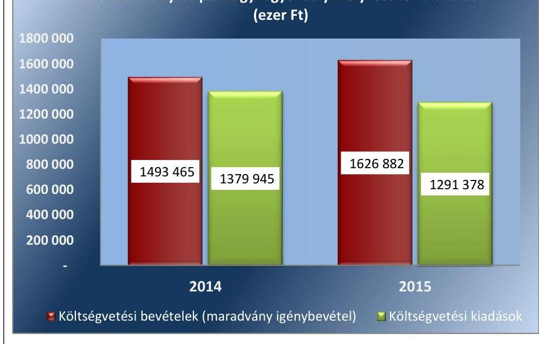

Forrás: Önkormányzat adatszolgáltatása

A tárgyévi pénzügyi pozíció a 2014. és a 2015. években is pozitív (27543 ezer Ft és 128120 ezer Ft) volt. A tárgyévi pénzügyi pozíció 2015. évi kedvező változását a folyó költségvetés egyenlegének (maradvány igénybevétel növekedésének, a fizetendő általános forgalmi adó és az ellátottak pénzbeli juttatásainak csökkenése miatt) javulása és a felhalmozási költségvetés negatív egyenlegének - a felhalmozási kiadások összegének visszaesése miatt - csökkenése eredményezte.

A működési jövedelem - egyezően a nettó jövedelemmel - a 2014. évben 64742 ezer Ft, a 2015. évben 158607 ezer Ft volt, tőketörlesztési kötelezettsége nem volt az Önkormányzatnak. Hitelt az ellenőrzött időszakban nem vettek igénybe, előző időszakban keletkezett banki kötelezettség nem volt.

Az Önkormányzat forrásainak összetételében az idegen források aránya az eladósodási mutató alapján a 2014. évben 4,4% volt, ami a 2015. évre 4,0 százalékponttal csökkent. Az eladósodási mutató kedvező alakulását a szállító állomány csökkenése eredményezte.

A szállítói kötelezettségek az eladósodásra vonatkozóan nem jelentettek kockázatot. A szállítói kötelezettség alakulását a 4. ábra szemlélteti.

---

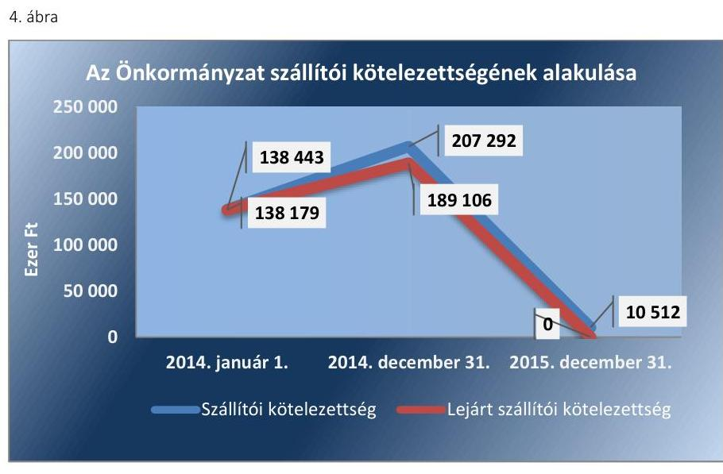

Forrás: Önkormányzat adatszolgáltatása
Lejárt szállítói kötelezettségállomány a 2014. évben volt, amely európai uniós beruházásokhoz kapcsolódó, szállítói finanszírozású számlákkal kapcsolatosan keletkezett, az Önkormányzat költségvetését nem terhelte. A 2014. év végén 90 napon túl lejárt szállítói tartozása, 2015 végén lejárt határidejű szállítói tartozása nem volt az Önkormányzatnak. A passzív időbeli elhatárolások 2014. évi 332301 ezer Ft és 2015. évi 714694 ezer Ft összegű állománya elsődlegesen a halasztott eredményszemléletű bevételekhez kapcsolódott.

# 3. Az Önkormányzat vagyongazdálkodása során biztosított volt-e a vagyon értékének megőrzése? 

## Az ellenőrzött időszakban az Önkormányzat vagyongazdálkodása során biztosította a vagyon értékének megőrzését.

| 4. táblázat |  |  |
| :--: | :--: | :--: |
| MUTATÓK ALAKULÁSA |  |  |
| Mutatók | 2014. év | 2015. év |
| Befektetett eszközök fedezettsége (\%) | 93,8 | 93,1 |
| Ingatlanok és kapcsolódó vagyonértékű jogok állományának változása (ezer Ft) | 82480 | 1156485 |
| Koncesszióba, vagyonkezelésbe adott eszközök állományának változása (ezer Ft) | 428361 | $-770453$ |
| Eszközpótlási mutató (tárgyi eszközök összesen) (\%) | 525,5 | 265,8 |
| Tárgyi eszközök használhatósági foka (\%) | 78,7 | 80,8 |

Forrás: önkormányzati beszámolók

Az Önkormányzat vagyona 2014. január 1-jéről 2015. év végére 777435 ezer Ft-tal, (15,4%-kal) 5828517 ezer Ft-ra nőtt. Az Önkormányzat vagyonának alakulását kiemelt mérlegsoronként a III. számú melléklet, a vagyongazdálkodás kockázatának minősítését megalapozó mutatókat a 4. és 5. táblázat tartalmazza.

Az ellenőrzött időszakban a vagyonban bekövetkezett változásokat egyrészt az Önkormányzat befektetett eszközeinek - fejlesztésekből származó - 13,1%-os, illetve a pénzeszközök állományának 80,1%-os növekedése eredményezte. A 2015. év végén e két vagyonelem képezte az összes vagyon 99,3%-át.

A befektetett eszközökön belül a koncesszióba, vagyonkezelésbe adott eszközök állománya 2015. december 31-ére megszűnt. Ennek a változásnak, illetve a beruházások számviteli elszámolásának hatásaként az ingatlanok és a kapcsolódó vagyoni értékű jogok állománya az ellenőrzött időszakban 1238965 ezer Ft-tal emelkedett.

---

Az Önkormányzat a feleslegessé vált vagyonának értékesítéséből származó 2014. és 2015. évi 863 ezer Ft és 5312 ezer Ft összegű bevételeit beruházásokra, a vagyon pótlására fordította. Az eszközök összetételét az 5. ábra szemlélteti.
5. ábra
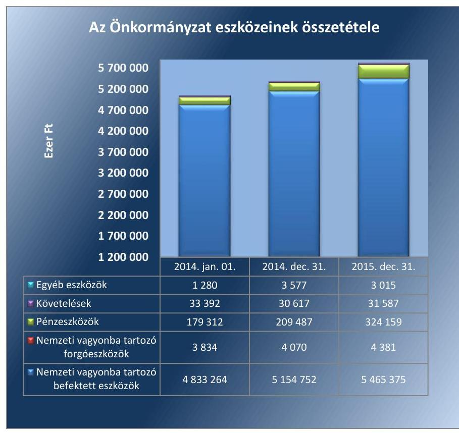

Forrás: Önkormányzat adatszolgáltatása
Az értékcsökkenés kompenzálásaként a szükséges vagyonpótlás megtörtént, a tárgyi eszközök eszközpótlási mutatója a 2014. évben 525,5%, a 2015. évben 265,8% volt. A tárgyi eszközök könyv szerinti értékének legnagyobb részét (2015 végén 93,2%-át) az ingatlanok és kapcsolódó vagyoni értékű jogok jelentették, amelynek eszközpótlási mutatója az ellenőrzött években szintén kedvező (621,0-342,1%) volt. Az elszámolt értékcsökkenés összegét meghaladó fejlesztések hatásaként az ingatlanok használhatósági foka a 2015. évre javult, 83,8% volt. Az eszközpótlások és az elszámolt értékcsökkenés alakulását a 6. ábra mutatja be.

---

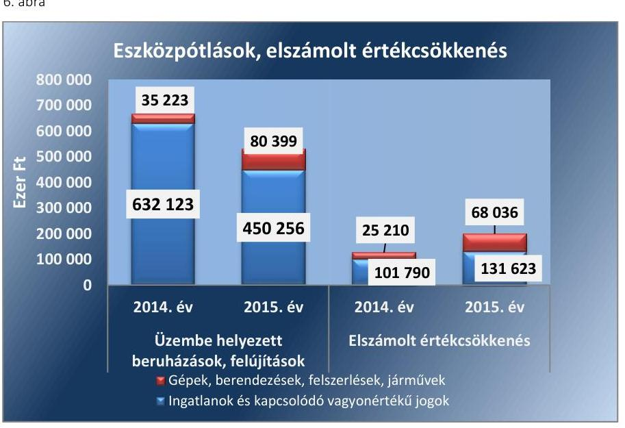

Forrás: Önkormányzat adatszolgáltatása
A 2014-2015. években az Önkormányzatnak egy többségi tulajdonú gazdasági társasága volt, amelynek kötelezettségállománya 4978 ezer Ftról a 2015. évben 4761 ezer Ft-ra csökkent. A gazdasági társaság működése az Önkormányzat vagyongazdálkodására nem jelentett kockázatot.

A tartós részesedések könyv szerinti értéke 2014. január 1-jén 33470 ezer Ft volt, ami a 2014. évben egy gazdasági társaságban lévő részesedés 1000 ezer Ft összegű értékvesztésének visszaírása, illetve a többségi tulajdonban lévő gazdasági társaságban - törvényi kötelezettség alapján végrehajtott - 2500 ezer Ft összegű tőkeemelés révén nőtt. A 2015. évben a részesedések állománya nem változott, az Önkormányzat pénzügyi helyzetére a részesedések alakulása kockázattal nem járt. A gazdasági társaság mérlegének főbb adatait a 7. ábra mutatja be.
7. ábra
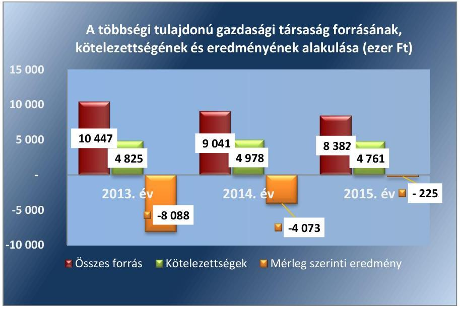

Forrás: Önkormányzat adatszolgáltatása

---

# MELLÉKLETEK 

## I. SZ. MELLÉKLET: FOGALOMTÁR

adósságkonszolidáció
beruházás
bevételi kitettség
CLF módszer
ellenőrzési kritériumok
eszközpótlási mutató
fejlesztés
felhalmozási bevétel
felhalmozási kiadás
felújítás
folyó bevétel
folyó kiadás
használhatósági fok
helyénvalósági ellenőrzés

A helyi önkormányzatok adósságának állam által történő átvállalása.
A tárgyi eszköz beszerzése, létesítése, saját vállalkozásban történő előállítása, a beszerzett tárgyi eszköz üzembe helyezése. A beruházás a meglévő tárgyi eszköz bővítését, rendeltetésének megváltoztatását, átalakítását, élettartamának, teljesítőképességének közvetlen növelését eredményező tevékenység. (Forrás: Számv. tv. ${ }^{7}$ 3. § (4) bekezdés 7. pontja)
Olyan függőségi viszony, ahol egy szervezet pénzügyi helyzetét meghatározó bevételek nagysága külső körülmények hatására azonnal és kedvezőtlen irányba változhat.
Az önkormányzatok költségvetése elemzésének módszere, amely a pénzügyi kapacitás (nettó működési jövedelem) fogalmát helyezi a középpontba. A módszer következetesen elkülöníti a folyó és a felhalmozási költségvetés bevételeit és kiadásait, azok költségvetési egyenlegeit. Bizonyos mértékig a vállalati gazdálkodás logikai elemeit érvényesíti az önkormányzatok pénzügyi, jövedelmi helyzetének vizsgálata során.
Azok az alkalmazott viszonyítási alapok, amelyek az ellenőrzési feladat tárgyának értékelésére szolgálnak.
A tárgyi eszközállomány elemzéséhez használt mutató, amely megmutatja, hogy az üzembe helyezett beruházások milyen hányadát képezi az elszámolt értékcsökkenésnek. Számításakor tárgyévben üzembe helyezett beruházások, felújítások értékét a tárgyi eszközök tárgyévben elszámolt értékcsökkenéséhez kell viszonyítani.
Alapvetően felhalmozási kiadásokban megtestesülő tevékenység, amely új, vagy a korábbinál műszaki, technikai szempontból korszerűbb tárgyi eszköz létrehozására irányul, illetve meglévő tárgyi eszköz műszaki, technikai paramétereinek korszerűsítését valósítja meg. (Forrás: Ávr. ${ }^{8} 1 . \S$ b) pontja)
Az önkormányzatok tárgyévi felhalmozási célú költségvetési bevételei.
Az önkormányzatok tárgyévi felhalmozási célú költségvetési kiadásai.
Az elhasználódott tárgyi eszköz eredeti állaga (kapacitása, pontossága) helyreállítását szolgáló időszakonként visszatérő olyan tevékenység, melynek során az eszköz élettartama megnövekszik, minősége, használata jelentősen javul, így a pótlólagos ráfordításból a jövőben gazdasági előnyök származnak. (Forrás: Számv. tv. 3. § (4) bekezdés 8. pontja)
Az önkormányzatok tárgyévi működési célú költségvetési bevételei
Az önkormányzatok tárgyévi működési célú költségvetési kiadásai
A tárgyi eszközállomány állagának elemzéséhez használt mutató, amely megmutatja, hogy a le nem írt (nettó) érték milyen hányadát képezi az aktiválási (bekerülési) értéknek. Számításakor a tárgyi eszköz könyv szerinti nettó értékét viszonyítják a tárgyi eszköz bruttó (beszerzési/létesítési) értékéhez.
A helyénvalósági ellenőrzés a megfelelőségi ellenőrzés azon altípusa, amelyet azokban az esetekben kell alkalmazni, amelyekre jogszabályi előírások nem alkalmazhatóak, illetve amennyiben egyes kérdések megítélésénél nyilvánvaló jogszabályi hiányosságok vannak. Helyénvalósági ellenőrzést során a Számvevőszéknek a közszféra szilárd gazdálkodására és a köztisztviselők magatartására vonatkozó általános alapelvek mentén kell az ellenőrzést lefolytatni.

---

kiegészítő önkormányzati támogatás
kockázatforrás
közfeladat
lényegesség
megfelelőségi ellenőrzés
működési jövedelem
nettó működési jövedelem
önkormányzat
önkormányzat többségi tulajdonában lévő gazdasági társaságok

Az önkormányzatok működőképességét szolgáló települési önkormányzatok rendkívüli támogatása, a megyei önkormányzati tartalékból kapott támogatások, valamint a tartósan fizetésképtelen helyzetbe került települési önkormányzatok adósságrendezésére irányuló hitelfelvétel visszterhes kamattámogatása, pénzügyi gondnok díja.
A kockázatok kiváltó okait kockázatforrásnak nevezzük. Az Önkormányzatok kockázatait megfigyelő rendszer kialakítása során első lépésben azonosítottuk a nyomon követendő kockázatokat, majd a kockázatos területeket és a kiváltó okokat (kockázatforrásokat). Kockázatként azonosítottuk, ha az önkormányzat hosszú távon nem képes a törvényben meghatározott feladatait ellátni, költségvetése változatlan formában nem fenntartható. A kockázat értékelésének célja annak megállapítása volt, hogy a pénzügyi gazdálkodás, eladósodás, vagyongazdálkodás kockázati területek milyen mértékben befolyásolják, veszélyeztetik az önkormányzat működését, a közfeladatok ellátását. A három kockázati terület minősítéséhez összesen 10 kockázatforrást rendeltünk.
Jogszabályban meghatározott állami vagy önkormányzati feladat, amit az arra kötelezett közérdekből, a jogszabályban meghatározott követelményeknek és feltételeknek megfelelve végez, ideértve a lakosság közszolgáltatásokkal való ellátását, továbbá az állam nemzetközi szerződésekben vállalt kötelezettségeiből adódó közérdekű feladatokat, valamint e feladatok ellátásakor szükséges infrastruktúra biztosítását is. (Forrás: Nvtv. 3. § (1) bekezdés 7. pontja)
Az a szintű információ vagy adat, ami az ellenőrzés eredményei célzott felhasználóinak döntéseit - az arról történő tudomásszerzést követően - valószínűsíthetően befolyásolja.
A számvevőszéki ellenőrzés azon típusa, amely annak megállapítására irányul, hogy az ellenőrzés tárgyát képező tevékenységek, pénzügyi műveletek, információk és adatok minden lényeges szempontból megfelelnek-e az ellenőrzött szervezetre vonatkozó szabályozásoknak és követelményeknek.
A működési jövedelem, azaz a folyó költségvetés egyenlege megmutatja, hogy az Önkormányzat éves folyó bevétele fedezetet biztosít-e a kötelező és önként vállalt feladatellátáshoz kapcsolódó éves folyó kiadására. A működési jövedelem negatív értéke pénzügyileg fenntarthatatlan helyzetet jelez. A mutató pozitív értéke megtakarítást mutat, amely forrásul szolgálhat az Önkormányzat fennálló kötelezettségei megfizetéséhez, valamint fejlesztéseihez.
A nettó működési jövedelem a jövedelemtermelő képességet méri. Megmutatja a működési bevételekből a működési kiadások és a hitelek tőketörlesztésének kifizetése után fennmaradó jövedelmet.
A helyi önkormányzat jogi személy. Az önkormányzati feladatok ellátását a képviselőtestület és szervei biztosítják. A képviselőtestület szervei: a polgármester, a főpolgármester, a megyei közgyűlés elnöke, a képviselő-testület bizottságai, a részönkormányzat testülete, a polgármesteri hivatal, a megyei önkormányzati hivatal, a közös önkormányzati hivatal, a jegyző, továbbá a társulás. A képviselő-testület a feladatkörébe tartozó közszolgáltatások ellátására - jogszabályban meghatározottak szerint - költségvetési szervet, a Polgári perrendtartásról szóló 1952. évi III. törvény szerinti gazdálkodó szervezetet (a továbbiakban: gazdálkodó szervezet), nonprofit szervezetet és egyéb szervezetet (a továbbiakban együtt: intézmény) alapíthat, továbbá szerződést köthet természetes és jogi személlyel vagy jogi személyiséggel nem rendelkező szervezettel. (Forrás: Mötv. ${ }^{9}$ 41. § (1), (2), (6) bekezdései)
Azok a gazdasági társaságok, amelyekben az önkormányzat a szavazatok több mint ötven százalékával vagy a Ptk. ${ }^{10}$ 685/B. § (2)-(3)
 bekezdéseiben rögzített meghatározó befolyással rendelkezik. A befolyással rendelkező akkor rendelkezik egy jogi személyben meghatározó befolyással, ha annak tagja, illetve részvényese, és jogosult e jogi személy

---

pénzügyi kapacitás
pénzügyi kockázat
szállítók felé történő eladósodás kockázatforrás*
többségi önkormányzati tulajdonban lévő gazdasági társaságok kockázatforrás
vagyongazdálkodás
vagyonváltozás kockázatforrás
vezető tisztségviselői vagy felügyelő-bizottsága tagjai többségének megválasztására, illetve visszahívására, vagy a jogi személy más tagjaival, illetve részvényeseivel kötött megállapodás alapján egyedül rendelkezik a szavazatok több mint ötven százalékával. A meghatározó befolyás akkor is fennáll, ha a befolyással rendelkező számára e jogosultságok közvetett módon (köztes vállalkozásain keresztül) biztosítottak.
[Forrás: Ptk. 1685/B. § (2)-(4), Ptk. ${ }^{11}$ 8:2.§ (1)-(3) bekezdései]
A pénzügyi kapacitás az adósok hitelfelvételi képességének azon mértéke, ahol még növelni tudják az adósságot anélkül, hogy a fizetőképtelenség elkerülése érdekében csökkenteniük kellene akár az aktuális, akár a jövőben esedékes kiadásaikat.
A pénzügyi kockázat magában foglalja mindazon kockázatokat, amelyek a szervezet pénzügyi helyzetére hatással vannak. PI.: az adósságszolgálat miatti kockázatot, árfolyamkockázatot, felhalmozási kockázatot, fizetőképességi kockázatot, jövőbeni kötelezettségek kifizethetőségének kockázatát, kamatkockázatot, kezességvállalás kockázatát, likviditási kockázatot, mérlegen kívüli tételek kockázatát, nemfizetési kockázatot stb.
Kockázatforrást jelent, ha az önkormányzat növeli a szállítókkal szemben fennálló tartozásait (ami burkolt hitelezésnek minősülhet), és az elismert kötelezettségeit átmenetileg vagy véglegesen nem tudja határidőre teljesíteni.
*(2014. január 1-jétől kötelezettségek dologi, felújítási, beruházási kiadásokra)
Kockázatforrást jelent, hogy az önkormányzati tulajdonban lévő gazdasági társaságok adósságállományáért a tulajdonos önkormányzatot helytállási kötelezettség terheli.

A nemzeti vagyongazdálkodás feladata a nemzeti vagyon rendeltetésének megfelelő, az állam, az önkormányzat mindenkori teherbíró képességéhez igazodó, elsődlegesen a közfeladatok ellátásához és a mindenkori társadalmi szükségletek kielégítéséhez szükséges, egységes elveken alapuló, átlátható, hatékony és költségtakarékos működtetése, értékének megőrzése, állagának védelme, értéknövelő használata, hasznosítása, gyarapítása, továbbá az állam vagy a helyi önkormányzat feladatának ellátása szempontjából feleslegessé váló vagyontárgyak elidegenítése. (Forrás: Nvtv. 7. § (2) bekezdése)
Kockázatforrásként értékeltük, ha csökken a nemzeti vagyon, ha az önkormányzatok a vagyonértékesítésből származó bevételeket nem beruházásokra, a vagyon pótlására fordítják.

---

# Önkormányzatok pénzügyi monitoringja alapján végzett ellenőrzése 

## Ellenőrzési kritériumok módszertana

#### Abstract

Az ellenőrzés tárgya: Az önkormányzati gazdálkodás fenntarthatósága, a törvényben előírt feladatok ellátása, az önkormányzatnál észlelt negatív tendenciák okainak feltárása, amely az ellenőrzési kritériumok alapján kerül értékelésre.

Az ellenőrzési kritériumok meghatározása során első lépésben azonosításra kerültek az önkormányzati gazdálkodás fenntarthatóságának, a törvényben előírt feladatok ellátásának kockázatos területei és a kiváltó okai (kockázatforrások), amelyekhez minden esetben mutatószám került hozzárendelésre. A mutatószámok között a viszonyszámok (relatív mutatószámok) és az abszolút adatok (abszolút mutatószámok) egyaránt megtalálhatóak, amelyekhez a Magyar Államkincstár által szolgáltatott adatállományok (költségvetési beszámolók, időközi költségvetési jelentések, mérlegjelentések adatait) kerültek felhasználásra.
Az egyes kockázati területek és kockázatforrások minősítése „pontozásos módszerrel" a mutatószámok értékelése alapján történt.

- Első lépésben a mutatószámok értékelésére és egy háromelemű skálán történő elhelyezésére került sor. Az értékelés (a kategória határok meghatározása) elsődlegesen a mutatószámok közgazdasági értelmezése alapján, az Állami Számvevőszék ellenőrzési tapasztalatait felhasználva történt. Az értékelések alapján egy-egy mutató alacsony besorolás esetén 0 pontot, közepes esetén 1 pontot, magas kockázatjelzés esetén 2 pontot kapott. (PI.: ha a működési kiadások fedezettsége mutató 90% alatti volt, akkor magas kockázati besorolást, 2 pontot, ha 100% feletti volt akkor alacsony besorolást, 0 pontot kapott.) A %-ban kifejezett mutatók kockázati besorolására a pontos (több tizedes jegy) értékek alapján került sor, ugyanakkor az önkormányzati riport a mutatókat egy, illetve esetenként két tizedes számjegyig mutatja be.
- Annak érdekében, hogy a kockázatforrások minősítésénél a lényeges mutatók értéke legyen a meghatározó a jellegzetes mutatókéval szemben, a mutatószámok súlyozására került sor*. A súlyok mértékének megválasztásakor az elsődleges mutatókat középértéknek tekintve 1-es súly mellérendelése* történt. A főmutató súlya az elsődleges mutatók súlyának kétszeresében, míg a másodlagos mutatók súlya az elsődleges mutatók súlyának felében került meghatározásra. (PI.: a kockázatforrás minősítéséhez a működési kiadások fedezettségét főmutatóként vették figyelembe, ezért 2-es súlyt rendeltek hozzá. Így ha a mutató kockázati besorolása magas volt, a magas kockázati besoroláshoz rendelt 2 pontot szorozták a főmutatóhoz rendelt 2-es súlyszámmal és az elért pontszám 4, míg alacsony besorolás esetén a besoroláshoz rendelt 0 pontot szorozva a főmutatóhoz rendelt 2-es súlyszámmal elért pontszám 0 volt.)
- Ezt követően került sor az önkormányzati gazdálkodás fenntarthatóságának, a törvényben előírt feladatok ellátásának kockázatához rendelt kockázati területek és kockázatforrások értékelési ponthatárainak meghatározására oly módon, hogy kockázatforrásonként a mutatószámok súlyozott értékelésével elérhető összes pontszám három egyenlő részre (alacsony, közepes, magas) osztása történt meg. (PI.: A közfeladatok finanszírozási struktúrája kockázatforrás 1 db főmutató, 2 db elsődleges mutató és további 2 db másodlagos mutató alakulása alapján került értékelésre. A mutatók magas kockázati besorolása esetén - a súlyozást követően - elérhető legmagasabb

[^0]
[^0]:    * A súlyozás kifejezi, hogy az alkalmazott mutatószámok egymáshoz képest milyen mértékben járulnak hozzá az adott kockázatforrás értékeléséhez.
    † Egy esetben a banki kötelezettségállomány mérlegfőösszeghez mért nagysága mutatónál a kockázatforrás kiegyensúlyozottabb megítélése érdekében az 1-es súlyozás helyett 1,5-ös súlyozás került alkalmazásra..

---

pontszám 10 volt. Ezt három egyenlő részre osztva kerültek meghatározásra a közfeladatok finanszírozási struktúrájának értékelési ponthatárai, amely 0-3,32 pontig alacsony, 3,33-6,66 pontig közepes, 6,67-10 pont között magas kockázati minősítést kapott.) A pénzügyi gazdálkodás és eladósodás kockázati területek és a hozzájuk tartozó egyes kockázatforrások 2014. évi és 2015. évi értékelési pontjai eltérnek egymástól, mivel az eredményszemléletű mutatók változása első alkalommal a 2015. évben volt értékelhető.

- Az egyes kockázatforrások értékelésekor a kockázatforráshoz rendelt mutatószámok - súlyozással kapott - értékeinek összesítése és a kialakított értékelési ponthatárok szerinti minősítése történt meg. (PI.: egy önkormányzat minősítésekor a közfeladatok finanszírozási struktúrája kockázatforráshoz rendelt 5 db mutató - fentiekben bemutatott - értékelésével elért összes pontszám 7 volt, akkor a kockázatforrás a hármas skálán a 6,67-10 pont közé került, így magas minősítést kapott.)
- Az egyes kockázati területek minősítése hasonlóan történt. Az egyes kockázati területeket meghatározó kockázatforrások pontjainak aggregálását követően, a kockázati területen elérhető összes pont három egyenlő részre osztásával kialakított skálán történő értékelésére került sor. Ha azonban a kockázatforrások közül legalább egy magas kockázati besorolást ért el, akkor a pontozás szerinti értékeléstől eltérően, a kockázati terület besorolása közepes kockázati minősítésűre módosult.

Az ellenőrzés tárgyának, az önkormányzati gazdálkodás fenntarthatóságának, a törvényben előírt feladatok ellátásának értékelése:
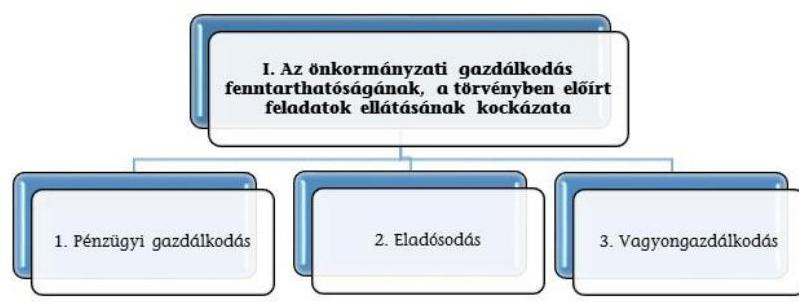

A három kockázati terület együttes értékelése alapján az alábbi mátrix segítségével került meghatározásra az önkormányzati gazdálkodás fenntarthatóságának, a törvényben előírt feladatok ellátásának értékelése a következők szerint:
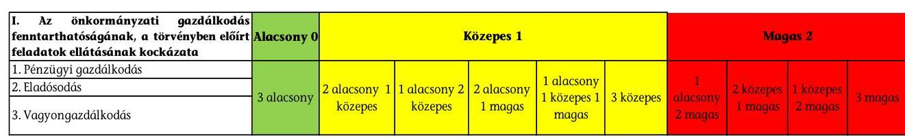

---

III. SZ. MELLÉKLET: AZ ESZKÖZÖK ÉS FORRÁSOK ALAKULÁSA KIEMELT MÉRLEGSORONKÉNT A 2014-2015. ÉVEKBEN

|  Megnevezés | 2014. jan. 1.
(E Ft) | 2014. dec. 31.
(E Ft) | 2015. dec. 31.
(E Ft)  |
| --- | --- | --- | --- |
|  NEMZETI VAGYONBA TARTOZÓ BEFEKTETETT ESZKÖZÖK | 4833264 | 5154752 | 5465375  |
|  NEMZETI VAGYONBA TARTOZÓ FORGÓESZKÖZÖK | 3834 | 4070 | 4381  |
|  PÉNZESZKÖZÖK | 179312 | 209487 | 324159  |
|  KÖVETELÉSEK | 33392 | 30617 | 31587  |
|  EGYÉB SAJÁTOS ESZKÖZOLDALI ELSZÁMOLÁSOK | 1280 | 563 | 711  |
|  AKTÍV IDŐBELI ELHATÁROLÁSOK | 0 | 3014 | 2304  |
|  ESZKÖZÖK ÖSSZESEN | 5051082 | 5402503 | 5828517  |
|  SAJÁT TÖKE | 4902109 | 4834349 | 5087842  |
|  KÖTELEZETTSÉGEK | 148633 | 235853 | 25981  |
|  EGYÉB SAJÁTOS FORRÁSOLDALI ELSZÁMOLÁSOK | 340 | 0 |   |
|  PASSZÍV IDŐBELI ELHATÁROLÁSOK | 0 | 332301 | 714694  |
|  FORRÁSOK ÖSSZESEN | 5051082 | 5402503 | 5828517  |

---

|  Megnevezés | 2013. év | 2014. év | 2015. év | Változás [\%] (2014-2015) / 2013 | Változás [\%] (2015-2014) / 2014  |
| --- | --- | --- | --- | --- | --- |
|  1. FOLYÓ KÖLTSÉGVETÉS |  |  |  |  |   |
|  1.1.1. Saját működési bevételek tulajdonosi bevételek nélkül | 592536 | 585727 | 655397 | -1,15% | 11,89%  |
|  1.1.2. Költségvetési támogatások a működőképesség megőrzését szolgáló kiegészítő támogatások nélkül | 259573 | 314769 | 258514 | 21,26% | -17,87%  |
|  1.1.3. Átengedett bevételek | 9584 | 10164 | 10346 | 6,05% | 1,79%  |
|  1.1.4. Államháztartáson belülről kapott támogatások | 104907 | 47947 | 53333 | -54,30% | 11,23%  |
|  1.1.5. EU-tól és külföldről kapott bevételek | 0 | 0 | 0 | 0,00% | 0,00%  |
|  1.1.6. Államháztartáson kívülről kapott bevételek | 948 | 1360 | 1531 | 43,46% | 12,57%  |
|  1.1.7. Hozam- és kamatbevételek | 2379 | 1201 | 699 | -49,52% | -41,80%  |
|  1.1.8. Kölcsönök visszatérülése, igénybevétele | 0 | 0 | 0 | 0,00% | 0,00%  |
|  1.1.9. A működőképesség megőrzését szolgáló kiegészítő támogatások | 0 | 0 | 0 | 0,00% | 0,00%  |
|  1.1. Folyó bevételek (1.1.1.+1.1.2.+1.1.3.+1.1.4.+1.1.5.+1.1.6.+1.1.7.+1.1.8.+1.1.9.) | 969927 | 961168 | 979820 | -0,90% | 1,94%  |
|  1.2.1. Működési kiadások kamatkiadások nélkül | 666640 | 730275 | 679559 | 9,55% | -6,94%  |
|  1.2.2. Államháztartáson belülre átadott pénzeszközök | 58720 | 84574 | 74169 | 44,03% | -12,30%  |
|  1.2.3.1. vállalkozásoknak | 41473 | 32912 | 37665 | -20,64% | 14,44%  |
|  1.2.3.2. EU-nak, illetve külföldre | 0 | 0 | 0 | 0,00% | 0,00%  |
|  1.2.3.3. magánszemélyeknek | 41723 | 38415 | 19425 | -7,93% | -49,43%  |
|  1.2.3.4. non-profit szervezeteknek | 10779 | 10250 | 8450 | -4,91% | -17,56%  |
|  1.2.3. Transzferkiadások | 93975 | 81577 | 65540 | -13,19% | -19,66%  |
|  1.2.4. Kamatkiadások | 107 | 0 | 19 | -100,00% | 100,00%  |
|  1.2.5. Kölcsönök nyújtása, törlesztése | 0 | 0 | 1926 | 0,00% | 100,00%  |
|  1.2. Folyó kiadások (1.2.1.+1.2.2.+1.2.3.+1.2.4.+1.2.5.) | 819442 | 896426 | 821213 | 9,39% | -8,39%  |
|  1.3. Folyó költségvetés egyenlege, működési jövedelem (1.1. - 1.2.)

 | 150485 | 64742 | 158607 | $-56,98 \%$ | 144,98\%  |

---

|  Megnevezés | 2013. év | 2014. év | 2015. év | Változás [\%] (2014-2015) / 2013 | Változás [\%] (2015-2014) / 2014  |
| --- | --- | --- | --- | --- | --- |
|  2. FELHALMOZÁSI KÖLTSÉGVETÉS |  |  |  |  |   |
|  2.1.1. Saját tőkebevételek | 216838 | 863 | 5312 | $-99,60 \%$ | 515,53\%  |
|  2.1.2. Költségvetési támogatások | 3423 | 23620 | 29589 | 590,04\% | 25,27\%  |
|  2.1.3. Államháztartáson belülről kapott támogatások | 524487 | 409866 | 399470 | $-21,85 \%$ | $-2,54 \%$  |
|  2.1.4. EU-tól és külföldről kapott támogatások | 0 | 0 | 0 | 0,00\% | 0,00\%  |
|  2.1.5. Államháztartáson kívülről kapott bevételek | 460 | 3329 | 5121 | 623,70\% | 53,83\%  |
|  2.1.6. Hozam- és kamatbevételek | 449 | 0 | 0 | $-100,00 \%$ | 0,00\%  |
|  2.1.7. Kölcsönök visszatérülése, igénybevétele | 1774 | 196 | 5 | $-88,95 \%$ | $-97,45 \%$  |
|  2.1. Felhalmozási bevételek (2.1.1.+2.1.2+2.1.3+2.1.4.+2.1.5.+2.1.6.+2.1.7.) | 747431 | 437874 | 439497 | $-41,42 \%$ | 0,37\%  |
|  2.2.1. Saját beruházási kiadás áfával | 94296 | 84831 | 84398 | $-10,04 \%$ | $-0,51 \%$  |
|  2.2.2. Saját felújítási kiadás áfával | 644258 | 391268 | 380898 | $-39,27 \%$ | $-2,65 \%$  |
|  2.2.3. Államháztartáson belülre átadott pénzeszközök | 0 | 4651 | 134 | $-97,12 \%$ | $-97,12 \%$  |
|  2.2.4. EU-nak és külföldnek adott pénzeszközök | 0 | 0 | 0 | 0,00\% | 0,00\%  |
|  2.2.5. Államháztartáson kívülre adott pénzeszközök | 57 | 269 | 4735 | 371,93\% | 1660,22\%  |
|  2.2.6. Befektetéssel kapcsolatos kiadások | 410 | 2500 | 0 | 509,76\% | $-100,00 \%$  |
|  2.2.7. Kamatkiadások | 0 | 0 | 0 | 0,00\% | 0,00\%  |
|  2.2.8. Kölcsönök nyújtása, törlesztése | 0 | 0 | 0 | 0,00\% | 0,00\%  |
|  2.2.9. ÁFA befizetések | 117920 | 0 | 0 | $-100,00 \%$ | 0,00\%  |
|  2.2. Felhalmozási kiadások (2.2.1.+2.2.2.+2.2.3.+2.2.4.+2.2.5.+2.2.6.+2.2.7.+2.2.8.+2.2.9.) | 856941 | 483519 | 470165 | $-43,58 \%$ | $-2,76 \%$  |
|  2.3. Felhalmozási költségvetés egyenlege (2.1. - 2.2.) | $-109510$ | $-45645$ | $-30668$ | $-58,32 \%$ | $-32,81 \%$  |
|  3. FINANSZÍROZÁSI MÜVELETEK NÉLKÜLI (GFS) POZÍCIÓ (1.3.+2.3.) | 40975 | 19097 | 127939 | $-53,39 \%$ | 569,94\%  |
|  4. FINANSZÍROZÁSI MÜVELETEK |  |  |  |  |   |
|  4.1. Hitelfelvétel | 0 | 0 | 0 | 0,00\% | 0,00\%  |

---

|  Megnevezés | 2013. év | 2014. év | 2015. év | Változás [\%] (2014-2013) / 2013 | Változás [\%] (2015-2014) / 2014  |
| --- | --- | --- | --- | --- | --- |
|  4.2. Hiteltörlesztés | 0 | 0 | 0 | 0,00\% | 0,00\%  |
|  4.3. Forgatási és befektetési célú értékpapírok kibocsátása | 0 | 0 | 0 | 0,00\% | 0,00\%  |
|  4.4. Forgatási és befektetési célú értékpapírok beváltása | 0 | 0 | 0 | 0,00\% | 0,00\%  |
|  4.5. Forgatási és befektetési célú értékpapírok értékesítése | 0 | 0 | 0 | 0,00\% | 0,00\%  |
|  4.6. Forgatási és befektetési célú értékpapírok vásárlása | 0 | 0 | 0 | 0,00\% | 0,00\%  |
|  4.7. Egyéb finanszírozási bevételek | 385 | 8446 | 118627 | 2093,77\% | 1304,53\%  |
|  4.8. Egyéb finanszírozási kiadások | $-1693$ | 0 | 118446 | 100,00\% | 100,00\%  |
|  4.9.Finanszírozási műveletek egyenlege (4.1.-4.2.+4.3.-4.4.+4.5.-4.6.+4.7.-4.8.) | 2078 | 8446 | 181 | 306,45\% | $-97,86 \%$  |
|  5. TÁRGYÉVI PÉNZÜGYI POZÍCIÓ (1.3.+ 2.3.+4.9.) | 43053 | 27543 | 128120 | $-36,03 \%$ | 365,16\%  |
|  6. NETTÓ MŰKÖDÉSI JÖVEDELEM
(működési jövedelem (1.3.) - tőketörlesztés (4.2+4.4)) | 150485 | 64742 | 158607 | $-56,98 \%$ | 144,98\%  |

- Az önkormányzat bevételei nem tartalmazzák az előző évi pénzmaradvány igénybevételét.

Tájékoztató adat: Maradvány igénybevétele

|  42445 | 94423 | 207565 | $122,46 \%$ | $119,82 \%$  |
| --- | --- | --- | --- | --- |
|  |   |   |   |   |

---

.

---

# FÜGGELÉK: ÉSZREVÉTELEK 

A jelentéstervezetet a Számvevőszék 15 napos észrevételezésre megküldte az ellenőrzött szervezet vezetőjének az ÁSZ tv. 29. $\beta^{2}$ (1) bekezdése előírásának megfelelően.
Tab Város Önkormányzatának polgármestere a jelentéstervezet megállapításaira észrevételt nem tett.

[^0]
[^0]:    ${ }^{1}$ 29. § (1) Az Állami Számvevőszék az ellenőrzési megállapításait megküldi az ellenőrzött szervezet vezetőjének vagy az általa megbízott személynek, és annak, akinek személyes felelősségét állapította meg.
    (2) Az ellenőrzött szervezet vezetője és a felelősként megjelölt személy az ellenőrzés megállapításaira tizenöt napon belül írásban észrevételt tehet. (3) Az Állami Számvevőszék az észrevételre a beérkezésétől számított harminc napon belül írásban válaszol. A figyelembe nem vett észrevételeket köteles a jelentésben feltüntetni, és megindokolni, hogy azokat miért nem fogadta el.

---

.

---

# RÖVIDÍTÉSEK JEGYZÉKE 

${ }^{1}$ Önkormányzat
${ }^{2}$ Képviselő-testület
${ }^{3}$ gazdasági társaság
${ }^{4}$ ÁSZ
${ }^{5}$ ÁSZ tv.
${ }^{6}$ Áht.
${ }^{7}$ Számv. tv.
${ }^{8}$ Ávr.
${ }^{9}$ Mötv.
${ }^{10}$ Ptk. 1
${ }^{11}$ Ptk. 2

Tab Város Önkormányzata
Tab Város Önkormányzatának Képviselő-testülete
többségi tulajdonban lévő gazdasági társaság:"Koppány - Völgye Tanuszoda" Kft.
Állami Számvevőszék
2011. évi LXVI. törvény az Állami Számvevőszékről
2011. évi CXCV. törvény az államháztartásról
2000. évi C. törvény a számvitelről

368/2011. (XII. 31.) Korm. rendelet az államháztartásról szóló törvény végrehajtásáról
2011. évi CLXXXIX. törvény Magyarország helyi önkormányzatairól
1959. évi IV. törvény a Polgári Törvénykönyvről (hatálytalan 2014. március 15 -től)
2013. évi V. törvény a Polgári Törvénykönyvről (hatályos 2014. március 15-től)

---

# ÁLLAMI SZÁMVEVŐSZÉK 

1052 Budapest, Apáczai Csere János utca 10.
Levélcím: 1364 Budapest 4. Pf. 54
Telefon: +36 14849100 Telefax: +36 14849200
www.asz.hu

