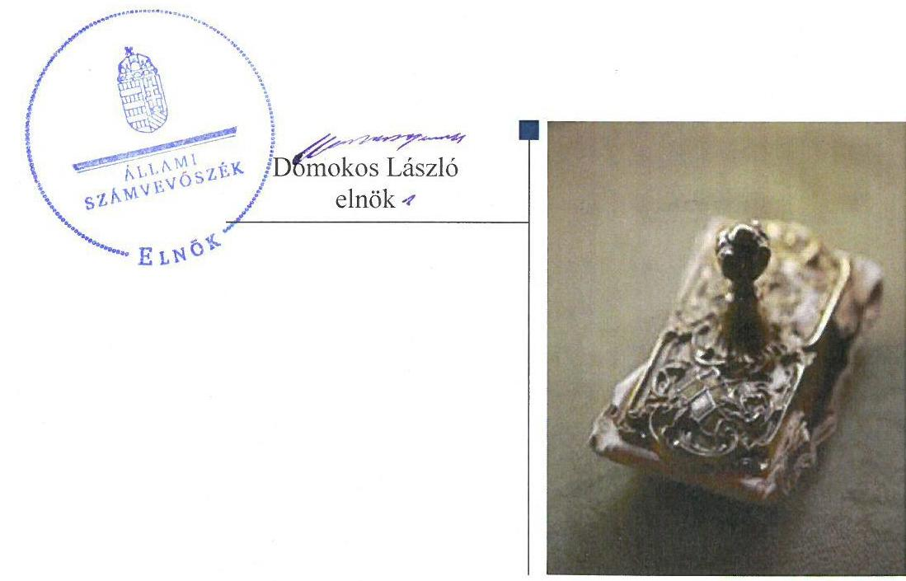
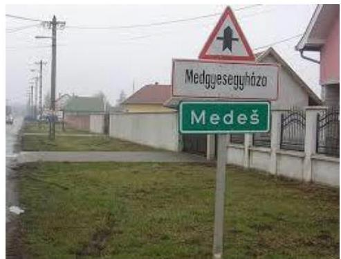
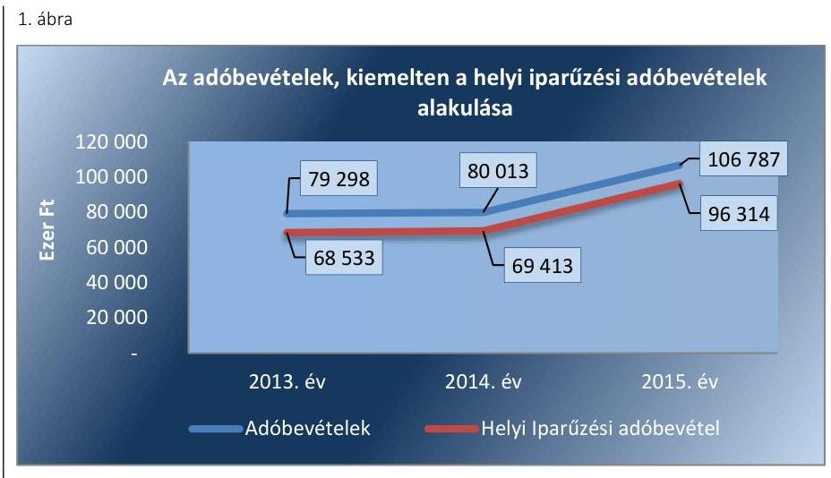
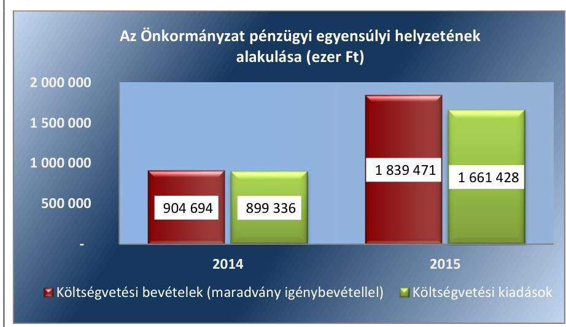
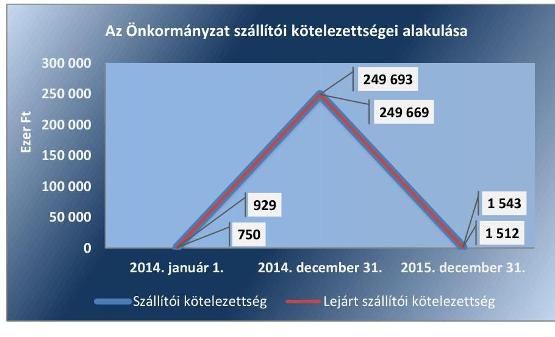
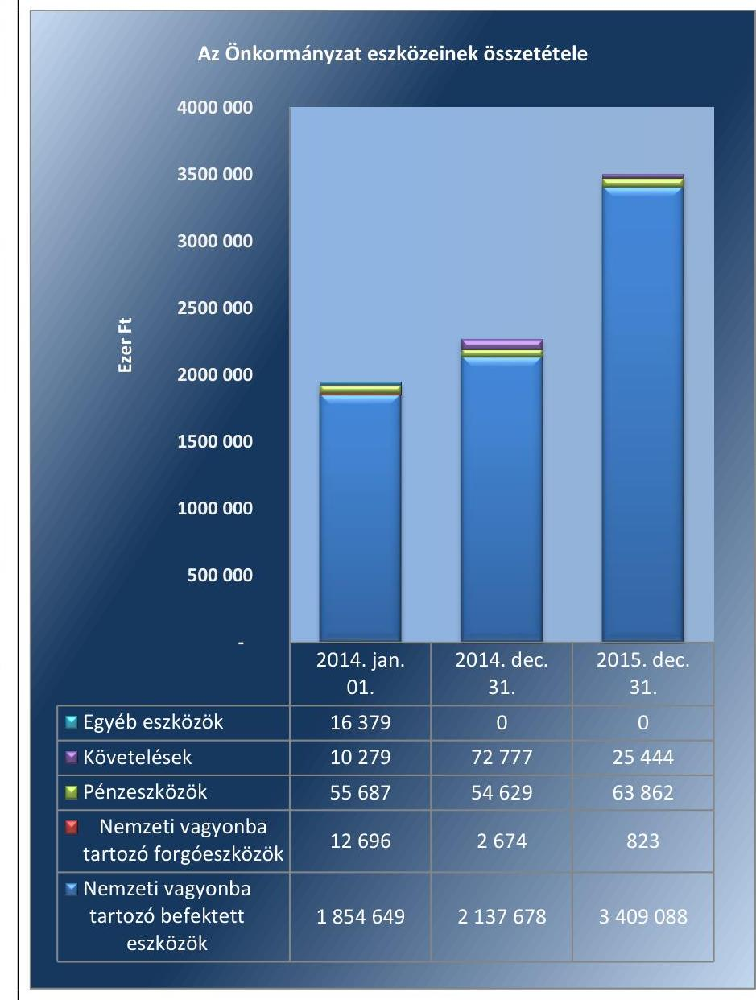
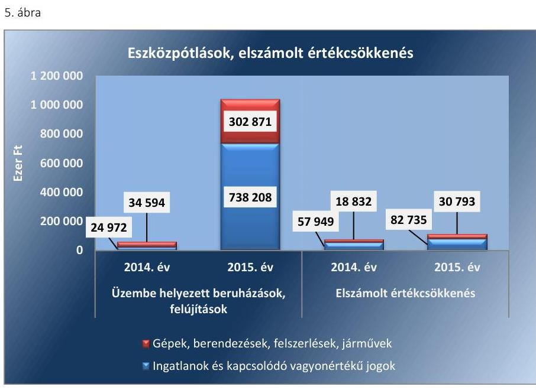
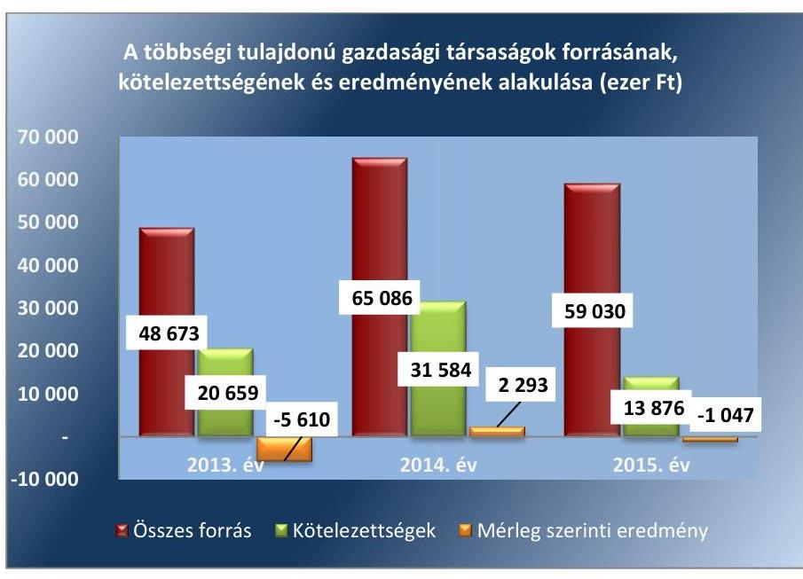
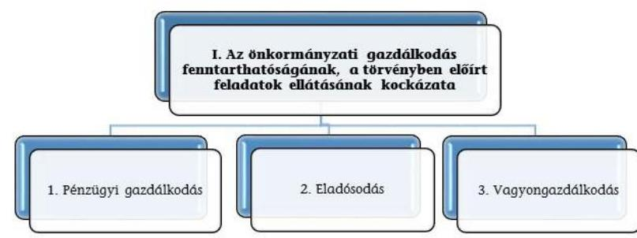
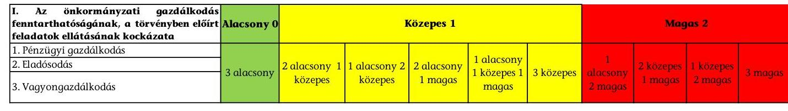

# Jellentés 

## Önkormányzatok pénzügyi monitoringja alapján végzett ellenőrzése

Medgyesegyháza Városi Önkormányzat gazdálkodásának fenntarthatósága 2018.

---

# Jelențtés 

## Önkormányzatok pénzügyi monitoringja alapján végzett ellenőrzése

Medgyesegyháza Városi Önkormányzat gazdálkodásának fenntarthatósága
2018. 22. hó 27. nap

---

# AZ ELLENŐRZÉST FELÜGYELTE:

- HOLMAN MAGDOLNA JULIANNA felügyeleti vezető
- PETŐ KRISZTINA felügyeleti vezető
- AZ ELLENŐRZÉST VEZETTE ÉS A VÉGREHAJTÁSÁÉRT FELELŐS:
  - SZAPPANOS JÚLIA ellenőrzésvezető
  - A PROGRAM ÖSSZEÁLLÍTÁSÁÉRT FELELŐS:
    - SZAPPANOS JÚLIA osztályvezető

**IKTATÓSZÁM:** EL-0167-022/2018

**TÉMASZÁM:** 2443

**ELLENŐRZÉS-AZONOSÍTÓ SZÁM:** V079002

Jelentéseink az Országgyűlés számítógépes hálózatán és az Interneten a www.asz.hu címen is olvashatóak.

---

# TARTALOMJEGYZÉK 

■ ÖSSZEGZÉS ..... 5
CÉL, TERÜLET, HÁTTÉR, INDOKOLTSÁG ..... 6
LÉNYEGES KÉRDÉSKÖRÖK ..... 8
ELLENŐRZÉS HATÓKÖRE ÉS MÓDSZEREI ..... 9
MEGÁLLAPÍTÁSOK ..... 11
MELLÉKLETEK ..... 17
I. sz. melléklet: Fogalomtár ..... 17
II. sz. melléklet: Az ellenőrzési kritériumok módszertana és értékelése ..... 20
III. sz. melléklet: Az eszközök és források alakulása kiemelt mérlegsoronként a 2014-2015. években ..... 22
IV. sz. melléklet: Pénzügyi egyensúlyi helyzet CLF módszer szerinti értékelése a 2013-2015. években (ezer Ft) ..... 23
FÜGGELÉK: ÉSZREVÉTELEK ..... 27
RÖVIDÍTÉSEK JEGYZÉKE ..... 29

---

.

---

# ÖSSZEGZÉS 

- Medgyesegyháza Városi Önkormányzatnál a pénzügyi gazdálkodás fenntarthatósága biztositott volt a 2015. évben.
- Az eladósodás kockázata a 2015. évben nem állt fenn.
- A vagyongazdálkodás során biztositott volt a vagyon értékének megőrzése.

## Az Önkormányzat gazdálkodásának fenntarthatóságával kapcsolatos föbb megállapítások, következtetések

Pénzügyi gazdálkodás

A feladatellátás finanszírozása biztositott volt.

A felhalmozási kiadások forrását biztosították.

## Eladósodás

A költségvetési kiadások fedezete rendelkezésre állt.

A lejárt szállítói kötelezettség csökkent.

A Banki kötelezettrégállomány nem jelentett kockázatot a pénzügyi egyensúlyra.

Vagyongazdálkodás

Az önkormányzati vagyon nőtt.

A tárgyi eszközök használhatósági foka javult.

Az önkormányzat gazdasági társaságainak gazdálkodása nem jelentett kockázatot.

Az Önkormányzat pénzügyi és vagyongazdálkodása biztosította a törvényben meghatározott feladatai ellátását.

A PÉNZÜGYI KOCKÁZATOK 2015-RE CSÖKKENTEK. AZ ÖNKORMÁNYZAT VÁLTOZATLAN FORMÁBAN TÖRTÉNŐ FELADATELLÁTÁSA ÉS GAZDÁLKODÁSA NEM HORDOZ KOCKÁZATOT.

---

# **Ellenőrzés célja**

**AZ ELLENŐRZÉS CÉLJA** annak megállapítása, hogy az Önkormányzat^{1} képes volt-e a törvényben meghatározott feladatait ellátni, gazdálkodása változatlan formában fenntartható-e. Az önkormányzatok éves költségvetési beszámolójában, időközi költségvetési jelentéseiben és mérlegjelentéseiben szerepeltetett adatok értékelése alapján beazonosított kockázatok kezelésére irányuló önkormányzati döntések, intézkedések előmozdítása.

### **Ellenőrzés területe**

#### 1. táblázat

|  GAZDÁLKODÁSI ADATOK (MILLIÓ FT) |  |   |
| --- | --- | --- |
|  Megnevezés | 2014. | 2015.  |
|  Bevételek | 830,8 | 1721,0  |
|  Kiadások | 899,3 | 1661,4  |
|  Eszközök | 2267,8 | 3499,2  |
|  Követelések | 72,8 | 25,4  |
|  Kötelezettségek | 378,0 | 24,5  |
|  Forrás: önkormányzati beszámolók |  |   |

**MEDGYESEGYHÁZA VÁROS** Békés megyében helyezkedik el. Állandó lakosainak száma 2015. január 1-jén 3682 fő volt. A város besorolása az országos átlagot jelentősen meghaladó munkanélküliséggel sújtott települések jegyzékéről szóló 240/2006. (XI. 30.) Korm. rendelet (hatályos 2015. április 23-ig) szerint társadalmi-gazdasági és infrastrukturális szempontból elmaradott, az országos átlagot jelentősen meghaladó munkanélküliséggel sújtott település volt. Az egy lakosra jutó működési kiadás a 2015. évben 9,1%-kal haladta meg a településtípus átlagát, 176,4 ezer Ft volt. A 2015. évi 1 lakosra jutó adóbevétel (28,3 ezer Ft) 38,6 ezer Ft-tal kevesebb volt a településtípus átlagánál (66,9 ezer Ft).

A 2015. év végén a hat tagú Képviselő-testület két állandó bizottsággal látta el a feladatait. A polgármester és a jegyző személye a 2014-2015. években egyszer – a 2014. évi önkormányzati választást követően – változott.

Az Önkormányzat az ellenőrzött időszakban három költségvetési szervet tartott fenn, a foglalkoztatott köztisztviselők száma 19 főről 14 főre csökkent, a közalkalmazottaké 61 főről 62 főre emelkedett. A költségvetési intézmények szociális feladatokat, gyermekjóléti feladatokat, közművelődési és könyvtári feladatokat, valamint sport feladatokat láttak el.

Az Önkormányzatnak két kizárólagos tulajdonú gazdasági társasága az ellenőrzött időszakban ingatlan üzemeltetési, kiadói, rendezvényszervezési, közművelődési, étkeztetési feladatokat végzett, illetve víz és csatorna szolgáltatási feladatot látott el.

Az összevont költségvetési beszámolók szerint teljesített éves költségvetési bevételek és kiadások, a könyvviteli mérleg szerinti eszközök, a követelések és kötelezettségek értékét az 1. táblázat mutatja be.

---

# Az ellenőrzés háttere, indokoltsága 

AZ ÖNKORMÁNYZATI ALRENDSZERBEN megjelenő gazdálkodási nehézségek, likviditási problémák és az eladósodottság növekedése az ÁSZ ${ }^{2}$ figyelmét a 2011. évtől az önkormányzatok pénzügyi helyzetére irányította.

Az önkormányzati alrendszerben a 2013. évtől bevezetett új feladatfinanszírozási rendszer keretein belül továbbra is megoldandó kérdés a pénzügyi egyensúly megteremtése, hosszú távú fenntartása. Erre tekintettel kiemelt fontosságú az önkormányzatok pénzügyi egyensúlyi helyzetére ható kockázatok feltárása, az ezzel kapcsolatos folyamatok, trendek bemutatása.

---

# LÉNYEGES KÉRDÉSKÖRÖK 

1. Az Önkormányzat pénzügyi gazdálkodásának fenntarthatósága biztositott volt-e?
2. Fennállt-e az Önkormányzat eladósodásának kockázata?
3. Az Önkormányzat vagyongazdálkodása során biztositott volt-e a vagyon értékének megőrzése?

---

# ELLENŐRZÉS HATÓKÖRE ÉS MÓDSZEREI 

## Az ellenőrzés típusa, időszaka

Megfelelőségi (helyénvalósági) ellenőrzés.
A 2014. január 1-je és 2015. december 31-e közötti időszak. A pénzforgalmi adatokat elemző mutatók esetében kitekintéssel a 2013. december 31-ei értékekre.

## Az ellenőrzés jogalapja, módszerei

Az ellenőrzés jogszabályi alapját az ÁSZ tv. ${ }^{3}$ 1. § (3) bekezdésének, az 5. § (2)-(6) bekezdéseinek, valamint az Áht. ${ }^{4}$ 61. § (2) bekezdésének előírásai képezték.

Az ellenőrzést az ellenőrzési program ellenőrzési kérdései, az ellenőrzött időszakban hatályos jogszabályok, az ellenőrzés szakmai szabályok és módszertanok figyelembe vételével végeztük.

Az ellenőrzési kérdések megválaszolásához szükséges bizonyítékok megszerzése az ellenőrzött által rendelkezésre bocsátott dokumentumokra, adatokra alapozva megfigyelés, kérdésfeltevés (információkérés), valamint elemző eljárással, továbbá a Magyar Államkincstár által szolgáltatott adatokra alapozva történt.

Az ellenőrzési bizonyítékként felhasználható adatforrások közé tartoztak egyrészt az ellenőrzési program részletes szempontjainál felsorolt adatforrások, másrészt minden - az ellenőrzés folyamán feltárt, az ellenőrzés szempontjából releváns információt tartalmazó - dokumentum.

Az ellenőrzés lefolytatásához az önkormányzat a tanúsítványok elektronikus kitöltésével, valamint az ÁSZ által kért dokumentumok elektronikus megküldésével szolgáltatott adatokat, amelyek valódiságát és teljes körűségét az ellenőrzött szervezet vezetője által tett teljességi és hitelességi nyilatkozat igazolta. Az így rendelkezésre bocsátott adatok, információk, a tanúsítványok adatai valódiságának kontrollja az ellenőrzés keretében történt.

Az ÁSZ az ellenőrzés előkészítése során meghatározta az ellenőrzési (helyénvalósági) kritériumokat, amelyek az ellenőrzési bizonyíték értékelésének, valamint a számvevőszéki jelentésben szereplő megállapítások és következtetések alapját képezték. A lényeges és jellegzetes mutatók helyénvalósági kritériumait, és a kockázatok értékelését az ellenőrzési kritériumok módszertana és értékelése tartalmazza.

A pénzforgalmi adatokat tartalmazó dinamikus mutatók számításánál a 2014. évben a 2013. év végi adatokat, a 2015. évben a 2014. évi végi adatokat tekintettük bázis adatnak. A mérlegadatokat tartalmazó mutatók esetében - az eredményszemléletű számvitel 2014. évi bevezetése miatt - a 2014. évben a 2013. évi mérleg záró adatai helyett az új számviteli szabályok alapján készült 2014. évi mérleg nyitó adatait, a 2015. évben a 2014. év végi adatokat tekintettük bázis adatnak.

---

Az ellenőrzési kérdésekre adott válaszok alapján értékeltük, hogy az önkormányzat képes volt-e a törvényben meghatározott feladatait ellátni, gazdálkodása változatlan formában fenntartható-e.

---

# 1. Az Önkormányzat pénzügyi gazdálkodásának fenntarthatósága biztosított volt-e? 

## Az Önkormányzat által ellátott feladatok, valamint az adósságszolgálat finanszírozási struktúrája biztosította a pénzügyi gazdálkodás fenntarthatóságát a 2015. évben.

2. táblázat

MUTATÓK ALAKULÁSA

| Mutatók (\%) | 2014.   év | 2015.   év |
| :--: | :--: | :--: |
| Müködési kiadások fedezettsége | 99,6 | 101,8 |
| Kiegészítő önkormányzati támogatás aránya | 5,2 | 1,8 |
| Adóbevételek múködési bevételeken belüli aránya | 11,7 | 15,8 |
| Felhalmozási kiadások fedezettsége | 68,8 | 104,8 |
| Rendkívüli eredményváltozása | - | 55,5 |
| Törlesztés fedezettsé gének aránya | $-102,1$ | 3467,3 |
| Nettó müködési jövedelem változása | $-215,9$ | $-536,7$ |
| Pénzügyi műveletek eredménye és változása | - | $-124,7$ |

Forrás: önkormányzati beszámolók

Az Önkormányzat kötelező feladatai mellett önként vállalt feladatként szociális szakellátást, egészségügyi laboratóriumi szolgáltatást nyújtott, illetve civil szervezeteket támogatott. A müködési kiadásoknak 2014-ben 88,2\%-a, 2015-ben 88,0\%-a a kötelező feladatok ellátása során merült fel. Az önként vállalt feladatok müködési kiadása 2014-ben 81375 ezer Ft, 2015-ben 79624 ezer Ft volt. Az ellátott feladatok finanszírozási struktúrája javult, 2015-ben nem jelentett kockázatot a pénzügyi gazdálkodásra. A pénzügyi gazdálkodás kockázatának minősítését megalapozó mutatókat a 2. táblázat tartalmazza.

A 2014. évi müködési kiadások 2571 ezer Ft-tal meghaladták a müködési bevételeket, így a müködési kiadások 99,6\%-a volt müködési bevétellel fedezett. Ez az arány 2015. évre javult, mert a müködési kiadások fedezettsége - müködési bevétellel - 101,8\%-ra nőtt. Az Önkormányzat pénzügyi egyensúly fenntarthatóságához a 2014. évben a müködőképesség megőrzését szolgáló kiegészítő önkormányzati támogatás, valamint az előző évi müködési célú pénzmaradvány igénybevétele járult hozzá. 2015. évben a pénzügyi gazdálkodás fenntarthatósága - a müködőképesség megőrzését szolgáló kiegészítő önkormányzati támogatások 23441 ezer Ft-tal történő csökkenése ellenére - maradvány igénybevétele nélkül is biztosított volt.

A 2015. évben - az előző évhez képest - a müködési bevételek kisebb mértékben ( $1,1 \%$-al) csökkentek, mint a müködési kiadások ( $3,2 \%$-al), elsősorban a Pusztaottlaka Községgel közös önkormányzati hivatal megszüntetése (2015. évben) miatt.

A Képviselő-testület ${ }^{5}$ a helyi adók körét felülvizsgálta, és 2014. január 1-jétől bevezette a tartózkodás után fizetendő idegenforgalmi adót. Egyéb új adónem bevezetésére, adómérték emelésre nem került sor az ellenőrzött időszakban.

Az adóbevételek és a helyi iparűzési adóbevételek alakulását a 1. ábra szemlélteti.

---

Forrás: önkormányzati beszámolók
A múködési bevételeken belül az adóbevételek - helyi adó és gépjármúadó - aránya a 2014. évhez képest 4,1 százalékponttal 15,8\%-ra nőtt, alapvetően az adózók számának emelkedése miatt. A 2015. évi adóbevételeknek a 90,2\%-a helyi iparúzési adóbevétel volt. A helyi adóbevételek adóalanyok szerinti - alakulása nem jelentettek bevételi kitettséget az Önkormányzat gazdálkodásában, mivel a helyi iparúzési adóból származó bevételek 17-33\%-a származott a három legnagyobb összegú adót fizető adózótól.

A 2014. évben a költségvetési kiadások 23,5\%-át, a 2015. évben 59,9\%-át fordították fejlesztésekre. A beruházások és felújítások a gazdasági programban, vagyongazdálkodási tervben foglaltakkal összhangban voltak. A fejlesztési kiadásoknak 2014-ben 92,1\%-a, 2015-ben 97,8\%-a a kötelező feladatellátást szolgálták.

A 2014. évben 66009 ezer Ft felhalmozási kiadás teljesítése az előző évi maradvány terhére történt, a tárgyévi felhalmozási bevételek nem nyújtottak fedezetet a felhalmozási kiadásokra. A felhalmozási költségvetés egyenlege 2015-ben javult, 47651 ezer Ft felhalmozási többlet keletkezett. A felhalmozási kiadások finanszírozása 2015-ben nem jelentett kockázatot a pénzügyi gazdálkodásra.

Az Önkormányzat pénzügyi egyensúlyi helyzetére jellemző adatokat a IV. számú melléklet tartalmazza.

# 2. Fennállt-e az Önkormányzat eladósodásának kockázata? 

## Az Önkormányzat eladósodásának kockázata nem állt fenn a 2015. évben.

A 2014-2015. években a múködési jövedelem nem nyújtott fedezetet a tárgyévi tőketörlesztési kötelezettségre. A 2014. évben a hítelek törlesztése az előző évi maradvány igénybevételével, míg 2015. évben a maradvány igénybevételén túl a felhalmozási többlet felhasználásával történt. Az eladósodás kockázatának minősítését megalapozó mutatókat a 3. táblázat tartalmazza.

A pénzügyi egyensúly helyzetének alakulását a 2. ábra szemlélteti.

---

3. táblázat

| MUTATÓK ALAKULÁSA |  |  |
| :--: | :--: | :--: |
| Mutatók | 2014.   év | 2015.   év |
| Eladósodási mutató (\%) | 16,7 | 0,7 |
| Eladósodási mutató változása (százalékpont) | 15,8 | $-16,0$ |
| Hiánymutató (\%) | - | - |
| Tárgyévi pénzügyi pozíció változása (\%) | 302,0 | 220,1 |
| Szállítói kötelezettség változása (\%) | 26777,6 | $-99,4$ |
| Lejárt szállítói kötelezettség aránya (\%) | 33 189,2 | $-99,4$ |
| 90 napon túl lejárt kötelezettségek aránya (\%) | 1,0 | 2,1 |
| Banki kötelezettségállomány mérlegfőószszeghez viszonyított aránya (\%) | 4,9 | - |
| Banki kötelezettségállomány változása (\%) | 967,3 | $-100,0$ |
| Garancia- és kezességvállalások állománya | - | - |

2. ábra

Forrás: önkormányzati beszámolók

A banki kötelezettségállomány 2014-ben 101188 ezer Ft-tal nőtt, a mérlegfőösszeghez viszonyított aránya 2014-ben 4,9\% volt. A változást egy ellenőrzött időszakban támogatással megvalósított - utófinanszírozott fejlesztéshez kapcsolódó, 1 év futamidejű, finanszírozási hitel felvétele eredményezte. Az adósságszolgálatot keletkeztető ügylet megkötése megfelelt a Stabilitási tv. ${ }^{6}$ 10. § (1) bekezdésében előírtaknak. Az Önkormányzat hitel tartozását teljes összegben visszafizette 2015-ben. A 2012. és 2014. évi adósságkonszolidációt követően az Önkormányzat gazdálkodása nem vetített előre újbóli eladósodást.

Az Önkormányzat forrásainak összetételében az idegen források aránya, az eladósodási mutató a 2015. évben 16,0 százalékponttal csökkent az előző évhez képest. Az eladósodási mutató kedvező alakulását a hiteltörlesztési kötelezettség teljesítése eredményezte.

Az Önkormányzat fizetőképességét likviditási hitel igénybevételével biztosította, melyet naptári éven belül visszafizetett.

A banki kötelezettségállomány annak nagyságrendje, és állományának kedvező alakulása miatt nem jelentett kockázatot az Önkormányzat pénzügyi egyensúlyára. A banki kötelezettségek állományának alakulását a 4. táblázat mutatja be.
4. táblázat

BANKI KÖTELEZETTSÉGEK ÁLLOMÁNYA (EZER FT-BAN)

| Megnevezés | 2014.   jan. D1. | 2014.   dec. 31. | 2015.   dec. 31. |
| :-- | :--: | :--: | :--: |
| I. Költségvetési évben esedékes kötelezettségek összesen | 0 | 0 | 0 |
| - Likvid és rövid lej. hitelek törlesztésére | 0 | 0 | 0 |
| - Hosszú lej. hitelek törlesztésére | 0 | 0 | 0 |
| - Értékpapírok beváltására | 0 | 0 | 0 |
| II. Költségvetési évet követően esedékes kötelezettségek   összesen | 10461 | 111649 | 0 |
| - Likvid és rövid lej. hitelek törlesztésére | 8450 | 111649 | 0 |
| - Hosszú lej. hitelek törlesztésére | 2011 | 0 | 0 |
| - Értékpapírok beváltására | 0 | 0 | 0 |
| Banki kötelezettségek (I. + II.) | 10461 | 111649 | 0 |

Forrás: önkormányzati beszámolók

---

Az Önkormányzat szállítók felé fennálló tartozása a 2014. év végén kiemelkedően magas (249 693 ezer Ft, a mérlegfőösszeg 16,7\%-a) volt, amelynek 99,1\%-a a beruházási szállítók felé állt fenn. A kizárólag pályázati forrásból megvalósult beruházások kiadásainak finanszírozása utólag, közvetlenül a szállító felé történt, így 247538 ezer Ft szállítói tartozás fedezete a kapott támogatásból biztosított volt. A dologi kiadásokhoz kapcsolódó szállítói kötelezettség 2014 végén 2155 ezer Ft volt.

A szállítói, ezen belül a lejárt szállítói kötelezettségek értéke 2015. évben csökkent, elsősorban a pályázati elszámolásokhoz kapcsolódóan. A lejárt szállítói kötelezettségek dologi kiadások egy havi átlagához viszonyított aránya 2014-ben 12,2\% volt, amely 2015-ben 9,4\%-ra csökkent.

Az Önkormányzat szállítói kötelezettségeinek alakulását a 3. ábra szemlélteti.
3. ábra

Forrás: önkormányzati beszámolók

# 3. Az Önkormányzat vagyongazdálkodása során biztosított volt-e a vagyon értékének megőrzése? 

## Az Önkormányzat vagyongazdálkodása során biztosított volt a vagyon értékének megőrzése.

Az Önkormányzat vagyona 2014. január 1-jéről 2015. év végére 1549527 ezer Ft-tal, (79,5\%-kal) 3499217 ezer Ft-ra nőtt. Az Önkormányzat vagyonának alakulását kiemelt mérlegsoronként a III. számú melléklet, a vagyongazdálkodás kockázatának minősítését megalapozó mutatókat az 5. táblázat tartalmazza.

A tárgyi eszközök, ezen belül az ingatlanok és kapcsolódó vagyoni értékű jogok könyv szerinti értékének 1230622 ezer Ft-os növekedése elsődlegesen a 2013-2015. években kivitelezett szennyvízberuházás aktiválása miatt következett be. A vagyongazdálkodásban 2015-ben nem jelentkezett kockázat, mert a saját tőke és a - támogatással megvalósított beruházásokat finanszírozó - támogatások együttes összege fedezetet nyújtott a nemzeti vagyonba tartozó befektetett eszközökre.

---

5. táblázat

| MUTATÓK ALAKULÁSA |  |  |
| :--: | :--: | :--: |
| Mutatók | 2014. év | 2015. év |
| Befektetett eszközök fedezettsége (\%) | 83,8 | 61,0 |
| Ingatlanok és kapcsolódó vagyonértékű jogok állományának változása (ezer Ft) | $-32894$ | 1263516 |
| Koncesszióba, vagyonkezelésbe adott eszközök állományának változása (ezer Ft) | 0 | 0 |
| Eszközpótlásimutató (tárgyi eszközök összesen) (\%) | 77,3 | 917,0 |
| Tárgyi eszközök használhatósági foka (\%) | 73,4 | 85,6 |
| Gazdasági társaságok kötele-zettség-állománya (ezer Ft) | 31584 | 13876 |

Fonrás: önkormányzati beszámolók

Az önkormányzati eszközök összetételének alakulását a 4. ábra szemlélteti.
4. ábra

Fonrás: önkormányzati beszámolók

Az Önkormányzatnál az értékcsökkenések kompenzálásaként a szükséges vagyonpótlás megtörtént, a tárgyi eszközök eszközpótlási mutatója 2014-ben 77,3\% - a fejlesztések 2015. évi aktiválása miatt - 2015-ben 917,0\% volt. A tárgyi eszköz vagyon 2015. évi nettó értékének legnagyobb részét ( $88,3 \%$-át) az ingatlanok és kapcsolódó vagyoni értékű jogok jelentették, amelynek eszközpótlási mutatója 2014-ben 42,8\% volt. A 2015.évben az elszámolt értékcsökkenés közel kilencszeresét fordították ingatlan beruházásokra, felújításokra. Az elszámolt értékcsökkenés összegét meghaladó mértékű fejlesztések eredményeként a tárgyi eszközök 2014. évi használhatósági foka javult, 2015-ben 85,6\% volt.

Az eszközpótlások, elszámolt értékcsökkenés alakulását az 5. ábra szemlélteti.

---

Forrás: önkormányzati beszámolók
A többségi önkormányzati tulajdonban lévő két gazdasági társaság kötelezettségeinek értéke 6783 ezer Ft-tal, 13876 ezer Ft-ra csökkent az ellenőrzött időszakban. A gazdasági társaságok száma nem változott, kötelezettségeik csökkentek, múködésük nem jelentett kockázatot az Önkormányzat vagyongazdálkodására.

A többségi tulajdonú gazdasági társaságok forrásának, kötelezettségének és eredményének alakulását a 6. ábra szemlélteti.
6. ábra

Forrás: önkormányzati beszámolók
Az Önkormányzat tartós részesedéseinek állománya 2014. január 1-jén 8440 ezer Ft volt, ami a 2015. évben 3,2\%-kal, 8711 ezer Ft-ra nőtt.

---

# MELLÉKLETEK 

- I. SZ. MELLÉKLET: FOGALOMTÁR
adósságkonszolidáció
adósságszolgálat
beruházás
bevételi kitettség

CLF módszer
ellenőrzési kritériumok
fejlesztés
felhalmozási bevétel
felhalmozási kiadás
felújítás
folyó bevétel
folyó kiadás
folyó költségvetés egyen-
lege
használhatósági fok

A helyi önkormányzatok adósságának állam által történő átvállalása.
Az adósság tőkerészének és az esedékes kamat együttes összegének törlesztése.
A tárgyi eszköz beszerzése, létesítése, saját vállalkozásban történő előállítása, a beszerzett tárgyi eszköz üzembe helyezése. A beruházás a meglévő tárgyi eszköz bővítését, rendeltetésének megváltoztatását, átalakítását, élettartamának, teljesítőképességének közvetlen növelését eredményező tevékenység. (Forrás: Számv. tv. ${ }^{7}$ 3. § (4) bekezdés 7. pontja)
Olyan függőségi viszony, ahol egy szervezet pénzügyi helyzetét meghatározó bevételek nagysága külső körülmények hatására azonnal és kedvezőtlen irányba változhat.
Az önkormányzatok költségvetése elemzésének módszere, amely a pénzügyi kapacitás (nettó múködési jövedelem) fogalmát helyezi a középpontba. A módszer következetesen elkülöníti a folyó és a felhalmozási költségvetés bevételeit és kiadásait, azok költségvetési egyenlegeit. Bizonyos mértékig a vállalati gazdálkodás logikai elemeit érvényesíti az önkormányzatok pénzügyi, jövedelmi helyzetének vizsgálata során.
Azok az alkalmazott viszonyítási alapok, amelyek az ellenőrzési feladat tárgyának értékelésére szolgálnak.
Alapvetően felhalmozási kiadásokban megtestesülő tevékenység, amely új, vagy a korábbinál múszaki, technikai szempontból korszerűbb tárgyi eszköz létrehozására irányul, illetve meglévő tárgyi eszköz múszaki, technikai paramétereinek korszerűsítését valósítja meg. (Forrás: Ávr. ${ }^{8}$ 1. § b) pontja)
Az önkormányzatok tárgyévi felhalmozási célú költségvetési bevételei.
Az önkormányzatok tárgyévi felhalmozási célú költségvetési kiadásai.
Az elhasználódott tárgyi eszköz eredeti állaga (kapacitása, pontossága) helyreállítását szolgáló időszakonként visszatérő olyan tevékenység, melynek során az eszköz élettartama megnövekszik, minősége, használata jelentősen javul, így a pótlólagos ráfordításból a jövőben gazdasági előnyök származnak. (Forrás: Számv. tv. 3. § (4) bekezdés 8. pontja)
Az önkormányzatok tárgyévi múködési célú költségvetési bevételei
Az önkormányzatok tárgyévi múködési célú költségvetési kiadásai
A folyó költségvetés egyenlege, azaz a múködési jövedelem megmutatja, hogy az Önkormányzat éves folyó bevétele fedezetet biztosít-e a kötelező és önként vállalt feladatellátáshoz kapcsolódó éves folyó kiadására. A múködési jövedelem negatív értéke pénzügyileg fenntarthatatlan helyzetet jelez. A mutató pozitív értéke megtakarítást mutat, amely forrásul szolgálhat az Önkormányzat fennálló kötelezettségei megfizetéséhez, valamint fejlesztéseihez.
A tárgyi eszközállomány állagának elemzéséhez használt mutató, amely megmutatja, hogy a le nem írt (nettó) érték milyen hányadát képezi az aktiválási (bekerülési) értéknek. Számításakor a tárgyi eszköz könyv szerinti nettó értékét viszonyítják a tárgyi eszköz bruttó (beszerzési/létesítési) értékéhez.

---

helyénvalósági ellenőrzés
kezességvállalás
kiegészítő önkormányzati támogatás
kockázatforrás
közfeladat
közfeladatok finanszírozási struktúrája kockázatforrás
lényegesség
megfelelőségi ellenőrzés
nettó múködési jövedelem
önkormányzat

A helyénvalósági ellenőrzés a megfelelőségi ellenőrzés azon altípusa, amelyet azokban az esetekben kell alkalmazni, amelyekre jogszabályi előírások nem alkalmazhatóak, illetve amennyiben egyes kérdések megítélésénél nyilvánvaló jogszabályi hiányosságok vannak. Helyénvalósági ellenőrzést során a Számvevőszéknek a közszféra szilárd gazdálkodására és a köztisztviselők magatartására vonatkozó általános alapelvek mentén kell az ellenőrzést lefolytatni.
Szerződésben vállalt olyan kötelezettség, amelyben a kezes arra vállal kötelezettséget, hogy ha a szerződés kötelezettje nem teljesít a kezes maga fog helyette teljesíteni a jogosultnak. (Forrás: Ptk. ${ }^{9}$ 272. §, Ptk. ${ }_{2}$ 6:416.§).
Az önkormányzatok működőképességét szolgáló települési önkormányzatok rendkívüli támogatása, a megyei önkormányzati tartalékból kapott támogatások, valamint a tartósan fizetésképtelen helyzetbe került települési önkormányzatok adósságrendezésére irányuló hitelfelvétel visszterhes kamattámogatása, pénzügyi gondnok díja. A kockázatok kiváltó okait kockázatforrásnak nevezzük. Az Önkormányzatok kockázatait megfigyelő rendszer (ÖKOMER) kialakítása során első lépésben azonosítottuk a nyomon követendő kockázatokat, majd a kockázatos területeket és a kiváltó okokat (kockázatforrásokat). Kockázatként azonosítottuk, ha az önkormányzat hosszú távon nem képes a törvényben meghatározott feladatait ellátni, költségvetése változatlan formában nem fenntartható. A kockázat értékelésének célja annak megállapítása volt, hogy a pénzügyi gazdálkodás, eladósodás, vagyongazdálkodás kockázati területek milyen mértékben befolyásolják, veszélyeztetik az önkormányzat múködését, a közfeladatok ellátását. A három kockázati terület minősítéséhez összesen 10 kockázatforrást rendeltünk.
Jogszabályban meghatározott állami vagy önkormányzati feladat, amit az arra kötelezett közérdekből, a jogszabályban meghatározott követelményeknek és feltételeknek megfelelve végez, ideértve a lakosság közszolgáltatásokkal való ellátását, továbbá az állam nemzetközi szerződésekben vállalt kötelezettségeiből adódó közérdekű feladatokat, valamint e feladatok ellátásakor szükséges infrastruktúra biztosítását is. (Forrás: Nvtv. ${ }^{10}$ 3. § (1) bekezdés 7. pontja)
Kockázatforrást jelent, ha az önkormányzat pénzügyi helyzete jelentős függőséget mutat a külső körülményektől (adóbevételektől, kiegészítő állami támogatásoktól). A közfeladatok finanszírozási struktúrája nem kielégítő, ha a működési bevételek nem fedezik teljes mértékben az ellátott közfeladatokat.
Az a szintű információ vagy adat, ami az ellenőrzés eredményei célzott felhasználóinak döntéseit - az arról történő tudomásszerzést követően - valószínűsíthetően befolyásolja.
A számvevőszéki ellenőrzés azon típusa, amely annak megállapítására irányul, hogy az ellenőrzés tárgyát képező tevékenységek, pénzügyi műveletek, információk és adatok minden lényeges szempontból megfelelnek-e az ellenőrzött szervezetre vonatkozó szabályozásoknak és követelményeknek.
A nettó múködési jövedelem a jövedelemtermelő képességet méri. Megmutatja a múködési bevételekből a múködési kiadások és a hitelek tőketörlesztésének kifizetése után fennmaradó jövedelmet.
A helyi önkormányzat jogi személy. Az önkormányzati feladatok ellátását a képviselőtestület és szervei biztosítják. A képviselőtestület szervei: a polgármester, a főpolgármester, a megyei közgyűlés elnöke, a képviselő-testület bizottságai, a részönkormányzat testülete, a polgármesteri hivatal, a megyei önkormányzati hivatal, a közös önkormányzati hivatal, a jegyző, továbbá a társulás. A képviselő-testület a feladatkörébe tartozó közszolgáltatások ellátására - jogszabályban meghatározottak szerint - költségvetési szervet, a Polgári perrendtartásról szóló 1952. évi III. törvény szerinti

---

önkormányzat többségi tulajdonában lévő gazdasági társaságok
pénzügyi kapacitás
polgármesteri hivatal
szállítók felé történő eladósodás kockázatforrás*
többségi önkormányzati tulajdonban lévő gazdasági társaságok kockázatforrás vagyongazdálkodás
gazdálkodó szervezetet (a továbbiakban: gazdálkodó szervezet), nonprofit szervezetet és egyéb szervezetet (a továbbiakban együtt: intézmény) alapíthat, továbbá szerződést köthet természetes és jogi személlyel vagy jogi személyiséggel nem rendelkező szervezettel. (Forrás: Mötv. ${ }^{11}$ 41. § (1), (2), (6) bekezdései)
Azok a gazdasági társaságok, amelyekben az önkormányzat a szavazatok több mint ötven százalékával vagy a Ptk. ${ }_{1}$ 685/B. § (2)-(3) bekezdéseiben rögzített meghatározó befolyással rendelkezik. A befolyással rendelkező akkor rendelkezik egy jogi személyben meghatározó befolyással, ha annak tagja, illetve részvényese, és jogosult e jogi személy vezető tisztségviselői vagy felügyelő-bizottsága tagjai többségének megválasztására, illetve visszahívására, vagy a jogi személy más tagjaival, illetve részvényeseivel kötött megállapodás alapján egyedül rendelkezik a szavazatok több mint ötven százalékával. A meghatározó befolyás akkor is fennáll, ha a befolyással rendelkező számára e jogosultságok közvetett módon (köztes vállalkozásain keresztül) biztosítottak.
[Forrás: Ptk. ${ }_{1}$ 685/B. § (2)-(4), Ptk. ${ }_{2}$ 8:2.§ (1)-(3) bekezdései]
A pénzügyi kapacitás az adósok hitelfelvételi képességének azon mértéke, ahol még növelni tudják az adósságot anélkül, hogy a fizetőképtelenség elkerülése érdekében csökkenteniük kellene akár az aktuális, akár a jövőben esedékes kiadásaikat.
Az ellenőrzési programban a polgármesteri hivatal megnevezés alatt értjük a polgármesteri hivatalt, a főpolgármesteri hivatalt, a megyei önkormányzati hivatalt, a közös önkormányzati hivatalt.
Kockázatforrást jelent, ha az önkormányzat növeli a szállítókkal szemben fennálló tartozásait (ami burkolt hitelezésnek minősülhet), és az elismert kötelezettségeit átmenetileg vagy véglegesen nem tudja határidőre teljesíteni.
*(2014. január 1-jétől kötetesezettségek dologi, felújítási, beruházási kiadásokra)
Kockázatforrást jelent, hogy az önkormányzati tulajdonban lévő gazdasági társaságok adósságállományáért a tulajdonos önkormányzatot helytállási kötelezettség terheli.

A nemzeti vagyongazdálkodás feladata a nemzeti vagyon rendeltetésének megfelelő, az állam, az önkormányzat mindenkori teherbíró képességéhez igazodó, elsődlegesen a közfeladatok ellátásához és a mindenkori társadalmi szükségletek kielégítéséhez szükséges, egységes elveken alapuló, átlátható, hatékony és költségtakarékos működtetése, értékének megőrzése, állagának védelme, értéknövelő használata, hasznosítása, gyarapítása, továbbá az állam vagy a helyi önkormányzat feladatának ellátása szempontjából feleslegessé váló vagyontárgyak elidegenítése. (Forrás: Nvtv. 7. § (2) bekezdése)

---

# Önkormányzatok pénzügyi monitoringja alapján végzett ellenőrzése 

## Ellenőrzési kritériumok módszertana

Az ellenőrzés tárgya: Az önkormányzati gazdálkodás fenntarthatósága, a törvényben előírt feladatok ellátása, az önkormányzatnál észlelt negatív tendenciák okainak feltárása, amely az ellenőrzési kritériumok alapján kerül értékelésre.

Az ellenőrzési kritériumok meghatározása során első lépésben azonosításra kerültek az önkormányzati gazdálkodás fenntarthatóságának, a törvényben előírt feladatok ellátásának kockázatos területei és a kiváltó okai (kockázatforrások), amelyekhez minden esetben mutatószám került hozzárendelésre. A mutatószámok között a viszonyszámok (relatív mutatószámok) és az abszolút adatok (abszolút mutatószámok) egyaránt megtalálhatóak, amelyekhez a Magyar Államkincstár által szolgáltatott adatállományok (költségvetési beszámolók, időközi költségvetési jelentések, mérlegjelentések adatait) kerültek felhasználásra.
Az egyes kockázati területek és kockázatforrások minősítése „pontozásos módszerrel" a mutatószámok értékelése alapján történt.

- Első lépésben a mutatószámok értékelésére és egy háromelemű skálán történő elhelyezésére került sor. Az értékelés (a kategória határok meghatározása) elsődlegesen a mutatószámok közgazdasági értelmezése alapján, az Állami Számvevőszék ellenőrzési tapasztalatait felhasználva történt. Az értékelések alapján egy-egy mutató alacsony besorolás esetén 0 pontot, közepes esetén 1 pontot, magas kockázatjelzés esetén 2 pontot kapott. (PI.: ha a múködési kiadások fedezettsége mutató $90 \%$ alatti volt, akkor magas kockázati besorolást, 2 pontot, ha $100 \%$ feletti volt akkor alacsony besorolást, 0 pontot kapott.) A \%-ban kifejezett mutatók kockázati besorolására a pontos (több tizedes jegy) értékek alapján került sor, ugyanakkor az önkormányzati riport a mutatókat egy, illetve esetenként két tizedes számjegyig mutatja be.
- Annak érdekében, hogy a kockázatforrások minősítésénél a lényeges mutatók értéke legyen a meghatározó a jellegzetes mutatókéval szemben, a mutatószámok súlyozására került sor*. A súlyok mértékének megválasztásakor az elsődleges mutatókat középértéknek tekintve 1-es súly mellérendelése* történt. A fómutató súlya az elsődleges mutatók súlyának kétszeresében, míg a másodlagos mutatók súlya az elsődleges mutatók súlyának felében került meghatározásra. (PI.: a kockázatforrás minősítéséhez a működési kiadások fedezettségét főmutatóként vették figyelembe, ezért 2-es súlyt rendeltek hozzá. Így ha a mutató kockázati besorolása magas volt, a magas kockázati besoroláshoz rendelt 2 pontot szorozták a főmutatóhoz rendelt 2-es súlyszámmal és az elért pontszám 4, míg alacsony besorolás esetén a besoroláshoz rendelt 0 pontot szorozva a főmutatóhoz rendelt 2-es súlyszámmal elért pontszám 0 volt.)
- Ezt követően került sor az önkormányzati gazdálkodás fenntarthatóságának, a törvényben előírt feladatok ellátásának kockázatához rendelt kockázati területek és kockázatforrások értékelési ponthatárainak meghatározására oly módon, hogy kockázatforrásonként a mutatószámok súlyozott értékelésével elérhető összes pontszám három egyenlő részre (alacsony, közepes, magas) osztása történt meg. (PI.: A közfeladatok finanszírozási struktúrája kockázatforrás 1 db főmutató, 2 db elsődleges mutató és további 2 db másodlagos mutató alakulása alapján került értékelésre. A mutatók magas kockázati besorolása esetén - a súlyozást követően - elérhető legmagasabb

[^0]
[^0]:    * A súlyozás kifejezi, hogy az alkalmazott mutatószámok egymáshoz képest milyen mértékben járulnak hozzá az adott kockázatforrás értékeléséhez.
    † Egy esetben a banki kötelezettségállomány mérlegfőösszeghez mért nagysága mutatónál a kockázatforrás kiegyensúlyozottabb megítélése érdekében az 1-es súlyozás helyett 1,5-ös súlyozás került alkalmazásra.

---

pontszám 10 volt. Ezt három egyenlő részre osztva kerültek meghatározásra a közfeladatok finanszírozási struktúrájának értékelési ponthatárai, amely 0-3,32 pontig alacsony, 3,33-6,66 pontig közepes, 6,67-10 pont között magas kockázati minősítést kapott.) A pénzügyi gazdálkodás és eladósodás kockázati területek és a hozzájuk tartozó egyes kockázatforrások 2014. évi és 2015. évi értékelési pontjai eltérnek egymástól, mivel az eredményszemléletű mutatók változása első alkalommal a 2015. évben volt értékelhető.

- Az egyes kockázatforrások értékelésekor a kockázatforráshoz rendelt mutatószámok - súlyozással kapott - értékeinek összesítése és a kialakított értékelési ponthatárok szerinti minősítése történt meg. (PI.: egy önkormányzat minősítésekor a közfeladatok finanszírozási struktúrája kockázatforráshoz rendelt 5 db mutató - fentiekben bemutatott - értékelésével elért összes pontszám 7 volt, akkor a kockázatforrás a hármas skálán a 6,67-10 pont közé került, így magas minősítést kapott.)
- Az egyes kockázati területek minősítése hasonlóan történt. Az egyes kockázati területeket meghatározó kockázatforrások pontjainak aggregálását követően, a kockázati területen elérhető öszszes pont három egyenlő részre osztásával kialakított skálán történő értékelésére került sor. Ha azonban a kockázatforrások közül legalább egy magas kockázati besorolást ért el, akkor a pontozás szerinti értékeléstől eltérően, a kockázati terület besorolása közepes kockázati minősítésűre módosult.

Az ellenőrzés tárgyának, az önkormányzati gazdálkodás fenntarthatóságának, a törvényben előírt feladatok ellátásának értékelése:

A három kockázati terület együttes értékelése alapján az alábbi mátrix segítségével került meghatározásra az önkormányzati gazdálkodás fenntarthatóságának, a törvényben előírt feladatok ellátásának értékelése a következők szerint:

---

III. SZ. MELLÉKLET: AZ ESZKÖZÖK ÉS FORRÁSOK ALAKULÁSA KIEMELT MÉRLEGSORONKÉNT A 2014-2015. ÉVEKBEN

|  Megnevezés | 2014. jan. 1.
(E Ft) | 2014. dec. 31.
(E Ft) | 2015. dec. 31.
(E Ft)  |
| --- | --- | --- | --- |
|  NEMZETI VAGYONBA TARTOZÓ BEFEKTE-
TETT ESZKÖZÖK | 1854649 | 2137678 | 3409088  |
|  NEMZETI VAGYONBA TARTOZÓ FORGÓESZ-
KÖZÖK | 12696 | 2674 | 823  |
|  PÉNZESZKÖZÖK | 55687 | 54629 | 63862  |
|  KÖVETELÉSEK | 10279 | 72777 | 25444  |
|  EGYÉB SAJÁTOS ESZKÖZOLDALI ELSZÁMO-
LÁSOK | 16379 | 0 | 0  |
|  AKTÍV IDŐBELI ELHATÁROLÁSOK | 0 | 0 | 0  |
|  ESZKÖZÖK ÖSSZESEN | 1949690 | 2267758 | 3499217  |
|  SAJÁT TŐKE | 1925412 | 1791699 | 2081247  |
|  KÖTELEZETTSÉGEK | 18179 | 377953 | 24462  |
|  EGYÉB SAJÁTOS FORRÁSOLDALI ELSZÁMO-
LÁSOK | 6099 | 4765 |   |
|  PASSZÍV IDŐBELI ELHATÁROLÁSOK | 0 | 93341 | 1393508  |
|  FORRÁSOK ÖSSZESEN | 1949690 | 2267758 | 3499217  |

---

|  1. FOLYÓ KÖLTSÉGVETÉS | 2013. év | 2014. év | 2015. év | Változás [\%]
(2014-2013) / 2013 | Változás [\%]
(2015-2014) / 2014  |
| --- | --- | --- | --- | --- | --- |
|  1.1.1. Saját müködési bevételek tulajdonosi bevételek nélkül | 138538 | 154120 | 179391 | $11,25 \%$ | $16,40 \%$  |
|  1.1.2. Költségvetési támogatások a müködőképesség megőrzését szolgáló kiegészítő támogatások nélkül | 324112 | 337066 | 312240 | $4,00 \%$ | $-7,37 \%$  |
|  1.1.3. Átengedett bevételek | 10765 | 10592 | 10471 | $-1,61 \%$ | $-1,14 \%$  |
|  1.1.4. Államháztartáson belülről kapott támogatások | 172263 | 148139 | 163806 | $-14,00 \%$ | $10,58 \%$  |
|  1.1.5. EU-tól és külföldről kapott bevételek | 0 | 0 | 0 | $0,00 \%$ | $0,00 \%$  |
|  1.1.6. Államháztartáson kívülről kapott bevételek | 150 | 0 | 50 | $-100,00 \%$ | $100,00 \%$  |
|  1.1.7. Hozam- és kamatbevételek (2014-ben a müködési rész csak az önkormányzat nyilvántartása alapján pontosítható) | 479 | 25 | 2 | $-94,78 \%$ | $-92,00 \%$  |
|  1.1.8. Kölcsönök visszatérülése, igénybevétele | 0 | 0 | 0 | $0,00 \%$ | $0,00 \%$  |
|  1.1.9. A müködőképesség megőrzését szolgáló kiegészítő támogatások | 38664 | 35462 | 12021 | $-8,28 \%$ | $-66,10 \%$  |
|  1.1. Folyó bevételek
(1.1.1.+1.1.2.+1.1.3.+1.1.4.+1.1.5.+1.1.6.+1.1.7.+1.1.8.+1.1.9.) | 684971 | 685404 | 677981 | 0,06\% | $-1,08 \%$  |
|  1.2.1. Müködési kiadások kamatkiadások nélkül | 527392 | 567587 | 564164 | 7,62\% | $-0,60 \%$  |
|  1.2.2. Államháztartáson belülre átadott pénzeszközök | 7972 | 1876 | 4249 | $-76,47 \%$ | $126,49 \%$  |
|  1.2.3.1. vállalkozásoknak | 57915 | 59858 | 66843 | 3,35\% | $11,67 \%$  |
|  1.2.3.2. EU-nak, illetve külföldre | 0 | 0 | 0 | $0,00 \%$ | $0,00 \%$  |
|  1.2.3.3. magánszemélyeknek | 56309 | 44913 | 19309 | $-20,24 \%$ | $-57,01 \%$  |
|  1.2.3.4. non-profit szervezeteknek | 3200 | 6160 | 5537 | 92,50\% | $-10,11 \%$  |
|  1.2.3. Transzferkiadások | 117424 | 110931 | 91689 | $-5,53 \%$ | $-17,35 \%$  |
|  1.2.4. Kamatkiadások | 8016 | 3029 | 5965 | $-62,21 \%$ | $96,93 \%$  |
|  1.2.5. Kölcsönök nyújtása, törlesztése | 0 | 4552 | 0 | 100,00\% | $-100,00 \%$  |
|  1.2. Folyó kiadások (1.2.1.+1.2.2.+1.2.3.+1.2.4.+1.2.5.) | 660804 | 687975 | 666067 | 4,11\% | $-3,18 \%$  |
|  1.3. Folyó költségvetés egyenlege, müködési jövedelem (1.1. - 1.2.) | 24167 | $-2571$ | 11914 | $-10,64 \%$ | $463,40 \%$  |

---

|  1. FOLYÓ KÖLTSÉGVETÉS | 2013. év | 2014. év | 2015. év | Változás [\%]
(2014-2013) / 2013 | Változás [\%]
(2015-2014) / 2014  |
| --- | --- | --- | --- | --- | --- |
|  2. FELHALMOZÁSI KÖLTSÉGVETÉS |  |  |  |  |   |
|  2.1.1. Saját tőkebevételek | 0 | 473 | 17100 | 100,00\% | 3515,22\%  |
|  2.1.2. Költségvetési támogatások | 8106 | 62943 | 69374 | 676,50\% | 10,22\%  |
|  2.1.3. Államháztartáson belülről kapott támogatások | 12261 | 80936 | 956474 | 560,11\% | 1081,77\%  |
|  2.1.4. EU-tól és külföldről kapott támogatások | 0 | 0 | 0 | 0,00\% | 0,00\%  |
|  2.1.5. Államháztartáson kívülről kapott bevételek | 0 | 1000 | 64 | 100,00\% | $-93,60 \%$  |
|  2.1.6. Hozam- és kamatbevételek (2014-ben (02/196+02/200-ből a felhalmozási rész csak az önkormányzat nyilvántartása alapján pontosítható) | 0 | 0 | 0 | 0,00\% | 0,00\%  |
|  2.1.7. Kölcsönök visszatérülése, igénybevétele | 8027 | 0 | 0 | $-100,00 \%$ | 0,00\%  |
|  2.1. Felhalmozási bevételek (2.1.1.+2.1.2+2.1.3+2.1.4.+2.1.5.+2.1.6.+2.1.7.) | 28394 | 145352 | 1043012 | 411,91\% | 617,58\%  |
|  2.2.1. Saját beruházási kiadás áfával | 55374 | 142168 | 955111 | 156,74\% | 571,82\%  |
|  2.2.2. Saját felújítási kiadás áfával | 6208 | 12255 | 165 | 97,41\% | $-98,65 \%$  |
|  2.2.3. Államháztartáson belülre átadott pénzeszközök | 0 | 56856 | 39795 | 100,00\% | $-30,01 \%$  |
|  2.2.4. EU-nak és külföldnek adott pénzeszközök | 0 | 0 | 0 | 0,00\% | 0,00\%  |
|  2.2.5. Államháztartáson kívülre adott pénzeszközök | 4530 | 82 | 19 | $-98,19 \%$ | $-76,83 \%$  |
|  2.2.6. Befektetéssel kapcsolatos kiadások | 100 | 0 | 271 | $-100,00 \%$ | 100,00\%  |
|  2.2.7. Kamatkiadások (2014-ben 01/51+01/54-ből a felhalmozási rész csak az önkormányzat nyilvántartása alapján pontosítható) | 1238 | 0 | 0 | $-100,00 \%$ | 0,00\%  |
|  2.2.8. Kölcsönök nyújtása, törlesztése | 0 | 0 | 0 | 0,00\% | 0,00\%  |
|  2.2.9. ÁFA befizetések (2014-ben a 01/50-ből a felhalmozási rész csak az önkormányzat nyilvántartása alapján pontosítható) | 0 | 0 | 0 | 0,00\% | 0,00\%  |
|  2.2. Felhalmozási kiadások
(2.2.1.+2.2.2.+2.2.3.+2.2.4.+2.2.5.+2.2.6.+2.2.7.+2.2.8.+2.2.9.) | 67450 | 211361 | 995361 | 213,36\% | 370,93\%  |
|  2.3. Felhalmozási költségvetés egyenlege (2.1. - 2.2.) | $-39056$ | $-66009$ | 47651 | $-69,01 \%$ | 172,19\%  |
|  3. FINANSZÍROZÁSI MŰVELETEK NÉLKÜLI (GFS) POZÍCIÓ (1.3.+2.3.) | $-14889$ | $-68580$ | 59565 | $-360,61 \%$ | 186,85\%  |
|  4. FINANSZÍROZÁSI MŰVELETEK |  |  |  |  |   |
|  4.1. Hitelfelvétel | 10461 | 115336 | 71943 | 1002,53\% | $-37,62 \%$  |

---

|  1. FOLYÓ KÖLTSÉGVETÉS | 2013. év | 2014. év | 2015. év | Változás [\%]
(2014-2013) / 2013 | Változás [\%]
(2015-2014) / 2014  |
| --- | --- | --- | --- | --- | --- |
|  4.2. Hiteltörlesztés | 0 | 14149 | 183591 | 100,00\% | 1197,55\%  |
|  4.3. Forgatási és befektetési célú értékpapírok kibocsátása | 0 | 0 | 0 | 0,00\% | 0,00\%  |
|  4.4. Forgatási és befektetési célú értékpapírok beváltása | 0 | 0 | 0 | 0,00\% | 0,00\%  |
|  4.5. Forgatási és befektetési célú értékpapírok értékesítése | 0 | 0 | 0 | 0,00\% | 0,00\%  |
|  4.6. Forgatási és befektetési célú értékpapírok vásárlása | 0 | 0 | 0 | 0,00\% | 0,00\%  |
|  4.7. Egyéb finanszírozási bevételek | $-507$ | 9399 | 11012 | 1953,85\% | 17,16\%  |
|  4.8. Egyéb finanszírozási kiadások | 15863 | 0 | 9399 | $-100,00 \%$ | 100,00\%  |
|  4.9.Finanszírozási műveletek egyenlege (4.1.-4.2.+4.3.-4.4.+4.5.-4.6.+4.7.-4.8.) | $-5909$ | 110586 | $-110035$ | 1971,48\% | $-199,50 \%$  |
|  5. TÁRGYÉVI PÉNZÜGYI POZÍCIÓ (1.3.+ 2.3.+4.9.) | $-20798$ | 42006 | $-50470$ | 301,97\% | $-220,15 \%$  |
|  6. NETTÓ MŰKÖDÉSI JÖVEDELEM
(müködési jövedelem (1.3.) - tőketörlesztés (4.2+4.4)) | 24167 | $-16720$ | $-171677$ | $-169,19 \%$ | $-926,78 \%$  |

- Az önkormányzat bevételei nem tartalmazzák az előző évi pénzmaradvány igénybevételét.

Tájékoztató adat: Maradvány igénybevétele

|  75852 | 73938 | 118478 | $-2,52 \%$ | $60,24 \%$  |
| --- | --- | --- | --- | --- |
|  |   |   |   |   |

---

.

---

# FÜGGELÉK: ÉSZREVÉTELEK 

A jelentéstervezetet a Számvevőszék 15 napos észrevételezésre megküldte az ellenőrzött szervezet vezetőjének az ÁSZ tv. 29. §̊ (1) bekezdése előírásának megfelelően.
Medgyesegyháza Városi Önkormányzat polgármestere a jelentéstervezet megállapításaira észrevételt nem tett.

[^0]
[^0]:    ${ }^{1}$ 29. § (1) Az Állami Számvevőszék az ellenőrzési megállapításait megküldi az ellenőrzött szervezet vezetőjének vagy az általa megbízott személynek, és annak, akinek személyes felelősségét állapította meg.
    (2) Az ellenőrzött szervezet vezetője és a felelősként megjelölt személy az ellenőrzés megállapításaira tizenöt napon belül írásban észrevételt tehet.
    (3) Az Állami Számvevőszék az észrevételre a beérkezésétől számított harminc napon belül írásban válaszol. A figyelembe nem vett észrevételeket köteles a jelentésben feltüntetni, és megindokolni, hogy azokat miért nem fogadta el.

---

.

---

# RÖVIDÍTÉSEK JEGYZÉKE 

${ }^{1}$ Önkormányzat
${ }^{2}$ ÁSZ
${ }^{3}$ ÁSZ tv.
${ }^{4}$ Áht.
${ }^{5}$ Képviselő-testület
${ }^{6}$ Stabilitási tv.
${ }^{7}$ Számv. tv.
${ }^{8}$ Ávr.
${ }^{9}$ Ptk. 1
${ }^{10}$ Nvtv.
${ }^{11}$ Mötv.

Medgyesegyháza Város Önkormányzata
Állami Számvevőszék
2011. évi LXVI. törvény az Állami Számvevőszékről
2011. évi CXCV. törvény az államháztartásról

Medgyesegyháza Város Önkormányzatának Képviselő-testülete
2011. évi CXCIV. törvény Magyarország gazdasági stabilitásáról
2000. évi C. törvény a számvitelről

368/2011. (XII. 31.) Korm. rendelet az államháztartásról szóló törvény végrehajtásáról
1959. évi IV. törvény a Polgári Törvénykönyvről (hatálytalan 2014. március 15től)
2011. évi CXCVI. törvény a nemzeti vagyonról
2011. évi CLXXXIX. törvény Magyarország helyi önkormányzatairól

---

# ÁLLAMI SZÁMVEVŐSZÉK 

1052 Budapest, Apáczai Csere János utca 10.
Levélcím: 1364 Budapest 4. Pf. 54
Telefon: +36 14849100 Telefax: +36 14849200
www.asz.hu