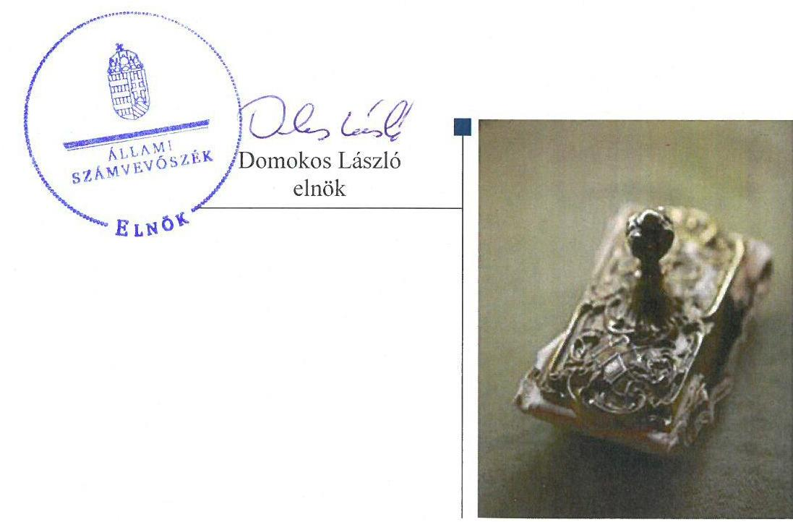
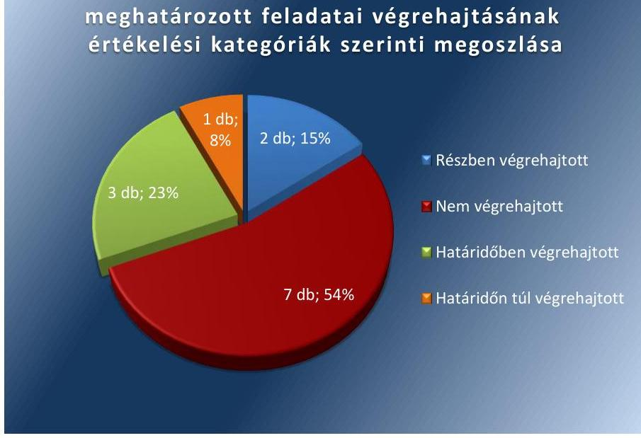
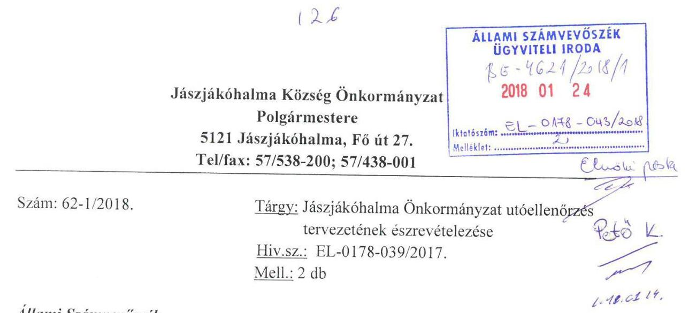
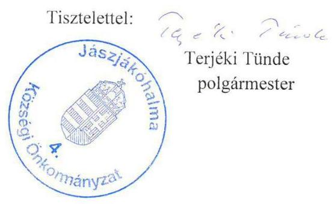
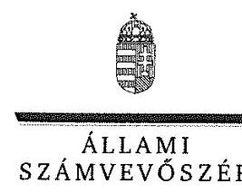
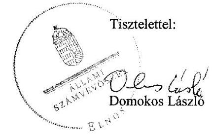
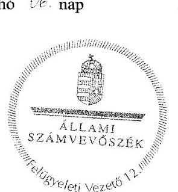

# Jelentés 

## Utóellenőrzések

Az önkormányzatok pénzügyi gazdálkodási helyzete értékelésének és gazdálkodása szabályosságának utóellenőrzése Jászjákóhalma Községi Önkormányzat 2018.

---

# Jelentés 

## Utóellenőrzések

Az önkormányzatok pénzügyi gazdálkodási helyzete értékelésének és gazdálkodása szabályosságának utóellenőrzése Jászjákóhalma Községi Önkormányzat 2018. 22. hó 28. nap

---

# AZ ELLENŐRZÉST FELÜGYELTE: 

PETŐ KRISZTINA felügyeleti vezető

## AZ ELLENŐRZÉST VEZETTE ÉS A VÉGREHAJTÁSÁÉRT FELELŐS:

NEMESVÁRI-HORTHY ESZTER ellenőrzésvezető

## A PROGRAM ÖSSZEÁLLÍTÁSÁÉRT FELELŐS:

JANIK JÓZSEF LÁSZLÓ osztályvezető

## A TÉMÁHOZ KAPCSOLÓDÓ KORÁBBI SZÁMVEVŐSZÉKI JELENTÉS:

- címe: Jelentés az önkormányzatok pénzügyi gazdálkodási helyzete értékelésének, és gazdálkodása szabályosságának ellenőrzéséről - Jászjákóhalma
- sorszáma: 14100

IKTATÓSZÁM: EL-0178-045/2018.
TÉMASZÁM: 2096
ELLENŐRZÉS-AZONOSÍTÓ SZÁM: V075599

---

# TARTALOMJEGYZÉK 

■ ÖSSZEGZÉS ..... 5
■ AZ ELLENŐRZÉS CÉLJA ..... 6
■ AZ ELLENŐRZÉS TERÜLETE ..... 7
■ AZ ELLENŐRZÉS HÁTTERE, INDOKOLTSÁGA ..... 8
■ A JELENTÉS LÉNYEGES KÉRDÉSKÖRE ..... 9
■ AZ ELLENŐRZÉS HATÓKÖRE ÉS MÓDSZEREI ..... 10
■ MEGÁLLAPÍTÁSOK ..... 12
■ MELLÉKLETEK ..... 15
I. sz. melléklet: AZ ÁSZ 14100 számú jelentéséhez kapcsolódó intézkedési terv végrehajtásának értékelése ..... 15
■ FÜGGELÉK: ÉSZREVÉTELEK ..... 21
■ RÖVIDÍTÉSEK JEGYZÉKE ..... 29

---

.

---

# ÖSSZEGZÉS 

Az Állami Számvevőszék Jászjákóhalma Községi Önkormányzat utóellenőrzése során megállapította, hogy az intézkedési tervben a pénzügyi egyensúlyi helyzet gyors helyreállitását szolgáló intézkedéseket végrehajtották, azonban a gazdálkodás biztonságára, a fizetőképesség biztositására tervezett intézkedések végrehajtása elmaradt. Ez kockáztatta a pénzügyi egyensúlyi helyzet tartós, hosszú távú fenntartását, a közpénzekkel való eredményes gazdálkodást.

## Az ellenőrzés társadalmi indokoltsága

Az Állami Számvevőszék stratégiájában célul tűzte ki a számvevőszéki munka hasznosulásának javítását. Ezzel összhangban ellenőrzi, hogy az ellenőrzött szervezetek megvalósították-e a korábbi ellenőrzései által feltárt hibák, hiányosságok és szabálytalanságok megszüntetése céljából kialakított intézkedési terveikben foglaltakat. A rendszeres utóellenőrzések hozzájárulnak a szükséges intézkedések tényleges végrehajtásához, ezáltal a közpénzügyek rendezettségének javulásához.

## Főbb megállapítások, következtetések

Jászjákóhalma Községi Önkormányzat az intézkedési tervében meghatározott tizenhárom feladatból hármat határidőben, egyet határidőn túl, két feladatot részben, hetet nem hajtott végre.

A pénzügyi egyensúlyi helyzet gyors helyreállítása érdekében realizálódtak 2013-2014. években a helyi iparűzési adóból, 2015. évben földterület értékesítéséből a tervezett bevételek.

A gazdálkodás biztonságát, a fizetőképesség megőrzését nem segítette elő, hogy a költségvetés tervezése során 2015. évben nem mérték fel a bevételszerző és a kiadáscsökkentő lehetőségeket. A 2015-2017. években a jegyző nem készített elő a bevételek növelését és a kiadások csökkentését célzó intézkedéseket tartalmazó döntési javaslatokat. A 2015. évtől prognosztizált helyi iparűzési adó többlet-bevételek nem folytak be.

---

# AZ ELLENŐRZÉS CÉLJA

Az ellenőrzés célja annak értékelése volt, hogy az ÁSZ1 jelentésben2 foglalt, a javaslatokat megalapozó megállapításokkal összhangban készített intézkedési tervben3 meghatározott feladatokat az ellenőrzött szervezet végrehajtotta-e.

---

# **AZ ELLENŐRZÉS TERÜLETE**

## **Jászjákóhalma Községi Önkormányzat**

Jászjákóhalma település a Jászság központjában, a Tarna bal partján, Jászberénytől 6 km-re keletre található, lakosainak száma 2017. január 1-jén a Központi Statisztikai Hivatal Magyarország közigazgatási helynévkönyv alapján 2 935 fő volt.

A polgármester4 a 2014. évi általános önkormányzati választások óta tölti be tisztségét, a jelenlegi jegyző5 2017. április 1-jétől látja el feladatait.

Az Önkormányzat6 2016. évi költségvetési beszámolója szerint 363,6 millió Ft költségvetési bevételt ért el és 373,1 millió Ft költségvetési kiadást teljesített, a finanszírozási egyenlege 175,4 millió Ft volt. A könyvviteli mérlege szerint 2016. december 31-én 1 940,7 millió Ft összegű vagyonnal rendelkezett, a követelések állománya 33,9 millió Ft, a kötelezettségek állománya 15,0 millió Ft-ot tett ki.

Az ÁSZ a 2013. évben ellenőrizte az Önkormányzat pénzügyi gazdálkodási helyzete értékelését és gazdálkodása szabályosságát 2010. január 1-jétől 2013. június 30-ig terjedő időszak vonatkozásában. Az erről szóló 14100. számú jelentést az ÁSZ 2014. június 17-én tette közzé. Az ÁSZ jelentésében foglalt ellenőrzés célja az volt, hogy az Önkormányzat pénzügyi helyzetének és vagyongazdálkodása szabályosságának értékelése, valamint a pénzügyi egyensúly alakulására hatással lévő folyamatoknak és a pénzügyi egyensúly alakulására ható kockázatoknak a feltárása volt.

Az utóellenőrzés – a 2014. június 17. és 2017. augusztus 21-e között végrehajtott feladatokat figyelembe véve – az ÁSZ jelentésben a polgármester és a jegyző részére megfogalmazott javaslatokat megalapozó megállapításaira készített, az ÁSZ részére megküldött intézkedési tervben foglalt feladatok megvalósításának ellenőrzésére, illetve értékelésére fókuszált.

---

# AZ ELLENŐRZÉS HÁTTERE, INDOKOLTSÁGA 

Az ÁSZ tv. ${ }^{7}$ 33. § (1) bekezdése értelmében az ÁSZ jelentések javaslatot megalapozó megállapításaihoz kapcsolódóan az ellenőrzött szervezet vezetője intézkedési tervet köteles összeállítani, és az ÁSZ részére megküldeni. Az intézkedési tervben foglaltak megvalósítását - az ÁSZ tv. 33. § (7) bekezdésében foglaltak alapján - az ÁSZ utóellenőrzés keretében ellenőrizheti. Az intézkedések megvalósulásának értékelése során az ÁSZ figyelembe veszi az ellenőrzött szervezetek múködési feltételeiben, valamint a jogszabályi előírásokban bekövetkezett változásokat.

Az intézkedési tervekben foglalt feladatok hiányos, illetve késedelmes végrehajtása, valamint megvalósításának elmaradása azt mutatja, hogy az ellenőrzések során feltárt hibák, hiányosságok és szabálytalanságok megszüntetése nem kapott kellő hangsúlyt. Ez a szabályszerű működés és a felelős vezetői magatartás vonatkozásában kockázatot hordoz. E kockázatok feltárásával az ÁSZ utóellenőrzési rendszere fokozza a fegyelmet, és igazolja, hogy a közpénzzel való szabályos gazdálkodás felelőssége elől nem lehet kitérni.

Az utóellenőrzés négy szinten hasznosulhat:
A társadalom szintjén az utóellenőrzés jelzi, hogy a számvevőszéki ellenőrzés megállapításainak van következménye: a hiányosságok megszüntetésére az ellenőrzött szervezet által meghatározott intézkedések végrehajtását is számon kéri az ÁSZ.

- Az ellenőrzött terület szintjén az utóellenőrzés tájékoztatást nyújt a terület döntéshozóinak a hiányosságok kiküszöbölésének jó gyakorlatairól, ezzel lehetőséget biztosítva arra, hogy az ÁSZ ellenőrzési megállapításai, javaslatai a terület nem ellenőrzött szervezeteinek a múködése során is hasznosuljanak.
- Az ellenőrzött szervezet szintjén az utóellenőrzés feltárja, hogy a szervezet az intézkedések végrehajtásával hasznosította-e a korábbi ellenőrzési jelentésben a hiányosságok megszüntetése, illetve a kockázatok kezelése érdekében megfogalmazott javaslatokat.
- Az ÁSZ szintjén az utóellenőrzés visszacsatolást ad az ellenőrzési jelentések hasznosulásáról, az intézkedések elmaradása vagy részleges megvalósulása a további ellenőrzésekhez kockázati jelzésként szolgál.

---

# A JELENTÉS LÉNYEGES KÉRDÉSKÖRE 

Az Önkormányzat az intézkedési tervben foglaltakat az elöirt határidőben végrehajtotta-e?

---

# AZ ELLENŐRZÉS HATÓKÖRE ÉS MÓDSZEREI 

## Az ellenőrzés típusa

Megfelelőségi ellenőrzés.

## Az ellenőrzött időszak

Az utóellenőrzés alapját képező ÁSZ jelentés közzétételének (2014. június 17.) napjától az ellenőrzésről szóló kiértesítő levél keltének (2017. augusztus 21.) napjáig tartó időszak.

## Az ellenőrzés tárgya

Az ÁSZ jelentésben foglalt javaslatokat megalapozó megállapításokkal összhangban - Jászjákóhalma Közégi Önkormányzat által - készített intézkedési tervben foglaltak végrehajtásának ellenőrzése.

Az ellenőrzés kiterjedt minden olyan körülményre és adatra, amely az ÁSZ jogszabályban meghatározott feladatainak teljesítéséhez, valamint a program végrehajtása folyamán felmerült újabb összefüggések feltárásához szükséges volt.

## Az ellenőrzött szervezet

Jászjákóhalma Községi Önkormányzat

## Az ellenőrzés jogalapja

Az ÁSZ tv. 33. § (7) bekezdése alapján az intézkedési tervben foglaltak megvalósítását az ÁSZ utóellenőrzés keretében ellenőrizheti.

## Az ellenőrzés módszerei

Az ÁSZ az ellenőrzést a nemzetközi standardokat irányadónak tekintve az ellenőrzési program ellenőrzési kérdései, az ellenőrzött időszakban hatályos jogszabályok, az ellenőrzés szakmai szabályok és módszertanok figyelembevételével önálló ellenőrzés keretében végezte.

Az ÁSZ az ellenőrzés ideje alatt az Önkormányzattal történő kapcsolattartást az ÁSZ SZMSZ ${ }^{\circledR}$-ének vonatkozó előírásai alapján biztosította.

---

Az utóellenőrzés megállapításait elsősorban az ÁSZ rendelkezésére álló, valamint az ellenőrzött szervezettől elektronikusan bekért dokumentumok alapozták meg.

Az ellenőrzési bizonyítékként felhasználható adatforrások közé tartoztak egyrészt a szakmai programban felsorolt adatforrások, másrészt minden - az ellenőrzés folyamán feltárt, az ellenőrzés szempontjából információt tartalmazó - dokumentum.

Az intézkedési tervben előírt feladatokat azok végrehajthatósága, illetve végrehajtása szempontjából az alábbiak szerint értékelte az ÁSZ:
$\longrightarrow$ „határidőben végrehajtott" a feladat, ha a teljesítés dokumentáltan, az intézkedési tervben előírt határidőben és tartalommal megtörtént;
$\longrightarrow$ „határidőn túl végrehajtott" a feladat, ha annak teljesítése az intézkedési tervben meghatározott módon, de az előírt határidőn túl történt meg;
$\longrightarrow$ „részben végrehajtott" a feladat, ha végrehajtása teljes körűen az intézkedési tervben előírt módon nem történt meg;
$\longrightarrow$ „nem végrehajtott" a feladat, ha a végrehajtás nem történt meg, vagy amennyiben a teljesítést nem dokumentálták;
$\longrightarrow$ „okafogyottá vált" a feladat, ha végrehajtására - meghatározott esemény bekövetkezése, továbbá külső körülmény, a működést érintő feltétel változása miatt - már nincs szükség, illetve lehetőség, és egyértelműen megállapítható, hogy az intézkedést szükségessé tevő körülmény a jövőben nem fordulhat elő;
$\longrightarrow$ „nem időszerü" az a feladat, amelynek ellenőrzési időszakon belüli végrehajtására azért nem került (kerülhetett) sor, mert az intézkedés alapjául szolgáló esemény nem következett be, de annak jövőbeni előfordulása lehetséges, a végrehajtása nem volt esedékes, vagy a végrehajtás határideje még nem járt le.
Az ellenőrzés lefolytatásához az ellenőrzött szervezet a tanúsítványok elektronikus kitöltésével, valamint az ÁSZ által kért dokumentumok elektronikus megküldésével szolgáltatott adatokat, amelyek valódiságát és teljes körűségét az ellenőrzött szervezet vezetője által tett teljességi és hitelességi nyilatkozat igazolta. Az így rendelkezésre bocsátott adatok, információk kontrollja az ellenőrzés keretében történt.

---

# MEGÁLLAPÍTÁSOK 

## Az Önkormányzat az intézkedési tervben foglaltakat az előírt határidőben végrehajtotta-e?

Összegző megállapítás

Az Önkormányzat a pénzügyi egyensúlyi helyzet gyors helyreállítására az intézkedési tervében meghatározott feladatokat végrehajtotta, a gazdálkodás hosszú távú fenntartására, valamint a kötelezettségek nyilvántartásával kapcsolatban meghatározott feladatokat nem hajtotta végre.

Az intézkedési tervben meghatározott feladatokat, határidőket, felelősöket és a feladatok végrehajtását az I. számú melléklet mutatja be.

Az Önkormányzatnak a Bkr. ${ }^{9}$ által előírt, a külső ellenőrzésekről vezetett nyilvántartása nem felelt meg a Bkr. 47. § (2) bekezdésében foglaltaknak, mert nem tartalmazta az ÁSZ jelentésben szereplő javaslatokat és az elfogadott intézkedési tervet.

Az Önkormányzat intézkedési tervében meghatározott feladatok végrehajtásának értékelési kategóriák szerinti megoszlását az 1. ábra szemlélteti.

1. ábra

Az Önkormányzat intézkedési tervében meghatározott feladatai végrehajtásának értékelési kategóriák szerinti megoszlása

A PÉNZÜGYI EGYENSÚLYI HELYZET GYORS HELYREÁLLÍTÁSA érdekében az Önkormányzat felelős vezetői intézkedéseket tettek. A 2013. és a 2014. évben a helyi iparűzési adóból a

---

2015. évben egy földterület értékesítéséből az Önkormányzatnak többletbevétele keletkezett.

1. táblázat

# A PÉNZÜGYI EGYENSÚLYI HELYZET GYORS HELYREÁLLÍTÁSA ÉRDEKÉBEN TERVEZETT FELADATOK ÉRTÉKELÉSE 

| Értékelési kategória | Feladat intézkedési tervben szereplő sor száma |
| :-- | :--: |
| „Határidőben végrehajtott" | 2.,6. |
| „Határidőn túl végrehajtott" | 5. |

A GAZDÁLKODÁS BIZTONSÁGA, A FIZETŐKÉPESSÉG MEGŐRZÉSE érdekében intézkedtek, hogy a vagyon- és ingatlanértékesítésből származó bevételek a felhalmozási tartalékképzést szolgálják, és a folyó évi múködési bevételek ezen belül a helyi adó plusz bevételek a múködési célú tartalékhoz biztosítsanak forrásfedezetet, a felhalmozási célú tartalékot fejlesztési célokra használják fel, és a múködési célú tartalék a múködési forráshiány megszüntetésére szolgáljon. A tervezett bevételek közgazdasági megalapozottságát nem biztosították. Az éves költségvetési rendelettervezetek, azok évközi módosítása előterjesztését megelőzően 2015. évben nem mérték fel a bevételszerző, kiadáscsökkentő lehetőségeket. A 2015-2017. években a jegyző nem készített a bevételek növelését, a kiadások csökkentését célzó intézkedések bevezetéséhez szükséges döntési javaslatokat. A 2015. és 2016. évre prognosztizált helyi iparűzési adó többletbevételek nem folytak be.
2. táblázat

## A GAZDÁLKODÁS BIZTONSÁGA, A FIZETŐKÉPESSÉG MEGŐRZÉSE ÉRDEKÉBEN MEGHATÁROZOTT FELADATOK ÉRTÉKELÉSE

| Értékelési kategória | Feladat intézkedési tervben szereplő sor száma |
| :-- | :--: |
| „Határidőben végrehajtott" | 8. |
| „Részben végrehajtott" | 9. |
| „Nem végrehajtott" | $3 ., 4 ., 7 ., 10$. |

A KÖTELEZETTSÉGEK NYILVÁNTARTÁSÁVAL kapcsolatban az intézkedési tervben meghatározott feladatokat nem teljesítették. A mérlegben nem az Áhsz. ${ }_{1,2}{ }^{10}$-ben foglaltaknak megfelelően mutatták ki a kötelezettségeket és azokról nem vezettek az Áhsz. ${ }_{2}$-ben meghatározott tartalmi követelményeknek megfelelő részletező nyilvántartást. A pénzügyi munkatársaknak a jegyző nem adott intézkedést az Áhsz. ${ }_{2}$-ben foglalt előírások betartásával összefüggő feladatokra.
3. táblázat

## A KÖTELEZETTSÉGEK NYILVÁNTARTÁSA ÉRDEKÉBEN MEGHATÁROZOTT FELADATOK ÉRTÉKELÉSE

| Értékelési kategória | Feladat intézkedési tervben szereplő sor száma |
| :-- | :--: |
| „Részben végrehajtott" | 1. |
| „Nem végrehajtott" | $11 ., 12 ., 13$. |

---

.

---

# MELLÉKLETEK

- I. SZ. MELLÉKLET: AZ ÁSZ 14100 SZÁMÚ JELENTÉSÉHEZ KAPCSOLÓDÓ INTÉZKEDÉSI TERV VÉGREHAJTÁSÁNAK ÉRTÉKELÉSE

|  Az intézkedési tervben meghatározott feladat | Az intézkedési tervben meghatározott határidő 2. | Az intézkedési tervben meghatározott feladatok felelőse 3. | A feladat végrehajtása 4.  |
| --- | --- | --- | --- |
|  1. | Határidőben végrehajtott feladatok |  |   |
|  1. 2. "A 2013. évi költségvetési rendelet módosításánál, illetve a rendelet teljesítésénél szempont volt a bevételtszerző, kiadáscsökkentő lehetőségek keresése, ami a 4/2014. (IV. 29.) számú A 2013. évi pénzügyi terv végrehajtásáról szóló rendeletben, számszerűségében is kimutatatható. a költségvetési bevétel: 240.519 ezer Ft, a költségvetési kiadás 253522 ezer Ft, 6 ezer forintú maradvánnyal és 108.649 ezer Ft általános tartalékkal, valamit 38 ezer forint értékpapírral fogadta el a képviselő-testület a végrehajtásról szóló zárszámadást. Teljesítve azzal azt a kötelmet, hogy a 2013-ra vonatkozóan a müködési bevételek fedezték a müködési kiadásokat, úgy hogy 6 ezer Ft pénzmaradvánnyal zárta gazdálkodását az önkormányzat. Belső tartalmával megszüntetve a tervezési időszakban valótlan közgazdasági tételként jelentkező 24.299 ezer forint kiegészítő forrást, mely tétel feltöltésének egyik fontos eleme volt az ÁSZ javaslatában szereplő többletbevétel, melyet a helyi adó eredeti előirányzathoz képest 8400 ezer Ft bevételi többlettel teljesült." | 2014. december 31. | polgármester | A 2013. évi költségvetés teljesítése során a müködési bevételek fedezetet nyújtottak a müködési kiadásokra, és a helyi adó bevétel az eredeti előirányzathoz képest 8,425 ezer Ft bevételi többlettel (előirányzat: 51800 ezer Ft, teljesítés: 60225 ezer Ft) teljesült. A pénzmaradvány 6 ezer Ft volt.  |
|  2. 6. „A pénzügyi egyensúlyi helyzet gyors helyreállítását szolgáló intézkedések:
Jelenleg folyó beruházások ideiglenes, illetve állandó iparűzési adó bevételeinek növekedése, a megnövekedett adóalanyi kör előzetes nyilatkozatai alapján 4044 ezer Ft helyiadó többletbevétel." | 2014. december 31. | jegyző, pénzügyi ügyintéző | Az Önkormányzat 2014. évi beszámolója alapján megállapítható, hogy a helyi iparűzési adó bevételek a tervezettnél magasabban, a 2014. évi 48000 ezer Ft-ról 78475 ezer Ft-ra teljesültek.  |

---

|  Az intézkedési tervben meghatározott feladat | Az intézkedési tervben meghatározott határidő 2. | Az intézkedési tervben meghatározott feladatok felelőse 3. | A feladat végrehajtása 4.  |
| --- | --- | --- | --- |
|  3. 8. „A gazdálkodás biztonsága a fizetőképesség megőrzése érdekében a működési és felhalmozási egyensúly hosszú távú fenntartásához szükséges elkülönített tartalék képzésére és felhasználására az alábbiakban szabályozva intézkedik a Települési Önkormányzat:
- Az adott gazdasági évben vagyon- és ingatlanértékesítésből származó bevételek mindenkor a felhalmozási tartalékképzést szolgálják; - a folyó évi működési bevételek ezen belül hangsúlyozottan a helyi adó plusz bevételek a működési célú tartalékhoz biztosítsanak forrásfedezetet;
- a felhalmozási célú tartalék fejlesztési célokra használható fel, míg a működési célú tartalék az esetleges működési forráshiány megszüntethetésére szolgál." | 2014. december 31, illetve minden év december 31. napja | polgármester | Az Önkormányzat a 2014-2016. években a vagyon- és ingatlan-értékesítésből származó bevételek a felhalmozási tartalékképzést szolgálták, és a folyó évi működési bevételek ezen belül a helyi adó plusz bevételek a működési célú tartalékhoz biztosítottak forrás-fedezetet. A felhalmozási célú tartalékot fejlesztési célokra használták fel, és a működési célú tartalék a működési forráshiány megszüntetésére szolgált.  |
|  Határidőn túl végrehajtott feladat |  |  |   |
|  4. 5. „A pénzügyi egyensúlyi helyzet gyors helyreállítását szolgáló intézkedések:
Bevételek növelése: 1,7741 ha terület értékesítése nettó 11000 ezer Ft árbevétellel." | 2014. augusztus 31. | polgármester | Az Önkormányzat a területet értékestéséből 2015. évben realizált bevételt, a tervezett 11000 ezer Ft-tól magasabb 11410 ezer Ft bevétel folyt be.  |

---

|  5. | 1. „Jászjákóhalma település önkormányzat a 2013. évi könyvviteli mérlegében a szállítókkal szemben fennálló tartozását szerepeltette. A mérleg készítése során - az Áhsz.; 26. § (1) bekezdésében foglalt előírásait - a mérleg fordulónapját megelőzően már teljesített, az Önkormányzat által elismert, a mérlegkészítés időpontjáig beérkezett szállítói számlák szerinti kötelezettség összegét figyelembe vette. A jegyző kötelezte a pénzügyi munkatársakat, hogy az Áhsz.; 14. § (8) bekezdésében foglalt előírásoknak megfelelően, a jövőben is tartsák nyilván a mérlegben a kötelezettségek között az egységes rovatrend szerinti rovatokhoz kapcsolódóan vezetett nyilvántartási számlákon nyilvántartott végleges kötelezettségvállalásokat, más fizetési kötelezettségeket mutassák ki mindaddig, amíg azokat pénzügyileg nem egyenlítették ki, el nem engedték, vagy egyéb módon nem rendezték. Az Áhsz.; 1. § (1) bekezdés 9. pontjában előírtak szerint végleges kötelezettségvállalásként, más fizetési kötelezettségként a pénzértékben kifejezett, jogszabályból, jogerős bírói ítéletből vagy hatósági határozatból, szerződésből - ide értve az átvállalt kötelezettségeket is jogszerűen eredő elismert tartozást mutassák ki. Szintén Intézkedési kötelemkét lett megjelölve a pénzügyi munkatársaknak, hogy a kötelezettségvállalások, más fizetési kötelezettségek (ide értve a szállítókkal szembeni tartozások) a jogszabályi előírásoknak megfelelő számviteli nyilvántartás érdekében az Áhsz.; 14. számú melléklet II. pontjában előírt tartalmi követelményeknek megfelelően részletező nyilvántartást vezessék." | 2014. február 28. | Jegyző, pénzügyi főmunkatárs, pénzügyi tanácsos | Végrehajtott feladatrész: Az Önkormányzat a 2013. évi könyvviteli mérlegében a 2013. évi szállítói kimutatás szerinti kötelezettség megegyezett a 2013. évi mérlegben szereplő összeggel.  |
| --- | --- | --- | --- |
|   |  |  | Nem végrehajtott feladatrész: A mérleg készítése során kötelezettségként - az Áhsz.; 26. § (1) bekezdésében foglaltak ellenére - a könyvviteli mérlegben nem a jogszabályi előíráson, a bírósági, illetve a jogerős közigazgatási hatósági döntésen alapuló fizetési kötelezettségeket, továbbá az egyéb passzív pénzügyi elszámolásokat mutatták ki. A pénzügyi munkatársaknak - az Áhsz.; 14. § (8), 1. § (1) bekezdés 9. pontjában, valamint 14. számú melléklet II. pontjában foglalt előírások betartásával összefüggő feladataira vonatkozó - intézkedést a jegyző nem adott. |   |

---

|  Az intézkedési tervben meghatározott feladat | Az intézkedési tervben meghatározott határidő 2. | Az intézkedési tervben meghatározott feladatok felelőse 3. | A feladat végrehajtása 4.  |
| --- | --- | --- | --- |
|  6. 9. „Minden év költségvetési rendelettervezeténél, valamint azoknak évközi módosításaira vonatkozó előterjesztéseket megelőzően minden alkalommal föl kel mérni a bevételszerző és kiadás csökkentő lehetőségeket és ezekre alapozottan a Képviselő testület elé a bevételek növelését a kiadások csökkentését célzó intézkedéseket szükséges megjelölni a Htv. ${ }^{11} 140 . \S$ (1) bekezdés a) pontja alapján a jegyző által elkészített döntési javaslatokkal." | 2015. február 15. és azt követően minden évben a költségvetési rendelet tervezet beterjesztésére vonatkozó jogszabályban rögzített határidő, valamint az adott költségvetési évre vonatkozó költségvetési rendeletek módosítási időpontjai. | polgármester, jegyző, főmunkatárs, pénzügyi tanácsos | Végrehajtott feladatrész: A jegyző a 2016. és a 2017. év elején a polgármesterrel közösen jegyzett gazdasági helyzetelemzést terjesztett a Képviselő-testület elé, amelyben az Önkormányzat 2016., illetve 2017. évi költségvetési egyensúlyi helyzetének biztosítása érdekében felmérte a bevételszerző és kiadáscsökkentő lehetőségeket. Az előterjesztett gazdasági helyzetelemzéseket a Képviselő-testület a 4/2016. (II. 15.) számú, illetve a 6/2017. (III. 13.) számú határozattal fogadott el.
Nem végrehajtott feladatrész:
A polgármester és a jegyző 2015. év elején nem mérte fel a bevételszerző és kiadáscsökkentő lehetőségeket.
A 2015-2017. években a költségvetési rendelettervezetek, illetve azok évközi módosításai alkalmával - a Htv. 140. § (1) bekezdés a) pontja ellenére - a jegyző nem készítette elő a bevételek növelését és a kiadások csökkentését célzó intézkedéséket tartalmazó döntési javaslatokat.  |
|  Nem végrehajtott feladat |  |  |   |
|  7. 3. „A 2014. évi költségvetési rendelettervezet készítése során szintén szempont volt a bevételek növelése kiadások csökkentése. Ez utóbbi kategóriában az orvos írnoki státusz megszüntetésével az adott szakfeladaton a 2014. évi gazdasági évre 1000 ezer Ft-tal kevesebb kiadást lehetett tervezni, azonban még így sem tudott megfelelni a rendelettervezet annak a feltételnek, hogy a müködési bevételek fedezzék a müködési kiadásokat, mivel 1913 ezer Ft finanszírozási hiány volt kimutatható, melyet tartalékból kellett pótolni." | 2014. január 31. | jegyző | A 2014. évi költségvetés tervezése során nem tartották szem előtt a bevételek növelését és a kiadások csökkentését. A 2014. évi gazdasági évre - az orvos írnoki státusz megszüntetése ellenére - a 2014. évi müködési kiadásokat nem fedezték a müködési bevételek, a finanszírozási hiányt tartalékból kellett pótolni.  |
|  8. 4. „A 2014. évi költségvetési rendelet elfogadása: a képviselő-testület a rendelettervezetet módosítás nélkül 381210 ezer Ft költségvetési, finanszírozási bevétellel, és 381210 ezer Ft költségvetési, finanszírozási kiadással fogadta el, ebből müködési kiadás 321274 ezer Ft és felhalmozási kiadás 59236 ezer Ft." | 2014. március 4. | polgármester | A Képviselő-testület a 2014. évi költségvetési rendeletét nem módosítás nélkül fogadta el.  |

---

|  3. | Az intézkedési tervben meghatározott feladat | Az intézkedési tervben meghatározott határidő 2. | Az intézkedési tervben meghatározott feladatok felelőse 3. | A feladat végrehajtása 4.  |
| --- | --- | --- | --- | --- |
|  9. | 7. „Az adósságállomány keletkezésének elkerülését, a pénzügyi egyensúly hosszú távú fenntarthatóságát szolgáló intézkedések:
A 2012-ben értékesített ipari területen 2014. 10. 30-án fejeződnek be a beruházások a termelőcég nyilatkozata alapján, 30%-os kapacitásnövelést eredményez az új gyártó-üzemek átadása, amellyel összefüggésben a cég forgalmának 5-10%-os emelkedése várható. Ebből prognosztizálható többlet iparűzési adó bevétel 2015. évtől kezdődően évi 1,14 illetve 2,28 millió Ft között várható." 10. „Minden év költségvetési rendelet tervezeteiben illetve azoknak módosítási tervezetében a működési költségvetés Mötv. ${ }^{12} 111 . \S$ (4) bekezdésében előírt egyensúlyának biztosításakor a bevételeket az Áht. ${ }^{13} 12 . \S$ (1) bekezdésének megfelelően közgazdaságilag megalapozottan kell meghatározni." | 2015. december 31. és ezt követő minden év december 31. | jegyző, pénzügyi ügyintéző | Termelő cég új gyártó-üzemei átadását követően, annak eredményeként bekövetkező kapacitásnövekedésből a 2015. évtől kezdődően prognosztizált évi 1,14 illetve 2,28 millió Ft között várható többlet helyi iparűzési adó bevétel nem folyt be.  |
|  10. | 10. „Minden év költségvetési rendelet tervezeteiben illetve azoknak módosítási tervezetében a működési költségvetés Mötv. ${ }^{12} 111 . \S$ (4) bekezdésében előírt egyensúlyának biztosításakor a bevételeket az Áht. ${ }^{13} 12 . \S$ (1) bekezdésének megfelelően közgazdaságilag megalapozottan kell meghatározni." | 2015. február 15 illetve minden évben a költségvetési rendelet beterjesztésére vonatkozó jogszabályban rögzített határidő, valamint az adott költségvetési évre vonatkozó költségvetési rendeletek módosítási időpontjai. | polgármester, jegyző, főmunkatárs, pénzügyi tanácsos, illetve az adott státuszokat mindenkor betöltő személyek | A 2015-2017. évi költségvetésekben a bevételek és a kiadások egyensúlyban voltak, azonban a 2015., 2016. és 2017. évek költségvetési rendeletei, azok módosításainak összeállítása során az Áht. 4. § (2) bekezdésében foglaltak ellenére nem biztosította a tervezett bevételek közgazdasági megalapozottságát.  |
|  11. | 11. „A pénzügyi gazdálkodási feladatok során a mérlegben kimutatott szállítói kötelezettségek összegének jogszabályi előírásoknak mindenkor megfelelő szerepeltetése érdekében jelen és jövőbeni végrehajtással szükséges:
Az Áhsz. ${ }_{2} 14 . \S$ (8) bekezdésében foglaltaknak megfelelően a mérlegben a kötelezettségek között az egységes rovatrend szerinti rovatokhoz kapcsolódóan vezetett nyilvántartási számlákon nyilvántartott végleges kötelezettségvállalásokat, más fizetési kötelezettségeket ki kell mutatni mindaddig, míg azokat pénzügyileg ki nem egyenlítették, el nem engedték, vagy egyéb módon nem rendezték." | mindenkori mérlegkészítés időpontja legkésőbb a költségvetési évet követő minden év március 10. | jegyző, főmunkatárs, pénzügyi tanácsos | A mérlegben - az Áhsz. ${ }_{2} 14 . \S$ (8) bekezdésében foglaltakkal ellentétben - a kötelezettségek között nem az egységes rovatrend szerinti rovatokhoz kapcsolódóan vezetett nyilvántartási számlákon nyilvántartott végleges kötelezettségvállalásokat, más fizetési kötelezettségeket mutatták ki mindaddig, míg azokat pénzügyileg ki nem egyenlítették, el nem engedték, vagy egyéb módon nem rendezték.  |
|  12. | 12. „Az Áhsz. ${ }_{2} 1 . \S$ (1) bekezdés 9. pontjában előírtak szerint végleges kötelezettségvállalásként, más fizetési kötelezettségként a pénzértékben kifejezett, jogszabályból, jogerős bírói ítéletből vagy hatósági határozatból, szerződésből - ideértve az átvállalt kötelezettségeket is | mindenkori mérlegkészítés idő-pontja legkésőbb a költségvetési | jegyző, főmunkatárs, pénzügyi tanácsos | Az Áhsz. ${ }_{2} 1 . \S$ (1) bekezdés 9. pontjában előírtakkal ellentétben nem mutatták ki végleges kötelezettségvállalásként, más fizetési kötelezettségként a pénzértékben kifejezett, jogszabályból, jogerős bírói  |

---

|  1. | Az intézkedési tervben meghatározott feladat | Az intézkedési tervben meghatározott határidő | Az intézkedési tervben meghatározott feladatok felelőse | A feladat végrehajtása  |
| --- | --- | --- | --- | --- |
|  2. |  | 2. | 3. | 4.  |
|   | - jogszerűen eredő elismert tartozást ki kell mutatni, amely kifizetésének feltételeit a másik fél már teljesítette. Ilyennek minősül többek között - a jogszabályban felsorolt jogcímek közül - a teljesítésigazolással ellátott számlázott termékértékesítésért vagy szolgáltatásnyújtásért fizetendő ellenérték." | évet követő minden év március 10. |  | ítéletből vagy hatósági határozatból, szerződésből - ideértve az átvállalt kötelezettségeket is - jogszerűen eredő elismert tartozást, amely kifizetésének feltételeit a másik fél már teljesítette.  |
|  13. | 13. „A kötelezettségvállalások, más fizetési kötelezettségek (ideértve a szállítókkal szembeni tartozások) jogszabályi előírásoknak megfelelő számviteli nyilvántartása érdekében az Áhsz. 14. számú melléklete II. pontjában előírt tartalmi követelményeknek megfelelő részletező nyilvántartás vezetése szükséges." | mindenkori mérlegkészítés időpontja legkésőbb a költségvetési évet követő minden év március 10. | jegyző, főmunkatárs, pénzügyi tanácsos | A kötelezettségvállalásokról, más fizetési kötelezettségekről (ideértve a szállítókkal szembeni tartozások) nem vezettek az Áhsz. 14. számú melléklete II. pontjában előírt tartalmi követelményeknek megfelelő részletező nyilvántartást.  |

Forrás: ÁSZ által készített táblázat

---

# FÜGGELÉK: ÉSZREVÉTELEK 

A jelentéstervezetet a Számvevőszék 15 napos észrevételezésre megküldte az ellenőrzött szervezet vezetőjének az ÁSZ tv. 29. §* (1) bekezdése előírásának megfelelően.
Jászjákóhalma Községi Önkormányzat polgármestere a jelentéstervezet megállapításaira észrevételeket tett.

A függelék - mellékletek nélkül - tartalmazza a polgármester észrevételeit, illetve az el nem fogadott észrevételek elutasításának indoklását.

[^0]
[^0]:    * 29. § (1) Az Állami Számvevőszék az ellenőrzési megállapításait megküldi az ellenőrzött szervezet vezetőjének vagy az általa megbízott személynek, és annak, akinek személyes felelősségét állapította meg.
    (2) Az ellenőrzött szervezet vezetője és a felelősként megjelölt személy az ellenőrzés megállapításaira tizenöt napon belül írásban észrevételt tehet.
    (3) Az Állami Számvevőszék az észrevételre a beérkezésétől számított harminc napon belül írásban válaszol. A figyelembe nem vett észrevételeket köteles a jelentésben feltüntetni, és megindokolni, hogy azokat miért nem fogadta el.

---

Állami Számvevőszék
Budapest4.
Pf. 54.
1364

Jászjákóhalma Község Önkormányzat Állami Számvevőszéki utóellenőrzéséről készült számvevőszéki jelentés-tervezet észrevételezését az alábbiakban teszem meg.

A „őbb megállapítások, következtetések" címszó alatti szövegrész 3. bekezdésében pontatlan a következtetés és az azt megalapozó hivatkozások.
Álláspontunk szerint a jegyző 2015-2017. évekre elkészítette a bevételek növekedésére és kiadások csökkentésére vonatkozó felmérést.
Ezek az iratok átadásra kerültek az utóellenőrzéshez, amelyekre vonatkozóan hivatkozás is van a „mellékletek" 18. oldalának 6. sorszám 4. oszlopában: „A jegyző a 2016. és 2017. év elején a polgármesterrel közösen jegyzett gazdálkodási helyzetelemzést terjesztett a képviselő-testület elé, amelyben az önkormányzat 2016., illetve 2017. évi költségvetési egyensúlyhelyzetének biztosítása érdekében felmérte a bevételszerző és kiadáscsökkentő lehetőségeket. Az előterjesztett gazdasági helyzetelemzést a Képviselő-testület a 4/2016.(II.15.), illetve a 6/2017.(III.13.)sz. határozatával fogadott el."
Ezeket a felméréseket a jegyző készítette el, a polgármester egyetértésének jeleként írta alá, hangsúlyozva ezzel annak fontosságát. Az elemzés ezáltal még nagyobb súllyal került a Képviselő-testület elé annak érdekében, hogy az intézkedési tervben foglalt kötelezettségek ebben a formában teljes értékűen teljesüljenek.
A felmérésre vonatkozóan sem tartalmi, sem formai elvárások nem voltak az ÁSZ részéről. Kérdésként merült fel részünkről, hogy ezeket az elkészített iratokat miért nem ismerik el teljesítettnek annak ellenére, hogy megvalósított és dokumentált intézkedés történt, ezért kérjük ennek korrigálását.

---

Jól látható, hogy ezek a költségvetési rendelet-tervezettel együtt kerültek előterjesztésre, ezzel is dokumentálva a felmérés jellegét, amellyel összhangban készült a pénzügyi terv, ami tulajdonképpen döntési javaslat. Így kérjük annak módosítását is, hogy a jegyző nem készített döntési javaslatot, mivel ez véleményünk szerint teljesítésre került.
Fontos megemlíteni, hogy a felmérés elfogadásával az Önkormányzat az abban foglalt elemzések betartására testületileg vállalt kötelezettséget, nemcsak a rendelet elfogadására, hanem annak módosítására vonatkozóan is.

A 2016-ban benyújtott felmérés 5. bekezdése tartalmazza a 2015-re vonatkozó bevételnövelés forrásmegjelölését, ezzel teljesítve az arra az évre vonatkozó elemzési kötelezettséget is. Ebből következően nem pontos az a következtetés, hogy nem került felmérésre a 2015. évre vonatkozóan a bevételszerző és kiadáscsökkentő lehetőségek köre. Emlékeztetni szeretnénk a Tisztelt Címet, hogy az intézkedési tervet az állami számvevőszék 2015. március 18 -án kelt levelében (melynek másolati példányát mellékelem) fogadta el, így ennek alkalmazhatósága nem történhetett meg 2015. február 9-én a hivatalvezetés részéről.

A fentiekben leírtak alapján a jelentéstervezet 13. oldalán a „gazdálkodás biztonsága, a fizetőképesség megőrzése" cím alatt szintén korrigálni szükséges, hogy nem készült a bevételek növelését, kiadások csökkentését célzó intézkedés, illetve döntési javaslat.

Ugyanitt javasoljuk módosítani azt a következtetést, mely szerint a tervezett bevételek közgazdasági megalapozottságát az Önkormányzat nem biztosította. A 2016. évre vonatkozó felmérés pontosan megjelöli, hogy milyen előirányzat-csökkenéssel lehet számolni több tételnél és ezért az önként vállalt feladatok köre és a támogatások mértéke nem növelhető. Megjegyzendő, hogy a költségvetési rendeletekben szereplő iparűzési adóbevételek terv adatként jelentkeznek. Azoknak teljesülése a gazdasági élet szereplőinek adott évre vonatkozó teljesítményétől függenek, melyre egyetlen önkormányzatnak sincs befolyása.

A kötelezettségek nyilvántartásával kapcsolatban meghatározott feladatok végrehajtására vonatkozóan a jegyző adott intézkedést a pénzügyi munkatársaknak az Áhsz-ben foglalt előírások betartásával összefüggő feladatokra. Ennek igazolására nyilatkozatot mellékelünk az érintett pénzügyi munkatárstól. Szükséges megjegyezni, hogy e feladat esetleges elmaradása összefügghet azzal, hogy 2016. júniusától, majd azt követően 2017. január 1-től úgy történtek személyi változások a pénzügyi feladatokat ellátó munkatársak személyét érintően, hogy a megüresedett státuszt többszöri pályázatkiírás ellenére 2017. szeptember 6-ig nem sikerült betölteni.

Szükséges megemlíteni, hogy Jászjákóhalma Község Önkormányzatának vagyona jelentősen gyarapodott 2016. költségvetési évben. Szennyvíz közművagyon ingyenes

---

tulajdonba adásával 965.444.446.-Ft-tal, ivóvízminőség javító program vagyonából szintén ingyenes tulajdonba adással 322.034.308.-Ft-tal, útépítés kategóriájában 91.685.705.-Ft-tal nőtt a vagyon.

Ehhez kapcsolódik még, hogy a 2016. évi költségvetési beszámolóban 175,4 millió Ft pénzmaradvánnyal zárt az önkormányzat.

Ezekből a tényekből arra lehet következtetni, hogy a pénzügyi elemzések és az arra alapozott költségvetési rendelet-tervezetek elkészítése döntési javaslatként közgazdaságilag megalapozottak voltak és Jászjákóhalma gazdálkodását a korábbi időszakoknak megfelelően az utóellenőrzés periódusában stabilitás jellemezte, fenntartva ezzel a Jászjákóhalma Önkormányzatára jellemző konszolidált gazdálkodást, ami ráadásul jelentős vagyonnövekedéssel járt együtt.

Mindezekből következően az összegzésnek azon megállapítását, mely szerint „az intézkedések a pénzügyi egyensúlyi helyzet tartós, hosszútávú fenntartását, a közpénzekkel való eredményes gazdálkodást kockáztatta", a felsorolt érveink figyelembe vételével kérjük korrigálni.

Kérem a Tisztelt Címet, hogy a fent leírt tényekre és összefüggésekre alapozottan a számvevőszéki jelentés-tervezetet módosítani szíveskedjenek.

Együttmüködésüket és megértésüket, illetve az utóellenőrzésre fordított munkájukat czúton megköszönöm, bízva pozitív elbírálásukban.

Jászjákóhalma, 2018. január 17.

---

ELNÖK

Ikt.szám: EL-0178-044/2018.

# Terjéki Tünde úrhölgy   polgármester   Jászjákóhalma Községi Önkormányzat 

Jászjákóhalma

## Tisztelt Polgármester Úrhölgy!

„Az önkormányzatok pénzügyi gazdálkodási helyzete értékelésének, és gazdálkodása szabályosságának utóellenörzése - Jászjákóhalma Községi Önkormányzat" címmel készített számvevőszéki jelentéstervezetre tett észrevételeit megkaptam.
Az Állami Számvevőszék észrevételekre vonatkozó álláspontjáról a felügyeleti vezető által készített részletes tájékoztatást csatoltan megküldőm.
Tájékoztatom Polgármester úrhölgyet, hogy a számvevőszéki jelentésben - az Állami Számvevőszékről szóló 2011. évi LXVI. törvény 29. § (3) bekezdése alapján - a figyelembe nem vett észrevételeket szerepeltetjük az elutasítás indokának feltüntetésével.

Budapest, 2018. pibnár hó 06 . nap

Melléklet: Tájékoztatás az el nem fogadott észrevételekről

---

# Tájékoztatás az el nem fogadott észrevételekról 

„Az önkormányzatok pénzügyi gazdálkodási helyzete értékelésének, és gazdálkodása szabályosságának utóellenörzése - Jászjákóhalma Községi Önkormányzat" címü jelentéstervezetre a 62-1/2018. számú levélben megküldött észrevételeit áttekintettem. Az észrevételek kezeléséről az alábbi tájékoztatást adom.

## 1. A Főbb megállapítások, következtetések rész 3. bekezdéséhez és az azt megalapozó megállapításokhoz, illetve a jelentéstervezet 13. oldal 2. bekezdéséhez füzött észrevétele kapcsán

Az észrevétel szerint a jegyző a 2015-2017. évekre elkészítette a bevételek növekedésére és a kiadások csökkentésére vonatkozó felmérését. Az észrevétel szerint jól látható, hogy ezek a költségvetési rendelet-tervezettel együtt kerültek előterjesztésre, ezzel is dokumentálva a felmérés jellegét, amellyel összhangban készült a pénzügyi terv, ami tulajdonképpen döntési javaslat és véleményük szerint ezzel a jegyző a döntési javaslatot elkészítette. A 2016-ban benyújtott felmérés 5. bekezdése tartalmazza a 2015 -re vonatkozó bevételnövelés forrásmegjelölését, ezzel teljesítve az arra az évre vonatkozó elemzési kötelezettséget is. Az észrevétel rögzíti, hogy az Állami Számvevőszék (továbbiakban: ÁSZ) 2015. március 18 -án kelt levelében fogadta el az intézkedési tervet, így annak alkalmazhatósága nem történhetett meg 2015. február 9-én a hivatalvezetés részéről. Módosítani javasolják azt a következtetést, amely szerint a tervezett bevételek közgazdasági megalapozottságát az Önkormányzat nem biztosította, arra hivatkozva, hogy a 2016. évre vonatkozó felmérés pontosan megjelöli, hogy milyen elöirányzat-csökkentéssel lehet számolni több tételnél és ezért az önként vállalt feladatok köre és a támogatások mértéke tovább nem növelhető. Megjegyzik, hogy a költségvetési rendeletekben szereplő iparüzési adóbevételek terv adatként jelentkeznek, azok teljesülésére az Önkormányzatnak nincs befolyása.
Az Önkormányzat intézkedési tervében egyrészt azt vállalta, hogy a bevételszerző és kiadás csökkentő lehetőségeket felméri adott év költségvetési rendelettervezeténél, valamint azok évközi módosításaira vonatkozó előterjesztéseket megelőzően minden alkalommal. Tájékoztatom Polgármester úrhölgyet, hogy a jelentéstervezetben foglaltakkal összhangban az ÁSZ 20162017. évre vonatkozó felmérést végrehajtott feladatként értékelte. Az észrevételben hivatkozott, 2015. évre vonatkozó felmérés 2016-ban történő elkészítése nem fogadható el a vállalt intézkedés 2015. évet érintő végrehajtásának, tekintettel arra, hogy ez alapján a 2015. január 1-jétől 2015. december 31-ig tartó időszakra vonatkozó 2015. évi költségvetést és módosításait megalapozó döntési javaslat nem születhetett. Az Önkormányzat az intézkedési tervpontban továbbá vállalta, hogy a bevételszerző és kiadás csökkentő lehetőségek felmérésére alapozottan a bevételek növelését és a kiadások csökkentését célzó intézkedéseket jelöli meg a jegyző által elkészített döntési javaslatok alapján. Tájékoztatom Polgármester úrhölgyet, hogy az észrevételben hivatkozott, a költségvetési rendelet-tervezeteket és azok módosításait, valamint a kapcsolódó elő-

---

terjesztéseket, illetve a pénzügyi tervet az Önkormányzat nem bocsátotta az ellenőrzés rendelkezésére. Polgármester úrhölgy 2017. szeptember 18-án kelt teljességi és hitelességi nyilatkozata (továbbiakban: teljességi és hitelességi nyilatkozat) szerint az ÁSZ rendelkezésére bocsátott dokumentumok, adatok megbízhatóak, és a bekért adatokra, dokumentumokra vonatkozóan teljes körű információt adnak. Továbbá Polgármester úrhölgy a teljességi és hitelességi nyilatkozatában teljes felelősséget vállalt a rendelkezésre bocsátott dokumentumok, adatok hiánytalanságáért. Az ÁSZ részére az adatszolgáltatás során nem kerültek olyan dokumentumok átadásra, amelyek a bevételszerző és kiadás csökkentő lehetőségek felmérésére alapozottan a jegyző által elkészített döntési javaslatokat hitelt érdemlően alátámasztanák. Fentiekre tekintettel az észrevételt nem fogadjuk el, a jelentéstervezet módosítása nem indokolt.

# 2. A jelentéstervezet 13. oldal 3. bekezdés 3. mondatához füzött észrevétele kapcsán 

Az észrevétel szerint a kötelezettségek nyilvántartásával kapcsolatban meghatározott feladatok végrehajtására vonatkozóan a jegyző adott intézkedést a pénzügyi munkatársaknak, ennek igazolására levelében nyilatkozatot mellékelt az érintett pénzügyi munkatárstól. Megjegyezték továbbá, hogy a feladat esetleges elmaradása összefügghet a pénzügyi feladatokat ellátó munkatársak személyét érintő változásokkal, illetve a megüresedett státusz betöltetlenségével.
Tájékoztatom Polgármester úrhölgyet, hogy az észrevételéhez csatolt nyilatkozatot a számvevőszéki jelentés készítésekor nem tudjuk figyelembe venni a következőkre tekintettel. A teljességi és hitelességi nyilatkozata szerint az ÁSZ rendelkezésére bocsátott dokumentumok, adatok megbízhatóak, és a bekért adatokra, dokumentumokra vonatkozóan teljes körű információt adnak, továbbá a nyilatkozatban teljes felelősséget vállalt a rendelkezésre bocsátott dokumentumok, adatok hiánytalanságáért. Az ÁSZ az ellenőrzési megállapításait az adatbekérés során teljesített közreműködési kötelezettség keretében rendelkezésre bocsátott dokumentumokra, bizonyítékokra alapozva fogalmazza meg, így a teljességi és hitelességi nyilatkozatában foglaltakra tekintettel az utólag rendelkezésre bocsátott dokumentum hitelességéről nem áll módunkban meggyőződni. Továbbá az észrevétel mellékleteként megküldött nyilatkozat önmagában nem igazolja az intézkedési tervben vállalt feladat végrehajtását. Fentiekre tekintettel az észrevételét nem fogadjuk el, ezért a jelentéstervezet módosítása nem indokolt.

## 3. Az Összegzés 2. mondatához füzött észrevétele kapcsán

Az észrevétel szerint az Önkormányzat vagyona jelentősen gyarapodott a 2016. költségvetési évben, továbbá a 2016. évi költségvetési beszámolóban 175,4 millió Ft pénzmaradvánnyal zárt. Az észrevétel szerint ezekből a tényekből arra lehet következtetni, hogy a pénzügyi elemzések és az arra alapozott költségvetési rendelet-tervezetek elkészítése döntési javaslatként közgazdaságilag megalapozottak voltak és Jászjákóhalma gazdálkodását a korábbi időszakoknak megfelelően az utóellenőrzés periódusában stabilitás jellemezte.

---

Tájékoztatom Polgármester úrhölgyet, hogy az észrevételt az 1. pontban foglaltakra tekintettel nem fogadjuk el.

Budapest, 2018. kémár hó 06. nap

Pető Krisztina
felügyeleti vezető

---

# RÖVIDÍTÉSEK JEGYZÉKE 

${ }^{1}$ ÁSZ
${ }^{2}$ ÁSZ jelentés
${ }^{3}$ intézkedési terv
${ }^{4}$ polgármester
${ }^{5}$ jegyző
${ }^{6}$ Önkormányzat
${ }^{7}$ ÁSZ tv.
${ }^{8}$ SZMSZ
${ }^{9}$ Bkr.
${ }^{10}$ Áhsz. 1

Áhsz. 2
${ }^{11} \mathrm{Htv}$.
${ }^{12}$ Mötv.
${ }^{13}$ Áht.

Állami Számvevőszék
Az ÁSZ 14100. számú jelentése - Jelentés az önkormányzatok pénzügyi gazdálkodási helyzete értékelésének, és gazdálkodása szabályosságának ellenőrzéséről - Jászjákóhalma (elérhető a www.asz.hu honlapon)
Jászjákóhalma 75/2014. (VII. 15.) sz. Önkormányzati határozattal elfogadott és 12/2015. (II. 9.) sz. Önkormányzati határozattal elfogadott intézkedési terv kiegészítése
Jászjákóhalma Községi Önkormányzat polgármestere
Jászjákóhalma Községi Önkormányzat jegyzője 2017. április 1-jétől
Jászjákóhalma Községi Önkormányzat
2011. évi LXVI. törvény az Állami Számvevőszékről (hatályos: 2011. július 1-jétől)

Az Állami Számvevőszék elnökének 3/2016. (XII. 29.) ÁSZ utasítása az Állami Számvevőszék Szervezeti és Működési Szabályzatáról (hatályos 2017. január 1-jétől)
a költségvetési szervek belső kontrollrendszeréről és belső ellenőrzéséről szóló 370/2011. (XII. 31.) Korm. rendelet
az államháztartás szervezetei beszámolási és könyvvezetési kötelezettségének sajátosságairól szóló 249/2000. (XII. 24.) Korm. rendelet (hatálytalan: 2014. január 1-jétől)
az államháztartás számviteléről szóló 4/2013. (I. 11.) Korm. rendelet
a helyi önkormányzatok és szerveik, a köztársasági megbízottak, valamint egyes centrális alárendeltségű szervek feladat- és hatásköreiről szóló 1991. évi XX. törvény

Magyarország helyi önkormányzatairól szóló 2011. évi CLXXXIX. törvény az államháztartásról szóló 2011. évi CXCV. törvény

---

# ÁLLAMI SZÁMVEVŐSZÉK 

1052 Budapest, Apáczai Csere János utca 10.
Levélcím: 1364 Budapest 4. Pf. 54
Telefon: +36 14849100 Telefax: +36 14849200
www.asz.hu