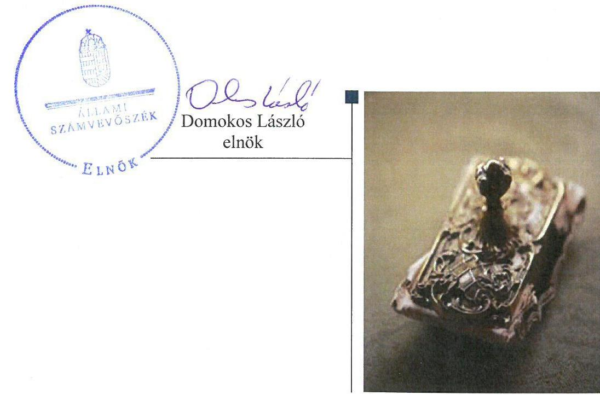
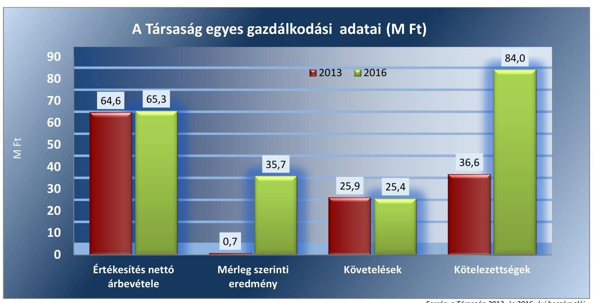
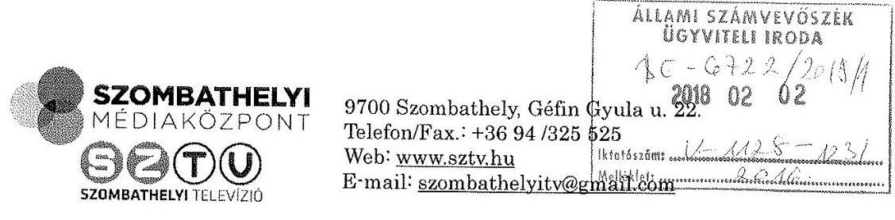
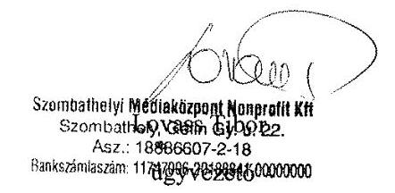
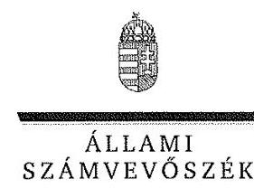
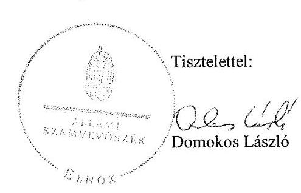
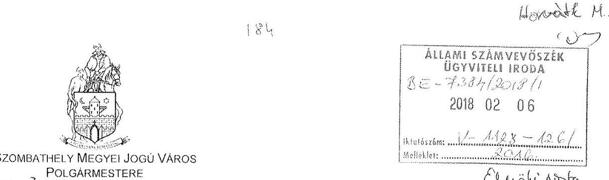
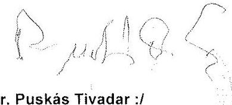
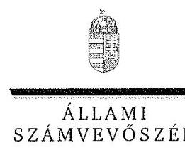
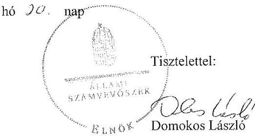

# Jelentés 

## Az önkormányzatok gazdasági társaságai

Az önkormányzatok többségi tulajdonában lévő gazdasági társaságok gazdálkodásának ellenőrzése - Szombathelyi Médiaközpont Nonprofit Kft.
2018.

---

# Jelenetés 

## Az önkormányzatok gazdasági társaságai

Az önkormányzatok többségi tulajdonában lévő gazdasági társaságok gazdálkodásának ellenőrzése - Szombathelyi Médiaközpont Nonprofit Kft.
2018. 06 hó 01. nap

---

# AZ ELLENŐRZÉST FELÜGYELTE:

DR HORVÁTH MARGIT felügyeleti vezető

## AZ ELLENŐRZÉST VEZETTE ÉS A VÉGREHAJTÁSÁÉRT FELELŐS:

SIPOSNÉ DÓCZI KLÁRA ellenőrzésvezető

## A PROGRAM ÖSSZEÁLLÍTÁSÁÉRT FELELŐS:

TÓTPÁL SZABOLCS osztályvezető

IKTATÓSZÁM: V-1128-129/2016

TÉMASZÁM: 2162

ELLENŐRZÉS-AZONOSÍTÓ SZÁM: V0793109

Jelentéseink az Országgyűlés számítógépes hálózatán és az Interneta a www.asz.hu címen is olvashatóak.

---

# TARTALOMJEGYZÉK 

■ ÖSSZEGZÉS ..... 5
■ AZ ELLENŐRZÉS CÉLJA ..... 6
■ AZ ELLENŐRZÉS TERÜLETE ..... 7
■ AZ ELLENŐRZÉS HÁTTERE, INDOKOLTSÁGA ..... 9
■ A JELENTÉS LÉNYEGES KÉRDÉSKÖREI ..... 10
■ ELLENŐRZÉS HATÓKÖRE ÉS MÓDSZEREI ..... 11
■ MEGÁLLAPÍTÁSOK ..... 13
■ JAVASLATOK ..... 19
■ MELLÉKLETEK ..... 23
I. sz. melléklet: Értelmező szótár ..... 23
II. sz. melléklet: Pénzügyi adatok ..... 25
■ FÜGGELÉK: ÉSZREVÉTELEK ..... 27
■ RÖVIDÍTÉSEK JEGYZÉKE ..... 53

---

.

---

# ÖSSZEGZÉS 

Szombathely Megyei Jogú Város Önkormányzata a tulajdonosi jogait szabályszerűen gyakorolta a müsorszolgáltatás közfeladatát ellátó Szombathelyi Médiaközpont Nonprofit Kft. felett. A Társaság vagyongazdálkodása nem volt szabályszerű. 2016-ig kötelező számviteli szabályzatok hiányoztak. A közhasznú tevékenységekre nem rendelkeztek elkülönített nyilvántartással, a számviteli beszámolók alátámasztására vonatkozó leltárak hiányával a törvényi előírásokat minden évben megsértették. A Társaság nem biztositotta a közpénzek felhasználásának elszámoltathatóságát és átláthatóságát.

## Az ellenőrzés társadalmi indokoltsága

Az önkormányzatok többségi tulajdonában álló gazdasági társaságok ellenőrzése kiemelten fontos a vagyon megőrzése, megóvása érdekében, valamint a kormányzati szektor elszámolásaiban megjelenő önkormányzati tulajdonú gazdálkodó szervezetek esetében, amelyekkel szemben alapvető követelmény, hogy gazdálkodásuk, múködésük szabályszerű, az általuk szolgáltatott adatok minél megbízhatóbbak legyenek. A feladatellátás költségeinek, ráfordításainak alakulása a lakosság széles rétegét érinti.

Az ÁSZ ellenőrzései feltárhatják, hogy az önkormányzat a feladatellátásához rendelt vagyon múködtetését a tulajdonostól elvárható gondossággal végezte-e, a feladatot ellátó gazdasági társaság a létesítő okiratban, szolgáltatási szerződésben foglaltak betartásával biztosította-e a feladat ellátását. Az ellenőrzés rávilágíthat arra, hogy a gazdasági társaság a vagyon használatával biztosította-e a szolgáltatás folytatásának feltételeit, az önkormányzat tulajdonosi felügyelete hozzájárult-e a szabályszerű gazdálkodáshoz és feladatellátáshoz.

## Főbb megállapítások, következtetések, javaslatok

Szombathely MJV Önkormányzata a tulajdonosi joggyakorlás kereteit a javadalmazási szabályzat megalkotásának kivételével szabályszerűen kialakította, a tulajdonosi jogok gyakorlása megfelelt a jogszabályok előírásainak.

A Szombathelyi Médiaközpont Nonprofit Kft. 2016-ig nem rendelkezett a jogszabályi előírásoknak megfelelő számviteli politikával és az ahhoz kapcsolódó kötelezően elkészítendő további szabályzatokkal. A múködés szabályozási hiányosságait a szabályzatok elkészítésével 2016-ban pótolta, azonban a közhasznú tevékenység elkülönített nyilvántartását nem biztosította, és továbbra sem alkotta meg a Társaság Számlarendjét valamint a Belső ellenőrzés múködésének szabályait: A szabályozásban fennmaradt hiányosságok hozzájárultak ahhoz, hogy nem voltak biztosítottak a szabályszerű és átlátható elszámolás feltételei.

A Társaság vagyongazdálkodási tevékenysége nem felelt meg a jogszabályi előírásoknak. A számviteli szabályozásnak a vagyongazdálkodás területét érintő hiányosságai kihatottak a vagyon nyilvántartására is, ami nem volt megfelelő. A pénzügyi-számviteli feladatok ellátása során a számviteli törvény előírásait nem tartották be, mert a bevételek és a ráfordítások elszámolása nem felelt meg a törvény előírásainak. A Szombathelyi Médiaközpont Nonprofit Kft. az éves beszámolók közzétételére vonatkozó előírásoknak az előírt határidőre és adattartalommal eleget tett. A Társaság a nonprofit tevékenységgel összefüggő adatszolgáltatási kötelezettségére vonatkozó előírásokat 2016 kivételével betartotta.

A Társaság gazdálkodásában nem voltak sem a kormányzati szektor hiányára sem az államadósságra befolyással bíró elemek.

---

# AZ ELLENŐRZÉS CÉLJA 

Az ellenőrzés célja annak értékelése, hogy az önkormányzat vagyongazdálkodási tevékenysége során szabályszerűen gyakorolta-e tulajdonosi jogait; a gazdasági társaság szabályozottsága, gazdálkodása és vagyongazdálkodási tevékenysége, bevételeinek és ráfordításainak elszámolása megfelelt-e a jogszabályi és tulajdonosi előírásoknak; a gazdasági társaság kötelezettségállománya jelent-e kockázatot a múködésre, valamint a gazdálkodás átláthatósága és elszámoltathatósága érdekében biztosítva volt-e a szolgáltatás dijának megalapozottsága szabályszerű önköltségszámítással. Az ellenőrzés célja továbbá annak megítélése, hogy a kormányzati szektorba sorolt önkormányzati tulajdonban (résztulajdonban) lévő gazdálkodó szervezetek gazdálkodásának a kormányzati szektor hiányára és az államadósságra befolyással bíró elemei a jogszabályi előírásoknak megfeleltek-e.

---

# AZ ELLENŐRZÉS TERÜLETE 

## Szombathely Megyei Jogú Város Önkormányzata és a kizárólagos tulajdonában lévő Szombathelyi Médiaközpont Nonprofit Kft.

SZOMBATHELY MEGYE JOGÚ VÁROS ÖNKORMÁNYZATA 2009. március 26-án alapította a Szombathelyi Televízió és Rádió Nonprofit Kft.-t. Elnevezése 2013. január 31-én módosult Szombathelyi Médiaközpont Nonprofit Kft.-re.

A Szombathelyi Médiaközpont Nonprofit Kft Szombathely Megyei Jogú Város Önkormányzata 100\%-os tulajdonában állt az ellenőrzött időszakban, jegyzett tőkéje az alapításkor 21,0 millió forint, az ellenőrzött időszakban 4,7 millió forint volt.

## A SZOMBATHELYI MÉDIAKÖZPONT NON-

PROFIT KFT. fő tevékenysége televízió-műsor összeállítása, szolgáltatása, mely tevékenység egyben közhasznú (kulturális) tevékenység is. További közhasznú tevékenységei voltak a film-, video-, televízióműsor-gyártás valamint a rádióműsor-szolgáltatás. A vállalkozási tevékenység körébe a médiareklám, a reklámügynöki tevékenység és a fényképészet tartozott. A Szombathelyi Médiaközpont Nonprofit Kft. által működtetett városi televízió Szombathelyen és 25 kmes körzetében sugározza adását, mely 55 ezer háztartásba jut el. Napi 100 perc friss műsort készít, az interneten is elérhetők. A Társaság más gazdasági társaságban tulajdoni hányaddal nem rendelkezett, átlagos statisztikai állományi létszáma 2013-ban 19 fő volt, mely az ellenőrzött időszakban nem változott.

A Nemzetgazdasági Miniszter 2015. december 30-án kelt közleményében sorolta a Társaságot a kormányzati szektorba tartozó egyéb szervezetek közé. A Társaság - az egyszerűsített éves beszámolók alapján - a Stabilitási tv. ${ }^{1}$ által meghatározott adósságot keletkeztető ügyletet nem kötött, államadósságot befolyásoló kötelezettsége nem keletkezett.

Az ellenőrzött időszakban a Társaság irányítási feladatait két ügyvezető, ellenőrzését a három tagú felügyelő bizottság látta el. A Társaság ügyvezetőjének személye 2014. november 24-én változott. A felügyelő bizottsági feladatokat kettő ciklusban, összesen öt fő látta el. A Társaság számviteli beszámolóit könyvvizsgáló auditálta, kinek személye nem változott az ellenőrzött időszakban.

A Szombathelyi Médiaközpont Nonprofit Kft. az Önkormányzattól vagyonkezelésbe, üzemeltetésre nem vett át vagyont, tevékenységét saját eszközeivel látta el. A Társaság gazdálkodásának egyes adatait 2013 és 2016 vonatkozásában az 1. ábra szemlélteti.

---

*Forrás: a Társaság 2013. és 2016. évi beszámolói*

A Társaság mérleg szerinti eredménye a 2013. december 31-i 0,7 millió forintról 2016. december 31-re 35,7 millió forintra emelkedett a hírlapkiadási tevékenység megszüntetése következtében. A kötelezettség állománya a 2013 év eleje és 2016 év vége között több mint kétszeresére növekedett a követelések változatlan állománya mellett. A növekedést az alapítóval szembeni kötelezettségek növekedése okozta. A Szombathelyi Médiaközpont Nonprofit Kft. működésének főbb jellemzőit a II. számú melléklet mutatja be.

Az ellenőrzött időszakban a tulajdonos önkormányzat a Társaság működéséhez valamint fejlesztéseihez 477 millió forint támogatást nyújtott.

Szombathely MJV polgármestere 2010. október 3-tól látja el tevékenységét. Az ellenőrzött időszakban a jegyző személye egy alkalommal, 2015. február 1-én változott.

---

# AZ ELLENŐRZÉS HÁTTERE, INDOKOLTSÁGA 

Az önkormányzatok többségi tulajdonában álló gazdasági társaságok ellenőrzése kiemelten fontos a vagyon megőrzése, megóvása érdekében, valamint a kormányzati szektor elszámolásaiban megjelenő önkormányzati tulajdonú gazdálkodó szervezetek esetében, amelyekkel szemben alapvető követelmény, hogy gazdálkodásuk, múködésük szabályszerű, az általuk szolgáltatott adatok minél meg-bizhatóbbak legyenek. A feladatellátás költségeinek, ráfordításainak alakulása a lakosság széles rétegét érinti.

Ellenőrzéseink feltárhatják, hogy az önkormányzat a feladatellátásához rendelt vagyon múködtetését a tulajdonostól elvárható gondossággal vé-gezte-e, a feladatot ellátó gazdasági társaság a létesítő okiratban, szolgáltatási szerződésben foglaltak betartásával biztosította-e a feladat ellátását. Az ellenőrzés eredményeképp meghatározhatóvá válnak a költségvetési hiányt befolyásoló szervezetek kockázatai, lehetővé válik ezen kockázatok csökkentése. Az ellenőrzés rávilágíthat arra, hogy a hogy a gazdasági társaság a vagyon használatával biztosította-e a szolgáltatás folytatásának feltételeit, az önkormányzat tulajdonosi felügyelete hozzájárult-e a szabályszerű gazdálkodáshoz és feladatellátáshoz.

A megállapítások alapján megfogalmazott számvevőszéki javaslatok hasznosítása elősegítheti a meglévő hibák megszüntetését. A jó gyakorlatok bemutatásával az ÁSZ hozzájárulhat a követendő megoldások megismertetéséhez, terjesztéséhez.

---

# A JELENTÉS LÉNYEGES KÉRDÉSKÖREI 

1.- Az önkormányzat tulajdonosi joggyakorlása szabályszerű volt-e?
2.- A gazdasági társaság vagyongazdálkodása szabályszerű volt-e, fizetőképessége biztositott volt-e a gazdálkodás során?
3.- A gazdasági társaság bevételeinek és ráfordításainak elszámolása, valamint az árképzés szabályszerű volt-e?

---

# ELLENŐRZÉS HATÓKÖRE ÉS MÓDSZEREI 

## Az ellenőrzés típusa

Megfelelőségi ellenőrzés.

## Az ellenőrzött időszak

2013. január 1-jétől 2016. december 31-ig

## Az ellenőrzés tárgya

Szombathely Megyei Jogú Város Önkormányzata tulajdonosi joggyakorlása, valamint a Szombathelyi Médiaközpont Nonprofit Kft. gazdálkodásának szabályozottsága és szabályszerűsége, továbbá gazdálkodásának a kormányzati szektor hiányára és az államadósságra befolyással bíró elemei.

Az ellenőrzés kiterjed minden olyan körülményre és adatra, amely az ÁSZ jogszabályban meghatározott feladatainak teljesítéséhez, valamint a program végrehajtása folyamán felmerült újabb összefüggések feltárásához szükséges.

## Az ellenőrzött szervezet

Szombathely Megyei Jogú Város Önkormányzata,
Szombathelyi Médiaközpont Nonprofit Kft.

## Az ellenőrzés jogalapja

Az ellenőrzés jogszabályi alapját az ÁSZ tv. ${ }^{2}$ 1. § (3) bekezdése és 5. § (3)-(4)-(5) bekezdései képezik.

## Az ellenőrzés módszerei

Az ellenőrzést a nemzetközi standardokat irányadónak tekintve az ellenőrzési program ellenőrzési kérdései, az ellenőrzött időszakban hatályos jogszabályok, az ellenőrzés szakmai szabályok és módszertanok figyelembe vételével végeztük.

Az ellenőrzés ideje alatt az ellenőrzött szervezettel történő kapcsolattartást az ÁSZ Szervezeti és Müködési Szabályzatának vonatkozó előírásai alapján biztosítottuk.

---

Az ellenőrzési kérdések megválaszolásához szükséges bizonyítékok megszerzése a következő ellenőrzési eljárások alkalmazásával történt: megfigyelés, kérdésfeltevés (információkérés), összehasonlítás, valamint elemző eljárás. Az ellenőrzési bizonyítékként felhasználható adatforrások közé tartoztak egyrészt a szakmai programban felsorolt adatforrások, másrészt minden, az ellenőrzés folyamán feltárt, az ellenőrzés szempontjából információkat tartalmazó dokumentum.

Az ellenőrzést a kérdésekre adott válaszok kiértékelésével, valamint a megjelölt adatforrások, a csatolt tanúsítványok felhasználásával, továbbá az adott időszakban hatályos jogszabályok figyelembe vételével folytattuk le.

A bevételek és ráfordítások elszámolása, valamint a vagyonnyilvántartás terén a szabályszerű működést véletlen mintavétellel ellenőriztük. A mintavétellel ellenőrzött területek esetében minden egyes tétel vonatkozásában a szabályszerűségre vonatkozó kérdéseket tettünk fel, amelyek eredménye összesítésre került. Megfelelőnek értékeltünk egy ellenőrzött területet, amennyiben 95\%-os bizonyossággal a teljes sokaságban az átlagos hibaarány legfeljebb 10\%, nem megfelelőnek, amennyiben 10\%-nál magasabb arányt képviselt. A ráfordítások elszámolására és a vagyonnyilvántartásra vonatkozó véletlen mintavételt kockázati alapú kiválasztással egészítettük ki, amelynek során évente a három legnagyobb összegű tételt választottuk ki.

---

# 1. Az önkormányzat tulajdonosi joggyakorlása szabályszerű volt-e? 

## Összegző megállapítás

### 1.1. számú megállapítás

A tulajdonosi joggyakorlás szabályszerű volt.

A tulajdonosi joggyakorlás kereteinek kialakítása - a javadalmazási szabályzat hiánya mellett - szabályszerű volt.

A TULAJ DONOSI JOGGYAKORLÁS KERETEIT az Önkormányzat ${ }^{3}$ az SZMSZ ${ }^{4}{ }_{1-3}$-ben, a Vagyonrendelet ${ }^{5}{ }_{1-2}$-ben valamint a Társaság ${ }^{6}$ Alapító okirat ${ }^{7}{ }_{1-6}$-ban továbbá az évenkénti költségvetési ${ }^{8}$ - és zárszámadási rendeleteiben ${ }^{9}$ a jogszabályi előírásoknak megfelelően határozta meg.

Az Önkormányzat a vezető tisztségviselők, felügyelő-bizottsági tagok, valamint az Mt. ${ }^{10}$ 208. §-ának hatálya alá eső munkavállalók javadalmazásának, valamint jogviszonyuk megszűnése esetére biztosított juttatások módjának, mértékének elveiről, annak rendszeréről nem alkotott javadalmazási szabályzatot, megsértve ezzel a Taktv ${ }^{11}$. 5. § (3) bekezdésében foglaltakat.

### 1.2. számú megállapítás

A tulajdonosi jogok gyakorlása szabályszerű volt.
A tulajdonosi jogokat - a Gt. ${ }^{12}$ és a Ptk. ${ }^{13}$ valamint a Taktv. előírásainak megfelelően - az alapító Szombathely Megyei Jogú Város Önkormányzata döntéshozó szervei ${ }^{14}$ útján gyakorolta.

Az Önkormányzat a tulajdonosi ellenőrzést valamint Gt. és a Ptk. előírásai szerinti tulajdonosi joggyakorlást a Felügyelő bizottságon ${ }^{15}$ keresztül, valamint az éves üzleti terv, az évközi és az éves számviteli beszámolók elfogadásával, az éves adózott eredmény felosztásáról szóló döntéseivel biztosította. Az Önkormányzat az ellenőrzött időszakban a Felügyelő bizottság és a könyvvizsgáló írásos véleményének birtokában határozataiban döntött a Társaság egyszerűsített éves beszámolóinak elfogadásáról, a nyereséget/veszteséget eredménytartalékba helyezték, osztalékfizetésre vonatkozó döntés nem született, osztalék kifizetés nem történt. Továbbá az ellenőrzött időszakban határozatot hozott minden, az Alapító okirat ${ }_{1-6}$-ban az alapító hatáskörébe tartozó kérdésben.

Az Önkormányzat nem élt az Áht ${ }^{16} 70$ § (1) d) pontjában számára biztosított lehetőséggel, hogy ellenőrizze a Társaságot.

---

# 2. A gazdasági társaság vagyongazdálkodása szabályszerű volt-e, fizetőképessége biztosított volt-e a gazdálkodás során? 

Összegző megállapítás

2.1. számú megállapítás
2.2. számú megállapítás

A Társaság 2016-ig nem rendelkezett alapvető számviteli szabályzatokkal. Vagyongazdálkodása nem volt szabályszerű. Fizetőképessége ugyanakkor biztosított volt az ellenőrzött időszakban.

A Társaság szabályszerű múködéséhez 2013-tól 2015 végéig kötelező számviteli szabályzatok hiányoztak. Az ellenőrzött időszak végéig elmaradt a közhasznú tevékenység bevételei és ráfordításai elkülönített nyilvántartási rendjének kialakítása is.

SZÁMVITELI SZABÁLYZATOKKAL- Számviteli politikával, Eszközök és források értékelési szabályzatával, Eszközök és források leltárkészítési és leltározási szabályzatával valamint Pénzkezelési szabályzattal 2016. január 4-ig nem rendelkezett a Társaság, ezzel megsértette a Számv. tv. ${ }^{17} 14 . \S$ (11) bekezdésében előírtakat.

SZÁMLARENDDEL a teljes ellenőrzött időszakban nem rendelkezett a Társaság, amivel megsértette a Számv. tv. 161. § (5) bekezdésének előírásait. Hiányában a szabályszerű és átlátható elszámolás feltételeit nem biztosította.

Ugyanakkor a 2016-tól érvényes számviteli szabályzataiban nem szabályozta a Társaság bevételeinek és költségeinek, ráfordításainak közhasznú tevékenység valamint vállalkozási tevékenység szerinti megosztását valamint elkülönítését, amivel megsértették a Számv. tv. 161/A. § (1) és (2) bekezdéseiben foglaltakat.

A 2016-tól érvényes Leltározási szabályzat ${ }^{18}$, a Pénzkezelési szabályzat ${ }^{19}$ és az Értékelési szabályzat ${ }^{20}$ megfelelt a Számv. tv. rendelkezéseinek.

A Társaság vagyongazdálkodási tevékenysége nem felelt meg a jogszabályi rendelkezéseknek. Ugyanakkor a vagyonváltozást eredményező döntéseknél a belső szabályok szerint jártak el. A Társaság fizetőképessége biztosított volt, azonban a kötelezettségek állománya nem felelt meg a jogszabályi előírásoknak.

AZ ESZKÖZÖK ÉS FORRÁSOK TÉTELES LELTÁROZÁSÁRA nem került sor az ellenőrzött időszakban, ezzel a Társaság megsértette a Számv. tv. 69. § (1) és (3) bekezdéseiben foglaltakat. Ugyancsak megsértette a Társaság a Szám. tv. 15. § (3) bekezdésében foglalt valódiság elvét, mert nem rendelkezett a mérleg fordulónapokon meglévő eszközöket és forrásokat ellenőrizhető módon, tételesen alátámasztó leltárakkal.

A SAJÁT VAGYON NYILVÁNTARTÁSA a leltározás hiánya és a számviteli szabályok hiánya majd 2016-tól annak be nem tartása miatt sem a számviteli beszámolókban, sem az egyedi nyilvántartásokban

---

nem volt megfelelő. Az egyedi nyilvántartásoknál a bekerülési értéket alátámasztó számlák hiánya miatt a Társaság megsértette a Számv. tv. 165. §. (1)-(2) bekezdései bizonylati fegyelemre, továbbá a 169. §. (2) bekezdésének a bizonylatok megőrzési kötelezettségére vonatkozó előírásait. Továbbá a Társaság nem biztosította a főkönyvi könyvelés, az analitikus nyilvántartások és a bizonylatok adatainak logikailag zárt rendszerrel történő egyeztetését, mellyel megsértette a Számv. tv. 165. §. (4) bekezdésében foglaltakat.

Ugyanakkor szabályszerűen járt el a Társaság azzal, hogy minden, a Társaság törzstőkéjének 25\%-át meghaladó értékű beszerzéshez megkérte és kapta a tulajdonosi joggyakorló hozzájárulását.

# A TÁRSASÁG FIZETŐKÉPESSÉGE BIZTOSÍTOTT 

VOLT. A Társaságnak az ellenőrzött időszakban a számviteli beszámolók szerint nem voltak hosszú lejáratú kötelezettségei, és biztosított volt a rövid lejáratú szerződésen és jogszabályon alapuló kötelezettségek teljesítése. A Társaság rövid lejáratú kötelezettségeinek és a követelések és pénzeszközök alakulását, valamint a fizetőképességet jellemző likviditási ráta éves értékeit az 1. táblázat szemlélteti.

1. táblázat

## A TÁRSASÁG EGYES PÉNZÜGYI ADATAI (MILLIÓ FORINT)

| Megnevezés | 2013.12 .31 . | 2014.12 .31 . | 2015.12 .31 . | 2016.12 .31 . |
| :--: | :--: | :--: | :--: | :--: |
| Rövid lejáratú kötelezettségek | 36,6 | 135,5 | 45,7 | 84,0 |
| - Szállítók | 16,5 | 23,4 | 7,1 | 3,5 |
| - Munkabér | 5,0 | 5,1 | 0,0 | 6,6 |
| - Adók és járulékok | 4,6 | 4,0 | 6,5 | 5,7 |
| - Alapítóval szembeni kötelezettség | 9,6 | 11,6 | 11,6 | 62,7 |
| - Egyéb kötelezettség | 0,9 | 91,4 | 20,5 | 5,5 |
| Követelések | 25,9 | 128,2 | 37,4 | 25,4 |
| - vevökövetelés | 21,4 | 31,5 | 34,8 | 23,9 |
| - egyéb követelések | 4,5 | 96,7 | 2,6 | 1,5 |
| Pénzeszközök | 4,4 | 2,4 | 5,8 | 52,2 |
| Likviditási ráta ${ }^{21}$ | 0,83 | 0,96 | 0,95 | 0,92 |
| Korrigált likviditási ráta ${ }^{22}$ | 1,1 | 1,1 | 1,3 | 3,6 |

Forrás: A Társaság főkönyvi kivonatai és egyszerúsített éves beszámolói 2013-2016.
A Társaság 2014-ben helytelenül szerepeltette az egyszerűsített éves beszámolójában az előzetesen felszámított adó összegét (79,3 millió forint) és az általános forgalmi adó elszámolása számla tartozik egyenlegét (14,7 millió forint) a követelések között, valamint a fizetendő általános forgalmi adó számlán kimutatott összeget ( 88,4 millió forint) a kötelezettségek között. Ezzel megsértették a Számv. tv. 15. § (3) bekezdésben meghatározottakat, mely szerint a beszámolóban szereplő tételeknek a valóságban is megtalálhatónak, bizonyíthatónak, kívülállók által is megállapíthatónak kell lenniük.

A Társaságnak az alapítóval szembeni kötelezettségei több mint hatszorosára emelkedtek az ellenőrzött időszakon belül, melynek oka az volt, hogy a Társaság a veszteség pótlásához nem szükséges pótbefizetéseket

---

az ellenőrzött időszakban szabálytalanul, folyamatosan fennálló, az alapítóval szembeni kötelezettségként mutatta ki, a Gt. 120. § (4) bekezdésében, valamint a Ptk hatályba lépésével annak 3:183. § (5) bekezdésében foglaltakkal szemben azokat az alapító részére nem fizette vissza. Ezzel a Társaság az ellenőrzött időszak minden évében megsértette a Számv. tv. 38. § (4) bekezdésében előírtakat.

BELSŐ ELLENŐRZÉST és az operatív tevékenységek keretében megvalósuló folyamatos és eseti nyomon követés biztosító rendszert a Társaság - 2015. december 30-tól hatályos kormányzati szektorba sorolását követően - a Bkr. ${ }^{23}$ 10. §-ában előírtak ellenére nem alakított ki.

# 2.3. számú megállapítás 

A Társaság beszámolási és közzétételi kötelezettségeinek eleget tett. Nem bízott meg adatvédelmi felelőst, ugyanakkor a közérdekú adatokat közzétette.

## BESZÁMOLÁSI ÉS TERVEZÉSI TEVÉKENYSÉGÉT

a Társaság az Alapító okirat ${ }_{1-6}$-ban és az SZMSZ-ben szabályozta. A Társaság az Alapító által előírt tervezési, beszámolási, adatszolgáltatási kötelezettségének az éves üzleti tervekkel valamint az éves és a féléves beszámolókon keresztül tett eleget.

KÖZZÉTÉTELI KÖTELEZETTSÉGÉNEK a Társaság eleget tett. A tulajdonosi joggyakorló által elfogadott éves egyszerűsített beszámolókat és a Közhasznúsági mellékleteket a Társaság megfelelő határidőben letétbe helyezte és közzétette a Számv. tv-ben és Civil tv ${ }^{24}$-ben foglaltak szerint, kivéve a 2016. évi közhasznúsági mellékletet, melyet nem tett közzé, amivel megsértette a Civil tv. 46. § (1) bekezdésének előírásait.

A szabályszerű könyvvezetést biztosító alapvető szabályzatok hiánya, az eszközök három évenként esedékes, mennyiségi felvétellel történő leltározásának elmaradása valamint az általános forgalmi adónak az egyszerűsített éves beszámolóban történő szabálytalan bemutatása továbbá a veszteség pótláshoz nem szükséges, az alapító részére vissza nem fizetett pótbefizetések szabálytalan kimutatásával kapcsolatos gyakorlat ellenére a könyvvizsgáló korlátozás nélküli (hitelesítő) záradékkal látta el a beszámolókhoz kapcsolódó jelentéseit.

ADATVÉDELMI ÉS ADATBIZTONSÁGI szabályzatkészítési kötelezettségének nem tett eleget a Társaság, belső adatvédelmi felelőst nem bízott meg, továbbá nem vezetett belső adatvédelmi nyilvántartást, ezzel nem tartotta be az Info. tv. ${ }^{25}$ 24. §-ban előírtakat. Ugyanakkor a Társaság eleget tett az Info. tv-ben előírt közérdekú adatok közzétételére vonatkozó kötelezettségének.

A Társaságot 2015. december 30-án sorolta a Nemzetgazdasági Miniszter a kormányzati szektorba tartozó egyéb szerezetek közé. 2016 vonatkozásában a Társaság nem teljesítette az Áht. 107. § (1) bekezdésében foglalt, az Ávr. ${ }^{26}$ 5. mellékletének 23. sorában megjelenített adatszolgáltatási kötelezettségét, a számviteli jogszabályok szerinti beszámolója, annak könyvvizsgálói jelentése, kiemelt mutatói, költségvetési kapcsolatai bemutatását.

---

# 3. A gazdasági társaság bevételeinek és ráfordításainak elszámolása, valamint az árképzés szabályszerű volt-e? 

Összegző megállapítás

### 3.1. számú megállapítás

A Társaság bevételeinek és ráfordításainak elszámolása nem volt szabályszerű. A Társaság árképzése piaci alapon történt.

A Társaságnál a bevételek és a ráfordítások elszámolása nem volt szabályszerű.

## A BEVÉTELEK ÉS A RÁFORDÍTÁSOK ELSZÁMOLÁSA a Számlarend hiánya és a Számviteli politika hiányosságai következtében nem volt szabályszerű. A Társaság sem a bevételeit sem a ráfordításait nem választotta szét közhasznú tevékenységre és vállalkozási tevékenységre. Számlarend hiányában nem került meghatározásra az alkalmazásra kijelölt számlák számjele és megnevezése, a számla tartalma, továbbá a számla értéke növekedésének, csökkenésének jogcímei, a számlát érintő gazdasági események, a számlák más számlákkal való kapcsolata. A bevételek és a ráfordítások elszámolásainak hiányosságai miatt a Társaság megsértette a Számv. tv. 159. §-nak az előírásait, mert a gazdasági műveletekről nem vezetett olyan könyvviteli nyilvántartást, amely az eszközökben és a forrásokban bekövetkezett változásokat zárt rendszerben, áttekinthetően mutatja.

A Számlarend hiánya és a Számviteli politika hiányossága miatt a bevételek elszámolásának a helyessége nem volt megállapítható. Továbbá a bevételek elszámolásánál megsértették a Számv. tv. 167. § (1) bekezdés h) és i) pontjainak valamint a 169. § (2) bekezdésének az előírásait azzal, hogy a könyvviteli elszámolást közvetlenül alátámasztó bizonylat nem állt rendelkezésre, illetve azzal, hogy a könyvviteli elszámolást közvetlenül alátámasztó bizonylat nem tartalmazott a könyvelés módjára, az érintett könyvviteli számlákra történő hivatkozást és a könyvviteli nyilvántartásokban történt rögzítés időpontját, igazolását.

Az elszámolt ráfordítások típusok szerinti szétválasztásának a helyessége a Számlarend hiánya és a Számviteli politika hiányossága miatt nem volt megállapítható. Továbbá a ráfordítások elszámolásánál megsértették a Számv. tv. 167. § (1) bekezdés i) pontjának valamint a 169. § (2) bekezdésnek az előírásait a könyvviteli elszámolást közvetlenül alátámasztó bizonylat hiányával, illetve azzal, hogy a könyvviteli elszámolást közvetlenül alátámasztó bizonylat nem tartalmazta a könyvviteli nyilvántartásokban történt rögzítés időpontját, igazolását.

### 3.2. számú megállapítás

A Társaság árképzése piaci alapon történt.
ÁRKÉPZÉSSEL KAPCSOLATOS tulajdonosi elvárás, ágazati előírás nem volt 2013-2016 években a Szombathelyi Médiaközpont Nonprofit Kft. felé. A Társaság a közhasznú tevékenységének ellátása keretében híranyagokat készített az MTVA ${ }^{17}$ felé, melynek havi díját és eseti díjtételeit keretszerződésben ${ }^{18}$ előre rögzítették.

A Szombathelyi Médiaközpont Nonprofit Kft. által a vállalkozási tevékenység keretében végzett szolgáltatások árait piaci alapon képezte, a te-

---

levízió reklámok, képújságban illetve a webes felületen történő megjelentetés esetében előre meghirdetett hirdetési díjakat illetve gyártási költség árakat alkalmazott.

---

# JAVASLATOK 

Az ÁSZ tv. 33. § (1) bekezdésében foglaltak értelmében az ellenőrzött szervezet vezetője köteles a jelentésben foglalt megállapításokhoz kapcsolódó intézkedési tervet összeállítani és azt a jelentés kézhezvételétől számított 30 napon belül az ÁSZ részére megküldeni. Amennyiben az ellenőrzött szervezet vezetője nem küldi meg határidőben az intézkedési tervet, vagy továbbra sem elfogadható intézkedési tervet küld, az Állami Számvevőszék elnöke az ÁSZ tv. 33. § (3) bekezdése a) és b) pontjaiban foglaltakat érvényesítheti.
Javaslataink célja a Szombathelyi Médiaközpont Nonprofit Kft. gazdálkodása szabályszerűségének helyreállítása annak érdekében, hogy a szabályozási környezet és az alkalmazott gyakorlat megfelelően tudja támogatni az átlátható múködést.

## A Szombathelyi Médiaközpont Nonprofit Kft. ügyvezetőjének

1. Intézkedjen a számlarend Számv. tv. előírásainak megfelelő elkészítéséről.
(2.1. sz. megállapítás 2. bekezdése alapján)
2. Intézkedjen a könyvvezetésre, a bizonylatolásra vonatkozó részletes belső szabályozás kialakításáról, továbbá a nyilvántartási (könyvvezetési) rendszerének a Számv. tv. előírásának megfelelő további részletezéséről, müködtetéséről annak érdekében, hogy biztosított legyen a Társaság bevételeinek és költségeinek, ráfordításainak közhasznú, valamint vállalkozási tevékenység szerinti megosztása, elkülönítése, az éves beszámoló kiegészítő melléklete adatainak közvetlen alátámasztása.
(2.1. sz. megállapítás 3. bekezdése, 3.1. sz. megállapítás 1. bekezdése alapján)
3. Intézkedjen az éves beszámoló mérlegének alátámasztása érdekében az eszközök és források mennyiségi leltározásának a Számv. tv.-ben és a Leltározási szabályzatban előírtaknak megfelelő gyakorisággal történő végrehajtásáról.
(2.2. sz. megállapítás 1. bekezdése alapján
4. Intézkedjen, hogy az éves beszámoló mérlegét alátámasztó leltár a Számv. tv.-ben elöírtaknak megfelelően, tételesen, ellenőrizhető módon, teljes körüen tartalmazza az eszközöket és forrásokat mennyiségben és értékben egyaránt.
(2.2. sz. megállapítás 1. bekezdése alapján)

---

5. Intézkedjen annak érdekében, hogy az adatok számviteli nyilvántartásokba szabályszerűen kiállított bizonylat alapján kerüljenek bejegyzésre, továbbá a fökönyvi könyvelés, az analitikus nyilvántartások és a bizonylatok adatai közötti egyeztetésről és a bizonylatok megőrzéséről a Számv. tv. előírásainak megfelelően.
(2.2. sz. megállapítás 2. bekezdés 2. és 3. mondatai alapján)
6. Intézkedjen a Társaság veszteségének pótlásához nem szükséges pótbefizetések Ptk. előírásának megfelelő visszafizetéséről, továbbá a Számv. tv.-nek megfelelő elszámolásáról.
(2.2. sz. megállapítás 6. bekezdése alapján)
7. Intézkedjen a szervezet tevékenységének, a célok megvalósitásának nyomon követését biztositó rendszer kialakításáról a Bkr.-ben meghatározottaknak megfelelően.
(2.2. sz. megállapítás 7. bekezdése alapján)
8. Intézkedjen a 2016. évi egyszerüsített beszámoló közhasznúsági mellékletének közzétételéről a Civil tv. előírásainak megfelelően.
(2.3. sz. megállapítás 2. bekezdése alapján)
9. Intézkedjen az Áht. előírásai szerinti, az Ávr.-ben megjelenített, a Társaság számviteli jogszabályok szerinti beszámolóra, annak könyvvizsgálói jelentésére, kiemelt mutatóira, költségvetési kapcsolataira vonatkozó adatszolgáltatási kötelezettség teljesitéséről.
(2.3. sz. megállapítás 5. bekezdés 2. mondata alapján)
10. Intézkedjen olyan számviteli nyilvántartás vezetéséről, amely a Számv. tv. előírásainak megfelelően az eszközökben és forrásokban bekövetkezett változásokat zárt rendszerben, áttekinthetően mutatja be.
(3.1. sz. megállapítás 1. bekezdés 4. mondata alapján)
11. Intézkedjen a bevételek és ráforditások elszámolásának a Számv. tv. előírásainak megfelelő számviteli bizonylattal történő alátámasztásáról.
(3.1. sz. megállapítás 2. bekezdés 2. mondata alapján, 3.1. sz. megállapítás 3. bekezdése 2. mondata alapján)

---

# Javaslataink célja az Önkormányzat szabályszerű működésének elősegítése, továbbá az önkormányzati tulajdonosi joggyakorlás kontrolljainak erősítése. 

## Szombathely Megyei Jogú Város Önkormányzat Polgármesterének

1. Intézkedjen a Társaság vezető tisztségviselői, illetve a felügyelőbizottsági tagok, valamint az Mt. 208. §-ának hatálya alá eső munkavállalók javadalmazása, valamint a jogviszony megszünése esetére biztosított juttatások módjának, mértékének elveire, annak rendszerére vonatkozó javadalmazási szabályzat-tervezet elkészítése és Közgyülés elé terjesztése érdekében.
(1.1. sz. megállapítás 2. bekezdése alapján)
2. Intézkedjen
a) a számlarend elkészítésének elmulasztása,
b) a további számviteli szabályozási hiányosságok,
c) a leltározás, leltár hiánya,
d) a számviteli nyilvántartási, egyeztetési hiányosságok,
e) a veszteség pótlásához nem szükséges pótbefizetés elszámolásának hiányossága,
f) a belső kontrollrendszer kialakításának és müködtetésének hiánya,
g) valamint a megfelelő számviteli nyilvántartások hiánya
h) a közzétételi kötelezettség teljesítésének hiányosságai
miatti felelősség tisztázása érdekében, és szükség szerint intézkedjen a felelősség érvényesítéséről.
(2.1. sz. megállapítás 2. bekezdése,
2.1. sz. megállapítás 3. bekezdése,
2.2. sz. megállapítás 1. bekezdése,
2.2. sz. megállapítás 2. bekezdés 2. mondata,
2.2. sz. megállapítás 6. bekezdése,
2.2. sz. megállapítás 7. bekezdése,
2.3. sz. megállapítás 2. bekezdése,
3.1. sz. megállapítás 1. bekezdése,
3.1. sz. megállapítás 2. mondata alapján
3.1. sz. megállapítás 1. bekezdés 4. mondata,
3.1. sz. megállapítás 2. bekezdés 2. mondata alapján)

---

.

---

# MELLÉKLETEK 

- I. SZ. MELLÉKLET: ÉRTELMEZŐ SZÓTÁR
garanciaszerződés
gazdasági társaság
gazdálkodó szervezet
kezesség
kormányzati szektorba sorolt egyéb szervezet
közszolgáltatás
meghatározó befolyás
minősített többséget biztosító részesedés

A garanciaszerződés, illetve a garanciavállaló nyilatkozat a garantőr olyan kötelezettségvállalása, amely alapján a nyilatkozatban meghatározott feltételek esetén köteles a jogosultnak fizetést teljesíteni. (Ptk. 6:431. § (1) bekezdése)
Ptk 3.88. § (1) bekezdése szerint „a gazdasági társaságok üzletszerű közös gazdasági tevékenység folytatására, a tagok vagyoni hozzájárulásával létrehozott, jogi személyiséggel rendelkező vállalkozások, amelyekben a tagok a nyereségből közösen részesednek, és a veszteséget közösen viselik".
A Ptk. 685. § c) pontja szerint gazdálkodó szervezet: „az állami vállalat, az egyéb állami gazdálkodó szerv, a szövetkezet, a lakásszövetkezet, az európai szövetkezet, a gazdasági társaság, az európai részvénytársaság, az egyesülés, az európai gazdasági egyesülés, az európai területi együttmúködési csoportosulás, az egyes jogi személyek vállalata, a leányvállalat, a vízgazdálkodási társulat, az erdő birtokossági társulat, a végrehajtói iroda, az egyéni cég, továbbá az egyéni vállalkozó." (2014. 03.15-ig hatályos)
A kezességre vonatkozó előírásokat a Ptk. 6:416-430. §-ai tartalmazzák. Kezességi szerződéssel a kezes kötelezettséget vállal a jogosulttal szemben, hogyha a kötelezett nem teljesít, maga fog helyette a jogosultnak teljesíteni. Kezesség egy vagy több, fennálló vagy jövőbeli, feltétlen vagy feltételes, meghatározott vagy meghatározható összegű pénzkövetelés vagy pénzben kifejezhető értékkel rendelkező egyéb kötelezettség biztosítására vállalható.
A Ptk. szerint kezességet csak írásban lehet vállalni. A kezes kötelezettsége ahhoz a kötelezettséghez igazodik, amelyért kezességet vállalt. A kezes kötelezettsége nem válhat terhesebbé, mint amilyen elvállalásakor volt, kiterjed azonban a kötelezett szerződésszegésének jogkövetkezményeire és a kezesség elvállalása után esedékessé váló mellékkövetelésekre is.
az Áht. 3. § (2) és (3) bekezdésében foglaltakon kívül az Európai Közösséget létrehozó szerződéshez csatolt, a túlzott hiány esetén követendő eljárásról szóló jegyzőkönyv alkalmazásáról szóló 2009. május 25-i 479/2009/EK rendelet (a továbbiakban: 479/2009/EK rendelet) szerint a kormányzati szektorba sorolt szervezet (Áht. 1. § (12))
Az Ebktv. ${ }^{29}$ 3. § d) pontja a következőképpen határozza meg a közszolgáltatást: „szerződéskötési kötelezettség alapján a lakosság alapvető szükségleteinek ellátására irányuló szolgáltatás, így különösen a villamos energia-, gáz-, hő-, víz-, szenny-víz- és hulladékkezelési, köztisztasági, postai és távközlési szolgáltatás, továbbá a menetrend alapján közlekedő járművekkel végzett közforgalmú személyszállítás".
A Ptk. 8:2. § (2) bekezdése szerint „A befolyással rendelkező akkor rendelkezik egy jogi személyben meghatározó befolyással, ha annak tagja vagy részvényese, és
a) jogosult e jogi személy vezető tisztségviselői vagy felügyelőbizottsága tagjai többségének megválasztására, illetve visszahívására; vagy
b) a jogi személy más tagjai, illetve részvényesei a befolyással rendelkezővel kötött megállapodás alapján a befolyással rendelkezővel azonos tartalommal szavaznak, vagy a befolyással rendelkezőn keresztül gyakorolják szavazati jogukat, feltéve, hogy együtt a szavazatok több mint felével rendelkeznek."
A minősített befolyásszerző az ellenőrzött társaságban a szavazatok legalább hetvenöt százalékával rendelkezik. (Ptk. 3:324. §)

---

nemzeti vagyon

## nonprofit gazdasági társaság

többségi befolyást biztosító részesedés
vagyonkezelő

Nvtv. 1. § (2) bekezdése szerint többek között:
„az állam vagy a helyi önkormányzat kizárólagos tulajdonában álló dolgok, az a) pont hatálya alá nem tartozó, állam vagy a helyi önkormányzat tulajdonában lévő dolog,
az állam vagy a helyi önkormányzat tulajdonában lévő pénzügyi eszközök, továbbá az államot vagy a helyi önkormányzatot megillető társasági részesedések, az államot vagy a helyi önkormányzatot megillető bármely vagyoni értékkel rendelkező jogosultság, amelyet jogszabály vagyoni értékű jogként nevesít."
Civil tv. 9/F. § (2) bekezdése szerint „az a gazdasági társaság minősül nonprofit gazdasági társaságnak és cégnevében az a gazdasági társaság tüntetheti fel a nonprofit jelleget, amelynek létesítő okirata tartalmazza, hogy a gazdasági társaság tevékenységéből származó nyereség a tagok között nem osztható fel, hanem az a gazdasági társaság vagyonát gyarapítja." (hatályos 2014. március 15-től)
A Ptk. 8:2. § (1) bekezdése szerint „többségi befolyás az olyan kapcsolat, amelynek révén természetes személy vagy jogi személy (befolyással rendelkező) egy jogi személyben a szavazatok több mint felével vagy meghatározó befolyással rendelkezik."
vagyonkezelő:
a) az állam tulajdonában álló nemzeti vagyon tekintetében:
aa) költségvetési szerv,
ab) helyi önkormányzat, önkormányzati társulás,
ac) önkormányzati intézmény,
ad) köztestület,
ae) az állam, az aa)-ac) alpontban meghatározott személyek együtt vagy külön-külön 100\%-os tulajdonában álló gazdálkodó szervezet,
af) az ae) alpont szerinti gazdálkodó szervezet 100\%-os tulajdonában álló gazdálkodó szervezet,
ag) a törvény által kijelölt egyedileg meghatározott jogi személy.
b) a helyi önkormányzat tulajdonában álló nemzeti vagyon tekintetében:
ba) önkormányzati társulás,
bb) költségvetési szerv vagy önkormányzati intézmény,
bc) köztestület,
bd) az állam, a helyi önkormányzat, a ba)-bb) alpontban meghatározott személyek együtt vagy külön-külön 100\%-os tulajdonában álló gazdálkodó szervezet,
be) a bd) alpont szerinti gazdálkodó szervezet 100\%-os tulajdonában álló gazdálkodó szervezet.
c) * az egyházi jogi személy a tevékenysége ellátásához szükséges nemzeti vagyon tekintetében. (Forrás: Nvtv. 3. § (1) bekezdés 19. pontja)

---

# SZOMBATHELYI MÉDIAKÖZPONT NONPROFIT KFT. EGYSZERŰSÍTETT ÉVES BESZÁMOLÓINAK ADATAI (MILLIÓ FORINT) 

| Megnevezés | 2013.01.01. | 2013.12.31. | 2014.12.31. | 2015.12.31. | 2016.12.31.* |
| :--: | :--: | :--: | :--: | :--: | :--: |
| Befektetett eszközök | 37,7 | 38,6 | 25,8 | 29,8 | 27,9 |
| Immateriális javak | 0,6 | 2,6 | 1,8 | 1,0 | 0,2 |
| Tárgyi eszközök | 37,1 | 36,0 | 24,0 | 28,8 | 27,7 |
| Befektetett pénzügyi eszközök | 0 | 0 | 0 | 0 | 0 |
| Forgóeszközök | 21,8 | 30,4 | 130,6 | 43,2 | 77,6 |
| Készletek | 0 | 0 | 0 | 0 | 00 |
| Követelések | 12,5 | 25,9 | 128,2 | 37,4 | 25,4 |
| Értékpapírok | 0 | 0 | 0 | 0 | 0 |
| Pénzeszközök | 9,3 | 4,4 | 2,4 | 5,8 | 52,2 |
| Aktív időbeli elhatárolások | 0,9 | 0,1 | 0,9 | 0 | 0,2 |
| Saját tőke | 4,7 | 5,4 | 1,9 | 4,7 | 4,7 |
| Jegyzett tőke | 4,7 | 4,7 | 4,7 | 4,7 | 4,7 |
| Töketartalék | 32,0 | 32,0 | 32,0 | 32,0 | - |
| Eredménytartalék | $-112,9$ | $-112,9$ | $-112,1$ | $-113,8$ | $-63,5$ |
| Lekötött tartalék | 80,9 | 80,9 | 78,9 | 63,5 | 27,8 |
| Értékelési tartalék | 0 | 0 | 0 | 0 | 0 |
| Mérleg szerinti eredmény | - | 0,7 | $-1,6$ | $-18,2$ | 35,7 |
| Céltartalék | 4,5 | 0 | 0 | 0 |  |
| Kötelezettségek | 19,6 | 36,6 | 135,5 | 45,7 | 84,0 |
| Hosszú lejáratú kötelezettségek | 0 | 0 | 0 | 0 | 0 |
| Rövid lejáratú kötelezettségek | 19,6 | 36,6 | 135,5 | 45,7 | 84,0 |
| Passzív időbeli elhatárolás | 31,6 | 27,1 | 19,9 | 22,7 | 17,0 |
| MÉRLEG FŐŐSSZEG | 60,4 | 69,1 | 157,3 | 73,1 | 105,7 |
| Értékesítés nettó árbevétele |  | 64,6 | 78,5 | 58,5 | 65,5 |
| Egyéb bevételek |  | 112,1 | 114,1 | 163,7 | 124,1 |
| Anyagjellegú ráfordítások |  | 77,5 | 106,5 | 91,1 | 48,4 |
| Személyi jellegú ráfordítások |  | 95,1 | 108,0 | 105,2 | 83,7 |
| Értékcsökkenési leírás |  | 12,0 | 14,8 | 12,1 | 10,4 |
| Egyéb ráfordítások |  | 0,3 | 4,8 | 3,4 | 10,1 |
| Üzemi tevékenység eredménye |  | $-8,2$ | $-11,3$ | 10,4 | - |
| Pénzügyi műveletek eredménye |  | 0,2 | 0 | 0 | 0 |
| Rendkívüli eredmény |  | 8,7 | 9,7 | 8,1 | - |
| Mérleg szerinti eredmény |  | 0,7 | $-1,6$ | 18,2 | 35,7 |

* a 2016. évtől hatályos, a beszámolás formájában történt változások nem kerültek megjelenítésre, a korábbi időszak összehasonlíthatósága miatt, a „-„-jelű adatok nem értelmezhetőek

---

.

---

# FÜGGELÉK: ÉSZREVÉTELEK 

A jelentéstervezetet a Számvevőszék 15 napos észrevételezésre megküldte az ellenőrzött szervezetek vezetőinek az ÁSZ tv. 29. §* (1) bekezdése előírásának megfelelően.

A Szombathelyi Médiaközpont Nonprofit Kft. ügyvezetőjétől és Szombathely Megyei Jogú Város Önkormányzata polgármesterétől érkezett észrevételeket és azok kezeléséről szóló válaszleveleket a jelentés tartalmazza.

[^0]
[^0]:    * 29. § (1) Az Állami Számvevőszék az ellenőrzési megállapításait megküldi az ellenőrzött szervezet vezetőjének vagy az általa megbízott személynek, és annak, akinek személyes felelősségét állapította meg.
    (2) Az ellenőrzött szervezet vezetője és a felelősként megjelölt személy az ellenőrzés megállapításaira tizenöt napon belül írásban észrevételt tehet.
    (3) Az Állami Számvevőszék az észrevételre a beérkezésétől számított harminc napon belül írásban válaszol. A figyelembe nem vett észrevételeket köteles a jelentésben feltüntetni, és megindokolni, hogy azokat miért nem fogadta el.

---

Állami Számvevőszék
Dr. Horváth Margit felügyeleti vezető részére
1364 Budapest 4. Pf. 54

Tárgy: Észrevétel V-1128-118/2016

Tisztelt Dr. Horváth Margit!

Csatoltan küldöm a Szombathelyi Médiaközpont NKft. ügyvezetője, könyvvizsgálója, könyvelő irodája és a Felügyelő Bizottsága által áttekintett és kialakított észrevételeit az V-1128-118/2016 iktatószámú Számvevőszéki jelentéstervezetre.

Szombathely, 2018. január 30.

Tisztelettel:

Szombathelyi Médiaközpont Nonprofit Kft.

Melléklet: Észrevételeink a 2018. január 17-én küldött V-1128-118/2016 iktatószámú Számvevőszéki jelentéstervezetre

---

# Észrevételeink a 2018. január 17-én küldött V-1128-118/2016 iktatószámú Számvevőszéki jelentéstervezetre

|  Megállapítások | Válasz  |
| --- | --- |
|  2.1. számú megállapítás: A Társaság szabályszerű működéséhez 2013-tól 2015 végéig kötelező számviteli szabályzatok hiányoztak. Az ellenőrzött időszak végéig elmaradt a közhasznú tevékenység bevételei és ráfordításai elkülönített nyilvántartási rendjének kialakítása is. | Társaságunk nem ért egyet ezzel az állítással, ugyanis minden szabályzattal rendelkezünk, az aktuális szabályzatok kerültek becsatolásra. A vizsgálat rövid időszaka az irattárazás hiányossága miatt nem találtak meg az ezt megelőző időszakban elkészített szabályzatokat. Időközben a hiányzó szabályzatok előkerültek, azokat az Ellenőrzés rendelkezésére tudja bocsátani társaságunk.  |
|  2.2. számú megállapítás: A Társaság vagyongazdálkodási tevékenysége nem felelt meg a jogszabályi rendelkezésnek. Ugyanakkor a vagyonváltozást eredményező döntéseknél a belső szabályok szerint jártak el. A Társaság fizetőképessége biztosított volt, azonban a kötelezettségek állománya nem felelt meg a jogszabályi előírásoknak. | Bevételek, költségek felosztása közhasznú és vállalkozási tevékenységekre vonatkozó megállapítással kapcsolatban szeretnénk megjegyezni, hogy a társaság a közhasznú tevékenységek bevételeit az Alapító Okintában feltüntetett TEÁOR szerinti bontásban és megnevezésben különíti el, amely a számlarendi megnevezéssel teljesen beazonosítható. Az elkülönítés TEÁOR alapján került meg. Költség és ráfordítás vonatkozásában a szétbontás az előzetes, tételes elkülönítés a társaság méretére és tevékenységére tekintettel, lényegében társaság létszáma miatt nem lehetséges. Ezért a költségek, ráfordítások közhasznú és vállalkozási tevékenységre való hozzárendelése a közhasznú bevételek és vállalkozási bevételek arányában kerül minden évben megbontásra. A számlarendben feltüntetjük, mely bevételek tekinthetők közhasznú és vállalkozási tevékenységnek.  |

---

|  2.2. sz. megállapítás 5. bekezdése: „Társaság 2014-ben helytelenül szerepeltette az egyszerűsített éves beszámolójában az előzetesen felszámított adó összegét és az általános forgalmi adó elszámolása tartozik egyenlegét a követelések között, valamint a fizetendő általános forgalmi adó számlán kimutatott összeget a kötelezettségek között." | Fent említett időszakban mérleg összeállítási, besorolási hiba történt. Az Adóhatósággal (Nemzeti Adó- és Vámhivatal) egyeztetés megtörtént, valóban téves besorolási hiba volt. Közgyűlés a beszámolót elfogadta, idő szűke miatt javításra nem volt időnk, a besorolási hiba a beszámoló eredményét nem változtatta meg.
A beszámolóban szereplő tételek valóságban is megtalálhatóak, bizonyíthatóak, és kívülállók által megállapíthatóak, hiszen az Állami Számvevőszék ellenőrzése során is megállapították.  |
| --- | --- |
|  2.3. számú megállapítás: A Társaság beszámolási és közzétételi kötelezettségeinek eleget tett. Nem bízott meg adatvédelmi felelőst, ugyanakkor a közérdekủ adatokat közzétette. | Társaságunk tudomása szerint a 2016. évi egyszerűsített beszámoló közhasznúsági melléklete feltöltésre került. Közzététele során adminisztrációs hiba történt, de az alapító elfogadta a beszámolóval együtt. Az adatvédelmi felelős kijelölése megtörtént.  |
|  3.1. számú megállapítás: A Társaságnál a bevételek és a ráfordítások elszámolása nem volt szabályszerű. | Számlarend nem hiányzott. Társaságunk az Alapító Okiratban feltüntetett TEÁOR szerinti bontásban és megnevezésben különíti el a közhasznú és a nem közhasznú tevékenység bevételeit. Az eszközökben és forrásokban bekövetkezett változásokat zárt, számítógépes rendszerben biztosította (ez már biztosított is volt). A közhasznú és a nem közhasznú tevékenység bevételeit, ahogy már a 2.2 sz. megállapításban rögzítettekre vonatkozóan jeleztük. Az eszközökben és forrásokban bekövetkezett változásokat zárt, számítógépes rendszerben folyamatosan biztosította társaságunk. A költségek, ráfordítások szétválasztás utólagosan a beszámoló elkészítése előtt történik, ezt a tényt társaságunk számviteli politikájában kiegészítette. Rögzítés időpontja számítógépen történt és történik, bizonylatok szignóval ellátva kerülnek könyvelésre. Rögzítés igazolása mindig is megtörtént, mivel ennek hiányában nem történhet a kifizetés.  |

---

|  Javaslatok | Válasz  |
| --- | --- |
|  1. Intézkedjen a számlarend Számv. tv. előírásainak megfelelő elkészítéséről.
(2.1. sz. megállapítás 2. bekezdése alapján) | Jelenleg minden szabályzattal rendelkeztünk, az aktuális szabályzatok kerültek becsatolásra. Bevételek, költségek felosztása közhasznú és vállalkozási tevékenységek szerint történnek.  |
|  2. Intézkedjen a könyvvezetésre, a bizonylatolásra vonatkozó részletes belső szabályozás kialakításáról, továbbá a nyilvántartási (könyvvezetési) rendszerének a Számv. tv. előírásának megfelelő további részletezéséről, működtetéséről annak érdekében, hogy biztosított legyen a Társaság bevételeinek és költségeinek, ráfordításainak közhasznú, valamint vállalkozási tevékenység szerinti megosztása, elkülönítése, az éves beszámoló kiegészítő melléklete adatainak közvetlen alátámasztása.
(2.1. sz. megállapítás 3. bekezdése, 3.1. sz. megállapítás 1. bekezdése alapján) | A társaság a közhasznú tevékenységek bevételeit az Alapító Okiratában feltüntetett TEÁOR szerinti bontásban és megnevezésben különíti el, amely a számlarendi megnevezéssel teljesen beazonosítható. Az elkülönítés TEÁOR alapján került meg.
Költség és ráfordítás vonatkozásában a szétbontás az előzetes, tételes elkülönítés a társaság méretére és tevékenységére tekintettel, lényegében társaság létszáma miatt nem lehetséges. Ezért a költségek, ráfordítások közhasznú és vállalkozási tevékenységre való hozzárendelése a közhasznú bevételek és vállalkozási bevételek arányában kerül minden évben megbontásra.
A számlarendben feltüntetjük, mely bevételek tekinthetők közhasznú és vállalkozási tevékenységnek.  |
|  3. Intézkedjen az éves beszámoló mérlegének alátámasztása érdekében az eszközök és források mennyiségi leltározásának a Számv. tv.-ben és a Leltározási szabályzatban előírtaknak megfelelő gyakorisággal történő végrehajtásáról.
(2.2. sz. megállapítás 1. bekezdése alapján) | Az ellenőrzés adatbekérés szakaszában kérésnek megfelelően, az ellenőrzött időszakra vonatkozó leltárunkat többször feltöltöttük. Évente készítünk leltárt, egyedi nyilvántartás alapján az analitikus nyilvántartással egyeztetve. A leltár készítése mennyiségben történik.  |
|  4. Intézkedjen, hogy az éves beszámoló mérlegét alátámasztó leltár a Számv. tv.-ben előírtaknak megfelelően, tételesen, ellenőrizhető | Az ellenőrzés adatbekérés szakaszában kérésnek megfelelően, az ellenőrzött időszakra vonatkozó leltárunkat többször feltöltöttük.  |

---

|  módon, teljes körűen tartalmazza az eszközöket és forrásokat mennyiségben és értékben egyaránt. (2.2. sz. megállapítás 1. bekezdése alapján) | Évente készítünk leltárt, egyedi nyilvántartás alapján az analitikus nyilvántartással egyeztetve. A leltár készítése mennyiségben történik.  |
| --- | --- |
|  5. Intézkedjen annak érdekében, hogy az adatok számviteli nyilvántartásokba szabályszerűen kiállított bizonylat alapján kerüljenek bejegyzésre, továbbá a főkönyvi könyvelés, az analitikus nyilvántartások és a bizonylatok adatai közötti egyeztetésről és a bizonylatok megőrzéséről a Számv. tv. előírásainak megfelelően. (2.2. sz. megállapítás 2. bekezdés 2. és 3. mondatai alapján) | Társaságunknál az ellenőrzött időszakban könyvelőváltás történt, bizonylatok átadásáról jegyzőkönyv is készült. A társaságunk gazdasági pozíciót évközben megszüntette, a dokumentumok átadása nem volt teljes mértékben biztosított, irattárazás hiányos volt. Váltás óta elektronikus iktatási rendszerben történő rögzítés segíti a nyilvántartások és a bizonylatok adatai közötti egyeztetést. Társaságunk 2016-ban a gazdasági pozíciót megszüntette és ezzel egyidejűleg egy másik könyvelőirodát bízott meg a számviteli feladatok ellátására. Az évközi nyitáshoz szükséges főkönyvi és analitikus nyilvántartásokat, listákat a régi könyvelő több részletben rendelkezésre bocsátotta. A volt gazdasági vezetőitől átvett bizonylatok, dokumentumok átadása nem volt teljeskörű. Ennek oka véleményünk szerint részben az irattárazás hiányossága volt. A váltás óta elektronikus iktatási rendszerben történő rögzítés segíti a nyilvántartások és a bizonylatok adatai közötti egyeztetést.  |
|  6. Intézkedjen a Társaság veszteségének pótlásához nem szükséges pótbefizetések Ptk. előírásának megfelelő visszafizetéséről, továbbá a Számv. tv.-nek megfelelő elszámolásáról. (2.2. sz. megállapítás 6. bekezdése alapján) | 6. javaslat szerint a korábbi években felmerült veszteségek pótlásához nem szükséges pótbefizetéseket vissza kell fizetnünk a tulajdonosnak. A gyakorlat a számviteli törvénynek megfelel, kötelezettségként mutatkozik, likviditásunk fenntartásához volt szükség. Likviditási problémákat okozott volna a májusig leadott beszámolóban, ha társaságunk az adott év decemberéig fizette volna vissza a támogatást. Ezért a visszafizetés módjának tulajdonossal történő egyeztetése folyamatban van.  |
|   | Társaságunk Felügyelő Bizottsága 2018. január 29-I ülésén azt a  |

---

|   | javaslatot hozta, hogy a 2017. évi beszámolóval kapcsolatos FEB
ülésen napirendre tűzi és megtárgyalja a veszteség pótlás
visszafizetésével kapcsolatos javaslatait.  |
| --- | --- |
|  7. Intézkedjen a szervezet tevékenységének, a célok megvalósításának nyomon követését biztosító rendszer kialakításáról a Bkr.-ben meghatározottaknak megfelelően.
(2.2. sz. megállapítás 7. bekezdése alapján) | A vizsgálat rövid időszaka az irattárazás hiányossága miatt nem találtuk meg az ezt megelőző időszakban elkészített szabályzatokat. Időközben a hiányzó szabályzatok előkerültek, azokat az Ellenőrzés rendelkezésére tudja bocsátani társaságnak. A szervezet tevékenységének, a célok megvalósításának nyomon követését biztosító rendszer kialakításáról, annak felülvizsgálatáról és a Bkr.-ben meghatározottaknak megfelelően való kiegészítéséről intézkedünk.  |
|  8. Intézkedjen a 2016. évi egyszerűsített beszámoló közhasznúsági mellékletének közzétételéről a Civil tv. előírásainak megfelelően.
(2.3. sz. megállapítás 2. bekezdése alapján) | Társaságunk tudomása szerint a 2016. évi egyszerűsített beszámoló közhasznúsági melléklete feltöltésre került. Közzététele során adminisztrációs hiba történt, de az alapító elfogadta a beszámolóval együtt.  |
|  9. Intézkedjen az Áht. előírásai szerinti, az Ávr.-ben megjelenített, a Társaság számviteli jogszabályok szerinti beszámolóra, annak könyvvizsgálói jelentésére, kiemelt mutatóira, költségvetési kapcsolataira vonatkozó adatszolgáltatási kötelezettség teljesítéséről.
(2.3. sz. megállapítás 5. bekezdés 2. mondata alapján) | Társaságunk rendelkezik adatvédelmi szabályzattal.  |
|  10. Intézkedjen olyan számviteli nyilvántartás vezetéséről, amely a Számv. tv. előírásainak megfelelően az eszközökben és forrásokban bekövetkezett változásokat zárt rendszerben, áttekinthetően mutatja be.
(3.1. sz. megállapítás 1. bekezdés 4. mondata alapján) | Számlarend nem hiányzott. Társaságunk az Alapító Okiratban feltüntetett TEÁOR szerinti bontásban és megnevezésben különíti el a közhasznú és a nem közhasznú tevékenység bevételeit. Az eszközökben és forrásokban bekövetkezett változásokat zárt, számítógépes rendszerben biztosította (ez már biztosított és az is volt). Költségek, ráfordítások szétválasztás utólagos, társaságunk számviteli politika kiegészítésre került.  |

---

11. Intézkedjen a bevételek és ráfordítások elszámolásának a Számv. tv. előírásainak megfelelő számviteli bizonylattal történő alátámasztásáról.
(3.1. sz. megállapítás 2. bekezdés 2. mondata alapján, 3.1. sz. megállapítás 3. bekezdés 2. mondata alapján)

Szombathely, 2018. január 26.

Szombathelyi Médiaközpont Magyarálló KPI
Szombathelyi, 2018. január 26. 202
2021. 131100000000000000000000000000000000000000000000000000000000000000000000000000000000000000000000000000000000000000000000000000000000000000000000000000000000000000000000000000000000000000000000000000000000

---

# Lovass Tibor úr 

ügyvezető

Szombathelyi Médiaközpont Nonprofit Kft.

## Szombathely

## Tisztelt Ügyvezető Úr!

Köszönettel vettem a „Az önkormányzatok gazdasági társaságai - Az önkormányzatok többségi tulajdonában lévő gazdasági társaságok gazdálkodásának ellenörzése - Szombathelyi Médiaközpont Nonprofit Kft." címủ ellenőrzéséről készített számvevőszéki jelentéstervezetre megküldött észrevételeit.
Az Állami Számvevőszék észrevételekre vonatkozó álláspontját a felügyeleti vezető által készített részletes tájékoztatás tartalmazza, amelyet levelemhez mellékeltem.
Tájékoztatom Ügyvezető urat, hogy az Állami Számvevőszék a figyelembe nem vett észrevételeket az Állami Számvevőszékről szóló 2011. évi LXVI. törvény 29. § (3) bekezdésében előirtak szerint köteles a jelentésében feltüntetni és megindokolni, hogy azokat miért nem fogadta el.

Budapest, 2018. 02 hó 4. nap

Melléklet: Tájékoztatás az észrevételek kezeléséről

---

# Tájékoztatás az észrevételek kezeléséről 

Megköszönöm ügyvezető úrnak a „Szombathelyi Médiaközpont Nonprofit Kft - Az önkormányzatok többségi tulajdonában lévő gazdasági társaságok gazdálkodásának ellenörzése"címmel készített jelentéstervezetre tett észrevételeit. Az észrevételek kezeléséről az alábbi tájékoztatást adom.

## 1. számú észrevétel:

2.1. számú megállapítás: A Társaság szabályszerű működéséhez 2013-tól 2015 végéig kötelező számviteli szabályzatok hiányoztak. Az ellenőrzött időszak végéig elmaradt a közhasznú tevékenység bevételei és ráfordításai elkülönített nyilvántartási rendjének kialakítása is.
„Társaságunk nem ért egyet ezzel az állitással, ugyanis minden szabályzattal rendelkeztünk, az aktuális szabályzatok kerültek becsatolásra. A vizsgálat rövid időszaka az irattárazás hiányossága miatt nem találtuk meg az ezt megelőző időszakban elkészített szabályzatokat. Időközben a hiányzó szabályzatok előkerültek, azokat az Ellenörzés rendelkezésére tudja bocsátani társaságunk."

Az észrevétel a jelentéstervezet 2.1. számú megállapítását, továbbá a Szombathelyi Médiaközpont Nonprofit Kft. ügyvezetőjének címzett 1-2. számú javaslatokat érintette.

## A fenti észrevételre az alábbi választ adom:

Észrevételét tudomásul veszem, azonban a leírtak alapján a jelentéstervezet 2.1. számú megállapításban rögzítetteket, valamint Ügyvezető úrnak címzett 1. és 2 számú javaslatot nem módosítom az alábbiak miatt:

A számviteli politikát a V-1128-004/2016. iktatószámú, 2017. június 2-án kelt adatbekérő levelében kérte az Állami Számvevőszék. Az ellenőrzés rendelkezésére bocsátott dokumentumok alapján megállapítottuk, hogy a Társaság 2016. január 4-ig számviteli politikával nem rendelkezett. Ezt támasztja alá a V-1128-021/2016. iktatószámú, 2017. július 18-án a Szombathelyi Médiaközpont hivatalos helyiségében a Társaság ellenőrzésének előkészítése kertében felvett helyszíni adategyeztetési jegyzőkönyv 2. b. melléklete, amelyben Ügyvezető úr arról nyilatkozik, hogy a kért adatok közül a 2013. 01.01. és 2016. 01.03. közötti időszakban „nincs meg"a hatályos számviteli politika.

A V-1128-01/2016. iktatószámú levélben kértük a 2013. január 1. és 2016. december 31. közötti ellenőrzött időszakot lefedő dokumentumok között a számviteli politika keretében elkészítendő további szabályzatokat. Ezzel kapcsolatosan a Társaság a 2016. január 4-től hatályba léptetett számviteli politikáját és az ezen belül elkészített szabályzatokat adta át az ellenőrzés számára.

Ügyvezető úr 2017. 07. 28-án kelt nyilatkozatában jelezte, hogy számlarenddel-számlatükörrel nem rendelkezik a Társaság.

## 2. számú észrevétel:

2.2. számú megállapítás: A Társaság vagyongazdálkodási tevékenysége nem felelt meg a jogszabályi rendelkezéseknek. Ugyanakkor a vagyonváltozást eredményező döntéseknél a belső

---

szabályok szerint jártak el. A Társaság fizetőképessége biztosított volt, azonban a kötelezettségek állománya nem felelt meg a jogszabályi előírásoknak.
„Bevételek, költségek felosztása közhasznú és vállalkozási tevékenységekre vonatkozó megállapítással kapcsolatban szeretnénk megjegyezni, hogy a társaság a közhasznú tevékenységek bevételeit az Alapitó Okiratában feltüntetett TEAOR szerinti bontásban és megnevezésben különiti el, amely a számlarendi megnevezéssel teljesen beazonosítható. Az elkülönités TEÁOR alapján került meg. Költség és ráforditás vonatkozásában a szélbontás az elözetes, tételes elkülönités a társaság méretére és tevékenységére tekintettel, lényegében társaság létszáma miatt nem lehetséges. Ezért a költségek, ráforditások közhasznú és vállalkozási tevékenységre való hozzárendelése a közhasznú bevételek és vállalkozási bevételek arányában kerül minden évben megbontásra.

A számlarendben feltüntetjük, mely bevételek tekinthetők közhasznú és vállalkozási tevékenységnek."
Az észrevétel a jelentéstervezet 2.2. számú megállapítását nevezte meg, az észrevétel (válasz) azonban a bevételek és költségek felosztásának szabályozására vonatkozott, ezért így az a Szombathelyi Médiaközpont Nonprofit Kft. ügyvezetőjének címzett 2. számú javaslatokat érintette.

# A fenti észrevételre az alábbi választ adom: 

Észrevételét nem fogadom el, a leírtak alapján a jelentéstervezet 2.2. számú megállapításban rögzítetteket, valamint Ügyvezető úrnak címzett 2. számú javaslatot nem módosítom az alábbiak miatt:

Az észrevétel (válasz) szerint a Társaság a közhasznú tevékenységek bevételeit a TEAOR szerinti bontásban, a költségek, ráfordításokat a közhasznú bevételek és vállalkozási bevételek arányában különíti el a gyakorlatban. Azonban a Számv. tv. 161/A. § (1) bekezdés szerint a gazdálkodónak a könyvvezetésre, a bizonylatolásra vonatkozó részletes belső szabályait kell kialakítania úgy, hogy az a mérleg és az eredménykimutatás alátámasztásán túlmenően a kiegészítő melléklet adatainak közvetlen alátámasztására is alkalmas legyen. A (2) bekezdés szerint pedig a közpénzek felhasználásának és a köztulajdon használatának nyilvánossága és ellenőrizhetősége érdekében a gazdálkodó nyilvántartási (könyvvezetési) rendszerét köteles oly módon továbbrészletezni, hogy abból a vonatkozó külön jogszabályban meghatározott adatok rendelkezésre álljanak. E jogszabálynak nem tett eleget a Társaság, amikor közhasznú és vállalkozási tevékenysége bevételei és ráfordításai elkülönítésének szabályait nem alkotta meg, mivel az ellenőrzött időszakban számlarenddel, 2016. január 4-ig számviteli politikával és az annak keretében elkészítendő számviteli szabályzatokkal nem rendelkezett, ezt követően pedig azok elkülönítési szabályokat nem tartalmaztak.

## 3. számú észrevétel:

2.2. sz. megállapítás 5. bekezdése: „Társaság 2014-ben helytelenül szerepeltette az egyszerűsített éves beszámolójában az előzetesen felszámított adó összegét és az általános forgalmi adó elszámolása tartozik egyenlegét a követelések között, valamint a fizetendő általános forgalmi adó számlán kimutatott összeget a kötelezettségek között."
„Fent említett időszakban mérleg összeállitási, besorolási hiba történt. Az Adóhatósággal (Nemzeti Adó- és Vámhivatal) egyeztetés megtörtént, valóban téves besorolási hiba volt. Közgyülés a

---

beszámolót elfogadta, idö szüke miatt javitásra nem volt idönk, a besorolási hiba a beszámoló eredményét nem változtatta meg.

A beszámolóban szereplő tételek valóságban is megtalálhatóak, bizonyíthatóak, és kivülállók által megállapithatóak, hiszen az Állami Számvevőszék ellenörzése során is megállapították."

Az észrevétel a jelentéstervezet 2.2. számú megállapítás 5. bekezdésére vonatkozott, a Szombathelyi Médiaközpont Nonprofit Kft. ügyvezetőjének címzett javaslatokat nem érintette.

# A fenti észrevételre az alábbi választ adom: 

Ügyvezető úr a jelentéstervezetben leírtakat nem vitatja, elismeri, hogy valóban mérleg összeállítási, besorolási hiba történt, így a leírtakat tájékoztatását tudomásul veszem, a 2.2. számú megállapítás 5. bekezdésében rögzítetteket nem módosítom.

## 4. számú észrevétel:

2.3. számú megállapítás: A Társaság beszámolási és közzétételi kötelezettségeinek eleget tett. Nem bízott meg adatvédelmi felelőst, ugyanakkor a közérdekủ adatokat közzétette.
„Társaságunk tudomása szerint a 2016. évi egyszerüsitett beszámoló közhasznúsági melléklete feltöltésre került. Közzététele során adminisztrációs hiba történt, de az alapitó elfogadta a beszámolóval együtt. Az adatvédelmi felelős kijelölése megtörtént."

Az észrevétel a jelentéstervezet 2.3. számú megállapítását, továbbá a Szombathelyi Médiaközpont Nonprofit Kft. ügyvezetőjének címzett 8. számú javaslatot érintette.

## A fenti észrevételre az alábbi választ adom:

Észrevételét tudomásul veszem, a leírtak alapján a jelentéstervezet 2.3. számú megállapításában rögzítetteket és az Ügyvezető úrnak címzett 8. számú javaslatot nem módosítom az alábbiak miatt:

A rendelkezésre álló dokumentumok alapján megállapítottam, hogy a Társaság a 2016. évi egyszerüsített beszámoló közhasznúsági melléklete közzétételét igazoló dokumentumot nem adott át, így a közzététel nem volt igazolt. A közhasznúsági melléklet elfogadásával kapcsolatban a jelentéstervezet negatívumot nem tartalmazott. A Társaság a médiaszolgáltatásokról és a tömegkommunikációról szóló 2010. évi CLXXXV. tv. alapján hírközlési szolgáltatónak minősült, így az információs önrendelkezési jogról és az információszabadságról szóló 2011. évi CXII. törvény (Info tv.) 24. § (1) bekezdés c) pontja miatt adatvédelmi felelős kinevezésére, vagy megbízására kötelezett volt. Az adatvédelmi felelős feladata lett volna - többek között - belső adatvédelmi és adatbiztonsági szabályzat készítése, és a belső adatvédelmi nyilvántartás vezetése.

Ügyvezető úr 2017. 07. 28-án tett nyilatkozatában azonban kijelentette, hogy a Társaság adatvédelmi és adatbiztonsági szabályzattal nem rendelkezett.

---

# 5. számú észrevétel: 

3.1. számú megállapítás: A Társaságnál a bevételek és a ráfordítások elszámolása nem volt szabályszerű.
„Számlarend nem hiányzott. Társaságunk az Alapitó Okiratban feltüntetett TEÁOR szerinti bontásban és megnevezésben különiti el a közhasznú és a nem közhasznú tevékenység bevételeit. Az eszközökben és forrásokban bekövetkezett változásokat zárt, számítógépes rendszerben biztositotta (ez már biztositott is volt). A közhasznú és a nem közhasznú tevékenység bevételeit, ahogy már a 2.2 sz. megállapításban rögzítettekre vonatkozóan jeleztük. Az eszközökben és forrásokban bekövetkezett változásokat zárt, számítógépes rendszerben folyamatosan biztositotta társaságunk. A költségek, ráforditások szétválasztás utólagosan a beszámoló elkészitése előtt történik, ezt a tényt társaságunk számviteli politikájában kiegészitette. Rögzités idöpontja számítógépen történt és történik, bizonylatok szignóval ellátva kerülnek könyvelésre. Rögzités igazolása mindig is megtörtént, mivel ennek hiányában nem történhet a kifizetés."

Az észrevétel a jelentéstervezet 3.1. számú megállapítását, továbbá a Szombathelyi Médiaközpont Nonprofit Kft. ügyvezetőjének címzett 10-11. számú javaslatokat érintette.

## A fenti észrevételre az alábbi választ adom:

Észrevételét nem fogadom el, a leírtak alapján a jelentéstervezet 3.1. számú megállapításban rögzítetteket, valamint Úgyvezető úrnak címzett 10-11. számú javaslatot nem módositom az alábbiak miatt:

Az ellenőrzés módszertana alapján a bevételek és ráfordítások elszámolásának szabályszerűségét a Társaság által rendelkezésre bocsátott adatbázisból véletlenszerűen vett minták alapján, szabályszerűségi kérdések megválaszolásával ítéltük meg. Nem megfelelőnek értékeltük az egyes területeket, amennyiben $10 \%$-nál magasabb hibaarányt találtunk. A társaságnál a bevételek és ráfordítások elszámolását nem csupán az észrevételben hivatkozott számlarend és az elkülönítés hiányára vezettük vissza, hanem a számlarend hiányából következő hiányosságokra, továbbá a gazdasági eseményeket közvetlenül alátámasztó bizonylatok hiányára, valamint a bizonylatok tartalmi hiányosságaira. A jelen észrevételben hivatkozottakkal szemben, miszerint a számlarend nem hiányzott, az ellenőrzés rendelkezésére bocsátott dokumentumok szerint számlarenddelszámlatükörrel nem rendelkezett a Társaság. (1. sz. észrevételre adott válasz) Ugyancsak ezen észrevételben hivatkozottakkal szemben, miszerint a költségek és ráfordítások szétválasztásának időpontját a számviteli politikában kiegészítették, az ellenőrzés rendelkezésére bocsátott dokumentumok szerint a Társaság 2016. január 4-ig számviteli politikával nem rendelkezett. (1. sz. észrevételre adott válasz).

A jelentéstervezet nem az eszközökben és forrásokban bekövetkezett változásoknak zárt, számítógépes rendszerben való biztosításával, hanem a könyvviteli nyilvántartások zárt rendszerének hiányával kapcsolatban tett megállapítást. Tehát a megállapításunk arra irányult, hogy Társaság sem a bevételeit, sem a ráfordításait nem választotta szét közhasznú tevékenységre és vállalkozási tevékenységre. Számlarend hiányában nem került meghatározásra az alkalmazásra kijelölt számlák számjele és megnevezése, a számla tartalma, továbbá a számla értéke növekedésének, csökkenésének jogcímei, a számlát érintő gazdasági események, a számlák más számlákkal való kapcsolata. A

---

bevételek és a ráfordítások elszámolásainak hiányosságai miatt a Társaság megsértette a Számv. tv. 159. §-nak az előírásait, mert a gazdasági múveletekről nem vezetett olyan könyvviteli nyilvántartást, amely az eszközökben és a forrásokban bekövetkezett változásokat zárt rendszerben, áttekinthetően mutatja.

# 6. számú észrevétel: 

1. Intézkedjen a számlarend Számv. tv. előírásainak megfelelő elkészítéséről. (2.1. sz. megállapítás 2. bekezdése alapján)
,,Jelenleg minden szabályzattal rendelkezitünk, az aktuális szabályzatok kerültek becsatolásra. Bevételek, költségek felosztása közhasznú és vállalkozási tevékenységek szerint történnek."

Az észrevétel a Szombathelyi Médiaközpont Nonprofit Kft. ügyvezetőjének címzett 1. számú javaslatot érintette.

## A fenti észrevételre az alábbi választ adom:

A tájékoztatást tudomásul veszem, azonban a leírtak alapján Ügyvezető úrnak címzett 1. számú javaslatot nem módosítom az alábbiak miatt:

Ügyvezető úr észrevételében arról tájékoztat, hogy jelenleg minden szabályzattal rendelkezik a Társaság, az aktuális szabályzatok kerültek becsatolásra. Azonban az ellenőrzés során az adatbekérés nem csak a jelenleg, hanem az ellenőrzött időszakban hatályos szabályzatokra, az 1. számú javaslatunkat tekintve a számlarendre vonatkozott. A számlarend a 2016. évben hatályos szabályzatok között sem állt az ellenőrzés rendelkezésére. A számlarend hiányát megerősítette Ügyvezető úr 2017. 07. 28 -án kelt nyilatkozata is. Így az 1. számú javaslatban a számlarend elkészítésére vonatkozó intézkedés megtételét javasoljuk Ügyvezető úrnak.

## 7. számú észrevétel:

2. Intézkedjen a könyvvezetésre, a bizonylatolásra vonatkozó részletes belső szabályozás kialakításáról, továbbá a nyilvántartási (könyvvezetési) rendszereinek a Számv. tv. előírásának megfelelő további részletezéséről, müködtetéséről annak érdekében, hogy biztosított legyen a Társaság bevételeinek és költségeinek, ráfordításainak közhasznú, valamint vállalkozási tevékenység szerinti megosztása, elkülönítése, az éves beszámoló kiegészítő melléklete adatainak közvetlen alátámasztása. (2.1. sz. megállapítás 3. bekezdése, 3.1. sz. megállapítás 1. bekezdése alapján)
,,A társaság a közhasznú tevékenységek bevételeit az Alapító Okiratában feltüntetett TEÁOR szerinti bontásban és megnevezésben különiti el, amely a számlarendi megnevezéssel teljesen beazonosítható. Az elkülönités TEÁOR alapján került meg.
Költség és ráforditás vonatkozásában a szétbontás az elözetes, tételes elkülönités a társaság méretére és tevékenységére tekintettel, lényegében társaság létszáma miatt nem lehetséges. Ezért a költségek, ráfordítások közhasznú és vállalkozási tevékenységre való hozzárendelése a közhasznú bevételek és vállalkozási bevételek arányában kerül minden évben megbontásra.
A számlarendben feltüntetjük, mely bevételek tekinthetők közhasznú és vállalkozási tevékenységnek."

---

Az észrevétel a Szombathelyi Médiaközpont Nonprofit Kft. ügyvezetőjének címzett 2. számú javaslatot érintette.

# A fenti észrevételre az alábbi választ adom: 

Észrevételét nem fogadom el, a leírtak alapján Ügyvezető úrnak címzett 2. számú javaslatot nem módosítom az alábbiak miatt:

Az észrevétel (válasz) szerint a Társaság a közhasznú tevékenységek bevételeit a TEAOR szerinti bontásban, a költségeket, ráfordításokat a közhasznú bevételek és vállalkozási bevételek arányában különíti el a gyakorlatban. Azonban a Számv. tv. 161/A. § (1) bekezdés szerint a gazdálkodónak a könyvvezetésre, a bizonylatolásra vonatkozó részletes belső szabályait kell kialakítania úgy, hogy az a mérleg és az eredménykimutatás alátámasztásán túlmenően a kiegészítő melléklet adatainak közvetlen alátámasztására is alkalmas legyen. A (2) bekezdés szerint pedig a közpénzek felhasználásának és a köztulajdon használatának nyilvánossága és ellenőrizhetősége érdekében a gazdálkodó nyilvántartási (könyvvezetési) rendszerét köteles oly módon továbbrészletezni, hogy abból a vonatkozó külön jogszabályban meghatározott adatok rendelkezésre álljanak. E jogszabálynak nem tett eleget a társaság, amikor közhasznú és vállalkozási tevékenysége bevételei és ráfordításai elkülönítésének szabályait nem alkotta meg, mivel az ellenőrzött időszakban számlarenddel, 2016. január 4-ig számviteli politikával és az annak keretében elkészítendő számviteli szabályzatokkal nem rendelkezett, ezt követően pedig azok az elkülönítési szabályokat nem tartalmazták.

## 8. számú észrevétel:

3. Intézkedjen az éves beszámoló mérlegének alátámasztása érdekében az eszközök és források mennyiségi leltározásának a Számv. tv.-ben és a Leltározási szabályzatban előírtaknak megfelelő gyakorisággal történő végrehajtásáról. (2.2. sz. megállapítás 1. bekezdése alapján)
„Az ellenőrzés adatbekérés szakaszában kérésnek megfelelően, az ellenőrzött időszakra vonatkozó leltárunkat többször feltöltöttük. Évente készítünk leltárt, egyedi nyilvántartás alapján az analtitikus nyilvántartással egyeztetve. A leltár készitése mennyiségben történik."

Az észrevétel a Szombathelyi Médiaközpont Nonprofit Kft. ügyvezetőjének címzett 3. számú javaslatot érintette.

## A fenti észrevételre az alábbi választ adom:

Észrevételét nem fogadom el, a leírtak alapján Ügyvezető úrnak címzett 3. számú javaslatot nem módosítom az alábbiak miatt:

Ügyvezető úrnak címzett javaslatunk a leltározás végrehajtására hívta fel a figyelmet, az észrevétel ellenben - szóhasználatában - a leltárra vonatkozott. A Társaság nem rendelkezett leltározási szabályzattal a 2013-2015. évek vonatkozásában. Ennek megfelelően nem volt igazolt a tárgyi eszközök leltározása gyakoriságának, végrehajtásának szabályszerűsége. A leltározás végrehajtása a rendelkezésre bocsátott dokumentumok alapján nem volt igazolt.

---

# 9. számú észrevétel: 

4. Intézkedjen, hogy az éves beszámoló mérlegét alátámasztó leltár a Számv. tv.-ben előírtaknak megfelelően, tételesen, ellenőrizhető módon, teljes körűen tartalmazza az eszközöket és forrásokat mennyiségben és értékben egyaránt. (2.2. sz. megállapítás 1. bekezdése alapján)
„Az ellenőrzés adatbekérés szakaszában kérésnek megfelelően, az ellenőrzött időszakra vonatkozó leltárunkat többször feltöltöttük. Évente készítünk leltárt, egyedi nyilvántartás alapján az analitikus nyilvántartással egyeztetve. A leltár készítése mennyiségben történik. "
Az észrevétel a Szombathelyi Médiaközpont Nonprofit Kft. ügyvezetőjének címzett 4. számú javaslatot érintette.

## A fenti észrevételre az alábbi választ adom:

Észrevételét nem fogadom el, a leírtak alapján Ügyvezető úrnak címzett 4. számú javaslatot nem módosítom az alábbiak miatt:

A Társaság a 2013-2016. évek számviteli beszámolóihoz Leltár feliratú eszköz-listákat csatolt. Ezeknek az eszköz-listáknak a közös sajátossága, hogy minden esetben érték nélküliek voltak, a leltári-szám adatok egyes esetekben a fökönyvi számlához, más esetekben az aktiválás/beszerzés évéhez kapcsolódtak. A feltüntetett adattartalommal alkalmatlanok voltak a leltár funkciójának betöltésére, nevezetesen arra, hogy a beszámolóban szereplő tárgyi eszközök értékét hitelt érdemlően alátámasszák. A rendelkezésre bocsátott dokumentumok alapján megállapítottam, hogy a 2013-2015. évek vonatkozásában a Társaság a tárgyi eszközökön kívül más eszköz- és forrástételekhez leltárt nem csatolt a mérleg tételeinek alátámasztásául.

## 10. számú észrevétel

5. Intézkedjen annak érdekében, hogy az adatok számviteli nyilvántartásokba szabályszerűen kiállított bizonylat alapján kerüljenek bejegyzésre, továbbá a fökönyvi könyvelés, az analitikus nyilvántartások és a bizonylatok adatai közötti egyeztetésről és a bizonylatok megőrzéséről a Számv. tv. előírásainak megfelelően. (2.2. sz. megállapítás 2. bekezdés 2. és 3. mondatai alapján)
„Társaságunknál az ellenőrzött időszakban könyvelőváltás történt, bizonylatok átadásáról jegyzőkönyv is készült. A társaságunk gazdasági pozíciót évközben megszüntette, a dokumentumok átadása nem volt teljes mértékben biztositott, irattárazás hiányos volt.
Váltás óta elektronikus iktatási rendszerben történő rögzités segiti a nyilvántartások és a bizonylatok adatai közötti egyeztetést. Társaságunk 2016-ban a gazdasági pozíciót megszüntette és ezzel egyidejüleg egy másik könyvelöirodát bizott meg a számviteli feladatok ellátására. Az évközi nyitáshoz szükséges fókönyvi és analitikus nyilvántartásokat, listákat a régi könyvelő több részletben rendelkezésre bocsátotta. A volt gazdasági vezetőtől átvett bizonylatok, dokumentumok átadása nem volt teljeskörü. Ennek oka véleményünk szerint részben az irattárazás hiányossága volt. A váltás óta elektronikus iktatási rendszerben történő rögzités segiti a nyilvántartások és a bizonylatok adatai közötti egyeztetést."
Az észrevétel a Szombathelyi Médiaközpont Nonprofit Kft. ügyvezetőjének címzett 5. számú javaslatot érintette.

---

# A fenti észrevételre az alábbi választ adom: 

Észrevételét nem fogadom el, a leírtak alapján Ügyvezető úrnak címzett 5. számú javaslatot nem módosítom az alábbiak miatt:

Tekintettel arra, hogy az észrevétel a javaslat tartamát nem kifogásolja, továbbá bemutatja azokat az okokat, amelyek a nyilvántartások és bizonylatok adatai közötti egyeztetés hibáihoz vezettek, azt tájékoztatásként tudomásul veszem, ugyanakkor a javaslat tartalmát továbbra is helytállónak értékelem.

## 11. számú észrevétel:

6. Intézkedjen a Társaság veszteségének pótlásához nem szükséges pótbefizetések Ptk. előírásának megfelelő visszafizetéséről, továbbá a Számv. tv.-nek megfelelő elszámolásáról. (2.2. sz. megállapítás 6. bekezdése alapján)
„6. javaslat szerint a korábbi években felmerült veszteségek pótlásához nem szükséges pótbefizetéseket vissza kell fizetnünk a tulajdonosnak. A gyakorlat a számviteli törvénynek megfeleli, kötelezettségként mutatkozik, likviditásunk fenntartásához volt szükség. Likviditási problémákat okozott volna a májusig leadott beszámolóban, ha társaságunk az adott év decemberéig fizette volna vissza a támogatást. Ezért a visszafizetés módjának tulajdonossal történő egyeztetése folyamatban van.
Társaságunk Felügyelő Bizottsága 2018. január 29-1 ülésén azt a javaslatot hozta, hogy a 2017. évi beszámolóval kapcsolatos FEB ülésen napirendre tüzi és megtárgyalja a veszteség pótlás visszafizetésével kapcsolatos javaslatait."
Az észrevétel a Szombathelyi Médiaközpont Nonprofit Kft. ügyvezetőjének címzett 6. számú javaslatot érintette.

## A fenti észrevételre az alábbi választ adom:

Ügyvezető úrnak a pótbefizetés rendezésével kapcsolatos tájékoztatását tudomásul veszem, az eljárás szabályszerűségére vonatkozó észrevételét nem fogadom el, a leírtak alapján Ügyvezető úrnak címzett 6. számú javaslatot nem módosítom az alábbiak miatt:
A 2014. március 15 -ig hatályban lévő gazdasági társaságokról szóló 2006. évi IV. törvény (Gt.) 120. § (4) bekezdése szerint, a veszteség pótlásához nem szükséges pótbefizetéseket a tagok részére vissza kellett fizetni. A 2014. március 15 -tól hatályba lépett, a Polgári Törvénykönyvről szóló 2013. évi V. törvény (Ptk.) 3:183. § (5) bekezdése szerint, a veszteség pótlásához nem szükséges pótbefizetéseket a tagok részére vissza kell fizetni. A veszteség pótlásához nem szükséges pótbefizetéseket a Társaság az alapítóval szembeni kötelezettségként mutatta ki, így eljárásával megsértette a Számv. tv. 38. § (4) bekezdés rendelkezését, amely szerint lekötött tartalékként kell kimutatni a gazdasági társaságnál a veszteségek fedezetére kapott pótbefizetés összegét, a pótbefizetés visszafizetéséig, elszámolása a pénzmozgással, az eszközmozgással egyidejúleg történik. A Társaság számára teljesített pótbefizetés 2013 -tól évente $9,6 \mathrm{MFt}, 11,6 \mathrm{MFt}, 11,6 \mathrm{MFt}$, illetve 2016-ban $62,7 \mathrm{MFt}$ volt. A 2013 . évi nyereséges gazdálkodás folytán nem volt szükség

---

pótbefizetésre, a további két évben a veszteséget többszörösen meghaladó volt a pótbefizetés összege, a 2016. évi nyereség pedig $35,7 \mathrm{M}$ Ft volt.

# 12. számú észrevétel: 

7. Intézkedjen a szervezet tevékenységének, a célok megvalósitásának nyomon követését biztosító rendszer kialakításáról a Bkr.-ben meghatározottaknak megfelelően. (2.2. sz. megállapítás 7. bekezdése alapján)
„A vizsgálat rövid időszaka az irattárazás hiányossága miatt nem találtuk meg az ezt megelőző időszakban elkészitett szabályzatokat. Időközben a hiányzó szabályzatok előkerültek, azokat az Ellenörzés rendelkezésére tudja bocsátani társaságunk. A szervezet tevékenységének, a célok megvalósitásának nyomon követését biztositó rendszer kialakításáról, annak felülvizsgálatáról és a Bkr.-ben meghatározottaknak megfelelően való kiegészitéséről intézkedünk."

Az észrevétel a Szombathelyi Médiaközpont Nonprofit Kft. ügyvezetőjének címzett 7. számú javaslatot érintette.

## A fenti észrevételre az alábbi választ adom:

Ügyvezető úrnak a Társaság tevékenységének, a célok megvalósitásának nyomon követését biztosító rendszer kialakításával, felülvizsgálatával, kiegészítésével kapcsolatos intézkedés jelzését tudomásul veszem, az észrevétel szabályzatok hiányával kapcsolatos részét nem fogadom el, a leírtak alapján a 7. számú javaslatot nem módosítom.

Az észrevételben jelzett hiányzó, azok hiányát nyilatkozatban foglaltakkal megerősített, majd időközben előkerült szabályzatok - tekintettel arra, hogy azokat az ellenőrzés során az adatszolgáltatásra nyitva álló időszakban nem bocsátották rendelkezésre - bizonyító erejú dokumentumként nem fogadhatók el.

## 13. számú észrevétel:

8. Intézkedjen a 2016. évi egyszerüsített beszámoló közhasznúsági mellékletének közzétételéről a Civil tv. előírásainak megfelelően. (2.3. sz. megállapítás 2. bekezdése alapján)
„Társaságunk tudomása szerint a 2016. évi egyszerüsített beszámoló közhasznúsági melléklete feltöltésre került. Közzététele során adminisztrációs hiba történt, de az alapító elfogadta a beszámolóval együtt."

Az észrevétel a Szombathelyi Médiaközpont Nonprofit Kft. ügyvezetőjének címzett 8. számú javaslatot érintette.

## A fenti észrevételre az alábbi választ adom:

Ügyvezető úrnak a Társaság tevékenységének, a célok megvalósitásának nyomon követését biztosító rendszer kialakításával, felülvizsgálatával, kiegészítésével kapcsolatos intézkedés jelzését tudomásul

---

veszem, az észrevétel szabályzatok hiányával kapcsolatos részét nem fogadom el, a leírtak alapján a 7. számú javaslatot nem módosítom.

Az észrevételben jelzett hiányzó, azok hiányát nyilatkozatban foglaltakkal megerősített, majd időközben előkerült szabályzatok - tekintettel arra, hogy azokat az ellenőrzés során az adatszolgáltatásra nyitva álló időszakban nem bocsátották rendelkezésre - bizonyító erejű dokumentumként nem fogadhatók el.

# 14. számú észrevétel: 

9. Intézkedjen az Áht. előírásai szerinti, az Ávr.-ben megjelenített, a Társaság számviteli jogszabályok szerinti beszámolóra, annak könyvvizsgálói jelentésére, kiemelt mutatóira, költségvetési kapcsolataira vonatkozó adatszolgáltatási kötelezettség teljesítéséről. (2.3. sz. megállapítás 5. bekezdés 2. mondata alapján)
„Társaságunk rendelkezik adatvédelmi szabályzattal."
Az észrevétel a Szombathelyi Médiaközpont Nonprofit Kft. ügyvezetőjének címzett 9. számú javaslatot érintette.

## A fenti észrevételre az alábbi választ adom:

Észrevételét nem fogadom el, a leírtak alapján Ügyvezető úrnak címzett 9. számú javaslatot nem módosítom az alábbiak miatt:

Az észrevétele nem a javaslat által megfogalmazott hiányosságra vonatkozik. Az észrevétel tartalmával szemben jelzem, hogy Ügyvezető úr 2017. 07. 28-án tett nyilatkozatában kijelentette, hogy a Társaság adatvédelmi és adatbiztonsági szabályzattal nem rendelkezett.

## 15. számú észrevétel:

10. Intézkedjen olyan számviteli nyilvántartás vezetéséről, amely a Számv. tv. előírásainak megfelelően az eszközökben és forrásokban bekövetkezett változásokat zárt rendszerben, áttekinthetően mutatja be. (3.1. sz. megállapítás 1. bekezdés 4. mondata alapján)
„Számlarend nem hiányzott. Társaságunk az Alapitó Okiratban feltüntetett TEAOR szerinti bontásban és megnevezésben különiti el a közhasznú és a nem közhasznú tevékenység bevételeit. Az eszközökben és forrásokban bekövetkezett változásokat zárt, számítógépes rendszerben biztositotta (ez már biztositott és az is volt). Költségek, ráforditások szétválasztás utólagos, társaságunk számviteli politika kiegészitésre került. "

Az észrevétel a Szombathelyi Médiaközpont Nonprofit Kft. ügyvezetőjének címzett 10. számú javaslatot érintette.

A fenti észrevételre az alábbi választ adom:

---

Észrevételét nem fogadom el, a leírtak alapján Ügyvezető úrnak címzett 10. számú javaslatot nem módosítom az alábbiak miatt:

A Társaságnál a bevételek és ráfordítások elszámolásának hiányosságait nem csupán a számlarend és az elkülönítés hiányára vezettük vissza, hanem a számlarend hiányából következő hiányosságokra, továbbá a gazdasági eseményeket közvetlenül alátámasztó bizonylatok hiányára, valamint a bizonylatok tartalmi hiányosságaira. A jelen észrevételben hivatkozottakkal szemben, miszerint a számlarend nem hiányzott, az ellenőrzés rendelkezésére bocsátott dokumentumok szerint számlarenddel-számlatükörrel nem rendelkezett a Társaság.

A jelentéstervezet nem az eszközökben és forrásokban bekövetkezett változásoknak zárt, számítógépes rendszerben való biztosításával, hanem a könyvviteli nyilvántartások zárt rendszerének hiányával kapcsolatban tett megállapítást. Tehát a megállapításunk és ez alapján javaslatunk arra irányult, hogy Társaság sem a bevételeit, sem a ráfordításait nem választotta szét közhasznú tevékenységre és vállalkozási tevékenységre. Számlarend hiányában nem került meghatározásra az alkalmazásra kijelölt számlák számjele és megnevezése, a számla tartalma, továbbá a számla értéke növekedésének, csökkenésének jogcímei, a számlát érintő gazdasági események, a számlák más számlákkal való kapcsolata. A bevételek és a ráfordítások elszámolásainak hiányosságai miatt a Társaság megsértette a Számv. tv. 159. §-nak az előírásait, mert a gazdasági műveletekről nem vezetett olyan könyvviteli nyilvántartást, amely az eszközökben és a forrásokban bekövetkezett változásokat zárt rendszerben, áttekinthetően mutatja.

Ugyancsak ezen észrevételben hivatkozottakkal szemben, miszerint a költségek és ráfordítások szétválasztásának időpontját a számviteli politikában kiegészítették, az ellenőrzés rendelkezésére bocsátott dokumentumok szerint a Társaság 2016. január 4-ig számviteli politikával nem rendelkezett, így azt a teljes ellenőrzött időszakra vonatkozóan nem tudták teljesíteni.

# 16. számú észrevétel: 

11. Intézkedjen a bevételek és ráfordítások elszámolásának a Számv. tv. előírásainak megfelelő számviteli bizonylattal történő alátámasztásáról. (3.1. sz. megállapítás 2. bekezdés 2. mondata alapján, 3.1. sz. megállapítás 3. bekezdés 2. mondata alapján)
„Az ellenőrzött időszakban ügyvezető és könyvelő váltás volt, illetve a gazdasági vezetői pozíció megszünt. Viszont könyvelésben visszakereshető."

Az észrevétel a Szombathelyi Médiaközpont Nonprofit Kft. ügyvezetőjének címzett 11. számú javaslatot érintette.

## A fenti észrevételre az alábbi választ adom:

Észrevételét nem fogadom el, a leírtak alapján Ügyvezető úrnak címzett 11. számú javaslatot nem módosítom az alábbiak miatt:

---

Ügyvezető úr tájékoztatása, mely szerint ügyvezető és a könyvelő váltás történt, a javaslat tartalmát nem kifogásolja. A „Viszont könyvelésében visszakereshetö." mondat nem értelmezhető, a javaslatban foglaltakat nem cáfolja.

Budapest, 2018. 03. hó 13. nap

Dr. Horváth Margit felügyeleti vezető

---

# Domokos László 

Állami Számvevőszék

## Budapest

Apáczai Csere János u. 10
1052

## Tisztelt Elnök Úr!

A 2018. január 15-én megküldött, „Az önkormányzatok gazdasági társaságai - Az önkormányzatok többségi tulajdonában lévő gazdasági társaságok gazdálkodásának ellenőrzése - Szombathelyi Médiaközpont Nonprofit Kft."" ellenőrzésről készített számvevőszéki jelentéstervezetet megkaptam, köszönöm.

A jelentéstervezet 21. oldalán, Szombathely Megyei Jogú Város Polgármesterének megfogalmazott javaslatokra az alábbi észrevételeket teszem.

1. „Intézkedjen a Társaság vezető tisztségviselői, illetve a felügyelőbizottsági tagok, valamint az Mt. 208. §-ának hatálya alá eső munkavállalók javadalmazása, valamint a jogviszony megszünése esetére biztosított juttatások módjának, mértékének elveire, annak rendszerére vonatkozó javadalmazási szabályzat-tervezet elkészítése és Közgyülés elé terjesztése érdekében."
Szombathely Megyei Jogú Város Közgyűlése a köztulajdonban álló gazdasági társaságok ügyvezetői, vezérigazgatói, vezető állású munkavállalói, igazgatósági és felügyelőbizottsági tagjai javadalmazása tekintetében Javadalmazási Szabályzatot alkotott a 402/2003. (XI.27.) Kgy. számú határozatával, amelyet az 569/2007. (XII.20.) és a 204/2010. (IV.29.) Kgy. számú határozatával módosított. A Javadalmazási Szabályzatot levelemhez csatolva megküldöm.
2. „Intézkedjen
a számlarend elkészitésének elmulasztása,
a további számviteli szabályozási hiányosságok,
a leltározás, leltár hiánya,
a számviteli nyilvántartási, egyeztetési hiányosságok,
a veszteség pótlásához nem szükséges pótbefizetés elszámolásának hiányossága,
a belső kontrollrendszer kialakításának és müködtetésének hiánya,
valamint a megfelelő számviteli nyilvántartások hiánya
a közzétételi kötelezettség teljesitésének hiányosságai
miatti felelősség tisztázása érdekében, és szükség szerint intézkedjen a felelősség érvényesítéséről."

Szombathely Megyei Jogú Város Közgyűlése 2017. december 14-i ülésén tárgyalta az Önkormányzat 2018. évi belső ellenőrzési tervét, amelyet a 342/2017.(XII.14.) Kgy. sz.

Telefon: +36 94/520-133
Tanúsítvány
Fax: +36 94/520-243
Száma:
Web: www.szombathely.hu
SGS CH04/0010

---

határozatával fogadott el. Az ellenőrzési tervben szerepel a „helyi önkormányzatok alszektorba tartozó szervezetek közül kockázatelemzés alapján kiválasztott két szervezet" belső ellenőrzése. A Polgármesteri Hivatal Belső Ellenőrzési Irodáját felkértem, hogy az egyik ellenőrizendő szervezet a Szombathelyi Médiaközpont Nonprofit Kft. legyen, az ellenőrzés a számvevőszéki jelentéstervezetben foglaltak figyelembevételével kerüljön lefolytatásra. A belső ellenőrzés által megállapítottakról az Állami Számvevőszéket haladéktalanul tájékoztatni fogom.

Szombathely, 2018. január 31.
Tisztelettel:

I: Dr. Puskás Tivadar :I

---

ELNÖK

# Dr. Puskás Tivadar úr 

polgármester

Szombathely Megyei Jogú Város Önkormányzata

## Szombathely

## Tisztelt Polgármester Úr!

Köszönettel vettem „Az önkormányzatok gazdasági társaságai - Az önkormányzatok többségi tulajdonában lévő gazdasági társaságok gazdálkodásának ellenörzése - Szombathelyi Médiaközpont Nonprofit Kft." címủ ellenőrzéséről készített számvevőszéki jelentéstervezetre megküldött észrevételeit.
Az Állami Számvevőszék észrevételekre vonatkozó álláspontját a felügyeleti vezető által készített részletes tájékoztatás tartalmazza, amelyet levelemhez mellékeltem.
Tájékoztatom Polgármester urat, hogy az Állami Számvevőszék a figyelembe nem vett észrevételeket az Állami Számvevőszékről szóló 2011. évi LXVI. törvény 29. § (3) bekezdésében előirtak szerint köteles a jelentésében feltüntetni és megindokolni, hogy azokat miért nem fogadta el.

Budapest, 2018.

Melléklet: Tájékoztatás az észrevételek kezeléséről

---

# Tájékoztatás az észrevételek kezeléséről 

Megköszönöm Polgármester úrnak a „Szombathelyi Médiaközpont Nonprofit Kft - Az önkormányzatok többségi tulajdonában lévő gazdasági társaságok gazdálkodásának ellenörzése" címmel készített jelentéstervezetre tett észrevételeit. Az észrevételek kezeléséről az alábbi tájékoztatást adom.

## 1. számú észrevétel:

Az észrevételezésre megküldött jelentéstervezet 1. számú javaslata az alábbi: „Intézkedjen a Társaság vezető tisztségviselői, illetve a felügyelőbizottsági tagok, valamint az Mt. 208. §-ának hatálya alá eső munkavállalók javadalmazása, valamint a jogviszony megszünése esetére biztosított juttatások módjának, mértékének elveire, annak rendszerére vonatkozó javadalmazási szabályzat-tervezet elkészitése és Közgyülés elé terjesztése érdekében."

Polgármester úr észrevétele szerint: „Szombathely Megyei Jogú Város Közgyűlése a köztulajdonban álló gazdasági társaságok ügyvezetői, vezérigazgatói, vezető állású munkavállalói, igazgatósági és felügyelőbizottsági tagjai javadalmazása tekintetében Javadalmazási Szabályzatot alkotott a 402/2003. (XI.27.) Kgy. számú határozatával, amelyet az 569/2007. (XII.20.) és a 204/2010. (IV.29.) Kgy. számú határozatával módosított. A Javadalmazási Szabályzatot levelemhez csatolva megküldöm."
Polgármester úr észrevétele a jelentéstervezet 1.1. számú megállapítás 2. bekezdését, továbbá a Szombathely Megyei Jogú Város Önkormányzat Polgármesterének címzett 1. számú javaslatot érintette.

## A fenti észrevételre az alábbi választ adom:

Az Állami Számvevőszék az ellenőrzését a megküldött ellenőrzési programnak megfelelően, a rendelkezdésre bocsátott hiteles adatok és dokumentumok alapján végzi. Polgármester úr észrevételében jelezte, hogy a javadalmazási szabályzatot az ellenőrzött időszakot megelőzően Szombathely Megyei Jogú Város Közgyűlése elfogadta, a dokumentum egy nem hiteles példányát részünkre megküldte. A Szombathelyi Médiaközpont Kft. ügyvezetőjének 2017. 07. 28-án tett nyilatkozata szerint javadalmazási szabályzattal nem rendelkezett (Javadalmazási szabályzat.pdf) Az ellenőrzés előkészítése keretében 2017. augusztus 28-án készült adategyeztetési jegyzőkönyv szerint a társaság javadalmazási szabályzattal nem rendelkezett (Ikt. sz.:V-1128-06/2016. dátum: 2017.08. 28. - A kért és meg nem küldött dokumentumok tartalom szerinti megnevezése, 2. b. pont 20. sor.) A Szombathelyi Médiaközpont Kft. ügyvezetője a dokumentum hiányát teljességi és hitelességi nyilatkozatában is megerősítette. (Ikt. sz: V-1128-046/2016., dátum: 2017. 11. 28. - A kért és meg nem küldött dokumentumok tartalom szerinti megnevezése, 2. b. pont 20. sor) Mindezekre tekintettel az észrevételt nem fogadom el. Polgármester úrnak ugyanakkor módjában áll az intézkedési terv megküldésekor jelezni, hogy a dokumentum időközben megalkotásra került.

## 2. számú észrevétel:

Polgármester úr másik észrevétele a 2.A. javaslatra és az azt megalapozó észrevételre irányult: „Intézkedjen
a számlarend elkészitésének elmulasztása, a további számviteli szabályozási hiányosságok,

---

a leltározás, leltár hiánya,
a számviteli nyilvántartási, egyeztetési hiányosságok,
a veszteség pótlásához nem szükséges pótbefizetés elszámolásának hiányossága, a
belső kontrollrendszer kialakításának és müködtetésének hiánya, valamint a
megfelelő számviteli nyilvántartások hiánya
a közzétételi kötelezettség teljesitésének hiányosságai miatti felelősség tisztázása
érdekében, és szükség szerint intézkedjen a felelősség érvényesitéséröl. "
Szombathely Megyei Jogú Város Közgyűlése 2017. december 14-i ülésén tárgyalta az Önkormányzat 2018. évi belső ellenőrzési tervét, amelyet a 342/2017.(XII.14.) Kgy. sz. határozatával fogadott el. Az ellenőrzési tervben szerepel a „helyi önkormányzatok alszektorba tartozó szervezetek közül kockázatelemzés alapján kiválasztott két szervezet" belső ellenőrzése. A Polgármesteri Hivatal Belső Ellenőrzési Irodáját felkértem, hogy az egyik ellenőrizendő szervezet a Szombathelyi Médiaközpont Nonprofit Kft. legyen, az ellenőrzés a számvevőszéki jelentés- tervezetben foglaltak figyelembevételével kerüljön lefolytatásra. A belső ellenőrzés által megállapítottakról az Állami Számvevőszéket haladéktalanul tájékoztatni fogom.

# A fenti észrevételre az alábbi választ adom: 

Polgármester úr észrevételében a javaslat tartalmát nem vitatja. Ezért a javaslat végrehajtásával kapcsolatos tájékoztatását tudomásul veszem, a jelentéstervezet polgármesternek címzett 2. számú javaslatát nem módosítom.

Budapest, 2018. O7. hó 20 nap
Dr. Horváth Margit
felügyeleti vezető

---

# RÖVIDÍTÉSEK JEGYZÉKE 

${ }^{1}$ Stabilitási tv.
${ }^{2}$ ÁSZ tv.
${ }^{3}$ Önkormányzat
${ }^{4}$ SZMSZ
${ }^{5}$ Vagyonrendelet
${ }^{6}$ Társaság
${ }^{7}$ Alapító okirat
${ }^{8}$ költségvetési rendelet
${ }^{9}$ zárszámadási rendelet
${ }^{10} \mathrm{Mt}$
${ }^{11}$ Taktv.
${ }^{12} \mathrm{Gt}$.
${ }^{13}$ Ptk.
${ }^{14}$ döntéshozó szerv
${ }^{15}$ Felügyelő bizottság
${ }^{16}$ Áht.
2011. évi CXCIV. törvény Magyarország gazdasági stabilitásáról (hatályos 2011. december 31-től)
2011. évi LXVI. törvény az Állami Számvevőszékről (hatályos 2011. július 1-jétől)

Szombathely Megyei Jogú Város Önkormányzata
Szombathely MJV. Szervezeti és Müködési Szabályzata
15/2012. (VI. 8.) önkormányzati rendelet
1/200013 (II. 11.) önkormányzati rendelet
34/2014 (XI. 3.) önkormányzati rendelet
Szombathely MJV Önkormányzata Közgyűlésének
29/2004 (VI. 30) önkormányzati rendelet
40/2014 (XII. 23) önkormányzati rendelet
Szombathelyi Médiaközpont Nonprofit Kft.
Szombathelyi Médiaközpont N Kft. Alapító okirata
kelte: 2012.október 04.
alapítói határozattal módosítva: 2013.01.31.
alapítói határozattal módosítva: 2013.11.28.
alapítói határozattal módosítva: 2014.05.29.
alapítói határozattal módosítva: 2014.11.24.
alapítói határozattal módosítva: 2015.04.16.
Szombathely MJV Önkormányzata Közgyűlésének rendeletei a költségvetés elfogadásáról
2016. évi költségvetésről: 5/2016 (III. 1.) rendelet
2015. évi költségvetésről: 11/2015 (III. 4.) rendelet
2014. évi költségvetésről: 5/2014. (III.5.) rendelet
2013. évi költségvetésről: 6/2013 (III.6.) rendelet

Szombathely MJV Önkormányzata Közgyűlésének rendeletei az önkormányzat gazdálkodásának adott évi végrehajtásáról
2016. évi gazdálkodásról: 11/2017 (V. 3.) rendelet
2015. évi gazdálkodásról: 10/2016 (IV. 27.) rendelet
2014. évi gazdálkodásról: 14/2015 (IV. 22.) rendelet
2013. évi gazdálkodásról: 16/214 (V. 5.) rendelet
2012. évi I. törvény a munka törvénykönyvéről (hatályos 2012. július 1-től)
2009. évi CXXII. törvény a köztulajdonban álló gazdasági társaságok takarékosabb müködéséről (hatályos 2009. október 3-tól)
2006. évi IV. törvény a gazdasági társaságokról (hatályos 2014. március 14-ig)
2013. évi V. törvény a Polgári Törvénykönyvről (hatályos 2014. március 15-től)

Szombathely MJV Polgármestere
Szombathely MJV Képviselő-testülete
Szombathely MJV Képviselő-testülete által felhatalmazott bizottság
Szombathelyi Médiaközpont N.Kft. Felügyelő bizottsága
2011. évi CXCV. törvény az államháztartásról (hatályos 2011. december 31-től)

---

${ }^{17}$ Számv. tv
${ }^{18}$ Leltározási szabályzat
${ }^{19}$ Pénzkezelési szabályzat
${ }^{20}$ Értékelési szabályzat
${ }^{21}$ Likviditási ráta
${ }^{22}$ Korrigált likviditási ráta
${ }^{23}$ Bkr.
${ }^{24}$ Civil tv.
${ }^{25}$ Info tv.
${ }^{26}$ Ávr.
${ }^{27}$ MTVA
${ }^{28}$ keretszerződés
${ }^{29}$ Ebktv.
2000. évi C törvény a számvitelről 8hatályos 2001. január 1-től

Szombathelyi Médiaközpont N Kft. Leltározási szabályzata
Szombathelyi Médiaközpont N Kft. Pénzkezelési szabályzata
Szombathelyi Médiaközpont N Kft. Értékelési szabályzata
A követelések és pénzeszközök összegének és a rövid lejáratú kötelezettségeknek a hányadosa
A követelések és pénzeszközök összegének és a rövid lejáratú kötelezettségek és az alapítóval szembeni kötelezettségek különbségének a hányadosa
370/2011. (XII. 31.) Korm. rendelet a költségvetési szervek belső kontrollrendszeréről és belső ellenőrzéséről
2011. évi CLXXV. törvény az egyesülési jogról, a közhasznú jogállásról, valamint a civil szervezetek múködéséről és támogatásáról (hatályos 2011. december 22-től)
2011. évi CXII. törvény az információs önrendelkezési jogról és az információszabadságról (hatályos 2011. július 27-től)
368/2011. (XII. 31.) Korm. rendelet az államháztartásról szóló törvény végrehajtásáról
Médiaszolgáltatás-támogató és Vagyonkezelő Alap
Médiaszolgáltatás-támogató és Vagyonkezelő Alappal kötött szerződés
2003. évi CXXV. törvény az egyenlő bánásmódról és az esélyegyenlőség előmozdításáról (hatályos 2004. január 27-től)

---

ÁLLAMI SZÁMVEVŐSZÉK
1052 Budapest, Apáczai Csere János utca 10.
Levélcím: 1364 Budapest 4. Pf. 54
Telefon: +36 14849100 Telefax: +36 14849200
www.asz.hu