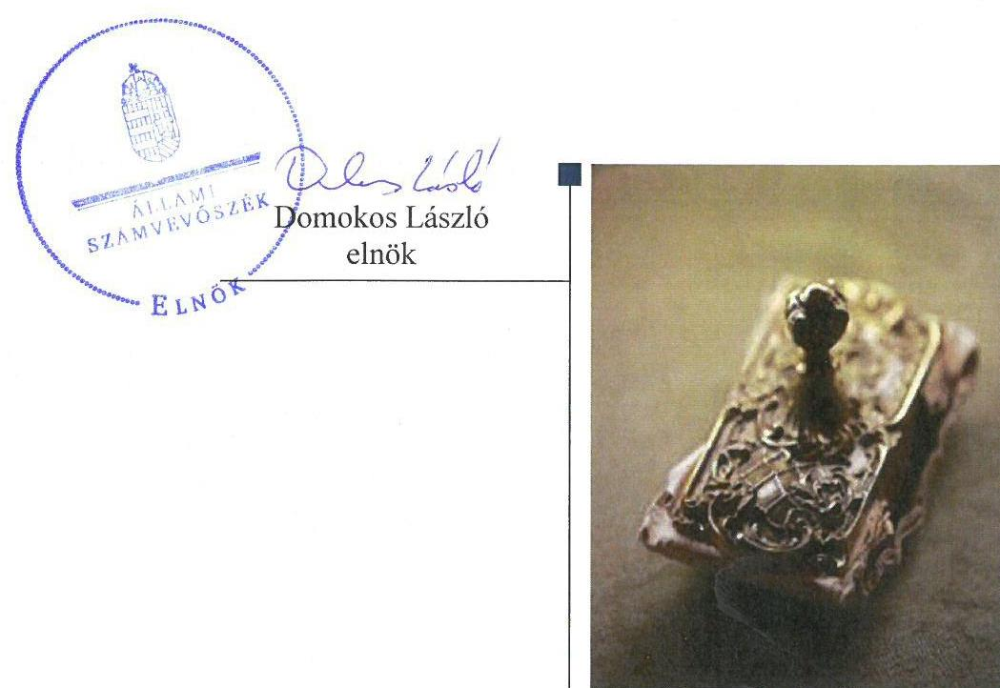
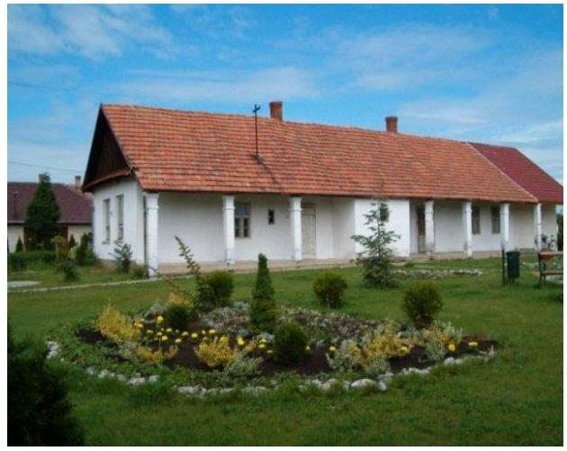
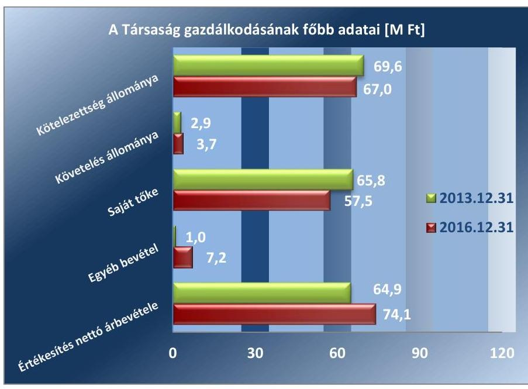
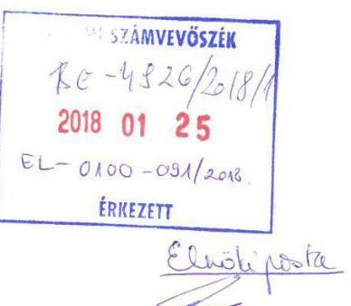
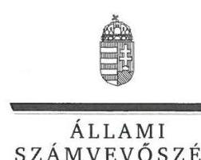
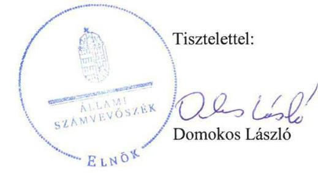

# Jelentés 

## Az önkormányzatok gazdasági társaságai

Az önkormányzatok többségi tulajdonában lévő gazdasági társaságok gazdálkodásának ellenőrzése - Andrástermál Jászszentandrási Termálfürdő és Ivóvíz Szolgáltató Kft.
2018.

---

# Jelentés 

## Az önkormányzatok gazdasági társaságai

Az önkormányzatok többségi tulajdonában lévő gazdasági társaságok gazdálkodásának ellenőrzése - Andrástermál Jászszentandrási Termálfürdő és Ivóvíz Szolgáltató Kft.
2018. 23. hó 13. nap

---

# AZ ELLENŐRZÉST FELÜGYELTE:

DR. NAGY IMRE felügyeleti vezető

# AZ ELLENŐRZÉST VEZETTE ÉS A VÉGREHAJTÁSÁÉRT FELELŐS:

VALASTYÁNNÉ DR. VÍZHÁNYÓ JÚLIA ellenőrzésvezető

# A PROGRAM ÖSSZEÁLLÍTÁSÁÉRT FELELŐS:

TÓTPÁL SZABOLCS osztályvezető

# A TÉMÁHOZ KAPCSOLÓDÓ KORÁBBI SZÁMVEVŐSZÉKI JELENTÉSEK:

- címe: Jelentés az önkormányzatok belső kontrollrendszere kialakításának és működtetésének ellenőrzése - Jászszentandrás
- sorszáma: 17040

Jelentéseink az Országgyűlés számítógépes hálózatán és az Interneten a www.asz.hu címen is olvashatóak.

IKTATÓSZÁM: EL-0100-094/2018.

TÉMASZÁM: 2447

ELLENŐRZÉS-AZONOSÍTÓ SZÁM: V079303

---

# TARTALOMJEGYZÉK 

■ ÖSSZEGZÉS ..... 5
■ AZ ELLENŐRZÉS CÉLJA ..... 6
■ AZ ELLENŐRZÉS TERÜLETE ..... 7
■ AZ ELLENŐRZÉS HÁTTERE, INDOKOLTSÁGA ..... 8
■ A JELENTÉS LÉNYEGES KÉRDÉSKÖREI ..... 9
■ AZ ELLENŐRZÉS HATÓKÖRE ÉS MÓDSZEREI ..... 10
■ MEGÁLLAPÍTÁSOK ..... 12
■ JAVASLATOK ..... 15
■ MELLÉKLETEK ..... 17
I. sz. melléklet: Értelmező szótár ..... 17
II. sz. melléklet: A Társaság főbb mérlegadatai ..... 18
■ FÜGGELÉK: ÉSZREVÉTELEK ..... 19
■ RÖVIDÍTÉSEK JEGYZÉKE ..... 29

---

.

---

# ÖSSZEGZÉS 

Jászszentandrás Községi Önkormányzat az Andrástermál Jászszentandrási Termálfürdő és Ivóvíz Szolgáltató Kft. feletti tulajdonosi joggyakorlás kereteit nem alakította ki és nem gyakorolta szabályszerűen. Az Andrástermál Jászszentandrási Termálfürdő és Ivóvíz Szolgáltató Kft. szabályozottsága és vagyongazdálkodási tevékenysége a jogszabályi előírásoknak nem felelt meg, ezáltal a nemzeti vagyon megőrzését, védelmét nem biztositotta. A beszámolási kötelezettséget teljesítették, azonban a közérdekü adatok közzétételének nem tettek eleget, ezáltal nem biztositották müködésének és gazdálkodásának átláthatóságát.

## Az ellenőrzés társadalmi indokoltsága

Magyarországon az önkormányzatok kötelező és önként vállalt feladataik vonatkozásában is egyre szélesebb körben alkalmazzák a költségvetésen kívüli feladatellátást, ezáltal - a nonprofit szervezetek mellett - az önkormányzati tulajdonú gazdasági társaságok is kiemelt fontosságú szerephez jutottak.

Az Állami Számvevőszék célja, hogy a helyi önkormányzatok gazdálkodásában rejlő pénzügyi kockázatok feltárásával, az államháztartáson kívülre nyújtott költségvetési támogatások és ingyenes vagyonjuttatások, valamint az államháztartáson kívül múködő feladatellátó rendszerek ellenőrzéseivel hozzájáruljon ahhoz, hogy a közpénzeket az államháztartáson kívül múködő szervezetek is átlátható, rendezett módon használják fel.

Az Állami Számvevőszék céljaival és a társadalmi igénnyel összhangban, valamint a gazdasági társaságok fontos szerepe miatt került sor az Andrástermál Jászszentandrási Termálfürdő és Ivóvíz Szolgáltató Kft. ellenőrzésére.

Az Állami Számvevőszék az ellenőrzése során arra kereste a választ, hogy 2013-2016. között szabályszerű volt-e a Társaság gazdálkodása és az Önkormányzat ehhez kapcsolódó tulajdonosi joggyakorlása.

## Főbb megállapítások, következtetések, javaslatok

Jászszentandrás Községi Önkormányzat a tulajdonosi jogokat az Andrástermál Jászszentandrási Termálfürdő és Ivóvíz Szolgáltató Kft. felett nem alakította ki és nem gyakorolta szabályszerűen. Az Andrástermál Jászszentandrási Termálfürdő és Ivóvíz Szolgáltató Kft. felügyelőbizottsága az ügyrendjét nem állapította meg, az éves beszámolókról írásbeli jelentést nem készített, ezáltal az éves beszámolókat jogszabályi előírás ellenére az Önkormányzat az FB jelentése hiányában fogadta el.

Az Andrástermál Jászszentandrási Termálfürdő és Ivóvíz Szolgáltató Kft. a jogszabályban előírt számviteli szabályzatokkal rendelkezett. A számviteli politika aktualizálását elmulasztotta, számlarendjét nem a jogszabályi előírásoknak megfelelően alkotta meg. A Társaság az éves beszámolóit a jogszabályban előírt határidőben elkészítette és közzétette, adatszolgáltatási kötelezettségeinek eleget tett. Az Andrástermál Jászszentandrási Termálfürdő és Ivóvíz Szolgáltató Kft. az éves beszámoló mérlegét szabályszerű leltárral nem támasztotta alá. Bevételeit szabályosan számolta el, azonban az anyagjellegú és a személyi jellegú ráfordítások, valamint az értékcsökkenés elszámolása során a jogszabályi előírásoknak nem tett eleget. Honlapján a jogszabályban előírt közzétételi kötelezettségének nem tett eleget, ezáltal nem biztosította a múködésének és gazdálkodásának átláthatóságát.

Az Állami Számvevőszék jelentésében az Andrástermál Jászszentandrási Termálfürdő és Ivóvíz Szolgáltató Kft. ügyvezetőjének hat, Jászszentandrás Községi Önkormányzat polgármesterének öt javaslatot fogalmazott meg, amelyekre az érintetteknek 30 napon belül intézkedési tervet kell készíteniük.

---

# AZ ELLENŐRZÉS CÉLJA 

Az ellenőrzés célja annak értékelése volt, hogy az önkormányzat vagyongazdálkodási tevékenysége során szabályszerűen gyakorolta-e tulajdonosi jogait; a gazdasági társaság szabályozottsága, gazdálkodása és vagyongazdálkodási tevékenysége, bevételeinek és ráfordításainak elszámolása megfelelt-e a jogszabályi és tulajdonosi előírásoknak; a gazdasági társaság kötelezettségállománya jelent-e kockázatot a müködésre.

---

# **AZ ELLENŐRZÉS TERÜLETE**

## **Andrástermál Jászszentandrási Termálfürdő és Ivóvíz Szolgáltató Kft.**

A Társaságot¹ az Önkormányzat² az ellenőrzött időszakot megelőzően, kizárólagos tulajdonosként alapította. Az Önkormányzat többségi tulajdonában 2016. december 31-én kizárólag a Társaság volt.

A Társaság tulajdonosi részesedéssel más gazdasági társaságban nem rendelkezett.

A Társaság közfeladatot nem látott el, feladata a strandfürdő és a camping üzemeltetése volt.

A Társaság jegyzett tőkéje 3,0 M Ft volt, amelyet teljes egészében pénzbeli hozzájárulásként bocsátott az alapító a Társaság rendelkezésére. A Társaság jegyzett tőkéje az ellenőrzött időszakban nem változott. Az értékesítés nettó árbevétele a 2013. évhez képest a 2016. év végére 14,3%-kal emelkedett. A Társaság az ellenőrzött időszakban veszteséges volt. A Társaság gazdálkodásának főbb adatait az 1. ábra szemlélteti.

*Forrás: a Társaság éves beszámolói*

A foglalkoztatottak átlagos statisztikai létszáma a 2013. évben 13,4 fő, a 2016. évben 14,6 fő volt.

Az ellenőrzött időszakban a jegyző személye nem változott, a polgármester személyében 2016. október 2-án, az időközi polgármester választást követően következett be változás. A jelenlegi ügyvezető 2015. szeptember 11. óta tölti be tisztségét.

---

# AZ ELLENŐRZÉS HÁTTERE, INDOKOLTSÁGA 

AZ ÖNKORMÁNYZATOK TÖBBSÉGI TULAJDONÁBAN ÁLLÓ GAZDASÁGI TÁRSASÁGOK ellenőrzése kiemelten fontos a vagyon megőrzése, megóvása érdekében, valamint a kormányzati szektor elszámolásaiban megjelenő önkormányzati tulajdonú gazdálkodó szervezetek esetében, amelyekkel szemben alapvető követelmény, hogy gazdálkodásuk, működésük szabályszerű, az általuk szolgáltatott adatok minél megbízhatóbbak legyenek. A feladatellátás költségeinek, ráfordításainak alakulása a lakosság széles rétegét érinti.

ELLENŐRZÉSEINK FELTÁRHATJÁK, hogy az önkormányzat a feladatellátásához rendelt vagyon működtetését a tulajdonostól elvárható gondossággal végezte-e, a feladatot ellátó gazdasági társaság a létesítő okiratban, szolgáltatási szerződésben foglaltak betartásával biztosí-totta-e a feladat ellátását. Az ellenőrzés eredményeképp meghatározhatóvá válnak a költségvetési hiányt befolyásoló szervezetek kockázatai, lehetővé válik ezen kockázatok csökkentése. Az ellenőrzés rávilágíthat arra, hogy a gazdasági társaság a vagyon használatával biztosította-e a szolgáltatás folytatásának feltételeit, az önkormányzat tulajdonosi felügyelete hozzájárult-e a szabályszerű gazdálkodáshoz és feladatellátáshoz. A megállapítások alapján megfogalmazott számvevőszéki javaslatok hasznosítása elősegítheti a meglévő hibák megszüntetését. A jó gyakorlatok bemutatásával az ÁSZ ${ }^{3}$ hozzájárul a követendő megoldások megismertetéséhez, terjesztéséhez.

---

# A JELENTÉS LÉNYEGES KÉRDÉSKÖREI 

1. Az Önkormányzat tulajdonosi joggyakorlása szabályszerű volt-e?
2. A gazdasági társaság szabályozottsága, gazdálkodása és vagyongazdálkodási tevékenysége szabályszerű volt-e, fizetőképessége biztositott volt-e a gazdálkodás során? A gazdasági társaság bevételeinek és ráforditásainak elszámolása szabályszerű volt-e?

---

# AZ ELLENŐRZÉS HATÓKÖRE ÉS MÓDSZEREI 

## Az ellenőrzés típusa

Megfelelőségi ellenőrzés.

## Az ellenőrzött időszak

2013. január 1-jétől 2016. december 31-ig tartó időszak.

## Az ellenőrzés tárgya

Jászszentandrás Községi Önkormányzatának az Andrástermál Jászszentandrási Termálfürdő és Ivóvíz Szolgáltató Kft. feletti tulajdonosi joggyakorlása, valamint az Andrástermál Jászszentandrási Termálfürdő és Ivóvíz Szolgáltató Kft. gazdálkodásának szabályozottsága és szabályszerűsége.

Az ellenőrzés kiterjedt minden olyan körülményre és adatra, amely az ÁSZ jogszabályban meghatározott feladatainak teljesítéséhez, valamint a program végrehajtása folyamán felmerült újabb összefüggések feltárásához szükséges volt.

## Az ellenőrzött szervezet

Jászszentandrás Községi Önkormányzat, valamint az Andrástermál Jászszentandrási Termálfürdő és Ivóvíz Szolgáltató Kft.

## Az ellenőrzés jogalapja

Az ellenőrzés jogszabályi alapját az Állami Számvevőszékről szóló 2011. évi LXVI. törvény 1. § (3) bekezdése és 5. § (3)-(4)-(5) bekezdései képezték.

## Az ellenőrzés módszerei

Az ellenőrzést a nemzetközi standardokat irányadónak tekintve az ellenőrzési program ellenőrzési kérdései, az ellenőrzött időszakban hatályos jogszabályok, az ellenőrzés szakmai szabályok és módszertanok figyelembe vételével végeztük.

Az ellenőrzés ideje alatt az ellenőrzött szervezettel történő kapcsolattartást az ÁSZ Szervezeti és Múködési Szabályzatának vonatkozó előírásai alapján biztosítottuk.

---

Az ellenőrzési kérdések megválaszolásához szükséges bizonyítékok megszerzése a következő ellenőrzési eljárások alkalmazásával történt: megfigyelés, kérdésfeltevés (információkérés), összehasonlítás, valamint elemző eljárás. Az ellenőrzési bizonyítékként felhasználható adatforrások közé tartoztak egyrészt az ellenőrzési programban felsorolt adatforrások, másrészt adatforrás volt még minden - az ellenőrzés folyamán - feltárt, az ellenőrzés szempontjából információkat tartalmazó dokumentum.

Az ellenőrzést a kérdésekre adott válaszok kiértékelésével, valamint a megjelölt adatforrások, a csatolt tanúsítványok felhasználásával, továbbá az adott időszakban hatályos jogszabályok figyelembevételével folytattuk le.

A gazdasági társaság bevételei és ráfordításai, ezeken belül az értékcsökkenés, valamint a vagyonnyilvántartás szabályszerűségének megítéléséhez a bevételeket és a ráfordításokat, a tárgyi eszközök állományváltozásait tartalmazó adott évi főkönyvi kivonat adatbázisát vettük alapul. A minta kiválasztása során véletlen mintavételt alkalmaztunk évenkénti, elemszámmal arányos rétegezéssel a teljes időszakra vonatkozóan. A minta alapján a sokaságban előforduló hibaarányt becsültük. „Megfelelőnek" értékeltünk egy ellenőrzött területet, amennyiben 95\%-os bizonyossággal a teljes sokaságban a hibaarány legfeljebb 10\%, „nem megfelelőnek", amennyiben 10\%-nál magasabb arányt képviselt. A mintavételt megelőzően az anyagjellegú ráfordítások, valamint a tárgyi-eszköz növekedési tételei sokaságból évente sokaságonként kiemeltük a 3-3 legnagyobb öszszegű tételt annak biztosítására, hogy az ellenőrzés az egyszerű véletlen mintavétel mellett a legnagyobb értékű tételek ellenőrzésére biztosan kiterjedjen.

---

# 1. Az Önkormányzat tulajdonosi joggyakorlása szabályszerű volt-e? 

Összegző megállapítás

### 1.1. számú megállapítás

Az Önkormányzat tulajdonosi joggyakorlása nem volt szabályszerű.

Az Önkormányzat a tulajdonosi joggyakorlásának kereteit nem szabályszerűen alakította ki.

A Társaságot az Önkormányzat az Ávr. ${ }^{4}$ 13. § (1) d) pontjában foglaltak ellenére az SZMSZ1-3 ${ }^{5}$-ében nem nevezte meg.

A Társaság a feladatai ellátásához szükséges eszközöket az Önkormányzat Üzemeltetési szerződés ${ }_{1,2}{ }^{6}$ alapján biztosította. A Vagyonrendelet 13. § (1) bekezdés a) pontjában előírtak ellenére azonban az Üzemeltetési szerződés ${ }_{1,2}$ beszámolási, nyilvántartási, adatszolgáltatási kötelezettségeket nem tartalmazott.

A Társaság Alapító okiratában ${ }_{1-3}{ }^{7}$ foglaltak szerint a Képviselő-testület a Gt. ${ }^{8}$, a Ptk. ${ }^{9}$ és a Taktv. ${ }^{10}$ előírásainak megfelelően háromtagú $\mathrm{FB}^{11}$ létrehozásáról döntött. Az FB az ügyrendjét a Gt. 34. § (4) és a Ptk. 3:122. § (3) bekezdésében foglaltak ellenére nem állapította meg.

A Képviselő-testület a Társaság vezető tisztségviselőinek, felügyelőbizottsági tagjainak, valamint az Mt. ${ }^{12}$ 208. §-ának hatálya alá eső munkavállalóinak javadalmazását a Taktv. 5. § (3) bekezdésben előírtak szerint rögzítő szabályzatát nem alkotta meg.

Az Önkormányzat az Mötv. ${ }^{13}$ 116. § (1)-(2) bekezdésének megfelelően Gazdasági programmal ${ }_{1,2}{ }^{14}$ rendelkezett. Az Önkormányzat az Nvtv. ${ }^{15}$-ben meghatározott közép- és hosszútávú vagyongazdálkodási tervét ${ }^{16}$ elkészítette, azt a Képviselő-testület ${ }^{17}$ határozattal elfogadta. Az Önkormányzat az Mötv. 143. § (4) bekezdésének megfelelően Vagyonrendeletét ${ }^{18}$ megalkotta.

Az Önkormányzat a tulajdonosi jogait nem szabályszerűen gyakorolta, a Társaság szabályszerű gazdálkodását az Önkormányzat belső ellenőrzéseivel nem támogatta.

A Társaság feletti tulajdonosi jogokat a Vagyonrendeletnek megfelelően a Képviselő-testület gyakorolta. A Képviselő-testület a döntéseit a Pénzügyi és Településfejlesztési Bizottság ${ }^{19}$ előzetes tárgyalását követően, annak javaslatát figyelembe véve hozta meg.

Az FB a Társaság éves beszámolóira vonatkozó írásbeli jelentéseit a Gt. 35. § (3) bekezdésében és a Ptk. 3:120. § (2) bekezdésében foglaltak ellenére nem készítette el. A Társaság éves beszámolóit a Képviselő-testület a Gt. 35. § (3) bekezdésében és a Ptk. 3:120. § (2) bekezdésében foglaltak

---

ellenére az FB írásbeli jelentésének hiányában, a könyvvizsgálói jelentések birtokában, határozatban fogadta el.

A Társaság veszteségesen gazdálkodott, a tulajdonosi joggyakorló az éves beszámoló elfogadásáról szóló határozataiban a Számv. tv. 149. § (1) § b) pontjának megfelelően a veszteség eredménytartalék terhére történő elszámolásáról döntött.

Az Önkormányzat belső ellenőrzéseivel nem járult hozzá a gazdasági társaság szabályozottságának, valamint gazdaságos, hatékony és eredményes gazdálkodásához.

# 2. A gazdasági társaság szabályozottsága, gazdálkodása és vagyongazdálkodási tevékenysége szabályszerű volt-e, fizetőképessége biztosított volt-e a gazdálkodás során? A gazdasági társaság bevételeinek és ráfordításainak elszámolása szabályszerű volt-e? 

## Összegző megállapítás

2.1. számú megállapítás
2. ábra

## A Társaság szabályozottsága, gazdálkodása és vagyongazdálkodási tevékenysége nem volt szabályszerű. Fizetőképessége biztosított volt.

A Társaság számviteli szabályzatait elkészítette. A számviteli politikát a jogszabályváltozások ellenére nem aktualizálta. A Társaság értékesítési nettó árbevételének elszámolása megfelelő volt. A ráfordítások és az értékcsökkenés elszámolása nem volt megfelelő.
A Számv. tv. ${ }^{20}$ előírásainak megfelelően a Társaság rendelkezett Számviteli politikával ${ }^{21}$ és a keretében elkészített Pénzkezelési1-2 ${ }^{22}$, Leltározási ${ }^{23}$, Értékelési szabályzattal ${ }^{24}$, valamint Számlarenddel ${ }_{1-2}{ }^{25}$.

A Számviteli politikát a Számv. tv. 14. § (11) bekezdésének előírása ellenére nem aktualizálták. A Számviteli politika a Számv. tv. 14. § (4) bekezdésben foglaltak ellenére nem tartalmazta a gazdálkodóra jellemző szabályokat, előírásokat, módszereket, valamint a költségek tevékenység szerinti felosztásához használt megosztási kulcsok mértékét, a költségfelosztás kialakításának módját.

A Számlarend a Számv. tv. 161. § (2) bekezdés a) pontja ellenére nem tartalmazta a minden alkalmazásra kijelölt számla számjelét és megnevezését.

A Társaság a mérlegtételeket Leltározási szabályzata és a Számv. tv. 69. § (1) bekezdésében foglaltak szerinti leltárral nem támasztotta alá. Egyeztetéssel történő leltározást nem végeztek.

A Társaság megsértette továbbá a Számv. tv. 42. § (3) bekezdésében, valamint a 43. § (1) bekezdésben foglaltakat, mivel rövid lejáratú és egyéb rövid lejáratú kötelezettségei között az ellenőrzött időszakot megelőzően keletkezett hosszú lejáratú kötelezettséget tartott nyilván.

---

AZ ÉRTÉKESÍTÉS NETTÓ ÁRBEVÉTELÉNEK elszámolása a belső szabályoknak és a jogszabályi előírásoknak megfelelt, az elszámolás alapjául szolgáló számviteli bizonylatok a jogszabályi előírások szerint rendelkezésre álltak. A mintavétellel ellenőrzött területek értékelését a 2. ábra szemlélteti.

AZ ANYAGJELLEGŰ RÁFORDÍTÁSOK elszámolása nem volt szabályszerű, mert a Számv. tv. 165. § (2) bekezdésében előírtak ellenére azokat bizonylatokkal nem támasztották alá, a költségelszámolást megalapozó szerződések, megrendelések nem álltak rendelkezésre. A Számviteli politika a költségfelosztás kialakításának módját a Számv. tv. 14. § (4) bekezdésben foglaltak ellenére nem tartalmazta.

A SZEMÉLYI JELLEGŰ RÁFORDÍTÁSOK elszámolása nem volt szabályszerű, mert a Számv. tv. 165. § (2) bekezdésében előírtak ellenére a számviteli elszámolásait munkaszerződéssel, munkaidő elszámolással nem támasztották alá. Személyi jellegű egyéb kifizetés a társaságnál az ellenőrzött időszakban nem történt.

AZ ÉRTÉKCSÖKKENÉS elszámolása nem volt szabályszerű. A Számviteli politikában az értékcsökkenés elszámolásánál az alkalmazott leírási kulcsokat nem a Számv. tv. 14. § (4) bekezdésének megfelelően rögzítették. Az alkalmazott leírási kulcsokat a Számviteli Politika 11., az Értékelési szabályzat 2.1.2. pontjában nem határozták meg megfelelően.

# 2.2. számú megállapítás 

A Társaság fizetőképessége az Önkormányzat által nyújtott rövid lejáratú kölcsönökkel volt biztosított.

A Társaság átmeneti fizetési nehézségeit a Képviselő-testület rövid lejáratú kölcsönök nyújtásával biztosította, amely minden évben határidőben viszszafizetésre került. A Társaság kötelezettség állománya az ellenőrzött időszakban 96\%-ra csökkent. A keletkezett 24,6 M Ft veszteségére a megelőző évek felhalmozott eredménytartaléka nyújtott fedezetet.

## A Társaság az előírt beszámolási kötelezettségét határidőben teljesítette. Közzétételi kötelezettségének nem tett eleget.

A Társaság éves számviteli beszámolóit elkészítette, a beszámolók közzétételéről a jogszabályban előírt határidőben gondoskodott.

A Társaság a Taktv. 2. § (1) bekezdés a)-b) és ca) pontjában rögzített kötelezettsége ellenére a vezető tisztségviselők, a felügyelőbizottsági tagok, az Mt. 208. §-a szerint vezető állású munkavállalók nevét, tisztségét, valamint az önállóan cégjegyzésre vagy a bankszámla feletti rendelkezésre jogosult munkavállalók részére a munkaviszonyuk alapján közvetlenül vagy közvetve nyújtott pénzbeli juttatásokat honlapján nem tette közzé.

---

# JAVASLATOK 

Az ÁSZ tv. 33. § (1) bekezdésében foglaltak értelmében az ellenőrzött szervezet vezetője köteles a jelentésben foglalt megállapításokhoz kapcsolódó intézkedési tervet összeállítani és azt a jelentés kézhezvételétől számított 30 napon belül az ÁSZ részére megküldeni. Amennyiben az ellenőrzött szervezet vezetője nem küldi meg határidőben az intézkedési tervet, vagy továbbra sem elfogadható intézkedési tervet küld, az Állami Számvevőszék elnöke az ÁSZ tv. 33. § (3) bekezdése a) és b) pontjaiban foglaltakat érvényesítheti.

## Andrástermál Jászszentandrási Termálfürdő és Ivóvíz Szolgáltató Kft. Ügyvezetőjének

1. Intézkedjen a számviteli politika hatályos jogszabályi rendelkezések szerinti módosításáról.
(2.1. sz. megállapítás 2. bekezdése alapján)
2. Intézkedjen a számlarend jogszabályi rendelkezés szerinti kiegészítéséről.
(2.1. sz. megállapítás 3. bekezdése alapján)
3. Intézkedjen a mérlegtételek jogszabályi előírásoknak megfelelő leltárral való alátámasztásáról.
(2.1. sz. megállapítás 4. bekezdése alapján)
4. Intézkedjen a rövid lejáratú és egyéb rövid lejáratú kötelezettségek jogszabályi előírásnak megfelelő nyilvántartásáról.
(2.1. sz. megállapítás 5. bekezdése alapján)
5. Intézkedjen annak érdekében, hogy az anyagjellegú és a személyi jellegü ráfordítások elszámolása bizonylat alapján történjen meg, valamint az értékcsökkenés elszámolása megfeleljen a jogszabály előírásainak.
(2.1. sz. megállapítás 7-9. bekezdései alapján)
6. Gondoskodjon a közzétételi kötelezettségek jogszabályi előírásnak megfelelő teljesítéséről.
(2.3. sz. megállapítás 2. bekezdése alapján)

---

# Jászszentandrás Községi Önkormányzat Polgármesterének 

1. Intézkedjen, hogy az önkormányzat SZMSZ-e a Társaságot a jogszabályi előírásnak megfelelően tartalmazza.
(1.1. sz. megállapítás 1. bekezdése alapján)
2. Intézkedjen, hogy az üzemeltetési szerződések tartalmazzák a vagyonrendeletben meghatározott tartalmi elemeket.
(1.1. sz. megállapítás 2. bekezdése alapján)
3. Kezdeményezze a Felügyelő bizottságnál az ügyrend elkészitését.
(1.1. sz. megállapítás 3. bekezdése alapján)
4. Intézkedjen a jogszabályban előirt, a vezető tisztségviselők, felügyelő bizottsági tagok, valamint az Mt. 208. §-ának hatálya alá eső munkavállalók javadalmazása, valamint a jogviszony megszünése esetére biztosított juttatások módjának, mértékének elveiről, annak rendszeréről szóló szabályzat megalkotásáról.
(1.1. sz. megállapítás 4. bekezdése alapján)
5. Kezdeményezze, hogy a Felügyelő-bizottság a Társaság éves beszámolóira vonatkozó írásbeli jelentését elkészítse, és intézkedjen arról, hogy a Képviselő-testület a Felügyelő-bizottság írásbeli jelentésének birtokában hozzon a beszámolókról határozatot a jogszabályi előírásnak megfelelően..
(1.2. sz. megállapítás 2. bekezdése alapján)

---

# MELLÉKLETEK 

- I. SZ. MELLÉKLET: ÉRTELMEZŐ SZÓTÁR
gazdasági társaság
gazdálkodó szervezet
meghatározó befolyás
minősített többséget biztosító részesedés
nemzeti vagyon
többségi befolyást biztosító részesedés

A Ptk. 3:88. § (1) bekezdése szerint „a gazdasági társaságok üzletszerű közös gazdasági tevékenység folytatására, a tagok vagyoni hozzájárulásával létrehozott, jogi személyiséggel rendelkező vállalkozások, amelyekben a tagok a nyereségből közösen részesednek, és a veszteséget közösen viselik".
A Ptk. 685. § c) pontja szerint gazdálkodó szervezet: „az állami vállalat, az egyéb állami gazdálkodó szerv, a szövetkezet, a lakásszövetkezet, az európai szövetkezet, a gazdasági társaság, az európai részvénytársaság, az egyesülés, az európai gazdasági egyesülés, az európai területi együttmúködési csoportosulás, az egyes jogi személyek vállalata, a leányvállalat, a vízgazdálkodási társulat, az erdő birtokossági társulat, a végrehajtói iroda, az egyéni cég, továbbá az egyéni vállalkozó." (2014. március 15-ig hatályos)
A Ptk. 8:2. § (2) bekezdése szerint „A befolyással rendelkező akkor rendelkezik egy jogi személyben meghatározó befolyással, ha annak tagja vagy részvényese, és
a) jogosult e jogi személy vezető tisztségviselői vagy felügyelőbizottsága tagjai többségének megválasztására, illetve visszahívására; vagy
b) a jogi személy más tagjai, illetve részvényesei a befolyással rendelkezővel kötött megállapodás alapján a befolyással rendelkezővel azonos tartalommal szavaznak, vagy a befolyással rendelkezőn keresztül gyakorolják szavazati jogukat, feltéve, hogy együtt a szavazatok több mint felével rendelkeznek."
A minősített befolyásszerző az ellenőrzött társaságban a szavazatok legalább hetvenöt százalékával rendelkezik. (Ptk. 3:324. §)
Nvtv. 1. § (2) bekezdése szerint többek között:
„az állam vagy a helyi önkormányzat kizárólagos tulajdonában álló dolgok, az a) pont hatálya alá nem tartozó, állam vagy a helyi önkormányzat tulajdonában lévő dolog,
az állam vagy a helyi önkormányzat tulajdonában lévő pénzügyi eszközök, továbbá az államot vagy a helyi önkormányzatot megillető társasági részesedések, az államot vagy a helyi önkormányzatot megillető bármely vagyoni értékkel rendelkező jogosultság, amelyet jogszabály vagyoni értékű jogként nevesít."
A Ptk. 8:2. § (1) bekezdése szerint „többségi befolyás az olyan kapcsolat, amelynek révén természetes személy vagy jogi személy (befolyással rendelkező) egy jogi személyben a szavazatok több mint felével vagy meghatározó befolyással rendelkezik."

---

# II. SZ. MELLÉKLET: A TÁRSASÁG FŐBB MÉRLEGADATAI

## AZ ANDRÁSTERMÁL JÁSZSZENTANDRÁSI TERMÁLFÜRDŐ ÉS IVÓVÍZ SZOLGÁLTATÓ KFT. MÉRLEGEINEK KIEMELT ADATAI (EZER FT)

|  Megnevezés / időszak | 2013.12.31. | 2014.12.31. | 2015.12.31. | 2016.12.31.  |
| --- | --- | --- | --- | --- |
|  I. Befektetett eszközök | 133076 | 144261 | 140211 | 131086  |
|  ebből: tárgyi eszközök | 133076 | 144261 | 140211 | 131086  |
|  II. Forgóeszközök | 22001 | 12071 | 6528 | 10518  |
|  ebből: készletek | 245 | 178 | 151 | 514  |
|  ebből: pénzeszközök | 18834 | 10146 | 4145 | 6309  |
|  III. Aktív időbeli elhatárolások | 710 | 448 | 258 | 125  |
|  ESZKÖZÖK ÖSSZESEN | 155787 | 156780 | 146997 | 141729  |
|  IV. Saját tőke | 65802 | 69239 | 61441 | 57526  |
|  ebből: jegyzett tőke | 3000 | 3000 | 3000 | 3000  |
|  ebből: mérleg szerinti eredmény | $-6377$ | $-6493$ | $-7798$ | $-3915$  |
|  V. Céltartalékok | 0 | 0 | 0 | 0  |
|  VI. Kötelezettségek | 69597 | 68356 | 67678 | 67008  |
|  VII. Passzív időbeli elhatárolások | 20388 | 19185 | 17878 | 17195  |
|  FORRÁSOK ÖSSZESEN | 155787 | 156780 | 146997 | 141729  |

Fonrás: a Társaság, éves beszámolói

---

# FÜGGELÉK: ÉSZREVÉTELEK 

A jelentéstervezetet a Számvevőszék 15 napos észrevételezésre megküldte az ellenőrzött szervezetek vezetőinek az ÁSZ tv. 29. §* (1) bekezdése előírásának megfelelően.

Az ÁSZ a jelentéstervezetet észrevételezésre megküldte a Jászszentandrás Községi Önkormányzat polgármesterének és az Andrástermál Jászszentandrási Termálfürdő és Ivóvíz Szolgáltató Kft. ügyvezetőjének.
Jászszentandrás Községi Önkormányzat Polgármestere a jelentéstervezetre észrevételt nem tett. A függelék - mellékletek nélkül - tartalmazza az Andrástermál Jászszentandrási Termálfürdő és Ivóvíz Szolgáltató Kft. ügyvezetőjének észrevételét, illetve az el nem fogadott észrevételek elutasításának indoklását.

[^0]
[^0]:    * 29. § (1) Az Állami Számvevőszék az ellenőrzési megállapításait megküldi az ellenőrzött szervezet vezetőjének vagy az általa megbízott személynek, és annak, akinek személyes felelősségét állapította meg.
    (2) Az ellenőrzött szervezet vezetője és a felelősként megjelölt személy az ellenőrzés megállapításaira tizenöt napon belül írásban észrevételt tehet.
    (3) Az Állami Számvevőszék az észrevételre a beérkezésétől számított harminc napon belül írásban válaszol. A figyelembe nem vett észrevételeket köteles a jelentésben feltüntetni, és megindokolni, hogy azokat miért nem fogadta el.

---

Állami Számvevőszék
Budapest 4
Pf:54
1364

Tisztelt Cím!

Megkaptam EL-0100-089/2017 iktatószámon, és Vo79303 ellenőrzési azonosító számon küldött Számvevőszéki Ellenőrzéstervezetet, melyhez az alábbi észrevételeket teszem:
2.1 megállapításukhoz kapcsolódóan:

- "Az anyagjellegủ ráfordítások elszámolása nem volt szabályszerű, mert azokat bizonylatokkal nem támasztották alá" megállapításukat elfogadni nem tudjuk, mert egyetlen esetben sem /!/ fordul elő olyan, hogy a könyvviteli nyilvántartásunkba szabályszerűen kiállított számla, vagy számlát helyettesítő okirat nem állna rendelkezésünkre.

Megállapításukat vélhetően arra alapozták, hogy a 2017. október 12.-i rövid határidejű adatküldésünk pillanatában nem tudtuk elküldeni Önöknek a 1400575 számon nyilvántartott MVM Partner számla másolatát - amit jelen levelemmel egyidejűleg pótolok a kiegyenlítés bankkivonatával együtt.
E számla teljesítési időpontja :2014.08.25, számla száma: 139627311114., kiegyenlítés kelte: 2014.08.18. Az adatkérés időpontjában ez a számla a villamos energia szerződések mellékletében volt, nem a bejövő számláknál.

- " A személyi jellegű ráfordítások elszámolása nem volt szabályszerű, mert a Számv.tv.165.§ (2) bekezdésében előírtak ellenére a számviteli elszámolásait munkaszerződéssel és munkaidő elszámolással nem támasztották alá" .
Ez a megállapításuk is téves, miután a munkába lépéskor minden munkavállalóval aláírásra kerül a munkaszerződés mellékleteivel együtt, és munkaidő elszámolással is rendelkezünk.

---

Mellékelek 1 munkavállaló szerződését és munkaidő elszámolását mintának, de amennyiben szükségesnek tartják, úgy minden munkavállaló esetében biztosítani tudjuk a kért nyomtatványokat.

# - " A Társaság a mérlegtételeket .....leltárral nem támasztotta alá,egyeztetéssel történő leltározást nem végeztek". 

Ehhez a megállapításhoz azt az észrevételt teszem, hogy a leltározási szabályzatunknak megfelelően a tárgyi eszközök leltározását háromévente, így a vizsgált időszakban is - /2015.év/- mennyiségi felvétellel leltároztuk. Ehhez kapcsolódóan elküldtük Önök részére papíralapon a leltárfelvételi íveket is a leltározási ütemtervvel egységben. /Ehhez kapcsolódik az a kérdésem is, hogy az 2017.06.15.-én postán elküldött csomag, mely tartalmazza a 37.pontban megjelölt bizonylatokat, dokumentumokat több esetben eredeti példányban- milyen módon fog visszakerülni Társaságunkhoz??/

Az ellenőrzési időszak mennyiségi leltárfelvétellel nem érintett éveiben egyeztetéssel végezzük el a leltározást, és a leltáríveket biztosítottuk is Önök részére.

A tárgyi eszközök mellett minden mérlegsorhoz tartozó összeg feltüntetésre kerül leltáríven, mely összeghez kapcsolódóan egyeztetést végzünk, és összesítő bizonylatot készítünk. A december 31-i állapot szerinti pénztárelszámolást, bankkivonatot, adófolyószámla kivonatot másoljuk, egyéb analitikus nyilvántartások rendelkezésre állnak.
Ezeket a mellékleteket az első adatbekérés során /2017.06.15./ nem tartottuk szükségesnek mellékelni, de miután felhívtuk az Önök figyelmét, amennyiben szükségük van a mérlegmellékletekre, úgy jelezzék, és postázzuk- nem kérték tőlünk továbbra sem.

---

Jelen levelünkkel egyidejűleg elküldjük Önöknek a 2015 évi mellékleteket megjegyezve, hogy minden évben rendelkezésre tudjuk bocsájtani a mérlegsorokhoz tartozó egyeztetett analitikus nyilvántartásokat, melyek bizonyítják, hogy mérlegkészítéskor minden esetben csak valós, egyeztetett adatok kerülnek a mérlegsorokba.

- "A Társaság megsértette továbbá a Számv.tv.42.§ (3) bekezdésében, valamint a $43 . \S$ (1) bekezdésében foglaltakat, mivel rövid lejáratú és egyéb rövidlejáratú
kötelezettségek között az ellenőrzött időszakot megelőzően keletkezett hosszú lejáratú kötelezettséget tartott nyilván" .
Ez a megállapítás is téves, miután az ellenőrzött időszakot megelőzően az alábbi rövidlejáratú kötelezettségeket tartottunk nyilván a 4794-es számlán /Egyéb kötelezettségek Jászszentandrás Község Önkormányzatától kapott kölcsönök/

Megállapodás kelte: Összege: Lejárata:

| 1. 2008.01 .02 | 3664 176.- Ft | anyagi helyzet |
| :-- | :-- | :-- |
| 2. 2008.04 .02 | 3963 360.- Ft | $2008-2010$ |
| 3. 2008.06 .30 | 3627 221.- Ft | anyagi helyzet |
| 4. 2009.03 .29 | 710 116.- Ft | anyagi helyzet |
| 5. 2009.06 .25 | 3567 243.- Ft | anyagi helyzet |
| 6. 2010.06 .25 | 3205 426.- Ft | anyagi helyzet |
| 7. 2011.06 .23 | 3106 610.- Ft | anyagi helyzet |
| 8. 2012.06 .27 | 3000 053.- Ft | anyagi helyzet |

Összesen: $\quad \overline{24844205 .-\mathrm{Ft}}$
A fenti 8 db megállapodást másolatban mellékeljük megjegyezve, hogy a mérlegkészítés időpontjában azt vélelmeztük és terveztük, hogy a következő évben anyagi lehetőségünk biztosítja a kölcsön visszafizetést, így a rövidlejáratú kötelezettségek közé soroltuk.

---

A megállapodások visszafizetési határideje 7 esetben : "amennyiben a KFT anyagi helyzete lehetővé teszi ", 1 esetben pedig 2008-2010 években minden év november 30.ig egyenlő részletben- az ellenőrzés időszaka: 2013-2016.-, amikor a határidő már lejárt, tehát a visszafizetési kötelezettség rövid távon jelentkezik

# 2.3.megállapításukhoz kapcsolódóan: 

"A Társaság az előírt beszámolási kötelezettségét határidőben teljesítette. Közzétételi kötelezettségének nem tett eleget."

A fenti megállapítás félrevezető, miután a következő mondat így szól:
"A Társaság az éves számviteli beszámolóit elkészítette, a beszámoló közzétételéről a jogszabályban előírt határidőben gondoskodott.

A közzétételi kötelezettség elmulasztása csak a 2009.évi CXXII. törvény a köztulajdonban álló gazdasági Társaságok Takarékosabb müködéséről /Taktv/ 2.§ (1) bekezdés a)-b) és ca pontjában rögzített kötelezettségről szól, amit pontosan szét kell választani, és nem összevonni a beszámoló közzétételi kötelezettségével.

Kérem a fenti észrevételeim és a mellékletek alapján a megállapítások és javaslatok átgondolását és módosítását.

ANDRÁSTERMAL KFT.
5136 Jászszentandrás, Mártírok u. 14.
Tisztelettel: Adószám: 11830698-2-16
Tél.: 57/446-025
Morvai Zoltán
Úgyvezető
Andrástermál Kft
Jászszentandrás
Mártírok út 14
5136

---

ELNÖK

# Morvai János Zoltán úr 

ügyvezető
Andrástermál Jászszentandrási Termálfürdő és Ivóvíz Szolgáltató Kft.

## Jászszentandrás

## Tisztelt Ügyvezető Úr!

„Az önkormányzatok gazdasági társaságai - Az önkormányzatok többségi tulajdonában lévő gazdasági társaságok gazdálkodásának ellenörzése - Andrástermál Jászszentandrási Termálfürdő és Ivóvíz Szolgáltató Kft. " címmel készített számvevőszéki jelentéstervezetre tett észrevételeit köszönettel megkaptam.
Az Állami Számvevőszék észrevételekre vonatkozó álláspontjáról a felügyeleti vezető által készített részletes tájékoztatást csatoltan megküldöm.
Tájékoztatom Ügyvezető urat, hogy a számvevőszéki jelentésben - az Állami Számvevőszékről szóló 2011. évi LXVI. törvény 29. § (3) bekezdése alapján - a figyelembe nem vett észrevételeket szerepeltetjük az elutasítás indokának feltüntetésével.

Budapest, 2018. 02. hó 15. nap

Melléklet: Tájékoztatás az észrevételek kezeléséről

---

# Tájékoztatás   az észrevételek kezeléséről 

„Az önkormányzatok gazdasági társaságai - Az önkormányzatok többségi tulajdonában lévő gazdasági társaságok gazdálkodásának ellenörzése - Andrástermál Jászszentandrási Termálfürdö és Ivóvíz Szolgáltató Kft. " című számvevőszéki az Állami Számvevőszékhez 2018. január 25-én érkezett észrevételeit áttekintettük, annak kezelésével kapcsolatban a következő tájékoztatást adom.
A jelentéstervezet 2.1. számú megállapítás 7. bekezdésére („Az anyagjellegü ráforditások elszámolása nem volt szabályszerü, mert a Számv. tv. 165. § (2) bekezdésében elöirtak ellenére azokat bizonylatokkal nem támasztották alá.") vonatkozó észrevétel
Az észrevételben jelezte, hogy a Társaságnál minden esetben rendelkezésre áll a szabályszerűen kiállított számla vagy számlát helyettesítő okirat.
Az Állami Számvevőszék az ellenőrzését a megküldött ellenőrzési programnak megfelelően, a rendelkezésére bocsátott adatok és dokumentumok alapján végezte. Az Állami Számvevőszékről szóló 2011. évi LXVI. törvény 28. § (1) bekezdése alapján a közremüködésre felhívott szervezet az Állami Számvevőszék részére - annak kérésére soron kívül, de legkésőbb öt munkanapon belül - az ellenőrzés lefolytatása érdekében szükséges adatokat és dokumentumokat rendelkezésre bocsátja. A 2017. október 3-ai adatbekérő levelünk melléklete tartalmazta a Társaság által elektronikusan feltöltendő dokumentumokat, az anyagjellegủ ráfordítások esetében a kiválasztott tételek dokumentumait: megrendelések, szerződések, számlák, egyéb kifizetési bizonylatok, stb. körét. A bekért dokumentumok között nem került feltöltésre a könyvelési tételek dokumentumokkal való alátámasztása. Ügyvezető úr 2017. október 12-ei teljességi és hitelességi nyilatkozata szerint az Állami Számvevőszék részére átadott dokumentumok a bekért adatokra, dokumentumokra vonatkozóan teljes körű információt tartalmaznak. Erre tekintettel a most megküldött dokumentumot a jelentésben nem tudjuk figyelembe venni, az intézkedést igénylő megállapítás módosítása, illetve törlése nem indokolt.
A jelentéstervezet 2.1. számú megállapítás 8. bekezdésére („A személyi jellegü ráforditások elszámolása nem volt szabályszerü, mert a Számv. tv. 165. § (2) bekezdésében elöirtak ellenére a számviteli elszámolásait munkaszerzödéssel, munkaidő elszámolással nem támasztották alá.") vonatkozó észrevétel
Az észrevételben jelezte, hogy a Társaságnál rendelkezésre áll valamennyi munkaszerződés és rendelkeznek munkaidő elszámolással is.
A 2017. október 3-ai adatbekérő levelünk melléklete tartalmazta a Társaság által elektronikusan feltöltendő dokumentumokat, a személyi jellegủ ráfordítások esetében a kiválasztott tételek dokumentumait: megrendelések, szerződések, számlák, egyéb kifizetési bizonylatok, stb. körét. A bekért dokumentumok között nem kerültek feltöltésre munkaszerződések és a munkaidőt alátámasztó dokumentumok. Ügyvezető úr 2017. október 12-ei teljességi és hitelességi nyilatkozata

---

szerint az Állami Számvevőszék részére átadott dokumentumok a bekért adatokra, dokumentumokra vonatkozóan teljes körű információt tartalmaznak. Erre tekintettel a most megküldött dokumentumot a jelentésben nem tudjuk figyelembe venni, az intézkedést igénylő megállapítás módosítása, illetve törlése nem indokolt.

A jelentéstervezet 2.1. számú megállapítás 4. bekezdésére („4 Társaság a mérlegtételeket Leltározási szabályzata és a Számv. tv. 69. § (1) bekezdésében foglaltak szerinti leltárral nem támasztotta alá. Egyeztetéssel történő leltározást nem végeztek.") vonatkozó észrevétel
Az észrevételben jelezte, hogy a Társaság a tárgyi eszközök leltározását háromévente mennyiségi felvétellel, a köztes években egyeztetéssel elvégezte, melynek dokumentumait átadták az ellenőrzés számára. Továbbá jelezte, hogy minden mérlegsorhoz tartozó összeg feltüntetésre kerül a leltáríven, melyek egyeztetését minden évben elvégzik, mely mellékletek az ÁSZ részére nem kerültek megküldésre.
A 2017. június 2 -ai adatbekérő levelünk melléklete tartalmazta a Társaság által elektronikusan feltöltendő dokumentumok körét, köztük a leltárt és a leltárt alátámasztó dokumentumokat. A számvitelről szóló 2000 . évi C. törvény (a továbbiakban: Számv. tv.) 69. § (1) bekezdése értelmében a könyvek üzleti év végi zárásához, a beszámoló elkészítéséhez, a mérleg tételeinek alátámasztásához olyan leltárt kell összeállítani és e törvény előírásai szerint megőrizni, amely tételesen, ellenőrizhető módon tartalmazza - az (5) bekezdés figyelembevételével - a vállalkozónak a mérleg fordulónapján meglévő eszközeit és forrásait mennyiségben és értékben. A (3) bekezdés értelmében ha a vállalkozó a számviteli alapelveknek megfelelő folyamatos mennyiségi nyilvántartást vezet, a leltárba bekerülő adatok valódiságáról - a leltár összeállítását megelőzően leltározással köteles meggyőződni, ...minden üzleti év mérlegfordulónapjára vonatkozóan a csak értékben kimutatott eszközöknél és kötelezettségeknél, valamint az idegen helyen tárolt letétbe helyezett, portfolió-kezelésben, vagyonkezelésben lévő értékpapíroknál és egyéb, a pénzeszközök közé nem tartozó - eszközöknél, továbbá a dematerializált értékpapíroknál egyeztetéssel kell elvégeznie. Az észrevétel nem cáfolta, hanem megerősítette, hogy nem került az ellenőrzés számára átadásra minden mérlegsor esetében a jogszabálynak megfelelő leltár. Ügyvezető úr 2017. június 15 -ei teljességi és hitelességi nyilatkozata szerint az Állami Számvevőszék részére átadott dokumentumok a bekért adatokra, dokumentumokra vonatkozóan teljes körű információt tartalmaznak. Erre tekintettel a most megküldött dokumentumot a jelentésben nem tudjuk figyelembe venni, az intézkedést igénylő megállapítás módosítása, illetve törlése nem indokolt.
A jelentéstervezet 2.1. számú megállapítás 5. bekezdésére („A Társaság megsértette továbbá a Számv. tv. 42. § (3) bekezdésében, valamint a 43. § (1) bekezdésben foglaltakat, mivel rövid lejáratú és egyéb rövid lejáratú kötelezettségei között az ellenőrzött időszakot megelőzően keletkezett hosszú lejáratú kötelezettséget tartott nyilván.") vonatkozó észrevétel

Az észrevételben jelezte, hogy a mérlegkészítés időpontjában vélelmezték, hogy a következő évben az anyagi lehetőség biztosítani fogja a kölcsönök visszafizetését, így a rövidlejáratú kötelezettségek közé sorolták azokat.
Észrevétele megerősítette, hogy az ellenőrzött időszakban, 2013-2016. között a rövid lejáratú és egyéb rövid lejáratú kötelezettségei között 2008-ban keletkezett kötelezettségeket, kölcsönöket

---

tartott nyilván. A kölcsönök alapját képező megállapodások közül hét megállapodás nem tartalmazott konkrét visszafizetési határidőt. Egy megállapodás esetében a visszafizetési határidő lejárt, de a Társaság a fizetési kötelezettségét nem teljesítette. Az ellenőrzés során nem bocsátott olyan dokumentumot az ÁSZ rendelkezésére, amely a kötelezettségek rövid lejáratúként történő nyilvántartását alátámasztaná. A fent leírtak alapján a 2008. óta fennálló, vissza nem fizetett kötelezettségek rövid lejáratú és egyéb rövid lejáratú kötelezettségek közötti nyilvántartása nem felel meg a Számv. tv. 42. § (3) bekezdésében, valamint a 43. § (1) bekezdésben foglaltaknak. Erre tekintettel az intézkedést igénylő megállapítás módosítása, illetve törlése nem indokolt.

# A jelentéstervezet 2.3. számú megállapításra („A Társaság az előírt beszámolási kötelezettségét határidőben teljesítette. Közzétételi kötelezettségének nem tett eleget.") vonatkozó észrevétel 

Az észrevétel szerint a megállapítás félrevezető, mivel a beszámoló közzétételéről határidőben gondoskodtak, a közzétételi kötelezettség elmulasztása a Taktv. előírásainak megsértése miatt állt fenn.
A jelentéstervezet 2.3. számú megállapítás 1. bekezdése értelmében a Társaság a beszámoló közzétételéről határidőben gondoskodott. A 2.3. számú megállapítás 2. bekezdése értelmében a Taktv. szerinti közzétételi kötelezettségének nem tett eleget. A két megállapítás egyértelműen elhatárolt, a jelentéstervezet módosítása nem indokolt.

Budapest, 2018. 02 . hó 15 .nap

Dr. Nagy Imre felügyeleti vezető

---

.

---

# RÖVIDÍTÉSEK JEGYZÉKE 

${ }^{1}$ Társaság
${ }^{2}$ Önkormányzat
${ }^{3}$ ÁSZ
${ }^{4}$ Ávr.
${ }^{5}$ SZMSZ $_{1}$

SZMSZ $_{2}$

SZMSZ $_{3}$

${ }^{6}$ Üzemeltetési szerződés ${ }_{1}$

Üzemeltetési szerződés $_{2}$

7 Alapító okirat ${ }_{1}$
Alapító okirat ${ }_{2}$
Alapító okirat ${ }_{3}$
${ }^{8}$ Gt.
${ }^{9}$ Ptk.
${ }^{10}$ Taktv.
${ }^{11} \mathrm{FB}$
${ }^{12} \mathrm{Mt}$.
${ }^{13}$ Mötv.
${ }^{14}$ Gazdasági program ${ }_{1}$
Gazdasági program $_{2}$
${ }^{15}$ Nvtv.
${ }^{16}$ Vagyongazdálkodási terv
${ }^{17}$ Képviselő-testület
${ }^{18}$ Vagyonrendelet

Andrástermál Jászszentandrási Termálfürdő és Ivóvíz Szolgáltató Kft.
Jászszentandrás Községi Önkormányzat
Állami Számvevőszék
Az államháztartásról szóló törvény végrehajtásáról szóló 368/2011. (XII. 31.)
Korm. rendelet (hatályos 2011. december 31-től)
Jászszentandrás Községi Önkormányzat Képviselő-testületének 16/2013. (XI.11.) rendelete Jászszentandrás Község Önkormányzatának szervezeti- és müködési szabályzatáról (hatályos 2007. április 30-tól)
Jászszentandrás Községi Önkormányzat Képviselő-testületének 19/2013. (XII.30.) rendelete Jászszentandrás Község Önkormányzatának szervezeti- és müködési szabályzatáról (hatályos 2013. december 30-tól)
Jászszentandrás Községi Önkormányzat Képviselő-testületének 14/2014. (XI.28.) rendelete Jászszentandrás Község Önkormányzatának szervezeti- és müködési szabályzatáról (hatályos 2014. november 28-tól)
Jászszentandrás Községi Önkormányzat és az Andrástermál Jászszentandrási Termálfürdő és Ivóvíz Szolgáltató Kft. között létrejött módosított üzemeltetési szerződés (hatályos 2005. november 25-től)
Jászszentandrás Községi Önkormányzat és az Andrástermál Jászszentandrási Termálfürdő és Ivóvíz Szolgáltató Kft. között létrejött üzemeltetési szerződés (hatályos 2013. február 1-től)
A Társaság alapító okirata (hatályos 2007. március 15-től)
A Társaság alapító okirata (hatályos 2007. február 15-től)
A Társaság alapító okirata (hatályos 2013. január 22-től)
A gazdasági társaságokról szóló 2006. évi IV. törvény (hatályos 2014. március 14-éig)
A Polgári Törvénykönyvről szóló 2013. évi V. törvény (hatályos 2014. március 15-től)
A köztulajdonban álló gazdasági társaságok takarékosabb müködéséről szóló 2009. évi CXXII. törvény (hatályos 2009. december 4-től)
A Társaság Felügyelőbizottsága
A munka törvénykönyvéről szóló 2012. évi I. törvény (hatályos 2012. július 1-től)
Magyarország helyi önkormányzatairól szóló 2011. évi CLXXXIX. törvény (hatályos 2012. január 1-jétől)

Jászszentandrás Község Önkormányzatának 2010-2014. évi gazdasági programja
Jászszentandrás Község Önkormányzatának 2014-2019. évi gazdasági programja
A Nemzeti vagyonról szóló 2011. évi CXCVI. törvény (hatályos 2011. december 31-től)
Jászszentandrás Község Önkormányzatának vagyongazdálkodási terve
Jászszentandrás Község Önkormányzatának Képviselő-testülete
Jászszentandrás Községi Önkormányzat Képviselő-testületének 9/2012. (III. 30.)
Önkormányzati rendelete Az önkormányzat vagyonáról és a vagyonkezelés szabályairól (hatályos 2012. április 1-től)
Az Önkormányzat Pénzügyi és Településfejlesztési Bizottsága
A számvitelről szóló 2000. évi C. törvény (hatályos 2001. január 1-jétől)

---

${ }^{21}$ Számviteli politika
${ }^{22}$ Pénzkezelési szabályzat ${ }_{1}$
Pénzkezelési szabályzat ${ }_{2}$
${ }^{23}$ Leltározási szabályzat
${ }^{24}$ Értékelési szabályzattal
${ }^{25}$ Számlarend $_{1}$
Számlarend $_{2}$

A Társaság számviteli politikája (hatályos 2003. március 31-től)
A Társaság házipénztár kezelési szabályzata (hatályos 2003. március 31-től)
A Társaság pénzkezelési szabályzata (hatályos 2015. szeptember 11-től)
A Társaság leltározási szabályzat (hatályos 2012. január 1-től)
A Társaság értékelési szabályzata (hatályos 2003. március 31-től)
A Társaság számlarendje (hatályos 2003. március 31-től)
A Társaság számlarendje (hatályos 2016. január 1-től)

---

ÁLLAMI SZÁMVEVŐSZÉK
1052 Budapest, Apáczai Csere János utca 10.
Levélcím: 1364 Budapest 4. Pf. 54
Telefon: +36 14849100 Telefax: +36 14849200
www.asz.hu