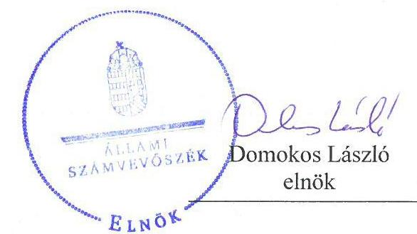
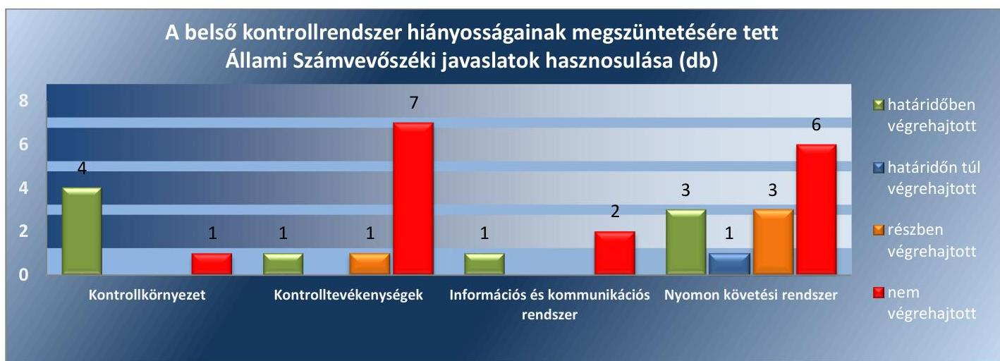
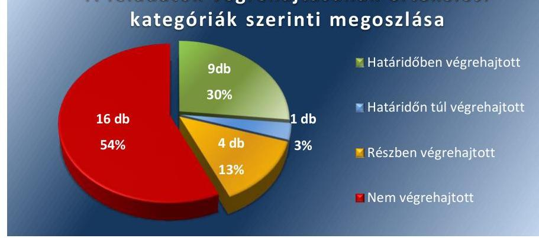
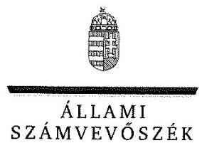
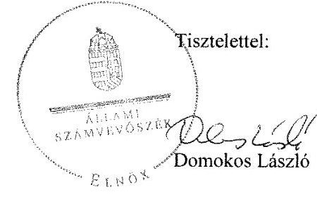
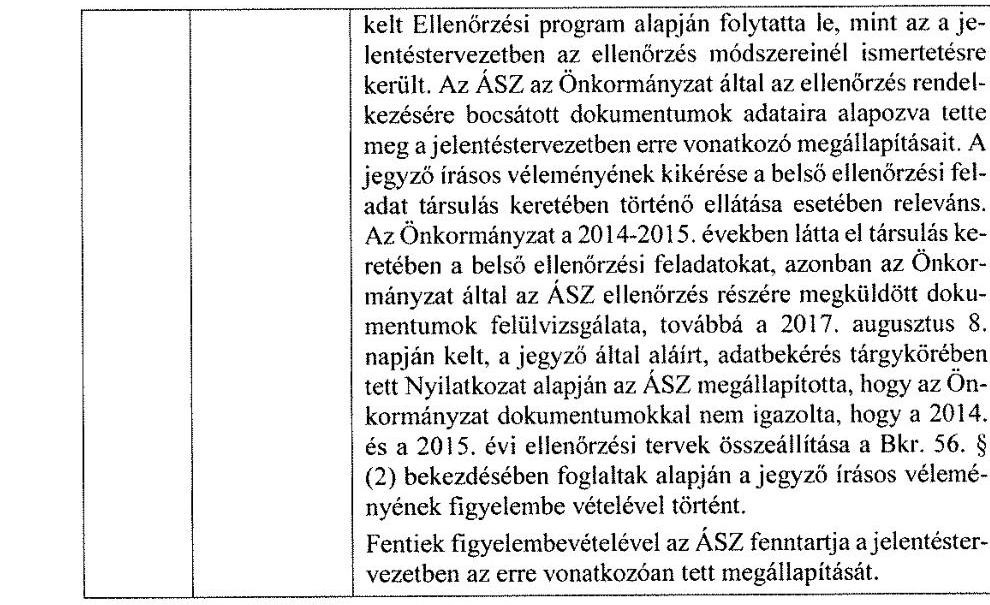
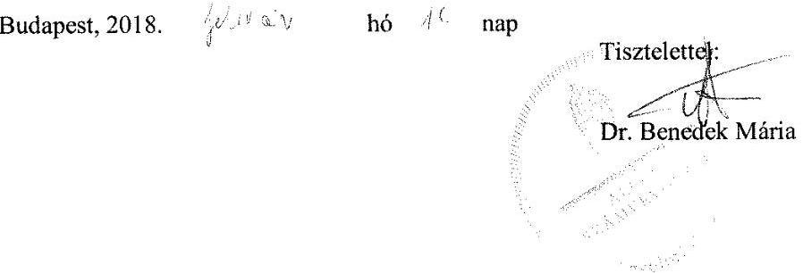

# Jelentés 

## Utóellenőrzések

Az önkormányzatok belső
kontrollrendszere kialakításának és működtetésének utóellenőrzése Borzavár Községi Önkormányzat 2018.

---

# Jelentés 

## Utóellenőrzések

Az önkormányzatok belső
kontrollrendszere kialakításának és működtetésének utóellenőrzése Borzavár Községi Önkormányzat 2018. 0\% hó 28 nap

---

|  J | AZ ELLENŐRZÉST FELÜGYELTE:  |
| --- | --- |
|   | DR. BENEDEK MÁRIA felügyeleti vezető  |
|   | AZ ELLENŐRZÉST VEZETTE ÉS A VÉGREHAJTÁSÁÉRT FELELŐS:  |
|   | EÖRY-BRUDER VIKTÓRIA ellenőrzésvezető  |
|   | A PROGRAM ÖSSZEÁLLÍTÁSÁÉRT FELELŐS:  |
|   | JANIK JÓZSEF LÁSZLÓ osztályvezető  |
|   | A TÉMÁHOZ KAPCSOLÓDÓ KORÁBBI SZÁMVEVŐSZÉKI JELENTÉSEK:  |
|   | - címe: Jelentés az önkormányzatok belső kontrollrendszere kialakításának, egyes kontrolltevékenységek és a belső ellenőrzés működésének ellenőrzéséről - Borzavár  |
|  J | - sorszáma: 14091  |
|   | IKTATÓSZÁM: EL-0059-078/2018.  |
|   | TÉMASZÁM: 21  |
|   | ELLENŐRZÉS-AZONOSÍTÓ SZÁM: V0755115  |

---

# TARTALOMJEGYZÉK 

- ÖSSZEGZÉS ..... 5
- AZ ELLENŐRZÉS CÉLJA ..... 7
- AZ ELLENŐRZÉS TERÜLETE ..... 8
- AZ ELLENŐRZÉS HÁTTERE, INDOKOLTSÁGA ..... 9
- A JELENTÉS LÉNYEGES KÉRDÉSKÖRE ..... 10
- AZ ELLENŐRZÉS HATÓKÖRE ÉS MÓDSZEREI ..... 11
- MEGÁLLAPÍTÁSOK ..... 13
- MELLÉKLETEK ..... 17
I. sz. melléklet: Az ÁSZ 14091 számú jelentéséhez kapcsolódó intézkedési terv végrehajtása ..... 17
- FÜGGELÉK: ÉSZREVÉTELEK ..... 25
- RÖVIDÍTÉSEK JEGYZÉKE ..... 35

---

.

---

# ÖSSZEGZÉS 

Az ellenőrzés megállapította, hogy az intézkedési tervben Borzavár Községi Önkormányzatra vonatkozóan meghatározott feladatok jelentős részét nem hajtották végre. A gazdálkodási jogkörök nem szabályszerű gyakorlása, a közzétételi kötelezettség teljesítésével kapcsolatos feladatok elmulasztása, valamint a belső ellenőrzés végrehajtásának hiányosságai miatt nem valósult meg a belső kontrollrendszer szabályszerű működtetése, és így nem volt biztosított a közpénzekkel való átlátható, elszámoltatható és felelős gazdálkodás.

## Az ellenőrzés társadalmi indokoltsága

Az Állami Számvevőszék stratégiájában célul tűzte ki a számvevőszéki munka hasznosulásának javítását. Ezzel összhangban ellenőrzi, hogy az ellenőrzött szervezetek megvalósították-e a korábbi ellenőrzései által feltárt hibák, hiányosságok és szabálytalanságok megszüntetése céljából kialakított intézkedési terveikben foglaltakat. A rendszeres utóellenőrzések hozzájárulnak a szükséges intézkedések tényleges végrehajtásához, ezáltal a közpénzügyek rendezettségének javulásához, igazolják, hogy lezárult a következmények nélküli ellenőrzések időszaka.

## Főbb megállapítások, következtetések

Az intézkedést igénylő megállapításokhoz és javaslatokhoz kapcsolódóan összeállított intézkedési tervben Borzavár Községi Önkormányzat vonatkozásában meghatározott 30 feladatból 9 feladatot határidőben, egyet határidőn túl, négyet részben, valamint 16 feladatot nem hajtott végre.

A polgármester a gazdálkodás szabályszerűségét nem kísérte figyelemmel, továbbá nem intézkedett a munkajogi felelősséggel kapcsolatos körülmények kivizsgálásáról.

Borzavár Községi Önkormányzat működésének szabályozottsága javult a belső szabályzatok kiadásával, a belső ellenőrzéshez kapcsolódó dokumentumok elkészítésével, valamint a beszerzési és vagyonhasznosítási tevékenység kapcsán a folyamatba épített előzetes, utólagos és vezetői ellenőrzés kialakításával.

A jegyző nem alakított ki olyan rendszert, amely biztosította a megfelelő információk megfelelő időben az illetékes szervezethez, személyhez történő eljutását. A jegyző nem gondoskodott a belső ellenőrzés szabályszerű működtetéséről, mert a stratégiai ellenőrzési terv és az éves ellenőrzési terv nem tartalmazott minden szükséges tartalmi elemet, az éves ellenőrzési terv nem a jegyző írásos véleményének figyelembe vételével készült el. A jegyző nem intézkedett kockázatelemzés készítéséről, nyilvántartás vezetéséről a belső ellenőrzésekről, a jelentésekben tett javaslatokról, a vonatkozó intézkedésekről és azok végrehajtásáról. A belső ellenőrzés kapcsán feltárt hiányosságok azt mutatják, hogy nem biztosított a belső ellenőrzés szabályszerű működtetése. A jegyző nem gondoskodott a közérdekű adatok elektronikus közzétételének teljesítéséről, ezáltal nem alakította ki az átlátható működés feltételeit. A jegyző nem biztosította a gazdálkodási jogkörök szabályszerű gyakorlását, ezáltal nem volt biztosított a közpénzek elszámoltathatósága.

Borzavár Községi Önkormányzat az intézkedési tervben meghatározott feladatok végrehajtásáról a jogszabályban előírt nyilvántartást nem vezette.

---

# 1. ábra 

Fonrás: ÁSZ

---

# AZ ELLENŐRZÉS CÉLJA 

Az ellenőrzés célja annak értékelése volt, hogy a számvevőszéki jelentésben foglalt intézkedést igénylő megállapításokkal és javaslatokkal összhangban készített intézkedési tervben meghatározott feladatokat az ellenőrzött szervezet végrehajtotta-e.

---

# **AZ ELLENŐRZÉS TERÜLETE**

## **Borzavár Községi Önkormányzat**

Borzavár község Veszprém megyében, a Zirci járásban fekszik, állandó lakosainak száma a Központi Statisztikai Hivatal Magyarország közigazgatási helynévkönyve alapján 2016. január 1-jén 703 fő volt.

Borzavár, Lókút és Zirc önkormányzatok képviselő-testületei 2013. január 1-jétől megalakították a Zirci Közös Önkormányzati Hivatalt.

A polgármester³ a 2010. évi önkormányzati választások óta tölti be tisztségét. A jegyző² 2013. január 1-jétől látja el közszolgálati feladatait.

Borzavár Községi Önkormányzat a 2016. évi beszámolója szerint 77,2 M Ft bevételt ért el, és 67,0 M Ft kiadást teljesített. Mérlegfőösszege 288,0 M Ft, ezen belül a befektetett eszközvagyona 274,0 M Ft volt.

Az Állami Számvevőszék a 2014. évben ellenőrizte Borzavár Községi Önkormányzat belső kontrollrendszere kialakításának, egyes kontrolltevékenységek és a belső ellenőrzés működését a 2012. január 1. és december 31. közötti időszak vonatkozásában. Az erről szóló 14091 számú jelentését 2014. június 5-én tette közzé. Az ellenőrzés célja annak megállapítása volt, hogy a belső kontrollrendszer elemeinek kialakítása, a pénzügyi folyamatokban kulcsszerepet betöltő teljesítésigazolás és érvényesítés, valamint a belső ellenőrzés szabályos működése biztosította-e Borzavár Községi Önkormányzatnál a közpénzfelhasználás szabályosságát, hozzájárult-e az értéket teremtő rend követelményének érvényesüléséhez.

Az ÁSZ jelentésben⁴ foglalt javaslatok végrehajtása érdekében a képviselő-testület⁴ 3/2015. (I. 28.) számú határozattal intézkedési tervet fogadott el.

Az utóellenőrzés – a 2014. június 5-étől 2017. július 3-áig végrehajtott feladatokat figyelembe véve – az ÁSZ jelentésben a polgármester és a jegyző részére megfogalmazott intézkedést igénylő megállapításokra és javaslatokra készített, az ÁSZ⁵ részére megküldött intézkedési tervben foglalt, a Borzavár Községi Önkormányzat vonatkozásában meghatározott feladatok megvalósításának ellenőrzésére, illetve értékelésére fókuszált.

---

# AZ ELLENŐRZÉS HÁTTERE, INDOKOLTSÁGA 

Az ÁSZ tv. ${ }^{6}$ 33. § (1) bekezdése értelmében a számvevőszéki jelentések intézkedést igénylő megállapításaihoz és javaslataihoz kapcsolódóan az ellenőrzött szervezet vezetője intézkedési tervet köteles összeállítani, és az Állami Számvevőszék részére megküldeni. Az intézkedési tervben foglaltak megvalósítását - az ÁSZ tv. 33. § (7) bekezdésében foglaltak alapján - az Állami Számvevőszék utóellenőrzés keretében ellenőrizheti. Az intézkedések megvalósulásának értékelése során az Állami Számvevőszék figyelembe veszi az ellenőrzött szervezetek működési feltételeiben, valamint a jogszabályi előírásokban bekövetkezett változásokat.

Az intézkedési tervekben foglalt feladatok hiányos, illetve késedelmes végrehajtása, valamint megvalósításának elmaradása azt mutatja, hogy az ellenőrzések során feltárt hibák, hiányosságok és szabálytalanságok megszüntetése nem kapott kellő hangsúlyt. Ez a szabályszerű működés és a felelős vezetői magatartás vonatkozásában kockázatot hordoz. E kockázatok feltárásával az Állami Számvevőszék utóellenőrzési rendszere fokozza a fegyelmet, és igazolja, hogy a közpénzzel való szabályos gazdálkodás felelőssége elől nem lehet kitérni.

Az utóellenőrzés négy szinten hasznosulhat:

- A társadalom szintjén az utóellenőrzés jelzi, hogy a számvevőszéki ellenőrzés megállapításainak van következménye: a hiányosságok megszüntetésére az ellenőrzött szervezet által meghatározott intézkedések végrehajtását is számon kéri az ÁSZ.
- Az ellenőrzött terület szintjén az utóellenőrzés tájékoztatást nyújt a terület döntéshozóinak a hiányosságok kiküszöbölésének jó gyakorlatairól, ezzel lehetőséget biztosítva arra, hogy az ÁSZ ellenőrzési megállapításai, javaslatai a terület nem ellenőrzött szervezeteinek a működése során is hasznosuljanak.
- Az ellenőrzött szervezet szintjén az utóellenőrzés feltárja, hogy a szervezet az intézkedések végrehajtásával hasznosította-e a korábbi ellenőrzési jelentésben a hiányosságok megszüntetése, illetve a kockázatok kezelése érdekében megfogalmazott javaslatokat.
- Az ÁSZ szintjén az utóellenőrzés visszacsatolást ad az ellenőrzési jelentések hasznosulásáról, az intézkedések elmaradása vagy részleges megvalósulása a további ellenőrzésekhez kockázati jelzésként szolgál.

---

# A JELENTÉS LÉNYEGES KÉRDÉSKÖRE 

Az ellenőrzött szervezet az intézkedési tervben foglaltakat az előírt határidőben végrehajtotta-e?

---

# AZ ELLENŐRZÉS HATÓKÖRE ÉS MÓDSZEREI 

## Az ellenőrzés típusa

Megfelelőségi ellenőrzés.

## Az ellenőrzött időszak

Az utóellenőrzés alapját képező ÁSZ jelentés közzétételének napjától (2014. június 5.) az ellenőrzésről szóló kiértesítő levél keltének napjáig (2017. július 3.) tartó időszak.

## Az ellenőrzés tárgya

Az ÁSZ tv. 2011. július 1-jei hatálybalépését követően a számvevőszéki jelentésben foglalt intézkedést igénylő megállapításokkal és javaslatokkal összhangban - az ellenőrzött szervezet által - készített intézkedési tervben foglaltak végrehajtásának ellenőrzése volt.

Az ellenőrzés kiterjedt minden olyan körülményre és adatra, amely az ÁSZ jogszabályban meghatározott feladatainak teljesítéséhez, valamint a program végrehajtása folyamán felmerült újabb összefüggések feltárásához szükséges volt.

## Az ellenőrzött szervezet

Borzavár Községi Önkormányzat

## Az ellenőrzés jogalapja

Az ÁSZ tv. 33. § (7) bekezdése alapján az intézkedési tervben foglaltak megvalósítását az ÁSZ utóellenőrzés keretében ellenőrizheti.

## Az ellenőrzés módszerei

Az ÁSZ az ellenőrzést az ellenőrzési program ellenőrzési kérdései, az ellenőrzött időszakban hatályos jogszabályok, az ellenőrzés szakmai szabályok és módszertanok figyelembevételével, önállóan végezte.

Az ÁSZ az ellenőrzés ideje alatt az ellenőrzött szervezettel történő kapcsolattartást az ÁSZ SZMSZ²-ének vonatkozó előírásai alapján biztosította

---

Az utóellenőrzés megállapításait elsősorban az ÁSZ rendelkezésére álló, valamint az ellenőrzött szervezettől elektronikusan bekért dokumentumok alapozták meg, amely kiegészült helyszíni ellenőrzéssel.

Az ellenőrzési bizonyítékként felhasználható adatforrások közé tartoztak egyrészt a szakmai programban felsorolt adatforrások, másrészt minden - az ellenőrzés folyamán feltárt, az ellenőrzés szempontjából információt tartalmazó - dokumentum.

Az intézkedési tervben előírt feladatokat azok végrehajthatósága, illetve végrehajtása szempontjából az ÁSZ az alábbiak szerint értékelte:
$\longrightarrow$ „határidőben végrehajtott" a feladat, ha a teljesítés dokumentáltan, az intézkedési tervben előírt határidőben és tartalommal megtörtént;
$\longrightarrow$ „határidőn túl végrehajtott" a feladat, ha annak teljesítése az intézkedési tervben meghatározott módon, de az előírt határidőn túl történt meg;
$\longrightarrow$ „részben végrehajtott" a feladat, ha végrehajtása teljes körűen az intézkedési tervben előírt módon nem történt meg;
$\longrightarrow$ „nem végrehajtott" a feladat, ha a végrehajtás nem történt meg, vagy amennyiben a teljesítést nem dokumentálták;
$\longrightarrow$ „okafogyottá vált" a feladat, ha végrehajtására - meghatározott esemény bekövetkezése, továbbá külső körülmény, a működést érintő feltétel változása miatt - már nincs szükség, illetve lehetőség, és egyértelműen megállapítható, hogy az intézkedést szükségessé tevő körülmény a jövőben nem fordulhat elő;
$\longrightarrow$ „nem időszerű" az a feladat, amelynek ellenőrzési időszakon belüli végrehajtására azért nem került (kerülhetett) sor, mert az intézkedés alapjául szolgáló esemény nem következett be, de annak jövőbeni előfordulása lehetséges, a végrehajtása nem volt esedékes, vagy a végrehajtás határideje még nem járt le.
Az ellenőrzés lefolytatásához az ellenőrzött szervezet a tanúsítványok elektronikus kitöltésével, valamint az ÁSZ által kért dokumentumok elektronikus megküldésével szolgáltatott adatokat, amelyek valódiságát és teljes körűségét az ellenőrzött szervezet vezetője által tett teljességi és hitelességi nyilatkozat igazolta. Az így rendelkezésre bocsátott adatok, információk kontrollja az ellenőrzés keretében történt.

---

# MEGÁLLAPÍTÁSOK 

## Az ellenőrzött szervezet az intézkedési tervben foglaltakat az előírt határidőben végrehajtotta-e?

Összegző megállapítás

Az Önkormányzat ${ }^{8}$ az intézkedési tervben meghatározott, Borzavár Községi Önkormányzatra vonatkozó 30 feladatból 9 feladatot határidőben, egyet határidőn túl, négyet részben, 16 feladatot nem hajtott végre. Az intézkedési tervben meghatározott feladatok végrehajtásáról a jogszabályban előírt nyilvántartást nem vezette.

Az ÁSZ az ÁSZ jelentésben a polgármester részére egy, a jegyző részére hét intézkedést igénylő megállapítást és javaslatot fogalmazott meg. A polgármester által előterjesztett
 és a Képviselő-testület által jóváhagyott intézkedési tervben a hiányosságok, szabálytalanságok megszüntetésére a polgármester részére kettő, a jegyző részére 28 feladat került meghatározásra.

A jegyző részére meghatározott, a 3/2015. (I. 28.) Képviselő-testületi határozatban elfogadott intézkedési terv II. 1.1. fejezet 1-2, és 7-12. számú, a II. 1.2. fejezet 1-2. számú, a II. 1.3. fejezet 2. és a 4-5. számú, továbbá a II. 1.5. fejezet 1. számú pontjaira az utóellenőrzés hatálya nem terjedt ki, mert azok a Zirci Közös Önkormányzati Hivatalra tartalmaztak intézkedéseket, az ellenőrzött szervezet azonban Borzavár Községi Önkormányzat volt.

Az intézkedési tervben meghatározott feladatokat, határidőket, felelősöket és a feladatok végrehajtását az I. számú melléklet mutatja be.

A jegyző az intézkedési tervben meghatározott feladatok végrehajtásáról a Bkr. ${ }^{9} 14 . \S$ (1) bekezdésében előírt nyilvántartást nem vezette.

Az Önkormányzat intézkedési tervében meghatározott feladatok végrehajtásának értékelési kategóriák szerinti megoszlását a 2. ábra szemlélteti.
2. ábra

A feladatok végrehajtásának értékelési kategóriák szerinti megoszlása

---

HATÁRIDŐBEN VÉGREHAJTOTT feladatok:

1. A jegyző gondoskodott a vagyongazdálkodási rendelet ${ }^{10}$ jogszabályi rendelkezéseknek megfelelő előkészítéséről.
2. A jegyző a Számviteli politika ${ }^{11}$ kiadmányozásával gondoskodott az Önkormányzat intézményeire vonatkozóan a jogszabályi előírásoknak megfelelően a számviteli rend kialakításáról.
3. A jegyző gondoskodott a jogszabályi előírásoknak megfelelően az eszközök és források értékelését meghatározó Értékelési szabályzat${ }^{12}$ elkészítéséről.
4. A jegyző biztosította a jogszabályi előírásoknak megfelelően a beszerzési és a vagyonhasznosítási tevékenység, valamint a pénzügyi döntések - köztük a költségvetés tervezése és a támogatásokkal való elszámolás - dokumentumainak elkészítésével kapcsolatban a folyamatba épített, előzetes, utólagos és vezetői ellenőrzést.
5. A jegyző szabályozta a jogszabályi rendelkezéseknek megfelelően a közérdekű adatok megismerésére irányuló igények teljesítésének rendjét.
6. A jegyző gondoskodott arról, hogy a jogszabályi rendelkezések értelmében minden esetben készüljön intézkedési terv a külső ellenőrzések megállapításainak hasznosítására.
7. A jegyző gondoskodott az éves ellenőrzési terv jogszabályban foglalt határidőn belül történő elfogadásáról.
8. A jegyző gondoskodott a Számviteli politika jogszabályban előírtaknak megfelelő aktualizálásáról.
9. A jegyző gondoskodott a Bkr. 17. § (1) bekezdésében, valamint a 22. § (1) bekezdés a) pontja alapján az Önkormányzat Belső ellenőrzési kézikönyvének ${ }^{13}$ jóváhagyásáról.

# HATÁRIDŐN TÚL VÉGREHAJTOTT feladat: 

10. A jegyző gondoskodott arról, hogy a jogszabályi előírásoknak megfelelően az ellenőrzési jelentésekben megfogalmazott belső ellenőrzési javaslatok végrehajtására minden esetben készüljön intézkedési terv. A 2014. évben lefolytatott ellenőrzésekhez kapcsolódóan az intézkedési tervek minden esetben 8 napot meghaladóan, nem a Bkr. előírásainak megfelelő határidőben készültek el. A 2015. évben nem készült ellenőrzési jelentés. A 2016. évben lefolytatott ellenőrzésekhez kapcsolódóan az intézkedési tervek minden esetben a jogszabályban előírt határidőn belül készültek el.

## RÉSZBEN VÉGREHAJTOTT feladatok:

11. A jegyző az Adatvédelmi szabályzat ${ }^{14}$ kiadásával kialakította az eljárási szabályokat az Info tv. ${ }^{15}$ rendelkezéseinek megfelelően, azonban az informatikai rendszer szabályozása során az Info tv. 7. § (2) bekezdésében foglaltak ellenére nem tette meg azokat a technikai és szervezési intézkedéseket, melyek biztosítják az adatok biztonságát és védelmét.

---

12. A jegyző teljes körűen nem gondoskodott arról, hogy az elkészített ellenőrzési programok tartalmazzák a Bkr. 33. § (2) bekezdésében meghatározott tartalmi elemeket.
13. A jegyző nem gondoskodott teljes körűen arról, hogy az elvégzett ellenőrzésekről készített jelentések minden esetben tartalmazzák a Bkr. 39. § (3) bekezdésében foglalt elemeket.
14. A jegyző gondoskodott arról, hogy az éves ellenőrzési jelentések tartalmazzák a jogszabályi előírásoknak megfelelően a belső kontrollrendszer szabályszerűségének, gazdaságosságának, hatékonyságának és eredményességének növelése, javítása érdekében tett fontosabb javaslatokat. Az éves ellenőrzési jelentések azonban nem tartalmazták a kockázatkezelési rendszer, valamint a kontrolltevékenységek Bkr. 48. § (b) pontjában foglaltak szerinti értékelését. A 2015. évre éves ellenőrzési jelentés nem készült.

# NEM VÉGREHAJTOTT feladatok: 

15. A polgármester nem kísérte figyelemmel az Mötv. ${ }^{16}$ 115. § (1) bekezdésében foglaltak alapján az Önkormányzat gazdálkodásának szabályszerűségét.
16. A jegyző nem alakított ki a Bkr. 3. § d) pontjában és a 9. § (1) bekezdésében foglaltak alapján olyan rendszert, amely biztosítja, hogy a megfelelő információk a megfelelő időben eljussanak az illetékes szervezethez, személyhez.
17. A jegyző nem gondoskodott az Info. tv. 33. § (1), (3) és a 37. § (1) bekezdésében foglaltak alapján az Önkormányzat elektronikus közzétételi kötelezettségének teljesítéséről.
18. A jegyző nem gondoskodott arról, hogy a Bkr. 46. § (1) bekezdésében foglaltaknak megfelelően a belső ellenőrzési jelentésekben foglalt javaslatokhoz kapcsolódóan, az intézkedési tervben meghatározott egyes feladatok végrehajtásáról minden esetben készüljön beszámoló.
19. A jegyző nem gondoskodott a teljesítésigazolások Áht. ${ }^{17}$ 38. § (1) bekezdésében és az Ávr. 57. § (1) és (3) bekezdésében előírtaknak megfelelő elvégzéséről.
20. A jegyző nem gondoskodott arról, hogy az érvényesítés az Áht. 38. § (1) bekezdésében és az Ávr. 58. § (1), (3) és (4) bekezdéseiben előírtaknak megfelelően történjen meg.
21. A jegyző nem gondoskodott arról, hogy az Ávr. 58. § (1) bekezdésében foglaltaknak megfelelően a kifizetések fedezetének meglétének ellenőrzése minden esetben történjen meg az Ávr. 56.§ (1) bekezdésében foglalt nyilvántartásba vett kötelezettségvállalások alapján.
22. A jegyző nem gondoskodott arról, hogy az érvényesítő minden esetben az Ávr. 58. § (2) bekezdésében rögzítetteknek megfelelően járjon el.
23. A jegyző nem gondoskodott arról, hogy a kötelezettségvállalás minden esetben az Áht. 37. § (1) bekezdésében és az Ávr. 55. § (1) bekezdésében foglaltak szerint történjen.

---

24. A jegyző nem gondoskodott arról, hogy az Ávr. 59. § (3) bekezdés f) pontja alapján az utalványon kerüljön feltüntetésre a kötelezettségvállalás nyilvántartási száma.
25. A jegyző nem gondoskodott arról, hogy a stratégiai ellenőrzési terv ${ }^{18}$ a Bkr. 30. § (1) bekezdés b) pontjának előírása alapján tartalmazza a belső kontrollrendszer általános értékelését.
26. A jegyző nem gondoskodott arról, hogy a Bkr. 31. § (4) bekezdés a) pontjában foglaltaknak megfelelően az éves ellenőrzési terv tartalmazza az ellenőrzési tervet megalapozó elemzések és a kockázatelemzés eredményének összefoglaló bemutatását.
27. A jegyző nem gondoskodott arról, hogy az éves ellenőrzési terv összeállítása a Bkr. 56. § (2) bekezdésében foglaltak alapján a jegyző írásos véleményének figyelembe vételével történjen meg.
28. A jegyző az éves ellenőrzési terv összeállítását megelőzően nem gondoskodott a Bkr. 31. § (2) bekezdésében foglaltak alapján a kockázatelemzés elkészítéséről.
29. A jegyző nem gondoskodott arról, hogy a belső ellenőrzési vezető a Bkr. 47. § (1) és az 50. § (1) bekezdésében foglaltak alapján figyelemmel a Bkr. 21. § (2) bekezdés d) pontjának előírásaira vezessen nyilvántartást a belső ellenőrzésekről, a jelentésekben tett javaslatokról, a vonatkozó intézkedési tervekről és azok végrehajtásának nyomon követéséről.
30. A polgármester nem gondoskodott az Mötv. 67. § f) pontjában foglaltak alapján a belső kontrollrendszer működésére vonatkozó jogszabályi rendelkezések be nem tartása, valamint a teljesítésigazolás, illetve az érvényesítés kontrollokkal összefüggésben feltárt hiányosságok, szabálytalanságok tekintetében az esetleges munkajogi felelősséggel kapcsolatos körülmények kivizsgálásáról, a vizsgálat eredményének függvényében pedig a szükséges intézkedések megtételéről.

---

# MELLÉKLETEK

■ I. SZ. MELLÉKLET: AZ ÁSZ 14091 SZÁMÚ JELENTÉSÉHEZ KAPCSOLÓDÓ INTÉZKEDÉSI TERV VÉGREHAJTÁSA

|  Az intézkedési tervben meghatározott feladat | Az intézkedési tervben meghatározott határidő | Az intézkedési tervben meghatározott feladat felelőse | A feladat végrehajtása  |
| --- | --- | --- | --- |
|  1. | 2. | 3. | 4.  |
|  Határidőben végrehajtott feladatok |  |  |   |
|  1. Gondoskodni kell arról, hogy az önkormányzat vagyongazdálkodási rendelete úgy kerüljön előkészítésre, hogy az megfeleljen a Nvtv. ${ }^{19}$ előírásainak. | 2015. január 31. | Jegyző | A jegyző gondoskodott az Önkormányzat vagyongazdálkodási rendeletének előkészítéséről úgy, hogy az az Nvtv. előírásainak megfeleljen és az Önkormányzat képviselő-testülete a 4/2013. (II. 27.) önkormányzati rendelettel hagyta jóvá, majd a 13/2013. (V. 1.) önkormányzati rendelettel módosította az Önkormányzat vagyonáról és a vagyongazdálkodásról szóló szabályzatot.  |
|  2. Gondoskodni kell a Htv. ${ }^{20} 140 . \S$ (1) bekezdés c) pontjában foglaltak alapján az önkormányzat intézményei számviteli rendjének kialakításáról. | 2015. január 31. | Jegyző | A jegyző gondoskodott az Önkormányzat intézményei számviteli rendjének kialakításáról a Htv. 140.§ (1) bekezdés c) pontjában előírtaknak megfelelően a 2015. január 1-től hatályos Számviteli politika kiadmányozásával.  |
|  3. Gondoskodni kell a Számv. tv. ${ }^{21} 14 . \S$ (5) bekezdés b) pontjában rögzítetteknek megfelelően az eszközök és források értékelési szabályzatának elkészítéséről. | 2015. január 31. | Jegyző | A jegyző 2015. január 1-i hatállyal gondoskodott a Számv. tv. 14. § (5) bekezdés b) pontjában rögzítetteknek megfelelően az eszközök és források értékelési szabályait magában foglaló Értékelési szabályzat elkészítéséről.  |
|  4. Biztosítani kell a Bkr. 8. § (2) bekezdése a) pontjában foglaltak alapján a beszerzési és a vagyonhasznosítási tevékenység, valamint a pénzügyi döntések köztük a költségvetés tervezése és a támogatásokkal való elszámolás - dokumentumainak elkészítésével kapcsolatban a folyamatba épített, előzetes, utólagos és vezetői ellenőrzést. | 2014. december 31. | Jegyző | A Hivatali SZMSZ-t a Közös Hivatal polgármestere 2014. április 29-én írta alá, és az 2014. május 1-én lépett hatályba. A Hivatali SZMSZ-t a Közös Hivatal minden tagönkormányzata jóváhagyta, így az Önkormányzat képviselő-testülete is a 28/2014. (IV. 29.) számú határozatával.
A jegyző biztosította a Hivatali SZMSZ 1. mellékletét képező FEUVE Kézikönyvben ${ }^{22}$ a Bkr. 8.§ (2) bekezdés a) pontjában foglaltak alapján a beszerzési és a vagyonhasznosítási tevékenység, valamint a pénzügyi döntések - köztük a költségvetés tervezése és a támogatásokkal való elszámolás - dokumentumainak elkészítésével kapcsolatban a folyamatba épített, előzetes, utólagos és vezetői ellenőrzést.  |

---

|  Az intézkedési tervben meghatározott feladat | Az intézkedési tervben meghatározott határidő | Az intézkedési tervben meghatározott feladat felelőse | A feladat végrehajtása  |
| --- | --- | --- | --- |
|  1. | 2. | 3. | 4.  |
|  Szabályozni kell az Info tv. 30. § (6) bekezdésében és az Ávr. 13. § (2) bekezdés h) pontjában foglalt előírásoknak megfelelően a közérdekű adatok megismerésére irányuló igények teljesítésének rendjét. | 2014. december 31. | Jegyző | A jegyző 2014. február 14-i dátummal léptette hatályba az Adatvédelmi szabályzatot, amelyben szabályozta az Info tv. 30. § (6) bekezdésében és az Ávr. 13. § (2) bekezdés h) pontjában foglalt előírásoknak megfelelően a közérdekű adatok megismerésére irányuló igények teljesítésének rendjét.  |
|  Gondoskodni kell arról, hogy a Bkr. 13. § (2) bekezdésében foglalt előírások értelmében minden esetben készüljön intézkedési terv a külső ellenőrzések megállapításainak hasznosítására. | külső ellenőrzést végző szervezetre vonatkozó jogszabályi előírás esetén a jogszabályban foglalt határidő, ennek hiányában a külső ellenőrző szerv által
 meghatározott határidő, azt követően a vonatkozó jogszabályi előírásoknak megfelelően időközönként folyamatos tárgyévet megelőző év december 31. | Jegyző | A jegyző minden esetben gondoskodott arról, hogy a Bkr. 13. § (2) bekezdésében foglalt előírások értelmében készüljön intézkedési terv a külső ellenőrzések megállapításainak hasznosítására.  |
|  Gondoskodni kell arról, hogy az éves ellenőrzési terv a Bkr. 32. § (4) bekezdésében foglalt határidőn belül kerüljön elfogadásra. |  | Jegyző | A jegyző gondoskodott arról, hogy az ellenőrzött időszak éveire vonatkozóan az éves ellenőrzési terv a Bkr. 32. § (4) bekezdésében foglalt határidőn belül kerüljön elfogadásra.  |
|  Gondoskodni kell a számviteli politika Számv. tv. 14. § (11) bekezdésében foglaltaknak megfelelő aktualizálásáról. | törvénymódosítás esetén a hatálybalépést követő 90. nap | Jegyző | A jegyző a 2015. január 1-től hatályos Számviteli politika kiadmányozásával gondoskodott a Számv. tv. 14. § (11) bekezdésében foglaltaknak megfelelő aktualizálásáról. Az ellenőrzött időszak további időszakában nem volt indokolt a számviteli politika aktualizálása.  |
|  Gondoskodni kell arról, hogy a Bkr. 17. § (1) bekezdésében, valamint a 22. § (1) bekezdés a) pontja alapján kerüljön jóváhagyásra az önkormányzat belső ellenőrzési kézikönyve. | 2014. július 31. | Jegyző | A jegyző a Bkr. 17. § (1) bekezdésében, valamint a 22. § (1) bekezdés a) pontja alapján 2013. január 2-án jóváhagyta a belső ellenőrzést végző társulás által készített, Borzavár Községi Önkormányzat belső ellenőrzési kézikönyvét.  |
|  Határidőn túl végrehajtott feladat |  |  |   |
|  Gondoskodni kell arról, hogy az ellenőrzési jelentésekben megfogalmazott belső ellenőrzési javaslatok végrehajtására a Bkr. 45. § (2)-(3) bekezdéseiben foglaltak alapján minden esetben készüljön intézkedési terv. | a lezárt ellenőrzési jelentés kézhezvételétől számított 8. nap, azt követően a vonat- | Jegyző | A jegyző minden esetben gondoskodott a Bkr. 45. § (2) bekezdésében foglaltak alapján az ellenőrzési jelentésekben megfogalmazott belső ellenőrzési javaslatok végrehajtására vonatkozó intézkedési terv készítéséről, azonban a 2014. évben végzett ellenőrzésekhez kapcsolódóan elkészült intézkedési tervek nem a Bkr. 45. § (3) be-  |

---

|  Az intézkedési tervben meghatározott feladat | Az intézkedési tervben meghatározott határidő | Az intézkedési tervben meghatározott feladat felelőse | A feladat végrehajtása  |
| --- | --- | --- | --- |
|  1. | 2. | 3. | 4.  |
|   |  |  | kezdésében meghatározott, a jelentés kézhezvételétől számított 8 napon belül, illetve indokolt esetben ennél hosszabb, legfeljebb 30 napos határidővel készültek el, hanem azon túl.  |
|   |  |  | A 2013. évi belső ellenőrzések intézkedési tervei és az intézkedésekről készült beszámoló ellenőrzéséről készült jelentés dátuma 2014. április 15., a kapcsolódó intézkedési tervet 2014. július 3-án írták alá. A 2013. évi költségvetési beszámoló, zárszámadás, gazdálkodással kapcsolatos szabályzatok, főkönyvi és analitikus nyilvántartások, valamint azok alapbizonylatai témájában lefolytatott ellenőrzésről készített jelentés dátuma 2014. július 15., az intézkedési tervet 2017. augusztus 1-én készítették el. A 2013. évi adott támogatások ellenőrzéséről készített jelentés dátuma 2014. április 15, a kapcsolódó intézkedési terv dátuma 2014. július 3.  |
|   |  |  | A 2015. évben nem készült ellenőrzési jelentés.  |
|   |  |  | A 2016. évben készített ellenőrzési jelentésekhez készült intézkedési tervek dátuma minden esetben az ellenőrzési jelentés megismeréséről szóló nyilatkozatok dátumát megelőző, korábbi dátum.  |
|   |  |  | Részben végrehajtott feladatok  |
|  11. | Az Info tv. 7. § (2)-(3) bekezdéseiben foglalt előírásokat figyelembe véve ki kell alakítani azokat az eljárási szabályokat, továbbá az informatikai rendszer szabályozása során meg kell tenni azokat a technikai és szervezési intézkedéseket, melyek biztosítják az adatok biztonságát és védelmét. | 2014. december 31. | Jegyző  |
|  12. | Gondoskodni kell arról, hogy a végrehajtott ellenőrzésekhez készített ellenőrzési programok tartalmazzák a Bkr. 33. § (2) bekezdésében rögzített elemeket. | az ellenőrzés megkezdéséről szóló értesítés időpontjáig azt követően a vonatkozó jogszabályi előírásokban meghatározott időközönként folyamatos | Jegyző  |
|   |  |  | Végrehajtott feladatok:  |
|   |  |  | A jegyző 2014. február 14-i dátummal léptette hatályba az Adatvédelmi szabályzatot, amellyel kialakította az Info tv. 7. § (2)-(3) bekezdéseiben foglalt előírások figyelembe vételével az eljárási szabályokat.  |
|   |  |  | Nem végrehajtott feladat:  |
|   |  |  | A jegyző az Info tv. 7. § (2) bekezdés előírásai ellenére az informatikai rendszer szabályozása során nem tette meg azokat a technikai és szervezési intézkedéseket, melyek biztosítják az adatok biztonságát és védelmét.  |
|  |   |   |   |
|  13. | Az intézkedési tervben meghatározott feladat | Az intézkedési tervben meghatározott feladat felelőse | A jegyző  |
|   |  |  | Végrehajtott feladatok:  |
|   |  |  | A jegyző gondoskodott arról, hogy a végrehajtott ellenőrzésekhez készített ellenőrzési programok tartalmazzák a Bkr. 33. § (2) bekezdés a), b) és d)-j) pontjaiban meghatározott tartalmi elemeket.  |
|   |  |  | Nem végrehajtott feladat:  |
|   |  |  | A jegyző nem gondoskodott arról, hogy a 2014., illetve 2016. években végrehajtott ellenőrzésekhez készített ellenőrzési programok tartalmazzák a Bkr. 33. § (2) bekezdés c) pontjában előírt ellenőrzés típusát.  |

---

|  Az intézkedési tervben meghatározott feladat | Az intézkedési tervben meghatározott határidő | Az intézkedési tervben meghatározott feladat felelőse | A feladat végrehajtása  |
| --- | --- | --- | --- |
|  1. | 2. | 3. | 4.  |
|  13. Gondoskodni kell arról, hogy az elvégzett ellenőrzésekről készített jelentések minden esetben tartalmazzák a Bkr. 39. § (3) bekezdésében foglalt elemeket. | az adott ellenőrzéshez kapcsolódó ellenőrzési programban rögzített időpontig, azt követően a vonatkozó jogszabályi előírásokban meghatározott időközönként folyamatos | Jegyző | Végrehajtott feladatok:
A jegyző gondoskodott arról, hogy az elvégzett ellenőrzésekről készített jelentések minden esetben tartalmazzák a Bkr. 39. § (3) bekezdés a)-h), valamint a k)-m) pontjaiban foglalt tartalmi elemeket.
Nem végrehajtott feladat:
A 2014. és a 2016. évekre vonatkozóan, mindkét évben kettő-kettő ellenőrzési jelentés nem tartalmazta a Bkr. 39. § (3) bekezdés i) pontjában foglaltaktól eltérően az alkalmazott ellenőrzési módszereket és eljárásokat, valamint a jelentések nem tartalmazták a Bkr. 39. § (3) bekezdés j) pontjában előírt vezetői összefoglalót.  |
|  14. Gondoskodni kell arról, hogy az éves ellenőrzési jelentés a Bkr. 48. § b) pontjában foglaltak alapján tartalmazza a belső kontrollrendszer szabályszerűségének, gazdaságosságának, hatékonyságának és eredményességének növelése, javítása érdekében tett fontosabb javaslatokat, valamint a belső kontrollrendszer öt elemének értékelését. | tárgyévet követő év február 15. napja, azt követően a vonatkozó jogszabályi előírásokban meghatározott időközönként folyamatos | Jegyző | Végrehajtott feladatok:
A jegyző gondoskodott arról, hogy az éves ellenőrzési jelentés a Bkr. 48. § b) pontjában foglaltak alapján tartalmazza a belső kontrollrendszer szabályszerűségének, gazdaságosságának, hatékonyságának és eredményességének növelése, javítása érdekében tett fontosabb javaslatokat. A 2014. év éves ellenőrzési jelentés 2015. március 17-én, a 2016. év éves ellenőrzési jelentés 2017. február 27-én készült el.
Nem végrehajtott feladat:
Az éves ellenőrzési jelentések a Bkr. 48. § b) pontjában előírtak ellenére nem tartalmazták a kockázatkezelési rendszer, valamint a kontrolltevékenységek értékelését. A 2015. évre vonatkozóan éves ellenőrzési jelentés nem készült.  |
|  Nem végrehajtott feladatok |  |  |   |
|  15. Figyelemmel kell kísérni az Mótv. 115. § (1) bekezdésében foglaltak alapján az Önkormányzat gazdálkodásának szabályszerűségét. | 2015. február 28. | Polgármester | A polgármester nem kísérte figyelemmel az Mótv. 115. § (1) bekezdésében foglaltak alapján az Önkormányzat gazdálkodásának szabályszerűségét.  |
|  16. Ki kell alakítani egy olyan rendszert a Bkr. 3. § d) pontjában és a 9. § (1) bekezdésében foglaltak alapján, amely biztosítja, hogy a megfelelő információk a megfelelő időben eljussanak az illetékes szervezethez, személyhez. | 2014. december 31. | Jegyző | A jegyző nem alakított ki a Bkr. 3. § d) pontjában és a 9. § (1) bekezdésében foglaltak alapján olyan rendszert, amely biztosítja, hogy a megfelelő információk a megfelelő időben eljussanak az illetékes szervezethez, személyhez.  |
|  17. Gondoskodni kell az Info tv. 33. § (1), (3) és a 37. § (1) bekezdésében foglaltak alapján az Önkormányzat elektronikus közzétételi kötelezettségének teljesítéséről. | 2014. december 31. | Jegyző | A jegyző nem gondoskodott az Info. tv. 33. § (1), (3) és a 37. § (1) bekezdésében foglaltak alapján az Önkormányzat elektronikus közzétételi kötelezettségének teljesítéséről.  |

---

|  Az intézkedési tervben meghatározott feladat | Az intézkedési tervben meghatározott határidő | Az intézkedési tervben meghatározott feladat felelőse | A feladat végrehajtása  |
| --- | --- | --- | --- |
|  1. | 2. | 3. | 4.  |
|  18. Gondoskodni kell arról, hogy a Bkr. 46. § (1) bekezdésében foglaltak alapján a belső ellenőrzési jelentésekben foglalt javaslatokhoz kapcsolódóan, az intézkedési tervben meghatározott egyes feladatok végrehajtásáról minden esetben készüljön beszámoló. Gondoskodni kell továbbá arról, hogy a beszámoló tájékoztatásul kerüljön megküldésre a belső ellenőrzési vezető részére. | a belső ellenőrzési jelentések megállapításaira készült, a Képviselő-testület által jóváhagyott Intézkedési tervben meghatározott határidőt követő 8. nap, azt követően a vonatkozó jogszabályi előírásoknak megfelelően időközönként folyamatos | Jegyző | A jegyző nem gondoskodott arról, hogy a Bkr. 46. § (1) bekezdésében foglaltak alapján a belső ellenőrzési jelentésekben foglalt javaslatokhoz kapcsolódóan, az intézkedési tervben meghatározott egyes feladatok végrehajtásáról minden esetben készüljön beszámoló.  |
|  19. Gondoskodni kell arról, hogy a teljesítésigazolások az Áht. 38. § (1) bekezdésében és az Ávr. 57. § (1) és (3) bekezdésében foglaltak alapján minden esetben és szabályszerűen el legyenek végezve. | folyamatos | Jegyző | A jegyző nem gondoskodott arról, hogy a teljesítésigazolások minden esetben és szabályszerűen, az Áht. 38. § (1) bekezdésében és az Ávr. 57. § (1) és (3) bekezdésében foglaltak alapján legyenek elvégezve.  |
|  20. Gondoskodni kell
 arról, hogy az érvényesítés az Áht. 38. § (1) bekezdésében és az Ávr. 58. § (1), (3), (4) bekezdésében előírtak alapján minden esetben szabályszerűen történjen meg. | folyamatos | Jegyző | A jegyző nem gondoskodott arról, hogy az érvényesítés az Áht. 38. § (1) bekezdésében és az Ávr. 58. § (1), (3), (4) bekezdésében előírtak alapján minden esetben szabályszerűen történjen meg.  |
|  21. Gondoskodni kell arról, hogy az Ávr. 58. § (1) bekezdésében foglaltaknak megfelelően a kifizetések fedezetének meglétének ellenőrzése minden esetben történjen meg az Ávr. 56.§ (1) bekezdésében foglalt nyilvántartásba vett kötelezettségvállalások alapján. | folyamatos | Jegyző | A jegyző nem gondoskodott arról, hogy az Ávr. 58. § (1) bekezdésében foglaltaknak megfelelően a kifizetések fedezetének meglétének ellenőrzése minden esetben megtörténjen az Ávr. 56.§ (1) bekezdésében foglalt nyilvántartásba vett kötelezettségvállalások alapján.  |
|  22. Gondoskodni kell arról, hogy az érvényesítő minden esetben az Ávr. 58. § (2) bekezdésében rögzítetteknek megfelelően járjon el. | folyamatos | Jegyző | A jegyző nem gondoskodott arról, hogy az érvényesítő minden esetben az Ávr. 58. § (2) bekezdésében rögzítetteknek megfelelően járjon el.  |
|  23. Gondoskodni kell arról, hogy a kötelezettségvállalás minden esetben az Áht. 37. § (1) bekezdésében és az Ávr. 55. § (1) bekezdésében foglaltak szerint történjen. | folyamatos | Jegyző | A jegyző nem gondoskodott arról, hogy a kötelezettségvállalás minden esetben az Áht. 37. § (1) bekezdésében és az Ávr. 55. § (1) bekezdésében foglaltak szerint történjen.  |

---

|  Az intézkedési tervben meghatározott feladat | Az intézkedési tervben meghatározott határidő | Az intézkedési tervben meghatározott feladat felelőse | A feladat végrehajtása  |
| --- | --- | --- | --- |
|  1. | 2. | 3. | 4.  |
|  24. Gondoskodni kell arról, hogy az Ávr. 59. § (3) bekezdés f) pontja alapján az utalványon kerüljön feltüntetésre a kötelezettségvállalás nyilvántartási száma. | folyamatos | Jegyző | A jegyző nem gondoskodott arról, hogy az Ávr. 59. § (3) bekezdés f) pontja alapján az utalványon kerüljön feltüntetésre a kötelezettségvállalás nyilvántartási száma.  |
|  25. Gondoskodni kell arról, hogy a stratégiai ellenőrzési terv a Bkr. 30. § (1) bekezdés b) pontjának előírása alapján tartalmazza a belső kontrollrendszer általános értékelését. | 2014. december 31. | Jegyző | A jegyző nem gondoskodott arról, hogy a stratégiai ellenőrzési terv a Bkr. 30. § (1) bekezdés b) pontjának előírása alapján tartalmazza a belső kontrollrendszer általános értékelését.  |
|  26. Gondoskodni kell arról, hogy a Bkr. 31. § (4) bekezdés a) pontjában foglaltaknak megfelelően az éves ellenőrzési terv tartalmazza az ellenőrzési tervet megalapozó elemzések és a kockázatelemzés eredményének összefoglaló bemutatását. | tárgyévet megelőző év november 30. napjáig, azt követően a vonatkozó jogszabályi előírásokban meghatározott időközönként folyamatosan | Jegyző | A jegyző nem gondoskodott arról, hogy a Bkr. 31. § (4) bekezdés a) pontjában foglaltaknak megfelelően az éves ellenőrzési terv tartalmazza az ellenőrzési tervet megalapozó elemzések és a kockázatelemzés eredményének összefoglaló bemutatását.  |
|  27. Gondoskodni kell arról, hogy az éves ellenőrzési terv a Bkr. 56. § (2) bekezdésben foglaltak figyelembe vételével a jegyző írásos véleményének figyelembe vételével történjen meg. | tárgyévet megelőző év november 30. napjáig, azt követően a vonatkozó jogszabályi előírásokban meghatározott időközönként folyamatosan | Jegyző | A jegyző nem gondoskodott arról, hogy az éves ellenőrzési terv összeállítása a Bkr. 56. § (2) bekezdésben foglaltak alapján a jegyző írásos véleményének figyelembe vételével történjen meg.  |
|  28. Az éves ellenőrzési terv összeállítását megelőzően gondoskodni kell a Bkr. 31. § (2) bekezdésében foglaltak alapján a kockázatelemzés elkészítéséről. | tárgyévet megelőző év november 30. napjáig, azt követően a vonatkozó jogszabályi előírásokban meghatározott időközönként folyamatosan | Jegyző | A jegyző az éves ellenőrzési terv összeállítását megelőzően nem gondoskodott a Bkr. 31. § (2) bekezdésében foglaltak alapján a kockázatelemzés elkészítéséről.  |
|  29. Gondoskodni kell arról, hogy a belső ellenőrzési vezető a Bkr. 47. § (1) és az 50. § (1) bekezdésében foglaltak alapján - figyelemmel a Bkr. 21. § (2) bekezdés d) pontjának előírásaira - vezessen nyilvántartást a belső ellenőrzésekről, a jelentésekben tett javaslatokról, a vonatkozó intézkedési tervekről és azok végrehajtásának nyomon követéséről. | tárgyévet követő év február 15. napja, azt követően a vonatkozó jogszabályi előírásokban meghatározott időközönként folyamatos | Jegyző | A jegyző nem gondoskodott arról, hogy a belső ellenőrzési vezető a Bkr. 47. § (1) és az 50. § (1) bekezdésében foglaltak alapján - figyelemmel a Bkr. 21. § (2) bekezdés d) pontjának előírásaira - vezessen nyilvántartást a belső ellenőrzésekről, a jelentésekben tett javaslatokról, a vonatkozó intézkedési tervekről és azok végrehajtásának nyomon követéséről.  |

---

|  Az intézkedési tervben meghatározott feladat | Az intézkedési tervben meghatározott határidő | Az intézkedési tervben meghatározott feladat felelőse | A feladat végrehajtása  |
| --- | --- | --- | --- |
|  1. | 2. | 3. | 4.  |
|  30. Gondoskodni kell az Mótv. 67. § f) pontjában foglaltak alapján a belső kontrollrendszer működésére vonatkozó jogszabályi rendelkezések be nem tartása, valamint a teljesítésigazolás, illetve az érvényesítés kontrollokkal összefüggésben feltárt hiányosságok, szabálytalanságok tekintetében az esetleges munkajogi felelősséggel kapcsolatos körülmények kivizsgálásáról, a vizsgálat eredményének függvényében pedig a szükséges intézkedések megtételéről. | 2015. február 28. | Polgármester | A polgármester nem gondoskodott az Mótv. 67. § f) pontjában foglaltak alapján a belső kontrollrendszer működésére vonatkozó jogszabályi rendelkezések be nem tartása, valamint a teljesítésigazolás, illetve az érvényesítés kontrollokkal összefüggésben feltárt hiányosságok, szabálytalanságok tekintetében az esetleges munkajogi felelősséggel kapcsolatos körülmények kivizsgálásáról, a vizsgálat eredményének függvényében pedig a szükséges intézkedések megtételéről.  |

---

.

---

# FÜGGELÉK: ÉSZREVÉTELEK 

A jelentéstervezetet a Számvevőszék 15 napos észrevételezésre megküldte az ellenőrzött szervezet vezetőjének az ÁSZ tv. 29. § (1) bekezdése előírásának megfelelően.
Az elfogadott észrevétel alapján a Számvevőszék módosította a jelentést.

A függelék tartalmazza az ellenőrzött észrevételeit, illetve a figyelembe nem vett észrevételek elutasításának indoklását.

[^0]
[^0]:    * 29. § (1) Az Állami Számvevőszék az ellenőrzési megállapításait megküldi az ellenőrzött szervezet vezetőjének vagy az általa megbízott személynek, és annak, akinek személyes felelősségét állapította meg.
    (2) Az ellenőrzött szervezet vezetője és a felelősként megjelölt személy az ellenőrzés megállapításaira tizenöt napon belül írásban észrevételt tehet.
    (3) Az Állami Számvevőszék az észrevételre a beérkezésétől számított harminc napon belül írásban válaszol. A figyelembe nem vett észrevételeket köteles a jelentésben feltüntetni, és megindokolni, hogy azokat miért nem fogadta el.

---

# 1157 

BORZAVÁR KÖZSÉGI ÖNKORMÁNYZAT
8428 Borzavár, Fő u. 43. ■ 88/582-930 ㅇ 88/582-931

Állami Számvevőszék
Budapest
Apáczai Csere János utca 10.

## 1052

## Tisztelt Cím!

Önkormányzatunkhoz 2018. január 15-én fenti hivatkozási számon érkezett „Utóellenőrzések - Az önkormányzatok belső kontrollrendszere kialakításának és működtetésének utóellenőrzése - Borzavár Községi Önkormányzat" című ellenőrzés kapcsán készített jelentéstervezettel összefüggésben az Állami Számvevőszékről szóló 2011. évi LXVI. törvény 29. § (2) bekezdése alapján az alábbi észrevételeket teszem:

## Jelentéstervezetben a nem végrehajtott feladatok között nevesített megállapítások

„18. A jegyző nem gondoskodott a teljesítésigazolások Áht. 38. § (1) bekezdésében és az Ávr. 57. § (1) és (3) bekezdésében előírtaknak megfelelő elvégzéséről.
19. A jegyző nem gondoskodott arról, hogy az érvényesítés az Áht. 38. § (1) bekezdésében és az Ávr. 58. § (1), (3) és (4) bekezdéseiben előírtaknak megfelelően történjen meg.
20. A jegyző nem gondoskodott arról, hogy az Ávr. 58. § (1) bekezdésében foglaltaknak megfelelően a kifizetések fedezetének meglétének ellenőrzése minden esetben történjen meg az Ávr. 56. § (1) bekezdésében foglalt nyilvántartásba vett kötelezettségvállalások alapján.
21. A jegyző nem gondoskodott arról, hogy az érvényesítő minden esetben az Ávr. 58. § (2) bekezdésében rögzítetteknek megfelelően járjon el.
22. A jegyző nem gondoskodott arról, hogy a kötelezettségvállalás minden esetben az Áht. 37. § (1) bekezdésében és az Ávr. 55.§ (1) bekezdésében foglaltak szerint történjen.
23. A jegyző nem gondoskodott arról, hogy az Ávr. 59. § (3) bekezdés f) pontja alapján az utalványon kerüljön feltüntetésre a kötelezettségvállalás nyilvántartási száma.
24. A jegyző nem gondoskodott a Bkr. 17. § (1) bekezdésében, valamint a 22. § (1) bekezdés a) pontja alapján az Önkormányzat Belső ellenőrzési kézikönyvének jóváhagyásáról.

---

27. A jegyző nem gondoskodott arról, hogy az éves ellenőrzési terv összeállítása a Bkr. 56. § (2) bekezdésében foglaltak alapján a jegyző írásos véleményének figyelembe vételével történjen meg."

# Észrevételek: 

## 18-22. pontok

Az teljesítésigazolás, az érvényesítés, a pénzügyi ellenjegyzés, valamint a kötelezettségvállalás rendje, az érvényesítésre, pénzügyi ellenjegyzésre, a kötelezettségvállalásra, valamint az utalványozásra jogosult személyek köre rögzítésre került a Gazdálkodási szabályzatban.
Az előzetes írásbeli kötelezettségvállalások esetében szerepel a dokumentumon a pénzügyi ellenjegyző aláírása, valamint a pénzügyi ellenjegyzés dátuma.
Az EL-0059-001/2017. ikt. sz. adatbekérő levélhez kapcsolódóan csatolt utalványlapokon a kötelezettségvállalás és pénzügyi ellenjegyzés előtt látható a „A szükséges szabad előirányzat rendelkezésre áll, a befolyt vagy a megtervezett és várhatóan befolyó bevétel biztosítja a kötelezettségvállalás fedezetét" szövegezés.
Az EL-0059-001/2017. ikt. sz. adatbekérő levélhez kapcsolódóan csatolt utalványlapokon az érvényesítés előtt látható a „A csatolt bizonylatot és mellékleteit felülvizsgáltam, az előírt alaki, tartalmi és szakmai követelmények alapján érvényesítve" szövegezés.
Az EL-0059-001/2017. ikt. sz. adatbekérő levélhez kapcsolódóan csatolt utalványlapokon az utalványozó aláírása előtt látható a „A fentiek figyelembevételével a pénzügyi teljesítést elrendelem, utalványozom." szövegezés.

## 23. pont

Az EL-0059-001/2017. ikt. sz. adatbekérő levélhez kapcsolódóan csatolásra került 2 utalványlap. Ezen utalványlapokon feltüntetésre kerültek a kifizetésekhez kapcsolódó szerződések számai és a kötelezettségvállalás sorszáma is.

Fentiek igazolására a belsőkontroll utó borzavar@asz.hu e-mail címre szkennelt dokumentumot küldtünk meg.

## 24. pont

A jegyző gondoskodott a Belső ellenőrzési kézikönyv jóváhagyásáról. A Belső ellenőrzési kézikönyv elektronikus úton csatolásra került az EL-0059-001/2017. ikt. sz. adatbekérő levélhez kapcsolódóan.

## 27. pont

A Zirci Járás Önkormányzati Társulás Tanácsa 45/2015.(XII.16.) határozatában arról döntött, hogy a belső ellenőrzési feladatokat 2016. január 1-jétől ne közösen, Társulási szinten lássák el, hanem minden önkormányzat saját maga oldja meg a feladat ellátását.
2016. január 1-jétől tehát Borzavár Községi Önkormányzat a feladat ellátásáról önállóan gondoskodott.
A Társulási Tanács 2015. december 16-i döntését megelőzően 2015. december 3-án a Zirci Járás Önkormányzati Társulás tagönkormányzatai jegyzőinek felkérő levél került elküldésre, melyben a belső ellenőrzési vezető által a 2016. évi belső ellenőrzési terv véleményezését kérte a jegyzőktől. Egy észrevétel és javaslat érkezett. Ennek dokumentumát az EL-0059-

---

001/2017. ikt. sz. adatbekérő levélhez csatolt

 2016. évi belső ellenőrzési terv véleményezése dokumentummal igazoltuk. A többi érintett jegyző a belső ellenőrzési vezető által javasolt éves ellenőrzési terv tartalmát visszajelzés hiányában elfogadta.

Fentiek igazolására a belsokonroll_uto_borzavar@asz.hu e-mail címre szkennelt dokumentumot küldtünk meg.

Kérem, hogy jelen észrevételeimet a végleges jelentés összeállítása során elfogadni és figyelembe venni szíveskedjenek.

Segítő közreműködésüket előre is köszönöm.

Borzavár, 2018. január 25.

Döcziné Belecz Ágnes polgármester

---

ELNÖK

Ikt.szám: EL-0059-077/2018.

# Döcziné Belecz Ágnes úrhölgy

polgármester
Borzavár Községi Önkormányzat

## Borzavár

## Tisztelt Polgármester Úrhölgy!

Köszönettel megkaptam az Állami Számvevőszékhez 2018. január 31. napján érkezett "Utóellenőrzések - Az önkormányzatok belső kontrollrendszere kialakításának és működtetésének utóellenőrzése - Borzavár Községi Önkormányzat" című számvevőszéki jelentéstervezetben foglalt megállapításokra tett észrevételét.

Tájékoztatom Polgármester úrhölgyet, hogy a figyelembe nem vett észrevételeket - az Állami Számvevőszékről szóló 2011. évi LXVI. törvény 29. § (3) bekezdése alapján - a jelentésben szerepeltetjük az elutasítás indokainak feltüntetésével együtt.

Az Állami Számvevőszék észrevételekre vonatkozó álláspontjáról a felügyeleti vezető által készített részletes tájékoztatást csatoltan megküldöm.

Budapest, 2018. 02. 06.

Melléklet: Tájékoztatás a figyelembe vett és figyelembe nem vett észrevételekről, azok indokairól

---

# Tájékoztatás

a figyelembe vett és figyelembe nem vett észrevételekről, azok indokairól

| 1. | Észrevétel: | Az észrevétel 2. oldal 18-22. pontokra tett megállapításai, az ÁSZ jelentéstervezet 15. oldal Nem végrehajtott feladatok 18-22. számú megállapításaira tett észrevétel: „Az teljesítésigazolás, az érvényesítés, a pénzügyi ellenjegyzés, valamint a kötelezettségvállalás rendje, az érvényesítésre, pénzügyi ellenjegyzésre, a kötelezettségvállalásra, valamint az utalványozásra jogosult személyek köre rögzítésre került a Gazdálkodási szabályzatban.   Az előzetes írásbeli kötelezettségvállalások esetében szerepel a dokumentumon a pénzügyi ellenjegyző aláírása, valamint a pénzügyi ellenjegyzés dátuma.   Az EL-0059-001/2017. ikt. sz. adatbekérő levélhez kapcsolódóan csatolt utalványlapokon a kötelezettségvállalás és pénzügyi ellenjegyzés előtt látható a „A szükséges szabad előirányzat rendelkezésre áll, a befolyt vagy a megtervezett és várhatóan befolyó bevétel biztosítja a kötelezettségvállalás fedezetét" szövegezés.   Az EL-0059-001/2017. ikt. sz. adatbekérő levélhez kapcsolódóan csatolt utalványlapokon az érvényesítés előtt látható a „A csatolt bizonylatot és mellékleteit felülvizsgáltam, az előírt alaki, tartalmi és szakmai követelmények alapján érvényesítve" szövegezés.   Az EL-0059-001/2017. ikt. sz. adatbekérő levélhez kapcsolódóan csatolt utalványlapokon az utalványozó aláírása előtt látható a „A fentiek figyelembevételével a pénzügyi teljesítést elrendelem. Utalványozom." szövegezés." |
| :--: | :--: | :--: |
|  | Válasz: | Az ÁSZ az észrevételt nem fogadja el. |
|  | Indokolás: | Az észrevétel nem megalapozott. Az ÁSZ a tárgyi ellenőrzését a V-1062-003/2016. iktatószámú 2016. február 4-én kelt Ellenőrzési program alapján folytatta le, mint az a jelentéstervezetben az ellenőrzés módszereinél ismertetésre |

---

|  |  | került. Az ÁSZ az Önkormányzat által az ellenőrzés rendelkezésére bocsátott dokumentumok adataira alapozva tette meg a jelentéstervezetben erre vonatkozó megállapításait. Az Önkormányzat által az ÁSZ ellenőrzés részére megküldött dokumentumok felülvizsgálata, továbbá a 2017. augusztus 8. napján kelt, a jegyző által aláirt, adatbekérés tárgykörében tett Nyilatkozat alapján az ÁSZ megállapította, hogy az Önkormányzat dokumentumokkal nem igazolta a kötelezettségvállalások, a teljesítésigazolások, valamint az érvényesítések jogszabályi előírásoknak megfelelő, szabályszerű elvégzését. Az észrevételben hivatkozott EL-0059-001/2017. ikt. sz. adatbekérő levélhez kapcsolódóan csatolt kettő utalványlap a gazdálkodási jogkörök szabályszerű elvégzését önmagában - a kapcsolódó dokumentumok nélkül - nem támasztja alá.   Fentiek figyelembevételével az ÁSZ fenntartja a jelentéstervezetben az erre vonatkozóan tett megállapítását. |
| :--: | :--: | :--: |
|  | Észrevétel: | Az észrevétel 2. oldal 23. pontra tett megállapítása, az ÁSZ jelentéstervezet 15. oldal Nem végrehajtott feladatok 23. számú megállapítására tett észrevétel:   „Az EL-0059-001/2017. ikt. sz. adatbekérő levélhez kapcsolódóan csatolásra került 2 utalványlap. Ezen utalványlapokon feltüntetésre kerültek a kifizetésekhez kapcsolódó szerződések számai és a kötelezettségvállalás sorszáma is.   Fentiek igazolására a belsokonroll_uto_horzavarijjasz.ha e-mail címre szkennelt dokumentumot küldtünk meg" |
|  | Válasz: | Az ÁSZ az észrevételt nem fogadja el. |
| 2. | Indokolás: | Az észrevétel nem megalapozott. Az ÁSZ a tárgyi ellenőrzését a V-1062-003/2016. iktatószámú 2016. február 4-én kelt Ellenőrzési program alapján folytatta le, mint az a jelentéstervezetben az ellenőrzés módszereinél ismertetésre került. Az ÁSZ az Önkormányzat által az ellenőrzés rendelkezésére bocsátott dokumentumok adataira alapozva tette meg a jelentéstervezetben erre vonatkozó megállapításait. Az Önkormányzat által az ÁSZ ellenőrzés részére megküldött dokumentumok felülvizsgálata, továbbá a 2017. augusztus 8. napján kelt, a jegyző által aláirt, adatbekérés tárgykörében tett Nyilatkozat alapján az ÁSZ megállapította, hogy az Önkormányzat dokumentumokkal nem igazolta az intézkedési tervben meghatározott feladat ellenőrzött időszakban történt szabályszerű végrehajtását, mivel a hivatkozott kettő utalványlaphoz kapcsolódó további alátámasztó dokumentumok - kötelezettségvállalásokról vezetett nyilvántartás, kötelezettségvállalások dokumentumai - nem kerültek az ÁSZ részére megküldésre. |

---

|  |  | Fentiek figyelembevételével az ÁSZ fenntartja a jelentéstervezetben az erre vonatkozóan tett megállapítását. |
| :--: | :--: | :--: |
| 3. | Észrevétel: | Az észrevétel 2. oldal 24. pontra tett megállapítása, az ÁSZ jelentéstervezet 16. oldal Nem végrehajtott feladatok 24. számú megállapítására tett észrevétel:   „A jegyző gondoskodott a Belső ellenőrzési kézikönyv jóváhagyásáról. A Belső ellenőrzési kézikönyv elektronikus úton csatolásra került az EL-0059-001/2017. ikt. sz. adatbekérő levélhez kapcsolódóan." |
|  | Válasz: | Az ÁSZ az észrevételt elfogadja. |
|  | Indokolás: | Az észrevétel megalapozott. Az Önkormányzat által az ÁSZ ellenőrzés részére megküldött dokumentumok felülvizsgálata alapján az ÁSZ megállapította, hogy a jegyző gondoskodott a Bkr. 17. § (1) bekezdésében, valamint a 22. § (1) bekezdés a) pontja alapján az Önkormányzat Belső ellenőrzési kézikönyvének jóváhagyásáról.   Fentiek figyelembevételével az ÁSZ módosítja a jelentéstervezetben az erre vonatkozóan tett megállapítását. |
| 4. | Észrevétel: | Az észrevétel 2. oldal 27. pontra tett megállapítása, az ÁSZ jelentéstervezet 16. oldal Nem végrehajtott feladat 27. számú megállapítására tett észrevétel   „A Zirci Járás Önkormányzati Társulás Tanácsa 45/2015.(XII. 16.) határozatában arról döntött, hogy a belső ellenőrzési feladatokat 2016. január 1-jétől ne közösen, Társulási szinten lássák el, hanem minden önkormányzat saját maga oldja meg a feladat ellátását.   2016. január 1-jétől tehát Borzavár Községi Önkormányzat a feladat ellátásáról önállóan gondoskodott.   A Társulási Tanács 2015. december 16-i döntését megelőzően 2015. december 3-án a Zirci Járás Önkormányzati Társulás tagönkormányzatai jegyzőinek felkérő levél került elküldésre, melyben a belső ellenőrzési vezető által a 2016. évi belső ellenőrzési terv véleményezését kérte a jegyzőktől. Egy észrevétel és javaslat érkezett. Ennek dokumentumát az EL-0059-001/2017. ikt. sz. adatbekérő levélhez csatolt 2016. évi belső ellenőrzési terv véleményezése dokumentummal igazoltuk. A többi érintett jegyző a belső ellenőrzési vezető által javasolt éves ellenőrzési terv tartalmát visszajelzés hiányában elfogadta.   Fentiek igazolására a belsokonroll_uta_borzavar@asz.hu e-mail címre szkennelt dokumentumot küldtünk meg." |
|  | Válasz: | Az ÁSZ az észrevételt nem fogadja el. |
|  | Indokolás: | Az észrevétel nem megalapozott. Az ÁSZ a tárgyi ellenőrzését a V-1062-003/2016. iktatószámú 2016. február 4-én |

---

Budapest, 2018.

---

.

---

# RÖVIDÍTÉSEK JEGYZÉKE

${ }^{1}$ polgármester
${ }^{2}$ jegyző
${ }^{3}$ ÁSZ jelentés
${ }^{4}$ képviselő-testület
${ }^{5}$ ÁSZ
${ }^{6}$ ÁSZ tv.
${ }^{7}$ ÁSZ SZMSZ
${ }^{8}$ Önkormányzat
${ }^{9}$ Bkr.
${ }^{10}$ vagyongazdálkodási rendelet
${ }^{11}$ Számviteli politika
${ }^{12}$ Értékelési szabályzat
${ }^{13}$ Belső ellenőrzési kézikönyv
${ }^{14}$ Adatvédelmi szabályzat
${ }^{15}$ Info tv.
${ }^{16}$ Mötv.
${ }^{17}$ Áht.
${ }^{18}$ stratégiai ellenőrzési terv
${ }^{19}$ Nvtv.
${ }^{20}$ Htv.
${ }^{21}$ Számv. tv.
${ }^{22}$ FEUVE Kézikönyv

Borzavár község polgármestere
Zirci Közös Önkormányzati Hivatal jegyzője
az ÁSZ által 14091 számon, 2014. június 5-én kiadmányozott Jelentés az önkormányzatok belső kontrollrendszere kialakításának, egyes kontrolltevékenységek és a belső ellenőrzés működésének ellenőrzéséről Borzavár című jelentés
Borzavár Községi Önkormányzat képviselő-testülete
Állami Számvevőszék
2011. évi LXVI. törvény az Állami Számvevőszékről (hatályos: 2011. július 1-től)

Állami Számvevőszék Szervezeti és Működési Szabályzata
Borzavár Községi Önkormányzat
370/2011. (XII. 31.) Korm. rendelet a költségvetési szervek belső kontrollrendszeréről és belső ellenőrzéséről (hatályos: 2012. január 1-től)
Borzavár Községi Önkormányzat Képviselő-testületének a 13/2013. (V. 1.) önkormányzati rendelettel módosított 4/2013. (II. 27.) önkormányzati rendelete az önkormányzat vagyonáról és vagyongazdálkodási szabályairól
Zirci Közös Önkormányzati Hivatal, Számviteli politika, hatályos Borzavár Községi Önkormányzatra (hatályos: 2015. január 1-től)
Zirci Közös Önkormányzati Hivatal, Eszközök és források értékelési szabályzata, hatályos Borzavár Községi Önkormányzatra (hatályos: 2015. január 1-től)
Borzavár Községi Önkormányzat Belső ellenőrzési kézikönyve (hatályos: 2013. január 2-től)

Zirci Közös Önkormányzati Hivatal Adatvédelmi és Adatbiztonsági Szabályzata (hatályos: 2014. február 14-től)
2011. évi CXII. törvény az információs önrendelkezési jogról és az információszabadságról (hatályos: 2011. július 27-től)
2011. évi CLXXXIX. törvény Magyarország helyi önkormányzatairól (hatályos: 2012. január 1-től)
az államháztartásról szóló 2011. évi CXCV. törvény (hatályos: 2012. január 1-től)
Borzavár Község Önkormányzata, Stratégiai ellenőrzési terv 2011-2015. évekre
2011. évi CXCVI. törvény a nemzeti vagyonról (hatályos: 2012. január 1-től)
1991. évi XX. törvény a helyi önkormányzatok és szerveik, a köztársasági megbízottak, valamint egyes centrális alárendeltségű szervek feladat- és hatásköreiről (hatályos: 1991. július 23-tól)
2000. évi C törvény a számvitelről (hatályos 2000. január 1-től)

Zirci Közös Önkormányzati Hivatal Szervezeti és Működési Szabályzata, Borzavár Községi Önkormányzat képviselő-testületének 28/2014. (IV. 29) számú határozatával elfogadva, Folyamatba épített előzetes és utólagos ellenőrzési rendszer (hatályos: 2014. május 1-től)

---

# ÁLLAMI SZÁMVEVŐSZÉK

1052 Budapest, Apáczai Csere János utca 10.
Levélcím: 1364 Budapest 4. Pf. 54
Telefon: +36 1 4849100 Telefax: +36 1 4849200
www.asz.hu

