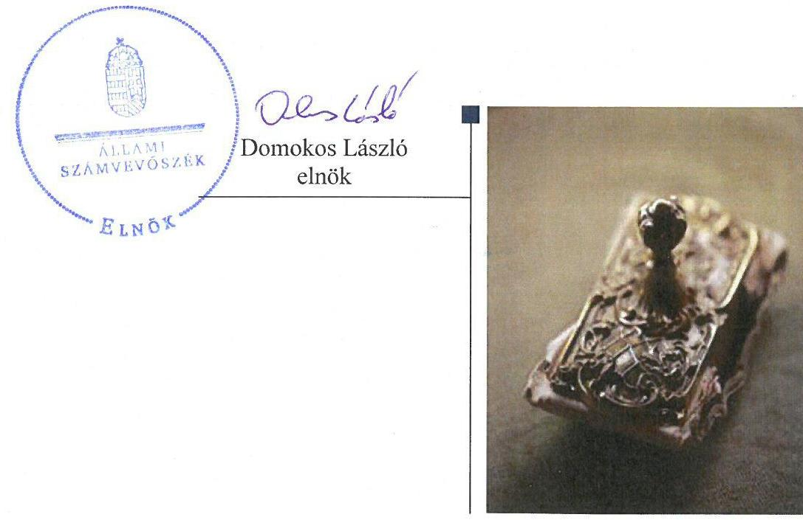
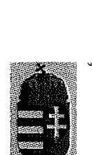
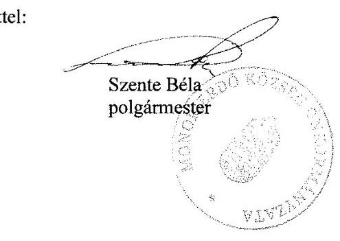
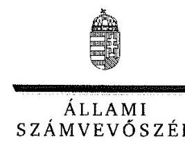
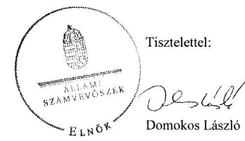
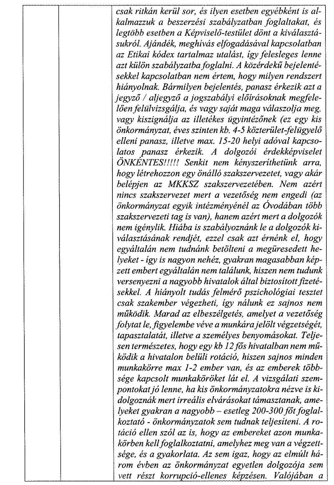
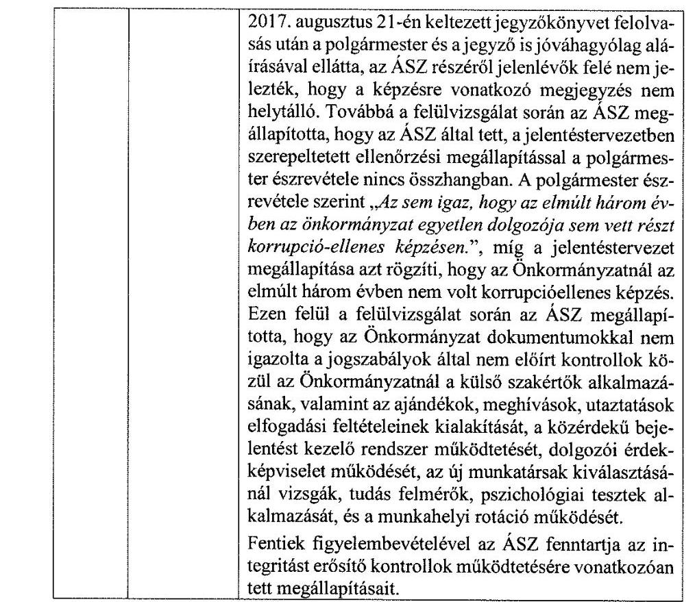
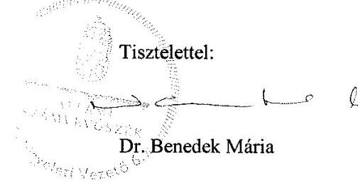

# Jelenetés 

## Önkormányzatok integritás- és belső kontrollrendszere

Az önkormányzatok belső kontrollrendszere kialakításának és működtetésének ellenőrzése Monorierdő Község Önkormányzata 2018.

18055
www.asz.hu

---

# Jelenetés 

## Önkormányzatok integritás- és belső kontrollrendszere

Az önkormányzatok belső kontrollrendszere kialakításának és működtetésének ellenőrzése Monorierdő Község Önkormányzata
2018. 02. hó 24. nap

---

# AZ ELLENŐRZÉST FELÜGYELTE:

DR. BENEDEK MÁRIA felügyeleti vezető

## AZ ELLENŐRZÉST VEZETTE ÉS A VÉGREHAJTÁSÁÉRT FELELŐS:

BÍRÓ ZSOLT ellenőrzésvezető

## A PROGRAM ÖSSZEÁLLÍTÁSÁÉRT FELELŐS:

TÓTPÁL SZABOLCS osztályvezető

IKTATÓSZÁM: EL-0084-044/2018

TÉMASZÁM: 2444

ELLENŐRZÉS-AZONOSÍTÓ SZÁM: V078904

Jelentéseink az Országgyűlés számítógépes hálózatán és az Interneten a www.asz.hu címen is olvashatóak.

---

# TARTALOMJEGYZÉK 

■ ÖSSZEGZÉS ..... 5
■ AZ ELLENŐRZÉS CÉLJA ..... 7
■ AZ ELLENŐRZÉS TERÜLETE ..... 8
■ AZ ELLENŐRZÉS HÁTTERE, INDOKOLTSÁGA ..... 9
■ A JELENTÉS LÉNYEGES KÉRDÉSKÖREI ..... 10
■ ELLENŐRZÉS HATÓKÖRE ÉS MÓDSZEREI ..... 11
■ MEGÁLLAPÍTÁSOK ..... 13
■ JAVASLATOK ..... 19
■ MELLÉKLETEK ..... 23
I. Sz. melléklet: Értelmező szótár ..... 23
■ FÜGGELÉK: ÉSZREVÉTELEK ..... 25
■ RÖVIDÍTÉSEK JEGYZÉKE ..... 73

---

.

---

# ÖSSZEGZÉS 

Az Állami Számvevőszék Monorierdő Község Önkormányzatának ellenőrzése során megállapította, hogy nem a jogszabályi előírásoknak megfelelően alakították ki működésük kereteit. A kockázatkezelési rendszert nem működtették, nem mérték fel a szervezeti célokkal összefüggő kockázatokat, nem határozták meg a szükséges intézkedéseket. A kialakított kontrollok és azok működtetése, valamint az információs és kommunikációs rendszer nem biztosította a közpénzek szabályos, átlátható felhasználását, a nemzeti vagyonnal történő felelős gazdálkodást. Monorierdő Község Önkormányzatánál az integritással összefüggő kontrollok és a korrupciós kockázatok szintje nem volt egymással összhangban.

## Az ellenőrzés társadalmi indokoltsága

Magyarország Alaptörvénye az önkormányzatoktól is elvárja a kiegyensúlyozott, átlátható és fenntartható költségvetési gazdálkodás elvének érvényesítését, továbbá a nemzeti vagyonnal való rendeltetésszerű és felelős módon való gazdálkodást. A belső kontrollrendszer kialakítása és működtetése nélkül nem valósítható meg a közpénzek, a közvagyon szabályos, gazdaságos, hatékony és eredményes felhasználása. Az Állami Számvevőszék stratégiájában megfogalmazódott, hogy támogatja az integritás alapú, átlátható és elszámoltatható közpénzfelhasználás megteremtését. Mindezekre tekintettel, a közpénzzel gazdálkodó szervezetek esetében a belső kontrollrendszer megfelelő működése ellenőrzését prioritásként kezeli az Állami Számvevőszék.

A vagyonnal való felelős gazdálkodáshoz elengedhetetlen, hogy Monorierdő Község Önkormányzatánál a belső kontrollrendszer kialakítása és működtetése megfelelő legyen, érvényesüljön az integritás szemlélet. Az Önkormányzat vonatkozásában minősített közérdekű bejelentőtől érkezett bejelentés az Állami Számvevőszékhez.

## Főbb megállapítások, következtetések

Monorierdő Község Önkormányzata nem a jogszabályi előírásoknak megfelelően alakította ki működésének kereteit. A kontrollkörnyezet kialakítása nem felelt meg a jogszabályi előírásoknak, a Képviselő-testület nem fogadta el az önkormányzati vagyonnal való gazdálkodás szabályait, nem állapította meg a köztisztviselőkre vonatkozó hivatásetikai alapelvek részletes tartalmát, eljárási szabályait. A Jegyző a belföldi és külföldi kiküldetések elrendelésével és lebonyolításával, elszámolásával kapcsolatos kérdéseket 2016. október 14-ig, a reprezentációs kiadások felosztását, azok teljesítésének és elszámolásának szabályait 2016. szeptember 30-ig, a gépjárművek igénybevételének és használatának rendjét az ellenőrzött időszakban nem rendezte.

A Jegyző az ellenőrzött időszakban kockázatkezelési rendszert nem működtetett, nem mérte fel a Monorierdői Polgármesteri Hivatal tevékenységeiben rejlő kockázatokat, nem határozta meg a szükséges intézkedéseket és azok teljesítésének nyomon követését.

A kontrolltevékenység kereteinek kialakítása és működtetése során nem tartották be a jogszabályokban és a belső szabályzatokban foglaltakat. A kontrolltevékenységek gyakorlása során a kötelezettségvállalás, a pénzügyi ellenjegyzés, a teljesítésigazolás és az utalványozás nem volt szabályszerű, a gazdálkodási jogkörök gyakorlása nem biztosította a közpénzfelhasználás szabályosságát, a nemzeti vagyonnal történő felelős gazdálkodást.

A jogszabályban előírt közzétételi kötelezettségnek hiányosan tettek eleget, a közérdekű adatok megismerésére irányuló kérelmek teljesítésének rendjét a Jegyző 2016. október 14-ig nem készítette el, adatvédelmi szabályzattal 2016. október 14-éig a Monorierdő Község Önkormányzata nem rendelkezett. A beszámolási és adatszolgáltatási kötelezettséget a jogszabályokban előírtak ellenére teljes körűen nem teljesítették. A költségvetési szerv vezetője nem biztosította a belső ellenőrzés szabályszerű működését, nem gondoskodott a belső ellenőrzési feladatok hiánytalan végrehajtásáról.

---

Az ellenőrzött időszakban a jogszabályi előírásoknak nem megfelelően kialakított és működtetett belső kontrollrendszer nem támogatta a Monorierdő Község Önkormányzata szabályszerű működését, a gazdaságosság, hatékonyság és eredményesség követelményének érvényesülését.

Monorierdő Község Önkormányzatánál az integritással összefüggő kontrollrendszer kiépítése és működtetése hiányos volt, ezért az integritás szemlélet érvényesítése érdekében további intézkedések szükségesek. A hiányzó kontrollok növelték az önkormányzat működéséből adódó korrupciós kockázatok veszélyét, nem támogatták a közpénzek átlátható felhasználását, az integritás kultúra kialakítását.

---

# AZ ELLENŐRZÉS CÉLJA 

AZ ELLENŐRZÉS CÉLJA annak megállapítása volt, hogy szabályszerűen történt-e Monorierdő Község Önkormányzata belső kontrollrendszerének kialakítása és működtetése, az biztosította-e a közpénzfelhasználás szabályosságát, a közpénzekkel és a nemzeti vagyonnal történő szabályszerű és felelős gazdálkodást, a beszámolási és adatszolgáltatási kötelezettségek szabályszerű teljesítését. Az ellenőrzés keretében értékeltük Monorierdő Község Önkormányzata korrupciós kockázatainak kezelését szolgáló integritás kontrollok kiépítettségét, valamint az integritás szemlélet érvényesülését.

---

# **Az Ellenőrzés Területe**

## **Monorierdő Község Önkormányzata**

Monorierdő község a Közép-Magyarországi régióban, Pest megyében fekszik, lakónépessége a Központi Statisztikai Hivatal Magyarország közigazgatási helynévkönyve alapján 2016. január 1-jén 4139 fő volt.

Az Monorierdő Község Önkormányzata a Monorierdői Polgármesteri Hivatallal együtt két intézménnyel látta el feladatait, amelyek nem rendelkeztek gazdasági szervezettel. A Monorierdői Polgármesteri Hivatalban a gazdasági vezető feladatait a Jegyző látta el. A hét fővel működő Képviselő-testület munkáját három állandó bizottság támogatta. A településen az ellenőrzött időszakban nemzetiségi önkormányzat nem működött. A Monorierdő Község Önkormányzatának egy többségi tulajdoni részesedésű gazdasági társasága volt.

A Polgármester 2013. júniustól tölti be tisztségét. A Jegyző 2015. augusztus 5-től látja el feladatát.

A Képviselő-testület által irányított költségvetési szerveknél 2016. december 31-én 37 fő közalkalmazott és 11 fő köztisztviselő dolgozott.

A 2016. évi konszolidált költségvetési beszámolója alapján Monorierdő Község Önkormányzatának 407,3 millió Ft teljesített költségvetési bevétele és 370,5 millió Ft teljesített költségvetési kiadása volt. A Monorierdő Község Önkormányzatának 2016. december 31-i könyvviteli mérleg szerinti eszközvagyona 3155,5 millió Ft volt. A költségvetési évben esedékes kötelezettségek összege 21,2 millió Ft-ot, a költségvetési évet követően esedékes kötelezettségek állományának összege 10,5 millió Ft-ot tett ki.

---

# AZ ELLENŐRZÉS HÁTTERE, INDOKOLTSÁGA 

A demokratikus társadalmakban alapvető igény, hogy a közpénzeket, a közvagyont használók tevékenységükről elszámoljanak, ahhoz egyértelmű és érvényesíthető felelősségi szabályok társuljanak. Ennek a jogos igénynek az érvényesítéséhez meg kell teremteni azokat a folyamatokat, rendszereket, amelyek nélkülözhetetlenek az elszámoltatáshoz. Az elszámoltatás eredményes működtetéséhez szükség van a megfelelő információs, kontroll-, értékelési - és beszámolási rendszerek kialakítására. A belső kontrollok kiépítettsége hozzájárul az integritási szemlélet kialakításához és érvényesüléséhez. A belső kontrollrendszer kialakítása és működtetése nélkül nem valósítható meg a közpénzek, a közvagyon szabályos, gazdaságos, hatékony és eredményes felhasználása.

A BELSŐ KONTROLLRENDSZER azt a célt szolgálja, hogy az államháztartás szervei működésük és gazdálkodásuk során a tevékenységeket szabályszerűen, gazdaságosan, hatékonyan, eredményesen hajtsák végre, teljesítsék elszámolási kötelezettségeiket és megvédjék az erőforrásokat a veszteségektől, a károktól, a nem rendeltetésszerű használattól. A belső kontrollrendszer magában foglalja mindazon szabályokat, eljárásokat, gyakorlati módszereket és szervezeti struktúrákat, kockázatkezelési technikákat, kontrolltevékenységeket, amelyek segítséget nyújtanak a szervezetnek céljai eléréséhez. A belső kontrollrendszer szabályozása háromszintű, a törvényi előírásokat az Áht. ${ }^{1}$ és a Mötv. ${ }^{2}$ a rendeleti szintű szabályozást az Ávr. ${ }^{3}$ és a Bkr. ${ }^{4}$ tartalmazza, amelyeket útmutatói szinten az $\mathrm{NGM}^{5}$ által kiadott standardok és kézikönyvek támogatnak.

A MEGFELELŐ BELSŐ KONTROLLRENDSZER jelentősen csökkenti a hibák és szabálytalanságok kockázatát. Az ÁSZ ${ }^{6}$ célja, hogy javuljon az ellenőrzött önkormányzatok belső kontrollrendszerének szabályozottsága, működésének megfelelősége, szabályszerűsége, biztosítva az önkormányzatnál a közpénzfelhasználás szabályosságát, a közpénzekkel és a nemzeti vagyonnal történő szabályszerű, gazdaságos, hatékony és eredményes gazdálkodást. Az ÁSZ ellenőrzés tapasztalatai nem csupán a közvetlenül ellenőrzött önkormányzatokat támogathatják, hanem a „jó gyakorlat” elterjesztésével azok az önkormányzatok is átvehetik a pozitív példákat, ahol nem végez ellenőrzést az ÁSZ.

## AZ ELLENŐRZÉS VÁRHATÓ HASZNOSULÁSA

NÉGY SZINTEN valósul meg. A törvényalkotás számára összegzett tapasztalatok állnak rendelkezésre a belső kontrollrendszer önkormányzati területen való kialakításáról, működtetéséről és hatásairól. Az ellenőrzés az ellenőrzött számára visszajelzést ad a belső kontrollrendszer kialakításában és működésében lévő hiányosságokról, javaslataival hozzájárul azok kiküszöböléséhez. Az ellenőrzés megállapításait és javaslatait más szervezetek is hasznosíthatják a rendezett gazdálkodási keretek kialakításához. A társadalom számára jelzi, hogy közpénz nem maradhat ellenőrizetlenül, az ÁSZ értékteremtő rend kialakításához és megőrzéséhez hozzájáruló tevékenysége pozitív hatással lesz a szervezetről kialakított összkép formálásában.

---

# A JELENTÉS LÉNYEGES KÉRDÉSKÖREI 

1.- Az önkormányzat belső kontrollrendszerének kialakítása és működtetése szabályszerű volt-e, az biztosította-e az önkormányzatnál a közpénzfelhasználás szabályosságát, a nemzeti vagyonnal történő felelős gazdálkodást?
2.- Érvényesült-e az integritás szemlélet és ennek megfelelően kiépítették-e az integritás kontrollrendszert az önkormányzatnál?

---

# ELLENŐRZÉS HATÓKÖRE ÉS MÓDSZEREI 

## Az ellenőrzés típusa

Megfelelőségi ellenőrzés

## Az ellenőrzött időszak

2016. január 1. és 2016. december 31. közötti időszak.

## Az ellenőrzés tárgya

A helyi önkormányzatnak, mint éves költségvetési beszámoló készítésére kötelezett szervezetnek és polgármesteri hivatalának belső kontrollrendszere. Az integritás szemlélet érvényesülése.

Az ellenőrzés kiterjedt minden olyan körülményre és adatra, amely az ÁSZ jogszabályban meghatározott feladatainak teljesítéséhez, valamint a program végrehajtása folyamán felmerült újabb összefüggések feltárásához szükséges volt.

## Az ellenőrzött szervezet

Monorierdő Község Önkormányzata

## Az ellenőrzés jogalapja

Az ÁSZ tv. ${ }^{7}$ 1. § (3) bekezdésében foglaltak alapján az ÁSZ általános hatáskörrel végzi a közpénzekkel és az állami és önkormányzati vagyonnal való felelős gazdálkodás ellenőrzését. Az ÁSZ tv. 5. § (2) bekezdése alapján az államháztartás gazdálkodásának ellenőrzése keretében az ÁSZ ellenőrzi a helyi önkormányzatok gazdálkodását, valamint az ÁSZ tv. 5. § (6) bekezdése alapján ellenőrzése során értékeli az államháztartás számviteli rendjének betartását és a belső kontrollrendszer működését.

## Az ellenőrzés módszerei

Az ÁSZ az ellenőrzést az ellenőrzési program szempontjai, kérdései, az ellenőrzött időszakban hatályos jogszabályok, az ellenőrzés szakmai szabályok és módszertanok figyelembe vételével végezte.

Az ÁSZ az ellenőrzés ideje alatt az ellenőrzött szervezettel történt kapcsolattartást az ÁSZ SZMSZ ${ }^{8}$-ének vonatkozó előírásai alapján biztosította.

---

Az ellenőrzési kérdések megválaszolásához szükséges bizonyítékok megszerzése az ellenőrzöttek által rendelkezésre bocsátott dokumentumokra, adatokra alapozva megfigyelés, szemle (szemrevételezés), kérdésfeltevés (információkérés), valamint elemző eljárással történt. A minták kiválasztása rétegzett, véletlen mintavételi eljárással történt. Az ellenőrzési bizonyítékként felhasználható adatforrások közé tartoztak egyrészt az ellenőrzési program részletes szempontjainál felsorolt adatforrások, másrészt minden - az ellenőrzés folyamán feltárt, az ellenőrzés szempontjából információt tartalmazó - dokumentum.

Az ellenőrzés lefolytatásához az önkormányzat a tanúsítványok kitöltésével, valamint az ÁSZ által kért dokumentumok megküldésével szolgáltatott adatokat. A rendelkezésre bocsátott adatok, információk kontrollja az ellenőrzés keretében történt. Az egységes értelmezést támogatta a program mellékletét képező fogalomtár és rövidítésjegyzék.

Az önkormányzat belső kontrollrendszere jogszabályi előírások szerinti kialakításának és működtetésének szabályszerűségét, az erre irányuló ellenőrzési kérdésekre adott válaszok összesítése alapján pillérenként (kontrollkörnyezet, kockázatkezelési rendszer, kontrolltevékenységek, információs és kommunikációs rendszer, monitoring rendszer) és összesítetten is értékeltük. Az önkormányzat belső kontrollrendszere egyes pilléreinek kialakítása és működtetése „szabályszerű”, amennyiben az értékelt területen az elért igen válaszok százalékban kifejezett, egész számra kerekített aránya meghaladta a 85%-ot, „nem szabályszerű”,

 ha nem haladta meg a $60 \%$-ot. Ha a $85 \%$-ot nem haladta meg, de $60 \%$-nál nagyobb volt az igen válaszok aránya, akkor a minősítés „részben szabályszerű". Az önkormányzat belső kontrollrendszerének összesített értékelése megegyezik a pillérenként (kontrollterületenként) alkalmazott százalékos értékelésekkel, a következő eltérésekkel. A kontrollrendszer egésze esetében a „szabályszerű" értékelésnek a százalékos értéken felül további feltétele, hogy egyik kontrollterület sem kaphat „nem szabályszerű" értékelést, a „részben szabályszerű" értékelés további feltétele, hogy legfeljebb egy ellenőrzött kontrollterület lehet „nem szabályszerű" értékelésű. Az összesített értékelés a százalékos értéktől függetlenül „nem szabályszerű", ha az ellenőrzött kontrollterületek közül több mint egynek „nem szabályszerű" az értékelése.

A közszféra integritás alapú kultúrájának kialakítása, megerősítése és működése szorosan összefügg a belső kontrollrendszer működésével, ezért az ellenőrzés kiterjedt annak értékelésére is, hogy a belső kontrollrendszer kialakítása és működtetése hogyan hatott az integritás szemlélet érvényesülésére. Az integritás szemlélet érvényesülésének értékelése az önkormányzat által kitöltött tanúsítvány alapján történt.

---

# 1. Az önkormányzat belső kontrollrendszerének kialakítása és működtetése szabályszerű volt-e, az biztosította-e az önkormányzatnál a közpénzfelhasználás szabályosságát, a nemzeti vagyonnal történő felelős gazdálkodást? 

## Összegző megállapítás

Az Önkormányzat ${ }^{9}$ belső kontrollrendszerének kialakítása és működtetése nem volt szabályszerű, az nem biztosította az Önkormányzatnál a közpénzfelhasználás szabályosságát, a nemzeti vagyonnal történő felelős gazdálkodást.

### 1.1. számú megállapítás

Az Önkormányzat kontrollkörnyezetének kialakítása nem felelt meg a jogszabályi előírásoknak.

Az Önkormányzat szervezetének és működésének szervezeti kereteit hiányosan alakította ki.

Az Önkormányzat kontrollkörnyezetének kialakításával kapcsolatos hiányosságokat az 1. táblázat tartalmazza.

## A KONTROLLKÖRNYEZET KIALAKÍTÁSÁNAK HIÁNYOSSÁGAI

| Sorszám | Részmegállapítások | Megjegyzések |
| :--: | :--: | :--: |
| 1. | A Képviselő-testület ${ }^{10}$ a Htv. ${ }^{11}$ 138. § (1) bekezdés j) pontjának előírása ellenére nem fogadta el az önkormányzati vagyonnal való gazdálkodás szabályait. |  |
| 2. | A Jegyző a Kttv. ${ }^{12}$ 75. §. (1) bekezdés d) pontjában előírtak ellenére a Hivatal ${ }^{13}$ pénzügyi-számviteli területén dolgozó köztisztviselők munkaköri leírásaiban a munkakörök betöltésével kapcsolatos követelményeket nem rögzítette. |  |
| 3. | A Képviselő-testület a Kttv. 231. § (1) bekezdésében foglaltak ellenére nem állapította meg a köztisztviselőkre vonatkozó hivatásetikai alapelvek részletes tartalmát, valamint az etikai eljárás szabályait. | A Jegyző és a Polgármester 2016. január 1-jétől hatályos 1/2016. együttes utasításban ${ }^{14}$ határozta meg a Hivatal köztisztviselőivel és munkavállalóival szemben támasztott hivatásetikai alapelveket és etikai eljárásokat. |
| 4. | A Jegyző Számv. tv. ${ }^{15}$ 161. § (2) bekezdés d) pontjában foglaltak ellenére a Hivatal és az Önkormányzat számlarendjében ${ }^{16}$ foglaltakat alátámasztó bizonylati rendjét nem állította össze. |  |
| 5. | A Jegyző a számviteli politikában ${ }^{17}$ nem rögzítette az Áhsz. ${ }^{18}$ 50. §. (7) bekezdésben előírtak ellenére az általános költségek szakfeladatokra és az általános kiadások tevékenységekre történő felosztásának módját, a felosztáshoz alkalmazott mutatókat, vetítési alapokat. |  |
| 6. | A Jegyző az Áhsz. 50. § (1) bekezdésében foglaltak ellenére nem készítette el az Önkormányzat és a Hivatal 2016. január 1. és 2016. augusztus 31. közötti időszakra vonatkozó eszközök és források leltárkészítési és leltározási szabályzatát. | A Jegyző 2016. szeptember 1-jétől hatályba helyezte az Önkormányzat és a Hivatal leltározási szabályzatát ${ }^{19}$. |

---

| Sorszám | Részmegállapítások | Megjegyzések |
| :--: | :--: | :--: |
| 7. | A Jegyző az eszközök és források értékelési szabályzatában ${ }^{20}$ az Ahsz. 50. §. (2) bekezdés b) és c) pontja előírásainak ellenére nem rögzítette követeléstípusonként a kis összegű követelések év végi meghatározásának elveit, dokumentálásának szabályait, és az egyszerűsített értékelési eljárás alá vont követelések besorolásának elveit, dokumentálásának szabályait. |  |
| 8. | A Jegyző az Áhsz. 50. § (1) bekezdésében foglaltak ellenére nem készítette el az Önkormányzat és a Hivatal 2016. január 1. és 2016. augusztus 31. közötti időszakra vonatkozó önköltségszámítás rendjére vonatkozó belső szabályzatot. | A Jegyző 2016. szeptember 1-jétől hatályba helyezte az Önkormányzat és a Hivatal önköltség számítási szabályzatát ${ }^{21}$. |
| 9. | A Jegyző az Ávr. 13. § (2) bekezdés c), e), f) pontjában előírtak ellenére nem rendezte belső szabályzatban 2016. január 1. és 2016. október 14. között a belföldi és külföldi kiküldetések elrendelésével és lebonyolításával, elszámolásával kapcsolatos kérdéseket, 2016. január 1. és 2016. szeptember 30. között a reprezentációs kiadások felosztását, azok teljesítésének és elszámolásának szabályait, illetve az ellenőrzött időszakban a gépjárművek igénybevételének és használatának rendjét. | A Jegyző belső szabályzatban rendezte 2016. október 15-től a belföldi és külföldi kiküldetések elrendelésével és lebonyolításával, elszámolásával kapcsolatos kérdéseket, 2016. október 1-jétől a reprezentációs kiadások felosztását, azok teljesítésének és elszámolásának szabályait |

1.2. számú megállapítás

A kockázatkezelési rendszer működtetése a jogszabályi előírásoknak nem felelt meg.

Az integrált Kockázatkezeléssel kapcsolatos szabályokat az Önkormányzat és a Hivatal 2016. október 1-jétől hatályos Belső kontroll kézikönyve ${ }^{22}$ tartalmazta.

A kockázatkezelési és az integrált kockázatkezelési rendszer hiányosságát a 2. táblázat tartalmazza.
2. táblázat

# A KOCKÁZATKEZELÉSI ÉS INTEGRÁLT KOCKÁZATKEZELÉSI RENDSZER MŰKÖDTETÉSI HIÁNYOSSÁGA 

Sorszám Részmegállapítás
Megjegyzés

1. A Jegyző 2016. szeptember 30-ig a Bkr. 7. § (1)-(2) bekezdéseiben foglalt követelmények ellenére kockázatkezelési rendszert, 2016. október 1-jétől integrált kockázatkezelési rendszert nem működtetett, mivel nem mérte fel és nem állapította meg a Hivatal tevékenységében rejlő, szervezeti célokkal összefüggő kockázatokat és nem határozta meg a szükséges intézkedéseket, valamint azok teljesítésének folyamatos nyomon követésének módját.

Forrás: Ász

### 1.3. számú megállapítás

A kontrolltevékenységek kereteinek kialakítása és működtetése nem volt szabályszerű.

A kontrolltevékenységek kereteit a Jegyző és a Polgármester a Gazdálkodási szabályzatban ${ }^{23}$ alakította ki, melyben meghatározta az Önkormányzatot érintően a gazdálkodási jogkörök kijelölésére, gyakorlására és az összeférhetetlenségre vonatkozó szabályokat.

A kontrolltevékenység kialakításának és működtetésének szabálytalanságait a 3. táblázat tartalmazza.

---

# A KONTROLLTEVÉKENYSÉG KIALAKÍTÁSÁNAK ÉS MŰKÖDTETÉSÉNEK SZABÁLYTALANSÁGAI 

| Sorszám | Részmegállapítások | Megjegyzések |
| :--: | :--: | :--: |
| 1. | A Jegyző az Önkormányzatnál a tervezéssel kapcsolatos belső előírásokat, feltételeket - az Ávr. 13. § (2) bekezdés a) pontjának előírása ellenére - 2016. szeptember 30-áig belső szabályzatban nem rendezte. | 2016. október 1-jétől az Úgyrend ${ }^{24}$ tartalmazta a tervezéssel kapcsolatos belső előírásokat, feltételeket. |
| 2. | A Jegyző az Önkormányzatnál és a Hivatalnál az Ávr. 53. § (2) bekezdés előírása ellenére belső szabályzatban nem rögzítette az előzetes írásbeli kötelezettségvállalást nem igénylő kifizetések rendjét. |  |
| 3. | A Jegyző a Bkr. 6. § (3) bekezdésében előírtak ellenére nem készítette el a Hivatal ellenőrzési nyomvonalát. |  |
| 4. | A Jegyző a Bkr. 6. § (4) bekezdésében előírtak ellenére 2016. október 1-jétől nem szabályozta a szervezeti integritást sértő események kezelésének eljárásrendjét, mert a 2016. október 1-jétől hatályos Szabálytalanságok kezelésének rendje ${ }^{25}$ nem tartalmazta a Bkr. 6. § (4a) bekezdésében foglaltak ellenére a bejelentett kockázatok és események előzetes értékelésének módszertanát, a bejelentés kivizsgálásához szükséges információk összegyűjtésének módját, az érintettek meghallgatásának eljárási szabályait, a vonatkozó dokumentumok átvizsgálásának szabályait, a szervezeti integritást sértő események elhárításához szükséges intézkedéseket, a bejelentő szervezeten belüli védelmére, illetve elismerésére, valamint a vizsgálat eredményéről való tájékoztatására vonatkozó szabályokat. |  |
|  | KÖTELEZETTSÉGVÁLLALÁS |  |
| 5. | A kötelezettségvállalási nyilvántartás vezetése során az Ávr. 56. § (1) bekezdésében és a Gazdálkodási szabályzat ${ }^{26}$ I. fejezet 5) pontjában előírtak ellenére a kötelezettségvállalást az adott kiadáshoz tartozó szabad előirányzat terhére nem vették nyilvántartásba. |  |
| 6. | Az Áht. 37. § (1) bekezdésében és a Gazdálkodási szabályzat I. fejezet 3), 4) pontjában előírtak ellenére a pénzügyi teljesítés esedékességét megelőzően nem történt meg a kötelezettségvállalás, vagy pénzügyi ellenjegyzés nélkül történt a kötelezettségvállalás, valamint az Ávr. 52. § (1) bekezdés c) pontja előírásai ellenére nem az arra jogosult vállalt kötelezettséget. |  |
|  | PÉNZÜGYI ELLENJEGYZÉS |  |
| 7. | A kötelezettségvállalás pénzügyi ellenjegyzése nem volt szabályszerű, mert az Ávr. 55. (1) pontjában foglaltak ellenére a kötelezettségvállalás dokumentuma nem tartalmazta a pénzügyi ellenjegyzés tényére történő utalás - a Gazdálkodási szabályzat I. fejezet 2) pontjában meghatározott szöveg - megjelölését. |  |
|  | TELJESÍTÉSIGAZOLÁS |  |
| 8. | A teljesítésigazolást a kifizetéseket megelőzően - az Áht. 38. § (1) bekezdés, az Ávr. 57. § (1), (4) bekezdésében és a Gazdálkodási szabályzat III. fejezetében foglaltak ellenére - nem végezték el, vagy azt nem az arra jogosult végezte. A teljesítésigazolás alapját képező kötelezettségvállalás dokumentuma az Ávr. 57. § (1) bekezdésében előírtak ellenére nem állt rendelkezésre. |  |
|  | ÉRVÉNYESÍTÉS |  |
| 9. | A kifizetést megelőzően az érvényesítés - az Áht 38. § (1) bekezdés és az Ávr. 58. § (3), (4) bekezdéseiben, valamint a Gazdálkodási szabályzat IV. fejezetében foglaltak ellenére - nem volt szabályszerű, mert nem tartalmazta az érvényesítés keltét, nem az arra jogosult végezte, továbbá a pénzügyi teljesítést követően történt. |  |
| 10. | Az érvényesítő - Ávr. 58. § (2) bekezdésében foglaltak ellenére - nem jelezte az utalványozónak, hogy a megelőző ügymenetben az Áht.-ban, az Ávr-ben és a Gazdálkodási szabályzatban foglaltakat nem tartották be. |  |

---

| Sorszám |  |  |
| :-- | :-- | :-- | :-- |
|  |  | Urtalványozás |

11. Az utalványozás - az Ávr. 59. § (1) bekezdés és a Gazdálkodási szabályzat V. fejezet előírása ellenére - nem érvényesített okmány alapján történt, mivel az érvényesítésre az utalványozást követően került sor. A pénztári kifizetés során - az Ávr. 59. § (1) és (2) bekezdés előírásai ellenére - a pénztárbizonylaton az utalványozásra érvényesítés nélkül került sor. A kifizetést elrendelő utalványozás - az Ávr. 59. § (3) bekezdés g) pontjának előírása ellenére - nem tartalmazott keltezést.

Forrás: ÁSZ

# 1.4. számú megállapítás 

Az információs és kommunikációs rendszer kialakítása és működtetése nem volt szabályszerű.

A Jegyző nem alakította ki az Önkormányzat információs és kommunikációs rendszerét.

Az információs és kommunikációs rendszer kialakításának és működtetésének hiányosságait a 4. táblázat mutatja.
4. táblázat

## AZ INFORMÁCIÓS ÉS KOMMUNIKÁCIÓS RENDSZER KIALAKÍTÁSÁNAK ÉS MŰKÖDTETÉSÉNEK HIÁNYOSSÁGAI

| Sorszám |  |  |
| :-- | :-- | :-- | :-- |
|  |  |  |
| 1. | A Jegyző az Önkormányzatnál a Bkr. 9. § (1) bekezdésében foglaltak ellenére nem  alakított ki és nem működtetett olyan rendszert, amely biztosította, hogy a megfelelő információk a megfelelő időben eljussanak az illetékes szervezethez,

 illetve   személyhez. |  |
| 2. | Az Önkormányzat az Info tv. ${ }^{27}$ 30. § (6) bekezdése és a 35. § (3) bekezdése, valamint az Ávr. 13. § (2) bekezdés h) pontjában előírtak ellenére, 2016. október 14-   éig nem rendelkezett a közérdekű adatok megismerésére irányuló kérelmek inté-   zését rögzítő szabályzattal. | A Polgármester és a Jegyző által közösen   szabályozott közérdekű adatok megisme-   résének rendje ${ }^{28}$ szabályzat 2016. október   15-étől hatályos. |
| 3. | Az Önkormányzat az Info tv. 24. § (3) bekezdésében foglaltak ellenére 2016. október   14-éig nem rendelkezett adatvédelmi és adatbiztonsági szabályzattal. | Az adatvédelmi és adatbiztonsági szabály   zatot tartalmazó az Önkormányzatra és   Hivatalra is kiterjedő - Informatikai biztonsági szabályzatot ${ }^{29}$ - a Polgármester és a   Jegyző 2016. október 15-én léptette hatályba. |
| 4. | A Jegyző az Info tv. 37. § (1) bekezdésében előírtak ellenére nem gondoskodott az   1. melléklet II/1 pontja szerinti adatvédelmi és adatbiztonsági szabályzat közzété-   teléről. |  |
| 5. | A Jegyző az Ávr. 169. § (3) bekezdésében, illetve az Ávr. 170. § (2) bekezdésében   foglaltak ellenére nem határidőben gondoskodott az Önkormányzat időközi mér-   legjelentéseinek és az időközi költségvetési jelentéseinek a Kincstár ${ }^{30}$ által működ-   tetett elektronikus adatszolgáltató rendszerbe történő feltöltéséről. |  |

### 1.5. számú megállapítás

Az Önkormányzat monitoring rendszerének kialakítása 2016. szeptember 30-ig nem felelt meg a jogszabályoknak. A belső ellenőrzést kialakította, azonban az ellenőrzött időszakban nem a jogszabályi előírásoknak megfelelően működtette.

A Hivatali SZMSZ ${ }^{31}$-ben és a Belső ellenőrzési kézikönyvben ${ }^{32}$ meghatározták a belső ellenőrzést végző személy jogállását és feladatait, biztosították a belső ellenőr szervezeti és funkcionális függetlenségét. A belső ellenőrzési feladatokat megbízási szerződés keretében látták el.

---

A belső ellenőrzési vezető a 2016. évre vonatkozó éves ellenőrzési jelentést elkészítette, a Polgármester a zárszámadási rendelettervezettel egyidejűleg a Képviselő-testület elé terjesztette, ami 2017. május 25-én jóváhagyásra került.

A monitoring rendszer kialakításának és működtetésének hiányosságait az 5. táblázat mutatja be.
5. táblázat

# A MONITORING RENDSZER KIALAKÍTÁSÁNAK ÉS MŰKÖDTETÉSÉNEK HIÁNYOSSÁGAI 

| Sorszám | Részmegállapítások | Megjegyzések |
| :--: | :--: | :--: |
| 1. | A Jegyző 2016. szeptember 30-ig nem alakította ki a Bkr. 10. §-ában előírtak ellenére az operatív tevékenységek keretében megvalósuló folyamatos és eseti nyomon követését tartalmazó, a szervezet tevékenységének, a célok megvalósításának nyomon követését biztosító rendszert. | A Bkr. 2016. október 1-jei változására tekintettel a Jegyző a belső ellenőrzés kialakításával eleget tett a Bkr. 10. §-ban foglaltaknak. |
| 2. | A belső ellenőrzési vezető Bkr. 22. § (1) bekezdés b) pontja ellenére a jóváhagyott 2016. évi ellenőrzési tervben előírt ellenőrzési feladatot nem hajtotta végre. | A 2016. évben szereplő öt ellenőrzés közül egyet nem hajtott végre. |
| 3. | A belső ellenőrzési vezető által készített Belsőellenőrzési kézikönyvet Bkr. 17. § (1) bekezdésében előírtak ellenére nem a Jegyző hagyta jóvá. | A Belső ellenőrzési kézikönyvet a Polgármester hagyta jóvá. |
| 4. | A belső ellenőrzési vezető a Bkr. 49. § (3) bekezdése ellenére a 2016. évre vonatkozó éves ellenőrzési jelentést nem küldte meg a Jegyzőnek és a Polgármesternek a tárgyévet követő év február 15-ig. | A 2016. évre vonatkozó éves ellenőrzési jelentést 2017. április 3-án készítette el a belső ellenőrzési vezető. Forrás: ÁSZ |

### 1.6. számú megállapítás

A belső kontrollrendszer kialakításával és működésével kapcsolatban a jegyzői nyilatkozatban ${ }^{33}$ tett értékelést jelen ellenőrzés megállapításai nem támasztották alá.

A Jegyző a jogszabály által előírt nyilatkozatában megfelelőnek értékelte az Önkormányzat belső kontrollrendszerének minőségét, ezen belül a költségvetési szerv tevékenységében a hatékonyság, eredményesség és gazdaságosság követelmények érvényesítését. A Jegyző nyilatkozatában foglaltakat jelen ellenőrzés nem támasztotta alá, mivel az Önkormányzat belső kontrollrendszerének kialakítása és működtetése az ÁSZ értékelése szerint nem volt szabályszerű.

## 2. Érvényesült-e az integritás szemlélet és ennek megfelelően kiépítették-e az integritás kontrollrendszert az önkormányzatnál?

Összegző megállapítás Az Önkormányzatnál az integritással összefüggő kontrollok és a korrupciós kockázatok szintje nem volt egymással összhangban, az integritás kontrollrendszer kiépítése hiányos volt.

Az integritást erősítő kontrollok működtetése az Önkormányzatnál alacsony szinten valósult meg. A jogszabályok által nem előírt kontrollok közül nem alakították ki az Önkormányzatnál a külső szakértők alkalmazásának, valamint az ajándékok, meghívások, utaztatások elfogadási feltételeit. Nem működtettek közérdekű bejelentést kezelő rendszert, nem működött dolgozói érdekképviselet, az új munkatársak kiválasztásánál nem alkalmaz-

---

tak vizsgát, tudásfelmérőt, pszichológiai tesztet, nem működött a munkahelyi rotáció, illetve az elmúlt három évben nem volt korrupcióellenes képzés.

Az Önkormányzatnál a jogszabályok által előírt kontrollok kiépítettsége támogatta a szervezet integritását. Az Önkormányzat és a Hivatal rendelkezett hatályos SZMSZ ${ }^{34}$-el, közbeszerzési szabályzattal ${ }^{35}$ a Kbt. ${ }^{36}$ hatálya alá tartozó és a közbeszerzési értékhatárt el nem érő beszerzésekre vonatkozó eljárásrenddel.

Az Önkormányzat meghatározta az általa követendő értékeket, ezek között szerepelt az integritás erősítése, a korrupció visszaszorítása. Az Önkormányzat működtetett egyéni teljesítményértékelési rendszert.

Az Önkormányzat nem végez integritással kapcsolatos kockázatelemzéseket.

---

# JAVASLATOK 

Az ÁSZ tv. 33. § (1) bekezdésében foglaltak értelmében az ellenőrzött szervezet vezetője köteles a jelentésben foglalt megállapításokhoz kapcsolódó intézkedési tervet összeállítani és azt a jelentés kézhezvételétől számított 30 napon belül az ÁSZ részére megküldeni. Amennyiben az ellenőrzött szervezet vezetője nem küldi meg határidőben az intézkedési tervet, vagy továbbra sem elfogadható intézkedési tervet küld, az Állami Számvevőszék elnöke az ÁSZ tv. 33. § (3) bekezdés a) és b) pontjaiban foglaltakat érvényesítheti.

## a polgármesternek:

1. Intézkedjen arról, hogy a Htv. előírásának megfelelően a Képviselőtestület elfogadja az önkormányzati vagyonnal történő gazdálkodás szabályait.
(1. táblázat 1. sz. megállapítás alapján)
2. Intézkedjen arról, hogy a Kttv. előírásának megfelelően a köztisztviselőkre vonatkozó hivatásetikai alapelvek részletes tartalmát, valamint az etikai eljárás szabályait a Képviselő-testület megállapítsa.
(1. táblázat 3. sz. megállapítás alapján)
3. Intézkedjen az Állami Számvevőszék ellenőrzése során feltárt hiányosságok és/vagy szabálytalanságok tekintetében a munkajogi felelősség tisztázására irányuló eljárás megindításáról, és ennek eredménye ismeretében tegye meg a szükséges intézkedéseket.
(1. táblázat 2., 4-5., 7., 9., 2. táblázat 1., 3. táblázat 2-5., 7., 9-10., 4. táblázat 1., 4-5., 5. táblázat 2-4. sz. megállapítás alapján)

## a jegyzőnek:

1. Intézkedjen a Kttv. előírásának megfelelően a Hivatal pénzügyi-számviteli területén dolgozó köztisztviselők munkaköri leírásaiban a munkakörök betöltésével kapcsolatos követelmények rögzítéséről.
(1. táblázat 2. sz. megállapítás alapján)
2. Intézkedjen a Számv. tv. előírásának megfelelően a Hivatal és az Önkormányzat számlarendjében foglaltakat alátámasztó bizonylati rend összeállításáról.
(1. táblázat 4. sz. megállapítás alapján)

---

3. Intézkedjen az Áhsz. előírásának megfelelően az általános költségek szakfeladatokra és az általános kiadások tevékenységekre történő felosztása módjának, a felosztáshoz alkalmazott mutatóknak, vetítési alapoknak a számviteli politikában történő rögzítéséről.
(1. táblázat 5. sz. megállapítás alapján)
4. Gondoskodjon arról, hogy az Áhsz. előírásának megfelelően követeléstípusonként a kis összegű követelések év végi meghatározásának elvei, dokumentálásának szabályai, és az egyszerűsített értékelési eljárás alá vont követelések besorolásának elvei, dokumentálásának szabályai az eszközök és források értékelési szabályzatában rögzítésre kerüljenek.
(1. táblázat 7. sz. megállapítás alapján)
5. Intézkedjen az Ávr. előírásának megfelelően a gépjárművek igénybevételének és használatának rendje elkészítéséről.
(1. táblázat 9. sz. megállapítás alapján)
6. Intézkedjen a Bkr. előírásának megfelelően integrált kockázatkezelési rendszer működtetéséről. Mérje fel és állapítsa meg a költségvetési szerv tevékenységében rejlő és szervezeti célokkal összefüggő kockázatokat, valamint határozza meg az egyes kockázatokkal kapcsolatban szükséges intézkedéseket, valamint azok teljesítésének folyamatos nyomon követésének módját.
(2. táblázat 1. sz. megállapítás alapján)
7. Gondoskodjon az Ávr. előírásának megfelelően az előzetes írásbeli kötelezettségvállalást nem igénylő kifizetések rendjének a kötelezettséget vállaló szerv belső szabályzatában történő rögzítéséről.
(3. táblázat 2. sz. megállapítás alapján)
8. Intézkedjen a Bkr. előírásának megfelelően a Hivatal ellenőrzési nyomvonalának elkészítéséről.
(3. táblázat 3. sz. megállapítás alapján)
9. Intézkedjen a Bkr. előírásának megfelelően a szervezeti integritást sértő események kezelésének eljárásrendje szabályozásáról.
(3. táblázat 4. sz. megállapítás alapján)
10. Intézkedjen a gazdálkodási jogkörök gyakorlása során az Áht., az Ávr. és a belső szabályzatok előírásainak betartásáról.
(3. táblázat 5-11. sz. megállapítás alapján)

---

11. Intézkedjen a Bkr. előírásának megfelelően olyan rendszer kialakításáról és működtetéséről, amely biztosítja, hogy a megfelelő információk a megfelelő időben eljussanak az illetékes szervhez, szervezeti egységhez, illetve személyhez.
(4. táblázat 1. sz. megállapítás alapján)
12. Intézkedjen az Info. tv. előírásának megfelelően az 1. melléklet szerinti általános közzétételi listában meghatározott adatvédelmi és adatbiztonsági szabályzat közzétételéről.
(4. táblázat 4. sz. megállapítás alapján)
13. Gondoskodjon arról, hogy az Ávr. előírásának megfelelő határidőben kerüljenek feltöltésre az időközi mérlegjelentések és az időközi költségvetési jelentések a Kincstár által működtetett elektronikus adatszolgáltató rendszerbe.
(4. táblázat 5. sz. megállapítás alapján)
14. Intézkedjen a Bkr. előírásának megfelelően a jóváhagyott éves ellenőrzési terv belső ellenőrzési vezető által történő végrehajtásáról.
(5. táblázat 2. sz. megállapítás alapján)
15. Intézkedjen a Bkr. előírásának megfelelően a belső ellenőrzési kézikönyv jóváhagyásáról.
(5. táblázat 3. sz. megállapítás alapján)
16. Intézkedjen a Bkr. előírásának megfelelően az éves ellenőrzési jelentés belső ellenőrzési vezető által a polgármesternek, és a jegyzőnek a tárgyévet követő év február 15-ig történő megküldéséről.
(5. táblázat 4. sz. megállapítás alapján)

---

.

---

# MELLÉKLETEK 

- I. SZ. MELLÉKLET: ÉRTELMEZŐ SZÓTÁR

ÁSZ Integritás Projekt
belső ellenőrzés
belső kontrollrendszer
belső kontrollrendszer pillérei, kontrollterületei
helyi önkormányzat
információs és kommunikációs rendszer
integritás

Az Állami Számvevőszék 2009-ben indította el a „Korrupciós kockázatok feltérképezése - Integritás alapú közigazgatási kultúra terjesztése" című, európai uniós forrásból megvalósított kiemelt projektjét (Integritás Projekt). Az Integritás Projekt célja, hogy felmérje a közszféra intézményei korrupciós kockázatoknak való kitettségét, illetőleg az azok mérséklésére hivatott kontrollok szintjét. Az Állami Számvevőszék a projekt révén az integritás szemlélet minél szélesebb körrel történő megismertetését, gyakorlatba ültetését kívánja elérni. Az integritás követelményeinek megfelelő szervezeti működést előnyben részesítő közigazgatási kultúra elterjesztését és a korrupció elleni fellépést az ÁSZ önmagára nézve is stratégiai jelentőségű célként fogalmazta meg. A projekt a felmérésben résztvevő intézmények számára helyzetükről egyfajta „tükörképet" mutat be, ami alapot teremt a jövőbeni pozitív irányú elmozduláshoz.
(Forrás: a http://integritas.asz.hu honlapon közzétett, a 2013. évi Integritás felmérés eredményeiről készült összefoglaló tanulmány)
Független, tárgyilagos bizonyosságot adó és tanácsadó tevékenység, amelynek célja, hogy az ellenőrzött szervezet működését fejlessze és eredményességét növelje, az ellenőrzött szervezet céljai elérése érdekében rendszerszemléletű megközelítéssel és módszeresen értékeli, illetve fejleszti az ellenőrzött szervezet irányítási és belső kontrollrendszerének hatékonyságát. (Forrás: Bkr. 2. § b) pontja)

A belső kontrollrendszer a kockázatok kezelése és tárgyilagos bizonyosság megszerzése érdekében kialakított folyamatrendszer, amely azt a célt szolgálja, hogy a működés és gazdálkodás során a tevékenységeket szabályszerűen, gazdaságosan, hatékonyan, eredményesen hajtsák végre, az elszámolási kötelezettségeket teljesítsék, megvédjék az erőforrásokat a veszteségektől, károktól és nem rendeltetésszerű használattól.

 (Forrás: Áht. 69. § (1) bekezdése)
A kontrollkörnyezet, a (integrált) kockázatkezelési rendszer, a kontrolltevékenységek, az információs és kommunikációs rendszer, valamint a nyomon követési (monitoring) rendszer. (Forrás: Bkr. 3. §-a)

A helyi önkormányzat jogi személy. Az önkormányzati feladatok ellátását a képviselő-testület és szervei biztosítják. A képviselőtestület szervei: a polgármester, a főpolgármester, a megyei közgyűlés elnöke, a képviselő-testület bizottságai, a részönkormányzat testülete, az önkormányzati hivatal, a megyei önkormányzati hivatal, a közös önkormányzati hivatal, a jegyző, továbbá a társulás. A képviselő-testület a feladatkörébe tartozó közszolgáltatások ellátására - jogszabályban meghatározottak szerint - költségvetési szervet, a polgári perrendtartásról szóló törvény szerinti gazdálkodó szervezetet (a továbbiakban: gazdálkodó szervezet), nonprofit szervezetet és egyéb szervezetet (a továbbiakban együtt: intézmény) alapíthat, továbbá szerződést köthet természetes és jogi személlyel vagy jogi személyiséggel nem rendelkező szervezettel. A helyi önkormányzat éves költségvetési beszámolója magába foglalja a helyi önkormányzat - nem költségvetési szerveihez tartozó - feladataihoz kapcsolódó bevételeket és kiadásokat. A helyi önkormányzat összevont (konszolidált) költségvetési beszámolóját a helyi önkormányzatra és költségvetési szerveire vonatkozóan külön-külön beérkezett éves költségvetési beszámolók alapján a Kincstár készíti el és küldi meg az önkormányzatnak.
(Forrás: Mötv. 41. § (1), (2), (6) bekezdései; Áhsz. 2. § (1) bekezdése, 6. § (1) bekezdés a) és f) pontja, 30. §-a, 37. § (1) és (6) bekezdése)
A költségvetési szerv vezetője által kialakított és működtetett olyan rendszer, mely biztosítja, hogy a megfelelő információk a megfelelő időben eljutnak az illetékes szervezethez, szervezeti egységhez, illetve személyhez. (Forrás: Bkr. 9. § (1) bekezdés)
Az integritás elvek, értékek, cselekvések, módszerek, intézkedések konzisztenciáját jelenti: olyan magatartásmódot, amely meghatározott értékeknek felel meg. Az integritás a közszféra esetében

---

# Mellékletek 

a társadalom által elvárt nyilvánossági, átláthatósági, illetve jogi/etikai normáknak történő megfelelést jelenti.
(Forrás: a http://integritas.asz.hu honlapon közzétett „A 2012. évi integritás felmérés eredményeinek összefoglalója" című dokumentum 3. oldal 1. bekezdése)
irányító szerv és annak vezetője

A közös önkormányzati hivatal kivételével a helyi önkormányzat által irányított költségvetési szerv esetén a képviselő-testület, közgyűlés és a polgármester, főpolgármester, megyei közgyűlés elnöke. A közös önkormányzati hivatal esetén a közös önkormányzati hivatal székhelye szerinti helyi önkormányzat képviselő-testülete és annak polgármestere. (Forrás: Áht. 2. § (1) bekezdés i), ia) és ib) pontja)
kockázatkezelési rendszer
kontrollkörnyezet
költségvetési szerv vezetője (Bkr. alkalmazásában)
közös önkormányzati hivatal
önkormányzati hivatal
társulás

Olyan irányítási eszközök és módszerek összessége, melynek elemei a szervezeti célok elérését veszélyeztető tényezők (kockázatok) azonosítása, elemzése, csoportosítása, nyomon követése, valamint szükség esetén a kockázati kitettség mérséklése. (Forrás: Bkr. 2. § m) pontja)
A költségvetési szerv vezetője által kialakított olyan elvek, eljárások, belső szabályzatok összessége, amelyben világos a szervezeti struktúra, egyértelműek a felelősségi, hatásköri viszonyok és feladatok, meghatározottak az etikai elvárások a szervezet minden szintjén, átlátható a humánerőforrás-kezelés. (Forrás: Bkr. 6. § (1) bekezdés)
A költségvetési szerv vezetője által a szervezeten belül kialakított (kontroll) tevékenységek, melyek biztosítják a kockázatok kezelését, hozzájárulnak a szervezet céljainak eléréséhez. (Forrás: Bkr. 8. § (1) bekezdés)
Helyi önkormányzat esetén a jegyző, főjegyző, társulás esetén a társulási megállapodásban meghatározott önkormányzat jegyzője. (Forrás: Bkr. 2. § n) pont nb) alpont)
települési képviselő-testület más települési képviselő-testülettel társult képviselő-testületet alakíthat, amely esetén a képviselő-testületek részben vagy egészben egyesítik a költségvetésüket, közös önkormányzati hivatalt tartanak fenn és intézményeiket közösen működtetik. (Forrás: Mötv. 56. § (1)-(2) bekezdései)
a polgármesteri hivatal, a főpolgármesteri hivatal, a megyei önkormányzati hivatal és a közös önkormányzati hivatal (Forrás: Áht. 1. § 18. pont)
A helyi önkormányzatok képviselő-testületei megállapodhatnak abban, hogy egy vagy több önkormányzati feladat- és hatáskör, valamint a polgármester és a jegyző államigazgatási feladat- és hatáskörének hatékonyabb, célszerűbb ellátására jogi személyiséggel rendelkező társulást hoznak létre. A társulási tanács munkaszervezeti feladatait (döntések előkészítése, végrehajtás szervezése) eltérő megállapodás hiányában a társulás székhelyének polgármesteri hivatala látja el. (Forrás: Mötv. 87. §, 94. § (4) bekezdés)

---

# FÜGGELÉK: ÉSZREVÉTELEK 

A jelentéstervezetet a Számvevőszék 15 napos észrevételezésre megküldte az ellenőrzött szervezet vezetőjének az ÁSZ tv. 29. § (1) bekezdése előírásának megfelelően.
A részben elfogadott észrevétel alapján a Számvevőszék módosította a jelentést.

A függelék tartalmazza az ellenőrzött észrevételeit, illetve az el nem fogadott észrevételek elutasításának indoklását.

[^0]
[^0]:    * 29. § (1) Az Állami Számvevőszék az ellenőrzési megállapításait megküldi az ellenőrzött szervezet vezetőjének vagy az általa megbízott személynek, és annak, akinek személyes felelősségét állapította meg.
    (2) Az ellenőrzött szervezet vezetője és a felelősként megjelölt személy az ellenőrzés megállapításaira tizenöt napon belül írásban észrevételt tehet.
    (3) Az Állami Számvevőszék az észrevételre a beérkezésétől számított harminc napon belül írásban válaszol. A figyelembe nem vett észrevételeket köteles a jelentésben feltüntetni, és megindokolni, hogy azokat miért nem fogadta el.

---

# Honorierdő Község Önkormányzata 2213 Monorierdő, Szabadság u. 50/A Telefon: 06-29-419-103 Fax: 06-29-619-390 E-mail: titkarsag@monorierdo.hu 

Tárgy: Észrevételek az EL-0084-041/2017. iktató számú, „Az önkormányzatok belső kontrollrendszere kialakításának és működtetésének ellenőrzése Monorierdő Község Önkormányzata" tárgyában készült számvevőszéki jelentéstervezetre

Ikt.sz.: $118 / 2018$

Állami Számvevőszék
Domokos László Elnök úr részére

Budapest, 4.
Pf. 54.
1364

## Tisztelt Elnök Úr!

Hivatkozással EL-0084-041/2017. iktató számú, „Az önkormányzatok belső kontrollrendszere kialakításának és működtetésének ellenőrzése Monorierdő Község Önkormányzata" tárgyában készült számvevőszéki jelentéstervezetre, előzetesen szeretném megköszönni az Állami Számvevőszék munkatársai által elvégzett munkát. Mielőtt azonban a jelentéstervezettel kapcsolatban a konkrét észrevételeimet megtenném szeretném tájékoztatni, hogy megdöbbenve olvastam az Ön által megküldött dokumentum „Főbb megállapítások, észrevételek, javaslatok" pontját, hiszen a leírtak szöges ellentétben álltak azokkal a megállapításokkal, amelyekről a helyszíni ellenőrzést végrehajtó kollégái részünkre szóban tájékoztatást adtak. A jelentéstervezet azt a látszatot kelti, hogy az önkormányzatnál a belső kontroll tevékenység hiányosan működik (pl."A kontrolltevékenység kereteinek kialakítása és működtetése során nem tartották be a jogszabályokban és a belső szabályzatokban foglaltakat. A kontrolltevékenységek gyakorlása során a kötelezettségvállalás, a pénzügyi ellenjegyzés, a teljesítésigazolás, és az utalványozás nem volt szabályszerű, a gazdálkodási jogkörök gyakorlása nem biztosította a közpénzfelhasználás szabályosságát, a nemzeti vagyonnal történő felelős gazdálkodást"). Ez egy sommás megállapítás, amely nem fedi a tényleges állapotot.

A fentiek alapján Monorierdő község polgármestereként a jelentéstervezetben foglaltakkal kapcsolatos álláspontunkat az alábbiak szerint, részletezve ismertetem:

---

1.) Amire már az előzőekben is utaltam, összességében az egész jelentéstervezetre az jellemző, hogy általánosságban, általánosítva tartalmaz megállapításokat. Természetesen számomra is ismeretes, hogy az ellenőrzés a belső kontrollrendszer minősítése során a konkrét minták értékeléséből von le következtetést, százalékosan kerülnek meghatározásra a hibák, amelyek alapján a teljes sokaságra vonatkoztatva, kivetítve kerül megállapításra a rendszer megfelelősége. A jelentéstervezet azonban általánosítva tartalmaz egy megállapítást, amelyből nem derül ki, hogy mekkora volt a vett minta nagysága, ebből hány százalék volt a hiba, és ez a teljes sokaságra kivetítve mit jelent.
A számítások ismerete nélkül a jelentéstervezet ezen állítását nem tudom elfogadni. Azért is nehéz számomra fenntartás nélkül elhinni, hogy a jelentéstervezet e megállapítása helytálló, mivel önmagam is tapasztalom a napi ügymenet kapcsán, hogy milyen jelentős súlyt fektetnek arra a kollégáim, hogy a kötelezettségvállalások (szerződések, egyéb kötelezettségvállalások) ellenjegyzése minden esetben megtörténjen, a dokumentumokon ennek írásos nyoma legyen a jogszabályi követelmények szerint, de ugyanez vonatkozik az érvényesítésre az utalványozás során és a teljesítésigazolásra is.
Emiatt teljesen érthetetlen, hogy milyen dokumentumok alapján került ez a megállapítás a jelentés tervezetbe. Kérem, hogy ezt az általánosító megállapítást korrigálni szíveskedjenek!
2.) A jelentéstervezet 1. táblázat 1. pontja a következőket tartalmazza: „A Képviselő-testület a Htv. 138§(1) bekezdés j) pontjának előírása ellenére nem fogadta el az önkormányzati vagyonnal való gazdálkodás szabályait."

Álláspontom szerint ez a megállapítás megalapozatlan, ugyanis Monorierdő község nemzeti vagyonáról szóló önkormányzati rendeletet a Képviselő-testület 2012. áprilisában elfogadta. A rendelet száma 8/2012 (IV.27.). A szóban forgó rendeletet a helyszíni ellenőrzés során az ÁSZ számvevőinek rendelkezésére bocsátottuk.
3.) A jelentéstervezet 1. táblázat 2. pontja a következőket tartalmazza: „A Jegyző a Kttv. 75§ (1) d9 pontjában előírtak ellenére a Hivatal pénzügyi-számviteli területén dolgozó köztisztviselők munkaköri leírásaiban a munkakörök betöltésével kapcsolatos követelményeket nem rögzítette."

Álláspontom szerint ez a megállapítás megalapozatlan, ugyanis minden munkaköri leírás tartalmazza az elvárt iskolai végzettséget, az esetleges külön szakképesítést. Igaz nincs külön kiemelve, hogy az iskolai végzettség, szakképesítés követelménynek minősül.
4.) A jelentéstervezet 1. táblázat 3. pontja a következőket tartalmazza: „A Képviselő-testület a Kttv 231 §(1) bekezdésében foglaltak ellenére nem állapította meg a köztisztviselőkre vonatkozó hivatásetikai alapelvek részletes tartalmát, valamint az eljárás etikai szabályait."

Álláspontom szerint ez a megállapítás nem teljesen megalapozott, hiszen a Képviselő-testület is foglalkozott az etikai kódexnek megfelelő viselkedési szabályokkal, ám ezek szabályozását a munkáltatói jogkör gyakorlójára bízta, amelynek önkormányzatunkban az 1/2016 Polgármesteri-jegyzői együttes utasításban tett eleget. Tény ugyanakkor, hogy a Képviselőtestület ezt a szabályzatot nem fogadta el határozattal.

---

5.) A jelentéstervezet 1. táblázat 4. pontja a következőket tartalmazza: „A Jegyző a Számviteli törvény 161. § (2) bekezdés d) pontjában foglaltak ellenére a Hivatal és az Önkormányzat számlarendjében foglaltakat alátámasztó bizonylati rendjét nem állította össze.

Álláspontom szerint ez a megállapítás megalapozatlan, korrigálásra szorul, ugyanis a bizonylati rend összeállítása megtörtént, csak tévesen a Pénzkezelési szabályzatban került megállapításra. Kérjük korrigálják a megállapítást, mivel az, hogy a bizonylati rend nem került megállapításra nem felel meg a tényeknek.
6.) A jelentéstervezet 1. táblázat 4., 8., és 9. pontjai a következőket tartalmazzák: „A jegyző nem készítette el meghatározott időszakokra vonatkozóan az alábbi szabályzatokat:

- eszközök és források leltárkészítési és leltározási szabályzata
- önköltségszámítási rendje,
- belföldi és külföldi kiküldetések elrendelésével és lebonyolításával, elszámolásával kapcsolatos kérdések szabályozása,
- reprezentációs kiadások felosztása, és azok teljesítésének és elszámolásának szabályai
- a gépjárművek igénybevételének és használatának rendje.

Álláspontom szerint ezen megállapítások pontosításra szorulnak, mivel az összegző megállapításban az szerepel, hogy ezen hiányosságok „nem biztosították az Önkormányzatnál a közpénzfelhasználás szabályosságát, a nemzeti vagyonnal történő felelős gazdálkodást".
A fentiekkel ellentétben a szabályzatok elkészültek - igaz nem január 1-től, aminek az volt az oka, hogy nem akartunk egy sajátosságokat nélkülöző mintaszabályzatot életbe léptetni, csak azért, hogy legyen valami - és a településre jellemző sajátosságok beazonosítása inkább erősíti, nem pedig gyengíti a nemzeti vagyonnal történő felelős gazdálkodást. Pontosan a korábbi vezetés hiányosságait szerettük volna helyrehozni, ugyanakkor ez nem megy egyik napról a másikra. Tudomásom szerint az ÁSZ által alkalmazott nemzetközi standardek (INTISAI) tartalmazzák azt a követelményt, hogy a vizsgálat során a korábbi állapothoz képest pozitív előjelű változásokat is rögzíteni szükséges az ellenőrzési jelentésben.
7.) A jelentéstervezet 2. táblázata a kockázatkezelési és integrált kockázatkezelési rendszer működtetési hiányosságaival foglalkozik. A jelentéstervezet azt állapítja meg, hogy „a Jegyző nem mérte fel és nem állapította meg a Hivatal tevékenységében rejlő, szervezeti célokkal összefüggő kockázatokat és nem határozta meg a szükséges intézkedéseket, valamint azok teljesítésének folyamatos nyomon követésének módját".

 Ez a megállapítás is pontosításra szorul, hiszen a hivatalban ösztönösen működik a kockázatok felmérése, értékelése (nagyobb összegű gazdasági események, beruházások, beszerzések előtt előzetes felmérések, árajánlatok bekérése, beérkezett ajánlatok kiértékelése, szállítók ellenőrzése cégbírósági adatbázisban, KOMA adatbázisban, SWOT analízis), igaz ezek írásos dokumentálása a hivatali dolgozók túlzott leterheltsége, az ehhez szükséges külön szakember hiánya miatt elmaradt.
8.) A jelentéstervezet 3. táblázat 1. pontja a következőket tartalmazza: „A Jegyző az Önkormányzatnál a tervezéssel kapcsolatos belső előírásokat, feltételeket - az Ávr. 13. § (2) bekezdés a) pontjának előírása ellenére 2016. szeptember 30-áig belső szabályzatban nem rendezte.

---

Álláspontom szerint ezzel a megállapítással ismét az általánosítás a fő probléma. A korábbi időszakhoz képest a pozitív előjelű változások jelzése ismét nem történik meg. A szabályozási folyamatban előbb az alapvető szabályzatok elkészítésére kellett a hangsúlyt fektetni, így a költségvetési tervezésre vonatkozó szabályozás hátrébb sorolódott, tekintettel arra, hogy a következő évi költségvetési tervezés időszaka, tulajdonképpen november hónaptól indul a koncepció elfogadásával (amely a törvények szerint ma már egyáltalán nem kötelező).
9.) A jelentéstervezet 3. táblázat 2. pontja a következőket tartalmazza: „A Jegyző az Önkormányzatnál és a Hivatalnál az Ávr 53. § (2) bekezdés előírása ellenére belső szabályzatban nem rögzítette az előzetes írásbeli kötelezettségvállalást nem igénylő kifizetések rendjét.

Álláspontom szerint ez a megállapítás nem fedi a valóságot, hiszen a Monorierdő Község Önkormányzatának a kötelezettségvállalással, utalványozással, ellenjegyzéssel, érvényesítéssel és teljesítésigazolással kapcsolatos eljárási rendjéről szóló polgármesteri-jegyzői közös utasítás 3.) pontjának 5. francia bekezdésében szó szerint az alábbi szabályozás szerepel

Nem szükséges előzetes írásbeli kötelezettségvállalás az olyan kifizetés teljesítéséhez, amely:
a) értéke az 50.000,- Ft-ot nem éri el,
b) más (egyéb) fizetési kötelezettségnek minősül,
c) pénzügyi szolgáltatás igénybevételéhez kapcsolódik

Szóbeli kötelezettségvállalásra azok jogosultak, akik utalványozási jogkörrel rendelkeznek.
9.) A jelentéstervezet 3. táblázat 5. pontja szerint: az önkormányzat nem vette nyilvántartásba a kiadáshoz tartozó szabad előirányzat terhére vállalt kötelezettségeket. Véleményem szerint ez a megállapítás megalapozatlan, hiszen az önkormányzat által 2016. évben használt pénzügyi program automatikusan vezeti a kötelezettség-vállalási nyilvántartást, elkülönítve a szerződésben vállalt kötelezettségeket, a rendelés által vállalt kötelezettségeket és az úgynevezett direkt kötelezettségvállalásokat. A nyilvántartásból származó bizonylatok néhány fajtáját - a számvevőkkel egyeztetve - le is kértük a gépi programból, és azokat a számvevők rendelkezésére bocsátottuk.
10.) A jelentéstervezetben leírt 3. táblázat 6. -11. pontjai megállapítása szerint az egyik fontos kulcskérdése a belső kontrolltevékenység megítélésének. A tevékenységek alfája és ómegája. Az általánosításokon alapuló megállapítás azt sugallja, hogy a Monorierdő Polgármesteri Hivatal gazdasági szervezete több ízben megszegte a teljesítésigazolásra és érvényesítésre vonatkozó jogszabályi előírásokat, belső kontrolltevékenységét hiányosnak tünteti fel, ad absurdum mintha egyáltalán nem lenne teljesítés igazolás, érvényesítés.

Ez a megállapítás nem felel meg a valóságnak, saját tapasztalatommal is alá tudom támasztani a megállapítás megalapozatlanságát, hiszen napi rendszerességgel írok alá teljesítésigazolásokat, valamint tapasztalom, hogy az érvényesítés is rendben folyik.

A Polgármesteri Hivatal belső ellenőrzési vezetője által készített belső ellenőrzési jelentésekben pedig a teljes sokaságra kivetített hiba nagyság nem érte el a 15%-ot sem a

---

mintavételes eljárás során. Miután a jelentéstervezetből nem állapítható meg, hogy a megállapításukat milyen tényekre alapozták, ezért azt javaslom, hogy ezt a megállapítást töröljék mind az összegző részből, mind a részletező megállapításokból, mind pedig a 3. számú táblázatból.

Javaslatom indokai a következők: a módszerekben említették a mintavételes eljárást és a hibák teljes sokaságra való kivetítését. Ennek azonban nyomát sem találni a jelentéstervezetben. Nem állapítható meg a jelentéstervezetből, hogy hány darab mintát vettek (mennyi tranzakciót ellenőriztek), és abban milyen százalékos arányt képviseltek a hibák, és az milyen százalékos arányt képvisel a teljes sokaságra kivetítve.

A helyszíni ellenőrzés során valamennyi mintavétel vizsgálatra került, és megállapításra került az is, hogy minden gazdasági eseményre vonatkozó bizonylat, számla esetében a vonatkozó szabályzatban rögzítetteknek megfelelően kerültek utalványozásra, ellenjegyzésre, érvényesítésre, továbbá teljesítés igazolásra valamennyi aláírás beazonosításra és elfogadásra került.

A 11. pontban arra történt hivatkozás, hogy a pénztárbizonylaton nem kerül sor az utalványozásra. Ugyanakkor a pénztárbizonylat által biztosított hely nem elegendő arra, hogy mindenki szabályszerűen aláírjon, éppen ezért külön utalványrendelet van rendszeresítve a pénztárbizonylatokhoz is, amelyeken a szabályszerű aláírások megtörténnek.
11.) A 3. számú táblázatban olyan megállapítás található, hogy adott esetben nem a jogosult írt alá, ezen állítás véleményem szerint csak írásszakértői szakvélemény ismeretében tehető meg megalapozottan. Önmagában az a tény, hogy a különböző időpontokban történő aláírások nem hajszálpontosan egyeznek meg a vonatkozó szabályzatban szereplő aláírás mintában, még nem jelenti azt, hogy azok az aláírások nem attól származnak, akinek a dokumentum alapján tulajdonítjuk. Gyakori eset az is, hogy a nagymennyiségű aláírnivaló dokumentum miatt a kollégák a legtöbb esetben csak rövid szignót használnak aláírás gyanánt.

A jelentéstervezetben azt sugallni, hogy a vizsgált aláírások nem attól származnak, akinek tulajdonítják, egyszerű felelőtlenség.

Amennyiben egy aláírás nem beazonosítható, az még nem jelenti azt, hogy nem megfelelő. Az ellenőrzés során bekért bizonylatok, az ÁSZ eljárási rendjének megfelelően szkennelés útján kerültek feltöltésre a rendszerbe, amely valóban megnehezítette a vizsgálatban résztvevő számvevők részére az aláírások beazonosítását, azonban ismételten megjegyezni kívánom, hogy a helyszíni ellenőrzést végrehajtók rendben találták az aláírásokat, azokkal kapcsolatban nem tettek észrevételt.

Egyebekben itt is kérjük tényszerűen megjelölni, hogy konkrétan mely esetekben állapították meg az aláírásokkal kapcsolatos problémákat.
12.) A jelentéstervezet 4. táblázat 1. pontja szerint: a Jegyző nem működtet megfelelő információs rendszert, nem biztosítja, hogy a megfelelő információk a megfelelő időben eljussanak az illetékes szervezetekhez, illetve személyekhez. Véleményem szerint ez pontosításra szorul, hiszen az információáramlás egy ilyen kis hivatalban gyakran sokkal jobb, mint a nagyobb hivatalokban. Itt vertikálisan nem kell több vezetőn keresztül mennie az

---

információnak ahhoz, hogy az illetékes személyhez érjen, hiszen a kollégák közvetlenül a legfelső vezetéssel tudnak beszélni az aktuális feladatokról, problémákról. Nálunk nem vezetői értekezlet van, hanem állományértekezlet (változó gyakorisággal), illetve a képviselő-testület határozatait közvetlenül a jegyző osztja ki az érintett kollégáknak. Igaz a kis létszám miatt ezen értekezletek dokumentálása, az írásbeliség elmarad. Éppen ezért kérjük a megállapítás pontosítását.
13.) A jelentéstervezet 4. táblázat 1-3. pontja szerint hiányoznak bizonyos időszakokban a közérdekű adatok megismerésére irányuló kérelmek intézését rögzítő szabályok, illetve az adatvédelmi és adatbiztonsági szabályzat.
Álláspontom szerint ezzel a megállapítással ismét az általánosítás a fő probléma. A korábbi időszakhoz képest a pozitív előjelű változások jelzése ismét nem történik meg. A szabályozási folyamatban előbb az alapvető szabályzatok elkészítésére kellett a hangsúlyt fektetni, így ezek a szabályzatok háttérbe szorultak, de elkészültek és még 2016-ban hatályba léptek.
14.) A jelentéstervezet 4. táblázat 5. pontja szerint: az Önkormányzat nem tett eleget a kincstári adatszolgáltatási kötelezettségének a költségvetési jelentés és az időközi mérlegjelentés tekintetében.

Úgy gondolom, hogy bárki aki ismeri a költségvetési szervek működését, az tisztában van vele, hogy ez a megállapítás teljes mértékben nélkülözi a valóságot, hiszen ha egy költségvetési szerv nem tesz eleget az adatszolgáltatási kötelezettségének, akkor rövid határidő után a Magyar Államkincstár a normatív utalását felfüggeszti. Ráadásul minden kért időközi mérlegjelentést, és költségvetési jelentést a számvevők rendelkezésére bocsátottuk azzal a képernyőképpel együtt, mely tartalmazza, hogy mikor került feladott státuszba az adatszolgáltatás.

Ugyanakkor tudni kell azt is, hogy a Magyar Államkincstár informatikai rendszere sajnos több sebből vérzik, éppen ezért számos esetben fordult elő, hogy az adatszolgáltatási kötelezettség törvényben megszabott határidejét maga a Kincstár módosította, hiszen szerverproblémák miatt képtelenség volt a határidőben történő feltöltés.

Monorierdő község önkormányzata 2015. szeptember 1-től 2017. december 31-ig mindössze két esetben kapott határozatot, melynek értelmében meg kívánták bírságolni az önkormányzatot a késedelmes adatszolgáltatás miatt.

- az első esetben annyi történt, hogy informatikai hiba miatt a kötelezően feltöltendő főkönyvi kivonat nem a megszokott mappába került az e-adat felületén. Ugyanakkor miután bizonyítani tudtuk, hogy a feltöltési kötelezettségnek eleget tettünk, a bírságot eltörölték,
- a második esetben a pénzügyi rendszerünkkel volt valami probléma, ami miatt nem megfelelően töltődött fel a KGR rendszerbe a főkönyvi kivonatból készült XML állomány, és az ASP program folyamatos oktatása miatt (2017 évben történt) nem tudtuk a Kincstárban dolgozó kollégákat elérni. Természetesen a bírság ismételten eltörlésre került.

A Magyar Államkincstár által lefolytatott ellenőrzés (2016. október - 2017. március) kimondja, hogy Monorierdő Község Önkormányzata kikerült a kockázatosnak minősülő

---

önkormányzatok közül, hiszen a korábbi évekkel ellentétben 2015 második félévétől adatszolgáltatás késedelmes benyújtása miatt nem került sor bírságolásra.

A magam és kollégáim nevében kikérem magamnak, hogy egyáltalán felmerült a jelentésben annak a lehetősége, hogy a munkánkat nem végezzük el megfelelő határidőben. Nevezzék meg, hogy adatszolgáltatások nem kerültek feltöltésre, vagy határidőben történő feltöltésre, és akkor majd csatoljuk azokat a KGR információs rendszerben megjelenő üzeneteket, amelyekben a Kincstár értesít minket a határidő módosulásáról.
15.) A jelentéstervezet 5. táblázat 1. pontja szerint: a jegyző 2016. szeptember 30-ig nem alakította ki az operatív tevékenységek keretében megvalósuló folyamatos és eseti nyomon követést tartalmazó, a szervezet tevékenységének, a célok megvalósításának nyomon követését biztosító rendszert.
Álláspontunk szerint ez a megállapítás pontosítást igényel, hiszen a megfogalmazás alapján úgy tűnik, mintha a monitoring rendszer egyáltalán nem működött volna. Az igaz, hogy a Belső Kontroll Kézikönyv csak 2016. október 1-én lépett hatályba, de a Belső ellenőrzési kézikönyv már 2016. január 1-től hatályban volt, az önkormányzat megbízási szerződés alapján alkalmazott belső ellenőrt, és a 2016. évre vonatkozó belső ellenőrzési terv is elkészült. Emellett a kollégák a folyamatba épített belső ellenőrzést (FEUVE) is működtették a munkaköri leírásukban szereplőknek megfelelően.
16.) A jelentéstervezet 5. táblázat 2. pontja szerint: A belső ellenőrzési vezető a jóváhagyott 2016. évi ellenőrzési tervben előírt ellenőrzési feladatot nem hajtotta végre.

Véleményem szerint ez a megállapítás felháborító, ugyanis ebben a formátumban ez azt jelenti, hogy az ellenőrzési feladatok közül a belső ellenőr egyet sem hajtott végre, vagyis nem csinált semmit. Ha ez így lett volna, akkor az önkormányzat részéről felmerülhetne a hűtlen kezelés, hiszen akkor a semmiért fizette ki a megbízási díjat. Ugyanakkor a valós helyzet az, hogy a tervben szereplő 5 ellenőrzés közül mindössze egyetlen egy maradt el, az is azért, mert a NAV bűnügyi főigazgatósága 2011-2015. évekre vonatkozóan minden pénzügyi dokumentációt lefoglalt. (Az INTOSAI nemzetközi standardok, hogy a megállapítások alapjául szolgáló okokat, tényeket is fel kell tüntetni a jelentésben, ez pedig nem történt meg.) Kérem ennek megfelelően a megállapítás pontosítását.
17) A jelentéstervezet 5. táblázat 3. pontja szerint: A belső ellenőrzési kézikönyvet a jegyző helyett a polgármester hagyta jóvá.
Kérem pontosítani ezt a megállapítást, ugyanis ez helyesen úgy szól, hogy a jegyző mellett a polgármester is jóváhagyta, tekintettel arra, hogy ezen
 szabályzat nem csak a polgármesteri hivatalra mint költségvetési szervre vonatkozik, hanem Monorierdő Község Önkormányzatára és intézményeire. Egyértelműen látható, hogy a bélyegző-lenyomat alatt (amely felirata „Monorierdő Község Önkormányzat Jegyzője”) a jegyző aláírása is szerepel. Kérem ezt a pontot kihúzni a jelentésből.
18) A jelentéstervezet 5. táblázat 4. pontja szerint: A belső ellenőrzési vezető nem küldte meg a Jegyzőnek és a Polgármesternek az éves ellenőrzési jelentést tárgyévet követő év február 15-ig.

---

Kérem ezen megállapításnak a törlését, mivel ez egy téves jogszabályértelmezésen alapul. A hivatkozott jogszabályban ez áll:
(3) Helyi önkormányzati költségvetési szerv esetén a belső ellenőrzési vezető az éves ellenőrzési jelentést megküldi a polgármesternek, a jegyzőnek, illetve főjegyzőnek a tárgyévet követő év február 15-ig.

Márpedig Monorierdő Község Önkormányzat nem önkormányzati költségvetési szerv. A függetlenség biztosítása végett pedig a belső ellenőr úgymond szervezeten kívül van, és nem adott intézmény belső ellenőrzését látja el (amelyre vonatkozna a február 15-i dátum), hanem az egész önkormányzatét.

Az önkormányzatra a Bkr 49 § (3a) bekezdése vonatkozik, mely szerint:
(3a) A polgármester a tárgyévre vonatkozó éves ellenőrzési jelentést, valamint a helyi önkormányzat által alapított költségvetési szervek éves ellenőrzési jelentései alapján készített éves összefoglaló ellenőrzési jelentést - a tárgyévet követően, a zárszámadási rendelettervezettel egyidejűleg - a képviselő-testület elé terjeszti jóváhagyásra.

Ez pedig megtörtént, ugyanakkor hozzá kell tenni, hogy a 2016. évre vonatkozó ellenőrzési jelentést a képviselő-testület 2017. májusában tárgyalta, tekintettel arra, hogy a MÁK által lefolytatott ellenőrzések miatt a jogszabályok értelmében az önkormányzat a zárszámadási kötelezettség teljesítésére 30 nap határidő-módosítást kapott.
19) A jelentéstervezet 1.6 számú megállapításával nem tudok egyetérteni. Véleményem szerint a jegyző nyilatkozata helytálló volt, a belső kontroll rendszer minősége a nyilatkozat pillanatában már megfelelő volt. A 2016. évben nagymértékű javulás következett be a kontroll-környezet kapcsán, év végére, mire a jogszabály által előírt nyilatkozatot meg kellett tenni a kötelezően előírt szabályzatok kb. 95%-a rendelkezésre állt. Véleményem szerint az nem minősítheti a nyilatkozatot, hogy a korábbi vezetés hibáit csak az év végére lehetett helyrehozni, és a nyilatkozat mindig adott pillanatra szól. Véleményem szerint az ÁSZ értékelése nem volt szabályszerű, amely nem vette figyelembe sem a korábbi időszakhoz képest bekövetkezett változást, és csak és kizárólag az év egy részében meglévő hiányosságokra koncentrált.

Az összegző megállapítások integritásra vonatkozó azon pontja, mely szerint az integritást erősítő kontrolok működtetése az önkormányzatnál alacsony szinten valósult meg, véleményem szerint nem helytálló. Felesleges lenne a jogszabályban nem előírt kontrolok kialakítása, hiszen ezek közül az ilyen nagyságú önkormányzatok esetén csak nagyon kevés van jelen. Legfeljebb külső szakértő alkalmazásának feltételeit szabályozhatnánk, de ez is felesleges, hiszen erre csak ritkán kerül sor, és ilyen esetben egyébként is alkalmazzuk a beszerzési szabályzatban foglaltakat, és legtöbb esetben a Képviselő-testület dönt a kiválasztásukról. Ajándék, meghívás elfogadásával kapcsolatban az Etikai kódex tartalmaz utalást, így felesleges lenne azt külön szabályzatba foglalni.
A közérdekű bejelentésekkel kapcsolatban nem értem, hogy milyen rendszert hiányolnak. Bármilyen bejelentés, panasz érkezik azt a jegyző/aljegyző a jogszabályi előírásoknak megfelelően felülvizsgálja, és vagy saját maga válaszolja meg, vagy kiszignálja az illetékes ügyintézőnek (ez egy kis önkormányzat, éves szinten kb. 4-5 közterület-felügyelő elleni panasz, illetve max. 15-20 helyi adóval kapcsolatos panasz érkezik.

---

A dolgozói érdekképviselet ÖNKÉNTES!!!!! Senkit nem kényszeríthetünk arra, hogy létrehozzon egy önálló szakszervezetet, vagy akár belépjen az MKKSZ szakszervezetében. Nem azért nincs szakszervezet mert a vezetőség nem engedi (az önkormányzat egyik intézményénél az Óvodában több szakszervezeti tag is van), hanem azért mert a dolgozók nem igénylik. Hiába is szabályoznánk le a dolgozók kiválasztásának rendjét, ezzel csak azt érnénk el, hogy egyáltalán nem tudnánk betölteni a megüresedett helyeket - így is nagyon nehéz, gyakran magasabban képzett embert egyáltalán nem találunk, hiszen nem tudunk versenyezni a nagyobb hivatalok által biztosított fizetésekkel. A hiányolt tudás felmérő pszichológiai tesztet csak szakember végezheti, így nálunk ez sajnos nem működik. Marad az elbeszélgetés, amelyet a vezetőség folytat le, figyelembe véve a munkára jelölt végzettségét, tapasztalatát, illetve a személyes benyomásokat.

Teljesen természetes, hogy egy kb 12 fős hivatalban nem működik a hivatalon belüli rotáció, hiszen sajnos minden munkakörre max 1-2 ember van, és az emberek többsége kapcsolt munkaköröket lát el. A vizsgálati szempontokat jó lenne, ha kis önkormányzatokra nézve is kidolgoznák mert irreális elvárásokat támasztanak, amelyeket gyakran a nagyobb - esetleg 200-300 főt foglalkoztató - önkormányzatok sem tudnak teljesíteni. A rotáció ellen szól az is, hogy az embereket azon munkakörben kell foglalkoztatni, amelyhez meg van a végzettsége, és a gyakorlata.

Az sem igaz, hogy az elmúlt három évben az önkormányzat egyetlen dolgozója sem vett részt korrupció-ellenes képzésen. Valójában a jegyző, illetve az aljegyző a Pro-bono továbbképzés keretein belül pontosan ilyen területű előadáson, illetve blended képzésen vett részt.

# Tisztelt Elnök úr! 

A leírt észrevételeim álláspontom szerint megfelelőek ahhoz, hogy a jelentéstervezet hibás, kifogásolható megállapításai a tényeknek megfelelően törlésre, illetve módosításra, javításra kerüljenek. Miután az Állami Számvevőszék ellenőrzéséről készült jelentések nagy érdeklődésre tartanak számot, ezért nem szeretnénk, ha az ellenőrzési jelentésben általánosságok, tényekkel nem megfelelően alátámasztott megállapítások kerülnének véglegesítésre. Ennek tükrében tettem meg a törvényes határidőn belül észrevételeimet. Kérem az észrevételeimet elfogadni, és a jelentéstervezetet az észrevételeimben javasolt módosításokkal véglegesíttetni szíveskedjen.

Monorierdő, 2017. január 15.

---

ELNÖK

Ikt.szám: EL-0084-043/2018

# Szente Béla úr 

polgármester
Monorierdő Község Önkormányzata

## Monorierdő

## Tisztelt Polgármester Úr!

Köszönettel megkaptam az Állami Számvevőszékhez 2018. január 22. napján érkezett "Önkormányzatok integritás- és belső kontrollrendszere - Az önkormányzatok belső kontrollrendszere kialakításának és működtetésének ellenőrzése - Monorierdő Község Önkormányzata" című számvevőszéki jelentéstervezetben foglalt megállapításokra tett észrevételét.

Tájékoztatom Polgármester urat, hogy a részben elfogadott és az el nem fogadott észrevételeket - az Állami Számvevőszékről szóló 2011. évi LXVI. törvény 29. § (3) bekezdése alapján - a jelentésben szerepeltetjük azok indokainak feltüntetésével együtt.

Az Állami Számvevőszék észrevételekre vonatkozó álláspontjáról a felügyeleti vezető által készített részletes tájékoztatást csatoltan megküldöm.

Budapest, 2018. 3. hó 18. nap

Melléklet: Tájékoztatás a részben elfogadott és az el nem fogadott észrevételekről, azok indokairól

---

# FELÜGYELETI VEZETŐ 

1. számú melléklet
az EL-0084-043/2018 ikt. számú levélhez

## Tájékoztatás

a részben elfogadott és az el nem fogadott észrevételekről, azok indokairól

| 1. | Észrevétel: | Az észrevétel 1. oldal első bekezdésben, az ÁSZ jelentéstervezet 5-6. oldal Főbb megállapítások, következtetések fejezetben foglalt megállapításokra tett észrevétel: „Monorierdő Község Önkormányzata nem a jogszabályi előírásoknak megfelelően alakította ki működésének kereteit. A kontrollkörnyezet kialakítása nem felelt meg a jogszabályi előírásoknak, a Képviselő-testület nem fogadta el az önkormányzati vagyonnal való gazdálkodás szabályait, nem állapította meg a köztisztviselőkre vonatkozó hivatásetikai alapelvek részletes tartalmát, eljárási szabályait. A Jegyző a belföldi és külföldi kiküldetések elrendelésével és lebonyolításával, elszámolásával kapcsolatos kérdéseket 2016. október 14-ig, a reprezentációs kiadások felosztását, azok teljesítésének és elszámolásának szabályait 2016. szeptember 30-ig, a gépjárművek igénybevételének és használatának rendjét az ellenőrzött időszakban nem rendezte.   A Jegyző az ellenőrzött időszakban kockázatkezelési rendszert nem működtetett, nem mérte fel a Monorierdői Polgármesteri Hivatal tevékenységeiben rejlő kockázatokat, nem határozta meg a szükséges intézkedéseket és azok teljesítésének nyomon követését.   A kontrolltevékenység kereteinek kialakítása és működtetése során nem tartották be a jogszabályokban és a belső szabályzatokban foglaltakat. A kontrolltevékenységek gyakorlása során a kötelezettségvállalás, a pénzügyi ellenjegyzés, a teljesítésigazolás és az utalványozás nem volt szabályszerű, a gazdálkodási jogkörök gyakorlása nem biztosította a közpénzfelhasználás szabályosságát, a nemzeti vagyonnal történő felelős gazdálkodást. |
| :--: | :--: | :--: |

---

A jogszabályban előírt közzétételi kötelezettségnek hiányosan tettek eleget, a közérdekű adatok megismerésére irányuló kérelmek teljesítésének rendjét a Jegyző 2016. október 14-ig nem készítette el, adatvédelmi szabályzattal 2016. október 14-éig a Monorierdő Község Önkormányzata nem rendelkezett. A beszámolási és adatszolgáltatási kötelezettséget a jogszabályokban előírtak ellenére teljes körűen nem teljesítették. A költségvetési szerv vezetője nem biztosította a belső ellenőrzés szabályszerű működését, nem gondoskodott a belső ellenőrzési feladatok hiánytalan végrehajtásáról.
Az ellenőrzött időszakban a jogszabályi előírásoknak nem megfelelően kialakított és működtetett belső kontrollrendszer nem támogatta az Monorierdő Község Önkormányzata szabályszerű működését, a gazdaságosság, hatékonyság és eredményesség követelményének érvényesülését.
Monorierdő Község Önkormányzatánál az integritással összefüggő kontrollrendszer kiépítése és működtetése hiányos volt, ezért az integritás szemlélet érvényesítése érdekében további intézkedések szükségesek. A hiányzó kontrollok növelték az önkormányzat működéséből adódó korrupciós kockázatok veszélyét, nem támogatták a közpénzek átlátható felhasználását, az integritás kultúra kialakítását.”
Észrevétel: „Hivatkozással EL-0084-041/2017. iktatószámú, "Az önkormányzatok belső kontrollrendszere kialakításának és működtetésének ellenőrzése Monorierdő Község Önkormányzata" tárgyában készült számvevőszéki jelentéstervezetre, előzetesen szeretném megköszönni az Állami Számvevőszék munkatársai által elvégzett munkát. Mielőtt azonban a jelentéstervezettel kapcsolatban a konkrét észrevételeimet megtenném szeretném tájékoztatni, hogy megdöbbenve olvastam az Ön által megküldött dokumentum "Főbb megállapítások, észrevételek, javaslatok" pontját, hiszen a leírtak szöges ellentétben álltak azokkal a megállapításokkal, amelyekről a helyszíni ellenőrzést végrehajtó kollégái részünkre szóban tájékoztatást adtak. A jelentéstervezet azt a látszatot kelti, hogy az önkormányzatnál a belső kontroll tevékenység hiányosan működik (pl. "A kontrolltevékenység kereteinek kialakítása és

---

|  |  | működtetése során nem tartották be a jogszabályokban és a belső szabályzatokban foglaltakat. A kontrolltevékenységek gyakorlása során a kötelezettségvállalás, a pénzügyi ellenjegyzés, a teljesítésigazolás és az utalványozás nem volt szabályszerű, a gazdálkodási jogkörök gyakorlása nem biztosította a közpénzfelhasználás szabályosságát, a nemzeti vagyonnal történő felelős gazdálkodást"). Ez egy sommás megállapítás, amely nem fedi a tényleges állapotot.” |
| :--: | :--: | :--: |
|  | Válasz: | Az ÁSZ az észrevételt nem fogadja el. |
|  | Indokolás: | Az észrevétel nem megalapozott. Az EL-0050002/2017. számú ellenőrzési program alapján lefolytatott ellenőrzés során az ÁSZ megállapításait az Önkormányzat által az adatszolgáltatás folyamán az ellenőrzés rendelkezésére bocsátott dokumentumokban szereplő adatok, információ alapján tette meg. Az ellenőrzés végrehajtása során az ÁSZ a jogszabályok, az ellenőrzési program, az ellenőrzési szakmai szabályok, módszerek és az etikai normák szerint járt el, az ellenőrzés eredményei, az ellenőrzési megállapítások dokumentumokkal alátámasztottak, adatokkal megalapozottak, objektívek és helytállóak. A rendelkezésre bocsátott dokumentumok, adatok, illetve tájékoztatás hitelességének, megalapozottságának, teljességének megállapítása érdekében, és az egyes megfogalmazandó ellenőrzési megállapítások alátámasztása, kiegészítése céljából az ÁSZ helyszíni ellenőrzést tartott. A helyszíni ellenőrzést végző számvevő a megállapításokról szóbeli tájékoztatást nem adott, az ÁSZ az ellenőrzési megállapításait a jelentéstervezetben tette meg, amelyet az ÁSZ tv. 29. § (1) bekezdésében foglaltak szerint észrevételezés céljából megküldött az ellenőrzött szervezet vezetőjének.   Fentiek figyelembevételével az ÁSZ fenntartja a jelentéstervezetben a Főbb megállapítások, következtetések fejezetben tett megállapításait. |
| 2. | Észrevétel: | Az észrevétel 2. oldal 1. pontban, az ÁSZ jelentéstervezet 15. oldal
 a Megállapítások fejezet 3. táblázat 6-11. pontjában foglalt megállapításokra tett észrevétel: „6. Az Áht. 37. § (1) bekezdésében és a Gazdálkodási szabályzat I. fejezet 3), 4) pontjában előírtak ellenére a pénzügyi teljesítés esedékességét megelőzően nem történt meg a kötelezettségvállalás, vagy |

---

pénzügyi ellenjegyzés nélkül történt a kötelezettségvállalás, valamint az Ávr. 52. § (1) bekezdés c) pontja előírásai ellenére nem az arra jogosult vállalt kötelezettséget.; 7. A kötelezettségvállalás pénzügyi ellenjegyzése nem volt szabályszerű, mert az Ávr. 55. (1) pontjában foglaltak ellenére a kötelezettségvállalás dokumentuma nem tartalmazta a pénzügyi ellenjegyzés tényére történő utalás - a Gazdálkodási szabályzat I. fejezet 2) pontjában meghatározott szöveg-megjelölését.; 8. A teljesítésigazolást a kifizetéseket megelőzően - az Áht. 38. § (1) bekezdés, az Ávr. 57. § (1), (4) bekezdésében és a Gazdálkodási szabályzat III. fejezetében foglaltak ellenére - nem végezték el, vagy azt nem az arra jogosult végezte. A teljesítésigazolás alapját képező kötelezettségvállalás dokumentuma az Ávr. 57. § (1) bekezdésében előírtak ellenére nem állt rendelkezésre.; 9. A kifizetést megelőzően az érvényesítés - az Áht 38. § (1) bekezdés és az Ávr. 58. § (3), (4) bekezdéseiben, valamint a Gazdálkodási szabályzat IV. fejezetében foglaltak ellenére - nem volt szabályszerű, mert nem tartalmazta az érvényesítés keltét, nem az arra jogosult végezte, továbbá a pénzügyi teljesítést követően történt.; 10. Az érvényesítő - Ávr. 58. § (2) bekezdésében foglaltak ellenére - nem jelezte az utalványozónak, hogy a megelőző ügymenetben az Ákt.-ban, az Ávr.-ben és a Gazdálkodási szabályzatban foglaltakat nem tartották be.; 11. Az utalványozás - az Ávr. 59. § (1) bekezdés és a Gazdálkodási szabályzat V. fejezet előírása ellenére - nem érvényesített okmány alapján történt, mivel az érvényesítésre az utalványozást követően került sor. A pénztári kifizetés során - az Ávr. 59. § (1) és (2) bekezdés előírásai ellenére - a pénztárbizonylaton az utalványozásra érvényesítés nélkül került sor. A kifizetést elrendelő utalványozás - az Ávr. 59. § (3) bekezdés g) pontjának előírása ellenére - nem tartalmazott keltezést. ${ }^{12}$

Észrevétel: „Amire már az előzőekben is utaltam, összeségében az egész jelentéstervezetre az jellemző, hogy általánosságban, általánosítva tartalmaz megállapításokat. Természetesen számomra is ismeretes, hogy az ellenőrzés a belső kontrollrendszer minősítése során a konkrét minták értékeléséből von le következtetést, százalékosan kerülnek meghatározásra a hibák,

---

|  | amelyek alapján a teljes sokaságra vonatkoztatva, kivetítve kerül megállapításra a rendszer megfelelősége. A jelentéstervezet azonban általánosítva tartalmaz egy megállapítást, amelyből nem derül ki, hogy mekkora volt a vett minta nagysága, ebből hány százalék volt a hiba, és ez a teljes sokaságra kivetítve mit jelent. A számítások ismerete nélkül a jelentéstervezet ezen állítását nem tudom elfogadni. Azért is nehéz számomra fenntartás nélkül elhinni, hogy a jelentéstervezet e megállapítása helytálló, mivel önmagam is tapasztalom a napi ügymenet kapcsán, hogy milyen jelentős súlyt fektetnek arra a kollégáim, hogy a kötelezettségvállalások (szerződések, egyéb kötelezettségvállalások) ellenjegyzése minden esetben megtörténjen, a dokumentumokon ennek írásos nyoma legyen a jogszabályi követelmények szerint, de ugyanez vonatkozik az érvényesítésre az utalványozás során és a teljesítésigazolásra is. Emiatt teljesen érthetetlen, hogy milyen dokumentumok alapján került ez a megállapítás a jelentés tervezetbe. Kérem, hogy ezt az általánosító megállapítást korrigálni szíveskedjenek!'' |
| :--: | :--: |
| Válasz: | Az ÁSZ az észrevételt nem fogadja el. |
| Indokolás: | Az észrevétel nem megalapozott. A 2017. július 5. napján keltezett, az Önkormányzat részére megküldött ellenőrzés megkezdéséről szóló kiértesítő levélben foglaltak alapján az Önkormányzat tájékoztatást kapott arról, hogy az ellenőrzés a mellékelt ellenőrzési program szerint kerül lefolytatásra. A levél mellékletét képező EL-0050-002/2017. számú ellenőrzési programban foglalt ellenőrzés módszere szerint az ellenőrzési kérdések megválaszolásához szükséges bizonyítékok megszerzése az ellenőrzött által rendelkezésre bocsátott dokumentumokra, adatokra alapoz, a minták kiválasztása rétegzett, véletlen mintavételi eljárással történt. Az ellenőrzés lefolytatásához az önkormányzat a tanúsítványok kitöltésével, valamint az ÁSZ által kért dokumentumok megküldésével szolgáltatott adatokat. Az önkormányzat belső kontrollrendszere jogszabályi előírások szerinti kialakításának és működtetésének szabályszerűségét, az erre irányuló ellenőrzési kérdésekre adott válaszok összesítése alapján pillérenként és összesítve is értékelte az ÁSZ. Az önkormányzat belső kontrollrendszere egyes pilléreinek kialakítása és |

---

|  |  | működtetése „nem szabályszerű, amennyiben az értékelt területen az elért igen válaszok százalékban kifejezett, egész számra kerekített aránya nem haladta meg a 60%-ot. Az észrevétel alapján az ellenőrzött által beküldött dokumentumok felülvizsgálata során az ÁSZ megállapította, hogy az Önkormányzat által valamennyi mintatétel vonatkozásában az ellenőrzés rendelkezésére bocsátott dokumentumok alátámasztják a kontrolltevékenység működtetésénél, a gazdálkodási jogkörök gyakorlásánál feltárt hiányosságokat, szabálytalanságokat.   Fentiek figyelembevételével az ÁSZ fenntartja a jelentéstervezetben a gazdálkodási jogkörök gyakorlásának szabálytalanságaira vonatkozóan tett megállapítását. |
| :--: | :--: | :--: |
| 3. | Észrevétel: | Az észrevétel 2. oldal 2. pontban, az ÁSZ jelentéstervezet 13. oldal a Megállapítások fejezet 1. táblázat 1. pontjában foglalt megállapításra tett észrevétel: ,,A Képviselő-testület a Htv. 138. § (1) bekezdés j) pontjának előírása ellenére nem fogadta el az önkormányzati vagyonnal való gazdálkodás szabályait."   Észrevétel: „Álláspontom szerint ez a megállapítás megalapozatlan, ugyanis Monorierdő község nemzeti vagyonáról szóló önkormányzati rendeletet a Képviselő testület 2012. áprilisában elfogadta. A rendelet száma 8/2012 (IV.27.). A szóban forgó rendeletet a helyszíni ellenőrzés során az ÁSZ számvevőnek rendelkezésére bocsátottuk." |
|  | Válasz: | Az ÁSZ az észrevételt nem fogadja el. |
|  | Indokolás: | Az észrevétel nem megalapozott. Az EL-0050002/2017. számú ellenőrzési program alapján lefolytatott ellenőrzés során az ÁSZ megállapítását az Önkormányzat által az adatszolgáltatás folyamán az ellenőrzés rendelkezésére bocsátott dokumentumokban szereplő adatok, információ alapján tette meg. Az észrevétel alapján az ellenőrzött által beküldött dokumentumok felülvizsgálata során az ÁSZ megállapította, hogy az Önkormányzat által az ellenőrzés rendelkezésére bocsátott dokumentumok között nincs, a teljességi és hitelességi nyilatkozat nem tartalmazza az észrevételben hivatkozott dokumentumot. Az EL-0084-026/2017. iktatószámú adatbekérést lezáró helyszíni jegyzőkönyv felvétele során a hivatkozott dokumentum nem volt |

---

|  |  | helyszíni adatbetekintésre, bemutatásra kijelölt dokumentum, és az nem is szerepel a tárgyi jegyzőkönyvben.   Fentiek figyelembevételével az ÁSZ fenntartja a jelentéstervezetben az önkormányzati vagyonnal való gazdálkodás szabályainak elfogadására vonatkozóan tett megállapítását. |
| :--: | :--: | :--: |
| 4. | Észrevétel: | Az észrevétel 2. oldal 3. pontban, az ÁSZ jelentéstervezet 13. oldal a Megállapítások fejezet 1. táblázat 2. pontjában foglalt megállapításra tett észrevétel: „A Jegyző a Kttv. 75. §. (1) bekezdés d) pontjában előírtak ellenére a Hivatal pénzügyi-számviteli területén dolgozó köztisztviselők munkaköri leírásaiban a munkakörök betöltésével kapcsolatos követelményeket nem rögzítette."   Észrevétel: „Álláspontom szerint ez a megállapítás megalapozatlan, ugyanis minden munkaköri leírás tartalmazza az elvárt iskolai végzettséget, az esetleges külön szakképesítést. Igaz nincs külön kiemelve, hogy az iskolai végzettség, szakképesítés követelménynek minősül." |
|  | Válasz: | Az ÁSZ az észrevételt nem fogadja el. |
|  | Indokolás: | Az észrevétel nem megalapozott. Az EL-0050002/2017. számú ellenőrzési program alapján lefolytatott ellenőrzés során az ÁSZ megállapítását az Önkormányzat által az adatszolgáltatás folyamán az ellenőrzés rendelkezésére bocsátott dokumentumokban szereplő adatok, információ alapján tette meg. Az észrevétel alapján az ellenőrzött által beküldött dokumentumok felülvizsgálata során az ÁSZ megállapította, hogy az Önkormányzat által az ellenőrzés rendelkezésére bocsátott, a Hivatal pénzügyi-számviteli területén dolgozó köztisztviselők munkaköri leírásaiban nem rögzítették a Kttv. 75. §. (1) bekezdés d) pontjában előírtak szerint a munkakörök betöltésével kapcsolatos követelményeket, amely nemcsak munkakörök betöltéséhez szükséges képesítési követelményekből áll. Azonban a munkaköri leírásokban még a végzettség, a szakképesítés sem került követelményként meghatározásra, mint az az észrevételben is szerepel.   Fentiek figyelembevételével az ÁSZ fenntartja a jelentéstervezetben a munkakörök betöltésével kapcsolatos |

---

|  |  | követelmények rögzítésére vonatkozóan tett megállapítását. |
| :--: | :--: | :--: |
| 5. | Észrevétel: | Az észrevétel 2. oldal 4. pontban, az ÁSZ jelentéstervezet 13. oldal a Megállapítások fejezet 1. táblázat 3. pontjában foglalt megállapításra tett észrevétel: „A Képviselő-testület a Kttv. 231. § (1) bekezdésében foglaltak ellenére nem állapította meg a köztisztviselőkre vonatkozó hivatásetikai alapelvek részletes tartalmát, valamint az etikai eljárás szabályait. "   Észrevétel: „Álláspontom szerint ez a megállapítás nem teljesen megalapozott, hiszen a Képviselő-testület is foglalkozott az etikai kódexnek megfelelő viselkedési szabályokkal, ám ezek szabályozását a munkáltatói jogkör gyakorlójára bízta, amelynek önkormányzatunkban az 1/2016 Polgármesteri-jegyzői együttes utasításban tett eleget. Tény ugyanakkor, hogy a Képviselő-testület ezt a szabályzatot nem fogadta el határozattal." |
|  | Válasz: | Az ÁSZ az észrevételt nem fogadja el. |
|  | Indokolás: | Az észrevétel nem megalapozott. Az EL-0050002/2017. számú ellenőrzési program alapján lefolytatott ellenőrzés során az ÁSZ megállapítását az Önkormányzat által az adatszolgáltatás folyamán az ellenőrzés rendelkezésére bocsátott dokumentumokban szereplő adatok, információ alapján tette meg. Az észrevétel alapján az ellenőrzött által beküldött dokumentumok felülvizsgálata során az ÁSZ megállapította, az Önkormányzat dokumentumokkal nem igazolta a köztisztviselőkre vonatkozó hivatásetikai alapelvek részletes tartalmának, valamint az etikai eljárás szabályainak a Képviselő-testület általi megállapítását.   Fentiek figyelembevételével az ÁSZ fenntartja a köztisztviselőkre vonatkozó hivatásetikai alapelvek és az etikai eljárás szabályainak Képviselő-testület általi megállapítására vonatkozóan tett megállapítását. |
| 6. | Észrevétel: | Az észrevétel 3. oldal 5. pontban, az ÁSZ jelentéstervezet 13. oldal a Megállapítások fejezet 1. táblázat 4. pontjában foglalt megállapításra tett észrevétel: ,,A Jegyző Számv. tv. 161. § (2) bekezdés d) pontjában foglaltak ellenére a Hivatal és az Önkormányzat számlarendjében foglaltakat alátámasztó bizonylati rendjét nem állította össze." |

---

|  |  | Észrevétel: ,,Álláspontom szerint ez a megállapítás megalapozatlan, korrigálásra szorul, ugyanis a bizonylati rend összeállítása megtörtént, csak tévesen a Pénzkezelési szabályzatban került megállapításra. Kérjük korrigálják a megállapítást, mivel az, hogy a bizonylati rend nem került megállapításra nem felel meg a tényeknek." |
| :--: | :--: | :--: |
|  | Válasz: | Az ÁSZ az észrevételt nem fogadja el. |
|  | Indokolás: | Az észrevétel nem megalapozott. Az EL-0050002/2017. számú ellenőrzési program alapján lefolytatott ellenőrzés során az ÁSZ megállapítását az Önkormányzat által az adatszolgáltatás folyamán az ellenőrzés rendelkezésére bocsátott dokumentumokban szereplő adatok, információ alapján tette meg. Az észrevétel alapján az ellenőrzött által beküldött dokumentumok felülvizsgálata során az ÁSZ megállapította, az Önkormányzat dokumentumokkal nem igazolta a Hivatal és az Önkormányzat számlarendjében foglaltakat alátámasztó bizonylati rendjének összeállítását a Számv. tv. 161. § (2) bekezdés d) pontjában foglaltaknak megfelelően. Az észrevételben hivatkozott pénzkezelési szabályzat a bankszámla és a házipénztár

 közötti forgalom bizonylatait rögzíti.   Fentiek figyelembevételével az ÁSZ fenntartja a bizonylati rendre vonatkozóan tett megállapítását. |
| 7. | Észrevétel: | Az észrevétel 3. oldal 6. pontban, az ÁSZ jelentéstervezet 13-14. oldal a Megállapítások fejezet 1. táblázat 6., 8. és 9. pontjaiban foglalt megállapításra tett észrevétel: ,,A Jegyző az Áhsz. 50. § (1) bekezdésében foglaltak ellenére nem készítette el az Önkormányzat és a Hivatal 2016. január 1. és 2016. augusztus 31. közötti időszakra vonatkozó eszközök és források leltárkészítési és leltározási szabályzatát."   ,,A Jegyző az Áhsz. 50. § (1) bekezdésében foglaltak ellenére nem készítette el az Önkormányzat és a Hivatal 2016. január 1. és 2016. augusztus 31. közötti időszakra vonatkozó önköltségszámítás rendjére vonatkozó belső szabályzatot."   ,,A Jegyző az Ávr. 13. § (2) bekezdés c), e), f) pontjában előírtak ellenére nem rendezte belső szabályzatban 2016. január 1. és 2016. október 14. között a belföldi |

---

|  | és külföldi kiküldetések elrendelésével és lebonyolításával, elszámolásával kapcsolatos kérdéseket, 2016. január 1. és 2016. szeptember 30. között a reprezentációs kiadások felosztását, azok teljesítésének és elszámolásának szabályait, illetve az ellenőrzött időszakban a gépjárművek igénybevételének és használatának rendjét."   Észrevétel: „Álláspontom szerint ezen megállapítások pontosításra szorulnak, mivel az összegző megállapításban az szerepel, hogy ezen hiányosságok "nem biztosították az Önkormányzatnál a közpénzfelhasználás szabályosságát, a nemzeti vagyonnal történő felelős gazdálkodást. A fentiekkel ellentétben a szabályzatok elkészültek - igaz nem január 1-től, aminek az volt az oka, hogy nem akartunk egy sajátosságokat nélkülöző mintaszabályzatot életbe léptetni, csak azért, hogy legyen valami - és a településre jellemző sajátosságok beazonosítása inkább erősíti, nem pedig gyengíti a nemzeti vagyonnal történő felelős gazdálkodást. Pontosan a korábbi vezetés hiányosságait szerettük volna helyrehozni, ugyanakkor ez nem megy egyik napról a másikra. Tudomásom szerint az ÁSZ által alkalmazott nemzetközi standardok (INTISAI) tartalmazzák azt a követelményt, hogy a vizsgálat során a korábbi állapothoz képest pozitív előjelű változásokat is rögzíteni szükséges az ellenőrzési jelentésben." |
| :--: | :--: |
| Válasz: | Az ÁSZ az észrevételt nem fogadja el. |
| Indokolás: | Az észrevétel nem megalapozott. Az EL-0050002/2017. számú ellenőrzési program alapján lefolytatott ellenőrzés során az ÁSZ megállapítását az Önkormányzat által az adatszolgáltatás folyamán az ellenőrzés rendelkezésére bocsátott dokumentumokban szereplő adatok, információ alapján tette meg. Az észrevétel alapján az ellenőrzött által beküldött dokumentumok felülvizsgálata során az ÁSZ megállapította, az Önkormányzat dokumentumokkal nem igazolta, hogy 2016. január 1. és 2016. augusztus 31. közötti időszakra vonatkozóan az eszközök és források leltárkészítési és leltározási szabályzatát elkészítette, valamint azt sem igazolta, hogy 2016. január 1. és 2016. augusztus 31. közötti időszakra vonatkozóan az önköltségszámítás rendjére vonatkozó belső szabályzatot elkészítette. Nem igazolta továbbá, hogy 2016. január 1. és |

---

|  |  | 2016. október 14. között belső szabályzatban rendezte a belföldi és külföldi kiküldetések elrendelésével és lebonyolításával, elszámolásával kapcsolatos kérdéseket, valamint 2016. január 1. és 2016. szeptember 30. között a reprezentációs kiadások felosztását, azok teljesítésének és elszámolásának szabályait, illetve a teljes ellenőrzött időszakban a gépjárművek igénybevételének és használatának rendjét. A felsorolt szabálytalanságok a belső kontrollrendszer öt pillére közül a kontrollkörnyezet kialakításának hiányosságai, amelyek az 1. táblázatban szerepeltetett hiányosságokkal együtt eredményezték az 1.1. számú megállapítást, miszerint az Önkormányzat kontrollkörnyezetének kialakítása nem felelt meg a jogszabályi előírásoknak. Az észrevételben hivatkozott összegző megállapítás nem a kontrollkörnyezetre és annak hiányosságaira, hanem a teljes belső kontrollrendszer (mind az öt pillér) kialakítására és működtetésére vonatkozik, amely nem volt szabályszerű, ezáltal az nem biztosította az Önkormányzatnál a közpénzfelhasználás szabályosságát, a nemzeti vagyonnal történő felelős gazdálkodást.   Fentiek figyelembevételével az ÁSZ fenntartja a felsorolt szabályzatok elkészítésére vonatkozóan, továbbá a belső kontrollrendszer kialakítására és működtetésére vonatkozóan tett megállapításait. |
| :--: | :--: | :--: |
|  | Az észrevétel 3. oldal 7. pontban, az ÁSZ jelentéstervezet 14. oldal a Megállapítások fejezet 2. táblázat 1. pontjában foglalt megállapításra tett észrevétel: „A Jegyző 2016. szeptember 30-ig a Bkr. 7. § (1)(2) bekezdéseiben foglalt követelmények ellenére kockázatkezelési rendszert, 2016. október 1-jétől integrált kockázatkezelési rendszert nem működtetett, mivel nem mérte fel és nem állapította meg a Hivatal tevékenységében rejlő, szervezeti célokkal összefüggő kockázatokat és nem határozta meg a szükséges intézkedéseket, valamint azok teljesítésének folyamatos nyomon követésének módját."   Észrevétel: „Ez a megállapítás is pontosításra szorul, hiszen a hivatalban ösztönösen működik a kockázatok felmérése, értékelése (nagyobb összegű gazdasági események, beruházások, beszerzések előtt előzetes felmérések, árajánlatok bekérése, beérkezett ajánlatok kiértékelése, szállítók ellenőrzése cégbírósági adatbázisban, Koma adatbázisban, SWOT analízis), igaz ezek |

---

|  |  | írásos dokumentálása a hivatali dolgozók túlzott leterheltsége, az ehhez szükséges külön szakember hiánya miatt elmaradt." |
| :--: | :--: | :--: |
|  | Válasz: | Az ÁSZ az észrevételt nem fogadja el. |
|  | Indokolás: | Az észrevétel nem megalapozott. Az EL-0050002/2017. számú ellenőrzési program alapján lefolytatott ellenőrzés során az ÁSZ megállapítását az Önkormányzat által az adatszolgáltatás folyamán az ellenőrzés rendelkezésére bocsátott dokumentumokban szereplő adatok, információ alapján tette meg. Az észrevétel alapján az ellenőrzött által beküldött dokumentumok felülvizsgálata során az ÁSZ megállapította, az Önkormányzat dokumentumokkal nem igazolta, hogy a jegyző felmérte és megállapította a Hivatal tevékenységében rejlő, szervezeti célokkal összefüggő kockázatokat és meghatározta a szükséges intézkedéseket, valamint azok teljesítésének folyamatos nyomon követésének módját.   Fentiek figyelembevételével az ÁSZ fenntartja az integrált kockázatkezelési rendszer működtetésére vonatkozóan tett megállapítását. |
| 9. | Észrevétel: | Az észrevétel 3. oldal 8. pontban, az ÁSZ jelentéstervezet 15. oldal a Megállapítások fejezet 3. táblázat 1. pontjában foglalt megállapításra tett észrevétel: ,,A Jegyző az Önkormányzatnál a tervezéssel kapcsolatos belső előírásokat, feltételeket - az Ávr. 13. § (2) bekezdés a) pontjának előírása ellenére 2016. szeptember 30-áig belső szabályzatban nem rendezte."   Észrevétel: „Álláspontom szerint ezzel a megállapítással ismét az általánosítás a fő probléma. A korábbi időszakhoz képest a pozitív előjelű változások jelzése ismét nem történik meg. A szabályozási folyamatban előbb az alapvető szabályzatok elkészítésére kellett a hangsúlyt fektetni, így a költségvetési tervezésre vonatkozó szabályozás hátrébb sorolódott, tekintettel arra, hogy a következő évi költségvetési tervezés időszaka, tulajdonképpen november hónaptól indul a koncepció elfogadásával (amely a törvények szerint ma már egyáltalán nem kötelező)." |
|  | Válasz: | Az ÁSZ az észrevételt nem fogadja el. |

---

|  | Indokolás: | Az észrevétel nem megalapozott. Az EL-0050002/2017. számú ellenőrzési program alapján lefolytatott ellenőrzés során az ÁSZ megállapítását az Önkormányzat által az adatszolgáltatás folyamán az ellenőrzés rendelkezésére bocsátott dokumentumokban szereplő adatok, információ alapján tette meg. Az észrevétel alapján az ellenőrzött által beküldött dokumentumok felülvizsgálata során az ÁSZ megállapította, az Önkormányzat dokumentumokkal nem igazolta, hogy a jegyző az Önkormányzatnál a tervezéssel kapcsolatos belső előírásokat, feltételeket 2016. szeptember 30-áig belső szabályzatban rendezte. Az Önkormányzat dokumentumokkal azt igazolta, hogy 2016. október 1-jétől az Ügyrendben rendezte a tervezéssel kapcsolatos belső előírásokat, feltételeket, amely tényt a jelentéstervezetben a megállapításhoz kapcsolódó megjegyzések oszlopban az ÁSZ rögzítette.   Fentiek figyelembevételével az ÁSZ fenntartja a tervezéssel kapcsolatos belső előírások rendezésére vonatkozóan tett megállapítását. |
| :--: | :--: | :--: |
| 10. | Észrevétel: | Az észrevétel 4. oldal 9. pontban, az ÁSZ jelentéstervezet 15. oldal a Megállapítások fejezet 3. táblázat 2. pontjában foglalt megállapításra tett észrevétel: „A Jegyző az Önkormányzatnál és a Hivatalnál az Ávr. 53. § (2) bekezdés előírása ellenére belső szabályzatban nem rögzítette az előzetes írásbeli kötelezettségvállalást nem igénylő kifizetések rendjét."   Észrevétel: „Álláspontom szerint ez a megállapítás nem fedi a valóságot, hiszen a Monorierdő Község Önkormányzatának a kötelezettségvállalással, utalványozással, ellenjegyzéssel, érvényesítéssel és teljesítésigazolással kapcsolatos eljárási rendjéről szóló polgár-mesteri-jegyzői közös utasítás 3.) pontjának 5. francia bekezdésében szó szerint az alábbi szabályozás szerepel Nem szükséges előzetes írásbeli kötelezettségvállalás az olyan kifizetés teljesítéséhez, amely:   a) értéke az 50. 000, - Ft-ot nem éri el,   b) más (egyéb) fizetési kötelezettségnek minősül,   c) pénzügyi szolgáltatás igénybevételéhez kapcsolódik   Szóbeli kötelezettségvállalásra azok jogosultak, akik utalványozási jogkörrel rendelkeznek." |

---

|  | Válasz: | Az ÁSZ az észrevételt nem fogadja el. |
| :--: | :--: | :--: |
|  | Indokolás: | Az észrevétel nem megalapozott. Az EL-0050002/2017. számú ellenőrzési program alapján lefolytatott ellenőrzés során az ÁSZ megállapítását az Önkormányzat által az adatszolgáltatás folyamán az ellenőrzés rendelkezésére bocsátott dokumentumokban szereplő adatok, információ alapján tette meg. Az észrevétel alapján az ellenőrzött által beküldött dokumentumok felülvizsgálata során az ÁSZ megállapította, hogy az észrevételben is hivatkozott, az Önkormányzat által az ellenőrzés rendelkezésére bocsátott 2352/2016. számú Polgármesteri-Jegyzői közös utasítás 3. pontjának ötödik francia bekezdésében az Önkormányzat az Ávr. 53. § (1) bekezdésében foglaltakat szerepelteti, nevezetesen annak felsorolását, hogy milyen kifizetések teljesítéséhez nem szükséges előzetes írásbeli kötelezettségvállalás. Ellenben az előzetes írásbeli kötelezettségvállalást nem igénylő kifizetések rendjét nem tartalmazza, melynek belső szabályzatban történő rögzítési kötelezettségét az Ávr. 53. § (2) bekezdése írja elő.   Fentiek figyelembevételével az ÁSZ fenntartja az előzetes írásbeli kötelezettségvállalást nem igénylő kifizetések rendjére vonatkozóan tett megállapítását. |
|  | Észrevétel: | Az észrevétel 4. oldal második 9. pontban, az ÁSZ jelentéstervezet 15. oldal a Megállapítások fejezet 3. táblázat 5. pontjában foglalt megállapításra tett észrevétel: „A kötelezettségvállalási nyilvántartás vezetése során az Ávr. 56. § (1) bekezdésében és a Gazdálkodási szabályzat I. fejezet 5) pontjában előírtak ellenére a kötelezettségvállalást az adott kiadáshoz tartozó szabad előirányzat terhére nem vették nyilvántartásba."   Észrevétel: „Véleményem szerint ez a megállapítás megalapozatlan, hiszen az önkormányzat által 2016. évben használt pénzügyi program automatikusan vezeti a kötelezettség-vállalási nyilvántartást, elkülönítve a szerződésben vállalt kötelezettségeket, a rendelés által vállalt kötelezettségeket és az úgynevezett direkt kötelezettségvállalásokat. A nyilvántartásból származó bizonylatok néhány fajtáját - a számvevőkkel egyeztetve - |

---

|  | le is kértük a gépi programból, és azokat a számvevők   rendelkezésére bocsátottuk." |
| :-- | :-- | :-- |
|  | Válasz: $\quad$ Az ÁSZ az észrevételt nem fogadja el. |
|  | Az észrevétel nem megalapozott. Az EL-0050-   002/2017. számú ellenőrzési program alapján lefolytat-   tott ellenőrzés során az ÁSZ megállapítását az Önkormányzat által az adatszolgáltatás folyamán az ellenőrzés rendelkezésére bocsátott dokumentumokban szereplő adatok, információ alapján tette meg. Az észrevétel alapján az ellenőrzött által beküldött dokumentumok felülvizsgálata során az ÁSZ megállapította, hogy az Önkormányzat és a Polgármesteri hivatal 2016. évi kötelezettségvállalásainak nyilvántartását,

 valamint az ellenőrzésre kiválasztott mintatételek dokumentumait az ellenőrzés rendelkezésére bocsátotta. A 2017. július 5. napján keltezett, az Önkormányzat részére megküldött ellenőrzés megkezdéséről szóló kiértesítő levélben foglaltak alapján az Önkormányzat tájékoztatást kapott arról, hogy az ellenőrzés a mellékelt ellenőrzési program szerint kerül lefolytatásra. A levél mellékletét képező EL-0050-002/2017. számú ellenőrzési programban foglalt ellenőrzés módszere szerint az ellenőrzési kérdések megválaszolásához szükséges bizonyítékok megszerzése az ellenőrzött által rendelkezésre bocsátott dokumentumokra, adatokra alapoz, a minták kiválasztása rétegzett, véletlen mintavételi eljárással történik. A számvevőszéki ellenőrzés általános alapelvei szerint a mintavétel az ellenőrzés speciális eszköze, eljárása. Segítségével az ellenőrzést végző személy egy adatállomány, statisztikai sokaság összes tételének vizsgálata helyett a kiválasztott tételek meghatározott jellemzőinek elemzése és kiértékelése útján szerezhet - a teljes állományra vonatkozó következtetések levonására alkalmas - ellenőrzési bizonyítékokat. Az ellenőrzési munka hatékonyságának és eredményességének biztosítása érdekében az ellenőrzést végző személynek mintavételt kell alkalmaznia. Az ellenőrzött által az ellenőrzés rendelkezésére bocsátott mintatételek dokumentumainak felülvizsgálata során az ÁSZ megállapította, hogy a megküldött mintatétel dokumentumok fenti módszertan szerint elvégzett értékelése alapján kötelezettségvállalásokat az adott kiadáshoz tartozó szabad előirányzat terhére nem vettek nyilvántartásba. |

---

|  |  | Fentiek figyelembevételével az ÁSZ fenntartja a kötelezettségvállalások nyilvántartásba vételének szabályszerűségére vonatkozóan tett megállapítását. |
| :--: | :--: | :--: |
|  |  | Az észrevétel 4. oldal 10. pontban, az ÁSZ jelentéstervezet 15-16. oldal a Megállapítások fejezet 3. táblázat 6-11. pontjaiban foglalt megállapításokra tett észrevétel: „Az Áht. 37. § (1) bekezdésében és a Gazdálkodási szabályzat I. fejezet 3), 4) pontjában előírtak ellenére a pénzügyi teljesítés esedékességét megelőzően nem történt meg a kötelezettségvállalás, vagy pénzügyi ellenjegyzés nélkül történt a kötelezettségvállalás, valamint az Avr. 52. § (1) bekezdés c) pontja előírásai ellenére nem az arra jogosult vállalt kötelezettséget."   „A kötelezettségvállalás pénzügyi ellenjegyzése nem volt szabályszerű, mert az Avr. 55. (1) pontjában foglaltak ellenére a kötelezettségvállalás dokumentuma nem tartalmazta a pénzügyi ellenjegyzés tényére történő utalás - a Gazdálkodási szabályzat I. fejezet 2) pontjában meghatározott szöveg - megjelölését."   „A teljesítésigazolást a kifizetéseket megelőzően - az Aht. 38. § (1) bekezdés, az Avr. 57. § (1), (4) bekezdésében és a Gazdálkodási szabályzat III. fejezetében foglaltak ellenére - nem végezték el, vagy azt nem az arra jogosult végezte. A teljesítésigazolás alapját képező kötelezettségvállalás dokumentuma az Avr. 57. § (1) bekezdésében előírtak ellenére nem állt rendelkezésre."   „A kifizetést megelőzően az érvényesítés - az Aht 38. § (1) bekezdés és az Avr. 58. § (3), (4) bekezdéseiben, valamint a Gazdálkodási szabályzat IV. fejezetében foglaltak ellenére - nem volt szabályszerű, mert nem tartalmazta az érvényesítés keltét, nem az arra jogosult végezte, továbbá a pénzügyi teljesítést követően történt."   „Az érvényesítő - Avr. 58. § (2) bekezdésében foglaltak ellenére - nem jelezte az utalványozónak, hogy a megelőző ügymenetben az Aht.-ban, az Avr-ben és a Gazdálkodási szabályzatban foglaltakat nem tartották be."   „Az utalványozás - az Avr. 59. § (1) bekezdés és a Gazdálkodási szabályzat V. fejezet előírása ellenére - nem |

---

érvényesített okmány alapján történt, mivel az érvényesítésre az utalványozást követően került sor. A pénztári kifizetés során - az Ávr. 59. § (1) és (2) bekezdés előírásai ellenére - a pénztárbizonylaton az utalványozásra érvényesítés nélkül került sor. A kifizetést elrendelő utalványozás - az Ávr. 59. § (3) bekezdés g) pontjának előírása ellenére - nem tartalmazott keltezést."
Észrevétel: „A jelentéstervezetben leírt 3. táblázat 6. 11 pontjai megállapítása szerint az egyik fontos kulcskérdése a belső kontrolltevékenység megítélésének. A tevékenységek alfája és ómegája. Az általánosításokon alapuló megállapítás azt sugallja, hogy a Monorierdő Polgármesteri Hivatal gazdasági szervezete több ízben megszegte a teljesítésigazolásra és érvényesítésre vonatkozó jogszabályi előírásokat, belső kontrolltevékenységét hiányosnak tünteti fel, ad absurdum mintha egyáltalán nem lenne teljesítés igazolás, érvényesítés. Ez a megállapítás nem felel meg a valóságnak, saját tapasztalatommal is alá tudom támasztani a megállapítás megalapozatlanságát, hiszen napi rendszerességgel írok alá teljesítésigazolásokat, valamint tapasztalom, hogy az érvényesítés is rendben folyik. A Polgármesteri Hivatal belső ellenőrzési vezetője által készített belső ellenőrzési jelentésekben pedig a teljes sokaságra kivetitett hiba nagyság nem érte el a 15%-ot sem a mintavételes eljárás során. Miután a jelentéstervezetből nem állapítható meg, hogy a megállapításaikat milyen tényekre alapozták, ezért azt javaslom, hogy ezt a megállapítást töröljék mind az összegzö részből, mind a részletező megállapításokból, mind pedig a 3. számú táblázatból. Javaslatom indokai a következők: a módszerekben említették a mintavételes eljárást és a hibák teljes sokaságra való kivetitését. Ennek azonban nyomát sem találni a jelentéstervezetben. Nem állapítható meg a jelentéstervezetből, hogy hány darab mintát vettek (mennyi tranzakciót ellenőriztek), és abban milyen százalékos arányt képviseltek a hibák, és az milyen százalékos arányt képvisel a teljes sokaságra kivetive. A helyszíni ellenőrzés során valamennyi mintavétel vizsgálatra került, és megállapításra került az is, hogy minden gazdasági eseményre vonatkozó bizonylat, számla esetében a vonatkozó szabályzatban rögzítetteknek megfelelően kerültek utalványozásra, ellenjegyzésre,

---

|  | érvényesítésre, továbbá teljesítés igazolásra valamennyi aláírás beazonosításra és elfogadásra került. A 11. pontban arra történt hivatkozás, hogy a pénztárbizonylaton nem kerül sor az utalványozásra. Ugyanakkor a pénztárbizonylat által biztosított hely nem elegendő arra, hogy mindenki szabályszerűen aláírjon, éppen ezért külön utalvány rendelet van rendszeresítve a pénztárbizonylatokhoz is, amelyeken a szabályszerű aláírások megtörténnek." |
| :--: | :--: |
| Válasz: | Az ÁSZ az észrevételt nem fogadja el. |
| Indokolás: | Az észrevétel nem megalapozott. Az EL-0050002/2017. számú ellenőrzési program alapján lefolytatott ellenőrzés során az ÁSZ megállapítását az Önkormányzat által az adatszolgáltatás folyamán az ellenőrzés rendelkezésére bocsátott dokumentumokban szereplő adatok, információ alapján tette meg. A 2017. július 5. napján keltezett, az Önkormányzat részére megküldött ellenőrzés megkezdéséről szóló kiértesítő levélben foglaltak alapján az Önkormányzat tájékoztatást kapott arról, hogy az ellenőrzés a mellékelt ellenőrzési program szerint kerül lefolytatásra. A levél mellékletét képező EL-0050-002/2017. számú ellenőrzési programban foglalt ellenőrzés módszere szerint az ellenőrzési kérdések megválaszolásához szükséges bizonyítékok megszerzése az ellenőrzött által rendelkezésre bocsátott dokumentumokra, adatokra alapoz, a minták kiválasztása rétegzett, véletlen mintavételi eljárással történik. A számvevőszéki ellenőrzés általános alapelvei szerint a mintavétel az ellenőrzés speciális eszköze, eljárása. Segítségével az ellenőrzést végző személy egy adatállomány, statisztikai sokaság összes tételének vizsgálata helyett a kiválasztott tételek meghatározott jellemzőinek elemzése és kiértékelése útján szerezhet - a teljes állományra vonatkozó következtetések levonására alkalmas - ellenőrzési bizonyítékokat. Az ellenőrzési munka hatékonyságának és eredményességének biztosítása érdekében az ellenőrzést végző személynek mintavételt kell alkalmaznia. Az észrevétel alapján az ellenőrzött által az ellenőrzés rendelkezésére bocsátott mintatételek dokumentumainak felülvizsgálata során az ÁSZ megállapította, hogy a jelentéstervezetben nem „általánosításokon alapuló, megalapozatlan" megállapítások, hanem az Önkormányzat által megküldött mintatétel dokumentumok |

---

fenti módszertan szerint elvégzett értékelése alapján tette meg az ÁSZ a gazdálkodási jogkörök gyakorlásának szabályszerű elvégzésére vonatkozó megállapításait. A mintavétel helyszíni ellenőrzésére tett észrevétel tekintetében a felülvizsgálat során az ÁSZ megállapította, hogy a helyszíni ellenőrzés folyamán, az EL-0084-025/2017. iktatószámú, az egyes dokumentumok hitelességének megállapítása tárgyában készült helyszíni jegyzőkönyv, és az EL-0084-026/2017. iktatószámú adatbekérést lezáró helyszíni jegyzőkönyv felvétele során nem került sor az észrevételben hivatkozott mintavétel dokumentumok bemutatására, „vizsgálatára". Azok egyáltalán nem képezték a helyszíni ellenőrzés tárgyát, mivel nem voltak helyszíni adatbetekintésre kijelölt dokumentumok, és a jegyzőkönyvekben sem szerepelnek. Az ÁSZ az ellenőrzési megállapításait a helyszíni ellenőrzést követően az Önkormányzat által rendelkezésre bocsátott dokumentumokra, adatokra alapozva a már fentiekben részletezett mintatétel értékelési módszer alapján a jelentéstervezetben tette meg, amelyet észrevételezés céljából megküldött az ellenőrzött szervezet vezetőjének. Ezen felül a jelentéstervezetben a 3. táblázat 11. pontjában szerepeltetett megállapításra vonatkozó észrevétel tekintetében a felülvizsgálat során az ÁSZ megállapította, hogy az ÁSZ által tett megállapítás és a polgármesteri észrevétel eltérő tartalmú. A polgármester által tett észrevétel szerint a megállapításban az szerepel, hogy ,,a pénztárbizonylaton nem kerül sor az utalványozásra", a jelentéstervezet megállapítása ellenben azt rögzíti, hogy „a pénztárbizonylaton az utalványozásra érvényesítés nélkül került sor". Az ÁSZ által tett megállapítás azokra a kiadási pénztárbizonylatokra alapoz, ahol a pénztárbizonylaton a szabályszerű érvényesítésre, ellenjegyzésre, utalványozásra biztosított - „Érvényesítő:", „Ellenjegyző:", „Utalványozó:" rovatok - helyeken kizárólag az ellenjegyző és az utalványozó szabályszerű aláírása szerepel, az érvényesítő aláírása az erre a célra fenntartott rovatból hiányzik.
Fentiek figyelembevételével az ÁSZ fenntartja a gazdálkodási jogkörök gyakorlásának szabályszerű elvégzésére, továbbá az érvényesítés nélküli utalványozásra vonatkozóan tett megállapításait.

---

Az észrevétel 5. oldal 11. pontban, az ÁSZ jelentéstervezet 14. oldal a Megállapítások fejezet 3. táblázat 6., 8. és 9. pontjaiban foglalt megállapításokra tett észrevétel: „Az Áht. 37. § (1) bekezdésében és a Gazdálkodási szabályzat I. fejezet 3), 4) pontjában előírtak ellenére a pénzügyi teljesítés esedékességét megelőzően nem történt meg a kötelezettségvállalás, vagy pénzügyi ellenjegyzés nélkül történt a kötelezettségvállalás, valamint az Avr. 52. § (1) bekezdés c) pontja előírásai ellenére nem az arra jogosult vállalt kötelezettséget."
„A teljesítésigazolást a kifizetéseket megelőzően - az Aht. 38. § (1) bekezdés, az Avr. 57. § (1), (4) bekezdésében és a Gazdálkodási szabályzat III. fejezetében foglaltak ellenére - nem végezték el, vagy azt nem az arra jogosult végezte. A teljesítésigazolás alapját képező kötelezettségvállalás dokumentuma az Avr. 57. § (1) bekezdésében előírtak ellenére nem állt rendelkezésre."
„A kifizetést megelőzően az érvényesítés - az Aht 38. § (1) bekezdés és az Avr. 58. § (3), (4) bekezdéseiben, valamint a Gazdálkodási szabályzat IV. fejezetében foglaltak ellenére - nem volt szabályszerű, mert nem tartalmazta az érvényesítés keltét, nem az arra jogosult végezte, továbbá a pénzügyi teljesítést követően történt."
Észrevétel: „A 3. számú táblázatban olyan megállapítás található, hogy adott esetben nem a jogosult írt alá, ezen állítás véleményem szerint csak írásszakértői szakvélemény ismeretében tehető meg megalapozottan. Önmagában az a tény, hogy a különböző időpontokban történő aláírások nem hajszálpontosan egyeznek meg a vonatkozó szabályzatban szereplő aláírás mintában, még nem jelenti azt, hogy azok az aláírások nem attól származnak, akinek a dokumentum alapján tulajdonítjuk. Gyakori eset az is, hogy a nagymennyiségű aláírni való dokumentum miatt a kollégák a legtöbb esetben csak rövid szignót használnak aláírás gyanánt. A jelentéstervezetben azt sugallni, hogy a vizsgált aláírások nem attól származnak, akinek tulajdonítják, egyszerű felelőtlenség. Amennyiben egy aláírás nem beazonosítható, az még nem jelenti azt, hogy nem megfelelő. Az ellenőrzés során bekért bizonylatok, az ÁSZ eljárási

---

|  | rendjének megfelelően szkennelés útján kerültek feltöltésre a rendszerbe, amely valóban megnehezítette a vizsgálatban résztvevő számvevők
 részére az aláírások beazonosítását, azonban ismételten megjegyezni kívánom, hogy a helyszíni ellenőrzést végrehajtók rendben találták az aláírásokat, azokkal kapcsolatban nem tettek észrevételt. Egyebekben itt is kérjük tényszerűen megjelölni, hogy konkrétan mely esetekben állapították meg az aláírásokkal kapcsolatos problémákat. ${ }^{\text {. }}$ |
| :--: | :--: |
| Válasz: | Az ÁSZ az észrevételt nem fogadja el. |
| Indokolás: | Az észrevétel nem megalapozott. Az EL-0050002/2017. számú ellenőrzési program alapján lefolytatott ellenőrzés során az ÁSZ megállapításait az Önkormányzat által az adatszolgáltatás folyamán az ellenőrzés rendelkezésére bocsátott dokumentumokban szereplő adatok, információ alapján tette meg. Az észrevétel alapján az ellenőrzött által beküldött dokumentumok felülvizsgálata során az ÁSZ megállapította, hogy az Önkormányzatnál a Gazdálkodási szabályzat alapján - az Ávr. 60. § (3) bekezdése előírásainak megfelelően - naprakészen vezették a gazdálkodási jogkörök gyakorlói aláírás mintáit tartalmazó nyilvántartást, mely a gazdálkodási jogkörök gyakorlói aláírás képének azonosítására szolgál. Ezen felül a mintatételek egy részénél az aláírás mellett nyomtatott betűvel is szerepel az aláíró neve, esetenként a beosztása is, amely alapján egyértelműen beazonosítható, hogy nem az arra jogosult személy végezte a gazdálkodási jogkör gyakorlását. A mintavétel helyszíni ellenőrzésére tett észrevétel tekintetében a felülvizsgálat során az ÁSZ megállapította, hogy az EL-0084-025/2017. iktatószámú, az egyes dokumentumok hitelességének megállapítása tárgyában készült helyszíni jegyzőkönyv, és az EL-0084-026/2017. iktatószámú adatbekérést lezáró helyszíni jegyzőkönyv felvétele során nem került sor hivatkozott dokumentumok bemutatására, „vizsgálatára”, mivel azok nem voltak helyszíni adatbetekintésre kijelölt dokumentumok, és nem szerepelnek a jegyzőkönyvekben. Az ÁSZ az ellenőrzési megállapításait a helyszíni ellenőrzést követően az ellenőrzött által rendelkezésre bocsátott dokumentumokra, adatokra alapozva a jelentéstervezetben tette meg, amelyet észrevételezés céljából megküldött az ellenőrzött szervezet vezetőjének. |

---

|  |  | Fentiek figyelembevételével az ÁSZ fenntartja a gazdálkodási jogkörök gyakorlásának szabályszerű elvégzésére vonatkozóan tett megállapításait. |
| :--: | :--: | :--: |
| 14. | Észrevétel: | Az észrevétel 5. oldal 12. pontban, az ÁSZ jelentéstervezet 16. oldal a Megállapítások fejezet 4. táblázat 1. pontjában foglalt megállapításra tett észrevétel: „A Jegyző az Önkormányzatnál a Bkr. 9. § (1) bekezdésében foglaltak ellenére nem alakított ki és nem működtetett olyan rendszert, amely biztosította, hogy a megfelelő információk a megfelelő időben eljussanak az illetékes szervezethez, illetve személyhez."   Észrevétel: „Véleményem szerint ez pontosításra szorul, hiszen az információ áramlás egy ilyen kis hivatalban gyakran sokkal jobb, mint a nagyobb hivatalokba. Itt vertikálisan nem kell több vezetőn keresztül mennie az információnak ahhoz, hogy az illetékes személyhez érjen, hiszen a kollégák közvetlenül a legfelső vezetéssel tudnak beszélni az aktuális feladatokról, problémákról. Nálunk nem vezetői értekezlet van, hanem állomány értekezlet (változó gyakorisággal), illetve a képviselő-testület határozatait közvetlenül a jegyző osztja ki az érintett kollégáknak. Igaz a kis létszám miatt ezen értekezletek dokumentálása, az írásbeliség elmarad. Éppen ezért kérjük a megállapítás pontosítását." |
|  | Válasz: | Az ÁSZ az észrevételt nem fogadja el. |
|  | Indokolás: | Az észrevétel nem megalapozott. Az EL-0050002/2017. számú ellenőrzési program alapján lefolytatott ellenőrzés során az ÁSZ megállapítását az Önkormányzat által az adatszolgáltatás folyamán az ellenőrzés rendelkezésére bocsátott dokumentumokban szereplő adatok, információ alapján tette meg. Az észrevétel alapján az ellenőrzött által beküldött dokumentumok felülvizsgálata során az ÁSZ megállapította, hogy a bekért adatokra vonatkozóan 2017. augusztus 21-én az Önkormányzat által kiállított teljességi és hitelességi nyilatkozat 2/b. melléklet 6. és 7. sorszám szerinti kért és meg nem küldött dokumentumok megnevezésénél - a felelős vezetők (polgármester és jegyző) nyilatkoztak arról, hogy az információ áramlás rendje, információ kezelési szabályzat, továbbá az információ áramlás rendszerének működtetését igazoló/alátámasztó |

---

|  |  | dokumentumok nincsenek meg, ezért azokat nem küldték meg, azokat nem tudják az ÁSZ rendelkezésére bocsátani.   Fentiek figyelembevételével az ÁSZ fenntartja az információs rendszer kialakítására és működtetésére vonatkozóan tett megállapítását. |
| :--: | :--: | :--: |
|  |  | Az észrevétel 6. oldal 13. pontban, az ÁSZ jelentéstervezet 16. oldal a Megállapítások fejezet 4. táblázat 2-3. pontjaiban foglalt megállapításokra tett észrevétel: „Az Önkormányzat az Info tv. 30. § (6) bekezdése és a 55. § (3) bekezdése, valamint az Avr. 13. § (2) bekezdés h) pontjában előírtak ellenére, 2016. október 14-éig nem rendelkezett a közérdekű adatok megismerésére irányuló kérelmek intézését rögzítő szabályzattal." |
|  | Észrevétel: | „Az Önkormányzat az Info tv. 24. § (3) bekezdésében foglaltak ellenére 2016. október 14-éig nem rendelkezett adatvédelmi és adatbiztonsági szabályzattal."   Észrevétel: „Álláspontom szerint ezzel a megállapítással ismét az általánosítás a fő probléma. A korábbi időszakhoz képest a pozitív előjelű változások jelezése ismét nem történik meg. A szabályozási folyamatban előbb az alapvető szabályzatok elkészítésére kellett a hangsúlyt fektetni, így ezek a szabályzatok háttérbe szorultak, de elkészültek és még 2016-ban hatályba léptek." |
|  | Válasz: | Az ÁSZ az észrevételt nem fogadja el. |
|  | Indokolás: | Az észrevétel nem megalapozott. Az EL-0050-002/2017. számú ellenőrzési program alapján lefolytatott ellenőrzés során az ÁSZ megállapítását az Önkormányzat által az adatszolgáltatás folyamán az ellenőrzés rendelkezésére bocsátott dokumentumokban szereplő adatok, információ alapján tette meg. Az észrevétel alapján az ellenőrzött által beküldött dokumentumok felülvizsgálata során az ÁSZ megállapította, az Önkormányzat dokumentumokkal nem igazolta, hogy az Önkormányzat 2016. október 14-éig rendelkezett a közérdekű adatok megismerésére irányuló kérelmek intézését rögzítő szabályzattal, illetve adatvédelmi és adatbiztonsági szabályzattal. Az Önkormányzat dokumentumokkal azt igazolta, hogy 2016. október 15-étől hatályos szabályzatban rendezte a közérdekű adatok megismerésének rendjét, amelyet a jelentéstervezetben |

---

|  |  | a megállapításhoz kapcsolódó megjegyzések oszlopban az ÁSZ szerepeltetett. Továbbá az Önkormányzat dokumentumokkal azt szintén igazolta, hogy 2016. október 15-étől hatályos Informatikai biztonsági szabályzatban rendezte az adatvédelmi és adatbiztonsági szabályokat, amelyet a jelentéstervezetben a megállapításhoz kapcsolódó megjegyzések oszlopban az ÁSZ szerepeltetett.   Fentiek figyelembevételével az ÁSZ fenntartja a közérdekű adatok megismerésének rendjére és az adatvédelmi és adatbiztonsági szabályzatra vonatkozóan tett megállapításait. |
| :--: | :--: | :--: |
| 16. | Észrevétel: | Az észrevétel 6. oldal 14. pontban, az ÁSZ jelentéstervezet 16. oldal a Megállapítások fejezet 4. táblázat 5. pontjában foglalt megállapításra tett észrevétel: „A Jegyző nem gondoskodott az Ávr. 169. § (3) bekezdésében, illetve az Ávr. 170. § (2) bekezdésében foglaltak ellenére az Önkormányzat időközi mérlegjelentéseinek és az időközi költségvetési jelentéseinek a Kincstár által működtetett elektronikus adatszolgáltató rendszerbe történő feltöltéséről."   Észrevétel: „Úgy gondolom, hogy bárki aki ismeri a költségvetési szervek működését, az tisztában van vele, hogy ez a megállapítás teljes mértékben nélkülözi a valóságot, hiszen ha egy költségvetési szerv nem tesz eleget az adatszolgáltatási kötelezettségének, akkor rövid határidő után a Magyar Államkincstár a normatív utalását felfüggeszti. Ráadásul minden kért időközi mérlegjelentést, és költségvetési jelentést a számvevők rendelkezésére bocsátottunk azzal a képernyőképpel együtt, mely tartalmazza, hogy mikor került feladott státuszba az adatszolgáltatás. Ugyanakkor tudni kell azt is, hogy a Magyar Államkincstár Informatikai rendszere sajnos több sebből vérzik, éppen ezért számos esetben fordult elő, hogy az adatszolgáltatási kötelezettség törvényben megszabott határidejét maga a Kincstár módosította, hiszen szerver problémák miatt képtelenség volt a határidőben történő feltöltés.   Monorierdő község önkormányzata 2015. szeptember 1-től 2017. december 31-ig mindössze két esetben kapott határozatot melynek értelmében meg kívánták büntetni az önkormányzatot a késedelmes adatszolgáltatás miatt. |

---

|  | - az első esetben annyi történt, hogy informatikai hiba miatt a kötelezően feltöltendő főkönyvi kivonat nem a megszokott mappába került az eadat felületén. Ugyanakkor miután bizonyítani tudtuk, hogy a feltöltési kötelezettségnek eleget tettünk a büntetést eltörölték,   - a második esetben a pénzügyi rendszerünkkel volt valami probléma, ami miatt nem megfelelően töltődött fel a KGR rendszerbe a főkönyvi kivonatból készült xml állomány, és az ASP program folyamatos oktatása miatt (2017 évben történt) nem tudtuk a Kincstárban dolgozó kollégákat elérni. Természetesen a büntetés ismét eltörlésre került.   A Magyar Államkincstár által lefolytatott ellenőrzés (2016. október - 2017. március) kimondja, hogy Monorierdő Község Önkormányzata kikerült a kockázatosnak minősülő önkormányzatok közül, hiszen a korábbi évekkel ellentétben 2015 második félévétől adatszolgáltatás késedelmes benyújtása miatt nem került sor büntetésre. A magam és kollégáim nevében kikérem magamnak, hogy egyáltalán felmerült a jelentésben annak a lehetősége, hogy a munkánkat nem végezzük el megfelelő határidőben. Nevezze meg, hogy adatszolgáltatások nem kerültek feltöltésre, vagy határidőben történő feltöltésre, és akkor majd csatoljuk azokat a KGR információs rendszerben megjelenő üzeneteket, amelyekben a Kincstár értesít minket a határidő módosulásáról." |
| :--: | :--: |
| Válasz: | Az ÁSZ az észrevételt részben fogadja el. |
| Indokolás: | Az észrevétel részben megalapozott. Az EL-0050002/2017. számú ellenőrzési program alapján lefolytatott ellenőrzés során az ÁSZ megállapítását az Önkormányzat által az adatszolgáltatás folyamán az ellenőrzés rendelkezésére bocsátott dokumentumokban szereplő adatok, információ alapján tette meg. Az ellenőrzés folyamán és az észrevétel alapján az ellenőrzött által beküldött dokumentumok felülvizsgálata során az ÁSZ megállapította, hogy az EL-0084-026/2017. iktatószámú adatbekérést lezáró helyszíni jegyzőkönyv felvételénél bemutatásra kerültek a pénzforgalmi és negyedéves mérlegjelentések (I-III. negyedév, és a IV. negyedév gyorsjelentés, és IV. negyedév mérlegjelentés, I-XII. havi pénzforgalmi jelentések), amely a jegyzőkönyv 1. mellékletének 5. sorában rögzítésre került. A KGR rendszerben történő feltöltésekről szóló eseménytörténet is bemutatásra került. Az Önkormányzat által rendelkezésre bocsátott dokumentumok felülvizsgálata alapján az ÁSZ megállapította, hogy az 1-3., 6., 9., 11. és 12. havi időközi költségvetési jelentéseket a jogszabályban előírt határidőt követően töltötték fel a Kincstár által működtetett elektronikus adatszolgáltató rendszerbe, továbbá az I., III., IV. negyedévi mérlegjelentések feltöltésére a jogszabályban előírt határidőt követően került sor, tehát a jegyző nem gondoskodott a jogszabályban előírt határidőben az Önkormányzat időközi mérlegjelentéseinek és az időközi költségvetési jelentéseinek a Kincstár által működtetett elektronikus adatszolgáltató rendszerbe történő feltöltéséről.   Fentiek figyelembevételével az ÁSZ pontosítja az időközi mérlegjelentések és az időközi költségvetési jelentések feltöltésére vonatkozóan tett megállapítását. |
| :--: | :--: | :--: |
|  | Észrevétel: | Az észrevétel 7. oldal 15.
 pontban, az ÁSZ jelentéstervezet 17. oldal a Megállapítások fejezet 5. táblázat 1. pontjában foglalt megállapításra tett észrevétel: „A Jegyző 2016. szeptember 30-ig nem alakította ki a Bkr. 10. §-ában előírtak ellenére az operatív tevékenységek keretében megvalósuló folyamatos és eseti nyomon követését tartalmazó, a szervezet tevékenységének, a célok megvalósításának nyomon követését biztosító rendszert."   Észrevétel: „Álláspontunk szerint ez a megállapítás pontosítást igényel, hiszen a megfogalmazás alapján úgy tűnik, mintha a monitoring rendszer egyáltalán nem működött volna. Az igaz, hogy a Belső Kontrol Kézikönyv csak 2016. október 1-én lépett hatályba, de a Belső ellenőrzési kézikönyv már 2016. január 1-től hatályban volt, az önkormányzat megbízási szerződés alapján alkalmazott belső ellenőrt, és a 2016. évre vonatkozó belső ellenőrzési terv is elkészült. Emellett a kollégák a folyamatba épített belső ellenőrzést (FEUVE) is működtették a munkaköri leírásukban szereplőknek megfelelően." |
|  | Válasz: | Az ÁSZ az észrevételt nem fogadja el. |

---

|  | Indokolás: | Az észrevétel nem megalapozott. Az EL-0050002/2017. számú ellenőrzési program alapján lefolytatott ellenőrzés során az ÁSZ megállapítását az Önkormányzat által az adatszolgáltatás folyamán az ellenőrzés rendelkezésére bocsátott dokumentumokban szereplő adatok, információ alapján tette meg. Az észrevétel alapján az ellenőrzött által beküldött dokumentumok felülvizsgálata során az ÁSZ megállapította, hogy a bekért adatokra vonatkozóan 2017. augusztus 21-én az Önkormányzat által kiállított teljességi és hitelességi nyilatkozat 2/b. melléklet 31. és 32. sorszám szerinti kért és meg nem küldött dokumentumok megnevezésénél a felelős vezetők (polgármester és jegyző) nyilatkoztak arról, hogy monitoring feladatok ellátása során keletkezett beszámolók, jelentések, feljegyzések, egyéb dokumentumok, továbbá az önkormányzatnál és a polgármesteri hivatalnál 2016. január 01-jétől szeptember 30-ig a FEUVE szabályozás, 2016. október 1-jétől a szervezeti célokat veszélyeztető kockázatok csökkentésére irányuló kontrollokat rögzítő szabályozás dokumentumai nincsenek meg, ezért azokat nem küldték meg, azokat nem tudják az ÁSZ rendelkezésére bocsátani. Az Önkormányzat által beküldött dokumentumok azt igazolták, hogy a Bkr. 2016. október 1-jei változására tekintettel a jegyző a belső ellenőrzés kialakításával eleget tett a Bkr. 10. §-ban foglaltaknak, amely tényt a jelentéstervezetben a megállapításhoz kapcsolódó megjegyzések oszlopban az ÁSZ rögzítette. Fentiek figyelembevételével az ÁSZ fenntartja a monitoring rendszer kialakítására és működtetésére vonatkozóan tett megállapítását. |
| :--: | :--: | :--: |
| 18. | Észrevétel: | Az észrevétel 7. oldal 16. pontban, az ÁSZ jelentéstervezet 17. oldal a Megállapítások fejezet 5. táblázat 2. pontjában foglalt megállapításra tett észrevétel: „A belső ellenőrzési vezető Bkr. 22. § (1) bekezdés b) pontja ellenére a jóváhagyott 2016. évi ellenőrzési tervben előírt ellenőrzési feladatot nem hajtotta végre." „Megjegyzés: A 2016. évben szereplő öt ellenőrzés közül egyet nem hajtott végre."   Észrevétel: „Véleményem szerint ez a megállapítás felháborító, ugyanis ebben a formátumban ez azt jelenti, hogy az ellenőrzési feladatok közül a belső ellenőr egyet sem hajtott végre, vagyis nem csinált semmit. Ha |

---

|  | ez így lett volna, akkor az önkormányzat részéről felmerülhetne a hűtlen kezelés, hiszen akkor a semmiért fizette ki a megbízási díjat. Ugyanakkor a valós helyzet az, hogy a tervben szereplő 5 ellenőrzés közül mindössze egyetlen egy maradt el, az is azért, mert a NAV bűnügyi főigazgatósága 2011-2015. évekre vonatkozóan minden pénzügyi dokumentációt lefoglalt. (Az INTOSAI nemzetközi standardok hogy a megállapítások alapjául szolgáló okokat, tényeket is fel kell tüntetni a jelentésben, ez pedig nem történt meg.) Kérem ennek megfelelően a megállapítás pontosítását." |  |
| :--: | :--: | :--: |
|  | Válasz: | Az ÁSZ az észrevételt nem fogadja el. |
|  | Indokolás: | Az észrevétel nem megalapozott. Az EL-0050002/2017. számú ellenőrzési program alapján lefolytatott ellenőrzés során az ÁSZ megállapítását az Önkormányzat által az adatszolgáltatás folyamán az ellenőrzés rendelkezésére bocsátott dokumentumokban szereplő adatok, információ alapján tette meg. Az észrevétel alapján az ellenőrzött által beküldött dokumentumok felülvizsgálata során az ÁSZ megállapította, a 2016. évben tervezett öt ellenőrzésből négy ellenőrzés elvégzését igazolta dokumentumokkal az Önkormányzat. Ugyanakkor az ötödik tervezett ellenőrzés elmaradását, és annak okait az Önkormányzat dokumentumokkal nem igazolta, ezért a jelentéstervezetben a megállapításhoz kapcsolódó megjegyzések oszlopban az ÁSZ rögzítette azt a tényt, hogy a 2016. évben szereplő öt ellenőrzés közül egyet nem hajtott végre. Így az ellenőrzési megállapítás és az azt kiegészítő, megjegyzésben tett megállapítás az Önkormányzat által az ÁSZ részére megküldött dokumentumok alapján objektív, tényszerű és helytálló.   Fentiek figyelembevételével az ÁSZ fenntartja az ellenőrzési feladat végrehajtására vonatkozóan tett megállapítását. |
| 19. | Észrevétel: | Az észrevétel 7. oldal 17. pontban, az ÁSZ jelentéstervezet 17. oldal a Megállapítások fejezet 5. táblázat 3. pontjában foglalt megállapításra tett észrevétel: ,,A belső ellenőrzési vezető által készített Belső ellenőrzési kézikönyvet Bkr. 17. § (1) bekezdésében előírtak ellenére nem a Jegyző hagyta jóvá." |

---

|  | Észrevétel: „Kérem pontosítani ezt a megállapítást, ugyanis ez helyesen úgy szól, hogy a jegyző mellett a polgármester is jóváhagyta, tekintettel arra, hogy ezen szabályzat nem csak a polgármesteri hivatalra mint költségvetési szervre vonatkozik, hanem Monorierdő Község Önkormányzatára és intézményeire. Egyértelműen látható, hogy a bélyegző-lenyomat alatt (amely felirata "Monorierdő Község Önkormányzat Jegyzője") a jegyző aláírása is szerepel. Kérem ezt a pontot kihúzni a jelentésből." |
| :--: | :--: |
| Válasz: | Az ÁSZ az észrevételt nem fogadja el. |
| Indokolás: | Az észrevétel nem megalapozott. Az EL-0050002/2017. számú ellenőrzési program alapján lefolytatott ellenőrzés során az ÁSZ megállapítását az Önkormányzat által az adatszolgáltatás folyamán az ellenőrzés rendelkezésére bocsátott dokumentumokban szereplő adatok, információ alapján tette meg. Az észrevétel alapján az ellenőrzött által beküldött dokumentumok felülvizsgálata során az ÁSZ megállapította, hogy a mintatételekre vonatkozó adatbekérés okán az adatszolgáltatásra megnyitott webes felületre 2017. augusztus 14-én az ellenőrzött a kért mintatételekkel egyidejűleg feltöltötte a belső ellenőrzési kézikönyv aláírás nélküli példányát, amelyet a felelős vezető a 2017. augusztus 14-én kiállított teljességi és hitelességi nyilatkozatban fel sem tüntetett, a nyilatkozat kizárólag a bekért mintatételeket tartalmazta. A helyszíni ellenőrzés folyamán az EL-0084-026/2017. iktatószámú adatbekérést lezáró helyszíni jegyzőkönyv felvételénél bemutatásra került kizárólag a polgármester által jóváhagyott belső ellenőrzési kézikönyv, amely tény a jegyzőkönyv 1. mellékletének 1. sorában rögzítésre került azzal a megjegyzéssel, hogy „Monorierdő Polgármesteri hivatal belső ellenőrzési kézikönyv, Dunakeszi, 2016. január 1. dátummal (az eddig hatályos szabályzat hatályát vesztette), Szente Béla polgármester jóváhagyásával, továbbá Vizzhányó Károly Béla belső ellenőrzési vezető készítésével rájegyzés mellett bemutatásra került (mellékleteivel együtt)". A 2017. augusztus 21-én keltezett jegyzőkönyvet felolvasás után a polgármester és a jegyző is jóváhagyólag aláírásukkal ellátták. Az adatbekérést lezáró helyszíni ellenőrzést követő napon, 2017. augusztus 22-én az Önkormányzat által nem dokumentált módon, teljességi és hitelességi nyilatkozattal nem alátámasztva került feltöltésre az észrevételben hivatkozott, a polgármester jóváhagyásával kiadott belső ellenőrzési kézikönyv első két oldala, amelyen látható a jegyzői bélyegző és az aláírás, azonban ennek a belső ellenőrzési kézikönyvnek hiteles dokumentuma a számvevők részére a 2017. augusztus 21-én megtartott helyszíni ellenőrzés folyamán nem került bemutatásra.   Fentiek figyelembevételével az ÁSZ fenntartja a belső ellenőrzési kézikönyv jóváhagyására vonatkozóan tett megállapítását. |
| :--: | :--: | :--: |
|  | Észrevétel: | Az észrevétel 7. oldal 18. pontban, az ÁSZ jelentéstervezet 17. oldal a Megállapítások fejezet 5. táblázat 4. pontjában foglalt megállapításra tett észrevétel: „A belső ellenőrzési vezető a Bkr. 49. § (3) bekezdése ellenére a 2016. évre vonatkozó éves ellenőrzési jelentést nem küldte meg a Jegyzőnek és a Polgármesternek a tárgyévet követő év február 15-ig. "   Észrevétel: „Kérem ezen megállapításnak a törlését, mivel ez egy téves jogszabály értelmezésen alapul. A hivatkozott jogszabályban ez áll:   (3)Helyi önkormányzati költségvetési szerv esetén a belső ellenőrzési vezető az éves ellenőrzési jelentést megküldi a polgármesternek, a jegyzőnek, illetve főjegyzőnek a tárgyévet követő év február 15-ig.   Márpedig Monorierdő Község Önkormányzat nem önkormányzati költségvetési szerv. A függetlenség biztosítása végett pedig a belső ellenőr úgymond szervezeten kívül van, és nem adott intézmény belső ellenőrzését látja el (amelyre vonatkozna a február 15-i dátum), hanem az egész önkormányzatét. Az önkormányzatra a Bkr 49 § (3a) bekezdése vonatkozik, mely szerint:   (3a) A polgármester a tárgyévre vonatkozó éves ellenőrzési jelentést, valamint a helyi önkormányzat által alapított költségvetési szervek éves ellenőrzési jelentései alapján készített éves összefoglaló ellenőrzési jelentést - a tárgyévet követően, a zárszámadási rendelettervezettel egyidejűleg - a képviselő-testület elé terjeszti jóváhagyásra. Ez pedig megtörtént, ugyanakkor hozzá |

---

|  | kell tenni, hogy a 2016. évre vonatkozó ellenőrzési jelentést a képviselő-testület 2017. májusában tárgyalta, tekintettel arra, hogy a MÁK által lefolytatott ellenőrzések miatt a jogszabályok értelmében az önkormányzat a zárszámadási kötelezettség teljesítésére 30 nap határidő-módosítást kapott." |
| :--: | :--: |
| Válasz: | Az ÁSZ az észrevételt nem fogadja el. |
| Indokolás: | Az észrevétel nem megalapozott. A 2017. július 5. napján keltezett, az Önkormányzat részére megküldött ellenőrzés megkezdéséről szóló kiértesítő levélben foglaltak alapján az Önkormányzat tájékoztatást kapott arról, hogy az ellenőrzés a mellékelt ellenőrzési program szerint kerül lefolytatásra. A levél mellékletét képező EL-0050-002/2017. számú ellenőrzési programban foglalt ellenőrzés hatókörre és módszerei fejezetben foglaltak szerint „az ellenőrzött szervezet az ellenőrzésre kockázatelemzés alapján kiválasztott önkormányzat, (Önkormányzat alatt a helyi önkormányzatot, mint önálló éves költségvetési beszámoló készítésére kötelezettet, valamint a gazdálkodási feladatait ellátó önkormányzati hivatalt együttesen értjük, illetve társulás esetén a társulási megállapodásban meghatározott, annak hiányában a székhely önkormányzati hivatalt.)". Az Áht. 8. § (1) bekezdés b) pontja szerint „Költségvetési szerv alapítására jogosult helyi önkormányzati költségvetési szerv esetén a helyi önkormányzat - a közös önkormányzati hivatal esetén a Mötv.-ben foglaltak szerint az érintett helyi önkormányzatok -, a helyi önkormányzatok társulása, a térségi fejlesztési tanács, az átalakult nemzetiségi önkormányzat.". Az Áht. 8/A. § (1) bekezdése szerint „Az Országgyűlés vagy a Kormány által alapított költségvetési szerv alapításáról jogszabályban, más alapító szerv által alapított költségvetési szerv esetén alapító okiratban kell rendelkezni.". Az EL-0050-002/2017. számú ellenőrzési program alapján lefolytatott ellenőrzés során az ÁSZ megállapítását az Önkormányzat által az adatszolgáltatás folyamán az ellenőrzés rendelkezésére bocsátott dokumentumokban szereplő adatok, információ alapján tette meg. Az észrevétel alapján az ellenőrzött által beküldött dokumentumok felülvizsgálata során az ÁSZ megállapította, hogy az Önkormányzat az A-1/2016. számú okiratban az Áht. 8/A. §-ában foglaltak alapján |

---

|  |  | kiadta a Monorierdő Polgármesteri Hivatal
 módosításokkal egységes szerkezetbe foglalt alapító okiratát, mely szerint a költségvetési szerv megnevezése Monorierdő Polgármesteri Hivatal, alapításának dátuma 2006. 10. 11., továbbá a költségvetési szerv alapítására, átalakítására, megszüntetésére jogosult szerv Monorierdő Község Önkormányzata. Az alapító okirat szerint a költségvetési szerv irányító szerve Monorierdő Község Önkormányzatának Képviselő-testülete, a költségvetési szerv fenntartójának megnevezése Monorierdő Község Önkormányzata. A költségvetési szerv közfeladata: a Mötv. 84. § (1) bekezdése alapján a polgármesteri hivatal ellátja az önkormányzatok működésével, valamint a polgármester vagy a jegyző feladat- és hatáskörébe tartozó ügyek döntésre való előkészítésével és végrehajtásával kapcsolatos feladatokat. A hivatal közreműködik az önkormányzatok egymás közötti, valamint az állami szervekkel történő együttműködésének összehangolásában. Továbbá az alapító okirat szerint a költségvetési szerv közfeladata többek között az, hogy gondoskodik a helyi önkormányzat (valamint helyi nemzetiségi önkormányzat) bevételeivel és kiadásaival kapcsolatban a tervezési, gazdálkodási, ellenőrzési, finanszírozási, adatszolgáltatási és beszámoltatási feladatok ellátásáról. A Bkr. 49. § (3) bekezdésében foglaltak szerint „Helyi önkormányzati költségvetési szerv esetén a belső ellenőrzési vezető az éves ellenőrzési jelentést megküldi a polgármesternek, a jegyzőnek, illetve főjegyzőnek a tárgyévet követő év február 15-ig.".   Így fentiek figyelembevételével az ÁSZ fenntartja az éves ellenőrzési jelentés megküldésére vonatkozóan tett megállapítását. |
| :--: | :--: | :--: |
| 21. | Észrevétel: | Az észrevétel 8. oldal 19. pontban, az ÁSZ jelentéstervezet 17. oldal a Megállapítások fejezet 1.6. számú megállapításra tett észrevétel: ,, A belső kontrollrendszer kialakításával és működésével kapcsolatban a jegyzői nyilatkozatban tett értékelést jelen ellenőrzés megállapításai nem támasztották alá. A Jegyző a jogszabály által előírt nyilatkozatában megfelelőnek értékelte az Önkormányzat belső kontrollrendszerének minőségét, ezen belül a költségvetési szerv tevékenységében a hatékonyság, eredményesség és gazdaságo- |

---

|  | ság követelmények érvényesítését. A Jegyzö nyilatkozatában foglaltakat jelen ellenőrzés nem támasztotta alá, mivel az Önkormányzat belső kontrollrendszerének kialakítása és működtetése az ÁSZ értékelése szerint nem volt szabályszerű."   Észrevétel: „A jelentéstervezet 1.6 számú megállapításával nem tudok egyetérteni. Véleményem szerint a jegyző nyilatkozata helytálló volt, a belső kontroll rendszer minősége a nyilatkozat pillanatában már megfelelő volt. A 2016. évben nagymértékű javulás következett be a kontrollkörnyezet kapcsán, év végére, mire a jogszabály által előírt nyilatkozatot meg kellett tenni a kötelezően előírt szabályzatok kb. 95%-a rendelkezésre állt. Véleményem szerint az nem minősítheti a nyilatkozatot, hogy a korábbi vezetés hibáit csak az év végére lehetett helyrehozni, és a nyilatkozat mindig adott pillanatra szól. Véleményem szerint az ÁSZ értékelése nem volt szabályszerű, amely nem vette figyelembe sem a korábbi időszakhoz képest bekövetkezett változást, és csak és kizárólag az év egy részében meglévő hiányosságokra koncentrált." |
| :--: | :--: |
| Válasz: | Az ÁSZ az észrevételt nem fogadja el. |
| Indokolás: | Az észrevétel nem megalapozott. A 2017. július 5. napján keltezett, az Önkormányzat részére megküldött ellenőrzés megkezdéséről szóló kiértesítő levélben foglaltak alapján az Önkormányzat tájékoztatást kapott arról, hogy az ellenőrzés a mellékelt ellenőrzési program szerint kerül lefolytatásra. A levél mellékletét képező EL-0050-002/2017. számú ellenőrzési programban foglalt ellenőrzés módszere szerint az ellenőrzési kérdések megválaszolásához szükséges bizonyítékok megszerzése az ellenőrzött által rendelkezésre bocsátott dokumentumokra, adatokra alapoz. Az ÁSZ az ellenőrzést az ellenőrzési program szempontjai, kérdései, az ellenőrzött időszakban hatályos jogszabályok, az ellenőrzés szakmai szabályok és módszertanok figyelembe vételével végezte. Az önkormányzat belső kontrollrendszere jogszabályi előírások szerinti kialakításának és működtetésének szabályszerűségét, az erre irányuló ellenőrzési kérdésekre adott válaszok összesítése alapján pillérenként (kontrollkörnyezet, kockázatkezelési rendszer, kontrolltevékenységek, információs és |

---

|  |  | kommunikációs rendszer, monitoring rendszer) és összesítetten is értékelte az ÁSZ az ellenőrzési programban meghatározott módszer szerint. Az ellenőrzés eredményei, az ellenőrzési megállapítások dokumentumokkal alátámasztottak, adatokkal megalapozottak, objektívek és helytállóak. A teljes ellenőrzött időszak 2016. január 1. - december 31. - vonatkozásában az Önkormányzat belső kontrollrendszerének kialakítása és működtetése az összesített értékelés szerint nem volt szabályszerű, így a Jegyző 2016. évre vonatkozó nyilatkozatában foglaltakat jelen ellenőrzés nem támasztotta alá.   Fentiek figyelembevételével az ÁSZ fenntartja a Jegyző nyilatkozatában foglaltakkal kapcsolatban a belső kontrollrendszer kialakítására és működésére vonatkozóan tett megállapítását. |
| :--: | :--: | :--: |
| 22. | Észrevétel: | Az észrevétel 8. oldal utolsó és a 9. oldal első három bekezdésében, az ÁSZ jelentéstervezet 17-18. oldal a Megállapítások fejezet 2. számú kérdéskör megállapításaira tett észrevétel: „Az Önkormányzatnál az integritással összefüggő kontrollok és a korrupciós kockázatok szintje nem volt egymással összhangban, az integritás kontrollrendszer kiépítése hiányos volt.   Az integritást erősítő kontrollok működtetése az Önkormányzatnál alacsony szinten valósult meg. A jogszabályok által nem előírt kontrollok közül nem alakították ki az Önkormányzatnál a külső szakértők alkalmazásának, valamint az ajándékok, meghívások, utaztatások elfogadási feltételeit. Nem működtettek közérdekű bejelentést kezelő rendszert, nem működött dolgozói érdekképviselet, az új munkatársak kiválasztásánál nem alkalmaztak vizsgát, tudásfelmérő, pszichológiai tesztet, nem működött a munkahelyi rotáció, illetve az elmúlt három évben nem volt korrupcióellenes képzés. "   Észrevétel: „Az összegző megállapítások integritásra vonatkozó azon pontja, mely szerint az integritást erősítő kontrollok működtetése az önkormányzatnál alacsony szinten valósult meg, véleményem szerint nem helytálló. Felesleges lenne a jogszabályban nem előírt kontrollok kialakítása, hiszen ezek közül az ilyen nagyságú önkormányzatok esetén csak nagyon kevés van jelen. Legfeljebb külső szakértő alkalmazásának feltételeit szabályozhatnánk, de ez is felesleges, hiszen erre |

---

[^0]
[^0]:    - 35 -

---

|  |  | jegyző, illetve az aljegyző a Pro-bono továbbképzés keretein belül pontosan ilyen területű előadáson, illetve blended képzésen vett részt." |
| :--: | :--: | :--: |
|  | Válasz: | Az ÁSZ az észrevételt nem fogadja el. |
|  | Indokolás: | Az észrevétel nem megalapozott. A 2017. július 5. napján keltezett, az Önkormányzat részére megküldött ellenőrzés megkezdéséről szóló kiértesítő levélben foglaltak alapján az Önkormányzat tájékoztatást kapott arról, hogy az ellenőrzés a mellékelt ellenőrzési program szerint kerül lefolytatásra. A levél mellékletét képező EL-0050-002/2017. számú ellenőrzési programban foglalt ellenőrzés módszere szerint az ellenőrzési kérdések megválaszolásához szükséges bizonyítékok megszerzése az ellenőrzött által rendelkezésre bocsátott dokumentumokra, adatokra alapoz. Az ÁSZ az ellenőrzést az ellenőrzési program szempontjai, kérdései, az ellenőrzött időszakban hatályos jogszabályok, az ellenőrzés szakmai szabályok és módszertanok figyelembe vételével végezte. A közszféra integritás alapú kultúrájának kialakítása, megerősítése és működése szorosan összefügg a belső kontrollrendszer működésével, ezért az ellenőrzés kiterjedt annak értékelésére is, hogy a belső kontrollrendszer kialakítása és működtetése hogyan hatott az integritás szemlélet érvényesülésére. Az integritás szemlélet érvényesülésének értékelése az Önkormányzat által kitöltött tanúsítvány alapján történt, így az ellenőrzési megállapítások dokumentumokkal alátámasztottak, adatokkal megalapozottak, objektívek és helytállóak. Az észrevétel alapján az ellenőrzött által beküldött dokumentumok felülvizsgálata során az ÁSZ megállapította, hogy az Etikai kódex habár tartalmaz utalást az ajándék elfogadásával kapcsolatban (Etikai kódex 3.12. pont), ellenben nem tartalmazza azt, hogy ezeket milyen feltételekkel lehet elfogadni. Az észrevétel alapján az ellenőrzés rendelkezésre bocsátott dokumentumok felülvizsgálata során az ÁSZ megállapította, a korrupció ellenes képzés tekintetében az EL-0084-026/2017. iktatószámú adatbekérést lezáró helyszíni jegyzőkönyv 1. mellékletének 14. sorában rögzítésre került, hogy „Az önkormányzat és a hivatali dolgozók részére ilyen képzés nem volt. Aljegyzö, jegyző vett részt Integritás, közigazgatási hivatásetika, antikorrupció címü minősített képzésben, amelyeknek dokumentumai bemutatásra kerültek." A |

---

Budapest, 2018.

---

# RÖVIDÍTÉSEK JEGYZÉKE 

${ }^{1}$ Áht.
${ }^{2}$ Mötv.
${ }^{3}$ Ávr.
${ }^{4}$ Bkr.
${ }^{5}$ NGM
${ }^{6}$ ÁSZ
${ }^{7}$ ÁSZ tv.
${ }^{8}$ ÁSZ SZMSZ
${ }^{9}$ Önkormányzat
${ }^{10}$ Képviselő-testület
${ }^{11} \mathrm{Htv}$.
${ }^{12}$ Kttv.
${ }^{13}$ Hivatal
${ }^{14}$ 1/2016. együttes utasítás
${ }^{15}$ Számv. tv.
${ }^{16}$ számlarend
${ }^{17}$ számviteli politika
${ }^{18}$ Áhsz.
${ }^{19}$ leltározási szabályzat
${ }^{20}$ eszközök és források értékelési szabályzata
${ }^{21}$ önköltségszámítási szabályzat
${ }^{22}$ Belső kontroll kézikönyv
${ }^{23}$ Gazdálkodási szabályzat
${ }^{24}$ Ügyrend
${ }^{25}$ Szabálytalanságok kezelésének rendje
2011. évi CXCV. törvény az államháztartásról (hatályos 2012. január 1-jétől).
2011. évi CLXXXIX. törvény Magyarország helyi önkormányzatairól (hatályos 2012. január 1-jétől).

368/2011. (XII. 31.) Korm. rendelet az államháztartásról szóló törvény végrehajtásáról (hatályos 2012. január 1-jétől).
370/2011. (XII. 31.) Korm. rendelet a költségvetési szervek belső kontrollrendszeréről és belső ellenőrzéséről (hatályos 2012. január 1-jétől)
Nemzetgazdasági Minisztérium.
Állami Számvevőszék
2011. évi LXVI. törvény az Állami Számvevőszékről.

Állami Számvevőszék Szervezeti és Működési Szabályzata
Monorierdő Község Önkormányzata
Monorierdő Község Önkormányzatának Képviselő-testülete
1991. évi XX. törvény a helyi önkormányzatok és szerveik, a köztársasági megbízottak, valamint egyes centrális alárendeltségű szervek feladat- és hatásköreiről
2011. évi CXCIX. törvény - a közszolgálati tisztviselőkről

Monorierdői Polgármesteri Hivatal
Monorierdő Község Polgármesterének és Monorierdői Polgármesteri Hivatal Jegyzőjének 1/2016. számú polgármesteri-jegyzői együttes utasítása Monorierdői Polgármesteri Hivatal köztisztviselőivel és munkavállalóival szemben támasztott hivatásetikai alapelvekről és etikai eljárás szabályainak meghatározásáról (hatályos: 2016. január 1-jétől)
2000. évi C. törvény a számvitelről (hatályos 2001. január 1-től)

Monorierdő Községi Önkormányzat és Polgármesteri Hivatala számlarendje (hatályos 2016. január 1-jétől)
2352-28/2016. számú polgármesteri-jegyzői közös utasítás (hatályos: 2016. január 1-jétől)
4/2013. (I. 11.) Korm. rendelet az államháztartás számviteléről
(hatályos 2014. január 1-jétől)
2497/2016. számú polgármesteri-jegyzői közös utasításs (hatályos: 2016. szeptember 1-jétől)
2352-27/2016. számú polgármesteri-jegyzői közös utasítás (hatályos: 2016. január 1-jétől)
2496/2016. számú polgármesteri-jegyzői közös utasítás (hatályos: 2016. szeptember 1-jétől)
Monorierdő Község Önkormányzat és Polgármesteri Hivatal Belső kontroll kézikönyv (hatályos: 2016. október 1-jétől)
2352/2016. számú polgármesteri - jegyzői közös utasítás (hatályos: 2016. január 1-jétől)
Monorierdői Polgármesteri Hivatal gazdasági szervezetének ügyrendje (hatályos: 2016. október 1-jétől)
Monorierdő Községi Önkormányzat és Hivatal Szabálytalanságok kezelésének rendje (hatályos: 2016. október 1-jétől)

---

${ }^{26}$ Gazdálkodási szabályzat
${ }^{27}$ Info. tv.
${ }^{28}$ közérdekű adatok megismerésének rendje
${ }^{29}$ Informatikai biztonsági szabályzat
${ }^{30}$ Kincstár
${ }^{31}$ Hivatali SZMSZ
${ }^{32}$ Belső ellenőrzési kézikönyv
${ }^{33}$ nyilatkozat
${ }^{34}$ Önkormányzati SZMSZ
${ }^{35}$ közbeszerzési szabályzat
${ }^{36} \mathrm{Kbt}$. 2352/2016. számú polgármesteri - jegyzői közös utasítás (hatályos: 2016. január 1-jétől)
az információs önrendelkezési jogról és az információszabadságról szóló 2011. évi CXII. törvény
Monorierdő Község Önkormányzatának a közérdekű adatok megismerésére irányuló igények teljesítésének rendje (hatályos: 2016. október 15-től)
Monorierdő Község Önkormányzat és Polgármesteri Hivatal informatikai biztonsági szabályzata (hatályos: 2016. október 15-étől)
Magyar Államkincstár
Monorierdői Polgármesteri Hivatal Szervezeti és Működési Szabályzat (hatályos: 2015. október 6-tól)
Monorierdő Polgármesteri Hivatal Belső ellenőrzési kézikönyv (hatályos: 2016. január 1-jétől)
a Bkr. 1. melléklete szerinti nyilatkozat
Monorierdő Község Képviselő-testületének 14/2015. (X. 7.) önkormányzati rendelete a Képviselő-testület Szervezeti és Működési Szabályzatáról (hatályos: 2017. október 7-től)

Monorierdő Község Önkormányzata és Polgármesteri Hivatala Közbeszerzési Szabályzata és beszerzési szabályzata (hatályos: 2016. február 1-jétől)
2015. évi CXLIII. törvény a közbeszerzésekről (hatályos: 2015. november 1-jétől)

---

# ÁLLAMI SZÁMVEVŐSZÉK 

1052 Budapest, Apáczai Csere János utca 10.
Levélcím: 1364 Budapest 4. Pf. 54
Telefon: +36 14849100 Telefax: +36 14849200
www.asz.hu

