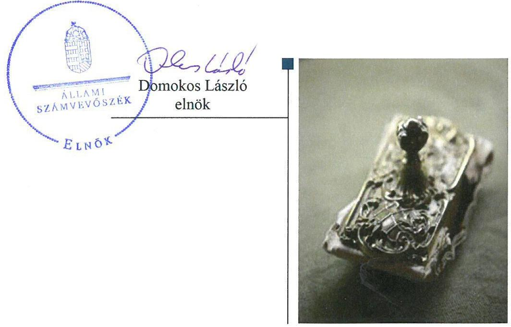
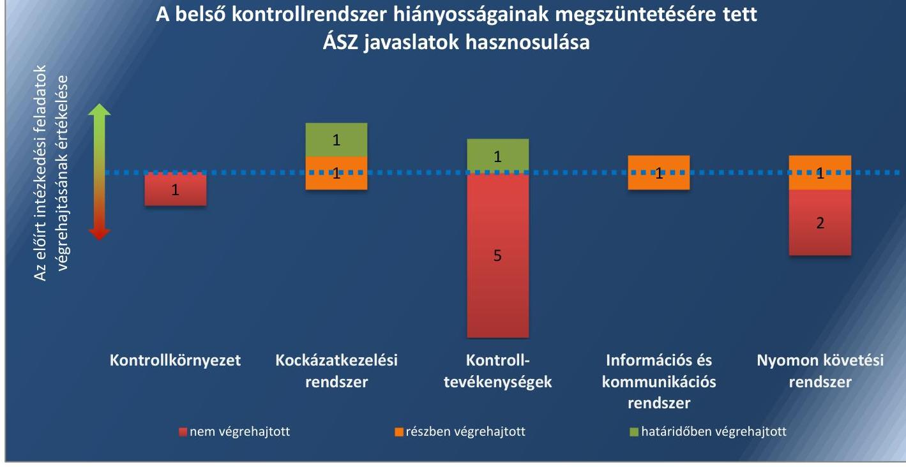
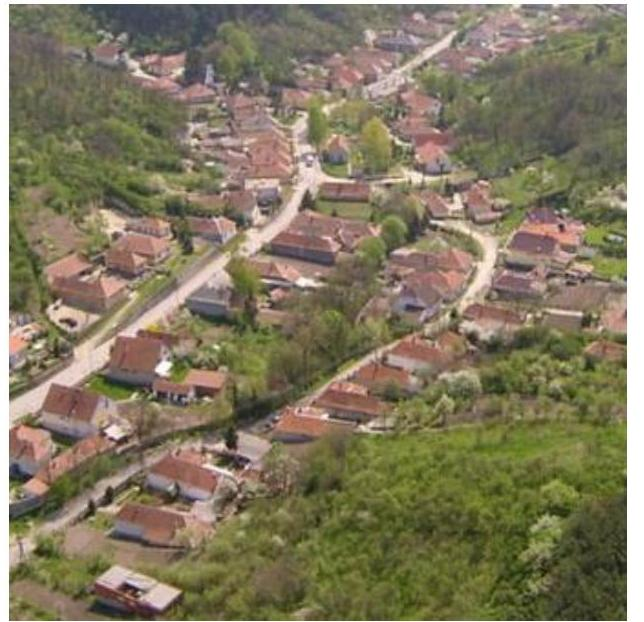
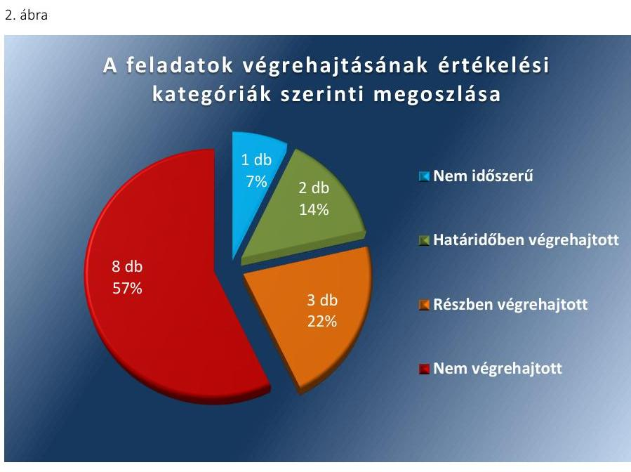

# Jelentés 

## Utóellenőrzések

Az önkormányzatok belső
kontrollrendszere kialakításának és működtetésének utóellenőrzése Cserépváralja Község Önkormányzata 2018. 03. hó 14. nap

---

|   | AZ ELLENŐRZÉST FELÜGYELTE:  |
| --- | --- |
|   | DR. BENEDEK MÁRIA felügyeleti vezető  |
|   | AZ ELLENŐRZÉST VEZETTE ÉS A VÉGREHAJTÁSÁÉRT FELELŐS:  |
|   | IVANYOS JÁNOS ellenőrzésvezető  |
|   | A PROGRAM ÖSSZEÁLLÍTÁSÁÉRT FELELŐS:  |
|   | JANIK JÓZSEF LÁSZLÓ osztályvezető  |
|   | A TÉMÁHOZ KAPCSOLÓDÓ KORÁBBI SZÁMVEVŐSZÉKI JELENTÉSEK:  |
|  J | - címe: Jelentés az önkormányzatok belső kontrollrendszere kialakításának, egyes kontrolltevékenységek és a belső ellenőrzés működésének ellenőrzéséről Cserépváralja  |
|  J | - sorszáma: 14215  |
|   | IKTATÓSZÁM: EL-0069-058/2018.  |
|   | TÉMASZÁM: 21  |
|   | ELLENŐRZÉS-AZONOSÍTÓ SZÁM: V0755111  |

---

# TARTALOMJEGYZÉK 

- ÖSSZEGZÉS ..... 5
- AZ ELLENŐRZÉS CÉLJA ..... 7
- AZ ELLENŐRZÉS TERÜLETE ..... 8
- AZ ELLENŐRZÉS HÁTTERE, INDOKOLTSÁGA ..... 9
- A JELENTÉS LÉNYEGES KÉRDÉSKÖRE ..... 10
- AZ ELLENŐRZÉS HATÓKÖRE ÉS MÓDSZEREI ..... 11
- MEGÁLLAPÍTÁSOK ..... 13
- MELLÉKLETEK ..... 17
I. sz. melléklet: Az ÁSZ 14215 számú jelentéséhez kapcsolódó intézkedési terv végrehajtása ..... 17
- FÜGGELÉK: ÉSZREVÉTELEK ..... 21
- RÖVIDÍTÉSEK JEGYZÉKE ..... 23

---

.

---

# ÖSSZEGZÉS 

Az Állami Számvevőszék Cserépváralja Község Önkormányzata belső kontrollrendszere kialakításának és működtetésének utóellenőrzése során megállapította, hogy az intézkedési tervben meghatározott feladatok többsége nem került végrehajtásra. A gazdálkodási jogkörgyakorlás és a belső ellenőrzés továbbra is fennálló hiányosságai miatt a közpénzekkel való szabályszerű, felelős, elszámoltatható és átlátható gazdálkodás feltételei nem biztosítottak.

## Az ellenőrzés társadalmi indokoltsága

Az Állami Számvevőszék stratégiájában célul tűzte ki a számvevőszéki munka hasznosulásának javítását. Ezzel összhangban ellenőrzi, hogy az ellenőrzött szervezetek megvalósították-e a korábbi ellenőrzései által feltárt hibák, hiányosságok és szabálytalanságok megszüntetése céljából kialakított intézkedési terveikben foglaltakat. A rendszeres utóellenőrzések hozzájárulnak a szükséges intézkedések tényleges végrehajtásához, ezáltal a közpénzügyek rendezettségének javulásához, igazolják, hogy lezárult a következmények nélküli ellenőrzések időszaka.

## Főbb megállapítások, következtetések

Cserépváralja Község Önkormányzata az intézkedési tervben meghatározott 14 feladatból kettőt határidőben, hármat részben, nyolcat nem hajtott végre, valamint egy feladat nem volt időszerű.

A gazdálkodás szabályszerű működése, a teljesítésigazolások és az érvényesítés jogszabályi követelményei betartása vonatkozásában a feltárt hiányosságok és szabálytalanságok felszámolására, illetve kijavítására tett intézkedések hozzájárultak a belső kontrollrendszer szabályozottságának javulásához.

A gazdálkodási jogkörgyakorlás, a vezetői számonkérés, valamint a belső ellenőrzési feladatok szabályszerű ellátása területén továbbra is fennálló jelentős hiányosságok miatt a belső kontrollrendszer működtetése nem volt szabályszerű. A felelős és elszámoltatható gazdálkodás, illetve vezetői magatartás vonatkozásában a kockázatok nem csökkentek.

Az intézkedési tervben meghatározott feladatok végrehajtásáról Cserépváralja Község Önkormányzata a jogszabályban előírt nyilvántartást nem vezette.

Az 1. ábra az intézkedési tervben meghatározott feladatok végrehajtásának értékelését mutatja a belső kontrollrendszer pillérei szerinti megoszlásban.

---

# A belső kontrollrendszer hiányosságainak megszüntetésére tett ÁSZ javaslatok hasznosulása 

Forrás: ÁSZ

---

# AZ ELLENŐRZÉS CÉLJA 

Az ellenőrzés célja annak értékelése volt, hogy a számvevőszéki jelentésben foglalt intézkedést igénylő megállapításokkal és javaslatokkal összhangban készített intézkedési tervben meghatározott feladatokat az ellenőrzött szervezet végrehajtotta-e.

---

# AZ ELLENŐRZÉS TERÜLETE 

## Cserépváralja Község Önkormányzata

Cserépváralja Község Borsod-Abaúj-Zemplén megyében a Mezőkövesdi járás közigazgatási területén fekszik. A Központi Statisztikai Hivatal Magyarország közigazgatási helynévkönyvében közzétett népességi adatok szerint 2016. január 1-én állandó lakosainak száma 374 fő volt. Cserépváralja Községben a jegyzői feladatokat a Cserépfalui Közös Önkormányzati Hivatal jegyzője ${ }^{1}$ látja el. A 2013. március 1-jétől működő közös hivatalt Cserépfalu, Cserépváralja és Bükkzsérc községek önkormányzatai alapították, a cserépváraljai állandó kirendeltségen egy fő dolgozik teljes munkaidőben. A polgármester² a 2002. évi önkormányzati választások óta tölti be tisztségét, a jegyző személye nem változott az ellenőrzött időszak alatt.

Cserépváralja Község Önkormányzata a 2016. évi költségvetés végrehajtásáról szóló zárszámadási rendelet szerint 140,9 millió Ft költségvetési bevételt ért el, valamint 140,6 millió Ft költségvetési kiadást teljesített. Mérlegfőösszege 636,8 millió Ft, ezen belül befektetett eszközvagyona 632,2 millió Ft, követelés állománya 2,6 millió Ft, míg kötelezettség állománya 2,8 millió Ft volt.

Az Állami Számvevőszék 2014. évben ellenőrizte Cserépváralja Község Önkormányzata belső kontrollrendszere kialakításának, egyes kontrolltevékenységek és a belső ellenőrzés működését a 2012. január 1. és 2012. december 31. közötti időszak vonatkozásában. Az erről szóló 14215 sorszámú jelentését ${ }^{3}$ az ÁSZ ${ }^{4}$ 2014. október 17-én tette közzé. Az ellenőrzés célja annak megállapítása volt, hogy a belső kontrollrendszer elemeinek kialakítása, a pénzügyi folyamatokban kulcsszerepet betöltő teljesítésigazolás és érvényesítés, és a belső ellenőrzés szabályos működése biztosította-e Cserépváralja Község Önkormányzatánál a közpénzfelhasználás szabályosságát, hozzájárult-e az értéket teremtő rend követelményének érvényesüléséhez. Az ÁSZ jelentésben foglalt ellenőrzési megállapításokhoz kapcsolódó javaslatok végrehajtása érdekében Cserépváralja Község Önkormányzata egy intézkedési tervet ${ }^{5}$ és két kiegészítést készített. Az intézkedési tervet a Képviselő-testület a 40/2014. (IX. 19) Kt. határozattal, a második kiegészítést a 20/2015. (IV. 29) Kt. határozattal fogadta el, továbbá a 2015. április 15-én kelt első kiegészítést a polgármester képviselő-testületi határozat nélkül küldte meg.

Az utóellenőrzés - a 2014. október 17. és 2017. június 16. között végrehajtott feladatokat figyelembe véve - az ÁSZ jelentésben a polgármester és a jegyző részére megfogalmazott intézkedést igénylő megállapításokra és javaslatokra készített, az ÁSZ részére megküldött intézkedési tervben foglalt azon feladatok megvalósításának ellenőrzésére, illetve értékelésére fókuszált, amelyek a Cserépváralja Község Önkormányzatára vonatkoztak. Az utóellenőrzés hatálya nem terjedt ki a Cserépfalui Közös Önkormányzati Hivatalt érintő egyéb intézkedésekre.

---

# AZ ELLENŐRZÉS HÁTTERE, INDOKOLTSÁGA 

Az ÁSZ tv. ${ }^{6}$ 33. § (1) bekezdése értelmében a számvevőszéki jelentések intézkedést igénylő megállapításaihoz és javaslataihoz kapcsolódóan az ellenőrzött szervezet vezetője intézkedési tervet köteles összeállítani, és az ÁSZ részére megküldeni. Az intézkedési tervben foglaltak megvalósítását az ÁSZ tv. 33. § (7) bekezdésében foglaltak alapján - az ÁSZ utóellenőrzés keretében - ellenőrizheti. Az intézkedések megvalósulásának értékelése során az ÁSZ figyelembe veszi az ellenőrzött szervezetek működési feltételeiben, valamint a jogszabályi előírásokban bekövetkezett változásokat.

Az intézkedési tervekben foglalt feladatok hiányos, illetve késedelmes végrehajtása, valamint megvalósításának elmaradása azt mutatja, hogy az ellenőrzések során feltárt hibák, hiányosságok és szabálytalanságok megszüntetése nem kapott kellő hangsúlyt. Ez a szabályszerű működés és a felelős vezetői magatartás vonatkozásában kockázatot hordoz. E kockázatok feltárásával az ÁSZ utóellenőrzési rendszere fokozza a fegyelmet, és igazolja, hogy a közpénzzel való szabályos gazdálkodás felelőssége elől nem lehet kitérni.

Az utóellenőrzés négy szinten hasznosulhat:

- A társadalom szintjén az utóellenőrzés jelzi, hogy a számvevőszéki ellenőrzés megállapításainak van következménye: a hiányosságok megszüntetésére az ellenőrzött szervezet által meghatározott intézkedések végrehajtását is számon kéri az ÁSZ.
- Az ellenőrzött terület szintjén az utóellenőrzés tájékoztatást nyújt a terület döntéshozóinak a hiányosságok kiküszöbölésének jó gyakorlatairól, ezzel lehetőséget biztosítva arra, hogy az ÁSZ ellenőrzési megállapításai, javaslatai a terület nem ellenőrzött szervezeteinek a működése során is hasznosuljanak.
- Az ellenőrzött szervezet szintjén az utóellenőrzés feltárja, hogy a szervezet az intézkedések végrehajtásával hasznosította-e a korábbi ellenőrzési jelentésben a hiányosságok megszüntetése, illetve a kockázatok kezelése érdekében megfogalmazott javaslatokat.
- Az ÁSZ szintjén az utóellenőrzés visszacsatolást ad az ellenőrzési jelentések hasznosulásáról, az intézkedések elmaradása vagy részleges megvalósulása a további ellenőrzésekhez kockázati jelzésként szolgál.

---

# A JELENTÉS LÉNYEGES KÉRDÉSKÖRE 

Az ellenőrzött szervezet az intézkedési tervben foglaltakat az előírt határidőben végrehajtotta-e?

---

# AZ ELLENŐRZÉS HATÓKÖRE ÉS MÓDSZEREI 

## Az ellenőrzés típusa

Megfelelőségi ellenőrzés.

## Az ellenőrzött időszak

Az utóellenőrzés alapját képező ÁSZ jelentés közzétételének napjától (2014. október 17.) az ellenőrzésről szóló kiértesítő levél keltének napjáig (2017. június 16.) tartó időszak.

## Az ellenőrzés tárgya

Az ÁSZ tv. 2011. július 1-jei hatálybalépését követően a számvevőszéki jelentésben foglalt intézkedést igénylő megállapításokkal és javaslatokkal összhangban - Cserépváralja Község Önkormányzata által - készített intézkedési tervben foglaltak végrehajtásának ellenőrzése volt.

Az ellenőrzés kiterjedt minden olyan körülményre és adatra, amely az ÁSZ jogszabályban meghatározott feladatainak teljesítéséhez, valamint a program végrehajtása folyamán felmerült újabb összefüggések feltárásához szükséges volt.

## Az ellenőrzött szervezet

Cserépváralja Község Önkormányzata

## Az ellenőrzés jogalapja

Az ÁSZ tv. 33. § (7) bekezdése alapján az intézkedési tervben foglaltak megvalósítását az ÁSZ utóellenőrzés keretében ellenőrizheti.

## Az ellenőrzés módszerei

Az ÁSZ az ellenőrzést az ellenőrzési program ellenőrzési kérdései, az ellenőrzött időszakban hatályos jogszabályok, az ellenőrzés szakmai szabályok és módszertanok figyelembevételével, önálló ellenőrzés keretében végezte.

Az ÁSZ az ellenőrzés ideje alatt az ellenőrzött szervezettel történő kapcsolattartást az ÁSZ SZMSZ²-ének vonatkozó előírásai alapján biztosította.

---

Az utóellenőrzés megállapításait elsősorban az ÁSZ rendelkezésére álló, valamint az ellenőrzött szervezetektől bekért dokumentumok alapozták meg.

Az ellenőrzési bizonyítékként felhasználható adatforrások közé tartoztak egyrészt a szakmai programban felsorolt adatforrások, másrészt minden - az ellenőrzés folyamán feltárt, az ellenőrzés szempontjából információt tartalmazó - dokumentum.

Az intézkedési tervekben előírt feladatokat, azok végrehajthatósága, illetve végrehajtása szempontjából az alábbiak szerint értékelte az ÁSZ:
$\longrightarrow$ „határidőben végrehajtott" a feladat, ha a teljesítés dokumentáltan, az intézkedési tervben előírt határidőben és tartalommal megtörtént;
$\longrightarrow$ „határidőn túl végrehajtott" a feladat, ha annak teljesítése az intézkedési tervben meghatározott módon, de az előírt határidőn túl történt meg;
$\longrightarrow$ „részben végrehajtott" a feladat, ha végrehajtása teljes körűen az intézkedési tervben előírt módon nem történt meg;
$\longrightarrow$ „nem végrehajtott" a feladat, ha a végrehajtás nem történt meg, vagy amennyiben a teljesítést nem dokumentálták;
$\longrightarrow$ „okafogyottá vált" a feladat, ha végrehajtására - meghatározott esemény bekövetkezése, továbbá külső körülmény, a működést érintő feltétel változása miatt - már nincs szükség, illetve lehetőség, és egyértelműen megállapítható, hogy az intézkedést szükségessé tevő körülmény a jövőben nem fordulhat elő;
$\longrightarrow$ „nem időszerű" az a feladat, amelynek ellenőrzési időszakon belüli végrehajtására azért nem került (kerülhetett) sor, mert az intézkedés alapjául szolgáló esemény nem következett be, de annak jövőbeni előfordulása lehetséges, a végrehajtása nem volt esedékes, vagy a végrehajtás határideje még nem járt le.
Az ellenőrzés lefolytatásához az ellenőrzött szervezet a tanúsítványok kitöltésével, valamint az ÁSZ által kért dokumentumok átadásával szolgáltatott adatokat, amelyek valódiságát és teljes körűségét az ellenőrzött szervezet vezetője által tett teljességi és hitelességi nyilatkozat igazolta. Az így rendelkezésre bocsátott adatok, információk kontrollja az ellenőrzés keretében történt.

---

# MEGÁLLAPÍTÁSOK 

## Az ellenőrzött szervezet az intézkedési tervben foglaltakat az előírt határidőben végrehajtotta-e?

Összegző megállapítás

Az Önkormányzat² az intézkedési tervben meghatározott 14 feladatból kettőt határidőben, hármat részben, nyolcat nem hajtott végre, valamint egy feladat nem volt időszerű. Az intézkedési tervben meghatározott feladatok végrehajtásáról a jogszabályban előírt nyilvántartást nem vezette.

Az ÁSZ a jelentésében a polgármester részére kettő, a jegyzőnek címezve hét javaslatot fogalmazott meg. A polgármester által előterjesztett és a Képviselő-testület által jóváhagyott intézkedési terv és annak kiegészítései a hiányosságok, szabálytalanságok
 megszüntetésére a polgármesternek három, a jegyzőnek 21 feladatot határozott meg. A jegyzőnek meghatározott, a 40/2014. (IX. 19.) Kt. határozatban elfogadott intézkedési terv 5. pontjára, a 2015. április 15-i keltezésű kiegészítés 1., 2., 3., 4., 8., 9., 10. és 15. pontjára, valamint a 20/2015. (IV. 29.) Kt. határozatban elfogadott kiegészítés 1./14. pontjára az utóellenőrzés hatálya nem terjedt ki, mert azok a Cserépfalui Közös Önkormányzati Hivatalra tartalmaztak intézkedéseket, az ellenőrzött szervezet azonban a Cserépváralja Község Önkormányzata volt.

Az intézkedési tervben meghatározott feladatokat, határidőket, felelősöket és a feladatok végrehajtását az I. számú melléklet mutatja be.

A jegyző az intézkedési tervben meghatározott feladatok végrehajtásáról nem vezette a Bkr. ${ }^{9}$ 14. § (1) bekezdésében előírtaknak megfelelő nyilvántartást.

Az Önkormányzat intézkedési tervében meghatározott feladatok végrehajtásának értékelési kategóriák szerinti megoszlását a 2. ábra szemlélteti.

---

Forrás: ÁSZ

# HATÁRIDŐBEN VÉGREHAJTOTT feladatok: 

1. A polgármester kezdeményezte az egyéb munkáltatói jogokat gyakorló Cserépfalu Község Önkormányzata polgármesterénél, hogy a jegyző soron kívül tegyen vagyonnyilatkozatot.
2. A polgármester intézkedett, hogy a belső kontrollrendszer szabályos működése, valamint a teljesítésigazolások és az érvényesítés jogszabályi követelményei betartása vonatkozásában a feltárt hiányosságok és szabálytalanságok felszámolásra, illetve kijavításra kerüljenek, továbbá a gazdálkodás szabályszerű működése a jövőben biztosított legyen.

## RÉSZBEN VÉGREHAJTOTT feladatok:

3. A jegyző a Kockázatkezelési Szabályzatot ${ }^{10}$ 2015. május 4-től léptette hatályba, azonban az abban meghatározott - a kockázatok felmérésére és nyomon követésére vonatkozó - legalább évenkénti felülvizsgálatot a Bkr. 7. § (2) bekezdésben foglaltak ellenére a 2016-2017. évekre nem végezte el.
4. A jegyző gondoskodott a 2016. és 2017. évi ellenőrzési tervek Képviselő-testület általi jóváhagyásáról, azonban a Bkr. 22. § (1) bekezdés b) pontjában és 31. § (1) bekezdésében előírtak ellenére nem intézkedett a 2015. évi belső ellenőrzési terv elkészítéséről.
5. A jegyző a 11/2013. (XI.20.) és a 4/2014. (II.25.) számú rendeletek kivételével gondoskodott a Képviselő-testület ${ }^{11}$ 2012. évi és az azt követő időszak hatályos rendeleteinek települési honlapon történő elektronikus közzétételének pótlásáról.

## NEM VÉGREHAJTOTT feladatok:

6. A polgármester nem kezdeményezte a munkáltatói jogokat gyakorló Cserépfalu Község Önkormányzata polgármesterénél a feltárt hiányosságok és szabálytalanságok tekintetében a jegyzővel

szemben lefolytatandó munkajogi felelősség kivizsgálására irányuló eljárást.
7. A jegyző az Ávr. ${ }^{12}$ 55. § (3) bekezdésében előírtak ellenére nem kötelezte a pénzügyi-számviteli képesítéssel nem rendelkező pénzügyi ellenjegyzésre kijelölt személyeket a feladat ellátásához szükséges képesítés, végzettség megszerzésére.
8. A jegyző az Ávr. 58. § (4) bekezdésében előírtak ellenére nem kötelezte a végzettséggel-képesítéssel nem rendelkező érvényesítési feladatokat ellátó köztisztviselőt a szükséges végzettség-képesítés megszerzésére.
9. A jegyző az Áht. 69. § (2) bekezdésében és a Bkr. 3. § c) pontjában foglaltak ellenére nem gondoskodott arról, hogy a teljesítésigazolás kapcsán feltárt hiányosságok a megfelelő szabályzatban az arra jogosult személy „kijelölése” révén megszüntetésre kerüljenek, és egyidejűleg a teljesítésigazolók folyamatos ellenőrzése biztosítható legyen az Ávr. 57. § (1)-(4) bekezdéseiben foglalt előírások betartása érdekében.
10. A jegyző az Áht. 69. § (2) bekezdése és a Bkr. 3. § c) pontjában foglaltak ellenére nem biztosította az Ávr. 56. § (1) bekezdése és 58. § (1)-(3) bekezdéseiben előírtak szerint az érvényesítés kapcsán feltárt szabálytalanságok megszüntetéséhez a kötelezettségvállalás nyilvántartásának folyamatos vezetését, az érvényesített okmány jogszabály szerinti kötelező adattartalmának meglétét, valamint az érvényesítő felelősségének folyamatos érvényesítését az utalványozónak történő esetleges észrevételezési kötelezettségének teljesítésére.
11. A jegyző az Ávr. 59. § (3) bekezdés f) pontjában és a (4) bekezdésben foglaltak ellenére nem gondoskodott arról, hogy az utalványokon és a kiadási pénztárbizonylatokon folyamatosan feltüntessék a kötelezően vezetendő kötelezettségvállalás nyilvántartási számát.
12. A jegyző a Bkr. 56. § (3) bekezdés a) pontjában foglaltak ellenére nem gondoskodott az Önkormányzat stratégiai ellenőrzési tervének elkészítéséről.
13. A jegyző a Bkr. 56. § (9) bekezdésében foglaltak ellenére nem gondoskodott a 2015. és a 2016. évi ellenőrzési jelentés belső ellenőrzési vezető általi elkészítéséről.

# NEM IDŐSZERŰ feladat: 

14. A tárgyévi ellenőrzési tervek belső ellenőrzési feladatokkal megbízott személy általi módosítására nem került sor, ezért a Bkr. 31. § (5) bekezdésében foglaltak szerinti intézkedés nem volt időszerű.

---

.

---

# MELLÉKLETEK

- I. SZ. MELLÉKLET: AZ ÁSZ 14215 SZÁMÚ JELENTÉSÉHEZ KAPCSOLÓDÓ INTÉZKEDÉSI TERV VÉGREHAJTÁSA

|  Az intézkedési tervben meghatározott feladat | Az intézkedési tervben meghatározott határidő | Az intézkedési tervben meghatározott feladat végrehajtásának felelőse | A feladat végrehajtása  |
| --- | --- | --- | --- |
|  1. | 2. | 3. | 4.  |
|  Határidőben végrehajtott feladatok |  |  |   |
|  1. Kezdeményezze az egyéb munkáltatói jogokat gyakorló Cserépfalu Község Önkormányzat polgármesterénél, hogy a jegyző soron kívül tegyen vagyonnyilatkozatot. | 2014. november 30. | polgármester | A polgármester 2014. november 24-én a 81-4/2014. ikt. számú levelében kezdeményezte az egyéb munkáltatói jogokat gyakorló Cserépfalu Község Önkormányzata polgármesterénél, hogy a jegyző soron kívül tegyen vagyonnyilatkozatot.  |
|  2. Intézkedjen, hogy a belső kontrollrendszer szabályos működése, valamint a teljesítésigazolások illetve az érvényesítés jogszabályi követelményei betartásra kerüljenek, a feltárt hiányosságok és szabálytalanságok felszámolásra, illetve kijavításra kerüljenek. | 2014. december 31. | polgármester | A polgármester 2014. december 22-én a 81-5/2014. ikt. számú levélben felhívta a jegyző és a gazdálkodási főmunkatárs figyelmét arra, hogy a belső kontrollrendszer szabályos működése, valamint a teljesítésigazolások illetve az érvényesítés jogszabályi követelményei betartása vonatkozásában a feltárt hiányosságok és szabálytalanságok felszámolásra, illetve kijavításra kerüljenek, továbbá a gazdálkodás szabályszerű működése a jövőben biztosított legyen.  |
|  Részben végrehajtott feladatok |  |  |   |
|  3. A kockázatkezelési rendszer működtetése során a gazdálkodásban rejlő kockázatokat fel kell mérni, azok kezelésével kapcsolatban belső szabályzatban intézkedni kell, különös tekintettel azok folyamatos nyomon követésére. | folyamatos | jegyző | A jegyző a Kockázatkezelési Szabályzatot 2015. május 4-től léptette hatályba, azonban - a Kockázatkezelési Szabályzat IX. fejezetében meghatározott - a kockázatok felmérésére és nyomon követésére vonatkozó legalább évenkénti felülvizsgálatot a Bkr. 7. § (2) bekezdésben foglaltak ellenére 2016. és 2017. években nem hajtotta végre.  |
|  4. Folyamatosan - a törvényi határidőre tekintettel - el kell készíteni az Önkormányzat éves ellenőrzési tervét. | minden év március 31. | jegyző | A Képviselő-testület a 81/2015. (XII. 16.) Kt. határozatával a 2016. évi, valamint 71/2016. (XII. 13.) Kt. határozatával a 2017. évi jogszabályi határidőre elkészített belső ellenőrzési terveket jóváhagyta, azonban a jegyző a Bkr. 22. § (1) bekezdés b) pontjában és 31. § (1) bekezdésében előírtak ellenére nem gondoskodott a 2015. évi belső ellenőrzési terv elkészítéséről.  |
|  5. Pótolni szükséges a Képviselő-testület 2012. évi és az azt követő időszak hatályos rendeleteinek elektronikus közzétételét a települési honlapon. | 2015. április 30. | jegyző | A jegyző 2014. december 22-i dátummal nyilatkozott a hatályos rendeletek közzétételével kapcsolatos - intézkedési tervben előírt - kötelezettség teljesítéséről. A Képviselő-testület 2012. évi és az azt követő időszak hatályos rendeleteinek  |

---

|  5. | Az intézkedési tervben meghatározott határidő | Az intézkedési tervben meghatározott határidő | A feladat végrehajtása  |
| --- | --- | --- | --- |
|  1. | 2. | 3. | 4.  |
|   |  |  | elektronikus közzététele a cserepvaralja.hu honlapon a 11/2013. (XI.20.) számú és a 4/2014. (II.25.) számú, a Nemzeti Jogszabálytár Önkormányzati Rendelettára szerint hatályos rendeletek kivételével megtörtént.  |
|   |  | Nem végrehajtott feladatok |   |
|  6. | Kezdeményezze a munkáltatói jogokat gyakorló Cserépfalu köz sége Önkormányzat polgármesterénél a feltárt hiányosságok és szabálytalanságok tekintetében a jegyzővel szemben lefolytatandó munkajogi felelősségi kivizsgálására irányuló eljárást. Az eljárást követően a szükséges intézkedésekre tegyen javaslatot a munkáltatónál. | 2015. május 30. | polgármester  |
|  7. | A pénzügyi-számviteli képesítéssel nem rendelkező, pénzügyi ellenjegyzésre kijelölt személyeket kötelezni kell a feladat ellátásához szükséges képesítés, végzettség megszerzésére, melynek az érintettek a kötelezés határidejét követő 1 évben kötelesek eleget tenni. | 2015. június 30., illetve 2016. június 30. | jegyző  |
|  8. | A végzettséggel-képesítéssel nem rendelkező és érvényesítési feladatokat jelenleg is ellátó köztisztviselőt kötelezni kell a szükséges végzettség-képesítés megszerzésére, melynek az érintett a kötelezés határidejét követő 1 éven belül köteles eleget tenni. | 2015. június 30., illetve 2016. június 30. | jegyző  |
|  9. | A teljesítésigazolás kapcsán feltárt hiányosságokat a megfelelő szabályzatban történő és az arra jogosult személy „kijelölése” biztosításával kell megszüntetni, egyidejűleg a teljesítésigazolókat folyamatosan ellenőrizni kell, hogy tevékenységük kapcsán a kiadás teljesítését, összegszerűségét, az ellenszolgáltatás teljesítését jogszerűen, ellenőrizhető okmányok ismeretében végezzék. | 2015. május 20., illetve folyamatos | jegyző  |
|  10. | A 2015. május 4-től hatályban lévő Gazdálkodási Szabályzatban a jegyző az Ált. 69. § (2) bekezdésében és a Bkr. 3. § c) pontjában foglaltak ellenére nem intézkedett a teljesítés igazolására kijelölés és gyakorlásával kapcsolatban az Ávr. 57. § (1)-(4) bekezdéseiben foglalt előírások betartására. A költségvetés kiadási előirányzatainak esetére a teljesítésigazolásra a polgármester által kijelölt alpolgármester a felhatalmazását nem vette át, és aláírás-mintája a Gazdálkodási Szabályzat mellékletében nem került nyilvántartásba vételre. A jegyző nem gondoskodott a teljesítés igazolására jogosultakról készült nyilvántartás folyamatos és naprakész vezetéséről, nem biztosította teljesítésigazolók folyamatos ellenőrizhetőségét. |  |   |

---

|  10. | Az érvényesítés kapcsán feltárt szabálytalanságok megszüntetéséhez biztosítani kell a kötelezettségvállalás nyilvántartásának folyamatos vezetését, az érvényesített okmány jogszabály szerinti kötelező adattartalmának meglétét, az érvényesítő felelősségének folyamatos érvényesítését az utalványozónak történő esetleges észrevételezési kötelezettségének teljesítésére. | folyamatos | jegyző | A jegyző nem gondoskodott az Áht. 69. § (2) bekezdése és a Bkr. 3. § c) pontjában foglaltak ellenére az Ávr. 56. § (1) bekezdése és 58. § (1)-(3) bekezdéseiben előírtak betartásáról, az érvényesítés kapcsán feltárt szabálytalanságok megszüntetéséről, nem biztosította a kötelezettségvállalás nyilvántartásának folyamatos vezetését, az érvényesített okmány jogszabály szerinti kötelező adattartalmának meglétét, az érvényesítő felelősségének folyamatos érvényesítését az utalványozónak történő esetleges észrevételezési kötelezettségének teljesítését.  |
| --- | --- | --- | --- | --- |
|  11. | Az utalványokon és a kiadási pénztárbizonylatokon folyamatosan fel kell tüntetni a kötelezően vezetendő kötelezettségvállalás nyilvántartás számát. | folyamatos | jegyző | A jegyző az Ávr. 59. § (3) bekezdés f) pontjában és a (4) bekezdésben foglaltak ellenére nem gondoskodott arról, hogy az utalványokon és a kiadási pénztárbizonylatokon folyamatosan feltüntessék a kötelezően vezetendő kötelezettségvállalás nyilvántartási számát.  |
|  12. | El kell készíteni az Önkormányzat stratégiai ellenőrzési tervét. | 2015. május 30. | jegyző | A jegyző a Bkr. 56.
 § (3) bekezdés a) pontjában foglaltak ellenére nem gondoskodott az Önkormányzat stratégiai ellenőrzési tervének elkészítéséről.  |
|  13. | A belső ellenőrzési vezető a jövőre nézve a törvényi előírások szerint a tárgyévi ellenőrzési jelentést határidőben köteles elkészíteni. | folyamatos, ill. a törvényi határidőben | jegyző | A jegyző a Bkr. 56. § (9) bekezdésében foglaltak ellenére nem gondoskodott a 2015. és a 2016. évi ellenőrzési jelentés belső ellenőrzési vezető általi elkészítéséről.  |
|   |  |  | Nem időszerű feladat |   |
|  14. | A tárgyévi ellenőrzési terveket a jövőre nézve a Bkr. 31. § (5) bekezdésében foglaltak alapján a belső ellenőrzési feladatokkal megbízott személy csak a jegyző egyetértésével módosíthatja. | folyamatos | jegyző, ill. az ellenőrzési feladattal megbízott személy | Az intézkedés alapjául szolgáló esemény nem következett be, mert a 81/2015. (XII.16.) és a 71/2016. (XII.13.) Kt. határozatokban jóváhagyott 2016. és 2017. évi ellenőrzési tervek módosítására nem került sor.  |

---

.

---

# FÜGGELÉK: ÉSZREVÉTELEK 

A jelentéstervezetet a Számvevőszék 15 napos észrevételezésre megküldte az ellenőrzött szervezet vezetőjének az ÁSZ tv. 29. § (1) bekezdése előírásának megfelelően.

Az ellenőrzött szervezet vezetője az ÁSZ. tv. 29. § (2) bekezdésében foglalt észrevételezési jogával nem élt, a jelentéstervezetre észrevételt nem tett.

[^0]
[^0]:    * 29. § (1) Az Állami Számvevőszék az ellenőrzési megállapításait megküldi az ellenőrzött szervezet vezetőjének vagy az általa megbízott személynek, és annak, akinek személyes felelősségét állapította meg.
    (2) Az ellenőrzött szervezet vezetője és a felelősként megjelölt személy az ellenőrzés megállapításaira tizenöt napon belül írásban észrevételt tehet.
    (3) Az Állami Számvevőszék az észrevételre a beérkezésétől számított harminc napon belül írásban válaszol. A figyelembe nem vett észrevételeket köteles a jelentésben feltüntetni, és megindokolni, hogy azokat miért nem fogadta el.

---

.

---

# RÖVIDÍTÉSEK JEGYZÉKE 

${ }^{1}$ jegyző
${ }^{2}$ polgármester
${ }^{3}$ jelentés
${ }^{4}$ ÁSZ
${ }^{5}$ intézkedési terv
${ }^{6}$ ÁSZ tv.
${ }^{7}$ ÁSZ SZMSZ
${ }^{8}$ Önkormányzat
${ }^{9}$ Bkr.
${ }^{10}$ Kockázatkezelési Szabályzat
${ }^{11}$ Képviselő-testület
${ }^{12}$ Ávr.
${ }^{13}$ Gazdálkodási Szabályzat
${ }^{14}$ Áht.

Cserépfalui Közös Önkormányzati Hivatal jegyzője
Cserépváralja Község Önkormányzata polgármestere
14215 sorszámú jelentés az önkormányzatok belső kontrollrendszere kialakításának, egyes kontrolltevékenységek és a belső ellenőrzés működésének ellenőrzéséről - Cserépváralja
Állami Számvevőszék
az ÁSZ intézkedést igénylő megállapításaira és javaslataira a 7-10/2014. ikt. számú 2014. november 19-én a polgármester által aláírt és a Képviselő-testület 40/2014. (XI. 19.) Kt. határozatával elfogadott intézkedési terv, amelyet módosítottak és kiegészítettek a 31-5/2015. ikt. számú 2015. április 15-én, valamint 31-6/2015. ikt. számú 2015. május 12-én a polgármester által aláírt és a Képviselő-testület 20/2015. (IV. 29.) Kt. határozatával elfogadott intézkedési terv kiegészítések
2011. évi LXVI. törvény az Állami Számvevőszékről (hatályos: 2011. július 1-jétől) az Állami Számvevőszék elnökének 3/2016. (XII.29.) ÁSZ utasítása az Állami Számvevőszék Szervezeti és Működési Szabályzatáról (hatályos: 2017. január 1-től)
Cserépváralja Község Önkormányzata
a költségvetési szervek belső kontrollrendszeréről és belső ellenőrzéséről szóló 370/2011. (XII. 31.) Korm. rendelet (hatályos: 2012. január 1-től)
Kockázatkezelési Szabályzat, Cserépfalui Közös Önkormányzati Hivatal (hatályos: 2015. május 4-től, hatálya kiterjed a Cserépváralja Község Önkormányzatára)

Cserépváralja Község Önkormányzata Képviselő-testülete
az államháztartásról szóló törvény végrehajtásáról szóló 368/2011. (XII. 31.) Korm. rendelet (hatályos: 2012. január 1-től)
Cserépfalui Közös Önkormányzati Hivatal gazdálkodási szabályzata a kötelezettségvállalás, pénzügyi ellenjegyzés, teljesítés igazolása, érvényesítés, utalványozás és adatszolgáltatás rendjéről (hatályos: 2015. május 4-től, hatálya kiterjed a Cserépváralja Község Önkormányzatára)
2011. évi CXCV. törvény az államháztartásról (hatályos: 2012. január 1-jétől)

---

# ÁLLAMI SZÁMVEVŐSZÉK 

1052 Budapest, Apáczai Csere János utca 10.
Levélcím: 1364 Budapest 4. Pf. 54
Telefon: +36 14849100 Telefax: +36 14849200
www.asz.hu
