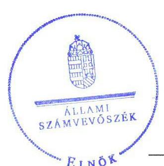
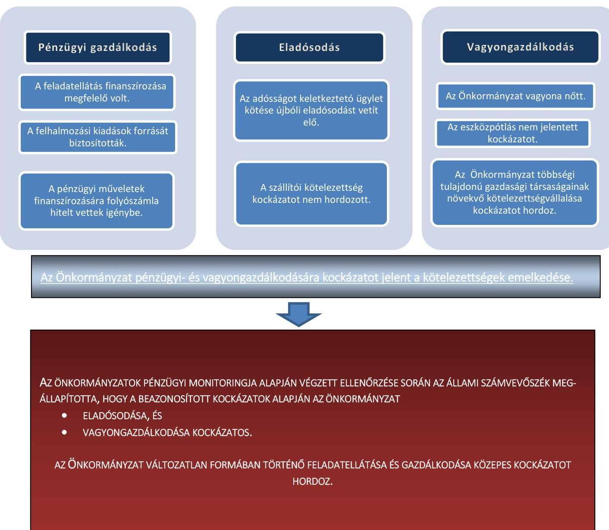
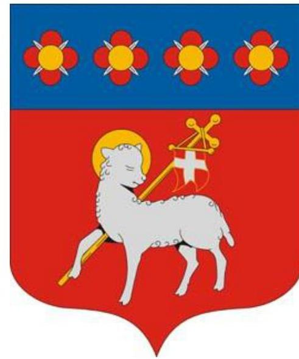
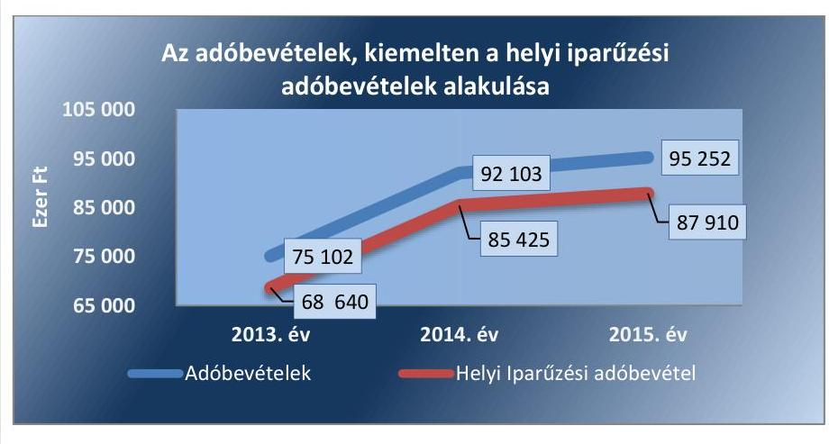
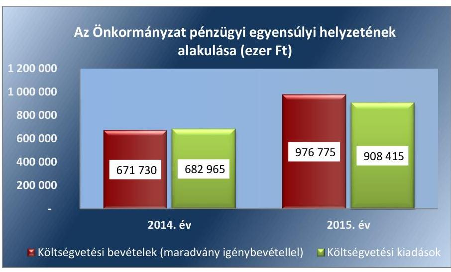
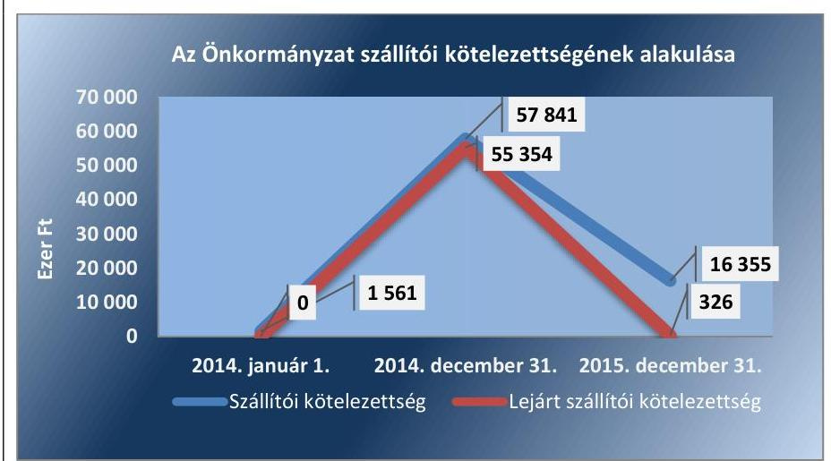
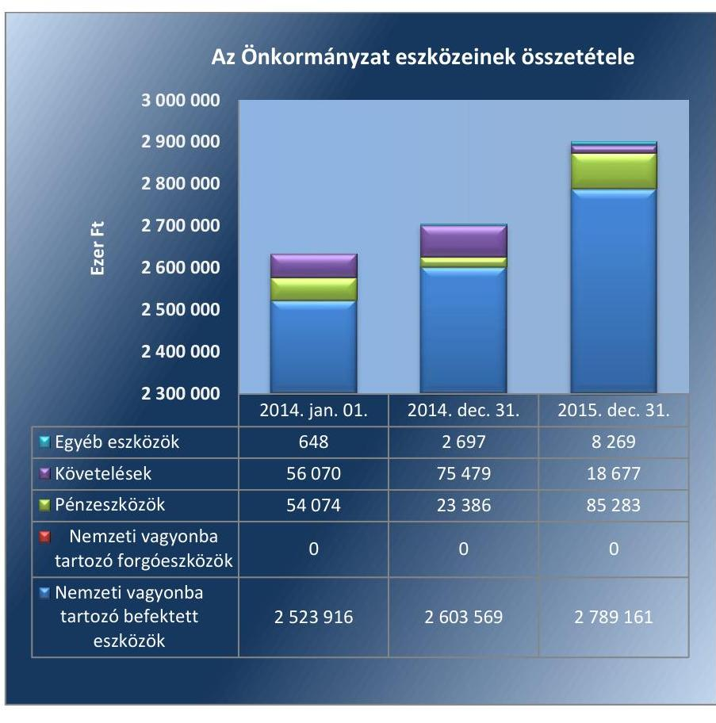
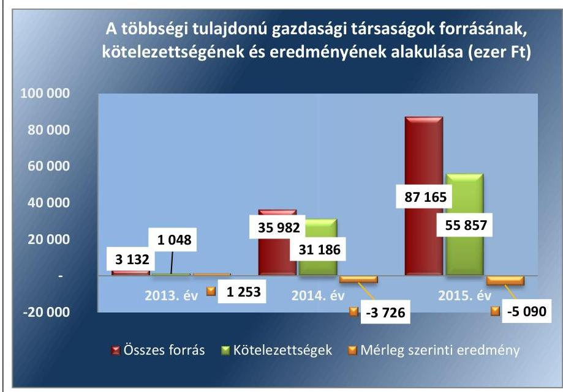
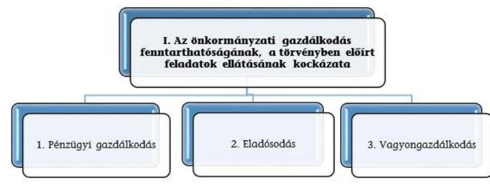
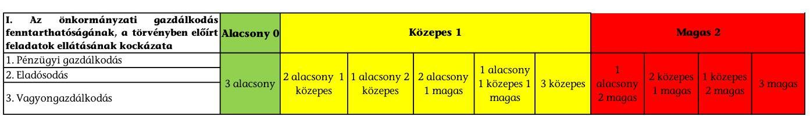

# Jellentés 

## Önkormányzatok pénzügyi monitoringja alapján végzett ellenőrzése

Besenyszög Város Önkormányzata gazdálkodásának fenntarthatósága 2018.

---

# Jelentés 

## Önkormányzatok pénzügyi monitoringja alapján végzett ellenőrzése

Besenyszög Város Önkormányzata gazdálkodásának fenntarthatósága 2018. 03. hó 08. nap

18057
www.asz.hu

---

# AZ ELLENŐRZÉST FELÜGYELTE:

- HOLMAN MAGDOLNA JULIANNA felügyeleti vezető
- PETŐ KRISZTINA felügyeleti vezető
- AZ ELLENŐRZÉST VEZETTE ÉS A VÉGREHAJTÁSÁÉRT FELELŐS:
  - SZAPPANOS JÚLIA ellenőrzésvezető
  - A PROGRAM ÖSSZEÁLLÍTÁSÁÉRT FELELŐS:
    - SZAPPANOS JÚLIA osztályvezető

**IKTATÓSZÁM:** EL-0169-020/2018

**TÉMASZÁM:** 2443

**ELLENŐRZÉS-AZONOSÍTÓ SZÁM:** V079001

Jelentéseink az Országgyűlés számítógépes hálózatán és az Interneten a www.asz.hu címen is olvashatóak.

---

# TARTALOMJEGYZÉK 

■ ÖSSZEGZÉS ..... 5
■ CÉL, TERÜLET, HÁTTÉR, INDOKOLTSÁG ..... 6
■ LÉNYEGES KÉRDÉSKÖRÖK ..... 8
■ ELLENŐRZÉS HATÓKÖRE ÉS MÓDSZEREI ..... 9
■ MEGÁLLAPÍTÁSOK ..... 11
■ MELLÉKLETEK ..... 17
I. sz. melléklet: Fogalomtár ..... 17
II. sz. melléklet: Az ellenőrzési kritériumok módszertana és értékelése ..... 20
III. sz. melléklet: Az eszközök és források alakulása kiemelt mérlegsoronként a 2014-2015. években (ezer Ft) ..... 22
IV. sz. melléklet: Pénzügyi egyensúlyi helyzet CLF módszer szerinti értékelése a 2013-2015. években (ezer Ft) ..... 23
■ FÜGGELÉK: ÉSZREVÉTELEK ..... 27
■ RÖVIDÍTÉSEK JEGYZÉKE ..... 29

---

.

---

# ÖSSZEGZÉS 

- Besenyszög Város Önkormányzatánál biztosított volt a pénzügyi gazdálkodás fenntarthatósága.
- A pénzintézeti kötelezettségek keletkezése miatt fennállt az eladósodás kockázata.
- A vagyongazdálkodás során a gazdasági társaságok kötelezettségeinek növekedése, veszteséges müködésük kockázatot hordoz.

## Az Önkormányzat gazdálkodásának fenntarthatóságával kapcsolatos föbb megállapítások, következtetések

---

# CÉL, TERÜLET, HÁTTÉR, INDOKOLTSÁG 

## Ellenőrzés célja

AZ ELLENŐRZÉS CÉLJA annak megállapítása, hogy az Önkormányzat ${ }^{1}$ képes volt-e a törvényben meghatározott feladatait ellátni, gazdálkodása változatlan formában fenntartható-e. Az Önkormányzatok éves költségvetési beszámolójában, időközi költségvetési jelentéseiben és mérlegjelentéseiben szerepeltetett adatok értékelése alapján beazonosított kockázatok kezelésére irányuló önkormányzati döntések, intézkedések előmozdítása.

## Ellenőrzés területe

BESENYSZÓG VÁROS Jász-Nagykun-Szolnok megyében, a Szolnoki járásban helyezkedik el, 2013. július 15. napján kapott városi címet. Állandó lakosainak száma 2015. január 1-jén 3364 fő volt. Az 1 lakosra jutó működési kiadás a 2015. évben 4,7 \%-kal elmaradt a településtípus átlagától, 154,1 ezer Ft volt. A 2015. évi 1 lakosra jutó adóbevétel (27,9 ezer Ft) 39,0 ezer Ft-tal kevesebb volt a településtípus átlagánál (66,9 ezer Ft).

A 2015. év végén a Képviselő-testület² 7 fővel, 2 állandó bizottsággal látta el a feladatait. A polgármester valamint, a jegyző személyében nem volt változás a 2014-2015. években.

Az Önkormányzat által fenntartott költségvetési intézmények száma nem változott,6 db volt az ellenőrzött időszakban, a foglalkoztatott köztisztviselők száma 26 fơről 20 főre, a közalkalmazottaké 18 fơről 17 főre csökkent. A köztisztviselői létszám változása Tiszasúly község Besenyszógi Közös Önkormányzati Hivatalból történő kiválásának következménye volt. A költségvetési intézmények által ellátott feladatok az Önkormányzat által önként és kötelezően vállalt feladatok is voltak (szociális, közművelődési, könyvtári, igazgatási, adóigazgatási feladatok).

A többségi tulajdoni hányadú gazdasági társaságainak száma a 2014. január 1-jei 1 db-ról 2015. december 31-re 2 db-ra változott. A gazdasági társaságok feladata a kötelező feladatok közül a háziorvosi ellátás, a hulladék szállítás és a gyermekétkeztetés biztosítása volt.

Az összevont költségvetési beszámolók szerint az éves költségvetési bevételek és kiadások teljesítési összegeit, a mérlegben kimutatott eszközök, a követelések és kötelezettségek értékét a következő táblázat mutatja be.

---

|  1. táblázat |  |  |  |  |   |
| --- | --- | --- | --- | --- | --- |
|  GAZDÁLKODÁSI ADATOK (M FT) |  |  |  |  |   |
|  Év | Bevételek | Kiadások | Eszközök | Követelések | Kötelezettségek  |
|  2014. | 671,7 | 683,0 | 2705,1 | 75,5 | 111,5  |
|  2015. | 976,8 | 908,4 | 2901,4 | 18,7 | 50,1  |

*Forrás: önkormányzati beszámolók*

# Az ellenőrzés háttere, indokoltsága

**AZ ÖNKORMÁNYZATI ALRENDSZERBEN** megjelenő gazdálkodási nehézségek, likviditási problémák és az eladósodottság növekedése az ÁSZ^{5} figyelmét a 2011. évtől az önkormányzatok pénzügyi helyzetére irányította.

Az önkormányzati alrendszerben a 2013. évtől bevezetett új feladatfinanszírozási rendszer keretein belül továbbra is megoldandó kérdés a pénzügyi egyensúly megteremtése, hosszú távú fenntartása. Erre tekintettel kiemelt fontosságú az önkormányzatok pénzügyi egyensúlyi helyzetére ható kockázatok feltárása, az ezzel kapcsolatos folyamatok, trendek bemutatása.

---

# LÉNYEGES KÉRDÉSKÖRÖK 

1. Az Önkormányzat pénzügyi gazdálkodásának fenntarthatósága biztositott volt-e?
2. Fennállt-e az Önkormányzat eladósodásának kockázata?
3. Az Önkormányzat vagyongazdálkodása során biztositott volt-e a vagyon értékének megőrzése?

---

# ELLENŐRZÉS HATÓKÖRE ÉS MÓDSZEREI 

## Az ellenőrzés típusa, időszaka

Megfelelőségi (helyénvalósági) ellenőrzés.
A 2014. január 1-je és 2015. december 31-e közötti időszak. A pénzforgalmi adatokat elemző mutatók esetében kitekintéssel a 2013. december 31-ei értékekre.

## Az ellenőrzés jogalapja, módszerei

Az ellenőrzés jogszabályi alapját az ÁSZ tv. ${ }^{4}$ 1. § (3) bekezdésének, az 5. § (2)-(6) bekezdéseinek, valamint az Áht. ${ }^{5}$ 2011. évi CXCV. törvény 61. § (2) bekezdésének előírásai képezték.

Az ellenőrzést az ellenőrzési program ellenőrzési kérdései, az ellenőrzött időszakban hatályos jogszabályok, az ellenőrzés szakmai szabályok és módszertanok figyelembe vételével végeztük.

Az ellenőrzési kérdések megválaszolásához szükséges bizonyítékok megszerzése az ellenőrzött által rendelkezésre bocsátott dokumentumokra, adatokra alapozva megfigyelés, kérdésfeltevés (információkérés), valamint elemző eljárással, továbbá a Magyar Államkincstár által szolgáltatott adatokra alapozva történt.

Az ellenőrzési bizonyítékként felhasználható adatforrások közé tartoztak egyrészt az ellenőrzési program részletes szempontjainál felsorolt adatforrások, másrészt minden - az ellenőrzés folyamán feltárt, az ellenőrzés szempontjából releváns információt tartalmazó - dokumentum.

Az ellenőrzés lefolytatásához az önkormányzat a tanúsítványok elektronikus kitöltésével, valamint az ÁSZ által kért dokumentumok elektronikus megküldésével szolgáltatott adatokat, amelyek valódiságát és teljes körűségét az ellenőrzött szervezet vezetője által tett teljességi és hitelességi nyilatkozat igazolta. Az így rendelkezésre bocsátott adatok, információk, a tanúsítványok adatai valódiságának kontrollja az ellenőrzés keretében történt.

Az ÁSZ az ellenőrzés előkészítése során meghatározta az ellenőrzési (helyénvalósági) kritériumokat, amelyek az ellenőrzési bizonyíték értékelésének, valamint a számvevőszéki jelentésben szereplő megállapítások és következtetések alapját képezték. A lényeges és jellegzetes mutatók helyénvalósági kritériumait, és a kockázatok értékelését az ellenőrzési kritériumok módszertana és értékelése tartalmazza.

A pénzforgalmi adatokat tartalmazó dinamikus mutatók számításánál a 2014. évben a 2013. év végi adatokat, a 2015. évben a 2014. évi végi adatokat tekintettük bázis adatnak. A mérlegadatokat tartalmazó mutatók esetében - az eredményszemléletű számvitel 2014. évi bevezetése miatt - a 2014. évben a 2013. évi mérleg záró adatai helyett az új számviteli szabályok alapján készült 2014. évi mérleg nyitó adatait, a 2015. évben a 2014. év végi adatokat tekintettük bázis adatnak.

---

Az ellenőrzési kérdésekre adott válaszok alapján értékeltük, hogy az önkormányzat képes volt-e a törvényben meghatározott feladatait ellátni, gazdálkodása változatlan formában fenntartható-e.

---

# MEGÁLLAPÍTÁSOK 

## 1. Az Önkormányzat pénzügyi gazdálkodásának fenntarthatósága biztosított volt-e?

Az Önkormányzat által ellátott feladatok struktúrája biztosította az Önkormányzat pénzügyi gazdálkodásának fenntarthatóságát, az adósságszolgálat finanszírozásához folyószámlahitelt vettek fel.

## 2. táblázat

## MUTATÓK ALAKULÁSA

| Mutatók (\%) | 2014.   év | 2015.   év |
| :--: | :--: | :--: |
| Múködési kiadások fedezettsége | 110,0 | 109,3 |
| Kiegészítő önkormányzati támogatás aránya | 0,0 | 2,4 |
| Adóbevételek múködési bevételeken belüli aránya | 17,7 | 16,5 |
| Felhalmozási kiadások fedezettsége | 72,2 | 105,0 |
| Pénzügyi múveletek eredményének változása (\%) | 0 | 799,1 |

Forrás: önkormányzati beszámolók

Az Önkormányzat az ellenőrzött időszakban kötelező és önként vállalt feladatokat látott el. A 2014. és 2015. évben az Önkormányzat által ellátott feladatok működési kiadásaira a működési bevételek fedezetet nyújtottak. A 2015. évben a jelentős szállítói tartozás felhalmozódása miatt a 2015. évi múködési bevételek 2,4\%-át kitevő 14000 ezer Ft vissza nem térítendő, a működőképesség megőrzését szolgáló kiegészítő támogatásban részesült az Önkormányzat. A múködési bevételek e támogatás nélkül is fedezetet nyújtottak a múködési kiadásokra, a pénzügyi egyensúly biztosított volt. Az Önkormányzatnak a 2014. évben 47127 ezer Ft, a 2015. évben pedig 49210 ezer Ft múködési jövedelme keletkezett, amely a pozitív jellege miatt a feladatok ellátására nem jelentett kockázatot. A pénzügyi gazdálkodás kockázatának minősítését megalapozó mutatókat a 2. táblázat tartalmazza.

A 2015. évi múködési bevételek - 2014-hez viszonyítva - 10,8\%-os növekedése mellett a múködési kiadások 11,4\%-kal emelkedtek, a múködési jövedelem 2083 ezer Ft-tal emelkedett. Az önként vállalt feladatokra fordított múködési kiadások a 2015. évben a 2014. évhez képest a 83\%-kal 32352 ezer Ft-ról 5506 ezer Ft-ra csökkentek, amely mértékekről az éves költségvetési rendeletek elfogadásakor döntöttek.

A 2015. évi múködési bevételeken belül az adóbevételek - helyi iparúzési adó és gépjármúadó - aránya a 2014. évhez képest 17,7\%-ról 16,5\%-ra csökkent, mivel a múködési bevételek növekedési üteme (10,8\%) meghaladta az adóbevételekét (3,4\%). A 2015. évi adóbevételeknek 92,3\%-a helyi iparúzési adó bevétel volt. Az adóbevételek alakulását az 1. ábra szemlélteti.

1. ábra

---

Az Önkormányzat múködési egyensúlyi helyzetére nem jelentett kockázatot a helyi iparűzési adó bevétel - adóalanyok szerinti - alakulása, a három legnagyobb összegű adót fizető adózótól a 2014-2015. években a helyi iparűzési adóbevétel 39-41\%-a származott.

A kivetett adómértékek a helyi iparűzési adó állandó jelleggel végzett tevékenység és ideiglenes jelleggel végzett tevékenység után elérték a jogszabály szerinti kivethető maximális mértéket. A Képviselő-testület a bevezetett helyi adók körének bővítéséről nem döntött, a múködési kiadások fedezete e nélkül is biztosított volt 2015-ben.

A 2014. évben a költségvetési kiadások 30,8\%-át, a 2015. évben 42\%-át fordították fejlesztésekre. A 2015. évben a felhalmozási bevételek - a 2014. évvel ellentétben - fedezetet nyújtottak a beruházások és felújítások tárgy évi kiadásaira, a fejlesztések finanszírozására hitelből és a tárgyévi múködési jövedelemből nem kellett forrást biztosítani. Az új létesítmények üzemeltetésével kapcsolatos kiadásokat a költségvetés tervezése során figyelembe vették. A felhalmozási kiadások és finanszírozásuk nem jelentett kockázatot a pénzügyi gazdálkodásra a 2015. évben.

A pénzügyi műveletek eredménye 2014-ben és 2015-ben is kedvezőtlenül (-233 ezer Ft és -2095 ezer Ft) alakult az Önkormányzatnál a folyószámlahitel igénybe vett állománya miatt.

Az Önkormányzat pénzügyi egyensúlyi helyzetére jellemző adatokat a IV. számú melléklet tartalmazza.

# 2. Fennállt-e az Önkormányzat eladósodásának kockázata? 

## Az Önkormányzatnál a 2015. évben fennállt az eladósodás kockázata, a kötelezettségek növekedése miatt.

A 2015. évben a múködési jövedelem - a 2014. évvel ellentétben - nem nyújtott fedezetet a külső források adósságszolgálatának teljesítésére, így az kockázatot jelentett az Önkormányzat gazdálkodására. Folyószámlahitel igénybevételén kívül hitelfelvételre 2014-ben 44319 ezer Ft, 2015-ben 34482 ezer Ft összegben került sor, elnyert támogatás előfinanszírozására rövid lejáratú hitelt vettek igénybe (1 év, illetve 8,5 hónap lejárattal). A 2015. évi kormányzati hozzájáruláshoz nem kötött kötelezettségvállalás megfelelt a Stabilitási tv. ${ }^{6}$ 10. § (3) bekezdés b) pontjában, és cc) pontjában előírt feltételeknek. Az eladósodás kockázatának minősítését megalapozó mutatókat a 3. táblázat tartalmazza. A 2013-2014. évi adósságkonszolidációt követően az Önkormányzat gazdálkodása, adósságot keletkeztető ügylet kötése újbóli eladósodást vetít elő a 2015. évben.

---

3. táblázat

| MUTATÓK ALAKULÁSA |  |  |
| :--: | :--: | :--: |
| Mutatók | $\begin{gathered} 2014 . \\ \text { ev } \end{gathered}$ | $\begin{gathered} 2015 . \\ \text { ev } \end{gathered}$ |
| Eladósodási mutató (\%) | 4,1 | 1,7 |
| Eladósodási mutató változása (százalékpont) | 1,5 | $-2,4$ |
| Tárgyévi pénzügyi pozíció változása (\%) | 38,9 | 358,8 |
| Szállítói kötelezettség változása (\%) | 3605,4 | $-71,7$ |
| Lejárt szállítói kötelezettség aránya (\%) | 95,7 | 2,0 |
| 90 napon túl lejárt kötelezettségek aránya (\%) | 0,0 | 0,1 |
| Banki kötelezettségállomány mérlegfőösszeghez viszonyított aránya (\%) | 0,0 | 0,0 |
| Banki kötelezettségállomány változása (\%) | $-100,0$ | 0,0 |

A pénzügyi egyensúly helyzetének alakulását a 2. ábra szemlélteti.
2. ábra

Forrás: önkormányzati beszámolók

A tárgyévi pénzügyi pozíció a 2015-ben pozitív volt (67 914 ezer Ft), mivel a finanszírozási műveletek negatív egyenlege nem haladta meg a működési jövedelem és a felhalmozási költségvetés egyenlegének összevont értékét. Az előző évhez viszonyított kedvező változást a folyó költségvetés és felhalmozási költségvetés együttes egyenlegének - 2014. évihez viszonyított - 79589 ezer Ft-os emelkedése eredményezte.

Az eladósodási mutató a 2014. évben 1,5 százalékponttal nőtt, a 2015. évben 2,4 százalékponttal csökkent az előző évhez képest. Az eladósodási mutató 2014. évi kedvezőtlen alakulását a szállítói kötelezettségek növekedése okozta.

Az Önkormányzat a 2014-2015. években rendelkezett garancia és kezességvállalásból eredő kötelezettséggel. Pályázati támogatást megelőlegező hitelhez kapcsolódóan két építési feladathoz - mindkettő 15 hónapos futamidejű-, összesen 78799 ezer Ft összegű kezességvállalást tett az Önkormányzat, kormányzati jóváhagyással. Ehhez kapcsolódóan a 2015. év végéig - nem teljesítés miatt - az Önkormányzatnak helytállási kötelezettsége nem keletkezett.

Az Önkormányzat kötelezettségállománya dologi kiadásokra, beruházásokra és felújításokra (továbbiakban: szállítói kötelezettség) 2014. december 31-én 57841 ezer Ft volt, amely 2015. december 31-re 16355 ezer Ftra csökkent. Ezen belül a lejárt szállítói kötelezettségek állománya 2015. év végére 55354 ezer Ft-ról 326 ezer Ft-ra csökkent az előző évihez képest. A 2015. évben a szállítói kötelezettség mértéke - a 2014. évvel ellentétben - nem jelentett kockázatforrást az eladósodásra.

---

A szállítói kötelezettség alakulását a 3. ábra szemlélteti.
3. ábra

Forrás: önkormányzati beszámolók

# 3. Az Önkormányzat vagyongazdálkodása során biztosított volt-e a vagyon értékének megőrzése? 

## A vagyongazdálkodás során a többségi önkormányzati tulajdonú gazdasági társaságok eladósodása kockázatot jelentett az Önkormányzat vagyon értékének megőrzésére.

4. táblázat

MUTATÓK ALAKULÁSA

| Mutatók | 2014. év | 2015. év |
| :--: | :--: | :--: |
| Befektetett eszközök fedezettsége (\%) | 98,6 | 100,5 |
| Ingatlanok és kapcsolódó vagyonértékủ jogok állományának változása (ezer Ft) | 109479 | 133700 |
| Eszközpótlási mutató (tárgyi eszközök összesen) (\%) | 213,5 | 266,1 |

Forrás: önkormányzati beszámolók
2014. január 1-jéről 2015. év végére az Önkormányzat mérlegben kimutatott vagyona 266682 ezer Ft-tal, (110,12 \%-ra) 2901390 ezer Ft-ra nőtt. Az Önkormányzat vagyonának alakulását kiemelt mérlegsoronként a III. számú melléklet, a vagyongazdálkodás kockázatának minősítését megalapozó mutatókat az 4. táblázat tartalmazza.

Az eszközérték 2015. évi növekedését alapvetően az Önkormányzat tulajdonában lévő ingatlanok és kapcsoló vagyoni értékű jogok 10,08\%-os, valamint a pénzeszközök állományának 57,71\%-os emelkedése eredményezte. A vagyongazdálkodásban nem jelentkezett kockázat, mert a saját tőke értéke a 2014-2015. években fedezetet nyújtott a nemzeti vagyonba tartozó befektetett eszközökre.

A tárgyi eszközök könyv szerinti értéke 2014 és 2015 végén egyaránt meghaladta az előző évit. A pozitív változását alapvetően az elszámolt értékcsökkenést meghaladó értékben végrehajtott beruházások és felújítások (piac építése, geotermikus fűtés kialakítása, gondozási központ mosókonyha felújítása, energia korszerűsítése, napelemes fejlesztés, kukásautó beszerzés, autópálya építés nyomvonal) üzembe-helyezése, számviteli elszámolása eredményezte.

---

Az eszközök összetételét az 4. ábra szemlélteti.
4. ábra

Forrás: önkormányzati beszámolók
Az Önkormányzat a feleslegessé vált vagyontárgyainak értékesítéséből származó 2015. évi 300 ezer Ft összegű bevételét 100\%-ban beruházásokra, a vagyon pótlására fordította.

Az Önkormányzatnál az ellenőrzött időszakban elszámolt értékcsökkenések kompenzálásaként a szükséges vagyonpótlás megtörtént. A tárgyi eszközök eszközpótlási mutatója 2014-ben 213,5\%, a 2015. évben 266,09\% volt. Az Önkormányzat tárgyi eszközeinek döntő részét ( $95,39 \%$-át) az ingatlanok és kapcsolódó vagyoni értékú jogok jelentették, amelynek eszközpótlási mutatója az ellenőrzött években szintén kedvezően alakult (263,7-283,61\%) volt.

Az Önkormányzat tartós részesedésként tartotta nyilván két gazdasági társaságban lévő üzletrészét. A részesedés könyv szerinti értéke az ellenőrzött időszakban nem változott, 1038 ezer Ft volt.

A 100\%-os önkormányzati tulajdonban lévő gazdasági társaságok kötelezettségeinek állománya a 2014. január 1-jén 1048 ezer Ft volt, ami a 2014. évben 31186 ezer Ft-ra nőtt, a 2015. évben pedig 55857 ezer Ft-ot tett ki. A kötelezettségek emelkedése - a gazdasági társaságok nemfizetése esetében - az Önkormányzatra helytállási kötelezettségeket háríthat.

A helytállási kötelezettség kockázatot jelent az Önkormányzat gazdálkodására, mert a gazdasági társaságok kötelezettségei állománya a 2015. évben 13,6\%-kal meghaladta az Önkormányzat éves múködési jövedelmének összegét.

---

Az összes forrás, kötelezettségek, mérleg szerinti eredmény alakulását az 5. ábra szemlélteti.
5. ábra

Forrás: önkormányzati beszámolók

---

# MELLÉKLETEK 

- I. SZ. MELLÉKLET: FOGALOMTÁR
adósságkonszolidáció adósságszolgálat beruházás

CLF módszer
ellenőrzési kritériumok
eszközpótlási mutató
fejlesztés
felhalmozási bevétel felhalmozási kiadás felújítás
folyó bevétel
folyó kiadás
folyó költségvetés egyenlege
garancia- és kezességvállalás kockázatforrás
garanciavállalás

A helyi önkormányzatok adósságának állam által történő átvállalása.
Az adósság tőkerészének és az esedékes kamat együttes összegének törlesztése.
A tárgyi eszköz beszerzése, létesítése, saját vállalkozásban történő előállítása, a beszerzett tárgyi eszköz üzembe helyezése. A beruházás a meglévő tárgyi eszköz bővítését, rendeltetésének megváltoztatását, átalakítását, élettartamának, teljesítőképességének közvetlen növelését eredményező tevékenység. (Forrás: Számv. tv. ${ }^{7}$ 3. § (4) bekezdés 7. pontja)
Az önkormányzatok költségvetése elemzésének módszere, amely a pénzügyi kapacitás (nettó múködési jövedelem) fogalmát helyezi a középpontba. A módszer következetesen elkülöníti a folyó és a felhalmozási költségvetés bevételeit és kiadásait, azok költségvetési egyenlegeit. Bizonyos mértékig a vállalati gazdálkodás logikai elemeit érvényesíti az önkormányzatok pénzügyi, jövedelmi helyzetének vizsgálata során.
Azok az alkalmazott viszonyítási alapok, amelyek az ellenőrzési feladat tárgyának értékelésére szolgálnak.
A tárgyi eszközállomány elemzéséhez használt mutató, amely megmutatja, hogy az üzembe helyezett beruházások milyen hányadát képezi az elszámolt értékcsökkenésnek. Számításakor tárgyévben üzembe helyezett beruházások, felújítások értékét a tárgyi eszközök tárgyévben elszámolt értékcsökkenéséhez kell viszonyítani.
Alapvetően felhalmozási kiadásokban megtestesülő tevékenység, amely új, vagy a korábbinál múszaki, technikai szempontból korszerűbb tárgyi eszköz létrehozására irányul, illetve meglévő tárgyi eszköz múszaki, technikai paramétereinek korszerűsítését valósítja meg. (Forrás: Ávr. ${ }^{8}$ 1. § b) pontja)
Az önkormányzatok tárgyévi felhalmozási célú költségvetési bevételei.
Az önkormányzatok tárgyévi felhalmozási célú költségvetési kiadásai.
Az elhasználódott tárgyi eszköz eredeti állaga (kapacitása, pontossága) helyreállítását szolgáló időszakonként visszatérő olyan tevékenység, melynek során az eszköz élettartama megnövekszik, minősége, használata jelentősen javul, így a pótlólagos ráfordításból a jövőben gazdasági előnyök származnak. (Forrás: Számv. tv. 3. § (4) bekezdés 8. pontja)
Az önkormányzatok tárgyévi múködési célú költségvetési bevételei
Az önkormányzatok tárgyévi múködési célú költségvetési kiadásai
A folyó költségvetés egyenlege, azaz a múködési jövedelem megmutatja, hogy az Önkormányzat éves folyó bevétele fedezetet biztosít-e a kötelező és önként vállalt feladatellátáshoz kapcsolódó éves folyó kiadására. A múködési jövedelem negatív értéke pénzügyileg fenntarthatatlan helyzetet jelez. A mutató pozitív értéke megtakarítást mutat, amely forrásul szolgálhat az Önkormányzat fennálló kötelezettségei megfizetéséhez, valamint fejlesztéseihez.
Kockázatforrást jelent, ha a szerződés kötelezettje a szerződésben vállalt kötelezettségeit nem teljesíti a jogosultnak, mert azokért a kezes köteles helytállni. A garancia- és kezességvállalások függő kötelezettségként kockázatot jelentenek az önkormányzat költségvetésére, ezen keresztül a közfeladatok ellátására.
Olyan kötelezettségvállalás, ahol a garanciát vállaló valamely jövőbeni esemény bekövetkezésekor, a szerződésben meghatározott feltételek beálltakor a garancia kedvezményezettje számára meghatározott összegig, meghatározott időpontig, felszólításra azonnal fizet.

---

helyénvalósági ellenőrzés A helyénvalósági ellenőrzés a megfelelőségi ellenőrzés azon altípusa, amelyet azokban az esetekben kell alkalmazni, amelyekre jogszabályi előírások nem alkalmazhatóak, illetve amennyiben egyes kérdések megítélésénél nyilvánvaló jogszabályi hiányosságok vannak. Helyénvalósági ellenőrzést során a Számvevőszéknek a közszféra szilárd gazdálkodására és a köztisztviselők magatartására vonatkozó általános alapelvek mentén kell az ellenőrzést lefolytatni.
kezességvállalás Szerződésben vállalt olyan kötelezettség, amelyben a kezes arra vállal kötelezettséget, hogy ha a szerződés kötelezettje nem teljesít a kezes maga fog helyette teljesíteni a jogosultnak. (Forrás: Ptk. ${ }^{9}$ 272. §, Ptk. ${ }^{10}$ 6:416.§).
kiegészítő önkormányzati az önkormányzatok működőképességét szolgáló települési önkormányzatok rendkívüli támogatása, a megyei önkormányzati tartalékból kapott támogatások, valamint a tartósan fizetésképtelen helyzetbe került települési önkormányzatok adósságrendezésére irányuló hitelfelvétel visszterhes kamattámogatása, pénzügyi gondnok díja.
kockázatforrás A kockázatok kiváltó okait kockázatforrásnak nevezzük. Az Önkormányzatok kockázatait megfigyelő rendszer kialakítása során első lépésben azonosítottuk a nyomon követendő kockázatokat, majd a kockázatos területeket és a kiváltó okokat (kockázatforrásokat). Kockázatként azonosítottuk, ha az önkormányzat hosszú távon nem képes a törvényben meghatározott feladatait ellátni, költségvetése változatlan formában nem fenntartható. A kockázat értékelésének célja annak megállapítása volt, hogy a pénzügyi gazdálkodás, eladósodás, vagyongazdálkodás kockázati területek milyen mértékben befolyásolják, veszélyeztetik az önkormányzat múködését, a közfeladatok ellátását. A három kockázati terület minősítéséhez összesen 10 kockázatforrást rendeltünk.
lényegesség Az a szintű információ vagy adat, ami az ellenőrzés eredményei célzott felhasználóinak döntéseit - az arról történő tudomásszerzést követően - valószínűsíthetően befolyásolja.
megfelelőségi ellenőrzés A számvevőszéki ellenőrzés azon típusa, amely annak megállapítására irányul, hogy az ellenőrzés tárgyát képező tevékenységek, pénzügyi műveletek, információk és adatok minden lényeges szempontból megfelelnek-e az ellenőrzött szervezetre vonatkozó szabályozásoknak és követelményeknek.
nettó múködési jövedelem
önkormányzat A nettó működési jövedelem a jövedelemtermelő képességet méri. Megmutatja a múködési bevételekből a múködési kiadások és a hitelek tőketörlesztésének kifizetése után fennmaradó jövedelmet.
önkormányzat A helyi önkormányzat jogi személy. Az önkormányzati feladatok ellátását a képviselőtestület és szervei biztosítják. A képviselőtestület szervei: a polgármester, a főpolgármester, a megyei közgyűlés elnöke, a képviselő-testület bizottságai, a részönkormányzat testülete, a polgármesteri hivatal, a megyei önkormányzati hivatal, a közös önkormányzati hivatal, a jegyző, továbbá a társulás. A képviselő-testület a feladatkörébe tartozó közszolgáltatások ellátására - jogszabályban meghatározottak szerint - költségvetési szervet, a Polgári perrendtartásról szóló 1952. évi III. törvény szerinti gazdálkodó szervezetet (a továbbiakban: gazdálkodó szervezet), nonprofit szervezetet és egyéb szervezetet (a továbbiakban együtt: intézmény) alapíthat, továbbá szerződést köthet természetes és jogi személlyel vagy jogi személyiséggel nem rendelkező szervezettel. (Forrás: Mötv. ${ }^{11} 41 . \S$ (1), (2), (6) bekezdései)
önkormányzat többségi Azok a gazdasági társaságok, amelyekben az önkormányzat a szavazatok több mint öt-
tulajdonában lévő gazdasági társaságok ven százalékával vagy a Ptk. ${ }_{1}$ 685/B. § (2)-(3) bekezdéseiben rögzített meghatározó befolyással rendelkezik. A befolyással rendelkező akkor rendelkezik egy jogi személyben meghatározó befolyással, ha annak tagja, illetve részvényese, és jogosult e jogi személy vezető tisztségviselői vagy felügyelő-bizottsága tagjai többségének megválasztására, illetve visszahívására, vagy a jogi személy más tagjaival, illetve részvényeseivel kötött megállapodás alapján egyedül rendelkezik a szavazatok több mint ötven százalékával. A

---

pénzügyi kockázat

többségi önkormányzati tulajdonban lévő gazdasági társaságok kockázatforrás
vagyongazdálkodás
meghatározó befolyás akkor is fennáll, ha a befolyással rendelkező számára e jogosultságok közvetett módon (köztes vállalkozásain keresztül) biztosítottak.
[Forrás: Ptk. 1 685/B. § (2)-(4), Ptk. 2 8:2.§ (1)-(3) bekezdései]
A pénzügyi kockázat magában foglalja mindazon kockázatokat, amelyek a szervezet: pénzügyi helyzetére hatással vannak. Pl.: az adósságszolgálat miatti kockázatot, árfolyamkockázatot, felhalmozási kockázatot, fizetőképességi kockázatot, jövőbeni kötelezettségek kifizethetőségének kockázatát, kamatkockázatot, kezességvállalás kockázatát, likviditási kockázatot, mérlegen kívüli tételek kockázatát, nemfizetési kockázatot stb.
Kockázatforrást jelent, hogy az önkormányzati tulajdonban lévő gazdasági társaságok adósságállományáért a tulajdonos önkormányzatot helytállási kötelezettség terheli.

A nemzeti vagyongazdálkodás feladata a nemzeti vagyon rendeltetésének megfelelő, az állam, az önkormányzat mindenkori teherbíró képességéhez igazodó, elsődlegesen a közfeladatok ellátásához és a mindenkori társadalmi szükségletek kielégítéséhez szükséges, egységes elveken alapuló, átlátható, hatékony és költségtakarékos múködtetése, értékének megőrzése, állagának védelme, értéknövelő használata, hasznosítása, gyarapítása, továbbá az állam vagy a helyi önkormányzat feladatának ellátása szempontjából feleslegessé váló vagyontárgyak elidegenítése. (Forrás: Nvtv. 7. § (2) bekezdése)

---

# Önkormányzatok pénzügyi monitoringja alapján végzett ellenőrzése 

Az ellenőrzés tárgya: Az önkormányzati gazdálkodás fenntarthatósága, a törvényben előírt feladatok ellátása, az önkormányzatnál észlelt negatív tendenciák okainak feltárása, amely az ellenőrzési kritériumok alapján kerül értékelésre.

Az ellenőrzési kritériumok meghatározása során első lépésben azonosításra kerültek az önkormányzati gazdálkodás fenntarthatóságának, a törvényben előírt feladatok ellátásának kockázatos területei és a kiváltó okai (kockázatforrások), amelyekhez minden esetben mutatószám került hozzárendelésre. A mutatószámok között a viszonyszámok (relatív mutatószámok) és az abszolút adatok (abszolút mutatószámok) egyaránt megtalálhatóak, amelyekhez a Magyar Államkincstár által szolgáltatott adatállományok (költségvetési beszámolók, időközi költségvetési jelentések, mérlegjelentések adatait) kerültek felhasználásra.

## Az egyes kockázati területek és kockázatforrások minősítése „pontozásos módszerrel" a mutatószámok értékelése alapján történt.

- Első lépésben a mutatószámok értékelésére és egy háromelemű skálán történő elhelyezésére került sor. Az értékelés (a kategória határok meghatározása) elsődlegesen a mutatószámok közgazdasági értelmezése alapján, az Állami Számvevőszék ellenőrzési tapasztalatait felhasználva történt. Az értékelések alapján egy-egy mutató alacsony besorolás esetén 0 pontot, közepes esetén 1 pontot, magas kockázatjelzés esetén 2 pontot kapott. (PI.: ha a múködési kiadások fedezettsége mutató $90 \%$ alatti volt, akkor magas kockázati besorolást, 2 pontot, ha $100 \%$ feletti volt akkor alacsony besorolást, 0 pontot kapott.) A \%-ban kifejezett mutatók kockázati besorolására a pontos (több tizedes jegy) értékek alapján került sor, ugyanakkor az önkormányzati riport a mutatókat egy, illetve esetenként két tizedes számjegyig mutatja be.
- Annak érdekében, hogy a kockázatforrások minősítésénél a lényeges mutatók értéke legyen a meghatározó a jellegzetes mutatókéval szemben, a mutatószámok súlyozására került sor*. A súlyok mértékének megválasztásakor az elsődleges mutatókat középértéknek tekintve 1-es súly mellérendelése ${ }^{\dagger}$ történt. A főmutató súlya az elsődleges mutatók súlyának kétszeresében, míg a másodlagos mutatók súlya az elsődleges mutatók súlyának felében került meghatározásra. (PI.: a kockázatforrás minősítéséhez a működési kiadások fedezettségét főmutatóként vették figyelembe, ezért 2-es súlyt rendeltek hozzá. Így ha a mutató kockázati besorolása magas volt, a magas kockázati besoroláshoz rendelt 2 pontot szorozták a főmutatóhoz rendelt 2-es súlyszámmal és az elért pontszám 4, míg alacsony besorolás esetén a besoroláshoz rendelt 0 pontot szorozva a főmutatóhoz rendelt 2-es súlyszámmal elért pontszám 0 volt).
- Ezt követően került sor az önkormányzati gazdálkodás fenntarthatóságának, a törvényben előírt feladatok ellátásának kockázatához rendelt kockázati területek és kockázatforrások értékelési ponthatárainak meghatározására oly módon, hogy kockázatforrásonként a mutatószámok súlyozott értékelésével elérhető összes pontszám három egyenlő részre (alacsony, közepes, magas) osztása történt meg. (PI.: A közfeladatok finanszírozási struktúrája kockázatforrás 1 db főmutató, 2 db elsődleges mutató és további 2 db másodlagos mutató alakulása alapján került értékelésre. A mutatók magas kockázati besorolása esetén - a súlyozást követően - elérhető legmagasabb pontszám 10 volt. Ezt három egyenlő részre osztva kerültek meghatározásra a közfeladatok finanszírozási struktúrájának értékelési ponthatárai, amely 0-3,32 pontig alacsony, 3,33-6,66 pontig kö-

[^0]
[^0]:    * A súlyozás kifejezi, hogy az alkalmazott mutatószámok egymáshoz képest milyen mértékben járulnak hozzá az adott kockázatforrás értékeléséhez.
    † Egy esetben a banki kötelezettségállomány mérlegfőösszeghez mért nagysága mutatónál a kockázatforrás kiegyensúlyozottabb megítélése érdekében az 1-es súlyozás helyett 1,5-ös súlyozás került alkalmazásra.

---

zepes, 6,67-10 pont között magas kockázati minősítést kapott.) A pénzügyi gazdálkodás és eladósodás kockázati területek és a hozzájuk tartozó egyes kockázatforrások 2014. évi és 2015. évi értékelési pontjai eltérnek egymástól, mivel az eredményszemléletű mutatók változása első alkalommal a 2015. évben volt értékelhető.

- Az egyes kockázatforrások értékelésekor a kockázatforráshoz rendelt mutatószámok - súlyozással kapott - értékeinek összesítése és a kialakított értékelési ponthatárok szerinti minősítése történt meg. (PI.: egy önkormányzat minősítésekor a közfeladatok finanszírozási struktúrája kockázatforráshoz rendelt 5 db mutató - fentiekben bemutatott - értékelésével elért összes pontszám 7 volt, akkor a kockázatforrás a hármas skálán a 6,67-10 pont közé került, így magas minősítést kapott.)
- Az egyes kockázati területek minősítése hasonlóan történt. Az egyes kockázati területeket meghatározó kockázatforrások pontjainak aggregálását követően, a kockázati területen elérhető öszszes pont három egyenlő részre osztásával kialakított skálán történő értékelésére került sor. Ha azonban a kockázatforrások közül legalább egy magas kockázati besorolást ért el, akkor a pontozás szerinti értékeléstől eltérően, a kockázati terület besorolása közepes kockázati minősítésűre módosult.

Az ellenőrzés tárgyának, az önkormányzati gazdálkodás fenntarthatóságának, a törvényben előírt feladatok ellátásának értékelése:

A három kockázati terület együttes értékelése alapján az alábbi mátrix segítségével került meghatározásra az önkormányzati gazdálkodás fenntarthatóságának, a törvényben előírt feladatok ellátásának értékelése a következők szerint:

---

III. SZ. MELLÉKLET: AZ ESZKÖZÖK ÉS FORRÁSOK ALAKULÁSA KIEMELT MÉRLEGSORONKÉNT A 2014-2015. ÉVEKBEN (EZER FT)

|  Megnevezés | 2014. dec. 31.
(E Ft) | 2015. dec. 31.
(E Ft)  |
| --- | --- | --- |
|  NEMZETI VAGYONBA TARTOZÓ BEFEKTETETT ESZKÖZÖK | 2603569 | 2789161  |
|  ebből: tárgyi eszközök | 2591610 | 2783380  |
|  NEMZETI VAGYONBA TARTOZÓ FORGÓESZKÖZÖK | 0 | 0  |
|  PÉNZESZKÖZÖK | 23386 | 85283  |
|  KÖVETELÉSEK | 75479 | 18677  |
|  EGYÉB SAJÁTOS ESZKÖZOLDALI ELSZÁMOLÁSOK | 2248 | 7859  |
|  AKTÍV IDŐBELI ELHATÁROLÁSOK | 449 | 410  |
|  ESZKÖZÖK ÖSSZESEN | 2705131 | 2901390  |
|  SAJÁT TÖKE | 2566564 | 2803136  |
|  KÖTELEZETTSÉGEK | 111532 | 50076  |
|  EGYÉB SAJÁTOS FORRÁSOLDALI ELSZÁMOLÁSOK | 0 |   |
|  PASSZÍV IDŐBELI ELHATÁROLÁSOK | 27035 | 48178  |
|  FORRÁSOK ÖSSZESEN | 2705131 | 2901390  |

---

|   | 2013. év | 2014. év | 2015. év | Változás [\%] (2014-2013) / 2011 | Változás [\%] (2015-2014) / 2014  |
| --- | --- | --- | --- | --- | --- |
|  1. FOLYÓ KÖLTSÉGVETÉS |  |  |  |  |   |
|  1.1.1. Saját müködési bevételek tulajdonosi bevételek nélkül | 165913 | 131629 | 202360 | $-20,66 \%$ | $53,74 \%$  |
|  1.1.2. Költségvetési támogatások a müködőképesség megőrzését szolgáló kiegészítő támogatások nélkül | 316788 | 271559 | 211570 | $-14,28 \%$ | $-22,09 \%$  |
|  1.1.3. Átengedett bevételek | 6462 | 6678 | 7342 | $3,34 \%$ | $9,94 \%$  |
|  1.1.4. Államháztartáson belülről kapott támogatások | 102112 | 101710 | 113153 | $-0,39 \%$ | $11,25 \%$  |
|  1.1.5. EU-tól és külföldről kapott bevételek | 0 | 0 | 0 | $0,00 \%$ | $0,00 \%$  |
|  1.1.6. Államháztartáson kívülről kapott bevételek | 100 | 60 | 420 | $-40,00 \%$ | $600,00 \%$  |
|  1.1.7. Hozam- és kamatbevételek | 741 | 55 | 21 | $-92,58 \%$ | $-61,82 \%$  |
|  1.1.8. Kölcsönök visszatérülése, igénybevétele | 1703 | 8266 | 27248 | $385,38 \%$ | $229,64 \%$  |
|  1.1.9. A müködőképesség megőrzését szolgáló kiegészítő támogatások | 10768 | 0 | 14000 | $-100,00 \%$ | $100,00 \%$  |
|  1.1. Folyó bevételek (1.1.1.+1.1.2.+1.1.3.+1.1.4.+1.1.5.+1.1.6.+1.1.7.+1.1.8.+1.1.9.) | 604587 | 519957 | 576114 | $-14,00 \%$ | $10,80 \%$  |
|  1.2.1. Müködési kiadások kamatkiadások nélkül | 411121 | 334171 | 395740 | $-18,72 \%$ | $18,42 \%$  |
|  1.2.2. Államháztartáson belülre átadott pénzeszközök | 42459 | 86474 | 81477 | $103,66 \%$ | $-5,78 \%$  |
|  1.2.3.1. vállalkozásoknak | 0 | 12986 | 0 | $100,00 \%$ | $-100,00 \%$  |
|  1.2.3.2. EU-nak, illetve külföldre | 0 | 0 | 0 | $0,00 \%$ | $0,00 \%$  |
|  1.2.3.3. magánszemélyeknek | 39862 | 24666 | 19028 | $-38,12 \%$ | $-22,86 \%$  |
|  1.2.3.4. non-profit szervezeteknek | 6438 | 9246 | 4215 | $43,62 \%$ | $-54,41 \%$  |
|  1.2.3. Transzferkiadások | 46300 | 46898 | 23243 | $1,29 \%$ | $-50,44 \%$  |
|  1.2.4. Kamatkiadások | 3763 | 287 | 2116 | $-92,37 \%$ | $637,28 \%$  |
|  1.2.5. Kölcsönök nyújtása, törlesztése | 2384 | 5000 | 24328 | $109,73 \%$ | $386,56 \%$  |
|  1.2. Folyó kiadások (1.2.1.+1.2.2.+1.2.3.+1.2.4.+1.2.5.) | 506027 | 472830 | 526904 | $-6,56 \%$ | $11,44 \%$  |
|  1.3. Folyó költségvetés egyenlege, müködési jövedelem (1.1. - 1.2.) | 98560 | 47127 | 49210 | $-52,18 \%$ | $4,42 \%$  |

---

|   | 2013. év | 2014. év | 2015. év | Változás [\%] (2014-2013) / 2013 | Változás [\%] (2015-2014) / 2014  |
| --- | --- | --- | --- | --- | --- |
|  2. FELHALMOZÁSI KÖLTSÉGVETÉS |  |  |  |  |   |
|  2.1.1. Saját tőkebevételek | 4323 | 1552 | 600 | $-64,10 \%$ | $61,34 \%$  |
|  2.1.2. Költségvetési támogatások | 630076 | 98 | 0 | $-99,98 \%$ | $-100,00 \%$  |
|  2.1.3. Államháztartáson belülről kapott támogatások | 9189 | 101552 | 341465 | 1005,15\% | 236,25\%  |
|  2.1.4. EU-tól és külföldről kapott támogatások | 0 | 0 | 0 | 0,00\% | 0,00\%  |
|  2.1.5. Államháztartáson kívülről kapott bevételek | 12478 | 30418 | 8300 | 143,77\% | $-72,71 \%$  |
|  2.1.6. Hozam- és kamatbevételek | 3309 | 0 | 0 | $-100,00 \%$ | 0,00\%  |
|  2.1.7. Kölcsönök visszatérülése, igénybevétele | 120 | 18159 | 50296 | 15032,50\% | 176,98\%  |
|  2.1. Felhalmozási bevételek (2.1.1.+2.1.2+2.1.3+2.1.4.+2.1.5.+2.1.6.+2.1.7.) | 659495 | 151779 | 400661 | $-76,99 \%$ | 163,98\%  |
|  2.2.1. Saját beruházási kiadás áfával | 44087 | 36516 | 176743 | $-17,17 \%$ | 384,02\%  |
|  2.2.2. Saját felújítási kiadás áfával | 2344 | 123097 | 176382 | 5151,58\% | 43,29\%  |
|  2.2.3. Államháztartáson belülre átadott pénzeszközök | 0 | 0 | 0 | 0,00\% | 0,00\%  |
|  2.2.4. EU-nak és külföldnek adott pénzeszközök | 0 | 0 | 0 | 0,00\% | 0,00\%  |
|  2.2.5. Államháztartáson kívülre adott pénzeszközök | 0 | 13268 | 28386 | 100,00\% | 113,94\%  |
|  2.2.6. Befektetéssel kapcsolatos kiadások | 0 | 500 | 0 | 100,00\% | $-100,00 \%$  |
|  2.2.7. Kamatkiadások | 284 | 0 | 0 | $-100,00 \%$ | 0,00\%  |
|  2.2.8. Kölcsönök nyújtása, törlesztése | 23984 | 36754 | 0 | 53,24\% | $-100,00 \%$  |
|  2.2.9. ÁFA befizetések | 0 | 0 | 0 | 0,00\% | 0,00\%  |
|  2.2. Felhalmozási kiadások (2.2.1.+2.2.2.+2.2.3.+2.2.4.+2.2.5.+2.2.6.+2.2.7.+2.2.8.+2.2.9.) | 70699 | 210135 | 381511 | 197,22\% | 81,56\%  |
|  2.3. Felhalmozási költségvetés egyenlege (2.1. - 2.2.) | 588796 | $-58356$ | 19150 | $-109,91 \%$ | 132,82\%  |
|  3. FINANSZÍROZÁSI MÜVELETEK NÉLKÜLI (GFS) POZÍCIÓ (1.3.+2.3.) | 687356 | $-11229$ | 68360 | $-101,63 \%$ | 708,78\%  |
|  4. FINANSZÍROZÁSI MÜVELETEK |  |  |  |  |   |
|  4.1. Hitelfelvétel | 108051 | 0 | 113367 | $-100,00 \%$ | 100,00\%  |

---

|   | 2013. év | 2014. év | 2015. év | Változás (\%) | Változás (\%)  |
| --- | --- | --- | --- | --- | --- |
|   |  |  |  | (2014-2013) / 2013 | (2015-2014) / 2014  |
|  4.2. Hiteltörlesztés | 292324 | 23008 | 113367 | $-92,13 \%$ | $392,73 \%$  |
|  4.3. Forgatási és befektetési célú értékpapírok kibocsátása | 0 | 0 | 0 | $0,00 \%$ | $0,00 \%$  |
|  4.4. Forgatási és befektetési célú értékpapírok beváltása | 547883 | 0 | 0 | $-100,00 \%$ | $0,00 \%$  |
|  4.5. Forgatási és befektetési célú értékpapírok értékesítése | 0 | 0 | 0 | $0,00 \%$ | $0,00 \%$  |
|  4.6. Forgatási és befektetési célú értékpapírok vásárlása | 38 | 0 | 0 | $-100,00 \%$ | $0,00 \%$  |
|  4.7. Egyéb finanszírozási bevételek | 507 | 7998 | 7552 | $1477,51 \%$ | $-5,58 \%$  |
|  4.8. Egyéb finanszírozási kiadások | $-1383$ | 0 | 7998 | $100,00 \%$ | $100,00 \%$  |
|  4.9.Finanszírozási műveletek egyenlege (4.1.-4.2.+4.3.-4.4.+4.5.-4.6.+4.7.-4.8.) | $-730304$ | $-15010$ | $-446$ | $97,94 \%$ | $97,03 \%$  |
|  5. TÁRGYÉVI PÉNZÜGYI POZÍCIÓ (1.3.+ 2.3.+4.9.) | $-42948$ | $-26239$ | 67914 | $38,91 \%$ | $358,83 \%$  |
|  6. NETTÓ MŰKÖDÉSI JÖVEDELEM
(müködési jövedelem (1.3.) - tőketörlesztés (4.2+4.4)) | $-741647$ | 24119 | $-64157$ | $103,25 \%$ | $-366,00 \%$  |
|  * Az önkormányzat bevételei nem tartalmazzák az előző évi pénzmaradvány igénybevételét. |  |  |  |  |   |
|  Tájékoztató adat: Maradvány igénybevétele | 100000 | 0 | 27783 | $-100,00 \%$ | $100,00 \%$  |

---

.

---

# FÜGGELÉK: ÉSZREVÉTELEK 

A jelentéstervezetet a Számvevőszék 15 napos észrevételezésre megküldte az ellenőrzött szervezet vezetőjének az ÁSZ tv. 29. §̊ (1) bekezdése előírásának megfelelően.
Besenyszög Város Önkormányzatának polgármestere a jelentéstervezet megállapításaira észrevételt nem tett.

[^0]
[^0]:    ${ }^{5}$ 29. § (1) Az Állami Számvevőszék az ellenőrzési megállapításait megküldi az ellenőrzött szervezet vezetőjének vagy az általa megbízott személynek, és annak, akinek személyes felelősségét állapította meg.
    (2) Az ellenőrzött szervezet vezetője és a felelősként megjelölt személy az ellenőrzés megállapításaira tizenöt napon belül írásban észrevételt tehet.
    (3) Az Állami Számvevőszék az észrevételre a beérkezésétől számított harminc napon belül írásban válaszol. A figyelembe nem vett észrevételeket köteles a jelentésben feltüntetni, és megindokolni, hogy azokat miért nem fogadta el.

---

.

---

# RÖVIDÍTÉSEK JEGYZÉKE 

${ }^{1}$ Önkormányzat
${ }^{2}$ Képviselő-testület
${ }^{3}$ ÁSZ
${ }^{4}$ ÁSZ tv.
${ }^{5}$ Áht.
${ }^{6}$ Stabilitási tv.
${ }^{7}$ Számv. tv.
${ }^{8}$ Ávr.
${ }^{9}$ Ptk. 1
${ }^{10}$ Ptk. 2
${ }^{11}$ Mötv.

Besenyszög Város Önkormányzata
Besenyszög Város Önkormányzatának Képviselő-testülete
Állami Számvevőszék
2011. évi LXVI. törvény az Állami Számvevőszékről
2011. évi CXCV. törvény az államháztartásról
2011. évi CXCIV. törvény Magyarország gazdasági stabilitásáról
2000. évi C. törvény a számvitelről

368/2011. (XII. 31.) Korm. rendelet az államháztartásról szóló törvény végrehajtásáról
1959. évi IV. törvény a Polgári Törvénykönyvről (hatálytalan 2014. március 15től)
2013. évi V. törvény a Polgári Törvénykönyvről (hatályos 2014. március 15-től)
2011. évi CLXXXIX. törvény Magyarország helyi önkormányzatairól

---

# ÁLLAMI SZÁMVEVŐSZÉK 

1052 Budapest, Apáczai Csere János utca 10.
Levélcím: 1364 Budapest 4. Pf. 54
Telefon: +36 14849100 Telefax: +36 14849200
www.asz.hu