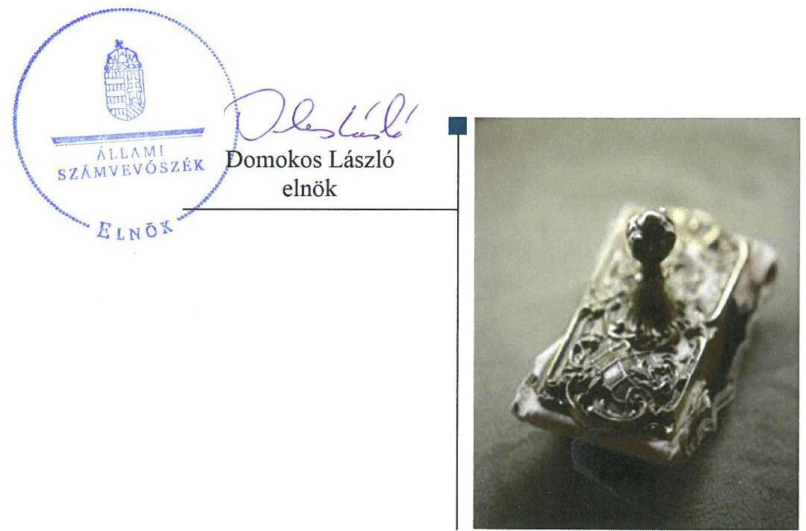
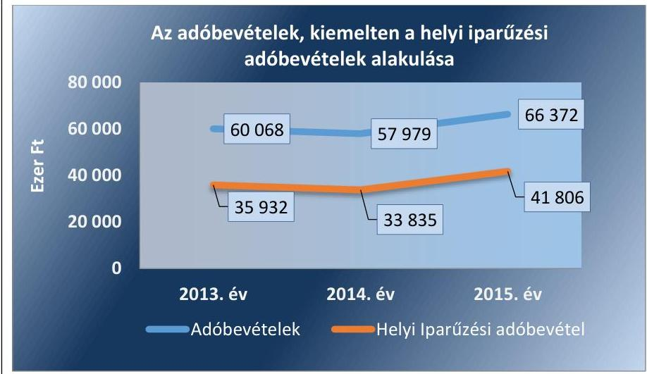
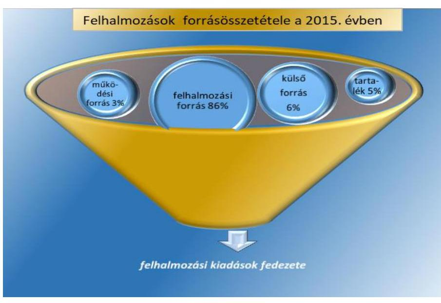
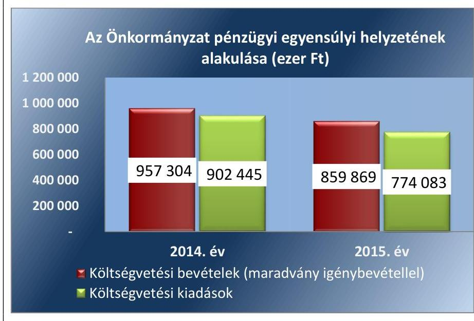
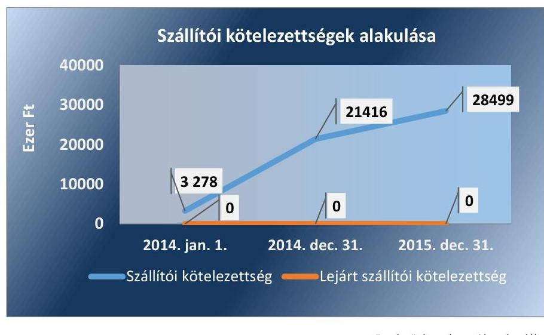
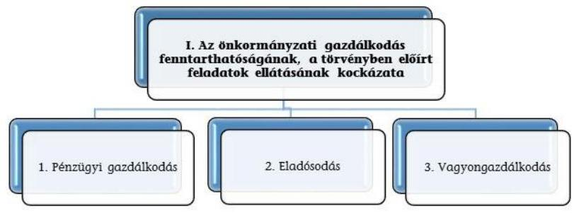
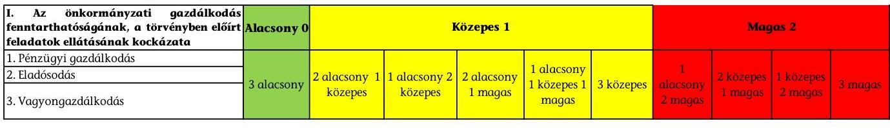

# Jelentés 

## Önkormányzatok pénzügyi monitoringja alapján végzett ellenőrzése

Verpelét Város Önkormányzata gazdálkodásának fenntarthatósága 2018. 03. hó 08. nap

---

# AZ ELLENŐRZÉST FELÜGYELTE:

- HOLMAN MAGDOLNA JULIANNA felügyeleti vezető
- PETŐ KRISZTINA felügyeleti vezető
- AZ ELLENŐRZÉST VEZETTE ÉS A VÉGREHAJTÁSÁÉRT FELELŐS:
  - SZAPPANOS JÚLIA ellenőrzésvezető
  - A PROGRAM ÖSSZEÁLLÍTÁSÁÉRT FELELŐS:
    - SZAPPANOS JÚLIA osztályvezető

**IKTATÓSZÁM:** EL-0168-023/2018

**TÉMASZÁM:** 2443

**ELLENŐRZÉS-AZONOSÍTÓ SZÁM:** V079004

Jelentéseink az Országgyűlés számítógépes hálózatán és az Interneten a www.asz.hu címen is olvashatóak.

---

# TARTALOMJEGYZÉK 

■ ÖSSZEGZÉS ..... 5
■ CÉL, TERÜLET, HÁTTÉR, INDOKOLTSÁG ..... 6
■ LÉNYEGES KÉRDÉSKÖRÖK ..... 8
■ ELLENŐRZÉS HATÓKÖRE ÉS MÓDSZEREI ..... 9
■ MEGÁLLAPÍTÁSOK ..... 11
■ MELLÉKLETEK ..... 17
I. Sz. melléklet: Fogalomtár ..... 17
II. Sz. melléklet: Az ellenőrzési kritériumok módszertana és értékelése ..... 20
III. Sz. melléklet: Az eszközök és források alakulása kiemelt mérlegsoronként a 2014-2015. években ..... 22
IV. Sz. melléklet: Pénzügyi egyensúlyi helyzet CLF módszer szerinti értékelése a 2013-2015. években ..... 23
■ FÜGGELÉK: ÉSZREVÉTELEK ..... 27
■ RÖVIDÍTÉSEK JEGYZÉKE ..... 29

---

.

---

# ÖSSZEGZÉS 

- Verpelét Város Önkormányzatánál a 2015. évben biztosított volt a pénzügyi gazdálkodás fenntarthatósága.
- Az eladósodás kockázata nem állt fenn.
- A vagyongazdálkodás során biztosították a vagyon értékének megőrzését.

## Az Önkormányzat gazdálkodásának fenntarthatóságával kapcsolatos főbb megállapítások, következtetések

## Pénzügyi gazdálkodás

A feladatok ellátásának finanszírozása biztosított volt.

A felhalmozási kiadások forrás, maradvány igénybevételével voltak biztosítva.

## Eladósodás

A pénzügyi egyensúly biztosított volt.

A hitelek visszafizetése nem jelentett kockázatot a pénzügyi gazdálkodásra.

Lejárt szállító/tartozás nem volt.

## Vagyongazdálkodás

Az Önkormányzat vagyona nőtt.
Az elszámolt értékcsökkenés meghaladó értékű fejlesztési  valóáttartókat  meg.

A tartós részesedések mérlegértéke nem változott.

## Az Önkormányzat pénzügyi és vagyongazdálkodása biztosította a törvényben meghatározott feladatai ellátását.

A PÉNZÜGYI EGYENSÚLYI HELYZET BIZTOSÍTOTT VOLT, AZ ÖNKORMÁNYZAT VÁLTOZATLAN FORMÁBAN TÖRTÉNŐ FELADATELLÁTÁSA ÉS GAZDÁLKODÁSA NEM HORDOZ KOCKÁZATOT.

---

# CÉL, TERÜLET, HÁTTÉR, INDOKOLTSÁG 

## Ellenőrzés célja

AZ ELLENŐRZÉS CÉLJA annak megállapítása, hogy az Önkormányzat ${ }^{1}$ képes volt-e a törvényben meghatározott feladatait ellátni, gazdálkodása változatlan formában fenntartható-e. Az Önkormányzatok éves költségvetési beszámolójában, időközi költségvetési jelentéseiben és mérlegjelentéseiben szerepeltetett adatok értékelése alapján beazonosított kockázatok kezelésére irányuló önkormányzati döntések, intézkedések előmozdítása.

## Ellenőrzés területe

VERPELÉT VÁROS Heves megyében helyezkedik el. Állandó lakosainak száma 2015. január 1-jén 3902 fő volt. A város fejlettségének besorolása az országos átlagot jelentősen meghaladó munkanélküliséggel sújtott települések jegyzékéről szóló 240/2006. (XI. 30.) Korm. rendelet, 2015. április 24-étől a kedvezményezett települések besorolásáról és a besorolás feltételrendszeréről szóló 105/2015. (IV. 23.) Korm. rendelet alapján az országos átlagot jelentősen meghaladó munkanélküliséggel sújtott település. A 2015. évi 1 lakosra jutó működési kiadás (155,0 ezer Ft), 4,1\%-kal elmaradt a településtípus átlagától (161,7 ezer Ft). A 2015. évi 1 lakosra jutó adóbevétel (16,9 ezer Ft) 50,0 ezer Ft-tal kevesebb volt a településtípus átlagánál (66,9 ezer Ft).

A 2015. év végén a Képviselő-testület 7 fővel, 3 állandó bizottsággal látta el a feladatait. A polgármester és a jegyző személye a 2014-2015. években nem változott.

Az Önkormányzat az ellenőrzött időszakban 4 költségvetési intézményt tartott fenn, a foglalkoztatott köztisztviselők száma 17 fő volt, a közalkalmazottaké 38 főről 35 főre csökkent. A költségvetési intézmények szociális feladatokat, közművelődési és könyvtári feladatokat, valamint igazgatási és adóigazgatási feladatokat láttak el.

Az Önkormányzatnak nem volt az ellenőrzött időszakban többségi tulajdoni hányadú gazdasági társasága.

Az összevont költségvetési beszámolók szerint teljesített éves költségvetési bevételek és kiadások, a mérlegben kimutatott eszközök, a követelések és kötelezettségek értékét az 1. táblázat mutatja be.

---

|  1. táblázat |  |  |  |  |   |
| --- | --- | --- | --- | --- | --- |
|  GAZDÁLKODÁSI ADATOK (M FT) |  |  |  |  |   |
|  Év | Bevételek | Kiadások | Eszközök | Követelések | Kötelezettségek  |
|  2014. | 890,6 | 902,4 | 1 424,5 | 41,7 | 70,5  |
|  2015. | 779,8 | 774,1 | 1 499,0 | 46,5 | 52,9  |

*Forrás: önkormányzati beszámolók*

# Az ellenőrzés háttere, indokoltsága

**AZ ÖNKORMÁNYZATI ALRENDSZERBEN** megjelenő gazdálkodási nehézségek, likviditási problémák és az eladósodottság növekedése az ÁSZ² figyelmét a 2011. évtől az önkormányzatok pénzügyi helyzetére irányította.

Az önkormányzati alrendszerben a 2013. évtől bevezetett új feladatfinanszírozási rendszer keretein belül továbbra is megoldandó kérdés a pénzügyi egyensúly megteremtése, hosszú távú fenntartása. Erre tekintettel kiemelt fontosságú az önkormányzatok pénzügyi egyensúlyi helyzetére ható kockázatok feltárása, az ezzel kapcsolatos folyamatok, trendek bemutatása.

---

# LÉNYEGES KÉRDÉSKÖRÖK 

1. Az Önkormányzat pénzügyi gazdálkodásának fenntarthatósága biztosított volt-e?
2. Fennállt-e az Önkormányzat eladósodásának kockázata?
3. Az Önkormányzat vagyongazdálkodása során biztosított volt-e a vagyon értékének megőrzése?

---

# ELLENŐRZÉS HATÓKÖRE ÉS MÓDSZEREI 

## Az ellenőrzés típusa, időszaka

Megfelelőségi (helyénvalósági) ellenőrzés.
A 2014. január 1-je és 2015. december 31-e közötti időszak.  A pénzforgalmi adatokat elemző mutatók esetében kitekintéssel a 2013. december 31-ei értékekre.

## Az ellenőrzés jogalapja, módszerei

Az ellenőrzés jogszabályi alapját az Állami Számvevőszékről szóló 2011. évi LXVI. törvény 1. § (3) bekezdésének, az 5. § (2)-(6) bekezdéseinek, valamint az államháztartásról szóló 2011. évi CXCV. törvény 61. § (2) bekezdésének előírásai képezték.

Az ellenőrzést az ellenőrzési program ellenőrzési kérdései, az ellenőrzött időszakban hatályos jogszabályok, az ellenőrzés szakmai szabályok és módszertanok figyelembe vételével végeztük.

Az ellenőrzési kérdések megválaszolásához szükséges bizonyítékok megszerzése az ellenőrzött által rendelkezésre bocsátott dokumentumokra, adatokra alapozva megfigyelés, kérdésfeltevés (információkérés), valamint elemző eljárással, továbbá a Magyar Államkincstár által szolgáltatott adatokra alapozva történt.

Az ellenőrzési bizonyítékként felhasználható adatforrások közé tartoztak egyrészt az ellenőrzési program részletes szempontjainál felsorolt adatforrások, másrészt minden - az ellenőrzés folyamán feltárt, az ellenőrzés szempontjából releváns információt tartalmazó - dokumentum.

Az ellenőrzés lefolytatásához az önkormányzat a tanúsítványok elektronikus kitöltésével, valamint az ÁSZ által kért dokumentumok elektronikus megküldésével szolgáltatott adatokat, amelyek valódiságát és teljes körűségét az ellenőrzött szervezet vezetője által tett teljességi és hitelességi nyilatkozat igazolta. Az így rendelkezésre bocsátott adatok, információk, a tanúsítványok adatai valódiságának kontrollja az ellenőrzés keretében történt.

Az ÁSZ az ellenőrzés előkészítése során meghatározta az ellenőrzési (helyénvalósági) kritériumokat, amelyek az ellenőrzési bizonyíték értékelésének, valamint a számvevőszéki jelentésben szereplő megállapítások és következtetések alapját képezték. A lényeges és jellegzetes mutatók helyénvalósági kritériumait, és a kockázatok értékelését az ellenőrzési kritériumok módszertana és értékelése tartalmazza.

A pénzforgalmi adatokat tartalmazó dinamikus mutatók számításánál a 2014. évben a 2013. év végi adatokat, a 2015. évben a 2014. évi végi adatokat tekintettük bázis adatnak. A mérlegadatokat tartalmazó mutatók esetében - az eredményszemléletű számvitel 2014. évi bevezetése miatt - a 2014. évben a 2013. évi mérleg záró adatai helyett az új számviteli szabályok alapján készült 2014. évi mérleg nyitó adatait, a 2015. évben a 2014. év végi adatokat tekintettük bázis adatnak.

---

Az ellenőrzési kérdésekre adott válaszok alapján értékeltük, hogy az önkormányzat képes volt-e a törvényben meghatározott feladatait ellátni, gazdálkodása változatlan formában fenntartható-e.

---

# 1. Az Önkormányzat pénzügyi gazdálkodásának fenntarthatósága biztosított volt-e? 

## Az Önkormányzat által ellátott feladatok, valamint az adósságszolgálat finanszírozási struktúrája biztosította a pénzügyi gazdálkodás 2015. évi fenntarthatóságát.

2. táblázat

| MUTATÓK ALAKULÁSA |  |  |
| :--: | :--: | :--: |
| Mutatók (\%) | 2014. év | 2015. év |
| Működési kiadások fedezettsége | 96,4 | 105,0 |
| Kiegészítő önkormányzati támogatás aránya | 1,2 | 0,4 |
| Adóbevételek működési bevételeken belüli aránya | 8,9 | 10,4 |
| Felhalmozási kiadások fedezettsége | 105,4 | 85,0 |
| Törlesztés fedezettségének aránya | $-25,2$ | 68,3 |
| Pénzügyi műveletek eredménye | 0 | $-231540,0$ |

Forrás: önkormányzati beszámolók

Az Önkormányzat az ellenőrzött időszakban kötelező feladatokat látott el, önként vállalt feladata nem volt. A 2014. évben a működési bevételek a működési kiadások 96,4\%-ára nyújtottak fedezetet. A pénzügyi egyensúly fenntarthatóságához (hitel tartozás, szállítói kötelezettség teljesítéséhez) 2014-ben 7540 ezer Ft, a működési bevételek 1,2\%-át kitevő kiegészítő önkormányzati támogatásban részesült az Önkormányzat, azonban a pénzügyi egyensúly így sem volt biztosított. A működési hiányt előző évi működési célú pénzmaradványból finanszírozták. A pénzügyi gazdálkodás kockázatának minősítését megalapozó mutatókat a 2. táblázat tartalmazza.

2015-ben a működési bevételek - 2014-hez viszonyított - 1,8\%-os elmaradása mellett a működési kiadások 9,8\%-kal csökkentek, melyek együttes hatására a működési bevételek 5,0\%-kal meghaladták a működési kiadásokat. A 2015-ben kapott kiegészítő önkormányzati támogatás összege (2686 ezer Ft) és működési bevételeken belüli aránya ( $0,4 \%$ ) egyaránt csökkent az előző évihez képest, azonban a működési bevételek a támogatás nélkül is fedezetet nyújtottak a működési kiadásokra.

A 2015. évi működési bevételeken belül az adóbevételek - magánszemélyek kommunális adója, helyi iparűzési adó, gépjármű adó - aránya az előző évhez képest 1,3 százalékponttal nőtt a befolyt helyi iparűzési adóbevétel emelkedése miatt. A 2015. évi adóbevételeknek 63,0\%-a helyi iparűzési adó bevétel volt. Az adóbevételek alakulását az 1. ábra szemlélteti.

## 1. ábra

Forrás: Önkormányzati beszámolók

Az Önkormányzat működési egyensúlyi helyzetére nem jelentett kockázatot a helyi iparűzési adó bevétel - adóalanyok szerinti - alakulása, mivel

---

a három legnagyobb összegű adót fizető adózótól a 2014-2015. években a helyi iparűzési adóbevétel 18-19\%-a származott.

A kivetett adómértékek a magánszemélyek kommunális adója és a helyi iparűzési adó esetében nem érték el a jogszabály szerinti kivethető maximális mértéket, a működési kiadások fedezete így is biztosított volt 2015-ben.

A költségvetési kiadásoknak 2014-ben 25,2\%-át, 2015-ben 21,3\%-át fordították fejlesztésekre. A 2015. évi felhalmozási bevételek - a 2014. évvel ellentétben - nem nyújtottak fedezetet a beruházások és felújítások tárgy évi kiadásaira, ezért a 24700 ezer Ft felhalmozási forráshiányt működési jövedelemből, előző évi maradványból, illetve fejlesztési hitel igénybevételéből finanszírozták. A felhalmozási kiadások forrásösszetételét a 2. ábra mutatja be:
2. ábra

Forrás: önkormányzati beszámolók

A pénzügyi műveletek eredménye 2014-ben -5 ezer Ft, 2015-ben - 11582 ezer Ft volt, a 2014 végén felvett hitelek után fizetett kamatok miatti kamatráfordítások emelkedése miatt.

Az Önkormányzat pénzügyi egyensúlyi helyzetére jellemző adatokat a IV. számú melléklet tartalmazza.

# 2. Fennállt-e az Önkormányzat eladósodásának kockázata? 

## Az Önkormányzat eladósodásának kockázata 2015-ben nem állt fenn.

A 2015. évi működési jövedelem fedezetet nyújtott a tárgyévi tőketörlesztési kötelezettségre. A hitelek visszafizetése a működési jövedelem emelkedése miatt - a 2014. évvel ellentétben - 2015-ben nem jelentett kockázatforrást a pénzügyi gazdálkodásra. Az eladósodás kockázatának minősítését megalapozó mutatókat a 3. táblázat tartalmazza. A 2014. évi adósságkonszolidációt követően az Önkormányzat gazdálkodása nem vetített előre újbóli eladósodást 2015-ben.

---

3. táblázat

| MUTATÓK ALAKULÁSA |  |  |
| :--: | :--: | :--: |
| Mutatók | 2014. év | 2015. év |
| Eladósodási mutató (\%) | 5,0 | 3,5 |
| Eladósodási mutató változása (százalékpont) | 4,4 | $-1,5$ |
| Tárgyévi pénzügyi pozíció változása (\%)

 | $-36,4$ | $-198,7$ |
| Szállítói kötelezettség változása (\%) | 553,3 | 33,1 |
| Lejárt szállítói kötelezettségek aránya (\%) | 0,0 | 0,0 |
| Banki kötelezettségállomány mérlegfőösszeghez viszonyított aránya (\%) | 2,7 | 0,8 |
| Banki kötelezettségállomány (ezer Ft) | 38828 | 12280 |
| Garancia- és kezességvállalások állománya | 0,0 | 0,0 |

A pénzügyi egyensúly helyzetének alakulását a 3. ábra szemlélteti.
3. ábra

Forrás: önkormányzati beszámolók

A tárgyévi pénzügyi pozíció 2015-ben negatív volt, mivel a 30424 ezer Ft működési jövedelemből 20780 ezer Ft-ot hiteltörlesztésre használtak fel. Így a 24700 ezer Ft felhalmozási hiányra a működési jövedelem fennmaradó része (9644 ezer Ft) nem nyújtott fedezetet. A tárgyévi pénzügyi pozíció előző évhez viszonyított kedvezőtlen változását alapvetően a 2014-ben felvett hitelek törlesztése eredményezte.

Az Önkormányzat forrásainak összetételében az idegen források aránya 10,0\% alatt volt. Az eladósodási mutató a 2014. évben 4,4 százalékponttal nőtt, a 2015. évben 1,5 százalékponttal csökkent az előző évhez képest. Az eladósodási mutató 2014. évi emelkedését a banki kötelezettségek és szállítói tartozások növekedése okozta. A kötelezettségek mérlegértéke 2015-ben 24,9\%-kal volt kevesebb az előző évinél.

A banki kötelezettségállomány mérlegfőösszeghez viszonyított aránya a 2014. évi 2,7\%-ról a 2015. évre 0,8\%-ra csökkent a törlesztések miatt. A banki kötelezettségek állományát a 4. táblázat mutatja be.
4. táblázat

BANKI KÖTELEZETTSÉGEK ÁLLOMÁNYA (EZER FT-BAN)

| Megnevezés | 2014. dec. 31. | 2015. dec. 31. |
| :--: | :--: | :--: |
| I. Költségvetési évben esedékes kötelezettségek összesen | 29704 | 0 |
| - Likvid és rövid lejáratú hitelek törlesztésére | 10780 | 0 |
| - Hosszú lejáratú hitelek törlesztésére | 18924 | 0 |
| - Értékpapírok beváltására | 0 | 0 |
| II. Költségvetési évet követően esedékes kötelezettségek összesen | 9124 | 12280 |
| - Likvid és rövid lejáratú hitelek törlesztésére | 0 | 0 |
| - Hosszú lejáratú hitelek törlesztésére | 9124 | 12280 |
| - Értékpapírok beváltására | 0 | 0 |
| Banki kötelezettségek (I. + II.) | 38828 | 12280 |

---

Hitelfelvételre 2014-ben került sor 21000 ezer Ft összegben. Az Egészségház fejlesztéséhez elnyert támogatás előfinanszírozására 11000 ezer Ft éven belüli lejáratú hitelt vettek igénybe, továbbá hőszigetelési munkálatok finanszírozására 10000 ezer Ft beruházási hitel felvételére került sor. Az adósságszolgálatot keletkeztető ügyletek megkötése összhangban volt a Stabilitási tv. ${ }^{3} 10 . \S$ (3) bekezdés b) pontjában, és cc) pontjában előírtakkal.

Az Önkormányzat rövid és hosszú lejáratú pénzintézeti kötelezettségeit határidőben kiegyenlítette.

A szállítói kötelezettség mértéke nem jelentett kockázatforrást az eladósodásra. Az Önkormányzat dologi, beruházási és felújítási kiadásokkal kapcsolatos kötelezettségállománya (továbbiakban: szállítói kötelezettség) nem érte el a tárgyévi maradvány összegét, 2014-ben 21416 ezer Ft, 2015-ben 28499 ezer Ft volt. A szállítói kötelezettségek 2014-ben 98,5\%-a, 2015-ben 77,1\%-a beruházásokhoz, felújításokhoz kapcsolódott.

Az Önkormányzat a mérlegforduló napon fennálló szállítói kötelezettségei között lejárt határidejű tartozást nem mutatott ki. A szállítói kötelezettségek alakulását a 4. ábra szemlélteti.
4. ábra

Forrás: önkormányzati beszámolók

# 3. Az Önkormányzat vagyongazdálkodása során biztosított volt-e a vagyon értékének megőrzése? 

## A vagyongazdálkodás során biztosított volt a vagyon értékének megőrzése.

Az Önkormányzat vagyona 2014. január 1-jéről 2015 végére 297175 ezer Ft-tal (24,7\%-kal), 1498984 ezer Ft-ra nőtt. Az Önkormányzat vagyonának alakulását kiemelt mérlegsoronként a III. számú melléklet, a vagyongazdálkodás kockázatának minősítését megalapozó mutatókat az 5. táblázat tartalmazza.
Az eszközérték 2015. évi növekedését alapvetően az ingatlanok és kapcsolódó vagyoni értékű jogok 41,7\%-os, valamint a gépek, berendezések, felszerelések 158,7\%-os mérlegérték emelkedése eredményezte. A vagyongazdálkodásban nem jelentkezett kockázat, mert a saját tőke értéke a

---

5. táblázat

|  MUTATÓK ALAKULÁSA |  |   |
| --- | --- | --- |
|  Mutatók | 2014. év | 2015. év  |
|  Befektetett eszközök fedezettsége (\%) | 102,7 | 102,7  |
|  Ingatlanok és kapcsolódó vagyonértékű jogok állományának változása (ezer Ft) | $-25084,0$ | 329463  |
|  Koncesszióba, vagyonkezelésbe adott eszközök állományának változása (ezer Ft) | $-9703$ | $-11407$  |
|  Eszközpótlási mutató (tárgyi eszközök összesen) (\%) | 3,0 | 756,8  |
|  Tárgyi eszközök használhatósági foka (\%) | 71,7 | 75,8  |

Forrás: önkormányzati beszámolók

2014-2015. években fedezetet nyújtott a nemzeti vagyonba tartozó befektetett eszközökre.

A tárgyi eszközök könyv szerinti értéke 2014 és 2015 végén egyaránt meghaladta az előző évit. A pozitív változást alapvetően az elszámolt értékcsökkenést meghaladó értékben végrehajtott beruházások és felújítások (egészségügyi központ fejlesztése, felújítása, óvoda felújítás, útfelújítás) számviteli elszámolása eredményezte. Az eszközök összetételét az 5. ábra szemlélteti. 5. ábra

|  Az Önkormányzat eszközeinek összetétele |  |  |   |
| --- | --- | --- | --- |
|  1600000 |  |  |   |
|  1400000 |  |  |   |
|  1200000 |  |  |   |
|  1000000 |  |  |   |
|  800000 |  |  |   |
|  600000 |  |  |   |
|  400000 |  |  |   |
|  200000 |  |  |   |
|  0 |  |  |   |
|   | 2014. jan. | 2014. dec. | 2015. dec.  |
|   | 01. | 31. | 31.  |
|  Egyéb eszközök | 13086 | 21308 | 9174  |
|  - Követelések | 21137 | 41713 | 46471  |
|  - Pénzeszközök | 58049 | 55713 | 53515  |
|  - Nemzeti vagyonba tartozó forgóeszközök | 1488 | 1172 | 909  |
|  - Nemzeti vagyonba tartozó befektett eszközök | 1108049 | 1304545 | 1388915  |

Forrás: önkormányzati beszámolók Az Önkormányzatnál az ellenőrzött időszakban elszámolt értékcsökkenés kompenzálásaként a szükséges vagyonpótlás megtörtént, a beruházások, felújítások elvégzésére, aktiválására döntően 2015-ben került sor. A tárgyi eszközök eszközpótlási mutatója 2014-ben 3,0\%, 2015-ben 756,8\% volt. A tárgyi eszközök nettó értékének meghatározó hányadát (2015 végén 82,2\%-át) az ingatlanok és kapcsolódó vagyoni értékű jogok alkották, amelynek eszközpótlási mutatója 2014-ben 0,0\% (nem aktivált beruházások értéke 214163 ezer Ft), 2015-ben 1168,4\% volt.

Az Önkormányzat a koncesszióba, vagyonkezelésbe adott eszközök mérlegsoron a szolgáltatónak üzemeltetésre átadott víziközművek értékét mutatta ki.

Az Önkormányzat tartós részesedésként tartotta nyilván egy gazdasági társaságban lévő üzletrészét. A részesedés könyv szerinti értéke (5 272 ezer Ft) az ellenőrzött időszakban nem változott, a pénzügyi helyzetre nem jelentett kockázatot.

---

.

---

# MELLÉKLETEK 

## I. SZ. MELLÉKLET: FOGALOMTÁR

adósságkonszolidáció
adósságszolgálat
beruházás

CLF módszer
ellenőrzési kritériumok
eszközpótlási mutató
fejlesztés
felhalmozási bevétel
felhalmozási kiadás
felújítás
folyó bevétel
folyó kiadás
folyó költségvetés egyenlege
helyénvalósági ellenőrzés

A helyi önkormányzatok adósságának állam által történő átvállalása.
Az adósság tőkerészének és az esedékes kamat együttes összegének törlesztése.
A tárgyi eszköz beszerzése, létesítése, saját vállalkozásban történő előállítása, a beszerzett tárgyi eszköz üzembe helyezése. A beruházás a meglévő tárgyi eszköz bővítését, rendeltetésének megváltoztatását, átalakítását, élettartamának, teljesítőképességének közvetlen növelését eredményező tevékenység. (Forrás: Számv. tv. ${ }^{4}$ 3. § (4) bekezdés 7. pontja)
Az önkormányzatok költségvetése elemzésének módszere, amely a pénzügyi kapacitás (nettó működési jövedelem) fogalmát helyezi a középpontba. A módszer következetesen elkülöníti a folyó és a felhalmozási költségvetés bevételeit és kiadásait, azok költségvetési egyenlegeit. Bizonyos mértékig a vállalati gazdálkodás logikai elemeit érvényesíti az önkormányzatok pénzügyi, jövedelmi helyzetének vizsgálata során.
Azok az alkalmazott viszonyítási alapok, amelyek az ellenőrzési feladat tárgyának értékelésére szolgálnak.
A tárgyi eszközállomány elemzéséhez használt mutató, amely megmutatja, hogy az üzembe helyezett beruházások milyen hányadát képezi az elszámolt értékcsökkenésnek. Számításakor tárgyévben üzembe helyezett beruházások, felújítások értékét a tárgyi eszközök tárgyévben elszámolt értékcsökkenéséhez kell viszonyítani.
Alapvetően felhalmozási kiadásokban megtestesülő tevékenység, amely új, vagy a korábbinál műszaki, technikai szempontból korszerűbb tárgyi eszköz létrehozására irányul, illetve meglévő tárgyi eszköz műszaki, technikai paramétereinek korszerűsítését valósítja meg. (Forrás: Ávr. ${ }^{5} 1 . \S$ b) pontja)
Az önkormányzatok tárgyévi felhalmozási célú költségvetési bevételei.
Az önkormányzatok tárgyévi felhalmozási célú költségvetési kiadásai.
Az elhasználódott tárgyi eszköz eredeti állaga (kapacitása, pontossága) helyreállítását szolgáló időszakonként visszatérő olyan tevékenység, melynek során az eszköz élettartama megnövekszik, minősége, használata jelentősen javul, így a pótlólagos ráfordításból a jövőben gazdasági előnyök származnak. (Forrás: Számv. tv. 3. § (4) bekezdés 8. pontja)
Az önkormányzatok tárgyévi működési célú költségvetési bevételei
Az önkormányzatok tárgyévi működési célú költségvetési kiadásai
A folyó költségvetés egyenlege, azaz a működési jövedelem megmutatja, hogy az Önkormányzat éves folyó bevétele fedezetet biztosít-e a kötelező és önként vállalt feladatellátáshoz kapcsolódó éves folyó kiadásaira. A működési jövedelem negatív értéke pénzügyileg fenntarthatatlan helyzetet jelez. A mutató pozitív értéke megtakarítást mutat, amely forrásul szolgálhat az Önkormányzat fennálló kötelezettségei megfizetéséhez, valamint fejlesztéseihez.
A helyénvalósági ellenőrzés a megfelelőségi ellenőrzés azon altípusa, amelyet azokban az esetekben kell alkalmazni, amelyekre jogszabályi előírások nem alkalmazhatóak, illetve amennyiben egyes kérdések megítélésénél nyilvánvaló jogszabályi hiányosságok vannak. Helyénvalósági ellenőrzés során a Számvevőszéknek a közszféra szilárd gazdálkodására és a köztisztviselők magatartására vonatkozó általános alapelvek mentén kell az ellenőrzést lefolytatni.

---

kiegészítő önkormányzati támogatás
kockázatforrás
koncesszió
lényegesség
megfelelőségi ellenőrzés
nettó működési jövedelem
önkormányzat
önkormányzat többségi tulajdonában lévő gazdasági társaságok
tárgyévi pénzügyi pozíció

Az önkormányzatok működőképességét szolgáló települési önkormányzatok rendkívüli támogatása, a megyei önkormányzati tartalékból kapott támogatások, valamint a tartósan fizetésképtelen helyzetbe került települési önkormányzatok adósságrendezésére irányuló hitelfelvétel visszterhes kamattámogatása, pénzügyi gondnok díja.
A kockázatok kiváltó okait kockázatforrásnak nevezzük. Az Önkormányzatok kockázatait megfigyelő rendszer kialakítása során első lépésben azonosítottuk a nyomon követendő kockázatokat, majd a kockázatos területeket és a kiváltó okokat (kockázatforrásokat). Kockázatként azonosítottuk, ha az önkormányzat hosszú távon nem képes a törvényben meghatározott feladatait ellátni, költségvetése változatlan formában nem fenntartható. A kockázat értékelésének célja annak megállapítása volt, hogy a pénzügyi gazdálkodás, eladósodás, vagyongazdálkodás kockázati területek milyen mértékben befolyásolják, veszélyeztetik az önkormányzat működését, a közfeladatok ellátását. A három kockázati terület minősítéséhez összesen 10 kockázatforrást rendeltünk.
Az állam, illetőleg az önkormányzat (önkormányzati társulás) kizárólagos tulajdonában lévő vagyontárgyak birtoklásának, használatának és hasznosításának, valamint a koncesszióköteles tevékenységek gyakorlásának jogát, visszterhes szerződéssel, időlegesen úgy engedi át, hogy a jogosultnak részleges piaci monopóliumot biztosít.
Az a szintű információ vagy adat, ami az ellenőrzés eredményei célzott felhasználóinak döntéseit - az arról történő tudomásszerzést követően - valószínűsíthetően befolyásolja.
A számvevőszéki ellenőrzés azon típusa, amely annak megállapítására irányul, hogy az ellenőrzés tárgyát képező tevékenységek, pénzügyi műveletek, információk és adatok minden lényeges szempontból megfelelnek-e az ellenőrzött szervezetre vonatkozó szabályozásoknak és követelményeknek.
A nettó működési jövedelem a jövedelemtermelő képességet méri. Megmutatja a működési bevételekből a működési kiadások és a hitelek tőketörlesztésének kifizetése után fennmaradó jövedelmet.
A helyi önkormányzat jogi személy. Az önkormányzati feladatok ellátását a képviselőtestület
 és szervei biztosítják. A képviselőtestület szervei: a polgármester, a főpolgármester, a megyei közgyűlés elnöke, a képviselő-testület bizottságai, a részönkormányzat testülete, a polgármesteri hivatal, a megyei önkormányzati hivatal, a közös önkormányzati hivatal, a jegyző, továbbá a társulás. A képviselő-testület a feladatkörébe tartozó közszolgáltatások ellátására - jogszabályban meghatározottak szerint - költségvetési szervet, a Polgári perrendtartásról szóló 1952. évi III. törvény szerinti gazdálkodó szervezetet (a továbbiakban: gazdálkodó szervezet), nonprofit szervezetet és egyéb szervezetet (a továbbiakban együtt: intézmény) alapíthat, továbbá szerződést köthet természetes és jogi személlyel vagy jogi személyiséggel nem rendelkező szervezettel. (Forrás: Mötv. ${ }^{6}$ 41. § (1), (2), (6) bekezdései)
Azok a gazdasági társaságok, amelyekben az önkormányzat a szavazatok több mint ötven százalékával vagy a Ptk. ${ }^{7}$ 685/B. § (2)-(3) bekezdéseiben rögzített meghatározó befolyással rendelkezik. A befolyással rendelkező akkor rendelkezik egy jogi személyben meghatározó befolyással, ha annak tagja, illetve részvényese, és jogosult e jogi személy vezető tisztségviselői vagy felügyelő-bizottsága tagjainak többségének megválasztására, illetve visszahívására, vagy a jogi személy más tagjaival, illetve részvényeseivel kötött megállapodás alapján egyedül rendelkezik a szavazatok több mint ötven százalékával. A meghatározó befolyás akkor is fennáll, ha a befolyással rendelkező számára e jogosultságok közvetett módon (köztes vállalkozásain keresztül) biztosítottak.
[Forrás: Ptk. ${ }_{1}$ 685/B. § (2)-(4), Ptk. ${ }_{2}{ }^{8}$ 8:2.§ (1)-(3) bekezdései]
A tárgyévi pénzügyi pozíció megmutatja, hogy a működési, felhalmozási és finanszírozási bevételek együttesen milyen mértékben nyújtottak fedezetet az összes kiadásra.

---

üzemeltetésre átadott eszközök az önkormányzatnál
vagyongazdálkodás

Kedvezőtlen, ha a mutató értéke negatív, mert jelzi, hogy nem áll rendelkezésre a kiadások fedezetéhez szükséges forrás.
Az önkormányzat tulajdonában lévő azon eszközök, amelyeket nem saját maga, vagy felügyelete alatt álló költségvetési szervei üzemeltetnek, hanem az üzemeltetését, működtetését más szervekre bízta. Az önkormányzat számviteli nyilvántartásában elkülönítetten kell nyilvántartani ezen eszközök bruttó értékét és értékcsökkenését.
A nemzeti vagyongazdálkodás feladata a nemzeti vagyon rendeltetésének megfelelő, az állam, az önkormányzat mindenkori teherbíró képességéhez igazodó, elsődlegesen a közfeladatok ellátásához és a mindenkori társadalmi szükségletek kielégítéséhez szükséges, egységes elveken alapuló, átlátható, hatékony és költségtakarékos működtetése, értékének megőrzése, állagának védelme, értéknövelő használata, hasznosítása, gyarapítása, továbbá az állam vagy a helyi önkormányzat feladatának ellátása szempontjából feleslegessé váló vagyontárgyak elidegenítése. (Forrás: Nvtv. 7. § (2) bekezdése)

---

# Önkormányzatok pénzügyi monitoringja alapján végzett ellenőrzése 

## Ellenőrzési kritériumok módszertana

Az ellenőrzés tárgya: Az önkormányzati gazdálkodás fenntarthatósága, a törvényben előírt feladatok ellátása, az önkormányzatnál észlelt negatív tendenciák okainak feltárása, amely az ellenőrzési kritériumok alapján kerül értékelésre.

Az ellenőrzési kritériumok meghatározása során első lépésben azonosításra kerültek az önkormányzati gazdálkodás fenntarthatóságának, a törvényben előírt feladatok ellátásának kockázatos területei és a kiváltó okai (kockázatforrások), amelyekhez minden esetben mutatószám került hozzárendelésre. A mutatószámok között a viszonyszámok (relatív mutatószámok) és az abszolút adatok (abszolút mutatószámok) egyaránt megtalálhatóak, amelyekhez a Magyar Államkincstár által szolgáltatott adatállományok (költségvetési beszámolók, időközi költségvetési jelentések, mérlegjelentések adatait) kerültek felhasználásra.
Az egyes kockázati területek és kockázatforrások minősítése „pontozásos módszerrel" a mutatószámok értékelése alapján történt.

- Első lépésben a mutatószámok értékelésére és egy háromelemű skálán történő elhelyezésére került sor. Az értékelés (a kategória határok meghatározása) elsődlegesen a mutatószámok közgazdasági értelmezése alapján, az Állami Számvevőszék ellenőrzési tapasztalatait felhasználva történt. Az értékelések alapján egy-egy mutató alacsony besorolás esetén 0 pontot, közepes esetén 1 pontot, magas kockázatjelzés esetén 2 pontot kapott. (PI.: ha a működési kiadások fedezettsége mutató $90 \%$ alatti volt, akkor magas kockázati besorolást, 2 pontot, ha $100 \%$ feletti volt akkor alacsony besorolást, 0 pontot kapott.) A %-ban kifejezett mutatók kockázati besorolására a pontos (több tizedes jegy) értékek alapján került sor, ugyanakkor az önkormányzati riport a mutatókat egy, illetve esetenként két tizedes számjegyig mutatja be.
- Annak érdekében, hogy a kockázatforrások minősítésénél a lényeges mutatók értéke legyen a meghatározó a jellegzetes mutatókéval szemben, a mutatószámok súlyozására került sor*. A súlyok mértékének megválasztásakor az elsődleges mutatókat középértéknek tekintve 1-es súly mellérendelése* történt. A főmutató súlya az elsődleges mutatók súlyának kétszeresében, míg a másodlagos mutatók súlya az elsődleges mutatók súlyának felében került meghatározásra. (PI.: a kockázatforrás minősítéséhez a működési kiadások fedezettségét főmutatóként vették figyelembe, ezért 2-es súlyt rendeltek hozzá. Így ha a mutató kockázati besorolása magas volt, a magas kockázati besoroláshoz rendelt 2 pontot szorozták a főmutatóhoz rendelt 2-es súlyszámmal és az elért pontszám 4, míg alacsony besorolás esetén a besoroláshoz rendelt 0 pontot szorozva a főmutatóhoz rendelt 2-es súlyszámmal elért pontszám 0 volt.)
- Ezt követően került sor az önkormányzati gazdálkodás fenntarthatóságának, a törvényben előírt feladatok ellátásának kockázatához rendelt kockázati területek és kockázatforrások értékelési ponthatárainak meghatározására oly módon, hogy kockázatforrásonként a mutatószámok súlyozott értékelésével elérhető összes pontszám három egyenlő részre (alacsony, közepes, magas) osztása történt meg. (PI.: A közfeladatok finanszírozási struktúrája kockázatforrás 1 db főmutató, 2 db elsődleges mutató és további 2 db másodlagos mutató alakulása alapján került értékelésre. A mutatók magas kockázati besorolása esetén - a súlyozást követően - elérhető legmagasabb

[^0]
[^0]:    * A súlyozás kifejezi, hogy az alkalmazott mutatószámok egymáshoz képest milyen mértékben járulnak hozzá az adott kockázatforrás értékeléséhez.
    † Egy esetben a banki kötelezettségállomány mérlegfőösszeghez mért nagysága mutatónál a kockázatforrás kiegyensúlyozottabb megítélése érdekében az 1-es súlyozás helyett 1,5-ös súlyozás került alkalmazásra..

---

pontszám 10 volt. Ezt három egyenlő részre osztva kerültek meghatározásra a közfeladatok finanszírozási struktúrájának értékelési ponthatárai, amely 0-3,32 pontig alacsony, 3,33-6,66 pontig közepes, 6,67-10 pont között magas kockázati minősítést kapott.) A pénzügyi gazdálkodás és eladósodás kockázati területek és a hozzájuk tartozó egyes kockázatforrások 2014. évi és 2015. évi értékelési pontjai eltérnek egymástól, mivel az eredményszemléletű mutatók változása első alkalommal a 2015. évben volt értékelhető.

- Az egyes kockázatforrások értékelésekor a kockázatforráshoz rendelt mutatószámok - súlyozással kapott - értékeinek összesítése és a kialakított értékelési ponthatárok szerinti minősítése történt meg. (PI.: egy önkormányzat minősítésekor a közfeladatok finanszírozási struktúrája kockázatforráshoz rendelt 5 db mutató - fentiekben bemutatott - értékelésével elért összes pontszám 7 volt, akkor a kockázatforrás a hármas skálán a 6,67-10 pont közé került, így magas minősítést kapott.)
- Az egyes kockázati területek minősítése hasonlóan történt. Az egyes kockázati területeket meghatározó kockázatforrások pontjainak aggregálását követően, a kockázati területen elérhető összes pont három egyenlő részre osztásával kialakított skálán történő értékelésére került sor. Ha azonban a kockázatforrások közül legalább egy magas kockázati besorolást ért el, akkor a pontozás szerinti értékeléstől eltérően, a kockázati terület besorolása közepes kockázati minősítésűre módosult.

Az ellenőrzés tárgyának, az önkormányzati gazdálkodás fenntarthatóságának, a törvényben előírt feladatok ellátásának értékelése:

A három kockázati terület együttes értékelése alapján az alábbi mátrix segítségével került meghatározásra az önkormányzati gazdálkodás fenntarthatóságának, a törvényben előírt feladatok ellátásának értékelése a következők szerint:

---

III. SZ. MELLÉKLET: AZ ESZKÖZÖK ÉS FORRÁSOK ALAKULÁSA KIEMELT MÉRLEGSORONKÉNT A 2014-2015. ÉVEKBEN

|  Megnevezés | 2014. jan. 01.
(E Ft) | 2014. dec. 31.
(E Ft) | 2015. dec. 31.
(E Ft)  |
| --- | --- | --- | --- |
|  NEMZETI VAGYONBA TARTOZÓ BEFEKTETETT ESZKÖZÖK | 1108049 | 1304545 | 1388915  |
|  ebből: tárgyi eszközök | 882896 | 1089495 | 1187703  |
|  ebből: koncesszióba, vagyonkezelésbe adott eszközök | 195479 | 185776 | 174369  |
|  NEMZETI VAGYONBA TARTOZÓ FORGÓESZKÖZÖK | 1488 | 1172 | 909  |
|  PÉNZESZKÖZÖK | 58049 | 55713 | 53515  |
|  KÖVETELÉSEK | 21137 | 41718 | 46471  |
|  EGYÉB SAJÁTOS ESZKÖZOLDALI ELSZÁMOLÁSOK | 13086 | 21308 | 9174  |
|  AKTÍV IDŐBELI ELHATÁROLÁSOK | 0 | 0 | 0  |
|  ESZKÖZÖK ÖSSZESEN | 1201809 | 1424456 | 1498984  |
|  SAJÁT TŐKE | 1194098 | 1339714 | 1426962  |
|  KÖTELEZETTSÉGEK | 7705 | 70526 | 52933  |
|  EGYÉB SAJÁTOS FORRÁSOLDALI ELSZÁMOLÁSOK | 6 | 6 |   |
|  PASSZÍV IDŐBELI ELHATÁROLÁSOK | 0 | 14210 | 19089  |
|  FORRÁSOK ÖSSZESEN | 1201809 | 1424456 | 1498984  |

---

|   | 2013. év
ezer Ft | 2014. év
ezer Ft | 2015. év
ezer Ft | Változás [\%]
(2014-2013) /
2013 | Változás [\%]
(2015-2014) /
2014  |
| --- | --- | --- | --- | --- | --- |
|  1. FOLYÓ KÖLTSÉGVETÉS |  |  |  |  |   |
|  1.1.1. Saját működési bevételek tulajdonosi bevételek nélkül | 106207 | 111985 | 126295 | $5,44 \%$ | $12,78 \%$  |
|  1.1.2. Költségvetési támogatások a működőképesség megőrzését szolgáló kiegészítő támogatások nélkül | 319060 | 405612 | 404771 | $27,13 \%$ | $-0,21 \%$  |
|  1.1.3. Átengedett bevételek | 7337 | 6927 | 6977 | $-5,59 \%$ | $0,72 \%$  |
|  1.1.4. Államháztartáson belülről kapott támogatások | 83443 | 109402 | 98533 | $31,11 \%$ | $-9,93 \%$  |
|  1.1.5. EU-tól és külföldről kapott bevételek | 0 | 0 | 0 | $0,00 \%$ | $0,00 \%$  |
|  1.1.6. Államháztartáson kívülről kapott bevételek | 0 | 9324 | 0 | $100,00 \%$ | $-100,00 \%$  |
|  1.1.7. Hozam- és kamatbevételek | 0 | 158 | 86 | $100,00 \%$ | $-45,57 \%$  |
|  1.1.8. Kölcsönök visszatérülése, igénybevétele | 0 | 157 | 200 | $100,00 \%$ | $27,39 \%$  |
|  1.1.9. A működőképesség megőrzését szolgáló kiegészítő támogatások | 13100 | 7540 | 2686 | $-42,44 \%$ | $-64,37 \%$  |
|  1.1. Folyó bevételek (1.1.1.+1.1.2.+1.1.3.+1.1.4.+1.1.5.+1.1.6.+1.1.7.+1.1.8.+1.1.9.) | 529147 | 651105 | 639548 | 23,05\% | $-1,77 \%$  |
|  1.2.1. Működési kiadások kamatkiadások nélkül | 423974 | 408897 | 410963 | $-3,56 \%$ | $0,51 \%$  |
|  1.2.2. Államháztartáson belülre átadott pénzeszközök | 0 | 137129 | 133088 | $100,00 \%$ | $-2,95 \%$  |
|  1.2.3.1. vállalkozásoknak | 10027 | 25303 | 16664 | $152,35 \%$ | $-34,14 \%$  |
|  1.2.3.2. EU-nak, illetve külföldre | 0 | 0 | 0 | $0,00 \%$ | $0,00 \%$  |
|  1.2.3.3. magánszemélyeknek | 101490 | 76785 | 45347 | $-24,34 \%$ | $-40,94 \%$  |
|  1.2.3.4. non-profit szervezeteknek | 7771 | 27134 | 1171 | $249,17 \%$ | $-95,68 \%$  |
|  1.2.3. Transzferkiadások | 119288 | 129222 | 63182 | $8,36 \%$ | $-51,12 \%$  |

 | $8,33 \%$ | $-51,11 \%$  |
|  1.2.4. Kamatkiadások | 0 | 25 | 1891 | $100,00 \%$ | $7464,00 \%$  |
|  1.2.5. Kölcsönök nyújtása, törlesztése | 0 | 0 | 0 | $0,00 \%$ | $0,00 \%$  |
|  1.2. Folyó kiadások (1.2.1.+1.2.2.+1.2.3.+1.2.4.+1.2.5.) | 543262 | 675273 | 609124 | 24,30\% | $-9,80 \%$  |
|  1.3. Folyó költségvetés egyenlege, működési jövedelem (1.1. - 1.2.) | $-14115$ | $-24168$ | 30424 | $-71,22 \%$ | $225,89 \%$  |

---

|   | 2013. év
ezer Ft | 2014. év
ezer Ft | 2015. év
ezer Ft | Változás [\%]
(2014-2013) /
2013 | Változás [\%]
(2015-2014) /
2014  |
| --- | --- | --- | --- | --- | --- |
|  2. FELHALMOZÁSI KÖLTSÉGVETÉS |  |  |  |  |   |
|  2.1.1. Saját tőkebevételek | 0 | 0 | 0 | 0,00\% | 0,00\%  |
|  2.1.2. Költségvetési támogatások | 25071 | 3213 | 24975 | $-87,18 \%$ | 677,31\%  |
|  2.1.3. Államháztartáson belülről kapott támogatások | 79642 | 222763 | 104584 | 179,71\% | $-53,05 \%$  |
|  2.1.4. EU-tól és külföldről kapott támogatások | 0 | 0 | 0 | 0,00\% | 0,00\%  |
|  2.1.5. Államháztartáson kívülről kapott bevételek | 0 | 13521 | 10700 | 100,00\% | $-20,86 \%$  |
|  2.1.6. Hozam- és kamatbevételek | 0 | 0 | 0 | 0,00\% | 0,00\%  |
|  2.1.7. Kölcsönök visszatérülése, igénybevétele | 171 | 0 | 0 | $-100,00 \%$ | 0,00\%  |
|  2.1. Felhalmozási bevételek (2.1.1.+2.1.2+2.1.3+2.1.4.+2.1.5.+2.1.6.+2.1.7.) | 104884 | 239497 | 140259 | 128,34\% | $-41,44 \%$  |
|  2.2.1. Saját beruházási kiadás áfával | 36640 | 1007 | 138486 | $-97,25 \%$ | 13652,33\%  |
|  2.2.2. Saját felújítási kiadás áfával | 16896 | 226165 | 26473 | 1238,57\% | $-88,29 \%$  |
|  2.2.3. Államháztartáson belülre átadott pénzeszközök | 0 | 0 | 0 | 0,00\% | 0,00\%  |
|  2.2.4. EU-nak és külföldnek adott pénzeszközök | 0 | 0 | 0 | 0,00\% | 0,00\%  |
|  2.2.5. Államháztartáson kívülre adott pénzeszközök | 0 | 0 | 0 | 0,00\% | 0,00\%  |
|  2.2.6. Befektetéssel kapcsolatos kiadások | 0 | 0 | 0 | 0,00\% | 0,00\%  |
|  2.2.7. Kamatkiadások | 0 | 0 | 0 | 0,00\% | 0,00\%  |
|  2.2.8. Kölcsönök nyújtása, törlesztése | 0 | 0 | 0 | 0,00\% | 0,00\%  |
|  2.2.9. ÁFA befizetések | 0 | 0 | 0 | 0,00\% | 0,00\%  |
|  2.2. Felhalmozási kiadások (2.2.1.+2.2.2.+2.2.3.+2.2.4.+2.2.5.+2.2.6.+2.2.7.+2.2.8.+2.2.9.) | 53536 | 227172 | 164959 | 324,34\% | $-27,39 \%$  |
|  2.3. Felhalmozási költségvetés egyenlege (2.1. - 2.2.) | 51348 | 12325 | $-24700$ | $-76,00 \%$ | $-300,41 \%$  |
|  3. FINANSZÍROZÁSI MŰVELETEK NÉLKÜLI (GFS) POZÍCIÓ (1.3.+2.3.) | 37233 | $-11843$ | 5724 | $-131,81 \%$ | 148,33\%  |

---

|   | 2013. év
ezer Ft | 2014. év
ezer Ft | 2015. év
ezer Ft | Változás [\%]
(2014-2013) /
2013 | Változás [\%]
(2015-2014) /
2014  |
| --- | --- | --- | --- | --- | --- |
|  4. FINANSZÍROZÁSI MŰVELETEK |  |  |  |  |   |
|  4.1. Hitelfelvétel | 0 | 21000 | 0 | 100,00\% | $-100,00 \%$  |
|  4.2. Hiteltörlesztés | 0 | 6081 | 20780 | 100,00\% | 241,72\%  |
|  4.3. Forgatási és befektetési célú értékpapírok kibocsátása | 0 | 0 | 0 | 0,00\% | 0,00\%  |
|  4.4. Forgatási és befektetési célú értékpapírok beváltása | 0 | 0 | 0 | 0,00\% | 0,00\%  |
|  4.5. Forgatási és befektetési célú értékpapírok értékesítése | 0 | 0 | 0 | 0,00\% | 0,00\%  |
|  4.6. Forgatási és befektetési célú értékpapírok vásárlása | 0 | 0 | 0 | 0,00\% | 0,00\%  |
|  4.7. Egyéb finanszírozási bevételek | $-3277$ | 10281 | 12148 | 413,73\% | 18,16\%  |
|  4.8. Egyéb finanszírozási kiadások | 12961 | 0 | 10281 | $-100,00 \%$ | 100,00\%  |
|  4.9.Finanszírozási műveletek egyenlege (4.1.-4.2.+4.3.-4.4.+4.5.-4.6.+4.7.-4.8.) | $-16238$ | 25200 | $-18913$ | 255,19\% | $-175,05 \%$  |
|  5. TÁRGYÉVI PÉNZÜGYI POZÍCIÓ (1.3.+ 2.3.+4.9.) | 20995 | 13357 | $-13189$ | $-36,38 \%$ | $-198,74 \%$  |
|  6. NETTÓ MŰKÖDÉSI JÖVEDELEM
(működési jövedelem (1.3.) - tőketörlesztés (4.2+4.4)) | $-14115$ | $-30249$ | 9644 | $-114,30 \%$ | 131,88\%  |

- Az önkormányzat bevételei nem tartalmazzák az előző évi pénzmaradvány igénybevételét.

Tájékoztató adat: Maradvány igénybevétele

|  37950 | 66702 | 80062 | 75,76\% | 20,03\%  |
| --- | --- | --- | --- | --- |
|  |   |   |   |   |

---

.

---

# FÜGGELÉK: ÉSZREVÉTELEK 

A jelentéstervezetet a Számvevőszék 15 napos észrevételezésre megküldte az ellenőrzött szervezet vezetőjének az ÁSZ tv. 29. §7 (1) bekezdése előírásának megfelelően.
Verpelét Város Önkormányzatának polgármestere a jelentéstervezet megállapításaira észrevételt nem tett.

${ }^{5}$ 29. § (1) Az Állami Számvevőszék az ellenőrzési megállapításait megküldi az ellenőrzött szervezet vezetőjének vagy az általa megbízott személynek, és annak, akinek személyes felelősségét állapította meg.
(2) Az ellenőrzött szervezet vezetője és a felelősként megjelölt személy az ellenőrzés megállapításaira tizenöt napon belül írásban észrevételt tehet.
(3) Az Állami Számvevőszék az észrevételre a beérkezésétől számított harminc napon belül írásban válaszol. A figyelembe nem vett észrevételeket köteles a jelentésben feltüntetni, és megindokolni, hogy azokat miért nem fogadta el.

---

.

---

# RÖVIDÍTÉSEK JEGYZÉKE 

${ }^{1}$ Önkormányzat
${ }^{2}$ ÁSZ
${ }^{3}$ Stabilitási tv.
${ }^{4}$ Számv. tv.
${ }^{5}$ Ávr.
${ }^{6}$ Mótv.
${ }^{7}$ Ptk. 1
${ }^{8}$ Ptk. 2

Verpelét Város Önkormányzata
Állami Számvevőszék
2011. évi CXCIV. törvény Magyarország gazdasági stabilitásáról.
2000. évi C. törvény a számvitelről

368/2011. (XII. 31.) Korm. rendelet az államháztartásról szóló törvény végrehajtásáról
2011. évi CLXXXIX. törvény Magyarország helyi önkormányzatairól
1959. évi IV. törvény a Polgári Törvénykönyvről (hatálytalan 2014. március 15-től)
2013. évi V. törvény a Polgári Törvénykönyvről (hatályos 2014. március 15-től)

---

# ÁLLAMI SZÁMVEVŐSZÉK 

1052 Budapest, Apáczai Csere János utca 10.
Levélcím: 1364 Budapest 4. Pf. 54
Telefon: +36 14849100 Telefax: +36 14849200
www.asz.hu
