# Jelentés 

## Az önkormányzatok gazdasági társaságai

Az önkormányzatok többségi tulajdonában lévő gazdasági társaságok gazdálkodásának ellenőrzése - Enter-Nána Építőipari és Szolgáltató Nonprofit Kft.
2018.

---

# Jelentés 

## Az önkormányzatok gazdasági társaságai

Az önkormányzatok többségi tulajdonában lévő gazdasági társaságok gazdálkodásának ellenőrzése - Enter-Nána Építőipari és Szolgáltató Nonprofit Kft.
2018. 03. hó 13. nap
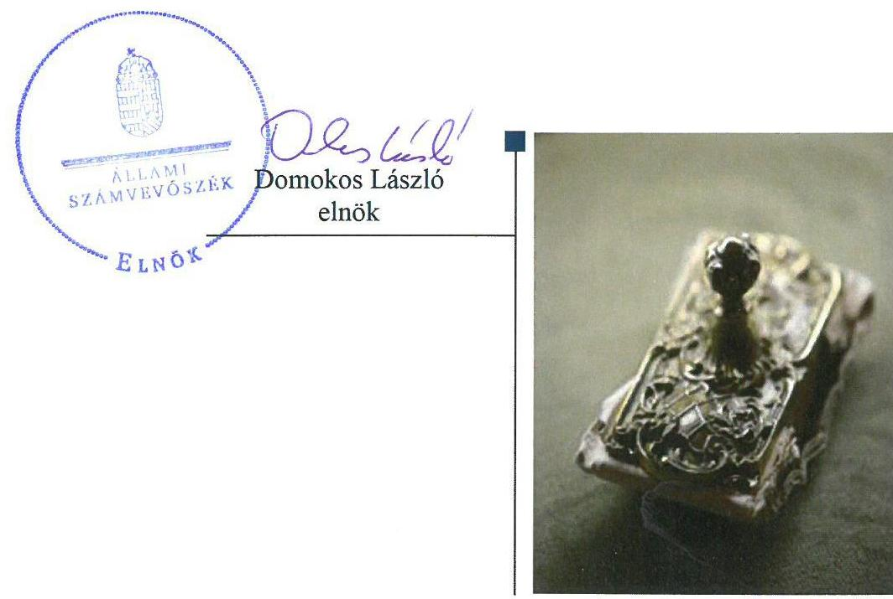

---

# AZ ELLENŐRZÉST FELÜGYELTE:

DR. HORVÁTH MARGIT felügyeleti vezető

## AZ ELLENŐRZÉST VEZETTE ÉS A VÉGREHAJTÁSÁÉRT FELELŐS:

RÁCZKEVI KATALIN ellenőrzésvezető

## A PROGRAM ÖSSZEÁLLÍTÁSÁÉRT FELELŐS:

TÓTPÁL SZABOLCS osztályvezető

IKTATÓSZÁM: EL-0105-131/2018.

TÉMASZÁM: 2447

ELLENŐRZÉS-AZONOSÍTÓ SZÁM: V079308

Jelentéseink az Országgyűlés számítógépes hálózatán és az Interneta a www.asz.hu címen is olvashatóak.

---

# TARTALOMJEGYZÉK 

■ ÖSSZEGZÉS ..... 5
■ AZ ELLENŐRZÉS CÉLJA ..... 6
■ AZ ELLENŐRZÉS TERÜLETE ..... 7
■ AZ ELLENŐRZÉS HÁTTERE, INDOKOLTSÁGA ..... 9
■ A JELENTÉS LÉNYEGES KÉRDÉSKÖREI ..... 10
■ AZ ELLENŐRZÉS HATÓKÖRE ÉS MÓDSZEREI ..... 11
■ MEGÁLLAPÍTÁSOK ..... 13
■ JAVASLATOK ..... 19
■ MELLÉKLETEK ..... 23
I. sz. melléklet: A Társaság kiemelt mérlegadatai 2013-2016. között ..... 23
■ FÜGGELÉK: ÉSZREVÉTELEK ..... 25
■ RÖVIDÍTÉSEK JEGYZÉKE ..... 39

---

.

---

# ÖSSZEGZÉS 

Tiszanána Község Önkormányzata a tulajdonosi joggyakorlás kereteit szabályszerűen kialakította, azonban a tulajdonosi joggyakorlása nem felelt meg a jogszabályi előirásoknak. Az Enter-Nána Építőipari és Szolgáltató Nonprofit Kft. vagyongazdálkodása és vagyonnyilvántartása nem volt szabályszerű. Számviteli beszámolói nem nyújtottak megbizható és valós képet a gazdálkodásról. Közzétételi kötelezettségének nem tett eleget a jogszabályi előírások szerint. Ezzel nem volt biztositott a müködés és a gazdálkodás átláthatósága.

## Az ellenőrzés társadalmi indokoltsága

Az önkormányzatok többségi tulajdonában álló gazdasági társaságok ellenőrzése kiemelten fontos a vagyon megőrzése, megóvása érdekében, amelyekkel szemben alapvető követelmény, hogy gazdálkodásuk, működésük szabályszerű legyen. A feladatellátás költségeinek, ráfordításainak alakulása a lakosság széles rétegét érinti.

Az Enter-Nána Építőipari és Szolgáltató Nonprofit Kft. az ellenőrzött időszak alatt a Tiszanána Község Önkormányzatával kötött feladat-ellátási szerződés alapján az Önkormányzat feladatkörébe tartozó egyes alapellátásokat végezte, illetve közreműködött annak biztosításában. Az Állami Számvevőszék az ellenőrzése során arra kereste a választ, hogy szabályszerű volt-e a Társaság közfeladat-ellátással összefüggő gazdálkodása, felelősen bánt-e az Önkormányzat által átadott vagyonnal, és az Önkormányzat ehhez kapcsolódó tulajdonosi joggyakorlása szabályszerű volt-e.

## Főbb megállapítások, következtetések, javaslatok

Tiszanána Község Önkormányzata a tulajdonosi joggyakorlás kereteit a felügyelőbizottsági ügyrenddel és a javadalmazási szabályzattal kapcsolatos hiányosságok kivételével szabályszerűen alakította ki.

Az Önkormányzat tulajdonosi joggyakorlása nem felelt meg a vagyongazdálkodási rendeletnek és az önkormányzati Szervezeti és Múködési Szabályzat előírásainak. A Társaság részére nyújtott pénzeszköz átadásokról a polgármester a Képviselő-testület felhatalmazása nélkül döntött, a Társaság gazdálkodását, vagyongazdálkodását, müködését az Önkormányzat nem ellenőrizte.

Az Enter-Nána Építőipari és Szolgáltató Nonprofit Kft. a vagyonkezelésében lévő önkormányzati vagyont nem tartotta szabályszerűen nyilván és nem mutatta ki számviteli elszámolásaiban ellenőrizhető módon. A vagyongazdálkodás keretében nem készültek szabályszerű, az Önkormányzattal egyeztetett éves leltárak. A mérlegtételek alátámasztásához a Társaság a 2013-2016. években a Számv. tv. előírása ellenére nem készített olyan leltárt, amely tételesen és ellenőrizhető módon tartalmazta valamennyi eszközét és forrását mennyiségben és értékben.

A Társaság az értékcsökkenési leírást nem a belső szabályzatában előírtaknak megfelelően számolta el, mert minden esetben egyösszegben számolta el a 100 ezer Ft alatti bekerülési értékű eszközök értékét az előírt 50,0 ezer Ftos értékhatár helyett.

Az egyszerűsített éves beszámolók nem tükröztek a gazdálkodásról megbízható és valós képet, mert a vagyonkezelésbe vett eszközöket a hosszú lejáratú kötelezettségei között nem mutatták ki.

A Társaság a bevételeit és ráfordításait az előírásoknak megfelelően számolta el, az árképzése szabályszerű volt.
Az Enter-Nána Építőipari és Szolgáltató Nonprofit Kft. nem készítette el a közérdekű adatok közzétételének és a megismerésére irányuló kérelmek rendjére vonatkozó szabályzatát és nem teljesítette az előírt közzétételi kötelezettségét, így a müködés átláthatósága nem volt biztosított.

---

# AZ ELLENŐRZÉS CÉLJA 

Az ellenőrzés célja annak értékelése volt, hogy az Önkormányzat a vagyongazdálkodási tevékenysége során szabályszerűen gyakorolta-e tulajdonosi jogait. A Társaság szabályozottsága, gazdálkodása és vagyongazdálkodási tevékenysége, bevételeinek és ráfordításainak elszámolása megfelelt-e a jogszabályi és tulajdonosi előírásoknak, valamint a gazdálkodás átláthatósága és elszámoltathatósága érdekében biztosítva volt-e a szolgáltatás dijának megalapozottsága szabályszerű önköltségszámítással. A Társaság kötelezettségállománya jelentett-e kockázatot a müködésre.

---

# **AZ ELLENŐRZÉS TERÜLETE**

## **Enter-Nána Építőipari és Szolgáltató Nonprofit Kft.**

**TISZANÁNA KÖZSÉG ÖNKORMÁNYZATA** a kötelező és önként vállalt közfeladatainak ellátására, 100%-os önkormányzati tulajdonnal, 1999. április 19-én határozatlan időre létrehozta a jogelőd Enter Szolgáltató Közhasznú Társaságot, majd a cég elnevezését Enter-Nána Építőipari és Szolgáltató Közhasznú Társaságra változtatta. Az Önkormányzat¹ a Társaságot² 2008. június 24-én átalakította, ezt követően Kft.-ként működtette.

Az önkormányzati tulajdonosi jogokat a Képviselő-testület³ gyakorolta. A Polgármester⁴, a Jegyző⁵ és az Ügyvezető⁶ személyében 2013. január 1-je és 2016. december 31-e között nem történt változás.

### **AZ ENTER-NÁNA ÉPÍTŐIPARI ÉS SZOLGÁLTATÓ NONPROFIT KFT.**

Alapító okiratban⁷ rögzített tevékenységi köre és főbb közfeladatai – melyek az önkormányzati ingatlanok fenntartása, karbantartása, üzemeltetése, műszaki-technikai felszereltség biztosítása, a helyi közutak építése és fenntartása, köztemetők üzemeltetése, a szociális és gyermekétkeztetés biztosítása, időskorúak gondozása, település tisztasági, parkolási szolgáltatás, piacüzemeltetés voltak – 2016. június 28-ig nem változtak.

A vállalkozási tevékenységeit – főként építési tevékenység, vízi szállítást kiegészítő szolgáltatás, éttermi, mozgó vendéglátás, számviteli tevékenység – a közhasznú tevékenysége elősegítése érdekében folytatta.

A Társaság Közhasznú jogállása 2014. május 31-én szűnt meg a Civil. tv. változása következtében.

1. ábra

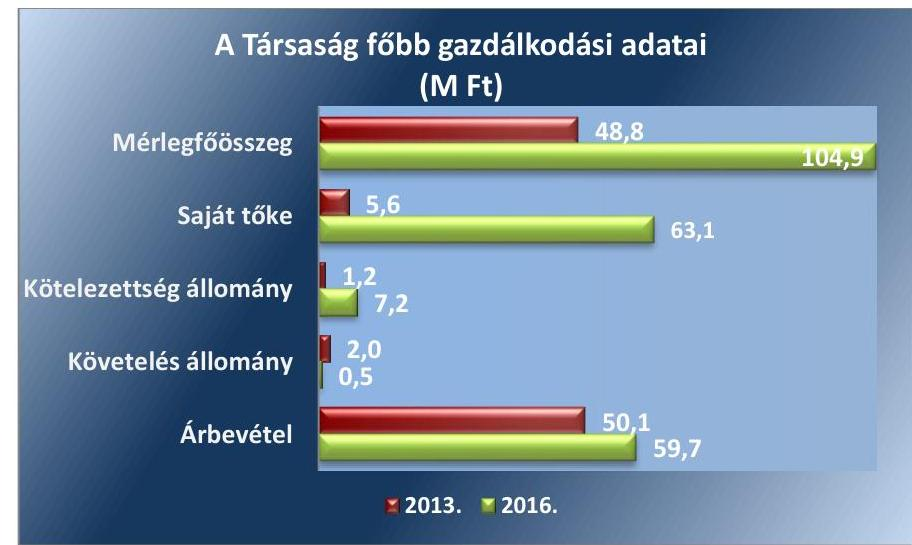

*Forrás: A Társaság 2013. és 2016. évi beszámolója*

---

A Társaság 2016-ban 59,7 M Ft nettó árbevételt ért el, mely a 2013. évinek az 1,2-szerese. A mérlegfőösszeg a 2013. évi nyitó értékről 2016. évre 56,1 M Ft-tal növekedett. A saját tőke összege a 2013. évi nyitó 5,6 M Ft-ról a 2016. év végére 63,1 M Ft-ra, több mint tízszeresére emelkedett, főként a működéséhez pályázati forrásból kapott támogatás jogszabály előírása alapján lekötött tartalékba való helyezése következtében. A jegyzett tőke összege az ellenőrzött időszakban nem változott, 3 M Ft volt.

A Társaság követelésállománya az ellenőrzött időszak elején 2 M Ft volt, az időszak végi záró állománya 0,5 M Ft-ra változott, kötelezettségállománya 1,2 M Ft-ról 7,2 M Ft-ra növekedett, melyből 2016. év végén 5,8 M Ftot az Önkormányzat felé fennálló tartozás tett ki. A Társaság főbb gazdálkodási adatait az 1. számú ábra tartalmazza.

Az Önkormányzat a Társaság feladat-ellátásához szükséges eszközöket a Társaság megalapításakor a vagyonkezelésébe adta. A Társaság a 2015. év kivételével veszteségesen gazdálkodott, 2015-ben 955 ezer Ft eredményt ért el. A Társaság a Ctv. ${ }^{8}$ 9/F. § értelmében nonprofit múködést folytatott, osztalékot nem fizetett, nyereségét eredménytartalékba helyezte.

A 2013-2014. években a Társaság létszáma 14 fő, 2015-ben 13 fő, 2016. június 28-ig 14 fő volt, a gyermek és szociális étkeztetési feladat megszűnése miatt a létszám is 5 fővel csökkent, így az időszak végére 9 főre változott.

A Társaság az ellenőrzött időszakban más gazdasági társaságokban tulajdonosi részesedéssel nem rendelkezett és nem tartozott a kormányzati szektorba sorolt egyéb szervezetek körébe.

---

# AZ ELLENŐRZÉS HÁTTERE, INDOKOLTSÁGA 

## AZ ÖNKORMÁNYZATI TULAJDONÚ GAZDASÁGI

TÁRSASÁGOK teljes körű ellenőrzésének lehetőségét az Állami Számvevőszékről szóló 1989. évi XXXVIII. törvény 2011. január 1-jétől hatályos módosítása teremtette meg és az Állami Számvevőszékről szóló 2011. évi LXVI. törvény is tartalmazza. A gazdasági társaságok gazdálkodási tevékenysége szabályszerűségének ellenőrzését 2011. évtől végezzük. Az önkormányzatok többségi tulajdonában álló gazdasági társaságok ellenőrzése kiemelten fontos a vagyon megőrzése, megóvása érdekében.

A feladatellátás költségeinek, ráfordításainak alakulása a lakosság széles rétegét érinti. Az ellenőrzés várható hasznosulásaként ellenőrzéseink feltárhatják, hogy az önkormányzat a feladatellátásához rendelt vagyon működtetését a tulajdonostól elvárható gondossággal végezte-e, a feladatot ellátó gazdasági társaság a létesítő okiratban, szolgáltatási szerződésben foglaltak betartásával biztosította-e a feladat ellátását. Az ellenőrzés rávilágíthat arra, hogy a gazdasági társaság a vagyon használatával biztosí-totta-e a szolgáltatás folytatásának feltételeit, az önkormányzat tulajdonosi felügyelete hozzájárult-e a szabályszerű gazdálkodáshoz és feladatellátáshoz.

A megállapítások alapján megfogalmazott számvevőszéki javaslatok hasznosítása elősegítheti a meglévő hibák megszüntetését. A jó gyakorlatok bemutatásával az Állami Számvevőszék hozzájárul a követendő megoldások megismertetéséhez, terjesztéséhez.

---

# A JELENTÉS LÉNYEGES KÉRDÉSKÖREI 

1.- Az Önkormányzat tulajdonosi joggyakorlása szabályszerű volt-e?
2.- A Társaság szabályozottsága és vagyongazdálkodási tevékenysége szabályszerű volt-e?
3.- A Társaság gazdálkodása, bevételeinek és ráfordításainak elszámolása, árképzése szabályszerű volt-e, fizetőképessége biztositott volt-e?

---

# AZ ELLENŐRZÉS HATÓKÖRE ÉS MÓDSZEREI 

## Az ellenőrzés típusa

Megfelelőségi ellenőrzés.

## Az ellenőrzött időszak

2013. január 1-jétől 2016. december 31-ig tartó időszak.

## Az ellenőrzés tárgya

Tiszanána Község Önkormányzata tulajdonosi joggyakorlása, valamint az Enter-Nána Építőipari és Szolgáltató Nonprofit Kft. gazdálkodásának szabályozottsága és szabályszerűsége.

Az ellenőrzés kiterjedt minden olyan körülményre és adatra, amely az ÁSZ ${ }^{9}$ jogszabályban meghatározott feladatainak teljesítéséhez, valamint a program végrehajtása folyamán felmerült újabb összefüggések feltárásához szükséges.

## Az ellenőrzött szervezet

Enter-Nána Építőipari és Szolgáltató Nonprofit Kft. és a kizárólagos tulajdonosi jogokat gyakorló Tiszanána Község Önkormányzata.

## Az ellenőrzés jogalapja

Az ellenőrzés jogszabályi alapját az ÁSZ tv. 1. § (3) bekezdése és 5. § (3) - (4) - (5) bekezdései képezték.

## Az ellenőrzés módszerei

Az ellenőrzést a nemzetközi standardokat irányadónak tekintve az ellenőrzési program ellenőrzési kérdései, az ellenőrzött időszakban hatályos jogszabályok, az ellenőrzés szakmai szabályok és módszertanok figyelembe vételével végeztük.

Az ellenőrzés ideje alatt az ellenőrzött szervezettel történő kapcsolattartást az ÁSZ Szervezeti és Múködési Szabályzatának vonatkozó előírásai alapján biztosítottuk.

Az ellenőrzés a kizárólagos tulajdonosi jogokat gyakorló önkormányzatra, és az ellenőrzött gazdasági társaságra terjedt ki.

---

Az ellenőrzési kérdések megválaszolásához szükséges bizonyítékok megszerzése a következő ellenőrzési eljárások alkalmazásával történt: megfigyelés, kérdésfeltevés (információkérés), összehasonlítás, valamint elemző eljárás. Az ellenőrzési bizonyítékként felhasználható adatforrások közé tartoztak egyrészt az ellenőrzési programban felsorolt adatforrások, másrészt adatforrás lehet még minden - az ellenőrzés folyamán - feltárt, az ellenőrzés szempontjából információkat tartalmazó dokumentum.

Az ellenőrzést a kérdésekre adott válaszok kiértékelésével, valamint a megjelölt adatforrások, a csatolt tanúsítványok felhasználásával, továbbá az adott időszakban hatályos jogszabályok figyelembe vételével folytattuk le.

A bevételek és ráfordítások elszámolása, valamint a vagyonnyilvántartás terén a szabályszerű működést véletlen mintavétellel ellenőriztük. A mintavétellel ellenőrzött területek esetében minden egyes tétel vonatkozásában a szabályszerűségre vonatkozó kérdéseket tettünk fel, amelyek eredménye összesítésre került. Megfelelőnek értékeltünk egy ellenőrzött területet, amennyiben 95\%-os bizonyossággal a teljes sokaságban az átlagos hibaarány legfeljebb 10\%, nem megfelelőnek, amennyiben 10\%-nál magasabb arányt képviselt. Abban az esetben, ha a teljes sokaság tekintetében a 10\%-os hibaarányhoz való viszony megítélésnek megbízhatósága nem érte el a 95\%-ot, annak elérése érdekében értékelésünket további szempontokkal egészítettük ki, és figyelembe vettük a feltárt hibák típusát és súlyát. A ráfordítások elszámolására és a vagyonnyilvántartásra vonatkozó véletlen mintavételt kockázati alapú kiválasztással egészítettük ki, amelynek során évente a három legnagyobb összegű tételt értékeltük.

---

# 1. Az Önkormányzat tulajdonosi joggyakorlása szabályszerű volt-e? 

Összegző megállapítás

Az Önkormányzat a tulajdonosi joggyakorlás kereteit - a felügyelőbizottság ügyrendje és a javadalmazási szabályzat kivételével - szabályszerűen kialakította, azonban a tulajdonosi jogok gyakorlása nem volt szabályszerű.
1.1. számú megállapítás

Az Önkormányzat a tulajdonosi joggyakorlás kereteit - a felügyelőbizottság ügyrendje és a javadalmazási szabályzat kivételével - szabályszerűen alakította ki.

Az Önkormányzat 2013. január 1-jétől 2014. október 21-ig nem rendelkezett az Mötv ${ }^{10}$ 116. § (1) bekezdésének előírásainak megfelelő gazdasági programmal, fejlesztési tervvel. A vagyongazdálkodási tervet, amely megfelelt az Nvtv. ${ }^{11}$ 9. § (1) bekezdésének előírásainak, 2013. március 7-én készítette el.

Az önkormányzati vagyonnal való gazdálkodásának szabályaira vonatkozó rendelettel 2013. január 31-től rendelkezett. A vagyongazdálkodási rendelet ${ }_{1,2}{ }^{12}$-ben az Mötv. 109. § (4) bekezdésében foglalt előírás ellenére nem szabályozta a vagyonkezelői jog ellenértékét, az ingyenes átengedését, a vagyonkezelői jog gyakorlásának, valamint a vagyonkezelés ellenőrzésének részletes szabályait. A vagyongazdálkodási rendelet ${ }_{2}$ nem tartalmazta az Önkormányzat Nvtv. 3. § 6. pontja szerinti korlátozottan forgalomképes vagyoni kör besorolását, valamint az 5. § (2) bekezdésében előírtak ellenére nem határozta meg az Önkormányzat forgalomképtelen törzsvagyonát.

Az Önkormányzat az Mötv.-ben előírt SZMSZ-szel 2014. december 23tól rendelkezett. Az SZMSZ ${ }_{1,2}{ }^{13}$ az Ávr. ${ }^{14}$ 13. § (1) bekezdése d) pontjának előírása ellenére nem tartalmazta azon gazdálkodó szervezetek részletes felsorolását, amelyek tekintetében az Önkormányzat alapítói, tulajdonosi jogokat gyakorol.

A tulajdonosi joggyakorlás kereteit a Társaság Alapító okiratában, az Önkormányzat vagyongazdálkodási rendelet ${ }_{1,2}$-ben, a vagyonkezelési szerződés ${ }^{15}$-ben, valamint a feladat-ellátási szerződés ${ }_{1,2}{ }^{16}$-ben meghatározták. Az Önkormányzat az Alapító okiratban meghatározta a Társaság szervezeti felépítését, kijelölte az ügyvezető személyét, valamint a Gt. ${ }^{17}$, illetve a Ptk. ${ }^{18}$ előírásainak megfelelően a három tagú felügyelőbizottság ${ }^{19}$-ot és a személyében felelős könyvvizsgálót. Könyvvizsgálatra a Társaság a Számv. tv. ${ }^{20}$ 155. § (3) bekezdése alapján nem volt kötelezett, azonban az Alapítói okirat alapján már az alakulástól könyvvizsgáló ellenőrizte a Társaság egyszerűsített éves beszámolóját. A felügyelőbizottság az ellenőrzött időszakban a Gt. 34. § (4) és a Ptk. 3:122. § (3) bekezdése és az Alapító okirat előírásai ellenére munkájához ügyrendet nem készített.

---

1. táblázat

RENDSZERES MŰKÖDÉSI CÉLŰ PÉNZESZKÖZ ÁTADÁSOK A TÁRSASÁG RÉSZÉRE (E FT)

|  Évek | Jóváhagyott | Támogatási |
| :--: | :--: | :--: |
|  | összeg | szerződés |
| 2013. | 15850 | 18148 |
| 2014. | 0 | 18148 |
| 2015. | 0 | 17560 |
| 2016. | 0 | 17760 |

A Képviselő-testület mint a Társaság legfőbb szerve a Taktv. ${ }^{21}$ 5. § (3) bekezdése ellenére a Társaság javadalmazási, juttatási rendszeréről szóló szabályzatot nem alkotta meg.

## A tulajdonosi jogok gyakorlása nem volt szabályszerű.

A Tulajdonosi joggyakorló az ellenőrzött időszakban határozataival ${ }^{22}$ - a felügyelőbizottság írásos jelentése és a könyvvizsgálói jelentés Számv. tv. 156. § (5) bekezdés f) pontja szerinti hitelesítő záradékának ismeretében - jóváhagyta az egyszerűsített éves beszámolókat. A 2015. évi egyszerűsített éves beszámoló elfogadásakor az adózott eredmény felhasználásáról a Képviselő-testület a Ptk. 3:372. § (1) bekezdés d) pontja ellenére nem döntött.

Az üzleti terveket a Társaság a feladat-ellátási szerződés;-ben előírtak szerint elkészítette, amelyeket a Képviselő-testület megtárgyalt és határozatokba ${ }^{23}$ foglalta a jóváhagyásukat. Az üzleti tervek a 2013. évi kivételével rendszeres múködési célú pénzeszköz átadás jogcímet nem tartalmaztak.

A Képviselő-testület az üzleti tervekről hozott döntései során nem járt el szabályszerűen, mert:
—az Alapító okirat „2/ A társaság szervezete" pontjában foglalt előírás ellenére a Társaság üzleti terveiről az ellenőrzött időszakban a felügyelőbizottság írásos véleménye nélkül döntött,
— a Társaság 2015. évi üzleti tervéről írásos előterjesztés hiányában döntött, amely eljárása az önkormányzati SZMSZ; 10. §. (4) bekezdésében, valamint a 27. § /1/b) pontjában foglaltaknak nem felelt meg.
Az Társaság üzleti tervének végrehajtásához a Polgármester a 20142016. években képviselő-testületi jóváhagyás nélkül kötött támogatási szerződést a rendszeres múködési célú pénzeszköz átadásra. A 2013. évben a Képviselő-testület által az ezen a jogcímen jóváhagyott támogatási összegnél 2298 ezer Ft-tal magasabb összegű Támogatási szerződést hagyott jóvá a polgármester, valamint eljárása a 2015-2016. években az Önkormányzat SZMSZ-ében (a 15/2014. (XII. 22.) Ör. 63. § (7) bekezdésében) előírtakba ütközött, mivel a polgármester azon kötelezettségvállalásaihoz, melyek mindkét évben meghaladták az 1 M Ft-ot, nem álltak rendelkezésre a Pénzügyi és Településfejlesztési Bizottság ${ }^{24}$ hozzájárulásai. A rendszeres múködési célú pénzeszköz átadásokat az 1. táblázat tartalmazza.

Az Önkormányzat a 2013-2016. években összesen 119,7 M Ft tagi kölcsönt folyósított a Társasága részére, amelyből mindösszesen 29,7 M Ft alapult képviselő-testületi határozaton, 90,1 M Ft összegű kölcsön nyújtása nincs testületi döntéssel alátámasztva.

A Társaság az ellenőrzött időszakban a számára biztosított kölcsönből összességében 113,9 M Ft-ot törlesztett, az Önkormányzat részére kamatot nem fizetett, és annak ellenére, hogy a kölcsönt rövidlejáratú kötelezettségként vette nyilvántartásba, valamennyi ellenőrzött év végén maradt kötelezettség állománya, melynek összege 2016. december 31-én 5,8 M Ft. volt.

Az Önkormányzat nem gondoskodott a vagyonkezelésbe adott eszközöknek a vagyonkezelési szerződés 7. pontjában foglaltak szerinti nyilván-

---

tartásáról, valamint a Számv. tv. 69. § (3) bekezdésében foglalt előírás ellenére leltározás során egyeztetéssel nem ellenőrizte a vagyonkezelésbe adott eszközök meglétét, valamint a vagyon változását.

# 2. A Társaság szabályozottsága és vagyongazdálkodási tevékenysége szabályszerű volt-e? 

## Összegző megállapítás

2.1. számú megállapítás

A Társaság vagyongazdálkodása nem volt szabályszerű.

## A Társaság szabályozottsága nem felelt meg az előírásoknak.

A Társaság az ellenőrzött időszakban rendelkezett Számviteli politikával ${ }^{25}$, Számlarenddel ${ }^{26}$, Pénzkezelési szabályzattal ${ }^{27}$, Leltározási és selejtezési szabályzattal ${ }^{28}$.

A Társaság Számviteli politikája nem felelt meg a Számv. tv. 14. § (3) bekezdésének, mert nem a társasági formára választható rendelkezéseket, hanem költségevetési szerv specifikus előírásokat tartalmazott, egyebek között a költségvetési szervre jellemző formát írt elő. A Társaság féléves és éves beszámoló készítést választott, mely nem felelt meg a Számv. tv. 8. § (2) bekezdésében foglalt választási lehetőségeknek, amely szerint a Társaság éves beszámolót vagy egyszerűsített éves beszámolót választhatott volna.

A Számlarend nem felelt meg a Számv. tv. 161. § (2) bekezdés a) pontjában rögzített előírásoknak, mert nem tartalmazta minden alkalmazásra kijelölt számla számjelét és megnevezését.

A Társaság Pénzkezelési szabályzata valamint Leltározási és selejtezési szabályzata megfelelt a Számv.tv. előírásainak. A Leltározási és selejtezési szabályzatban a mennyiségi felvételezéssel történő leltározást évenkénti gyakorisággal írták elő.

A Társaság a vagyonkezelésbe vett vagyonelemek és azok bevételeinek, ráfordításainak Mötv. 109. § (7) bekezdésben előírt elkülönítését nem szabályozta.

A közhasznúsági tevékenységhez kapcsolódóan a Társaság 2013. január 1 és 2014. május 31. között számviteli szabályzatban nem biztosította a Civil tv. ${ }^{29}$ 46. § (1) bekezdésében előírt közhasznúsági melléklet összeállításához a közhasznú és vállalkozási bevételek és ráfordítások elkülönített nyilvántartását, amely nem felelt meg a Számv. tv. 161/A. §. (2) bekezdésben előírtaknak.

A Társaság a Számv. tv. 14. § (5) bekezdésének b) pontja ellenére az eszközök és a források értékelési szabályzatát nem készítette el.

A Társaság a Számv. tv.-ben előírt önköltségszámítási szabályzat készítésére nem volt kötelezett és azt nem is készített.

---

### 2.2. számú megállapítás

A Társaság nem szabályszerűen vezette a kezelésbe vett és saját vagyonhoz kapcsolódó nyilvántartásokat. Az éves beszámolóit nem támasztotta alá szabályszerű leltárral. Nem tartotta be a vagyon elidegenítésére vonatkozó szabályokat. A vagyon megterhelésére nem került sor.

A Társaság a kezelésbe vett vagyonhoz kapcsolódó kötelezettséget az ellenőrzött időszakban a Számv. tv. 42. § (5) bekezdésében előírtak ellenére nem egyéb hosszú lejáratú kötelezettségként mutatta ki, ezzel nem érvényesült a Számv. tv. 15 § (3) bekezdése szerinti valódiság elve.

A Társaság a Számv. tv. 23. § (2) bekezdése ellenére egyik évben sem közölt adatokat a kiegészítő mellékletekben a vagyonkezelésbe vett vagyonról, ezáltal nem teljesült a teljesség és a valódiság elve az éves beszámolóban.

Az Nvtv. 10. § (1) bekezdésében foglalt előírás ellenére a vagyon elsődleges közfeladat megjelölését a vagyonnyilvántartás nem tartalmazta, a vagyonkezelési szerződés 5. pontjában foglalt rendelkezés ellenére a vagyonkezelt eszközök felújítására vonatkozóan nem készített előterjesztést az Önkormányzat számára, a vagyonkezelésében lévő eszközök év végi leltárát - a vagyonkezelési szerződés 6. pontjában foglalt előírás ellenére - nem egyeztette az Önkormányzattal.

A Képviselő-testület a Társsággal történő feladatellátást 2016. június 28 -án felülvizsgálta. Az Önkormányzat a konyha üzemeltetését a Társaságtól visszavette, melyet a feladat-ellátási szerződés2-ben rögzített, azonban a vagyonkezelési szerződést, annak 1. pontjában foglaltak ellenére a feladat ellátáshoz kapcsolódó ingatlan visszavétele tekintetében nem módosította.

A Társaság nem tett eleget a vagyonkezelési szerződés 7. pontjában foglaltaknak, mert 4,1 M Ft bruttó értékű kezelésében lévő vagyont 2014. december 31-én leselejtezett, annak ellenére, hogy a selejtezést az Önkormányzatnak kell volna végrehajtania.

A mérlegtételek alátámasztásához 2013-2016. években a Számv. tv. 69. § (1) bekezdés előírása ellenére a Társaság által összeállított leltár nem tartalmazta tételesen és ellenőrizhető módon valamennyi - a mérleg fordulónapján meglévő - eszközét és forrását mennyiségben és értékben. Ennek következtében a Társaság 2013-2016. évi egyszerűsített éves beszámolója a Számv. tv. 18. §-ában foglaltakkal ellentétben a Társaság vagyoni, pénzügyi és jövedelmi helyzetéről, valamint azok változásáról nem mutatott megbízható és valós képet.

A 2013-2016. években a Társaság a Számv. tv. 46. § (3) bekezdésében, valamint 69. § (1) bekezdésében foglalt előírások ellenére - a vevőkövetelések kivételével - a követelések, - a szállítók és az önkormányzati kölcsönök kivételével- a rövidlejáratú kötelezettségek, valamint az aktív és a paszszív időbeli elhatárolások esetében nem végezte el az előírt értékelést és nem készített az egyszerűsített éves beszámolóiban szereplő mérleg adatokat alátámasztó számviteli leltárakat. A Számv. tv. 69. § (2) bekezdés előírása ellenére a mérlegtételek alátámasztásának keretében a főkönyvi könyvelés és az analitikus nyilvántartások adatai közötti egyeztetést - a vevőkövetelések és a szállítói tartozások kivételével - nem végezték el az ellenőrzött időszakban.

---

A számviteli szabályzatok hibái és hiányosságai, valamint a leltározás hiánya ellenére a könyvvizsgáló az ellenőrzött időszakban korlátozás nélküli hitelesítő záradékkal látta el a beszámolókat.

A Társaság a használt eszközök beszerzése során nem tartotta be a Ptk. 3:116. § (1) bekezdésébe foglaltakat, mert az adásvételi szerződést nem a cégjegyzésre jogosult személy írta alá.

A Társaság a Számviteli politikában előírtak ellenére az értékcsökkenési leírás elszámolása során minden esetben egyösszegben számolta el a 100 ezer Ft alatti, egy esetben a 100 ezer Ft feletti bekerülési értékű eszközök értékét, az előírt 50 ezer Ft-os értékhatár helyett.

A Számv. tv. 88. § (4) bekezdésében foglaltak ellenre a Társaság nem mutatta be a kiegészítő mellékletében az alkalmazott értékelési eljárásokat és az értékcsökkenés elszámolásának számviteli politikában meghatározott módszerét, az elszámolásának gyakoriságát.

A Társaság az ellenőrzött időszakban a vagyonkezelt és a saját eszközökre elszámolt értékcsökkenés összegét meghaladó mértékben végzett felújításokat, melynek következtében az eszközök használhatósági foka javult, átlagos életkoruk csökkent. A vagyon megterhelésére nem került sor.

# 3. A Társaság gazdálkodása, bevételeinek és ráfordításainak elszámolása, árképzése szabályszerű volt-e, fizetőképessége biztosított volt-e? 

Összegző megállapítás

### 3.1. számú megállapítás

3.2. számú megállapítás

A Társaság bevételeinek és ráfordításainak elszámolása, árképzése szabályszerű volt. A fizetőképessége biztosított volt. Adatszolgáltatási, beszámolási kötelezettségének eleget tett, közzétételi kötelezettségét nem teljesítette és nem is szabályozta.

A gazdasági társaság bevételeinek és ráfordításainak elszámolása szabályszerű volt.

A Társaság a főkönyvi számlacsoportok megfelelő alábontásával biztosította a vagyonkezelési szerződés 8. pontjában és az Mötv. 109. § (7) bekezdésében előírt, a vagyonkezelésébe vett vagyon használatából, múködtetéséből származó bevételeinek, illetve közvetlen költségeinek és ráfordításainak közfeladatonkénti elkülönítését.

A bevételek valamint a személyi jellegű és az anyagjellegű ráfordítások elszámolása szabályszerű volt.

A Társaság fizetőképessége biztosított volt.
A Társaság fizetőképessége az ellenőrzött időszakban összességében romlott, mert a rövidlejáratú kötelezettségek 2013. év eleji 2 M Ft-os állománya 2016 végére 7,2 M Ft-ra nőtt, melyből 5,8 M Ft-ot az önkormányzati tagi kölcsön állománya tett ki. Lejárt szállítói állománya csak a 2014. és 2015. évben volt. A fennálló kötelezettségállomány nem veszélyeztette a Társaság múködőképességét.

---

A Társaság hosszú lejáratú hitel-, valamint az Önkormányzattól igénybe vett tagi kölcsön állományon kívül igénybe vett kölcsönállománnyal nem rendelkezett.

# 3.3. számú megállapítás 

A Társaság nem az előírt gyakoriságnál teljesítette az adatszolgáltatási kötelezettségét, továbbá nem készítette el a közérdekú adatok közzétételére vonatkozó szabályzatát és nem tette közzé az adatokat.

A feladat-ellátási szerződés-ben előírt havi elszámolástól eltérően a Társaság a kapott támogatás ütemezéséről, teljesítéséről, maradvány vagy hiány kimutatásáról negyedévente teljesített időszaki beszámolást az Önkormányzat felé, a beszámolókat a Képviselő-testület jóváhagyta.

A Társaság 2013. - 2016. évi beszámolóit a Számv. tv. 153. § (1) bekezdésében meghatározott határidőn belül letétbe helyezte, mellyel egyidejűleg teljesítette a Számv. tv. 154/B. § (2) bekezdésében előírt közzétételi kötelezettségét is. A Társaság a Számv. tv. 153. § (1) bekezdése ellenére a 2015. évi egyszerűsített éves beszámolójával együtt az adózott eredmény felhasználására vonatkozó javaslatot nem helyezte letétbe, mert ilyen javaslatot a Képviselő-testület a Ptk. 3:372. § (1) bekezdés d) pontja ellenére nem hozott.

A Társaság az ellenőrzött időszakban az Info. tv. ${ }^{30}$ 35. § (3) bekezdésében előírt közzétételi kötelezettsége teljesítésének szabályairól belső szabályzatot nem készített. Az Info. tv. 37. § (1) bekezdésében, a Taktv. 2. § (1) és (3) bekezdésében meghatározott közérdekű tartalmakat nem tette közzé honlapján. Az Info. tv. 30. § (6) bekezdésében foglalt előírás ellenére nem rendelkezett a közérdekú adatok megismerésére irányuló igények teljesítésének rendjét rögzítő szabályzattal.

A Társaság az Info. tv. 37. § (1) bekezdésben és az I. melléklet I.2., I.11., II.1., II.12., II.15., III.1-III.8. pontjaiban meghatározott közérdekú tartalmak közlésének nem tett eleget a honlapján. Nem tette közzé a szervezeti felépítését, a múködését meghatározó jogszabályokat, a tevékenységére vonatkozó statisztikai adatgyűjtés eredményeit, az éves költségvetését és számviteli törvény szerinti beszámolóját, a foglalkoztatottak létszámára és személyi juttatásaira vonatokozó összesített adatait, az általa nyújtott támogatásokra vonatkozó adatokat, az 5,0 M Ft-ot elérő szerződések adatait, valamint a közbeszerzések adatait. A Taktv. 2. § (1) bekezdésében foglaltakat megsértve a Társaság - az Info.tv. 33. § (3) bekezdésében foglaltak alapján a honlapján a Társaság és az ügyvezetője nevének és elérhetőségének közzététele kivételével - nem tette közzé az ellenőrzött években a vezető tisztségviselők, a felügyelőbizottsági tagok, a vezető állású munkavállalók adatait, megbízási díjait és azon felüli járandóságait. A Társaság a Taktv. 2. § (3) bekezdésében foglalt előírások ellenére nem tette közzé a pénzeszközei felhasználásával, vagyonával történő gazdálkodással összefüggő szerződések adatait.

### 3.4. számú megállapítás

A Társaság által alkalmazott díjtételek az előírásoknak megfeleltek.
Az ellenőrzött időszakban a Társaság számára az általa nyújtott szolgáltatások díjtételeit az Önkormányzat határozta meg.

---

# JAVASLATOK 

Az ÁSZ tv. 33. § (1) bekezdésében foglaltak értelmében az ellenőrzött szervezet vezetője köteles a jelentésben foglalt megállapításokhoz kapcsolódó intézkedési tervet összeállítani és azt a jelentés kézhezvételétől számított 30 napon belül az ÁSZ részére megküldeni. Amennyiben az ellenőrzött szervezet vezetője nem küldi meg határidőben az intézkedési tervet, vagy továbbra sem elfogadható intézkedési tervet küld, az Állami Számvevőszék elnöke az ÁSZ tv. 33. § (3) bekezdése a) és b) pontjaiban foglaltakat érvényesítheti.

## Javaslataink célja az Enter-Nána Építőipari és Szolgáltató Nonprofit Kft. gazdálkodása szabályszerűségének javítása annak érdekében, hogy a szabályozási környezet és az alkalmazott gyakorlat megfelelően tudja támogatni az átlátható müködést.

## Az Enter-Nána Építőipari és Szolgáltató Nonprofit Kft. ügyvezetőjének

1. Intézkedjen annak érdekében, hogy a számviteli politika feleljen meg a Számv. tv. előirásainak.
(2.1. sz. megállapítás 2. bekezdése alapján)
2. Intézkedjen a számlarend Számv. tv. előirásainak megfelelő módosításáról minden alkalmazásra kijelölt számla számjelének és megnevezésének rögzítésével.
(2.1. sz. megállapítás 3. bekezdése alapján)
3. Intézkedjen az eszközök és források értékelési szabályzatának elkészítéséről a Számv. tv. előirásainak megfelelően.
(2.1. sz. megállapítás 7. bekezdése alapján)
4. Intézkedjen a vagyonkezelésbe vett vagyon egyéb hosszú lejáratú kötelezettségként történő kimutatásáról a beszámoló mérlegében a Számv tv.-nek megfelelően.
(2.2. sz. megállapítás 1. bekezdése alapján)
5. Intézkedjen a vagyonkezelésbe vett vagyon beszámoló kiegészítő mellékletében történő bemutatásáról a Számv. tv. előirásainak megfelelően.
(2.2. sz. megállapítás 2. bekezdése alapján)

---

6. Intézkedjen a vagyonkezelési szerződésben foglaltak teljesitéséről a vagyonkezelt vagyon leltárának elkészitése során.
(2.2. sz. megállapítás 3. bekezdése alapján)
7. Intézkedjen, hogy az egyszerüsített éves beszámoló mérlegét alátámasztó leltár a Számv. tv.-ben elöírtaknak megfelelően, tételesen, ellenőrizhető módon tartalmazza az eszközöket és forrásokat mennyiségben és értékben egyaránt.
(2.2. sz. megállapítás 6. 7. bekezdései alapján)
8. Intézkedjen az értékcsökkenési leírás szabályos elszámolásáról a számviteli politikában meghatározott értékhatár figyelembe vételével.
(2.2. sz. megállapítás 10. bekezdése alapján)
9. Intézkedjen az alkalmazott értékelési eljárásoknak, az értékcsökkenés elszámolása módszerének, elszámolása gyakoriságának a beszámoló kiegészítő mellékletében történő bemutatásáról a Számv. tv. előírásainak megfelelően.
(2.2. sz. megállapítás 11. bekezdése alapján)
10. Intézkedjen a kapott támogatás ütemezéséről, teljesitéséről, maradvány vagy hiány kimutatásával kapcsolatos havi elszámolásról a fel-adat-ellátási szerződésben elöírtak szerint.
(3.3. sz. megállapítás 1. bekezdése alapján)
11. Intézkedjen az Info tv. előírásainak megfelelően a közzétételi kötelezettség részletes rendjét rögzítő szabályzat, valamint a közérdekü adatok megismerésére irányuló igények teljesitésének rendjét rögzítő szabályzat elkészitéséről.
(3.3. sz. megállapítás 3. bekezdés 1. és 3. mondatai alapján)
12. Intézkedjen az elektronikus közzétételi kötelezettség az Info tv., és a Taktv. által meghatározottak szerinti, teljes körü teljesitéséről.
(3.3. sz. megállapítás 4. bekezdése alapján)

---

# Javaslataink célja az Önkormányzat szabályszerű működésének elősegítése, továbbá az önkormányzati tulajdonosi joggyakorlás kontrolljainak erősítése. 

## Tiszanána Község Önkormányzata polgármesterének

1. Hívja fel a felügyelőbizottság elnökének figyelmét az ügyrend elkészítésére és a jóváhagyás érdekében a Képviselő-testület számára történő előterjesztésére.
(1.1. sz. megállapítás 4. bekezdés 4. mondata alapján)
2. Intézkedjen a Társaság vezető tisztségviselői, illetve a felügyelőbizottsági tagok, valamint az Mt. 208. §-ának hatálya alá eső munkavállalók javadalmazása, valamint a jogviszony megszünése esetére biztositott juttatások módjának, mértékének elveire, annak rendszerére vonatkozó szabályzat-tervezet elkészitése és Képviselő-testület elé terjesztése érdekében.
(1.1. sz. megállapítás 5. bekezdése alapján)
3. Intézkedjen annak érdekében, hogy a Képviselő-testület a Társaság üzleti terveiről a felügyelőbizottság írásbeli véleménye ismeretében hozzon döntést az alapító okiratban foglaltaknak megfelelően.
(1.2. sz. megállapítás 3. bekezdése 1. francia bekezdése alapján)
4. Intézkedjen
a) a számviteli szabályozási hiányosságok,
b) az eszközök és források értékelési szabályzata elkészitésének elmulasztása,
c) a vagyonkezelésbe vett vagyon kimutatásának, nyilvántartásának hiányosságai,
d) a vagyonkezelt eszközök leltározása tekintetében a vagyonkezelési szerződésben foglaltak teljesitésének elmaradása,
e) a megfelelő leltár hiánya,
f) az értékcsökkenés elszámolás szabálytalanságai, valamint
g) a közzétételi kötelezettség teljesitésének hiányosságai
miatti felelősség tisztázása érdekében, és szükség szerint intézkedjen a felelősség érvényesitéséről.
(2.1. sz. megállapítás 2-3 és 5-7. bekezdései, 2.2. sz. megállapítás 13. és 5. bekezdései, 2.2. sz. megállapítás 6-7. bekezdése, 2.2. sz. megállapítás 10. bekezdése, 3.3. sz. megállapítás 3. bekezdés 1. és 3. mondatai és 4. bekezdése alapján)

---

.

---

# MELLÉKLETEK

I. SZ. MELLÉKLET: A TÁRSASÁG KIEMELT MÉRLEGADATAI 2013-2016. KÖZÖTT

|   |  |  |  | adatok M Ft-ban |   |
| --- | --- | --- | --- | --- | --- |
|  Megnevezés | $\begin{gathered} 2013 . \ 01 .01 . \end{gathered}$ | $\begin{gathered} 2013 . \ 12 .31 . \end{gathered}$ | $\begin{gathered} 2014 . \ 12 .31 . \end{gathered}$ | $\begin{gathered} 2015 . \ 12 .31 . \end{gathered}$ | $\begin{gathered} 2016 . \ 12 .31 . \end{gathered}$  |
|  A. Befektetett eszközök | 44,9 | 83,3 | 103,3 | 106,6 | 103,3  |
|  ebből: II. Tárgyi eszközök | 44,9 | 83,3 | 103,3 | 106,6 | 103,3  |
|  B. Forgóeszközök | 3,4 | 6,7 | 10,3 | 8,5 | 1,5  |
|  ebből: II. Követelések | 2,0 | 6,3 | 9,6 | 7,0 | 0,5  |
|  C. Aktív időbeli elhatárolások | 0 | 0 | 1,6 | 1,1 | 3,5  |
|  Eszközök összesen | 48,8 | 90,0 | 115,2 | 116,2 | 104,9  |
|  D. Saját tőke | 5,6 | 30,0 | 41,7 | 63,7 | 63,1  |
|  I. Jegyzett tőke | 3,0 | 3,0 | 3,0 | 3,0 | 3,0  |
|  IV. Eredménytartalék | 0,2 | 2,9 | $-2,9$ | $-6,0$ | $-5,1$  |
|  V. Lekötött tartalék | 1,2 | 30,0 | 44,7 | 65,7 | 65,7  |
|  VII. Mérleg szerinti eredmény | 1,5 | $-5,8$ | $-3,1$ | 1,0 | $-0,5$  |
|  E. Céltartalékok | 0 | 0 | 0 | 0 | 0  |
|  F. Kötelezettségek | 1,2 | 20,0 | 35,4 | 17,1 | 7,2  |
|  G. Passzív időbeli elhatárolások | 41,3 | 40,1 | 38,1 | 35,5 | 34,5  |
|  Források összesen | 48,8 | 90,0 | 115,2 | 116,2 | 104,9  |

Fonás: A Társaság 2013.-2016. évi éves beszámolói

---

.

---

# FÜGGELÉK: ÉSZREVÉTELEK 

A jelentéstervezetet a Számvevőszék 15 napos észrevételezésre megküldte az ellenőrzött szervezetek vezetőinek az ÁSZ tv. 29. §* (1) bekezdése előírásának megfelelően.

A jelentés tartalmazza az ellenőrzött Enter-Nána Épitőipari és Szolgáltató Nonprofit Kft. ügyvezető igazgatójától és Tiszanána Község Önkormányzata polgármesterétől érkezett észrevételeket és azok kezeléséről szóló válaszleveleket.

[^0]
[^0]:    * 29. § (1) Az Állami Számvevőszék az ellenőrzési megállapításait megküldi az ellenőrzött szervezet vezetőjének vagy az általa megbízott személynek, és annak, akinek személyes felelősségét állapította meg.
    (2) Az ellenőrzött szervezet vezetője és a felelősként megjelölt személy az ellenőrzés megállapításaira tizenöt napon belül írásban észrevételt tehet.
    (3) Az Állami Számvevőszék az észrevételre a beérkezésétől számított harminc napon belül írásban válaszol. A figyelembe nem vett észrevételeket köteles a jelentésben feltüntetni, és megindokolni, hogy azokat miért nem fogadta el.

---

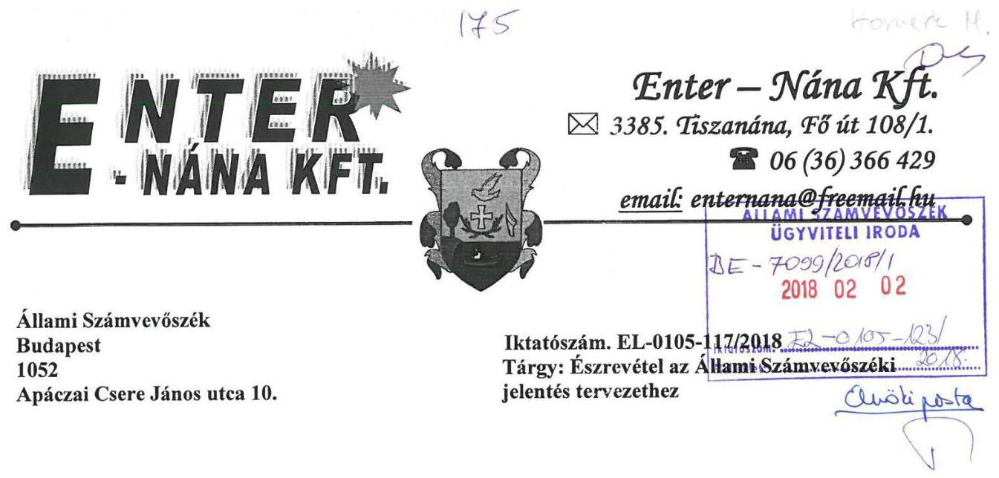

Tisztelt Cím!

Hivatkozva az EL-0105-117/2018 iktatószámú jelentés tervezetükre az alábbi észrevételt teszem:

# 2.1. számú megállapítás 2. bekezdés alapján: 

Az Enter-Nána Nonprofit Kft. 2008. június 24. időponttal elkészítette a Számviteli politikáját egy külső szolgáltatóval aki az Önkormányzat és az intézményei szabályzatát is készítette. A Számviteli politikában valóban voltak olyan hiányosságok melyet az Állami Számvevőszéki megállapítás tartalmaz.

A Társaság 2013. június 01 -el módosította a Számviteli politikáját, mely megfelel a Számv. tv.14§ (3) bekezdésének, mely kimondja: „A törvényben rögzített alapelvek, értékelési eljárások alapján ki kell alakítani és írásba foglalni a gazdálkodó adottságainak, körülményeinek leginkább megfelelő-a törvény végrehajtásának módszereit, eszközeit meghatározó - Számviteli politikát,,

A könyvviteli nyilvántartások vezetése, a beszámoló készítése a Számviteli politikában rögzített előírások alapján történt. A Számviteli politika a 2016. évi módosítások miatt a könyvvizsgálónál volt átnézésen, tévedésből sajnos mi a régi Számviteli dokumentációkat töltöttük fel.

### 2.1. számú megállapítás 3. bekezdés alapján:

A Társaság számlarendjét 2013. június 01 -el a Számviteli politika módosításával egyidejűleg átdolgozta.
A számlarend véleményem szerint megfelel a Számv. tv 161 §(1) bekezdésében rögzítetteknek: „A kettős könyvvitelt vezető gazdálkodó az egységes számlakeret előírásainak figyelembevételével olyan számlarendet köteles készíteni, amely szerinti könyvvezetés az e törvényben elóírt beszámoló készítését maradéktalanul biztosítja."

### 2.1. számú megállapítás 7. bekezdés alapján:

A Társaság az eszközök és források értékelésére vonatkozó külön szabályzattal nem rendelkezik. A 2013. június 1 -től érvényes Számviteli politika részét képezi az eszközök és források értékelésének szabályozása.

### 2.2. számú megállapítás 1. bekezdés alapján:

Tiszanána Község Önkormányzata az 1999-2002. években a Társaság rendelkezésére bocsátott a befektetett eszközök csoportjába tartozó eszközöket. A Társaság könyveiben ezen eszközöket, mint térítés nélkül átvett eszközöket az 1-es számlaosztály megfelelő számláján állományba vette az átadó által közölt értéken a rendkívüli bevétellel szemben. A rendkívüli bevétel elhatárolásra került az eszköz várható használati idejére. A beszámoló elkészítésekor a passzív időbeli elhatárolásból az értékesőkkenési leírással arányos összeg visszavezetésre került.

---

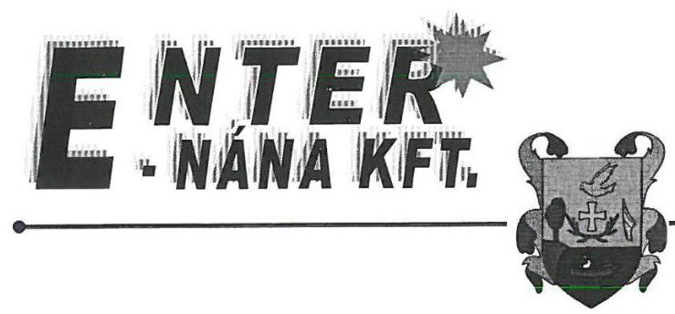

# Enter-Nána Kft. 

$\boxtimes 3385$. Tiszanána, 千ó út 108/1.
06 (36) 366429
email: enternana@freemail.hu

## A Társaság 2002. után nem vett át eszközöket az Önkormányzattól.

Természetesen amennyiben Társaságunk az akkori dokumentációk alapján helytelenül vette ezen eszközöket állományba, abban az esetben a beszámolóban kimutatott értéket 2017. január 1-el átvezetjük a hosszú lejáratú kötelezettségek közé.

Megjegyezni kívánjuk, hogy az átvett eszközök egy része az évek alatt felújításra került a Mezőgazdasági és Vidékfejlesztési Hivatal támogatásából, saját erőből, Önkormányzati kölcsönből. A felújítások értéke az eszköz bekerülési értékét növelte. A Mezőgazdasági és Vidékfejlesztési Hivatal által folyósított támogatást a jogszabályi előírásoknak (23/2007.(IV.17) FVM rendelet 20.§) megfelelően a tőketartalékba (lekötött tartalékba) könyvelték. A támogató a társaságnál több alkalommal ellenőrizte a pénzügyi elszámolást, megállapítást nem tett, azt rendben találta.
Az átvett eszközök értéknövelő felújítása természetesen passzív időbeli elhatárolásként nem került kimutatásra, mivel ez, mint saját beruházás növelte az eszközök értékét, forrása pedig FVM támogatás (lekötött tartalék), saját erő (eredménytartalék), idegen forrás.

## 2.2. számú megállapítás 2. bekezdés alapján:

Társaságunk az átvett eszközöket a könyveiben nem mind vagyonkezelésre átvett vagyont tartotta nyilván, ezért ilyen jogcímen a kiegészítő mellékletben sem kerülhetett bemutatásra.

## 2.2. számú megállapítás 3. bekezdés alapján:

Az Önkormányzattól átvett eszközök a mérlegtételek alátámasztásához leltározásra kerültek, de nem elkülönítetten, mint vagyonkezelt vagyon a fentiekben leírtak miatt.

## 2.2. számú megállapítás 6. 7. bekezdés alapján:

A Számviteli törvény előírásai szerinti leltározást a nonprofit társaság a vizsgálat alá vont időszak minden gazdasági évében elvégezte, azaz a mérleg tételek alátámasztásához mind a befektetett eszközök, mind a készletek leltározása tényleges leltárfelvétellel megtörtént, továbbá a csak értékben kimutatott eszközöknél és kötelezettségeknél a beszámoló sorainak törvényszerinti alátámasztásához szükséges egyeztetés megtörtént.

## 2.2. számú megállapítás 10. bekezdés alapján:

2013. június 01-től hatályos Számviteli politika az eszközök egy összegű leírását 100.000,-Ft alatti eszközök esetén engedélyezi. Az értékcsökkenés elszámolása ezen értékhatár figyelembevételével történt az elszámolási időszakban.

## 2.2. számú megállapítás 11. bekezdés alapján:

A megállapítással egyetértek, a kiegészítő melléklet valóban nem tartalmaz a Számviteli politikában előírt minden információt. 2017. évtől a beszámoló kiegészítő mellékletében erre különösen figyelünk majd.

## 3.3. számú megállapítás 1. bekezdés alapján:

Az Enter-Nána Nonprofit Kft. negyedévente beszámol az alapító Önkormányzat képviselő testületének melynek keretében elszámol a támogatással is.

---

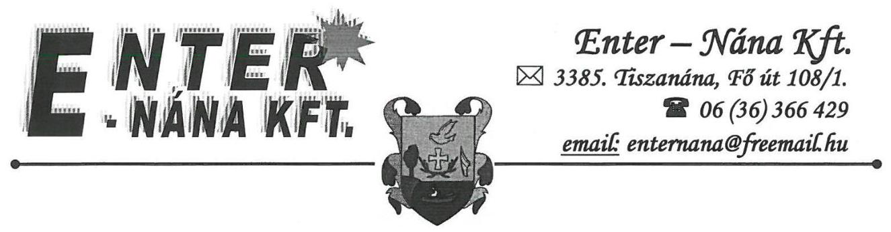
3.3. számú megállapítás 3. bekezdés 1. és 3. mondatai alapján:

A hiányosság pótlásra került, ügyvédünk a Cégbíróság felé is megküldte a szabályzatot.
3.3. számú megállapítás 4. bekezdés alapján:

Az elektronikus közzétételi hiányosságainkat pótoltuk, az Enter-Nána Kft. hivatalos honlapján, a www.enternana.hu oldalon.

Tiszanána, 2018. január 31.
ENTER-NANAKFT. 3385 Tiszanána. Fö út 108/1. OTP: 11739047-20020433 Adószám: 20330907-2-10

Sallós Károly
ügyvezető igazgató

# Melléklet: 

- 1 db Számviteli politika
- 1 db Számlarend

---

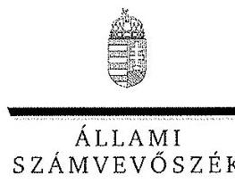

ELNÖK

Ikt.szám: EL-0105-125/2018.

# Sallós Károly úr 

ügyvezető igazgató
Enter-Nána Építőipari és Szolgáltató Nonprofit Kft.

## Tiszanána

## Tisztelt Ügyvezető Igazgató Úr!

Köszönettel vettem „Az önkormányzatok gazdasági társaságai - Az önkormányzatok többségi tulajdonában lévő gazdasági társaságok gazdálkodásának ellenörzése - Enter-Nána Építőipari és Szolgáltató Nonprofit Kft." címủ ellenőrzésről készített számvevőszéki jelentéstervezetre megküldött észrevételeit.
Az Állami Számvevőszék észrevételekre vonatkozó álláspontját a felügyeleti vezető által készített részletes tájékoztatás tartalmazza, amelyet levelemhez mellékeltem.
Tájékoztatom Ügyvezető igazgató urat, hogy az Állami Számvevőszék a figyelembe nem vett észrevételeket az Állami Számvevőszékről szóló 2011. évi LXVI. törvény 29. § (3) bekezdésében előirtak szerint köteles a jelentésében feltüntetni és megindokolni, hogy azokat miért nem fogadta el.

Budapest, 2018. O2 hó 23 nap
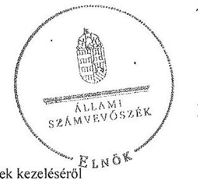

Tisztelettel:

## Domokos László

Melléklet: Tájékoztatás az észrevételek kezeléséről

---

# Tájékoztatás az észrevételek kezeléséről 

Megköszönöm Ügyvezető igazgató úrnak „Az önkormányzatok gazdasági társaságai - Az önkormányzatok többségi tulajdonában lévő gazdasági társaságok gazdálkodásának ellenörzése -Enter-Nána Épitöipari és Szolgáltató Nonprofit Kft." cimmel készített jelentés-tervezetre tett észrevételeit. Az észrevételek kezeléséről az alábbi tájékoztatást adom.

## 1. számú észrevétel:

A jelentéstervezet 2.1. pontjának a 2. 3. és 7. bekezdései szerint a Társaság Számviteli politikája több pontban nem felelt meg a számvitelről szóló 2000 . évi C. törvény (Számv. tv.) elöírásainak.
A 2.1. pont 2. bekezdés szerint: „a Társaság Számviteli politikája nem felelt meg a Számv. tv. 14. § (3) bekezdésének, mert nem a társasági formára választható rendelkezéseket, hanem költségevetési szerv specifikus elöírásokat tartalmazott, egyebek között a költségvetési szervre jellemző formát írt elő.
A 2.1. pont 3. bekezdés szerint: a Számlarend nem felelt meg a Számv. tv. 161. § (2) bekezdés a) pontjában rögzitett előirásoknak, mert nem tartalmazta minden alkalmazásra kijelölt számla számjelét és megnevezését.
A 2.1. pont 7. bekezdés szerint: a Számv. tv. 14. § (3) bekezdésének b) pontja ellenére a Társaság az eszközök és a források értékelési szabályzatát nem készítette el.
A Társaságtól érkezett észrevétel szerint a Társaság 2013. júniusától rendelkezett olyan hatályos Számviteli politikával, amely tartalmazta a Számv. tv. 14. § (3) bekezdésének megfelelő alapelveket, értékelési eljárásokat, a Számv. tv. 161. § (2) bekezdés a) pontjában rögzített előírásoknak megfelelő Számlarendet, illetve a Számviteli politika része volt Számv. tv. 14. § (5) bekezdésének b) pontja szerinti eszközök és források értékelési szabályzata, azonban tévedésből a számvevőszéki dokumentációs rendszerbe a 2013. júniusától hatályos Számviteli politika helyett egy korábbi, a 2008. június 24 -től hatályos Számviteli politika került feltöltésre.

Az észrevételét nem fogadom el, tekintettel arra, hogy a Társaság ügyvezetője 2017. június 12. napján adott teljességi és hitelességi nyilatkozatával a 2008. június 24 -től hatályos Számviteli politikát bocsátotta az ellenőrzés rendelkezésére.

## 2. számú észrevétel:

A jelentéstervezet a Társaságnak tett 4. számú javaslata alapján a 2.2 pont (1) bekezdés szerint „A Társaság a kezelésbe vett vagyonhoz kapcsolódó kötelezettséget az ellenőrzött időszakban a Számv. tv. 42. § (5) bekezdésében előírtak ellenére nem egyéb hosszú lejáratú kötelezettségként mutatta ki, ezzel nem érvényesült a Számv. tv. 15 § (3) bekezdése szerinti valódiság elve.
A Társaság észrevételében leírta a kezelésbe vett vagyonra vonatkozó, az időszak alatt alkalmazott elszámolási gyakorlatát, (1-es számlaosztály megfelelő eszközszámlájával szemben, passzív elhatárolt rendkívüli bevételként mutatta ki a kezelt eszközök értékét, amit az értékcsökkenési

---

leirással csökkentett), illetve megjegyezte, hogy amennyiben Társaságuk az akkori dokumentáció alapján helytelenül vette ezen eszközöket állományba, abban az esetben a beszámolóban kimutatott értéket 2017. január 1-vel átvezeti hosszú lejáratú kötelezettségek közé.
A Társaság ügyvezető igazgatójának fenti megállapításra érkezett észrevétele alapján a jelentéstervezetet nem módosítom, mert az ellenőrzött időszakban 2013-2016. évek alatt fennálltak a jelentéstervezetben megállapított hiányosságok, a térítés nélkül átvett eszközök nem a Számv. tv. 42. § (5) bekezdésében előírásának megfelelő számlaosztályban szerepeltek, mely előírást a Társaságnak a 2010.03.01. napján ugyanezen eszközökre megkötött vagyonkezelői szerződés alapján kellett volna teljesítenie.

# 3. számú észrevétel: 

A Társaság leltározási gyakorlatához kapcsolódtak a jelentéstervezet 2.2. pontja, 3. és 6-7. bekezdése alapján tett javaslatok. A kezelt vagyon vagyonkezelési szerződés szerinti leltározásához a 3. bekezdés és az eszközök források Számv. tv. 69. § (1) bekezdésében előírtaknak megfelelő tételes, ellenőrizhető leltározásához a 6-7. bekezdés.
A Társaság ügyvezető igazgatója észrevételében leírta, hogy a kezelésbe vett vagyon leltározásra került, de nem elkülönítetten, hanem a mérleg alátámasztására készült eszköztételek leltárában, (3.bekezdés). A 6-7. bekezdésre vonatkozóan kijelentette, hogy a Társaság a vizsgált időszak minden gazdasági évében elvégezte a mérlegtételek alátámasztásához szükséges egyeztetéseket, leltározást.
A Társaság ügyvezető igazgatójának észrevétele alapján a jelentés-tervezetet nem módosítom A jelentéstervezetben megállapított hiányosságok az alábbiak miatt továbbra is fennálltak:

- A Társaság a vagyonkezelésében lévő eszközök év végi leltáráról nem készített kimutatást, azt nem egyeztette az Önkormányzattal a vagyonkezelési szerződés 6. pontjában foglalt előírás ellenére, (3. bekezdés).
- A 2.2. pont 6. bekezdésében kifogásolt, a mérlegtételek alátámasztásához 2013-2016. években készített leltárívek, egyéb leltárdokumentumok nem feleltek meg a Számv. tv. 69. § (1) bekezdés előírásának, mert nem tartalmazták tételesen és ellenőrizhető módon a Társaság valamennyi - a mérleg fordulónapján meglévő - befektetett eszközét, készletét mennyiségben és értékben. (A leltárfelvételi ivek a Számv. tv. 69.§ (1) bekezdés elöírása ellenére nem ellenőrizhető módon tartalmazták az immateriális javak és tárgyi eszközök mérleg fordulónapján meglévő állományát, mert mennyiségi adatokat nem tartalmaztak, továbbá nem tartalmazták az eszközök (bekötő utak, csónakmotor, LADA Niva, stb.) semmilyen azonosító adatát (pl. helyrajzi szám, utcanév, gyártási szám, rendszám, stb.) nem tartalmazták).
- A 2.2. pont 7. bekezdésében kifogásoltak szerint a Számv. tv. 69. § (2) bekezdés előírása ellenére az átadott leltárdokumentumok, leltárívek nem tartalmazták az értékben kimutatott eszközöknél (pl. aktív időbeli elhatárolások, követelések esetében), forrásoknál (pl. a rövid lejáratú kötelezettségek, passzív időbeli elhatárolások) a mérlegtételek alátámasztásához a fökönyvi könyvelés és az analitikus nyilvántartások adatai közötti egyeztetést az ellenőrzött időszakban.

---

# 4. számú észrevétel: 

A jelentéstervezet 2.2. pontjának a 10. bekezdésében foglaltak szerint a Társaságnál a beszerzett eszközök értékcsökkenésének cgyösszegben való elszámolásának gyakorlata és a Számviteli politikájában foglalt szabályai eltértek. A gyakorlatban a beszerzett eszközöket 100 ezer Ft alatti érték esetén leírták, a Számviteli politikában előírt értékhatár 50 ezer Ft volt.
A Társaságtól érkezett észrevétel szerint a 2013. júniusától hatályos Számviteli politikája az eszközök nagyobb, 100 ezer Ft-os egyösszegű értékcsökkenési leírását teszi lehetővé.
Ügyvezető igazgató úrnak a Társaság értékcsökkenés elszámolásával kapcsolatos tájékoztatását tudomásul veszem, észrevétele alapján a jelentés-tervezetet nem módosítom, figyelembe véve:

- Ügyvezető igazgató úr 2017. június 12 -én adott, az ellenőrzést megalapozó beküldött dokumentumokra vonatkozó teljességi hitelességi nyilatkozatát, amely a Társaság 2008. június 24 -től hatályos számviteli politikát bocsátotta az ellenőrzés rendelkezésére, valamint
- a jelentéstervezet 2.2. pont 10. bekezdés 2. mondat megállapítása alapján egy esetben a Társaság 100 ezer Ft feletti bekerülési értékủ eszköz értékcsökkenését egyösszegben számolta el.

## 5. számú észrevétel:

A jelentéstervezet 3.3. pont 1. bekezdés megállapítása szerint „A feladat-ellátási szerződésben előírt havi elszámolástól eltérően a Társaság a kapott támogatás ütemezéséről, teljesítéséről, maradvány vagy hiány kimutatásáról negyedévente teljesített időszaki beszámolást az Önkormányzat felé, a beszámolókat a Képviselő-testület jóváhagyta.
Ügyvezető igazgató úr tájékoztatása szerint „az Enter-Nána Nonprofit Kft. negyedévente beszámol az alapító Önkormányzat Képviselő-testületének, melynek keretében elszámol a támogatással is."
A Társaság rendszeres beszámolással kapcsolatos tájékoztatása alapján a jelentéstervezetet nem módosítom, mert a 2010. március 1-től hatályos feladat-ellátási szerződés havi elszámolást határozott meg a Társaság számára a kapott támogatás ütemezéséről, teljesítéséről.
Ügyvezető igazgató úr tájékoztatását az ellenőrzött időszak után a 3.3. pont 3-4. bekezdésében tett megállapítások kapcsán tett lépésekről köszönettel vettem, a jelentéstervezet ellenőrzött időszakra vonatkozó megállapításait ezek nem befolyásolták.

Budapest, 2018. február 23
Dr. Horváth Margit
felügyeleti vezető

---

# Tiszanána Község Önkormányzata

## 3385 Tiszanána Fő út 108/1.

### Tel.: (06-36)566-002, Fax: (06-36)366-101

### e-mail: tiszanana@tiszanana.hu

283-2/2018.

Állami Számvevőszék Budapest 1052

Apáczai Csere János utca 10.

## Tisztelt Állami Számvevőszék!

Tiszanána Község Önkormányzatához 2018.01.22-én érkezett számvevőszéki jelentés tervezet megállapításaihoz, javaslataihoz az alábbi észrevételeket teszem, különös tekintettel a 21. oldalon (a polgármester részére) leírt javaslatokra.

1. A Felügyelő Bizottság ügyrendjét a képviselő-testület 2018.02.01-jei ülésén megtárgyalta. Az elfogadott ügyrend egy másolati példányát csatolom, a képviselő-testületi határozat kivonatot a jegyzőkönyv elkészülte után tudom eljuttatni.
2. Az úgynevezett javadalmazási szabályzat 2017. decemberében elkészült, a képviselő-testület elfogadta, a Cégbíróságnak a dokumentumot megküldte az Enter-Nána Nonprofit KFT. A javadalmazási szabályzat egy másolati példányát szintén csatolom.
3. A Felügyelő Bizottság elnökének 2018. január 23-án küldött levelemben felhívtam a figyelmét, hogy minden évben a KFT üzleti tervének tárgyalásáról készüljön írásos vélemény, melyet úgy küldjenek meg részemre, hogy a február hónapi képviselő-testületi ülésen álljon rendelkezésünkre (a testületi ülések rendje, hogy minden hónap utolsó csütörtöki napján ülésezik). A FB elnökének küldött levél másolatát megküldöm.
4. A 2.1.sz. megállapítás (2)-(3) és (5)-(7) bekezdéseire az alábbiakat válaszolom.
   - (2) Sajnálatos módon az Enter-Nána KFT könyvelője tévedésből a Társaság régebben használt számviteli politikáját töltötte fel az elektronikus felületre, így Önök abból dolgozva tették meg megállapításaikat. Csak amikor a könyvvizsgálónk értesítést kapott a (Könyvvizsgálói Kamarától) vizsgálatról derült ki, hogy az érvényes számviteli politika nála volt felülvizsgálat céljából. A Társaság számviteli politikáját 2013. június 1-jével módosította, átdolgozta, és ezzel együtt számlarendjét is. Egyébként ez a dokumentum megfelel a számviteli törvény 14. § (3) bekezdésének és a számviteli törvény 8. § (2) bekezdésének, és ebből a dokumentumból ki is derül, hogy a KFT az egyszerűsített éves beszámolót választotta.
   - (3) A Társaság számlarendje tartalmazza a kijelölt számlák számjelét.
   - (5) Egyeztetést kezdeményezek az Enter-Nána KFT ügyvezetőjével a nyilvántartások felülvizsgálatával kapcsolatban.

---

# Tiszanána Község Önkormányzata 3385 Tiszanána Fő út 108/1. Tel.:(06-36)566-002, Fax:(06-36)366-101 e-mail: tiszanana@tiszanana.hu 

(7) Az eszközök és források értékelési szabályzata a 2013. június 1-jén átdolgozott számviteli politika részét képezi, azaz abban a dokumentumban található.
5. A 2.2.sz. megállapítás (6)-(7) és (10) bekezdéseire az alábbiakat válaszolom. (6)-(7) Tudomásom szerint a Társaság 2013-2016 években készített leltárt a mérlegtételek alátámasztásához, a tényleges leltárfelvétel az eszközök és a készletek vonatkozásában megtörtént.
(10) A megállapításuk a Társaság által beküldött, már érvénytelen számviteli politikában leírtakból adódik, az új átdolgozott számviteli politikában már a 100.000 ,-Ft-os értékhatár szerepel az egyösszegű leíráshoz.
6. A 3.3.sz. megállapítás (3) bekezdés 1.és 3.mondata és a (4) bekezdésre adott válaszaim a következők: Az Enter-Nána KFT ügyvezetőjétől kapott tájékoztatás szerint a hiányosságok pótlásra kerültek.

Tisztelt Állami Számvevőszék!
Megjegyezni kívánom, hogy a 14. oldal (4) bekezdés (1.sz. táblázat) megállapításuk hibás, mert a képviselő-testület ugyan nem határozatban magasabb rendú jogszabályban, konkrétan helyi rendeletben szabályozta a 2014 - 2016.évekre a Társaság részére müködési célra átadott pénzeszközöket, melyek megtalálhatók magában a költségvetési rendeletben, részletezve pedig a rendelethez tartozó kötelező mellékletekben.Természetesen minden évben a Pénzügyi Bizottság jóváhagyólag terjesztette a képviselő-testület elé javaslatát, miszerint a benyújtott költségvetési rendelettervezetet és annak kötelező mellékleteit elfogadásra javasolta a képviselő-testületnek.
A következő bekezdésben leírtakhoz pedig tájékoztatom Önöket, hogy az Enter-Nána Nonprofit KFT minden negyedévben beszámolt az önkormányzat képviselő-testületének a költségvetés adott negyedévi teljesítéséről, minden negyedévben tárgyalta a Pénzügyi Bizottság, minden alkalommal készült kimutatás a Társaság kintlévőségeiről és kötelezettségeiről.
A képviselő-testület mindig tisztában volt azzal, hogy az önkormányzat mennyi kölcsönt adott át cégének. Továbbá tájékoztatom Önöket arról is, hogy 2017.december 31 -én már semmilyen tartozása nem volt az Enter-Nána Nonprofit KFT-nek az önkormányzat felé.

Kérem, hogy a leírtakat a számvevőszéki jelentés megfogalmazása során figyelembe venni szíveskedjenek.

Tiszanána, 2018. 02. 02.
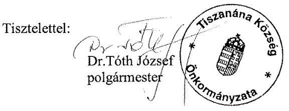

---

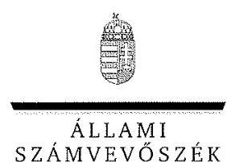

ELNÖK

Ikt.szám: EL-0105-129/2018.

# Dr. Tóth József úr 

polgármester

Tiszanána Község Önkormányzata

Tiszanána

## Tisztelt Polgármester Úr!

Köszönettel vettem „Az önkormányzatok gazdasági társaságai - Az önkormányzatok többségi tulajdonában lévő gazdasági társaságok gazdálkodásának ellenőrzése - Enter-Nána Épitölpari és Szolgáltató Nonprofit Kft." ellenőrzéséről készített számvevőszéki jelentéstervezetre megküldött észrevételeit.
Az Állami Számvevőszék észrevételekre vonatkozó álláspontját a felügyeleti vezető által készített részletes tájékoztatás tartalmazza, amelyet levelemhez mellékeltem.
Tájékoztatom Polgármester urat, hogy az Állami Számvevőszék a figyelembe nem vett észrevételeket az Állami Számvevőszékről szóló 2011. évi LXVI. törvény 29. § (3) bekezdésében előirtak szerint köteles a jelentésében feltüntetni és megindokolni, hogy azokat miért nem fogadta el.

Budapest, 2018.
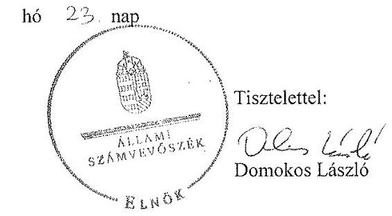

Melléklet: Tájékoztatás az észrevételek kezeléséről

---

# Tájékoztatás az észrevételek kezeléséről 

Megköszönöm Polgármester úrnak a „Az önkormányzatok gazdasági társaságai - Az önkormányzatok többségi tulajdonában lévő gazdasági társaságok gazdálkodásának ellenörzése - Enter-Nána Épitöipari és Szolgáltató Nonprofit Kft." címmel készített jelentés-tervezetre tett észrevételét. Az észrevétel kezeléséről az alábbi tájékoztatást adom.

A Polgármester úr tájékoztatását levelének 1-3. és 6. pontjában az ellenőrzött időszak után történt változásokról, köszönettel vettem, a jelentéstervezet ellenőrzött időszakra vonatkozó megállapításait ezek nem befolyásolták.

## 4. számú észrevétel:

A jelentéstervezet 2.1. pontjának (2)-(3) és (5)-(7) bekezdésében foglaltakat érinti:
„A 2.1 .sz. megállapítás (2)-(3) és (5)-(7) bekezdéseire az alábbiakat válaszolom .
(2) Sajnálatos módon az Enter-Nána KFT könyvelöje tévedésböl a Társaság régebben használt számviteli politikáját töltötte fel az elektronikus felületre, igy Onók abból dolgozva tették meg megállapításaikat. Csak amikor a könyvvizsgálánk értesitést kapott a (Könyvvizsgálói Kam arától) vizsgálatról derült ki, hogy az érvényes számviteli politika nála volt felülvizsgálat céljából. A Társaság számviteli politikáját 2013. június 1-jével módosította, átdolgozta, és ezzel együtt számlarendjét is. Egyébként ez a dokumentum megfelel a számviteli törvény 14.§.(3) bekezdésének és a számviteli törvény 8.§.(2) bekezdésének, és ebből a dokumentumból ki is derül, hogy a KFT az egyszerüsített éves beszámolót választotta,
(3) A Társaság számlarendje tartalmazza a kijelölt számlák számjelét.
(5) Egyeztetést kezdeményezek az Enter-Nána KFT ügyvezetöjével a nyilvántartások felülvizsgálatával kapcsolatban.
(7) Az eszközök és források értékelési szabályzata a 2013.június 1-jén átdolgozott számviteli politika részét képezi, azaz abban a dokumentumban található."

Polgármester úrtól érkezett észrevétel szerint a Társaság 2013. júniusától rendelkezett olyan hatályos Számviteli politikával, amely tartalmazta a Számv. tv. 14. § (3) bekezdésének megfelelő alapelveket, értékelési eljárásokat, a Számv. tv. 8. § (2) bekezdésének megfelelő beszámolási formát, a Számv. tv. 161. § (2) bekezdés a) pontjában rögzített előírásoknak megfelelő Számlarendet, illetve a Számviteli politika része volt Számv. tv. 14. § (5) bekezdésének b) pontja szerinti Eszközök és források értékelési szabályzata, azonban tévedésből a számvevőszéki dokumentációs rendszerbe a 2013. júniusától hatályos Számviteli politika helyett egy korábbi, a 2008. június 24 -től hatályos Számviteli politika került feltöltésre.

Polgármester úr észrevételét nem fogadom el, tekintettel arra, hogy a Társaság ügyvezető igazgatója 2017. június 12 -én adott, az ellenőrzést megalapozó beküldött dokumentumokra vonatkozó teljességi hitelességi nyilatkozatában, a 2008. június 24 -től hatályos Számviteli politikát bocsátotta az ellenőrzés rendelkezésére.

---

# 5. számú észrevétel: 

A jelentéstervezet 2.2. pontjának (6)-(7) és (10) bekezdésében foglaltakat érintik:
„A 2.2.sz. megállapítás (6)-(7) és (10) bekezdéseire az alábbiakat válaszolom.
(6)-(7) Tudomásom szerint a Társaság 2013-2016 években készitett leltárt a mérlegtételek alátámasztásához, a tényleges leltárfelvétel az eszközök és a készletek vonatkozásában megtörtént.
(10) A megállapításuk a Társaság által beküldött, már érvénytelen számviteli politikában leírtakból adódik, az új átdolgozott számviteli politikában már a 100.000,- Ft-os értékhatár szerepel az egyösszegü leíráshoz."

Polgármester úr észrevétele alapján a jelentés-tervezetet nem módosítom. A jelentéstervezetben megállapított hiányosságok az alábbiak miatt továbbra is fenn álltak:

- A 2.2. pont 6. bekezdésében kifogásolt, a mérlegtételek alátámasztásához 2013-2016. években készített leltárívek, egyéb leltárdokumentumok nem feleltek meg a Számv. tv. 69. § (1) bekezdés előírásának, mert nem tartalmazták tételesen és ellenőrizhető módon a Társaság valamennyi - a mérleg fordulónapján meglévő - befektetett eszközét, készletét mennyiségben és értékben. (A leltárfelvételi ivek a Számv. tv. 69.§ (1) bekezdés elöirása ellenére nem ellenőrizhető módon tartalmazták az immateriális javak és tárgyi eszközök mérleg fordulónapján meglévő állományát, mert mennyiségi adatokat nem tartalmaztak, továbbá nem tartalmazták az eszközök (bekötő utak, csónakmotor, LADA Niva, stb.) semmilyen azonosító adatát (pl. helyrajzi szám, utcanév, gyártási szám, rendszám, stb.) nem tartalmazták).
- A 2.2. pont 7. bekezdésében kifogásoltak szerint, a Számv. tv. 69. § (2) bekezdés előírása ellenére az átadott leltárdokumentumok, leltárívek nem tartalmazták az értékben kimutatott eszközöknél (pl. aktív időbeli elhatárolások, követelések esetében), forrásoknál (pl. a rövid lejáratú kötelezettségek, passzív időbeli elhatárolások) a mérlegtételek alátámasztásához a fökönyvi könyvelés és az analitikus nyilvántartások adatai közötti egyeztetést az ellenőrzött időszakban.
- A 2.2. pont 10. bekezdésben kifogásoltak szerint, a Társaság értékcsökkenés elszámolásával kapcsolatos észrevétele alapján a jelentés-tervezetet nem módosítom, figyelembe véve az ügyvezető igazgató úr 2017. június 12 -én adott, az ellenőrzést megalapozó beküldött dokumentumokra vonatkozó teljességi hitelességi nyilatkozatát, amely a Társaság 2008. június 24 -tól hatályos Számviteli politikát bocsátotta az ellenőrzés rendelkezésére, valamint a véleményezésre kiküldött jelentéstervezet 2.2 . pont 10 . bekezdés 2 . mondat megállapítását, amely szerint egy esetben a Társaság 100 ezer Ft feletti bekerülési értékủ eszköz értékcsökkenését egyösszegben számolta el.

Polgármester megjegyzéseire adott válaszok:
„Megjegyezni kivánom, hogy a 14.oldal (4) bekezdés (1 .sz. táblázat) megállapításuk hibás, mert a képviselő-testület ugyan nem határozatban magasabb rendü jogszabályban, konkrétan helyi rendeletben szabályozta a 2014 - 2016.évekre a Társaság részére müködési célra átadott pénzeszközöket, melyek megtalálhatók magában a költségvetési rendeletben, részletezve pedig a rendelethez tartozó kötelező me 11 ékletekben,Természetesen minden évben a Pénzügyi

---

Bizottság jóváhagyólag terjesztette a képviselö-testület elé javaslatát, miszerint a benyújtott költségvetési rendelettervezetet és annak kötelező mellékleteit elfogadásra javasolta a képviselö-testületnek."

A következö bekezdésben leirtakhoz pedig tájékoztatom Önöket, hogy az Enter-Nána Nonprofit KFT minden negyedévben beszámolt az önkormányzat képviselö-testületének a költségvetés adott negyedévi teljesitéséröl, minden negyedévben tárgyalta a Pénzügyi Bizottság, minden alkalommal készült kimutatás a Társaság kintlévőségeiről és kötelezettségeiről.

A képviselö-testület mindig tisztában volt azzal, hogy az önkormányzat mennyi kölcsönt adott át cégének. Továbbá tájékoztatom Önöket arról is, hogy 2017.december 31 -én már semmilyen tartozása nem volt az Enter-Nána Nonprofit KFT-nek az önkormányzat felé.

Kérem, hogy a leirtakat a számvevöszéki jelentés megfogalmazása során figyelembe venni szíveskedjenek.

Megjegyzés alapján a jelentéstervezetet nem módosítom.
A Polgármester úr megjegyzésében említett időszakra vonatkozóan áttekintve aTiszanána Képviselőtestületének költségvetési rendeleteit, illetve annak mellékleteit az Enter-Nána Építőipari és Szolgáltató Nonprofit Kft.-nek nyújtott rendszeres pénzügyi támogatásokról külön melléklet nem született. A költségvetési beszámolók mellékleteiben a vagyonkezelésbe átadott eszközök állománya és a fennálló követelések szerepeltek a beszámoló idöpontjára vonatkozóá, ezen adatokból azonban nem megállapítható Társaságnak nyújtott a tervezett éves, negyedéves támogatások összege.

Polgármester úr 2. és 3. bekezdésében említett tájékoztatását a Társaság negyedéves rendszeres beszámolási gyakorlatáról és a Társaság által 2017. év végén visszafizetett tartozásról tudomásul vettem.

Budapest, 2018. február 23
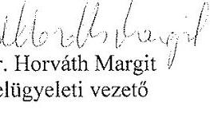

---

# RÖVIDÍTÉSEK JEGYZÉKE 

${ }^{1}$ Önkormányzat, tulajdonosi joggyakorló
${ }^{2}$ Társaság
${ }^{3}$ Képviselő-testület
${ }^{4}$ Polgármester
${ }^{5}$ Jegyző
${ }^{6}$ Ügyvezető
${ }^{7}$ Alapító okirat
${ }^{8}$ Ctv.
${ }^{9}$ ÁSZ
${ }^{10}$ Mötv.
${ }^{11}$ Nvtv.
${ }^{12}$ vagyongazdálkodási rendelet:
vagyongazdálkodási rendelet ${ }_{2}$
${ }^{13}$ SZMSZ:

SZMSZ:

## ${ }^{14}$ Ávr.

${ }^{15}$ vagyonkezelési szerződés
${ }^{16}$ feladat-ellátási szerződés:
feladat-ellátási szerződés:

Tiszanána Község Önkormányzata
Tiszanána Község Önkormányzata
Enter-Nána Építőipari és Szolgáltató Nonprofit Korlátolt Felelősségű Társaság
Tiszanána Község Önkormányzata Képviselő-testülete
Tiszanána Község Önkormányzatának polgármestere
Tiszanána Község Önkormányzata jegyzője
Enter-Nána Építőipari és Szolgáltató Nonprofit Korlátolt Felelősségű Társaság ügyvezetője
Enter-Nána Építőipari és Szolgáltató Nonprofit Korlátolt Felelősségű Társaság Alapító okirata (hatályos 2011. szeptember 1-jétől)
2006. évi V. törvény a cégnyilvánosságról, a bírósági cégeljárásról és a végelszámolásról
Állami Számvevőszék
Magyarország helyi önkormányzatairól szóló 2011. évi CLXXXIX. törvény
a nemzeti vagyonról szóló 2011. évi CXCVI. törvény (hatályos 2012. január 1-jétől)
Tiszanána Község Önkormányzatának 12/2013. (II. 01.) önkormányzati rendelete az önkormányzati vagyonról és a vagyon gazdálkodás egyes szabályairól (hatályos 2013. február 1-jétől 2013. június 24-ig)

Tiszanána Község Önkormányzatának 27/2013. (VI. 24.) önkormányzati rendelete: Az önkormányzat vagyona, a vagyonhasznosítás rendje és a vagyontárgyak feletti jogok gyakorlásának szabályairól (hatályos 2013. június 25-től)
Tiszanána Község Önkormányzatának Szervezeti és Működési Szabályzatáról szóló 15/2014.(XII.22.) önkormányzati rendelete (hatályos 2014. december 23-tól)

Tiszanána Község Önkormányzatának 13/2015. (IX. 28.) önkormányzati rendelete Tiszanána Község Önkormányzatának Szervezeti és Müködési Szabályzatáról szóló 15/2014.(XII.22.) önkormányzati rendelet módosításáról (hatályos 2015. szeptember 29-től)
az államháztartásról szóló törvény végrehajtásáról szóló 368/2011. (XII. 31.) Korm. rendelet

Az Önkormányzat és a Társaság között létrejött vagyonkezelési szerződés (hatályos 2010. március 1-jétől)
az Önkormányzat (a képviseletében eljáró Polgármester) és a Társaság, mint szolgáltató (a képviseletében eljáró Ügyvezető) között az Ötv. 8. §-ának (2) bekezdésében nevesített egyes kötelező és önként vállalt önkormányzati feladatok ellátásra 2010. március 1-jén létrejött feladat-ellátási szerződés (hatályos 2010. március 1-jétől)
az Önkormányzat (a képviseletében eljáró Polgármester) és a Társaság, mint szolgáltató (a képviseletében eljáró Ügyvezető) között az Ötv. 8. §-ának (2) bekezdésében nevesített egyes kötelező és önként vállalt önkormányzati feladatok ellátásra 2010. március 1-jén létrejött feladat-ellátási szerződés: módosítása (hatályos 2016. június 28-tól)
a gazdasági társaságokról szóló 2006. évi IV. tv.(hatályos 2014. március 15-ig)

---

${ }^{18}$ Ptk.
${ }^{19}$ felügyelőbizottság
${ }^{20}$ Számv. tv.
${ }^{21}$ Taktv.
${ }^{22}$ Képviselő-testületi határozatok a Társaság Számv. tv. szerinti beszámolói elfogadásáról

56/2014. (V. 29.) sz. a 2013. évi beszámolóról, 79/2015. (V. 28.) sz. a 2014. évi beszámolóról, 61/2016. (V. 26.) sz. a 2015. évi beszámolóról, 75/2017. (V. 25.) sz. a 2016. évi beszámolóról
${ }^{23}$ Képviselő-testületi határozatok a Társaság üzleti terveinek elfogadásáról

23/2013. (III. 07.) sz. a 2013. évi üzleti tervről, 26/2014. (II. 27.) sz. a 2014. évi üzleti tervről14/2015. (II. 11.) sz. a 2015. évi üzleti tervről, 13/2016. (II. 25.) sz. a 2016. évi üzleti tervről

2016. évi üzleti tervről
Tiszanána Község Pénzügyi és Településfejlesztési Bizottsága
2016. évi üzleti tervről14/2015. (II. 11.) sz. a 2015. évi üzleti tervről, 13/2016. (II. 25.) sz. a 2016. évi üzleti tervről
2016. évi üzleti tervről
Tiszanána Község Pénzügyi és Településfejlesztési Bizottsága
Enter-Nána Építőipari és Szolgáltató Nonprofit Korlátolt Felelősségű Társaság Számviteli politika (hatályos 2008. június 24-től)
Enter-Nána Építőipari és Szolgáltató Nonprofit Korlátolt Felelősségű Társaság Számlarend (hatályos 2008. június 24-től)
Enter-Nána Építőipari és Szolgáltató Nonprofit Korlátolt Felelősségű Társaság Pénzkezelési szabályzat (hatályos 2008. június 30-tól)
Enter-Nána Építőipari és Szolgáltató Nonprofit Korlátolt Felelősségű Társaság Eszközök és források leltározási és leltárkészítési, illetve selejtezési szabályzata (hatályos 2008. június 30-tól)
az egyesülési jogról, a közhasznú jogállásról, valamint a civil szervezetek müködéséről és támogatásáról szóló 2011. évi CLXXV. törvény
az információs önrendelkezési jogról és az információszabadságról szóló 2011. évi CXII. törvény

---

ÁLLAMI SZÁMVEVŐSZÉK
1052 Budapest, Apáczai Csere János utca 10.
Levélcím: 1364 Budapest 4. Pf. 54
Telefon: +36 14849100 Telefax: +36 14849200
www.asz.hu