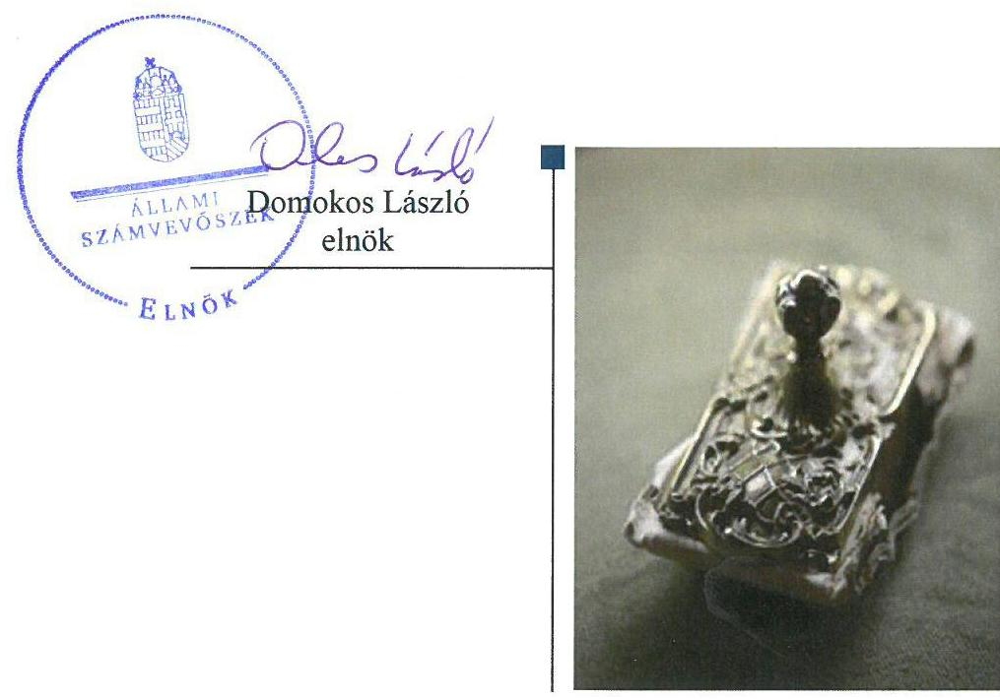
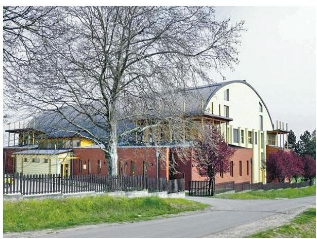
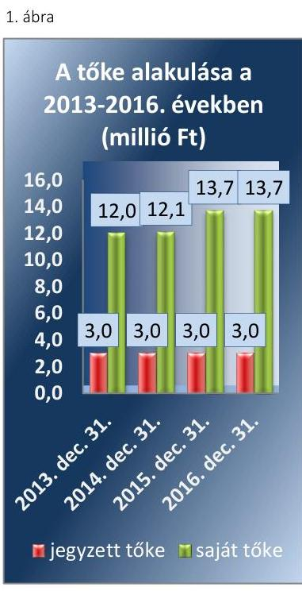
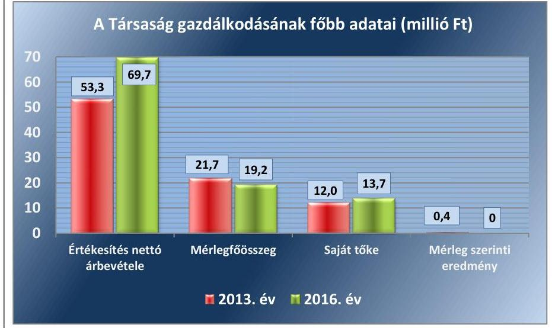

# Jelentés 

## Önkormányzatok gazdasági társaságai

Az Önkormányzatok többségi tulajdonában lévő gazdasági társaságok gazdálkodásának ellenőrzése - Somogyjádi Sportcsarnok Létesítmény- és Településüzemeltető és Szolgáltató Közhasznú Nonprofit Kft. 2018.

18060
www.asz.hu

---

# Jelentés 

## Önkormányzatok gazdasági társaságai

Az Önkormányzatok többségi tulajdonában lévő gazdasági társaságok gazdálkodásának ellenőrzése - Somogyjádi Sportcsarnok Létesítmény- és Településüzemeltető és Szolgáltató Közhasznú Nonprofit Kft.
2018. 03. hó 13. nap

---

# AZ ELLENŐRZÉST FELÜGYELTE: 

DR. HORVÁTH MARGIT felügyeleti vezető

## AZ ELLENŐRZÉST VEZETTE ÉS A VÉGREHAJTÁSÁÉRT FELELŐS:

SZILÁGYI GÁBOR ellenőrzésvezető
JOÓ ERIKA ellenőrzésvezető

## A PROGRAM ÖSSZEÁLLÍTÁSÁÉRT FELELŐS:

JANIK JÓZSEF osztályvezető

IKTATÓSZÁM: EL-0102-098/2018.

## TÉMASZÁM: 2447

ELLENŐRZÉS-AZONOSÍTÓ SZÁM: V079305

---

# TARTALOMJEGYZÉK 

■ ÖSSZEGZÉS ..... 5
■ AZ ELLENŐRZÉS CÉLJA ..... 6
■ AZ ELLENŐRZÉS TERÜLETE ..... 7
■ AZ ELLENŐRZÉS HÁTTERE, INDOKOLTSÁGA ..... 9
■ A JELENTÉS LÉNYEGES KÉRDÉSKÖREI ..... 10
■ ELLENŐRZÉS HATÓKÖRE ÉS MÓDSZEREI ..... 11
■ MEGÁLLAPÍTÁSOK ..... 13
■ JAVASLATOK ..... 17
■ MELLÉKLETEK ..... 19
I. sz. melléklet: Értelmező szótár ..... 19
II. sz. melléklet: A Társaság mérleg és eredménykimutatás adatai ( millió Ft) ..... 20
■ FÜGGELÉK: ÉSZREVÉTELEK ..... 21
■ RÖVIDÍTÉSEK JEGYZÉKE ..... 23

---

.

---

# ÖSSZEGZÉS 

A „Somogyjádi Sportcsarnok" Létesítmény- és Településüzemeltető és Szolgáltató Közhasznú Nonprofit Korlátolt Felelősségű Társaság feletti tulajdonosi jogokat Somogyjád Község Önkormányzata nem szabályszerűen gyakorolta. A Társaság müködésének szabályozottsága megfelelt az előírásoknak. A bevételek és ráfordítások elszámolása, az adatszolgáltatási és beszámolási kötelezettségek teljesitése, valamint a vagyon nyilvántartása szabályszerű volt. A Társaság fizetőképessége, valamint az átláthatóság biztositott volt.

## Az ellenőrzés társadalmi indokoltsága

Az Állami Számvevőszék a stratégiáját megvalósítva ellenőrzéseivel segíti az átláthatóságot és az elszámoltathatóságot a közpénzekkel, a közvagyonnal való gazdálkodásban. Ellenőrzési témaválasztása során kiemelt figyelmet fordít a korábban ellenőrizetlen területekre.

Az önkormányzatok többségi tulajdonában álló gazdasági társaságok ellenőrzése kiemelten fontos a vagyon megőrzése, megóvása érdekében. A feladatellátás költségeinek, ráfordításainak alakulása a lakosság széles rétegét érinti.

## Főbb megállapítások, következtetések, javaslatok

A „Somogyjádi Sportcsarnok" Létesítmény- és Településüzemeltető és Szolgáltató Közhasznú Nonprofit Korlátolt Felelősségű Társaság felett a tulajdonosi jogokat Somogyjád Község Önkormányzata nem az előírásoknak megfelelően gyakorolta. A Képviselő-testület a jogszabályi előírások ellenére nem alkotta meg a javadalmazási szabályzatot. A felügyelőbizottság 2015. december 2-ig nem alakította ki az ügyrendjét, az ezt követően megalkotott ügyrendet a Képviselő-testület a jogszabályi előírás ellenére nem hagyta jóvá.

A „Somogyjádi Sportcsarnok" Létesítmény- és Településüzemeltető és Szolgáltató Közhasznú Nonprofit Korlátolt Felelősségű Társaság működésének szabályozottsága megfelelt az előírásoknak. A Társaság rendelkezett az elszámolások és nyilvántartások rendjét meghatározó számviteli politikával és a kötelezően elkészítendő egyéb szabályzatokkal.

A bevételek és ráfordítások elszámolása az előírásoknak megfelelő volt, az értékcsökkenés elszámolása megfelelt a jogszabályi előírásoknak. A közétkeztetés térítési díjait Somogyjád Község Önkormányzata Képviselő-testülete a jogszabályi előírásoknak megfelelően meghatározta.

A beszámolási kötelezettség teljesítése megfelelt az előírásoknak. Az elektronikus közzétételre vonatkozó kötelezettségének a Társaság eleget tett, így az átláthatóság és elszámoltathatóság követelménye érvényesült.

A „Somogyjádi Sportcsarnok" Létesítmény- és Településüzemeltető és Szolgáltató Közhasznú Nonprofit Korlátolt Felelősségű Társaság kizárólag saját vagyonnal rendelkezett. A vagyon nyilvántartása, valamint a vagyon változását eredményező döntések az előírásoknak megfeleltek.

---

# AZ ELLENŐRZÉS CÉLJA 

AZ ELLENŐRZÉS CÉLJA annak értékelése volt, hogy az önkormányzat vagyongazdálkodási tevékenysége során szabályszerűen gyakorolta-e a tulajdonosi jogait. A gazdasági társaság szabályozottsága, gazdálkodása és vagyongazdálkodási tevékenysége, bevételeinek és ráfordításainak elszámolása megfelelt-e a jogszabályi és tulajdonosi előírásoknak. Értékeltük, hogy a gazdasági társaság kötelezettségállománya jelentett-e kockázatot a működésre, valamint a gazdálkodás átláthatósága és elszámoltathatósága érdekében biztosítva volt-e a szolgáltatás dijának megalapozottsága.

---

# **AZ ELLENŐRZÉS TERÜLETE**

## **Somogyjád Község Önkormányzata és a kizárólagos tulajdonában álló "Somogyjádi Sportcsarnok" Létesítmény- és Településüzemeltető és Szolgáltató Közhasznú Nonprofit Kft.**

A "Somogyjádi Sportcsarnok" Létesítmény- és Településüzemeltető és Szolgáltató Közhasznú Nonprofit Korlátolt Felelősségű Társaság a "Somogyjádi Sportcsarnok" Létesítmény- és Településüzemeltető és Szolgáltató Közhasznú Társaság jogutódjaként 2009. április 21-én alakult át kizárólagos önkormányzati tulajdonú nonprofit korlátolt felelősségű társasággá. A Társaság^{1} 100%-ban Somogyjád Község Önkormányzata tulajdonában volt, a tulajdonosi jogokat Somogyjád Község Önkormányzata Képviselő-testülete gyakorolta.

A Társaság közfeladatként látta el a közétkeztetési, ingatlan-üzemeltetési tevékenységeket, egyéb gazdasági tevékenységként a helyi kábeltelevízió részére műsorkészítés tevékenységet végzett. A Somogyjád Bogáti utca 1. szám alatti tornaterem ingatlanra vonatkozóan az Önkormányzat^{2} használati jogot alapító megállapodást kötött a magyar állam, mint tulajdonos képviseletében eljáró MNV Zrt-vel. A létesítményt^{3} az MNV Zrt. 2013. január 22-én ingyenesen az Önkormányzat használatába, majd 2013. október 28-án ingyenesen az Önkormányzat tulajdonába adta.

A létesítmény üzemeltetésére az Önkormányzat 2013. február 1. napjától kezdődően megbízási szerződést kötött a Társasággal. A megbízási szerződésben az üzemeltetési feladatok ellátásához szükséges költségek ellentételezéseként megbízási díjat határoztak meg. Az információs filmek és oldalak készítése vonatkozásában további megbízási szerződéseket kötött az Önkormányzat a Társasággal. A megbízási díjakat az 1. táblázat mutatja be.

1. táblázat

|  megbízási szerződés tárgya | szerződés kelte | időtartam | megbízási díj (E Ft)  |
| --- | --- | --- | --- |
|  ingatlanüzemeltetés | 2013. február 12. | határozatlan | 750,0+áfa/hó  |
|  ingatlanüzemeltetés | 2013. október 15. | határozatlan | 650,0+áfa/hó  |
|  videó-készítés | 2013. február 12. | határozatlan | 70,0+áfa/hó  |
|  információs oldalak | 2013. február 12. | határozatlan | 0,5/lap/hét  |

*Forrás: megbízási szerződések*

A közétkeztetési közfeladat ellátására kötött szerződésben rögzítették, hogy az Önkormányzat tulajdonában lévő, a Társaság által üzemeltetett konyhán a Társaság elvégzi az általános iskolás tanulók részére a közétkeztetéssel kapcsolatos feladatokat, amelyek díjairól az Önkormányzat Képviselő-testülete döntött.

---

Fonrás: 2013-2016. évl beszámolók

A Társaság jegyzett tőkéje 3 millió Ft volt, tevékenysége az ellenőrzött időszakban nyereséges volt. A saját tőke a 2013. december 31-ei 12,0 millió Ft-ról 2016. december 31-re 13,7 millió Ft-ra nőtt. A saját tőke alakulását az 1. ábra szemlélteti.

A Társaság nem tartozott a kormányzati szektorba sorolt egyéb szervezetek közé.

A Társaság feladatai ellátásához nem kapott az Önkormányzattól támogatást. Az értékesítés nettó árbevétele és a mérleg szerinti eredmény alakulását a 2. ábra, a Társaság további mérleg és eredménykimutatás adatait a II. sz. melléklet mutatja be.
2. ábra

Fonrás a Társaság 2013. és 2016. évi beszámolói

A jelenlegi ügyvezető 2009. április 21. óta tölti be tisztségét. A foglalkoztatottak átlagos állományi létszáma 11 fő volt.

A polgármester ${ }^{4}$ személye az ellenőrzött időszakban nem változott, a jegyző személye 2015. január 1-jén változott. A jelenlegi polgármester 1990 óta, a jelenlegi jegyző 2015. január 1-je óta tölti be tisztségét.

---

# AZ ELLENŐRZÉS HÁTTERE, INDOKOLTSÁGA 

## AZ ÖNKORMÁNYZATI TULAJDONÚ GAZDASÁGI

TÁRSASÁGOK teljes körű ellenőrzésének lehetőségét az Állami Számvevőszékről szóló 1989. évi XXXVIII. törvény 2011. január 1-jétől hatályos módosítása teremtette meg és az Állami Számvevőszékről szóló 2011. évi LXVI törvény is tartalmazza. A gazdasági társaságok gazdálkodási tevékenysége szabályszerűségének ellenőrzését 2011. évtől végezzük. Az önkormányzatok többségi tulajdonában álló gazdasági társaságok ellenőrzése kiemelten fontos a vagyon megőrzése, megóvása érdekében. A feladatellátás költségeinek, ráfordításainak alakulása a lakosság széles rétegét érinti.

Ellenőrzéseink feltárhatják, hogy az önkormányzat a feladatellátásához rendelt vagyon működtetését a tulajdonostól elvárható gondossággal vé-gezte-e, a feladatot ellátó gazdasági társaság a létesítő okiratban, szolgáltatási szerződésben foglaltak betartásával biztosította-e a feladat ellátását. Az ellenőrzés rávilágíthat arra, hogy a gazdasági társaság a vagyon használatával biztosította-e a szolgáltatás folytatásának feltételeit, az önkormányzat tulajdonosi felügyelete hozzájárult-e a szabályszerű gazdálkodáshoz és feladatellátáshoz. A megállapítások alapján megfogalmazott számvevőszéki javaslatok hasznosítása elősegítheti a meglévő hibák megszüntetését. A jó gyakorlatok bemutatásával az ÁSZ ${ }^{5}$ hozzájárulhat a követendő megoldások megismertetéséhez, terjesztéséhez

---

# A JELENTÉS LÉNYEGES KÉRDÉSKÖREI 

1.     - Az Önkormányzat tulajdonosi joggyakorlása szabályszerű volt-e?
2.     - A Társaság szabályozottsága, gazdálkodása és vagyongazdálkodási tevékenysége szabályszerű volt-e, fizetőképessége biztositott volt-e a gazdálkodás során?
3.     - A Társaság bevételeinek és ráfordításainak elszámolása, valamint az árképzés szabályszerű volt-e?

---

# ELLENŐRZÉS HATÓKÖRE ÉS MÓDSZEREI 

## Az ellenőrzés típusa

Megfelelőségi ellenőrzés.

## Az ellenőrzött időszak

Az ellenőrzött időszak 2013. január 1-jétől 2016. december 31-ig tartott.

## Az ellenőrzés tárgya

Somogyjád Község Önkormányzata kizárólagos tulajdonában lévő „Somogyjádi Sportcsarnok" Létesítmény- és Településüzemeltető és Szolgáltató Közhasznú Nonprofit Korlátolt Felelősségű Társaság feletti tulajdonosi joggyakorlása, valamint a „Somogyjádi Sportcsarnok" Létesítmény- és Településüzemeltető és Szolgáltató Közhasznú Nonprofit Korlátolt Felelősségű Társaság gazdálkodásának szabályozottsága és szabályszerűsége.

Az ellenőrzés kiterjed minden olyan körülményre és adatra, amely az ÁSZ jogszabályban meghatározott feladatainak teljesítéséhez, valamint a program végrehajtása folyamán felmerült újabb összefüggések feltárásához szükséges.

## Az ellenőrzött szervezet

„Somogyjádi Sportcsarnok" Létesítmény- és Településüzemeltető és Szolgáltató Közhasznú Nonprofit Korlátolt Felelősségű Társaság; Somogyjád Község Önkormányzata

## Az ellenőrzés jogalapja

Az ellenőrzés jogalapját az ÁSZ tv. ${ }^{6}$ 1. § (3) bekezdése és 5. § (3)-(5) bekezdése képezi.

## Az ellenőrzés módszerei

Az ellenőrzést a nemzetközi standardokat irányadónak tekintve az ellenőrzési program ellenőrzési kérdései, az ellenőrzött időszakban hatályos jogszabályok, az ellenőrzés szakmai szabályok és módszertanok figyelembevételével végeztük.

---

Az ellenőrzés ideje alatt az ellenőrzött szervezettel történő kapcsolattartást az ÁSZ Szervezeti és Múködési Szabályzatának vonatkozó előírásai alapján biztosítottuk.

Az ellenőrzési kérdések megválaszolásához szükséges bizonyítékok megszerzése a következő ellenőrzési eljárások alkalmazásával történt: megfigyelés, kérdésfeltevés (információkérés), összehasonlítás, valamint elemző eljárás. Az ellenőrzési bizonyítékként felhasználható adatforrások közé tartoznak egyrészt az ellenőrzési programban felsorolt adatforrások, másrészt adatforrás lehet még minden - az ellenőrzés folyamán - feltárt, az ellenőrzés szempontjából információkat tartalmazó dokumentum.

Az ellenőrzést a kérdésekre adott válaszok kiértékelésével, valamint a megjelölt adatforrások, a csatolt tanúsítványok felhasználásával, továbbá az adott időszakban hatályos jogszabályok figyelembe vételével folytattuk le.

A bevételek és ráfordítások elszámolásait mintavétellel ellenőriztük. A minták kiválasztása rétegzett mintavétel alkalmazásával történt. A vagyonnyilvántartás terén a szabályszerű működést teljes körűen ellenőriztük. A mintavétellel ellenőrzött területek esetében minden egyes tétel vonatkozásában a szabályszerűségre vonatkozó kérdéseket tettünk fel, amelyek eredménye összesítésre került. Megfelelőnek értékeltünk egy ellenőrzött területet, amennyiben 95\%-os bizonyossággal a teljes sokaságban a hibaarány legfeljebb 10\%, nem megfelelőnek, amennyiben 10\%-nál magasabb arányt képviselt. Abban az esetben, ha a teljes sokaság tekintetében a 10\%os hibaarányhoz való viszony megítélésnek megbízhatósága nem érte el a 95\%-ot, annak elérése érdekében értékelésünket további szempontokkal egészítettük ki, és figyelembe vettük a feltárt hibák típusát és súlyát. A ráfordítások elszámolására vonatkozó véletlen mintavételt kockázati alapú kiválasztással egészítettük ki, amelynek során évente a három legnagyobb összegű tételt választottuk ki.

---

# 1. Az Önkormányzat tulajdonosi joggyakorlása szabályszerű volt-e? 

Összegző megállapítás

Az Önkormányzat tulajdonosi joggyakorlása nem volt szabályszerű.

A TULAJ DONOSI JOGOK GYAKORLÓJA a Társaság alapító okiratában ${ }_{1-3}{ }^{7}$ foglaltak szerint az Önkormányzat Képviselő-testülete volt. A Képviselő-testület a tulajdonosi joggyakorlással kapcsolatban hatáskört nem ruházott át.

A Képviselő-testület a Gt. 33. § (1) bekezdésének és a Ptk. ${ }^{8}$ 3:26. § (1) bekezdésének megfelelően három tagú felügyelőbizottságot hozott létre. A felügyelőbizottság tagjait és a Társaság könyvvizsgálóját a Gt. és $\mathrm{Ptk}_{2}$ előírásainak megfelelően a Képviselő-testület választotta meg.

A felügyelőbizottság a Gt. 34. § (4) bekezdésében, valamint a Ptk. 3:122. § (3) bekezdésében foglaltak ellenére 2015. december 2-ig ügyrenddel nem rendelkezett, múködésének rendjét az alapító okirat ${ }_{1-3}$ határozta meg. A felügyelőbizottság az ügyrendjét 2015. december 3-án állapította meg, azonban azt a Ptk. 3:122. § (3) bekezdésben foglalt előírás ellenére a Társaság legfőbb szerve nem hagyta jóvá.

A Társaság az ellenőrzött időszak minden évében készített üzleti tervet, amelyekről a felügyelőbizottság határozatot hozott.

Az éves beszámolók jóváhagyásáról a Képviselő-testület a Gt., ${ }^{9}$. és Ptk. előírásainak megfelelően a felügyelőbizottság ${ }^{10}$ és a könyvvizsgáló írásbeli jelentésének birtokában határozott, ${ }^{11}$ valamint döntött a 2013-2016. évi eredmény eredménytartalékba helyezéséről.

A vezető tisztségviselők és a vezető állású munkavállalókra vonatkozó javadalmazási szabályzatot ${ }^{12}$ a Taktv. ${ }^{13}$ 5. § (3) bekezdés előírásai ellenére a Társaság legfőbb szerve nem alkotta meg.

Az Önkormányzat a Társaság ellenőrzését önkormányzati társulás ${ }^{14}$ keretében biztosította. Az önkormányzati társulás a Társaságnál a 20132015. években nem végzett ellenőrzést, 2016-ban két ellenőrzést folytatott le, mindkét ellenőrzés a közétkeztetéshez, illetve a konyha üzemeltetéséhez kapcsolódott. A 2016 márciusi ellenőrzés tárgya a térítési díjak számításának megalapozottsága volt, az ellenőrzés nem tett intézkedést igénylő megállapítást. A második ellenőrzés a pénzkezelés és az élelmezési anyagok nyilvántartásának szabályszerűségére irányult, és javaslatokat fogalmazott meg a Társaság felé, amelyekre a Társaság intézkedési tervet készített.

---

# 2. A Társaság szabályozottsága, gazdálkodása és vagyongazdálkodási tevékenysége szabályszerű volt-e, fizetőképessége biztosított volt-e a gazdálkodás során? 

Összegző megállapítás

A Társaság szabályozottsága, vagyongazdálkodása szabályszerű volt, fizetőképessége biztosított volt. Közzétételi kötelezettségének eleget tett.
2.1. számú megállapítás

A Társaság múködésének szabályozottsága megfelelt a jogszabályi előírásoknak.

SZÁMVITELI POLITIKÁVAL a Számv. tv. ${ }^{15}$ 14. § (4)-(8) bekezdéseiben előírtaknak megfelelően rendelkezett a Társaság. A számviteli politika ${ }_{1,2}{ }^{16}$ keretében elkészítették az eszközök és források értékelési szabályzatát ${ }^{17}$, a leltárkészítési és leltározási szabályzatot ${ }^{18}$, valamint a pénzkezelési szabályzatot ${ }^{19}$. A leltározási szabályzat ${ }_{1,2}$ meghatározta a leltározás és leltárkészítés, valamint a leltárkülönbözetek megállapításának rendjét.

A könyvvezetés részletes szabályait tartalmazó - a Számv. tv. előírásainak megfelelő - számlarenddel ${ }_{1,2}$, valamint bizonylati renddel rendelkezett a Társaság.

A Társaság vagyongazdálkodása szabályszerű volt, a 2013-2016. évi beszámolók megalapozottsága és a vagyon védelme biztosított volt. A mérlegtételek leltárral való alátámasztása megfelelt a jogszabályi előírásoknak.

2. táblázat

## BEFEKTETETT ESZKÖZÖK ÉRTÉKE A 2012-2015. ÉVEKBEN (MILLIÓ FT)

| ÉV | befektetett   eszközök értéke |
| :--: | :--: |
| 2013. december 31. | 5,7 |
| 2014. december 31. | 5,9 |
| 2015. december 31. | 6,8 |
| 2016. december 31. | 6,6 |

Forrás: 2013-2016. éves beszámolók

A VAGYONNYILVÁNTARTÁS megfelelt a Számv. tv. és a számviteli politika, valamint az eszközök és források értékelési szabályzatában foglaltaknak. A vagyongazdálkodással kapcsolatos előterjesztéseket, terveket a Társaság az éves üzleti terv részeként minden évben a felügyelőbizottság elé terjesztette.

Az üzemeltetett létesítmény vonatkozásában a megbízási szerződés a Társaság kötelezettségeként határozta meg a karbantartást, hibaelhárítást, a létesítmény rendeltetésszerű használatra alkalmas állapotban tartását. A megbízási szerződés célul tűzte ki, hogy a létesítményben a teljes üzemeltetési idő alatt kizárólag a rendeltetésszerű használattal szokásosan együtt járó állapotromlás következzen be.

Az értékcsökkenés elszámolása a Számv. tv. előírásainak megfelelően történt. A Társaságnál az ellenőrzött időszakban terven felüli értékcsökkenést nem számoltak el.

A Társaság a beszámolók mérlegtételeit a Számv. tv. előírásainak megfelelően leltárral alátámasztotta.

A Társaságnak vagyonkezelésbe vett vagyona nem volt, a saját vagyonán értéknövelő beruházásokat, karbantartási és állagmegóvási munkákat végzett az ellenőrzött időszakban. A befektetett eszközök nettó értéke a 2013. évi 5,7 millió Ft-ról 2016. évre 6,6 millió Ft-ra nőtt (2. táblázat). A műszaki berendezések bruttó értéke 4,4 millió Ft-ról 7,3 millió Ft-ra emelkedett a beruházások következtében.

---

### 2.3. számú megállapítás

3. táblázat

KÖTELEZETTSÉGEK 2013-2016. ÉV (MILLIÓ FT)

|  év | összes kö-
telezettség | lejárt kö-
telezettségek  |
| --- | --- | --- |
|  2013. 12. 31. | 4,5 | 2,4  |
|  2014. 12. 31. | 1,3 | 0,3  |
|  2015. 12. 31. | 1,3 | 0,2  |
|  2016. 12. 31. | 2,4 | 0,1  |

Forrás: a Társaság 2013-2016. évi kimutatásai 4. táblázat

KÖVETELÉSEK 2013-2016. ÉV (MILLIÓ FT)

|  év | összes kö-
vetelés | lejárt kö-
vetelések  |
| --- | --- | --- |
|  2013. 12. 31. | 8,1 | 6,8  |
|  2014. 12. 31. | 2,7 | 1,2  |
|  2015. 12. 31. | 1,6 | 0,8  |
|  2016. 12. 31. | 1,1 | 0,6  |

Forrás: a Társaság 2013-2016. évi kimutatásai

Az ellenőrzött időszakban vagyon ingyenes átruházására nem, hasznosításra egy esetben, tizenkettőezer forint értékben került sor, egy darab nulla Ft könyvszerinti értékű számítógépet értékesítettek.

A Társaság fizetőképessége biztosított volt, beszámolási kötelezettségét teljesítette. A Társaság a közzétételi kötelezettségének eleget tett.

A TÁRSASÁG FIZETŐKÉPESSÉGE javult az ellenőrzött időszakban, kötelezettségeit képes volt a saját bevételeiből finanszírozni.

Rövid lejáratú kötelezettségeinek a Társaság határidőben eleget tett. 2013-ban a kötelezettségek 53,3\%-a volt lejárt kötelezettség, a 2016. évre ez az arány 4,2\%-ra csökkent. (3. táblázat)

A Társaság hosszú lejáratú kötelezettséggel az ellenőrzött időszakban nem rendelkezett.

AZ EGYSZERÚSÍTETT ÉVES BESZÁMOLÓKAT a Számv. tv. előírásainak megfelelően, határidőben elkészítette a Társaság, azokat a tulajdonosi joggyakorló Képviselő-testület - a könyvvizsgáló és a felügyelőbizottság írásos véleménye alapján - határozatban fogadta el. A Társaság a közzétételi kötelezettségének eleget tett.

A KÖVETELÉSÁLLOMÁNY az ellenőrzött időszakban csökkent. A követelések behajtása érdekében a Társaság intézkedéseket tett, melyek következtében a lejárt követelések aránya az összes követeléshez viszonyítva javult, a 2013. évi 84,0 \%-ról a 2016. évre 54,5 \%-ra csökkent. (4. táblázat)

Adatszolgáltatási kötelezettsége a felügyelőbizottság felé volt a Társaságnak, amelyeket teljesített. A Társaság által elkészített évközi jelentéseket és éves üzleti terveket a felügyelőbizottság megtárgyalta, azokról határozatot hozott.

A Társaság a Taktv. 2.§ (2) és (3) bekezdésében foglalt adatokat az Info tv ${ }^{20} .2 . \S(1)$ bekezdésében előírt részletezettséggel közzétette.

# 3. A Társaság bevételeinek és ráfordításainak elszámolása, valamint az árképzés szabályszerű volt-e? 

Összegző megállapítás

A bevételek és ráfordítások elszámolása szabályszerű volt. Az árképzés szabályszerű volt, a közétkeztetés térítési díjait az Önkormányzat rendeletben határozta meg.

A BEVÉTELEK és ráfordítások elszámolása a Számv. tv. előírásainak megfelelően, bizonylatokkal alátámasztottan, a megfelelő főkönyvi számlákon szabályszerűen történt. Az értékcsökkenés elszámolása szabályszerű volt.

A KÖZÉTKEZTETÉS DÍJÁNAK meghatározása a Képviselőtestület hatásköre volt. A Társaság által kimunkált nyersanyagnormákról, rezsiköltségről és a szolgáltatás dijáról a Képviselő-testület határozatban

---

döntött, a térítési díjakat a nemzeti köznevelésről szóló 2011. évi CXC. törvény 83. § (2) bekezdésében foglaltaknak megfelelően meghatározta, azokról rendeletet alkotott. A Társaság a rendeletben meghatározott díjakat alkalmazta.

---

# JAVASLATOK 

Az ÁSZ tv. 33. § (1) bekezdésében foglaltak értelmében az ellenőrzött szervezet vezetője köteles a jelentésben foglalt megállapításokhoz kapcsolódó intézkedési tervet összeállítani és azt a jelentés kézhezvételétől számított 30 napon belül az ÁSZ részére megküldeni. Amennyiben az ellenőrzött szervezet vezetője nem küldi meg határidőben az intézkedési tervet, vagy továbbra sem elfogadható intézkedési tervet küld, az Állami Számvevőszék elnöke az ÁSZ tv. 33. § (3) bekezdése a) és b) pontjaiban foglaltakat érvényesítheti.
Javaslataink célja a tulajdonosi joggyakorló Somogyjád Község Önkormányzata szabályszerű múködésének elősegítése, továbbá a tulajdonosi joggyakorlás kontrolljainak erősítése.

## A Somogyjád Község Önkormányzata polgármesterének

1. Intézkedjen a Felügyelő Bizottság Ügyrendjének a Képviselő-testület általi jóváhagyás érdekében.
(1 sz. megállapítás 3. bekezdés 2. mondata alapján)
2. Intézkedjen annak érdekében, hogy a Társaság vezető tisztségviselői, illetve a felügyelőbizottsági tagok, valamint az Mt. 208. §-ának hatálya alá eső munkavállalók javadalmazása, valamint a jogviszony megszünése esetére biztosított juttatások módjának, mértékének elveire, annak rendszerére vonatkozó szabályzatot a Képviselő-testület, mint legfőbb szerv alkossa meg.
(1. sz. megállapítás 6. bekezdés)

---

.

---

# MELLÉKLETEK 

- I. SZ. MELLÉKLET: ÉRTELMEZŐ SZÓTÁR
belső ellenőrzés
gazdasági társaság
kormányzati szektorba sorolt egyéb szervezet
közhasznú tevékenység
tulajdonosi joggyakorló
vagyongazdálkodás

Független, tárgyilagos bizonyosságot adó és tanácsadó tevékenység, amelynek célja, hogy az ellenőrzött szervezet müködését fejlessze és eredményességét növelje, az ellenőrzött szervezet céljai elérése érdekében rendszerszemléletű megközelítéssel és módszeresen értékeli, illetve fejleszti az ellenőrzött szervezet irányítási és belső kontrollrendszerének hatékonyságát. (Forrás: Bkr. ${ }^{21}$ 2. § b) pontja)"
Ptk. 3:88. § (1) bekezdése szerint „a gazdasági társaságok üzletszerű közös gazdasági tevékenység folytatására, a tagok vagyoni hozzájárulásával létrehozott, jogi személyiséggel rendelkező vállalkozások, amelyekben a tagok a nyereségből közösen részesednek, és a veszteséget közösen viselik".
Az Áht. 1. § 12. pontja értelmében az a szervezet, amely az Áht. alapján nem része az államháztartásnak, azonban az Európai Közösséget létrehozó szerződéshez csatolt, a túlzott hiány esetén követendő eljárásról szóló jegyzőkönyv alkalmazásáról szóló 2009. május 25-i 479/2009/EK rendelet szerint a kormányzati szektorba tartozik és a szervezet megnevezését az államháztartásért felelős miniszter a Hivatalos Értesítőben és a Kormány honlapján közétette.
Minden olyan tevékenység, amely a létesítő okiratban megjelölt közfeladat teljesítését közvetlenül vagy közvetve szolgálja, ezzel hozzájárulva a társadalom és az egyén közös szükségleteinek kielégítéséhez; Civil. tv. 2. § 20. pont
Aki a nemzeti vagyon felett az államot vagy a helyi önkormányzatot megillető tulajdonosi jogok és kötelezettségek összességének gyakorlására jogosult. (Forrás: Nvtv. 3. § (1) bekezdés 17. pontja)
A nemzeti vagyongazdálkodás feladata a nemzeti vagyon rendeltetésének megfelelő, az állam, az önkormányzat mindenkori teherbíró képességéhez igazodó, elsődlegesen a közfeladatok ellátásához és a mindenkori társadalmi szükségletek kielégítéséhez szükséges, egységes elveken alapuló, átlátható, hatékony és költségtakarékos müködtetése, értékének megőrzése, állagának védelme, értéknövelő használata, hasznosítása, gyarapítása, továbbá az állam vagy a helyi önkormányzat feladatának ellátása szempontjából feleslegessé váló vagyontárgyak elidegenítése. (Forrás: Nvtv. 7. § (2) bekezdése).

---

II. SZ. MELLÉKLET: A TÁRSASÁG MÉRLEG ÉS EREDMÉNYKIMUTATÁS ADATAI ( MILLIÓ FT)

|  Megnevezés | 2013.12.31. | 2014.12.31. | 2015.12.31. | 2016.12.31.  |
| --- | --- | --- | --- | --- |
|  A. Befektetett eszközök | 5,7 | 5,9 | 6,8 | 6,6  |
|  II. TÁRGYI ESZKÖZÖK | 5,7 | 5,9 | 6,8 | 6,6  |
|  B. Forgóeszközök | 16,0 | 11,1 | 11,8 | 12,6  |
|  I. KÉSZLETEK | 0,7 | 1,3 | 0,9 | 1,1  |
|  II. KÖVETELÉSEK | 8,1 | 2,7 | 1,6 | 1,1  |
|  III. ÉRTÉKPAPÍROK | - | - | - | -  |
|  IV. PÉNZESZKÖZÖK | 7,1 | 7,1 | 9,3 | 10,4  |
|  C. Aktív időbeli elhatárolások | 0,1 | 0,2 | 0,0 | 0,0  |
|  ESZKÖZÖK (AKTÍVÁK) ÖSSZESEN | 21,7 | 17,2 | 18,6 | 19,2  |
|  D. SAJÁT TÖKE | 12,0 | 12,1 | 13,7 | 13,7  |
|  I. JEGYZETT TÖKE | 3,0 | 3,0 | 3,0 | 3,0  |
|  F. Kötelezettségek | 4,4 | 1,3 | 1,3 | 2,4  |
|  III. RÖVID LEJÁRATÚ KÖTELEZETTSÉGEK | 4,5 | 1,3 | 1,3 | 2,4  |
|  G. Passzív időbeli elhatárolások | 5,3 | 3,8 | 3,6 | 3,1  |
|  FORRÁSOK (PASSZÍVÁK) ÖSSZESEN | 21,7 | 17,2 | 18,6 | 19,2  |

Fonrás: 2013-2016. egyszerüsített éves beszámolók

|  Megnevezés | 2013.12.31. | 2014.12.31. | 2015.12.31. | 2016.12.31.  |
| --- | --- | --- | --- | --- |
|  Értékesítés nettó árbevétele | 69,7 | 55,2 | 64,9 | 69,7  |
|  Egyéb bevételek | 2,1 | 1,0 | 2,1 | 2,1  |
|  Anyagjellegú ráfordítások | 32,7 | 34,1 | 39,2 | 43,3  |
|  Személyi jellegú ráfordítások | 19,4 | 21,4 | 24,7 | 26,6  |
|  Értékcsökkenési leírás | 0,7 | 0,9 | 1,2 | 1,7  |
|  Egyéb ráfordítások | 0,5 | 0,2 | 0,2 | 0,2  |
|  A. Üzemi (üzleti) tevékenység eredménye | $-0,1$ | $-0,4$ | 1,7 | 0,0  |
|  Pénzügyi műveletek bevételei | 0,0 | - | - | 0,0  |
|  Pénzügyi műveletek ráfordításai | 0,0 | - | - | -  |
|  B. Pénzügyi műveletek eredménye | 0,0 | - | - | 0,0  |
|  C. Szokásos vállalkozási eredmény | $-0,1$ | $-0,4$ | - | $x$  |
|  Rendkívüli bevételek | 0,4 | 0,4 | - | $x$  |
|  Rendkívüli ráfordítások | - | - | - | $x$  |
|  D. Rendkívüli eredmény | 0,4 | 0,4 | - | $x$  |
|  E. Adózás előtti eredmény | 0,4 | 0,1 | 1,7 | 0,0*  |
|  F. Mérleg szerinti eredmény | 0,4 | 0,1 | 1,7 | 0,0*  |

*27 ezer Ft x - A számvitelről szóló 2000. évi C. törvény, valamint egyes pénzügyi tárgyú törvények módosításáról szóló 2015. évi Cl. törvény megszüntette a 2016. üzleti évtől kezdődően a rendkívüli (szokásos) kategóriát

---

# FÜGGELÉK: ÉSZREVÉTELEK 

A jelentéstervezetet a Számvevőszék 15 napos észrevételezésre megküldte az ellenőrzött szervezetek vezetőinek az ÁSZ tv. 29. §* (1) bekezdése előírásának megfelelően.

Az ellenőrzött Somogyjád Község Önkormányzata és „Somogyjádi Sportcsarnok" Létesít-mény- és Településüzemeltető és Szolgáltató Közhasznú Nonprofit Kft. vezetői nem éltek az ÁSZ tv. 29. § (2) bekezdésében foglaltak szerinti - észrevételezési jogukkal, az ellenőrzés megállapításaira nem tettek észrevételt.

[^0]
[^0]:    * 29. § (1) Az Állami Számvevőszék az ellenőrzési megállapításait megküldi az ellenőrzött szervezet vezetőjének vagy az általa megbízott személynek, és annak, akinek személyes felelősségét állapította meg.
    (2) Az ellenőrzött szervezet vezetője és a felelősként megjelölt személy az ellenőrzés megállapításaira tizenöt napon belül írásban észrevételt tehet.
    (3) Az Állami Számvevőszék az észrevételre a beérkezésétől számított harminc napon belül írásban válaszol. A figyelembe nem vett észrevételeket köteles a jelentésben feltüntetni, és megindokolni, hogy azokat miért nem fogadta el.

---

.

---

# RÖVIDÍTÉSEK JEGYZÉKE 

${ }^{1}$ Társaság
${ }^{2}$ Önkormányzat
${ }^{3}$ létesítmény
${ }^{4}$ polgármester
${ }^{5}$ ÁSZ
${ }^{6}$ ÁSZ tv.
${ }^{7}$ alapító okirat ${ }_{1-3}$
${ }^{8}$ Ptk.
${ }^{9}$ Gt.
${ }^{10}$ felügyelőbizottság határozatai
${ }^{11}$ beszámolókat jóváhagyó alapítói hat.
${ }^{12}$ javadalmazási szabályzat
${ }^{13}$ Taktv.
${ }^{14}$ önkormányzati társulás
${ }^{15}$ Számv. tv.
${ }^{16}$ Számviteli politika ${ }_{1,2}$
${ }^{17}$ eszközök és források értékelési ${ }_{1,2}$
${ }^{18}$ leltárkészítési és leltározási szabályzat ${ }_{1,2}$
${ }^{19}$ pénzkezelési szabályzat ${ }_{1,2}$
${ }^{20}$ Info tv.
${ }^{21}$ Bkr.
„Somogyjádi Sportcsarnok" Létesítmény- és Településüzemeltető és Szolgáltató Közhasznú Nonprofit Korlátolt Felelősségű Társaság
Somogyjád Község Önkormányzata
Somogyjád Bogáti utca 1. szám alatti tornaterem ingatlan (helyrajzi szám: Somogyjád 308/A.)
Somogyjád község polgármestere
Állami Számvevőszék
2011. évi LXVI. törvény az Állami Számvevőszékről
alapító okirat1: a „Somogyjádi Sportcsarnok" Létesítmény- és Településüzemeltető és Szolgáltató Nonprofit Korlátolt Felelősségű Társaság alapító okirata (hatályos: 2012. november 14 - 2014. április 14.)
alapító okirat2: a „Somogyjádi Sportcsarnok" Létesítmény- és Településüzemeltető és Szolgáltató Közhasznú Nonprofit Korlátolt Felelősségű Társaság alapító okirata (hatályos: 2014. április 15 - 2015. november 3.)
alapító okirat3: a „Somogyjádi Sportcsarnok" Létesítmény- és Településüzemeltető és Szolgáltató Közhasznú Nonprofit Korlátolt Felelősségű Társaság alapító okirata (hatályos: 2015. november 4-től)
2013. évi V. törvény a Polgári Törvénykönyvről (hatályos: 2014. március 15-étől)
2006. évi IV. törvény a gazdasági társaságokról (hatályos: 2006. 07. 01-2014. március 14.)
beszámolók elfogadása: 2/2014. (IV.30.), 1/2015. (V. 19.), 1/2016. (IV. 11.)
82/2014.(V.27.), a 92/2015.(V.21.), a 72/2016.(V.19.) és a 87/2017.(V.10.) számú képviselő testületi határozatok
a Társaság javadalmazási és közzétételi szabályzata (kelt: 2012. december 15.)
2009. évi CXXII. törvény a köztulajdonban álló gazdasági társaságok takarékosabb müködéséről
Kaposvár Környéki Belső Ellenőrzési Társulási Megállapodás (kelt: 2012. december 11.)
2000. évi C. törvény a számvitelről (hatályos: 2001. január 1-jétől)
a Társaság számviteli politikája ${ }_{1}$ (hatályos: 2013. január 1-jétől), számviteli poltika ${ }_{2}$ (hatályos:2016. január 1-jétől)
a Társaság eszközök és források értékelési szabályzata ${ }_{1}$ (hatályos: 2013. január 1jétől), eszközök és források értékelési szabályzata ${ }_{2}$ (hatályos: 2016. január 1-jétől)
a Társaság leltározási szabályzata ${ }_{1}$ (hatályos: 2013. január 1-jétől), leltározási szabályzat2 (hatályos: 2016. január 1-jétől)
a Társaság pénzkezelési szabályzata ${ }_{1}$ (hatályos: 2013. január 1-jétől), pénzkezelési szabályzat2 (hatályos: 2016. január 1-jétől)
2011. évi CXII. törvény az információs önrendelkezési jogról és az információszabadságról (hatályos: 2012. január 1-jétől)
370/2011. (XII. 31.) Korm. rendelet a költségvetési szervek belső kontrollrendszeréről és belső ellenőrzéséről

---

ÁLLAMI SZÁMVEVŐSZÉK
1052 Budapest, Apáczai Csere János utca 10.
Levélcím: 1364 Budapest 4. Pf. 54
Telefon: +36 14849100 Telefax: +36 14849200
www.asz.hu