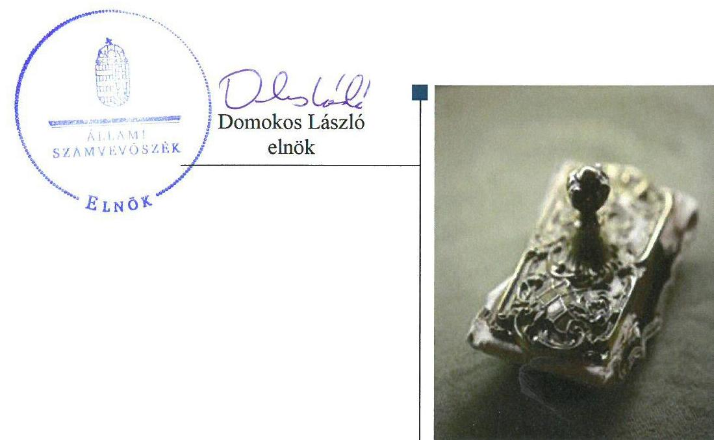
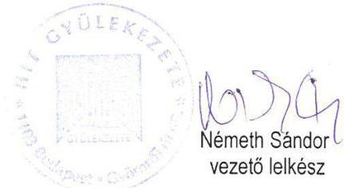
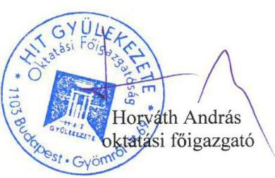
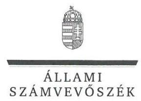
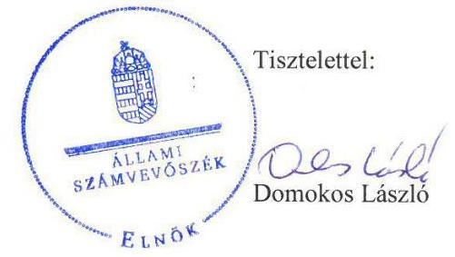

# Jelenetés 

## Nem állami humánszolgáltatók ellenőrzése

A humánszolgáltatást nyújtó államháztartáson kívüli köznevelési intézmények fenntartói központi költségvetésből kapott támogatásai felhasználásának ellenőrzése - Hit Gyülekezete 2018.

---

# Jelentés 

## Nem állami humánszolgáltatók ellenőrzése

A humánszolgáltatást nyújtó államháztartáson kívüli köznevelési intézmények fenntartói központi költségvetésből kapott támogatásai felhasználásának ellenőrzése - Hit Gyülekezete 2018. 03. hó 04. nap

---

# AZ ELLENŐRZÉST FELÜGYELTE:

- **SALAMON ILDIKÓ** felügyeleti vezető

- **AZ ELLENŐRZÉST VEZETTE ÉS A VÉGREHAJTÁSÁÉRT FELELŐS:**

- **MAROZSÁN LÁSZLÓNÉ** ellenőrzésvezető

- **A PROGRAM ÖSSZEÁLLÍTÁSÁÉRT FELELŐS:**

- **TÓTPÁL SZABOLCS** osztályvezető

**IKTATÓSZÁM:** EL-0118-145/2018.

**TÉMASZÁM:** 2448

**ELLENŐRZÉS-AZONOSÍTÓ SZÁM:** V079405

Jelentéseink az Országgyűlés számítógépes hálózatán és az Interneten a www.asz.hu címen is olvashatóak.

---

# TARTALOMJEGYZÉK 

■ ÖSSZEGZÉS ..... 5
■ AZ ELLENŐRZÉS CÉLJA ..... 6
■ AZ ELLENŐRZÉS TERÜLETE ..... 7
■ AZ ELLENŐRZÉS HÁTTERE, INDOKOLTSÁGA ..... 8
■ A JELENTÉS LÉNYEGES KÉRDÉSKÖREI ..... 9
■ AZ ELLENŐRZÉS HATÓKÖRE ÉS MÓDSZEREI ..... 10
■ MEGÁLLAPÍTÁSOK ..... 12
■ JAVASLATOK ..... 17
■ MELLÉKLETEK ..... 19
I. sz. melléklet: Értelmező szótár ..... 19
II. sz. melléklet: Támogatás jogcímenkénti alakulása ..... 21
■ FÜGGELÉK: ÉSZREVÉTELEK ..... 23
■ RÖVIDÍTÉSEK JEGYZÉKE ..... 41

---

.

---

# ÖSSZEGZÉS 

A Hit Gyülekezete, mint intézményfenntartó köznevelési közfeladata ellátásához a központi költségvetésből támogatást kapott. Az általa fenntartott köznevelési intézmények közfeladat ellátásának működési és gazdálkodási kereteit kialakította. A köznevelési feladatellátásához biztosított költségvetési támogatásokat szabályszerűen igényelte, módosította és számolta el. A kapott támogatásokat szabályszerűen fordította köznevelési intézményeinek a működtetésére. Ellenőrzési, értékelési feladatait ellátta, azonban a köznevelési közfeladatához kapcsolódó közérdekű adatok közzététele nem felelt meg az előírásoknak, ezáltal a közpénzekkel való gazdálkodás átláthatóságát, nyilvánosságát nem biztosította.

## Az ellenőrzés társadalmi indokoltsága

Az Állami Számvevőszék stratégiájában hangsúlyos szerepet szán annak, hogy szilárd szakmai alapon álló, értékteremtő ellenőrzéseivel előmozdítsa a közpénzügyek átláthatóságát, rendezettségét és javaslataival a közpénzek és a közvagyon szabályos, gazdaságos, hatékony és eredményes felhasználását segítse. Stratégiájában az Állami Számvevőszék célul tűzte ki, hogy az államháztartáson kívülre nyújtott költségvetési támogatások ellenőrzésével hozzájárul ahhoz, hogy a közpénzeket az államháztartáson kívüli szervezetek is átlátható módon használják fel a közfeladatok szerződésben vállalt ellátása érdekében. Tekintettel az elmúlt években a köznevelés finanszírozását és a köznevelési intézmények fenntartását érintően végbement változásokra, a társadalom fokozott érdeklődéssel figyeli a köznevelési feladatok ellátására fordított források felhasználását. Fontos ezért az Állami Számvevőszéknek a közvéleményt biztosítani arról, hogy a közpénz államháztartáson kívüli felhasználása ezen a területen sem marad ellenőrizetlenül. Hozzájárul ezzel ahhoz is, hogy a nyilvánosság és az igénybevevők megfelelő tájékoztatást kapjanak az államháztartáson kívüli közfeladatot ellátók működéséről.

## Főbb megállapítások, következtetések, javaslatok

A Hit Gyülekezete, mint intézményfenntartó a köznevelési közfeladata ellátásának szervezeti és szabályozási kereteit megfelelően kialakította. Beszámolási formája és könyvvezetése megfelelt a jogszabályi előírásoknak. Az ellenőrzött időszakban a köznevelési közfeladatokhoz kapott költségvetési támogatásokkal kapcsolatos igénylési, módosítási és elszámolási feladatokat szabályszerűen látta el. A köznevelési feladatok ellátásához biztosított költségvetési támogatás felhasználásáról naprakész, elkülönített nyilvántartást vezetett.

A fenntartott intézményei alapító okirataiban a jogszabályi előírásoknak megfelelően meghatározta az alapfeladatokat. Jogszabályban előírt fenntartói feladatainak eleget tett, kinevezte az intézmények vezetőit, meghatározta költségvetésüket, szabályos működésüket biztosító alapdokumentumaikat jóváhagyta.

A Magyar Államkincstár által folyósított költségvetési támogatást a köznevelési feladatokra, az intézmények működtetésére fordította. Biztosította a köznevelési intézmények működtetésének feltételeit.

A Hit Gyülekezete, mint intézményfenntartó a jogszabályi előírásoknak megfelelően ellenőrizte, értékelte az általa fenntartott köznevelési intézmények tevékenységét. Szabályozta a kötelezően közzéteendő adatok nyilvánosságra hozatalának rendjét, azonban a köznevelési közfeladat ellátásából adódó közérdekű adatok közzététele nem felelt meg a jogszabályban és a belső szabályozásban előírtaknak. Ezáltal a fenntartott köznevelési intézményei működtetéséhez felhasznált közpénzekre vonatkozó gazdálkodásával a nyilvánosság előtt nem számolt el.

---

# AZ ELLENŐRZÉS CÉLJA

**AZ ELLENŐRZÉS CÉLJA** annak értékelése volt, hogy az Intézményfenntartó¹ központi költségvetésből kapott támogatásainak felhasználása szabályszerű volt-e, a támogatások igénylése, évközi módosítása és év végi elszámolása megfelelte-e a jogszabályi előírásoknak.

---

# **Az Ellenőrzés Területe**

## **Hit Gyülekezete**

A Hit Gyülekezete az Országgyűlés által elismert bevett egyház. Alapszabálya értelmében nevelési-oktatási, felsőoktatási, kulturális, szociális, gyermek- és ifjúságvédelmi intézményt alapíthat és tarthat fenn. A Fenntartó és a Magyar Kormány között a 2006. évben megállapodás jött létre az általa végzett oktatási-nevelési tevékenység támogatására. Az ellenőrzött időszakban egyoldalú nyilatkozatban vállalta a Fenntartó az állami, önkormányzati köznevelési közfeladatban való részvételt.

Az ellenőrzött időszakban az ország hét megyéjében 9 köznevelési intézmény fenntartásával és működtetésével vett részt a köznevelési közfeladat ellátásában. Az intézmények2 Budapesten kívül Ajkán, Debrecenben, Hajdúsámsonban, Kecskeméten, Nyíregyházán, Magyon, Pécsett és Salgótarjánban láttak el oktatási-nevelési feladatokat. Az intézmények által ellátott alapfeladatok 2016. évben az óvodai nevelés, általános iskolai, gimnáziumi, szakgimnáziumi, szakközépiskolai és szakiskolai nevelés-oktatás, alapfokú művészetoktatás és kollégiumi ellátás voltak. Budapesti intézményének alapfeladatát a Fenntartó 2015. szeptember 1-jétől óvodai nevelés alapfeladattal bővítette, mely feladat ellátása érdekében új telephelyet létesített.

A Fenntartó a támogatás igényléséhez előírt feltételeknek az ellenőrzött években megfelelt, köznevelési feladatellátására tekintettel Magyarország éves költségvetéséből támogatásra volt jogosult. A központi költségvetésből kapott támogatás a Fenntartó összes bevételének megközelítőleg a 80%-át tette ki. A Fenntartó a központi költségvetésből kapott támogatásnak – a 2014-2016. évi beszámolók adatai alapján – a 2014. évben a 97,2 %-át, a 2015. évben a 98,5%-át, a 2016. évben a 100%-át adta át közvetlenül a köznevelési intézményei részére a működésük biztosításához. A Fenntartó 2014-2016. évi elszámolása alapján a Kincstár által elfogadott költségvetési támogatás jogcímenkénti alakulását a II. melléklet tartalmazza.

A köznevelési feladatok ellátásával kapcsolatos szakmai irányító szervi feladatokat az ellenőrzött időszakban az EMMI3 látta el, a törvényességi ellenőrzési feladatokat a területileg illetékes kormányhivatalok4 végezték.

A Fenntartó a köznevelési feladatellátására kapott közpénz felhasználásáról a nyilvánosság előtt köteles volt elszámolni.

---

# AZ ELLENŐRZÉS HÁTTERE, INDOKOLTSÁGA 

A köznevelési feladatokat ellátó nem állami intézményfenntartók részére közfeladataik ellátására évente jelentős összegű pénzügyi támogatást biztosítottak a mindenkori költségvetési törvények a bennük megfogalmazott feltételek mellett.

A felhasználható állami támogatások előirányzata 2014. - 2016. években együtt 753 Mrd Ft volt. A 2013. évben jelentős változások következtek be a normatív finanszírozás rendszerében. Az Országgyűlés elfogadta a nemzeti köznevelésről szóló 2011. évi CXC. törvényt, amely jelentősen átalakította a korábbi finanszírozási rendszert 2013. szeptemberétől. Új feladatfinanszírozási forma (átlagbéralapú támogatás) jelent meg, amely az államháztartáson kívüli intézményfenntartókra is vonatkozik. Az ellenőrzés a finanszírozási rendszerben bekövetkezett változásokra, azok közfeladat ellátásra gyakorolt hatására fókuszált a költségvetési támogatásokat felhasználó államháztartáson kívüli szervezetek körében. Az ellenőrzés indokoltságát az is alátámasztotta, hogy az ÁSZ ${ }^{5}$ még nem ellenőrizte átfogóan e területet.

Az ÁSZ stratégiájában foglaltak alapján is indokolt az ellenőrzés, amely a társadalom számára jelzi, hogy a közpénz államháztartáson kívüli felhasználása sem maradhat ellenőrizetlenül. Az államháztartáson kívülre nyújtott költségvetési támogatások ellenőrzésével az ÁSZ hozzájárul ahhoz, hogy a közpénzeket a nem állami fenntartók átlátható módon használják fel a közfeladatok ellátására kötött szerződésekben vállalt kötelezettségek teljesítése érdekében. Az ÁSZ az ellenőrzés javaslataival hozzájárulhat az említett rendszerek szabályszerű támogatás-felhasználásához, javíthatja a társadalmi-gazdasági döntések megalapozottságát, amely a „jó kormányzás" feltétele.

---

# A JELENTÉS LÉNYEGES KÉRDÉSKÖREI 

1. A Fenntartó szabályszerű működési és gazdálkodási környezet kialakításával megteremtette-e a költségvetési támogatások átlátható, elszámoltatható igénybevételének, felhasználásának feltételeit?
2. A Fenntartó az átvállalt köznevelési közfeladathoz biztosított költségvetési támogatásokat szabályszerűen fordította-e intézményei működésére?
3. A Fenntartó a köznevelési intézményei működtetéséhez felhasznált közpénzekre vonatkozó gazdálkodásával a nyilvánosság előtt elszámolt-e, ennek megalapozása érdekében ellenőrzési, értékelési és a külső ellenőrzésekkel kapcsolatos intézkedési feladatait szabályszerűen látta-e el?

---

# AZ ELLENŐRZÉS HATÓKÖRE ÉS MÓDSZEREI 

## Az ellenőrzés típusa

Megfelelőségi ellenőrzés.

## Az ellenőrzött időszak

A 2014. január 1-je és 2016. december 31-e közötti időszak.

## Az ellenőrzés tárgya

Az ellenőrzés a köznevelési közfeladatokat ellátó államháztartáson kívüli fenntartó közfeladatainak ellátásához a költségvetési törvényekben biztosított központi költségvetési támogatások igénylése, évközi módosítása és év végi elszámolása, fenntartói feladatainak ellátása, illetve e központi költségvetésből kapott támogatásaik közfeladatokra való fenntartó általi felhasználása szabályszerűségének értékelésére terjedt ki.
Az ellenőrzés kiterjedt minden olyan körülményre és adatra, amely az ÁSZ jogszabályban meghatározott feladatainak teljesítéséhez, valamint a program végrehajtása folyamán felmerült újabb összefüggések feltárásához szükséges volt.

## Az ellenőrzött szervezet

Hit Gyülekezete, mint intézményfenntartó.

## Az ellenőrzés jogalapja

Az ellenőrzés jogszabályi alapját az ÁSZ tv. ${ }^{6}$ 1. § (3) bekezdése, 5. § (3) bekezdés, valamint az 5. § (11) bekezdés c) pontjában foglalt előírások adták.

## Az ellenőrzés módszerei

Az ellenőrzést az ellenőrzési program kérdései, az adott időszakban hatályos jogszabályok, az ellenőrzés szakmai szabályok és módszertanok, valamint a nemzetközi standardok figyelembevételével végezte az ÁSZ.

A közpénzekkel való felelős gazdálkodás segítésére irányuló javaslatok kidolgozásakor a hatályos jogszabályok voltak az irányadóak.

---

Az ellenőrzés ideje alatt az ÁSZ a Fenntartóval történő kapcsolattartást az ÁSZ SZMSZ ${ }^{1}$-ének vonatkozó előírásai alapján biztosította.

Az ellenőrzési kérdések megválaszolásához szükséges bizonyítékok megszerzése az ellenőrzöttek által rendelkezésre bocsátott dokumentumokra, adatokra alapozva történt. Az ellenőrzés nem terjedt ki a költségvetési támogatás igénylése, módosítása, elszámolása valódiságának, megalapozottságának, helyességének értékelésére, valamint a források intézmények általi felhasználásának értékelésére.

Az ellenőrzési bizonyítékként felhasznált adatforrások közé tartoztak egyrészt a szakmai program részletes szempontjainál felsorolt adatforrások, másrészt minden - az ellenőrzés folyamán feltárt, az ellenőrzés szempontjából információt tartalmazó - dokumentum.

Az ellenőrzés lefolytatásához a Fenntartó a kitöltött tanúsítványok, valamint az ÁSZ által kért dokumentumok elektronikus úton való megküldésével szolgáltatott adatokat, információkat. Az így rendelkezésre bocsátott adatok, információk és a tanúsítványok adatai valódiságának kontrollja az ellenőrzés keretében történt.

Helyszíni szemlékre a fenntartott intézmények egyes feladatellátási helyein került sor.

A köznevelési humánszolgáltatások központi költségvetési támogatásai igénylésével, módosításával, elszámolásával kapcsolatos, államháztartáson kívüli fenntartó jogszabályokban előírt feladatai betartását, továbbá a központi költségvetési támogatások szabályszerű kezelését, nyilvántartását ellenőrizte az ÁSZ a Fenntartónál határozatok, nyilvántartások, beszámolók és egyéb dokumentumok alapján. Az ellenőrzés nem terjedt ki a köznevelési humánszolgáltatások központi költségvetési támogatásai igénylése, módosítása, elszámolása valódiságának, megalapozottságának, helyességének - sem a Fenntartónál, sem a székhely intézményeinél való értékelésére. Továbbá nem terjedt ki az ellenőrzés e források intézmények általi szabályszerű felhasználásának értékelésére. A szabályosság megítélésének alapját képezte, hogy a központi költségvetési támogatások Fenntartó általi igénylése, módosítása és elszámolása a Kincstár ${ }^{a}$ felé megtörtént.

---

# 1. A Fenntartó szabályszerű működési és gazdálkodási környezet kialakításával megteremtette-e a költségvetési támogatások átlátható, elszámoltatható igénybevételének, felhasználásának feltételeit? 

Összegző megállapítás

1.1. számú megállapítás

A Fenntartó szabályszerű működési és gazdálkodási környezet kialakításával megteremtette a költségvetési támogatások átlátható, elszámoltatható igénybevételének, felhasználásának feltételeit.

A Fenntartó köznevelési közfeladat ellátásának megszervezése és belső szabályozottságának kialakítása a jogszabályi előírások betartásával történt.

A KÖZNEVELÉSI KÖZFELADAT ELLÁTÁSÁNAK szervezeti és működési kereteit a Fenntartó a jogszabályi előírásoknak megfelelően kialakította. Alapszabályában ${ }^{9}$ és a Hivatali ${ }^{10}$ SZMSZ-ben ${ }^{11}$ rendelkezett a közoktatási intézményekkel kapcsolatos fenntartói feladatokról. Az ellenőrzött időszak vonatkozásában egyoldalú nyilatkozatban vállalta az állami, önkormányzati közfeladat ellátásban való részvételt.

A Fenntartó beszámolási formája és alkalmazott könyvvezetése megfelelt a 296/2013. (VII. 29.) Korm. rendelet ${ }^{12}$-ben
 foglaltaknak. A Számv. tv. ${ }^{13}$ ben előírtaknak megfelelően kialakította a számviteli politikáját ${ }^{14}$, elkészítette az eszközök és források leltárkészítési és leltározási szabályzatát ${ }^{15}$, értékelési szabályzatát ${ }^{16}$, pénzkezelési szabályzatát ${ }^{17}$, valamint a számlarendjét ${ }^{18}$.

A Fenntartó a központi költségvetési támogatások intézmények közötti elosztásának és felhasználásának szabályait, valamint a költségvetési támogatások elkülönített nyilvántartásának, elszámolásának, ellenőrzésének és a költségvetési források és egyéb mérlegtételek sajátos elszámolásának szabályait vezetői utasításokban ${ }^{19}$ előírta.

A költségvetési támogatások igénylési, módosítási és elszámolási feladatait a Fenntartó szabályszerűen látta el.

A KÖZPONTI KÖLTSÉGVETÉSI TÁMOGATÁSOKRA vonatkozó kérelmét a Fenntartó a 2014-2016. évek tekintetében az Nkt. vhr. ${ }^{20}$-ben előírt határidőben a Kincstárhoz benyújtotta.

Az ellenőrzött időszakra vonatkozóan a Fenntartó rendelkezett a költségvetési támogatást megállapító kincstári határozatokkal. Egy esetet kivéve a Fenntartó határidőben tett eleget a fenntartásában működő intézmények feladatellátásában bekövetkezett változás-bejelentési kötelezettségének. Az ajkai intézmény esetében a Fenntartó az Nkt. vhr. 37/H. § (1)

---

bekezdésében előírt határidőn túl kérelmezte 2015. évben a működési engedély módosítását.

A Fenntartó az Nkt. vhr.-ben előírtaknak megfelelő formában és határidővel elszámolt a Kincstár felé a központi költségvetésből kapott támogatásokkal.

A Kincstár rendszeresen végzett finanszírozói felülvizsgálatot a 2014-2016. évek között a fenntartói támogatás igénylésének, elszámolásának jogszerűségére vonatkozóan a Fenntartó által csatolt dokumentumok alapján. A felülvizsgálat során kezdeményezett kincstári hiánypótlási, nyilatkozattételi felhívásnak a Fenntartó eleget tett.

# 2. A Fenntartó az átvállalt köznevelési közfeladathoz biztosított költségvetési támogatásokat szabályszerűen fordította-e intézményei működésére? 

Összegző megállapítás

### 2.1. számú megállapítás

2.2. számú megállapítás

A Fenntartó az átvállalt köznevelési közfeladatokhoz biztosított költségvetési támogatásokat szabályszerűen fordította a köznevelési intézményei működtetésére.

A Fenntartó biztosította a köznevelési intézmények működtetésének feltételeit.

A FENNTARTÓ MEGHATÁROZTA az intézmények alapító okiratában alapfeladataikat, gazdálkodással összefüggő jogosítványaikat, a feladatellátáshoz szükséges vagyon feletti rendelkezési jogokat. Az intézményeket az illetékes kormányhivatal nyilvántartásba vette, működési engedélyüket kiadta, rendelkeztek OM azonosító számmal ${ }^{21}$.

A Fenntartó belső szabályzataiban megállapította az intézmények könyvvezetési, beszámoló-készítési kötelezettségét. Az Nkt. ${ }^{22}$-ban előírt fenntartói feladatoknak megfelelően meghatározta az ellenőrzött években az intézmények költségvetését, a kérhető térítési díj és tandíj megállapításának szabályait, kinevezte az intézményvezetőket, továbbá előírta az intézményvezetők számára az intézményi foglalkoztatásra vonatkozó főbb szabályokat. Jóváhagyásával érvényesítette az intézmények működésének alapdokumentumait ${ }^{23}$ az Nkt. előírásainak megfelelően.

A határozattal jóváhagyott költségvetési támogatások a jogszabályokban megjelölt határidőre a Fenntartó rendelkezésére álltak. A Fenntartó a költségvetési támogatásokat a jogszabályban előírtaknak megfelelően adta át az intézményeknek működésük biztosításához.

A Fenntartó az átvállalt köznevelési közfeladatához rendelt költségvetési támogatást szabályszerűen kezelte, elkülönítetten tartotta nyilván és intézményei működtetésére fordította.

A TÁMOGATÁS FELHASZNÁLÁSÁRÓL alapfeladatonkénti bontásban elkülönített, naprakész nyilvántartást vezetett a Fenntartó. A nyilvántartás biztosította a költségvetési támogatások felhasználási céljának megállapítását az Nkt. vhr.-ben előírtaknak megfelelően.

---

A Fenntartó az intézmények beszámoló készítési kötelezettségét a Számv. tv.-ben és a 296/2013. (VII. 29.) Korm. rendeletben foglaltaknak megfelelően megállapította, az intézményi beszámolók a Fenntartónál rendelkezésre álltak.

# 3. A Fenntartó a köznevelési intézményei működtetéséhez felhasznált közpénzekre vonatkozó gazdálkodásával a nyilvánosság előtt elszámolt-e, ennek megalapozása érdekében ellenőrzési, értékelési és a külső ellenőrzésekkel kapcsolatos intézkedési feladatait szabályszerűen látta-e el? 

Összegző megállapítás

A Fenntartó ellenőrzési, értékelési és a külső ellenőrzésekkel kapcsolatos intézkedési feladatait szabályszerűen ellátta, azonban a közérdekű adatok közzététele nem volt szabályszerű, így a köznevelési közfeladat ellátásához felhasznált közpénzekre vonatkozó gazdálkodásával a nyilvánosság előtt nem számolt el.
3.1. számú megállapítás

A Fenntartó ellenőrzési, értékelési feladatait szabályszerűen látta el.

A FENNTARTÓ ELKÉSZÍTETTE az Alapszabályában rögzítetteknek megfelelően a költségvetési támogatások felhasználásának, nyilvántartásának belső ellenőrzési szabályzatát ${ }^{25}$, belső ellenőrzést működtetett. A Fenntartó minden évben ellenőrizte nevelési, oktatási intézményei gazdálkodását, működésük törvényességét és hatékonyságát, szakmai munkájuk eredményességét. Az ellenőrzések alkalmával sor került az intézmények SZMSZ-ének, pedagógiai programjának és házirendjének felülvizsgálatára is.

Évente értékelte továbbá a jogszabályi előírásnak megfelelően az intézmények pedagógiai-szakmai munkájának eredményességét.

A Fenntartó belső ellenőrzése 2014-2016. évben ellenőrizte a Fenntartó támogatásokkal kapcsolatos tevékenységét.
3.2. számú megállapítás

A Fenntartó a köznevelési intézményei működtetéséhez felhasznált közpénzekre vonatkozó gazdálkodásával a nyilvánosság előtt nem számolt el.

A KÖTELEZŐEN KÖZZÉTEENDŐ ADATOK nyilvánosságra hozatalának rendjét a Fenntartó az Info. tv. ${ }^{25}$ előírásának megfelelően szabályozta.

A Fenntartó informatikai rendszere szabályozása során az Informatikai Biztonsági Szabályzat ${ }^{26}$-ban kialakította az adatok biztonságának, védelmének érvényre juttatásához szükséges eljárási szabályokat.

---

A Fenntartó köznevelési közfeladatai ellátásához kapcsolódóan a 2014-2016. években Info tv. 37. § (1) bekezdésében előírtak ellenére nem gondoskodott az Info tv. 1. melléklet általános közzétételi lista Tevékenységre, működésre és a Gazdálkodásra vonatkozó alábbi adatok közzétételéről.

- II. Tevékenységre, működésre vonatkozó adatok közül a közfeladatot ellátó szerv feladatát, hatáskörét meghatározó alapvető jogszabályok, szervezeti és működési szabályzat, ügyrend; a testületi szerv döntései előkészítésének rendje, döntései, ülésének jegyzőkönyvei, összefoglalói; a közfeladatot ellátó szerv által kiírt pályázatok szakmai leírása, azok eredményei és indoklásuk; a közfeladatot ellátó szervnél végzett alaptevékenységgel kapcsolatos vizsgálatok, ellenőrzések nyilvános megállapításai; a közérdekű adatok megismerésére irányuló igények intézésének rendje, az illetékes szervezeti egység neve, elérhetősége; a közfeladatot ellátó szerv tevékenységére vonatkozó, jogszabályon alapuló statisztikai adatgyűjtés eredményei, időbeli változás; a közérdekű adatokkal kapcsolatos kötelező statisztikai adatszolgáltatás adott szervre vonatkozó adatai.
- III. Gazdálkodási adatok közül a közfeladatot ellátó szerv éves költségvetése, beszámolója; a közfeladatot ellátó szervnél foglalkoztatottak létszámára és személyi juttatásaira vonatkozó összesített adatok, illetve összesítve a vezetők és vezető tisztségviselők illetménye, munkabére, és rendszeres juttatásai, valamint költségtérítése, az egyéb alkalmazottaknak nyújtott juttatások fajtája és mértéke összesítve; az államháztartás pénzeszközei felhasználásával, az államháztartáshoz tartozó vagyonnal történő gazdálkodással összefüggő, ötmillió forintot elérő vagy azt meghaladó értékű árubeszerzésre, építési beruházásra, szolgáltatás megrendelésre, vagyonértékesítésre, vagyonhasznosításra, vagyon vagy vagyoni értékű jog átadására, valamint koncesszióba adásra vonatkozó szerződések megnevezése (típusa), tárgya, a szerződést kötő felek neve, a szerződés értéke, határozott időre kötött szerződés esetében annak időtartama, valamint az említett adatok változásai a minősített adatok kivételével.

Az Info tv. 1. melléklet általános közzétételi lista I. részében előírt adatokat a Közzétételi Szabályzatának ${ }^{27}$ 4.3. pontjában rögzítettek ellenére a Fenntartó nem a honlapjáról közvetlenül elérhető hivatkozás alatt tette közzé.

A Fenntartó nevelési-oktatási intézményei munkájával összefüggő értékelését az Nkt.-ben előírtaknak megfelelően honlapján nyilvánosságra hozta.

# 3.3. számú megállapítás 

## A Fenntartó a külső ellenőrzésekkel kapcsolatos intézkedési feladatait szabályszerűen látta el.

A Fenntartó nyilvántartást vezetett az intézményeknél lefolytatott törvényességi ellenőrzésekről. A 2014-2016 közötti időszakban a megyei kormányhivatalok több alkalommal végeztek törvényességi ellenőrzést a fenntartói feladatellátást érintően az intézményeknél. A Fenntartó a feltárt szabálytalanságok, hiányosságok esetében megtette a szükséges intézkedéseket.

---

A Kincstár a Fenntartó valamennyi intézményében végzett helyszíni ellenőrzést az ellenőrzött időszakban a költségvetési támogatások igénybevételének jogszerűségére vonatkozóan. Az ellenőrzés megállapításai alapján finanszírozási különbözet megfizetésére kötelezte a Kincstár a Fenntartót, melynek a Fenntartó eleget tett.

---

# JAVASLATOK 

Az ÁSZ tv. 33. § (1) bekezdésében foglaltak értelmében az ellenőrzött szervezet vezetője köteles a jelentésben foglalt megállapításokhoz kapcsolódó intézkedési tervet összeállítani és azt a jelentés kézhezvételétől számított 30 napon belül az ÁSZ részére megküldeni. Amennyiben az ellenőrzött szervezet vezetője nem küldi meg határidőben az intézkedési tervet, vagy továbbra sem elfogadható intézkedési tervet küld, az Állami Számvevőszék elnöke az ÁSZ tv. 33. § (3) bekezdése a) és b) pontjaiban foglaltakat érvényesítheti.

## Hit Gyülekezete vezetőjének

1. Intézkedjen a jogszabályi előírásnak megfelelően az Info. tv. 1. melléklet szerinti általános közzétételi listában meghatározott adatok teljes körű közzétételére.
(3.2. számú megállapítás 3. bekezdés 1. mondata alapján)
2. Intézkedjen, hogy a Fenntartó az Info tv. 1. melléklet általános közzétételi lista I. részében előírt adatokat - a belső szabályzatban foglaltaknak megfelelően - a honlapjáról közvetlenül elérhető hivatkozás alatt tegye közzé.
(3.2. számú megállapítás 4. bekezdése alapján)

---

.

---

# MELLÉKLETEK 

## I. SZ. MELLÉKLET: ÉRTELMEZŐ SZÓTÁR

bevett egyház
egyházi fenntartó
humánszolgáltatás
költségvetési támogatás

Az Ehtv. ${ }^{28}$ 6. § (1-2) bekezdései szerint az Országgyűlés által elismert egyház bevett egyház. Vallási közösség az Országgyűlés által elismert egyház és a vallási tevékenységet végző szervezet lehet. A vallási közösség elsődlegesen vallási tevékenység céljából jön létre és működik. Az Ehtv. 7. §-a szerint a vallási közösség az egyház megjelölést elnevezésében és tevékenységére való utalás során önmeghatározása céljából - a saját hitelvei szerinti tartalommal - használhatja.
Az Ehtv. 33. §-a alapján az Ehtv. mellékletében felsorolt egyházak és az általuk meghatározott, az egyház belső egyházi szabálya szerint jogi személyiséggel rendelkező szervezetek - a nyilvántartásba vételük dátumától függetlenül - 2012. január 1-jétől minősülnek egyházi fenntartóknak. Az Ehtv. 14. §-ában meghatározott eljárás folyamán az Országgyűlés által egyháznak elismert szervezet a törvénynek az egyház bejegyzésére vonatkozó módosítása hatálybalépésének napjától minősül egyháznak (Ehtv. 15. §). A 2010. évi CXL. törvény* 5. Cikk Pénzügyi támogató intézkedések 1. pontja alapján 2011. január 1-jétől jogosult a Magyar Máltai Szeretetszolgálat Egyesület az egyházi kiegészítő támogatásra.
Külön törvényben meghatározott szociális, gyermekjóléti, gyermekvédelmi, közoktatási, felsőoktatási, kulturális közfeladatok (2014. évi Kvtv. 34. § (1), (4) bekezdés, 1. számú melléklet XX/20/2. alcím, 19. alcím, 2015. évi Kvtv. 43. § (1), (4) bekezdés, 1. számú melléklet XX/20/2/3. jogcím csoport, 19. alcím, 2016. évi Kvtv. 41. § (1), (4) bekezdés, 1. számú melléklet XX/20/2/3. jogcím csoport, 19. alcím).
a társadalombiztosítás pénzügyi alapjai kivételével az államháztartás központi alrendszeréből ellenérték nélkül, pénzben nyújtott támogatások (Áht. 1. § 14. pont)
A költségvetési törvényekben (2013. évi CCXXX. törvény 33-34. §, 2014. évi C. törvény 42-43. §, 2015. évi C. törvény 40-41. §) megállapított támogatás. Például a 2015. évi C. törvény 40-41. § szerint többek között: Az Országgyűlés a köznevelési feladat ellátására átlagbéralapú támogatást állapít meg. A nevelési-oktatási, valamint pedagógiai szakszolgálati intézményt fenntartó nemzetiségi önkormányzat, az egyházi és magán köznevelési intézmény fenntartója részére az általuk fenntartott nevelési-oktatási intézményben, továbbá pedagógiai szakszolgálati intézményben pedagógus és - a b) pont kivételével - nevelő-oktató munkát közvetlenül segítő munkakörben foglalkoztatottak után a 7. melléklet I. pontja, valamint az óvoda, egységes óvoda-bölcsőde esetében a 2. melléklet II. pont 1. alpontja szerint és az 5. alpontjában meghatározott jogosultak után, az őket ott megillető mértékek szerint. Működési támogatást állapít meg a nemzetiségi önkormányzat vagy az egyházi jogi személy által fenntartott nevelési-oktatási intézményekben ellátott, továbbá a pedagógiai szakszolgálati intézményekben gyógypedagógiai tanácsadásban, korai fejlesztésben, oktatásban és gondozásban, valamint a fejlesztő nevelésben részt vevő gyermekekre, tanulókra tekintettel a nemzetiségi önkormányzat és a bevett egyház részére a 7. melléklet II. pontja szerint.
Az Országgyűlés a szociális, gyermekjóléti, gyermekvédelmi közfeladatot ellátó intézményt, szolgáltatást fenntartó egyházi jogi személy, civil szervezet, közalapítvány, országos nemzetiségi önkormányzat, települési vagy területi nemzetiségi önkormányzat, gazdasági társaság, és a humánszolgáltatást alaptevékenységként végző, az Szja tv. hatálya alá tartozó egyéni vállalkozó (a továbbiakban együtt: nem állami szociális fenntartó) részére támogatást állapít meg a következők szerint:
 a támogatás a nem állami

[^0]
[^0]:    * a Magyar Köztársaság Kormánya és a Szuverén Jeruzsálemi, Rodoszi és Máltai Szent János Katonai és Ispotályos Rend közötti Együttműködési Megállapodás kihirdetéséről szóló 2010. évi CXL. törvény

---

# Mellékletek 

köznevelési közfeladat
köznevelési intézmény
nem állami, nem önkormányzati (államháztartáson kívüli) intézmény fenntartó
vallási tevékenység
vallási tevékenységet végző szervezet
szociális fenntartót a települési önkormányzatok 2. melléklet III. pont 3. alpont c)-k) pontjában és III. pont 5. alpont a) pontjában meghatározott támogatásaival azonos jogcímeken, összegben és feltételek mellett illeti meg.
A köznevelési intézmény alapító okiratában foglalt feladat: óvodai nevelés, nemzetiséghez tartozók óvodai nevelése, általános iskolai nevelés-oktatás, nemzetiséghez tartozók általános iskolai nevelése-oktatása, kollégiumi ellátás, nemzetiségi kollégiumi ellátás, gimnáziumi nevelés-oktatás, szakközépiskolai nevelés-oktatás, szakiskolai nevelés-oktatás, nemzetiségi gimnáziumi nevelés-oktatása, nemzetiségi szakközépiskolai nevelés-oktatása, nemzetiségi szakiskolai nevelés-oktatása, Köznevelési Hídprogramok keretében folyó nevelés-oktatás, felnőttoktatás, alapfokú művészetoktatás, fejlesztő nevelés, fejlesztő nevelés-oktatás, pedagógiai szakszolgálati feladat, a többi gyermekkel, tanulóval együtt nevelhető, oktatható sajátos nevelési igényű gyermekek, tanulók óvodai nevelése és iskolai nevelése-oktatása, azoknak a sajátos nevelési igényű gyermekeknek, tanulóknak az óvodai, iskolai, kollégiumi ellátása, akik a többi gyermekkel, tanulóval nem foglalkoztathatók együtt, a gyermekgyógyüdülőkben, egészségügyi intézményekben, rehabilitációs intézményekben tartós gyógykezelés alatt álló gyermekek tankötelezettségének teljesítéséhez szükséges oktatás, pedagógiai-szakmai szolgáltatás.
A nevelési-oktatási intézmény, pedagógiai szakszolgálati intézmény, pedagógiai-szakmai szolgáltatást nyújtó intézmény.
A köznevelési és szociális, gyermekjóléti és gyermekvédelmi közfeladatokat/humánszolgáltatásokat ellátó intézményt fenntartó egyházi jogi személy, társadalmi szervezet, alapítvány, közalapítvány, civil szervezet, országos nemzetiségi önkormányzat, nonprofit gazdasági társaság, gazdasági társaság és a humánszolgáltatást alaptevékenységként végző, Szja tv. hatálya alá tartozó egyéni vállalkozó. (2013. évi Kvtv. 35. § (1), (3) bekezdés, 2014. évi Kvtv. 33. §, 34. § (1), (4) bekezdés, 2015. évi Kvtv. 42. §, 43. § (1), (4) bekezdés, 2016. évi Kvtv. 40. §, 41. § (1), (4) bekezdés)
Az Ehtv. 6. § (3) bekezdés szerint a vallási tevékenység olyan világnézethez kapcsolódó tevékenység, amely természetfelettire irányul, rendszerbe foglalt hitelvekkel rendelkezik, tanai a valóság egészére irányulnak, valamint sajátos magatartáskövetelményekkel az emberi személyiség egészét átfogja. Az Ehtv. 6. § (4) bekezdés (e, f, j, o) pontjai szerint önmagában nem tekinthető vallási tevékenységnek a nevelési, az oktatási, a család-, gyermek- és ifjúságvédelmi és a szociális tevékenység.
Az Ehtv. 9/A. § (1) bekezdései szerint a vallási tevékenységet végző szervezet olyan egyesület, amelynek tagjai azonos hitelveket valló természetes személyek, és amelynek alapszabályában meghatározott célja vallási tevékenység végzése.

---

II. SZ. MELLÉKLET: TÁMOGATÁS JOGCÍMENKÉNTI ALAKULÁSA

| A FENNTARTÓ ÁLTAL KAPOTT KÖZPONTI KÖLTSÉGVETÉSI TÁMOGATÁS JOGCÍMENKÉNTI ALAKULÁSA (EZER FT) |  |  |  |
| :--: | :--: | :--: | :--: |
| Megnevezés | 2014. év | 2015. év | 2016. év |
| átlagbéralapú támogatás | 1779673,3 | 1862770,9 | 1982228,1 |
| működési támogatás | 871085,5 | 714402,1 | 721791,5 |
| hit és erkölcstan oktatás támogatása (átlagbéralapú, tankönyv) | 30897,5 | 55348,8 | 78507,5 |
| gyermekétkeztetés támogatása | 85451,5 | 85040,6 | 87503,4 |
| tankönyvtámogatás | 31794,0 | 27540,0 | 24408,0 |
| Összesen | 2798901,8 | 2745102,4 | 2894438,5 |

Forrás: 2014-2016.évi költségvetési támogatás elszámolások kincstári határozatai

---

.

---

# FÜGGELÉK: ÉSZREVÉTELEK 

A jelentéstervezetet a Számvevőszék 15 napos észrevételezésre megküldte az ellenőrzött szervezet vezetőjének az ÁSZ tv. 29. § (1) bekezdése előírásának megfelelően.
A Hit Gyülekezete vezető lelkésze az ellenőrzés megállapításaira írásban észrevételt tett.
Az elfogadott észrevétel alapján az Állami Számvevőszék módosította a jelentést.
A függelék tartalmazza a Hit Gyülekezete vezető lelkészének az észrevételeit és az arra adott választ, a figyelembe nem vett észrevételekről, annak indokairól szóló tájékoztatást.

[^0]
[^0]:    (1) Az Állami Számvevőszék az ellenőrzési megállapításait megküldi az ellenőrzött szervezet vezetőjének vagy az általa megbízott személynek, és annak, akinek személyes felelősségét állapította meg.
    (2) Az ellenőrzött szervezet vezetője és a felelősként megjelölt személy az ellenőrzés megállapításaira tizenöt napon belül írásban észrevételt tehet.
    (3) Az Állami Számvevőszék az észrevételre a beérkezésétől számított harminc napon belül írásban válaszol. A figyelembe nem vett észrevételeket köteles a jelentésben feltüntetni, és megindokolni, hogy azokat miért nem fogadta el.

---

# HIT GYÜLEKEZETE 

## Domokos László

elnök
Állami Számvevőszék
1364 Budapest 4.
Pf. 54.

Tárgy: észrevétel küldése az ÁSZ EL-0118-
144/2018. számú jelentéstervezetére

Tisztelt Elnök Úr!
Kézhez vettem az FV-0097-001/2018. iktatószámú levelét. A levele mellékleteként megküldött „Nem állami humánszolgáltatók ellenőrzése - A humánszolgáltatást nyújtó államháztartáson kívüli köznevelési intézmények fenntartói központi költségvetésből kapott támogatásai felhasználásának ellenőrzése - Hit Gyülekezete" címmel készített számvevőszéki jelentéstervezethez egyházunk törvényes határidőn belül észrevételt kíván tenni.

A jelentéstervezethez egyházunk Oktatási Főigazgatósága és Jogi Főigazgatósága által készített észrevételt levelem mellékleteként megküldöm Önnek.

Kérem, hogy az észrevételünkben foglaltakat vegyék figyelembe a végleges jelentésnél.
Munkájukat köszönöm,
Budapest, 2018. I. 31. nap
tisztelettel:

Melléklet:

- Észrevétel az Állami Számvevőszék jelentéstervezetéhez
- A Hit Gyülekezete Szabályzata a közérdekű adatok megismerésére irányuló kérelmek intézésének rendjéről

---

# A Hit Gyülekezete Észrevétele az Állami Számvevőszék EL-0118-144/2018. számú jelentéstervezetéhez 

Készítette a Hit Gyülekezete Oktatási Főigazgatósága és Jogi Főigazgatósága

Az Észrevételben foglaltakért felelős:
Horváth András oktatási főigazgató,
dr. Németh Tibor jogi főigazgató

Budapest, 2018. január 30.

---

# Észrevételek 

1. Az Állami Számvevőszék (továbbiakban: ÁSZ) jelentéstervezetének ÖSSZEGZÉS cím, 1. bekezdésének 4. mondatához (jelentéstervezet 5. oldal, 1. bekezdés)
„Ellenőrzési, értékelési feladatait ellátta, azonban a köznevelési közfeladatához kapcsolódó közérdekű adatok közzététele nem felelt meg az előírásoknak, ezáltal a közpénzekkel való gazdálkodás átláthatóságát, nyilvánosságát nem biztosította."

A jelentéstervezet idézett megállapítása részben téves, álláspontunk szerint:
A Hit Gyülekezete ellenőrzési, értékelési feladatait ellátta, a köznevelési közfeladatához kapcsolódó közérdekű adatok közzététele az Információs önrendelkezési jogról és az információszabadságról szóló 2011. évi CXII. törvény (továbbiakban: Info tv.), a Lelkiismereti és vallásszabadság jogáról, valamint az egyházak, vallásfelekezetek és vallási közösségek jogállásáról szóló 2011. évi CCVI. törvény (továbbiakban: Ehtv.), továbbá a Nemzeti Köznevelésről szóló 2011. évi CXC. törvény (továbbiakban: Nktv.) rendelkezéseinek együttes alkalmazásával történt, ezáltal biztosítva a közpénzekkel való gazdálkodás átláthatóságát, nyilvánosságát.

Indoklás:
Az Információs törvény 1-es számú mellékletében írt adat közzétételi kötelezettséget az egyházakra vonatkozó speciális szabályozással együttesen kell kezelni és az Információs törvény rendelkezéseit az egyházaknak erre figyelemmel kell teljesíteniük.
A nyilvánosság tájékoztatásának nem egyedüli eszköze az Info tv. 1. számú mellékletében szereplő közzétételi lista szerinti közérdekű adatok közzététele, hanem a Nktv. vonatkozó rendelkezései is biztosítják a köznevelési feladatot ellátó fenntartók gazdálkodásának átláthatóságát és nyilvánosságát, valamint a közvélemény tájékoztatását. Az ebben az ágazati szabályban foglalt előírásnak a Hit Gyülekezete maradéktalanul eleget tett. A fentiek miatt a jelentéstervezet idézett összegző megállapítása téves. Álláspontunkat alátámasztja, hogy ismereteink szerint, más közfeladatot ellátó egyházak gyakorlata megegyezik egyházunkéval. (Részletesebb indoklást a jelentéstervezet 3.2 számú megállapításához füzött észrevételünkben teszünk.)
2. A jelentéstervezet Főbb megállapítások, következtetések, javaslatok cím alatti 4. bekezdésének 2. mondatához (jelentéstervezet, 5. oldal, utolsó bekezdés)
„Szabályozta a kötelezően közzéteendő adatok nyilvánosságra hozatalának rendjét, azonban a köznevelési közfeladat ellátásából adódó közérdekű adatok közzététele nem felelt meg a jogszabályban és a belső szabályozásban előírtaknak. Ezáltal a fenntartott köznevelési intézményei működtetéséhez felhasznált közpénzekre vonatkozó gazdálkodásával a nyilvánosság előtt nem számolt el."

A jelentéstervezet idézett megállapítása részben téves, álláspontunk szerint:
A Hit Gyülekezete szabályozta a kötelezően közzéteendő adatok nyilvánosságra hozatalának rendjét, a köznevelési közfeladat ellátásából adódó közérdekű adatok közzététele a jogszabályban foglaltaknak megfelelt, de nem teljes körűen felelt meg a belső szabályozásban előírtaknak. Az egyház köznevelési intézményei működtetéséhez felhasznált közpénzekre vonatkozó gazdálkodásával a nyilvánosság előtt elszámolt.

---

# Indoklás: 

Az észrevételeink 1. pontjában írtakon kívül indoklásul a következőket adjuk elő: a közzétételi lista nyilvánosságra hozása a jogszabályoknak megfelelt. Az egyház az Információs törvényben előírt kötelezettségét az Ehtv. 23. §-ában írt jogszabályi előírásban foglaltak figyelembe vételével teljesítette, tekintettel azonban arra, hogy egyházunk saját belső szabályzata (Hit Gyülekezete szabályzata közérdekű adatok közzétételéről) a közérdekű adatoknak az egyház honlapjának nyitóoldaláról (www.hit.hu) való elérhetőségét írja elő, a közzétételi listát a honlapon belül át kell helyezni. Önmagában azonban az a tény, hogy a közzétételi lista a honlapnak más részén érhető el, mint amit az egyház belső szabályozása előír, nem alapozza meg a jelentéstervezet azon állítását, hogy az egyház a közpénzekre vonatkozó gazdálkodásával a nyilvánosság előtt nem számolt el, mivel a közzétételi lista I. részének nyilvánosságra hozása mellett a nyilvánosság tájékoztatását az egyház az Info tv. 33. § (4) bekezdésében foglaltak szerint, az Oktatási Hivatal által üzemeltetett Köznevelési Információs Rendszeren keresztül is biztosította, valamint honlapján nyilvánosságra hozta köznevelési közfeladatot ellátó intézményei tevékenységének tanévenkénti értékeléseit. Ezek az értékelések a közfeladatellátás gazdálkodási részére vonatkozóan is tájékoztatják a nyilvánosságot.
3. A jelentéstervezet Az ellenőrzés területe - Hit Gyülekezete cím alatti megállapításai, 3. bekezdésének, 2. mondatához (jelentéstervezet 7. oldal, 3. bekezdés)
„A központi költségvetésből kapott támogatás a Fenntartó összes bevételének megközelítőleg a 80%-át tette ki."

A jelentéstervezet idézett megállapítása téves, mivel:
A központi költségvetésből kapott támogatás a Fenntartó nem hitéleti célú bevételének és kiadásának megközelítőleg a 80%-át tette ki.
Indoklás:
A vizsgálat adatgyűjtési szakasza során kért és kapott adatokból az ÁSZ csak a nem hitéleti célú tevékenység összes bevételére és kiadására vonatkozóan tud megállapítást tenni. Az egyházak összes bevételére vonatkozóan állami szerv nem kérhet, és nem kaphat adatokat, mivel a hitéleti bevételeket nem vizsgálhatja (Ehtv 23. § (1)). Az adatszolgáltatás során tájékoztattuk arról az ÁSZ-t, hogy a bekért adatokat a fenti szabálynak megfelelően kivonatolt formában küldjük meg. Ezért megalapozatlan és téves a jelentéstervezetnek fenntartó összes bevételére vonatkozó megállapítása. A fenti százalékos adat kiszámításának módszere a jelentéstervezetben nincs megadva.
4. A jelentéstervezet Az ellenőrzés területe - Hit Gyülekezete cím alatti megállapításai, 3. bekezdésének, 3. mondatához (jelentéstervezet 7. oldal, 3. bekezdés)
„A Fenntartó a központi költségvetésből kapott támogatásnak - a 2014-2016. évi beszámolók adatai alapján - a 2014. évben a 97,2%-át, a 2015. évben a 98,5%-át, a 2016. évben a 100%-át adta át közvetlenül a köznevelési intézményei részére a működésük biztosításához."

A jelentéstervezet idézett megállapításának kiegészítése szükséges:
A Fenntartó a központi költségvetésből kapott támogatásnak 100%-át köznevelési közfeladatának ellátására fordította. A kapott támogatásnak - a 2014-2016. évi beszámolók

[^0]
[^0]:    Lásd a Hit Gyülekezete országos hivatalvezetőjének az ÁSZ programozási vezetőjéhez 2017. június 26-án írt levelét.

---

adatai alapján - a 2014. évben a 97,2%-át, a 2015. évben a 98,5%-át, a 2016. évben a 100%-át adta át közvetlenül a köznevelési intézményei részére a működésük biztosításához.

Indoklás:
A Fenntartó a központi költségvetésből kapott támogatásokat a 2014-2016. évi, az ÁSZ számára is megküldött beszámolók alapján teljes egészében a köznevelési feladat ellátására fordította. Ebből az intézményeknek történt közvetlen pénzátadás volt az ÁSZ jelentéstervezetében megjelölt mértékű.
5. A jelentéstervezet

 Az ellenőrzés háttere, indokoltsága cím alatti 2. bekezdés 1. mondatához
„A felhasználható állami támogatások előirányzata 2014. - 2016. években együtt 753 Mrd Ft volt."

A nyilvánosság pontosabb tájékoztatása érdekében a jelentéstervezet idézett megállapításának kiegészítését javasoljuk:
Az összes köznevelési feladatokat ellátó nem állami intézményfenntartó által felhasználható állami támogatások előirányzata 2014. - 2016. években együtt 753 Mrd Ft volt.

Indoklás:
A jelentéstervezetben közölt adat az összes nem állami fenntartó által a 2014-2016-os időszakban kapott állami támogatásra vonatkozik, nemcsak az egyházunk által kapottra. Az egyházunk által felhasználható állami támogatást az ÁSZ jelentéstervezetének 21. oldalán található 2. számú melléklet tartalmazza.
6. A jelentéstervezet a MEGÁLLAPÍTÁSOK 3. összegzö megállapításához (jelentéstervezet, 14. oldal)
„A Fenntartó ellenőrzési, értékelési és a külső ellenőrzésekkel kapcsolatos intézkedési feladatait szabályszerűen ellátta, azonban a közérdekű adatok közzététele nem volt szabályszerű, így a köznevelési közfeladat ellátásához felhasznált közpénzekre vonatkozó gazdálkodásával a nyilvánosság előtt nem számolt el."

A jelentéstervezet idézett megállapítása részben téves, álláspontunk szerint:
A Fenntartó ellenőrzési, értékelési és a külső ellenőrzésekkel kapcsolatos intézkedési feladatait szabályszerűen ellátta. A köznevelési közfeladatához kapcsolódó közérdekű adatok közzététele az Info tv., az Ehtv., továbbá az Nktv. rendelkezéseinek együttes alkalmazásával történt, ezáltal biztosítva a közpénzekkel való gazdálkodás átláthatóságát és a nyilvánosság előtti elszámolását. A közérdekű adatoknak a Fenntartó honlapján való közzététele nem teljes körűen felelt meg saját szabályzatának.

Indoklás:
Az észrevételhez tett indoklást lásd. az 1., 2. valamint a 7., 9. és 10. pontokban.
7. A jelentéstervezet MEGÁLLAPÍTÁSOK 3.2. számú megállapításához (jelentéstervezet, 14. oldal)

---

# „A Fenntartó a köznevelési intézményei működtetéséhez felhasznált közpénzekre vonatkozó gazdálkodásával a nyilvánosság előtt nem számolt el." 

A jelentéstervezet idézett megállapítása téves, álláspontunk szerint:
A Fenntartó a köznevelési intézményei működtetéséhez felhasznált közpénzekre vonatkozó gazdálkodásával a nyilvánosság előtt elszámolt.

Indoklás:
Az egyház, mint Fenntartó közzétette a köznevelési közfeladat ellátására kapott közpénzek felhasználására vonatkozó adatokat a nyilvánosság számára, eleget téve ezzel jogszabályi kötelezettségének.
Az Infotv. 33.§ (4) bekezdése és a nemzeti köznevelésről szóló törvény végrehajtásáról szóló 229/2012 (VIII. 28.) Korm. rendelet (továbbiakban: Nkt.-vhr.) 19.§ és 20.§-ában foglaltak szerint a Köznevelési Információs Rendszer (továbbiakban: KIR) honlapján keresztül a Fenntartó intézményenként és feladatonként az adatszolgáltatás évét megelőző naptári évről az intézményei működésével összefüggésben pénzügyi, gazdálkodási és a feladatellátást szolgáló vagyonnal kapcsolatban közérdekű adatokat közölt. ${ }^{2}$ Az Info tv. hivatkozott rendelkezése értelmében ugyanis, a közoktatási intézmények Info tv. szerinti elektronikus közzétételi kötelezettségüknek az ágazati jogszabályokban meghatározott információs rendszerbe történő adatszolgáltatás teljesítésével tesznek eleget. (Ez a rendszer a köznevelési ágazat tekintetében a KIR). Az Nkt.-vhr. hivatkozott rendelkezései pedig ezt az adatszolgáltatási kötelezettséget az intézményfenntartó számára (tehát nem az intézmények számára) írják elő. A Hit Gyülekezete - azzal, hogy a KIR-en keresztül közölte a gazdálkodási és pénzügyi adatokat intézményeire vonatkozóan - eleget téve a közérdekű adatok közzétételére vonatkozó kötelezettségének, tájékoztatta a nyilvánosságot.
A nyilvánosság tájékoztatását szolgálta a fentiek mellett, hogy a Hit Gyülekezete honlapján nyilvánosságra hozta a köznevelési közfeladatot ellátó intézményei tevékenységének tanévenkénti értékeléseit. Ezek az értékelések a közfeladat ellátás gazdálkodási részére vonatkozóan is tájékoztatják a nyilvánosságot.
A nyilvánosság tájékoztatást szolgálta az is, hogy az Info tv. 1. számú melléklete szerinti közzétételi lista I. pontjában szereplő adatokat a Hit Gyülekezete honlapján nyilvánosságra hozta.
8. A jelentéstervezet MEGÁLLAPÍTÁSOK 3.2. számú megállapítás A KÖTELEZŐEN KÖZZÉTEENDŐ ADATOK szövegrész első bekezdésének első mondatához (jelentéstervezet, 14. oldal)
„A kötelezően közzéteendő adatok nyilvánosságra hozatalának rendjét a Fenntartó az Info tv. előírásának megfelelően szabályozta, azonban az Info tv. 30. § (6) bekezdésében foglaltak ellenére nem készítette el a közérdekű adatok megismerésére irányuló igények teljesítésének rendjét rögzítő szabályzatot."

A jelentéstervezet idézett megállapítása részben téves, álláspontunk szerint:
A kötelezően közzéteendő adatok nyilvánosságra hozatalának rendjét a Fenntartó az Info tv. előírásának megfelelően szabályozta, és az Info tv. 30. § (6) bekezdésében foglaltaknak

[^0]
[^0]:    ${ }^{2}$ Lásd: Felhasználói kézikönyv - A köznevelési intézmények fenntartásával kapcsolatos pénzügyi, gazdálkodási adatszolgáltatáshoz, Oktatási Hivatal 2017. április. Az adatszolgáltatás a 2016-os pénzügyi évre vonatkozott.

---

megfelelően elkészítette a közérdekű adatok megismerésére irányuló igények teljesítésének rendjét rögzítő szabályzatot.

Indoklás:
A Fenntartó 2014 óta rendelkezik a közérdekű adatok megismerésére irányuló kérelmek intézésének rendjéről szóló szabályzattal. Az ellenőrzés során az ÁSZ ezt a szabályzatot nem kérte be (lásd az ÁSZ 2017. június 14-én kelt EL-0118-002/2017 iktatószámú és 2017. szeptember 25-én kelt EL-0118-020/2017 iktatószámú adatbekérő leveleinek dokumentumjegyzékét), hanem csupán a közérdekű adatok közzétételére vonatkozót (amely benyújtásra is került), ezért erre a szabályzatra vonatkozóan a jelentéstervezet megállapítása nem megalapozott. A levont következtetés, miszerint a Fenntartó „nem készítette el" ezt a szabályzatot, helytelen. Az egyház rendelkezik a vonatkozó rendelkezések alapján elkészített a közérdekű adatok megismerésére irányuló kérelmek intézésének rendjét rögzítő szabályzattal. (A szabályzatot észrevételünkhöz csatoljuk.). A jelentéstervezet annyit állapíthatna meg okszerűen, hogy mivel az ÁSZ nem kérte be az adatgyűjtés során ezt a szabályzatot, a Fenntartó nem nyújtotta be.
9. A jelentéstervezet MEGÁLLAPÍTÁSOK 3.2. számú megállapítás A KÖTELEZŐEN KÖZZÉTEENDŐ ADATOK szövegrész harmadik bekezdésének első mondatához (jelentéstervezet, 15. oldal)
„A Fenntartó köznevelési közfeladatai ellátásához kapcsolódóan a 2014-2016. években Info tv. 37. § (1) bekezdésében előírtak ellenére nem gondoskodott az Info tv. 1. melléklet általános közzétételi lista Tevékenységre, működésre és Gazdálkodásra vonatkozó alábbi adatok közzétételéről."

A jelentéstervezet idézett megállapításához a következő észrevételt tesszük:
A Fenntartó nem köteles az Info tv. 1. számú mellékletének Tevékenységre, működésre és Gazdálkodásra vonatkozó alábbi adatok közzétételére."

Indoklás:
A Tevékenységre, működésre és Gazdálkodásra vonatkozó adatoknak a közzétételi listán történő teljes körű megjelenítése ellentétes az Ehtv. 23.§-ában foglalt, az egyházi autonómiát biztosító jogszabályi előírással, mely szerint a hitéleti bevételek felhasználását az állami szerv nem ellenőrizheti. Az egyház általános gazdasági adatai (úgymint például a költségvetése, beszámolója) ezen bevételek figyelembevételével készülnek, ezért azoknak a nyilvánosságra hozatalára nem köteles. Gyakorlatunk megfelel az egyházi intézményfenntartók gyakorlatának: ismereteink szerint az egyházi fenntartók nem hozzák nyilvánosságra teljes körűen ezeket az adatokat.
Az Info. tv. 1. számú mellékletében előírt adatközzététel körét az Ehtv. és az Alaptörvény előírásaival együtt kell értelmezni, figyelembe véve az egyházakra vonatkozó speciális szabályokat: az egyházak vonatkozásában az Alaptörvény és Ehtv. közzétételi kötelezettséget nem, állami ellenőrzés és egyéb betekintés alóli mentességet viszont definiál az egyházi autonómia körében. Az, hogy az egyházak nem teszik közé az Info tv. 1. számú mellékletének II. és III. részében foglalt adatokat, az Alaptörvény és az Ehtv. előírásaira vezethető vissza.

Az egyházak ugyanis, bár jelentős, de tevékenységük egészét tekintve mégis atipikus szereplői a köznevelési (sőt általában a közfeladati) szférának, ezért nem alkalmazható rájuk a

---

kifejezetten az adott közfeladatra létrehozott, a közfeladatot ellátó állami, önkormányzati és más nem állami szereplőkre vonatkozó szabályozás. Az egyházak ugyanis nem csak közfeladatokat végeznek, hanem elsősorban és alapvetően hitéleti, vallási tevékenységet, és ennek mentén - járulékosan - vállalnak fel erejükhöz mérten közfeladatokat is. Maga az ún. egyházfinanszírozási törvény (1997. évi CXXIV. törvény) is megkülönböztetően szól az egyházak hitéleti, illetve közcélú tevékenységéről. Az állam és az egyház alkotmányos elválasztásából eredően a hitéleti vonatkozásokban az egyházakat autonómia illeti meg, amit az Ehtv. többek között azzal is biztosítani igyekszik, hogy előírja: „Az egyházi jogi személy hitéleti célú bevételeit és azok felhasználását állami szerv nem ellenőrizheti. Hitéleti célú bevételnek minősül különösen a személyi jövedelemadó meghatározott részének bevett egyház számára történő felajánlása, annak költségvetési kiegészítése, az ennek helyébe lépő juttatás, valamint az ingatlanjáradék és annak kiegészítése." (23.§ (1) bekezdés). Ez a pénzügyi, gazdasági önállóságot védelmező passzus nem vonatkozik a nem hitéleti célra (így a köznevelési célra) nyújtott költségvetési támogatások felhasználására (23.§ (2) és (3) bekezdés). Azonban mivel az iskolafenntartó maga az egyház, annak költségvetésében mindkét oldal (hitéleti és közcélú) megjelenik, még ha azokat elkülönítve is tartja nyilván. Ebből ered az Info tv. hiányossága: nem veszi figyelembe az egyházak eme sajátosságát (differentia specificáját) és nem differenciál ennek megfelelően, hanem teljességében „közfeladatot ellátó szervként" kezeli az egyházakat. Ebből aztán olyan az egyházi autonómiába ütköző előírások származnak (melyeket szerintünk a törvényalkotó sem gondolt át körültekintően), mint pl. az egyház „éves költségvetésének, beszámolójának, a nála foglalkoztatottak számának, stb." közzététele. Ez abban az esetben felelne meg az egyházakra vonatkozó speciális törvényi előírásoknak, ha csak a közfeladat-ellátás területére szűkítetten lenne kimondva. Az ÁSZ jelentéstervezet készítői nyilvánvalóan maguk is szembesültek ezzel, hiszen nem lehet véletlen, hogy az Infó tv. közzétételi listáját tartalmazó 1. sz. melléklete II. táblázatának (Tevékenységre és működésre vonatkozó adatok) 25 tételéből mindössze 7-ben, III. táblázatának (Gazdálkodási adatok) 8 pontjából mindössze 2-ben írják elő a közzétételt, ami máris fontos lépés a tisztázás irányába. Fontos lépés, de még mindig nem elégséges, mert olyan további általános (!) közzétételi előírások, mint pl.

- a testületi szerv döntései, ülésének jegyzőkönyvei;
- a közfeladatot ellátó szervnél foglalkoztatottak létszámára és személyi juttatásaira vonatkozó összesített adatok, illetve összesítve a vezetők és vezető tisztségviselők illetménye, munkabére és juttatásai, költségtérítése, az alkalmazottaknak nyújtott juttatások fajtája és mértéke;
olyanok, amelyek a hitéleti, vallási tevékenységet illetően az egyházak belső autonómiájába ütköznek.
Az Info tv. 1. sz. melléklete szerinti bontásban rögzített információkat a közfeladat ellátásra vonatkozóan, tehát arra leszűkítetten elő lehet állítani, de az Info tv. 30. § (2)-(5) bekezdései alapján is, figyelembe kell venni, hogy ezeket hogyan és milyen ráfordítással képes az egyház létrehozni; jár-e ez számottevő nehézséggel, illetve mindez hogyan viszonyul a társadalom adatok megismerésére vonatkozó érdekéhez, annak tükrében, hogy az egyház elsődleges tevékenysége hitéleti és nem gazdálkodási jellegű.

10. A jelentéstervezet MEGÁLLAPÍTÁSOK 3.2. számú megállapításához (jelentéstervezet, 15. oldal)

---

„Az Info tv. 1. melléklet általános közzétételi lista I. részében előírt adatokat a Közzétételi Szabályzatának 4.3. pontjában rögzítettek ellenére a Fenntartó nem a honlapjáról közvetlenül elérhető hivatkozás alatt tette közzé."

A jelentéstervezet idézett megállapítása téves, álláspontunk szerint:
Az Info tv. 1. melléklet általános közzétételi lista I. részét a Fenntartó honlapján közzétette a Sajtószoba/Dokumentumok menüpont alatt (http://www.hit.hu/kozerdeku/kozerdeku-adatok-es-altalanos-kozzeteteli-lista), de a Közzétételi Szabályzatának 4.3. pontjában rögzítettek szerint a listának a nyitóoldalról kellene elérhetőnek lennie.

Indoklás:
A közzétételi lista egyházunk honlapján elérhető. Belső szabályzatunk szerint ennek a nyitóoldalról elérhetőnek kellene lennie.
11. A jelentéstervezet JAVASLATOK című részének 1. pontjához
„Intézkedjen a jogszabályi előírásnak megfelelően a közérdekű adatok megismerésére irányuló igények teljesítésének rendjét rögzítő szabályzat elkészítésére."

A javaslatban szereplő szabályzattal a Hit Gyülekezete rendelkezik 2014 óta, ezért a javaslat nem indokolt.
12. A jelentéstervezet JAVASLATOK című részének 2. pontjához
„Intézkedjen a jogszabályi előírásnak megfelelően az Info tv. 1. melléklet szerinti általános közzétételi listában meghatározott adatok teljes körű közzétételére."

Mivel a javaslat ellentétes Magyarország Alaptörvénye VII. cikk (3) bekezdésében foglalt egyházi autonómia elvével és az Ehtv. rendelkezéseivel, ezért indítványozzuk a javaslatok
 köréből való kihagyását. (Lásd még az Észrevételek 8. pontjában írtakat.)
13. A jelentéstervezet JAVASLATOK című részének 3. pontjához
„Intézkedjen, hogy a Fenntartó az Info tv. 1. melléklet általános közzétételi lista I. részében előírt adatokat - a belső szabályzatban foglaltaknak megfelelően - a honlapjáról közvetlenül elérhető hivatkozás alatt tegye közzé."

A javaslatot a közzétételi lista I. részének az egyház honlapjának nyitóoldalán való közvetlen elérésével teljesítjük.

Budapest, 2018. január 30.

---

ELNÖK

Ikt.szám: FV-0097-003/2018.

# Németh Sándor Úr 

vezető lelkész
Hit Gyülekezete

## Budapest

## Tisztelt Vezető lelkész Úr!

Köszönettel megkaptam a „Nem állami humánszolgáltatók ellenőrzése - A humánszolgáltatást nyújtó államháztartáson kívüli köznevelési intézmények fenntartói központi költségvetésből kapott támogatásai felhasználásának ellenőrzése - Hit Gyülekezete" című számvevőszéki jelentéstervezetben foglalt megállapításokra írásban tett, 2018. január 31-ei keltezésű levelében megküldött észrevételeit.

Tájékoztatom Vezető lelkész urat, hogy a jelentésben - az Állami Számvevőszékről szóló 2011. évi LXVI. törvény 29. § (3) bekezdése alapján - a figyelembe nem vett észrevételeket szerepeltetjük az el nem fogadás indokának feltüntetésével együtt.

Az Állami Számvevőszék észrevételekre vonatkozó álláspontjáról a felügyeleti vezető által készített részletes tájékoztatást mellékelten megküldöm.

Budapest, 2018. 02. hó 23. nap

Melléklet: Tájékoztatás a figyelembe vett és a figyelembe nem vett észrevételekről

---

# Tájékoztatás   a figyelembe vett és a figyelembe nem vett észrevételekről 

| 1.,   2.,   6.,   7.,   9.,   12. | Észrevétel | Összegzés fejezet 4. mondatához (1. számú észrevétel),   a Főbb megállapítások, következtetések, javaslatok fejezet   4. bekezdés 2. mondatához (2. számú észrevétel),   Megállapítások fejezet 3. összegző megállapításához (6. számú   észrevétel),   Megállapítások fejezet 3.2 számú megállapításához (7. számú   észrevétel),   Megállapítások fejezet 3.2 számú megállapítás 3. bekezdéséhez   (9. számú észrevétel), továbbá a   Javaslatok fejezet Hit Gyülekezete vezetőjének címzett 2. számú   javaslathoz (12. számú észrevétel)   kapcsolódó észrevételek szerint „téves", illetve „részben téves" az   Állami Számvevőszék (továbbiakban: ÁSZ) azon megállapítása,   hogy a Hit Gyülekezete, mint oktatási közfeladatot ellátó   (továbbiakban: Fenntartó) a közfeladat ellátásához felhasznált   közpénzekre vonatkozó gazdálkodásával a nyilvánosság előtt nem   számolt el, a közpénzekkel való gazdálkodás átláthatóságát,   nyilvánosságát nem biztosította. Továbbá a Fenntartó nem köteles   az Info tv. 1. mellékletének Tevékenységre, működésre és   Gazdálkodásra vonatkozó adatok közzétételére.   Az észrevételek érintik a Hit Gyülekezete vezetőjének címzett 2.   számú javaslatot (3.2. számú megállapítás 3. bekezdése alapján). |
| :--: | :--: | :--: |
|  | Válasz | Az Állami Számvevőszék az észrevételt nem fogadja el. |
|  | Indoklás | Hit Gyülekezete, mint köznevelési közfeladatot ellátó szervezet   (továbbiakban: Fenntartó) ellenőrzése az Állami Számvevőszékről   szóló 2011. évi LXVI. törvény (továbbiakban: ÁSZ tv.) 5. § (3)   bekezdésében és az 5. § (11) bekezdés c) pontjában foglaltakra   tekintettel történt. Az ÁSZ tv. 5. § (3) bekezdése szerint az   államháztartásból származó források felhasználásának keretében   az ÁSZ ellenőrzi az államháztartásból nyújtott támogatás   felhasználását az egyéb kedvezményezett szervezeteknél, továbbá   az ÁSZ tv. 5. § (11) bekezdés c) pontja szerint törvényességi   szempontok szerint ellenőrzi az egyházi jogi személyek részére az   államháztartásból nem hitéleti célra nyújtott támogatás   felhasználását.   A törvényi felhatalmazás alapján az ÁSZ megfelelőségi ellenőrzés   keretében a Fenntartó köznevelési közfeladat ellátásához a   költségvetési törvényekben biztosított központi költségvetési   támogatások szabályszerű felhasználását értékelte, melybe   beletartozott a nyilvánosság megfelelő tájékoztatása is. |

---

Az ellenőrzött időszakban a Fenntartó az államháztartásból a köznevelési közfeladat ellátására összesen 8 milliárd 438 millió Ft támogatásban részesült.
Az ÁSZ fokozottan ügyel a Lelkiismereti és vallásszabadság jogáról, valamint az egyházak, vallásfelekezetek és vallási közösségek jogállásáról szóló 2011. évi CCVI. törvény (továbbiakban: Ehtv.) 23. § (1) bekezdésében foglaltakra, amely szerint „Az egyházi jogi személy hitéleti célú bevételeit és azok felhasználását állami szerv nem ellenőrizheti.", ennek következtében az ellenőrzés a Hit Gyülekezetére, mint közoktatási közfeladatot ellátó intézményfenntartóra vonatkozott, a megállapítások is a Fenntartóval kapcsolatosak.
Köszönettel vettem arra vonatkozó tájékoztatását, hogy „a nyilvánosság tájékoztatását az egyház az Információs önrendelkezési jogról és az információszabadságról szóló 2011. évi CXII. törvény (továbbiakban: Info tv.) 33. § (4) bekezdésében foglaltak szerint, az Oktatási Hivatal által üzemeltetett Köznevelési Információs Rendszeren keresztül is biztosította, valamint honlapján nyilvánosságra hozta köznevelési közfeladatot ellátó intézményei tevékenységének tanévenkénti értékeléseit. Ezek az értékelések a közfeladat-ellátás gazdálkodási részére vonatkozóan is tájékoztatják a nyilvánosságot." Az észrevételében arról is tájékoztatott, hogy a „KIR honlapján keresztül a Fenntartó intézményenként és feladatonként az adatszolgáltatás évét megelőző naptári évről az intézményei működésével összefüggésben pénzügyi, gazdálkodási és a feladatellátást szolgáló vagyonnal kapcsolatban közérdekű adatokat közölt."
Tájékoztatom, hogy az Info tv. 33. § (4) bekezdésének rendelkezése nem a Fenntartóra, hanem az intézményekre vonatkozik. Az ÁSZ ellenőrzés nem terjedt ki az intézmények közzétételi kötelezettségének teljesítésére, így azt az ÁSZ nem ellenőrizte, nem értékelte.
Azzal, hogy a Fenntartó egyes közérdekű adatai - egyéb jogszabályi előírások alapján történő közzététel eredményeként más honlapokon is megtalálhatók, nem tett eleget az Info tv. 37. §a szerinti közzétételi kötelezettségének, mivel a közzététel nem az Info. tv. 33.§ (3) bekezdésében előírtak szerint történt, és tartalma sem azonos az Info tv. 1. melléklete szerinti közzétételi listában előírtakkal.
Az Info tv. 33. §. (3) bekezdésének rendelkezése szerint „A (2) bekezdésben nem szereplő közfeladatot ellátó szervek a 37. § szerinti elektronikus közzétételi kötelezettségüknek választásuk szerint saját vagy társulásaik által közösen működtetett, illetve a felügyeletüket, szakmai irányításukat vagy működésükkel kapcsolatos koordinációt ellátó szervek által fenntartott, valamint az erre a célra létrehozott központi honlapon való közzététellel is eleget tehetnek." Ennek figyelembevételével a Fenntartó az Info

---

|  | tv. 1. melléklete szerint közzétételi kötelezettségét saját honlapján köteles teljesíteni, mivel nem állnak fenn az idézett jogszabályi hely szerinti feltételek a más honlapon történő teljesítésre.   Észrevétele szerint „A Fenntartó nem köteles az Info tv. 1. számú mellékletének Tevékenységre, működésre és Gazdálkodásra vonatkozó alábbi adatok közzétételére." Mivel „A Tevékenységre, működésre és Gazdálkodásra vonatkozó adatoknak a közzétételi listán történő teljes körű megjelenítése ellentétes az Ehtv. 23. §-ában foglalt, az egyházi autonómiát biztosító jogszabályi előírással, mely szerint a hitéleti bevételek felhasználását az állami szerv nem ellenőrizheti."   Az ÁSZ ellenőrzései során a törvényi előírások szerint jár el, ennek következtében a Hit Gyülekezete hitéleti tevékenységére vonatkozó adatok közzétételét nem ellenőrizte és ezzel kapcsolatosan megállapítást sem fogalmazott meg. Az ellenőrzés a Fenntartó, mint közoktatási közfeladat ellátó közfeladat ellátására vonatkozó közérdekű adatok - Info tv. 1. melléklete szerinti nyilvánosságra hozatalára vonatkozott, melynek során figyelemmel volt az Ehtv. és az Alaptörvény előírásaira, továbbá az egyházakra vonatkozó speciális szabályokra, az egyházi autonómiára. Azonban ahogy azt az észrevétel is rögzítette „Ez a pénzügyi, gazdasági önállóságot védelmező passzus nem vonatkozik a nem hitéleti célra (így a köznevelési célra) nyújtott költségvetési támogatások felhasználására (23. § (2) és (3) bekezdés). " Az Info tv. nem tartalmaz olyan rendelkezést, amely a Fenntartót a közfeladat ellátással kapcsolatos közzétételi kötelezettség teljesítése alól mentesítené.   Észrevétele szerint „Gyakorlatunk megfelel az egyházi intézményfenntartók gyakorlatának: ismereteink szerint az egyházi fenntartók nem hozzák nyilvánosságra teljes körűen ezeket az adatokat." A - mások által is - alkalmazott gyakorlat nem ad felmentést a jogszabályi előírások betartása alól. Az ÁSZ ellenőrzései során az ellenőrzött szervezetek által alkalmazott gyakorlatok jogszabályi megfelelősségének értékelésével feltárja a hibás gyakorlatokat, rendszerhibákat.   Köszönettel vettem arra vonatkozó tájékoztatását, hogy „Az Info tv. 1. sz. melléklete szerinti bontásban rögzített információkat a közfeladat ellátásra vonatkozóan, tehát arra leszűkítetten elő lehet állítani, ..." amely szerint az észrevétel sem cáfolja, hanem alátámasztja ezen adatok közzététele biztosításának a lehetőségét.   Az ellenőrzési megállapítások valóban nem tartalmazzák valamennyi, az Info tv. 1. melléklet II. és III. fejezete szerint közzéteendő adatot. Azok közül ugyanis azon adatok, dokumentumok esetében állapította meg az ÁSZ a közzététel hiányát, amelyek a köznevelési közfeladat ellátás során - az ellenőrzés alapján - a Fenntartónál előfordultak, az államháztartásból kapott támogatások felhasználásához kapcsolódtak. |  |
| :--: | :--: |

---

|  |  | Fentiekre tekintettel, az észrevétel nem megalapozott, a megállapítás és a kapcsolódó javaslat módosítása nem indokolt. |
| :--: | :--: | :--: |
|  | Észrevétel | Az Ellenőrzés területe fejezet 3. bekezdésének 2. mondatához kapcsolódóan, amely szerint a megállapítás téves, mert nem tartalmazza, hogy a kapott támogatás aránya „a Fenntartó nem hitéleti célú" bevételeiből került kiszámításra. |
|  | Válasz | Az Állami Számvevőszék az észrevételt nem fogadja el. |
| 3. | Indoklás | Az Állami Számvevőszék ellenőrzése a Hit Gyülekezete, mint intézményfenntartó átvállalt közfeladat ellátására vonatkozott, amelyet az Összegzés, a Főbb megállapítások, következtetések, javaslatok fejezet, valamint az Ellenőrzés hatóköre és módszerei fejezet is kiemelt. Az ellenőrzés a hitéleti tevékenységre nem terjedt ki, ezzel kapcsolatosan az ÁSZ megállapítást nem tett.   Az ellenőrzés megállapításai az ÁSZ tv. 28. § (2) bekezdése alapján az ellenőrzött szervezet által az ellenőrzéséhez kapcsolódóan, az ellenőrzés lefolytatásához a törvényi határidőben rendelkezésre bocsátott, a teljességi és hitelességi nyilatkozatban feltüntetett dokumentumokon alapulnak. A megállapítás a Fenntartóra, mint az oktatási közfeladatot átvállalt szervezetre vonatkozóan rögzítette a bevételi és kiadási adatokat, az ellenőrzés során - a törvényi határidőben - rendelkezésre bocsátott dokumentumok alapján. Ennek következtében az észrevételében jelzett szövegrésznek az Ellenőrzés területe fejezetben történő külön feltüntetése nem indokolt.   Fentiekre tekintettel, az észrevétel nem megalapozott, a megállapítás módosítása nem indokolt. |
|  | Észrevétel | Az Ellenőrzés területe fejezet 3. bekezdésének 3. mondatával kapcsolatos észrevétele szerint, annak kiegészítése szükséges, mivel a Fenntartó a központi költségvetésből kapott támogatásnak 100%-át köznevelési közfeladatának ellátására fordította. |
|  | Válasz | Az Állami Számvevőszék az észrevételt nem fogadja el. |
| 4. | Indoklás | Az ÁSZ a 2.2. számú megállapításban rögzítette, hogy „A Fenntartó az átvállalt köznevelési közfeladathoz rendelt költségvetési támogatást ... intézményei működtetésére fordította." Mindemellett az észrevételezett szövegrész nem a központi költségvetésből kapott összes támogatás felhasználására, hanem abból az intézmények részére közvetlenül átutalt hányadra vonatkozott. Ennek következtében az észrevételében jelzett szövegrésznek a - „Fenntartó a központi költségvetésből kapott támogatásnak 100%-át köznevelési közfeladatának ellátására fordította" - az Ellenőrzés területe fejezetben történő feltüntetése nem indokolt.   Fentiekre tekintettel, az észrevétel nem megalapozott, a megállapítás módosítása nem indokolt. |

---

|  | Észrevétel | Az Ellenőrzés háttere, indokoltsága fejezet 2. bekezdésének 1. mondatához kapcsolódó észrevétel szerint javasolta annak kiegészítését a következőkkel:

 „az összes köznevelési feladatokat ellátó nem állami intézményfenntartó által ... ". |
| :--: | :--: | :--: |
|  | Válasz | Az Állami Számvevőszék az észrevételt nem fogadja el. |
| 5. | Indoklás | Az Ellenőrzés háttere, indokoltsága fejezetre vonatkozó kiegészítésének kérését elutasítjuk, mert az ÁSZ azt nem tekinti észrevételnek, tekintettel arra, hogy az ÁSZ tv. 29. § (2) bekezdése alapján észrevételt csak az ellenőrzés megállapításaira lehet tenni. Az Ellenőrzés háttere, indokoltsága fejezet azonban arra kíván választ adni, hogy az ÁSZ miért ellenőrzi az adott területet, milyen eredményt vár az ellenőrzés lefolytatásától, valamint itt kerül bemutatásra a jogszabályi háttér. A hivatkozott fejezet nem tartalmaz megállapítást.   Az Ellenőrzés háttere, indokoltsága fejezet 1. bekezdése már tartalmazza, hogy a „köznevelési feladatokat ellátó nem állami intézményfenntartók" állami támogatásainak bemutatásáról van szó, ezért annak megismétlése a következő bekezdés első mondatában nem indokolt.   Fentiekre tekintettel, az észrevétel nem megalapozott. |
| 8. és   11. | Észrevétel | A 3.2 számú megállapítás 1. bekezdés megállapításához kapcsolódó 8. számú észrevétel szerint téves az ÁSZ megállapítása, mivel a Fenntartó rendelkezik a közérdekű adatok megismerésére irányuló igények teljesítésének rendjét rögzítő szabályzattal. A Javaslatok fejezet Hit Gyülekezete vezetőjének címzett 1. számú javaslathoz kapcsolódó 11. számú észrevétel szerint „ezért a javaslat nem indokolt."   Az észrevétel érinti a Hit Gyülekezete vezetőjének címzett 1. számú javaslatot (3.2. számú megállapítás 1. bekezdése alapján). |
|  | Válasz | Az Állami Számvevőszék az észrevételt elfogadja. |
|  | Indoklás | A 3.2. számú megállapítás 1. bekezdésének második részében szereplő megállapítást töröltük. |
| $\begin{aligned} & 2 . \\ & 10 . \\ & \text { és } \\ & 13 . \end{aligned}$ | Észrevétel | A Főbb megállapítások, következtetések, javaslatok fejezet 4. bekezdésének 2. mondatához (2. számú észrevétel) és a 3.2. számú megállapítás 4. bekezdéséhez (10. számú észrevétel) kapcsolódó észrevétele szerint részben téves az ÁSZ megállapítása. „A Hit Gyülekezete szabályozta a kötelezően közzéteendő adatok nyilvánosságra hozatalának rendjét, a köznevelési közfeladat ellátásából adódó közérdekű adatok közzététele a jogszabályban foglaltaknak megfelel, de nem teljes körűen felel meg a belső szabályozásban előírtaknak" (2. számú észrevétel), továbbá „Az Info tv. 1. melléklet általános közzétételi lista I. részét a Fenntartó honlapján közzétette a Sajtószoba/Dokumentumok menüpont alatt (http://www.hit.hu/kozerdeku/kozerdekuadatok-es-altalanos-kozze- |

---

|  | teteli-lista), de a Közzétételi Szabályzatának 4.3. pontjában   rögzítettek szerint a listának a nyitóoldalról kellene elérhetőnek   lennie."   A Javaslatok fejezet Hit Gyülekezete vezetőjének címzett 3. számú   javaslathoz kapcsolódó 13. számú észrevétel szerint „A javaslatot   a közzétételi lista I. részének az egyház honlapjának nyitóoldalán   való közvetlen elérésével teljesítjük."   Az észrevétel érinti a Hit Gyülekezete vezetőjének címzett   1. számú javaslatot (3.2. számú megállapítás 4. bekezdése alapján). |
| :-- | :-- |
| Válasz | Az Állami Számvevőszék az észrevételt nem fogadja el. |
|  | Az ellenőrzés megállapításai az ÁSZ tv. 28. § (2) bekezdése   alapján az ellenőrzött szervezet által az ellenőrzéséhez   kapcsolódóan, az ellenőrzés lefolytatásához a törvényi határidőben   rendelkezésre bocsátott, a teljességi és hitelességi nyilatkozatban   feltüntetett dokumentumokon alapulnak.   Észrevétele megerősítette, hogy az Info tv. 1. melléklet általános   közzétételi lista I. részében előírt adatok közzététele a Hit   Gyülekezete honlapján nem a „2.7.Hit Gyülekezete szabályzata   közérdekű adatok közzétételéről.pdf" néven - a törvényi   határidőben - az ÁSZ részére rendelkezésre bocsátott szabályzat   4.3. pontjában előírtak szerint történt.   Köszönettel vettem arra vonatkozó tájékoztatását, amely szerint   „egyházunk saját belső szabályzata (Hit Gyülekezete szabályzata   közérdekű adatok közzétételéről) a közérdekű adatoknak az egyház   honlapjának nyitóoldaláról (www.hit.hu) való elérhetőségét írja   elő, a közzétételi listát a honlapon belül át kell helyezni", továbbá   „a közzétételi lista I. részének az egyház honlapjának nyitóoldalán   való közvetlen elérésével teljesítjük".   A fentiek alapján a 3.2 számú megállapítás 4. bekezdése   megállapításához kapcsolódó észrevétele nem megalapozott, a   jelentés és a javaslat módosítása nem indokolt. |

Budapest, 2018. 02. hó 25. nap

Salamon Ildikó
felügyeleti vezető

---

.

---

# RÖVIDÍTÉSEK JEGYZÉKE 

${ }^{1}$ Intézményfenntartó/Fenntartó
${ }^{2}$ intézmények
${ }^{3}$ EMMI
${ }^{4}$ kormányhivatalok
${ }^{5}$ ÁSZ
${ }^{6}$ ÁSZ tv.
${ }^{7}$ ÁSZ SZMSZ
${ }^{8}$ Kincstár
${ }^{9}$ Alapszabály:

Alapszabály:
${ }^{10}$ Hivatal
${ }^{11}$ SZMSZ:

SZMSZ:
${ }^{12}$ 296/2013. (VII. 29.) Korm. rendelet
${ }^{13}$ Számv. tv.
${ }^{14}$ számviteli politika:
számviteli politika:

Hit Gyülekezete
Hit Gyülekezete által alapított és fenntartott köznevelési intézmények:
II. Rákóczi Ferenc Általános Iskola és Alapfokú Művészeti Iskola (Hajdúsámson);

Bornemisza Péter Gimnázium; Általános Iskola, Alapfokú Művészeti Iskola Óvoda és Sportiskola (Budapest),
Bethlen Gábor Gimnázium, Általános Iskola, Óvoda és Alapfokú Művészeti Iskola (Nyíregyháza);
Uzoni Péter Gimnázium és Általános Iskola (Salgótarján);
Huszár Gál Gimnázium, Általános Iskola, Alapfokú Művészeti Iskola és Óvoda (Debrecen);
Noé Bárkája Óvoda (Kecskemét);
Sztárai Mihály Általános Iskola, Óvoda és Alapfokú Művészeti Iskola (Pécs);
Ajkai Gimnázium, Szakgimnázium, Szakközépiskola, Általános Iskola, Sportiskola és Kollégium;
Palásti László Általános Iskola és Óvoda (Magy)
Emberi Erőforrások Minisztériuma
a fenntartott intézmények működéséhez kapcsolódóan illetékes
kormányhivatalok:
Baranya Megyei Kormányhivatal
Bács-Kiskun Megyei Kormányhivatal
Budapest Főváros Kormányhivatala
Hajdú-Bihar Megyei Kormányhivatal
Nógrád Megyei kormányhivatal
Szabolcs-Szatmár Bereg Megyei Kormányhivatal
Veszprém Megyei Kormányhivatal
Állami Számvevőszék
2011. évi LXVI. törvény az Állami Számvevőszékről (hatályos 2011. július 1-től)
az Állami Számvevőszék szervezeti és működési szabályzata
Magyar Államkincstár
a Hit Gyülekezetének Alapszabálya (hatályos 2014. február 22-től 2016. január 25-ig)
a Hit Gyülekezetének Alapszabálya (hatályos 2016. január 26-tól)
Hit Gyülekezete Országos Hivatala
a Hit Gyülekezete Országos Hivatalának Szervezeti és Működési Szabályzata (hatályos 2013. január 2-től 2017. április 18-ig)
a Hit Gyülekezete Országos Hivatalának Szervezeti és Működési Szabályzata (hatályos 2017. április 19-től)
296/2013. (VII. 29.) Korm. rendelet az egyházi jogi személyek beszámoló készítési és könyvvezetési kötelezettségének sajátosságairól (hatályos 2014. január 1-től) 2000. évi C. törvény a számvitelről
a Hit Gyülekezetének Számviteli politikája (hatályos 2014. január 1-től 2015. december 31-ig)
a Hit Gyülekezetének Számviteli politikája (hatályos 2016. január 1-től)

---

${ }^{15}$ eszközök és források leltárkészítési és leltározási szabályzata ${ }_{1}$
eszközök és források leltárkészítési és leltározási szabályzata ${ }_{2}$
${ }^{16}$ eszközök és források értékelési szabályzata ${ }_{1}$
eszközök és források értékelési szabályzata ${ }_{2}$
${ }^{17}$ pénzkezelési szabályzat ${ }_{1}$
pénzkezelési szabályzat ${ }_{2}$
${ }^{18}$ számlarend $_{1}$
számlarend $_{2}$
${ }^{19}$ vezetői utasítások
${ }^{20}$ Nkt. vhr.
${ }^{21}$ OM azonosító szám
${ }^{22}$ Nkt.
${ }^{23}$ alapdokumentumok
${ }^{24}$ belső ellenőrzési szabályzat
${ }^{25}$ Info.tv.
${ }^{26}$ Informatikai Biztonsági Szabályzat
${ }^{27}$ Közzétételi Szabályzat
${ }^{28}$ Ehtv.
a Hit Gyülekezetének Eszközök és Források Leltárkészítési, Leltározási szabályzata (hatályos 2013. január 1-től 2015. december 31-ig)
a Hit Gyülekezetének Eszközök és Források Leltárkészítési, Leltározási és Selejtezési Szabályzata (hatályos 2016. január 1-től)
a Hit Gyülekezetének Eszközök és Források értékelési szabályzata (hatályos 2013. január 1-től 2015. december 31-ig)
a Hit Gyülekezetének Eszközök és Források értékelési szabályzata (hatályos 2016. január 1-től)
a Hit Gyülekezetének Nem hitéleti célra nyújtott költségvetési támogatások pénzkezelési szabályzata (hatályos 2014. január 1-től 2015. december 31-ig)
a Hit Gyülekezetének Nem hitéleti célra nyújtott költségvetési támogatások pénzkezelési szabályzata (hatályos 2016. január 1-től)
a Hit Gyülekezete Nem hitéleti tevékenységhez nyújtott költségvetési támogatások és pályázati források felhasználásához kapcsolódó számlatükör és számlarend, bizonylati rend (hatályos 2014. január 1-től 2015. december 31-ig)
a Hit Gyülekezete Nem hitéleti tevékenységhez nyújtott költségvetési támogatások és pályázati források felhasználásához kapcsolódó számlatükör és számlarend, bizonylati rend a Hit Gyülekezetének Számlarendje (hatályos 2016. január 1-től)
Utasítás Hit Gyülekezete Országos Könyvelési Irodája számára a pályázati, költségvetési források elkülönített nyilvántartásáról, elszámolásáról (hatályos 2014. január 6-tól)

Szabályzat a Hit Gyülekezete Oktatási Főigazgatóságának az egyház által alapított illetve fenntartott köznevelési intézmények működésével összefüggő feladatairól (hatályos 2013. szeptember 30-tól)
A Hit Gyülekezete Oktatási Főigazgatóságának Szabályzata a Köznevelési vonatkozású költségvetési támogatások nyilvántartásba vételéről, azokkal történő elszámolásról és az intézmények ellenőrzéséről (hatályos 2013. október 30-tól)
229/2012. (VIII. 28.) Korm. rendelet a nemzeti köznevelésről szóló törvény végrehajtásáról (hatályos 2012. október 1-től)
oktatási azonosító szám
2011. évi CXC. törvény a nemzeti köznevelésről (hatályos 2012. szeptember 1-től)
intézményi SZMSZ, pedagógiai program, házirend
a Hit Gyülekezete belső ellenőrzési szabályzata 2013. (hatályos 2013. november 12-től)
2011. évi CXII. törvény az információs önrendelkezési jogról és az információszabadságról (hatályos 2012. január 1-től)
A Hit Gyülekezete Informatikai Biztonsági Szabályzata (hatályos: 2013. december 1-től)
Hit Gyülekezete szabályzata közérdekű adatok közzétételéről (hatályos 2012. szeptember 10-től)
2011. évi CCVI. törvény a lelkiismereti és vallásszabadság jogáról, valamint az egyházak, vallásfelekezetek és vallási közösségek jogállásáról (hatályos 2012. január 1-től)

---

# ÁLLAMI SZÁMVEVŐSZÉK 

1052 Budapest, Apáczai Csere János utca 10.
Levélcím: 1364 Budapest 4. Pf. 54
Telefon: +36 14849100 Telefax: +36 14849200
www.asz.hu
