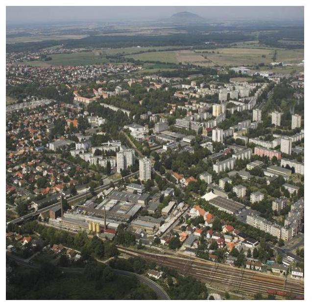
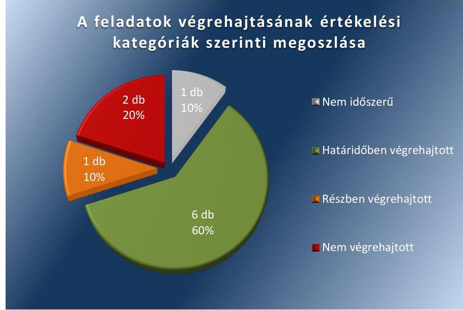

# Jelenetés 

## Utóellenőrzések

Ajka Város Önkormányzata pénzügyi és vagyongazdálkodása szabályszerűségének utóellenőrzése
2018.

---

# Jelentés 

## Utóellenőrzések

Ajka Város Önkormányzata pénzügyi és vagyongazdálkodása szabályszerűségének utóellenőrzése
2018. 03. hó 14. nap

---

# AZ ELLENŐRZÉST FELÜGYELTE: 

HOLMAN MAGDOLNA JULIANNA felügyeleti vezető
DR. BENEDEK MÁRIA felügyeleti vezető

AZ ELLENŐRZÉST VEZETTE ÉS A VÉGREHAJTÁSÁÉRT FELELŐS:
DR. GYŐRI GABRIELLA ellenőrzésvezető

A PROGRAM ÖSSZEÁLLÍTÁSÁÉRT FELELŐS:
JANIK JÓZSEF LÁSZLÓ osztályvezető

A TÉMÁHOZ KAPCSOLÓDÓ KORÁBBI SZÁMVEVŐSZÉKI JELENTÉSEK:

- címe: Jelentés az önkormányzatok pénzügyi és vagyongazdálkodása szabályszerűségének ellenőrzéséről - Ajka
- sorszáma: 15186

IKTATÓSZÁM: EL-0487-004/2018.
TÉMASZÁM: 10
ELLENŐRZÉS-AZONOSÍTÓ SZÁM: V0755106

---

# TARTALOMJEGYZÉK 

- ÖSSZEGZÉS ..... 5
- AZ ELLENŐRZÉS CÉLJA ..... 6
- AZ ELLENŐRZÉS TERÜLETE ..... 7
- AZ ELLENŐRZÉS HÁTTERE, INDOKOLTSÁGA ..... 8
- A JELENTÉS LÉNYEGES KÉRDÉSKÖRE ..... 9
- AZ ELLENŐRZÉS HATÓKÖRE ÉS MÓDSZEREI ..... 10
- MEGÁLLAPÍTÁSOK ..... 12
- MELLÉKLETEK ..... 15
I. sz. melléklet: Az ÁSZ 15186 számú jelentéséhez kapcsolódó intézkedési terv végrehajtása ..... 15
- FÜGGELÉK: ÉSZREVÉTELEK ..... 19
- RÖVIDÍTÉSEK JEGYZÉKE ..... 21

---

.

---

# ÖSSZEGZÉS 

Az Állami Számvevőszék Ajka Város Önkormányzata pénzügyi és vagyongazdálkodása szabályszerűségének utóellenőrzése során megállapította, hogy az intézkedési tervben meghatározott feladatok több, mint felét végrehajtotta. Az intézkedések eredményeként a pénzügyi és vagyongazdálkodás szabályozottsága javult. A müködési egyensúly megteremtését biztosító intézkedések, valamint a kockázatkezelési rendszer müködtetésének elmaradása veszélyeztetik a pénzügyi és vagyongazdálkodás szabályszerűségét.

## Az ellenőrzés társadalmi indokoltsága

Az Állami Számvevőszék stratégiájában célul tűzte ki a számvevőszéki munka hasznosulásának javítását. Ezzel összhangban ellenőrzi, hogy az ellenőrzött szervezetek megvalósították-e a korábbi ellenőrzései által feltárt hibák, hiányosságok és szabálytalanságok megszüntetése céljából kialakított intézkedési terveikben foglaltakat. A rendszeres utóellenőrzések hozzájárulnak a szükséges intézkedések tényleges végrehajtásához, ezáltal a közpénzügyek rendezettségének javulásához, igazolják, hogy lezárult a következmények nélküli ellenőrzések időszaka.

## Főbb megállapítások, következtetések

Ajka Város Önkormányzata az intézkedési tervben meghatározott tíz feladatból hatot határidőben, egyet részben, kettőt nem hajtott végre, egy végrehajtása nem volt időszerű.

A polgármester az intézkedési tervben meghatározott határidőben gondoskodott a vagyongazdálkodási rendelet vagyonkezelési szabályokkal való kiegészítéséről. A polgármester a vízi közmű vagyonelemek vonatkozásában feltárt hiányosságok miatt határidőben vizsgálatot indított a személyi felelősség tisztázása érdekében. A jegyző a részére meghatározott feladatok közül határidőben végrehajtotta az értékelési szabályzat aktualizálását, a beszerzések lebonyolításával, illetve a belföldi kiküldetések elrendelésével kapcsolatos szabályozási kötelezettség teljesítését. A jegyző határidőben gondoskodott a költségvetési rendelet jogszabályi előírásoknak megfelelő tagolásáról, továbbá a vagyonkimutatás jogszabályi előírásoknak megfelelő felépítéséről.

A jegyző részben hajtotta végre a vagyonkataszter nyilvántartás folyamatos vezetését, mert a vízi közmű vagyonelemek nyilvántartásba vételét követően a vagyonkataszter nyilvántartás folyamatos vezetése nem történt meg. A jegyző nem gondoskodott a kockázatkezelési rendszer jogszabályi előírásoknak megfelelő működtetéséről, mert a jogszabályi változás miatt indokolt módosításokat a belső szabályozáson nem vezette át és így azt a gyakorlatban sem alkalmazta. A polgármester nem terjesztette a Képviselő-testület elé Ajka Város Önkormányzata aktuális pénzügyi egyensúlyi helyzetét, ezen belül a gazdasági társaságok gazdálkodási körülményeire vonatkozó helyzetelemzést és döntési javaslatot. A müködési egyensúly megteremtését biztosító intézkedések, valamint a kockázatkezelési rendszer működtetésének elmaradása veszélyeztetik a pénzügyi és vagyongazdálkodás szabályszerűségét.

A behajthatatlan kis összegű követelések intézkedési tervpont végrehajtása az ellenőrzött időszakban nem volt időszerű.

A jegyző az intézkedési tervben meghatározott feladatok végrehajtásáról a jogszabály által előírt nyilvántartást nem vezette.

---

# AZ ELLENŐRZÉS CÉLJA 

Az ellenőrzés célja annak értékelése volt, hogy a számvevőszéki jelentésben foglalt intézkedést igénylő megállapításokkal és javaslatokkal összhangban készített intézkedési tervben meghatározott feladatokat az ellenőrzött szervezet végrehajtotta-e.

---

# AZ ELLENŐRZÉS TERÜLETE 

## Ajka Város Önkormányzata

Ajka Város Veszprém megyében, az Ajkai járásban található, állandó lakosainak száma a Központi Statisztikai Hivatal Magyarország közigazgatási helynévkönyve alapján 2017. január 1-jén 29061 fő volt.

Ajka, Halimba és Öcs önkormányzatok képviselő-testületei 2013. január 1-jétől megalakították az Ajkai Közös Önkormányzati Hivatalt.

A polgármester ${ }^{1}$ a 2002. évi önkormányzati választások óta tölti be tisztségét. A jegyző ${ }^{2}$ 2013. január 1-jétől-től látja el feladatait.

Az Önkormányzat ${ }^{3}$ a 2016. évi zárszámadási rendelet szerint 5169,6 M Ft költségvetési bevételt ért el, 5149,5 M Ft költségvetési kiadást teljesített. Az Önkormányzat mérlegfőösszegének értéke 2016. december 31-én 5961,5 M Ft, a követelések állománya 411,9 M Ft, a kötelezettségek állománya 780,5 M Ft volt.

Az ÁSZ ${ }^{4}$ a 2015. évben ellenőrizte az önkormányzatok pénzügyi és vagyongazdálkodása szabályszerűségét az Önkormányzatnál, a 2011. január 1-je és a 2013. december 31-e közötti időszak vonatkozásában, az erről szóló 15186 számú jelentését ${ }^{5}$ 2015. október 21-én tette közzé. Az ellenőrzés célja annak megállapítása volt, hogy kialakította-e az önkormányzat az erőforrásokkal való szabályszerű és hatékony gazdálkodáshoz szükséges követelményeket, megvalósította-e azok számonkérését, ellenőrzését; az önkormányzat pénzügyi és vagyoni helyzetének, a gazdálkodás szabályosságának megítélése a költségvetési tervezés, a pénzügyi egyensúly megteremtése, az éves költségvetési beszámolás, a vagyongazdálkodás, a vagyon számbevétele, a gazdasági események elszámolása és a pénzgazdálkodás szabályszerűsége alapján. Az ÁSZ jelentésben foglalt javaslatok végrehajtása érdekében a Képviselő-testület ${ }^{6}$ 12/2016. (I. 15.) számú határozattal intézkedési tervet fogadott el.

Az utóellenőrzés - a 2015. október 21-től 2017. szeptember 6-ig végrehajtott feladatokat figyelembe véve - az ÁSZ jelentésben a polgármester és a jegyző részére megfogalmazott intézkedést igénylő megállapításokra és javaslatokra készített, az ÁSZ részére megküldött intézkedési tervben foglalt feladatok megvalósításának ellenőrzésére, illetve értékelésére fókuszált.

---

# AZ ELLENŐRZÉS HÁTTERE, INDOKOLTSÁGA 

Az ÁSZ tv. ${ }^{7}$ 33. § (1) bekezdése értelmében a számvevőszéki jelentések intézkedést igénylő megállapításaihoz és javaslataihoz kapcsolódóan az ellenőrzött szervezet vezetője intézkedési tervet köteles összeállítani, és az ÁSZ részére megküldeni. Az intézkedési tervben foglaltak megvalósítását az ÁSZ tv. 33. § (7) bekezdésében foglaltak alapján - az ÁSZ utóellenőrzés keretében ellenőrizheti. Az intézkedések megvalósulásának értékelése során az ÁSZ figyelembe veszi az ellenőrzött szervezetek működési feltételeiben, valamint a jogszabályi előírásokban bekövetkezett változásokat.

Az intézkedési tervben foglalt feladatok hiányos, illetve késedelmes végrehajtása, valamint megvalósításának elmaradása azt mutatja, hogy az ellenőrzés során feltárt hibák, hiányosságok és szabálytalanságok megszüntetése nem kapott kellő hangsúlyt. Ez a szabályszerű működés és a felelős vezetői magatartás vonatkozásában kockázatot hordoz. E kockázatok feltárásával az ÁSZ utóellenőrzési rendszere fokozza a fegyelmet, és igazolja, hogy a közpénzzel való szabályos gazdálkodás felelőssége elől nem lehet kitérni.

Az utóellenőrzés négy szinten hasznosulhat:
$\longrightarrow$ A társadalom szintjén az utóellenőrzés jelzi, hogy a számvevőszéki ellenőrzés megállapításainak van következménye: a hiányosságok megszüntetésére az ellenőrzött szervezet által meghatározott intézkedések végrehajtását is számon kéri az ÁSZ.
$\longrightarrow$ Az ellenőrzött terület szintjén az utóellenőrzés tájékoztatást nyújt a terület döntéshozóinak a hiányosságok kiküszöbölésének jó gyakorlatairól, ezzel lehetőséget biztosítva arra, hogy az ÁSZ ellenőrzési megállapításai, javaslatai a terület nem ellenőrzött szervezeteinek a működése során is hasznosuljanak.
$\longrightarrow$ Az ellenőrzött szervezet szintjén az utóellenőrzés feltárja, hogy a szervezet az intézkedések végrehajtásával hasznosította-e a korábbi ellenőrzési jelentésben a hiányosságok megszüntetése, illetve a kockázatok kezelése érdekében megfogalmazott javaslatokat.
$\longrightarrow$ Az ÁSZ szintjén az utóellenőrzés visszacsatolást ad az ellenőrzési jelentések hasznosulásáról, az intézkedések elmaradása vagy részleges megvalósulása a további ellenőrzésekhez kockázati jelzésként szolgál.

---

# A JELENTÉS LÉNYEGES KÉRDÉSKÖRE 

Az ellenőrzött szervezet az intézkedési tervben foglaltakat az elöirt határidőben végrehajtotta-e?

---

# AZ ELLENŐRZÉS HATÓKÖRE ÉS MÓDSZEREI 

## Az ellenőrzés típusa

Megfelelőségi ellenőrzés.

## Az ellenőrzött időszak

Az utóellenőrzés alapját képező ÁSZ jelentés közzétételének napjától (2015. október 21.) az ellenőrzésről szóló kiértesítő levél keltének napjáig (2017. szeptember 6.) tartó időszak.

## Az ellenőrzés tárgya

Az ÁSZ tv. 2011. július 1-jei hatálybalépését követően a számvevőszéki jelentésben foglalt intézkedést igénylő megállapításokkal és javaslatokkal összhangban - Ajka Város Önkormányzata által - készített intézkedési tervben foglaltak végrehajtásának ellenőrzése volt.

Az ellenőrzés kiterjedt minden olyan körülményre és adatra, amely az ÁSZ jogszabályban meghatározott feladatainak teljesítéséhez, valamint a program végrehajtása folyamán felmerült újabb összefüggések feltárásához szükséges volt.

## Az ellenőrzött szervezet

Ajka Város Önkormányzata

## Az ellenőrzés jogalapja

Az ÁSZ tv. 33. § (7) bekezdése alapján az intézkedési tervben foglaltak megvalósítását az ÁSZ utóellenőrzés keretében ellenőrizheti.

## Az ellenőrzés módszerei

Az ÁSZ az ellenőrzést az ellenőrzési program ellenőrzési kérdései, az ellenőrzött időszakban hatályos jogszabályok, az ellenőrzés szakmai szabályok és módszertanok figyelembevételével, önálló ellenőrzés keretében végezte.

Az ÁSZ az ellenőrzés ideje alatt az ellenőrzött szervezettel történő kapcsolattartást az ÁSZ SZMSZ ${ }^{\circledR}$-ének vonatkozó előírásai alapján biztosította.

---

Az utóellenőrzés megállapításait elsősorban az ÁSZ rendelkezésére álló, valamint az ellenőrzött szervezettől elektronikusan bekért dokumentumok alapozták meg.

Az ellenőrzési bizonyítékként felhasználható adatforrások közé tartoztak egyrészt a szakmai programban felsorolt adatforrások, másrészt minden - az ellenőrzés folyamán feltárt, az ellenőrzés szempontjából információt tartalmazó - dokumentum.

Az intézkedési tervben előírt feladatokat azok végrehajtása szempontjából az alábbiak szerint értékelte az ÁSZ:
"határidőben végrehajtott" a feladat, ha a teljesítés dokumentáltan, az intézkedési tervben előírt határidőben és tartalommal megtörtént;
"határidőn túl végrehajtott" a feladat, ha annak teljesítése az intézkedési tervben meghatározott módon, de az előírt határidőn túl történt meg;
"részben végrehajtott" a feladat, ha végrehajtása teljes körűen az intézkedési tervben előírt módon nem történt meg;
"nem végrehajtott" a feladat, ha a végrehajtás nem történt meg, vagy amennyiben a teljesítést nem dokumentálták;
"okafogyottá vált" a feladat, ha végrehajtására - meghatározott esemény bekövetkezése, továbbá külső körülmény, a működést érintő feltétel változása miatt - már nincs szükség, illetve lehetőség, és egyértelműen megállapítható, hogy az intézkedést szükségessé tevő körülmény a jövőben nem fordulhat elő;
"nem időszerü" az a feladat, amelynek ellenőrzési időszakon belüli végrehajtására azért nem került (kerülhetett) sor, mert az intézkedés alapjául szolgáló esemény nem következett be, de annak jövőbeni előfordulása lehetséges, a végrehajtása nem volt esedékes, vagy a végrehajtás határideje még nem járt le.
Az ellenőrzés lefolytatásához az ellenőrzött szervezet a tanúsítványok elektronikus kitöltésével, valamint az ÁSZ által kért dokumentumok elektronikus megküldésével szolgáltatott adatokat, amelyek valódiságát és teljes körűségét az ellenőrzött szervezet vezetője által tett teljességi és hitelességi nyilatkozat igazolta. Az így rendelkezésre bocsátott adatok, információk kontrollja az ellenőrzés keretében történt.

---

# MEGÁLLAPÍTÁSOK 

## 1. Az ellenőrzött szervezet az intézkedési tervben foglaltakat az előírt határidőben végrehajtotta-e?

Összegző megállapítás

Az Önkormányzat az intézkedési tervben meghatározott tíz feladatból hatot határidőben, egyet részben, kettőt nem hajtott végre, egy végrehajtása nem volt időszerű. Az intézkedési tervben meghatározott feladatok végrehajtásáról a jogszabályban előírt nyilvántartást nem vezette.

Az ÁSZ a jelentésében a polgármester részére három, a jegyző részére hét javaslatot fogalmazott meg. A polgármester által előterjesztett és a Képvi-selő-testület által jóváhagyott intézkedési tervben a hiányosságok, szabálytalanságok megszüntetésére tíz feladatot határozott meg. A feladatok közül a polgármester három, a jegyző hét feladat végrehajtásának felelőseként volt megjelölve.

Az intézkedési tervben meghatározott feladatokat, határidőket, felelősöket és a feladatok végrehajtását az I. számú melléklet mutatja be.

A jegyző az intézkedési tervben meghatározott feladatok végrehajtásáról nem vezette a Bkr. ${ }^{9} 14 . \S$ (1) bekezdésében előírt nyilvántartást.

Az Önkormányzat intézkedési tervében meghatározott feladatok végrehajtásának értékelési kategóriák szerinti megoszlását az 1. ábra szemlélteti.

1. ábra

Forrás: ÁSZ által készített értékelés

---

# A PÉNZÜGYI ÉS VAGYONGAZDÁLKODÁS SZABÁ- 

LYOZÁSI KÖRNYEZETÉNEK kialakítása érdekében az Önkormányzat vezetői intézkedéseket tettek. A polgármester gondoskodott arról, hogy az Önkormányzat vagyongazdálkodási rendelete ${ }^{10}$ megfeleljen az Mötv. ${ }^{11}$ előírásainak (1). A jegyző az Áhsz.-szel ${ }^{12}$ összhangban kiadta az eszközök és források értékelésének szabályzatát és 2015. december 22-i hatállyal gondoskodott annak módosításáról (3). A jegyző a 2015. december 31-i határidőt megelőzően gondoskodott a beszerzések lebonyolításával kapcsolatos eljárásrend, illetve a belföldi kiküldetések elrendelésével, lebonyolításával és elszámolásával kapcsolatos szabályzat kiadásáról (4). A jegyző gondoskodott arról, hogy a költségvetési rendelet összeállításakor az Önkormányzat és az általa irányított költségvetési szervek előirányzatainak tagolása a kötelező, az önként vállalt feladatok és az államigazgatási feladatok szerint, a hatályos jogszabályok előírásainak megfelelően történjen (5). A jegyző gondoskodott arról, hogy a zárszámadásról szóló 7/2016 (IV. 22.) önkormányzati rendelethez ${ }^{13}$ és a 7/2017. (IV. 26.) önkormányzati rendelethez ${ }^{14}$ készített vagyonkimutatás tartalma és szerkezete az Áhsz.-ben foglaltaknak megfeleljen (6).

A PÉNZÜGYI ÉS VAGYONGAZDÁLKODÁS SZABÁLYSZERŰ MŰKÖDTETÉSE érdekében meghatározott intézkedéseket nem vagy nem teljes körűen hajtották végre a felelősök. A vagyonkataszter nyilvántartás folyamatos vezetése az Mötv. 110. § (1) bekezdésében foglaltak ellenére nem valósult meg teljes körűen. A vízi közmű vagyonelemek nyilvántartásba vételére 2015. év végén sor került, azonban ezt követően a nyilvántartás folyamatos vezetése nem valósult meg (7). A jegyző nem gondoskodott a kockázatkezelési rendszer folyamatos működtetéséről, mert a 8kr. 2016. október 1-jétől hatályos 7. § -ának rendelkezéseit a belső szabályozáson nem vezette át és így azt a gyakorlatban sem alkalmazta (8). A polgármester nem gondoskodott arról, hogy az Önkormányzat aktuális pénzügyi egyensúlyi helyzetének, ezen belül a gazdasági társaságok gazdálkodási körülményeinek, kötelezettségállományának elemzésére vonatkozó helyzetelemzés és döntési javaslat a Képviselő-testület részére előterjesztésre kerüljön (9).

A FELELŐSSÉG ÉRVÉNYESÍTÉSE érdekében a polgármester vizsgálatot indított, hogy a vízi közmű vagyonelemek vonatkozásában feltárt hiányosság és szabálytalanság miatt indokolt-e valamely köztisztviselővel szemben felelősségre vonás kezdeményezése (2).

Az ellenőrzött időszakban nem volt időszerű a behajthatatlan kis öszszegű követelések leírásával kapcsolatban meghatározott intézkedés végrehajtása (10).

---

.

---

# MELLÉKLETEK

- I. SZ. MELLÉKLET: AZ ÁSZ 15186 SZÁMÚ JELENTÉSÉHEZ KAPCSOLÓDÓ INTÉZKEDÉSI TERV VÉGREHAJTÁSA

|  1. | Az intézkedési tervben meghatározott feladat
1. | Az intézkedési tervben meghatározott határidő
2. | Az intézkedési tervben meghatározott feladat végrehajtásának felelőse
3. | Az intézkedési tervben meghatározott feladat végrehajtása
4.  |
| --- | --- | --- | --- | --- |
|  1. |  | Határidőben végrehajtott feladatok |  |   |
|  1. | 1. Gondoskodni kell arról, hogy az Önkormányzat vagyongazdálkodási rendelete feleljen meg az Mótv. előírásainak. | 2016.február 28.,
majd folyamatos | polgármester | A polgármester gondoskodott a vagyongazdálkodási rendeletet módosításának elkészítéséről, mely 2/2016. (I. 31.) önkormányzati rendelet számon, 2016. február 1-jén lépett hatályba. A módosított vagyongazdálkodási rendeletben az Mótv.-ben foglaltaknak megfelelően szabályozta a Képviselő-testület a vagyonkezelői jog megszerzésének, gyakorlásának részletes szabályait, valamint a vagyonkezelői jog ellenértékét és az ingyenes átengedés szabályait.  |
|  2. | 2. A polgármester indítson vizsgálatot annak megállapítása érdekében, hogy a víziközmű-vagyonelemek vonatkozásában feltárt hiányosság és szabálytalanság esetében indokolt-e, valamely köztisztviselővel szemben munkajogi felelősségre vonás kezdeményezése. | 2016. január 31. | polgármester | A polgármester vizsgálatot indított annak megállapítása érdekében, hogy a vízi közmű vagyonelemek vonatkozásában feltárt hiányosság és szabálytalanság esetében indokolt-e valamely köztisztviselővel szemben felelősségre vonás kezdeményezése. A vizsgálat eredményeképpen a személyi felelősség megállapítása, ennek következtében a felelősségre vonás megtörtént.  |
|  3. | 3. Gondoskodni kell, hogy az Értékelési szabályzat feleljen meg az Áhsz. 8/A. §-ban (2014. január 1-től a 4/2013. (I. 11.) Korm. rendelet 50. § 2. bekezdés d) pontjában) foglalt előírásoknak. | 2015. december 31.,
majd folyamatos | jegyző | A jegyző az Áhsz.-szel összhangban kiadta az eszközök és források értékelésének szabályzatát és 2015. december 22-i hatállyal gondoskodott annak módosításáról. A jegyző a szabályzatban rögzítette a vagyonkezelésbe adott eszközök vagyonértékelése során alkalmazott értékelési eljárás elveit, módszerét, dokumentálásának szabályait, felelőseit.  |
|  4. | 4. Szabályozni szükséges a beszerzések lebonyolításával kapcsolatos eljárásrend, valamint a belföldi kiküldetések elrendelésével és lebonyolításával, elszámolásával kapcsolatos kérdések belső szabályzatban történő rendezését. | 2015. december 31.,
majd folyamatos | jegyző | A jegyző 2015. december 15-én kiadta a beszerzések lebonyolításával kapcsolatos eljárásrendet, valamint 2015. december 30-án kiadta a belföldi kiküldetések elrendelésével, lebonyolításával és elszámolásával kapcsolatos szabályzatot.  |

---

|  Az intézkedési tervben meghatározott feladat | Az intézkedési tervben meghatározott határidő | Az intézkedési tervben meghatározott feladat végrehajtásának felelőse | Az intézkedési tervben meghatározott feladat végrehajtása  |
| --- | --- | --- | --- |
|  1. | 2. | 3. | 4.  |
|  5. 5. Gondoskodni kell arról, hogy a költségvetési rendelet összeállításakor az Önkormányzat és az általa irányított költségvetési szervek előirányzatainak tagolása a kötelező feladatok, önként vállalt feladatok és államigazgatási feladatok szerint a hatályos jogszabályi előírásoknak megfelelően történjék | 2015. évi zárszámadás, 2016. évi költségvetés, folyamatos | jegyző | A jegyző intézkedésének eredményeként a 3/2016. (II. 10.) önkormányzati rendelet15, a 7/2016. (IV. 22.) önkormányzati rendelet és a 3/2017. (II. 16.) önkormányzati rendelet16 az Áht.17-ben foglaltaknak megfelelően tartalmazta az önkormányzat és az általa irányított szervek előirányzatait feladatok szerinti bontásban.  |
|  6. 6. Gondoskodni kell arról, hogy a vagyonkimutatás tartalma és szerkezete feleljen meg az államháztartás számviteléről szóló 4/2013 (I.11.) Korm. rendelet 30. § (1)–(3) bekezdésében foglaltaknak. | a) 2015. évi zárszámadás, folyamatos
b) 2016. április 30., folyamatos
c) 2015. évi zárszámadás, folyamatos | jegyző | A jegyző az intézkedési terv 6/a-c) pontjaiban foglaltak alapján gondoskodott arról, hogy a vagyonkimutatás részletezettsége megfeleljen az Áhsz.-ben foglalt követelményeknek.  |
|  Részben végrehajtott feladat |  |  |   |
|  7. 9. Gondoskodni kell az Önkormányzat vagyon–kataszter nyilvántartásának jogszabályban előírt folyamatos vezetéséről. | 2015. december 31., folyamatos | jegyző | A jegyző a vagyonkataszter nyilvántartást – az Mótv. 110. § (1) bekezdésében előírtak ellenére – nem vezette folyamatosan. A vízi közmű vagyonelemeket az önkormányzati ingatlanvagyon–kataszter nyilvántartásába 2015. november 23-án felvezette, azonban ezt követően a nyilvántartás folyamatos vezetését dokumentumokkal nem jeazolta.  |
|  Nem végrehajtott feladatok |  |  |   |
|  8. 8. Működtetni kell a jogszabályi előírásoknak megfelelő, a pénzügyi egyensúlyt befolyásoló kockázatok kezelésére alkalmas kockázatkezelési rendszert. | 2016. augusztus 31., folyamatos | jegyző | A jegyző nem gondoskodott a kockázatkezelési rendszer jogszabályi előírásoknak megfelelő működtetéséről, mert a 8kr. 7.§-ának 2016. október 1-jétől hatályos módosítása miatt indokolt változásokat (integrált kockázatkezelési rendszer működtetése) a belső szabályozáson nem vezette át és így a gyakorlatban sem alkalmazta.  |
|  9. 10. A képviselő–testület elé kell terjeszteni az Önkormányzat aktuális pénzügyi egyensúlyi helyzetét, ezen belül a gazdasági társaságok gazdálkodási körülményeire, kötelezettségállományának elemzésére vonatkozó helyzetelemzését és döntési javaslatot kell készíteni a működési egyensúly megteremtését biztosító intézkedések érdekében. | 2016. augusztus 31., majd folyamatos | polgármester | Nem készült az Önkormányzat egészére kiterjedő, döntési javaslatot is tartalmazó előterjesztés. Az elkészített dokumentumból nem állapítható meg, hogy az munkaanyag-e, vagy a Képviselő–testületek címzett előterjesztés. Nem az Önkormányzat egészére, hanem kizárólag a gazdasági társaságok gazdálkodási körülményeire vonatkozóan szerepel.  |

---

|  Az intézkedési tervben meghatározott feladat | Az intézkedési tervben meghatározott határidő | Az intézkedési tervben meghatározott feladat végrehajtásának felelőse | Az intézkedési tervben meghatározott feladat végrehajtása  |
| --- | --- | --- | --- |
|  1. | 2. | 3. | 4.  |
|   |  |  | nek benne információk. A dokumentum nem tartalmaz döntési javaslatot a működési egyensúly megteremtését biztosító intézkedések érdekében, továbbá nem a polgármester, mint a feladat felelőse írta alá.  |
|  Nem időszerű feladat |  |  |   |
|  10. 7. Gondoskodni kell arról, hogy a behajthatatlan kis összegű követelések leírása esetén az Önkormányzat Vagyongazdálkodási rendeletében foglalt szabályozás szerint járjunk el. | 2015. évi zárszámadás, folyamatos | jegyző | Behajthatatlan kis összegű követelés az ellenőrzött időszakban nem merült fel, emiatt a feladat végrehajtása nem volt időszerű.  |

---

.

---

# FÜGGELÉK: ÉSZREVÉTELEK 

A jelentéstervezetet a Számvevőszék 15 napos észrevételezésre megküldte az ellenőrzött szervezet vezetőjének az ÁSZ tv. 29. §* (1) bekezdése előírásának megfelelően.
Az ellenőrzött szervezet vezetője az ÁSZ. tv. 29. § (2) bekezdésében foglalt észrevételezési jogával nem élt, a jelentéstervezetre észrevételt nem tett.

[^0]
[^0]:    * 29. § (1) Az Állami Számvevőszék az ellenőrzési megállapításait megküldi az ellenőrzött szervezet vezetőjének vagy az általa megbízott személynek, és annak, akinek személyes felelősségét állapította meg.
    (2) Az ellenőrzött szervezet vezetője és a felelősként megjelölt személy az ellenőrzés megállapításaira tizenöt napon belül írásban észrevételt tehet.
    (3) Az Állami Számvevőszék az észrevételre a beérkezésétől számított harminc napon belül írásban válaszol. A figyelembe nem vett észrevételeket köteles a jelentésben feltüntetni, és megindokolni, hogy azokat miért nem fogadta el.

---

.

---

# RÖVIDÍTÉSEK JEGYZÉKE 

${ }^{1}$ polgármester
${ }^{2}$ jegyző
${ }^{3}$ Önkormányzat
${ }^{4}$ ÁSZ
${ }^{5} 15186$ számú jelentés
${ }^{6}$ képviselő-testület
${ }^{7}$ ÁSZ tv.
${ }^{8}$ ÁSZ SZMSZ
${ }^{9}$ Bkr.
${ }^{10}$ vagyongazdálkodási rendelet
${ }^{11}$ Mötv.
${ }^{12}$ Áhsz.
${ }^{13}$ 7/2016. (IV. 22.) önkormányzati rendelet
${ }^{14}$ 7/2017. (IV. 26.) önkormányzati rendelet
${ }^{15}$ 3/2016. (II. 10.) önkormányzati rendelet
${ }^{16}$ 3/2017. (II. 16.) önkormányzati rendelet
${ }^{17}$ Áht.

Ajka Város polgármestere
Ajkai Közös Önkormányzati Hivatal jegyzője
Ajka Város Önkormányzata
Állami Számvevőszék
az ÁSZ által 15186 számon, 2015. október 21-én nyilvánosságra hozott Jelentés az önkormányzatok pénzügyi és vagyongazdálkodása szabályszerűségének ellenőrzéséről - Ajka című jelentés
Ajka Város Önkormányzatának Képviselő-testülete
2011. évi LXVI. törvény az Állami Számvevőszékről (hatályos: 2011. július 1-től)
Állami Számvevőszék Szervezeti és Működési Szabályzata
370/2011. (XII. 31.) Korm. rendelet a költségvetési szervek belső kontrollrendszeréről és belső ellenőrzéséről (hatályos: 2012. január 1-től)
Ajka város Önkormányzat Képviselő-testületének 43/2005. (XI. 2.) önkormányzati rendelete az önkormányzat vagyonáról és a vagyonnal való gazdálkodás szabályairól
2011. évi CLXXXIX. törvény Magyarország önkormányzatairól (hatályos: 2012. január 1-jétől)
4/2013. (I. 11.) Korm. rendelet az államháztartás számviteléről (hatályos: 2014. január 1-jétől)
Ajka város Önkormányzata Képviselő-testületének 7/2016. (IV. 22.) önkormányzati rendelete a 2015. évi zárszámadásról
Ajka város Önkormányzata Képviselő-testületének 7/2017. (IV. 26.) önkormányzati rendelete a 2016. évi zárszámadásról
Ajka város Önkormányzata Képviselő-testületének 3/2016. (II. 10) önkormányzati rendelete a 2016. évi költségvetéséről
Ajka város Önkormányzata Képviselő-testületének 3/2017. (II. 16.) rendelete a 2017. évi költségvetésről
2011. évi CXCV. törvény az államháztartásról (hatályos: 2011. december 31-től)

---

# ÁLLAMI SZÁMVEVŐSZÉK 

1052 Budapest, Apáczai Csere János utca 10.
Levélcím: 1364 Budapest 4. Pf. 54
Telefon: +36 14849100 Telefax: +36 14849200
www.asz.hu