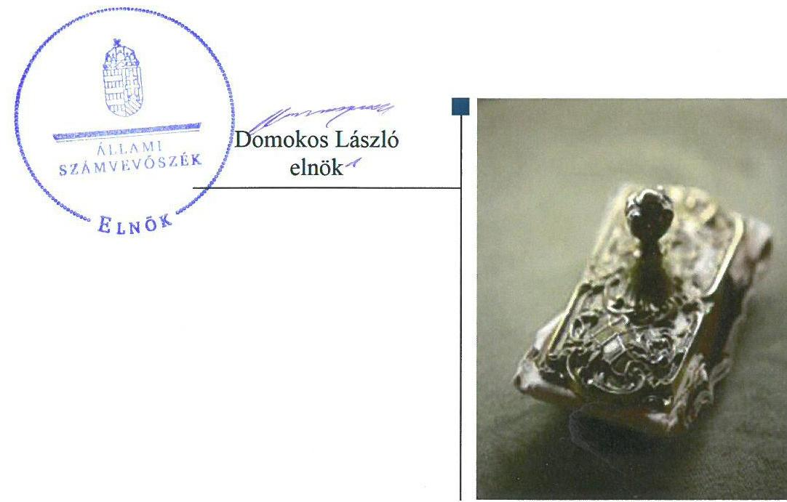
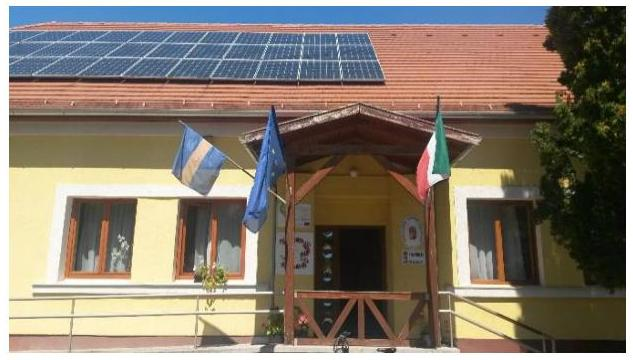
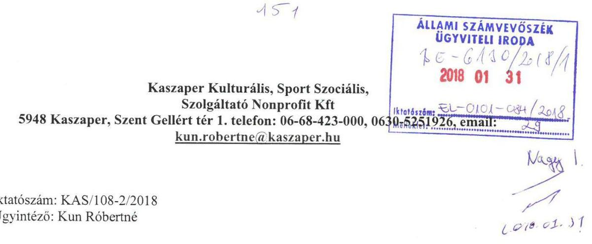
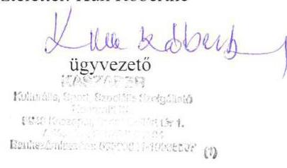
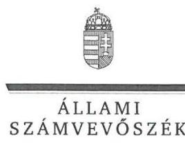
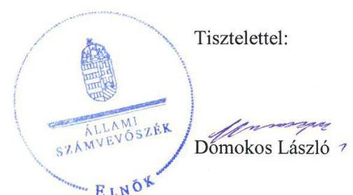

# Jelentés 

## Az önkormányzatok gazdasági társaságai

Az önkormányzatok többségi tulajdonában lévő gazdasági társaságok gazdálkodásának ellenőrzése - Kaszaper Kulturális, Sport, Szociális Szolgáltató Nonprofit Kft.
2018.

---

# Jelentés 

## Az önkormányzatok gazdasági társaságai

Az önkormányzatok többségi tulajdonában lévő gazdasági társaságok gazdálkodásának ellenőrzése - Kaszaper Kulturális, Sport, Szociális Szolgáltató Nonprofit Kft.
2018. O3. hó 13. nap

---

# AZ ELLENŐRZÉST FELÜGYELTE:

DR. NAGY IMRE felügyeleti vezető

# AZ ELLENŐRZÉST VEZETTE ÉS A VÉGREHAJTÁSÁÉRT FELELŐS:

SALAMIN VIKTOR ellenőrzésvezető

# A PROGRAM ÖSSZEÁLLÍTÁSÁÉRT FELELŐS:

JANIK JÓZSEF osztályvezető

---

**IKTATÓSZÁM:** EL-0101-089/2018.

**TÉMASZÁM:** 2447

**ELLENŐRZÉS-AZONOSÍTÓ SZÁM:** V079304

---

Jelentéseink az Országgyűlés számítógépes hálózatán és az Interneta a www.asz.hu címen is olvashatóak.

---

# TARTALOMJEGYZÉK 

■ ÖSSZEGZÉS ..... 5
■ AZ ELLENŐRZÉS CÉLJA ..... 6
■ AZ ELLENŐRZÉS TERÜLETE ..... 7
■ AZ ELLENŐRZÉS HÁTTERE, INDOKOLTSÁGA ..... 8
■ A JELENTÉS LÉNYEGES KÉRDÉSKÖREI ..... 9
■ AZ ELLENŐRZÉS HATÓKÖRE ÉS MÓDSZEREI ..... 10
■ MEGÁLLAPÍTÁSOK ..... 12
■ JAVASLATOK ..... 15
■ MELLÉKLETEK ..... 17
I. sz. melléklet: Értelmező szótár ..... 17
II. sz. melléklet: A Társaság gazdálkodásának főbb adatai (M Ft) ..... 19
■ FÜGGELÉK: ÉSZREVÉTELEK ..... 21
■ RÖVIDÍTÉSEK JEGYZÉKE ..... 31

---

.

---

# ÖSSZEGZÉS 

Kaszaper Község Önkormányzata tulajdonosi joggyakorlása szabályszerű volt. A Kaszaper Kulturális, Sport, Szociális Szolgáltató Nonprofit Kft. vagyongazdálkodása a számviteli elszámolások és a leltározás hiányosságai miatt nem volt szabályszerű, ezért a beszámoló nem volt megalapozott, a vagyon védelme nem volt biztositott. A Társaság beszámolási kötelezettségének eleget tett, közérdekü adatait azonban nem tette közzé, ezért a müködése nem volt átlátható.

## Az ellenőrzés társadalmi indokoltsága

Magyarországon az intézmény-centrikus közfeladat-ellátás jellemző, de egyre jelentősebb a költségvetésen kívüli feladatellátás térnyerése. Helyi szinten ennek legfontosabb szereplői az önkormányzati tulajdonban lévő gazdasági társaságok, amelyeknek ellenőrzése kiemelten fontos a közfeladat ellátása és a közvagyon megőrzése, megóvása érdekében. Ezért alapvető követelmény, hogy gazdálkodásuk, müködésük szabályszerű és átlátható legyen.

Az Állami Számvevőszék az ellenőrzése során arra kereste a választ, hogy 2013-2016. között szabályszerű volt-e a Társaság gazdálkodása és az Önkormányzat ehhez kapcsolódó tulajdonosi joggyakorlása. Az ellenőrzés rendet, a rend értéket teremt. Ezért bízunk abban, hogy a jelentésben foglalt megállapítások és az ezek alapján megfogalmazott számvevőszéki javaslatok hasznosítása elősegíti a feltárt hiányosságok orvoslását.

## Főbb megállapítások, következtetések, javaslatok

Kaszaper Község Önkormányzata a tulajdonosi joggyakorlás kereteit kialakította, a tulajdonosi jogokat szabályszerűen gyakorolta, javadalmazási szabályzatot azonban nem alkotott.

A Kaszaper Kulturális, Sport, Szociális Szolgáltató Nonprofit Kft. a jogszabályi követelmények szerinti gazdálkodás alapvető szabályozási feltételeit kialakította, számlarendje azonban nem felelt meg a jogszabály előírásainak. A Társaság vagyongazdálkodása nem volt szabályszerű, mert a jogszabályi és a belső előírások ellenére az éves beszámolók mérlegeit leltárral nem támasztotta alá, egyes mérlegtételek tartalmának valódisága nem volt biztosított. A Társaság teljesítette beszámolási kötelezettségét, az éves beszámolókon kívül azonban a jogszabályban előírt közérdekú adatok és közérdekből nyilvános adatok megismerését nem biztosította, ezért a müködés nem volt átlátható.

A Társaságnál az értékesítés nettó árbevételei, az anyagjellegú ráfordításai, valamint a személyi jellegú ráfordításai elszámolása nem volt szabályszerű. A díjak megállapítása szabályszerű volt.

Az Állami Számvevőszék jelentésében a Kaszaper Kulturális, Sport, Szociális Szolgáltató Nonprofit Kft. ügyvezetőjének négy, Kaszaper Község Önkormányzata polgármesterének egy javaslatot fogalmazott meg, amelyekre az érintetteknek 30 napon belül intézkedési tervet kell készíteniük.

---

# AZ ELLENŐRZÉS CÉLJA 

AZ ELLENŐRZÉS CÉLJA annak értékelése volt, hogy az önkormányzat vagyongazdálkodási tevékenysége során szabályszerűen gyakorolta-e tulajdonosi jogait; a gazdasági társaság szabályozottsága, gazdálkodása és vagyongazdálkodási tevékenysége, bevételeinek és ráfordításainak elszámolása megfelelt-e a jogszabályi és tulajdonosi előírásoknak; a gazdasági társaság kötelezettségállománya jelentett-e kockázatot a múködésre, valamint a gazdálkodás átláthatósága és elszámoltathatósága érdekében biztosított volt-e a szolgáltatás dijának megalapozottsága szabályszerű önköltségszámítással.

---

# AZ ELLENŐRZÉS TERÜLETE 

## Kaszaper Község Önkormányzata és a kizárólagos tulajdonában lévő Kaszaper Kulturális, Sport, Szociális Szolgáltató Nonprofit Kft.

KASZAPER KÖZSÉG ÖNKORMÁNYZATA a Kaszaper Kulturális, Sport, Szociális Szolgáltató Nonprofit Kft. jogelődjét 2009. évben alapította nyereség és vagyonszerzési cél nélkül a település és a kistérség közigazgatási területén élő, önálló életvitelre nem képes idős emberek biztonságos, megnyugtató ellátásának biztosítása érdekében. Az Önkormányzat ${ }^{1}$ két gazdasági társaságban rendelkezett kizárólagos tulajdonnal 2016. december 31-én. A Társaság alapítása óta közhasznú jogállású, nonprofit gazdasági társaság.

## A KASZAPER KULTURÁLIS, SPORT, SZOCIÁLIS SZOLGÁLTATÓ NONPROFIT KFT. fő tevékenysége „Idősek, fogyatékosok bentlakásos ellátása", a 26 férőhelyes Idősek Otthona ${ }^{2}$ működtetése és fenntartása az Önkormányzattal kötött Ellátási szerződés ${ }^{3}$ szerint. Az Idősek Otthona a Társaság ${ }^{4}$ ingyenes használatába kapott önkormányzati ingatlanban müködött.

A Társaság saját vagyonával gazdálkodott, kezelésében, használatában vagyonkezelt vagyon nem volt, kapcsolt vállalkozásban lévő részesedéssel nem rendelkezett, kormányzati szektorba nem volt besorolva.

A TÁRSASÁG SAJÁT TÖKÉJE 1,7 M Ft-ról 11,2 M Ft-ra, mérlegfőösszege 16,4 M Ft-ról 21,0 M Ft-ra, értékesítésének nettó árbevétele 18,2 M Ft-ról 24,7 M Ft-ra növekedett, a mérleg szerinti eredmény -1,6 M Ft-ról -5,6 M Ft-ra, átlagos állományi létszáma 9,5 főről 9 főre csökkent a 2013-2016. évek között. A központi költségvetésből kapott normatív támogatás összege 15,3 M Ft-ról 18,1 M Ft-ra növekedett az ellenőrzött időszak végére.

2013-2016. években a polgármester és a jegyző személye nem változott, az ügyvezető személyében egy alkalommal, 2014. december 23-án történt változás.

---

# AZ ELLENŐRZÉS HÁTTERE, INDOKOLTSÁGA 

AZ ÖNKORMÁNYZATOK TÖBBSÉGI TULAJDONÁBAN ÁLLÓ GAZDASÁGI TÁRSASÁGOK ellenőrzése kiemelten fontos a vagyon megőrzése, megóvása érdekében, valamint a kormányzati szektor elszámolásaiban megjelenő önkormányzati tulajdonú gazdálkodó szervezetek esetében, amelyekkel szemben alapvető követelmény, hogy gazdálkodásuk, működésük szabályszerű, az általuk szolgáltatott adatok minél megbízhatóbbak legyenek. A feladatellátás költségeinek, ráfordításainak alakulása a lakosság széles rétegét érinti.

Ellenőrzéseink feltárhatják, hogy az önkormányzat a feladatellátásához rendelt vagyon működtetését a tulajdonostól elvárható gondossággal vé-gezte-e, a feladatot ellátó gazdasági társaság a létesítő okiratban, szolgáltatási szerződésben foglaltak betartásával biztosította-e a feladat ellátását. Az ellenőrzés eredményeképp meghatározhatóvá válnak a költségvetési hiányt befolyásoló szervezetek kockázatai, lehetővé válik ezen kockázatok csökkentése. Az ellenőrzés rávilágíthat arra, hogy a gazdasági társaság a vagyon használatával biztosította-e a szolgáltatás folytatásának feltételeit, az önkormányzat tulajdonosi felügyelete hozzájárult-e a szabályszerű gazdálkodáshoz és feladatellátáshoz. A megállapítások alapján megfogalmazott számvevőszéki javaslatok hasznosítása elősegítheti a meglévő hibák megszüntetését. A jó gyakorlatok bemutatásával az ÁSZ hozzájárulhat a követendő megoldások megismertetéséhez, terjesztéséhez.

---

# A JELENTÉS LÉNYEGES KÉRDÉSKÖREI 

1. Az önkormányzat tulajdonosi joggyakorlása szabályszerű volt-e?
2. A gazdasági társaság szabályozottsága, gazdálkodása és vagyongazdálkodási tevékenysége szabályszerű volt-e, fizetőképessége biztositott volt-e a gazdálkodás során?
3. A gazdasági társaság bevételeinek és ráfordításainak elszámolása, valamint az önköltségszámítás és árképzés szabályszerű volt-e?

---

# AZ ELLENŐRZÉS HATÓKÖRE ÉS MÓDSZEREI 

## Az ellenőrzés típusa

Megfelelőségi ellenőrzés.

## Az ellenőrzött időszak

Az ellenőrzött időszak 2013. január 1-jétől 2016. december 31-ig tart.

## Az ellenőrzés tárgya

Kaszaper Község Önkormányzata kizárólagos tulajdonában lévő Kaszaper Kulturális, Sport, Szociális Szolgáltató Nonprofit Kft. feletti tulajdonosi joggyakorlása, valamint a Kaszaper Kulturális, Sport, Szociális Szolgáltató Nonprofit Kft. gazdálkodásának szabályozottsága és szabályszerűsége.

Az ellenőrzés kiterjedt minden olyan körülményre és adatra, amely az ÁSZ jogszabályban meghatározott feladatainak teljesítéséhez, valamint a program végrehajtása folyamán felmerült újabb összefüggések feltárásához szükséges.

## Az ellenőrzött szervezet

Kaszaper Község Önkormányzata, valamint a Kaszaper Kulturális, Sport, Szociális Szolgáltató Nonprofit Kft.

## Az ellenőrzés jogalapja

Az ellenőrzés jogszabályi alapját az ÁSZ tv. 1. § (3) bekezdése és 5. § (3)(4)-(5) bekezdései képezték.

## Az ellenőrzés módszerei

Az ellenőrzést az ellenőrzési program ellenőrzési kérdései, az ellenőrzött időszakban hatályos jogszabályok, az ellenőrzés szakmai szabályok és módszertanok figyelembe vételével végeztük.

Az ellenőrzés ideje alatt az ellenőrzött szervezettel történő kapcsolattartást az ÁSZ Szervezeti és Múködési Szabályzatának vonatkozó előírásai alapján biztosítottuk.

---

Az ellenőrzés a kiválasztott, többségi tulajdonosi jogokat gyakorló önkormányzatra, illetve az ellenőrzésre kijelölt gazdasági társaság felett tulajdonosi jogokat gyakorló szervezetre és az ellenőrzött gazdasági társaságra terjedt ki.

A gazdasági társaságnál mintavétellel ellenőriztük a ráfordítások és a bevételeket, ezen belül az anyagjellegú ráfordításokat, az egyéb ráfordításokat, a pénzügyi műveletek ráfordításait és a rendkívüli ráfordításokat, illetve az értékesítés nettó árbevételét, az egyéb bevételeket, a pénzügyi műveletek bevételeit valamint a rendkívüli bevételeket. A minták kiválasztása rétegzett mintavétel alkalmazásával történt.

Az ellenőrzési kérdések megválaszolásához szükséges bizonyítékok megszerzése a következő ellenőrzési eljárások alkalmazásával történt: megfigyelés, kérdésfeltevés (információkérés), összehasonlítás, valamint elemző eljárás. Az ellenőrzési bizonyítékként felhasználható adatforrások közé tartoztak egyrészt az ellenőrzési programban felsorolt adatforrások, másrészt adatforrás lehet még minden - az ellenőrzés folyamán - feltárt, az ellenőrzés szempontjából információkat tartalmazó dokumentum.

Az ellenőrzést a kérdésekre adott válaszok kiértékelésével, valamint a megjelölt adatforrások, a csatolt tanúsítványok felhasználásával, továbbá az adott időszakban hatályos jogszabályok figyelembe vételével folytattuk le.

---

# MEGÁLLAPÍTÁSOK 

## 1. Az önkormányzat tulajdonosi joggyakorlása szabályszerű volt-e?

Összegző megállapítás

Az Önkormányzat a tulajdonosi joggyakorlás kereteit kialakította, a tulajdonosi jogokat szabályszerűen gyakorolta.

A TULAJDONOSI JOGGYAKORLÁS RENDJÉT az Önkormányzat a Gt. ${ }^{5}$ és a Ptk. ${ }^{6}$ előírásainak megfelelően az Önkormányzat SZMSZ ${ }_{1,2}{ }^{7}$-ben és az Alapító Okirat ${ }^{8}$-ban rögzítette.

Az Önkormányzat a Társasággal Ellátási szerződést kötött határozatlan időtartamra, melyben rögzítették a Társaságnak az Idősek Otthona müködtetésével kapcsolatos jogait, kötelezettségeit.

A GAZDASÁGI PROGRAM ${ }_{1,2}{ }^{9}$-t az Ötv. ${ }^{10}$ és Mötv. ${ }^{11}$ előírásai szerint az Önkormányzat megalkotta és elfogadta.

Az Önkormányzat meghatározta a feladatellátáshoz kapcsolódó követelményeket, valamint az Alapító Okiratban megjelenítette a feladatellátás követelményeiben bekövetkezett változásokat.

A Társaság tulajdonosi jogait az Alapító Okirat alapján a Képviselő-testület gyakorolta, az $\mathrm{FB}^{12}$ írásos jelentése és a könyvvizsgálói jelentés birtokában határozatával jóváhagyta az éves beszámolókat.

AZ FB TAGJAIT ÉS A KÖNYVVIZSGÁLÓT a jogszabályi előírásoknak megfelelően a Képviselő-testület határozatával kijelölte, a változásokat az Alapító Okiratban megjelenítették.

A JAVADALMAZÁSI, JUTTATÁSI RENDSZERRŐL SZÓLÓ SZABÁLYZATOT a Taktv. ${ }^{13}$ 5.§ (3) bekezdés előírása ellenére a Képviselő-testület nem alkotta meg.

Készfizető kezességet és jelzálogjog bejegyzést vállalt a Képviselő-testület a Társaság „Napelemrendszer létesítése" KEOP pályázatának megvalósításához. Az Önkormányzat döntése megfelelt a Ptk., Áht., és Gst. ${ }^{14}$ jogszabályi előírásainak.

---

# 2. A gazdasági társaság szabályozottsága, gazdálkodása és vagyongazdálkodási tevékenysége szabályszerű volt-e, fizetőképessége biztosított volt-e a gazdálkodás során? 

Összegző megállapítás

A Társaság vagyongazdálkodása a leltározás hiányosságai miatt nem volt szabályszerű. A szabályozási keretet kialakította, beszámolási kötelezettségét teljesítette, a közérdekú adatok közzétételi kötelezettségének azonban nem tett eleget.
2.1. számú megállapítás

A Társaság a jogszabályi követelmények szerinti gazdálkodás alapvető szabályozási feltételeit kialakította, a számlarend azonban nem felelt meg a jogszabály előírásainak.

A Társaság a Számv. tv. ${ }^{15}$ által előírt szabályzatalkotási kötelezettségének a Számviteli politika ${ }_{1,2}{ }^{16}$, az Eszközök és források leltárkészítési és leltározási szabályzata ${ }^{17}$, az Eszközök és források értékelési szabályzata ${ }^{18}$, valamint a Számlarend ${ }^{19}$ és Bizonylati rend ${ }^{20}$ tekintetében eleget tett.

PÉNZKEZELÉSI SZABÁLYZATTAL ${ }^{21}$ a Társaság 2015. július 1-jéig nem rendelkezett, megsértve a Számv. tv. 14. § (5) bekezdés d) pontját.

SZÁMLARENDDEL a Társaság rendelkezett, amely azonban nem tartalmazott Számlatükröt, megsértve a Számv. tv. 161. § (2) bekezdés a) pontjában foglaltakat.
2.2. számú megállapítás

A Társaság vagyongazdálkodása nem volt szabályszerű, mert az éves beszámolók mérlegeit leltárral nem támasztotta alá.

A Társaság 2013-2016. években a mérleget szabályszerű leltárral nem támasztotta alá, a beszámolók megalapozottsága nem volt biztosított. A Társaság nem rendelkezett a 2013-2016. évi mérleg sorait alátámasztó leltárral a pénztár és bankszámlák kivételével, ezzel megsértette a Számv. tv. 69. § (1) bekezdését. A Társaság 2012. január 1-jétől hatályos Eszközök és források leltárkészítési és leltározási szabályzata a Számv. tv. 69. § (3) bekezdése alapján az immateriális javak és tárgyi eszközök mennyiségi felvétellel történő leltározását kétévente írta elő, melynek a Társaság nem tett eleget. A leltározás hiányossága ellenére a könyvvizsgáló a beszámolót korlátozás nélküli hitelesítő záradékkal látta el.

## A TÁRSASÁG KÖTELEZETTSÉGEINEK ÁLLOMÁ-

NYA 2013-2016. években mintegy harmadával, 14,7 M Ft-ról 9,8 M Ft-ra csökkent. A Társaság rövid lejáratú kötelezettségei 3,7 M Ft-ról 6,8 M Ft-ra emelkedtek, hosszú lejáratú kötelezettségei azonban 11,0 M Ft-ról 3,0 M Ft-ra csökkentek. A Társaság fizetőképessége biztosított volt.

---

# 2.3. számú megállapítás 

A Társaság teljesítette beszámolási kötelezettségét, közzétételi kötelezettségének azonban nem tett eleget.

ÉVES BESZÁMOLÓIT a Társaság elkészítette és jóváhagyásra benyújtotta az Önkormányzat felé. A Civil tv. ${ }^{22} 46 . \S$ (1) bekezdése szerint beszámolója részeként a Társaság elkészítette közhasznúsági mellékletét.

A Társaság 2013. évi beszámolóját és közhasznúsági mellékletét a Számv. tv. 153. § (1) bekezdésében és a Civil tv. 46. § (1) bekezdésében előírtak ellenére, a jogszabályi határidőt követően, 2014. június 2-án tette közzé. 2016. évi közhasznúsági mellékletét a Társaság nem tette közzé, megsértve a Civil tv. 46. § (1) bekezdését.

A KÖZÉRDEKŰ ADATOK ÉS A KÖZÉRDEKBŐL NYILVÁNOS ADATOK MEGISMERÉSÉT a Társaság az Infotv. ${ }^{23} 26 . \S$ (1) bekezdésében előírtak ellenére nem biztosította, honlapján nem tette közzé az Infotv. 37. § (1) bekezdés előírása alapján az Infotv. 1. mellékletében meghatározott adatokat. A Társaságnak az Info tv. 30. § (6) bekezdése alapján a közérdekű adatok megismerésére irányuló igények teljesítésének rendjét rögzítő szabályzat készítési kötelezettsége volt, melynek nem tett eleget.

## 3. A gazdasági társaság bevételeinek és ráfordításainak elszámolása, valamint az önköltségszámítás és árképzés szabályszerű volt-e?

Összegző megállapítás

A Társaságnál az értékesítés nettó árbevételeinek, az anyagjellegú ráfordításainak, valamint a személyi jellegú ráfordításainak elszámolása nem volt szabályszerű.

A Társaságnál vagyonnyilvántartás és az értékcsökkenés elszámolása 20132016. években szabályszerű volt.

Az értékesítés nettó árbevétele és az anyagjellegú ráfordítások elszámolása nem volt szabályszerű. Egyes könyvviteli elszámolást alátámasztó bizonylatok esetében a Számv. tv. 167. § (1) bekezdés h) pontjában foglaltak ellenére nem hivatkoztak az érintett könyvviteli számlákra, így azok nem feleltek meg a bizonylatok általános alaki és tartalmi követelményeinek, ezzel megsértették a Számv. tv. 165. § (2) bekezdését.

A személyi jellegú ráfordítások elszámolása nem volt szabályszerű. Egyes könyvviteli elszámolást alátámasztó bizonylatok esetében a Számv. tv. 167. § (1) bekezdés h) pontjában foglaltak ellenére nem hivatkoztak az érintett könyvviteli számlákra, így azok nem feleltek meg a bizonylatok általános alaki és tartalmi követelményeinek, ezzel megsértették a Számv. tv. 165. § (2) bekezdését.

A Társaság az általa fenntartott személyes gondoskodás körébe tartozó szociális ellátásért a Szt. tv. ${ }^{24} 115$. § (1) bekezdésében előírtak szerint évente állapította meg térítési diját, melyet a szolgáltatás önköltségére vonatkozó dijkalkulációval alapozott meg.

---

# JAVASLATOK 

Az ÁSZ tv. 33. § (1) bekezdésében foglaltak értelmében az ellenőrzött szervezet vezetője köteles a jelentésben foglalt megállapításokhoz kapcsolódó intézkedési tervet összeállítani és azt a jelentés kézhezvételétől számított 30 napon belül az ÁSZ részére megküldeni. Amennyiben az ellenőrzött szervezet vezetője nem küldi meg határidőben az intézkedési tervet, vagy továbbra sem elfogadható intézkedési tervet küld, az Állami Számvevőszék elnöke az ÁSZ tv. 33. § (3) bekezdése a) és b) pontjaiban foglaltakat érvényesítheti.

## Kaszaper Kulturális, Sport, Szociális Szolgáltató Nonprofit Kft. ügyvezetőjének

1. Intézkedjen a számlarend jogszabályi rendelkezés szerinti tartalmi kiegészitéséről.
(2.1. sz. megállapítás 3. bekezdése alapján)
2. Intézkedjen a belső szabályozásnak és a jogszabályban foglaltaknak megfelelő leltározás elvégzéséről.
(2.2. sz. megállapítás 1. bekezdés 2-3. mondatai alapján)
3. Gondoskodjon a közzétételi kötelezettségek jogszabályi előírásnak megfelelő teljesítéséről.
(2.3. sz. megállapítás 2. bekezdés 2. mondata és 3. bekezdés 1. mondatai alapján)
4. Intézkedjen annak érdekében, hogy a könyvviteli elszámolást alátámasztó bizonylatok megfeleljenek a jogszabályi előírásoknak.
(3. sz. megállapítás 2-3. bekezdései alapján)

## Kaszaper Község Önkormányzata polgármesterének

1. Intézkedjen a jogszabályban elöirt, a vezető tisztségviselők, felügyelőbizottsági tagok, valamint az Mt. 208 §-ának hatálya alá eső munkavállalók javadalmazására, valamint a jogviszony megszünése esetére biztosított juttatások módjának, mértékének elveiről, annak rendszeréről szóló szabályzat megalkotásáról.
(1. sz. megállapítás 7. bekezdése alapján)

---

.

---

# MELLÉKLETEK 

- I. SZ. MELLÉKLET: ÉRTELMEZŐ SZÓTÁR
gazdasági társaság
gazdálkodó szervezet
kezesség
nonprofit gazdasági társaság
vagyonkezelő

Ptk 3.88. § (1) bekezdése szerint „a gazdasági társaságok üzletszerű közös gazdasági tevékenység folytatására, a tagok vagyoni hozzájárulásával létrehozott, jogi személyiséggel rendelkező vállalkozások, amelyekben a tagok a nyereségből közösen részesednek, és a veszteséget közösen viselik".
A Ptk. 685. § c) pontja szerint gazdálkodó szervezet: „az állami vállalat, az egyéb állami gazdálkodó szerv, a szövetkezet, a lakásszövetkezet, az európai szövetkezet, a gazdasági társaság, az európai részvénytársaság, az egyesülés, az európai gazdasági egyesülés, az európai területi együttmúködési csoportosulás, az egyes jogi személyek vállalata, a leányvállalat, a vízgazdálkodási társulat, az erdő birtokossági társulat, a végrehajtói iroda, az egyéni cég, továbbá az egyéni vállalkozó." (2014. 03.15-ig hatályos)
A kezességre vonatkozó előírásokat a Ptk. 6:416-430. §-ai tartalmazzák. Kezességi szerződéssel a kezes kötelezettséget vállal a jogosulttal szemben, hogyha a kötelezett nem teljesít, maga fog helyette a jogosultnak teljesíteni. Kezesség egy vagy több, fennálló vagy jövőbeli, feltétlen vagy feltételes, meghatározott vagy meghatározható összegű pénzkövetelés vagy pénzben kifejezhető értékkel rendelkező egyéb kötelezettség biztosítására vállalható.
A Ptk. szerint kezességet csak írásban lehet vállalni. A kezes kötelezettsége ahhoz a kötelezettséghez igazodik, amelyért kezességet vállalt. A kezes kötelezettsége nem válhat terhesebbé, mint amilyen elvállalásakor volt, kiterjed azonban a kötelezett szerződésszegésének jogkövetkezményeire és a kezesség elvállalása után esedékessé váló mellékkövetelésekre is.
Civil tv. 9/F. § (2) bekezdése szerint „az a gazdasági társaság minősül nonprofit gazdasági társaságnak és cégnevében az a gazdasági társaság tüntetheti fel a nonprofit jelleget, amelynek létesítő okirata tartalmazza, hogy a gazdasági társaság tevékenységéből származó nyereség a tagok között nem osztható fel, hanem az a gazdasági társaság vagyonát gyarapítja." (hatályos 2014. március 15-től)
vagyonkezelő:
a) az állam tulajdonában álló nemzeti vagyon tekintetében:
aa) költségvetési szerv,
ab) helyi önkormányzat, önkormányzati társulás,
ac) önkormányzati intézmény,
ad) köztestület,
ae) az állam, az aa)-ac) alpontban meghatározott személyek együtt vagy külön-külön 100\%-os tulajdonában álló gazdálkodó szervezet,
af) az ae) alpont szerinti gazdálkodó szervezet 100\%-os tulajdonában álló gazdálkodó szervezet,
ag) a törvény által kijelölt egyedileg meghatározott jogi személy.
b) a helyi önkormányzat tulajdonában álló nemzeti vagyon tekintetében:
ba) önkormányzati társulás,
bb) költségvetési szerv vagy önkormányzati intézmény,
bc) köztestület,
bd) az állam, a helyi önkormányzat, a ba)-bb) alpontban meghatározott személyek együtt vagy külön-külön 100\%-os tulajdonában álló gazdálkodó szervezet,

---

be) a bd) alpont szerinti gazdálkodó szervezet 100\%-os tulajdonában álló gazdálkodó szervezet.
c) * az egyházi jogi személy a tevékenysége ellátásához szükséges nemzeti vagyon tekintetében. (Forrás: Nvtv. 3. § (1) bekezdés 19. pontja)

---

II. SZ. MELLÉKLET: A TÁRSASÁG GAZDÁLKODÁSÁNAK FŐBB ADATAI (M FT)

|   | 2013. | 2014. | 2015. | 2016.  |
| --- | --- | --- | --- | --- |
|  Értékesítés nettó árbevétele | 18,2 | 20,9 | 23,1 | 24,7  |
|  Mérlegfőösszeg | 16,4 | 28,1 | 25,1 | 21,0  |
|  Követelések | 0,2 | 0,3 | 0,1 | 0,0  |
|  Saját tőke összege | 1,7 | 14,9 | 15,4 | 11,2  |
|  - ebből jegyzett tőke | 3,0 | 3,0 | 3,0 | 3,0  |
|  Mérleg szerinti eredmény | $-1,6$ | 0,3 | $-2,5$ | $-5,6$  |
|  Átlagos állományi létszám (fő)) | 9,5 | 10,0 | 9,0 | 9,0  |
|   |  |  | Forrás: A Társaság éves beszámolói |   |

---

.

---

# FÜGGELÉK: ÉSZREVÉTELEK 

A jelentéstervezetet a Számvevőszék 15 napos észrevételezésre megküldte az ellenőrzött szervezetek vezetőinek az ÁSZ tv. 29. §* (1) bekezdése előírásának megfelelően.

Az ÁSZ a jelentéstervezetet észrevételezésre megküldte Kaszaper Község Önkormányzata polgármesterének és a Kaszaper Kulturális, Sport, Szociális Szolgáltató Nonprofit Kft. ügyvezetőjének.
Kaszaper Község Önkormányzata polgármestere a jelentéstervezetre észrevételt nem tett. A függelék - mellékletek nélkül - tartalmazza a Kaszaper Kulturális, Sport, Szociális Szolgáltató Nonprofit Kft. ügyvezetőjének észrevételét, illetve az el nem fogadott észrevételek elutasításának indoklását.

[^0]
[^0]:    * 29. § (1) Az Állami Számvevőszék az ellenőrzési megállapításait megküldi az ellenőrzött szervezet vezetőjének vagy az általa megbízott személynek, és annak, akinek személyes felelősségét állapította meg.
    (2) Az ellenőrzött szervezet vezetője és a felelősként megjelölt személy az ellenőrzés megállapításaira tizenöt napon belül írásban észrevételt tehet.
    (3) Az Állami Számvevőszék az észrevételre a beérkezésétől számított harminc napon belül írásban válaszol. A figyelembe nem vett észrevételeket köteles a jelentésben feltüntetni, és megindokolni, hogy azokat miért nem fogadta el.

---

Tárgy: Az önkormányzatok gazdasági társaságai- Az önkormányzatok többségi tulajdonában lévő gazdasági társaságok gazdálkodásának ellenőrzése - Kaszaper Kulturális, Sport Szociális Szolgáltató Nonprofit Kft. címú számvevőszéki jelentés tervezet észrevételezése:

Hív. szám: EL-0101-080/2018.

# Állami Számvevőszék 

1052 Budapest, Apáczai Csere János u. 10.
1364 Budapest, 4. Pf. 54.
Tisztelt Domokos László Elnök Úr!

A Kaszaper Kulturális, Sport Szociális, Szolgáltató Nonprofit Kft gazdasági társaság ellenőrzéséhez kapcsolódóan megküldött számvevőszéki jelentéstervezettel kapcsolatban az alábbi észrevételezéseket kívánom tenni:

### 2.1 megállapításhoz tett észrevételezés

A Kft pénzkezelési szabályzattal korábban is rendelkezett, csak sajnálatos módon az idő rövidsége miatt a korábbi szabályzat nem került feltöltésre. A 2012. december 01-tól hatályos szabályzatunkat pótlólag jelen levelemhez mellékelem.

A számlarend melléklete a számlatükör, amellyel a társaság rendelkezik, ami sajnos szintén nem került feltöltésre. A számlatükröt jelen levelemhez szintén pótlólag mellékelem. Szeretnénk megjegyezni, hogy a könyvelésünk a könyvelő iroda által alkalmazott hivatalos könyvelési programmal történik, melyben gazdasági eseménytár alapján kerül rögzítésre az adott könyvelési tétel. A számlatükör a program által adott kerethez igazított módon minden évben rendelkezésre áll. Hiányában könyvelni nem is lehetséges.

### 2.2. megállapításhoz tett észrevételezés

A társaság vagyonának védelmére úgy gondoljuk, hogy mindvégig nagy hangsúlyt fektettünk, hiszen tevékenységünk folytatásához nagy szükségünk volt még a nullára leírt eszközökre is. Ezért az eszközökről, és természetesen a pénzkészletről minden évben készült

---

tényleges számlálással készített leltár. A leltár ív a feltöltött dokumentumokban szerepel, de nem a beszámoló mellékleteként került feltöltésre, hanem a vagyonleltár dokumentumokba.
(Itt szeretném megjegyezni, hogy a feltöltésre rendlelkezésre álló idő nagyon kevés volt, a kért dokumentumok pedig óriási mennyiségü, nem beszélve a könyvelési programban szerepelt adatok formátuma és a feltöltés formátuma miatti problémákról. Az informatikai ismereteimet alapul véve is súlyos gondot okozott, hogy abban a formátumban kerüljenek tovább az anyagok. Az is lehetséges, hogy az informatikai hiányosságaim miatt rossz helyre, vagy rosszul elnevezett dokumentumokhoz kerültek feltöltésre az anyagok. Ezért utólagosan is elnézést kérek!)
A leltározási szabályzatból sem a megfelelő került feltöltésre, hiszen a 2012. január 01-tól hatályos szabályzatot töltöttem fel, de közben kiderült, hogy van egy új szabályozás, amely 2013.09.01-től hatályos. (Itt szeretném megjegyezni, az ellenőrzéssel érintett időszak alatt 2013-2016 évek az ügyvezető személyében változás történt, és éppen amikor az ellenőrzés megkezdödött egy beruházás miatt a Nonprofit Kft. könyvelésével kapcsolatos dokumentumok átkerültek egy másik épületbe, sajnos nem olyan rendszerben, ahogyan az korábban tárolva volt, ezért a dokumentumok előkeresése hosszú és fáradságos munkába került és nem minden alkalommal volt sikeres.!)
A mérleget alátámasztó leltárakat a zárlati dossziéban megtaláltam, amit jelen levelemhez mellékelek. A leltározás egyéb dokumentumait (jegyzökönyvek, stb.) szintén mellékelten pótlólag megküldök.

# 2.3. számú megállapításhoz tett észrevételezés 

A Társaság a 2013 évi beszámolóját és közhasznúsági mellékleteit a jogszabályban előírt határidőben tette közé mivel a beszámoló beküldési határideje évet követő május 31., e fenti esetben ez a nap szombatra esett, ezért a 31 -ét követő első munkanapon került a beszámoló feltöltésre.( 2014. június 2.)

A 2016. évi közhasznúsági melléklet feltöltésénél olyan problémával találkoztunk, ami véleményünk szerint nem volt egyedi, hogy a beszámoló közzétételének módja alapjaiban megváltozott, bizonyos módosítások a felületen csak késve kerültek fel. A közzététellel kapcsolatos információk sem voltak egyértelműek abban az időpontban. A PK242 típusú nyomtatvány melynek része a közhasznúsági beszámoló feltöltésre került a bíróság felé azonban olyan üzenet jött rá, hogy ez nem megfelelő. ( mellékeljük a nyomtatványt és a Gyulai Járási Bíróság válaszát ) A közzététel után ( miután tisztázódott, hogy ezt hogyan kellett volna kezelni ) az online felületen sajnos nincs lehetőség javításra. Közérdekủ adatokra vonatkozóan időközben intézkedtünk, hogy az önkormányzat honlapján a szükséges adatok közzétételre kerüljenek.

## 3. Összegzö megállapításhoz tett észrevételezés

Értékesítés nettó árbevétele és az anyagjellegủ ráfordítások elszámolás szabálytalansága miatt tett megállapítások számunkra nem egyértelműek, - amennyiben lehetséges, konkrétabban kérnénk erről tájékoztatást, az alábbiak miatt :

Önök hivatkoznak a Számvit. tv.167.§ (1) bek. h. pontjában foglaltakra amely a következő

---

167. § (1) A könyvviteli elszámolást közvetlenül alátámasztó bizonylat általános alakí és tartalmi kellékei a következök :
h. A könyvelés módjára, az érintett könyvviteli számlákra történő hivatkozás
168.§ (2) A számviteli (könyvviteli) nyilvántartásokba csak szabályszerűen kiállított bizonylat alapján szabad adatokat bejegyezni. Szabályszerü az a bizonylat, amely az adott gazdasági müveletre (eseményre) vonatkozóan a könyvvitelben rögzítendő és a más jogszabályban elöirt adatokat a valóságnak megfelelően, hiánytalanul tartalmazza, megfelel a bizonylat általános alakí és tartalmi követelményeinek, és amelyet - hiba esetén elöirásszerüen javitottak.

A könyvelés a számvit.tv elöirásainak megfelelően történik. A pénzmozgással egyidejüleg elkészülnek a bevételi és kiadási pénztárbizonylatok melyeken beazonosítható módon szerepel a kiállított illetve befogadott számlák sorszáma stb. ,valamint fizikailag „összetüzésre" kerülnek, mint összetartozó dokumentumok.

Hivatkozva a számviteli tv. 167. § (7) A könyvviteli elszámolást közvetlenül alátámasztó bizonylat általános alakí és tartalmi kellékei a következök:
(7) ${ }^{\text {Ttg }}$ A gazdálkodó az (1) bekezdés h) és i) pontjában, illetve a 166. § (4) bekezdésében foglalt kötelezettségnek oly módon is eleget tehet, hogy a megjelölt adatokat, információkat és igazolásokat az eredeti (elektronikus vagy papíralapú) bizonylathoz egyértelmü, az utólagos módosítás lehetőségét kizáró módon fizikailag vagy logikailag hozzárendeli. A logikai hozzárendelés elektronikus nyilvántartással is teljesithető.

A Társaság kettős könyvvitelt vezet. A könyvelést „külsős" könyvelő végzi. Az kiállított pénztárbizonylat és a számla egymással összefüggő, hiszen pénztár bizonylatra rákerül hivatkozással az adat, amely szükséges. A könyvelést követően a rögzítési tételszám mindkettőn szerepel, a kontírozás tollal az alapbizonylaton történik, amely kizárja az átírás vagy a javítás lehetőségét.
Az alapszámlán található kontírozás részleteiben tartalmazza a megvásárolt tételeket, ezek az alapszámlák a könyvelési tételek alapjai, nem a bevételi illetve a kiadási pénztárbizonylatok.

A társaságnak a székhelyén van a házipénztára, a pénztárbizonylatokat a Kft pénztárosa állította ki, az utalványozó és a rendelkezés végrehajtását elrendelő személy minden esetben aláirta a bizonylatokat. A két bizonylat egybetartozik, egymástól nem elkülöníthető, ahogyan látszik is a feltöltések során.

A számla rögzítés időpontja a naplózott listában található, azt a számviteli politikában rögzítettük, ezért nem kerül a számlára.

Úgy gondoljuk, hogy ezzel eleget teszünk a számviteli törvény hivatkozott előírásainak.

# Személyi jellegú ráfordításokkal kapcsolatos észrevételezés 

A bérszámfejtés és a könyvelés különálló programmal történik, ezért a feltöltött bérjegyzékeken kívül készül még egy külön álló bérlista, melyen minden dolgozó neve bruttó

---

bére, az összes levonás, a nettó bérkifizetés valamint egy összesités szerepel ( nem az összesített bérlistát kérték hanem szúrópróba szerủen személyenként egy-egy bérlapot ) ennek megfelelően töltöttük fel a munkavállaló bérfizetési lapját.

Azonban nem az „egyedi" bérlista alapján kerül a könyvelésbe rögzitésre a személyi jellegủ ráfordítás hanem egy összesítetett un. vegyes feladás melynek melléklete egy külön kontírozó lap. Mellékelten csatolunk erre vonatkozóan egy mintát a bérlistából és a kontírozó lapból egyaránt ami ezt alátámasztja.

Végül összegzésként a következőkröl tájékozatom a Tisztelt Elnök Urat!
Az ellenőrzés során felmerült hiányosságok abból adódtak, hogy a felkészülésre és a feltöltésre adott időszak nagyon rövid volt. A Kft tevékenysége az idősgondozás idő közben átkerült a Kaszaper Község Önkormányzat Humán Szolgáltató Intézményhez, a Kft-nél már nincs egyetlen alkalmazott sem, mint megbízott ügyvezető egyedül vagyok. Rendkívüli módon megnehezítette a felkészülést az idő rövidsége, a munkaerő hiánya és az informatikai rendszer ismeretének hiánya. A Kft könyvelését külső könyvelő végzi Békéscsabán, a környékünkön sok helyen alkalmazott, hivatalos könyvelőprogrammal, amelyből a feltöltéshez szükséges adatokat a rendszer nem mindig tudta kezelni. Tudomásunk szerint nincs a jogszabályban rögzítve hogy egy könyvelőprogram adatait milyen formátumban kell a hatóság részére átadni ellenőrzéskor.
A könyvelő irodától Pdf formátumban kaptuk meg a könyvelési kartonokat, de ezt nem engedte a rendszer feltölteni a felületre, csak excell formátumot amelyhez egy informatikus segítségét kellett kérnem. Önkormányzatunk nagyon minimális apparátussal dolgozik, saját rendszergazda és informatikus sem áll rendelkezésünkre, ehhez is külső cég segítségét kellett kérni.
A vizsgált időszakban a társaságunk folyamatosan ellátta a rá bízott feladatot, az ehhez biztosított eszközöket és a likviditását is megörizte, a lehetőségeihez mérten igyekezett minden elvárásnak, törvényi kötelezettségnek megfelelni. Az előforduló hibák ellenére úgy gondoljuk, hogy mi mindent igyekeztünk megtenni, hogy az idősek otthona átmenetileg ebben a formában tudjon működni, amit a tulajdonosi visszajelzések is megerősítettek.

Mindezeket a tényeket figyelembe véve tisztelettel kérem Elnök Urat, hogy méltányolja ezeket a problémákat, és vegye figyelembe észrevételünket valamint a pótlólag benyújtott dokumentumokat a jegyzőkönyv véglegesítése során.

Kaszaper, 2018. január 24.

Tisztelettel: Kun Róbertné

---

ELNÖK

# Kun Róbertné úrhölgy 

ügyvezető
Kaszaper Kulturális, Sport, Szociális Szolgáltató Nonprofit Kft.

## Kaszaper

## Tisztelt Ügyvezető Úrhölgy!

„Az önkormányzatok gazdasági társaságai - Az önkormányzatok többségi tulajdonában lévő gazdasági társaságok gazdálkodásának ellenőrzése - Kaszaper Kulturális, Sport, Szociális Szolgáltató Nonprofit Kft. " címmel készített számvevőszéki jelentéstervezetre tett észrevételeit köszönettel megkaptam.
Az Állami Számvevőszék észrevételekre vonatkozó álláspontjáról a felügyeleti vezető által készített részletes tájékoztatást csatoltan megküldöm.
Tájékoztatom Ügyvezető úrhölgyet, hogy a számvevőszéki jelentésben - az Állami Számvevőszékről szóló 2011. évi LXVI. törvény 29. § (3) bekezdése alapján - a figyelembe nem vett észrevételeket szerepeltetjük annak megindoklásával, hogy azokat miért nem fogadtuk el.

Budapest, 2018. $\quad \Delta 2 \quad$ hó 24 nap

Melléklet: Tájékoztatás az észrevételek kezeléséről

---

# Tájékoztatás   az észrevételek kezeléséről 

„Az önkormányzatok gazdasági társaságai - Az önkormányzatok többségi tulajdonában lévő gazdasági társaságok gazdálkodásának ellenörzése - Kaszaper Kulturális, Sport, Szociális Szolgáltató Nonprofit Kft. " című jelentéstervezetre 2018. január 24-én tett (az Állami Számvevőszékhez 2018. január 31-én érkezett) észrevételét áttekintettük, annak kezelésével kapcsolatban a következő tájékoztatást adom.

## 1. A jelentéstervezet 2.1. számú megállapítás 2. és 3. bekezdéseire vonatkozó észrevétel:

Az észrevételben leírtak szerint az ellenőrzés rendelkezésére bocsájtott, 2015. július 1-jétől hatályos Pénzkezelési szabályzat előtt 2012. december 1-jétől is volt hatályban pénzkezelési szabályzat, valamint számlatükörrel is rendelkeztek, amelyeket az észrevételhez csatoltak.

Az észrevételt nem fogadjuk el. A Társaság az észrevételben jelzett Pénzkezelési szabályzatot, illetve számlatükröt nem adta át az ellenőrzés részére, azokat az ügyvezető által aláirt teljességi és hitelességi nyilatkozat átadott dokumentumokat rögzítő melléklete sem tartalmazta. A Társaság az ÁSZ adatbekéréseihez megküldött teljességi és hitelességi nyilatkozataiban kijelentette, hogy az ÁSZ részére átadott dokumentumok, adatok a bekért adatokra, dokumentumokra vonatkozóan teljes körü információt tartalmaznak. Az észrevétel alapján a jelentéstervezet módosítása nem indokolt.

## 2. A jelentéstervezet 2.2. számú megállapítás 1. bekezdésére vonatkozó észrevétel:

Az észrevételben leírtak szerint az eszközökről minden évben tényleges számlálással készítettek leltárt, azonban a leltáríveket nem a beszámoló, hanem a vagyonleltár dokumentumai közé töltötték fel az ellenőrzés során. Az észrevételhez csatoltak egy 2013. szeptember 1-től hatályos leltározási szabályzatot, valamint a mérlegeket alátámasztó leltárakat.

Az észrevételt nem fogadjuk el. Az ellenőrzés során átadott, az eszközökre vonatkozó leltárfelvételi ívek csak mennyiségi adatokat tartalmaztak. A tényleges mennyiségi felvétel azonban csak a leltározás egyik lépése, a beszámoló alátámasztására ebben a formájában nem alkalmas. A Társaság az észrevételhez csatolt leltárösszesítő lapokat, illetve az új leltározási szabályzatát nem adta át az ellenőrzés részére, azokat az ügyvezető által aláirt teljességi és hitelességi nyilatkozat átadott dokumentumokat rögzítő melléklete sem tartalmazta. A Társaság az ÁSZ adatbekéréseihez megküldött teljességi és hitelességi nyilatkozataiban kijelentette, hogy az ÁSZ részére átadott dokumentumok, adatok a bekért adatokra, dokumentumokra vonatkozóan teljes körü információt tartalmaznak. Az észrevétel alapján a jelentéstervezet módosítása nem indokolt.

---

# 3. A jelentéstervezet 2.3. számú megállapítás 2. bekezdésére vonatkozó észrevétel: 

Az észrevételben leírtak szerint nem értenek egyet a 2013. évi beszámoló késedelmes közzétételére tett megállapítással. Észrevételében jelezte, hogy a 2016. évi közhasznúsági melléklet közzétételét a bevallási rendszer elutasította, javításra nem volt lehetőség, azonban az önkormányzat honlapján időközben az adatokat közzétették.

Az észrevételt nem fogadjuk el. A számvitelről szóló 2000. évi C. törvény (Számv. tv.) 153. § (1) bekezdése szerint az elfogadott beszámoló közzétételének határideje az adott üzleti év mérlegfor-duló-napját követő ötödik hónap utolsó napja (azaz május 31-e). A 2016. évi közzétételre vonatkozó megállapítást észrevételében nem vitatja. Az észrevételében jelzett, az önkormányzat honlapján történő közzététel nem tesz eleget az egyesülési jogról, a közhasznú jogállásról, valamint a civil szervezetek müködéséről és támogatásáról szóló 2011. évi CLXXV. törvény (Civil tv.) 46. § (1) bekezdésében foglalt, a beszámoló letétbe helyezésére, közzétételére vonatkozó előírásnak. A fentiekre tekintettel az észrevétel alapján a jelentéstervezet módosítása nem indokolt.

## 4. A jelentéstervezet 3. számú megállapítás 2. és 3. bekezdésére vonatkozó észrevétel:

Az észrevételben leírtak szerint nem értenek egyet a jelentéstervezet hivatkozott részében tett megállapításunkkal, mivel a könyvelt bizonylatokon a kontírozás, az utalványozó aláírása, a rögzítési tételszám megtalálható, valamint a számlarögzítés időpontja a naplózott listán, a számviteli politikában rögzített módon található, így eleget tesznek a Számv. tv. előírásainak. A személyi jellegű ráfordítások esetében a könyvelés feladás alapján történik, amelyre egy mintát az ellenőrzött bérlapokhoz az észrevételhez csatoltak.

Az észrevételt nem fogadjuk el. Az ellenőrzés részére átadott dokumentumok ismételt áttekintése alapján fenntartjuk a megállapítást. A gazdasági események ellenőrzése mintavétellel kiválasztott bizonylatok alapján történt, amelyeknél megállapítottuk, hogy egyes, a ráfordítások könyvviteli elszámolását alátámasztó bizonylatok esetében a Számv. tv. 167. § (1) bekezdés h) pontjában foglaltak ellenére nem hivatkoztak az érintett könyvviteli számlákra, így az előírt feladatokhoz kapcsolódó - a Civil. tv.-ben is előírt - elkülönített elszámolás nem igazolható. Az észrevételében jelzett gyakorlat, mely szerint a könyvelőprogram szerinti rögzítési tételszámot az alapbizonylatra rávezetik, így kizárva az átírás, javítás lehetőségét, a Társaság által az ellenőrzésnek átadott számviteli politikában nincs szabályozva, rögzítve. Az ellenőrzési megállapításokat a rendelkezésünkre álló szabályzatok, átadott dokumentumok alapján tettük meg. A Társaság az észrevételhez csatolt - az ellenőrzött személyi jellegű ráfordítások egy részéhez kapcsolódó - bérfeladást nem adta át az ellenőrzés részére, azt az ügyvezető által aláírt teljességi és hitelességi nyilatkozat átadott dokumentumokat rögzítő melléklete sem tartalmazta. A Társaság az ÁSZ adatbekéréseihez megküldött teljességi és hitelességi nyilatkozataiban kijelentette, hogy az ÁSZ részére átadott dokumentumok, adatok a bekért adatokra, dokumentumokra vonatkozóan teljes körű információt tartalmaznak. Az észrevétel alapján a jelentéstervezet módosítása nem indokolt.

---

Egyéb észrevételként jelezte, hogy a Társaság az adatszolgáltatásra rendelkezésre álló határidőben, a gazdasági tevékenysége ellátása mellett, munkaerő-hiány és informatikai rendszer ismeretének hiányában igyekezett megfelelni az ellenőrzés követelményeinek. A hiányos adatszolgáltatás miatt az észrevételhez pótlólag benyújtott dokumentumokat kérte figyelembe venni a jelentés véglegesítése során.

Az észrevételében jelzettek a jelentéstervezet konkrét megállapításait nem érintik. Erre tekintettel az észrevétel alapján a jelentéstervezet módosítása nem indokolt.

Budapest, 2018. 02. hó 26. nap

Dr. Nagy Imre
felügyeleti vezető

---

.

---

# RÖVIDÍTÉSEK JEGYZÉKE 

${ }^{1}$ Önkormányzat
${ }^{2}$ Idősek Otthona
${ }^{3}$ Ellátási szerződés
${ }^{4}$ Társaság
${ }^{5} \mathrm{Gt}$.
${ }^{6}$ Ptk.
${ }^{7}$ SZMSZ1

SZMSZ2
${ }^{8}$ Alapító Okirat
${ }^{9}$ Gazdasági Program1
Gazdasági Program2
${ }^{10}$ Ötv.
${ }^{11}$ Mötv.
${ }^{12} \mathrm{FB}$
${ }^{13}$ Taktv.
${ }^{14}$ Gst.
${ }^{15}$ Számv. tv.
${ }^{16}$ Számviteli politika1
Számviteli politika2

Kaszaper Község Önkormányzata
SZŐLŐS Idősek Otthona
Kaszaper Község Önkormányzata Képviselő-testülete és a Kaszaper Kulturális, Sport, Szociális Szolgáltató Közhasznú Társaság között és annak módosításai (hatályos 2008. október 29-étől)
Kaszaper Kulturális, Sport, Szociális Szolgáltató Nonprofit Kft.
2006. évi IV. törvény a gazdasági társaságokról (hatálytalan 2014. március 15étől)
2013. évi V. törvény a Polgári Törvénykönyvről

Kaszaper Község Önkormányzata Képviselő-testülete 3/2011. (IV. 7.) számú önkormányzati rendelete Kaszaper Község Önkormányzata Szervezeti és Müködési Szabályzatáról (hatályos 2011. április 10-étől)
Kaszaper Község Önkormányzata Képviselő-testülete 14/2014. (XI. 20.) Ör. számú rendelete Kaszaper Község Önkormányzata Képviselő-testülete és Szervei Szervezeti és Müködési Szabályzatáról (hatályos 2014. december 1-étől)
Kaszaper Község Önkormányzata Képviselő-testületi határozatával jóváhagyott Kaszaper Kulturális, Sport, Szociális Szolgáltató Nonprofit Kft. Alapító Okirata és annak módosításai (9/2003. (02. 27.) KT. számú határozat, 110/2011. (12. 05.) számú határozat, 68/A/2013. (VI. 27.) számú határozat, 59/ 2014. (V. 27.) sz. Kt. határozat)
Kaszaper Község Önkormányzata 21/2011. (IV. 6.) képviselő-testületi határozatával elfogadott Kaszaper Község Gazdasági Programja a 2011-2014.évre
Kaszaper Község Önkormányzata 101/2015. (IX. 24.) képviselő-testületi határozatával elfogadott Kaszaper Község Gazdasági Programja a 2015-2019.évre 1990. évi LXV. törvény a helyi önkormányzatokról (hatálytalan 2012. január 1étől)
Magyarország helyi önkormányzatairól szóló 2011. évi CLXXXIX. törvény
Kaszaper Kulturális, Sport, Szociális Szolgáltató Nonprofit Kft. Felügyelő Bizottsága
2009. évi CXXII. törvény a köztulajdonban álló gazdasági társaságok takarékosabb müködéséről
2011. évi CXCIV. törvény Magyarország gazdasági stabilitásáról
2000. évi C. törvény a számvitelről

Kaszaper Kulturális, Sport, Szociális Szolgáltató Nonprofit Kft. Számviteli politikája (hatályos 2008. július 23-ától 2015. június 30-ig)
Kaszaper Kulturális, Sport, Szociális Szolgáltató Nonprofit Kft. Számviteli politikája (hatályos 2015. július 1-étől)
${ }^{17}$ Eszközök és források leltárkészítési és leltározási szabályzat
Kaszaper Kulturális, Sport, Szociális Szolgáltató Nonprofit Kft. Eszközök és források leltárkészítési és leltározási szabályzat (hatályos 2012. január 1-étől)
${ }^{18}$ Eszközök és források értékelési szabályzata
Kaszaper Kulturális, Sport, Szociális Szolgáltató Nonprofit Kft. Eszközök és források értékelési szabályzata (hatályos 2012. szeptember 1-étől)
${ }^{19}$ Számlarend
Kaszaper Kulturális, Sport, Szociális Szolgáltató Nonprofit Kft. Számlarend, számlatükör (hatályos 2012. június 22-étől)

---

${ }^{20}$ Bizonylati rend
${ }^{21}$ Pénzkezelési szabályzat
${ }^{22}$ Civil tv.
${ }^{23}$ Infotv.
${ }^{24}$ Szt.tv.

Kaszaper Kulturális, Sport, Szociális Szolgáltató Nonprofit Kft. Bizonylati rend (hatályos 2013. január 1-étől)
Kaszaper Kulturális, Sport, Szociális Szolgáltató Nonprofit Kft. Pénzkezelési Szabályzat (hatályos 2015. július 1-étől)
2011. évi CLXXV. törvény az egyesülési jogról, a közhasznú jogállásról, valamint a civil szervezetek múködéséről és támogatásáról
2011. évi CXII. törvény az információs önrendelkezési jogról és az információszabadságról
1993. évi III. törvény a szociális igazgatásról és szociális ellátásokról

---

# ÁLLAMI SZÁMVEVŐSZÉK 

1052 Budapest, Apáczai Csere János utca 10.
Levélcím: 1364 Budapest 4. Pf. 54
Telefon: +36 14849100 Telefax: +36 14849200
www.asz.hu