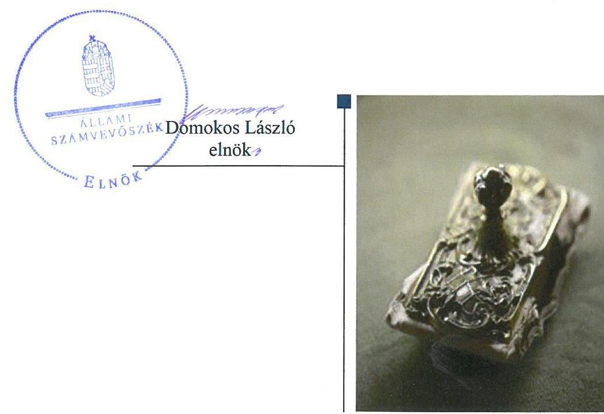
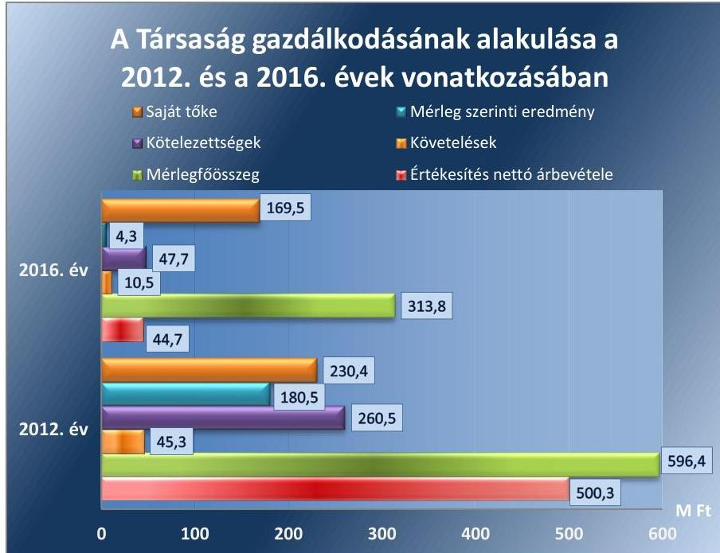

# Jelentés 

## Hollóházi Hungarikum Nonprofit Kft.

Az állami tulajdonban (résztulajdonban) lévő gazdálkodó szervezetek vagyonmegőrzési és gazdálkodási tevékenységének ellenőrzése 2018.

18064
www.asz.hu

---

# Jelentés 

## Hollóházi Hungarikum Nonprofit Kft.

Az állami tulajdonban (résztulajdonban) lévő gazdálkodó szervezetek vagyonmegőrzési és gazdálkodási tevékenységének ellenőrzése
2018. 03. hó 23. nap

---

# AZ ELLENŐRZÉST FELÜGYELTE:

DR. HORVÁTH MARGIT felügyeleti vezető

## AZ ELLENŐRZÉST VEZETTE ÉS A VÉGREHAJTÁSÁÉRT FELELŐS:

HOFMEISTER LÁSZLÓ ellenőrzésvezető

A PROGRAM ÖSSZEÁLLÍTÁSÁÉRT FELELŐS:

TÓTPÁL SZABOLCS osztályvezető

IKTATÓSZÁM: V-1387-100/2016

TÉMASZÁM: 2421

ELLENŐRZÉS-AZONOSÍTÓ SZÁM: V-075957

Jelentéseink az Országgyűlés számítógépes hálózatán és az Interneten a www.asz.hu címen is olvashatóak.

---

# TARTALOMJEGYZÉK 

■ ÖSSZEGZÉS ..... 5
■ AZ ELLENŐRZÉS CÉLJA ..... 6
■ AZ ELLENŐRZÉS TERÜLETE ..... 7
■ AZ ELLENŐRZÉS HÁTTERE, INDOKOLTSÁGA ..... 9
■ A JELENTÉS LÉNYEGES KÉRDÉSKÖREI ..... 10
■ ELLENŐRZÉS HATÓKÖRE ÉS MÓDSZEREI ..... 11
■ MEGÁLLAPÍTÁSOK ..... 13
■ JAVASLATOK ..... 16
■ MELLÉKLETEK ..... 19
I. sz. melléklet: Értelmező szótár ..... 19
II. sz. melléklet: 2012-2016. évi beszámoló adatok ..... 21
■ FÜGGELÉK: ÉSZREVÉTELEK ..... 23
■ RÖVIDÍTÉSEK JEGYZÉKE ..... 25

---

.

---

# ÖSSZEGZÉS 

A Hollóházi Hungarikum Nonprofit Kft. feletti tulajdonosi joggyakorlás szabályszerű volt. A Társaság a szabályszerű gazdálkodás feltételeit nem alakította ki. A Társaság vagyongazdálkodása nem volt szabályszerű. A beszámolók hiteles és megbízható alátámasztásáról nem gondoskodtak megfelelően. A Társaság a közzétételre vonatkozó kötelezettségét sem teljesítette. Így nem biztosította a Társaság a gazdálkodásának az átláthatóságát és a szabályszerűségét.

## Az ellenőrzés társadalmi indokoltsága

A közpénzt, közvagyont használó állami tulajdonú gazdálkodó szervezetekkel szemben társadalmi igény, hogy a tevékenységük átlátható és elszámoltatható legyen.

Az állami vagyonnal való gazdálkodás célja az állami vagyon átlátható, rendeltetésszerű és felelős felhasználásának biztosítása. Az állami tulajdonú gazdálkodó szervezetek a nemzeti vagyon részét képezik.

Az Állami Számvevőszék stratégiájában célul tűzte ki az államháztartáson kívül működő szervezetek ellenőrzését, mely hozzájárul a közpénzek szabályos, átlátható, elszámoltatható és eredményes felhasználásához. A stratégiával összhangban került sor a Hollóházi Hungarikum Nonprofit Kft. ellenőrzésére a 2012-2016. évekre vonatkozóan.

## Főbb megállapítások, következtetések

Az MNV Zrt. szabályszerűen alakította ki a felelős vagyongazdálkodáshoz szükséges követelményeket, a tulajdonosi jogokat szabályszerűen gyakorolta a Társaság felett.

A Társaság számviteli szabályozottsága az ellenőrzött időszakban nem volt megfelelő, mert számlarend hiányában gazdálkodtak.

A vagyongazdálkodása nem volt szabályszerű, mert a beszámolók leltárral való alátámasztottsága nem volt megfelelő, valamint a számviteli bizonylatok nagy részét nem őrizték meg a 2012-2015. években.

A Társaság bevételeinek és ráfordításainak elszámolása sem volt megfelelő. Az adatszolgáltatási kötelezettségeinek a Társaság a tulajdonosi joggyakorló rendelkezésének megfelelően eleget tett, azonban a Taktv.-ben előírt elektronikus közzétételre vonatkozó kötelezettségét nem teljesítette.

---

# AZ ELLENŐRZÉS CÉLJA 

Az ellenőrzés célja annak értékelése volt, hogy a tulajdonosi jogok gyakorlása szabályszerű volt-e; a gazdálkodó szervezet szabályozottsága, gazdálkodása és vagyongazdálkodási tevékenysége megfelelt-e a jogszabályi és a tulajdonosi előírásoknak; biztosítva volt-e a közfeladatok átláthatósága és elszámoltathatósága érdekében a közszolgáltatás díjának megalapozottsága szabályszerű önköltségszámítással; a vagyonváltozást eredményező döntések esetében a tulajdonosi jogok gyakorlója és a gazdálkodó szervezet szabályszerűen jártak-e el.

---

# **AZ ELLENŐRZÉS TERÜLETE**

## **Magyar Nemzeti Vagyonkezelő Zártkörűen Működő Részvénytársaság és a Hollóházi Hungarikum Nonprofit Kft.**

A Társaság1-ot a Magyar Állam alapította 2009. december 17-én 0,5 M Ft törzstőkével, mely 2012. augusztus 27-én 39,0 M Ft-ra emelkedett, ezt követően 2016. december 31-éig nem változott. Az alapítót megillető tulajdonosi jogok és kötelezettségek összességét a 2012-2016. években a Vtv.2 alapján az MNV Zrt.3 gyakorolta.

A Társaság alaptevékenysége a Hollóházi Porcelánmúzeum üzemeltetése volt, mely a 2012-2013. években porcelángyártással és porcelánkereskedelemmel bővült. A 2014. évtől az MNV Zrt. döntése alapján a porcelángyártás és porcelánkereskedelem átkerült az MPM Kft.4-hez – melynek tulajdonosi joggyakorlója szintén az MNV Zrt. – a forprofit és a nonprofit tevékenységek szétválasztása céljából. A Társaság a készleteit értékesítette, a gyártáshoz szükséges ingatlanokat és tárgyi eszközöket bérbe adta az MPM Kft.-nek. A Társaság nem tartozott a kormányzati szektorba sorolt egyéb szervezetek közé, vagyonkezelt vagyona nem volt. Közfeladatot nem látott el.

Az 1. ábra a Társaság néhány, jellemző gazdálkodási adatának alakulását mutatja az ellenőrzött időszakban. A Társaság főbb mérlegadatait a II. melléklet mutatja be.

1. ábra

*Forrás: 2012. és 2016. évi beszámolók*

---

A Társaság mérlegfőösszege az ellenőrzött időszakban 282,6 M Ft-tal, 47,4%-kal csökkent. A mérlegfőösszeg csökkenését elsősorban a Társaság és az MPM Kft. egymással szemben kimutatott követelések 2015. évi beszámítása eredményezte. Az MNV Zrt.-nek a Társasággal szemben a 2015. évben 244 M Ft összegű követelése állt fenn, melyből az MNV Zrt. 200 M Ft összegű követelést az MPM Kft.-re engedményezte. A Társaságnak az MPM Kft.-vel szemben a készletértékesítés miatt 252 M Ft összegű követelése keletkezett. A mérlegfőösszeg csökkenését továbbá az elszámolt értékcsökkenést el nem érő beszerzések, illetve felújítások okozták. A Társaság követelésállománya az ellenőrzött időszakban jelentősen, 76,8%-kal 10,5 M Ft-ra csökkent.

Az értékesítés nettó árbevétele jelentősen, 91,1%-kal csökkent a porcelángyártás megszüntetése miatt. Az átlagos állományi létszáma a 2012. évi 97,0 főről 2016. évre 3 főre csökkent. A Társaság ügyvezető igazgatójának személyében egy alkalommal, 2016. szeptember 27-én történt változás.

---

# AZ ELLENŐRZÉS HÁTTERE, INDOKOLTSÁGA 

Az állami tulajdonú gazdálkodó szervezetek ellenőrzése kiemelten fontos a nemzeti vagyon megőrzése, megóvása érdekében. Gazdálkodásuk jellemzően a közérdeklődés és a média figyelmének középpontjában áll, amihez hozzájárul a gazdálkodásuk körébe tartozó - közvetlen vagy közvetett állami tulajdonú - vagyon nagysága, illetve az általuk ellátott közszolgáltatások minősége és hatékonysága. A szolgáltatási árképzés megalapozottsága és az éves elszámoltatás feltételeinek kialakítása az ellenőrzés során nagy hangsúlyt kap. A szolgáltatás árában és annak támogatásában meg kell jelennie az önköltségszámítás szempontjainak, amely biztosítja a működés fenntarthatóságát (eszközpótlást) is.

Az ellenőrzés rámutathat az állami tulajdonú gazdálkodó szervezetek gazdálkodási tevékenységével jó gyakorlatokra és szabálytalanságokra. Felhívhatja a figyelmet a jogszabályi követelmények teljesítéséhez szükséges feltételek hiányosságaira, hozzájárulhat az államháztartáson kívüli, de (közvetlenül vagy közvetve) állami vagyont használó gazdálkodó szervezetek tevékenységének átláthatóságához. Ellenőrzésünk eredményeképpen javaslatainkkal, megállapításainkkal hozzájárulhatunk a nemzeti vagyonnal való gazdálkodás átláthatóságának, elszámoltathatóságának javításához.

---

# A JELENTÉS LÉNYEGES KÉRDÉSKÖREI 

1.     - A tulajdonosi jogok gyakorlása szabályszerű volt-e?
2.     - A Társaság működése megfelelt-e az előírásoknak?

---

# ELLENŐRZÉS HATÓKÖRE ÉS MÓDSZEREI 

## Az ellenőrzés típusa

Megfelelőségi ellenőrzés

## Az ellenőrzött időszak

2012. január 1-jétől 2016. december 31-ig

## Az ellenőrzés tárgya

Az állami tulajdonban lévő gazdasági társaság gazdálkodása, kiemelten vagyongazdálkodási tevékenysége, valamint a tulajdonosi jogok gyakorlása.

## Az ellenőrzött szervezet

Hollóházi Hungarikum Nonprofit Kft. és a Magyar Nemzeti Vagyonkezelő Zrt.

## Az ellenőrzés jogalapja

Az ellenőrzés jogalapját az Állami Számvevőszékről szóló 2011. évi LXVI. törvény 1. § (3) bekezdése és 5. § (3)-(5) bekezdései képezik.

## Az ellenőrzés módszerei

Az ellenőrzést a nemzetközi standardokat irányadónak tekintve az ellenőrzési program ellenőrzési kérdései, az ellenőrzött időszakban hatályos jogszabályok, az ellenőrzés szakmai szabályok és módszertanok figyelembe vételével végeztük.

Az ellenőrzés ideje alatt az ellenőrzött szervezettel történő kapcsolattartást az ÁSZ Szervezeti és Működési Szabályzatának vonatkozó előírásai alapján biztosítottuk.

Az ellenőrzési kérdések megválaszolásához szükséges bizonyítékok megszerzése a következő ellenőrzési eljárások alkalmazásával történt: megfigyelés, kérdésfeltevés (információkérés), összehasonlítás, valamint elemző eljárás. Az ellenőrzési bizonyítékként felhasználható adatforrások közé tartoztak egyrészt az ellenőrzési programban felsorolt adatforrások, másrészt az ellenőrzés folyamán feltárt, az ellenőrzés szempontjából információkat tartalmazó dokumentumok.

---

Az ellenőrzést a kérdésekre adott válaszok kiértékelésével, valamint a megjelölt adatforrások, tanúsítványok felhasználásával, továbbá az adott időszakban hatályos jogszabályok figyelembe vételével folytattuk le.

A bevételek, a ráfordítások elszámolása, valamint a vagyonnyilvántartás terén a szabályszerű működést véletlenszerű mintavétellel és irányított kiválasztással ellenőriztük. A mintatételek értékelése alapján egyrészt a sokaság hiba arányát becsültük, másrészt az irányítottan kiválasztott tételeket értékeltük. A jogszabályoknak és a belső előírásoknak megfelelőnek, azaz szabályszerűnek tekintettük az adott területet, amennyiben a minta ellenőrzésének eredménye alapján 95%-os bizonyossággal a teljes sokaságban a hibaarány kisebb volt, mint 10% és nem megfelelőnek értékeltük, ha a hibaarány a 10%-ot elérte. A ráfordítások elszámolására és a vagyonnyilvántartásra vonatkozó véletlen mintavételt kockázati alapú kiválasztással egészítettük ki, melynek során évente a három legnagyobb összegű tételt választottuk ki.

---

# 1. A tulajdonosi jogok gyakorlása szabályszerű volt-e? 

Összegző megállapítás Az MNV Zrt. tulajdonosi joggyakorlása szabályszerű volt.

A TULAJDONOSI JOGGYAKORLÁS szabályait az MNV Zrt. az alapító okiratokban szabályozta. Az MNV Zrt. a Társaság alapító okiratában ${ }^{5}$ meghatározta a tulajdonosi jogokat, továbbá kinevezte a Társaság ügyvezető igazgatóját, valamint előírta a felügyelőbizottságában való képviseletét. Az $\mathrm{FB}^{6}$ három főből állt a Gt. ${ }^{7}$-ben, majd a Ptk. ${ }^{8}$-ban előírtaknak megfelelően. Az MNV Zrt. SZMSZ ${ }^{9}$-ében a Vtv. ${ }^{10}$ 20. § (4) bekezdésében előírtakkal összhangban rögzítette az MNV Zrt. Igazgatósága döntési hatáskörét. Az MNV Zrt. Igazgatósága gyakorolta a főbb tulajdonosi jogokat, a vezérigazgató feladatköréhez az MNV Zrt. SZMSZ-e alapján működési folyamatokkal kapcsolatos szabályozás és a munkaszervezet vezetése tartozott.

Az MNV Zrt. a tervezési irányelveiben előírta az üzleti terv készítési kötelezettséget. A Társaság minden évben elkészítette az üzleti terveket, az MNV Zrt. Igazgatósága jóváhagyta.

Az MNV Zrt. Igazgatósága a Taktv. ${ }^{11}$ rendelkezéseivel összhangban elkészítette a Társaság üzleti tervének teljesítését elősegítő anyagi ösztönzési rendszerre vonatkozó Javadalmazási szabályzat ${ }^{12}$-okat, melyben meghatározták a vezető tisztségviselőkre és az FB tagokra vonatkozó javadalmazási rendszert.

A KÖNYVVIZSGÁLÓNAK az MNV Zrt. általi megválasztása szabályszerűen történt. Az alapító okirat tartalmazta a könyvvizsgáló személyével, működésével kapcsolatos hatásköröket, feladatokat.

MONITORING TEVÉKENYSÉG előírásait az MNV Zrt. vezérigazgatója a tulajdonosi joggyakorlás keretében - 2013 decemberéig egyedi vezérigazgatói utasításokban, majd 2013. december 19-étől egységes Monitoring szabályzat ${ }^{13}$-ban - rögzítette. A Társaság a gazdasági adatainak alakulását megküldte az előírt adatszolgáltatás keretében. Az MNV Zrt. az éves beszámoló jóváhagyásáról minden évben az FB írásbeli jelentésének és a könyvvizsgáló írásbeli véleményének a birtokában határozott.

A TÁRSASÁGNÁL ELLENŐRZÉST az MNV Zrt. egy alkalommal, a 2013. évi gazdálkodással kapcsolatban végeztetett egy külső szakértővel a 2014. évben. A jelentés konkrét javaslatokat nem tett, azonban jelzett kockázatokat a nem megfelelő számlaigazolással történő kifizetések miatt. A Társaság intézkedési tervet nem készített.

---

# 2. A Társaság működése megfelelt-e az előírásoknak? 

Összegző megállapítás

### 2.1. számú megállapítás

1. táblázat

A TÁRSASÁG SZÁMVITELI SZABÁLYZATAINAK ELKÉSZÍTÉSE

| Szabályzat megnevezése | Hatályba lépés |
| :-- | :-- |
| Eszközök és források ér- |  |
| tékelési szabályzata | 2012.10.01. |
| Leltárkészítési és leltáro- |  |
| zási szabályzat | 2012.10.01. |
| Önköltségszámítási sza- |  |
| bályzat | 2013.09.15. |
| Pénzkezelési szabályzat | 2013.10.01. |
| Számviteli politika | 2014.07.15. |
| Számlarend | Nem készült. |

2.2. számú megállapítás
2.3. számú megállapítás

A Társaság gazdálkodásának szabályozottsága nem volt megfelelő. A pénzügyi elszámolások nem voltak szabályszerűek. A beszámolók nem nyújtottak megbízható és valós képet a Társaság pénzügyi, vagyoni és jövedelmi helyzetéről, mert a 2012-2016. évi beszámoló leltárral történő alátámasztása nem volt megfelelő.

A Társaság számviteli szabályozottsága nem volt megfelelő, a számlarendet
 nem készítették el.

A Számviteli politikát ${ }^{14}$, illetve az annak keretében elkészítendő szabályzatokat a Társaság a Számv. tv. ${ }^{15}$ 14. § (11) bekezdésében foglaltak ellenére a megalakulás időpontját követő 90 napon túl készítette el. 2012. szeptember 30-ig a Társaság nem rendelkezett eszközök és források értékelési szabályzattal, valamint eszközök és a források leltárkészítési és leltározási szabályzattal, 2013. szeptember 14-ig önköltségszámítási szabályzattal, 2013. szeptember 30-ig pénzkezelési szabályzattal, valamint 2014. július 14-ig számviteli politikával. A Társaság a Számv. tv. 161. § (1) bekezdés rendelkezése ellenére nem készített számlarendet. A számviteli szabályzatok hatályba lépését az 1. táblázat mutatja be.

A Társaság ügyvezetője által kiadott számviteli szabályzatok tartalma a Pénzkezelési szabályzat ${ }^{16}$ kivételével megfelelt a Számv. tv. előírásainak.

A 2013. október 1-jén hatályba lépett Pénzkezelési szabályzat 2016. szeptember 27-től nem felelt meg a Számv. tv. 167. § (3) bekezdésének, mert az ügyvezető személyének változását követően is a korábbi ügyvezető neve szerepelt számlák igazolására és utalványozására jogosultként, így nem a gazdálkodásra jogosult személy került megjelölésre.

A Társaság bevételeinek és ráfordításának elszámolása nem volt szabályszerű.

A bevételek, ráfordítások, valamint az értékcsökkenés elszámolása nem szabályszerűen történt. A Társaság az elszámolás alapjául szolgáló 2012-2015. évi dokumentumokat számos esetben nem őrizte meg, megsértve a Számv. tv. 169. § (2) bekezdésének előírását.

A bevételek és a ráfordítások 2016. évi elszámolása sem volt megfelelő, mert a könyvvezetésre, bizonylatolásra vonatkozó számlarendet nem alakította ki a Számv. tv. 161/A. § (1) bekezdés rendelkezésének ellenére.

Az értékcsökkenés elszámolása nem volt megfelelő, mert a tárgyi eszközök üzembe helyezését jegyzőkönyv hiányában nem dokumentálták hitelt érdemlően a Számv. tv. 52. § (2) bekezdésében előírtaknak ellenére.

A 2012-2016. évi beszámolók leltárral való alátámasztásáról nem gondoskodtak megfelelően. A Taktv.-ben előírt elektronikus közzétételi kötelezettségnek nem tettek eleget.

ÜZLETI TERV KÉSZÍTÉSÉRE, valamint adatszolgáltatásra vonatkozó kötelezettségét a Társaság teljesítette. Az üzleti tervekről szóló

---

előterjesztéseket a Társaság először az FB elé terjesztette, amely a tulajdonosi joggyakorló számára elfogadásra javasolta azokat.

AZ ÉVES BESZÁMOLÓT a Társaság a Számv. tv. előírásai szerint elkészítette, a letétbe helyezési és közzétételi kötelezettséget szabályszerűen teljesítette.

A Társaságnál a tárgyi eszközök mérlegben kimutatott értékét a 2012-2016. évek egyikében sem támasztották alá mennyiségi felvétellel történő leltározással, ezzel nem tettek eleget a Számv. tv. 69. § (3) bekezdésében foglaltaknak, valamint a Leltárkészítési és leltározási szabályzat ${ }^{17}$ 2.2. pontjának.

A 2012. évben a készletek, a 2013. évben a készletek és a pénzeszközök mérlegsorán kívül az eszközök és források sem voltak leltárral alátámasztva a Számv. tv. 69. § (1) bekezdésében előírtak ellenére. A 2014-2015. években nem támasztották alá leltárral az immateriális javak, tárgyi eszközök, a jegyzett tőke, eredménytartalék és mérlegszerinti eredmény mérlegsorokat a Számv. tv. 69. § (1) bekezdésében előírtak ellenére.

A könyvvizsgáló a leltározás és a számviteli szabályozás hiányossága ellenére a beszámolót minden évben korlátozás nélküli hitelesítő záradékkal látta el.

A Társaság a Taktv. 2. § (1) bekezdésében foglaltak ellenére nem tette közzé a vezető tisztségviselő, a felügyelőbizottsági tagok, illetve a bankszámla feletti rendelkezésre jogosult munkavállalók előírt adatait.

# 2.4. számú megállapítás 

## A Társaság vagyongazdálkodása nem volt szabályozott és szabályszerű a 2012-2016. években.

A Társaság a 2012-2015. években számos esetben nem rendelkezett a kifizetések jogosságát alátámasztó szerződésekkel, megrendelésekkel. A számviteli dokumentumok megőrzési hiányosságai miatt a Társaság nem biztosította a könyvvezetés és a beszámolás során a Számv. tv. 15. § (3) bekezdésében előírt valódiság elvének az érvényesülését, mely alapján a könyvvitelben rögzített és a beszámolóban szereplő tételeknek a valóságban is megtalálhatóknak, bizonyíthatóknak, kívülállók által is megállapíthatóknak kell lenniük. Így a 2012-2015. évi beszámolók a Társaság vagyoni, pénzügyi és jövedelmi helyzetéről és azok változásáról nem mutattak megbízható és valós képet a Számv. tv. 18. § előírása ellenére.

A 2016. év vagyongazdálkodásának hiányossága volt, hogy egy ingatlant, valamint gépeket, gépjárműveket bizonylat nélkül adtak bérbe, melylyel a Társaság megsértette a Számv. tv. 165. § (1) bekezdésében foglalt előírást.

Az ellenőrzött időszakban nem valósult meg az elszámolt értékcsökkenés összegét elérő beszerzés vagy felújítás. Ennek eredményeképpen a befektetett eszközök értéke 10,1\%-kal csökkent, az eszközök használhatósága romló tendenciát mutatott.

---

# JAVASLATOK 

Az ÁSZ tv. 33. § (1) bekezdésében foglaltak értelmében az ellenőrzött szervezet vezetője köteles a jelentésben foglalt megállapításokhoz kapcsolódó intézkedési tervet összeállítani és azt a jelentés kézhezvételétől számított 30 napon belül az ÁSZ részére megküldeni. Amennyiben az ellenőrzött szervezet vezetője nem küldi meg határidőben az intézkedési tervet, vagy továbbra sem elfogadható intézkedési tervet küld, az Állami Számvevőszék elnöke az ÁSZ tv. 33. § (3) bekezdése a) és b) pontjaiban foglaltakat érvényesítheti.
Javaslataink célja a Hollóházi Hungarikum Nonprofit Kft. gazdálkodása szabályszerűségének helyreállítása annak érdekében, hogy a szabályozási környezet és az alkalmazott gyakorlat megfelelően tudja támogatni az átlátható működést.

## A Hollóházi Hungarikum Nonprofit Kft. ügyvezetőjének

1. Intézkedjen a számlarend Számv. tv. előírásainak megfelelő elkészítéséről.
(2.1. sz. megállapítás 1. bekezdés 3. mondata alapján)
2. Intézkedjen a Pénzkezelési szabályzat Számv. tv. előírásainak megfelelő elkészítéséről.
(2.1. sz. megállapítás 3. bekezdés alapján)
3. Intézkedjen a bevételek és ráfordítások elszámolása alapjául szolgáló dokumentumok megőrzéséről a Számv. tv. előírásának megfelelően.
(2.2. sz. megállapítás 1. bekezdés és a 2.4. sz. megállapítás 1. bekezdése alapján)
4. Intézkedjen a könyvvezetésre, a bizonylatolásra vonatkozó részletes belső szabályozás kialakításáról, hogy az a mérleg és az eredménykimutatás alátámasztásán túlmenően a kiegészítő melléklet adatainak közvetlen alátámasztására is alkalmas legyen.
(2.2. sz. megállapítás 2. bekezdése alapján)
5. Intézkedjen a tárgyi eszközök üzembe helyezésének bizonylattal történő dokumentálásáról a Számv. tv. előírásainak megfelelően.
(2.2. sz. megállapítás 3. bekezdése alapján)

---

6. Intézkedjen az éves beszámoló mérlegének alátámasztása érdekében a tárgyi eszközök mennyiségi leltározásának a Számv. tv.-ben előírtaknak megfelelő gyakorisággal történő végrehajtásáról.
(2.3. sz. megállapítás 3. bekezdése alapján)
7. Intézkedjen az elektronikus közzétételi kötelezettség Taktv. által meghatározottak szerinti teljesítéséről.
(2.3. sz. megállapítás 6. bekezdés alapján)
8. Intézkedjen a bevételek elszámolásának a Számv. tv. előírásainak megfelelő számviteli bizonylattal történő alátámasztásáról.
(2.4. sz. megállapítás 2. bekezdése alapján)

---

# Javaslatunk célja a tulajdonosi joggyakorló MNV Zrt. szabályszerű működésének elősegítése, továbbá a tulajdonosi joggyakorlás kontrolljainak erősítése. 

## Magyar Nemzeti Vagyonkezelő Zrt. vezérigazgatójának

1. Tegyen intézkedéseket
a) a számlarend,
b) a könyvvezetésre, a bizonylatolásra vonatkozó részletes belső szabályozás kialakításának hiányával,
c) a bevételek és ráfordítások bizonylatainak megőrzésével,
d) a tárgyi eszközök üzembe helyezésének bizonylatolásával,
e) a leltározással,
f) a közzétételi kötelezettség teljesítésével,
g) a bevételek elszámolásának hiányosságai
miatti felelősség tisztázása érdekében, és szükség szerint intézkedjen a felelősség érvényesítéséről.
(2.1. megállapítás 1. bekezdés 3. mondata, 2.2. sz. megállapítás 1. bekezdés és a 2.4. sz. megállapítás 1. bekezdés, 2.2. sz. megállapítás 2. bekezdés, 2.2. sz. megállapítás 3. bekezdés, 2.3. sz. megállapítás 3. bekezdés, 2.3. sz. megállapítás 6. bekezdés, 2.4. sz. megállapítás 2. bekezdés alapján)

---

# MELLÉKLETEK 

- I. SZ. MELLÉKLET: ÉRTELMEZŐ SZÓTÁR
állami vagyon
gazdasági társaság

MNV Zrt.
nemzeti vagyon
a) Az állam tulajdonában lévő dolog, valamint a dolog módjára hasznosítható természeti erő,
b) az a) pont hatálya alá nem tartozó mindazon vagyon, amely vonatkozásában törvény az állam kizárólagos tulajdonjogát nevesíti,
c) az állam tulajdonában lévő tagsági jogviszonyt megtestesítő értékpapír, illetve az államot megillető egyéb társasági részesedés,
d) az államot megillető olyan immateriális, vagyoni értékkel rendelkező jogosultság, amelyet jogszabály vagyoni értékű jogként nevesít.
Forrás: Vtv. 1. § (2) bekezdése
2012. november 10-től az állami vagyon fogalma kiegészül a következő ponttal:
e) az állam tulajdonában lévő pénzügyi eszközök
Forrás: Vtv. 1. § (2) bekezdése
A Ptk. 3:88. § (1) bekezdése szerint „a gazdasági társaságok üzletszerű közös gazdasági tevékenység folytatására, a tagok vagyoni hozzájárulásával létrehozott, jogi személyiséggel rendelkező vállalkozások, amelyekben a tagok a nyereségből közösen részesednek, és a veszteséget közösen viselik".
Az állami vagyon felett, a Magyar Államot megillető tulajdonosi jogok és kötelezettségek összességét - a hatályos szabályozás szerint - az állami vagyon felügyeletéért felelős miniszter (jelenleg a nemzeti fejlesztési miniszter) gyakorolja. A miniszter feladatát nagy részben az MNV Zrt., mint tulajdonosi joggyakorló szervezet útján látja el.
a) az állam vagy a helyi önkormányzat kizárólagos tulajdonában álló dolgok,
b) az a) pont hatálya alá nem tartozó, állam vagy a helyi önkormányzat tulajdonában lévő dolog,
c) az állam vagy a helyi önkormányzat tulajdonában lévő pénzügyi eszközök, továbbá az államot vagy a helyi önkormányzatot megillető társasági részesedések,
d) az államot vagy a helyi önkormányzatot megillető bármely vagyoni értékkel rendelkező jogosultság, amelyet jogszabály vagyoni értékű jogként nevesít,
e) Magyarország határa által körbezárt terület feletti légtér,
f) az üvegházhatású gázok kibocsátási egységeinek kereskedelméről szóló törvény szerint kibocsátási egység és légiközlekedési kibocsátási egység, valamint az ENSZ Éghajlatváltozási Keretegyezménye és annak Kiotói Jegyzőkönyv végrehajtási keretrendszeréről szóló törvény szerinti kiotói egység,
g) állami vagy helyi önkormányzati fenntartású közgyűjtemény (muzeális intézmény, levéltár, közgyűjteményként működő kép- és hangarchívum, valamint könyvtár) saját gyűjteményében nyilvántartott kulturális javak körébe tartozó dolog, kivéve, ha az állami vagy önkormányzati tulajdon jogszerű létrejötte kétséget kizáró módon nem bizonyítható és a dologra nézve más a tulajdonjogát bizonyítja vagy a kulturális javakra vonatkozó jogszabályokban meghatározott eljárás keretében valószínűsíti (g. pont módosult 2013. december 7-től),
h) a régészeti lelet,

---

tulajdonosi ellenőrzés
tulajdonosi jogok gyakorlója
i) a nemzeti adatvagyon körébe tartozó állami nyilvántartások fokozottabb védelméről szóló törvény szerinti nemzeti adatvagyon.
Forrás: Nvtv. ${ }^{18} 1 . \S(2)$
2014. március 14-ig:

Az állami vagyon kezelőjét, haszonélvezőjét, használóját megillető jogok gyakorlását, annak szabályszerűségét, célszerűségét az MNV Zrt. - szükség szerint területi szervei útján - ellenőrzi.
2014. március 15-től:

Az állami vagyon használóját, vagyonkezelőjét és haszonélvezőjét megillető jogok gyakorlását, annak szabályszerűségét, a kötelezettségek teljesítését, valamint a vagyon rendeltetése szerinti célszerűségét a tulajdonosi joggyakorló ${ }_{3}$ rendszeresen ellenőrzi.
Forrás: Vhr. ${ }^{19} 20 . \S(1)$
1.
2013. június 27-ig:

Az állami vagyon felett a Magyar Államot megillető tulajdonosi jogok és kötelezettségek összességét - ha törvény eltérően nem rendelkezik - az állami vagyon felügyeletéért felelős miniszter (a továbbiakban: miniszter) gyakorolja, aki e feladatát a Magyar Nemzeti Vagyonkezelő Zártkörűen Működő Részvénytársaság (a továbbiakban: MNV Zrt.), a Magyar Fejlesztési Bank, illetve a tulajdonosi joggyakorló szervezet útján látja el. A miniszter miniszteri rendeletben, a törvényben meghatározott állami vagyoni kör tekintetében, meghatározott időtartamra, a joggyakorlás egyes szabályainak meghatározásával - az őt megillető tulajdonosi jogok és kötelezettségek összességének, illetve azok meghatározott részének gyakorlóját az Áht. szerinti központi költségvetési szervek, ezek intézménye, továbbá a 100%-ban állami tulajdonban álló gazdasági társaságok közül kijelölheti. Forrás: Vtv. 3. § (1) és (2)
2013. június 28-ától:

A rábízott állami vagyon felett az államot megillető tulajdonosi jogok és kötelezettségek összességét tulajdonosi joggyakorlóként:
a) ha törvény vagy miniszteri rendelet eltérően nem rendelkezik, a Magyar Nemzeti Vagyonkezelő Zártkörűen Működő Részvénytársaság (a továbbiakban: MNV Zrt.),
b) törvényben kijelölt személy vagy
c) az állami vagyon felügyeletéért felelős miniszter (a továbbiakban: miniszter) által rendeletben kijelölt személy gyakorolja.
[...] A miniszter e törvény felhatalmazása
 alapján - a meghatározott célok hatékonyabb elérése érdekében, miniszteri rendeletben, az ott meghatározott állami vagyoni kör tekintetében, meghatározott időtartamra - e törvény keretei között, a joggyakorlás egyes szabályainak meghatározásával - az államot megillető tulajdonosi jogok és kötelezettségek összességének, illetve azok meghatározott részének gyakorlóját az Áht. szerinti központi költségvetési szervek, ezek intézményei, továbbá a 100%-ban állami tulajdonban álló gazdasági társaságok közül kijelölheti.
Forrás: Vtv. 3. § (1) és (2)
2.

Aki a nemzeti vagyon felett az államot vagy a helyi önkormányzatot megillető tulajdonosi jogok és kötelezettségek összességének gyakorlására jogosult
Forrás: Nvtv. 3. § (1) 17. pontja

---

II. SZ. MELLÉKLET: 2012-2016. ÉVI BESZÁMOLÓ ADATOK

| A TÁRSASÁG 2012-2016. ÉVI BESZÁMOLÓINAK FŐBB ADATAI (M FT-BAN) |  |  |  |  |  |  |
| :--: | :--: | :--: | :--: | :--: | :--: | :--: |
| Megnevezés | 2012. év | 2013. év | 2014. év | 2015. év | 2016. év | $\begin{gathered} 2016 / 2012 \\ \text { év (\%) } \end{gathered}$ |
| Mérlegfőösszeg | 596,4 | 657,7 | 575,5 | 322,3 | 313,8 | 52,6\% |
| Befektetett eszközök | 327,1 | 316,1 | 305,7 | 297,5 | 294,0 | 89,9\% |
| ebből tárgyi eszközök | 320,8 | 312,0 | 303,6 | 297,0 | 293,6 | 91,5\% |
| Forgóeszközök | 268,5 | 340,9 | 268,7 | 23,8 | 19,0 | 7,1\% |
| ebből követelések | 45,3 | 48,2 | 203,6 | 6,9 | 10,5 | 23,2\% |
| ebből vevőkövetelések | - | 36,2 | 201,5 | 0,2 | 0,0 | - |
| ebből pénzeszközök | 47,9 | 20,2 | 1,7 | 4,4 | 1,5 | 3,1\% |
| Aktív időbeli elhatárolás | 0,8 | 0,7 | 1,1 | 1,0 | 0,8 | 100,0\% |
| Saját tőke összege | 230,4 | 258,9 | 196,1 | 165,3 | 169,5 | 73,6\% |
| Jegyzett tőke | 39,0 | 39,0 | 39,0 | 39,0 | 39,0 | 100,0\% |
| Töketartalék | 0,0 | 0,0 | 0,0 | 0,0 | 0,0 | - |
| Eredménytartalék | 10,9 | 191,4 | 219,9 | 157,2 | 126,2 | 1157,8\% |
| Mérleg szerinti eredmény | 180,5 | 28,5 | -62,8 | -30,9 | 4,3 | 2,4\% |
| Céltartalékok | 0,0 | 0,0 | 0,0 | 0,0 | 0,0 | - |
| Kötelezettségek | 260,5 | 283,4 | 216,7 | 59,9 | 47,7 | 18,3\% |
| ebből szállítói tartozások | - | 38,5 | 13,6 | 5,5 | 1,4 | - |
| Passzív időbeli elhatárolás | 105,5 | 115,4 | 162,7 | 97,1 | 96,6 | 91,6\% |
| Összes bevétel | 837,5 | 682,0 | 182,1 | 46,8 | 34,8 | 4,2\% |
| Értékesítés nettó árbevétele | 500,3 | 553,3 | 336,1 | 66,1 | 44,7 | 8,9\% |
| Aktivált saját teljesítmény értéke | 106,2 | 96,8 | -180,1 | -24,9 | -10,0 | - |
| Pénzügyi és rendkívüli bevételek | 187,7 | 0,9 | 0,7 | 0,0 | 0,1 | 0,1\% |
| Egyéb bevételek | 43,3 | 31,0 | 25,4 | 5,6 | 0,0 | - |
| Összes ráfordítás | 636,1 | 650,4 | 244,3 | 77,5 | 30,5 | 4,8\% |
| Anyagi jellegű ráfordítások | 326,0 | 310,7 | 131,4 | 12,2 | 13,4 | 4,1\% |
| Személyi jellegű ráfordítások | 272,8 | 289,0 | 34,4 | 8,8 | 9,0 | 3,3\% |
| Értékcsökkenési leírás | 7,0 | 11,6 | 9,0 | 8,3 | 6,1 | 87,1\% |
| Egyéb ráfordítások | 24,1 | 34,2 | 16,1 | 37,6 | 2,0 | 8,3\% |
| Pénzügyi, rendkívüli ráfordítás | 6,2 | 4,9 | 53,4 | 10,6 | 0,0 | - |

---

.

---

# FÜGGELÉK: ÉSZREVÉTELEK 

A jelentéstervezetet a Számvevőszék 15 napos észrevételezésre megküldte az ellenőrzött szervezetek vezetőinek az ÁSZ tv. 29. § (1) bekezdése előírásának megfelelően.

A Hollóházi Hungarikum Nonprofit Kft. ügyvezetője, valamint a tulajdonosi jogokat gyakorló Magyar Nemzeti Vagyonkezelő Zrt. vezérigazgatója nem tett észrevételt a jelentéstervezetben foglalt megállapításokkal és javaslatokkal kapcsolatban.

[^0]
[^0]:    * 29. § (1) Az Állami Számvevőszék az ellenőrzési megállapításait megküldi az ellenőrzött szervezet vezetőjének vagy az általa megbízott személynek, és annak, akinek személyes felelősségét állapította meg.
    (2) Az ellenőrzött szervezet vezetője és a felelősként megjelölt személy az ellenőrzés megállapításaira tizenöt napon belül írásban észrevételt tehet.
    (3) Az Állami Számvevőszék az észrevételre a beérkezésétől számított harminc napon belül írásban válaszol. A figyelembe nem vett észrevételeket köteles a jelentésben feltüntetni, és megindokolni, hogy azokat miért nem fogadta el.

---

.

---

# RÖVIDÍTÉSEK JEGYZÉKE 

${ }^{1}$ Társaság
${ }^{2}$ Vtv.
${ }^{3}$ MNV Zrt.
${ }^{4}$ MPM Kft.
${ }^{5}$ alapító okirat

## ${ }^{6}$ FB

${ }^{7}$ Gt.
${ }^{8}$ Ptk.
${ }^{9}$ MNV Zrt. SZMSZ
${ }^{10}$ Vtv.
${ }^{11}$ Taktv.
${ }^{12}$ Javadalmazási szabályzat ${ }_{1-2}$
${ }^{13}$ Monitoring szabályzat
${ }^{14}$ Számviteli politika $1-2$
${ }^{15}$ Számv. tv.
${ }^{16}$ Pénzkezelési szabályzat
${ }^{17}$ Leltárkészítési és leltározási szabályzat
${ }^{18}$ Nvtv.
${ }^{19} \mathrm{Vhr}$.

Hollóházi Hungarikum Nonprofit Kft.
2007. évi CVI. törvény az állami vagyonról

Magyar Nemzeti Vagyonkezelő Zártkörűen Működő Részvénytársaság
Magyar Porcelánmanufaktúra Kft.
Hollóházi Hungarikum Nonprofit Kft. Alapító Okirata: 120/2011. (V.23.) Alapítói Okirat egységes szerkezetben (hatályos 2011. május 23-tól)
Hollóházi Hungarikum Nonprofit Kft. Alapító Okirata: 205/2013. (V.27.) Alapítói Határozattal módosított Alapító Okirat (hatályos 2013. május 27-től)
Hollóházi Hungarikum Nonprofit Kft. Alapító Okirata: 586/2016. (IX.22.), Alapítói Határozattal módosított Alapító Okirat (hatályos 2016. szeptember 27-től)
Hollóházi Hungarikum Nonprofit Kft. felügyelőbizottsága
2006. évi IV. törvény a gazdasági társaságokról (hatálytalan 2014. március 15-től) 2013. évi V. törvény a Polgári Törvénykönyvről (hatályos 2014. március 15-től)

Magyar Nemzeti Vagyonkezelő Zártkörűen Működő Részvénytársaság Szervezeti és Működési Szabályzata (hatályos 2011. május 30-tól)
2007. évi CVI. törvény az állami vagyonról (hatályos 2007. szeptember 17-től) 2009. évi CXXII. törvény a köztulajdonban álló gazdasági társaságok takarékosabb működéséről (hatályos 2009. december 4-től)
Hollóházi Hungarikum Nonprofit Kft. Javadalmazási Szabályzata: (hatályos 2013. május 14-től)
Hollóházi Hungarikum Nonprofit Kft. Javadalmazási Szabályzata: (hatályos 2016. február 25-től)
51/2013. számú MNV Zrt. vezérigazgatói utasítás a Társasági Monitoring Szabályzatról (hatályos 2013. december 19-től)
Hollóházi Hungarikum Nonprofit Kft. Számviteli Politikája (hatályos 2014. július 15-től)
2000. évi C. törvény a számvitelről (hatályos 2001. január 1-jétől)

Hollóházi Hungarikum Nonprofit Kft. Pénzkezelési Szabályzata (hatályos 2013. október 1-jétől)
Hollóházi Hungarikum Nonprofit Kft. Eszközök és források leltárkészítési és leltározási szabályzata (hatályos 2013. október 1-jétől)
2011. évi CXCVI. törvény a nemzeti vagyonról (hatályos 2012. január 1-jétől) 254/2007. (X. 4.) Kormányrendelet az állami vagyonnal való gazdálkodásról (hatályos 2007. október 4-től)

---

# ÁLLAMI SZÁMVEVŐSZÉK 

1052 Budapest, Apáczai Csere János utca 10.
Levélcím: 1364 Budapest 4. Pf. 54
Telefon: +36 14849100 Telefax: +36 14849200
www.asz.hu
