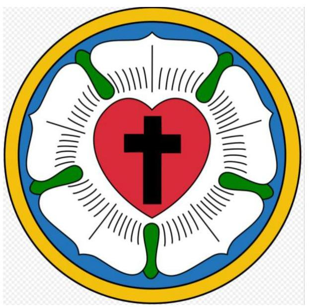

# Jelentés 

## Nem állami humánszolgáltatók ellenőrzése

A humánszolgáltatást nyújtó államháztartáson kívüli köznevelési és szociális intézmények, szolgáltatók fenntartói központi költségvetésből kapott támogatásai felhasználásának ellenőrzése - Magyarországi Evangélikus Egyház 2018.

---

# Jelenetés 

## Nem állami humánszolgáltatók ellenőrzése

A humánszolgáltatást nyújtó államháztartáson kívüli köznevelési és szociális intézmények, szolgáltatók fenntartói központi költségvetésből kapott támogatásai felhasználásának ellenőrzése - Magyarországi Evangélikus Egyház 2018. 3 hó 27 nap

---

# AZ ELLENŐRZÉST FELÜGYELTE:

- **SALAMON ILDIKÓ** felügyeleti vezető

- **AZ ELLENŐRZÉST VEZETTE ÉS A VÉGREHAJTÁSÁÉRT FELELŐS:**
  - **DR. KOVÁCS DIÁNA** ellenőrzésvezető
  - **A PROGRAM ÖSSZEÁLLÍTÁSÁÉRT FELELŐS:**
    - **TÓTPÁL SZABOLCS** osztályvezető

**IKTATÓSZÁM:** EL-0114-339/2018.

**TÉMASZÁM:** 2448

**ELLENŐRZÉS-AZONOSÍTÓ SZÁM:** V079401

Jelentéseink az Országgyűlés számítógépes hálózatán és az Interneta a www.asz.hu címen is olvashatóak.

---

# TARTALOMJEGYZÉK 

- ÖSSZEGZÉS ..... 5
- AZ ELLENŐRZÉS CÉLJA ..... 6
- AZ ELLENŐRZÉS TERÜLETE ..... 7
- AZ ELLENŐRZÉS HÁTTERE, INDOKOLTSÁGA ..... 8
- A JELENTÉS LÉNYEGES KÉRDÉSKÖREI ..... 9
- AZ ELLENŐRZÉS HATÓKÖRE ÉS MÓDSZEREI ..... 10
- MEGÁLLAPÍTÁSOK ..... 12
- JAVASLATOK ..... 16
- MELLÉKLETEK ..... 17
I. sz. melléklet: Értelmező szótár ..... 17
II. sz. melléklet: Az ellenőrzött központi költségvetési támogatások alakulása ..... 19
- FÜGGELÉK: ÉSZREVÉTELEK ..... 21
- RÖVIDÍTÉSEK JEGYZÉKE ..... 23

---

.

---

# ÖSSZEGZÉS 

A Magyarországi Evangélikus Egyház intézményfenntartóként a köznevelési és a szociális humánszolgáltatási közfeladat ellátásához kialakította a központi költségvetési támogatások átlátható és elszámoltatható igénybevételének és felhasználásának feltételeit. Az átvállalt köznevelési és szociális humánszolgáltatási közfeladathoz biztosított központi költségvetési támogatásokat szabályszerűen fordította intézményei müködtetésére. A köznevelési és szociális humánszolgáltató intézményei müködtetéséhez felhasznált közpénzekre vonatkozó elszámolása átlátható volt.

## Az ellenőrzés társadalmi indokoltsága

Az Állami Számvevőszék stratégiájában hangsúlyos szerepet szán annak, hogy szilárd szakmai alapon álló, értékteremtő ellenőrzéseivel előmozdítsa a közpénzügyek átláthatóságát, rendezettségét és javaslataival a közpénzek és a közvagyon szabályos, gazdaságos, hatékony és eredményes felhasználását segítse. Az Állami Számvevőszék a stratégiájában célul tűzte ki, hogy az államháztartáson kívülre nyújtott költségvetési támogatások ellenőrzésével hozzájárul ahhoz, hogy a közpénzeket az államháztartáson kívüli szervezetek is átlátható módon használják fel a közfeladatok szerződésben vállalt ellátása érdekében. Az Állami Számvevőszék e stratégiai céljaival összhangban - az Állami Számvevőszékről szóló 2011. évi LXVI. törvény felhatalmazása alapján - végzi a központi költségvetésből származó források, nyújtott támogatások - kedvezményezett szervezetek közfeladat ellátásához való - felhasználásának az ellenőrzését. Hozzájárul ezzel ahhoz is, hogy a nyilvánosság és az igénybevevők megfelelő tájékoztatást kapjanak az államháztartáson kívüli közfeladatot ellátók müködéséről.

## Főbb megállapítások, következtetések, javaslatok

A Magyarországi Evangélikus Egyház mint intézményfenntartó a jogszabályi előírásoknak megfelelően kialakította a köznevelési és szociális humánszolgáltatási közfeladat ellátásának szervezeti és szabályozási kereteit. Beszámolási formája és könyvvezetése a jogszabályi előírásoknak megfelelő volt.

A Magyarországi Evangélikus Egyház mint intézményfenntartó biztosította a köznevelési és a szociális humánszolgáltató intézményei müködésének feltételeit. A kötelezően továbbutalandó központi költségvetési támogatásokat szabályszerűen továbbutalta az intézményeknek. A köznevelési intézményeire vonatkozóan az Nkt. ${ }^{1}$ 83. § (2) bekezdés c) pontjában előírtak ellenére nem határozta meg a kérhető térítési díj és tandíj megállapításának szabályait, a szociális alapon adható kedvezmények feltételeit.

Az ellenőrzési kötelezettségeit szabályszerűen látta el.
A Magyarországi Evangélikus Egyház mint intézményfenntartó a köznevelési és szociális humánszolgáltató intézményei müködtetéséhez felhasznált közpénzekre vonatkozó gazdálkodásáról a nyilvánosság előtt szabályszerűen beszámolt, az átláthatóságot biztosította.

A Magyarországi Evangélikus Egyház mint intézményfenntartó a külső ellenőrzésekkel kapcsolatos kötelezettségeit teljesítette.

Az Állami Számvevőszék javaslatot tett a jogszabályi előírások alapján a kérhető térítési díj és tandíj megállapítása szabályainak, a szociális alapon adható kedvezmények feltételeinek a meghatározására, a közzétételi listákon szereplő adatok közzététele részletes szabályainak megállapítására.

---

# AZ ELLENŐRZÉS CÉLJA

**AZ ELLENŐRZÉS CÉLJA** annak értékelése, hogy a Magyarországi Evangélikus Egyház mint intézményfenntartó² központi költségvetésből kapott támogatásainak felhasználása szabályszerű volt-e, a támogatások igénylése, évközi módosítása és év végi elszámolása megfelel-e a jogszabályi előírásoknak.

---

# **AZ ELLENŐRZÉS TERÜLETE**

## **Magyarországi Evangélikus Egyház mint intézményfenntartó**

A Fenntartó az Országgyűlés által elismert bevett egyház, amely szerepel az egyházi jogi személyek nyilvántartásában.

A Fenntartó a jogszabályi lehetőséggel élve köznevelési és szociális humánszolgáltató intézményeket alapított és működtetett az ország egész területén.

A 2014-2016. években a Fenntartó 65 feladatellátási helyen látott el köznevelési feladatot (óvodai nevelés, általános iskolai oktatás, gimnáziumi oktatás, szakközépiskolai képzés, alapfokú művészeti oktatás, kollégiumi ellátás, pedagógiai-szakmai szolgáltatás), 22 köznevelési székhely intézményt működtetett. A Fenntartó szociális humánszolgáltatást (idősek nappali ellátása, idősek bentlakásos otthona, házi segítségnyújtás, szociális étkeztetés, tanyagondnoki szolgálat, falugondnoki szolgálat, fogyatékosok otthona, családok átmeneti otthona, gyermekjóléti szolgálat, gyermekek napközi ellátása, hajléktalanok otthona, szenvedélybetegek nappali ellátása) 80 feladatellátási helyen nyújtott, 23 szociális székhely intézményt tartott fent az ellenőrzött időszakban.

A Fenntartó köznevelési célra a foglalkoztatott pedagógus és egyéb dolgozó létszáma alapján átlagbéralapú normatív köznevelési támogatás, a gyermek-, tanulólétszám alapján működési, illetve egyszeri kiegészítő támogatás igénybevételére volt jogosult, továbbá támogatás illette meg hités erkölcstan oktatás, gyermekétkeztetési és tankönyvtámogatás jogcímeken a központi költségvetési törvényben meghatározottak szerint.

A Fenntartó szociális humánszolgáltatási célra a központi költségvetési törvényben az általa fenntartott szociális intézmények működéséhez biztosított támogatás és egyházi kiegészítő támogatás igénybe vételére volt jogosult.

A központi költségvetési támogatások Fenntartó általi igénylése, módosítása és elszámolása a jogszabályi előírások betartásával történt.

A Fenntartó az ellenőrzött tevékenység ellátására 2014-ben 9,9 Mrd Ft, 2015-ben 10,2 Mrd Ft, 2016-ban pedig 10,9 Mrd Ft állami költségvetési támogatást kapott, amelynek alakulását a II. sz. melléklet mutatja be.

A köznevelési és szociális humánszolgáltatási feladatok ellátásával kapcsolatos szakmai irányító szervi feladatokat az ellenőrzött időszakban az EMMI3 látta el, a törvényességi ellenőrzési feladatokat a területileg illetékes kormányhivatalok végeztek.

A Fenntartó a köznevelési és szociális feladatellátáshoz kapott közpénz felhasználásáról a nyilvánosság előtt köteles volt beszámolni.

---

# AZ ELLENŐRZÉS HÁTTERE, INDOKOLTSÁGA 

A köznevelési és szociális feladatokat ellátó nem állami intézményfenntartók részére közfeladataik ellátására évente jelentős összegű pénzügyi támogatást biztosítottak a mindenkori költségvetési törvények a bennük megfogalmazott feltételek mellett. A felhasználható állami támogatások Kvtv. ${ }^{4}$ szerinti előirányzata 2014. - 2016. években együtt 753 Mrd Ft volt. A 2013. évben jelentős változások következtek be a normatív finanszírozás rendszerében. Az Országgyűlés elfogadta a nemzeti köznevelésről szóló 2011. évi CXC. törvényt, amely jelentősen átalakította a korábbi finanszírozási rendszert 2013 szeptemberétől. Módosították a szociális igazgatásról és szociális ellátásokról szóló 1993. évi III. törvényt is, amely - többek között - 2012. január 1-jei hatállyal megfogalmazta a finanszírozási rendszerbe történő befogadással összefüggő szabályokat. Mindkét területen új feladatfinanszírozási forma (átlagbéralapú támogatás) jelent meg, amely az államháztartáson kívüli intézményfenntartókra is vonatkozik. Az ellenőrzés a finanszírozási rendszerben 2011-2015 között bekövetkezett változásokra, azok közfeladat ellátásra gyakorolt hatására fókuszál a költségvetési támogatásokat felhasználó államháztartáson kívüli szervezetek körében. Az ellenőrzések indokoltságát az is alátámasztja, hogy az ÁSZ ${ }^{5}$ még nem ellenőrizte átfogóan e területet.

Az ÁSZ stratégiájában foglaltak alapján is indokolt az ellenőrzés, ami a társadalom számára jelzi, hogy a közpénz államháztartáson kívüli felhasználása sem maradhat ellenőrizetlenül. Az államháztartáson kívülre nyújtott költségvetési támogatások ellenőrzésével az ÁSZ hozzájárul ahhoz, hogy a közpénzeket a nem állami humán fenntartók átlátható módon használják fel a közfeladatok ellátására kötött szerződésekben vállalt kötelezettségek teljesítése érdekében. Az ellenőrzés javaslataival hozzájárul az említett rendszerek szabályszerű támogatás felhasználásához, javítja a társadalmigazdasági döntések megalapozottságát, ami a „jó kormányzás" feltétele.

---

# A JELENTÉS LÉNYEGES KÉRDÉSKÖREI 

1. A köznevelési, illetve szociális humánszolgáltatási közfeladatot ellátó Fenntartó szabályszerű müködési és gazdálkodási környezet kialakításával megteremtette-e a költségvetési támogatások átlátható, elszámoltatható igénybevételének, felhasználásának feltételeit?
2. A Fenntartó az átvállalt köznevelési, illetve szociális humánszolgáltatási közfeladathoz biztositott költségvetési támogatásokat szabályszerüen fordította-e a humánszolgáltató intézményei müködtetésére?
3. A Fenntartó a köznevelési, illetve szociális humánszolgáltató intézményei müködtetéséhez felhasznált közpénzekre vonatkozó gazdálkodásával a nyilvánosság előtt elszámolt-e, ennek megalapozása érdekében ellenőrzési, értékelési feladatait szabályszerűen látta-e el?

---

# AZ ELLENŐRZÉS HATÓKÖRE ÉS MÓDSZEREI 

## Az ellenőrzés típusa

Megfelelőségi ellenőrzés.

## Az ellenőrzött időszak

A 2014. január 1-je és 2016. december 31-e közötti időszak.

## Az ellenőrzés tárgya

Az ellenőrzés a köznevelési és szociális humánszolgáltatási közfeladatokat ellátó Fenntartó humánszolgáltatási közfeladatai ellátásához a költségvetési törvényekben biztosított központi költségvetési támogatások igénylése, évközi módosítása és év végi elszámolása fenntartói feladatainak ellátása, illetve e központi költségvetésből kapott támogatások humánszolgáltatási közfeladatokra való fenntartó általi felhasználása szabályszerűségének értékelésére terjedt ki.

Az ellenőrzés kiterjedt minden olyan körülményre és adatra, amely az ÁSZ jogszabályban meghatározott feladatainak teljesítéséhez, valamint a program végrehajtása folyamán felmerült újabb összefüggések feltárásához szükséges volt.

## Az ellenőrzött szervezet

Magyarországi Evangélikus Egyház mint intézményfenntartó

## Az ellenőrzés jogalapja

Az ellenőrzés jogszabályi alapját az ÁSZ tv. ${ }^{6} 1 . \S$ (3) bekezdése, 5. § (3) bekezdés, valamint az 5. § (11) bekezdés c) pontjában foglalt előírások adták.

## Az ellenőrzés módszerei

Az ellenőrzést az ellenőrzési program szempontjai, kérdései, az ellenőrzött időszakban hatályos jogszabályok, a nemzetközi standardokat irányadónak tekintve, az ellenőrzés szakmai szabályok és módszertanok figyelembe vételével végezte az ÁSZ. A közpénzekkel való felelős gazdálkodás segítésére irányuló javaslatok kidolgozásakor a hatályos jogszabályok voltak az irányadóak.

---

Az ellenőrzés ideje alatt az ellenőrzött szervezettel történő kapcsolattartást az ÁSZ SZMSZ ${ }^{7}$-ének vonatkozó előírásai alapján biztosította az ÁSZ.

Az ellenőrzési kérdések megválaszolásához szükséges bizonyítékok megszerzése az ellenőrzött által rendelkezésre bocsátott dokumentumokra, adatokra alapozva elemző eljárással történt.

Az ellenőrzési bizonyítékként felhasználható adatforrások közé tartoztak egyrészt a szakmai program részletes szempontjainál felsorolt adatforrások, másrészt minden - az ellenőrzés folyamán feltárt, az ellenőrzés szempontjából információt tartalmazó - dokumentum.

Az ellenőrzés lefolytatásához az ellenőrzött szervezet a kitöltött tanúsítványok, valamint az ÁSZ által kért dokumentumok elektronikus úton való megküldésével szolgáltatott adatokat, információkat. Az így rendelkezésre bocsátott adatok, információk és a tanúsítványok adatai valódiságának kontrollja az ellenőrzés keretében történt.

A fenntartott intézményeknél helyszíni szemle keretében győződött meg az ÁSZ a tényleges feladatellátásról (verifikáció).

A köznevelési, a szociális humánszolgáltatások központi költségvetési támogatásai igénylésével, módosításával, elszámolásával kapcsolatos, államháztartáson kívüli fenntartó jogszabályokban előírt feladatai betartását, továbbá a központi költségvetési támogatások szabályszerű kezelését, nyilvántartását ellenőrizte az ÁSZ a Fenntartónál határozatok, nyilvántartások, beszámolók és egyéb dokumentumok alapján. Az ellenőrzés nem terjedt ki a köznevelési, a szociális humánszolgáltatások központi költségvetési támogatásai igénylése, módosítása, elszámolása valódiságának, megalapozottságának, helyességének - sem a Fenntartónál, sem a székhely intézményeinél való - értékelésére. Továbbá nem terjedt ki az ellenőrzés e források intézmények általi szabályszerű felhasználásának értékelésére. A szabályosság megítélésének alapját képezte, hogy a központi költségvetési támogatások Fenntartó általi igénylése, módosítása és elszámolása a Kincstár ${ }^{8}$ felé megtörtént.

---

# MEGÁLLAPÍTÁSOK 

## 1. A köznevelési, illetve szociális humánszolgáltatási közfeladatot ellátó Fenntartó szabályszerű múködési és gazdálkodási környezet kialakításával megteremtette-e a költségvetési támogatások átlátható, elszámoltatható igénybevételének, felhasználásának feltételeit?

Összegző megállapítás

A köznevelési és szociális humánszolgáltatási közfeladatot ellátó Fenntartó a szabályszerű múködési és gazdálkodási környezet kialakításával megteremtette a költségvetési támogatások átlátható, elszámoltatható igénybevételének, felhasználásának feltételeit.
1.1. számú megállapítás

A Fenntartó köznevelési és szociális humánszolgáltatási közfeladata ellátásának megszervezése és belső szabályozottságának kialakítása a jogszabályi előírások betartásával történt.

A Fenntartó az 1056/1999. (V. 26.) Korm. határozatban ${ }^{9}$ foglalt megállapodás alapján végzett köznevelési tevékenységet, valamint látott el szociális humánszolgáltatási közfeladatot.

A Fenntartó rendelkezett a szervezeti és múködési szabályairól ${ }^{10}$.
A Fenntartó az Eszámv. ${ }^{11}$ alapján egyszerűsített éves beszámoló készítésére volt kötelezett. A Fenntartó által elkészített, kettős könyvvitellel alátámasztott egyszerűsített éves beszámolók megfeleltek Eszámv.-ben előírt beszámolási kötelezettségnek.

A Fenntartó a Számv. tv. ${ }^{12}$-ben előírtaknak megfelelően rendelkezett Számviteli politika ${ }_{1-2}$-vel ${ }^{13}$, a számviteli politikához kapcsolódó, gazdálkodását meghatározó belső szabályzatokkal, így az eszközök és a források leltárkészítési és leltározási szabályzatával ${ }^{14}$, az eszközök és a források értékelési szabályzatá ${ }_{1,2}$-val ${ }^{15}$ és a pénzkezelési szabályzat ${ }_{1,2}{ }^{16}$-tal. A Fenntartó 2014. január 1. és 2015. december 31. közötti időszakban számlarenddel nem rendelkezett, ezzel megsértette a Számv. tv. 161. § (1) bekezdés előírását. A Fenntartó 2016. január 1-jétől rendelkezett Számlarenddel ${ }^{17}$.

A Fenntartó belső szabályozási rendszere a felelősségi körök meghatározásával szabályozta az engedélyezési, jóváhagyási és kontrolleljárásokat ${ }^{18}$, a dokumentumokhoz való hozzáférést a 2/2010. (XII. 9.) Országos Szabályrendeletben ${ }^{19}$.

---

# 2. A Fenntartó az átvállalt köznevelési, illetve szociális humánszolgáltatási közfeladathoz biztosított költségvetési támogatásokat szabályszerűen fordította-e a humánszolgáltató intézményei múködtetésére? 

Összegző megállapítás

A Fenntartó az átvállalt köznevelési és szociális humánszolgáltatási közfeladathoz biztosított költségvetési támogatásokat szabályszerűen fordította a köznevelési és szociális humánszolgáltató intézményei múködtetésére.

### 2.1. számú megállapítás

A Fenntartó a köznevelési és szociális humánszolgáltató intézményei múködtetésének feltételeit biztosította.

A Fenntartó a köznevelési intézmények és a szociális humánszolgáltató intézmények alapító okiratait kiadta, azok módosításáról gondoskodott. Az alapító okiratok tartalmazták a gazdálkodással összefüggő jogosítványokat.

A Fenntartó a köznevelési és a szociális humánszolgáltató intézmények nyilvántartásba vételéről gondoskodott, a kiadott múködési engedélyekről nyilvántartást vezetett.

A Fenntartó a köznevelési és a szociális humánszolgáltató intézményei könyvvezetési és beszámoló készítési kötelezettségét megállapította ${ }^{20}$.

A Fenntartó jóváhagyta a köznevelési intézmények SZMSZ ${ }^{21}$-ét, házirendjét, valamint pedagógiai programját és gondoskodott a személyes gondoskodást nyújtó szociális intézmények szakmai programjának és SZMSZ-ének elkészítéséről.

A kincstári határozatokkal jóváhagyott központi költségvetési támogatások a Fenntartó rendelkezésére álltak. A Fenntartó biztosította a köznevelési intézményei számára a közfeladat ellátásához szükséges pénzeszközöket, a kötelezően továbbutalandó központi költségvetési támogatásokat szabályszerűen továbbutalta az intézményeknek. A kincstári határozatokkal jóváhagyott központi költségvetési támogatást a 2014. évi Kvtv. ${ }^{22}$, a 2015. évi Kvtv ${ }^{23}$. és a 2016. évi Kvtv. ${ }^{24}$ előírásának megfelelően határidőben, havi ütemezésben, a folyósítást követő 15 napon belül teljes összegében továbbutalta a szociális humánszolgáltató intézmények részére.

A köznevelési és a szociális humánszolgáltató intézmények rendelkeztek a Fenntartó által elfogadott költségvetéssel.

A Fenntartó a köznevelési intézményeire vonatkozóan az Nkt. 83. § (2) bekezdés c) pontjában előírtak ellenére a kérhető térítési díj és tandíj megállapításának szabályait, a szociális alapon adható kedvezmények feltételeit nem határozta meg.

---

2.2. számú megállapítás

A Fenntartó a köznevelési és a szociális humánszolgáltatási feladathoz rendelt költségvetési támogatást szabályszerűen kezelte, elkülönítetten tartotta nyilván, és az intézményei múködtetésére fordította.

A Fenntartó biztosította a központi költségvetési támogatások elkülönített nyilvántartását és gondoskodott arról, hogy a támogatások cél szerinti felhasználása alapfeladatonként megállapítható legyen.

A Fenntartó gondoskodott az intézmények beszámolási kötelezettségének teljesítéséről. Az intézményi beszámolók elfogadásáról az Országos Elnökség határozatokban döntött.

A Fenntartó rendelkezett információval arról, hogy a köznevelési és a szociális humánszolgáltató intézmények a számukra biztosított költségvetési támogatásokat elkülönítetten tartják nyilván. Ennek szabályszerűségét a Fenntartó az általa megbízott könyvvizsgáló útján az ellenőrzött időszak minden évében ellenőrizte.

# 3. A Fenntartó a köznevelési, illetve szociális humánszolgáltató intézményei múködtetéséhez felhasznált közpénzekre vonatkozó gazdálkodásával a nyilvánosság előtt elszámolt-e, ennek megalapozása érdekében ellenőrzési, értékelési feladatait szabályszerűen látta-e el? 

Összegző megállapítás

A Fenntartó a köznevelési és szociális humánszolgáltató intézményei múködtetéséhez felhasznált közpénzekre vonatkozó gazdálkodásáról szabályszerűen beszámolt. A külső ellenőrzésekkel kapcsolatos intézkedési feladatait szabályszerűen látta el.

### 3.1. számú megállapítás

A Fenntartó az ellenőrzési feladatainak eleget tett.

A Fenntartó a belső ellenőrzés útján - az Nkt. 83. § (2) bekezdés e) pontjában biztosított jogával élve - ellenőrizte az általa alapított köznevelési intézmények gazdálkodását és múködésének törvényességét, illetve minden évben végzett ellenőrzést a szociális intézményeknél a gazdálkodási jogosítványok, a szabályozottság, a készpénzkezelés, a juttatások, az adózás és a vagyongazdálkodás tekintetében.

A Fenntartó minden évben könyvvizsgálóval ellenőriztette a köznevelési és szociális intézmények központi költségvetésből kapott támogatás igénylését és felhasználását.

A Fenntartó a köznevelési és szociális humánszolgáltató intézményei múködtetéséhez felhasznált közpénzekre vonatkozó gazdálkodásáról a nyilvánosság előtt szabályszerűen beszámolt.

A Fenntartó kialakította az Info tv. ${ }^{25}$-ben foglaltaknak megfelelően az adatok biztonságának és védelmének érvényre juttatásához szükséges eljárási szabályokat. A Fenntartó a honlapján minden évben közzétette az éves

---

# 3.3. számú megállapítás 

## A Fenntartó a külső ellenőrzésekkel kapcsolatos intézkedési feladatait szabályszerűen látta el.

A Fenntartó rendelkezett információval a köznevelési és szociális humánszolgáltató intézményeinél végzett törvényességi ellenőrzésekről.

A Kormányhivatalok által végzett törvényességi ellenőrzések során feltárt hiányosságok esetében a Fenntartó a hiánypótlási felhívásoknak eleget tett, a hiányosságokat határidőben megszüntette.

A hatósági ellenőrzések során a megyei kormányhivatalok a tárgyi feltételek, létszámkeret, tanügyi nyilvántartások, közfoglalkoztatás, közétkeztetés, játszótér, a NÉBIH ${ }^{26}$ a közegészségügy, a Katasztrófavédelemi Igazgatóság a tüzvédelem, az $\mathrm{OEP}^{27}$ a társadalombiztosítás, illetve a $\mathrm{NAV}^{28}$ az adózás területén tett javaslataira a Fenntartó megtette a szükséges intézkedéseket.

A Kincstár az ellenőrzött időszakban a Fenntartónál és a köznevelési székhely intézményeknél a helyszínen ellenőrizte a költségvetési támogatás felhasználását, szabálytalanság megállapítására nem került sor, intézkedést igénylő megállapítás nem volt.

A Kincstár hatósági ellenőrzéseket végzett az ellenőrzött időszakban a Fenntartót és szociális humánszolgáltató intézményeit megillető támogatások és egyházi kiegészítő támogatások elszámolása szabályszerűségének, a közölt adatok valódiságának, a jogszabályi feltételek meglétének tárgyában. A Fenntartó a feltárt hiányosságok és szabálytalanságok megszüntetésére intézkedéseket rendelt el.

---

# JAVASLATOK 

Az ÁSZ tv. 33. § (1) bekezdésében foglaltak értelmében az ellenőrzött szervezet vezetője köteles a jelentésben foglalt megállapításokhoz kapcsolódó intézkedési tervet összeállítani és azt a jelentés kézhezvételétől számított 30 napon belül az ÁSZ részére megküldeni. Amennyiben az ellenőrzött szervezet vezetője nem küldi meg határidőben az intézkedési tervet, vagy továbbra sem elfogadható intézkedési tervet küld, az Állami Számvevőszék elnöke az ÁSZ tv. 33. § (3) bekezdése a) és b) pontjaiban foglaltakat érvényesítheti.

## Magyarországi Evangélikus Egyház vezetőjének

1. Intézkedjen, hogy a Fenntartó a jogszabályi előírásnak megfelelően határozza meg a köznevelési intézményekre vonatkozóan a kérhető téritési díj és tandíj megállapításának szabályait, a szociális alapon adható kedvezmények feltételeit.
(2.1. számú megállapítás 7. bekezdés alapján)
2. Intézkedjen, hogy a Fenntartó a jogszabályi előírásnak megfelelően belső szabályzatban állapítsa meg a közzétételi listákon szereplő adatok közzétételének részletes szabályait.
(3.2. számú megállapítás 2. bekezdés alapján)

---

# MELLÉKLETEK 

## I. SZ. MELLÉKLET: ÉRTELMEZŐ SZÓTÁR

bevett egyház
egyházi fenntartó
humánszolgáltatás
költségvetési támogatás
köznevelési közfeladat

Az Ehtv. ${ }^{29}$ 6. § (1-2) bekezdései szerint az Országgyűlés által elismert egyház bevett egyház. Vallási közösség az Országgyűlés által elismert egyház és a vallási tevékenységet végző szervezet lehet. A vallási közösség elsődlegesen vallási tevékenység céljából jön létre és múködik. Az Ehtv. 7. §-a szerint a vallási közösség az egyház megjelölést elnevezésében és tevékenységére való utalás során önmeghatározása céljából - a saját hitelvei szerinti tartalommal - használhatja.
Az Ehtv. 33. §-a alapján az Ehtv. mellékletében felsorolt egyházak és az általuk meghatározott, az egyház belső egyházi szabálya szerint jogi személyiséggel rendelkező szervezetek - a nyilvántartásba vételük dátumától függetlenül - 2012. január 1-jétől minősülnek egyházi fenntartóknak. Az Ehtv. 14. §-ában meghatározott eljárás folyamán az Országgyűlés által egyháznak elismert szervezet a törvénynek az egyház bejegyzésére vonatkozó módosítása hatálybalépésének napjától minősül egyháznak (Ehtv. 15. §).
Külön törvényben meghatározott szociális, gyermekjóléti, gyermekvédelmi, közoktatási, felsőoktatási, kulturális közfeladatok (2014. évi Kvtv. 34. § (1), (4) bekezdés, 1. számú melléklet XX/20/2. alcím, 19. alcím, 2015. évi Kvtv. 43. § (1), (4) bekezdés, 1. számú melléklet XX/20/2/3. jogcím csoport, 19. alcím, 2016. évi Kvtv. 41. § (1), (4) bekezdés, 1. számú melléklet XX/20/2/3. jogcím csoport, 19. alcím).
a társadalombiztosítás pénzügyi alapjai kivételével az államháztartás központi alrendszeréből ellenérték nélkül, pénzben nyújtott támogatások (Áht. ${ }^{30}$ 1. § 14. pont)
A költségvetési törvényekben (2013. évi CCXXX. törvény 33-34. §, 2014. évi C. törvény 42-43. §, 2015. évi C. törvény 40-41. §) megállapított támogatás. A 2015. évi C. törvény 40-41. § szerint többek között: Az Országgyűlés a köznevelési feladat ellátására átlagbéralapú támogatást állapít meg. A nevelési-oktatási, valamint pedagógiai szakszolgálati intézményt fenntartó nemzetiségi önkormányzat, az egyházi és magán köznevelési intézmény fenntartója részére az általuk fenntartott nevelési-oktatási intézményben, továbbá pedagógiai szakszolgálati intézményben pedagógus és - a b) pont kivételével - ne-velő-oktató munkát közvetlenül segítő munkakörben foglalkoztatottak után a 7. melléklet I. pontja, valamint az óvoda, egységes óvoda-bölcsőde esetében a 2. melléklet II. pont 1. alpontja szerint és az 5. alpontjában meghatározott jogosultak után, az őket ott megillető mértékek szerint. Múködési támogatást állapít meg a nemzetiségi önkormányzat vagy az egyházi jogi személy által fenntartott nevelési-oktatási intézményekben ellátott, továbbá a pedagógiai szakszolgálati intézményekben gyógypedagógiai tanácsadásban, korai fejlesztésben, oktatásban és gondozásban, valamint a fejlesztő nevelésben részt vevő gyermekekre, tanulókra tekintettel a nemzetiségi önkormányzat és a b----evett egyház részére a 7. melléklet II. pontja szerint.
Az Országgyűlés a szociális, gyermekjóléti, gyermekvédelmi közfeladatot ellátó intézményt, szolgáltatást fenntartó egyházi jogi személy, civil szervezet, közalapítvány, országos nemzetiségi önkormányzat, települési vagy területi nemzetiségi önkormányzat, gazdasági társaság, és a humánszolgáltatást alaptevékenységként végző, az Szja tv. hatálya alá tartozó egyéni vállalkozó (a továbbiakban együtt: nem állami szociális fenntartó) részére támogatást állapít meg a következők szerint: a támogatás a nem állami szociális fenntartót a települési önkormányzatok 2. melléklet III. pont 3. alpont c)-k) pontjában és III. pont 5. alpont a) pontjában meghatározott támogatásaival azonos jogcímeken, öszszegben és feltételek mellett illeti meg.
A köznevelési intézmény alapító okiratában foglalt feladat: óvodai nevelés, nemzetiséghez tartozók óvodai nevelése, általános iskolai nevelés-oktatás, nemzetiséghez tartozók általános iskolai nevelése-oktatása, kollégiumi ellátás, nemzetiségi kollégiumi ellátás,

---

## köznevelési intézmény

nem állami, nem önkormányzati (államháztartáson kívüli) intézmény fenntartó
vallási tevékenység
gimnáziumi nevelés-oktatás, szakközépiskolai nevelés-oktatás, szakiskolai nevelés-oktatás, nemzetiség gimnáziumi nevelés-oktatása, nemzetiség szakközépiskolai nevelés-oktatása, nemzetiség szakiskolai nevelés-oktatása, Köznevelési Hídprogramok keretében folyó nevelés-oktatás, felnőttoktatás, alapfokú művészetoktatás, fejlesztő nevelés, fejlesztő nevelés-oktatás, pedagógiai szakszolgálati feladat, a többi gyermekkel, tanulóval együtt nevelhető, oktatható sajátos nevelési igényű gyermekek, tanulók óvodai nevelése és iskolai nevelése-oktatása, azoknak a sajátos nevelési igényű gyermekeknek, tanulóknak az óvodai, iskolai, kollégiumi ellátása, akik a többi gyermekkel, tanulóval nem foglalkoztathatók együtt, a gyermekgyógyúdülőkben, egészségügyi intézményekben, rehabilitációs intézményekben tartós gyógykezelés alatt álló gyermekek tankötelezettségének teljesítéséhez szükséges oktatás, pedagógiai-szakmai szolgáltatás.
A nevelési- oktatási intézmény, pedagógiai szakszolgálati intézmény, pedagógiai-szakmai szolgáltatást nyújtó intézmény.
A köznevelési és szociális, gyermekjóléti és gyermekvédelmi közfeladatokat/humánszolgáltatásokat ellátó intézményt fenntartó egyházi jogi személy, társadalmi szervezet, alapítvány, közalapítvány, civil szervezet, országos nemzetiségi önkormányzat, nonprofit gazdasági társaság, gazdasági társaság és a humánszolgáltatást alaptevékenységként végző, Szja tv. hatálya alá tartozó egyéni vállalkozó. (2013. évi Kvtv. 35. § (1), (3) bekezdés, 2014. évi Kvtv. 33. §, 34. § (1), (4) bekezdés, 2015. évi Kvtv. 42. §, 43. § (1), (4) bekezdés, 2016. évi Kvtv. 40. §, 41. § (1), (4) bekezdés)
Az Ehtv. 6. § (3) bekezdés szerint a vallási tevékenység olyan világnézethez kapcsolódó tevékenység, amely természetfelettire irányul, rendszerbe foglalt hitelvekkel rendelkezik, tanai a valóság egészére irányulnak, valamint sajátos magatartáskövetelményekkel az emberi személyiség egészét átfogja. Az Ehtv. 6. § (4) bekezdés (e, f, j, o) pontjai) szerint önmagában nem tekinthető vallási tevékenységnek a nevelési, az oktatási, a család-, gyermek- és ifjúságvédelmi és a szociális tevékenység.

---

II. SZ. MELLÉKLET: AZ ELLENŐRZÖTT KÖZPONTI KÖLTSÉGVETÉSI TÁMOGATÁSOK ALAKULÁSA

# A FENNTARTÓ ÁLTAL A KÖZNEVELÉSI FELADATHOZ KAPOTT KÖZPONTI KÖLTSÉGVETÉSI TÁMOGATÁS JOGCÍMENKÉNTI ALAKULÁSA (EZER FT) 

| Megnevezés | 2014. év | 2015. év | 2016. év |
| :--: | :--: | :--: | :--: |
| átlagbéralapú normatív köznevelési támogatás | 4342 836,2 | 4905 863,9 | 5325 046,6 |
| működési és egyszeri kiegészítő támogatás | 3059 483,0 | 2701 137,6 | 2738 120,5 |
| hit és erkölcstan oktatás támogatása | 85 807,5 | 148027,9 | 208 153,4 |
| gyermekétkeztetés támogatása | 200 523,8 | 195 813,8 | 208 249,2 |
| tankönyvtámogatás | 42750,0 | 40608,0 | 38 916,0 |
| Összesen | 7731 400,6 | 7991 451,3 | 8518 485,7 |

Forrás: 2014-2016. évi költségvetési támogatás elszámolások kincstári határozatai

## A FENNTARTÓ ÁLTAL A SZOCIÁLIS HUMÁNSZOLGÁLTATÁSI FELADATHOZ KAPOTT KÖZPONTI KÖLTSÉGVETÉSI TÁMOGATÁS JOGCÍMENKÉNTI ALAKULÁSA (EZER FT)

| Megnevezés | 2014. év | 2015. év | 2016. év |
| :--: | :--: | :--: | :--: |
| szociális támogatás | 1862 724,3 | 1977 075,7 | 2032 211,4 |
| ágazati pótlék | 85 588,2 | 95 582,2 | 97 829,6 |
| kiegészítő ágazati pótlék | - | 43 038,5 | 103 786,8 |
| egyszeri szociális kiegészítő támogatás | 183 369,6 | 72 407,3 | 138 188,0 |
| többlettámogatás | 45 924,1 | 55 226,0 | 41 581,7 |
| Összesen | 2177 606,2 | 2243 329,8 | 2413 597,5 |
| Mindösszesen | 9909 006,8 | 10234 781,1 | 10932 082,2 |

---

.

---

# FÜGGELÉK: ÉSZREVÉTELEK 

A jelentéstervezetet a Számvevőszék 15 napos észrevételezésre megküldte az ellenőrzött szervezet vezetőjének az ÁSZ tv. 29. §* (1) bekezdése előírásának megfelelően.

A Magyarországi Evangélikus Egyház elnök-püspöke az ellenőrzés megállapítására írásban észrevételt tett. Az észrevétel a gyermekjóléti szolgáltató tevékenységet ellátó intézmények szakmai munka eredményességére, a szakmai program végrehajtására vonatkozó fenntartói értékelési kötelezettség teljesítéséhez kapcsolódó megállapítást érintette.
Az észrevétel alapján a Számvevőszék módosította a jelentést.

[^0]
[^0]:    * 29. § (1) Az Állami Számvevőszék az ellenőrzési megállapításait megküldi az ellenőrzött szervezet vezetőjének vagy az általa megbízott személynek, és annak, akinek személyes felelősségét állapította meg.
    (2) Az ellenőrzött szervezet vezetője és a felelősként megjelölt személy az ellenőrzés megállapításaira tizenöt napon belül írásban észrevételt tehet.
    (3) Az Állami Számvevőszék az észrevételre a beérkezésétől számított harminc napon belül írásban válaszol. A figyelembe nem vett észrevételeket köteles a jelentésben feltüntetni, és megindokolni, hogy azokat miért nem fogadta el.

---

.

---

# RÖVIDÍTÉSEK JEGYZÉKE 

${ }^{1}$ Nkt.
${ }^{2}$ intézményfenntartó/Fenntartó
${ }^{3}$ EMMI
${ }^{4}$ Kvtv.
${ }^{5}$ ÁSZ
${ }^{6}$ ÁSZ tv.
${ }^{7}$ ÁSZ SZMSZ
${ }^{8}$ Kincstár
${ }^{9}$ 1056/1999. (V. 26.) Korm. határozat
${ }^{10}$ szervezeti és működési szabályok
${ }^{11}$ Eszámv.
${ }^{12}$ Számv. tv.
${ }^{13}$ Számviteli politika:

Számviteli politika;
${ }^{14}$ Eszközök és a források
leltárkészítési és leltározási szabályzata
${ }^{15}$ Eszközök és a források értékelési szabályzata;

Eszközök és a források értékelési szabályzata;
${ }^{16}$ Pénzkezelési szabályzat;

Pénzkezelési szabályzat;
${ }^{17}$ Számlarend
${ }^{18}$ engedélyezési, jóváhagyási és kontrolleljárások
a nemzeti köznevelésről szóló 2011. évi CXC. törvény (hatályos: 2012. szeptember 1-jétől)
Magyarországi Evangélikus Egyház
Emberi Erőforrások Minisztériuma
Magyarország 2014. évi központi költségvetéséről szóló 2013. évi CCXXX. törvény, Magyarország 2015. évi központi költségvetéséről szóló 2014. évi C. törvény, Magyarország 2016. évi központi költségvetéséről szóló 2015. évi C. törvény
Állami Számvevőszék
az Állami Számvevőszékről szóló 2011. évi LXVI. törvény (hatályos: 2011. július 1-jétől)
Állami Számvevőszék Szervezeti és Működési Szabályzata
Magyar Államkincstár
a Magyar Köztársaság Kormánya és a Magyarországi Evangélikus Egyház között 1998. december 7-én létrejött Megállapodás közzétételéről szóló 1056/1999. (V. 26.) Korm. határozat (hatályos: 1999. május 26-tól)

A Magyarországi Evangélikus Egyház 1997. évi I. törvénye a Magyarországi Evangélikus Egyházról és a Magyarországi Evangélikus Egyház 2005. évi IV. törvénye az egyház szervezetéről és igazgatásáról c. egyházi törvényekben az egyházi jogi személyek beszámolókészítési és könyvvezetési kötelezettségének sajátosságairól szóló 296/2013. (VII. 29.) Korm.rendelet (hatályos: 2014. január 1-jétől)
a számvitelről szóló 2000. évi C. törvény (hatályos: 2001. január 1-jétől)
a Magyarországi Evangélikus Egyház egységes számviteli rendszerének keretében bevezetésre kerülő számviteli politikája (hatályos: 2014. január 1. - 2015. december 31-ig)
a Magyarországi Evangélikus Egyház egységes számviteli rendszerének keretében bevezetésre kerülő számviteli politikája (hatályos: 2016. január 1-jétől)
a Magyarországi Evangélikus Egyház egységes számviteli rendszerének keretében bevezetésre kerülő eszközök és a források leltárkészítési és leltározási szabályzata (hatályos: 2014. január 1-jétől)
a Magyarországi Evangélikus Egyház egységes számviteli rendszerének keretében bevezetésre kerülő eszközök és a források értékelési szabályzata (hatályos: 2014. január 1-jétől)
a Magyarországi Evangélikus Egyház egységes számviteli rendszerének keretében bevezetésre kerülő eszközök és a források értékelési szabályzata (hatályos: 2016. január 1-jétől)
a Magyarországi Evangélikus Egyház egységes számviteli rendszerének keretében bevezetésre kerülő pénzkezelési szabályzata (hatályos: 2014. január 1-jétől)
a Magyarországi Evangélikus Egyház egységes számviteli rendszerének keretében bevezetésre kerülő pénzkezelési szabályzata (hatályos: 2014. szeptember 1-jétől)
A Magyar Evangélikus Egyház Számlarendje (hatályos: 2016. január 1-jétől)
a Magyarországi Evangélikus Egyház 2005. évi IV. törvénye az egyház szervezetéről és igazgatásáról c. egyházi törvényben

---

${ }^{19}$ 2/2010. (XII.9.) Országos Szabályrendelet
${ }^{20}$ könyvvezetési és beszámolókészítési kötelezettség
${ }^{21}$ SZMSZ
${ }^{22}$ 2014. évi Kvtv.
${ }^{23}$ 2015. évi Kvtv.
${ }^{24}$ 2016. évi Kvtv.
${ }^{25}$ Info. tv.
${ }^{26}$ NÉBIH
${ }^{27}$ OEP
${ }^{28}$ NAV
${ }^{29}$ Ehtv.
${ }^{30}$ Áht.

A Magyarországi Evangélikus Egyház Országos Irodájáról szóló 2/2010. (XII.9.) Országos Szabályrendelet (hatályos: 2011. január 1-jétől)
A Magyarországi Evangélikus Egyház 2000. évi I. törvénye az egyház háztartásáról c. törvényben, az egyházi önkormányzatok és intézmények költségvetésének és beszámolójának elkészítési szabályairól szóló 5/2014. (XII. 11.) országos szabályrendeletben
szervezeti és múködési szabályzat
2013. évi CCXXX. törvény Magyarország 2014. évi központi költségvetéséről
2014. évi C. törvény Magyarország 2015. évi központi költségvetéséről
2015. évi C. törvény Magyarország 2016. évi központi költségvetéséről
az információs és önrendelkezési jogról és az információ szabadságról szóló 2011. évi CXII. törvény (hatályos: 2011. július 27-től)

Nemzeti Élelmiszerlánc-biztonsági Hivatal
Országos Egészségbiztosítási Pénztár
Nemzeti Adó- és Vámhivatal
a lelkiismereti és vallásszabadság jogáról, valamint az egyházak, vallásfelekezetek és vallási közösségek jogállásáról szóló 2011. évi CCVI. törvény (hatályos: 2012. január 1-től)
az államháztartásról szóló 2011. évi CXCV. törvény (hatályos: 2012. január 1-jétől)

---

ÁLLAMI SZÁMVEVŐSZÉK
1052 Budapest, Apáczai Csere János utca 10.
Levélcím: 1364 Budapest 4. Pf. 54
Telefon: +36 14849100 Telefax: +36 14849200
www.asz.hu