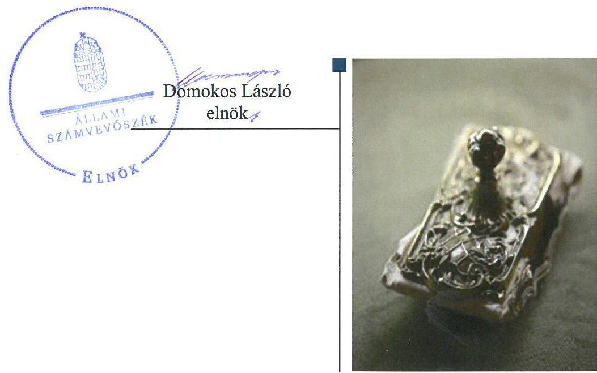
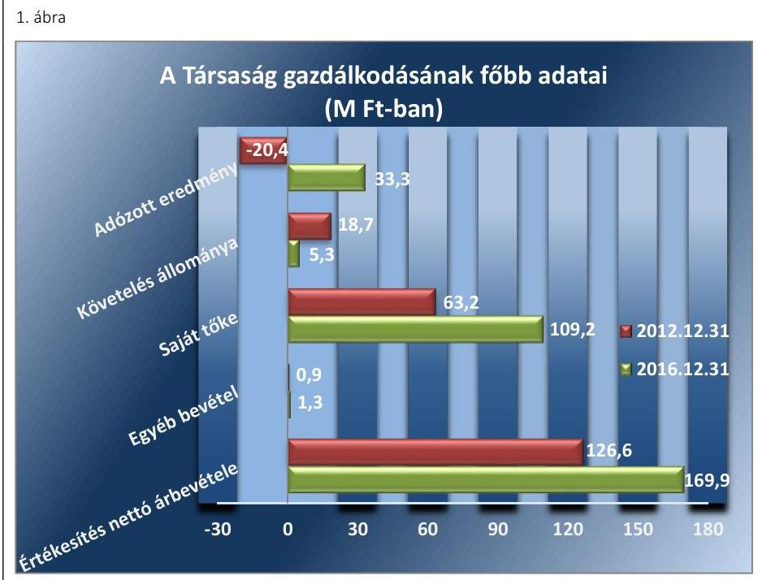
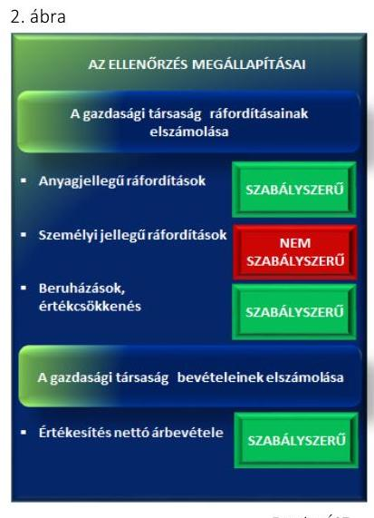
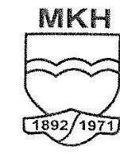
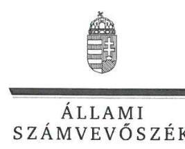
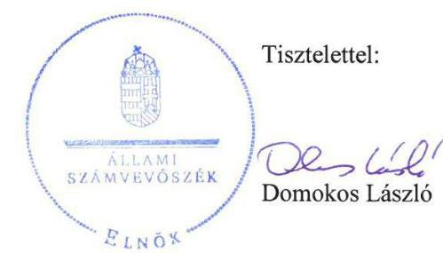
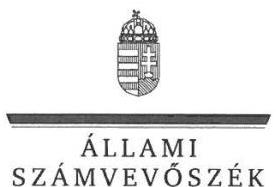

# Jelentés 

## Állami tulajdonú gazdasági társaságok

Az állami tulajdonban (résztulajdonban) lévő gazdálkodó szervezetek vagyonmegőrzési és gazdálkodási tevékenységének ellenőrzése - Polgári Kézilőfegyver- és Lőszervizsgáló Kft. 2018.

---

# Jelentés 

## Állami tulajdonú gazdasági társaságok

Az állami tulajdonban (résztulajdonban) lévő gazdálkodó szervezetek vagyonmegőrzési és gazdálkodási tevékenységének ellenőrzése - Polgári Kézilőfegyver- és Lőszervizsgáló Kft.
2018. 04. hó 03. nap

---

# AZ ELLENŐRZÉST FELÜGYELTE:

DR. NAGY IMRE felügyeleti vezető

# AZ ELLENŐRZÉST VEZETTE ÉS A VÉGREHAJTÁSÁÉRT FELELŐS:

VALASTYÁNNÉ DR. VÍZHÁNYÓ JÚLIA ellenőrzésvezető

# A PROGRAM ÖSSZEÁLLÍTÁSÁÉRT FELELŐS:

TÓTPÁL SZABOLCS osztályvezető

---

IKTATÓSZÁM: V-1393-120/2016.

TÉMASZÁM: 2084

ELLENŐRZÉS-AZONOSÍTÓ SZÁM: V075963

---

Jelentéseink az Országgyűlés számítógépes hálózatán és az Interneta a www.asz.hu címen is olvashatóak.

---

# TARTALOMJEGYZÉK 

■ ÖSSZEGZÉS ..... 5
■ AZ ELLENŐRZÉS CÉLJA ..... 6
■ AZ ELLENŐRZÉS TERÜLETE ..... 7
■ AZ ELLENŐRZÉS HÁTTERE, INDOKOLTSÁGA ..... 9
■ A JELENTÉS LÉNYEGES KÉRDÉSKÖREI ..... 10
■ AZ ELLENŐRZÉS HATÓKÖRE ÉS MÓDSZEREI ..... 11
■ MEGÁLLAPÍTÁSOK ..... 13
■ JAVASLATOK ..... 17
■ MELLÉKLETEK ..... 19
I. sz. melléklet: Értelmező szótár ..... 19
II. sz. melléklet: A Társaság főbb mérlegadatai ..... 23
■ FÜGGELÉK: ÉSZREVÉTELEK ..... 25
■ RÖVIDÍTÉSEK JEGYZÉKE ..... 33

---

.

---

# ÖSSZEGZÉS 

A Magyar Nemzeti Vagyonkezelő Zrt. a Polgári Kézilőfegyver- és Lőszervizsgáló Kft. feletti tulajdonosi jogokat a jogszabályi előirásoknak megfelelően gyakorolta. A Polgári Kézilőfegyver- és Lőszervizsgáló Kft. vagyongazdálkodása a 2012. évben a szabályozás hiányosságai miatt nem felelt meg a jogszabályi előírásoknak, ezért nem volt biztositott a gazdálkodás átláthatósága és elszámoltathatósága. A 2013-2015. években a vagyongazdálkodás nem volt szabályszerü, mert az éves beszámolók mérlegtételeit leltárral nem támasztották alá, ezáltal nem volt biztositott a vagyon védelme, megőrzése. A 2016. évben a vagyongazdálkodás szabályszerü volt.

## Az ellenőrzés társadalmi indokoltsága

Az állami vagyonnal való gazdálkodás alapvető célja az állami vagyon átlátható, rendeltetésszerű és felelős felhasználásának biztosítása. Az állami tulajdonban álló gazdálkodó szervezetek államot megillető társasági részesedése a nemzeti vagyon részét képezi és legfőbb rendeltetése szerint a közfeladatok ellátását szolgálja.

Az Állami Számvevőszék stratégiájában megfogalmazta, hogy az államháztartáson kívülre nyújtott költségvetési támogatások és ingyenes vagyonjuttatások, valamint az államháztartáson kívül múködő közfeladat-ellátó rendszerek ellenőrzéseivel hozzájárul ahhoz, hogy a közpénzeket az államháztartáson kívül múködő szervezetek is átlátható, rendezett módon használják fel a közfeladatok szerződésben vállalt ellátása érdekében.

Ezt figyelembe véve került sor a Polgári Kézilőfegyver- és Lőszervizsgáló Kft. ellenőrzésére a 2012-2016. évek vonatkozásában.

## Főbb megállapítások, következtetések, javaslatok

A Magyar Nemzeti Vagyonkezelő Zrt. a Polgári Kézilőfegyver- és Lőszervizsgáló Kft. feletti tulajdonosi joggyakorlás kereteit szabályszerűen kialakította. A Polgári Kézilőfegyver- és Lőszervizsgáló Kft. Alapító okiratában meghatározta, hogy melyek azok a döntések, melyek az alapító kizárólagos hatáskörébe tartoznak, valamint meghatározta a Társaság vagyonának változását eredményező döntések előkészítésével kapcsolatos követelményeket.

A Polgári Kézilőfegyver- és Lőszervizsgáló Kft. múködésének szabályozottsága a 2012. évben nem felelt meg a jogszabályi előírásoknak, a 2013-2016. években szabályszerű volt. Számviteli szabályzatait a jogszabályban előírtaknak megfelelően megalkotta. A Polgári Kézilőfegyver- és Lőszervizsgáló Kft. vagyongazdálkodása a 2012-2015. években nem felelt meg a jogszabályi előírásoknak, a 2016. évben szabályszerű volt. A 2012. és a 2013. évről készült egyszerűsített éves beszámolóit a jogszabályi előírások ellenére határidőn túl tette közzé. Az adatszolgáltatási feladatok hiányosságai az átláthatóságot korlátozták. A Polgári Kézilőfegyver- és Lőszervizsgáló Kft. az egyszerűsített éves beszámolóit a 2013-2015. években a jogszabályi és belső szabályzatot megsértve leltárral nem támasztotta alá. A Polgári Kézilőfegyver- és Lőszervizsgáló Kft. a honlapon történő közzétételi kötelezettségének nem tett eleget, ezzel nem biztosította a múködésének és gazdálkodásának átláthatóságát.

A Polgári Kézilőfegyver- és Lőszervizsgáló Kft. tulajdonosi joggyakorló által előírt, felé teljesítendő adatszolgáltatási kötelezettségét teljesítette, a saját vagyon változását eredményező döntések során a jogszabályi és belső előírásokat betartotta.

Az ÁSZ jelentésében a Polgári Kézilőfegyver- és Lőszervizsgáló Kft. ügyvezetőjének négy javaslatot fogalmazott meg, amelyekre az érintettnek 30 napon belül intézkedési tervet kell készítenie.

---

# AZ ELLENŐRZÉS CÉLJA 

Az ellenőrzés célja annak értékelése volt, hogy a tulajdonosi jogok gyakorlása szabályszerű volt-e; a gazdálkodó szervezet szabályozottsága, gazdálkodása és vagyongazdálkodási tevékenysége megfelelt-e a jogszabályi és a tulajdonosi előírásoknak; biztosítva volt-e a közfeladatok átláthatósága és elszámoltathatósága érdekében a közszolgáltatás díjának megalapozottsága szabályszerű önköltségszámítással; a vagyonváltozást eredményező döntések esetében a tulajdonosi jogok gyakorlója és a gazdálkodó szervezet szabályszerűen jártak-e el.

---

# **AZ ELLENŐRZÉS TERÜLETE**

## **Polgári Kézilőfegyver- és Lőszervizsgáló Korlátolt Felelősségű Társaság**

A Társaságot1 a Magyar Kézilőfegyver-vizsgáló Hivatal megszüntetéséről, valamint a Polgári Kézilőfegyver- és Lőszervizsgáló Korlátolt Felelősségű Társaság alapításáról szóló 65/1996. (XII. 27.) IKIM rendelet alapján 100%-os állami tulajdonú egyszemélyes gazdasági társaságként az ellenőrzött időszakot megelőzően 1996. december 30-án az Ipari, kereskedelmi és idegenforgalmi minisztérium hozta létre. Az egyszemélyes Társaság feletti tulajdonosi jogokat a 2012-2016. években az MNV Zrt.2 gyakorolta.

A Társaság a 31/2006. (VI. 1.) GKM rendelet3 alapján közfeladatot látott el, alaptevékenysége a Magyarországon előállított, továbbá a külföldről behozott és érvényes próbabélyeggel, illetve próbajellel el nem látott polgári célú kézilőfegyverek és lőszereik forgalomba hozatal előtti, valamint időszaki megvizsgálása és az ezzel kapcsolatos teendők ellátása az érvényben lévő jogszabályok, szabványok, továbbá a kézilőfegyverek próbabélyegeinek kölcsönös elismeréséről Brüsszelben, 1969. július 1-jén kötött nemzetközi Egyezmény alapján.

A Társaság saját tőkéje a 2012. december 31-ei 63,2 M Ft4-ról 2016. december 31-re 109,2 M Ft-ra emelkedett, az értékesítés nettó árbevétele 126,6 M Ft-ról 169,9 M Ft-ra nőtt. A Társaság jegyzett tőkéje 13 M Ft volt, ami az ellenőrzött időszakban nem változott, más gazdasági társaságban részesedéssel nem rendelkezett. A Társaság vagyonkezelésbe vett vagyonnal nem rendelkezett, csak saját vagyona volt.

A Társaság gazdálkodásának főbb adatait az 1. ábra szemlélteti.

---

Forrás: a Társaság 2012. és 2016. évi beszámolói
A Társaság átlagos statisztikai létszáma a 2012. évben 15 fő, a 2016. évben 12 fő volt. Az ügyvezető igazgató személye az ellenőrzött időszakban nem változott.

---

# AZ ELLENŐRZÉS HÁTTERE, INDOKOLTSÁGA 

Az állami tulajdonú gazdálkodó szervezetek ellenőrzése kiemelten fontos a nemzeti vagyon megőrzése, megóvása érdekében. Gazdálkodásuk jellemzően a közérdeklődés és a média figyelmének középpontjában áll, amihez hozzájárul a gazdálkodásuk körébe tartozó vagyon nagysága, illetve az általuk ellátott közszolgáltatások minősége és hatékonysága. A szolgáltatási/közszolgáltatási árképzés megalapozottsága és az éves elszámoltatás feltételeinek kialakítása az ellenőrzés során nagy hangsúlyt kap. A szolgáltatás/közszolgáltatás árában és annak támogatásában meg kell jelennie az önköltségszámítás szempontjainak, amely biztosítja a müködés fenntarthatóságát (eszközpótlást) is.

Az Európai Unióban 1994. év óta hatályos túlzott hiány eljárás mindig kihívást jelentett a tagállamok számára. Kiemelten fontosak a kormányzati szektor elszámolásaiban megjelenő állami tulajdonú gazdálkodó szervezetek, amelyekkel szemben alapvető követelmény, hogy gazdálkodásuk, működésük szabályszerű, az általuk szolgáltatott adatok minél megbízhatóbbak legyenek.

Az ellenőrzés rámutathat az állami tulajdonú gazdálkodó szervezetek gazdálkodási tevékenységével jó gyakorlatokra és szabálytalanságokra. Felhívhatja a figyelmet a jogszabályi követelmények teljesítéséhez szükséges feltételek hiányosságaira, hozzájárulhat az államháztartáson kívüli, de állami vagyont használó gazdálkodó szervezetek tevékenységének átláthatóságához. Ellenőrzésünk eredményeképpen javaslatainkkal, megállapításainkkal hozzájárulhatunk a nemzeti vagyonnal való gazdálkodás átláthatóságának, elszámoltathatóságának javításához.

---

# A JELENTÉS LÉNYEGES KÉRDÉSKÖREI 

1.     - A tulajdonosi jogok gyakorlása szabályszerű volt-e?
2.     - A társaságnál a pénzügyi-számviteli, adatszolgáltatási és ellenőrzési feladatok ellátása szabályszerű volt-e?
3.     - A társaság müködésének szabályozottsága és vagyongazdálkodása szabályszerű volt-e?

---

# AZ ELLENŐRZÉS HATÓKÖRE ÉS MÓDSZEREI 

## Az ellenőrzés típusa

Megfelelőségi ellenőrzés.

## Az ellenőrzött időszak

A 2012. január 1-jétől 2016. december 31-ig tartó időszak.

## Az ellenőrzés tárgya

Az állami tulajdonban lévő gazdasági társaság gazdálkodása, kiemelten vagyongazdálkodási tevékenysége, a tulajdonosi jogok gyakorlása, továbbá a kormányzati szektorba sorolt gazdasági társaság gazdálkodásának a kormányzati szektor hiányára és az államadósságra befolyással bíró elemei.

Az ellenőrzés kiterjedt minden olyan körülményre és adatra, amely az ÁSZ ${ }^{5}$ jogszabályban meghatározott feladatainak teljesítéséhez, valamint a program végrehajtása folyamán felmerült újabb összefüggések feltárásához szükséges volt.

## Az ellenőrzött szervezet

Az MNV Zrt., valamint a Polgári Kézilőfegyver- és Lőszervizsgáló Kft.

## Az ellenőrzés jogalapja

Az ellenőrzés jogalapját az ÁSZ tv. ${ }^{6}$ 1. § (3) bekezdése és 5. § (3)-(5) bekezdése képezte.

## Az ellenőrzés módszerei

Az ellenőrzést az ellenőrzési program ellenőrzési kérdései, az ellenőrzött időszakban hatályos jogszabályok, az ellenőrzés szakmai szabályok és módszertanok figyelembevételével végeztük.

Az ellenőrzött szervezetek az ellenőrzés lefolytatásához tanúsítványok kitöltésével, valamint az ÁSZ által kért dokumentumok megküldésével szolgáltattak adatokat.

A gazdasági társaság bevételei és ráfordításai, ezeken belül az értékcsökkenés, valamint a vagyonnyilvántartás szabályszerűségének megítélé-

---

séhez a bevételeket és a ráfordításokat, a tárgyi eszközök állományváltozásait tartalmazó adott évi főkönyvi kivonat adatbázisát vettük alapul. A minta kiválasztása során véletlen mintavételt alkalmaztunk évenkénti, elemszámmal arányos rétegezéssel a teljes időszakra vonatkozóan. A minta alapján a sokaságban előforduló hibaarányt becsültük. „Megfelelőnek" értékeltünk egy ellenőrzött területet, amennyiben 95\%-os bizonyossággal a teljes sokaságban a hibaarány legfeljebb 10\%, „nem megfelelőnek", amennyiben 10\%-nál magasabb arányt képviselt. A mintavételt megelőzően az anyagjellegú ráfordítások, valamint a tárgyi eszköz növekedési tételei sokaságból évente sokaságonként kiemeltük a 3-3 legnagyobb öszszegű tételt annak biztosítására, hogy az ellenőrzés az egyszerű véletlen mintavétel mellett a legnagyobb értékű tételek ellenőrzésére biztosan kiterjedjen.

---

# 1. A tulajdonosi jogok gyakorlása szabályszerű volt-e? 

Összegző megállapítás

Az MNV Zrt. tulajdonosi joggyakorlása szabályszerű volt.
1.1. számú megállapítás

Az MNV Zrt. a Társaság feletti tulajdonosi jogokat a jogszabályi előírásoknak megfelelően gyakorolta.

A TÁRSASÁGGAL KAPCSOLATOS TULAJDONOSI JOGGYAKORLÁS RENDJÉT az MNV Zrt. a Gt. ${ }^{7}$-ben és a Ptk. ${ }^{8}$ ben előírtaknak megfelelően kialakította, melyet az MNV Zrt. SZMSZ ${ }_{1-5}{ }^{9}$ ében, a Portfóliós kódex ${ }_{1,2}{ }^{10}$-ben és a Monitoring szabályzat ${ }_{1-2}{ }^{11}$-ban szabályozott. A Társaság feletti tulajdonosi joggyakorlás az MNV Zrt. vezérigazgatója hatáskörébe tartozott, annak részleteit az SZMSZ ${ }_{1-5}$-ben állapították meg.

ÜZLETI TERV készítésének kötelezettségét az MNV Zrt. az Alapító okirat ${ }_{1-7}$-ben szabályozta, amelyekre vonatkozó követelményeket a minden évben kiadott Tervezési irányelvek ${ }_{1-5}{ }^{12}$-ben határozott meg. A Társaság Üzleti terveit ${ }_{1-5}{ }^{13}$ a tulajdonosi joggyakorló minden évben határozatban fogadta el.

Az MNV Zrt. a Gt., a Ptk. 2 és a Taktv. ${ }^{14}$ előírásainak megfelelően a Társaság háromtagú $\mathrm{FB}^{15}$ létrehozásáról döntött, az FB-ben való képviseletet az Alapító okirat ${ }_{1-7}$-ben határozta meg. Az FB ügyrendjét ${ }^{16}$ a 2013. szeptember 27-étől terjedő időszakra vonatkozóan a Gt. 34. § (4) bekezdésének előírása szerint a tulajdonosi joggyakorló a jogszabályi előírásoknak megfelelően határozatban hagyta jóvá.

## 2. A társaságnál a pénzügyi-számviteli, adatszolgáltatási és ellenőrzési feladatok ellátása szabályszerű volt-e?

Összegző megállapítás

A Társaságnál a pénzügyi-számviteli feladatok ellátása a személyi jellegű ráfordítások elszámolása kivételével szabályszerű volt.
2.1. számú megállapítás

A bevételek és ráfordítások elszámolása a személyi jellegú ráfordítások kivételével szabályszerű volt.

A TÁRSASÁG BEVÉTELEINEK elszámolása megfelelt a Számv. tv. ${ }^{17}$, valamint a Társaság belső számviteli szabályzatai előírásainak.

AZ ANYAGJELLEGÚ RÁFORDÍTÁSOK, AZ ÉRTÉKCSÖKKENÉS, TOVÁBBÁ A BERUHÁZÁSOK elszámolása a jogszabályi, valamint a belső előírásoknak megfelelően történt.

---

Forrós: $A 57$
2.2. számú megállapítás

A SZEMÉLYI JELLEGŰ RÁFORDÍTÁSOK elszámolása nem volt szabályszerű. Az elszámolást dokumentumok a Számv. tv. 165. § (1)-(2) bekezdésének előírásai ellenére nem támasztották alá, mivel az Szja tv. ${ }^{18} 71 . \S$ (3) bekezdésében foglaltak ellenére nem álltak rendelkezésre a munkavállalók cafetéria-nyilatkozatai.

A TÁRSASÁG az önköltség rendjére vonatkozó szabályzat készítése alól, valamint a végzett szolgáltatás önköltségének az utókalkuláció módszerével történő megállapítása alól a Számv. tv. előírásai alapján mentesült.

A végzett szolgáltatás díjképzésre vonatkozóan a Társaság Díjszámítási szabályzat ${ }^{19}$-ot készített. A díjképzés során a Társaság a belső szabályozásnak eleget tett.

A mintavétellel ellenőrzött területek értékelését a 2. ábra szemlélteti.

## A Társaság a közérdekú adatok közzétételéről a jogszabályi előírások ellenére nem gondoskodott, beszámolási kötelezettségeinek eleget tett.

A Társaság a Számv. tv. 153. § (1) bekezdésében foglaltakat a 2013. évben megsértette, mert a 2012. évről készült egyszerűsített éves beszámolót határidőn túl, 2013. július 15-én készítette el. A Társaság a 2012. évi beszámolóját késve, 2013. október 4-én tette közzé, míg a 2013. évi beszámolót 2014. június 2-án tették közzé, amivel megsértette a Számv. tv. 153. § (1) bekezdésben foglaltakat.

A KÖZÉRDEKŰ ADATOK megismerésére irányuló igények teljesítésének rendjére az Info. tv. ${ }^{20} 30 . \S$ (6) bekezdés előírása ellenére, illetve az Info. tv. 35. § (3) bekezdés előírása ellenére a közérdekű adatok közzétételére vonatkozó szabályzatot a Társaság nem készített.

A Társaság a Taktv. 2. § (1) bekezdés ca) és dc) pontjainak, valamint (2) bekezdésének előírása ellenére a vezető tisztségviselők, az FB tagok, az Mt. ${ }^{21}$ 208. §-a szerint vezető állású munkavállalók, valamint a cégjegyzésre vagy a bankszámla feletti rendelkezésre jogosult munkavállalók teljesítménybért megalapozó teljesítménykövetelményeit, valamint az FB tagok jogviszonya megszűnése esetén járó pénzbeli juttatásokat nem tette közzé. Nem tette közzé továbbá az Info tv. 37. § szerinti 1. mellékletben részletezett, a Társaság szervezeti, személyzeti, valamint a Társaság tevékenységére, müködésére és gazdálkodására vonatkozó adatait.

A MONITORING SZABÁLYZAT ${ }_{1-3}$-ban az MNV Zrt. havi és negyedéves kontrolling adatszolgáltatási kötelezettséget határozott meg, aminek a Társaság eleget tett.

---

# 3. A társaság múködésének szabályozottsága és vagyongazdálkodása szabályszerű volt-e? 

Összegző megállapítás

A Társaság működésének szabályozottsága a 2012. évben nem felelt meg, 2013. július 1-jétől megfelelt a jogszabályi előírásoknak. A Társaság vagyongazdálkodása a 2012-2015. években nem felelt meg a jogszabályi előírásoknak. A Társaság vagyongazdálkodása a 2016. évben a jogszabályi előírásoknak megfelelt.

### 3.1. számú megállapítás

A Társaság a saját vagyon értékének megőrzését, gyarapítását szolgáló vagyongazdálkodás feltételeit szabályszerűen alakította ki.

A TÁRSASÁG a Számv. tv.-ben előírt Számviteli politika ${ }_{1-4}{ }^{22}$-et megalkotta és a jogszabályi változásokat követően aktualizálta. A Számviteli politika ${ }_{1-4}$ keretében elkészítette továbbá Leltárkészítési és leltározási szabályzat ${ }^{23}{ }_{1-3}$-át, Pénzkezelési szabályzat ${ }_{1-4}{ }^{24}$-át.

AZ ESZKÖZÖK ÉS FORRÁSOK ÉRTÉKELÉSI SZABÁLYZATÁT a Társaság a Számv. tv. 14. § (5) bekezdés b) pontjában előírtak ellenére a 2012. évre vonatkozóan nem készítette el, ezt követően Eszközök és források értékelési szabályzat ${ }_{1,2}{ }^{25}$-ával 2013. évtől kezdve a jogszabályi előírásnak megfelelően rendelkezett.

A Társaság a Számv. tv. 161. § (1) bekezdésében előírt kötelezettsége ellenére 2013. június 30-ig számlarenddel nem rendelkezett. A Számlarend ${ }^{26}$ 2013. július 1-jétől volt hatályos.

TÁRSASÁGI SZMSZ ${ }_{1,2}{ }^{27}$-szel rendelkezett, amelyet az MNV Zrt. a Gt.-nek, a Ptk ${ }_{2}$-nek illetve az Alapító okirat ${ }_{1-6}$ elöírásaival összhangban határozatban jóváhagyott. A Társasági SZMSZ ${ }_{1,2}$ meghatározta a Társaság szervezetét, vezetési rendszerét, a belső irányítás elveit, általános szabályait, a munkavégzéssel kapcsolatos általános ügyrendi szabályokat, a vezető tisztségviselők, az alapító, az FB tagok és a könyvvizsgáló jogait, kötelezettségeit és felelősségüket részletesen, valamint a képviseleti és aláírási rendet.

A Társaság vagyongazdálkodása a 2012-2015. években nem felelt meg a jogszabályi előírásoknak, a 2016. évben szabályszerű volt. A Társaság egyszerűsített éves beszámolóit elkészítette. A Társaság a 2012. és 2016. évi beszámolóját leltárral támasztotta alá, de a 2013-2015. években a belső szabályozásában foglaltak ellenére az éves beszámolóit leltárral nem támasztotta alá.

A Társaság vagyongazdálkodása a 2012-2015. években nem volt szabályszerű, a 2016. évben a jogszabályi előírásoknak megfelelt.

A Társaság a Számv. tv. előírásai alapján egyszerűsített éves beszámoló készítésére volt jogosult.

A Társaság a 2012. évben az egyszerűsített éves beszámolóját a jogszabályi előírásoknak megfelelően leltárral alátámasztotta.

---

A Számv. tv. 69. § (1) bekezdésében előírtak, illetve a Leltárkészítési és leltározási szabályzat ${ }_{1-2}$ ellenére a Társaság a 2013-2015. évi egyszerűsített éves beszámolókat leltárral nem támasztotta alá.

A 2016. évi egyszerűsített éves beszámolók leltárral történő alátámasztása a jogszabályi előírásoknak megfelelt.

Az éves beszámolók elfogadásáról a Gt.-ben és a Ptk. ${ }_{2}$-ban foglaltaknak megfelelően az FB írásbeli beszámolóinak, valamint a hitelesítő záradékkal ellátott könyvvizsgálói jelentésének ismeretében döntött.

# 3.3. számú megállapítás 

A saját vagyon változását eredményező döntések során a jogszabályi és a belső előírásokat betartották.

A saját vagyon változását eredményező gazdasági eseményekre vonatkozó kritériumokat az Alapító okirat ${ }_{1-6}$, illetve a Társasági SZMSZ ${ }_{1-2}$ határozta meg. A saját vagyon változását eredményező döntések során a jogszabályi és a belső előírásokat betartották.

---

# JAVASLATOK 

Az ÁSZ tv. 33. § (1) bekezdésében foglaltak értelmében az ellenőrzött szervezet vezetője köteles a jelentésben foglalt megállapításokhoz kapcsolódó intézkedési tervet összeállítani és azt a jelentés kézhezvételétől számított 30 napon belül az ÁSZ részére megküldeni. Amennyiben az ellenőrzött szervezet vezetője nem küldi meg határidőben az intézkedési tervet, vagy továbbra sem elfogadható intézkedési tervet küld, az Állami Számvevőszék elnöke az ÁSZ tv. 33. § (3) bekezdése a) és b) pontjaiban foglaltakat érvényesítheti.

## A Polgári Kézilőfegyver- és Lőszervizsgáló Kft. ügyvezetőjének

1. Gondoskodjon arról, hogy a személyi jellegü ráforditások számviteli elszámolására a jogszabályokban foglalt bizonylatok, dokumentumok alapján kerüljön sor.
(2.1 sz. megállapítás 3. bekezdése alapján)
2. Gondoskodjon a Társaság egyszerüsített éves beszámolójának a jogszabályban foglalt határidőben történő elkészitéséről és közzétételéről.
(2.2 sz. megállapítás 1. bekezdés alapján)
3. Intézkedjen a jogszabályban foglalt elöírásoknak megfelelően a közérdekü adatok megismerésére irányuló igények teljesitésének rendjére, valamint a közérdekü adatok közzétételére vonatkozó szabályzat elkészitéséről.
(2.2 sz. megállapítás 2. bekezdése alapján)
4. Gondoskodjon a jogszabályokban meghatározott adatok közzétételéről.
(2.2 sz. megállapítás 3. bekezdése alapján)

---

.

---

# MELLÉKLETEK 

## I. SZ. MELLÉKLET: ÉRTELMEZŐ SZÓTÁR

állami vagyon
a) Az állam tulajdonában lévő dolog, valamint a dolog módjára hasznosítható természeti erő,
b) az a) pont hatálya alá nem tartozó mindazon vagyon, amely vonatkozásában törvény az állam kizárólagos tulajdonjogát nevesíti,
c) az állam tulajdonában lévő tagsági jogviszonyt megtestesítő értékpapír, illetve az államot megillető egyéb társasági részesedés,
d) az államot megillető olyan immateriális, vagyoni értékkel rendelkező jogosultság, amelyet jogszabály vagyoni értékű jogként nevesít.
Forrás: Vtv. ${ }^{28}$ 1. § (2) bekezdése
2012. november 10-től az állami vagyon fogalma kiegészül a következő ponttal:
e) az állam tulajdonában lévő pénzügyi eszközök

Forrás: Vtv. 1. § (2) bekezdése
állami vagyon hasznosítása
2013. június 27-ig:

Az állami vagyont az MNV Zrt. maga kezeli, vagy szerződés - így különösen bérlet, haszonbérlet, megbízás - alapján központi költségvetési szervnek, természetes vagy jogi személynek, vagy jogi személyiséggel nem rendelkező gazdálkodó szervezetnek hasznosításra átengedi.
Forrás: Vtv. 23. § (1) bekezdése
2013. június 28-ától:

Az állami vagyonnal az MNV Zrt. maga gazdálkodik, vagy szerződés - így különösen bérlet, haszonbérlet, megbízás - alapján központi költségvetési szervnek, természetes vagy jogi személynek, vagy jogi személyiséggel nem rendelkező gazdálkodó szervezetnek hasznosításra átengedi, illetőleg vagyonkezelésbe, haszonélvezetbe adja.
Forrás: Vtv. 23. § (1) bekezdése
gazdasági társaság
A Ptk. 3: 3:88. § (1) bekezdése szerint „a gazdasági társaságok üzletszerű közös gazdasági tevékenység folytatására, a tagok vagyoni hozzájárulásával létrehozott, jogi személyiséggel rendelkező vállalkozások, amelyekben a tagok a nyereségből közösen részesednek, és a veszteséget közösen viselik".
állami vagyon használója
Az a természetes vagy jogi személy, jogi személyiséggel nem rendelkező szervezet, aki, vagy amely törvény vagy szerződés alapján, bármely jogcímen (bérlet, haszonbérlet, használat stb.) állami vagyont birtokol, használ, szedi annak hasznait, hasznosít, ide nem értve a haszonélvezőt, a vagyonkezelőt és a tulajdonosi jogok gyakorlóját.
Forrás: Vhr. ${ }^{29}$ 1. § (7) a. pontja
2013. június 27-ig:

Az állami vagyont az MNV Zrt. maga kezeli, vagy szerződés - így különösen bérlet, haszonbérlet, megbízás - alapján központi költségvetési szervnek, természetes vagy jogi személynek, vagy jogi személyiséggel nem rendelkező gazdálkodó szervezetnek hasznosításra átengedi. Az állami vagyonra vonatkozóan az MNV Zrt. kizárólag az Nvtv. ${ }^{30}$-ben meghatározott személyekkel köthet vagyonkezelési szerződést.
Forrás: Vtv. 23. § (1), 27. § (1)
2013. június 28-ától:

---

gazdálkodó szervezet

MNV Zrt.
nemzeti vagyon

Az állami vagyonnal az MNV Zrt. maga gazdálkodik, vagy szerződés - így különösen bérlet, haszonbérlet, megbízás - alapján központi költségvetési szervnek, természetes vagy jogi személynek, vagy jogi személyiséggel nem rendelkező gazdálkodó szervezetnek hasznosításra átengedi, illetőleg vagyonkezelésbe, haszonélvezetbe adja. Az állami vagyonra vonatkozóan az MNV Zrt. kizárólag az Nvtv-ben meghatározott személyekkel köthet vagyonkezelési szerződést.
Forrás: Vtv. 23. § (1), 27. § (1)
2014. március 14-ig:

A Ptk. ${ }^{31}$ 685. § c) pontja szerint gazdálkodó szervezet: „az állami vállalat, az egyéb állami gazdálkodó szerv, a szövetkezet, a lakásszövetkezet, az európai szövetkezet, a gazdasági társaság, az európai részvénytársaság, az egyesülés, az európai gazdasági egyesülés, az európai területi együttmúködési csoportosulás, az egyes jogi személyek vállalata, a leányvállalat, a vízgazdálkodási társulat, az erdő birtokossági társulat, a végrehajtói iroda, az egyéni cég, továbbá az egyéni vállalkozó."

# 2014. március 15-től: 

A gazdasági társaság, az európai részvénytársaság, az egyesülés, az európai gazdasági egyesülés, az európai területi együttműködési csoportosulás, a szövetkezet, a lakásszövetkezet, az európai szövetkezet, a vízgazdálkodási társulat, az erdőbirtokossági társulat, az állami vállalat, az egyéb állami gazdálkodó szerv, az egyes jogi személyek vállalata, a közös vállalat, a végrehajtói iroda, a közjegyzői iroda, az ügyvédi iroda, a szabadalmi ügyvivői iroda, az önkéntes kölcsönös biztosító pénztár, a magánnyugdíjpénztár, az egyéni cég, továbbá az egyéni vállalkozó. Az állam, a helyi önkormányzat, a költségvetési szerv, az egyesület, a köztestület, valamint az alapítvány gazdálkodó tevékenységével összefüggő polgári jogi kapcsolataira is a gazdálkodó szervezetre vonatkozó rendelkezéseket kell alkalmazni.
Forrás: Ppt ${ }^{32}$. 396. §
Az állami vagyon felett, a Magyar Államot megillető tulajdonosi jogok és kötelezettségek összességét - a hatályos szabályozás szerint - az állami vagyon felügyeletéért felelős miniszter (jelenleg a nemzeti fejlesztési miniszter) gyakorolja. A miniszter feladatát nagy részben az MNV Zrt., mint tulajdonosi joggyakorló szervezet útján látja el.
a) az állam vagy a helyi önkormányzat kizárólagos tulajdonában álló dolgok,
b) az a) pont hatálya alá nem tartozó, állam vagy a helyi önkormányzat tulajdonában lévő dolog,
c) az állam vagy a helyi önkormányzatot tulajdonában lévő pénzügyi eszközök, továbbá az államot vagy a helyi önkormányzatot megillető társasági részesedések,
d) az államot vagy a helyi önkormányzatot megillető bármely vagyoni értékkel rendelkező jogosultság, amelyet jogszabály vagyoni értékű jogként nevesít,
e) Magyarország határa által körbezárt terület feletti légtér,
f) az üvegházhatású gázok kibocsátási egységeinek kereskedelméről szóló törvény szerint kibocsátási egység és légiközlekedési kibocsátási egység, valamint az ENSZ Éghajlatváltozási Keretegyezménye és annak Kiotói Jegyzőkönyv végrehajtási keretrendszeréről szóló törvény szerinti kiotói egység,
g) állami vagy helyi önkormányzati fenntartású közgyűjtemény (muzeális intézmény, levéltár, közgyűjteményként működő kép- és hangarchívum, valamint könyvtár) saját gyűjteményében nyilvántartott kulturális javak körébe tartozó dolog, kivéve, ha az állami vagy önkormányzati tulajdon jogszerű létrejötte kétséget kizáró módon nem bizonyítható és a dologra nézve más a tulajdonjogát bizonyítja

---

vagy a kulturális javakra vonatkozó jogszabályokban meghatározott eljárás keretében valószínűsíti (g. pont módosult 2013. december 7-től),
h) a régészeti lelet,
i) a nemzeti adatvagyon körébe tartozó állami nyilvántartások fokozottabb védelméről szóló törvény szerinti nemzeti adatvagyon.
Forrás: Nvtv. 1. § (2)
nemzeti vagyon hasznosítása
rábízott vagyon

A tulajdonosi joggyakorló vagy a nemzeti vagyon használója által a nemzeti vagyon birtoklásának, használatának, hasznok szedése jogának bármely - a tulajdonjog átruházását nem eredményező - jogcímen történő átengedése, ide nem értve a vagyonkezelésbe adást, valamint a haszonélvezeti jog alapítását.
Forrás: Nvtv. 3. § (1) 4. pont
Egyrészt minden a Vtv. alkalmazásában állami vagyonnak minősülő vagyon, amit az MNV Zrt. kezel és nyilvántart.
Másrészt az a vagyon, amely felett a Magyar Állam nevében az MFB Zrt. gyakorolja a tulajdonosi jogokat.
Forrás: MFB tv. 3. § (9)
A rábízott vagyon a tulajdonosi jogokat gyakorló szervezetek saját vagyonától elkülönítendő.
Forrás: Vtv. 22. § (6)
tulajdonosi jogok gyakorlója 1.

# 2013. június 27-ig: 

Az állami vagyon felett a Magyar Államot megillető tulajdonosi jogok és kötelezettségek összességét - ha törvény eltérően nem rendelkezik - az állami vagyon felügyeletéért felelős miniszter (a továbbiakban: miniszter) gyakorolja, aki e feladatát a Magyar Nemzeti Vagyonkezelő Zártkörűen Működő Részvénytársaság (a továbbiakban: MNV Zrt.), a Magyar Fejlesztési Bank, illetve a tulajdonosi joggyakorló szervezet útján látja el. A miniszter miniszteri rendeletben, a törvényben meghatározott állami vagyoni kör tekintetében, meghatározott időtartamra, a joggyakorlás egyes szabályainak meghatározásával - az őt megillető tulajdonosi jogok és kötelezettségek összességének, illetve azok meghatározott részének gyakorlóját az Áht. szerinti központi költségvetési szervek, ezek intézménye, továbbá a 100\%-ban állami tulajdonban álló gazdasági társaságok közül kijelölheti.
Forrás: Vtv. 3. § (1) és (2)

## 2013. június 28-ától:

A rábízott állami vagyon felett az államot megillető tulajdonosi jogok és kötelezettségek összességét tulajdonosi joggyakorlóként:
a) ha törvény vagy miniszteri rendelet eltérően nem rendelkezik, a Magyar Nemzeti Vagyonkezelő Zártkörűen Müködő Részvénytársaság (a továbbiakban: MNV Zrt.),
b) törvényben kijelölt személy vagy
c) az állami vagyon felügyeletéért felelős miniszter (a továbbiakban: miniszter) által rendeletben kijelölt személy gyakorolja.
[...] A miniszter e törvény felhatalmazása alapján - a meghatározott célok hatékonyabb elérése érdekében, miniszteri rendeletben, az ott meghatározott állami vagyoni kör tekintetében, meghatározott időtartamra - e törvény keretei között, a joggyakorlás egyes szabályainak meghatározásával - az államot megillető tulajdonosi jogok és kötelezettségek összességének, illetve azok meghatározott részének gyakorlóját az Áht. szerinti központi költségvetési szervek, ezek intézménye, továbbá a 100\%-ban állami tulajdonban álló gazdasági társaságok közül kijelölheti.
Forrás: Vtv. 3. § (1) és (2)

---

# 2. 

Aki a nemzeti vagyon felett az államot vagy a helyi önkormányzatot megillető tulajdonosi jogok és kötelezettségek összességének gyakorlására jogosult Forrás: Nvtv. 3. § (1) 17. pontja

## 2013. június 27-től:

A vagyonkezelő köteles a vagyontárgy értékét megőrizni, állagának megóvásáról, jó karban tartásáról, működtetéséről gondoskodni, továbbá - a központi költségvetési szervek kivételével - díjat fizetni vagy a szerződésben előírt más kötelezettséget teljesíteni.
Forrás: Vtv. 27. § (2)

## 2013. június 28-ától december 31-ig:

A vagyonkezelő köteles a vagyontárgy állagának megóvásáról, jó karbantartásáról, működtetéséről gondoskodni, továbbá - a központi költségvetési szervek kivételével - díjat fizetni, jogszabályban és szerződésben előírt más kötelezettségét teljesíteni, valamint a vagyontárgyat jogszabályban vagy szerződésben meghatározott célnak megfelelően használni. Amennyiben a vagyonkezelő ezen kötelezettségének nem tesz eleget, a tulajdonosi joggyakorló jogosult a szerződést azonnali hatállyal felmondani.
Forrás: Vtv. 27. § (2)

## 2014. január 1-jétől:

A vagyonkezelő köteles a vagyontárgy állagának megóvásáról, jó karbantartásáról, működtetéséről gondoskodni, jogszabályban és szerződésben előírt más kötelezettségét teljesíteni, valamint a vagyontárgyat jogszabályban vagy szerződésben meghatározott célnak megfelelően használni.
A vagyonkezelő - a központi költségvetési szervek és a kizárólag közfeladatot ellátó nem központi költségvetési szerv vagyonkezelők kivételével - köteles díjat fizetni, jogszabályban és szerződésben előírt más kötelezettségét teljesíteni, valamint a vagyontárgyat jogszabályban vagy szerződésben meghatározott célnak megfelelően használni. Amennyiben a vagyonkezelő ezen kötelezettségeinek nem tesz eleget, a tulajdonosi joggyakorló jogosult a szerződést azonnali hatállyal felmondani.
Forrás: Vtv. 27. § (2), (2a)

---

II. SZ. MELLÉKLET: A TÁRSASÁG FŐBB MÉRLEGADATAI

| A POLGÁRI KÉZILŐFEGYVER- ÉS LŐSZERVIZSGÁLÓ KFT. MÉRLEGEINEK KIEMELT ADATAI (M FT) |  |  |  |  |  |
| :--: | :--: | :--: | :--: | :--: | :--: |
| Megnevezés / időszak | 2012.12.31. | 2013.12.31. | 2014.12.31. | 2015.12.31. | 2016.12.31. |
| I. Befektetett eszközök | 52,7 | 56,2 | 37,9 | 46,9 | 52,4 |
| ebből: tárgyi eszközök | 40,7 | 29,9 | 22,3 | 22,9 | 29,6 |
| II. Forgóeszközök | 54,8 | 31,0 | 29,4 | 53,6 | 70,0 |
| ebből: készletek | 5,2 | 4,2 | 3,5 | 3,6 | 4,1 |
| ebből: pénzeszközök | 30,8 | 12,0 | 14,9 | 32,6 | 60,6 |
| III. Aktív időbeli elhatárolások | 0,3 | 0,7 | 0,8 | 0,8 | 0,6 |
| ESZKÖZÖK ÖSSZESEN | 107,8 | 87,9 | 68,1 | 101,3 | 123,0 |
| IV. Saját tőke | 63,2 | 29,6 | 35,3 | 75,9 | 109,2 |
| ebből: jegyzett tőke | 13,0 | 13,0 | 13,0 | 13,0 | 13,0 |
| ebből: mérleg szerinti eredmény | $-20,4$ | $-33,5$ | 5,7 |  |  |
| ebből: adózott eredmény |  |  |  | 40,6 | 33,3 |
| V. Céltartalékok | - | - | - | - | - |
| VI. Kötelezettségek | 41,1 | 52,5 | 32,3 | 21,7 | 10,0 |
| VII. Passzív időbeli elhatárolások | 3,5 | 5,8 | 0,5 | 3,7 | 3,8 |
| FORRÁSOK ÖSSZESEN | 107,8 | 87,9 | 68,1 | 101,3 | 123,0 |

---

.

---

# FÜGGELÉK: ÉSZREVÉTELEK 

A jelentéstervezetet a Számvevőszék 15 napos észrevételezésre megküldte az ellenőrzött szervezetek vezetőinek az ÁSZ tv. 29. §* (1) bekezdése előírásának megfelelően.

Az ÁSZ a jelentéstervezetet észrevételezésre megküldte a Magyar Nemzeti Vagyonkezelő Zrt. vezérigazgatójának, valamint a Polgári Kézilőfegyver- és Lőszervizsgáló Kft. ügyvezetőjének.
A Polgári Kézilőfegyver- és Lőszervizsgáló Kft. ügyvezetőjének - mellékletek nélküli észrevételét és az azokra adott válaszokat, továbbá a Magyar Nemzeti Vagyonkezelő Zrt. vezérigazgatójának nemleges észrevételét a függelék alább tartalmazza.

[^0]
[^0]:    * 29. § (1) Az Állami Számvevőszék az ellenőrzési megállapításait megküldi az ellenőrzött szervezet vezetőjének vagy az általa megbízott személynek, és annak, akinek személyes felelősségét állapította meg.
    (2) Az ellenőrzött szervezet vezetője és a felelősként megjelölt személy az ellenőrzés megállapításaira tizenöt napon belül írásban észrevételt tehet.
    (3) Az Állami Számvevőszék az észrevételre a beérkezésétől számított harminc napon belül írásban válaszol. A figyelembe nem vett észrevételeket köteles a jelentésben feltüntetni, és megindokolni, hogy azokat miért nem fogadta el.

---

# POLGÁRI KÉZILŐFEGYVER- ÉS LÖSZERVIZSGÁLÓ Kft. 

Szám: 90/2/2018.

ÁLLAMI SZÁMVEVŐSZÉK

1052 Budapest
Apáczai Csere János u. 10.
1364

Ellenőrzésvezető: Valastyánné dr. Vízhányó Júlia

## Ikt.szám: V-1393-113/2016

Ellenőrzés-azonosító szám: V075963

Tárgy: Jelentéstervezetre tett észrevétel

Tisztelt Állami Számvevőszék!

Társaságunk a Polgári Kézilőfegyver és Lőszervizsgáló Kft (adószám: 12217296-2-41; székhely: 1031 Budapest, Gyöngysor u.6.) 2018. február 14.-én kapta kézhez a 2016. évben kezdődött számvevőszéki ellenőrzés jelentéstervezetét. 2018. február 16.-án postai úton jeleztük, hogy a kapott jelentéstervezet oldalszámozása hiányos, így vélhetően nem kaptunk meg minden oldalt.

## Észrevételeink az alábbiak:

### 2.1. számú megállapítás:

„A személyi jellegű ráfordítások elszámolása nem volt szabályszerű. Az elszámolást dokumentumok a Számv. tv. 165. § (1)-(2) bekezdésének előírásai ellenére nem támasztották alá, mivel az Szja tv. 71. § (3) bekezdésében foglaltak ellenére nem álltak rendelkezésre a munkavállalók cafeteria-nyilatkozatai."

---

# 2.1. számú megállapítás észrevétel: 

Társaságunknál a vizsgált években nem múködött cafeteria rendszer. Az ÁSZ adatszolgáltatás során feltöltöttük a „Béren kívüli juttatások szabályzata 2007" és „Béren kívüli juttatások szabályzata 2014" elnevezésú fájlokat.

A 2007. évi szabályzatból kitűnik, hogy korábbi években cafeteria rendszer működött a Kftnél. A veszteséges működés tartós fennállásakor ez megszüntetésre került. A vizsgált 2012.2013. években helyi utazási költségtérítést kaptak munkavállalóink, valamint a feltételeknek megfelelő munkavállalók iskolakezdési támogatásban részelsültek a hatályos jogszabályoknak megfelelő mértékben, melynek jogosultságáról nyilatkoztattun munkavállalóinkat. Ezen időszakokra vonatkozó mintavételezés során nem választottak ki olyan tételt, melyből ez kiderült volna. Minden év július hónapjában került számfejtésre az iskolakezdési utalvány.
2014. évben minden munkavállalóra vonatkozóan új szabályzat lépett életbe. 2014. évtől béren kívüli juttatásként, Erzsébet étkezési utalványt kaptak a munkavállalók a törvényben meghatározott mértékig, valamint a szabályzatban foglaltak szerint. Valamint helyi utazási bérlettérítést és az érintettek részére iskolakezdési utalványt jutattunk, melynek jogosultságáról nyilatkoztattuk munkavállalóinkat. A munkavállalóknak nem volt választási lehetősége a juttatási formákat érintően.

Az ÁSZ adatszolgáltatás során a BER_PM_2016_05 pótminta esetében 2016. 07. hónapra vonatkozó adatokat töltöttünk fel. A munkavállaló érintett volt az iskolakezdési támogatásban. Nyilatkozatát csatoltuk a feltöltés során.

Fentiek által kérnénk a 2.1. számú megállapítást ne vegyék figyelembe a jelentés véglegesítésekor, mert a törvény által előírt juttatások esetén a nyilatkoztatási kötelezettségünknek eleget tettünk.

### 3.2 számú megállapítás:

„...A Számv. tv. 69. § (1) bekezdésében előírtak, illetve a Leltárkészítési és leltározási szabályzat ellenére a Társaság a 2013-2015. évi egyszerűsített éves beszámolókat leltárral nem támasztotta alá..."

H-1031 Budapest,
Gyöngysor u. 6.
www.pklv.hu

Telefon: $\quad(06-1) 3476030$
Fax: (06-1) 3476039
E-mail: pklv@pklv.hu

---

# 3.2. számú megállapítás észrevétel: 

Társaságunk által az adatszolgáltatás során feltöltött fájlokat ellenőrizve, sajnos nem került feltöltésre 2013-2015. évekre vonatkozóan a tárgyi eszköz leltár. Természetesen ezekkel rendelkezünk az érintett években is, mellékelten csatoljuk másolatukat (1-3. számú melléklet). Minden évzárás alkalmával elkészítjük a törvény által előírt leltárakat (ilyenek különösen: tárgyi eszköz, pénzeszközök, készletek).

Kérnénk a 3.2. számú megállapítás során az észrevételünkben foglaltakat figyelembe venni szíveskedjenek.

Mellékletek:

1. számú melléklet: Tárgyi eszközök leltára 2013. év (15. oldal) - másolat
2. számú melléklet: Tárgyi eszközök leltára 2014. év (14. oldal) - másolat
3. számú melléklet: Tárgyi eszközök leltára 2015. év (17. oldal) - másolat

Budapest, 2018. február 21.

Üdvözlettel:

Kalamár Ödön
ügyvezető igazgató

H-1031 Budapest, Gyöngysor u. 6. www.pklv.hu

Telefon: $\quad(06-1) 3476030$
Fax: (06-1) 3476039
E-mail: pklv@pklv.hu

---

ELNÖK

# Kalamár Ödön úr 

ügyvezető
Polgári Kézilöfegyver- és Lőszervizsgáló Kft.

## Budapest

## Tisztelt Ügyvezető Úr!

Az ,,Állami tulajdonú gazdasági társaságok - Az állami tulajdonban (résztulajdonban) lévő gazdálkodó szervezetek vagyonmegőrzési és gazdálkodási tevékenységének ellenőrzése - Polgári Kézilöfegyver- és Lőszervizsgáló Kft." címmel készített számvevőszéki jelentéstervezetre tett észrevételeit köszönettel megkaptam.
Az Állami Számvevőszék észrevételekre vonatkozó álláspontjáról a felügyeleti vezető által készített részletes tájékoztatást csatoltan megküldőm.
Tájékoztatom Ügyvezető urat, hogy a számvevőszéki jelentésben - az Állami Számvevőszékről szóló 2011. évi LXVI. törvény 29. § (3) bekezdése alapján - a figyelembe nem vett észrevételeket szerepeltetjük annak megindoklásával, hogy azokat miért nem fogadtuk el.

Budapest, 2018. 03 . hó 10. nap

Melléklet: Tájékoztatás az észrevételek kezeléséről

---

FELÜGYELETI VEZETŐ

Melléklet
Ikt.szám: V-1393-119/2016.

# Tájékoztatás   az észrevételek kezeléséről 

Az „Állami tulajdonú gazdasági társaságok - Az állami tulajdonban (résztulajdonban) lévő gazdálkodó szervezetek vagyonmegőrzési és gazdálkodási tevékenységének ellenőrzése - Polgári Kézilöfegyver- és Lőszervizsgáló Kft." című jelentéstervezetre 2018. február 21-én tett (az Állami Számvevőszékhez 2018. február 23-án érkezett) észrevételét áttekintettük, annak kezelésével kapcsolatban a következő tájékoztatást adom.

## 1. A jelentéstervezet 2.1. számú megállapítás 3. bekezdésére vonatkozó észrevétel:

Az észrevételben leírtak szerint az ellenőrzött időszakban a Társaságnál nem működött cafeteria rendszer, a munkavállalóknak béren kívüli juttatásokat adtak az ellenőrzés rendelkezésére bocsátott 2007. és 2014. évi szabályzatok szerint. A személyi jellegủ kifizetések közül ellenőrzésre kiválasztott tételek között egy volt olyan, amely béren kívüli juttatást érintett, és ahhoz az adatszolgáltatás során a kapcsolódó nyilatkozatot is feltöltötték. A törvény által előírt juttatások esetén nyilatkoztatási kötelezettségüknek eleget tettek.

Az észrevételt nem fogadjuk el. A Társaság által az ellenőrzés részére átadott „Szabályzat a PKLV Kft. Béren kívüli, egyes meghatározott juttatásairól, a juttatások feltétel rendszeréről és elszámolási módjáról" című, 2014. június 2-án aláírt szabályzat nem tartalmaz olyan kitételt, amely a 2007. február 5-ei „Szabályzat PKLV Kft. választható béren kívüli juttatási rendszeréről (Cafeteria Szabályzat)" címú szabályzatot hatályon kívül helyezné. A Társaság 2014. június 1-ei egységes szerkezetbe foglalt Szervezeti és müködési szabályzatának 5.2.1. pontja szerint a munkavállalók általános jogai között szerepel „... a PKLV Kft. Cafeteria szabályzatában meghatározott választása szerinti természetbeni juttatásokat megkapni". Fentiek alapján a Társaságnak a jelentéstervezet megállapításában hivatkozott, a személyi jövedelemadóról szóló 1995. évi CXVII. törvény 71. §-ában előírtak szerint rendelkeznie kellett volna a munkavállalók cafeteria nyilatkozataival. A személyi jellegű ráfordításokkal kapcsolatban tett megállapítást fenntartjuk, az észrevétel alapján a jelentéstervezet módosítása nem indokolt.

## 2. A jelentéstervezet 3.2. számú megállapítás 4. bekezdésére vonatkozó észrevétel:

Az észrevételben leírtak szerint a 2013-2015. évekre vonatkozó tárgyi eszköz leltárakkal rendelkeztek, amelyeket az észrevételükhöz mellékeltek.

Az észrevételt nem fogadjuk el. A Társaság az észrevételben jelzett eszközleltárakat nem adta át az ellenőrzés részére, azokat az ügyvezető által aláirt teljességi és hitelességi nyilatkozat átadott dokumentumokat rögzítő melléklete sem tartalmazta. A Társaság az ÁSZ adatbekéréseihez meg-

---

küldött teljességi és hitelességi nyilatkozataiban kijelentette, hogy az ÁSZ részére átadott dokumentumok, adatok a bekért adatokra, dokumentumokra vonatkozóan teljes körű információt tartalmaznak. Az észrevétel alapján a jelentéstervezet módosítása nem indokolt.

Egyéb észrevételként a levelében jelezte, hogy a postai úton megkapott jelentéstervezet oldalszámozása hiányos, vélhetően nem kapott meg minden oldalt. A 2018. február 23-án telefonon történt egyeztetésünkre hivatkozva megerősítem, hogy a Polgári Kézilófegyver- és Lőszervizsgáló Kft. észrevételezésre megküldött jelentéstervezete teljes, minden oldalt tartalmaz.

Budapest, 2018. 03. hó 10. nap

Dr. Nagy Imre felügyeleti vezető

---

# 255 

## MNV   MAGYAR NEMZETI   VAGYONKEZELÓ ZRT.

## Vezérigazgató

Állami Számvevőszék

## Domokos László

elnök

1052 Budapest
Apáczai Cs. J. u. 10.

ÁLLAMI SZÁMVEVÖSZÉK
$3 E-14024 / 20181$
Erkezzett: 2018 FEBR 21
10100000000000000000000000000000000000000000000000000000000000000000000000000000000000000000000000000000000000000000000000000000000000000000000000000000000000000000000000000000000000000000000000000000000

---

# RÖVIDÍTÉSEK JEGYZÉKE 

${ }^{1}$ Társaság
${ }^{2}$ MNV Zrt.
${ }^{3}$ 31/2006. (VI. 1.) GKM rendelet
${ }^{4} \mathrm{M} \mathrm{Ft}$
${ }^{5}$ ÁSZ
${ }^{6}$ ÁSZ tv.
${ }^{7}$ Gt.
${ }^{8}$ Ptk. 2
${ }^{9}$ SZMSZ ${ }_{1}$

SZMSZ ${ }_{2}$
SZMSZ ${ }_{3}$
SZMSZ ${ }_{4}$
SZMSZ ${ }_{5}$
${ }^{10}$ Portfóliós kódex ${ }_{1}$
Portfóliós kódex ${ }_{2}$
${ }^{11}$ Monitoring szabályzat ${ }_{1}$
Monitoring szabályzat ${ }_{2}$
${ }^{12}$ Tervezési irányelv ${ }_{1}$

Tervezési irányelv ${ }_{2}$
Tervezési irányelv ${ }_{3}$
Tervezési irányelv ${ }_{4}$
Tervezési irányelv ${ }_{5}$
${ }^{13}$ Üzleti terv $_{1}$
Üzleti terv $_{2}$
Üzleti terv $_{3}$
Üzleti terv $_{4}$
Üzleti terv $_{5}$
${ }^{14}$ Taktv.
${ }^{15} \mathrm{FB}$

Polgári Kézilőfegyver- és Lőszervizsgáló Korlátolt Felelősségű Társaság Magyar Nemzeti Vagyonkezelő Zrt.
A fegyverek, lövőkészülékek, valamint ezek lőszereinek vizsgálatáról szóló 31/2006. (VI. 1.) GKM rendelet (hatályos 2006. július 1-től)
millió forint
Állami Számvevőszék
Az Állami Számvevőszékről szóló 2011. évi LXVI. törvény (hatályos: 2011. július 1-től)
A gazdasági társaságokról szóló 2006. évi IV. törvény (hatályos 2014. március 14-éig)
A Polgári Törvénykönyvről szóló 2013. évi V. törvény (hatályos: 2014. március 15-étől)
301/2011. (V. 30.) IG. sz. határozat az MNV Zrt. szervezeti és működési szabályzatáról, hatályos 2011. május 30-től
180/2012. (IV. 23.) IG. sz. határozat az MNV Zrt. szervezeti és működési szabályzatáról, hatályos 2012. április 30-től
508/2012. (X. 08.) IG. sz. határozat az MNV Zrt. szervezeti és működési szabályzatáról, hatályos 2012. október 8-tól
430/2013. (VI. 17.) IG. sz. határozat az MNV Zrt. szervezeti és működési szabályzatáról, hatályos 2013. július 1-jétől
158/2016.(IV. 06.) IG. sz. határozat az MNV Zrt. szervezeti és működési szabályzatáról, hatályos 2016. április 6-tól
Az MNV Zrt. portfóliós kódexe (hatályos 2015. április 1-jétől)
Az MNV Zrt. portfóliós kódexe (hatályos 2016. május 31-étől)
Az MNV Zrt. társasági monitoring szabályzata (hatályos 2013. december 19-étől)
Az MNV Zrt. társasági monitoring szabályzata (hatályos 2016. augusztus 1-jétől)
513/2011. (XI.07.) IG sz. határozat az MNV Zrt. portfóliójába tartozó többségi tulajdonú állami társágok 2012. évi üzleti évre vonatkozó tervezési irányelveiről
558/2012. (X.24.) IG sz. határozat az MNV Zrt. portfóliójába tartozó többségi tulajdonú állami társágok 2013. évi üzleti évre vonatkozó tervezési irányelveiről
774/2013. (X.21.) IG sz. határozat az MNV Zrt. portfóliójába tartozó többségi tulajdonú állami társágok 2014. évi üzleti évre vonatkozó tervezési irányelveiről
4/2015. (I.12.) IG sz. határozat az MNV Zrt. portfóliójába tartozó többségi tulajdonú állami társágok 2015. évi üzleti évre vonatkozó tervezési irányelveiről
687/2015. (XII.08.) IG sz. határozat az MNV Zrt. portfóliójába tartozó többségi tulajdonú állami társágok 2015. évi üzleti évre vonatkozó tervezési irányelveiről
A Társaság 2012. évi üzleti terve
A Társaság 2013. évi üzleti terve
A Társaság 2014. évi üzleti terve
A Társaság 2015. évi üzleti terve
A Társaság 2016. évi üzleti terve
A köztulajdonban álló gazdasági társaságok takarékosabb működéséről szóló 2009. évi CXXII. törvény (hatályos 2009. december 4-étől)
A Társaság felügyelőbizottsága

---

${ }^{16}$ FB Ügyrend
${ }^{17}$ Számv. tv.
${ }^{18}$ Szja tv.
${ }^{19}$ Díjszámítási szabályzat
${ }^{20}$ Info. tv.
${ }^{21} \mathrm{Mt}$.
${ }^{22}$ Számviteli politika ${ }_{1}$
Számviteli politika ${ }_{2}$
Számviteli politika ${ }_{3}$
Számviteli politika ${ }_{4}$
${ }^{23}$ Leltárkészítési és leltározási szabályzat
${ }^{24}$ Pénzkezelési szabályzat ${ }_{1}$
Pénzkezelési szabályzat ${ }_{2}$
Pénzkezelési szabályzat ${ }_{3}$
Pénzkezelési szabályzat ${ }_{4}$

A Társaság felügyelőbizottságának ügyrendje (hatályos 2013. szeptember 26-tól)
A számvitelről szóló 2000. évi C. törvény (hatályos 2001. január 1-jétől)
A személyi jövedelemadóról szóló 1995. évi CXVII. törvény (hatályos: 1996. január 1-jétől)
A Társaság díjszámítási szabályzata (hatályos 2011. december 18-ától)
Az információs önrendelkezési jogról és az információszabadságról szóló 2011. évi CXII. törvény (hatályos 2011. július 27-étől)
A munka törvénykönyvéről szóló 2012. évi I. törvény (hatályos 2012. július 1-től)
A Társaság Számviteli politikája (hatályos 2005. szeptember 30-ától)
A Társaság Számviteli politikája (hatályos 2013. január 1-jétől)
A Társaság Számviteli politikája (hatályos 2015. január 1-jétől)
A Társaság Számviteli politikája (hatályos 2016. január 1-jétől)
A Társaság Leltárkészítési és leltározási szabályzat ${ }_{1}$ (hatályos 2001. szept. 30.)
A Társaság Leltárkészítési és leltározási szabályzat ${ }_{2}$ (hatályos 2013. január 1-jétől)
A Társaság Leltárkészítési és leltározási szabályzat ${ }_{3}$ (hatályos 2016. január 1-jétől)
A Társaság Pénz és pénztárkezelési szabályzata (hatályos 2006. október 5-étől)
A Társaság Pénzkezelési szabályzata (hatályos 2013. október 1-jétől)
A Társaság Pénzkezelési szabályzata (hatályos 2016. január 31-étől)
A Társaság Pénzkezelési szabályzata (hatályos 2014. szeptember 1-jétől)
A Társaság Eszközök és források értékelési szabályzata (hatályos 2013. január 1-jétől)
Eszközök és források értékelési szabályzata ${ }_{2}$ A Társaság Eszközök és források értékelési szabályzata (hatályos 2015. július 1-jétől)
${ }^{26}$ Számlarend
${ }^{27}$ Társasági SZMSZ ${ }_{1}$
Társasági SZMSZ ${ }_{2}$
${ }^{28} \mathrm{Vtv}$.
${ }^{29} \mathrm{Vhr}$.
${ }^{30} \mathrm{Nvtv}$.
${ }^{31}$ Ptk. 1
${ }^{32} \mathrm{Ppt}$.
A Társaság Számlarendje (hatályos 2013. július 1-jétől)
A Társaság Szervezeti és Müködési Szabályzata (hatályos 1997. december 1-étől)
A Társaság Szervezeti és Müködési Szabályzata (hatályos 2014. június 1-jétől)
Az állami vagyonról szóló 2007. évi CVI. törvény
Az állami vagyonnal való gazdálkodásról szóló 254/2007. (X. 4.) Korm. rendelet
A Nemzeti vagyonról szóló 2011. évi CXCVI. törvény (hatályos 2011. december 31-étől)
A Polgári Törvénykönyvről szóló 1959. évi IV. törvény (hatálytalan 2014. március 15-étől)
A polgári perrendtartásról szóló 1952. évi III. törvény (hatályos 1953. január 1-jétől)

---

ÁLLAMI SZÁMVEVŐSZÉK
1052 Budapest, Apáczai Csere János utca 10.
Levélcím: 1364 Budapest 4. Pf. 54
Telefon: +36 14849100 Telefax: +36 14849200
www.asz.hu