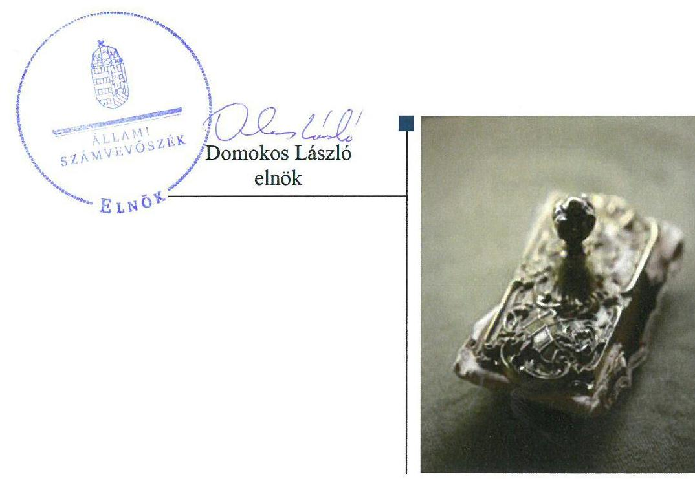
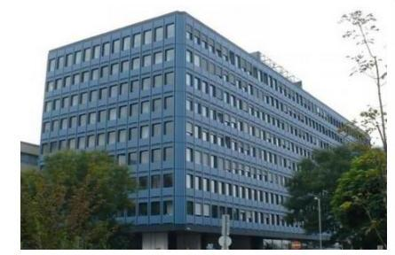

# Jelentés 

## Állami tulajdonú gazdasági társaságok

Az állami tulajdonban (résztulajdonban) lévő gazdálkodó szervezetek vagyonmegőrzési és gazdálkodási tevékenységének ellenőrzése Magyar Kertészeti Szaporítóanyag Nonprofit Kft. 2018.

---

# Jelentés 

## Állami tulajdonú gazdasági társaságok

Az állami tulajdonban (résztulajdonban) lévő gazdálkodó szervezetek vagyonmegőrzési és gazdálkodási tevékenységének ellenőrzése Magyar Kertészeti Szaporítóanyag Nonprofit Kft. 2018. 04. hó 20. nap

---

# AZ ELLENŐRZÉST FELÜGYELTE:

DR. NAGY IMRE felügyeleti vezető

## AZ ELLENŐRZÉST VEZETTE ÉS A VÉGREHAJTÁSÁÉRT FELELŐS:

BAJNAI ZSUZSANNA ellenőrzésvezető

## A PROGRAM ÖSSZEÁLLÍTÁSÁÉRT FELELŐS:

TÓTPÁL SZABOLCS osztályvezető

IKTATÓSZÁM: V-1385-120/2016.

TÉMASZÁM: 2084

ELLENŐRZÉS-AZONOSÍTÓ SZÁM: V075955

Jelentéseink az Országgyűlés számítógépes hálózatán és az Interneten a www.asz.hu címen is olvashatóak.

---

# TARTALOMJEGYZÉK 

■ ÖSSZEGZÉS ..... 5
■ AZ ELLENŐRZÉS CÉLJA ..... 6
■ AZ ELLENŐRZÉS TERÜLETE ..... 7
■ AZ ELLENŐRZÉS HÁTTERE, INDOKOLTSÁGA ..... 8
■ A JELENTÉS LÉNYEGES KÉRDÉSKÖREI ..... 9
■ ELLENŐRZÉS HATÓKÖRE ÉS MÓDSZEREI ..... 10
■ MEGÁLLAPÍTÁSOK ..... 12
■ JAVASLATOK ..... 16
■ MELLÉKLETEK ..... 19
I. sz. melléklet: Értelmező szótár ..... 19
■ FÜGGELÉK: ÉSZREVÉTELEK ..... 23
■ RÖVIDÍTÉSEK JEGYZÉKE ..... 25

---

.

---

# ÖSSZEGZÉS 

A Magyar Kertészeti Szaporítóanyag Nonprofit Kft. felett a Magyar Nemzeti Vagyonkezelő Zrt., a Mezőgazdasági Biotechnológiai Kutatóközpont és a Nemzeti Agrárkutatási és Innovációs Központ szabályszerűen gyakorolta a tulajdonosi jogokat. A Magyar Kertészeti Szaporítóanyag Nonprofit Kft. szabályozottsága nem felelt meg a jogszabályi előírásoknak. A 2012-2015. években a gazdasági események elszámolása a számviteli hiányosságok miatt nem volt ellenőrizhető, ezáltal a Magyar Kertészeti Szaporítóanyag Nonprofit Kft. nem volt elszámoltatható. A 2016. évben a bevételek és ráfordítások elszámolása, a vagyonnyilvántartás és a vagyongazdálkodás nem volt szabályszerű. A hiányosságok és szabálytalanságok miatt a gazdálkodás átláthatósága, a nemzeti vagyon megőrzése és védelme nem volt biztosított.

## Az ellenőrzés társadalmi indokoltsága

Az állami tulajdonú gazdálkodó szervezetek a nemzeti vagyon részét képezik. Az állami vagyonnal való gazdálkodást illetően a tulajdonosi joggyakorlás és vagyongazdálkodás feladata az állami vagyon átlátható, rendeltetésszerű és felelős felhasználásának biztosítása. Minden közpénzt, közvagyont használó szervezettel szemben társadalmi igény, hogy tevékenységéről elszámoljon.

A Magyar Kertészeti Szaporítóanyag Nonprofit Kft. közel hét évtizede végez termesztéstechnológiai kutatást és fejlesztést, valamint foglalkozik új fajták adaptálásával. Kertészeti szaporítóanyag előállító és forgalmazó tevékenysége kiterjed az ország teljes területére. A társaság ellenőrzésére, tevékenységére és üzletrészének állami tulajdonára való tekintettel került sor, összhangban az Állami Számvevőszék Stratégiájában megfogalmazott célokkal.

## Főbb megállapítások, következtetések

A Magyar Kertészeti Szaporítóanyag Nonprofit Kft. felett a Magyar Nemzeti Vagyonkezelő Zrt., majd megbízási szerződés alapján a Mezőgazdasági Biotechnológiai Kutatóközpont és a Nemzeti Agrárkutatási és Innovációs Központ az előírásoknak megfelelően gyakorolta a tulajdonosi jogokat.

A Magyar Kertészeti Szaporítóanyag Nonprofit Kft. számviteli szabályzatai nem feleltek meg a törvényi előírásoknak, ezáltal nem biztosítottak megfelelő keretet a beszámolót megalapozó könyvvezetéshez, az eszközök értékeléséhez. A 2012-2015. években a főkönyvi könyvelése nem alkotott zárt rendszert, ezért a bevételek, ráfordítások, értékcsökkenés elszámolása, a vagyon nyilvántartása nem volt ellenőrizhető. A 2016. évben a szabályozási hiányosságok következtében számviteli elszámolásai nem voltak szabályszerűek. A jogszabályi előírás ellenére a beszámolót leltárral nem támasztották alá. A hiányosságok miatt nem érvényesült a valódiság számviteli alapelve - a könyvvitelben rögzített és a beszámolóban szereplő tételeknek a valóságban is megtalálhatóknak, bizonyíthatóknak, kívülállók által is megállapíthatóknak kell lenniük, értékelésüknek meg kell felelni a törvényben előírt értékelési elveknek, eljárásoknak -, a beszámolók nem nyújtottak megbízható és valós képet a Magyar Kertészeti Szaporítóanyag Nonprofit Kft. vagyoni, pénzügyi és jövedelmi helyzetéről és azok változásáról.

A társaság beszámolási és adatszolgáltatási kötelezettségét teljesítette, azonban a jogszabályi kötelezettség ellenére a közérdekből nyilvános adatokat nem tették közzé.

---

# AZ ELLENŐRZÉS CÉLJA 

Az ellenőrzés célja annak értékelése volt, hogy a tulajdonosi jogok gyakorlása szabályszerű volt-e; a gazdálkodó szervezet szabályozottsága, gazdálkodása és vagyongazdálkodási tevékenysége megfelelt-e a jogszabályi és a tulajdonosi előírásoknak; a vagyonváltozást eredményező döntések esetében a tulajdonosi jogok gyakorlója és a gazdálkodó szervezet szabályszerűen járt-e el.

---

# AZ ELLENŐRZÉS TERÜLETE 

## Magyar Kertészeti Szaporítóanyag Nonprofit Kft.

A Társaságot ${ }^{1}$ a Magyar Állam alapította, amely egyben az üzletrész kizárólagos tulajdonosa is volt. A Társaság felett a tulajdonosi jogokat és kötelezettségeket az állami vagyon felügyeletért felelős miniszter az MNV Zrt. ${ }^{2}$ útján gyakorolta. Az MNV Zrt. 2013. szeptember 9-én a tulajdonosi jogok gyakorlására Megbízási szerződés³-t kötött a vidékfejlesztési miniszter által kijelölt költségvetési szervvel az MBK⁴-val az 1467/2013. (VII.24.) Kormányhatározat 1.b) pontjában foglaltak alapján. A Megbízási szerződésben meghatározott tulajdonosi jogok egy részét - átalakítás, kontrolling és eseti adatszolgáltatás kérése - az MNV Zrt. fenntartotta magának. 2014. január 1-jétől az MBK jogutódjaként a NAIK ${ }^{5}$ gyakorolta a tulajdonosi jogokat. A Társaság egyszemélyes jellegéből adódóan a taggyűlés hatáskörébe tartozó kérdésekben az alapító döntött.

A Társaság fő tevékenysége a gyümölcstermesztés területén fajtakutatás és technológiai fejlesztés, ezen belül elsősorban az alma, meggy nemesítése volt, amely 2015. szeptember 21-től növényi szaporítóanyag termesztésére változott. Közfeladatként a 2003. évi LII. törvényben meghatározott genetikai anyagok megőrzését és fenntartását végezte.

A Társaság vagyonkezelésbe vett állami vagyonnal, más társaságban részesedéssel nem rendelkezett, nem tartozott a kormányzati szektorba sorolt gazdasági társaságok közé.

Közhasznú jogállása 2016. október 6-tól megszűnt.
A jelenlegi ügyvezető 2014. november 12-től látja el feladatát, a könyvvizsgáló társaság, és a kijelölt könyvvizsgáló személye nem változott az ellenőrzött időszakban. Az átlagos statisztikai létszám a 2012. január 1-jei 33 főről 2016. december 31-re 91 főre nőtt.

---

# AZ ELLENŐRZÉS HÁTTERE, INDOKOLTSÁGA 

Az állami tulajdonú gazdálkodó szervezetek ellenőrzése kiemelten fontos a nemzeti vagyon megőrzése, megóvása érdekében. Gazdálkodásuk jellemzően a közérdeklődés és a média figyelmének középpontjában áll, amihez hozzájárul a gazdálkodásuk körébe tartozó - közvetlen vagy közvetett állami tulajdonú - vagyon nagysága.

Az ÁSZ ${ }^{6}$ középtávra szóló stratégiájában megfogalmazta, hogy az államháztartáson kívülre nyújtott költségvetési támogatások és ingyenes vagyonjuttatások, valamint az államháztartáson kívül működő közfeladat-ellátó rendszerek ellenőrzéseivel hozzájárul ahhoz, hogy a közpénzeket az államháztartáson kívül működő szervezetek is átlátható, rendezett módon használják fel.

Az ellenőrzés megállapításai és javaslatai hozzájárulhatnak a nemzeti vagyonnal való gazdálkodás átláthatóságának, elszámoltathatóságának javításához. Az ellenőrzési tapasztalatok segítik és erősítik az ÁSZ hozzáadott értéket teremtő tevékenységét és tanácsadó szerepét is, mivel az ellenőrzés rámutathat az állami tulajdonú gazdálkodó szervezetek gazdálkodási tevékenységével kapcsolatos jó gyakorlatokra és szabálytalanságokra, felhívhatja a figyelmet a jogszabályi követelmények teljesítéséhez szükséges feltételek hiányosságaira.

---

# A JELENTÉS LÉNYEGES KÉRDÉSKÖREI 

1. A tulajdonosi jogok gyakorlása szabályszerű volt-e?
2. A társaságnál a pénzügyi-számviteli feladatok ellátása és a vagyongazdálkodás szabályszerű volt-e?

---

# ELLENŐRZÉS HATÓKÖRE ÉS MÓDSZEREI 

## Az ellenőrzés típusa

Megfelelőségi ellenőrzés.

## Az ellenőrzött időszak

A 2012. január 1-jétől 2016. december 31-ig, a 2016. évi beszámoló jóváhagyásáig tartó időszak.

## Az ellenőrzés tárgya

Az állami tulajdonban (résztulajdonban) lévő gazdasági társaság gazdálkodása, kiemelten vagyongazdálkodási tevékenysége, a tulajdonosi jogok gyakorlása.

Az ellenőrzés kiterjed minden olyan körülményre és adatra, amely az ÁSZ jogszabályban meghatározott feladatainak teljesítéséhez, valamint a program végrehajtása folyamán felmerült újabb összefüggések feltárásához szükséges.

## Az ellenőrzött szervezet

Magyar Kertészeti Szaporítóanyag Nonprofit Korlátolt Felelősségű Társaság és a Társaság feletti tulajdonosi joggyakorlók ${ }^{7}$ :

- Magyar Nemzeti Vagyonkezelő Zártkörűen Működő Részvénytársaság,
- Mezőgazdasági Biotechnológiai Kutatóközpont jogutódjaként a Nemzeti Agrárkutatási és Innovációs Központ

## Az ellenőrzés jogalapja

Az ellenőrzés jogalapját az ÁSZ tv. ${ }^{8} 1 . \S$ (3) és az 5. § (3)-(5) bekezdései képezik.

## Az ellenőrzés módszerei

Az ellenőrzést a nemzetközi standardokat irányadónak tekintve az ellenőrzési program ellenőrzési kérdései, az ellenőrzött időszakban hatályos jogszabályok, az ellenőrzés szakmai szabályok és módszertanok figyelembe vételével végeztük el.

---

Az ellenőrzési kérdések megválaszolásához szükséges bizonyítékok megszerzése az ellenőrzött szervezetek által rendelkezésre bocsátott, továbbá az ellenőrzés által feltárt releváns információkat tartalmazó dokumentumokra és adatokra alapozott megfigyelés, kérdésfelvetés, összehasonlítás, elemzés, továbbá mintavételezés ellenőrzési eljárások útján történt.

Az ellenőrzött szervezetek az ellenőrzés lefolytatásához tanúsítványok kitöltésével, valamint az ÁSZ által kért dokumentumok megküldésével szolgáltattak adatokat.

A bevételek és ráfordítások elszámolása, valamint a vagyonnyilvántartás terén a szabályszerű működést a 2016. év tekintetében véletlen mintavétellel és irányított kiválasztással ellenőriztük. A jogszabályoknak és a belső előírásoknak megfelelőnek, azaz szabályszerűnek tekintettük az adott területet, amennyiben a minta ellenőrzésének eredménye alapján 95%-os bizonyossággal a teljes sokaságban a hibaarány kisebb volt, mint 10%, nem megfelelőnek értékeltük, ha a hibaarány a 10%-ot meghaladta.

---

# 1. A tulajdonosi jogok gyakorlása szabályszerű volt-e? 

Összegző megállapítás

A Társaság feletti tulajdonosi joggyakorlás szabályszerű volt.

A TULAJDONOSI JOGOKAT és kötelezettségeket az MNV Zrt. a Vtv. ${ }^{9}$-ben, az SZMSZ ${ }^{10}$-ében és belső szabályzataiban rögzítetteknek megfelelően gyakorolta, az MBK és a NAIK a feladatát a Megbízási szerződésben előírtak szerint látta el.

A TÁRSASÁG ALAPÍTÓ OKIRATÁBAN ${ }^{11}$ a tulajdonosi joggyakorlók a Gt. ${ }^{12}$ és a Ptk. ${ }^{13}$ előírásainak megfelelően meghatározták az alapító kizárólagos hatáskörébe tartozó döntések körét, rendelkeztek a tulajdonosi joggyakorló képviseletéről az FB${ }^{14}$-ben, valamint könyvvizsgálót választottak. Az FB tagjainak száma három fő volt, összhangban a Taktv. ${ }^{15}$ és a Ptk. ${ }_{2}$ előírásaival. Az FB feladatát az Alapító okiratban foglaltak szerint látta el.

A SZÁMVITELI BESZÁMOLÓKAT, ${ }^{16}$ amelyek tartalmazták a Civil. tv. ${ }^{17}$ szerinti közhasznúsági jelentést, az FB előzetes írásbeli véleményezését követően a tulajdonosi joggyakorlók a Gt.-ben, illetve a Ptk. ${ }_{2}$-ben előírtaknak megfelelően a könyvvizsgálói jelentések birtokában fogadták el.

AZ ÜZLETI TERVEKET a tulajdonosi joggyakorlók az FB határozatait követően hagyták jóvá, azok megfeleltek az MNV Zrt. által kiadott tervezési irányelveknek.

A JAVADALMAZÁSI SZABÁLYZATOT ${ }^{18}$ a Társaság legfőbb szerve a Taktv. előírásainak megfelelően megalkotta.

A TULAJDONOSI ELLENŐRZÉS jogával a NAIK élt, a 2013-2016. évi vagyongyarapítási és értékmegőrzési kötelezettség teljesítését ellenőrizte, a Társaság számára javaslatot nem fogalmazott meg.

---

# 2. A társaságnál a pénzügyi-számviteli feladatok ellátása és a vagyongazdálkodás szabályszerű volt-e? 

Összegző megállapítás

2.1. számú megállapítás

A pénzügyi-számviteli feladatok ellátása és a vagyongazdálkodás nem volt megfelelően szabályozott. A számviteli feladatok ellátása nem volt ellenőrizhető a 2012-2015. években, a 2016. évben nem volt szabályszerű.

A Társaság számviteli szabályzatai nem feleltek meg a törvényi előírásoknak. A bevételek, a ráfordítások, az értékcsökkenés elszámolása és a vagyon nyilvántartása nem volt ellenőrizhető a 2012-2015. években, a 2016. évben nem volt szabályszerű. A beszámolók nem nyújtottak megbízható és valós képet a Társaság pénzügyi, vagyoni és jövedelmi helyzetéről és azok változásáról.

SZÁMVITELI POLITIKA ${ }^{19}$ és az annak keretében elkészített Leltározási ${ }^{20}$, Értékelési ${ }^{21}$ szabályzat nem felelt meg, a Pénzkezelési szabályzat ${ }^{22}$ megfelelt a Számv. tv. ${ }^{23}$ előírásainak.

A Társaság a Számv. tv. 14. § (3) bekezdésében foglaltak ellenére nem az adottságainak, körülményeinek leginkább megfelelő, a törvény végrehajtásának módszereit, eszközeit meghatározó számviteli politikát alakított ki. Nem rögzítette a Számv. tv. 14. § (4) bekezdése ellenére a Számviteli politikában, illetve az annak keretében elkészített Leltározási, és Értékelési szabályzatban azokat az értékelési elveket, módszereket, amelyekkel eszközeinek
 és forrásainak mérlegértékét megállapította, továbbá nem határozta meg tevékenységére jellemzően:
$\longrightarrow$ mit tekint kivételes nagyságú vagy előfordulású bevételnek, költségnek, ráfordításnak (Számv. tv. 14. § (4) bekezdés);
$\longrightarrow$ az átlagos vagy az első beszerzési árat (FIFO) alkalmazza a különböző időpontokban előállított vagy vásárolt eszközök esetében (Számv. tv. 46. § (3) bekezdés);
$\longrightarrow$ a közvetlen önköltség számítás módszerét és annak elemeit a saját előállítású termékek, végzett szolgáltatások esetében (Számv. tv. 51. §);
$\longrightarrow$ milyen használati időtartam figyelembe vételével kerül sor az értékcsökkenés elszámolására (Számv. tv. 52.§ (1) bekezdés).
A számviteli politika és az annak keretében elkészített szabályzatok hiányosságai miatt a könyvvezetés és a beszámolás során nem érvényesült a Számv. tv. 15. § (3) bekezdésében előírt valódiság elve, amely szerint a könyvvitelen rögzített és a beszámolóban szereplő tételeknek a valóságban is megtalálhatóknak, bizonyíthatóknak, kívülállók által is megállapíthatóknak kell lenniük, értékelésüknek meg kell felelni a Számv. tv.-ben előírt értékelési elveknek, eljárásoknak.

A SZÁMLAREND ${ }^{24}$ nem felelt meg a Számv. tv.-ben foglalt előírásoknak, mivel nem tartalmazta a Számv. tv. 161. § (2) bekezdés a) pontja ellenére minden alkalmazásra kijelölt számla számjelét és megnevezését, b) pontjának előírása ellenére a számlák tartalmát, a számlák értékének növekedésének és csökkenésének jogcímeit, a számlákat érintő gazdasági eseményeket, azok más számlákkal való kapcsolatát, továbbá a c) pontjában foglaltak ellenére a főkönyvi számlák és az analitikus nyilvántartások kapcsolatát. A Számlarend hiányosságai miatt a könyvvezetés nem volt alkalmas a Számv. tv. 161/A. § (1) bekezdésben foglaltak ellenére a mérleg, az eredménykimutatás és a kiegészítő melléklet adatainak közvetlen alátámasztására. A Számlarendben a Számv. tv. 161/A. § (2) bekezdésben foglaltak ellenére könyvvezetési rendszert nem részletezték tovább oly módon, hogy a Civil tv.-ben meghatározott közhasznúsági melléklet adatai – közhasznú és egyéb tevékenységek bevételei és ráfordításai – rendelkezésre álljanak.

A 2012-2015. ÉVEKBEN főkönyvi könyvelés és az analitikus nyilvántartások, valamint a bizonylatok adatai közötti ellenőrzés lehetőségét nem biztosították a Számv. tv. 165. § (4) bekezdése ellenére, mert az egyes főkönyvi számlák összesített adatai nem egyeztek meg a főkönyvi kivonatban szereplő értékekkel, és nem rendelkeztek analitikus kimutatással. A számviteli dokumentumok hiányában a 2012-2015. évekre vonatkozóan a bevételek, ráfordítások és az értékcsökkenés elszámolásának, valamint a vagyonnyilvántartás szabályszerűségének az ellenőrzése meghiúsult.

A 2016. ÉVBEN a bevételek, ráfordítások, értékcsökkenés elszámolása és a vagyon nyilvántartása nem volt szabályszerű a Számv. tv. keretében elkészítendő szabályzatoknak a Számv. tv.-ben meghatározott követelményeknek való megfelelés hiánya miatt. Valamint a Számv. tv. 165.§ (2) bekezdése ellenére a számviteli nyilvántartás adatait nem támasztották alá bizonylattal.

A VAGYONNAL való felelős gazdálkodás nem valósult meg, mivel a Számv. tv. 69.§ (1) bekezdésben foglaltak ellenére a számviteli beszámolók mérleg tételeit leltárral nem támasztották alá, a Számv. tv. 69.§ (4) bekezdésben foglaltak ellenére az üzleti év mérlegfordulónapjára vonatkozó leltározást mennyiségi felvétellel az ellenőrzött időszak egyik évében sem végezték el.

A szabályozási, könyvvezetési hiányosságok és hibák, valamint a leltározás elmaradása miatt a számviteli beszámolók a Társaság vagyoni, pénzügyi és jövedelmi helyzetéről, azok változásáról a Számv. tv. 18. § előírása ellenére nem mutattak megbízható és valós képet. A könyvvizsgáló ennek ellenére a Társaság 2012-2016. évi beszámolóit korlátozás nélküli hitelesítő záradékkal látta el.

A vagyon változását eredményező döntések szabályszerűen, az alapító okiratban rögzítetteknek megfelelően történtek, a tulajdonosi joggyakorló és az ügyvezető között megosztott hatásköri előírások betartásával.

# 2.2. számú megállapítás 

Az adatszolgáltatási és beszámolási kötelezettségét teljesítette a Társaság, de nem tette közzé a közérdekből nyilvános adatokat.

MONITORING RENDSZERE keretében az MNV Zrt. negyedévente adatszolgáltatási kötelezettséget írt elő a mérleg, az eredménykimutatás terv és tényadatairól, kiegészítve egyéb gazdasági információkkal, melyeknek a Társaság eleget tett.

---

A KÖZÉRDEKBŐL NYILVÁNOS ADATOKAT a vezető tisztségviselőkre, a felügyelőbizottsági tagokra, illetve a bankszámla feletti rendelkezésre jogosult munkavállalókra vonatkozóan a Társaság a Taktv. 2. § (1) bekezdésében foglaltak ellenére nem tette közzé.

A közérdekű adatok megismerésére irányuló igények teljesítésének rendjét rögzítő szabályzattal az Info ${ }^{25}$ tv. 30. § (6) bekezdésében foglaltak ellenére a Társaság nem rendelkezett.

A számviteli beszámolók letétbe helyezéséről és közzétételéről határidőben gondoskodtak a Számv. tv.-ben foglaltaknak megfelelően.

---

# JAVASLATOK 

Az ÁSZ tv. 33. § (1) bekezdésében foglaltak értelmében az ellenőrzött szervezet vezetője köteles a jelentésben foglalt megállapításokhoz kapcsolódó intézkedési tervet összeállítani és azt a jelentés kézhezvételétől számított 30 napon belül az ÁSZ részére megküldeni. Amennyiben az ellenőrzött szervezet vezetője nem küldi meg határidőben az intézkedési tervet, vagy továbbra sem elfogadható intézkedési tervet küld, az Állami Számvevőszék elnöke az ÁSZ tv. 33. § (3) bekezdése a) és b) pontjaiban foglaltakat érvényesítheti.

## Magyar Kertészeti Szaporítóanyag Nonprofit Kft. ügyvezetőjének

1. Biztosítsa a számviteli politika és annak keretében kiadott szabályzatok jogszabályban foglalt követelményeknek való megfelelését és azok alkalmazásával a Számv. tv. valódiság elvének érvényesülését.
(2.1. sz. megállapítás 2-3. bekezdései alapján)
2. Intézkedjen a jogszabályi előírásoknak megfelelő számlarend elkészítéséről
(2.1. sz. megállapítás 4. bekezdés 1. mondata alapján)
3. Intézkedjen arról, hogy a Társaság könyvvezetésre vonatkozó részletes szabályai biztosítsák a jogszabály előírásának megfelelően a mérleg, az eredménykimutatás és a kiegészítő melléklet adatainak közvetlen alátámasztását
(2.1. sz. megállapítás 4. bekezdés 2. mondata alapján)
4. Gondoskodjon arról, hogy gazdasági események könyvviteli nyilvántartásba történő bejegyzésére a jogszabályban foglalt előírásoknak megfelelően, bizonylat alapján kerüljön sor.
(2.1. sz. megállapítás 6. bekezdése alapján)
5. Intézkedjen a leltározás jogszabályban előírt módon történő végrehajtásáról.
(2.1. sz. megállapítás 7. bekezdése alapján)

---

6. Biztosítsa, hogy a Társaság számviteli beszámolói a jogszabályban foglalt előírásoknak megfelelően a vagyoni, pénzügyi és jövedelmi helyzetről, azok változásáról megbízható és valós képet mutasson
(2.1. sz. megállapítás 8. bekezdés 1. mondata alapján)
7. Intézkedjen arról, hogy a vezető tisztségviselők, a felügyelőbizottsági tagok, illetve a bankszámla felett rendelkezésre jogosult munkavállalók közérdekből nyilvános adatait a jogszabályi előírásoknak megfelelően tegye közzé.
(2.2. sz. megállapítás 2. bekezdése alapján)
8. Intézkedjen a közérdekű adatok megismerésére irányuló igények teljesítésének rendjét rögzítő szabályzat jogszabályban foglaltaknak megfelelő elkészítéséről.
(2.2. sz. megállapítás 3. bekezdése alapján)

---

.

---

# MELLÉKLETEK 

- I. SZ. MELLÉKLET: ÉRTELMEZŐ SZÓTÁR
állami vagyon

2012. november 9-ig:
a) Az állam tulajdonában lévő dolog, valamint a dolog módjára hasznosítható természeti erő,
b) Az a) pont hatálya alá nem tartozó mindazon vagyon, amely vonatkozásában törvény az állam kizárólagos tulajdonjogát nevesíti,
c) az állam tulajdonában lévő tagsági jogviszonyt megtestesítő értékpapír, illetve az államot megillető egyéb társasági részesedés,
d) az államot megillető olyan immateriális, vagyoni értékkel rendelkező jogosultság, amelyet jogszabály vagyoni értékű jogként nevesít.
Forrás: Vtv. 1. § (2) bekezdése
2012. november 10-től az állami vagyon fogalma kiegészül a következő ponttal:
e) az állam tulajdonában lévő pénzügyi eszközök

Forrás: Vtv. 1. § (2) bekezdése
2013. június 30-ig gazdálkodó szervezet:
Az állami vállalat, az egyéb állami gazdálkodó szerv, a szövetkezet, a lakásszövetkezet, az európai szövetkezet, a gazdasági társaság, az európai részvénytársaság, az egyesülés, az európai gazdasági egyesülés, az európai területi együttműködési csoportosulás, az egyes jogi személyek vállalata, a leányvállalat, a vízgazdálkodási társulat, az erdőbirtokossági társulat, a végrehajtói iroda, az egyéni cég, továbbá az egyéni vállalkozó.
Forrás: Ptk. ${ }^{26}$ 685. § c) pontja
2013. július 1-jétől gazdálkodó szervezet:
Az állami vállalat, az egyéb állami gazdálkodó szerv, a szövetkezet, a lakásszövetkezet, az európai szövetkezet, a gazdasági társaság, az európai részvénytársaság, az egyesülés, az európai gazdasági egyesülés, az európai területi együttműködési csoportosulás, az egyes jogi személyek vállalata, a leányvállalat, a vízgazdálkodási társulat, az erdőbirtokossági társulat, a végrehajtói iroda, az egyéni cég, továbbá az egyéni vállalkozó. Az állam, a helyi önkormányzat, a költségvetési szerv, az egyesület, a köztestület, valamint az alapítvány gazdálkodó tevékenységével összefüggő polgári jogi kapcsolataira is a gazdálkodó szervezetre vonatkozó rendelkezéseket kell alkalmazni, kivéve, ha a törvény e jogi személyekre eltérő rendelkezést tartalmaz; a 292/A-292/B. §, 301/A-301/B. §, 405. § (1) bekezdés, valamint a 407/A. § (1) bekezdés tekintetében nem minősül gazdálkodó szervezetnek az, aki a közbeszerzésekről szóló törvény értelmében ajánlatkérő (szerződő hatóság).
Forrás: Ptk. 685. § c) pontja
2014. március 15-től gazdálkodó szervezet:

A gazdasági társaság, az európai részvénytársaság, az egyesülés, az európai gazdasági egyesülés, az európai területi együttműködési csoportosulás, a szövetkezet, a lakásszövetkezet, az európai szövetkezet, a vízgazdálkodási társulat, az erdőbirtokossági társulat, az állami vállalat, az egyéb állami gazdálkodó szerv, az egyes jogi személyek vállalata, a közös vállalat, a végrehajtói iroda, a közjegyzői iroda, az ügyvédi iroda, a szabadalmi ügyvivői iroda, az önkéntes kölcsönös biztosító pénztár, a magánnyugdíjpénztár, az egyéni cég, továbbá az egyéni vállalkozó. Az állam, a helyi önkormányzat, a költségvetési szerv, az egyesület, a köztestület, valamint az alapítvány gazdálkodó tevékenységével összefüggő polgári jogi kapcsolataira is a gazdálkodó szervezetre vonatkozó rendelkezéseket kell alkalmazni.
Forrás: Ppt. ${ }^{27}$ 396. §
gazdasági társaság
tulajdonosi ellenőrzés
1.
2013. június 27-ig:

Az állami vagyon felett a Magyar Államot megillető tulajdonosi jogok és kötelezettségek összességét - ha törvény eltérően nem rendelkezik - az állami vagyon felügyeletéért felelős miniszter (a továbbiakban: miniszter) gyakorolja, aki e feladatát a Magyar Nemzeti Vagyonkezelő Zártkörűen Működő Részvénytársaság (a továbbiakban: MNV Zrt.), a Magyar Fejlesztési Bank, illetve a tulajdonosi joggyakorló szervezet útján látja el. A miniszter miniszteri rendeletben, a törvényben meghatározott állami vagyoni kör tekintetében, meghatározott időtartamra, a joggyakorlás egyes szabályainak meghatározásával - az őt megillető tulajdonosi jogok és kötelezettségek összességének, illetve azok meghatározott részének gyakorlóját az Áht. szerinti központi költségvetési szervek, ezek intézménye, továbbá a 100%-ban állami tulajdonban álló gazdasági társaságok közül kijelölheti.
Forrás: Vtv. 3. § (1) és (2)
2013. június 28-ától:

A rábízott állami vagyon felett az államot megillető tulajdonosi jogok és kötelezettségek összességét tulajdonosi joggyakorlóként:
ha törvény vagy miniszteri rendelet eltérően nem rendelkezik, a Magyar Nemzeti Vagyonkezelő Zártkörűen Működő Részvénytársaság (a továbbiakban: MNV Zrt.),
törvényben kijelölt személy vagy
az állami vagyon felügyeletéért felelős miniszter (a továbbiakban: miniszter) által rendeletben kijelölt személy gyakorolja.

---

[...] A miniszter e törvény felhatalmazása alapján - a meghatározott célok hatékonyabb elérése érdekében, miniszteri rendeletben, az ott meghatározott állami vagyoni kör tekintetében, meghatározott időtartamra - e törvény keretei között, a joggyakorlás egyes szabályainak meghatározásával - az államot megillető tulajdonosi jogok és kötelezettségek összességének, illetve azok meghatározott részének gyakorlóját az Áht. szerinti központi költségvetési szervek, ezek intézménye, továbbá a 100%-ban állami tulajdonban álló gazdasági társaságok közül kijelölheti.
Forrás: Vtv. 3. § (1) és (2)
2.

Aki a nemzeti vagyon felett az államot vagy a helyi önkormányzatot megillető tulajdonosi jogok és kötelezettségek összességének gyakorlására jogosult.
Forrás: Nvtv. 3. § (1) 17. pontja

---

.

---

# FÜGGELÉK: ÉSZREVÉTELEK 

A jelentéstervezetet a Számvevőszék 15 napos észrevételezésre megküldte az ellenőrzött szervezetek vezetőinek az ÁSZ tv. 29. § (1) bekezdése előírásának megfelelően.

Az ÁSZ a jelentéstervezetet észrevételezésre megküldte a Magyar Nemzeti Vagyonkezelő Zrt. vezérigazgatójának, a Nemzeti Agrárkutatási és Innovációs Központ főigazgatójának és a Magyar Kertészeti Szaporítóanyag Nonprofit
 Kft. ügyvezetőjének.
A Magyar Nemzeti Vagyonkezelő Zrt. vezérigazgatója és a Nemzeti Agrárkutatási és Innovációs Központ főigazgatója a jelentéstervezetre nemleges észrevételt tett.
A Magyar Kertészeti Szaporítóanyag Nonprofit Kft. ügyvezetője nem élt az ÁSZ tv. 29. § (2) bekezdésében foglalt észrevételezési jogával, a törvényes határidőn belül észrevételt nem tett.

[^0]
[^0]:    * 29. § (1) Az Állami Számvevőszék az ellenőrzési megállapításait megküldi az ellenőrzött szervezet vezetőjének vagy az általa megbízott személynek, és annak, akinek személyes felelősségét állapította meg.
    (2) Az ellenőrzött szervezet vezetője és a felelősként megjelölt személy az ellenőrzés megállapításaira tizenöt napon belül írásban észrevételt tehet.
    (3) Az Állami Számvevőszék az észrevételre a beérkezésétől számított harminc napon belül írásban válaszol. A figyelembe nem vett észrevételeket köteles a jelentésben feltüntetni, és megindokolni, hogy azokat miért nem fogadta el.

---

.

---

# RÖVIDÍTÉSEK JEGYZÉKE 

${ }^{1}$ Társaság
${ }^{2}$ MNV Zrt.
${ }^{3}$ Megbízási szerződés
${ }^{4}$ MBK
${ }^{5}$ NAIK
${ }^{6}$ ÁSZ
${ }^{7}$ tulajdonosi joggyakorlók
${ }^{8}$ ÁSZ tv.
${ }^{9}$ Vtv.
${ }^{10}$ MNV Zrt. SZMSZ-e
${ }^{11}$ Alapító okirat
${ }^{12}$ Gt.
${ }^{13}$ Ptk. 2
${ }^{14} \mathrm{FB}$
${ }^{15}$ Taktv.
${ }^{16}$ számviteli beszámoló
${ }^{17}$ Civil tv.
${ }^{18}$ Javadalmazási szabályzat
${ }^{19}$ Számviteli politika
${ }^{20}$ Leltározási szabályzat
${ }^{21}$ Értékelési szabályzat
${ }^{22}$ Pénzkezelési szabályzat
${ }^{23}$ Számv. tv.
${ }^{24}$ Számlarend
${ }^{25}$ Info tv.
${ }^{26}$ Ptk $_{1}$
${ }^{27}$ Ppt.

Újfehértói Gyümölcstermesztési Kutató és Szaktanácsadó Közhasznú Nonprofit Korlátolt Felelősségű Társaság, 2015. január 7-től Magyar Kertészeti Szaporítóanyag Nonprofit Korlátolt Felelősségű Társaság
Magyar Nemzeti Vagyonkezelő Zártkörűen Működő Részvénytársaság
Megbízási szerződés társasági részesedéshez kapcsolódó tulajdonosi jogok gyakorlására, SZT-40891 (hatályos 2013. szeptember 9-től)
Mezőgazdasági Biotechnológiai Kutatóközpont
Nemzeti Agrárkutatási és Innovációs Központ
Állami Számvevőszék
Magyar Nemzeti Vagyonkezelő Zártkörűen Működő Részvénytársaság,
Nemzeti Agrárkutatási és Innovációs Központ
2011. évi LXVI. törvény az Állami Számvevőszékről
2007. évi CVI. törvény az állami vagyonról

Magyar Nemzeti Vagyonkezelő Zrt. 301/2011.(V.30.) IG Határozattal kiadott Szervezeti és Működési Szabályzata és annak módosításai (hatályos 2012. január 1-jétől)
Alapító okirata és annak módosításai (hatályos 2009. október 28-tól)
2006. évi IV. törvény a gazdasági társaságokról (hatálytalan 2014. március 15-től) 2013. évi V. törvény a Polgári Törvénykönyvről (hatályos 2014. március 15-től) felügyelőbizottság
2009. évi CXXII. törvény a köztulajdonban álló gazdasági társaságok takarékosabb működéséről
a Társaság Számv. tv. szerinti egyszerűsített éves beszámolói
2011. évi CLXXV. törvény az egyesülési jogról, a közhasznú jogállásról, valamint a civil szervezetek működéséről és támogatásáról
Javadalmazási szabályzat és annak módosításai (hatályos 2012. május 9-től)
Számviteli politika és annak újabb kiadásai (hatályosak 2012. január 2-től, 2013. január 2-től, 2014. január 2-től, 2015. február 11-től)
Leltározási szabályzat és annak újabb kiadásai (hatályosak 2012. január 2-től, 2013. január 2-től, 2014. január 2-től 2015. február 10-ig, 2015. február 11-től a Leltározási szabályzat I. fejezete tartalmazza)
Értékelési szabályzat és annak újabb kiadásai (hatályosak 2012. január 2-től, 2013. január 2-től, 2014. január 2-től 2015. február 10-ig, 2015. február 11-től a Leltározási szabályzat II. fejezete tartalmazza)
Pénzkezelési szabályzat és annak újabb kiadásai (hatályosak 2012. január 2-től)
2000. évi C. törvény a számvitelről

Számlarend és annak újabb kiadásai (hatályosak 2012. január 2-től, 2013. január 2-től, 2014. január 2-től)
2011. évi CXII. törvény az információs önrendelkezési jogról és az információ szabadságról
1959. évi IV. törvény a Polgári Törvénykönyvről (hatálytalan 2014. március 15-től)
1952. évi III. törvény a polgári perrendtartásról

---

# ÁLLAMI SZÁMVEVŐSZÉK 

1052 Budapest, Apáczai Csere János utca 10.
Levélcím: 1364 Budapest 4. Pf. 54
Telefon: +36 14849100 Telefax: +36 14849200
www.asz.hu
