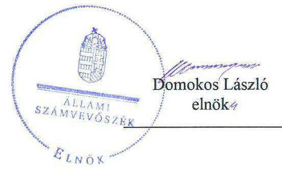
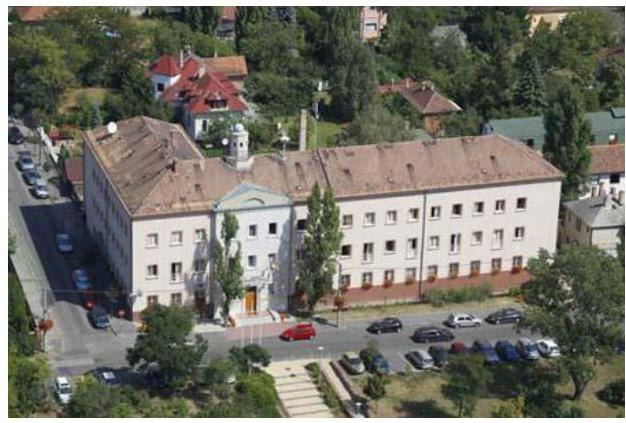
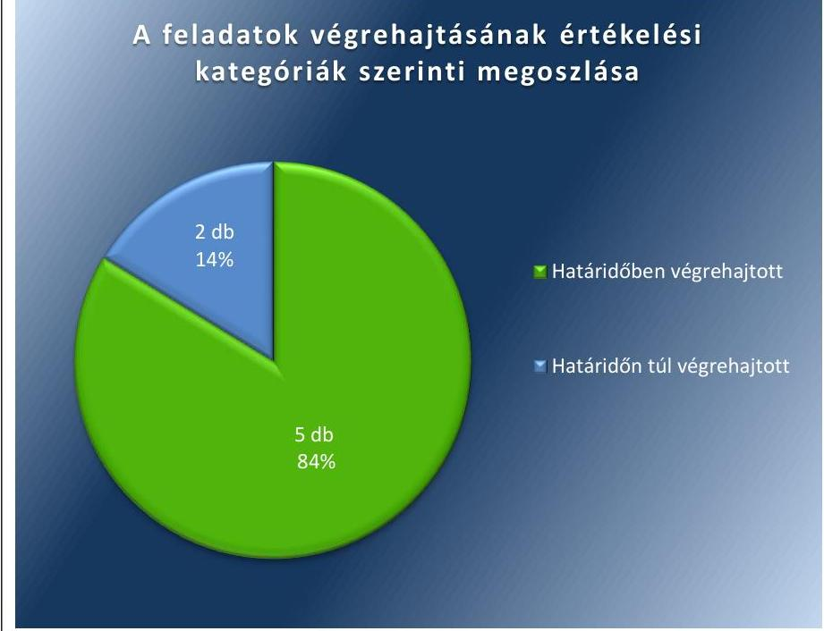

# Jelentés 

## Utóellenőrzések

Az önkormányzatok vagyongazdálkodása szabályszerűségének utóellenőrzése Budapest Főváros XVI. kerületi Önkormányzat
2018.

---

# Jelenetés 

## Utóellenőrzések

Az önkormányzatok vagyongazdálkodása szabályszerűségének utóellenőrzése Budapest Főváros XVI. kerületi Önkormányzat
2018. ৩५. hó 17. nap

---

# AZ ELLENŐRZÉST FELÜGYELTE: 

DR. NÉMETH ERZSÉBET felügyeleti vezető

## AZ ELLENŐRZÉST VEZETTE ÉS A VÉGREHAJTÁSÁÉRT FELELŐS:

ÁRPÁSI TIBOR ellenőrzésvezető

## A PROGRAM ÖSSZEÁLLÍTÁSÁÉRT FELELŐS:

JANIK JÓZSEF LÁSZLÓ osztályvezető

## A TÉMÁHOZ KAPCSOLÓDÓ KORÁBBI SZÁMVEVŐSZÉKI JELENTÉSEK:

- címe: Jelentés az önkormányzatok vagyongazdálkodása szabályszerűségének ellenőrzéséről - Budapest Főváros XVI. kerület
- sorszáma: 14099

IKTATÓSZÁM: V-1311-038/2016.
TÉMASZÁM: 2096
ELLENŐRZÉS-AZONOSÍTÓ SZÁM: V075570

---

# TARTALOMJEGYZÉK 

■ ÖSSZEGZÉS ..... 5
■ AZ ELLENŐRZÉS CÉLJA ..... 6
■ AZ ELLENŐRZÉS TERÜLETE ..... 7
■ AZ ELLENŐRZÉS HÁTTERE, INDOKOLTSÁGA ..... 8
■ A JELENTÉS LÉNYEGES KÉRDÉSKÖRE ..... 9
■ ELLENŐRZÉS HATÓKÖRE ÉS MÓDSZEREI ..... 10
■ MEGÁLLAPÍTÁSOK ..... 12
■ MELLÉKLETEK ..... 15
I. sz. melléklet: Az ÁSZ 14099 számú jelentéséhez kapcsolódó intézkedési terv végrehajtása ..... 15
■ FÜGGELÉK: ÉSZREVÉTELEK ..... 17
■ RÖVIDÍTÉSEK JEGYZÉKE ..... 19

---

.

---

# ÖSSZEGZÉS 

Az Állami Számvevőszék utóellenőrzése megállapította, hogy az intézkedési tervben foglalt feladatokat a Budapest Főváros XVI. kerületi Önkormányzat végrehajtotta, így biztosított volt a közpénzekkel való felelős, elszámoltatható, átlátható és szabályszerű gazdálkodás.

## Az ellenőrzés társadalmi indokoltsága

Az Állami Számvevőszék stratégiájában célul tűzte ki a számvevőszéki munka hasznosulásának javítását. Ezzel összhangban ellenőrzi, hogy az ellenőrzött szervezetek megvalósították-e a korábbi ellenőrzései által feltárt hibák, hiányosságok és szabálytalanságok megszüntetése céljából elkészített intézkedési terveikben foglaltakat. A rendszeres utóellenőrzések hozzájárulnak a szükséges intézkedések tényleges végrehajtáshoz, ezáltal a közpénzügyek rendezettségének javulásához.

## Főbb megállapítások, következtetések

A Budapest Főváros XVI. kerületi Önkormányzat az intézkedési tervében meghatározott hét feladatból ötöt határidőben, kettőt határidőn túl hajtott végre. A jegyző határidőben gondoskodott a vagyonkimutatás módosításáról, a leltározási szabályzat aktualizálásáról. A 2014. évi és a 2014-2018. évekre szóló stratégiai belső ellenőrzési terv már kockázati tényezők értékelésén alapult, a belső ellenőrzésekről vezetett nyilvántartás megfelelt a jogszabályi előírásnak és elkészült a belső kontroll kézikönyv, amely tartalmazta az etikai értékeket és integritásra vonatkozó alapelveket.

Határidőn túl készült el az etikai eljárási szabályokat is tartalmazó belső szabályozás, és határidőn túl terjesztette elő javaslatát a polgármester a Civil Házak múködésének jogszerű biztosítására és fenntartására, a civil szervezetek támogatására.

Budapest Főváros XVI. kerületi Önkormányzat vagyongazdálkodási tevékenységének szabályozottsága és annak múködése biztosította a szabályszerű, átlátható és elszámoltatható közpénzfelhasználást.

---

# AZ ELLENŐRZÉS CÉLJA 

Az ellenőrzés célja annak értékelése volt, hogy a számvevőszéki jelentésben ${ }^{1}$ foglalt intézkedést igénylő megállapításokkal összhangban készített intézkedési tervben meghatározott feladatokat az Önkormányzat végrehajtotta-e.

---

# **A Z ELLENŐRZÉS TERÜLETE**

## **Budapest Főváros XVI. kerületi Önkormányzat**

Budapest Főváros XVI. kerületi állandó lakosainak száma a KSH által közzétett népességi adatok² szerint 2017. január 1-jén 73 486 fő volt.

A polgármester³ a 2006. évi önkormányzati választások óta tölti be hivatalát, a jegyző⁴ 2007 márciusától látja el feladatait.

Budapest Főváros XVI. kerületi Önkormányzat a 2016. évi költségvetési beszámolója szerint 10 815,74 millió Ft költségvetési bevételt ért el, valamint 10 720,98 millió Ft költségvetési kiadást teljesített. 2016. december 31-én a könyvviteli mérleg szerinti követelések állományának értéke 1 034,28 millió Ft, a kötelezettségek állományának értéke 783,3 millió Ft, mérlegfőösszege 45 487,37 millió Ft volt.

Az ÁSZ⁵ 2013. évben ellenőrizte az Önkormányzat⁶ vagyongazdálkodásának szabályszerűségét a 2009. január 1. és 2012. december 31. közötti időszak tekintetében, kitekintéssel a helyszíni ellenőrzés befejezéséig (2013. december 9-éig) tartó időszak releváns vagyongazdálkodási folyamataira. Az erről szóló 14099 számú jelentését az ÁSZ 2014. június 3-án tette közzé. Az ellenőrzés célja annak megállapítása volt, hogy az önkormányzat vagyongazdálkodási tevékenységének szabályozottsága és tevékenysége a jogszabályi előírásokkal összhangban volt-e, átlátható, a jogszabályi előírásoknak megfelelő volt-e a vagyon nyilvántartása, a külső és belső ellenőrzések megállapításai hozzájárultak-e az önkormányzati vagyongazdálkodási tevékenység szabályszerűségéhez. A számvevőszéki jelentésben feltárt szabálytalanságok, működésbeli hiányosságok kiküszöbölése érdekében a képviselő-testület⁷ 185/2014. (VI. 18.) számú határozatával intézkedési tervet fogadott el.

Az utóellenőrzés – a 2014. június 3. és 2017. november 6. között végrehajtott feladatokat figyelembe véve – a számvevőszéki jelentésben megfogalmazott intézkedést igénylő megállapításokra készített intézkedési tervben foglalt feladatok végrehajtásának ellenőrzésére, illetve értékelésére fókuszált.

---

# AZ ELLENŐRZÉS HÁTTERE, INDOKOLTSÁGA 

Az ÁSZ tv. ${ }^{8}$ 33. § (1) bekezdése értelmében a számvevőszéki jelentések intézkedést igénylő megállapításaihoz kapcsolódóan az ellenőrzött szervezet vezetője intézkedési tervet köteles összeállítani, és az ÁSZ részére megküldeni. Az intézkedési tervben foglaltak megvalósítását - az ÁSZ tv. 33. § (7) bekezdésében foglaltak alapján - az ÁSZ utóellenőrzés keretében ellenőrizheti. Az intézkedések megvalósulásának értékelése során az ÁSZ figyelembe veszi az ellenőrzött szervezetek működési feltételeiben, valamint a jogszabályi előírásokban bekövetkezett változásokat.

Az intézkedési tervekben foglalt feladatok hiányos, illetve késedelmes végrehajtása, valamint megvalósításának elmaradása azt mutatja, hogy az ellenőrzések során feltárt hibák, hiányosságok és szabálytalanságok megszüntetése nem kapott kellő hangsúlyt. Ez a szabályszerű működés és a felelős vezetői magatartás vonatkozásában kockázatot hordoz. E kockázatok feltárásával az ÁSZ utóellenőrzési rendszere fokozza a fegyelmet, és igazolja, hogy a közpénzzel való szabályos gazdálkodás felelőssége elől nem lehet kitérni.

## AZ UTÓELLENŐRZÉS NÉGY SZINTEN HASZNOSULHAT:

- A társadalom szintjén az utóellenőrzés jelzi, hogy a számvevőszéki ellenőrzés megállapításainak van következménye: a hiányosságok megszüntetésére az ellenőrzött szervezet által meghatározott intézkedések végrehajtását is számon kéri az ÁSZ.
- Az ellenőrzött terület szintjén az utóellenőrzés tájékoztatást nyújt a terület döntéshozóinak a hiányosságok kiküszöbölésének jó gyakorlatairól, ezzel lehetőséget biztosítva arra, hogy az ÁSZ ellenőrzési megállapításai, javaslatai a terület nem ellenőrzött szervezeteinek a működése során is hasznosuljanak.
- Az ellenőrzött szervezet szintjén az utóellenőrzés feltárja, hogy a szervezet az intézkedések végrehajtásával hasznosította-e a korábbi ellenőrzési jelentésben a hiányosságok megszüntetése, illetve a kockázatok kezelése érdekében megfogalmazott javaslatokat.
- Az ÁSZ szintjén az utóellenőrzés visszacsatolást ad az ellenőrzési jelentések hasznosulásáról, az intézkedések elmaradása vagy részleges megvalósulása a további ellenőrzésekhez kockázati jelzésként szolgál.

---

# A JELENTÉS LÉNYEGES KÉRDÉSKÖRE 

Az Önkormányzat az intézkedési tervben foglaltakat az elöirt határidőben végrehajtotta-e?

---

# ELLENŐRZÉS HATÓKÖRE ÉS MÓDSZEREI 

## Az ellenőrzés típusa

Megfelelőségi ellenőrzés.

## Az ellenőrzött időszak

Az utóellenőrzés alapját képező ÁSZ jelentés közzétételének napjától (2014. június 3.) az ellenőrzésről szóló kiértesítő levél keltének napjáig (2017. november 6.) tartó időszak.

## Az ellenőrzés tárgya

A számvevőszéki jelentésben foglalt intézkedést igénylő megállapításokkal és javaslatokkal összhangban - az Önkormányzat által - készített intézkedési tervben foglaltak végrehajtásának ellenőrzése.

Az ellenőrzés kiterjedt minden olyan körülményre és adatra, amely az ÁSZ jogszabályban meghatározott feladatainak teljesítéséhez, valamint a program végrehajtása folyamán felmerült újabb összefüggések feltárásához szükséges volt.

## Az ellenőrzött szervezet

Budapest Főváros XVI. kerületi Önkormányzat

## Az ellenőrzés jogalapja

Az ÁSZ tv. 33. § (7) bekezdése szerinti intézkedési tervben foglaltak megvalósítását az Állami Számvevőszék utóellenőrzés keretében ellenőrizheti.

## Az ellenőrzés módszerei

Az ÁSZ az utóellenőrzést a nemzetközi standardokat irányadónak tekintve az ellenőrzési program ellenőrzési kérdései alapján, az ellenőrzött időszakban hatályos jogszabályok, az ellenőrzés szakmai szabályok és módszertanok figyelembevételével, önálló ellenőrzés keretében végezte.

Az ÁSZ az ellenőrzés ideje alatt az Önkormányzattal történő kapcsolattartást az ÁSZ SZMSZ ${ }^{\circledR}$-ének vonatkozó előírásai alapján biztosította.

---

Az utóellenőrzés megállapításait elsősorban az ÁSZ rendelkezésére álló, valamint az ellenőrzött szervezettől bekért dokumentumok alapozták meg.

Az ellenőrzési bizonyítékként felhasználható adatforrások közé tartoztak egyrészt az ellenőrzés szakmai programjában felsorolt adatforrások, másrészt minden - az ellenőrzés folyamán feltárt, az ellenőrzés szempontjából információt tartalmazó - dokumentum.

Az intézkedési tervekben előírt feladatokat, azok végrehajthatósága, illetve végrehajtása szempontjából az alábbiak szerint értékelte az ÁSZ:
—_ „határidőben végrehajtott" a feladat, ha a teljesítés dokumentáltan, az intézkedési tervben előírt határidőben és tartalommal megtörtént;
—_ „határidőn túl végrehajtott" a feladat, ha annak teljesítése az intézkedési tervben meghatározott módon, de az előírt határidőn túl történt meg;
—_ „részben végrehajtott" a feladat, ha végrehajtása teljes körűen az intézkedési tervben előírt módon nem történt meg;
—_ „nem végrehajtott" a feladat, ha a végrehajtás nem történt meg, vagy amennyiben a teljesítést nem dokumentálták;
—_ „okafogyottá vált" a feladat, ha végrehajtására - meghatározott esemény bekövetkezése, továbbá külső körülmény, a működést érintő feltétel változása miatt - már nincs szükség, illetve lehetőség, és egyértelműen megállapítható, hogy az intézkedést szükségessé tevő körülmény a jövőben nem fordulhat elő;
—_ „nem időszerü" az a feladat, amelynek ellenőrzési időszakon belüli végrehajtására azért nem került (kerülhetett) sor, mert az intézkedés alapjául szolgáló esemény nem következett be, de annak jövőbeni előfordulása lehetséges, a végrehajtása nem volt esedékes, vagy a végrehajtás határideje még nem járt le.
Az ellenőrzés lefolytatásához az ellenőrzött szervezet a tanúsítványok elektronikus kitöltésével, valamint az ÁSZ által kért dokumentumok elektronikus megküldésével szolgáltatott adatokat, amelyek valódiságát és teljes körűségét az ellenőrzött szervezet vezetője által tett teljességi és hitelességi nyilatkozat igazolta. Az így rendelkezésre bocsátott adatok, információk kontrollja az ellenőrzés keretében történt.

---

# MEGÁLLAPÍTÁSOK 

## Az Önkormányzat az intézkedési tervben foglaltakat az előírt határidőben végrehajtotta-e?

Összegző megállapítás

Az Önkormányzat az intézkedési tervben foglalt hét feladatból ötöt határidőben, kettőt határidőn túl hajtott végre. Az intézkedési tervben rögzített feladatok végrehajtásáról az Önkormányzat nem vezette a jogszabályban előírt nyilvántartást.

Intézkedési terv készítési kötelezettségének az Önkormányzat határidőben eleget tett. Az ÁSZ jelentése a jegyző részére hat javaslatot fogalmazott meg. A képviselő-testület által elfogadott intézkedési terv a feltárt hiányosságok, szabálytalanságok megszüntetése érdekében hét feladatot határozott meg. A feladatok elvégzésének felelőseként egy esetben a polgármestert, négy esetben a jegyzőt jelölték meg, két feladat már végrehajtásra került az intézkedési terv kiadásának időpontjában.

Az intézkedési tervben meghatározott feladatokat, határidőket, felelősöket és a feladatok végrehajtását az I. számú melléklet mutatja be.

A jegyző az ÁSZ javaslatai alapján készített intézkedési terv végrehajtásáról a Bkr. ${ }^{10}$ 14. § (1) bekezdése szerinti nyilvántartást nem vezette.

Az intézkedési tervben felsorolt feladatok végrehajtásának értékelési kategóriák szerinti megoszlását az 1. ábra szemlélteti:

1. ábra

Fonrás: ÁSZ

---

# A VAGYONGAZDÁLKODÁS SZABÁLYOZÁSI KERETEINEK kialakítása érdekében meghatározott feladatokat az alábbiak szerint hajtották végre. 

- Határidőben aktualizálták a Számv. ${ }^{11}$ tv. előírásainak megfelelően a számviteli politikát ${ }^{12}$, az annak mellékletét képező leltározási szabályzatot ${ }^{13}$.
- Jóváhagyták a monitoringra és a külső ellenőrzésekre, valamint azok nyilvántartására vonatkozó előírásokat a Bkr.-ben foglaltaknak megfelelően tartalmazó belső kontroll kézikönyvet ${ }^{14}$.
- Határidőn túl került sor a magatartási és eljárási szabályokat is tartalmazó etikai kódex ${ }^{15}$ elfogadására.
- A polgármester határidőn túl terjesztette elő javaslatát a Közösségi (civil) Házak múködésének jogszerű biztosítására és a Civil Házak fenntartására, valamint a kerületi lakosok közösségi célú igényeinek teljesítését vállaló civil szervezetek támogatásáról.

## A VAGYONGAZDÁLKODÁS SZABÁLYSZERŰ MŰ-

KÖDÉSE érdekében meghatározott feladatokat határidőben végrehajtották.
—_ Az Önkormányzat az Áhsz. ${ }^{16}$ előírásaival összhangban lévő vagyongazdálkodási rendelete ${ }^{17}$ alapján készítette el vagyonkimutatását. A teljes körű ingatlanleltárra a szabályzatnak megfelelően került sor.
—_ A jegyző jóváhagyta a Bkr. előírásainak megfelelő, a 2015-2018. évekre vonatkozó stratégiai ellenőrzési tervet, amely tartalmazta a kockázati tényezőket és értékelésüket. A 2014. évi belső ellenőrzési terv a Bkr. előírásaival összhangban a stratégiai ellenőrzési tervben és a kockázatelemzés alapján felállított prioritásokon alapult.
—_ Az Önkormányzat a belső ellenőrzésekhez kapcsolódó intézkedések nyilvántartását a Bkr. előírásainak megfelelően vezette és megkezdték a külső ellenőrzések Bkr. követelményei szerinti nyilvántartásának vezetését is.

---

.

---

# MELLÉKLETEK

I. SZ. MELLÉKLET: AZ ÁSZ 14099 SZÁMÚ JELENTÉSÉHEZ KAPCSOLÓDÓ INTÉZKEDÉSI TERV VÉGREHAJTÁSA

|  Sorszám | Az intézkedési terv alapján elvégzendő feladat | Az intézkedési tervben meghatározott határidő | Az intézkedési tervben megjelölt felelős | A feladat végrehajtása  |
| --- | --- | --- | --- | --- |
|  Határidőben végrehajtott feladatok |  |  |  |   |
|  1. | „1. A 2014. április 22-én a Képviselő-testület elfogadta az önkormányzat 2013. évi költségvetésének zárszámadásáról szóló 8/2014. (IV.28.) rendeletet, amely már a hatályos jogszabályi előírásoknak és az ÁSZ javaslatának megfelelően tartalmazta a vagyonkimutatást. Ez további intézkedést nem igényel." | - | - | Az Önkormányzat a 2013. évi költségvetésének zárszámadásáról szóló 8/2014. (IV. 28.) rendeletében ${ }^{18}$ a hatályos jogszabályi előírásoknak megfelelően szerepeltette a vagyonkimutatást.  |
|  2. | „2. A Számviteli politika mellékletét képező Leltározási szabályzatot aktualizálni szükséges, ezt követően annak megfelelően kell a teljeskörü ingatlanleltárt elvégezni." | a szabályzat aktualizálása 2014. szeptember 30., a leltározás a szabályzatnak megfelelően | jegyző, költségvetési és pénzügyi irodavezető | 2014. szeptember 18-án lépett hatályba a 4/2014. Polgármesteri - Jegyzői Együttes Utasítás Budapest Főváros XVI. kerületi Önkormányzat, Budapest XVI. kerületi Polgármesteri Hivatal és a XVI. kerületi Nemzetiségi Önkormányzatok Számviteli Politikájáról, s annak mellékleteként az Eszközök és Források Leltárkészítési és Leltározási Szabályzata. Az ingatlanok leltározására az évente aktualizált szabályzatban foglaltak alapján 2016. október 19-én kiadott leltározási ütemtervnek megfelelően került sor. A jegyző 2014. augusztus 18-án jóváhagyta a Budapest Főváros XVI. kerületi Önkormányzat és a Polgármesteri Hivatal 2015-2018. évekre vonatkozó stratégiai ellenőrzési tervét, amely tartalmazta a kockázati tényezőket és értékelésüket is. A stratégiai ellenőrzési terv a Bkr. előírásainak megfelelően a belső ellenőrzésre vonatkozó stratégiai fejlesztéseket a következő négy évre határozta meg.
A 2014. évi belső ellenőrzési terv a Bkr. előírásaival összhangban a 2011-2014 évekre vonatkozó stratégiai ellenőrzési tervben és a kockázatelemzés alapján felállított prioritásokon alapult, amelyet a képviselő-testület a 309/2013. (XI. 13.) Kt. számú határozatával hagyott jóvá.  |
|  3. | „4. Az új 2015-2019. évekre vonatkozó stratégiai ellenőrzési tervet a hatályos jogszabályi előírásoknak megfelelően kell elkészíteni, amely tartalmazza a kockázati tényezőket és értékelésüket is. A 2014. évi belső ellenőrzési terv - már a jogszabályoknak előírásokkal összhangban készült - kockázatelemzés alapján felállított prioritásokon alapulva." | a 2015-2019 évekre vonatkozó stratégiai ellenőrzési terv elkészítésére 2015. március 31. | jegyző, belső ellenőrzési vezető | Az Önkormányzat a belső ellenőrzési jelentésekben tett megállapításokról, javaslatokról és a vonatkozó intézkedési tervekről a Bkr. előírásainak megfelelő nyilvántartást vezette.  |

---

|  5 | Az intézkedési terv alapján elvégzendő feladat | Az intézkedési tervben meghatározott határidő | Az intézkedési tervben megjelölt felelős | A feladat végrehajtása  |
| --- | --- | --- | --- | --- |
|  5. | „6. Belső kontroll kézikönyv elkészítése szükséges, amely tartalmaz a monitoringra és külső ellenőrzésekre valamint azok nyilvántartására vonatkozóan előírásokat. A nyilvántartás vezetését jegyzői intézkedés alapján addig is megkezdtük." | a kézikönyv elkészítésére
2014. december 31. | jegyző, belső ellenőrzési vezető | A 2014. november 1-jétől hatályos 7/2014. Jegyzői Utasítás kiadmányozta a Belső Kontroll Kézikönyvet, amelynek VI. fejezete tartalmazta a monitoringra és a külső ellenőrzésekre, valamint azok nyilvántartására vonatkozó előírásokat. a Bkr.-ben foglaltaknak megfelelően.
Az Önkormányzat megkezdte a külső ellenőrzések Bkr. 47. §-ában foglaltak szerinti nyilvántartásának vezetését. A nyilvántartás nem tartalmazta az ÁSZ ellenőrzésével, a számvevőszéki jelentésben foglalt javaslatokra készített intézkedési tervvel kapcsolatos adatokat.  |
|   | Határidőn túl végrehajtott feladatok |  |  |   |
|  6. | „3. Belső kontroll kézikönyv elkészítése szükséges, amely tartalmazza többek között az etikai alapelveket, eljárási szabályokat, integritásra vonatkozó elveket." | a kézikönyv elkészítésére
2014. december 31. | jegyző, belső ellenőrzési vezető | A 7/2014. Jegyzői Utasítás kiadmányozta a 2014. november 1-jétől hatályos Belső Kontroll Kézikönyvet. A kézikönyv II.6) pontja tartalmazta a köztisztviselökre vonatkozó etikai alapelveket és az integritásra vonatkozó elveket. A képviselő-testület 362/2016. (XI. 16.) Kt. számú határozatával elfogadott, 2016. november 21-étől hatályos Etikai Kódex pedig már részletesen taglalta a magatartási és az etikai vétség esetén követendő eljárási szabályokat is.  |
|  7. | „7. Javaslatot kell készíteni a civil házak és sporttelepek jövőbeli müködésére vonatkozóan, valamint a civilszervezetek és a sportegyesületek jövőbeli támogatási rendszerére vonatkozóan." | 2014. október 31. | polgármester | A polgármester 2014. december 2-ai előterjesztése alapján a képviselő-testület határidőn túl fogadta el a 309/2014. (XII. 10.) Kt. számú határozatot a Közösségi (civil) Házak müködésének jogszerú biztosítására és a Civil Házak fenntartására.
A polgármester 2015. április 15-ei előterjesztése alapján a képviselő-testület határidőn túl fogadta el a 15/2015. (IV. 27.) Kt. számú határozatot a kerületi lakosok közösségi célú igényeinek teljesítését vállaló civil szervezetek támogatásáról, amely rendelet szabályozza a sporttevékenységek támogatását is.  |

Fonrás: ÁSZ által készített táblázat

---

# FÜGGELÉK: ÉSZREVÉTELEK 

A jelentéstervezetet a Számvevőszék 15 napos észrevételezésre megküldte az ellenőrzött szervezet vezetőjének az ÁSZ tv. 29. §* (1) bekezdése előírásának megfelelően.

Budapest Főváros XVI. kerületi Önkormányzat polgármestere a jelentéstervezet megállapításaira nem tett észrevételt.

[^0]
[^0]:    * 29. § (1) Az Állami Számvevőszék az ellenőrzési megállapításait megküldi az ellenőrzött szervezet vezetőjének vagy az általa megbízott személynek, és annak, akinek személyes felelősségét állapította meg.
    (2) Az ellenőrzött szervezet vezetője és a felelősként megjelölt személy az ellenőrzés megállapításaira tizenöt napon belül írásban észrevételt tehet.
    (3) Az Állami Számvevőszék az észrevételre a beérkezésétől számított harminc napon belül írásban válaszol. A figyelembe nem vett észrevételeket köteles a jelentésben feltüntetni, és megindokolni, hogy azokat miért nem fogadta el.

---

.

---

# RÖVIDÍTÉSEK JEGYZÉKE 

${ }^{1}$ számvevőszéki jelentés
${ }^{2}$ KSH népességi adatok
${ }^{3}$ polgármester
${ }^{4}$ jegyző
${ }^{5}$ ÁSZ
${ }^{6}$ Önkormányzat
${ }^{7}$ képviselő-testület
${ }^{8}$ ÁSZ tv.
${ }^{9}$ ÁSZ SZMSZ
${ }^{10}$ Bkr.
${ }^{11}$ Számv. tv.
${ }^{12}$ számviteli politika
${ }^{13}$ leltározási szabályzat
${ }^{14}$ belső kontroll kézikönyv
${ }^{15}$ etikai kódex
${ }^{16}$ Áhsz. 1
${ }^{17}$ vagyongazdálkodási rendelet
${ }^{18}$ zárszámadási rendelet

Az ÁSZ 14099 számú jelentése - Jelentés az önkormányzatok vagyongazdálkodása szabályszerűségének ellenőrzéséről Budapest Főváros XVI. kerület (elérhető a www.asz.hu honlapon)
Központi Statisztikai Hivatal, Magyarország Közigazgatási Helynévkönyve 2017. január 1-jei adatai
Budapest Főváros XVI. kerületi Önkormányzat polgármestere
Budapest Főváros XVI. kerületi Önkormányzat jegyzője
Állami Számvevőszék
Budapest Főváros XVI. kerületi Önkormányzat
Budapest Főváros XVI. kerületi Önkormányzat képviselő-testülete
Az Állami Számvevőszékről szóló 2011. évi LXVI. törvény (hatályos: 2011. július 1-jétől)
Az Állami Számvevőszék elnökének 3/2016. (XII. 29.) ÁSZ utasítása az Állami Számvevőszék Szervezeti és Müködési Szabályzatáról (hatályos: 2017. január 1-jétől)
370/2011. (XII. 31.) Korm. rendelet a költségvetési szervek belső kontrollrendszeréről és belső ellenőrzéséről (hatályos: 2012. január 1-jétől)
2000. évi C. törvény a számvitelről (hatályos: 2001. január 1-jétől)

4/2014. Polgármesteri - Jegyzői Együttes Utasítás, Budapest Főváros XVI. kerületi Önkormányzat, Budapest Főváros XVI. kerületi Polgármesteri Hivatal és a XVI. kerületi Nemzetiségi Önkormányzatok Számviteli politikája (hatályos: 2014. szeptember 18-ától)
Budapest Főváros XVI. kerületi Önkormányzat, Budapest Főváros XVI. kerületi Polgármesteri Hivatal és a XVI. kerületi Nemzetiségi Önkormányzatok Számviteli politikájának melléklete B./ Eszközök és Források Leltárkészítési és Leltározási Szabályzata (hatályos: 2014. szeptember 18-ától)
7/2014. Jegyzői Utasítás, Belső Kontroll Kézikönyv (hatályos: 2014. november 1-jétől)
Budapest Főváros XVI. kerületi Önkormányzat képviselő-testülete 362/2016. (XI. 16.) Kt. számú határozata, Budapest Főváros XVI. kerületi Polgármesteri Hivatalának Etikai Kódexe (hatályos: 2016. november 21-étől)
249/2000. (XII. 24.) Korm. rendelet az államháztartás szervezetei beszámolási és könyvvezetési kötelezettségének sajátosságairól (hatálytalan: 2014. január 1-től)
Budapest Főváros XVI. kerületi Önkormányzat 24/2009. (VI. 25.) rendelete az Önkormányzat vagyonáról és a vagyontárgyak feletti tulajdonosi jogok gyakorlásáról (hatályos: 2009. július 1-jétől)
Budapest Főváros XVI. kerületi Önkormányzat 8/2014. (IV. 28.) rendelete az Önkormányzat 2013. évi költségvetésének zárszámadásáról (hatályos: 2014. április 29-étől)

---

ÁLLAMI SZÁMVEVŐSZÉK
1052 Budapest, Apáczai Csere János utca 10.
Levélcím: 1364 Budapest 4. Pf. 54
Telefon: +36 14849100 Telefax: +36 14849200
www.asz.hu