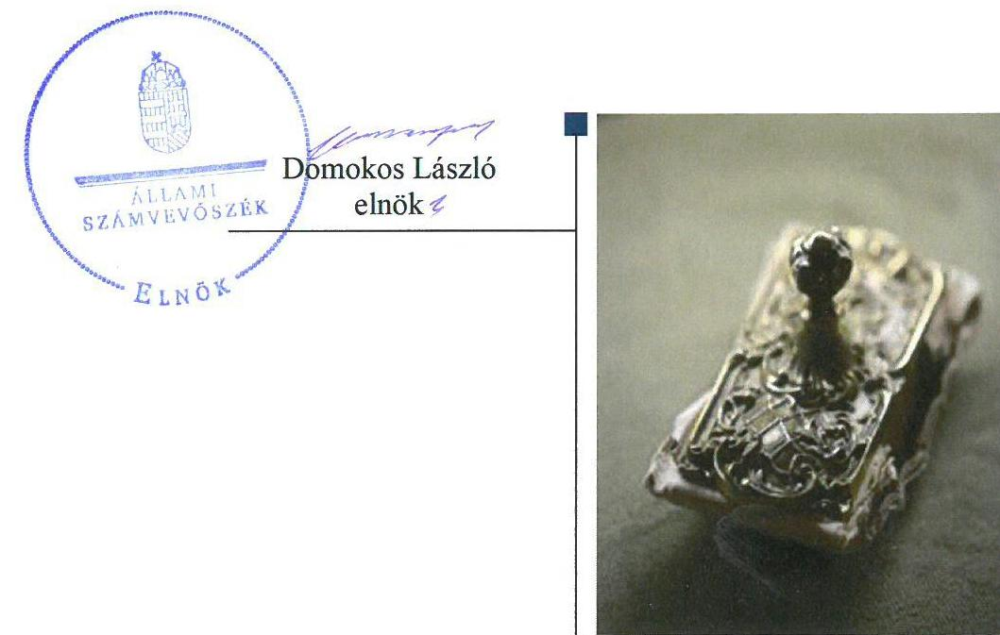
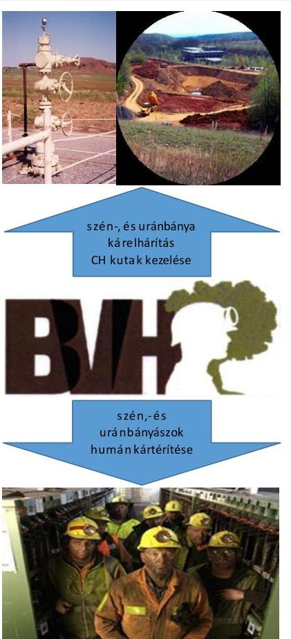
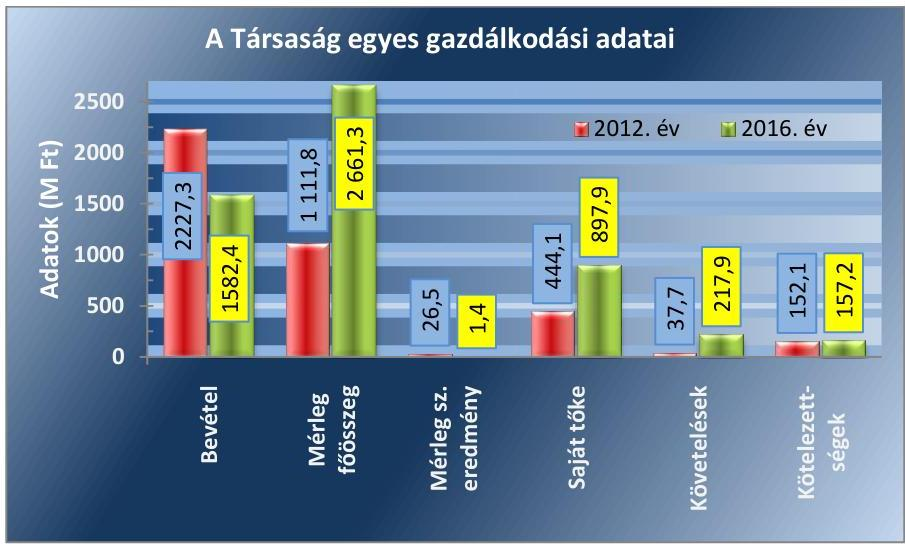
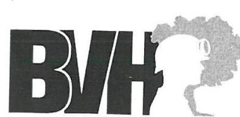
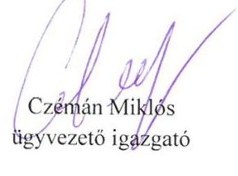
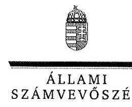
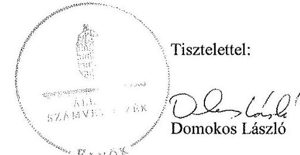

# Jelentés 

## Bányavagyonhasznosító Nonprofit Közhasznú Kft.

Az állami tulajdonban (résztulajdonban) lévő gazdálkodó szervezetek vagyonmegőrzési és gazdálkodási tevékenységének ellenőrzése 2018.

18069
www.asz.hu

---

# Jelentés 

## Bányavagyonhasznosító Nonprofit Közhasznú Kft.

Az állami tulajdonban (résztulajdonban) lévő gazdálkodó szervezetek vagyonmegőrzési és gazdálkodási tevékenységének ellenőrzése
2018. Oh. hó 03. nap

---

# AZ ELLENŐRZÉST FELÜGYELTE:

DR. HORVÁTH MARGIT felügyeleti vezető

# AZ ELLENŐRZÉST VEZETTE ÉS A VÉGREHAJTÁSÁÉRT FELELŐS:

SALAMIN VIKTOR ellenőrzésvezető

# A PROGRAM ÖSSZEÁLLÍTÁSÁÉRT FELELŐS:

JANIK JÓZSEF LÁSZLÓ osztályvezető

---

IKTATÓSZÁM: V-1386-099/2016.

TÉMASZÁM: 2084

---

Jelentéseink az Országgyűlés számítógépes hálózatán és az Interneta a www.asz.hu címen is olvashatóak.

---

ELLENŐRZÉS-AZONOSÍTÓ SZÁM: V075956

---

# TARTALOMJEGYZÉK 

■ ÖSSZEGZÉS ..... 5
■ AZ ELLENŐRZÉS CÉLJA ..... 6
■ AZ ELLENŐRZÉS TERÜLETE ..... 7
■ AZ ELLENŐRZÉS HÁTTERE, INDOKOLTSÁGA ..... 9
■ A JELENTÉS LÉNYEGES KÉRDÉSKÖREI ..... 10
■ AZ ELLENŐRZÉS HATÓKÖRE ÉS MÓDSZEREI ..... 11
■ MEGÁLLAPÍTÁSOK ..... 13
JAVASLATOK ..... 17
MELLÉKLETEK ..... 19
I. sz. melléklet: Értelmező szótár ..... 19
II. sz. melléklet: A Társaság mérlegadatainak alakulása 2012-2016 között ..... 21
III. sz. melléklet: A Társaság eredményének alakulása 2012-2016 között ..... 22
■ FÜGGELÉK: ÉSZREVÉTELEK ..... 23
■ RÖVIDÍTÉSEK JEGYZÉKE ..... 37

---

.

---

# ÖSSZEGZÉS 

A Magyar Nemzeti Vagyonkezelő Zrt. Bányavagyon-hasznositó Nonprofit Közhasznú Kft. feletti tulajdonosi joggyakorlása szabályszerű volt. A Társaság müködésének szabályozottsága megfelelt a jogszabályok előírásainak. A bevételek, a ráfordítások, a beruházások, felújítások, az értékcsökkenés elszámolása - a ráfordítások 2016. évi elszámolása kivételével - szabályszerű volt. A Társaság beszámolási és adatszolgáltatási kötelezettségeinek eleget tett, vagyongazdálkodása szabályszerű volt.

## Az ellenőrzés társadalmi indokoltsága

Az állami tulajdonú gazdálkodó szervezetek a nemzeti vagyon részét képezik. Az állami vagyonnal való gazdálkodást illetően a tulajdonosi joggyakorlás és a vagyongazdálkodás feladata az állami vagyon átlátható, rendeltetésszerű és felelős felhasználásának biztosítása. Az állam meghatározza az ellátandó feladatokat, amelyhez a vagyonnal kapcsolatos döntéseknek igazodniuk kell. A nemzetgazdasági szempontból kiemelt jelentőségű nemzeti vagyonban tartandó állami tulajdonban álló társasági részesedést a nemzeti vagyonról szóló törvény határozza meg.

Az Állami Számvevőszék az általa korábban ellenőrizetlen területek, szervezetek körébe tartozó társaságnál végzett ellenőrzést. A számvevőszéki ellenőrzés hozzájárul a közpénzek szabályos, átlátható, elszámoltatható és eredményes felhasználásához. Minden közpénzt, közvagyont használó szervezettel szemben társadalmi igény, hogy tevékenységükről elszámoljanak. Ezt figyelembe véve és az Állami Számvevőszék Stratégiájával összhangban került sor a Bányavagyon-hasznosító Nonprofit Közhasznú Kft. ellenőrzésére a 2012-2016. évek vonatkozásában.

## Főbb megállapítások, következtetések, javaslatok

A Magyar Nemzeti Vagyonkezelő Zrt. a tulajdonosi jogokat szabályszerűen gyakorolta. A döntések előkészítésére vonatkozó szabályokat és a döntésekhez kapcsolódó adatszolgáltatás rendjét a tulajdonosi jogok gyakorlója szabályszerűen meghatározta. Az üzleti terv készítési kötelezettséget az Alapító Okiratban előírták, az anyagi érdekeltségi rendszer szabályait a Javadalmazási szabályzatban meghatározták.

A Társaság müködésének szabályozottsága megfelelt a jogszabályi előírásoknak. A bevételek, a ráfordítások, a beruházások, felújítások, az értékcsökkenés és 2012-2015. években a ráfordítások elszámolása az előírásoknak megfelelően történt. A 2016. évi kormányzati hiányt nem befolyásoló ráfordítások elszámolása azonban nem volt szabályszerű.

A Társaság a jogszabályi és belső szabályozásban előírt beszámolási és adatszolgáltatási kötelezettségét szabályszerűen teljesítette, közzétételi kötelezettségének eleget tett. A Társaság vagyongazdálkodása, a vagyon nyilvántartása szabályszerű volt.

---

# AZ ELLENŐRZÉS CÉLJA 

AZ ELLENŐRZÉS CÉLJA annak értékelése volt, hogy a tulajdonosi jogok gyakorlása szabályszerű volt-e; a gazdálkodó szervezet szabályozottsága, gazdálkodása és vagyongazdálkodási tevékenysége megfelelt-e a jogszabályi és a tulajdonosi előírásoknak, biztosítva volte a szolgáltatás dijának megalapozottsága szabályszerű önköltségszámítással; a vagyonváltozást eredményező döntések esetében a tulajdonosi jogok gyakorlója és a gazdálkodó szervezet szabályszerűen jártak-e el.

---

# **AZ ELLENŐRZÉS TERÜLETE**

## **A Magyar Nemzeti Vagyonkezelő Zrt. és a kizárólagos tulajdonában lévő Bányavagyon-hasznosító Nonprofit Közhasznú Kft.**

A Bányavagyon-hasznosító Nonprofit Közhasznú Kft. jogelődje, a Bányavagyon-hasznosító Közhasznú Társaság a 2330/2004. (XII. 21.) Korm. határozatban rögzített döntés alapján 2005 februárjában kezdte meg működését. A Társaság1 2008. november 1-jétől kiemelten közhasznú nonprofit társaságként működött. A Magyar Állam 100%-os tulajdonában állt. 2011. július 4-étől az egyszemélyes társaságnál a tulajdonosi jogokat az állami vagyon felügyeletéért felelős miniszter az MNV Zrt.2 útján gyakorolta. 2016. július 13-ától – az MNV Zrt. döntése alapján – az RHK KNKft.3 uránérc-bányászathoz kapcsolódó kárelhárítási tevékenysége – beolvadásos kiválással – a Társasághoz került, a szükséges személyi állománnyal, illetve vagyonnal és a kapcsolódó bányatelkekkel (Kővágószőlős).

A Társaság kiemelten közhasznú tevékenysége során olyan környezetvédelmi közfeladatok végrehajtásában vett részt, amelyet a Bányászati törvény4, a Kvt.5 és a 152/2014. (VI. 6.) Korm. rendelet6 alapján az FM7 és az NFM8 feladatkörébe rendelt.

A közfeladat-ellátás keretében a főtevékenysége a megszűnt szénbányászati tevékenység után fennmaradó környezeti és vagyoni károkozás megszüntetése, a CH kutak kezelésével kapcsolatos állami közfeladat ellátása, a szénbányászatból kikerült munkavállalókat megillető juttatások átvállalása, illetve az abban való közreműködés. A Társaság feladatai bővültek 2014-től az uránbányászatban keletkezett baleseti járadékok és a munkavégzéssel kapcsolatos egyéb kártérítési kötelezettségek teljesítésével, 2016 júliusától az uránérc-bányászat által okozott károk elhárításával.

A CH kutak vagyonkezelésbe adása 2005-ben megtörtént, amelyet az MNV Zrt. – az időközben bekövetkezett jogszabályi és szervezeti változások figyelembe vételével – egységes szerkezetű Vagyonkezelési szerződés10-be foglalt. 2016-ban a CH kutak száma 2667 db volt.

A Társaság feladatait saját vagyonával és vagyonkezelt vagyonnal látta el. A saját vagyon értéke a 2016. évi feladatbővüléshez kapcsolódóan jelentősen növekedett, a tárgyi eszközök értéke a 2015. évi 132,2 M Ft-ról 1664,9 M Ft-ra nőtt. A vagyonkezelt vagyon (CH kutak) értéke 2,7 M Ft volt.

2012-2016-ban a Társaság kormányzati szektorba sorolt gazdasági társaságnak minősült. A Stabilitás tv.11 3. § (1) bekezdés a-g) pontok szerinti adósságot keletkeztető ügyletet nem kötött. Működési, illetve felhalmozási támogatást nem kapott az MNV Zrt.-től.

Az ellenőrzött időszakban a vezető személye nem, a Társaság 20,0 M Ft összegű jegyzett tőkéje 2016 júliusától – az átalakulással – 120,0 M Ft-ra

---

1. táblázat

2016. ÉVI FELHASZNÁLT TÁMOGATÁSOK (M FT)

|  |  |
| :-- | :--: |
| logcímek (tevékenységek) | 2016. |
| NFM fejezet, 20. cím, 38. alcím, |  |
| 17. jogcímcsoport (Bányabezárás) | 1038,5 |
| NFM fejezet, 21. cím, 1. alcím, |  |
| 3. jogcímcsoport (Mecseki urán- |  |
| bányászok baleseti járadéka és | 225,0 |
| egyéb kártérítési kötelezettség átvállalása) |  |
| NFM fejezet, 20. cím, 35. alcím, |  |
| 1. jogcímcsoport (Uránérc bánya hosszú távú környezeti kárelháritás) | 313,3 |

Forrás: Társaság 2016. évi Beszámolója
növekedett. A Felügyelő Bizottság - a Taktv. ${ }^{12}$-ben foglaltaknak megfelelően - három fővel működött. Az átlagos statisztikai létszám 2012. évi 23 főről a 2016. évre 46 főre növekedett, amelyet 2016. évi feladatbővülés eredményezett. Más gazdasági társaságban tulajdoni hányaddal nem rendelkezett.

A Társaság gazdálkodásának főbb adatait a 2012. és a 2016. évek tekintetében az 1. ábra szemlélteti:

1. ábra

Forrás: a Társaság 2012. és 2016. évi éves beszámolói
2012. és 2016. években a Társaság mérlegfőösszege 1549,5 M Ft-tal (139\%-kal) nőtt, a bevétele 644,9 M Ft-tal (29\%-kal) csökkent. A mérleg szerinti eredmény az ellenőrzött időszakban pozitív volt. A saját tőke öszszege 453,8 M Ft-tal (102\%-kal) nőtt. A követelések állománya 180,2 M Fttal nőtt, ezen belül a vevőkkel szembeni követelések 3,0 M Ft-tal csökkentek. A kötelezettségek állománya számottevően nem változott az ellenőrzött években, a szállítókkal szembeni kötelezettség 44,4 M Ft-tal (34,2\%kal) csökkent.

A Társaságnak a Bányabezárási feladatok ellátásához 2012-2015-ben évente 1000,0 M Ft, 2016-ban 1038,5 M Ft támogatást biztosított az NFM, aki az ellenőrzött időszakban ellátta a bányabezárás után fennmaradó környezeti és vagyoni károkozás megszüntetésével összefüggő tevékenységek felügyeletét. 2014-2016-ban az uránbányászok humán járadéka támogatás évenként 225,0 M Ft volt. 2016-ban három jogcímen részesült támogatásban, amelyet az 1. táblázat mutat be.

---

# AZ ELLENŐRZÉS HÁTTERE, INDOKOLTSÁGA 

Az ÁSZ ${ }^{13}$ alapvető célkitűzése, hogy az államháztartáson kívülre nyújtott költségvetési támogatások és ingyenes vagyon juttatások ellenőrzésével hozzájáruljon ahhoz, hogy a közpénzeket az államháztartáson kívül múködő szervezetek is átlátható, rendezett módon használják fel a szerződésben átvállalt állami feladatok ellátása érdekében.

Az ellenőrzés feladata a közvagyonnal biztosított feladatellátással kapcsolatban a közpénzek átláthatósága, nyilvánossága érdekében a jogszabályokban, belső szabályzatokban megfogalmazott előírások érvényesülésének az állami tulajdonban lévő gazdálkodó szervezetek vagyonérték megőrzési és gazdálkodási tevékenységének értékelése.

Az ellenőrzés várható hasznosulásaként az ellenőrzés megállapításai a jogalkotás számára segítséget nyújthatnak a közvagyonnal való gazdálkodás értékeléséhez, jogszabályi keretei pontosításához, az átláthatóságot biztosító szabályozáshoz. Az ellenőrzöttek számára visszajelzést ad a vagyongazdálkodási tevékenységgel, beszámolással kapcsolatos szabálytalanságokról és kockázatokról. Az ellenőrzés tapasztalatai segítik és erősítik az ÁSZ hozzáadott értéket teremtő elemző tevékenységét és tanácsadószerepét.

---

# A JELENTÉS LÉNYEGES KÉRDÉSKÖREI 

1.     - A Magyar Nemzeti Vagyonkezelő Zrt. tulajdonosi joggyakorlása szabályszerű volt-e?
2.     - A Bányavagyon-hasznositó Nonprofit Közhasznú Kft. müködésének szabályozottsága megfelelt-e az elöírásoknak?
3.     - A Bányavagyon-hasznositó Nonprofit Közhasznú Kft.-nél a pénzügyi-számviteli, adatszolgáltatási és ellenőrzési feladatok ellátása szabályszerű volt-e?
4.     - A Bányavagyon-hasznositó Nonprofit Közhasznú Kft. vagyongazdálkodása szabályszerű volt-e?

---

# AZ ELLENŐRZÉS HATÓKÖRE ÉS MÓDSZEREI 

## Az ellenőrzés típusa

Megfelelőségi ellenőrzés

## Az ellenőrzött időszak

2012. január 1-től 2016. december 31-ig tartott.

## Az ellenőrzés tárgya

Az állami tulajdonban lévő gazdasági társaság gazdálkodása, kiemelten vagyongazdálkodási tevékenysége, valamint a tulajdonosi jogok gyakorlása.

## Az ellenőrzött szervezet

A tulajdonosi joggyakorlás tekintetében Magyar Nemzeti Vagyonkezelő Zártkörűen Múködő Részvénytársaság, továbbá a Bányavagyon-hasznosító Nonprofit Közhasznú Korlátolt Felelősségű Társaság.

## Az ellenőrzés jogalapja

Az ÁSZ tv ${ }^{14}$. 1. § (3) bekezdése és 5. § (3)-(5) bekezdései.

## Az ellenőrzés módszerei

Az ellenőrzést az ellenőrzött időszakban hatályos jogszabályok, az ellenőrzés szakmai szabályok és módszertanok figyelembevételével végeztük.

Az ellenőrzési kérdések megválaszolásához szükséges bizonyítékok megszerzése az ellenőrzött által rendelkezésre bocsátott dokumentumokra, adatokra alapozva kérdésfelvetés, mintavételezés, ellenőrzési eljárások útján történt.

Az ellenőrzési bizonyítékként felhasználható adatforrások közé tartoztak egyrészt a szakmai program részletes szempontjainál felsorolt adatforrások, másrészt minden egyéb - az ellenőrzés folyamán feltárt, az ellenőrzés szempontjából információkat tartalmazó - dokumentum.

Az ellenőrzés lefolytatásához a gazdálkodó szervezet a tanúsítványok elektronikus kitöltésével, valamint az ÁSZ által kért dokumentumok megküldésével szolgáltatott adatokat.

---

A bevételek és ráfordítások elszámolása, valamint a vagyonnyilvántartás terén, a szabályszerű múködést véletlen mintavétellel és irányított kiválasztással ellenőriztük. A mintatételek értékelése alapján, egyrészt a sokaságban előforduló hibás tételek arányát becsültük, másrészt az irányítottan kiválasztott tételeket értékeltük. A jogszabályoknak és a belső előírásoknak megfelelőnek, azaz szabályszerűnek tekintettük az adott területet, amennyiben a minta ellenőrzésének eredménye alapján 95\%-os bizonyossággal a teljes sokaságban a hibaarány kisebb volt, mint 10\%, nem megfelelőnek értékeltük, ha a hibaarány a 10\%-ot meghaladta. A ráfordítások elszámolására és a vagyonnyilvántartásra vonatkozó véletlen mintavételt kockázati alapú kiválasztással egészítettük ki, amelynek során évente a három legnagyobb összegű tételt választottuk ki.

---

# 1. A Magyar Nemzeti Vagyonkezelő Zrt. tulajdonosi joggyakorlása szabályszerű volt-e? 

Összegző megállapítás

A tulajdonosi joggyakorlás kereteinek kialakítása és a tulajdonosi joggyakorlás szabályszerű volt.

A TULAJDONOSI JOGOK GYAKORLÁSÁNAK RENDJÉT az MNV Zrt. a jogszabályok rendelkezéseivel összhangban az Alapító okirat ${ }^{15}$-ban, a Javadalmazási szabályzat ${ }^{16}$-ban, a $\mathrm{FB}^{17}$ ügyrend ${ }^{18}$ ben és saját belső szabályzat ${ }^{19}$-aiban meghatározta.

A Vtv ${ }^{20}$-nek megfelelően az MNV Zrt. SZMSZ ${ }^{21}$-ében rögzítették az Igazgatóság ${ }^{22}$ döntéseinek szabályait. Az Alapító okiratban - a Gt. ${ }^{23}$, a Ptk. ${ }^{24}$ és a Ptk. ${ }^{25}$ alapján - meghatározták a kizárólagos tulajdonosi jogokat. Az előterjesztési kötelezettséget a Döntéselőkészítési szabályzat ${ }^{26}$-ban és a Portfóliós Kódexben rögzítették. Az adatszolgáltatásra vonatkozó előírásokat a Monitoring Szabályzat 2013. decemberi hatályba lépéséig az MNV Zrt. SZMSZ-e, valamint a Vagyonnyilvántartási szabályzat ${ }^{27}$ tartalmazta. A vezetés anyagi érdekeltségi rendszer elemeit a Javadalmazási szabályzatban rögzítették a Taktv. előírásainak megfelelően.

A TULAJDONOSI JOGGYAKORLÓ az Alapító okiratnak és az MNV Zrt. SZMSZ-ében foglaltaknak megfelelően az MNV Zrt. Igazgatósága volt. Az FB-t és a könyvvizsgálót - a Gt. és a Ptk. ${ }_{2}$ előírásainak, valamint az Alapító okiratban foglaltaknak megfelelően - megválasztották. A számviteli beszámolókat a tulajdonosi joggyakorló - az FB előzetes írásbeli véleményezését követően - a könyvvizsgálói jelentések birtokában fogadta el. Az üzleti tervekben a saját vagyonon tervezett beruházásokat, fejlesztéseket jóváhagyták. Az MNV Zrt. havi, negyedéves, féléves - eljárásrendben rögzített tartalmú - jelentések készítésével számoltatta be a Társaságot.

A KEZELT VAGYON (CH kutak) Vagyonkezelési szerződése - a Vtv.-ben foglaltaknak megfelelően - pályáztatás (versenyeztetés) nélkül jött létre. A Vagyonkezelési szerződés rendelkezett a Társaság által az MNV Zrt. felé fizetendő vagyonkezelési díjról, a fizetés gyakoriságáról, illetve az adatszolgáltatási kötelezettségről. A hasznosításról az MNV Zrt. az éves Vagyonkezelési feladatterv ${ }^{28}$-ek jóváhagyásakor, vagy külön döntött. A CH kutakkal történő gazdálkodás szabályszerűségét a Társaságnál az MNV Zrt., illetve külső szakértő nem ellenőrizte.

---

# 2. A Bányavagyon-hasznosító Nonprofit Közhasznú Kft. múködésének szabályozottsága megfelelt-e az előírásoknak? 

Összegző megállapítás

A Társaság múködésének szabályozottsága megfelelő volt.
A SZABÁLYSZERŰ MÚKÖDÉS KERETEIT a Társaság a jogszabályokban, valamint az Alapító okiratban és a Társaság SZMSZ ${ }^{29}$ ében foglaltaknak megfelelően kialakította, számviteli és egyéb ${ }^{30}$ szabályzatait megalkotta. A Munkaügyi szabályzat ${ }^{31}$ és Cafeteria szabályzat ${ }^{32}$ szabályzat tartalma megfelelt a béren kívüli juttatásokra vonatkozóan - a Munka tv. ${ }^{33}$-ben, az Szja. tv. ${ }^{34}$-ban, valamint a 39/2010. (II. 26.) Korm. rendeletben ${ }^{35}$ foglalt - előírásoknak.

A Társaság rendelkezett a Számv. tv. ${ }^{36}$-ben előírt Számviteli politikával ${ }^{37}$, annak keretében Leltározási szabályzattal ${ }^{38}$, Értékelési szabályzattal ${ }^{39}$, Önköltség-számítási szabályzattal ${ }^{40}$ és Pénzkezelési szabályzattal ${ }^{41}$ tal, Számlarenddel ${ }^{42}$, az azt alátámasztó Bizonylati szabályzattal ${ }^{43}$. A szabályzatok tartalma megfelelt a jogszabályi előírásoknak.

Az adott évre vonatkozó gazdálkodás előírásait az éves üzleti tervek, és az éves beszámolók tartalmazták.

## 3. A Bányavagyon-hasznosító Nonprofit Közhasznú Kft.-nél a pénzügyi-számviteli, adatszolgáltatási és ellenőrzési feladatok ellátása szabályszerű volt-e

## Összegző megállapítás

A Társaságnál a pénzügyi-számviteli feladatok ellátása szabályszerű volt, adatszolgáltatási kötelezettségének - az államháztartásért felelős miniszter felé teljesítendő adatszolgáltatás kivételével - eleget tett.

A BEVÉTELEK ELSZÁMOLÁSA megfelelt a jogszabályi és a belső szabályzatokban foglalt előírásoknak. A Társaság az értékesítés nettó árbevétele, az egyéb-, a rendkívüli- és a pénzügyi műveletek bevételeit - a Számv. tv. szerinti - megfelelő számlákra számolta el. Az éves beszámoló összköltség típusú eredménykimutatásának elkészítéséhez szükséges számlacsoportokat alkalmazta. Az egyéb bevételeit a könyveiben a Támogatási szerződések szerint rögzítette.

A RÁFORDÍTÁSOK ELSZÁMOLÁSA - a 2016. évi kormányzati hiányt nem befolyásoló ráfordítások elszámolása kivételével - megfelelt a jogszabályi és a belső szabályzatokban foglalt előírásoknak. 2016. évben a kormányzati hiányt nem befolyásoló ráfordítások esetében a magánszemélyek bányakártalanítás elszámolását közvetlenül alátámasztó bizonylatok - a Számv. tv. 167. § (1) bekezdés h) pontjában foglaltak ellenére nem tartalmazták az érintett könyvviteli számlákra történő hivatkozást.

A személyi jellegú ráfordítások elszámolásánál a munkabérek kifizetését - a Számv. tv.-ben előírtak szerint - munkaszerződés alapján, az Szja tv. és a Tbj. tv ${ }^{44}$. előírásainak megfelelő levonások alkalmazásával teljesítették.

---

2. táblázat

|  A KÖVETELÉSÁLLOMÁNY (M FT) |  |   |
| --- | --- | --- |
|  Megnevezés | 2012 | 2016  |
|  Vevők | 3,2 | 0,2  |
|  Lejárt | 0,1 | 0,05  |
|  Összes értékvesztés | 0,3 | 0,15  |
|  Egyéb követelések | 34,4 | 217,6  |
|  Összes követelés | 37,6 | 217,9  |
|  Forrás: Társaság 2012. és 2016. évi beszámolói és |  |   |
|  adatszolgáltatósa |  |   |

Az egyéb kifizetésekre a belső szabályzatok előírásaival összhangban került sor.

Az értékcsökkenés elszámolása - a Számv. tv., valamint a Számviteli politikában előírtaknak megfelelően - maradványértékkel csökkentett bruttó érték alapulvételével történt. A Társaság a beszerzett eszközöket állományba vette, egyedi nyilvántartó lapon rögzítette a leírás módját, az aktiválásról külön jegyzőkönyvet készített.

A KÖVETELÉSÁLLOMÁNY az ellenőrzött időszakban a vevőknél csökkenő tendenciát mutatott, 2012-ben 3,2 M Ft, 2016-ban 0,2 M Ft volt. A Társaság intézkedett a hátralékos követelés állomány csökkentésére, partnereinek fizetési felszólítást küldött. Az egyéb követelések 2016ra jelentősen, 183,2 M Ft-tal növekedtek, amelyet elsődleges oka az Áfa követelés növekedése volt. Az adatokat a 2. táblázat szemlélteti.

ADATSZOLGÁLTATÁSI KÖTELEZETTSÉGÉT a Társaság az Alapító okiratban, a Társaság SZMSZ-ében, valamint a Számviteli politikában és Számlarendben meghatározottak szerint - az elektronikus adattáblák havi, negyedéves kitöltésével - teljesítette az MNV Zrt. részére. Az éves beszámolókat - a Számv. tv. és a Számviteli politikában előírt tartalommal - elkészítette. Az éves beszámolókat az FB jóváhagyásra javasolta, azt a könyvvizsgáló hitelesítő záradékkal látta el, a tulajdonosi joggyakorló a beszámoló elfogadásáról az FB jelentésének ismeretében döntött. A letétbe helyezés a Számv. tv.-ben előírt határidőben megtörtént, közzétételi kötelezettségének eleget tett a Társaság.

A Társaság 2014-ben az Ávr. ${ }^{45}$ 7. számú melléklet 29. pontja, 2015. évben az Ávr. 5. számú melléklet 24. pontja előírását nem tartotta be, mivel 2014. márciustól 2015. év végéig negyedévenkénti adatszolgáltatását az államháztartásért felelős miniszter részére nem küldte meg. A Társaság 2014-ben az Ávr. 7. számú melléklet 28. pontja, 2015. évtől az Ávr. 5. számú melléklet 23. pontja előírását nem tartotta be, mivel - a számviteli jogszabályok szerinti beszámolója és az arról készített könyvvizsgálói jelentés, kiemelt mutatói, költségvetési kapcsolatai bemutatására vonatkozó adatszolgáltatást az államháztartásért felelős miniszter részére nem teljesített az ellenőrzött időszakban.

A Társaság - mint kormányzati szektorba sorolt egyéb szervezet - 2014től megsértette a Bkr. 10. §-át, mivel az ügyvezető nem alakította ki a szervezet tevékenységének, a célok megvalósításának nyomon követését biztosító rendszer keretében a belső ellenőrzést. 2016. október 1-jétől a kötelezettség a Bkr. változása miatt nem állt fenn.

A Társaság a közérdekú adatok nyilvánosságra hozatalát biztosította, mivel honlapján közzétette a Taktv.-ben előírt közérdekú adatokat.

# 4. A Bányavagyon-hasznosító Nonprofit Közhasznú Kft. vagyongazdálkodása szabályszerű volt-e? 

Összegző megállapítás

## A Társaság vagyongazdálkodása szabályszerű volt.

A VAGYONGAZDÁLKODÁS FELTÉTELEIT a Társaság a kezelt vagyonnál - a Vtv.-ben, az Nvtv. ${ }^{46}$-ben, a Számv. tv.-ben és a Tao.

---

tv. ${ }^{47}$-ben foglalt előírásoknak megfelelően - a Társaság SZMSZ-ében, a Mú-szaki- ${ }^{48}$, a Végrehajtási- ${ }^{49}$, a Vagyonhasznosítási- ${ }^{50}$, illetve a számvitel szabályzataiban alakította ki. A Vtv-ben előírtaknak megfelelően a vagyon védelmével, őrzésével, állagának megóvásával kapcsolatos felelősségi rendet és teendőket a Műszaki-, valamint a Karbantartási szabályzatban rögzítette.

A saját vagyonnal való gazdálkodás szabályait a Társaság SZMSZ-e, a Karbantartási- ${ }^{51}$, Vagyonértékesítési- ${ }^{52}$, illetve szintén a számviteli elszámolás és gazdálkodás szabályzatai tartalmazták.

A VAGYON NYILVÁNTARTÁSA a Társaságnál a jogszabályi és a belső szabályokban foglalt előírásoknak megfelelt. A CH Kutakat - a Vagyonkezelési szerződésben előírtak szerint - változatlan egységáron (ezer Ft/db), forgóeszközként (áruk) folyamatosan és elkülönítetten nyilvántartotta. Értékcsökkenés elszámolása nem volt indokolt. A Mérlegben, az egyéb hosszú lejáratú kötelezettségekkel szemben kimutatta.

A tárgyi eszközök (saját vagyon) üzembe helyezése a Számv. tv. előírt bekerülési értéken történt. A nyilvántartás tartalmazta - a Tao tv.-ben foglaltaknak megfelelően - a terv szerinti értékcsökkenés elszámolásának alapadatait. A források és a mennyiségi nyilvántartásaiban szereplő eszközök - 2012-2016. évi - mennyiségi leltárfelvételét elvégezte és kiértékelte, a leltárak a mérlegben szereplő adatokat alátámasztották.

A VAGYONGAZDÁLKODÁSI DÖNTÉSEK megfeleltek a jogszabályok előírásainak, a tulajdonosi joggyakorló által meghatározott előírásoknak és a belső szabályozásnak. A Társaság gondoskodott a CH kutak - vagyonkezelési feladattervek szerinti - állagának védelméről. Az ehhez szükséges beszerzéseket az üzleti tervek közbeszerzési tervei tartalmazták. A Társaság a vagyonkezelés teljesülését értékelte - az MNV Zrtnek átadott - feladatterv beszámolók ${ }^{53}$-ban, a támogatások felhasználásáról az éves Szakmai beszámoló54-jában tájékoztatta az NFM-et. A CH kutak haszonbérbe, használatba adására - az MNV Zrt. jóváhagyását követően , az eszközök értékesítésére és selejtezésére a döntési jogosultsági szabályok betartásával - a Társaság SZMSZ-ében foglaltaknak megfelelően az ügyvezető döntése alapján - került sor. A befektetésekről az ügyvezető a Befektetési szabályzat ${ }^{55}$ tulajdonos általi, Alapító okirat 10.3. o) pontjában előírt jóváhagyásának hiányában - jogosulatlanul döntött, a befektetés során a Társaság alacsony kockázatú, tőkegarantált, Magyar Államkincstár által kibocsátott értékpapírt vásárolt.

Az ellenőrzött időszakban a Társaság rendelkezett a társasági formájára kötelezően előírt jegyzett tőkének megfelelő összegű saját tőkével, így az MNV Zrt.-nek a Gt. és a Ptk. 3 szerinti intézkedési kötelezettsége nem keletkezett. A saját tőke jegyzett tőke arány a 2012. évi 22,2 szeres értékről az átalakulással összefüggő jegyzett tőke növekedése következtében - a 2016. évre 7,5 szeresére csökkent.

---

# JAVASLATOK 

Az ÁSZ tv. 33. § (1) bekezdésében foglaltak értelmében az ellenőrzött szervezet vezetője köteles a jelentésben foglalt megállapításokhoz kapcsolódó intézkedési tervet összeállítani és azt a jelentés kézhezvételétől számított 30 napon belül az ÁSZ részére megküldeni. Amennyiben az ellenőrzött szervezet vezetője nem küldi meg határidőben az intézkedési tervet, vagy továbbra sem elfogadható intézkedési tervet küld, az Állami Számvevőszék elnöke az ÁSZ tv. 33. § (3) bekezdése a) és b) pontjaiban foglaltakat érvényesítheti.
Javaslataink célja a Bányavagyon - hasznosító Nonprofit Közhasznú Kft. gazdálkodása szabályszerűségének és gyakorlatának javítása annak érdekében, hogy a szabályozási környezet és az alkalmazott gyakorlat megfelelően tudja támogatni az átlátható múködést.

## A Bányavagyon - hasznosító Nonprofit Közhasznú Kft. ügyvezetőjének

1. Intézkedjen, hogy a ráfordítások elszámolását alátámasztó bizonylatok maradéktalanul feleljenek meg a Számv. tv-ben elöirt alaki és formai követelményeknek.
(3. sz. megállapítás 2. bekezdése alapján)
2. Intézkedjen az államháztartásért felelős miniszter részére az Ávr.-ben elöirt adatszolgáltatási kötelezettség teljesitéséről.
(3. sz. megállapítás 7. bekezdése alapján)
3. Terjessze elő a Befektetési szabályzatot a tulajdonosi joggyakorlónak jóváhagyásra az Alapitó okiratban foglaltaknak megfelelő-en.
(4. sz. megállapítás 5. bekezdés 5. mondata alapján)

---

Javaslatunk célja a tulajdonosi joggyakorló MNV Zrt. szabályszerű működésének elősegítése, továbbá a tulajdonosi joggyakorlás kontrolljainak erősítése.

# Magyar Nemzeti Vagyonkezelő Zrt. vezérigazgatójának 

1. Tegyen intézkedéseket
a) a ráfordítások elszámolásával,
b) az adatszolgáltatási kötelezettség teljesítésével,
c) a belső ellenőrzéssel kapcsolatos hiányosságok
miatti felelősség tisztázása érdekében, és szükség szerint intézked-jen a felelősség érvényesítéséről.
(3. sz. megállapítás 2.,7.,8. bekezdései)

---

# MELLÉKLETEK 

## I. SZ. MELLÉKLET: ÉRTELMEZŐ SZÓTÁR

| AH   belső ellenőrzés | Magyar Nemzeti Vagyonkezelő Zártkörűen Működő Részvénytársaság Alapítói határozata |
| :--: | :--: |
| gazdasági társaság | Független, tárgyilagos bizonyosságot adó és tanácsadó tevékenység, amelynek célja, hogy az ellenőrzött szervezet müködését fejlessze és eredményességét növelje, az ellenőrzött szervezet céljai elérése érdekében rendszerszemléletű megközelítéssel és módszeresen értékeli, illetve fejleszti az ellenőrzött szervezet irányítási és belső kontrollrendszerének hatékonyságát. (Forrás: Bkr. 2. § b) pontja)" |
| kormányzati szektorba sorolt egyéb szervezet | Ptk.: 3:88. § (1) bekezdése szerint „a gazdasági társaságok üzletszerű közös gazdasági tevékenység folytatására, a tagok vagyoni hozzájárulásával létrehozott, jogi személyiséggel rendelkező vállalkozások, amelyekben a tagok a nyereségből közösen részesednek, és a veszteséget közösen viselik". |
| közszolgáltatás | Az Áht. ${ }^{56}$ 1. § 12. pontja értelmében az a szervezet, amely az Áht. alapján nem része az államháztartásnak, azonban az Európai Közösséget létrehozó szerződéshez csatolt, a túlzott hiány esetén követendő eljárásról szóló jegyzőkönyv alkalmazásáról szóló 2009. május 25-i 479/2009/EK rendelet szerint a kormányzati szektorba tartozik és a szervezet megnevezését az államháztartásért felelős miniszter a Hivatalos Értesítőben és a Kormány honlapján közétette. |
| müködési beruházások | Az Ebktv. ${ }^{57}$ 3. § d) pontja a következőképpen határozza meg a közszolgáltatást: „szerződéskötési kötelezettség alapján a lakosság alapvető szükségleteinek ellátására irányuló szolgáltatás, így különösen a villamos energia-, gáz-, hő-, víz-, szennyvíz- és hulladékkezelési, köztisztasági, postai és távközlési szolgáltatás, továbbá a menetrend alapján közlekedő járművekkel végzett közforgalmú személyszállítás". |
| nemzeti vagyon | A Társaság müködéséhez kapcsolódó beruházások (az uránbányászati feladatbővüléssel összefüggő szerver bővítés, az elavult informatikai berendezések pótló hardverbeszerzései, mobiltelefon cserék), a működtető és kiszolgáló eszközbeszerzések (irodabútorok, a CH kutak helyszíni bejárásához nélkülözhetetlen gépjármú), az immateriális javak beszerzései (szerverbővítéshez kapcsolódó szoftver és felhasználói licencek, valamint az elektronikus iktatási rendszerhez kapcsolódó további felhasználói licencek). (Forrás: Bányavagyon-hasznosító Nonprofit Közhasznú Korlátolt Felelősségű Társaság 2016. évi üzleti tervének 6.1. pontja) |
| tevékenységi beruházások | Nvtv. 1. § (2) bekezdése szerint többek között:   „az állam vagy a helyi önkormányzat kizárólagos tulajdonában álló dolgok,   az a) pont hatálya alá nem tartozó, állam vagy a helyi önkormányzat tulajdonában lévő dolog,   az állam vagy a helyi önkormányzat tulajdonában lévő pénzügyi eszközök, továbbá az államot vagy a helyi önkormányzatot megillető társasági részesedések, az államot vagy a helyi önkormányzatot megillető bármely vagyoni értékkel rendelkező jogosultság, amelyet jogszabály vagyoni értékú jogként nevesít." |
| a) a) | A Társaság tevékenységéhez kapcsolódó ingatlanok vagyonértékű jogok beruházásai (meddőhányók lábánál - hatósági előírás alapján - monitoring kutak létesítenie és folyamatos müködtetése, a CH kutak megközelítéséhez, hasznosításához bányaszolgalmi jog alapítása), eszközbeszerzések (vágatrendszerek homokzagyos tömedékelése során a tömedékelési folyamat nyomon követésére szolgáló műszerek /kézi talpmérő szonda, valamint nyomásmérő szonda és az ehhez kapcsolódó adatátviteli rendszer/), az immateriális javak beszerzése (kútkataszter adatbázis fejlesztése). (Forrás: Bányavagyon-hasznosító Nonprofit Közhasznú Korlátolt Felelősségű Társaság 2016. évi üzleti tervének 6.1. pontja) |
| tulajdonosi joggyakorló | Aki a nemzeti vagyon felet az államot vagy a helyi önkormányzatot megillető tulajdonosi jogok és kötelezettségek összességének gyakorlására jogosult. (Forrás: Nvtv. 3. § (1) bekezdés 17. pontja) |

---

vagyongazdálkodás

A nemzeti vagyongazdálkodás feladata a nemzeti vagyon rendeltetésének megfelelő, az állam, az önkormányzat mindenkori teherbíró képességéhez igazodó, elsődlegesen a közfeladatok ellátásához és a mindenkori társadalmi szükségletek kielégítéséhez szükséges, egységes elveken alapuló, átlátható, hatékony és költségtakarékos múködtetése, értékének megőrzése, állagának védelme, értéknövelő használata, hasznosítása, gyarapítása, továbbá az állam vagy a helyi önkormányzat feladatának ellátása szempontjából feleslegessé váló vagyontárgyak elidegenítése. (Forrás: Nvtv. 7. § (2) bekezdése)

---

| Mégnevezés | 2012.01.01. | 2012.12.31. | 2013.12.31. | 2014.12.31. | 2015.12.31. | 2016.12.31. |
| :--: | :--: | :--: | :--: | :--: | :--: | :--: |
| 1. | 2. | 3. | 4. | 5. | 6. | 7. |
| A. Befektetett eszközök | 396115 | 376895 | 337044 | 319842 | 301688 | 1824140 |
| II. TÁRGYI ESZKÖZÖK | 175055 | 166824 | 145950 | 138952 | 132198 | 1664895 |
| B. Forgóeszközök | 1813122 | 733482 | 755419 | 713656 | 621091 | 833776 |
| I. KÉSZLETEK | 3093 | 3093 | 2667 | 2667 | 2667 | 46600 |
| II. KÖVETELÉSEK | 75578 | 37657 | 23841 | 120541 | 53060 | 217897 |
| IV. PÉNZESZKÖZÖK | 45470 | 317726 | 38923 | 55467 | 75310 | 89057 |
| C. Aktív időbeli elhatárolások | 12354 | 1426 | 2652 | 15609 | 5653 | 3359 |
| ESZKÖZÖK (AKTÍVÁK) ÖSSZESEN | 2221591 | 1111803 | 195115 | 1049107 | 928432 | 2661275 |
| D. SAJÁT TÖKE | 417616 | 444109 | 474612 | 493074 | 497384 | 897911 |
| I. JEGYZETT TÖKE | 20000 | 20000 | 20000 | 20000 | 20000 | 120000 |
| IV. EREDMÉNYTARTALÉK | 382039 | 397616 | 424109 | 454612 | 473074 | 631693 |
| VII. MÉRLEG SZERINTI EREDMÉNY | 15577 | 26493 | 30503 | 18462 | 4310 | 1359 |
| F. Kötelezettségek | 108480 | 152137 | 38459 | 72393 | 93660 | 157221 |
| III. RÖVID LEJÁRATÚ KÖTELEZETTSÉGEK | 105363 | 149020 | 35768 | 69702 | 90969 | 154530 |
| G. Passzív időbeli elhatárolások | 1611614 | 431821 | 536557 | 460815 | 318161 | 1591548 |
| FORRÁSOK (PASSZÍVÁK) ÖSSZESEN | 2221591 | 1111803 | 1095115 | 1049107 | 928432 | 2661275 |

Adatok: ezer Ft-ban

Forrás: a Társaság 2012-2016. évi éves beszámolói

---

| Mégnevezés | 2012. | 2013. | 2014. | 2015. | 2016. |
| :--: | :--: | :--: | :--: | :--: | :--: |
| 1. | 2. | 3. | 4. | 5. | 6. |
| I. Értékesítés nettó árbevétele | 7174 | 8786 | 6605 | 16200 | 24230 |
| III. Egyéb bevételek | 2220085 | 935603 | 1367332 | 1337590 | 1558146 |
| IV. Anyagjellegú ráfordítások | 1886703 | 550032 | 778331 | 816648 | 864464 |
| V. Személyi jellegú ráfordítások | 272765 | 266688 | 515404 | 479113 | 642617 |
| VI. Értékcsökkenési leírás | 25163 | 26430 | 25887 | 25586 | 47281 |
| VII. Egyéb ráfordítások | 67439 | 101397 | 42516 | 30539 | 40330 |
| A. Üzemi (üzleti) tevékenység eredménye | $-24811$ | $-158$ | 11799 | 1904 | 15 |
| VIII. Pénzügyi műveletek bevételei | 43471 | 11050 | 6673 | 2476 | 1356 |
| IX. Pénzügyi műveletek ráfordításai | 112 | 0 | 0 | 68 | 11 |
| B. Pénzügyi műveletek eredménye | 43359 | 11050 | 6673 | 2408 | 1345 |
| C. Szokásos vállalkozási eredmény | 18548 | 10852 | 18472 | 4312 | 1360 |
| E. Adózás előtti eredmény | 26544 | 30503 | 18472 | 4312 | 1360 |
| XII. Adófizetési kötelezettség | 51 | 0 | 10 | 2 | 1 |
| F. Adózott eredmény | 26493 | 30503 | 18462 | 4310 | 1359 |
| G. Mérleg szerinti eredmény | 26493 | 30503 | 18462 | 4310 | 1359 |

Adatok: ezer Ft-ban

Fonrás: a Társaság 2012-2016. évi éves beszámolói

---

# FÜGGELÉK: ÉSZREVÉTELEK 

A jelentéstervezetet a Számvevőszék 15 napos észrevételezésre megküldte az ellenőrzött szervezetek vezetőinek az ÁSZ tv. 29. §* (1) bekezdése előírásának megfelelően.

A Bányavagyon-hasznositó Nonprofit Közhasznú Kft. ügyvezetője élt észrevételezési lehetőségével. Az észrevételeket és azok kezeléséről szóló válaszleveleket a jelentés függeléke tartalmazza. A Magyar Nemzeti Vagyonkezelő Zrt. a jelentéstervezttel kapcsolatban nem tett észrevételt.
Az elfogadott észrevételek alapján az Állami Számvevőszék módosította a jelentést.

[^0]
[^0]:    * 29. § (1) Az Állami Számvevőszék az ellenőrzési megállapításait megküldi az ellenőrzött szervezet vezetőjének vagy az általa megbízott személynek, és annak, akinek személyes felelősségét állapította meg.
    (2) Az ellenőrzött szervezet vezetője és a felelősként megjelölt személy az ellenőrzés megállapításaira tizenöt napon belül írásban észrevételt tehet.
    (3) Az Állami Számvevőszék az észrevételre a beérkezésétől számított harminc napon belül írásban válaszol. A figyelembe nem vett észrevételeket köteles a jelentésben feltüntetni, és megindokolni, hogy azokat miért nem fogadta el.

---

# Bányavagyon-hasznosító Nonprofit Közhasznú Kft. 

(1) 1126 Budapest, Tartsay Vilmos u. 3. I. em. 1536 Budapest Pf.: 312 (1) 201-0611 (1) 201-4516 (1) titkarsag@bvh.hu (1) www.bvh.hu Számlaszám: 10032000-00288011-00000024

Adószám: 22143200-2-43 Cégjegyzékszám: 01-09-908199

## Domokos László Elnök Úr

Állami Számvevőszék
Budapest
Apáczai Csere János u. 10.
1051

Tárgy: Számvevőszéki jelentéstervezet észrevételezése
Tisztelt Elnök Úr!

Iktatószám: AL/12-4/2018
Úgyintéző: Költö-Tóth Magdolna
Telefon: +36-1-201-0611
Hiv. sz.: V-1386-088/2016
2018. február 7. ÁLLAMI SZÁMVEVÖSZÉK ÜGYVITELI IRODA

JE - 4071/20191
20180208
iktatószámú számvevőszéki jelentéstervezetükre, alábbikaban megküldjük Társaságunk által tett észrevételeket, a tervezet megállapításainak sorrendjében.

## 1. RÁFORDÍTÁSOK ELSZÁMOLÁSA

## 3. sz. megállapítás 2. bekezdés

..A RÁFORDÍTÁSOK ELSZÁMOLÁSA - a 2016. évi kormányzati hiányt nem befolyásoló ráfordítások elszámolása kivételével - megfelel a jogszabályi és a belső szabályzatokban foglalt elöírásoknak.
2016. évben a kormányzati hiányt nem befolyásoló ráforditások esetében a magánszemélyek bányakártalanítás elszámolását közvetlenül alátámasztó bizonylatok a Számv. Tv. 167. (1) bekezdés h) pontjában foglaltak ellenére - nem tartalmazták az érintett könyvviteli számlákra történő hivatkozást. "

## Válasz:

A 2016. évben 8681 Bányakár fökönyvi számlákról ellenőrzésre kiválasztott tételek bizonylatai mellé nem lettek csatolva az érintett könyvelési fökönyvi számlákat tartalmazó bankkívonatok, amelyek alapján a könyvelés megtörtént.

A könyvelési munkához a bizonylatok megfeleltek a számviteli törvény elöírásának, csak ellenőrzésre nem kerültek átadásra. A kártalanítás könyvelése a kifizetéssel egy időben történik.

Az érintett tételeket tartalmazó bankkívonatok másolatát mellékletben utólagosan csatoljuk.

---

# 2. ADATSZOLGÁLTATÁSI KÖTELEZETTSÉG 

2.1. 3. sz. megállapítás 7. bekezdés
„A Társaság 2014-ban az Ávr. 7. számú melléklet 29. pontja, 2015-től az Ávr. 5. számú melléklet 24. pontja elöirását nem tartotta be, mivel 2014. márciustól a negyedévenkénti adatszolgáltatását az államháztartásért felelős miniszter részére nem küldte meg. "

## Válasz:

Megvizsgálásra került, hogy a BVH az alábbi közlemények alapján Központi kormányzat alszektorba besorolt szervezetnek minösült és jelenleg is annak minösül:

- NGM közlemény (HÉ 2013/60.) I. Rész A) pont 50. alpontja. Hatályos: 2013. december 16.
- NGM közlemény (HÉ 2015/66.) I. Rész A) pont 63. alpontja. Hatályos: 2015. december 30.
- NGM közlemény (HÉ 2017/28.) I. Rész A) pont 7. alpontja. Hatályos: 2017. június 15.
- NGM közlemény (HÉ 2018/4.) . I Rész A) pont 7. alpontja. Hatályos: 2018. január 25.

Az Ávr. 5. számú melléklet 24. pontjának módosítása folytán 2016. január 1. napjától kezdődően az adatszolgáltatási kötelezettség teljesítése tekintetében a kötelezett „az Áht. 109. § (8) bekezdése alapján kiadott közleményben megjelölt kormányzati szektorba sorolt egyéb szervezetek közül a központi kormányzatba tartozó szervezet, ha a tulajdonosi joggvakorlója útján vagy közvetlenül kapott kiértesítést a rendszeres adatszolgáltatásról, illetve - kiértesítés alapján - a besorolás szempontjából statisztikai módszertani vizsgálat alá vett jogi személy".

Társaságunk adatszolgáltatási kötelezettségét 2014-2015. évben nem teljesítette.
Amennyiben a kijelölés részünkre megtörténik úgy társaságunk az adatszolgáltatást a jövőben teljesíti.

Megjegyezzük: Rendszeres adatszolgáltatás keretében (Kontrolling adatszolgáltatás) az MNV Zrt. részére hasonló tartalommal a BVH minden hónapban teljesít ill. teljesített adatszolgáltatást.

---

# 2.2. 3. sz. megállapítás 8 . bekezdés 

,, A Társaság - mint kormányzati szektorba sorolt egyéb szervezet - 2012-töl megsértette a Bkr. 10 §-át, mivel az ügyvezető nem alakitott ki a szervezet tevékenységének, a célok megvalósitásának nyomon követését biztositó rendszer keretében a belsö ellenörzést. 2016. október 1-jétől a kötelezettség a Bkr. Változása miatt nem áll fenn."

## Válasz:

A rendelkezésre álló információk alapján a BVH a 2013. december 16-tól hatályos NGM közlemény (HÉ 2013/60.) alapján minösül kormányzati szektorba sorolt egyéb szervezetnek.

Az Áht. 2013. december 21-tól hatályos 69/A. §-a szerint a kormányzati szektorba sorolt egyéb szervezetek belső kontrollrendszerére a költségvetési szervek belső kontrollrendszerére vonatkozó szabályokat alkalmazni kell. A Kormány rendeletében a kormányzati szektorba sorolt egyéb szervezetek sajátosságai figyelembevételével azokra nézve a költségvetési szervek belső kontrollrendszerére vonatkozó, e törvényben meghatározott szabályoktól eltérő szabályokat állapíthat meg.

A költségvetési szervek belső kontrollrendszeréről és belső ellenőrzéséről szóló 370/2011. (XII. 31.) Korm. rendelet (Bkr.) hatálya 2014. január 1-tól terjed ki a kormányzati szektorba sorolt egyéb szervezetekre. Az 54/A. § szerint a kormányzati szektorba sorolt egyéb szervezetek, így a BVH vonatkozásában az 1-10. § rendelkezéseit kell alkalmazni azzal, hogy a költségvetési szerv vezetőjén a kormányzati szektorba sorolt egyéb szervezet 2. § u) pontja szerinti vezetőjét kell érteni. A Kormány rendelet a költségvetési szervek belső kontrollrendszeréről és belső ellenőrzéséről szól, amelyből egyértelműen nem következik, hogy költségvetési szerveken kívül másra is vonatkozna.

A fentiek alapján a BVH nem 2012-tól, hanem 2014-2015-2016 szeptemberig sértette meg a Bkr. 10. §-át. (2016. október 1-tól egyébként nem áll fenn a kötelezettség.)

A társaság mérete ( 26 fö) és tevékenysége nem indokolja/indokolta önálló belső ellenőrzés létrehozását. A társasági SZMSZ és a vezetők munkaköri leírásai alapján, az egyes projektek keretében folyamatba épített ellenőrzés és vezetői ellenőrzés valósul meg a társaságnál.

---

# 3. VAGYONGAZDÁLKODÁS 

4.sz. megállapítás 5. bekezdés 5. mondata
,,A befektetésekről az ügyvezető - a Befektetési szabályzat tulajdonos általi, Alapitó okirat 10.3. o) pontjában elölrt jóváhagyásának hiányában - jogosulatlanul döntött, a befektetés során a Társaság alacsony kockázatú, tőkegarantált, Magyar Államkincstár által kibocsátott értékpapirt vásárolt."

## Válasz:

A befektetési szabályzat elfogadásával kapcsolatos hatásköri szabályok alapján 2015. november 17-ig ügyvezetői hatáskörben volt a szabályzat elfogadása. 2015. november 17étól kezdődően ez a hatásköri szabály alapítói hatáskörbe került a létesítő okirat (Alapítói Okirat) módosítása nyomán. A létesítő okirat hatásköri szabályának módosítása nem érintette a Társaságnál korábban érvényesen kiadott, ilyen tárgyú szabályzat hatályát, azaz azt az alapítói hatáskörbe tartozó új szabályzat kiadásáig vagy akár a meglevő szabályzat módosításáig a Társaságnak változatlanul alkalmaznia kellett. Tekintettel arra, hogy a Társaság gyakorlatilag nem fektet be, ideiglenesen felesleges pénz eszközeit a Magyar Állam által garantált állampapírokban helyezi el és ezt a szabályt tartalmazza a 2015. november 17-e után is hatályos befektetési szabályzat, a befektetési szabályzat módosításának igénye a Társaságnál eddig nem merült fel. Azt jogszabályi módosítások sem indokolták.
A fentiekre tekintettel kérjük az ügyvezető jogosulatlan döntésére utaló megállapítás törlését.

Ezúton kérem Tisztelt Elnök Urat, hogy a végleges jegyzőkönyv elkészítésekor fenti megállapításainkat figyelembe venni szíveskedjék.

Köszönettel,

Bányavagyon-hasznosító
Nonprofit Közhasznú
Korlátolt Felelősségú Társasáa

Melléklet: Bankkivonatok másolata

---

ELNÖK

# Czémán Miklós úr 

ügyvezető

Bányavagyon-hasznosító Nonprofit Közhasznú Kft.

## Budapest

## Tisztelt Ügyvezető Úr

Köszönettel vettem a „Bányavagyon-hasznositó Nonprofit Közhasznú Kft. - Az állami tulajdonban (résztulajdonban) lévő gazdálkodó szervezetek vagyonmegőrzési és gazdálkodási tevékenységének ellenőrzése" címủ számvevőszéki jelentés-tervezetre - AL/12-4/2018 iktatószám alatt, 2018. február 07-i dátumozással - megküldött észrevételeit.
Az Állami Számvevőszék észrevételekre vonatkozó álláspontját a felügyeleti vezető által készített részletes tájékoztatás tartalmazza, amelyet levelemhez mellékeltem.
Tájékoztatom Ügyvezető urat, hogy az Állami Számvevőszék a figyelembe nem vett észrevételeket az Állami Számvevőszékről szóló 2011. évi LXVI. törvény 29. § (3) bekezdésében előírtak szerint köteles a jelentésében feltüntetni és megindokolni, hogy azokat miért nem fogadta el.

Budapest, 2018. OZ hó 27. nap

Melléklet: Tájékoztatás az észrevételek kezeléséről

---

# Tájékoztatás az észrevételek kezeléséről 

Megköszönöm ügyvezető úrnak a „Bányavagyon-hasznosító Nonprofit Közhasznú Kft. - Az állami tulajdonban (résztulajdonban) lévő gazdálkodó szervezetek vagyonmegőrzési és gazdálkodási tevékenységének ellenörzése"címmel készített jelentés-tervezetre tett észrevételeit. Az észrevételek kezeléséről az alábbi tájékoztatást adom.
I. számú észrevétel: A jelentéstervezet 3. sz. megállapítás 2. bekezdésében, a ráfordítások elszámolásával kapcsolatban tett megállapítással összefüggésben.

Az észrevétel szerint a jelentéstervezet a ráfordítások elszámolásával kapcsolatban megállapította, hogy az ,, a 2016. évi kormányzati hiányt nem befolyásoló ráforditások elszámolása kivételével megfelelı a jogszabályi és a belső szabályzatokban foglalt elöirásoknak. 2016. évben a kormányzati hiányt nem befolyásoló ráforditások esetében a magánszemélyek bányakártalanitás elszámolását közvetlenül alátámasztó bizonylatok - a Számv. tv. 167. § (1) bekezdés h) pontjában foglaltak ellenére - nem tartalmazták az érintett könyvviteli számlákra történő hivatkozást".

Ügyvezető úr a jelentéstervezet ráfordítások elszámolására vonatkozóan - 3. sz. megállapítás 2. bekezdésében - tett megállapítására észrevételében a következőket válaszolta:

A 2016. évben 8681 Bányakár főkönyvi számlákról ellenőrzésre kiválasztott tételek bizonylatai mellé nem lettek csatolva az érintett könyvelési főkönyvi számlákat tartalmazó bankkivonatok, amelyek alapján a könyvelés megtörtént.

A könyvelési munkához a bizonylatok megfeleltek a számviteli törvény előírásának, csak ellenőrzésre nem kerültek átadásra. A kártalanítás könyvelése a kifizetéssel egy időben történik.

Az észrevételhez az érintett tételeket tartalmazó bankkivonatok másolatát mellékletben utólagosan csatolták.

## A fenti észrevételre az alábbi választ adom:

Ügyvezető úr észrevételét tudomásul veszem, azonban a leírtak alapján a jelentéstervezet 3. sz. megállapítás 2. bekezdésében tett megállapításban rögzítetteket, valamint az ahhoz kapcsolódó, a Bányavagyon-hasznosító Nonprofit Közhasznú Kft. (Társaság) ügyvezetőjének címzett 1. javaslatot nem módosítom az alábbiak miatt:

Az ÁSZ az ellenőrzéshez kapcsolódó mintatételek bekérése tárgyában V-1386-072/2016. iktatószámmal a Társaság részére kiküldött levelében az egyes könyvelési tételek ellenőrzéséhez - az egyéb ráfordítások, pénzügyi műveletek ráfordításai, rendkívüli ráfordítások esetében - az elszámolást megalapozó dokumentumokat, számlákat, számlahelyettesítő okmányokat, számviteli bizonylatokat, kivonatokat, szerződéseket, határozatokat kérte be.

A Társaság ügyvezetője a bekért adatokra (mintatételekre) vonatkozóan 2017. december 05-i keltezéssel tett Teljességi és hitelességi nyilatkozata szerint a nyilatkozatban részletezett dokumentumok, adatok megbízhatóak és a bekért adatokra, dokumentumokra - így a 8681 Bányakár

---

főkönyvi számlákról ellenőrzésre kiválasztott tételekre - vonatkozóan teljes körű információt tartalmaztak. Az említett Teljességi és hitelességi nyilatkozat meg nem küldött dokumentumokról és adatokról szóló részében a 8681 Bányakár főkönyvi számlákról ellenőrzésre kiválasztott tételekkel kapcsolatos dokumentumok - így könyvviteli számlákra történő hivatkozást tartalmazó bankkivonatok - nem szerepeltek.

Az előbbiek szerint a 8681 Bányakár főkönyvi számlákról ellenőrzésre kiválasztott tételek tekintetében az elszámolást megalapozó dokumentumok és kivonatok bekérésre kerültek, a tételekkel kapcsolatban az ügyvezető azok teljességéről nyilatkozott, dokumentum hiányt nem jelzett. Mindezek alapján a jelentéstervezet 3. sz. megállapítás 2. bekezdésében - a ráfordítások elszámolásával kapcsolatban - tett megállapítással összefüggő 1. számú észrevételt és a mellékelt dokumentumokat nem fogadom el, az ellenőrzés vonatkozó megállapítását és a kapcsolódó javaslatot változatlan formában fenntartom.
2. számú észrevétel: A jelentéstervezet 3. sz. megállapítás 7. bekezdésében - adatszolgáltatási kötelezettség teljesítésével kapcsolatban - tett megállapítással összefüggésben.

Az észrevétel szerint, a jelentéstervezet 3. sz. megállapítás 7. bekezdésében, az adatszolgáltatási kötelezettség teljesítésével kapcsolatban megállapította, hogy „A Társaság 2014-ben az Ávr. 7. számú melléklet 29. pontja, 2015. évtől az Ávr. 5. számú melléklet 24. pontja elöirását nem tartotta be, mivel 2014. márciustól a negyedévenkénti adatszolgáltatását az államháztartásért felelős miniszter részére nem küldte meg".

Ügyvezető úr észrevételében a jelentéstervezet adatszolgáltatási kötelezettség teljesítésére vonatkozóan - 3. sz. megállapítás 7. bekezdésében - tett megállapítására a következőket válaszolta:

A Társaság megvizsgálta, hogy az alábbi közlemények alapján Központi kormányzat alszektorba besorolt szervezetnek minősült és jelenleg is annak minősül:

- NGM közlemény (HÉ 2013/60.) I. Rész A) pont 50. alpontja. Hatályos: 2013. december 16.
- NGM közlemény (HÉ 2015/66.) I. Rész A) pont 63. alpontja. Hatályos: 2015. december 30.
- NGM közlemény (HÉ 2017/28.) I. Rész A) pont 7. alpontja. Hatályos: 2017. június 15.
- NGM közlemény (HÉ 2018/4.). I Rész A) pont 7. alpontja. Hatályos: 2018. január 25.

Az Ávr. 5. számú melléklet 24. pontjának módosítása folytán 2016. január 1. napjától kezdődően az adatszolgáltatási kötelezettség teljesítése tekintetében a kötelezett „az Áht. 109. § (8) bekezdése alapján kiadott közleményben meg jelölt kormányzati szektorba sorolt egyéb szervezetek közül a központi kormányzatba tartozó szervezet, ha a tulajdonosi joggyakorlója útján vagy közvetlenül kapott kiértesítést a rendszeres adatszolgáltatásról, illetve - kiértesítés alapján - a besorolás szempontjából statisztikai módszertani vizsgálat alá vett jogi személy".

A Társaság adatszolgáltatási kötelezettségét 2014-2015. évben nem teljesítette.
Amennyiben a kijelölés részükre megtörténik úgy Társaság az adatszolgáltatást a jövőben teljesíti.

---

Az észrevételben megjegyzik továbbá, hogy rendszeres adatszolgáltatás keretében (Kontrolling adatszolgáltatás) az MNV Zrt. részére hasonló tartalommal a Társaság minden hónapban teljesít ill. teljesített adatszolgáltatást.

# A fenti észrevételre az alábbi választ adom: 

Ügyvezető úr észrevételét tudomásul veszem, az abban leírtak alapján a jelentéstervezet 3. sz. megállapítás 7. bekezdésében tett megállapításban rögzítetteket módosítom, az ahhoz kapcsolódó, a Társaság ügyvezetőjének címzett 2. javaslatot azonban változatlan formában fenntartom.

Az észrevételben foglaltak - mely szerint az Ávr. 5. számú melléklet 24. pontjának módosítása folytán 2016. január 1. napjától kezdődően a Társaság adatszolgáltatási kötelezettsége csak kiértesítés esetén állt fenn - helytállóak, amivel összefüggésben a jelentéstervezet 3. sz. megállapítás 7. bekezdésében tett megállapítást módosítom.

Az ellenőrzés dokumentumait felülvizsgálva megállapítottam, hogy a Társaság az Ávr. 2014-ben 7. számú melléklet 28. pontja, 2015. évtől az Ávr. 5. számú melléklet 23. pontja szerint, mint az Ábt. 109. § (8) bekezdése alapján kiadott közleményben megjelölt kormányzati szektorba sorolt egyéb szervezet adatszolgáltatásra kötelezett. A Társaság 2014-ben az Ávr. 7. számú melléklet 28. pontja, 2015. évtől az Ávr. 5. számú melléklet 23. pontja előírását nem tartotta be, mivel - az üzleti év mérleg-fordulónapját követő 180 napig - nem küldte meg az államháztartásért felelős miniszter részére a számviteli jogszabályok szerinti beszámolója és az arról készített könyvvizsgálói jelentés, kiemelt mutatói, költségvetési kapcsolatai bemutatása adatait. Az előbbiek alapján a jelentéstervezet 3. sz. megállapítás 7. bekezdésében rögzítetteket a Társaság - 2014-ben az Ávr. 7. számú melléklet 28. pontja, 2015. évtől az Ávr. 5. számú melléklet 23. pontja alapján fennálló - adatszolgáltatási kötelezettségének elmulasztásával összefüggő megállapítással kiegészítem.

A jelentéstervezet 3. sz. megállapítás 7. bekezdésében rögzítettek a következők szerint módosulnak:
„A Társaság 2014-ben az Ávr. 7. számú melléklet 29. pontja, 2015. évben az Ávr. 5. számú melléklet 24. pontja elöirását nem tartotta be, mivel 2014. márciustól 2015. év végéig negyedévenkénti adatszolgáltatását az államháztartásért felelős miniszter részére nem küldte meg. A Társaság 2014ben az Ávr. 7. számú melléklet 28. pontja, 2015. évtől az Ávr. 5. számú melléklet 23. pontja elöirását nem tartotta be, mivel - a számviteli jogszabályok szerinti beszámolója és az arról készített könyvvizsgálói jelentés, kiemelt mutatói, költségvetési kapcsolatai bemutatására vonatkozó adatszolgáltatást az államháztartásért felelős miniszter részére nem teljesitett az ellenőrzött időszakban."

A Társaság ügyvezetőjének címzett 2. javaslatot, tekintettel a jelentéstervezet 3. sz. megállapítás 7. bekezdésének - az Ávr. 7. számú melléklet 28. pontjával, illetve Ávr. 5. számú melléklet 23. pontjával összefüggő adatszolgáltatási kötelezettség elmulasztását rögzítő - 2016. évet követően is fennálló megállapítással történt kiegészítésére, változatlan formában fenntartom.
3. számú észrevétel: A jelentéstervezet 3. sz. megállapítás 8. bekezdésében - adatszolgáltatási kötelezettség teljesítésével kapcsolatban - tett megállapítással összefüggésben.
Az észrevétel szerint, a jelentéstervezet 3. sz. megállapítás 8. bekezdésében, az adatszolgáltatási

---

kötelezettség teljesítésével kapcsolatban megállapította, hogy ,, A Társaság - mint kormányzati szektorba sorolt egyéb szervezet - 2012-től megsértette a Bkr. 10. §-át, mivel az ügyvezető nem alakította ki a szervezet tevékenységének, a célok megvalósitásának nyomon követését biztositó rendszer keretében a belső ellenörzést. 2016. október 1-jétől a kötelezettség a Bkr. változása miatt nem állt fenn".

Ügyvezető úr észrevételében a jelentéstervezet adatszolgáltatási kötelezettség teljesítésére vonatkozóan - 3. sz. megállapítás 8. bekezdésében - tett megállapítására a következőket válaszolta:

A rendelkezésére álló információk alapján a Társaság a 2013. december 16-tól hatályos NGM közlemény (HE 2013/60.) alapján minősült kormányzati szektorba sorolt egyéb szervezetnek.

Az észrevétel rögzíti, hogy az Áht. 2013. december 21-től hatályos 69/A. §-a szerint a kormányzati szektorba sorolt egyéb szervezetek belső kontrollrendszerére a költségvetési szervek belső kontrollrendszerére vonatkozó szabályokat alkalmazni kell. A Kormány rendeletében a kormányzati szektorba sorolt egyéb szervezetek sajátosságai figyelembevételével azokra nézve a költségvetési szervek belső kontrollrendszerére vonatkozó, e törvényben meghatározott szabályoktól eltérő szabályokat állapíthat meg.

Ügyvezető úr szerint a költségvetési szervek belső kontrollrendszeréről és belső ellenőrzéséről szóló 370/2011. (XII. 31.) Korm. rendelet (Bkr.) hatálya 2014. január 1-től terjedt ki a kormányzati szektorba sorolt egyéb szervezetekre. Az 54/A. § szerint a kormányzati szektorba sorolt egyéb szervezetek, így a Társaság vonatkozásában az 1-10. § rendelkezéseit kell alkalmazni azzal, hogy a költségvetési szerv vezetőjén a kormányzati szektorba sorolt egyéb szervezet 2. § u) pontja szerinti vezetőjét kell érteni. Az észrevétel szerint a kormányrendelet a költségvetési szervek belső kontrollrendszeréről és belső ellenőrzéséről szól, amelyből egyértelműen nem következik, hogy költségvetési szerveken kívül másra is vonatkozna.

A fentiek alapján az Ügyvezető úr szerint a Társaság nem 2012-től, hanem 2014-2015-2016 szeptemberig sértette meg a Bkr. 10. §-át. (2016. október 1-től egyébként nem áll fenn a kötelezettség.)

A Társaság mérete ( 26 fö) és tevékenysége - Ügyvezető úr véleménye szerint - nem indokolja/indokolta önálló belső ellenőrzés létrehozását. A társasági SZMSZ és a vezetők munkaköri leírásai alapján, az egyes projektek keretében folyamatba épített ellenőrzés és vezetői ellenőrzés valósult meg a Társaságnál.

# A fenti észrevételre az alábbi választ adom: 

Ügyvezető úr észrevételét tudomásul veszem, az abban leírtak alapján a jelentéstervezet 3. sz. megállapítás 8. bekezdésében tett megállapítást az alábbiak szerint módosítom:

Az észrevétel tévesen állapítja meg, hogy a Társaság a 2013. december 16-tól hatályos NGM közlemény (HE 2013/60.) alapján minősült kormányzati szektorba sorolt egyéb szervezetnek, mivel

---

az NGM közlemény (HÉ 2012/9.) I. Rész A) pont 91. alpontja alatt a Társaság már 2012-ben is, mint kormányzati szektorba sorolt egyéb szervezet szerepelt.

Ugyanakkor az észrevétel helyesen hivatkozik arra, hogy a Bkr. hatálya csak 2014. január 1-től terjedt ki a kormányzati szektorba sorolt egyéb szervezetekre. Ez alapján a Társaság csak 2014. január 1-től 2016. október 1-ig terjedő időszakban volt kötelezett a Bkr. 10. §-ában foglaltak betartására.

A jelentéstervezet 3. sz. megállapítás 8. bekezdésében tett megállapításban rögzítetteket az előbbiek alapján a következők szerint módosítom:
„A Társaság - mint kormányzati szektorba sorolt egyéb szervezet - 2014-től megsértette a Bkr. 10. $\S$-át, mivel az ügyvezető nem alakította ki a szervezet tevékenységének, a célok megvalósitásának nyomon követését biztositó rendszer keretében a belső ellenőrzést. 2016. október 1-jétől a kötelezettség a Bkr. változása miatt nem állt fenn."

A jelentéstervezet 3. sz. megállapítás 8. bekezdésében tett megállapításhoz javaslat nem kapcsolódott.
4. számú észrevétel: A jelentéstervezet 4. sz. megállapítás 5. bekezdés 5. mondatában - a Társaság vagyongazdálkodásával kapcsolatban - tett megállapítással összefüggésben

Az észrevétel szerint, a jelentéstervezet a Társaság vagyongazdálkodásával kapcsolatban megállapította, hogy „A befektetésekről az ügyvezető - a Befektetési szabályzat tulajdonos általi, Alapitó okirat 10.3. o) pontjában elöirt jóváhagyásának hiányában - jogosulatlanul döntött, a befektetés során a Társaság alacsony kockázatú, tőkegarantált, Magyar Államkincstár által kibocsátott értékpapirt vásárolt".

Ügyvezető úr észrevételében a jelentéstervezet 4. sz. megállapítás 5. bekezdés 5. mondatában, a Társaság vagyongazdálkodására vonatkozóan tett megállapítására a következőket válaszolta:

A befektetési szabályzat elfogadásával kapcsolatos hatásköri szabályok alapján 2015. november 17ig ügyvezetői hatáskörben volt a szabályzat elfogadása. 2015. november 17- étől kezdődően ez a hatásköri szabály alapítói hatáskörbe került a létesítő okirat (Alapítói Okirat) módosítása nyomán. A létesítő okirat hatásköri szabályának módosítása nem érintette a Társaságnál korábban érvényesen kiadott, ilyen tárgyú szabályzat hatályát, azaz azt az alapítói hatáskörbe tartozó új szabályzat kiadásáig vagy akár a meglevő szabályzat módosításáig a Társaságnak változatlanul alkalmaznia kellett. Tekintettel arra, hogy a Társaság gyakorlatilag nem fektet be, ideiglenesen felesleges pénz eszközeit a Magyar Állam által garantált állampapírokban helyezi el és ezt a szabályt tartalmazza a 2015. november 17-e után is hatályos befektetési szabályzat, a befektetési szabályzat módosításának igénye a Társaságnál eddig nem merült fel. Azt jogszabályi módosítások sem indokolák.

A fentiekre tekintettel kérik az ügyvezető jogosulatlan döntésére utaló megállapítás törlését.
A fenti észrevételre az alábbi választ adom:

---

Ügyvezető úr észrevételét tudomásul veszem, azonban a leírtak alapján a jelentéstervezet 4. sz. megállapítás 5. bekezdés 5. mondatában tett megállapításban rögzítetteket, valamint az ahhoz kapcsolódó, a Társaság ügyvezetőjének címzett 3. javaslatot nem módosítom az alábbiak miatt:

Az észrevétel azon állítása nem helytálló, mely szerint a létesítő okirat befektetési szabályzat elfogadásával kapcsolatos hatásköri szabályának - 2015. november 17- étől hatályos - módosítása nem érintette a Társaságnál korábban érvényesen kiadott Befektetési szabályzatának hatályát. Az Alapító okirat 10.3. o) pontja szerint a tulajdonosi jogok gyakorlója kizárólagos hatáskörébe tartozik a Társaság Befektetési szabályzatának jóváhagyása, abban semmilyen - az addig hatályos szabályzat további érvényességével összefüggő - kiegészítő szabályt nem rögzítettek. Az Alapító okirat 10.3. o) pontjában foglalt kizárólagos hatáskörből következően - annak hatályba lépését követően - a Társaság akkor is csak a tulajdonos által jóváhagyott Befektetési szabályzat alapján végezhette volna befektetési tevékenységét, ha a befektetési tevékenységét a korábbiakkal azonos formában folytatja. A Társaság azonban - az Alapító okiratban előírtak ellenére - a Befektetési szabályzatot nem hagyatta jóvá a tulajdonosi jogok gyakorlójával az ellenőrzött időszakban.

Az előbbiek alapján a jelentéstervezet 4. sz. megállapítás 5. bekezdés 5. mondatában - a Társaság vagyongazdálkodása vonatkozásában - tett megállapítással összefüggő 4. számú észrevételt nem fogadom el, az ellenőrzés vonatkozó megállapítását és a kapcsolódó 3. javaslatot változatlan formában fenntartom.

Budapest, 2018. február 23.

---

# MNV   Magyar Nemzet   Vagyonkezeló Zrt.   Vezérigazgató 

Állami Számvevőszék

## Domokos László

elnök

1052 Budapest
Apáczai Cs. J. u. 10.

Ikt. sz.: MNV/01/7784/ 2 /2018.
Hiv. sz.: V-1386-089/2016.

Tisztelt Elnök Úr!
Tájékoztatom, hogy az MNV Zrt. a 2018. január 24. napján „Az állami tulajdonban (résztulajdonban) lévő gazdálkodó szervezetek vagyonmegőrzési és gazdálkodási tevékenységének ellenőrzése Bányavagyon-hasznositó Közhasznú Nonprofit Kft." tárgyában kézhez vett, V-1386-089/2016. ikt. sz. Jelentés-tervezetre nem kíván észrevételt tenni.

Budapest, 2018. február „ 5 "

---

.

---

# RÖVIDÍTÉSEK JEGYZÉKE 

${ }^{1}$ Társaság
${ }^{2}$ MNV Zrt.
${ }^{3}$ RHK KNKft
${ }^{4}$ Bányászati törvény
${ }^{5}$ Kvt.
${ }^{6}$ 152/2014. (VI. 6.) Korm. rendelet
${ }^{7}$ FM
${ }^{8}$ NFM
${ }^{9} \mathrm{CH}$ kutak
${ }^{10}$ Vagyonkezelési szerződés
${ }^{11}$ Stabilitás tv.
${ }^{12}$ Taktv.
${ }^{13}$ ÁSZ
${ }^{14}$ ÁSZ tv.
${ }^{15}$ Alapító okirat
${ }^{16}$ Javadalmazási szabályzat:

Bányavagyon-hasznosító Nonprofit Közhasznú Korlátolt Felelősségű Társaság Magyar Nemzeti Vagyonkezelő Zártkörűen Működő Részvénytársaság
Radioaktív Hulladékokat Kezelő Közhasznú Nonprofit Korlátolt Felelősségű Társaság
a bányászatról szóló 1993. évi XLVIII. törvény, hatályos 1993. június 12-től
a környezet védelmének általános szabályairól szóló 1995. évi LIII. törvény, hatályos 1995. december 19-től
a Kormány tagjainak feladat- és hatásköréről szóló 152/2014. (VI. 6.) Korm. rendelet, hatályos 2014. június 6-tól
Földművelésügyi Minisztérium
Nemzeti Fejlesztési Minisztérium
állami tulajdonú meddő szénhidrogén kutak (Földművelésügyi és Vidékfejlesztési Minisztérium Földügyi és Térinformatikai Főosztályának 2006. évi állásfoglalása alapján nem minősültek ingatlan-nyilvántartás tárgyát képező önálló ingatlannak) Magyar Nemzeti Vagyonkezelő Zártkörűen Működő Részvénytársaság és Bányavagyon-hasznosító Nonprofit Közhasznú Korlátolt Felelősségű Társaság között 2013. június 6-án létrejött Vagyonkezelési szerződés (2013. június 5-éig a Kincstári Vagyoni Igazgatóság és a Bányavagyon-hasznosító Közhasznú Társaság között 2005. augusztus 31-én létrejött vagyonkezelési szerződés)
Magyarország gazdasági stabilitásáról szóló 2011. évi CXCIV. törvény, hatályos 2011. december 31-től
a köztulajdonban álló gazdasági társaságok takarékosabb működéséről szóló 2009. évi CXXII. törvény, hatályos 2009. december 4-től

Állami Számvevőszék
az Állami Számvevőszékről szóló 2011. évi LXVI. törvény, hatályos 2011. július 1jétől
Bányavagyon-hasznosító Nonprofit Közhasznú Korlátolt Felelősségű Társaság Alapító okirata és annak a jogszabályi változások miatti módosítása (2013. szeptember 19-étől a 482/2013. (IX. 9.) AH 2. pontja és 2015. november 15-étől a 376/2015. (XI. 17.) AH),
a Társaság FB elnökének és/vagy tagjainak megválasztása miatt (2012. szeptember 27-étől a 367/2012. (IX. 24.) AH és 2015. november 15-étől a 376/2015. (XI. 17.) AH),
a Társaság könyvvizsgálójának megválasztása miatt (2015. november 15-étől a 376/2015. (XI. 17.) AH),
feladat-, és telephelyváltozás miatt (2013. március 19-étől 482/2013. (IX. 9.) AH 2. pontja, 2014. január 1-jétől 612/2013. (XII. 2.) AH és 2016. június 30-ától a 283/2016. (V. 4.) AH 6. pontja),
tulajdonosi joggyakorló változása miatt (2012. szeptember 20-ától a 39/2012. (III. 20.) AH),
a cégjegyzésre jogosultak változása miatt (2012. május 29-étől a 232/2012. (V. 29.) AH 6. pontja), valamint a törzstőke emelés miatt (2016. június 30-ától (283/2016. (V. 4.) AH 6. pontja)

Bányavagyon-hasznosító Nonprofit Közhasznú Korlátolt Felelősségű Társaság Mt. 188. § (1) bekezdése és a 188/A. § (1) bekezdés hatálya alá tartozó munkavállalóira, tisztségviselőire és könyvvizsgálóira vonatkozó javadalmazási

---

Javadalmazási szabályza2

Javadalmazási szabályza3
${ }^{17} \mathrm{FB}$
${ }^{18}$ FB Ügyrend 1
FB Ügyrend ${ }_{2}$
${ }^{19}$ MNV Zrt. belső szabályzatai:
Tulajdonosi Ellenőrzési Szabályzat

Monitoring Szabályzat
Portfóliós Kódex
${ }^{20}$ Vtv.
${ }^{21}$ MNV Zrt. SZMSZ
${ }^{22}$ Igazgatóság
${ }^{23} \mathrm{Gt}$.
${ }^{24} \mathrm{Ptk}_{1}$
${ }^{25} \mathrm{Ptk} .2$
${ }^{26}$ Döntéselőkészítési szabályzat
rendszerről szóló Javadalmazási szabályzat (elfogadva a 381/2011. (XII. 19.) AHval)
Bányavagyon-hasznosító Nonprofit Közhasznú Korlátolt Felelősségű Társaság Mt. 208. § hatálya alá tartozó munkavállalóira, tisztségviselőire és könyvvizsgálóira vonatkozó javadalmazási rendszerről szóló Javadalmazási szabályzat (elfogadva a 415/2013. (VIII. 5.) AH-val)
Bányavagyon-hasznosító Nonprofit Közhasznú Korlátolt Felelősségű Társaság az állam többségi befolyása alatt álló gazdasági társságok vezető állású tisztségviselőinek javadalmazási rendszeréről szóló Javadalmazási szabályzat (elfogadva (99/2016. (II. 25.) AH-val)
Bányavagyon-hasznosító Nonprofit Közhasznú Korlátolt Felelősségű Társaság Felügyelő Bizottsága
Bányavagyon-hasznosító Nonprofit Közhasznú Korlátolt Felelősségű Társaság Felügyelő Bizottság Ügyrendje (elfogadva 482/2013 (IX. 9.) 3. AH-val)
Bányavagyon-hasznosító Nonprofit Közhasznú Korlátolt Felelősségű Társaság Felügyelő Bizottság Ügyrendje (elfogadva 14/2016 (I. 26.) I. AH-val)

Magyar Nemzeti Vagyonkezelő Zártkörűen Müködő Részvénytársaság Tulajdonos ellenőrzési szabályzatáról szóló 46/2011. számú vezérigazgatói utasítás /2012. január 1-jén hatályban lévő/ (elfogadva a 468/2011. (X. 3.) IG határozattal), és módosításai; 37/2013. számú (elfogadva az 569/2013. (VIII. 5. ) IG határozattal) és a 39/2014. számú vezérigazgatói utasítás (elfogadva a 493/2014. (IX. 8. ) IG határozattal)
Társasági Monitoring Szabályzatáról szóló 51/2013. számú vezérigazgatói utasítás (elfogadva az 559/2013. (XII. 19.) VIG határozattal)
Magyar Nemzeti Vagyonkezelő Zártkörűen Müködő Részvénytársaság Portfóliós Kódexéről szóló 7/2015. számú vezérigazgatói utasítás (elfogadva a 121/2015. (III. 31.) VIG határozattal)

Az állami vagyonról szóló 2007. évi CVI. törvény, hatályos 2007. szeptember 25től
Magyar Nemzeti Vagyonkezelő Zártkörűen Müködő Részvénytársaság Szervezeti és Müködési Szabályzata /2012. január 1-jén hatályban lévő/ (elfogadva a 301/2011 (V. 30.) IG határozattal), és módosításai (elfogadva a 180/2012. (IV. 23.), az 508/2012. (X. 8.), a 430/2013. (VI. 17.) és a 158/2016. (IV. 6.) IG határozattal)
Magyar Nemzeti Vagyonkezelő Zártkörűen Müködő Részvénytársaság Igazgatósága
a gazdasági társaságokról szóló 2006. évi IV. törvény, hatálytalan 2014. március 15-étől
a Polgári Törvénykönyvről szóló 1959. évi IV. törvény, hatálytalan 2014. március 15-étől
a Polgári Törvénykönyvről szóló 2013. évi V. törvény, hatályos 2014. március 15étől
a döntések előkészítésének és a döntésekkel kapcsolatos iratok kezelésének rendjéről szóló 29/2011. számú vezérigazgatói utasítás és 30/2011. számú módisítása egységes szerkezetben (2012. január 1-jén hatályban lévő), 35/2012. számú (hatályos 2012. december 18-tól), 44/2013. számú (hatályos 2013. október 15-étől és 18/2014. számú vezérigazgatói utasítás (hatályos 2014. április 22-étől)

---

${ }^{27}$ Vagyonnyilvántartási szabályzat

28 Vagyonkezelési feladatterv
${ }^{29}$ Társaság SZMSZ ${ }_{1}$

Társaság SZMSZ ${ }_{2}$
${ }^{30}$ Társaság belső szabályzatai:
Kártya szabályzat ${ }_{1}$

Kártya szabályzat ${ }_{2}$
Kártya szabályzat ${ }_{3}$
Igazgatói utasítás

Iratkezelési szabályzat ${ }_{1}$
Iratkezelési szabályzat ${ }_{2}$
Iratkezelési szabályzat ${ }_{3}$

Selejtezési szabályzat ${ }_{1}$
Selejtezési szabályzat ${ }_{2}$
Selejtezési szabályzat ${ }_{3}$
TakarNet szabályzat

Magyar Nemzeti Vagyonkezelő Zártkörűen Működő Részvénytársaság Vagyonnyilvántartási Szabályzatról szóló 46/2008. számú vezérigazgató utasítás (2012. január 1-jén hatályban lévő), a Magyar Nemzeti Vagyonkezelő Zrt. közvetlen és közvetett kezelésű rábízott vagyonának nyilvántartási feladataira vonatkozó alapvető belső szabályokról szóló 10/2014. számú vezérigazgatói utasítás egységes szerkezetben a 24/2014. számú vezérigazgatói utasítással (hatályos 2014. március 24-étől) és a Magyar Nemzeti Vagyonkezelő Zrt. állami vagyon vagyonkezelőire, az államai vagyon használóira és a társasági részesedések esetében az MNV Zrt. tulajdonosi joggyakorlását megbízottként ellátókra vonatkozó Vagyonnyilvántartási szabályzatról szóló 12/2014. számú vezérigazgatói utasítás egységes szerkezetben a 24/2014. számú vezérigazgatói utasítással (hatályos március 24-étől)
Bányavagyon-hasznosító Nonprofit Közhasznú Korlátolt Felelősségű Társaság állami tulajdonú használaton kívüli bányászati célú mélyfúrásokkal, kutakkal kapcsolatos évi vagyonkezelési feladatterve (2012 2016. évek között évenként)
a 20/210. (XI. 10.) NFM határozattal jóváhagyott Bányavagyon-hasznosító Nonprofit Közhasznú Korlátolt Felelősségű Társaság 2010. november 10-én hatályba lépett Szervezeti és Múködési Szabályzata
Bányavagyon-hasznosító Nonprofit Közhasznú Korlátolt Felelősségű Társaság 2016. január 1-jén hatályba lépett Szervezeti és Múködési Szabályzata

Bányavagyon-hasznosító Nonprofit Közhasznú Korlátolt Felelősségű Társaság 2013. november 11-én hatályba lépett Kincstári kártya szabályzata
Bányavagyon-hasznosító Nonprofit Közhasznú Korlátolt Felelősségű Társaság 2014 június 1-én hatályba lépett Kincstári kártya szabályzata
Bányavagyon-hasznosító Nonprofit Közhasznú Korlátolt Felelősségű Társaság 2016. október 18-án hatályba lépett Kincstári kártya szabályzata
2011. március 2-án hatályba lépett 1/2011. számú ügyvezető igazgatói utasítás a házi pénztárból történő kifizetésnél az utalványozásra jogosultak neve és aláírása (hatályon kívül helyezte a Pénz és Értékkezelési szabályzat 1. számú módosítása, hatálytalan 2016. július 12-étől)
Bányavagyon-hasznosító Nonprofit Közhasznú Korlátolt Felelősségű Társaság 2010. március 1-jén hatályba lépett Úgyirat kezelési és irattárazási szabályzata
Bányavagyon-hasznosító Nonprofit Közhasznú Korlátolt Felelősségű Társaság 2014. november 1-én hatályba lépett Úgyirat kezelési, iktatási rend és irattárazási szabályzata
Bányavagyon-hasznosító Nonprofit Közhasznú Korlátolt Felelősségű Társaság 2016. április 1-én hatályba lépett Úgyirat kezelési, iktatási rend és irattárazási szabályzata
Bányavagyon-hasznosító Nonprofit Közhasznú Korlátolt Felelősségű Társaság 2010. szeptember 10-én hatályba lépett Selejtezési szabályzata
Bányavagyon-hasznosító Nonprofit Közhasznú Korlátolt Felelősségű Társaság 2013. október 29-én hatályba lépett Selejtezési szabályzata
Bányavagyon-hasznosító Nonprofit Közhasznú Korlátolt Felelősségű Társaság 2016. október 18-án hatályba lépett Selejtezési szabályzata
Bányavagyon-hasznosító Nonprofit Közhasznú Korlátolt Felelősségű Társaság 2011. március 1-jén hatályba lépett TakarNet adatátviteli hálózat igénybevételi szabályzata

---

${ }^{31}$ Munkaügyi szabályzat

32 Cafeteria szabályzat ${ }_{1}$

Cafeteria szabályzat ${ }_{2}$

Cafeteria szabályzat ${ }_{3}$
${ }^{33}$ Munka tv.
${ }^{34}$ Szja tv.
${ }^{35}$ 39/2010. (II. 26.) Korm. rendelet
${ }^{36}$ Számv. tv.
${ }^{37}$ Számviteli politika ${ }_{1}$

Számviteli politika ${ }_{2}$
Számviteli politika ${ }_{3}$
Számviteli politika ${ }_{4}$
${ }^{38}$ Leltározási szabályzat ${ }_{1}$

Leltározási szabályzat ${ }_{2}$
Leltározási szabályzat ${ }_{3}$
${ }^{39}$ Értékelési szabályzat ${ }_{1}$

Értékelési szabályzat ${ }_{2}$
${ }^{40}$ Önköltségszámítási szabályzat ${ }_{1}$
Önköltségszámítási szabályzat ${ }_{2}$
${ }^{41}$ Pénzkezelési szabályzat ${ }_{1}$

Pénzkezelési szabályzat ${ }_{2}$
Pénzkezelési szabályzat ${ }_{3}$

Pénzkezelési szabályzat ${ }_{4}$

Bányavagyon-hasznosító Nonprofit Közhasznú Korlátolt Felelősségű Társaság 2011. január 31-én hatályba lépett Munkaügyi szabálytata (anyagi érdekeltségi, ösztönzési rendszer és béren kívüli juttatások, költségtérítések), valamint 1. és 2. számú módosításai /hatálytalan 2016. július 12-étől/, továbbá a Bányavagyonhasznosító Nonprofit Közhasznú Korlátolt Felelősségű Társaság 2016. július 27-én hatályba lépett Kollektív szerződése
Bányavagyon-hasznosító Nonprofit Közhasznú Korlátolt Felelősségű Társaság 2015. január 1-jén hatályéba lépett Cafeteria szabályzata

Bányavagyon-hasznosító Nonprofit Közhasznú Korlátolt Felelősségű Társaság 2016. január 1-jén hatályéba lépett Cafeteria szabályzata
Bányavagyon-hasznosító Nonprofit Közhasznú Korlátolt Felelősségű Társaság 2016. július 13-án hatályéba lépett Cafeteria szabályzata
a munka törvénykönyvéről szóló 2012. évi I. törvény, hatályos 2012. július 1-től
a személyi jövedelemadóról szóló 1995. évi CXVII. törvény, hatályos 1996. január 1-től
a munkába járással kapcsolatos utazási költségtérítésről szóló 39/2010. (II. 26.) Korm. rendelet
a számvitelről szó 2000. évi C. törvény, hatályos 2001. január 1-től
Bányavagyon-hasznosító Nonprofit Közhasznú Korlátolt Felelősségű Társaság 2011. március 2-án hatályba lépett Számviteli politikája
Bányavagyon-hasznosító Nonprofit Közhasznú Korlátolt Felelősségű Társaság 2013. november 1-én hatályba lépett Számviteli politikája
Bányavagyon-hasznosító Nonprofit Közhasznú Korlátolt Felelősségű Társaság 2014. november 30-án hatályba lépett Számviteli politikája
Bányavagyon-hasznosító Nonprofit Közhasznú Korlátolt Felelősségű Társaság 2016. október 18-án hatályba lépett Számviteli politikája
Bányavagyon-hasznosító Nonprofit Közhasznú Korlátolt Felelősségű Társaság 2010. szeptember 9-én hatályba lépett Leltárkészítési és leltározási szabályzata
Bányavagyon-hasznosító Nonprofit Közhasznú Korlátolt Felelősségű Társaság 2013. október 29-én hatályba lépett Leltárkészítési és leltározási szabályzata
Bányavagyon-hasznosító Nonprofit Közhasznú Korlátolt Felelősségű Társaság 2016. október 20-én hatályba lépett Leltárkészítési és leltározási szabályzata
Bányavagyon-hasznosító Nonprofit Közhasznú Korlátolt Felelősségű Társaság 2011. szeptember 22-én hatályba lépett Értékelési szabályzata
Bányavagyon-hasznosító Nonprofit Közhasznú Korlátolt Felelősségű Társaság 2013. november 7-én hatályba lépett Értékelési szabályzata
Bányavagyon-hasznosító Nonprofit Közhasznú Korlátolt Felelősségű Társaság 2011. november 15-én hatályba lépett Önköltség számítási szabályzata
Bányavagyon-hasznosító Nonprofit Közhasznú Korlátolt Felelősségű Társaság 2013. november 11-én hatályba lépett Önköltség számítási szabályzata
Bányavagyon-hasznosító Nonprofit Közhasznú Korlátolt Felelősségű Társaság 2010. szeptember 20-án hatályba lépett Pénz és értékkezelési szabályzata
Bányavagyon-hasznosító Nonprofit Közhasznú Korlátolt Felelősségű Társaság 2013. október 28-án hatályba lépett Pénz és értékkezelési szabályzata
Bányavagyon-hasznosító Nonprofit Közhasznú Korlátolt Felelősségű Társaság 2016. július 13-án hatályba lépett Pénz és értékkezelési szabályzat 1. számú módosítása
Bányavagyon-hasznosító Nonprofit Közhasznú Korlátolt Felelősségű Társaság 2016. október 18-án hatályba lépett Pénz és értékkezelési szabályzata

---

| ${ }^{42}$ Számlarend: | Bányavagyon-hasznosító Nonprofit Közhasznú Korlátolt Felelősségű Társaság 2010. szeptember 16-án hatályba lépett Számlarendje |
| :--: | :--: |
| Számlarend: | Bányavagyon-hasznosító Nonprofit Közhasznú Korlátolt Felelősségű Társaság 2013. november 29-én hatályba lépett Számlarendje |
| Számlarend: | Bányavagyon-hasznosító Nonprofit Közhasznú Korlátolt Felelősségű Társaság 2014. november 13-án hatályba lépett Számlarendje |
| Számlarend: | Bányavagyon-hasznosító Nonprofit Közhasznú Korlátolt Felelősségű Társaság 2016. október 16-án hatályba lépett Számlarendje |
| ${ }^{43}$ Bizonylati szabályzat: | Bányavagyon-hasznosító Nonprofit Közhasznú Korlátolt Felelősségű Társaság 2010. szeptember 2-án hatályba lépett Bizonylati szabályzata |
| Bizonylati szabályzat: | Bányavagyon-hasznosító Nonprofit Közhasznú Korlátolt Felelősségű Társaság 2012. december 6-án hatályba lépett Bizonylati szabályzata |
| ${ }^{44} \mathrm{Tbj}$. tv. | a társadalombiztosítás ellátásaira és a magánnyugdíjra jogosultakról, valamint e szolgáltatások fedezetéről 1997. évi LXXX. törvény, hatályos 1998. január 1-től |
| ${ }^{45}$ Ávr. | az államháztartásról szóló törvény végrehajtásáról szóló 368/2011. (XII. 31.) Korm. rendelet, hatályos 2012. január 1-től |
| ${ }^{46} \mathrm{Nvtv}$. | a nemzeti vagyonról szóló 2011. évi CXCVI. törvény, hatályos 2011. december 31től |
| ${ }^{47}$ Tao. tv | a társasági adóról és az osztalékadóról szóló 1996. évi LXXXI. törvény, hatályos 1997. január 1-től |
| ${ }^{48}$ Műszaki szabályzat | Bányavagyon-hasznosító Nonprofit Közhasznú Korlátolt Felelősségű Társaság 2014. szeptember 1-jén hatályba lépett Műszaki tevékenységek szabályzata |
| ${ }^{49}$ Végrehajtási szabályzat | Bányavagyon-hasznosító Nonprofit Közhasznú Korlátolt Felelősségű Társaság 2013. június 30-án hatályba lépett, Az állami tulajdonú, használaton kívüli bányászati célú mélyfúrások, kutak vagyonkezelésű szerződésének végrehajtási szabályai, felelősei |
| ${ }^{50}$ Vagyonhasznosítási szabályzat: | Bányavagyon-hasznosító Nonprofit Közhasznú Korlátolt Felelősségű Társaság 2013. november 15-én hatályba lépett Vagyonhasznosítási szabályzata |
| Vagyonhasznosítási szabályzat: | Bányavagyon-hasznosító Nonprofit Közhasznú Korlátolt Felelősségű Társaság 2015. március 26-án hatályba lépett Vagyonhasznosítási szabályzata |
| ${ }^{51}$ Karbantartási szabályzat | Bányavagyon-hasznosító Nonprofit Közhasznú Korlátolt Felelősségű Társaság 2012. január 24-én hatályba lépett, Saját vagyonba tartozó eszközök állagmegóvási és karbantartási szabályai és feladatai |
| ${ }^{52}$ Vagyonértékesítési szabályzat | Bányavagyon-hasznosító Nonprofit Közhasznú Korlátolt Felelősségű Társaság 2012. március 1-jén hatályba lépett Vagyonértékesítési szabályzata |
| ${ }^{53}$ Feladatterv beszámoló | Bányavagyon-hasznosító Nonprofit Közhasznú Korlátolt Felelősségű Társaság CH üzletág Beszámolója az állami tulajdonú, használaton kívüli, bányászati célú mélyfúrások vagyonkezelési feladatainak évi végrehajtásáról (2012 2016 között évenként) |
| ${ }^{54}$ Szakmai beszámoló | Bányavagyon-hasznosító Nonprofit Közhasznú Korlátolt Felelősségű Társaság Éves pénzügyi és szakmai beszámolója az NFM támogatási szerződésben vállat feladatok végrehajtásáról (2012-2016 évek között évenként) |
| ${ }^{55}$ Befektetési szabályzat | A Bányavagyon-hasznosító Nonprofit Közhasznú Kft. Befektetési szabályzata, hatályos: 2012. február 2-ától |
| ${ }^{56}$ Áht. | az államháztartásról szóló 2011. évi CXCV. törvény, hatályos 2011. december 31től |
| ${ }^{57}$ Ebktv. | az egyenlő bánásmódról és az esélyegyenlőség előmozdításáról szóló 2003. évi CXXV. törvény, hatályos 2004. január 24-től |

---

# ÁLLAMI SZÁMVEVŐSZÉK 

1052 Budapest, Apáczai Csere János utca 10.
Levélcím: 1364 Budapest 4. Pf. 54
Telefon: +36 14849100 Telefax: +36 14849200
www.asz.hu