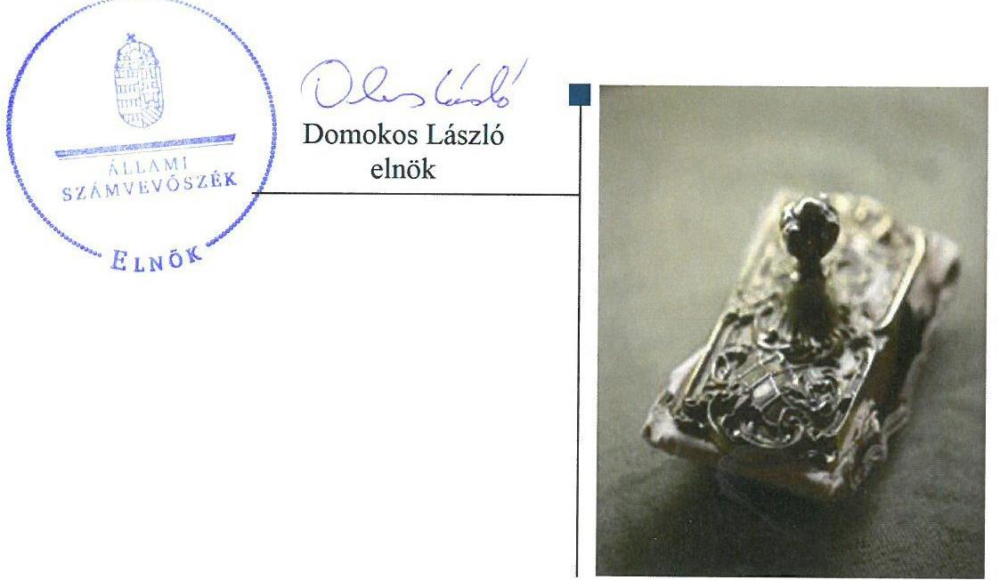

# Jelentés 

## Nem állami humánszolgáltatók ellenőrzése

A humánszolgáltatást nyújtó államháztartáson kívüli köznevelési intézmények fenntartói központi költségvetésből kapott támogatásai felhasználásának ellenőrzése - A Tan Kapuja Buddhista Egyház
2018.

---

# Jelentés 

## Nem állami humánszolgáltatók ellenőrzése

A humánszolgáltatást nyújtó államháztartáson kívüli köznevelési intézmények fenntartói központi költségvetésből kapott támogatásai felhasználásának ellenőrzése - A Tan Kapuja Buddhista Egyház
2018. 04. 12.

---

# AZ ELLENŐRZÉST FELÜGYELTE:

- **SALAMON ILDIKÓ** felügyeleti vezető

- **AZ ELLENŐRZÉST VEZETTE ÉS A VÉGREHAJTÁSÁÉRT FELELŐS:**

- **MAROZSÁN LÁSZLÓNÉ** ellenőrzésvezető

- **A PROGRAM ÖSSZEÁLLÍTÁSÁÉRT FELELŐS:**

- **TÓTPÁL SZABOLCS** osztályvezető

**IKTATÓSZÁM:** EL-0119-075/2018.

**TÉMASZÁM:** 2448

**ELLENŐRZÉS-AZONOSÍTÓ SZÁM:** V079406

---

Jelentéseink az Országgyűlés számítógépes hálózatán és az Interneten a www.asz.hu címen is olvashatóak.

---

# TARTALOMJEGYZÉK 

- ÖSSZEGZÉS ..... 5
- AZ ELLENŐRZÉS CÉLJA ..... 7
- AZ ELLENŐRZÉS TERÜLETE ..... 8
- AZ ELLENŐRZÉS HÁTTERE, INDOKOLTSÁGA ..... 9
- A JELENTÉS LÉNYEGES KÉRDÉSKÖREI ..... 10
- AZ ELLENŐRZÉS HATÓKÖRE ÉS MÓDSZEREI ..... 11
- MEGÁLLAPÍTÁSOK ..... 13
- JAVASLATOK ..... 18
- MELLÉKLETEK ..... 21
I. sz. melléklet: Értelmező szótár ..... 21
II. sz. melléklet: A támogatás jogcímenkénti alakulása ..... 23
- FÜGGELÉK: ÉSZREVÉTELEK ..... 25
- RÖVIDÍTÉSEK JEGYZÉKE ..... 27

---

.

---

# ÖSSZEGZÉS 

A Tan Kapuja Buddhista Egyház, mint köznevelési intézményfenntartó a költségvetési támogatások elszámoltatható igénybevételének feltételeit szabályszerű működési környezet kialakításával megteremtette. A gazdálkodási szabályzatok kialakítása azonban nem felelt meg a jogszabályi előírásoknak. A köznevelési feladatellátásához a 2014-2016. években kapott támogatásokat szabályszerűen használta fel, azt a köznevelési intézményének a működtetésére fordította. Ellenőrzési, értékelési feladatait ellátta, azonban a köznevelési közfeladatához kapcsolódó közzétételi kötelezettségét nem teljesítette, ezáltal a költségvetési támogatással való gazdálkodása nyilvánosságát nem biztosította.

## Az ellenőrzés társadalmi indokoltsága

Az Állami Számvevőszék stratégiájában hangsúlyos szerepet szán annak, hogy szilárd szakmai alapon álló, értékteremtő ellenőrzéseivel előmozdítsa a közpénzügyek átláthatóságát, rendezettségét és javaslataival a közpénzek és a közvagyon szabályos, gazdaságos, hatékony és eredményes felhasználását segítse. Stratégiájában az Állami Számvevőszék célul tűzte ki, hogy az államháztartáson kívülre nyújtott költségvetési támogatások ellenőrzésével hozzájárul ahhoz, hogy a közpénzeket az államháztartáson kívüli szervezetek is átlátható módon használják fel a közfeladatok szerződésben vállalt ellátása érdekében. Tekintettel az elmúlt években a köznevelés finanszírozását és a köznevelési intézmények fenntartását érintően végbement változásokra, a társadalom fokozott érdeklődéssel figyeli a köznevelési feladatok ellátására fordított források felhasználását. Fontos ezért az Állami Számvevőszéknek a közvéleményt biztosítani arról, hogy a közpénz államháztartáson kívüli felhasználása ezen a területen sem marad ellenőrizetlenül. Hozzájárul ezzel ahhoz is, hogy a nyilvánosság és az igénybevevők megfelelő tájékoztatást kapjanak az államháztartáson kívüli közfeladatot ellátók működéséről.

## Főbb megállapítások, következtetések, javaslatok

A Tan Kapuja Buddhista Egyház, mint intézményfenntartó a költségvetési támogatások elszámoltatható igénybevételének feltételeit szabályszerű működési környezet kialakításával megteremtette. A gazdálkodási szabályzatainak kialakítása nem a jogszabályi előírások betartásával történt. A számviteli politika keretében nem készítette el az eszközök és a források leltárkészítési és leltározási szabályzatát, valamint az eszközök és a források értékelési szabályzatát. Beszámolási formája és könyvvezetése megfelelt a jogszabályi előírásoknak. Az ellenőrzött időszakban a köznevelési közfeladatokhoz kapott költségvetési támogatásokkal kapcsolatos igénylési, módosítási és elszámolási feladatai során iratmegőrzési kötelezettségének nem tett eleget.

A Tan Kapuja Buddhista Egyház, mint intézményfenntartó jogszabályban előírt fenntartói feladatainak eleget tett, kiadta az intézmény alapító okiratát, meghatározta intézménye költségvetését, kinevezte az intézmény vezetőjét. A központi költségvetésből kapott támogatást szabályosan adta át a fenntartott intézményének, biztosította a működtetésének pénzügyi feltételeit. A köznevelési feladatok ellátásához biztosított költségvetési támogatás felhasználásáról naprakész, elkülönített nyilvántartást vezetett.

A Tan Kapuja Buddhista Egyház, mint intézményfenntartó szabályszerűen ellenőrizte, értékelte az általa fenntartott köznevelési intézmény tevékenységét, szakmai munkáját. A köznevelési közfeladat ellátásából adódó közzétételi kötelezettségének nem tett eleget, a kötelezően közzéteendő adatok nyilvánosságra hozatalának rendjét nem szabályozta. A fenntartott köznevelési intézménye működtetéséhez felhasznált közpénzekre vonatkozó gazdálkodásával a nyilvánosság előtt nem számolt el.

Az Állami Számvevőszék javaslatot tett a jogszabályi előírások alapján az eszközök és források leltárkészítési és leltározási szabályzatának, az eszközök és források értékelési szabályzatának elkészítésére, az adatok megőrzésére, a

---

változás-bejelentési, valamint a nyilvánosság tájékoztatásával kapcsolatos szabályozási és a közzétételi kötelezettség teljesítésére.

---

# AZ ELLENŐRZÉS CÉLJA 

AZ ELLENŐRZÉS CÉLJA annak értékelése volt, hogy A Tan Kapuja Buddhista Egyház, mint Intézményfenntartó ${ }^{1}$ a központi költségvetésből kapott támogatásainak felhasználása szabályszerű volt-e, a támogatások igénylése, évközi módosítása és év végi elszámolása megfelelt-e a jogszabályi előírásoknak.

---

# AZ ELLENŐRZÉS TERÜLETE 

## A Tan Kapuja Buddhista Egyház

A Tan Kapuja Buddhista Egyház az Országgyűlés által elismert bevett egyház. A 2004. évben alapította a „Kis Tigris" Gimnázium és Szakiskola elnevezésű köznevelési intézményét. A nyilvántartásba vett intézmény² komlói székhellyel, alsószentmártoni, pécsi és kákicsi telephelyein látta el köznevelési feladatait. Az intézmény 2016. szeptember 1-jétől A Tan Kapuja Buddhista Gimnázium néven működik, 2016. szeptember 1-jétől gimnáziumi nevelés-oktatási feladatokat lát el nappali és esti munkarendben. A Fenntartó egyoldalú nyilatkozatban vállalta az állami, önkormányzati köznevelési közfeladatban való részvételt.

A Fenntartó a költségvetési támogatás igényléséhez előírt feltételeknek az ellenőrzött években megfelelt, köznevelési feladatellátására tekintettel Magyarország éves költségvetéséből támogatásra volt jogosult. A központi költségvetésből kapott támogatás a Fenntartó összes bevételének mintegy 40\%-át tette ki. A Fenntartó a köznevelési feladatellátásra a 2014.
évben 199 201 ezer Ft, a 2015. évben 233 220 ezer Ft, a 2016. évben a kiegészítő támogatás nélkül 204 393 ezer Ft költségvetési támogatást kapott. A Fenntartó által a 2014-2016. évek alatt igényelt és a Kincstár³ által elszámolásként elfogadott költségvetési támogatás jogcímenkénti alakulását a II. melléklet tartalmazza. A Fenntartó a központi költségvetésből kapott támogatásnak 2014. évben a 86,61 %-át, 2015. évben a 88,26%-át, 2016. évben a 83,89 %-át adta át közvetlenül a köznevelési intézménye részére a működtetéséhez.

A köznevelési feladatok ellátásával kapcsolatos szakmai irányító szervi feladatokat az ellenőrzött időszakban az EMMI ${ }^{4}$ látta el, a törvényességi ellenőrzési feladatokat a területileg illetékes kormányhivatal ${ }^{5}$ végezte. A Fenntartó a köznevelési közfeladat ellátására tekintettel kapott közpénzekre való gazdálkodásával a nyilvánosság előtt köteles volt elszámolni.

---

# AZ ELLENŐRZÉS HÁTTERE, INDOKOLTSÁGA 

A köznevelési feladatokat ellátó nem állami intézményfenntartók részére közfeladataik ellátására évente jelentős összegű pénzügyi támogatást biztosítottak a mindenkori költségvetési törvények a bennük megfogalmazott feltételek mellett.

A felhasználható állami támogatások előirányzata 2014. - 2016. években együtt 753 Mrd Ft volt. A 2013. évben jelentős változások következtek be a normatív finanszírozás rendszerében. Az Országgyűlés elfogadta a nemzeti köznevelésről szóló 2011. évi CXC. törvényt, amely jelentősen átalakította a korábbi finanszírozási rendszert 2013 szeptemberétől. Új feladatfinanszírozási forma (átlagbéralapú támogatás) jelent meg, amely az államháztartáson kívüli intézményfenntartókra is vonatkozik. Az ellenőrzés a finanszírozási rendszerben bekövetkezett változásokra, azok közfeladat ellátásra gyakorolt hatására fókuszált a költségvetési támogatásokat felhasználó államháztartáson kívüli szervezetek körében. Az ellenőrzés indokoltságát az is alátámasztotta, hogy az ÁSZ ${ }^{6}$ még nem ellenőrizte átfogóan e területet.

Az ÁSZ stratégiájában foglaltak alapján is indokolt az ellenőrzés, amely a társadalom számára jelzi, hogy a közpénz államháztartáson kívüli felhasználása sem maradhat ellenőrizetlenül. Az államháztartáson kívülre nyújtott költségvetési támogatások ellenőrzésével az ÁSZ hozzájárul ahhoz, hogy a közpénzeket a nem állami fenntartók átlátható módon használják fel a közfeladatok ellátására kötött szerződésekben vállalt kötelezettségek teljesítése érdekében. Az ÁSZ az ellenőrzés javaslataival hozzájárulhat az említett rendszerek szabályszerű támogatás-felhasználásához, javíthatja a társadalmi-gazdasági döntések megalapozottságát, amely a „jó kormányzás" feltétele.

---

# A JELENTÉS LÉNYEGES KÉRDÉSKÖREI 

1.     - A köznevelési közfeladatot ellátó Fenntartó szabályszerű működési és gazdálkodási környezet kialakításával megteremtette-e a költségvetési támogatások átlátható, elszámoltatható igénybevételének, felhasználásának feltételeit?
2.     - A Fenntartó az átvállalt köznevelési közfeladathoz biztosított költségvetési támogatásokat szabályszerűen fordította-e intézménye működtetésére?
3.     - A Fenntartó a köznevelési intézménye működtetéséhez felhasznált közpénzekre vonatkozó gazdálkodásával a nyilvánosság előtt elszámolt-e, ennek megalapozása érdekében ellenőrzési, értékelési és a külső ellenőrzésekkel kapcsolatos intézkedési feladatait szabályszerűen látta-e el?

---

# AZ ELLENŐRZÉS HATÓKÖRE ÉS MÓDSZEREI 

## Az ellenőrzés típusa

Megfelelőségi ellenőrzés.

## Az ellenőrzött időszak

A 2014. január 1-je és 2016. december 31-e közötti időszak.

## Az ellenőrzés tárgya

Az ellenőrzés a köznevelési közfeladatokat ellátó államháztartáson kívüli fenntartó közfeladatainak ellátásához a költségvetési törvényekben biztosított központi költségvetési támogatások igénylése, évközi módosítása és év végi elszámolása, fenntartói feladatainak ellátása, illetve e központi költségvetésből kapott támogatásaik közfeladatokra való fenntartó általi felhasználása szabályszerűségének értékelésére terjedt ki.

Az ellenőrzés kiterjedt minden olyan körülményre és adatra, amely az ÁSZ jogszabályban meghatározott feladatainak teljesítéséhez, valamint a program végrehajtása folyamán felmerült újabb összefüggések feltárásához szükséges volt.

## Az ellenőrzött szervezet

A Tan Kapuja Buddhista Egyház, mint intézményfenntartó.

## Az ellenőrzés jogalapja

Az ellenőrzés jogszabályi alapját az ÁSZ tv. ${ }^{7}$ 1. § (3) bekezdésében, az 5. § (3) bekezdésében, valamint az 5. § (11) bekezdés c) pontjában foglalt előírások adták.

## Az ellenőrzés módszerei

Az ellenőrzést az ellenőrzési program kérdései, az adott időszakban hatályos jogszabályok, az ellenőrzés szakmai szabályok és módszertanok, valamint a nemzetközi standardok figyelembevételével végezte az ÁSZ.

A közpénzekkel való felelős gazdálkodás segítésére irányuló javaslatok kidolgozásakor a hatályos jogszabályok voltak az irányadóak.

---

Az ellenőrzés ideje alatt az ÁSZ a Fenntartóval történő kapcsolattartást az ÁSZ SZMSZ ${ }^{8}$-ének vonatkozó előírásai alapján biztosította.

Az ellenőrzési kérdések megválaszolásához szükséges bizonyítékok megszerzése az ellenőrzött által rendelkezésre bocsátott dokumentumokra, adatokra alapozva történt.

Az ellenőrzési bizonyítékként felhasznált adatforrások közé tartoztak egyrészt a szakmai program részletes szempontjainál felsorolt adatforrások, másrészt minden - az ellenőrzés folyamán feltárt, az ellenőrzés szempontjából információt tartalmazó - dokumentum.

Az ellenőrzés lefolytatásához a Fenntartó a kitöltött tanúsítványok, valamint az ÁSZ által kért dokumentumok átadásával szolgáltatott adatokat, információkat. Az így rendelkezésre bocsátott adatok, információk és a tanúsítványok adatai valódiságának kontrollja az ellenőrzés keretében történt.

Helyszíni szemlékre a fenntartott intézmény egyes feladatellátási helyein került sor. A köznevelési, a szociális humánszolgáltatások központi költségvetési támogatásai igénylésével, módosításával, elszámolásával kapcsolatos, államháztartáson kívüli fenntartó jogszabályokban előírt feladatai betartását, továbbá a központi költségvetési támogatások szabályszerű kezelését, nyilvántartását ellenőrizte az ÁSZ a Fenntartónál, az ott rendelkezésre álló határozatok, nyilvántartások, beszámolók és egyéb dokumentumok alapján. Az ellenőrzés nem terjedt ki a köznevelési feladatokhoz kapcsolódó központi költségvetési támogatás igénylése, módosítása, elszámolása valódiságának, megalapozottságának, helyességének - sem a fenntartónál, sem a székhely intézményénél való - értékelésére. Továbbá nem terjedt ki az ellenőrzés e források, intézmény általi szabályszerű felhasználásának értékelésére. A szabályosság megítélésének alapját képezte, hogy a központi költségvetési támogatások Fenntartó általi igénylése, módosítása és elszámolása a Kincstár felé megtörtént.

---

# 1. A köznevelési közfeladatot ellátó Fenntartó szabályszerű működési és gazdálkodási környezet kialakításával megteremtette-e a költségvetési támogatások átlátható, elszámoltatható igénybevételének, felhasználásának feltételeit? 

Összegző megállapítás

A köznevelési közfeladatot ellátó Fenntartó szabályszerű működési környezet kialakításával megteremtette a költségvetési támogatások elszámoltatható igénybevételének feltételeit. A gazdálkodási környezet kialakítása nem volt szabályszerű.
1.1. számú megállapítás

A Fenntartó köznevelési közfeladat ellátásának megszervezése a jogszabályi előírásoknak megfelelt. Gazdálkodási szabályzatai nem
 feleltek meg a jogszabályi előírásoknak.

A KÖZNEVELÉSI KÖZFELADAT ELLÁTÁSÁT a Fenntartó a jogszabályi előírásoknak megfelelően megszervezte. A Fenntartót a Fővárosi Bíróság nyilvántartásba vette. Az Alapszabály ${ }^{9}{ }_{1-2}$-ban megfogalmazott céljai között szerepel a közoktatási intézmény létrehozása és működtetése. A fenntartói képviseletet a köznevelési intézményében a Közoktatási, illetve Köznevelési Bizottság ${ }^{10}$ elnöke látta el. A Fenntartó az ellenőrzött időszak vonatkozásában egyoldalú nyilatkozatban vállalta az állami, önkormányzati közfeladat ellátásban való részvételt.

A Fenntartó a Számv.tv. ${ }^{11}$ szerint eleget tett a beszámolási és könyvvezetési kötelezettségének, egyszerűsített éves beszámolót készített. A 2016. évi egyszerűsített éves beszámoló a hatályos Számviteli politika ${ }^{12}{ }_{2}$ III.2. pontjában előírtak ellenére nem tartalmazta a kiegészítő mellékletet.

A Fenntartó a 2015-2016. évekre vonatkozóan a Számv. tv.-ben előírtaknak megfelelően kialakította a számviteli politikáját, azonban a 2014. évben érvényes számviteli politikával nem rendelkezett. A számviteli politika ${ }^{13}{ }_{1-2}$ megfelelt a Számv. tv. 14. § (3)-(4) bekezdéseiben előírtaknak, azonban a számviteli politika ${ }_{1}$ nem felelt meg a Számv. tv. 14. § (12) bekezdésében foglaltaknak, mivel a hatályba lépés időpontjában hatályon kívül helyezett jogszabályokra hivatkozott.

Fenntartó a Számv. tv. 14. § (5) bekezdés a) és b) pontjaiban előírtak ellenére a számviteli politika ${ }_{1-2}$ keretében nem készítette el az eszközök és a források leltárkészítési és leltározási szabályzatát, valamint az eszközök és a források értékelési szabályzatát, azokkal az ellenőrzött időszakban nem rendelkezett.

A Fenntartó a Számv. tv.-ben előírtaknak megfelelően a számviteli politika keretében elkészítette a pénzkezelési szabályzat ${ }^{14}{ }_{1-2}$-át. A pénzkezelési

---

1.2. számú megállapítás

szabályzat ${ }_{1}$ a Számv. tv. 14. § (8) bekezdésében foglaltak ellenére nem rendelkezett a készpénzállományt érintő pénzmozgások jogcímeiről és eljárási rendjéről. A pénzkezelési szabályzat ${ }_{2}$ megfelelt a Számv. tv.-ben előírtaknak.

A Fenntartó a költségvetési támogatások igénylési, módosítási és elszámolási feladatait ellátta, azonban kapcsolódó iratmegőrzési kötelezettségének nem szabályszerűen tett eleget.

# A KÖZPONTI KÖLTSÉGVETÉSI TÁMOGATÁ-

SOKRA vonatkozó kérelmét a Fenntartó a 2014-2016. évek tekintetében a Kincstárhoz benyújtotta, melyekhez az Nkt. vhr. ${ }^{15}$-ben előírt nyilatkozatokat csatolta. A kérelmek határidőben történt benyújtását igazoló dokumentumokat a Fenntartó nem őrizte meg, mellyel a Lttv ${ }^{16}$. 9. § (1) bekezdés e) pontjában rögzített iratok megőrzési követelményének nem tett eleget.

A Fenntartó által fenntartott köznevelési intézmény nyilvántartott adataiban változás történt az ellenőrzött időszakban - 2014. évben cím változás, 2016. évben név-változás - melyekkel kapcsolatos változás-bejelentési kötelezettségének az Nkt. vhr. 37/H. § (1) bekezdésében előírtak ellenére a Kincstár felé nem tett eleget.

A Fenntartó elszámolt a Kincstár felé a központi költségvetésből kapott támogatásokkal. Az elszámolások mellékletét képező, az Nkt.vhr. 37/L § (2)-(3) §-aiban előírt nyilatkozatok és tanulói kimutatások vonatkozásában azonban nem tett eleget a Lttv 9. § (1) bekezdés e) pontjában előírt, iratok megőrzési követelményének.

## 2. A Fenntartó az átvállalt köznevelési közfeladathoz biztosított költségvetési támogatásokat szabályszerűen fordította-e intézménye működtetésére?

Összegző megállapítás

## 2.1. számú megállapítás

A Fenntartó az átvállalt köznevelési közfeladatokhoz biztosított költségvetési támogatásokat a jogszabályi előírásoknak megfelelően használta fel.

A Fenntartó biztosította a köznevelési intézmény működtetésének feltételeit.

A FENNTARTÓ KIADTA az intézmény alapító okirat ${ }^{17}{ }_{1-3}$-at, melyben az Nkt. ${ }^{18}$ előírásainak megfelelően meghatározta a működésének főbb jellemzőit: alapfeladatát, gazdálkodással összefüggő jogosítványait, a feladatellátáshoz szükséges vagyon feletti rendelkezési jogot. A Fenntartó kérelmezte az illetékes kormányhivatalnál az intézmény nyilvántartásba vételét és a működési engedélyének kiadását, mely kérelem alapján az intézmény a kormányhivatal nyilvántartásában szerepelt, működési engedéllyel rendelkezett.

Az Nkt.-ban előírt fenntartói feladatainak megfelelően meghatározta az ellenőrzött években az intézmény költségvetését, kinevezte az intézmény

---

vezetőjét, döntött a térítési díj, tandíj fizetés alóli mentességről. Jóváhagyásával érvényesítette az intézmény pedagógiai programját, házirendjét és 2014. szeptember 1-jétől a szervezeti és működési szabályzatát. A Fenntartó, az intézménye alapfeladat ellátásához a szükséges vagyon feletti rendelkezési jogot, az állandó saját székhelyet biztosította.
2.2. számú megállapítás

A Fenntartó az átvállalt köznevelési közfeladatához rendelt költségvetési támogatást szabályszerűen kezelte, elkülönítetten tartotta nyilván és intézménye működtetésére fordította.

A TÁMOGATÁS FELHASZNÁLÁSÁRÓL az Nkt.vhr.-ben előírtaknak megfelelően elkülönített nyilvántartást vezetett a Fenntartó. Gondoskodott a nyilvántartás olyan kialakításáról, amelyből megállapítható volt, hogy a költségvetési támogatásokat milyen célra használta fel.

A Fenntartó a hatályos Kvtv. ${ }^{19}$-ben előírtaknak megfelelően a kincstári határozatokkal jóváhagyott átlagbéralapú támogatás, a tankönyv- és a gyermekétkeztetési támogatás teljes összegét továbbutalta az intézményének.

A jogszabály által biztosított lehetőséggel élve a működési támogatás egy részét a Fenntartó nem adta át intézményének, azt egyéb oktatási célú költségek finanszírozására fordította.

# 3. A Fenntartó a köznevelési intézménye működtetéséhez felhasznált közpénzekre vonatkozó gazdálkodásával a nyilvánosság előtt elszámolt-e, ennek megalapozása érdekében ellenőrzési, értékelési és a külső ellenőrzésekkel kapcsolatos intézkedési feladatait szabályszerűen látta-e el? 

Összegző megállapítás

A Fenntartó ellenőrzési, értékelési és a külső ellenőrzéssel kapcsolatos intézkedési feladatait szabályszerűen ellátta. A közérdekű adatok közzététele nem volt szabályszerű, a nyilvánosság előtt a köznevelési intézmény működtetéséhez felhasznált közpénzekre vonatkozó gazdálkodásával nem számolt el.
3.1. számú megállapítás

A Fenntartó ellenőrzési, értékelési feladatait szabályszerűen látta el.

A FENNTARTÓ ELLENŐRIZTE az általa fenntartott intézmény gazdálkodását, működésének törvényességét, szabályosságát a 2014. évben. A gazdálkodás ellenőrzése kiterjedt a költségvetési támogatás igénylésére és felhasználására is. A Fenntartó az intézmény SZMSZének, házirendjének, pedagógiai programjának az ellenőrzését azok 2014. és 2016. évi módosításának a jóváhagyásakor elvégezte.

A Fenntartó az Nkt. előírásának megfelelően tanévenként értékelte az intézmény pedagógiai programjában meghatározott feladatok végrehajtását, a pedagógiai-szakmai munka eredményességét.

---

# 3.2. számú megállapítás 

A Fenntartó a köznevelési intézménye működtetéséhez felhasznált közpénzekre vonatkozó gazdálkodásával a nyilvánosság előtt nem számolt el.

A FENNTARTÓ NEM ALAKÍTOTTA KI az Info.tv. ${ }^{20} 7$. § (2) bekezdése előírásainak ellenére a 2014-2016. években azokat az eljárási szabályokat, amelyek az Info. tv., valamint egyéb adat- és titokvédelmi szabályok érvényre juttatásához szükségesek. Az Info. tv. 35. § (3) bekezdésének előírása ellenére belső szabályzatban nem állapította meg az Info. tv. 37. §-ban meghatározott közzétételi listákon szereplő adatok pontos, naprakész és folyamatos közzétételének a részletes szabályait.

## KÖZNEVELÉSI KÖZFELADATAI ELLÁTÁSÁHOZ

KAPCSOLÓDÓAN a Fenntartó a 2014-2016. években Info. tv. 37. § (1) bekezdésében előírtak ellenére nem gondoskodott az Info. tv. 1. melléklet általános közzétételi lista Szervezeti, személyzeti adatok, Tevékenységre, működésre vonatkozó adatok és a Gazdálkodási adatok közül az alábbi lényeges adatok közzétételéről:

## SZERVEZETI, SZEMÉLYZETI ADATOK közül:

$\longrightarrow$ a közfeladatot ellátó szerv szervezeti felépítése szervezeti egységek megjelölésével, az egyes szervezeti egységek feladatai.

## TEVÉKENYSÉGRE, MŰKÖDÉSRE VONATKOZÓ

ADATOK közül:
$\longrightarrow$ a közfeladatot ellátó szerv feladatát, hatáskörét meghatározó, a szervre vonatkozó alapvető jogszabályok, közjogi szervezetszabályozó eszközök,
$\longrightarrow$ az adatvédelmi és adatbiztonsági szabályzat hatályos és teljes szövege,
$\longrightarrow$ a közfeladatot ellátó szerv által nyújtott közszolgáltatások igénybevételének rendje, a közszolgáltatásért fizetendő díj mértéke, az abból adott kedvezmények,
$\longrightarrow$ a közfeladatot ellátó szerv által kiírt pályázatok szakmai leírása, azok eredményei és indokolásuk,
$\longrightarrow$ a közfeladatot ellátó szervnél végzett alaptevékenységgel kapcsolatos vizsgálatok, ellenőrzések nyilvános megállapításai,
$\longrightarrow$ a közérdekű adatok megismerésére irányuló igények intézésének rendje.

## GAZDÁLKODÁSI ADATOK közül:

$\longrightarrow$ a közfeladatot ellátó szerv éves költségvetése,
$\longrightarrow$ a közfeladatot ellátó szerv számviteli törvény szerinti beszámolója,
$\longrightarrow$ az államháztartás pénzeszközei felhasználásával, az államháztartáshoz tartozó vagyonnal történő gazdálkodással összefüggő, ötmillió forintot elérő vagy azt meghaladó értékű árubeszerzésre, építési beruházásra, szolgáltatás megrendelésre, vagyonértékesítésre, vagyonhasznosításra, vagyon vagy vagyoni értékű jog átadására vonatkozó szerződések megnevezése (típusa), tárgya, a szerződést kötő

---

felek neve, a szerződés értéke, határozott időre kötött szerződés esetében annak időtartama, valamint az említett adatok változásai.
— az Európai Unió támogatásával megvalósuló fejlesztésekre vonatkozó szerződések.
A Fenntartó nevelési-oktatási intézménye munkájával összefüggő értékelését az Nkt.-ban előírtaknak megfelelően honlapján nyilvánosságra hozta.

# 3.3. számú megállapítás 

A Fenntartó a külső ellenőrzésekkel kapcsolatos intézkedési feladatait szabályszerűen látta el.

A Kincstár 2016-ban helyszíni ellenőrzés keretében ellenőrizte a Fenntartó 2014. évi köznevelési feladatok ellátására igényelt támogatásának az elszámolását, a támogatások felhasználásának jogszerűségét. A hatósági ellenőrzés alapján hozott határozatában finanszírozási különbözet megfizetésére kötelezte a Kincstár a Fenntartót, melynek a Fenntartó eleget tett.

---

# JAVASLATOK 

Az ÁSZ tv. 33. § (1) bekezdésében foglaltak értelmében az ellenőrzött szervezet vezetője köteles a jelentésben foglalt megállapításokhoz kapcsolódó intézkedési tervet összeállítani és azt a jelentés kézhezvételétől számított 30 napon belül az ÁSZ részére megküldeni. Amennyiben az ellenőrzött szervezet vezetője nem küldi meg határidőben az intézkedési tervet vagy továbbra sem elfogadható intézkedési tervet küld, az Állami Számvevőszék elnöke az ÁSZ tv. 33. § (3) bekezdés a) és b) pontjaiban foglaltakat érvényesítheti.

## Tan Kapuja Buddhista Egyház vezetőjének

1. Intézkedjen, hogy a Fenntartó egyszerűsített éves beszámolója a Számviteli politikában előírtaknak megfelelően tartalmazza a kiegészítő mellékletet.
(1.1. számú megállapítás 2. bekezdés 2. mondata alapján)
2. Intézkedjen, hogy a Fenntartó a jogszabályi előírásoknak megfelelően készítse el a számviteli politika keretében az eszközök és források leltárkészítési és leltározási szabályzatát, valamint az eszközök és források értékelési szabályzatát.
(1.1. számú megállapítás 4. bekezdés alapján)
3. Intézkedjen, hogy a Fenntartó tegyen eleget a jogszabályban foglaltaknak megfelelően az iratok megőrzésére vonatkozó kötelezettségének.
(1.2. számú megállapítás 1. bekezdés 2. mondata és a 3. bekezdés 2. mondata alapján)
4. Intézkedjen, hogy a Fenntartó az Nkt. vhr-ben előírtaknak megfelelően a Kincstár által nyilvántartott adatokban bekövetkezett változás esetén a változás-bejelentési kötelezettségét teljesítse.
(1.2. számú megállapítás 2. bekezdés alapján)
5. Intézkedjen, hogy a Fenntartó a jogszabályi előírásoknak megfelelően
a) alakítsa ki azokat az eljárási szabályokat, amelyek az Info. tv., valamint az egyéb adat- és titokvédelmi szabályok érvényre juttatásához szükségesek;
b) állapítsa meg a közzétételi listákon szereplő adatok pontos, naprakész és folyamatos közzétételének részletes szabályait.
(3.2. számú megállapítás 1. bekezdése alapján)

---

6. Intézkedjen, hogy a Fenntartó a jogszabályi előírásnak megfelelően teljes körűen közzétegye az Info. tv. 1. mellékletében meghatározott adatokat.
(3.2. számú megállapítás 2. bekezdése alapján)

---

.

---

# MELLÉKLETEK 

- I. SZ. MELLÉKLET: ÉRTELMEZŐ SZÓTÁR
bevett egyház
egyházi fenntartó
humánszolgáltatás
költségvetési támogatás
köznevelési közfeladat

Az Ehtv. ${ }^{21}$ 6. § (1-2) bekezdései szerint az Országgyűlés által elismert egyház bevett egyház. Vallási közösség az Országgyűlés által elismert egyház és a vallási tevékenységet végző szervezet lehet. A vallási közösség elsődlegesen vallási tevékenység céljából jön létre és működik. Az Ehtv. 7. §-a szerint a vallási közösség az egyház megjelölést elnevezésében és tevékenységére való utalás során önmeghatározása céljából - a saját hitelvei szerinti tartalommal - használhatja.
Az Ehtv. 33. §-a alapján az Ehtv. mellékletében felsorolt egyházak és az általuk meghatározott, az egyház belső egyházi szabálya szerint jogi személyiséggel rendelkező szervezetek - a nyilvántartásba vételük dátumától függetlenül - 2012. január 1-jétől minősülnek egyházi fenntartóknak. Az Ehtv. 14. §-ában meghatározott eljárás folyamán az Országgyűlés által egyháznak elismert szervezet a törvénynek az egyház bejegyzésére vonatkozó módosítása hatálybalépésének napjától minősül egyháznak (Ehtv. 15. §).
Külön törvényben meghatározott szociális, gyermekjóléti, gyermekvédelmi, közoktatási, felsőoktatási, kulturális közfeladatok (2014. évi Kvtv. 34. § (1), (4) bekezdés, 1. számú melléklet XX/20/2. alcím,
 19. alcím, 2015. évi Ktv. 43. § (1), (4) bekezdés, 1. számú melléklet XX/20/2/3. jogcím csoport, 19. alcím, 2016. évi Ktv. 41. § (1), (4) bekezdés, 1. számú melléklet XX/20/2/3. jogcím csoport, 19. alcím).
a társadalombiztosítás pénzügyi alapjai kivételével az államháztartás központi alrendszeréből ellenérték nélkül, pénzben nyújtott támogatások (Áht. 1. § 14. pont)
A Ktv-ekben (2013. évi CCXXX. törvény 33-34. §, 2014. évi C. törvény 42-43. §, 2015. évi C. törvény 40-41. §) megállapított támogatás. Például a 2015. évi C. törvény 40-41. § szerint többek között: Az Országgyűlés a köznevelési feladat ellátására átlagbéralapú támogatást állapít meg. A nevelési-oktatási, valamint pedagógiai szakszolgálati intézményt fenntartó nemzetiségi önkormányzat, az egyházi és magán köznevelési intézmény fenntartója részére az általuk fenntartott nevelési-oktatási intézményben, továbbá pedagógiai szakszolgálati intézményben pedagógus és - a b) pont kivételével - nevelő-oktató munkát közvetlenül segítő munkakörben foglalkoztatottak után a 8. melléklet I. pontja, valamint az óvoda, egységes óvoda-bölcsőde esetében a 2. melléklet II. pont 1. alpontja szerint és az 5. alpontjában meghatározott jogosultak után, az őket ott megillető mértékek szerint. Működési támogatást állapít meg a nemzetiségi önkormányzat vagy az egyházi jogi személy által fenntartott nevelési-oktatási intézményekben ellátott, továbbá a pedagógiai szakszolgálati intézményekben gyógypedagógiai tanácsadásban, korai fejlesztésben, oktatásban és gondozásban, valamint a fejlesztő nevelésben részt vevő gyermekekre, tanulókra tekintettel a nemzetiségi önkormányzat és a bevett egyház részére a 8. melléklet II. pontja szerint.
Az Országgyűlés a szociális, gyermekjóléti, gyermekvédelmi közfeladatot ellátó intézményt, szolgáltatást fenntartó egyházi jogi személy, civil szervezet, közalapítvány, országos nemzetiségi önkormányzat, települési vagy területi nemzetiségi önkormányzat, gazdasági társaság, és a humánszolgáltatást alaptevékenységként végző, az Szja tv. hatálya alá tartozó egyéni vállalkozó (a továbbiakban együtt: nem állami szociális fenntartó) részére támogatást állapít meg a következők szerint: a támogatás a nem állami szociális fenntartót a települési önkormányzatok 2. melléklet III. pont 3. alpont c)-k) pontjában és III. pont 5. alpont o) pontjában meghatározott támogatásaival azonos jogcímeken, összegben és feltételek mellett illeti meg.
A köznevelési intézmény alapító okiratában foglalt feladat: óvodai nevelés, nemzetiséghez tartozók óvodai nevelése, általános iskolai nevelés-oktatás, nemzetiséghez tartozók általános iskolai nevelése-oktatása, kollégiumi ellátás, nemzetiségi kollégiumi el-

---

## köznevelési intézmény

nem állami, nem önkormányzati (államháztartáson kívüli) intézmény fenntartó
vallási tevékenység
vallási tevékenységet végző szervezet
látás, gimnáziumi nevelés-oktatás, szakközépiskolai nevelés-oktatás, szakiskolai nevelés-oktatás, nemzetiség gimnáziumi nevelés-oktatása, nemzetiség szakközépiskolai nevelés-oktatása, nemzetiség szakiskolai nevelés-oktatása, Köznevelési Hídprogramok keretében folyó nevelés-oktatás, felnőttoktatás, alapfokú művészetoktatás, fejlesztő nevelés, fejlesztő nevelés-oktatás, pedagógiai szakszolgálati feladat, a többi gyermekkel, tanulóval együtt nevelhető, oktatható sajátos nevelési igényű gyermekek, tanulók óvodai nevelése és iskolai nevelése-oktatása, azoknak a sajátos nevelési igényű gyermekeknek, tanulóknak az óvodai, iskolai, kollégiumi ellátása, akik a többi gyermekkel, tanulóval nem foglalkoztathatók együtt, a gyermekgyógyüdülőkben, egészségügyi intézményekben, rehabilitációs intézményekben tartós gyógykezelés alatt álló gyermekek tankötelezettségének teljesítéséhez szükséges oktatás, pedagógiai-szakmai szolgáltatás.
A nevelési-oktatási intézmény, pedagógiai szakszolgálati intézmény, pedagógiai-szakmai szolgáltatást nyújtó intézmény.
A köznevelési és szociális, gyermekjóléti és gyermekvédelmi közfeladatokat/humánszolgáltatásokat ellátó intézményt fenntartó egyházi jogi személy, társadalmi szervezet, alapítvány, közalapítvány, civil szervezet, országos nemzetiségi önkormányzat, nonprofit gazdasági társaság, gazdasági társaság és a humánszolgáltatást alaptevékenységként végző, Szja tv. hatálya alá tartozó egyéni vállalkozó. (2013. évi Ktv. 35. § (1), (3) bekezdés, 2014. évi Ktv. 33. §, 34. § (1), (4) bekezdés, 2015. évi Ktv. 42. §, 43. § (1), (4) bekezdés, 2016. évi Ktv. 40. §, 41. § (1), (4) bekezdés)
Az Ehtv. 6. § (3) bekezdés szerint a vallási tevékenység olyan világnézethez kapcsolódó tevékenység, amely természetfelettire irányul, rendszerbe foglalt hitelvekkel rendelkezik, tanai a valóság egészére irányulnak, valamint sajátos magatartáskövetelményekkel az emberi személyiség egészét átfogja. Az Ehtv. 6. § (4) bekezdés (e, f, j, o) pontjai) szerint önmagában nem tekinthető vallási tevékenységnek a nevelési, az oktatási, a család-, gyermek- és ifjúságvédelmi és a szociális tevékenység.
Az Ehtv. 9/A. § (1) bekezdései szerint a vallási tevékenységet végző szervezet olyan egyesület, amelynek tagjai azonos hitelveket valló természetes személyek, és amelynek alapszabályában meghatározott célja vallási tevékenység végzése.

---

II. SZ. MELLÉKLET: A TÁMOGATÁS JOGCÍMENKÉNTI ALAKULÁSA

|  A FENNTARTÓ ÁLTAL KAPOTT KÖZPONTI KÖLTSÉGVETÉSI TÁMOGATÁS JOGCÍMENKÉNTI ALAKULÁSA (EZER FT) |  |  |   |
| --- | --- | --- | --- |
|  Megnevezés | 2014. év | 2015. év | 2016. év  |
|  átlagbéralapú támogatás | 135500 | 149499 | 158877  |
|  működési támogatás | 37573 | 39760 | 40427  |
|  gyermekétkeztetési támogatás | 4896 | 4586 | 4129  |
|  tankönyvtámogatás | 1032 | 984 | 960  |
|  kiegészítő támogatás | 20200 | 38391 | na*  |
|  Összesen | 199201 | 233220 | 204393  |

Forrás: 2014-2016. költségvetési támogatás elszámolásainak kincstári határozatai * a 2016. évi kiegészítő támogatásról az adatbekérés idejéig nem kapott a Fenntartó határozatot

---

.

---

# FÜGGELÉK: ÉSZREVÉTELEK 

A jelentéstervezetet a Számvevőszék 15 napos észrevételezésre megküldte az ellenőrzött szervezet vezetőjének az ÁSZ tv. 29. §* (1) bekezdése előírásának megfelelően.

A Tan Kapuja Buddhista Egyház elnöke az ÁSZ tv. 29. § (2) bekezdésében foglalt észrevételezési jogával nem élt, írásban jelezte, hogy észrevételt nem tesz.

[^0]
[^0]:    * 29. § (1) Az Állami Számvevőszék az ellenőrzési megállapításait megküldi az ellenőrzött szervezet vezetőjének vagy az általa megbízott személynek, és annak, akinek személyes felelősségét állapította meg.
    (2) Az ellenőrzött szervezet vezetője és a felelősként megjelölt személy az ellenőrzés megállapításaira tizenöt napon belül írásban észrevételt tehet.
    (3) Az Állami Számvevőszék az észrevételre a beérkezésétől számított harminc napon belül írásban válaszol. A figyelembe nem vett észrevételeket köteles a jelentésben feltüntetni, és megindokolni, hogy azokat miért nem fogadta el.

---

.

---

# RÖVIDÍTÉSEK JEGYZÉKE 

${ }^{1}$ Intézményfenntartó/Fenntartó
${ }^{2}$ intézmény
${ }^{3}$ Kincstár
${ }^{4}$ EMMI
${ }^{5}$ kormányhivatal
${ }^{6}$ ÁSZ
${ }^{7}$ ÁSZ tv.
${ }^{8}$ ÁSZ SZMSZ
${ }^{9}$ Alapszabály1-2
${ }^{10}$ Közoktatási/Köznevelési Bizottság
${ }^{11}$ Számv. tv.
${ }^{12}$ számviteli politika $_{2}$
${ }^{13}$ számviteli politika $_{1}$
${ }^{14}$ pénzkezelési szabályzat ${ }_{1-2}$
${ }^{15} \mathrm{Nkt}$. vhr.
${ }^{16} \mathrm{Lttv}$.
${ }^{17}$ Alapító okirat ${ }_{1-3}$
${ }^{18} \mathrm{Nkt}$.
${ }^{19}$ Ktv.
${ }^{20}$ Info. tv.
${ }^{21}$ Ehtv.

A Tan Kapuja Buddhista Egyház
„Kis Tigris" Gimnázium, Szakiskola és Szakközépiskola, majd 2016. szeptember 1-jétől A Tan Kapuja Buddhista Gimnázium
Magyar Államkincstár
Emberi Erőforrások Minisztériuma
Baranya Megyei Kormányhivatal
Állami Számvevőszék
2011. évi LXVI. törvény az Állami Számvevőszékről (hatályos 2011. július 1-től)
az Állami Számvevőszék szervezeti és működési szabályzata
Alapszabály1: A Tan Kapuja Buddhista Egyház Alap- és Hitelvi Szabálya (hatályos 2013. május 10-től 2016. október 24-ig)

Alapszabály2: A Tan Kapuja Buddhista Egyház Alap- és Hitelvi Szabálya (hatályos 2016. október 25-től)

A Tan Kapuja Buddhista Egyház szervezeti egysége
2000. évi C. törvény a számvitelről
számviteli politika2: A Tan Kapuja Buddhista Egyház Számviteli politikája (hatályos 2016. január 1-től)
számviteli politika1: A Tan Kapuja Buddhista Egyház Számviteli politikája (hatályos 2015. január 1-től 2015. december 31-ig)
pénzkezelési szabályzat ${ }_{1}$ : A Tan kapuja Buddhista Egyház pénzkezelési szabályzata (hatályos 2013. december 15-től)
pénzkezelési szabályzat ${ }_{2}$ : A Tan kapuja Buddhista Egyház pénzkezelési szabályzata (hatályos 2015. január 1.)
229/2012. (VIII. 28.) Korm. rendelet a nemzeti köznevelésről szóló törvény végrehajtásáról (hatályos 2012. szeptember 1-től)
1995. évi LXVI. törvény a közokiratokról, a közlevéltárakról és a magánlevéltári anyag védelméről
Alapító okirat1: Kis Tigris Gimnázium alapító okirata (hatályos 2013. április 8-tól 2014. augusztus 8-ig)

Alapító okirat2: Kis Tigris Gimnázium alapító okirata (hatályos 2014. április 8-tól 2016. május 20-ig)

Alapító okirat3: A Tan Kapuja Gimnázium alapító okirata (hatályos 2016. május 20-tól)
2011. évi CXC. törvény a nemzeti köznevelésről (hatályos 2012. szeptember 1-től)
2012. évi CCIV. törvény Magyarország 2013. évi központi költségvetéséről 2013. évi CCXXX. törvény Magyarország 2014. évi központi költségvetéséről 2014. évi C. törvény Magyarország 2015. évi központi költségvetéséről
2015. évi C. törvény Magyarország 2016. évi központi költségvetéséről
2011. évi CXII. törvény az információs önrendelkezési jogról és az információszabadságról (hatályos 2011. július 27-től)
2011. évi CCVI. törvény a lelkiismereti és vallásszabadság jogáról, valamint az egyházak, vallásfelekezetek és vallási közösségek jogállásáról (hatályos: 2011. december 22-től)

---

ÁLLAMI SZÁMVEVŐSZÉK
1052 Budapest, Apáczai Csere János utca 10.
Levélcím: 1364 Budapest 4. Pf. 54
Telefon: +36 14849100 Telefax: +36 14849200
www.asz.hu
