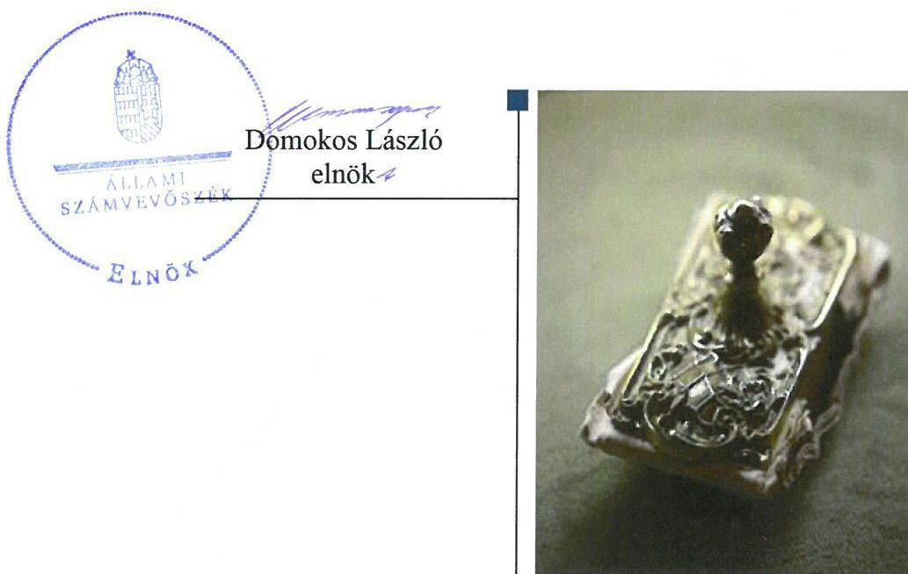

# Jelenetés 

## Az önkormányzatok gazdasági társaságai

Az önkormányzatok többségi tulajdonában lévő gazdasági társaságok gazdálkodásának ellenőrzése - Cserkeszőlői Beruházó Nonprofit Kft.
2018. 04. hó 19. nap

---

# AZ ELLENŐRZÉST FELÜGYELTE:

DR. NAGY IMRE felügyeleti vezető

# AZ ELLENŐRZÉST VEZETTE ÉS A VÉGREHAJTÁSÁÉRT FELELŐS:

IMRE ZSUZSANNA ellenőrzésvezető

VERTKOVCZI MÁRIA ellenőrzésvezető

# A PROGRAM ÖSSZEÁLLÍTÁSÁÉRT FELELŐS:

TÓTPÁL SZABOLCS osztályvezető

IKTATÓSZÁM: EL-0099-121/2018.

|  Jelentéseink az Országgyűlés számítógépes hálózatán és az Interneten a www.asz.hu címen is olvashatóak. | TÉMASZÁM: 2447  |
| --- | --- |
|   | ELLENŐRZÉS-AZONOSÍTÓ SZÁM: V079302  |

---

# TARTALOMJEGYZÉK 

■ ÖSSZEGZÉS ..... 5
■ AZ ELLENŐRZÉS CÉLJA ..... 6
■ AZ ELLENŐRZÉS TERÜLETE ..... 7
■ AZ ELLENŐRZÉS HÁTTERE, INDOKOLTSÁGA ..... 9
■ A JELENTÉS LÉNYEGES KÉRDÉSKÖREI ..... 10
■ AZ ELLENŐRZÉS HATÓKÖRE ÉS MÓDSZEREI ..... 11
■ MEGÁLLAPÍTÁSOK ..... 13
■ JAVASLATOK ..... 17
■ MELLÉKLETEK ..... 19
I. sz. melléklet: Értelmező szótár ..... 19
■ FÜGGELÉK: ÉSZREVÉTELEK ..... 21
■ RÖVIDÍTÉSEK JEGYZÉKE ..... 23

---

.

---

# ÖSSZEGZÉS 

Cserkeszőlő Község Önkormányzata a Cserkeszőlői Beruházó Nkft.-vel kapcsolatos tulajdonosi joggyakorlás kereteit szabályszerűen kialakította. Az Önkormányzat tulajdonosi joggyakorlása a 2013-2014. években nem, a 2015-2016. években szabályszerű volt. A Társaság nem alakította ki a jogszabályban előírt, szabályszerű működést biztosító kereteket, ezáltal a vagyon védelme, megőrzése nem volt biztosított, a vagyongazdálkodása szabálytalan volt. A Társaság a jogszabályban előírt beszámolási kötelezettségeit teljesítette. A közzétételi kötelezettségének nem tett eleget, ezzel nem biztosította működésének, gazdálkodásának az átláthatóságát.

## Az ellenőrzés társadalmi indokoltsága

Magyarországon az önkormányzatok kötelező és önként vállalt feladataik vonatkozásában is egyre szélesebb körben alkalmazzák a költségvetésen kívüli feladatellátást, ezáltal - a nonprofit szervezetek mellett - az önkormányzati tulajdonú gazdasági társaságok is kiemelt fontosságú szerephez jutottak.

Cserkeszőlő község területén a Cserkeszőlői Beruházó NKft. a lakosság részére több közfeladatot is ellátott. Az Állami Számvevőszék az ellenőrzése során arra kereste a választ, hogy szabályszerű volt-e a közfeladatokat is ellátó Társaság gazdálkodása és az ehhez kapcsolódó tulajdonosi joggyakorlás.

## Főbb megállapítások, következtetések, javaslatok

Cserkeszőlő Község Önkormányzata a tulajdonosi jogait biztosító kereteket szabályszerűen kialakította. A tulajdonosi jogainak gyakorlását a 2013-2014. években nem szabályszerűen teljesítette, más hiányosságok mellett a beszámoló Felügyelő Bizottsági javaslat hiányában való elfogadása miatt. A 2015-2016. években az Önkormányzat a beszámolókat szabályszerűen fogadta el, több ellenőrzést végzett a Társaságnál, a hiányosságokkal kapcsolatban intézkedéseket tett.

A Társaság a 2013-2015. években nem készítette el a jogszabályban előírt számviteli politikáját, ezáltal nem volt biztosított a szabályszerű működés. A Társaság a 2016-os évben rendelkezett számviteli politikával, azonban a könyvelés keretét biztosító számlarenddel és az eszközök szabályszerű gazdálkodását biztosító leltározási szabályzattal az ellenőrzött időszakban nem rendelkezett. Ez alapján a bevételeinek és ráfordításainak elszámolásai nem voltak szabályszerűek, a vagyongazdálkodás szabályszerűsége nem volt biztosított. A Társaság előírt számviteli beszámolóiban a mérleg sorait év végén leltárral nem támasztotta alá, ezáltal az eszközök és források értékének valódisága nem volt alátámasztott.

A Társaság a jogszabályban előírt beszámolókat elkészítette és a közhasznúsági melléklet kivételével közzétette. A közérdekű adatok tekintetében az előírt közzétételi kötelezettségeit nem teljesítette. Ez alapján a Társaság működésének és gazdálkodásának átláthatósága nem volt biztosított.

Az Állami Számvevőszék jelentésében a Cserkeszőlői Beruházó Nkft. ügyvezetőjének öt, Cserkeszőlő Község Önkormányzata polgármesterének kettő javaslatot fogalmazott meg, amelyekre az érintetteknek 30 napon belül intézkedési tervet kell készíteniük.

---

# AZ ELLENŐRZÉS CÉLJA 

AZ ELLENŐRZÉS CÉLJA annak értékelése volt, hogy az önkormányzat vagyongazdálkodási tevékenysége során szabályszerűen gyakorolta-e tulajdonosi jogait, a gazdasági társaság szabályozottsága, gazdálkodása és vagyongazdálkodási tevékenysége, bevételeinek és ráfordításainak elszámolása megfelelt-e a jogszabályi és tulajdonosi előírásoknak; a gazdasági társaság kötelezettségállománya jelentett-e kockázatot a működésre, valamint a gazdálkodás átláthatósága és elszámoltathatósága érdekében biztosított volt-e a szolgáltatás díjának megalapozottsága szabályszerű önköltségszámítással.

---

# **AZ ELLENŐRZÉS TERÜLETE**

## **Cserkeszőlői Beruházó Nonprofit Kft. és a tulajdonosi jogokat gyakorló Cserkeszőlő Község Önkormányzata**

A Cserkeszőlői Beruházó Nonprofit Kft. Cserkeszőlő Község Önkormányzata kizárólagos tulajdonában álló gazdasági társaság. A Társaság^{1} 2009-ben átalakulással jött létre a Cserkeszőlői Beruházó-, Építő és Karbantartó Közhasznú Társaság jogutódjaként. Az alapításkori 3,0 M Ft törzstőkét az Önkormányzat^{2} 2014. évben 60,0 M Ft-tal megemelte. A tőkeemelés pénzbeli hozzájárulás befizetésével történt. A Társaság az alapítása óta közhasznú jogállású, nonprofit gazdasági társaság.

A Társaság Cserkeszőlő területén látott el tevékenységet. A lakosság érdekében végzett közhasznú tevékenység keretében több feladatot is ellátott, többek között a középületek, közterületek, temető, külterület tisztántartását, karbantartását, virágosítást, közterületek fáinak karbantartását, zöldfelületek rendben tartását, síkosság mentesítést, belvízkár elhárítást.

A Társaság saját vagyonával gazdálkodott, kezelésében, használatában vagyonkezelt eszköz nem volt. A Társaság más gazdasági társaságban nem rendelkezett tulajdoni hányaddal. A Társaság nem tartozott kormányzati szektorba sorolt egyéb szervezetek közé.

Az ellenőrzött időszakban a Polgármester^{3} és a Jegyző^{4}, továbbá a Társaság Ügyvezetőjének^{5} a személye nem változott. A Társaságnál az ellenőrzött időszak alatt háromtagú Felügyelő Bizottság^{6} és választott Könyvvizsgáló^{7} működött.

Az Önkormányzat a közfeladatok ellátását a Társasággal kötött Megállapodás^{8} és Vállalkozási keretszerződés^{9} alapján biztosította. Az Önkormányzat rendelkezett Vagyongazdálkodási rendelettel^{10}. Ez alapján a tulajdonosi jogokat a Képviselő-testület^{11} gyakorolta, ugyanakkor a Képviselő-testület a Vagyongazdálkodási rendeletben meghatározott keretösszegig a Polgármester részére tulajdonosi joggyakorlást biztosított.

A Társaság gazdálkodásának főbb adatait az 1. táblázat tartalmazza.

1. táblázat

|  A TÁRSASÁG GAZDÁLKODÁSÁNAK FŐBB ADATAI A 2013-2016. ÉVEKBEN |  |  |  |   |
| --- | --- | --- | --- | --- |
|  Megnevezés | 2013. év | 2014. év | 2015. év | 2016. év  |
|  Értékesítés nettó árbevétele (M Ft) | 258,1 | 143,2 | 109,3 | 94,9  |
|  Mérlegfőösszeg (M Ft) | 63,5 | 135,9 | 113,9 | 82,2  |
|  Jegyzett tőke | 3,0 | 63,0 | 63,0 | 63,0  |
|  Mérleg szerinti eredmény (M Ft) | 3,9 | 0,1 | -16,6 | -34,1  |
|  Saját tőke (M Ft) | 21,0 | 90,6 | 84,6 | 50,5  |
|  Követelések (M Ft) | 20,4 | 8,4 | 1,8 | 8,5  |
|  Kötelezettségek (M Ft) | 42,5 | 45,3 | 29,3 | 31,7  |
|  Befektetett eszközök (M Ft) | 21,2 | 80,9 | 73,5 | 66,0  |
|  Átlagos statisztikai állományi létszám (fő) | 25 fő | 28 fő | 18 fő | 13 fő  |

*Forrás: a Társaság 2013-2016. évi egyszerűsített éves beszámolói*

---

A saját tőke 2015. évtől a veszteséges gazdálkodás következtében csökkent.

A befektetett eszközök állománya az ellenőrzött időszakban háromszorosára nőtt, elsősorban a tevékenységgel kapcsolatos ingatlanok értékének növekedése (42,3 M Ft, Gyermek Közlekedési Park megvalósítása) következtében.

---

# AZ ELLENŐRZÉS HÁTTERE, INDOKOLTSÁGA 

Az önkormányzatok többségi tulajdonában álló gazdasági társaságok ellenőrzése kiemelten fontos a vagyon megőrzése, megóvása érdekében, valamint a kormányzati szektor elszámolásaiban megjelenő önkormányzati tulajdonú gazdálkodó szervezetek esetében, amelyekkel szemben alapvető követelmény, hogy gazdálkodásuk, működésük szabályszerű, az általuk szolgáltatott adatok minél megbízhatóbbak legyenek. A feladatellátás költségeinek, ráfordításainak alakulása a lakosság széles rétegét érinti.

Ellenőrzéseink feltárhatják, hogy az önkormányzat a feladatellátásához rendelt vagyon működtetését a tulajdonostól elvárható gondossággal végezte-e, a feladatot ellátó gazdasági társaság a létesítő okiratban, szolgáltatási szerződésben foglaltak betartásával biztosította-e a feladat ellátását. Az ellenőrzés eredményeképp meghatározhatóvá válnak a költségvetési hiányt befolyásoló szervezetek kockázatai, lehetővé válik ezen kockázatok csökkentése. Az ellenőrzés rávilágíthat arra, hogy a gazdasági társaság a vagyon használatával biztosította-e a szolgáltatás folytatásának feltételeit, az önkormányzat tulajdonosi felügyelete hozzájárult-e a szabályszerű gazdálkodáshoz és feladatellátáshoz. A megállapítások alapján megfogalmazott számvevőszéki javaslatok hasznosítása elősegítheti a meglévő hibák megszüntetését. A jó gyakorlatok bemutatásával az ÁSZ hozzájárulhat a követendő megoldások megismertetéséhez, terjesztéséhez.

---

# A JELENTÉS LÉNYEGES KÉRDÉSKÖREI 

1.     - Az önkormányzat tulajdonosi joggyakorlása szabályszerű volt-e?
2.     - A gazdasági társaság szabályozottsága, gazdálkodása és vagyongazdálkodási tevékenysége szabályszerű volt-e, fizetőképessége biztosított volt-e a gazdálkodás során?
3.     - A gazdasági társaság bevételeinek és ráfordításainak elszámolása, valamint az önköltségszámítás és árképzés szabályszerű volt-e?

---

# AZ ELLENŐRZÉS HATÓKÖRE ÉS MÓDSZEREI 

## Az ellenőrzés típusa

Megfelelőségi ellenőrzés.

## Az ellenőrzött időszak

Az ellenőrzött időszak 2013. január 1-jétől 2016. december 31-ig tart.

## Az ellenőrzés tárgya

Cserkeszőlő Község Önkormányzata tulajdonosi joggyakorlása, valamint a Cserkeszőlői Beruházó Nonprofit Kft. gazdálkodásának szabályozottsága és szabályszerűsége.

Az ellenőrzés kiterjedt minden olyan körülményre és adatra, amely az ÁSZ jogszabályban meghatározott feladatainak teljesítéséhez, valamint a program végrehajtása folyamán felmerült újabb összefüggések feltárásához szükséges.

## Az ellenőrzött szervezet

Cserkeszőlői Beruházó Nonprofit Kft.
Cserkeszőlő Község Önkormányzata

## Az ellenőrzés jogalapja

Az ellenőrzés jogszabályi alapját az ÁSZ tv. 1. § (3) bekezdése és 5. § (3)-(4)-(5) bekezdései képezik.

## Az ellenőrzés módszerei

Az ellenőrzést a nemzetközi standardokat irányadónak tekintve az ellenőrzési program ellenőrzési kérdései, az ellenőrzött időszakban hatályos jogszabályok, az ellenőrzés szakmai szabályok és módszertanok figyelembe vételével végeztük.

Az ellenőrzés ideje alatt az ellenőrzött szervezettel történő kapcsolattartást az ÁSZ Szervezeti és Működési Szabályzatának vonatkozó előírásai alapján biztosítottuk.

---

Az ellenőrzés a kiválasztott, többségi tulajdonosi jogokat gyakorló önkormányzatra, illetve az ellenőrzésre kijelölt gazdasági társaság felett tulajdonosi jogokat gyakorló szervezetre és az ellenőrzött gazdasági társaságra terjedt ki.

A gazdasági társaságnál mintavétellel ellenőriztük a ráfordításokat és a bevételeket, ezen belül az anyagjellegű ráfordításokat, az egyéb ráfordításokat, a pénzügyi műveletek ráfordításait és a rendkívüli ráfordításokat, illetve az értékesítés nettó árbevételét, az egyéb bevételeket, a pénzügyi műveletek bevételeit valamint a rendkívüli bevételeket. Mintavétel történt továbbá a tárgyi eszközök növekedési tételeiből. A minták kiválasztása rétegzett mintavétel alkalmazásával történt.

Az ellenőrzési kérdések megválaszolásához szükséges bizonyítékok megszerzése a következő ellenőrzési eljárások alkalmazásával történt: megfigyelés, kérdésfeltevés (információkérés), összehasonlítás, valamint elemző eljárás. Az ellenőrzési bizonyítékként felhasználható adatforrások közé tartoztak egyrészt az ellenőrzési programban felsorolt adatforrások, másrészt adatforrás lehetett még minden - az ellenőrzés folyamán - feltárt, az ellenőrzés szempontjából információkat tartalmazó dokumentum.

Az ellenőrzést a kérdésekre adott válaszok kiértékelésével, valamint a megjelölt adatforrások, a csatolt tanúsítványok felhasználásával, továbbá az adott időszakban hatályos jogszabályok figyelembe vételével folytattuk le.

A bevételek és ráfordítások elszámolása, valamint a vagyonnyilvántartás terén a szabályszerű működést véletlen mintavétellel ellenőriztük. A mintavétellel ellenőrzött területek esetében minden egyes tétel vonatkozásában a szabályszerűségre vonatkozó kérdéseket tettünk fel, amelyek eredménye összesítésre került. Megfelelőnek értékeltünk egy ellenőrzött területet, amennyiben 95%-os bizonyossággal a teljes sokaságban az átlagos hibaarány legfeljebb 10%, nem megfelelőnek, amennyiben 10%-nál magasabb arányt képviselt. A ráfordítások elszámolására és a vagyonnyilvántartásra vonatkozó véletlen mintavételt kockázati alapú kiválasztással egészítettük ki, amelynek során évente a három legnagyobb összegű tételt választottuk ki.

---

# 1. Az önkormányzat tulajdonosi joggyakorlása szabályszerű volt-e? 

Összegző megállapítás

Az Önkormányzat tulajdonosi joggyakorlás kereteit szabályszerűen alakította ki. A 2013-2014. években nem, azonban
 a 2015-2016. években az előírt tulajdonosi joggyakorlás szabályszerűen valósult meg.

### 1.1. számú megállapítás

Az Önkormányzat a Társasággal kapcsolatos tulajdonosi joggyakorlás kereteit szabályszerűen kialakította.

Az Önkormányzat három tagú Felügyelő Bizottság létrehozását rendelte el és kijelölte a tagokat a Gt. ${ }^{12}$, a Ptk. ${ }^{13}$, valamint a Taktv ${ }^{14}$ és az Alapító Okirat ${ }^{15}$ előírásaival összhangban.

A Felügyelő Bizottság elkészítette ügyrendjét, azonban a Képviselő-testület a Gt. 34. § (4) bekezdésében és a Ptk. 3:122. § (3) bekezdésében előírtakkal ellentétben nem hagyta jóvá.

Könyvvizsgálatra nem volt kötelezett a Társaság a Számv. tv. ${ }^{16}$ alapján, ugyanakkor az Önkormányzat a Társaság Alapító Okiratában Könyvvizsgálót jelölt ki. A Társaság legfőbb szerve a Ptk. szerint meghatározta a könyvvizsgáló személyét, a megbízás időtartamát, azonban a Ptk. 3:130. § (1) bekezdésével ellentétben nem határozta meg a díjazását.

Az Önkormányzat rendelkezett SZMSZ-szel ${ }^{17}$. Az SZMSZ az Ávr ${ }^{18}$. előírása alapján tartalmazta azon gazdálkodó szervezetek részletes felsorolását, amelyek tekintetében az Önkormányzat tulajdonosi jogokat gyakorolt, továbbá a Társaság működésének szabályszerűsége tekintetében a Pénzügyi Bizottság ${ }^{19}$ véleményezési tevékenységét.

A Képviselő-testület a Taktv. 5.§ (3) bekezdésében előírtakkal ellentétben nem alkotta meg a javadalmazási szabályzatot, ezáltal nem szabályozta a vezető tisztségviselők, Felügyelő Bizottsági tagok, valamint az Mt. ${ }^{20}$ 208. §-ának hatálya alá eső munkavállalók javadalmazását, valamint a jogviszony megszűnése esetére biztosított juttatások módját, mértékének elveit, annak rendszerét.

### 1.2. számú megállapítás

A tulajdonosi joggyakorlás a 2013-2014. években nem volt szabályszerű, a 2015-2016. években szabályszerű volt.

A Képviselő-testület a Társaság 2013-2014. évi beszámolójáról a Gt. 35. § (3) és Ptk. 3:120. (2) bekezdéseiben és az Alapító Okiratban foglaltak ellenére a Felügyelő Bizottság írásbeli jelentése hiányában hozta meg a döntését. A Társaság Felügyelő Bizottsága a 2013-2014. években a Gt. 35. § (3) bekezdés és a Ptk. 3:120. § (2) bekezdése és az Alapító Okiratban foglaltak ellenére nem készített írásbeli jelentést a Társaság éves beszámolóiról.

---

A Képviselő-testület a Gt. és a Ptk. előírásai alapján döntött a Társaság beszámolójáról. A Társaság Felügyelő Bizottsága a 2013-2014. években a Gt. 35. § (3) bekezdés és a Ptk. 3:120. § (2) bekezdése és az Alapító Okiratban foglaltak ellenére nem készített írásbeli jelentést a Társaság éves beszámolójáról.

Az Önkormányzat ellenőrzéseket végzett a Társaságnál. A Társaság működésének szabályozottságával kapcsolatosan feltárt hiányosságok megszűntetése érdekében a 2015-2016. évben tett intézkedéseket.

# 2. A gazdasági társaság szabályozottsága, gazdálkodása és vagyongazdálkodási tevékenysége szabályszerű volt-e, fizetőképessége biztosított volt-e a gazdálkodás során? 

Összegző megállapítás

A Társaság szabályozottsága nem volt biztosított. Vagyongazdálkodása nem volt szabályszerű, a fizetőképessége az Önkormányzat kölcsöneivel volt biztosított. A számviteli beszámolási kötelezettségét a Társaság teljesítette, közzétételi kötelezettségének nem tett eleget.
2.1. számú megállapítás

A Társaság a jogszabályban előírt számviteli szabályzatokkal a 2013-2015. években nem rendelkezett. A 2016. évtől rendelkezett számviteli politikával, azonban a leltározási szabályzat és a számlarend nem állt rendelkezésre.

A Társaság a Számv. tv. 14. § (3) bekezdésében foglaltak ellenére a 2013-2015. években nem rendelkezett Számviteli politikával. A 2016. évben elkészítette a Számv. tv.-nek megfelelően a Számviteli politikáját ${ }^{21}$, az eszközök és források leltárkészítési és leltározási szabályzatát kivéve, ami ellentétes a Számv. tv. 14. § (5) bekezdés a) pontjában foglaltakkal.

A Társaság a Számv. tv. 161. § (1) bekezdésében foglaltak ellenére az ellenőrzött időszakban nem rendelkezett számlarenddel, továbbá a Számv. tv. 161. § (2) bekezdés d) pontjában foglaltak ellenére 2015. augusztus 31-ig bizonylati renddel ${ }^{22}$.

A Társaság 2016. március 29-étől rendelkezett az utalványozásra vonatkozóan Utalványozás rendjének szabályzatával ${ }^{23}$.

A Társaság a Számv. tv. 161./A § (2) bekezdésében foglaltakkal ellentétben a nyilvántartási rendszerét nem részletezte oly módon, hogy abból a közhasznú tevékenység bevételeinek és ráfordításainak nyilvántartása és rendelkezésre álló adatai ellenőrizhetőek legyenek, és a Számv. tv. 15. § (3) bekezdése alapján azok kívülálló számára is megállapíthatóak, bizonyíthatóak legyenek.

A Társaság részére jogszabály és az Önkormányzat nem írta elő, azonban a 2016. évtől rendelkezett Társasági SZMSZ ${ }^{24}$-szel.

---

### 2.2. számú megállapítás

2.3. számú megállapítás

A Társaság vagyongazdálkodása a befektetett eszközök mennyiségi leltározásának hiánya miatt nem felelt meg a jogszabályi előírásoknak.

A Társaság az ellenőrzött évek egyikében sem végzett a befektetett eszközökkel kapcsolatban a Számv. tv. 69. § (3) bekezdésében előírt mennyiségi felvétellel leltározást, ezért a beszámolóban szereplő tárgyi eszközök és immateriális javak értékének valódisága nem volt alátámasztott, a mérleg sorait leltárral nem támasztotta alá. A könyvvizsgáló a leltár hiányának ellenére az éves beszámolót korlátozás nélküli hitelesítő záradékkal látta el.

## A Társaság fizetőképességét az Önkormányzat által folyósított kölcsönök biztosították.

Az ellenőrzött időszakban a Társaságnak hosszú lejáratú kötelezettsége nem volt. A rövid lejáratú kötelezettségek év végi összege az ellenőrzött időszakban csökkent.

A rövid lejáratú kötelezettségek nagyobb részét a Társaság működésének finanszírozására az Önkormányzattól kapott kölcsönök tették ki, egy kis részét szállító állomány. Lejárt tartozása a Társaságnak a 2013. évet kivéve minden évben volt, amely nagy része az Önkormányzat felé fizetendő kölcsön összegéből állt. A Társaság a szállítói számláit többnyire késedelmesen egyenlítette ki.

A Társasággal szemben négy esetben kezdeményeztek végrehajtást az ellenőrzött időszakban, két esetben adóhátralék miatt. Az eljárások a tartozások kiegyenlítése után megszűntetéstékre kerültek.

A Társaság a jogszabályban előírt számviteli beszámolási kötelezettségét teljesítette, a beszámolóit a közhasznúsági melléklet kivételével közzétette. Az Önkormányzat által előírt beszámolási kötelezettségének az év végi beszámolásokat kivéve nem tett eleget. A közérdekű adatainak közzétételét nem teljesítette a Társaság.

A Társaság a Megállapodásban és a Vállalkozási keretszerződésben foglalt beszámolási kötelezettségeket az év végi beszámolást kivéve nem teljesítette, mivel nem készített negyedévente szakfeladatra bontott beszámolót, havi elszámolásokat az elvégzett munkákról. A Társaság az Alapító Okirat 2.1.1. és 2.1.4.5. pontjai előírásai ellenére nem készítette el, ezáltal nem terjesztette az Önkormányzat elé az éves gazdálkodási tervét.

Az egyszerűsített éves beszámoló mérlegét, eredménykimutatását a Számv. tv. előírásainak megfelelően a Társaság elkészítette és közzétette.

A Társaság a közhasznúsági mellékletét nem tette közzé a Civil tv. ${ }^{25} 46. § (1) bekezdésében foglaltak ellenére.

A Társaság az Info tv. ${ }^{26} 35. § (3) és 30. § (6) bekezdéseiben foglaltak ellenére a 2013-2014. években nem rendelkezett közérdekű adatok közzétételére vonatkozó és a közérdekű adatok megismerésére irányuló igények teljesítésének rendjét rögzítő szabályzattal. A 2015. évtől az Info tv. előírásainak eleget téve a Társaság elkészítette a Közzétételi szabályzatát ${ }^{27}$.

---

A Társaság a Taktv.-ben foglaltak szerint az Önkormányzat honlapján közzétette vezető állású munkavállalóinak meghatározott adatait.

A Társaság az Info. tv. 37.§ (1) bekezdésében előírtak ellenére nem teljesítette a kötelező elektronikus közzététel alá eső, az Info. tv. 1. mellékletében foglalt II. tevékenységre működésre vonatkozó adatok, továbbá III. gazdálkodási adatok közzétételét.

# 3. A gazdasági társaság bevételeinek és ráfordításainak elszámolása, valamint az önköltségszámítás és árképzés szabályszerű volt-e? 

Összegző megállapítás

A Társaság bevételeinek, ráfordításainak az elszámolása nem volt szabályszerű.

A Társaság bevételeinek és ráfordításainak az elszámolása nem volt szabályszerű, a számviteli szabályzatok hiánya miatt a könyvelésében és a beszámolóiban szereplő adatok szabályszerűsége a Számv. tv. 15.§ (3) bekezdésével ellentétesen nem volt bizonyítható.

A Társaság a közhasznú és vállalkozási tevékenységéből származó adatait a gyakorlatban munkaszámok alkalmazásával tartotta nyilván, azonban a szabályozás és a bizonylaton való szerepeltetés hiánya miatt az elkülönítés megfelelőssége nem volt megállapítható, bizonyítható.

A bevételek és ráfordítások tekintetében nem minden esetben állt rendelkezésre bizonylat a Számv. tv. 165. § (1)-(2) bekezdéseiben foglalt előírásokkal ellentétben. A Számv. tv. 167. § (1) bekezdés h) pontjában foglaltak ellenére a ráfordítások könyvviteli elszámolását alátámasztó bizonylatok nem tartalmazták az érintett könyvviteli számlákra történő hivatkozást.

A személyi jellegű ráfordítások elszámolását több esetben nem támasztotta alá a Számv. tv. 165. § (1)-(2) bekezdéseiben és a 166. §-ban foglaltak szerinti szabályszerű dokumentumokkal.

Az eszközökről a jogszabályban előírt nyilvántartást vezette a Társaság. Az eszközök 2016. évi értékcsökkenés összegének elszámolása a Számv. tv előírásainak megfelelt.

---

# JAVASLATOK 

Az ÁSZ tv. 33. § (1) bekezdésében foglaltak értelmében az ellenőrzött szervezet vezetője köteles a jelentésben foglalt megállapításokhoz kapcsolódó intézkedési tervet összeállítani és azt a jelentés kézhezvételétől számított 30 napon belül az ÁSZ részére megküldeni. Amennyiben az ellenőrzött szervezet vezetője nem küldi meg határidőben az intézkedési tervet, vagy továbbra sem elfogadható intézkedési tervet küld, az Állami Számvevőszék elnöke az ÁSZ tv. 33. § (3) bekezdés a) és b) pontjaiban foglaltakat érvényesítheti.

## Cserkeszőlői Beruházó Nonprofit Kft. Ügyvezetőjének

1. Intézkedjen a jogszabályi előírásnak megfelelően az eszközök és források leltárkészítési és leltározási szabályzatának elkészítéséről, és a belső szabályozásnak és a jogszabályban foglaltaknak megfelelő leltározás elvégzéséről, a leltár elkészítéséről.
(2.1. sz. megállapítás 1. bekezdés 2. mondata, valamint a 2.2. sz. megállapítás 1. bekezdés 1. mondata alapján)
2. Intézkedjen a számlarend jogszabályi rendelkezés szerinti elkészítéséről.
(2.1. sz. megállapítás 2. bekezdése alapján)
3. Intézkedjen a jogszabályi előírásnak megfelelően a nyilvántartási (könyvvezetési) rendszerének oly módon történő továbrészletezéséről, hogy abból a közhasznú tevékenység bevételeire és ráfordításaira vonatkozó adatok elkülönítetten rendelkezésre álljanak.
(2.1. sz. megállapítás 4. bekezdése alapján)
4. Gondoskodjon a közzétételi kötelezettségek jogszabályi előírásoknak megfelelő teljesítéséről.
(2.4. sz. megállapítás 3. és 6. bekezdése alapján)
5. Intézkedjen annak érdekében, hogy a könyvviteli elszámolást alátámasztó bizonylatok rendelkezésre álljanak és megfeleljenek a jogszabályi előírásoknak.
(3. sz. megállapítás 3. és 4. bekezdése alapján)

---

# Cserkeszőlő Község Önkormányzata Polgármesterének 

1. Kezdeményezze a Képviselő-testületnél a Felügyelő bizottság ügyrendjének elfogadását.
(1.1. sz. megállapítás 2. bekezdése alapján)
2. Intézkedjen a jogszabályban előírt, a vezető tisztségviselők, felügyelő bizottsági tagok, valamint az Mt. 208. §-ának hatálya alá eső munkavállalók javadalmazása, valamint a jogviszony megszűnése esetére biztosított juttatások módjának, mértékének elveiről, annak rendszeréről szóló szabályzat megalkotásáról.
(1.1. sz. megállapítás 5. bekezdése alapján)

---

# MELLÉKLETEK 

- I. SZ. MELLÉKLET: ÉRTELMEZŐ SZÓTÁR
gazdasági társaság
gazdálkodó szervezet
nonprofit gazdasági társaság

Ptk. 3:88. § (1) bekezdése szerint „a gazdasági társaságok üzletszerű közös gazdasági tevékenység folytatására, a tagok vagyoni hozzájárulásával létrehozott, jogi személyiséggel rendelkező vállalkozások, amelyekben a tagok a nyereségből közösen részesednek, és a veszteséget közösen viselik".
A Ptk. 685. § c) pontja szerint gazdálkodó szervezet: „az állami vállalat, az egyéb állami gazdálkodó szerv, a szövetkezet, a lakásszövetkezet, az európai szövetkezet, a gazdasági társaság, az európai részvénytársaság, az egyesülés, az európai gazdasági egyesülés, az európai területi együttműködési csoportosulás, az egyes jogi személyek vállalata, a leányvállalat, a vízgazdálkodási társulat, az erdő birtokossági társulat, a végrehajtói iroda, az egyéni cég, továbbá az egyéni vállalkozó." (2014. 03. 15-ig hatályos)
Civil tv. 9/F. § (2) bekezdése szerint „az a gazdasági társaság minősül nonprofit gazdasági társaságnak és cégnevében az a gazdasági társaság tüntetheti fel a nonprofit jelleget, amelynek létesítő okirata tartalmazza, hogy a gazdasági társaság tevékenységéből származó nyereség a tagok között nem osztható fel, hanem az a gazdasági társaság vagyonát gyarapítja."

 (hatályos 2014. március 15-től)

---

.

---

# FÜGGELÉK: ÉSZREVÉTELEK 

A jelentéstervezetet a Számvevőszék 15 napos észrevételezésre megküldte az ellenőrzött szervezetek vezetőinek az ÁSZ tv. 29. § (1) bekezdése előírásának megfelelően.

A Cserkeszőlői Beruházó Nonprofit Kft. ügyvezetője és Cserkeszőlő Község Önkormányzata polgármestere nem éltek az ÁSZ tv. 29. § (2) bekezdésében foglalt észrevételezési jogukkal, a törvényes határidőn belül észrevételt nem tettek.

[^0]
[^0]:    * 29. § (1) Az Állami Számvevőszék az ellenőrzési megállapításait megküldi az ellenőrzött szervezet vezetőjének vagy az általa megbízott személynek, és annak, akinek személyes felelősségét állapította meg.
    (2) Az ellenőrzött szervezet vezetője és a felelősként megjelölt személy az ellenőrzés megállapításaira tizenöt napon belül írásban észrevételt tehet.
    (3) Az Állami Számvevőszék az észrevételre a beérkezésétől számított harminc napon belül írásban válaszol. A figyelembe nem vett észrevételeket köteles a jelentésben feltüntetni, és megindokolni, hogy azokat miért nem fogadta el.

---

.

---

# RÖVIDÍTÉSEK JEGYZÉKE 

${ }^{1}$ Társaság
${ }^{2}$ Önkormányzat
${ }^{3}$ Polgármester
${ }^{4}$ Jegyző
${ }^{5}$ Ügyvezető
${ }^{6}$ Felügyelő Bizottság
${ }^{7}$ Könyvvizsgáló
${ }^{8}$ Megállapodás
${ }^{9}$ Vállalkozási keretszerződés
${ }^{10}$ Vagyongazdálkodási rendelet
${ }^{11}$ Képviselő-testület
${ }^{12}$ Gt.
${ }^{13}$ Ptk.
${ }^{14}$ Taktv.
${ }^{15}$ Alapító Okirat
${ }^{16}$ Számv. tv.
${ }^{17}$ SZMSZ
${ }^{18}$ Ávr.
${ }^{19}$ Pénzügyi Bizottság
${ }^{20} \mathrm{Mt}$.
${ }^{21}$ Számviteli politika
${ }^{22}$ Bizonylati rend
${ }^{23}$ Utalványozás rendjének szabályzata
${ }^{24}$ Társasági SZMSZ
${ }^{25}$ Civil tv.

Cserkeszőlői Beruházó Nonprofit Korlátolt Felelősségű Társaság
Cserkeszőlő Község Önkormányzata
Cserkeszőlő Község polgármestere
Cserkeszőlő Község jegyzője
a Cserkeszőlői Beruházó Nkft. ügyvezetője
Cserkeszőlői Beruházó Nonprofit Kft. Felügyelő Bizottsága
A Cserkeszőlői Beruházó Nkft. tekintetében az Önkormányzat Képviselő-testülete által választott Könyvvizsgáló
„Megállapodás a társadalmi közös szükséglet kielégítéséért felelős szervvel" című megállapodás, amely létrejött a Cserkeszőlő Község Önkormányzat és a Cserkeszőlői Beruházó Nonprofit Kft. között (hatályos: 2013. január 22-étől)
„Vállalkozási keretszerződés" a 2015. évre vonatkozó közfeladatok ellátásáról, amely létrejött a Cserkeszőlő Község Önkormányzata és a Cserkeszőlői Beruházó Nonprofit Kft. között (hatályos: 2015. január 01-jétől, 2016. január 01-jétől)
Cserkeszőlő Község Önkormányzat Képviselő-testülete 4/2013. (III. 26.) számú rendeletével módosított 12/2011. (V.5.) sz. rendelete „Az önkormányzati vagyonnal történő gazdálkodás szabályairól (hatályos 2013. március 26-ától)
Cserkeszőlő Község Önkormányzatának Képviselő-testülete
2006. évi IV. törvény a gazdasági társaságokról (hatályos: 2006. július 1-jétől 2014. március 14-éig)
2013. évi V. törvény a Polgári Törvénykönyvről (hatályos: 2013. március 15-étől) 2009. évi CXXII. törvény a köztulajdonban álló gazdasági társaságok takarékosabb működéséről (hatályos 2009. december 4-étől)
Cserkeszőlői Beruházó Nonprofit Kft. Alapító Okirata (hatályos 2012. január 1-jétől, 2014. május 30-ától, 2014. június 24-étől, 2014. augusztus 28-ától, 2016. május 31-étől)
2000. évi C. törvény a számvitelről (hatályos: 2001. január 1-jétől)
Cserkeszőlő Község Önkormányzata Képviselő-testületének Szervezeti és Működési Szabályzata (hatályos: 2011. február 16-ától, 2014. október 22-étől, 2014. november 14-étől, 2015. október 22-étől)
368/2011. (XII. 31.) Korm. rendelet az államháztartásról szóló törvény végrehajtásáról
Cserkeszőlő Község Önkormányzatának Pénzügyi Bizottsága
2012. évi I. törvény a munka törvénykönyvéről (hatályos: 2012. július 1-jétől)
Cserkeszőlői Beruházó Nonprofit Kft. Számviteli politikája (hatályos 2016. január 01-jétől), Pénzkezelési szabályzata (hatályos 2016. április 11-étől)
Cserkeszőlői Beruházó Nonprofit Kft. Bizonylati rend és szabályzata (hatályos 2015. szeptember 1-jétől)
a Cserkeszőlői Beruházó Nonprofit Kft. Utalványozási rendjének szabályzata (hatályos 2016. március 29-étől)
a Cserkeszőlői Beruházó Nonprofit Kft. Szervezeti és működési szabályzata (hatályos 2016. május 17-étől)
2011. évi CLXXV. törvény az egyesülési jogról, a közhasznú jogállásról, valamint a civil szervezetek működéséről és támogatásáról (hatályos 2012. december 22-étől)

---

${ }^{26}$ Info tv.
${ }^{27}$ Közzétételi szabályzat
2011. évi CXII. törvény az információs önrendelkezési jogról és az információszabadságról
a Cserkeszőlői Beruházó Nonprofit Kft. közzétételi szabályzata (hatályos 2015. szeptember 26-ától)

---

# ÁLLAMI SZÁMVEVŐSZÉK 

1052 Budapest, Apáczai Csere János utca 10.
Levélcím: 1364 Budapest 4. Pf. 54
Telefon: +36 14849100 Telefax: +36 14849200
www.asz.hu
