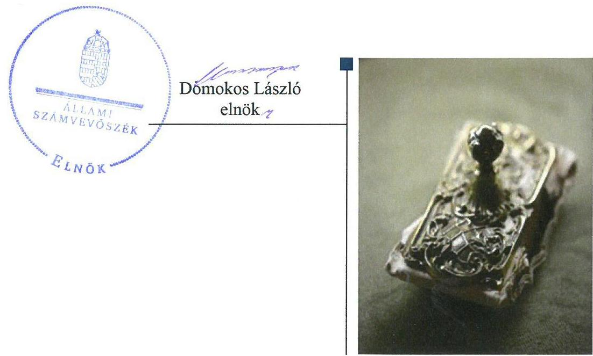
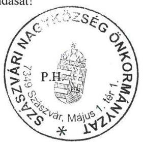
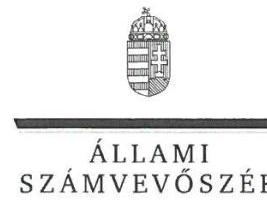
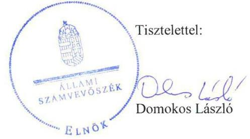
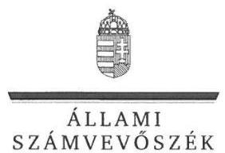

# Jelentés 

## Az önkormányzatok gazdasági társaságai

Az önkormányzatok többségi
tulajdonában lévő gazdasági társaságok gazdálkodásának ellenőrzése - Szászvári Településüzemeltetési Nonprofit Kft.
2018.

---

# Jelentés 

## Az önkormányzatok gazdasági társaságai

Az önkormányzatok többségi
tulajdonában lévő gazdasági társaságok gazdálkodásának ellenőrzése - Szászvári Településüzemeltetési Nonprofit Kft.
2018. 05. hó 04. nap

---

# AZ ELLENŐRZÉST FELÜGYELTE:

DR. NAGY IMRE felügyeleti vezető

## AZ ELLENŐRZÉST VEZETTE ÉS A VÉGREHAJTÁSÁÉRT FELELŐS:

DR. NAGY JUDIT ellenőrzésvezető

## A PROGRAM ÖSSZEÁLLÍTÁSÁÉRT FELELŐS:

TÓTPÁL SZABOLCS osztályvezető

IKTATÓSZÁM: EL-0103-097/2018.

TÉMASZÁM: 2447

ELLENŐRZÉS-AZONOSÍTÓ SZÁM: V079306

Jelentéseink az Országgyűlés számítógépes hálózatán és az Interneten a www.asz.hu címen is olvashatóak.

---

# TARTALOMJEGYZÉK 

■ ÖSSZEGZÉS ..... 5
■ AZ ELLENŐRZÉS CÉLJA ..... 6
■ AZ ELLENŐRZÉS TERÜLETE ..... 7
■ AZ ELLENŐRZÉS HÁTTERE, INDOKOLTSÁGA ..... 8
■ A JELENTÉS LÉNYEGES KÉRDÉSKÖREI ..... 9
■ ELLENŐRZÉS HATÓKÖRE ÉS MÓDSZEREI ..... 10
■ MEGÁLLAPÍTÁSOK ..... 12
■ JAVASLATOK ..... 16
■ MELLÉKLETEK ..... 19
I. sz. melléklet: Értelmező szótár ..... 19
■ FÜGGELÉK: ÉSZREVÉTELEK ..... 21
■ RÖVIDÍTÉSEK JEGYZÉKE ..... 27

---

.

---

# ÖSSZEGZÉS 

Szászvár Nagyközség Önkormányzat tulajdonosi joggyakorlásának kereteit nem szabályszerűen alakította ki, tulajdonosi joggyakorlása a jogszabályoknak nem felelt meg. A Szászvári Településüzemeltetési Nonprofit Kft. vagyongazdálkodása és vagyonnyilvántartása nem volt szabályozott és szabályszerű, ezáltal nem volt biztosított a vagyonnal való felelős gazdálkodás. Vagyoni helyzete 2013-2014. üzleti évekre a bizonylati alátámasztottság hiánya miatt nem volt ellenőrizhető és egyszerűsített éves beszámolói a feltárt szabálytalanságok miatt 2015-2016. üzleti évekre sem nyújtottak megbízható és valós képet a gazdálkodásról. A közérdekű adatokra vonatkozó közzétételi kötelezettségnek a jogszabályi előírások ellenére nem tettek eleget, így nem biztosították a működés és gazdálkodás átláthatóságát.

## Az ellenőrzés társadalmi indokoltsága

Magyarországon az intézmény-centrikus közfeladat-ellátás jellemző, de egyre jelentősebb a költségvetésen kívüli feladatellátás térnyerése. Helyi szinten ennek legfontosabb szereplői az önkormányzati tulajdonban lévő gazdasági társaságok, amelyeknek ellenőrzése kiemelten fontos a közfeladat ellátása, és a közvagyon megőrzése, megóvása érdekében. Ezért alapvető követelmény, hogy gazdálkodásuk, működésük szabályszerű és átlátható legyen.

Szászvár Nagyközség Önkormányzat kötelező és önként vállalt feladatai egy részének ellátására alapította a Szászvári Településüzemeltetési Nonprofit Kft.-t. Az Állami Számvevőszék 2013-2016 évekre kiterjedő ellenőrzése során arra kereste a választ, hogy szabályszerű volt-e a településüzemeltetéssel összefüggő közfeladatokat is ellátó társaság gazdálkodása és az ehhez kapcsolódó tulajdonosi joggyakorlás.

## Főbb megállapítások, következtetések

Szászvár Nagyközség Önkormányzat a tulajdonosi joggyakorlás kereteit nem szabályszerűen alakította ki és tulajdonosi jogait nem szabályszerűen gyakorolta. Nem volt szabályszerű a Társaság alapító okirata, nem alkottak javadalmazási szabályzatot. A vagyonátadás vagyonkezelési szerződéssel nem volt alátámasztva, így a közvagyon védelme nem volt biztosított.

A közpénz felhasználás nem volt átlátható, mert a felhasználás nem támogatási szerződés keretén belül, feltételekhez kötötten, hanem számla ellenében történt.

Az önkormányzati tulajdonosi joggyakorlás a jogszabályi előírásoknak nem felelt meg. A Felügyelőbizottság nem működött szabályszerűen, a Társaság egyszerűsített éves beszámolóit a jogszabályok ellenére a Felügyelőbizottság jelentése nélkül fogadták el. Az Önkormányzat a tulajdonosi joggyakorlása keretében ellenőrzési jogosítványaival nem élt.

A Szászvári Településüzemeltetési Nonprofit Kft. szabályszerű működését megalapozó, jogszabályokban előírt szabályzatokat nem készítették el.

A 2013-2014. üzleti évek gazdasági eseményeiről készült és letétbe helyezett egyszerűsített éves beszámolók ellenőrzését meghiúsította, hogy azok bizonylatokkal, analitikákkal nem voltak megalapozottak. Az ellenőrzött időszakban az egyszerűsített éves beszámolókat leltárral nem támasztották alá, így a közvagyonnal való felelősségteljes gazdálkodás nem volt biztosított. Mindezek miatt az egyszerűsített éves beszámolók nem tükröztek a gazdálkodásról megbízható és valós képet.

A Szászvári Településüzemeltetési Nonprofit Kft. nem tett eleget az előírt közzétételi kötelezettségének, a működés és gazdálkodás nem volt átlátható.

---

# AZ ELLENŐRZÉS CÉLJA 

Az ellenőrzés célja annak értékelése, hogy az önkormányzat vagyongazdálkodási tevékenysége során szabályszerűen gyakorolta-e tulajdonosi jogait. A gazdasági társaság szabályozottsága, gazdálkodása és vagyongazdálkodási tevékenysége, bevételeinek és ráfordításainak elszámolása megfelelt-e a jogszabályi és tulajdonosi előírásoknak. A gazdasági társaság kötelezettségállománya jelentett-e kockázatot a működésre.

---

# AZ ELLENŐRZÉS TERÜLETE 

## Szászvár Nagyközség Önkormányzat és a Szászvári Településüzemeltetési Nonprofit Kft.

Szászvár Nagyközség Baranya megyében, Komlói járásban található. A Társaságot ${ }^{1}$ Szászvár Nagyközség Önkormányzat 2008. június 12-én alapította - a Társaság jogelődje ${ }^{2}$ átalakításával - 3,0 M Ft törzstőkével, amely a 2013-2016. években változatlan volt. A Társaság tevékenységét egyszemélyes, közhasznú, nonprofit társaságként látta el 2014. május 31-ig. Közhasznú minősítését a Cégbíróság 2014. június 1-jével törölte.

A Társaság végezte Szászváron a településüzemeltetési szolgáltatást, a temetőfenntartást, a helyi televízió működtetését, a zöldterület gazdálkodást, a közterület fenntartást, 2015. május 16-tól a közétkeztetési, készétel szolgáltatási és Faluház üzemeltetési feladatokat.

Az Önkormányzat ${ }^{3}$ 2015. május 6-án kötött Feladat-ellátási szerződést ${ }^{4}$ a Társasággal az Mötv. ${ }^{5}$ 41. § (6) bekezdése szerint.

A Társaság üzletszerű vállalkozási tevékenységként a helyi strandfürdő üzemeltetését is végezte ${ }^{6}$.

A Társaság a Ctv. ${ }^{7}$ 9/F. § értelmében nonprofit működést folytatott, osztalékot az Alapító okirat ${ }^{8}$ II/2. pontja alapján és a Ctv. 42.§ (1) bekezdésének előírásainak megfelelően nem fizetett, nyereségét eredménytartalékba helyezte.

A Társaság könyvviteli feladatait külső könyvelő iroda végezte, a könyvvizsgáló személye az Alapító okirat ${ }_{1}$ VIII. pontjában nevesítésre került.

A Társaságnál a saját tőke/jegyzett tőke arány jogszabályban előírt szintje biztosított volt, a saját tőke nem csökkent a jegyzett tőke társasági formára kötelezően előírt szintje alá.

A Társaság gazdálkodásáról a Cégbíróságnál letétbe helyezett egyszerűsített éves beszámolóiban szereplő adatok szerint az értékesítés nettó árbevétele 27,7 M Ft-ról 110,9 M Ft-ra, mérlegfőösszege 34,4 M Ft-ról 59,7 M Ft-ra változott az ellenőrzött időszak alatt.

Az ügyvezető ${ }^{9}$ 2008. augusztus 4-étől látta el feladatait. Az ellenőrzött időszakban a polgármester és a jegyző személyében is változás történt. A polgármester ${ }_{1}{ }^{10}$ a 2014. októberi általános önkormányzati választásokig, a polgármester ${ }_{2}{ }^{11}$ a választásoktól töltötte be hivatalát, a jegyző ${ }_{1}{ }^{12}$ 2014. június 30-áig, a jegyző ${ }_{2}{ }^{13}$ 2014. július 1-jétől látta el feladatait.

---

# AZ ELLENŐRZÉS HÁTTERE, INDOKOLTSÁGA 

AZ ÖNKORMÁNYZATI TULAJDONÚ GAZDASÁGI TÁRSASÁGOK teljes körű ellenőrzésének lehetőségét az Állami Számvevőszékről szóló 1989. évi XXXVIII. törvény 2011. január 1-jétől hatályos módosítása teremtette meg és az Állami Számvevőszékről szóló 2011. évi LXVI. törvény is tartalmazza. A gazdasági társaságok gazdálkodási tevékenysége szabályszerűségének ellenőrzését 2011. évtől végezzük. Az önkormányzatok többségi tulajdonában álló gazdasági társaságok ellenőrzése kiemelten fontos a nemzeti vagyon megőrzése, megóvása érdekében.

A feladatellátás költségeinek, ráfordításainak alakulása a lakosság széles rétegét érinti. Az ellenőrzés várható hasznosulásaként ellenőrzéseink feltárhatják, hogy az önkormányzat a feladatellátásához rendelt vagyon működtetését a tulajdonostól elvárható gondossággal végezte-e, a feladatot ellátó gazdasági társaság a létesítő okiratban, szolgáltatási szerződésben foglaltak betartásával biztosította-e a feladat ellátását. Az ellenőrzés rávilágíthat arra, hogy a gazdasági társaság a vagyon használatával biztosította-e a szolgáltatás folytatásának feltételeit, az önkormányzat által végzett tulajdonosi ellenőrzés hozzájárult-e a szabályszerű gazdálkodáshoz és feladatellátáshoz.

A megállapítások alapján megfogalmazott számvevőszéki javaslatok hasznosítása elősegítheti a meglévő hibák megszüntetését. A jó gyakorlatok bemutatásával az Állami Számvevőszék hozzájárul a követendő megoldások megismertetéséhez, terjesztéséhez.

---

# A JELENTÉS LÉNYEGES KÉRDÉSKÖREI 

1. A tulajdonosi joggyakorlás szabályszerű volt-e?
2. A gazdasági társaság vagyongazdálkodása szabályszerű volt-e?

---

# ELLENŐRZÉS HATÓKÖRE ÉS MÓDSZEREI 

## Az ellenőrzés típusa

Megfelelőségi ellenőrzés.

## Az ellenőrzött időszak

2013. január 1-jétől 2016. december 31-ig.

## Az ellenőrzés tárgya

Szászvár Nagyközség Önkormányzat tulajdonosi joggyakorlása, valamint a Szászvári Településüzemeltetési Nonprofit Kft. gazdálkodásának szabályozottsága és szabályszerűsége.

Az ellenőrzés kiterjedt minden olyan körülményre és adatra, amely az ÁSZ ${ }^{14}$ jogszabályban meghatározott feladatainak teljesítéséhez, valamint a program végrehajtása folyamán felmerült újabb összefüggések feltárásához szükséges.

## Az ellenőrzött szervezet

Szászvári Településüzemeltetési Nonprofit Kft. és a kizárólagos tulajdonos Szászvár Nagyközség Önkormányzat.

## Az ellenőrzés jogalapja

Az ellenőrzés jogszabályi alapját az ÁSZ tv. ${ }^{15}$ 1. § (3) bekezdése és 5. § (3) (4)-(5) bekezdései képezik.

## Az ellenőrzés módszerei

Az ellenőrzést a nemzetközi standardokat irányadónak tekintve az ellenőrzési program ellenőrzési kérdései, az ellenőrzött időszakban hatályos jogszabályok, az ellenőrzés szakmai szabályok és módszertanok figyelembe vételével végeztük.

Az ellenőrzés ideje alatt az ellenőrzött szervezettel történő kapcsolattartást az ÁSZ Szervezeti és Működési Szabályzatának vonatkozó előírásai alapján biztosítottuk.

Az ellenőrzési kérdések megválaszolásához szükséges bizonyítékok megszerzése a következő ellenőrzési eljárások alkalmazásával történt:

---

megfigyelés, kérdésfeltevés (információkérés), összehasonlítás, valamint elemző eljárás. Az ellenőrzési bizonyítékként felhasználható adatforrások közé tartoztak egyrészt az ellenőrzési programban felsorolt adatforrások, másrészt adatforrás lehet még minden - az ellenőrzés folyamán - feltárt, az ellenőrzés szempontjából információkat tartalmazó dokumentum.

Az ellenőrzést a kérdésekre adott válaszok kiértékelésével, valamint a megjelölt adatforrások, a csatolt tanúsítványok felhasználásával, továbbá az adott időszakban hatályos jogszabályok figyelembe vételével folytattuk le.

A bevételek és ráfordítások elszámolása, valamint a vagyonnyilvántartás terén a szabályszerű működést véletlen mintavétellel ellenőriztük. Véletlen mintavételi eljárás alkalmazására került sor a 2016. évi könyvelési tételek közül a ráfordítások (Anyagjellegű ráfordítások, egyéb ráfordítások és pénzügyi műveletek ráfordításai), a bevételek (Értékesítés nettó árbevétele, egyéb bevételek és pénzügyi műveletek bevételei) és a személyi jellegű juttatások kifizetése esetében. 2016. év tekintetében az immateriális javak, tárgyi eszközök növekedési tételei esetében teljes körű ellenőrzésre került sor.

A mintavétellel ellenőrzött területek esetében minden egyes tétel vonatkozásában a szabályszerűségre vonatkozó kérdéseket tettünk fel, amelyek eredménye összesítésre került. Az ellenőrzött minták alapján a sokaságban előforduló átlagos hibaarányt becsültük. „Szabályszerűnek" értékeltünk egy ellenőrzött területet, amennyiben 95%-os bizonyossággal a teljes sokaságban az átlagos hibaarány legfeljebb 10%, nem megfelelőnek, amennyiben 10%-nál magasabb arányt képviselt. Abban az esetben, ha a teljes sokaság tekintetében a 10%-os hibaarányhoz való viszony megítélésének megbízhatósága nem érte el a 95%-ot, annak elérése érdekében értékelésünket további szempontokkal egészítettük ki, és figyelembe vettük a feltárt hibák típusát és súlyát. A ráfordítások elszámolására és a vagyonnyilvántartásra vonatkozó véletlen mintavételt kockázati alapú kiválasztással egészítettük ki, amelynek során a három legnagyobb összegű tételt választottuk ki.

---

# 1. A tulajdonosi joggyakorlás szabályszerű volt-e? 

Összegző megállapítás

A tulajdonosi joggyakorlás kereteinek kialakítása és a tulajdonosi jogok gyakorlása nem volt szabályszerű.

AZ ÖNKORMÁNYZAT a szabályozási kereteket nem a jogszabályi előírások szerint alakította ki.

Vagyongazdálkodási rendeletét ${ }^{16}$ az Önkormányzat megalkotta, de közép- és hosszú távú vagyongazdálkodási tervet az Nvtv ${ }^{17}$ 9. § (1) bekezdésében foglaltak ellenére nem készített.

A Gazdasági program ${ }_{1,2}{ }^{18}$-ban az Önkormányzat az Mötv. 116. § (1)(4) bekezdéseiben foglaltaknak megfelelően rögzítette a Társaság által ellátott feladatokra is kiterjedő középtávú fejlesztési elképzeléseit.

Az Önkormányzat kizárólagos tulajdonosként a Társaság nyilvántartásával kapcsolatos adatokat, a részesedésének összegét nem tette nyilvánossá, ezzel nem tett eleget az Nvtv. 10.§ (1) bekezdése előírásának.

Az Önkormányzat a Társaság feladatellátásával összefüggésbe hozható rendeletalkotási kötelezettségének eleget tett ${ }^{19}$.

A tulajdonosi jogok gyakorlásának rendjét az Önkormányzat a vagyongazdálkodási rendeletben ${ }^{20}$, a társasági Alapító Okirat ${ }_{1,2}$-ban és 2015. május 8-tól Feladat-ellátási szerződésben szabályozta.

Az Alapító okirat ${ }_{2}$-ban a Képviselő-testület határozata ${ }^{21}$ alapján nemcsak a közhasznú jelleget, hanem a Ctv. 9/F. § (2) bekezdése rendelkezése ellenére a Társaság nyereség felosztásáról szóló
 tilalmat is törölték.

A vezető tisztségviselők, a felügyelőbizottsági tagok és az Mt. ${ }^{22}$ 208. § hatálya alá tartozó munkavállalók javadalmazására, valamint a jogviszony megszűnése esetére biztosított juttatások módjának, mértékének legfőbb elveiről, annak rendszeréről az Önkormányzat Képviselő-testülete a Taktv. ${ }^{23}$ 5.§ (3) bekezdése ellenére javadalmazási szabályzatot nem alkotott.

## AZ ÁTADOTT VAGYON VÉDELME NEM VOLT BIZTOSÍTOTT. A Társaság működésének megkezdéséhez szükséges, átadott ingó vagyontárgyak átadásáról vagyonkezelői szerződés nem készült, a Feladat-ellátási szerződés 3. pontja ellenére. Vagyonkezelési szerződés hiányában nem voltak betartathatóak a vagyongazdálkodási rendelet 4. §-a előírásai, amelyek a vagyonkezelést szabályozták.

Az Önkormányzat az átadott feladatok ellátására támogatási szerződést a Társasággal nem kötött, a Feladat-ellátási szerződés 2. pontjában foglalt kötelezettsége ellenére. A közfeladatok ellátására rendelkezésre álló pénzeszköz átutalására nem támogatásként, hanem a Társaság által benyújtott vállalkozói számla alapján került sor. A számla ellenértékeként kapott pénz-

---

eszköz felhasználásával kapcsolatos elszámolásra nem vonatkozott a Feladat-ellátási szerződés 2. pontjában meghatározott támogatás elszámolási kötelezettség.

AZ ÖNKORMÁNYZAT TULAJDONOSI JOGAIT nem szabályszerűen gyakorolta.

Az Önkormányzat az Alapító okirat ${ }_{1-2}$-ban kijelölte a Felügyelőbizottság ${ }^{24}$ tagjait, feladatait, jogosítványait, beszámolási kötelezettségeit előírta. A Felügyelőbizottság ügyrenddel Gt. ${ }^{25}$ 34. § (4) bekezdése és a Ptk. ${ }^{26}$ 3:122. § (3) bekezdése, valamint az Alapító okirat ${ }_{1}$ IX/3. pontja és az Alapító okirat ${ }_{2}$ VIII/3. pontja előírása ellenére nem rendelkezett. A Felügyelőbizottság az Alapító okirat ${ }_{1}$ IX/3. pontjában és az Alapító okirat ${ }_{2}$ VIII/3. pontjában előírt gyakorisággal nem ülésezett. A Képviselő-testület ${ }^{27}$ elvonta a Felügyelőbizottság hatáskörét, amikor megválasztotta annak elnökét ${ }^{28}$, ezzel megsértve a Ptk. ${ }_{2}$ 3:122. § (1) bekezdésének és az alapító okirat ${ }_{1}$ IX./3. pontjának, illetve az alapító okirat ${ }_{2}$ VIII./3. pontjának rendelkezéseit.

A Képviselő-testület a Társaság 2014-2016. évi egyszerűsített éves beszámolóit, a Gt. 35. § (3) bekezdése és a Ptk. ${ }_{2}$ 3:120.§ (2) bekezdése előírása ellenére, a Felügyelőbizottság írásbeli jelentése nélkül fogadta el.

Az Önkormányzat az Nvtv. 10. § (2) bekezdése előírásában foglaltak ellenére nem élt a Társaság gazdálkodásának ellenőrzési jogával.

# 2. A gazdasági társaság vagyongazdálkodása szabályszerű volt-e? 

Összegző megállapítás

A Társaság vagyongazdálkodása 2013-2014. évekre nem volt ellenőrizhető, 2015-2016. években nem volt szabályszerű. Az ellenőrzött időszakban az egyszerűsített éves beszámolók nem nyújtottak megbízható és valós képet a Társaság gazdálkodásáról. A fizetőképesség nem volt biztosított. A közérdekű adatok nyilvánossága nem volt biztosított.
2.1. számú megállapítás

A Társaság nem készítette el a törvényben előírt szabályzatait. Vagyongazdálkodása, a bevételek és ráfordítások elszámolása nem volt szabályszerű.

A Társaság az ellenőrzött időszakban a Számv. tv. 14. § (3)-(5) bekezdése és a 161. § (1)-(3) bekezdései és 161/A.§ (1)-(2) bekezdései előírásainak megfelelő szabályzatokkal - számviteli politikával és az annak keretében elkészítendő szabályzatokkal, valamint számlarenddel -, nem rendelkezett, így a Számv. tv. végrehajtásának szabályozási feltételeit nem alakította ki.

A Társaság nem vezetett a közfeladat-ellátáshoz kapcsolódó bevételekről és ráfordításokról elkülönített nyilvántartást, amelyet a 2015-2016. években a Feladat-ellátási szerződés 10. pontja előírt. Számlarend hiányában a bevételek és ráfordítások ilyen irányú bontása a Számv. tv. 161/A.§ (2) bekezdésében foglalt előírások ellenére nem történt meg. Ezeket a szabálytalanságokat a könyvvizsgáló nem észrevételezte.

---

Az üzemeltetési szerződéssel birtokba vett két önkormányzati ingatlant nem tartották nyilván és nem mutatták ki számviteli elszámolásukban részletesen és ellenőrizhető módon, a Számv. tv. 3. § (8) bekezdés 16. pontja és a 160. § (5) bekezdése előírásai ellenére.

A Társaság vagyonnyilvántartása nem felelt meg az előírásoknak. Nem készültek az egyszerűsített éves beszámoló mérlegét alátámasztó leltárak a Számv. tv. 46.§ (3) bekezdése és a 69.§ (1) bekezdése előírásai ellenére.

A bevételek és ráfordítások elszámolásának ellenőrzését 2013-2014. évekre vonatkozólag meghiúsította, hogy a Társaság az elszámolásokat alátámasztó bizonylatokkal nem igazolta, ezáltal nem tett eleget a Számv. tv. 169.§ (1)-(2) bekezdéseiben előírt bizonylat megőrzési kötelezettségének.
2.2. számú megállapítás

A 2013-2014. üzleti évekre vonatkozóan a Társaság vagyongazdálkodásának áttekintése és ellenőrzése meghiúsult. A 2013-2016. üzleti évekről készült egyszerűsített éves beszámolók a szabályozottság és a leltár hiánya miatt nem adtak megbízható és valós képet a vagyoni és pénzügyi helyzetről, a működés eredményéről. A közérdekű adatok közzététele nem történt meg.

A 2015-től hatályos Feladat-ellátási szerződés 11. pontjában előírtak ellenére üzleti tervet a Társaság 2015. évre vonatkozóan nem készített. A 2016. évi üzleti terv kizárólag költségtervet tartalmazott, nem pótolta a Feladat-ellátási szerződés 11. pontjában előírt feladat-ellátási tervet, amely egyik évben sem készült.

A 2013. és 2014. üzleti év gazdasági eseményeiről készült, egyszerűsített éves beszámolói bizonylatokkal, analitikákkal nem voltak alátámasztva a Számv. tv. 165. § előírásai ellenére, ezzel nem téve eleget a Számv. tv. 169.§ (1)-(2) bekezdéseiben előírt bizonylat megőrzési kötelezettségének.

2013-2014. üzleti években a bizonylatok és analitikák, illetve a teljes ellenőrzött időszakban a leltári alátámasztottság, valamint a számviteli szabályozottság hiánya miatt a Társaság letétbe helyezett egyszerűsített éves beszámolói nem nyújtottak megbízható és valós képet a Társaság vagyoni és pénzügyi helyzetéről.

Az évente ténylegesen elvégzett közfeladatok körét, teljesítésének mértékét és költségét a Társaság a letétbe helyezett egyszerűsített éves beszámolóinak kiegészítő mellékletei sem tartalmazták.

A 2013-2014. évi egyszerűsített éves beszámolók közhasznúsági melléklet nélkül készültek a Civil tv. ${ }^{29}$ 29. § (3) bekezdése előírása ellenére. A 2013-2014. évi egyszerűsített éves beszámolók kiegészítő mellékletei sem tartalmazták a közhasznú és a vállalkozási tevékenység elkülönített bemutatását, a Számv. tv. 88. § (1) bekezdése valamint a Civil tv 29.§ (5) bekezdése előírásai ellenére.

Ennek ellenére a könyvvizsgáló az egyszerűsített éves beszámolókat korlátozás nélküli hitelesítő záradékkal - figyelemfelhívás nélkül - látta el.

A 2013. évi egyszerűsített éves beszámolót a Ptk. ${ }_{2}$ 3:109.§ (2) bekezdése ellenére a Képviselő-testület nem hagyta jóvá. Ezért a Társaság a 2013. évi egyszerűsített éves beszámolóját a Számv. tv. ${ }^{30}$ 153.§ (1) bekezdésében foglaltak ellenére képviselő-testületi jóváhagyás nélkül helyezte cégbírósági letétbe.

---

# Megállapítások 

A Társaság nem tett eleget a Taktv. 2.§ (1)-(2) bekezdésében és az Info tv. 37. § (1) bekezdésében meghatározott közzétételi kötelezettségének.

## 2.3. számú megállapítás

## A Társaság fizetőképessége nem volt biztosított, mert lejárt határidejű tartozásai emelkedtek.

A Társaság hosszú lejáratú kötelezettségekkel nem rendelkezett, rövid lejáratú kölcsöntartozását határidőben teljesítette. A rövid lejáratú egyéb és szállítói tartozásai jelentős emelkedéséhez az Önkormányzattal szembeni lejárt követelések magas szintje és növekedése vezetett. A Társaság folyamatos finanszírozási forrást biztosított az Önkormányzat részére, ez növelte az Önkormányzat eladósodottságát.

---

# JAVASLATOK 

Az ÁSZ tv. 33. § (1) bekezdésében foglaltak értelmében az ellenőrzött szervezet vezetője köteles a jelentésben foglalt megállapításokhoz kapcsolódó intézkedési tervet összeállítani és azt a jelentés kézhezvételétől számított 30 napon belül az ÁSZ részére megküldeni. Amennyiben az ellenőrzött szervezet vezetője nem küldi meg határidőben az intézkedési tervet, vagy továbbra sem elfogadható intézkedési tervet küld, az Állami Számvevőszék elnöke az ÁSZ tv. 33. § (3) bekezdés a) és b) pontjaiban foglaltakat érvényesítheti.

## Szászvári Településüzemeltetési Nonprofit Kft. Ügyvezetőjének

1. Gondoskodjon a Társaság belső számviteli szabályzatainak jogszabályi előírások szerinti elkészítéséről és kiadmányozásáról.
(2.1. számú megállapítás 1. bekezdése alapján)
2. Intézkedjen a közfeladat-ellátáshoz kapcsolódó bevételek és ráfordítások elkülönített nyilvántartásáról.
(2.1. számú megállapítás 2. bekezdés 1.-2. mondata alapján)
3. Gondoskodjon az üzemeltetésre átvett eszközök számviteli nyilvántartásokban való elkülönített, ellenőrizhető nyilvántartásáról.
(2.1. számú megállapítás 3. bekezdése alapján)
4. Intézkedjen a jogszabályok előírása alapján az egyszerűsített éves beszámoló mérlegének leltárral történő alátámasztásáról.
(2.1. számú megállapítás 4. bekezdése alapján)
5. Intézkedjen a jövőben a bevételek és ráfordítások elszámolását alátámasztó bizonylatok jogszabályi előírásnak megfelelő megőrzéséről.
(2.1. számú megállapítás 5. bekezdése alapján)
6. Intézkedjen az Önkormányzattal kötött feladat-ellátási szerződésben foglalt éves üzleti terv és feladat-ellátási terv készítési kötelezettség teljesítéséről és a tulajdonos részére történő előterjesztéséről.
(2.2. számú megállapítás 1. bekezdése alapján)

---

7. Gondoskodjon a Társaság közzétételi kötelezettségének a Taktv., valamint az Info tv. előírásainak megfelelő teljesítéséről.
(2.2. számú megállapítás 8. bekezdése alapján)

# Szászvár Nagyközség Önkormányzat Polgármesterének 

1. Intézkedjen az Önkormányzat közép- és hosszú távú vagyongazdálkodási tervének elkészítéséről a jogszabály előírásainak megfelelően.
(1. számú megállapítás 2. bekezdése alapján)
2. Intézkedjen az Önkormányzat kizárólagos tulajdonában lévő társasági részesedésének a jogszabályban előírtak szerinti nyilvános bemutatásáról.
(1. számú megállapítás 4. bekezdése alapján)
3. Gondoskodjon a Társaság alapító okiratában a jogszabályi előírásoknak megfelelő névhasználat és nyereségfelosztásról szóló rendelkezés közötti összhang megteremtéséről.
(1. számú megállapítás 7. bekezdése alapján)
4. Intézkedjen a jogszabályban előírt, a Társaság vezető tisztségviselői, felügyelő bizottsági tagjai, valamint az Mt. 208. §-ának hatálya alá tartozó munkavállalók javadalmazása, valamint jogviszony megszűnése esetére biztosított juttatások módjának, mértékének elveiről, annak rendszeréről szóló szabályzat megalkotásáról.
(1. számú megállapítás 8. bekezdése alapján)
5. Gondoskodjon a feladat-ellátási szerződésben foglalt kötelezettségek teljesítéséről a vagyonkezelési szerződések és a támogatási szerződések megkötése tekintetében.
(1. számú megállapítás 9.-10. bekezdései alapján)
6. Kezdeményezze az Önkormányzat tulajdonosi jogainak jogszabályok szerinti gyakorlása keretében a Társaság felügyelő bizottsága ügyrendjének elkészítését és gondoskodjon és annak jóváhagyásáról.
(1. számú megállapítás 12. bekezdése 2. mondata alapján)

---

7. Gondoskodjon a felügyelő bizottság társasági alapító okiratában foglaltak szerinti működéséről.
(1. számú megállapítás 12. bekezdése 3. mondata alapján)
8. Gondoskodjon a felügyelő bizottság elnökének megválasztásával kapcsolatos jogszerű helyzet helyreállításáról.
(1. számú megállapítás 12. bekezdése 4. mondata alapján)
9. Intézkedjen, hogy a Társaság éves beszámolóját a jogszabályi előírásoknak megfelelően a felügyelő bizottság írásbeli jelentésének birtokában fogadja el a Képviselő-testület.
(1. számú megállapítás 13. bekezdése alapján)

---

# MELLÉKLETEK 

- I. SZ. MELLÉKLET: ÉRTELMEZŐ SZÓTÁR
gazdasági társaság
gazdálkodó szervezet
közszolgáltatás
meghatározó befolyás
minősített többséget biztosító részesedés
többségi befolyást biztosító részesedés

Ptk. 3.88. § (1) bekezdése szerint „a gazdasági társaságok üzletszerű közös gazdasági tevékenység folytatására, a tagok vagyoni hozzájárulásával létrehozott, jogi személyiséggel rendelkező vállalkozások, amelyekben a tagok a nyereségből közösen részesednek, és a veszteséget közösen viselik".
A Ptk. ${ }^{31}$ 685. § c) pontja szerint gazdálkodó szervezet: „az állami vállalat, az egyéb állami gazdálkodó szerv, a szövetkezet, a lakásszövetkezet, az európai szövetkezet, a gazdasági társaság, az európai részvénytársaság, az egyesülés, az európai gazdasági egyesülés, az európai területi együttműködési csoportosulás, az egyes jogi személyek vállalata, a leányvállalat, a vízgazdálkodási társulat, az erdő birtokossági társulat, a végrehajtói iroda, az egyéni cég, továbbá az egyéni vállalkozó." (2014. 03.15-ig hatályos)
Az Ebktv. ${ }^{32}$ 3. § d) pontja a következőképpen határozza meg a közszolgáltatást: „szerződéskötési kötelezettség alapján a lakosság alapvető szükségleteinek ellátására irányuló szolgáltatás, így különösen a villamos energia-, gáz-, hő-, víz-, szenny-víz- és hulladékkezelési, köztisztasági, postai és távközlési szolgáltatás, továbbá a menetrend alapján közlekedő járművekkel végzett közforgalmú személyszállítás".
A Ptk. ${ }_{2}$ 8:2. § (2) bekezdése szerint „A befolyással rendelkező akkor rendelkezik egy jogi személyben meghatározó befolyással, ha annak tagja vagy részvényese, és
a) jogosult e jogi személy vezető tisztségviselői vagy Felügyelőbizottsága tagjai többségének megválasztására, illetve visszahívására; vagy
b) a jogi személy más tagjai, illetve részvényesei a befolyással rendelkezővel kötött megállapodás alapján a befolyással rendelkezővel azonos tartalommal

 szavaznak, vagy a befolyással rendelkezőn keresztül gyakorolják szavazati jogukat, feltéve, hogy együtt a szavazatok több mint felével rendelkeznek."
A minősített befolyásszerző az ellenőrzött társaságban a szavazatok legalább hetvenöt százalékával rendelkezik. (Ptk. 2. 3:324. §)
A Ptk. 2 8:2. § (1) bekezdése szerint „többségi befolyás az olyan kapcsolat, amelynek révén természetes személy vagy jogi személy (befolyással rendelkező) egy jogi személyben a szavazatok több mint felével vagy meghatározó befolyással rendelkezik."

---

.

---

# FÜGGELÉK: ÉSZREVÉTELEK 

A jelentéstervezetet a Számvevőszék 15 napos észrevételezésre megküldte az ellenőrzött szervezetek vezetőinek az ÁSZ tv. 29. § (1) bekezdése előírásának megfelelően.

Az ÁSZ a jelentéstervezetet észrevételezésre megküldte Szászvár Nagyközség Önkormányzat polgármesterének és a Szászvári Településüzemeltetési Nonprofit Kft. ügyvezetőjének.
A függelék tartalmazza Szászvár Nagyközség Önkormányzat polgármesterének észrevételeit és az el nem fogadott észrevételek elutasításának indoklását, továbbá a Szászvári Településüzemeltetési Nonprofit Kft. ügyvezetőjének nemleges észrevételét.

[^0]
[^0]:    * 29. § (1) Az Állami Számvevőszék az ellenőrzési megállapításait megküldi az ellenőrzött szervezet vezetőjének vagy az általa megbízott személynek, és annak, akinek személyes felelősségét állapította meg.
    (2) Az ellenőrzött szervezet vezetője és a felelősként megjelölt személy az ellenőrzés megállapításaira tizenöt napon belül írásban észrevételt tehet.
    (3) Az Állami Számvevőszék az észrevételre a beérkezésétől számított harminc napon belül írásban válaszol. A figyelembe nem vett észrevételeket köteles a jelentésben feltüntetni, és megindokolni, hogy azokat miért nem fogadta el.

---

# Szászvár Nagyközség Önkormányzat Polgármestere 

7349 Szászvár, Május 1. tér 1.
Tel: 72/589-000/116, 389-123, fax: 72/389-200.
Email-cím: szaszph@bonet.hu

Szám: SZ 195 /- 1 /2018.
Tárgy: észrevételek
Hiv. sz.: EL-0103-091/2018.

Állami Számvevőszék
dr. Domokos László elnök Úr részére
1364 Bp. 4. Pf. 54.

## ÁLLAMI SZÁMVEVŐSZÉK

## Érkezé: 2018. MÁRCIUS 29.

Statúzzém: EL-063-605/2018
Mulajsz:

## Tisztelt elnök Úr!

Hivatkozott szám alatti nem nyilvános jelentésére az előírt határidőre figyelemmel az alábbi észrevételeket teszem.

A Társaság javadalmazási szabályzata a csatolt 1. sz. melléklet szerint 2017. december 7. napon pótlólag a szükséges jogszabályi tartalommal megalkotásra került a tulajdonosi joggyakorló önkormányzat által.

Az üzemeltetésre adott, önkormányzati tulajdonú ingatlanok tekintetében nem kívántunk vagyonkezelői jogot létesíteni. Önkormányzatunk számára nem volt kérdéses, hogy a tulajdonában álló üzemeltető mindvégig a jó gazda gondosságával jár el, mivel a karbantartási, állagmegóvási munkálatokat az üzemeltetési jogtól függetlenül is rendre a Társaságra bízzuk.

A közpénz-felhasználás folyamatosan az előírt bizonylati rendben dokumentált volt, minden kifizetés a közfeladat ellátását szolgálta.

A felügyelőbizottság önkormányzati képviselő tagja (elnöke) az egyes képviselő-testületi üléseken - a döntést megelőzően - rendre tájékoztatást adtak az ülés megtörténtéről és arról, hogy a felügyelőbizottság mindent rendben talált. Ezt Szászvár Nagyközség Önkormányzat Képviselő-testületének üléséről szóló jegyzőkönyve rögzítette. A felügyelőbizottsági ülések a képviselő-testületi ülést megelőzően, de annak napján történtek, így annak későbbi jegyzőkönyvezésére okkal számíthatott a képviselő-testület.

Tisztelettel kérem a fentiek szíves elfogadását!
Szászvár, 2018. március 23.

Dunai Péter
polgármester

Szászvár Nagyközség Önkormányzat

---

ELNÖK

Ikt.szám: EL-0103-096/2018.

# Dunai Péter úr 

polgármester

Szászvár Nagyközség Önkormányzat

## Szászvár

## Tisztelt Polgármester Úr!

„Az önkormányzatok gazdasági társaságai - Az önkormányzatok többségi tulajdonában lévő gazdasági társaságok gazdálkodásának ellenőrzése - Szászvári Településüzemeltetési Nonprofit Kft. " címmel készített számvevőszéki jelentéstervezetre tett észrevételeit köszönettel megkaptam.
Az Állami Számvevőszék észrevételekre vonatkozó álláspontjáról a felügyeleti vezető által készített részletes tájékoztatást csatoltan megküldöm.
Tájékoztatom Polgármester urat, hogy a számvevőszéki jelentésben - az Állami Számvevőszékről szóló 2011. évi LXVI. törvény 29. § (3) bekezdése alapján - a figyelembe nem vett észrevételeket szerepeltetjük annak megindoklásával, hogy azokat miért nem fogadtuk el.

Budapest, 2018. március 13. nap

Melléklet: Tájékoztatás az észrevételek kezeléséről

---

FELÜGYELETI VEZETŐ

Melléklet
Ikt.szám: EL-0103-096/2018.

# Tájékoztatás   az észrevételek kezeléséről 

„Az önkormányzatok gazdasági társaságai - Az önkormányzatok többségi tulajdonában lévő gazdasági társaságok gazdálkodásának ellenőrzése - Szászvári Településüzemeltetési Nonprofit Kft." című jelentéstervezetre 2018. március 23-án tett (az Állami Számvevőszékhez 2018. március 29én érkezett) észrevételét áttekintettük, annak kezelésével kapcsolatban a következő tájékoztatást adom.

## 1. A jelentéstervezet 1. számú megállapítás 8. bekezdésére vonatkozó észrevétel:

Az észrevételben leírtak szerint 2017 decemberében az Önkormányzat megalkotta a javadalmazási szabályzatot, amelyet az észrevételhez csatoltak.

Az észrevételt nem fogadjuk el. Az Önkormányzat a megállapítást nem vitatja, az észrevételben jelzett javadalmazási szabályzatot az ellenőrzéssel érintett időszak, 2013-2016. évek után készítette el, azt a jelentéstervezet megállapításainál az ÁSZ nem tudja figyelembe venni. Az észrevétel alapján a jelentéstervezet módosítása nem indokolt.

## 2. A jelentéstervezet 1. számú megállapítás 9. bekezdésére vonatkozó észrevétel:

Az észrevételben leírtak szerint az Önkormányzat nem kívánt vagyonkezelői jogot létesíteni az üzemeltetésre átadott önkormányzati tulajdonú ingatlanok tekintetében, az üzemeltető gondosan járt el, karbantartási, állagmegóvási munkálatokat a Társaság végezte.

Az észrevételt nem fogadjuk el. Az Önkormányzat a jelentéstervezet megállapítását nem vitatja, a feladat-ellátási szerződésben foglaltak ellenére vagyonkezelési szerződés nem készült. Az észrevétel alapján a jelentéstervezet módosítása nem indokolt.

## 3. A jelentéstervezet 1. számú megállapítás 10. bekezdésére vonatkozó észrevétel:

Az észrevételben leírtak szerint a közpénz-felhasználás az előírt bizonylati rendben dokumentált volt, a kifizetések a közfeladat ellátását szolgálták.

Az észrevételt nem fogadjuk el. Az Önkormányzat a jelentéstervezet megállapítását nem vitatja, a feladat-ellátási szerződésben foglaltak ellenére nem kötöttek támogatási szerződést a Társasággal. Az észrevétel alapján a jelentéstervezet módosítása nem indokolt.

---

# 4. A jelentéstervezet 1. számú megállapítás 13. bekezdésére vonatkozó észrevétel: 

Az észrevételben leírtak szerint a felügyelőbizottság és a képviselő-testület üléseire azonos napon, egymást követően került sor. A felügyelőbizottság tájékoztatta a képviselő-testületet az ülésein elhangzottakról, amelyek későbbi jegyzőkönyvezésére az Önkormányzat számíthatott.

Az észrevételt nem fogadjuk el. Az Önkormányzat a jelentéstervezet megállapítását nem vitatja, az észrevétel alátámasztja azt a megállapításunkat, hogy a képviselő-testület a Társaság beszámolóit a felügyelőbizottság írásbeli jelentése nélkül fogadta el. Az észrevétel alapján a jelentéstervezet módosítása nem indokolt.

Budapest, 2018. március 13. nap

Dr. Nagy Imre felügyeleti vezető

---

# 422 

Szászvári Településüzemeltetési
Nonprofit Kft.
Szászvár
Május 1 tér 1.
7349

Állami Számvevőszék
Budapest
Apáczai Csere János u. 10
1052

Szászvár, 2018. március 22.
Ikt.sz.:ÁSZ 01/2018, MI SZÁMVEVŐSZÉK
26-17710/2018/1
20180328
Ikt.szám: EL-0103-090/2018
Ell.azonosító sz.: V079306

Tisztelt Domokos László Elnök Úr!

Megkaptuk az Önök által készített Számvevőszéki jelentés tervezetet, melyet áttanulmányoztam.

A jelentéssel kapcsolatban észrevételt nem kívánok tenni.
Megkezdtem a jelentésben foglalt megállapításokhoz kapcsolódó intézkedési terv elkészítését, melyet a meghatározott időre megküldök.

Tisztelettel:
SZÁSZVÁRI TELEPÜLÉSÜZEMELTETÉSI NONPROFIT KFT.
7349 Szászvár, Május 1. tér 1. Adószám: 20585282-202 Bank.sziss.: 71600056-11131164

## Peilert Béla

Ügyvezető

---

# RÖVIDÍTÉSEK JEGYZÉKE 

${ }^{1}$ Társaság
${ }^{2}$ Társaság jogelődje
${ }^{3}$ Önkormányzat
${ }^{4}$ Feladat-ellátási szerződés
${ }^{5}$ Mötv.
${ }^{6}$ Strandüzemeltetés
${ }^{7}$ Ctv.
${ }^{8}$ Alapító Okirat: $\square$

Alapító Okirat:
${ }^{9}$ Ügyvezető
${ }^{10}$ Polgármester:
${ }^{11}$ Polgármester:
${ }^{12}$ Jegyző:
${ }^{13}$ Jegyző:
${ }^{14}$ ÁSZ
${ }^{15}$ ÁSZ tv.
${ }^{16}$ Vagyongazdálkodási rendelet
${ }^{17}$ Nvtv.
${ }^{18}$ Gazdasági Program:
Gazdasági Program:
${ }^{19}$ A feladatellátással összefüggő önkormányzati rendeletek
Szászvár Nagyközség Önkormányzat Képviselő-testületének 4/2018. (IV.14.) rendelete a temetőkről és a temetkezésről
Szászvár Nagyközség Önkormányzat Képviselő-testületének 5/2015. (II.27.) rendelete egyes szociális és gyermekvédelmi ellátásokról és támogatásokról
Szászvár Nagyközség Önkormányzat Képviselő-testületének 3/2012. (IV.30.) sz. rendelete a nemzeti vagyonáról
Szászvár Nagyközség Önkormányzat Képviselő-testületének 32/2015. (IV.15.) határozata a Szászvári Településüzemeltetési Nonprofit Társaság alapító okiratának módosításáról
2012. évi I. törvény a munka törvénykönyvéről

---

${ }^{23}$ Taktv.
${ }^{24}$ Felügyelőbizottság
${ }^{25} \mathrm{Gt}$.
${ }^{26}$ Ptk. 2
${ }^{27}$ Képviselő-testület
${ }^{28}$ felügyelőbizottsági elnök választás
${ }^{29}$ Civil tv
${ }^{30}$ Számv. tv
${ }^{31}$ Ptk. 1
${ }^{32}$ Ebktv.
2009. évi CXXII. törvény a köztulajdonban álló gazdasági társaságok takarékosabb működésről
Szászvári Településüzemeltetési Nonprofit Korlátolt Felelősségű Társaság Felügyelőbizottsága
2006. évi IV. törvény a gazdasági társaságokról (hatálytalan 2014. március 15-étől)
2013. évi V. törvény a Polgári Törvénykönyvről (hatályos 2014. március 15-étől), Szászvár Nagyközség Önkormányzat képviselő-testülete
Szászvár Nagyközség Önkormányzat Képviselő-testületének 112/2014. (XII.16.) sz. határozata a Szászvári Településüzemeltetési Nonprofit Korlátolt Felelősségű Társaság Felügyelő-bizottsága elnökének megválasztásáról
2011. évi CLXXV. törvény az egyesülési jogról, a közhasznú jogállásról, valamint a civil szervezetek működéséről és támogatásáról
2000. évi C. törvény a számvitelről (hatályos 2001. január 1-jétől)
1959. évi IV. törvény a Polgári törvénykönyvről (hatályos: 2014. március 14-éig)
2003. évi CXXV. törvény az egyenlő bánásmódról és az esélyegyenlőség előmozdításáról

---

ÁLLAMI SZÁMVEVŐSZÉK
1052 Budapest, Apáczai Csere János utca 10.
Levélcím: 1364 Budapest 4. Pf. 54
Telefon: +36 14849100 Telefax: +36 14849200
www.asz.hu

