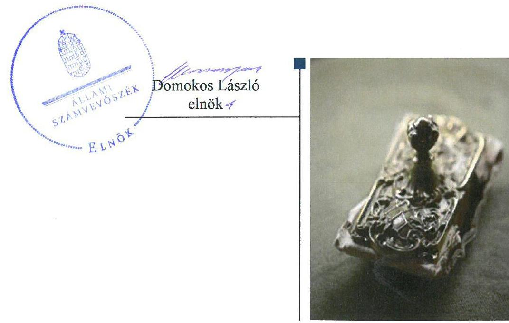
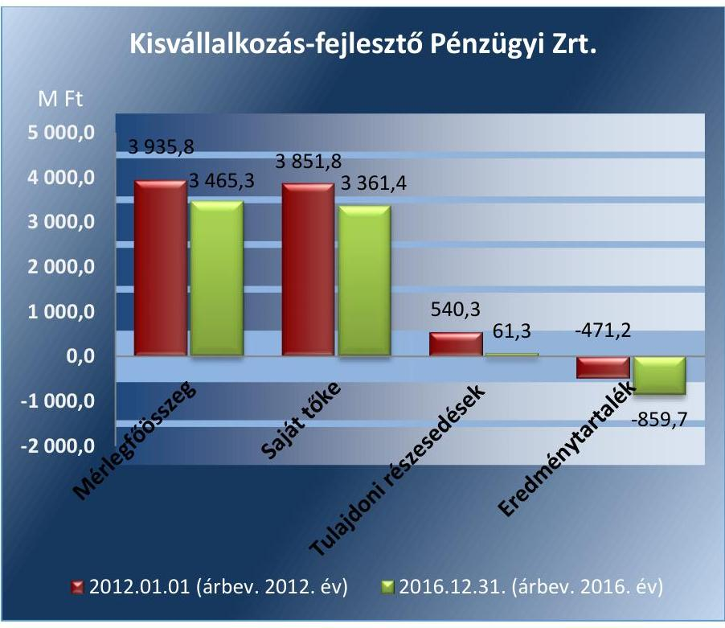
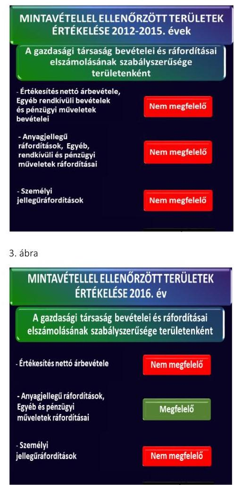
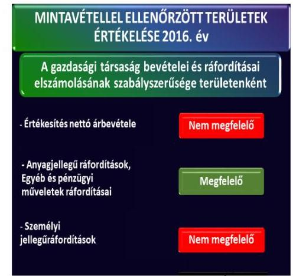
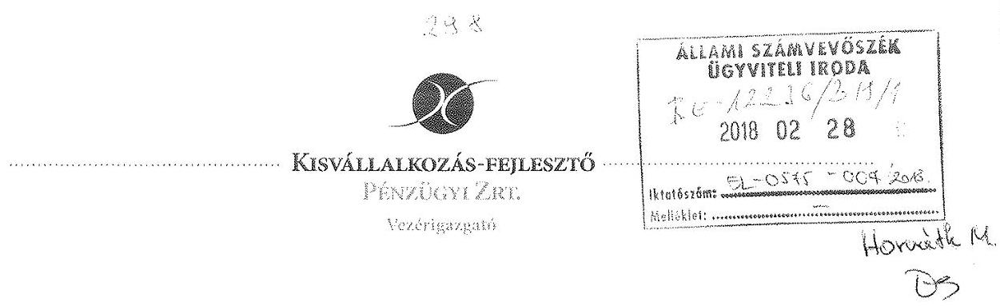
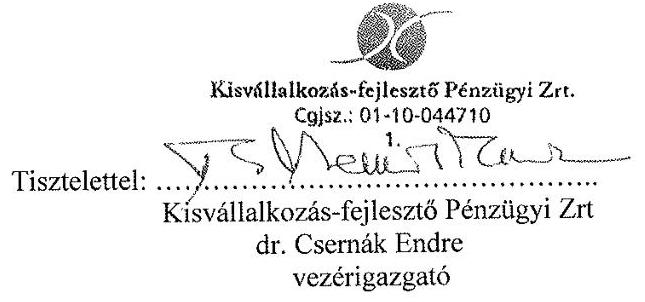
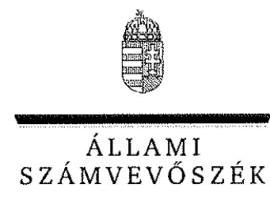

# Jelenetés 

## Kisvállalkozás-fejlesztő Pénzügyi Zrt.

Az állami tulajdonban (résztulajdonban) lévő gazdálkodó szervezetek vagyonmegőrzési és gazdálkodási tevékenységének ellenőrzése 2018.

18073
www.asz.hu

---

# Jelenetés 

## Kisvállalkozás-fejlesztő Pénzügyi Zrt.

Az állami tulajdonban (résztulajdonban) lévő gazdálkodó szervezetek vagyonmegőrzési és gazdálkodási tevékenységének ellenőrzése
2018. 04. hó 09. nap

---

# AZ ELLENŐRZÉST FELÜGYELTE:

DR. HORVÁTH MARGIT felügyeleti vezető

## AZ ELLENŐRZÉST VEZETTE ÉS A VÉGREHAJTÁSÁÉRT FELELŐS:

RÁCZKEVI KATALIN ellenőrzésvezető

## A PROGRAM ÖSSZEÁLLÍTÁSÁÉRT FELELŐS:

TÓTPÁL SZABOLCS osztályvezető

IKTATÓSZÁM: EL-0575-012/2018

TÉMASZÁM: 2087

ELLENŐRZÉS-AZONOSÍTÓ SZÁM: V-075424

Jelentéseink az Országgyűlés számítógépes hálózatán és az Interneta a www.asz.hu címen is olvashatóak.

---

# TARTALOMJEGYZÉK 

■ ÖSSZEGZÉS ..... 5
■ AZ ELLENŐRZÉS CÉLJA ..... 7
■ AZ ELLENŐRZÉS TERÜLETE ..... 8
■ AZ ELLENŐRZÉS HÁTTERE, INDOKOLTSÁGA ..... 10
■ A JELENTÉS LÉNYEGES KÉRDÉSKÖREI ..... 11
■ AZ ELLENŐRZÉS HATÓKÖRE ÉS MÓDSZEREI ..... 12
■ MEGÁLLAPÍTÁSOK ..... 14
■ JAVASLATOK ..... 21
■ MELLÉKLETEK ..... 25
I. sz. melléklet: A Kisvállalkozás-Fejlesztő Pénzügyi Zrt. mérlegadatai 2012-2016. évek között ..... 25
■ FÜGGELÉK: ÉSZREVÉTELEK ..... 27
■ RÖVIDÍTÉSEK JEGYZÉKE ..... 35

---

.

---

# ÖSSZEGZÉS 

A Magyar Fejlesztési Bank Zrt. tulajdonosi joggyakorlása a Kisvállalkozás-fejlesztő Pénzügyi Zrt. felett szabályszerű volt. A Társaság müködését kisebb hiányosságokkal szabályozták. Vagyongazdálkodása a vagyonnyilvántartás hiányosságai, a leltározás és a befektetések 2015. és 2016. évi értékelésének és értékvesztés elszámolásának elmaradása miatt nem volt szabályszerű. A pénzügyi-számviteli feladatainak ellátása a 2016. évi ráfordítások elszámolása kivételével nem volt megfelelő. Az éves beszámolóit nem támasztotta alá jogszabályi előírások szerinti dokumentumokkal. A tervezési, adatszolgáltatási és közzétételi kötelezettségének eleget tett.

## Az ellenőrzés társadalmi indokoltsága

A magyarországi kis-és középvállalkozások fejlesztése stratégiailag fontos feladat. A kis- és középvállalkozások fejlesz-tési-tőlkebefektetéssel való finanszírozása hozzájárul versenyhelyzetük javításához, azáltal segítheti termék-, eszközés technológiafejlesztésüket, a munkahelyek számának bővítését, valamint a hozzáadott érték növekedését, ezért fejlődésük széleskörű társadalmi érdeklődést vált ki.

Az állami tulajdonú gazdálkodó szervezetek a nemzeti vagyon részét képezik. Az állami vagyonnal való gazdálkodást illetően a tulajdonosi joggyakorlás és a vagyongazdálkodás feladata az állami vagyon átlátható, rendeltetésszerű és felelős felhasználásának biztosítása. Az állam meghatározza az ellátandó feladatokat, amelyhez a vagyonnal kapcsolatos döntéseknek igazodniuk kell. A nemzetgazdasági szempontból kiemelt jelentőségű nemzeti vagyonban tartandó állami tulajdonban álló társasági részesedést a nemzeti vagyonról szóló törvény határozza meg.

Az Állami Számvevőszék az általa korábban ellenőrizetlen területek, szervezetek körébe tartozó társaságnál végzett ellenőrzést. A számvevőszéki ellenőrzés hozzájárul a közpénzek szabályos, átlátható, elszámoltatható és eredményes felhasználásához, a rend pedig értéket teremt. Minden közpénzt, közvagyont használó szervezettel szemben társadalmi igény, hogy tevékenységükről elszámoljanak. Ezt figyelembe véve és az Állami Számvevőszék Stratégiájával összhangban került sor a Kisvállalkozás-fejlesztő Pénzügyi Zrt. ellenőrzésére a 2012-2016. évek vonatkozásában.

## Főbb megállapítások, következtetések, javaslatok

A Magyar Fejlesztési Bank Zrt. Társaság feletti tulajdonosi joggyakorlása szabályszerű volt. A tulajdonosi jogok gyakorlásának rendjét kialakította, a Társaság feladataiban bekövetkezett változások hatásait átvezette az Alapszabályban. A Magyar Fejlesztési Bank Zrt. tulajdonosi joggyakorlása keretében döntéshozatali kötelezettségének a jogszabálynak megfelelően eleget tett.

A Társaság kialakította a szervezeti kereteit meghatározó szabályzatokat, azonban a számviteli politika jogszabálynak megfelelő aktualizálása elmaradt, továbbá a leltározási és leltárkészítési szabályzat hiányos volt, nem tartalmazta a leltározás gyakoriságára és módjára vonatkozó előírásokat. A számlarend nem tartalmazta a jogszabályban előírt tartalmi elemeket. A számviteli politika és az értékelési szabályzat értékvesztés elszámolására vonatkozó előírásai nem voltak összhangban. A vagyonnyilvántartás vezetése nem volt szabályszerű, mert az ellenőrzött időszakban a mérleget alátámasztó leltár nem készült, a vagyongazdálkodás során a Társaság nem járt el szabályszerűen, mert a 2015. és 2016. években a befektetések értékelését, valamint az értékvesztés elszámolását nem végezte el. Az értékcsökkenés nem volt szabályszerű, mert az értékcsökkenés alapját képező bekerülési érték meghatározása a levonható előzetesen felszámított általános forgalmi adóval növelt értéken történt.

A bevételek elszámolása az ellenőrzött időszakban nem volt szabályszerű, a személyi jellegű ráfordítások elszámolása során nem tartották be a jogszabályban és a belső szabályzatban előírtakat. 2016. évben az anyagjellegű és egyéb ráfordítások elszámolása megfelelő volt.

---

A tervezési, adatszolgáltatási kötelezettségeinek teljesítése során a Társaság a jogszabályokban és a tulajdonosi joggyakorló előírásainak megfelelő módon járt el. Az éves beszámolóit az előírásoknak megfelelő határidőben elkészítette és közzétette, azonban az éves beszámolók nem voltak a jogszabálynak megfelelően leltárral alátámasztva. Az elektronikus közzététel tekintetében az előírásoknak megfelelően 2014-2016. évekre vonatkozóan eleget tett.

---

# AZ ELLENŐRZÉS CÉLJA 

Az ellenőrzés célja annak értékelése, hogy a tulajdonosi jogok gyakorlása szabályszerű volt-e; a gazdálkodó szervezet szabályozottsága, gazdálkodása és vagyongazdálkodási tevékenysége megfelelt-e a jogszabályi és a tulajdonosi előírásoknak, a vagyonváltozást eredményező döntések esetében a tulajdonosi jogok gyakorlója és a gazdálkodó szervezet szabályszerűen jártak-e el.

---

# AZ ELLENŐRZÉS TERÜLETE 

## A Magyar Fejlesztési Bank Zártkörűen Müködő Részvénytársaság és a Kisvállalkozás-fejlesztő Pénzügyi Zártkörűen Müködő Részvénytársaság

## Kisvállalkozás-fejlesztő Pénzügyi Zrt.

A Kisvállalkozás-fejlesztő Pénzügyi Zrt. 2001. december 20-án jött létre, alapítói 88,2 \%-ban a Magyar Állam ${ }^{1}$, 11,8 \%-ban hét bank ${ }^{2}$ és egy pénzügyi vállalkozás ${ }^{3}$. Az ellenőrzött időszakban a Társaságban ${ }^{4}$ lévő állami vagyon felett a tulajdonosi jogokat az MFB tv. ${ }^{5}$ alapján - a Magyar Fejlesztési Bank Zrt. gyakorolta.

Az alapításhoz - az állam nevében - a pénzügyminiszter ${ }^{6}$ a Magyar Köztársaság 2001-2002. évi költségvetéséről szóló törvény ${ }^{7}$ és ennek 2001. évi végrehajtásáról szóló törvény ${ }^{8}$ alapján járult hozzá. A Társaságban lévő állami részesedés - az Nvtv. ${ }^{9}$ alapján - nemzetgazdasági szempontból kiemelt jelentőségű nemzeti vagyonban tartandó állami tulajdon és így a kincstári vagyoni körbe ${ }^{10}$ tartozik. A Társaság az Alapszabály értelmében Igazgatósággal nem rendelkezett, annak jogköreit a vezérigazgató gyakorolta, személye az ellenőrzés időszaka alatt egy alkalommal, 2014. március 21-én változott.

A Kisvállalkozás-fejlesztő Pénzügyi Zrt. alapításának célja a magyarországi a kis- és középvállalkozások ${ }^{11}$ tőkeellátottságának javítása és ezáltal a hitelképességük növelése, a piaci helyzetük, versenyképességük erősítése volt. Az egy-egy vállalkozásba befektethető tőke összege 10 M Ft és 100 M Ft (2014. január 1-jétől 60 M Ft) közötti összeg volt.

A Kisvállalkozás-fejlesztő Pénzügyi Zrt. fejlesztési tőkefinanszírozási célból történő tulajdonszerzése - az MFB Zrt. ${ }^{12}$ részesedésével müködő társaságként - az MFB tv.-ben előírt korlátozással valósulhatott meg. Egy gazdasági társaságban legfeljebb 50\%-1 szavazat mértékű tulajdoni részesedéssel rendelkezhetett, valamint korlátolt felelősségű társaságban és részvénytársaságban szerezhetett részesedést.

Az alapítók összesen 4,4 Mrd ${ }^{13}$ Ft tőkét (alapításkor 3,4 Mrd Ft, majd a 2008. évi tőkeemeléskor 1,0 Mrd Ft) bocsátottak a Társaság rendelkezésére.

A Kisvállalkozás-fejlesztő Pénzügyi Zrt. fejlesztési célú tőkekihelyezéssel gazdasági társaságokban szerzett kisebbségi tulajdonrészt. A Társaság a finanszírozást kontrollált feltételrendszer keretei között végezte. A Társaság tőkefinanszírozási tevékenysége során 2012. évben 2 db új ügyletet 69 M Ft ${ }^{14}$, 2013. évben 4 db új ügyletet 214 M Ft, 2014. évben 1 db új ügyletet kötött, 45,8 M Ft összegben, 2015.és 2016. években új tőkekihelyezésre nem került sor.

A 2015-2016. évben racionalizálási és reorganizációs céllal - az MFB Stratégiai csoport ${ }^{15}$ Új Működési Modellje Program bevezetésével - az MFB Zrt. Igazgatósága és a Közgyűlés ${ }^{16}$ határozata szerint - a Társaság tevékenysége megszüntetésre, portfóliója értékesítésre került.

---

1. táblázat

A KISVÁLLALKOZÁS-FEJLESZTŐ PÉNZÜGYI ZRT. BEFEKTETÉSI PORTFÓLIÓJA 2012-2016. ÉVEK KÖZÖTT (DB/MRD FT)

|  Év | Db | Összeg  |
| --- | --- | --- |
|  2012. | 28 | 1,56  |
|  2013. | 29 | 1,53  |
|  2014. | 29 | 1,52  |
|  2015. | 20 | 1,04  |
|  2016. | 2 | 0,12  |
|  Forrás: a Társaság kiegészitő mellékletei 2012-2016. |  |   |

A Társaság tőkebefektetéseinek összege az ellenőrzött időszakban csökkent, melyet a 1. táblázat mutat be.

A Társaság - az alapítók által rendelkezésre bocsátott - 4,4 Mrd Ft saját vagyonnal rendelkezett, ebből végezte a tőkebefektetéseket és finanszírozta saját múködését.

A társaság jegyzett tőkéje 2,2 Mrd Ft volt, mely az ellenőrzött időszakban nem változott. A Társaság eredménytartaléka - az ellenőrzött időszakban keletkezett mérleg szerinti eredmény hatásaként - a 2012.01.01-jei - 471,2 M Ft-ról a 2016.12.31-i - 859,7 M Ft-ra, 388,5 M Ft-tal csökkent.

A Társaság tulajdoni részesedést más gazdasági társaságban a 2014. év végéig szerezhetett és 2014.12.31-én 241,7 M Ft tulajdoni részesedéssel rendelkezett. A tulajdoni részesedéseket - MFB Zrt. Igazgatósága, Közgyűlés határozata szerint - a 2015-2016. évben értékesítette. A 2016. évi beszámolóban szereplő 61,3 M Ft részesedés a társaság által már értékesített, de a cégnyilvántartásban még rendezésre váró részesedések voltak. A Társaság gazdálkodásának főbb adatait az 1. ábra szemlélteti.

1. ábra

Forrás: A Társaság 2012-2016.évi beszámolói A Társaság főállású dolgozóinak átlagos statisztikai állományi létszáma a 2012. évben 5 fő, a 2016. évben 4 fő volt.

A Társaság vagyonkezelésbe, használatba vett állami vagyonnal nem rendelkezett, valamint állami támogatást nem kapott, hitelt nem vett igénybe. A Társaság közfeladatot nem látott el, közszolgáltatást nem végzett. Az ellenőrzött időszakban nem minősült kormányzati szektorba sorolt gazdasági társaságnak.

---

# AZ ELLENŐRZÉS HÁTTERE, INDOKOLTSÁGA 

AZ ÁLLAMI TULAJDONÚ GAZDÁLKODÓ SZERVEZETEK ellenőrzése kiemelten fontos a nemzeti vagyon megőrzése, megóvása érdekében. Gazdálkodásuk jellemzően a közérdeklődés és a média figyelmének középpontjában áll, amihez hozzájárul a gazdálkodásuk körébe tartozó - közvetlen vagy közvetett állami tulajdonú - vagyon nagysága.

Az ellenőrzés rámutathat az állami tulajdonú gazdálkodó szervezetek gazdálkodási tevékenységével jó gyakorlatokra és szabálytalanságokra. Felhívhatja a figyelmet a jogszabályi követelmények teljesítéséhez szükséges feltételek hiányosságaira, hozzájárulhat az államháztartáson kívüli, de (közvetlenül vagy közvetve) állami vagyont használó gazdálkodó szervezetek tevékenységének átláthatóságához. Ellenőrzésünk eredményeképpen javaslatainkkal, megállapításainkkal hozzájárulhatunk a nemzeti vagyonnal való gazdálkodás átláthatóságának, elszámoltathatóságának javításához.

---

# A JELENTÉS LÉNYEGES KÉRDÉSKÖREI 

1. A tulajdonosi jogok gyakorlása szabályszerű volt-e?
2. A Társaság müködésének szabályozottsága megfelelt-e az előírásoknak?
3. A Társaságnál a pénzügyi-számviteli, adatszolgáltatási és ellenőrzési feladatok ellátása szabályszerű volt-e?
4. A Társaság vagyongazdálkodása szabályszerű volt-e?

---

# AZ ELLENŐRZÉS HATÓKÖRE ÉS MÓDSZEREI 

## Az ellenőrzés típusa

Megfelelőségi ellenőrzés.

## Az ellenőrzött időszak

Az ellenőrzött időszak 2012. január 1-jétől 2016. december 31-ig tart.

## Az ellenőrzés tárgya

Állami tulajdonban (résztulajdonban) lévő gazdasági társaság gazdálkodása, kiemelten vagyongazdálkodási tevékenysége, a tulajdonosi jogok gyakorlása.

## Az ellenőrzött szervezet

Az állami résztulajdonban lévő Kisvállalkozás-fejlesztő Pénzügyi Zártkörűen Múködő Részvénytársaság, valamint a Magyar Fejlesztési Bank Zártkörűen Múködő Részvénytársaság, mint a Magyar Állam tulajdonosi jogainak gyakorlója.

## Az ellenőrzés jogalapja

Az Állami Számvevőszékről szóló 2011. évi LXVI. törvény 5. § (3) - (5) bekezdései.

## Az ellenőrzés módszerei

Az ellenőrzést a nemzetközi standardokat irányadónak tekintve az ellenőrzési program ellenőrzési kérdései, az ellenőrzött időszakban hatályos jogszabályok, az ellenőrzés szakmai szabályok és módszertanok figyelembe vételével végeztük.

Az ellenőrzés ideje alatt az ellenőrzött szervezettel történő kapcsolattartást az ÁSZ Szervezeti és Múködési Szabályzatának vonatkozó előírásai alapján biztosítottuk.

Az ellenőrzésre a nemzetgazdasági szempontból kiemelt jelentőségű nemzeti vagyon körébe tartozó gazdálkodó szervezeteknél és a többségi állami tulajdonban álló gazdálkodó szervezeteknél került sor. A program

---

szerinti feladatokat a kiválasztott gazdálkodó szervezetnél, valamint a tulajdonosi jogok gyakorlójánál kellett végrehajtani.

Az ellenőrzési kérdések megválaszolásához szükséges bizonyítékok megszerzése a következő ellenőrzési eljárások alkalmazásával történt: megfigyelés, kérdésfeltevés (információkérés), összehasonlítás, valamint elemző eljárás. Az ellenőrzési bizonyítékként felhasználható adatforrások közé tartoztak egyrészt a szakmai programban felsorolt adatforrások, másrészt adatforrás lehet még minden - az ellenőrzés folyamán - feltárt, az ellenőrzés szempontjából információkat tartalmazó dokumentum.

Az ellenőrzést a kérdésekre adott válaszok kiértékelésével, valamint a megjelölt adatforrások, a csatolt tanúsítványok felhasználásával, továbbá az adott időszakban hatályos jogszabályok figyelembe vételével lefolytattuk le.

Az ellenőrzést az ellenőrzési program ellenőrzési kérdései, az ellenőrzött időszakban hatályos jogszabályok, az ellenőrzés szakmai szabályok és módszertanok figyelembevételével végeztük.

Az ellenőrzött szervezetek az ellenőrzés lefolytatásához tanúsítványok kitöltésével, valamint az ÁSZ által kért dokumentumok megküldésével szolgáltattak adatokat.

A gazdasági társaság bevételei és ráfordításai, ezeken belül az értékcsökkenés, valamint a vagyonnyilvántartás szabályszerűségének megítéléséhez a bevételeket és a ráfordításokat, a tárgyi eszközök állományváltozásait tartalmazó adott évi főkönyvi kivonat adatbázisát vettük alapul. A minta kiválasztása során véletlen mintavételt alkalmaztunk évenkénti, elemszámmal arányos rétegezéssel a teljes időszakra vonatkozóan. A minta alapján a sokaságban előforduló hibaarányt becsültük. „Megfelelőnek" értékeltünk egy ellenőrzött területet, amennyiben 95\%-os bizonyossággal a teljes sokaságban a hibaarány legfeljebb 10\%, „nem megfelelőnek", amennyiben 10\%-nál magasabb arányt képviselt. A mintavételt megelőzően az anyagjellegú ráfordítások, valamint a tárgyi-eszköz növekedési tételei sokaságból évente sokaságonként kiemeltük a 3-3 legnagyobb öszszegű tételt annak biztosítására, hogy az ellenőrzés az egyszerű véletlen mintavétel mellett a legnagyobb értékű tételek ellenőrzésére biztosan kiterjedjen.

---

# 1. A tulajdonosi jogok gyakorlása szabályszerű volt-e? 

Összegző megállapítás

Az MFB Zrt. a Társaság feletti tulajdonosi joggyakorlása rendjét megfelelően kialakította és szabályszerűen gyakorolta.

## A TULAJDONOSI JOGOK GYAKORLÁSÁNAK

RENDJÉT az MFB Zrt. Gt. ${ }^{17}$, a Ptk. ${ }^{18}$, a Ptk. ${ }^{19}$., az MFB tv. illetve az Nvtv. rendelkezéseivel összhangban az Alapszabályban, a Javadalmazási szabályzat ${ }^{20}{ }_{2}{ }^{21}$-ban, a Befektetési szabályzatokban, a Felügyelőbizottság ügyrendjében ${ }^{22}$ és saját belső szabályzataiban - a tulajdonosi joggyakorlással érintett gazdálkodó szervezetek kezelésének eljárási rendjei ${ }^{23}$. A Stratégiai csoport adatszolgáltatásának eljárási rendje ${ }^{24}$ - határozta meg.

Az MFB Zrt. tulajdonosi joggyakorló - a Gt., Ptk. előírásainak megfelelően - Alapszabály ${ }^{25}$-ban rendelkezett a Társaság létrehozásáról, alapvető szervezeti és működési szabályairól, meghatározta a Közgyűlés számára fenntartott tulajdonosi jogokat. A Közgyűlés jogkörébe tartozott - egyebek mellett - a stratégiai és üzleti terv megállapítása és módosítása, a vezérigazgató feletti munkáltatói jogok gyakorlása, az éves beszámoló jóváhagyása, valamint a vezérigazgató, a Felügyelőbizottság²6, a könyvvizsgáló megválasztása, visszahívása, díjazásának megállapítása.

A TULAJDONOSI JOGGYAKORLÁS a vezérigazgató, a Felügyelőbizottság és a független könyvvizsgáló tevékenységéhez kapcsolódóan szabályszerű volt. A 2012-2016. években az MFB Zrt. a Társaság feletti tulajdonosi joggyakorlás során a vonatkozó jogszabályoknak és belső szabályoknak megfelelően járt el.

A Társaság fő tevékenysége, a kis-és középvállalkozásokban való részesedés megszerzése és átruházása tekintetében döntéshozásra 2012.01.01jétől - az Nvtv. 8. § (7) bekezdés b) pontban előírtak szerint - a Közgyűlés volt jogosult, az MFB Zrt. előzetes hozzájárulásával. A tulajdonosi joggyakorló ezen jogkör tekintetében a Társaság Alapszabályát mintegy fél éves késedelemmel, 2012.06.27-étől hatályosan módosította. A szabályozási hiányosság ellenére a gyakorlatban az Nvtv. hatályos előírásai szerint jártak el. A Társaság tevékenységének megszüntetésével összefüggésben hozott döntések tekintetében az MFB Zrt. a jogszabályoknak megfelelően járt el.

AZ ÉVES ÜZLETI TERVEKET az ellenőrzött időszakban az MFB Zrt. Adatszolgáltatás eljárási rendje ${ }^{27}$ 2.3.3.3. pontjában előírtak, továbbá az MFB Zrt. éves tervezési irányelvei szerint a Társaság vezérigazgatója elkészítette. A Felügyelőbizottság írásba foglalt határozatával véleményezte, majd a Közgyűlés az Alapszabályban foglalt hatáskörének megfelelően jóváhagyta azokat.

---

AZ ÉVES BESZÁMOLÓKAT az ellenőrzött időszakban a Felügyelőbizottság előzetes írásbeli jelentése, valamint a könyvvizsgáló jelentése alapján a Közgyűlés a jogszabályoknak megfelelő módon és határidőben fogadta el.

MONITORING TEVÉKENYSÉGE KERETÉBEN az MFB Zrt. tulajdonosi joggyakorlással érintett gazdálkodó szervezetek kezelésére vonatkozó eljárásrendjében írt elő a Társaság részére havi, negyedéves és éves gyakorisággal, valamint negatív tendenciák, vagyonvesztés bekövetkezése esetére adatszolgáltatást. Az MFB Stratégiai csoport adatszolgáltatásának eljárási rendjében részletesen meghatározta az adatszolgáltatási kötelezettséget, hasznosítási előírásokat, határidőket.

AZ ANYAGI ÉRDEKELTSÉGI RENDSZER elemeit a Közgyűlés által elfogadott Javadalmazási szabályzat ${ }_{1-2}$-ben rögzítették. A szabályzatok a Taktv. ${ }^{28}$ S. § (3) bekezdése előírásainak megfelelően rendelkeztek a vezető tisztségviselők, FB tagok, könyvvizsgáló, valamint a vezető állású munkavállalók javadalmazása, a jogviszony megszűnése esetére biztosított juttatások módjának, mértékének elveiről, annak rendszeréről.

# 2. A Társaság müködésének szabályozottsága megfelelt-e az előírásoknak? 

Összegző megállapítás

A Társaság müködését szabályozták, azonban a számviteli szabályzatok jogszabályi változásoknak megfelelő aktualizálásáról nem gondoskodtak, továbbá a leltározási és leltárkészítési szabályzat hiányos volt, nem tartalmazta a leltározás módjára és gyakoriságára vonatkozó előírásokat.

A SZABÁLYSZERŰ MŰKÖDÉS KERETEIT - a Gt., a Ptk., a Számv.tv., a Tak.tv., az Szja. tv., valamint az MFB Zrt. elvárásainak megfelelően - az Alapszabályban, az SZMSZ ${ }_{1}{ }^{29}{ }_{2}{ }^{30}{ }_{3}{ }^{31}$. ban és a belső szabályzatokban határozták meg.

Az SZMSZ ${ }_{1-3}$-t az Alapszabályban foglaltakkal összhangban a Társaság elkészítette, abban meghatározta a Társaság tevékenységére és müködésére jellemző alapvető előírásokat, a szervezeti felépítést, a feladat- és hatásköröket, felelősségi viszonyokat.

A 2012-2016. években a Társaság tevékenységéhez az Alapszabálynak megfelelő Úzletszabályzat ${ }_{1-2}{ }^{32}$, Általános Befektetési szabályzat ${ }^{33}$, Befektetési szabályzat ${ }_{1-2}{ }^{34}$, Portfoliokezelési és portfólió értékelési szabályzat ${ }_{1-3}{ }^{35}$, valamint Kockázatvállalási szabályzat ${ }_{1-2}{ }^{36}$ elkészült.

A Társaság az ellenőrzött időszakban rendelkezett a Számv. tv. 14. § (3) bekezdésében előírt Számviteli politika ${ }_{1-2}{ }^{37}$-vel, a Számv. tv. 14. § (5) bekezdés a)-b) és d) pontjaiban előírtak szerint Eszközök és források leltározási és leltárkészítési szabályzatával ${ }^{38}$, Pénzkezelési szabályzat ${ }_{1,2,3,4,5}{ }^{39}$-tel és Eszközök és források értékelési szabályzatával ${ }^{40}$, a Számv. tv. 161. § (1) bekezdésében előírt Számlarend ${ }_{1,2}{ }^{41}$-vel, valamint Bizonylati rend ${ }^{42}$-el.

---

A SZÁMVITELI POLITIKA ${ }_{2}$ nem volt összhangban a Számv. tv. 2015.07.04-i hatállyal történt módosításával, mert nem tartalmazta a 14. § (4) bekezdésére való tekintettel a kivételes nagyságú vagy előfordulású bevételek, költségek, ráfordítások meghatározását.

A 2016. évben hatályos Számlarend ${ }_{2}$ - a Számv. tv. 161. § (2) bekezdés a) - d) pontjaiban előírtak ellenére - nem tartalmazta minden alkalmazásra kijelölt számla számjelét és megnevezését, tartalmát, továbbá a számla értéke növekedésének, csökkenésének jogcímeit, a számlát érintő gazdasági eseményeket, azok más számlákkal való kapcsolatát, a főkönyvi számla és az analitikus nyilvántartás kapcsolatát. Továbbá a ténylegesen felmerült gazdasági eseményekhez - különös tekintettel a befektetési portfólió értékesítésre - kapcsolódóan a Bizonylati rend sem került módosításra.

AZ ÉRTÉKELÉSI SZABÁLYZAT tartalmában 2013.01.01jétől a 2016. év végéig fennállt az a szabályozásbeli ellentmondás, hogy értékelési szabályzat szerint a részesedésekre negyedévente lehet értékvesztést elszámolni, a Számviteli politika ${ }_{1-2}$ alapján "évente két alkalommal", ezzel a Számv. tv. 15. § (4) bekezdése szerinti világosság elve nem érvényesült.

# A LELTÁROZÁSI ÉS LELTÁRKÉSZÍTÉSI SZABÁLY- 

ZAT az ellenőrzött időszak egészében módosítás nélkül volt hatályban és így az nem tartalmazta a Számv. tv. 2012. január 1-jétől hatályos változásait a Szám. tv. 69 §.-ában előírt - a leltározás módjára, gyakoriságára vonatkozó előírásokat.

A PÉNZKEZELÉSI SZABÁLYZAT ${ }_{1}$-ben - a Számv. tv. 14. § (8) bekezdésében előírtak ellenére - nem rendelkeztek a készpénzállomány ellenőrzésekor követendő eljárásról, az ellenőrzés gyakoriságáról, a Pénzkezelési szabályzat2-ben 2014. december 1-től a hiányosságot pótolták.

Önköltség-számítási szabályzat készítésére a Társaság nem volt kötelezett, azzal nem is rendelkezett.

## 3. A Társaságnál a pénzügyi-számviteli, adatszolgáltatási és ellenőrzési feladatok ellátása szabályszerű volt-e?

Összegző megállapítás

A társaság pénzügyi-számviteli feladatainak ellátása nem volt szabályszerű. A tervezési, beszámolási, adatszolgáltatási feladatainak, valamint közzétételi kötelezettségének eleget tett.
3.1. számú megállapítás

A bevételek és a személyi jellegú ráfordítások elszámolása nem volt szabályszerű 2012-2016. évek között. Az anyagjellegú és egyéb ráfordítások elszámolása 2016. évben megfelelő volt.

A BEVÉTELEK elszámolása az ellenőrzött időszakban nem felelt meg a jogszabályoknak és a belső szabályzatoknak. A gazdasági esemény számviteli elszámolását alátámasztó dokumentum hiányában végezték,

---

2. ábra

3. ábra

3.2. számú megállapítás
amely nem felelt meg a Számv. tv. 165. § (1) és (2) bekezdéseiben foglaltaknak, valamint nem volt megállapítható a könyveléshez módjára, az érintett főkönyvi számlákra való hivatkozás, ezzel a Számv. tv. 167. § (1) bekezdésben előírtak nem érvényesültek. A hiányosság ellenére az éves beszámolóban rögzített bevétel összegek valóságnak való megfelelősége megállapítható volt.

A SZEMÉLYI JELLEGŰ RÁFORDÍTÁSOK elszámolása az ellenőrzött időszakban nem volt szabályszerű. A munkaidő elszámolását igazoló jelenléti ívek kitöltése nem történt meg, a pénzkezelési pótlék kifizetését szabályszerű bizonylat hiányában végezték, ezzel a Társaság nem tett eleget a Számv. tv. 165. § (1) és (2) bekezdésében előírtaknak. 2016. évben a Felügyelőbizottsági tagok részére történő díjak kifizetésére közgyűlési jóváhagyás hiányában került sor, amely nem felelt meg az Alapszabály 7.14 pontjában, valamint a Számv. tv. 166. § (1) bekezdésében foglaltaknak. Az ellenőrzött időszakban a cafeteria kifizetések az elszámolható összeg tekintetében nem feleltek meg a Társaság cafeteria szabályzatában foglaltaknak.

AZ ANYAGJELLEGŰ ÉS EGYÉB RÁFORDÍTÁSOK elszámolása 2012-2015. évek között nem volt szabályszerű. A gazdasági esemény számviteli elszámolását alátámasztó dokumentum hiányában végezték, amely nem felelt meg a Számv. tv. 165. § (1) és (2) bekezdéseiben foglaltaknak, valamint nem volt megállapítható a könyveléshez módjára, az érintett főkönyvi számlákra való hivatkozás, ezzel a Számv. tv. 167. § (1) bekezdés h) pontjában előírtak nem érvényesültek. 2016. évben az anyagjellegú és egyéb ráfordítások elszámolása szabályszerű volt.

A mintavétellel ellenőrzött területek értékelését 2012-2015. évekre vonatkozóan a 2. ábra, 2016. évre vonatkozóan a 3. ábra mutatja be.

AZ ÖNKÖLTSÉGSZÁMÍTÁS RENDJÉRE VONATKOZÓ SZABÁLYZAT készítésére Társaság a Számv. tv. 14. § (7) bekezdésben foglaltak alapján nem volt kötelezett. A Társaság által alkalmazott szolgáltatási díjakat a vezérigazgató által kiadott - a Felügyelőbizottság előzetes véleményezése után a Közgyűlés által jóváhagyott - Üzletszabályzat tartalmazta.

## A gazdálkodó szervezet eleget tett a tervezési, beszámolási, adatszolgáltatási feladatainak, az éves beszámolókat elkészítette, ugyanakkor a beszámolókat nem támasztotta alá leltárral.

ÜZLETI TERVEIT a Társaság a tulajdonosi joggyakorló MFB Zrt. szabályzatai és tervezési útmutatója, valamint az Alapszabály előírása alapján minden ellenőrzött évben elkészítette. Az üzleti terveket a Felügyelőbizottság írásba foglalt határozatával véleményezett és a Közgyűlés elfogadott. Az MFB Zrt. által előírt adatszolgáltatási kötelezettségeinek a Társaság az ellenőrzött időszakban eleget tett.

AZ ÉVES BESZÁMOLÓKAT az ellenőrzött időszakban a Számv. tv.-ben előírt határidőket betartva elkészítette a Társaság, melyeket az előírt határidőig elfogadott a Közgyűlés. Az éves beszámolók letétbehelyezése, közzététele megtörtént. Az éves beszámolók elfogadásakor a

---

Felügyelőbizottság és a könyvvizsgálói jelentések rendelkezésre álltak. Az ellenőrzött időszakban az éves mérlegbeszámolók nem feleltek meg a Számv. tv. 69. § (1) bekezdés előírásában foglaltak, mert a Társaság nem állított össze olyan leltárt, amely tételesen és ellenőrizhető módon tartalmazta valamennyi - a mérleg fordulónapján meglévő - eszközközét és forrását mennyiségben és értékben. A könyvvizsgáló az éves beszámolókat valamennyi ellenőrzött évben elfogadta. A könyvvizsgáló a 2015. évi beszámolóról készült jelentésében figyelemfelhívással élt, mert a tulajdonosi joggyakorló MFB Zrt. stratégiai döntése következtében: „A Társaság részvényesei nem tudták részünkre megerősíteni, hogy a Kisvállalkozás-fejlesztő Pénzügyi Zrt. müködését legalább egy évig biztositják, így felhívjuk a figyelmet arra, hogy véleményünk szerint a vállalkozás folytatása számviteli alapelvének érvényesítése bizonytalan."

A KÖZÉRDEKŰ ADATAINAK KÖZZÉTÉTELÉRŐL a Társaság 2014-2016. évekre a jogszabályban foglaltak szerint eleget tett.
3.3. számú megállapítás

A Társaság belső ellenőrzést múködtetett, amely a vagyongazdálkodást ellenőrizte. Az ellenőrzött időszakban a belső ellenőrzés megállapításait -két ellenőrzés kivételével - hasznosították. A tulajdonosi és külső ellenőrzések megállapításait hasznosították.

BELSŐ ELLENŐRZÉST a Társaság az ellenőrzött időszakban múködtetett. Az Alapszabály 10.14. pontja alapján a belső ellenőrzés a Felügyelőbizottság irányításával múködött, amely jóváhagyta a belső ellenőr alkalmazását, munkatervét és az éves jelentéseket. Az éves belsőellenőrzési tervek kockázatelemzéssel alátámasztottak voltak, az MFB Zrt. tulajdonosi ellenőrzésének eredményeként tett javaslatok alapján, majd 2013. évtől, az MFB Zrt. módszertana szerint. A belső ellenőrzés 2012-2016. között 53 esetben ellenőrizte a Társaságot, melyből 17 ellenőrzés a vagyongazdálkodásra irányult. A szabályzatok megfelelőségét 2012-2014. években, a befektetési és portfolió kezelési tevékenységet minden évben mintavétellel, az ügyfél kockázatkezelést mintavétellel egyszer, a kockázati tőke-befektetés révén szerzett részesedés eladását két alkalommal ellenőrizték.

A Társaság a belső ellenőrzések javaslatait, észrevételeit két ajánlás kivételével az utóellenőrzés időpontját megelőzően hasznosította. 2012-ben a szabályzatok naprakészségének ellenőrzését követően az informatikai biztonsági szabályzatot nem aktualizálták, a nem normál exitre, a jogi folyamatokra, illetve a jogi portfolióra vonatkozó általános elöírások 10/2014. számú belső ellenőrzési jelentés szerinti kidolgozása a Társaság jövőképére tekintettel nem történt meg.

TULAJ DONOSI ELLENŐRZÉS keretében az MFB Zrt. 2012. évben a Társaság peres ügyeit és a peres ügyekhez kapcsolódó céltartalék képzést, valamint a belső ellenőrzés szakmai színvonalát ellenőrizte, melynek hasznosulásaként a peres ügyekhez kapcsolódó 0 -ás számviteli nyilvántartás kialakítása és a belső ellenőrzési éves terv területeinek a 2013. évtől az MFB kockázatértékelési módszerével történő értékeléssel, kijelöléssel történő kiterjesztése valósult meg.

KÜLSŐ ELLENŐRZÉSRE a NAV ${ }^{43}$ által 2014. évben került sor, a megállapított adókülönbözetet a Társaság határidőn belül rendezte.

---

# 4. A Társaság vagyongazdálkodása szabályszerű volt-e? 

## Összegző megállapítás

### 4.1. számú megállapítás

## A Társaság vagyongazdálkodása nem volt szabályszerű.

A saját vagyon értékének megőrzését és gyarapítását szolgáló, szabályszerű vagyongazdálkodás feltételeit kialakították. A vagyon nyilvántartás nem volt szabályszerű. Az éves beszámolókat leltárral nem támasztották alá. A részesedések értékeléséről és az értékvesztés elszámolásáról 2015. és 2016. évben nem gondoskodtak.

AZ MFB ZRT. A VAGYONGAZDÁLKODÁSI DÖNTÉSEK MEGALAPOZÁSÁHOZ kapcsolódó eljárásokat részletesen szabályozta, a vezérigazgató számára előterjesztési kötelezettséget írt elő.

A TÁRSASÁG SZABÁLYOZTA A SAJÁT VAGYON ÉRTÉKÉNEK megőrzését és gyarapítását szolgáló, szabályszerű vagyongazdálkodás feltételeit. A Társaság SZMSZ-ében az Alapszabállyal összhangban, meghatározta a vagyongazdálkodáshoz kapcsolódó vezérigazgatói, majd 2014. június 4-étől a befektetési szakmai javaslatok előkészítésével kapcsolatos belső szervezeti - cenzúra bizottsági - feladatokat és hatásköröket. A Befektetési szabályzat ${ }_{1-3}$ „Úgyletek jóváhagyása" fejezetében, az Alapszabállyal összhangban, meghatározta a feladat és hatásköröket a befektetést megelőző folyamatban és a portfóliót érintő döntéseknél. A Portfóliókezelési és portfólió értékelési szabályzat ${ }_{1-3}$-ban az Alapszabályban meghatározott vagyongazdálkodási feladatokkal és hatáskörökkel összhangban előírta a befektetésekkel érintett társaságokkal kapcsolatos szakfeladatokat - kapcsolattartás, tőkeemelés, monitoring, befektetések értékelése, kockázatértékelés, vagyonvédelmi beavatkozások, részesedés értékesítése (exit) -, azok módszereit.

A VAGYON NYILVÁNTARTÁSA az ellenőrzött időszakban nem volt szabályszerű. A Számv. tv. 165. § (1) - (2) bekezdéseiben előírtak ellenére nem állt rendelkezésre a tárgyi eszközök beszerzése során a gazdasági esemény számviteli elszámolását alátámasztó dokumentum.

AZ ÉRTÉKCSÖKKENÉS ELSZÁMOLÁSA az ellenőrzött időszakban nem volt szabályszerű, mert az értékcsökkenési leírás alapjának meghatározása tekintetében a vagyontárgyak beszerzése során a bekerülési értéket az Számv tv. 47. § (3) bekezdése ellenére a levonható előzetesen felszámított általános forgalmi adóval növelt összeggel könyvelték majd aktiválták.

A mérlegtételek alátámasztásához a Társaság a 2012-2016. években a Számv. tv. 69. § (1) bekezdés előírása ellenére nem állított össze olyan leltárt, amely tételesen és ellenőrizhető módon a Számv. tv. (5) bekezdésének megfelelően tartalmazta valamennyi - a mérleg fordulónapján meglévő - eszközét és forrását mennyiségben és értékben.

A hiányosság ellenére a könyvvizsgáló az éves beszámolókat minden ellenőrzött évben korlátozás nélküli hitelesítő záradékkal látta el.

---

A BEFEKTETÉSEK ÉRTÉKELÉSÉT és ennek hatásaként az értékvesztés elszámolását 2012-2014. években elvégezték. Ugyanakkor a 2015. és 2016. évben a befektetések értékelését nem végezték el, amely nem felelt meg a Számv.tv. 57. § (1) bekezdésében, az Értékelési szabályzat 2.2. és 2.3 pontjaiban, valamint a Portfóliókezelési és portfólió értékelési szabályzat ${ }_{3}$ 5. pontjában foglaltaknak. A Társaság portfóliójában lévő befektetések értékelésének elmaradása következtében 2015. és 2016. évben az értékvesztés elszámolása nem történt, amellyel a Társaság megsértette a Számv. tv. 54. § (1) bekezdését, Számviteli Politika 2 13. pontját és a Portfolió kezelési szabályzat ${ }_{3} 5$. pontbeli előírását is.
4.2. számú megállapítás

A Társaság vagyona az ellenőrzött időszak során csökkent. A vagyonváltozást eredményező döntései során - a 2015. és 2016. évi befektetések értékelésére vonatkozó előterjesztése kivételével az előírásoknak megfelelően járt el.

A TÁRSASÁG SAJÁT VAGYONA 3 851,84 M Ft-ról 27,9 M Ft-tal növekedett a 2012-2013. évben, majd a 2014. évtől 339,42 M Ft-tal, 3 540,28 M Ft-ra csökkent, 2016. évben már 3 465,3 M Ft volt. A mérleg szerinti vagyon értékének változását az MFB Zrt. döntése alapján 2014. évben megkezdett részesedések értékesítése okozta. A saját vagyon részeként a tárgyi eszközök állománya a 2012. évi 10,8 M Ft-ról 2016. évre 6,8 M Ft-ra csökkent. A Társaság részletes mérlegadatait az I. számú melléklet tartalmazza.

A VAGYONGAZDÁLKODÁSI DÖNTÉSEK a Társaság a saját vagyonát érintő beruházásokkal kapcsolatban megfeleltek a tulajdonosi és a belső előírásoknak. A Társaság Alapszabályában és SZMSZ-ében a vagyongazdálkodási döntések előterjesztésére vonatkozó szabályokat 20152016. években a Társaság nem tartotta be, mert a vezérigazgató nem terjesztette elő a részesedések értékelését és értékvesztésének elszámolását. A 2012-2014. évekre vonatkozó előterjesztések elkészültek.

A Társaság kapcsolt vállalkozásban részesedéssel nem rendelkezett.

---

# JAVASLATOK 

Az ÁSZ tv. 33. § (1) bekezdésében foglaltak értelmében az ellenőrzött szervezet vezetője köteles a jelentésben foglalt megállapításokhoz kapcsolódó intézkedési tervet összeállítani és azt a jelentés kézhezvételétől számított 30 napon belül az ÁSZ részére megküldeni. Amennyiben az ellenőrzött szervezet vezetője nem küldi meg határidőben az intézkedési tervet, vagy továbbra sem elfogadható intézkedési tervet küld, az Állami Számvevőszék elnöke az ÁSZ tv. 33. § (3) bekezdése a) és b) pontjaiban foglaltakat érvényesítheti.

Javaslataink célja a Kisvállalkozás-fejlesztő Pénzügyi Zrt. gazdálkodása szabályszerűségének helyreállítása annak érdekében, hogy a szabályozási környezet és az alkalmazott gyakorlat megfelelően tudja támogatni az átlátható müködést.

## A Kisvállalkozás-fejlesztő Pénzügyi Zrt. vezérigazgatójának

1. Intézkedjen annak érdekében, hogy a számviteli politika feleljen meg a hatályos Számv. tv. előirásainak a kivételes nagyságú vagy elöfordulású bevételek, költségek, ráfordítások meghatározása vonatkozásában.
(2. sz. megállapítás 5. bekezdése alapján)
2. Intézkedjen a számlarend Számv. tv. előirásainak megfelelő módosításáról minden alkalmazásra kijelölt számla számjelének, megnevezésének, tartalmának, a számla értéke növekedése, csökkenése jogcímeinek, a számlát érintő gazdasági események, a számlák más számlákkal való kapcsolatának, a fökönyvi számla és az analitikus nyilvántartás kapcsolatának rögzítésével, továbbá a bizonylati rend módosításáról a ténylegesen felmerült gazdasági eseményekhez kapcsolódóan.
(2. sz. megállapítás 6. bekezdése alapján)
3. Intézkedjen a részesedések értékvesztésének az Értékelési szabályzatban, és a Számviteli politikában azonos gyakorisággal történő meghatározásáról.
(2. sz. megállapítás 7. bekezdése alapján)
4. Intézkedjen a Leltározási és leltárkészítési szabályzat módosításáról a Számv. tv. hatályos előirásainak megfelelően.
(2. sz. megállapítás 8 bekezdése alapján)

---

5. Intézkedjen annak érdekében, hogy a bevételek elszámolása a Számv. tv. előírásainak megfelelően a gazdasági esemény számviteli elszámolását alátámasztó dokumentum alapján, valamint a könyveléshez szükséges fökönyvi számla megjelölésével történjen.
(3.1. sz. megállapítás 1. bekezdése alapján)
6. Intézkedjen a ráfordítások Számv. tv. előírásainak megfelelő számviteli elszámolásáról.
(3.1. sz. megállapítás 2-3. bekezdései alapján)
7. Intézkedjen, hogy az éves beszámoló mérlegét alátámasztó leltár a Számv. tv.-ben elöirtaknak megfelelően a mérleg fordulónapján meglévő eszközöket és forrásokat mennyiségben és értékben, teljes körüen, tételesen és ellenőrizhető módon tartalmazza.
(3.2. sz. megállapítás 2. bekezdés 4. mondata, 4.1. sz. megállapítás 5. bekezdése alapján)
8. Intézkedjen a vagyon növekedésével kapcsolatos gazdasági események számviteli elszámolásának dokumentummal való alátámasztásáról a Számv. tv. előírásainak megfelelően.
(4.1. sz. megállapítás 3. bekezdése alapján)
9. Intézkedjen az értékcsökkenési leírás alapjának meghatározása tekintetében a vagyontárgyak bekerülési értékének Számv tv. előírásának megfelelő meghatározásáról, könyveléséről és aktiválásáról.
(4.1. sz. megállapítás 4. bekezdése alapján)
10. Intézkedjen a Számv. tv., valamint az Értékelési szabályzat előírásai szerint a részesedések értékelésének végrehajtásáról továbbá a részesedések utáni értékvesztés elszámolásáról a Számv. tv.-ben, a Számviteli Politika 13. pontjában és a Portfolió kezelési szabályzat ${ }_{2}$ 5. pontjában elöirtaknak megfelelően.
(4.1. sz. megállapítás 7. bekezdése alapján)

---

Javaslataink célja a Magyar Fejlesztési Bank Zrt szabályszerű működésének elősegítése, továbbá az önkormányzati tulajdonosi joggyakorlás kontrolljainak erősítése.

# Magyar Fejlesztési Bank Zrt. vezérigazgatójának 

1. Intézkedjen
a) a számviteli szabályozási hiányosságok,
b) a letár hiánya,
c) a bevételek és a ráfordítások elszámolási hiányosságai,
d) az értékcsökkenés alapja meghatározásának hiányosságai,
e) valamint részesedések értékelése, értékvesztése végrehajtásának hiánya
miatti felelősség tisztázása érdekében, és szükség szerint intézkedjen a felelősség érvényesítéséről.
(2. sz. megállapítás 5-8. bekezdései; 3.1. sz. megállapítás 1-3. bekezdései; 3.2. sz. megállapítás 2. bekezdés 4. mondata, 4.1. sz. megállapítás 5. bekezdése; 4.1. sz. megállapítás 3-4. bekezdései; 4.1. sz. megállapítás 7. bekezdése alapján)

---

.

---

# MELLÉKLETEK

I. SZ. MELLÉKLET: A KISVÁLLALKOZÁS-FEJLESZTŐ PÉNZÜGYI ZRT. MÉRLEGADATAI 2012-2016. ÉVEK KÖZÖTT

|  Megnevezés | $\begin{gathered} 2012 . \ 01 .01 . \end{gathered}$ | $\begin{gathered} 2012 . \ 12 .31 . \end{gathered}$ | $\begin{gathered} 2013 . \ 12 .31 . \end{gathered}$ | $\begin{gathered} 2014 . \ 12 .31 . \end{gathered}$ | $\begin{gathered} 2015 . \ 12 .31 . \end{gathered}$ | $\begin{gathered} 2016 . \ 12 .31 . \end{gathered}$  |
| --- | --- | --- | --- | --- | --- | --- |
|  A. Befektetett eszközök | 497,5 | 337,5 | 460,4 | 298,4 | 90,3 | 7,0  |
|  II. Tárgyi eszközök | 10,8 | 8,3 | 8,5 | 17,6 | 13,8 | 6,8  |
|  III. Befektetett pénzügyi eszközök | 486,7 | 329,1 | 451,8 | 280,7 | 76,3 | 0,0  |
|  B. Forgó eszközök | 3426,5 | 3636,7 | 3538,1 | 3285,6 | 3492,0 | 3456,4  |
|  II. Követelések | 97,5 | 37,9 | 237,9 | 131,3 | 134,4 | 11,1  |
|  III. Értékpapírok | 694,1 | 560,6 | 337,5 | 257,7 | 128,8 | 61,3  |
|  IV. Pénzeszközök | 2634,9 | 3038,1 | 2962,7 | 2896,6 | 3228,8 | 3384,0  |
|  Ebből: bankbetétek | 2634,7 | 3038,1 | 2962,6 | 2896,3 | 3228,8 | 3383,8  |
|  C. Aktív időbeli elhatárolások | 11,8 | 17,6 | 7,9 | 8,7 | 6,6 | 1,9  |
|  Aktívák összesen | 3935,8 | 3991,7 | 4006,4 | 3592,6 | 3588,9 | 3465,3  |
|  D. Saját tőke | 3851,8 | 3857,4 | 3879,7 | 3511,8 | 3540,3 | 3361,4  |
|  I. Jegyzett tőke | 2200,0 | 2200,0 | 2200,0 | 2200,0 | 2200,0 | 2200,0  |
|  III. Tóketartalék | 2200,0 | 2200,0 | 2200,0 | 2200,0 | 2200,0 | 2200,0  |
|  IV. Eredmény tartalék | $-471,2$ | $-548,2$ | $-542,6$ | $-520,3$ | $-888,2$ | $-859,7$  |
|  VII. Mérleg szerinti eredmény (Adózott eredmény 2016. évben) | $-77,0$ | 5,6 | 22,3 | $-367,9$ | 28,5 | $-178,9$  |
|  E. Céltartalékok | 18,0 | 18,0 | 18,0 | 18,0 | 18,0 | 18,0  |
|  F. Kötelezettségek | 41,0 | 86,4 | 76,0 | 51,7 | 20,6 | 81,3  |
|  G. Passzív időbeli elhatárolások | 25,0 | 30,0 | 32,7 | 11,1 | 10,1 | 4,5  |
|  Passzívák összesen | 3935,8 | 3991,7 | 4006,4 | 3592,6 | 3588,9 | 3465,3  |

Fonrás: Kisvállalkozás-fejlesztő Pénzügyi Zrt. éves beszámolói 2012-2016. évek.

---

.

---

# FÜGGELÉK: ÉSZREVÉTELEK 

A jelentéstervezetet a Számvevőszék 15 napos észrevételezésre megküldte az ellenőrzött szervezet vezetőjének az ÁSZ tv. 29. §* (1) bekezdése előírásának megfelelően.

A Kisvállalkozás-fejlesztő Pénzügyi Zrt. vezérigazgatójának érkezett észrevételeket és azok kezeléséről szóló válaszlevelet a jelentés tartalmazza. A Magyar Fejlesztési Bank Zrt. vezérigazgatójától a jelentéssel kapcsolatos észrevétel nem érkezett.

[^0]
[^0]:    * 29. § (1) Az Állami Számvevőszék az ellenőrzési megállapításait megküldi az ellenőrzött szervezet vezetőjének vagy az általa megbízott személynek, és annak, akinek személyes felelősségét állapította meg.
    (2) Az ellenőrzött szervezet vezetője és a felelősként megjelölt személy az ellenőrzés megállapításaira tizenöt napon belül írásban észrevételt tehet.
    (3) Az Állami Számvevőszék az észrevételre a beérkezésétől számított harminc napon belül írásban válaszol. A figyelembe nem vett észrevételeket köteles a jelentésben feltüntetni, és megindokolni, hogy azokat miért nem fogadta el.

---

Állami Számvevőszék
Domokos László
elnök úr részére

Tárgy: Kisvállalkozás-fejlesztő Pénzügyi Zrt. ellenőrzéséről készült számvevőszéki jelentéstervezetre észrevételek

1052 Budapest, Apáczai Csere János utca 10.
1.c.: 1364 Budapest 4. Pf.: 54.

Tisztelt Domokos László Elnök Úr!
Alulírott Dr Csernák Endre vezérigazgató a Kisvállalkozás-fejlesztő Pénzügyi Zártkörűen Müködő Részvénytársaság (székhely: 1027 Budapest, Kapás utca 6-12., cégjegyzékszám: 01-10-044710;) képviseletében a Kisvállalkozás-fejlesztő Pénzügyi Zrt. ellenőrzéséről készült 2018. február 6-án kelt, társaságunkhoz 2018. február 8-án beérkezett - számvevőszéki jelentéstervezetben foglalt megállapításokra - az érintett megállapításra történő hivatkozással, a tervezetben foglaltaknak megfelelő felosztással - az alábbi észrevételeket teszem:
3.1. számú megállapítás: A bevételek és a személyi jellegü ráfordítások elszámolása nem volt szabályszerű 2012-2016. évek között. (...)

- „A személyi jellegü ráfordítások elszámolása az ellenőrzött időszakban nem volt szabályszerű. A munkaidő elszámolását igazoló jelenléti ivek kitöltése nem történt meg."

Ezzel a megállapítással kapcsolatban észrevételezem, hogy a jelenléti ívek a vizsgált időszakban teljes körűen kitöltésre kerültek, a társaságnál fellelhetők, azokat elektronikusan vagy papír alapon rendelkezésre tudjuk bocsátani utólag. A jelenléti íveknek az ÁSZ elektronikus rendszerére történő feltöltése az 5 napos feltöltési határidő rövidsége miatt maradt el, tekintettel arra a körülményre - amit e-mail-el az adatbekérő levél beérkezését követően azonnal jeleztem T. ÁSZ felé - hogy a társaságnak munkaviszonyban álló

---

alkalmazottja már nincs, és a feltöltési kötelezettség időpontjában csak a megbízási jogviszonyban álló vezérigazgató volt az, aki ezt a feladatot el tudta végezni.

- „2016. évben a felügyelőbizottsági tagok részére történő díjak kifizetésére közgyülési jóváhagyás hiányában került sor"

Ezzel a megállapítással kapcsolatban észrevételezem, hogy a felügyelőbizottsági tagok megválasztásáról döntő 22/2015.11.26.K.gy. Határozat meghozatala előtt a többségi tulajdonos MFB Zrt. illetve Magyar Állam képviselöje a közgyülési jegyzőkönyvbe foglaltan javasolta, hogy a Felügyelőbizottság elnökének díjazása bruttó $70.000 \mathrm{Ft} / \mathrm{hó}$, míg tagjainak bruttó $50.000 \mathrm{Ft} /$ hó legyen. Igaz, hogy a közgyülési határozatból - hibásan - kimaradt a díjazás, de a jegyzőkönyvből megállapítható, hogy a közgyülés ténylegesen az FB tagok díjazását is megszavazta a javaslat szerint.
3.2. számú megállapítás: A gazdálkodó szervezet (...) a beszámolókat nem támasztotta alá leltárral

- (...) az éves mérlegbeszámolók nem feleltek meg a Számv. tv. 69.§ (1) bekezdés elöirásában foglaltaknak, mert a Társaság nem állított össze olyan leltárt, amely tételesen és ellenőrizhető módon tartalmazta valamennyi - a mérleg fordulónapján meglévő - eszközét és forrását mennyiségben és értékben.
4.1. számú megállapítás: (...) A vagyon nyilvántartás nem volt szabályszerü. Az éves beszámolókat leltárral nem támasztották alá.

Ezekkel a megállapításokkal kapcsolatban észrevételezem, hogy a hiányolt dokumentumok jelentős része a társaságnál fellelhetők melyeknek az ÁSZ elektronikus rendszerére történő feltöltése szintén az 5 napos feltöltési határidő rövidsége miatt maradt el, a fentiekben már hivatkozott körülményekre tekintettel.

Kérem Tisztelt Állami Számvevőszéket, hogy fenti észrevételeimet szíveskedjenek figyelembe venni a végleges jelentés elkészítése során.

Budapest, 2018. február 23.

---

ELNÖK

Ikt.szám: EL-0575-009/2018.

Dr. Csernák Endre úr
vezérigazgató

Kisvállalkozás-fejlesztő Pénzügyi Zrt.

Budapest

Tisztelt Vezérigazgató Úr!

Köszönettel vettem az „Állami tulajdonú gazdasági társaságok ellenőrzése – Az állami
tulajdonban (résztulajdonban) lévő gazdálkodó szervezetek vagyonmegőrzési és gazdálkodási
tevékenységének ellenőrzése – Kisvállalkozás-fejlesztő Pénzügyi Zrt.” című számvevőszéki
jelentés-tervezetre – 2018. február 23-i dátumozással – megküldött észrevételeit.

Az Állami Számvevőszék észrevételekre vonatkozó álláspontját a felügyeleti vezető által
készített részletes tájékoztatás tartalmazza, amelyet levelemhez mellékeltem.

Tájékoztatom Vezérigazgató urat, hogy az Állami Számvevőszék a figyelembe nem vett
észrevételeket az Állami Számvevőszékről szóló 2011. évi LXVI. törvény 29. § (3)
bekezdésében előírtak szerint köteles a jelentésében feltüntetni és megindokolni, hogy azokat
miért nem fogadta el.

Budapest, 2018. (r) hó éć nap

Tisztelettel:

Dómokos László

Melléklet: Tájékoztatás az észrevételek kezeléséről

1052 BUDAPEST, APÁGZN CSERÓ, JÁNOS UTCA 10. 1364 Budapest 4. Pf. 54 telefon. 484 9191 fax. 484 9201

---

# Tájékoztatás az észrevételek kezeléséről 

Megköszönöm Vezérigazgató úrnak az „Állami tulajdonú gazdasági társaságok ellenörzése - Az állami tulajdonban (résztulajdonban) lévő gazdálkodó szervezetek vagyonmegőrzési és gazdálkodási tevékenységének ellenörzése - Kisvállalkozás-fejlesztő Pénzügyi Zrt."címmel készített jelentéstervezetre tett észrevételeit. Az észrevételek kezeléséről az alábbi tájékoztatást adom.

1. számú észrevétel: A jelentéstervezet 3.1. számú megállapításával és az ahhoz kapcsolódó, annak 2. bekezdés 2. mondatában szereplő - a személyi jellegủ ráfordítások elszámolásával kapcsolatban tett - megállapítással összefüggésben: „A bevételek és a személyi jellegü ráforditások elszámolása nem volt szabályszerü 2012-2016. évek között. (...)",,A személyi jellegü ráforditások elszámolása az ellenőrzött időszakban nem volt szabályszerü. A munkaidő elszámolását igazoló jelenléti ívek kitöltése nem történt meg."

A megállapítással kapcsolatban a Vezérigazgató úr észrevételezi, hogy a jelenléti ívek a vizsgált időszakban teljes körűen kitöltésre kerültek, a társaságnál fellelhetők, azokat elektronikusan vagy papír alapon rendelkezésre tudják bocsátani utólag. A jelenléti íveknek az ÁSZ elektronikus rendszerére történő feltöltése az 5 napos feltöltési határidő rövidsége miatt maradt el, tekintettel arra a körülményre - amit e-mail-el az adatbekérő levél beérkezését követően azonnal jelzett az ÁSZ felé - hogy a társaságnak munkaviszonyban álló alkalmazottja már nem volt, és a feltöltési kötelezettség időpontjában csak a megbízási jogviszonyban álló vezérigazgató volt az, aki ezt a feladatot el tudta végezni.

Vezérigazgató úr észrevételét tudomásul veszem, azonban a továbbiakban leírtak alapján a jelentéstervezet 3.1. számú megállapítását és annak 2. bekezdésében tett megállapításban rögzítetteket, valamint az ahhoz kapcsolódó, a Kisvállalkozás-fejlesztő Pénzügyi Zrt. (Társaság) vezérigazgatójának címzett 6 . javaslatot nem módosítom az alábbiak miatt:

Az ÁSZ az ellenőrzéshez kapcsolódó mintatételek bekérése tárgyában V-1390-087/2016. iktatószámmal a Társaság részére kiküldött levelében és annak 2. sz. mellékletében a személyi jellegủ ráfordítások mintatételei esetében az elszámolást megalapozó dokumentumokat, így a bérszámfejtés alapját képező dokumentumokat, a bérszámfejtés dokumentumait, továbbá a munkavégzés teljesítését, illetve a fizetett távollétet igazoló dokumentumokat (pl: jelenléti ív, teljesítésigazolás, szabadság, betegszabadság, táppénz dokumentumai) bekérte.

A Társaság vezérigazgatójának a bekért adatokra (mintatételekre) vonatkozóan 2017. november 22-i keltezéssel tett Teljességi és hitelességi nyilatkozata szerint a nyilatkozatban részletezett dokumentumok, adatok megbízhatóak és a bekért adatokra, dokumentumokra - így a személyi jellegủ ráfordítások mintatételeire - vonatkozóan teljes körű információt tartalmaztak. Az említett Teljességi és hitelességi nyilatkozat meg nem küldött dokumentumokról és adatokról szóló részében a személyi jellegủ ráfordítások mintatételeivel kapcsolatos dokumentumok nem szerepeltek. A 2017. november 29 -én helyszíni ellenőrzés keretében felvett jegyzőkönyvhöz csatolt Teljességi és

---

hítelességi nyilatkozat - a személyi jellegủ ráfordítások mintatételei vonatkozásában - a korábbival azonos adattartalmú volt.

Az előbbiek alapján a személyi jellegủ ráfordítások mintatételei tekintetében az elszámolást megalapozó dokumentumok bekérésre kerültek, a tételekkel kapcsolatban a vezérigazgató azok teljességéről nyilatkozott, dokumentum hiányt nem jelzett. Mindezek alapján a jelentéstervezet 3.1. sz. megállapításában és annak 2. bekezdés 2. mondatában - a személyi jellegủ ráfordítások elszámolásával kapcsolatban - tett megállapítással összefüggő 1. számú észrevételt nem fogadom el, az ellenőrzés vonatkozó megállapítását és a kapcsolódó - a Társaság vezérigazgatójának címzett - 6. javaslatot változatlan formában fenntartom.
2. számú észrevétel: A jelentéstervezet 3.1. számú megállapításával és az ahhoz kapcsolódó, annak 2. bekezdés 3. mondatában szereplő - a személyi jellegủ ráfordítások elszámolásával kapcsolatban tett - megállapítással összefüggésben:, 2016. évben a felügyelőbizottsági tagok részére történő díjak kifizetésére közgyülési jóváhagyás hiányában került sor."

A megállapítással kapcsolatban Vezérigazgató úr észrevételezi, hogy a felügyelőbizottsági tagok megválasztásáról döntő 22/2015.11.26.K.gy. Határozat meghozatala előtt a többségi tulajdonos MFB Zrt. illetve Magyar Állam képviselője a közgyülési jegyzőkönyvbe foglaltan javasolta, hogy a Felügyelőbizottság elnökének díjazása bruttó $70.000 \mathrm{Ft} /$ hó, míg tagjainak bruttó $50.000 \mathrm{Ft} /$ hó legyen. Az észrevételben foglaltak szerint az igaz, hogy a közgyülési határozatból - hibásan - kimaradt a díjazás, de a jegyzőkönyvből megállapítható volt, hogy a közgyülés ténylegesen az FB tagok díjazását is megszavazta a javaslat szerint.

Vezérigazgató úr észrevételét tudomásul veszem, azonban a továbbiakban leírtak alapján a jelentéstervezet 3.1. számú megállapítását és annak 2. bekezdés 3. mondatában tett megállapítását, valamint az ahhoz kapcsolódó, a Társaság vezérigazgatójának címzett 6. javaslatot nem módosítom az alábbiak miatt:

Vezérigazgató úr 2. számú észrevételében a jelentéstervezet 2. bekezdés 3. mondatában tett megállapítását nem vitatta, a hiba megtörténtét - a felügyelőbizottsági tagok részére történő díjak kifizetését közgyülési jóváhagyás hiányában - elismerte. Az észrevételben rögzítettek szerint a többségi tulajdonos MFB Zrt. a közgyülési jegyzőkönyvbe foglaltan javasolta, hogy a Felügyelőbizottság elnökének díjazása bruttó $70.000 \mathrm{Ft} /$ hó, míg tagjainak bruttó $50.000 \mathrm{Ft} /$ hó legyen, amely azonban nem felelt meg az Alapszabály 7.14 pontjában előírtaknak, mely szerint a Felügyelőbizottsági tagok részére történő díjak kifizetéséhez nem jegyzőkönyvi javaslat, hanem közgyülési jóváhagyás szükséges. Mindezek alapján a jelentéstervezet 3.1. sz. megállapításában és annak 2. bekezdés 3. mondatában - a személyi jellegủ ráfordítások elszámolásával kapcsolatban tett megállapítással összefüggő 2. számú észrevételt nem fogadom el, az ellenőrzés vonatkozó megállapítását és a kapcsolódó - a Társaság vezérigazgatójának címzett - 6. javaslatot változatlan formában fenntartom.
3. számú észrevétel: A jelentéstervezet 3.2. számú és az ahhoz kapcsolódó, annak 2. bekezdésében szereplő - a beszámolók leltárral való alátámasztásának hiányát rögzítő -,

---

továbbá 4.1. számú - szintén a leltár hiányával kapcsolatos - megállapításával összefüggésben: „A gazdálkodó szervezet (...) a beszámolókat nem támasztotta alá leltárral." „(...) az éves mérlegbeszámolók nem feleltek meg a Számv. tv. 69.§ (1) bekezdés elöirásában foglaltaknak, mert a Társaság nem állitott össze olyan leltárt, amely tételesen és ellenörizhető módon tartalmazta valamennyi - a mérleg fordulónapján meglévő - eszközét és forrását mennyiségben és értékben. "4.1. számú megállapítás: „(...) A vagyon nyilvántartás nem volt szabályszervi. Az éves beszámolókat leltárral nem támasztották alá."

Ezekkel a megállapításokkal kapcsolatban a Társaság vezérigazgatója észrevételezi, hogy a hiányolt dokumentumok jelentős része a társaságnál fellelhető, melyeknek az ÁSZ elektronikus rendszerére történő feltöltése szintén az 5 napos feltöltési határidő rövidsége miatt maradt el, a fentiekben már hivatkozott körülményekre tekintettel. Végezetül Vezérigazgató úr észrevételében kéri a tisztelt Állami Számvevőszéket, hogy fenti észrevételeket szíveskedjen figyelembe venni a végleges jelentés elkészítése során.

Vezérigazgató úr észrevételét tudomásul veszem, azonban a továbbiakban leírtak alapján a jelentéstervezet 3.2. számú és annak 2. bekezdésében tett megállapítását, továbbá a 4.1. számú megállapításban rögzítetteket és az azokhoz kapcsolódó - a Társaság vezérigazgatójának címzett - 7. javaslatot nem módosítom az alábbiak miatt:

Az ÁSZ az ellenőrzéshez kapcsolódó V-1390-001/2016. iktatószámú, 2016. december 15-i keltezéssel kiküldött adatbekérő levelében és annak 2. sz. mellékletében a beszámolót alátámasztó leltár-kimutatási és leltárösszesítő dokumentumokat bekérte a Társaságtól.

A Társaság vezérigazgatójának a bekért adatokra vonatkozóan 2017. november 29-i keltezéssel - az adatbekérés befejezéseként, a 2017. november 29-én helyszíni ellenőrzés keretében felvett jegyzőkönyvhöz csatoltan - tett Teljességi és hitelességi nyilatkozata szerint a nyilatkozatban részletezett dokumentumok, adatok megbízhatóak és a bekért adatokra, dokumentumokra - így a beszámolókat alátámasztó leltárakra - vonatkozóan teljes körű információt tartalmaztak. Az említett Teljességi és hitelességi nyilatkozat meg nem küldött dokumentumokról és adatokról szóló részében a beszámolókat alátámasztó leltárakkal kapcsolatos dokumentumok nem szerepeltek.

Az előbbiek szerint a beszámolókat alátámasztó leltárak tekintetében az elszámolást megalapozó dokumentumok bekérésre kerültek, a tételekkel kapcsolatban a vezérigazgató azok teljességéről nyilatkozott, dokumentum hiányt nem jelzett. Mindezek alapján a jelentéstervezet 3.2. számú és annak 2. bekezdésében tett megállapításával, továbbá a 4.1. számú megállapításban rögzítettekkel összefüggő 3. számú észrevételt nem fogadom el, az ellenőrzés vonatkozó megállapításait és a kapcsolódó - a Társaság vezérigazgatójának címzett - 7. javaslatot változatlan formában fenntartom.

Budapest, 2018. 03. hó 26. nap

Dr. Horváth Margit felügyeleti vezető

---

.

---

# RÖVIDÍTÉSEK JEGYZÉKE 

${ }^{1}$ Magyar Állam ${ }^{2}$ alapító hét bank

${ }^{3}$ alapító pénzügyi vállalkozás
${ }^{4}$ Társaság
${ }^{5}$ MFB tv.
${ }^{6}$ pénzügyminiszter
${ }^{7}$ 2001. és 2002. évi költségvetésről szóló tv.
${ }^{8}$ a 2001. és 2002. évi költségvetés végrehajtásáról szóló tv.
${ }^{9}$ Nvtv.
${ }^{10}$ kincstári vagyoni kör
${ }^{11}$ kis-és középvállalkozások
${ }^{12}$ MFB Zrt.
${ }^{13}$ Mrd
${ }^{14} \mathrm{M} \mathrm{Ft}$.
${ }^{15}$ MFB Stratégiai Csoport
${ }^{16}$ Közgyűlés
${ }^{17}$ Gt.
${ }^{18}$ Ptk. 1
${ }^{19}$ Ptk. 2 .
${ }^{20}$ Javadalmazási szabályzat ${ }_{1}$
${ }^{21}$ Javadalmazási szabályzat ${ }_{2}$
${ }^{22}$ Felügyelőbizottság ügyrendje
a Magyar Állam nevében a Pénzügyminisztérium
Magyar Fejlesztési Bank Részvénytársaság, Budapest Hitel és Fejlesztési Bank Részvénytársaság, Konzumbank Részvénytársaság, Magyar Export-Import Bank Részvénytársaság, Magyar Külkereskedelmi Bank Részvénytársaság, Országos Takarékpénztár és Kereskedelmi Bank Részvénytársaság, Postabank és Takarékpénztár Részvénytársaság
Hitelgarancia Részvénytársaság
Kisvállalkozás-fejlesztő Pénzügyi Zrt.
2001. évi XX. törvény a Magyar Fejlesztési Bank Részvénytársaságról
a Pénzügyminisztérium minisztere
2000. évi CXXXIII. törvény a Magyar Köztársaság 2001. és 2002. évi költségvetéséről
2002. évi XL. törvény a Magyar Köztársaság 2001. és 2002. évi költségvetésének 2001. évi végrehajtásáról
2001. évi CXCVI. törvény a nemzeti vagyonról

Az Nvtv. 3. § (1) bekezdés 5. pontja értelmében kincstári vagyon a kizárólagos állami tulajdonba tartozó vagyon, valamint a nemzet-gazdasági szempontból kiemelt jelentőségű nemzeti vagyonba tartozó, továbbá a korlátozottan forgalomképes állami vagyon. A Kisvállalkozás-fejlesztő Pénzügyi Zrt.-ben lévő társasági részesedés - az Nvtv. 2. melléklete szerint - nemzetgazdasági szempontból kiemelt jelentőségű nemzeti vagyonban tartandó állami tulajdon.
a kis- és középvállalkozásokról, fejlődésük támogatásáról szóló 2004. évi XXXIV. törvény 3. §-ban meghatározott gazdasági társaságok
Magyar Fejlesztési Bank Zrt.
milliárd
millió forint
az MFB stratégiai Csoportot azok a gazdálkodó szervezetek alkotják, amelyekben az MFB Zrt. az állam nevében tulajdonosi jogokat gyakorol, valamint amely gazdálkodó szervezetben tulajdoni részesedéssel rendelkezhet
a Társaság Közgyűlése
a gazdasági társaságokról szóló 2006. évi IV. törvény (hatálytalan 2014. március 15-étől)
a Polgári Törvénykönyvről szóló 1959. évi IV. törvény (hatálytalan 2014.március 15-étől)
a Polgári Törvénykönyvről szóló 2013. évi V. törvény (hatályos 2014. március 15-étől)
A Kisvállalkozás-fejlesztő Pénzügyi Zrt. javadalmazási szabályzata (hatályos 2011. április 29.)
a Kisvállalkozás-fejlesztő Pénzügyi Zrt. Javadalmazási szabályzata (hatályos 2016. február 4.)
8/2010.(09.14.) számú FB utasítás, melyet a közgyűlés 9/2010.(10.27.) számú határozatával jóváhagyott. (hatályos 2010. október 27-től 2012. június 27-ig) 4/2012.(VI.27.) számú FB utasítás, melyet a közgyűlés 2/2012.(06.27.) számú határozatával jóváhagyott (hatályos 2012. június 27-től)

---

${ }^{23}$ a tulajdonosi joggyakorlással érintett gazdálkodó szervezetek kezelésének eljárási rendjei
${ }^{24}$ A Stratégiai csoport adatszolgáltatásának eljárási rendje
${ }^{25}$ Alapszabály
${ }^{26}$ Felügyelőbizottság
${ }^{27}$ Adatszolgáltatás eljárásrendje
${ }^{28}$ Taktv.
${ }^{29} \mathrm{SZMSZ}_{1}$
${ }^{30} \mathrm{SZMSZ}_{2}$
${ }^{31} \mathrm{SZMSZ}_{3}$
${ }^{32}$ Üzletszabályzat 1-2
${ }^{33}$ Általános Befektetési Szabályzat
${ }^{34}$ Befektetési szabályzat ${ }_{1-2}$
${ }^{35}$ Portfóliókezelési és portfólió értékelési szabályzat 1-3

MFB Zrt. 9/2011. Elnök-vezérigazgatói utasítás A tartós tőkebefektetések, illetve a tulajdonosi joggyakorlással érintett gazdálkodó szervezetek kezelésének eljárási rendje (hatályos 2011. április 7-től),
MFB Zrt. 09/2012. Elnök-vezérigazgatói utasítás A tartós befektetések, illetve a tulajdonosi joggyakorlással érintett gazdálkodó szervezetek kezelésének eljárási rendje (hatályos 2012. január 31-től)
MFB Zrt. 19/2012. Elnök-vezérigazgatói utasítás A tartós befektetések, illetve a tulajdonosi joggyakorlással érintett gazdálkodó szervezetek kezelésének eljárási rendje (hatályos 2012. április 26-tól)
MFB Zrt. 06/2013. Vezérigazgatói utasítás A tartós befektetések, illetve a tulajdonosi joggyakorlással érintett gazdálkodó szervezetek kezelésének eljárási rendje (hatályos 2013. december 17-től)
MFB Zrt. 25/2014. Vezérigazgatói utasítás A tartós befektetések, illetve a tulajdonosi joggyakorlással érintett gazdálkodó szervezetek kezelésének eljárási rendje (hatályos 2014. július 29.)
MFB Zrt. 16/2015. Vezérigazgatói utasítás A tartós befektetések, illetve a tulajdonosi joggyakorlással érintett gazdálkodó szervezetek kezelésének eljárási rendje (hatályos
A Magyar Fejlesztési Bak Zrt. A Stratégiai csoport adatszolgáltatásának eljárási rendje
a Társaság 2001. december 20-án kelt és többször módosított Alapszabálya, valamint az ellenőrzött időszakban végrehajtott módosítások:
1/2011.11.29. számú, 2/2012.06.27. számú, 6/2013.03.28. és 7/2013.03.28. számú, 4/2013.06.28. számú, 5/2014.01.30. számú, 6/2014.05.30. számú, 11/2015.05.28. számú közgyűlési határozatokra tekintettel átvezetett változások a Társaság Felügyelőbizottsága
MFB Zrt. 7/2011. számú elnök-vezérigazgatói utasítás a stratégiai csoport adatszolgáltatásának eljárásrendje és módosításai (hatályos: 2011. március 30-tól
A köztulajdonban álló gazdasági társaságok takarékosabb müködéséről szóló 2009. évi CXXII. törvény (hatályos 2009. december 4-től)
1/2011 vezérigazgatói utasítás, az FB által jóváhagyott (hatályos 2011. március1től 2012. június 26-ig)
6/2012. vezérigazgatói utasítás, az FB által jóváhagyott (hatályos 2012. június 27től 2014. június 2-ig)
5/2014. vezérigazgatói utasítás, az FB által jóváhagyott (hatályos 2014. június 3tól)
A Kisvállalkozás-fejlesztő Pénzügyi Zrt. Üzletszabályzata: 1/2012. Vezérigazgatói utasítás (hatályos: 2012.01.23-2013.06.17.) és 7/2013. Vezérigazgatói utasítás (hatályos: 2013.06.18-tól)
a Kisvállalkozás-fejlesztő Pénzügyi Zrt. Általános Befektetési Szabályzata (hatályos 2013. június 28.)
a Kisvállalkozás-fejlesztő Pénzügyi Zrt. és Befektetési Szabályzata1 (hatályos 2011. július 04-től) Befektetési Szabályzat2 (hatályos 2012. június 27.)

Értékelési szabályzat1: a Társaság Portfóliókezelési és Portfólióértékelési Szabályzata, 7/2011. számú Vezérigazgatói Utasítás (hatályos: 2011. 10. 24-tól 2012. 02. 26-ig)

Értékelési szabályzat2: a Társaság Portfóliókezelési és Portfólióértékelési Szabályzata, 8/2012. számú Vezérigazgatói Utasítás (hatályos: 2012. 06. 27-tól 2013. 07. 04-ig)

---

${ }^{36}$ Kockázatvállalási Szabályzat ${ }_{1-2}$
${ }^{37}$ Számviteli politika $_{1,2}$
${ }^{38}$ Leltározási és leltárkészítési szabályzat
${ }^{39}$ Pénzkezelési szabályzat ${ }_{1,2,3,4,5}$
${ }^{40}$ Értékelési szabályzat ${ }_{1}$
${ }^{41}$ Számlarend $_{1,2}$
${ }^{42}$ Bizonylati rend
${ }^{43} \mathrm{NAV}$

Értékelési szabályzat3: a Társaság Portfóliókezelési és Portfólióértékelési Szabályzata, 6/2013. számú Vezérigazgatói Utasítás (hatályos: 2013. 07. 05-tól)
Kockázatvállalási szabályzat1: (hatályos 2011.12.19-től) Kockázatvállalási Szabályzat2 (hatályos 2014.04.30.)
Számviteli politika1, 3/2008. számú Vezérigazgatói Utasítás (hatályos: 2008.03.31-től 2012.12.31-ig)

Számviteli politika2, 18/2013. számú Vezérigazgatói Utasítás (hatályos: 2013.01.01-2016.12.31.)

Eszközök és források leltározási és leltárkészítési szabályzata, 10/2007. számú Vezérigazgatói Utasítás (hatályos: 2007. 04. 20-tól)
Pénzkezelési szabályzat1:Pénz- és értékkezelési Szabályzat, 4/2008. számú Vezérigazgatói Utasítás (hatályos 2008. 03. 31-től 2014. 11. 30-ig)
Pénzkezelési szabályzat2: Pénz- és értékkezelési Szabályzat, 8/2014. számú Vezérigazgatói Utasítás (hatályos 2014. 12. 01-jétől)
Pénzkezelési szabályzat3: A Társaság likviditáskezelési tevékenységének szabályozása, 12/2005. számú Vezérigazgatói Utasítás (hatályos 2005. 10. 25-től)
Pénzkezelési szabályzat4: A Társaság bankkártyáinak és fizetésre szolgáló kártyáinak használati rendjéről, 3/2015. számú Vezérigazgatói Utasítás (hatályos 2015. 11. 30-tól)

Pénzkezelési szabályzat5:Bankszámlakezelési szabályzat, 4/2015. számú Vezérigazgatói Utasítás (hatályos 2015. 12. 01-jétől)
Eszközök és források értékelési szabályzat, 2/2007. számú Vezérigazgatói Utasítás (hatályos: 2007. 01. 23-tól)
Számlarend $_{1}: 11 / 2007$. számú Vezérigazgatói Utasítás (hatályos: 2007. 04. 20-tól 2012. 12. 31-ig)

Számlarend $_{2}, 17 / 2013$. számú Vezérigazgatói Utasítás (hatályos: 2013. 01. 01-től)
Bizonylati rend 3/2006. számú Vezérigazgatói Utasítás (hatályos: 2006. 02. 16-től)
Nemzeti Adó- és Vámhivatal

---

# ÁLLAMI SZÁMVEVŐSZÉK 

1052 Budapest, Apáczai Csere János utca 10.
Levélcím: 1364 Budapest 4. Pf. 54
Telefon: +36 14849100 Telefax: +36 14849200
www.asz.hu