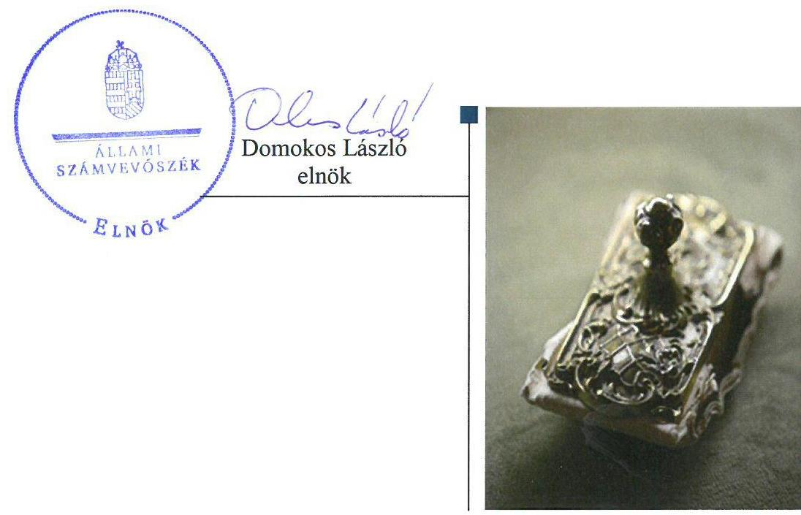
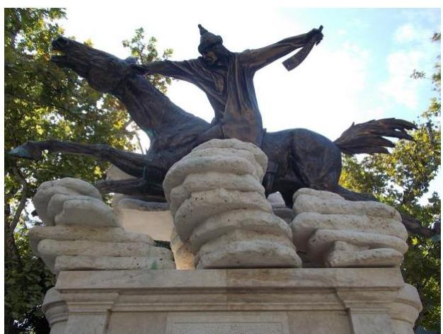
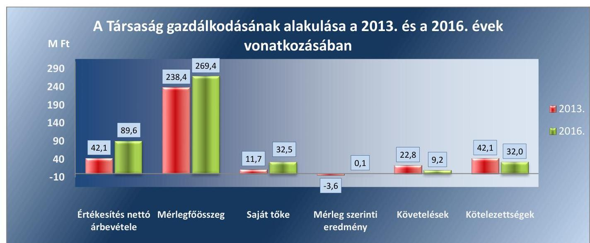

# Jelentés 

## Az önkormányzatok gazdasági társaságai

Az önkormányzatok többségi tulajdonában lévő gazdasági társaságok gazdálkodásának ellenőrzése - Jászkerület Kulturális és Művészeti Közhasznú Nonprofit Kft.
2018.

---

# Jelentés 

## Az önkormányzatok gazdasági társaságai

Az önkormányzatok többségi tulajdonában lévő gazdasági társaságok gazdálkodásának ellenőrzése - Jászkerület Kulturális és Művészeti Közhasznú Nonprofit Kft.
2018. március 11. nap

---

# AZ ELLENŐRZÉST FELÜGYELTE:

DR. HORVÁTH MARGIT felügyeleti vezető

## AZ ELLENŐRZÉST VEZETTE ÉS A VÉGREHAJTÁSÁÉRT FELELŐS:

HOFMEISTER LÁSZLÓ ellenőrzésvezető

A PROGRAM ÖSSZEÁLLÍTÁSÁÉRT FELELŐS:

TÓTPÁL SZABOLCS osztályvezető

IKTATÓSZÁM: EL-0607-009/2018

TÉMASZÁM: 2447

ELLENŐRZÉS-AZONOSÍTÓ SZÁM: V-079337

Jelentéseink az Országgyűlés számítógépes hálózatán és az Interneten a www.asz.hu címen is olvashatóak.

---

# TARTALOMJEGYZÉK 

■ ÖSSZEGZÉS ..... 5
■ AZ ELLENŐRZÉS CÉLJA ..... 6
■ AZ ELLENŐRZÉS TERÜLETE ..... 7
■ AZ ELLENŐRZÉS HÁTTERE, INDOKOLTSÁGA ..... 9
■ A JELENTÉS LÉNYEGES KÉRDÉSKÖREI ..... 10
■ ELLENŐRZÉS HATÓKÖRE ÉS MÓDSZEREI ..... 11
■ MEGÁLLAPÍTÁSOK ..... 13
■ JAVASLATOK ..... 17
■ MELLÉKLETEK ..... 19
I. sz. melléklet: Értelmező szótár ..... 19
II. sz. melléklet: 2013-2016. évi egyszerűsített beszámoló adatok ..... 20
■ FÜGGELÉK: ÉSZREVÉTELEK ..... 21
■ RÖVIDÍTÉSEK JEGYZÉKE ..... 23

---

.

---

# ÖSSZEGZÉS 

Jászberény Városi Önkormányzat a 2013-2016. évek között a tulajdonosi jog gyakorlásának kereteit szabályszerűen alakította ki és jogait szabályszerűen gyakorolta. A JÁSZKERÜLET Kulturális és Művészeti Közhasznú Nonprofit Kft. működése és gazdálkodása szabályszerű volt. A Társaság az előírt tervezési és beszámolási kötelezettségének eleget tett. A Társaság fizetőképessége biztosított volt.

## Az ellenőrzés társadalmi indokoltsága

Magyarországon az önkormányzatok kötelező és önként vállalt feladataik ellátása során egyre szélesebb körben alkalmazzák a költségvetési szerveken kívüli feladatellátást, ezáltal az önkormányzati tulajdonú gazdasági társaságok is kiemelt fontosságú szerephez jutnak a lakossági szolgáltatások biztosításában. Az önkormányzatok többségi tulajdonában álló gazdasági társaságok ellenőrzése kiemelt jelentőségű, mivel működésük hatással van a tulajdonos önkormányzat gazdálkodására, gazdálkodásának egyes elemei befolyásolják az önkormányzati alszektor hiányát és az államadósságot.

Az Állami Számvevőszék stratégiájában célul tűzte ki az államháztartáson kívül működő szervezetek ellenőrzését, mely hozzájárul a közpénzek szabályos, átlátható, elszámoltatható és eredményes felhasználásához. A stratégiával összhangban került sor a JÁSZKERÜLET Kulturális és Művészeti Közhasznú Nonprofit Kft. ellenőrzésére a 2013-2016. évekre vonatkozóan.

## Főbb megállapítások, következtetések

Az Önkormányzat a Társaság feletti tulajdonosi joggyakorlásának kereteit a jogszabályoknak megfelelően alakította ki. A feladatellátás feltételeit biztosította, a tulajdonosi jogait szabályszerűen gyakorolta, rendeletalkotási kötelezettségét teljesítette, a Társaság számviteli beszámolóit jóváhagyta.

A Társaság az előírt számviteli szabályzatokkal rendelkezett, számviteli szabályozottsága megfelelő volt, azonban a leltározási és a pénzkezelési szabályzat kisebb hiányosságok mellett felelt meg a jogszabálynak.

A gazdálkodása szabályszerű volt, az előírt tervezési és beszámolási kötelezettségét a Társaság teljesítette. A mennyiségi felvétellel történő leltározást a kis értékű tárgyi eszközök vonatkozásában nem végezték el.

Az ügyvezető a jogszabály rendelkezése ellenére a 2016. évben a szervezet tevékenységének, a célok megvalósításának nyomon követését biztosító rendszert nem alakította ki. A jogszabály által előírt, közérdekű adatok megismerésére irányuló igények teljesítésének rendjét rögzítő szabályzatát nem alkotta meg. A kiegészítő melléklet kötelező közzétételét elmulasztotta a Társaság.

A bevételek és ráfordítások elszámolása az értékcsökkenés kivételével megfelelő volt. A Társaság árképzése során figyelembe vette az önkormányzati előírásokat.

Kormányzati szektorba sorolt társaságként engedély nélkül kötött a 2016. évben egy adósságot keletkeztető ügyletet.

---

# AZ ELLENŐRZÉS CÉLJA 

Az ellenőrzés célja annak értékelése volt, hogy az önkormányzat vagyongazdálkodási tevékenysége során szabályszerűen gyakorolta-e tulajdonosi jogait, a gazdasági társaság szabályozottsága, gazdálkodása és vagyongazdálkodási tevékenysége, bevételeinek és ráfordításainak elszámolása megfelelt-e a jogszabályi és tulajdonosi előírásoknak; a gazdasági társaság kötelezettségállománya jelentett-e kockázatot a működésre, valamint a gazdálkodás átláthatósága és elszámoltathatósága érdekében biztosított volt-e a szolgáltatás díjának megalapozottsága szabályszerű önköltségszámítással. Az ellenőrzés célja volt továbbá annak megítélése, hogy a kormányzati szektorba sorolt önkormányzati tulajdonban lévő gazdálkodó szervezet gazdálkodásának a kormányzati szektor hiányára és az államadósságra befolyással bíró elemei a jogszabályi előírásoknak megfeleltek-e.

---

# **AZ ELLENŐRZÉS TERÜLETE**

## **Jászberény Városi Önkormányzat és a kizárólagos tulajdonában lévő JÁSZKERÜLET Kulturális és Művészeti Közhasznú Nonprofit Korlátolt Felelősségű Társaság**

A Társaság1-ot az Önkormányzat2 hozta létre 100%-os önkormányzati tulajdonú társaságként 1998-ban. A jegyzett tőkéjének összege – 3,0 M Ft – az ellenőrzött időszakban nem változott.

A Társaság közhasznú jogállású, közfeladatot ellátó gazdasági társaság. A Társaság alaptevékenysége az ellenőrzött időszakban közművelődési feladatok ellátása, ennek keretében közkönyvtári tevékenység, nyilvános filmvetítési tevékenység, kulturális rendezvények és ünnepségek szervezése, gyermekek részére táboroztatás végzése volt. A Társaság a közhasznú feladatai ellátása mellett kiegészítő jelleggel vállalkozási (bérbeadási és hirdetési) tevékenységet is végzett. A vállalkozási tevékenységekből származó bevételek az értékesítés nettó árbevételéből átlagosan 3%-ot tettek ki az ellenőrzött időszakban. A Társaság feladatellátásához szükséges infrastruktúrát az Önkormányzat ingatlanok térítésmentes használatba adásával biztosította, a Társaság vagyonkezelésbe vagyont nem vett át. Saját vagyonát elsősorban a könyvtári könyvek és egyéb berendezések, felszerelések képezték.

A Társaság 2015. december 30-tól tartozott a kormányzati szektorba sorolt egyéb szervezetek körébe.

Az 1. ábra a Társaság néhány, jellemző gazdálkodási adatának alakulását mutatja az ellenőrzött időszakban. A Társaság főbb mérlegadatait a II. melléklet mutatja be.

*Forrás: 2013. és 2016. évi egyszerűsített beszámolók*

---

Az ellenőrzött időszakban a Társaság vagyona 13,0%-kal nőtt. Az értékesítés nettó árbevétele 112,8%-kal emelkedett. Mind a követelések mind a kötelezettségek állománya csökkenő tendenciát mutattak az ellenőrzött időszakban. A követelések a 2013. évi 22,8 M Ft-ról a 2016. évre 9,2 M Ft-ra, a kötelezettségek a 2013. évi 42,1 M Ft-ról a 2016. évre 32,0 M Ft-ra csökkentek. A Társaság a 2013. év kivételével nyereségesen működött, a 2014-2016. években összesen 20,8 M Ft nyereséget ért el. Az átlagos állományi létszáma a 2013. évi 32,0 főről 2016. évre 35,0 főre emelkedett.

A polgármester személyében 2013-2016. években nem történt változás, a hivatalban lévő jegyző 2011. március 16-tól látja el feladatait. A Társaság ügyvezetőjének személye az ellenőrzött időszak során nem változott.

---

# AZ ELLENŐRZÉS HÁTTERE, INDOKOLTSÁGA 

Az önkormányzatok többségi tulajdonában álló gazdasági társaságok ellenőrzése kiemelten fontos a vagyon megőrzése, megóvása érdekében, valamint a kormányzati szektor elszámolásaiban megjelenő önkormányzati tulajdonú gazdálkodó szervezetek esetében, amelyekkel szemben alapvető követelmény, hogy gazdálkodásuk, működésük szabályszerű, az általuk szolgáltatott adatok minél megbízhatóbbak legyenek.

A feladatellátás költségeinek, ráfordításainak alakulása a lakosság széles rétegét érinti. Az ellenőrzés várható hasznosulásaként ellenőrzéseink feltárhatják, hogy az önkormányzat a feladatellátásához rendelt vagyon működtetését a tulajdonostól elvárható gondossággal végezte-e, a feladatot ellátó gazdasági társaság a létesítő okiratban, szolgáltatási szerződésben foglaltak betartásával biztosította-e a feladat ellátását. Az ellenőrzés rávilágíthat arra, hogy a gazdasági társaság a vagyon használatával biztosította-e a szolgáltatás folytatásának feltételeit, az önkormányzat tulajdonosi felügyelete hozzájárult-e a szabályszerű gazdálkodáshoz és feladatellátáshoz.

A megállapítások alapján megfogalmazott számvevőszéki javaslatok hasznosítása elősegítheti a meglévő hibák megszüntetését. A jó gyakorlatok bemutatásával az Állami Számvevőszék hozzájárul a követendő megoldások megismertetéséhez, terjesztéséhez.

---

# A JELENTÉS LÉNYEGES KÉRDÉSKÖREI 

1.     - A tulajdonosi jogok gyakorlása szabályszerű volt-e?
2.     - A Társaság működése és gazdálkodása megfelelt-e az előírásoknak?

---

# ELLENŐRZÉS HATÓKÖRE ÉS MÓDSZEREI 

## Az ellenőrzés típusa

Megfelelőségi ellenőrzés.

## Az ellenőrzött időszak

2013. január 1-jétől 2016. december 31-ig

## Az ellenőrzés tárgya

Az önkormányzatok - többségi tulajdonában lévő gazdasági társaságok feletti - tulajdonosi joggyakorlása, valamint a gazdasági társaságok gazdálkodásának szabályozottsága és szabályszerűsége.

Az ellenőrzés kiterjedt minden olyan körülményre és adatra, amely az ÁSZ³ jogszabályban meghatározott feladatainak teljesítéséhez, valamint a program végrehajtása folyamán felmerült újabb összefüggések feltárásához szükséges volt.

## Az ellenőrzött szervezet

Jászberény Városi Önkormányzat és a JÁSZKERÜLET Kulturális és Művészeti Közhasznú Nonprofit Korlátolt Felelősségű Társaság

## Az ellenőrzés jogalapja

Az ellenőrzés jogalapját az Állami Számvevőszékről szóló 2011. évi LXVI. törvény 1. § (3) bekezdése és 5. § (3)-(5) bekezdései képezik.

## Az ellenőrzés módszerei

Az ellenőrzést a nemzetközi standardokat irányadónak tekintve az ellenőrzési program ellenőrzési kérdései, az ellenőrzött időszakban hatályos jogszabályok, az ellenőrzés szakmai szabályok és módszertanok figyelembe vételével végeztük.

Az ellenőrzés ideje alatt az ellenőrzött szervezettel történő kapcsolattartást az ÁSZ Szervezeti és Működési Szabályzatának vonatkozó előírásai alapján biztosítottuk.

Az ellenőrzés a kizárólagos tulajdonosi jogokat gyakorló önkormányzatra, és az ellenőrzött gazdasági társaságra terjedt ki.

---

Az ellenőrzési kérdések megválaszolásához szükséges bizonyítékok megszerzése a következő ellenőrzési eljárások alkalmazásával történt: megfigyelés, kérdésfeltevés (információkérés), összehasonlítás, valamint elemző eljárás. Az ellenőrzési bizonyítékként felhasználható adatforrások közé tartoztak egyrészt az ellenőrzési programban felsorolt adatforrások, másrészt adatforrás lehet még minden - az ellenőrzés folyamán - feltárt, az ellenőrzés szempontjából információkat tartalmazó dokumentum.

Az ellenőrzést a kérdésekre adott válaszok kiértékelésével, valamint a megjelölt adatforrások, a csatolt tanúsítványok felhasználásával, továbbá az adott időszakban hatályos jogszabályok figyelembe vételével folytattuk le.

A bevételek és ráfordítások elszámolása, valamint a vagyonnyilvántartás terén a szabályszerű működést véletlen mintavétellel ellenőriztük. A mintavétellel ellenőrzött területek esetében minden egyes tétel vonatkozásában a szabályszerűségre vonatkozó kérdéseket tettünk fel, amelyek eredménye összesítésre került. Megfelelőnek értékeltünk egy ellenőrzött területet, amennyiben 95%-os bizonyossággal a teljes sokaságban az átlagos hibaarány legfeljebb 10%, nem megfelelőnek, amennyiben 10%-nál magasabb arányt képviselt. Abban az esetben, ha a teljes sokaság tekintetében a 10%-os hibaarányhoz való viszony megítélésének megbízhatósága nem érte el a 95%-ot, annak elérése érdekében értékelésünket további szempontokkal egészítettük ki, és figyelembe vettük a feltárt hibák típusát és súlyát. A ráfordítások elszámolására és a vagyonnyilvántartásra vonatkozó véletlen mintavételt kockázati alapú kiválasztással egészítettük ki, amelynek során évente a három legnagyobb összegű tételt értékeltük.

---

# 1. A tulajdonosi jogok gyakorlása szabályszerű volt-e? 

Összegző megállapítás

A tulajdonosi joggyakorlás kereteinek kialakítása és a tulajdonosi jogok gyakorlása szabályszerű volt.

A TÁRSASÁG FELETTI TULAJDONOSI JOGOK gyakorlásának rendjét az Önkormányzat a Vagyongazdálkodási rendelet⁴-ben és az Alapító okirat₁₋₃⁵-ban a Gt.⁶ és a Ptk.⁷ rendelkezéseinek megfelelően szabályozta. Az Alapító okirat₁₋₃ a Képviselő-testület⁸ kizárólagos hatáskörébe tartozó feladatokat rögzítette.

RENDELETALKOTÁSI KÖTELEZETTSÉGÉNEK az Önkormányzat az 1997. évi CXL. törvény⁹ előírása alapján a Közművelődési rendelet¹⁰ megalkotásával eleget tett, melyben meghatározta, hogy az ellátandó kulturális, közművelődési feladatokat az üzemeltetési feladatok kivételével a Társaság útján látja el.

A tulajdonosi jogok gyakorlása az előírásoknak megfelelően történt a Képviselő-testület által. A háromtagú FB¹¹-t a Társaságnál a Gt.-ben és a Ptk.-ban, valamint a Taktv.¹²-ben előírtak szerint hozták létre. Az FB a Társaság üzleti terveit megtárgyalta, a Számv. tv.¹³ szerinti beszámolóira vonatkozó döntéseiről írásbeli jelentést készített. Az FB az ellenőrzött időszakban a Gt. 34. § (4) és a Ptk. 3:122. § (3) bekezdése, valamint az Alapító okirat előírása ellenére munkájához ügyrendet nem készített.

A Társaság a Taktv. 5. § (3) bekezdésében előírt Javadalmazási szabályzat¹⁴-tal 2016. szeptember 22. előtt nem rendelkezett.

ÜZLETI TERV készítésének kötelezettségét az Önkormányzat az Alapító okirat₁₋₃-ban és a Közhasznúsági megállapodás¹⁵-ban rögzítette. Az üzleti terveket a Képviselő-testület minden évben határozatában jóváhagyta.

A TÁRSASÁG BESZÁMOLTATÁSÁNAK kötelezettségét az Önkormányzat a Közművelődési megállapodás¹⁶-ban
 rögzítette éves és évközi beszámolók előírásával. A Társaság számviteli beszámolóit a Képviselőtestület megtárgyalta a könyvvizsgáló írásos véleménye, valamint az FB jelentése birtokában és elfogadásáról határozatot hozott. A Képviselőtestület a Civil tv. ${ }^{17}$ rendelkezésének megfelelően döntött a Társaság eredményének felhasználásáról az éves beszámolók elfogadásakor a Társaság közhasznú jogállásából adódóan. A döntés értelmében a Társaság a 2014-2016. évi nyereségét eredménytartalékba helyezte.

A TÁRSASÁGNÁL ELLENŐRZÉST az Önkormányzat belső ellenőrzése a 2013-2016. évek között egyszer végzett. A kockázatelemzésen alapuló belső ellenőrzési tervek alapján végzett ellenőrzés a 2015. évi vagyongazdálkodás szabályszerűségének ellenőrzésére terjedt ki. A 2016.

---

évi ellenőrzési jegyzőkönyvbe foglalt javaslatok alapján a Társaság beszámolt az Önkormányzatnak a megtett intézkedésekről.

# 2. A Társaság működése és gazdálkodása megfelelt-e az előírásoknak? 

## Összegző megállapítás

### 2.1. számú megállapítás

### 2.2. számú megállapítás

## A Társaság működése és gazdálkodása szabályszerű volt.

A Társaság szabályozottsága megfelelő volt kisebb hiányosságok kivételével.

A Társaság rendelkezett a Számv. tv. 14. § (3) és (5) bekezdésekben előírt számviteli szabályzatokkal, Számviteli politikával ${ }_{1-2}{ }^{28}$, valamint az annak keretében elkészítendő Értékelési szabályzattal ${ }^{19}$, és Számlarenddel ${ }_{1-2}{ }^{20}$, melyek tartalma megfelelt a jogszabály előírásának. Számlarendjében megfelelően elkülönítette az alaptevékenysége és a vállalkozási tevékenysége bevételeit és ráfordításait.

A Pénzkezelési szabályzat ${ }^{21}$ a Számv. tv. 14. § (8) bekezdésében előírtakat tartalmazta a készpénzállomány ellenőrzésének gyakoriságának kivételével.

Leltározási szabályzattal ${ }^{22}$ rendelkeztek az ellenőrzött időszakban, azonban annak 5.3.2.-5.3.5 pontjai nem feleltek meg a Számv. tv. 69. § (3) bekezdésében foglalt, a legalább 3 évente, mennyiségi felvétellel végzendő leltározásra vonatkozó előírásnak, mert a tárgyi eszközök esetén 5 évente történő leltározást írtak elő.

Kormányzati szektorba sorolt egyéb szervezetként a 2016. évtől a Társaság nem felelt meg a Bkr. ${ }^{23}$ 10. §-ában foglalt előírásnak, tekintettel a Bkr. 54/A. §-ára, mivel a szervezet tevékenységének, a célok megvalósításának nyomon követését biztosító rendszert nem alakította ki.

A közérdekű adatok megismerésére irányuló igények teljesítésének rendjét rögzítő szabályzattal nem rendelkezett a Társaság az Info. tv. ${ }^{24}$ 30. § (6) bekezdés előírása ellenére.

A Társaság a bevételeinek és ráfordításainak elszámolása az értékcsökkenés elszámolása kivételével szabályszerű volt.

A bevételek és ráfordítások elszámolása szabályszerűen történt az értékcsökkenés elszámolása kivételével.

A közhasznú tevékenység ellátására kapott működési támogatásokat, pályázati forrásokat támogatásonként elkülönítve a Számv. tv. által előírt módon számolta el. A bevételként elszámolt működési támogatás alakulását a 2. ábra mutatja be.

---

1. táblázat

|  ESZKÖZÖK PÓTLÁSA (M FT) |  |   |
| --- | --- | --- |
|  Év | elszámolt értékcsökkenés | teljesített visszapótlás  |
|  2013. | 24,0 | 155,5  |
|  2014. | 35,3 | 84,8  |
|  2015. | 33,7 | 41,5  |
|  2016. | 36,7 | 67,5  |

Forrás: A Társaság adatszolgáltatása 2.3. számú megállapítás

1. ábra

|  A Társaság működési támogatásának alakulása (M Ft) |  |   |
| --- | --- | --- |
|  250,0 | 227,8 | 227,6  |
|  2014. | 35,3 | 84,8  |
|  2015. | 33,7 | 41,5  |
|  2016. | 36,7 | 67,5  |

Forrás: a 2013-2016. évi egyszerűsített éves beszámolók Az önkormányzati támogatás közel azonos mértékű volt a négy év alatt, ugyanakkor a más forrásból származó támogatási források összege csökkenő tendenciát mutatott.

Az értékcsökkenés elszámolása nem volt megfelelő, mert a tárgyi eszközök üzembe helyezését hitelt érdemlően nem dokumentálták, mellyel megsértették a Számv. tv. 52. § (2) bekezdését.

A Társaság vagyonát érintően a 2013-2015. években összesen 349,3 M Ft értékben végzett beruházást, felújítást a használatba kapott ingatlanokon, melyek 169%-kal haladták meg az elszámolt értékcsökkenés összegét. A Társaság tulajdonú eszközeinek pótlását az 1. táblázat mutatja be.

A Társaság szállítói állományán belül a lejárt szállítói állomány aránya a 2013. évi 8,7%-ról 20,8%-ra növekedett a 2016. évre, ugyanakkor ennek 2,8 M Ft-os összege nem jelentett kockázatot a működésre a fizetőképesség biztosítására.

A vevőkövetelés-állomány a 2013. évi 1,1 M Ft-ról a 2016. évre 2,1 M Ft-ra emelkedett. A 2016. évben az ügyvezető végrehajtási eljárás kezdeményezésével intézkedett a lejárt 1,2 M Ft összegű követelés behajtása érdekében.

A Társaság a beszámolási kötelezettségét teljesítette, azonban a közérdekű adatokat hiányosan hozta nyilvánosságra. Engedély nélkül kötött adósságot keletkeztető ügyletet.

AZ ÜZLETI TERVEKET és az évközi beszámolókat a Társaság az Önkormányzat előírásával összhangban a 2013-2016. években elkészítette.

BESZÁMOLÁSI KÖTELEZETTSÉGÉT a Társaság a jogszabályban előírtaknak megfelelően teljesítette. Az egyszerűsített éves beszámolóit a Társaság a Számv. tv.-ben foglaltak szerint készített leltárakkal alátámasztotta a kis értékű tárgyi eszközök kivételével, a nyilvántartásokat és a főkönyvi számlákat az előírások szerint egyeztette. A Társaságnál a

---

100e Ft alatti tárgyi eszközök mérlegben kimutatott értékét a 2013-2016. évek egyikében sem támasztották alá mennyiségi felvétellel történő leltározással, ezzel nem tettek eleget a Számv. tv. 69. § (3) bekezdésében foglaltaknak. A nagy értékű tárgyi eszközök mennyiségi felvétellel történő leltározását szabályszerűen elvégezték.

A könyvvizsgáló a leltározás hiányossága ellenére a beszámolót minden évben korlátozás nélküli hitelesítő záradékkal látta el.

A KÖZÉRDEKŰ ADATOK nyilvánosságra hozatalával kapcsolatos kötelezettségeinek a Társaság részben tett eleget. A Társaság az Info. tv. 37. § (1) bekezdésben előírtak ellenére nem teljesítette a kötelező elektronikus közzététel alá eső, az Info. tv. 1. mellékletében foglalt II. tevékenységre működésre vonatkozó adatok közül a 12. ponthoz kapcsolódó, a Társaságra vonatkozó ellenőrzések megállapításait, valamint III. gazdálkodási adatok közül az 1. ponthoz kapcsolódó, a beszámoló részét képező kiegészítő melléklet közzétételét.

A TÁRSASÁG ÁRKÉPZÉSÉRE vonatkozóan a Közművelődési rendelet előírta az ingyenesen biztosítandó szolgáltatások körét, az egyéb szolgáltatási díjak megállapítását a Társaság hatáskörébe helyezte. Az alkalmazott árak megállapítása megfelelt a szabályozásnak. Önköltségszámítási szabályzat készítésére a Társaság nem volt kötelezett a Számv. tv. 14. § (6) bekezdése alapján.

ADÓSSÁGOT KELETKEZTETŐ ÜGYLETET a Társaság mint lízingbevevő - kormányzati szektorba sorolt egyéb szervezetként - a 2016. évben 5,9 M Ft szerződés szerinti összegben kötött egy ötéves futamidejű lízingszerződést, azonban a Stabilitási tv. ${ }^{25}$ 9. § (1) bekezdésében foglaltak ellenére az államháztartásért felelős miniszter előzetes hozzájárulásával ehhez nem rendelkezett.

---

# JAVASLATOK 

Az ÁSZ tv. 33. § (1) bekezdésében foglaltak értelmében az ellenőrzött szervezet vezetője köteles a jelentésben foglalt megállapításokhoz kapcsolódó intézkedési tervet összeállítani és azt a jelentés kézhezvételétől számított 30 napon belül az ÁSZ részére megküldeni. Amennyiben az ellenőrzött szervezet vezetője nem küldi meg határidőben az intézkedési tervet, vagy továbbra sem elfogadható intézkedési tervet küld, az Állami Számvevőszék elnöke az ÁSZ tv. 33. § (3) bekezdés a) és b) pontjaiban foglaltakat érvényesítheti.

## Javaslataink célja a JÁSZKERÜLET Kulturális és Művészeti Közhasznú Nkft. gazdálkodása szabályszerűségének javítása annak érdekében, hogy a szabályozási környezet és az alkalmazott gyakorlat megfelelően tudja támogatni az átlátható működést.

## A JÁSZKERÜLET Kulturális és Művészeti Közhasznú Nkft. ügyvezetőjének

1. Intézkedjen a Pénzkezelési szabályzat Számv. tv. előírásainak megfelelő elkészítéséről.
(2.1. sz. megállapítás 2. bekezdése alapján)
2. Intézkedjen a Leltározási szabályzat Számv. tv. előírásainak megfelelő elkészítéséről.
(2.1. sz. megállapítás 3. bekezdése alapján)
3. Intézkedjen a szervezet tevékenységének, a célok megvalósításának nyomon követését biztosító rendszer kialakításáról a Bkr.-ben előírtaknak megfelelően.
(2.1. sz. megállapítás 4. bekezdése alapján)
4. Intézkedjen a közérdekű adatok megismerésére irányuló igények teljesítésének rendjét rögzítő szabályzat Info tv. előírásának megfelelő elkészítéséről.
(2.1. sz. megállapítás 5. bekezdése alapján)

---

5. Intézkedjen az eszközök üzembe helyezésének hitelt érdemlő módon történő dokumentálásáról a Számv. tv. előírásainak megfelelően.
(2.2. sz. megállapítás 4. bekezdése alapján)
6. Intézkedjen az egyszerűsített éves beszámoló mérlegének alátámasztása érdekében a 100e Ft alatti tárgyi eszközök mennyiségi leltározásának a Számv. tv.-ben előírtaknak megfelelő gyakorisággal történő végrehajtásáról.
(2.3. sz. megállapítás 2. bekezdése alapján)
7. Intézkedjen az elektronikus közzétételi kötelezettség teljesítéséről az Info tv. előírásainak megfelelően.
(2.3. sz. megállapítás 4. bekezdés 2. mondata alapján)
8. Intézkedjen annak érdekében, hogy a társaság adósságot keletkeztető ügyletet az államháztartásért felelős miniszter előzetes hozzájárulásának birtokában, érvényesen kössön a vonatkozó kormányrendelet előírásának megfelelően.
(2.3. sz. megállapítás 6. bekezdése alapján)

Javaslataink célja a tulajdonosi joggyakorló Jászberény Városi Önkormányzat szabályszerű működésének elősegítése, továbbá a tulajdonosi joggyakorlás kontrolljainak erősítése.

# Jászberény Városi Önkormányzat polgármesterének 

1. Hívja fel a felügyelőbizottságot ügyrendjének megállapítására és annak Képviselő-testület általi jóváhagyásának kezdeményezésére a Ptk. előírásainak megfelelően.
(1. sz. megállapítás 3. bekezdés 4. mondata alapján)

---

# MELLÉKLETEK 

- I. SZ. MELLÉKLET: ÉRTELMEZŐ SZÓTÁR
gazdasági társaság
nemzeti vagyon

A Ptk. 3:88. § (1) bekezdése szerint „a gazdasági társaságok üzletszerű közös gazdasági tevékenység folytatására, a tagok vagyoni hozzájárulásával létrehozott, jogi személyiséggel rendelkező vállalkozások, amelyekben a tagok a nyereségből közösen részesednek, és a veszteséget közösen viselik".
a) az állam vagy a helyi önkormányzat kizárólagos tulajdonában álló dolgok,
b) az a) pont hatálya alá nem tartozó, állam vagy a helyi önkormányzat tulajdonában lévő dolog,
c) az állam vagy a helyi önkormányzat tulajdonában lévő pénzügyi eszközök, továbbá az államot vagy a helyi önkormányzatot megillető társasági részesedések,
d) az államot vagy a helyi önkormányzatot megillető bármely vagyoni értékkel rendelkező jogosultság, amelyet jogszabály vagyoni értékű jogként nevesít,
e) Magyarország határa által körbezárt terület feletti légtér,
f) az üvegházhatású gázok kibocsátási egységeinek kereskedelméről szóló törvény szerint kibocsátási egység és légiközlekedési kibocsátási egység, valamint az ENSZ Éghajlatváltozási Keretegyezménye és annak Kiotói Jegyzőkönyv végrehajtási keretrendszeréről szóló törvény szerinti kiotói egység,
g) állami vagy helyi önkormányzati fenntartású közgyűjtemény (muzeális intézmény, levéltár, közgyűjteményként működő kép- és hangarchívum, valamint könyvtár) saját gyűjteményében nyilvántartott kulturális javak körébe tartozó dolog, kivéve, ha az állami vagy önkormányzati tulajdon jogszerű létrejötte kétséget kizáró módon nem bizonyítható és a dologra nézve más a tulajdonjogát bizonyítja vagy a kulturális javakra vonatkozó jogszabályokban meghatározott eljárás keretében valószínűsíti (g. pont módosult 2013. december 7-től),
h) a régészeti lelet,
i) a nemzeti adatvagyon körébe tartozó állami nyilvántartások fokozottabb védelméről szóló törvény szerinti nemzeti adatvagyon.
Forrás: Nvtv. 1. § (2)

---

II. SZ. MELLÉKLET: 2013-2016. ÉVI EGYSZERŰSÍTETT BESZÁMOLÓ ADATOK

| A TÁRSASÁG 2013-2016. ÉVI EGYSZERŰSÍTETT BESZÁMOLÓINAK FŐBB ADATAI (M FT-BAN) |  |  |  |  |  |
| :--: | :--: | :--: | :--: | :--: | :--: |
| Megnevezés | 2013. év | 2014. év | 2015. év | 2016. év | 2016/2013. év (\%) |
| Mérlegfőösszeg | 238,4 | 245,2 | 253,3 | 269,4 | 113,0\% |
| Befektetett eszközök | 173,1 | 194,9 | 203,0 | 233,1 | $134,7 \%$ |
| - ebből tárgyi eszközök | 173,0 | 191,7 | 200,4 | 230,9 | $133,5 \%$ |
| Forgóeszközök | 62,6 | 43,9 | 49,8 | 35,3 | $56,4 \%$ |
| - ebből készletek | 0,0 | 0,0 | 0,2 | 0,3 | - |
| - ebből követelések | 22,8 |

 30,0 | 11,3 | 9,2 | $40,4 \%$ |
| - ebből vevőkövetelések | 1,2 | 23,4 | 1,8 | 2,1 | $175,0 \%$ |
| - ebből pénzeszközök | 39,7 | 13,9 | 38,2 | 25,8 | $65,0 \%$ |
| Aktív időbeli elhatárolás | 2,7 | 6,4 | 0,6 | 1,0 | $37,0 \%$ |
| Saját tőke összege | 11,7 | 27,9 | 32,4 | 32,5 | 277,8\% |
| Jegyzett tőke | 3,0 | 3,0 | 3,0 | 3,0 | 100,0\% |
| Eredménytartalék | $-7,2$ | $-10,8$ | 5,4 | 9,9 | - |
| Lekötött tartalék | 19,5 | 19,5 | 19,5 | 19,5 | 100,0\% |
| Mérleg szerinti eredmény | $-3,6$ | 16,2 | 4,5 | 0,1 | - |
| Céltartalék | 0,0 | 0,0 | 8,0 | 0,0 | - |
| Kötelezettségek | 42,1 | 35,7 | 26,6 | 32,0 | 76,0 |
| Passzív időbeli elhatárolás | 184,6 | 181,6 | 186,4 | 204,9 | 111,0 |

---

# FÜGGELÉK: ÉSZREVÉTELEK 

A jelentéstervezetet a Számvevőszék 15 napos észrevételezésre megküldte az ellenőrzött szervezet vezetőjének az ÁSZ tv. 29. § (1) bekezdése előírásának megfelelően.
Az ellenőrzött szervezetek vezetői nem tettek észrevételt az ellenőrzési megállapításokkal kapcsolatban.

[^0]
[^0]:    * 29. § (1) Az Állami Számvevőszék az ellenőrzési megállapításait megküldi az ellenőrzött szervezet vezetőjének vagy az általa megbízott személynek, és annak, akinek személyes felelősségét állapította meg.
    (2) Az ellenőrzött szervezet vezetője és a felelősként megjelölt személy az ellenőrzés megállapításaira tizenöt napon belül írásban észrevételt tehet.
    (3) Az Állami Számvevőszék az észrevételre a beérkezésétől számított harminc napon belül írásban válaszol. A figyelembe nem vett észrevételeket köteles a jelentésben feltüntetni, és megindokolni, hogy azokat miért nem fogadta el.

---

.

---

# RÖVIDÍTÉSEK JEGYZÉKE 

${ }^{1}$ Társaság
${ }^{2}$ Önkormányzat
${ }^{3}$ ÁSZ
${ }^{4}$ Vagyongazdálkodási rendelet
${ }^{5}$ Alapító okirat
${ }^{6}$ Gt.
${ }^{7}$ Ptk.
${ }^{8}$ Képviselő-testület
${ }^{9}$ 1997. évi CXL törvény
${ }^{10}$ Közművelődési rendelet
${ }^{11} \mathrm{FB}$
${ }^{12}$ Taktv.
${ }^{13}$ Számv. tv.
${ }^{14}$ Javadalmazási szabályzat
${ }^{15}$ Közhasznúsági megállapodás
${ }^{16}$ Közművelődési megállapodás
${ }^{17}$ Civil tv.
${ }^{18}$ Számviteli politika:2
${ }^{19}$ Értékelési szabályzat
${ }^{20}$ Számlarend:2
${ }^{21}$ Pénzkezelési szabályzat
${ }^{22}$ Leltározási szabályzat

JÁSZKERÜLET Kulturális és Művészeti Közhasznú Nonprofit Korlátolt Felelősségű Társaság
Jászberény Városi Önkormányzat
Állami Számvevőszék
13/2012. (III. 19.) sz. önkormányzati rendelet Jászberény Városi Önkormányzatának vagyonáról és a vagyongazdálkodás szabályairól
JÁSZKERÜLET Kulturális és Művészeti Közhasznú Nonprofit Korlátolt Felelősségű Társaság Alapító okirata (hatályos 2013. január 25-től, módosítások: (2013. június 12., 2013. november 18., 2014. május 30., 2014. június 19., 2014. december 4., 2015. február 11., 2015. június 10., 2016. május 11.)
2006. évi IV. törvény a gazdasági társaságokról (hatálytalan 2014. március 15-től) 2013. évi V. törvény a Polgári Törvénykönyvről (hatályos 2014. március 15-től) Jászberény Városi Önkormányzatának Képviselő-testülete
1997. évi CXL törvény a muzeális intézményekről, a nyilvános könyvtári ellátásról és a közművelődésről (hatályos 1998. január 1-jétől)
26/2011 (VIII. 15.) sz. a kulturális, közgyűjteményi és közművelődési feladatokról szóló Jászberény Városi Önkormányzatának rendelete
JÁSZKERÜLET Kulturális és Művészeti Közhasznú Nonprofit Korlátolt Felelősségű Társaság felügyelőbizottsága
2009. évi CXXII. törvény a köztulajdonban álló gazdasági társaságok takarékosabb működéséről (hatályos 2009. december 4-től)
2000. évi C. törvény a számvitelről (hatályos 2001. január 1-jétől)

JÁSZKERÜLET Kulturális és Művészeti Közhasznú Nonprofit Korlátolt Felelősségű Társaság Javadalmazási szabályzata (hatályos 2016. szeptember 22-től)
Jászberény Városi Önkormányzata és a JÁSZKERÜLET Kulturális és Művészeti Közhasznú Nonprofit Korlátolt Felelősségű Társaság között 2011. augusztus 29-én kötött Közhasznúsági megállapodás
Jászberény Városi Önkormányzata és a JÁSZKERÜLET Kulturális és Művészeti Közhasznú Nonprofit Korlátolt Felelősségű Társaság között 2011. július 25-én kötött Közművelődési és feladat-ellátási megállapodás
2011. évi CLXXV. törvény az egyesülési jogról, a közhasznú jogállásról, valamint a civil szervezetek működéséről és támogatásáról (hatályos 2011. december 22-től)
Számviteli politika: JÁSZKERÜLET Kulturális és Művészeti Közhasznú Nonprofit Korlátolt Felelősségű Társaság Számviteli politikája (hatályos 2012. január 1-jétől) Számviteli politika: JÁSZKERÜLET Kulturális és Művészeti Közhasznú Nonprofit Korlátolt Felelősségű Társaság Számviteli politikája (hatályos 2016. január 1-jétől) JÁSZKERÜLET Kulturális és Művészeti Közhasznú Nonprofit Korlátolt Felelősségű Társaság Értékelési Szabályzata (hatályos 2012. január 1-jétől)
Számlarend: JÁSZKERÜLET Kulturális és Művészeti Közhasznú Nonprofit Korlátolt Felelősségű Társaság Számlarendje (hatályos 2012. január 1-jétől)
Számlarend: JÁSZKERÜLET Kulturális és Művészeti Közhasznú Nonprofit Korlátolt Felelősségű Társaság Számlarendje (hatályos 2016. január 1-jétől)
JÁSZKERÜLET Kulturális és Művészeti Közhasznú Nonprofit Korlátolt Felelősségű Társaság Pénzkezelési Szabályzata (hatályos 2012. január 1-jétől)
JÁSZKERÜLET Kulturális és Művészeti Közhasznú Nonprofit Korlátolt Felelősségű Társaság Leltárkészítési és Leltározási Szabályzata (hatályos 2012. január 1-jétől)

---

${ }^{23}$ Bkr.
${ }^{24}$ Info tv.
${ }^{25}$ Stabilitási tv.

370/2011. (XII. 31.) Korm. rendelet a költségvetési szervek belső
kontrollrendszeréről és belső ellenőrzéséről (hatályos 2012. január 1-jétől)
2011. évi CXII. törvény az információs önrendelkezési jogról (hatályos 2011. július 27-től)
2011. évi CXCIV. törvény Magyarország gazdasági stabilitásáról (hatályos 2012. január 1-jétől)

---

# ÁLLAMI SZÁMVEVŐSZÉK 

1052 Budapest, Apáczai Csere János utca 10.
Levélcím: 1364 Budapest 4. Pf. 54
Telefon: +36 14849100 Telefax: +36 14849200
www.asz.hu

