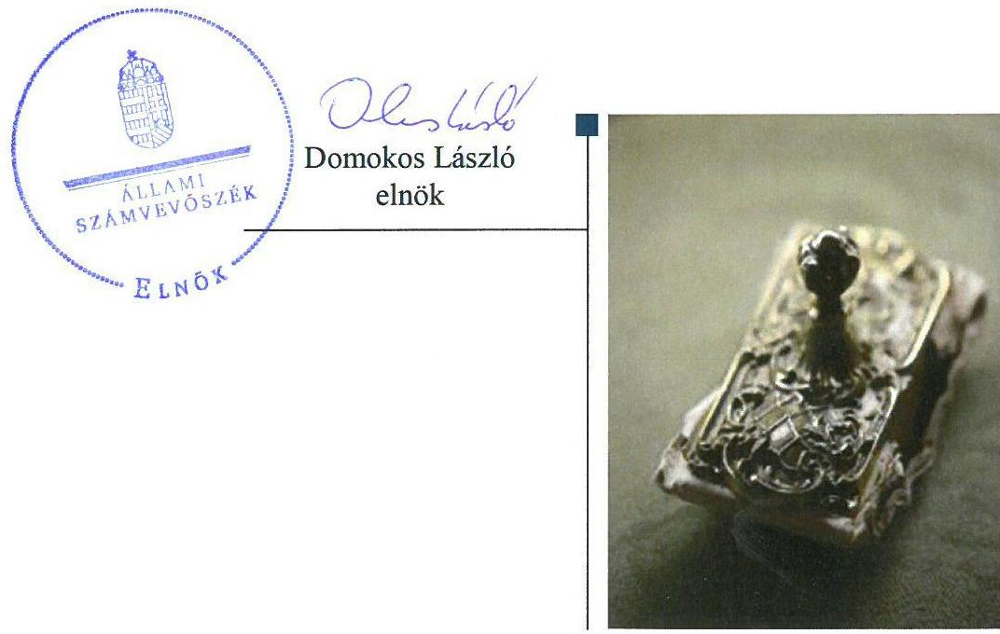
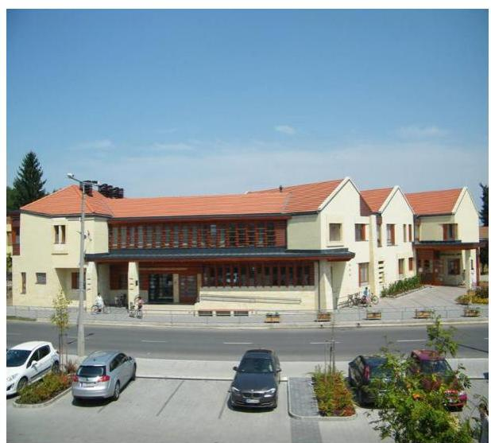
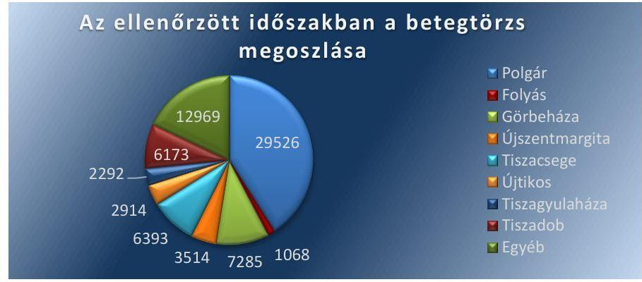
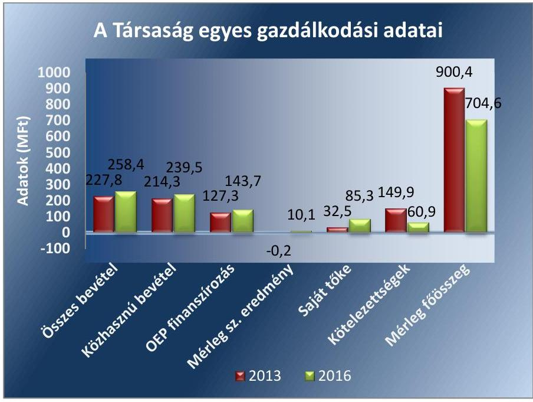

# Jelentés 

## Az önkormányzatok gazdasági társaságai

Az önkormányzatok többségi tulajdonában lévő gazdasági társaságok gazdálkodásának ellenőrzése - PÉTEGISZ Polgár és Térsége Egészségügyi Központ Nonprofit Zrt.
2018.

18075
www.asz.hu

---

# Jelentés 

## Az önkormányzatok gazdasági társaságai

Az önkormányzatok többségi tulajdonában lévő gazdasági társaságok gazdálkodásának ellenőrzése - PÉTEGISZ Polgár és Térsége Egészségügyi Központ Nonprofit Zrt.
2018. 04. hó 11. nap

---

# AZ ELLENŐRZÉST FELÜGYELTE:

DR HORVÁTH MARGIT felügyeleti vezető

## AZ ELLENŐRZÉST VEZETTE ÉS A VÉGREHAJTÁSÁÉRT FELELŐS:

SIPOSNÉ DÓCZI KLÁRA ellenőrzésvezető

## A PROGRAM ÖSSZEÁLLÍTÁSÁÉRT FELELŐS:

TÓTPÁL SZABOLCS osztályvezető

IKTATÓSZÁM: EL-0134 -099/2018

TÉMASZÁM: 2447

## ELLENŐRZÉS-AZONOSÍTÓ SZÁM: V079324

Jelentéseink az Országgyűlés számítógépes hálózatán és az Interneta a www.asz.hu címen is olvashatóak.

---

# TARTALOMJEGYZÉK 

■ ÖSSZEGZÉS ..... 5
■ AZ ELLENŐRZÉS CÉLJA ..... 6
■ AZ ELLENŐRZÉS TERÜLETE ..... 7
■ AZ ELLENŐRZÉS HÁTTERE, INDOKOLTSÁGA ..... 9
■ A JELENTÉS LÉNYEGES KÉRDÉSKÖREI ..... 10
■ ELLENŐRZÉS HATÓKÖRE ÉS MÓDSZEREI ..... 11
■ MEGÁLLAPÍTÁSOK ..... 13
■ MELLÉKLETEK ..... 17
I. sz. melléklet: Értelmező szótár ..... 17
II. sz. melléklet: A Társaság gazdálkodásának adatai ..... 19
■ FÜGGELÉK: ÉSZREVÉTELEK ..... 21
■ RÖVIDÍTÉSEK JEGYZÉKE ..... 23

---

.

---

# ÖSSZEGZÉS 

Polgár Város Önkormányzata a tulajdonosi joggyakorlás kereteit szabályszerűen alakította ki. A PÉTEGISZ Polgár és Térsége Egészségügyi Központ Nonprofit Zrt. gazdálkodása szabályszerű volt. A Társaság számviteli elszámolása megfelelő a jogszabályi előirásoknak. Beszámolási kötelezettségének a jogszabályi előírások szerint tett eleget. A Társaság átláthatóan és szabályszerűen gazdálkodott.

PÉTEGISZ Nonprofit Zrt.

## Az ellenőrzés társadalmi indokoltsága

Magyarországon az intézmény-centrikus közfeladat-ellátás jellemző, de az önkormányzatok kötelező és önként vállalt feladataik ellátása során egyre szélesebb körben alkalmazzák a költségvetési szerveken kívüli feladatellátást. Helyi szinten ennek meghatározó szereplői az önkormányzati tulajdonban lévő gazdasági társaságok, amelyek ezáltal kiemelt fontosságú szerephez jutnak a lakossági szolgáltatások biztosításában. Az önkormányzatok többségi tulajdonában álló gazdasági társaságok ellenőrzése kiemelt jelentőségű, mivel működésük hatással van a tulajdonos önkormányzat gazdálkodására, gazdálkodásának egyes elemei befolyásolják az önkormányzati alszektor hiányát és az államadósságot. Ezért alapvető követelmény, hogy gazdálkodásuk, múködésük szabályszerű és átlátható legyen.

Az Állami Számvevőszék által az egészségügyi ellátás közfeladatot ellátó Társaságnál végzett ellenőrzést további társadalmi elvárás indokolja sajátos tevékenységéből adódóan, mivel múködésén keresztül Polgár város és a környező települések lakosságának széles köre került kapcsolatba a Társasággal, az általa nyújtott szolgáltatásokkal.

## Főbb megállapítások, következtetések, javaslatok

Polgár Város Önkormányzata a tulajdonosi joggyakorlás kereteit a jogszabályi előírásoknak megfelelően alakította ki. A Társaság múködésére vonatkozó tulajdonosi előírások kereteit az Alapszabályban rögzítették. A tulajdonosi jogok gyakorlása szabályszerű volt.

A PÉTEGISZ Polgár és Térsége Egészségügyi Központ Nonprofit Zrt. rendelkezett a múködéséhez szükséges valamennyi, a jogszabályi előírásoknak megfelelő szabályzattal. Vagyongazdálkodása szabályszerű volt, vagyonához kapcsolódó nyilvántartásait a jogszabályi előírások szerint vezette. Az eszközöket és a forrásokat szabályszerű leltározással vették számba. A Társaság fizetőképessége biztosított volt, előírt tervezési, beszámolási, adatszolgáltatási kötelezettségeit határidőben teljesítette. A térítésköteles egészségügyi szolgáltatások díjainak meghatározása megfelelő az ágazati szabályoknak.

---

# AZ ELLENŐRZÉS CÉLJA 

AZ ELLENŐRZÉS CÉLJA annak értékelése volt, hogy az önkormányzat vagyongazdálkodási tevékenysége során szabályszerűen gyakorolta-e tulajdonosi jogait.

Ellenőriztük, hogy a gazdasági társaság szabályozottsága, gazdálkodása és vagyongazdálkodási tevékenysége, bevételeinek és ráfordításainak elszámolása megfelelt-e a jogszabályi és tulajdonosi előírásoknak.

Értékeltük, hogy a gazdasági társaság kötelezettségállománya jelentett-e kockázatot a múködésre. Az ellenőrzés célja volt továbbá annak megítélése, hogy a kormányzati szektorba sorolt önkormányzati tulajdonban lévő gazdálkodó szervezet gazdálkodásának a kormányzati szektor hiányára és az államadósságra befolyással bíró elemei a jogszabályi előírásoknak megfeleltek-e.

---

# **AZ ELLENŐRZÉS TERÜLETE**

## **Polgár Város Önkormányzata és a többségi tulajdonában álló PÉTEGISZ Polgár és Térsége Egészségügyi Központ Nonprofit Zrt.**

**POLGÁR VÁROS ÖNKORMÁNYZATA** további hét önkormányzat¹ társulásával 2009. június 23-án alapította meg a PÉTEGISZ Polgár és Térsége Egészségügyi Központ Nonprofit Zrt.-t, melyben meghatározó, 52%-os tulajdonrésszel rendelkezett. A tulajdonosok a Társaság² 5 millió Ft jegyzett tőkéjét 5000 db 1000 Ft névértékű részvény névértéken történő megvásárlásával biztosították. A Társaság az ellenőrzött időszakban közhasznú jogállású szervezet volt.

**PÉTEGISZ POLGÁR ÉS TÉRSÉGE EGÉSZSÉGÜGYI KÖZPONT NONPROFIT ZRT.** fő tevékenysége az ellenőrzött időszakban a szakorvosi járóbetegellátás volt. A Társaság a tevékenységét az ellenőrzött időszakban saját vagyonával végezte. A tevékenységnek helyt adó ingatlant és az ellátáshoz szükséges műszerezettséget 978,5 millió Ft összegű fejlesztési célú valamint további uniós forrásból származó támogatás³-okkal valósította meg 2009-ben. A Társaság működésének célja egészségmegőrzés, betegségmegelőzés, gyógyító, egészségügyi rehabilitációs tevékenység volt. Közhasznú tevékenységként végezte a kistérség járó-beteg szakellátását és a fekvőbeteg ellátást valamint az egyéb humán-egészségügyi ellátást. A Társaság foglalkozott továbbá reklámügynöki tevékenységgel és ingatlan bérbeadással is, melyeket vállalkozási tevékenységként végzett. Az Alapszabály⁴₁₃-ban meghatározottak szerint a vállalkozási, üzletszerű tevékenységet a közhasznú tevékenység elősegítése és megvalósítása érdekében, kiegészítő jelleggel folytatta.

Az ellátott területhez tartozó lakosok száma 2015. január 1-én 18 332 fő volt. Az orvosi ellátásra jelentkezett betegek száma a 2013. évi 13 990 főről 2016-ra 21 841 főre nőtt. Az ellenőrzött időszakban a betegtörzs⁵ településenkénti megoszlását az 1. ábra. mutatja.

1. ábra

*Forrás: 2013-2016. évi Közhasznúsági beszámolók*

---

A Társaság átlagos statisztikai létszáma 2013. évben 26 fő, 2016. évben 30 fő volt.

A Társaság egyes gazdálkodási adatait a 2013. és 2016. években a 2. ábra szemlélteti.
2. ábra

Forrás: A Társaság éves beszámolói
A mérlegfőösszeg 2013. évről 2016. év végére 904,4 millió Ft-ról 704,6 millió Ft-ra csökkent, amelyet eszközoldalon a befektetett eszközök 121,9 millió Ft-os csökkenése, míg a forrás oldalon a passzív időbeli elhatárolások 159,6 millió Ft-os csökkenése, és egyidejűleg a saját tőke 52, 8 millió Ft-os növekedése okozott.

A bevételek összege a közhasznú bevételek azon belül az OEP ${ }^{6}$ finanszírozás hatására 2013. évről 2016. évre 30,6 millió Ft-tal emelkedett. A Társaság az ellenőrzött időszakban a tulajdonos önkormányzatoktól 12,9 millió Ft működési támogatást kapott.

A kötelezettségek 2013. évről 2016. év végére 89 millió Ft-tal csökkentek, melyet a hosszúlejáratú kötelezettségek 68, 8 millió Ft-ról 32, 8 millió Ft-ra, a rövidlejáratú kötelezettségeknek 81,1 millió forintról 28,1 millió Ftra történő csökkenése okozott. Hosszúlejáratú kötelezettségként Polgár Város Önkormányzata az ellenőrzött időszakban összesen 50 millió Ft viszszatérítendő támogatást nyújtott a Társaságnak a múködés biztosításához. A Társaság további hosszúlejáratú kötelezettsége az ellenőrzött időszakban a 2012-ben beruházási céllal felvett 27,2 millió forint hitel fennmaradt állománya volt.

A Társaság 2013. évtől kormányzati szektorba sorolt társaságnak minősült. A Társaságnak az ellenőrzött időszakban nem volt olyan adósságot keletkeztető ügylete, amely az államadósságra hatással lett volna, továbbá a kormányzati szektor hiányát osztalékfizetés nem befolyásolta.

A polgármester és a jegyző valamint a vezérigazgató személyében az ellenőrzött időszakban nem történt változás.

---

# AZ ELLENŐRZÉS HÁTTERE, INDOKOLTSÁGA 

Az önkormányzatok többségi tulajdonában álló gazdasági társaságok ellenőrzése kiemelten fontos a vagyon megőrzése, megóvása érdekében, valamint a kormányzati szektor elszámolásaiban megjelenő önkormányzati tulajdonú gazdálkodó szervezetek esetében, amelyekkel szemben alapvető követelmény, hogy gazdálkodásuk, múködésük szabályszerű, az általuk szolgáltatott adatok minél meg-bizhatóbbak legyenek. A feladatellátás költségeinek, ráfordításainak alakulása a lakosság széles rétegét érinti.

Ellenőrzéseink feltárhatják, hogy az önkormányzat a feladatellátásához rendelt vagyon múködtetését a tulajdonostól elvárható gondossággal vé-gezte-e, a feladatot ellátó gazdasági társaság a létesítő okiratban, szolgáltatási szerződésben foglaltak betartásával biztosította-e a feladat ellátását. Az ellenőrzés eredményeképp meghatározhatóvá válnak a költségvetési hiányt befolyásoló szervezetek kockázatai, lehetővé válik ezen kockázatok csökkentése. Az ellenőrzés rávilágíthat arra, hogy a hogy a gazdasági társaság a vagyon használatával biztosította-e a szolgáltatás folytatásának feltételeit, az önkormányzat tulajdonosi felügyelete hozzájárult-e a szabályszerű gazdálkodáshoz és feladatellátáshoz.

A megállapítások alapján megfogalmazott számvevőszéki javaslatok hasznosítása elősegítheti a meglévő hibák megszüntetését. A jó gyakorlatok bemutatásával az ÁSZ hozzájárulhat a követendő megoldások megismertetéséhez, terjesztéséhez.

---

# A JELENTÉS LÉNYEGES KÉRDÉSKÖREI 

1.     - A tulajdonosi joggyakorlás szabályszerű volt-e?
2.     - A gazdasági társaság szabályozottsága, gazdálkodása és vagyongazdálkodási tevékenysége szabályszerű volt-e, fizetőképessége biztositott volt-e a gazdálkodás során?
3.     - A gazdasági társaság bevételeinek és ráfordításainak elszámolása, valamint az árképzés szabályszerű volt-e?

---

# ELLENŐRZÉS HATÓKÖRE ÉS MÓDSZEREI 

## Az ellenőrzés típusa

Megfelelőségi ellenőrzés.

## Az ellenőrzött időszak

2013. január 1-jétől 2016. december 31-ig tart

## Az ellenőrzés tárgya

Polgár Város Önkormányzata többségi tulajdonában lévő gazdasági társaság feletti tulajdonosi joggyakorlása, valamint a PÉTEGISZ Polgár és Térsége Egészségügyi Központ Nonprofit Zrt. gazdálkodásának szabályozottsága és szabályszerűsége, továbbá az önkormányzati alszektorba sorolt gazdasági társaság gazdálkodásának a kormányzati szektor hiányára és az államadósságra befolyással bíró elemei.

Az ellenőrzés kiterjed minden olyan körülményre és adatra, amely az ÁSZ jogszabályban meghatározott feladatainak teljesítéséhez, valamint a program végrehajtása folyamán felmerült újabb összefüggések feltárásához szükséges.

## Az ellenőrzött szervezet

Polgár Város Önkormányzata
PÉTEGISZ Polgár és Térsége Egészségügyi Központ Nonprofit Zrt.

## Az ellenőrzés jogalapja

Az ellenőrzés jogszabályi alapját az ÁSZ tv. ${ }^{7}$ 1. § (3) bekezdése és 5. § (3)-(4)-(5) bekezdései képezik.

## Az ellenőrzés módszerei

Az ellenőrzést a nemzetközi standardokat irányadónak tekintve az ellenőrzési program ellenőrzési kérdései, az ellenőrzött időszakban hatályos jogszabályok, az ellenőrzés szakmai szabályok és módszertanok figyelembe vételével végeztük.

---

Az ellenőrzés ideje alatt az ellenőrzött szervezettel történő kapcsolattartást az ÁSZ Szervezeti és Múködési Szabályzatának vonatkozó előírásai alapján biztosítottuk.

Az ellenőrzési kérdések megválaszolásához szükséges bizonyítékok megszerzése a következő ellenőrzési eljárások alkalmazásával történt: megfigyelés, kérdésfeltevés (információkérés), összehasonlítás, valamint elemző eljárás. Az ellenőrzési bizonyítékként felhasználható adatforrások közé tartoztak egyrészt a szakmai programban felsorolt adatforrások, másrészt minden, az ellenőrzés folyamán feltárt, az ellenőrzés szempontjából információkat tartalmazó dokumentum.

A bevételek és ráfordítások elszámolását, valamint a vagyonnyilvántartás terén a szabályszerű múködést véletlen mintavétellel és irányított kiválasztással ellenőriztük. A mintatételek értékelése alapján egyrészt a sokaságban előforduló hiba arányát becsültük, másrészt az irányítottan kiválasztott tételeket értékeltük. A jogszabályoknak és a belső eljárásoknak megfelelőnek, azaz szabályszerűnek tekintettük az adott területet, amenynyiben a minta ellenőrzésének eredménye alapján 95\%-os bizonyossággal a teljes sokaságban a hibaarány kisebb volt, mint 10\%. Nem megfelelőnek értékeltük, ha a hibaarány a 10\%-ot meghaladta. A ráfordítások elszámolására és a vagyonnyilvántartásra vonatkozó véletlen mintavételt kockázati alapú kiválasztással egészítettük ki, amelynek során évente a három legnagyobb összegű tételt választottuk ki Az ellenőrzést a nemzetközi standardokat irányadónak tekintve az ellenőrzési program ellenőrzési kérdései, az ellenőrzött időszakban hatályos jogszabályok, az ellenőrzés szakmai szabályok és módszertanok figyelembe vételével végeztük.

Az ellenőrzést a kérdésekre adott válaszok kiértékelésével, valamint a megjelölt adatforrások, a csatolt tanúsítványok felhasználásával, továbbá az adott időszakban hatályos jogszabályok figyelembe vételével folytattuk le.

---

# 1. A tulajdonosi joggyakorlás szabályszerű volt-e? 

Összegző megállapítás

Az Önkormányzat ${ }^{8}$ tulajdonosi joggyakorlása szabályszerű volt.

AZ ÖNKORMÁNYZAT a tulajdonosi joggyakorlás kereteit a Vagyonrendelet ${ }_{1-4}{ }^{9}$-ben - amiben a tulajdonosi joggyakorlás alapvető előírásait rögzítette - valamint az SZMSZ ${ }^{10}$-ben - ahol a tulajdonosi jogokat gyakorló képviselő-testület ${ }^{11}$ múködésének módját szabályozta - határozta meg. A Képviselő-testület a Polgármestert ${ }^{12}$ hatalmazta fel, hogy az Önkormányzat nevében a Társaság Közgyűlésén a részvényesi jogokat gyakorolja

A TÁRSASÁG MÚKÖDÉSÉNEK SZABÁLYAIT az Alapszabályban rögzítették. A Gt. ${ }^{13}$ és a Ptk. ${ }^{14}$ előírásai szerint a Közgyűlés megválasztotta, és az Alapszabályban rögzítette a felügyelőbizottság ${ }^{15}$ tagjait, a Vezérigazgató ${ }^{16}$ kinevezését valamint a független Könyvvizsgáló ${ }^{17}$ kijelölését és a feladataik meghatározását.

A TULAJ DONOSI JOGOK GYAKORLÁSA az Önkormányzat részéről az SZMSZ-nek és a Vagyonrendeletnek megfelelően történt. A Képviselő-testület a Társaság közgyűlési döntéseit megelőzően döntött a Társaság pénzügyi beszámolóinak és üzleti terveinek elfogadásáról, a Társaság Alapszabályának módosításáról. A Polgármester ezen döntésekben megadott felhatalmazás szerint képviselte az Önkormányzatot a Társaság Közgyűlésében. A Képviselő-testület döntéshozatalát a Társaság Felügyelőbizottságának javaslatai, jelentései támogatták.

A TÁRSASÁG KÖZGYŰLÉSE ${ }^{18}$ minden, az Alapszabályban meghatározott, a hatáskörébe tartozó ügyben döntést hozott. Az egyszerűsített éves beszámolók, valamint azzal egyidejűleg a közhasznúsági beszámolók elfogadása a Gt. és a Ptk. előírásai szerint, a Felügyelőbizottság és a Könyvvizsgáló írásos véleményének ismeretében történt. A beszámoló elfogadásakor szabályszerűen döntöttek az eredménynek eredménytartalékba történő helyezéséről, osztalék kifizetésére a Civil tv. ${ }^{19}$ előírásának megfelelően nem került sor.

A Közgyűlés hagyta jóvá - az Alapszabályban meghatározottak szerint a Társaság üzleti terveit és a Beszerzési és közbeszerzési szabályzat ${ }_{1-2}{ }^{20}$-át valamint megalkotta a Taktv. ${ }^{21}$ előírásainak megfelelő Javadalmazási Szabályzatát ${ }_{1-2}{ }^{22}$.

---

# 2. A gazdasági társaság szabályozottsága, gazdálkodása és vagyongazdálkodási tevékenysége szabályszerű volt-e, fizetőképessége biztosított volt-e a gazdálkodás során? 

Összegző megállapítás

A Társaság szabályozottsága, gazdálkodása és vagyongazdálkodási tevékenysége szabályszerű, fizetőképessége biztosított volt.
2.1. számú megállapítás

A Társaság szabályzatai megfeleltek a jogszabályi előírásoknak. Vagyongazdálkodása megfelelt a jogszabályoknak és a belső előírásoknak.

AZ ELŐÍRT SZÁMVITELI SZABÁLYZATOKKAL RENDELKEZETT a Társaság, azok megfeleltek a jogszabályi előírásoknak. A Társaság rendelkezett a Számv. tv. ${ }^{23}$ előírásainak megfelelő tartalmú Számviteli politikával ${ }_{1-2}{ }^{24}$, a Számviteli politika részeként Leltározási ${ }_{1-2}{ }^{25}$ szabályzattal, Eszközök és források értékelési szabályzatával ${ }_{1-2}{ }^{26}$, Pénzkezelési szabályzat ${ }_{1-2}{ }^{27}$-tal, Számlarend ${ }_{1-2}{ }^{28}$-del. A Társaság az ellenőrzött időszakban a jogszabályi változások szerint aktualizálta a belső szabályzatait. A Társaság a Számviteli politika részeként megalkotta a Selejtezési ${ }^{29}{ }_{1-2}$ szabályzatot is. Továbbá megfelelő szabályzatokkal rendelkezett a Társaság az iratkezelési feladatokról -Iratkezelési szabályzat ${ }^{30}$-, a gazdálkodási jogkörökről - Gazdálkodási szabályzat. ${ }^{31}$.

A TÁRSASÁG VAGYONGAZDÁLKODÁSA megfelelt a jogszabályi rendelkezéseknek és a belső előírásoknak. A Társaság a vagyonnyilvántartását a Számv. tv. és az Nvtv. ${ }^{32}$ előírásaival és belső szabályzataival összhangban vezette.

AZ ESZKÖZÖK ÉS A FORRÁSOK LELTÁROZÁSA szabályszerű volt. A Számv. tv.-ben és saját Leltározási szabályzat ${ }_{1-2}$-ában foglaltak szerint egyeztetéssel illetve kétévente mennyiségi felvétellel leltároztak és támasztották alá az éves beszámolók mérlegtételeit.

A SAJÁT VAGYON ÉRTÉKÉNEK MEGÖRZÉSE, gyarapítása érdekében, az SZMSZ előírásai szerint állította össze a Társaság a fejlesztésekre vonatkozó terveit. A Társaság a fejlesztések során szabályszerűen járt el. Az ellenőrzött időszakban saját ingatlantulajdonát a Társaság az Alapszabályban rögzítetteknek megfelelően, a közhasznú célokat nem veszélyeztetve adta bérbe.

BELSŐ ELLENŐRZÉST a Társaság kormányzati szektorba tartozó egyéb szervezetek közé sorolásának időpontját követően - mint a $\mathrm{Bkr}^{33}$. hatálya alá került szervezet - 2014-től a Bkr. előírásainak megfelelően múködtetett. A belső ellenőrzés ellenőrzési tervek alapján végezte munkáját. Az ellenőrzött időszakban 26 külső ellenőrzés (ÁNTSZ ${ }^{34}$, OEP, EMMI ${ }^{35}$, NAV ${ }^{36}$, Kormányhivatal ${ }^{37}$, Katasztrófavédelem ${ }^{38}$ ) történt a Társaságnál a könyvvizsgálói ellenőrzésekkel együtt. Ellenőrzési megállapítások esetén a szükséges intézkedéseket a Társaság határidőben megtette.

---

# 2.2. számú megállapítás 

A Társaság tervezési, beszámolási és közzétételi kötelezettségét teljesítette. A Társaság fizetőképessége biztosított volt.

AZ ÚZLETI TERVEZÉSSEL kapcsolatos előírásokat az Alapsza-bály1-3 és az SZMSZ1-3 ${ }^{39}$ tartalmazta. Az üzleti terveket a Társaság minden évben elkészítette és azokat a Társaság Közgyűlése jóváhagyta.

## AZ EGYSZERŰSÍTETT ÉVES PÉNZÜGYI BESZÁ-

MOLÓK és a közhasznúsági mellékletek teljesítették a Számv. tv. és a Civil tv. előírásait. A Társaság - a Közgyűlés által a Gt. és a Ptk. előírásai szerint elfogadott - egyszerűsített éves beszámolóit és a közhasznúsági mellékleteit a Számv.tv. és a Civil tv. előírásainak megfelelően határidőben közzétette.

A KÖZÉRDEKŰ ADATOKAT az Info tv. ${ }^{40}$ és a Taktv. előírásának megfelelően nyilvánosságra hozták. A Társaság az Info tv. és az Egészségügyi adatkezelési törvény ${ }^{41}$ előírásait teljesítve rendelkezett belső adatvédelmi felelőssel és Adatvédelmi szabályzat ${ }^{42}$-tal.

A TÁRSASÁG FIZETŐKÉPESSÉGÉT a tulajdonos önkormányzatok visszatérítendő támogatása biztosította. Az ellenőrzött időszakban lejárt kötelezettséggel nem rendelkezett, hátralékos követelésállománya nem volt.
A Társaság forgóeszközeinek és rövidlejáratú kötelezettségeinek alakulását a 1. táblázat mutatja.

1. táblázat

FIZETŐKÉPESSÉG ALAKULÁSA (MILLIÓ FT)

| Megnevezés | 2013. | 2014. | 2015. | 2016. |
| :-- | :--: | :--: | :--: | :--: |
| Bevételek | 227,8 | 316,5 | 296,1 | 258,4 |
| Kötelezettségek áruszállításból és szol-   gáltatásból (szállító) | 8,7 | 7,5 | 1,7 | 6,1 |
| Szállító futamidő (nap) | 13,7 | 8,5 | 2,1 | 8,5 |
| Forgóeszközök | 34,3 | 36,6 | 9,8 | 6,3 |
| Bevételek elhatárolása | 32,1 | 51,4 | 23,1 | 23,3 |
| Rövid lejáratú kötelezettségek | 81,1 | 102,2 | 37,6 | 28,1 |
| Ráfordítások elhatárolások | 8,0 | 10,7 | 6,6 | 10,1 |
| Likvidítási ráta | 0.75 | 0.78 | 0,74 | 0,77 |
| kötelezettség korrekciója | 31,8 | 29,7 | 25,2 | 8,6 |
| Korrigált likvidítási ráta | 1,3 | 1,1 | 1,7 | 1,0 |

A Társaság az áruszállításhoz és szolgáltatáshoz kapcsolódó kötelezettségeit rövid határidővel tudta teljesíteni. Az átlagos szállítói futamidő ${ }^{43}$ a 2013. évi 13,7 napról 2016. év végére 8,5 napra csökkent.

A Társaság likviditását jelző mutató (likviditási ráta ${ }^{44}$ ) folyamatosan egy alatti értéket mutatott az ellenőrzött időszakban. Ugyanakkor a Társaság a kötelezettségeit összességében folyamatosan csökkentette, ezen belül a rövidlejáratú kötelezettség állománya az ellenőrzött időszakban 53,0 millió Ft-tal csökkent. Ezt a visszafizetési képességet támasztotta alá a korrigált likviditási ráta értéke ${ }^{45}$. A kötelezettségek korrekciója meghatározóan a fejlesztésekhez kapott támogatásokhoz kapcsolódik, mert azokat a felhasználás elszámolásáig kötelezettségként szükséges kimutatni.

---

# 3. A gazdasági társaság bevételeinek és ráfordításainak elszámolása, valamint az árképzés szabályszerű volt-e? 

Összegző megállapítás

A Társaság bevételeinek és ráfordításainak elszámolása valamint a térítésköteles egészségügyi szolgáltatások dijának meghatározása szabályszerű volt.

A BEVÉTELEKET szabályszerű számviteli bizonylatok támasztották alá, a térítésköteles egészségügyi szolgáltatások díja a Társaság Térítési díj szabályzatai ${ }_{1-3}{ }^{46}$ alapján került megállapításra. A Társaság vállalkozási tevékenységeit - ingatlan bérbeadás, reklámügynöki tevékenység - elkülönült főkönyvi számlákon tartotta nyilván. A Társaság a kapott támogatásokat jogcímenként elkülönítette.

A RÁFORDÍTÁSOK ELSZÁMOLÁSÁT szabályszerű számviteli bizonylatok támasztották alá, elszámolásuk a megfelelő főkönyvi számlákon elkülönítetten történt. A ráfordítások a Gazdálkodási szabályzat ${ }^{47}$ előírásai szerint kerültek dokumentálásra. A személyi jellegú ráfordítások elszámolása szabályszerű volt, a személyi jellegú egyéb ráfordítások körében a cafetéria juttatásokat a Cafetéria szabályzatban ${ }^{48}$ foglaltak szerint, a jogszabályi előírásoknak megfelelően teljesítették. Az értékcsökkenés elszámolása a Számv. tv. és a belső szabályozás figyelembevételével, a Számviteli politika ${ }_{1,2}$ előírásait követve történt.

A TÉRÍTÉSKÖTELES EGÉSZSÉGÜGYI SZOLGÁLTATÁSOK DÍJÁT a Társaság az egészségügyi térítési díjakról szóló jogszabályok ${ }^{49}$ előírásainak megfelelően a Térítési díj szabályzat ${ }_{1-3}$-ban rögzítette. A Társaság a szabályzatában meghatározta a kötelező egészségbiztosítás terhére igénybe nem vehető - a saját kezdeményezésre igénybe vett-, a külföldiek által térítés ellenében igénybe vehető, a biztosítással nem rendelkezők által igénybe vett egészségügyi szolgáltatások körét és azok díjait.

---

# MELLÉKLETEK 

- I. SZ. MELLÉKLET: ÉRTELMEZŐ SZÓTÁR
gazdasági társaság
gazdálkodó szervezet
kormányzati szektorba sorolt egyéb szervezet
közszolgáltatás
meghatározó befolyás
nemzeti vagyon
nonprofit gazdasági társaság
többségi befolyást biztosító részesedés

Ptk 3.88. § (1) bekezdése szerint „a gazdasági társaságok üzletszerű közös gazdasági tevékenység folytatására, a tagok vagyoni hozzájárulásával létrehozott, jogi személyiséggel rendelkező vállalkozások, amelyekben a tagok a nyereségből közösen részesednek, és a veszteséget közösen viselik".
A Ptk. 685. § c) pontja szerint gazdálkodó szervezet:
„az állami vállalat, az egyéb állami gazdálkodó szerv, a szövetkezet, a lakásszövetkezet, az európai szövetkezet, a gazdasági társaság, az európai részvénytársaság, az egyesülés, az európai gazdasági egyesülés, az európai területi együttmúködési csoportosulás, az egyes jogi személyek vállalata, a leányvállalat, a vízgazdálkodási társulat, az erdő birtokossági társulat, a végrehajtói iroda, az egyéni cég, továbbá az egyéni vállalkozó." (2014. 03.15-ig hatályos)
az Áht. 3. § (2) és (3) bekezdésében foglaltakon kívül az Európai Közösséget létrehozó szerződéshez csatolt, a túlzott hiány esetén követendő eljárásról szóló jegyzőkönyv alkalmazásáról szóló 2009. május 25-i 479/2009/EK rendelet (a továbbiakban: 479/2009/EK rendelet) szerint a kormányzati szektorba sorolt szervezet (Áht. 1. § (12))
Az Ebktv. ${ }^{50}$ 3. § d) pontja a következőképpen határozza meg a közszolgáltatást: „szerződéskötési kötelezettség alapján a lakosság alapvető szükségleteinek ellátására irányuló szolgáltatás, így különösen a villamos energia-, gáz-, hő-, víz-, szennyvíz- és hulladékkezelési, köztisztasági, postai és távközlési szolgáltatás, továbbá a menetrend alapján közlekedő járművekkel végzett közforgalmú személyszállítás".
A Ptk. 8:2. § (2) bekezdése szerint „A befolyással rendelkező akkor rendelkezik egy jogi személyben meghatározó befolyással, ha annak tagja vagy részvényese, és
a) jogosult e jogi személy vezető tisztségviselői vagy felügyelőbizottsága tagjai többségének megválasztására, illetve visszahívására; vagy
b) a jogi személy más tagjai, illetve részvényesei a befolyással rendelkezővel kötött megállapodás alapján a befolyással rendelkezővel azonos tartalommal szavaznak, vagy a befolyással rendelkezőn keresztül gyakorolják szavazati jogukat, feltéve, hogy együtt a szavazatok több mint felével rendelkeznek."
Nvtv. 1. § (2) bekezdése szerint többek között:
„az állam vagy a helyi önkormányzat kizárólagos tulajdonában álló dolgok, az a) pont hatálya alá nem tartozó, állam vagy a helyi önkormányzat tulajdonában lévő dolog,
az állam vagy a helyi önkormányzat tulajdonában lévő pénzügyi eszközök, továbbá az államot vagy a helyi önkormányzatot megillető társasági részesedések, az államot vagy a helyi önkormányzatot megillető bármely vagyoni értékkel rendelkező jogosultság, amelyet jogszabály vagyoni értékű jogként nevesít."
Ctv. ${ }^{51}$ 9/F. § (2) bekezdése szerint „az a gazdasági társaság minősül nonprofit gazdasági társaságnak és cégnevében az a gazdasági társaság tüntetheti fel a nonprofit jelleget, amelynek létesítő okirata tartalmazza, hogy a gazdasági társaság tevékenységéből származó nyereség a tagok között nem osztható fel, hanem az a gazdasági társaság vagyonát gyarapítja." (hatályos 2014. március 15-től)
A Ptk. 8:2. § (1) bekezdése szerint „többségi befolyás az olyan kapcsolat, amelynek révén természetes személy vagy jogi személy (befolyással rendelkező) egy jogi

---

vagyonkezelő
személyben a szavazatok több mint felével vagy meghatározó befolyással rendelkezik."
vagyonkezelő:
a) az állam tulajdonában álló nemzeti vagyon tekintetében:
aa) költségvetési szerv,
ab) helyi önkormányzat, önkormányzati társulás,
ac) önkormányzati intézmény,
ad) köztestület,
ae) az állam, az aa)-ac) alpontban meghatározott személyek együtt vagy külön-külön 100\%-os tulajdonában álló gazdálkodó szervezet,
af) az ae) alpont szerinti gazdálkodó szervezet 100\%-os tulajdonában álló gazdálkodó szervezet,
ag) a törvény által kijelölt egyedileg meghatározott jogi személy.
b) a helyi önkormányzat tulajdonában álló nemzeti vagyon tekintetében:
ba) önkormányzati társulás,
bb) költségvetési szerv vagy önkormányzati intézmény,
bc) köztestület,
bd) az állam, a helyi önkormányzat, a ba)-bb) alpontban meghatározott személyek együtt vagy külön-külön 100\%-os tulajdonában álló gazdálkodó szervezet,
be) a bd) alpont szerinti gazdálkodó szervezet 100\%-os tulajdonában álló gazdálkodó szervezet.
c) * az egyházi jogi személy a tevékenysége ellátásához szükséges nemzeti vagyon tekintetében. (Forrás: Nvtv. 3. § (1) bekezdés 19. pontja)

---

# II. SZ. MELLÉKLET: A TÁRSASÁG GAZDÁLKODÁSÁNAK ADATAI

PÉTEGISZ Polgár és Térsége Egészségügyi Központ Nonprofit Zrt. egyszerűsített éves beszámolóinak adatai

|  EGYSZERÜSÍTETT ÉVES BESZÁMOLÓK ADATAI (MILLIÓ FORINT) |  |  |  |  |   |
| --- | --- | --- | --- | --- | --- |
|  Megnevezés | 2013.01.01 | 2013.12.31 | 2014.12.31 | 2015.12.31 | 2016.12.31*  |
|  Befektetett eszközök | 890,8 | 834,0 | 780,1 | 726,0 | 674,8  |
|  Immateriális javak | 86,3 | 71,7 | 57,1 | 42,6 | 34,2  |
|  Tárgyi eszközök | 804,5 | 762,3 | 723,0 | 683,4 | 640,4  |
|  Befektetett pénzügyi eszközök | 0 | 0 | 0 | 0 | 0,2  |
|  Forgóeszközök | 5,0 | 34,3 | 36,6 | 9,9 | 6,3  |
|  Készletek | 0,1 | 0 | 0 | 0 | 0  |
|  Követelések | 0,2 | 4,4 | 0,2 | 1,3 | 1,3  |
|  Értékpapírok | 0 | 0 | 0 | 0 | 0  |
|  Pénzeszközök | 4,7 | 29,9 | 36,4 | 8,6 | 5,1  |
|  Aktív időbeli elhatárolások | 23,4 | 32,1 | 51,5 | 23,4 | 23,5  |
|  Saját tőke | 32,7 | 32,5 | 52,8 | 75,2 | 85,3  |
|  Jegyzett tőke | 5,0 | 5,0 | 5,0 | 5,0 | 5,0  |
|  Töketartalék | 0 | 0 | 0 | 0 | 0  |
|  Eredménytartalék | 27,7 | 27,7 | 17,2 | 47,8 | 70,2  |
|  Lekötött tartalék | 0 | 0 | 10,3 | 0 | 0  |
|  Értékelési tartalék | 0 | 0 | 0 | 0 | 0  |
|  Mérleg szerinti eredmény | - | $-0,2$ | 20,4 | 22,4 | 10,1  |
|  Céltartalék | 0 | 0 | 0 | 0 | 0  |
|  Kötelezettségek | 110,8 | 150,0 | 151,8 | 78,6 | 60,9  |
|  Hosszú lejáratú kötelezettségek | 71,8 | 68,8 | 49,6 | 41,0 | 32,8  |
|  Rövid lejáratú kötelezettségek | 39,0 | 81,1 | 102,2 | 37,6 | 28,1  |
|  Passzív időbeli elhatárolás | 775,7 | 718,0 | 663,6 | 605,4 | 558,4  |
|  MÉRLEG FŐÓSSZEG | 919,2 | 900,4 | 868,2 | 759,2 | 704,6  |
|   |  | 2013. | 2014. | 2015. | 2016.  |
|  Értékesítés nettó árbevétele | - | 140,9 | 152,1 | 157,2 | 163,8  |
|  Egyéb bevételek | - | 28,2 | 102,5 | 78,3 | 94,6  |
|  Anyagjellegú ráfordítások | - | 80,8 | 137,2 | 117,5 | 102,7  |
|  Személyi jellegú ráfordítások | - | 79,6 | 92,6 | 89,8 | 92,2  |
|  Értékcsökkenési leírás | - | 62,1 | 62,2 | 63,3 | 51,4  |
|  Egyéb ráfordítások | - | 0,2 | 0,4 | 0,4 | 0,3  |
|  Üzemi tevékenység eredménye | - | $-53,7$ | $-37,8$ | $-35,5$ | 11,7  |
|  Pénzügyi műveletek eredménye | - | $-5,0$ | $-3,6$ | $-2,6$ | $-1,6$  |
|  Rendkívüli eredmény | - | 58,5 | 61,9 | 60,6 | -  |
|  Mérleg szerinti eredmény* | - | $-0,2$ | 20,4 | 22,4 | 10,1  |

*2016-ban Adózott eredmény

---

.

---

# FÜGGELÉK: ÉSZREVÉTELEK 

A jelentéstervezetet a Számvevőszék 15 napos észrevételezésre megküldte az ellenőrzött szervezet vezetőjének az ÁSZ tv. 29. §* (1) bekezdése előírásának megfelelően.
Az ellenőrzött szervezetek vezetői nem tettek észrevételt az ellenőrzési megállapításokkal kapcsolatban.

[^0]
[^0]:    * 29. § (1) Az Állami Számvevőszék az ellenőrzési megállapításait megküldi az ellenőrzött szervezet vezetőjének vagy az általa megbízott személynek, és annak, akinek személyes felelősségét állapította meg.
    (2) Az ellenőrzött szervezet vezetője és a felelősként megjelölt személy az ellenőrzés megállapításaira tizenöt napon belül írásban észrevételt tehet.
    (3) Az Állami Számvevőszék az észrevételre a beérkezésétől számított harminc napon belül írásban válaszol. A figyelembe nem vett észrevételeket köteles a jelentésben feltüntetni, és megindokolni, hogy azokat miért nem fogadta el.

---

.

---

# RÖVIDÍTÉSEK JEGYZÉKE 

${ }^{1}$ alapító önkormányzatok (részesedésük)

## ${ }^{2}$ Társaság

${ }^{3}$ uniós forrásból származó támogatások
${ }^{4}$ Alapszabály
${ }^{5}$ betegtörzs
${ }^{6}$ OEP
${ }^{7}$ ÁSZ tv.
${ }^{8}$ Önkormányzat
${ }^{9}$ Vagyonrendelet ${ }_{1-4}$

## ${ }^{10}$ SZMSZ

${ }^{11}$ Képviselő-testület
${ }^{12}$ Polgármester
${ }^{13} \mathrm{Gt}$.
${ }^{14}$ Ptk.
${ }^{15}$ Felügyelőbizottság
${ }^{16}$ Vezérigazgató
${ }^{17}$ Könyvvizsgáló
${ }^{18}$ Közgyűlés
${ }^{19}$ Civil Tv.
${ }^{20}$ Beszerzési és közbeszerzési szabályzat ${ }_{1-2}$
${ }^{21}$ Taktv.

Görbeháza Község Önkormányzata (8,7\%), Folyás Község Önkormányzata (1,3\%), Tiszagyulaháza Község Önkormányzata (2,6\%), Újszentmargita Község Önkormányzata (5,0\%), Újtikos Község Önkormányzata (3,2\%), Tiszadob Nagyközség Önkormányzata/10,7\%), Tiszacsege Város Önkormányzata (16,5\%) és Polgár Város Önkormányzata (52,0\%)
PÉTEGISZ Polgár és Térsége Egészségügyi Központ Nonprofit Zrt.
TIOP-2.1.2-08/1-2009-002 jelű Kistérségi járóbeteg szakellátó központ fejlesztése, 978, 5 millió Ft
TÁMOP 6.1.2. „EU pályázat" 2013: 7,7millió Ft, 2014: 52,3 millió Ft, 2015: 43,9 millió Ft
TÁMOP 6.2.2.A 2013: 10.9 millió Ft, 2014: 8,3 millió Ft, 2015: 9,0 millió Ft
TÁMOP 6.2.4.B „foglalkoztatás" 2014: 36,5 millió Ft 2015: 12,5 millió Ft, TÁMOP 1.1.1. „rehab. dolgozók" 2014: 0,5 millió Ft, 2015: 0,5 millió Ft
PÉTEGISZ Polgár és Térsége Egészségügyi Központ Nonprofit Zrt. Alapszabálya Az egészségügyi nyilvántartásban szereplő, egy adott időszakban orvosi ellátásra jelentkezett betegek.
Országos Egészségbiztosítási Pénztár, 2016-tól Nemzeti Egészségbiztosítási Alapkezelő
az Állami Számvevőszékről szóló 2011. évi LXVI. törvény, hatályos 2011. július 1-jétől.
Polgár Város Önkormányzata
Polgár Város Önkormányzatának Vagyonrendelete ${ }_{1}$ hatályos 2008. 12. 1-től többször módosítva
Polgár Város Önkormányzatának Vagyonrendelete ${ }_{2}$ hatályos 2013. 03. 29-től
Polgár Város Önkormányzatának Vagyonrendelete ${ }_{3}$ hatályos 2015. 11. 27-től
Polgár Város Önkormányzatának Vagyonrendelete ${ }_{4}$ hatályos 2016. 10. 21-től
Polgár Város Önkormányzatának Szervezetei és Müködési Szabályzata hatályos 2010. 10. 18-tól, módosítások egységes szerkezetben 2012. 06. 1-tól, 2013. 03.29-től, 2014. 10. 27-től, 2016. 09.16-tól

Polgár Város Önkormányzatának képviselő-testülete
Polgár Város polgármestere
a gazdasági társaságokról szóló 2006. évi IV. törvény
hatályon kívül helyezve: 2014.03.16-tól
A Polgári Törvénykönyvről szóló 2013. évi V. törvény hatályos 2014. 03. 15-től
PÉTEGISZ Polgár és Térsége Egészségügyi Központ Nonprofit Zrt.
felügyelőbizottsága
PÉTEGISZ Polgár és Térsége Egészségügyi Központ Nonprofit Zrt. vezérigazgatója
PÉTEGISZ Polgár és Térsége Egészségügyi Központ Nonprofit Zrt. könyvvizsgálója
PÉTEGISZ Polgár és Térsége Egészségügyi Központ Nonprofit Zrt. közgyűlése
2011. évi CLXXV. törvény az egyesülési jogról, a közhasznú jogállásról, valamint a civil szervezetek müködéséről és támogatásáról (hatályos 2011. 12. 22-től)
1: PÉTEGISZ Polgár és Térsége Egészségügyi Központ Nonprofit Zrt. Beszerzési és közbeszerzési szabályzat Hatályos: 2010. 02. 5-től 2010. 09. 28-i módosítással 2009. évi CXXII. törvény a köztulajdonban álló gazdasági Társaságok takarékosabb müködéséről

---

${ }^{22}$ Javadalmazási szabályzat ${ }_{1-2}$
${ }^{23}$ Számv Tv.
${ }^{24}$ Számviteli politika $_{1-2}$
${ }^{25}$ Leltározási szabályzat ${ }_{1-2}$
${ }^{26}$ Eszközök és források értékelési szabályzata ${ }_{1-2}$
${ }^{27}$ Pénzkezelési szabályzat ${ }_{1-2}$
${ }^{28}$ Számlarend $_{1-2}$
${ }^{29}$ Selejtezési szabályzat ${ }_{1-2}$
${ }^{30}$ Iratkezelési szabályzat
${ }^{31}$ Gazdálkodási Szabályzat
${ }^{32}$ Nvtv.
${ }^{33} \mathrm{Bkr}$
${ }^{34}$ ÁNTSZ
${ }^{35}$ EMMI
${ }^{36}$ NAV
${ }^{37}$ Kormányhivatal
${ }^{38}$ Katasztrófavédelem
${ }^{39}$ SZMSZ $_{1-3}$

1: PÉTEGISZ Polgár és Térsége Egészségügyi Központ Nonprofit Zrt. Javadalmazási szabályzata Hatályos: 2010.01.29-2015.10.19.
2: PÉTEGISZ Polgár és Térsége Egészségügyi Központ Nonprofit Zrt. Javadalmazási szabályzata Hatályos: 2015.10.20-tól
2000. évi C. törvény a számvitelről

1: PÉTEGISZ Polgár és Térsége Egészségügyi Központ Nonprofit Zrt. Számviteli Politika Hatályos: 2011.01.01-2015.12.31.
2: PÉTEGISZ Polgár és Térsége Egészségügyi Központ Nonprofit Zrt. Számviteli Politika Hatályos: 2016.01.01-től
1: PÉTEGISZ Polgár és Térsége Egészségügyi Központ Nonprofit Zrt. Leltározási szabályzata Hatályos: 2009.06.23-2015.12.31.
2: PÉTEGISZ Polgár és Térsége Egészségügyi Központ Nonprofit Zrt. Leltározási szabályzata Hatályos: 2016.01.01-től
1: PÉTEGISZ Polgár és Térsége Egészségügyi Központ Nonprofit Zrt. Eszközök és Források Értékelési szabályzata Hatályos: 2009.06.23-2015.12.31.
2: PÉTEGISZ Polgár és Térsége Egészségügyi Központ Nonprofit Zrt. Eszközök és Források Értékelési szabályzata Hatályos: 2016.01.01-től
1: PÉTEGISZ Polgár és Térsége Egészségügyi Központ Nonprofit Zrt. Pénzkezelési szabályzata Hatályos: 2015.12.31-ig
2: PÉTEGISZ Polgár és Térsége Egészségügyi Központ Nonprofit Zrt. Pénzkezelési szabályzata Hatályos: 2016.01.01-től
Számlarend1 PÉTEGISZ Polgár és Térsége Egészségügyi Központ Nonprofit Zrt. Számlarendje Hatályos: 2009.06.23-2015.12.31
Számlarend2 PÉTEGISZ Polgár és Térsége Egészségügyi Központ Nonprofit Zrt. Számlarendje Hatályos: 2016.01.01-től
1: PÉTEGISZ Polgár és Térsége Egészségügyi Központ Nonprofit Zrt. Selejtezési szabályzata Hatályos: 2009.06.23-2016.03.30.
2: PÉTEGISZ Polgár és Térsége Egészségügyi Központ Nonprofit Zrt. Selejtezési szabályzata Hatályos: 2016.03.31-től
PÉTEGISZ Polgár és Térsége Egészségügyi Központ Nonprofit Zrt iratkezelési szabályzata,

1. Iratkezelési és bizonylatolási szabályzat, hatályos: 2011. május 22015.december 11.
2. Iratkezelési szabályzat, hatályos: 2015. december 12-től

PÉTEGISZ Polgár és Térsége Egészségügyi Központ Nonprofit Zrt gazdálkodási szabályzata, hatályos: 2013.10.01-től
a nemzeti vagyonról szóló 2011. évi CXCVI. törvény
PÉTEGISZ Polgár és Térsége Egészségügyi Központ Nonprofit Zrt. közgyűlése
Állami Népegészségügyi és Tisztiorvosi Szolgálat
Emberi Erőforrások Minisztériuma
Nemzeti Adó- és Vámhivatal
Hajdú-Bihar Megyei Kormányhivatal
Hajdú-Bihar Megyei Katasztrófavédelmi Igazgatóság
SZMSZ1 PÉTEGISZ Polgár és Térsége Egészségügyi Központ Nonprofit Zrt. Szervezeti és Müködési Szabályzata Hatályos: 2009.09.09-2011.11.27.
SZMSZ2 PÉTEGISZ Polgár és Térsége Egészségügyi Központ Nonprofit Zrt. Szervezeti és Müködési Szabályzata Hatályos: 2011.11.28.-2014.09.08.
SZMSZ3 PÉTEGISZ Polgár és Térsége Egészségügyi Központ Nonprofit Zrt. Szervezeti és Müködési Szabályzata Hatályos: 2014.09.09-től

---

${ }^{40}$ Info Tv.
${ }^{41}$ Egészségügyi adatkezelési törvény
${ }^{42}$ Adatvédelmi szabályzat
${ }^{43}$ átlagos szállítói futamidő
${ }^{44}$ likviditási ráta
${ }^{45}$ korrigált likviditási ráta
${ }^{46}$ Térítési díj szabályzat ${ }_{1-3}$
${ }^{47}$ Gazdálkodási szabályzat
${ }^{48}$ Cafetéria szabályzat
${ }^{49}$ egészségügyi térítési díjakról szóló jogszabályok
${ }^{50}$ Ebktv.
${ }^{51}$ Ctv.
az információs önrendelkezési jogról és az információszabadságról szóló 2011. évi CXII. törvény
az egészségügyi és a hozzájuk kapcsolódó személyes adatok kezeléséről és védelméről szóló 1997. évi XLVII. törvény
PÉTEGISZ Polgár és Térsége Egészségügyi Központ Nonprofit Zrt. Adatvédelmi szabályzata Hatályos: 2012.01.01-től
azt mutatja meg, hogy egy napra jutó bevételből a kimutatott szállítói állomány hány nap bevételéből egyenlíthető ki
a forgóeszközök és a rövid lejáratú kötelezettségek hányadosa, értéke a társaság fizetési képességére utal, 1 feletti értéke elfogadható
az adott időszakban a ténylegesen esedékessé vált kötelezettségek kerültek figyelembe vételre a likviditási ráta meghatározásánál
1: PÉTEGISZ Polgár és Térsége Egészségügyi Központ Nonprofit Zrt. Térítési díj szabályzata Hatályos: 2011.05.01-2013.02.28.
2: PÉTEGISZ Polgár és Térsége Egészségügyi Központ Nonprofit Zrt. Térítési díj szabályzata Hatályos: 2013.03.01-2015.07.31.
3: PÉTEGISZ Polgár és Térsége Egészségügyi Központ Nonprofit Zrt. Térítési díj szabályzata Hatályos: 2015.08.01-től.
PÉTEGISZ Polgár és Térsége Egészségügyi Központ Nonprofit Zrt. Gazdálkodási szabályzata hatályos: 2013. 10. 1-től
PÉTEGISZ Polgár és Térsége Egészségügyi Központ Nonprofit Zrt. Cafetéria szabályzat
a kötelező egészségbiztosítás ellátásairól szóló 1997. évi LXXXIII. törvény 2017/1997. (XII. 1.) Korm. rendelet a kötelező egészségbiztosítás ellátásairól szóló 1997. évi LXXXIII. törvény végrehajtásáról
284/1997. (XII. 23.) Korm. rendelet térítési dí ellenében igénybe vehető egyes egészségügyi szolgáltatások térítési díjáról és
43/1999. (III. 3.) Korm. rendelet az egészségügyi szolgáltatások Egészségbiztosítási Alapból történő finanszírozásának részletes szabályairól 43/2013. (VII.29.) ESzCsM rendelet a gyógyintézetek múködési rendjéről, illetve szakmai vezető testületéről
89/1995. (VII. 14.) Korm. rendelet a foglalkozás-egészségügyi szolgálatról 27/1995. (VII. 25.) NM rendelet a foglalkozás-egészségügyi szolgáltatásról 340/2013. (IX. 25.) Korm. rendelet a külföldön történő gyógykezelések részletes szabályairól
883/2004/EK rendelet 20. cikke a szociális biztonsági rendszerek koordinálásáról 987/2009/EK rendelet 26. cikke a 883/2004/EK rendelet végrehajtásáról 2003. évi CXXV. törvény az egyenlő bánásmódról és az esélyegyenlőség előmozdításáról
a cégnyilvánosságról, a bírósági cégeljárásról és a végelszámolásról szóló 2006. évi V. törvény

---

ÁLLAMI SZÁMVEVŐSZÉK
1052 Budapest, Apáczai Csere János utca 10.
Levélcím: 1364 Budapest 4. Pf. 54
Telefon: +36 14849100 Telefax: +36 14849200
www.asz.hu